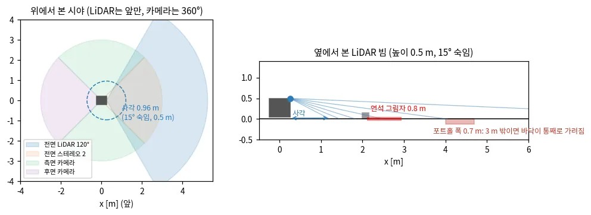
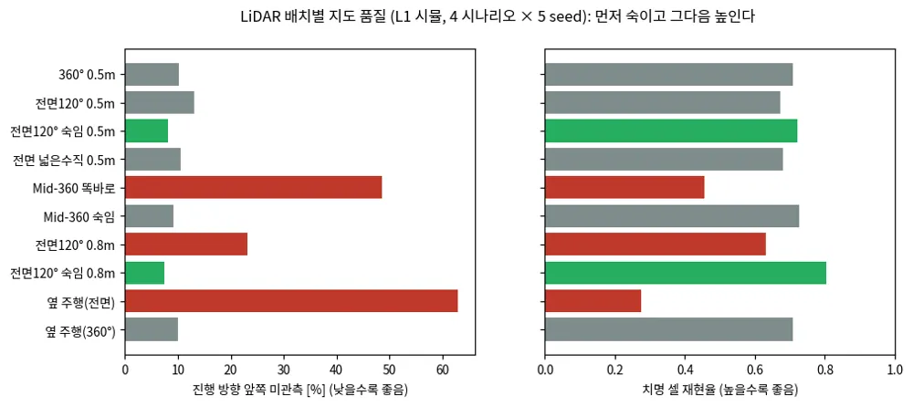
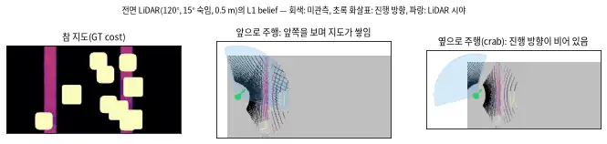

# TP-0060 설계: 낮은 실외 배달로봇의 센서 구성과 인식

**요약.** 배달로봇은 자율주행차와 휴머노이드보다 차체가 낮고, 3D LiDAR가 전면에 하나뿐이다. 그래서 세 가지를 설계 전제로 둔다.
첫째, 낮은 LiDAR는 근거리 사각과 긴 그림자를 만들고, 포트홀은 몇 m만 떨어져도 바닥이 통째로 가려진다. 둘째, 지형 기하는 앞만
관측되고 옆과 뒤는 기억뿐이라, 스워브의 옆·뒤 이동은 "본 곳"으로 제한해야 한다. 셋째, 카메라 다섯 대는 지형보다 사람을 360°로
보는 데 쓰고, 거리는 LiDAR와 전면 스테레오로 잰다. 아래 권장안은 운동학 시뮬의 L1 인식 루프(TP-0053)로 수치를 확인했다.

**한눈에 보기**

- LiDAR는 **먼저 숙이고(아래쪽 시야 끝 25° 이상) 그다음 높인다.** 숙이지 않고 높이면 사각이 커져 오히려 나빠진다.
- 차체가 낮으면 3 m 앞 포트홀 바닥이 통째로 가려진다. **그림자 상한과 깊이 prior는 필수**다.
- 전면 LiDAR 하나라서 **옆·뒤 지형은 기억뿐**이다. 옆으로 가면 진행 방향의 63%가 미관측이 된다.
- 전면 카메라 2대는 **스테레오**로 근거리 사각을 메우고, 측면·후면 카메라는 **사람을 360°로** 본다(IMU 보정 필수).

*그림 — 센서 시야와 LiDAR 빔: 위에서 보면 LiDAR는 앞만, 카메라는 360°를 본다. 옆에서 보면 숙인 LiDAR의 근거리 사각, 연석 그림자, 가려지는 포트홀이 보인다. 출처: travplan `scripts/make_doc_figures.py`*

`docs/prd-p2.md` R-F-005(센서 하드웨어)의 설계 문서다. 이슈 #28.

## 1. 구성과 전제

| 센서 | 개수·위치 | 이 문서의 가정 | 확인이 필요한 값 |
|---|---|---|---|
| 3D LiDAR | 전면 1 | 차체 앞면, 높이 0.4–0.6 m(차체 위 기둥이면 0.8 m) | 모델, 수평·수직 시야각, 채널 수, 장착 높이·기울기 |
| 카메라 | 전면 2 | 스테레오 한 쌍으로 쓸 수 있는 간격 | 시야각, 해상도, 기선, 셔터 방식 |
| 카메라 | 측면 2(좌·우) | 단안 | 시야각, 해상도, 장착 높이 |
| 카메라 | 후면 1 | 단안 | 같음 |
| IMU·휠 오도메트리 | — | 있음 | 사양, 동기화 방식 |

자율주행차는 지붕 위(약 1.8 m)의 회전식 LiDAR가 360°를 보고, 휴머노이드는 머리(1.2–1.7 m)에서 내려다본다. 배달로봇의 센서는
그보다 훨씬 낮고, 전면 하나라서 뒤를 차체가 가린다. 설계의 차이는 대부분 이 두 사실에서 나온다.

## 2. 낮은 장착 높이가 만드는 문제

**근거리 사각.** LiDAR의 가장 아래 빔이 지면에 닿는 거리보다 가까운 곳은 보이지 않는다. 장착 높이 $h$, 아래쪽 시야 끝 각도를 $\theta_{\min}$
(기울기 포함)이라 하면 사각 반경은 $r = h / \tan\theta_{\min}$이다.

| 아래쪽 시야 끝 | 예 | h = 0.4 m | h = 0.5 m | h = 0.8 m |
|---|---|---|---|---|
| 7° | Mid-360형을 똑바로 장착 | 3.26 m | 4.07 m | 6.52 m |
| 12.5° | 수직 ±12.5° 센서 | 1.80 m | 2.26 m | 3.61 m |
| 22.5° | 수직 ±22.5° 센서 | 0.97 m | 1.21 m | 1.93 m |
| 27.5° | ±12.5° 센서를 15° 숙임 | 0.77 m | 0.96 m | 1.54 m |
| 45° | 반구형 근거리 센서 | 0.40 m | 0.50 m | 0.80 m |

사각 안은 기억(이전에 멀리서 본 것)에 의존한다. 제자리 회전 직후나 사람이 바로 앞을 지나간 직후처럼 기억이 없는 곳은 볼 수 없다.

**긴 그림자.** 높이 $H$인 물체가 거리 $d$에 있으면, 그 뒤로 $L = H d / (h - H)$만큼 지면이 가려진다. 3 m 앞 15 cm 연석의 그림자는 h = 0.5 m에서
1.29 m, 0.8 m에서 0.69 m다.

**포트홀은 바닥이 통째로 가려진다.** 깊이 $D$인 구멍은 앞쪽 가장자리 뒤로 $D d / h$만큼이 가려진다. 깊이 12 cm, 3 m 앞이면 h = 0.5 m에서
0.72 m가 가려진다. 폭 0.7 m 포트홀이면 바닥이 하나도 보이지 않고, 그림자로만 드러난다. 그래서 그림자 상한과 깊이 prior(TP-0044,
TP-0047)는 선택이 아니라 필수다.

**카메라 바닥 평면 거리는 낮을수록, 멀수록 틀린다.** 단안 카메라로 사람 발의 행에서 거리를 구하면 오차가 $Z^2 / (f h)$에 비례한다
(리서치 A.12.4). 초점 거리 640 px, 카메라 높이 0.5 m에서 5 m 앞 사람은 1 px에 7.8 cm가 틀린다. 차체가 1° 기울면 4.3–6.1 m로 흔들린다.
IMU로 매 프레임 자세를 보정하지 않으면 측면·후면 카메라의 거리는 쓸 수 없다.

## 3. 센서별 역할

| 센서 | 주 역할 | 부 역할 | 들어가는 곳 | 약점 |
|---|---|---|---|---|
| 전면 3D LiDAR | 지형 기하(elevation mapping), 앞쪽 사람의 거리 | 그림자 상한과 깊이 prior, 가림 원리 이동 검출 | elevation_mapping_cupy → TravMap, 사람 3D 중심 → 추적기 | 근거리 사각, 옆·뒤를 못 봄, 긴 그림자 |
| 전면 카메라 2 | 스테레오 깊이로 근거리 지형(LiDAR 사각을 메움), 사람·자전거 검출 | 젖은 노면·잔디·횡단보도·연석 같은 의미 정보(TravNet 카메라 입력 후보) | 깊이 → elevation mapping 두 번째 입력, 검출 → 추적기 | 역광·야간, 무늬 없는 면 |
| 측면 카메라 2 | 옆에서 오는 사람·자전거·킥보드 검출 | 옆 이동 때 연석·벽까지 거리, 횡단보도 대기 때 차량 | 검출 + 바닥 평면 거리(IMU 보정) → 추적기 | 단안이라 거리 오차가 크다 |
| 후면 카메라 1 | 뒤에서 추월하는 사람·자전거, 후진 | 배송 인계·도킹 | 같음 | 같음 |

스테레오의 거리 오차는 $Z^2 \Delta d / (f B)$다. 기선 12 cm, 초점 640 px, 시차 오차 0.25 px이면 3 m에서 2.9 cm, 5 m에서 8.1 cm다. 5 m 안의
지형과 사람은 스테레오로 충분하고, 그 밖은 LiDAR가 맡는다.

### 근사 사양(2026-10-03, 실제 사양이 오기 전까지 쓰는 값)

사용자 지시(2026-10-03): 하드웨어·사양(TP-0064·0035·0009)은 다음에 정하고, 그때까지 대략적인 값으로 진행한다.
아래 값은 이 문서의 권장 설계(4절)와 저장소에 이미 들어 있는 값이다. 벤치마크 기본값(L0 센서 높이 0.3 m 등)은 바꾸지 않는다. 기준선을 계속 비교할 수 있게 하기 위해서다.

| 항목 | 근사값 | 출처 |
|---|---|---|
| 3D LiDAR | Mid-360급, 수평 360°, 수직 −7°…+52°(뒤집어 달면 −52°…+7°), 10 Hz | 4절 D1, Playground 휴머노이드의 시야(TP-0135) |
| LiDAR 장착 | 전면 기둥 0.8 m, 아래쪽 시야 끝 25° 이상(숙이거나 뒤집음), 사각 약 1 m | 4절 D1 |
| 전면 카메라 2 | 스테레오, 기선 10 cm 이상, 수평 시야 약 90°, 깊이 0.5–5 m | 4절 D2, TP-0065 |
| 측면·후면 카메라 3 | 단안, 수평 시야 약 120°, IMU 보정 바닥 평면 거리 | 4절 D3 |
| 연산 | GPU 내장 보드(Jetson Orin급) | 가정 |
| 차체 | AntBot G50: 축간 0.530 m, 윤거 0.401 m, 바퀴 반지름 0.103 m, 지상고 0.10 m(가정) | `sim/ground_truth.py`(TP-0082) |
| 스워브 모듈 | 모듈 위치 (±0.265, ±0.2005) m, 비동축 오프셋 0.0555 m, 조향 한계 56.2°, 조향 속도 5 rad/s, 바퀴 최대 185 rpm, 구동 지연 0.2 s | `robot/plant.py` `PlantConfig`(TP-0033·0034) |
| 몸체 한계 | 속도 앞 1.5·옆 0.6·회전 1.2(뒤 0.3) m/s·rad/s, 가속 1.0·0.8·2.0 | `robot/swerve.py` `SwerveLimits` |

## 4. 권장 설계

**D1. LiDAR는 근거리 지면이 보이게 단다.** 먼저 숙여서 기울기를 포함한 아래쪽 시야 끝을 25° 이상, 사각 반경을 약 1 m 이하로 만든다.
그다음 차체가 허락하는 한 높이 단다(기둥이 가능하면 0.8 m). 숙이지 않고 높이기만 하면 사각이 커져 오히려 나빠진다(5절). Mid-360처럼 아래쪽
시야가 7°인 센서는 똑바로 달면 h = 0.5 m에서 사각이 4 m이므로, 반드시 숙이거나 뒤집어 단다. 숙이면 먼 곳과 머리 위(나뭇가지, 차단봉)를
덜 보므로, 전면 카메라가 머리 위를 맡는다.

**D2. 전면 카메라 두 대는 스테레오로 묶고 약간 아래를 본다.** 기선은 10 cm 이상으로 한다. 스테레오 깊이를 elevation_mapping의 두 번째
점군 입력으로 넣어 LiDAR 사각(0.5–1.2 m)을 메운다. 운동학 시뮬 L1 루프에서 이 효과를 쟀다(TP-0065, 인식 문서 A.13.8): 스테레오가 앞쪽 근거리 관측 비율을 0.61에서 0.92로 올리고,
"로봇 둘레 못 본 칸을 치명으로"(TP-0101)와 함께 쓸 때 L1의 느려짐(+23%)과 음의 지형 오탐(-58%)을 없앤다. 같은 영상으로 사람·자전거를 검출하고, 스테레오 거리로 LiDAR 거리를 교차 확인한다.
의미 정보(젖은 노면, 잔디)는 TravNet 카메라 입력의 후보다(TP-0022 E4 이후).

**D3. 사람 추적은 로봇 좌표(odom)의 추적기 하나로 한다.** 전면은 LiDAR 거리(수 cm), 전면 5 m 안은 스테레오, 측면·후면은 단안 바닥 평면
거리(IMU 보정)를 쓴다. 측정 잡음은 센서마다 다르게 두고, 단안은 거리 제곱에 비례해 키운다. 마할라노비스 거리로 매칭하므로 사람이
측면 카메라에서 전면 LiDAR 시야로 넘어와도 트랙이 이어진다(리서치 A.12.4 상세). 출력은 지금과 같은 `DynamicObstacles`와 `PedestrianHistory`다.

**D4. 지도는 "앞은 관측, 옆과 뒤는 기억"으로 다룬다.** 마지막으로 관측한 뒤 지난 시간만큼 σ를 키우고, 일정 시간(예: 10 s)이 지나면
미관측으로 되돌린다. 움직인 물체의 흔적은 LiDAR 시야 안에서만 지울 수 있으므로(CMU 스택 방식, 리서치 A.9.1), 시야 밖의 장애물은
시간으로 지운다. 사람은 정적 지도에 쌓지 않고 `DynamicObstacles`로 따로 다룬다.

**D5. 움직임은 센서가 보는 쪽으로 한다.** 스워브는 옆과 뒤로 갈 수 있지만, 그쪽 지형은 기억뿐이다. Controller에 "관측이 오래된 칸으로,
LiDAR 시야 밖 방향으로 들어가는" 움직임에 비용을 주는 항을 더한다(`control/mppi/costs.py`의 `CostTerm`). 옆·뒤 이동은 최근에 본 칸에서만
허용하고 속도를 0.3 m/s 이하로 둔다. 지금 `SwerveLimits`는 옆 0.6 m/s, 뒤 0.3 m/s다. Planner D의 관측에는 이미 σ 채널이 있으므로, D4의 σ가
관측 나이를 반영하면 Planner도 같은 정보를 받는다.

**D6. 속도는 음의 장애물을 믿고 볼 수 있는 거리로 제한한다.** 감속도 $a$, 인식·계획 지연 $t$, 여유 $m$에서 최고 속도는
$v t + v^2 / (2a) + m \le d_{\text{det}}$을 만족해야 한다. $a$ = 1.0 m/s²(`SwerveLimits`), $t$ = 0.3 s, $m$ = 0.3 m이면 탐지 거리 1.0, 1.5,
2.0 m에서 최고 속도는 0.92, 1.28, 1.57 m/s다. 낮은 LiDAR에서 포트홀은 그림자로만 보이므로, 탐지 거리는 깊이 prior가 치명 링을 만드는
거리다.

**D7. 보정, 동기화, 중력 정렬을 먼저 한다.** 센서 여섯 개의 외부 보정과 하드웨어 시간 동기화(PTP나 트리거)를 둔다. elevation mapping
전에 IMU로 중력 정렬한다(리서치 A.8, "움직이는 플랫폼에서는 먼저 중력 정렬"). 낮은 센서는 흙탕물이 잘 튀므로, LiDAR 근거리 점의 이상과
영상 흐림으로 창 오염을 스스로 점검한다.

## 5. 시뮬 검증 (운동학 시뮬 L1, 4 시나리오 × 5 seed)

합성 LiDAR(`sim/lidar.py`)에 수평 시야(`hfov_deg`), 기울기(`pitch_deg`), 전방 장착 오프셋(`mount_x_m`)을 더했다. GT 경로를 1 m/s로
주행하며 진행 방향 앞쪽 반원(반경 3 m)의 지도 품질을 잰다(`scripts/eval_map_quality.py --region ahead`). 전면 센서는 로봇 중심에서
0.25 m 앞에 둔다.

*그림 — LiDAR 배치별 지도 품질: 빨강은 미관측이 20%를 넘는 구성(숙이지 않은 0.8 m, 똑바로 단 Mid-360, 전면 센서로 옆 주행), 초록은 9% 미만인 구성이다. 출처: travplan `scripts/make_doc_figures.py`*

*그림 — 전면 LiDAR로 앞으로 갈 때와 옆으로 갈 때 쌓이는 belief(애니메이션): 옆으로 가면 진행 방향이 계속 회색(미관측)으로 남는다. 출처: travplan `scripts/make_doc_figures.py`*

진행 방향 앞쪽의 미관측 비율과 치명 셀 재현율이다. 괄호 안은 매퍼 상한 + 깊이 prior를 켠 값이다.

| 구성 | 높이 | 아래쪽 시야 끝 | 사각 반경 | 미관측 | 치명 재현율 |
|---|---|---|---|---|---|
| 360°, ±22.5°(차체 위 중앙, 기준) | 0.5 m | 22.5° | 1.21 m | 10.1% | 0.71 (0.73) |
| 전면 120°, ±12.5° | 0.5 m | 12.5° | 2.26 m | 13.1% | 0.67 (0.72) |
| 전면 120°, ±12.5°, 15° 숙임 | 0.5 m | 27.5° | 0.96 m | **8.1%** | 0.72 (**0.75**) |
| 전면 120°, ±45°(넓은 수직 시야) | 0.5 m | 45° | 0.50 m | 10.5% | 0.68 (0.71) |
| 전면 Mid-360형(220°, −7°~+52°), 똑바로 | 0.5 m | 7° | 4.07 m | **48.5%** | **0.46** (0.46) |
| 전면 Mid-360형, 20° 숙임 | 0.5 m | 27° | 0.98 m | 9.2% | 0.73 (**0.76**) |
| 전면 120°, ±12.5° | 0.8 m | 12.5° | 3.61 m | **23.1%** | **0.63** (0.63) |
| 전면 120°, ±12.5°, 15° 숙임 | 0.8 m | 27.5° | 1.54 m | **7.4%** | **0.80 (0.82)** |
| 옆 주행(crab): 전면 120°, 15° 숙임 | 0.5 m | 27.5° | — | **63.0%** | **0.28** (0.29) |
| 옆 주행(crab): 360° | 0.5 m | 22.5° | — | 10.1% | 0.71 (0.74) |

1. **높이는 숙일 때만 도움이 된다.** 수직 ±12.5° 센서를 숙이지 않고 0.8 m로 올리면 사각이 3.6 m가 되어 오히려 나빠진다(재현율 0.63).
   15° 숙이면 0.8 m가 가장 좋다(0.80, 상한·깊이 prior와 함께 0.82).
2. **Mid-360형을 똑바로 달면 앞쪽 절반을 못 본다.** 20° 숙이면 360° 센서보다 낫다.
3. **넓은 수직 시야는 사각을 없애지만 채널이 퍼져 재현율 이득은 작다.** 같은 채널 수라면 숙이는 쪽이 낫다.
4. **전면 센서로 옆 주행하면 진행 방향의 63%를 못 본다**(재현율 0.28). 360° 센서는 영향이 없다. D5의 근거다.

**폐루프**(4 시나리오 × 10 seed, 높이 0.5 m, 상한 + 깊이 prior):

| 구성 | guidance+mppi | planner_d+mppi |
|---|---|---|
| 360°, ±22.5° | 40/40 | 39/40 |
| 전면 120°, ±12.5°, 15° 숙임 | 40/40 | 37/40 |
| 전면 Mid-360형, 20° 숙임 | 38/40 | 39/40 |

권장대로 숙인 전면 센서는 360° 센서와 비슷한 성공률을 낸다. 실패는 대부분 bumps_potholes다. 벤치마크의 Planner들은 거의 앞으로만 가서
옆 주행 문제는 폐루프에 드러나지 않았다. 옆·뒤 이동이 많은 시나리오(좁은 통로 비켜서기, 도킹)는 TP-0062에서 따로 만든다.
결과: `results/tp0060/`.

## 6. travplan에 반영할 것

| 항목 | 내용 | TODO |
|---|---|---|
| 합성 센서 배치 | 전면 LiDAR 시야·기울기·오프셋(이번에 추가), 카메라 다섯 대의 시야와 거리 오차 모델 | TP-0061 |
| 관측 나이와 시야 인지 움직임 | σ 나이 반영(D4), 시야 밖·오래된 칸으로 가는 움직임 비용(D5), 탐지 거리 속도 제한(D6) | TP-0062 |
| 카메라 거리 | 단안 바닥 평면 거리의 IMU 보정과 센서별 측정 잡음, 추적기 하나로 합치기(D3) | TP-0063 |
| 스테레오 지형 | 전면 스테레오 깊이를 elevation mapping 두 번째 입력으로(D2, Isaac 카메라) | TP-0065 |
| 센서 사양 | LiDAR 모델·시야각·장착 높이·기울기, 카메라 시야각·해상도·기선, 연산 장치 | TP-0064(사용자) |
