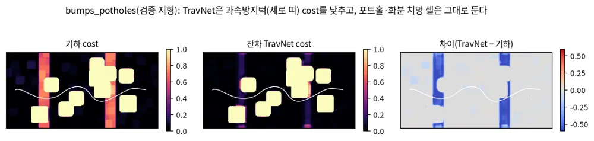

# TP-0010 설계: TravNet 자기지도 학습

**요약.** TravNet은 사람 라벨 없이, 로봇이 실제로 지나가며 몸으로 느낀 것(proprioception)으로 traversability를 배운다. 로봇
발자국 아래 칸에만 "느낀 난이도"를 라벨로 붙이고, 지나가지 않은 칸은 학습에서 뺀다. 운동학 시뮬에서 측정해 보니 **라벨이 지도의
6–9%에만 붙고, 힘든 곳 라벨은 0–7%뿐**이었다. 좋은 Planner가 위험한 곳을 피하기 때문이다. 이 편향(PU 문제)을 푸는 것이 설계의
핵심이다.

**한눈에 보기 (TP-0022 결과, 2026-09-27)**

- 240 에피소드의 proxy 라벨로 **기하 cost 위의 잔차**를 학습했다. 폐루프에서 기하보다 나빠지지 않았다(40/40, 39–40/40).
- 라벨은 **로봇 중심 칸**에 붙여야 cost의 의미와 맞는다(상관 0.63 → 0.78).
- proxy는 **과속방지턱을 편하다고 느껴** 그곳 cost를 낮춘다. 2026-10-03에 **기본은 잔차가 cost를 올리는 쪽만** 허용하기로 정했다(TP-0057, 구현 대기).
  학습은 기본으로 기하가 놓친 위험을 더하는 데만 쓴다. 낮추는 쪽(TNT식 "넘을 수 있는 곳 찾기")은 선택 실험으로 두고, 치명이 늘지 않는지로 판정한다.

`docs/prd-p2.md` R-F-002·R-NF-002의 설계 문서다. 코드는 `travplan/representation/self_supervised.py`, 테스트는
`tests/test_self_supervised.py`에 있다.

## 1. 목표와 제약

- **사람 라벨을 쓰지 않는다.** 라벨은 로봇이 느낀 proprioception에서만 얻는다(WVN, V-STRONG, ScaTE 계열).
- **새 프로토콜을 만들지 않는다.** 학습한 네트워크는 기존 `LearnedTraversability`(`TraversabilityEstimator` 구현체)로 `TravMapBuilder`에
  꽂는다. TravMap의 cost·σ 채널 의미는 그대로다.
- **라벨 출처를 단계적으로 바꿀 수 있어야 한다.** 운동학 시뮬(지금) → Isaac Sim 폐루프 → 실물 로봇 순서이고, 어느 단계든 호출은
  `FootprintLabeler.add(pose, cost)` 하나다.

## 2. 파이프라인

```
 주행 로그 (pose, roll, pitch, z / IMU, 바퀴 odom, 실패 이벤트)
        ▼
 ProprioProxy ── 스텝마다 "느낀 난이도" c ∈ [0, 1]
        ▼
 FootprintLabeler ── 발자국 아래 칸에 max(c)를 누적, 방문 횟수로 신뢰도 w
        │               (지나가지 않은 칸은 w = 0 → 학습에서 제외)
        ▼
 masked_heteroscedastic_loss(TravNet(특징), 라벨, w)
        ▼
 LearnedTraversability → TravMapBuilder → Planner·Controller (변경 없음)
```

### 2.1 "느낀 난이도"를 어디서 얻나 (`ProprioProxy`)

| 단계 | 신호 | 구현 |
|---|---|---|
| 운동학 시뮬(지금) | 차체 roll/pitch ÷ 전복 한계, 차체 높이의 2차 차분(수직 가속) ÷ 4 m/s², 실패 이벤트 = 1 | `KinematicProprioProxy` |
| Isaac Sim | IMU 수직 가속 + 모듈별 바퀴 슬립(명령 속도 대 odom) + 접촉·전복 이벤트 | 예정, 같은 `add()` 호출 |
| 실물 | 위와 같음 + 모터 전류(선택) | 같음 |

**시뮬의 `StepInfo.gt_cost`는 라벨로 쓰지 않는다.** 그 값은 기하 추정기의 출력이라, 그걸로 학습하면 기준선을 다시 배울 뿐이다. 이
파이프라인의 목적은 **기하 특징만으로는 모르는 것**을 배우는 데 있다. 미끄러운 면이나 부드러운 잔디처럼, 기하로는 평평하지만 실제로는
힘든 곳이다.

### 2.2 칸 단위 집계 규칙

- **최댓값으로 모은다.** 연석을 한 번 느꼈다면 그 칸은 연석이다. 나중에 윗면을 평탄하게 지나가도 평균으로 희석되지 않는다.
- **방문 횟수로 신뢰도를 준다.** `w = 1 − exp(−count/2)`, 1회 방문이면 약 0.4, 5회면 약 0.9다.
- **지나가지 않은 칸은 `w = 0`이다.** "모른다"는 뜻이지 "안전하다"는 뜻이 아니다.

### 2.3 손실: 라벨된 칸만 보는 heteroscedastic NLL

`0.5·exp(−s)·(σ(logit) − y)² + 0.5·s`에 가중치 `w`를 곱해 라벨된 칸에서만 평균한다(s는 `log_var`).

**`log_var`에 하한 −6(σ ≈ 0.05)을 둔다.** 시뮬 라벨처럼 노이즈가 거의 없으면 NLL이 `log_var → −∞`로 발산한다. 실제로 Adam 150스텝 안에
NaN이 났다. 하한을 둔 뒤 seed 0–3 모두에서 라벨된 칸 정확도가 90%를 넘는다.

## 3. 운동학 시뮬에서 측정한 라벨 통계

**처음 측정(guidance+mppi, seed 0, 에피소드 하나).** 설계 당시의 값이다.

| 시나리오 | 스텝 | 라벨된 칸 비율 | c > 0.3 스텝 비율 | corr(칸 라벨, GT cost) |
|---|---|---|---|---|
| curb_ramp | 206 | 9.2% | 2.4% | 0.50 |
| bumps_potholes | 108 | 6.1% | 7.4% | 0.62 |
| slope_crossfall | 117 | 6.7% | 0.0% | 0.25 |
| random_mix | 139 | 7.0% | 0.0% | 0.04 |

(측정 당시 이름은 MPPI3D였다. 지금의 guidance+mppi 스택과 같다.)

**다시 측정(TP-0022, 240 에피소드).** 4 시나리오 × 학습 지형 30개(seed 100–129, 벤치마크 seed 0–9와 겹치지 않음) × 수집 정책 2개다
(`scripts/collect_travnet_labels.py`). 같은 주행에서 proxy 여섯 가지와 발자국 두 가지로 라벨을 만들었다. 아래는 base 정책, 수직 가속
기준 8 m/s²의 값이다.

| proxy | 발자국 | 라벨된 칸 | 라벨 > 0.3 | corr 전체 | corr random_mix | corr slope_crossfall |
|---|---|---|---|---|---|---|
| center_a8(몸통 중심 proxy) | body 0.5 × 0.4 m | 6.8% | 4.4% | 0.63 | 0.44 | 0.23 |
| center_a8 | center 0.1 × 0.1 m | 1.9% | 2.3% | **0.75** | **0.62** | 0.17 |
| wheel_a8(바퀴 proxy) | body | 6.8% | 5.1% | 0.60 | 0.41 | 0.14 |
| wheel_a8 | center | 1.9% | 2.9% | **0.78** | **0.60** | 0.13 |

1. **커버리지는 여전히 좁다.** body 발자국으로 에피소드 하나가 지도의 약 7%를 라벨한다. center 발자국은 약 2%다.
2. **힘든 곳 라벨이 드물다.** 라벨 > 0.3인 칸은 2–5%다. PU 편향은 그대로 핵심 위험이다.
3. **random_mix의 낮은 상관은 에피소드 하나의 잡음이었다.** 240 에피소드에서는 0.30(수직 가속 기준 4 m/s²)–0.62다. 수직 가속 항을
   둔하게 할수록(4 → 8 m/s²) 평지의 잡음 라벨이 줄어 상관이 오른다.
4. **발자국은 cost의 의미에 맞춰야 한다.** TravMap의 특징은 로봇 반경만큼 팽창하므로, 한 칸의 cost는 "로봇 중심이 그 칸에 있을 때"의
   비용이다. body 발자국은 로봇 중심이 위험 둘레 바깥에 있어도 발자국 가장자리가 둘레 칸을 덮으면 "편했다"는 라벨을 붙인다. center
   발자국으로 바꾸자 상관이 0.60–0.63에서 0.75–0.78로 올랐다.
5. **slope_crossfall은 상관이 낮다.** 라벨된 칸의 GT cost가 거의 일정해서(경사 비용) 상관이 작게 나온다.

## 4. PU 문제와 편향에 대한 대응

| 문제 | 대응 | 근거 |
|---|---|---|
| 힘든 곳 라벨이 드물다 | 수집 때 **탐색 정책을 섞는다.** MPPI 비용 가중치를 낮춘 버전과 무작위 목표로 위험 근처를 일부러 지나간다(시뮬에서만). 앙상블 불일치가 큰 곳을 찾아가는 능동 탐색도 후보다 | 시뮬에서는 실패 비용이 없다. RSS 2023 Bridging(`research-controller.md` §E). 효과는 작았다(5절 E2) |
| 지나가지 않은 칸 | `w = 0`으로 학습에서 빼고, 추론 때 σ를 높게 둔다 | 모르는 곳을 안전하다고 배우지 않도록 |
| 지나가지 않은 칸에서의 과신 | **PU loss 후보**: 지나간 칸은 양성, 나머지는 라벨 없음으로 두는 PU learning(ScaTE), 또는 one-class 분류(Self-Supervisions Only) | 같은 문제를 먼저 푼 오프로드 연구(§A.10) |
| 기하 prior 유지 | TravNet 출력 = 기하 cost + 학습한 **잔차**(`ResidualTraversability`). 라벨이 없는 곳은 잔차 L2로 기하 cost 쪽에 묶는다 | 첫 배포 때 성능 후퇴를 막는다 |
| proxy와 기하 cost의 척도가 다르다 | 기하 cost가 중간인 곳(과속방지턱)을 proxy는 편하다고 느낀다. 잔차가 그곳 cost를 낮춘다. **선택지**: 잔차를 올리는 쪽으로만 허용(`cost = max(기하, 학습)`), 또는 proxy에 화물 충격(수직 가속·jerk)을 넣어 척도를 맞춘다 | 5절 E3, 설계 결정 필요 |
| 시뮬 → 실물 분포 차이 | 실물에서도 같은 labeler로 온라인 미세조정(WVN 방식). 우선은 오프라인 배치 | P3 이후 |

## 5. 실험 결과 (TP-0022, 2026-09-27)

**E1 proxy 튜닝 — 목표(random_mix 0.3 이상)를 넘었다.** 3절 표와 같다. 수직 가속 기준을 8 m/s²로 두고, 발자국은 center로 한다.
몸통 중심 proxy와 바퀴 proxy의 차이는 작았다. 바퀴 proxy는 한 바퀴가 턱을 떨어지는 순간을 잡으므로 Isaac(바퀴별 접촉과 슬립)으로
옮기기 쉽다.

**E2 수집 정책 — 탐색 정책의 효과는 작았다.** 무작위 목표 + 지형 비용 가중치 0.2배의 탐색 정책에서, 힘든 곳 라벨 비율은 조금 올랐다
(바퀴 proxy, 가속 기준 4 m/s²: 8.9% → 10.1%). 목표가 가까워져 에피소드당 커버리지는 6.8%에서 5.1%로 줄었고, 실패율은 1%였다.
학습에는 두 정책의 데이터를 함께 쓴다.

**학습 — 느낀 난이도는 잘 맞히고, 치명 셀 순서는 그대로다.** 잔차 TravNet(`scripts/train_travnet.py`)을 3,000 반복 학습했다. 검증은 학습에
쓰지 않은 지형 seed 124–129다.

| 모델 | 라벨 MAE: 기하 → 잔차 | GT 치명 셀 AUROC: 기하 → 잔차 | 라벨 없는 칸의 cost 이동 |
|---|---|---|---|
| center_a8, body 발자국 | 0.062 → 0.025 | 0.999 → 0.999 | 0.034 |
| center_a8, center 발자국 | 0.050 → 0.013 | 0.999 → 0.999 | 0.032 |
| wheel_a8, center 발자국 | 0.049 → 0.015 | 0.999 → 0.999 | 0.031 |


*그림 — 검증 지형(bumps_potholes)의 기하 cost, 잔차 TravNet cost, 차이. 파란 세로 띠가 과속방지턱이고, 흰 선은 수집 주행 경로다. 출처: travplan `scripts/make_doc_figures.py`*

잔차는 기하 cost가 0.3–0.95인 칸의 cost를 평균 0.2–0.3 낮춘다. 발자국을 center로 바꿔도 같았다. 시나리오별로 보면 bumps_potholes에서
가장 크고(평균 −0.51), 그 칸의 중간 cost는 거의 모두 턱 특징에서 온다. 과속방지턱(높이 5 cm)은 기하 추정기에 cost 약 0.46이지만,
proxy(가속 기준 8 m/s², 전복 한계 대비 자세)에는 편하다. 경사가 만드는 중간 cost는 거의 그대로다(−0.09~−0.18).

**E3 폐루프 — 기하보다 나빠지지 않았다(통과).** 4 시나리오 × 10 seed, L0 기본 인식이다.

| belief의 traversability | guidance+mppi | planner_d+mppi | 평균 gt_cost | 결과 |
|---|---|---|---|---|
| 기하(기준) | 40/40 | 39/40 | 0.020, 0.019 | `results/tp0027_static` |
| 잔차 center_a8, body 발자국 | 40/40 | 39/40 | 0.025, 0.023 | `results/tp0022/e3_center_a8` |
| 잔차 wheel_a8, body 발자국 | 40/40 | 39/40 | 0.024, 0.023 | `results/tp0022/e3_wheel_a8` |
| 잔차 center_a8, center 발자국 | 40/40 | 40/40 | 0.025, 0.024 | `results/tp0022/e3_center_a8_ctr` |
| 잔차 wheel_a8, center 발자국 | 40/40 | 39/40 | 0.025, 0.022 | `results/tp0022/e3_wheel_a8_ctr` |

실패는 기하 기준선과 같은 bumps_potholes seed 6의 시간 초과 하나뿐이다. 평균 gt_cost가 0.020에서 0.025로 오른 것은 로봇이 과속방지턱을
더 과감하게 넘기 때문이다. 성공률에는 영향이 없지만 화물 충격은 커진다. 이것이 4절의 척도 차이 문제다.

**E4 Isaac Sim — 남았다.** 마찰만 다른 패치(기하로는 평평함)를 `sim/terrain.py`에 더하고, 슬립 proxy로 학습한 TravNet이 그 패치를
돌아가는지 본다. Isaac 폐루프(TP-0005)가 선행이다.

## 6. 현재 상태

- **완료**: 라벨러, 운동학 proxy 두 종(몸통 중심, 바퀴), 주행 기록에서 라벨 만들기(`label_drive`, 발자국 선택), 라벨된 칸 손실
  (+`log_var` 하한), 잔차 추정기(`ResidualTraversability`), 수집·학습 스크립트, E1–E3, `run_benchmark.py --trav-ckpt`.
- **결정 필요**: 잔차가 cost를 낮추는 것을 허용할지(4절). 올리는 쪽만 허용하면 기하가 아는 위험은 그대로 두고, 기하가 모르는 것(슬립,
  부드러운 지면)만 더한다. 운동학 시뮬에서는 거의 효과가 없어지고, Isaac(E4)에서 의미가 생긴다.
- **남은 것**: E4(Isaac 마찰 패치, 슬립 proxy), 학습 추론 속도(지금은 매 스텝 전체 지도를 CPU로 추론한다).
