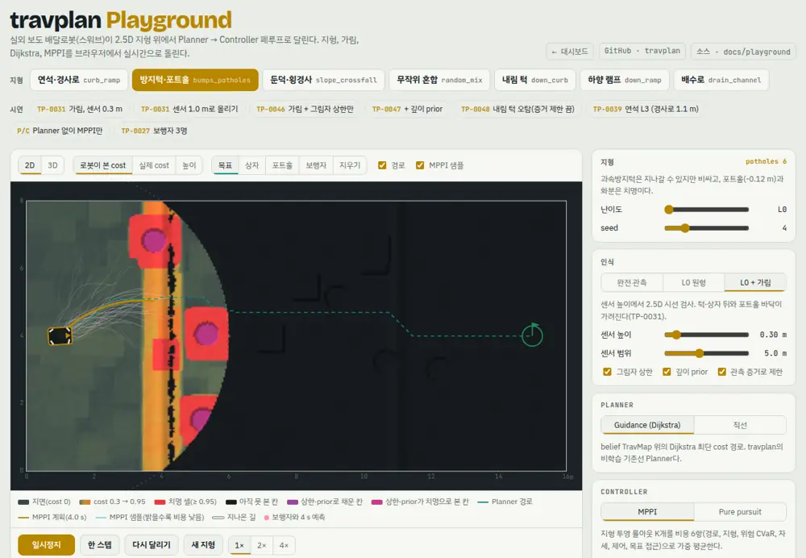

# travplan Playground

travplan의 운동학 시뮬레이터를 JS로 옮겨 브라우저에서 실시간으로 돌리는 페이지다. 지형, TravMap, 2.5D 가림, Dijkstra Planner,
MPPI Controller, 스워브 운동학이 한 폐루프로 돈다. 목표와 장애물을 지도에 직접 놓고, 인식·Planner·Controller 설정을 바꿔 가며 본다.

**열기:** <https://geonhee-lee.github.io/travplan-site/playground/>



## 1. 여는 곳

| 곳 | 주소 | 비고 |
|---|---|---|
| 공개 사이트 (GitHub Pages) | <https://geonhee-lee.github.io/travplan-site/playground/> | 연구 저장소 main의 `docs/`가 바뀌면 사이트 저장소로 자동 동기화된다 |
| 대시보드 '시뮬레이션 ▶' 탭 | <https://geonhee-lee.github.io/travplan-site/dashboard.html#sim> | 대시보드 안에서 바로 돈다 |
| 로컬 | `./scripts/open_dashboard.sh` 뒤 '시뮬레이션' 탭, 또는 <http://127.0.0.1:8765/playground/> | `docs/`를 http로 띄운다 |
| claude.ai 게시본 | <https://claude.ai/artifact/CTrLTsS1V5VtWzisHbFv5J> | 비공개, 소유자·공유받은 사람만 |

`file://`로 열면 돌지 않는다. ES 모듈은 http로만 불러온다.

**주소 하나가 화면 하나다.** 주소 해시(`#` 뒤)에 설정 전체가 담기고, 같은 코어 버전이면 그 주소를 새 탭에서 열어도 같은 주행이 나온다. 꼴은 셋이다.

```
#TP-0047                                   시연 그대로(대시보드의 ▶ 시뮬레이션 링크)
#TP-0047?v=2d&layer=belief_elev            시연 + 덮어쓰기
#pg?sc=bumps_potholes&s=4&per=range        사용자 설정(기본값과 같은 키는 생략)
```

- `#TP-0031`처럼 TP 번호만 쓰면 그 TP의 첫 시연(`TP-0031-low`)을 연다. 옛 링크는 그대로 열린다.
- 설정을 바꾸면 0.3 s 안에 주소가 바뀐다. 층·보기와 지형을 다시 만드는 조작은 바로 쓰고, 나머지는 마지막 조작 0.2 s 뒤에 쓴다. `history.replaceState`라 브라우저 기록은 늘지 않는다. 주소를 손으로 고치면 그 설정으로 다시 연다.
- 담는 것은 `defaultOptions()`의 모든 값, 층, 보기, 목표, 시작 전 보행자와 지형 편집이다. 카메라·배속·재생 시각은 담지 않는다.
- 첫 스텝 뒤에 바꾼 MPPI 값·목표·보행자·지형 편집은 그 주행의 주소에 담지 않는다. 그 주행의 기록 행에 '주행 중 변경'을 달고, 주행이 끝나면 주소가 다음 주행의 설정이 된다.
- 값은 허용 목록과 범위로 자른다. 모르는 키와 값은 기본값(시연이면 시연 값)으로 두고 지도 왼쪽 아래에 알린다.
- `cv`는 코어 버전 키다(6절). 결과를 바꾸는 키가 있을 때만 붙는다. 다른 `cv`의 링크를 열면 "다른 코어 버전에서 만든 링크라 결과가 다를 수 있다"고 알린다.
- **링크 복사**는 공개 Playground 주소(<https://geonhee-lee.github.io/travplan-site/playground/>)로 링크를 만든다. claude.ai 게시본과 대시보드 탭(iframe) 안에서는 페이지 주소가 틀 주소라서다.
  로컬 서버나 공개 사이트를 바로 열었으면 그 주소를 쓴다. 클립보드가 막히면 주소를 선택된 입력칸으로 보인다. claude.ai 게시본에서 클립보드가 되는지는 확인하지 못했다.

| 키 | 뜻 | 값 |
|---|---|---|
| `sc`, `lv`, `s` | 시나리오, 난이도 레벨, seed | 시나리오 이름, 0–3, 0–19 |
| `rb`, `pc`, `pn` | 로봇, 자세 보상, 자세 추정 잡음 | `swerve`·`quadruped`·`wheelLeg`, 0·1, 0–3° |
| `per`, `sh`, `sr` | 인식, 센서 높이, 센서 범위 | `gt`·`range`·`occlusion`·`l1lite`, 0.2–1.2 m, 3–8 m |
| `ceil`, `dp`, `ev`, `st` | 그림자 상한, 깊이 prior, 관측 증거 제한, 전면 스테레오 | 0·1 |
| `un`, `unc` | 근거리 미관측 반경, 그 칸의 cost | 0–2 m, 0–1 |
| `pl`, `co` | Planner, Controller | `guidance`·`straight`, `mppi`·`tracker` |
| `K`, `T`, `lam`, `nz` | MPPI 샘플 수, 지평(스텝), 온도 λ, 탐색 잡음 배율 | 슬라이더의 범위와 눈금 |
| `wt`, `wr`, `wa` | MPPI 지형·위험·자세 가중 | 슬라이더의 범위와 눈금 |
| `goal`, `ped`, `ed` | 목표, 시작 전 보행자, 지형 편집 | 지도(16 × 8 m) 안의 `x,y` · `x,y,vx,vy;…`(100명까지, 3 m/s 이하) · `b,x,y;p,x,y;e,x,y`(상자·포트홀·지우기, 적용 순서, 1000곳까지) |
| `v`, `layer` | 보기, 지도 층 | `2d`·`3d`, 층 이름(`belief_elev` 등) |
| `cv` | 코어 버전 키 | 8자 |

## 2. 화면

| 영역 | 하는 일 |
|---|---|
| 지형 탭 | 시나리오 4개(`curb_ramp`, `bumps_potholes`, `slope_crossfall`, `random_mix`)와 음의 지형 3개(`down_curb`, `down_ramp`, `drain_channel`) |
| 시연(한 줄) | 저장소 결과를 그 설정 그대로 다시 달린다(아래 3절). 묶음은 가림·인식, 로봇·자세, 지형·차체, 스택·보행자다. 켜진 칩을 강조하고(`aria-pressed`), 결과를 바꾸는 설정이 시연과 달라지면 '수정됨'을 단다. '카드로 보기'는 시연마다 볼 것·이 페이지 결과·저장소 결과·비교 상대를 펼친다 |
| 지도 | 3D(three.js, 기본) 또는 2D. WebGL을 쓸 수 없거나 three.js를 받지 못하면 2D로 연다. 층은 아래 표에서 고른다. 재생 막대가 첫 화면에 들도록 지도 높이를 화면에 맞춘다 |
| 재생 막대(지도 바로 아래) | 재생·한 스텝·다시 달리기·새 지형·배속·링크 복사와 텔레메트리 |
| 클릭 도구(2D 보기) | 목표, 상자(0.8 m, 0.4 m 높이), 포트홀(반경 0.35 m, 깊이 0.12 m), 보행자(끌어서 방향·속도), 지우기(원래 지형으로). 찍은 좌표는 1 cm로 맞춘다 |
| 오른쪽 패널 | 맨 위는 켜진 시연의 카드(볼 것, 기대 결과, 바꾼 것, 비교 상대, 되돌리기). 시연 카드에는 JS 재구성이라 지형이 Python과 다르다는 말을 붙인다. 그 아래 난이도 레벨 0–3, seed, 로봇(스워브·사족 보행·바퀴 사족, 자세 보상, 자세 추정 잡음), 인식(완전, L0 원형, L0 가림, L1 간이, 센서 높이·범위, 그림자 상한, 깊이 prior, 관측 증거 제한, 근거리 미관측), Planner, Controller와 MPPI 파라미터 |
| 아래 | MPPI 비용 6항(가장 좋은 샘플), 주행 기록 10회(행마다 MPPI 요약과 주소, 행을 누르면 그 설정으로 다시 달린다, CSV 내보내기), 커서 위치의 높이·경사·턱·cost, 실시간 배율 |

키보드: Space 재생·일시정지, `r` 다시 달리기, `n` 새 지형.

**지도 층.** 같은 지도를 세 단계로 나눠 본다. 로봇이 무엇을 보고(elevation mapping), 그것을 어떻게 비용으로 바꾸고(traversability),
그 비용이 차체 기준과 얼마나 맞는지(차체 기하 기준)를 한 화면에서 비교한다. 커서를 올리면 그 칸의 값이 모두 나온다.

| 분류 | 층 | 무엇 |
|---|---|---|
| 지형 | 실제 높이 | 시뮬레이터의 참 지형. 로봇은 모른다 |
| elevation mapping | 로봇이 본 높이 | 관측을 칸마다 융합한 높이. 못 본 칸은 비어 있다 |
| | 높이 분산 σ | L1 간이는 칼만 융합의 표준편차, L0는 관측 잡음 1 cm |
| | 상한(upper bound) | 못 본 칸 위를 지나간 시선·레이의 가장 낮은 높이(TP-0044) |
| traversability | 경사·턱·거칠기 | cost의 재료. 한계(15°, 8 cm, 4 cm)의 비율로 칠한다 |
| | 로봇이 본 cost | Planner·Controller가 쓰는 지도 |
| | 실제 cost | 같은 식을 참 지형에 적용한 것(저장소의 'GT cost', TP-0082의 순환) |
| | 차체 기하 기준 | cost 식과 독립인 기준(TP-0082). 칸마다 방위각 8개로 AntBot 차체를 세워 자세·바퀴 들뜸·배 밑 간섭을 본다. 층을 처음 고를 때 한 번 계산한다(약 1 s) |

**L1 간이 인식.** 합성 LiDAR(16채널, 수직 ±15°, 10° 숙임, 수평 1°)의 레이를 지형 위로 진행시켜 처음 부딪힌 점을 얻는다.
점마다 칸 높이를 칼만으로 융합하고 분산을 유지한다. 지형에 닿기 전에 칸 위를 지나간 레이 높이는 상한이 된다. 파란 점이 마지막 스캔이다.
LiDAR 링 사이와 근거리(약 0.6 m 안)가 비어, 로봇 1.5 m 안의 미관측이 L0 가림(최대 약 120칸)보다 열 배 넘게 많다(약 1,400칸). TP-0100이 L1에서 본 것과 같은 모습이다.

**전면 스테레오(TP-0065).** L1 간이에서 '전면 스테레오'를 켜면 로봇 앞 0.25 m에 달린 스테레오 카메라(90°×60°, 30° 숙임, 기선 12 cm)의 깊이를
같은 칼만 융합에 넣는다. 깊이 잡음은 $Z^2 \Delta d/(fB)$로 3 m에서 2.9 cm다. LiDAR의 근거리 사각(약 0.7 m 안)과 링 사이를 앞쪽에서 메운다.
근거리 미관측 1.5 m와 함께 켜면 L1 간이의 느려짐이 거의 사라진다(bumps_potholes 39.0 s → 17.6 s, down_curb 44.2 s → 17.6 s).

**로봇 종류와 몸체에 붙은 센서(TP-0102).** 로봇을 스워브·사족 보행·바퀴 사족 중에서 고른다. 로봇마다 속도·가속 한계, traversability 한계(턱·경사·거칠기), 전복 한계, 센서 높이가 다르다.
LiDAR와 스테레오는 몸체에 붙어 있어서 몸체 자세를 따라 움직인다. 몸체 자세는 지형 기울기(앞뒤 ±0.3 m, 좌우 ±0.2 m 접지 높이차)에 걸음새 흔들림을 더한 것이다.
사족 보행은 2.2 Hz 트롯으로 2 cm 위아래, 2–3° pitch·roll 흔들리고, 바퀴 사족은 그 약 1/3이다. 매퍼는 레이가 부딪힌 거리를 **자신이 믿는 자세**로 세계에 놓는다.

- **자세 보상 켬**(기본): 매퍼가 IMU·다리 기구학으로 참 자세를 안다. '자세 추정 잡음'은 그 추정의 pitch·roll σ다(1°당 높이 5 mm, 시정수 약 1 s로 천천히 변한다).
- **자세 보상 끔**: 매퍼는 yaw와 지면 높이만 안다. 몸체가 수평이고 흔들리지 않는다고 믿는다.
- '높이 오차(본 − 실제)' 층과 텔레메트리의 '높이 오차'(로봇 3 m 안 관측 칸의 RMSE), '거짓 치명'(로봇 지도는 치명인데 실제로는 아닌 칸) 수로 매핑 품질을 본다.

L1 간이, 시나리오 3개(curb_ramp s0, bumps_potholes s4, slope_crossfall s0)에서 잰 결과:

| 로봇 | 자세 보상 | 추정 잡음 0.25° | 0.5° | 1° | 보상 끔 |
|---|---|---|---|---|---|
| 스워브 | 2/3, RMSE 0.7–0.9 cm | 2/3 | 0/3 | 0/3 | 1/3 |
| 사족 보행 | **3/3**, 0.8–1.6 cm, 거짓 치명 평균 0–93칸 | 3/3 | 3/3 | 2/3 | 0/3 |
| 바퀴 사족 | **3/3**, 0.8–1.5 cm | 3/3 | 3/3 | 0/3 | 1/3 |

==자세를 보상하면 걸음새 흔들림 아래서도 elevation mapping이 1 cm대로 맞다.== 보상하지 않으면 사족 보행은 한 번도 도달하지 못한다.
원인은 RMSE가 아니라 소수의 큰 오차다. 사족 보행 bumps_potholes 8 s에서 오차 중앙값은 0.8 cm지만, 스치듯 닿은 레이의 점이 10–20 cm 틀린다.
이 점이 턱으로 읽히고(거짓 치명 3,511칸 중 3,374칸이 턱) 몸체 반폭만큼 팽창돼 앞을 막는다. 사족 두 종류는 자세 추정 잡음 0.5°까지 견디고, 1°부터 주행이 무너진다.
스워브는 턱 한계(8 cm)가 낮아 같은 오차에 더 약하다(0.5°에서 0/3). 한편 스워브의 bumps_potholes s4는 자세를 완벽히 보상해도 4.9 s에 치명 셀로 들어간다.
몸체 기울기를 끄면 도달한다(23.6 s). 범프 위에서 몸체가 5°까지 기울어 LiDAR가 앞의 포트홀을 덜 본다. 근거리 미관측 1.5 m + 전면 스테레오를 켜면 도달한다(20.7 s).
그림은 `robot_pose.html`로 다시 만든다. 기록은 인식 문서 A.13.10.

**근거리 미관측(TP-0101).** 로봇 둘레(몸체 0.35 m ~ 슬라이더 반경)의 못 본 칸을 치명으로 둔다. L1 간이에서 켜면 로봇이 더 조심스러워진다
(bumps_potholes에서 도달 19 s → 39 s). L0 가림에서는 근처의 못 본 칸이 대개 이미 치명 링으로 둘러싸인 포트홀 바닥이라 주행이 거의 달라지지 않는다.

지도 색은 cost다. 0.3 아래는 지면색이고, 0.95로 갈수록 황토에서 주황이 된다. 치명 셀은 빨강이다. 아직 못 본 칸은 검정,
그림자 상한·깊이 prior로 채운 칸은 보라다. 청록 점선이 Planner 경로, 노란 선이 MPPI 계획(지평 T), 옅은 선이 MPPI 샘플이다.

판정은 실제 지형으로 한다. 치명 셀 진입, 로봇별 전복 한계(스워브 pitch 0.35 rad·roll 0.30 rad, 사족 0.55·0.50, 바퀴 사족 0.50·0.45) 초과, 보행자 접촉, 60 s 초과가 실패다.

## 3. 시연

각 시연은 `js/presets.js`의 `PRESETS` 한 항목이다. 모두 JS에서 돈 결과이고, 저장소 결과와 방향이 같다.
화면은 시연마다 볼 것과 기대 결과를 카드로 보인다. 시연을 그대로 달렸는데 결과가 `expect`와 다르면 결과 배너에 "시연 기대와 다르다"를 쓴다.

| 필드 | 뜻 |
|---|---|
| `id`, `tp`, `label` | 주소 이름, TP 번호, 칩 이름. 항목은 이 셋으로 시작한다(`automation/dashboard_links.py`가 `{ id, tp, label` 순서를 읽는다) |
| `group` | 묶음. `GROUPS`의 키(`perception` 가림·인식, `robot` 로봇·자세, `terrain` 지형·차체, `stack` 스택·보행자) |
| `watch` | 볼 것 |
| `expect` | 이 페이지 결과. `status`(`reached`·`failed`)와 `fail`(`lethal`·`tipover`·`collision`·`timeout`)은 `check.html`이 판정하고, `text`는 화면에 쓴다 |
| `repo` | 저장소 결과 |
| `pair` | 비교 상대의 주소. `TP-0046`처럼 시연이거나 `TP-0100?un=1.5`처럼 덮어쓰기다. 없으면 `null` |
| `set`, `layer`, `peds` | `defaultOptions()` 덮어쓰기, 처음 고를 층, 시연 지형의 경로에 놓을 보행자 수 |

아래 표의 결과는 2026-10-01 코어(`cv=acf52a53`)에서 잰 것이다. 숫자는 `expect.text`·`repo`와 같다.

| id | TP | 설정 | 이 페이지 결과 | 저장소 결과 | 비교 상대 |
|---|---|---|---|---|---|
| `TP-0031-low` | TP-0031 | bumps_potholes s4, 가림, 센서 0.3 m | 5.0 s 치명 셀 진입 | 센서 0.3 m에서 6/10 | `TP-0031-high` |
| `TP-0031-high` | TP-0031 | 같은 지형, 센서 1.0 m | 도달 15.8 s | 0.8 m 이상에서 9–10/10 | `TP-0031-low` |
| `TP-0046` | TP-0046 | 가림 + 그림자 상한만 | 4.4 s 치명 셀 진입 | 36/40, 상한만으로는 그대로 | `TP-0047` |
| `TP-0047` | TP-0047 | + 깊이 prior | 도달 17.4 s | 40/40 | `TP-0046` |
| `TP-0048` | TP-0048 | down_curb s1, 깊이 prior, 증거 제한 끔 | 도달 13.0 s, 턱 앞에 보라 치명 벽이 잠깐 선다 | 오탐 9.1칸, 증거 제한으로 1.3칸(TP-0067) | 증거 제한 켬(`?ev=1`) |
| `TP-0082` | TP-0082 | slope_crossfall, 층 = 차체 기하 기준 | 도달 13.8 s. 층에서 둔덕 양옆이 '자세로 못 들어감', 둘레는 '일부 방향만 막힘' | RSL 필터의 MISS가 이 경사에 몰림 | — |
| `TP-0100` | TP-0100 | bumps_potholes s4, L1 간이, 층 = 로봇이 본 높이 | 4.9 s 치명 셀 진입(TP-0102부터 센서가 몸체와 함께 기운다) | L1 근거리 MISS 38.8%(L0 가림 17.2%) | 근거리 미관측 1.5 m(`?un=1.5`): 29.2 s 도달 |
| `TP-0101` | TP-0101 | bumps_potholes s4, L0 가림 + 상한 + 깊이 prior, 근거리 미관측 1.5 m | 도달 17.4 s | 도달 가능 근거리 MISS 2,204 → 0 | 미관측 끔(`?un=0`): 같은 17.4 s |
| `TP-0065` | TP-0065 | down_curb, L1 간이 + 전면 스테레오 + 근거리 미관측 1.5 m | 도달 15.3 s(스테레오 없이 41.0 s) | L1 + 미관측 1.5 m의 평균 도달 18.7 s → 스테레오로 15.5 s | 스테레오 끔(`?st=0`) |
| `TP-0102` | TP-0102 | 사족 보행, bumps_potholes s4, L1 간이, 자세 보상, 층 = 높이 오차 | 도달 17.6 s, 평균 높이 오차 1.6 cm | 이 페이지 전용 | `TP-0102-nocomp` |
| `TP-0102-nocomp` | TP-0102 | 같은 설정, 자세 보상 끔 | 60 s 시간 초과, 평균 높이 오차 2.9 cm(먼 링이 줄무늬로 틀린다) | 이 페이지 전용 | `TP-0102` |
| `TP-0102-noise` | TP-0102 | 같은 설정, 추정 잡음 1° | 도달 56.9 s(느려짐) | 이 페이지 전용 | `TP-0102` |
| `TP-0102-wheelleg` | TP-0102 | 바퀴 사족, curb_ramp, L1 간이 | 도달 15.5 s, 턱 15 cm 한계라 연석을 바로 넘는다 | 이 페이지 전용 | 스워브(`?rb=swerve&sh=0.3`): 경사로로 35.3 s |
| `TP-0039` | TP-0039 | curb_ramp 레벨 3(연석 0.24 m, 경사로 1.1 m) | 도달 27.6 s | guidance+mppi 12/12 | — |
| `planner-vs-controller` | — | Planner를 직선으로 | 60 s 시간 초과 | Planner가 필요한 이유 | Guidance(`?pl=guidance`): 14.8 s 도달 |
| `TP-0027` | TP-0027 | 보행자 3명(GT 경로에 배치) | 도달 17.3 s | 보행자 2명 조건 40/40, 충돌 0 | — |

같은 bumps_potholes를 레벨 0–2, seed 12개(36회)로 돌리면 이 페이지에서도 저장소와 같은 방향이 나온다.
가림 + 상한만은 29/36이고 깊이 prior를 켜면 34/36이다. 상한 없이 센서 0.3 m는 22/36이고 1.0 m는 35/36이다.

## 4. 구조

`js/`의 코어 다섯 파일이 Python 원본을 한 파일씩 옮긴 것이다. 식, 한계값, 기본값이 같다.

| JS | Python 원본 | 내용 |
|---|---|---|
| `terrain.js` | `travplan/sim/terrain.py` | 시나리오 7개, 난이도 표(`DIFFICULTY`), 편집(상자·포트홀·지우기) |
| `travmap.js` | `travplan/representation/`, `travplan/sim/visibility.py` | 특징(창 7·7·21·5·13칸), 램프 cost, `fill_unknown`, 2.5D 시선 스윕, 그림자 상한, 깊이 prior와 증거 제한 |
| `planner.js` | `travplan/planners/guidance.py` | Dijkstra cost-to-go(간선 = 길이 × 평균(1 + 4·cost + 0.5·sigma)), 경로 추출 |
| `control.js` | `travplan/control/mppi/`, `travplan/robot/swerve.py`, `travplan/control/tracker.py` | 스워브 한계·적분, pure pursuit, MPPI(AR(1) 잡음, 평균·정지 후보, 비용 6항, warm start) |
| `sim.js` | `travplan/sim/kinematic_sim.py`, `travplan/eval/runner.py` | 0.1 s 폐루프, 10스텝마다 재계획, 관측 융합, 보행자, 실패 판정 |
| `chassis.js` | `travplan/sim/ground_truth.py` | 차체 기하 기준(방위각 8개, 자세·바퀴 들뜸·배 밑 간섭, 지상고 0.10 m 가정) |
| `perception.js` | `travplan/sim/lidar.py`, `travplan/perception/emap_mapper.py`(줄인 것) | 합성 LiDAR, 칸별 칼만 높이 융합, 상한. 몸체 자세(참 자세로 쏘고, 믿는 자세로 놓는다) |
| `robots.js` | (없음, 이 페이지 전용) | 로봇 종류별 한계·센서 높이·걸음새 흔들림(TP-0102) |
| `core.js` | `travplan/core/grid.py` 일부 | 난수, 격자, 이중선형 보간, max·avg pool |
| `metrics.js` | `travplan/eval/metrics.py`, `travplan/eval/runner.py`의 log | 주행 한 번을 `metrics.csv` 한 줄로(6절) |
| `presets.js` | — | 시연 목록과 묶음(DOM 없음, 3절) |
| `state.js` | — | 주소 해시와 설정을 오가고(1절), 주소로 첫 스텝 전 World를 만든다(`buildWorld`). 코어 버전 키 `CORE_VERSION` |
| `render2d.js`, `render3d.js`, `main.js` | — | 그리기, 조작, 시연 카드, 주행 기록 |

한 스텝(0.1 s)은 이렇게 돈다.

```
관측(원형 시야 또는 2.5D 시선) -> belief 높이 융합 -> TravMap(특징 -> cost) -> [10스텝마다] Dijkstra 경로
  -> MPPI(K개 롤아웃 × 비용 6항 -> 가중 평균) -> 스워브 적분 -> 실제 지형으로 판정
```

데스크톱에서 스텝당 16–22 ms(지도 11–17, 제어 4)가 걸려 실시간보다 4배 이상 빠르다. 실시간 배율은 화면 아래에 나온다.

## 5. 저장소와 다른 점

- 난수 생성기가 달라서 seed가 같아도 Python 벤치마크와 지형이 똑같지는 않다. 규칙과 분포는 같다.
- MPPI 샘플 수 기본값은 256이다(Python 768). 슬라이더로 1024까지 올린다.
- 학습 Planner(Planner D, Joint Planner)는 아직 브라우저에서 돌지 않는다. 스워브 모듈 모델(TP-0034)도 없다.
- L1 간이는 elevation_mapping_cupy의 핵심(높이 융합, 분산, 상한)만 흉내 낸다. 드리프트 보정, 레이 캐스팅으로 칸 비우기, 이상치 제거는 없다.
  LiDAR 잡음은 σ = 0.5 cm + 0.2 cm/m로 L0와 비슷하게 두었다. 더 크면 좁은 턱 창(0.30 m)이 잡음을 턱으로 읽는다.
- 사족 보행과 바퀴 사족은 이 페이지에만 있다. 다리 동역학·발 디딤·미끄러짐은 없고, 몸체를 twist로 움직이며 걸음새 흔들림만 더한다. 한계값은 공개 제원을 참고한 대표값이다.
- 센서가 몸체와 함께 기운다(TP-0102). Python 운동학 시뮬의 LiDAR는 아직 수평이다.
- 보행자는 등속으로 직진한다(Python `DynamicObstacles.advance`와 같다).

## 6. 고치고 늘리기

- **Python을 바꾸면 JS도 고친다.** 4절 표의 원본에서 식·한계값·기본값을 바꿨다면 대응하는 JS 파일도 같이 고친다(CLAUDE.md 규칙).
- **시연 추가:** `js/presets.js`의 `PRESETS`에 한 항목을 넣는다. `{ id, tp, label`로 시작하고, 새 필드는 `label` 뒤에 둔다(3절 필드 표).
  `expect`는 실제로 달려 본 결과로 쓴다. `automation/dashboard_links.py`의 `load_presets()`가 이 파일을 읽어, 같은 TP의 TODO 항목에 ▶ 시뮬레이션 링크를 저절로 단다. 대시보드는 다시 생성한다.
- **검사:** `./scripts/check_playground.sh`가 `check.html`을 헤드리스 Chrome으로 열어 판정한다(약 4분). 기본 주행 4개와 L1 간이 2개는 `check.html`의 표가,
  시연 16개는 `PRESETS.expect`가 기대다. 주소 왕복 22개(`parse(serialize(x)) = x`)와 새 탭 재현 5개(주소로 `index.html`을 새 문서에 열어 결과·끝 시각·마지막 자세가 같은지)도 본다.
  나쁜 주소 11개(`layer=constructor` 같은 상속 이름, 범위 밖 값, 상한을 넘는 목록)는 예외 없이 기본 설정으로 읽고 알리는지 본다.
  코어 파일을 고친 뒤에는 꼭 돌린다. 시연 결과가 바뀌어 기대와 달라지면 `presets.js`의 `expect`와 3절 표를 같이 고친다.
- **코어 버전 키(`cv`):** `js/state.js`의 `CORE_VERSION`은 코어 모듈 9개(`chassis`·`control`·`core`·`perception`·`planner`·`robots`·`sim`·`terrain`·`travmap` `.js`)를
  이름순으로 이은 내용의 sha256 앞 8자다. 코어를 고치고 이 값을 그대로 두면 검사와 `pytest -q`(`tests/test_playground_state.py`)가 실패하고 새 값을 알려 준다.
  값을 바꾸면 옛 주소를 열 때 "다른 코어 버전" 알림이 뜬다. 시연만 담은 주소(`#TP-0047`)에는 `cv`가 없어 늘 지금 코어로 연다.
- **주행 기록 CSV:** 열은 Python `metrics.csv`(`travplan/eval/metrics.py`의 `EpisodeMetrics`)와 같고 순서도 같다. 같은 이름은 같은 정의로 계산한다.
  실패 이름은 Python처럼 `lethal`·`tip`·`collision`·`timeout`이고, 보행자가 없으면 `min_obs_clear_m`은 `nan`이다. `plan_ms`·`control_ms`는 브라우저에서 잰 시간이라 Python과 크기를 비교하지 않는다.
  지금은 15열을 모두 계산한다. JS에 없는 값이 생기면 빈 칸으로 둔다. 지형을 편집한 주행은 `scenario` 끝에 `+edit`를 붙인다. 로봇·인식 설정은 CSV에 없고 기록 행의 주소에 있다.
- **게시:** 연구 저장소 main에 push하면 GitHub Actions(`publish-site`)가 `docs/`를 공개 저장소 `travplan-site`로 복사하고, 그 저장소의 GitHub Pages가 서비스한다. claude.ai 게시본은 `index.html`을 `file_path`,
  `docs/playground`를 `root`, `js/*.js`를 `files`로 주고 위 URL에 publish한다. `index.html`에 `<!doctype>`·`<head>`가 없는 것은
  claude.ai 게시 규칙 때문이다. 브라우저는 그대로 연다. 새 JS 파일은 `js/` 아래에 두어야 게시본에 함께 올라간다.
