<!-- doc: 배경 · 수식 | 5 -->
# 배경 · 수식 — 논문들이 공유하는 수학 도구 (§0)

## 0. 배경 지식 — 논문들이 공유하는 수식

이 문서의 논문들은 몇 가지 수학 도구를 반복해서 쓴다. 여기서 한 번 정리해 두고, 각 논문의 "자세히" 토글에서는 **그 논문이
무엇을 바꿨는지**만 설명한다. 각 절은 요점 한 단락으로 시작하고, 왜 필요한가·직관·작은 예·함정·어디서 쓰나 순서로 이어진다.
그림 뒤의 "수식 보기" 토글에 기호, 유도, 변형을 모았고, 끝에 참고문헌을 달았다. travplan 코드와 연결되는 곳은 파일 이름을 적었다.

**이 문서는 여러 논문이 공유하는 수학 도구 17개를 세 탭에 모았다.** 표의 "쓰는 절"은 그 도구를 "배경 0.N"으로 가리키는 절이고,
"원전"은 그 도구의 원 논문과 대표 논문이다. 번호는 처음 쓴 순서라 탭 안에서 순서가 섞여 있다.

| 절 | 도구 | 한 줄 요약 | 쓰는 절 | travplan 코드 | 원전 |
|---|---|---|---|---|---|
| 0.1 | 리프팅 | 카메라 특징을 깊이 분포로 BEV·voxel 격자에 올린다 | A.2, A.7, A.8 | `perception/obstacle_bridge.py`(평면 가정, 한 점) | [LSS](https://arxiv.org/abs/2008.05711), [BEVFormer](https://arxiv.org/abs/2203.17270) |
| 0.8 | Heteroscedastic 회귀, evidential 학습 | 값과 함께 분산을 예측해, 라벨이 흔들리는 곳에서 σ를 키운다 | A.7, A.10.3, E.2 | `representation/traversability.py`, `representation/self_supervised.py` | [Nix·Weigend](https://doi.org/10.1109/ICNN.1994.374138), [EDL](https://arxiv.org/abs/1806.01768) |
| 0.9 | PU learning | 양성과 "라벨 없음"만으로 분류기를 학습한다 | A.3, A.7, A.10.3 | TravNet 손실 후보 | [nnPU](https://arxiv.org/abs/1703.00593), [Deep SVDD](https://proceedings.mlr.press/v80/ruff18a.html) |
| 0.10 | Bayesian Kernel Inference | 주변 관측을 거리로 가중해 빈 칸을 채운다 | A.10.3 | `fill_unknown` 개선 후보 | [BKI](https://proceedings.neurips.cc/paper_files/paper/2014/hash/a99cb6ad47a9762c9e0c5507508105a9-Abstract.html), [BGK 지형 지도](https://proceedings.mlr.press/v87/shan18a.html) |
| 0.14 | VQ-VAE | 연속 장면을 코드북의 이산 토큰으로 바꾼다 | A.6 | — | [VQ-VAE](https://arxiv.org/abs/1711.00937) |
| 0.5 | Diffusion과 guidance | 잡음 제거로 샘플하고, 비용 기울기로 샘플을 유도한다 | A.6, A.8, B.3, B.6, B.8, B.8.0, B.8.2 | —(DPS식 guidance만 `FlowPolicy.sample`) | [DDPM](https://arxiv.org/abs/2006.11239), [DPS](https://arxiv.org/abs/2209.14687) |
| 0.6 | Flow matching | 잡음에서 데이터로 곧게 가는 속도장을 배운다 | A.8, B.6b, B.8.2, B.9 | `planners/learned/flow_model.py` | [Flow Matching](https://arxiv.org/abs/2210.02747), [Rectified Flow](https://arxiv.org/abs/2209.03003) |
| 0.6b | diffusion ↔ flow matching 환율 | 둘은 같은 ODE의 두 좌표계다. 네 좌표의 변환식과 규약 지뢰 | B.8, B.8.0, B.8.2 | `planners/learned/flow_model.py`를 $\epsilon$ 모델로 읽는 법 | [Score SDE](https://arxiv.org/abs/2011.13456), [FM Guide](https://arxiv.org/abs/2412.06264) |
| 0.7 | Truncated·anchored diffusion | 잡음 대신 후보에서 시작해 몇 스텝만 적분한다 | B.8.2, B.9 | — | [DiffusionDrive](https://arxiv.org/abs/2411.15139), [TDPM](https://arxiv.org/abs/2202.09671) |
| 0.7b | 적은 스텝과 증류 | 스텝을 줄이는 세 길과, 플래너가 치르는 다양성 비용 | B.8.2, B.8.3 | `FlowPolicy`(10스텝), `JointFlowPolicy`(4스텝) | [Consistency](https://arxiv.org/abs/2303.01469), [Shortcut](https://arxiv.org/abs/2410.12557) |
| 0.12 | 모방 학습, DAgger, 특권 교사 | 교사를 따라 하되, 학생이 간 상태에 교사 라벨을 붙인다 | A.7, A.7.1, A.8, A.8.2, B.2, B.5, B.9 | `scripts/dagger_planner_d.py` | [DAgger](https://arxiv.org/abs/1011.0686), [Learning by Cheating](https://arxiv.org/abs/1912.12294) |
| 0.13 | Conformal prediction | 분포 가정 없이 보정된 예측 영역을 만든다 | B.9, E | — | [Shafer·Vovk](https://arxiv.org/abs/0706.3188), [ACI](https://arxiv.org/abs/2106.00170) |
| 0.2 | MPPI | 제어열 후보를 굴려 비용이 낮을수록 큰 가중치로 평균한다 | A.8, A.10.1, B.5, B.8.2, C.2, E.1 | `control/mppi/mppi.py` | [MPPI](https://arxiv.org/abs/1509.01149), [정보이론 MPC](https://arxiv.org/abs/1707.02342) |
| 0.2b | 최적 수송(OT) | 한 이름이 뜻하는 여섯 가지를 가른다. 최적화기·배정·경로 이름·짝짓기·거리·군집화 | 0.3, 0.6, 0.9, B.8.3, B.10.1 | `eval/map_quality.py::wasserstein1`(⑤만 쓴다) | [MPOT](https://arxiv.org/abs/2309.15970), [Sinkhorn](https://proceedings.neurips.cc/paper/2013/hash/af21d0c97db2e27e13572cbf59eb343d-Abstract.html) |
| 0.3 | CVaR | 평균 대신 가장 나쁜 꼬리의 평균을 본다 | A.7, B.9, C.2 | `RiskCost` | [Rockafellar·Uryasev](https://doi.org/10.21314/JOR.2000.038), [Majumdar·Pavone](https://arxiv.org/abs/1710.11040) |
| 0.4 | Control Barrier Function | 명령을 최소한으로 고쳐 안전 집합에 남긴다 | A.8, B.9, C.2, C.4 | CVaR-BF(TP-0014) 후보 | [CBF-QP](https://arxiv.org/abs/1609.06408), [CVaR-BF](https://arxiv.org/abs/2011.01578) |
| 0.11 | 메타러닝, 온라인 적응 | 빨리 적응하기 좋은 시작점을 배워 두고 현장에서 몇 스텝 미세조정한다 | A.10.3, E | `control/acados_mpc/gp.py`(잔차 GP) | [MAML](https://arxiv.org/abs/1703.03400), [RMA](https://arxiv.org/abs/2107.04034) |

---

<!-- tab: 인식 -->

### 0.1 카메라 특징을 BEV·voxel로 올리기 (리프팅)

==카메라는 깊이를 모르므로, 픽셀마다 "어느 깊이에 있을지"의 확률을 예측해 3D 공간에 나눠 뿌린다.== 이 일을 리프팅(lifting)이라 한다.
LiDAR는 점이 이미 3D라서 격자에 바로 넣으면 된다(직접 복셀화). 카메라 기반 BEV(bird's-eye view)와 occupancy(§A.2, §A.3, §A.8)는
대부분 이 리프팅 위에 서 있다. 방향은 둘이다. 픽셀이 3D로 나가는 정방향(Lift-Splat-Shoot)과, 격자 칸이 영상을 찾아가는 역방향(BEVFormer)이다.

**왜 필요한가.** Planner와 Controller는 로봇 주변을 위에서 본 격자에서 계산한다. TravMap도 그런 BEV 격자다. 카메라 영상은 원근
투영이라 픽셀 하나가 카메라에서 나가는 광선 하나에 대응한다. 그 광선 위 어느 점을 보았는지, 곧 깊이는 영상 한 장으로 정해지지 않는다.
그래서 영상 특징을 격자로 옮기려면 깊이를 어떻게든 정해야 한다. 길은 셋이다.
- **평면 가정(IPM, inverse perspective mapping).** 광선이 땅과 만나는 점을 쓴다. 계산은 거의 없지만, 높이가 있는 물체는 땅에 붙은
  것처럼 멀리 늘어진다.
- **깊이 센서.** LiDAR나 스테레오로 깊이를 잰다. 정확하지만 센서와 보정이 필요하다.
- **학습한 깊이 분포.** 네트워크가 깊이 칸마다 확률을 내고, 특징을 그 확률대로 광선에 나눠 싣는다. 이것이 리프팅이다.

**직관.** 광선 위에 잉크를 떨어뜨린다고 생각하면 된다. 깊이 확률이 큰 곳에 잉크를 많이 떨어뜨리고, 여러 광선의 잉크가 겹친 칸이
진해진다. Lift-Splat-Shoot(LSS)의 순서는 다음과 같다.
1. **깊이 칸을 정한다.** 광선을 깊이 칸 $D$개로 자른다. LSS는 4–45 m를 1 m 간격 41칸으로 나눴다.
2. **픽셀마다 두 가지를 낸다.** 백본이 특징 $c$(무엇이 보이나, $C$채널)와 깊이 분포 $\alpha$(얼마나 먼가, $D$칸 softmax)를 낸다.
3. **바깥곱으로 싣는다(lift).** 깊이 칸 $d$의 점에 $\alpha_d\, c$를 싣는다. 확신이 있으면 한 칸에 몰리고, 모르면 광선 전체에 번진다.
4. **칸별로 더한다(splat).** 내부 행렬 $K$와 카메라 자세 $T$로 점의 3D 위치를 구한다. 같은 BEV 칸(높이가 무한한 기둥)에 떨어진
   특징을 모두 더한다. 여러 픽셀과 카메라가 한 칸에 동의하면 그 칸의 값이 커진다. 그 뒤 BEV 위의 2D CNN이 점유, 의미, 비용을 예측한다.

역방향은 칸이 픽셀을 찾아간다. BEVFormer는 BEV 칸마다 높이 기준점 몇 개를 세우고, 그 점을 영상에 투영해 주변 특징을 attention으로
가져온다. 모든 칸이 특징을 받는다. 대신 깊이를 쓰지 않아서 같은 광선 위의 칸들이 같은 픽셀을 본다.

**작은 예.** travplan 카메라 설정(`scripts/eval_perception_loop.py`)의 $f_x = f_y = 600$ px, $c_x = 640$, $c_y = 360$을 쓴다.
카메라 높이는 0.8 m이고, 계산을 쉽게 하려고 수평으로 둔다. 로봇 좌표는 앞 $x$, 왼쪽 $y$, 위 $z$다.
1. 픽셀 $(760, 420)$의 광선은 $K^{-1}[760, 420, 1]^\top = (0.2, 0.1, 1)$이다. 깊이 1 m마다 오른쪽으로 0.2 m, 아래로 0.1 m 간다.
2. 깊이 칸 2, 4, 6, 8 m의 점은 $(2, -0.4, 0.6)$, $(4, -0.8, 0.4)$, $(6, -1.2, 0.2)$, $(8, -1.6, 0)$이다. 광선은 8 m에서 땅에 닿는다.
3. 네트워크가 $\alpha = (0.10, 0.70, 0.15, 0.05)$와 $c = (1.0, 0.5)$를 냈다고 하자. 4 m 점에는 $0.7\,c = (0.70, 0.35)$가 실린다.
   네 점에 실린 양을 모두 더하면 다시 $c$다. 특징의 총량은 그대로이고 자리만 나뉜다.
4. 같은 열의 픽셀 $(760, 360)$의 광선은 깊이 4 m에서 높이 0.8 m를 지난다. BEV로는 같은 칸($4 \le x < 5$, $-1 \le y < 0$)이다. 이 픽셀의
   4 m 칸 확률이 0.6이고 특징이 $c' = (0.8, 0.2)$라면 $(0.48, 0.12)$를 더한다. 칸의 값은 $(1.18, 0.47)$이 된다.
5. 평면 가정이면 픽셀 $(760, 420)$은 광선이 땅에 닿는 8 m에 놓인다. travplan의 `bbox_to_ground_xy`에 같은 픽셀을 넣어도
   $(8.0, -1.6)$이 나온다. 이 픽셀이 실제로는 4 m 앞 보행자의 다리(높이 0.4 m)를 보았다면 4 m나 틀린다.

**함정.**
- **깊이가 틀리면 특징이 광선을 따라 번진다.** BEVDepth가 재 보니 LSS식 검출기의 전경 깊이 상대 오차(AbsRel)는 3.03이었고, LiDAR
  깊이로 직접 지도하자 0.23이 되었다. 깊이를 부드러운 무작위 분포로 바꿔도 검출 mAP(mean average precision)는 28.2%에서
  24.5%로만 떨어졌다. 최종 손실만으로는 깊이가 제대로 배워지지 않는다.
- **멀수록 성기다.** 광선은 멀어질수록 벌어진다. LSS 기본 설정에서는 BEV 칸의 약 절반만 특징을 받는다(FB-BEV).
- **역방향은 광선 모양의 허상을 만든다.** 같은 광선 위의 칸들이 같은 특징을 받아, 물체 하나가 깊이 방향으로 길게 번진다. 검출기는
  그 방향으로 상자를 여러 개 낸다(FB-BEV Fig. 3).
- **자세 $T$에 민감하다.** 위 예의 카메라를 travplan 설정대로 0.1 rad(5.7°) 숙이면, 같은 픽셀이 평면 가정에서 8 m가 아니라 3.95 m에
  놓인다. 매 프레임 IMU 자세를 반영해야 한다(§A.8 BEV 융합·중력 정렬 토글).
- **깊이는 광축 거리다.** $d$는 광축 방향 좌표 $z_c$이고, 광선을 따라 잰 거리가 아니다. 위 픽셀에서도 둘은 2.5% 다르고 영상 가장자리로
  갈수록 더 벌어진다. LiDAR 점의 거리(range)를 그대로 정답 깊이로 쓰면 이만큼 어긋난다.
- **메모리가 $D$배다.** LSS 기본 설정은 카메라 한 대에 $41 \times 8 \times 22 = 7{,}216$점, 6대면 43,296점을 매 프레임 칸에 더한다.
  BEVFusion은 이 BEV pooling을 최적화해 뷰 변환 지연을 40배 넘게 줄였다(§A.2).

**어디서 쓰나.**
- §A.2: LSS(리프팅의 원형)와 BEVFormer(역방향)를 소개한다. GaussianFormer 토글은 이 절을 "반대 방향의 뿌리기"로 가리킨다.
- §A.3: WalkOCC가 LSS식으로 올리고, 투영한 LiDAR 깊이로 깊이 분포를 지도한다. BEVDepth와 같은 처방이다.
- §A.7: 호모그래피 토글이 평면 가정의 한계를 다루며 이 절을 참고로 건다(STERLING, SALON, WVN).
- §A.8: HS2Occ(Humanoid-OmniOcc)가 스테레오 깊이 확률을 $\alpha$로 써서 voxel에 뿌린다. 스테레오 깊이·BEV 융합 토글도 이 절을 가리킨다.
- §A.12.4: 지금 PoC의 영상 기준 추적은 상자 아래 변 한 점만 땅으로 올린다. 자율주행차와 모바일 로봇은 반대로 센서 데이터를 먼저 BEV로 올린다.
- 코드: `travplan/perception/obstacle_bridge.py`의 `bbox_to_ground_xy`가 평면 가정 리프팅의 한 점 버전이다. 광선 $o + s\,r$, $r = R K^{-1}[u, v, 1]^\top$이
  높이 $z_g$(`ground_z`) 평면과 만나는 $s = (z_g - o_z)/r_z$를 구한다. 발 픽셀(상자 아래 변 가운데)만 올리므로 평면 가정이 맞는 점만 쓴다.
- 코드: LiDAR 경로는 깊이 추정이 없다. `travplan/sim/lidar.py`의 `scan`이 점군을 만들고, `travplan/perception/emap_mapper.py`의
  `ElevationMapper.update`가 칸에 넣는다. 벤더링된 elevation_mapping_cupy의 `ElevationMap.input_image`는 역방향이다. 높이를 아는
  지도 칸을 $P = K[R \mid t]$로 영상에 투영해 픽셀 값을 붙이고, Bresenham 직선으로 가림을 검사한다. travplan은 아직 이 경로를 쓰지 않는다.

*그림 — Lift-Splat-Shoot (Fig. 3): 리프팅 단계. 픽셀마다 깊이 분포 α(왼쪽)와 특징 c(왼쪽 위)를 내고, 광선 위 각 점의 특징을 둘의 바깥곱으로 정한다(오른쪽). 출처: [arXiv:2008.05711](https://arxiv.org/abs/2008.05711)*

*그림 — FB-BEV (Fig. 1): 왼쪽 패널, 정방향 투영(LSS식). 픽셀 특징을 깊이 가중치(색)대로 BEV에 올리지만, 특징을 하나도 받지 못한 빈 칸이 남는다. 출처: [arXiv:2308.02236](https://arxiv.org/abs/2308.02236)*

*그림 — FB-BEV (Fig. 1): 가운데 패널, 역방향 투영(BEVFormer식). 3D 점을 영상에 투영해 특징을 가져오므로 칸이 빽빽하지만, 한 광선 위의 점들이 같은 특징을 받는다. 출처: [arXiv:2308.02236](https://arxiv.org/abs/2308.02236)*

*그림 — BEVDepth (Fig. 1): 입력 영상(왼쪽), LSS식 검출기가 배운 깊이(가운데), 깊이를 직접 지도한 BEVDepth(오른쪽). LSS식 깊이는 점선 상자처럼 물체가 땅에 닿는 곳 말고는 거의 맞지 않는다. 출처: [arXiv:2206.10092](https://arxiv.org/abs/2206.10092)*

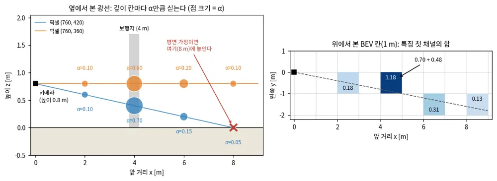
*그림 — travplan 작도: 위 작은 예. 왼쪽은 옆에서 본 두 광선과 깊이 칸별 확률(점 크기)이고, 빨간 X는 평면 가정이 픽셀 (760, 420)을 놓는 8 m다. 오른쪽은 위에서 본 1 m BEV 칸에 두 픽셀의 특징 첫 채널을 더한 값이다. 4 m 칸에 0.70과 0.48이 모여 가장 진하다. 코드: scripts/make_doc_figures.py*

수식 보기

**기호.**
- $(u, v)$: 픽셀 좌표. $K$: 내부 행렬(초점거리 $f_x, f_y$, 주점 $c_x, c_y$). $K^{-1}[u, v, 1]^\top = \big((u - c_x)/f_x,\ (v - c_y)/f_y,\ 1\big)$.
- $T$: 카메라에서 로봇(또는 월드) 좌표로 가는 강체 변환. 회전 $R$과 이동 $t$로 점에 $Tx = Rx + t$로 작용한다.
- $d \in \{d_1, \dots, d_D\}$: 깊이 칸. 광축 방향 좌표 $z_c$의 값이다.
- $\alpha_{uv}(d)$: 픽셀의 깊이 분포($\sum_d \alpha_{uv}(d) = 1$). $f_{uv} \in \mathbb{R}^C$: 픽셀 특징. $F$: BEV나 voxel 특징 격자.

**유도.** 핀홀 카메라는 카메라 좌표의 점 $X_c$를 $z_c\,[u, v, 1]^\top = K X_c$로 픽셀에 보낸다. 거꾸로 풀면 $X_c = z_c\, K^{-1}[u, v, 1]^\top$이다.
$z_c$를 모르면 이 식은 점 하나가 아니라 광선 하나다. 깊이 칸마다 $z_c = d$를 넣어 점을 만들고 $T$로 옮긴 것이 아래 첫 식이다. 둘째 식은
그 점이 떨어진 칸에 특징을 확률만큼 더한다.

$$ p_{uv}(d) = T \, K^{-1} \begin{bmatrix} u \\ v \\ 1 \end{bmatrix} d, \qquad F(p_{uv}(d)) \mathrel{+}= \alpha_{uv}(d)\, f_{uv} $$

모든 카메라 $i$와 픽셀을 모으면 칸 $b$의 특징은 다음과 같다(LSS의 sum pooling). $\sum_d \alpha = 1$이므로 광선이 격자 안에 있으면
픽셀마다 특징 $f$가 정확히 한 번 나뉘어 들어간다. 격자 밖에 떨어진 점은 버린다. $\alpha$가 one-hot이면 깊이 지도로 만든 점군(pseudo-LiDAR)과 같고, 균일($1/D$)하면 광선 위 모든 점이 같은 $f/D$를
받는다(OFT, orthographic feature transform). LSS는 그 사이를 학습한다. 마지막에 칸마다 점유 확률 $P(\text{occupied})$와 클래스를 예측한다.

$$ F(b) = \sum_{i} \sum_{(u, v)} \sum_{d} \mathbb{1}\big[p^{i}_{uv}(d) \in b\big]\; \alpha^{i}_{uv}(d)\, f^{i}_{uv} $$

**작은 예를 식으로.** 광학 좌표는 $x$ 오른쪽, $y$ 아래, $z$ 앞이다. 로봇 좌표(앞, 왼쪽, 위)로는 $(z_c,\ -x_c,\ 0.8 - y_c)$다.

$$ K^{-1} \begin{bmatrix} 760 \\ 420 \\ 1 \end{bmatrix} = \begin{bmatrix} 0.2 \\ 0.1 \\ 1 \end{bmatrix}, \qquad X_c(4) = \begin{bmatrix} 0.8 \\ 0.4 \\ 4 \end{bmatrix}, \qquad p(4) = \begin{bmatrix} 4 \\ -0.8 \\ 0.4 \end{bmatrix} $$

$$ \alpha\, c^\top = \begin{bmatrix} 0.10 \\ 0.70 \\ 0.15 \\ 0.05 \end{bmatrix} \begin{bmatrix} 1.0 & 0.5 \end{bmatrix} = \begin{bmatrix} 0.10 & 0.05 \\ 0.70 & 0.35 \\ 0.15 & 0.075 \\ 0.05 & 0.025 \end{bmatrix}, \qquad F(b_4) = (0.70,\ 0.35) + 0.6\,(0.8,\ 0.2) = (1.18,\ 0.47) $$

**역방향 투영(BEVFormer).** transformer 계열은 voxel이나 BEV 쪽 query가 이미지 특징을 가져온다. BEVFormer는 BEV 칸 $(x', y')$마다
높이 기준점 $z'_j$를 세운다($N_{\text{ref}} = 4$개, −5 m에서 3 m까지 균등). 카메라 $i$의 투영 행렬 $T_i \in \mathbb{R}^{3 \times 4}$로 영상에
보낸 뒤 주변 특징을 deformable attention으로 모은다(§A.2 BEVFormer 토글). $T_i = K\,[R^\top \mid -R^\top t]$는 앞의 강체 변환 $T$를 뒤집고
내부 행렬을 곱한 것이다. $\mathcal{P}(p, i, j) = (x_{ij}, y_{ij})$는 칸 $p$의 $j$번째 기준점이 떨어진 픽셀이고, $z_{ij}$는 그 점의 광축 깊이다.

$$ z_{ij} \begin{bmatrix} x_{ij} \\ y_{ij} \\ 1 \end{bmatrix} = T_i \begin{bmatrix} x' \\ y' \\ z'_j \\ 1 \end{bmatrix} $$

깊이를 쓰지 않으므로 한 광선 위의 점은 모두 같은 픽셀로 간다. 위 설정에서 칸 $(4.5, -0.5)$의 땅 점과 $(2.25, -0.25)$의 높이 0.4 m 점은
둘 다 픽셀 $(706.7, 466.7)$로 투영된다. 두 점의 깊이 $z_{ij}$는 4.5와 2.25로 다르다. FB-BEV는 이 깊이를 이웃한 두 깊이 칸에 선형으로
나눈 벡터 $\beta(z_{ij})$로 바꾸고, 그 픽셀이 예측한 깊이 분포 $\alpha$와 내적해 가중치로 쓴다. $z$가 칸 $d_k$와 $d_k + \Delta$ 사이에
있으면 $\beta$는 두 칸에만 $1 - r$과 $r$을 준다($r = (z - d_k)/\Delta$). 예측 깊이와 맞지 않는 기준점은 특징을 적게 받는다.

$$ w_{ij} = \alpha_{\mathcal{P}(p, i, j)} \cdot \beta(z_{ij}) $$

그 픽셀의 $\alpha$가 작은 예와 같은 $(0.10, 0.70, 0.15, 0.05)$라면(칸 2, 4, 6, 8 m, $\Delta = 2$), 4.5 m 점은 $0.75 \cdot 0.70 + 0.25 \cdot 0.15 = 0.56$,
2.25 m 점은 $0.875 \cdot 0.10 + 0.125 \cdot 0.70 = 0.18$의 가중치를 받는다.

**깊이 지도(BEVDepth).** LiDAR 점을 영상에 투영해 픽셀별 정답 깊이 칸 $d^*_{uv}$를 만든다(한 픽셀에 여러 점이 오면 가장
가까운 것). 그 점이 있는 픽셀 $\Omega$에서 깊이 분포에 이진 교차 엔트로피를 건다. WalkOCC(§A.3)도 투영한 LiDAR 깊이로 깊이 분포를
지도하지만, 손실의 형태는 논문에서 확인하지 못했다. HS2Occ(§A.8)는 스테레오 비용 볼륨의 softmax를 $\alpha$로 바로 쓴다.

$$ \mathcal{L}_{\text{depth}} = -\sum_{(u, v) \in \Omega} \sum_{d} \Big[ \mathbb{1}[d = d^*_{uv}] \log \alpha_{uv}(d) + \mathbb{1}[d \ne d^*_{uv}] \log\big(1 - \alpha_{uv}(d)\big) \Big] $$

**참고문헌.**
- Philion, Fidler, *Lift, Splat, Shoot: Encoding Images From Arbitrary Camera Rigs by Implicitly Unprojecting to 3D*, ECCV 2020 — [arXiv:2008.05711](https://arxiv.org/abs/2008.05711). 리프팅의 원형. 깊이 분포와 특징의 바깥곱, 기둥 sum pooling을 이 논문에서 본다.
- Z. Li 외, *BEVFormer: Learning Bird's-Eye-View Representation from Multi-Camera Images via Spatiotemporal Transformers*, ECCV 2022 — [arXiv:2203.17270](https://arxiv.org/abs/2203.17270). BEV 칸이 영상을 찾아가는 역방향의 대표.
- Y. Li 외, *BEVDepth: Acquisition of Reliable Depth for Multi-view 3D Object Detection*, AAAI 2023 — [arXiv:2206.10092](https://arxiv.org/abs/2206.10092). LSS식 깊이가 얼마나 틀리는지 재고, LiDAR 깊이 지도로 고친다.
- Z. Li 외, *FB-BEV: BEV Representation from Forward-Backward View Transformations*, ICCV 2023 — [arXiv:2308.02236](https://arxiv.org/abs/2308.02236). 정방향과 역방향의 장단점을 한 그림으로 비교하고 둘을 합친다.
- H. Li 외, *Delving into the Devils of Bird's-eye-view Perception: A Review, Evaluation and Recipe*, IEEE TPAMI 2024 — [arXiv:2209.05324](https://arxiv.org/abs/2209.05324). BEV 인식 개관. 방법 분류와 학습 요령을 한곳에서 본다.
- Guo 외, *Humanoid-OmniOcc: Stereo-Based Full-View Occupancy Dataset for Embodied AI*, arXiv 2026 — [arXiv:2606.22971](https://arxiv.org/abs/2606.22971). §A.8이 기대는 응용. 스테레오 깊이 확률로 특징을 voxel에 올린다.

### 0.8 Heteroscedastic 회귀와 evidential 학습: 예측에 "얼마나 확실한지"를 붙인다

값만 예측하지 않고 ==분산도 함께 예측하게 하면, 모델은 라벨이 흔들리는 곳에서 스스로 σ를 키운다.== 이 σ는 데이터에 원래 있는 잡음, 즉 aleatoric
불확실성이다. 모델이 본 적 없는 입력을 모른다는 사실(epistemic 불확실성)은 이 σ에 나타나지 않아 따로 재야 한다. evidential 학습은 그 둘째를
forward 한 번으로 재는 방법이다.

**왜 필요한가.** TravMap은 칸마다 cost 옆에 σ 채널을 둔다. Controller는 둘을 함께 읽는다. 예를 들어 `RiskCost`는 스텝 위험을 cost + 0.7 × σ로
잡는다(`control/mppi/costs.py`, `beta = 0.7`). σ가 없으면 "확실히 0.3"인 칸과 "모르지만 0.3"인 칸이 같아진다. 자기지도 라벨은 특히 시끄럽다. 같은
모양의 턱도 속도, 바퀴 위치, IMU 잡음에 따라 느낀 난이도가 달라진다. 분산을 고정한 MSE(mean squared error) 손실은 시끄러운 라벨과 깨끗한 라벨을
같은 무게로 맞춘다. 분산을 함께 예측하면 시끄러운 칸의 오차를 덜 벌하고, "이런 칸은 원래 들쭉날쭉하다"는 정보가 σ로 남는다.

**직관.** 네트워크가 칸마다 숫자 두 개를 내게 한다.

1. 첫째는 평균 μ, 둘째는 로그 분산 s = log σ²다. 손실은 NLL(negative log-likelihood), 즉 가우시안 확률의 음의 로그다.
2. NLL은 두 항의 합이다. 첫 항은 오차 제곱을 σ²로 나눈 값이라 σ를 키우면 줄어든다. 둘째 항은 log σ²라서 σ를 키우면 늘어난다.
3. 두 힘은 σ²가 그 입력의 평균 제곱 오차와 같을 때 맞선다. 라벨이 흔들리는 입력은 오차가 줄지 않으므로 σ가 커진다.
4. 답안에 자신감을 함께 적게 하는 채점과 같다. 자신 있다고 적고 틀리면 크게 깎이고, 자신 없다고 적으면 맞아도 조금 깎인다. 정직하게 적는 것이 가장
   이득이다.
5. 이 σ는 라벨이 있는 곳에서만 학습된다. 학습 분포 밖의 입력에서 네트워크는 σ를 외삽할 뿐이다. Kendall & Gal은 aleatoric 불확실성이 학습 데이터와
   다른 입력에서 커지지 않는다고 보고했다(원문 5.2절). 아래 그림의 실패 사례가 같은 현상이다.
6. epistemic 불확실성은 모델 여럿의 예측이 갈리는 정도(앙상블, MC(Monte Carlo) dropout)로 재거나, evidential 학습처럼 "증거의 양"을 출력으로 낸다.
   evidential 분류는 증거가 없으면 확률을 균등하게 두고 불확실성을 1로 둔다. 그래서 "증거가 없어서 반반"과 "증거가 팽팽해서 반반"을 구분한다.

**작은 예.** 비슷하게 생긴 두 칸을 로봇이 한 번씩 지나갔고, 느낀 난이도가 0.1과 0.5로 갈렸다. 두 라벨을 한 입력으로 보면 손실은 $\mu = 0.3$에서
가장 작다. 분산은 두 오차 제곱의 평균이라 $\sigma^2 = (0.2^2 + 0.2^2)/2 = 0.04$, $\sigma = 0.2$, $s = \log 0.04 \approx -3.22$다. 샘플 하나의
손실은 $\tfrac12 \cdot 0.04/0.04 + \tfrac12 \cdot (-3.22) \approx -1.11$이다. σ를 1로 고정하면($s = 0$) 손실이 $0.02$라서 모델은 σ = 0.2를 고른다.
두 라벨이 모두 0.30이면 오차가 0이라 s가 끝없이 내려간다. travplan은 $s \ge -6$($\sigma \approx 0.05$)에서 멈춘다. TravMap σ 채널로 옮기면
$\tanh(2\sigma)$라서 라벨이 갈린 칸은 0.38, 깨끗한 칸은 약 0.10이고, 관측하지 못한 칸은 1이다.

**함정.**

- **σ는 모르는 곳을 알려 주지 않는다.** 한 에피소드가 라벨을 붙이는 칸은 지도의 6–9%다(TP-0010). 나머지 칸의 학습 σ는 외삽이라 처음 보는
  덤불에서도 작게 나올 수 있다. 코드가 σ = 1로 덮는 것은 관측하지 못한 칸뿐이다. 관측했지만 지나가지 않은 칸의 과신은 0.9(PU learning)가 다룬다.
- **하한이 없으면 발산한다.** 라벨이 거의 정확한 칸에서 s가 −∞로 가고 손실도 −∞로 간다. travplan 코드 주석에 따르면 하한 없이 Adam 약 150스텝 만에
  NaN이 났다. 그래서 `min_log_var = -6.0`이다.
- **깨끗한 칸이 학습을 독차지한다.** μ의 기울기는 오차에 $1/\sigma^2$을 곱한 값이다. σ = 0.05인 칸은 400배, σ = 0.2인 칸은 25배라 16배 차이가
  난다. 라벨이 시끄러운 칸이 턱 가장자리처럼 중요한 칸이면, NLL은 그 칸을 가장 늦게 맞춘다. β-NLL은 샘플마다 기울기를 멈춘
  $\sigma^{2\beta}$를 곱해 이 차이를 줄인다. 저자들의 실험에서는 β = 0.5가 대체로 가장 좋은 절충이었다.
- **σ는 보정되지 않은 값이다.** $\tanh(2\sigma)$는 [0, 1]로 줄이는 편의 변환이지 확률이 아니다. 검증 라벨의 약 95%가 μ ± 2σ 안에 드는지 따로 봐야
  한다. 분포 가정 없이 포함 확률을 보장하려면 오차를 σ로 나눈 점수로 conformal 보정을 한다(배경 0.13).
- **evidential 출력에도 조건이 붙는다.** 증거가 끝없이 커지지 않게 막는 정규화 항(균등 Dirichlet 쪽으로 당기는 KL(Kullback–Leibler) 항, 오차에
  비례하는 증거 벌점)이 필요하다. Deep Evidential Regression의 불확실성 분해는 정확한 베이즈 추론이 아니라 경험적 방법이라는 분석도
  있다([arXiv:2205.10060](https://arxiv.org/abs/2205.10060)).

**어디서 쓰나.**

- **travplan 코드.** `representation/traversability.py`의 `TravNet`은 칸마다 cost logit과 log σ²를 내고, `heteroscedastic_loss`가 위의 NLL이다.
  `LearnedTraversability`와 `ResidualTraversability`는 $\sigma = \tanh(2 e^{s/2})$로 σ 채널을 만들고 미관측 칸은 1로 덮는다.
  `representation/self_supervised.py`의 `masked_heteroscedastic_loss`는 라벨 칸만 평균하고 `min_log_var = -6.0`을 쓴다. 가중치
  $w = 1 - e^{-n/2}$는 `FootprintLabeler.labels()`가 만든다. `scripts/train_travnet.py`가 이 손실로 잔차 TravNet을 학습한다. 기하 추정기
  `GeometricTraversability`는 σ를 관측 여부에 따라 0 또는 1로만 둔다.
- **리서치 문서.** 인식 §A.7의 Lee 2020(blind 보행)은 정책 내부 특징에서 특권 정보를 복원하는 디코더를 평균과 표준편차의 Gaussian NLL로 학습한다.
  §A.7의 GPR 배경 토글은 식에서 바로 나오는 GP 분산과 이 절처럼 설계한 분산을 비교한다. §A.10.3 Evidential Semantic Mapping은 분할 네트워크의
  evidential 출력으로 BKI 지도 융합(배경 0.10)을 가중한다. Controller §E.2의 PETS 확률 앙상블 손실도 같은 NLL이다.

*그림 — Kendall & Gal (Fig. 1a): 원문 그림 아래 줄의 입력 영상. 왼쪽 아래가 보도다. 출처: [arXiv:1703.04977](https://arxiv.org/abs/1703.04977)*

*그림 — Kendall & Gal (Fig. 1d): 같은 장면의 aleatoric 불확실성. 물체 경계와 먼 물체에서 높고, 보도 위에는 보도블록 줄눈만 옅게 보인다. 출처: [arXiv:1703.04977](https://arxiv.org/abs/1703.04977)*

*그림 — Kendall & Gal (Fig. 1e): 같은 장면의 epistemic 불확실성. 원문은 이 줄을 모델이 보도를 분할하지 못한 실패 사례로 들고, 그곳에서 aleatoric이 아니라 epistemic만 커진다고 설명한다. 출처: [arXiv:1703.04977](https://arxiv.org/abs/1703.04977)*

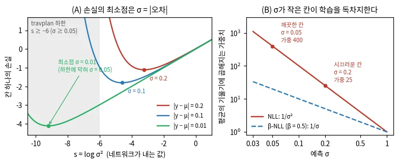
*그림 — travplan 작도: (A) 오차가 정해진 칸의 손실을 s = log σ²에 대해 그렸다. 최소점은 σ = |오차|이고, 회색은 travplan 하한 s ≥ −6 밖이다. (B) 평균의 기울기에 곱해지는 가중치. NLL은 1/σ², β-NLL(β = 0.5)은 1/σ다. 코드: scripts/make_doc_figures.py*

수식 보기

**Heteroscedastic 가우시안 NLL.** 예측 평균 $\mu$와 로그 분산 $s = \log \sigma^2$를 함께 낸다.

$$ -\log \mathcal{N}(y;\, \mu, \sigma^2) = \tfrac{1}{2} e^{-s} (y - \mu)^2 + \tfrac{1}{2} s + \text{const} $$

$y$는 라벨(느낀 난이도)이고 const는 $\tfrac{1}{2}\log 2\pi$다. $\sigma^2$ 대신 $s$를 내면 $e^{-s} > 0$이 저절로 지켜지고 0으로 나누는 일이 없다
(Kendall & Gal 식 8). 같은 입력의 흩어진 라벨에 대해 기대 손실을 $s$로 미분해 0으로 두면, 분산이 평균 제곱 오차가 된다.

$$ \frac{\partial}{\partial s}\, \mathbb{E}\big[\tfrac{1}{2} e^{-s} (y - \mu)^2 + \tfrac{1}{2} s\big] = -\tfrac{1}{2} e^{-s}\, \mathbb{E}\big[(y - \mu)^2\big] + \tfrac{1}{2} = 0 \;\Longrightarrow\; \sigma^2 = \mathbb{E}\big[(y - \mu)^2\big] $$

$\mu$의 최소점은 $\mathbb{E}[y]$다. $\mu$의 기울기가 $(\mu - y)/\sigma^2$라서 σ가 큰 칸의 오차는 덜 반영된다(learned loss attenuation).

오차가 크면 $s$를 키워 첫 항을 줄이고, 둘째 항이 $s$가 무한히 커지는 것을 막는다. 반대로 라벨에 노이즈가 거의 없으면 $s \to -\infty$로 발산할 수
있어, travplan은 $s \ge -6$ 하한을 둔다. 라벨이 없는 칸은 가중치 $w = 0$으로 뺀다.

$$ \mathcal{L} = \frac{\sum_i w_i \big[\tfrac{1}{2} e^{-s_i} (\sigma(z_i) - y_i)^2 + \tfrac{1}{2} s_i\big]}{\sum_i w_i}, \qquad w_i = 1 - e^{-n_i/2} $$

$z_i$는 칸 $i$의 cost logit이고, 이 식의 $\sigma(\cdot)$는 표준편차가 아니라 시그모이드다. $n_i$는 발자국이 그 칸을 덮은 스텝 수(`FootprintLabeler`의
`count`)라 1이면 $w = 0.39$, 5면 $0.92$다. 작은 예는 $y \in \{0.1, 0.5\}$, $\mu = 0.3$, $e^{-s} = 25$에서 샘플당
$\tfrac{1}{2} \cdot 25 \cdot 0.04 + \tfrac{1}{2}(-3.22) = -1.11$이다.

**β-NLL(Seitzer 2022).** 샘플마다 기울기를 멈춘 $\sigma^{2\beta}$를 곱한다($\lfloor \cdot \rfloor$: stop-gradient). $\mu$의 기울기는
$(\mu - y)/\sigma^{2 - 2\beta}$가 되어, $\beta = 0$이면 NLL, $\beta = 1$이면 MSE와 같은 기울기다.

$$ \mathcal{L}_{\beta\text{-NLL}} = \big\lfloor \sigma^{2\beta} \big\rfloor \Big( \tfrac{1}{2} \log \sigma^2 + \frac{(y - \mu)^2}{2 \sigma^2} \Big) $$

**두 불확실성 나누기(Kendall & Gal 식 9).** MC dropout 표본이나 앙상블 멤버 $T$개가 각자 $(\mu_t, \sigma_t^2)$를 내면 예측 분산은 둘로 나뉜다.
첫 항($\sigma_t^2$의 평균)이 aleatoric, 괄호 항(평균들의 퍼짐)이 epistemic이다.

$$ \operatorname{Var}[y] \approx \frac{1}{T} \sum_t \sigma_t^2 + \Big( \frac{1}{T} \sum_t \mu_t^2 - \bar\mu^2 \Big), \qquad \bar\mu = \frac{1}{T} \sum_t \mu_t $$

**Evidential deep learning(분류).** 소프트맥스 확률 대신 클래스별 증거 $e_c \ge 0$을 내고, Dirichlet 분포 $\mathrm{Dir}(\alpha)$,
$\alpha_c = e_c + 1$로 해석한다. 증거가 적을수록 불확실성 $u$가 커진다($C$: 클래스 수).

$$ \hat p_c = \frac{\alpha_c}{S}, \qquad S = \sum_c \alpha_c, \qquad u = \frac{C}{S} $$

$e_c$는 클래스 $c$를 지지하는 가상 관측 수다. $S = \sum_c e_c + C$는 Dirichlet 세기, 즉 증거 총량에 사전분포 몫 $C$를 더한 값이다.
증거는 마지막 층의 softmax를 ReLU(Sensoy 2018)나 $\exp$(Evidential Semantic Mapping)로 바꿔 얻는다. $C = 2$에서 $e = (0, 0)$이면
$\hat p = (0.5, 0.5)$, $u = 1$이다. $e = (40, 40)$이면 $\hat p$는 같지만 $u = 0.024$다. $e = (8, 0)$이면 $\hat p = (0.9, 0.1)$, $u = 0.2$다.
Sensoy 2018의 손실은 Dirichlet 아래의 기대 제곱 오차에, 정답이 아닌 클래스의 증거를 균등 Dirichlet 쪽으로 당기는 KL 항을 더한다
($y_{ic}$: 원-핫 라벨, $\tilde\alpha_i$: 정답 클래스의 증거를 뺀 매개변수, $t$: epoch).

$$ \mathcal{L}_i = \sum_c \Big[ (y_{ic} - \hat p_{ic})^2 + \frac{\hat p_{ic} (1 - \hat p_{ic})}{S_i + 1} \Big] + \lambda_t\, \mathrm{KL}\big[ \mathrm{Dir}(\tilde\alpha_i) \,\Vert\, \mathrm{Dir}(\mathbf{1}) \big], \qquad \lambda_t = \min(1,\, t/10) $$

**Deep evidential regression(Amini 2020).** 회귀에서는 $(\mu, \sigma^2)$ 위에 Normal-Inverse-Gamma 분포를 두고 숫자 네 개
$(\gamma, \nu, \alpha, \beta)$를 낸다. $\nu$와 $\alpha$는 가상 관측 수라서, 증거가 적은 입력에서 epistemic 항이 커진다. 학습은 주변
우도(Student-t)의 음의 로그에 오차 비례 벌점 $|y - \gamma|\,(2\nu + \alpha)$를 더한다.

$$ \mathbb{E}[\mu] = \gamma, \qquad \mathbb{E}[\sigma^2] = \frac{\beta}{\alpha - 1}\ (\text{aleatoric}), \qquad \operatorname{Var}[\mu] = \frac{\beta}{\nu (\alpha - 1)}\ (\text{epistemic}) $$

**참고문헌.**

- Nix 외, *Estimating the mean and variance of the target probability distribution*, ICNN 1994 — [doi:10.1109/ICNN.1994.374138](https://doi.org/10.1109/ICNN.1994.374138). 평균과 분산을 함께 내는 신경망의 출발점이다.
- Kendall 외, *What Uncertainties Do We Need in Bayesian Deep Learning for Computer Vision?*, NeurIPS 2017 — [arXiv:1703.04977](https://arxiv.org/abs/1703.04977). aleatoric과 epistemic의 차이와 log 분산 손실을 가장 쉽게 설명한다.
- Seitzer 외, *On the Pitfalls of Heteroscedastic Uncertainty Estimation with Probabilistic Neural Networks*, ICLR 2022 — [arXiv:2203.09168](https://arxiv.org/abs/2203.09168). NLL이 어려운 영역을 굶기는 이유와 β-NLL.
- Sensoy 외, *Evidential Deep Learning to Quantify Classification Uncertainty*, NeurIPS 2018 — [arXiv:1806.01768](https://arxiv.org/abs/1806.01768). 증거, Dirichlet, u = C/S의 원 논문이다.
- Amini 외, *Deep Evidential Regression*, NeurIPS 2020 — [arXiv:1910.02600](https://arxiv.org/abs/1910.02600). 회귀판 evidential 학습과 두 불확실성의 분리.
- Chua 외, *Deep Reinforcement Learning in a Handful of Trials using Probabilistic Dynamics Models*, NeurIPS 2018 — [arXiv:1805.12114](https://arxiv.org/abs/1805.12114). 같은 NLL로 학습한 확률 앙상블을 제어에 쓴 예다(Controller §E.2).

### 0.9 PU learning: 양성과 "라벨 없음"만 있을 때

자기지도 traversability에는 "지나간 곳은 지나갈 수 있다"는 양성 라벨만 있다. ==PU(positive-unlabeled) learning은 라벨 없는 데이터 속에 양성과
음성이 섞여 있다는 사실을 학습에 반영해, 지나가지 않은 곳에서의 과신을 막는다.== 방법은 두 갈래다. ① 위험 추정기(nnPU, non-negative PU)는
섞인 비율로 음성의 위험을 계산한다. ② one-class 방식은 양성을 한 점에 모으면서 라벨 없는 데이터로 특징 공간을 지킨다. ScaTE와
Self-Supervisions Only(§A.10)는 ②이고, TP-0010의 PU loss 후보는 둘 다다.

**왜 필요한가.** TP-0010 설계 문서의 측정에서 한 에피소드의 라벨은 지도의 6–9%에만 붙었고, 힘든 곳 라벨은 0–7%였다. 좋은 Planner가 위험한 곳을
피하기 때문이다. 라벨 없는 나머지 칸에는 쉬운 보도와, 한 번도 밟지 않은 연석과 덤불이 섞여 있다. 이 칸을 모두 "어려움"으로 두면 모델은 지형 대신
로봇이 다닌 길을 외운다. 학습에서 빼면(지금 travplan의 가중치 0) 모델은 그 칸의 값을 외삽하고, 지나가지 않은 덤불과 급경사를 쉽다고 할 수
있다(§A.10.3의 ScaTE Fig. 2). travplan은 지금 관측한 칸 전체의 잔차에 L2 벌점을 걸어(`scripts/train_travnet.py`, `--lam 0.1`) 라벨 없는 칸을 기하
cost 근처에 묶는다. PU loss는 그 칸을 버리지 않고 쓰는 대안이다.

**직관.** 핵심은 "라벨 없는 칸은 쉬운 칸과 어려운 칸의 혼합"이라는 식 하나다.

1. 라벨 없는 칸 U의 분포는 쉬운 칸의 분포 P와 어려운 칸의 분포 N을 π : (1 − π)로 섞은 것이다. 지나간 칸은 쉬운 칸의 표본이므로 P의 모양을 알려
   준다.
2. 그러면 음성 라벨 없이 음성 쪽 위험을 계산할 수 있다. "U의 칸이 모두 어렵다고 치고 매긴 손실"에서 "그 가운데 쉬운 칸 몫"인 π × (지나간 칸이
   어렵다고 치고 매긴 손실)을 빼면 어려운 칸 몫만 남는다. 합격률 80%인 시험에서 지원자 전체의 성적 분포에서 합격자 분포의 0.8배를 빼면 불합격자
   몫이 남는 것과 같다(아래 그림 B).
3. 표본이 유한하면 이 뺄셈이 음수가 될 수 있다. 유연한 신경망이 지나간 칸을 하나하나 외우면 음수가 더 커진다. 실제 위험은 음수일 수 없으므로
   nnPU는 이 항을 0에서 자른다.
4. π를 모르거나 혼합 가정이 의심스러우면 ②를 쓴다. 지나간 칸의 특징을 한 중심 근처로 모으고(Deep SVDD, support vector data description), 중심에서
   먼 칸을 "낯설다"고 본다. 양성만으로 학습하면 모든 입력을 중심으로 보내는 붕괴 해가 생긴다. 그래서 라벨 없는 칸을 K개 prototype에 같은 크기로
   나눠 담는 군집화를 함께 학습해, 특징 공간이 한 점으로 뭉개지지 않게 한다.
5. PU의 "양성"은 라벨이 붙은 쪽, 즉 지나간 칸(쉬움)이다. 설계 문서의 "힘든 곳 라벨"과 방향이 반대다.

**작은 예.** 지도 칸 1,100개 가운데 로봇이 100칸을 지나갔다(P). 나머지 1,000칸(U)은 실제로 800칸이 쉽고 200칸이 어렵다(π = 0.8). 분류기 셋을 0–1
손실로 채점한다. "U를 음성으로"는 U의 라벨을 모두 "어려움"으로 치고 U에서 매긴 오류율이다(P에서는 셋 모두 오류가 없다). "실제 위험"은 U와
같은 구성(쉬움 80%)으로 새로 뽑은 칸의 오분류율이다.

| 분류기 | 쉽다고 하는 칸 | U를 음성으로 | U 무시 | uPU | nnPU | 실제 위험 |
|---|---|---|---|---|---|---|
| A 정답 | P와 U의 쉬운 800칸 | 0.8 | 0 | 0 | 0 | 0 |
| B 길 외우기 | 지나간 100칸만 | 0 | 0 | −0.8 | 0 | 0.8 |
| C 전부 쉬움 | 모든 칸 | 1.0 | 0 | 0.2 | 0.2 | 0.2 |

U를 음성으로 두면 가장 나쁜 B가 최선으로 보인다. U를 무시하면 셋이 모두 0이라 구분하지 못한다. uPU(unbiased PU, 0에서 자르지 않은 추정)는 C의
0.2를 정확히 재지만, B에 −0.8이라는 불가능한 점수를 줘 가장 좋게 본다. nnPU는 음수를 0으로 잘라 B의 이득을 없앤다. B는 겉모습이 같은 칸을 칸
번호로 외워야 나온다. 외워도 얻는 것이 없으면, 같은 특징에 같은 답을 내는 모델은 A에 머문다.

**함정.**

- **π를 알아야 한다.** π는 장면마다 다르다(한적한 보도와 공사 구간). 틀리게 잡으면 위험 추정이 어긋나고, 크게 잡으면 음수가 된다(아래 그림 B).
  ScaTE도 위험 추정 방식의 성능이 실제로는 모르는 분포 가정에 달려 있다고 지적한다.
- **지나간 칸은 쉬운 칸의 무작위 표본이 아니다.** 대부분의 PU 방법은 SCAR(selected completely at random), 즉 라벨이 양성 가운데 무작위로 붙는다고
  가정한다. travplan의 Planner는 가장 쉬워 보이는 길을 고른다. 그래서 쉽지만 어려워 보이는 칸(완만한 연석 경사로)에는 라벨이 거의 붙지 않는다.
  Bekker & Davis의 분류로는 SAR(selected at random), 그중 확률 간격(probabilistic gap) 경우다. 이때 U에서 π × P를 빼도 N이 되지 않는다. 설계 문서
  E2의 탐색 정책은 힘든 곳 라벨을 8.9%에서 10.1%로 올리는 데 그쳤다. 라벨이 붙는 곳을 로봇의 정책이 정한다는 점은 모방 학습의
  분포 이동(배경 0.12)과 뿌리가 같다.
- **one-class는 붕괴한다.** Deep SVDD 원 논문은 중심을 초기 forward 출력의 평균으로 고정하고, 편향 항과 유계 활성함수를 쓰지 말라고 한다. ScaTE는
  이런 권고를 따르고도 one-class 이상 탐지 기준선의 참양성률(TPR, 두 클래스 평균)이 찍기 수준인 0.5에 머물렀다고 보고했다. 특징 대부분이
  양성 중심 둘레로 뭉친 붕괴다. 라벨 없는 칸의 군집화가 필요한 이유다.
- **낯섦과 어려움은 다르다.** ②는 처음 보는 쉬운 지형(새 포장재, 처음 보는 무늬의 보도블록)도 낯설다고 표시해 보수적이 된다. 진짜 음성이
  있는 검증 데이터로 AUROC(area under the ROC curve)를 재야 한다.
- **PU는 이진 분류다.** travplan TravNet은 cost ∈ [0, 1]를 회귀한다. ScaTE처럼 "믿을 수 있는가"를 가르는 분류 머리를 따로 두고, 회귀 머리는 라벨
  칸에서만 μ와 σ(배경 0.8)를 학습하는 구성이 필요하다.

**어디서 쓰나.**

- **리서치 문서.** 인식 §A.10.3의 Self-Supervisions Only와 ScaTE(둘 다 "배경 0.9 ②"), §A.3 STONE의 궤적 분포 기반 T·P·N 자동 라벨, §A.7 Wild
  Visual Navigation의 오토인코더 신뢰도(안 가 본 곳을 "모름"으로 둔다)와 그 배경 토글이 이 절을 가리킨다.
- **travplan 코드.** `representation/self_supervised.py`의 `FootprintLabeler`가 발자국 아래 칸에만 라벨을 붙이고(P), 나머지는 가중치 0으로 둔다.
  U를 무시하는 방식이다. PU loss는 아직 코드에 없고 `docs/design-travnet-ssl.md` §4의 후보다(TP-0010).

*그림 — Bekker & Davis (Fig. 1): SCAR 가정의 PU 데이터. 라벨 붙은 양성(초록)은 양성 전체(파랑)에서 무작위로 뽑혀, 분포 모양이 양성 전체와 같다. 출처: [arXiv:1811.04820](https://arxiv.org/abs/1811.04820)*

*그림 — Bekker & Davis (Fig. 2): SAR과 확률 간격 가정의 PU 데이터. 음성(주황)을 닮은 양성일수록 라벨이 덜 붙어, 라벨 분포가 음성에서 멀어진다. travplan의 주행 라벨이 이쪽이다. 출처: [arXiv:1811.04820](https://arxiv.org/abs/1811.04820)*

*그림 — ScaTE (Fig. 3): 점마다 특징을 내고, 회귀 머리는 양성 점과 차량 상태로 μ와 σ를 낸다. 분류 머리는 양성을 중심에 모으고(SVDD) 라벨 없는 점을 K개 prototype에 나눈다(교차 엔트로피). 출처: [arXiv:2209.06522](https://arxiv.org/abs/2209.06522)*

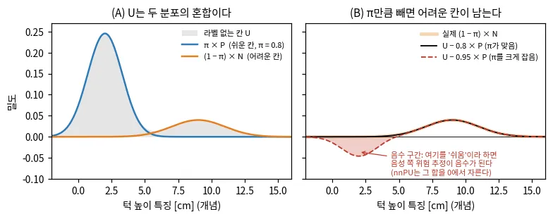
*그림 — travplan 작도: (A) 라벨 없는 칸 U는 쉬운 칸 P와 어려운 칸 N을 π = 0.8로 섞은 분포다. (B) U에서 0.8 × P를 빼면 어려운 칸 몫이 남고, π를 0.95로 크게 잡으면 음수가 된다. 코드: scripts/make_doc_figures.py*

수식 보기

**기호.** 입력 $x$(칸의 특징), 참 라벨 $y \in \{+1, -1\}$(쉬움, 어려움), 분류기 $g(x) \in \mathbb{R}$(양수면 쉬움), 손실 $\ell(g(x), y)$다. 양성
집합 $P$는 $p_P(x) = p(x \mid y = +1)$에서, 라벨 없는 집합 $U$는 전체 분포 $p(x)$에서 뽑는다. $\pi = p(y = +1)$이고 $\hat{\mathbb{E}}_P$,
$\hat{\mathbb{E}}_U$는 각 집합의 표본 평균이다.

**혼합식에서 위험으로.** $p(x) = \pi\, p_P(x) + (1 - \pi)\, p_N(x)$이므로 음성 쪽 기댓값을 $U$와 $P$만으로 쓸 수 있다.

$$ (1 - \pi)\, \mathbb{E}_N\big[\ell(g(x), -1)\big] = \mathbb{E}_U\big[\ell(g(x), -1)\big] - \pi\, \mathbb{E}_P\big[\ell(g(x), -1)\big] $$

보통의 위험 $R(g) = \pi\, \mathbb{E}_P[\ell(g, +1)] + (1 - \pi)\, \mathbb{E}_N[\ell(g, -1)]$에 이 식을 넣으면 음성 라벨이 필요 없다. 이것이
uPU다(du Plessis 외 2014, 2015). 좌변은 0 이상이지만 우변의 표본 추정은 음수가 될 수 있다.

**① 위험 추정기(nnPU).** 음성에 대한 위험을 $U$에서 양성 몫을 빼서 추정하고, 음수가 되어 과적합하는 것을 막으려고 0에서 자른다. 양성 비율 $\pi$를
알아야 한다는 것이 약점이다.

$$ \hat R(g) = \pi\, \hat{\mathbb{E}}_P\big[\ell(g(x), +1)\big] + \max\Big\{0,\ \hat{\mathbb{E}}_U\big[\ell(g(x), -1)\big] - \pi\, \hat{\mathbb{E}}_P\big[\ell(g(x), -1)\big]\Big\} $$

미니배치의 괄호 안 값 $r$이 $-\beta$보다 작아지면, 보통의 경사 하강 대신 $r$을 키우는 방향으로 줄인 보폭 $\gamma\eta$만큼 되돌아간다(Kiryo 2017
알고리즘 1, 논문 실험은 $\beta = 0$, $\gamma = 1$). 손실은 기울기가 어디서나 0이 아닌 시그모이드 손실 $\ell(t, y) = 1/(1 + e^{ty})$를 권한다. 작은 예의
B는 $\hat{\mathbb{E}}_P[\ell(g, +1)] = 0$, $\hat{\mathbb{E}}_P[\ell(g, -1)] = 1$, $\hat{\mathbb{E}}_U[\ell(g, -1)] = 0$이라 uPU는
$0 - 0.8 \cdot 1 = -0.8$, nnPU는 $\max\{0, -0.8\} = 0$이다. C는 $\hat{\mathbb{E}}_U[\ell(g, -1)] = 1$이라 둘 다 $1 - 0.8 \cdot 1 = 0.2$다.

**라벨 빈도로 되돌리기(Elkan & Noto 2008).** 한 데이터에서 양성의 일부 $c = p(s = 1 \mid y = 1)$에만 라벨($s = 1$)이 붙고 SCAR가 성립하면, "라벨
붙음 대 안 붙음" 분류기의 출력을 $c$로 나눠 참 확률을 얻는다. SAR에서는 $c$ 대신 입력마다 다른 성향 점수 $e(x) = p(s = 1 \mid x, y = 1)$가
필요하다(Bekker & Davis 정의 2).

$$ p(y = 1 \mid x) = \frac{p(s = 1 \mid x)}{c} $$

**② one-class + 라벨 없는 데이터의 비지도 활용.** 양성의 특징만 한 중심 $C_p$ 주변에 모으고(Deep SVDD), 중심에서 먼 입력을 "낯선 것(지나가기
어려울 수 있음)"으로 본다.

$$ \mathcal{L}^{\text{SVDD}}(x_i) = \lVert g_\phi(x_i) - C_p \rVert^2, \qquad x_i \in P $$

양성만 쓰면 모든 입력을 중심으로 보내는 **붕괴 해**가 생긴다. 그래서 라벨 없는 데이터를 $K$개 학습 prototype으로 **군집화**해(균등 분할 제약) 특징
공간이 뭉개지지 않게 한다. 군집 사후확률은 다음과 같다($\tau = 0.05$).

$$ Q_{kj} = \frac{\exp(x_j^\top c_k / \tau)}{\sum_{k'} \exp(x_j^\top c_{k'} / \tau)}, \qquad \max_A \operatorname{Tr}(A^\top Q)\ \ \text{s.t. 각 군집 크기} = n_u / K $$

$g_\phi$는 분류 머리, $x_j$는 라벨 없는 점 $j$의 특징, $c_k$는 prototype $k$, $\tau$는 온도, $A \in \{0, 1\}^{K \times n_u}$는 점을 군집에 하나씩
넣는 배정이다. 균등 분할 제약이 "모두 한 군집" 해를 막는다. 이 최적 수송 문제는 Sinkhorn–Knopp 반복 몇 번으로 풀리고(SeLa, Asano 2020. 같은 반복을 쓰는 다른 OT들과의 구분은 0.2b ⑥), 그 배정을
정답 삼아 교차 엔트로피 $-\tfrac{1}{n_u} \sum_{k, j} A_{kj} \log Q_{kj}$로 특징과 prototype을 함께 갱신한다. 추론 때는 $C_p$와의 유사도(정상
점수)를 문턱과 비교해 지나갈 수 있는지 정한다. Self-Supervisions Only는 정규화 흐름(Fastflow)의 특징 위에서 같은 일을 한다. 양성 중심과의 코사인
유사도를 쓰고, 흐름의 Jacobian 항이 상수 사상을 벌하며, 라벨 없는 픽셀에 같은 균등 분할 군집화를 건다.

**참고문헌.**

- Elkan 외, *Learning classifiers from only positive and unlabeled data*, KDD 2008 — [doi:10.1145/1401890.1401920](https://doi.org/10.1145/1401890.1401920). SCAR 가정 아래 라벨 빈도 $c$로 참 확률을 되돌리는 방법의 원 논문이다.
- Kiryo 외, *Positive-Unlabeled Learning with Non-Negative Risk Estimator*, NeurIPS 2017 — [arXiv:1703.00593](https://arxiv.org/abs/1703.00593). uPU가 음수로 과적합하는 이유와 nnPU.
- Bekker 외, *Learning from positive and unlabeled data: a survey*, Machine Learning 2020 — [arXiv:1811.04820](https://arxiv.org/abs/1811.04820). SCAR, SAR 같은 가정과 방법 계열을 한 번에 정리한 서베이다.
- Ruff 외, *Deep One-Class Classification*, ICML 2018 — [PMLR 80](https://proceedings.mlr.press/v80/ruff18a.html). Deep SVDD와 붕괴 해가 생기는 조건.
- Asano 외, *Self-labelling via simultaneous clustering and representation learning*, ICLR 2020 — [arXiv:1911.05371](https://arxiv.org/abs/1911.05371). 균등 분할 군집화를 Sinkhorn으로 푸는 방법, ScaTE가 가져온 원천이다.
- Seo 외, *ScaTE: A Scalable Framework for Self-Supervised Traversability Estimation in Unstructured Environments*, RA-L 2023 — [arXiv:2209.06522](https://arxiv.org/abs/2209.06522). 이 절의 ②를 traversability에 쓴 예다.

### 0.10 Bayesian Kernel Inference(BKI): 주변 관측을 거리로 가중해 빈 칸을 채운다

지도 칸 하나의 값을 그 칸에 떨어진 관측만으로 정하면 빈 칸이 많아진다. ==BKI는 주변 관측을 거리에 따라 줄어드는 커널로 가중해 칸마다 베이즈
사후분포를 만든다.== 가까운 관측을 많이 받은 칸은 사후분포가 좁고, 관측이 적은 칸은 넓게 남아 그대로 불확실성이 된다. Evidential BKI와
TRIP(§A.10)의 바탕이고, travplan `fill_unknown`을 개선할 후보다.

**왜 필요한가.** LiDAR 점은 멀수록 성기고, 연석과 차량 뒤에는 그림자가 생긴다. 칸마다 그 칸에 떨어진 점만 세면 지도에 구멍이 많이 난다. Gan
외(2020)는 보도를 걷는 Cassie 실험에서 끊긴 시맨틱 지도의 틈을 Planner가 걸을 수 없는 곳으로 볼 수 있어 실제 문제가 됐다고 적었다(원문 Fig. 6).
travplan의 기하 추정기는 미관측 칸에 cost 0.5, σ 1을 준다. 관측 점 바로 옆 칸도, 한참 떨어진 칸도 똑같이 "완전히 모름"이다. 칸마다 "가까운 관측이
얼마나 있나"를 반영한 σ가 필요하다. L1 인식(TP-0053)은 L0보다 미관측 칸이 많아 이 차이가 더 크다.

**직관.** 칸마다 "표"를 모은다고 생각하면 쉽다.

1. 분류라면 클래스별 표 수(Dirichlet의 α)를, 높이라면 표로 가중한 합과 표의 총량을 칸마다 둔다.
2. 관측 하나는 자기 칸에만 한 표를 주지 않는다. 반경 l 안의 모든 칸에 거리 d에 따라 k(d)표를 준다. 바로 옆 칸은 거의 한 표를, 조금 떨어진 칸은 몇
   분의 1표를 받는다. 멀리서 들은 소문일수록 덜 믿는 셈이다.
3. 사후 평균은 받은 표의 가중 평균이다. 사후분포의 폭은 받은 표의 총량이 정한다. 표를 적게 받은 칸은 분포가 넓고, 그 폭이 그대로 σ가 된다.
4. 새 스캔이 오면 그 표를 더하기만 한다. 켤레 사전분포라서 옛 점을 저장하지 않고 칸마다 숫자 몇 개만 갱신한다.
5. GP(Gaussian process) 회귀(인식 §A.7의 GPR 배경 토글, 사후 평균 식은 배경 0.11)는 모든 칸을 서로 상관시켜 역행렬이
   필요하다. BKI는 "질의 칸이 정해지면 관측들은 서로 독립"이라고 두어 칸마다 닫힌 식으로 푼다. 희소 커널은 반경 밖에서 정확히
   0이라 가까운 이웃만 찾으면 된다.
6. 거리 d의 관측을 "관측 k(d)개"로 세는 이 우도는 억지 규칙이 아니다. Vega-Brown 외(2014)는 "가까우면 비슷하다"는 매끄러움 제약을 만족하는 분포
   가운데 엔트로피가 가장 큰 것을 고르면 이 꼴이 나온다고 보였다.

**작은 예.** 관측이 없는 칸 $x_*$가 있다. 0.1 m 옆 칸 A는 높이 0.00 m, 0.2 m 옆 칸 B는 0.03 m로 관측됐다. 커널 반경은 l = 0.5 m, 관측 잡음은
0.01 m(travplan L0 시뮬 기본값), 사전분포는 평균 0 m, 가상 관측 수 λ = 0.01이다. 가중치는 $k(0.1) = 0.767$, $k(0.2) = 0.332$이고 표의 총량은
$\lambda_* = 0.01 + 0.767 + 0.332 = 1.109$다. 평균은 $0.332 \times 0.03 / 1.109 = 0.009$ m, 표준편차는 $0.01/\sqrt{1.109} = 0.0095$ m다. A만 0.3 m
떨어져 있는 칸은 $k(0.3) = 0.065$, $\lambda_* = 0.075$라 표준편차가 0.036 m로 3.8배 넓다. 반경 0.5 m 안에 관측이 없는 칸은 $\lambda_* = 0.01$이라
평균이 사전값 0 m이고 표준편차는 0.1 m다. "모른다"는 뜻이다. 지금의 `fill_unknown`은 8칸(0.4 m) 안의 빈 칸에 이웃 평균 높이를 채울 뿐 분산을 내지
않고, 기하 추정기는 세 칸 모두에 σ = 1을 준다.

**함정.**

- **커널 반경은 구멍 메우기와 경계 번짐 사이의 거래다.** l이 크면 연석 모서리가 경사로처럼 번져 step 특징이 작아지고 cost도 낮아진다(travplan의 턱
  한계 `max_step_m`은 0.08 m다). 원형 커널은 방향을 가리지 않아 경계 반대편 관측까지 섞는다. E2-BKI
  ([arXiv:2509.11964](https://arxiv.org/abs/2509.11964))는 장면 기하를 따르는 타원 커널로 이를 줄인다. 높이 모델의 분산 $\sigma_n^2 / \lambda_*$는
  표의 양만 본다. 연석 양쪽 관측이 0 m와 0.1 m로 갈려도 σ는 작게 나온다.
- **보이지 않는 곳까지 채운다.** 그냥 BGK(Bayesian generalized kernel)는 벽 너머처럼 관측할 수 없는 영역까지 추론한다(아래 TRIP 그림).
  travplan에서는 포트홀 그림자가 문제다. 둘레 지면 높이로 그림자를 채우면 음의 장애물이 평지로 사라진다. `TravMapBuilder`가 `fill_unknown` 결과를
  그림자 상한으로 자르듯(TP-0044, TP-0047), BKI 결과도 같은 상한을 거쳐야 한다.
- **관측을 서로 독립으로 센다.** 같은 자리를 같은 자세에서 여러 번 본 관측은 독립이 아니다. BKI는 그만큼 표를 더해 σ를 실제보다 작게 만든다.
- **세상이 멈춰 있다고 가정한다.** 표는 더해지기만 하므로 지나간 보행자가 흔적으로 남고 σ도 줄기만 한다. TRIP은 Mahalanobis 거리로 이상치와
  움직이는 물체를 걸러 정적 지도를 유지한다. 오래된 표를 줄이는 망각을 넣을 수도 있다.
- **사전분포가 빈 칸의 값을 정한다.** 받은 표의 총량이 λ(분류라면 α₀)에 견줄 만큼 적은 칸은 평균이 사전값 쪽으로 끌린다. 아래 작도 B의 가려진 구간
  한가운데는 받은 표가 0.023이라 평균의 30%가 사전값 0 m에서 온다. λ를 너무 작게 잡으면 반대로 멀리 떨어진 관측 하나가 빈 칸의 평균을 좌우한다.

**어디서 쓰나.**

- **리서치 문서.** 인식 §A.10.3의 Evidential Semantic Mapping이 "BKI 사후분포(배경 0.10)"를 쓰고, 불확실성으로 커널 길이를 바꾼다. 같은 절의
  E2-BKI는 타원 커널을, TRIP은 발 디딤 위험을 반영한 T-BGK 보간(배경 0.10)을 쓴다. §A.2b.7 ⑨는 TRIP 코드가 공개되지 않았다고 적는다.
- **travplan 코드.** `representation/builder.py`의 `fill_unknown`은 3×3 창에서 관측 칸의 평균을 8번 번지게 한다. 0.05 m 격자에서 0.4 m까지 닿는다.
  `TravMapBuilder._build`는 채운 높이를 그림자 상한으로 자르고, `GeometricTraversability`는 미관측 칸에 cost 0.5, σ 1을 준다.
  `sim/kinematic_sim.py`의 L0 시간 필터는 이전 값 0.7, 새 관측 0.3의 고정 가중이라 몇 번 봤는지 세지 않는다. BKI의 표 총량은 그 횟수를 센다.
  TP-0054(L1 variance를 σ로)도 같은 질문, 즉 칸의 분산을 σ ∈ [0, 1]로 옮기는 규칙을 다룬다.

*그림 — Gan 외 (Fig. 2c): Gazebo 모의 환경의 점군을 칸에 떨어진 관측만 세는 counting sensor model(S-CSM)로 쌓은 시맨틱 지도. 관측이 성긴 벽과 바닥에 구멍이 많다. 출처: [arXiv:1909.04631](https://arxiv.org/abs/1909.04631)*

*그림 — Gan 외 (Fig. 2d): 같은 데이터에 BKI를 쓴 지도(S-BKI). 이웃 관측이 빈 칸을 채워 벽과 바닥이 이어진다. 출처: [arXiv:1909.04631](https://arxiv.org/abs/1909.04631)*

*그림 — TRIP (Fig. 4): 평지와 요철 지형의 지역 지도 보간. (a) 그냥 BGK는 벽 너머 관측할 수 없는 영역(빨강)까지 채우고, 발 디딤 가능성을 보지 않고 이웃을 섞는다(하늘색). (b) T-BGK는 발 디딤 위험으로 이웃의 가중을 줄이고 관측 가능한 영역을 가려낸다. 출처: [arXiv:2411.17134](https://arxiv.org/abs/2411.17134)*

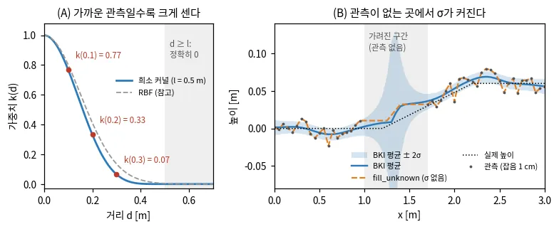
*그림 — travplan 작도: (A) 희소 커널 k(d), l = 0.5 m. 반경 밖에서 정확히 0이다. (B) 가운데 0.7 m가 가려진 높이 단면(작은 예와 같은 l = 0.5 m, 잡음 0.01 m, λ = 0.01). BKI 평균 ± 2σ는 관측이 없는 곳에서 넓어지고, fill_unknown(같은 규칙의 1차원판)은 높이만 채운다. 코드: scripts/make_doc_figures.py*

수식 보기

**베이즈 틀.** 질의 칸 $x_*$의 잠재 매개변수 $\theta_*$(클래스 확률, 또는 높이의 평균)에 사전분포 $p(\theta_*)$를 두고, 관측 $(x_i, y_i)$의 우도에
커널 값 $k(x_*, x_i) \in [0, 1]$을 지수로 걸어 약하게 만든다(확장 우도). 매끄러움 제약 아래 엔트로피가 가장 큰 분포를 고르면 이 꼴이 나온다(Vega-Brown 외
2014).

$$ p(\theta_* \mid x_*, \mathcal{D}) \propto \Big[\prod_{i=1}^{N} p(y_i \mid \theta_*)^{k(x_*, x_i)}\Big]\, p(\theta_*) $$

우도가 지수족이고 켤레 사전분포를 쓰면 관측 $i$는 충분 통계량에 $k(x_*, x_i)$배로 더해진다. 그래서 사후분포가 닫힌 식이고 순차 갱신이 된다.

**분류(시맨틱, traversability).** 클래스 $c$의 확률에 Dirichlet 사전분포 $\mathrm{Dir}(\alpha_0)$를 두고, 관측 $(x_i, y_i)$가 칸 $x_*$에 거리 커널
$k$만큼 기여한다고 본다.

$$ \alpha_c(x_*) = \alpha_{0,c} + \sum_i k(x_*, x_i)\, \mathbb{1}[y_i = c] $$

사후 평균과 분산은 Dirichlet의 성질에서 바로 나온다($S = \sum_c \alpha_c$). $S$가 작은 칸, 즉 가까운 관측이 적은 칸은 분산이 크다.

$$ \mathbb{E}[\theta_c] = \frac{\alpha_c}{S}, \qquad \operatorname{Var}[\theta_c] = \frac{\alpha_c (S - \alpha_c)}{S^2 (S + 1)} $$

커널을 "같은 칸이면 1, 아니면 0"으로 두면 칸 안의 관측만 세는 counting sensor model(S-CSM)이 된다. 두 클래스(지나갈 수 있음, 없음)면
Beta–Bernoulli다. Shan 외(2018)는 예측한 난이도의 평균이 문턱보다 낮고 분산도 문턱보다 작을 때만 지나갈 수 있다고 판정해, 관측이 성긴 곳을
보수적으로 둔다.

**연속값(높이, cost; Shan 외 2018).** $y \sim \mathcal{N}(\mu, \sigma_n^2)$(잡음 분산 $\sigma_n^2$은 안다), 사전분포
$\mu \sim \mathcal{N}(\mu_0, \sigma_n^2 / \lambda)$($\lambda$: 사전분포의 가상 관측 수)라 두면 다음과 같다.

$$ \mathbb{E}[\mu_*] = \frac{\lambda \mu_0 + \sum_i k(x_*, x_i)\, y_i}{\lambda + \sum_i k(x_*, x_i)}, \qquad \operatorname{Var}[\mu_*] = \frac{\sigma_n^2}{\lambda_*}, \qquad \lambda_* = \lambda + \sum_i k(x_*, x_i) $$

$\lambda \to 0$이면 평균은 커널 가중 평균(Nadaraya–Watson 꼴)이 되고, TRIP의 보간식이 이 꼴이다. 분산은 받은 표의 총량 $\lambda_*$에 반비례한다.

**희소 커널.** 흔히 쓰는 희소 커널은 반경 $l$ 밖에서 정확히 0이라 계산이 가볍다($d = \lVert x_* - x_i \rVert$).

$$ k(d) = \begin{cases} \dfrac{1}{3}\Big(2 + \cos\dfrac{2\pi d}{l}\Big)\Big(1 - \dfrac{d}{l}\Big) + \dfrac{1}{2\pi} \sin\dfrac{2\pi d}{l}, & d < l \\[4pt] 0, & d \ge l \end{cases} $$

Melkumyan과 Ramos(IJCAI 2009)의 희소 공분산 함수다. $k(0) = 1$, $k(l) = 0$이고 양 끝에서 기울기도 0이라 매끄럽게 사라진다. $k(0.2l) = 0.77$,
$k(0.4l) = 0.33$, $k(0.6l) = 0.065$, $k(0.8l) = 0.0026$이라 실제 영향은 반경의 60–70% 안에서 끝난다.

**작은 예(식).** $l = 0.5$ m, $\sigma_n = 0.01$ m, $\lambda = 0.01$, $\mu_0 = 0$, $k_A = k(0.1) = 0.767$, $y_A = 0$, $k_B = k(0.2) = 0.332$,
$y_B = 0.03$이면 $\lambda_* = 1.109$, $\mathbb{E}[\mu_*] = 0.332 \cdot 0.03 / 1.109 = 0.009$ m, $\sqrt{\operatorname{Var}[\mu_*]} = 0.0095$ m다.
같은 칸을 두 클래스로 보면($\alpha_0 = 0.1$, A는 쉬움, B는 어려움) $\alpha = (0.867, 0.432)$, 쉬움 확률 $0.67$, 표준편차 $0.31$이다. 0.1 m 거리에
쉬움 관측이 10개 있으면 $\alpha = (7.77, 0.1)$이라 확률 $0.99$, 표준편차 $0.04$로 좁아진다.

**변형.** Evidential Semantic Mapping은 원-핫 대신 확률 라벨 $p_i$를 그대로 더하고($\alpha_t^c = \alpha_{t-1}^c + \sum_i k(x_*, x_i)\, p_i^c$),
불확실성 $u_i$(배경 0.8의 evidential $u = C/S$)로 커널 길이를 $l \cdot \beta e^{1 - \gamma u_i}$로 바꾸며, 불확실성이 문턱을
넘는 관측은 버린다. E2-BKI는 점들을 타원 가우시안 원시체로 묶어 커널이 장면 기하를 따르게 한다. TRIP의 T-BGK는 발 디딤 위험 $r^{\text{step}}$만큼 이웃의 가중을 줄인다.

$$ k^{\mathcal{T}}(e^\alpha, e^\beta) = \big(1 - r^{\text{step}}_{e^\beta}\big)\, k(e^\alpha, e^\beta), \qquad \bar y_e = \frac{\sum_i k^{\mathcal{T}}(e^i, e)\, y_{e^i}}{\sum_i k^{\mathcal{T}}(e^i, e)} $$

**참고문헌.**

- Vega-Brown 외, *Nonparametric Bayesian inference on multivariate exponential families*, NeurIPS 2014 — [NeurIPS 2014](https://proceedings.neurips.cc/paper_files/paper/2014/hash/a99cb6ad47a9762c9e0c5507508105a9-Abstract.html). BKI의 원 논문이다. 확장 우도가 왜 최대 엔트로피인지 보인다.
- Shan 외, *Bayesian Generalized Kernel Inference for Terrain Traversability Mapping*, CoRL 2018 — [PMLR 87](https://proceedings.mlr.press/v87/shan18a.html). 높이 회귀와 traversability 분류를 BKI로 푼 지형 지도다. travplan에 가장 가까운 적용이다.
- Gan 외, *Bayesian Spatial Kernel Smoothing for Scalable Dense Semantic Mapping*, RA-L 2020 — [arXiv:1909.04631](https://arxiv.org/abs/1909.04631). Dirichlet 형태의 semantic BKI와 희소 커널, 보도 보행 실험.
- Kim 외, *Evidential Semantic Mapping in Off-road Environments with Uncertainty-aware Bayesian Kernel Inference*, IROS 2024 — [arXiv:2403.14138](https://arxiv.org/abs/2403.14138). 불확실성으로 커널을 조절하는 Evidential BKI(§A.10.3).
- Kim 외, *E2-BKI: Evidential Ellipsoidal Bayesian Kernel Inference for Uncertainty-aware Gaussian Semantic Mapping*, RA-L 2026 — [arXiv:2509.11964](https://arxiv.org/abs/2509.11964). 경계를 가로질러 번지는 문제를 타원 커널로 줄인다.
- Oh 외, *TRIP: Terrain Traversability Mapping With Risk-Aware Prediction for Enhanced Online Quadrupedal Robot Navigation*, arXiv 2024 — [arXiv:2411.17134](https://arxiv.org/abs/2411.17134). 빈 칸 보간을 발 디딤 위험으로 제한하는 T-BGK.

### 0.14 VQ-VAE: 연속 장면을 이산 토큰으로

OccWorld 계열(§A.6)은 occupancy 장면을 ==코드북의 이산 토큰 열로 바꾼 뒤, 언어모델처럼 다음 토큰을 예측해 미래 장면을 만든다.== 그 토큰화가
VQ-VAE(vector-quantized variational autoencoder)다. 인코더가 낸 벡터마다, 학습한 코드북 $K$개 중 가장 가까운 벡터의 번호를 붙인다.
장면 한 장이 정수 격자가 되고, 미래 예측은 칸마다 $K$개 중 하나를 고르는 분류가 된다.

**왜 필요한가.**
- **장면이 크다.** Occ3D-nuScenes 한 장은 $200 \times 200 \times 16 = 640{,}000$ voxel이고, 칸마다 18가지 라벨(빈 칸 포함) 중 하나다.
  이 격자에서 바로 미래를 예측하면 계산이 크고, 칸 대부분은 빈 공간이다.
- **평균은 흐리다.** 연속값을 회귀하면 가능한 미래들의 평균이 나온다. 보행자가 왼쪽으로 갈지 오른쪽으로 갈지 모르면, 평균은 두 자리에
  반쯤 걸친 흐린 장면이다. 토큰마다 $K$개 코드의 확률을 내면 여러 미래를 분포로 담고, 표본을 뽑으면 그중 하나가 나온다.
- **언어모델을 그대로 쓴다.** 토큰이 이산이면 GPT류 transformer를 교차 엔트로피로 학습하고, 한 토큰씩 또는 한 시각씩 이어 생성한다.
- **travplan에서는** 등속 원판(`DynamicObstacles`) 대신 박스 없이 "TravMap 시퀀스의 다음 프레임"을 예측하는 길이다(TP-0012의 대안 경로).

**직관.** 256색 GIF를 떠올리면 된다. GIF는 픽셀마다 색을 적지 않고 팔레트 256색 중 번호를 적는다. VQ-VAE는 그 팔레트(코드북)를
데이터에서 배우고, 픽셀 대신 작은 패치의 특징 벡터에 번호를 붙인다.
1. **줄인다.** 인코더가 장면을 작은 격자의 벡터 $z_e$로 줄인다. OccWorld는 200×200 BEV를 50×50으로 줄이고 칸마다 128차원 벡터를 낸다.
2. **가장 가까운 코드로 바꾼다.** 벡터마다 코드북 $\{e_k\}$(OccWorld는 $K = 512$)에서 가장 가까운 것을 고르고, 그 번호 $k^*$를 토큰으로
   쓴다. k-means의 할당 단계와 같다.
3. **되살린다.** 디코더가 코드 벡터 격자에서 원래 장면을 복원한다. 복원이 잘 되도록 인코더, 디코더, 코드북을 함께 학습한다.
4. **기울기를 건너뛴다.** 가장 가까운 코드를 고르는 argmin에는 기울기가 없다. 그래서 디코더 입력 $z_q$에 온 기울기를 인코더 출력 $z_e$로
   그대로 복사한다(STE, straight-through estimator).
5. **서로 당긴다.** 코드북 항은 뽑힌 코드를 인코더 출력 쪽으로 당긴다. commitment 항은 인코더 출력이 코드에서 멀어지지 않게 붙잡는다.
6. **토큰 위에서 생성 모델을 배운다.** 토크나이저를 고정하고 토큰 열의 분포를 따로 학습한다. 원 논문은 PixelCNN을, OccWorld는 GPT류
   시공간 transformer를 썼다.

**작은 예.** 코드북이 2차원 코드 세 개 $e_1 = (0, 0)$, $e_2 = (1, 0)$, $e_3 = (0, 1)$이고, 인코더가 $z_e = (0.8, 0.3)$을 냈다고 하자.
1. 거리 제곱은 $e_1$까지 0.73, $e_2$까지 0.13, $e_3$까지 1.13이다. $e_2$가 뽑힌다. 토큰은 2이고 $z_q = (1, 0)$이다.
2. 코드북 항은 $\lVert z_e - e_2 \rVert^2 = 0.13$이다. $e_2$에 대한 기울기는 $2(e_2 - z_e) = (0.4, -0.6)$이다. 학습률 0.1로 한 번
   내리면 $e_2$가 $(0.96, 0.06)$으로 $z_e$ 쪽에 다가간다.
3. commitment 항은 $\beta = 0.25$에서 $0.25 \times 0.13 = 0.0325$다. $z_e$에 대한 기울기 $2\beta(z_e - e_2) = (-0.1, 0.15)$를 따라
   내려가면 $z_e$가 $e_2$ 쪽으로 움직인다.
4. 디코더에서 $z_q$로 온 기울기가 $(0.3, -0.2)$라면, STE가 이것을 $z_e$로 복사한다. 인코더가 받는 기울기는 commitment 몫을 더해
   $(0.2, -0.05)$다.
5. 압축으로 보면, OccWorld 설정에서 한 장면의 라벨은 $640{,}000 \times \log_2 18 \approx 2.67$ Mbit다. 토큰은
   $2{,}500 \times \log_2 512 = 22{,}500$비트다. 약 119배 줄어든다.

**함정.**
- **죽은 코드(코드북 붕괴).** 한 번도 뽑히지 않은 코드는 코드북 항의 기울기를 받지 못해 영영 움직이지 않는다. 아래 작도에서 코드를 원점
  근처 작은 범위에서 시작하면 16개 중 6개만 쓰였고, 데이터 표본으로 시작하면 16개를 모두 썼다. 대책은 데이터 표본이나 k-means로
  초기화하기, 안 쓰이는 코드를 인코더 출력으로 다시 뽑기, 코드 사용률 감시다. FSQ(finite scalar quantization)는 코드북을 없애 이 문제를 피한다.
- **코드북 크기와 토큰 해상도는 절충이다.** OccWorld 표 3에서 코드북을 1,024개로 늘리면 재구성 mIoU(mean intersection over union)가
  66.38%에서 60.50%로 떨어졌다(과적합). 토큰 격자를 100×100으로 키우면 재구성은 78.12%로 좋아졌지만, 예측 mIoU(1–3초 평균)는
  17.14%에서 12.38%로 나빠졌다. 토큰이 잘면 복원은 쉽지만 다음 장면을 예측하기는 어렵다.
- **토크나이저가 예측의 상한이다.** 예측한 토큰도 같은 디코더로 장면이 되므로, 재구성에서 잃은 구조는 예측 단계에서 되살릴 수 없다.
  DOME 표 1의 재구성 mIoU는 OccWorld의 VQ 토크나이저가 65.7%, 빈 칸을 버린 VQ인 OccLLaMA가 75.2%, 연속 잠재를 쓴 DOME의 VAE가
  83.1%다. 구조도 서로 달라서 이 차이가 모두 양자화 탓은 아니다.
- **STE는 근사다.** 인코더는 $z_q$에서 잰 기울기를 $z_e$의 기울기로 받는다. $z_e$가 코드에서 멀면 근사가 나빠져 commitment 항이 필요하다.
- **이름만 VAE다.** KL 항이 상수라 학습은 사실상 오토인코더다. 생성하려면 토큰 위의 사전분포를 따로 배워야 하고, 토크나이저 오류가 그대로 넘어간다.
- **자기회귀 오차가 쌓인다.** 예측한 토큰을 다음 입력으로 쓰면 오차가 누적된다. GEM(§A.6)이 연속 4D 가우시안으로 바꾼 이유다.

**어디서 쓰나.**
- §A.6 OccWorld 토글: "장면 토크나이저(배경 0.14 VQ-VAE)". 클래스 임베딩을 높이축으로 이어 BEV로 만들고, 2D 합성곱으로 줄인 뒤
  코드북으로 양자화한다. 시공간 transformer가 다음 시각의 토큰 전체를 예측한다. §D.0과 §D.3의 표도 OccWorld를 이렇게 요약한다.
- §A.6 OccLLaMA와 DOME 토글: OccLLaMA는 빈 voxel을 버린 기둥 특징을 VQ로 이산화해 장면·언어·행동 토큰을 한 어휘로 합친다.
  DOME은 이산 토큰 대신 연속 VAE 잠재에 diffusion을 쓴 대조군이다.
- 코드: travplan에는 VQ 토크나이저가 없다. 가장 가까운 것은 `travplan/planners/learned/cdit.py`의 CDiT다. `build_causal_agent_time_mask_v2`가
  (에이전트, 시각) 토큰에 "같은 시각끼리는 모두, 시각 사이는 과거만" 보는 마스크를 걸어, OccWorld의 시공간 transformer와 모양이 같다.
  다만 토큰이 연속 벡터라 코드북이 없고, 다음 토큰을 분류하는 대신 flow matching(배경 0.6)으로 생성한다(`joint_flow_model.py`).

*그림 — VQ-VAE (Fig. 1): 왼쪽은 인코더 출력을 코드북의 가장 가까운 벡터로 바꿔 디코더에 넣는 구조, 오른쪽은 임베딩 공간이다. 인코더 출력(초록 점)은 가장 가까운 e2로 바뀌고, 빨간 기울기가 인코더 출력을 옮겨 다음 할당을 바꿀 수 있다. 출처: [arXiv:1711.00937](https://arxiv.org/abs/1711.00937)*

*그림 — OccWorld (Fig. 3): 3D occupancy 장면 토크나이저. CNN 인코더 출력을 학습 가능한 코드북으로 양자화해 이산 토큰을 얻고, 디코더가 토큰에서 occupancy를 복원하도록 오토인코더와 코드북을 함께 학습한다. 출처: [arXiv:2311.16038](https://arxiv.org/abs/2311.16038)*

*그림 — VQ-VAE (Fig. 7): 처음 6프레임을 주고, 이후 프레임을 행동 조건(위는 계속 앞으로, 아래는 계속 오른쪽으로)으로 생성했다. 생성은 잠재 토큰 공간에서만 하고 디코더로 그린다. 토큰 위에서 행동 조건부로 미래를 만드는 world model의 초기 예다. 출처: [arXiv:1711.00937](https://arxiv.org/abs/1711.00937)*

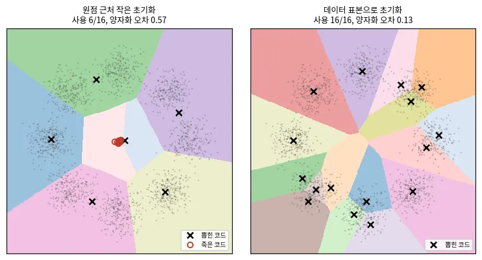
*그림 — travplan 작도: 2차원 점 2,000개(원 위 덩어리 8개)에 코드 16개를 코드북 항만으로 학습했다. 원점 근처 ±0.0625 안에서 시작하면 6개만 뽑히고, 죽은 코드 10개(빨간 원)가 가운데에 겹쳐 남는다(양자화 오차 0.57). 데이터 표본으로 시작하면 16개를 모두 쓴다(0.13). 색 칸은 같은 토큰이 되는 입력 영역이다. 코드: scripts/make_doc_figures.py*

수식 보기

**기호.**
- $x$: 입력 장면. $z_e(x) \in \mathbb{R}^{h \times w \times C}$: 인코더 출력(칸마다 $C$차원 벡터). $\hat x$: 디코더 복원.
- $\{e_k\}_{k=1}^{K}$, $e_k \in \mathbb{R}^C$: 코드북. $k^*$: 뽑힌 번호(토큰). $z_q$: 양자화된 벡터.
- $\mathrm{sg}[\cdot]$: stop-gradient. 앞으로는 그대로 통과시키고 뒤로는 기울기 0을 낸다. $\beta$: commitment 가중치.

인코더 출력 $z_e(x)$를 코드북 $\{e_k\}$에서 가장 가까운 벡터로 바꾼다.

$$ z_q(x) = e_{k^*}, \qquad k^* = \arg\min_k \lVert z_e(x) - e_k \rVert $$

$\arg\min$은 미분할 수 없으므로 기울기를 그대로 통과시키고(straight-through), 코드북과 인코더를 서로 끌어당기는 두 항을 더한다
($\mathrm{sg}$: stop-gradient).

$$ \mathcal{L} = \lVert x - \hat x \rVert^2 + \lVert \mathrm{sg}[z_e] - e_{k^*} \rVert^2 + \beta\, \lVert z_e - \mathrm{sg}[e_{k^*}] \rVert^2 $$

**항마다 배우는 것.** 첫 항(복원)은 디코더와, STE를 거쳐 인코더를 학습한다. 둘째 항(코드북)은 코드만 움직인다. 셋째 항(commitment)은
인코더만 움직인다. 원 논문은 $\beta = 0.25$를 썼고, 0.1–2.0에서 결과가 비슷했다. 복원 항은 데이터에 맞춘다. OccWorld는 칸마다 softmax로
클래스를 분류해 occupancy를 복원한다. STE는 구현이 한 줄이다. 앞으로 계산하면 $z_q$이고, 뒤로는 $z_e$에 대한 항등 함수다.

$$ \tilde z = z_e + \mathrm{sg}[z_q - z_e] \quad\Rightarrow\quad \tilde z = z_q, \qquad \frac{\partial \mathcal{L}}{\partial z_e} \approx \frac{\partial \mathcal{L}}{\partial \tilde z} $$

**왜 VAE인가.** 사후분포가 one-hot $q(z = k \mid x) = \mathbb{1}[k = k^*]$이고 사전분포가 균등 $p(z = k) = 1/K$이면, ELBO(evidence lower bound)의 KL 항은
상수 $\sum_k q(k \mid x) \log \frac{q(k \mid x)}{1/K} = \log K$라 학습에서 뺀다. $K = 512$면 $\log 512 \approx 6.24$ nat, 곧 토큰 하나에 9비트다.

**EMA(exponential moving average) 갱신.** 코드북 항 대신 k-means의 평균 갱신을 이동평균으로 한다($\gamma = 0.99$). $n_k$는 배치에서 $e_k$에 할당된 수, $z_{k,j}$는
그 인코더 출력이다. 작은 예에서 $N_2 = 1$, $m_2 = e_2$로 시작해 표본 하나를 넣으면 $e_2 = (0.998, 0.003)$이다. 경사하강보다 천천히 움직인다.

$$ N_k \leftarrow \gamma N_k + (1 - \gamma)\, n_k, \qquad m_k \leftarrow \gamma\, m_k + (1 - \gamma) \sum_j z_{k,j}, \qquad e_k = \frac{m_k}{N_k} $$

**작은 예를 식으로.** $e_1 = (0, 0)$, $e_2 = (1, 0)$, $e_3 = (0, 1)$, $z_e = (0.8, 0.3)$, $\beta = 0.25$.

$$ \lVert z_e - e_k \rVert^2 = (0.73,\ 0.13,\ 1.13) \;\Rightarrow\; k^* = 2, \qquad \nabla_{e_2} = 2(e_2 - z_e) = (0.4,\ -0.6), \qquad \nabla_{z_e}^{\text{commit}} = 2\beta(z_e - e_2) = (-0.1,\ 0.15) $$

**두 번째 단계, 토큰 위의 사전분포.** 토크나이저를 고정하고 토큰 열의 분포를 자기회귀로 배운다(칸마다 $K$개 코드의 분류, 교차 엔트로피).
OccWorld는 한 시각의 장면 토큰과 자차 토큰 묶음 $\mathbf{T}$를 통째로 예측한다($T$ 현재 시각, $t$ 과거 프레임 수). 시각 안은 공간 attention, 시각 사이는 인과 attention으로 잇는다.

$$ p_\theta(k_{1:N}) = \prod_{n=1}^{N} p_\theta(k_n \mid k_{<n}), \qquad w(\mathbf{T}^{T}, \dots, \mathbf{T}^{T-t}) = \mathbf{T}^{T+1} $$

**변형.**
- **OccWorld.** $y \in \mathbb{R}^{H \times W \times D}$의 클래스마다 $C'$차원 임베딩을 주고 높이축으로 이어 $H \times W \times DC'$의 BEV로
  만든다. 2D 합성곱으로 $d = 4$배 줄이고 코드 512개(128차원)로 양자화한다.
- **OccLLaMA와 DOME.** OccLLaMA는 빈 voxel을 버린 기둥 특징을 VQ로 이산화한다. DOME은 양자화하지 않고 연속 VAE 잠재 위에서 diffusion으로
  미래를 만든다(배경 0.5).
- **FSQ.** 코드북을 없앤다. 각 차원을 $L_i$단계로 묶어 반올림하면 코드북이 암묵적으로 $\prod_i L_i$개다. 아래 식은 홀수 $L_i$의 경우다.
  짝수 $L_i$는 값을 반 칸 옮기는 비대칭 함수를 쓴다(논문 부록 A.1). 코드북 항과 commitment 항이 필요 없다. 논문은 $L_i \ge 5$를
  권했고, 예를 들어 $L = [8, 5, 5, 5]$면 1,000개다.

$$ \hat z_i = \mathrm{round}\big(\lfloor L_i / 2 \rfloor \tanh z_i\big), \qquad |\mathcal{C}| = \prod_{i} L_i $$

**참고문헌.**
- van den Oord 외, *Neural Discrete Representation Learning*, NeurIPS 2017 — [arXiv:1711.00937](https://arxiv.org/abs/1711.00937). VQ-VAE 원 논문. 세 항의 손실, STE, EMA 갱신(부록)을 여기서 본다.
- Gray, *Vector quantization*, IEEE ASSP Magazine 1984 — [doi:10.1109/MASSP.1984.1162229](https://doi.org/10.1109/MASSP.1984.1162229). 벡터 양자화 자체의 입문. 코드북 설계와 Lloyd(k-means) 반복을 설명한다.
- Esser 외, *Taming Transformers for High-Resolution Image Synthesis*, CVPR 2021 — [arXiv:2012.09841](https://arxiv.org/abs/2012.09841). VQ 토크나이저 위에 자기회귀 transformer를 올리는 두 단계 방식의 표준. OccWorld와 같은 구성이다.
- Mentzer 외, *Finite Scalar Quantization: VQ-VAE Made Simple*, ICLR 2024 — [arXiv:2309.15505](https://arxiv.org/abs/2309.15505). 코드북 붕괴의 원인과, 코드북 없이 반올림으로 대신하는 방법.
- Zheng 외, *OccWorld: Learning a 3D Occupancy World Model for Autonomous Driving*, ECCV 2024 — [arXiv:2311.16038](https://arxiv.org/abs/2311.16038). §A.6이 기대는 응용. occupancy 토크나이저와 시공간 GPT.
- Wei 외, *OccLLaMA: An Occupancy-Language-Action Generative World Model for Autonomous Driving*, arXiv 2024 — [arXiv:2409.03272](https://arxiv.org/abs/2409.03272). 희소 VQ 토크나이저로 장면·언어·행동을 한 어휘에 넣는다.

---

<!-- tab: Planner·학습 -->

### 0.5 Diffusion 모델과 guidance

diffusion 모델은 ==데이터에 노이즈를 조금씩 더하는 과정을 거꾸로 배워서, 순수한 노이즈에서 데이터를 만들어 낸다.== 궤적 하나를 데이터 한 점으로
보면 궤적의 분포를 배우게 된다. 그래서 기둥을 왼쪽으로도 오른쪽으로도 비켜 갈 수 있는 갈림길에서 두 답을 모두 낸다(§B.3, §B.8).
guidance는 학습이 끝난 모델에 **재학습 없이** 원하는 성질(충돌 회피, 낮은 지형 비용)을 덧붙이는 방법이다.

**왜 필요한가.** 회귀로 배운 Planner는 시연의 평균을 낸다. 시연의 절반이 기둥 왼쪽으로, 절반이 오른쪽으로 비켜 갔다면 평균 궤적은 기둥으로
곧장 간다. 보도에는 보행자를 어느 쪽으로 피할지 같은 갈림길이 흔하다. 답이 여럿이면 한 점이 아니라 분포를 배워야 한다. 궤적은 고차원 벡터이고
(Planner D의 출력은 40스텝 × 3채널 = 120차원), diffusion은 이런 분포를 안정적으로 배우는 대표 방법이다. 배포 환경에는 학습 때 없던 보행자와
치명 셀이 나온다. 그때마다 재학습할 수는 없으므로, 샘플링 도중에 비용을 끼워 넣는 guidance가 필요하다.

**직관.** 잉크 한 방울이 물에 퍼지는 과정을 거꾸로 돌린다고 보면 된다.

1. **순방향(망가뜨리기).** 시연 궤적에 작은 가우시안 노이즈를 여러 번 더한다. 수백 번 더하면 궤적의 흔적이 사라지고 순수한 노이즈만 남는다.
   학습할 것이 없는 과정이고, 어느 시각 $t$의 상태든 식 하나로 바로 만든다.
2. **학습(되돌리는 법).** 노이즈가 섞인 궤적과 시각 $t$를 주고 섞인 노이즈를 맞히게 한다. 노이즈를 알면 그만큼 빼서 덜 망가진 궤적을 얻는다.
   노이즈를 맞히는 것은 데이터가 더 많은 쪽을 가리키는 방향(score)을 아는 것과 같다.
3. **생성(거꾸로 걷기).** 순수 노이즈에서 시작해 네트워크가 가리키는 쪽으로 조금씩 옮긴다. 앞쪽 스텝이 큰 구조(왼쪽인가 오른쪽인가)를,
   뒤쪽 스텝이 곡률과 속도 같은 세부를 정한다. 시작 노이즈가 다르면 다른 모드에 도착하므로, 여러 번 뽑으면 후보가 여러 개 나온다.
4. **guidance(도중에 밀기).** 매 스텝 지금 상태를 끝까지 되돌렸을 때의 궤적 $\hat x_0$를 예측하고, 그 궤적의 비용이 줄어드는 쪽으로 조금 더 민다.
   네트워크는 그대로 둔다.

**작은 예.** 기둥 하나를 두고 시연의 절반은 왼쪽(횡 오프셋 $y = -1$ m), 절반은 오른쪽($y = +1$ m)으로 비켜 갔다.

1. **회귀.** 제곱 오차를 최소화하는 답은 평균 $y = 0$이다. 기둥으로 곧장 간다.
2. **순방향.** 신호와 노이즈의 분산이 반반인 시각($\bar\alpha_t = 0.5$)에서 $x_0 = +1$, $\epsilon = -0.4$면 $x_t = 0.707 - 0.283 = 0.42$다.
3. **denoiser.** 이 $x_t$만 보면 원래 궤적이 오른쪽이었을 확률은 77%다. 최적 denoiser는 두 답을 이 확률로 섞은 $\hat x_0 = 0.54$를 낸다.
   네트워크가 맞히는 노이즈도 실제 값 $-0.4$가 아니라 이 평균에 맞춘 $\hat\epsilon = 0.06$이다.
4. **생성.** 스텝을 거치며 이 확률이 0이나 1로 좁혀지고, 샘플은 $\pm 1$ 중 하나에 도착한다. 아래 작도 왼쪽에서 28개 중 14개가 오른쪽으로 간다.
5. **guidance.** 오른쪽에 보행자가 있어 에너지 $\mathcal{E}(y) = y$(오른쪽으로 1 m마다 1씩 높다)를 두면, 목표 분포 $q_0\, e^{-\mathcal{E}}$에서
   오른쪽 모드의 몫은 $e^{-1}/(e^{-1} + e^{1}) = 0.12$로 준다. 작도 오른쪽의 DPS(diffusion posterior sampling) guidance는 28개 중 4개(14%)만 오른쪽으로 보낸다.

**함정.**

- **스텝 수가 곧 지연이다.** DDPM(denoising diffusion probabilistic model) 원형은 1000스텝이다. 상미분방정식(ODE) 풀이기로 10–20스텝까지
  줄여도 스텝마다 네트워크를 한 번 돌리고, 그 비용이 후보 수만큼 곱해진다. 더 줄이는 길은 flow matching(0.6)과 truncation(0.7)이다.
- **guidance가 세면 학습 분포 밖으로 밀린다.** 비용은 줄지만 시연에 없던 모양이 나온다. 노이즈가 큰 앞쪽 스텝의 $\hat x_0$는 평균에 가까운 흐린
  추정이라, 그 위에서 잰 비용 기울기도 흐리다. JPPD와 CoDiG는 guidance 가중치를 뒤쪽 스텝으로 갈수록 키운다(§B.8.2).
- **기울기가 없는 비용은 그대로 못 쓴다.** 치명 셀처럼 계단형인 비용은 거의 모든 곳에서 기울기가 0이다. 부드러운 대리 비용을 따로 두거나,
  기울기 없이 샘플의 비용 가중 평균으로 guidance를 추정한다(GRACE, 0.2의 MPPI와 같은 식).
- **분포를 배워도 다양성은 보장되지 않는다.** 서로 다른 노이즈가 거의 같은 궤적으로 수렴하는 mode collapse가 주행 계획에서 보고됐다(0.7).
- **기구학은 보장하지 않는다.** 위치열을 생성하면 스워브의 속도·가속 한계를 넘을 수 있다. 추종기나 이차 계획(QP)으로 고치거나 제어 공간에서 생성한다(§B.8.2).

**어디서 쓰나.**

- 인식: §A.6의 DOME은 occupancy 잠재의 미래 프레임을 diffusion으로 만드는 world model이다(이산 토큰과의 대비는 배경 0.14).
  §A.8의 VLA(vision-language-action) 행동 전문가(TANGO 등)는 diffusion이나 flow matching으로 행동 묶음을 만든다.
- Planner: §B.3 NavDP(확산 궤적 후보와 critic), §B.6 NoMaD(목표를 가리는 확산 정책), §B.8.0 Diffuser·Diffusion Policy·MPD(guidance와
  inpainting), §B.8 Diffusion Planner(DPM-Solver++ 10스텝, DPS 에너지 guidance), §B.8.2 PC-Diffuser·GRACE·CoDiG(denoise 루프 안의 제약).
- travplan 코드: diffusion 모델은 없다. DPS식 guidance는 flow matching Planner D의 `FlowPolicy.sample`(`planners/learned/flow_model.py`)에
  `guide`와 `guide_scale` 인자로 옮겨 있다(0.6). 보행자 공동 생성 `JointFlowPolicy.sample`도 같은 루프를 쓴다.

*그림 — DDPM (Fig. 2): 순방향은 데이터에 노이즈를 한 스텝씩 더하고(점선), 학습한 역방향은 노이즈에서 한 스텝씩 되돌린다(실선). 출처: [arXiv:2006.11239](https://arxiv.org/abs/2006.11239)*

*그림 — Score SDE (Fig. 2): 봉우리가 둘인 1차원 데이터를 순방향 확률 미분방정식(SDE)이 가우시안 prior로 보내고(왼쪽), 역방향 SDE가 데이터로 되돌린다(오른쪽). 붉은 경로는 SDE 표본이고, 흰 선은 같은 분포를 지나는 확률 흐름 ODE의 경로다. 둘 다 각 시각의 score만 알면 된다. 출처: [arXiv:2011.13456](https://arxiv.org/abs/2011.13456)*

*그림 — Diffuser (Fig. 1): 로봇 팔의 계획을 흩어진 노이즈 점들에서 시작해 반복 정제로 매끄러운 궤적 하나로 만든다. 궤적 전체가 diffusion의 데이터다. 출처: [arXiv:2205.09991](https://arxiv.org/abs/2205.09991)*

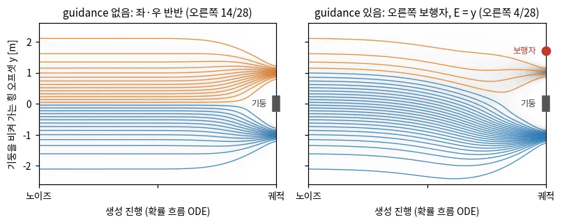
*그림 — travplan 작도: 기둥을 왼쪽(y = −1 m)이나 오른쪽(+1 m)으로 비켜 간 시연의 분포에서 확률 흐름 ODE로 28개를 샘플한다. guidance가 없으면 반반으로 갈리고(왼쪽), 오른쪽 보행자의 에너지 E = y로 DPS guidance를 주면 4개만 오른쪽으로 간다(오른쪽). 코드: scripts/make_doc_figures.py*

수식 보기

**기호.** $x_0$는 깨끗한 궤적(벡터 하나), $x_t$는 diffusion 시각 $t$의 노이즈 섞인 궤적이다. $t = 0$이 데이터, $t = T$가 순수 노이즈다(0.6과 반대).
$\beta_t$는 스텝마다 더하는 노이즈의 분산, $\alpha_t = 1 - \beta_t$, $\bar\alpha_t = \prod_{s \le t} \alpha_s$는 남은 신호의 분산 비율이다.
$\epsilon \sim \mathcal{N}(0, I)$는 표준 가우시안 노이즈, $q_t$는 $x_t$의 분포, $\nabla_{x_t} \log q_t$는 score(밀도가 커지는 방향)다.

**순방향(노이즈 더하기).** 한 스텝은 $q(x_t \mid x_{t-1}) = \mathcal{N}(\sqrt{\alpha_t}\, x_{t-1},\ \beta_t I)$다. 가우시안을 거듭 합쳐도 가우시안이라,
깨끗한 궤적 $x_0$에 스케줄 $\bar\alpha_t$에 따라 노이즈를 한 번에 섞을 수 있다.

$$ q(x_t \mid x_0) = \mathcal{N}\!\big(x_t;\ \sqrt{\bar\alpha_t}\, x_0,\ (1-\bar\alpha_t) I\big) \quad\Longleftrightarrow\quad x_t = \sqrt{\bar\alpha_t}\, x_0 + \sqrt{1-\bar\alpha_t}\,\epsilon $$

**학습.** 네트워크 $\epsilon_\theta$가 섞인 노이즈를 맞히게 한다(조건 $c$: 지도, 경로, 주변 차량 등).

$$ \mathcal{L}(\theta) = \mathbb{E}_{x_0, \epsilon, t}\, \big\lVert \epsilon - \epsilon_\theta(x_t, t, c) \big\rVert^2 $$

**왜 score인가.** 제곱 오차의 최소해는 조건부 평균 $\mathbb{E}[\epsilon \mid x_t]$이다. 여기에 Tweedie 공식
$\mathbb{E}[x_0 \mid x_t] = \big(x_t + (1-\bar\alpha_t)\nabla \log q_t(x_t)\big)/\sqrt{\bar\alpha_t}$와 순방향 식을 함께 쓰면 다음 두 식이 나온다.

$$ \nabla_{x_t} \log q_t(x_t) \approx -\frac{\epsilon_\theta(x_t, t, c)}{\sqrt{1-\bar\alpha_t}}, \qquad \hat x_0(x_t) = \frac{x_t - \sqrt{1-\bar\alpha_t}\,\epsilon_\theta(x_t, t, c)}{\sqrt{\bar\alpha_t}} $$

노이즈를 맞히는 것은 score를 배우는 것과 같다. 모델이 $x_0$를 바로 예측하게 해도 된다(DiffusionDrive).

**샘플링.** 역방향을 확률 흐름 ODE로 보고 적분한다. DPM-Solver(++) 같은 고차 ODE 풀이기를 쓰면 10스텝 안팎으로 줄어든다(Diffusion Planner).
==이 식이 바로 0.6의 $\dot x = v_\theta$다== — 환율과 규약 지뢰는 **0.6b**에 있다.

$$ \frac{dx_t}{dt} = f(t)\, x_t - \tfrac{1}{2} g^2(t)\, \nabla_{x_t} \log q_t(x_t) $$

$f$와 $g$는 순방향을 SDE $dx = f(t)\,x\,dt + g(t)\,dw$로 쓴 계수이고, 위 스케줄에서는 $f = -\tfrac{1}{2}\beta(t)$, $g^2 = \beta(t)$다.
가장 단순한 적은 스텝 규칙은 DDIM(denoising diffusion implicit model, [arXiv:2010.02502](https://arxiv.org/abs/2010.02502))이다.
$\hat x_0$와 노이즈 추정으로 이전 시각 $s < t$의 상태를 바로 만든다.

$$ x_s = \sqrt{\bar\alpha_s}\, \hat x_0(x_t) + \sqrt{1-\bar\alpha_s}\, \epsilon_\theta(x_t, t, c) $$

**Guidance.** 학습한 분포 $q_0$에 에너지 $\mathcal{E}$(충돌, 차선 이탈, 속도 등)의 지수 $e^{-\mathcal{E}}$를 곱해 목표 분포를 만든다.

$$ p_0(x_0) \propto q_0(x_0)\, e^{-\mathcal{E}(x_0)} \quad\Rightarrow\quad \nabla \log p_t(x_t) \approx \nabla \log q_t(x_t) - \nabla_{x_t}\, \mathcal{E}\big(\hat x_0(x_t)\big) $$

정확한 식은 $\nabla \log p_t = \nabla \log q_t + \nabla \log \mathbb{E}_{q(x_0 \mid x_t)}\big[e^{-\mathcal{E}(x_0)}\big]$이고, 이 기댓값을 현재 $x_t$에서 예측한
깨끗한 궤적 $\hat x_0(x_t)$ 한 점으로 근사한 것이 위 식이다. 이렇게 $\hat x_0$에서 에너지를 재는 것이 diffusion posterior sampling(DPS)이고, 별도의 분류기가
필요 없다. DPS는 기울기를 네트워크를 거쳐 $x_t$까지 전파한다. 미분할 수 없는 에너지는 MPPI식 가중평균으로 근사할 수 있다(GRACE).

**작은 예를 식으로.** 데이터가 $\pm 1$ 두 점이면 사후 확률과 최적 denoiser가 닫힌 식이다.

$$ P(x_0 = +1 \mid x_t) = \mathrm{sigmoid}\Big(\frac{2\sqrt{\bar\alpha_t}\, x_t}{1-\bar\alpha_t}\Big), \qquad \hat x_0(x_t) = \tanh\Big(\frac{\sqrt{\bar\alpha_t}\, x_t}{1-\bar\alpha_t}\Big) $$

$\bar\alpha_t = 0.5$, $x_t = 0.424$면 $\mathrm{sigmoid}(1.2) = 0.77$, $\hat x_0 = \tanh(0.6) = 0.54$, $\hat\epsilon = 0.06$이고 score는 $-0.09$다.
$\mathcal{E}(x_0) = k\,x_0$로 $e^{-\mathcal{E}}$를 곱하면 오른쪽 모드의 몫은 $1/(1 + e^{2k})$이고, $k = 1$에서 0.12다.
DPS 항은 $k\,\tfrac{\sqrt{\bar\alpha_t}}{1-\bar\alpha_t}(1 - \hat x_0^2) = 1.01$이다. score에서 이 값을 빼면 $-1.10$이 되어 왼쪽을 가리킨다.

**논문들이 쓰는 변형.** classifier guidance([arXiv:2105.05233](https://arxiv.org/abs/2105.05233))는 따로 학습한 분류기의 기울기 $\nabla \log p(c \mid x_t)$를
score에 더한다. classifier-free guidance(CFG, [arXiv:2207.12598](https://arxiv.org/abs/2207.12598))는 조건을 가끔 빼고 학습한 한 네트워크로
두 예측을 섞는다. $w$가 클수록 조건을 세게 따르지만, 학습 때 정한 조건만 세게 할 수 있다. 새 비용을 넣는 것은 위의 에너지 guidance다.

$$ \tilde\epsilon_\theta(x_t, c) = (1 + w)\, \epsilon_\theta(x_t, c) - w\, \epsilon_\theta(x_t, \varnothing) $$

**참고문헌.**

- Ho 외, *Denoising Diffusion Probabilistic Models*, NeurIPS 2020 — [arXiv:2006.11239](https://arxiv.org/abs/2006.11239). 순방향 닫힌 식과 노이즈 예측 손실의 원전이다.
- Song 외, *Score-Based Generative Modeling through Stochastic Differential Equations*, ICLR 2021 — [arXiv:2011.13456](https://arxiv.org/abs/2011.13456). score, SDE, 확률 흐름 ODE를 한 틀로 묶어 적은 스텝 풀이기의 바탕을 놓는다.
- Luo, *Understanding Diffusion Models: A Unified Perspective*, arXiv 2022 — [arXiv:2208.11970](https://arxiv.org/abs/2208.11970). 노이즈 예측, score, $x_0$ 예측이 같다는 유도를 한 문서에서 따라가는 튜토리얼이다.
- Chung 외, *Diffusion Posterior Sampling for General Noisy Inverse Problems*, ICLR 2023 — [arXiv:2209.14687](https://arxiv.org/abs/2209.14687). 예측한 $\hat x_0$에서 비용을 재는 DPS guidance의 원전이다.
- Janner 외, *Planning with Diffusion for Flexible Behavior Synthesis*, ICML 2022 — [arXiv:2205.09991](https://arxiv.org/abs/2205.09991). 궤적 전체를 diffusion으로 생성하고 보상 기울기로 유도한 첫 계획 논문이다(§B.8.0).
- Zheng 외, *Diffusion-Based Planning for Autonomous Driving with Flexible Guidance*, ICLR 2025 — [arXiv:2501.15564](https://arxiv.org/abs/2501.15564). §B.8의 원 논문으로, DPM-Solver++ 10스텝과 에너지 guidance를 주행 계획에 쓴다.

### 0.6 Flow matching: 노이즈에서 데이터까지 곧게 가는 속도장

> **수식 없이 먼저 감을 잡고 싶다면**: 데이터 공간 → 확률 경로 → 벡터장 → 흐름 순서로 쌓아 올린
> 한국어 설명이 있다([Turing Post Korea](https://turingpost.co.kr/p/topic-20-flow-matching)).
> 이 절은 그 위에 travplan 구현에 바로 닿는 식과 수치를 얹는다.

flow matching은 diffusion(0.5)과 같은 일을 더 단순하게 한다. ==노이즈 $x_0$와 데이터 $x_1$을 직선으로 잇고, 그 직선을 따라가는 속도를
네트워크가 배운다.== 샘플링은 그 속도장을 몇 스텝 적분하면 끝난다. travplan Planner D(`planners/learned/flow_model.py`)가 이 방식으로
Euler 10스텝에 후보 16개를 만든다.

**왜 필요한가.** Planner D는 계획할 때마다 후보 궤적 16개를 만들고 그중 하나를 고른다. 적분 스텝 수가 곧 지연이라 스텝이 적어야 한다.
diffusion의 역방향 경로는 휘어 있어서, 스텝을 줄이면 오차가 커지고 전용 ODE 풀이기와 노이즈 스케줄 설계가 따라붙는다. flow matching은 학습이
회귀 한 줄(속도 맞히기)이고, 학습 경로가 직선이라 샘플 경로도 덜 휜다. 그래서 가장 단순한 Euler 적분을 쓴다(한계는 아래 함정).
Planner D는 이 구조로 계획 한 번을 3.4 ms에 끝낸다(§B.8.3). 여러 후보, 시간 인덱스 궤적, 비용 유도라는 diffusion의 장점은 그대로 남는다.

**직관.** diffusion이 노이즈를 맞히며 굽은 길을 되짚는다면, flow matching은 속도를 맞히며 출발점과 도착점을 자로 이은 길을 배운다.
==다만 둘은 서로 다른 방법이 아니라 **같은 ODE의 두 좌표계**다== — 변환식과 "무엇이 진짜 다른가"는 **0.6b**에 있다.

1. **짝짓기.** 노이즈 한 점 $x_0$와 시연 한 개 $x_1$을 무작위로 짝짓고 직선으로 잇는다.
2. **라벨.** 직선 위 임의의 시각 $t$에서 점 $x_t = (1-t)\,x_0 + t\,x_1$을 입력으로, 직선의 방향 $x_1 - x_0$를 정답으로 준다. 노이즈 스케줄이 없다.
3. **평균을 배운다.** 같은 점 $x_t$를 여러 직선이 지난다(왼쪽 시연과 짝지은 것, 오른쪽 시연과 짝지은 것). 제곱 오차로 학습하면 네트워크는
   그 방향들의 평균을 배운다. 이 평균 속도장을 따라가는 경로는 서로 교차하지 않는다(아래 travplan 작도 가운데).
4. **생성.** 노이즈에서 시작해 속도장을 따라 $1/n$씩 $n$번 걷는다(Euler 적분). 출발점이 노이즈 분포의 어느 쪽에 있었는지에 따라 왼쪽이나
   오른쪽 시연에 도착한다. 지금 점과 속도로 도착점도 바로 추정한다($\hat x_1 = x_t + (1-t)\,v$). 비용 유도는 이 추정 위에서 비용을 잰다.

**작은 예.** 0.5의 기둥 예를 flow matching으로 다시 푼다. 시연은 $y = -1$ 또는 $+1$ m이고, 노이즈 $x_0$는 표준 정규 분포다.

1. **학습 한 건.** $x_0 = 0.3$, $x_1 = +1$, $t = 0.25$면 $x_t = 0.75 \times 0.3 + 0.25 \times 1 = 0.475$이고, 정답 속도는 $x_1 - x_0 = 0.7$이다.
2. **출발 시각의 속도.** $t = 0$의 $x_0$는 어느 시연과 짝지어질지 아무 정보도 주지 않는다. 그래서 학습된 속도는 $v(x_0, 0) = \mathbb{E}[x_1] - x_0 = -x_0$다.
3. **Euler 1스텝.** $x_0 + v(x_0, 0) = 0$이다. 모든 샘플이 시연 평균, 즉 기둥에 도착한다. 1스텝 flow matching은 회귀와 같다.
4. **스텝을 늘리면.** $x_0 = 0.3$에서 출발한 샘플은 2스텝에 0.29, 3스텝에 0.78, 4스텝에 0.997, 5스텝 이상에서 1.00이다(이상적인 속도장 기준).
5. **비용 유도.** 오른쪽에 보행자가 있어 비용이 $J(\hat x_1) = \hat x_1$이면, 정규화한 기울기는 $+1$이고 매 스텝 속도에서 $s$를 뺀다.
   $s = 1$, 10스텝이면 출발점이 0.87보다 큰 샘플만 오른쪽에 남는다. 오른쪽으로 가는 몫이 50%에서 19%로 준다.

**함정.**

- **스텝이 적으면 평균으로 무너진다.** 위 예처럼 Euler 1스텝은 회귀와 같아 모드를 섞는다. 학습 경로는 직선이어도, 네트워크가 배우는 평균 속도장의
  경로는 모드가 여럿이면 휜다. 휜 경로를 큰 스텝으로 적분하면 오차가 커진다. 1–2스텝으로 줄이려면 샘플한 (노이즈, 결과) 쌍으로 다시 학습해 경로를
  펴는 reflow, 한 스텝 증류, 또는 출발점을 바꾸는 truncation(0.7)이 필요하다.
- **시각 $t$를 뽑는 분포가 품질을 바꾼다.** travplan은 균등 분포를 쓴다. π0는 노이즈가 큰 쪽을 강조한 베타 분포를 쓴다. Stable Diffusion 3는
  가운데를 강조한 logit-normal 분포가 균등보다 낫다고 보고했다([arXiv:2403.03206](https://arxiv.org/abs/2403.03206)).
- **비용 유도는 비싸고, 세면 해롭다.** planner_dg는 스텝마다 `SwerveModel` rollout을 미분한다. TP-0025 스윕(`results/planner_dg_sweep.log`)에서
  계획 시간은 유도 없이 6–11 ms, $s = 1$에서 65–151 ms였다. $s = 3$은 $s = 1$보다 나빴다(MPPI 스택 9/12에서 7/12, tracker 스택 8/12에서 4/12).
  이 스윕은 §B.8.3의 진행 항 수정 전 결과다.
- **흔한 모드로 몰린다.** GuideFlow(§B.8.2)는 rectified flow가 가장 흔한 주행 패턴으로 몰리기 쉽다고 지적한다. 드문 기동은 출발점 설계(0.7)로 보강한다.
- **시각 규약이 논문마다 다르다.** travplan, Lipman의 flow matching, rectified flow, π0는 $t = 0$이 노이즈, $t = 1$이 데이터다.
  diffusion(0.5)과 Stable Diffusion 3는 반대다. JPPD는 데이터를 $Y_0$라 부르지만 $\rho = 1$ 쪽이 데이터다. 식을 옮길 때 $t$의 방향과 속도의 부호부터 맞춘다.

**어디서 쓰나.**

- 인식: §A.8의 TANGO system-1은 flow matching으로 학습한 MM-DiT 행동 전문가다. 원문 그림 설명은 diffusion이라 부르지만 식은 flow matching이다.
- Planner: §B.6b π0(Planner D와 같은 규칙, Euler 10스텝), §B.8.0 GoalFlow(목표점을 고른 뒤 flow matching 1스텝), §B.8.2 GuideFlow(rectified flow에
  제약 guidance)와 JPPD(보도 공유 공간의 로봇·보행자 공동 생성과 안전 guidance), §B.9 DreamFlow(노이즈 대신 지역 잠재에서 넓은 잠재로).
- travplan 코드: `planners/learned/flow_model.py`의 `FlowPolicyConfig`(horizon 40, dt 0.1, `sample_steps` 10), `FlowPolicy.loss`, `FlowPolicy.sample`.
  `planners/learned/flow_planner.py`의 `SelectorConfig`(후보 16개, `guide_scale` 기본 0)와 `FlowPlanner._score`. planner_dg는 `scripts/run_benchmark.py`가
  `guide_scale=1.0`으로 만든다.

*그림 — Flow Matching (Fig. 3 왼쪽): diffusion 조건부 경로. 도착점(검은 원)을 지나쳤다가 되돌아오는 경로가 생긴다. 출처: [arXiv:2210.02747](https://arxiv.org/abs/2210.02747)*

*그림 — Flow Matching (Fig. 3 오른쪽): 최적 수송(OT) 조건부 경로. 같은 도착점으로 곧게, 일정한 속도로 간다. rectified flow와 Planner D가 쓰는 경로다. 출처: [arXiv:2210.02747](https://arxiv.org/abs/2210.02747)*

==여기서 "OT"는 **아무 수송 문제도 풀지 않는다** — 두 가우시안 사이의 닫힌 형식 사상에 붙은 이름이다.== 실제로 OT를 풀어 노이즈와 데이터를 짝짓는 미니배치 OT는 별개이고, 둘의 구분과 travplan에 들어올 자리는 0.2b ③④에 있다.

*그림 — Rectified Flow (Fig. 1): 노이즈에서 고양이 얼굴을 Euler N스텝으로 만든다. 1-rectified flow는 N = 1에서 흐린 평균이 나오고 N = 2부터 쓸 만하다. reflow로 경로를 편 2-rectified flow는 N = 1에서도 선명하다. 출처: [arXiv:2209.03003](https://arxiv.org/abs/2209.03003)*

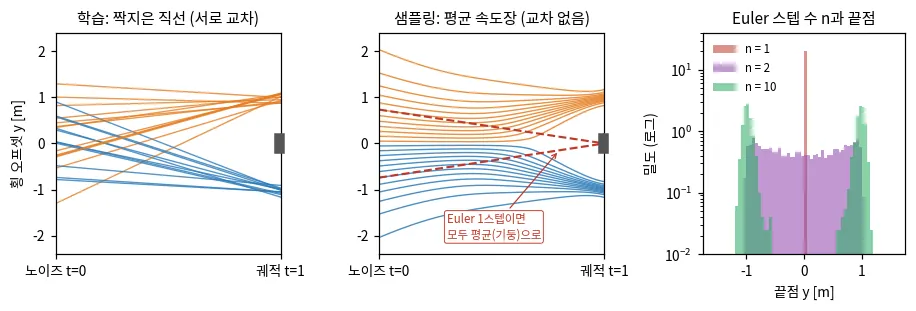
*그림 — travplan 작도: 기둥 예(시연 y = ±1 m)의 rectified flow. 학습 쌍의 직선은 서로 교차하지만(왼쪽), 네트워크가 배우는 평균 속도장의 경로는 교차하지 않고 휜다(가운데). Euler 1스텝은 모든 샘플을 평균(기둥)에 보내고, 2스텝은 그 사이에 흩고, 10스텝이면 두 모드로 갈린다(오른쪽). 코드: scripts/make_doc_figures.py*

수식 보기

**기호.** $x_0 \sim \mathcal{N}(0, I)$는 노이즈, $x_1$은 데이터, $t \in [0, 1]$은 흐름의 시각, $v_\theta$는 속도장 네트워크, $c$는 조건이다. Planner D의
$c$는 TravMap 크롭(64×64 px, 0.1 m 간격, cost·σ·slope·step 4채널), 로봇 좌표계의 subgoal, 현재 twist다.

**학습(rectified flow).** $t \sim U[0,1]$에서 두 점을 선형 보간하고, 그 방향 $x_1 - x_0$를 맞힌다.

$$ x_t = (1-t)\, x_0 + t\, x_1, \quad x_0 \sim \mathcal{N}(0, I), \qquad \mathcal{L}(\theta) = \mathbb{E}_{t, x_0, x_1}\, \big\lVert v_\theta(x_t, t, c) - (x_1 - x_0) \big\rVert^2 $$

**왜 되는가.** 제곱 오차의 최소해는 같은 $x_t$를 지나는 직선 방향들의 조건부 평균 $u_t$다. 연속 방정식이 선형이라, 조건부 흐름들의 평균이 노이즈
분포를 데이터 분포로 옮기는 주변 흐름이 된다. 또 계산할 수 있는 조건부 손실(CFM)의 기울기는 계산할 수 없는 주변 손실(FM)의 기울기와 같다
(Lipman의 정리). 아래 식의 둘째 등호에서 끝점 예측 $\hat x_1 = x_t + (1-t)\,v \approx \mathbb{E}[x_1 \mid x_t]$가 나온다. 0.5의 $\hat x_0$에 해당한다.

$$ u_t(x) = \mathbb{E}\big[x_1 - x_0 \mid x_t = x\big] = \frac{\mathbb{E}[x_1 \mid x_t = x] - x}{1 - t}, \qquad \nabla_\theta \mathcal{L}_{\text{CFM}}(\theta) = \nabla_\theta \mathcal{L}_{\text{FM}}(\theta) $$

**샘플링.** $\dot x = v_\theta(x, t, c)$를 Euler로 $n$스텝 적분한다(Planner D는 $n = 10$).

$$ x_{t + 1/n} = x_t + \tfrac{1}{n}\, v_\theta(x_t, t, c) $$

**Planner D의 데이터 $x_1$.** 궤적이 아니라 **제어 변화율**을 가속 한계로 정규화한 열 $a \in \mathbb{R}^{40 \times 3}$이다. 적분해 제어를 만들고
`SwerveModel`로 굴린다. $a_{\max} = (1.0, 0.8, 2.0)$(전후·좌우 m/s², 회전 rad/s², `SwerveLimits`)이고 $\Delta t = 0.1$ s다.

$$ u_t = u_{\text{now}} + \sum_{s \le t} a_s \odot a_{\max}\, \Delta t, \qquad \text{궤적} = \texttt{SwerveModel.rollout}(\text{pose}, u) $$

**비용 유도(planner_dg).** 매 스텝 끝점을 $\hat x_1 = x + (1-t)\,v$로 예측하고, 그 점에서의 지도 비용 기울기를 정규화해 속도를 고친다
(0.5의 DPS와 같은 발상).

$$ g = \nabla_{\hat x_1} J(\hat x_1), \qquad v \leftarrow v - s \cdot \frac{g}{\lVert g \rVert}\sqrt{3T}, \quad s = 1.0 $$

$T = 40$은 궤적 스텝 수라 $3T$는 $a$의 원소 수다. 그래서 정규화한 기울기는 원소당 RMS(제곱평균제곱근)가 1이다. 스텝마다 $s/n$씩,
10스텝 전체로 최대 $s$(노이즈 표준편차 단위)만큼 민다. DPS와 달리 기울기를
$\hat x_1$에서 멈추고 네트워크 야코비안을 거치지 않는다. 계산이 싸고, 방향은 근사다. $J$는 선택기 점수에서 치명 셀 지시 함수를 부드러운 경첩으로
바꾼 것이다(`FlowPlanner._score(soft=True)`). $C_t$는 궤적 위 TravMap cost, $d_{\text{togo}}$는 끝점의 남은 cost-to-go다.

$$ J = 6 \sum_t C_t\, \Delta t + 50 \sum_t \max(0,\ C_t - 0.5)^2 + 4\, d_{\text{togo}} $$

**작은 예를 식으로.** 데이터가 $\pm 1$ 두 점이면 $x_t \mid x_1 \sim \mathcal{N}(t\,x_1, (1-t)^2)$라 끝점 예측이 닫힌 식이다.

$$ \mathbb{E}[x_1 \mid x_t] = \tanh\Big(\frac{t\, x_t}{(1-t)^2}\Big), \qquad v(x, 0) = -x, \qquad \text{2스텝 결과} = \tanh(x_0) $$

$x_0 = 0.3$이면 1스텝 결과는 0, 2스텝 결과는 $\tanh(0.3) = 0.29$다. 유도 항 $-s$를 넣고 10스텝을 적분하면 오른쪽에 남는 경계가 $x_0 > 0.87$이고,
그 확률은 $1 - \Phi(0.87) = 0.19$다($\Phi$는 표준 정규 누적 분포).

**논문들이 쓰는 변형.**

- Lipman의 OT 경로는 끝에 작은 폭 $\sigma_{\min}$을 남긴다. $x_t = (1 - (1-\sigma_{\min})t)\,x_0 + t\,x_1$이고, 정답 속도는 $x_1 - (1-\sigma_{\min})\,x_0$다.
- π0는 $\mathbf A^\tau = \tau \mathbf A + (1-\tau)\epsilon$로 같은 규칙을 쓴다. $\tau$는 노이즈 쪽을 강조한 베타 분포에서 뽑고,
  추론은 $\delta = 0.1$로 10번 적분한다(§B.6b).
- JPPD는 $\tilde v = v - \lambda_{\text{safe}}(\rho)\,\nabla U_{\text{safe}}$로 유도하고, $\lambda_{\text{safe}}$를 끝으로 갈수록 키운다(§B.8.2).
- DreamFlow는 출발 분포를 가우시안 대신 지역 높이 지도의 잠재로 바꾼다(§B.9).

**참고문헌.**

- Lipman 외, *Flow Matching for Generative Modeling*, ICLR 2023 — [arXiv:2210.02747](https://arxiv.org/abs/2210.02747). 조건부 경로의 회귀로 전체 흐름을 배운다는 정리와 OT 경로의 원전이다.
- Liu 외, *Flow Straight and Fast: Learning to Generate and Transfer Data with Rectified Flow*, ICLR 2023 — [arXiv:2209.03003](https://arxiv.org/abs/2209.03003). 직선 보간, 교차 없는 흐름, reflow를 설명하고, Planner D가 이 식을 따른다.
- Lipman 외, *Flow Matching Guide and Code*, arXiv 2024 — [arXiv:2412.06264](https://arxiv.org/abs/2412.06264). 유도와 변형을 코드와 함께 정리한 튜토리얼이다.
- Black 외, *π0: A Vision-Language-Action Flow Model for General Robot Control*, RSS 2025 — [arXiv:2410.24164](https://arxiv.org/abs/2410.24164). 로봇 행동 묶음에 같은 규칙(Euler 10스텝)을 쓴 대표 사례다(§B.6b).
- Wu 외, *JPPD: Joint Prediction_Planning Diffusion with Differentiable Safety Guidance for Dynamic Obstacle Avoidance in Intelligent Transportation Systems*, arXiv 2026 — [arXiv:2606.20686](https://arxiv.org/abs/2606.20686). 보도 공유 공간에서 flow matching 공동 생성과 끝으로 갈수록 커지는 안전 guidance를 쓴다(§B.8.2).

### 0.6b Diffusion과 flow matching은 같은 것의 두 좌표계다

**한 줄로.** ==0.5와 0.6은 서로 다른 두 방법이 아니다. **같은 미분방정식을 다른 글자로 쓴 것**이다.==
그래서 "우리는 diffusion 대신 flow matching을 쓴다"는 문장은 대개 모델이 아니라 **표기와 경로 선택**을
말하고 있다. 이 절은 그 환율표다.

**왜 이 절이 필요한가.** 0.5와 0.6을 따로 읽으면 세 가지를 틀리기 쉽다.
① 두 논문의 식을 섞어 쓰다가 **부호를 뒤집는다.** ② "flow matching이 더 빠르다"를 모델의 성질로 오해한다 —
빠른 것은 **경로가 곧아서**이지 방법이 달라서가 아니다. ③ 한쪽에서 쓰는 기법(guidance 일정, anchor,
증류)을 다른 쪽으로 못 옮긴다고 생각한다. 실제로는 환율만 알면 거의 다 옮겨진다.

#### 먼저 그림으로

==**노이즈 구름에서 데이터 구름까지 점을 옮기는 일**== 하나를 두고, 두 문헌이 서로 다른 것을 네트워크에
맡긴다. 아래 넷은 **같은 한 가지 정보의 네 가지 표현**이고, 하나를 알면 나머지 셋이 대수로 나온다.

| 네트워크가 내놓는 것 | 뜻 | 주로 쓰는 쪽 |
|---|---|---|
| $\epsilon_\theta$ | "지금 섞여 있는 노이즈가 얼마냐" | DDPM 계열(0.5) |
| $s_\theta \approx \nabla_x \log p_t(x)$ | "확률이 커지는 방향이 어디냐" | score 기반(0.5) |
| $\hat x_{\text{data}}$ | "깨끗한 답이 뭐라고 생각하냐" | $x_0$-prediction |
| $v_\theta$ | "지금 어느 쪽으로 얼마나 가야 하냐" | flow matching(0.6), travplan |

Lipman 본인이 이 동치를 명시한다 — *"Our construction of the conditional VF $u_t(x|x_1)$ does in fact
coincide with the vector field previously used in the deterministic probability flow (Song et al. 2020b,
**equation 13**) **when restricted to these conditional diffusion processes**"*
([arXiv:2210.02747](https://arxiv.org/abs/2210.02747) §4.1, 원문 어순 그대로).
*when restricted to these conditional diffusion processes*가 중요하다 —
==이 동치는 **VP(확산) 조건부 경로에 한정한 진술**이다.== 임의의 보간자까지 덮는 주장이 아니고,
아래 "등가가 깨지는 곳 셋"이 그 한계를 적는다.

#### ⚠️ 규약 지뢰: 이 문서 안에서 충돌하는 기호

==문헌마다 $t=0$이 노이즈인지 데이터인지가 다르다.== 아래는 **이 문서 안에서 실제로 충돌하는** 것만 모았다.
새 글을 쓸 때는 중립 기호 $x_{\text{data}}$, $\epsilon$, $\alpha_t$, $\sigma_t$를 쓰고, 어느 규약인지 문장으로 밝힌다.

| 기호 | 0.5(Song·DDPM) | 0.6·travplan | 함정 |
|---|---|---|---|
| $t = 0$ | **데이터** | **노이즈** | 시간이 반대로 흐른다 |
| $t = 1$ 또는 $T$ | 노이즈 | **데이터** | 〃 |
| $\hat x_0$ / $\hat x_1$ | $\hat x_0$가 **깨끗한 데이터** | $\hat x_1$이 **깨끗한 데이터** | ==둘은 **같은 양**이다== |
| "$x_0$-prediction" | 데이터 예측 | — | ==Flow Matching Guide에서는 **노이즈** 예측을 뜻한다== |
| 속도 $v$ | — | 데이터 쪽으로 | 규약을 뒤집으면 **부호가 바뀐다** |
| score $s$, 노이즈 $\epsilon$ | 그대로 | 그대로 | ==규약을 뒤집어도 **부호가 안 바뀐다**== |

마지막 두 줄이 핵심이다. $s$와 $\epsilon$은 **시각 $t$의 분포만** 보는 양이라 시간이 어느 쪽으로 흐르는지
모른다. 속도만 방향을 안다. 그래서 규약을 옮길 때 **속도만 부호를 뒤집는다**(Lemma: $\tilde u_t(x) = -u_{1-t}(x)$).
0.5↔0.6 사이 실수의 거의 전부가 이 비대칭에서 나온다.

#### 환율표

두 문헌이 공유하는 틀은 **아핀 가우시안 경로**다. 노이즈 $\epsilon \sim \mathcal{N}(0, I)$와 데이터 $x_{\text{data}}$를
섞되, 섞는 비율만 다르다.

$$ x_t = \alpha_t\, x_{\text{data}} + \sigma_t\, \epsilon $$

| 경로 | $\alpha_t$ | $\sigma_t$ | 성질 |
|---|---|---|---|
| **rectified flow**(travplan) | $t$ | $1 - t$ | $\alpha_t + \sigma_t = 1$, 직선 |
| **VP(DDPM)** | $\bar\alpha_s^{1/2}$ | $(1 - \bar\alpha_s)^{1/2}$ | $\alpha_t^2 + \sigma_t^2 = 1$, 곡선 |

속도는 한 식에서 전부 나온다. $v = \dot\alpha_t\, \hat x_{\text{data}} + \dot\sigma_t\, \hat\epsilon$.
travplan의 선형 보간자($\dot\alpha_t = 1$, $\dot\sigma_t = -1$)에 넣으면 환율이 셋으로 줄어든다.

$$ \hat\epsilon = x - t\,v, \qquad \hat x_{\text{data}} = x + (1-t)\,v, \qquad s = \frac{t\,v - x}{1 - t} $$

가운데 식이 `FlowPolicy`가 guidance에 쓰는 끝점 예측 그 자체다(0.6의 `planner_dg` 항목).
VP에서는 $v = \frac{\dot\alpha_t}{\alpha_t}(x + s)$이고, $\dot\alpha_t/\alpha_t = \beta(1-t)/2$라
==Song 식 (13)을 시간만 뒤집은 것과 글자 그대로 같다.==

#### 같은 것 셋

**① 샘플러가 같다.** ==선형 보간자에서 **DDIM 한 스텝과 Euler 한 스텝은 대수적으로 동일하다.**==
$\hat x_{\text{data}}$와 $\hat\epsilon$을 위 환율로 바꿔 넣으면 DDIM 갱신식이 $x + \Delta t \cdot v$로 정리된다.
travplan은 Euler라고 부르지만 **이미 DDIM을 쓰고 있다.**

**② 손실이 같다.** 세 파라미터화의 제곱 오차는 가중치 하나 차이다. ==아래 등가식은 **선형 보간자 전용**이다==
($\alpha_t = t$, $\sigma_t = 1-t$). 일반 아핀 경로에서는 $\kappa_t = \dot\alpha_t \sigma_t - \dot\sigma_t \alpha_t$가
계수로 더 붙어 $\|v_\theta - v\|^2 = \kappa_t^2 \alpha_t^{-2}\|\epsilon_\theta - \epsilon\|^2$이고, 선형 보간자에서만
$\kappa_t = 1$이라 아래처럼 깔끔해진다.

$$ \|v_\theta - v\|^2 \;=\; \alpha_t^{-2}\,\|\epsilon_\theta - \epsilon\|^2 \;=\; \sigma_t^{-2}\,\|\hat x_{\text{data}} - x_{\text{data}}\|^2 $$

가중치가 다르면 **학습 동역학은 달라지지만 최적해는 같다.** "어떤 손실을 쓰느냐"는 모델 선택이 아니라
시각별 가중치 선택이다.

**③ 네트워크가 같다.** 학습을 마친 뒤에도 좌표를 바꿔 읽을 수 있다. travplan의 `FlowPolicy`를
$\epsilon$-모델로 읽고 싶으면 $\hat\epsilon = x - t v_\theta$를 씌우면 끝이다. 가중치를 다시 학습할 필요가 없다.

#### 그래서 무엇이 진짜 다른가

| 축 | 판정 |
|---|---|
| **경로**(보간자) | ==**진짜 선택.**== 직선이면 적은 스텝으로 되고, VP는 곡선이라 더 든다 |
| 파라미터화 | 표기. 학습 후에도 바꿔 읽는다 |
| 손실 | 가중치. 최적해는 같다 |
| 샘플러 | 선형 보간자에서는 DDIM = Euler. 같다 |

==솔직한 요약: **대부분 표기법이고, 실질은 "경로가 조금 더 곧다"는 것 하나다.**==
그리고 그 하나가 스텝 수를 정하므로 travplan에는 중요하다 — Planner D는 10 ms 안에 계획해야 한다.

#### 등가가 깨지는 곳 셋

- **① 끝점.** VP는 유한 시간에 노이즈에도 데이터에도 닿지 못한다. DDPM의 $\tau = 999$는 흐름 시각
  0.0063, $\tau = 0$은 0.990이다 — ==양 끝 1%에 못 간다.== rectified flow는 끝을 정확히 맞히는 대신
  양 끝에서 좌표 하나가 쓸모를 잃는데, **두 끝이 서로 다른 방식으로 잃는다.**
  ==환율표가 실제로 **깨지는** 곳은 $t = 1$이다== — $s = (t v - x)/(1 - t)$의 분모가 0이 되어 score가 발산한다.
  $t = 0$에서는 발산하지 않는다. $\hat\epsilon = x$, $\hat x_{\text{data}} = x + v$, $s = -x$로 **모두 유한하다.**
  대신 $\epsilon$·score 읽기가 $v_\theta$와 **무관해져 정보가 없다** — 네트워크가 무엇을 내놓든 $\hat\epsilon$과 $s$는
  같은 값이다. 요약하면 $t = 1$은 쓰면 안 되는 곳이고, $t = 0$은 써도 되지만 아무것도 알려 주지 않는 곳이다.
- **② SDE 샘플링.** "flow matching에는 확률적 샘플러가 없다"는 **흔히 하는 틀린 말**이다. 있다
  (Albergo 외, 식 2.21/2.33). 진짜 대가는 score 복원이 $1/(1-t)$로 오차를 키운다는 것과,
  10스텝 예산에서 확률적 샘플러가 손해라는 것이다.
- **③ 분산 폭발(VE).** 변환식은 가장 단순하지만 볼록 결합이 아니고, 단위 prior도 직선성도 깨진다.
  이 절의 표를 VE에 적용하면 안 된다.

#### travplan에 주는 것

상수 `guide_scale`이 ==**이미 "일정(schedule)"을 구현하고 있다.**== 환율표에서 $\delta s = \frac{t}{1-t}\,\delta v$이므로,
속도 공간의 **상수** 가중은 score 공간에서 $\sqrt{\mathrm{SNR}}$ 가중이 된다. 샘플러가 `t = i / n`을 쓰므로
(`planners/learned/flow_model.py`의 `FlowPolicy.sample`) 10스텝의 $t$는 0.0, 0.1, …, 0.9이고,
==**두 번째 스텝($t = 0.1$) 대비 마지막 스텝($t = 0.9$)이 81배**다.== 첫 스텝은 $t = 0$이라 $t/(1-t) = 0$ —
score 공간 등가 가중이 **0**이고, guidance가 score 관점에서는 첫 스텝에 아무 일도 하지 않는다.
다른 논문들이 손으로 넣는 "뒤로 갈수록 세게"가 좌표 선택만으로 들어 있다.
거꾸로, 0.5의 DPS 식을 속도 공간으로 옮기지 않고 그대로 쓰면 **출발 스텝에서 폭발한다.**

**데이터 스케일.** `scripts/train_planner_d.py`가 모으는 교사 라벨의 제어 변화율 $a$는 표준편차가 **0.5 근처**로,
Karras의 이미지 $\sigma_{\text{data}} = 0.5$와 거의 같다 — 세 시드로 재 본 **자체 측정이고 아직 TP를 달지 않았다**
(재현 절차와 수치는 TP를 열어 작업 기록으로 남긴다). 그래서 EDM의 전처리 상수를 환산 없이 쓸 수 있고,
데이터 분산까지 넣은 **유효 SNR**($\alpha_t^2 \sigma_{\text{data}}^2 / \sigma_t^2$)이 1이 되는 지점은
$\sigma_{\text{data}} = 0.5$에서 $t \approx 0.67$이다(바로 위 $\sqrt{\mathrm{SNR}}$는 데이터 분산 없는 표준 정의라
1이 되는 곳이 $t = 0.5$다 — 같은 이름이지만 다른 양이다). 그런데 travplan의 균등 $t$는 ==그 지점에 가중을
**몰아주지 않는다.**== 바로 아래 SD3에서 이긴 logit-normal $t$가 하는 일이 그 몰아주기다. 즉 균등 $t$는 "운 좋게
맞은" 설정이 아니라 **아직 손대지 않은 손잡이**다.

**다만 flow matching이 이긴다는 증거는 약하다.** Stable Diffusion 3이 61개 설정을 맞대본 결과,
==**균등 $t$ rectified flow는 $\epsilon$-예측 선형 diffusion을 이기지 못했다.**== 이긴 것은 logit-normal로 $t$를
가운데에 몰아준 변형이다([arXiv:2403.03206](https://arxiv.org/abs/2403.03206)). travplan이 flow matching을 쓰는
근거는 "더 좋은 모델이라서"가 아니라 **직선 경로라 10스텝으로 끝난다**는 것 하나로 적어야 정확하다.

**참고문헌.**

- Song 외, *Score-Based Generative Modeling through SDEs*, ICLR 2021 — [arXiv:2011.13456](https://arxiv.org/abs/2011.13456). 확률 흐름 ODE는 식 (13), 순방향 SDE는 (5), 역방향은 (6).
- Lipman 외, *Flow Matching for Generative Modeling*, ICLR 2023 — [arXiv:2210.02747](https://arxiv.org/abs/2210.02747). §4.1이 위 동치를 명시한다(확산 조건부 경로에 한정한 진술).
- Lipman 외, *Flow Matching Guide and Code*, 2024 — [arXiv:2412.06264](https://arxiv.org/abs/2412.06264). 아핀 경로의 네 좌표 변환이 식 (4.55) 부근에 모여 있다.
- Karras 외, *Elucidating the Design Space of Diffusion-Based Generative Models*, NeurIPS 2022 — [arXiv:2206.00364](https://arxiv.org/abs/2206.00364). 식 (4)와 Table 1이 VP·VE·DDIM·EDM을 한 ODE에 담는다.
- Esser 외, *Scaling Rectified Flow Transformers*(SD3), ICML 2024 — [arXiv:2403.03206](https://arxiv.org/abs/2403.03206). 61개 설정 비교와 logit-normal $t$.
- Albergo 외(Albergo·Boffi·Vanden-Eijnden), *Stochastic Interpolants: A Unifying Framework for Flows and Diffusions* — [arXiv:2303.08797](https://arxiv.org/abs/2303.08797). flow matching의 확률적 샘플러는 식 2.21/2.33.

---

### 0.7 Truncated / anchored diffusion: 시작점을 노이즈가 아니라 후보에서

순수 노이즈에서 시작하면 여러 샘플이 한 궤적으로 몰리는 mode collapse가 생기고, 스텝도 많이 든다. ==미리 뽑아 둔 대표 궤적(anchor)이나
동작 primitive에 노이즈를 조금만 섞어 거기서 시작하면, 2스텝 만에 다양한 후보를 얻는다.== DiffusionDrive(§B.8.2)와 NMoMa(§B.9)가 이 방식이다.
Planner D가 curb_ramp에서 급회전 후보를 못 만드는 문제를 풀 후보다.

**왜 필요한가.** Planner D는 순수 노이즈에서 후보 16개를 뽑고 비학습 선택기로 하나를 고른다. 선택기는 후보 안에서만 고를 수 있다. 필요한 기동이
후보에 없으면 선택기가 좋아도 소용없다. Controller의 보정 없이 Planner D 궤적을 그대로 따라간 planner_d+tracker는 curb_ramp 3개 seed에서
모두 치명 셀에 들어갔다(`results/tp0025_v2/bench.log`). §B.8.2와 §B.9는 curb_ramp에서 급회전 후보가 나오지 않는 것을 문제로 보고 anchor를
처방 후보로 든다. 원인 후보는 둘이다. 드문 기동은 시연에 적어 샘플에 잘 나오지 않는다. 생성 모델은 흔한 모드로 몰린다. DiffusionDrive는 순수 노이즈 20개를
20스텝 정제하면 거의 같은 궤적이 된다는 것을 보였다(다양성 점수 11%). 출발점을 대표 궤적들 위에 나눠 깔면 두 문제가 함께 줄고, 출발점이
이미 답 근처라 스텝도 준다.

**직관.** 백지에서 그리지 않고, 밑그림 몇 장을 살짝 흐린 뒤 장면에 맞게 다듬는다.

1. **anchor 만들기.** 시연 궤적을 K-means로 $N$개 묶음으로 나누고 각 중심을 anchor로 둔다(DiffusionDrive는 20개). 직진, 좌·우회전, 차선 변경
   같은 대표 기동이 된다.
2. **학습.** anchor에 짧은 스케줄만큼만 노이즈를 섞는다(DiffusionDrive는 1000스텝 중 앞 50스텝). 네트워크는 섞인 anchor와 장면 조건을 받아
   정답 궤적을 복원하고, 어느 anchor가 정답에 가장 가까운지 점수를 낸다.
3. **추론.** 모든 anchor에 작은 노이즈를 섞어 2스텝만 정제하고, 점수 1위를 고른다.
4. **왜 다양해지나.** anchor마다 샘플이 하나씩 배정되고, 노이즈가 작아서 각 샘플은 제 anchor 근처에서 장면에 맞게 다듬어진다. 그래서 흔한
   모드 하나로 몰리지 않는다. 같은 UNet에서 truncation만 더하자 다양성 점수가 11%에서 70%로 올랐다(DiffusionDrive Table 2).
5. **흐리는 정도가 핵심이다.** 섞는 노이즈의 양이 truncation 수준이다. SDEdit가 밑그림 편집에서 보인 것과 같은 절충이 생긴다(아래 그림).

**작은 예.**

1. **드문 기동이 후보에 들어갈 확률.** 시연의 5%가 급회전이라 하자. 순수 노이즈에서 이상적으로 샘플해도 후보 16개에 급회전이 하나라도 들어갈
   확률은 $1 - 0.95^{16} = 0.56$이다. 열 번 중 네 번 넘게 급회전 후보가 없다. mode collapse가 있으면 더 낮다. anchor 20개 중 하나가 급회전이면
   매 주기 후보에 들어간다.
2. **섞는 노이즈의 양.** DiffusionDrive 공식 코드(`transfuser_model_v2.py`)는 scaled_linear 스케줄($T = 1000$)을 쓴다. 학습 때는 스텝 $i$를 0–49에서
   뽑고, 추론 때는 $i = 8$의 노이즈를 섞는다. $i = 8$에서 $\sqrt{1-\bar\alpha^{i}} = 0.032$다. 정규화 좌표 한 단위가 횡 방향 23 m(폭 46 m를
   $[-1, 1]$로)라, 횡 방향 1σ는 0.73 m다. 학습 쪽 끝($i = 49$)은 2.2 m, 스케줄 끝($i = 999$)은 23 m로 지도 전체다.
3. **Planner D에 옮기면.** flow matching(0.6)에서는 $t_0 = 0.8$에서 $x_{t_0} = 0.2\,\epsilon + 0.8\,a_k$로 시작해 남은 0.2 구간을 Euler 2스텝
   (흐름 시각 폭 $1/n = 0.1$)으로 적분한다. 시작 노이즈 0.2σ는 회전 채널에서 각가속 0.4 rad/s²다($a_{\max} = 2.0$ rad/s²의 20%).

**함정.**

- **흐리는 양은 절충이다.** 너무 적으면 anchor에 묶여 장면에 맞게 바뀌지 못한다. 너무 많으면 anchor 정보가 사라져 순수 노이즈와 같아진다.
- **K-means는 드문 기동을 놓칠 수 있다.** MultiPath는 일부 데이터셋에서 분포가 흔한 모드에 치우쳐 K-means anchor가 겹치자, 궤적 공간 균등
  샘플로 바꿨다. GuideFlow는 farthest point sampling으로 anchor 256개를 뽑는다. 사람이 정한 primitive(NMoMa)도 방법이다.
- **anchor는 생성하는 공간에서 만든다.** DiffusionDrive의 anchor는 ego 좌표 waypoint다. Planner D는 제어 변화율 열을 생성하므로 anchor도 변화율
  공간에서 만든다(§B.8.2). 변화율 열은 `SwerveModel`로 굴리므로 어떤 anchor든 실행 가능한 궤적이 된다. waypoint의 평균은 기구학을 어길 수 있다.
- **학습과 추론의 출발 분포가 맞아야 한다.** DiffusionDrive는 anchor 주변 노이즈로 학습했다. GuideFlow는 학습은 그대로 두고 추론 때만 적분 도중의
  상태를 anchor로 바꾼다. 이런 추론 전용 방식은 바꾼 상태가 모델이 학습 때 본 $x_{t_0}$와 비슷할 때만 통한다.
- **출발점만 바꾸고 시각을 그대로 두면 truncation이 아니다.** travplan `JointFlowPolicy.sample(init_ego=...)`는 Dijkstra 경로의 subgoal 쪽으로
  가속·회전하도록 규칙으로 만든 변화율(`JointFlowPlanner._guidance_based_rates`)에 노이즈 0.1을 섞어 첫 샘플의 출발점으로 쓴다. 그러나
  $t = 0$부터 전 구간(`sample_steps` 4스텝)을 적분하므로, 모델은 이 점을 anchor가 아니라 노이즈 한 점으로 읽는다. anchor로 쓰려면 $t_0 > 0$에서
  시작해야 한다.
- **후보 수와 점수기가 성능을 정한다.** DiffusionDrive는 추론 샘플을 20개에서 10개로 줄이자 NAVSIM 점수(PDMS)가 88.1에서 84.9로 떨어졌다.
  anchor마다 결과가 하나씩 나오므로 고르는 장치도 필요하다. DiffusionDrive는 점수를 학습하고, Planner D는 TravMap 비용과 cost-to-go로 고르는
  선택기를 이미 가진다.

**어디서 쓰나.**

- Planner: §B.8.2 DiffusionDrive(anchor 20개, 50/1000 truncation, 2스텝)와 GuideFlow(추론 때만 적분 상태를 anchor로 치환), §B.9 NMoMa(primitive
  32개 중 하나를 먼저 고르고 50/1200 truncation, 2스텝). §B.8.0의 계보 표도 DiffusionDrive를 다룬다.
- travplan 코드: truncation은 아직 없다. 가까운 장치는 둘이다. Planner D의 `keep_previous`(`planners/learned/flow_planner.py`)는 직전 계획을 한
  스텝 밀어 후보에 넣는다. 생성 없이 anchor 하나를 후보에 직접 넣는 셈이다. `JointFlowPolicy.sample`의 `init_ego`는 위 함정의 예다.

*그림 — DiffusionDrive (Fig. 3): 위는 일반 diffusion으로, 궤적을 순수 노이즈까지 망가뜨렸다가 전 구간을 되돌린다. 아래는 truncated diffusion으로, anchor들에 짧은 스케줄만큼만 노이즈를 섞고 anchor 주변 가우시안에서 몇 스텝만 되돌린다. 출처: [arXiv:2411.15139](https://arxiv.org/abs/2411.15139)*

*그림 — DiffusionDrive (Fig. 2a): 일반 diffusion 정책(위)은 노이즈 20개를 20스텝 정제해도 한 궤적으로 몰린다(mode collapse). anchor에서 시작한 DiffusionDrive(아래)는 2스텝에 직진과 차선 변경 후보를 함께 낸다. 출처: [arXiv:2411.15139](https://arxiv.org/abs/2411.15139)*

*그림 — SDEdit (Fig. 3b): 밑그림에 노이즈를 t0만큼 섞고 되돌린 결과. t0 = 0은 밑그림 그대로, t0 = 1은 밑그림과 무관한 샘플이다. 0.3–0.6 부근이 밑그림을 따르면서도 사실적이다. anchor에 섞는 노이즈 양도 같은 절충이다. 출처: [arXiv:2108.01073](https://arxiv.org/abs/2108.01073)*

수식 보기

**기호.** $a_k$는 $k$번째 anchor다(DiffusionDrive는 4초 동안의 waypoint 8개). $N$은 anchor 수, $i$는 diffusion 스텝, $T$는 전체 스텝 수,
$T_{\text{trunc}}$는 잘라 쓰는 스텝 수, $\bar\alpha^{i}$는 0.5의 누적 신호 비율, $\epsilon \sim \mathcal{N}(0, I)$, $z$는 장면 조건이다.

학습 데이터 궤적을 K-means로 묶어 anchor $\{a_k\}_{k=1}^{N}$을 만든다(DiffusionDrive는 $N = 20$). 전체 스케줄 $T$ 대신 앞부분 $T_{\text{trunc}} \ll T$까지만
노이즈를 섞는다.

$$ \tau_k^{i} = \sqrt{\bar\alpha^{i}}\, a_k + \sqrt{1 - \bar\alpha^{i}}\, \epsilon, \qquad i \in [1, T_{\text{trunc}}] $$

**출발 분포.** 추론은 anchor마다 이 가우시안에서 하나씩 뽑아 시작한다. 전체로 보면 표준 가우시안 하나를 anchor 중심의 작은 가우시안 $N$개로
나눈 것이라 anchored Gaussian이라 부른다.

$$ p_{\text{start}}(\tau) = \frac{1}{N} \sum_{k=1}^{N} \mathcal{N}\big(\tau;\ \sqrt{\bar\alpha^{T_{\text{trunc}}}}\, a_k,\ (1 - \bar\alpha^{T_{\text{trunc}}})\, I\big) $$

디코더는 anchor마다 정제된 궤적 $\hat\tau_k$와 점수 $\hat s_k$를 낸다. 정답에 가장 가까운 anchor에만 회귀 손실을 주고, 점수는 이진 교차 엔트로피(BCE)
분류 손실로 배운다. 추론은 anchor 주변 가우시안에서 시작해 2스텝 denoise하고 점수가 가장 높은 것을 고른다.

$$ \mathcal{L} = \sum_{k=1}^{N} \Big[ y_k\, \mathcal{L}_{\text{rec}}(\hat\tau_k, \tau_{\text{gt}}) + \lambda\, \mathrm{BCE}(\hat s_k, y_k) \Big], \qquad y_k = 1 \text{ (정답에 가장 가까운 anchor)},\ 0 \text{ (나머지)} $$

정답 하나가 모든 샘플을 끌어당기지 않으므로, 한 모드로 평균되는 것을 학습 단계에서 막는다. 정답을 가장 가까운 anchor에만 배정하는 MultiPath와
같은 구조다. 스텝이 주는 이유는 출발점의 노이즈가 $T_{\text{trunc}}$ 스텝 수준으로 작아 되돌릴 거리가 짧기 때문이다. DiffusionDrive는 깨끗한 궤적을 바로
예측하고 DDIM 규칙(0.5)으로 다음 상태를 만든다.

**작은 예를 식으로.** diffusers의 scaled_linear 스케줄은 $j = 0, \dots, 999$에 대해
$\beta_j = \big(\sqrt{10^{-4}} + (\sqrt{0.02} - \sqrt{10^{-4}})\, j/999\big)^2$이다.
$\bar\alpha^{i} = \prod_{j \le i}(1 - \beta_j)$이고, $i = 8$에서 $\sqrt{1-\bar\alpha^{i}} = 0.032$, 횡 방향 23 m를 곱하면 0.73 m다.
드문 모드 비율이 $p$, 후보가 $K$개면 그 모드가 한 번 이상 나올 확률은 $1 - (1-p)^K$이고, $p = 0.05$, $K = 16$에서 0.56이다.

**flow matching 판(Planner D 후보).** rectified flow(0.6)에서는 시각 $t_0$의 점을 직접 만들고 나머지만 적분한다. $t_0 = 0.8$, $n = 10$이면 2스텝이다.

$$ x_{t_0} = (1 - t_0)\,\epsilon + t_0\, a_k, \qquad x_{t + 1/n} = x_t + \tfrac{1}{n}\, v_\theta(x_t, t, c), \quad t = t_0, \dots, 1 - \tfrac{1}{n} $$

이 식은 SDEdit(VP판)의 출발 식 $x_{t_0} = \sqrt{\bar\alpha_{t_0}}\, x^{\text{guide}} + \sqrt{1 - \bar\alpha_{t_0}}\,\epsilon$과 같은 모양이다.
anchored diffusion은 SDEdit와 두 가지가 다르다. anchor가 여럿이고, DiffusionDrive는 그 출발 분포로 학습까지 한다. Planner D에서 재학습 없이
출발점만 바꾸면 SDEdit에 가깝고, anchor 주변 노이즈로 다시 학습하면 DiffusionDrive에 가깝다.

**논문들이 쓰는 변형.**

- NMoMa의 PTDM(primitive-based truncated diffusion model)은 primitive 32개 중 하나를 분류기로 먼저 고르고, 그 primitive 하나에 노이즈를 섞은
  분포에서 여러 경로를 뽑는다(50/1200, 2스텝). 모든 anchor를 굴리는 방식보다 계산이 적다.
- GuideFlow는 적분 100스텝 중 $k_c = 50$번째 스텝의 상태를 제약을 만족하는 anchor $x_1^c$로 바꾸고 나머지를 적분한다. 이 치환은 추론 때만
  쓴다.
- TDPM(truncated diffusion probabilistic model, truncation의 원형)은 순방향을 $T_{\text{trunc}}$에서 끊는다. 그 지점의 분포를
  암묵적 prior로 따로 학습해 짧은 역방향만 쓴다.

**참고문헌.**

- Liao 외, *DiffusionDrive: Truncated Diffusion Model for End-to-End Autonomous Driving*, CVPR 2025 — [arXiv:2411.15139](https://arxiv.org/abs/2411.15139). anchor 20개, 50/1000 truncation, 2스텝으로 이 절의 식과 수치의 출처다.
- Zheng 외, *Truncated Diffusion Probabilistic Models and Diffusion-based Adversarial Auto-Encoders*, ICLR 2023 — [arXiv:2202.09671](https://arxiv.org/abs/2202.09671). 순방향을 중간에서 끊고 그 지점의 분포를 따로 배우는 truncation의 원형이다.
- Meng 외, *SDEdit: Guided Image Synthesis and Editing with Stochastic Differential Equations*, ICLR 2022 — [arXiv:2108.01073](https://arxiv.org/abs/2108.01073). 밑그림에 섞는 노이즈 양이 정하는 충실도와 사실성의 절충을 보여 준다.
- Chai 외, *MultiPath: Multiple Probabilistic Anchor Trajectory Hypotheses for Behavior Prediction*, CoRL 2019 — [arXiv:1910.05449](https://arxiv.org/abs/1910.05449). K-means anchor 궤적과 anchor별 점수·보정의 원형이다.
- Xu 외, *Primitive-based Truncated Diffusion for Efficient Trajectory Generation of Differential Drive Mobile Manipulators*, arXiv 2026 — [arXiv:2604.04166](https://arxiv.org/abs/2604.04166). primitive를 먼저 고르고 그 주변에서만 샘플하는 로봇 판이다(§B.9).
- Liu 외, *GuideFlow: Constraint-Guided Flow Matching for Planning in End-to-End Autonomous Driving*, arXiv 2025 — [arXiv:2511.18729](https://arxiv.org/abs/2511.18729). 추론 때만 적분 상태를 anchor로 바꾸는 flow matching 판이다(§B.8.2).

### 0.7b 스텝을 줄이는 법, 그리고 플래너가 치르는 값

**한 줄로.** 스텝을 줄이는 길은 셋이다 — **더 좋은 적분기**, **시작점 당기기**(0.7), **증류**.
앞의 둘은 공짜에 가깝고 ==세 번째는 **다양성을 판다**==. 플래너에게는 그 값이 이미지보다 비싸다.

**왜 플래너에게 다르게 비싼가.** 이미지 생성은 한 장만 그럴듯하면 된다. 플래너는 ==**장애물 양쪽으로 도는 두
답을 둘 다 낼 수 있어야**== 선택기가 고를 거리가 생긴다. 모드 하나를 잃으면 출력이 "평균 궤적" 하나로 수렴하고,
0.5가 경고한 ==**두 답의 평균이 장애물로 들어가는**== 바로 그 실패가 돌아온다.

#### 1스텝이 왜 반드시 평균이 되는가

0.6은 "Euler 1스텝은 회귀와 같다"고 적었다. 이것은 비유가 아니라 **항등식**이다. 독립 짝짓기로 학습하면
$t = 0$에서 최적 속도장이

$$ v^\star(x, 0) \;=\; \mathbb{E}[x_1 - x_0 \mid x_0 = x] \;=\; \mathbb{E}[x_1 \mid c] - x $$

이므로 1스텝 Euler의 결과는 $x + 1 \cdot v^\star = \mathbb{E}[x_1 \mid c]$ — ==**조건부 평균 그 자체**다.==
차원에도 모드 수에도 무관하다. 그래서 1스텝 flow matching은 "모드를 잃을 수도 있다"가 아니라
**정의상 반드시 평균을 낸다.**
단, 이 항등식은 **최적** 속도장의 것이다. 학습된 Planner D에서 재면 $t = 0$의 기울기가 0.95–0.99라 표본의 약 83%만 평균으로 모인다.
남은 잡음(표준편차 0.17)은 변화율이라 두 번 적분돼 끝점이 약 1 m 흩어진다(Planner 문서 B.15.1, TP-0137).

**스텝을 늘려 얻는 것은 모드 '선택'이 아니라 모드 '도달'이다.** 어느 모드로 갈지는 $n \ge 2$면 이미 정해져 있다 —
흐름 경로가 교차하지 않으므로 출발 노이즈 $x_0$가 모드를 고른다. 이것은 ODE의 성질이고 측정이 아니다.
남는 문제는 **거기까지 가느냐**이고, 스텝이 적으면 목표 크기에 못 미친 채 멈춘다($n = 4$에서 약 95%라는
**자체 측정이 있지만 아직 TP를 달지 않았다** — 재현 절차와 함께 `JointFlowPolicy`에서 다시 재야 한다).
`JointFlowPolicy`의 `sample_steps = 4`가 ==바로 이 지점에 걸려 있다.==

#### 증류 세 갈래

| 방법 | 무엇을 배우나 | 스텝 | 대가 |
|---|---|---|---|
| **Consistency model** | ODE 궤적 위 아무 점에서나 **같은 끝점**을 내도록(자기일관성) | 1–2 | 1스텝에서 recall 손실 |
| **Shortcut model** | 스텝 크기 $d$를 **조건으로** 받아 한 네트워크가 여러 스텝 수를 겸한다 | 1–다수 | 조건 축이 하나 늘어난다 |
| **MeanFlow** | 순간 속도가 아니라 **구간 평균 속도**를 직접 | 1 | 학습이 더 까다롭다 |

==**consistency model의 끝점과 flow matching의 끝점 예측은 서로 다른 물건이다.**== $f$는 ODE를 끝까지
적분한 **표본**이고, $\hat x_1 = x + (1-t)v$는 **조건부 평균**이다. 이 구분이 "증류는 단순히 스텝을 줄이는 것"이
아닌 이유 전부다.

#### 다양성 손실에는 숫자가 있다 — Recall

Consistency Models(Song 외, ICML 2023)의 Table 2가 Precision과 Recall을 모두 싣는다. ==1스텝 증류는
**정밀도는 지키고 recall을 잃는다.**==

| 데이터셋 | 교사(EDM) recall | 1스텝 증류(CD) | 2스텝 증류(CD) | 1스텝 변화 |
|---|---|---|---|---|
| ImageNet-64 | 0.67 | 0.63 | 0.64 | −6% |
| LSUN Bedroom | 0.45 | **0.34** | 0.39 | **−24%** |
| LSUN Cat | 0.43 | 0.36 | 0.40 | −16% |

교사 없이 처음부터 배우는 consistency *training*은 훨씬 나쁘다(Bedroom 1스텝 recall **0.17**).
그리고 ==**2스텝은 잃은 것의 일부만 되찾고, 어느 행도 교사 수준에 가지 못한다.**== Bedroom 0.34 → 0.39(교사 0.45),
Cat 0.36 → 0.40(0.43), ImageNet-64 0.63 → 0.64(0.67)다. 2스텝을 "거의 복구"로 읽으면 안 된다.

**플래너에게 이 표가 뜻하는 것.** recall이 "데이터 분포의 모드를 얼마나 덮느냐"이므로, 플래너에서 recall
−24%는 "왼쪽으로 도는 답을 네 번에 한 번은 못 낸다"에 해당한다. 후보 16개를 뽑아 선택기로 고르는
travplan 구조에서는 ==**후보가 다양하지 않으면 선택기가 할 일이 없다.**== 그래서 1스텝 증류는 travplan에
맞지 않는다. 다만 **2스텝으로 올려도 교사만큼 다양해지지는 않는다** — 2스텝이 하한일 뿐 안전선은 아니다.
==증류를 쓰는 순간 후보 다양성을 얼마간 내놓는다는 것이 이 표의 결론이다.==

#### 증류 없이 줄이는 길

- **더 좋은 적분기.** Heun은 스텝마다 네트워크를 **두 번** 부르므로 $n$스텝이 NFE $2n$이다. ==NFE로 세면
  Heun 5스텝 = Euler 10스텝==이고, 곡률이 큰 경로에서만 이긴다. 직선 보간자에서는 이득이 작다.
  DPM-Solver++는 VP 경로를 겨냥한 것이라 rectified flow에서는 Euler와 차이가 크지 않다.
- **시작점 당기기(0.7).** 노이즈가 아니라 후보에서 출발하면 적분 구간 자체가 짧아진다. 증류와 달리
  **분포를 바꾸지 않는다.** travplan에 가장 싼 길이다.
- **경로를 더 곧게(reflow).** 자기 모델로 만든 짝 $(x_0, \mathrm{ODE}(x_0))$로 다시 학습한다. ==reflow가
  보존하는 것은 **주변 분포**이고 바꾸는 것은 **결합**(어느 노이즈가 어느 데이터로 가는가)이다.== 한 번
  돌릴 때마다 곧아지지만 교사의 오차가 누적되므로 "몇 번이든 좋다"가 아니다.

#### travplan의 예산

Planner D는 계획에 **3.4–4.1 ms**를 쓴다(`STATE.md`, 레벨 0·3 벤치마크). CLAUDE.md의 비평가 기준은
**10 ms 미만**이고 20 ms를 넘으면 Fail이다. 즉 ==지금 스텝 수를 줄여야 할 압력이 **없다**.==
10스텝으로 4 ms면 한 스텝이 0.4 ms이고, 예산 10 ms는 **스무 스텝도 감당한다.**

==그래서 travplan에서 증류는 지금 답이 아니다.== 이 절의 쓸모는 반대 방향이다 — **스텝을 더 줄이자는 제안이
들어왔을 때 무엇을 잃는지 아는 것**, 그리고 `sample_steps = 4`가 목표 크기에 못 미친 채 멈춘다는 위의
(아직 TP를 달지 않은) 자체 측정을 근거로 ==**조인트 플래너 쪽은 오히려 스텝을 늘리는 쪽이 맞을 수 있다**==는 것이다
(TP-0052가 계획 시간 180 ms를 줄이려는 항목이므로, 거기서는 반대 압력이 걸린다 — 두 요구를 같이 봐야 한다).

**참고문헌.**

- Song 외, *Consistency Models*, ICML 2023 — [arXiv:2303.01469](https://arxiv.org/abs/2303.01469). Table 2에 Precision/Recall.
- Frans 외, *One Step Diffusion via Shortcut Models*, ICLR 2025 — [arXiv:2410.12557](https://arxiv.org/abs/2410.12557).
- Geng 외, *Mean Flows for One-step Generative Modeling*, 2025 — [arXiv:2505.13447](https://arxiv.org/abs/2505.13447).
- Liu 외, *InstaFlow* — [arXiv:2309.06380](https://arxiv.org/abs/2309.06380). rectified flow 증류.
- Karras 외, *EDM*, NeurIPS 2022 — [arXiv:2206.00364](https://arxiv.org/abs/2206.00364). Heun 적분기와 NFE 회계.

---

### 0.12 모방 학습, DAgger, 특권 교사

모방 학습은 잘 동작하는 교사(사람, 최적화기, 특권 정보를 보는 정책)의 행동을 지도학습으로 따라 한다. ==학생은 교사가 가 본 적 없는 상태에 들어가면
무너진다(분포 이동).== DAgger(Dataset Aggregation)는 학생이 실제로 간 상태에 교사 라벨을 붙여 이를 푼다. travplan은 이 방법으로 Planner D를
다듬었다(`scripts/dagger_planner_d.py`).

**왜 필요한가.** Planner D는 사람 라벨 없이 배운다. 교사는 비학습 스택이다. `GlobalGuidance`가 전체 지도에서 Dijkstra 경로를 구하고,
`MPPIController`가 주어진 상태에서 세 번 반복해 4초 제어열을 낸다. 학생 Planner D는 로봇 중심 TravMap 크롭, route subgoal, 현재 속도만 보고 궤적
후보 16개를 낸다. 시연 상태는 Dijkstra 경로 주변에서만 뽑힌다. 배포하면 작은 오차가 로봇을 포트홀 옆이나 경사로 중간처럼 시연에 없던 상태로
데려간다. 학생이 간 상태에 라벨을 붙이자 학습 지형의 curb_ramp 성공이 9/24에서 22/24로 올랐다(§B.8.3). 데이터가 모이는 곳을 정책이 정한다는 점은
자기지도 traversability 라벨에도 같다(배경 0.9).

특권 교사는 학습의 어려움을 둘로 나눈다. 시뮬레이터는 정답 지형, 마찰, 보행자의 미래를 안다. 이것을 보는 교사는 강화학습(RL)이나 최적화로 쉽게 잘
동작한다. 실제 센서만 보는 학생은 그 교사를 흉내 내는 지도학습만 풀면 된다. travplan에서는 정답 TravMap으로 배운 Planner D를 L1 믿음 지도의
학생으로 증류하는 일정이 후보다(§A.8.2, TP-0055).

**직관.**
1. **행동 복제(BC).** 교사가 운전한 기록에서 (상태, 행동) 쌍을 모아 회귀한다. 운전 강사가 늘 차선 가운데로 달리는 모습만 보고 배우는 것과 같다.
   차가 가장자리에 붙었을 때 돌아오는 법은 한 번도 보지 못한다.
2. **복합 오차.** 학생이 한 번 조금 틀리면 처음 보는 상태에 들어간다. 거기서는 더 크게 틀리고 더 멀어진다. 그래서 스텝당 실수율이 같아도 전체
   실수는 지평의 제곱으로 자랄 수 있다.
3. **DAgger.** 이번에는 학생이 운전한다. 강사는 옆자리에서 "나라면 이렇게 한다"를 말로만 알려 주고 핸들은 넘기지 않는다. 이 (상태, 교사 행동) 쌍을
   데이터에 쌓아 다시 학습하고, 몇 라운드 반복한다. 데이터가 점점 학생 자신이 가는 상태를 덮는다.
4. **특권 교사.** 1단계에서 교사가 시뮬레이터의 정답(지형, 마찰, 접촉력)을 입력으로 받아 배운다. 2단계에서 학생은 실제 센서만 보고 교사의 행동을
   따라 한다. 교사의 잠재 표현을 맞히거나 정답 지형을 복원하는 보조 목표를 더하기도 한다. 학생 데이터는 DAgger처럼 학생이 굴려 모은다.
5. **Kickstart.** 학생을 RL로 학습하면서 교사를 보조 신호로 쓴다. RL 손실에 교사 분포와의 KL 발산 항을 더하고 그 가중치를 줄여 간다. 처음에는
   교사를 따르고 나중에는 보상을 따른다.

**작은 예.** 스텝마다 틀릴 확률이 $\epsilon = 0.001$이고, 0.1초마다 한 번 결정해 10초를 달린다($T = 100$)고 하자. 최악의 행동 복제 학생은 한 번
틀리면 돌아오지 못하고 이후 매 스텝 틀린다. 그러면 $t$번째 스텝에서 틀려 있을 확률은 $1 - 0.999^t$다. 이를 $t = 1$부터 100까지 더한 기대 오답 수는
$100 - 999\,(1 - 0.999^{100}) = 100 - 95.11 = 4.89$다. 근사식 $\epsilon T (T+1)/2 = 5.05$와 거의 같다. DAgger로 회복하는 법을 배운 학생은 틀려도
다음 스텝에 돌아오므로 기대 오답 수가 $\epsilon T = 0.1$이다. 스텝당 실수율은 같은데 약 49배, 대략 $T/2$배 차이가 난다. 지평이 두 배면 이 차이도
약 두 배가 된다.

**함정.**
- **교사가 모르는 것은 학생도 못 배운다.** 학생 성능의 상한은 대체로 교사다. travplan DAgger의 교사 라벨(`expert_label`)은 보행자 없이 만든다.
  레벨 무작위 DAgger 뒤 보행자 최소 여유가 0.22 m에서 0.14 m로 줄었고, 원인은 진단 중이다(TP-0079).
- **관측 차이가 너무 크면 흉내 낼 수 없다.** 교사가 가림 뒤의 포트홀을 보고 미리 피하면, 그 이유를 볼 수 없는 학생은 두 행동을 섞거나 아무거나
  고른다. 교사 입력을 학생이 추정할 수 있는 범위로 줄이거나, 학생에게 정답을 복원하는 보조 목표를 준다(Miki 2022).
- **관측 분포도 이동한다.** travplan DAgger는 학생이 간 상태를 모으지만, 학습 입력은 그 상태의 정답 지도 크롭이다(`rollout_and_label`). 배포 때
  학생이 보는 믿음 지도와 다르다. 학생이 실제로 본 믿음 지도로 다시 배우는 것이 TP-0055다.
- **교사를 다시 부를 수 있어야 한다.** 사람이나 실물 함대에서 라벨을 받는 일은 비싸다. 시뮬레이터 안의 최적화기 교사는 거의 공짜라 DAgger가 쉽다.
  교사를 부를 수 없으면 MIMIC(§B.6d)처럼 관측을 합성해 교정 행동을 만든다.
- **새 데이터가 묻히고, 라운드가 늘 좋아지지는 않는다.** 누적 데이터에서 DAgger 표본은 처음에 적다. travplan은 DAgger 표본이 배치의 약 40%가
  되도록 반복 추출한다(`--frac 0.4`). 원 논문도 라운드마다 정책을 검증해 가장 좋은 것을 고른다. travplan DAgger는 bumps_potholes를 0/24에서 올리지
  못했고, 원인은 Controller의 시간 참조 비용이었다(§B.8.3).
- **kickstart의 가중치 일정이 성능을 가른다.** 가중치를 상수로 두면 처음에는 빨리 배우다가 결국 정체된다. 선형으로 줄이는 일정은 잘 고를 때만
  통한다. 원 논문은 가중치를 PBT(population based training)로 자동 조절했다.

**어디서 쓰나.** 4족 보행의 교사–학생은 §A.7(Lee 2020)과 §A.7.1(Robust Perceptive Locomotion)에 있다. 휴머노이드의 oracle 증류는 §A.8과
§A.8.2(HPC)에 있다. Skill-Nav(§B.2), MIMIC의 교정 행동 합성(§B.6d), Planner D의 DAgger 결과(§B.8.3), RoM-Nav의 KL kickstart(§B.9)도 이 절을 쓴다.
Controller 문서 §B.5는 MPC 초기해를 학습할 때 DAgger로 분포 이동을 줄인다.
- `scripts/train_planner_d.py`는 BC 시연을 만든다. Dijkstra 경로 주변에서 위치를 σ 0.3 m, heading을 σ 0.5 rad로 흔든 상태에 교사 라벨을 붙인다.
- `scripts/dagger_planner_d.py`가 DAgger다. 라운드마다 학습 지형 64개에서 `planner_d+mppi`를 굴리고, 방문 상태에 0.5초마다 교사 라벨을 붙이고,
  누적 데이터로 3000 스텝 미세조정한다(기본 3라운드). `scripts/run_benchmark.py`의 `planner_dd` 스택이 그 체크포인트를 쓴다. 레벨 무작위 DAgger 뒤
  벤치마크 레벨 3이 11/12에서 12/12가 됐다(TP-0075).
- 다음은 L1 믿음 지도로 재학습하는 DAgger(TP-0055)와 폐루프 RL 후학습(TP-0066)이다. TP-0066의 모방 정규화에는 kickstart의 가중치 일정이 참고가
  된다.

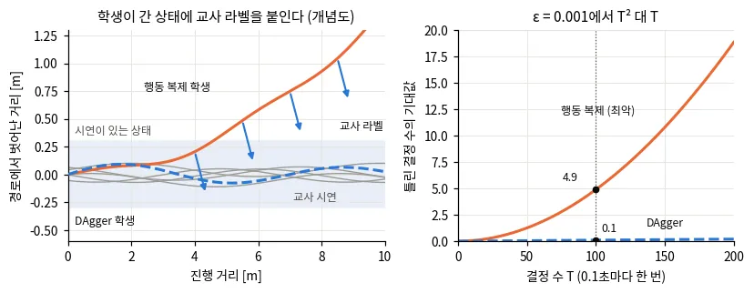
*그림 — travplan 작도: 왼쪽은 개념도다. 행동 복제 학생(주황)은 시연 띠를 벗어나면 돌아오지 못하고, DAgger는 학생이 간 상태마다 교사 라벨(파란 화살표)을 붙인다. 오른쪽은 작은 예의 식이다. 스텝당 실수율 0.001에서 T = 100이면 기대 오답이 4.9 대 0.1이다. 코드: scripts/make_doc_figures.py*

*그림 — Learning by Cheating (Fig. 1a): 1단계. 정답 조감도를 보는 특권 에이전트가 전문가 운전을 모방한다. 보는 법을 배울 필요가 없어 강인한 정책을 쉽게 얻는다. 전문가는 시뮬레이터 내부 상태를 쓰는 손으로 만든 자동 운전기로, 전체 지도 위의 Dijkstra와 MPPI로 라벨을 만드는 travplan 교사와 같은 자리다. 출처: [arXiv:1912.12294](https://arxiv.org/abs/1912.12294)*

*그림 — Learning by Cheating (Fig. 1b): 2단계. 카메라만 보는 센서 에이전트가 특권 에이전트를 모방한다. 특권 에이전트는 학생이 간 어느 상태에서나 모든 명령에 대한 행동을 알려 준다. 출처: [arXiv:1912.12294](https://arxiv.org/abs/1912.12294)*

*그림 — Robust Perceptive Locomotion (Fig. 5): 교사는 고유감각, 특권 정보, 잡음 없는 높이 스캔으로 PPO 학습한다. 학생은 특권 정보 없이 고유감각과 잡음 섞인 높이 스캔으로 교사 행동을 따라 하면서(behavior loss) 잡음 없는 높이와 특권 정보를 복원한다(reconstruction loss). 배포는 실제 elevation map으로 한다. 출처: [arXiv:2201.08117](https://arxiv.org/abs/2201.08117)*

수식 보기

**기호.** $\pi^*$는 교사, $\pi_\theta$는 학생이다. $d_\pi$는 정책 $\pi$로 $T$스텝을 굴릴 때 방문하는 상태의 분포(시간 평균)다. $\ell$은 두 행동의
차이다. 분류라면 0-1 손실, 연속 행동이라면 제곱 오차를 쓴다. $J(\pi)$는 $T$스텝 동안 쌓인 과제 비용이다(스텝당 0에서 1).

**행동 복제(BC).** 교사 정책 $\pi^*$의 상태 분포 $d_{\pi^*}$에서 모은 데이터로 학습한다.

$$ \min_\theta\ \mathbb{E}_{s \sim d_{\pi^*}}\, \ell\big(\pi_\theta(s), \pi^*(s)\big) $$

**왜 $T^2$인가.** 학습은 $d_{\pi^*}$에서 하지만 시험은 $d_{\pi_\theta}$에서 한다. Ross·Bagnell(2010)은 교사 분포에서의 0-1 손실이 $\epsilon$이면
과제 비용이 다음까지 나빠질 수 있고, 이 한계가 빡빡하다(tight)는 것을 보였다.

$$ \mathbb{E}_{s \sim d_{\pi^*}}\, \ell\big(\pi_\theta(s), \pi^*(s)\big) = \epsilon \;\Rightarrow\; J(\pi_\theta) \le J(\pi^*) + T^2 \epsilon $$

작은 예는 "한 번 틀리면 계속 틀린다"는 최악의 경우를 그대로 센 것이다. $\epsilon = 0.001$, $T = 100$이면 정확한 값이 4.89, 근사값이 5.05다.

$$ \mathbb{E}[\text{오답 수}] = \sum_{t=1}^{T} \big[1 - (1-\epsilon)^t\big] = T - \frac{1-\epsilon}{\epsilon}\big[1 - (1-\epsilon)^T\big] \approx \frac{\epsilon\, T(T+1)}{2} \quad (\epsilon T \ll 1) $$

**DAgger.** $i$번째 반복에서 현재 학생 $\pi_{\theta_i}$로 굴린 상태 $d_{\pi_{\theta_i}}$에 교사 라벨을 붙여 누적 데이터 $\mathcal{D}$에 더하고
다시 학습한다.

$$ \mathcal{D} \leftarrow \mathcal{D} \cup \{(s, \pi^*(s)) : s \sim d_{\pi_{\theta_i}}\}, \qquad \theta_{i+1} = \arg\min_\theta \sum_{(s, a) \in \mathcal{D}} \ell(\pi_\theta(s), a) $$

원 논문의 일반형은 교사와 학생을 섞은 $\pi_i = \beta_i \pi^* + (1-\beta_i)\hat\pi_i$로 굴린다. 첫 라운드만 교사로 굴리는
$\beta_i = \mathbb{1}[i = 1]$이 실제로 흔히 가장 잘 된다고 보고한다. 보장은 $\epsilon_N$에 대해 선형이다. $\epsilon_N$은 $N$개 학생이 굴린 상태
분포를 모두 섞은 데이터에서 가장 좋은 정책이 내는 손실이다. $u$는 한 번 틀린 행동이 교사의 남은 비용을 최대 얼마나 늘리는지(회복 비용)다.

$$ J(\hat\pi) \le J(\pi^*) + u\, T\, \epsilon_N + O(1) $$

왜 되나. 매 라운드 누적 데이터 전체로 다시 학습하는 것은 온라인 학습의 Follow-The-Leader다. 손실이 강볼록이면 이 알고리즘은 후회(regret)가 작다.
그래서 학생이 만든 상태 분포들에서의 평균 손실이 그 분포들에서 가장 좋은 정책의 손실에 가까워진다. 손실을 재는 분포가 곧 시험 분포이므로 $T^2$가
$T$로 준다.

**travplan 구현.** $\mathcal{D}_0$는 교사가 만든 BC 시연이고, 이후 라운드는 학생만 굴린다. 원 논문의 $\beta_i = \mathbb{1}[i = 1]$ 설정과 같다.
방문 상태는 0.5초(5스텝)마다 라벨하고, 제자리에 멈춘 구간은 6개까지만 남긴다. DAgger 표본을 배치의 약 40%가 되도록 반복 추출해 라운드마다 3000
스텝 미세조정한다. DART([arXiv:1703.09327](https://arxiv.org/abs/1703.09327))는 다른 길이다. 시연 중 교사 제어에 잡음을 넣어, 교사를 다시 부르지
않고 교정 상태를 모은다. travplan BC가 시연 상태를 경로 주변에서 흔드는 것(위치 σ 0.3 m, heading σ 0.5 rad)도 같은 방향이다.

**특권 교사(teacher–student).** 시뮬레이션의 정답 지형·마찰 같은 특권 정보를 보는 교사를 RL로 먼저 학습하고, 실제 센서만 보는 학생이 교사의
행동이나 잠재 표현을 따라 하게 증류한다(Miki 2022, §A.8의 DPL). Lee 2020(§A.7)은 교사 행동 $\bar a_t$와 교사 잠재 $\bar l_t$를 둘 다 따라 하게
한다. $x_t$는 특권 정보, $H$는 학생이 보는 고유감각 이력이다.

$$ \mathcal{L} = \big(\bar a_t(o_t, x_t) - a_t(o_t, H)\big)^2 + \big(\bar l_t(o_t, x_t) - l_t(H)\big)^2 $$

Miki 2022(§A.7.1)는 행동 모방 손실에 복원 손실을 더한다($\mathcal{L} = \mathcal{L}_{\text{bc}} + 0.5\,\mathcal{L}_{\text{re}}$). 복원 손실은
belief 상태에서 잡음 없는 높이와 특권 정보를 되살리게 한다. 두 논문 모두 학생을 굴려 표본을 모은다. Learning by Cheating은 특권 에이전트가 모든
명령(좌회전, 우회전 등)의 행동을 한꺼번에 내게 해, 학생이 간 상태마다 모든 분기를 가르친다. CARLA CoRL2017 내비게이션(시험 도시, 시험 날씨)
절제에서 성공률은 직접 모방 20%, 두 단계만 16%, 두 단계에 on-policy를 더하면 64%, white-box 라벨을 더하면 96%, 둘 다 더하면 100%였다.

**KL kickstart.** RL 목적에 교사와의 KL 항을 더하고 가중치 $\lambda$를 점점 줄인다(RoM-Nav).

$$ \mathcal{L} = \mathcal{L}_{\text{PPO}} + \lambda\, \mathrm{KL}\big(\pi_\theta \,\Vert\, \pi^{\text{teacher}}\big), \qquad \lambda: 1 \to 0.05 $$

RoM-Nav의 $\lambda$는 처음 100 반복 동안 1이고, 1100 반복까지 0.05로 줄인 뒤 2000 반복까지 유지한다. 원 논문(Schmitt 2018)은 학생이 굴린 궤적
위에서 교사 분포 기준의 cross-entropy를 더한다.

$$ \ell_{\text{kick}} = \ell_{\text{RL}} + \lambda_k\, H\big(\pi^{\text{teacher}}(\cdot \mid x_t) \,\Vert\, \pi_\theta(\cdot \mid x_t)\big), \qquad H(p \Vert q) = H(p) + \mathrm{KL}(p \Vert q) $$

교사 엔트로피 $H(p)$는 상수라, 이는 $\mathrm{KL}(\pi^{\text{teacher}} \Vert \pi_\theta)$를 줄이는 것과 같다. 위 RoM-Nav 식의 KL과는 방향이 반대다.
$\mathrm{KL}(\pi_\theta \Vert \pi^{\text{teacher}})$은 학생을 교사의 한 모드에 몰리게 하고, $\mathrm{KL}(\pi^{\text{teacher}} \Vert \pi_\theta)$는
교사의 모드를 모두 덮게 한다. RoM-Nav 원문은 $\mathcal{L}_{\text{KL}}(\pi, \pi^R)$로만 적어 방향을 확인하지 못했다.

**참고문헌.**
- Ross 외, *A Reduction of Imitation Learning and Structured Prediction to No-Regret Online Learning*, AISTATS 2011 — [arXiv:1011.0686](https://arxiv.org/abs/1011.0686). DAgger 원 논문. BC의 $T^2\epsilon$과 DAgger의 $uT\epsilon$ 보장을 읽는다.
- Osa 외, *An Algorithmic Perspective on Imitation Learning*, Foundations and Trends in Robotics 2018 — [arXiv:1811.06711](https://arxiv.org/abs/1811.06711). 모방 학습 전체를 로봇 관점에서 정리한 교과서형 개관.
- Chen 외, *Learning by Cheating*, CoRL 2019 — [arXiv:1912.12294](https://arxiv.org/abs/1912.12294). 특권 교사를 두 단계로 나누는 원형. white-box와 on-policy 라벨의 효과를 절제로 보인다.
- Lee 외, *Learning Quadrupedal Locomotion over Challenging Terrain*, Science Robotics 2020 — [arXiv:2010.11251](https://arxiv.org/abs/2010.11251). RL 교사와 DAgger 학생(§A.7).
- Miki 외, *Learning robust perceptive locomotion for quadrupedal robots in the wild*, Science Robotics 2022 — [arXiv:2201.08117](https://arxiv.org/abs/2201.08117). 잡음 섞인 높이 지도로 증류한다(§A.7.1). travplan의 믿음 지도 학생과 가장 가깝다.
- Schmitt 외, *Kickstarting Deep Reinforcement Learning*, arXiv 2018 — [arXiv:1803.03835](https://arxiv.org/abs/1803.03835). KL kickstart 원 논문. RoM-Nav(§B.9)가 이 식을 인용해 쓴다.

### 0.13 Conformal prediction: 보정된 예측 영역

Conformal prediction은 이미 학습한 예측 모델에 덧씌워, 오차 분포를 가정하지 않고 ==보정용 데이터로 "이 반경 안에 정답이 들어올 확률이 적어도
$1-\alpha$"인 영역을 만든다.== 방법은 모델이 보지 못한 데이터의 오차를 정렬해 한 순위의 값을 고르는 것뿐이다. 로봇에서는 보행자 예측 반경, 학습
동역학의 오차 범위, 미래 점유 영역을 이렇게 보정해 안전 필터나 제약에 넣는다.

**왜 필요한가.** 안전 필터와 MPC 제약에는 점이 아니라 영역이 필요하다. 보행자의 2초 뒤 위치를 한 점으로 예측하면, 그 점만 피해도 부딪힐 수 있다.
travplan `DynamicObstacles`는 보행자를 등속으로 외삽하고, 원판 반경을 `sigma_growth`(0.15 m/s)만큼, 즉 look-ahead 1초마다 0.15 m씩 키운다. 이 값은
고정 규칙이고(§A.12.5), 실제 보행자가 이 원판 안에 몇 %나 들어오는지 잰 기록은 찾지 못했다. 모델이 내는 분산도 그대로 믿기 어렵다. travplan 잔차
GP의 95% 예측구간은 처음에 실제로 35–79%만 덮었다(MPC 문서 §M.3.6, 관측 잡음을 더한 뒤 92–96%). 과신한 영역으로 제약을 조이면 안전 여유가
모자란다. Conformal prediction은 모델이 무엇이든 데이터에서 잰 오차로 포함 확률을 보장한다.

**직관.**
1. **나눈다.** 학습 데이터로 모델을 만들고, 모델이 보지 못한 보정 데이터 $n$개를 따로 둔다.
2. **잰다.** 보정 데이터마다 "얼마나 틀렸나"를 숫자 하나로 잰다. 이를 비적합 점수(nonconformity score)라 한다. 위치 예측이면 예측과 실제 위치의
   거리다.
3. **고른다.** 점수를 오름차순으로 정렬하고 $\lceil (n+1)(1-\alpha) \rceil$번째 값을 반경 $\hat q$로 삼는다.
4. **씌운다.** 새 입력의 예측점 주위에 반경 $\hat q$인 원을 그린다. 이 원은 정답을 적어도 $1-\alpha$ 확률로 담는다.

왜 되나. 새 점수는 보정 점수들과 같은 분포에서 나왔으므로, $n+1$개 점수 가운데 어느 순위에 설 확률이 모두 같다(교환 가능성). 그래서 새 점수가 보정
점수의 $k$번째 이하일 확률이 $k/(n+1)$이다. 모델의 구조, 오차의 분포, 입력의 차원은 상관이 없다. 출근길에 비유하면, 지난 19번의 지연 시간을 적어
두고 그중 두 번째로 길었던 지연(짧은 쪽에서 18번째)만큼 여유를 두고 나서면 된다. 지연의 원인을 몰라도 다음 날 지각하지 않을 확률이 적어도 18/20,
즉 90%다.

**작은 예.** 등속 예측으로 보행자의 2초 뒤 위치를 맞히는 문제를 보자. 보정용 보행자 9명에서 잰 2초 오차가 0.12, 0.18, 0.22, 0.24, 0.28, 0.34,
0.42, 0.52, 0.82 m라고 하자(가상의 값, 정렬함). $\alpha = 0.2$면 $k = \lceil (9+1)(1-0.2) \rceil = 8$이므로 $\hat q = 0.52$ m다. 새 보행자의 2초
뒤 위치는 반경 0.52 m 원 안에 적어도 80% 확률로 들어온다. 같은 시점에 `sigma_growth`가 더하는 반경은 $0.15 \times 2 = 0.30$ m이고, 이 가상
데이터에서는 9명 중 5명만 덮는다. $\alpha = 0.1$로 조이면 $k = 9$라 가장 큰 오차 0.82 m를 써야 한다. $\alpha$가 $1/(n+1) = 0.1$보다 작으면
$k > n$이 되어 반경이 무한대다. 보정 데이터가 적으면 높은 신뢰 수준을 약속할 수 없다. 이 수치는 설명용이고, travplan의 실제 보행자 오차가 아니다.

**함정.**
- **보장은 평균이다.** 모든 보행자에 대한 평균이 80%라는 뜻이지, 뛰는 사람 한 명에게 80%라는 뜻이 아니다. 빠른 보행자는 덜 덮이고 느린 보행자는
  과하게 덮일 수 있다. 속도 구간별로 따로 보정하거나, 점수를 예측 표준편차로 나눠 상황에 따라 반경이 커지게 한다.
- **교환 가능성이 깨지면 보장도 깨진다.** 다른 동네, 다른 시간대, 로봇에 반응하는 보행자는 보정 데이터와 분포가 다르다. Lindemann 외도 로봇의
  행동이 보행자 분포를 바꾸지 않는다고 가정한다. 분포가 움직이면 적응형 conformal(ACI)로 $\alpha$를 온라인으로 고친다.
- **시점마다 따로 보정하면 전체 보장이 약하다.** 시점마다 80%여도 20개 시점이 모두 맞을 확률은 훨씬 낮다. MPC 문서 §M.1.2의 조임 $\rho_k$도
  노드마다 $\epsilon$을 건다. 지평 전체를 보장하려면 시점마다 $\alpha/T$를 쓰는 합집합 한계나, 시점별 오차의 최댓값을 점수로 쓴다.
- **보정 데이터를 학습에 쓰면 안 된다.** 모델을 맞춘 데이터로 반경을 정하면 오차가 작게 잡혀 과신한다. travplan `ResidualGP._calibrate_noise`는
  적합 데이터로 $\sigma_n$을 올리는 경험적 보정이라 이 보장이 없다.
- **실제 포함률은 보정 집합마다 흔들린다.** 보장은 보정 데이터를 새로 뽑는 것까지 평균한 값이다. 보정 집합 하나로 정한 반경의 포함률은 Beta 분포를
  따르고, $n = 9$, $\alpha = 0.2$면 표준편차가 약 0.12다. Angelopoulos·Bates는 보정 데이터를 1000개쯤 두라고 권한다.
- **보장이 쓸모를 보장하지는 않는다.** 예측기가 나쁘면 원판이 보도를 다 덮어도 보장은 지켜진다. 그러면 로봇이 멈춘다. 좋은 예측기는 여전히
  필요하다.

**어디서 쓰나.** 행성 로버의 위험 인지 계획(§B.9)은 학습 잔차의 예측 오차로 95% 범위 집합을 만든다. Predictive Semantic Safety(§E)는 VLM(시각 언어
모델)이 예측한 물체 운동을 split conformal로 보정해 미래 점유를 만들고 backup CBF 필터(배경 0.4)에 넣는다. Conformal 군중 내비게이션(§A.12.4)은
ACI로 보행자 예측의 오차 범위를 온라인으로 추정하고, 제약 강화학습이 그 범위를 지키게 한다. §A.12.4의 표는 이를 `DynamicObstacles.sigma_growth`를
데이터로 보정하는 방법으로 적었고, §A.12.5는 그 고정 규칙을 실제 분산으로 바꾸자고 적었다.
- travplan 코드에는 아직 없다. 첫 후보는 `travplan/core/types.py`의 `DynamicObstacles.sigma_growth`(기본 0.15 m/s)다.
- 둘째 후보는 잔차 GP로 여유를 조이는 자리다. NMPC의 TP-0069와 확률 제약 MPPI의 TP-0076은 여유를 $\Phi^{-1}(1-\epsilon)\,\sigma$만큼 조이려
  한다(MPC 문서 §M.1.2). 이 배수는 가우시안 VaR 계수(배경 0.3)라, 오차가 가우시안이고 GP의 $\sigma$가 맞다는 가정이다. 정규화 점수의 분위수
  $\hat q$를 $\Phi^{-1}(1-\epsilon)$ 자리에 넣으면 이 가정 없이 같은 일을 한다.
- 전제가 하나 있다. 지금 운동학 시뮬의 보행자는 등속으로 움직여(`crossing_pedestrians`) 등속 예측의 오차가 0이다. 보정 데이터는 실제 추적 로그나
  반응형 보행자(TP-0036)에서 나와야 한다.

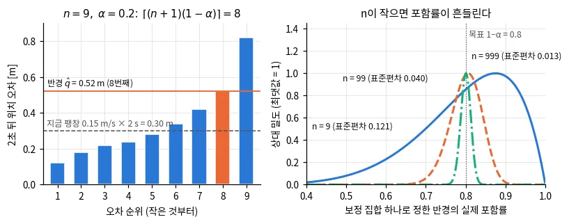
*그림 — travplan 작도: 왼쪽은 작은 예다. 가상의 2초 오차 9개를 정렬해 8번째인 0.52 m를 반경으로 고른다. 점선은 sigma_growth가 주는 0.30 m다. 오른쪽은 보정 집합 하나로 정한 반경의 실제 포함률 분포다. 표준편차는 n = 9면 0.12, n = 999면 0.013이다. 코드: scripts/make_doc_figures.py*

*그림 — Lindemann 외 (Fig. 2 왼쪽): 보정 데이터에서 잰 보행자 위치 오차의 히스토그램(5스텝 뒤와 8스텝 뒤 예측)과 conformal 반경 C. 먼 미래일수록, 동시에 보장할 시점 수 T가 클수록 반경이 커진다. 출처: [arXiv:2210.10254](https://arxiv.org/abs/2210.10254)*

*그림 — Conformal 군중 내비게이션 (Fig. 2): 군중 내비게이션 시험 장면. 보행자 주위의 하늘색 원이 ACI로 잰 예측 불확실성이다. (a)에서 보행자가 갑자기 방향을 바꾸자 원이 커지고, 로봇이 피해서 목표에 닿는다. (b)는 같은 장면의 CrowdNav++로, 원이 불확실성이 아니라 예측 궤적이고 로봇이 갇혀 충돌한다. 출처: [arXiv:2508.05634](https://arxiv.org/abs/2508.05634)*

*그림 — Predictive Semantic Safety (Fig. 2): VLM이 RGB-D에서 물리 사건(천장 조명의 낙하)과 그 시점을 예측한다. 운동 모델, 형상 경계, 보정된 불확실성으로 미래 점유를 만들고, backup CBF 필터가 그 점유에 맞춰 명령을 최소한으로 고친다. 출처: [arXiv:2609.34356](https://arxiv.org/abs/2609.34356)*

수식 보기

**기호.** 보정 데이터 $(x_i, y_i)_{i=1}^{n}$은 모델 학습에 쓰지 않은 표본이다. $\hat y(x)$는 모델의 예측, $r_i$는 비적합 점수, $\alpha$는 허용하는
미포함 확률이다. 교환 가능(exchangeable)은 표본의 순서를 바꿔도 결합분포가 같다는 뜻이고, i.i.d.는 그 특수한 경우다.

보정 데이터 $n$개에서 비적합 점수(예: 예측 위치와 실제 위치의 거리) $r_i = \lVert \hat y_i - y_i \rVert$를 구하고, 다음 분위수를 반경으로 쓴다.

$$ \hat q = \text{Quantile}\Big(\{r_i\}_{i=1}^{n};\ \tfrac{\lceil (n+1)(1-\alpha) \rceil}{n}\Big), \qquad \mathcal{C}(x) = \{\, y : \lVert \hat y(x) - y \rVert \le \hat q \,\} $$

데이터가 교환 가능(exchangeable)하면 $P\big(y \in \mathcal{C}(x)\big) \ge 1 - \alpha$가 보장된다.

**왜 되나.** 새 표본의 점수 $r_{n+1}$은 $n+1$개 점수 가운데 어느 순위든 같은 확률로 선다. 보정 점수를 정렬한 $k$번째 값을 $r_{(k)}$라 하면 다음이
성립한다.

$$ P\big(r_{n+1} \le r_{(k)}\big) \ge \frac{k}{n+1} \ge 1 - \alpha, \qquad k = \lceil (n+1)(1-\alpha) \rceil $$

점수에 동점이 없으면 가운데 확률은 정확히 $k/(n+1)$이라, 포함 확률은 $1 - \alpha + 1/(n+1)$을 넘지 않는다. $k > n$이면 $\hat q = \infty$다. 작은
예는 $(n+1)(1-\alpha) = 8$이 정수라, 동점이 없으면 포함 확률이 정확히 $1 - \alpha$다.

$$ k = \lceil (9+1)(1-0.2) \rceil = 8, \qquad \hat q = r_{(8)} = 0.52\ \text{m}, \qquad P\big(y \in \mathcal{C}(x)\big) = \tfrac{8}{10} = 0.8 $$

**보정 집합 하나의 포함률.** 위 보장은 보정 데이터까지 새로 뽑는 평균이다. 보정 집합이 정해지면 포함률은 한 값이 되고, 그 값은 보정 집합마다
다르다. Vovk가 보인 대로 이 값은 Beta 분포를 따른다. $n = 9$, $\alpha = 0.2$면 $\mathrm{Beta}(8, 2)$로 평균 0.8, 표준편차 0.12다. $n = 999$면
$\mathrm{Beta}(800, 200)$으로 표준편차가 0.013이다.

$$ P\big(y \in \mathcal{C}(x) \mid \text{보정 데이터}\big) \sim \mathrm{Beta}(n + 1 - l,\ l), \qquad l = \lfloor (n+1)\alpha \rfloor $$

**여러 시점: 합집합 한계**(Lindemann 외). 시점 $\tau$마다 점수 $R^{(i)}_{\tau|t} = \lVert Y^{(i)}_\tau - \hat Y^{(i)}_{\tau|t} \rVert$로 반경
$C_{\tau|t}$를 따로 구하되, 미포함 확률을 $\delta/T$로 나눈다. 그러면 $T$개 시점이 모두 맞을 확률이 $1 - \delta$ 이상이다. MPC 제약에는 제약 함수
$c$의 Lipschitz 상수 $L$만큼 여유를 둔다.

$$ C_{\tau|t} = R^{(p)}_{\tau|t}, \quad p = \Big\lceil (|D_{\text{cal}}| + 1)\big(1 - \tfrac{\delta}{T}\big) \Big\rceil, \qquad c\big(x_\tau, \hat Y_{\tau|t}\big) \ge L\, C_{\tau|t} $$

**여러 시점: 최댓값 점수**(Predictive Semantic Safety). 물체 $j$, 관측 시각 $t_k$, 미래 시점 $\tau$ 전체에서 정규화한 오차의 최댓값을 점수 하나로
쓴다. 합집합 한계 없이 한 번에 결합 보장을 얻는다. 반경은 $\rho_j(\tau; t_k) = \hat q\, \sigma_j(\tau; t_k)$이고, $\sigma_j$는 학습 데이터에서
정한 척도다.

$$ R_c = \max_{(j, k, \tau)} \frac{\lVert p^{(c)}_j(\tau) - \hat p^{(c)}_j(\tau; t_k) \rVert_2}{\sigma_j(\tau; t_k)} $$

travplan에 옮기면 $\sigma(\tau) = \tau$로 둔다. 그러면 점수는 초당 오차 증가율의 최댓값
$R_i = \max_\tau \lVert p_i(\tau) - \hat p_i(\tau) \rVert / \tau$이고, 그 분위수 $\hat q$가 곧 보정된 `sigma_growth`다. 반경 $\hat q\,\tau$의
원판이 지평 전체에서 동시에 $1-\alpha$ 확률로 맞는다.

**분포가 움직일 때: ACI**(Gibbs·Candès, §A.12.4의 Yao 외). 시각마다 미포함 여부 $\mathrm{err}_t$를 보고 목표 수준을 고친다. 놓치면 $\alpha_t$를
줄여 영역을 키우고, 덮으면 조금 늘려 영역을 줄인다.

$$ \alpha_{t+1} = \alpha_t + \gamma\,(\alpha - \mathrm{err}_t), \qquad \mathrm{err}_t = \mathbb{1}\big[y_t \notin \hat{\mathcal{C}}_t(\alpha_t)\big] $$

**정규화 점수.** 모델이 예측 표준편차 $\hat\sigma(x)$를 내면(배경 0.8) 점수를 $r = \lVert \hat y - y \rVert / \hat\sigma(x)$로 두고 반경을
$\hat q\, \hat\sigma(x)$로 쓴다. 평균 보장은 같고, 어려운 입력에서 영역이 커진다. travplan GP라면 보류 데이터에서 $|y - \mu(x)| / \sigma(x)$의
분위수를 구해 구간 $\mu \pm \hat q\, \sigma$를 쓴다. 그러면 `_calibrate_noise`를 보장이 있는 보정으로 바꿀 수 있다. TP-0069·TP-0076의
$\Phi^{-1}(1-\epsilon)$ 자리에 들어갈 값도 이 $\hat q$다.

**참고문헌.**
- Shafer·Vovk, *A tutorial on conformal prediction*, JMLR 2008 — [arXiv:0706.3188](https://arxiv.org/abs/0706.3188). 창안자 Vovk가 Shafer와 쓴 튜토리얼. 교환 가능성과 온라인 보장의 뿌리를 읽는다.
- Angelopoulos·Bates, *A Gentle Introduction to Conformal Prediction and Distribution-Free Uncertainty Quantification*, arXiv 2021 — [arXiv:2107.07511](https://arxiv.org/abs/2107.07511). 코드와 함께 읽는 입문서. 포함률의 Beta 분포와 보정 데이터 1000개 권장이 여기 있다.
- Gibbs·Candès, *Adaptive Conformal Inference Under Distribution Shift*, NeurIPS 2021 — [arXiv:2106.00170](https://arxiv.org/abs/2106.00170). 분포가 움직일 때 $\alpha_t$를 온라인으로 고치는 ACI.
- Lindemann 외, *Safe Planning in Dynamic Environments using Conformal Prediction*, IEEE RA-L 2023 — [arXiv:2210.10254](https://arxiv.org/abs/2210.10254). 궤적 예측 오차를 보정해 MPC 제약에 넣는 기본형.
- Yao 외, *Towards Generalizable Safety in Crowd Navigation via Conformal Uncertainty Handling*, CoRL 2025 — [arXiv:2508.05634](https://arxiv.org/abs/2508.05634). ACI로 보행자 오차 범위를 온라인 추정한다(§A.12.4).
- Kim 외, *Predictive Semantic Safety: From Visual Physical Reasoning to Safety-Critical Control*, arXiv 2026 — [arXiv:2609.34356](https://arxiv.org/abs/2609.34356). 최댓값 점수로 미래 점유를 보정해 backup CBF에 넣는다(§E).

---

<!-- tab: 제어·안전 -->

### 0.2 MPPI: 굴려 보고, 비용이 낮은 것에 가중치를 준다

MPPI(model predictive path integral)는 제어열에 노이즈를 섞은 후보를 수백 개 굴려 보고,
==비용이 낮은 후보일수록 지수적으로 큰 가중치를 줘서 평균을 낸다.== 미분이 필요 없어서 치명 셀 벌점처럼 불연속인 비용도 그대로 쓸 수 있다.
travplan `MPPIController`(`control/mppi/mppi.py`)가 이 방식이고, 0.1 s마다 후보 768개를 4 s 앞까지 굴린다.
==기울기 없는 궤적 최적화라는 점에서 MPOT(Sinkhorn Step)와 묶이기 쉽다== — 둘이 무엇을 공유하고 무엇이 다른지는 0.2b가, 제어열 판을 실제로 세워 같은 예산으로 맞대 본 결과는 E.11(TP-0130)이 적었다.

**왜 필요한가.** Controller는 매 주기 앞으로 몇 초 동안의 제어열을 정해야 한다. travplan의 비용은 TravMap에서 오는데, 치명 셀 벌점(1000)과
자세 한계 벌점은 계단 모양이라 기울기가 없다. 기울기로 푸는 최적화는 이런 비용에서 갈 방향을 얻지 못한다.
iLQR이나 비선형 MPC(model predictive control)가 그렇다(MPC 문서 §M.1.2). MPPI는 비용을 계산할 수만 있으면 된다.
후보를 한꺼번에 굴리므로 GPU나 텐서 연산으로 병렬화하기도 쉽다.

**직관.** 한 주기는 다섯 단계다.

1. 지난 주기의 해를 한 칸 앞당겨 평균 제어열 $U$로 쓴다(warm start).
2. $U$에 노이즈를 더해 후보 $K$개를 만든다.
3. 후보마다 로봇 모델로 궤적을 굴리고, 궤적의 비용 $S_k$를 더한다.
4. 비용이 낮을수록 큰 가중치 $w_k \propto e^{-S_k/\lambda}$를 준다.
5. 가중평균을 새 $U$로 삼고 첫 제어만 실행한다. 다음 주기에 1로 돌아간다.

비유하면 가중 투표다. 모든 후보가 투표하지만, 비용이 $\lambda$만큼 높아질 때마다 표의 무게가 $1/e$로 줄어든다. 그래서 $\lambda$는
너그러움의 정도다. 작으면 1등만 인정하고, 크면 모두를 비슷하게 인정한다. 교차 엔트로피 방법(CEM, cross-entropy method)은 상위 몇 개만 같은 무게로
평균한다. MPPI는 모든 후보를 비용에 따라 부드럽게 가중한다는 점이 다르다.

**작은 예.** 후보 4개의 비용이 $S = (10, 11, 13, 20)$이고, 첫 스텝 전진 속도가 $(0.8, 1.0, 1.2, 0.3)$ m/s라고 하자. 최솟값 10을 빼면
$(0, 1, 3, 10)$이다.

- $\lambda = 0.5$(travplan 기본)이면 $e^{-\Delta S/\lambda} = (1, 0.135, 0.0025, 0.000)$이다. 합으로 나누면
  $w = (0.879, 0.119, 0.002, 0.000)$이고, 평균 속도는 0.82 m/s다.
- $\lambda = 2$이면 $w = (0.545, 0.330, 0.122, 0.004)$이고, 평균 속도는 0.91 m/s다.
  $\lambda = 0.1$이면 후보 1이 가중치를 거의 모두(0.99995) 가져가 0.80 m/s다.
- 후보 2가 치명 셀을 밟아 비용이 1011이 되면 가중치는 $e^{-2002} \approx 0$이다. 한 후보의 벌점이 평균을 흔들지 않는다.

유효 샘플 수(ESS, effective sample size) $1/\sum_k w_k^2$는 $\lambda = 0.5$에서 1.27, $\lambda = 2$에서 2.38이다. 가중치가 실제로 몇 개의
후보에 퍼져 있는지를 뜻한다. 한 후보가 전부를 가지면 1이고, 모두 같은 무게면 후보 수 $K$다.

**함정.**

- **$\lambda$는 비용의 절대 크기에 묶여 있다.** 비용 전체에 2를 곱하면 $\lambda$를 절반으로 줄인 것과 같아 가중치가 1등에 더 몰린다. travplan은
  $\lambda = 0.5$를 절대값으로 쓴다. 코드 주석은 범위 정규화가 hard 벌점과 함께 깨진다고 적었다. 최대와 최소의 차이에 1000짜리 벌점이
  들어가면 나머지 차이가 뭉개진다.
- **최솟값을 빼지 않으면 수치가 터진다.** 모든 후보가 치명 셀을 밟아 비용이 1000을 넘으면 $e^{-S/\lambda}$가 전부 0이 되어 0을 0으로 나눈다.
  최솟값 $\rho$를 빼면 벌점이 없을 때와 같은 가중치가 나온다.
- **후보가 모두 나쁜 곳에 있으면 평균도 나쁘다.** 중요도 샘플링은 좋은 후보가 몇 개라도 있어야 동작한다. 좁은 틈에서 후보 대부분이 치명 셀을
  밟으면 ESS가 1 근처로 떨어진다. 2017년 논문은 강한 외란이 후보 전체를 나쁜 쪽으로 밀어낼 수 있다고 적고, 1% 미만의 후보를 0 주변에서
  뽑아 대비했다. travplan은 노이즈 없는 평균 후보와 정지 후보를 늘 넣는다. 벌점은 피하게 할 뿐 보장하지 않는다.
  보장이 필요하면 뒤에 CBF 안전 필터(배경 0.4)를 둔다.
- **평균이 두 무리 사이로 떨어질 수 있다.** 장애물 왼쪽과 오른쪽으로 도는 후보 무리의 비용이 비슷하면 가중평균이 장애물 쪽을 가리킬 수 있다.
  $\lambda$가 클수록 잘 생긴다. travplan은 평균 제어열을 다시 굴려 경로로 내지만, 그 비용을 따로 검사하지는 않는다.
- **떨림.** 스텝마다 독립인 노이즈를 쓰면 가중평균도 스텝마다 들쭉날쭉하다. SMPPI(Smooth MPPI) 논문은 이 떨림을 샘플링의 확률성 탓으로 본다.
  travplan은 시간 상관 노이즈(AR(1), 1차 자기회귀)나 적분 노이즈를 쓴다.
- **유도와 구현이 다르다.** 원 논문의 가중치에는 제어 비용 항이 들어간다(토글). travplan은 이 항을 뺐다. 이것은 기준 분포를 지금
  제어열 주변으로 둔 것과 같아, KL 항이 제어 크기 대신 이전 해에서 벗어나는 것을 벌한다. 변화율과 횡·후진 속도는 `ControlCost`가 비용으로 맡는다.
  또 경로 추종 후보 30%를 섞으면서 중요도 가중치를 그 제안 분포에 맞게 고치지 않는다. 그래서 KL 해석은 travplan에서 근사로만 맞다.

**어디서 쓰나.**

- Controller 문서 §E.1(MPPI 계보: 2015년 경로 적분판, 2017년 정보이론판, Tube·Robust MPPI, log-MPPI, MPPI-Generic), §B.5(ProxPI, SMPPI,
  TP-0016·0021 실험), §C.2(RA-MPPI·DRA-MPPI는 후보 비용에 충돌 위험을 더한다), §E.10(GP 잔차에 확률 제약을 세운 MPPI, TP-0076).
- 인식 문서 §A.10.1(BADGR는 시간 상관 행동 샘플을 보상의 지수 가중으로 평균한다), §A.8(같은 볼츠만 가중치를 섞기에 쓰면 MPPI, 고르기에 쓰면
  정책 전환), §A.12.5(이 가중평균이 이진 비용을 매끄럽게 만드는 이유).
- Planner 문서 §B.8.2(GRACE는 diffusion 역방향 한 스텝을 MPPI 가중평균으로 추정한다)와 §B.14(FDM은 학습 전방 모델로 MPPI 후보를 채점한다).
- 코드 `control/mppi/mppi.py::MPPIController`. `MPPIConfig` 기본값은 지평 40스텝(`dt` 0.1 s), 후보 768개, 온도 0.5,
  노이즈 표준편차 (0.4, 0.25, 0.6)(순서는 vx, vy, ωz), AR(1) 상관 0.7, 경로 추종 후보 비율 0.3이다.
  `_weights`가 softmax, `_noise`가 AR(1), `_sample`이 혼합 제안 분포다.
- `control/mppi/smooth.py::SmoothMPPIController`는 `_noise`만 바꾼 적분 노이즈판이다. 벤치마크 이름은 `mppi`와
  `mppi_smooth`다(`scripts/run_benchmark.py`). 브라우저 Playground(`docs/playground/js/control.js`)는 같은 식을 후보 256개로 옮겼다.

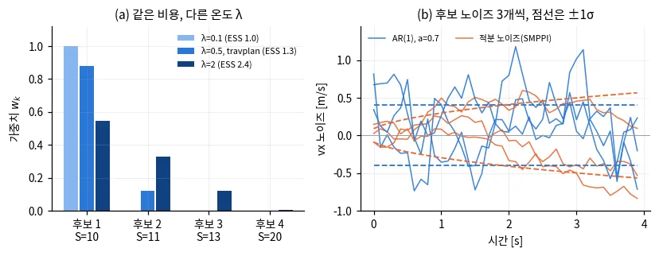
*그림 — travplan 작도: (a) 작은 예의 네 후보에 온도 λ를 바꿔 준 가중치와 ESS, (b) AR(1) 노이즈와 적분 노이즈(SMPPI)로 뽑은 vx 노이즈 표본과 ±1σ 범위. 코드: scripts/make_doc_figures.py*

*그림 — 정보이론적 MPC (Fig. 2): 지금의 제어 분포(아래)를 비용이 정한 최적 분포(위) 쪽으로 KL 발산을 줄이며 밀어 올린다. MPPI의 가중평균 한 번이 이 밀기의 한 걸음이다. 출처: [arXiv:1707.02342](https://arxiv.org/abs/1707.02342)*

*그림 — 경로 적분 제어 개관 (Fig. 5): 경로(빨간 선)를 따라가며 움직이는 장애물(파란 원)을 피하는 MPPI의 한 순간. 로봇 앞으로 후보 궤적 다발이 부채꼴로 퍼진다. 출처: [arXiv:2309.12566](https://arxiv.org/abs/2309.12566)*

수식 보기

**기호.** 제어열 $U = (u_0, \dots, u_{T-1})$는 지평 $T$스텝의 명령이다(travplan은 $u_t = (v_x, v_y, \omega_z)$, $T = 40$).
$\epsilon^{(k)}$는 $k$번째 후보의 노이즈, $\Sigma$는 노이즈 공분산, $x^{(k)}_t$는 그 후보를 굴린 상태, $c$는 스텝 비용, $\phi$는 종단 비용,
$\lambda > 0$은 온도다.

현재 제어열 $U$ 주변에서 노이즈 $\epsilon^{(k)}$를 섞은 후보 $K$개를 굴려 비용 $S_k$를 얻는다.

$$ V^{(k)} = U + \epsilon^{(k)}, \qquad S_k = \sum_{t} c\big(x^{(k)}_t, v^{(k)}_t\big) + \phi\big(x^{(k)}_T\big) $$

가중치는 온도 $\lambda$의 softmax이고, 새 제어열은 가중평균이다. 최솟값 $\rho = \min_k S_k$를 빼는 것은 수치 안정용이다.

$$ w_k = \frac{\exp\!\big(-(S_k - \rho)/\lambda\big)}{\sum_j \exp\!\big(-(S_j - \rho)/\lambda\big)}, \qquad U \leftarrow \sum_k w_k V^{(k)} $$

travplan은 후보 $V^{(k)}$ 대신 속도·가속 한계를 적용한 뒤 실제로 굴린 제어열을 평균한다(한계 밖으로 나간 평균이 생기지 않게). 이 식은
"비용의 볼츠만 분포에 가장 가까운(KL 기준) 가우시안 제어 분포"를 찾는 정보이론적 유도에서 나온다. $\lambda$가 작으면 최고 후보 하나에
몰리고, 크면 평균에 가까워진다.

**왜 이 식인가(2017년 유도 요약).** 노이즈만 있는 기준 분포 $p(V)$를 두면, 기대 비용과 KL 발산의 합을 가장 작게 만드는 분포는 비용의 볼츠만
분포다. 그 최솟값을 자유 에너지라 부른다(2017년 논문은 부호와 $\lambda$배를 뺀 $\log \mathbb{E}_p[e^{-S/\lambda}]$로 정의한다).

$$ \min_q \Big\{ \mathbb{E}_q[S] + \lambda\, \mathrm{KL}(q \,\Vert\, p) \Big\} = -\lambda \log \mathbb{E}_p\big[e^{-S/\lambda}\big], \qquad q^\star(V) = \frac{1}{\eta}\, e^{-S(V)/\lambda}\, p(V) $$

제어 분포는 평균만 움직이는 가우시안 $q_U = \mathcal{N}(U, \Sigma)$로 제한한다. $q^\star$에 KL 기준으로 가장 가까운 $q_U$는 평균을 맞춘
것이다.

$$ U^\star = \arg\min_U \mathrm{KL}\big(q^\star \,\Vert\, q_U\big) = \mathbb{E}_{q^\star}[V] $$

$q^\star$에서는 직접 뽑을 수 없으므로 지금의 $q_U$에서 뽑은 후보로 중요도 샘플링을 한다. 가중치는 $q^\star/q_U$에 비례한다.
$p = \mathcal{N}(0, \Sigma)$를 넣고 후보마다 같은 상수를 지우면 다음이 남는다.

$$ w_k \propto \exp\!\Big(-\frac{1}{\lambda}\Big(S_k + \lambda \sum_{t} u_t^\top \Sigma^{-1} \epsilon^{(k)}_t\Big)\Big) $$

둘째 항이 제어 비용이다. 논문의 식은 $\epsilon^{(k)}_t$ 대신 $v^{(k)}_t$를 쓰지만, 차이 $\lambda \sum_t u_t^\top \Sigma^{-1} u_t$는
후보마다 같아 정규화에서 지워진다. 2017년 논문은 기준 분포의 평균을 $\alpha U$($0 < \alpha < 1$)로 옮겨 이 계수를 $\gamma = \lambda(1-\alpha)$로
낮춘다. $\alpha = 1$, 즉 기준 분포를 지금 제어열 주변에 두면 항이 사라진다. travplan이 이 경우다. 논문은 $\lambda$를 inverse temperature라
부르지만, 식에서는 클수록 가중치를 평평하게 하는 온도로 작동한다.

**작은 예를 식으로.** $\Delta S = (0, 1, 3, 10)$, $\lambda = 0.5$다.

$$ w = \frac{\big(1,\ e^{-2},\ e^{-6},\ e^{-20}\big)}{1 + e^{-2} + e^{-6} + e^{-20}} = (0.879,\ 0.119,\ 0.002,\ 0.000), \qquad \bar v_x = w \cdot (0.8,\ 1.0,\ 1.2,\ 0.3) = 0.82 $$

**노이즈 모델.** travplan 기본은 시간 상관 AR(1) 노이즈다.

$$ \epsilon_t = a\,\epsilon_{t-1} + \sqrt{1-a^2}\;\xi_t, \qquad \xi_t \sim \mathcal{N}(0, \Sigma), \quad a = 0.7 $$

$\epsilon_0 = \xi_0$로 시작하므로 모든 $t$에서 분산이 $\Sigma$로 같다. $s$스텝 떨어진 두 값의 상관은 $a^s$라서 0.2 s 뒤 0.49, 0.5 s 뒤
0.17로 빠르게 잊는다.

**Smooth MPPI(SMPPI).** 노이즈를 제어가 아니라 **변화율**에 넣고 적분한다. 그러면 후보 자체가 매끄러워진다. travplan
`SmoothMPPIController`는 다음처럼 뽑고, 중간 시점 $T/2$에서 분산이 AR(1)과 같도록 크기를 맞춘다.

$$ \epsilon_t = \sum_{s \le t} \eta_s, \qquad \eta_s \sim \mathcal{N}\!\Big(0, \tfrac{\Sigma}{T/2}\Big) \;\Rightarrow\; \operatorname{Var}(\epsilon_{T/2}) = \Sigma $$

첫 스텝을 $t = 1$로 세면 $\operatorname{Var}(\epsilon_t) = t\,\Sigma/(T/2)$로 자란다. $T = 40$이면 실행될 첫 스텝의 노이즈 표준편차는 AR(1)의
22%(vx 0.09 m/s)이고, 지평 끝에서는 141%(0.57 m/s)다. 지금 실행할 제어는 덜 흔들고 먼 미래는 넓게 탐색한다. 원 논문은 제어를 한 차수 올린
공간으로 옮기고(input lifting) 행동의 변화율에도 비용을 건다. travplan은 노이즈 생성만 바꿨다(Controller 문서 §B.5).

**논문별 변형.**

- 2015년판은 제어와 노이즈가 아핀으로 들어가는 시스템에서 경로 적분 제어로 가중평균을 유도한다. 가중치를 시점 $i$마다 그 시점부터의 남은
  비용으로 따로 매겨 $u_i \leftarrow u_i + \sum_k w_{i,k}\, \delta u_{i,k}$로 갱신한다.
- 2017년판은 일반 비선형 동역학으로 넓히고, 위의 제어 비용 항과 Savitzky–Golay 평활화를 쓴다. CEM과 비교해, 모든 후보를 비용으로 가중하는
  쪽이 나쁜 후보를 더 잘 거른다고 적었다.
- log-MPPI는 노이즈를 정규분포와 로그정규분포의 곱에서 뽑는다(Controller 문서 §E.1). RA-MPPI는 $S_k$에 CVaR 위반량을 더한다(배경 0.3).
  ProxPI는 prior를 샘플링 평균이 아니라 비용 항 $\alpha\lVert V - U_p\rVert^2$로 넣는다(Controller 문서 §B.5).
- BADGR는 보상 $R$을 최대화하므로 $w \propto \exp(\gamma R)$, 즉 $S = -R$, $\lambda = 1/\gamma$인 같은 식이다(인식 문서 §A.10.1). GRACE는
  diffusion 역방향 한 스텝의 목표 분포가 $q^\star$와 같은 곱 꼴(배경 0.5의 $q_0\, e^{-\mathcal{E}}$)이라는 점을 쓴다(Planner 문서 §B.8.2).

**참고문헌.**

- Williams 외, *Model Predictive Path Integral Control using Covariance Variable Importance Sampling*, arXiv 2015 — [arXiv:1509.01149](https://arxiv.org/abs/1509.01149). MPPI의 원형. 경로 적분 제어에서 가중평균 갱신이 나오는 과정을 본다.
- Williams 외, *Information Theoretic Model Predictive Control: Theory and Applications to Autonomous Driving*, IEEE T-RO 2018 — [arXiv:1707.02342](https://arxiv.org/abs/1707.02342). travplan 식의 직접 출처. 자유 에너지와 KL 유도, 최솟값 빼기, 제어 비용 항을 본다.
- Kim 외, *Smooth Model Predictive Path Integral Control without Smoothing*, IEEE RA-L 2022 — [arXiv:2112.09988](https://arxiv.org/abs/2112.09988). `SmoothMPPIController`의 출처. 떨림의 원인과 input lifting을 본다.
- Kazim 외, *Recent Advances in Path Integral Control for Trajectory Optimization: An Overview in Theoretical and Algorithmic Perspectives*, Annual Reviews in Control 2024 — [arXiv:2309.12566](https://arxiv.org/abs/2309.12566). 개관. MPPI·CEM·PI²-CMA의 관계와 SMPPI·log-MPPI 비교를 본다.
- Vlahov 외, *MPPI-Generic: A CUDA Library for Stochastic Trajectory Optimization*, arXiv 2024 — [arXiv:2409.07563](https://arxiv.org/abs/2409.07563). GPU 구현 라이브러리. Orin 이식 때 속도 기준으로 본다.

### 0.2b 최적 수송(OT): 이름 하나가 여섯 가지를 뜻한다

**결론 먼저.** ==travplan이 실제로 쓰는 OT는 하나뿐이다== — 지도 품질 지표의 1-Wasserstein 거리
(`travplan/eval/map_quality.py::wasserstein1`). 새로 가져올 가치가 있는 것도 하나다 — **MPOT를 Planner D의
다중 모드 교사로 쓰는 것**. ==MPOT는 원형 그대로는 MPPI 자리에 들어가지 못한다== — 제어열 판은 만들 수 있고, Controller 문서 E.11이
그 판을 실제로 만들어 멈춘 장면에서 재 봤지만 같은 예산의 MPPI를 넘지 못했다(TP-0130).
==MPC-OT는 로봇이 한 대면 성립하지 않는다.==

**왜 이 절이 필요한가.** "최적 수송(optimal transport)을 쓴다"는 문장이 로봇·생성 모델 논문에서 **여섯 가지 서로
다른 것**을 뜻한다. 섞어 읽으면 *"우리도 OT를 쓰니 저 방법이 우리 자리에 맞겠다"* 는 잘못된 결론으로 간다.
먼저 갈라 둔다.

| # | OT가 하는 일 | 대표 | travplan |
|---|---|---|---|
| ① | **최적화기** — 비용이 낮은 쪽으로 점 다발을 옮기는 규칙 | MPOT(Sinkhorn Step), OT-MPC | 아래에서 MPPI와 맞대본다. 제어열 판의 실측은 E.11 |
| ② | **배정** — 누가 어느 목표로 갈지 고르고 경로가 안 겹치게 | MPC-OT(E.11의 OT-MPC와 **다른 논문**) | ==전이되지 않는다==(로봇 1대) |
| ③ | **경로에 붙은 이름** — 두 가우시안 사이 닫힌 형식 사상 | Lipman의 "OT 조건부 경로" | 0.6. ==수송 문제를 **풀지 않는다**== |
| ④ | **생성 학습의 짝짓기** — 어느 노이즈를 어느 데이터에 붙일까 | 미니배치 OT(OT-CFM) | 0.6의 다음 후보 |
| ⑤ | **분포 사이 거리** $W_1$ | Wasserstein 지표 | ==오늘 쓰는 **유일한** OT== |
| ⑥ | **균등 분할 군집화** | SeLa·ScaTE(Sinkhorn–Knopp) | 0.9 |

==③과 ④가 가장 자주 섞인다.== ③은 **아무 최적화도 풀지 않는** 이름이고, ④는 배치 안에서 실제로 OT를 푼다
(기본은 POT의 정확 EMD이고, Sinkhorn은 엔트로피 변종 쪽이다).
①은 **궤적을** 옮기고, ④는 **학습 짝을** 옮긴다. ⑤는 **재는 것**이고 ①②④⑥은 **푸는 것**이다.

#### ① MPOT — 원형은 MPPI 자리에 맞지 않고, 제어열 판은 MPPI를 넘지 못했다

**MPOT**(*Accelerating Motion Planning via Optimal Transport*,
[arXiv:2309.15970](https://arxiv.org/abs/2309.15970), **NeurIPS 2023**, Le·Chalvatzaki·Biess·Peters)는
기울기 없이 **궤적 다발을 한꺼번에** 최적화한다. 핵심이 **Sinkhorn Step**이다.

waypoint마다 **무작위로 회전시킨 정규 다포체**(단체·정축체·초입방체)를 씌우고, 각 꼭짓점 방향으로 probe 점을
몇 개 찍어 비용을 잰다. 그 비용 행렬에 엔트로피 정규화 OT를 **한 번** 풀어 나온 수송 계획을 **방향 가중치**로 쓴다.
==점수가 "궤적 하나당 하나"가 아니라 **(waypoint, 방향) 칸마다** 매겨진다.==

**이 절은 분류와 혼동 지점만 다룬다.** Sinkhorn Step 한 번을 그린 논문 Fig. 2, 비용 행렬과 로그 영역 Sinkhorn
반복의 수식, 논문 Table 1·2의 수치, 그리고 제어열 판의 실측은 Controller 문서 E.11이 같은 깊이로 다룬다(TP-0130).
여기서 되풀이하지 않는다.

==**여기서 OT는 "출발 분포와 목표 분포" 사이가 아니다.**== 두 주변 분포는 **(i) waypoint 전체의 균등 히스토그램**과
**(ii) 다포체 꼭짓점의 균등 히스토그램**이다. 즉 ==**waypoint와 탐색 방향 사이**== 의 수송이다. 흔히 "시작점에서
목표점으로 질량을 옮긴다"로 읽는데 **틀린 읽기다.** 행을 정규화한 수송 계획은 무게중심 좌표라 각 waypoint가
**자기 방향들의 볼록 결합**만큼 움직이고, 열 주변 분포가 **방향 사용량을 전체 궤적에 걸쳐 고르게** 만든다.
이 결합 — 국소 이동과 전역 균등 사용 — 이 MPPI에는 대응물이 없다.

#### MPPI와 무엇이 다른가

| | travplan MPPI | MPOT Sinkhorn Step |
|---|---|---|
| 무엇을 샘플하나 | **제어열** $V \in \mathbb{R}^{768 \times 40 \times 3}$ | 없다. waypoint를 직접 민다 |
| 동역학 | `SwerveModel.rollout`으로 굴린다 | **없다**(비용 항으로만 넣는다) |
| 속도·가속 한계 | `clamp_twist`·`clamp_accel`로 ==후보가 **구조적으로 실현 가능**== | **soft cost로만**(부록 I.4의 관절·속도 한계 L2 위반 벌점). 구조적 보장은 없다 |
| 점수의 입도 | ==궤적 하나에 **스칼라 하나**== | ==**(waypoint, 방향) 칸마다** 하나== |
| receding horizon·warm start | 있다(`control/mppi/mppi.py`가 명목열을 한 스텝 shift) | 없다. 전체 궤적을 수렴까지 |
| 보고된 시간 | **13.0 ms/주기**(`guidance+mppi`, 주기 0.1 s. MPC 문서 M.3.13의 제어 시간 표 — 한 프로세스에서 차례로 잰 중앙값이다. 벤치마크 실행 중에 잰 `results/tp0025_v2/metrics.csv`의 `control_ms_mean`은 8.7 ms다) | **0.4 s**(수렴까지, point-mass, RTX 3080Ti) |

==**결론: 원형 그대로는 travplan Controller에 들어가지 못한다.**==
가장 빠른 보고 숫자 0.4 s는 travplan의 제어 주기 0.1 s보다 **4배 길고**, CLAUDE.md 비평가 기준의 계획 시간
게이트 10 ms의 **40배**다. 원형은 제어열 대신 상태 waypoint를 직접 밀어 `Controller` 프로토콜이 요구하는 twist를
내지 않는다. 비동축 스워브는 $a_{\max} = (1.0, 0.8, 2.0)$에 후진이 $-0.3$ m/s로 **비대칭**인데(`SwerveLimits`),
등방 다포체가 제안하는 보폭을 그 실현 가능 집합으로 되돌릴 방법이 원형에는 없다.

==**제어열 판은 만들 수 있고, 오라클로 세워 실제로 재 봤다.**== 입자를 제어열로, OT의 점을 twist 매듭점으로
바꾼 판(M.3.20의 오라클 O2)이 travplan의 `CostTerm`·rollout 모델·확률 제약을 그대로 물려받는다. TP-0130은
MPPI 계열이 멈춘 장면 10개에서 그 오라클과 같은 예산의 MPPI를 맞대 봤다. 결론은 하나다 — ==오프라인 오라클로
세워도 같은 예산의 MPPI를 넘지 못해, **제품에 넣을 MPOT 변형은 만들지 않았다**==(E.11, MPC 문서 M.3.20).

**게다가 설계가 정면으로 충돌한다.** MPOT는 Sinkhorn 안의 지수 때문에 ==OT 비용 행렬을 $[0,1]$로 정규화==해야
한다 — 논문이 부록에 그대로 적는다: *"MPOT is cost-sensitive due to exponential terms inside the Sinkhorn
algorithm, hence, in practice, we normalize the cost matrix to the range $[0,1]$."* travplan은 반대로 치명 셀·자세·동적 겹침에 ==**1e3짜리 지시 벌점**== 을 주고(`control/mppi/costs.py`의
`lethal_penalty`·`hard_penalty`·`dynamic_lethal_penalty`) MPPI 온도를 **절대값 0.5**로 고정한다. 코드의 주석이
이유를 적어 둔다 — *"absolute (range-normalising breaks with hard penalties)"*.
==두 선택은 그대로는 같이 설 수 없다.== 다만 막다른 길은 아니다. E.11의 제어열 판은 비용 행렬의 **행마다 최솟값을
빼고 상한에서 잘라** $[0,1]$로 맞추는 방식으로 이 충돌을 우회한다 — 1e3 벌점을 비용 항에 남겨 둔 채로 Sinkhorn이
돌아간다.

#### 그래도 두 가지는 옮겨진다

**(1) ==Planner D의 교사로.==** `scripts/train_planner_d.py`는 상태마다 `GlobalGuidance` + `MPPIController`로
**4초 제어열 하나**를 만들어 라벨로 쓴다(같은 상태에서 warm start 3회를 돌리지만 결과는 **한 개**다).
즉 **단일 모드 교사**다. 그런데 Planner D는 생성 모델이라 ==**여러 모드를 내는 것이 존재 이유**== 다
(0.5가 경고한 "두 답의 평균이 장애물로 들어간다"는 실패). MPOT 논문이 스스로 밝히는 용도가 바로 이것이다 —
*"a strong oracle for collecting datasets ... capturing homotopy classes"*. ==오프라인 데이터 생성은 0.4 s를
신경 쓰지 않는다.== 교사가 단일 모드라는 것은 travplan 쪽의 **구조적 공백**이고, 여기에 정확히 맞는다(→ B.8.3).

==한 번에 서로 다른 위상(homotopy class)의 답이 여러 개 나오는 것이 교사로서의 값이다.== 목표 세 개에 궤적을
다섯 개씩 두고 한 배치로 미는 그림(논문 Fig. 1)은 E.11에 있다.

**(2) 비용 크기와 무관한 신뢰 영역.** MPOT는 한 스텝의 이동을
$\lVert \tau_{k+1} - \tau_k \rVert \le T \alpha_k$로 묶는데(식 25), ==이 한계가 **국소 비용의 크기에 의존하지
않는다.**== MPPI의 명목 갱신에 같은 상한을 씌우는 것은 몇 줄이고 **OT가 전혀 필요 없다.** 1e3 벌점이 섞인
비용 지형에서 명목 해가 한 스텝에 멀리 튀는 것을 막는 쪽으로는 볼 가치가 있다.

**입도 이야기 하나.** MPPI는 궤적 하나에 스칼라 하나를 주지만 Sinkhorn Step은 **(waypoint, 방향) 칸마다** 점수를
준다. 그래서 *"12–18스텝 구간만 옆으로"* 같은 지시가 직접 표현된다. travplan의 TP-0127(램프 입구에서 여유 경로가
오히려 실패)과 TP-0118(한두 칸 틈)이 정확히 그 입도의 문제다. 다만 위의 이유로 ==그 표현력을 쓰려면 Controller가
아니라 **Planner 자리**여야 한다.==

**코드.** [anindex/mpot](https://github.com/anindex/mpot) ★71 **MIT**(PyTorch),
[anindex/ssax](https://github.com/anindex/ssax) ★50 **MIT**(JAX). 둘 다 LICENSE 원문을 확인했다.
오프라인 교사로만 쓰므로 라이선스가 걸림돌이 아니다.

#### ② MPC-OT — 로봇이 한 대면 성립하지 않는다

**MPC-OT**(*Multi-robot Path Planning and Scheduling via Model Predictive Optimal Transport*,
[arXiv:2508.21205](https://arxiv.org/abs/2508.21205), **IEEE CDC 2025**)는 로봇 $N$대를 목표 $M$개에 배정하면서
**경로가 겹치지 않게** 한다. 공간을 $K$칸으로 나누고 칸 전이 비용 행렬에 OT를 풀며, 제약 행렬이 totally
unimodular라 ==정수해와 비겹침이 선형계획에서 공짜로 나온다.== MPC로 매 스텝 다시 푼다.

==먼저 이름을 갈라 둔다. MPC-OT는 E.11의 OT-MPC와 다른 논문이다.== 애너그램처럼 보이지만,
MPC-OT([arXiv:2508.21205](https://arxiv.org/abs/2508.21205))는 로봇 여럿의 **배정**이고 OT-MPC([arXiv:2605.02147](https://arxiv.org/abs/2605.02147))는
MPPI의 **가중 평균 단계**를 엔트로피 OT로 바꾼 단일 로봇 receding horizon 제어기다(E.11). 섞어 읽으면 "OT를 쓰는
MPC"라는 한 덩어리가 되어, 로봇 한 대에서 성립하지 않는 쪽의 판정이 다른 쪽으로 옮겨 붙는다.

==travplan은 로봇 **한 대**다.== $N = 1$이면 그 OT는 Dijkstra로 축퇴하고, 이미 `GuidancePlanner`가 그것이다.
그리고 $K \times K$ 밀집 비용 행렬이 travplan 격자(16 m × 8 m, 0.05 m → **321 × 161 = 51,681칸**)에서
**$2.7 \times 10^9$ 원소**가 된다. 쓸 수 없다.

자세히: Joint Planner에 "비겹침을 구조적으로" 아이디어가 쓰일까 — 그리고 논문 자체의 한계

travplan의 **Joint Planner**(`planners/learned/joint_flow_model.py`)는 ego와 보행자 궤적을 **함께** 생성하고,
열린 실패가 충돌이다(TP-0051: +tracker 조합에서 충돌 20/40). "비겹침을 구조로 보장한다"는 발상이 여기에
맞을 것 같지만 ==**깨진다.**== MPC-OT의 보장은 **모든 에이전트가 제어 가능하다**는 전제 위에 있다. 수송 계획이
로봇 전부를 동시에 배치하므로 겹침이 없는 것이지, 한쪽이 제멋대로 움직이면 성립하지 않는다. ==보행자는
travplan이 제어하지 않는다.== Joint Planner가 보행자 궤적을 **생성**하는 것은 예측이지 지시가 아니다.

*그림 — MPC-OT (Fig. 1 왼쪽): 장애물(회색) 사이에서 로봇 12대(▲)를 목표 14개(○)에 배정한다. 목표 2개는 배정되지 않고 남는다. ==이 그림의 가치 전부가 "여럿"에 있다.== 출처: [arXiv:2508.21205](https://arxiv.org/abs/2508.21205)*

⚠️ **논문 자체의 한계도 적어 둔다.** MPC-OT는 ==계산 시간도, 성공률도, 기준선 비교도 보고하지 않는다.==
그림 몇 장의 정성 서술뿐이고, Theorem 1의 증명은 *"will be provided elsewhere"*다. 코드도 없다.
발상(비겹침을 LP 제약으로 넣고 정수성을 공짜로 얻는 것)은 깔끔하지만 **수치로 믿을 것이 아직 없는 단계**다.
교통 흐름처럼 로봇 수가 많아지는 문제를 만나면 다시 본다.

#### ③④ "OT 경로"와 "OT 짝짓기"는 다른 것이다

0.6의 그림 설명에 나오는 ==**"최적 수송(OT) 조건부 경로"**== 가 ③이다. Lipman 외가 그렇게 부른 이유는 그 경로가
$\mathcal{N}(0, I)$에서 $\mathcal{N}(x_{\text{data}}, \sigma_{\min}^2 I)$로 가는 **두 가우시안 사이의 Monge 사상**이기
때문이고, ==**닫힌 형식이라 아무것도 풀지 않는다.**== 평균과 표준편차를 선형으로 잇는 것이 전부다. travplan의
`flow_model.py`가 쓰는 직선 보간자가 바로 이것이다.

④는 전혀 다르다. 미니배치 안에서 **어느 노이즈를 어느 데이터에 붙일지**를 실제로 OT로 고른다
(OT-CFM, Tong 외 2023; Multisample Flow Matching, Pooladian 외 2023). 독립 짝짓기는 경로가 서로 교차해 속도장이
평균으로 뭉개지는데, OT 짝짓기는 교차를 줄여 ==**경로를 더 곧게 만들고 스텝 수를 줄인다.**==
`flow_model.py`는 지금 **독립 짝짓기**다(`loss()`가 `x0 = torch.randn_like(x1)`로 노이즈를 따로 뽑는다). 즉 ④는
travplan에 **아직 안 들어온 선택지**이고, 배치 안에서 $B \times B$ 정확 OT(POT의 `emd`) 한 번이라 비용이 거의 없다.
Tong 외의 실험 부록이 그렇게 적는다 — OT-CFM에는 POT의 **정확 선형계획 EMD**를 쓰고, Sinkhorn은 엔트로피
변종(SB-CFM) 쪽에 쓴다. 즉 ④의 기본은 정확 OT이고, Sinkhorn–Knopp 반복은 ⑥(0.9)처럼 큰 문제에서 쓴다.
reflow(자기 모델로 만든 짝으로 다시 학습하는 것)와 목적이 같고 **교사 오차가 누적되지 않는다**는 점에서 더 싸다.

#### ⑤ $W_1$과 CVaR은 무엇이 다른가

0.3의 **CVaR**은 분포의 나쁜 꼬리 평균이다 — ==**분포를 안다고 가정**하고 그 안에서 위험을 잰다.==
$W_1$ 같은 Wasserstein 거리는 **분포 사이의 거리**라, 그것으로 공(ball)을 그리면
==*"참 분포가 내 추정에서 이만큼 떨어져 있을 수 있다"*== 를 말하게 된다. 두 번째가 분포적 강건
최적화(distributionally robust optimization)의 뼈대다.

travplan에 걸리는 지점은 분명하다. `RiskCost`와 MPPI 확률 제약(TP-0076)은 **GP 잔차 분산을 믿고** 위험을
재는데, ==그 분산 추정 자체가 틀렸을 때를 다루는 틀이 없다.== TP-0119가 "확률 제약의 0선이 실패 경계와 어긋난다"로
부딪힌 것이 같은 뿌리다. Wasserstein 공은 정확히 그 자리를 겨냥한다. 다만 travplan은 이 방향으로 아직 아무것도
재지 않았으므로, 여기서는 **자리만 표시해 둔다.**

수식 보기: 엔트로피 정규화 OT, Sinkhorn Step, 무게중심 투영

**엔트로피 정규화 OT.** waypoint 쪽 주변 분포 $\mu \in \Delta^{n}$, 방향 쪽 주변 분포 $\nu \in \Delta^{m}$과
비용 행렬 $C \in \mathbb{R}^{n \times m}$에 대해

$$ W^*_\lambda = \arg\min_{W \in U(\mu, \nu)} \langle W, C \rangle - \lambda H(W), \qquad U(\mu, \nu) = \{ W \ge 0 : W \mathbf{1} = \mu,\ W^\top \mathbf{1} = \nu \} $$

$\lambda > 0$이면 해가 $W^*_\lambda = \mathrm{diag}(u)\, e^{-C/\lambda}\, \mathrm{diag}(v)$ 꼴이고, $u, v$를 번갈아 맞추는
**Sinkhorn–Knopp 반복**으로 행·열 합을 맞춘다(Cuturi 2013). ==지수 때문에 $C$의 크기가 그대로 수치 안정성에
들어온다 — 그래서 MPOT가 $C$를 $[0,1]$로 정규화한다.== 0.9의 균등 분할 군집화(⑥)가 쓰는 것도 같은 반복이다.

**Sinkhorn Step의 신뢰 영역.** 갱신 자체는 한 줄이다 —
$X_{k+1} = X_k + \alpha_k\, \mathrm{diag}(\mu)^{-1}\, W^*_\lambda\, D^P$. 여기서 $X_k \in \mathbb{R}^{n \times d}$는
waypoint 집합, $D^P \in \mathbb{R}^{m \times d}$는 다포체 꼭짓점 방향 행렬, $\alpha_k$는 스텝 크기다. 비용 행렬 $C$의
정의와 로그 영역 Sinkhorn 반복, 제어열 판의 수식은 E.11의 토글에 있다.

$\mathrm{diag}(\mu)^{-1} W^*_\lambda$는 행마다 합이 1인 **무게중심 투영**이라, 각 waypoint의 이동이 자기 방향들의
**볼록 결합**이 된다. 그래서 보폭이 다포체 반지름 $\alpha_k$를 넘지 않고, 궤적 전체로는 $T$개 waypoint에 대해

$$ \lVert X_{k+1} - X_k \rVert \le T\, \alpha_k $$

==이 상한에 비용이 들어오지 않는다== — 위에서 "옮겨지는 두 번째"로 꼽은 성질이다. $\lambda \to 0$이면 각 waypoint가
가장 싼 방향 하나로만 가서 좌표 하강에 가까워지고, $\lambda \to \infty$면 모든 방향을 고르게 섞어 제자리에 머문다.
그 사이에서 **"싼 방향을 선호하되 한 방향에 다 쏟지 않는"** 갱신이 나온다. 논문의 실험 설정은 $\lambda = 0.01$이다(Table 4).

**MPPI와 겹치지 않는 이유를 식으로.** MPPI의 가중치는 궤적 전체 비용 $S_k$ 하나에서 나온다
($w_k \propto e^{-S_k/\lambda}$, 0.2). Sinkhorn Step의 가중치는 $(i, j)$ 칸, 즉 **waypoint $i$가 방향 $j$로** 갈
가중치다. 전자는 $K$개 스칼라, 후자는 $n \times m$ 행렬이다. 열 제약 $W^\top\mathbf{1} = \nu$ 때문에
**한 방향을 모든 waypoint가 동시에 쓰지 못한다** — MPPI에는 이런 전역 결합이 없다.

**보고된 수치.** 세 과제(point-mass·Panda·TIAGo++)의 시간과 성공률, 기준선 비교는 E.11의 표에 있다. 여기서 쓰는
수는 하나다 — ==travplan의 비교 대상은 2D point-mass의 0.4 s(성공률 99.2%)다.== 2D 평면 문제인데도 10 ms 게이트의
40배다. 기준선과의 관계는 시간과 성공률을 갈라 읽어야 한다. 기울기 기반 기준선(CHOMP·GPMP2)보다는 빠르고 성공률도
높지만, RRT\*와 I-RRT\*는 성공률이 100%이고 대신 43 s가 걸린다(논문 Table 1).

**참고문헌.**

- Le 외, *Accelerating Motion Planning via Optimal Transport*, NeurIPS 2023 — [arXiv:2309.15970](https://arxiv.org/abs/2309.15970). Sinkhorn Step은 Def. 2와 식 (4), 신뢰 영역은 식 (25), 다포체 선택 실험은 Table 5다. 코드 [mpot](https://github.com/anindex/mpot)(MIT), [ssax](https://github.com/anindex/ssax)(MIT).
- Khan 외, *Multi-robot Path Planning and Scheduling via Model Predictive Optimal Transport*, IEEE CDC 2025 — [arXiv:2508.21205](https://arxiv.org/abs/2508.21205). ⚠️ 계산 시간·성공률·기준선 비교가 없고 Theorem 1의 증명은 다른 곳에 있다고 적혀 있다.
- OT-MPC(Pacelli 외, 2026-05) — [arXiv:2605.02147](https://arxiv.org/abs/2605.02147). MPPI의 가중 평균 단계를 엔트로피 OT로 바꾼 receding horizon 제어기. ==위 MPC-OT와 이름만 애너그램인 다른 논문이다.== 서술은 Controller 문서 E.11.
- Cuturi, *Sinkhorn Distances: Lightspeed Computation of Optimal Transport*, NeurIPS 2013 — [논문](https://proceedings.neurips.cc/paper/2013/hash/af21d0c97db2e27e13572cbf59eb343d-Abstract.html). 엔트로피 정규화와 Sinkhorn–Knopp 반복의 출처. ①과 ⑥이 이 반복을 쓴다(②는 선형계획이라 쓰지 않는다).
- Tong 외, *Improving and Generalizing Flow-Based Generative Models with Minibatch Optimal Transport*, TMLR 2024 — [arXiv:2302.00482](https://arxiv.org/abs/2302.00482). ④ 미니배치 OT 짝짓기. 실험 부록이 OT-CFM에는 POT의 정확 EMD를, 엔트로피 변종(SB-CFM)에는 Sinkhorn을 쓴다고 적는다. 코드 [TorchCFM](https://github.com/atong01/conditional-flow-matching).
- Pooladian 외, *Multisample Flow Matching*, ICML 2023 — [arXiv:2304.14772](https://arxiv.org/abs/2304.14772). ④의 또 다른 판. 주변 분포를 보존하면서 경로를 곧게 만든다.
- Peyré·Cuturi, *Computational Optimal Transport*, 2019 — [arXiv:1803.00567](https://arxiv.org/abs/1803.00567). Monge·Kantorovich·Wasserstein·Sinkhorn을 한자리에 모은 교과서. ③의 "두 가우시안 사이 닫힌 형식 사상"도 여기 있다.

### 0.3 CVaR: 평균이 아니라 나쁜 꼬리를 본다

CVaR(conditional value-at-risk)는 평균 대신 손실 분포의 나쁜 꼬리를 본다. 평균 비용은 "짧지만 아주 위험한 구간"을 긴 쉬운 구간이 희석해
버린다. ==CVaR는 가장 나쁜 α 비율만 평균한 값이라, 위험한 한 구간을 놓치지 않는다.== travplan `RiskCost`와 RA-MPPI, CVaR-BF가 이 척도를
쓴다. ==CVaR는 **분포를 안다고 가정하고** 그 안의 꼬리를 재는 척도다== — 그 분포 추정 자체가 틀렸을 때를 다루는 Wasserstein 공과는 다른 물건이고, 그 구분은 0.2b ⑤에 있다.

**왜 필요한가.** 보도 로봇의 실패는 평균에서 오지 않는다. 연석 모서리 한 번, 포트홀 한 번, 보행자 접촉 한 번이 실패다. 40스텝 궤적에서
4스텝만 위험 0.9이고 나머지가 0.05면 평균은 0.135라서, 고르게 0.2인 우회로보다 좋아 보인다. 불확실성도 같은 문제를 낳는다. 평균이 같아도 σ가
큰 칸은 나쁜 쪽으로 크게 틀릴 수 있다. "충돌 확률 5% 이하" 같은 확률 제약은 VaR(value-at-risk) 조건과 같아서, 꼬리 안이 얼마나 나쁜지는 보지
않는다. CVaR는 꼬리 안 손실의 크기까지 본다. 또 손실이 볼록이면 CVaR도 볼록이라 최적화에 넣기 쉽다.

**직관.** 손실 표본이 여럿 있을 때 네 단계로 계산한다.

1. 손실을 나쁜 순으로 줄 세운다.
2. VaR는 상위 α 비율이 시작하는 경계값이다. α = 0.2면 80% 분위수다.
3. CVaR는 그 경계 너머 표본들의 평균이다.
4. α를 1로 키우면 평균이 되고, 0으로 줄이면 최악값이 된다. α 하나로 위험 중립에서 최악 대비까지 연속으로 움직인다.

비유하면 반 평균 대신 하위 20% 학생의 평균 점수를 보는 것이다. 반 평균은 잘하는 학생이 끌어올리지만, 하위 20%의 평균은 뒤처진 학생을 숨기지
못한다. travplan `RiskCost`는 표본을 확률적인 결과가 아니라 한 궤적의 스텝들로 잡는다. 궤적 한 개의 40스텝 가운데 위험이 가장 큰 8스텝의
평균이 비용이다(시간 축 위의 경험적 CVaR). 확률적 불확실성은 스텝 위험 안의 $\beta\sigma$ 항으로 들어간다.

**작은 예.** $\alpha = 0.2$, 40스텝(4 s) 궤적 두 개를 비교한다. `RiskCost`의 스텝 위험 $r_t$만 본다.

- A는 연석 모서리를 4스텝(0.4 s) 동안 지난다. 그 4스텝은 0.9, 나머지 36스텝은 0.05다. 평균은 $(36 \times 0.05 + 4 \times 0.9)/40 = 0.135$다.
- B는 조금 거친 길로 돌아간다. 40스텝이 모두 0.2라 평균도 0.2다.
- 상위 $\lceil 0.2 \times 40 \rceil = 8$스텝을 평균하면 A는 $(4 \times 0.9 + 4 \times 0.05)/8 = 0.475$, B는 0.2다.

평균은 A를 고르고 CVaR는 B를 고른다. `RiskCost` 가중치 3.0을 곱하면 A는 1.425, B는 0.6이다. 가우시안으로 보면 $\alpha = 0.2$의 VaR는
평균에서 표준편차의 0.84배, CVaR는 1.40배 위다. 같은 α라도 CVaR가 더 멀리 본다.

**함정.**

- **α의 방향이 논문마다 다르다.** 이 문서와 travplan, Majumdar–Pavone는 α를 꼬리 비율로 쓴다(0.2면 가장 나쁜 20%). RA-MPPI는 α를
  신뢰 수준으로 쓴다(0.9면 가장 나쁜 10%). Rockafellar–Uryasev 2000년 논문은 신뢰 수준을 β로, VaR 값을 α로 적는다. 인식 문서 §A.7의 SALON
  식도 신뢰 수준 $\alpha_R$을 쓴다. 숫자를 옮길 때 $1-\alpha$인지 먼저 본다.
- **좋은 값인지 나쁜 값인지도 다르다.** 손실(클수록 나쁨)은 위쪽 꼬리를 본다. 안전 여유 $h$(클수록 좋음)는 아래쪽 꼬리를 본다. CVaR-BF가
  뒤의 경우다(배경 0.4).
- **짧은 위험은 CVaR에서도 희석된다.** 시간 축 CVaR는 상위 8스텝(0.8 s)을 평균한다. 위험 0.9가 한 스텝뿐이면 CVaR는 0.156이다. 그래서 치명
  셀은 CVaR와 따로 이진 벌점(`TraversabilityCost`의 1000)으로 잡는다. 지평 $T$를 바꾸면 $\lceil \alpha T \rceil$도 바뀌어 같은 궤적의 값이
  달라진다.
- **꼬리 추정은 표본을 많이 먹는다.** 표본 $N$개 중 $\alpha N$개만 쓰므로 추정 분산이 크다. RA-MPPI는 후보마다 교란을 넣은 궤적을 여러 개 더
  굴려 CVaR를 추정하므로 계산량이 그 수만큼 곱해진다.
- **다시 계획할 때마다 판단이 어긋날 수 있다.** CVaR는 시간에 걸쳐 일관된 척도가 아니다. RA-MPPI는 너무 엄한 제약($\alpha = 0.9$,
  $C_u = 0.5$)이 지금 시점의 위험만 과하게 막아 전체 성능을 떨어뜨린다고 적었다. 대책으로 제약을 늦추거나($\alpha = 0.7$, $C_u = 0.6$) 시간에
  일관된 CVaR 변형을 쓰라고 제안한다. CVaR-BF는 시점마다 CVaR를 겹쳐 쓰는 형태로 이 문제를 피한다.

**어디서 쓰나.**

- Controller 문서 §C.2: RA-MPPI는 교란을 넣어 굴린 궤적 손실에 CVaR 제약을 걸고, 어긴 후보의 비용을 올린다. Adaptive CVaR-BF는 안전 여유의
  CVaR로 barrier 제약을 세운다(TP-0014 1순위).
- 인식 문서 §A.7: SALON은 GPR(가우시안 과정 회귀)로 거칠기의 평균과 분산을 예측하고, 가우시안 CVaR로 위험 비용과 보수적 속도 상한을 만든다.
  같은 절의 GPR 토글은 travplan 잔차 GP(`control/acados_mpc/gp.py`)와의 연결을 적었다.
- Planner 문서 §B.9: 행성 로버 계획은 장애물 부호 거리를 $\kappa(\alpha)\sigma$만큼 안쪽으로 당긴 CVaR 여유를 위험 벌점으로 쓴다.
- Controller 문서 §E.10과 MPC 문서 §M.1.2: 확률 제약 MPPI(TP-0076)와 GP 분산 조임 $\Phi^{-1}(1-\epsilon)\sqrt{h^\top \Sigma_k h}$는 VaR 쪽
  식이다. CVaR로 바꾸면 계수만 커진다(토글의 가우시안 식). 가우시안 가정 없이 이 계수를 보정 데이터로 정하는 길은 배경 0.13이다.
  인식 문서 §A.12.5는 `RiskCost`를 시간 인덱스 예측을 롤아웃 비용에 넣는 방식의 예로 든다.
- 코드 `control/mppi/costs.py::RiskCost`. 기본값은 가중치 3.0, $\beta = 0.7$, $\alpha = 0.2$, $\gamma = 1.0$, 동적 장애물 겹침 벌점
  1000이다. 지평 40스텝에서 상위 8스텝을 평균한다. 동적 장애물 층 `core/types.py::DynamicObstacles.cost`는 등속으로 움직이고 예측 시간 1 s마다
  반경이 0.15 m씩 커지는 원판 안에서 1이고, 바깥 0.6 m에 걸쳐 0으로 줄어든다. 브라우저 Playground(`docs/playground/js/control.js`)도 같은 상위
  $\lceil 0.2T \rceil$ 평균을 쓴다.

*그림 — 로봇의 위험 평가 (Fig. 2): 비용 분포 위의 기대 비용, VaR, CVaR, 최악값. VaR에서 최악값까지가 확률 α인 꼬리이고, CVaR는 그 꼬리의 평균이다. 출처: [arXiv:1710.11040](https://arxiv.org/abs/1710.11040)*

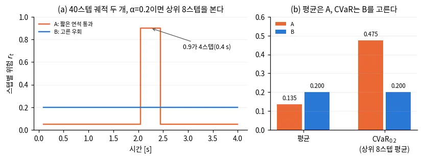
*그림 — travplan 작도: 작은 예의 두 궤적. (a) 스텝별 위험, (b) 평균과 상위 8스텝 평균(CVaR). 평균은 A를, CVaR는 B를 고른다. 코드: scripts/make_doc_figures.py*

*그림 — RA-MPPI (Fig. 1): 명목 동역학으로 뽑은 후보마다 교란 동역학으로 CVaR를 평가하고, 제약 위반을 비용에 더한 뒤 MPPI 가중평균을 낸다. 출처: [arXiv:2209.12842](https://arxiv.org/abs/2209.12842)*

수식 보기

**기호.** $Z$는 손실(클수록 나쁨), $\alpha \in (0, 1]$는 꼬리 비율, $(z)_+ = \max(z, 0)$이다. VaR는 상위 α 꼬리가 시작하는 값, 즉
$(1-\alpha)$ 분위수다.

$$ \operatorname{VaR}_\alpha(Z) = \min\{\, z : P(Z > z) \le \alpha \,\} $$

CVaR는 손실 $Z$의 상위 $\alpha$ 꼬리(예: $\alpha = 0.2$면 가장 나쁜 20%)의 평균이다. Rockafellar–Uryasev 형태로 쓰면 최적화에 바로 넣을 수 있다.

$$ \operatorname{CVaR}_\alpha(Z) = \mathbb{E}\big[\, Z \mid Z \ge \operatorname{VaR}_\alpha(Z) \,\big] = \min_{\nu} \Big\{ \nu + \tfrac{1}{\alpha}\, \mathbb{E}\big[(Z - \nu)_+\big] \Big\} $$

**왜 최소화 형태가 맞나.** 중괄호 안을 $\nu$로 미분하면 $1 - P(Z > \nu)/\alpha$다. 이것이 0이 되는 곳은 $P(Z > \nu) = \alpha$, 즉
$\nu = \operatorname{VaR}_\alpha$다. 그 $\nu$를 넣으면 "경계값 더하기 경계 너머 초과분의 평균"이 되어 꼬리 평균과 같다. 손실이 결정
변수에 볼록이면 중괄호 안은 결정 변수와 $\nu$에 함께 볼록이다. 그래서 둘을 함께 최소화하면 CVaR 최소화가 볼록 문제가 된다. 손실이 결정
변수에 선형이면 표본으로 쓴 식은 선형계획이다(Rockafellar–Uryasev 2000).

**첫 등호의 조건.** 첫 등호(조건부 기댓값)는 연속 분포에서 성립한다. 경계값에 확률이 몰린 이산 분포에서는 최소화 형태를 정의로
쓴다(Rockafellar–Uryasev 2002). 작은 예의 A가 그렇다. $\operatorname{VaR}_{0.2} = 0.05$에 표본 36개가 몰려 있어
$\mathbb{E}[Z \mid Z \ge 0.05] = 0.135$지만 CVaR는 0.475다. 경계값에 걸린 확률을 나눠 쓰는 같은 논문의 가중평균 식으로도 0.475가 나온다.
$\operatorname{CVaR}^+_\alpha$는 VaR를 넘는 손실만의 평균(여기서 0.9)이다.

$$ \operatorname{CVaR}_\alpha = \lambda\,\operatorname{VaR}_\alpha + (1-\lambda)\,\operatorname{CVaR}^+_\alpha, \qquad \lambda = \frac{P(Z \le \operatorname{VaR}_\alpha) - (1-\alpha)}{\alpha} = \frac{0.9 - 0.8}{0.2} = 0.5 \;\Rightarrow\; 0.5 \times 0.05 + 0.5 \times 0.9 = 0.475 $$

**작은 예를 식으로.** 표본 40개가 같은 확률이면, A에 $\nu = 0.05$를 넣어 다음을 얻는다.

$$ \operatorname{CVaR}_{0.2}(A) = 0.05 + \frac{1}{0.2} \cdot \frac{4 \times (0.9 - 0.05)}{40} = 0.05 + 0.425 = 0.475 $$

$\alpha T$가 정수면 이 값은 상위 $\alpha T$개의 평균과 같다. travplan은 $\lceil \alpha T \rceil$개를 평균하므로, $\alpha T$가 정수가 아니면
최소화 형태보다 조금 작은 값을 낸다.

**성질.** CVaR는 단조성, 평행이동 불변, 양의 동차성, 부분가법성을 모두 갖는 정합(coherent) 위험 척도다. VaR는 부분가법성이 없어서, 두 위험을
합친 VaR가 각 VaR의 합보다 클 수 있다. 또 $\operatorname{CVaR}_\alpha \ge \operatorname{VaR}_\alpha$라서 CVaR 제약은 같은 α의 확률 제약보다
보수적이다.

$$ \operatorname{CVaR}_\alpha(Z) \le z \;\Rightarrow\; \operatorname{VaR}_\alpha(Z) \le z \;\Leftrightarrow\; P(Z > z) \le \alpha $$

**가우시안 닫힌 식.** $Z \sim \mathcal{N}(\mu, \sigma^2)$이면 표준정규 밀도 $\phi$와 누적분포 $\Phi$로 쓴다.

$$ \operatorname{VaR}_\alpha(Z) = \mu + \sigma\,\Phi^{-1}(1-\alpha), \qquad \operatorname{CVaR}_\alpha(Z) = \mu + \sigma\,\frac{\phi\big(\Phi^{-1}(1-\alpha)\big)}{\alpha} $$

계수는 $\alpha = 0.2$에서 0.84와 1.40, $\alpha = 0.05$에서 1.64와 2.06이다. 표준편차 0.1 m인 위치 오차에 $\alpha = 0.05$로 여유를 두면
VaR는 0.16 m, CVaR는 0.21 m를 조인다. Planner 문서 §B.9의 $\kappa(\alpha)$가 둘째 식의 계수다. 인식 문서 §A.7(SALON)은 신뢰 수준
$\alpha_R$로 $\sigma\,\phi(\Phi^{-1}(\alpha_R))/(1-\alpha_R)$를 쓴다. $\alpha_R = 1 - \alpha$를 넣으면 둘째 식과 같다.

**travplan `RiskCost`.** 궤적 한 개 안에서 스텝별 위험 $r_t$를 만들고, 그중 가장 큰 $\lceil \alpha T \rceil$개의 평균을 비용으로
쓴다(시간 축 위의 경험적 CVaR). 동적 장애물 레이어 $\mathrm{dyn}_t$가 있으면 더하고, 예측 겹침에는 강한 벌점을 준다.

$$ r_t = c_t + \beta\,\sigma_t + \gamma\,\mathrm{dyn}_t, \qquad \mathrm{RiskCost} = w \cdot \frac{1}{\lceil \alpha T \rceil} \sum_{t \in \text{top-}\lceil \alpha T \rceil} r_t \;+\; P \cdot \mathbb{1}\big[\max_t \mathrm{dyn}_t \ge 1\big] $$

$c_t$와 $\sigma_t$는 TravMap의 cost와 sigma 채널을 궤적 위에서 읽은 값이다. 기본값은 $w = 3.0$, $\beta = 0.7$, $\gamma = 1.0$,
$P = 1000$이다.

**논문별 변형.**

- RA-MPPI는 명목 후보마다 교란 궤적을 여러 개 굴려 손실 $L$의 CVaR를 표본으로 추정한다. $\operatorname{CVaR}_\alpha(L) \le C_u$를 어긴
  만큼을 후보 비용 $S_k$에 더하고 MPPI 가중평균(배경 0.2)을 낸다. 여기서 α는 신뢰 수준이다.
- CVaR-BF는 안전 여유 $h$의 아래쪽 꼬리를 본다. $q_\beta(h)$를 $h$의 $\beta$ 분위수라 하면
  $\operatorname{CVaR}_\beta(h) = \mathbb{E}[h \mid h \le q_\beta(h)] = -\operatorname{CVaR}_\beta(-h)$이고, 시점마다 겹쳐
  쓴 CVaR가 0 이상이면 안전하다고 본다(배경 0.4). 이 $\beta$는 꼬리 비율이라 위 `RiskCost`의 $\beta$와 다른 기호다.
- SALON과 행성 로버 계획은 예측 분포를 가우시안으로 보고 위의 닫힌 식을 쓴다. 표본이 필요 없어 싸지만, 꼬리가 가우시안보다 두꺼우면 위험을
  낮게 잰다.

**참고문헌.**

- Rockafellar·Uryasev, *Optimization of conditional value-at-risk*, Journal of Risk 2000 — [DOI:10.21314/JOR.2000.038](https://doi.org/10.21314/JOR.2000.038). 최소화 형태와 선형계획 풀이의 원전.
- Rockafellar·Uryasev, *Conditional value-at-risk for general loss distributions*, Journal of Banking & Finance 2002 — [DOI:10.1016/S0378-4266(02)00271-6](https://doi.org/10.1016/S0378-4266%2802%2900271-6). 이산 분포에서의 정의. 표본으로 CVaR를 잴 때 기대는 곳이다.
- Majumdar·Pavone, *How Should a Robot Assess Risk? Towards an Axiomatic Theory of Risk in Robotics*, ISRR 2017 — [arXiv:1710.11040](https://arxiv.org/abs/1710.11040). 로봇에서 왜 CVaR인가. 공리와 VaR·평균-분산의 반례를 본다.
- Wang·Chapman, *Risk-averse autonomous systems: A brief history and recent developments from the perspective of optimal control*, Artificial Intelligence 2022 — [arXiv:2109.08947](https://arxiv.org/abs/2109.08947). 개관. 위험 회피 최적 제어의 역사와 CVaR 계열 방법을 본다.
- Yin 외, *Risk-Aware Model Predictive Path Integral Control Using Conditional Value-at-Risk*, ICRA 2023 — [arXiv:2209.12842](https://arxiv.org/abs/2209.12842). MPPI 안에 CVaR 제약을 넣는 방법. Controller 문서 §C.2가 기대는 논문이다.

### 0.4 Control Barrier Function(CBF): 명령을 최소한으로 고쳐 안전 집합에 남긴다

안전한 상태 집합을 함수 $h(x) \ge 0$로 정의하고, ==$h$가 너무 빨리 줄지 않도록 명령에 부등식 제약을 거는 QP를 매 스텝 푼다.==
QP(quadratic program)는 2차 목적과 선형 제약으로 된 최적화 문제다. 원래 명령에서 가장 조금 벗어나는 안전한 명령을 고르므로,
어떤 Planner·Controller 뒤에도 붙일 수 있다(§C). travplan에는 아직 CBF 필터가 없고, CVaR barrier function(CVaR-BF) 안전 필터가
다음 후보다(TP-0014).

**왜 필요한가.** 지금 travplan `MPPIController`(배경 0.2)의 안전은 벌점이다. 치명 셀과 보행자 겹침에 1000을 매기면 대개 피하지만, 후보가 모두 나쁘거나
예측이 틀리면 보장이 없다(Controller 문서 §C.3는 비용 레이어를 휴리스틱으로 분류한다). 학습 Planner도 분포 밖 입력에서 무엇을 낼지 모른다.
CBF 안전 필터는 마지막 관문이다. 명령이 어디서 왔든 안전 집합 밖으로 향하는 성분만 잘라 낸다. 제약이 명령에 선형이라 매 스텝 작은 QP로
풀리고, 보고된 시간은 0.6–0.8 ms다(Controller 문서 §C.2).

**직관.** 네 단계로 본다.

1. 안전을 숫자 하나로 쓴다. $h(x)$는 장애물까지 거리에서 반경을 뺀 값처럼, 안전하면 양수이고 닿으면 0이다.
2. $h$가 줄어드는 속도를 $h$ 자신에 비례해 묶는다. $\dot h \ge -\gamma h$면 여유가 1 m일 때 초당 $\gamma$ m까지,
   0.1 m일 때 초당 $0.1\gamma$ m까지만 다가간다.
3. 그러면 $h(t) \ge h(0)\,e^{-\gamma t}$라서 경계에 지수적으로 다가갈 수는 있어도 넘지는 못한다.
4. 명령 $u_{\text{nom}}$이 부등식을 만족하면 그대로 통과시킨다. 어기면 부등식을 겨우 만족하는 가장 가까운 명령으로 바꾼다. 제약이 하나면
   이것은 반공간으로의 수직 투영이고 닫힌 해가 있다.

비유하면 차간 거리 유지 장치다. 앞차와 멀면 운전자 마음대로 두고, 가까워질수록 다가가는 속도를 줄인다. 이산 시간에서는 한 스텝에 여유의
$\gamma$ 비율까지만 잃을 수 있다. 즉 $h(x_{k+1}) \ge (1-\gamma)\,h(x_k)$다. $\gamma = 1$이면 $h(x_{k+1}) \ge 0$만 남아 보통의 거리 제약이
된다.

**작은 예.** travplan 스워브를 속도 명령 $u = (v_x, v_y)$로 움직이는 점으로 본다(몸체 좌표, x는 앞, y는 왼쪽).
멈춰 선 보행자가 (2.0, 0.5) m에 있고, 로봇과 보행자 반경의 합은 0.8 m다.

- 거리는 $d = \sqrt{2.0^2 + 0.5^2} = 2.06$ m이고, 여유는 $h = d - 0.8 = 1.26$ m다.
- $\nabla h$는 보행자에서 멀어지는 단위 벡터 $(-0.970, -0.243)$이고, $\dot h = \nabla h \cdot u$다.
- $\gamma = 0.5$ 1/s면 제약은 $\dot h \ge -0.63$이다. 보행자 쪽으로 다가가는 속도를 0.63 m/s까지만 허용한다.
- 원래 명령 $u_{\text{nom}} = (1.2, 0)$ m/s는 $\dot h = -1.16$이라 0.53만큼 어긴다.
- 투영하면 $u^\star = u_{\text{nom}} + 0.53\,\nabla h = (0.68, -0.13)$ m/s다. 0.68 m/s로 늦추면서 오른쪽으로 0.13 m/s 비켜선다.

이 답은 스워브 속도 한계($v_x \le 1.5$, $|v_y| \le 0.6$ m/s) 안이라 그대로 명령이 된다. 필터를 계속 걸면 여유는 1 s 뒤 0.77 m, 2 s 뒤 0.46 m
아래로 내려가지 않는다.

**함정.**

- **입력이 $\dot h$에 나타나야 한다.** 이것을 상대 차수 1이라 부른다. 가속도를 입력으로 보면 위치로 정의한 $h$의 $\dot h$에 입력이 없어서
  고차 CBF(HOCBF, [arXiv:1903.04706](https://arxiv.org/abs/1903.04706))가 필요하다. 스워브를 속도 명령으로 보면 상대 차수가 1이지만,
  실제로는 가속 한계(`SwerveLimits.a_max`의 vx 1.0 m/s²)와 모듈 조향 지연이 있다. Poisson 안전 함수 논문도 G1의 속도 추종 지연 때문에 $h$가
  잠깐 음수가 됐다(Controller 문서 §C.4).
- **풀리지 않을 수 있다.** 제약 여러 개와 입력 한계가 겹치면 모두 만족하는 명령이 없다. 완화 변수를 두면 풀리지만 그만큼 보장이 약해진다.
  Adaptive CVaR-BF가 매 스텝 위험 수준 β를 고르는 이유다(Controller 문서 §C.2).
- **목표가 아닌 곳에 멈출 수 있다.** CBF-QP는 목표가 아닌 곳에 안정한 정지점을 만들 수
  있다([arXiv:2003.07819](https://arxiv.org/abs/2003.07819)). 목표는 비용이고 안전은 hard 제약이라, 둘이 맞서면 힘이 평형을 이룬다. 정면에서
  마주 오는 보행자처럼 대칭인 배치에서 잘 생긴다(인식 문서 §A.12.5).
- **근시안이다.** CBF는 지금 순간의 조건이라 막다른 길을 미리 피하지 않는다. 그래서 Planner나 MPC와 함께 쓴다. $\gamma$가 작으면 멀리서부터
  조심하지만 보수적이고 풀리지 않기 쉽다. 크면 가까워질 때까지 아무 일도 하지 않는다. Zeng 외도 $\gamma$를 자동으로 고르는 법을
  열린 문제로 남겼다.
- **$h$를 만들기가 어렵다.** 장애물 여러 개까지의 최소 거리는 장애물 사이 중간선에서 미분할 수 없고, 격자 거리장은 해상도만큼 계단진다.
  Poisson 안전 함수는 편미분 방정식을 풀어 매끄러운 $h$를 만든다(Controller 문서 §C.4).
- **움직이는 장애물에는 속도 항이 붙는다.** 보행자가 속도 $v_o$로 움직이면 $\dot h = \nabla h \cdot (u - v_o)$다. 이 항을 빼면 다가오는
  보행자에게 늦게 반응한다.

**어디서 쓰나.**

- Controller 문서 §C.2는 표준 CBF-QP, OcclusionCBF, Adaptive CVaR-BF를 설명하고, §C.3가 지연·보장·의존성을 표로 비교한다.
  Adaptive CVaR-BF가 TP-0014의 1순위이고 오픈소스 CasADi로 푼다.
- Controller 문서 §C.4는 CBF-QP 원 논문과 튜토리얼, 이산 CBF와 MPC, 예측 안전 필터, Poisson 안전 함수를 다룬다. 끝의 토글이 CLF 제약을 함께
  넣은 QP를 적었다.
- Controller 문서 §E: Predictive Semantic Safety는 conformal prediction(배경 0.13)으로 보정한 미래 점유를 backup CBF 필터에 넣는다.
- Planner 문서 §B.9: RoM-Nav는 점유 격자에서 Poisson 방정식으로 $h$를 만들고, 정책의 속도 명령을 $\alpha = 0.75$인 CBF 제약으로 투영한다.
- 인식 문서 §A.8은 CLF(control Lyapunov function)가 목표 수렴을, CBF가 안전 집합 유지를 보장한다고 대비한다. 인식 문서 §A.12.5는 여유 비례
  감속, 시간가변 CBF, 교착을 다룬다. MPC 문서 §M.1.2는 치명 셀을 비용에서 제약으로 옮긴다.
- 코드: CBF 필터는 아직 없다. 가장 가까운 것은 `control/acados_mpc/obstacles.py::LethalField.half_planes`가 만드는
  acados 비선형 MPC(NMPC)의 치명 셀 제약이다. 노드마다 가장 가까운 치명 셀의 접선 반평면 $n_k \cdot p_k \ge b_k$를 여유 0.15 m로 걸고,
  `ocp.py`는 이를 완화 변수 가중치 $10^6$의 soft 제약으로 둔다. 이산 CBF에서 $\gamma = 1$인 거리 제약과 같은 모양이고, 이것을 여유
  비례(CBF) 형태로 바꾸는 일이 TP-0093이다. `core/types.py::DynamicObstacles`의 보행자 원판과 치명 셀까지의 거리가 $h$ 후보다.

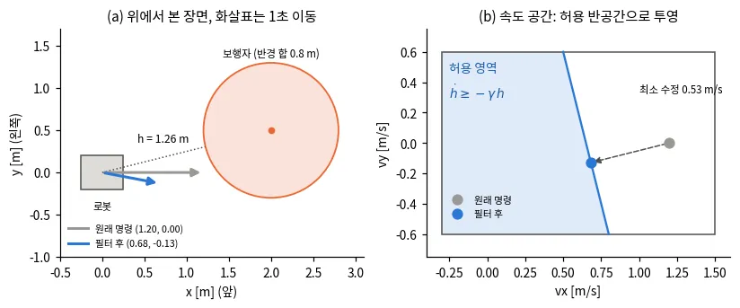
*그림 — travplan 작도: 작은 예. (a) 멈춘 보행자 앞의 원래 명령과 필터 후 명령, (b) 속도 공간에서 허용 반공간으로의 수직 투영. 코드: scripts/make_doc_figures.py*

*그림 — 이산 CBF를 넣은 MPC (Fig. 4d): 같은 지평 N=8에서 γ를 0.1, 0.2, 0.3, 1.0으로 바꾼 궤적과 거리 제약(MPC-DC). γ가 작을수록 일찍 넓게 돌고, γ=1은 거리 제약과 거의 겹친다. 출처: [arXiv:2007.11718](https://arxiv.org/abs/2007.11718)*

*그림 — CVaR barrier function (Fig. 1): 이족 로봇의 장애물 회피. (a) barrier 없음과 (b) 위험 중립 barrier는 h가 0 아래로 내려가고, (c) CVaR barrier만 h를 양수로 지킨다. 출처: [arXiv:2011.01578](https://arxiv.org/abs/2011.01578)*

*그림 — Adaptive CVaR-BF (Fig. 2): 다음 스텝 여유 h의 분포에서 아래쪽 β 꼬리의 평균이 CVaR다. β가 0에 가까우면 장애물이 있을 수 있는 모든 위치를, 1에 가까우면 평균 위치만 피한다. 출처: [arXiv:2504.06513](https://arxiv.org/abs/2504.06513)*

수식 보기

안전 집합 $\mathcal{C} = \{x : h(x) \ge 0\}$. 제어 입력에 선형인 시스템 $\dot x = f(x) + g(x)u$에서, $h$의 감소 속도를 $h$ 자신에 비례하게
제한하면 $\mathcal{C}$ 안에 머문다($\alpha$는 class-$\mathcal{K}$ 함수).

$$ \dot h(x, u) = \nabla h(x)^\top \big(f(x) + g(x)u\big) \;\ge\; -\alpha\big(h(x)\big) $$

**기호.** $x$는 상태, $u$는 입력이다. $L_f h = \nabla h^\top f$와 $L_g h = \nabla h^\top g$는 Lie 미분이다. $\alpha$는 0에서 0이고 증가하는
함수로, 튜토리얼은 실수 전체에서 정의된 extended class-$\mathcal{K}_\infty$ 함수를 쓴다. 흔히 $\alpha(h) = \gamma h$로 둔다.

**왜 안전한가.** $\alpha(h) = \gamma h$면 비교 원리로 $h(x(t)) \ge h(x(0))\,e^{-\gamma t}$다. $h(x(0)) \ge 0$이면 모든 $t$에서
$h \ge 0$이다. 경계 $h = 0$에서 $\dot h \ge 0$이라 밖으로 나가지 못한다(전방 불변). 튜토리얼의 정리는 경계에서 $\nabla h \ne 0$을 요구하고,
이때 $\mathcal{C}$가 점근 안정이라 노이즈로 밖에 밀려나도 돌아온다고 보인다.

매 스텝 푸는 QP는 다음과 같다. 제약이 $u$에 선형이라 작은 QP로 0.6–0.8 ms 안에 풀린다.

$$ u^\star = \arg\min_u \; \lVert u - u_{\text{nom}} \rVert^2 \quad \text{s.t.} \quad \nabla h^\top\!\big(f + g u\big) \ge -\alpha(h) $$

**제약이 하나일 때의 닫힌 해.** $a = (L_g h)^\top$, $b = -\alpha(h) - L_f h$로 쓰면 제약은 $a^\top u \ge b$다. $u_{\text{nom}}$이 이를
어기면 경계로 수직 투영한다.

$$ u^\star = u_{\text{nom}} + \frac{\max\big(0,\ b - a^\top u_{\text{nom}}\big)}{\lVert a \rVert^2}\, a $$

$a \ne 0$이면 이 해는 연속이라 필터가 명령을 튀게 하지 않는다. $a$가 0에 가까워지는 곳, 즉 입력이 $h$를 거의 못 움직이는 곳에서는 작은
위반을 고치려고 큰 명령을 낸다.

**작은 예를 식으로.** 단일 적분기 $\dot p = u$라 $f = 0$, $g = I$다. $h = \lVert p - p_o \rVert - r$이면 $a = \nabla h = (-0.970, -0.243)$,
$b = -0.5 \times 1.26 = -0.63$이다.

$$ b - a^\top u_{\text{nom}} = -0.63 + 1.16 = 0.53, \qquad u^\star = (1.2,\ 0) + 0.53\,(-0.970,\ -0.243) = (0.68,\ -0.13) $$

이산 시간 버전은 $h(x_{t+1}) \ge (1-\gamma)\,h(x_t)$, $0 < \gamma \le 1$이다. $h$가 매 스텝 비율 $1-\gamma$보다 빨리 줄지 않는다는 뜻이다.

반복하면 $h(x_k) \ge (1-\gamma)^k h(x_0)$다. 연속 시간의 $\gamma_c$와는 $\gamma \approx \gamma_c \Delta t$로 대응해, $\Delta t = 0.1$ s에서
$\gamma_c = 0.5$는 $\gamma = 0.05$다. 다음 상태 $h(f(x_k, u_k))$는 보통 $u_k$에 비선형이라 이산 CBF 문제는 일반적으로 QP가 아니다.
Agrawal·Sreenath는 제어 아핀 시스템에 선형 barrier와 2차 CLF를 쓰면 이 문제가 볼록 QCQP(2차 제약 2차 계획)가 됨을 보였다.

$\gamma = 1$이면 $h(x_{k+1}) \ge 0$만 남는다. 한 스텝 필터로 쓰면 최고 속도 1.5 m/s에서 여유가 0.15 m 아래로 내려가기 전에는 아무것도
막지 않는다. MPC 안에 넣으면 지평 뒤쪽 노드가 먼저 닿지만, Zeng 외는 거리 제약의 지평을 30스텝으로 늘려도 장애물 가까이에서야 피하기
시작했다고 보고했다.

**CLF와 함께.** 목표 수렴은 CLF 제약 $L_f V + L_g V u \le -cV + \delta$로 함께 넣는다. 둘이 부딪히면 완화 변수 $\delta$로 목표 쪽을
양보한다(Controller 문서 §C.4 토글). 앞의 교착은 이 비대칭에서 나온다.

**고차 CBF.** 입력이 $\dot h$에 나타나지 않으면 $\psi_0 = h$, $\psi_1 = \dot\psi_0 + \alpha_1(\psi_0)$처럼 보조 함수를 차례로 만든다. 입력이
나타나는 단계의 $\psi_m \ge 0$을 제약으로 쓴다.

**확률적 버전.** 장애물의 다음 위치가 불확실하면 $h_{k+1} = h(x_{k+1}, x^o_{k+1})$이 확률 변수가 된다. 충돌 확률 조건
$P(h_{k+1} \ge 0) \ge 1 - \beta$는 VaR 조건과 같고, 이를 더 보수적인 CVaR로 바꾼 것이 CVaR barrier function이다(§C).

$$ \operatorname{CVaR}_\beta^{k}\big(h_{k+1}\big) \ge (1 - \gamma)\, h_k $$

여기서 CVaR는 $h$의 아래쪽 $\beta$ 꼬리 평균 $\mathbb{E}[h \mid h \le q_\beta(h)] = -\operatorname{CVaR}_\beta(-h)$이고($q_\beta$는 $h$의
$\beta$ 분위수, 배경 0.3), 윗첨자 $k$는 시점 $k$의 정보로 잰다는 뜻이다. $\beta \to 1$이면 $\mathbb{E}[h_{k+1}]$을 쓰는 위험 중립 barrier가
되고, $\beta \to 0$이면 최악값을 쓰는 barrier에 가까워진다. 확률 조건은 $q_\beta(h_{k+1}) \ge 0$과 같다. 아래 꼬리에서는
$\operatorname{CVaR}_\beta(h) \le q_\beta(h)$이므로 이 제약은 같은 β의 확률 제약보다 보수적이다.
시점마다 겹쳐 쓴 CVaR가 0 이상으로 남으면 CVaR 안전이라고 한다. Adaptive CVaR-BF는 제약을 만족하는 명령이 있는 가장 작은 $\beta$를 매 스텝
고른다(Controller 문서 §C.2).

**$h$를 만드는 변형.** Poisson 안전 함수는 자유 공간에서 $\Delta h = f$($f < 0$), 장애물 경계에서 $h = 0$인 편미분 방정식을 풀어 $h$를
만든다(Controller 문서 §C.4). RoM-Nav는 이 $h$로 속도 명령에 $\frac{dh}{dp}\, v \ge -0.75\, h(p)$를 건다(Planner 문서 §B.9).

**참고문헌.**

- Ames 외, *Control Barrier Function Based Quadratic Programs for Safety Critical Systems*, IEEE TAC 2017 — [arXiv:1609.06408](https://arxiv.org/abs/1609.06408). CBF-QP의 원전. CBF와 CLF를 한 QP에 넣는 구조를 본다.
- Ames 외, *Control Barrier Functions: Theory and Applications*, ECC 2019 — [arXiv:1903.11199](https://arxiv.org/abs/1903.11199). 튜토리얼. 정의와 정리, 안전 필터, 로봇 응용을 한 번에 본다.
- Agrawal·Sreenath, *Discrete Control Barrier Functions for Safety-Critical Control of Discrete Systems with Application to Bipedal Robot Navigation*, RSS 2017 — [DOI:10.15607/RSS.2017.XIII.073](https://doi.org/10.15607/RSS.2017.XIII.073). 이산 시간 조건 $h_{k+1} \ge (1-\gamma) h_k$의 원전.
- Zeng 외, *Safety-Critical Model Predictive Control with Discrete-Time Control Barrier Function*, ACC 2021 — [arXiv:2007.11718](https://arxiv.org/abs/2007.11718). MPC 안의 이산 CBF. $\gamma$와 거리 제약의 차이를 본다.
- Ahmadi 외, *Risk-Averse Control via CVaR Barrier Functions: Application to Bipedal Robot Locomotion*, IEEE L-CSS 2022 — [arXiv:2011.01578](https://arxiv.org/abs/2011.01578). CVaR barrier function의 원전. arXiv판 제목은 "Risk-Averse Planning via ..."다.
- Wang 외, *Safe Navigation in Uncertain Crowded Environments Using Risk Adaptive CVaR Barrier Functions*, IROS 2025 — [arXiv:2504.06513](https://arxiv.org/abs/2504.06513). 위험 수준 β를 스스로 고르는 CVaR-BF. TP-0014의 1순위 후보다.

### 0.11 메타러닝과 온라인 적응

메타러닝은 여러 환경(과제)의 데이터로 "빨리 적응하기 좋은 시작점"을 배워 둔다. 그러면 ==새 환경에서는 최근 몇 초의 경험만으로 몇 스텝 미세조정해
맞출 수 있다.== 온라인 적응은 세 갈래다. 매개변수를 경사하강으로 고치는 MAML(Model-Agnostic Meta-Learning), 최근 이력에서 잠재 문맥을 추정하는
RMA(Rapid Motor Adaptation), 최근 데이터를 기억해 예측에 쓰는 가우시안 과정(GP)이다. travplan에는 메타러닝 코드가 없고, Controller의 잔차
GP(`travplan/control/acados_mpc/gp.py`)만 셋째 갈래로 적응한다.

**왜 필요한가.** 보도의 노면은 구간마다 바뀐다. 마른 보도, 젖은 타일, 자갈, 경사로는 미끄러지는 정도가 다르고, 화물 무게도 배달마다 다르다.
travplan plant는 국소 경사와 거칠기로 슬립 $s$(최대 0.35)를 정해 실제 병진 속도를 $(1-s)$배로 줄인다(`travplan/robot/plant.py`). 모든 환경의
데이터로 모델 하나를 학습하면 평균 슬립을 예측하게 되어 어느 노면에서도 조금씩 틀린다. METAVerse는 이를 "환경마다 성질이 달라 우연 불확실성이
커진다"고 설명한다. 그렇다고 노면마다 모델을 새로 학습하기에는 현장 데이터가 몇 초 분량뿐이다. 그래서 적은 데이터로 빨리 맞추는 요령 자체를 미리
배운다.

**직관.**
1. **과제를 정한다.** MAML을 쓰는 METAVerse는 궤적 조각 하나를 과제 하나로 본다. 지난 $M$초는 적응용(support), 다음 $K$초는 평가용(query)이다.
2. **안쪽 고리.** 시작점 $\theta$에서 support 데이터로 경사하강을 몇 번 해 $\theta'$를 얻는다.
3. **바깥 고리.** $\theta'$가 query를 얼마나 잘 맞히는지로 $\theta$를 고친다. 적응하기 전이 아니라 적응한 뒤의 성능을 목표로 시작점을 옮기는 것이
   핵심이다.
4. **배포.** 로봇이 달리면서 최근 $M$초의 자기 라벨 데이터를 큐에 쌓고, 안쪽 고리만 돌려 모델을 지금 노면에 맞춘다.

비유하면 여러 도시에서 운전해 본 사람이다. 처음 가는 도시에서도 몇 블록만 달려 보면 그 도시의 운전 습관에 맞춘다. 배운 것은 특정 도시가 아니라
맞추는 요령이다. 잠재 문맥 갈래는 매개변수를 고치지 않는다. 인코더가 최근 상태·행동 이력에서 환경을 요약한 벡터 $z$를 추정하고, 모델이나 정책이
$z$를 입력으로 받는다(RMA, §E.2). 경사하강이 없어 빠르고 안정적이지만, 학습 때 본 변화의 범위 안에서만 맞춘다. travplan 잔차 GP는 셋째 갈래다.
최근 표본 몇백 개를 기억하고, 새 입력이 오면 가까운 기억의 잔차를 가중평균한다. 딕셔너리를 바꾸는 것이 곧 적응이다.

**작은 예.** 속도 모델 $\hat v = (1-\theta)\,v_{\text{cmd}}$에서 슬립 $\theta$ 하나만 적응한다고 하자. 명령 1 m/s로 달리면 제곱 손실은
$L(\theta) = (s - \theta)^2$이다. 학습률 $\eta = 0.25$로 한 번 경사하강하면 $\theta' = \theta + 0.5\,(s - \theta)$라, 한 스텝이 오차를 절반으로
줄인다. 학습 노면이 마른 보도($s = 0.05$), 젖은 타일(0.15), 자갈(0.25)이라 하자(가상의 값). 적응 뒤 손실의 합 $0.25 \sum_j (s_j - \theta)^2$을
가장 작게 하는 시작점은 $\theta^* = 0.15$다. 처음 보는 노면 $s = 0.30$에서 한 스텝 적응하면 0.15에서 0.225로 가서 오차가 0.15에서 0.075가 된다.
마른 보도로만 학습한 시작점 0.05에서 출발하면 0.175로 가서 오차가 0.125로 남는다. 같은 데이터, 같은 스텝 수인데 시작점이 오차를 가른다. 이 예처럼
과제마다 곡률이 같은 2차 손실이면 MAML 시작점은 과제 평균과 같다. 신경망처럼 비선형이면 둘이 갈린다(아래 MAML Fig. 2).

**함정.**
- **이계 미분이 비싸다.** 바깥 기울기가 안쪽 경사하강을 거쳐 역전파되므로 헤시안–벡터 곱이 든다. MAML 논문은 이 항을 뺀 1차 근사가 MiniImagenet
  1-shot 5-way에서 48.07%로, 원래의 48.70%와 거의 같다고 보고한다. Reptile도 1차 방법이다.
- **과제 분포가 배포 환경을 덮어야 한다.** 학습 때 없던 종류의 변화라면 시작점이 가깝지 않을 수 있다. 다만 Nagabandi 외는 학습 때 보지 못한 다리
  손상, 경사, 자세 오보정, 견인 하중에서도 온라인 적응이 궤적 이탈을 줄였다고 보고한다.
- **적은 데이터에 과적합한다.** 몇 초의 잡음 섞인 데이터로 신경망 전체를 여러 스텝 고치면 모델이 망가질 수 있다. 스텝 수와 학습률을 작게 두고
  시작점으로 되돌릴 길을 둔다. Nagabandi 외의 GrBAL(gradient-based adaptive learner)은 매 스텝 시작점 $\theta^*$에서 다시 적응한다.
- **창 길이는 절충이다.** 창이 짧으면 빨리 따라가지만 잡음에 흔들리고, 길면 안정적이지만 노면이 바뀐 뒤에도 옛 데이터를 믿는다. travplan 정확
  GP에서 용량 100은 요 잔차의 비선형을 놓쳤고, 800은 refresh가 38 ms라 제어 주기 안에 돌지 못했다(MPC 문서 §M.3.6). 유도점 64개인 희소 GP는
  데이터를 버리지 않고도 주기 안에 들어온다(§M.3.8). 옛 데이터를 얼마나 남길지는 그래도 정해야 한다.
- **폐루프 되먹임을 조심한다.** 적응한 모델로 낸 명령이 다시 학습 데이터가 된다. GP 입력으로 잔차가 이미 들어간 다음 상태를 쓰면, GP가 자기 보정을
  더 큰 명령으로 보고 예측을 키워 몇 번의 RTI(real-time iteration) 반복 안에 지평이 발산한다. 그래서 travplan은 명령이 만들 명목 다음 속도
  $v_k + u_k \Delta t$를 입력으로 쓴다(`MPCController._features`의 주석). 근사 방식도 되먹임을 만든다. 정확 GP는 학습 분포 가장자리에서 큰 보정을
  내 폐루프를 무너뜨렸고, 유도점 64개 희소 GP로 바꾸자 그 발산이 사라졌다(MPC 문서 §M.3.9).
- **적응은 영향을 받은 뒤에야 시작된다.** 미끄러짐은 미끄러진 뒤에야 보인다. 처음 몇 초의 위험은 인식(TravMap σ)과 보수적인 여유가 맡아야 한다.

**어디서 쓰나.** METAVerse(§A.10.3)는 궤적 조각을 과제로 MAML 학습하고, 배포 중 최근 경험으로 몇 스텝 경사하강한다. 지난 8초로 적응해 다음 8초를
평가하고, 안쪽 고리는 3스텝, 안쪽 학습률은 $10^{-4}$다. 비포장 평가 데이터의 평균 제곱 오차가 기준선 0.1222, 적응 없이 0.0713, 적응 뒤 0.0114다.
Controller 문서도 같은 생각을 여러 곳에 적었다. §E의 잠재 문맥 온라인 적응(RA-L 2026)이 학습 동역학을 현장에 맞춘다. §E.2의 RMA는 적응 모듈을
10 Hz, 정책을 100 Hz로 따로 돌린다. §E.4의 Continual VND는 잠재 조건과 재생 버퍼로 겪어 본 조건을 기억한다. §E.10은 현지 데이터로 회귀한 슬립
모델이 미리 보정한 슬립 곡선보다 낫고, 그 이득이 고슬립 구간에서 가장 크다고 정리한다.
- `travplan/control/acados_mpc/gp.py`의 `ResidualGP.push`는 고정 크기 딕셔너리에 새 잔차를 넣고 가장 오래된 것을 뺀다. `GPConfig.capacity` 기본값
  200은 제어 주기 0.1초에서 약 20초 분량이다. MPC 문서 §M.3.8은 이 딕셔너리를 유도점 64개인 희소 GP로 요약하라고 권하고, 같은 파일의 `SparseGP`가
  그 구현이다.
- `travplan/control/acados_mpc/controller.py`의 `MPCController._learn`은 매 스텝 실측 twist와 명령 twist의 차이를 넣고, `gp_refresh_every`(기본 5)
  스텝마다 다시 푼다. 시작점을 메타 학습하는 코드는 없다.
- 다음 후보는 §E.4에 적었다. 잠재 조건 인코더만 떼어 Controller의 rollout 모델이나 Planner D의 조건 입력으로 넣고, 노면 조건이 실제로 군집되는지
  먼저 본다.

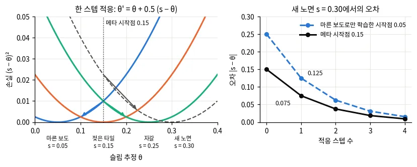
*그림 — travplan 작도: 왼쪽은 작은 예다. 노면 셋의 손실 곡선(실선), 새 노면의 손실 곡선(점선), 메타 시작점 0.15에서 한 스텝 적응한 곳(화살표)을 그렸다. 오른쪽은 새 노면(s = 0.30)에서 적응 스텝 수에 따른 오차다. 같은 스텝 수라도 시작점이 가까우면 더 정확하다. 코드: scripts/make_doc_figures.py*

*그림 — MAML (Fig. 2 왼쪽): 사인파 회귀. 오른쪽에만 있는 5점(삼각형)으로 경사하강을 1스텝, 10스텝 하면(진한 초록 선) 점이 없는 왼쪽 봉우리까지 대략 맞힌다. 빨강은 정답, 연한 점선은 적응 전이다. 출처: [arXiv:1703.03400](https://arxiv.org/abs/1703.03400)*

*그림 — MAML (Fig. 2 오른쪽): 같은 과제 분포로 평범하게 사전학습한 모델은 같은 5점으로 미세조정(걸음 0.01)해도 사인파를 복원하지 못한다. 출처: [arXiv:1703.03400](https://arxiv.org/abs/1703.03400)*

*그림 — METAVerse (Fig. 4a): 평가 데이터 전체에서 잰 비용 예측의 평균 제곱 오차. 메타 목적 없이 학습한 기준선은 0.3247이다. 메타 학습 모델은 적응 없이 0.2813, 1스텝 뒤 0.2421, 6스텝 뒤 0.2151이다. 출처: [arXiv:2307.13991](https://arxiv.org/abs/2307.13991)*

수식 보기

**기호.** $\mathcal{T}_j$는 과제(노면, 궤적 조각)다. support는 적응에 쓰는 최근 데이터, query는 적응한 뒤의 성능을 재는 다음 데이터다. $\eta$는
안쪽 학습률, $\beta$는 바깥 학습률이다.

MAML은 과제(환경) $\mathcal{T}_j$마다 한 스텝 적응한 매개변수가 잘 동작하도록 시작점 $\theta$를 학습한다.

$$ \theta_j' = \theta - \eta\, \nabla_\theta \mathcal{L}_{\mathcal{T}_j}^{\text{support}}(\theta), \qquad \min_\theta \sum_j \mathcal{L}_{\mathcal{T}_j}^{\text{query}}(\theta_j') $$

**바깥 기울기.** 연쇄 법칙으로 안쪽 경사하강을 거쳐 미분하면 헤시안이 나온다. 바깥 갱신은
$\theta \leftarrow \theta - \beta \sum_j \nabla_\theta \mathcal{L}^{\text{query}}_{\mathcal{T}_j}(\theta_j')$다.

$$ \nabla_\theta\, \mathcal{L}^{\text{query}}_{\mathcal{T}_j}(\theta_j') = \big(I - \eta\, \nabla^2_\theta \mathcal{L}^{\text{support}}_{\mathcal{T}_j}(\theta)\big)\, \nabla_{\theta'} \mathcal{L}^{\text{query}}_{\mathcal{T}_j}(\theta_j') $$

괄호를 $I$로 두는 것이 1차 근사(FOMAML)다. Reptile은 과제마다 $k$스텝 적응한 $\tilde\theta_j$ 쪽으로 시작점을 조금 옮긴다. 그 갱신은
$\theta \leftarrow \theta + \epsilon\,(\tilde\theta_j - \theta)$다.

**작은 예를 식으로.** 명령 1 m/s에서 $\mathcal{L}_j(\theta) = (s_j - \theta)^2$이면 기울기가 $-2(s_j - \theta)$, 헤시안이 2다.

$$ \theta_j' = \theta + 2\eta\,(s_j - \theta), \qquad \sum_j \mathcal{L}_j(\theta_j') = (1 - 2\eta)^2 \sum_j (s_j - \theta)^2 \;\Rightarrow\; \theta^* = \tfrac{1}{3}(0.05 + 0.15 + 0.25) = 0.15 $$

$1 - 2\eta$가 바로 위 식의 $I - \eta \nabla^2 \mathcal{L}$이다. $\eta = 0.25$면 이 값이 0.5라 한 스텝이 오차를 절반으로 줄인다. 헤시안이 과제마다
같은 상수라 1차 근사도 같은 점으로 간다. MAML 시작점이 과제 평균과 같아지는 것도 과제마다 헤시안이 같은 2차식이기 때문이다. 곡률이 과제마다 다르면
곡률과 학습률로 정해지는 가중 평균이 된다.

**METAVerse(§A.10.3).** 궤적 조각 $\tau$가 과제다. 지난 $M$초로 적응하고 다음 $K$초로 평가한다. 손실은 가우시안 음의 로그 우도(NLL)다(배경 0.8).

$$ \min_\theta\ \mathbb{E}_{\tau}\Big[\mathcal{L}\big(\tau(t, t+K),\ \theta'\big)\Big], \qquad \theta' = \theta - \eta\, \nabla_\theta\, \mathcal{L}\big(\tau(t-M, t),\ \theta\big) $$

$M = K = 8$초, 안쪽 3스텝, 안쪽 학습률 $10^{-4}$, 바깥 학습률 $3 \times 10^{-4}$이고 모든 매개변수를 적응한다. 배포 중에는 자기 라벨 큐로 안쪽
고리만 비동기로 돈다.

**GrBAL(Nagabandi 외).** 동역학 모델의 로그 우도를 지난 $M$스텝으로 한 번 올리고, 적응한 모델로 MPPI를 푼다. 걸음 크기 $\psi$도 메타 학습한다. 매
스텝 시작점 $\theta^*$로 되돌린 뒤 다시 적응한다. ReBAL은 같은 일을 순환 신경망의 은닉 상태 갱신으로 한다.

$$ \theta'_{\mathcal{E}} = \theta + \psi\, \nabla_\theta\, \frac{1}{M} \sum_{m=t-M}^{t-1} \log \hat p_\theta\big(s_{m+1} \mid s_m, a_m\big) $$

**잠재 문맥.** 배포 중에는 최근 상호작용 데이터로 $\theta \to \theta'$ 적응을 반복한다. 매개변수 대신 **잠재 문맥** $z$를 최근 이력에서 추정해
모델에 넣는 방식도 있다($f_\theta(x, u, z)$). 매개변수를 바꾸지 않으므로 더 빠르고 안정적이다. RMA(§E.2)는 시뮬레이터가 아는 환경 요인 $e_t$를
$z_t = \mu(e_t)$로 압축해 정책을 학습한 뒤, 적응 모듈 $\phi$가 최근 이력에서 같은 벡터를 추정하도록 회귀한다. 배경 0.12의 특권 교사와 같은 두 단계
구조다.

$$ \hat z_t = \phi\big(x_{t-k:t-1},\ a_{t-k:t-1}\big), \qquad \min_\phi\ \lVert \hat z_t - z_t \rVert^2 $$

**비모수 적응(travplan GP).** 최근 표본 $(X, \mathbf{y})$만 기억하고 사후 평균으로 예측한다. 표본을 바꾸는 것이 곧 적응이고, 경사하강이 없다. 정확
GP의 사후 평균은 아래와 같다. travplan은 고정 용량 링 버퍼(기본 200)에 표본을 쌓고 5스텝마다 $K(X, X) + \sigma_n^2 I$를 촐레스키 분해해
$\big[K(X, X) + \sigma_n^2 I\big]^{-1}\mathbf{y}$를 다시 구한다. 희소 GP는 같은 식을 유도점 몇십 개로 근사한다(§M.3.8).

$$ \mu(x_*) = k(x_*, X)\,\big[K(X, X) + \sigma_n^2 I\big]^{-1} \mathbf{y} $$

**참고문헌.**
- Finn 외, *Model-Agnostic Meta-Learning for Fast Adaptation of Deep Networks*, ICML 2017 — [arXiv:1703.03400](https://arxiv.org/abs/1703.03400). MAML 원 논문. 안쪽·바깥 고리와 1차 근사를 읽는다.
- Hospedales 외, *Meta-Learning in Neural Networks: A Survey*, IEEE TPAMI 2021 — [arXiv:2004.05439](https://arxiv.org/abs/2004.05439). 메타러닝의 정의, 전이학습과의 관계, 새 분류 체계를 정리한 개관.
- Nichol 외, *On First-Order Meta-Learning Algorithms*, arXiv 2018 — [arXiv:1803.02999](https://arxiv.org/abs/1803.02999). 이계 미분 없이 쓰는 FOMAML과 Reptile.
- Nagabandi 외, *Learning to Adapt in Dynamic, Real-World Environments Through Meta-Reinforcement Learning*, ICLR 2019 — [arXiv:1803.11347](https://arxiv.org/abs/1803.11347). 메타 학습한 동역학을 최근 $M$스텝으로 적응해 MPPI에 넣는다. travplan Controller 구조와 가장 가깝다.
- Kumar 외, *RMA: Rapid Motor Adaptation for Legged Robots*, RSS 2021 — [arXiv:2107.04034](https://arxiv.org/abs/2107.04034). 잠재 문맥 갈래의 대표(§E.2).
- Seo 외, *METAVerse: Meta-Learning Traversability Cost Map for Off-Road Navigation*, IROS 2024 — [arXiv:2307.13991](https://arxiv.org/abs/2307.13991). traversability 비용 지도에 MAML을 쓴 사례(§A.10.3).
