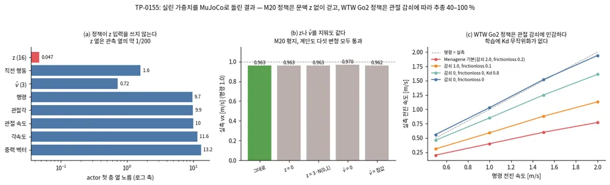

<!-- doc: Controller · 안전 | 3 -->
# Controller와 안전 필터 — Planner의 궤적을 실행하는 쪽 (§E, §C)

**Controller는 Planner의 경로나 궤적을 받아 추종하면서, 지형과 동적 장애물을 로컬로 피하는 body twist를 낸다.** travplan은 Controller로 MPPI와
acados NMPC 두 갈래를 함께 개발하고 같은 벤치마크에서 비교한다(2026-09-30 결정). 이 문서는 그 Controller를 고칠 때 보는 참고 지도이고, 개발 기록은 MPC 문서(§M)에 있다. 다섯 탭으로 나뉜다.

| 탭 | 다루는 것 | 절 | travplan과의 관계 |
|---|---|---|---|
| MPPI 계열 | MPPI의 계보, 학습 prior를 넣는 법, SMPPI, 최적 수송으로 샘플을 옮기는 최적화기(MPOT·OT-MPC) | E.1, B.5, E.11 | `MPPIController`, `SmoothMPPIController` |
| 학습 동역학·적응 | 학습 rollout 모델, 불확실성, 온라인 적응, 마일스톤, Zeilinger 그룹(학습 MPC의 보장·공개 코드·내비 MPC), GP 잔차 | E, E.2–E.10 | 슬립이 커질 때 바꿀 rollout 모델, 잔차 GP |
| 안전 필터 | 비용 통합형과 외부 필터형, CBF 계열, 계보 | C.1–C.4 | 시간가변 비용 레이어(구현), CVaR-BF(TP-0014) |
| 하위 제어 · 4족 RL | 4족 보행 RL의 계보, 자동 커리큘럼, RL과 MPC를 섞는 갈래, DreamWaQ 비공식 구현 코드 분석, 휴머노이드 분리형 WBC | F.1–F.8 | 지형 난이도 커리큘럼(TP-0039)과 Planner D RL 후학습(TP-0066) |
| 작업 기록 | Playground의 학습 Controller와 지도 없는 대조군, 휴머노이드·WBC, MPOT Planner, DreamWaQ 비공식 구현 점검 | E.12–E.15 | `travplan/control/tiny_policy.py`, `js/mpot.js`, TP-0128·0129·0135·0136·0155 |

**계보 한눈에 보기.**

| 연도 | 샘플링 MPC | 학습 동역학·적응 | 안전 필터 |
|---|---|---|---|
| 2015–2018 | MPPI, 정보이론적 MPC, Tube-MPPI | PETS | CBF-QP, HJ 도달 가능성, 예측 안전 필터 |
| 2019–2021 | Robust MPPI | IKD, RMA | CBF 튜토리얼, 이산 CBF + MPC, safe-control-gym |
| 2022–2023 | log-MPPI, SMPPI, Nav2 MPPI, RA-MPPI | PENN, TOAST, 지형 인지 운동 모델, 확률 앙상블 능동 탐색, TD-MPC2 | 안전 필터 통합 관점 |
| 2024–2026 | MPPI-Generic, π-MPPI, DRA-MPPI, ProxPI, OT-MPC | 잠재 문맥 온라인 적응 | CVaR-BF, OcclusionCBF, Predictive Semantic Safety |

**공개 코드.** GitHub 별 순이다(2026-09).

| 분야 | 이름 | 코드(★) | 라이선스 | travplan에서 |
|---|---|---|---|---|
| 스택 | [Nav2 (MPPI Controller 포함)](https://github.com/ros-navigation/navigation2) | 4.7k | 패키지별 혼합 | ROS 2 통합 시 비교 대상 |
| 모델 기반 RL | [TD-MPC2](https://github.com/nicklashansen/tdmpc2) | 1.0k | MIT | 잠재 world model + MPPI 참고 |
| 벤치마크 | [safe-control-gym](https://github.com/utiasDSL/safe-control-gym) | 0.9k | MIT | 안전 방법 비교 환경 |
| MPPI | [pytorch_mppi](https://github.com/UM-ARM-Lab/pytorch_mppi) | 0.8k | MIT | 같은 PyTorch 계열 참고 |
| 안전 | [NMPC-DCLF-DCBF](https://github.com/HybridRobotics/NMPC-DCLF-DCBF) | 0.3k | MIT | 이산 CBF + MPC 참고 |
| MPPI | [MPPI-Generic](https://github.com/ACDSLab/MPPI-Generic) | 0.3k | BSD-2-Clause | Orin 이식 시 CUDA 구현 후보 |
| 안전 | [safe_control](https://github.com/tkkim-robot/safe_control) | 0.3k | 표기 없음 | CBF-QP, MPC-CBF 구현 참고 |
| 안전 | [hj_reachability](https://github.com/StanfordASL/hj_reachability) | 0.2k | MIT | JAX 도달 가능성 계산 |

**travplan의 위치.** ==travplan Controller는 "MPPI + 비용 통합형 안전"이고, 다음 단계는 뒤에 붙는 안전 필터다.== 비용은 `CostTerm`으로만
더하고 최적화기(`mppi.py`)는 건드리지 않는다는 규칙이 있어서, 이 문서의 연구 가운데 travplan에 들어오는 것은 셋 중 하나다. 새 비용 항,
새 rollout 모델, Controller 뒤의 필터다.

---

<!-- tab: MPPI 계열 -->

### E.1 MPPI의 계보: 경로 적분 제어에서 GPU 라이브러리까지

**MPPI는 2015년 경로 적분 제어를 GPU 샘플링으로 푼 데서 시작했다.** 이후 정보이론적 유도로 일반화되고(2017), 외란에 버티는 판(Tube·Robust
MPPI), 샘플링 분포를 바꾼 판(log-MPPI, SMPPI), 범용 라이브러리(Nav2 MPPI Controller, MPPI-Generic)로 발전했다. travplan `MPPIController`는
2017년 정보이론적 MPPI에 시간 상관 AR(1) 노이즈와 참조 추종 샘플을 더한 형태다(배경 0.2). 개발 계획에서는 빠져 있어, 이 절은 Controller를
손볼 때 볼 지도다.

| 연도 | 이름 | 바꾼 것 | 구현(★) |
|---|---|---|---|
| 2015–2016 | MPPI | 경로 적분 제어를 GPU 병렬 샘플링 MPC로, AutoRally 공격적 주행 | — |
| 2017–2018 | 정보이론적 MPC | KL 기반 유도로 일반 비선형 동역학과 비용으로 확장 | — |
| 2018–2021 | Tube-MPPI, Robust MPPI | 명목 상태와 실제 상태를 나누고 추종 제어기를 더해 외란에 강하게 | MPPI-Generic |
| 2022 | log-MPPI | 정규분포와 로그정규분포를 곱한 분포에서 샘플 | — |
| 2022 | SMPPI | 노이즈를 제어 변화율에 넣어 매끄럽게(B.5) | travplan `SmoothMPPIController` |
| 2022–2023 | Nav2 MPPI Controller | ROS 2 표준 스택의 CPU MPPI | [ros-navigation/navigation2](https://github.com/ros-navigation/navigation2) 4.7k |
| 2024 | MPPI-Generic | MPPI, Tube-MPPI, Robust MPPI의 C++/CUDA 템플릿 라이브러리 | [ACDSLab/MPPI-Generic](https://github.com/ACDSLab/MPPI-Generic) 0.3k |
| — | pytorch_mppi | 근사 동역학을 쓰는 PyTorch 구현 | [UM-ARM-Lab/pytorch_mppi](https://github.com/UM-ARM-Lab/pytorch_mppi) 0.8k |

**MPPI와 정보이론적 MPC — 샘플을 굴려 가중 평균한다**([arXiv:1509.01149](https://arxiv.org/abs/1509.01149), 2015;
[arXiv:1707.02342](https://arxiv.org/abs/1707.02342), T-RO 2018, Georgia Tech). 제어열에 잡음을 섞은 후보 수천 개를 GPU로 동시에 굴리고,
비용의 지수 가중치로 평균해 새 제어열을 얻는다. 2015년판은 경로 적분 제어 이론에서 일반화된 중요도 샘플링으로 유도했다. 2017년판은
"비용의 볼츠만 분포에 KL 기준으로 가장 가까운 제어 분포"를 찾는 정보이론적 유도로 틀을 넓혀 일반 비선형 동역학에 썼다. 1/5 크기
AutoRally 차량으로 흙길 트랙을 공격적으로 달렸고, 교차 엔트로피 방법(CEM)의 MPC 판과 비교했다.


*그림 — 정보이론적 MPC (Fig. 2): 제어 분포를 최적 분포 쪽으로 "밀어" 가깝게 만드는 목적을 그림으로 나타냈다. 출처: [arXiv:1707.02342](https://arxiv.org/abs/1707.02342)*

**Tube-MPPI와 Robust MPPI — 외란과 모델 오차에 버틴다**([RMPPI arXiv:2102.09027](https://arxiv.org/abs/2102.09027), RA-L 2021,
Georgia Tech). MPPI는 매 스텝 실제 상태에서 다시 시작한다. 모델이 틀리거나 외란이 크면 샘플 전체가 나쁜 영역으로 밀려 중요도 샘플링이
무너진다. Tube-MPPI(RSS 2018)는 외란을 받지 않는 명목 상태에서 MPPI를 풀고, 실제 상태가 명목 궤적을 따라가게 하는 추종 제어기를 붙였다.
다만 명목 상태가 실제에서 멀어질 수 있고 보장이 없었다. RMPPI는 명목과 실제를 합친 증강 상태, 명목 상태를 어디서 다시 시작할지 정하는
규칙, 추종 제어기의 능력을 반영한 중요도 샘플링을 더해 자유 에너지 증가의 상한을 유도했다. AutoRally 실차에서 MPPI의 강건성 부족과
Tube-MPPI의 과한 보수성을 함께 줄였다.

**log-MPPI — 샘플링 분포를 바꿔 실행 가능한 궤적을 늘린다**([arXiv:2203.16599](https://arxiv.org/abs/2203.16599), RA-L 2022). 모든 샘플이
비용이 높거나 불가능한 영역에 몰리면 MPPI는 실행할 수 없는 궤적을 낸다. log-MPPI는 가우시안 대신 정규분포 변수와 로그정규분포 변수의
곱(NLN)에서 제어 변화를 샘플한다. 작은 잡음 분산으로 제약 위반을 피하면서도 궤적이 상태 공간에 넓게 퍼진다. 2D occupancy 격자를 비용으로
직접 넣어, 미지의 복잡한 환경을 로컬 비용 지도만으로 충돌 없이 주행했다.

**MPPI-Generic — GPU MPPI 라이브러리**([arXiv:2409.07563](https://arxiv.org/abs/2409.07563), 2024, Georgia Tech). MPPI, Tube-MPPI, Robust
MPPI를 C++/CUDA 템플릿으로 구현했다. 동역학과 비용을 API에 맞춰 쓰면 MPPI 코드를 고치지 않고 바꿀 수 있다. 차동 구동 모델과 Nav2의
비용 항을 똑같이 재현해 비교했다. RTX 3080에서 샘플 128개 기준 최적화 한 번에 약 0.15 ms로, Nav2의 CPU 구현(0.39–0.62 ms)보다 빠르고
PyTorch 기반 TorchRL 구현(25–48 ms)보다 두 자릿수 이상 빨랐다. Jetson Orin Nano에서도 샘플 128개에 약 0.6 ms였다.

<details markdown="1">
<summary>자세히: Robust MPPI의 명목 상태 선택과 log-MPPI의 샘플링</summary>

**기본 MPPI.** 잡음 섞은 제어열을 굴려 비용 $S_k$를 얻고, $\exp(-S_k/\lambda)$ 가중 평균으로 제어열을 갱신한다(배경 0.2).

**추종 제어기(Tube-MPPI, RMPPI).** 명목 상태 $\bar{\mathbf x}$에서 MPPI가 낸 제어 $\bar{\mathbf u}$에, 실제 상태와의 차이를 되먹이는 항을 더해
실행한다. $K$는 iLQG나 contraction metric 제어기가 준다.

$$ \mathbf u_t = \bar{\mathbf u}_t + K_t\,(\mathbf x_t - \bar{\mathbf x}_t) $$

**RMPPI의 명목 상태 선택.** 실제 상태 $\mathbf x$와 이전 명목 상태 사이의 후보 $\mathbf p_0, \dots, \mathbf p_R$ 가운데, 몬테카를로로 추정한
자유 에너지 $\mathcal F_{MC}$가 임계값 $\alpha$(보통 충돌 비용) 이하인 것 중 실제 상태에 가장 가까운 것을 새 명목 상태로 쓴다.

$$ \mathbf x^* = \arg\min_{\mathbf p_i} \lVert \mathbf p_i - \mathbf x \rVert \quad \text{s.t.} \quad \mathcal F_{MC}(S, \mathbb P, \mathbf p_i, \lambda) \le \alpha $$

실제 상태가 괜찮으면 거기서 다시 시작하고(MPPI처럼), 위험하면 명목 상태를 유지한다(Tube-MPPI처럼).

**log-MPPI의 NLN 샘플.** 정규분포 변수 $X$와 로그정규분포 변수 $Y$를 곱한 $Z = XY$를 제어 변화로 쓴다. 논문의 예에서는 잡음 분산을
작게 두어 제약 위반을 피하면서도, 가우시안 샘플보다 궤적이 넓게 퍼졌다.

$$ \delta \mathbf u = X \cdot Y, \qquad X \sim \mathcal N(0, \sigma_n^2), \quad \ln Y \sim \mathcal N(\mu_{ln}, \sigma_{ln}^2) $$

**travplan에 주는 것.** travplan `MPPIController`는 샘플 768개, 지평 40스텝(4초)으로 운동학 벤치마크에서 스텝당 약 10 ms가 걸린다(PyTorch).
Orin 이식에서 지연이 문제가 되면 MPPI-Generic 같은 CUDA 구현이 첫 후보다. Isaac Sim이나 실물에서 슬립이 커지면, 실제 상태에서 매번
다시 시작하는 지금 방식 대신 RMPPI식 명목 상태 선택이 로봇을 안정시킨다.

</details>

### B.5 Controller 쪽 참고: 학습 prior를 MPPI에 넣는 법과 SMPPI

> MPPI는 2026-09-25에 Controller로 분리되어 개발 계획에서 빠졌다. 이 절은 Controller를 손볼 때 볼 기록이다.

**ProxPI**([arXiv:2609.00941](https://arxiv.org/abs/2609.00941)) — 학습 prior를 MPPI에 넣을 때, 샘플링 분포의 **평균을 prior로
옮기면** prior가 틀린 경우 최적화기의 보정이 매번 버려져 성능이 떨어진다고 지적한다. 대신 prior를 **부드러운 근접 비용 항으로만**
넣으라고 제안한다. 그러면 prior가 틀려도 다른 비용 항(예: traversability)이 해를 바로잡을 수 있다. 실제 로봇과 시뮬레이션에서
검증했다.


*그림 — ProxPI (Fig. 2): prior가 틀릴 때 기본 MPPI / 워밍스타트 / ProxPI의 행동 비교(5개 로봇). 출처: [arXiv:2609.00941](https://arxiv.org/abs/2609.00941)*

<details markdown="1">
<summary>자세히: ProxPI의 방법과 수식</summary>

**두 가지 prior 주입 방식.** 학습 prior가 제어열 $U_p$를 줄 때, 샘플링 분포를 prior로 옮기는 워밍스타트와, 샘플링은 그대로 두고 비용에 근접 항을 더하는
ProxPI가 있다.

$$ \text{워밍스타트: } q_w(V) = \mathcal{N}(U_p, \Sigma), \qquad \text{ProxPI: } S'(V) = S(V) + \alpha \lVert V - U_p \rVert^2 $$

ProxPI의 목표 분포는 MPPI 우도와 "평균 $U_p$, 공분산 $\tfrac{\lambda}{2\alpha} I$"인 가우시안 prior의 곱이다. 둘 다 같은 중심을 쓰지만 폭이 다르다.

$$ p'(V) \propto \exp\!\big(-S(V)/\lambda\big)\, \exp\!\big(-\tfrac{\alpha}{\lambda} \lVert V - U_p \rVert^2\big)\, p_0(V) $$

**왜 ProxPI가 나은가.** 과제 비용을 국소 2차식 $S \approx S(U^*) + \tfrac12 \lVert V - U^* \rVert_H^2$로 근사하면, 반복 갱신은 과제 최적 $U^*$와 prior $U_p$ 사이의
고정점으로 수렴한다.

$$ U^\dagger = (H + 2\alpha I)^{-1}\big(H U^* + 2\alpha U_p\big), \qquad U_{j+1} - U^\dagger = A_\alpha\, (U_j - U^\dagger) $$

ProxPI는 이전 해 $U_j$를 중심으로 샘플링하므로 **보정이 반복마다 쌓인다.** 워밍스타트는 매번 $U_p$로 중심을 되돌려 이 보정을 버린다. 또 prior가 목표
분포에서 멀면 가중치가 몇 샘플에 몰려(유효 샘플 수 감소, $\chi^2$ 발산으로 측정) 추정이 흔들린다.

**travplan에 주는 것.** `MPPIController`는 Planner 경로를 `ReferenceCost`(비용)로 받고, 샘플의 30%만 경로 추종 제어열 주변에서 뽑는다. ProxPI 분석대로라면
이 30% 혼합보다 비용 항만 쓰는 편이 prior가 틀릴 때 더 안전할 수 있다. Controller 튜닝 때 비교할 항목이다.

</details>

travplan의 `MPPIController`는 이미 이 방향에 가깝다. Planner의 경로를 **`ReferenceCost`라는 비용 항**으로 받고, 샘플의 30%만 그
경로를 따라가는 제어열 주변에서 뽑는다(평균을 통째로 옮기지 않는다). ProxPI 형태의 비용 항은 다음처럼 쓸 수 있다.

```python
# control/mppi/costs.py::CostTerm 인터페이스 예시 (ProxPI 스타일)
class ProximityCost:
    """Planner 경로에서 멀어질수록 비용을 준다. 샘플링 평균은 건드리지 않으므로,
    경로가 틀려도 TraversabilityCost 같은 다른 항이 해를 되돌릴 수 있다."""
    def __call__(self, ctx):
        xy = ctx.poses[:, 1:, :2]                                   # [K, T, 2]
        d = torch.cdist(xy.reshape(-1, 2), ctx.ref_xy).min(-1).values
        return weight * d.reshape(xy.shape[:2]).pow(2).sum(-1)       # [K]
```

**Self-Supervised MPC Initialization**([arXiv:2408.03394](https://arxiv.org/abs/2408.03394))은 MPC의 초기해(워밍스타트)를 학습한다.
결정론적 MPC에서 21.6%·34.1% 개선을, 샘플링 MPC에서 안전 +100%, 경로 효율 +12.8%, 조향 매끄러움 +7.2%를 보고했다.
**π-MPPI**([arXiv:2504.10962](https://arxiv.org/abs/2504.10962))는 이름과 달리 워밍스타트 학습이 아니다. MPPI 샘플마다 QP 투영
필터를 걸어 제어의 크기와 도함수 한계를 보장하는 방법이고(고정익 비행체), 학습은 그 QP 풀이기의 초기값에만 쓴다. 두 연구 모두 검증은
시뮬레이션뿐이다.


*그림 — π-MPPI (Fig. 1): QP 투영 필터의 초기값을 예측하는 네트워크(MLP + 최적화 반복을 풀어 놓은 구조). 출처: [arXiv:2504.10962](https://arxiv.org/abs/2504.10962)*


*그림 — Self-Supervised MPC Init (Fig. 1): 전문가 MPC 데모로 1차 학습 → 자기지도로 2차 개선하는 2단계 학습. 출처: [arXiv:2408.03394](https://arxiv.org/abs/2408.03394)*

<details markdown="1">
<summary>자세히: π-MPPI의 방법과 수식</summary>

**목표: 제어 도함수의 상한을 보장하는 MPPI.** 고정익 비행체(FWV)처럼 제어가 떨리면 안 되는 시스템에서, 사후 평활화는 도함수 한계를 보장하지 못한다.
π-MPPI는 **샘플 하나하나를 projection filter로 최소한만 고쳐** 크기와 고차 도함수 한계를 만족시킨 뒤 MPPI 평균을 낸다.

$$ \min_{\bar\nu^m} \tfrac12 \lVert \nu^m - \bar\nu^m \rVert^2 \quad \text{s.t.}\quad {}^{(j)}\bar\nu_0^m = {}^{(j)}u_{\text{init}},\qquad {}^{(j)}u_{\min} \le {}^{(j)}\bar\nu^m \le {}^{(j)}u_{\max} $$

유한 차분으로 쓰면 등식·부등식 제약이 있는 QP다($A \bar\nu = b$, $G\bar\nu - h - \zeta = 0$, $\zeta \ge 0$). 필터가 비선형이므로 걸러진 샘플의 평균·공분산을 다시 추정해
가중치를 계산하고, 평균을 낸 뒤 다시 한 번 필터를 적용해 결과도 한계 안에 둔다.

**학습하는 것.** 이 QP 풀이기의 **초기값**을 신경망이 예측해 수렴을 빠르게 한다. MPPI 자체의 워밍스타트가 아니다.

**travplan에 주는 것.** travplan은 스워브 한계를 `SwerveModel.clamp_accel`로 굴리는 도중에 적용한다(투영이 아니라 클램프). 가속의 도함수(jerk) 한계까지
보장해야 할 때 참고한다.

</details>

<details markdown="1">
<summary>자세히: Self-Supervised MPC Initialization의 방법과 수식</summary>

**목표.** MPC 풀이기에 좋은 **초기해**를 주는 정책을 학습해 최적화 시간을 줄인다. 이전 해를 옮겨 쓰는 방식은 상태가 급변하면 실패하고, 순수 모방은
계산 시간을 직접 줄이지 못한다.

**2단계 학습.**
1. 오프라인 BC: 초기해 없이(0 벡터) 충분히 반복한 전문가 MPC의 (상태, 제어열) 쌍으로 MLP를 학습한다(MSE).
2. 온라인 미세조정: RL로 **MPC 계산 시간을 직접 줄이는** 방향으로 조정하고, DAgger(배경 0.12)로 정책이 실제로 도달한 상태를 데이터에 더해 분포 이동을 줄인다.

**결과.** 결정론적 MPC(F1 트랙 경로 추종)에서 최적화 21.6% 단축, 추종 정확도 34.1% 향상. 샘플링 MPC(장애물 많은 내비)에서 안전 100% 향상, 경로 효율
12.8%, 조향 부드러움 7.2% 개선.

**travplan에 주는 것.** MPPI 워밍스타트를 학습하는 방법이자, Planner D에 DAgger를 적용하는 구체적인 절차의 참고다.

</details>

#### Smooth MPPI(SMPPI): 노이즈를 변화율에 더한다

```
표준 MPPI                               SMPPI (input lifting)
u_k = u_nom_k + ε_k                     v_k = v_nom_k + ε_k       (ε: 독립 노이즈)
(ε_k가 스텝마다 독립 → 제어가 들쭉날쭉)     u_k = u_{k-1} + v_k·dt    (적분 → 매끄러움)
```

표준 MPPI는 스텝마다 독립인 노이즈를 제어값에 바로 더하므로 제어열이 떨리기 쉽다. **Smooth MPPI**([arXiv:2112.09988](https://arxiv.org/abs/2112.09988))는
노이즈를 제어의 **변화율**에 더하고 적분해 제어를 만든다. 랜덤 워크가 개별 잡음보다 매끄러운 것과 같은 원리로, 비용 항을 튜닝하지 않고도
구조적으로 매끄러운 제어를 얻는다. MPPI의 정보이론적 유도는 그대로 유지된다.

<details markdown="1">
<summary>자세히: Smooth MPPI의 방법과 수식</summary>

**MPPI의 정보이론적 틀.** 제어 평균 $U$ 주변의 샘플 분포 $q(V)$와 무제어 분포 $p(V)$를 두고, 자유 에너지로 최적 분포 $q^\star$를 정의한다(배경 0.2).

$$ q^\star(V) = \frac{1}{\eta} \exp\!\Big(-\frac{1}{\lambda} S(V)\Big)\, p(V) $$

**문제.** 원래 MPPI의 제어 비용 항은 "이전 반복과 현재 반복의 제어 차이"만 줄인다. 시간 축 방향의 떨림(chattering)은 비용에 없고, 임의로 비용을 더하면
MPPI의 유도(중요도 샘플링으로 제어 비용이 정해지는 구조)가 깨진다.

**input lifting.** 제어 공간과 행동 공간을 나눈다. 노이즈는 **한 차수 높은 공간**(제어의 변화율)에서 뽑고, 적분해 행동 열 $A$를 만든다. 노이즈 분산은
입력 변화율의 물리적 한계에 맞춘다. 그러면 MPPI 유도를 그대로 지키면서 행동의 변화율에 비용을 걸 수 있다.

$$ a_t = a_{t-1} + u_t\, \Delta t, \qquad u_t = \bar u_t + \epsilon_t,\ \ \epsilon_t \sim \mathcal{N}(0, \Sigma) $$

**travplan 적용.** travplan은 비용 항(`ControlCost`)은 그대로 두고 노이즈 생성만 이 방식으로 바꿨다(`SmoothMPPIController`, 배경 0.2).

</details>

**travplan 실험(TP-0016, `scripts/exp_smppi.py`, 4 시나리오 × 3 seed, `results/exp_smppi.txt`).** SMPPI의 세 요소 가운데 변화율 비용과
가중평균의 매끄러움 보존은 travplan MPPI에 이미 있었다. 남은 차이는 "노이즈를 변화율 공간에서 뽑아 적분한다" 하나라서, 노이즈 생성만 바꾼
서브클래스로 비교했다(아래 이름은 당시 이름이고, `mppi3d`는 지금의 `mppi`다).

| 변형 | 성공 | 도달시간(s) | gt_cost | max pitch(°) | RMS jerk | 계획 ms |
|---|---|---|---|---|---|---|
| mppi3d (AR(1) ρ=0.7) | 12/12 | 15.5 | 0.024 | 4.3 | 6.7 | 5.1 |
| ar09 (AR(1) ρ=0.9) | 12/12 | 12.2 | 0.030 | 4.1 | 6.1 | 5.1 |
| **smppi_lite (적분 노이즈)** | 12/12 | 14.1 | **0.023** | 4.1 | **4.8** | 4.7 |

적분 노이즈는 **RMS jerk를 28% 줄였고, 12개 에피소드 모두에서 개선**됐다. 안전 지표(gt_cost, pitch)는 그대로이고 도달시간은 9% 짧아졌다.
ρ=0.9는 더 빠르지만 gt_cost가 25% 나빠진다(지형을 덜 피한다). 결론은 ==**비용 항은 그대로 두고 노이즈 모델만 바꾸면 된다**==는 것이다.

이를 `SmoothMPPIController`(`control/mppi/smooth.py`, TP-0021)로 정식 추가했다. 전체 벤치마크(`results/tp0021.log`, 분리 전 이름 기준)는
다음과 같다.

| 스택(당시 이름) | 성공 | 도달시간(s) | gt_cost | RMS jerk | 계획 ms |
|---|---|---|---|---|---|
| mppi3d | 12/12 | 15.5 | 0.024 | 6.7 | 5.1 |
| **mppi3d_smooth** | 12/12 | 14.1 | 0.023 | **4.8** | 4.8 |
| hybrid | 12/12 | 12.9 | 0.026 | 7.2 | 8.6 |
| **hybrid_smooth** | 12/12 | 13.3 | 0.025 | **5.2** | 7.9 |
| learned(참고) | 5/12 | 16.7 | 0.039 | 7.0 | 0.5 |

hybrid에서도 jerk가 28% 줄고 도달시간은 3% 늘었다. 기본 Controller는 바꾸지 않았다. Planner D도 같은 "변화율 공간"에서 궤적을 생성한다.

### E.11 최적 수송으로 샘플을 옮기는 최적화기: MPOT와 OT-MPC (TP-0130)

**MPOT(Motion Planning via Optimal Transport)와 OT-MPC는 MPPI처럼 비용만 계산해 해를 고치지만, 샘플을 가중 평균 하나로 합치지
않는다.** 엔트로피 정규화 최적 수송(OT, optimal transport)으로 샘플과 이동 후보를 짝지어 샘플마다 따로 옮긴다. ==MPOT는 Controller가
아니라, 시작점에서 목표까지 궤적 묶음을 수렴할 때까지 다듬는 오프라인 최적화기다.== 샘플 기반 MPC의 갱신 자체를 OT로 바꾼 것은
다른 연구실의 OT-MPC다. 두 방법 모두 2차원 지상 이동에서 MPPI보다 낫다는 유의한 근거는 아직 없다. travplan은 이 계열을 들이기 전에,
MPPI 계열이 멈춘 장면에 개선 여지가 있는지부터 쟀다. 미리 정한 기준을 넘지 못해 MPOT 변형은 만들지 않았다(TP-0130, MPC 문서 M.3.20).

| 항목 | MPOT | OT-MPC | travplan `MPPIController` |
|---|---|---|---|
| 쓰임 | 오프라인 배치 계획. 수렴까지 Sinkhorn Step 40–70번 | receding horizon MPC | receding horizon MPC, 0.1 s 주기 |
| 최적화하는 것 | 궤적의 상태 웨이포인트(위치와 속도) | 제어열 입자 8–50개 | 제어열 하나(샘플 768개의 가중 평균) |
| OT가 짝짓는 것 | 웨이포인트와 회전한 정다포체의 꼭짓점 | 입자와 비용으로 가중한 제안 | 쓰지 않는다 |
| 비용이 들어가는 자리 | 수송 비용 행렬(웨이포인트마다) | 제안 쪽 주변분포(rollout 전체) | 지수 가중치(rollout 전체) |
| 동역학 | 등속 GP(Gaussian process) 사전분포를 비용으로 | 모델 rollout | 스워브 rollout 모델 |
| 근거 | NeurIPS 2023, 시뮬레이션, MPPI 비교 없음 | arXiv v1(2026-05), 시뮬레이션, 코드 미공개 | 이 저장소의 벤치마크 |

#### MPOT: 웨이포인트를 정다포체 꼭짓점 쪽으로 수송한다

MPOT([arXiv:2309.15970](https://arxiv.org/abs/2309.15970), NeurIPS 2023)는 기울기 없이 궤적 묶음을 한꺼번에 다듬는 배치 궤적
최적화기다. 시작점에서 목표까지 수렴할 때까지 돌린 뒤, 비용이 가장 낮은 궤적을 실행하거나 충돌 없는 궤적을 모두 학습 데이터로
저장한다. RTX 3080 Ti에서 2차원 질점은 0.4 s, 7자유도 Panda 팔은 0.8 s가 걸렸다. 비교 대상에 MPPI는 없다. 가장 가까운 것은
MPPI식 가중 평균으로 갱신하는 SGPMP(Stochastic Gaussian Process Motion Planning)다. 질점에서 둘의 성공률은 비슷했고, 차이는 계획
시간(0.4 s 대 6.5 s)이었다. 논문과 코드, 프로젝트 페이지 어디에도 receding horizon 실행이나 동적 장애물, 실물 실험은 없다.

궤적 $N_p$개의 웨이포인트 $T$개를 점 $N = N_p T$개로 펼치고, 반복마다 Sinkhorn Step 한 번으로 모든 점을 함께 옮긴다. 웨이포인트는
위치와 속도를 이어 붙인 1차 상태다. 점마다 무작위로 회전한 정다포체(regular polytope)를 하나씩 놓고, 그 꼭짓점 $m$개를 이동 후보로
쓴다. 정다포체는 simplex, orthoplex, cube 가운데 하나다. 꼭짓점 방향의 탐침점 $h$개에서 비용을 평균해 $N \times m$ 비용 행렬을 만든다.
이 행렬로 주변분포가 균등한 엔트로피 OT를 풀고, 각 점을 OT 계획이 정한 꼭짓점들의 무게중심으로 옮긴다. 그래서 이동은 늘 정다포체
안에 머문다(명시적 신뢰 영역). 실험에서는 반경을 스텝마다 일정 비율로 줄였다. 매끄러움과 동역학은 등속 GP 사전분포의 전이 비용으로만
들어온다. 충돌은 점유 격자를 조회한 비용으로만 들어오고, 기울기는 필요 없다.

**원형 그대로는 travplan Controller에 맞지 않는다.** travplan의 `CostTerm`은 rollout 전체를 보고 샘플마다 비용 하나(`[K]`)를 낸다.
어느 스텝이든 치명 셀을 밟으면 주는 벌점, 시간축 CVaR(배경 0.3), 끝점 진행이 그렇다. 이 항들은 스텝별로 나뉘지 않는데, MPOT는
웨이포인트와 꼭짓점마다 비용(`[N, m]`)을 요구한다. 또 MPOT는 홀로노믹 상태 웨이포인트를 직접 옮기므로 rollout을 하지 않는다. 그래서
제어열을 rollout할 때만 작동하는 세 가지를 모두 건너뛴다.

- 스워브 rollout 모델의 속도·가속 한계
- 잔차 GP의 평균을 넣은 rollout(TP-0120, `mppi_ccgpm`)
- 계획 중인 rollout 모델 계층. TP-0124의 기구학·동역학·학습 층, TP-0125의 메쉬 시뮬레이터, TP-0126의 학습 FDM(forward dynamics
  model)이다.

맞는 형태는 제어열 판이다. 입자를 40×3 제어열로 두고, OT의 점을 그 제어열의 twist 매듭점 8개로 둔다. 매듭점마다 MPPI 노이즈 크기로
늘인 3-orthoplex를 놓고, 매듭점 하나를 꼭짓점 쪽으로 옮긴 제어열을 통째로 rollout해 비용을 매긴다. 그러면 `CostTerm`과 rollout 모델,
확률 제약을 그대로 물려받는다. SMPPI처럼 `mppi.py`를 고치지 않는 MPPI 갈래 안의 변형이 된다. 수식은 아래 토글에 있다.


*그림 — MPOT (Fig. 2): Sinkhorn Step 한 번. 웨이포인트(남색 점)마다 무작위로 회전한 2-cube의 꼭짓점(초록)과 그 방향의 탐침점(빨강)을 둔다. 회색 숫자는 방향마다 탐침점 비용의 평균이고, 빨간 화살표가 OT 계획으로 정한 이동이다. 실선 원은 스텝 반경, 점선 원은 탐침 반경이다. 출처: [arXiv:2309.15970](https://arxiv.org/abs/2309.15970)*


*그림 — MPOT (Fig. 1): 목표 셋에 궤적을 다섯 개씩 GP 사전분포에서 뽑아 한 OT 문제로 함께 다듬는다. 왼쪽부터 Sinkhorn Step 0, 10, 20, 40번째이고, 전체 계획 시간은 0.12 s였다. 출처: [arXiv:2309.15970](https://arxiv.org/abs/2309.15970)*

<details markdown="1">
<summary>자세히: MPOT의 Sinkhorn Step 수식과 제어열 매듭점 판</summary>

**무엇을 하나.** Sinkhorn Step은 점 묶음 $\{\mathbf x_t\}_{t=1}^{N}$을 한 번에 옮기는 0차 갱신이다. 점 $\mathbf x_t$마다 단위 구에
내접한 정다포체를 무작위 회전 $R_t$로 돌려 이동 후보 $\mathbf d_{t,i} = R_t\mathbf d_i$를 만든다. 꼭짓점 수 $m$은 $d$차원 simplex가
$d+1$, orthoplex가 $2d$, cube가 $2^d$다. 세 정다포체 모두 꼭짓점의 합이 0이다.

**비용 행렬.** 점 $t$와 꼭짓점 $i$의 비용은 그 방향 탐침점 $h$개에서 잰 상태 비용과 GP 전이 비용의 평균이다(식 10). 둘째 항이
이웃 웨이포인트를 묶는 유일한 고리다.

$$ C_{t,i} = \frac{1}{h}\sum_{j=1}^{h} \Big[\, \eta\, c(\mathbf x_t + \mathbf y_{t,i,j}) + \tfrac12 \big\lVert \Phi_{t,t+1}\mathbf x_t - (\mathbf x_{t+1} + \mathbf y_{t+1,i,j}) \big\rVert^2_{Q^{-1}_{t,t+1}} \Big] $$

$\Phi_{t,t+1}$과 $Q_{t,t+1}$은 등속 GP 사전분포(가속도에 백색 잡음)의 전이 행렬과 공분산이다. 행렬은 최솟값을 빼 양수로 만들고
$[0, 1]$로 정규화한다. 논문은 Sinkhorn 안의 지수 때문에 MPOT가 비용 크기에 민감하다고 적었다.

**엔트로피 OT.** 주변분포는 균등하다. 엔트로피 항은 해를 유일하게 만들고, Sinkhorn 반복으로 빨리 풀리게 한다. $\lambda$가 크면
빠르지만 계획이 흐려지고, 작으면 수치가 불안정해진다. 논문은 $\lambda = 0.01$을 썼다.

$$ W^\star = \arg\min_{W \ge 0,\; W\mathbf 1_m = \mathbf 1_N/N,\; W^\top \mathbf 1_N = \mathbf 1_m/m} \; \langle W, C\rangle - \lambda H(W), \qquad H(W) = -\textstyle\sum_{t,i} W_{ti}\log W_{ti} $$

**로그 영역 Sinkhorn.** 쌍대 퍼텐셜 $\mathbf f \in \mathbb R^N$과 $\mathbf g \in \mathbb R^m$을 번갈아 고친다. 지수를 logsumexp 안에서만
계산하므로 $\lambda$가 작아도 넘치지 않는다.

$$ f_t \leftarrow -\lambda\log N - \lambda\log\textstyle\sum_{i} e^{(g_i - C_{ti})/\lambda}, \qquad g_i \leftarrow -\lambda\log m - \lambda\log\textstyle\sum_{t} e^{(f_t - C_{ti})/\lambda}, \qquad W^\star_{ti} = e^{(f_t + g_i - C_{ti})/\lambda} $$

논문 구현은 스케일 벡터를 곱해 나가다가 값이 커지면 로그 쪽으로 흡수하는 안정화를 쓴다(부록 E). 수학적으로는 같은 반복이다.
Panda에서는 해가 수렴할수록 안쪽 반복이 1–2번으로 줄었다.

**무게중심 사영.** 행마다 $N W^\star_{t,\cdot}$는 합이 1인 가중치다. 점은 꼭짓점 방향의 볼록 결합만큼 움직인다(식 4).

$$ \mathbf x_t \leftarrow \mathbf x_t + \alpha_k \sum_{i=1}^{m} N\, W^\star_{ti}\, \mathbf d_{t,i}, \qquad \lVert \Delta\mathbf x_t \rVert \le \alpha_k, \qquad \alpha_{k+1} = (1-\epsilon)\,\alpha_k $$

이동이 정다포체 안에 머무는 것이 논문이 말하는 명시적 신뢰 영역이다. 탐침 반경 $\beta_k$도 같은 비율로 줄이고, 실험은 $\epsilon$을
0.032–0.05로 두었다. 균형 OT에는 제자리에 머무는 꼭짓점이 없다. 점이 하나뿐이면 열 주변분포가 계획을 균등하게 만들고, 꼭짓점의 합이
0이므로 스텝도 0이다. 이론(정리 1)은 점과 꼭짓점의 수가 같고 $\lambda \to 0$이라고 가정한다. 실제 MPOT는 $N \gg m$이라 수렴은
실험으로만 보였다.

**travplan에 주는 것: 제어열 매듭점 판.** 원형의 점은 상태 웨이포인트라 travplan의 rollout 모델과 `CostTerm`을 쓰지 못한다. 그래서
점의 정의를 바꾼다.

- 입자 $p$는 제어열 $U_p \in \mathbb R^{T \times 3}$이다. $T = 40$(0.1 s 간격)이고, 행은 twist $\mathbf u_p(t) = (v_x, v_y, \omega_z)$다.
  입자 8개는 MPPI의 워밍스타트, 경로 추종 사전 제어열, 워밍스타트에 MPPI 노이즈를 더한 사본 여섯으로 시작한다.
- OT의 점은 입자마다 매듭점 $L = 8$개다. 매듭점 $\ell$의 이동은 모자 함수 기저 $\phi_\ell(t)$로 시간축에 퍼진다(구간 선형 보간).
- 꼭짓점은 3-orthoplex $\boldsymbol\delta_i \in \{\pm\mathbf e_1, \pm\mathbf e_2, \pm\mathbf e_3\}$($m = 6$)를 무작위로 회전하고, 축마다
  MPPI 노이즈 표준편차 $\boldsymbol\sigma = (0.4, 0.25, 0.6)$로 늘인 것이다. MPOT 코드의 무작위 회전은 짝수 차원만 받으므로,
  3차원에서는 단위 쿼터니언으로 균등한 회전을 뽑는다.
- 탐침은 꼭짓점 하나다($h = 1$). 비용은 매듭점 하나만 옮긴 제어열을 통째로 rollout한 목적함수 $S$다. $S$는 `CostTerm`의 합이고,
  확률 제약 스택이면 그 항도 들어간다.

$$ V_{p\ell i}(t) = \mathbf u_p(t) + \alpha\,\phi_\ell(t)\,\mathbf d_{p\ell i}, \qquad \mathbf d_{p\ell i} = \boldsymbol\sigma \odot \big(R_{p\ell}\,\boldsymbol\delta_i\big), \qquad C^{(p)}_{\ell i} = S\big(V_{p\ell i}\big) $$

$$ \mathbf u_p(t) \leftarrow \mathbf u_p(t) + \sum_{\ell=1}^{L} \phi_\ell(t)\,\alpha \sum_{i=1}^{6} L\, W^{(p)}_{\ell i}\,\mathbf d_{p\ell i} $$

OT는 입자마다 따로 푼다($8 \times 6$ 행렬, 균등 주변분포). 치명 셀의 1e3 벌점이 정규화를 망치지 않도록, 행마다 최솟값을 빼고 상한에서
잘라 $[0, 1]$로 맞춘다. 균형 OT에는 제자리 꼭짓점이 없으므로 목적함수가 내려갈 때만 갱신을 받는다. 논문이 이론 절에서 언급한 충분
감소 조건의 가장 단순한 형태다. 반경 $\alpha$는 노이즈 표준편차 단위이고 스텝마다 줄인다. 한 스텝에 rollout이
$8 \times 8 \times 6 + 8 = 392$개 들어, 두 스텝이 MPPI 한 번(768개)과 비슷하다. MPC 문서 M.3.20의 오라클 O2(명령 knot 공간의
Sinkhorn Step)가 이 판이다.


*그림 — MPOT (Fig. 5 가운데): 3-orthoplex, 곧 정팔면체다. 꼭짓점 6개가 세 좌표축의 양과 음 방향에 있다. 제어열 판은 twist 매듭점마다 이것을 회전하고 노이즈 크기로 늘려 쓴다. 출처: [arXiv:2309.15970](https://arxiv.org/abs/2309.15970)*

</details>

**논문의 실험.** 시험은 모두 PyBullet 시뮬레이션이다. 기준선은 모두 PyTorch로 다시 구현했고, RRT\*를 뺀 방법은 GPU 한 장(RTX 3080 Ti)에서
돌렸다. 칸의 세 수치는 계획 시간, 과제 성공률, 묶음 안에서 성공한 궤적의 비율이다. 과제 성공은 묶음 안에 성공한 궤적이 하나라도
있다는 뜻이다.

| 과제 | MPOT | SGPMP | GPMP2 | CHOMP |
|---|---|---|---|---|
| 2차원 질점, 과제 1,000개, 궤적 100개 × 64스텝 | 0.4 s, 99.2%, 73.6% | 6.5 s, 98.6%, 74.9% | 2.8 s, 98.3%, 74.9% | 0.5 s, 70.9%, 38.6% |
| Panda 7자유도, 과제 500개, 궤적 10개 × 64스텝 | 0.8 s, 71.6%, 60.2% | 5.0 s, 67.8%, 58.1% | 3.3 s, 66.0%, 53.2% | 3.1 s, 63.0%, 51.6% |
| TIAGo++ 18자유도(상태 36차원), 과제 20개, 궤적 1개 × 128스텝 | 1.49 s, 55% | 27.75 s, 25% | 40.11 s, 40% | 16.74 s, 40% |

TIAGo++ 행은 첫 해까지의 시간과 성공률이다. RRT\*는 질점과 Panda에서 100%였지만 43.2 s와 186.9 s가 걸렸고, TIAGo++에서는
1,000 s 안에 해를 찾지 못했다. MPOT는 TIAGo++에서 매끄러움과 경로 길이가 가장 나빴다. 저자들은 매끄러움이 나빠진 까닭을 36-orthoplex(꼭짓점 72개)가
고차원에서 성기기 때문이라고 본다. 수렴까지의 시간은 지평과 궤적 수를 줄여도 질점 0.10 s, Panda 0.22 s 아래로 내려가지 않았다(그림 8). 프로젝트 페이지
기준으로 수렴에는 Sinkhorn Step이 질점 약 70번, Panda 약 60번, TIAGo++ 약 40번 들었다.


*그림 — MPOT (Fig. 8): 수렴까지의 계획 시간(초). 가로는 지평, 세로는 궤적 수이고 왼쪽이 질점, 오른쪽이 Panda다. 가장 짧은 칸도 질점 0.10 s, Panda 0.22 s다(가장 작은 묶음은 0.13 s, 0.25 s). 출처: [arXiv:2309.15970](https://arxiv.org/abs/2309.15970)*

**다른 연구실의 비교에서는 약점이 드러났다.** 물리 기반 신경장으로 실내 내비게이션을 푸는 [mNTFields](https://arxiv.org/abs/2510.01519)(2025)는
Gibson 실내 지도 8곳에서 MPOT를 비교했다. 지도마다 시작과 목표 200쌍을 모든 방법에 똑같이 주었다. 방이 7–19개인 지도에서 MPOT의
성공률은 91.0–96.5%였고, 방 22·24개에서는 77.0%와 65.0%로 떨어졌다. 방이 가장 많은 두 지도(방 30개 1,018 m², 방 42개 550 m²)에서는
11.5%와 23.0%였다. 저자들은 MPOT가 국소 최소에 빠지기 쉽고, 복잡한 지도에서는 시작과 목표가 가까운 문제만 풀었다고 적었다.
[SPLANNING](https://arxiv.org/abs/2409.16915)의 7자유도 Kinova 팔 시뮬레이션에서는 장애물 기하를 정확히 받고도, 장애물 10·20·40개의
100장면 가운데 58·23·9번만 성공했다. 나머지 42·77·91번은 모두 충돌로 끝났다. 같은 표의 cuRobo도 59·45·22번 성공하고 나머지가
충돌이었다.


*그림 — mNTFields (Fig. 3 a): Gibson Sultan 지도(358 m²)의 한 시작과 목표. MPOT(빨강)의 경로는 가운데 큰 방에서 크게 휘었다. 보라는 FMM(fast marching method), 초록은 RRTConnect, 청록은 Lazy-PRM이다. 출처: [arXiv:2510.01519](https://arxiv.org/abs/2510.01519)*


*그림 — mNTFields (Fig. 3 b): Gibson Sanctuary 지도(289 m²). 여러 번 꺾어야 하는 경로라 MPOT는 해를 내지 못했고, 그래서 빨간 선이 없다. 출처: [arXiv:2510.01519](https://arxiv.org/abs/2510.01519)*

**코드.** [anindex/mpot](https://github.com/anindex/mpot)는 MIT 라이선스의 PyTorch 코드다. 2026-05에 0.1.0(Beta)으로 정리됐지만
커밋은 15개이고 테스트가 없다. torch_robotics의 특정 커밋에 의존하고, 논문 표를 낸 벤치마크 스크립트 없이 예제 셋만 있다. 2026-10
기준으로 결함이 둘 있다.

- **반경 어닐링이 동작하지 않는다.** 2025-11의 JIT(just-in-time) 컴파일 리팩터부터 반경을 매 스텝 처음 반경 $r_0$에서 다시
  계산한다. 스케줄러의 $\epsilon$은 반복할수록 커지지 않으므로 반경은 $(1-\epsilon)\,r_0$ 아래로 줄지 않는다. 예제 설정에서는
  처음 반경의 0.98–0.99배에 고정된다. 2023년 코드는 스텝마다 $r \leftarrow (1-\epsilon)\,r$로 줄였다.
- **`polytope` 인자가 전달되지 않는다.** 첫 공개(2023-10)부터 `MPOT(polytope=...)`가 Sinkhorn Step으로 넘어가지 않는다. 그래서
  예제의 `'cube'` 설정과 상관없이 늘 orthoplex를 쓴다.

**후속 연구.** MPOT 제1저자(An T. Le)가 참여한 후속은 대부분 오프라인 계획이다. 그가 제1저자인 MPC 후속 MTP는 OT를 쓰지 않는다.

| 후속 | 무엇 | receding horizon |
|---|---|---|
| [ssax](https://github.com/anindex/ssax) | Sinkhorn Step의 JAX 판(MIT, OTT-JAX 기반). 궤적과 GP 구조 없이 일반 함수를 최적화한다 | 아니다 |
| [GTMP](https://arxiv.org/abs/2411.19393) (RA-L 2025) | 무작위 다분 그래프 위의 배치 계획기(JAX). Sinkhorn은 경로 다양성 지표로만 쓴다 | 아니다 |
| [CLOT](https://paperswithcode.co/paper/96053) (ICRA 2026) | 0차 Sinkhorn 스텝으로 다중 로봇 전체의 궤적 묶음을 최적화한다. 로봇 100대 넘게 평균 몇 초에 계획하고 하드웨어로 시연했다 | 아니다 |
| [MTP](https://arxiv.org/abs/2505.01059) (TMLR 2025) | 무작위 다분 그래프와 스플라인 보간으로 제어열을 뽑고, 수정한 CEM(cross-entropy method)으로 갱신한다. OT는 쓰지 않는다 | 그렇다. 계획 한 번이 2.7 ms로 MPPI(2.6 ms)와 비슷하다(RTX 3090, 시뮬레이션만) |

**같은 저자의 후속(2026-05).** PolyStep은 Sinkhorn 반복을 떼고 softmax 배정과 무게중심 투영만 남겨, 기울기 없는 신경망 학습기로 옮겼다. 갱신 규칙이 MPPI와 같은 꼴이라 Controller 후보는 아니고, 기울기가 없는 정책 학습(E.12)에 쓸 후보다. 배경 0.2b ①b.

#### OT-MPC: 입자를 가까운 저비용 제안 쪽으로 옮긴다

OT-MPC([arXiv:2605.02147](https://arxiv.org/abs/2605.02147), 2026-05 v1)는 MPPI의 가중 평균 단계를 엔트로피 OT로 바꾼 receding horizon
제어기다. 저자는 MPPI를 낸 Georgia Tech의 Theodorou 연구실이다(Pacelli·Ratheesh·Theodorou). 제어열 입자 몇 개를 MPPI처럼 뽑은 제안과
짝짓고, 입자마다 가까운 저비용 제안의 무게중심으로 옮긴다. 입자가 하나면 정확히 MPPI가 된다. 검증은 시뮬레이션뿐이고,
[프로젝트 페이지](https://acdslab.github.io/ot-mpc/)에 코드 링크는 없다(2026-10).

제안의 무게는 rollout 전체 비용의 Gibbs 가중치 $p_j \propto e^{-\beta S(\mathbf y_j)}$이고, 입자의 무게는 균등하다. 수송 비용은
제어 공간의 거리다. 그래서 입자는 멀리 있는 전역 최저점이 아니라 가까이 있는 싼 제안 쪽으로 움직인다. 장애물 양쪽처럼 서로 다른
모드가 평균되지 않고 남는다. 논문은 MPOT를 가장 비슷한 선행 연구로 꼽고, 차이를 비용이 들어가는 자리로 설명한다. MPOT는 비용을
수송 비용 행렬에 넣고, OT-MPC는 주변분포에 넣는다. MPC 주기마다 이 갱신을 몇 번 반복한 뒤, 비용이 가장 낮은 입자의 첫 제어를
실행하고 입자를 한 칸 앞당겨 다음 주기에 쓴다. 이득은 모드가 여럿인 과제에서 컸다. 3차원 밀집 장애물의 쿼드로터 Hard에서 성공률은
92% 대 MPPI 19%였다. 저자들은 MPPI의 실패가 충돌이 아니라, 길을 찾지 못하고 국소 최소에 갇힌 탓이라고 적었다. 쿼드로터 둘의 하중
운반(91% 대 22%)과 평면 Push-T(76% 대 4%)도 차이가 컸다.

**들이기는 쉽지만, travplan과 가까운 과제에서 이득은 유의하지 않았다.** 갱신이 MPPI와 같은 rollout과 rollout 전체 비용
$S(\mathbf u)$를 쓰므로 `CostTerm`과 rollout 모델에 그대로 맞는다. 가장 가까운 과제는 이진 충돌 비용을 쓰는 2차원 자전거 모델
차량이다. 성공률은 Easy 100회에서 99% 대 95%, Hard 200회에서 93.5% 대 88.5%였다. 우리가 계산한 양측 Fisher 정확 검정은 p ≈ 0.21과
0.11이라 유의하지 않다. 성공한 실행의 평균 도달 스텝은 오히려 길었다(76.1 대 57.2, 89.5 대 61.7). 비교 조건도 같지 않았다. 차량
과제에서 OT-MPC는 지평 70스텝에 입자 20개를 두고, 8번 반복하며 반복마다 제안 200개를 뽑았다. MPPI는 지평 30스텝으로 8번 반복하며
반복마다 샘플 500개를 뽑았다. 비용 가중치도 방법마다 Optuna로 따로 맞췄다(장애물 가중치 479.0 대 281.1). 쿼드로터 비교도
지평(100 대 60)과 가중치가 달랐다. MPPI를 오래 조율한 Franka Push-T에서는 66% 대 64%였다.

travplan Controller에서는 `ReferenceCost`가 rollout을 Planner 경로 쪽으로 당기므로, 모드를 고르는 일은 대부분 Planner 몫이다. 또
OT-MPC는 가중 평균이 아니라 가장 싼 입자를 실행하는데, 논문은 명령의 매끄러움을 보고하지 않았다.


*그림 — OT-MPC (Fig. 2): 한 MPC 주기. (a) 제안을 뽑고, (b) Sinkhorn으로 입자(굵은 선)와 제안을 비용과 거리로 짝짓고, (c) 입자를 짝지은 제안의 무게중심 쪽으로 옮기고, (d) 가장 싼 입자를 실행한다. 장애물 양쪽의 모드가 평균되지 않고 남는다. 출처: [arXiv:2605.02147](https://arxiv.org/abs/2605.02147)*


*그림 — OT-MPC (Fig. 3): 실험 과제. (a) 자전거 모델 차량, (b) 밀집 장애물 속 쿼드로터, (c) 쿼드로터 둘의 하중 운반, (d) Franka Push-T, (e) Go2 상자 밀기, (f) Go2 경사로다. travplan과 가장 가까운 것은 (a)이고, 큰 이득은 (b)와 (c)에서 나왔다. 출처: [arXiv:2605.02147](https://arxiv.org/abs/2605.02147)*

<details markdown="1">
<summary>자세히: OT-MPC의 Sinkhorn 좌표 하강과 수식</summary>

**무엇을 하나.** SCD(Sinkhorn Coordinate Descent)는 입자 $N$개 $\mathbf z_i$와 제안 $M$개 $\mathbf y_j$ 사이의 엔트로피 OT 목적을
입자와 결합(coupling)에 대해 번갈아 최소화한다. 입자 하나는 제어열 하나다. 제안은 입자 둘레의 가우시안과 넓은 전역 분포를 섞어
반복마다 새로 뽑는다.

$$ R(\mathbf y \mid \mathbf z) = (1-\rho)\,\frac{1}{N}\sum_{i=1}^{N}\mathcal N(\mathbf y;\, \mathbf z_i, \Sigma) + \rho\, R_{\mathrm{global}}(\mathbf y) $$

**주변분포와 수송 비용.** 제안의 무게는 rollout 전체 비용의 Gibbs 가중치이고, 입자의 무게는 균등하다. 수송 비용은 제어 공간의 제곱
거리다.

$$ p_j = \frac{e^{-\beta S(\mathbf y_j)}}{\sum_{k} e^{-\beta S(\mathbf y_k)}}, \qquad q_i = \frac{1}{N}, \qquad C_{ij} = \tfrac12 \lVert \mathbf z_i - \mathbf y_j \rVert^2 $$

**결합과 갱신.** 결합은 MPOT와 같은 Sinkhorn 반복으로 푼다. 입자는 짝지은 제안의 무게중심 쪽으로 이완 계수 $\eta$만큼 움직인다.

$$ \Gamma^\star = \arg\min_{\Gamma\mathbf 1_M = \mathbf q,\; \Gamma^\top\mathbf 1_N = \mathbf p} \; \sum_{i,j} C_{ij}\Gamma_{ij} - \varepsilon H(\Gamma), \qquad \mathbf b_i = \frac{\sum_j \Gamma^\star_{ij}\,\mathbf y_j}{\sum_j \Gamma^\star_{ij}}, \qquad \mathbf z_i \leftarrow (1-\eta)\,\mathbf z_i + \eta\,\mathbf b_i $$

**MPPI와의 관계.** $N = 1$이면 주변분포 제약이 $\Gamma_{1j} = p_j$를 강제해, 무게중심이 MPPI 가중 평균(배경 0.2)이 된다.
$\varepsilon \to \infty$이면 $\Gamma_{ij} = q_i p_j$가 되어 모든 입자가 같은 무게중심으로 간다. 두 극한 모두 MPPI다. 제안을 고정하면
목적함수는 반복마다 늘지 않고 정지점으로 수렴한다(명제 2). 실제로는 반복마다 제안을 새로 뽑으므로 이 보장은 그대로 적용되지 않는다.

**설정과 계산.** 논문의 권장값은 $\varepsilon$을 쌍별 거리 중앙값의 0.01–0.1배, $\eta$를 0.3–0.7, 입자를 10–20개로 두는 것이다.
결합 계산은 반복마다 $O(NM)$이고, MPPI의 평균은 $O(M)$이다. Sinkhorn과 무게중심 갱신은 8×800 결합에 1.6 ms, 8×50 결합에 0.2 ms였다.
차량 과제의 벽시계 시간은 27.81 ms로 MPPI의 24.57 ms와 비슷했다(JAX).

**travplan에 주는 것.** OT-MPC는 MPPI와 같은 $S(\mathbf u)$와 rollout을 쓰므로, travplan에서는 가중 평균 단계만 바꾼
`MPPIController` 하위 클래스가 된다. SMPPI가 노이즈 생성만 바꾼 것과 같은 자리다. 더 필요한 것은 입자 $N$개의 상태, 주기당 여러 번의
반복, 가장 싼 입자의 실행이다. MPOT 제어열 판과 달리 꼭짓점별 rollout이 없으므로, rollout 수를 MPPI(768개)와 같게 맞출 수 있다.

</details>

#### 그래서 travplan은 최적화기보다 개선 여지를 먼저 쟀다

**두 방법이 바꾸는 것은 최적화기뿐이고, 모델과 비용은 그대로다.** travplan MPPI 계열의 남은 실패 가운데 최적화기가 겨눌 수 있는 것은
멈춤(timeout)이다. 좁은 곳에서 앞으로 가는 샘플이 모두 제약을 어기면, 위반하지 않는 샘플은 정지 하나만 남는다(MPC 문서 M.3.13).
치명 실패는 지연에 따른 모델 불일치가 유력한 원인이다(M.3.14). GP 평균을 넣은 rollout은 램프의 치명 실패를 없앴지만 멈춤을 남겼고,
그 원인은 재지 않았다(M.3.19). OT-MPC가 크게 이긴 쿼드로터 과제에서도 MPPI의 실패는 국소 최소에 갇힌 멈춤이었다.

새 Controller를 만들기 전에 가를 질문은 하나다. 멈춤이 최적화기의 한계인가, 아니면 지금의 목적함수와 모델에서 정지가 실제 최적인가.
TP-0130은 멈춘 장면을 그대로 다시 돌려, 같은 요청에서 샘플을 늘린 MPPI와 위의 제어열 판 MPOT가 탈출할 제어열을 찾는지 쟀다.
MPOT식 최적화기가 '센' 멈춤 장면은 10개 중 둘이고, 그 둘에서 같은 예산의 MPPI도 셌다. 그래서 MPOT 변형은 만들지 않는다.
판정과 멈춤 원인의 가설은 MPC 문서 M.3.20에 있다.
Playground에서는 MPOT를 Controller가 아니라 **Planner** 자리(전역 경로)에 놓고 Dijkstra와 비교했다. 결과는 작업 기록 E.14(TP-0136)에 있다.

---

<!-- tab: 학습 동역학·적응 -->

## E. Controller — 학습 동역학과 추종 (참고)

==**travplan의 Controller(MPPI)는 개발 계획에서 빠져 있고 유지보수만 한다.**== 이 절은 Controller를 손봐야 할 때 볼 기록이다. 가장 그럴듯한
계기는 Isaac Sim이나 실물에서 슬립이 커져, 지금의 운동학 모델로는 로봇 움직임을 예측하지 못할 때다. 출처는 A.10과 같은
[Notion 블록](https://app.notion.com/p/geonhee-lee/VLA-E2E-Learning-based-planning-Mobile-robot-346c5d39343d80f18d74f6efac4cc40a#3e5c5d39343d8039bd36c32ec5418e7d)의
Taekyung Kim·Wonsuk Lee 계열 연구다. MPPI 샘플링 쪽 기록(SMPPI, ProxPI)은 §B.5에 있다.

이 계열이 바꾸는 것은 대부분 **MPPI가 미래를 굴려 보는 모델**이다.

```
travplan 지금                                    이 계열이 바꾸는 부분
Planner 궤적 ──▶ MPPIController ──▶ body twist    같은 MPPI 구조에서 rollout 모델을 학습 모델로 바꾼다
                 rollout = SwerveModel(운동학)     ├─ 지형 인지 운동 모델(6자유도, 접촉 추정)   RA-L 2023
                                                  ├─ 물리 + 신경망 차량 모델                  PENN
                                                  ├─ 확률 앙상블(불확실성) + 능동 탐색          RSS 2023
                                                  ├─ 잠재 문맥 온라인 적응                     RA-L 2026
                                                  └─ 같은 신경망으로 최적화 + 고속 추종          TOAST
```

**지형 인지 운동 모델 + MPPI**(*Learning Terrain-Aware Kinodynamic Model for Autonomous Off-Road Rally Driving With MPPI Control*,
[arXiv:2305.00676](https://arxiv.org/abs/2305.00676), RA-L 2023). proprioception과 지형 인식을 조건으로 6자유도 운동을 예측하고, 힘의 정답
없이도 접촉 상호작용을 추정하는 모델을 MPPI rollout에 넣는다. travplan `MPPIController`는 `SwerveModel`(평면 운동학)을 굴린 뒤
`terrain_attitude`로 자세만 지형에 투영한다. 이 논문은 그 자리를 학습 모델로 바꾼 사례다.


*그림 — Terrain-Aware Kinodynamic MPPI (Fig. 1): MPPI 샘플 궤적과 최적 궤적. 지형 기하가 차량 운동에 미치는 영향을 예측해 위험한 궤적에 벌점을 준다. 출처: [arXiv:2305.00676](https://arxiv.org/abs/2305.00676)*

<details markdown="1">
<summary>자세히: 지형 인지 운동 모델 + MPPI의 방법과 수식</summary>

**상태.** 무게중심의 6자유도 proprioceptive 상태를 동역학 부분(몸체 선속도·각속도)과 운동학 부분(전역 위치·자세)으로 나눈다.

$$ x = [x^d;\ x^k], \qquad x^d = [v_x, v_y, v_z, \omega_x, \omega_y, \omega_z]^\top, \qquad x^k = [x, y, z, \psi, \theta, \phi]^\top $$

**모델은 세 부분이다.**
1. **높이 지도 인코더** $E_{\text{enc}}$: 로봇 주변 높이 지도 $M_t$를 CNN 3층 + 전결합 2층으로 지형 잠재 $h_t$로 만든다.
2. **동역학 예측망** $G_d$: 속도·제어 이력 $(x^d_{t-H+1:t},\ u_{t-H+1:t})$과 $h_t$로 **속도 변화**를 예측한다. **확률 앙상블**이라 각 구성원이 평균과 표준편차를 내고
   (우연 불확실성), 구성원끼리의 불일치로 인식 불확실성을 잰다.
3. **명시적 운동학 층**: 예측한 몸체 속도를 고정 좌표계로 돌려 위치·자세 변화를 해석적으로 적분한다. 학습할 필요가 없는 부분은 물리로 둔다.

$$ h_t = E_{\text{enc}}(M_t), \qquad \big(\hat\mu^d_{t+1}, \hat\sigma^d_{t+1}\big) = G_d\big(x^d_{t-H+1:t},\ u_{t-H+1:t},\ h_t\big) $$

힘의 정답 데이터 없이도 접촉 상호작용의 효과를 예측하고, MPPI는 이 모델을 굴려 지형 때문에 위험해지는 궤적(큰 roll·충격)을 벌한다.

**travplan에 주는 것.** travplan `MPPIController`는 평면 `SwerveModel`을 굴린 뒤 `terrain_attitude`로 자세만 지형에 투영한다. Isaac·실물에서 슬립이나 서스펜션 효과가
커지면, "학습 동역학 + 해석적 운동학 층" 구조로 rollout 모델을 바꿀 수 있다.

</details>

**물리 + 신경망 차량 모델(PENN)**([arXiv:2207.07920](https://arxiv.org/abs/2207.07920), Kim·Lee·Lee 2022). 미분 가능한 물리 모델에 신경망을
결합해, 순수 신경망보다 빨리 배우고 일반화가 좋다. 잠재 특징이 추가 학습 없이 횡방향 타이어 힘을 나타내므로 위험 인지 주행에 쓴다.

<details markdown="1">
<summary>자세히: PENN의 방법과 수식</summary>

**물리를 신경망의 마지막 층으로.** 동역학 자전거 모델(상태 $(v_x, v_y, r)$, 입력 $(\delta, v_{\text{des}})$)과 Pacejka 타이어 모델(magic formula)을 신경망의 마지막 은닉층으로
넣는다. 신경망 앞부분은 타이어 모델의 매개변수를 상황에 맞게 추정하고, 뒷부분은 물리식으로 가속을 계산한다.

$$ F_y = D \sin\!\Big(C \arctan\big(B\alpha - E\,(B\alpha - \arctan B\alpha)\big)\Big) $$

($\alpha$: 타이어 슬립각, $B, C, D, E$: 강성·형상·최대값·곡률 계수. Pacejka의 표준 형태다.)

**효과.** 순수 신경망보다 빨리 배우고, 정확하고, 일반화가 좋다. 또 forward 도중 나오는 중간 값이 **횡방향 타이어 힘**이라, 따로 학습하지 않고도 마찰 한계에
얼마나 가까운지를 알 수 있다. MPC는 이 잠재 특징을 힌트로 마찰을 모르는 노면에서 위험 인지 주행을 한다.

**travplan에 주는 것.** 스워브 모듈의 바퀴 슬립을 학습할 때 "물리 구조는 유지하고 계수만 학습"하는 방향의 참고다.

</details>

**불확실성을 아는 동역학과 능동 탐색**(*Bridging Active Exploration and Uncertainty-Aware Deployment*,
[arXiv:2305.12240](https://arxiv.org/abs/2305.12240), RSS 2023). 확률 앙상블 신경망으로 동역학을 배운다. 학습 때는 앙상블끼리 예측이
엇갈리는(Jensen-Rényi divergence가 큰) 곳을 일부러 탐색하고, 배포 때는 그 불확실성을 피한다. **탐색 쪽은 travplan TP-0022 E2(자기지도 라벨
수집 때의 탐색 정책)에 바로 쓸 수 있는 근거다.**


*그림 — Bridging (Fig. 4): 불확실성 인지 주행 결과. 궤적 위에 차량이 받은 회전 충격을 표시한다. 출처: [arXiv:2305.12240](https://arxiv.org/abs/2305.12240)*

<details markdown="1">
<summary>자세히: Bridging(능동 탐색 + 불확실성 인지 배포)의 방법과 수식</summary>

**확률 앙상블 신경망.** 구성원 $b$마다 가우시안을 낸다. 구성원 내부 분산은 우연 불확실성(노이즈), 구성원 사이의 차이는 인식 불확실성(데이터 부족)이다.

$$ E_b(x_t, u_t; \theta_b) = \mathcal{N}\big(\mu_{\theta_b}(x_t, u_t),\ \Sigma_{\theta_b}(x_t, u_t)\big), \qquad b = 1, \dots, B $$

**능동 탐색(학습 단계).** 앙상블 예측 분포들이 얼마나 엇갈리는지를 **Jensen-Rényi divergence**로 재고, 그 값이 큰(정보가 많은) 상태로 가도록 샘플링 MPC를 굴린다.
혼합의 엔트로피에서 구성원 엔트로피 평균을 뺀 값이라, 가우시안이면 닫힌 형태로 계산된다.

$$ \mathrm{JRD}\big(\{p_b\}\big) = H_2\Big(\frac{1}{B}\sum_b p_b\Big) - \frac{1}{B}\sum_b H_2(p_b) $$

**불확실성 인지 배포(사용 단계).** 같은 불확실성을 이번에는 **비용**으로 쓴다. 부드러운 벌점과 임계를 넘으면 버리는 강한 제약을 함께 둔다. 즉 한 모델로 "모르는
곳을 찾아가 배우기"와 "모르는 곳을 피하기"를 모두 한다.

**travplan에 주는 것.** TP-0022 E2(자기지도 라벨 수집 때의 탐색 정책)에 그대로 옮길 수 있다. TravNet 앙상블의 불일치가 큰 칸을 찾아가게 하면, 좋은 Planner가 피해
다녀 드물었던 "힘든 곳" 라벨을 모을 수 있다.

</details>

**잠재 문맥 온라인 적응**(*Guided Latent-Context Online Adaptation for Learned Vehicle Dynamics*, G. Park·W. Lee·F. C. Park, RA-L 2026).
학습한 동역학 모델을 잠재 문맥으로 현장에 맞춘다. 공개 arXiv 링크는 찾지 못했다([저자 Scholar](https://scholar.google.com/citations?user=olIJfeYAAAAJ&hl=ko)).

**TOAST**([arXiv:2201.08321](https://arxiv.org/abs/2201.08321), RA-L/IROS 2022). MPC가 쓰는 신경망 동역학을 그대로 써서 최적 추종 제어기를
만들고, MPC 갱신 주기보다 빠르게 외란을 보정한다. 기존 모델 기반 제어기에 덧붙이는 확장이다. travplan Controller 주기(지금 약 8 ms)가
모자라질 때의 구조 참고다.

<details markdown="1">
<summary>자세히: TOAST의 방법과 수식</summary>

**문제.** MPC(여기서는 SMPPI)는 계산이 무거워, 다음 명령을 계산하는 동안 같은 명령을 유지해야 한다. 그 사이의 외란이나 모델 오차는 보정되지 않는다.

**해법.** MPC가 쓰는 **같은 신경망 동역학**을 선형화해, MPC 명령을 기준으로 삼는 최적 피드백 추종 제어기를 만든다. MPC 명령을 방해하지 않고, 그 사이 시간의
오차를 더 빠른 주기로 줄인다. 새 오차 함수나 별도 신경망을 학습하지 않고 이득을 적응적으로 계산한다. 신경망에 이력 정보가 들어 있어 일반적인
$\dot x = f(x, u)$ 형태가 아니어도 된다.

$$ u_t = u^{\text{MPC}}_t + K_t\,\big(x^{\text{MPC}}_t - x_t\big), \qquad K_t:\ \text{신경망 동역학의 선형화로 구한 최적 이득} $$

(식은 구조를 보인 개념 형태다. 이득 계산은 논문을 따른다.)

**travplan에 주는 것.** travplan Controller는 10 Hz 재계획에 한 주기 약 8 ms라 지금은 여유가 있다. Orin에서 주기가 모자라면 "무거운 MPPI + 가벼운 고속 추종기"
2단 구조로 가는 참고다.

</details>

**SMPPI**(같은 저자, RA-L/IROS 2022)는 이미 `SmoothMPPIController`로 반영했다(TP-0021, §B.5).

**예측 점유를 안전 필터에 넣기 — Predictive Semantic Safety**(Kim et al. 2026, [프로젝트](https://www.taekyung.me/3e218d5c-31e3-8088-ac70-fee275314177)).
VLM이 RGB-D에서 "곧 떨어질 물체" 같은 물리 사건을 예측하고, conformal prediction으로 보정한 미래 점유로 바꾼 뒤, 백업 기동을 보존하는 QP 안전
필터로 명령을 최소한으로 고친다(MuJoCo 4족, 150회 중 149회 안전). §C의 CVaR-BF와 같은 저자 계열이고, 동적 장애물 예측을 안전 필터에 넣는 방식의
참고다.

Notion 블록에는 *Convex Optimization Based Robust Optimal Control for Autonomous Vehicle*(ICROS 2022) 발표 자료도 첨부돼 있다(공개 링크 없음).

| 연구 | Controller에서 바뀌는 부분 | travplan에서 쓸 때 |
|---|---|---|
| 지형 인지 운동 모델 (RA-L 2023) | rollout 모델 = 지형 조건 학습 6자유도 모델 | 슬립·충격이 커져 `SwerveModel`이 안 맞을 때 |
| PENN (2022) | 물리 + 신경망 하이브리드 차량 모델 | 같은 목적, 데이터가 적을 때 |
| Bridging (RSS 2023) | 앙상블 불확실성으로 탐색·회피 | **TP-0022 E2 탐색 정책** |
| Guided Latent-Context (RA-L 2026) | 학습 모델의 온라인 적응 | 실물 전이 단계 |
| TOAST (RA-L 2022) | 같은 신경망으로 고속 추종 | Controller 주기가 모자랄 때 |
| Predictive Semantic Safety (2026) | 예측 점유 → QP 안전 필터 | §C 안전 필터 후보 |

### E.2 학습 동역학과 온라인 적응의 마일스톤

**위 절의 연구들은 네 개의 마일스톤 위에 서 있다.** 불확실성을 아는 확률 앙상블 동역학(PETS, 2018), IMU로 지형 효과를 배우는 역운동
모델(IKD, 2021), 특권 정보를 잠재 벡터로 압축했다가 이력에서 추정하는 온라인 적응(RMA, 2021), 잠재 world model 안에서 MPPI로 계획하는
모델 기반 RL(TD-MPC2, 2023)이다.

| 연도 | 이름 | 핵심 | 이어지는 연구(위 절) | 코드(★) |
|---|---|---|---|---|
| 2018 | PETS | 확률 앙상블 동역학 + 궤적 샘플링 계획 | 확률 앙상블과 능동 탐색(RSS 2023) | — |
| 2021 | IKD | 관성 관측을 넣은 역운동 모델로 고속 오프로드 추종 | 지형 인지 운동 모델 + MPPI(RA-L 2023) | — |
| 2021 | RMA | 환경 요인을 잠재 벡터로, 배포 때는 최근 이력에서 추정 | 잠재 문맥 온라인 적응(RA-L 2026) | — |
| 2023 | TD-MPC2 | 디코더 없는 잠재 world model 안에서 MPPI 계획 | TOAST, 학습 동역학 MPPI 전반 | [nicklashansen/tdmpc2](https://github.com/nicklashansen/tdmpc2) 1.0k |

**PETS — 불확실성을 아는 동역학으로 계획한다**([arXiv:1805.12114](https://arxiv.org/abs/1805.12114), NeurIPS 2018, UC Berkeley). 모델
기반 RL은 샘플 효율이 좋지만, 큰 신경망 동역학은 모델 오차 때문에 최종 성능이 모델 없는 RL에 못 미쳤다. PETS는 출력 분포(평균과 분산)를
내는 확률 신경망 여러 개의 앙상블로 동역학을 학습한다. 분산은 데이터 자체의 잡음을, 앙상블 사이의 불일치는 데이터가 부족한 곳의 모델
불확실성을 나타낸다. 계획은 샘플 궤적을 앙상블로 전파해 CEM으로 행동을 고른다. half-cheetah에서 Soft Actor-Critic보다 8배, PPO보다
125배 적은 샘플로 비슷한 최종 성능에 이르렀다.


*그림 — PETS (Fig. 1): 부트스트랩 앙상블 확률 동역학 모델과, 그 모델로 입자를 전파해 행동 열을 평가하는 궤적 샘플링 계획. 출처: [arXiv:1805.12114](https://arxiv.org/abs/1805.12114)*

**IKD — 관성 관측으로 지형 효과를 배운 역운동 모델**([arXiv:2102.12667](https://arxiv.org/abs/2102.12667), RA-L 2021, UT Austin). 비정형
지형을 빠르게 달리면 작은 지형 차이도 크게 증폭돼, 계획한 궤적대로 움직이지 않는다. IKD는 원하는 상태 변화(속도와 곡률)와 최근 IMU
관측을 넣으면, 그 변화를 실제로 만드는 제어 입력을 내는 역운동 모델을 데이터로 학습한다. 자갈 같은 지형이 고속에서 언더스티어를 만드는
효과를 IMU가 보여 주기 때문이다. 1/10 크기 차량으로 실외 트랙을 달려, 계획 실행 성공률을 52.4%에서 86.9%로 높였고 보지 못한 실내
바닥에서도 효과가 유지됐다.

**RMA — 환경을 잠재 벡터로 압축하고, 배포 때는 이력에서 추정한다**([arXiv:2107.04034](https://arxiv.org/abs/2107.04034), RSS 2021, UC
Berkeley·CMU). 시뮬레이션에서는 마찰, 하중, 모터 세기 같은 환경 요인을 안다. RMA는 이 특권 정보를 인코더로 잠재 벡터(extrinsics)로 줄여
기본 보행 정책에 넣고 RL로 학습한다. 두 번째 단계에서 적응 모듈이 최근 상태·행동 이력만으로 같은 잠재 벡터를 추정하도록 지도 학습한다.
배포 때 적응 모듈은 10 Hz, 기본 정책은 100 Hz로 따로 돌아, 저가형 A1 로봇에서도 1초 안쪽으로 새 지형과 하중에 적응했다. 시뮬레이션에서만
학습하고 미세조정 없이 바위, 미끄러운 바닥, 모래, 계단에 배포했다.


*그림 — RMA (Fig. 1): 1단계에서 특권 환경 요인을 잠재 벡터로 압축해 기본 정책을 학습하고, 2단계에서 적응 모듈이 상태·행동 이력으로 그 벡터를 추정한다. 배포 때 적응 모듈은 10 Hz, 정책은 100 Hz로 돈다. 출처: [arXiv:2107.04034](https://arxiv.org/abs/2107.04034)*

**TD-MPC2 — 잠재 world model 안에서 MPPI로 계획한다**([arXiv:2310.16828](https://arxiv.org/abs/2310.16828), ICLR 2024, UC San Diego).
관측을 복원하는 디코더 없이, 보상과 가치 예측에 필요한 것만 담는 잠재 상태를 학습한다. 잠재 동역학, 보상, Q 함수, 정책 prior를 함께
학습하고, 행동은 잠재 공간에서 MPPI로 짧게 계획한 뒤 지평 너머는 학습한 가치로 잇는다. 4개 도메인 104개 과제에서 하이퍼파라미터 한
벌로 기준선을 크게 앞섰고, 3.17억 파라미터 에이전트 하나가 여러 몸체와 행동 공간의 80개 과제를 수행했다. 모델과 데이터를 키울수록
능력이 늘었다.


*그림 — TD-MPC2 (Fig. 3): 관측을 정규화된 잠재 상태로 인코딩하고, 잠재 동역학으로 반복 예측하면서 스텝마다 보상, Q 값, 행동을 예측한다. 출처: [arXiv:2310.16828](https://arxiv.org/abs/2310.16828)*

<details markdown="1">
<summary>자세히: 확률 앙상블, 잠재 적응, 잠재 공간 계획의 수식</summary>

**PETS의 확률 앙상블.** 앙상블 멤버 $b = 1, \dots, B$가 각각 다음 상태의 가우시안을 낸다. 계획할 때는 입자마다 멤버 하나를 골라 전파해
두 불확실성을 함께 반영한다.

$$ \tilde f_{\theta_b}(\mathbf s_t, \mathbf a_t) = \mathcal N\big(\mu_{\theta_b}(\mathbf s_t, \mathbf a_t),\ \Sigma_{\theta_b}(\mathbf s_t, \mathbf a_t)\big), \qquad \mathcal L(\theta_b) = \sum_n \big[\mu - \mathbf s_{n+1}\big]^\top \Sigma^{-1} \big[\mu - \mathbf s_{n+1}\big] + \log\det \Sigma $$

손실은 가우시안 음의 로그 우도라, 배경 0.8의 heteroscedastic 회귀와 같은 형태다.

**IKD의 역운동 모델.** 순운동 $\dot x = f(x, u, w)$에서 지형 상태 $w$는 보이지 않는다. IKD는 원하는 상태 변화 $\Delta x$와 관성 관측 $y$에서
제어를 바로 내는 $u = f^+_\theta(\Delta x, y)$를 학습한다. 목표는 주행 시간과 계획 추종 오차의 합을 줄이는 것이다.

$$ J = T + \gamma \int_0^T \lVert x(t) - x_\Pi(t) \rVert^2\, dt $$

**RMA의 두 단계.** 1단계는 환경 요인 $e_t$를 인코더 $\mu$로 줄인 $z_t = \mu(e_t)$를 정책 $a_t = \pi(x_t, a_{t-1}, z_t)$에 넣고 RL로 학습한다.
2단계는 적응 모듈 $\phi$가 최근 이력에서 $\hat z_t$를 추정하도록 회귀한다.

$$ \hat z_t = \phi\big(x_{t-k:t-1},\ a_{t-k:t-1}\big), \qquad \min_\phi \lVert \hat z_t - z_t \rVert^2 $$

**TD-MPC2의 계획.** 잠재 상태 $\mathbf z$에서 지평 $H$ 동안 보상을 더하고 끝에 Q 값을 붙인 목적을 MPPI로 최대화한다.

$$ \max_{\mathbf a_{0:H}} \ \mathbb E\Big[\gamma^H Q(\mathbf z_H, \mathbf a_H) + \sum_{t=0}^{H-1} \gamma^t R(\mathbf z_t, \mathbf a_t)\Big], \qquad \mathbf z_{t+1} = d(\mathbf z_t, \mathbf a_t) $$

**travplan에 주는 것.** travplan Controller는 지금 `SwerveModel`(운동학)을 굴린다. Isaac Sim이나 실물에서 슬립이 커지면 바꿀 순서는
이렇다. 먼저 IKD처럼 명령과 실제 움직임의 차이를 IMU·odometry로 보정하는 작은 역모델을 추종 층에 넣는다. 그다음 PETS식 앙상블로
불확실성을 재서 MPPI 비용에 넣는다. RMA식 잠재 적응은 지형과 하중이 자주 바뀔 때의 마지막 단계다. 모두 `MPPIController`의 최적화기를
바꾸지 않고 rollout 모델과 `CostTerm`만 바꾼다.

</details>

### E.3 동역학 모델을 상태 추정에 넣어 외란을 읽는다

**HDVIO2.0 — 물리 모델 위에 신경망 잔차를 얹은 6자유도 동역학을 VIO 최적화에 넣는다**([arXiv:2504.00969](https://arxiv.org/abs/2504.00969),
T-RO 2025, UZH RPG, [코드](https://github.com/uzh-rpg/hdvio2.0) GPL-3.0, ★0.1k). 앞 절들은 학습 동역학을 MPPI rollout에 넣었다. 이 연구는
같은 종류의 모델을 반대쪽, 상태 추정에 넣는다. ==힘 정답 없이 위치·속도·자세만으로 잔차 동역학을 학습하고, 모델이 예측한 움직임과 실제
움직임의 차이를 외력 상태로 추정한다.==

**동작 방식.** 병진은 점질량, 회전은 강체라는 단순한 물리 모델이 대부분을 설명한다. 신경망은 그 위의 잔차만 맡는다. 시간 합성곱
신경망(TCN) 두 개가 각각 잔차 추력과 잔차 토크를 낸다. 입력은 추력·토크 명령과 자이로 측정의 최근 100 ms(100 Hz이므로 신호마다 10개)다.
전체 차량 상태를 알 필요가 없다는 것이 요점이다. 외력은 가우시안 확률 변수로 두고, 자세·속도·IMU bias와 함께 슬라이딩 윈도 최적화에서
같이 푼다. 그래서 바람 같은 연속 외란이 상태 추정의 부산물로 나온다.


*그림 — HDVIO2.0 (Fig. 1): 영상·관성 측정에 동역학 측정을 더해 로봇 상태와 외란을 함께 추정한다. 동역학은 단순 물리 모델과 학습 요소를 합친 것이다. 출처: [arXiv:2504.00969](https://arxiv.org/abs/2504.00969)*

**결과.** NeuroBEM 고속 비행 데이터에서 힘 예측 오차가 BEM 0.982 N에서 0.491 N으로 절반이 됐다. Blackbird 자세 추정에서 절대 궤적
오차가 VIO 대비 Egg 8 m/s에서 1.79 m → 0.77 m, Mouse 5 m/s에서 1.10 m → 0.22 m다. 산업용 팬 세 대로 최대 25 km/h 바람을 만든
실험에서 외력 추정 오차는 원 궤적 기준 VIMO 0.62 N 대 0.51 N이다. TCN 추론은 Jetson TX2에서 약 180 Hz다. **학습에 힘 정답이 필요 없다.**
바람 없이 무작위 궤적을 10분쯤 날린 로그의 위치·속도·자세만 있으면 된다.

<details markdown="1">
<summary>자세히: 잔차 동역학과 최적화에 들어가는 동역학 항</summary>

**하이브리드 동역학.** 추력 $\mathbf f_t$와 토크 $\boldsymbol\tau$는 명령에서 오고, 학습 잔차 $\mathbf f_{\text{res}}$, $\boldsymbol\tau_{\text{res}}$가 모델이 설명하지 못하는
공기역학을 메운다. $\mathbf f_e$는 추정할 외력이다.

$$ \dot{\mathbf v} = R\big(\mathbf f_t + \mathbf f_{\text{res}} + \mathbf f_e\big) + \mathbf g, \qquad \dot{\boldsymbol\omega} = J^{-1}\big(\boldsymbol\tau + \boldsymbol\tau_{\text{res}} - \boldsymbol\omega \times J \boldsymbol\omega\big) $$

**신경망.** TCN은 64필터 4층에 128필터 3층을 쌓고 선형층으로 3차원 벡터를 낸다. 입력은 명령과 자이로의 최근 100 ms다. 각속도는
5차 B-spline(제어점 10개, $\Delta t = 0.01$ s)으로 연속 함수로 두어, 이산 IMU 샘플 사이에서도 회전 동역학을 적분한다.

**최적화 항.** 슬라이딩 윈도 factor graph에 동역학 잔차 $\mathbf e_d^k$를 넣는다. 사전적분한 위치·속도·자세 증분 $(\alpha, \beta, \gamma)$과 동역학
모델이 예측한 증분의 차이, 그리고 외력의 시간 변화로 이루어진다.

$$ \mathbf e_d^k = \big[\alpha - \hat\alpha,\ \beta - \hat\beta,\ \gamma - \hat\gamma,\ \mathbf f_e^{k+1} - \hat{\mathbf f}_e^{k+1}\big] $$

**라벨 없는 학습.** 힘 정답을 재려면 별도 장비가 필요하다. 이 연구는 그 대신 SLAM이나 모션 캡처로 얻은 위치·속도·자세만 지도 신호로
쓴다. 모델이 예측한 궤적이 관측한 궤적과 맞도록 잔차를 학습하므로, 로봇을 날린 로그가 곧 학습 데이터다.

**travplan에 주는 것.** travplan Controller의 rollout은 `SwerveModel`(평면 운동학)이고, 지형이 미는 힘이나 슬립은 모델에 없다. 이 구조를
옮기면 `SwerveModel`이 물리 부분, 작은 신경망이 잔차 부분을 맡고, 남는 차이를 외란 상태로 추정하게 된다. 학습 라벨은 주행 로그의
자세·속도면 되므로 Isaac Sim 폐루프(TP-0005)나 실물 로그에서 바로 얻는다.

</details>

**travplan에 주는 의미.** E.2의 순서(IKD, PETS, RMA)는 모두 제어기 쪽 모델을 바꾸는 이야기였다. HDVIO2.0이 더하는 것은 두 가지다.
첫째, 학습을 잔차로 한정하는 구조다. 물리 모델이 대부분을 설명하니 신경망이 작아도 되고, 그래서 Jetson TX2에서 180 Hz가 나온다.
travplan의 Orin 예산에 그대로 들어간다. 둘째, 라벨 없이 학습하는 방법이다. 슬립이나 지형 반력의 정답을 따로 잴 필요 없이 주행 로그의
자세·속도만 있으면 된다. 순서는 L0 충실도 항목을 먼저 넣는 것이다. 슬립 무작위화(TP-0033)와 스워브 모듈 모델(TP-0034)로 설명되는
부분을 물리 모델에 넣고, 그러고도 남는 차이를 잔차로 흡수한다. 다만 대상이 쿼드로터 공기역학이고 코드가 GPL-3.0이라, 구조와 학습
방식만 참고한다.

### E.4 반복되는 외란을 잠재 조건으로 기억한다

**Continual Robot Policy Learning via Variational Neural Dynamics**([arXiv:2606.27353](https://arxiv.org/abs/2606.27353), 2026-06,
UZH RPG, 코드 공개 미표기). 앞 절이 외란을 상태로 **읽는** 쪽이라면, 이쪽은 겪어 본 조건을 **기억해** 정책을 미리 대비시킨다.
==온라인으로 잔차를 다시 맞추는 대신 조건을 잠재 벡터로 남겨, 같은 바람이 돌아오면 다시 배우지 않는다.==

**동작 방식.** 동역학은 HDVIO2.0과 같은 꼴이다. 강체 물리 prior에 신경망 잔차를 더하되, 잔차가 잠재 조건 $z$를 함께 받는다.
$z$는 GRU 인코더가 최근 0.4초(50 Hz로 20스텝)의 상태·행동 이력에서 추정하는 12차원 벡터다. 정책은 미분 가능 시뮬레이션에서
학습한다. 인코더와 잔차를 얼린 뒤 병렬 환경마다 $z$를 prior에서 뽑아 굴리고, 지평 250스텝을 BPTT로 역전파한다. 배포 때는 뽑은 $z$를
인코더 출력으로 바꾸기만 하면 되므로 정책 인터페이스가 같다. **continual은 재생 버퍼에 있다.** 실제 주행 전이를 쌓아 두고, 잠재
모델을 갱신할 때마다 버퍼 전체를 다시 인코딩해 좌표계를 맞춘다. 그래서 잠재가 표류하지 않고, 지난번에 겪은 조건을 알아본다.


*그림 — Continual VND (Fig. 1): 실제 궤적에서 잠재 조건부 잔차 동역학을 배우고, prior에서 뽑은 잠재로 병렬 미분 가능 시뮬 정책 학습을 돌린다. 출처: [arXiv:2606.27353](https://arxiv.org/abs/2606.27353)*

**결과.** Agilicious 쿼드로터, 제어 50 Hz다. 큰 외란에서 호버 오차가 0.105 m에서 0.036 m로(−65.7%), 추종 오차가 0.137 m에서
0.064 m로(−53.3%) 줄었다(온라인 잔차 재적합 LOTF 대비). 반복되는 바람에서 회복은 약 5배 빠르다(약 11초 대 55초). 8자 궤적 추종
오차는 지속 갱신으로 41 cm에서 9 cm가 됐다. 프로펠러를 자른 고장에서도 갱신 두 번 만에 52 → 24 → 12 cm로 적응했다. 기준선은
L1-MPC, RMA, DATT, LOTF, 시험 조건으로 학습한 oracle이다.

<details markdown="1">
<summary>자세히: 잠재 조건부 잔차와 VAE가 아닌 이유</summary>

**잠재 조건부 잔차.** 물리 prior $f_{\text{prior}}$는 외란 없는 강체 동역학을 RK4로 적분한다. 잔차 $D_\psi$는 FiLM으로 변조되는 MLP이고,
위치·속도·회전 벡터 보정을 낸다. 회전 잔차는 지수 사상으로 합성해 회전 다양체 위에 머문다.

$$ \hat{\mathbf s}_{t+1} = f_{\text{prior}}(\mathbf s_t, \mathbf a_t) + D_\psi(\mathbf s_t, \mathbf a_t, \mathbf z_t), \qquad \mathbf z_t = E_\phi\big(\{(\mathbf s_i, \mathbf a_i)\}_{i=t-C}^{t-1}\big) $$

**VAE가 아니다.** 표본마다 KL을 걸거나 궤적을 복원하지 않는다. 인코더가 만드는 분포 전체를 최대 평균 불일치(MMD)로 표준 정규
분포에 맞출 뿐이다. 잠재는 잔차 예측 손실에서 정보를 얻고, MMD는 prior에서 뽑은 $\mathbf z$가 현실적인 동역학을 만들도록 보장한다.
정책 학습이 $\mathbf z \sim \mathcal N(0, I)$ 샘플에 의존하므로 이 보장이 필요하다.

$$ \mathcal L = \mathcal L_{\text{dyn}} + \lambda_{\text{rec}} \mathcal L_{\text{rec}} + \lambda_{\text{mmd}}\, \mathrm{MMD}\big(q_\phi(\mathbf z),\ \mathcal N(0, I)\big) $$

**정책 목적.** 얼린 동역학 위에서 환경마다 $\mathbf z$를 하나 뽑아 지평 $H = 250$을 굴리고 BPTT로 미분한다.

$$ \max_\theta\ \mathbb E_{\mathbf z \sim \mathcal N(0,I)} \Big[ \sum_{t=0}^{H-1} \gamma^t\, r\big(\mathbf s_t,\ \pi_\theta(\bar{\mathbf o}_t, \mathbf z),\ \mathbf s_{t+1}\big) \Big] $$

**travplan에 주는 것.** 잠재가 무엇을 잡았는지 확인 가능하다는 점이 쓸모 있다. 학습된 잠재는 바람의 방향과 세기별로 군집을 이뤘다.
travplan에서 같은 분석을 하면 노면 조건이 잠재로 분리되는지 볼 수 있다.

</details>

**travplan에 주는 의미.** E.2의 RMA가 "환경 요인을 잠재로 압축하고 배포 때는 이력에서 추정한다"였다. 이 연구는 두 가지를 더한다.
잠재를 정책뿐 아니라 **잔차 동역학에도** 조건으로 주고, 배포 로그를 쌓아 같은 조건이 돌아오면 재학습 없이 알아본다. 배달로봇에서
반복되는 숨은 조건은 바람이 아니라 노면과 하중이다. 젖은 보도, 자갈, 무거운 화물은 같은 구간을 반복 주행하는 동안 계속 돌아온다.
구조가 맞는다. 다만 전제가 걸린다. 정책 학습이 **미분 가능 시뮬레이션**을 요구하는데 travplan L0(`KinematicSim`)은 미분 가능하지
않고, TP-0066은 PPO/GRPO로 가기로 했다. 그래서 현실적인 1단계는 잠재 조건 인코더만 떼어 Controller의 rollout 모델이나 Planner D의
조건 입력으로 넣고, 노면 조건이 실제로 군집되는지 보는 것이다. E.3과 묶으면 역할이 갈린다. HDVIO2.0은 지금 받는 외란을 상태로
추정해 읽고, 이 연구는 겪어 본 조건을 기억해 미리 대비한다.

### E.5 모르는 것 위에서의 보장: 학습 MPC의 세 갈래

**Melanie Zeilinger(ETH Zürich)의 MIT Robotics 세미나 "Learning for Complex Control Systems — Guarantees in the Unknown"
(2026-04-10, [영상](https://www.youtube.com/watch?v=tfDv32K5Pmo))을 계기로 그 그룹의 연구를 정리했다.** 강연 초록과 자막은 확보하지
못했으므로, 아래는 같은 그룹이 낸 논문으로 재구성한 것이다. E.3과 E.4가 "잔차를 어떻게 배우나"였다면, 이 절은 **배운 모델 위에서 어떻게
보장을 만드나**다.

**세 갈래로 나뉜다.** 이 그룹의 개관 논문이 학습 MPC 연구를 셋으로 가른다([Annual Review of Control, Robotics, and Autonomous Systems
3:269–296, 2020](https://www.annualreviews.org/content/journals/10.1146/annurev-control-090419-075625), Hewing·Wabersich·Menner·Zeilinger).

| 갈래 | 무엇을 학습하나 | travplan의 위치 |
|---|---|---|
| 1 | 기록한 데이터로 **예측 모델**을 자동 개선한다 | E.2(IKD, PETS, RMA), E.3(HDVIO2.0), E.4(잠재 조건) |
| 2 | 폐루프 성능이 가장 좋은 **MPC 파라미터화**(비용·제약)를 추론한다 | ==아직 손대지 않은 축== |
| 3 | MPC로 학습 제어기에 **제약 만족**을 덧붙인다 | C.4 예측 안전 필터 |

**Cautious MPC — 잔차의 불확실성으로 제약을 조인다**([arXiv:1705.10702](https://arxiv.org/abs/1705.10702), Hewing·Kabzan·Zeilinger,
IEEE TCST). 이름 있는 모델에 가우시안 과정(GP)으로 모델링한 비선형 잔차를 더한다. 여기까지는 E.3의 HDVIO2.0과 같은 구조다. 다른 점은
**GP가 잔차의 불확실성을 함께 내고, 그것을 예측 지평 위로 전파해 확률 제약(chance constraint)으로 바꾼다**는 것이다. 모델이 자신 없는
영역에서는 제약이 저절로 조여져 제어가 조심스러워진다. 상태 분포 전파는 근사로 처리하고, 원격조종 경주용 차 실물에서 성능과 안전이
**함께** 올랐다.

**예측 제어 barrier 함수(PCBF) — 예측 안전 필터가 실행 불가능해지는 순간을 없앤다**([arXiv:2105.10241](https://arxiv.org/abs/2105.10241),
Wabersich·Zeilinger, 2021–2022). C.4의 예측 안전 필터는 "안전한 입력열이 존재하는가"를 묻는데, 존재하지 않으면 최적화가 실행 불가능해지고
그때 무엇을 할지가 비어 있다. PCBF는 **항상 실행 가능한 소프트 제약 보조 문제**를 두고, 그 해가 원래 필터의 실행 가능 집합을 점근적으로
안정화하게 만든다. 안전 영역 밖으로 밀려나도 돌아오는 **회복 장치**가 생긴다. 실행 가능성은 제약 조이기와 종단 barrier 함수로 보장하고,
제약마다 손으로 $h$를 설계할 필요가 없다.

<details markdown="1">
<summary>자세히: 확률 제약으로 조이기와 PCBF의 실행 가능성</summary>

**GP 잔차.** 이름 있는 모델 $f$에 잔차 $g$를 더하고, $g$를 GP로 둔다. 상태 $x_k$가 분포로 퍼지므로 예측 지평 위에서 평균과 공분산을 함께 굴린다.

$$ x_{k+1} = f(x_k, u_k) + g(x_k, u_k), \qquad g \sim \mathcal{GP}\big(\mu(x,u),\ \Sigma(x,u)\big) $$

**확률 제약.** 결정론적 제약 $h^\top x \le b$를 만족 확률로 바꾸면, 평균에 대한 제약을 표준편차만큼 조인 형태가 된다. $\Phi^{-1}$은 정규 분포의
분위수다. 모델이 자신 없는 곳(큰 $\Sigma_k$)에서 여유가 커진다.

$$ \Pr\big(h^\top x_k \le b\big) \ge 1 - \epsilon \quad \Longleftrightarrow \quad h^\top \mu_k \le b - \Phi^{-1}(1-\epsilon)\sqrt{h^\top \Sigma_k h} $$

**PCBF.** 예측 안전 필터(C.4)는 종단 제약 $x_N \in \mathcal S_f$를 딱딱하게 걸어 실행 불가능해질 수 있다. PCBF는 제약 위반량 $\xi_k \ge 0$을
변수로 올려 항상 해가 있게 하고, 그 위반량에 벌점을 주면서 종단에 barrier 함수를 둔다. 최적 위반량의 합이 barrier 함수 역할을 해,
집합 밖에서 안으로 끌어당긴다.

$$ \min_{u_{0:N-1},\,\xi_{0:N}} \sum_k \ell_\xi(\xi_k) + \lVert u_0 - u_L \rVert^2 \quad \text{s.t.}\quad x_k \in \mathcal X \oplus \xi_k,\ \ u_k \in \mathcal U,\ \ x_N \in \mathcal S_f \oplus \xi_N $$

**travplan에 주는 것.** travplan Controller의 rollout은 `SwerveModel`이고 불확실성이 없다. TravMap의 σ 채널은 있지만 `RiskCost`의 부드러운
비용으로만 쓰인다. 위 확률 제약은 σ를 **제약을 조이는 양**으로 바꾸는 방법이다. MPPI는 제약을 벌점으로 다루므로 그대로 옮기려면
벌점 문턱을 σ에 따라 움직이게 하는 형태가 된다.

</details>

**travplan에 주는 의미.** ==travplan Controller는 세 갈래 가운데 첫째만 건드리고 있고, 둘째는 아예 비어 있다.== 순서를 이렇게 본다.
첫째, 잔차에 **불확실성을 붙인다.** E.3의 HDVIO2.0은 잔차를 배우지만 얼마나 믿을지를 내지 않는다. E.2의 PETS식 앙상블이나 여기의 GP로
바꾸면 그 값이 나온다. 둘째, 그 불확실성과 TravMap의 σ로 **비용이 아니라 제약을 조인다.** 지금 σ는 `RiskCost`의 한 항일 뿐이어서, 지도가
못 본 곳을 지날 때 제어가 더 조심스러워지지 않는다. 셋째, C.4에 적은 예측 안전 필터를 얹되 **PCBF의 회복 장치까지** 가져온다.
travplan에서 안전 대체 정책은 Planner D의 이전 계획이나 GuidancePlanner 경로이고, 필터가 실행 불가능해지는 상황은 가림으로 치명 링이
갑자기 나타날 때(TP-0047, TP-0067)다. 그때 "돌아올 방향"을 주는 것이 PCBF의 몫이다.

둘째 갈래도 값이 있다. travplan의 MPPI 비용 가중치는 지금 손으로 정한다. 폐루프 성능에서 가중치를 추론하는 방법은 벤치마크가 이미
자동화돼 있으므로(`scripts/run_benchmark.py`) 붙이기 쉽다. 다만 MPPI는 개발 계획에서 빠져 있으므로(§E 머리말) 지금은 기록만 해 둔다.
이 갈래를 실제 코드로 어떻게 돌리는지는 E.6이다. 셋째 갈래를 Planner 쪽에서 푸는 길(생성 과정 안에 barrier를 넣기)은 Planner 문서
B.8.2에 있다.


### E.6 이 계보의 공개 코드와, travplan이 실제로 가져올 것

**E.5가 논문이라면 이 절은 돌릴 수 있는 코드다.** 같은 그룹이 도구 셋을 공개해 뒀는데 travplan 적합도가 확연히 다르다. 그래서 여기에는
**넣지 않기로 한 것과 그 이유**도 같이 적는다.

| 도구 | 무엇인가 | travplan 적합도 |
|---|---|---|
| [l4acados](https://github.com/IntelligentControlSystems/l4acados) | 실시간 SQP 솔버 acados에 Python 학습 모델(GP·신경망)을 잔차로 꽂는 틀. 외부 sensitivity를 Python 모듈로 넘기고 Jacobian 근사·병렬화를 지원 | ==낮음== — Controller가 MPPI(샘플링)라 Jacobian 자체를 안 쓴다 |
| [ampyc](https://github.com/IntelligentControlSystems/ampyc) | 강건·확률 MPC를 Python으로 정리한 교육용 구현 모음 | 중간 — 제약 조이기를 구현할 때 읽을 코드 |
| [bayesopt4ros](https://github.com/IntelligentControlSystems/bayesopt4ros) | ROS 공식 배포판에 올라간 베이즈 최적화 노드 | ==높음== — 손으로 맞추는 문턱값이 지금도 많다 |

**bayesopt4ros — E.5에서 비어 있다고 적은 둘째 갈래가 여기 있다.** 이 그룹은 MPC 파라미터 추론을 베이즈 최적화로 구현한다. 문맥 베이즈
최적화로 차량 동역학 학습과 MPC 파라미터 튜닝을 함께 돌린 연구가 1:28 경주차에서 **3,000랩 넘게** 실측됐다
([arXiv:2110.02710](https://arxiv.org/abs/2110.02710), IROS 2022, Fröhlich·Küttel·Arcari·Hewing·Zeilinger·Carron). 여기서 "문맥"은 학습한
동역학 모델이 인코딩한 환경 조건이고, 조건이 바뀌어도 이전 조건의 데이터를 재사용해 적은 시행으로 랩타임을 줄인다.

**travplan에서 이게 지금 값이 있는 이유.** TP-0067에서 `shadow_depth_m`·`shadow_evidence_m`·`shadow_margin_m`을 손으로 맞췄다. 규칙
설계를 네 번 실패하고 다섯 번째에 통과했는데, 그 과정은 전부 사람이 후보를 내고 벤치마크를 돌린 것이다. travplan은 폐루프 평가가 이미
자동화돼 있어(`scripts/run_benchmark.py`, `scripts/eval_shadow_false_alarm.py`) 목적 함수가 준비돼 있다. 붙일 자리는 MPPI 가중치가
아니라 **`TravMapBuilder`의 문턱값들**이다(MPPI는 개발 계획 제외, §E 머리말). 문맥은 시나리오(내리막 연석·포트홀·배수로)로 두면 된다.
다만 성공률은 12/12처럼 이산적이고 잡음이 커서 목적 함수로 나쁘다. 오탐 셀 수와 치명 recall처럼 연속인 대리 지표를 써야 한다.

**l4acados·zero-order — 지금 쓸 것은 아니지만 길목을 표시해 둔다.** GP 잔차를 MPC에 넣으면 매 스텝 GP 추론과 그 Jacobian이 필요해
실시간이 어렵다. zero-order 근사는 **분산은 제약 조이기에 그대로 쓰되 Jacobian 기여만 떨어뜨려** SQP 반복을 싸게 만든다
([arXiv:2211.15522](https://arxiv.org/abs/2211.15522), European Journal of Control 74, 2023). l4acados는 이것을 acados 위에 일반화한
오픈소스다([arXiv:2411.19258](https://arxiv.org/abs/2411.19258), IEEE TCST). travplan Controller는 기울기를 안 쓰므로 이 가속 자체는
필요 없다. 의미는 다른 데 있다 — **E.5가 말한 "잔차에 불확실성을 붙이고 그것으로 제약을 조인다"가 실물에서 도는 형태로 공개돼 있다**는
것이다. MPPI를 유지하는 한 옮겨올 것은 분산 전파와 제약 조이기 공식이지 솔버가 아니다.

<details markdown="1">
<summary>자세히: zero-order 근사와 베이즈 최적화의 목적 함수</summary>

**zero-order 근사.** GP-MPC는 평균 $\mu_k$와 공분산 $\Sigma_k$를 함께 굴리는데, $\Sigma_k$가 평균 궤적에 의존하므로 SQP의 Jacobian에
$\partial \Sigma / \partial x$가 들어가 비용이 커진다. 이 항만 버리고 $\Sigma$는 **이전 반복의 궤적에서 고정**한 값 $\bar\Sigma_k$로 쓴다.
제약 조이기는 그대로 남으므로 보수성은 유지되고, 반복 한 번이 크게 싸진다.

$$ h^\top \mu_k \le b - \Phi^{-1}(1-\epsilon)\sqrt{h^\top \bar{\Sigma}_k h}, \qquad \bar{\Sigma}_k = \Sigma_k(\bar{x}_{0:k})\ \text{(이전 반복에서 고정)} $$

**문맥 베이즈 최적화.** 파라미터 $\theta$와 문맥 $c$에 대한 폐루프 성능 $f(\theta, c)$를 GP로 모델링하고, 획득 함수로 다음 시행을 고른다.
문맥을 입력에 넣었기 때문에 조건이 달라져도 이전 데이터가 사전 정보로 남는다.

$$ f \sim \mathcal{GP}\big(m(\theta, c),\ k\big((\theta,c), (\theta',c')\big)\big), \qquad \theta^\star(c) = \arg\max_\theta\ \mu_f(\theta, c) + \kappa\, \sigma_f(\theta, c) $$

**travplan 대입.** $\theta = (\texttt{shadow\_depth\_m},\ \texttt{shadow\_evidence\_m},\ \texttt{shadow\_margin\_m})$, $c$는 시나리오,
$f$는 `eval_shadow_false_alarm.py`의 (오탐 셀 수, 치명 recall) 가중합. 시행 하나가 4 시나리오 × 3 seed라 수십 분이므로, 시행 예산이
작은 베이즈 최적화가 격자 탐색보다 맞는 도구다.

</details>

**넣지 않은 것과 이유.** 목록에 있던 나머지는 확인은 했지만 문서에 절을 주지 않았다.

- **강건 MPC의 system level synthesis·외란 피드백 계열**(Leeman 외, [IEEE TAC 2025](https://arxiv.org/abs/2301.04943);
  [arXiv:2509.18760](https://arxiv.org/abs/2509.18760), ICRA 2026, [코드](https://github.com/antoineleeman/robust-nonlinear-mpc)).
  명목 모델·외란 피드백 이득·모델 오차 상한을 순차 볼록 계획으로 함께 최적화해 강건 제약 만족과 재귀 실행 가능성을 보장한다. 이론은
  좋지만 **MPPI를 버려야 들어온다.** 그리고 ==travplan의 주된 불확실성은 동역학의 외란이 아니라 지각이다== — 못 본 셀, 가림이 만든 그림자,
  지도의 σ다. 이 그룹의 장치들은 외란 쪽에 맞춰져 있어 옮길 때 대응이 1:1이 아니다.
- **안전 탐색 계열**(Koller·Berkenkamp·Turchetta·Zeilinger, [arXiv:1906.12189](https://arxiv.org/abs/1906.12189); Prajapat 외,
  [arXiv:2402.06562](https://arxiv.org/abs/2402.06562)). 실물에서 동역학을 탐색하며 배우는 설정이다. travplan은 시뮬에서 학습하고 실물
  온라인 학습 계획이 없어(PRD P1) 지금은 쓸 자리가 없다. 다만 "탐색해도 되는 영역을 불확실성으로 정한다"는 발상은 L1 인식 루프에서 미관측
  영역을 다룰 때 다시 볼 값이 있다.

**출처를 바로잡은 것.** 받은 목록에 서지가 어긋난 항목이 셋 있었다.

1. "Annual Reviews 2024, Carron 외, *Learning-based MPC: Toward Safe and Efficient Real-World Autonomy*"는 찾지 못했다. 확인되는 것은
   Hewing·Wabersich·Menner·Zeilinger, *Toward Safe Learning in Control*, Annual Review 2020이고 **E.5가 이미 그 논문**이다.
2. "ECC 2023 zero-order"는 European Journal of Control 74(2023) 게재분이다. "TCST 2025 Zero-Order Approximations"의 저자 목록
   (Lahr·Näf·Wabersich·Frey·Carron·Diehl·Zeilinger)은 **l4acados 논문의 것**이다. 둘은 다른 논문이다.
3. "Automatica 2021 예측 안전 필터"는 C.4에 이미 있는 2018년 논문의 학술지판이다.

**비용 함수를 역으로 배우는 갈래**(Didier의 이중 수준 최적화로 인용된 항목)는 그 서지를 확인하지 못했다. 확인되는 가까운 연구는
Menner·Worsnop·Zeilinger의 제약 역최적제어(IEEE TCST)로, **시연에서** 비용 함수를 역으로 뽑는 방법이다. travplan에는 시연이 아니라
벤치마크 점수가 있으므로 같은 자리에 들어갈 도구는 역최적제어가 아니라 위의 베이즈 최적화다.


### E.7 Zeilinger 그룹 더 보기: 경로를 품은 MPC, 성능을 지키는 자동 튜닝, 실험 플랫폼

**E.5와 E.6이 "학습 모델 위의 보장"이었다면, 이 절은 같은 그룹이 그 보장을 로봇 내비게이션과 튜닝 절차에 옮긴 결과다.** 그룹은 ETH Zürich
IDSC(Institute for Dynamic Systems and Control)의 Intelligent Control Systems 그룹이고, Melanie N. Zeilinger 교수가 이끈다. 아래 논문 대부분에
Andrea Carron이 함께 올라 있다. 2026-09 기준 travplan에 닿는 결과는 셋이다. ==가장 가까운 것은 전역 경로를 MPC 최적화 안에 넣어 막힘 없이 보장을 유지한 내비게이션
MPC다.== 이것이 travplan의 Planner와 Controller 경계를 어떻게 그을지에 대한 한 답이다.

| 결과 | 무엇인가 | travplan에서 |
|---|---|---|
| 경로를 품은 MPC (2025) | Dijkstra 경로 구간을 MPC 결정 변수에 넣고 재귀 실행 가능성·충돌 회피를 보장 | GuidancePlanner → Controller 경계, Planner D 멈춤 |
| COAT-MPC (RA-L 2025) | 성능이 문턱 아래로 떨어지지 않게 제약을 건 베이즈 최적화 튜너 | `TravMapBuilder` 문턱값 튜닝(E.6 bayesopt4ros의 개선판) |
| Chronos·CRS (ICRA 2023) | 1:28 소형 차량과 제어·추정 소프트웨어 틀 | 실험 플랫폼 설계의 참고 |

**경로를 품은 MPC — 전역 경로를 최적화 안에 넣어 막힘과 보장을 함께 푼다**([arXiv:2509.15917](https://arxiv.org/abs/2509.15917),
Köhler·Zhang·Soloperto·Carron·Zeilinger, 2025-09, 2026-03 개정, [코드](https://github.com/IntelligentControlSystems/ClutteredEnvironment)).
지평이 짧은 MPC는 장애물이 빽빽하면 목표 쪽 벽 앞에서 멈춘다. 전역 경로를 참조로만 넘기면 이 멈춤은 풀리지만, 참조를 바꿀 때마다 보장이 깨진다.
이 방법은 가시성 그래프 위의 Dijkstra 최단 경로에서 앞쪽 구간 3개를 **MPC의 결정 변수**로 올린다. MPC는 궤적과 함께 "궤적이 끝나는 인공 정지점"과
"그 정지점에서 목표까지 이어지는 직선 구간들"을 같이 최적화한다. 비용은 추종 비용에 구간 길이의 합을 더한 것이다. 구간이 장애물과 겹치지 않는다는
제약과 종단 정지 제약 덕분에 재귀 실행 가능성, 충돌 회피, 목표 수렴이 보장된다. 목표가 운행 중에 바뀌어도 보장은 유지된다.

동작은 이렇다. 장애물은 부풀린 볼록 다면체이고, 충돌 회피는 분리 초평면 승수로 매끄럽게 바꾼 제약이다. 로봇은 운동학 자전거 모델(상태 6, 입력 2)이고,
지평 20스텝을 20 Hz로 acados SQP-RTI가 푼다. 전역 경로를 넣는 비용은 계산 시간 17–35%다. 무작위 밀집 환경 시뮬레이션에서 성공률은 100%였고,
전역 경로 없는 MPC는 빽빽한 장면 대부분에서 멈췄다. 1:28 소형 차량 실물에서 사람이 목표를 바꿔 주면 50–100 ms 안에 반응했고, 새 목표에 2–3초
안에 도달했다.

**travplan에 주는 의미.** ==이 논문의 멈춤은 Planner D의 이전 8/12 멈춤과 같은 종류다.== 그때 원인은 MPPI 시간 참조 모드에 진행 항이 없는
것이었고(`docs/ARCHITECTURE.md` §4), 진행 항을 더해 12/12가 됐다. 이 논문은 같은 문제를 "경로 구간 길이를 비용에 넣고, 구간 자체를 최적화
변수로 둔다"로 푼다. travplan에 그대로 들어오지는 않는다. 두 가지가 다르기 때문이다. 첫째, travplan Controller는 기울기 없는 MPPI이고 최적화기는
건드리지 않는다는 규칙이 있다. 둘째, TravMap은 볼록 다면체가 아니라 격자 비용 지도다. 옮길 수 있는 것은 **구조**다. GuidancePlanner의
Dijkstra 경로에서 "앞 구간의 남은 길이"를 `CostTerm`의 종단 항으로 두면, Planner D의 궤적이 짧게 끝나도 Controller가 목표 쪽 진행을 잃지 않는다.
waypoint를 건너뛰는 규칙(논문의 중간 목표 갱신)은 Planner D에 subgoal을 넘길 때 그대로 쓸 수 있다.

**COAT-MPC — 튜닝하는 동안에도 성능이 문턱 아래로 떨어지지 않게 한다**([arXiv:2503.07127](https://arxiv.org/abs/2503.07127),
Gassol Puigjaner·Prajapat·Carron·Krause·Zeilinger, IEEE RA-L 2025). E.6의 bayesopt4ros는 좋은 파라미터를 적은 시행으로 찾지만, 탐색 도중에
나쁜 파라미터를 시험하는 것은 막지 않는다. COAT-MPC는 폐루프 성능을 GP 사후분포로 두고, **성능이 정한 문턱 이상일 확률이 높은 영역 안에서만**
낙관적인 후보를 고른다. 문턱 제약은 임의로 높은 확률로 만족되고, 유한 시간 안에 최적 성능으로 수렴한다는 증명이 있다. 자율 경주에서 기존
베이즈 최적화보다 제약 위반과 누적 regret이 모두 작았다.

**travplan에 주는 의미.** E.6에서 붙일 자리로 적은 `TravMapBuilder`의 문턱값 튜닝(`shadow_depth_m`, `shadow_evidence_m`, `shadow_margin_m`)은
목적이 둘로 갈린다. 오탐 셀 수는 줄이고, 포트홀 치명 재현율은 지켜야 한다. ==COAT-MPC의 형식은 이 요구와 정확히 맞는다.== 목적 함수는 오탐 셀 수,
제약은 "치명 재현율 ≥ 0.88(TP-0067 값)"으로 두면 된다. 튜닝 중에 재현율을 깎는 후보를 시험하지 않으므로, 벤치마크 시행을 버리지 않는다.
TP-0067에서 사람이 네 번 실패하고 다섯 번째에 통과한 과정이 이 탐색의 대상이다.

**예측 안전 필터를 실물 경주에 올린 연구**([arXiv:2102.11907](https://arxiv.org/abs/2102.11907), Tearle·Wabersich·Carron·Zeilinger, IEEE RA-L
2021)도 같은 그룹이다. C.4의 예측 안전 필터를 학습 기반 경주 제어기 뒤에 붙여 소형 차량에서 돌렸다. C.4의 이론이 실시간 차량에서 돈다는 근거로
기록해 둔다.

**Chronos·CRS — 이 그룹 실험이 돌아가는 소형 차량과 소프트웨어**([arXiv:2209.12048](https://arxiv.org/abs/2209.12048), Carron 외, ICRA 2023,
[코드](https://github.com/IntelligentControlSystems/crs), BSD-2-Clause). Chronos는 전자부를 공개한 1:28 차량이고, CRS는 시스템 식별·상태 추정·
MPC·다중 에이전트 조정을 한 틀에 넣은 소프트웨어다. 위의 경로를 품은 MPC, E.6의 문맥 베이즈 최적화, 이 절의 안전 필터 실험이 모두 이 플랫폼에서
나왔다. travplan에는 직접 쓸 코드가 아니다. 다만 "같은 소형 플랫폼 위에서 식별·추정·제어를 한 저장소로 반복한다"는 운영 방식은 P1 Isaac 폐루프를
실물로 옮길 때 참고할 값이 있다.

**공개 코드(2026-09, GitHub 별).** [ClutteredEnvironment](https://github.com/IntelligentControlSystems/ClutteredEnvironment) 143,
[l4acados](https://github.com/IntelligentControlSystems/l4acados) 94, [ampyc](https://github.com/IntelligentControlSystems/ampyc) 32,
[bayesopt4ros](https://github.com/IntelligentControlSystems/bayesopt4ros) 19, [crs](https://github.com/IntelligentControlSystems/crs) 5.
COAT-MPC의 코드 공개는 확인하지 못했다.

**정리: 이 그룹에서 travplan이 가져올 순서.** 첫째, TP-0068·TP-0069의 GP 잔차와 σ 제약 조이기(E.5, `docs/design-gp-dynamics.md`). 둘째,
`TravMapBuilder` 문턱값을 COAT-MPC 형식으로 자동 튜닝한다. 셋째, Dijkstra 경로의 남은 길이를 Controller 종단 비용으로 넣는 구조를 Planner D
멈춤 대책의 후보로 둔다. 같은 층에서 다리 로봇 쪽이 푼 방식, 즉 학습 동역학에 실패 확률을 붙여 MPPI에 넣는 방식은 Planner 문서 B.14(ETH RSL)에 있다.


### E.8 GP와 희소 GP: 잔차 모델의 선택지

**E.5–E.7이 "보장을 어떻게 만드나"였다면 이 절은 그 보장의 재료인 잔차 모델 자체다.** travplan이 실제로 구현하고 재 본
결과는 MPC 문서 M.3.6·M.3.8에 있고, 여기에는 계보와 고를 때 보는 축을 적는다.

**계보는 세 갈래다.**

| 갈래 | 대표 | 하는 일 | 비용 |
|---|---|---|---|
| 정확 GP | Rasmussen·Williams | $K^{-1}$을 그대로 푼다 | $O(n^3)$ 학습, $O(n)$/$O(n^2)$ 예측 |
| **유도점(inducing point)** | DTC·FITC → [Titsias 2009](https://proceedings.mlr.press/v5/titsias09a.html) VFE → Hensman SVGP | $m \ll n$개의 가상 입력으로 사후분포를 요약 | $O(nm^2)$, 예측 $O(m)$/$O(m^2)$ |
| **유한 기저(random features)** | Rahimi-Recht, Lázaro-Gredilla 2010 (sparse spectrum) | 커널을 $D$차원 특징 사상으로 바꿔 베이즈 선형회귀로 | $O(D^3)$ 한 번, 예측 **$O(D)$, 데이터 양과 무관** |

**유도점 계열에서 갈리는 지점은 보정 방향이다.** FITC는 잡음을 입력에 따라 다르게 잡을 수 있어 **잡음을 과소평가하고
과신하는** 쪽으로 틀리고, Titsias의 VFE는 참 사후분포와의 KL을 줄이는 하한을 올리므로 **보수적으로** 틀린다. 이 차이를
실험으로 정리한 것이 [arXiv:1606.04820](https://arxiv.org/abs/1606.04820)(Bauer·van der Wilk·Rasmussen)이다.
==안전에 쓰는 분산이라면 과신하는 근사를 고르면 안 된다.==

**온라인·스트리밍.** 제어에서는 데이터가 계속 들어온다. 고정 예산으로 활성 집합을 관리하는 원조가 Csató·Opper의
sparse online GP(Neural Computation 2002)이고, 여기에 하이퍼파라미터 갱신까지 변분으로 묶은 것이
[Streaming Sparse GP](https://arxiv.org/abs/1705.07131)(Bui·Nguyen·Turner, NeurIPS 2017)다. travplan이 쓰는 고정 크기
딕셔너리는 전자의 가장 단순한 형태다(M.3.6).

**로봇 제어에서 실제로 쓰인 방식.**

| 연구 | 무엇 | 희소화 |
|---|---|---|
| [Data-Driven MPC for Quadrotors](https://arxiv.org/abs/2102.05773) (RA-L 2021, UZH RPG) | 공력 잔차를 GP로 배워 NMPC에 넣어 고속 추종 오차 **70% 감소** | 400점에서 뽑은 **유도점 20개**. 15–25가 성능·계산의 최적 구간이었다 |
| [Computationally Efficient Data-Driven MPC](https://arxiv.org/abs/2305.17254) (2023) | 위의 후속, 계산을 더 줄임 | 유도점 |
| [GaPT](https://arxiv.org/abs/2303.08181) (ICRA 2023) | 온라인 회귀 툴킷, 쿼드로터 동역학 | 스트리밍 |
| [Multi-Sparse GP](https://arxiv.org/abs/2003.01802) (2020) | 반파라메트릭 제어(명목 + 잔차) | 다중 희소 GP |
| Cautious MPC (E.5) | GP 분산을 확률 제약으로 | 정확 GP + zero-order(E.6) |

==쿼드로터 쪽 숫자가 특히 참고할 만하다 — **유도점 20개**로 실물 70% 개선을 냈다.== 잔차 모델은 크지 않아도 된다는 뜻이다.

**고를 때 보는 축은 넷이다.** 정확도, **보정 방향**(과신인가 보수인가), 갱신·예측 시간, 그리고 **분포 밖 거동**이다.
마지막 축이 제어에서 특히 중요한데, MPC의 예측 지평은 로봇이 아직 가 보지 않은 곳을 지나므로 질의가 늘 학습 분포 가장자리에
있기 때문이다. travplan에서 이 넷을 모두 재 본 표가 M.3.8이다.


### E.9 모바일 로봇에 GP를 붙인 사례들

**E.8이 방법이면 이 절은 실물이다.** 쿼드로터·로봇 팔은 사례가 많지만 travplan과 설정이 같은 것은 **바퀴로 실외를 달리는
로봇**이다. 그쪽만 모았다.

먼저 틀을 하나 빌린다. Zeilinger 그룹이 2025년에 GP-MPC를 정리하면서 남은 과제를 셋으로 꼽았다
([arXiv:2502.02310](https://arxiv.org/abs/2502.02310), Scampicchio·Arcari·Lahr·Zeilinger). ==이 셋이 travplan이 실제로
부딪힌 것과 같다.==

| 서베이가 꼽은 과제 | travplan에서 만난 형태 |
|---|---|
| (i) GP 회귀의 **확장성** | 정확 GP는 1,400점에서 refresh 121 ms — 제어 주기 밖 (MPC 문서 M.3.8) |
| (ii) 다루기 쉬운 MPC로 만드는 **근사** | 잔차 평균을 acados 파라미터로 → 0차 근사 (M.3.6) |
| (iii) 운용 중 데이터로 하는 **온라인 갱신** | 고정 크기 딕셔너리 + 주기적 재분해 (M.3.6) |

**바퀴 로봇 사례.**

| 연구 | 로봇 | GP가 배운 것 | 실측 규모 |
|---|---|---|---|
| [LB-NMPC](https://onlinelibrary.wiley.com/doi/abs/10.1002/rob.21587) (Ostafew·Schoellig·Barfoot, JFR 2016) | 실외 지상 로봇 **3종, 50–600 kg** | 간단한 사전 차량 모델 위의 **외란**을 상태·입력의 함수로 | **3 km 주행**, 0.35–1.2 m/s, 시각 기반 항법(GPS 없음) |
| [Robust Constrained LB-NMPC](https://journals.sagepub.com/doi/10.1177/0278364916645661) (같은 팀, IJRR 2016) | 위와 같음 | 위 + 제약 강건화 | 반복 경로 추종 |
| [Learn Fast, Forget Slow](https://arxiv.org/abs/1810.06681) (McKinnon·Schoellig, RA-L 2019) | **900 kg 지상 로봇** | 반복 과제에서 **변해 가는** 동역학 | **3.0 km**, 물리적·인공적 동역학 변화 |
| [Probabilistic Motion Model](https://arxiv.org/abs/2402.18065) (Trivedi 외, ICRA 2024) | 스키드 스티어 오프로드 | **타이어-지면 상호작용**이 속도에 주는 비선형 | 미지 지형으로 일반화 |
| [MPC + On-line Sparse GP](https://www.sciencedirect.com/science/article/pii/S240589631731635X) (IFAC 2017) | 스키드 스티어 | 명령 속도 → 실제 속도 | **온라인 희소 GP**로 주행 중 갱신 |
| Cooperative GP-MPC (2026) | 다중 에이전트 내비 | 잔차 + 그 불확실성을 **확률 제약 충돌 회피**에 | 분산 최적화 |

**Ostafew의 구조가 travplan과 같다.** 명목 모델은 단순하게 두고 그 위의 외란만 GP로 배워 NMPC에 넣는다. 규모도 비슷하다 —
0.35–1.2 m/s는 travplan의 1.5 m/s와 같은 자리이고, 50–600 kg은 AntBot의 60 kg을 포함한다.

**그런데 같은 연구실의 후속이 GP를 버렸다.** McKinnon·Schoellig는 900 kg 로봇 3 km 실측에서 **가중 베이즈 선형회귀(wBLR)가
GPR보다 평균도 불확실성도 더 정확했다**고 보고한다. 계산이 싸고, 지평을 길게 볼 수 있고, 최적화가 쉬우며, 새 운용 조건으로
튜닝 없이 일반화했다. 그 위에 Tube MPC를 얹어 불확실성 증가를 눌렀다.

==이 결과를 travplan의 실측이 그대로 따라간다.== M.3.6에서 잰 잔차는 $dv_x$·$dv_y$에서 **선형모형이 GP와 같았고**
($R^2$ 0.71/0.95), GP가 이긴 곳은 $d\omega$ 하나였다. 이유도 같다 — 바퀴 로봇 잔차의 큰 몫은 **액추에이터 지연**이고
그것은 선형이다. 비선형은 조향 포화와 비동축 스크럽처럼 요 축에 몰린다.

**그래서 셋을 기억해 둔다.**
1. **GP를 쓰는 이유는 "더 잘 맞아서"가 아니다.** 지연이 지배하는 채널에서는 선형회귀로 충분하다. GP는 **비선형이 남는
   채널**과 **분산이 필요한 곳**에 쓴다.
2. **E.8의 RFF는 사실상 wBLR의 커널판이다.** 무작위 특징 위의 베이즈 선형회귀이므로, McKinnon의 결론과 travplan의
   RFF 결과(정확도는 정확 GP에 근접, 예측 0.21–0.35 ms)가 같은 이야기를 한다.
3. **스키드 스티어 쪽이 슬립을 다룬다.** travplan의 비동축 스워브는 스키드 스티어보다 슬립이 적지만, 지형 의존 슬립을
   GP로 배우는 방식(Trivedi 2024)은 TP-0033을 켠 뒤 그대로 참고할 수 있다.


### E.10 GP가 모바일 로봇에서 앉는 자리는 셋이다

E.9는 **동역학 잔차** 한 자리만 봤다. 사례를 더 모으니 바퀴 로봇에서 GP가 앉는 자리가 셋이고, travplan에는 셋 다 대응하는
칸이 이미 있다.

| 자리 | 회귀하는 것 | travplan의 대응 |
|---|---|---|
| ① 동역학 잔차 | (상태, 입력) → 실현 오차 | E.9, TP-0068 (MPC 문서 M.3.6) |
| ② 지형 → 슬립·통과성 | 지형 기하·종류 → 슬립비, 통과 비용 | **TravNet 자리**(인식 A.7, TP-0010·0022), TP-0033 |
| ③ 지도 자체 | 관측한 점 → 고도장 + 불확실성 | **TravMap의 `ELEV`·`SIGMA` 채널** |

**② 지형 → 슬립.** 행성 탐사차 쪽이 이 갈래를 가장 오래 팠다. 시각으로 분류한 지형 종류마다 **기하 → 슬립**을 GP로 배우고
([Locally-adaptive slip prediction](https://ieeexplore.ieee.org/document/7989646/), ICRA 2017), 종·횡 슬립의 평균과 최댓값을
신뢰구간과 함께 낸다([Applied Sciences 2022](https://www.mdpi.com/2076-3417/12/9/4789)). 예측한 통과성을 확률적으로 융합해
경로 계획에 넣은 것이 [arXiv:2303.01169](https://arxiv.org/abs/2303.01169)다.

주장 두 개가 travplan에 그대로 걸린다. 첫째, ==**현지에서 모은 데이터로 회귀한 것이 미리 보정해 둔 슬립 곡선보다 평균도
불확실성도 낫다.**== 둘째, **국소 적응의 이득이 고슬립 모래에서 가장 크다** — 즉 위험한 구간이 곧 모델이 약한 구간이고,
거기서 온라인 갱신이 가장 값지다. M.3.6의 고정 크기 딕셔너리가 하는 일이 바로 이것이다.

travplan에서 이 자리는 TravNet이다. ==지금 TravNet은 점 추정이라 σ를 내지 않는다.== 같은 자리에 GP(또는 희소 GP)를 두면
`TravMap`의 `SIGMA` 채널이 학습된 값으로 채워지고, 그것이 TP-0069가 제약을 조일 재료가 된다. 통과성 추정 전반의 지형은
[A Survey of Traversability Estimation](https://arxiv.org/abs/2204.10883)에 정리돼 있다.

**③ 지도 자체.** GP를 지형 모델로 쓰는 계보가 따로 있다(Vasudevan·Ramos·Nettleton·Durrant-Whyte, *Gaussian process modeling of
large-scale terrain*, JFR 2009). 다중 해상도이고, 불확실성을 자연스럽게 다루며, **관측 결손**(가림, 먼 거리의 성김)에 대응한다.
travplan이 미관측 칸을 NaN으로 두고 그림자 상한·깊이 prior로 메우는 자리(TP-0044·0047·0067)와 같은 문제다. 격자 전체에 GP를
돌리는 비용이 걸림돌이고, 최신판은 Neural Process로 바꿔 푼다([arXiv:2508.03890](https://arxiv.org/abs/2508.03890),
off-road 고도 모델링).

**그리고 앞서 적은 것을 하나 고친다.** MPC 문서 M.1에 "MPPI에는 hard 제약이 없으니 GP 분산을 쓰려면 acados NMPC가 필요하다"고
적었다. ==그렇지 않다.== [Data-Driven Sampling Based Stochastic MPC](https://arxiv.org/abs/2411.03289)(Trivedi 외, ICRA 2025,
E.9의 스키드 스티어 운동 모델과 같은 연구실)는 동적 유니사이클에 GP 잔차를 더하고 **장애물 회피와 경로 추종을 확률 제약으로
세워 MPPI로 푼다.** GPU 가속으로 실시간이고 스키드 스티어 실물에서 검증했다.

그래서 travplan에는 길이 둘 다 열려 있다.

| 길 | 내용 | 강점 | 상태 |
|---|---|---|---|
| (a) acados NMPC + 조인 제약 | 잔차 평균을 파라미터로, 분산으로 제약을 조인다 | **hard 제약·튜브·0차 GP** | 정적 38/40, GP 평균으로 plant 37 → 44/48(MPC 문서 M.3.10–M.3.12). 분산 조임(TP-0069)이 다음 |
| (b) MPPI + chance constraint | 샘플 비용에 확률 제약을 세운다 | **비평활 비용**(치명 셀, 이진 충돌)을 그대로 | 구현(TP-0076). 0선을 실패 경계에 맞춘 뒤(TP-0119) plant 96 에피소드 89/96, 기준 88/96과 차이는 유의하지 않다. 남은 치명 실패에 기하 원인은 없고 지연 편향이 유력하다(MPC 문서 M.3.13–M.3.14) |

==2026-09-30에 "MPPI는 개발 계획 제외" 규칙이 해제됐다(CLAUDE.md, PRD §7).== 둘 중 하나를 고르는 것이 아니라
**둘 다 개발하고 같은 벤치마크에서 비교한다.** 강점이 갈리기 때문이다 — MPPI는 절벽 비용을 샘플로 넘고, NMPC는 제약을
형식적으로 건다. 잔차 GP와 ESDF는 둘이 공유하므로 두 번 만들 것은 없다.

**마지막으로 보도 배달 자체.** [Robust Route Planning for Sidewalk Delivery Robots](https://arxiv.org/abs/2507.12067)(2025)는
층이 다르다 — 동역학이 아니라 **주행 시간의 불확실성**을 집합으로 잡아 경로를 고른다. travplan의 전역 경로 위쪽 층이고,
TP-0038의 100 m당 지표와 이어 볼 값이 있다.

---

<!-- tab: 안전 필터 -->

## C. 동적 장애물 안전 필터

==**보행자처럼 움직이는 장애물은 두 가지 방식으로 다룬다.**== 예측을 비용에 녹여 최적화가 알아서 피하게 하거나(비용 통합형), 어떤 명령이 나오든
마지막에 안전 필터가 최소한으로 고치게 한다(외부 필터형). travplan은 비용 통합형으로 시작했고, 외부 필터는 라이선스 문제가 풀리면 더한다.

### C.1 두 구조

```
(1) 비용 통합형 — travplan 채택(P2.4)                (2) 외부 안전 필터형 — CBF-QP 계열
┌──────────────┐                                    ┌──────────────┐    ┌──────────┐
│ MPPI 샘플링    │  비용(예측 위치와의 거리·CVaR)       │ 임의의 명령     │──▶ │ QP 안전   │──▶ 최종 명령
│ + CostTerm    │ ──────────────────▶ 최적 제어       │ (Controller 등)│    │ 필터      │   (최소 수정)
└──────────────┘                                    └──────────────┘    └──────────┘
 travplan RiskCost·시간가변 비용 레이어와                 OcclusionCBF, 표준 CBF-QP, CVaR-BF
 같은 CostTerm 인터페이스로 바로 붙는다
```

### C.2 방식별 설명

**시간가변 비용 레이어**(travplan 채택, P2.4·TP-0012) — 예측한 장애물 위치 주변에 거리에 따라 줄어드는 비용을 얹는다. 가장 쉽고 기존 구조를 그대로 쓴다.
구현이 끝났고, 횡단 보행자 시나리오에서 충돌을 1/3에서 0/3으로 줄였다. 지금은 `ControlRequest.dynamic_obstacles`로 Controller의 `RiskCost`에 들어간다.

**RA-MPPI / DRA-MPPI** — 장애물 위치 분포(가우시안·GMM)를 MPPI 샘플과 함께 몬테카를로로 뽑아, 충돌 확률이 임계를 넘는 궤적을 벌하거나 버린다.
travplan의 샘플링 + CVaR `RiskCost`와 구조가 가장 가깝다. DRA-MPPI는 RTX 2080 노트북 GPU에서 반복당 97–115 ms(약 5 Hz)이고 Orin 실측은 없다.
MPPI 자체를 개선하는 일이라 2026-09-25 개발 계획에서 뺐다.

<details markdown="1">
<summary>자세히: RA-MPPI와 DRA-MPPI의 방법과 수식</summary>

**RA-MPPI**([arXiv:2209.12842](https://arxiv.org/abs/2209.12842)). 원래 MPPI는 기대 비용만 줄인다(배경 0.2).

$$ \min_{v}\ J(v) = \mathbb{E}\Big[\phi(x_K) + \sum_{k=0}^{K-1}\Big(q(x_k) + \tfrac{\lambda}{2} v_k^\top \Sigma_\epsilon^{-1} v_k\Big)\Big], \quad x_{k+1} = F(x_k, v_k + \epsilon_k) $$

RA-MPPI는 시뮬레이션 모델 $F$를 더 일반적인 확률 시스템 $\tilde F(\tilde x_k, u_k, w_k)$의 기댓값으로 보고, 실현 궤적의 손실 $L(\tilde x)$에 **CVaR 제약**을 건다
(배경 0.3). 샘플마다 교란 $w$를 여러 번 뽑아 CVaR를 추정하고, 제약을 어기는 샘플에 벌점을 준다.

$$ \min_v J(v) \quad \text{s.t.}\quad \operatorname{CVaR}_\alpha\big(L(\tilde x)\big) \le C_u,\quad \tilde x_{k+1} = \tilde F(\tilde x_k, v_k, w_k) $$

**DRA-MPPI**([arXiv:2506.21205](https://arxiv.org/abs/2506.21205), IROS 2025). 보행자 위치를 가우시안 혼합(MoG)으로 예측하고, 여러 장애물과의 **결합 충돌 확률**에
확률 제약을 건다($r$: 로봇과 장애물 반경의 합, $\sigma$: 허용 충돌 확률).

$$ p_t^o(x, y) = \sum_{i=1}^{N_m} \phi_i\, \mathcal{N}\big(\mu_i(t), \Sigma_i(t)\big), \qquad \mathbb{P}\big[\lVert q_t - \delta_t^o \rVert_2 > r,\ \forall o\big] \ge 1 - \sigma,\ \ \forall t $$

이 확률을 MPPI 샘플 수백 개에 대해 몬테카를로로 병렬 추정해 비용에 넣는다. 가우시안이 아닌 예측도 근사 없이 다룬다. RTX 2080 노트북 GPU에서 반복당 97–115 ms.

**travplan과의 관계.** travplan `RiskCost`는 보행자를 등속 원판 + 시간에 따라 커지는 반경으로 예측하고, 겹침에 강한 벌점을 준다. 결합 확률을 몬테카를로로 재지는
않는다. MPPI 개선이라 계획에서는 뺐지만, 보행자 예측을 MoG로 바꿀 때 비용을 어떻게 만들지의 참고다.

</details>

**표준 CBF-QP** — 매 스텝 작은 QP를 풀어, barrier 함수가 음수가 되지 않도록 명령을 최소한으로 고친다. 보이는 장애물에만 반응하고 0.6–0.8 ms로 빠르다.

**OcclusionCBF** — 가려진 영역을 시간 인덱스 도달 가능 점유로 넉넉하게 추정하고, 백업 rollout이 그 점유 전체와 인증된 종단 집합에 대해 안전한지
검증한다. 그래서 사각지대에서도 **보이기 전에** 개입한다. 1.6–4.5 ms지만 **참조 구현이 상용 Gurobi를 요구**해서 보류했다.

| 감지 후 반응(일반 CBF-QP) | 감지 전 개입(OcclusionCBF) |
|---|---|
|  |  |

**Risk Adaptive CVaR Barrier Functions**(IROS 2025) — CVaR와 동적 영역 기반 barrier 함수를 결합하고, 위험 수준을 상황에 맞게 스스로 조절한다.
공식 구현의 `requirements.txt`를 직접 확인한 결과 의존성은 `casadi`, `numpy`, `scipy`뿐이다. **Gurobi나 cvxpy가 아니라 오픈소스 CasADi**(내부적으로
qpOASES·IPOPT)로 푼다. OcclusionCBF와 달리 라이선스 걸림돌이 없고, travplan `RiskCost`가 이미 CVaR를 쓰므로 개념적으로도 가장 가깝다. TP-0014의
1순위 후보다.


<details markdown="1">
<summary>자세히: Adaptive CVaR Barrier Functions의 방법과 수식</summary>

**이산 CBF**(배경 0.4). $\alpha(r) = \gamma r$로 두면 $h(x_{k+1}) \ge (1-\gamma) h(x_k)$이고, 명목 명령 $\bar u_k$를 최소한만 고치는 QP로 강제한다.

**확률적 안전 → CVaR.** 장애물의 다음 상태가 확률 변수라 $h_{k+1}$도 확률 변수다. 충돌 확률 조건 $P(h_{k+1} \ge 0) \ge 1 - \beta$는 VaR 조건과 같고, 이를 CVaR로 강화한다.
시점마다 CVaR 연산을 합성한 CVaR-safety가 성립하면 안전 집합에 머문다.

$$ \min_{u_k \in \mathcal{U}} \lVert u_k - \bar u_k \rVert^2 \quad \text{s.t.}\quad \operatorname{CVaR}_\beta^{k}\big(h_{k+1}\big) \ge (1-\gamma)\, h_k $$

**문제: 고정 $\beta$의 딜레마.** $\beta$가 크면 제약이 느슨해져 장애물 가까이 가고(위험), 작으면 제약이 빡빡해져 QP가 풀리지 않거나 지나치게 보수적이 된다.

**해법: 매 스텝 $\beta$를 고른다.** 제약을 만족하는 제어 집합 $\mathcal{U}^k_\beta$가 비어 있지 않은 가장 작은 $\beta$(상한 $\beta_u$ 이하)를 쓴다. 안전하게 풀 수 있을 때는
가장 보수적으로, 그렇지 않을 때만 완화한다. 여기에 동적 영역 기반 barrier를 더하고, max 연산자는 보조 변수로 바꿔 **평범한 QP**로 만든다.

$$ \beta_k := \min\big\{\beta \in (0, \beta_u] \ \big|\ \mathcal{U}^k_\beta \neq \emptyset\big\} $$

구현은 CasADi(오픈소스)로 풀며 Gurobi가 필요 없다.

**travplan에 주는 것.** Controller(MPPI) 출력 뒤에 붙일 안전 필터의 1순위 후보다(TP-0014). $h$는 TravMap 치명 셀과 `DynamicObstacles` 원판까지의 거리로 만들 수 있다.

</details>

**OA-MPC / OACP / Control-Tree MPC** — 가림을 다루는 다른 대안들이지만 모두 48–200 ms로 Orin 예산 밖이다(OcclusionCBF 논문의 비교 기준).

### C.3 비교

| 방식 | 스텝당 지연 | 안전 보장 | 솔버·의존성 | 가림 대응 | travplan 통합 |
|---|---|---|---|---|---|
| 시간가변 비용 레이어 | 거의 0(TravMap 조회) | 없음(휴리스틱) | 없음 | 부분적(마지막 관측 위치 유지) | **채택·구현 완료** |
| RA-MPPI / DRA-MPPI | 97–115 ms(RTX 2080) | 확률적(chance constraint) | MPPI 샘플러 확장 | 없음 | 계획에서 제외(MPPI 개선) |
| 표준 CBF-QP | 0.6–0.8 ms | 강함(barrier 불변) | 소형 QP(OSQP 등) | 없음(반응형) | 중간(새 QP 계층) |
| OcclusionCBF | 1.6–4.5 ms | 강함 + 가림 인증 | **Gurobi(상용)** | ✅ 사전 개입 | 어려움(라이선스) — **보류** |
| CVaR-BF(Adaptive) | 논문 미보고(CBF-QP급 추정) | 확률적(CVaR) + 적응형 여유 | **CasADi(오픈소스, 확인)** | 없음 | **중간 — 가장 유력(TP-0014)** |
| OA-MPC / OACP / Control-Tree | 48–200 ms | 강함(최악 경우) | MPC 솔버 | ✅ | Orin 예산 밖 |

**결론.** 동적 장애물은 지금의 시간가변 비용 레이어로 충분히 시작했다. ==다음 단계는 Controller 뒤에 붙는 **CVaR-BF 안전 필터**다.== 라이선스가 확인됐고
travplan의 CVaR `RiskCost`와 개념이 가장 가깝다. OcclusionCBF와 OA-MPC 계열은 라이선스와 지연 문제로 계속 보류한다. 예측 점유를 안전 필터에 넣는
최신 방식(Predictive Semantic Safety)은 §E에 있다.

### C.4 안전 필터의 계보: CBF-QP, 도달 가능성, 예측 안전 필터

**안전 필터는 세 갈래에서 왔다.** 명령에 barrier 부등식을 거는 CBF-QP(2016–2019), 안전하게 되돌아올 수 있는 상태 집합을 미리 계산하는
Hamilton-Jacobi 도달 가능성(2017), 짧은 MPC로 "이 명령을 써도 안전한 대안이 남는가"를 확인하는 예측 안전 필터(2018)다. 2023년 리뷰는 이
셋을 "감시 + 개입"이라는 한 구조로 묶었다. 위 C.2의 OcclusionCBF와 CVaR-BF는 CBF-QP 갈래의 최신판이다. 2025년에는 인식한 점유 지도에서
barrier 함수를 바로 만드는 Poisson 안전 함수가 나왔고, 다리 로봇 내비(RoM-Nav, Planner 문서 B.9)의 안전 필터로 쓰인다.

| 연도 | 이름 | 갈래 | 핵심 | 코드(★) |
|---|---|---|---|---|
| 2016 | CBF-QP (Ames 등) | barrier | CBF와 CLF를 한 QP로 묶어 안전과 목표를 함께 | — |
| 2017 | HJ 도달 가능성 개관 | 도달 가능성 | 가치 함수로 안전 집합을 계산, GPU level set 도구 | [StanfordASL/hj_reachability](https://github.com/StanfordASL/hj_reachability) 0.2k |
| 2018 | 예측 안전 필터 | 예측(MPC) | 학습 제어기의 명령을 MPC로 검사하고 최소로 고친다 | — |
| 2021 | 예측 제어 barrier 함수(PCBF) | 예측 + barrier | 항상 실행 가능한 소프트 제약으로 실행 가능 집합을 안정화, 회복 장치 | — |
| 2019 | CBF 이론과 응용 | barrier | CBF의 이론과 로봇 응용을 정리한 튜토리얼 | — |
| 2020 | 이산 시간 CBF + MPC | barrier + 예측 | MPC 안에 이산 CBF 제약 | [HybridRobotics/NMPC-DCLF-DCBF](https://github.com/HybridRobotics/NMPC-DCLF-DCBF) 0.3k |
| 2021 | safe-control-gym | 벤치마크 | 제어·RL의 안전 방법을 같은 환경에서 비교 | [utiasDSL/safe-control-gym](https://github.com/utiasDSL/safe-control-gym) 0.9k |
| 2023 | 안전 필터 통합 관점 | 리뷰 | 세 갈래를 감시와 개입이라는 한 구조로 | — |
| 2024 | ABS | 도달 가능성(학습) | 정책 조건 도달-회피 가치로 빠른 정책과 회복 정책을 전환(Planner 문서 B.9) | [LeCAR-Lab/ABS](https://github.com/LeCAR-Lab/ABS) 0.6k |
| 2025 | Poisson 안전 함수 | barrier | 점유 지도에서 Poisson 방정식을 풀어 CBF를 곧바로 만든다 | — |
| 2025 | Poisson 안전 함수 + CBF MPC | barrier + 예측 | 로봇 모양(Minkowski 차)과 움직이는 장애물까지 넣은 예측 안전 필터, G1·Go2 | — |
| — | safe_control | 구현 모음 | 단일·다중 로봇 내비의 CBF-QP, MPC-CBF 등 | [tkkim-robot/safe_control](https://github.com/tkkim-robot/safe_control) 0.3k |

**CBF-QP — 안전과 목표를 한 QP로**([arXiv:1609.06408](https://arxiv.org/abs/1609.06408), IEEE TAC 2017, Caltech 등). 자동차 적응형 순항
제어처럼 목표(속도 유지)와 안전(차간 거리)이 부딪히는 시스템을 겨냥했다. 안전 조건은 집합의 전방 불변성으로 정의하고, 이를 보장하는
barrier 함수 두 종류를 일반화해 제어 입력에 대한 부등식 제약(CBF)을 얻었다. 목표는 control Lyapunov 함수(CLF) 제약으로 표현하고, 두 제약을
한 QP에 넣어 매 스텝 푼다. 둘이 부딪히면 CLF 제약을 완화 변수로 풀어 안전을 우선한다. 뒤이은 튜토리얼
([arXiv:1903.11199](https://arxiv.org/abs/1903.11199), ECC 2019)이 이론과 로봇 응용을 정리해 표준 참고가 됐다(배경 0.4).

**HJ 도달 가능성 — 어디서부터는 이미 늦었는지 계산한다**([arXiv:1709.07523](https://arxiv.org/abs/1709.07523), CDC 2017, UC Berkeley). 외란이
최악으로 작용해도 위험 집합을 피할 수 있는 상태들의 집합을 Hamilton-Jacobi 편미분 방정식의 해(가치 함수)로 계산한다. 일반 비선형 동역학과
유계 외란을 형식적으로 다루는 것이 장점이고, 상태 차원에 대해 계산량이 지수적으로 커지는 것이 한계다. 이 개관은 기본 이론, GPU 병렬 level
set 도구 사용법, 고차원 문제를 분해로 줄이는 최근 연구를 정리했다.
학습 정책에 HJ 도달 가능성을 넣는 최근 예는 Safe Score Matching이다(NeurIPS 2026). 확산 정책의 denoiser를 안전 집합 안에서는 보상 쪽으로, 밖에서는 최악 위반이 줄어드는 쪽으로 이끈다. 강화학습 문서 R.13에 정리했다.

**예측 안전 필터 — 학습 제어기 뒤에 붙는 MPC 검사기**([arXiv:1812.05506](https://arxiv.org/abs/1812.05506), 2018, ETH Zurich). RL 같은 학습
제어기는 상태와 입력 제약을 명시적으로 지키지 못한다. 예측 안전 필터는 학습 제어기가 낸 명령을 받아, 그 명령으로 시작해도 이후 안전한
입력열이 존재하는지를 짧은 MPC로 확인한다. 존재하면 명령을 그대로 쓰고, 없으면 첫 입력이 원래 명령에 가장 가까운 안전한 입력열로 바꾼다.
데이터로 학습한 모델과 상태·입력에 따른 불확실성을 고려한다. 어떤 RL 알고리즘이든 그대로 붙일 수 있다.

**PCBF는 이 필터의 실행 불가능 문제를 없앤다**(E.5). 안전한 입력열이 없을 때 최적화가 풀리지 않는 대신, 항상 풀리는 소프트 제약 문제로
바꾸고 그 해가 원래 실행 가능 집합으로 돌아오게 만든다.

**안전 필터의 통합 관점**([arXiv:2309.05837](https://arxiv.org/abs/2309.05837), Annual Review of Control, Robotics, and Autonomous Systems,
Princeton). 모델 기반 안전 제어는 일반화와 확장이 어렵고, 데이터 기반 방법은 보장이 약해 예측할 수 없는 치명적 실패를 낸다. 이 리뷰는
겉보기에 다른 안전 필터들(가치 함수 기반, CBF, 예측·rollout 기반)이 같은 모듈 구조를 가진다는 것을 보였다. 안전 대체 정책, 지금 상태가
아직 회복 가능한지 판단하는 감시기, 필요할 때만 명령을 바꾸는 개입 방식이다. 이 관점에서 더 확장 가능한 합성, 강건한 감시, 효율적 개입이
다음 과제로 제시됐다.

**Poisson 안전 함수 — 점유 지도에서 barrier 함수를 곧바로 만든다**([arXiv:2505.06794](https://arxiv.org/abs/2505.06794), 2025, Caltech,
Bahati·Bena·Ames, [영상](https://youtu.be/fBRdkAJGixI)). CBF를 쓰려면 안전 집합을 나타내는 함수 $h$가 필요한데, 복잡하고 변하는 환경에서는
이 함수를 손으로 만들기 어렵다. 이 연구는 인식한 점유 지도에서 $h$를 편미분 방정식으로 계산한다. 자유 공간을 영역으로, 장애물 경계를 $h = 0$인
Dirichlet 경계 조건으로 두고 Poisson 방정식 $\Delta h = f$를 푼다. 음의 forcing 함수 $f$ 덕분에 $h$는 자유 공간 안에서 양수이고, 경계에서
멀어질수록 커지며, 기울기가 경계 근처에서도 0이 되지 않는다. 그래서 거리장보다 CBF로 쓰기 좋다. GPU에서 SOR(successive over-relaxation)로
120 × 120 격자를 0.2–0.3 ms에 풀고, 이전 해로 시작해 10 Hz로 갱신한다. 로봇은 단일 적분기(속도 명령) 축소 모델로 보고 CBF-QP를 건다.
Unitree Go2에서는 $h$가 늘 양수였고, G1에서는 보행 제어기의 속도 추종 지연 때문에 잠깐 음수가 됐다.

**후속 두 편.** 하나는 이 함수를 예측 안전 필터로 옮겼다([arXiv:2508.11129](https://arxiv.org/abs/2508.11129), Humanoids 2025). 로봇 모양을
Minkowski 차로 방향마다 빼서 긴 짐을 든 G1처럼 비대칭인 몸체도 다루고, 장애물 경계의 움직임을 광류로 추정해 시간에 따라 변하는 $h$를 만든다.
평면 속도 $(v_x, v_y, \omega)$ 축소 모델의 MPC에 이산 CBF 제약을 넣어 OSQP로 100 Hz에 푼다. 다른 하나는 장애물마다 위험도를 다르게 줬다
([arXiv:2510.25913](https://arxiv.org/abs/2510.25913), 2025). Laplace 방정식으로 안내 벡터장을 만들고, 위험한 장애물 경계에 더 큰 유출량을 줘서
그 주변의 $h$가 더 천천히 커지게 한다. 같은 안전 보장 아래 위험한 장애물을 더 멀리 돌아간다.

**travplan에 주는 의미.** ==TravMap의 치명 셀을 Dirichlet 경계로 두면, 격자 하나를 풀어 MPPI 뒤의 CBF 안전 필터를 바로 만들 수 있다.==
travplan은 이미 격자 지도와 GPU를 쓰므로 계산 부담이 작다. 위험도별 유출량(2510.25913)은 TravMap cost를 경계 조건으로 넣는 길이다. G1에서 본
속도 추종 지연 문제는 스워브 모듈의 조향 지연에도 같게 생기므로, 축소 모델에 여유를 두거나 예측 필터를 쓴다. 안전 필터 후보 비교(C.3)에
넣을 만하다.

<details markdown="1">
<summary>자세히: 세 갈래의 안전 조건을 한 틀로 보기</summary>

**CBF-QP.** 안전 집합 $\mathcal C = \{x : h(x) \ge 0\}$에서 $h$가 너무 빨리 줄지 않게 제약하고, 목표 CLF $V$는 완화 변수 $\delta$와 함께
넣는다(배경 0.4).

$$ \min_{u,\, \delta} \ \lVert u - u_{\text{nom}} \rVert^2 + p\,\delta^2 \quad \text{s.t.} \quad L_f h + L_g h\, u \ge -\alpha(h), \quad L_f V + L_g V\, u \le -\gamma V + \delta $$

**HJ 도달 가능성.** 실패 집합을 $\ell(x) < 0$으로 정의하면, 가치 함수 $V(x, t)$는 제어가 최선을, 외란이 최악을 다하는 게임의 해다. 안전
집합은 $V \ge 0$인 곳이고, 경계 가까이에서만 안전 제어로 개입한다.

$$ \frac{\partial V}{\partial t} + \min\Big\{0,\ \max_{u} \min_{d}\ \nabla V(x, t)^\top f(x, u, d)\Big\} = 0, \qquad V(x, T) = \ell(x) $$

**예측 안전 필터.** 학습 제어기의 명령 $u_L$에 가장 가까운 첫 입력을 가지면서, $N$스텝 뒤 불변 안전 집합 $\mathcal S_f$에 도달하는 입력열을 찾는다.

$$ \min_{u_{0:N-1}} \lVert u_0 - u_L \rVert^2 \quad \text{s.t.} \quad x_{k+1} = f(x_k, u_k),\ \ x_k \in \mathcal X,\ \ u_k \in \mathcal U,\ \ x_N \in \mathcal S_f $$

**통합 관점.** 세 방법 모두 "감시기가 위험하다고 판단하면 대체 정책으로 개입한다"로 쓸 수 있다. CBF-QP는 $h$와 그 변화율로, HJ는 가치
함수 $V$로, 예측 필터는 안전한 입력열의 존재로 감시한다.

**travplan에 주는 것.** travplan의 다음 안전 층 후보인 CVaR-BF(TP-0014)는 CBF-QP 갈래의 확률판이다. 예측 안전 필터는 travplan 구조와 더 잘
맞는다. Planner D의 이전 계획(`keep_previous`)이나 GuidancePlanner 경로를 "안전 대체 정책"으로 두고, Controller 명령이 그 대체 계획으로
돌아갈 여지를 남기는지만 짧은 rollout으로 검사하면 된다. 이미 가진 rollout 코드(`SwerveModel.rollout`)로 구현할 수 있다.

</details>

---

<!-- tab: 하위 제어 · 4족 RL -->

## F. 하위 제어: 4족 보행 RL

**travplan은 body twist까지만 낸다.** 그 아래(관절 토크·위치)는 스워브의 경우 모듈 역기구학이 해석적으로 풀어 주므로
RL이 필요 없다. 그런데도 이 계열을 여기 두는 이유가 셋이다.

1. **커리큘럼이 같은 문제다.** travplan에도 지형 난이도 레벨(TP-0039)과 Planner D의 RL 후학습(TP-0066)이 있고,
   "다음에 어떤 과제를 뽑을 것인가"를 지금은 무작위로 답하고 있다.
2. **입력이 같다.** 이 정책들은 지형 높이 샘플을 관측으로 받는다. TravMap이 주는 것과 같은 종류다.
3. **sim-to-real 장치가 같다.** 액추에이터 모델, 특권 정보 증류, 도메인 무작위화는 travplan의 plant(TP-0033·0034)와
   GP 잔차(TP-0068)가 다루는 문제와 뿌리가 같다.

### F.1 계보 — 액추에이터 모델에서 자동 커리큘럼까지

| 연도 | 이름 | 핵심 | travplan과 닿는 곳 |
|---|---|---|---|
| 2019 | Hwangbo 외, *Learning agile and dynamic motor skills* (Science Robotics) | **actuator net**으로 모터·감속기 동역학을 학습해 sim-to-real 격차를 메움 | 잔차 학습의 원조(E.9) |
| 2020 | [Lee 외](https://arxiv.org/abs/2010.11251), *Learning quadrupedal locomotion over challenging terrain* (Science Robotics) | 특권 정보 교사 → 고유수용 학생 증류, 험지 | 배경 0.12의 증류 |
| 2021 | [Rudin 외](https://arxiv.org/abs/2109.11978), *Learning to Walk in Minutes* (CoRL 2022) | GPU 대규모 병렬 + **게임식 지형 커리큘럼**(잘하면 올리고 못하면 내린다) | 지형 난이도 레벨(TP-0039) |
| 2022 | Miki 외 (Science Robotics) | 고유수용 + 외수용을 합치는 belief encoder | 인식 A.7.1 |
| 2023 | [Hoeller 외](https://arxiv.org/abs/2306.14874), *ANYmal Parkour* (Science Robotics 2024) | 기술별 정책 + 항법, 지각 기반 민첩 주행 | Planner 문서 B.14 |
| **2026** | [Li·Li·Hutter](https://arxiv.org/abs/2601.17428), *Scaling Rough Terrain Locomotion with Automatic Curriculum RL* | **학습 진척으로 과제 분포를 자동 조절**(LP-ACRL) | 아래 F.2 |

### F.2 LP-ACRL — 난이도 순서를 사람이 정하지 않는다

**문제.** 커리큘럼 학습은 보통 **난이도 순으로 정렬한 과제 열**을 사람이 만든다. 그런데 지형 종류와 속도 명령을 동시에
다뤄야 하면 ==순서를 매길 수가 없다== — 자갈이 계단보다 쉬운가? 2 m/s 평지가 1 m/s 계단보다 쉬운가? 답이 정해지지 않는다.

**방법.** 과제 $\zeta$의 **학습 진척(learning progress)**을 연속한 두 학습 단계의 에피소드 보상 차이로 재고, 그 값에
softmax를 걸어 샘플링 확률로 쓴다. 난이도 사전 지식이 필요 없다.

$$ \mathrm{LP}(\zeta) = R_{c_j}(\zeta) - R_{c_{j-1}}(\zeta), \qquad p(\zeta) \propto \exp\big(\mathrm{LP}(\zeta)/\tau\big) $$


*그림 — LP-ACRL의 흐름. 학습 진척을 온라인으로 재서 과제 표집 분포를 갱신한다. 출처: [arXiv:2601.17428](https://arxiv.org/abs/2601.17428)*

**실험은 셋으로 키워 간다.** 평지 속도 추종 8개 과제(0–4.0 m/s) → 지형 6종 → **확장 600개**(선속도 5단계 × 각속도
6단계 × 지형 5종 × 지형별 난이도 4단계). 비교 대상은 ALP, Prioritized Level Replay, 저보상 우선, 손으로 짠 커리큘럼,
균등 표집이다.

==**600개 과제에서 LP-ACRL은 1,500 iteration에 성공률 80%에 닿았고, 기준선들은 3,000 이후에도 고전했다.**==

**실물은 ANYmal D다.** 평지 **3.0 m/s**, 계단·경사·자갈 같은 험지에서 **2.5 m/s**, 각속도 **3.0 rad/s**까지 나왔다.


*그림 — 학습한 정책을 ANYmal D에 올린 실물 주행 여섯 장면: 경사판, 실내 계단 내려가기, 자갈, 철제 계단, 실외 돌계단, 포장면. 출처: [arXiv:2601.17428](https://arxiv.org/abs/2601.17428)*

<details markdown="1">
<summary>자세히: 배경 — 이 논문을 읽으려면 알아야 할 네 가지</summary>

**1. 강화학습과 정책.** **정책**은 "지금 본 것"을 넣으면 "지금 할 것"을 내주는 함수이고, 여기서는 신경망이다. 넣는 것은
로봇의 자세·관절 상태·속도 명령과 발밑 지형의 높이 격자, 나오는 것은 관절 12개의 목표 위치다. 로봇은 이 정책으로
시뮬레이션에서 수없이 걸어 보고 잘 걸으면 **보상**을 받는다. 보상을 더 받도록 가중치를 조금씩 고치는 것이 강화학습이다.
==보상은 "얼마나 잘했나"를 재는 자이지 "무엇을 연습할까"를 정하지 않는다.== 이 논문이 건드리는 것은 뒤쪽이다.

**2. 커리큘럼 학습.** 사람을 가르칠 때 쉬운 것부터 주듯, 로봇도 평지에서 천천히 걷는 것부터 시키고 되면 계단을 준다.
이 **과제를 주는 순서**가 커리큘럼이다. 문제는 그 순서를 보통 사람이 손으로 짠다는 것이다. 축이 하나면 쉽지만
(속도만 다루면 느린 것부터), ==축이 여럿이면 순서가 정의되지 않는다== — 자갈과 계단 중 무엇이 쉬운가?

**3. sim-to-real.** 실물 로봇으로 수백만 번 넘어뜨리며 배울 수는 없다. 시뮬레이터(여기서는 Isaac Lab)에서 로봇
수천 대를 GPU로 동시에 굴려 배운 뒤 정책을 실물로 옮긴다. 옮길 때 성능이 떨어지는 것이 이 분야의 오랜 숙제다.

**4. 교사–학생 증류.** 시뮬에서는 로봇이 알 수 없는 것까지 알 수 있다(지형의 정확한 모양, 마찰 계수). 이것이 **특권
정보**다. 특권 정보를 받는 **교사** 정책을 먼저 잘 학습시킨 뒤, 실제 센서만 보는 **학생** 정책이 교사를 흉내 내게
하는 것이 증류다. 이 논문도 실물 배포에는 학생을 쓴다(아래).

</details>

<details markdown="1">
<summary>자세히: 왜 "난이도"가 아니라 "진척"인가</summary>

과제는 셋으로 갈린다.

- **이미 잘하는 과제** — 더 줘도 늘 것이 없다. 시간 낭비다.
- **너무 어려운 과제** — 줘도 안 는다. 역시 시간 낭비다.
- **지금 늘고 있는 과제** — 여기가 배울 것이 남은 자리다.

==보상의 **값**만 보면 앞의 둘을 구분하지 못한다.== 보상이 낮은 과제를 더 주는 방법(기준선 중 하나인 저보상 우선)은
"너무 어려운 과제"에 시간을 다 쓰게 된다. 그래서 값이 아니라 **변화**를 본다. 그것이 학습 진척이다.

$$ \mathrm{LP}_{c_j}(\zeta) = \underbrace{R_{c_j}(\zeta)}_{\text{이번 단계 평균 보상}} - \underbrace{R_{c_{j-1}}(\zeta)}_{\text{지난 단계 평균 보상}} $$

이 값이 크면 그 과제에서 실력이 빠르게 늘고 있다는 뜻이다. 모든 과제의 LP에 softmax를 씌우면 확률이 되고, 온도
$\beta$가 작을수록 잘 늘고 있는 과제에 몰아준다.

$$ c_{j+1}(\zeta) = \frac{\exp\big(\mathrm{LP}_{c_j}(\zeta)/\beta\big)}{\sum_{\zeta' \in \mathcal{T}} \exp\big(\mathrm{LP}_{c_j}(\zeta')/\beta\big)} $$

학습은 **단계(stage)**로 나뉜다. 한 단계 동안 이 분포로 과제를 뽑아 학습하고, 단계가 끝나면 과제별 평균 보상을 다시
재서 LP를 갱신하고 분포를 다시 만든다. 그것이 전부다.

**기준선 ALP와의 차이가 미묘하지만 중요하다.** ALP는 $|\mathrm{LP}|$로 절대값을 쓴다. 그러면 **성능이 떨어지고 있는
과제**도 "변화가 크다"고 보고 더 뽑는다. LP-ACRL은 부호를 살려 **오르고 있는 쪽**만 키운다.

</details>

**과제 공간을 어떻게 쪼개나.** 범주형 차원(지형 종류)은 그대로 두고, 연속형 차원(속도 명령)은 겹치지 않는 구간으로
자른다. 확장 실험의 600개는 $|v_x| \in [0, 2.5]$ m/s를 5구간, $|\omega_z| \in [0, 3.0]$ rad/s를 6구간, 지형 5종,
지형별 난이도 4단계로 만든 곱이다.

**관측과 행동.** 고유수용(기저 선속도·각속도·중력 벡터), 속도 명령, 관절 위치·속도, 직전 행동, 그리고 **지형 높이
격자 275개**(로봇 기준 2.4 m × 1.0 m, 해상도 0.1 m → 25 × 11)가 관측이고, 행동은 관절 위치 목표 12개다.
높이 격자를 관측으로 받는다는 점이 travplan의 TravMap과 같은 구조다.
(논문 본문은 같은 격자를 "108개"라고 적지만, 표와 격자 크기는 275로 맞는다.)

**보상은 표준 로코모션 구성이다.** 선속도·각속도 추종에 $\varphi(x) = \exp(-\lVert x \rVert^2 / 0.25)$를 쓰고,
수직 속도·자세 각속도·관절 가속·토크·행동 변화율·충돌에 벌점을 주며, 발이 공중에 머문 시간에 보상을 준다.
==LP-ACRL은 보상을 바꾸지 않는다. 바꾸는 것은 **어떤 과제를 얼마나 자주 보여줄지**뿐이다.==

**비교한 기준선 다섯.** 절대 학습 진척(ALP, 부호를 버리고 크기만 쓴다), Prioritized Level Replay(GAE 기반 예측
오차로 고른다), 저보상 우선(보상이 낮은 과제를 더 뽑는다), 손으로 짠 커리큘럼(속도 범위를 sigmoid로 넓힌다),
그리고 균등 표집이다. ==travplan이 지금 쓰는 방식이 마지막 것이다.==

**실물에는 증류한 학생 정책을 올린다.** 실제 로봇의 높이 격자는 **elevation mapping**으로 만드는데 속도가 붙으면
잡음이 커진다. 그래서 교사(LP-ACRL로 학습) → 학생(LSTM + MLP) 증류로 시간 정보를 쓰게 해 잡음에 견디게 했다.
==travplan의 L1이 쓰는 것이 같은 elevation mapping이고, Planner D가 L1 belief에서 떨어지는 것이 TP-0055다.==
같은 처방(특권 교사 → 시간 정보를 쓰는 학생)이 그 자리에 그대로 온다.

### F.3 travplan에 주는 것 — 지금 바로 걸리는 자리가 있다

==travplan은 지금 지형 난이도 레벨을 **무작위로** 뽑고, 레벨 3에서 실패하고 있다.== 열린 작업 둘이 정확히 그 자리다.

| travplan | 지금 하는 방식 | LP-ACRL의 답 |
|---|---|---|
| TP-0039 지형 난이도 레벨 | 레벨을 인자로 고정하거나 무작위 | **진척이 큰 레벨을 더 뽑는다** |
| TP-0073 시연 수집 `--levels` 무작위 | 균등 표집 | 균등 표집은 LP-ACRL의 기준선 중 하나다 |
| TP-0050 레벨 3 실패 | 원인 진단 중(생성기의 치명 샘플) | 진척이 0인 과제는 표집이 저절로 줄어 **다른 과제를 갉아먹지 않는다** |
| TP-0066 Planner D RL 후학습 | 시나리오·seed 균등 | 과제 공간이 (시나리오 × 레벨 × 보행자)로 다차원이라 순서를 매길 수 없다 — 같은 문제 |

**옮길 때 조심할 것 둘.** 첫째, LP는 **보상의 차이**라 보상이 잡음이 크면 진척 추정도 흔들린다. travplan의 폐루프
지표는 성공/실패가 이산적이라(12/12) 그대로 쓰기 어렵고, GT cost나 진행 거리 같은 연속 지표를 보상으로 써야 한다.
둘째, 진척이 큰 과제를 더 뽑으면 **이미 푼 과제를 잊는다**. 위 논문은 학습 단계를 나눠 다시 재는 것으로 다루는데,
travplan처럼 과제 수가 적으면 균등 표집을 일부 섞는 편이 간단하다.

**하나 더 있다 — TP-0055.** 이 논문이 실물 배포에서 겪은 문제가 travplan의 L1 문제와 같다. 높이 격자를
elevation mapping으로 만들면 잡음이 끼고, 그 위에서 정책이 흔들린다. 논문의 답은 **특권 교사 → LSTM 학생 증류**다.
travplan의 Planner D는 L0에서 40/40인데 L1 belief에서 32/40으로 떨어진다(TP-0055). 같은 처방을 쓸 자리다.

**그 아래 층 자체는 아직 travplan의 범위가 아니다.** 스워브 모듈은 역기구학이 해석적이라 관절 RL이 필요 없다
(모듈 모델은 `travplan/robot/plant.py`). 다만 액추에이터 모델은 지금도 관련이 있다 — Hwangbo의 actuator net이
Isaac Lab의 `ActuatorNetMLP`로 이어지고, 그 파라메트릭 판이 unitree_rl_lab의 `UnitreeActuator`다
(시뮬레이션 문서 S.5.3c). travplan의 plant가 넣은 1차 지연이 그 자리의 가장 단순한 형태다.

### F.4 무엇을 보고 걷나 — 갈래가 셋이다

LP-ACRL은 **높이 격자를 본다**. 그런데 그것이 유일한 길이 아니다. 이 계열은 "정책이 무엇을 관측하는가"로 크게 셋으로 갈리고,
travplan이 어느 쪽을 참고할지는 이 갈래에 달려 있다.

| 갈래 | 관측 | 대표 | 강점 | 약점 |
|---|---|---|---|---|
| (a) **외수용 격자** | 고유수용 + 높이 지도 | Miki 2022, LP-ACRL, ANYmal Parkour | 지형을 미리 보고 발을 놓는다. 계단·징검다리에 강하다 | 지도가 틀리면 같이 틀린다. 매핑 파이프라인이 필요하다 |
| (b) **고유수용만(blind)** | 관절·IMU만 | **DreamWaQ**, DreamRiser | 센서가 싸고 매핑이 없다. 지도 오류에 면역이다 | 앞을 못 보니 미리 대비하지 못한다. 높은 계단에서 약하다 |
| (c) **카메라 직접** | 깊이 영상 | Extreme Parkour, Robot Parkour | 지도를 거치지 않아 지연이 적다 | 시야·조명에 약하고 학습이 무겁다 |

==(a)와 (b)의 차이는 travplan 지형에서 직접 재 봤다== — 결과와 수치는 작업 기록 E.12(TP-0129)에 있다.

**(b) DreamWaQ — 지형을 "상상"한다**([arXiv:2301.10602](https://arxiv.org/abs/2301.10602), ICRA 2023,
KAIST **Urban Robotics Lab**, Nahrendra·Yu·Myung). ==이 한 편이 **Dream\* 계열 다섯 편의 줄기**다==(아래 상자). ==외수용 센서 없이 고유수용만으로 주변 지형을 암묵적으로 추정한다.== 문맥 보조 추정기(CENet)가
관절 이력에서 지형·동역학 문맥을 잠재 벡터로 뽑고, 정책은 그 잠재 벡터를 조건으로 받는다. E.2의 RMA와 같은 뼈대인데
대상이 "환경 파라미터"가 아니라 **지형**이다. ICRA 2023 자율 사족보행 대회에서 1위였고, 경사 36°·고도차 22 m의 실외
장거리 주행을 보였다. ⚠️ **정정(2026-10-02)**: 처음에는 "보상 함수를 다시 맞추지 않고도 다른 4족 로봇으로
옮겨진다"고 적었는데 ==그것은 **논문 본문에 없는 주장**이다.== ⚠️ **보완(2026-10-06)**: 출처는 다른 논문이 아니라
DreamWaQ 프로젝트 페이지의 Scalability 절이다. 논문 속 DreamWaQ는 Unitree A1 **한 대**에서만 돌고,
새로움으로 내세우는 것은 단일 플랫폼에서의 blind 보행이다. ==고도차 22 m는 논문 본문에 있고(§III-G
*"Course B was an on-campus hill with an elevation gain of up to 22 m"*), **경사 36°만 본문 밖**이다== —
둘을 묶어 프로젝트 자료로 돌린 것은 과한 정정이었다(2026-10-02 재확인).

**복구 동작 — 넘어진 뒤 일어나는 것도 같은 방식으로**([arXiv:2306.12712](https://arxiv.org/abs/2306.12712),
**RSS 2023 워크숍**, KAIST). travplan이 이것을 "DreamRiser"라 불러 왔는데, 그 이름은
==**논문 제목에는 없고 저자들의 프로젝트 페이지가 쓰는 통칭**==이다([sites.google.com/view/dreamriser](https://sites.google.com/view/dreamriser)). 정식 제목은 *Robust Recovery Motion Control for Quadrupedal Robots via Learned Terrain
Imagination*이고, ⚠️ ==정규 학회 논문이 아니라 **RSS 2023 워크숍 논문**이다==(arXiv Comments).
같은 "학습된 지형 상상"으로 **복구 동작**을 배운다. 스펀지·플라스틱 상자·울퉁불퉁한 바닥처럼 학습 분포 밖 지형에서
A1·Go1이 넘어진 뒤 일어나 다시 걷는다. ==로코모션 정책이 아니라 실패 뒤의 회복을 다룬 것이 특징이다.==

**DreamWaQ++ — (b)에서 (a)로 건너오면서 "믿을지 말지"를 배운다**([arXiv:2409.19709](https://arxiv.org/abs/2409.19709),
IEEE T-RO **2026**, DOI 10.1109/TRO.2026.3653774, KAIST·KRAFTON·MIT). blind 기반 위에 외수용을 더하되, **PointNet 인코더 + 학습된 신뢰도 필터**를 두고
MLP-Mixer로 두 흐름을 50 Hz에 합친다. 계단 성공률 97.8%, 계단 50개 코스를 35초에, 합산 30 cm 장애물까지 넘는다.
시뮬에서 계단 구성별로 20–40%p 높은 성공률이다.

⚠️ **정정 둘(2026-10-02).** ① 이것을 "지도 + 고유수용"으로 적었는데 ==**추론에는 높이 지도가 필요 없다**==
— 점군을 그대로 PointNet에 넣는다. 다만 논문이 내세우는 동기는 매핑 생략이 아니라 ==**센서 구성
불가지성**==이고, 서론은 오히려 *"elevation map–based approaches have proven to be superior"*라고 적는다.
높이 지도는 버리는 것이 아니라 **학습 때 특권 정보**로 쓴다.
② "센서 구성이 다른 하드웨어 **네 종**"은 과장이다. §V-A의 실물 넷은 ==**R1·R3·R4가 외수용 구성만 다른
Unitree Go1 셋이고, R2는 외수용이 없는 Unitree A1**==이다. 기종 간 일반화는 실물이 아니라
**시뮬의 Go1·ANYmal-C·Hound 셋**으로 따로 보인다.

==travplan에 가장 값진 것이 이 "신뢰도 필터"다.== travplan은 미관측·불확실을 `SIGMA` 채널로 들고 있지만 그것을 **믿을지
말지의 게이트로 쓰지 않는다**. DreamWaQ++는 외수용이 믿을 만할 때만 쓰고 아니면 고유수용으로 물러난다. L1 belief에서
Planner D가 떨어지는 문제(TP-0055)에 그대로 대응한다.

<details markdown="1">
<summary>자세히: Dream* 계열 다섯 편은 한 줄기다 (그리고 공식 코드가 하나도 없다)</summary>

travplan은 이 계열을 세 문서에 흩어 인용해 왔는데, ==다섯 편이 **DreamWaQ의 CENet 하나** 위에 쌓인 한
줄기라는 사실이 어디에도 없었다.== 순서와 각 편이 더한 것은 이렇다.

| 편 | 연·발표처 | CENet 위에 더한 것 | travplan 전이 |
|---|---|---|---|
| **DreamWaQ** | ICRA 2023 | 고유수용에서 지형 문맥을 뽑는 **CENet** 자체 | ⚠️ 바퀴에는 접지 신호가 없다 |
| **복구 동작**(통칭 DreamRiser) | **RSS 2023 워크숍** | 넘어진 뒤 일어나기 | 스워브는 넘어지면 끝이다 |
| **DreamWaQ++** | IEEE T-RO 2026 | 외수용 + ==**학습된 신뢰도 필터**== | ✅ 가장 값진 것(위 문단) |
| **DreamFLEX** | ICRA 2025 | **고장 벡터**를 명시 입력으로 받아 잠재를 변조 | ✅ 아래 |
| **DreamFlow** | ICRA 2026 | 관측 **밖**을 conditional flow matching으로 상상 | Planner B.9 |

==**DreamFLEX가 travplan이 놓친 것이다.**== 다리 하나가 고장 났을 때 그 사실을 **명시적 벡터**로 받아
정책의 잠재를 변조한다. 스워브는 모듈 네 개가 각각 조향·구동을 갖는데, 모듈 하나가 열화되거나 미끄러질 때
travplan은 지금 그것을 **GP 잔차로 뭉뚱그려** 흡수한다(`control/acados_mpc/gp.py`). 고장을 1급 입력으로
두는 설계는 그대로 옮겨진다 — 바퀴 로봇에도 "어느 모듈이 이상하다"는 신호가 있기 때문이다.

그 밖에 travplan이 아직 적지 않은 같은 그룹의 둘: **LocoVLM**(SafeVLMs 워크숍 @ ICRA 2025,
[arXiv:2602.10399](https://arxiv.org/abs/2602.10399))은 언어·영상으로 보행 정책을 고르게 하고,
**휴머노이드 blind locomotion**(Sim-to-Real 워크숍 @ Humanoids 2025)은 같은 blind 뼈대를 2족으로 옮긴다.

⚠️ ==**다섯 편 모두 공식 코드가 없다.**== `github.com/url-kaist`의 공개 저장소 27개에도, 1저자와 2저자의 계정에도
Dream\* 저장소가 없다(2026-10-06 재확인). DreamWaQ 프로젝트 페이지에는 2023년부터 링크 없는 '[Code] (Coming soon)'만 있고,
DreamFLEX 페이지에는 코드 버튼이 보이지 않는다. 'Code (TBU)' 버튼은 HTML 소스에 주석으로만 남아 있다. 같은 연구실에서 코드가 나오는 쪽은 SLAM·지면 분할 라인이다(인식 A.2b.8).

⚠️ **보완(2026-10-06).** DreamWaQ 자체에는 커뮤니티 재구현이 많다(F.6.1). 코드까지 읽은 넷 가운데 논문 결과를 재현했다는 근거를 갖춘 것은 없었다.
그래서 이 구현들은 구조를 읽는 참고 자료로 쓴다.

</details>

**(c) 지형 인지 발놓기**([arXiv:2310.04675](https://arxiv.org/abs/2310.04675), Shi 외, Tencent Robotics X). 매개변수화된
궤적 생성기를 두고 RL이 발 높이·보폭 주기 같은 **파라미터만** 조절한다. 보상 둘이 핵심이다 — 안전한 곳에 발을 놓게 하는 항과
발 들어올림을 아끼게 하는 항. 25.5 cm가 넘는 징검다리 간격을 실물로 넘었다. ==정책이 관절을 직접 내지 않고 생성기의
파라미터를 낸다는 구조가 travplan의 Planner D(제어 공간 생성)와 닮았다.==

### F.5 RL과 MPC를 섞는 갈래 — travplan의 Controller 결정과 같은 질문

4족 쪽에서도 "RL이냐 MPC냐"를 한쪽으로 고르지 않고 섞는 연구가 따로 있다. ==2026-09-30에 travplan이 내린 결정(MPPI와
NMPC를 함께 개발한다)과 같은 질문이다.==

| 방식 | 하는 일 | travplan과 닿는 곳 |
|---|---|---|
| **확률 제약 MPC** ([코드](https://github.com/RIVeR-Lab/Chance-Constrained-MPC)) | 불확실성을 전파해 마찰 원뿔·접촉력 제약을 **적응적으로 조인다** | ==TP-0069·TP-0076의 원형== |
| RL 보강 MPC (TechRxiv 2026) | MPC가 제약을 지키고, 특권 학습 RL이 모델에 없는 하중·지형 효과를 실시간 보정 | TP-0068 잔차 + TP-0071 제약의 조합 |
| [MULE](https://arxiv.org/abs/2505.00488) (2025) | 미지의 하중과 지형에 적응하는 RL | 화물 무게가 변하는 배달로봇 |

**확률 제약 MPC를 특히 볼 만하다**(*Chance-Constrained Convex MPC for Robust Quadruped Locomotion Under Parametric and
Additive Uncertainties*). 단일 강체 동역학의 관성과 접촉 위치를 확률 분포로 두고 테일러 전개로 불확실성을 전파한 뒤,
그만큼 제약을 조인다. 결과가 중요하다 — ==**손으로 맞춘 제약 조이기**와 선형 MPC를 둘 다 이겼고, 모델에 없는 7.5 kg
화물까지 견뎠다.== travplan의 TP-0071은 지금 여유를 **손으로 0.15 m 고정**해 두었고(M.3.5), 그것이 이 논문이 이긴
기준선이다. TP-0069가 가야 할 방향을 실물로 보여 준다.

### F.6 오픈소스 — 이 계열은 코드가 잘 열려 있다

| 저장소 | 무엇 | 별 | 비고 |
|---|---|---|---|
| [IsaacLab](https://github.com/isaac-sim/IsaacLab) | 학습 환경 표준. LP-ACRL·unitree_rl_lab이 이 위에 있다 | 8.3k | BSD-3 |
| [legged_gym](https://github.com/leggedrobotics/legged_gym) | Rudin 2021의 환경. 이 계열 거의 전부의 출발점 | 3.1k | Isaac Gym 기반(구세대) |
| [rsl_rl](https://github.com/leggedrobotics/rsl_rl) | GPU 전용 경량 RL 라이브러리. PPO + **교사–학생 증류**, RND, 대칭 증강 | 3.0k | [논문](https://arxiv.org/abs/2509.10771) |
| [unitree_rl_lab](https://github.com/unitreerobotics/unitree_rl_lab) | Isaac Lab 위의 Unitree 로봇. **바퀴 달린 Go2-W 설정 포함** | 1.4k | 시뮬 문서 S.5.3c |
| [walk-these-ways](https://github.com/Improbable-AI/walk-these-ways) | 행동 다양성으로 일반화. Go1 배포 코드 포함 | 1.5k | 2024 이후 정체 |
| [walk-these-ways-go2](https://github.com/Teddy-Liao/walk-these-ways-go2) | Walk These Ways를 Go2로 옮기고 unitree_sdk2 C++ 브리지로 실물에 올렸다 | 631 | MIT, 마지막 코드 변경 2024-03-16. F.6.1 |
| [extreme-parkour](https://github.com/chengxuxin/extreme-parkour) | 단일 전방 깊이 카메라로 파쿠르, 20시간 학습 | 1.2k | [논문](https://arxiv.org/abs/2309.14341) ICRA 2024 |

==rsl_rl이 travplan에 직접 쓸 수 있는 유일한 조각이다.== 4족 환경이 아니라 **PPO와 교사–학생 증류 구현** 자체이고,
TP-0066(Planner D 폐루프 RL 후학습)과 TP-0055(L1 belief 증류)가 필요로 하는 것이 정확히 그 둘이다.
DreamWaQ 공식 코드는 없다. 프로젝트 페이지에는 2023년부터 링크 없는 '[Code] (Coming soon)'만 있다(2026-10-06 확인).
대신 비공식 구현이 많고, 그 가운데 넷을 코드까지 읽은 결과가 F.6.1이다.

### F.6.1 DreamWaQ 비공식 구현 — 넷을 코드로 읽었다

**DreamWaQ의 공식 코드는 없고, 비공식 구현은 많다.** 2026-10-06에 그 가운데 넷을 코드까지 읽고 CPU에서 돌려 봤다. 셋은 DreamWaQ 재구현이다.
남은 Teddy-Liao/walk-these-ways-go2에는 DreamWaQ 코드가 없다. 이 저장소는 Walk These Ways(이하 WTW)의 Go2 이식본이다. 추정기는 관측 이력에서
시뮬레이터 참값을 회귀하는 Ji 외(2022) 방식이다. DreamWaQ가 이긴 기준선 EstimatorNet이 같은 방식이다. curieuxjy/go2_dreamwaq는 논문의
구성 요소를 가장 많이 구현했다. 그러나 DreamWaQ 가중치가 없고, '계단을 못 오른다'는 이슈가 열려 있으며, 알려진 버그가 여럿이다.
넷 가운데 DreamWaQ식 가중치를 싣는 것은 yusongmin1/Dreamwaq뿐이다. 로봇은 바퀴-다리 4족 DEEP Robotics Lynx M20이고, 그 정책은 MuJoCo에서
잘 달린다. 다만 문맥 벡터 z가 붕괴해 있다. wanghg1992/DreamWaQ는 LucienJi/MetaRobotics에서 잘라 낸 사본의 사본이고, 커밋 작성자가 저장소
삭제를 요청했다. 이 코드를 보려면 MIT 라이선스인 상류 MetaRobotics를 읽는다.

==코드를 읽은 구현 어디에서도 논문의 '암묵적 지형 상상'이 작동하는 것을 찾지 못했다.== 그 상상은 β-VAE(잠재가 싣는 정보량에 가중치 β를 매기는
변분 오토인코더)가 배우는 문맥 벡터 z가 맡는다. 가중치나 학습 기록이 있는 구현에서는 모두 z가 붕괴했거나 붕괴가 보고됐다. yusongmin1의 체크포인트
둘은 직접 확인했고, go2_dreamwaq 쪽은 제3자의 학습 보고와 이식본 주석의 기록이다. 세 재구현의 공통점은 손실 척도다. KL(Kullback–Leibler)
항은 z 16차원의 합으로 더하고, 복원 MSE(평균제곱오차)는 관측 45–57차원의 평균으로 더한다. 그리고 β를 1 이상으로 둔다. 실측은 작업 기록 E.15에 있다.
M20 정책은 z와 속도 추정을 지워도 MuJoCo 계단을 그대로 오른다. Walk These Ways Go2 정책은 넘어지지 않지만, 속도 추종이 관절 감쇠에 민감하다.


*그림 — DreamWaQ (Fig. 1): 위는 시뮬레이션 학습이다. 과거 관측 이력이 CENet(128×64×19)을 거쳐 문맥 벡터와 몸체 속도 추정이 되고, 현재 관측과 함께 정책 망(512×256×128×12)에 들어간다. 높이맵을 담은 특권 상태는 가치 망만 본다. 아래는 같은 망을 A1에 그대로 올린 계단 주행이다. 이 절의 비교는 모두 이 그림의 블록을 기준으로 했다. 출처: [arXiv:2301.10602](https://arxiv.org/abs/2301.10602)*

**용어.** AdaBoot(적응형 부트스트랩)은 학습 중 actor에 넣는 몸체 속도를 확률 $p_{\text{boot}}$로 CENet 추정값에서 고른다.
논문 v2는 $p_{\text{boot}} = 1 - \tanh(\mathrm{CV})$를 학습 반복마다 정한다. CV(변동계수)는 env들의 에피소드 보상 표준편차를 평균으로 나눈 값이다.
나머지 경우에 시뮬레이터 참값을 넣는다는 것은 본문이 아니라 문맥에서 나온 해석이다. PPO(Proximal Policy Optimization)는 이 계열이 모두 쓰는
정책 경사 알고리즘이고, 이점은 GAE(Generalized Advantage Estimation)로 계산한다. sim2sim은 학습에 쓰지 않은 다른 시뮬레이터에서 정책을 돌려
보는 검증이다. ONNX(Open Neural Network Exchange)는 신경망 교환 형식이고, MJCF는 MuJoCo의 XML 로봇 모델 형식이다.
LCM(Lightweight Communications and Marshalling)과 DDS(Data Distribution Service)는 로봇 프로세스 사이의 통신 미들웨어다.

**넷을 한 표로.** 별과 날짜는 2026-10-06 기준이다. 마지막 줄은 비교용으로 넣은 커뮤니티의 원조 구현이고, README와 메타데이터 위주로 읽었다.

| 저장소(★, 마지막 코드 변경) | 바탕 · 로봇 | CENet | AdaBoot · critic | 가중치 · 배포 · 라이선스 | 판단 |
|---|---|---|---|---|---|
| [curieuxjy/go2_dreamwaq](https://github.com/curieuxjy/go2_dreamwaq) (★34, 2026-09-01) | legged_gym + rsl_rl 1.0.2, Isaac Gym. A1·Go2. Isaac Lab 이식본 동봉 | 225→128→64→35(속도 3, z 평균·로그분산 16씩). 디코더 [v̂, z]→64→128→48→45, 다음 관측 | 1 − tanh(CV), 스텝당 한 번 추첨. critic도 추정 속도를 받는다 | DreamWaQ 가중치 없음(동봉 1 GB는 WTW 정책). 실물 배포 없음. `dreamwaq/`는 MIT + BSD-3 | 구조 참고 1순위. 재현 근거로는 못 쓴다 |
| [yusongmin1/Dreamwaq](https://github.com/yusongmin1/Dreamwaq) (★121, main 2026-01-23, 별도 브랜치 2026-08-27) | legged_gym + rsl_rl 1.0.2, Isaac Gym. Lynx M20 바퀴-다리 16 자유도 | 285(현재 제외 5프레임)→128→64, 속도·z 모두 확률 헤드. 디코더 19→128→128→57, 잡음 없는 현재 관측 | 없음(늘 추정값). critic은 참 속도·높이 187점, 외란 없음 | 체크포인트·ONNX·TensorBoard 동봉, MuJoCo sim2sim. 실물 코드 없음. 라이선스 없음 | 넷 중 유일하게 돌려 볼 수 있는 가중치. z는 붕괴 |
| [wanghg1992/DreamWaQ](https://github.com/wanghg1992/DreamWaQ) (★122, 2023-12-25) | MetaRobotics 사본(Walk These Ways 계열 환경), Isaac Gym. Go1 | 225→512→256→64, 확률 헤드 넷. 디코더 [z, 참 속도]→512→256→128→45 | 없음. critic은 참 속도·절대 높이, 외란 없음 | 가중치·내보내기 없음. 라이선스 없음, 작성자 삭제 요청 | 상류 MetaRobotics(MIT)를 읽는다 |
| [Teddy-Liao/walk-these-ways-go2](https://github.com/Teddy-Liao/walk-these-ways-go2) (★631, 2024-03-16) | Walk These Ways(Go1)의 Go2 이식, Isaac Gym | 없음. MLP 회귀기 2100→256→128→2(마찰·반발) | 없음(늘 추정값). critic은 이력 + 참 마찰·반발 | 제3자가 학습한 Go2 정책, 실물 배포(LCM·C++ 브리지). MIT | DreamWaQ 아님. 배포·커리큘럼 참고 |
| [Manaro-Alpha/DreamWaQ](https://github.com/Manaro-Alpha/DreamWaQ) (★272, push 2025-12-01) | legged_gym + rsl_rl 1.0.2. Go1 | 128→64(속도 3 + z 16), 디코더 64→128→45, β 1 | 없음 | 가중치·Go1 배포 코드 동봉. 루트 라이선스 없음 | 커뮤니티의 원조. 여러 파생의 출발점 |

**논문 블록이 어느 파일에 있나.** 세 DreamWaQ 재구현의 지도다. 줄 번호가 붙은 링크는 아래 토글에 있다.

| 논문 블록 | go2_dreamwaq | yusongmin1 | wanghg1992 |
|---|---|---|---|
| 관측 이력 | `legged_robot.py` | `M20/m20.py` | `history_wrapper.py` |
| CENet(인코더·헤드·디코더) | `vae/cenet.py` | `modules/vae.py` | `state_estimator.py` |
| CENet 손실 | `vae/cenet.py` | `ppo_dreamwaq.py` | `state_estimator.py` |
| AdaBoot | 확률은 `legged_robot.py`, 추첨은 `on_policy_runner.py` | 없음 | 없음(`act_expert`는 호출되지 않음) |
| actor·critic 입력 | `on_policy_runner.py` | `actor_critic_dreamwaq.py` | `ac.py` |
| PPO와 CENet 갱신 순서 | `on_policy_runner.py` | `ppo_dreamwaq.py` | `algorithms/ppo.py` |
| 내보내기·배포 | `play.py`(Isaac Gym 재생, actor만 내보냄) | `helpers.py`(ONNX), `deploy_mujoco.py` | `play_helper.py`(Isaac Gym 재생) |

**공통 함정.** 저장소는 달라도 같은 자리에서 틀린다. 수치의 자세한 내역은 E.15에 있다.

1. **z 붕괴와 손실 척도.** 세 재구현 모두 KL을 z 16차원의 합으로, 복원 MSE를 관측 45–57차원의 평균으로 더하고 β를 1 이상으로 둔다.
   선형-가우시안 근사에서 요인 k는 $\beta < 2\lambda_k$일 때만 z에 실린다. $\lambda_k$는 그 요인이 복원 목표 한 차원에 평균으로 더하는 분산이다.
   관측을 분산 1로 정규화하면 이 몫은 1을 넘지 못한다. 그래서 β = 1이면 분산의 절반 넘게 설명하는 요인만 실리고, β가 2 이상이면 이 근사에서는 아무 요인도 실리지 않는다.
   go2_dreamwaq의 CENet 클래스를 합성 데이터에 그대로 돌리면 저장소의 β 일정(1에서 4로 증가)에서 활성 차원이 0/16이다.
   같은 코드를 Isaac Gym으로 학습한 1sznkaveesh/DreamWaQ는 500반복에서 KL 0.037 nats, 활성 0/16을 보고했다(제3자 보고, 재현하지 않음).
   yusongmin1 체크포인트의 z 헤드 행 노름은 약 0.001이고, 동봉 기록의 KL은 10반복 안에 0.065에서 0.001로 떨어졌다.
   go2_dreamwaq의 Isaac Lab 이식본은 평균 KL의 β 1에서 붕괴를, β 0.35로 낮춘 기본값에서 재발을 주석에 적었다(근거 로그는 저장소에 없다).
2. **PPO 갱신 때 잠재를 다시 뽑는다.** wanghg1992와 yusongmin1은 롤아웃 때 뽑은 z와 속도 표본을 저장하지 않고 갱신 때 새로 뽑는다.
   그래서 가중치가 같아도 PPO 확률 비율이 1이 아니다. wanghg1992는 초기화 상태에서 비율의 약 77%가 클립 범위 밖이었다.
   적응 학습률이 보는 KL은 0.26–0.33으로 감소 임계 0.02를 크게 넘는다. 이 값이면 학습률이 첫 반복의 10번째 미니배치에서 하한 1e-5에 닿는다(계산).
   yusongmin1은 무작위 초기화에서 KL 0.026–0.035였고, 동봉 기록의 학습률도 반복 0에서 하한 1e-5였다. 둘의 인과는 학습 없이 확인하지 못했다.
   표본을 버퍼에 저장하거나 평균을 쓰면 비율은 정확히 1이다.
3. **AdaBoot가 저장소마다 다르다.** 논문 v1은 변동계수 대신 분산을 썼고, v2부터 CV다. go2_dreamwaq는 제어 스텝마다 그 스텝에 끝난 env로
   CV를 계산한다. 추첨도 스텝당 한 번이라 4,096 env가 같은 출처를 쓴다. 고른 추정 속도는 critic에도 들어간다. yusongmin1과 wanghg1992에는
   AdaBoot가 없어 actor가 늘 추정값을 받는다. wx839/DreamWaQ는 $p_{\text{boot}} = \tanh(\mathrm{CV})$로 방향이 반대다(해당 줄만 확인했다).
   go2_dreamwaq의 Isaac Lab 이식본은 시간 램프(학습 앞 절반 동안 0에서 0.9)와 env별 추첨으로 바꿨다.
4. **에피소드가 바뀌어도 이력을 비우지 않는다.** go2_dreamwaq는 새 에피소드의 첫 4프레임에, yusongmin1은 첫 5스텝에 이전 에피소드 관측이 남는다.
   walk-these-ways-go2는 학습 중 30스텝이 샌다. 이력을 비우는 래퍼 함수가 학습 중에는 불리지 않는다. wanghg1992는 이력을 비우지만 관측을 먼저
   만들고 리셋을 나중에 한다. 그래서 새 에피소드의 첫 행동이 이전 에피소드의 마지막 관측으로 정해진다.
5. **라벨과 목표가 한 스텝 어긋난다.** yusongmin1의 속도 라벨은 제자리 갱신되는 텐서를 가리켜, 저장되는 값이 $v_{t+1}$이다.
   go2_dreamwaq는 GAE의 마지막 부트스트랩에 env.step 이전의 critic 관측을 넘겨 $V(s_T)$ 대신 $V(s_{T-1})$을 쓴다. 같은 저장소의 EstimatorNet
   러너는 라벨을 롤아웃 밖에서 한 번 읽어 24스텝 내내 같은 라벨로 배운다. wanghg1992의 done 마스크는 관측-리셋 순서 때문에 한 칸 어긋나,
   옳은 짝을 지우고 틀린 짝을 남긴다.
6. **README 그림이 코드와 다르다.** go2_dreamwaq의 방법 그림은 관측 42차원, BatchNorm, 좁은 actor를 그리지만 코드는 45차원, BatchNorm 없음,
   512-256-128 actor다. 같은 저장소의 속도 추정 그림은 정규화된 추정치를 m/s 참값 옆에 그대로 그렸다. 그림의 큰 오차는 이 단위 차이로 설명된다. walk-these-ways-go2의
   조이스틱 그림은 Go1 원본의 버튼 배치라 이 저장소 코드와 맞지 않는다. yusongmin1의 README 영상은 어느 체크포인트로 찍었는지 기록이 없다.

<details markdown="1">
<summary>자세히: curieuxjy/go2_dreamwaq의 구조와 코드</summary>

**무엇인가.** 2024-08-17에 만든 모노레포다(★34, 마지막 push 2026-09-01). README가 'independently implemented'라고 밝히는 비공식 구현이다.
핵심인 `dreamwaq/`는 leggedrobotics의 legged_gym과 rsl_rl 1.0.2(Isaac Gym Preview 4) 위에 CENet(`cenet.py`)과 러너 셋(Base·WAQ·Est)을 얹었다.
함께 든 것은 넷이다. 2026-09에 더한 Isaac Lab 3.0 이식본(`dreamwaq_isaaclab/`), Teddy-Liao/walk-these-ways-go2 사본(`wtw/`),
unitree_rl_gym 사본, Isaac Gym 예제다. 저장소 1.2 GB의 대부분은 Walk These Ways 체크포인트(1.03 GB)와 GIF다.
==DreamWaQ 체크포인트는 하나도 없다.== README의 결과와 영상은 A1이고, Go2 데모 GIF는 Isaac Gym 시뮬레이션이다.

**코드 흐름.**

**① 관측 이력과 속도 라벨**([legged_robot.py L1293–L1302](https://github.com/curieuxjy/go2_dreamwaq/blob/8f287e41290ab72e6faacafe8394511163cb1da8/dreamwaq/legged_gym/legged_gym/envs/base/legged_robot.py#L1293-L1302)).
5프레임 × 45차원 = 225를 오래된 것부터 쌓는다. 리셋 때 이 버퍼를 비우지 않아, 새 에피소드 첫 4프레임이 이전 에피소드 값이다.
라벨 `get_true_vel()`은 지연 보간을 거치기 전의 참 몸체 선속도이고, 러너가 누적 평균과 분산으로 정규화한다.

**② CENet 순전파**([cenet.py L212–L233](https://github.com/curieuxjy/go2_dreamwaq/blob/8f287e41290ab72e6faacafe8394511163cb1da8/dreamwaq/rsl_rl/rsl_rl/vae/cenet.py#L212-L233)).
인코더 225-128-64-35의 출력을 속도 3, 평균 16, 로그분산 16으로 자른다. z를 재매개변수화로 뽑고, [v̂, z] 19차원을 디코더에 넣어 다음 관측
45차원을 복원한다. 디코더에 속도가 함께 들어가는 점은 논문 Fig. 2와 같다. 디코더 깊이는 다르다. 논문 라벨 64×128×48은 출력이 48이지만,
코드는 48을 은닉층으로 두고 45를 낸다. 추론에서도 평균이 아니라 표본 z가 actor로 간다.

**③ 손실과 β 일정**([cenet.py L278–L286](https://github.com/curieuxjy/go2_dreamwaq/blob/8f287e41290ab72e6faacafe8394511163cb1da8/dreamwaq/rsl_rl/rsl_rl/vae/cenet.py#L278-L286), [L321](https://github.com/curieuxjy/go2_dreamwaq/blob/8f287e41290ab72e6faacafe8394511163cb1da8/dreamwaq/rsl_rl/rsl_rl/vae/cenet.py#L321)).
아래 발췌가 z 붕괴의 출발점이다. 원문 그대로이고, 이 파일의 라이선스는 MIT(© 2024 Jungyeon Lee)다.

```python
mse_loss = nn.MSELoss()
vel_loss = mse_loss(est_vel_batch, true_vel_batch)
recon_loss = mse_loss(est_onext_batch, true_onext_batch)

klds = -0.5 * (1 + logvar_batch - mu_batch.pow(2) - logvar_batch.exp())
kl_loss = klds.sum(1).mean(0, True) * self.beta
# kl_loss = (-0.5 * torch.mean(1 + logvar_batch - mu_batch.pow(2) - logvar_batch.exp())) * self.beta

total_loss = vel_loss + recon_loss + kl_loss
```

복원 MSE는 45차원 평균인데 KL은 16차원 합이다. 주석 처리된 줄이 평균 KL이었다. β는 갱신마다 1.01배씩 1에서 4로 커지고 140회 갱신에 상한에 닿는다.
그래서 Go2 5,000반복의 97%가 β = 4로 돈다. 교과서 β-VAE 척도(제곱오차 합의 절반 + KL)로 바꾸면 KL 가중이 22.5β, 곧 22.5에서 90이다.

**④ 롤아웃 한 스텝**([on_policy_runner.py L529–L597](https://github.com/curieuxjy/go2_dreamwaq/blob/8f287e41290ab72e6faacafe8394511163cb1da8/dreamwaq/rsl_rl/rsl_rl/runners/on_policy_runner.py#L529-L597)).
스텝마다 정규화한 이력을 CENet에 넣어 속도 추정과 z를 얻고, AdaBoot로 actor·critic 입력을 조립한다. 아래는 [L546–L559](https://github.com/curieuxjy/go2_dreamwaq/blob/8f287e41290ab72e6faacafe8394511163cb1da8/dreamwaq/rsl_rl/rsl_rl/runners/on_policy_runner.py#L546-L559)의 원문이다.
파일은 BSD-3(NVIDIA·ETH Zurich)이고 이 부분은 MIT 수정분이다.

```python
# AdaBoot
if self.cfg["ada_boot"]:
    vel_input = (
        est_vel
        if self.env.extras["episode"]["boot_prob"].item()
        > np.random.random()
        else true_vel
    )
else:  # Not use AdaBoot
    vel_input = est_vel

# prepare observations for actor critic
critic_obs = torch.cat((obs, vel_input, privileged_obs), dim=-1)
actor_obs = torch.cat((obs, vel_input, context_vec), dim=-1)
```

`np.random.random()`을 한 번만 뽑으므로 같은 스텝의 4,096 env가 모두 추정 속도를 쓰거나 모두 참 속도를 쓴다. critic도 같은 `vel_input`을 받아,
부트스트랩 스텝에서는 참 속도 대신 추정치를 본다. 논문의 특권 상태는 참 속도를 담는다. actor 입력은 64차원(관측 45, 속도 3, z 16)이고
critic 입력은 238차원(관측 45, 속도 3, 외란 3, 높이 187점)이다. 롤아웃이 `torch.inference_mode` 안이라 정책 기울기는 CENet으로 가지 않는다.

**⑤ 부트스트랩 확률 계산**([legged_robot.py L273–L312](https://github.com/curieuxjy/go2_dreamwaq/blob/8f287e41290ab72e6faacafe8394511163cb1da8/dreamwaq/legged_gym/legged_gym/envs/base/legged_robot.py#L273-L312)).
`reset_idx` 안에서, 이번 제어 스텝에 끝난 env들의 에피소드 보상 합으로 CV를 구한다. 논문은 학습 반복마다 m개 env로 정의한다.
여기서는 m이 스텝마다 달라 값이 흔들린다. 벌점 항이 많아 보상 평균이 0 근처면 CV가 커지고, $p_{\text{boot}}$가 0으로 가 참 속도를 주로 쓴다.
보상 항별로 기록하는 CV는 평균만 에피소드 길이 20 s로 나눠 실제의 20배다. 로그에만 영향이 있다.

**⑥ 반복 하나의 순서**([on_policy_runner.py L618–L630](https://github.com/curieuxjy/go2_dreamwaq/blob/8f287e41290ab72e6faacafe8394511163cb1da8/dreamwaq/rsl_rl/rsl_rl/runners/on_policy_runner.py#L618-L630)).
24스텝 롤아웃 뒤 GAE 계산, CENet 갱신, PPO 갱신 순서로 돈다. CENet은 별도 Adam(lr 0.01)으로 98,304개 표본 전체에 기울기 스텝을 한 번만 밟는다.
GAE에 넘기는 critic 관측은 마지막 `env.step` 이전 값이라 마지막 부트스트랩이 한 스텝 어긋난다. 기본 러너에는 이 문제가 없다.

**⑦ 추론**([play.py L136–L174](https://github.com/curieuxjy/go2_dreamwaq/blob/8f287e41290ab72e6faacafe8394511163cb1da8/dreamwaq/legged_gym/legged_gym/scripts/play.py#L136-L174)).
저장소의 주 추론 스크립트다. 기본값 `TRUE_VEL = True`에서 참 속도를 루프 전에 한 번만 계산해, 첫 스텝의 속도를 매 스텝 넣는다.
그래서 기본 실행은 DreamWaQ 평가도 참 속도 평가도 아니다. 추정 속도로 도는 것은 테스트 스크립트 `mini_test.py`(`TRUE_VEL = False`)다. 내보내기는 actor MLP만 TorchScript로 저장하고 CENet과 정규화 통계를 빼서,
그 파일만으로는 배포할 수 없다.

**⑧ Isaac Lab 이식본**([dreamwaq_isaaclab/](https://github.com/curieuxjy/go2_dreamwaq/tree/8f287e41290ab72e6faacafe8394511163cb1da8/dreamwaq_isaaclab)).
같은 CENet을 Isaac Lab 3.0(beta)으로 옮겼다. KL을 16차원 평균으로 바꾸고 β를 0.35로 고정했으며, Adam 1e-3으로 반복당 20스텝을 밟는다.
AdaBoot는 시간 램프와 env별 추첨으로 바꿨다. 이력은 에피소드가 끝날 때마다 비우고, GAE는 step 이후 관측으로 부트스트랩한다.
주 실험은 논문 레시피가 아니라 Isaac Lab 공식 Go2 레시피 위에서 돈다. README는 논문 레시피로는 로봇이 안정적으로 걷지 못했다고 적는다(몸통 접촉 종료 약 78%).
결과가 `DWQ_`로 시작하는 환경변수 스위치 여럿에 좌우되므로, 이식본의 수치를 인용할 때는 그 값을 함께 적는다.

**논문과 다른 점.** 행동 배율 0.25는 논문에 값이 없어 '논문 근거 없음'이다. legged_gym 기본값을 쓴 것이다.

| 항목 | 논문 | 이 저장소 |
|---|---|---|
| β와 KL 축소 | β 값 없음 | 1에서 4로 증가, KL은 16차원 합, 복원은 45차원 평균 |
| 디코더 | 64×128×48 | 19→64→128→48→45(48을 은닉층으로 둠) |
| AdaBoot 단위 | 반복마다 m개 env | 제어 스텝마다, env 전체에 한 번 추첨 |
| critic의 속도 | 참값 | 부트스트랩 스텝에는 추정값 |
| CENet 최적화 | Adam 1e-3, 정책과 동시 | Adam 0.01 + 학습률 감소, 반복당 1스텝 |
| 반복 수 | 1,000 | Go2 5,000, A1 1,500 |
| 시스템 지연 | 0–15 ms | 직전 스텝과의 보간(약 0–5 ms) |
| 지형 | 경사 0–22°, 10단계 | 최대 12.2°, 계단 최대 0.124 m |
| 외란 | 몸체에 무작위 힘 | 1초마다 ±1 m/s 속도 증분 |
| 명령 커리큘럼 | grid-adaptive | 없음(범위가 처음부터 상한) |

**버그·주의.**

- **높음.** z가 붕괴한다는 합성 점검 결과와 제3자 학습 보고가 있다(공통 함정 1). play.py 기본 추론은 CENet의 속도 추정 대신 첫 스텝의 참 속도를 쓴다(⑦). DreamWaQ 가중치와 배포 경로가 없다.
  재현 실패 신호가 둘이다. 이슈 #2 '계단을 못 오른다'(2026-08-20, 미해결)와 Isaac Lab 이식본 README의 레시피 교체다.
- **중간.** critic이 추정 속도를 받는다(④). GAE 마지막 부트스트랩이 한 스텝 어긋난다(⑥). 발 들기 보상의 발밑 지형 조회가 yaw를 두 번 돌려,
  디딤면 0.31 m 계단에서 발의 56%가 엉뚱한 칸을 읽는다(E.15). EstimatorNet 대조군은 24스텝 내내 같은 라벨로 배우고, 라벨 정규화도 WAQ와 다르다.
  Base 대조군은 관측 잡음 벡터가 어긋나고 높이 보상이 절대 높이 기준이다. 그래서 README의 DreamWaQ 대 Base 곡선은 CENet 효과만 떼어 보지 못한다.
- **낮음.** 리셋 때 이력이 남는다. 지연 흉내가 리셋 직후 첫 관측을 왜곡한다. 속도와 중력은 최대 25% 줄고, 관절 위치에는 최대 0.25·|q| rad의
  편향이 붙는다(종아리 약 0.375 rad). 추론에서도 z를 표본으로 뽑는다. play.py의 EstimatorNet 경로는 이력을 갱신하지 않고, 기본값에서는 첫 스텝에 `NameError`로 멈춘다.
  README 그림이 코드와 다르다(공통 함정 6). 루트 `.gitignore`가 하위 경로에
  맞지 않아 Walk These Ways 체크포인트 1 GB가 커밋됐다.

**travplan에 주는 것.** `cenet.py`는 Isaac Gym 의존이 없는 순수 PyTorch(MIT)라 그대로 import된다. 쓰려면 KL 축소와 β부터 고친다.
Isaac Lab 이식본은 같은 환경에서 blind, blind + 추정기, 참 속도, 높이맵의 네 팔을 나란히 둔다. TP-0129 대조군을 넓힐 때의 본보기이고,
'팔 사이에 입력 말고 다른 것이 달라지지 않았나'를 보는 점검표다. 이식본 주석에는 critic 그룹이 빠진 상한 팔(Oracle)이 blind 팔과 같고
추정기 팔보다 낮게 나온 기록이 있다.

</details>

<details markdown="1">
<summary>자세히: Teddy-Liao/walk-these-ways-go2의 구조와 코드</summary>

**무엇인가.** MIT Improbable AI Lab의 Walk These Ways(Margolis·Agrawal, CoRL 2022, Unitree Go1)를 Unitree Go2로 옮긴 저장소다(★631, MIT 라이선스,
2024-01-28 생성). 마지막 코드 변경은 2024-03-16이고, 그 뒤로는 문서만 바뀌었다. GitHub 포크 표시는 없지만 README가 포크라고 밝힌다.
학습 코어는 원본과 같다. 코드 파일 43개가 원본과 바이트까지 같고(메시·텍스처까지 세면 79개), 15개는 go1을 go2로 바꾼 이름만 다르다. 새로 쓴 것은 Go2 URDF(Unified Robot Description Format),
unitree_sdk2의 DDS와 LCM을 잇는 C++ 브리지, 설정 몇 줄, 그리고 제3자가 학습한 Go2 체크포인트다. ==DreamWaQ 코드는 한 줄도 없다.== 추정기는 Ji 외(2022) 방식의
결정적 회귀기라 DreamWaQ가 이긴 기준선 EstimatorNet과 같은 계열이다. 쓰이지 않는 `go2_gym_learn/ppo` 변형은 RMA 계열(교사 잠재를 MLP 학생이
회귀)이라 DreamWaQ의 기준선 AdaptationNet에 대응한다. 다만 1D CNN이 아니고 교사와 학생을 함께 학습한다. 명령 격자 커리큘럼은 DreamWaQ가 [23]으로 인용한
grid-adaptive 커리큘럼이다. curieuxjy/go2_dreamwaq가 이 저장소를 `wtw/`로 통째로 넣었다.


*그림 — Walk These Ways (Fig. 1): 평지에서만 학습한 정책 하나를 사람이 행동 파라미터로 조율한다. 위 줄은 미끄러운 바닥 질주(높은 걸음 주파수), 계단(낮은 주파수와 높은 발 스윙), 밀기 버티기(낮은 스윙과 넓은 자세)에 맞는 걸음새가 각각 다르다는 것을 보인다. 아래 줄은 연석 오르기, 짐 내리기, 낮은 장애물 밑 기기, 춤이다. 출처: [arXiv:2212.03238](https://arxiv.org/abs/2212.03238)*

**코드 흐름.** 파이썬 발췌의 저작권은 © 2022 MIT Improbable AI Lab(MIT)이고, Go2 이식은 Teddy-Liao다. C++ 브리지는 Teddy-Liao가 새로 쓴 코드(MIT)다.

**① 추정값은 actor로, 참값은 critic으로**([actor_critic.py L113–L144](https://github.com/Teddy-Liao/walk-these-ways-go2/blob/d00320778c61567379b4a304047955c0c0dcae43/go2_gym_learn/ppo_cse/actor_critic.py#L113-L144)).
L113–L116과 L142–L144의 원문이다.

```python
def update_distribution(self, observation_history):
    latent = self.adaptation_module(observation_history)
    mean = self.actor_body(torch.cat((observation_history, latent), dim=-1))
    self.distribution = Normal(mean, mean * 0. + self.std)

def evaluate(self, observation_history, privileged_observations, **kwargs):
    value = self.critic_body(torch.cat((observation_history, privileged_observations), dim=-1))
    return value
```

관측 이력 2,100차원(70 × 30스텝)을 추정기 MLP(2100-256-128-2)에 넣어 2차원 출력을 얻는다. actor는 이력과 그 출력을 이은 2,102차원을 받는다.
critic은 같은 이력에 추정값 대신 참 특권값을 붙인다. 롤아웃과 갱신이 모두 이 추정 경로를 쓰므로, DreamWaQ식으로 말하면 부트스트랩 확률이 늘 1이다.
latent를 detach하지 않아 PPO 손실의 기울기가 추정기까지 흐른다(CPU 점검에서 0이 아니었다).

**② 추정기 손실**([ppo.py L163–L192](https://github.com/Teddy-Liao/walk-these-ways-go2/blob/d00320778c61567379b4a304047955c0c0dcae43/go2_gym_learn/ppo_cse/ppo.py#L163-L192)).
PPO 미니배치마다 정책 갱신 직후 추정기를 MSE로 한 번 더 갱신한다(반복당 5에폭 × 4미니배치 = 20번). 미니배치의 앞 4/5로 학습하고,
뒤 1/5은 기울기 없는 테스트 손실로 기록해 과적합을 본다. 이 옵티마이저도 actor-critic 전체 파라미터로 만들어져, 같은 파라미터를 Adam 둘이 따로 갱신한다.

**③ 특권값은 마찰과 반발 둘뿐이다**([legged_robot.py L383–L414](https://github.com/Teddy-Liao/walk-these-ways-go2/blob/d00320778c61567379b4a304047955c0c0dcae43/go2_gym/envs/base/legged_robot.py#L383-L414)).
배포된 설정에서 켜진 특권 관측은 마찰과 반발 계수 둘이다. 몸체 선속도 분기는 코드에 있지만 꺼져 있다. WTW 논문 본문은 '몸체 속도와 지면 마찰'을
추정한다고 적어 코드와 다르고, 이 차이는 원본 Go1 run에도 있다.

**④ 관측 70차원과 이력 30스텝**([legged_robot.py L319–L338](https://github.com/Teddy-Liao/walk-these-ways-go2/blob/d00320778c61567379b4a304047955c0c0dcae43/go2_gym/envs/base/legged_robot.py#L319-L338), [history_wrapper.py L18–L35](https://github.com/Teddy-Liao/walk-these-ways-go2/blob/d00320778c61567379b4a304047955c0c0dcae43/go2_gym/envs/wrappers/history_wrapper.py#L18-L35)).
관측은 중력 3, 명령 15, 관절 위치 12, 관절 속도 12, 직전 행동 12, 그 전 행동 12, 걸음 시계 4다. DreamWaQ와 달리 몸체 각속도가 없다.
학습 중에는 에피소드가 끝나도 이력이 지워지지 않는다. 이력을 비우는 래퍼 함수가 학습 중에는 불리지 않고, 그 함수의 주석도 이를 경고한다.
배포 쪽은 관측을 먼저 만들고 시계를 진행해, 배포의 걸음 시계가 한 제어 스텝 늦다.

**⑤ 행동에서 토크까지**([legged_robot.py L919–L946](https://github.com/Teddy-Liao/walk-these-ways-go2/blob/d00320778c61567379b4a304047955c0c0dcae43/go2_gym/envs/base/legged_robot.py#L919-L946)).
행동에 0.25를 곱하고(엉덩이 관절은 0.5를 한 번 더) 기본 자세에 더한다. 지연은 플래그 이름과 달리 무작위가 아니라 30 ms 고정이다.
토크는 Go1 데이터로 학습한 액추에이터 망이 낸다. 이 망은 Kp 약 19, 감쇠 약 0.8 N·m·s/rad처럼 동작한다. 실물은 Kp 20·Kd 0.5 PD로 돈다.
현재 설정의 Kp 25·Kd 0.6은 학습에는 쓰이지 않지만, 재학습한 run의 설정 파일에 저장돼 실물 배포의 이득이 된다.

**⑥ 내보내기와 배포**([deploy_policy.py L62–L77](https://github.com/Teddy-Liao/walk-these-ways-go2/blob/d00320778c61567379b4a304047955c0c0dcae43/go2_gym_deploy/scripts/deploy_policy.py#L62-L77)).
학습기는 400반복마다 추정기와 actor만 TorchScript로 저장한다. 배포는 두 파일을 50 Hz로 이어 행동을 내고, LCM으로 C++ 브리지에 보낸다.
브리지는 unitree_sdk2의 DDS로 2 ms(500 Hz)마다 저수준 명령을 쓴다. 정책은 PC나 Go2의 Jetson Orin에서 돈다.

**⑦ C++ 안전 분기**([lcm_position_go2.cpp L356–L423](https://github.com/Teddy-Liao/walk-these-ways-go2/blob/d00320778c61567379b4a304047955c0c0dcae43/go2_gym_deploy/unitree_sdk2_bin/lcm_position_go2.cpp#L356-L423)).
구조만 보이도록 의사 코드로 줄였다.

```
LowCmdWrite():                        # DDS 쓰기 스레드, 2 ms마다
  if |roll| > 0.8 or |pitch| > 0.8 or (L2+B):
      low_cmd = 감쇠값(kp 0, kd 5)
      sleep(1.5)                      # POSIX 정수 sleep이라 1 s
      while true:                     # 같은 스레드 안에서 대기
          L2+B: exit(0)               # 감쇠 명령을 한 번도 보내지 않고 끝난다
          L2+Y: break
  else: low_cmd = LCM으로 받은 목표
  Write(low_cmd)                      # 송신은 함수 끝에만 있다
```

감쇠값을 채운 뒤 같은 스레드에서 대기하므로 기다리는 동안 어떤 명령도 나가지 않는다. L2+B로 빠지면 `exit(0)`이라 감쇠 명령은 끝내 나가지 않는다.
LCM 명령 감시(watchdog)도 없어, Python 정책이 멈추거나 SSH가 끊겨도 브리지는 마지막 목표각을 500 Hz로 계속 보낸다. 수신 스레드와 쓰기 스레드가
함께 쓰는 명령 구조체에는 뮤텍스가 없다. 이슈 #23의 '몇 초 뒤 멈칫하다 넘어진다'는 보고가 이 정황과 맞지만 원인은 확인하지 못했다.
실제 동작은 명령이 끊겼을 때 Go2 펌웨어가 무엇을 하는지에 달렸고, 실물 없이 확인하지 못했다.

**DreamWaQ·WTW 논문과 다른 점.**

| 항목 | 이 저장소 | WTW 논문 | DreamWaQ |
|---|---|---|---|
| 추정기 | MLP 회귀 2100→256→128→2 | 같은 방식의 회귀 | CENet(β-VAE + 속도 헤드) |
| 추정 대상 | 마찰·반발 | 몸체 속도·지면 마찰 | 몸체 속도 + 문맥 z |
| 이력 | 30스텝 × 70 | 30스텝 | 5스텝 |
| critic 특권 | 이력 + 참 마찰·반발 | 이력 + 특권값 | 관측, 참 속도, 외란, 높이맵 |
| 부트스트랩 | 늘 추정값 | 늘 추정값 | AdaBoot |
| 지형 | 평지 | 평지 | 험지 4종, 10단계 커리큘럼 |
| 지연 | 30 ms 고정 | 약 20 ms | 0–15 ms 무작위 |
| 마찰 무작위화 | 0.1–3.0 | 0.40–1.00 | 0.2–1.25 |
| 액추에이터 | Go2 몸체에 Go1 망 | Go1 망 | PD |

**버그·주의.**

- **높음.** C++ 안전 분기가 대기하는 동안 감쇠 명령을 송신하지 않고, 명령 감시가 없다(⑦). Python(1.6 rad)과 C++(0.8 rad)의 비상 문턱도 다르다.
- **높음.** 학습은 Go1 액추에이터 망, 실물은 PD라 구동기 모델이 다르다(⑤). Go2용 망은 없다(이슈 #28). 사용자들이 실물 미끄러짐과 표류를 보고했다(이슈 #25,
  해결 없이 닫힘). 원인은 확인되지 않았다. 커뮤니티 포크(min-ku)에 Go2 액추에이터 망이 있지만 출처와 학습 데이터는 확인하지 못했다.
- **중간.** 동봉 Go2 체크포인트는 저장소가 생기기 전(2024-01-18–19) 제3자가 약 30시간 학습한 것이다. 설정도 지금 코드와 다르다(env 6,800 대 4,096 등).
  `scripts/tmp`의 TorchScript는 사실상 학습되지 않은 가중치라 MuJoCo에서 서 있기만 한다. 2차원 추정값은 물리량이 아니다(E.15).
  LICENSE가 원 저작권 줄(© 2022 MIT Improbable AI Lab)을 지웠는데, MIT 라이선스는 원 고지를 남기라고 요구한다.
- **낮음.** 학습 이력의 에피소드 누수, 배포 걸음 시계의 한 스텝 지연, 버튼 주석과 그림의 오표기(실제는 A가 trot, B가 pronk, X가 bound, Y가 pace)가 있다.
  학습 커리큘럼의 pace와 bound 범주 이름이 뒤바뀌어 있다(원본에서 물려받음). 학습은 0.2 m/s 이하 명령을 0으로 만드는데 배포는 그대로 쓴다.
  이슈 #25에서 바꿔 본 `domain_rand.ground_friction_range`는 어디서도 읽히지 않는 설정이다. headless 학습이 막혀 있고, 의존성(Isaac Gym Preview, numpy 1.23.5)이 낡았다.

**travplan에 주는 것.** 동시 추정기 패턴은 TP-0055 belief 증류에 그대로 맞는다. 미니배치 4/5로 배우고 1/5로 과적합을 재는 분할도 같이 쓴다.
다만 추정기가 '참값 추정'이어야 하면 latent를 detach한다. 명령 격자 커리큘럼과 안전 분기의 교훈은 아래 'travplan에 주는 것' 4·5에 있다.

</details>

<details markdown="1">
<summary>자세히: yusongmin1/Dreamwaq의 구조와 코드</summary>

**무엇인가.** CENet 구조를 바퀴-다리 4족 DEEP Robotics Lynx M20(다리 12 + 바퀴 4 = 16 자유도, 약 34.5 kg)에 옮긴 재구현이다(★121, 2025-12-24 생성).
main의 마지막 커밋은 2026-01-23이고, 따로 자라는 `highplatform` 브랜치는 2026-08-27에 바뀌었다. 바탕은 legged_gym과 rsl_rl 1.0.2(Isaac Gym)다. DreamWaQ 모듈은 두 계보를 섞었다.
클래스 이름, PPO와 VAE의 두 옵티마이저, done 마스크, VAE 클래스를 따로 두는 구조와 Hardtanh 클램프는 lupinjia/LeggedGym-Ex(BSD-3)를 따른다.
인코더 층(128-64, 헤드 16 + 3)과 재매개변수화 함수는 ShengqianChen/DreamWaQ_Go2W(Manaro 계열)와 같다. 그 계열이 가진 속도 로그분산 버그는 고쳤다.
학습된 체크포인트(18,000반복), ONNX, TensorBoard 로그, MuJoCo sim2sim 스크립트를 싣는다. 실물 배포 코드는 없다. README는 실물 M20의 계단 등반
GIF를 싣지만 어느 가중치로 찍었는지 기록이 없다. 라이선스 파일이 없고, legged_gym에서 온 파일 여럿에서 BSD-3 헤더가 지워졌다.
저장소 설명의 'Dreamwaq+'와 'PIE'는 구현되어 있지 않다. 소유자는 이슈 #7에서 KAIST는 코드를 공개하지 않았고 지금의 DreamWaQ는 모두 민간 재현이라고 적었다.
==넷 가운데 돌려 볼 수 있는 DreamWaQ식 가중치는 이것뿐이고, 그 가중치에서 z는 붕괴해 있다.==

**코드 흐름.** 라이선스가 없어 원문 대신 의사 코드로 적는다.

**① CENet**([vae.py L6–L60](https://github.com/yusongmin1/Dreamwaq/blob/27ef3805c79bb88f996481faec154fcd8be681ce/rsl_rl/rsl_rl/modules/vae.py#L6-L60)).

```
# 의사 코드
h = MLP(285 → 128 → 64, ELU)(지난 5프레임)
z ~ N(평균_z(h), 분산 exp(clip(로그분산_z(h), −5, 5)))    # 16차원
v ~ N(평균_v(h), 분산 exp(clip(로그분산_v(h), −5, 5)))    # 3차원, 속도도 표본
복원 = MLP(19 → 128 → 128 → 57)([v, z])
```

속도도 확률 변수로 두고 표본에 MSE를 걸어, 학습된 속도 로그분산이 하한 −5(σ 0.082 m/s)에 붙는다. 논문은 속도 헤드가 결정적인지 적지 않으므로
이것은 '논문에 없는 구현 선택'이다.

**② 관측, 이력, 속도 라벨**([m20.py L200–L225](https://github.com/yusongmin1/Dreamwaq/blob/27ef3805c79bb88f996481faec154fcd8be681ce/legged_gym/envs/M20/m20.py#L200-L225)).

```
# 의사 코드
이력 = 이력[1:] + [직전 관측(잡음 포함)]       # o(t−5) … o(t−1), 리셋해도 남는다
o_t = [명령, 각속도, 중력, 관절 오차(바퀴 0), 관절 속도, 직전 행동]   # 57
속도 라벨 = base_lin_vel                    # 같은 텐서, 다음 step에서 제자리 갱신
critic 관측 = [참 속도 × 2, 높이 187점, 잡음 전 o_t]          # 247
o_t += 균일 잡음 × 잡음 벡터                  # 잡음 벡터는 옛 관측 순서 그대로
```

CENet 입력은 현재 프레임이 빠진 5프레임이고, 현재 관측은 actor로 직접 간다. 정책이 쓰는 정보는 논문 정의의 6프레임과 같지만 현재 관측은
CENet을 거치지 않는다. critic 관측의 마지막 57칸이 디코더의 복원 목표다. 속도 라벨은 다음 `step()`에서 제자리 갱신되는 텐서를 가리켜,
저장되는 값이 $v_{t+1}$이다. [잡음 벡터](https://github.com/yusongmin1/Dreamwaq/blob/27ef3805c79bb88f996481faec154fcd8be681ce/legged_gym/envs/M20/m20.py#L482-L487)는
각속도, 중력, 명령 순서를 가정하는데 실제 관측은 명령, 각속도, 중력 순서다(이슈 #2). 그래서 명령에 잡음이 들어가고(요 명령으로 ±0.2 rad/s),
투영 중력에는 잡음이 없다. 각속도 잡음은 우연히 의도한 크기와 같다.

**③ actor와 critic**([actor_critic_dreamwaq.py L49–L133](https://github.com/yusongmin1/Dreamwaq/blob/27ef3805c79bb88f996481faec154fcd8be681ce/rsl_rl/rsl_rl/modules/actor_critic_dreamwaq.py#L49-L133)).
actor는 속도 3, z 16, 현재 관측 57을 이은 76차원을 512-256-128 ELU로 받아 행동 16개를 낸다. critic은 특권 247차원을 받는다.
같은 가중치라도 실행 장소마다 입력이 다르다. 학습 롤아웃과 ONNX는 표본을 쓰고, play.py는 평균을 쓴다.

**④ PPO와 CENet 갱신**([ppo_dreamwaq.py L133–L211](https://github.com/yusongmin1/Dreamwaq/blob/27ef3805c79bb88f996481faec154fcd8be681ce/rsl_rl/rsl_rl/algorithms/ppo_dreamwaq.py#L133-L211)).

```
# 의사 코드
for 5에폭 × 4미니배치:
    코드를 다시 표본 → PPO 손실 → PPO Adam(actor, critic, std만) 한 스텝
    CENet을 다시 표본 → L = 속도 MSE + 복원 MSE + 1.0 × KL
    VAE Adam(lr 1e-3) 한 스텝            # 인코더에 흘러온 정책 기울기는 여기서 지운다
```

함정이 둘이다. 갱신 때 코드를 다시 뽑아 같은 가중치에서도 PPO 비율이 1이 아니다(공통 함정 2). KL 줄은 표본별 KL 벡터에 [B, 1] 마스크를 곱해
[B, B]로 브로드캐스트된다. 값은 우연히 비슷하지만, 설정값 B = 24,576이면 순전파에만 2.25 GiB가 든다.

**⑤ 바퀴-다리 혼합 PD**([m20.py L361–L381](https://github.com/yusongmin1/Dreamwaq/blob/27ef3805c79bb88f996481faec154fcd8be681ce/legged_gym/envs/M20/m20.py#L361-L381)).
행동 16개 가운데 다리 12개는 위치, 바퀴 4개는 속도 명령으로 해석한다. 다리는 $\tau = K_p(0.25a + q_0 - q) - K_d \dot q$이고 Kp 80, Kd 2다.
바퀴는 $\tau = K_d(5a - \dot q)$이고 Kd 0.6이다. 이득과 토크에 에피소드마다 0.85–1.15배를 곱하고, 행동은 0–15 ms 지연 버퍼를 거친다.
README는 바퀴 쪽 배율(5)이 다리(0.25)보다 커서 바퀴로 구르는 해가 쉽게 학습된다고 설명한다.

**⑥ ONNX 내보내기**([helpers.py L308–L353](https://github.com/yusongmin1/Dreamwaq/blob/27ef3805c79bb88f996481faec154fcd8be681ce/legged_gym/utils/helpers.py#L308-L353)).
배포 정책은 지난 5프레임과 현재 프레임을 이은 342차원을 받아 행동 16개를 내는 ONNX 하나다. 주석은 '학습 때와 같다'고 하지만 평균이 아니라
재매개변수화 표본을 써서, 그래프에 RandomNormalLike 노드 둘이 들어간다. 그래서 같은 입력에도 출력이 달라지고, 배치 크기 1에서만 돈다.
57과 342가 하드코딩되어 Go2 과제에서는 내보내기가 실패한다.

**⑦ MuJoCo sim2sim**([deploy_mujoco.py L122–L200](https://github.com/yusongmin1/Dreamwaq/blob/27ef3805c79bb88f996481faec154fcd8be681ce/deploy/deploy_mujoco/deploy_mujoco.py#L122-L200)).
5 ms 물리, 50 Hz 정책, 학습과 같은 PD 식과 관측 순서, 6프레임 이력을 쓴다. 다만 작성자 PC의 절대 경로가 하드코딩되어 있고 root 권한이 필요한
모듈을 import해 그대로는 돌지 않는다. onnxruntime 인자의 오타(`provifers`)는 조용히 무시된다. 같은 논리를 헤드리스로 다시 옮겨 돌린 결과가 E.15다.

**논문과 다른 점.**

| 항목 | 논문 | 이 저장소 |
|---|---|---|
| 로봇 | A1, 다리 12 자유도 | M20, 다리 12 + 바퀴 4 |
| 이력 | 현재 관측을 포함(H = 5) | 현재 제외 5프레임, 현재 관측은 actor로 직접 |
| 속도 헤드 | 결정적인지 적지 않음 | 확률 헤드, 표본에 MSE |
| 속도 라벨 | 그 스텝의 참 속도 | 다음 스텝의 참 속도(텐서 별칭) |
| 디코더 | [v, z] → 64×128×48 → 다음 관측 | 19→128→128→57 → 잡음 없는 현재 관측 |
| β와 정규화 | β 값 없음, 관측 평균 0·분산 1 | β 1, 고정 배율 |
| AdaBoot | 1 − tanh(CV) | 없음 |
| critic | 관측, 속도, 외란, 높이맵 | 속도, 높이 187점, 관측(외란 없음) |
| 보상 | Table I 12항 | 16항, 추종 3.0·1.5, 발 들림·평활·전력 분산 없음 |
| 학습 | 1,000반복 | 18,000반복 체크포인트(약 8.8시간) |

**버그·주의.**

- **높음.** 체크포인트 둘 모두 z가 붕괴했고, 속도 추정도 행동에 거의 영향이 없다(E.15). main의 잡음 벡터가 관측 순서와 어긋난다(②, `highplatform`에서 고침).
- **중간.** 속도 라벨이 한 스텝 미래다(②). KL 항이 [B, B]로 커진다(④). PPO 갱신 때 코드를 다시 뽑는다(④). ONNX가 표본을 써서 확률적이고 배치 1만 받는다.
  분포 밖 입력에서는 표본 잡음이 수십 배로 커진다(E.15). 설정했지만 적용되지 않는 강건화가 있다(모터 영점 오프셋, 회전 밀기, 관측 지연 버퍼, 외란).
  MJCF와 URDF가 다르다. 다리 관절 12개의 범위 부호가 뒤집혀 있고 링크 질량도 다르다. 라이선스가 없다.
- **낮음.** 리셋 때 이력이 남는다. 체크포인트에 VAE 옵티마이저 상태가 없어, 재개하면 CENet의 Adam 모멘트가 초기화된다. 영명령에서 0.04 m/s로
  미끄러진다(이슈 #4). 원인은 확인하지 못했다. 보상의 stand_still은 다리 편차만 벌하고 바퀴 표류는 벌하지 않는다. 소유자는 이슈 #3에서 28 cm 계단으로 학습했다고
  답했지만, 실린 설정의 계단 최대 높이는 0.257 m다. `highplatform` 브랜치는 잡음 순서만 고쳤고 KL, 재표집, 라벨, ONNX 문제는 그대로다.

**travplan에 주는 것.** 이 정책은 travplan Controller가 내는 것과 같은 body twist를 명령으로 받는다. 저장소의 MJCF와 ONNX를 로컬에서 블랙박스 하위 보행기로
두면 Playground 바퀴 사족 프로필을 실제 접촉 동역학으로 보정할 수 있다(아래 'travplan에 주는 것' 1·6). 다리는 위치, 바퀴는 속도로 한 정책 출력에
섞은 행동 설계는 스워브의 조향(위치)과 구동(속도)을 정책 하나로 낼 때의 선례다. 라이선스가 없으므로 코드와 가중치는 travplan에 들이지 않는다.

</details>

<details markdown="1">
<summary>자세히: wanghg1992/DreamWaQ의 구조와 코드</summary>

**무엇인가.** 독립 재구현이 아니라 사본의 사본이다(★122, 2023-12-26 생성, 마지막 커밋 2023-12-25). fan-ziqi(Ziqi Fan)가 2023-12-25에
LucienJi/MetaRobotics(MIT 라이선스, TTIC, 2023-09 생성)에서 DreamWaQ 폴더와 Go1 환경을 잘라 냈다. README가 MetaRobotics를 '코드 참고'로 밝히고,
파이썬 파일 28개가 MetaRobotics와 같은 blob이다. fan-ziqi의 원본 저장소는 지금 404다. 이 저장소는 그 포크였다가 원본이 지워진 뒤 독립한
것과 정황이 맞지만, GitHub가 옛 부모를 더 보여 주지 않아 확인하지 못했다. Go1 환경은 MetaRobotics를 거쳐 Walk These Ways에서 왔다.
루트에 라이선스 파일이 없다. 벤더링한 legged_gym과 rsl_rl의 BSD-3 파일만 있고, 상류 두 곳의 MIT 고지는 빠졌다. 커밋 작성자 본인이 PR #1(2024-03-26, 'PLEASE DELETE MY REPOSITORY')로 삭제를 요청했고,
이 PR은 병합되지 않았다. 학습과 Isaac Gym 안 재생만 있고, 학습된 정책, 내보내기, sim2sim, 실물 배포는 없다.
==이 사본 대신 MIT 라이선스인 상류 LucienJi/MetaRobotics를 읽는다.==

**코드 흐름.** 라이선스가 없어 원문 대신 의사 코드로 적는다.

**① CENet은 VAE 클래스다**([state_estimator.py L7–L67](https://github.com/wanghg1992/DreamWaQ/blob/a27fd944e867f50fc7a51b243dea0a9d91980d04/DreamWaQ/modules/state_estimator.py#L7-L67)).
5 × 45 이력을 225차원으로 펴서 512-256-64 MLP에 넣고, 64차원 특징에서 선형 헤드 넷을 낸다. z의 평균·로그분산(16씩)과 속도의 평균·로그분산(3씩)이다.
논문 그림(128×64×19)보다 훨씬 넓고, 파라미터는 446,227개다. 디코더는 19-512-256-128-45다.

**② 손실**([state_estimator.py L81–L106](https://github.com/wanghg1992/DreamWaQ/blob/a27fd944e867f50fc7a51b243dea0a9d91980d04/DreamWaQ/modules/state_estimator.py#L81-L106)).

```
# 의사 코드
(z, v̂), (평균_z, 로그분산_z, …) = vae(이력)           # 새 표본
복원 = 디코더([z, 참 속도 × 2])                     # 추정 속도가 아니라 참값
L = 평균45((복원 − 다음 관측)²) + 평균3((v̂ − 참 속도 × 2)²) + 1.0 × 합16(KL)
배포: (평균_z, 평균_v)를 그대로 쓴다                  # 표본 없음
```

디코더에 추정 속도 대신 참 속도가 들어가, 복원 손실의 기울기가 속도 헤드에 가지 않는다(CPU 점검에서 0.0). 속도 MSE는 평균이 아니라 표본에 걸린다.
KL은 합이고 복원은 평균이라, 합 기준 복원에 견주면 KL 가중이 약 45배다.

**③ actor-critic**([ac.py L76–L173](https://github.com/wanghg1992/DreamWaQ/blob/a27fd944e867f50fc7a51b243dea0a9d91980d04/DreamWaQ/modules/ac.py#L76-L173)).
actor는 현재 관측 45, z 16, 속도 3을 이은 64차원을 받고, critic은 관측 45, 참 속도 3, 높이 187점을 이은 235차원을 받는다. 높이는 몸체 기준이
아니라 절대 지형 높이에 5를 곱한 값이다. 행동 경로는 셋이다. `act_student`는 z와 속도를 표본으로 쓰고, 롤아웃과 갱신이 모두 이것을 부른다.
참 속도를 쓰는 `act_expert`는 정의만 있고 호출되지 않는다. `act_inference`는 두 평균으로 결정적 행동을 낸다.

**④ 이력 래퍼**([history_wrapper.py L5–L39](https://github.com/wanghg1992/DreamWaQ/blob/a27fd944e867f50fc7a51b243dea0a9d91980d04/legged_gym/legged_gym/envs/wrapper/history_wrapper.py#L5-L39)).
[N, 5, 45]로 쌓고, 리셋된 env의 이력을 0으로 지운 뒤 현재 관측을 맨 뒤에 붙인다. 그래서 이력은 현재를 포함한 5프레임이다.
이 클래스는 Walk These Ways의 HistoryWrapper에서 내려왔고, 원본의 리셋 누수를 고쳤다.

**⑤ 롤아웃**([onpolicy_runner.py L64–L105](https://github.com/wanghg1992/DreamWaQ/blob/a27fd944e867f50fc7a51b243dea0a9d91980d04/DreamWaQ/runners/onpolicy_runner.py#L64-L105)).
수집은 언제나 `act_student`라 actor는 학습 내내 추정 속도만 받는다. 매 스텝 부르는 `env.reset_idx`는 주석과 달리 이력이 아니라 로봇을 한 번 더
리셋해 초기 상태, 명령, 마찰을 다시 뽑는다. 반복 수는 하드코딩된 10,000이고 설정의 1,500은 쓰이지 않는다. 에피소드 길이의 초기값을 무작위로
두지 않아, 4,096 env가 같은 박자로 명령을 바꾸고 시간 초과를 맞는다.

**⑥ 갱신**([ppo.py L75–L161](https://github.com/wanghg1992/DreamWaQ/blob/a27fd944e867f50fc7a51b243dea0a9d91980d04/DreamWaQ/algorithms/ppo.py#L75-L161)).

```
# 의사 코드
for 5에폭 × 4미니배치:
    act_student(미니배치)                    # z와 속도를 새로 표본
    PPO 손실 → Adam(VAE 포함 모든 파라미터, lr 5e-4, KL 적응) 한 스텝
    done이 아닌 표본으로 CENet 손실 → VAE 전용 Adam(lr 1e-3) 한 스텝
```

CENet은 반복마다 PPO 기울기 20회와 추정 손실 20회를 함께 받는다. 재표집 때문에 초기화 상태에서 비율의 약 77%가 클립 밖이다(공통 함정 2).
done 마스크는 이 저장소의 관측-리셋 순서에서 한 칸 어긋난다.

**⑦ Go1 환경의 step 후처리**([Go1/legged_robot.py L116–L168](https://github.com/wanghg1992/DreamWaQ/blob/a27fd944e867f50fc7a51b243dea0a9d91980d04/legged_gym/legged_gym/envs/Go1/legged_robot.py#L116-L168)).
MetaRobotics가 Walk These Ways의 순서를 바꿔, 관측을 먼저 계산하고 리셋을 나중에 한다. 작성자 주석도 순서를 바꿨는데 영향이 있는지 모르겠다고 적었다.
그래서 새 에피소드의 첫 행동이 이전 에피소드의 마지막 관측으로 정해진다.

**⑧ 지형**([terrain_lib.py L23–L55](https://github.com/wanghg1992/DreamWaQ/blob/a27fd944e867f50fc7a51b243dea0a9d91980d04/legged_gym/legged_gym/utils/terrain_lib.py#L23-L55)).
설정은 계단, 경사, 징검다리, 장애물을 가중치와 함께 나열한다. 그러나 `selected = True`면 모든 타일이 가중치가 가장 큰 random_uniform을
난이도 1.0으로 만든다. 그래서 타일 100개가 모두 ±5 cm 요철이고, 커리큘럼도 꺼져 있다. 두 스위치를 뒤집어도 계단 열은 생기지 않는다.
같은 파일이 쓰는 SciPy `interp2d`는 SciPy 1.14에서 사라져, 최신 SciPy에서는 지형 생성이 멈춘다.

**논문과 다른 점.** 보상은 추종 두 항(1.0, 0.5)과 관절 가속(−2.5e−7)만 논문과 같다.

| 항목 | 논문 | 이 저장소 |
|---|---|---|
| 로봇 | A1 | Go1 |
| 인코더 | 128×64×19 | 225→512→256→64 + 선형 헤드 넷 |
| 디코더 | 64×128×48, 인코더의 추정을 받음 | 19→512→256→128→45, 참 속도를 받음 |
| 속도 헤드 | 결정적인지 적지 않음 | 가우시안, 표본에 MSE |
| β와 정규화 | β 값 없음, 평균 0·분산 1 | 1.0, 고정 배율 |
| AdaBoot | 1 − tanh(CV) | 없음 |
| critic | 관측, 속도, 외란, 높이맵 | 관측, 참 속도, 절대 높이(외란 모듈은 있지만 꺼짐) |
| 지형 | 4종, 10단계, 경사 0–22° | ±5 cm 요철 100타일 |
| 도메인 무작위화 | Kp·Kd·모터 세기·질량중심, 지연 0–15 ms | 모두 꺼짐, 지연 30 ms 고정, 마찰 0.1–3.0 |
| 학습 | 1,000반복, Adam 1e-3 | 10,000반복, PPO Adam 5e-4 |

**버그·주의.**

- **높음.** 라이선스가 없고 상류 MIT 고지가 빠졌으며, 작성자가 삭제를 요청했다. AdaBoot가 없다. 설정한 지형이 생성되지 않는다(⑧).
  고정된 옛 의존성(Isaac Gym Preview, SciPy 1.14 미만, 옛 gym API)에서만 돈다.
- **중간.** 잠재 재표집(⑥). 관측-리셋 순서(⑦)와 한 칸 어긋난 done 마스크. 마찰은 충돌 형상 17개 중 앞 12개에만 다시 뽑히고, 다시 뽑은 질량은
  물리에 반영되지 않는다. critic 높이가 절대 높이다. 손실 척도(②). 같은 설정으로 지형을 두 번 만들면 형 오류로 멈춘다.
- **낮음.** 매 스텝의 중복 리셋, 에피소드 길이 초기값의 동기화, 체크포인트의 'iter'가 늘 0인 문제, 죽은 코드(`TCNHistoryEncoder`, `act_expert`).

**travplan에 주는 것.** '미니배치마다 보조 손실 한 스텝 + done 마스크' 골격은 쓸 만하다. 다만 done 마스크는 리셋 뒤에 관측하는 순서와 함께 옮긴다.
명령 격자 커리큘럼과 이 골격은 상류 MetaRobotics나 Walk These Ways(둘 다 MIT 라이선스)에서 가져오고 저작권 고지를 남긴다.

</details>

<details markdown="1">
<summary>자세히: 그 밖의 비공식 구현</summary>

아래 저장소는 README와 GitHub 메타데이터 위주로 읽었다(2026-10-06). AdaBoot 식처럼 표에 적은 코드 사실은 해당 줄만 확인했고, 학습이나 실행은 하지 않았다.

| 저장소 | ★ | 마지막 push | 한 줄 |
|---|---|---|---|
| [Manaro-Alpha/DreamWaQ](https://github.com/Manaro-Alpha/DreamWaQ) | 272 | 2025-12-01 | 커뮤니티의 원조(Go1, legged_gym + rsl_rl 1.0.2). 가중치와 Walk These Ways 배포 코드 동봉. 속도 로그분산이 평균 헤드를 재사용하는 버그가 있고 AdaBoot가 없다. 루트 라이선스 없음 |
| [lupinjia/LeggedGym-Ex](https://github.com/lupinjia/LeggedGym-Ex) | 373 | 2026-08-24 | Isaac Gym·Genesis·Isaac Sim 다중 시뮬레이터 프레임워크(BSD-3). Go2 DreamWaQ 환경이 다른 보행 방법들과 함께 있다. yusongmin1 구현의 구조 출처 |
| [wty-yy/go2_rl_gym](https://github.com/wty-yy/go2_rl_gym) | 308 | 2026-07-06 | RSS 2026 MoE-CTS 논문의 공식 코드. DreamWaQ를 기준선으로 두고 Go2 체크포인트를 공개했다. 표에서 CTS(동시 교사-학생 학습)와 HIMLoco보다 낮다 |
| [yusongmin1/My_unitree_go2_gym](https://github.com/yusongmin1/My_unitree_go2_gym) | 301 | 2026-09-12 | yusongmin1의 Go2 저장소. DreamWaQ 파일은 2026-08에 Dreamwaq 저장소에서 들어왔다 |
| [haozhang04/LeggedSkillDeploy](https://github.com/haozhang04/LeggedSkillDeploy) | 213 | 2026-09-10 | 상태기계 기반 다중 정책 배포(MuJoCo·실물). M20 바퀴-다리 정책에 DreamWaQ가 있다 |
| [tbai-lab/tbai_ros](https://github.com/tbai-lab/tbai_ros) | 189 | 2026-04-18 | ROS Noetic 제어 모음. Go2W 바퀴-다리용 C++ DreamWaQ 제어기와 MuJoCo 예제 |
| [LucienJi/MetaRobotics](https://github.com/LucienJi/MetaRobotics) | 188 | 2023-12-23 | DreamWaQ·EstimatorNet·AMP 모듈을 나란히 둔 연구 코드(MIT). β 1, 다음 관측 복원, AdaBoot 없음. wanghg1992 사본의 상류 |
| [liuyufei-nubot/G1DWAQ_Lab](https://github.com/liuyufei-nubot/G1DWAQ_Lab) | 165 | 2026-03-11 | G1 휴머노이드의 blind 계단 오르기(Isaac Lab). DreamWaQ 부분은 Manaro를 참고했다. MuJoCo sim2sim과 실물 |
| [ShengqianChen/DreamWaQ_Go2W](https://github.com/ShengqianChen/DreamWaQ_Go2W) | 124 | 2026-05-12 | Go2W 바퀴-다리(Isaac Gym, Manaro 계열). 실물 배포 영상이 있다. 바퀴라서 travplan과 가장 가깝다 |
| [scutrobotlab/wheeled-legged_RL](https://github.com/scutrobotlab/wheeled-legged_RL) | 79 | 2026-08-24 | 바퀴-다리 2족(Isaac Lab). AdaBoot를 1 − tanh(0.5·CV)로 구현했다 |
| [evronix/quadruped_sim2sim](https://github.com/evronix/quadruped_sim2sim) | 60 | 2025-11-20 | Isaac Gym에서 학습한 DreamWaQ·WTW·HIMLoco 정책을 ROS 2 Humble Gazebo(Go1)에서 확인한다(MIT) |
| [WaxberryS/DreamWaq_train_go2](https://github.com/WaxberryS/DreamWaq_train_go2) | 19 | 2025-12-19 | Manaro 기반 Go2, 실물 미시험. 약 7,000반복에 15 cm 계단을 올랐지만 더 학습하면 보상이 떨어진다고 적었다 |
| [romankalyna/dreamwaq-isaaclab](https://github.com/romankalyna/dreamwaq-isaaclab) | 12 | 2026-07-28 | Isaac Lab 2.0 Go2(MIT). CENet 출력을 detach한다. seed 하나, 2,000반복 결과 |
| [wx839/DreamWaQ](https://github.com/wx839/DreamWaQ) | 8 | 2026-02-06 | unitree_rl_lab 기반 Go2, MuJoCo sim2sim과 실물. AdaBoot가 tanh(CV)로 논문과 방향이 반대다 |
| [1sznkaveesh/DreamWaQ](https://github.com/1sznkaveesh/DreamWaQ) | 5 | 2026-08-29 | go2_dreamwaq를 들여와 학습하고 z 붕괴를 보고했다(500반복 KL 0.037 nats, 활성 0/16, z를 0으로 고정해도 행동 변화 약 4%) |
| [UIE47061/dreamwaq_mjlab](https://github.com/UIE47061/dreamwaq_mjlab) | 0 | 2026-10-05 | mjlab(MuJoCo Warp) 재구현. Isaac Gym 없이 도는 드문 갈래지만 2026-10-05에 만들어져 검증 기록이 없다 |

</details>

**travplan에 주는 것.**

1. **바퀴-다리에서 지도와 추정기의 몫(TP-0129, TP-0068).** M20 정책은 평지에서 다리를 거의 고정한 채 바퀴로 구르고(다리 관절 속도 평균 0.02 rad/s),
   계단에서만 다리를 쓴다(1.52 rad/s). 지도도, 쓸모 있는 z도 없이 MuJoCo의 20 cm 계단을 넘는다. E.12의 '지도는 바퀴에게만 필수다'와 같은 방향이고,
   이 결과는 실제 다리 접촉 동역학 위에서 나왔다. 다만 M20은 다리가 있어서, 다리 없는 스워브의 0/12 결론은 바뀌지 않는다. 바퀴 관절 속도가 관측에
   있으면 속도 추정을 0으로 지워도 마찰 0.2와 측면 밀기에서 결과가 같았다. 그래서 학습 속도 추정기는 바퀴 오도메트리가 크게 틀리는 큰 미끄럼
   영역에서만 값이 있다는 가설이 선다. 그 영역은 travplan이 GP 잔차(TP-0068)로 다루는 곳이고, Controller 모델 계층(TP-0124)에서 학습 모델을 비교할 자리다.
2. **VAE 병목을 두면 붕괴부터 잰다(TP-0055).** 학습 Planner나 belief 증류(TP-0055)에 VAE 병목을 둔다면 KL 축소 방식(합 또는 평균)과 β를 함께 정한다.
   그리고 차원별 KL, 활성 차원 수, 디코더의 z 가중치 노름을 학습 로그에 남긴다. 붕괴는 보상 곡선에 보이지 않는다. yusongmin1의 기록에서 보상은
   0.08에서 54로 올랐지만, 반복 100 이후 KL은 95%가 0.0005 아래였다. 롤아웃 때 뽑은 잠재는 버퍼에 저장하거나 평균을 써서 PPO 비율을 오염시키지 않는다.
3. **AdaBoot로 GT 지도와 belief 지도를 섞는다(TP-0055).** TP-0128의 정책은 GT 지도로 배우고 belief 지도로 돌았다(E.12 '정직하게 적어 둘 것' 3).
   AdaBoot의 발상은 학습 중 참값과 추정값을 확률로 섞고, env들의 성과가 고르면 추정값 비율을 올리는 것이다. 이것을 GT 지도와 L1 belief 지도의 혼합으로
   옮길 수 있다. 옮길 때는 env마다 따로 추첨하고, critic은 늘 GT를 보게 한다. go2_dreamwaq는 두 가지를 모두 반대로 했다.
4. **명령 격자 커리큘럼(F.2, F.3).** Walk These Ways의 [RewardThresholdCurriculum](https://github.com/Teddy-Liao/walk-these-ways-go2/blob/d00320778c61567379b4a304047955c0c0dcae43/go2_gym/envs/base/curriculum.py#L113-L154)은
   명령 격자(전진 속도 × 요 속도, 21 × 21칸)에서 과업 보상이 모두 문턱(추종 0.8·0.7, 접지 0.9)을 넘은 칸과 그 이웃의 표집 가중치를 0.2씩 올린다.
   파일 전체가 numpy 위주의 181줄이고 MIT 라이선스다. F.3이 지적한 균등 표집을 바꿀 가장 단순한 코드 수준 대안이고, LP-ACRL(F.2)보다 단순하다.
   지형 레벨 표집(F.3 표에서 TP-0039는 고정 또는 무작위, TP-0073은 균등)에 옮기면 칸은 (시나리오, 레벨)이 되고 문턱은 도달률이 된다.
5. **안전 정지는 안전 명령을 계속 보내는 것이다.** walk-these-ways-go2의 C++ 브리지는 감쇠 분기에서 명령을 보내지 않은 채 쓰기 스레드를 멈추고,
   LCM 명령 감시도 없다. travplan Controller가 실물 구동기에 붙을 때는 그 사이의 브리지에 두 가지를 둔다. 명령이 끊기면 정해진 시간 안에
   안전 명령(정지 속도와 감쇠)으로 바꾸는 감시기, 그리고 비상 분기에서도 송신을 멈추지 않는 구조다.
6. **Playground 바퀴 사족 프로필 보정(TP-0102).** `docs/playground/js/robots.js`의 `wheelLeg`는 턱 한계를 0.15 m로 가정하고(`trav.maxStep`),
   평지에서도 걸음새 흔들림을 넣는다. M20 정책은 MuJoCo에서 20 cm 계단을 넘었고, 평지에서는 다리를 거의 움직이지 않았다. 저장소의 MJCF와 ONNX를
   로컬에서 블랙박스 하위 보행기로 두면 MPPI가 낸 twist를 그대로 넣어 추종 오차(평지 0.06 m/s 이내, 영명령 크리프 0.04 m/s)와 턱 한계를
   실제 접촉 동역학으로 잴 수 있다. 라이선스가 없으므로 로컬 평가에만 쓰고 travplan에는 커밋하지 않는다.

### F.7 장단점 비교 — travplan 관점에서

지금까지의 갈래를 한 표로 모은다. 마지막 열이 판단이다.

| 방식 | 센서 요구 | 지형 정보가 틀릴 때 | 학습 비용 | 실물 검증 | travplan 적합도 |
|---|---|---|---|---|---|
| **외수용 격자 + 수동 커리큘럼**<br>(Rudin, Miki) | 높이 지도 필요 | 같이 틀린다 | 중간 | 강함 | 지형 레벨 개념의 출처. 이미 TP-0039로 들어와 있다 |
| **외수용 격자 + 자동 커리큘럼**<br>(LP-ACRL) | 높이 지도 필요 | 같이 틀린다 | **가장 적음**(1,500 vs 3,000+) | ANYmal D 3.0 m/s | ==**높음** — 우리가 지금 균등 표집을 쓴다(F.3)== |
| **고유수용만**<br>(DreamWaQ, DreamRiser) | 관절·IMU만 | **면역** | 적음 | 대회 1위, 실외 장거리 | 낮음 — travplan은 이미 지도를 만든다. 다만 **지도 실패 시 폴백**의 사고방식은 가져올 값이 있다 |
| **신뢰도 필터로 융합**<br>(DreamWaQ++) | 점군 + 고유수용 | **믿을 만할 때만 쓴다** | 큼(두 흐름) | 계단 97.8%, Go1 셋(센서 구성 상이) | ==**높음** — TP-0055(L1에서 40/40 → 32/40)에 그대로 대응== |
| **카메라 직접**<br>(Extreme Parkour) | 깊이 카메라 | 해당 없음(지도를 안 만듦) | 큼 | 저가 로봇 파쿠르 | 낮음 — travplan은 TravMap이 공통 표현이라 구조가 어긋난다 |
| **궤적 생성기 + RL 파라미터**<br>(Shi 2023) | 지도 | 생성기가 받쳐 준다 | 중간 | 징검다리 25.5 cm | 중간 — Planner D의 "제어 공간 생성"과 구조가 닮았다 |
| **확률 제약 MPC**<br>(RIVeR) | 상태 추정 | 제약을 그만큼 조인다 | 없음(학습 아님) | 7.5 kg 미지 하중 | ==**높음** — TP-0069·0076이 가려는 곳의 실물 선례== |
| **RL 보강 MPC** | 상태 추정 + 학습 | MPC가 제약을 지킨다 | 중간 | 시뮬 위주 | 중간 — TP-0068 + TP-0071의 조합과 같은 그림 |

**세 줄로 줄이면 이렇다.**

1. **바로 쓸 것은 LP-ACRL의 표집과 DreamWaQ++의 신뢰도 필터다.** 앞은 우리가 균등 표집을 쓰고 있어서,
   뒤는 L1 지도 잡음에서 정책이 무너져서다. 둘 다 travplan에 이미 열린 TODO(TP-0073·0075, TP-0055)를 겨냥한다.
2. **확률 제약 MPC는 Controller 트랙의 실물 근거다.** 손으로 맞춘 조이기를 이겼다는 결과가, 지금 0.15 m로 고정해 둔
   TP-0071의 여유를 TP-0069로 옮길 이유가 된다.
3. ==**관절 RL 자체는 여전히 범위 밖이다.**== 스워브는 모듈 역기구학이 해석적이라 배울 것이 없다. 이 계열에서 가져오는 것은
   **학습 절차**(커리큘럼, 증류, 신뢰도 게이트)이지 정책이 아니다.

### F.8 휴머노이드 전신 제어: GR00T-WholeBodyControl의 분리형 WBC

**한 줄로.** NVIDIA의 [GR00T-WholeBodyControl](https://github.com/NVlabs/GR00T-WholeBodyControl)은 Unitree G1(29 자유도)의 전신 제어기 묶음이다.
코드는 Apache 2.0, 가중치는 NVIDIA Open Model License다. GR00T N1.5–N1.7 계열 모델이 이 제어기 위에서 움직인다.
==그중 **분리형 WBC**(decoupled WBC)가 travplan의 Planner → Controller 구조와 같은 모양이다.== 상위가 속도를 명령하고 하위 학습 정책이 걷는다.

| 층 | 무엇을 받나 | 무엇을 내나 | 주기 |
|---|---|---|---|
| 상위(내비게이션·텔레오퍼레이션) | — | `navigate_cmd`(vx, vy, ωz), `base_height_command`, 상체 목표 자세 | — |
| 하체 RL 정책(`G1GearWbcPolicy`) | 명령 × `cmd_scale`(2, 2, 0.25), 골반 높이, 몸통 rpy 명령, 각속도·중력 방향, 관절 29개의 위치·속도, 이전 행동 15개. 6스텝 이력을 이어 붙인다(설정 `num_obs` 570) | 다리 12 + 허리 3 관절 목표(행동 × 0.25 + 기본 자세) → PD | 50 Hz(시뮬 2 ms × 10) |
| 상체 정책 | 목표 자세 웨이포인트 | 보간한 팔 관절 | 열린 루프 |

- **서기와 걷기를 다른 정책이 맡는다.** 명령의 크기가 0.05보다 작으면 서기 정책(`policy_1`), 아니면 걷기 정책(`policy_2`)이다.
- **걸음 시계가 관측에 들어간다.** `gait_indices += 0.02 · freq_cmd`(기본 1.5 Hz)이고 두 발 위상차는 0.5다. 골반 높이 명령의 기본값은 0.74 m다.
- **안전 장치.** 키보드 내비게이션 정책의 기본 한계는 0.5 m/s·0.5 rad/s다. 텔레오퍼레이션 명령이 끊기면 정지 명령으로 보간한다.
- **SONIC(같은 저장소).** 분리형과 달리 사람 동작 모션 캡처(142K개, 약 288시간을 G1에 리타기팅)를 따라 하도록 학습한 단일 정책이다.
  미래 참조 10프레임(200 ms)을 받아 50 Hz로 전신을 낸다. 내비게이션보다 동작 생성 쪽이라 travplan과 거리가 있다.

**travplan에 주는 것.** 다리 로봇을 쓰게 되면 travplan의 Controller(MPPI·NMPC)는 이 하체 정책 **위에** 앉는다.
그때 Controller가 명령한 속도는 곧바로 몸체 속도가 되지 않는다. ==하체 정책의 닫힌 루프(추종 지연, 서기 전환)를 Controller의 예측 모델에 넣어야 한다.==
Playground에서 이를 쟀다(E.13, TP-0135). 하체 지연(0.4 s 가정)을 아는 MPPI는 10번 중 10번 도달했고, 모르는 MPPI는 6번이었다.

---

<!-- tab: 작업 기록 -->

## E.15 DreamWaQ 비공식 구현 넷 — 작동하는 문맥 z는 없었고, 바퀴-다리 M20 정책은 z 없이도 계단을 오른다 (TP-0155)

**한 줄로.** ==코드를 읽은 비공식 구현 넷에서 문맥 z가 작동하는 구현을 하나도 찾지 못했다.== 넷 가운데 DreamWaQ식 가중치를 싣는 유일한 저장소(yusongmin1,
바퀴-다리 Lynx M20)의 정책은 MuJoCo에서 20 cm 계단 10단을 오르내린다. 그런데 z를 0이나 큰 잡음으로, 속도 추정을 0이나 참값으로
바꿔도 결과가 같다. 평지에서는 다리를 거의 고정한 채 바퀴로 구른다. Walk These Ways Go2 정책은 MuJoCo에서 넘어지지 않는다. 다만 속도 추종이
관절 수동 감쇠 하나에 따라 명령의 약 40%와 약 100% 사이를 오간다. 코드 분석은 F.6.1에 있다.


*그림 — TP-0155 실측 요약. (a) M20 체크포인트의 actor 첫 층 열 노름이다. z 입력 열은 관측 입력 열의 약 1/200이다. (b) 평지 전진 1.0 m/s 명령에서 z나 속도 추정을 지운 다섯 변형의 실측 속도(측정 1)다. 계단도 다섯 변형 모두 통과했다. (c) Walk These Ways Go2 정책의 명령 대비 실측 전진 속도를 관절 감쇠, frictionloss, Kd 설정별로 그렸다. 그림은 `python -m scripts.make_evidence_figures --only tp0155`로 다시 만든다.*

### 무엇을 했나

학습 없이 아래 여덟 가지를 CPU에서 했다(2026-10-06). 학습하지 않은 이유는 '정직하게 적어 둘 것' 1에 있다.
sim2sim은 학습에 쓰지 않은 다른 시뮬레이터에서 정책을 돌려 보는 검증이다. ONNX는 신경망 교환 형식이고, MJCF는 MuJoCo의 XML 로봇 모델 형식이다.

| 점검 | 대상 | 방법 |
|---|---|---|
| 모듈 점검 | 넷 모두 | Isaac Gym을 스텁으로 바꾸고 저장소 모듈을 그대로 import했다. 차원, 파라미터 수, 손실, 기울기 경로를 쟀다 |
| 러너 실행 | go2_dreamwaq, yusongmin1 | 실제 러너의 `learn()`을 돌렸다. go2_dreamwaq는 무작위 스텁 환경(64 env, 2반복), yusongmin1은 버퍼 의미를 옮긴 모의 환경(1반복)이다 |
| PPO 갱신 한 번 | walk-these-ways-go2, yusongmin1, wanghg1992 | 합성 롤아웃으로 `update()`를 돌렸다. wanghg1992는 옵티마이저 스텝을 끈 건식 실행이다 |
| 합성 붕괴 점검 | go2_dreamwaq | CENet 클래스와 `update()`를 고치지 않고, 숨은 요인이 있는 합성 데이터에 돌렸다 |
| 가중치 감식 | yusongmin1, walk-these-ways-go2 | 체크포인트의 행·열 노름, ONNX 그래프, TorchScript 동일성 |
| TensorBoard 판독 | yusongmin1 | 동봉 기록 19,153반복 |
| MuJoCo sim2sim | yusongmin1, walk-these-ways-go2 | M20은 저장소의 MJCF와 ONNX, Go2는 mujoco_menagerie의 unitree_go2와 직접 만든 하네스 |
| 실물 로그 재생 | walk-these-ways-go2 | 동봉된 실물 로그 452스텝을 동봉 정책으로 다시 계산했다 |

MuJoCo 하네스는 저장소마다 두 번 독립으로 만들어 쟀다. 두 측정이 다른 곳은 둘 다 적는다.

### 결과 ① M20 정책(yusongmin1)의 MuJoCo sim2sim

M20 정책은 평지와 계단에서 넘어지지 않았고, z와 속도 추정을 지워도 결과가 같았다.

**평지 명령 추종.** 9 s 중 4–9 s 평균이고, 체크포인트의 평균 경로 기준이다. ONNX 표본 경로도 0.005 안에서 같았다. 낙상은 없었고, 기울기는 최대 5.1°,
기저 높이는 0.486–0.527 m였다.

| 명령 | 측정 1 | 측정 2 |
|---|---|---|
| 전진 0.3 m/s | 0.317 | 0.319 |
| 전진 0.6 m/s | 0.611 | 0.611 |
| 전진 1.0 m/s | 0.963 | 0.971 |
| 전진 1.2 m/s | 1.146 | 1.149 |
| 후진 0.5 m/s | −0.488 | −0.489 |
| 측면 0.3 m/s | 0.271 | 0.268 |
| 요 0.5 rad/s | 0.494 | 0.487 |
| 영명령(크리프) | 0.040 | 0.039 |

영명령에서 몸체가 0.04 m/s로 미끄러지고 바퀴가 천천히 돈다. 저장소 이슈 #4와 같은 증상이다.

**계단.** 저장소 장면(20 cm × 30 cm 계단 10단, 2.0 m 높이 층계참, 내려가는 계단 10단)이다. 층계참 도달은 기저 높이 2.4 m 이상,
하강 완료는 x 9.6 m 이상으로 쟀다. 측정 1은 5번 모두, 측정 2는 6번 모두 넘어지지 않고 오르내렸다.

| 실행 | 성공 | 층계참 도달 | 하강 완료 | 최대 기울기 |
|---|---|---|---|---|
| 측정 1, 전진 0.5 m/s(표본 seed 0–2, 평균) | 4/4 | 11.38–11.48 s | 20.86–21.10 s | 24.5–25.2° |
| 측정 1, 전진 1.0 m/s(표본) | 1/1 | 6.68 s | 11.94 s | — |
| 측정 2, 전진 0.5 m/s(표본 seed 0–2, 평균) | 4/4 | 10.58–10.70 s | 20.06–20.26 s | 24.3–24.9° |
| 측정 2, 전진 1.0 m/s | 2/2 | 5.82–5.84 s | 10.9 s | — |

최대 기저 높이는 모두 2.51 m였고, 0.5 m/s 명령에서 오르는 동안의 전진 속도는 0.506–0.514 m/s였다. 측정 2가 약 0.8 s 빨랐고, 원인은 확인하지 못했다.

**z와 속도 추정을 지워도 같다.** ==z를 0이나 큰 잡음으로, 속도 추정을 0이나 참값으로 바꿔도 어느 시험에서도 결과가 달라지지 않았다.==
평균 정책에서 그 입력만 바꿨다. 변형은 기준, z = 0, z = 3·N(0, 1), 속도 추정 = 0, 속도 추정 = 참값의 다섯이다.

| 시험 | 측정 1 | 측정 2 |
|---|---|---|
| 평지 전진 1.0 m/s | 0.962–0.970 | 0.969–0.977 |
| 계단 전진 0.5 m/s | 다섯 모두 층계참과 하강 완료 | 다섯 모두 층계참과 하강 완료 |
| 바닥 마찰 0.3 | 0.96–0.99(0.2와 함께) | 0.960–0.966 |
| 바닥 마찰 0.2 | 위와 같음 | 0.971–0.995 |
| 측면 0.8 m/s 밀기 | 측면 속도 최대 0.81, RMS 0.128–0.129(변형 셋) | 4 s에 밀기. 최대 0.81–0.82, 2 s RMS 0.160–0.162 |

**다리와 바퀴를 언제 쓰나.** 평지에서는 다리를 거의 고정하고 바퀴로 구른다. 계단에서만 다리를 쓴다.

| 구간 | 다리 관절 속도 평균 | 바퀴 |
|---|---|---|
| 평지 전진 1.0 m/s | 0.02 rad/s | −10.8 rad/s. 반지름 0.09 m로 0.97 m/s, 순수 구름이다 |
| 계단 오르기 | 1.52 rad/s, 기본 자세에서 최대 1.32 rad | — |

**속도 추정과 확률 잠재.** 속도 추정의 RMSE는 평지 혼합 명령에서 x·y·z 각각 0.117·0.059·0.054 m/s였다(측정 2는 0.126·0.063·0.052).
x에는 −0.065 m/s의 편향이 있었다. 계단에서는 0.178·0.283·0.280(측정 2는 0.173·0.286·0.273)이었다. 정상 주행 내내 속도 로그분산은 하한 −5에 붙어 있었고,
z의 평균은 절댓값 0.021 이하, 로그분산은 0.018 이하였다. 사후분포가 사전분포 N(0, I)와 같다는 뜻이다. ONNX 표본 경로의 행동 잡음은 정상 주행에서
관절마다 표준편차 0.02 이하였다. 그러나 배포 스크립트처럼 관절각 0, 높이 1 m에서 떨어뜨린 직후의 첫 정책 스텝(0.04 s)에서는 속도 로그분산이 +2.8까지
올랐다. 이때 행동 표준편차는 바퀴 0.44, 다리 0.13으로 수십 배 커졌다. 0.06 s부터는 정상으로 돌아왔다.

### 결과 ② Walk These Ways Go2 정책의 MuJoCo sim2sim과 실물 로그 재생

**넘어지지 않는다.** 저장소의 runs/pretrain-go2 정책은 trot 0–2.0 m/s, pronk·bound·pace 0.5 m/s, 30 ms 지연을 더한 trot 1.0 m/s에서 모두 넘어지지 않았다.
좌우 표류는 0.03 m/s, 요 표류는 0.06 rad/s 이하였다. 두 측정이 같은 값을 냈다.

**추종은 관절 수동 감쇠에 민감하다.** trot 명령에 대한 전진 속도(m/s)다. 관절 감쇠와 frictionloss(관절 건마찰)는 Menagerie MJCF의 관절 기본값이고,
Kd는 PD의 속도 이득이다. 비율은 명령 1.0–2.0 m/s에서 실측을 명령으로 나눈 평균이다.

| 관절 감쇠 · frictionloss · Kd | 0.5 | 1.0 | 1.5 | 2.0 | 비율 |
|---|---|---|---|---|---|
| 2.0 · 0.2 · 0.5(Menagerie 기본) | 0.20 | 0.40 | 0.60 | 0.77 | 약 40% |
| 2.0 · 0 · 0.5 | 0.22 | 0.42 | 0.62 | 0.79 | 약 41% |
| 1.0 · 0.1 · 0.5 | 0.31 | 0.59 | 0.88 | 1.13 | 약 58% |
| 0 · 0.2 · 0.5 | 0.53 | 1.00 | 1.48 | 1.90 | 약 98% |
| 0 · 0 · 0.5 | 0.56 | 1.03 | 1.52 | 1.94 | 약 100% |
| 0 · 0 · 0.8 | 0.46 | 0.85 | 1.25 | 1.61 | 약 83% |

==추종을 약 40%에서 약 100%로 바꾸는 변수는 Menagerie Go2의 관절 수동 감쇠(2.0 N·m·s/rad)다.== 이 항은 학습(액추에이터 망)에도 배포 PD 명령에도 없다. 학습이 Kp·Kd를
무작위화하지 않으므로, 정책이 감쇠 변화에 약한 것은 예상과 맞다. 그래서 이 실험은 '액추에이터 망으로 학습하고 PD로 배포한다'는 불일치를
따로 떼어 보지 못한다. 그 불일치에 가장 가까운 대리 실험은 수동 감쇠 0에서 Kd 0.5와 0.8을 비교한 것이고, 차이는 약 17%다.
저장소 이슈 #25(실물 미끄러짐과 표류)와의 인과는 확인하지 못했다. 원본 Go1 정책도 Go2 모델 위에서 걷는다(기본값, 1.0 m/s 명령에 0.40).
`scripts/tmp`의 정책은 모든 명령에서 0.00 m/s로 서 있다. 물리 200 Hz, 30 ms 지연, 배포 순서의 걸음 시계는 결과를 바꾸지 않았다.

**실물 로그 재생.** 동봉된 실물 로그(452스텝, 9.0 s, 제자리 pronk 444스텝과 bound 8스텝)를 runs/pretrain-go2 정책에 다시 넣었다.
기록된 latent는 5.8e-6, 행동은 3.3e-6 안에서 재현됐다. 실물에 올라간 것이 바로 이 체크포인트다. `scripts/tmp` 정책과 원본 Go1 정책은 오차 3.6–6.8로
재현하지 못한다. 학습에 쓴 Go1 구동기 망을 위치 오차 $e$와 관절 속도 $v$로 프로브하면 최소제곱 맞춤이 $\tau = -19.29\,e - 0.817\,v + 0.024$다. Kp 약 19, 감쇠 약 0.8 N·m·s/rad처럼 동작한다.

**2차원 '마찰' 추정은 물리량이 아니다.** 실물 로그 9 s 동안 비정규화한 마찰 추정은 −0.05에서 2.29 사이를 오갔다(평균 0.65).
반발은 음수까지 내려갔다(−0.33에서 0.09). 학습 범위는 마찰 0.1–3.0, 반발 0–0.4다. MuJoCo에서는 바닥이 같아도 걸음새에 따라 값이 바뀐다.

| 설정 | trot | pronk | bound | pace |
|---|---|---|---|---|
| Menagerie 기본(감쇠 2.0) | 2.01 | 1.03 | 2.11 | 0.36 |
| 감쇠 0, frictionloss 0 | 1.77 | 0.35 | 2.30 | 1.82 |

순위까지 뒤집힌다. 시뮬 안에서도 이 목표는 로봇 형상(발 포함)의 마찰계수이고 지형 마찰(1.0)과 결합되므로, MuJoCo 발 마찰 0.8과 같은 척도가 아니다.
그래도 같은 바닥에서 걸음새와 감쇠에 따라 값이 크게 바뀐다는 결론은 그대로다. TravMap의 지면 성질 채널이나 σ 게이트 입력으로 쓸 수 없다.

### 결과 ③ 문맥 z의 붕괴

**선형-가우시안 근사의 규칙.** 복원 MSE를 차원 평균으로, KL(Kullback–Leibler)을 차원 합으로 더하면 요인 k는 다음 조건에서만 z에 실린다.

$$ \beta < 2\lambda_k $$

$\lambda_k$는 요인 k가 복원 목표 한 차원에 평균으로 더하는 분산이다. 관측을 분산 1로 정규화하면 $\lambda_k \le 1$이므로, β가 2 이상이면 이 근사에서는
어떤 요인도 실리지 않는다. 규칙은 독립 요인마다 따로 적용된다. 율-왜곡 이론에서 가우시안이 가장 불리한 분포이므로, 드물고 꼬리가 두꺼운 요인은
원리상 2λ보다 큰 β에서도 실릴 수 있다. go2_dreamwaq의 β 일정에서는 70회 갱신 뒤 β가 2를 넘고, Go2 5,000반복의 98.6%가 그 구간이다.

**규칙의 시험.** go2_dreamwaq의 CENet 클래스와 `update()`를 고치지 않고, 2차원 숨은 요인을 선형으로 45차원에 펴고 잡음을 더한 데이터에 돌렸다.
요인의 몫은 $\lambda = 0.173, 0.227$이라 예측 문턱은 0.347, 0.453이다. 로코모션 데이터가 아니다.

| 설정 | KL(nats) | 활성 차원 | 복원 MSE | z를 사전분포 표본으로 바꾼 복원 |
|---|---|---|---|---|
| 저장소 일정(β 1에서 4로) | 0.0001 | 0/16 | 0.669 | 0.669 |
| β 1 고정 | 0.0003 | 0/16 | 0.669 | — |
| β 0.680 고정 | 0.0003 | 0/16 | 0.669 | 0.669 |
| β 0.272 고정 | 0.25 | 1/16 | 0.587 | 0.744 |
| β 0.022(이식본의 평균 KL β 0.35를 합 KL로 바꾼 값) | 2.90 | 2/16 | 0.322 | 1.041 |

z가 붕괴하면 디코더가 z를 쓰지 않으므로, z를 사전분포 표본으로 바꿔도 복원이 같다. 붕괴했을 때는 속도 추정 헤드가 숨은 요인의 일부를 대신
실었다(속도 MSE 0.019 대 0.001). 이진 요인으로 바꿔도 저장소 일정에서는 0/16이었다. 규칙대로 β 0.272에서는 실렸고 0.680에서는 붕괴했다.

**체크포인트와 기록.**

| 근거 | 수치 | 성격 |
|---|---|---|
| yusongmin1 main 체크포인트(18,000반복) | z 평균·로그분산 헤드 행 노름 0.0006–0.0016, 편향 0.0005 이하 | 직접 감식 |
| 같은 체크포인트의 actor 첫 층 | 열 노름: 속도 추정 0.72, z 0.047, 명령 9.7, 각속도 11.6, 중력 13.2, 관절 9.9–10.0 | 직접 감식 |
| yusongmin1 `highplatform` 체크포인트(14,000반복) | z 헤드 0.0009 이하, z 열 0.062 대 관측 열 7.5 | 직접 감식 |
| yusongmin1 TensorBoard | KL 0.0646(반복 0), 0.00114(10), 5.0e-5(1,000), 1.65e-4(18,000) | 동봉 기록 |
| 1sznkaveesh/DreamWaQ(go2_dreamwaq 코드로 학습) | 500반복 KL 0.037 nats, 활성 0/16, 사후 σ 평균 0.9996, z를 0으로 고정해도 행동 변화 약 4% | 제3자 보고 |
| go2_dreamwaq Isaac Lab 이식본 | 평균 KL β 1에서 붕괴(약 300반복), β 0.35 기본값에서 두 번 중 한 번 재발 | 코드 주석, 근거 로그 없음 |

yusongmin1의 기록에서 보상은 반복 0의 0.08에서 18,000반복 54.1로 올랐고, 지형 레벨은 최고 6.15/9였다. 같은 기간 KL은 반복 100 이후 95%가
0.0005 아래였다. 1sznkaveesh/DreamWaQ도 보상(1.84에서 13.59)과 지형 레벨(0에서 6.22)은 올랐다고 보고한다. 붕괴는 보상 곡선에 보이지 않는다.

### 결과 ④ PPO 갱신 때의 재표집

롤아웃 때 뽑은 z와 속도 표본을 저장하지 않으면, 같은 가중치에서도 PPO 확률 비율이 흔들린다. 가중치를 고정하고 표본만 다시 뽑아 쟀다.
적응 학습률은 KL이 0.02(목표 0.01의 두 배)를 넘으면 학습률을 1.5로 나눈다.

| 저장소 | 상태 | 클립 범위 밖 비율 | 적응 학습률이 보는 KL |
|---|---|---|---|
| wanghg1992 | 초기화(초기화 5종) | 75–80% | 0.26–0.33 |
| wanghg1992 | 사후 표준편차 0.3 흉내 | 33–41% | 0.025–0.034 |
| wanghg1992 | 사후 표준편차 0.1 흉내 | 3.4% | 0.0039 |
| yusongmin1 | 무작위 초기화(seed 0–2) | 35–42% | 0.026–0.035 |
| yusongmin1 | 학습된 가중치, MuJoCo 입력 2,850스텝 | 0.04% 이하 | 0.00086 |

잠재를 결정적으로 두면 비율은 정확히 1이다. wanghg1992에서 학습률은 5e-4에서 미니배치마다 1.5로 나뉘어, 첫 반복의 10번째 미니배치에서 하한 1e-5에
닿는다(계산). 사후 표준편차가 0.3 이상인 동안 하한에 머문다. yusongmin1의 동봉 기록에서도 학습률이 반복 0에서 하한 1e-5였고, 10반복에 6.6e-3까지
오른 뒤 10,000–18,000반복의 30%를 하한에서 보냈다. 이 기록과 재표집의 인과는 학습 없이 확인하지 못했다.

### 결과 ⑤ 모듈 점검에서 확인한 것

모듈을 직접 돌려 F.6.1의 코드 분석 가운데 아래 항목을 확인했다.

| 저장소 | 확인한 것 |
|---|---|
| go2_dreamwaq | CENet 57,456 파라미터, actor 입력 64, critic 입력 238. 같은 입력을 두 번 넣으면 z가 다르다(표본). AdaBoot에서 참 속도를 받은 env 비율은 스텝마다 0 또는 1뿐이다. critic의 속도 칸은 모든 스텝에서 actor와 같다. GAE에 넘긴 값은 마지막 스텝의 step 이전 critic 관측이다. EstimatorNet 러너의 라벨은 24스텝 모두 같다. 리셋 직후 이력에 이전 에피소드 4프레임이 남는다 |
| go2_dreamwaq | 발밑 지형 조회는 yaw 90°에서 네 발 중 둘, 180°에서 넷 모두 틀린다. yaw를 고르게 뽑은 2,000자세에서 조회 위치 오차는 평균 0.30 m였고, 디딤면 0.31 m 계단에서 발의 56.1%가 엉뚱한 높이를 읽었다 |
| go2_dreamwaq | 가장 어려운 지형 행은 경사 12.2°, 계단 0.124 m로 원본 legged_gym(19.8°, 0.212 m)보다 낮다. Base 대조군의 절대 높이 보상은 바르게 선 로봇에도 평균 0.036, 최대 1.166의 벌점을 준다. 스텝 보상으로 최대 −0.023이고 추종 보상의 최대 +0.03과 맞먹는다(지형 생성기는 다시 구현해 계산했다) |
| yusongmin1 | 체크포인트가 저장소 클래스에 strict로 실린다(570,816 파라미터). ONNX 상수 20개가 체크포인트와 같고, 배치 2에서 실패한다. KL 항의 입력 형태가 [B]와 [B, B]다. 모의 환경 학습 한 번에서 저장된 속도 라벨만 다음 스텝 값이었다 |
| wanghg1992 | 930,476 파라미터이고 PPO 옵티마이저가 VAE 446,227개를 함께 갱신한다. 복원 손실의 기울기는 속도 헤드에 0.0이다. 설정대로 만든 지형 100타일이 모두 ±5 cm 요철이고, SciPy 1.15.3에서는 지형 생성이 NotImplementedError로 멈춘다 |
| walk-these-ways-go2 | 추정기 571,010, actor 1,242,508, critic 1,241,089 파라미터. 정책 손실의 기울기가 추정기에 닿고, 적응 학습률은 PPO 학습률만 바꾼다. `scripts/tmp` 가중치는 초기화 분포 그대로다(첫 층 표준편차 0.0128 대 기본 초기화 0.0126) |

### 정직하게 적어 둘 것

1. ==학습은 하지 않았다.== Isaac Gym이 설치되어 있지 않다. 학습 동역학에 대한 주장(KL 추이, 학습률 하한)은 동봉 TensorBoard 기록, 정적 분석,
   초기화 상태의 측정에 근거한다.
2. MuJoCo는 이 정책들을 학습한 시뮬레이터가 아니다(Isaac Gym, PhysX). sim2sim 수치는 다른 물리 엔진에서의 거동이고 실물 성능을 말하지 않는다.
   M20의 MJCF는 저장소 것이지만 URDF와 다르다. 다리 관절 12개의 범위 부호가 뒤집혀 있고 링크 질량도 다르다.
3. MuJoCo 수치는 장면마다 seed 하나다. ONNX 표본 경로만 seed 0–2를 돌렸다.
4. Walk These Ways 하네스는 직접 만들었다. 저장소에 sim2sim이 없다(이슈 #26). Menagerie Go2의 관절 감쇠 2.0과 frictionloss 0.2가 실물 Go2에
   가까운지는 확인하지 못했다. 그래서 '약 40%'를 실물의 추종률로 읽을 수 없다.
5. 제3자 수치(1sznkaveesh/DreamWaQ, Isaac Lab 이식본의 주석과 README, 저장소 이슈의 실물 거동)는 보고이고 재현하지 않았다.
6. 라이선스 때문에 제3자 코드와 가중치를 travplan에 커밋하지 않았다. yusongmin1과 wanghg1992에는 라이선스가 없고, go2_dreamwaq는 폴더마다 다르다.
7. 감쇠 분기가 실물에서 어떻게 동작하는지는 명령이 끊겼을 때 Go2 펌웨어가 무엇을 하는지에 달렸다. 실물이 없어 확인하지 못했다.

### 재현

하네스와 점검 스크립트는 travplan 저장소에 넣지 않았다. 라이선스가 없는 저장소의 코드와 가중치를 불러 쓰기 때문이다. 다시 하려면 아래 설정으로
같은 하네스를 만든다. 대상 커밋은 go2_dreamwaq 8f287e4, walk-these-ways-go2 d003207, yusongmin1 27ef380, wanghg1992 a27fd94다.

**M20(yusongmin1).** 저장소의 M20 MJCF와 계단 장면(위 표의 계단, 25–55 cm 상자 7개)을 쓰고, 평지 시험은 바닥만 남긴 장면을 쓴다. 물리는 5 ms,
정책은 50 Hz다. PD는 학습과 같다(다리 Kp 80·Kd 2와 위치 배율 0.25, 바퀴 Kd 0.6과 속도 배율 5). 관측은 57차원 6프레임(342차원)이다.
배포 스크립트처럼 관절각 0, 높이 1 m에서 떨어뜨리며 시작하고, 첫 네 서브스텝은 관절 상태 0으로 PD를 돈다. ONNX(onnxruntime CPU)의 표본 경로와
체크포인트의 평균 경로를 둘 다 돌린다. 절제는 평균 정책에서 z나 속도 입력만 바꾸고, 마찰 시험은 바닥 마찰을 0.3과 0.2로, 밀기 시험은 4 s에
측면 0.8 m/s를 더한다.

**Walk These Ways Go2.** mujoco_menagerie의 unitree_go2(커밋 f054586a)와 MuJoCo 3.14를 쓴다. 물리 1 kHz, 관절 PD Kp 20·Kd 0.5(실물 배포가 보내는 이득)를
ctrlrange로 자르고, 정책은 50 Hz다. 관측은 70차원과 30스텝 이력을 다시 만들고, 걸음 시계는 Walk These Ways의 식(주파수와 위상 셋)을 따른다.
관절은 이름으로 짝짓는다. 학습처럼 0.2 m/s 이하 명령은 0으로 둔다. 1 s 정지 뒤 10 s 명령을 주고 마지막 5 s를 평균한다. 감쇠와 frictionloss는
MJCF의 관절 기본값을 바꿔 시험한다. 실물 로그 재생은 저장소의 logs/example_experiment 아래 log.pkl을 runs/pretrain-go2의 두 TorchScript에 넣어
기록된 latent·행동과 비교한다.

**CPU 점검.** 각 저장소 모듈을 Isaac Gym 스텁과 함께 import한다(PyTorch CPU). PPO 재표집 측정은 가중치를 고정하고 배치 4,096에서 표본만 다시 뽑아
확률 비율과 KL을 잰다.

## E.14 Playground의 MPOT Planner — Dijkstra와 같은 도달률, 매끄러운 경로, 국소 최솟값 하나 (TP-0136)

**한 줄로.** ==MPOT의 Sinkhorn Step(E.11)을 브라우저에 옮겨 **Planner** 자리에 놓았다.== 경로 16개를 함께 옮겨 가장 싼 것을 고른다.
기본 인식에서 Dijkstra(Guidance)와 같은 20/20이다. 연석 레벨 2에서는 경로가 매끄러워 더 빨리 도착한다.
레벨 3의 좁은 경사로(1.1 m)에서는 국소 최솟값에 갇혀 한 번(seed 0) 시간 초과가 났다.
TP-0130이 Controller 자리에서 "같은 예산의 MPPI를 넘지 못한다"고 본 것과 다른 질문이다. 전역 경로에서는 OT 최적화가 Dijkstra와 비슷하게 돌고, 국소성의 대가가 보인다.

### 무엇을 만들었나(`docs/playground/js/mpot.js`)

| 단계 | 원본(`mpot/ot/sinkhorn_step.py`) | 여기 |
|---|---|---|
| 상태 | 웨이포인트의 위치·속도(4D), GP 등속 prior | 위치(2D), 이웃과의 2차 차분 + 길이 |
| 방향 | 무작위 회전한 정다면체 꼭짓점(cube·orthoplex·simplex) | 무작위 회전한 orthoplex(직교 4방향) |
| 비용 | probe 점의 충돌·GP 비용 평균 | probe 5개의 칸 가중치(1 + 4·cost + 0.5·σ, 치명 20) + 매끄러움 평균 |
| OT | `scale_cost_matrix` 뒤 균등 주변분포 엔트로피 OT(ε ≈ 0.01), Sinkhorn | 같다(로그 영역, 25회) |
| 갱신 | barycentric projection, 시작·목표 고정 | 같다 |
| 반경 | `step_radius`·`probe_radius`에 (1 − ε) 일정 | 0.3·0.6 m에서 반복마다 3%씩 줄인다 |
| 입자 | 목표당 33개, 웨이포인트 64개 | 16개, 40개. 재계획은 이전 입자에서 20회 |

### 결과(Playground, 스워브 + MPPI)

| 설정 | Guidance | MPOT |
|---|---|---|
| 원형 시야, 6 지형 × seed 0–1 | 12/12 | 12/12 |
| 기본 인식(가림 + 상한 + prior), 4 지형 × seed 0–4 | 20/20 | 20/20 |
| curb_ramp 레벨 2, seed 0–2 | 24.1 · 24.0 · 22.2 s | **21.9 · 17.2 · 16.7 s** |
| curb_ramp 레벨 3, seed 0–2 | 27.6 · 28.0 · 24.3 s | **시간 초과** · 28.8 · 25.7 s |
| 계획 시간(데스크톱) | 5 ms | 처음 83 ms, 재계획 26 ms |

레벨 3 seed 0에서는 이렇게 갇혔다. 입자는 아직 못 본 칸(cost 0.5)을 지나 목표로 곧게 간다. 연석이 보이면 연석 앞에 모이고, 경사로 쪽으로 넘어갈 비용 언덕을 넘지 못한다.
Dijkstra는 같은 지도에서 전역 최단을 내므로 경사로를 찾는다. ==균등 주변분포의 OT는 걸음 방향을 고르게 쓰게 할 뿐, 입자가 닿는 범위는 시작 굽힘(진폭 1.2 m)과 걸음 반경이 정한다.==

### 정직하게 적어 둘 것

- 상태에 속도가 없어 원본의 GP prior와 다르다. 매끄러움은 2차 차분으로만 준다.
- 반경 감쇠, 입자·웨이포인트 수, 비용 가중치는 이 페이지에 맞춘 값이다. 원본의 하이퍼파라미터를 그대로 쓰지 않았다.
- 파이썬 벤치마크에는 넣지 않았다. 결과는 JS 재구성 지형에서 낸 것이다.

## E.13 Playground 휴머노이드와 GR00T 분리형 WBC — 위에 앉은 MPPI는 하체 지연을 알아야 한다 (TP-0135)

**한 줄로.** ==Playground에 G1급 휴머노이드를 넣었다. 걷기는 GR00T 분리형 WBC(F.8)의 닫힌 루프 거동을 본뜬다.== 그 위의 MPPI가 하체의 추종 지연을 모르면
예측과 실제가 어긋나 포트홀 둘레로 들어간다. 롤아웃에 같은 지연과 서기 전환을 넣으면 시나리오 5개 × seed 10번 주행이 6번 → **10번** 도달로 바뀐다.

### 무엇을 만들었나

- **휴머노이드(`docs/playground/js/robots.js`).**
  - 명령 한계 0.5 m/s·0.5 rad/s, 걸음 1.5 Hz, 골반 0.74 m(이상 GR00T 기본값).
  - 턱 15 cm·경사 20°(대표값), 시간 한계 90 s.
  - 몸통은 곧게 선다. 머리 센서는 지형 기울기가 아니라 걸음새 흔들림만 탄다(`rpy_cmd = 0`).
- **하체 정책 근사(`wbcTrack`).** 명령 크기 < 0.05면 서기, 아니면 1차 지연(시정수 0.4 s, **가정**)으로 명령을 따른다. 서 있는 동안 걸음 시계도 멈춘다.
- **발 디딤(`footTouchdowns`).**
  - 걸음 시계가 반 주기를 넘을 때 발이 닿는다. 위치는 엉덩이 + Raibert 보정이다.
  - 디딘 칸이 경사 30° 또는 턱 한계를 넘으면 '나쁜 디딤'으로 센다. 사족 보행은 트롯 대각선 쌍으로 같은 기록을 남긴다.
  - 실패 판정은 바꾸지 않았다.
- **머리 LiDAR.** G1은 Livox MID-360(수직 −7°~+52°)을 머리에 뒤집어 단다. 그래서 L1 간이의 수직 시야를 −52°~+7°, 높이 1.2 m로 뒀다.
- **WBC를 아는 MPPI(`control.js`의 `lag`·`lagStand`).** 롤아웃에서 명령이 같은 1차 지연·서기 전환을 거쳐 몸체 속도가 된다.
  평균은 몸체 속도가 아니라 명령으로 낸다. `lag = 0`이면 이전 코드와 비트 단위로 같다(기존 시연 20개 결과 그대로).

### 결과

**지연이 원인이다.** 같은 6번 주행(bumps_potholes s0–s2·s4, random_mix s1, curb_ramp s1, 원형 시야)에서 하체 지연을 모르는 MPPI의 도달 수는 이렇다.

| 하체 시정수 | 0(즉시) | 0.2 s | 0.4 s |
|---|---|---|---|
| 도달 | 6/6 | 3/6 | 2/6 |

**롤아웃에 지연을 넣으면 회복한다.** 시나리오 5개 × seed 10번(시정수 0.4 s, 원형 시야)의 결과다.

| MPPI | 도달 | 실패 |
|---|---|---|
| 하체 지연을 안다(기본) | **10/10** | — |
| 모른다 | 6/10 | 치명 셀 진입 4(bumps s0·s2·s4, random_mix s1) |

**휴머노이드는 지형이 다르게 보인다.**
- 깊이 12 cm 포트홀은 턱 한계 15 cm 안이라 휴머노이드에게 치명이 아니다.
  가림·그림자 처리 없음, bumps seed 0–9에서 센서 0.3 m와 1.2 m 모두 9/10이다. 같은 설정의 스워브는 0.3 m에서 3/10, 1.0 m에서 9/10이다.
- 기본 인식(가림 + 상한 + prior)에서 7개 시나리오 × seed 0–2의 21번이 모두 도달했다(시간 한계 90 s). down_curb s2는 64.9 s라 스워브의 60 s 한계였다면 시간 초과였다.
- 일반 LiDAR(±15°, 10° 숙임)를 1.2 m에 달면 2.6 m 안이 비어 L1 간이 bumps s4가 90 s 시간 초과다. 뒤집은 MID-360 시야로는 5개 지형 모두 도달한다.

### 정직하게 적어 둘 것

- 관절 수준 정책이 아니다. 시정수 0.4 s와 서기 문턱 0.05가 실제 G1 정책의 추종을 대신한다. 실제 지연은 정책과 명령 보간에 따라 다르다.
- 발 디딤은 기록만 하고 실패 판정에 쓰지 않는다. 디딤 위치로 traversability를 다시 정의하는 일(다리 로봇은 좁은 틈을 디뎌 넘는다)은 아직 하지 않았다.
- 휴머노이드에는 학습 정책(ES, E.12) 가중치가 없다. 그 Controller를 고르면 pure pursuit로 떨어진다.

## E.12 Playground의 학습 Controller와 지도 없는 대조군 (TP-0128·TP-0129)

**한 줄로.** ==1,675개 가중치짜리 MLP를 진화 전략으로 학습해 브라우저에 넣었다.== 제어 시간이 MPPI의
**1/180**(0.02 ms 대 3.6–4.8 ms)인데, ==사족에서는 MPPI와 같은 12/12에 도달 시간이 오히려 짧고(13.3 s 대 16.0 s),
바퀴에서는 8/12로 진다.== 그리고 같은 정책에서 **지도 입력만 끄면** 바퀴는 0/12로 무너지고 사족은 8/12를 지킨다 —
==F.4가 적은 "다리는 눈 없이도 걷는다"가 travplan 지형에서 이렇게 보인다.==

### 무엇을 만들었나

| 조각 | 파일 | 하는 일 |
|---|---|---|
| 정책 | `travplan/control/tiny_policy.py` | 관측 50개 → tanh MLP(24, 16) → 몸체 twist 3개. `Controller` 프로토콜 구현체이기도 하다 |
| 학습 | `scripts/train_playground_policy.py` | pure pursuit 회귀로 시작점을 잡고, OpenAI-ES로 250세대 |
| 내보내기 | `scripts/export_playground_policy.py` | 가중치를 `js/policy_weights.js`로 굽고 **황금 벡터**를 만든다 |
| 브라우저 | `docs/playground/js/policy.js` | 위 관측과 forward를 그대로 옮긴 것. **학습은 하지 않는다** |
| 확인 | `scripts/check_policy.mjs` | 황금 벡터 대조 + 폐루프 스윕 |

**관측 50개가 전부다.** 앞쪽 7 × 5 격자의 belief cost 35개, 그 35칸의 평균 σ 1개, 경로 전방 네 점(호 0.5/1/2/3 m)의
몸체 좌표 8개, 남은 경로 1개, 현재 twist 3개, ==몸이 느끼는 pitch·roll 2개(IMU, 지도가 아니다)==.
MPPI가 롤아웃 256 × 40스텝으로 보는 것을 이 정책은 **50개 숫자 한 번**으로 본다.

### 왜 ES인가 — 보상이 벤치마크의 판정 그 자체라서

목적함수가 "도달했나, 몇 초 걸렸나, GT cost를 얼마나 밟았나, 넘어졌나"다. ==이것은 가중치의 계단 함수라
기울기가 없다.== ES는 에피소드 수익만 있으면 되므로 시뮬레이터를 미분 가능하게 만들 필요가 없다.

**다음 후보 학습기.** PolyStep(배경 0.2b ①b)은 고전 제어의 RL 정책 탐색에서 OpenAI-ES와 같고, INT8·이진 양자화 정책에서도 성능을 지킨다고 보고한다. 이 정책도 브라우저용으로 작게 만든 것이라, 학습기를 바꿔 볼 자리다. 강화학습 문서 R.3의 진화 전략 토글도 보라.

속도는 두 가지로 샀다. ① GT 지도 위에서는 ==Dijkstra 경로가 변하지 않으므로== 지형마다 **한 번만** 계획하고,
에피소드는 (35칸 샘플 + 2k MAC + 적분)으로 줄었다. ② 개체 48개를 **한 배치로** 굴린다(`einsum('pd,pdh->ph')`).
그래서 한 세대가 롤아웃 48번이 아니라 **롤아웃 1번** 값이다 — 250세대 × 20지형이 CPU에서 **2.5–9분**이다
(네 조합을 `OMP_NUM_THREADS=4`로 동시에 돌린 벽시계 시간이다).

### 결과 ① 파이썬(GT 지도, 4 시나리오 × seed)

학습 seed 3–7(20지형), 평가 seed 0–2(12지형, 벤치마크와 같은 seed).

| 정책 | 학습 seed, warm start | 학습 seed, ES 뒤 | **평가 seed, ES 뒤** |
|---|---|---|---|
| 스워브, 지도 봄 | 13/20 | 19/20 | **10/12** |
| 스워브, ==지도 없음== | 2/20 | 3/20 | **3/12** |
| 사족, 지도 봄 | 13/20 | 18/20 | **10/12** |
| 사족, ==지도 없음== | 13/20 | 14/20 | **8/12** |

==pure pursuit 시작점에서 ES가 얹는 것은 스워브 +6, 사족 +5다(20지형 기준).== 지도 없는 스워브만 ES가
거의 아무것도 못 한다(2 → 3) — **입력에 없는 것을 최적화로 만들어 낼 수는 없다.**

### 결과 ② 브라우저(가림 켠 belief 지도, 4 시나리오 × seed 0–2)

`node scripts/check_policy.mjs --sweep`. ==학습은 GT 지도로 했는데 여기서는 belief 지도다 — 학습 때보다 어렵다.==

| 로봇 | Controller | 도달 | 제어 시간 | 평균 도달 | 실패 |
|---|---|---|---|---|---|
| 스워브 | MPPI | **12/12** | 3.86 ms | 16.4 s | — |
| 스워브 | pure pursuit | 4/12 | 0.01 ms | 17.0 s | lethal 8 |
| 스워브 | ==학습 정책== | 8/12 | **0.02 ms** | **10.1 s** | lethal 4 |
| 스워브 | ==학습, 지도 없음== | **0/12** | 0.02 ms | — | lethal 12 |
| 사족 | MPPI | **12/12** | 3.62 ms | 16.0 s | — |
| 사족 | pure pursuit | 8/12 | 0.01 ms | 15.5 s | lethal 4 |
| 사족 | ==학습 정책== | **12/12** | **0.02 ms** | **13.3 s** | — |
| 사족 | ==학습, 지도 없음== | 8/12 | 0.02 ms | 12.5 s | lethal 4 |

==사족에서는 학습 정책이 MPPI와 같은 12/12이고 평균 도달이 2.7 s 짧다.== 제어 시간은 **약 1/180**이다.
바퀴에서는 8/12로 MPPI에 진다 — 아래 "정직하게 적어 둘 것" ①이 이유다.
"지도 없음"은 그 정책의 **지형 입력 36개를 0으로 주고 경로 대신 목표 직선만 준 것**이고, 나머지는 같다.

⚠️ **이 제어 시간은 한 번 틀렸다가 고친 값이다.** 처음에는 0.14–0.16 ms로 적었는데, `sim.js`의 객체 리터럴이
속성 순서대로 평가돼 화면에 그릴 궤적을 만드는 `predict()` 20스텝 롤아웃까지 `ms` 안에 들어가 있었다.
명령을 낸 시각에서 끊으니 0.02 ms다(MPPI의 `nominal`은 평균 갱신의 일부라 그쪽은 포함이 맞다 — 그 비대칭이
버그였다). 성공 수·도달 시간은 바뀌지 않았다. MPPI 쪽 벽시계는 기계 부하에 흔들린다(2026-10-02~06에 3.6–4.8 ms 관측).

### 결과 ③ 저장소 벤치마크 — 브라우저의 8/12가 파이썬에서도 그대로 나온다

`TinyPolicyController`는 `Controller` 프로토콜 구현체라 `run_benchmark.py`에 `tiny`로 꽂힌다.
==Playground가 아니라 저장소의 운동학 시뮬에서, L0 인식과 Python 난수 지형으로 다시 돌린 것이다.==

```
PYTHONPATH=. python scripts/run_benchmark.py --stacks guidance+tiny guidance+mppi --seeds 0 1 2
```

| 스택 | 도달 | 성공 시 도달 시간 | 제어 시간 | 실패 |
|---|---|---|---|---|
| `guidance+mppi` | **12/12** | 15.9 s | 12.4 ms | — |
| `guidance+tiny` | 8/12 | **11.8 s** | **0.49 ms** | lethal 4 (curb_ramp s0, bumps s0·s1, random_mix s2) |

브라우저에서 잰 8/12와 **성공 수가 같고 실패 유형도 모두 `lethal`로 같다.** 두 환경은 지형 난수·인식
설정·재계획 주기가 모두 다른데 같은 비율로, 같은 방식으로 진다 — **정책의 성질이지 어느 한 하네스의
성질이 아니다.**

⚠️ 다만 **어느 에피소드가 지는지는 같지 않다.** 파이썬은 curb_ramp s0 · bumps s0 · bumps s1 · random_mix s2이고
브라우저는 bumps s0을 10.1 s에 통과한다. ==난수가 달라 seed가 같아도 지형이 다르므로 에피소드 단위 일치는
애초에 기대할 수 없다==(Playground README 5절). 같다고 말할 수 있는 것은 **성공 수와 실패 유형**까지다.
⚠️ **이 제어 시간도 한 번 틀렸다가 고친 값이다.** 처음에는 0.18 ms로 적었는데, 그것은 벤치마크 루프 값이
아니라 **에피소드에서 뽑은 요청 하나를 2000번 다시 먹인** 마이크로 벤치마크였다(캐시가 더워진 값이다).
원인은 `TinyPolicyController`가 `control_ms`를 `info`에 넣지 않은 것이다 — `eval/runner.py`는 Controller가
스스로 신고한 값만 모으므로 `guidance+tiny`의 `control_ms_mean`이 12행 모두 정확히 0.0으로 기록돼 있었고,
그 빈자리를 문서가 따로 잰 숫자로 메우고 있었다. 신고를 넣고 다시 재니 **0.49 ms**다(1,257회 호출 평균).
내역은 `observe()` 0.09 ms + `act()` 0.01 ms + 나머지가 torch·numpy 변환이라, 파이썬 쪽은 호출당 오버헤드가
지배한다. 같은 가중치가 브라우저에서는 0.02 ms다.

**그래서 정직한 비율은 약 1/25다**(0.49 ms 대 12.4 ms). 브라우저 쪽 1/180과 다른 것은 정책이 달라서가
아니라 **파이썬 호출 오버헤드** 때문이다.

### TP-0129 — 지도는 바퀴에게만 필수다

위 표의 네 줄만 떼어 보면 결론이 하나다.

| 로봇 | 지도 봄 | 지도 없음 | 지도가 사 주는 것 |
|---|---|---|---|
| 스워브(바퀴) | 8/12 | **0/12** | ==성공 전부== |
| 사족 보행 | 12/12 | 8/12 | 12개 중 4개 |

**왜 갈리나.** 사족의 `max_step_m`은 0.20 m라 15 cm 연석이 비용 0.64로 **지나갈 수 있는 땅**이고, 바퀴는
0.08 m라 **같은 연석이 치명**이다(`js/robots.js`와 `tiny_policy.ROBOTS`가 같은 표를 쓴다). 그래서 사족은
직선으로 밀고 가도 대부분 통과하고, 바퀴는 경로가 없으면 첫 연석에서 끝난다. ==지도가 비싼 쪽은
**기동력이 낮은 쪽**이다.==

⚠️ **이 비교의 한계를 분명히 적는다.**
- 다리 동역학이 없다. 사족은 몸체를 twist로 움직이고 걸음새 흔들림만 더한 것이라(Playground README 5절),
  "넘어간다"가 실제 발디딤으로 검증된 것이 아니다. ==DreamWaQ의 결론을 재현한 것이 아니라, 그 전제가
  travplan 지형에서 어떤 모양인지를 보인 것이다.==
- 지도 없는 쪽은 **목표 직선**을 받는다. 방향 지시까지 없애면 그것은 locomotion이 아니라 탐색 문제가 된다.
- 치명 판정은 여전히 GT 지도이고, 그 GT는 로봇별 한계로 만든 것이다(A.13.5의 순환 문제가 여기도 있다).

### 파이썬과 브라우저가 같은 숫자를 내는가 — 황금 벡터로 고정했다

지형은 맞출 수 없다. ==파이썬과 JS의 난수가 달라 seed가 같아도 지형이 다르다== (Playground README 5절).
그래서 **지형 대신 배열을 공유한다.** 두 쪽이 공식으로 다시 만드는 합성 지도
(`cost = ((r*7 + c*13) % 97) / 96`) 위에서 자세 6개 × 정책 4개의 관측 50개와 출력을 맞춘다.

```
$ node scripts/check_policy.mjs
golden: 24/24 cases match python, worst |diff| 5.00e-13
```

==처음에는 2e-8이 어긋났다.== 원인은 알고리즘이 아니라 **저장 정밀도**였다 — 검사 하네스가 지도를
`Float32Array`로 담아 공식 값 자체가 달랐다. Float64로 바꾸니 5e-13이 됐다. 진짜 Playground는 Float32를
쓰므로, 이 수치는 "같은 입력에 같은 계산"을 보장하지 "같은 지도"를 보장하지 않는다.

### 정직하게 적어 둘 것

1. ==**바퀴에서는 MPPI를 이기지 못한다.**== 8/12 대 12/12다. 롤아웃이 없으니 "지금 보이는 50개"로만
   결정하고, 실패 4건이 모두 `lethal`이다. 연석 시연(`TP-0128-limit`)에서 보이듯 경사로를 지나친 뒤
   되돌아가는 행동이 나오지 않는다 — 그 행동에는 앞을 굴려 보는 과정이 필요하다.
2. **대신 제어 시간이 짧다.** 브라우저 0.02 ms 대 3.6–4.8 ms(약 1/180), 저장소 벤치마크 0.49 ms 대 12.4 ms(약 1/25)
   (파이썬 쪽은 torch·numpy 호출 비용이 지배한다). ==Orin에서 제어 예산이 모자랄 때 어느 쪽을 깎을지의
   자료가 된다== — MPPI의 K를 줄이는 것과 이 정책으로 갈아타는 것이 같은 축의 선택지다.
3. **학습과 실행의 지도가 다르다.** GT로 배우고 belief로 돈다. ==그런데 방향이 한쪽이 아니다== — 스워브는
   파이썬 10/12가 브라우저 8/12로 내려가고, 사족은 10/12가 12/12로 올라간다. 두 환경은 지도 말고도
   재계획 주기·가림·시작 자세가 달라서, ==이 차이를 지도 탓으로 분해해 재지는 않았다.==
4. **보행자가 없다.** 학습 환경에 동적 장애물이 없으므로 보행자를 켜면 이 정책은 피하지 못한다.
5. **자세 입력의 train/test 불일치.** 학습에서는 지도 기울기로 구한 자세를, Playground에서는 4점 접지 +
   걸음새 흔들림이 섞인 자세를 준다. 둘 다 "몸이 느끼는 자세"지만 같은 값은 아니다.

### 재현

```bash
# 정책 넷(로봇 둘 × 지도 봄/없음). --log는 세대별 기록을 남긴다(results/는 git에 없다)
for cfg in "swerve::tiny-swerve" "swerve:--blind:tiny-swerve-blind" \
           "quadruped::tiny-quadruped" "quadruped:--blind:tiny-quadruped-blind"; do
  IFS=: read -r robot flag name <<< "$cfg"
  PYTHONPATH=. python scripts/train_playground_policy.py --robot "$robot" $flag \
      --gens 250 --pop 48 --train-seeds 3 4 5 6 7 \
      --out "travplan/control/policies/$name.json" --log "results/tp0128-$name.json"
done
PYTHONPATH=. python scripts/export_playground_policy.py       # policy_weights.js + golden.json
node scripts/check_policy.mjs --sweep                          # 황금 벡터 + 브라우저 폐루프 표
PYTHONPATH=. python scripts/run_benchmark.py --stacks guidance+tiny guidance+mppi \
    --seeds 0 1 2 --out results/tp0128_bench                   # 저장소 벤치마크
pytest -q tests/test_tiny_policy.py
```

커밋된 것은 스윕 표 `results/p2-playground-policy.tsv`와 가중치 `travplan/control/policies/*.json`이다
(세대별 `--log` 기록은 `results/`가 `.gitignore`라 남지 않는다).
