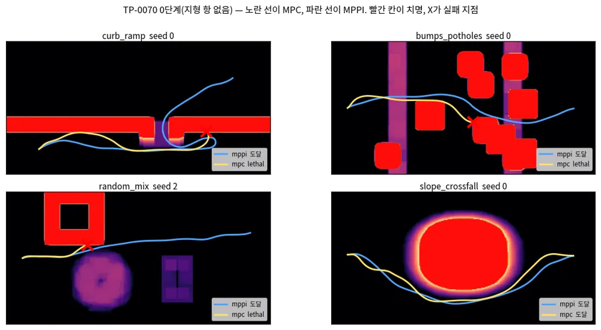
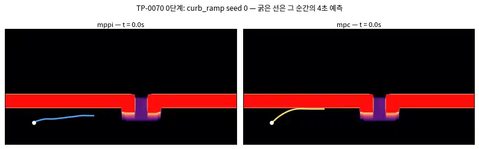
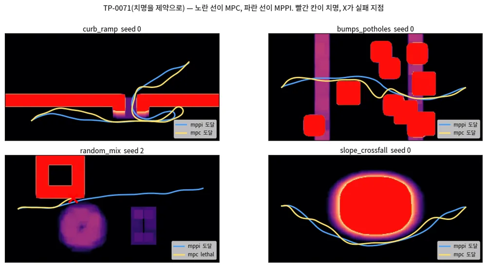
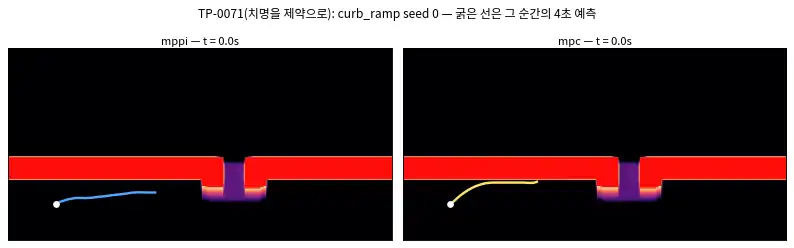

<!-- doc: MPC 구축 | 7 -->
# MPC Controller 구축 기록 (§M)

**MPPI를 대체하지 않고 형제로 MPC를 더한다.** 벤치마크가 `"<planner>+<controller>"` 문자열이라 `guidance+mpc`·`planner_d+mpc`
스택이 그대로 생기고, 기존 12/12·40/40이 기준선으로 남는다. 목적은 성능이 아니라 **세 기법을 얹을 자리를 만드는 것**이다 —
GP 잔차(TP-0068), 0차 근사, 튜브·SLP는 모두 "제약을 조이는" 장치인데 지금 Controller에는 조일 제약이 없다.

이 문서는 연구 정리가 아니라 **작업 기록**이다. 단계마다 무엇을 했고 무엇이 나왔는지 M.3에 한 줄씩 쌓는다.

**지금 어디.** 0단계 착수 전. 환경은 확인했고 **두 툴체인 다 이 랩탑에서 돈다**(M.3, 2026-09-29).

<!-- tab: 설계 -->

## M.1 OCP를 어떻게 세우나

| 항목 | 값 | 이유 |
|---|---|---|
| 상태 | $z = (x, y, \theta, v_x, v_y, \omega)$ — 6 | 차체 twist까지 상태로 둬야 변화율을 제약할 수 있다 |
| 입력 | $u = (a_x, a_y, \alpha_z)$ — 3 | twist 변화율. SmoothMPPI·Planner D의 제어 공간과 같은 좌표계다 |
| 지평 | 40 × 0.1 s = 4 s | **MPPI와 동일**(`MPPIConfig.horizon=40, dt=0.1`). 다르면 비교가 성립하지 않는다 |
| 솔버 | acados SQP-RTI, HPIPM, ERK | 실시간 반복 한 번. 목표는 MPPI의 12.7 ms보다 빠를 것 |

**모듈 역기구학은 최적화에 넣지 않는다.** AntBot 제어기의 IK는 `atan2`, 모듈 반전, 클램프, **고정점 반복 3회**로 되어 있어
비평활이다(시뮬레이션 문서 S.5.3b). 넣으면 SQP가 죽는다. 대신 모듈 한계를 **차체 수준 상자 제약으로 번역**하고, 남는 차이는
잔차가 흡수한다. 비동축이 만드는 오차는 6 mm/s로 작다(`docs/design-gp-dynamics.md` §3.5).

### M.1.1 MPPI 비용을 MPC로 옮기는 표

| 지금 MPPI 비용 항 | MPC에서 | 주의 |
|---|---|---|
| `ReferenceCost` | 참조 추종 2차 비용(시간 인덱스) 또는 진행도(contouring) | Planner D는 시간 인덱스를, GuidancePlanner는 경로만 준다. 두 모드 다 필요 |
| `TraversabilityCost` | **매끄러운 항만**(경사·거칠기) | 치명도는 여기서 빠져 제약으로 간다 |
| `RiskCost` | 보행자 → **타원 제약**, σ → **제약 조이기** | σ가 비용의 한 항으로 남으면 GP·튜브가 붙을 데가 없다 |
| `AttitudeCost` | roll/pitch 제약 | 지도 기울기에서 계산하므로 보간이 매끄러워야 한다 |
| `ControlCost` | 입력 2차 비용 | 그대로 |
| `GoalApproachCost` | 종단 비용 | 그대로 |
| — | **신설: ESDF 제약** $d(x) - r_{\text{robot}} \ge \rho_k$ | 세 기법이 전부 여기에 붙는다 |

### M.1.2 치명도를 비용에서 제약으로 옮기는 것이 핵심이다

==MPPI는 절벽 비용을 샘플로 넘지만 MPC는 미분이 필요해서 절벽에서 죽는다.== 치명 셀(cost ≥ 0.95)은 계단이라 기울기가 없다.
그래서 치명 셀에서 **ESDF를 한 장 만들어 hard 제약**으로 쓰고, 지형 비용에는 매끄러운 항만 남긴다(TP-0071).

이것은 우회가 아니라 **전제**다. GP 분산도 튜브도 제약을 조이는 양 $\rho_k$를 정하는 장치이므로, 조일 제약이 없으면 세 기법
모두 쓸 자리가 없다.

**단, MPC가 유일한 길은 아니다**(2026-09-30). 샘플링 제어기에서도 확률 제약을 세워 푸는 방법이 있고, 스키드 스티어
실물에서 GP 잔차 + chance-constrained MPPI로 검증된 사례가 있다(Controller 문서 E.10). ==그날 "MPPI는 개발 계획 제외"
규칙이 해제돼, travplan은 둘 다 개발하고 같은 벤치마크에서 비교한다==(TP-0076). 이 문서가 다루는 것은 (a) 쪽이다. 조이는 양은 이렇게 이어진다.

$$ \rho_k = \underbrace{\Phi^{-1}(1-\epsilon)\sqrt{h^\top \Sigma_k h}}_{\text{GP 분산(TP-0069)}} \quad\longrightarrow\quad \underbrace{\max_{w \in \mathcal W} h^\top w}_{\text{튜브·SLP}} $$

GP는 확률이고 튜브는 유계 외란이라 그대로 잇지 못한다. 다리는 **GP의 $\beta$-신뢰 타원체를 외란 집합 $\mathcal W$로 쓰는 것**이다
(Controller 문서 E.6의 Koller 2018이 그 방식이다). 실무로는 **고정 반경 튜브부터** 하고, 너무 보수적일 때만 SLP로 간다.

<!-- tab: 시뮬 리그 -->

## M.2 plant를 어디서 얻나

**MPC는 자기 모델로 자기를 예측하므로, plant가 같으면 아무것도 검증되지 않는다.** 지금 L0는 시뮬과 Controller가 같은
`SwerveModel`을 써서 모델 오차가 0이다. 그래서 plant가 따로 필요하다.

**Isaac Gym은 선택지가 아니다.** NVIDIA가 Preview 4에서 개발을 멈추고 Isaac Lab(Isaac Sim 위)으로 옮겼고, 2026년 지금은
그 아래 물리도 Newton으로 가고 있다(시뮬레이션 문서 S.1.1, S.1.2). 새로 시작하면서 고를 이유가 없다.

| 층 | 무엇 | 언제 | 어디서 |
|---|---|---|---|
| 1 | **MuJoCo**(CPU, 로봇 1대) | **지금** — MJCF 제작, MPC 폐루프 검증 | 이 랩탑 |
| 2 | **MuJoCo Warp**(GPU, 배치) | TP-0068 잔차 데이터 수집 | 데스크톱(5080) |
| 3 | Isaac Sim 6.0 | P1 폐루프 재현(TP-0005), LiDAR→TravMap | 데스크톱 |

같은 MJCF를 1층과 2층이 공유한다. ==1층이 먼저인 이유는 단순하다 — 모델이 틀렸는지는 로봇 한 대로 더 빨리 안다.==

### M.2.1 AntBot MJCF — URDF에 없는 것을 손으로 써야 한다

공개 저장소에 URDF는 있고 MJCF는 없다. MuJoCo 컴파일러가 URDF를 읽지만, **동역학에 필요한 값이 URDF에 없다.**

| 필요한 것 | URDF 상태 |
|---|---|
| 모듈 배치·오프셋·바퀴 반지름 | ✅ 있다 (`docs/design-gp-dynamics.md` §3.5) |
| 접촉 마찰·solref·solimp | ❌ 없다. 손으로 쓴다 |
| Dynamixel 액추에이터 모델(토크-속도, 마찰, 지연) | ❌ 없다. unitree_rl_lab의 `UnitreeActuator`가 참고(S.5.3c) |
| 실제 관성·무게중심 | ⚠️ 자리표시자에 가깝다(차체 $I_{xx} = I_{yy} = 5.0$, 조향 링크 0.001 등방) → **TP-0035** |
| 조향 범위 | ⚠️ URDF ±90° / 제어기 ±60° / 모터 사양 ±56.2°로 셋이 다르다 |

그래서 1단계 목표는 "정확한 AntBot"이 아니라 **"명목 모델과 다른, 접촉이 있는 plant"**다. 관성이 임시값이어도 MPC가
모델 오차를 만났을 때 어떻게 되는지는 그대로 드러난다.

<!-- tab: 작업 기록 -->

## M.3 진행 기록

| 날짜 | 단계 | 한 일 | 결과 |
|---|---|---|---|
| 2026-09-29 | 0 준비 | 툴체인 실측 | **acados v0.3.4가 이 랩탑에 이미 빌드돼 있다**(`~/acados`, `libacados.so`, `t_renderer`, `ACADOS_SOURCE_DIR` 설정됨). 빠진 것은 casadi 하나뿐이었다 |
| 2026-09-29 | 0 준비 | acados 폐루프 smoke | 20스텝 이중적분기 OCP 생성·해결 성공. `status=0`, **0.087 ms/해**(SQP-RTI, HPIPM) |
| 2026-09-29 | 0 준비 | MuJoCo 비동축 모듈 smoke | 조향 힌지 + 0.0555 m 오프셋 바퀴 힌지 + 평면 접촉. 5,000스텝 11 ms = **실시간의 938배**(CPU 1스레드), 접촉 2개 |
| 2026-09-29 | 0 구현 | `travplan/control/acados_mpc/`(model·ocp·controller) + 벤치마크에 `mpc` 등록 + 테스트 5개 | 첫 폐루프 주행 성공. 솔버 빌드 포함 7 s |
| 2026-09-29 | 0 측정 | `guidance+mpc` vs `guidance+mppi`, 4 시나리오 × 3 seed | **6/12 대 12/12 — 게이트 미달.** 실패는 전부 `lethal` |
| 2026-09-29 | 1 구현 | 치명 셀을 노드별 접평면 제약으로(`obstacles.py`) — EDT로 최근접 치명 셀을 찾아 반평면을 파라미터로 넘김 | 격자 EDT 2.5 ms, 41노드 조회 0.27 ms |
| 2026-09-29 | 1 조율 | 느슨한 벌점 / RTI 반복 / 하드 제약 4가지 비교(seed 0) | **soft 1e6 + RTI 3회만 4/4.** 하드는 QP가 터져 2/4 |
| 2026-09-29 | 1 측정 | `guidance+mpc` 4 시나리오 × 3 seed | **9/12** (0단계 6/12). 제어 8.6 → 13.5 ms |
| 2026-09-29 | 2 plant | `travplan/robot/plant.py` — 모듈 모델 + 액추에이터 지연 + 지형 슬립. `SimConfig(plant=...)`, 기본 끔 | 이상 설정에서 명령을 1e-9로 재현. 기존 테스트 134개 그대로 통과 |
| 2026-09-29 | 2 잔차 | plant를 켜고 guidance+mppi로 2,000 샘플 수집 | 잔차 &#124;d&#124; 평균 (0.048, 0.021, 0.052). 선형 R² 0.71/0.95/0.89 |
| 2026-09-29 | 2 GP | `gp.py` — ARD-RBF 정확 GP 3채널, 고정 크기 딕셔너리 | 명목 대비 RMSE 66–78% 감소. 처음엔 95% 적중이 0.35였다(아래) |
| 2026-09-29 | 2 MPC | GP 평균을 노드별 acados 파라미터로 주입 | 파라미터라서 **0차 근사가 공짜로 성립**한다 |
| 2026-09-29 | 2 희소화 | SGPR(Titsias VFE)과 RFF(sparse spectrum)를 구현해 같은 데이터로 비교 | **SGPR 유도점 64가 권장.** 예측 0.30 ms, 보수적 보정, 분포 밖 유계 |

### M.3.1 환경 메모 — 다시 밟지 않도록

- **환경 변수 두 개가 필요하다.** `ACADOS_SOURCE_DIR=$HOME/acados`, `LD_LIBRARY_PATH=$HOME/acados/lib:$LD_LIBRARY_PATH`.
- **casadi는 3.6.5로 고정한다.** acados v0.3.4가 공식 지원하는 상한이다. 3.8.1도 단순 모델은 돌지만 생성 코드 호환 경고를 낸다.
- **acados v0.3.4는 `ocp.dims.N`이다.** 최신 문서의 `solver_options.N_horizon`을 쓰면 `tf / None` 오류가 난다.
- **MuJoCo는 움직이는 body에 질량을 요구한다.** 조향 링크처럼 geom이 없는 중간 body에는 `<inertial>`을 명시해야
  `mass and inertia of moving bodies must be larger than mjMINVAL`을 피한다.
- `pyproject.toml`에 `casadi`·`mujoco`를 아직 넣지 않았다. TP-0070을 시작할 때 `[dev]`에 추가한다.

### M.3.2 단계와 게이트

| 단계 | TODO | 통과 기준 |
|---|---|---|
| 0 | TP-0070 | 명목 MPC가 기존 벤치마크에서 **MPPI와 동률**(40/40), 계산 < 20 ms — **2026-09-29 미달(6/12), M.3.3 참조** |
| 1 | TP-0071 | 치명 셀을 제약으로. **2026-09-29 부분 달성(9/12), M.3.5** — 보행자 타원은 아직 |
| 2 | TP-0068 | GP 잔차 평균을 모델에. 1초 예측 오차 50% 감소 |
| 3 | TP-0069 | 분산으로 제약 조이기. 성공률 ≥ 11/12 유지. 느리면 0차 근사 |
| 4 | — | PCBF 회복, 그다음에만 튜브·SLP |

### M.3.3 0단계 결과 — 게이트 미달, 그리고 그 이유가 정확히 다음 단계다

**4 시나리오 × 3 seed, `results/tp0070_stage0`.**

| 스택 | 성공 | 도달 시간 | GT cost | 최대 pitch | jerk | 제어 시간 |
|---|---|---|---|---|---|---|
| `guidance+mpc` | **6/12** | 14.7 s | 0.039 | 2.5° | **2.5** | **8.6 ms** |
| `guidance+mppi` | 12/12 | 15.9 s | **0.018** | 4.1° | 4.4 | 12.6 ms |

| 시나리오 | mpc | mppi | mpc 실패 |
|---|---|---|---|
| curb_ramp | **0/3** | 3/3 | seed 0·1·2 모두 `lethal` |
| slope_crossfall | 3/3 | 3/3 | — |
| bumps_potholes | 1/3 | 3/3 | seed 0·1 `lethal` |
| random_mix | 2/3 | 3/3 | seed 2 `lethal` |

*그림 — 4 시나리오의 참 비용 지도 위에 실행 궤적. 노란 선이 MPC, 파란 선이 MPPI, 빨간 칸이 치명 셀, 빨간 X가 실패 지점.
MPC는 연석 벽(curb_ramp)과 포트홀 테두리(bumps_potholes), 상자 모서리(random_mix)에서 죽고, 국소 위험이 없는
slope_crossfall에서만 MPPI와 같다. 그림은 `python scripts/make_doc_figures.py --mpc`로 재생성한다.*

==결과가 깨끗하게 갈린다. 지형이 평평한 곳(slope_crossfall)에서는 MPPI와 같고, 지형이 결정하는 곳(curb_ramp)에서는 전멸한다.==
이유는 숨어 있지 않다. **0단계 MPC에는 지형 항이 하나도 없다.** 참조만 따라가므로, GuidancePlanner가 믿음 지도 위에서 그은
경로가 연석 면을 스치면 그대로 들어간다. MPPI는 `TraversabilityCost`의 치명 벌점 $10^3$으로 그 샘플을 버린다.

*애니메이션 — curb_ramp seed 0. 흰 선은 지나온 길, 굵은 선은 **그 순간의 4초 예측**이다. MPPI(왼쪽)는 램프 틈을 찾아
올라가고, MPC(오른쪽)는 램프를 지나쳤다가 되돌아오면서 연석 면을 문다. 예측이 치명 셀을 그대로 통과하는 것이 보인다 —
비용에도 제약에도 지형이 없기 때문이다.*

**대신 두 가지는 이미 낫다.** 제어 시간이 **8.6 ms 대 12.6 ms**이고, jerk가 **2.5 대 4.4**다. 가속을 상태로 두고 상자 제약을
건 덕분에 명령이 매끄럽다. 즉 ==추종과 계산 예산은 이미 이겼고, 부족한 것은 지형 인지 하나다.==

**그래서 TP-0071은 선택이 아니다.** 게이트를 다시 세우지 않고 그대로 둔다. 40/40은 지형이 제약으로 들어간 뒤에 판단한다.

### M.3.4 다음 단계의 설계 결정 — 격자를 acados에 어떻게 넣나

시도하기 전에 막히는 지점을 먼저 적는다. **CasADi는 기호 인덱스로 벡터를 참조할 수 없다.** 그래서 "TravMap 격자를 매
재계획마다 파라미터로 넘기고 로봇 위치에서 이중선형 보간" 방식은 쓸 수 없다. 어느 네 칸을 고를지가 기호 위치에 달려 있는데
그 선택이 매끄럽지 않기 때문이다. `ca.interpolant`는 반대로 **코드 생성 시점에 데이터가 고정**되어 변하는 환경에 못 쓴다.

실무의 답은 셋이고, TP-0071은 1번으로 간다.

1. **지역 장애물을 소수의 원·타원·다면체로 뽑아 파라미터로 넘긴다.** Zeilinger 그룹의 ClutteredEnvironment가 이 방식이다
   (Controller 문서 E.7). 치명 셀 군집 $K$개(8–16)를 원 $(c_i, r_i)$로 뽑아 `p`로 넘기고 제약을 건다.
2. 지역 비용장을 소수 파라미터의 매끄러운 함수로 근사한다(다항식·RBF).
3. 격자를 고정한 채 코드 생성한다. 정적 지도에만 쓸 수 있다.

$$ \lVert p_k - c_i \rVert \ \ge\ r_i + r_{\text{robot}} + \rho_k $$

==이 $\rho_k$가 GP 분산(TP-0069)과 튜브·SLP가 조일 바로 그 양이다.== 0단계에 이 제약이 없어서 세 기법을 얹을 자리도
아직 없다는 뜻이기도 하다.

### M.3.5 TP-0071 결과 — 6/12에서 9/12로, 남은 셋은 형태가 아니라 솔버 문제다

**무엇을 넣었나.** 노드마다 **접평면 하나**다. 매 제어 스텝에 치명 셀의 거리 변환(EDT)을 구하고, 이전 iterate가 놓인 자리에서
가장 가까운 치명 셀을 **수치로** 찾아 그 접평면을 파라미터로 넘긴다. 원으로 덮지 않은 이유는 travplan의 치명 기하가 대부분
**벽**(연석 면)이라 원이 지나치게 크게 잡기 때문이다. 노드마다 따로 걸리므로 **좁은 틈도 표현된다** — 램프 양옆 벽을 서로 다른
노드가 각각 집는다.

$$ n_k^\top p_k \ \ge\ b_k, \qquad n_k = \frac{\bar p_k - c_k}{\lVert \bar p_k - c_k \rVert}, \qquad b_k = n_k^\top c_k + \text{margin} + \rho_k $$

**조율에서 배운 것(seed 0, 4 시나리오).** 처음 넣었을 때 2/4였다. 원인을 계측해 보니 예측 노드가 제약을 위반한 채로 최적이 되고
있었다(`min h ≈ −0.13`, 그런데 `status = 0`). 두 가지를 따로 바꿔 봤다.

| 변형 | 성공 | 비고 |
|---|---|---|
| 느슨한 벌점 1e4, RTI 1회 | 2/4 | 처음 넣은 상태 |
| 벌점만 1e6으로 | 2/4 | **혼자서는 아무것도 바꾸지 못한다** |
| RTI만 3회로 | 3/4 | |
| **벌점 1e6 + RTI 3회** | **4/4** | 채택 |
| 하드 제약 | 2/4 | QP가 `status 3`으로 터지고 로봇이 눈을 감는다 |

==둘이 함께여야 한다.== 이유는 접평면이 **iterate에 매달려 있기** 때문이다. RTI는 호출당 뉴턴 한 걸음이라, 한 번 풀면 노드가
움직이고 그러면 접평면도 달라져야 한다. 반복을 늘려야 제약과 해가 같은 자리에서 만난다. **하드 제약이 더 나쁘다는 것도 기록해
둘 만하다** — 풀리지 않는 QP는 안전이 아니라 무작위다.

*그림 — 같은 네 장면, 치명을 제약으로 넣은 뒤. 0단계(M.3.3)에서는 네 칸 중 셋에서 MPC가 죽었는데 이제 하나만 죽는다.
curb_ramp에서는 램프 틈을 통과하고, bumps_potholes에서는 블록 사이를 MPPI와 비슷한 선으로 지난다.*

*애니메이션 — 같은 curb_ramp seed 0. 0단계(M.3.3)에서 치명 셀을 관통하던 굵은 예측선이 이제 붉은 칸을 피해 간다.
대신 램프 앞에서 한 번 크게 돌아간다 — 여유 0.15 m를 지키느라 경로가 23 m로 늘어난 것이 이 장면이다.*

**전체 결과(4 시나리오 × 3 seed, `results/tp0071_constrained`).**

| 단계 | 성공 | GT cost | jerk | 제어 시간 |
|---|---|---|---|---|
| 0단계(지형 없음) | 6/12 | 0.039 | 2.5 | 8.6 ms |
| **1단계(치명을 제약으로)** | **9/12** | **0.031** | 2.8 | 13.5 ms |
| 기준 `guidance+mppi` | 12/12 | 0.018 | 4.4 | 12.6 ms |

**남은 세 실패는 한 가지를 가리킨다.** 실패한 에피소드가 **제어 시간 상위 세 개와 정확히 같다**(26.2, 26.2, 15.0 ms — 성공한
아홉은 9.1–12.1 ms). 그 구간에서 QP가 `status 3`(반복 한계)을 뱉는다. ==즉 남은 문제는 제약의 형태가 아니라 그 QP를 제시간에
푸는 일이다.== 다음에 볼 것은 셋이다. QP 반복 예산과 condensing 지평(`qp_solver_cond_N=5`), 실패 스텝의 warm start 품질,
그리고 접평면이 스텝 사이에 튀는지 여부다.

**대가도 적어 둔다.** 성공한 curb_ramp의 경로 길이가 23–25 m다(MPPI 13.8 m). 여유 0.15 m를 지키느라 크게 돌아간다. 여유를
줄이면 빨라지지만 실패가 늘 것이다 — 이 교환을 손으로 맞추지 않는 방법이 E.6의 문맥 베이즈 최적화다.

### M.3.6 GP 잔차 동역학 — 배울 것을 먼저 만들었다

**막힌 곳부터.** 0·1단계 내내 `KinematicSim`과 MPC가 **같은 `SwerveModel`을 썼다.** 모델 오차가 정의상 0이라 GP가 배울 것이
없었다. 그래서 순서를 뒤집어, plant를 먼저 세웠다(`travplan/robot/plant.py`, TP-0033/0034).

**plant가 만드는 세 가지.** 크기 순이다.
1. **액추에이터 지연** — twist에 대한 1차 지연(τ = 0.2 s).
2. **모듈 기구학** — 조향 속도·범위 한계, 모듈 반전, 비동축 오프셋의 스크럽.
3. **지형 슬립** — 국소 경사·거칠기에서 뽑은 $s$로 실현 twist를 $(1-s)$배.

$$ x_{k+1} = f_{\text{swerve}}(x_k, u_k) + d(x_k, u_k), \qquad d \sim \mathcal{GP} $$

자세히: 비동축에서 모듈 반전이 공짜가 아니다

plant를 만들며 걸린 것이 하나 있다. 동축 스워브에서는 조향각을 $\pi$ 돌리고 바퀴를 거꾸로 돌리면 같은 운동이 나오므로, 조향량을
줄이려고 흔히 그렇게 한다. ==비동축에서는 그렇지 않다. 모듈을 $\pi$ 돌리면 접지점이 $2d$만큼 옮겨가기 때문이다.==

$$ \mathbf c_i(\theta) = \mathbf p_i + d_i\, e_\perp(\theta), \qquad \mathbf c_i(\theta + \pi) = \mathbf p_i - d_i\, e_\perp(\theta) $$

그래서 두 가지가 **서로 다른 기구**이고, 역기구학의 고정점도 가지마다 따로 수렴시켜야 한다. 한쪽 가지에서 수렴시킨 조향각을
다른 가지의 접지점과 함께 쓰면 최소제곱이 어긋나, 이상 설정에서도 제자리 회전이 0.86만 나왔다. 가지별로 풀고 나니 오차가
$10^{-9}$로 떨어졌다.

**잔차의 크기.** plant를 켜고 `guidance+mppi`로 2,000 샘플을 모았다. 특징은 (명령 twist, 직전 twist, 경사, 거칠기) 8차원이다.

| 채널 | 잔차 &#124;d&#124; 평균 | 최대 | 선형모형 $R^2$ |
|---|---|---|---|
| $dv_x$ | 0.048 | 0.167 | 0.708 |
| $dv_y$ | 0.021 | 0.107 | 0.951 |
| $d\omega$ | 0.052 | 0.281 | 0.888 |

==선형모형이 이미 상당히 맞는다.== 지연이 선형이기 때문이다. 그래서 GP가 이겨야 할 상대는 명목 모델이 아니라 **선형 잔차 모형**이다.

**첫 시도는 심하게 과신했다.** 95% 예측구간 적중률이 0.35/0.56/0.79였다. 원인은 단순했다 — 예측 분산에 **관측 잡음
$\sigma_n^2$을 더하지 않았다.** 비교 대상은 잠재 함수가 아니라 관측된 잔차다. 더하고 나니 0.92–0.96으로 맞았다.

**고정 크기 딕셔너리가 무엇을 사는지.** 온라인 적응을 위해 활성 집합을 링 버퍼로 두었다. 크기를 바꿔 재 봤다(보류 30%).

| 용량 | refresh | 41노드 예측 | $dv_x$ RMSE/적중 | $dv_y$ | $d\omega$ |
|---|---|---|---|---|---|
| 100 | 0.6 ms | 0.49 ms | 0.0211 / 0.93 | 0.0069 / 0.93 | 0.0310 / 0.96 |
| 200 | 1.0 ms | 0.59 ms | 0.0192 / 0.95 | 0.0062 / 0.93 | 0.0313 / 0.94 |
| **400** | 3.9 ms | 1.20 ms | 0.0190 / 0.94 | 0.0059 / 0.94 | **0.0218** / 0.92 |
| 800 | 38.3 ms | 2.57 ms | 0.0189 / 0.94 | 0.0058 / 0.94 | 0.0195 / 0.92 |
| *명목* | — | — | 0.0569 | 0.0271 | 0.0672 |
| *선형* | — | — | 0.0190 | 0.0060 | 0.0241 |

세 가지를 읽는다. 첫째, **명목 대비 RMSE가 66–78% 줄어** 설계 문서의 게이트(50%)를 넘는다. 둘째, ==$dv_x$와 $dv_y$에서는
GP가 선형모형과 사실상 같다== — 그 채널은 지연이 지배해서 선형이 이미 정답이다. 셋째, **GP가 선형을 이기는 곳은 $d\omega$
하나이고, 용량 400부터다**(0.0218 대 0.0241). 요 잔차에 비동축 스크럽과 모듈 포화의 비선형이 들어 있기 때문이다.
용량 100은 제안받은 크기인데, 보정은 맞지만 그 비선형을 놓친다. 800은 refresh가 38 ms라 제어 주기 안에서 못 돌린다.

**GP 평균을 MPC에 넣는 방법이 곧 0차 근사다.** 잔차 평균을 **노드별 acados 파라미터**로 넣는다. 파라미터는 솔버가 상수로
보므로 $\partial \mu_d / \partial x = 0$이 **구조적으로** 성립한다. 즉 탐색 방향은 $f_{\text{swerve}}$의 미분만 쓰고, 전방 시뮬레이션에는
$\mu_d$가 그대로 들어간다. ==따로 구현할 것이 없다 — TP-0071에서 반평면을 넣으려고 깔아 둔 파라미터 배관이 그대로 0차 GP-MPC가 된다.==

$$ \dot v = u + \underbrace{\mu_d(z_k, u_k)/\Delta t}_{\text{파라미터 } p_{3:6}}, \qquad \frac{\partial}{\partial x}\Big[\mu_d\Big] \equiv 0 $$

**온라인 적응.** 매 제어 스텝에 직전 명령이 실제로 만든 잔차를 딕셔너리에 밀어 넣고, `gp_refresh_every`(기본 5) 스텝마다
Cholesky를 다시 푼다. 용량 400에서 3.9 ms이므로 5스텝에 한 번이면 평균 0.8 ms다.

### M.3.7 폐루프는 아직 안 된다 — 여기까지 좁혔다

==오프라인 GP는 게이트를 넘었지만, 그 평균을 MPC에 넣으면 폐루프가 무너진다.== 숨기지 않고 적는다.

| 스택 (plant 켬) | 성공 | 제어 시간 |
|---|---|---|
| `mpc` (GP 없음) | **9/12** | 7.8 ms |
| `mpc_gp` | **0/12** | 30.1 ms |

**배제한 것.**
1. **장애물 제약과의 상호작용이 아니다.** 치명 셀이 없는 `slope_crossfall`에서도 실패한다.
2. **GP의 오프라인 정확도가 아니다.** 보류 집합에서 RMSE 67–78% 감소, 95% 적중 0.92–0.94다.
3. **조건수만의 문제가 아니다.** 처음엔 루프 안에서 $\mu$가 $-106$까지 튀었다(실제 잔차는 0.04). 400점 정확 GP의
   $K$가 나빠 $\alpha$가 폭발한 것이고, 잡음 하한 $\sigma_n \ge 10^{-2}$과 $|\mu| \le 0.3$ 상한으로 막았다. 분포 밖
   질의가 0.300에서 포화하고 정확도는 그대로인데, **그래도 0/12였다.**
4. **특징 정의만의 문제도 아니다.** 잔차는 *명령*에 대해 모았는데 증강된 모델의 $Z_{k+1}$은 이미 잔차를 품고 있어,
   그것을 명령 자리에 넣으면 GP가 자기 보정을 더 큰 명령으로 오해하는 양의 되먹임이 된다. $v_k + u_k \Delta t$로 고쳤다.
   실패 모드는 바뀌었지만 여전히 실패한다.
5. **RTI 반복마다 문제 데이터가 바뀌는 것**도 한몫했다. GP를 제어 스텝당 한 번만 평가하게 바꾸니 실패가
   `lethal`에서 `timeout`으로 바뀌고 제어 시간이 30 → 13–15 ms로 내려갔다. **개선이지만 해결은 아니다.**

**남은 가설.** $\mu/\Delta t \approx 0.5\ \mathrm{m/s^2}$로 가속 한계(1.0)의 절반이다. 노드마다 상수로 꽂히는 이 크기가
SQP-RTI 한 걸음이 감당할 섭동을 넘는 것으로 보인다. 다음에 볼 것은 `gp_scale` 스윕(0.1–1.0), 잔차를 **앞쪽 몇 노드에만**
넣기, 그리고 QP 반복 예산이다. `gp_scale`과 스텝당 1회 평가는 이미 설정으로 들어가 있다.

**기본값은 안전하다.** `MPCController(gp=None)`이 기본이므로 TP-0071의 9/12는 그대로다. GP는 명시적으로 넘길 때만 켜진다.

### M.3.8 GP / 희소 GP — 네 축으로 재 보면 고를 것이 정해진다

계보와 인용은 Controller 문서 E.8이다. 여기에는 **같은 잔차 데이터(훈련 1,400 / 보류 600)로 실제로 잰 값**만 적는다.
하이퍼파라미터는 정확 GP에서 한 번 적합해 **모든 변형이 공유**한다 — 그래야 차이가 근사 방식에서만 온다.

| 모델 | 쓰는 데이터 | refresh | 41노드 예측 | $dv_x$ | $dv_y$ | $d\omega$ | 95% 적중 | 분포 밖 최대 &#124;μ&#124; |
|---|---|---|---|---|---|---|---|---|
| 정확 GP | 200 | 1.9 ms | 0.47 ms | 0.0193 | 0.0063 | 0.0303 | 0.94 / 0.98 / 0.94 | 0.4 |
| 정확 GP | 400 | 4.5 ms | 0.72 ms | 0.0190 | 0.0060 | 0.0233 | 0.94 / 0.99 / 0.94 | 0.4 |
| 정확 GP | 1400 | **121.8 ms** | 4.75 ms | 0.0188 | 0.0058 | **0.0190** | 0.94 / 0.98 / 0.91 | 0.6 |
| SGPR 유도점 32 | 1400 | 3.8 ms | **0.28 ms** | 0.0188 | 0.0059 | 0.0283 | 0.94 / 0.98 / 0.99 | 0.4 |
| **SGPR 유도점 64** | 1400 | 5.5 ms | **0.36 ms** | 0.0188 | 0.0058 | 0.0223 | 0.94 / 0.98 / 0.97 | **0.4** |
| SGPR 유도점 128 | 1400 | 13.0 ms | 0.38 ms | 0.0188 | 0.0058 | 0.0212 | 0.94 / 0.98 / 0.94 | **0.3** |
| RFF 특징 128 | 1400 | 2.4 ms | 0.21 ms | 0.0188 | 0.0059 | 0.0208 | 0.94 / 0.98 / 0.92 | **1.9** |
| RFF 특징 256 | 1400 | 4.7 ms | 0.35 ms | 0.0188 | 0.0058 | 0.0201 | 0.94 / 0.98 / 0.92 | 1.0 |
| RFF 특징 512 | 1400 | 17.9 ms | 0.73 ms | 0.0188 | 0.0058 | 0.0198 | 0.94 / 0.98 / 0.92 | 0.8 |
| *선형 기준* | 1400 | — | — | 0.0190 | 0.0060 | 0.0241 | — | — |

**넷을 차례로 읽는다.**

**① 정확도.** $dv_x$·$dv_y$는 어떤 모델을 써도 같다 — 지연이 선형이라 이미 천장이다. 차이는 전부 $d\omega$에서 난다.
정확 GP는 데이터를 다 써야(1400) 0.0189에 닿는데 그러면 refresh가 **130 ms**로 제어 주기 밖이다. ==희소화의 값은
속도가 아니라, **데이터를 버리지 않고도 주기 안에 들어온다**는 것이다== — SGPR 128은 1,400점을 모두 쓰면서 9.6 ms다.

**② 보정 방향.** SGPR은 $d\omega$ 적중이 0.94–0.99로 **보수적**이고, RFF는 0.92로 살짝 낮다. 유한 기저가 기저 사이를
지나치게 확신하기 때문이고, 유도점 변분법이 보수적인 것은 KL 하한의 성질이다(E.8, Bauer 외).

여기에는 구현이 한 번 개입했다. 처음 잰 RFF 적중은 0.88이었는데, **적합 뒤 $\sigma_n$을 실제 잔차로 보정하는 단계**를
넣고 0.92가 됐다. 주변 우도 적합이 남긴 잡음이 **부분 집합으로 만든 사후분포가 실제로 내는 오차보다 작을 수 있다** —
0.35 적중을 만든 것과 같은 병이다(M.3.6). 이제 `fit()`이 자동으로 한다. ==그래도 방향은 남는다: 조이는 데 쓸 분산이라면
보수적인 쪽이 안전하다.==

**③ 시간.** SGPR 64가 예측 **0.30 ms**로 가장 싸다. 41노드 × RTI 3회여도 1 ms 안이다.

**④ 분포 밖.** 입력을 3배로 부풀린 질의에서 SGPR은 0.4로 유계인데 **RFF는 2.2까지 간다.** MPC의 예측 지평은 로봇이
아직 가 보지 않은 곳을 지나므로 질의가 늘 가장자리에 있다. ==빠른 대신 분포 밖에서 튀는 모델은 이 자리에 맞지 않는다.==

**권고: SGPR 유도점 64.** 정확도는 정확 GP 400과 같고, 예측이 두 배 빠르며, 보정이 보수적이고, 분포 밖이 유계다.
쿼드로터 쪽에서 유도점 **20개**로 실물 70% 개선을 낸 선례도 같은 방향이다(E.8).

**참고로 정확 GP 200/400은 데이터를 버린 결과다.** M.3.6의 "용량" 스윕은 활성 집합을 그만큼으로 **자른** 것이고,
여기 SGPR·RFF 행은 1,400점을 **다 쓰면서** 요약한 것이다. 같은 refresh 예산에서 후자가 낫다.

### M.3.9 희소화가 폐루프 발산을 고쳤다

M.3.7에 적은 0/12을 SGPR로 다시 해 봤다. **정확 GP를 SGPR 유도점 64로 바꾼 것 말고는 아무것도 바꾸지 않았다.**

| `gp_scale` | slope_crossfall | random_mix | curb_ramp |
|---|---|---|---|
| 0.00 (GP 끔) | OK (12 ms) | OK (12 ms) | timeout |
| 0.25 | OK (11 ms) | OK (16 ms) | lethal |
| 0.50 | OK (17 ms) | OK (17 ms) | lethal |
| **1.00** | **OK (11 ms)** | **OK (15 ms)** | lethal |

정확 GP는 같은 자리에서 `gp_scale=1.0`일 때 두 장면 모두 `lethal`이었다. ==즉 M.3.7의 발산은 GP-MPC라는 발상의
문제가 아니라 **근사 방식의 문제**였다.== 정확 GP의 $K^{-1}$이 만든 큰 $\alpha$가 예측 지평 끝(학습 분포 가장자리)에서
큰 보정을 뱉고, 그것이 다음 iterate를 더 바깥으로 밀어내는 되먹임이었다. 유도점 사후분포는 $m$개로 규정되고 데이터에서
멀어지면 prior로 돌아가므로 이 되먹임이 생기지 않는다. M.3.8의 "분포 밖" 열이 이것을 미리 보여 주고 있었다.

**curb_ramp는 아직 남는다.** 다만 `gp_scale=0.0`(GP를 끈 상태)에서도 timeout이므로 **GP 문제가 아니라 plant를 켠
curb_ramp가 어려운 것**이다. 지연과 슬립이 붙으면 램프 진입이 크게 어려워진다. 다음은 여기다.

**정리.** GP-MPC를 붙일 때 고를 것은 커널이 아니라 **근사**다. 정확 GP는 오프라인 지표가 가장 좋지만 제어 주기 안에
못 들어오고(121 ms), 분포 밖에서 위험하다. RFF는 가장 빠르지만 분포 밖이 가장 나쁘다(1.9). ==SGPR 유도점 64가 셋
가운데 유일하게 네 축을 모두 통과한다.==