<!-- doc: MPC 구축 | 7 -->
# MPC Controller 구축 기록 (§M)

**MPPI를 대체하지 않고 형제로 MPC를 더한다.** 벤치마크가 `"<planner>+<controller>"` 문자열이라 `guidance+mpc`·`planner_d+mpc`
스택이 그대로 생기고, 기존 12/12·40/40이 기준선으로 남는다. 목적은 성능이 아니라 **세 기법을 얹을 자리를 만드는 것**이다 —
GP 잔차(TP-0068), 0차 근사, 튜브·SLP는 모두 "제약을 조이는" 장치인데 지금 Controller에는 조일 제약이 없다.

이 문서는 연구 정리가 아니라 **작업 기록**이다. 단계마다 무엇을 했고 무엇이 나왔는지 M.3에 한 줄씩 쌓는다.
MPPI 쪽 확률 제약(TP-0076)도 여기 적는다. 두 Controller가 잔차 GP와 치명 거리장을 함께 쓰기 때문이다(M.3.13).

**지금 어디(2026-10-01).** 1단계(치명 셀 제약, TP-0071·0093)와 보행자 제약을 마쳤다. 정적 38/40, 보행자 3명 23/24·충돌 0이다.
GP 평균(TP-0068)은 plant 조건에서 37/48을 44/48로 올렸다. MPPI 확률 제약(TP-0076)은 0선을 실패 경계에 맞췄다(TP-0119).
plant 96 에피소드에서 85/96이 89/96이 됐지만 기준 MPPI(88/96)와의 차이는 유의하지 않다. 남은 치명 실패 가운데 기하가 원인인 것은 없고,
가장 유력한 원인은 지연 편향이다(TP-0120).
다음은 분산으로 MPC 제약을 조이는 3단계(TP-0069)와, 고정 여유 대신 지형 비용·Planner 여유를 맞추는 일이다(M.3.10).

<!-- tab: 설계 -->

## M.1 OCP를 어떻게 세우나

| 항목 | 값 | 이유 |
|---|---|---|
| 상태 | $z = (x, y, \theta, v_x, v_y, \omega)$ — 6 | 차체 twist까지 상태로 둬야 변화율을 제약할 수 있다 |
| 입력 | $u = (a_x, a_y, \alpha_z)$ — 3 | twist 변화율. SmoothMPPI·Planner D의 제어 공간과 같은 좌표계다 |
| 지평 | 40 × 0.1 s = 4 s | **MPPI와 동일**(`MPPIConfig.horizon=40, dt=0.1`). 다르면 비교가 성립하지 않는다 |
| 솔버 | acados SQP-RTI, HPIPM, ERK | 실시간 반복 한 번. 목표는 MPPI의 12.7 ms보다 빠를 것 |

**모듈 역기구학은 최적화에 넣지 않는다.** AntBot 제어기의 IK는 `atan2`, 모듈 반전, 클램프, **고정점 반복 3회**로 되어 있어
비평활이다(시뮬레이션 문서 S.5.3b). 넣으면 SQP가 죽는다. 대신 모듈 한계를 **차체 수준 상자 제약으로 번역**하고, 남는 차이는
잔차가 흡수한다. 비동축이 만드는 오차는 6 mm/s로 작다(`docs/design-gp-dynamics.md` §3.5).

### M.1.1 MPPI 비용을 MPC로 옮기는 표

| 지금 MPPI 비용 항 | MPC에서 | 주의 |
|---|---|---|
| `ReferenceCost` | 참조 추종 2차 비용(시간 인덱스) 또는 진행도(contouring) | Planner D는 시간 인덱스를, GuidancePlanner는 경로만 준다. 두 모드 다 필요 |
| `TraversabilityCost` | **매끄러운 항만**(경사·거칠기) | 치명도는 여기서 빠져 제약으로 간다 |
| `RiskCost` | 보행자 → **타원 제약**, σ → **제약 조이기** | σ가 비용의 한 항으로 남으면 GP·튜브가 붙을 데가 없다 |
| `AttitudeCost` | roll/pitch 제약 | 지도 기울기에서 계산하므로 보간이 매끄러워야 한다 |
| `ControlCost` | 입력 2차 비용 | 그대로 |
| `GoalApproachCost` | 종단 비용 | 그대로 |
| — | **신설: ESDF 제약** $d(x) - r_{\text{robot}} \ge \rho_k$ | 세 기법이 전부 여기에 붙는다 |

### M.1.2 치명도를 비용에서 제약으로 옮기는 것이 핵심이다

==MPPI는 절벽 비용을 샘플로 넘지만 MPC는 미분이 필요해서 절벽에서 죽는다.== 치명 셀(cost ≥ 0.95)은 계단이라 기울기가 없다.
그래서 치명 셀에서 **ESDF를 한 장 만들어 hard 제약**으로 쓰고, 지형 비용에는 매끄러운 항만 남긴다(TP-0071).

이것은 우회가 아니라 **전제**다. GP 분산도 튜브도 제약을 조이는 양 $\rho_k$를 정하는 장치이므로, 조일 제약이 없으면 세 기법
모두 쓸 자리가 없다.

**단, MPC가 유일한 길은 아니다**(2026-09-30). 샘플링 제어기에서도 확률 제약을 세워 푸는 방법이 있고, 스키드 스티어
실물에서 GP 잔차 + chance-constrained MPPI로 검증된 사례가 있다(Controller 문서 E.10). ==그날 "MPPI는 개발 계획 제외"
규칙이 해제돼, travplan은 둘 다 개발하고 같은 벤치마크에서 비교한다==(TP-0076). 이 문서가 다루는 것은 (a) 쪽이다. 조이는 양은 이렇게 이어진다.

$$ \rho_k = \underbrace{\Phi^{-1}(1-\epsilon)\sqrt{h^\top \Sigma_k h}}_{\text{GP 분산(TP-0069)}} \quad\longrightarrow\quad \underbrace{\max_{w \in \mathcal W} h^\top w}_{\text{튜브·SLP}} $$

GP는 확률이고 튜브는 유계 외란이라 그대로 잇지 못한다. 다리는 **GP의 $\beta$-신뢰 타원체를 외란 집합 $\mathcal W$로 쓰는 것**이다
(Controller 문서 E.6의 Koller 2018이 그 방식이다). 실무로는 **고정 반경 튜브부터** 하고, 너무 보수적일 때만 SLP로 간다.

<!-- tab: 시뮬 리그 -->

## M.2 plant를 어디서 얻나

**MPC는 자기 모델로 자기를 예측하므로, plant가 같으면 아무것도 검증되지 않는다.** 지금 L0는 시뮬과 Controller가 같은
`SwerveModel`을 써서 모델 오차가 0이다. 그래서 plant가 따로 필요하다.

**Isaac Gym은 선택지가 아니다.** NVIDIA가 Preview 4에서 개발을 멈추고 Isaac Lab(Isaac Sim 위)으로 옮겼고, 2026년 지금은
그 아래 물리도 Newton으로 가고 있다(시뮬레이션 문서 S.1.1, S.1.2). 새로 시작하면서 고를 이유가 없다.

| 층 | 무엇 | 언제 | 어디서 |
|---|---|---|---|
| 1 | **MuJoCo**(CPU, 로봇 1대) | **지금** — MJCF 제작, MPC 폐루프 검증 | 이 랩탑 |
| 2 | **MuJoCo Warp**(GPU, 배치) | TP-0068 잔차 데이터 수집 | 데스크톱(5080) |
| 3 | Isaac Sim 6.0 | P1 폐루프 재현(TP-0005), LiDAR→TravMap | 데스크톱 |

같은 MJCF를 1층과 2층이 공유한다. ==1층이 먼저인 이유는 단순하다 — 모델이 틀렸는지는 로봇 한 대로 더 빨리 안다.==

### M.2.1 AntBot MJCF — URDF에 없는 것을 손으로 써야 한다

공개 저장소에 URDF는 있고 MJCF는 없다. MuJoCo 컴파일러가 URDF를 읽지만, **동역학에 필요한 값이 URDF에 없다.**

| 필요한 것 | URDF 상태 |
|---|---|
| 모듈 배치·오프셋·바퀴 반지름 | ✅ 있다 (`docs/design-gp-dynamics.md` §3.5) |
| 접촉 마찰·solref·solimp | ❌ 없다. 손으로 쓴다 |
| Dynamixel 액추에이터 모델(토크-속도, 마찰, 지연) | ❌ 없다. unitree_rl_lab의 `UnitreeActuator`가 참고(S.5.3c) |
| 실제 관성·무게중심 | ⚠️ 자리표시자에 가깝다(차체 $I_{xx} = I_{yy} = 5.0$, 조향 링크 0.001 등방) → **TP-0035** |
| 조향 범위 | ⚠️ URDF ±90° / 제어기 ±60° / 모터 사양 ±56.2°로 셋이 다르다 |

그래서 1단계 목표는 "정확한 AntBot"이 아니라 **"명목 모델과 다른, 접촉이 있는 plant"**다. 관성이 임시값이어도 MPC가
모델 오차를 만났을 때 어떻게 되는지는 그대로 드러난다.

<!-- tab: 작업 기록 -->

## M.3 진행 기록

| 날짜 | 단계 | 한 일 | 결과 |
|---|---|---|---|
| 2026-09-29 | 0 준비 | 툴체인 실측 | **acados v0.3.4가 이 랩탑에 이미 빌드돼 있다**(홈 디렉터리의 `acados` 소스 빌드, `libacados.so`, `t_renderer`, `ACADOS_SOURCE_DIR` 설정됨). 빠진 것은 casadi 하나뿐이었다 |
| 2026-09-29 | 0 준비 | acados 폐루프 smoke | 20스텝 이중적분기 OCP 생성·해결 성공. `status=0`, **0.087 ms/해**(SQP-RTI, HPIPM) |
| 2026-09-29 | 0 준비 | MuJoCo 비동축 모듈 smoke | 조향 힌지 + 0.0555 m 오프셋 바퀴 힌지 + 평면 접촉. 5,000스텝 11 ms = **실시간의 938배**(CPU 1스레드), 접촉 2개 |
| 2026-09-29 | 0 구현 | `travplan/control/acados_mpc/`(model·ocp·controller) + 벤치마크에 `mpc` 등록 + 테스트 5개 | 첫 폐루프 주행 성공. 솔버 빌드 포함 7 s |
| 2026-09-29 | 0 측정 | `guidance+mpc` vs `guidance+mppi`, 4 시나리오 × 3 seed | **6/12 대 12/12 — 게이트 미달.** 실패는 전부 `lethal` |
| 2026-09-29 | 1 구현 | 치명 셀을 노드별 접평면 제약으로(`obstacles.py`) — EDT로 최근접 치명 셀을 찾아 반평면을 파라미터로 넘김 | 격자 EDT 2.5 ms, 41노드 조회 0.27 ms |
| 2026-09-29 | 1 조율 | 느슨한 벌점 / RTI 반복 / 하드 제약 4가지 비교(seed 0) | **soft 1e6 + RTI 3회만 4/4.** 하드는 QP가 터져 2/4 |
| 2026-09-29 | 1 측정 | `guidance+mpc` 4 시나리오 × 3 seed | **9/12** (0단계 6/12). 제어 8.6 → 13.5 ms |
| 2026-09-29 | 2 plant | `travplan/robot/plant.py` — 모듈 모델 + 액추에이터 지연 + 지형 슬립. `SimConfig(plant=...)`, 기본 끔 | 이상 설정에서 명령을 1e-9로 재현. 기존 테스트 134개 그대로 통과 |
| 2026-09-29 | 2 잔차 | plant를 켜고 guidance+mppi로 2,000 샘플 수집 | 잔차 &#124;d&#124; 평균 (0.048, 0.021, 0.052). 선형 R² 0.71/0.95/0.89 |
| 2026-09-29 | 2 GP | `gp.py` — ARD-RBF 정확 GP 3채널, 고정 크기 딕셔너리 | 명목 대비 RMSE 66–78% 감소. 처음엔 95% 적중이 0.35였다(아래) |
| 2026-09-29 | 2 MPC | GP 평균을 노드별 acados 파라미터로 주입 | 파라미터라서 **0차 근사가 공짜로 성립**한다 |
| 2026-09-29 | 2 희소화 | SGPR(Titsias VFE)과 RFF(sparse spectrum)를 구현해 같은 데이터로 비교 | **SGPR 유도점 64가 권장.** 예측 0.30 ms, 보수적 보정, 분포 밖 유계 |
| 2026-09-30 | 1 진단 | 1단계 실패 세 에피소드를 스텝마다 계측 | 셋 다 제약의 구멍(덩어리 안 노드, 칸 중심 여유, 지도 경계). M.3.10 |
| 2026-09-30 | 1 CBF | 이산 CBF 감쇠를 반평면 하한에(γ = 0.2) | 칸 조회를 고치기 전 기준 seed 0–9 40/40 |
| 2026-09-30 | 1 보행자 | 노드별 보행자 반평면, 자라는 원판은 앞 2 s에만 | 보행자 3명 23/24, 충돌 0. M.3.11 |
| 2026-10-01 | 1 리뷰 | 칸 조회를 반올림으로(반 칸 어긋나 있었다) | 정확한 기하로 38/40. 여유 하나로는 모서리와 틈을 함께 못 맞춘다 |
| 2026-10-01 | 2 GP | 명령 출력 수정 + 가진 데이터로 SGPR 재적합 | plant seed 0–11: `mpc` 37/48, `mpc_gp` 44/48. M.3.12 |
| 2026-10-01 | MPPI | 확률 제약 `ChanceConstraintCost`(TP-0076) | 정적 40/40, 보행자 24/24, plant 42/48(기준 44/48). M.3.13 |
| 2026-10-01 | MPPI | 확률 제약의 0선을 실패 경계에(TP-0119): `control/failure_sdf.py`, 기본값 `boundary="exact"` | 0선 오차(지도별 99% 분위 최대) 4.97 → 0.78 cm, 덮어쓰기 전 필드가 실패점을 안전으로 읽음 12,830 → 245. plant 96 에피소드 `mppi_ccgp` 85 → 89(유의하지 않음, p ≈ 0.29). M.3.14 |

### M.3.1 환경 메모 — 다시 밟지 않도록

- **환경 변수 두 개가 필요하다.** `ACADOS_SOURCE_DIR=$HOME/acados`, `LD_LIBRARY_PATH=$HOME/acados/lib:$LD_LIBRARY_PATH`.
- **casadi는 3.6.5로 고정한다.** acados v0.3.4가 공식 지원하는 상한이다. 3.8.1도 단순 모델은 돌지만 생성 코드 호환 경고를 낸다.
- **acados v0.3.4는 `ocp.dims.N`이다.** 최신 문서의 `solver_options.N_horizon`을 쓰면 `tf / None` 오류가 난다.
- **MuJoCo는 움직이는 body에 질량을 요구한다.** 조향 링크처럼 geom이 없는 중간 body에는 `<inertial>`을 명시해야
  `mass and inertia of moving bodies must be larger than mjMINVAL`을 피한다.
- casadi는 `pip install -e ".[mpc]"`로 깐다(3.6.x로 고정돼 있다). acados 자체는 소스 빌드다.
- **병렬로 돌릴 때는 `TRAVPLAN_ACADOS_BUILD`로 프로세스마다 생성 폴더를 나눈다.** 같은 폴더에 동시에 코드를 생성하면 빌드가 엉킨다.
- **casadi 함수 이름에는 점(`.`)을 쓸 수 없다.** `MPCConfig.name`에 `0.05` 같은 태그를 넣으면 `Function name is not valid`로 죽는다.

### M.3.2 단계와 게이트

| 단계 | TODO | 통과 기준 |
|---|---|---|
| 0 | TP-0070 | 명목 MPC가 기존 벤치마크에서 **MPPI와 동률**(40/40), 계산 < 20 ms — 2026-09-29 미달(6/12, M.3.3). **2026-10-01 38/40, 6.6 ms**(M.3.10). 동률은 고정 여유로는 닿지 않는다 |
| 1 | TP-0071 | 치명 셀을 제약으로 + 보행자. 2026-09-29 부분(9/12, M.3.5). **2026-10-01 달성: 정적 38/40, 보행자 23/24·충돌 0**(M.3.10·M.3.11) |
| 2 | TP-0068 | GP 잔차 평균을 모델에. 1초 예측 오차 50% 감소 — **2026-10-01 달성: RMSE 66–78% 감소, plant 37/48 → 44/48**(M.3.12) |
| 3 | TP-0069 | 분산으로 제약 조이기. 성공률 ≥ 11/12 유지. 느리면 0차 근사 |
| 4 | — | PCBF 회복, 그다음에만 튜브·SLP |

### M.3.3 0단계 결과 — 게이트 미달, 그리고 그 이유가 정확히 다음 단계다

**4 시나리오 × 3 seed, `results/tp0070_stage0`.**

| 스택 | 성공 | 도달 시간 | GT cost | 최대 pitch | jerk | 제어 시간 |
|---|---|---|---|---|---|---|
| `guidance+mpc` | **6/12** | 14.7 s | 0.039 | 2.5° | **2.5** | **8.6 ms** |
| `guidance+mppi` | 12/12 | 15.9 s | **0.018** | 4.1° | 4.4 | 12.6 ms |

| 시나리오 | mpc | mppi | mpc 실패 |
|---|---|---|---|
| curb_ramp | **0/3** | 3/3 | seed 0·1·2 모두 `lethal` |
| slope_crossfall | 3/3 | 3/3 | — |
| bumps_potholes | 1/3 | 3/3 | seed 0·1 `lethal` |
| random_mix | 2/3 | 3/3 | seed 2 `lethal` |

*그림 — 4 시나리오의 참 비용 지도 위에 실행 궤적. 노란 선이 MPC, 파란 선이 MPPI, 빨간 칸이 치명 셀, 빨간 X가 실패 지점.
MPC는 연석 벽(curb_ramp)과 포트홀 테두리(bumps_potholes), 상자 모서리(random_mix)에서 죽고, 국소 위험이 없는
slope_crossfall에서만 MPPI와 같다. 그림은 `python scripts/make_doc_figures.py --mpc`로 재생성한다.*

==결과가 깨끗하게 갈린다. 지형이 평평한 곳(slope_crossfall)에서는 MPPI와 같고, 지형이 결정하는 곳(curb_ramp)에서는 전멸한다.==
이유는 숨어 있지 않다. **0단계 MPC에는 지형 항이 하나도 없다.** 참조만 따라가므로, GuidancePlanner가 믿음 지도 위에서 그은
경로가 연석 면을 스치면 그대로 들어간다. MPPI는 `TraversabilityCost`의 치명 벌점 $10^3$으로 그 샘플을 버린다.

*애니메이션 — curb_ramp seed 0. 흰 선은 지나온 길, 굵은 선은 **그 순간의 4초 예측**이다. MPPI(왼쪽)는 램프 틈을 찾아
올라가고, MPC(오른쪽)는 램프를 지나쳤다가 되돌아오면서 연석 면을 문다. 예측이 치명 셀을 그대로 통과하는 것이 보인다 —
비용에도 제약에도 지형이 없기 때문이다.*

**대신 두 가지는 이미 낫다.** 제어 시간이 **8.6 ms 대 12.6 ms**이고, jerk가 **2.5 대 4.4**다. 가속을 상태로 두고 상자 제약을
건 덕분에 명령이 매끄럽다. 즉 ==추종과 계산 예산은 이미 이겼고, 부족한 것은 지형 인지 하나다.==

**그래서 TP-0071은 선택이 아니다.** 게이트를 다시 세우지 않고 그대로 둔다. 40/40은 지형이 제약으로 들어간 뒤에 판단한다.

### M.3.4 다음 단계의 설계 결정 — 격자를 acados에 어떻게 넣나

시도하기 전에 막히는 지점을 먼저 적는다. **CasADi는 기호 인덱스로 벡터를 참조할 수 없다.** 그래서 "TravMap 격자를 매
재계획마다 파라미터로 넘기고 로봇 위치에서 이중선형 보간" 방식은 쓸 수 없다. 어느 네 칸을 고를지가 기호 위치에 달려 있는데
그 선택이 매끄럽지 않기 때문이다. `ca.interpolant`는 반대로 **코드 생성 시점에 데이터가 고정**되어 변하는 환경에 못 쓴다.

실무의 답은 셋이고, TP-0071은 1번으로 간다.

1. **지역 장애물을 소수의 원·타원·다면체로 뽑아 파라미터로 넘긴다.** Zeilinger 그룹의 ClutteredEnvironment가 이 방식이다
   (Controller 문서 E.7). 치명 셀 군집 $K$개(8–16)를 원 $(c_i, r_i)$로 뽑아 `p`로 넘기고 제약을 건다.
2. 지역 비용장을 소수 파라미터의 매끄러운 함수로 근사한다(다항식·RBF).
3. 격자를 고정한 채 코드 생성한다. 정적 지도에만 쓸 수 있다.

$$ \lVert p_k - c_i \rVert \ \ge\ r_i + r_{\text{robot}} + \rho_k $$

==이 $\rho_k$가 GP 분산(TP-0069)과 튜브·SLP가 조일 바로 그 양이다.== 0단계에 이 제약이 없어서 세 기법을 얹을 자리도
아직 없다는 뜻이기도 하다.

### M.3.5 TP-0071 결과 — 6/12에서 9/12로, 남은 셋은 형태가 아니라 솔버 문제다

*2026-10-01 정정 — 남은 셋은 솔버가 아니라 제약의 구멍이었다(M.3.10).*

**무엇을 넣었나.** 노드마다 **접평면 하나**다. 매 제어 스텝에 치명 셀의 거리 변환(EDT)을 구하고, 이전 iterate가 놓인 자리에서
가장 가까운 치명 셀을 **수치로** 찾아 그 접평면을 파라미터로 넘긴다. 원으로 덮지 않은 이유는 travplan의 치명 기하가 대부분
**벽**(연석 면)이라 원이 지나치게 크게 잡기 때문이다. 노드마다 따로 걸리므로 **좁은 틈도 표현된다** — 램프 양옆 벽을 서로 다른
노드가 각각 집는다.

$$ n_k^\top p_k \ \ge\ b_k, \qquad n_k = \frac{\bar p_k - c_k}{\lVert \bar p_k - c_k \rVert}, \qquad b_k = n_k^\top c_k + \text{margin} + \rho_k $$

**조율에서 배운 것(seed 0, 4 시나리오).** 처음 넣었을 때 2/4였다. 원인을 계측해 보니 예측 노드가 제약을 위반한 채로 최적이 되고
있었다(`min h ≈ −0.13`, 그런데 `status = 0`). 두 가지를 따로 바꿔 봤다.

| 변형 | 성공 | 비고 |
|---|---|---|
| 느슨한 벌점 1e4, RTI 1회 | 2/4 | 처음 넣은 상태 |
| 벌점만 1e6으로 | 2/4 | **혼자서는 아무것도 바꾸지 못한다** |
| RTI만 3회로 | 3/4 | |
| **벌점 1e6 + RTI 3회** | **4/4** | 채택 |
| 하드 제약 | 2/4 | QP가 `status 3`으로 터지고 로봇이 눈을 감는다 |

==둘이 함께여야 한다.== 이유는 접평면이 **iterate에 매달려 있기** 때문이다. RTI는 호출당 뉴턴 한 걸음이라, 한 번 풀면 노드가
움직이고 그러면 접평면도 달라져야 한다. 반복을 늘려야 제약과 해가 같은 자리에서 만난다. **하드 제약이 더 나쁘다는 것도 기록해
둘 만하다** — 풀리지 않는 QP는 안전이 아니라 무작위다.

*그림 — 같은 네 장면, 치명을 제약으로 넣은 뒤. 0단계(M.3.3)에서는 네 칸 중 셋에서 MPC가 죽었는데 이제 하나만 죽는다.
curb_ramp에서는 램프 틈을 통과하고, bumps_potholes에서는 블록 사이를 MPPI와 비슷한 선으로 지난다.*

*애니메이션 — 같은 curb_ramp seed 0. 0단계(M.3.3)에서 치명 셀을 관통하던 굵은 예측선이 이제 붉은 칸을 피해 간다.
대신 램프 앞에서 한 번 크게 돌아간다 — 여유 0.15 m를 지키느라 경로가 23 m로 늘어난 것이 이 장면이다.*

**전체 결과(4 시나리오 × 3 seed, `results/tp0071_constrained`).**

| 단계 | 성공 | GT cost | jerk | 제어 시간 |
|---|---|---|---|---|
| 0단계(지형 없음) | 6/12 | 0.039 | 2.5 | 8.6 ms |
| **1단계(치명을 제약으로)** | **9/12** | **0.031** | 2.8 | 13.5 ms |
| 기준 `guidance+mppi` | 12/12 | 0.018 | 4.4 | 12.6 ms |

**남은 세 실패는 한 가지를 가리킨다.** 실패한 에피소드가 **제어 시간 상위 세 개와 정확히 같다**(26.2, 26.2, 15.0 ms — 성공한
아홉은 9.1–12.1 ms). 그 구간에서 QP가 `status 3`(반복 한계)을 뱉는다. ==즉 남은 문제는 제약의 형태가 아니라 그 QP를 제시간에
푸는 일이다.== 다음에 볼 것은 셋이다. QP 반복 예산과 condensing 지평(`qp_solver_cond_N=5`), 실패 스텝의 warm start 품질,
그리고 접평면이 스텝 사이에 튀는지 여부다.

**대가도 적어 둔다.** 성공한 curb_ramp의 경로 길이가 23–25 m다(MPPI 13.8 m). 여유 0.15 m를 지키느라 크게 돌아간다. 여유를
줄이면 빨라지지만 실패가 늘 것이다 — 이 교환을 손으로 맞추지 않는 방법이 E.6의 문맥 베이즈 최적화다.

### M.3.6 GP 잔차 동역학 — 배울 것을 먼저 만들었다

**막힌 곳부터.** 0·1단계 내내 `KinematicSim`과 MPC가 **같은 `SwerveModel`을 썼다.** 모델 오차가 정의상 0이라 GP가 배울 것이
없었다. 그래서 순서를 뒤집어, plant를 먼저 세웠다(`travplan/robot/plant.py`, TP-0033/0034).

**plant가 만드는 세 가지.** 크기 순이다.
1. **액추에이터 지연** — twist에 대한 1차 지연(τ = 0.2 s).
2. **모듈 기구학** — 조향 속도·범위 한계, 모듈 반전, 비동축 오프셋의 스크럽.
3. **지형 슬립** — 국소 경사·거칠기에서 뽑은 $s$로 실현 twist를 $(1-s)$배.

$$ x_{k+1} = f_{\text{swerve}}(x_k, u_k) + d(x_k, u_k), \qquad d \sim \mathcal{GP} $$

자세히: 비동축에서 모듈 반전이 공짜가 아니다

plant를 만들며 걸린 것이 하나 있다. 동축 스워브에서는 조향각을 $\pi$ 돌리고 바퀴를 거꾸로 돌리면 같은 운동이 나오므로, 조향량을
줄이려고 흔히 그렇게 한다. ==비동축에서는 그렇지 않다. 모듈을 $\pi$ 돌리면 접지점이 $2d$만큼 옮겨가기 때문이다.==

$$ \mathbf c_i(\theta) = \mathbf p_i + d_i\, e_\perp(\theta), \qquad \mathbf c_i(\theta + \pi) = \mathbf p_i - d_i\, e_\perp(\theta) $$

그래서 두 가지가 **서로 다른 기구**이고, 역기구학의 고정점도 가지마다 따로 수렴시켜야 한다. 한쪽 가지에서 수렴시킨 조향각을
다른 가지의 접지점과 함께 쓰면 최소제곱이 어긋나, 이상 설정에서도 제자리 회전이 0.86만 나왔다. 가지별로 풀고 나니 오차가
$10^{-9}$로 떨어졌다.

**잔차의 크기.** plant를 켜고 `guidance+mppi`로 2,000 샘플을 모았다. 특징은 (명령 twist, 직전 twist, 경사, 거칠기) 8차원이다.

| 채널 | 잔차 &#124;d&#124; 평균 | 최대 | 선형모형 $R^2$ |
|---|---|---|---|
| $dv_x$ | 0.048 | 0.167 | 0.708 |
| $dv_y$ | 0.021 | 0.107 | 0.951 |
| $d\omega$ | 0.052 | 0.281 | 0.888 |

==선형모형이 이미 상당히 맞는다.== 지연이 선형이기 때문이다. 그래서 GP가 이겨야 할 상대는 명목 모델이 아니라 **선형 잔차 모형**이다.

**첫 시도는 심하게 과신했다.** 95% 예측구간 적중률이 0.35/0.56/0.79였다. 원인은 단순했다 — 예측 분산에 **관측 잡음
$\sigma_n^2$을 더하지 않았다.** 비교 대상은 잠재 함수가 아니라 관측된 잔차다. 더하고 나니 0.92–0.96으로 맞았다.

**고정 크기 딕셔너리가 무엇을 사는지.** 온라인 적응을 위해 활성 집합을 링 버퍼로 두었다. 크기를 바꿔 재 봤다(보류 30%).

| 용량 | refresh | 41노드 예측 | $dv_x$ RMSE/적중 | $dv_y$ | $d\omega$ |
|---|---|---|---|---|---|
| 100 | 0.6 ms | 0.49 ms | 0.0211 / 0.93 | 0.0069 / 0.93 | 0.0310 / 0.96 |
| 200 | 1.0 ms | 0.59 ms | 0.0192 / 0.95 | 0.0062 / 0.93 | 0.0313 / 0.94 |
| **400** | 3.9 ms | 1.20 ms | 0.0190 / 0.94 | 0.0059 / 0.94 | **0.0218** / 0.92 |
| 800 | 38.3 ms | 2.57 ms | 0.0189 / 0.94 | 0.0058 / 0.94 | 0.0195 / 0.92 |
| *명목* | — | — | 0.0569 | 0.0271 | 0.0672 |
| *선형* | — | — | 0.0190 | 0.0060 | 0.0241 |

세 가지를 읽는다. 첫째, **명목 대비 RMSE가 66–78% 줄어** 설계 문서의 게이트(50%)를 넘는다. 둘째, ==$dv_x$와 $dv_y$에서는
GP가 선형모형과 사실상 같다== — 그 채널은 지연이 지배해서 선형이 이미 정답이다. 셋째, **GP가 선형을 이기는 곳은 $d\omega$
하나이고, 용량 400부터다**(0.0218 대 0.0241). 요 잔차에 비동축 스크럽과 모듈 포화의 비선형이 들어 있기 때문이다.
용량 100은 제안받은 크기인데, 보정은 맞지만 그 비선형을 놓친다. 800은 refresh가 38 ms라 제어 주기 안에서 못 돌린다.

**GP 평균을 MPC에 넣는 방법이 곧 0차 근사다.** 잔차 평균을 **노드별 acados 파라미터**로 넣는다. 파라미터는 솔버가 상수로
보므로 $\partial \mu_d / \partial x = 0$이 **구조적으로** 성립한다. 즉 탐색 방향은 $f_{\text{swerve}}$의 미분만 쓰고, 전방 시뮬레이션에는
$\mu_d$가 그대로 들어간다. ==따로 구현할 것이 없다 — TP-0071에서 반평면을 넣으려고 깔아 둔 파라미터 배관이 그대로 0차 GP-MPC가 된다.==

$$ \dot v = u + \underbrace{\mu_d(z_k, u_k)/\Delta t}_{\text{파라미터 } p_{3:6}}, \qquad \frac{\partial}{\partial x}\Big[\mu_d\Big] \equiv 0 $$

**온라인 적응.** 매 제어 스텝에 직전 명령이 실제로 만든 잔차를 딕셔너리에 밀어 넣고, `gp_refresh_every`(기본 5) 스텝마다
Cholesky를 다시 푼다. 용량 400에서 3.9 ms이므로 5스텝에 한 번이면 평균 0.8 ms다.

### M.3.7 폐루프는 아직 안 된다 — 여기까지 좁혔다

*2026-10-01 정정 — 원인은 명령 출력과 학습 데이터의 속도 범위였다(M.3.12).*

==오프라인 GP는 게이트를 넘었지만, 그 평균을 MPC에 넣으면 폐루프가 무너진다.== 숨기지 않고 적는다.

| 스택 (plant 켬) | 성공 | 제어 시간 |
|---|---|---|
| `mpc` (GP 없음) | **9/12** | 7.8 ms |
| `mpc_gp` | **0/12** | 30.1 ms |

**배제한 것.**
1. **장애물 제약과의 상호작용이 아니다.** 치명 셀이 없는 `slope_crossfall`에서도 실패한다.
2. **GP의 오프라인 정확도가 아니다.** 보류 집합에서 RMSE 67–78% 감소, 95% 적중 0.92–0.94다.
3. **조건수만의 문제가 아니다.** 처음엔 루프 안에서 $\mu$가 $-106$까지 튀었다(실제 잔차는 0.04). 400점 정확 GP의
   $K$가 나빠 $\alpha$가 폭발한 것이고, 잡음 하한 $\sigma_n \ge 10^{-2}$과 $|\mu| \le 0.3$ 상한으로 막았다. 분포 밖
   질의가 0.300에서 포화하고 정확도는 그대로인데, **그래도 0/12였다.**
4. **특징 정의만의 문제도 아니다.** 잔차는 *명령*에 대해 모았는데 증강된 모델의 $Z_{k+1}$은 이미 잔차를 품고 있어,
   그것을 명령 자리에 넣으면 GP가 자기 보정을 더 큰 명령으로 오해하는 양의 되먹임이 된다. $v_k + u_k \Delta t$로 고쳤다.
   실패 모드는 바뀌었지만 여전히 실패한다.
5. **RTI 반복마다 문제 데이터가 바뀌는 것**도 한몫했다. GP를 제어 스텝당 한 번만 평가하게 바꾸니 실패가
   `lethal`에서 `timeout`으로 바뀌고 제어 시간이 30 → 13–15 ms로 내려갔다. **개선이지만 해결은 아니다.**

**남은 가설.** $\mu/\Delta t \approx 0.5\ \mathrm{m/s^2}$로 가속 한계(1.0)의 절반이다. 노드마다 상수로 꽂히는 이 크기가
SQP-RTI 한 걸음이 감당할 섭동을 넘는 것으로 보인다. 다음에 볼 것은 `gp_scale` 스윕(0.1–1.0), 잔차를 **앞쪽 몇 노드에만**
넣기, 그리고 QP 반복 예산이다. `gp_scale`과 스텝당 1회 평가는 이미 설정으로 들어가 있다.

**기본값은 안전하다.** `MPCController(gp=None)`이 기본이므로 TP-0071의 9/12는 그대로다. GP는 명시적으로 넘길 때만 켜진다.

### M.3.8 GP / 희소 GP — 네 축으로 재 보면 고를 것이 정해진다

계보와 인용은 Controller 문서 E.8이다. 여기에는 **같은 잔차 데이터(훈련 1,400 / 보류 600)로 실제로 잰 값**만 적는다.
하이퍼파라미터는 정확 GP에서 한 번 적합해 **모든 변형이 공유**한다 — 그래야 차이가 근사 방식에서만 온다.

| 모델 | 쓰는 데이터 | refresh | 41노드 예측 | $dv_x$ | $dv_y$ | $d\omega$ | 95% 적중 | 분포 밖 최대 &#124;μ&#124; |
|---|---|---|---|---|---|---|---|---|
| 정확 GP | 200 | 1.9 ms | 0.47 ms | 0.0193 | 0.0063 | 0.0303 | 0.94 / 0.98 / 0.94 | 0.4 |
| 정확 GP | 400 | 4.5 ms | 0.72 ms | 0.0190 | 0.0060 | 0.0233 | 0.94 / 0.99 / 0.94 | 0.4 |
| 정확 GP | 1400 | **121.8 ms** | 4.75 ms | 0.0188 | 0.0058 | **0.0190** | 0.94 / 0.98 / 0.91 | 0.6 |
| SGPR 유도점 32 | 1400 | 3.8 ms | **0.28 ms** | 0.0188 | 0.0059 | 0.0283 | 0.94 / 0.98 / 0.99 | 0.4 |
| **SGPR 유도점 64** | 1400 | 5.5 ms | **0.36 ms** | 0.0188 | 0.0058 | 0.0223 | 0.94 / 0.98 / 0.97 | **0.4** |
| SGPR 유도점 128 | 1400 | 13.0 ms | 0.38 ms | 0.0188 | 0.0058 | 0.0212 | 0.94 / 0.98 / 0.94 | **0.3** |
| RFF 특징 128 | 1400 | 2.4 ms | 0.21 ms | 0.0188 | 0.0059 | 0.0208 | 0.94 / 0.98 / 0.92 | **1.9** |
| RFF 특징 256 | 1400 | 4.7 ms | 0.35 ms | 0.0188 | 0.0058 | 0.0201 | 0.94 / 0.98 / 0.92 | 1.0 |
| RFF 특징 512 | 1400 | 17.9 ms | 0.73 ms | 0.0188 | 0.0058 | 0.0198 | 0.94 / 0.98 / 0.92 | 0.8 |
| *선형 기준* | 1400 | — | — | 0.0190 | 0.0060 | 0.0241 | — | — |

**넷을 차례로 읽는다.**

**① 정확도.** $dv_x$·$dv_y$는 어떤 모델을 써도 같다 — 지연이 선형이라 이미 천장이다. 차이는 전부 $d\omega$에서 난다.
정확 GP는 데이터를 다 써야(1400) 0.0189에 닿는데 그러면 refresh가 **130 ms**로 제어 주기 밖이다. ==희소화의 값은
속도가 아니라, **데이터를 버리지 않고도 주기 안에 들어온다**는 것이다== — SGPR 128은 1,400점을 모두 쓰면서 9.6 ms다.

**② 보정 방향.** SGPR은 $d\omega$ 적중이 0.94–0.99로 **보수적**이고, RFF는 0.92로 살짝 낮다. 유한 기저가 기저 사이를
지나치게 확신하기 때문이고, 유도점 변분법이 보수적인 것은 KL 하한의 성질이다(E.8, Bauer 외).

여기에는 구현이 한 번 개입했다. 처음 잰 RFF 적중은 0.88이었는데, **적합 뒤 $\sigma_n$을 실제 잔차로 보정하는 단계**를
넣고 0.92가 됐다. 주변 우도 적합이 남긴 잡음이 **부분 집합으로 만든 사후분포가 실제로 내는 오차보다 작을 수 있다** —
0.35 적중을 만든 것과 같은 병이다(M.3.6). 이제 `fit()`이 자동으로 한다. ==그래도 방향은 남는다: 조이는 데 쓸 분산이라면
보수적인 쪽이 안전하다.==

**③ 시간.** SGPR 64가 예측 **0.30 ms**로 가장 싸다. 41노드 × RTI 3회여도 1 ms 안이다.

**④ 분포 밖.** 입력을 3배로 부풀린 질의에서 SGPR은 0.4로 유계인데 **RFF는 2.2까지 간다.** MPC의 예측 지평은 로봇이
아직 가 보지 않은 곳을 지나므로 질의가 늘 가장자리에 있다. ==빠른 대신 분포 밖에서 튀는 모델은 이 자리에 맞지 않는다.==

**권고: SGPR 유도점 64.** 정확도는 정확 GP 400과 같고, 예측이 두 배 빠르며, 보정이 보수적이고, 분포 밖이 유계다.
쿼드로터 쪽에서 유도점 **20개**로 실물 70% 개선을 낸 선례도 같은 방향이다(E.8).

**참고로 정확 GP 200/400은 데이터를 버린 결과다.** M.3.6의 "용량" 스윕은 활성 집합을 그만큼으로 **자른** 것이고,
여기 SGPR·RFF 행은 1,400점을 **다 쓰면서** 요약한 것이다. 같은 refresh 예산에서 후자가 낫다.

### M.3.9 희소화가 폐루프 발산을 고쳤다

*2026-10-01 정정 — curb_ramp가 남은 것도 명령 출력 탓이 컸다. 고친 뒤 plant curb_ramp는 10/12다(M.3.12).*

M.3.7에 적은 0/12을 SGPR로 다시 해 봤다. **정확 GP를 SGPR 유도점 64로 바꾼 것 말고는 아무것도 바꾸지 않았다.**

| `gp_scale` | slope_crossfall | random_mix | curb_ramp |
|---|---|---|---|
| 0.00 (GP 끔) | OK (12 ms) | OK (12 ms) | timeout |
| 0.25 | OK (11 ms) | OK (16 ms) | lethal |
| 0.50 | OK (17 ms) | OK (17 ms) | lethal |
| **1.00** | **OK (11 ms)** | **OK (15 ms)** | lethal |

정확 GP는 같은 자리에서 `gp_scale=1.0`일 때 두 장면 모두 `lethal`이었다. ==즉 M.3.7의 발산은 GP-MPC라는 발상의
문제가 아니라 **근사 방식의 문제**였다.== 정확 GP의 $K^{-1}$이 만든 큰 $\alpha$가 예측 지평 끝(학습 분포 가장자리)에서
큰 보정을 뱉고, 그것이 다음 iterate를 더 바깥으로 밀어내는 되먹임이었다. 유도점 사후분포는 $m$개로 규정되고 데이터에서
멀어지면 prior로 돌아가므로 이 되먹임이 생기지 않는다. M.3.8의 "분포 밖" 열이 이것을 미리 보여 주고 있었다.

**curb_ramp는 아직 남는다.** 다만 `gp_scale=0.0`(GP를 끈 상태)에서도 timeout이므로 **GP 문제가 아니라 plant를 켠
curb_ramp가 어려운 것**이다. 지연과 슬립이 붙으면 램프 진입이 크게 어려워진다. 다음은 여기다.

**정리.** GP-MPC를 붙일 때 고를 것은 커널이 아니라 **근사**다. 정확 GP는 오프라인 지표가 가장 좋지만 제어 주기 안에
못 들어오고(121 ms), 분포 밖에서 위험하다. RFF는 가장 빠르지만 분포 밖이 가장 나쁘다(1.9). ==SGPR 유도점 64가 셋
가운데 유일하게 네 축을 모두 통과한다.==

### M.3.10 1단계 마무리 — 남은 셋은 솔버가 아니라 제약의 구멍이었다 (TP-0093)

**정적 4 시나리오 × seed 10에서 `guidance+mpc`가 38/40이다.** 1단계(M.3.5)는 seed 0–2에서 9/12였다. 기준 `guidance+mppi`는 40/40이다.
남은 둘(bumps_potholes s6·s7)은 Guidance 경로가 지나가는 좁은 틈 앞에서 멈춘 `timeout`이다.

M.3.5에 "남은 셋은 형태가 아니라 솔버 문제"라고 적었다. ==틀렸다. 세 실패는 모두 제약에 난 구멍 때문이었고, QP 반복 한계(status 3)는
원인이 아니라 증상이었다.== 실패한 에피소드를 스텝마다 계측해서 찾았다.

| 구멍 | 무엇이 일어났나 | 고침 | 풀린 장면 |
|---|---|---|---|
| 덩어리 안의 노드 | 노드가 치명 덩어리 안에 들어가면 가장 가까운 치명 칸이 자기 자신이라 법선이 없다. 그래서 그 행을 껐다. 위반한 바로 그 노드에서 제약이 사라지고, 추종 비용이 예측을 덩어리 너머로 끌었다(예측 노드 3–11개가 치명 칸 안) | 덩어리 안 노드는 가장 가까운 자유 칸 쪽으로 법선을 세운다 | bumps_potholes s1 |
| 칸 중심에서 잰 여유 | 여유 0.15 m를 치명 칸 중심에서 쟀다. 가장자리 기준으로는 0.125 m였다(칸 0.05 m). 벽에 붙은 Guidance 경로를 따라가다 예측과 실행이 몇 cm 어긋나자 닿았다 | 여유를 칸 가장자리에서 잰다(반 칸 더함) | random_mix s2 |
| 지도 경계 | 시뮬레이터는 지도 밖을 COST 1로 본다. `LethalField`는 격자 안의 치명 칸만 봤다. 블록과 지도 끝 사이 0.6 m 통로에서 예측이 지도 밖으로 나갔다 | 가장 바깥 한 칸을 치명으로 둔다 | random_mix s6 |

구멍만 막아서는 부족했다. curb_ramp에서 새로 관측한 연석 때문에 Guidance 경로가 뒤로 뒤집히면, 벽을 따라 1 m/s로 달리던 로봇은
RTI 세 번 안에 U턴 해를 찾지 못했다. 단순 거리 제약은 노드가 여유에 닿은 뒤에야 걸리기 때문이다(TP-0093이 적어 둔 문제).
그래서 **이산 CBF 감쇠**를 넣었다. 노드 $k$의 여유 하한을 로봇 자신의 여유 $h_0$에서 기하급수로 줄여 간다.

$$ n_k^\top p_k \ \ge\ n_k^\top c_k + \tfrac{1}{2}\Delta + m + (1-\gamma)^k \max(h_0 - m,\ 0) $$

$h_{k+1} \ge (1-\gamma)\, h_k$를 측정한 상태에서 펼친 식이다($\Delta$는 칸 크기, $m$은 여유). 벽 쪽으로 다가가는 속도가 남은 여유에 비례해
묶이므로 붙기 전에 감속한다. acados v0.3.4는 경로 제약을 노드 1부터 $N-1$까지만 걸므로, $x_0$에 고정된 노드 0과 부딪히지 않는다.
같은 이유로 종단 노드에는 장애물 제약이 없다. 구현은 `MPCConfig.cbf_gamma`다. 제약을 hard로 두면(`hard_obstacle`) 감쇠를 끈다.
노드 1은 $u_0$로 5 mm밖에 못 움직여서, 빠르게 다가가는 중이면 그 하한을 지킬 수 없기 때문이다.

| γ | seed 0–2 | seed 3–9 | 비고 |
|---|---|---|---|
| 0 (감쇠 없음) | 10/12 | — | curb_ramp s0·s1 `lethal` |
| 0.05 | 10/12 | — | 너무 보수적이다. bumps_potholes s2가 `timeout` |
| 0.1 | 12/12 | 26/28 | |
| **0.2** (기본값) | **12/12** | **27/28** | 남은 random_mix s6이 세 번째 구멍(지도 경계)이었다 |

*표의 스윕은 지도 경계와 아래 네 번째 구멍을 고치기 전에 돌렸다.*

**네 번째 구멍은 코드 리뷰가 찾았다.** `LethalField`가 칸을 내림으로 찾고 있었다. `GridSpec`은 칸 중심을 `origin + i·res`에 두고
반올림하므로, 칸마다 중심 너머 반쪽에서 이웃 칸을 읽었다. 그래서 +x·+y 면 바깥 반 칸은 덩어리 안으로 잡혀 법선이 벽을 따라
누웠고(0.1 m 칸 시험 지도에서 실제 여유 +0.04 m를 −0.04 m로), −x·−y 면에서는 여유를 낙관했다(0.040 m를 0.077 m로). 반올림으로 고쳤다.
이 구멍을 막기 전에는 정적 조건이 40/40이었다. −x·−y 면의 낙관 덕분에 좁은 틈이 실제보다 넓어 보였던 것이고, 정확한 기하로는 38/40이다.

고치는 김에 덩어리 안 노드의 법선을 칸 중심에서 재도록 바꿨다가 되돌렸다. 축에 정렬된 법선은 덩어리 모서리에서 가장 가까운
자유 칸이 면을 바꿀 때 90° 뒤집힌다. RTI iterate가 스텝마다 진동했고 bumps_potholes s1이 다시 덩어리로 들어갔다. 노드 위치에서
잰 법선은 연속적으로 변한다. 네 조합(내림·반올림 × 노드·칸 중심)을 같은 네 장면에 돌려, 반올림 + 칸 중심만 실패하는 것을 확인했다.

**여유 하나로는 램프 모서리와 좁은 틈을 함께 맞추지 못한다.** 정확한 기하에서 여유를 스윕했다.

| 여유 (칸 가장자리부터) | 정적, seed 0–9 | plant, seed 0–5 | 정적 실패 |
|---|---|---|---|
| 0 | 31/40 | 21/24 | 램프 모서리 `lethal` 6, bumps 3 |
| 0.05 m | 37/40 | 21/24 | curb_ramp s1 `lethal`, bumps s6·s7 |
| 0.10 m | 38/40 | 21/24 | curb_ramp s0·s6 `lethal` |
| 0.125 m | 39/40 | 21/24 | curb_ramp s5 `lethal` |
| **0.15 m** (기본값) | 38/40 | 21/24 | bumps s6·s7 `timeout`(틈) |

여유가 작으면 램프 모서리를 베어 치명 칸에 닿고, 크면 Guidance가 고른 틈을 지나가지 못한다. plant 조건은 여유와 상관없이 21/24다.
40/40을 내는 여유는 없으므로 기본값은 0.15 m로 둔다. 0.125 m와의 한 건 차이는 잡음 수준이다. 처방은 고정 여유가 아니라 두 가지다.
하나는 MPC 비용에 매끄러운 지형 항을 넣어 모서리 쪽 고비용 칸을 스스로 피하게 하는 것이다(M.1.1에 적었지만 아직 없다).
다른 하나는 Guidance가 Controller의 여유를 아는 경로를 내게 하는 것이다. 같은 불일치가 MPPI 확률 제약도 세웠다(M.3.13).

| 스택 (정적, 4 시나리오 × seed 10) | 성공 | GT cost | jerk | 제어 시간 |
|---|---|---|---|---|
| 1단계 `guidance+mpc` (seed 0–2) | 9/12 | 0.031 | 2.8 | 13.5 ms |
| **`guidance+mpc`** | **38/40** | 0.025 | 3.1 | 6.6 ms |
| `guidance+mppi` | 40/40 | 0.020 | 4.4 | 13.0 ms |

제어 시간은 한 프로세스에서 컨트롤러를 차례로 돌려 잰 중앙값이다(M.3.13 표). 벤치마크 실행 중에 잰 값은 다른 작업의 부하에 따라
두세 배까지 흔들려서 쓰지 않았다.

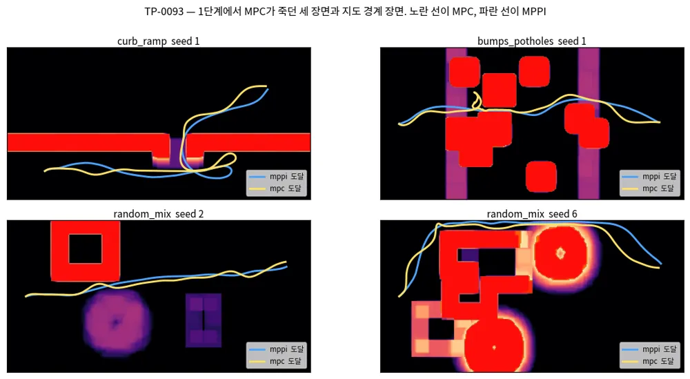
*그림 — 1단계에서 MPC가 죽던 세 장면(curb_ramp s1, bumps_potholes s1, random_mix s2)과 지도 경계 장면(random_mix s6). 노란 선이 MPC, 파란 선이 MPPI, 빨간 칸이 치명 셀이다. 네 장면 모두 둘 다 도달한다. curb_ramp s1에서 MPC는 램프를 지나쳤다가 되돌아와 오르고, bumps_potholes s1에서는 블록 사이 틈 앞에서 한 번 머뭇거린다. random_mix s6에서는 블록과 지도 위쪽 끝 사이 통로를 지난다. 그림은 `python scripts/make_doc_figures.py --mpc-cbf`로 다시 만든다.*

### M.3.11 보행자도 반평면 하나로, 다만 앞 2초에만 건다 (TP-0071 나머지)

**보행자 3명이 가로지르는 조건(seed 0–5)에서 `guidance+mpc`가 23/24, 충돌 0이다.** 최소 여유는 0.08 m다. TP-0071에 남아 있던
보행자 제약이다.

지형과 같은 방식으로 넣었다. 노드마다 그 시각에 예측한 보행자 원판 가운데 가장 가까운 것을 고르고, 원판 중심에서 노드로 향하는
접평면을 두 번째 제약 행으로 건다(`obstacles.py::pedestrian_half_planes`). 원판 반경에는 로봇 반경이 들어 있고,
`DynamicObstacles`가 예측 시간에 따라 0.15 m/s씩 키운다.

처음에는 지평 4초 전체에 걸었고 seed 0–2에서 11/12였다. 실패한 bumps_potholes s2가 이 구조의 약점을 그대로 보여 줬다.
==폭 1 m 통로에서 마주 오는 보행자의 원판은 4초 뒤 반경 1.15 m가 되어 통로를 막는다. 앞으로 가는 해가 없어진 MPC는 물러났고,
물러나다 블록에 닿았다.== 예측 불확실성이 지평을 따라 커지면 가능 영역이 사라진다는 Trautman의 freezing robot 구조다(TP-0090).
MPPI는 같은 원판을 비용으로만 쓰므로 그 장면을 스치며 지나간다(최소 여유 0.24 m).

| 설정 (보행자 3명, seed 0–5) | 성공 | 충돌 | 최소 여유 |
|---|---|---|---|
| 앞 2 s만, slack 1e4 (지형 우선) | 22/24 | **2** | −0.04 m |
| **앞 2 s만, slack 1e6** (기본값) | **23/24** | **0** | 0.08 m |
| `guidance+mppi` | 24/24 | 0 | 0.24 m |

*slack 1e4 행은 칸 조회를 고치기 전에 쟀다. 남은 실패는 bumps_potholes s3의 `lethal`이다.*

지형을 우선하려고 보행자 slack을 낮추면 로봇이 보행자를 스친다. 그래서 가중치는 지형과 같게 두고, **자라는 원판은 앞 2초에만 제약으로
건다**(`MPCConfig.ped_horizon_s`). 그 너머는 매 스텝의 재계획에 맡긴다. 근본 처방은 로봇의 움직임에 반응하는 예측이다(TP-0090).
MPC는 MPPI보다 보행자에게 훨씬 바짝 붙는다(0.08 대 0.24 m). 여유 0.15 m 제약을 경계까지 쓰기 때문이다.

### M.3.12 GP 평균의 폐루프를 무너뜨린 원인은 둘이었다 (TP-0068)

**plant를 켠 seed 0–11에서 `guidance+mpc_gp`가 44/48이다. GP가 없는 `guidance+mpc`는 37/48이다.** 성공한 에피소드의 평균 도달
시간도 35.8 s에서 23.2 s로 줄었다. 대신 jerk가 2.5에서 4.5로 커졌다. M.3.7(0/12)과 M.3.9(curb_ramp 전패)에 남겨 둔 문제의
원인을 둘 찾았다.

**① 명령을 잘못 냈다.** GP 평균을 넣은 모델에서 상태 twist $Z_k$는 plant가 **실현할** twist다. 지연 때문에 잔차 $\mu_k$는 명령과
반대쪽을 향한다.

$$ Z_{k+1} = Z_k + u_k \Delta t + \mu_k $$

그런데 컨트롤러는 GP가 없을 때처럼 $Z$의 구간 평균을 명령으로 보냈다. 이미 지연을 반영한 twist를 명령하니 plant가 한 번 더
지연시켰다. ==GP가 학습한 대상은 잔차를 더하기 전의 명령이다. 보내야 할 것도 그것이다.== 그 명령은 $Z_k + u_k \Delta t$이고,
`_features`가 GP에 넣는 값도 이것이다. 온라인 학습에 넣는 입력도 실제로 보낸(속도 한계로 자른) 명령으로 맞췄다.

**② 데이터가 계획 속도를 덮지 못했다.** 잔차는 plant를 켜고 `guidance+mppi`로 모았다. 지연 때문에 그 폐루프는 명령 $v_x$가
0.93 m/s를 넘은 적이 없다(99% 분위 0.86). MPC와 MPPI는 지평 뒤쪽에서 1.1–1.5 m/s를 계획한다. 그 노드들은 분포 밖이라 평균은
믿을 수 없고, 분산은 prior로 돌아간다($d\omega$ 0.68 rad/s, 실제 잔차는 0.05 안팎).

그래서 **가진(excitation) 주행**을 더했다. 같은 폐루프에서 2초 구간마다 실행 $v_x$를 1.0–1.7배로 키우고 $v_y$·$\omega_z$에 매끄러운 잡음을
얹어, 명령이 twist 상자 전체를 덮게 했다(`scripts/fit_residual_gp.py`). 학습은 seed 0·1(MPPI 2,000 + 가진 998 샘플), 보류는 seed 2다.

| 보류 데이터 | 모델 | RMSE dvx / dvy / dωz | dωz 예측 sd | 95% 적중 |
|---|---|---|---|---|
| MPPI 주행 | 기존 (MPPI 데이터만) | 0.0181 / 0.0078 / 0.0219 | 0.026 | 0.96 / 0.99 / 0.99 |
| MPPI 주행 | **새 (MPPI + 가진)** | 0.0181 / **0.0043** / **0.0159** | 0.024 | 0.97 / 1.00 / 1.00 |
| 가진 주행 | 기존 | 0.0248 / 0.0073 / 0.0661 | 0.120 | 0.90 / 0.99 / 0.95 |
| 가진 주행 | **새** | 0.0213 / 0.0071 / **0.0376** | **0.058** | 0.95 / 0.97 / 0.98 |

명목 모델(잔차 0)의 RMSE는 MPPI 주행에서 0.055 / 0.023 / 0.060, 가진 주행에서 0.076 / 0.046 / 0.115다. 새 GP는 기존 분포에서
나빠지지 않았고, 빠른 영역에서 $d\omega$ 오차와 예측 sd를 절반으로 줄였다. bumps_potholes s0를 plant로 달리며 세 시점에서 잰 MPPI rollout의
지평 끝 위치 σ(중앙값)는 0.17–0.20 m에서 0.06–0.09 m로 줄었다.

**두 원인을 차례로 고친 효과(plant, `guidance+mpc_gp`).**

| 변형 | curb_ramp | bumps_potholes | slope_crossfall | random_mix |
|---|---|---|---|---|
| 기존 GP, 구간 평균 명령 (seed 0–2) | 0/3 | 1/3 | 3/3 | 3/3 |
| 새 GP, 구간 평균 명령 (seed 0–2) | 0/3 | 1/3 | 3/3 | — |
| **새 GP + 명령 수정** (seed 0–11) | **10/12** | **10/12** | 12/12 | 12/12 |
| GP 없음 `guidance+mpc` (seed 0–11) | 6/12 | 8/12 | 11/12 | 12/12 |

데이터만 바꿔서는 curb_ramp가 하나도 풀리지 않았다. 명령을 고치자 풀렸다. 즉 ①이 주된 원인이고 ②는 그 위에서 분산을 믿을 만하게
만든 것이다. GP 없는 MPC가 curb_ramp에서 6/12인 것은 지연 때문에 램프를 지나친 뒤 되돌아오다 시간이 다 가기 때문이다(`timeout` 5).
GP가 지연을 미리 알면 덜 지나친다.

### M.3.13 MPPI에도 확률 제약을 세웠다 (TP-0076)

**확률 제약을 얹을 자리는 만들었지만, 이 plant에서 GP 튜브의 이득은 아직 보이지 않는다.** plant를 켠 seed 0–11에서
`guidance+mppi_ccgp`가 42/48, 기준 `guidance+mppi`가 44/48이다. 튜브 없는 `guidance+mppi_cc`는 정적 40/40, 보행자 3명 24/24로 기준과 같다.

Controller 문서 E.10의 (b) 갈래다(Trivedi 외, ICRA 2025). 비용이 아니라 제약으로 세운다. rollout의 스텝 $k$마다 로봇 위치가 치명 경계나
보행자 원판을 넘을 확률을 $\epsilon$ 이하로 묶고, 위치 오차를 가우시안으로 보면 결정론적 조임이 된다.

$$ \Pr\big[\,d(p_k) < 0\,\big] \le \epsilon \quad\Longleftrightarrow\quad d(\bar p_k) \ \ge\ \Phi^{-1}(1-\epsilon)\,\sigma_{p,k} $$

$d$는 부호 있는 거리(치명 경계까지, 또는 보행자 원판까지)이고 $\sigma_{p,k}$는 **그 샘플의** 위치 표준편차다. 샘플마다 GP로 스텝별
twist 잔차 분산을 구하고 rollout을 따라 쌓는다. 그래서 빠르고 낯선 샘플은 넓은 튜브를, 익숙한 샘플은 좁은 튜브를 받는다.
==샘플마다 튜브가 다르다는 것이 MPC가 가질 수 없는 점이다. MPC는 명목 해 하나를 조인다.== 구현은 `CostTerm` 하나
(`control/mppi/chance.py`)다. 위반한 샘플에 상수 벌점을 줘 사실상 버리고, 모든 샘플이 위반하면 덜 위반한 쪽이 이기도록 선형 항을 더한다.
`mppi.py`는 바꾸지 않았다. 그래서 rollout은 명목 모델로 돌고, GP는 분산만 쓰고 평균(지연 편향)은 쓰지 않는다.

쌓는 방식은 되먹임을 반영한다. 로봇은 매 스텝 다시 풀어 밀린 위치를 되돌리므로, 스텝 $j$의 오차는 $\tau$(1 s) 뒤에는 대부분 지워진다.
그래서 분산을 $a = e^{-\Delta t/\tau}$로 감쇠시키며 더한다. 이것이 없으면 조금만 낯선 샘플도 1초 안에 튜브가 상한(0.5 m)에 붙었다.
GP는 4스텝마다 평가해 사이를 채운다(스텝마다 평가 대비 σ 오차 99% 분위 2.7 cm, 64 → 10 ms). 공유 GP 커널을 $\lVert a\rVert^2 + \lVert b\rVert^2 - 2a^\top b$
전개로 바꿔 7,680개 질의가 45 ms에서 18 ms로 줄었다. MPC 쪽도 같이 빨라진다.

**처음 넣은 버전은 로봇을 세웠다. 원인은 셋이었다.**

1. **고정 여유 0.15 m.** MPC와 맞추려고 튜브 위에 0.15 m를 더 얹었더니 정적 조건에서 37/40이었다. 세 실패 모두 틈 앞에서 멈춘
   `timeout`이다. 기준 MPPI는 Guidance 경로를 따라 가장 좁은 곳을 0.04–0.07 m 여유(칸 가장자리 기준)로 지나간다. 지평 4초가 그 틈에 닿는
   순간 앞으로 가는 샘플이 모두 위반이 되고, 위반하지 않는 샘플은 "정지" 하나뿐이다. 넓은 길이 없어서가 아니다. 출발–목표를 잇는
   경로 가운데 가장 넓은 것의 병목 여유는 bumps_potholes s1에서 0.68 m였다. Guidance가 최단 경로로 좁은 틈을 고른 것이다. 치명 칸은 이미
   로봇 반폭(0.30 m)만큼 팽창돼 있으므로(`FeatureConfig.inflate_radius_m`) 고정 여유는 0으로 두고, 추종 오차 몫은 튜브에 맡겼다.
2. **가장자리까지 잰 거리.** 여유 0으로도 bumps_potholes s6이 멈췄다(39/40). Guidance가 블록 사이 한두 칸짜리 틈으로 경로를 냈는데,
   거리를 치명 칸 가장자리까지 재니 틈 안이 0 이하로 나왔다. 막아야 할 사건은 시뮬레이터가 실패로 보는 사건, 즉 중심에서 이중선형으로
   샘플한 cost ≥ 0.95다. 이웃 칸 cost가 $c$이면 이 경계는 치명 칸 중심에서 $0.05\,\Delta/(1-c)$ 떨어진 곳이다(0.05 m 칸에서 $c = 0.3$이면 0.4 cm).
   그래서 거리를 치명 칸 **중심**까지 잰다. 0선이 실패 경계보다 엄격하지 않고 한 칸 넘게 느슨하지 않다는 것을 테스트로 고정했다.
3. **분포 밖 분산.** M.3.12의 ②와 같은 원인이다. 기존 GP로는 지평 끝 σ가 0.17–0.20 m여서 튜브가 0.3 m를 넘었다. 고정 여유
   0.15 m와 기존 GP를 함께 쓴 첫 버전은 plant 조건 seed 0–2에서 9/12였다.

**남은 plant 실패가 가르쳐 준 것.** curb_ramp s5(`mppi_ccgp`, `lethal`)를 스텝마다 뜯어봤다. 실패 직전 믿음 지도와 실제 지도의 여유는
같았다(σ 0, 다 관측). 1스텝 위치 예측 오차는 중앙값 6 mm였다. 제약을 지키는 샘플도 768개 가운데 94–216개 남아 있었다. 실행한 평균 계획은
0선에서 1.5–5 cm 떨어져 있었는데, 그 자리의 cost가 0.89였다. **이웃 칸 cost가 0.9에 가까우면 실패 경계는 치명 칸 중심에서 반 칸(2.5 cm)
바깥이다.** 2번에서 고른 0선은 낮은 cost 이웃을 가정한 것이라, 램프 벽 옆에서는 실패 경계보다 느슨했다(M.3.14에서 재 보니 지도별 99% 분위로 최대 5.0 cm, 한 칸 가까이). 다음 할 일은 둘이다.
0선을 실패 경계에 정확히 맞추는 것(cost 기울기 방향으로 $z\sigma$만큼 옮긴 점의 이중선형 cost로 판정), 그리고 rollout에 GP 평균을 넣는 것이다.

**전체 결과.** 제어 시간은 bumps_potholes s0를 plant로 달리며 한 프로세스에서 컨트롤러를 차례로 돌려 잰 중앙값이다.

| 스택 | 정적 (seed 0–9) | 보행자 3명 (seed 0–5) | plant (seed 0–11) | 제어 시간 |
|---|---|---|---|---|
| `guidance+mppi` | 40/40 | 24/24, 충돌 0 | 44/48 | 13.0 ms |
| `guidance+mppi_cc` (튜브 없음, 여유 0) | 40/40 | 24/24, 충돌 0 | 41/48 | 16.1 ms |
| `guidance+mppi_ccgp` (GP 튜브) | — | — | 42/48 | 35.9 ms |
| `guidance+mpc` | 38/40 | 23/24, 충돌 0 | 37/48 | 6.6 ms |
| **`guidance+mpc_gp`** (GP 평균) | — | — | **44/48** | 9.2 ms |

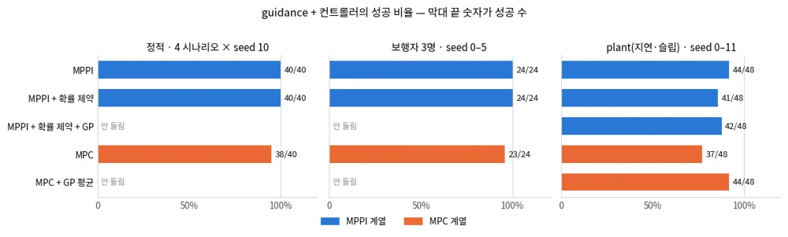
*그림 — 세 조건에서 컨트롤러별 성공 비율. 파란 막대가 MPPI 계열, 주황 막대가 MPC 계열이고 막대 끝 숫자가 성공 수다. GP를 쓰는 두 스택은 잔차가 있는 plant 조건에서만 돌렸다. 그림은 `python scripts/make_doc_figures.py --controllers`로 다시 만든다(원자료 `results/p2-mpc-mppi-constraints.tsv`).*

세 가지를 읽는다. 첫째, plant에서 이득을 본 것은 MPC의 **GP 평균**이다(37 → 44/48). 지연이라는 체계적 오차는 평균으로 갚는 것이다.
둘째, MPPI의 GP 튜브는 이 plant에서 1스텝 오차가 6 mm라 쓸 몫이 작고, 남은 실패는 0선의 느슨함에서 온다. 셋째, MPC는 정적·보행자에서
MPPI보다 한두 건 뒤지지만 계산은 절반이고 jerk가 낮다(정적 3.1 대 4.4). CLAUDE.md 기준표로는 다섯 스택 모두 통과다
(보행자 3명 seed 0–2에서 12/12, 충돌 0, 최대 pitch 8° 아래, GT cost 0.06 아래).

**다음.**
- MPC에 분산을 넣는다(TP-0069). 반평면의 $\rho_k$ 자리에 $\Phi^{-1}(1-\epsilon)\,\sigma_{p,k}$를 넣으면 된다. 배관은 이미 있다.
- MPC 비용에 매끄러운 지형 항(M.1.1)을 넣고, Guidance 경로의 여유를 Controller와 맞춘다. 고정 여유로 모서리와 틈을 함께 못 맞춘 문제다.
- 확률 제약의 0선을 실패 경계에 맞추고(→ M.3.14에서 했다, TP-0119), rollout에 GP 평균을 넣는다(TP-0120).
- `planner_d+mpc`·`planner_d+mpc_gp`를 Planner D 체크포인트가 있는 데스크톱에서 돌린다(시간 참조 모드).

### M.3.14 확률 제약의 0선을 실패 경계에 맞췄다 (TP-0119)

**확률 제약의 0선이 이제 시뮬레이터가 치명 실패로 판정하는 경계 위에 놓인다.** 평가 지도 46장(GT 40장, 믿음 지도 6장)에서 0선이
참 경계에서 떨어진 거리(지도별 99% 분위)는 중앙값 4.33 cm에서 0.59 cm로, 최댓값 4.97 cm에서 0.78 cm로 줄었다. 부호를 덮어쓰지 않은
필드만 보면, 실패하는 표본 점 760,561개 가운데 안전(0 이상)으로 읽은 점이 rim 12,830개에서 exact 245개로 줄었다. 실제로 쓰는 방식은
부호를 시뮬레이터의 판정으로 덮어쓰므로 정의상 0개다. plant 조건 seed 0–23(스택당 96 에피소드)에서 `guidance+mppi_ccgp`는
85/96에서 89/96, 튜브 없는 `guidance+mppi_cc`는 87/96에서 89/96이 됐다(기준 MPPI 88/96). 하지만 결과가 갈린 짝이 6:2, 8:6이라
성공 수 차이는 유의하지 않다(부호 검정 p ≈ 0.29, 0.79). 정적·보행자 조건은 그대로다. 그래서 근거는 성공 수가 아니라 기하 정확도와
남은 실패의 원인이다. exact 쪽 치명 실패 12건 가운데 필드가 로봇 위치를 실제보다 1 cm 넘게 멀다고 읽은 경우는 없다(최대 0.20 cm).
`ChanceConstraintCost`의 기본값을 `boundary="exact"`로 바꿨다.

**무엇이 틀렸나.** M.3.13의 두 번째 고침은 0선을 치명 칸 **중심**에 두었다. 치명 칸(cost 1)과 cost $c$인 이웃 칸을 잇는 선 위에서
이중선형 cost는 $1 - t(1-c)$이므로, 실패 경계는 치명 칸 중심에서 $t = 0.05/(1-c)$칸 떨어진 곳이다. $c = 0.3$이면 0.07칸(0.4 cm)이라
중심에 둬도 맞았다. 그러나 $c = 0.9$면 반 칸, $c = 0.94$면 0.83칸이다. 램프 벽 옆 칸이 그렇다. rim 0선은 그만큼 실패 영역 안쪽에
있고, 그만큼 낙관적이다. M.3.13에서 curb_ramp s5를 뜯어보며 적은 "cost 0.89"는 실행한 계획 아래의 cost였다. 실패 지점의 이중선형
cost는 0.974였고, 옆 자유 칸 줄의 cost는 0.911, 그 옆 치명 칸 줄은 0.998이었다. 그래서 실패 경계는 치명 칸 중심에서
$(0.998-0.95)/(0.998-0.911) = 0.55$칸(2.7 cm) 바깥이다.

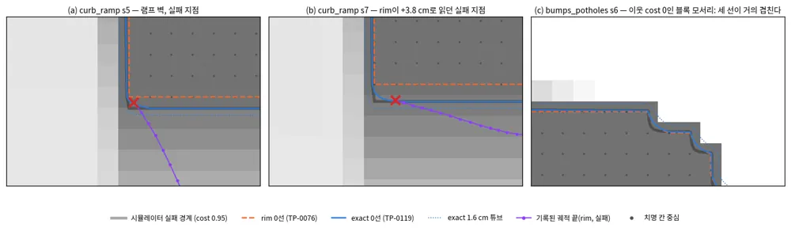
*그림 — 60 × 40 cm로 확대한 세 장면. 굵은 회색 선이 시뮬레이터의 실패 경계(이중선형 cost 0.95), 주황 점선이 rim 0선, 파란 선이 exact 0선, 파란 점선이 exact 1.6 cm 튜브다. (a) curb_ramp s5와 (b) s7은 램프 벽이다. 옆 자유 칸 줄의 cost가 0.91, 0.94라 실패 경계가 치명 칸 중심에서 0.55칸, 0.82칸 바깥에 있다. rim 0선은 그만큼 실패 영역 안쪽에 있고, 기록된 궤적(보라)이 그 선을 믿고 실패했다. (c)는 이웃 칸 cost가 0인 블록 모서리라 세 선이 거의 겹친다. 그림은 `python scripts/make_doc_figures.py --followup TP-0119`로 다시 만든다.*

**어떻게 고쳤나.** 치명 실패 집합을 시뮬레이터의 정의 그대로 둔다. 이중선형 cost가 0.95 이상인 점과 지도 밖이다. 자세 한계(roll·pitch)로 넘어지는
실패는 이 집합에 넣지 않았다. 이 실험의 실패 가운데 그런 것은 0건이었다.

$$ F = \{\, p : B(p) \ge 0.95 \,\} \,\cup\, \text{지도 밖} $$

그 경계까지의 부호 있는 거리를 칸 중심마다 구해 두고(`control/failure_sdf.py`), 질의는 이중선형으로 보간한다. 보간은 볼록한
모서리에서 거리를 조금 더 크게 읽을 수 있으므로, **부호만은 시뮬레이터의 판정으로 덮어쓴다.** MPPI는 rollout의 모든 점에서 cost를
이미 샘플하고 있어서(`mppi.py`가 `terrain_attitude`로 넘긴다), 덮어쓰기에 드는 것은 비교 한 번이다. 비교는 시뮬레이터처럼 float64로 한다.
float32로 비교하면 float32(0.95) = 0.94999999가 0.95 이상으로 잡힌다. 그러면 시뮬레이터가 안전하다는 점을 실패로 읽는다(검토에서
찾아 테스트로 고정했다).

자세히: 경계를 정확히 그리는 방법과, 그것을 재는 오라클

**경계를 그린다.** 칸 중심 네 개로 이루어진 2×2 조각 가운데 치명과 자유가 섞인 조각에만 경계가 지나간다. 조각 안에서 $(u, v) \in [0,1]^2$로 쓰면

$$ B(u, v) = c_{00}(1-u)(1-v) + c_{01}u(1-v) + c_{10}(1-u)v + c_{11}uv $$

이고, 변 위에서는 선형이라 교차점이 정확히 나온다. 교차점이 넷이면 안장점이다. 안장점 값 $c_s = (c_{00}c_{11} - c_{01}c_{10})/(c_{00}+c_{11}-c_{01}-c_{10})$이
0.95 이상인지로 두 호를 짝짓는다(점근 판정). 각 호에는 현의 수직이등분선과 등위선이 만나는 점을 하나 더 찍는다. 직선 위의 $B$는 이차식이라
세 점이면 정확하다. 그래서 호 하나가 꺾은선 두 토막이 된다.

**거리를 퍼뜨린다.** 경계 조각의 꼭짓점마다 그 꺾은선까지의 정확한 거리를 적고(씨앗), 지도 가장자리의 자유 칸은 0으로 둔다(지도는
가장 바깥 칸 중심에서 끝난다). EDT 한 번으로 모든 칸에 가장 가까운 씨앗까지 거리 + 씨앗의 거리를 준다. 자유 칸에서는 이것이 상한이라
8방향 chamfer를 두 번 돌려 조인다. 치명 칸에는 음의 깊이를 준다(위반 정도를 매기는 데만 쓴다).

**오라클.** 경계 조각 안의 격자선 $u = k/m$, $v = k/m$ 위에서 $B = 0.95$를 풀어 등위선 위의 점을 촘촘히 뽑는다(그리고 자유 칸이 맞닿은 지도
가장자리). 그 점들까지의 KD 거리 $d_G$는 참 거리 $d_F$와 $d_G - \Delta/m \le d_F \le d_G$ 관계라, $m = 64$에서 0.8 mm 안이다.
질의 전 준비(등위선 표본과 KD 트리)만 지도 한 장에 13–22 ms(거리장 생성의 3–6배)가 들어 제어 루프에는 못 쓰고, 평가와 테스트에만 쓴다
(`scripts/eval_failure_boundary.py`). 오라클 자체는 16배 촘촘한 격자의 EDT와 따로 맞춰 봤다(`tests/test_failure_sdf.py`).

**정확도.** 지도마다 무작위 점 12만 개와 오라클의 경계 점에서 두 필드를 쟀다. 통계는 등위선($B = 0.95$)에만 낸다. 지도 테두리도
실패 경계지만, 두 필드 모두 구성상 테두리에서 정확해 섞으면 분위만 좋아 보인다. 테두리가 가장 가까운 점은 따로 쟀고, 두 필드 모두
절대 오차 99% 분위가 0.3 cm 안이다. 부호 있는 오차는 필드 − 참값이라, 양수가 위험한 쪽(실제보다 멀다고 읽음)이다. 안전하다고 읽은
수는 부호를 덮어쓰지 않은 필드로 센다. 덮어쓰면 exact는 정의상 0이라 기하를 재지 못한다.

| 지표 (지도 46장: GT 40 + 믿음 6) | rim (TP-0076) | **exact (TP-0119)** | 수용 기준 |
|---|---|---|---|
| 실패하는 점을 안전(≥ 0)으로 읽은 수, 덮어쓰기 전 | 12,830 / 760,561 | **245** | — |
| 같은 수, 시뮬레이터 판정으로 부호를 덮어쓴 뒤 (실제 쓰는 방식) | (쓰지 않음) | 0 (정의상) | 0 |
| 경계 5 cm 안의 실패점 가운데 안전으로 읽은 비율, 지도 평균 (최대) | 23.9% (54.1%) | **0.36% (3.72%)** | — |
| 0선 오차의 99% 분위, 지도별 중앙값 / 최댓값 | 4.33 / 4.97 cm | **0.59 / 0.78 cm** | 최댓값 ≤ 1.0 cm |
| 경계 옆 0–2 cm에서 엄격한 쪽, 지도별 1% 분위의 최솟값 / 최소 | −1.06 / −3.62 cm | −1.03 / −1.48 cm | ≥ −1.0 / −2.5 cm |
| 경계 15 cm 안에서 낙관, 지도별 99% 분위의 최댓값 / 최대 | 4.97 / 5.93 cm | **0.98 / 1.53 cm** | ≤ 1.0 / 2.5 cm |
| 거리장 생성 시간 (4 시나리오, 중앙값) | 2.2–2.5 ms | 3.6–4.1 ms | rim + 2.5 ms 이내 |

엄격한 쪽 기준(−1.0 cm)만 bumps_potholes 지도 4장에서 최대 0.03 cm 넘겼다. 이 오차는 실제보다 가깝다고 읽는 쪽이라 안전을 해치지
않는다. 믿음 지도 6장은 curb_ramp s5와 bumps_potholes s6의 plant 궤적을 30·60·99%까지 다시 관측해 만들었다. 0선 오차와 낙관의 분위는
GT 지도와 같은 범위다. 다만 실패점을 안전으로 읽는 일은 믿음 지도에서 더 잦다. exact의 245개 가운데 157개가 믿음 지도 6장에서
나왔고, 경계 5 cm 안 비율의 최대 3.72%도 curb_ramp s5 믿음 지도다(GT 지도는 최대 0.54%).

**경계에서 멀어지면 exact도 느슨해진다.** 거리를 퍼뜨리는 EDT는 가장 가까운 씨앗 칸을 고를 뿐, 경계 위 최근접점이 가장 가까운 씨앗을
고르지 않는다. chamfer 두 번은 그 차이를 두 칸 안에서만 고친다. 그래서 실제보다 멀다고 읽는 양(지도별 99% 분위의 중앙값)이 경계 0–5 cm에서
0.40 cm, 5–15 cm에서 0.87 cm, 15–30 cm에서 1.41 cm, 0.6–1.5 m에서 2.01 cm로 커진다(지도별 최댓값 0.67, 1.05, 1.64, 3.29 cm). rim은
모든 거리에서 3.4–4.2 cm다. 확률 제약이 읽는 것은 튜브 폭 안쪽이다. plant 실행의 튜브는 스텝 1에서 `mppi_cc` 0, `mppi_ccgp` 0.35–0.57 cm이고,
지평 끝에서 중앙값 약 9 cm(90% 분위 13–14 cm, curb_ramp s5)다. 그래서 판정 대부분이 15 cm 안 구간에서 나고, 지평 끝의 넓은 튜브만
15–30 cm 구간(99% 분위 최대 1.6 cm 낙관)을 읽는다. 최근접점을 함께 퍼뜨리는 방식(벡터 전파)도 한 번 시험했다(지도 8장, 일회성 실험이라
원자료는 남기지 않았다). 먼 구간 오차는 절반 남짓 줄었지만 생성 시간이 세 배 넘게 늘어 넣지 않았다.

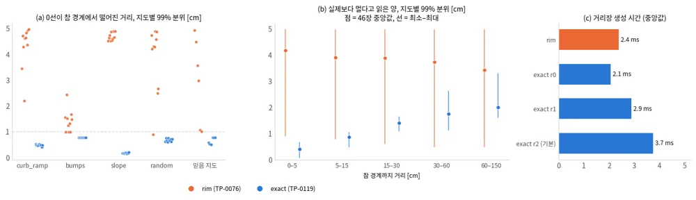
*그림 — (a) 지도마다 한 점, 0선이 참 등위선에서 떨어진 거리의 99% 분위. 점선이 수용 기준 1 cm다. (b) 참 경계까지 거리 구간별로, 필드가 실제보다 멀다고 읽은 양의 99% 분위. 점은 46장의 중앙값, 선은 최소–최대다. rim(주황)은 모든 구간에서 4 cm 안팎이고, exact(파랑)는 가까울수록 작다. (c) 거리장 생성 시간(4 시나리오 중앙값). 주황이 rim, 파랑이 exact이고, r 뒤 숫자는 chamfer 횟수다(기본 r2 = 본문의 두 번). 원자료 `results/tp0119/boundary.tsv`, `timing.tsv`.*

**기록된 실패를 다시 쟀다.** M.3.13의 표에 쓴 plant 실행(seed 0–11)에서 MPPI 계열이 치명 칸에 닿은 15건을 오라클로 되짚었다.
그중 한 쌍(curb_ramp s0의 `mppi`와 `mppi_cc`)은 같은 궤적이라 14건으로 센다. 실패 지점에서 rim 필드는 14건 가운데 10건을
"아직 안전(0 이상)"이라고 읽고 있었다. exact는 덮어쓰기 때문에 정의상 0건이다. 덮어쓰기가 닿지 않는 실패 직전 7스텝(0.7 s)에서
참값과의 평균 절대 차이는 rim 1.90 cm, exact 0.06 cm다. 실제보다 가장 멀리 읽은 양은 rim 4.84 cm, exact 0.62 cm다. 가장 극단적인 curb_ramp s7에서 rim은 실패 지점을
+3.77 cm로 읽었고, 참값은 −0.33 cm였다.

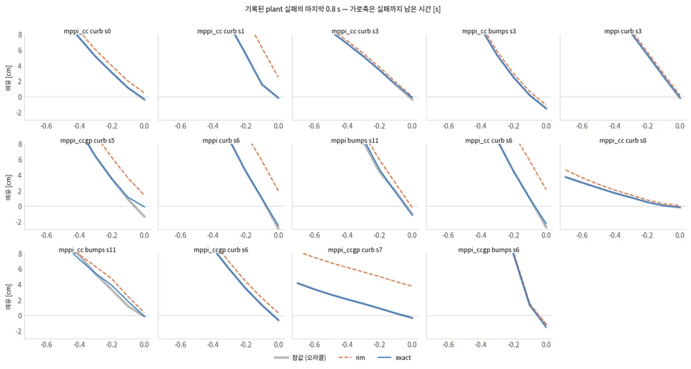
*그림 — 기록된 plant 치명 실패 14건의 마지막 0.8 s. 회색이 참값(오라클), 주황 점선이 rim, 파랑이 exact다. 파랑은 회색과 거의 겹치고, 주황은 여러 장면에서 실패 순간까지 양수다. 원자료 `results/tp0119/failure_traces.tsv`.*

**폐루프 짝 비교.** rim 쪽은 TP-0076 기록을 그대로 쓰되, 기록된 실패 두 건(`mppi_ccgp` curb_ramp s5 30.8 s, `mppi_cc` curb_ramp s1 31.7 s)이
같은 시각에 재현되는 것을 먼저 확인했다. 기록이 없던 칸(`mppi_ccgp`의 정적·보행자 rim 쪽)과 seed 12–23은 새로 돌렸다.

| 스택 | 쪽 | 정적 (seed 0–9) | 보행자 3명 (seed 0–5) | plant (seed 0–11) | plant (seed 12–23) | **plant 합계** |
|---|---|---|---|---|---|---|
| `guidance+mppi` | 기준 | 40/40 | 24/24, 충돌 0 | 44/48 | 44/48 | 88/96 |
| `guidance+mppi_cc` | rim | 40/40 | 24/24, 충돌 0 | 41/48 | 46/48 | 87/96 |
| `guidance+mppi_cc` | exact | 40/40 | 24/24, 충돌 0 | 44/48 | 45/48 | **89/96** |
| `guidance+mppi_ccgp` | rim | 39/40 | 24/24, 충돌 0 | 42/48 | 43/48 | 85/96 |
| `guidance+mppi_ccgp` | exact | 39/40 | 24/24, 충돌 0 | 45/48 | 44/48 | **89/96** |

정적 조건의 실패 하나는 두 쪽 모두 bumps_potholes s6의 `timeout`이다. Guidance가 좁은 틈으로 경로를 낸 장면으로, 0선과는 무관하다(TP-0118).
plant의 exact 쪽 실패는 `mppi_cc` 7건이 모두 치명이고, `mppi_ccgp` 7건은 치명 5건과 `timeout` 2건(bumps_potholes s6, s11)이다.
보행자 최소 여유는 `mppi_ccgp` exact 쪽이 0.30 m로 rim 쪽(0.18 m)보다 넓었다. CLAUDE.md 기준표(보행자 3명, seed 0–2)는 네 스택 모두
12/12, 충돌 0, 최대 pitch 7.8°, GT cost 평균 0.016 이하로 통과다.

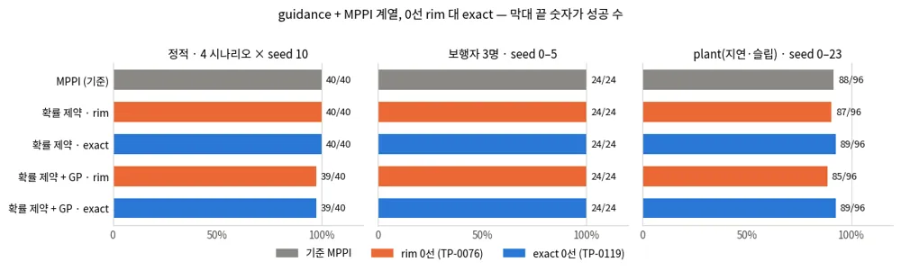
*그림 — 세 조건에서 rim(주황)과 exact(파랑)의 성공 비율. 회색이 기준 MPPI다. 정적·보행자는 같고, plant(seed 0–23)에서 exact가 두 스택 모두 89/96이다. 차이는 유의하지 않다. 원자료 `results/p2-controller-followups.tsv`(`python -m scripts.collect_followups`로 모은다).*

**남은 실패의 원인.** exact 쪽 치명 실패 12건과, `mppi_ccgp`에서 exact가 고친 rim 쪽 치명 실패 5건을 다시 돌려 스텝마다 기록했다
(`scripts/eval_failure_boundary.py attribute`). `mppi_cc`에서 exact가 고친 8건은 돌리지 않았다. 판정은 위에서부터 차례로 보고, 처음 맞는 것을
붙인다. 인식과 기하는 마지막 0.8 s 가운데 로봇이 참 경계 5 cm 안에 있던 스텝만 본다. 그보다 멀면 믿음 지도의 몇 cm 차이는 흔하고 해가 없다.

| 판정 | 기준 | exact 쪽 (12건) | rim 쪽 (5건) |
|---|---|---|---|
| 인식 | 믿음 지도의 경계가 GT와 1 cm 넘게 다르다 | 1 | 2 |
| 기하 | 그 쪽 필드가 로봇 위치를 실제보다 1 cm 넘게 멀다고 읽었다 | **0** | 1 |
| 불가능 | 마지막 3스텝 가운데 제약을 지키는 샘플이 하나도 없던 스텝이 있다 | 6 | 1 |
| 계획 위험 | 마지막 스텝에서 계획의 다음 점이 GT로 이미 실패다 | 0 | 0 |
| 지연 | 계획의 다음 점은 GT로 안전했는데, 실제로 간 점이 실패했다 | 5 | 1 |

==exact 쪽에서 필드가 실제보다 멀다고 읽은 양은 최대 0.20 cm였다. rim 쪽 다섯 건 가운데 넷은 0.8–4.1 cm였다(1 cm를 넘은 것은 둘).==
남은 실패의 원인은 이제 기하가 아니다. "지연" 6건은 모두 마지막 스텝에서 계획의 다음 점이 참값으로 0.23–0.69 cm 안전했다. 실제로 간 점은
그보다 0.36–1.01 cm 경계 쪽에 떨어져 실패했다. 그 앞 7스텝에서도 실제 위치는 대부분(42점 가운데 37점) 계획한 위치보다 조금 경계 쪽이다(아래 그림).
이 6건에서 마지막 0.8 s의 1스텝 예측 오차는 최대 1.0–1.6 cm, 중앙값 0.8–1.0 cm인데 스텝 1 튜브는 0–0.5 cm다. 지연이 만드는 계통 편향은
분산(튜브)으로 덮을 수 없다. GP의 **평균**을 rollout에 넣어야 갚을 수 있고, 그것이 TP-0120이다. 가장 큰 분류는 "불가능"(6건)이라,
지연 편향이 남은 실패의 주원인이라는 것은 아직 추정이다. 근거는 있다. "불가능" 7건 가운데 6건에서도 벽 15 cm 안의 스텝마다 실행이 계획보다
평균적으로 벽 쪽으로 밀렸다. 편향을 모른 채 벽 쪽으로 붙은 뒤에는 어떤 샘플도 제약을 지킬 수 없다. 이 추정은 TP-0120에서 확인한다.

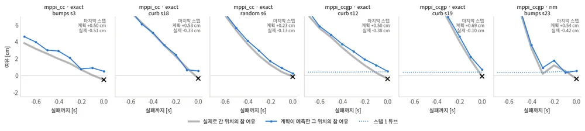
*그림 — "지연"으로 판정된 6건의 마지막 0.8 s(가로축 0이 실패 지점 ×). 회색은 실제로 간 위치의 참 여유, 파랑은 계획이 예측한 그 시각 위치의 참 여유, 점선은 스텝 1 튜브다. 파랑은 48점 가운데 43점에서 회색 위에 있고, 실패 직전 스텝에서는 6건 모두 위다. 실행이 계획보다 경계 쪽으로 밀리는 계통 편향이다. 원자료 `results/tp0119/attribution.tsv`, `attribution_steps.tsv`.*

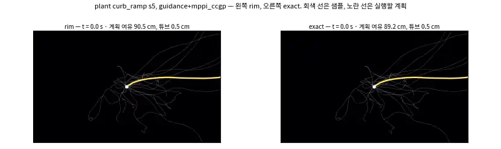
*애니메이션 — plant curb_ramp s5, `guidance+mppi_ccgp`. 왼쪽이 rim, 오른쪽이 exact다. 회색은 MPPI 샘플, 노란 선은 실행할 계획이며 제목에 계획의 첫 1 s 최소 여유와 튜브 폭이 나온다. rim은 램프 벽을 0선 안쪽으로 믿고 붙다가 30.8 s에 실패하고, exact는 벽 앞에서 물러났다가 43.9 s에 도달한다.*

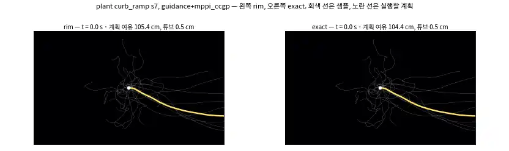
*애니메이션 — 같은 비교, curb_ramp s7. rim이 실패 지점을 +3.8 cm로 읽던 장면이다. rim은 32.3 s에 실패하고 exact는 47.0 s에 도달한다.*

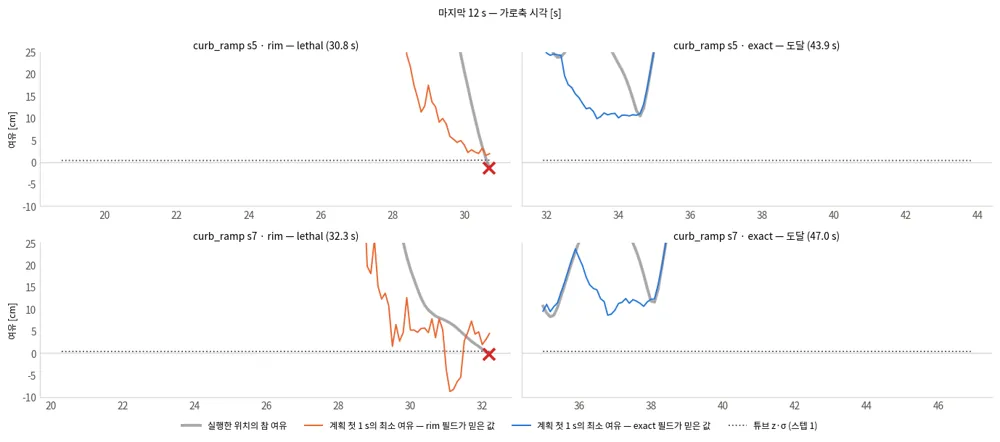
*그림 — 두 장면의 마지막 12 s. 회색은 실행한 위치의 참 여유, 색 선은 그 쪽 필드가 계획의 첫 1 s에서 믿은 최소 여유, 점선은 스텝 1의 튜브다. 실패 직전 0.8 s 동안 참 여유가 0 아래로 떨어지는 사이에도 rim은 계획 여유를 양수로 믿었다(s7에서 +1.9 – +7.3 cm). s7 rim의 31.0–31.4 s에 계획 여유가 음수로 떨어진 것은 그때 모든 샘플이 rim 0선을 어겼기 때문이다.*

**메커니즘.** 성공 수 대신, 실행한 위치가 참 경계에 얼마나 바짝 붙었는지를 모든 plant 스텝(실패 스텝 제외)에서 셌다.

| 스택 | 쪽 | 에피소드별 최소 참 여유, 중앙값 / 하위 10% | 참 여유 1 cm 미만 스텝 | 2 cm 미만 스텝 |
|---|---|---|---|---|
| `mppi_ccgp` | rim | 14.25 / 1.22 cm | 17 | 41 |
| `mppi_ccgp` | **exact** | **15.63 / 2.01 cm** | **6** | **24** |
| `mppi_cc` | rim | 13.79 / 1.46 cm | 9 | 20 |
| `mppi_cc` | exact | 13.09 / 0.87 cm | 41 | 77 |

튜브가 있는 `mppi_ccgp`에서는 exact가 바짝 붙는 스텝을 65% 줄였다. 튜브가 없는 `mppi_cc`에서는 반대로 늘었다. 여유가 0이고 튜브도
없으면, 정확한 0선은 로봇이 **진짜 경계에 바로 붙는 것**을 허용하기 때문이다. rim은 일부 기하(오목한 모서리)에서 실제보다 엄격해,
의도하지 않은 여유를 주고 있었다. 정확한 0선 위에서는 추종 오차 몫을 튜브가 맡아야 한다. 튜브가 없다면 작은 고정 여유가 맡아야 한다.
`mppi_cc`의 기본값도 exact로 바꿨지만, 이 스택의 성공 수 변화(87 → 89)는 잡음 범위이고 바짝 붙는 스텝은 늘었다는 점을 함께 적어 둔다.

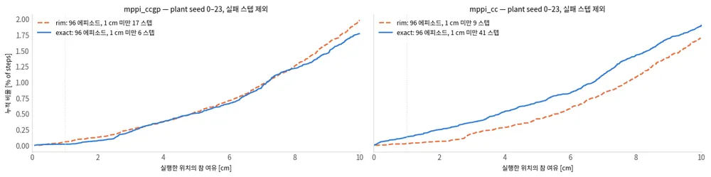
*그림 — 실행한 위치의 참 여유 누적 분포(0–10 cm, plant seed 0–23). 왼쪽 `mppi_ccgp`에서는 exact(파랑)가 rim(주황 점선)보다 아래라 바짝 붙는 스텝이 적고, 오른쪽 `mppi_cc`에서는 반대다.*

**시간.** 같은 요청을 두 쪽에 차례로 넣어 짝지어 쟀다(plant bumps_potholes s0, 145 스텝, 부하 평균 3, 순서는 스텝마다 바꿈).
중앙값으로 `mppi_cc`는 17.3 ms에서 19.3 ms, `mppi_ccgp`는 34.6 ms에서 36.7 ms다. 둘 다 2 ms 남짓 늘었고, 거리장 생성 차이(1.3–1.6 ms)가
대부분이다. 둘 다 제어 주기 100 ms 안이다. 컨트롤러가 내는 `control_ms`는 이제 거리장 생성을 포함한 전체 호출 시간이다(전에는 MPPI
최적화만 셌다). 원자료는 `results/tp0119/control_timing.tsv`(`eval_failure_boundary.py control-timing`)다.

**MPC 쪽은 TP-0117에서 다룬다.** 같은 거리장을 MPC 반평면의 오프셋에 쓸 수 있다. 하지만 MPC는 고정 여유 0.15 m를 쓰고, 지형 비용을
더하는 TP-0117이 바로 그 여유를 다시 정한다. 그래서 두 변경을 함께 재는 편이 맞다. 헬퍼(`control/failure_sdf.py`)는 이미 두
Controller가 함께 쓸 수 있는 자리에 있다.
