<!-- doc: 인식 | 1 -->
# 인식 — 지형·장애물을 TravMap으로 (§A)

**인식은 센서 관측을 TravMap[8,H,W]과 동적 장애물 목록으로 바꾸는 일이다.** 이 문서는 여섯 탭으로 나뉜다. 앞의 네 탭(지형 지도,
traversability, 시각 기반 모델, 동적 장애물)이 travplan 파이프라인에 직접 들어가는 부분이고, 뒤의 두 탭(예측·world model, 보행 로봇)은
다른 로봇 분야에서 가져올 설계 참고다.

| 탭 | 다루는 것 | 절 | travplan과의 관계 |
|---|---|---|---|
| 지형 지도·Occupancy | 자동차 occupancy 계보, 로봇 elevation mapping 계보, 보도·다리 로봇용 최신 연구 | A.1–A.5 | P2.1에서 elevation mapping 계열 채택 |
| Traversability | 사람 라벨에서 자기지도로, 다시 기반 모델과 VLM으로 | A.10 | TravNet 자기지도(TP-0010, TP-0022) |
| 시각 기반 모델 | DINO, Depth Anything, SAM, Grounding DINO | A.11 | 라벨 교사, 영상 백본 후보 |
| 동적 장애물 | 검출, 추적, 궤적 예측, 로봇 기준 3D·BEV | A.12 | PoC(TP-0011), `DynamicObstacles`, TP-0028 |
| 예측·World model | occupancy flow, 자율주행 world model | A.6 | 미래 TravMap 예측(장기 과제) |
| 보행 로봇 | 4족·휴머노이드의 인식, 산업 스택(Figure·Sunday·Flexion·LimX), LiDAR 높이 지도 휴머노이드, 폼팩터 비교, CMU 지형 분석 | A.7–A.9 | WVN 등 참고 구현, 3DGS 현장 복제, 바퀴형 비교 기준 |

**계보 한눈에 보기.** 네 줄기가 거의 같은 시기에 "사람 라벨 없이, 큰 모델로"라는 방향으로 움직였다. 각 이름의 설명은 해당 탭에 있다.

| 연도 | 지형 지도·Occupancy | Traversability | 시각 기반 모델 | 동적 장애물 |
|---|---|---|---|---|
| 2014–2018 | Robot-centric elevation mapping | — | — | Social GAN |
| 2020 | Lift-Splat-Shoot | RELLIS-3D, BADGR | — | Constant Velocity Model, Trajectron++ |
| 2021–2022 | BEVFormer, BEVFusion, MonoScene, elevation_mapping_cupy | TerraPN, How Does It Feel? | — | AgentFormer, MID, ByteTrack, BoT-SORT |
| 2023 | TPVFormer, Occ3D, SurroundOcc, FlashOcc | WVN, STERLING | DINOv2, Grounding DINO | RT-DETR, LED |
| 2024 | SparseOcc, GaussianFormer | V-STRONG, RoadRunner, SALON | Depth Anything V2, SAM 2 | YOLOv10, D-FINE, SingularTrajectory |
| 2025 | GaussianFormer-2 | — | DINOv3, Depth Anything 3, SAM 3 | RF-DETR, MoFlow |
| 2026 | WalkOCC 등 보도·다리 로봇용 단안 occupancy | ViTA, CATNAV, PIVOT | — | — |

**공개 코드와 모델.** 인식 분야에서 많이 쓰이는 저장소를 GitHub 별 순으로 모았다(2026-09). HF 다운로드는 대표 가중치의 최근 30일 값이다.
라이선스 열은 제품에 넣을 수 있는지를 가른다.

| 분야 | 이름 | 코드(★) | HF 다운로드 | 라이선스 | travplan에서 |
|---|---|---|---|---|---|
| 검출 | [Ultralytics YOLO](https://github.com/ultralytics/ultralytics) | 62.0k | 0.02M (YOLO26) | AGPL-3.0 | PoC가 사용, 제품 경로에서 교체(A.12) |
| 분할 | [SAM 2](https://github.com/facebookresearch/sam2) | 19.9k | 0.12M (2.1-large) | Apache-2.0 | 라벨 교사 후보 |
| 특징 | [DINOv2](https://github.com/facebookresearch/dinov2) | 13.4k | 2.87M (base) | Apache-2.0 | 영상 백본 후보 |
| 분할 | [SAM 3](https://github.com/facebookresearch/sam3) | 11.8k | 2.10M | 자체 | 연구 비교 |
| 특징 | [DINOv3](https://github.com/facebookresearch/dinov3) | 11.4k | 0.61M (ViT-B) | 자체 | 연구 비교 |
| 검출 | [YOLOv10](https://github.com/THU-MIG/yolov10) | 11.3k | — | AGPL-3.0 | 쓰지 않음 |
| 검출 | [Grounding DINO](https://github.com/IDEA-Research/GroundingDINO) | 10.6k | 1.41M (base) | Apache-2.0 | 자동 라벨 후보 |
| 검출 | [RF-DETR](https://github.com/roboflow/rf-detr) | 9.6k | 0.04M (base) | Apache-2.0 | YOLO 대체 후보 |
| 깊이 | [Depth Anything V2](https://github.com/DepthAnything/Depth-Anything-V2) | 8.9k | 2.76M (Small) | Small만 Apache-2.0 | 단안 깊이 후보 |
| 추적 | [ByteTrack](https://github.com/FoundationVision/ByteTrack) | 6.7k | — | MIT | PoC가 사용 |
| 깊이 | [Depth Anything 3](https://github.com/ByteDance-Seed/Depth-Anything-3) | 6.4k | 0.29M (Metric-Large) | Apache-2.0(L, Metric, Mono) | 단안 깊이 후보 |
| 검출 | [RT-DETR](https://github.com/lyuwenyu/RT-DETR) | 5.6k | 0.52M (v2 R18) | Apache-2.0 | YOLO 대체 후보 |
| 지도 | [BEVFormer](https://github.com/fundamentalvision/BEVFormer) | 4.6k | — | Apache-2.0 | 채택하지 않음(A.2) |
| 검출 | [D-FINE](https://github.com/Peterande/D-FINE) | 3.3k | 0.01M (nano) | Apache-2.0 | YOLO 대체 후보 |
| 지도 | [ANYbotics elevation_mapping](https://github.com/ANYbotics/elevation_mapping) | 1.9k | — | BSD-3-Clause | 계보의 원형 |
| 추적 | [BoT-SORT](https://github.com/NirAharon/BoT-SORT) | 1.6k | — | MIT | 다음 개선 후보 |
| 지도 | [elevation_mapping_cupy](https://github.com/leggedrobotics/elevation_mapping_cupy) | 1.1k | — | MIT | P2.1에서 채택(포크) |
| 예측 | [Trajectron++](https://github.com/StanfordASL/Trajectron-plus-plus) | 0.8k | — | MIT | TP-0028과 함께 검토 |

**travplan의 위치.** ==travplan 인식은 기하 지도, 경험으로 고친 비용, 카메라 동적 장애물의 세 줄기다.== 지형은 깊이 카메라와 LiDAR
점군을 elevation mapping(A.2b)으로 합친 높이 지도에서 TravMap 기하 채널을 계산한다. 비용은 기하 규칙에서 시작해 TravNet 자기지도(A.10)로
고친다. 보행자는 카메라 검출과 추적(A.12)으로 `DynamicObstacles`를 만든다. 시각 기반 모델(A.11)은 라벨을 만드는 교사로 쓰고, 자동차
occupancy(A.2)와 world model(A.6)은 표현 설계의 참고로 쓴다.

---

<!-- tab: 지형 지도·Occupancy -->

## A. Occupancy Network — 지형·장애물 인식

### A.1 개념: Occupancy Network가 하는 일

Occupancy Network는 센서 관측을 "공간의 각 칸이 차 있는가"를 담은 3D 격자로 바꾼다. 흐름은 네 단계다.

```
카메라/LiDAR 원시 데이터 (여러 시점·시각의 2D 관측)
   ▼
[백본]   이미지·점을 특징으로 인코딩
   ▼
[리프팅] 2D 특징을 3D voxel/BEV 격자로 옮긴다
         (카메라: ray-marching 또는 deformable attention, LiDAR: 직접 복셀화)
   ▼
[voxel grid: 점유 확률 + 선택적으로 시맨틱 클래스]   ← 이것이 occupancy
   ▼
travplan TravMap[8,H,W]로 변환 (travplan/perception/gridmap_bridge.py 같은 경로)
```

방식을 가르는 축은 세 가지다. **입력 센서**(멀티카메라, 단일 파노라마, LiDAR), **리프팅 방식**(transformer
attention, ray-marching, 직접 복셀화), **배포 비용**(Orin 실측이 있는가). travplan은 P2.1에서
`elevation_mapping_gpu_ros2`(LiDAR·스테레오를 직접 복셀화하는 계열)를 헤드리스로 실행해 검증했다(TP-0008).
아래 후보들은 LiDAR 없이 카메라만으로 가려 할 때의 대안이다.

### A.2 자동차 도메인 계보 — 채택하지 않지만 알아야 할 마일스톤

**자동차의 카메라 기반 3D 인식은 2020–2024년에 BEV, 3D occupancy, 3D Gaussian의 세 단계로 발전했다.** 모두 차량 앞쪽을 둘러싼
멀티카메라 리그를 전제하고 Orin에서 돌린 실측이 없어, `docs/ARCHITECTURE.md`와 `docs/prd-p2.md`에서 채택하지 않기로 확정했다(근거는 A.5 표).
그래도 표현 설계의 교훈은 TravMap에 그대로 쓰인다. 격자를 얼마나 조밀하게 둘지, 높이 축을 어떻게 다룰지, 가려진 칸의 정답을 어떻게
만들지가 모두 이 계보에서 먼저 풀렸다.

| 연도 | 이름 | 한 일 | 코드(★, 2026-09) |
|---|---|---|---|
| 2020 | Lift-Splat-Shoot | 카메라마다 깊이 분포로 특징을 들어 올려 BEV 격자에 뿌린다. 리프팅의 원형(배경 0.1) | [nv-tlabs/lift-splat-shoot](https://github.com/nv-tlabs/lift-splat-shoot) 1.4k |
| 2022 | BEVFormer | BEV 격자 query가 카메라들에서 특징을 attention으로 가져오고, 과거 BEV를 시간 attention으로 잇는다 | [fundamentalvision/BEVFormer](https://github.com/fundamentalvision/BEVFormer) 4.6k |
| 2022 | BEVFusion | 카메라와 LiDAR 특징을 같은 BEV 공간에서 합친다 | [mit-han-lab/bevfusion](https://github.com/mit-han-lab/bevfusion) 3.2k |
| 2022 | MonoScene | 단안 영상 한 장으로 3D 의미 장면을 완성한다 | [astra-vision/MonoScene](https://github.com/astra-vision/MonoScene) 0.8k |
| 2023 | TPVFormer | BEV에 수직 평면 둘을 더한 세 평면으로 3D를 표현한다 | [wzzheng/TPVFormer](https://github.com/wzzheng/TPVFormer) 1.4k |
| 2023 | Occ3D, SurroundOcc | 가시성 마스크와 조밀한 occupancy 정답을 만드는 방법, 벤치마크 | [Occ3D](https://github.com/Tsinghua-MARS-Lab/Occ3D) 0.6k, [SurroundOcc](https://github.com/weiyithu/SurroundOcc) 1.1k |
| 2023 | FlashOcc | BEV에서 2D 합성곱만 쓰고 채널을 높이로 바꾼다. 배포 친화 | [Yzichen/FlashOCC](https://github.com/Yzichen/FlashOCC) 0.6k |
| 2024 | SparseOcc | 완전 희소 occupancy, 광선 기반 지표 RayIoU | [MCG-NJU/SparseOcc](https://github.com/MCG-NJU/SparseOcc) 0.4k |
| 2024 | GaussianFormer(-2) | 장면을 3D Gaussian 집합으로 표현한다 | [huang-yh/GaussianFormer](https://github.com/huang-yh/GaussianFormer) 0.7k |

**Lift-Splat-Shoot — 카메라 영상을 BEV로 올리는 표준 방법**([arXiv:2008.05711](https://arxiv.org/abs/2008.05711), ECCV 2020, NVIDIA). 카메라마다
픽셀별 깊이 분포를 예측해 특징을 3D 절두체로 들어 올리고(lift), 모든 카메라의 절두체를 BEV 격자에 뿌린다(splat). 템플릿 궤적을 BEV 비용 지도에
쏘아 고르는 계획(shoot)까지 한 네트워크로 학습했다. 이후 카메라 기반 BEV·occupancy 연구 대부분이 이 리프팅 위에 서 있다.


*그림 — Lift-Splat-Shoot (Fig. 1): 여러 카메라 영상(왼쪽)에서 BEV 좌표계의 의미 지도(오른쪽)를 바로 추론한다. 출처: [arXiv:2008.05711](https://arxiv.org/abs/2008.05711)*

**BEVFormer — BEV 격자 자체를 query로 쓰는 transformer**([arXiv:2203.17270](https://arxiv.org/abs/2203.17270), ECCV 2022). 깊이를 명시적으로
예측하는 대신, 격자 모양 BEV query가 공간 cross-attention으로 여러 카메라의 관심 영역에서 특징을 가져온다. 시간 self-attention은 과거 BEV를
재귀적으로 합친다. nuScenes test에서 NDS 56.9로 이전 최고보다 9.0 높았고 LiDAR 기반과 비슷해졌다. 속도 추정과 가려진 물체 재현율이 특히 좋아졌다.


*그림 — BEVFormer (Fig. 2): 격자 BEV query, 시간 self-attention, 공간 cross-attention으로 된 encoder 층. 출처: [arXiv:2203.17270](https://arxiv.org/abs/2203.17270)*

<details markdown="1">
<summary>자세히: BEVFormer의 공간·시간 attention</summary>

**공간 cross-attention.** BEV 칸 $p$의 query $Q_p$를 높이 방향 기준점 $N_{\text{ref}}$개로 올린 뒤, 그 점이 보이는 카메라 $\mathcal V_{\text{hit}}$마다
투영점 $\mathcal P(p, i, j)$ 주변의 특징을 deformable attention으로 모은다.

$$ \mathrm{SCA}(Q_p, F_t) = \frac{1}{|\mathcal V_{\text{hit}}|} \sum_{i \in \mathcal V_{\text{hit}}} \sum_{j=1}^{N_{\text{ref}}} \mathrm{DeformAttn}\big(Q_p,\ \mathcal P(p, i, j),\ F_t^i\big) $$

**시간 self-attention.** 자차 움직임으로 정렬한 이전 BEV $B'_{t-1}$와 현재 query를 함께 attention한다.

$$ \mathrm{TSA}(Q_p, \{Q, B'_{t-1}\}) = \sum_{V \in \{Q,\ B'_{t-1}\}} \mathrm{DeformAttn}(Q_p, p, V) $$

**travplan에 주는 것.** travplan TravMap도 이전 프레임을 자세로 정렬해 합친다(지금은 고정 비율 0.7/0.3 필터). 합칠 비율을 학습된 attention이
정하게 하는 것이 BEVFormer식 시간 융합이다.

</details>

**BEVFusion — 카메라와 LiDAR를 같은 BEV에서 합친다**([arXiv:2205.13542](https://arxiv.org/abs/2205.13542), ICRA 2023, MIT). 카메라 특징을 LiDAR
점에 칠하는 점 단위 융합은 카메라의 의미 밀도를 버린다. BEVFusion은 두 센서를 각자 BEV로 바꾼 뒤 합친다. 병목이던 BEV pooling을 최적화해
뷰 변환 지연을 40배 넘게 줄였고, nuScenes에서 3D 검출 mAP·NDS를 1.3%, BEV 지도 분할 mIoU를 13.6% 높이면서 계산은 1.9배 줄였다.

**MonoScene과 TPVFormer — 3D를 어떻게 적게 표현하나**([MonoScene arXiv:2112.00726](https://arxiv.org/abs/2112.00726), CVPR 2022;
[TPVFormer arXiv:2302.07817](https://arxiv.org/abs/2302.07817), CVPR 2023). MonoScene은 단안 영상 한 장에서 2D·3D UNet과 시선 방향 투영으로
3D 의미 장면을 완성해, 카메라 시야 밖까지 그럴듯하게 채웠다. TPVFormer는 BEV 한 장이 높이 구조를 잃는 문제를 BEV에 수직 평면 둘을 더한
세 평면(tri-perspective view)으로 풀었다. 3D 점의 특징은 세 평면 투영 특징의 합이다. 카메라만으로 LiDAR 분할 과제에서 LiDAR 기반과 비슷한
성능을 처음 보였다.

**Occ3D와 SurroundOcc — 정답 occupancy를 어떻게 만드나**([Occ3D arXiv:2304.14365](https://arxiv.org/abs/2304.14365), NeurIPS 2023;
[SurroundOcc arXiv:2303.09551](https://arxiv.org/abs/2303.09551), ICCV 2023). 사람이 3D 칸마다 라벨을 칠할 수는 없다. SurroundOcc는 동적 물체와
정적 장면의 LiDAR를 여러 프레임 따로 모은 뒤 Poisson 복원으로 구멍을 메우고 복셀화했다. Occ3D는 복셀 조밀화, **가림 추론**, 영상 기반 정제의
세 단계로 **가시성을 아는** 정답을 만들고, Occ3D-nuScenes와 Occ3D-Waymo 벤치마크를 세웠다. 가려져 보이지 않는 칸은 평가에서 뺀다.


*그림 — Occ3D (Fig. 2): 복셀 조밀화, 가림 추론(가시성 마스크), 영상 기반 정제로 조밀한 occupancy 정답을 만드는 파이프라인. 출처: [arXiv:2304.14365](https://arxiv.org/abs/2304.14365)*

**FlashOcc — 3D 복셀 없이 BEV에서 끝낸다**([arXiv:2311.12058](https://arxiv.org/abs/2311.12058), 2023). 특징을 끝까지 BEV에 두고 2D 합성곱만 쓴
뒤, 마지막 출력 채널을 높이 축으로 다시 접어 3D occupancy를 낸다(channel-to-height). 3D 합성곱과 복셀 특징이 없어 여러 칩에 배포하기 쉽고,
Occ3D-nuScenes에서 정확도·속도·메모리 모두 이전 방법보다 좋았다. 이 계보에서 **임베디드 배포를 목표로 설계한** 드문 연구다.


*그림 — FlashOcc (Fig. 2): 영상 특징을 BEV로 올려 2D 합성곱으로 처리하고, channel-to-height 변환으로 3D occupancy를 낸다. 출처: [arXiv:2311.12058](https://arxiv.org/abs/2311.12058)*

<details markdown="1">
<summary>자세히: FlashOcc의 channel-to-height</summary>

BEV 특징 $F \in \mathbb R^{C \times H \times W}$를 2D 합성곱으로 처리해 출력 로짓 $O \in \mathbb R^{(C' \cdot Z) \times H \times W}$를 낸다. 이것을
$O \in \mathbb R^{C' \times Z \times H \times W}$로 모양만 바꾸면 높이 칸 $Z$개마다 클래스 $C'$개의 로짓이 된다.

$$ O_{c', z, h, w} = O_{(c' \cdot Z + z),\, h,\, w} $$

학습할 것은 2D 합성곱뿐이다. 3D 구조는 "어느 채널이 어느 높이인가"라는 약속으로만 표현된다.

**travplan에 주는 것.** TravMap은 이미 2.5D(칸마다 높이 하나)라 같은 발상의 극단적인 형태다. 오버행(A.5의 알려진 한계)을 표현하려면 채널을
높이 구간으로 조금 늘리는 FlashOcc식 확장이 3D 복셀보다 싸다.

</details>

**SparseOcc — 빈 공간을 계산하지 않는다**([arXiv:2312.17118](https://arxiv.org/abs/2312.17118), ECCV 2024). 장면 대부분은 비어 있다. SparseOcc는
카메라만으로 희소한 3D 표현을 먼저 복원하고, 희소 query가 마스크로 고른 2D 특징과만 상호작용한다. 조밀한 3D 특징과 전역 attention이 없다.
깊이 방향으로 겹쳐 세는 기존 mIoU의 문제를 고친 광선 기반 지표 RayIoU를 제안했고, 과거 7프레임 입력에서 RayIoU 34.0, 17.3 FPS를 냈다.

**GaussianFormer와 GaussianFormer-2 — 장면을 3D Gaussian으로**([arXiv:2405.17429](https://arxiv.org/abs/2405.17429), ECCV 2024;
[arXiv:2412.04384](https://arxiv.org/abs/2412.04384), CVPR 2025). 복셀 대신 위치·공분산·의미를 가진 3D Gaussian 집합으로 장면을 표현하고,
attention으로 Gaussian 속성을 반복해 다듬는다. 복셀 값은 이웃 Gaussian만 모아 계산한다(Gaussian-to-voxel splatting). 비슷한 성능을 메모리
17.8–24.8%로 냈다. GaussianFormer-2는 Gaussian 대부분이 빈 공간을 설명하는 낭비를 줄이려고, 각 Gaussian을 "주변이 점유됐을 확률"로 해석하는
확률적 중첩을 도입했다.


*그림 — GaussianFormer (Fig. 3): 영상 특징에서 3D Gaussian의 위치·공분산·의미를 반복해 다듬고, Gaussian-to-voxel splatting으로 occupancy를 낸다. 출처: [arXiv:2405.17429](https://arxiv.org/abs/2405.17429)*

<details markdown="1">
<summary>자세히: GaussianFormer의 splatting과 GaussianFormer-2의 확률적 중첩</summary>

**GaussianFormer.** Gaussian $G_i$는 평균 $\mathbf m_i$, 공분산 $\Sigma_i$(크기·회전), 의미 벡터 $\mathbf c_i$를 가진다. 질의점 $\mathbf p$의 의미는
이웃 Gaussian $\mathcal N(\mathbf p)$만 더한다(배경 0.1의 리프팅과 반대 방향의 "뿌리기").

$$ \hat{\mathbf o}(\mathbf p) = \sum_{i \in \mathcal N(\mathbf p)} \exp\Big(-\tfrac12 (\mathbf p - \mathbf m_i)^\top \Sigma_i^{-1} (\mathbf p - \mathbf m_i)\Big)\, \mathbf c_i $$

**GaussianFormer-2.** 각 Gaussian을 "점 $\mathbf p$가 점유될 확률" $\alpha_i(\mathbf p) = \exp(-\tfrac12 (\mathbf p - \mathbf m_i)^\top \Sigma_i^{-1} (\mathbf p - \mathbf m_i))$로
본다. 점유 확률은 "어느 Gaussian도 점유하지 않을 확률"의 여사건이다(확률적 곱).

$$ \alpha(\mathbf p) = 1 - \prod_i \big(1 - \alpha_i(\mathbf p)\big) $$

의미는 Gaussian 혼합 모델로 겹침 없이 계산한다. 초기 Gaussian은 표면 깊이 대신 픽셀 광선을 따라 학습한 점유 분포에서 뽑는다.

**travplan에 주는 것.** "점유 확률의 곱"은 TravMap의 σ 채널을 여러 관측에서 합칠 때 쓸 수 있는 간단한 규칙이다. 관측마다 "여기가 막혔을
확률"을 내면 $1 - \prod(1 - \alpha)$로 합친다.

</details>

### A.2b 로봇 지형 지도의 계보 — travplan이 쓰는 쪽

**travplan이 채택한 인식은 자동차 occupancy가 아니라 로봇용 elevation mapping 계보다**(P2.1, `elevation_mapping_gpu_ros2`). 이 계보는 칸마다
높이를 Kalman 필터로 합치는 단순한 모델에서 출발해, GPU 병렬화와 학습 기반 traversability 필터까지 왔다.

**Robot-centric elevation mapping — 칸마다 높이와 분산을 합친다**(Fankhauser 등, CLAWAR 2014, RA-L 2018,
[ANYbotics/elevation_mapping](https://github.com/ANYbotics/elevation_mapping), BSD-3, ★1.9k). 로봇 중심의 2.5D 격자에서 칸마다 높이와 분산을
1차원 Kalman 필터로 갱신한다. 로봇 자세의 불확실성을 지도 분산으로 전파해, 멀리서 오래전에 본 칸일수록 믿지 않는다. ANYmal 계열 보행 연구에서
널리 쓰였고, 아래 GPU 판의 출발점이다.

**elevation_mapping_cupy — GPU로 옮기고 기능을 더했다**([arXiv:2204.12876](https://arxiv.org/abs/2204.12876), IROS 2022, ETH RSL,
[leggedrobotics/elevation_mapping_cupy](https://github.com/leggedrobotics/elevation_mapping_cupy), MIT, ★1.1k, 2026-09까지 활발). 점마다 CUDA 커널로
칸 높이를 갱신하고, 높이 드리프트 보정, 광선 추적 기반 가시성 정리(지나간 동적 장애물 지우기), 학습된 traversability CNN, 법선 계산을 모두
GPU에서 한다. DARPA SubT 지하 탐사와 여러 4족 보행 실험에 배포됐다. travplan이 P2.1에서 검증한 `elevation_mapping_gpu_ros2`가 이 코드의 Jetson
Orin 포트다.


*그림 — elevation_mapping_cupy (Fig. 1): 점군 처리, traversability 추정, 법선 계산을 GPU에서 수행하는 elevation mapping 파이프라인. 출처: [arXiv:2204.12876](https://arxiv.org/abs/2204.12876)*

<details markdown="1">
<summary>자세히: 칸 높이의 Kalman 갱신과 상한(upper bound) 층</summary>

**높이 갱신.** 점 높이 $p_z$의 분산 $\sigma_p^2 = \alpha_d d^2$(센서에서 거리 $d$의 제곱에 비례)와 칸의 추정 분산 $\sigma_m^2$로 가중 평균한다.

$$ h \leftarrow \frac{\sigma_p^2\, h + \sigma_m^2\, p_z}{\sigma_m^2 + \sigma_p^2}, \qquad \sigma_m^2 \leftarrow \frac{\sigma_m^2\, \sigma_p^2}{\sigma_m^2 + \sigma_p^2} $$

한동안 갱신되지 않은 칸에는 일정 분산 $\sigma_t^2$를 계속 더해 믿음을 낮춘다. 추정과 Mahalanobis 거리가 큰 점은 이상치로 버린다.

**가시성 정리.** 센서에서 점까지 광선을 따라가다가, 광선 높이가 칸 높이보다 낮으면(칸을 뚫고 지나갔으면) 그 칸의 높이를 지운다. 지나간
보행자가 지도에 남지 않게 한다.

**상한 층.** 광선이 관측되지 않은 칸 위를 지나가면, 그 칸의 지면은 광선보다 높을 수 없다(높았다면 광선이 거기서 멈췄을 것이다). 그래서
광선 높이를 그 칸 높이의 상한으로 저장한다. 논문은 이 층이 "물체에 가려 생긴 안전한 구멍"(상한의 기울기가 작음)과 "위험한 큰 낙차"(광선이
가파르게 내려가 상한의 기울기가 큼)를 구별하게 해 준다고 설명한다.

**travplan에 주는 것.** L0 가림 실험(TP-0031)에서 포트홀 둘레 실패가 난 원인이 바로 "관측되지 않은 칸을 어떻게 해석하나"였다. 상한 층은 음의
장애물 대응(TP-0044)의 가장 가까운 기존 구현이다. travplan이 가져온 포크(`travplan_ws/src/elevation_mapping_cupy`)에도 가시성 정리와 상한 설정이
들어 있다(`enable_visibility_cleanup`, `use_only_above_for_upper_bound`).

</details>

#### A.2b.1 그 뒤로 무엇이 바뀌었나 (2023–2026)

**계보가 2022년에서 멈춘 게 아니라 저장소의 기본 브랜치가 멈춰 있었다.** `elevation_mapping_cupy`의 `main`은 2025-05에
마지막 커밋이지만, ==**`ros2` 브랜치는 2026-07-20까지 살아 있고 릴리스가 이어졌다.**== 활동 위치를 잘못 보고 있었다.

| 릴리스·사건 | 시기 | 내용 |
|---|---|---|
| **MEM** ([arXiv:2309.16818](https://arxiv.org/abs/2309.16818), IROS 2023) | 2023 | RGB·시맨틱·학습 특징을 **멀티모달 층**으로 |
| v2.0.0 | 2025-08 | **ROS 2 Humble 전면 이행** |
| v2.1.0 | 2026-02 | **ROS 2 Jazzy**. 이미지·시맨틱 융합을 지원 경로에서 제거, `plane_segmentation` 기본 끔 |
| **`elevation_mapping_cupy_core`** ([코드](https://github.com/leggedrobotics/elevation_mapping_cupy_core), ★18 MIT) | 2026-02–08 | ==**ROS 의존이 0인 순수 Python 패키지**로 분리== |
| v2.2.0 | 2026-07 | **GPU 정확성·처리량** — race-free 점 융합, 정확한 2D DDA 가시성, dilation과 GridMap 생성 최적화 |

**v2.2.0의 숫자가 travplan의 TP-0084와 정면으로 겹친다.** 상류가 RTX 4090에서 잰 값으로 **602×602 dilation이
8.704 → 0.590 ms**, **600×600 단일층 GridMap 생성이 10.80 → 0.90 ms**(각 p95)다. ==우리가 `TravMapBuilder`를 GPU로
옮겨 26–44배를 얻은 것과 **같은 종류의 연산**이고, 상류에 이미 최적화된 코드와 벤치마크가 공개돼 있다.==

**core 패키지가 travplan에 직접 걸린다.** `emap_mapper.py`가 쓰는 import 경로·클래스·getter(`input_pointcloud`,
`move_to`, `update_variance`, `get_elevation`, `get_variance`, `get_upper_bound`, `get_is_upper_bound`)가 그대로 있다.
옮기면 ROS 2 워크스페이스와 벤더링 트리를 걷어낼 수 있고, ==**학습 traversability 필터를 `weight_file`을 비워 진짜로
끌 수 있다**==(A.7.2의 "끌 수 없다"가 core에서는 해소된다). 대신 PyPI에 없어 git 설치이고, travplan의 `float16` 커널
패치를 다시 적용해야 한다 — **그 패치는 상류에 아직 반영되지 않은 실제 버그라 PR 가치가 있다.**

#### A.2b.2 Orin 실측 — 매핑은 병목이 아니라는 외부 증거

travplan은 Orin 하드웨어가 없어 직접 재지 못한다. 대신 같은 코드를 Orin에 올린 보고가 있다.

| 출처 | 하드웨어 | 설정 | 결과 |
|---|---|---|---|
| [elmap-rl-controller](https://arxiv.org/abs/2505.12537) (ICRA 2025, ETH) | **Jetson Orin Nano** | 해상도 **0.025 m**, 지도 5 × 5 m(200 × 200셀) | ==**elevation mapping + VIO를 30 Hz 실시간**== |
| nvblox 공식 표 | AGX Orin / Orin Nano | voxel 0.05 m | TSDF 0.8 / 2.1 ms, ESDF 1.7 / 6.2 ms (코어 함수 단위) |
| Waverider (ICRA 2024) | Orin AGX | voxel 0.10 m, 반경 30 m | 지도 통합 29 ms, CPU 2.4 스레드 |

==첫 줄이 travplan 설정과 셀 수가 거의 같다== — travplan은 11 m를 0.05 m로 나눠 220 × 220셀이다. 즉 **L1 매핑은
Orin Nano에서도 30 Hz급이 기대되고, 이것이 TP-0083의 "병목은 매핑이 아니라 `TravMapBuilder`"를 외부에서
뒷받침한다.** 상류 v2.2.0의 자체 벤치는 RTX 4090뿐이고 Jetson 수치가 없다.

#### A.2b.3 음의 장애물을 1급 출력으로 내는 구현 — G-VOM 하나뿐이다

**G-VOM**(Overbye·Saripalli, Texas A&M, IEEE IV 2022, [arXiv:2109.13176](https://arxiv.org/abs/2109.13176),
[코드](https://github.com/unmannedlab/G-VOM) ★89, 2023-05 정지). 내부는 3D voxel인데 **출력이 2.5D 여러 장**이다 —
높이, 양의 장애물(경성·연성), 경사, 거칠기, ==**음의 장애물**==, 그리고 코드·README에만 있는 **가시성**.
==정확히는 "음의 장애물을 **별도 토픽**(`~negative_obstacle_map`)으로 내는 유일한 3D 구현"이다== — 2.5D 쪽에는
CMU의 `negObstacle`이 있고 이미지 공간에는 `depth_nav_tools`의 `cliff_detector`가 있다(A.2b.5·A.2b.7 ⑤).
⚠️ 그 "가시성"은 광선 추적 가시성장이 아니라 **관측/미관측 이진 마스크**다(`gvom.py`가 높이값 유무로만 채운다).


*그림 — G-VOM (Fig. 2): 매핑이 내는 출력들. 왼쪽 위부터 시계방향으로 표면 높이(빨강=완경사, 초록=급경사), 장애물 지도(검정=경성 장애물), 거칠기, 음의 장애물. 출처: [arXiv:2109.13176](https://arxiv.org/abs/2109.13176)*


*그림 — G-VOM (Fig. 4): ==음의 장애물 판정의 핵심==. 중심 화소에서 시작해 "알려진 지면"(X)을 찾아 나가며 지면 경사를 외삽하고, 기대 높이와 관측 높이의 차를 임계화한다. 출처: [arXiv:2109.13176](https://arxiv.org/abs/2109.13176)*

<details markdown="1">
<summary>자세히: G-VOM의 파이프라인과 실측 지도 — 왜 방법만 쓰고 수치는 못 쓰는가</summary>


*그림 — G-VOM (Fig. 3): 국소 매핑 전체 흐름. 위 음영이 점군 입력·처리, 아래 음영이 지도 후처리다. 출처: [arXiv:2109.13176](https://arxiv.org/abs/2109.13176)*


*그림 — G-VOM (Fig. 7): Polaris Ranger에서 만든 거칠기(노랑=낮음, 파랑=높음)와 ==음의 장애물(선명한 분홍)== 지도. 빨간 선이 주행 경로다. 출처: [arXiv:2109.13176](https://arxiv.org/abs/2109.13176)*


*그림 — G-VOM (Fig. 6): 시험 차량 셋(Warthog, Moose, Polaris Ranger). ==이 체급이 파라미터가 travplan에 안 맞는 이유다== — 해상도 0.40 m, 음의 장애물 문턱 0.5 m, 로봇 반지름 4.0 m. 출처: [arXiv:2109.13176](https://arxiv.org/abs/2109.13176)*

**분홍 칸이 핵심이다.** Fig. 7의 음의 장애물이 경로 양옆 배수로를 따라 이어지는데, 이는 "지면 아래 점을 관측해서"가 아니라
**관측되지 않은 칸의 기대 높이를 경사 외삽으로 추정해** 얻은 것이다. travplan의 그림자 상한(TP-0044)은 **광선이 지나간
높이**를 상한으로 쓰므로, 두 신호는 서로 독립이다 — 같은 포트홀을 서로 다른 근거로 지목한다.

**초록의 "12 m/s 수동 주행"은 오해를 부른다.** §IV-A에 Moose·Ranger의 8·12 m/s 주행은
*"No planning or control … done either"*라 적혀 있다 — **매핑 전용**이다. 폐루프는 Warthog의 4.5·3 m/s뿐이다.
미터 단위 범위(102.4 × 102.4 × 25.6 m)도 논문 문구가 아니라 설정값 [256, 256, 64] × 0.4 m에서 계산한 값이다.

</details>


**메커니즘이 travplan의 깊이 prior와 발상이 같다.** 지면 아래 점을 찾는 것이 아니라, 미관측 칸의 높이를 추정하고
지면 경사를 외삽해 **기대 높이와 관측 높이의 차**를 임계화한다. ==travplan의 그림자 상한(TP-0044)은 **광선이 지나간
높이**를 상한으로 쓰고, G-VOM은 **지면 경사의 외삽**을 쓴다 — 서로 독립적인 두 번째 신호다.== TP-0048(오탐 점검)에서
둘을 함께 보면 오탐을 줄일 여지가 있다.

**다만 그대로 못 쓴다.** 라이선스가 **GPL-3.0**이라 코드 복사는 travplan에 라이선스 문제를 만든다(논문을 읽고 다시
구현해야 한다). 기본 브랜치가 2023-05에 멈췄고, 무엇보다 **파라미터가 트럭용**이다 — 해상도 0.40 m, 음의 장애물
문턱 0.5 m, 로봇 반지름 4.0 m다. travplan은 0.05 m 해상도에 깊이 prior 0.10 m다. **방법은 이식되지만 수치는
하나도 쓸 수 없다.**

#### A.2b.4 FastDEM — `TravMapBuilder`가 하는 일을 통째로 하는 CPU 구현

**[FastDEM](https://github.com/Ikhyeon-Cho/FastDEM)** (고려대 ISR Lab, ★178, **BSD-3-Clause**, 마지막 푸시 2026-09-04).
README 문구를 그대로 옮기면 ==**"100+ Hz on Jetson Orin", "~10 ms per scan, on CPU alone",
"No PCL, OpenCV, or CUDA required. Just Eigen at core."**==(VLP-16 약 30K점/스캔, 15 × 15 m 지도 0.1 m 해상도).
ROS 1 Noetic · ROS 2 Humble · ROS 없는 C++ API를 모두 낸다.


*그림 — FastDEM: VLP-16 스캔이 들어오는 동안 로봇중심 높이 지도를 갱신한다(CPU만). 출처: [FastDEM](https://github.com/Ikhyeon-Cho/FastDEM)*


*그림 — FastDEM: RGB-D 입력. travplan의 L1 합성 LiDAR 경로와 같은 자리에 들어간다. 출처: [FastDEM](https://github.com/Ikhyeon-Cho/FastDEM)*


*그림 — FastDEM: 로봇중심 지도를 누적한 전역 모드. travplan은 로봇중심만 쓴다. 출처: [FastDEM](https://github.com/Ikhyeon-Cho/FastDEM)*


**두 가지 이유로 이번 조사에서 가장 중요한 항목이다.**

**① 레이어가 `TravMap[8]`과 거의 1:1이다.** elevation·min·max, variance, upper/lower bound를 내고, 국소
PCA(`analysis_radius=0.3`)로 **step·slope·roughness·curvature·normal**을 뽑는다. ==즉 travplan의
`TravMapBuilder`가 하는 일을 하는 공개 구현이다.== 특히 step을 min/max 차가 아니라 **백분위 띠(5–95 %)**로
계산해 점군 잡음에 강하다 — travplan의 STEP 채널이 단일 이상점에 흔들리는 문제에 바로 쓸 수 있는 설계다.

**② TP-0084의 비교 기준선이 된다.** BSD-3이라 실제로 빌드해서 쟀다.
==README의 *"~10 ms per scan"*은 **점군 융합이고 특징 추출이 빠진 숫자**다== — 배포 설정
(`ros2/config/local_mapping.yaml`)이 `feature_extraction: enabled: false`이고 `post_process_rate`가
스캔과 **별도 타이머**(10 Hz)다. 이 사실은 이 저장소에 대한 조사 결과이고,
**우리 쪽 수치와의 비교는 개발 기록 A.13.2**에 있다(요약: 같은 격자에서 CPU 대 CPU는 무승부,
CUDA가 27배).

**미관측 처리도 travplan이 원하는 모양이다.** `inpainting.hpp`가 `inplace=false`로 `elevation_inpainted`를
**별도 레이어**에 써 원래 NaN 마스크를 남기고(travplan이 σ 채널로 하려는 것과 같은 분리), `raycasting.hpp`는
칸마다 ==**`visibility_logodds`**==를 유지한다(관측 시 `+L_observed`, 광선이 기록 고도 아래를 지나면 `-L_ghost`,
임계 아래는 ghost로 제거). **"이 칸이 정말 관측됐는지"를 log-odds로 들고 있는 유일한 구현이고**, travplan의
그림자 상한이 이진 마스크로 다루는 것을 연속값으로 다룬다.

#### A.2b.5 CMU `terrain_analysis` — 음의 장애물 파라미터가 이미 정리돼 있다

A.9.1이 이 저장소의 `terrain_analysis` 파이프라인을 다루고, 여기서는 같은 저장소의 음의 장애물·미관측
파라미터를 자세히 본다.
[autonomy_stack_mecanum_wheel_platform](https://github.com/jizhang-cmu/autonomy_stack_mecanum_wheel_platform)
(★330, `jazzy` 브랜치, 2026-06-06)에는 base에 없는 파라미터가 있다.

| 파라미터 | 값 | 뜻 |
|---|---|---|
| `negObstacle` | −1 끔 / 0 **지면 높이 기준**(`disZ` = 셀 지면 대비) / 1 **센서 높이 기준**(`pointZ` = `point.z − vehicleZ`, 오도메트리 원점 대비) | ==음의 장애물 **기준계를 고른다**== |
| `negObstacleDis`, `negObstacleRelZThre` | 10.0 m, −0.2 m | 판정 거리와 낙차 문턱 |
| `nearObstacle*` | true, 0.75 m, −0.3 m | 근거리 사각지대 전용 완화 문턱 |
| ==`noDataBlockShrinkNum` / `noDataBlockExpandNum`== | — | no-data 마스크 **침식 → 팽창** |
| `minOutOfFovPointNum`, `planarVoxelOutOfFov[]` | 2 | 센서 수직 FOV 최저각 아래 칸을 동적 정리에서 **보호** |

==`noDataBlockShrink/Expand`가 **TP-0048(오탐 점검)이 필요한 손잡이 그 자체**다== — 미관측 마스크를 침식해
잡음 칸을 지우고 다시 팽창해 실제 구멍만 남긴다. `planarVoxelOutOfFov`는 "센서가 더는 재확인할 수 없는 칸"을
FOV 기하로 판정하는데, travplan이 그림자 상한을 유지할지 만료시킬지 정하는 규칙으로 바로 쓰인다.
`autonomy_stack_go2`(★550)는 `noDataObstacle=true`를 켜되 로봇 앞 상자로 제한한다
(`noDataAreaMinX 0.3 ~ MaxX 1.8`, `MinY −0.9 ~ MaxY 0.9`). ⚠️ **라이선스 파일이 없어 코드 복사는 안 되고,
파라미터 설계만 참조한다.**

#### A.2b.6 2.5D를 대체하려는 흐름 — 있지만 이 문제를 풀지 않는다

3D로 간 구현이 새로 주는 것은 **오버행**(travplan의 알려진 한계이고 표현의 한계라 후처리로 못 메운다)과
**free/unknown 3-state 질의**다. 그런데 셋이 걸린다.

1. **주류 3D 라이브러리는 기하까지다** — nvblox·Bonxai·VDB 계열·wavemap 전부 그렇고, slope·step·rough·cost·σ는
   결국 2.5D 층에서 만들어야 한다. ⚠️ **정정**: 처음에는 "하나도 없다"고 썼는데 **반례가 이 문서 안에 있다** —
   A.3c의 **TravBlox**가 *"adds **traversability** as a fourth voxel attribute alongside the classical occupied,
   unknown, and free states"*이고 `getVoxelTraversability()`를 공개 API로 낸다. `foresttrav`도 voxel별 학습
   traversability다. **주류가 아닐 뿐 없지는 않다.**
2. **nvblox가 Nav2로 내보내는 것은 단일 높이 2D 슬라이스**다(`esdf_mode: "2d"`가 기본). 지면 아래 포트홀은 그
   슬라이스에서 장애물이 되지 않는다. ==3D로 가도 음의 장애물은 안 풀린다.==
3. **지상 로봇 온보드에서 도는 3D Gaussian splatting 지형 지도는 공개 구현을 찾지 못했다.**

==현실의 지배적 패턴은 "대체"가 아니라 **3D로 융합하고 2.5D로 내보내기**이고, G-VOM이 그 전형이다.==

**그래도 "2.5D는 부족하다"를 주장하며 코드까지 낸 둘은 읽을 값이 있다.**

| 구현 | 라이선스·활동 | 주장과 표현 |
|---|---|---|
| [SCAN-Planner](https://github.com/wuyi2121/SCAN-Planner) ★547 | **Apache-2.0**, 2026-07-29, arXiv 2606.19555 | *"A 2.5D elevation map cannot faithfully represent overhanging tables, shelves, or multi-level structures"*. 표현은 **하이브리드**(로봇중심 3D sliding occupancy + 지면 추종면 위 A\*), 충돌은 **twin-cylinder footprint**(`d_xy`, ==`d_up`==, `d_down`, `d_off`)로 두 점만 질의. **Go2 + Mid-360, Orin NX 온보드 실시간** |
| [traversability_generator3d](https://github.com/dfki-ric/traversability_generator3d) ★29 + [ugv_nav4d](https://github.com/dfki-ric/ugv_nav4d) ★74 | BSD-3, 2026-09-23, **JOSS 11(118):9410 (2026)** 피어리뷰 | MLS(Multi-Level Surface)로 칸마다 복수 표면. 노드 상태에 ==**Unknown / Frontier가 1급**==이고(`Hole`은 지도 형식에는 있으나 ==이 라이브러리가 쓰지 않는다== — README 명시) *"patches become unknown if there is not enough support"* — **근거가 부족하면 보간하지 않는다.** 기본값이 보도 범위(`maxStepHeight` 0.05 m, `maxSlope` 26°). ⚠️ 빌드가 **Rock 프레임워크** 의존 |


*그림 — SCAN-Planner (Fig. 6): ==2.5D가 지는 장면이 (a) 책상 밑이다== — 상판 아래로 지나갈 수 있는데 2.5D 높이 지도는 상판 높이를 지면으로 보고 돌아간다. 출처: [arXiv:2606.19555](https://arxiv.org/abs/2606.19555)*


*그림 — SCAN-Planner (Fig. 8): Go2 + Mid-360, Orin NX 온보드 실내 실험. 출처: [arXiv:2606.19555](https://arxiv.org/abs/2606.19555)*


*그림 — ugv_nav4d: MLS 지도. ==칸 하나에 표면이 여러 장== 쌓이는 것이 2.5D와 다른 점이다. 출처: [ugv_nav4d](https://github.com/dfki-ric/ugv_nav4d)*

**보도 배달로봇에는 이 이득이 안 온다.** 책상 밑·계단·다층 건물·교량 아래가 다층 표면이 필요한 장면인데, travplan의
운용 영역에는 없다. 대신 **간판 캐노피·가로수 가지**처럼 "머리 위 여유"만 문제가 되므로, 표현을 바꾸는 대신
`clearance` 한 층을 더하는 쪽이 비용이 훨씬 싸다.

코드가 없거나 못 쓰는 것: `InternRobotics/Gallant`(★100, 라이선스 없음), `byangw/PCT_planner`(★512, **GPL-2.0**, ROS 1만),
`LTU-RAI/Map-Conversion-...`(★194, MIT, 2025-04 정지). **UniPoint**는 2.5D의 실패를 정량화했지만
(==얇은 수직 구조 소실 — barrier 성공률 **18 % vs 99.8 %**==) 코드가 없다.

**MLS로 갈아타지 않는다.** 다층 표면의 이득은 계단·다층 건물·교량 아래인데 보도 배달로봇에는 필요 없다.
오버행이라는 알려진 한계를 가장 적게 고쳐 메우는 길은 ==**`clearance` 레이어 한 장(9번째 채널)**==이고,
근거는 SCAN-Planner의 `d_up`(Apache-2.0, 코드 있음), 구현은 nvblox ESDF 두 번 슬라이스나 LTU-RAI
free-space projection(MIT)이다. **현 emap의 visibility cleanup은 오버행을 지우기만 하고 clearance를
표현하지 않는다** — 이 작업의 정당화 근거가 여기다.

**상용 인터페이스는 전부 2.5D다** (프로토콜 소스로 직접 확인).

- **Spot** `local_grid.proto`의 `LocalGridExtent`에 `cell_size`·`num_cells_x`·`num_cells_y`만 있고
  ==**z 셀 개수가 없다**==. grid 5종(`terrain` z-height, `terrain_valid`, `intensity`, `no_step` boolean,
  `obstacle_distance` signed distance)이고 문서가 *"does not store or compose the grids over time"*라 쓴다.
  ==travplan의 "높은 박스 윗면 저비용" 한계를 Spot은 **40 cm 하드 임계**로 우회한다== —
  *"platforms that are too high (a height of > 40 cm) to be obstacles"*. ⚠️ 단 이 임계는
  **`obstacle_distance` 격자**에 대한 것이고 `no_step`의 문턱은 공개돼 있지 않다.
- **Unitree Go2** `unitree_sdk2`의 `idl/go2/HeightMap_.hpp`에서 `origin_`이 ==**`std::array<float,2>`**==다
  (z가 없어 2.5D 확정). 매퍼는 온보드 클로즈드다. ⚠️ 흔히 인용되는 토픽 `rt/utlidar/height_map_array`는 **SDK 저장소에 없고**
  커뮤니티 문서에만 있으므로 SDK 출처로 쓰지 않는다.
- 신흥 휴머노이드 기업(Booster·Fourier·AgiBot·Galbot) SDK에 지형·elevation 타입이 **0건**이다.
- ==**ETH RSL은 2.5D를 버리는 게 아니라 휴머노이드로 확장 중이다.**== emap_cupy에 `dev/jj/g1/main`(2026-07),
  `dev/mheyrman/g1`(2026-08-22, *"tune the g1 elevation map for the mid360 scan density"*),
  `pascal-roth/b2w-wild-navigation-semantic-layers`(2026-09-18, B2-W), `dev/parkour_demo`(2026-09-20)
  브랜치가 살아 있다. Hutter 그룹 최신작 **AME**(arXiv 2601.08485, T-RO 조건부 게재)도 여전히
  *"local elevations **with uncertainties**"*다 — travplan의 σ 채널과 같은 방향이다.

**Gaussian splatting 지형 지도는 공개 코드가 0건이다.** `gaussian splatting × {terrain, traversability,
elevation}` 전수 검색에서 쓸 것이 없었다. 가장 아쉬운 **Splatblox**(UMD, arXiv 2511.18525, 사족+바퀴형 실야외,
성공률 +50 %)는 프로젝트 페이지만 있다. `RoGS`(★160)는 nuScenes 오프라인 재구성, `splatnav`(★141)는 드론용이다.
==오늘 GS로 지형 지도를 돌리는 지상 로봇은 없다.==

다만 **미관측을 다루는 설계는 읽을 값이 있다.** nvblox는 `UnobservedEsdfPolicy{kIgnore, kFree, kOccupied}`와
"관측/미관측 경계를 장애물 표면으로 만드는" 옵션을 두고(travplan의 그림자 상한과 개념이 같다), wavemap은
occupied/free/**unobserved** 3상태와 "이 영역이 전부 free인가"를 coarse 레벨에서 묻는 질의를 갖는다 —
travplan의 알려진 한계 "센서 범위 밖 미관측 영역 탐색"을 플래너가 다룰 때의 인터페이스 선례다.

**⚠️ 이 절은 travplan이 벤더링한 옛 체인 기준이다 — 상류는 그 사이 우리 쪽으로 움직였다.**
현재 상류 `ros2`(v2.2.0) 체인은 `min_filter` → `smooth_filter` → `near_base_height_filter` →
`positive_spike_filter` → `positive_spike_filter_cleanup` → `inpainting` → `erosion`이고,
==`inpainting`의 입력이 `min_filter`가 아니라 `despiked`로 바뀌었다.== 게다가 `max_hole_area`를 25로 낮추고
`fill_border_holes: False`로 경계에 닿은 미관측을 **미관측으로 남기며**, spike 필터 주석은
*"This is intentionally asymmetric: upward one/few-cell towers are clipped, **trench drops are kept**"*라 적는다.
**즉 "상류 기본값을 켜면 포트홀이 사라진다"는 현재 상류에는 더 이상 맞지 않는다.** 아래는 **벤더링본 기준**이다.

벤더링본 체인은 `min_filter` → `smooth` → `inpainting` → `erosion`인데, 커널을 읽어 보면
`min_filter`는 무효 칸을 **주변 유효 칸의 최솟값**으로 채우고 오프셋이 없다
(`if(valid > 0.5 && value < min_value) min_value = value;`). ==즉 **관측된 이웃보다 낮은 값을 만들 수 없다.**
포트홀 테두리가 평지이고 내부가 미관측이면 내부를 테두리 높이로 채워 **구멍을 지운다.**== travplan의 깊이
prior(TP-0047)는 거꾸로 고정 깊이를 빼서 구멍을 만든다. `inpainting`(OpenCV Telea, ==벤더링본에는 `max_hole_area`가 **없어 크기 제한 없이** 메운다== — 상류 `ros2`가
기본 64, 설정 25로 넣은 상한이 벤더링본에는 아직 없다)도 함께
미관측 마스크를 지운다. travplan은 지금 `emap_no_plugins.yaml`에 `{}`를 넘겨 이 체인을 쓰지 않는데, **그 선택이
옳았다.** TP-0048에는 "기성 기준선"이 아니라 ==**대조 실패 사례**("상류 기본값을 켜면 포트홀이 사라진다")==로 넣는다.

#### A.2b.7 미관측을 1급 상태로 두는 계보 — travplan이 이미 서 있는 자리

**먼저 사실 확인 하나.** 조사 과정에서 "travplan이 emap의 `upper_bound`를 버리고 있을 수 있다"는 지적이 나왔지만,
==`travplan/perception/emap_mapper.py`의 `ElevationMapper._paste()`가 `get_upper_bound()`와
`get_is_upper_bound()`를 이미 읽는다.==
TP-0044의 그림자 상한이 바로 그것이다. **이 축에서 travplan은 뒤처진 게 아니라 앞서 있다** — 아래 구현들과 비교해도
"미관측을 이진 마스크가 아니라 상한값으로 들고 있는" 쪽에 이미 속한다.

**① emap 상한의 원 논문이 판별 규칙까지 준다.** Miki 외, IROS 2022([arXiv:2204.12876](https://arxiv.org/abs/2204.12876)):
*"If a ray passes through a cell, we know that the ground height cannot be larger than the ray height."* 그리고 우리가
찾던 판별자 — ==*"The upper bound layer helps distinguish between safe patches caused by obstacle occlusions
(which typically exhibit **small inclinations in the upper bound**) and unsafe larger drops which cause steeper
ray angles resulting in **larger inclinations**."*== 즉 **상한의 기울기**가 "가려진 평지"와 "진짜 낙차"를 가른다.
travplan은 상한을 값으로만 쓰고 이 기울기 검정은 안 한다 — **TP-0048에 그대로 넣을 규칙이다.**
(Xavier 실측: 10 × 10 m 4 cm에서 필터된 Realsense 6,276점 49.4 Hz, Bpearl 43,074점 20.0 Hz, 원본 407,040점 16.1 Hz.)


*그림 — elevation_mapping_cupy (Fig. 5): ==상한의 정의 그 자체==. 광선이 칸을 통과했다면 지면은 그 광선보다 높을 수 없다. 위 그림의 음영이 상한 영역이고, 이것이 travplan TP-0044의 근거다. 출처: [arXiv:2204.12876](https://arxiv.org/abs/2204.12876)*

<details markdown="1">
<summary>자세히: 상한 기울기 검정이 무엇을 가르는지, 그리고 상류가 그 뒤 무엇을 하는지</summary>

**판별 규칙을 그림으로 읽으면 이렇다.** 가려진 칸의 상한은 "그 칸을 지나간 광선 중 가장 낮은 것"이다. 포트홀처럼
**진짜 낙차**가 있으면 광선이 구멍 안쪽을 훑고 지나가느라 각도가 급해져 **상한의 기울기가 커진다.** 반대로 그냥
장애물에 가려진 **평지**라면 광선은 얕은 각도로 스쳐서 **상한이 거의 평평하다.** 그래서 상한의 값이 아니라
==**상한의 기울기**==가 판별자가 된다. travplan은 지금 값만 쓰고 있어 이 정보를 버리고 있다.


*그림 — emap (Fig. 7): 기능을 하나씩 꺼 보며 지도 품질을 비교한 결과. ==어떤 기능이 실제로 값을 하는지 상류가 직접 측정해 놓았다== — travplan이 무엇을 켜고 끌지 정할 때의 근거다(전체 구조는 A.2b 위쪽 Fig. 1 참조). 출처: [arXiv:2204.12876](https://arxiv.org/abs/2204.12876)*


*그림 — emap (Fig. 3): 천장·오버행이 지면 인공물로 들어오지 않게 두는 제외 영역. travplan의 "오버행 미표현" 한계가 여기서 비롯한다 — 상류가 애초에 오버행을 버리도록 설계돼 있다. 출처: [arXiv:2204.12876](https://arxiv.org/abs/2204.12876)*


*그림 — emap (Fig. 11): TAMOLS가 쓰는 높이 층들. ==먼저 가려진 영역을 인페인팅으로 메운다==. A.2b.6에서 본 `min_filter`/`inpainting` 기본 체인이 이 용도이고, 보행 로봇에는 맞지만 포트홀을 지워 배달로봇에는 위험하다. 출처: [arXiv:2204.12876](https://arxiv.org/abs/2204.12876)*


*그림 — emap (Fig. 9): DARPA SubT 결선에서 쓰인 높이 지도와 온보드 카메라 영상. 출처: [arXiv:2204.12876](https://arxiv.org/abs/2204.12876)*

**travplan이 가져올 것과 버릴 것이 이 그림들로 갈린다.** Fig. 5(상한)와 그 기울기 검정은 **가져온다.**
Fig. 11의 인페인팅 체인은 **버린다** — 보행 로봇은 발을 디딜 곳을 찾아야 하니 구멍을 메우는 게 이득이지만,
바퀴 로봇은 구멍에 빠지면 끝이다.

</details>

**② `art_planner`가 그 상한을 쓰는 공개 소비자다.** Wellhausen & Hutter, *ArtPlanner*, Field Robotics 2023
([arXiv:2303.01420](https://arxiv.org/abs/2303.01420), ★256, BSD-3, 2023-08 정지). 상한 칸을 **virtual surface**로
보고 ==*"only use virtual surfaces for planning if they are **above sensor height**"*==라는 규칙을 쓴다. 그리고 흔한
두 대안을 **명시적으로 거부한다** — 구멍을 *"image inpainting algorithm or considering them untraversable"*로 다루는 것 —
이유가 *"We can therefore not rely on the motion cost network to keep a safe distance from negative obstacles."*다.
==**고정 깊이(`--shadow-depth 0.10`) 대신 센서 높이로 문턱을 정하는, 논문으로 방어된 대안이다.**==


*그림 — ArtPlanner (Fig. 11a): 온보드 영상과 LiDAR 지도. 오른쪽 아래가 관측되지 않은 낙차다. 출처: [arXiv:2303.01420](https://arxiv.org/abs/2303.01420)*


*그림 — ArtPlanner (Fig. 11b): ==높이 지도만 쓸 때의 밟을 수 있는 영역==. 가려진 칸이 아예 빠져 플래너가 지나갈 길을 못 찾는다. 출처: [arXiv:2303.01420](https://arxiv.org/abs/2303.01420)*


*그림 — ArtPlanner (Fig. 11c): ==상한을 virtual surface로 넣었을 때==. 가려졌지만 안전한 칸이 살아나 경로가 이어진다. 출처: [arXiv:2303.01420](https://arxiv.org/abs/2303.01420)*

<details markdown="1">
<summary>자세히: ArtPlanner가 왜 인페인팅과 "미관측=비주행" 둘 다를 거부했는지</summary>


*그림 — ArtPlanner (Fig. 10): ==깊이 광선으로 미관측 공간의 virtual surface를 추론한다.== 밟을 수 있는 지형을 먼저 팽창시키고 다시 침식해 잡음을 걸러낸다(CMU의 shrink/expand와 같은 발상). 출처: [arXiv:2303.01420](https://arxiv.org/abs/2303.01420)*


*그림 — ArtPlanner (Fig. 14): SubT 현장의 날카로운 낙차. (b) 낙관적으로 튜닝한 플래너는 이 모서리를 넘어 경로를 냈다. ==travplan의 포트홀 실패와 같은 실패 모드다.== 출처: [arXiv:2303.01420](https://arxiv.org/abs/2303.01420)*

**논문이 두 대안을 명시적으로 거부한다.** 가려진 구멍을 (i) *"image inpainting algorithm"*으로 메우거나
(ii) *"considering them untraversable"*로 막는 것 둘 다다. 이유가 이렇다 —
*"We can therefore not rely on the motion cost network to keep a safe distance from negative obstacles."*
==메우면 비용망이 위험을 못 보고, 전부 막으면 로봇이 아무 데도 못 간다.== 그래서 세 번째 길을 택한다:
**가려진 칸을 "가상 표면"으로 살려두되, 센서 높이보다 위에 있을 때만 계획에 쓴다.**

**왜 센서 높이인가.** 광선이 센서 높이 아래에서 상한을 만들었다면, 그 광선은 **아래를 향해** 내려간 것이므로
지형이 실제로 꺼져 있을 수 있다. 반대로 상한이 센서 높이보다 위라면 광선은 거의 수평이라 **평지를 스친 것**이다.
travplan의 `--shadow-depth 0.10`은 이 판정을 고정 상수로 대신하고 있다 — ==센서 기하로 정하는 쪽이
로봇·센서가 바뀌어도 성립한다.==

**⚠️ 한계.** 재계획이 0.5 Hz이고 ROS 1 Noetic 전용이며 2023-08 이후 정지했다. **규칙만 가져온다.**

</details>

**③ CSIRO `ohm`은 미관측을 열거형 상태로 만들었고 SubT에서 실전 검증됐다.**
[csiro-robotics/ohm](https://github.com/csiro-robotics/ohm) (★193, **BSD-3-Clause**, RA-L 2022,
[arXiv:2206.06079](https://arxiv.org/abs/2206.06079), DARPA SubT 결선 2위). `ohmheightmap/HeightmapVoxelType.h`가
==여섯 상태를 한 레이어에 부호로 인코딩한다==: `kUnknown` / `kVacant`(시작 위치에서 아직 관측 불가) /
`kSurface`(=1.0) / `kVirtualSurface`(=−1.0, *"free voxel with an uncertain voxel below it"*) /
`kInferredFatal`(로봇 근처에 뜬 virtual surface) / `kFatal`. 손잡이가 travplan이 필요한 것과 겹친다 —
==`virtualSurfaceFilterThreshold()`가 **TP-0048의 오탐 손잡이 그 자체**==이고, `setPromoteVirtualBelow()`는
*"better ground results where the ground cannot be properly observed"*를 위해 아래쪽 virtual surface를 씨앗으로
우대한다. 실전 설정이 travplan과 거의 같다: **20 × 20 × 20 m, 0.1 m voxel, 높이 지도 약 5 Hz, Intel NUC8i7BEH.**
속도는 Octomap·Voxblox 대비 GPU로 한 자릿수 앞선다(CUDA 2.721 vs Octomap 0.174 ×10⁶ rays/s).


*그림 — OHM: 입력 점군(Cave 데이터셋). 출처: [arXiv:2206.06079](https://arxiv.org/abs/2206.06079)*


*그림 — OHM: 점유 지도. ==미관측이 "빈 곳"이 아니라 별도 상태로 남는다.== 출처: [arXiv:2206.06079](https://arxiv.org/abs/2206.06079)*


*그림 — OHM: NDT-OM. 칸마다 정규분포를 들어 표면 방향을 표현한다. 출처: [arXiv:2206.06079](https://arxiv.org/abs/2206.06079)*


*그림 — OHM: 같은 자료구조로 TSDF도 낸다. 출처: [arXiv:2206.06079](https://arxiv.org/abs/2206.06079)*

음의 장애물 짝 논문이 이 계열 **선행 연구**다 — Hines 외,
*Virtual Surfaces and Attitude Aware Planning and Behaviours for Negative Obstacle Navigation*
([arXiv:2010.16018](https://arxiv.org/abs/2010.16018)), *"one of pioneer works to explicitly and simultaneously
couple mapping, planning and reactive components in dealing with negative obstacles."* — ==TP-0031/0044/0047 전체의
선행 문헌이다.==

**④ 같은 로봇 종류·같은 센서 기하·같은 실패 모드를 다룬 논문이 하나 있다.** Mozzarelli 외(Politecnico di Milano),
*Automatic Navigation Map Generation for Mobile Robots in Urban Environments*
([arXiv:2403.13431](https://arxiv.org/abs/2403.13431), 코드 없음). ==**보도를 달리는 라스트마일 배달로봇**을 명시
대상으로 하고==, 플랫폼은 평면 장착 Robosense R16 한 대를 단 2륜 도립진자(Yape)다. 문제를 travplan과 똑같이 규정한다 —
음의 장애물의 수직면은 **직접 관측되지 않고 반사 없는 그림자만 남는다.** 해법이 `min_filter`와 **같은 원시 연산을
반대 목적으로 쓴다**: 미관측 칸에 이웃의 **최소 고도**를 $N$번 재귀 전파해 놓고, 그렇게 **인공으로 채운 그림자가
만드는 높이 불연속**을 기존 표면 법선 기반 *양의* 장애물 검출기가 잡게 한다. 오탐은 "인공 장애물이 비주행 지형과
교차하지 않으면 버린다"로 억제한다(traversability 층을 검증자로 씀). ==**A.2b.6에서 본 `min_filter`의 폴리티를
뒤집은 것이 트릭의 전부다.**==


*그림 — Mozzarelli 외 (Fig. 1): Yape. ==보도를 달리는 라스트마일 배달로봇==이고 2륜 도립진자에 평면 장착 LiDAR 한 대다. travplan의 대상 로봇과 문제 설정이 가장 가깝다. 출처: [arXiv:2403.13431](https://arxiv.org/abs/2403.13431)*


*그림 — Mozzarelli 외: ==재귀 확장 전==. 낙차의 수직면은 관측되지 않아 반사 없는 그림자만 남는다. 출처: [arXiv:2403.13431](https://arxiv.org/abs/2403.13431)*


*그림 — Mozzarelli 외: ==재귀 확장 후==. 미관측 칸에 이웃의 최소 고도를 전파하자 인공 높이 불연속이 생기고, 기존 양의 장애물 검출기가 그것을 잡는다. 출처: [arXiv:2403.13431](https://arxiv.org/abs/2403.13431)*

<details markdown="1">
<summary>자세히: 같은 min 연산이 왜 상류에서는 실패하고 여기서는 성공하는가 — 오탐 억제까지</summary>

**핵심은 min 연산을 무엇에 먹이느냐다.** 두 방법 모두 "미관측 칸 ← 이웃 유효 칸의 최소 고도"라는 **같은 원시 연산**을
쓴다. 갈리는 지점은 그 다음이다.

| | 상류 `min_filter` (A.2b.6) | Mozzarelli 외 |
|---|---|---|
| min 전파 결과를 | ==**최종 표면으로 쓴다**== | ==**불연속 검출기에 먹인다**== |
| 그래서 포트홀이 | 테두리 높이로 **메워져 사라진다** | 인공 단차가 생겨 **장애물로 잡힌다** |
| 반복 횟수 | `iteration_n`(기본 5, 벤더링본 3 · 상류 `ros2` 30) | $N_{expansions}$ 파라미터 |
| 오탐 억제 | 없음 | 비주행 지형과 교차하지 않으면 **버린다** |


*그림 — Mozzarelli 외: 평면 LiDAR 한 대가 만드는 미탐색 영역. 출처: [arXiv:2403.13431](https://arxiv.org/abs/2403.13431)*


*그림 — Mozzarelli 외: ==낙차에서는 그림자가 커진다== — 이것이 신호다. travplan의 TP-0031 가림 모델과 같은 기하다. 출처: [arXiv:2403.13431](https://arxiv.org/abs/2403.13431)*


*그림 — Mozzarelli 외: Piazza Leonardo 실측, 재귀 확장 전. 출처: [arXiv:2403.13431](https://arxiv.org/abs/2403.13431)*


*그림 — Mozzarelli 외: 재귀 확장 후. 출처: [arXiv:2403.13431](https://arxiv.org/abs/2403.13431)*


*그림 — Mozzarelli 외: ==오탐 억제 전 확대==. 단순 확장은 평지에도 인공 장애물을 만든다. 출처: [arXiv:2403.13431](https://arxiv.org/abs/2403.13431)*


*그림 — Mozzarelli 외: ==억제 후==. traversability 층을 검증자로 써서 비주행 지형과 교차하지 않는 인공 장애물을 버린다. 출처: [arXiv:2403.13431](https://arxiv.org/abs/2403.13431)*


*그림 — Mozzarelli 외: 검출 대상 실물. 보도 옆 낙차다. 출처: [arXiv:2403.13431](https://arxiv.org/abs/2403.13431)*

==**마지막 두 그림이 TP-0048 그 자체다.**== travplan도 깊이 prior로 인공 구멍을 만들고 있으므로 같은 오탐이 생긴다.
이 논문의 억제 규칙("인공 장애물이 비주행 지형과 교차하지 않으면 버린다")은 travplan의 COST 채널을 검증자로
바로 쓸 수 있는 형태다 — **A.2b.7 결론의 네 규칙에 더할 다섯 번째 후보다.**

</details>

**⑤ 가장 단순한 낙차 검정.** [depth_nav_tools](https://github.com/mdrwiega/depth_nav_tools)의 `cliff_detector`
(★69, `master`가 ROS 2, 2024-12): 센서 높이와 피치로 **"이 광선이 지면 $z=0$에 닿으면 나올 거리"**를 조회표로
미리 계산하고, 실측 거리가 그보다 `ground_margin`(기본 0.05 m)만큼 크면 낙차로 표시한다
(입력은 `sensor_mount_height`와 `sensor_tilt_angle` 둘). 기하만으로 되는 기준선이다.

**⑥ 가려진 부분을 학습으로 메우려면 데이터 만드는 법이 이미 있다.** `solving-occlusion`은 방치된 논문 저장소가
아니라 게재된 연구다 — Stölzle 외, RA-L 2022([arXiv:2109.07150](https://arxiv.org/abs/2109.07150)). 재사용할 수 있는
트릭은 ==**이미 불완전한 실제 DEM에 합성 시점에서 레이캐스팅으로 가림을 *더* 넣고, 원래 관측됐던 칸을 복원하도록
학습**==하는 것이다 — 정답 지도가 필요 없다. L0/L1 가림 학습 데이터를 만드는 데 바로 쓴다.


*그림 — Stölzle 외 (Fig. 2): ==정답 지도 없이 학습하는 방법==. 이미 불완전한 실제 DEM에 합성 시점에서 레이캐스팅으로 가림을 더 넣고, 원래 관측됐던 칸을 복원하도록 학습한다. 출처: [arXiv:2109.07150](https://arxiv.org/abs/2109.07150)*


*그림 — Stölzle 외 (Fig. 4): Telea 인페인팅 기준선과 자기지도 학습의 비교. ==학습 쪽이 지형의 구조를 지키고, Telea는 뭉갠다.== 출처: [arXiv:2109.07150](https://arxiv.org/abs/2109.07150)*

같은 방향의 증강으로 Goga 외(Applied Sciences 2026, 16(16):8262)는 **센서 원점에 고정된 각도 섹터**를 지우는데,
*"unlike random masks of image inpainting"*이 요점이다(오차 8.3–9.7 % 감소, 구멍 복원 RMSE 2.86 m).

**⑦ 채널 구성이 `TravMap[8]`과 거의 같은 학습 예측기.** UNRealNet(Triest·Scherer, CMU + Field AI,
[arXiv:2407.08720](https://arxiv.org/abs/2407.08720), 코드 없음)은 단일 스캔에서 7 m × 7 m · 5 cm로
**7채널(terrain, elevation, step, local slope, local roughness, slope, roughness)을 칸마다 가우시안 평균+분산**으로
낸다. ==travplan의 8채널과 거의 일치하고, σ 채널까지 같다.== 조밀한 측량 스캐너 라벨로 학습해
*"the network receives a training signal for cells observed in the label that are not observed in the input"* —
즉 **인페인팅을 학습으로 강제**하고 매핑+인페인팅 기준선보다 최대 40 % 낫다고 한다(RTX 3060 Laptop 약 7 Hz).


*그림 — UNRealNet (Fig. 1): 점군에서 바로 로봇에 무관한 내비게이션 특징과 traversability를 낸다. ==채널 구성이 travplan `TravMap[8]`과 거의 같다.== 출처: [arXiv:2407.08720](https://arxiv.org/abs/2407.08720)*


*그림 — UNRealNet (Fig. 2): 측량 스캐너로 고품질 지도를 먼저 만들고(1), 거기서 합성 점군을 뽑아(2) 학습한다. ==입력에는 없고 라벨에는 있는 칸이 생겨 인페인팅이 강제된다.== 출처: [arXiv:2407.08720](https://arxiv.org/abs/2407.08720)*

<details markdown="1">
<summary>자세히: UNRealNet의 채널·불확실성과 travplan 8채널의 대응</summary>

| UNRealNet (7채널, 칸별 평균+분산) | travplan `TravMap[8]` |
|---|---|
| elevation | ELEV |
| local slope / slope | SLOPE (+ GRAD_X, GRAD_Y) |
| step | STEP |
| local roughness / roughness | ROUGH |
| terrain | COST |
| **각 채널의 분산** | ==SIGMA== |

==travplan이 손으로 만든 8채널을, 이 논문은 하나의 망으로 낸다.== 그래서 TP-0010(TravNet)의 **출력 규격**을
정할 때 가장 가까운 선례다. 다만 코드가 없어 재현은 직접 해야 한다.


*그림 — UNRealNet (Fig. 5): 데이터 한 점. 정답 점군에서 LiDAR를 시뮬레이션해 깊이 영상을 만든다(파랑=가까움). travplan의 L1 합성 LiDAR와 같은 발상이다. 출처: [arXiv:2407.08720](https://arxiv.org/abs/2407.08720)*


*그림 — UNRealNet (Fig. 8): 고도 예측 사례. (b) 입력 점군, (c) 학습 + Kalman 필터 결과. ==성긴 입력에서 조밀한 고도를 채운다.== 출처: [arXiv:2407.08720](https://arxiv.org/abs/2407.08720)*


*그림 — UNRealNet (Fig. 4): 고해상도 스캐너가 필요한 이유 — 전선 더미 같은 얇은 구조는 저해상도에서 사라진다. 출처: [arXiv:2407.08720](https://arxiv.org/abs/2407.08720)*

</details>

**⑧ G-VOM을 볼 때는 ETH 포크를 먼저 본다.** [leggedrobotics/G-VOM](https://github.com/leggedrobotics/G-VOM)은
emap·wavemap을 만든 그 랩이 G-VOM을 포크해 정리한 것이다(*"Initial refactoring"* → *"Cleaned up the map post
processing code"*, *"Stop crashes when attempting empty map updates"*, 2024-06). ==G-VOM 코드베이스에 대한 사실상
유일한 독립 엔지니어링 리뷰다.== 참고로 A.2b.3에 쓴 G-VOM의 미터 단위 범위는 논문 문구가 아니라 설정값
([256,256,64] × 0.4 m)에서 계산한 값이고, 초록의 "12 m/s"는 §IV-A에 *"No planning or control … done either"*라
적힌 **매핑 전용** 주행이다 — 폐루프는 Warthog의 4.5·3 m/s뿐이다. 진짜 후속은 레이더 단독 버전이다
(Overbye & Saripalli, ITSC 2023, [arXiv:2310.17620](https://arxiv.org/abs/2310.17620), 2.5 m/s 350 m 자율).

**⑨ 이 축에서 코드가 없는 것들**(다시 찾지 않도록 기록): DARPA RACER 매핑 스택 **전무**(RoadRunner도 저장소 없음),
TRIP(KAIST, [arXiv:2411.17134](https://arxiv.org/abs/2411.17134) — steppability + BGK 완성, 개념적으로 가장 가까움),
WalkOCC/Sidewalk3D(*"code and data will be made available"* 후 미공개 — **보도 특화로는 가장 아쉬운 항목**),
3DTTNet, PRISM, Splatblox. 한 번 인용할 서베이는 Lim 외,
[arXiv:2312.16839](https://arxiv.org/abs/2312.16839), **IJCAS 22(2):347–359, 2024**로 게재됐다(음의 장애물을 부분집합 관계로 명시해 다룬다). ⚠️ 중립 서베이가 아니라 ==Patchwork·TRAVEL·B-TMS·TRIP을 쓴 **그 그룹 자신의 입장 논문**==이다(A.2b.8).

==**정직한 결론(2026-09-30 정정)**: 처음에는 "이 축에 가져다 쓸 공개 코드가 없고 travplan이 이미 기준선을
넘어섰다"고 썼는데 **틀렸다.**== ohm은 **BSD-3-Clause 공개 코드**이고(`LICENSE`: *"CSIRO grants you a licence to
the Software on the terms of the BSD 3-Clause Licence"* — GitHub가 NOASSERTION으로 표시할 뿐이다), virtual
surface를 높이지도 voxel 타입으로 1급 구현하고 있다. 더 결정적으로, ==**emap IROS 2022 논문 자체가 상한 층을
선행 연구로 돌린다**== — *"we also use the ray casting steps to compute a maximal terrain height for unobserved
map cells, **similar to the idea of virtual surfaces**"*(참고문헌에 `github.com/csiro-robotics/ohm` 포함).

정직한 자리매김은 이렇다: ==**travplan의 그림자 상한은 새로운 것이 아니라, 이미 발표된 virtual surface 아이디어를
2.5D `TravMap`에 고정 깊이 prior와 함께 재구현한 것**이다.== 그래서 TP-0048에서 가져올 것은 판정 규칙 넷
(emap 논문의 상한 기울기 검정, ArtPlanner의 센서 높이 게이팅, ohm의 `virtualSurfaceFilterThreshold`,
CMU의 shrink/expand)**이고, 그중 ohm은 규칙만이 아니라 코드도 읽을 수 있다.**

⚠️ **그리고 그 네 규칙 중 둘이 서로 어긋났다.** emap 논문은 *"진짜 낙차면 상한의 기울기가 커진다"*고 하는데,
ArtPlanner는 반대를 말한다 — *"when we approach a negative obstacle, like a cliff, its virtual surface will
**appear to have a very small inclination**, until we are very close to it."*

==**어느 쪽이 맞는지 쟀다 — 우리 기하에서는 ArtPlanner가 맞았다.**== 측정 설계·수치·그림은
개발 기록 **A.13.1**에 있다. 요약만 적으면: 판별기만 바꾸면 같은 재현율에서 전방 오탐이 4.3배가 되고(기본값 대비 17배 중 3.9배는 근거 floor 몫),
오탐을 없애는 문턱에서는 아무것도 잡지 못한다. 기제는 **포트홀의 상한이 거의 평면이라 내부
기울기가 0**이라는 것이다.

#### A.2b.8 KAIST Urban Robotics Lab의 지면 분할 계보 — 허용 라이선스가 둘이다

**왜 따로 보나.** travplan은 이 연구실의 보행 제어(F.4 Dream 계열)와 플래너(B.9 TRG-planner)를 이미 인용한다.
그런데 ==정작 travplan에 가장 가까운 줄기, 즉 **지면 분할** 라인(Patchwork 계열)은 문서에 한 줄도 없었다.==
(지형 모델링 쪽은 TRIP이 A.10 ⑤에 이미 있다.)
그 라인이 travplan의 `TravMapBuilder` 앞단(점군 → 지면/비지면)에 바로 들어갈 자리이고, 라이선스가 갈린다.

| 연도 | 이름 | 하는 일 | 코드·라이선스 | travplan |
|---|---|---|---|---|
| 2021 | ==**Patchwork**== | 동심 극좌표 구역마다 지면 평면을 맞추고 ground likelihood로 검정 | [LimHyungTae/patchwork](https://github.com/LimHyungTae/patchwork)(1저자 계정) ★591, ==**MIT**==. ⚠️ `url-kaist/Patchwork2`는 **AGPL-3.0** | 전신이면서 ==제품에 넣을 수 있다== |
| 2022 | ==**Patchwork++**== | 구역별 고도·평탄도 문턱을 **데이터에서 적응**시킨다(손튜닝 제거) | [url-kaist/patchwork-plusplus](https://github.com/url-kaist/patchwork-plusplus) ★1.1k, ==**BSD-2-Clause**==, `pip install pypatchworkpp` | ==**허용 라이선스 둘 중 하나**== — 적응 문턱까지 갖춘 쪽이라 먼저 재 볼 것 |
| 2022 | **TRAVEL** | 삼각 격자장 그래프로 지면과 지상물을 **함께** 분할 | [url-kaist/TRAVEL](https://github.com/url-kaist/TRAVEL) ★344, **GPL-3.0**(PyPI `travel-seg`도 GPL) | 읽을 거리. GPL이라 제품에 못 넣는다 |
| 2024 | **B-TMS** | TRAVEL 위에 베이지안. ==움푹한 곳의 "거짓 음성"을 없앤다== | 공개 코드 없음 | ⚠️ **아래 참조** |
| 2024 | **TRIP** | 구면 surfel에서 위험을 예측해 2.5D로 되돌린다 | 공개 코드 없음(`url-kaist/TRIP` 404) | A.10 ⑤ |

==**제품에 넣을 수 있는 것은 하나가 아니라 둘이다**== — Patchwork(MIT)와 Patchwork++(BSD-2-Clause).
다만 MIT인 것은 1저자 계정의 Patchwork 저장소이고, 같은 계열의 `url-kaist/Patchwork2`는 ==AGPL-3.0==이라
저장소를 잘못 고르면 라이선스가 뒤집힌다. 막힌 것은 TRAVEL(GPL-3.0)과 코드가 없는 둘이다.

##### ⚠️ B-TMS는 가져올 것이 아니라 경고다

B-TMS가 abstract에서 드는 문제는 *"when encountering sunken areas, their performance is frequently
compromised, and they may even fail to recognize them"*이고, 고치는 방향은 ==논문 **Fig. 5 캡션**이
*"mitigates issues arising from the ceiling ... and **false negatives in sunken areas**"*로 적는다==
(travplan이 오래 인용해 온 "removing false negatives in sunken areas"는 ==**논문에 없는 문장**이다== —
'removing'은 전문에 한 번도 나오지 않는다. 2026-10-02 재확인). ==**움푹 꺼진 곳을
"지면이 아니다"로 잘못 보던 것을 고쳐, 다시 지면으로 메워 넣는다**==는 뜻이다. 네 다리는 그 위를 **딛거나 넘으므로** 맞는 방향이다.

**바퀴는 거기에 빠진다.** travplan이 A.2b.7에서 상류 `inpainting` 플러그인을 기각한 것과 **정확히 같은
이유**다 — 미관측·음의 영역을 메우는 동작은 사족에게는 복원이고 바퀴에게는 **구덩이 은폐**다.
travplan은 반대 방향으로 간다: 그림자 상한(TP-0044)과 깊이 prior(TP-0047·0067·0095)로 ==**못 본 곳을 오히려
더 깊게**== 가정한다.

그래서 이 연구실 지형 라인을 읽을 때 기준은 하나다 — ==**"이 방법이 구덩이를 메우는가, 파는가."**==
메우는 쪽은 사족용이고, travplan은 파는 쪽이다. 같은 연구실의 같은 줄기 안에서도 이 축으로 갈린다.

##### 지면 분할(Patchwork 계열)만은 다르다

지면 분할은 **구덩이를 메우지 않는다.** 점이 지면인지 아닌지만 가른다. travplan의 L1은 지금
**모든 LiDAR 점을** `elevation_mapping_cupy`에 넣는데, 여기에 지면/비지면 분할을 앞에 두면
CLAUDE.md가 적어 둔 한계 *"높은 박스 윗면 저비용"*을 앞단에서 줄일 수 있다 — 상자 윗면 점이
지면으로 기록되지 않기 때문이다.

- 의존성이 **Eigen뿐**이고 `pip install pypatchworkpp`로 들어온다. ROS 없이 쓸 수 있다.
  ⚠️ 다만 ==**공식 ROS 래퍼는 GPL-3.0이다**== — BSD-2는 코어뿐이고
  [url-kaist/patchwork-plusplus-ros](https://github.com/url-kaist/patchwork-plusplus-ros)는 GPL-3.0이다.
  travplan의 P1이 ROS 2 Jazzy이므로 그 래퍼를 가져다 쓰지 않고 ==**코어를 직접 링크해야**== 한다.
- ==BSD-2-Clause라 상용 배달로봇에 넣을 수 있다.== 이 연구실 공개 저장소 27개 중 ==**15개가 GPL-3.0**이고
  허용 라이선스는 여섯==이다(Apache-2.0 3, MIT 2, BSD-2 1. 그 밖에 GPL-2.0 2, AGPL-3.0 1 = Patchwork2, 라이선스 없음 3). Patchwork++가 그 BSD-2 하나이고,
  MIT인 Patchwork는 1저자 계정이라 이 집계 밖이다.
- ⚠️ 다만 **아직 재 보지 않았다.** travplan의 합성 LiDAR는 0.05 m 격자에 5 m 사거리이고, Patchwork++는
  차량용 64채널 원거리 스캔에 맞춰 조정돼 있다. 구역 수와 문턱이 보도 규모에서 그대로 통하는지는
  측정해야 안다.

<details markdown="1">
<summary>자세히: 이 연구실의 "지면 분할과 traversability는 다르다"는 입장</summary>

이 그룹은 2024년에 서베이를 한 편 냈다 — *Similar but Different: A Survey of Ground Segmentation and
Traversability Estimation for Terrestrial Robots*
([arXiv:2312.16839](https://arxiv.org/abs/2312.16839), **IJCAS 22(2):347–359, 2024**).

==이것은 중립적인 제3자 서베이가 아니라 **Patchwork·TRAVEL·B-TMS·TRIP을 쓴 바로 그 사람들의 입장
논문**이다.== 그래서 이들의 지형 논문이 왜 전부 같은 모양인지가 여기서 설명된다. 서베이는 두 개념이
흔히 혼동된다고 보고 네 축으로 가른다 — 로봇 플랫폼의 기동성, 주변 환경 안에서의 로봇 위치,
**음의 장애물의 포함 관계**, 그리고 데이터의 포함 관계다.

세 번째 축이 travplan에 직접 걸린다. 지면 분할은 "점이 지면인가"를 묻고, traversability는 "로봇이
지나갈 수 있는가"를 묻는다. ==구덩이 바닥은 **지면이지만 지나갈 수 없다**.== 이 구분이 B-TMS가 왜
구덩이를 메우고 travplan이 왜 파는지의 근거다 — 두 쪽이 **서로 다른 질문에 답하고 있다.**

travplan은 이 서베이를 이미 두 곳에서 인용하는데(D.1, A.2b.7), 중립 서베이로 다루고 있었다.
저자 관계를 밝혀 두면 그 분류 축이 왜 그렇게 그어졌는지가 읽힌다.

</details>

**수치.** SemanticKITTI 단일 스캔(식생 제외) 기준으로 B-TMS가 자기 논문 Table II에 세 방법을 함께 싣는다 —
B-TMS P 95.5 / R 97.0 / F1 96.2 @ 22 ms, TRAVEL 96.3 / 95.1 / 95.7 @ 18 ms, Patchwork 94.2 / 97.6 / 95.8 @ 25 ms.
==셋이 F1 0.5 %p 안에 있다.== 즉 **정확도로 고를 일이 아니라 라이선스와 의존성으로 고를 일이다.**

---

### A.2c 고전 점유 격자와 거리장 — 드론 계열이 20년 판 자리

**travplan이 TP-0071에서 치명 셀의 거리 변환(EDT)을 직접 만들어 쓰기 시작했다.** 그 자리를 오래 판 계보가 따로 있다.
ZJU FAST Lab(Fei Gao)과 그 전신인 HKUST 쪽의 **비학습 점유 격자·거리장** 연구다. 학습이 하나도 들어가지 않는데도
travplan에 걸리는 이유는, ==우리가 지금 손으로 만들고 있는 자료구조를 이 계열이 이미 최적화해 두었기 때문==이다.

| 연도 | 이름 | 핵심 | 코드 |
|---|---|---|---|
| 2017 | Ewok (TUM, 참조) | 3D **원형 버퍼** 점유 격자 + uniform B-spline 재계획 | — |
| 2019 | **FIESTA** | **전역 ESDF를 증분으로** 유지. 삽입·삭제 두 큐 + 최근접 장애물 이중 연결 리스트 | [FIESTA](https://github.com/HKUST-Aerial-Robotics/FIESTA) 0.8k |
| 2019 | **Fast-Planner** | log-odds 점유 격자 + **국소 배치 EDT**(Felzenszwalb O(n) 스윕, 양·음 2패스) | [Fast-Planner](https://github.com/HKUST-Aerial-Robotics/Fast-Planner) 3.4k |
| 2020 | **EGO-Planner** | ==**ESDF를 없앴다.**== 제어점마다 $\{p, v\}$ 앵커 평면으로 거리·경사를 직접 만든다 | [ego-planner](https://github.com/ZJU-FAST-Lab/ego-planner) 2.7k |
| 2022 | EGO-Planner-v2 (Science Robotics) | **ring buffer 점유 격자 + 증분 팽창 카운터 + 시간 감쇠**. 논문이 아니라 코드에만 있다 | [EGO-Planner-v2](https://github.com/ZJU-FAST-Lab/EGO-Planner-v2) 0.7k |
| 2023 | [RC-ESDF](https://arxiv.org/abs/2306.16046)(IROS 2023) | 거리장을 환경이 아니라 **로봇 몸체 좌표계**에 오프라인으로 만든다 | — (공식 코드 없음) |
| 2024 | ROG-Map *(Fei Gao 아님 — HKU MaRS)* | robocentric 슬라이딩 격자, O(n) 증분 팽창, **Unknown을 별도 상태로** | [ROG-Map](https://github.com/hku-mars/ROG-Map) 0.6k |
| **2025** | **SEB-Naver** | **지상 비평탄 지형**. SE(2) 위험 지도를 GPU로 만들고 그 위에 **Felzenszwalb SDF** | [seb_naver](https://github.com/ZJU-FAST-Lab/seb_naver) 0.1k |

**정정 하나.** 흔히 이 묶음으로 언급되는 **ROG-Map에 Fei Gao는 저자가 아니다**(HKU MaRS Lab, Fu Zhang). 기법은 같은 계열이라
함께 둔다.

**① ESDF를 전부 만드는 값이 얼마인가.** EGO-Planner가 잰 숫자가 외부 참조점이 된다 — 10 × 4 × 2 m를 0.1 m로 나눈
**80,000 voxel에 5.07 ms**다(양·음 2패스 포함, 약 63 ns/voxel). 궤적 최적화 자체는 0.37 ms인데 거리장이 그 13배다.
==travplan의 계획 시간 목표가 10 ms인데, 격자 EDT 하나가 그 절반을 먹을 수 있다는 경고다.==

**② FIESTA는 증분으로 유지한다.** 점유가 바뀐 복셀만 큐에 넣고 BFS로 전파하며, 어떤 장애물을 최근접으로 참조하는
복셀들을 그 장애물의 이중 연결 리스트로 묶어 둔다. 장애물이 지워지면 그 리스트만 순회하면 된다. VLP-16으로 20 Hz.
다만 논문이 스스로 증명하기를, **BFS 기반 증분 갱신은 어떤 연결성을 써도 정확할 수 없다** — Felzenszwalb 스윕만 정확한데
그건 증분이 안 된다.

**③ EGO-Planner는 거리장을 아예 버렸다.** 근거는 하나다 — 궤적이 훑는 공간이 ESDF를 갱신한 범위의 극히 일부다.
대신 제어점 $Q_i$마다 앵커 $\{p_{ij}, v_{ij}\}$를 붙이고, 거리를 **반공간까지의 부호 있는 거리**로 정의한다.

$$ d_{ij} = (Q_i - p_{ij}) \cdot v_{ij}, \qquad \frac{\partial d_{ij}}{\partial Q_i} = v_{ij} $$

경사가 보간 없이 상수라 싸다. **그런데 travplan에는 옮겨지지 않는다.** 성립 조건이 정면으로 어긋나기 때문이다 —
질의점이 B-spline 제어점 **20여 개**여야 하고, $d$는 **재사용 가능한 장이 아니라** 앵커 근처에서만 유효한 국소
대리값이며, 반복마다 A\*로 유도 경로를 다시 뽑아야 한다. ==travplan의 MPPI는 한 주기에 수백~수천 질의점을 평가하고,
비용도 거리 하나가 아니라 8채널 `TravMap` 보간이다.==

**④ 그리고 같은 연구실이 지상 지형에서는 EDT를 쓴다.** SEB-Naver(IROS 2025)는 $R^2$ 격자로는 pitch·roll이 다른 자세가
같은 칸에 뭉개진다는 문제로 **SE(2) 격자**로 가고, GPU로 위험 지도를 만든 뒤 **Felzenszwalb 거리 변환으로 SDF를 얹는다.**
==즉 "드론 계열은 ESDF를 버렸는데 travplan은 왜 쓰나"에 대한 답이 그 연구실 자신의 지상 로봇 논문에 있다.== 인용 목록에
elevation_mapping_cupy(A.2b)와 가림 고도 복원이 들어 있어, travplan의 L1 루프·그림자 prior와 참조 계보가 겹친다.

<details markdown="1">
<summary>자세히: 이 계열이 미관측 셀을 어떻게 다루나 — 그리고 travplan이 왜 따라가면 안 되나</summary>

**답이 일관되게 "자유공간"이다.**

- **Fast-Planner**: 지도에는 `isUnknown()`으로 미관측을 구분해 두지만, EDT의 소스 집합은 팽창된 점유 셀뿐이라
  **미관측은 거리장에서 자유공간으로 들어간다.**
- **EGO-Planner v1**: 충돌 판정이 쓰는 팽창 버퍼에서 미관측은 0, 즉 자유다.
- **EGO-Planner v2**: 더 단정적이다. 질의점이 ring buffer **밖이면 그냥 `0`(자유)을 반환**한다. 국소 지도 밖 세상 전부가
  자유공간이다. 여기에 2 Hz 시간 감쇠가 겹쳐, 점유였던 셀도 시간이 지나면 자유로 돌아간다.
- **ROG-Map**: 이 계열에서 **Occupied / KnownFree / Unknown 세 상태를 자료구조 수준에서 유지하는 유일한 예**다.
  팽창은 Occupied에서만 전파한다.

**왜 드론에서는 그래도 되나.** 공중은 대개 비어 있다. 미관측을 자유로 봐도 대체로 안전하고, 3D라 우회 경로가 많다.

==**지면은 반대다.** 미관측은 **음의 장애물 후보**다.== 반사가 돌아오지 않는 칸이 곧 포트홀일 수 있다. travplan이
TP-0031(가림)에서 정확히 이 실패를 봤고, TP-0044(그림자 상한)와 TP-0047·TP-0067(깊이 prior)로 되돌렸다. 이 계열의
낙관적 미관측 처리는 **그대로 옮기면 안 되는 부분**이다.

**전제가 갈리는 지점이 넷 더 있다.**
1. **안전 = 거리 단조성.** 드론은 장애물에서 멀수록 안전하므로 거리장 한 장이 안전의 완전한 대리 지표다. travplan은
   slope·step·rough가 독립적으로 위험을 만들어, EDT는 `TravMap` 여러 채널 중 **치명 셀 하나**에만 대응하는 부분 지표다.
2. **충돌 판정 차원.** 드론은 점·구 근사가 통한다. 지상 로봇은 yaw가 통과 가능성을, pitch·roll이 전복 위험을 바꾼다.
   SEB-Naver가 SE(2)로 간 이유이고, 대가로 격자 수가 SO(2) bin(8–32)배가 되어 GPU가 필요해진다.
3. **지도의 수명.** 드론은 ring buffer + 감쇠로 과거를 버려도 된다. 지상 로봇은 경로가 지면에 묶여 있어 되돌아올 때
   같은 포트홀을 다시 만난다 — 지형 기억이 더 오래 필요하다.
4. **자유공간 abstraction.** 볼록 다면체로 자유공간을 덮는 표현은 2.5D 지형의 **연속 비용을 지운다.**

</details>

**travplan이 가져올 것 셋.**

1. ==**증분 팽창 카운터**== (EGO-Planner-v2, ROG-Map). 셀이 치명/비치명으로 바뀌는 순간에만 $(2r+1)^2$ 이웃 카운터를
   ±1 하고, 셀 자신의 점유에는 큰 상수를 더해 "치명"과 "팽창됨"을 한 정수로 구분한다. ROG-Map 기준 팽창 시간
   0.004–0.771 ms이고 **순회 격자 수가 70–97% 준다.** TP-0083에서 병목이 매핑이 아니라 `TravMapBuilder`로 나왔으므로
   직접 효과가 있는 지점이다.
2. **EDT 범위를 바뀐 셀의 AABB + 마진으로 제한**(Fast-Planner). 전체 격자가 아니라 이번 프레임에 치명 판정이 바뀐
   영역만 스윕한다. 양·음 2패스로 부호 있는 장을 만드는 구성도 그대로 쓸 수 있다.
3. **RC-ESDF — 거리장을 로봇 몸체에 만든다.** 비동축 스워브는 풋프린트가 직사각형이고 yaw가 통과 가능성을 바꾼다.
   환경 EDT를 외접원으로 팽창시키는 보수적 처리 대신, 로봇 모양 거리장을 한 번 만들고 치명 셀을 몸체 좌표계로 옮겨
   넣으면 whole-body 제약이 된다(보고된 1회 반복 2.00 → 0.11 ms). 형상이 고정이라 오프라인 비용이 사실상 0이다.

**가져오지 않을 것 둘.** EGO-Planner식 **ESDF 제거 자체**(위 ③의 조건이 어긋난다)와 **FIESTA식 전역 증분 ESDF**다.
후자는 `TravMap`이 이미 고정 크기 밀집 텐서이고 전체 EDT가 밀리초대라, 해시·이중 연결 리스트·두 큐를 얹어 얻는 이득보다
자료구조 복잡도가 크다. ==정확한 스윕을 부정확한 근사로 바꾸는 거래가 된다.==

### A.3 보도·다리 로봇용 최신 연구 (2025–2026)

최근 연구는 자동차의 "앞쪽 카메라 여러 대" 가정을 버리고, **카메라 한 대(단안이나 360° 파노라마)와 몸체 흔들림
보정**으로 옮겨 갔다. 소형 보도 로봇의 센서·전력 예산에 훨씬 잘 맞는다. 다만 대부분 2025년 말 이후 연구라
Jetson에서 돌린 증거는 아직 얇다.

**WalkOCC**([arXiv:2606.19122](https://arxiv.org/abs/2606.19122)) — 보도 배달로봇을 겨냥한 단안 카메라 3D occupancy다.
카메라 픽셀을 ray-marching으로 3D voxel에 투영한다. 학습에는 적은 수의 LiDAR–RGB 쌍(기하 기준)과 쌍이 없는 대량의
단안 이미지(시각 일반화)를 함께 써서, 비싼 3D 쌍 데이터 의존을 줄인다. 자체 Sidewalk3D 데이터셋을 만들었다.
**travplan의 지형 시나리오와 문제 설정이 가장 가깝다.**


*그림 — WalkOCC (Fig. 1): 보도 위 여러 종류 로봇 앞의 3D occupancy 예측 결과. 카메라 한 대로 연석·계단·기둥을 복셀로 복원한다. 출처: [arXiv:2606.19122](https://arxiv.org/abs/2606.19122)*

<details markdown="1">
<summary>자세히: WalkOCC의 방법과 수식</summary>

**구조: Encoder → Lift → BEV → Decoder.** ResNet-50 + FPN이 영상 특징 $F$를 낸다. 깊이 가지가 픽셀마다 깊이 구간 분포 $\hat D(d)$를 예측하고(LiDAR를 투영한 깊이로 지도),
특징을 카메라 광선을 따라 3D로 들어 올린다(Lift-Splat 방식).

$$ \mathcal{F}(x, y, z) = \sum_d \hat D(d)\ \phi\big(F(u_d, v_d)\big) $$

**2D–3D 일관성 손실(핵심 장치).** 픽셀마다 광선을 쏴서 지나가는 voxel의 3D 의미 logit $\hat p_d$를 깊이 확률로 가중 평균하면, "3D 예측을 다시 영상으로 그린" 2D 의미 분포가
된다. 배경 voxel은 빼고 정규화한다.

$$ \tilde q_{uv} = \sum_{d:\, v_d \in \mathcal{V}_{\text{valid}}} w_d\, \hat p_d, \qquad w_d = \frac{\hat D(d)\, \mathbf{1}[v_d \in \mathcal{V}_{\text{valid}}]}{\sum_{d'} \hat D(d') + \epsilon} $$

이 렌더링 결과가 2D 정답 라벨과 맞도록 교차 엔트로피 $\mathcal{L}_{\text{cons}}$를 건다. ==3D 쌍 데이터가 없는 영상도 2D 라벨만 있으면 3D 예측을 교정하는 신호가 된다.==

**혼합 학습.** 네 손실을 더한다. 2D 분할 라벨만 있는 대량의 영상과, LiDAR–RGB 쌍이 있는 소량의 데이터를 한 모델에 함께 넣는다.

$$ \mathcal{L} = \lambda_{\text{2D}} \mathcal{L}_{\text{2D-seg}} + \lambda_{\text{3D}} \mathcal{L}_{\text{occ}} + \lambda_{\text{cons}} \mathcal{L}_{\text{cons}} + \lambda_{\text{depth}} \mathcal{L}_{\text{depth}} $$

**travplan에 주는 것.** 실물 보도 데이터를 모을 때 LiDAR 쌍은 적고 카메라 영상은 많을 것이다. 이 혼합 학습은 그 비율에 맞춘 학습법이다.

</details>

**OneOcc**([arXiv:2511.03571](https://arxiv.org/abs/2511.03571), CVPR 2026, [코드](https://github.com/MasterHow/OneOcc)) —
다리 로봇에 단 360° 파노라마 카메라 한 대로 주변 전체를 채운다. 세 가지 장치를 쓴다. 원본 어안 이미지와 펼친
정방형 이미지를 함께 쓰는 Dual-Projection Fusion, 가까운 곳과 먼 곳에 각각 맞는 좌표계를 쓰는 Bi-Grid
Voxelization, 걸음에 따른 흔들림을 보정하는 Gait Displacement Compensation이다. QuadOcc에서 mIoU 20.56으로 LiDAR
기준선을 넘었다. Jetson AGX Orin INT8/FP16에서 돈다고 주장하지만 코드가 아직 공개되지 않아 확인하지 못했다.


*그림 — OneOcc (Fig. 1): 4족 로봇 위 360° 카메라 한 대로 주변 전체를 복셀로 채우는 모습. 출처: [arXiv:2511.03571](https://arxiv.org/abs/2511.03571)*

<details markdown="1">
<summary>자세히: OneOcc의 방법과 수식</summary>

**Bi-Grid Voxelization.** 가까운 곳의 발 디딤·장애물은 직교(Cartesian) voxel이 정확하고, 파노라마 영상의 가로축은 방위각에 선형이라 원통(polar) voxel이 자연스럽다.
두 격자의 중심점을 모두 영상에 투영해 특징을 뽑고 합친다.

$$ c^{\text{Ca}}_{ijk} = (x_i, y_j, z_k), \qquad c^{\text{Po}}_{pqk} = (r_p \cos\varphi_q,\ r_p \sin\varphi_q,\ z_k) $$

$$ V_s(c) = \mathrm{bilinear}\big(F^v_{1/s},\ \pi_v(c; \kappa)\big), \qquad v \in \{\text{equi}, \text{raw}\} $$

($\pi_v$: 펼친 정방형 영상(equi) 또는 원본 어안(raw)으로의 투영, $\kappa$: 카메라 보정값. 이것이 Dual-Projection이다.)

**Gait Displacement Compensation.** 걸음 충격은 영상을 흔든다. voxel로 들어 올린 뒤 고치면 이미 양자화된 뒤라 늦다. 그래서 **투영 좌표 단계에서** 2D 이동량을
회귀해 샘플링 위치를 고친다. 회귀 헤드를 0으로 초기화해 학습 시작 때는 아무 보정도 하지 않는다(zero-conv 기법).

$$ \Delta_s = \mathrm{Linear}_0\big(\mathrm{GAP}(F^v_{1/s})\big), \qquad \hat p = \pi_v(c; \kappa) + \Delta_s $$

**travplan에 주는 것.** 스워브 로봇도 보도 요철에서 카메라가 흔들린다. ==흔들림을 "특징 샘플링 좌표의 작은 이동"으로 흡수하는 가벼운 보정==은 TravNet 영상 입력 단계에 붙일 수 있다.

</details>

**O3N**([arXiv:2603.12144](https://arxiv.org/abs/2603.12144)) — 전방위 이미지 한 장으로 **개방 어휘** occupancy를 만든다.
voxel을 나선형으로 훑는 state-space model(Polar-spiral Mamba)과 CLIP 정렬을 써서, 학습 때 못 본 물체에도 이름을
붙인다. 지연 시간은 보고하지 않았다.


*그림 — O3N (Fig. 1): 전방위 이미지 한 장으로 학습 때 못 본 물체까지 이름을 붙여 3D로 채운다(개방 어휘). 출처: [arXiv:2603.12144](https://arxiv.org/abs/2603.12144)*

<details markdown="1">
<summary>자세히: O3N의 방법과 수식</summary>

**배경: 개방 어휘 인식.** CLIP은 영상과 문장을 같은 공간에 넣는다. voxel 특징이 이 공간에 정렬되면, 학습에 없던 클래스도 이름(문장)만 주면 찾을 수 있다.

**Polar-spiral Mamba.** 원통 voxel $V_p \in \mathbb{R}^{C \times R \times P \times Z}$를 높이축으로 눌러 BEV로 만든 뒤, 중심에서 바깥으로 나선을 그리며 한 줄로 펴서 Mamba(state-space
model)에 넣는다. 가까운 곳부터 먼 곳으로 이어지는 순서가 보존되고, 계산량은 길이에 선형이다.

**Occupancy cost aggregation.** voxel 특징을 문장 특징에 직접 맞추면 학습에 본 클래스로 치우친다. 대신 voxel–문장 **코사인 유사도 볼륨**을 만들고 이를 3D 합성곱과 클래스 간 transformer로
다듬는다.

$$ C(i, l) = \frac{V_i \cdot T_l}{\lVert V_i \rVert\, \lVert T_l \rVert} $$

**Natural modality alignment.** 문장 임베딩과 "본 클래스 픽셀 특징의 EMA prototype" 사이 차이를 경사 없이(random walk 반복) 좁혀, 본 적 없는 의미를 과적합 없이 다룬다.

**travplan에 주는 것.** 보도 위 "처음 보는 물체"(입간판, 공사 자재)를 이름 없이도 장애물로 처리하는 방향의 참고다. 지연 시간이 보고되지 않아 당장 배포 후보는 아니다.

</details>

**PanoMMOcc / VoxelHound**([arXiv:2603.13108](https://arxiv.org/abs/2603.13108)) — 다리 로봇용 파노라마 멀티모달
occupancy다. 걸을 때 몸이 위아래로 흔들리는 문제를 Vertical Jitter Compensation으로 보정한다.


*그림 — PanoMMOcc (Fig. 1): 차량 탑재와 4족 탑재 인식 비교. 4족은 360°를 한 번에 보지만 몸이 위아래로 흔들린다. 출처: [arXiv:2603.13108](https://arxiv.org/abs/2603.13108)*

<details markdown="1">
<summary>자세히: PanoMMOcc / VoxelHound의 방법과 수식</summary>

**입력.** 파노라마 RGB, 열화상, 편광 영상, LiDAR 네 가지를 Unitree Go2로 모았다. 카메라 셋은 각자 백본+FPN을 거쳐 BEV로 옮기고, LiDAR는 voxel화해 BEV로 누른 뒤 합친다.

$$ \mathbf{O} = \Phi\big(\mathcal{I}^{\text{pal}}, \mathcal{I}^{\text{th}}, \mathcal{I}^{\text{pol}}, \mathcal{P}\big) $$

**Vertical Jitter Compensation.** 걸음 때문에 영상이 위아래로 흔들린다. 특징 지도를 가로로 평균해 세로 구조만 남기고, 작은 합성곱+회귀 헤드로 세로 이동량 $\Delta h$를 추정한 뒤,
샘플링 격자를 그만큼 옮겨 다시 읽는다.

$$ F_v(c, h) = \frac{1}{W} \sum_{w=1}^{W} F(c, h, w), \qquad \Delta h = \frac{2}{H}\, \mathcal{R}\big(\mathcal{E}_v(F_v)\big), \qquad F_{\text{comp}} = \mathrm{GridSample}\big(F,\ G_0 + (0, \Delta h)\big) $$

**travplan에 주는 것.** OneOcc의 GDC와 같은 발상을 세로 한 축으로 줄인 버전이다. 바퀴 로봇이라면 흔들림은 주로 세로(pitch)라 이 단순한 형태로 충분할 수 있다.

</details>

**STONE**([arXiv:2603.09175](https://arxiv.org/abs/2603.09175)) — 배포 모델이 아니라 오프로드 traversability
데이터셋이다. 128채널 LiDAR, 카메라 6대, 4D 레이더로 모았고, 경사·고도·거칠기 라벨을 자동으로 만든다. TravNet을
학습하고 평가할 때 쓸 수 있다.


*그림 — STONE (Fig. 5): LiDAR를 누적해 경사·거칠기 등으로 traversability 지도를 자동 생성하는 과정(사람 라벨 없음). 출처: [arXiv:2603.09175](https://arxiv.org/abs/2603.09175)*

<details markdown="1">
<summary>자세히: STONE의 자동 라벨 생성과 수식</summary>

**세 단계.** ① LiDAR를 누적해 조밀한 표면 메시를 복원한다(Poisson). ② 정점마다 기하 특징 셋을 계산한다. ③ 로봇 궤적으로 라벨을 붙인다.

**② 기하 특징.** 높이 $h_i = z_i$, 경사(법선과 수직축 사이 각), 거칠기(이웃 정점과 최적 평면 사이 오차의 로그).

$$ \theta_i = \arccos(\mathbf{n}_i \cdot \mathbf{z}), \qquad r_i = \log\Big( \frac{1}{|N_i|} \sum_{v_j \in N_i} d(v_j, \Pi_i)^2 \Big) $$

**③ 궤적 기반 자동 라벨.** 로봇이 실제로 지나간 voxel의 특징 분포를 가우시안 $\mathcal{N}(\mu, \Sigma)$로 근사한다. 다른 voxel은 이 분포까지의 Mahalanobis 거리로 판정한다. 가우시안
가정에서 거리 제곱은 자유도 3인 카이제곱 분포를 따르므로, 임계값을 신뢰 수준으로 정할 수 있다.

$$ D^2(X_k) = (\mathbf{F}_k - \mu)^\top \Sigma^{-1} (\mathbf{F}_k - \mu) \sim \chi^2_3 $$

- 궤적 위: 통과 가능(T)
- 궤적 밖이지만 $D^2 \le \chi^2_{3, 0.95}$: 통과 가능성 있음(P)
- 그 밖: 통과 불가(N)

**travplan에 주는 것.** ==TravMap의 slope·rough 채널 정의와 거의 같은 특징으로, 사람 라벨 없이 "궤적 분포에서 얼마나 먼가"를 라벨로 쓴다.== `FootprintLabeler`의 라벨 없음 영역을
P/N으로 나누는 간단한 대안이다(배경 0.9의 PU 문제와 연결).

</details>

### A.3b 폼팩터별 최신 연구 — 바퀴·4족·휴머노이드 (2026)

위 넷은 전부 **카메라 3D occupancy**다. 그 축만 보면 흐름을 놓친다. 2026년에 폼팩터마다 다른 답이 나왔고,
==그중 travplan에 가장 가까운 것은 카메라 occupancy가 아니라 **가림 고도 완성**과 **바퀴 접지점 기준 비용**이다.==

**바퀴 로봇 — 얇지 않다. 세 갈래로 나왔다.**

| 이름 | 연·발표 | 입력 | 실물 | 핵심 |
|---|---|---|---|---|
| [VCTP](https://arxiv.org/abs/2609.17834) | 2026.09 | 고도 + 표면 ID 레이어 | RGator 기록(오프라인 계획) | ==**바퀴 접지점에서 샘플링**, 8방위 heading별 비용== |
| [FLINT](https://arxiv.org/abs/2609.26857) | 2026.09 | RGB 단독 | 필드 주행, 라우트 자율율 99% | **21.6M 파라미터, CPU 14.7 FPS** |
| [UNI](https://arxiv.org/abs/2609.20114) | 2026.09 | 스마트폰 카메라 | 전동 휠체어 | **로봇 없이** 보행보조기로 37.2 km 수집 |
| [CAT](https://arxiv.org/abs/2607.20679) | IROS 2026 | 지형 지도 + 로봇 형태 벡터 | **바퀴 + 4족 둘 다**, 임베디드 4.8 Hz | SPADE로 형태를 비용에 주입 |
| [Go2-W 장거리](https://arxiv.org/abs/2606.21387) | 2026.06 | **고유수용만** | **Tsukuba Challenge 2.8 km 무정지**(보도·공원·계단) | 외수용 없이 장거리 |

**VCTP가 travplan에 가장 직접적이다.** 같은 칸이라도 heading이 바뀌면 타이어가 닿는 표면과 차체 pitch·roll이 달라진다는
문제를 정면으로 다룬다. 수치가 구체적이다 — ==차체 중심이 아니라 **바퀴 접지점에서 고도·표면을 샘플링하면 모델
표면비용이 39.3% 낮아진다.**== travplan의 `GeometricTraversability`는 지금 step·slope를 **셀 중심** 기준으로 계산한다.
비동축 스워브는 접지점이 네 군데이고 heading에 따라 위치가 바뀌므로(설계 문서 §3.5), 이 변경은 작은 국소 수정이다.
다만 논문은 오프라인 계획만 보였으니 근거로만 쓰고 수치는 직접 재야 한다.

**FLINT는 반대 방향의 증거다.** 21.6M 파라미터로 비교 백본보다 38배 작은데, 실제 배포된 foundation-model 시스템보다
**재생한 필드 로그 24개 중 23개**에서 더 싸고 정확한 costmap을 냈고 사람 라벨 기준선도 이겼다. ==`docs/design-travnet-ssl.md`가
DINOv2 계열 헤드를 전제로 한다면 다시 볼 근거다== — 계획 시간 20 ms를 Fail로 두는 프로젝트에서 백본 크기는 곧 통과·실패다.

**4족 — 자기지도 traversability의 WVN 이후 최신은 COTRATE다**([arXiv:2605.28442](https://arxiv.org/abs/2605.28442),
2026-05, Univ. Freiburg). WVN의 한계를 정확히 지목한다 — 사람이 그 지형들을 일일이 원격조작해야 한다는 것이다. 답은 셋이다.
고유수용·IMU로 도는 **로봇 무관** 지형 평가기가 점수를 내고 그 점수가 시각망을 지도하며, continual learning의 망각을
다양성 기반 특징 선택 + 작은 replay 메모리로 막고, **Spot(다리)과 Husky(바퀴)** 사이로 표현이 전이된다. 11 지형 약 5만 장,
RTX 3070 mobile에서 20 Hz. ==한 줄로 줄이면 이 분야가 "foundation model을 **백본**으로"에서 "foundation model을 **라벨러**로"
옮겨 갔고, 라벨의 출처가 **실제 접지 궤적(footprint)**으로 수렴했다.==

**휴머노이드 — 2026에 네 패턴이 굳었다.** ① 몸통 LiDAR → 로봇중심 rolling height map(전방 깊이 카메라의 발밑 블라인드를
없앤다), ② **표현 분리** — 수평 고도 지도 + 수직 여유 지도([ADAPT](https://arxiv.org/abs/2603.16328), Unitree G1 zero-shot),
③ **능동 인식** — 어디를 볼지와 **얼마나 멀리 볼지를 정책이 고른다**(ADAPT는 감지 범위를 학습 가능한 action으로 둔다),
④ **점 단위 융합으로 센서 고장 내구성** — [UniPoint](https://arxiv.org/abs/2609.23666)(RA-L **투고**, 2026-09)는 360° LiDAR 1대와 깊이
카메라 2대를 **높이 지도로 투영하기 전에** point 수준에서 합쳐, 센서 하나가 죽어도 성능이 서서히 떨어진다. 실세계 7지형,
70 cm 플랫폼과 100 cm 갭을 **RK3588 온보드**로 통과했다.

<details markdown="1">
<summary>자세히: 가림 고도 완성 — travplan의 TP-0044·0047과 같은 문제를 학습으로 푼 2026 연구</summary>

*Robot-Centric Elevation Map Completion with Sensor Geometry-Aware Augmentation and Uncertainty Estimation*
(**Applied Sciences 16(16):8262, 2026-08**, [DOI](https://doi.org/10.3390/app16168262), CC BY).

**핵심 장치가 `ray-cone augmentation`이다.** 학습 중에 고도 지도를 무작위로 지우는 대신, **센서 원점에 꼭지를 둔 각도
섹터**를 지운다. 이미지 인페인팅의 무작위 마스크와 달리 이 섹터는 실제 배포에서 생기는 커버리지 공백(카메라 고장,
카메라 수 축소, 가림)과 **모양이 같다.**

==travplan이 이것을 그대로 재현할 수 있다.== `SimConfig(occlusion=True)`의 2.5D 시선 검사가 만드는 공백이 바로 그
"센서 원점에 꼭지를 둔 섹터"다(TP-0031). 즉 학습 마스크를 따로 설계할 필요가 없고 시뮬이 이미 만들고 있다.

**결과 셋.** 섹터 결손에서 완성 오차 **8.3–9.7% 감소**(정상 입력에서는 손실 없음), **구멍 RMSE 2.86 m로 가장 좋은 고전
보간 대비 45% 개선**, 그리고 ==**셀마다 불확실성을 함께 낸다**== — `TravMap`의 `SIGMA` 채널에 그대로 들어갈 형태다.
학습은 masked β-NLL, 평가는 환경 단위 leave-one-out 5-fold다.

**travplan과의 관계.** TP-0044(그림자 상한)와 TP-0047·TP-0067(깊이 prior)은 같은 문제를 **손으로 만든 규칙**으로 푼
것이다. 이 논문은 같은 문제를 학습으로 풀면서 σ까지 낸다. 보고 지표의 성격도 `scripts/eval_map_quality.py`의 PRD P1.5
지표와 같다. 기반 데이터셋은 [TartanGround](https://arxiv.org/abs/2505.10696)(IROS 2025, ETH+CMU, 70 환경 150만 샘플,
바퀴·다리 모두)인데 ==**CC BY 4.0이다**(툴킷은 MIT). 논문 자체는 CC BY-NC-SA라 혼동하기 쉽다.==

</details>

**데이터셋 둘.** [TartanGround](https://arxiv.org/abs/2505.10696)(IROS 2025)는 70 환경 910 궤적 **150만 샘플**로 바퀴·다리를
모두 담고 occupancy·시맨틱·기하 traversability를 함께 낸다(CC BY 4.0). [GND](https://arxiv.org/abs/2409.14262)(ICRA 2025)는
**10개 캠퍼스 2.7 km²**를 보행로·차도·계단·오프로드·장애물로 나눠 라벨했다([코드](https://github.com/jingGM/GND) 31★).
travplan이 L2 보도 장면을 찾을 때(TP-0041) 함께 볼 후보다.

### A.3c 검증된 오픈소스 색인 (2026-09-30 `gh api` 확인)

A.2b·A.3·A.3b에서 다룬 것 말고도 폼팩터별 조사에서 나온 저장소를 한자리에 모은다. ==별·라이선스·마지막 커밋은
모두 2026-09-30에 `gh api`로 직접 확인했고, "활동"은 **기본 브랜치 기준**이다== — 이 조사에서 저장소 여러 개가
기본 브랜치는 멈췄는데 다른 브랜치만 살아 있었다(A.2b.1의 emap이 대표 사례다).

| 저장소 | ★ | 라이선스 | 활동 | 무엇인가 | travplan 관점 |
|---|---|---|---|---|---|
| [jkk-research/urban_road_filter](https://github.com/jkk-research/urban_road_filter) | 357 | BSD-3 | 2026-07 | **기본 브랜치가 `ros2`.** 연석 검출기 3종 교체 가능(Sensors 2022) | ==연석 검출 기준선.== 단, **내림 연석과 오름 연석을 구분하지 않는다** |
| [suchetanrs/traversability_mapping](https://github.com/suchetanrs/traversability_mapping) | 121 | GPL-3.0 | 2026-07 | 포즈그래프에 붙는 **전역** traversability 지도 → 루프 클로저 후에도 지도가 남는다 | 로봇중심이 아니라 전역이라 travplan과 방향이 다름. Humble·Jazzy CI 있음 |
| [LTU-RAI/TravBlox](https://github.com/LTU-RAI/TravBlox) | 30 | BSD-3 | 2025-09 | Voxblox TSDF/ESDF에 traversability를 **네 번째 voxel 속성**으로 | 속도 미보고, README 체크리스트 미완 |
| [LARIAD/Offroad-Nav](https://github.com/LARIAD/Offroad-Nav) | 68 | MIT | 2026-04 | 로봇중심 2.5D + **Depth Anything V2 + VINS-Mono** 미터 복원, Isaac Sim | A.11.2와 연결. **미관측·음의 장애물 모델링 없음** |
| [ethz-asl/BIEVR-LIO](https://github.com/ethz-asl/BIEVR-LIO) | 313 | BSD-3 | 2026-07 | RSS 2026. **주 기여는 LiDAR-관성 오도메트리**이고 지형 표현은 하위 응용이다. 표면을 voxel별 **방향성 높이 이미지("bump image")**로 | ==2.5D와 완전 voxel의 중간 — 오버행을 표현한다.== 지켜볼 것 |
| [csiro-robotics/raycloudtools](https://github.com/csiro-robotics/raycloudtools) | 118 | **BSD-3 상당**(`licence.txt`가 *"CSIRO Open Source Software Licence Agreement (variation of the BSD / MIT License)"*, GitHub는 NOASSERTION 표시) | 2026-09 | *"ray clouds are point clouds with sensor location included per point"* | ==free와 unobserved를 가르는 가장 깔끔한 자료 구조== |
| [csiro-robotics/foresttrav](https://github.com/csiro-robotics/foresttrav) | 16 | **MIT**(파일 기준) | 2025-02 | 짙은 초목에서 voxel별 학습 traversability(IEEE Access 2024) | 보도와 도메인이 다름 |
| [nubot-nudt/LuSeg](https://github.com/nubot-nudt/LuSeg) | 31 | MIT | 2025-09 | IROS 2025. RGB-D 분할 ~57 Hz. ==동결 RGB 특징 대비 대조 손실로 **함몰 클래스를 깊이 잡음과 분리**== | 포트홀을 깊이 잡음과 구분하는 학습 기법 참고 |
| [guoyangzhao/CurbNet](https://github.com/guoyangzhao/CurbNet) | 25 | 없음 | 2026-04 | T-ITS 2025(HKUST). LiDAR 연석 분할 + **3D-Curb 데이터셋** | 데이터셋만 유용. 오름/내림 구분 없음 |
| [lab-sun/AMFNet](https://github.com/lab-sun/AMFNet) | 12 | MIT | 2026-03 | IEEE IV 2023. ==적응 가중 마스크로 **깊이 무효 픽셀의 특징을 낮춘다**== | 포트홀 테두리가 정확히 그 입력을 만든다 |
| [ethz-mrl/supereight2](https://github.com/ethz-mrl/supereight2) | 44 | **다중**(REUSE: BSD-3·MIT·CC-BY) | 2026-07 | 멀티해상도 TSDF/occupancy | ⚠️ 라이선스가 단일 BSD-3이 **아니다** |
| [kiwicampus/elevation_mapping_cpu](https://github.com/kiwicampus/elevation_mapping_cpu) | 0 | 없음 | 2026-03 | ==**보도 배달 회사(Kiwibot)의** ANYbotics elevation_mapping ROS 2 Humble 포팅== | 의존할 크기는 아니지만 **통합 설계가 P1 문제 그대로다** — `input_sources` 다중 센서, cropbox, visibility cleanup 유지, ==Nav2가 2D `base_link`를 쓰도록 `base_link_3d` TF를 따로 둔 것== |

**코드가 없어 논문만 쓰는 것**(A.2b.7 ⑨와 별개로 이번 조사에서 추가 확인): LOGOS
([arXiv:2606.21527](https://arxiv.org/abs/2606.21527), SJTU) — 도로면을 2D 가우시안 혼합으로 보고
`h(p) < -ε_d`면 음의 장애물로 판정, ==역전파 없이 **M1 Pro에서 31–57 ms**==. Gallant(라이선스 없음),
PCT_planner(GPL-2.0, ROS 1만), UniPoint(코드 없음).

### A.4 공개 모델·데이터셋 현황

로봇용 3D/BEV occupancy를 바로 실행할 수 있는 HuggingFace 모델이나 Space는 찾지 못했다(검색 결과는 대부분 주차장
점유 감지였다). 유지보수 중이면서 ONNX/TensorRT export 문서(MMDeploy)와 실측치를 갖춘 리포는
**[FlashOcc](https://github.com/Yzichen/FlashOCC)** 하나다. 데이터셋은 **[UniOcc](https://github.com/tasl-lab/uniocc)**와
STONE이 쓸 만하다.

### A.5 비교

비교 대상이 두 종류라 표를 나눈다. ==**지도 구현체**는 점군을 받아 2.5D/3D 지도를 유지하는 시스템이고,
**인식 모델**은 영상에서 occupancy를 추론하는 신경망이다.== travplan은 앞쪽을 L1로 쓰고, 뒤쪽은 TravNet 후보다.

#### A.5.1 지도 구현체 — travplan이 실제로 고를 수 있는 것

| 구현 | 라이선스 | 활동 | 표현 | 미관측·음의 장애물 | 실측 속도 | travplan 관점 |
|---|---|---|---|---|---|---|
| ==**`elevation_mapping_cupy`**== (현재 L1) | MIT | ✅ `ros2` 2026-07 (`main`은 2025-05) | 2.5D 로봇중심, GPU | ==`upper_bound` + `is_upper_bound`== (TP-0044가 소비) | Xavier 20–49 Hz, 4090 dilation 0.59 ms | **유지.** core 패키지로 옮기면 ROS 의존 제거 + 학습 필터 끄기 가능 |
| ==**FastDEM**== | BSD-3 | ✅ 2026-09 | 2.5D, **CPU만** (Eigen) | `visibility_logodds`, 인페인팅 별도 레이어 | ==**Orin 100+ Hz, 스캔당 ~10 ms**== | **TP-0084 비교 기준선으로 세운다.** 레이어가 `TravMap[8]`과 1:1 |
| **CSIRO ohm** | **BSD-3** | ⚠️ `master` 2023-02 | 3D voxel → 2.5D 높이지도 | ==6상태 열거형 + `virtualSurfaceFilterThreshold`== | NUC에서 높이지도 ~5 Hz, 20³ m/0.1 m | **TP-0048 규칙 설계에 읽는다.** SubT 실전 검증 |
| **G-VOM** | **GPL-3.0** | ❌ 2023 정지 (ETH 포크 2024-06) | 3D voxel → 2.5D 5장 | ==`negative_obstacle` + `visibility` 1급 출력== | 트럭용 0.4 m | **재구현만.** 파라미터는 트럭용이라 못 씀 |
| **CMU `terrain_analysis`** | 없음 | ✅ 2026-06 `jazzy` | 2.5D planar voxel | `negObstacle` 기준계 선택, ==shrink/expand== | 실시간 | **파라미터 설계만 참조** (라이선스 없음) |
| **nvblox** | Apache-2.0 | ✅ | 3D TSDF/ESDF | `UnobservedEsdfPolicy` 3종 | Orin Nano ESDF 6.2 ms | `clearance` 채널 구현 수단 |
| **wavemap** | BSD-3 | ✅ | 멀티해상도 3D | occupied/free/**unobserved** 3상태 | 논문은 데스크톱(i9-9900K)만 보고 | 미관측 질의 인터페이스 선례. ⚠️ Orin 29 ms는 **Waverider**의 수치다(A.2b.2) |
| **traversability_generator3d** + `ugv_nav4d` | BSD-3 | ✅ 2026-09, JOSS 2026 | **MLS** 다층 표면 | Unknown/**Frontier** 1급 (Hole은 미사용) | 미보고 | 오버행의 유일한 활성 답. ⚠️ Rock 빌드 |
| **SCAN-Planner** | Apache-2.0 | ✅ 2026-07 | 3D sliding + 지면추종면 | ==`d_up` twin-cylinder== | Orin NX 실시간 | `clearance` 채널의 근거 |
| **ROG-Map** | GPL-3.0 | 2025-03 | 3D 링버퍼 | — | 50 Hz 중 5.96 ms | A.2c (드론 계열) |

#### A.5.2 인식 모델 — TravNet 후보

| 이름 | 입력 | 방식 | 장점 | 단점 | Orin |
|---|---|---|---|---|---|
| ==**UNRealNet**== | 단일 LiDAR 스캔 | PointPillars + UNet, 칸별 **평균+분산** | ==채널이 `TravMap[8]`과 거의 일치(σ 포함)==, 인페인팅을 학습으로 강제 | **코드 미공개** | 3060 Laptop 7 Hz |
| WalkOCC / Sidewalk3D | 단안 카메라 | ray-marching + 하이브리드 학습 | **보도 특화**(연석·측구 분할) | ==코드 약속 후 미공개== | 미검증 |
| OneOcc | 360° 파노라마 1대 | Dual-Projection + Bi-Grid + 흔들림 보정 | 다리 로봇 흔들림 대응, LiDAR 기준선 초과 | **코드 미공개** | 주장뿐 |
| O3N | 전방위 카메라 1대 | Polar-spiral Mamba + CLIP | 개방 어휘 | 지연 미보고 | 불명 |
| FlashOcc | 멀티카메라 BEV | BEV 유지 + channel-to-height | **TensorRT export 검증**, 약 27 fps | 자동차 멀티카메라 전제 | 검증(자동차용) |
| GroundGrid | LiDAR | 격자 기반 지면 분할 | ==94.78 % mIoU @ **171 Hz**==, `ros2-jazzy` 브랜치 | 지면 분할까지만 | CPU 실시간 |
| MonoScene/TPVFormer/SurroundOcc | 멀티카메라 | voxel 시맨틱 완성 | 자동차 벤치마크 정확도 | 프레임당 0.87 s | ❌ 부적합 |

#### A.5.3 상용 인터페이스 — 전부 2.5D다

| 제품 | 지형 인터페이스 | z 차원 | 특징 |
|---|---|---|---|
| **Spot** | `local_grid.proto` 5종 | ==없음 (`cell_size`, `num_cells_x/y`만)== | `no_step` boolean + `obstacle_distance` SDF, **> 40 cm는 장애물 아님** 하드 임계 |
| **Unitree Go2** | `idl/go2/HeightMap_.hpp`(`resolution_`·`width_`·`height_`·`origin_`·`data_`) | ==없음 (`origin_`이 `array<float,2>`)== | 매퍼는 온보드 클로즈드. 흔히 인용되는 토픽 `rt/utlidar/height_map_array`는 SDK에 없다(A.2b.6) |
| Booster·Fourier·AgiBot·Galbot | 지형 타입 **0건** | — | SDK에 elevation 개념 없음 |

#### A.5.4 결론

==**표현을 바꾸지 않는다.**== 2.5D를 대체하려는 연구는 실재하지만(A.2b.6) traversability 의미론을 내는 3D
라이브러리가 없고, 상용 인터페이스도 전부 2.5D이며, ETH RSL조차 2.5D를 휴머노이드로 **확장** 중이다.
가져올 것 셋만 고른다: **(1) FastDEM을 TP-0084 CPU 기준선으로**, **(2) TP-0048의 판정 규칙 네 개**(A.2b.7 결론),
**(3) `clearance` 9번째 채널**로 오버행 한계를 최소 변경으로 메운다.

---

<!-- tab: 작업 기록 -->

## A.13 진행 기록 — 지도 구축

리서치 절(A.2b·A.10)이 **남이 무엇을 했나**라면, 여기는 **우리가 무엇을 고치고 쟀나**다.
`docs/research-mpc.md` §M.3과 같은 역할이고, TP 번호와 커밋이 붙는다.

### A.13.1 TP-0085 — 그림자 판별 규칙 셋을 재서 하나를 골랐다

**왜.** 가려진 평지와 진짜 낙차를 가르는 규칙에 대해 문헌이 어긋난다(A.2b.7). emap IROS 2022는
*"진짜 낙차면 상한의 기울기가 커진다"*, ArtPlanner는 *"절벽의 virtual surface는 가까워질 때까지
기울기가 작아 보인다"*. 그리고 travplan은 둘 중 어느 것도 아닌 **제3의 규칙**을 쓴다 —
`TravMapBuilder._evidence_floor`(TP-0067)의 *"1 m 안에 이미 관측된 지면이 그 시선을 설명하면
제대로 본 것"*.

**어떻게.** `TravMapBuilder`에 `shadow_rule`을 넣고 판정부를 `_negative()`로 뽑았다
(`gradient`는 `features.py::_grad` 재사용). 측정은 새 스크립트를 만들지 않고 기존
`scripts/eval_shadow_false_alarm.py`의 변형 사전에 `gT`를 더했다 — 그 하네스가 이미 GT 경로를
따라가며 셀 단위로 오탐과 재현율을 낸다. ==시나리오가 두 오류를 갈라 준다== —
`NEGATIVE_SCENARIOS`는 GT 치명 셀이 **하나도 없어**(`tests/test_negative_scenarios.py`) 오탐만 재고,
`bumps_potholes`는 진짜 낙차가 있어 재현율을 잰다. 4 시나리오 × 6 seed.

| 규칙 | 재현율(포트홀) | 전방 오탐(`down_curb`) |
|---|---|---|
| 상한만 (prior 없음) | 0.76 | 1.7 |
| ==**근거 규칙**(TP-0067, 현재 기본값)== | **0.89** | ==**2.8**== |
| 기울기 0.15 | 0.89 (동일) | ==**47.0**== |
| 기울기 0.1 | 0.95 (더 높음) | ==**63.7**== |
| 기울기 0.5 | 0.77 | 1.7 (= prior 없음과 같다) |

==**판별기만 바꾸면 같은 재현율에서 전방 오탐이 4.3배가 된다**(`g0.15` 47.0 대 `sd0` 10.9).== 현재 기본값(`sd`, 근거 floor까지 쓰는 쪽) 대비로는 17배인데, 그 차이의 3.9배는 판별기가 아니라 **근거 floor 몫**이다(`sd0` 10.9 대 `sd` 2.8). 문턱을 올려 오탐을 없애면 재현율이 prior를
안 쓴 값으로 돌아간다 — 아무것도 걸리지 않는다는 뜻이다. **어느 작동점에서도 이기지 못한다.**

**왜 지는지**(`tests/test_shadow_depth_evidence.py::test_gradient_rule_misses_a_pit_whose_bound_is_flat`).
포트홀의 시선은 사방 테두리를 스치므로 남는 상한이 **거의 평면**이다. 그 *기울기*는 내부에서 0이라
규칙이 못 본다. 가파른 곳은 테두리뿐인데, 거기의 가파름은 "지면 → 상한" 단차이므로
==**근거 규칙을 다른 이름으로 부른 것**이다.== 즉 2.5D 상한 래스터에서 기울기 검정은
**근거 규칙으로 퇴화하거나 아무것도 못 잡거나** 둘 중 하나다.
(구현 주의: `_grad`가 ±1 중심차분이라 그림자 테두리 셀은 채움 불연속을 잰다. 그림자를 한 칸
침식해야 상한의 진짜 기울기가 나온다 — 처음엔 이걸 놓쳐 오탐이 326.9까지 튀었다.)

**결과.** ==기본값을 바꾸지 않았다.== 근거 규칙이 이겼다. 다만 기울기 0.1에서 **재현율 0.95로
근거 규칙의 0.89를 넘으므로** 근거 규칙이 놓치는 낙차가 있다는 단서는 남는다(TP-0095).
회귀는 `guidance+mppi` 가림+상한+깊이 prior **40/40 유지**.
수치: `results/p2-shadow-rules.tsv`.

#### 그 판별이 실제로 무엇을 받아서 하는가

==규칙이 보는 것은 **딱 두 장의 배열**이다== — 로봇이 본 고도(`belief_elev`, 미관측은 NaN)와
시선 천장(`belief_ceiling`, 상한이 없으면 `+inf`). 참 지형은 시뮬만 알고 규칙에는 들어가지 않는다.

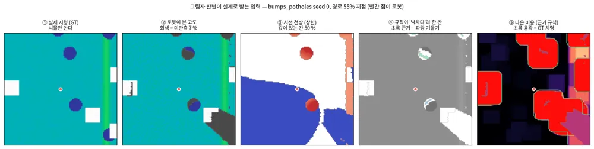
*그림 — TP-0085: 한 장면에서 입력이 어떻게 쓰이는지. ① 참 지형(시뮬만 안다) → ② 로봇이 본 고도(회색이 미관측) → ③ 시선 천장 → ④ 규칙이 "낙차다"라 한 칸(초록 근거·파랑 기울기) → ⑤ 나온 비용(초록 윤곽이 GT 치명). 빨간 점이 로봇이고, 셀이 보이도록 로봇 둘레 ±3 m만 잘랐다.*

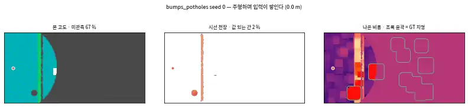
*그림 — TP-0085: 같은 것을 주행 내내. ==미관측이 줄어드는 만큼 천장이 채워지고, 규칙은 그 둘만으로 판정한다.== 출발 때 미관측이 절반을 넘다가 도착 시 2 %까지 떨어진다.*

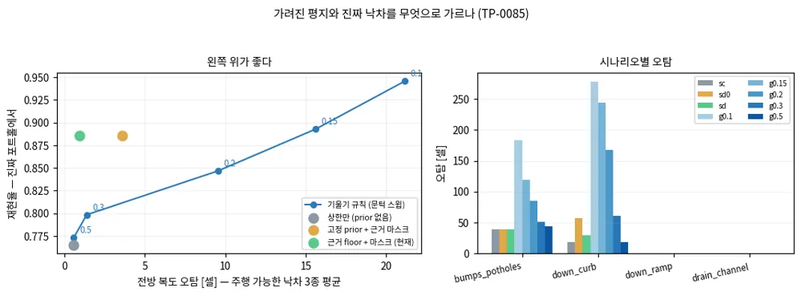
*그림 — TP-0085: 왼쪽은 오탐 대 재현율(왼쪽 위가 좋다) — ==초록(현재)이 같은 높이의 기울기 곡선보다 한참 왼쪽에 있다.== 오른쪽은 시나리오별 오탐. `down_ramp`·`drain_channel`은 모든 변형이 0이라 `down_curb`만 구분력이 있다.*

### A.13.2 TP-0086 — FastDEM을 CPU 기준선으로 세웠고, 내 주장이 틀렸다

**왜.** TP-0083이 L1 병목을 `TravMapBuilder`로 짚고 TP-0084가 GPU로 옮겨 26–44배를 얻었다.
FastDEM(A.2b.4)은 같은 일을 CPU만으로 한다고 하므로, **"GPU가 필요했나"**를 되물을 기준선이 된다.

**정정.** 처음에는 *"FastDEM이 같은 계산을 CPU에서 스캔당 10 ms에 내므로 TP-0084의 전제를
반박한다"*고 썼는데 **틀렸다.** README의 10 ms는 **점군 융합이고 특징 추출이 빠진 숫자**다
(A.2b.4). 두 단계를 나눠 재는 하네스를 썼다(`scripts/fastdem_baseline/`).

Release 빌드, 단일 코어 — **FastDEM에는 OpenMP·`std::thread`·TBB가 없어 코어를 더 줘도 변하지 않는다.**

| 격자 | 셀 | FastDEM integrate | FastDEM **features** | `TravMapBuilder` 1스레드 | 12스레드 | ==**CUDA**== |
|---|---|---|---|---|---|---|
| 15 × 15 m @ 0.10 (FastDEM 배포값) | 22,500 | 1.55 ms | **6.89 ms** | 8.97 ms | 7.30 ms | **1.11 ms** |
| ==11.1 × 11.1 m @ 0.05 (travplan)== | 49,284 | 1.98 ms | ==**40.11 ms**== | ==43.70 ms== | **31.43 ms** | ==**1.47 ms**== |
| 15 × 15 m @ 0.05 | 90,000 | —¹ | 43.26 ms | 80.83 ms | —¹ | —¹ |

¹ `results/p2-fastdem-baseline.tsv`에 기록이 없는 칸이다. 최초 표에는 3.98 / 59.36 / 1.17이 적혀 있었으나
근거 파일에 그 행이 없어 2026-10-01에 지웠다(재측정은 머신이 다른 작업으로 부하 상태라 비교 불가였다).
==근거 파일에 없는 수치는 표에 적지 않는다.==

==**"무승부"는 커버리지 교란이었다**(2026-10-01 정정).== FastDEM의 40.11 ms는 격자 전체가 아니라
**측정된 칸만** 돈다(`feature_extraction.cpp:59-61`이 미측정 칸을 첫 줄에서 건너뛴다). 그 행의 점 예산으로
채워지는 칸은 49,284칸 중 **61 % 이하**이고, 같은 격자를 더 채우면 비용이 1.7배로 오른다(재실행).
==빽빽하게 채운 같은 크기 격자에서는 `applyFeatureExtraction`이 127–150 ms로, `TravMapBuilder`의
43.70 ms(1스레드)의 약 3배, 31.43 ms(12스레드)의 약 4배다.== `TravMapBuilder`는 커버리지와 무관하게
격자 전체를 돌므로 시간이 변하지 않는다. 즉 **CPU 대 CPU도 무승부가 아니고**, **CUDA 이전(TP-0084)은
더 강하게 정당화된다**(같은 11.1 격자에서 FastDEM 대비 27배).

⚠️ **두 구현이 같은 일을 하지 않는다.** FastDEM은 칸마다 반경 0.3 m 이웃으로 **국소 PCA**를 돌려
curvature와 **법선**까지 낸다. 루프는 격자 전체를 돌지만 ==**미측정 칸은 첫 줄에서 건너뛰므로**==
(`feature_extraction.cpp:59-61`) **비용이 측정된 칸 수에 비례한다** — 세 번째 행에서 셀당 비용이
떨어지는 이유다. `TravMapBuilder`는 conv/pool로 격자 **전체**를 돈다.
==FastDEM이 "느리다"가 아니라 **더 많은 것을 비슷한 값에 낸다**로 읽어야 한다.==

⚠️ **아직 안 한 것**: 이 측정은 **시간만** 재고, FastDEM에 먹인 점군도 travplan 지형이 아니라
FastDEM 자체의 합성 지형이다. **같은 장면에서 같은 출력을 내는가는 TP-0096**에서 다룬다.
수치: `results/p2-fastdem-baseline.tsv`.
### A.13.3 TP-0096 — 같은 장면에서 층을 맞대 보니 "부분적으로 같다"

**왜.** TP-0086(A.13.2)은 **시간만** 쟀고, FastDEM에 먹인 점군도 travplan 지형이 아니라 FastDEM 자체의
합성 지형이었다. 같은 장면에서 **같은 출력**을 내는지는 안 쟀다.

**하네스.** 세 단계다(`scripts/fastdem_baseline/`): `export_scene.py`가 장면을 내보내고,
`compare_scene.cpp`가 FastDEM을 돌리고, `compare_layers.py`가 맞댄다. 교환은 **양방향 npz** +
점군용 headerless float32 `.bin`이고, FastDEM의 `io::loadNpz`/`saveNpz`와 nanoPCL의 `loadBIN`이
그대로 받는다. ⚠️ `np.savez`여야 하고 `savez_compressed`는 안 되며 **F-order**여야 한다 —
`parseNpyHeader`가 `fortran_order`를 읽지 않고 열 우선 Eigen 행렬에 그대로 `memcpy`한다.

**정렬이 맞는다는 증거.** 격자 대응은 `A_travplan[H,W] = np.flip(M_fastdem).T`이고, 실제 travplan
LiDAR 스캔의 고도 오차가 GT 대비 ==**RMS 13.8 mm**(편향 −1.4 mm, MAE 3.2 mm)==다.
30 mm대 꼬리는 `bumps_potholes` 포트홀 가장자리이지 정렬 오차가 아니다. 전치나 중심이 틀렸다면 연석에서 터진다.
==`GLOBAL` 모드를 썼다== — `LOCAL`은 첫 `integrate`에 순환 버퍼 시작 인덱스가 (0,0) → (175,15)로 감긴다.

**두 실험.** `E1`은 양쪽에 **동일한 GT 고도 격자**를 먹여 특징 정의만 비교하고, `E2`는 FastDEM이
travplan 스캔 12장을 스스로 융합하게 해 융합·커버리지까지 포함한다. 4 시나리오 × 2 seed.

| 지표 | E1 r | E2 r | 읽는 법 |
|---|---|---|---|
| slope | 0.975 | 0.969 | 단위 변환 후 |
| slope (양쪽 팽창) | ==**0.989**== | ==**0.984**== | 로봇 반경 팽창까지 맞추면 |
| step (범위 대 범위) | 0.861 | 0.945 | 추세 항을 뺀 통제 |
| step (정의 그대로) | 0.763 | 0.826 | |
| rough | 0.774 | 0.854 | |
| ==**cost**== | ==**0.941**== | ==**0.940**== | 양쪽 특징을 travplan 추정기에 통과시킨 것 |

**답: 부분적으로 같다.**

- **slope** — 변환하면 실질적으로 호환된다(r 0.975, 편향 **0.19°** = +0.0033 rad). ⚠️ 다만 *"단위만 다른 같은 양"*은
  과장이다. FastDEM은 0.6 m 원반 PCA 법선의 `acos|n_z|`, travplan은 0.35 m 박스평균 면의
  중심차분 `atan`이다 — **추정기가 다르고, 일치는 경험적 결과다.**
- **step** — ==**구조적으로 다르다.**== FastDEM은 반경 안 z의 **백분위 범위**(p95−p05)이고 추세 제거가
  없다. travplan은 거기서 1.05 m 추세를 뺀다. 경사면에서 갈릴 수밖에 없다.
- **rough** — 평지에서 맞고 경사에서 갈린다. FastDEM은 **맞춘 평면**에 대한 잔차, travplan은
  **상수(박스 평균)**에 대한 잔차다.

**치명 판정 수준에서 누가 더 보수적인가** — 여기서 최초 보고를 정정한다.

| 채널 | 치명 IoU | FastDEM만 (최대) | travplan만 (최대) | travplan이 더 보수적인 실행 |
|---|---|---|---|---|
| slope | 0.9425 | 0.0110 | **0.0213** | ==**11/16**== |
| step | 0.5321 | **0.2244** | 0.0139 | 0/16 |
| rough | 0.6240 (n=11) | 0.0527 | 0.0093 | 1/16 |

==**비용 수준에서는 FastDEM이 16/16 더 보수적이지만, 채널 수준에서는 균일하지 않다**== —
**slope에서는 travplan이 11/16으로 더 보수적**이다. 최초 보고의 *"FastDEM이 일관되게 더 보수적"*은
비용 수준에서만 맞다. (`rough`의 n=11은 양쪽 다 아무것도 치명으로 안 잡은 실행이 있어 IoU가 정의되지
않기 때문이다.)

⚠️ **아직 남은 교란: 분석 지지(support)가 다르다.** FastDEM은 세 특징 **모두** 반경 0.3 m 원반
하나를 쓰는데, travplan은 slope 0.35 m · step 0.35 m · rough 0.25 m로 다르다. `step_m_vs_rng`는
**추세 항 교란을 제거하지만 지지 교란은 제거하지 못한다.** 정직하게 적어 둔다.

💡 그리고 우리 코드에 대해 하나 알게 됐다 — ==**travplan의 step 창은 0.30 m가 아니라 실제로 0.35 m다.**==
`FeatureConfig.step_window_m = 0.30`이지만 `_odd(round(0.30/0.05)) = _odd(6) = 7`셀이 된다.

수치: `results/p2-fastdem-layers.tsv`(291행).

### A.13.4 TP-0088 — `elevation_mapping_cupy_core` 이전은 NO-GO, 가드만 가져온다

**왜.** 벤더링한 ROS 워크스페이스 트리를 걷어내고, ==무조건 돌아가고 출력은 버려지는 학습
traversability 필터를 **끌 수 있게**== 하려는 것이었다(A.2b.1, A.7.2).

**어떻게.** 스크래치 venv(`/tmp/venv-emapcore`)에 git 설치하고 GPU에서 돌려 벤더링 트리와 나란히
비교했다. ==`.venv-emap`은 L1이 의존하므로 건드리지 않았다.==

**API는 정확히 맞는다.** `ElevationMap(Parameter)`, `move_to`, `input_pointcloud`, `update_variance`,
`get_elevation`/`get_variance`/`get_upper_bound`/`get_is_upper_bound` 전부 같은 시그니처다. 설치도 된다.

**그런데 그대로는 안 돈다.**

1. ==**float16 패치를 다시 대야 한다.**== core `kernels/custom_kernels.py`에 bare `float16`이 72곳
   남아 있고, 첫 `input_pointcloud`에서 NVRTC가
   *"function `clamp` returns incomplete type `float16`"*로 죽는다. **상류 PR 후보다.**
2. ==**격자 인덱스 관례가 전치돼 있다.**== 벤더링본은 `width*idx_y + idx_x`(row=Y, col=X —
   `emap_mapper._paste`가 가정하는 것), core는 `width*idx_x + idx_y`다. GPU에서 실측했다 —
   world (x=+1.0, y=0)의 표식이 벤더링본에서는 row 109–112/col 129–132, core에서는
   row 128–130/col 108–112에 찍힌다.
3. ==**같은 점군에서 유효 셀이 절반이다**== — core 3615 (7.5 %) 대 벤더링본 7211 (14.9 %).
   약 3600칸이 upper-bound-only로 넘어가고(`is_upper>0.5`: core 2703, 벤더링본 0),
   `_paste`는 그런 칸을 NaN으로 두므로 **travplan은 관측 지형의 절반을 미관측으로 보게 된다.**

**판정: 드롭인 교체는 NO-GO.** ⚠️ 단, 비교 기준이 참값이 아니라 **travplan이 이미 다섯 군데 패치한
벤더링 트리**(float16·인덱싱·셀 중심 반올림·센서 상대 높이 게이트·법선 부호)라는 점은 적어 둔다.
전치는 관례 차이라 적응이 싸고, ==**유효 셀 절반이 진짜 블로커이며 그 원인은 아직 미상이다**== —
최초 보고는 "지도 중심 기준 높이 게이트" 탓으로 돌렸지만 이 프로브는 센서 XY와 지도 중심 XY가
같아서 그 게이트로는 설명되지 않는다.

**대신 가져올 것(TP-0097).** ==선택적 필터 가드는 양방향으로 실증됐다.== core는 `weight_file=""`이면
`traversability_filter`가 `None`이고 **torch를 import조차 하지 않는다**. 벤더링본은 CUDA torch 없이는
**생성조차 안 된다**(`ModuleNotFoundError` at `elevation_mapping.py:147`).
⚠️ 최초 보고의 *"필터를 끄면 0.139 ms(18.8 %) 절감"*은 **재현되지 않는다** — 5회 재실행에서
0.061–0.090 ms(9–12.5 %)이고 ==ON 측정 자체의 런간 흔들림(0.655–0.752 ms)이 주장한 절감보다 크다.==
그러니 backport의 근거는 시간이 아니라 **CUDA-torch 의존을 떼는 것**이다.

수치와 정정 5건: `results/p2-emap-core-migration.tsv`.

### A.13.5 TP-0082 — 학습 필터를 기준선으로 세우려다 평가 기반의 순환을 찾았다

**결론 먼저.** ==elevation_mapping_cupy가 싣고 다니는 "학습 traversability 필터"는 traversability 모델이 아니라
**다리 달린 로봇의 발디딤 점수(foothold score)** 망이다.== 그리고 그것을 기하 추정기와 맞대려다
==이 저장소의 정답(GT)이 기하 추정기 자신이라는 것==을 발견했다. 그래서 먼저 **추정기와 독립인 기준**을 만들고,
그 위에서 셋을 비교했다.

#### 필터의 정체 — 가중치 120개를 뜯어서

`config/core/weights.dat`는 1138바이트 pickle이고 학습된 스칼라가 **120개**다. 3×3 conv 셋(dilation 1·2·3)을
**병렬로** 태우고, 12채널을 이어 붙여 절댓값을 취한 뒤 1×1로 모으고 `exp(-·)`를 씌운다. 출력은 (0, 1]이고
==1이 주행 가능==이라 travplan의 cost와 부호가 반대다.

출처는 emap 논문이 아니다. IROS 2022 논문은 *"we deploy a simple CNN model trained to output traversability
values for robot navigation [45]"* 한 문장뿐이고 전부 [45]로 미룬다. [45]는
**Wellhausen & Hutter, "Rough terrain navigation for legged robots using reachability planning and template
learning" (IROS 2021)**이고, emap 저자 본인이 upstream 이슈 #70에서 확인해 줬다. 그 논문 초록은 이렇게 시작한다 —
*"Navigation planning for legged robots has distinct challenges compared to **wheeled and tracked systems** due to
the ability to lift legs off the ground and **step over obstacles**."* ==우리가 바퀴 로봇이라는 것이 정확히 그 문장이
배제한 경우다.==

<details markdown="1">
<summary>자세히: 측정한 구조적 성질 넷</summary>

- **커널 12개가 전부 합 0**이다(최대 |합| 5.2e-08). 각 커널의 L1 norm은 정확히 1.0이고 마지막 1×1의 12개
  가중치는 전부 양수(3.62–3.81)다. 그래서 출력이 (0,1]에 갇히고 단조이며, ==고도 원점에 완전히 불변==이다
  (지도 전체에 1 m를 더해도 출력이 9.5e-07 움직인다). travplan의 다른 datum은 처리할 필요가 없다.
- **기울어진 평면에서는 닫힌 형태**다: $t = \exp(-k(\phi)\cdot \text{res}\cdot\tan\theta)$. 2°와 10°에서 $k$가
  소수점까지 같고 해상도에도 불변이다.
- ==**이방성이 1.47배**다.== 전체 원주를 5° 간격으로 스윕하면 $k$가 방위각 140°에서 35.36으로 최소,
  행 방향(90°)에서 51.99로 최대다. 열 방향은 45.88이다. `abs()` 때문에 180° 대칭이지만 그 외에는 대칭이 아니라서
  **최솟값이 대각선에 있지 않다** — 사분면만 재면 놓친다(처음에 그렇게 놓쳤다).
- **그 닫힌 형태는 실제 지형으로 넘어오지 않는다.** $\exp(-45.88|\nabla z|)$와 상관 0.69–0.81, 최대 오차 0.98이다.
  dilation 2·3 가지가 0.10 m·0.15 m 지연의 곡률을 보기 때문이다. 그러니 "그냥 기울기 벌점"이라고 요약하면 틀린다.
- **수용 영역이 7×7칸**이라 물리 크기가 격자에 딸려 간다. 가중치는 4 cm에서 맞춰졌고(저자 Wellhausen이
  upstream 이슈 #20에서 명시: *"the traversability weights included here were trained on a 4cm grid"*),
  우리 0.05 m에서는 모든 기울기가 약 25% 더 치명적으로 읽힌다.
- **높은 평평한 상자 윗면에 눈이 먼다.** 0.5 m 상자 윗면이 0.999999로, 평지 1.000000과 구분되지 않는다.
  CLAUDE.md가 적어 둔 travplan의 한계 "높은 박스 윗면 저비용"을 고치는 게 아니라 **그대로 재현한다**.

</details>

#### 붙이면서 정한 것 셋

`travplan/representation/rsl_filter.py`에 `TraversabilityEstimator`로 붙였다. 배포본 `get_filter_torch`가
`.cuda()`로 끝나 CPU에서 못 쓰므로 같은 가중치로 다시 세웠고, 실제 장면에서 배포본과 **1.2e-07**까지 일치한다.
`GeometricFeatures`에 `elev`를 선택 필드로 더했다 — 이 필터는 feature가 아니라 고도 한 채널을 받는데,
프로토콜 서명을 바꾸면 CLAUDE.md가 지정한 교체점이 깨지기 때문이다.

| 정한 것 | 왜 |
|---|---|
| **부호**: `soft`는 `1-t`, `gate`는 문턱 | 상류의 세 소비자(art_planner, `check_safety`, drift 보정 커널)가 **모두 게이트**다. 소프트 비용으로 쓰는 선례가 없다 |
| **격자 이득**: `rescale_to_train_res`로 4 cm 기준 복원 | 가중치가 칸당 미터에 반응하므로 0.05 m에서 25% 더 보수적이다 |
| **footprint**: 13칸 창으로 비용 팽창 | 상류 층은 팽창이 없다(지지 ±3칸). 0.30 m 턱을 3칸 지나면 1.0을 읽어서, 팽창 없이는 우리 cost와 비교 자체가 성립하지 않는다 |

#### 그런데 정답이 순환이었다

셋을 무엇에 대고 잴지 보다가 찾았다. `sim/kinematic_sim.py`가 `gt_map`을 만들 때 estimator를 넘기지 않고,
`representation/builder.py`는 그러면 `GeometricTraversability()`를 쓴다. ==즉 "GT cost"는 기하 추정기를 참 지형에
적용한 것 그 자체다.== 에피소드의 `failed` 판정에 roll/pitch 한계가 붙어 있지만 그것도 독립이 아니다 —
roll·pitch는 지도의 `GRAD_X`/`GRAD_Y`에서 오고 `slope`는 같은 기울기의 팽창된 `atan`인데, cost가
`max_slope_rad` 0.26에서 이미 포화한다. 그 값은 `roll_limit` 0.30·`pitch_limit` 0.35보다 **낮다**.
넘어질 만큼 가파르면 이미 cost 1.0이다.

그래서 `cost_mae`·`lethal_recall`·`auroc`·`mean_gt_cost`는 모두 기하 추정기에 **정의상** 만점을 준다.
이 지표들로 셋을 줄 세우는 것은 결과가 아니라 동어반복이다.

#### 그래서 만든 독립 기준 — 차체를 지형에 세워 본다

`travplan/sim/ground_truth.py::chassis_feasibility`다. 칸마다, 방위각 8개마다 실제 차체를 올려놓고 묻는다.

- **자세**를 네 바퀴 접지 높이에서 낸다(평활·팽창된 표면 기울기가 아니라).
- **배 밑 간섭**: 바퀴가 딛는 평면을 지형이 지상고 넘게 뚫고 올라오는가. `GeometricTraversability`에는
  고중심 개념이 **아예 없다**.
- **바퀴 지지**: 접지점 하나가 나머지 평면 아래로 매달리는가. `step`은 이것을 같은 높이의 융기와 구분하지 못한다.

셋 중 둘은 기하 비용에 존재하지 않고, 셋 다 **방위각에 의존**한다. 등방 팽창 feature 더미로는 표현할 수 없어서
재진술이 아니라 기준이 된다. 기하 값은 AntBot G50 공개 값이다(`antbot.xacro`, Apache-2.0):
휠베이스 0.530 m, 윤거 0.401 m, 바퀴 반지름 0.103 m. ==`clearance_m` 0.10만 가정이다== (TP-0035가 사용자 대기).

검증: 평면은 모든 방위각에서 실패 0이고 `pitch_max`가 정확히 10°, 지상고가 정확히 0.100이다.
0.07 m 턱은 모든 방위각 통과, 0.24 m 연석은 모든 방위각 실패(belly+tip, wheel drop 0 — 올라가는 턱은 바퀴를
매달지 않는다). ==`NEGATIVE_SCENARIOS` 셋 모두 0%== — 독립 기준도 "치명 셀 없음"에 동의한다.

#### 세 추정기를 맞대면

4 시나리오 × seed 0–2, 0.05 m, 인식은 일부러 완벽(참 고도를 셋에 그대로 넣어 추정기만 남긴다).

| variant | lethal% | **MISS** | miss(any) | over | IoU 섀시 | 오탐 | MAE(기하 대비) | IoU(기하 대비) |
|---|---|---|---|---|---|---|---|---|
| 기하 | 13.62 | **0** | 1936 | 31437 | 0.165 | 0.0 | 0.0000 | 1.000 |
| RSL gate 0.15 | 2.48 | **5961** | 35675 | 2067 | 0.219 | 0.0 | 0.1511 | 0.173 |
| RSL gate 0.30 | 7.14 | **2243** | 13413 | 4963 | 0.295 | 0.0 | 0.1045 | 0.551 |
| RSL gate 0.50 | 11.18 | **0** | 2578 | 16920 | 0.194 | 0.0 | 0.0657 | 0.777 |
| RSL soft | 2.31 | 6065 | 35808 | 1224 | 0.231 | 0.0 | 0.0922 | 0.158 |
| TravNet | 13.62 | **0** | 1936 | 31440 | 0.165 | 0.0 | 0.0162 | 0.999 |

`MISS`는 **차체가 어느 방위각으로도 들어가지 못하는 칸을 추정기가 주행 가능이라 부른 수**다. 여기서 유일한
안전 관련 수치다. `miss(any)`는 그보다 약한 조건 — **일부 방위각에서만** 들어가는 칸을 주행 가능이라 부른 수다.
`over`는 반대 방향(차체가 모든 방위각에서 들어가는데 치명이라 함)이고, 오탐은 치명 셀이 없는
`NEGATIVE_SCENARIOS`에서 나온 치명 칸 수다.

> **2026-10-01 정정.** 최초 게시한 표는 섀시 기준의 바퀴 지지 판정이 4배 관대한 상태에서 잰 것이었다.
> 최소제곱 평면에 대한 잔차는 네 접지점의 뒤틀림 `|twist|`의 **1/4**인데 그것을 문턱과 직접 비교해서,
> `max_wheel_drop_m` 0.08 m가 사실상 **0.32 m**로 동작했다(실측: 처짐 0.20 m가 통과하고 0.36 m에서야 걸렸다).
> 위 표는 고친 기준으로 다시 잰 값이다. **결론의 방향은 그대로**이고 `over`와 `miss(any)`가 주로 바뀌었다.

**읽는 법.**

1. ==RSL 필터는 **공개된 배포 운용점에서 물리적으로 통과 불가한 칸을 놓친다**.== art_planner가 싣고 다니는
   0.15 게이트에서 **5961칸**이다. 저자 자신의 분류 문턱인 0.5에서만 0이 된다.
2. ==놓친 칸은 경사에 쏠린다.== 0.15에서 `slope_crossfall` 4381(73 %), `curb_ramp` 844, `random_mix` 423,
   `bumps_potholes` 313이고, **0.30에서는 2243칸 중 2235(99.6 %)가 `slope_crossfall`**이다(나머지 셋 합계 8칸).
   즉 **불연속 장애물(연석·포트홀)보다 지속적인 경사에서 훨씬 크게 무너진다** — 이방성과 해상도 의존이 사는 곳이다.
3. 이유가 닫힌 형태로 나온다. 게이트를 평면 경사각으로 환산하면(==측정한 변형, 즉 `rescale_to_train_res=True`
   기준==. 배포본 그대로의 값은 괄호 안):

   | 게이트 | 치명이라 하기 시작하는 각 (방향에 따라) | rescale 끄면 |
   |---|---|---|
   | 0.15 (art_planner 배포) | **42.4° – 53.3°** | 36.1° – 47.0° |
   | 0.30 (우리 격자의 측정 분리점) | 30.1° – 40.4° | 24.9° – 34.3° |
   | 0.50 (논문 5.B의 저자 분류 문턱) | **18.4° – 26.1°** | 14.9° – 21.4° |

   ==차체는 17.2°(roll)/20.1°(pitch)에서 넘어진다.== 배포 게이트가 **전복각의 약 2.5배**에서야 치명이라 말하는
   것이 MISS 5961의 전부다. 논문 자신의 0.5도 밴드의 **아래 끝(18.4°)이 roll 한계 17.2°보다 위**라 전복각을
   감싸지는 못한다 — 그래도 MISS가 0인 이유는 `MISS`가 *모든* 방위각에서의 불가를 요구하고 그 조건이
   pitch 한계 20.1°에 걸리기 때문이다.
4. **기하와 TravNet은 MISS가 0**이다. 물리적으로 어느 방위로도 못 들어가는 칸을 주행 가능이라 부른 적이 없다.
   ==다만 `miss(any)`가 1936칸이다== — 차체가 **일부 방위각에서만** 들어가는 칸을 둘 다 주행 가능이라 부른다
   (`bumps_potholes` 1868, `random_mix` 68). 기하 비용은 등방 팽창이라 "이 방향으로만 설 수 있다"를 표현할
   수단이 없다. 방위각 의존이 표현의 빈자리로 드러난 지점이다.
5. **셋 다 `NEGATIVE_SCENARIOS` 오탐이 0**이다.
6. TravNet은 기하와 사실상 같다(IoU 0.999, MAE 0.0162, `miss(any)`도 1936으로 동일). 잔차 구조상 치명 셀을
   거의 건드리지 않는다는 TP-0022의 기록과 일치한다.
   ==셋을 나란히 두는 실험에서 TravNet은 별개의 답이 아니라 기하의 미세 보정이다.==
7. 기하의 `over` 31437은 결함이 아니라 **설계 여유**다. 비용은 14.9°에서 포화하는데 차체는 17–20°에서 넘어진다.

`rsl_soft`의 MISS는 필터가 아니라 문턱 이야기다. `cost = 1 - t`이므로 0.95 치명은 $t \le 0.05$를 뜻하고,
공개된 어떤 운용점보다 엄격하다.

**지상고 스윕**(유일한 가정): ==0.08–0.20 m에서 결론이 바뀌지 않는다.== 기하·TravNet·`gate 0.5`는 그 구간
전체에서 MISS 0이고, `gate 0.15`는 8640 → 4531칸으로 줄되 0에 가까워지지 않는다. 0.05 m에서는 기하와
TravNet도 30칸, `gate 0.5`도 2칸을 놓치는데, 바퀴 반지름 0.103 m의 절반이라 비현실적이다. 그래도 결론이
가정에 걸리는 지점이라 적어 둔다.

#### 부수적으로 나온 것

- 조사 시점에는 ==이 필터가 L1 매 프레임 돌고 결과만 버려지고 있었다== — `emap_mapper.py`가 실제
  `weights.dat`를 연결했고 벤더링 트리에 가드가 없었으며, `_paste()`가 네 층만 읽어 `get_traversability()`는
  아무도 부르지 않았다. **TP-0097(같은 날)이 core의 가드를 backport하고 `weight_file=""`로 껐다.**
  위 측정이 **배포 운용점에서 안전하지 않다**고 말하므로 끄는 결정은 그대로 두고, 필요하면 `EmapConfig`
  플래그로 되살린다(A.7.2도 같은 날 갱신했다).
- 상류 버그 하나: `custom_kernels.py:463`의 dilation tie-break이 거리가 아니라 부호 있는 `dx+dy`를 최소화해서,
  frontier 채움 칸의 16.2%가 0.08 m 한계를 넘는 곳에서 높이를 가져온다(평균 오차 0.178 m, 최대 1.47 m).
  TP-0088이 모아 둔 색인 수정과 함께 올릴 거리다.

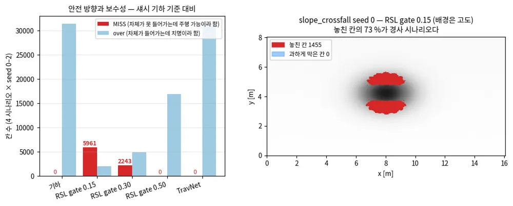
*그림 — 왼쪽: 섀시 기하 기준 대비 MISS(빨강)와 over(파랑). 오른쪽: 놓친 칸이 어디에 생기는지.*

수치: `results/p2-estimators.tsv`. 재현: `python scripts/eval_estimators.py --seeds 0 1 2 --tsv results/p2-estimators.tsv`.

### A.13.6 TP-0100 — belief를 차체 기준으로 재니, 위험은 "못 본 칸"에 있고 깊이 prior는 그것을 막지 않는다

**결론 먼저.** ==차체가 들어갈 수 없는 칸을 belief가 주행 가능으로 부르는 경우(MISS)는 99% 이상이 아직 못 본 칸이다.==
관측한 칸의 판정은 거의 틀리지 않는다(스냅샷 합 142칸 이하). 못 본 칸은 cost 0.5로 채워져 치명 문턱 0.95 아래에 남기 때문이다.
==그림자 상한과 깊이 prior는 로봇이 도달할 수 있는 근거리 MISS를 줄이지 않는다(2,206 → 2,204칸).== 대신 치명 판정을 22% 늘려
Planner가 포트홀에서 먼 경로를 고르게 한다. TP-0047의 폐루프 개선(36/40 → 40/40)은 이 경로 효과로 읽어야 한다.
==근거리 MISS를 가장 크게 줄이는 것은 센서 높이다(0.3 m → 0.8 m에서 3.4배 감소).== L1(실제 elevation mapping)은 L0 가림보다 2.8배 나쁘다.

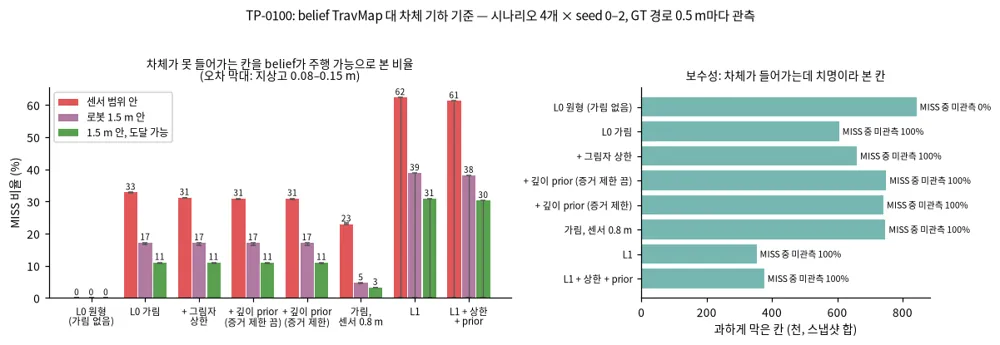

*그림 — TP-0100 (Fig. 1): 인식 설정별 MISS 비율(왼쪽)과 과하게 막은 칸(오른쪽). 오차 막대는 지상고 0.08–0.15 m 스윕이다. 출처: `results/tp0100_belief_chassis`*

#### 무엇을 쟀나

TP-0082의 차체 기하 기준(`travplan/sim/ground_truth.py`)은 참 고도에서만 쟀다. Planner가 보는 것은 참 고도가 아니라
가림과 잡음이 있는 관측으로 만든 belief다. 그래서 같은 질문을 belief에 던졌다(`scripts/eval_belief_chassis.py`).

- **같은 위치에서 관측한다.** 지형마다 GT 지도 위 Dijkstra 경로를 하나 만들고, 그 위를 0.5 m마다 경로 방향으로 관측한다.
  모든 인식 설정이 같은 위치에서 같은 순서로 관측하므로(`observe_at`), 차이는 인식에서만 나온다. Controller가 어디로 갔는지는 섞이지 않는다.
- **관측마다 센서 범위(5 m) 안을 채점한다.** 차체가 어느 방위각으로도 들어가지 못하는 칸(`lethal_all`)을 belief가 cost < 0.95로 부르면 MISS다.
  차체가 모든 방위각으로 들어가는데 belief가 치명이라 부르면 over다.
- **MISS를 세 겹으로 나눈다.** 근거리(로봇 1.5 m 안), 관측·미관측, 그리고 ==도달 가능==이다. 도달 가능은 로봇 칸에서 belief상 주행 가능한 칸만
  밟아 닿을 수 있다는 뜻이다. 치명 링으로 둘러싸인 포트홀 바닥은 MISS지만 도달할 수 없다.
- 시나리오 4개 + 음의 지형 3개 × seed 0–2, 레벨 0, 지상고 0.08·0.10·0.15 m. L1은 `.venv-emap`에서 같은 위치로 돌렸다.

#### 결과 (시나리오 4개, 지상고 0.10 m, 스냅샷 합)

| 인식 | MISS 비율 | 근거리 MISS 비율 | 도달 가능 근거리 MISS | 관측한 칸의 MISS | 과하게 막은 칸 |
|---|---|---|---|---|---|
| L0 원형(가림 없음) | 0.000 | 0.000 | 0 | 25 | 842k |
| L0 가림 | 0.328 | 0.172 | 2,206 | 142 | 606k |
| + 그림자 상한 | 0.312 | 0.171 | 2,204 | 137 | 660k |
| + 깊이 prior(증거 제한 끔) | 0.309 | 0.171 | 2,204 | 90 | 750k |
| + 깊이 prior(증거 제한, TP-0067) | 0.309 | 0.171 | 2,204 | 90 | 741k |
| 가림, 센서 0.8 m | 0.230 | **0.046** | **642** | 100 | 748k |
| L1 | 0.623 | 0.388 | 6,162 | 6 | 353k |
| L1 + 매퍼 상한 + 깊이 prior | 0.613 | 0.381 | 6,047 | 6 | 376k |

- ==근거리 MISS는 거의 전부 `bumps_potholes`의 포트홀에서 난다.== L0 가림에서 경사로·둔덕·혼합 지형의 근거리 MISS는 0–181칸이다(L1에서는 random_mix가 765칸).
- 지상고를 0.08–0.15 m로 바꿔도 비율은 0.01 안에서 움직인다. 결론이 뒤집히는 값은 없다.
- 증거 제한(TP-0067)은 음의 지형 오탐(over(neg))을 27,913 → 25,708로 줄이고, MISS는 그대로다. TP-0067의 주장과 맞는다.

<details markdown="1">
<summary>자세히: 해석과 한계</summary>

- **깊이 prior가 하는 일.** prior는 "상한이 주변 관측 최저보다 낮은 그림자"를 0.10 m 깊게 채운다. 채운 바닥은 평평하므로 기하 추정기는
  **가장자리의 턱**만 치명으로 부르고, 바닥 가운데는 cost 0.5 그대로다. 차체 기준으로는 그 바닥이 바퀴가 빠지는 칸이라 MISS로 남는다.
  폐루프에서 prior가 통하는 이유는 두꺼워진 가장자리 링이 Guidance 경로를 포트홀에서 떼어 놓기 때문이다. 경로가 떨어지면 MISS 칸 근처로 가지 않는다.
- **이 지표는 "belief가 막는가"만 묻는다.** Planner와 Controller는 cost 0.5·σ 1인 칸을 공짜로 보지 않는다(Guidance의 σ 가중, MPPI의 위험 CVaR).
  그래서 도달 가능 MISS는 "belief만으로는 막히지 않는 위험"의 크기이지, 충돌 수가 아니다.
- **L1이 나쁜 이유.** LiDAR 링 사이가 비어 근거리 미관측이 L0 가림보다 많다(TP-0053의 치명 셀 재현율 0.70과 같은 이야기).
  관측한 칸의 MISS는 6칸으로 가장 적다. L1의 문제는 정확도가 아니라 **덮는 범위**다. L1 매퍼는 실행마다 조금 다르다(TP-0098). 여기 수치는 한 번 실행이다.
- 차체 기준은 기하만 본다. 동역학·접지·서스펜션은 없다(A.13.5).

</details>

#### 그래서 travplan에는

1. **미관측 칸의 기본 cost가 안전의 병목이다.** 근거리(정지 거리 안)의 미관측 칸을 치명이나 높은 cost로 두면 도달 가능 MISS가 직접 준다.
   대가는 보수성이다. 이 균형을 잴 후속을 TP-0101로 둔다.
2. **센서 높이가 가장 싼 해결책이다.** TP-0031의 "LiDAR 0.8 m 이상" 권장이 순환 없는 기준에서도 선다.
3. **L1을 쓰려면 덮는 범위부터 보강해야 한다.** 근거리 사각을 전면 스테레오로 메우는 TP-0065, 분산을 σ로 옮기는 TP-0054가 그 자리다.

### A.13.7 TP-0101 — 로봇 둘레 못 본 칸을 치명으로 두면, L0에서는 거의 공짜이고 L1에서는 느려진다

**결론 먼저.** ==로봇 둘레 1.5 m 안의 못 본 칸을 치명으로 두면, L0 가림에서 로봇이 도달할 수 있는 근거리 MISS가 2,204칸에서 0이 된다.==
보수성(과하게 막은 칸, 음의 지형 오탐)은 거의 늘지 않고, 폐루프 성공률과 도달 시간도 그대로다. ==L1에서는 같은 옵션이 MISS를 6,048칸에서 4칸으로 없애지만,
음의 지형 오탐이 13배 늘고 도달이 25% 느려진다.== L1은 로봇 근처에도 못 본 칸이 많기 때문이다(A.13.6). cost를 0.8로만 올리면 치명 문턱 0.95 아래라 효과가 없다.
옵션(`TravMapBuilder(unknown_near_m=...)`, `run_benchmark.py --unknown-near`)은 기본값을 끈 채로 두고, L0에는 1.5 m를 권한다.

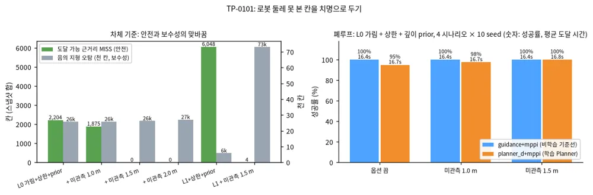

*그림 — TP-0101 (Fig. 1): 차체 기준의 안전(도달 가능 근거리 MISS)과 보수성(음의 지형 오탐)의 맞바꿈(왼쪽), L0 폐루프 성공률과 도달 시간(오른쪽). 출처: `results/tp0101_unknown_near`*

#### 무엇을 바꿨나

`TravMapBuilder.build(..., robot_xy=)`에 로봇 위치를 넘기면, 몸체(0.35 m)부터 `unknown_near_m`까지의 고리 안에서 σ가 1인(못 본) 칸의 cost를
최소 `unknown_near_cost`(기본 1.0)로 올린다. 몸체 안쪽을 빼는 것은 로봇이 자기 발밑을 못 봐도 치명 칸 위에 서 있지 않게 하려는 것이다.
시뮬레이터는 `belief_map()`에서 현재 위치를 넘긴다. 실제 스택에서도 TravMap은 로봇 중심 지도라 위치를 안다.

#### 결과

**차체 기준(A.13.6과 같은 방법, 시나리오 4개 × seed 0–2, 지상고 0.10 m).**

| 설정 | 도달 가능 근거리 MISS | 과하게 막은 칸 | 음의 지형 오탐 |
|---|---|---|---|
| L0 가림 + 상한 + 깊이 prior | 2,204 | 741k | 25,708 |
| + 미관측 1.0 m | 1,875 | 742k | 25,793 |
| + 미관측 1.5 m | **0** | 742k | 26,204 |
| + 미관측 2.0 m | 0 | 744k | 27,052 |
| + 미관측 cost 0.8(반경 무관) | 2,204 | 741k | 25,708 |
| L1 + 상한 + 깊이 prior | 6,048 | 376k | 5,780 |
| L1 + 미관측 1.5 m | **4** | 460k | **73,065** |

**폐루프, L0 가림 + 상한 + 깊이 prior, 4 시나리오 × seed 0–9.**

| 설정 | guidance+mppi | planner_d+mppi | 평균 도달 시간 |
|---|---|---|---|
| 옵션 끔 | 40/40 | 38/40 | 16.4 / 16.7 s |
| 미관측 1.0 m | 40/40 | 39/40 | 16.4 / 16.7 s |
| 미관측 1.5 m | 40/40 | **40/40** | 16.4 / 16.8 s |

보행자 3명(seed 0–2)은 두 설정 모두 12/12, 충돌 0이다. planner_d+mppi의 보행자 최소 여유는 0.23 m에서 0.16 m로 줄었다.

**폐루프, L1 + 상한 + 깊이 prior, guidance+mppi, seed 0–2.** 둘 다 12/12이고 멈춤은 없다. 평균 도달 시간은 15.0 s에서 18.7 s로 늘었다.
내려갈 수 있는 0.07 m 턱(`down_curb`)에서 13.3 s에서 19.0 s로 가장 크게 늘었다. 차체 기준의 오탐 13배가 폐루프에서는 멈춤이 아니라 느려짐으로 나타난다.

<details markdown="1">
<summary>자세히: 해석과 한계</summary>

- **planner_d의 38 → 40은 작은 차이로 읽는다.** 옵션을 끈 쪽의 실패 둘은 모두 치명 셀이 아니라 60 s 시간 초과(curb_ramp s5, bumps_potholes s6)였다.
  curb_ramp s5는 못 본 칸과 직접 관련이 없어 보이고, 경로가 조금 바뀐 효과가 섞였을 수 있다. 확실히 말할 수 있는 것은 퇴행이 없다는 것이다.
- **L0에서 공짜인 이유.** L0 가림에서 로봇 근처의 못 본 칸은 대개 포트홀 바닥이고, 깊이 prior가 이미 가장자리를 치명으로 둘러싸 두었다.
  치명으로 바꿔도 경로가 거의 달라지지 않는다. Playground(L0 가림)에서도 주행이 같았다.
- **L1에서 비싼 이유.** LiDAR 링 사이와 근거리 사각(숙인 LiDAR의 가장 낮은 링 안쪽)이 비어, 평평한 길도 한동안 못 본 칸으로 남는다.
  그래서 L1에 이 옵션을 쓰려면 먼저 근거리 덮개를 늘려야 한다(TP-0065 전면 스테레오, TP-0054 분산).
- 보행자 최소 여유가 준 것은 보행자 3명 × seed 3개의 한 번 측정이다. DAgger 뒤 여유 감소(TP-0079)와 함께 본다.

</details>

### A.13.8 TP-0065 — 전면 스테레오를 L1의 두 번째 입력으로 넣으니, 근거리 미관측 옵션의 대가가 사라진다

**결론 먼저.** ==전면 스테레오 깊이를 elevation mapping의 두 번째 점군으로 넣으면, L1에서 "로봇 둘레 1.5 m 못 본 칸을 치명으로"(TP-0101)의 대가가 사라진다.==
L1 폐루프 평균 도달 시간은 옵션만 켜면 15.2 s → 18.7 s(+23%)였는데, 스테레오와 함께 켜면 15.5 s(+2%)다. 내려갈 수 있는 턱(`down_curb`)은 19.0 s → 13.5 s로 기준과 같아진다.
차체 기준의 음의 지형 오탐은 73,065 → 30,479칸으로 58% 줄고, 도달 가능 근거리 MISS는 거의 0(5칸)을 지킨다.
==스테레오만으로는 MISS가 5%밖에 줄지 않는다.== 로봇이 앞으로 가며 앞쪽 칸은 이미 멀리서 LiDAR로 봤기 때문이다. 스테레오의 값은 "안 보던 것을 보는 것"보다 "못 본 칸을 치명으로 둘 때 막히는 앞쪽을 풀어 주는 것"에 있다.

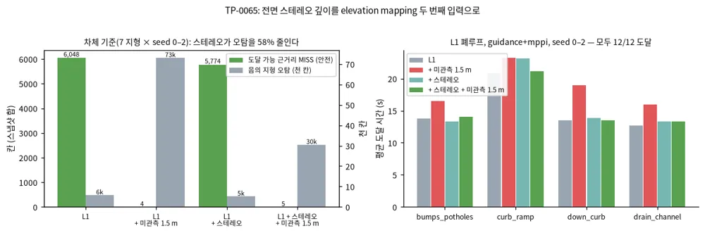

*그림 — TP-0065 (Fig. 1): 차체 기준의 안전과 보수성(왼쪽), L1 폐루프 지형별 평균 도달 시간(오른쪽). 출처: `results/tp0065_stereo`, `results/tp0101_unknown_near`*

#### 무엇을 넣었나

- **`travplan/sim/stereo.py`.** 설계 D2의 사양(기선 12 cm, 초점 640 px, 시차 오차 0.25 px)으로 시야 90°×60°의 핀홀 격자 레이(96×48)를 30° 숙여 쏜다.
  카메라는 로봇 중심 앞 0.25 m, 지면 위 0.30 m다. 깊이 오차는 $\sigma_Z = Z^2 \Delta d / (f B)$(3 m에서 2.9 cm, 5 m에서 8.1 cm)이고,
  광축에서 θ 벗어난 레이의 거리 오차는 $\sigma_Z / \cos\theta$다. 최대 거리 4 m. 무늬 없는 면·역광·야간의 매칭 실패는 모사하지 않는다.
- **`travplan/sim/lidar.py`.** 레이 진행을 `cast_rays`로 떼어 LiDAR와 스테레오가 같이 쓴다. LiDAR 결과는 리팩터 전과 비트 단위로 같다.
- **`KinematicSim(stereo=StereoConfig())`**가 L1 루프에서 LiDAR 다음에 스테레오 점을 `ElevationMapper.update`에 두 번째로 넣는다. `run_benchmark.py --stereo`.
- Playground의 L1 간이에도 '전면 스테레오'를 넣었다(같은 사양, 같은 결론: bumps_potholes 39.0 s → 17.6 s, down_curb 44.2 s → 17.6 s).

#### 결과

한 번 관측으로 보면 스테레오는 로봇 앞 부채꼴(0.35–1.5 m, ±45°)의 관측 비율을 0.61 → 0.92로, 옆·뒤도 0.69 → 0.78로 올린다.

**차체 기준(A.13.6과 같은 방법, 7 지형 × seed 0–2).**

| 설정 | 도달 가능 근거리 MISS | 음의 지형 오탐 |
|---|---|---|
| L1 + 상한 + 깊이 prior | 6,048 | 5,780 |
| + 미관측 1.5 m | 4 | 73,065 |
| + 스테레오 | 5,774 | 5,138 |
| + 스테레오 + 미관측 1.5 m | **5** | **30,479** |

**L1 폐루프, guidance+mppi, 포트홀·연석·내림 턱·배수로 × seed 0–2(모두 12/12).**

| 설정 | 평균 도달 | bumps_potholes | curb_ramp | down_curb | drain_channel |
|---|---|---|---|---|---|
| L1 + 상한 + 깊이 prior | 15.2 s | 13.8 | 20.8 | 13.5 | 12.7 |
| + 미관측 1.5 m | 18.7 s | 16.5 | 23.2 | 19.0 | 16.0 |
| + 스테레오 | 15.9 s | 13.3 | 23.1 | 13.8 | 13.3 |
| **+ 스테레오 + 미관측 1.5 m** | **15.5 s** | 14.1 | 21.2 | 13.5 | 13.3 |

planner_d+mppi(L1, 4 시나리오 × seed 0–4)는 스테레오 유무와 관계없이 20/20이고 평균 15.0 s → 14.6 s다.

<details markdown="1">
<summary>자세히: 해석과 한계</summary>

- **스테레오만으로 MISS가 거의 그대로인 이유.** 도달 가능 근거리 MISS는 대부분 포트홀 바닥처럼 **어느 센서로도 가려지는** 칸이다.
  스테레오는 LiDAR 링 사이와 근거리 사각을 메우지만, 그 칸들은 로봇이 다가오는 동안 LiDAR가 이미 한 번은 본 경우가 많다.
- **옵션과 함께일 때 효과가 큰 이유.** "미관측 1.5 m"는 둘레의 못 본 칸을 치명으로 만든다. 스테레오가 없으면 앞쪽 0.7 m 안(LiDAR 사각)이 늘 치명으로 막혀
  로봇이 조심스럽게 돌아간다. 스테레오가 그 앞쪽을 채우면 막히는 것은 옆·뒤와 진짜 가려진 칸뿐이라, 앞으로 가는 데는 거의 영향이 없다.
- **권장.** L1에서는 스테레오와 미관측 1.5 m를 함께 쓴다. 옆·뒤의 사각은 남으므로 옆·뒤 이동은 여전히 조심해야 한다(TP-0062 시야 인지 움직임).
- 매퍼는 실행마다 조금 다르다(TP-0098). 폐루프 표는 seed 3개의 한 번 실행이다. 실제 스테레오의 매칭 실패는 Isaac 카메라(TP-0019)에서 다시 잰다.

</details>

### A.13.9 TP-0095 — 깊이 prior 후보에 잡음 필터를 걸면, 내림 턱 오탐은 전부 사라지고 포트홀은 대부분 남는다

**결론 먼저.** ==깊이 prior(TP-0047·0067)의 치명 후보에 ohm식 '관측 이웃 수' 필터나 CMU식 '침식→팽창' 필터를 걸면, 깊이 prior가 0.07 m 내림 턱에 더하던 오탐이 전부 사라진다.==
내림 턱의 거짓 치명 칸은 28.9 → 18.3(그림자 상한만 켰을 때와 같은 값)이다. 포트홀 치명 셀 재현율은 0.89 → 0.86(CMU 1,2) 또는 0.85(ohm T=1)로 조금만 준다.
폐루프(guidance+mppi, 4 지형 × seed 0–2)는 모든 변형이 12/12다. ==권장은 CMU(1,2)이고 깊이 prior와 함께 켠다.== TP-0085의 기울기 규칙(0.1)은 이번에도 오탐 278칸으로 졌다.

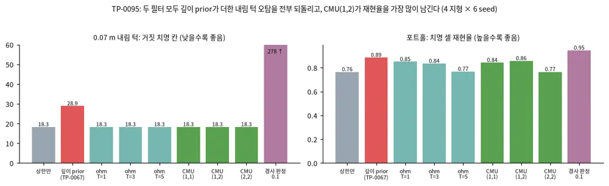

*그림 — TP-0095 (Fig. 1): 내림 턱 거짓 치명 칸(왼쪽, 낮을수록 좋음), 포트홀 재현율(오른쪽). 4 지형 × seed 0–5, 센서 0.3 m. 출처: `results/tp0095_rules`*

#### 무엇을 넣었나

두 규칙 모두 `TravMapBuilder`에서 깊이 prior가 치명 후보를 고른 직후, 2배 팽창 전에 건다. 기본값은 끔이다.

- **ohm `virtualSurfaceFilterThreshold` → `shadow_support_min=T`.** 3×3 이웃 가운데 관측한 칸이 T개 이상인 후보만 남긴다. 관측과 동떨어진 외딴 후보를 지운다.
- **CMU `noDataBlockShrink/Expand` → `shadow_open=(N, M)`.** 후보 마스크를 N번 침식한 뒤 M번 팽창한다. 팽창은 그림자 안에서만 한다. 폭이 좁은 띠 모양 후보를 지운다.
- `scripts/eval_shadow_false_alarm.py --ohm 1 2 3 4 5 --cmu 1,1 1,2 2,2 2,3 3,3`로 잰다. 시험은 `tests/test_shadow_depth_evidence.py`에 있다.

#### 결과

| 변형 | 내림 턱 거짓 치명 칸 | 진행 통로 안 | 포트홀 재현율 |
|---|---|---|---|
| 그림자 상한만 | 18.3 | 1.7 | 0.76 |
| + 깊이 prior(증거 제한, TP-0067) | 28.9 | 2.8 | **0.89** |
| + ohm T=1 | **18.3** | **1.7** | 0.85 |
| + ohm T=3 / T=5 | 18.3 | 1.7 | 0.84 / 0.77 |
| + CMU (1,1) | 18.3 | 1.7 | 0.84 |
| + CMU (1,2) | **18.3** | **1.7** | **0.86** |
| + CMU (2,2) / (3,3) | 18.3 | 1.7 | 0.77 / 0.76 |
| 기울기 규칙 0.1(TP-0085) | 278.5 | 63.7 | 0.95 |

내리막 경사로와 배수로에서는 모든 변형의 오탐이 0이다. 내림 턱의 오탐 값이 모든 필터에서 같다는 것은, 깊이 prior가 더한 오탐이 전부 좁거나 외딴 후보였다는 뜻이다.
필터를 세게 걸수록(ohm T 증가, CMU 침식 2번 이상) 포트홀 테두리의 얇은 후보까지 지워 재현율이 '상한만'으로 돌아간다.
CMU (1,2)는 한 번 침식으로 띠를 지우고 두 번 팽창으로 포트홀 테두리를 되살려 재현율을 가장 많이 남긴다.

#### 한계

- 오탐·재현율은 L0 가림(2.5D 시선)에서 쟀다. L1(실제 매퍼)의 그림자 모양은 다르므로 L1에서 다시 잴 필요가 있다.
- 차체 기준의 도달 가능 근거리 MISS(A.13.6)는 이번에 재지 않았다. 필터는 후보를 지우기만 하므로 MISS는 늘 수만 있다.

### A.13.10 TP-0102 — 몸체가 흔들려도 자세만 보상하면 elevation mapping은 1 cm대로 맞다 (Playground, 사족 보행·바퀴 사족)

**결론 먼저.** ==센서를 몸체에 붙여 걸음새로 흔들어도, 매퍼가 몸체 자세를 알면 로봇 3 m 안 높이 RMSE는 0.8–1.6 cm이고 사족 보행·바퀴 사족은 세 지형 모두 도달한다.==
==자세를 모르면(yaw와 지면 높이만 알면) 사족 보행은 한 번도 도달하지 못한다.== 원인은 평균 오차가 아니라 스치듯 닿은 레이의 10–20 cm 이상치다. 이 점이 턱으로 읽히고 몸체 반폭만큼 팽창돼 앞을 막는다.
자세 추정 잡음은 사족 두 종류에서 0.5°까지 견디고 1°부터 무너진다. 스워브는 턱 한계(8 cm)가 낮아 0.5°에서 이미 0/3이다.
측정은 Playground(JS)의 L1 간이에서 했다. 사족 보행·바퀴 사족은 비교용 가정이고, 저장소 Python 시뮬에는 아직 없다.

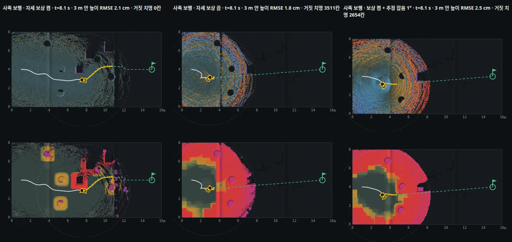

*그림 — TP-0102 (Fig. 1): 사족 보행, bumps_potholes s4, 8 s. 위는 높이 오차(본 − 실제, ±10 cm), 아래는 로봇이 본 cost. 왼쪽부터 자세 보상 켬, 끔, 켬 + 추정 잡음 1°. 출처: `docs/playground/robot_pose.html`, `results/tp0102_playground_robots/sweep.txt`*

#### 무엇을 넣었나

- **로봇 종류(`js/robots.js`).** 스워브(턱 8 cm, 경사 15°, 1.5 m/s, 센서 0.30 m), 사족 보행(턱 20 cm, 경사 30°, 1.0 m/s, 센서 0.45 m), 바퀴 사족(턱 15 cm, 경사 25°, 1.5 m/s, 센서 0.45 m).
  걸음새 흔들림은 사족 보행 2.2 Hz 트롯(높이 2 cm, pitch 2.3°, roll 2.0°), 바퀴 사족은 약 1/3이다. 진폭은 속도에 비례하고 서 있으면 20%다.
- **몸체 자세 센서.** 몸체 자세 = 접지 높이차로 잡은 지형 기울기 + 걸음새 흔들림이다. LiDAR·스테레오 레이는 참 자세로 쏘고, 부딪힌 거리는 매퍼가 믿는 자세로 세계에 놓는다(상한도 같다).
  자세 보상을 끄면 매퍼는 몸체가 수평이고 흔들리지 않는다고 믿는다. 추정 잡음은 1차 저역(시정수 약 1 s) pitch·roll 잡음이다.
- **지표.** 로봇 3 m 안 관측 칸의 높이 RMSE와 '거짓 치명'(로봇 지도는 치명, 실제 cost는 아님) 칸 수. '높이 오차' 층.

#### 결과 (L1 간이, curb_ramp s0, bumps_potholes s4, slope_crossfall s0)

| 로봇 | 자세 보상 | 추정 잡음 0.25° | 0.5° | 1° | 보상 끔 |
|---|---|---|---|---|---|
| 스워브 | 2/3, RMSE 0.7–0.9 cm | 2/3 | 0/3 | 0/3 | 1/3 |
| 사족 보행 | **3/3**, 0.8–1.6 cm | 3/3 | 3/3 | 2/3 | **0/3** |
| 바퀴 사족 | **3/3**, 0.8–1.5 cm | 3/3 | 3/3 | 0/3 | 1/3 |

사족 보행, bumps_potholes s4, 8 s에서 오차를 보면 보상 끔의 중앙값은 0.8 cm(보상 켬 0.6 cm)로 작다. 그러나 최대 22 cm의 이상치가 있다.
거짓 치명은 0 → 3,511칸이고 그중 3,374칸이 턱 한계를 넘었다. RMSE만 보면 보상 끔(1.8 cm)이 보상 켬(2.1 cm)보다 나아 보이므로, 매핑 품질은 RMSE가 아니라 이상치와 거짓 치명으로 봐야 한다.

**몸체 기울기 자체의 효과.** 스워브 bumps_potholes s4는 자세를 완벽히 보상해도 4.9 s에 치명 셀로 들어간다. 몸체 기울기를 끄면 도달한다(23.6 s).
범프 위에서 몸체가 5°까지 기울어 LiDAR가 앞의 포트홀을 덜 본다. 근거리 미관측 1.5 m + 전면 스테레오(TP-0101·0065)를 켜면 도달한다(20.7 s). seed 1–3은 기울기가 있어도 도달한다.

#### 다음

- elevation_mapping_cupy처럼 마할라노비스 게이트로 이상치 점을 거르면 보상 끔·잡음 1°의 거짓 치명이 얼마나 줄어드는지 잰다.
- Python 운동학 시뮬의 LiDAR도 몸체 자세를 따르게 한다(지금은 수평). 그 뒤 L1 벤치마크의 스워브 결과가 바뀌는지 본다.

### A.13.11 TP-0089 — 궤적 참조는 같은 만큼 비키면서 시간은 덜 낸다

`ReferenceCost`를 읽어 보면 두 참조 모드가 감속을 다르게 벌한다. 4 s 지평 안에서
**경로 모드**(`times` 없음)는 `w_deviation ×` 평균 횡편차 `+ w_progress ×` **종단** 잔여 거리를 낸다 —
==진행에 대해서는 **지평 끝점만** 보므로, 중간에 늦췄다가 따라잡으면 공짜다.==
**궤적 모드**(`times` 있음, Planner D가 내는 모드)는 `w_time ×` **지평 전체 평균** 시간 인덱스 목표와의 거리
`+ w_progress ×` 종단 차이를 낸다 — ==`w_time`이 **모든 스텝을 평균**하므로 **따라잡아도 중간 감속이 벌점으로
남는다.**==

⚠️ **정정(2026-09-30).** 처음에는 이를 "궤적 모드에서는 지각이 *반복적*이라 이후 모든 스텝에서 계속 벌점"이라고
썼는데 **틀렸다.** `mppi.py::_reference`가 `times - t_since_plan`으로 시간축을 현재로 재기준화하고,
`SimConfig.replan_every = 1`이라 플래너가 **매 스텝** 로봇의 현재 위치에서 다시 계획한다. 따라서 지각은
==**에피소드에 걸쳐 누적되지 않는다.**== 실제 차이는 **한 지평 안**에서 중간 감속을 평균으로 세느냐 끝점만
보느냐이고, 아래 측정 결과는 그대로다.

그래서 "궤적 모드가 감속 양보를 억제할 것"을
가설로 세우고, ==같은 지형·같은 seed에서 **보행자 유무만 바꾼 쌍대 비교**==로 쟀다
(`scripts/eval_yield_behavior.py`, 3 시나리오 × 8 seed × 2 모드 = **48 쌍**, 쌍마다 보행자 유무 둘이니 **96 에피소드**).

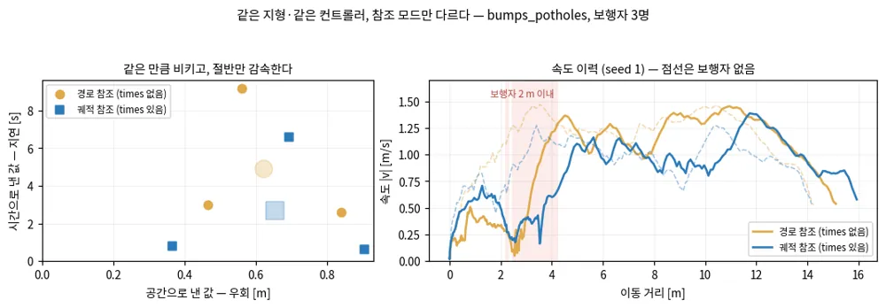
*그림 — TP-0089: 왼쪽은 3 시나리오 × seed 0–7의 24쌍 전부, 보행자 때문에 낸 값(가로=우회, 세로=지연)이고 큰 반투명 표식이 평균이다. 아래쪽 멀리 떨어진 두 점이 효과의 절반을 만드는 쌍이다 — 축을 0에서 자르지 않았다. 오른쪽은 속도 이력이고 점선이 같은 조건의 보행자 없는 주행이다.*

| 측정(궤적 − 경로) | 평균 | 95 % CI (paired bootstrap) | n | 판정 |
|---|---|---|---|---|
| 지연 `dt` | **−2.22 s** | [−3.87, −0.79] | 24 | 0 제외 — 궤적 모드가 **시간을 덜 낸다** |
| 우회 `detour` | −0.01 m | [−0.34, +0.25] | 22 | 0 포함 — **차이 없다** |
| 감속폭 \|`dv`\| | **−0.21 m/s** | [−0.34, −0.07] | 22 | 0 제외 — **덜 감속한다** |

==**같은 만큼 비키면서 시간은 덜 낸다** — 예측대로 궤적 참조가 브레이크 채널만 눌렀다.== 96 에피소드 전부
충돌 0이다.

⚠️ **한계 — 소수의 쌍이 평균을 끈다(2026-10-01 감사에서 정량화).** seed별 부호가 `dt` 16/24, `dv` 16/22로
일관되지 않고, ==`dt` 효과의 **65 %를 상위 세 쌍**이 만든다.== 그 셋을 빼면 `dt` = **−0.90 s**
[−1.64, −0.11](중앙값 −1.00, n=21)로 ==부호와 0 제외는 유지되지만 크기는 2.5배 작아진다.==
가장 큰 기여는 `bumps_potholes` seed 6(−13.4 s)인데, 이 쌍은 **보행자 없는 기준선 쪽이 비정상적으로 느렸다.**
그러니 "시간을 덜 낸다"는 방향은 믿을 만하고 **−2.2 s라는 크기는 믿으면 안 된다.**

⚠️ 그 밖의 한계: seed 3개로 처음 쟀을 때는 `curb_ramp`에서 **방향이 뒤집혔다.** 그리고 두 모드는 속도가 달라
보행자를 **조금 다른 지점에서 만난다** — 쌍대 기준선이 지형은 지우지만 조우 기하는 지우지 못한다.

수치는 `results/yield/*.npz`에 있다(2026-10-01에 커밋했다 — 그전에는 근거 자료가 저장소에 없었다).
재현: `python scripts/eval_yield_behavior.py --scenario <sc> --seeds 0 1 2 3 4 5 6 7 --out results/yield`.


---


### A.13.12 TP-0098 — 매퍼의 순서 의존 넷을 닫으니 L1이 비트 단위로 재현된다

**결론 먼저.** ==벤더링 elevation_mapping의 `add_points_kernel`에는 스레드 순서에 따라 결과가 바뀌는 곳이 넷 있었다. `deterministic_mapping`으로 넷을 모두 닫으니 같은 점군에서 모든 층이 비트 단위로 같아졌다.==
L1 폐루프도 재현된다. 같은 L1 벤치마크(4 시나리오 × seed 0–2, 두 스택)를 두 번 돌리면 24 에피소드의 성공·시간·경로 길이·pitch·GT cost가 모두 같다.
지도 품질은 배포본과 같다. 앞으로 L1 수치는 한 번 실행으로 읽어도 된다. 다만 seed 수가 적은 차이는 여전히 표본 크기 안에서 읽어야 한다.

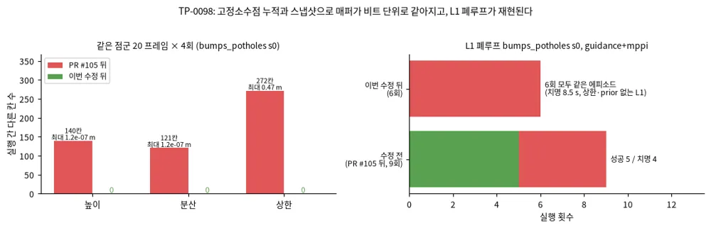

*그림 — TP-0098 (Fig. 1): 같은 점군을 반복해 넣을 때 실행 간 다른 칸(왼쪽), L1 폐루프의 재현성(오른쪽). 출처: `results/tp0098_fixed`*

#### 순서 의존 넷

| # | 곳 | 증상 | 고친 방법 |
|---|---|---|---|
| 1 | 가시성 정리의 상한(층 5) | 일반 store라 "마지막에 쓴 스레드"가 이긴다 | CAS `atomicMinFloat`(PR #105) |
| 2 | 마할라노비스 게이트 | 다른 스레드가 올리는 중인 분산을 읽는다 | 커널 전 분산 스냅샷(PR #105) |
| 3 | `new_map` 높이·분산 합 | float `atomicAdd`는 결합법칙이 없다 | 32.32 고정소수점 int64 누적(#126) |
| 4 | 삽입 store 대 정리 분기 | 삽입이 valid·time·상한을 일반 store로 쓰는 동안 정리가 그 값을 읽고 valid를 깎는다 | 정리는 스냅샷을 읽고, 감소는 고정소수점 버퍼에 모으고, 삽입은 커널 뒤에 한 번에 쓴다(#126) |

1–2만 고쳤을 때 같은 점군 20 프레임 × 4회에서 상한이 272–278칸, 최대 0.35–0.47 m 달랐다. 높이·분산은 120–140칸이 ulp만큼 달랐다.
이 작은 차이가 약 150스텝 동안 커져, bumps_potholes s0 L1 폐루프 9회가 성공 5 / 치명 4로 갈렸다.
4번의 규칙은 "이번 프레임에 점이 들어온 칸은 삽입이 정리를 이긴다"다. 배포본의 "최근 갱신된 칸은 건너뛴다" 검사가 뜻하는 것과 같다. 삽입된 칸의 상한은 그 칸의 평균 융합 높이다.

#### 결과

- **비트 동일.** `scripts/check_emap_determinism.py`: bumps_potholes s0 20 프레임 × 4회, curb_ramp·down_curb·slope_crossfall s1 40 프레임 × 5회에서 7개 층 모두 같다.
- **지도 품질 불변.** 3 지형 × seed 0–2, 30 프레임: valid 칸 수, 높이 RMSE(2.23/0.94/0.34 cm, 배포본 2.19/0.94/0.34), p99, 상한 칸 수, 참 높이보다 2 cm 넘게 낮은 상한 수가 배포본과 같다.
- **폐루프 재현.** bumps_potholes s0 guidance+mppi L1을 6회 돌리면 모두 같은 에피소드다(8.5 s 치명, 최대 pitch 7.680366721666333°).

**L1 표준 벤치마크(4 시나리오 × seed 0–2, 이제 한 번 실행으로 확정).**

| 설정 | guidance+mppi | planner_d+mppi | 계획 시간 |
|---|---|---|---|
| L1 | 10/12 | 11/12 | 5.1 ms |
| L1 + 매퍼 상한 + 깊이 prior 0.10 m | **12/12** | **12/12** | 5.1 ms |

L1의 실패 셋은 모두 bumps_potholes의 포트홀(s0·s1 guidance, s1 planner_d)이다. 상한 + 깊이 prior가 이 셋을 모두 막는다. 최대 pitch는 4.0–4.2°, 평균 GT cost는 0.020–0.024다.

#### 남은 것

- `error_counting_kernel`의 `error` 합도 float `atomicAdd`다. 드리프트 보정을 켤 때만 쓰이고 travplan은 끈다(시뮬 자세가 정확하다). 켜면 다시 순서 의존이 생긴다.
- 고정소수점 범위는 칸당 |합| < 2.1×10⁹이다. 맵 중심 기준 높이 10 m에서 칸당 점 2억 개까지 안전하다.
- `.venv-emap`에 pytest를 넣어 `tests/test_emap_determinism.py`와 `tests/test_l1_perception.py`가 돈다(10 passed). 기본 venv에서는 cupy가 없어 건너뛴다.

### A.13.13 TP-0054 — 매퍼 분산은 σ가 되지 못하고, cost 민감도 σ는 오차를 맞히지만 폐루프를 바꾸지 못한다

**결론 먼저.** ==L1 매퍼(elevation_mapping)의 칸별 높이 분산은 TravMap σ로 쓸 수 없다.== 배포 설정에서 평지 칸의 분산은 실제 오차보다 표준편차로 130배 크다.
분산이 큰 칸이 실제로 더 틀린 칸인 것도 아니다(순위 상관 −0.11). 높이 오차의 대부분은 점 잡음이 아니라 5 cm 칸 하나가 턱의 위아래를 섞는 데서 생기는데,
매퍼의 잡음 모델에는 그 항이 없다. 그래서 `sensor_noise_factor` 하나로는 평지와 모서리를 함께 맞출 수 없다.
==관측 칸의 cost 오차를 맞히는 것은 그 칸 cost의 높이 민감도와 주변의 미관측 비율이다(AUROC 0.886).== 이것을 σ로 넣는 `sigma_mode="sensitivity"`를 만들었다.
하지만 L1·L0 폐루프(4 지형 × seed 0–9)의 성공 수는 σ를 누구에게 주든 이진 σ와 같은 범위다.
겉보기 차이는 bumps_potholes의 혼돈 안에 있다(σ = 1e-6만 줘도 20회 중 4회가 바뀐다). 그래서 기본값은 이진 σ로 둔다.

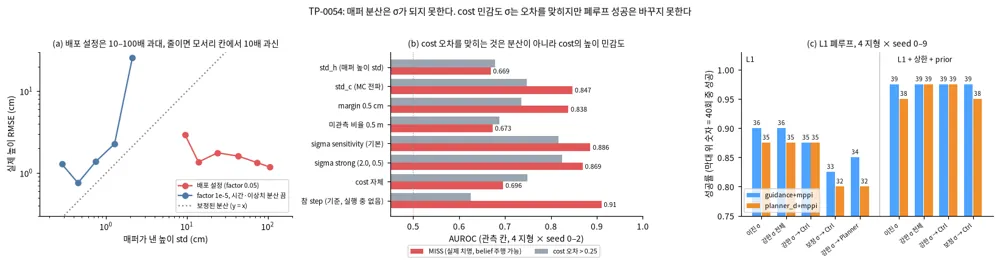

*그림 — TP-0054 (Fig. 1): (a) 매퍼가 낸 높이 std 대 실제 높이 오차, (b) 관측 칸의 cost 오차를 맞히는 정도(AUROC), (c) L1 폐루프 성공 수. 출처: `results/tp0054_sigma`, `results/tp0054_l1`*

#### 1. 매퍼 분산은 보정되지도, 순위를 맞히지도 않는다

`scripts/eval_l1_sigma.py`: TP-0100과 같은 고정 자세(GT 경로 0.5 m 간격), 4 지형 × seed 0–2. 매 관측 뒤 로봇 5 m 안 관측 칸 439만 개(칸 × 스냅샷)를 썼다.
매퍼의 점 분산은 `sensor_noise_factor · r²`(배포값 0.05)이다. 합성 LiDAR의 거리 잡음은 1 cm다.

| 설정 | 평지 칸 실제 RMSE | 평지 칸 예측 std(중앙값) | 평지 mean z² | 모서리 칸 실제 RMSE | 모서리 mean z² | 순위 상관(평지/모서리) |
|---|---|---|---|---|---|---|
| 배포(factor 0.05) | 0.20 cm | 26.6 cm | 0.0001 | 3.33 cm(p99 19.7 cm) | 0.03 | −0.11 / −0.04 |
| factor 1e-4 | 0.23 cm | 3.3 cm | 0.007 | 3.43 cm | 1.0 | 0.01 / 0.14 |
| factor 1e-5, 시간·이상치 분산 끔 | 0.22 cm | 0.68 cm | 0.21 | 3.50 cm | **19.6** | −0.19 / 0.12 |

보정된 분산이면 mean z²가 1이다. factor만 낮추면 std가 2.7 cm 아래로 내려가지 않는다. 매퍼가 게이트를 넘지 못한 점과 칸을 통과한 광선마다
`outlier_variance`(0.01 m², std 10 cm)를 더하기 때문이다. 이 항과 시간 분산을 끄면 평지는 보정에 가까워진다(±1σ 안 95%).
대신 모서리 칸이 z²로 20배 과신한다. factor를 바꿔도 지도 품질(3 m 원판 cost MAE 0.0225–0.0233, 치명 재현율 0.561–0.564, AUROC 0.898–0.900)은 그대로다.
그래서 factor는 배포값 0.05를 유지한다.

#### 2. cost 오차를 맞히는 것은 cost의 높이 민감도다

`scripts/eval_l1_sigma_cost.py`: 같은 자세, 권장 L1 belief(매퍼 상한 + 깊이 prior). 관측 칸에서 belief cost가 GT cost와 얼마나 다른지를 맞히는 후보를 비교했다.
MISS는 GT가 치명인데 belief가 주행 가능이라 한 칸(관측 칸의 1.55%)이다. AUROC는 무작위 15% 표본(66만 칸)에서 쟀다.
매퍼 std를 전파한 줄만 같은 설정의 별도 실행(전체)이다.

| 후보(실행 중 쓸 수 있나) | AUROC MISS | AUROC cost 오차 > 0.25 |
|---|---|---|
| 매퍼 높이 std (○) | 0.669 | 0.678 |
| 매퍼 std를 cost로 몬테카를로 전파 (○) | 0.844 | 0.717 |
| 상수 std 0.2 cm를 전파 (○) | 0.847 | 0.748 |
| 민감도 margin: 높이가 0.5 cm 틀렸을 때 cost가 오르는 양 (○) | 0.838 | 0.735 |
| 0.5 m 안 미관측 비율 (○) | 0.673 | 0.688 |
| **σ = tanh(2(0.55·margin + 0.04·미관측 비율))** (○) | **0.886** | **0.817** |
| cost 자체 (○) | 0.696 | 0.749 |
| 참 턱 높이 (×, 기준) | 0.910 | 0.625 |

매퍼 std를 전파한 것과 상수를 전파한 것이 같다. 정보는 분산이 아니라 **cost 함수가 그 칸에서 높이에 얼마나 민감한가**에 있다.
특징이 안전 문턱이나 램프 구간 바로 안팎에 있는 칸이다. 전파한 cost std 상위 1%의 MISS 비율은 25%로, 하위 70%(0.3%)의 80배다.
그런데 그 상위 1%의 평균 cost는 0.30이라 cost 값만으로는 알 수 없는 정보다. σ의 계수는 |cost 오차|를 두 항에 최소제곱으로 맞춘 값이다. 치명이 아닌 관측 칸의 σ는 중앙값 0.03, 99% 0.24, 최대 0.27이다(TravNet의 σ = tanh(2·std)와 같은 뜻).

#### 3. 폐루프는 바뀌지 않는다

`TravMapBuilder(sigma_mode="sensitivity")`, `run_benchmark.py --sigma-mode sensitivity [--sigma-gain A B] [--sigma-to all|planner|controller]`.
`--sigma-to`는 σ를 받는 쪽을 가른다. 나머지 쪽은 이진 σ를 받는다. `planner`는 Guidance와 Planner이고, `controller`는 MPPI의 RiskCost다.
강한 σ는 계수 (2.0, 0.5)로, 관측 칸 σ가 중앙값 0.24, 최대 0.93이다.

| σ | L1 (guidance / planner_d) | L1 + 상한 + prior (guidance / planner_d) |
|---|---|---|
| 이진(지금) | 36 / 35 (71/80) | 39 / 38 (77/80) |
| 강한 σ, 모두에게 | 36 / 35 (71/80, +4/−4) | 39 / 39 (78/80, +1/−0) |
| 강한 σ, Controller만 | 35 / 35 (70/80, +2/−3) | 39 / 39 (78/80, +2/−1) |
| 보정 σ, Controller만 | 33 / 32 (65/80, +0/−6) | 39 / 38 (77/80, +1/−1) |
| 강한 σ, Planner만 | 34 / 32 (66/80, +2/−7) | — |

괄호 안 +/−는 이진 σ 대비 같은 에피소드에서 성공으로 바뀐 수와 실패로 바뀐 수다. 권장 설정(오른쪽)에서는 모든 변형이 이진 σ와 한두 에피소드 안이다.

**L0에서도 같다**(같은 4 지형 × seed 0–9, `results/tp0054_l0`). 가림 + 상한 + prior는 이진 78/80, σ 변형 78–80/80이다(Controller에 주면 +2/−0).
그림자 처리 없는 가림은 이진 74/80, σ 변형 68–71/80이다. 차이는 전부 bumps_potholes에서 났다.

**그 차이는 σ의 효과가 아니라 혼돈이다.** 결정적 시뮬이라도 bumps_potholes는 작은 비용 차이가 몇 초 뒤의 궤적을 바꾸는 구간이다.
Controller에 σ = 1e-6(사실상 0)만 줘서 잡음 바닥을 쟀다.

| bumps_potholes, seed 0–9, 두 스택(20회), Controller에 σ | L1(상한·prior 없음) | L0 가림 |
|---|---|---|
| 이진 | 11 | 14 |
| **σ = 1e-6 (잡음 바닥)** | **9 (+1/−3)** | **10 (+0/−4)** |
| margin만 | 8 (+2/−5) | 9 (+0/−5) |
| 미관측 비율만 | 6 (+3/−8) | 11 (+2/−5) |
| 보정 σ | 5 (+0/−6) | 9 (+1/−6) |
| 강한 σ | 10 (+2/−3) | 8 (+0/−6) |

'margin만'과 '미관측 비율만'은 L1에서 보정 계수(0.55, 0.04), L0에서 강한 계수(2.0, 0.5)를 썼다.
이진 σ 실행이 마침 운 좋은 한 번이었다. 어떤 섭동을 줘도 성공 수가 절반 안팎으로 돌아온다. σ 변형들의 5–12회는 σ = 1e-6의 9–10회와 구별되지 않는다.
그래서 L0 가림의 −6(p = 0.03)도 σ의 해로 읽지 않는다. 같은 이유로 권장 설정의 +2도 이득으로 읽지 않는다.
==결정적 벤치마크에서도 혼돈 구간의 비교는 이진 기준 한 번이 아니라 잡음 바닥과 해야 한다.== 이 비교법은 TP-0055 이후의 Planner 비교에도 쓴다.

최대 pitch(7.8–8.1°), Planner D 계획 시간(6.6–7.4 ms, 병렬 실행 부하 차이 포함), 평균 GT cost(0.025–0.029)도 모든 변형에서 같은 범위다.

#### 재현

```bash
# 1. 매퍼 분산의 보정과 순위(.venv-emap). factor 6개 × 시간 분산 2개, 그리고 이상치 분산을 끈 셋
PYTHONPATH=. .venv-emap/bin/python scripts/eval_l1_sigma.py --out results/tp0054_sigma/sweep
PYTHONPATH=. .venv-emap/bin/python scripts/eval_l1_sigma.py --variants f0.0001_tv0_ov1e-06 f1e-05_tv0_ov1e-06 f0.05_tv0_ov1e-06 \
    --out results/tp0054_sigma/floor
# 2. cost 오차를 맞히는 후보(권장 belief, 상수 std 전파)
PYTHONPATH=. .venv-emap/bin/python scripts/eval_l1_sigma_cost.py --builder ub_sd --std-mode const --mc 8 --dump 0.15
# 3. 폐루프: 한 시나리오씩 나눠 병렬로 돌렸다(results/tp0054_l1/jobs_*.log)
PYTHONPATH=. .venv-emap/bin/python scripts/run_benchmark.py --stacks guidance+mppi planner_d+mppi --perception l1 \
    --shadow-ceiling --shadow-depth 0.10 --sigma-mode sensitivity --sigma-to controller --seeds 0 1 2 3 4 5 6 7 8 9
```

#### 바꾼 것과 남긴 것

- **기본값은 그대로다.** `sigma_mode="binary"`가 기본이라 기존 벤치마크·Playground·Planner D 학습은 비트 단위로 같다.
- **`_unknown_near`(TP-0101)는 σ = 1을 '못 본 칸'으로 판정한다.** 전에는 σ ≥ 0.5였다. 그 조건이면 TravNet이나 민감도 σ의 관측 칸이 0.5를 넘을 때 못 본 칸처럼 치명이 됐다.
- **민감도 σ는 선택 기능으로 둔다.** 관측 칸의 오차를 맞히는 유일한 실행 중 신호라 진단 층으로 쓸모가 있다. Planner D는 이진 σ로만 학습했다.
  L1 belief로 다시 학습할 때(TP-0055) 이 σ를 입력으로 넣을지는 그때 정한다.

### A.13.14 TP-0141 — 한 칸 폭 통로는 1 cm 잡음 편향에 닫힌다: random_mix s3 레벨 2·3의 결정적 멈춤

**한 줄로.** ==레벨 2부터 random_mix s3의 유일한 통로는 GT에서 cost 0.81–0.95인 한 칸 폭 대각선이다. belief의 턱(step) 특징이 잡음 때문에 1 cm 높게 나와 통로가 치명(0.97–1.00)으로 닫힌다.==
그러면 Dijkstra가 길을 못 찾고, Guidance는 출발점과 목표를 잇는 직선을 낸다. MPPI는 그 직선을 따라 상자 앞까지 가서 멈춘다.
세 스택(Guidance, Planner D, RL + 폴백)이 같은 belief와 같은 Guidance를 쓰므로, 난수를 바꿔도 모두 같은 자리(x 4.5 m, y 5.2 m)에서 60 s를 넘긴다(TP-0039 스윕, 0/4).

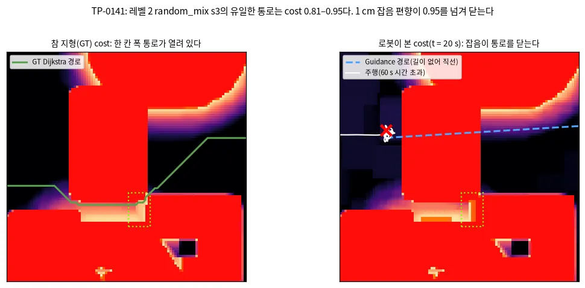

*그림 — TP-0141 (Fig. 1): 왼쪽은 GT cost와 GT Dijkstra 경로다. 경로가 상자와 아래 장애물 사이의 좁은 틈(점선 상자)을 지난다. 오른쪽은 t = 20 s에 로봇이 본 cost다. 같은 틈이 치명 띠로 닫혀 있고, Guidance 경로(파란 점선)는 상자를 뚫는 직선이다. 출처: scripts/make_evidence_figures.py --only tp0141*

- **어디서 갈렸나.** t = 4 s에 belief의 자유 칸이 로봇 쪽과 목표 쪽 두 성분으로 나뉜다. belief가 치명이고 GT가 자유인 관측 칸은 61개뿐이다. 이 칸을 풀어 주면 두 성분이 다시 이어진다.
  그 가운데 31개가 틈(x 6.25–6.40 m, y 3.25–3.75 m)에 몰려 있다.
- **왜 1 cm인가.** 같은 칸의 턱 특징은 GT 0.07 m, belief 0.08 m다. 턱의 한계 0.08 m에서 cost 램프는 0.07 m를 0.82로, 0.08 m를 1.00으로 읽는다.
  L0 belief는 관측마다 칸별 잡음(σ 1 cm)을 섞고 0.7/0.3 지수 필터로 합친다. 정상 상태 잡음은 약 0.4 cm다.
  턱 특징은 창 안의 최대 − 최소라서 잡음의 극값을 줍는다. 그래서 더 관측해도 편향이 사라지지 않는다.
- **GT로는 왜 열려 있나.** 한 칸 폭이고, cost가 문턱 바로 아래(0.81–0.95)다. 잡음이 없는 GT에서만 열리는 통로다.
- **인과 확인.** 같은 에피소드(guidance+mppi)를 잡음 없는 belief(`SimConfig(elev_noise_std=0)`)로 돌리면 레벨 2는 18.5 s, 레벨 3은 25.6 s에 도달한다.
  잡음 0.5 cm와 1 cm에서는 둘 다 60 s 시간 초과다.

**판단.** Planner나 Controller의 버그가 아니다. 그 belief에서는 길이 없다는 판단이 옳다. 남는 개선은 둘이다(TP-0142).
- 턱 특징을 잡음에 강하게 만든다. 예를 들어 최대·최소 대신 분위수를 쓰거나, 관측 잡음만큼 문턱에서 뺀다. 표현 전체가 바뀌므로 벤치마크 전체로 판정해야 한다.
- Guidance가 길을 못 찾을 때 상자를 뚫는 직선을 내지 않게 한다. 예를 들어 닿을 수 있는 칸 가운데 목표에 가장 가까운 칸으로 보낸다. 이 장면에서는 그것만으로 통로가 열리지 않는다. 잡음 편향은 거리와 무관하기 때문이다.

### A.13.15 TP-0142 — 턱 특징 전에 15 cm 평활: 잡음 편향이 사라지고, 좁은 통로가 열린다(선택)

**한 줄로.** ==턱 특징의 최대 − 최소를 재기 전에 belief 높이를 15 cm(3칸) 평균으로 평활한다(`FeatureConfig(step_presmooth_m=0.15)`, `--step-presmooth 0.15`).==
평지에서 잡음이 만드는 턱 특징이 2.3 cm에서 0.7 cm로 준다(σ 0.4 cm). 실제 턱은 그대로다.
Guidance의 레벨 0–3 스윕은 154/160에서 158/160이 된다. 시간 초과 4개가 도달로 바뀌고 나빠진 것은 없다(4 : 0, p = 0.125).
대신 레벨 3 random_mix s3에서 시간 초과 하나가 치명으로 바뀐다. 기본값은 끈다.

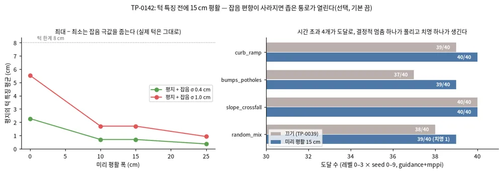

*그림 — TP-0142 (Fig. 1): 왼쪽은 평지 + 잡음에서 턱 특징의 평균을 미리 평활 폭에 따라 그린 것이다(10 cm와 15 cm는 둘 다 3칸이다). 오른쪽은 Guidance의 레벨 0–3 × seed 0–9 도달 수를 평활을 끄고 켜서 짝지어 본 것이다. 출처: scripts/make_evidence_figures.py --only tp0142*

- **무엇을 바꿨나.** 턱 특징을 셀 때만 평활한 높이를 쓴다. 경사·거칠기·추세는 그대로다. 턱의 창(30 cm)보다 좁게 평활하므로 실제 턱의 최대 − 최소는 바뀌지 않는다(0.24 m 연석에서 0.160 m 그대로).
- **판정은 그대로다.** 실패를 재는 GT 지도는 잡음이 없으므로 평활하지 않는다. 시뮬레이터가 belief 설정과 상관없이 평활을 끈 특징으로 GT를 만든다(테스트로 고정).
- **결과 (guidance+mppi, 레벨 0–3 × 4 지형 × seed 0–9, 한 번씩).**

| 지형 | 끄기 (TP-0039) | 평활 15 cm |
|---|---|---|
| curb_ramp | 39/40 | 40/40 |
| bumps_potholes | 37/40 | 39/40 |
| slope_crossfall | 40/40 | 40/40 |
| random_mix | 38/40 | 39/40 (치명 1) |
| 합 | 154/160 | 158/160 |

- 바뀐 넷은 curb_ramp L3 s8, bumps_potholes L1 s6, L2 s4, random_mix L2 s3이다. 앞의 둘은 TP-0039 재실행에서 이미 잡음이었다. random_mix L2 s3은 결정적 멈춤(A.13.14)이 풀린 것이다.
- 레벨 3 random_mix s3은 열린 통로에 들어가다 GT 치명 칸을 밟는다. 통로가 GT에서도 cost 0.81–0.95로 문턱에 붙어 있어, 추종 오차가 곧 치명이다.
  ==잡음 편향은 버그이면서 동시에 사실상의 안전 여유였다.== 평활만 하면 그 여유가 함께 사라진다.
- 두 설정 모두 도달한 154 에피소드에서 도달 시간은 17.4 s에서 16.6 s, GT cost 평균은 0.0261에서 0.0272다.

**판단.** 선택 항목으로 둔다. 기본으로 켜려면 여유를 따로 세워야 한다. 예를 들어 평활과 함께 턱 한계를 잡음만큼 낮추거나, 한 칸 폭 통로를 Controller가 받아들이지 않게 한다.
Planner D·RL 스택, 가림(L0)·L1 인식에서는 재지 않았다.

### A.13.16 다음 병목 측정 — L1 인식에서 레벨 3은 4분의 1이 치명이다(2026-10-03)

**한 줄로.** ==실제 매핑(L1) + 권장 설정에서 레벨 3은 세 스택 모두 120 에피소드 가운데 23–33개가 치명으로 끝난다. 실패는 포트홀과 연석 가장자리에서 난다.==
같은 레벨을 L0 인식으로 돌리면 시간 초과 몇 개뿐이다(TP-0039 스윕 36–39/40). LiDAR를 권장안(0.8 m, 15° 숙임)으로 바꿔도 줄지 않는다. 사용자 결정(학습 Planner는 단독 26/30으로 두고 다음 병목으로) 뒤 두 후보를 같은 판정 절차로 재서 정했다.

- **설정.** `--perception l1 --shadow-ceiling --shadow-depth 0.10 --stereo --unknown-near 1.5`(인식 문서의 권장 L1). 스택은 guidance+mppi, planner_df+mppi(RL 1단계 + 폴백, 배포 스택), planner_d+mppi(RL 1단계 단독).
  레벨 3은 seed 0–9 × 난수 오프셋 3, 레벨 0은 한 번이다.

| L1, 레벨 3 (30 에피소드씩) | guidance | planner_df (배포) | planner_d (단독) |
|---|---|---|---|
| curb_ramp | 18/30 (치명 11) | 13/30 (치명 15) | 18/30 (치명 8) |
| bumps_potholes | 18/30 (치명 12) | 13/30 (치명 17) | 14/30 (치명 15) |
| slope_crossfall | 30/30 | 30/30 | 30/30 |
| random_mix | 28/30 (치명 1) | 28/30 (치명 1) | 27/30 |
| 합 | **94/120 (치명 24)** | **84/120 (치명 33)** | **89/120 (치명 23)** |

- **어디서 죽나.** bumps_potholes의 치명 44건은 모두 포트홀에서 0.7 m 안에서 끝난다. curb_ramp 34건 가운데 27건은 연석·높은 칸에서 0.7 m 안이다. 4–10 s 만에 끝나는 것이 많다. 센서 범위(5 m) 안의 포트홀로 곧장 들어간다.
- **배포 스택이 가장 많이 죽는다.** 짝 비교에서 guidance만 도달 18 대 planner_df만 8(p = 0.076)이고, 치명은 33 대 24다. 폴백 스택은 레벨 0의 L1에서도 bumps_potholes 치명 2건이 있다(guidance 0).
  안전 원칙(`docs/prd.md` 7절)으로 보면 L1에서는 폴백 스택이 기준선보다 위험하다.
- **센서 배치로는 줄지 않는다.** 권장 배치(전면 120°, ±12.5°, 0.8 m, 15° 숙임; 센서 연구에서 치명 재현율이 가장 높던 것)로 레벨 3 오프셋 0을 다시 돌렸다.
  세 스택 합 도달 87 → 84/120, 치명 30 → 31로 그대로다.
- **보행자는 두 번째 후보다.** 보행자를 5명으로 늘려도(L0 인식) 레벨 0은 포화다(guidance·planner_df 120/120, planner_d 40/40, 충돌 0). 다만 최소 여유가 0.11–0.14 m다. 정해진 기준은 없다. 비교할 값은 TP-0079의 DAgger 전 0.22 m다.
  레벨 3에서는 guidance 110/120(충돌 3), planner_df 112/120(충돌 3), planner_d 34/40(충돌 1)이고, 충돌은 random_mix L3 s9에 모인다(모든 오프셋, 결정적).

**판단.** 다음 병목은 L1 인식의 레벨 3이다. 포트홀·연석에서 치명 실패가 나고, 모든 스택이 같이 겪으므로 Planner 재학습(TP-0055)보다 지도 쪽 원인을 먼저 가른다(TP-0146).
보행자 쪽은 random_mix L3 s9 충돌과 낮은 최소 여유를 TP-0147로 둔다.

**정정(TP-0147).** random_mix L3 s9의 충돌은 Planner·Controller 탓이 아니었다. 모두 첫 스텝(t = 0.1 s, 이동 0 m)에서 난다.
`crossing_pedestrians`가 보행자 하나를 로봇 출발점에 겹쳐 놓았다(t = 0 여유 −0.13 m). 4 지형 × 레벨 0–3 × seed 0–9 × (3명, 5명)에서 이 경우 하나뿐이다.
이제 처음 1초 동안 출발점에서 0.3 m 안으로 들어오는 보행자는 제 경로를 따라 뒤로 민다(`clear_start`, Playground `spawnCrossing`도 같다).
난수를 더 쓰지 않으므로 다른 에피소드는 그대로다. 고친 s9는 세 스택 × 오프셋 3, 9번 모두 도달한다(최소 여유 0.66–0.73 m, `results/tp0147`).
그래서 보행자 5명 레벨 3은 guidance 113/120, planner_df 115/120, planner_d 35/40이고 충돌은 0이다. 남은 실패는 모두 지형 시간 초과다.

### A.13.17 TP-0146 — L1 레벨 3 치명의 원인: 매퍼 칸이 반 칸 어긋나 있었고, 테두리 뒤 스치는 칸이 얕게 채워졌다

**한 줄로.** ==L1 레벨 3의 치명 80건 가운데 78건은 belief가 포트홀·연석 가장자리의 치명 띠를 안쪽에 그려서 났다. Controller가 보고도 들어간 것이 아니다.==
원인은 둘이다. 하나는 래퍼 버그다. 매퍼 칸이 시뮬 격자와 반 칸 어긋나 가장자리가 한 칸 번졌다.
다른 하나는 테두리 바로 뒤의 숨은 칸이다. 시선이 테두리를 1–2 cm 아래로 스치는 칸이 깊이 prior를 피해 완만한 비탈로 채워졌다.
칸 정렬(이제 기본)과 낮은 채움(`--shadow-low-fill`, 선택)을 함께 켜면, 권장 L1 레벨 3의 치명이 80건에서 25건으로 준다(도달 267 → 313/360).
배포 스택 planner_df는 가장 위험하던 스택에서 가장 나은 스택이 됐다(84 → 110/120, 치명 33 → 6). 남은 치명은 대부분 관측된 가장자리 칸이 얕게 읽히는 경우다(TP-0148).

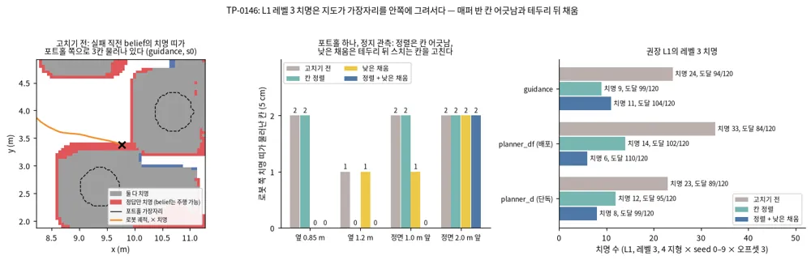

*그림 — TP-0146 (Fig. 1): 왼쪽은 고치기 전 실패 장면 하나다(bumps_potholes L3 s0, guidance). 빨강은 정답에서는 치명인데 실패 직전 belief는 주행 가능이라 한 칸이다. 가운데는 포트홀 하나를 정지 관측했을 때 로봇 쪽 치명 띠가 정답보다 몇 칸 물러나는지다. 오른쪽은 권장 L1 레벨 3(4 지형 × seed 0–9 × 오프셋 3)의 치명 수다.*

- **진단 방법.** `scripts/diag_l1_lethal.py`가 치명 에피소드를 같은 설정으로 다시 돌린다. 80건 모두 같은 시각에 같은 실패로 재현된다.
  매 스텝 belief를 기록하고, 실패 지점이 언제 치명으로 보였는지로 셋으로 나눈다.
  - 못 봄: 마지막 belief에서도 주행 가능이다.
  - 늦게 봄: 치명으로 보였을 때 이미 정지 거리 안이다.
  - 보고도 들어감: 멈출 수 있을 때 치명으로 보였는데 들어갔다.
- **결과.** 못 봄 78, 늦게 봄 1, 보고도 들어감 1이다(뒤의 둘은 random_mix).
  GT cost는 지형 특징을 로봇 반폭(0.30 m)만큼 부풀린 값이다. 그래서 실패 지점은 대개 가장자리에서 0.45 m쯤 떨어진 평지다. 진단기는 가장 가까운 정답 치명 출처 칸과 그 둘레 9×9칸을 함께 본다.
  - bumps_potholes 44건: 출처는 턱 특징이다. 출처 창의 포트홀 칸은 관측된 칸(미관측 2 %)인데, belief 높이가 테두리 높이다(오차 중앙값 +0.12 m). belief의 치명 띠가 1–4칸 안쪽에 있다.
  - curb_ramp 34건: 출처는 경사로 옆벽의 경사 특징이다. 높이 오차는 ±5 mm인데 가장자리가 한 칸 밀려 있다. 레벨 3 경사로는 폭 1.1 m라 중심이 지날 수 있는 띠가 0.2 m뿐이다.
- **원인 1 — 매퍼 칸이 반 칸 어긋났다(TP-0053부터 있던 래퍼 버그).** `EmapConfig.map_length_m = 11.0`이면 매퍼 칸 수가 222(짝수)다.
  매퍼는 칸 i의 중심을 center + (i − (n − 1)/2) × 해상도에 둔다. 칸 수가 짝수면 중심이 시뮬 격자의 칸 경계에 온다. 그러면 매퍼 칸 하나가 시뮬 칸 넷에 걸친다.
  시뮬 칸 하나를 정확히 덮는 점 묶음(0.10 m)을 넣으면 2×2칸에 0.057–0.067 m로 번졌다. 칸 수를 홀수(11.05 m, 223칸)로 하면 제 칸에 0.10 m로 들어간다.
  이제 `ElevationMapper`가 길이를 홀수 칸으로 맞춘다(`aligned_length`, 테스트로 고정). 격자 원점이 해상도의 배수가 아니면 오류를 낸다. 이전 매퍼는 `EmapConfig(align_to_grid=False)`로 재현한다.
- **원인 2 — 테두리 뒤 스치는 칸.** 가까운 쪽 테두리 바로 뒤 칸은 시선이 테두리를 1–2 cm 아래로 스친다.
  깊이 prior(TP-0047)는 "시야 상한이 주변에서 관측된 가장 낮은 땅보다 낮은 칸"만 구덩이로 본다. 그런데 로봇이 가까우면 포트홀 바닥이 그 너머에 보이고, 이 칸의 상한은 그 바닥보다 높다.
  그래서 prior가 걸리지 않는다. 대신 채움이 테두리와 바닥을 평균해 완만한 비탈을 만든다.
  `shadow_low_fill`(선택, `--shadow-low-fill`)은 이런 칸을 턱 창(±3칸) 안에서 관측된 가장 낮은 땅으로 채운다.
  단, 시선이 창 안의 가장 높은 관측 땅보다 5 mm 넘게 아래로 지나는 칸에만 쓴다. 즉 그 칸을 가린 테두리보다 낮은 칸이다.
  첫 판에는 이 조건이 없었다. 그래서 도로에서 올려다본 연석 윗면 뒤 보도 칸을, 연석 면에 번진 낮은 관측값으로 팠다(0.24 → 0.14 m). 그 판의 벤치마크는 curb_ramp에서 시간 초과가 나기 시작해 멈췄다.
- **정지 시험.** `scripts/eval_l1_edge.py`로 쟀다(`results/tp0146/edge.csv`). 포트홀 하나에 정면으로 다가가 멈추거나 옆으로 지나가면서, 로봇 쪽 치명 띠가 정답보다 몇 칸 물러나는지 본다.

| 물러난 칸 (5 cm) | 옆 0.85 m | 옆 1.0 m | 옆 1.2 m | 정면 0.7 m 앞 | 정면 1.0 m 앞 | 정면 1.5 m 앞 | 정면 2.0 m 앞 |
|---|---|---|---|---|---|---|---|
| 고치기 전 | 2 | 0 | 1 | 1 | 2 | 1 | 2 |
| 칸 정렬 | 2 | 0 | 0 | 1 | 2 | 0 | 2 |
| 낮은 채움 | 0 | 0 | 1 | 1 | 1 | 1 | 2 |
| 정렬 + 낮은 채움 | 0 | 0 | 0 | 0 | 0 | 0 | 2 |

  칸 정렬은 조금 떨어져 지날 때 남는 한 칸을, 낮은 채움은 가까이 지나거나 다가갈 때의 두 칸을 없앤다. 정면 2 m 앞에서는 바닥이 아직 안 보여 둘 다 2칸이다. 그 거리에서는 멈출 여유가 있다.
- **벤치마크(권장 L1, seed 0–9 × 오프셋 3, 같은 (seed, 오프셋)끼리 짝 비교).** 결과는 `results/tp0146/align`(칸 정렬)과 `results/tp0146/align_low`(정렬 + 낮은 채움)다. 고치기 전은 `results/nb_l1`이다.

| L1, 레벨 3 (스택마다 120) | 고치기 전 | 칸 정렬 | 정렬 + 낮은 채움 |
|---|---|---|---|
| guidance | 94 (치명 24) | 99 (치명 9) | 104 (치명 11) |
| planner_df (배포) | 84 (치명 33) | 102 (치명 14) | **110 (치명 6)** |
| planner_d (단독) | 89 (치명 23) | 95 (치명 12) | 99 (치명 8) |
| 합 | 267/360 (치명 80, 시간 초과 13) | 296/360 (치명 35, 시간 초과 29) | 313/360 (치명 25, 시간 초과 22) |

  - 고치기 전 대 정렬 + 낮은 채움의 짝 비교는 11 : 57이다(p = 1e-8). 스택별로 guidance 3 : 13(p = 0.02), planner_df 1 : 27(p = 2e-7), planner_d 7 : 17(p = 0.06)이다.
  - 지형별 치명은 curb_ramp 34 → 5, bumps_potholes 44 → 18, random_mix 2 → 2, slope_crossfall 0 → 0이다.
  - 칸 정렬만으로는 curb_ramp 치명이 거의 사라지는 대신(34 → 1) 시간 초과가 7 → 19로 는다. belief의 경사로 가장자리가 정답 자리에 오자, 중심이 지날 띠도 정답처럼 0.2 m로 좁아져서다. 치명이 시간 초과로 바뀐 것이라 안전 쪽 변화다.
  - 레벨 0 L1(스택마다 40)은 고치기 전 guidance 40, planner_df 38(치명 2), planner_d 38(치명 1)이다. 칸 정렬은 38(치명 2), 38(치명 2), 39다. 정렬 + 낮은 채움은 39(치명 1), 40, 39(시간 초과 1)다.
- **안전 원칙으로 보면(PRD 7절).**
  - 고치기 전 → 정렬 + 낮은 채움: 새로 생긴 치명은 6건, 사라진 치명은 63건이다. 스택·레벨별 치명 수가 는 곳은 레벨 0 guidance 한 곳뿐이다(0 → 1, bumps_potholes s6).
  - 칸 정렬 → 정렬 + 낮은 채움(낮은 채움의 몫): guidance 레벨 3이 9 → 11로 는다(새 6, 사라짐 4). planner_df는 14 → 6, planner_d는 12 → 8로 준다.
  - 그래서 이렇게 정했다.
    - 칸 정렬은 래퍼 버그 수정이라 기본값으로 바꿨다. 어긋난 지도를 남겨 두는 것은 선택지가 아니라고 봤다. 레벨 0 guidance에서 새로 생긴 치명(칸 정렬만 2건, 낮은 채움까지 1건) 가운데 진단한 s6은 아래의 남은 메커니즘과 같다.
    - 낮은 채움은 원칙대로 선택 항목으로 둔다. builder 기본값은 끔이다. 권장 L1에 넣을지는 사용자 결정으로 남긴다(STATE).
- **남은 치명은 무엇인가.** 두 수정 뒤 남은 bumps_potholes 레벨 3 치명 12건(오프셋 0·1000)과 레벨 0 guidance s6을 같은 진단기로 봤다(`results/tp0146/diag_after*`).
  모두 '못 봄'이고 밀림은 0–2칸(대부분 1칸)이다. 출처 창의 포트홀 가장자리 칸은 관측된 칸인데 높이가 −1 ~ −3 cm다(정답 −12 cm).
  그 칸의 바닥은 테두리에 가려 보이지 않는다. 테두리 위에 맞은 점이 LiDAR 거리 잡음(1 cm)으로 경계 너머로 밀려 그 칸에 떨어진 것으로 본다.
  실제 센서의 mixed pixel과 같은 현상이라 높이 지도만으로는 진짜 테두리 칸과 구별이 안 된다. 다음 후보는 둘이다(TP-0148).
  하나는 스캔에서 거리 불연속(jump edge) 옆 점을 버리는 필터이고, 다른 하나는 낙차 가장자리에 한 칸 여유를 두는 것이다.
- **판정.** TP-0146의 기준은 둘이었다.
  - 레벨 3 치명을 guidance 24/120의 절반 이하로: 정렬 + 낮은 채움에서 11/120이라 넘었다. 칸 정렬만으로는 9/120이다.
  - 레벨 0 L1 40/40 유지: guidance가 39/40(낮은 채움 포함) 또는 38/40(칸 정렬만)이라 못 지켰다.
  - L0 벤치마크는 코드 경로가 달라 바뀌지 않는다(매퍼는 L1에서만 쓰고, 낮은 채움은 끔).
  - 비평가 재시도 세 번(칸 정렬, 낮은 채움 첫 판, 고친 판) 뒤라 여기서 멈춘다. 남은 한 가지 메커니즘은 TP-0148로 넘긴다.

### A.13.18 TP-0148 — 포트홀 가장자리의 mixed pixel: 구덩이에만 한 칸 여유를 둔다

**한 줄로.** ==TP-0146 뒤 남은 L1 치명은 포트홀 가장자리 칸이 한 칸 얕게 읽혀서 났다. 여유를 닫힌 구덩이에만 한 칸 주면 레벨 3 치명이 25 → 6, 레벨 0이 120/120이다.==
일률 여유는 같은 효과를 내지만 레벨 3 경사로를 닫는다. 구덩이 여유(`--pit-margin 0.05`)는 경사로를 건드리지 않는다.
지금 기본(칸 정렬)과 비교하면 낮은 채움 + 구덩이 여유가 모든 스택·레벨에서 치명을 줄인다. 그래서 둘을 권장 L1 설정에 넣었다(builder 기본값은 끔).

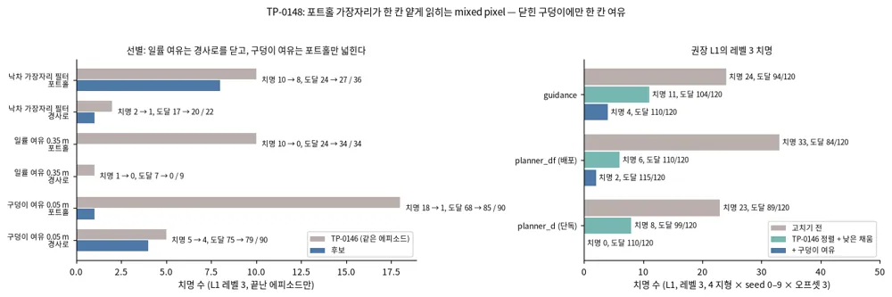

*그림 — TP-0148 (Fig. 1): 왼쪽은 후보 셋을 TP-0146(정렬 + 낮은 채움)의 같은 에피소드와 비교한 것이다. 낙차 가장자리 필터와 일률 여유는 도중에 멈춘 부분 결과다. 오른쪽은 권장 L1 레벨 3(4 지형 × seed 0–9 × 오프셋 3)의 스택별 치명 수다.*

- **남은 실패의 모습(TP-0146 뒤).** 실패 장면 둘을 다시 돌려, 얕게 읽힌 가장자리 칸에 떨어진 점을 모두 모았다.
  - 가까운 쪽 테두리: 점이 칸 경계에서 1–8 mm 안쪽에 있고 높이가 0 ~ −4 cm다(9개 중 8개가 스테레오). 그 칸의 바닥은 테두리에 가려 한 번도 보이지 않았다. 테두리에 맞은 점이 경계를 살짝 넘어 들어온 것이다.
  - 먼 쪽 벽: 2.4–3.1 m 거리에서 벽에 맞은 점이 −0.09 ~ +0.02 m의 중간 높이로 들어왔다(스테레오 깊이 잡음이 그 거리에서 3 cm쯤이다). 로봇이 그 포트홀을 지나간 뒤에는 이 벽이 로봇 쪽 가장자리가 된다.
  - 둘 다 실제 센서의 mixed pixel과 같은 현상이다. 높이 지도만으로는 진짜 테두리 칸과 구별되지 않는다.
- **선별(정렬 + 낮은 채움 위, bumps_potholes·curb_ramp 레벨 3, 도중에 멈춘 부분 결과).** 같은 에피소드의 TP-0146 결과와 비교했다.

| 후보 | bumps_potholes | curb_ramp |
|---|---|---|
| 낙차 가장자리 필터(`--drop-edge 0.05`): 같은 열의 바로 위 링이 0.05 m 넘게 낮게 맞으면 그 점을 버린다 | 36개: 치명 10 → 8 | 22개: 치명 2 → 1 |
| 일률 여유(`--belief-inflate 0.35`): belief만 0.35 m로 부풀린다(판정 GT는 0.30 m 그대로) | 34개: 치명 10 → 0, 도달 24 → 34 | 9개: 도달 7 → 0(모두 시간 초과) |

  - 낙차 가장자리 필터는 가까운 쪽 점만 거르므로 먼 쪽 벽 점을 막지 못한다. 같은 생각의 범용 필터로 PCL [`ShadowPoints`](https://pointclouds.org/documentation/classpcl_1_1_shadow_points.html)(깊이 불연속 가장자리의 유령 점 제거, libpointmatcher에서 옮김)가 있다.
  - 일률 여유는 포트홀을 막지만 레벨 3 경사로를 닫는다. 그 경사로(폭 1.1 m)는 부풀림 0.30 m에서 딱 통과 한계로 설계됐다(`sim/terrain.py` DIFFICULTY 주석).
- **구덩이 여유(`--pit-margin 0.05`).** 여유를 닫힌 구덩이에만 준다. 구덩이는 belief 높이의 회색조 닫힘(창 0.55 m)보다 0.05 m 넘게 낮은 칸이다.
  단, 높이 근거가 있는 칸(관측된 칸, 시야 상한으로 채운 숨은 칸)만 센다. 구덩이에 맞닿은 한 칸은 그 구덩이 바닥 높이로 낮춘다.
  근처의 가장 낮은 테두리 칸보다 0.05 m 넘게 높은 칸은 그대로 둔다(포트홀 테두리는 수평이다). 도로·경사로는 닫힌 구덩이가 아니라 손대지 않는다.
  - GT 높이에서 재면(레벨 3, seed 10개) 치명 칸은 bumps_potholes에서 지도당 약 1,070개 늘고, curb_ramp·slope_crossfall은 0, random_mix는 평균 32개(최대 146) 는다.
    포트홀 테두리 칸의 97 %가 바닥으로 내려간다. 남는 칸은 화분(이미 치명) 옆이나 과속방지턱 비탈의 테두리다.
  - 첫 판은 깊이 문턱 0.05 m에 관측·수평 조건이 없었다. 레벨 3 치명은 25 → 13으로 줄었지만 배포 스택의 curb_ramp가 29 → 20/30(치명 1 → 6, 짝 9 : 0)으로 나빠졌다(`results/tp0148/pit_v1`).
    원인은 둘이었다. 못 본 넓은 보도를 `fill_unknown`이 8칸 너머 0으로 채워 가짜 구덩이가 생겼다. 경사로 옆벽과 연석이 만나는 오목한 모서리에서는 벽 번짐이 닫힘값을 올려 도로가 구덩이로 잡혔다.
  - 두 번째 판은 관측된 칸만 구덩이로 세고 깊이 문턱을 0.08 m로 올렸다. 경사로 문제는 사라졌지만(planner_df curb_ramp 9/9) 포트홀 보호가 약해졌다.
    같은 에피소드에서 bumps_potholes 치명이 첫 판 1, 두 번째 판 7, TP-0146 15였다. 시야 상한으로 채운 포트홀 칸이 구덩이에서 빠지자 한 칸 여유가 테두리에 닿지 않았다(152개에서 멈춤, `results/tp0148/pit_v2`).
  - 세 번째 판(위 규칙)은 높이 근거가 있는 칸을 모두 세고 문턱을 0.05 m로 되돌렸다. 경사로 칸은 수평 테두리 조건이 지킨다. 그 장면을 다시 돌리면 바뀌는 칸이 2,731 → 678개로 줄고, 대부분 연석 발치의 도로 칸이다.
- **벤치마크(권장 L1 + 낮은 채움 + 구덩이 여유, seed 0–9 × 오프셋 3, 같은 (seed, 오프셋)끼리 짝 비교, `results/tp0148/pit`).**

| L1 (스택마다 레벨 3은 120, 레벨 0은 40) | 고치기 전 | 칸 정렬 (기본) | + 낮은 채움 (TP-0146) | **+ 구덩이 여유** |
|---|---|---|---|---|
| guidance, 레벨 3 | 94 (치명 24) | 99 (치명 9) | 104 (치명 11) | **110 (치명 4)** |
| planner_df (배포), 레벨 3 | 84 (치명 33) | 102 (치명 14) | 110 (치명 6) | **115 (치명 2)** |
| planner_d (단독), 레벨 3 | 89 (치명 23) | 95 (치명 12) | 99 (치명 8) | **110 (치명 0)** |
| 레벨 0 (guidance · planner_df · planner_d) | 40 · 38 · 38 | 38 · 38 · 39 | 39 · 40 · 39 | **40 · 40 · 40** |

  - TP-0146 대비 레벨 3은 313 → 335/360(짝 11 : 33, p = 0.001), 고치기 전 대비 267 → 335/360(짝 10 : 78, p = 3e-14)이다.
  - 지형별 레벨 3 치명(세 스택 합)은 bumps_potholes 18 → 1, curb_ramp 5 → 4, random_mix 2 → 1, slope_crossfall 0이다.
  - 시간 초과는 22 → 19다. 남은 시간 초과는 대부분 레벨 3 curb_ramp(폭 1.1 m 경사로)와 random_mix다.
- **안전 원칙(PRD 7절).** 스택·레벨별 치명 수는 지금 기본(칸 정렬)과 고치기 전, 어느 쪽과 비교해도 는 곳이 없다.
  - 칸 정렬 → + 낮은 채움 + 구덩이 여유: guidance 레벨 0은 2 → 0, 레벨 3은 9 → 4(새 3, 사라짐 8)다. planner_d 레벨 3은 12 → 0, planner_df 레벨 0은 2 → 0, 레벨 3은 14 → 2(새 2, 사라짐 14)다.
  - 그래서 두 옵션을 함께 권장 L1 설정에 넣었다. TP-0146의 사용자 결정 B(낮은 채움만 넣을지)는 이 조합으로 대신한다. 결정 A(칸 정렬의 레벨 0 guidance 치명 2건)도 이 조합에서는 0건이라 실질적인 문제가 없다.
  - builder 기본값은 그대로 끔이다. L0 벤치마크와 Playground는 바뀌지 않는다.
- **판정.** TP-0148의 기준(레벨 3 치명 25 → 절반 이하, 레벨 0 L1 120/120, L0 벤치마크 유지)을 모두 넘었다. 시도는 세 번이었다(구덩이 여유 첫 판, 두 번째 판, 세 번째 판).

### A.13.19 다음 병목 측정 2 — 권장 L1에 스워브 plant를 얹으면 레벨 3이 다시 무너진다(TP-0149)

**한 줄로.** ==권장 L1(TP-0146·0148)의 레벨 3에 스워브 plant(액추에이터 지연 0.2 s, 경사·거칠기 비례 미끄럼)를 얹으면, 치명이 다시 늘고 레벨 3 경사로는 거의 지나가지 못한다.==
완전한 인식(L0)에서도 plant만 얹으면 같은 일이 생긴다. 인식이 아니라 Controller가 plant를 모르는 것이 다음 병목이다.
권장 L1 레벨 3이 335 → 221/360이 되고, 치명은 6 → 55, 시간 초과는 19 → 84다(짝 117 : 3, p = 4e-31).

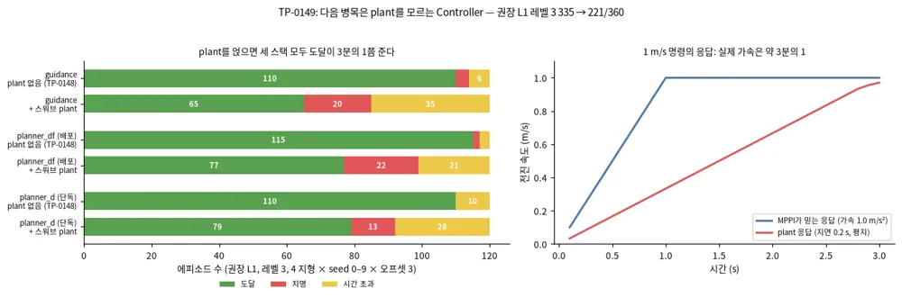

*그림 — TP-0149 (Fig. 1): 왼쪽은 권장 L1 레벨 3의 스택별 결과를 plant 없이(TP-0148)와 plant를 얹고 비교한 것이다. 오른쪽은 1 m/s 전진 명령에 대한 응답이다. 파랑은 MPPI rollout이 믿는 응답이고, 빨강은 시뮬이 plant에 적용하는 응답이다(평지, 미끄럼 없음).*

- **설정.** 권장 L1(`--perception l1 --shadow-ceiling --shadow-depth 0.10 --stereo --unknown-near 1.5 --shadow-low-fill --pit-margin 0.05`) + `--plant`(`PlantConfig` 기본값).
  스택은 guidance+mppi, planner_df+mppi, planner_d+mppi다. 레벨 3은 seed 0–9 × 오프셋 3, 레벨 0은 한 번이다(`results/tp0149/l1_plant`).
  귀인을 위해 plant + L0 인식(가림 없음)도 같은 절차로 돌렸다(`results/tp0149/l0_plant`).

| 권장 L1, 레벨 3 (스택마다 120) | plant 없음 (TP-0148) | + 스워브 plant |
|---|---|---|
| guidance | 110 (치명 4, 시간 초과 6) | 65 (치명 20, 시간 초과 35) |
| planner_df (배포) | 115 (2, 3) | 77 (22, 21) |
| planner_d (단독) | 110 (0, 10) | 79 (13, 28) |
| 레벨 0 (40씩, guidance · planner_df · planner_d) | 40 · 40 · 40 | 39 · 36 · 37 |

- **지형별(레벨 3, 세 스택 합 90).** curb_ramp가 가장 크게 무너진다. 15/90 도달이고 시간 초과가 60이다. bumps_potholes는 60/90(치명 22), random_mix는 62/90(치명 12), slope_crossfall은 84/90(치명 6)이다.
  plant에서는 Planner D 단독(79)이 guidance(65)보다 낫다.
- **인식 탓이 아니다.** plant + L0 인식(가림 없음)도 curb_ramp 레벨 3은 58개 중 8개만 지나간다(시간 초과 43). bumps_potholes·curb_ramp를 같은 에피소드끼리 비교하면 L1이 더하는 치명은 11 → 22다(일부만 돌리고 멈춤, `results/tp0149/l0_plant`).
- **왜 무너지나.** MPPI rollout은 명령이 곧 속도라고 본다(가속 한계 1.0 m/s²). 시뮬은 명령의 가속 한계를 실현된 속도 기준으로 걸고, plant가 그 차이를 1차 지연(0.2 s, 한 스텝에 3분의 1)으로 따라간다.
  그래서 실제 가속은 약 0.33 m/s²다. 1 m/s 명령에 1 s 대신 3 s 걸린다(그림 오른쪽).
  게다가 미끄럼은 판정 GT의 부풀린 경사·거칠기(0.30 m)로 정해져, 위험물 0.3 m 앞부터 이동 속도가 최대 35 % 준다.
  가장자리 근처에서 rollout이 약속한 감속과 회전을 로봇이 하지 못한다.
- **이미 있는 후보는 듣지 않는다.** 잔차 GP의 `mppi_ccgp`(다시 맞춘 GP, 끝점 제한 0.5 m)를 같은 조건에서 79개 돌렸다. 같은 에피소드에서 치명 11 → 12, 도달 51 → 46이고, curb_ramp는 21개 중 0개 도달이다.
  GP가 레벨 0 자료로 맞춰져 레벨 3의 경사 미끄럼을 모르는 것으로 본다(`results/tp0149/l1_plant_ccgp`, 도중에 멈춤).
- **판단.** 다음 병목은 레벨 3에서 plant를 다루는 Controller다. TP-0150에서 MPPI rollout 모델에 plant의 지연과 미끄럼을 넣는다. `MPPIController.model`만 바꿔 끼우므로 최적화기(`mppi.py`)는 그대로다.
  보행자 5명(TP-0149의 두 번째 후보)은 plant 쪽이 더 크므로 미뤘다.

### A.13.20 TP-0153 — L1 벤치마크의 GPU 경로: CPU와 비트 단위로 같고 3.5배 빠르다

**한 줄로.** ==`run_benchmark.py --device cuda`는 L1의 광선 투사와 belief 지도 생성을 GPU에서 돌리고, 결과는 CPU와 비트 단위로 같다.==
그래서 지금까지의 CPU 기준선과 그대로 짝 비교할 수 있다.
TP-0150의 CPU 실행 8 에피소드(권장 L1 + plant, bumps_potholes 레벨 3)를 GPU로 다시 돌렸다. 시간 지표를 뺀 모든 지표가 마지막 자리까지 같다.

- **왜.** TP-0152의 L1 + plant 에피소드 하나는 206 s였다(벤치마크 16개를 함께 돌린 부하 상태).
  그중 belief 지도 생성이 107 s, LiDAR·스테레오 광선 투사가 86 s로 모두 CPU에서 돌았고, NMPC는 7 s였다.
  TP-0084가 지도 생성을 GPU로 옮겨 두었지만 벤치마크가 그 옵션을 켜지 않았다.
- **무엇을 옮겼나.**
  - 광선 투사(`sim/lidar.py::cast_rays`, 스테레오 포함): [광선 × 표본] 행진을 GPU에서 한다. 적중한 광선만 CPU로 가져와 잡음·필터를 그대로 하므로 난수 흐름이 바뀌지 않는다.
  - 지도 생성: TP-0084의 `TravMapBuilder(device=...)`를 쓴다.
  - 연결: `SimConfig.device`와 `--device {cpu,cuda}`(기본 cpu). CUDA가 없으면 `--device cuda`는 오류로 멈춘다.
- **비트 단위로 맞춘 방법.** 처음 GPU 지도는 CPU와 1–2 ulp(최대 3e-7) 달랐다. 원인은 둘이었다.
  1. CUDA는 CPU 스칼라로 나누는 연산을 그 역수의 곱으로 바꾼다. 나누는 수를 GPU 텐서로 넘기면 IEEE 나눗셈이 된다(`features.true_div`, `cast_rays`의 격자 좌표).
  2. CPU의 float `sqrt`·`atan`은 벡터 근사라 정확한 반올림이 아니다. 무작위 입력 200만 개 중 34만 개에서 CPU `sqrt`가 1 ulp 틀렸고, CUDA 쪽은 모두 정확했다.
     지금까지의 실행은 모두 CPU였으므로 GPU 경로가 CPU 커널을 쓴다(`features._on_cpu`, 지도 하나당 작은 왕복 셋).
  평균·최대 풀링, 제곱, 원소별 사칙, 첫 적중 찾기는 재 보니 두 장치가 같았다.
- **확인.**

| 대상 | 비교 | 결과 |
|---|---|---|
| 광선 투사 | 4 지형 × 자세 6 × drop edge 둘, LiDAR·스테레오 | 48개 스캔이 모두 같은 점 |
| belief 지도 | 실제 L1 belief 32장(권장 L1 옵션), 8채널 | 모든 칸이 비트 단위로 같음 |
| 폐루프 | TP-0150 `mppi_plant_lag` 8 에피소드(guidance·planner_df, seed 0–3) | 성공·시간·경로 길이·roll·pitch·GT cost·jerk가 모두 같음 |

  테스트로 고정했다. `tests/test_gpu_paths.py`는 광선 투사와 플래그 전달을, `tests/test_core.py`는 지도의 비트 단위 동일과 "CPU `sqrt`가 CUDA와 다르다"는 전제를 본다.
- **속도(벤치마크 16개를 함께 돌린 부하 상태).** LiDAR 스캔 292 → 26 ms, 지도 생성 276 → 30 ms, 에피소드 약 200 → 57 s다.
  이제 에피소드 시간의 대부분은 CPU에서 도는 Controller다.
- **판단.** 다음 L1 비교 시리즈부터 `--device cuda`로 돌린다. 결과가 같으므로 따로 결정할 것이 없다.

### A.13.21 다음 병목 측정 3 — 보행자 5명을 권장 L1 + 스워브 plant에 얹는다(TP-0154)

**한 줄로.** ==보행자 5명을 얹어도 충돌은 720 에피소드 중 8건(1.1 %)이다. 레벨 0은 도달이 116 → 107/120으로 줄고(짝 11 : 2, p = 0.02), 레벨 3은 239 → 238/360으로 그대로다.==
충돌은 세 장면에 몰려 있다. 같은 장면을 다른 오프셋으로 돌리면 0.13–0.40 m 여유로 지나가기도 한다. 아슬아슬한 조우에서 MPPI 표본 잡음이 결과를 가른다.

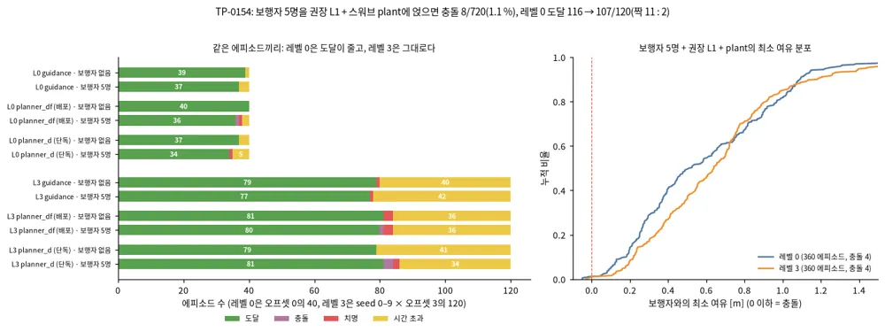

*그림 — TP-0154: 왼쪽은 보행자 없는 TP-0150과 같은 에피소드끼리 비교한 결과다(레벨 0은 오프셋 0의 40, 레벨 3은 120). 오른쪽은 보행자 5명 실행 전체의 최소 여유 누적 분포다.*

- **설정.** 권장 L1 + `--plant` + `--pedestrians 5`다. Controller는 plant 조건의 배포 Controller `mppi_plant_lag`, 스택은 guidance·planner_df·planner_d다.
  레벨 0·3 × seed 0–9 × 오프셋 0·1000·2000으로 720 에피소드다. TP-0153의 GPU 경로로 돌렸다. 다른 벤치마크 16개가 CPU를 다 쓰는 중에도 6 프로세스로 1시간 40분이 걸렸다.
  원자료는 `results/tp0154/ped5_plant`다.

| 보행자 5명 | 도달 | 충돌 | 치명 | 시간 초과 | 최소 여유 p5 · p50 |
|---|---|---|---|---|---|
| 레벨 0 (360) | 330 | 4 | 4 | 22 | 0.10 · 0.52 m |
| 레벨 3 (360) | 238 | 4 | 6 | 112 | 0.18 · 0.64 m |
| 레벨 3, 경사로 제외 (270) | 232 | 4 | 1 | 33 | — |

- **짝 비교(보행자 없을 때만 도달 : 보행자 5명일 때만 도달).**
  - 레벨 0: 11 : 2(p = 0.02). 보행자 없는 기준이 오프셋 0만 있어 120개를 짝지었다.
  - 레벨 3: 9 : 8(p = 1).
  - 레벨 3, 경사로 제외: 8 : 2(p = 0.11).
- **레벨 0에서 준 것.** 같은 120개 안에서 시간 초과가 4 → 10, 충돌이 0 → 1, 치명이 0 → 2다. 전체 360개의 시간 초과 22개는 bumps_potholes 11, curb_ramp 8, random_mix 3이다.
- **충돌 장면.**
  - bumps_potholes 레벨 0 s1(t ≈ 11.6 s): 아홉 번 중 넷이 충돌했다. 나머지 다섯은 0.13–0.40 m 여유로 지나갔다.
  - bumps_potholes 레벨 3 s9(t ≈ 9.2 s): planner_d만 세 번 중 두 번 충돌했고, 세 번째는 0.14 m로 지나갔다. 다른 스택은 0.18–0.34 m로 지나갔다.
  - random_mix 레벨 3 s9(t = 4.3 s): 오프셋 0의 planner_df·planner_d가 충돌했다. 이 장면은 TP-0141에서 본 한 칸 통로 장면이라, 나머지는 모두 시간 초과다.
- **기준과 견주면.** 비평가 기준은 보행자 3명에서 충돌률 목표 2 % 미만, 실패 10 % 초과다. 5명에서 1.1 %라 기준 안이다.
  다만 plant 없는 L0 인식(A.13.16, TP-0147로 출발점 겹침을 고친 뒤)에서는 보행자 5명의 충돌이 0이었다. 이번 충돌은 plant를 얹으면서 생겼다.
- **판단.** 보행자는 아직 첫 병목이 아니다. 실패 수로는 레벨 3 지형이 압도적이고(경사로 시간 초과 79, 설계 한계), 보행자는 레벨 0의 도달을 9개 줄인다.
  다음 후보는 둘이다. 하나는 충돌 세 장면과 레벨 0 시간 초과를 진단해 plant 조건의 보행자 회피를 다듬는 일이고, 다른 하나는 L1 belief로 Planner D를 재학습하는 일이다(TP-0055).

<!-- tab: Traversability -->

### A.10 Traversability 추정: 사람 라벨 없이, 불확실성과 함께

==**traversability 추정은 "이 땅을 이 로봇이 지나갈 수 있는가"를 비용으로 바꾸는 일이다.**== travplan은 지금 기하
특징(경사·턱·거칠기)으로 비용을 계산하고, TP-0010에서 이를 로봇이 몸으로 느낀 경험으로 학습하는 TravNet으로 바꾸려 한다.
이 절은 같은 문제를 먼저 푼 오프로드 연구들을 정리한다. A.10.1과 A.10.2는 분야를 바꾼 마일스톤과 2026년 최신 연구다.
A.10.3은 사용자 Notion의
[ADD - Traversability Estimation, Off-Road Autonomous Driving](https://app.notion.com/p/geonhee-lee/VLA-E2E-Learning-based-planning-Mobile-robot-346c5d39343d80f18d74f6efac4cc40a#3e5c5d39343d8039bd36c32ec5418e7d)
블록과 KAIST Urban Robotics Lab 연구다. 같은 블록의 학습 동역학·제어 연구는 Controller·안전 문서 §E에 있다.

#### A.10.1 계보: 기하에서 자기지도, 그리고 기반 모델로

**traversability 추정은 사람 라벨 분할(2019–2021)에서 로봇 경험 기반 자기지도(2020–2024)로, 다시 비전 기반 모델과 VLM(2024–2026)으로
옮겨 왔다.** 흐름을 바꾼 연구를 연도순으로 놓으면 다음과 같다.

| 연도 | 이름 | 라벨 출처 | 바꾼 것 | 코드(★) |
|---|---|---|---|---|
| 2020 | RELLIS-3D | 사람 라벨(20클래스) | 오프로드 멀티모달 데이터셋과 벤치마크 | [RELLIS-3D](https://github.com/unmannedlab/RELLIS-3D) 0.5k |
| 2020 | BADGR | 충돌·충격 사건(자기지도) | 사건을 예측하는 행동 조건 모델로 계획 | [gkahn13/badgr](https://github.com/gkahn13/badgr) 0.2k |
| 2022 | TerraPN | IMU 진동·주행거리 오차 | 표면 비용을 25분 만에 온라인 학습 | — |
| 2022 | How Does It Feel? | proprioception 비용 | 속도 조건 비용 지도, 장거리 오프로드 | — |
| 2024 | V-STRONG | 사람 주행 궤적 + SAM 마스크 | 대조 학습, zero-/few-shot 일반화 | — |
| 2024 | RoadRunner | 기존 스택의 사후 추정 | 카메라·LiDAR BEV에서 비용과 높이를 함께 예측 | — |
| 2023–2025 | WVN, SALON, STERLING | 현장 경험 | 수 분 안의 온라인 적응(A.7) | [WVN](https://github.com/leggedrobotics/wild_visual_navigation) 0.3k |
| 2026 | ViTA, CATNAV, PIVOT | 비전 기반 모델·VLM | SAM2 적응, VLM 비용 지도, 물리적 근거 | — |

**RELLIS-3D — 오프로드 인식의 공용 벤치마크**([arXiv:2011.12954](https://arxiv.org/abs/2011.12954), ICRA 2021, Texas A&M·ARL). 오프로드 캠퍼스에서
LiDAR 스캔 13,556개와 영상 6,235장에 사람이 의미 라벨을 달았다. 도시용 분할 모델이 클래스 불균형과 지형 굴곡 때문에 크게 무너진다는 것을
보였다. 이후 오프로드 traversability 연구의 기본 비교 대상이 되었다(RUGD와 함께).

**BADGR — 사건을 예측해서 계획한다**([arXiv:2002.05700](https://arxiv.org/abs/2002.05700), RA-L 2021, UC Berkeley). 기하만 보는 로봇은 키 큰
풀밭을 벽으로 보고 피한다. BADGR은 로봇이 실제로 겪은 **사건**(충돌, 충격, 위치)을 라벨로 삼는다. 영상과 앞으로의 행동 열을 넣으면 각 사건을
예측하는 모델을 학습하고, 그 모델 위에서 보상이 가장 큰 행동 열을 표본 기반 최적화로 고른다. 시뮬레이션과 사람 라벨 없이 실제 도시·오프로드
데이터만으로 학습했고, 데이터를 더 모을수록 스스로 나아진다. **travplan 구조의 원형**에 가깝다. 사건 라벨은 TravNet 자기지도 라벨(TP-0010)과
같고, 행동 열을 샘플링해 가중 평균하는 계획은 MPPI(배경 0.2)와 같다.


*그림 — BADGR (Fig. 5): 현재 영상과 앞으로의 행동 열을 받아 충돌·충격·위치 같은 미래 사건을 예측하는 행동 조건 예측 모델. 출처: [arXiv:2002.05700](https://arxiv.org/abs/2002.05700)*

<details markdown="1">
<summary>자세히: BADGR의 예측 모델과 계획</summary>

**모델.** 관측 $\mathbf o_t$와 행동 열 $\mathbf a_{t:t+H}$를 받아 사건 $K$개의 미래 값을 낸다. CNN이 영상을 요약해 RNN의 초기 상태로 넣고, RNN이
행동을 하나씩 받아 그 스텝의 사건을 예측한다.

$$ f_\theta(\mathbf o_t, \mathbf a_{t:t+H}) \rightarrow \hat{\mathbf e}^{0:K}_{t:t+H} $$

**계획.** 사건에 대한 보상 $R$(목표 쪽으로 가기, 충돌·충격 벌점)을 정하고 MPC처럼 매 스텝 푼다.

$$ \mathbf a^*_{t:t+H} = \arg\max_{\mathbf a_{t:t+H}} R\big(f_\theta(\mathbf o_t, \mathbf a_{t:t+H})\big) $$

**최적화.** 현재 추정 행동 열 $\hat{\mathbf a}$ 주변에서 시간 상관이 있는 샘플 $N$개를 뽑고($\beta$가 상관 정도), 보상 지수 가중 평균으로 갱신한다.

$$ \tilde{\mathbf a}^n_h = \beta\,(\hat{\mathbf a}_{h+1} + \epsilon^n_h) + (1 - \beta)\,\tilde{\mathbf a}^n_{h-1}, \qquad \hat{\mathbf a} = \frac{\sum_n \exp(\gamma R^n)\, \tilde{\mathbf a}^n}{\sum_{n'} \exp(\gamma R^{n'})} $$

시간 상관 샘플은 SMPPI(§B.5)의 "변화율로 샘플링"과, 지수 가중 평균은 MPPI 갱신과 같은 구조다.

**travplan에 주는 것.** travplan은 이 구조를 둘로 나눴다. 사건 예측은 TravMap 비용(인식)이 맡고, 행동 열 최적화는 Planner D와 MPPI(계획·제어)가
맡는다. BADGR은 둘을 한 모델로 묶어 "기하상 막혀 보여도 실제로는 지나갈 수 있는 풀밭"을 배웠다. TravNet이 기하 비용을 경험으로 고칠 때 같은
효과를 노린다.

</details>

**TerraPN — 표면 비용을 현장에서 25분 만에 배운다**([arXiv:2202.12873](https://arxiv.org/abs/2202.12873), IROS 2022, UMD). RGB 표면 패치와 로봇
속도를 입력으로, 실제로 겪은 IMU 진동과 주행거리 오차를 라벨로 표면 비용 지도를 학습한다. 표면 경계를 찾아 패치를 불균일하게 뽑아 추론 시간을
47.27% 줄였고, 다섯 표면 학습에 약 25분이 걸렸다. DWA를 확장한 계획(DWA-O)이 표면 비용과 가속 한계를 함께 조절해, 성공률을 최대 35.84% 높이고
진동 비용을 최대 21.52% 낮췄다.

**How Does It Feel? — 속도에 따라 달라지는 비용**([arXiv:2209.10788](https://arxiv.org/abs/2209.10788), ICRA 2023, CMU AirLab). 위에서 본 색 지도와
높이 지도 패치를 입력으로, 차량이 느낀 proprioception 충격을 비용 라벨로 학습한다. 같은 지형도 빠르면 더 거칠게 느껴지므로 **속도를 비용 예측의
입력**으로 넣었다. 대형 ATV와 Warthog로 400 m–3,150 m 오프로드 코스를 달려, occupancy 기반 기준선보다 사람 개입을 최대 57% 줄였다.


*그림 — How Does It Feel? (Fig. 2): 주행 궤적을 따라 자른 색·높이 지도 패치와 속도로, proprioception에서 만든 비용을 예측하도록 학습한다. 출처: [arXiv:2209.10788](https://arxiv.org/abs/2209.10788)*

**V-STRONG — 비전 기반 모델로 일반화한다**([arXiv:2312.16016](https://arxiv.org/abs/2312.16016), ICRA 2024, University of Washington). 사람이 운전한 궤적을
영상에 투영하고, 스테레오 깊이로 가려진 궤적 점을 걸러 낸다. SAM 인스턴스 마스크 단위로 "궤적이 지나간 영역"과 나머지를 대조 학습한다. 같은
벤치마크와 자체 데이터에서 최신 방법을 크게 앞섰고, 새 환경에서 zero-shot과 few-shot 일반화가 좋았다. 예측한 비용 지도를 MPC와 바로 연결했다.

**RoadRunner — 카메라·LiDAR에서 비용과 높이를 함께 예측한다**([arXiv:2402.19341](https://arxiv.org/abs/2402.19341), T-FR, ETH·NASA JPL). 고속
오프로드에서는 영상이 흐리고 LiDAR가 성기다. RoadRunner는 자율주행의 BEV 센서 융합 구조를 빌려, 카메라와 LiDAR에서 traversability와 elevation
map을 한 번에 낸다. 라벨은 기존 traversability 스택(X-Racer)이 주행 뒤 사후에 만든다. 기존 스택보다 지연을 500 ms에서 140 ms로 약 4배 줄이면서
비용과 높이 정확도를 높였고, 사막 고속 주행에 배포했다. P2 PRD R-F-001이 모델 설계 참고로 둔 연구다.


*그림 — RoadRunner (Fig. 2): 실제 주행 데이터를 기존 스택으로 사후 처리해 라벨을 만들고, 카메라·LiDAR BEV 융합 네트워크가 traversability와 높이를 함께 예측하도록 학습한다. 출처: [arXiv:2402.19341](https://arxiv.org/abs/2402.19341)*

#### A.10.2 최신(2026): 비전 기반 모델과 VLM

**2026년의 흐름은 둘이다.** 하나는 SAM2 같은 비전 기반 모델을 traversability 전용으로 **적응**시키는 것이고, 다른 하나는 VLM에게 비용을 **묻되
실제 측정에 맞춰 보정**하는 것이다.

**ViTA — SAM2를 traversability에 맞춘다**([arXiv:2605.29565](https://arxiv.org/abs/2605.29565), 2026-05). 비전 기반 모델을 분할 라벨로 그냥
미세조정하면 세 문제가 생긴다. 모델이 과제를 모르고, traversability 라벨은 경계가 모호하며, 의미 라벨과 물리적 안전이 다르다. ViTA는 학습 가능한
traversability prompt로 과제 지식을 넣고, 여러 관점으로 학습해 모호한 경계의 확신을 낮추며, 학습 때 기하 지식을 증류해 RGB만으로 경사와 높이를
추론한다. 의미와 기하를 합친 연속 점수를 내고, 여러 오프로드 데이터에서 최고 IoU와 정밀도를 거짓 양성을 크게 줄이며 달성했다.


*그림 — ViTA (Fig. 2): SAM2 인코더 특징을 학습 가능한 traversability prompt와 함께 처리해 의미 불확실성과 기하 위험을 합친 점수를 낸다. 출처: [arXiv:2605.29565](https://arxiv.org/abs/2605.29565)*

**CATNAV — VLM 비용 지도를 캐시로 싸게**([arXiv:2603.22800](https://arxiv.org/abs/2603.22800), 2026-03). 다중모달 LLM에게 로봇 몸체를 알려 주고
zero-shot으로 비용 지도를 받는다. 장면이 새롭지 않으면 의미가 비슷한 이전 프레임의 위험 평가를 재사용하는 캐시로 VLM 호출을 85.7% 줄였다.
VLM이 궤적 후보를 시각적으로 비교해 행동 제약을 지키는 가장 안전한 경로를 고른다. 4족 로봇 다섯 과제에서 VLA 기준선보다 목표 도달률이
평균 10%p 높고 제약 위반이 33% 적었다.

**PIVOT — VLM 비용을 실제 측정으로 보정한다**([arXiv:2609.20983](https://arxiv.org/abs/2609.20983), 2026-09). VLM이 예측한 주행 에너지, 진동,
바퀴 슬립이 실제 측정과 얼마나 상관하는지 재고, 상관이 높은 양식일수록 큰 가중치를 주는 통합 점수를 만든다. 평소에는 기하 기반 계획을 쓰고,
그것이 경로를 못 찾을 때만 VLM 의미 재계획을 부른다. 약 6.4 km 혼합 지형 경로 5회 반복에서 기하만 쓸 때보다 자율 비율을 59.6%에서 97.0%로,
사람 개입을 11회에서 3회로 줄이고, 개입 사이 평균 거리를 69.2 m에서 412.9 m로 늘렸다.


*그림 — PIVOT (Fig. 2): 기하 기반 계획을 기본으로 두고, 실패할 때만 VLM 의미 계획으로 넘어가는 두 층 내비게이션 구조. 출처: [arXiv:2609.20983](https://arxiv.org/abs/2609.20983)*

**travplan에 주는 의미.** ==VLM은 기본 비용이 아니라 막혔을 때의 보조 판단으로 쓴다.== PIVOT의 "기하 기본 + VLM 대체" 구조는 travplan에 그대로
맞는다. 기하 TravMap이 평소 비용을 맡고, 기하상 막혀 보이는 풀밭이나 물웅덩이 앞에서만 TravNet이나 VLM에게 묻는다. CATNAV의 캐시는 Orin 예산에서
VLM 호출 빈도를 낮추는 방법이다.

#### A.10.3 불확실성까지 다루는 계열 (사용자 Notion ADD 블록)

이 계열의 파이프라인은 네 단계로 읽으면 쉽다.

```
주행 로그 ─▶ ① 라벨 만들기 ──────────▶ ② 학습 ─────────────────▶ ③ 지도에 쌓기 ──────────▶ Controller
           바퀴가 지나간 곳 = 쉬움       one-class / PU learning,     불확실성으로 가중한          비용과 σ를 쓴다
           차량이 느낀 충격 = 비용       메타러닝 온라인 적응          커널 추론(BKI), 빈 곳 보간
           Self-Supervisions Only,     ScaTE, METAVerse             Evidential BKI, E2-BKI, TRIP
           ScaTE                                                    ↔ travplan TravMap.SIGMA, fill_unknown
```

**① 라벨을 사람 없이 만든다 — *Learning Off-Road Terrain Traversability with Self-Supervisions Only***
([arXiv:2305.18896](https://arxiv.org/abs/2305.18896), RA-L 2023). 차량이 실제로 지나간 영역을 "지나갈 수 있음"으로 자동
라벨하고, 지나가지 않은 곳은 라벨 없이 둔다. 양성 라벨만 있으므로 **one-class 분류**와 시각 표현 자기지도 학습을 결합해
낯선 환경으로 일반화한다. travplan `FootprintLabeler`(발자국 아래 칸만 라벨)와 같은 발상이다.


*그림 — Self-Supervisions Only (Fig. 2): 바퀴가 닿은 점은 traversable, 가려진 점은 제외하는 자동 라벨 생성 절차. 출처: [arXiv:2305.18896](https://arxiv.org/abs/2305.18896)*

<details markdown="1">
<summary>자세히: Self-Supervisions Only의 방법과 수식</summary>

**라벨 만들기.** SLAM으로 복원한 궤적에서 시각 $t_i$부터 $t_{i+\alpha}$까지의 바퀴 접지점 $T(t_i, t_{i+\alpha})$를 구한다. 영상에 투영하면 장애물 뒤로 가려진 접지점까지
라벨이 되므로, 같은 시각의 LiDAR로 가림을 걸러낸다. 구면 좌표에서 가장 가까운 LiDAR 점보다 멀리 있는 접지점은 가려진 것으로 본다. 먼지·비·눈 노이즈는
비지도 LiDAR 잡음 제거로 먼저 지운다. 남은 접지점 $T'$를 카메라로 투영하고, **좌우 바퀴 접지점 사이 픽셀만 양성**, 나머지는 라벨 없음으로 둔다.

$$ \hat y = K\,[R \mid t]\; T'(t_i, t_{i+\alpha}) $$

**학습(배경 0.9 ②).** PSPNet 인코더가 픽셀 특징 $z_i$를 낸다. 양성 특징을 한 중심에 모으는 one-class 손실 $\mathcal{L}_{\text{OCC}} = 1 - p(z_i)$은 **붕괴 해**와 **다양한 쉬운 지형(흙길, 풀밭 등)을 한 점에 억지로 모으는 문제**가 있다. 그래서
정규화 흐름(Fastflow)으로 특징을 다루기 쉬운 분포로 옮기고, 변수 변환 공식의 Jacobian 항이 상수 사상(붕괴)을 벌하게 한다.

$$ \log p(z_i) = \log p(z_i^F) + \log \Big| \det \frac{\partial z_i^F}{\partial z_i} \Big|, \qquad p(z_i^F) = z_i^F \cdot C_p $$

여기에 라벨 없는 픽셀을 prototype으로 군집화하는 자기지도 학습을 더해 인코더까지 끝까지 학습한다.

**travplan에 주는 것.** `FootprintLabeler`의 "발자국 아래 칸만 라벨"과 같고, **가림 필터**가 빠져 있다는 점을 알려 준다. Isaac·실물 카메라로 라벨을 만들 때는 같은 LiDAR
가림 검사가 필요하다.

</details>

**② 지나가지 않은 곳에서 과신하지 않는다 — ScaTE**([arXiv:2209.06522](https://arxiv.org/abs/2209.06522), RA-L/IROS 2023).
점군을 보고 "그 차량이 여기서 느낄 proprioception"을 예측해서, **차량마다 다른 traversability**를 학습한다. 그리고
**PU(positive-unlabeled) learning**으로, 한 번도 지나가지 않은 덤불이나 급경사를 모델이 근거 없이 "쉽다"고 판단하는 문제를
막는다. TP-0010 설계 문서에서 측정한 "라벨된 칸 6–9%, 힘든 곳 라벨 0–7%"가 정확히 이 문제다. 그래서 설계의 대응안(탐색 정책,
라벨 없는 칸은 가중치 0)에 **PU loss를 추가 후보**로 올렸다.


*그림 — ScaTE (Fig. 2): 자기지도 traversability의 불확실성 문제. 지나가지 않은 덤불·자갈·급경사에서 추정이 과신한다. 출처: [arXiv:2209.06522](https://arxiv.org/abs/2209.06522)*

<details markdown="1">
<summary>자세히: ScaTE의 방법과 수식</summary>

**데이터.** 바퀴마다 경험(예: 수직 힘)을 따로 기록하고, LiDAR SLAM으로 복원한 바퀴 접지 영역에서 바퀴 두께보다 가까운 점을 양성(정답 traversability 값 포함)으로,
나머지를 라벨 없음으로 둔다. 접지 순간의 속도와 heading도 함께 기록한다. 결과는 양성 $n_p$개와 라벨 없음 $n_u$개로 된 PU 데이터다.

**구조.** RandLA-Net이 점마다 특징 $x_i = f_\theta(p_i)$를 내고, 두 헤드가 공유한다. 회귀 헤드는 **차량 상태와 함께** 바퀴별 traversability를 예측하고(양성 데이터만 사용),
분류 헤드는 "이 추정을 믿을 수 있는가(지나갈 수 있는가)"를 판정한다.

$$ T_i = h_\psi(x_i, s_i), \qquad Y_i = g_\phi(x_i) $$

**불확실성 처리(배경 0.9 ②).** 분류 특징을 양성 중심 $C_p$ 주변에 모으고(Deep SVDD), 라벨 없는 점은 $K$개 prototype으로 균등 분할 군집화해 붕괴를 막는다.
양성 중심과의 유사도가 임계보다 낮은 점은 "지나가지 않은 곳이라 추정이 과신일 수 있음"으로 보고 피한다.

$$ \mathcal{L}^{\text{SVDD}}(x_i) = \lVert g_\phi(x_i) - C_p \rVert^2, \qquad Q_{kj} = \mathrm{softmax}_k\big(x_j^\top c_k / \tau\big),\ \tau = 0.05 $$

**travplan에 주는 것.** 회귀에 차량 상태를 넣는 설계는 "같은 연석도 느리면 쉽고 빠르면 어렵다"를 담는다. TravNet 입력에 속도를 넣을지 정할 때 참고한다. 분류
헤드는 TP-0010 PU 대응안의 직접적인 구현 후보다.

</details>

**③ 새 환경에 빨리 맞춘다 — METAVerse**([arXiv:2307.13991](https://arxiv.org/abs/2307.13991)). LiDAR 한 스윕으로 BEV 연속
비용 지도를 만든다. 여러 환경의 주행 데이터로 메타러닝한 전역 모델을, 배포 중에는 최근 상호작용 경험으로 **온라인 적응**시키고,
그 비용 지도를 MPC에 넣는다. WVN(A.7)의 "현장 5분 적응"을 LiDAR 쪽에서 푼 셈이다. travplan은 Isaac·실물 단계(TP-0010 E4 이후)에서
참고한다.


*그림 — METAVerse (Fig. 1): 자기 라벨 데이터로 메타러닝한 비용 예측 네트워크가 BEV 비용 지도를 만들고, 현장에서 온라인 적응해 MPC가 쓴다. 출처: [arXiv:2307.13991](https://arxiv.org/abs/2307.13991)*

<details markdown="1">
<summary>자세히: METAVerse의 방법과 수식</summary>

**비용 라벨: 수직 가속의 wavelet 파워.** IMU의 $z$축 가속 $a_z(t)$에 Morlet wavelet 변환을 하고, 주파수 척도 $f_n = 2^n f_0$($f_0 = 0.16$부터 $5.12$ Hz까지)의
파워를 주파수로 나눠 더한다. 신호를 구간으로 자르지 않고도 시각마다 비용이 나온다. 궤적 위치의 BEV 칸에 이 비용을 붙인다.

$$ c_t = \sum_{n=0}^{j} \frac{\lVert w_z(f_n, t) \rVert^2}{f_n} $$

**비용 지도 네트워크.** LiDAR 한 스윕을 PointPillars처럼 기둥으로 나누고(점마다 $(\Delta x, \Delta y, \Delta z, d)$), 간단한 PointNet으로 기둥 특징을 만든 뒤 BEV에 흩뿌리고
U-Net으로 조밀한 비용 지도를 낸다.

**메타러닝(배경 0.11).** 환경마다 성질이 크게 다르므로 전체를 한 과제로 학습하면 우연 불확실성이 커진다. 대신 **궤적 조각 하나를 과제 하나**로 보고, 지난 $M$ 스텝의
경험으로 적응한 모델이 다음 구간의 비용을 잘 맞히도록 MAML로 학습한다. 배포 중에는 최근 경험으로 몇 스텝 경사하강해 현재 환경에 맞춘다.

**travplan에 주는 것.** travplan `KinematicProprioProxy`는 차체 높이의 2차 차분(수직 가속)을 4 m/s²로 나눠 쓴다. 이 논문처럼 **주파수별 파워**로 바꾸면 느린 경사와 빠른
요철을 구분할 수 있다. TP-0022 E1(proxy 튜닝)의 후보다.

</details>

**④ 불확실성으로 가중해 지도에 쌓는다 — Evidential BKI 계열.** *Evidential Semantic Mapping*([arXiv:2403.14138](https://arxiv.org/abs/2403.14138))은
Evidential Deep Learning으로 분할 결과의 불확실성을 구하고, **Bayesian Kernel Inference(BKI)**로 지도를 합칠 때 확신 높은 예측을
우선한다. 후속 **E2-BKI**([arXiv:2509.11964](https://arxiv.org/abs/2509.11964))는 노이즈 점을 가우시안으로 묶고 장면 기하에 맞춘
타원형 커널을 쓴다. 같은 저자의 Dempster-Shafer 증거 이론 변형도 있다([arXiv:2405.06265](https://arxiv.org/abs/2405.06265)).
travplan에서는 `TravMap.SIGMA`를 만드는 방식을 개선할 때 참고한다. 지금은 "미관측이면 1"이지만, 관측 거리와 예측 확신도를
σ에 반영할 수 있다.


*그림 — Evidential Semantic Mapping (Fig. 2): 증거 기반 분할 네트워크가 확률과 불확실성을 내고, 불확실성 인지 BKI가 확신 높은 예측 위주로 3D 지도를 쌓는다. 출처: [arXiv:2403.14138](https://arxiv.org/abs/2403.14138)*


*그림 — E2-BKI (Fig. 1): 신뢰할 수 있는 관측을 우선하는 처리와 장면 기하에 맞춘 비등방(타원) 커널로 정확한 지도를 만든다. 출처: [arXiv:2509.11964](https://arxiv.org/abs/2509.11964)*

<details markdown="1">
<summary>자세히: Evidential Semantic Mapping의 방법과 수식</summary>

**BKI 사후분포(배경 0.10).** 질의점 $x_*$의 클래스 확률 $\theta_*$에 Dirichlet 사전분포를 두고, 관측이 커널 $k$만큼 기여하게 한다. 커널을 지수로 쓰는 "확장 우도"가
최대 엔트로피 분포라는 결과(BKI)를 쓰면 사후분포가 닫힌 형태로 나오고, 순차 갱신이 가능하다.

$$ p(\theta_* \mid x_*, \mathcal{D}) \propto \Big[\prod_{i=1}^{N} p(y_i \mid \theta_*)^{k(x_*, x_i)}\Big]\, p(\theta_*) $$

**evidential 분할(배경 0.8).** 분할 네트워크 마지막 softmax를 $\exp$로 바꿔 증거 $e_i$를 내고, $\hat\alpha_i^c = e_i^c + 1$, 불확실성 $u_i = C / \hat S_i$를 한 번의 forward로 얻는다.

**불확실성 인지 확장.** 원-핫 라벨 대신 확률 벡터 $p_i$를 그대로 쓰도록 우도를 연속 범주형으로 일반화한다. Dirichlet이 여전히 켤레라서 갱신이 간단하다.

$$ \alpha_t^c = \alpha_{t-1}^c + \sum_{i=1}^{N} k(x_*, x_i)\, p_i^c $$

그리고 **커널 길이를 불확실성으로 조절**한다. 확신 있는 관측은 넓게, 불확실한 관측은 좁게 퍼지고, 임계를 넘는 관측은 버린다($\beta, \gamma$: 하이퍼파라미터).

$$ k(x_*, x_i) = \begin{cases} k'\big(d,\ l \cdot \beta e^{1 - \gamma u_i},\ \sigma_0\big) & u_i \le U_{\text{thr}} \\ 0 & u_i > U_{\text{thr}} \end{cases} $$

**travplan에 주는 것.** TravMap을 여러 프레임에 걸쳐 쌓을 때(지금은 시간 필터 0.7/0.3), 관측마다 σ에 따라 영향 범위를 바꾸는 방법이다.

</details>

<details markdown="1">
<summary>자세히: E2-BKI의 방법과 수식</summary>

**출발점.** 기본 semantic BKI(S-BKI)는 **등방성 커널**로 주변 관측을 모은다. 가까운 관측을 우선하지만 방향을 가리지 않아, 벽이나 연석 경계처럼 구조가 뚜렷한 곳에서
반대편 관측까지 섞는다.

$$ p(\hat\theta_m \mid \hat x_m, \mathcal{D}) \propto \prod_{c=1}^{C} (\hat\theta_m^c)^{\alpha_0^c + \sum_n k(\hat x_m, x_n)\, y_n^c - 1} $$

**E2-BKI의 두 장치.**
1. **증거 기반 처리.** Evidential BKI처럼 관측의 불확실성으로 신뢰할 관측을 우선한다. 센서에서 멀수록 관측이 희소하고 거칠다는 점도 반영한다.
2. **타원 가우시안 커널.** 노이즈 섞인 점들을 이방성 가우시안 원시체로 묶고, 그 공분산이 장면 기하(표면 방향)를 따르게 한다. 커널이 구조를 따라 퍼지고 가로지르지
   않으므로 경계가 선명해진다.

**travplan에 주는 것.** 2.5D TravMap에서도 연석 경계를 가로질러 높이·비용이 번지는 문제가 있다(`fill_unknown`의 확산 보간). 경계를 따라 퍼지는 이방성 보간의 근거다.

</details>

**⑤ 빈 곳을 채우며 위험을 예측한다 — TRIP**([arXiv:2411.17134](https://arxiv.org/abs/2411.17134), KAIST Urban Robotics Lab).
다리 로봇은 시야가 좁고 가림이 많아 지형에 빈 곳이 생긴다. TRIP은 그 빈 곳을 채우면서 **여러 종류의 위험을 함께 예측**한다.
구면 투영 공간에서 발 디딤 가능성(steppability)을 추정하고, traversability를 고려한 Bayesian generalized kernel(T-BGK)로 빈 곳을
보간하며, steppability 기반 Mahalanobis 거리로 이상치와 움직이는 물체를 걸러 정적 지도를 만든다. ④의 BKI처럼 "커널 추론으로
빈 곳 채우기"를 온라인 내비에 적용한 사례이고, travplan `fill_unknown`(미관측 확산 보간)을 개선할 때 참고한다.


*그림 — TRIP (Fig. 1): 지역·전역 지형 지도를 만들면서 여러 종류의 traversability 위험을 함께 예측한다. 출처: [arXiv:2411.17134](https://arxiv.org/abs/2411.17134)*

<details markdown="1">
<summary>자세히: TRIP의 방법과 수식</summary>

**세 단계.** ① 구면 투영 공간에서 발 디딤 가능성(steppability) 추정, ② traversability를 고려한 커널 추론(T-BGK)으로 지역 지형 지도 채우기, ③ steppability 기반
Mahalanobis 거리로 이상치를 걸러 지도 갱신.

**① 구면 투영.** 점 $(x, y, z)$를 시야각 기준으로 surfel 영상의 픽셀 $(u, v)$에 투영한다. 격자와 달리 점군 분포에 따라 계산량이 바뀌지 않는다.

$$ u = w\Big[1 - \frac{\arctan(y/x) + f_r}{f_l + f_r}\Big], \qquad v = h\Big[1 - \frac{\arcsin\!\big(z / \sqrt{x^2 + y^2}\big) + f_b}{f_t + f_b}\Big] $$

각 surfel은 점 $p$와 주변 점 PCA로 구한 법선 $n$을 가진다. 이로부터 발 디딤 가능성 영상을 만든다.

**② 지도 채우기.** surfel을 지형 지도 칸 $\mathcal{E} = \{(o_e, h_e^{\max}, h_e^{\min}, n_e^z, r_e^{\text{step}})\}$로 다시 투영한다. 아래에서 위로 투영하면서, 칸 높이보다 로봇 높이 $h_p$ 이상
높은 요소(나뭇가지 같은 오버행)는 버린다. 그래도 남는 빈 칸을 **traversability를 고려한 Bayesian generalized kernel**로 보간한다(배경 0.10).

**③ 이상치 제거.** 새 관측과 지도 사이의 steppability 기반 Mahalanobis 거리가 크면 움직이는 물체나 잡음으로 보고 반영하지 않아, **정적** 지형 지도를 유지한다.

**travplan에 주는 것.** travplan의 알려진 한계 가운데 "오버행을 표현하지 못한다"에 대해, 로봇 높이 이상 떠 있는 요소를 걸러내는 간단한 규칙을 준다. `fill_unknown` 보간 개선의
구체적인 방법이기도 하다.

</details>

**강연**: Junwon Seo, *Embracing Uncertainty in Off-road Perception: Towards Robust Autonomous Navigation*
([YouTube](https://www.youtube.com/watch?v=xJEXuIprkSg)) — ①–④를 한 흐름으로 설명한다.

| 연구 | 입력 | 라벨·학습 | 불확실성 처리 | travplan 적용 |
|---|---|---|---|---|
| Self-Supervisions Only | 카메라 | 지나간 곳 = 양성, one-class | 라벨 없는 곳은 학습 제외 | `FootprintLabeler`와 같은 구조 |
| ScaTE | 점군 | 차량이 느낄 proprioception 회귀 | **PU learning** | TP-0010에 PU loss 추가 후보 |
| METAVerse | LiDAR 1 스윕 | 상호작용 피드백 + 메타러닝 | 온라인 적응 | Isaac·실물 단계 온라인 적응 |
| Evidential BKI / E2-BKI | 카메라 + LiDAR | 시맨틱 분할(EDL) | 증거 기반 불확실성으로 융합 가중 | `TravMap.SIGMA` 생성 개선 |
| TRIP | LiDAR·깊이 | 기하 steppability + T-BGK 보간 | Mahalanobis 거리로 이상치 제거 | `fill_unknown` 보간 개선 |

---

<!-- tab: 시각 기반 모델 -->

### A.11 시각 기반 모델: 라벨 없이 학습한 백본 위에 작은 헤드를 얹는다

**2023년부터 로봇 인식의 출발점은 과제별 모델이 아니라 시각 기반 모델(vision foundation model)이다.** 대규모 영상으로 한 번
사전학습한 백본이 특징, 깊이, 분할, 글로 지정한 검출을 내고, 로봇은 그 위에 작은 헤드만 학습한다. A.7의 WVN이 고정한 DINO 특징
위에서 5분 만에 적응하고, A.10의 V-STRONG와 ViTA가 SAM 마스크를 쓰는 것도 이 흐름이다. 제품에 넣을 때는 성능만큼 **라이선스**가
중요해서 표에 함께 적었다. 다운로드 수는 HuggingFace가 보여 주는 최근 30일 값이다(2026-09).

| 연도 | 이름 | 내는 것 | 가중치 라이선스 | 코드(★), HF 다운로드 |
|---|---|---|---|---|
| 2023 | DINOv2 | 범용 영상 특징(전역·패치) | Apache-2.0 | [facebookresearch/dinov2](https://github.com/facebookresearch/dinov2) 13.4k, [dinov2-base](https://huggingface.co/facebook/dinov2-base) 2.87M |
| 2023 | Grounding DINO | 글로 지정한 물체의 상자(open-set 검출) | Apache-2.0 | [IDEA-Research/GroundingDINO](https://github.com/IDEA-Research/GroundingDINO) 10.6k, [grounding-dino-base](https://huggingface.co/IDEA-Research/grounding-dino-base) 1.41M |
| 2024 | Depth Anything V2 | 단안 상대 깊이, metric 미세조정 판 | Small은 Apache-2.0, Large는 CC-BY-NC-4.0(비상업) | [DepthAnything/Depth-Anything-V2](https://github.com/DepthAnything/Depth-Anything-V2) 8.9k, [V2-Small-hf](https://huggingface.co/depth-anything/Depth-Anything-V2-Small-hf) 2.76M |
| 2024 | SAM 2 | 점·상자로 지정한 물체의 영상 분할과 추적 | Apache-2.0 | [facebookresearch/sam2](https://github.com/facebookresearch/sam2) 19.9k, [sam2.1-hiera-large](https://huggingface.co/facebook/sam2.1-hiera-large) 0.12M |
| 2025 | DINOv3 | 7B 교사에서 증류한 고해상도 조밀 특징 | 자체 라이선스(HF 표기 other) | [facebookresearch/dinov3](https://github.com/facebookresearch/dinov3) 11.4k, [dinov3-vitb16](https://huggingface.co/facebook/dinov3-vitb16-pretrain-lvd1689m) 0.61M |
| 2025 | Depth Anything 3 | 영상 여러 장에서 깊이와 카메라 광선 | Large, Metric, Mono 판은 Apache-2.0 | [ByteDance-Seed/Depth-Anything-3](https://github.com/ByteDance-Seed/Depth-Anything-3) 6.4k, [DA3METRIC-LARGE](https://huggingface.co/depth-anything/DA3METRIC-LARGE) 0.29M |
| 2025 | SAM 3 | 명사구로 지정한 모든 인스턴스의 분할과 추적 | 자체 라이선스(HF 표기 other) | [facebookresearch/sam3](https://github.com/facebookresearch/sam3) 11.8k, [sam3](https://huggingface.co/facebook/sam3) 2.1M |

#### A.11.1 특징 백본: DINOv2와 DINOv3

**DINOv2 — 라벨 없이 학습한 범용 영상 특징**([arXiv:2304.07193](https://arxiv.org/abs/2304.07193), 2023, Meta). 자기지도 학습도
데이터를 잘 고르고 규모를 키우면 과제와 상관없이 쓰이는 특징을 낸다는 것을 보였다. 큰 웹 영상 풀에서 기존 큐레이션 데이터와 닮은
영상을 자동으로 골라 1.42억 장의 학습 세트(LVD-142M)를 만들었다. 1B 파라미터 ViT를 학습한 뒤 작은 모델들로 증류했고, 영상 단위와
픽셀 단위 벤치마크 대부분에서 OpenCLIP을 앞섰다. 백본을 고정하고 선형 헤드만 붙여도 분할과 깊이 추정이 된다.


*그림 — DINOv2 (Fig. 1): 같은 열 영상들의 패치 특징에 PCA를 하고 첫 세 성분을 색으로 칠했다. 자세, 화풍, 물체 종류가 달라도 같은 부위가 같은 색으로 묶인다. 출처: [arXiv:2304.07193](https://arxiv.org/abs/2304.07193)*

**DINOv3 — 오래 학습해도 조밀 특징이 무너지지 않게**([arXiv:2508.10104](https://arxiv.org/abs/2508.10104), 2025, Meta). 모델을
7B 파라미터로, 데이터를 큐레이션한 16.89억 장(LVD-1689M)으로 키우면 전역 성능은 오르지만 오래 학습할수록 패치 특징이 흐려진다.
DINOv3는 학습 초기 교사의 패치 사이 유사도 구조(Gram 행렬)를 붙잡아 두는 Gram anchoring으로 이 문제를 풀었다. 7B 교사를
ViT-S, B, L과 ConvNeXt로 증류했고, 미세조정 없이 조밀 과제에서 이전 자기지도·약지도 모델을 크게 앞섰다. 같은 방법으로 위성 영상용
7B 모델도 만들었다. 가중치가 자체 라이선스라 제품에 쓰려면 조건을 따로 확인해야 한다.


*그림 — DINOv3 (Fig. 3): 빨간 십자로 표시한 패치와 나머지 모든 패치 사이의 코사인 유사도 지도. 고해상도에서도 물체 경계를 따라 유사도가 끊긴다. 출처: [arXiv:2508.10104](https://arxiv.org/abs/2508.10104)*

<details markdown="1">
<summary>자세히: DINO 계열의 자기지도 목적함수와 Gram anchoring</summary>

**교사와 학생.** 같은 영상에서 자른 두 조각을 학생과 교사 네트워크에 넣는다. 교사는 학생 가중치의 지수 이동 평균(EMA)이라 따로
학습하지 않는다. 학생은 교사의 출력 분포를 맞히도록 학습한다.

**영상 단위 손실(DINO).** class token을 헤드에 통과시켜 "프로토타입 점수"의 softmax 분포를 만든다. centering을 거친 교사 분포
$p_t$와 학생 분포 $p_s$의 교차 엔트로피를 줄인다.

$$ \mathcal L_{\text{DINO}} = -\sum_k p_{t,k} \log p_{s,k} $$

**패치 단위 손실(iBOT).** 학생 입력의 패치 일부를 가리고, 가려진 패치 $i$마다 교사가 그 패치를 보고 낸 분포를 맞힌다.

$$ \mathcal L_{\text{iBOT}} = -\sum_{i \in \text{masked}} \sum_k p_{ti,k} \log p_{si,k} $$

**KoLeo 정규화.** 배치 안 특징 $x_i$가 서로 고르게 퍼지도록, 가장 가까운 이웃까지 거리 $d_{n,i} = \min_{j \ne i} \lVert x_i - x_j \rVert$를 키운다.

$$ \mathcal L_{\text{KoLeo}} = -\frac{1}{n} \sum_{i=1}^{n} \log d_{n,i} $$

**Gram anchoring(DINOv3).** 영상 한 장의 패치 $P$개 특징을 L2 정규화해 쌓은 $P \times d$ 행렬을 학생은 $\mathbf X_S$, 학습 초기의
교사("Gram 교사")는 $\mathbf X_G$라 하자. 특징 자체가 아니라 패치 사이 유사도 구조만 Gram 교사에 맞춘다. 특징은 자유롭게 움직이되,
어느 패치끼리 닮았는지는 유지된다.

$$ \mathcal L_{\text{Gram}} = \big\lVert \mathbf X_S \mathbf X_S^\top - \mathbf X_G \mathbf X_G^\top \big\rVert_F^2 $$

**travplan에 주는 것.** traversability는 칸마다 판단하는 조밀 과제다. 전역 분류 성능보다 패치 특징이 경계를 얼마나 잘 지키는지가
중요하다. TravNet(TP-0010)은 지금 TravMap 기하 특징만 입력으로 받는다. 영상 가지를 더할 때 백본은 Apache-2.0인 DINOv2를 기본으로
두고, DINOv3는 라이선스를 확인한 뒤 조밀 특징 비교 대상으로 쓴다.

</details>

#### A.11.2 깊이: Depth Anything V2와 Depth Anything 3

**Depth Anything V2 — 합성 영상으로 가르친 교사, 실제 영상으로 배운 학생**([arXiv:2406.09414](https://arxiv.org/abs/2406.09414),
NeurIPS 2024). 실제 깊이 라벨은 투명한 물체, 반복 무늬, 움직이는 물체에서 잡음이 많다. V2는 실제 라벨 영상을 모두 버리고, 정확한
합성 영상 59.5만 장으로 DINOv2-G 기반의 큰 교사를 학습한다. 교사가 실제 영상 6,200만 장에 가짜 라벨을 달고, 학생 모델들이 그
가짜 라벨로 배운다. V1보다 세밀하고 견고하며, Stable Diffusion 기반 깊이 모델보다 10배 넘게 빠르면서 더 정확하다. 2,500만에서
13억 파라미터까지 여러 크기가 있고 metric 깊이로 미세조정한 판도 있다.


*그림 — Depth Anything V2 (Fig. 1): V1보다 견고하고 세밀하며, Stable Diffusion 기반 모델보다 빠르고 파라미터가 적으면서 깊이 정확도가 높다. 출처: [arXiv:2406.09414](https://arxiv.org/abs/2406.09414)*

**Depth Anything 3 — 영상 몇 장이든 깊이와 카메라를 함께**([arXiv:2511.10647](https://arxiv.org/abs/2511.10647), 2025, ByteDance Seed).
한 장이든 여러 장이든, 카메라 자세를 알든 모르든 공간적으로 일관된 기하를 낸다. 특별한 구조 없이 평범한 DINOv2 transformer 하나와,
픽셀마다 깊이와 카메라 광선을 내는 단일 목표(depth-ray)면 충분하다는 것을 보였다. 새 시각 기하 벤치마크에서 이전 최고인 VGGT보다
카메라 자세 정확도를 평균 44.3%, 기하 정확도를 25.1% 높였다(초록 기준). 단안 깊이에서도 V2를 앞섰다. 공개 학술 데이터만으로
학습했다.


*그림 — Depth Anything 3 (Fig. 2): 수정하지 않은 DINOv2 transformer 하나가 여러 시점 영상을 함께 처리하고, 깊이 지도와 광선 지도를 낸다. 출처: [arXiv:2511.10647](https://arxiv.org/abs/2511.10647)*

<details markdown="1">
<summary>자세히: Depth Anything의 손실과 depth-ray 표현</summary>

**V2의 손실.** MiDaS에서 온 두 손실을 1:2 비율로 쓴다. 예측과 정답 역깊이를 각각 중앙값 $t(\cdot)$과 평균 절대 편차 $s(\cdot)$로
정규화하면 축척과 이동을 모르는 단안 깊이도 비교할 수 있다.

$$ \hat d^* = \frac{\hat d - t(\hat d)}{s(\hat d)}, \qquad \mathcal L_{\text{ssi}} = \frac{1}{2M} \sum_{i=1}^{M} \big\lvert \hat d^*_i - d^*_i \big\rvert $$

기울기 정합 손실은 잔차 $R = \hat d^* - d^*$의 기울기를 여러 축척 $k$에서 줄여 경계를 날카롭게 한다. 논문은 합성 영상으로 학습할
때 이 손실이 특히 도움이 된다고 보고했다.

$$ \mathcal L_{\text{gm}} = \frac{1}{M} \sum_{k} \sum_{i} \big( \lvert \nabla_x R^k_i \rvert + \lvert \nabla_y R^k_i \rvert \big) $$

가짜 라벨 영상에서는 손실이 가장 큰 10% 영역을 잡음으로 보고 학습에서 뺀다.

**DA3의 depth-ray 표현.** 영상 $i$의 픽셀 $\mathbf p = (u, v, 1)^\top$마다 깊이 $D_i(u, v)$와 광선 $\mathbf r = (\mathbf t, \mathbf d)$를 낸다.
원점 $\mathbf t$는 카메라 위치이고 방향은 $\mathbf d = \mathbf R \mathbf K^{-1} \mathbf p$다. 직교 제약이 있는 회전 행렬을 직접
맞히지 않아도 되고, 3D 점은 원소별 연산으로 바로 나온다.

$$ \mathbf P = \mathbf t + D_i(u, v)\, \mathbf d $$

여러 장을 다루려고 선택한 층에서 토큰을 재배열해 모든 영상 사이에 self-attention을 한다. 광선 지도에서 자세를 푸는 계산을 줄이려고,
카메라 토큰에서 시야각, 회전(쿼터니언), 위치를 바로 내는 가벼운 카메라 헤드를 더했다.

**travplan에 주는 것.** 단안 깊이는 카메라만으로 근거리 높이를 채우는 후보다. 상대 깊이는 축척을 모르므로 TravMap에 쓰려면
metric 판을 쓰거나 LiDAR 몇 점으로 축척을 맞춰야 한다. V2의 "합성 영상 교사, 실제 영상 학생" 구조는 Isaac Sim 영상으로 교사를
만들고 실제 주행 영상으로 학생을 가르치는 sim-to-real 경로(§S)와 같은 모양이다.

</details>

#### A.11.3 분할과 open-set 검출: SAM 2, SAM 3, Grounding DINO

**SAM 2 — 한 번 가리키면 영상 끝까지 따라가는 분할**([arXiv:2408.00714](https://arxiv.org/abs/2408.00714), 2024, Meta). 한 프레임에서
점, 상자, 마스크로 물체를 지정하면 영상 전체에서 그 물체를 분할한다. 과거 프레임의 예측을 메모리에 쌓고 현재 프레임이 그 메모리를
attention으로 참조하는 스트리밍 구조라 실시간으로 돈다. 모델을 고리 안에 둔 데이터 엔진으로 영상 5.09만 개, 마스크 3,550만 개의
SA-V 데이터셋을 만들었다. 영상 분할에서 기존 방법보다 상호작용을 3배 적게 쓰고도 더 정확했고, 정지 영상 분할에서는 SAM보다
정확하면서 6배 빨랐다.


*그림 — SAM 2 (Fig. 3): 현재 프레임의 분할이 현재 프롬프트와 메모리에 저장된 과거 프레임 예측을 함께 조건으로 삼는 구조. 출처: [arXiv:2408.00714](https://arxiv.org/abs/2408.00714)*

**SAM 3 — 이름으로 지정하면 해당하는 물체를 모두**([arXiv:2511.16719](https://arxiv.org/abs/2511.16719), 2025, Meta). "노란
스쿨버스" 같은 짧은 명사구나 예시 영상 조각을 주면, 영상 속 해당 물체를 모두 찾아 분할하고 ID를 붙여 추적한다(promptable concept
segmentation). DETR 계열 검출기와 SAM 2식 추적기가 백본 하나를 공유한다. "그 개념이 영상에 있는가"만 따로 맞히는 presence head가
인식과 위치 추정을 분리해 검출 정확도를 높였다. 어려운 음성 예시를 포함해 고유 개념 400만 개를 라벨링하는 데이터 엔진을 만들었고,
영상과 동영상 모두에서 기존 시스템의 정확도를 두 배로 올렸다.


*그림 — SAM 3 (Fig. 1): 클릭으로 지정하는 기존 분할(왼쪽)에 더해, 명사구나 예시로 지정한 개념의 모든 인스턴스를 분할하는 새 과제(오른쪽). 출처: [arXiv:2511.16719](https://arxiv.org/abs/2511.16719)*

**Grounding DINO — 글로 지정한 물체를 찾는 검출기**([arXiv:2303.05499](https://arxiv.org/abs/2303.05499), ECCV 2024, IDEA). 닫힌
클래스 검출기 DINO(DETR 계열 검출기로, 자기지도 DINO와 이름만 같다)에 언어를 넣었다. 클래스 이름이나 "빨간 킥보드" 같은 지시
표현으로 임의의 물체를 찾는다. 영상과 글 특징을 세 곳에서 섞는다. 특징 강화기에서 서로 attention하고, 글과 가장 관련 높은 영상
특징으로 query를 고르고, 교차 모달 decoder에서 다시 섞는다. COCO 학습 데이터 없이 COCO에서 52.5 AP를 냈고 ODinW zero-shot에서
평균 26.1 AP로 최고 기록을 세웠다. Grounding DINO로 상자를 찾고 SAM으로 마스크를 내는 조합이 자동 라벨링에 널리 쓰인다.


*그림 — Grounding DINO (Fig. 3): 영상과 글 backbone, 특징 강화기, 언어 기반 query 선택, 교차 모달 decoder로 된 전체 구조. 출처: [arXiv:2303.05499](https://arxiv.org/abs/2303.05499)*

<details markdown="1">
<summary>자세히: SAM 2의 메모리와 SAM 3의 presence 점수</summary>

**SAM 2의 메모리 attention.** 현재 프레임의 영상 특징이 transformer 블록 $L$개를 지난다. 블록마다 self-attention, 메모리에 대한
cross-attention, MLP 순서다. 메모리 뱅크는 최근 프레임 $N$개와 사용자가 지정한 프레임 $M$개를 각각 FIFO 큐로 둔다. 메모리는
공간 특징 지도이고, 물체의 의미를 요약한 가벼운 "물체 포인터" 벡터도 함께 저장한다. 최근 프레임 메모리에는 시간 위치를 넣어 짧은
움직임을 표현한다. 첫 프레임만 지정한 경우 그 프레임의 메모리는 최근 프레임 큐와 별도로 계속 남는다.

**SAM 3의 presence 점수.** open-vocabulary 검출에서 query마다 "이 물체가 명사구와 맞는가"를 맞히면, query는 영상 전체 맥락(개념이
있는가)과 국소 위치(어디인가)를 동시에 책임진다. SAM 3는 영상 전체에 하나뿐인 presence token이 개념의 존재를 맡고, 각 query는
"존재한다면 이 query가 맞는가"만 맡게 나눴다. 최종 점수는 두 확률의 곱이다.

$$ s_i = p\big(q_i \text{ 일치} \mid \text{NP 존재}\big) \cdot p\big(\text{NP 존재}\big) $$

presence 점수는 개념이 영상에 있는지를 이진 교차 엔트로피로 지도하고, 어려운 음성 명사구로 학습할 때 효과가 특히 컸다.

**travplan에 주는 것.** 보도에는 학습 클래스에 없는 장애물(킥보드, 볼라드, 공사 표지)이 많다. SAM 3나 Grounding DINO에게 이름으로
물어 마스크를 얻으면 사람 라벨 없이 장애물 클래스를 늘릴 수 있다. 메모리 기반 추적은 가려졌다 다시 나타나는 보행자의 ID를 유지하는
문제(A.12)와 같다.

</details>

**travplan에 주는 의미.** ==시각 기반 모델은 로봇에서 직접 돌리기 전에 라벨을 만드는 교사로 먼저 쓴다.== Orin에서 큰 백본을 매
프레임 돌린 근거는 아직 얇다. 대신 오프라인에서 Grounding DINO와 SAM으로 보행자, 킥보드, 볼라드 마스크를 만들고 Depth Anything으로
깊이 가짜 라벨을 만든 뒤, 작은 실시간 모델(A.12의 검출기, TravNet)로 증류한다. Depth Anything V2가 스스로 쓴 교사와 학생 구조와 같다.
제품 경로에는 Apache-2.0 가중치(DINOv2, Depth Anything V2 Small, DA3 Large·Metric·Mono, SAM 2.1, Grounding DINO)만 둔다. DINOv3와
SAM 3는 자체 라이선스 조건을 확인한 뒤 연구 비교에만 쓴다.

---

<!-- tab: 동적 장애물 -->

### A.12 동적 장애물: 검출, 추적, 궤적 예측

**보행자 대응은 세 단계다.** 영상에서 사람을 찾고(검출), 프레임 사이에 같은 사람을 잇고(추적), 앞으로 어디로 갈지 내다본다(예측).
travplan PoC(TP-0011, `docs/poc-yolo-bytetrack.md`)는 앞의 두 단계를 Ultralytics YOLOv8n과 ByteTrack으로 처리한다. 예측은
`DynamicObstacles`의 등속 가정으로 처리한다. 원판이 마지막 속도로 움직이고, 반경은 내다보는 시간에 비례해 커진다. 이 탭은 세 단계의
마일스톤과 2026년 SOTA를 정리하고, 상용화 전에 바꿔야 할 한 가지(검출기 라이선스)를 짚는다. A.12.1–A.12.3은 영상 평면 기준이다.
A.12.4는 같은 문제를 로봇 좌표의 3D·BEV에서 푸는 자율주행차와 모바일 로봇의 방식을 정리한다.

#### A.12.1 검출: YOLO에서 실시간 DETR로

**실시간 검출의 주류는 오래 YOLO였고, 2023년부터는 NMS가 필요 없는 실시간 DETR이 속도와 정확도 모두에서 따라잡았다.** COCO 수치는
논문 값이고 FPS는 NVIDIA T4 기준이다.

| 연도 | 이름 | 핵심 | COCO 성능 | 라이선스, 코드(★) |
|---|---|---|---|---|
| 2023–2026 | Ultralytics YOLO (v8, 11, YOLO26) | 학습·추론·추적·내보내기를 한 패키지로 | 모델마다 다름 | AGPL-3.0, [ultralytics/ultralytics](https://github.com/ultralytics/ultralytics) 62k |
| 2023 | RT-DETR | 첫 실시간 end-to-end 검출기 | R50 53.1 AP, 108 FPS | Apache-2.0, [lyuwenyu/RT-DETR](https://github.com/lyuwenyu/RT-DETR) 5.6k |
| 2024 | YOLOv10 | 이중 할당으로 NMS 없는 YOLO | S가 RT-DETR-R18과 같은 AP에서 1.8배 빠름 | AGPL-3.0, [THU-MIG/yolov10](https://github.com/THU-MIG/yolov10) 11.3k |
| 2024 | D-FINE | 상자 회귀를 분포 정제로 바꿈 | L 54.0 AP 124 FPS, X 55.8 AP 78 FPS | Apache-2.0, [Peterande/D-FINE](https://github.com/Peterande/D-FINE) 3.3k |
| 2025 | RF-DETR | DINOv2 백본 + 가중치 공유 NAS | nano 48.0 AP, 2x-large가 실시간 첫 60 AP 돌파 | Apache-2.0, [roboflow/rf-detr](https://github.com/roboflow/rf-detr) 9.6k |

**Ultralytics YOLO — 가장 널리 쓰이지만 AGPL-3.0이다**([ultralytics/ultralytics](https://github.com/ultralytics/ultralytics), ★62k).
YOLOv8부터 최신 YOLO26까지 학습, 추론, 추적(ByteTrack과 BoT-SORT 설정 내장), TensorRT 내보내기를 한 패키지로 준다. travplan
PoC도 이 패키지의 `yolov8n.pt`와 `.track(..., tracker="bytetrack.yaml")`을 쓴다. 코드와 가중치가 AGPL-3.0이어서, 이 코드를 포함해
배포하거나 네트워크로 서비스하는 소프트웨어 전체에 소스 공개 의무가 생긴다. 상용 로봇에 넣으려면 기업 라이선스를 사거나
Apache-2.0 검출기로 바꿔야 한다. travplan은 `ultralytics`를 패키지 의존성에 넣지 않고 별도 가상환경(`.venv-yolo`)에만 두었다.

**RT-DETR — DETR이 실시간에서 YOLO를 이겼다**([arXiv:2304.08069](https://arxiv.org/abs/2304.08069), CVPR 2024). YOLO는 겹친
상자를 지우는 후처리(NMS)가 속도와 정확도를 함께 깎는다. DETR은 NMS가 필요 없지만 너무 무거웠다. RT-DETR은 먼저 한 축척 안의
상호작용과 축척 사이 융합을 분리한 하이브리드 인코더로 속도를 올렸다. 다음으로 분류와 위치가 모두 좋은 특징을 초기 query로 고르는
불확실성 최소 query 선택으로 정확도를 올렸다. decoder 층 수만 바꿔 재학습 없이 속도를 조절할 수도 있다. R50과 R101이 COCO 53.1,
54.3 AP에 108, 74 FPS로 당시 YOLO를 속도와 정확도 모두에서 앞섰다.


*그림 — RT-DETR (Fig. 4): backbone 마지막 세 단계의 특징을 하이브리드 인코더가 한 줄의 영상 특징으로 바꾸고, 불확실성 최소 query 선택으로 고른 query를 decoder가 반복해 다듬는다. 출처: [arXiv:2304.08069](https://arxiv.org/abs/2304.08069)*

**D-FINE — 상자 좌표 대신 분포를 다듬는다**([arXiv:2410.13842](https://arxiv.org/abs/2410.13842), ICLR 2025). 상자의 네 변 위치를 숫자
하나로 맞히는 대신, 변마다 가능한 이동량의 확률 분포를 내고 decoder 층마다 그 분포를 잔차로 다듬는다(FDR). 마지막 층의 정제된
분포를 얕은 층에 자기 증류해(GO-LSD) 얕은 층도 좋은 초기 조정을 배우게 했다. L과 X가 COCO 54.0, 55.8 AP에 124, 78 FPS를 냈고,
Objects365로 사전학습하면 57.1, 59.3 AP로 당시 모든 실시간 검출기를 앞섰다. 다른 DETR 모델에 붙여도 AP가 최대 5.3% 오른다.


*그림 — D-FINE (Fig. 2): 상자 네 변의 확률 분포를 decoder 층마다 잔차로 다듬고, 균일하지 않은 가중 함수로 작은 조정을 세밀하게 한다. 출처: [arXiv:2410.13842](https://arxiv.org/abs/2410.13842)*

**RF-DETR — 목표 데이터셋마다 속도와 정확도의 최적 구조를 찾는다**([arXiv:2511.09554](https://arxiv.org/abs/2511.09554), ICLR 2026,
Roboflow). open-vocabulary 검출기는 COCO에서 좋아도 사전학습에 없던 실제 데이터셋에서는 자주 실패한다. RF-DETR은 무거운 VLM을
미세조정하는 대신, DINOv2 백본의 가벼운 DETR을 목표 데이터셋에 한 번 미세조정한다. 그다음 가중치를 공유하는 신경망 구조 탐색(NAS)으로
패치 크기, decoder 층 수, query 수, 해상도, 윈도 수를 바꾼 수천 개 구성의 정확도와 지연을 재학습 없이 잰다. nano가 COCO 48.0 AP로
비슷한 지연의 D-FINE nano보다 5.3 AP 높고, 2x-large는 실시간 검출기 가운데 처음으로 COCO 60 AP를 넘었다. Roboflow100-VL에서는
Grounding DINO(tiny)보다 1.2 AP 높으면서 20배 빨랐다.


*그림 — RF-DETR (Fig. 1): COCO에서 실시간 검출기들의 정확도와 지연 Pareto 곡선. 출처: [arXiv:2511.09554](https://arxiv.org/abs/2511.09554)*

<details markdown="1">
<summary>자세히: DETR의 집합 예측과 D-FINE의 분포 정제</summary>

**집합 예측이라 NMS가 없다.** DETR은 query $N$개가 (클래스, 상자) 예측 $N$개를 낸다. 학습할 때 예측과 정답을 헝가리안 알고리즘으로
일대일 짝짓는다.

$$ \hat\sigma = \arg\min_{\sigma} \sum_{i} \mathcal L_{\text{match}}\big(y_i,\ \hat y_{\sigma(i)}\big) $$

정답 하나에 예측 하나만 짝지어지므로, 한 물체에 상자가 여러 개 나오면 벌점을 받는다. 그래서 추론 때 겹친 상자를 지우는 NMS가
필요 없다. YOLOv10은 같은 효과를 YOLO에서 얻으려고, 학습 때는 풍부한 신호를 주는 일대다 헤드와 추론에 쓰는 일대일 헤드를 함께
학습한다(이중 할당).

**D-FINE의 분포 정제.** 첫 decoder 층이 초기 상자 $\mathbf b^0 = \{x, y, W, H\}$를 내면, 중심에서 네 변까지 거리
$\mathbf d^0 = \{t, b, l, r\}$로 바꾼다. 층 $l$은 변마다 이동량 구간 $n = 0, \dots, N$의 분포 $\mathbf{Pr}^l(n)$을 내고, 가중 함수
$W(n)$과 상자 크기로 변 위치를 고친다.

$$ \mathbf d^l = \mathbf d^0 + \{H, H, W, W\} \cdot \sum_{n=0}^{N} W(n)\, \mathbf{Pr}^l(n) $$

분포는 이전 층의 로짓에 잔차를 더해 갱신한다.

$$ \mathbf{Pr}^l(n) = \mathrm{Softmax}\big(\Delta \mathrm{logits}^l(n) + \mathrm{logits}^{l-1}(n)\big) $$

$W(n)$은 0 근처에서 촘촘하고 끝으로 갈수록 성긴 비균일 함수라, 거의 맞은 상자는 세밀하게, 크게 틀린 상자는 크게 고친다.

**travplan에 주는 것.** travplan은 bbox 아래 변 가운데(발 위치)의 광선을 지면과 교차시켜 보행자 위치를 구한다(`bbox_to_ground_xy`).
그래서 AP 전체보다 **아래 변의 정확도**가 거리 오차로 바로 이어진다. 변마다 분포를 다듬는 D-FINE 계열이 이 용도에 맞는다.

</details>

#### A.12.2 추적: ByteTrack과 BoT-SORT

**다중 물체 추적의 기본형은 "검출한 뒤 연결"이다.** 매 프레임 검출한 상자를, 칼만 필터로 예측한 기존 트랙 위치와 IoU로 짝짓는다
(SORT 계열). ByteTrack과 BoT-SORT는 이 틀을 유지하면서 흔한 실패 두 가지를 고쳤다. 가려져 점수가 낮아진 사람을 버리는 문제와,
카메라가 움직여 예측 위치가 어긋나는 문제다.

| 연도 | 이름 | 고친 것 | MOT17 test (MOTA, IDF1, HOTA) | 라이선스, 코드(★) |
|---|---|---|---|---|
| 2022 | ByteTrack | 점수가 낮은 상자도 두 번째 매칭에 쓴다 | 80.3, 77.3, 63.1 (V100 30 FPS) | MIT, [FoundationVision/ByteTrack](https://github.com/FoundationVision/ByteTrack) 6.7k |
| 2022 | BoT-SORT | 카메라 움직임 보정, 칼만 상태 개선, ReID 융합 | 80.5, 80.2, 65.0 | MIT, [NirAharon/BoT-SORT](https://github.com/NirAharon/BoT-SORT) 1.6k |

**ByteTrack — 점수가 낮은 상자도 버리지 않는다**([arXiv:2110.06864](https://arxiv.org/abs/2110.06864), ECCV 2022). 기존 추적기는
점수가 임계값보다 높은 상자만 연결했다. 그런데 가려진 사람은 점수가 낮아져 버려지고 트랙이 끊긴다. ByteTrack의 연결 방법(BYTE)은
높은 점수 상자로 먼저 트랙을 잇고, 남은 트랙을 낮은 점수 상자와 한 번 더 잇는다. 트랙과 겹치는 낮은 점수 상자는 가려진 진짜
물체로 살리고, 어느 트랙과도 맞지 않는 것은 배경으로 버린다. 이 방법을 기존 추적기 9개에 붙이자 IDF1이 1–10점 올랐다. YOLOX
검출기와 IoU만으로 MOT17 test에서 MOTA 80.3, IDF1 77.3, HOTA 63.1을 V100 한 장에서 30 FPS로 냈다.


*그림 — ByteTrack (Fig. 2): (a) 모든 검출 상자와 점수, (b) 임계값 0.5 이상만 잇는 기존 방법의 트랙, (c) ByteTrack의 트랙. 점선은 칼만 필터가 예측한 상자이고, 가려져 점수가 낮은 상자 두 개가 IoU로 기존 트랙에 이어진다. 출처: [arXiv:2110.06864](https://arxiv.org/abs/2110.06864)*

**BoT-SORT — 움직이는 카메라를 보정한다**([arXiv:2206.14651](https://arxiv.org/abs/2206.14651), 2022). SORT 계열은 물체의 움직임만
칼만 필터로 예측한다. 카메라가 움직이면 예측 상자가 실제 위치에서 어긋나 IoU 매칭이 깨진다. BoT-SORT는 배경 특징점의 광류로 프레임
사이 카메라 움직임을 아핀 변환으로 추정하고, 칼만 예측을 그만큼 옮긴다. 칼만 상태에 종횡비 대신 폭과 높이를 직접 넣어 상자 모양을
더 정확히 맞추고, 외형 ReID 거리와 IoU 거리를 함께 쓴다. MOT17 test에서 MOTA 80.5, IDF1 80.2, HOTA 65.0으로 MOT17과 MOT20의 주요
지표 모두에서 1위였다.


*그림 — BoT-SORT (Fig. 4): 칼만 필터의 예측 상자를 카메라 움직임 보정 전(a.1, b.1)과 후(a.2, b.2)로 비교했다. 보정하지 않으면 ID 전환이나 놓침으로 이어진다. 출처: [arXiv:2206.14651](https://arxiv.org/abs/2206.14651)*

<details markdown="1">
<summary>자세히: BYTE 연결과 카메라 움직임 보정</summary>

**BYTE.** 프레임 $k$의 검출 $\mathcal D_k$를 점수 임계값 $\tau$(기본 0.6)로 $\mathcal D_{\text{high}}$와 $\mathcal D_{\text{low}}$로 나누고,
기존 트랙 $\mathcal T$의 위치를 칼만 필터로 예측한다.

1. $\mathcal T$와 $\mathcal D_{\text{high}}$를 IoU(또는 ReID) 비용 $C_{ij} = 1 - \mathrm{IoU}(\hat b_i, b_j)$의 헝가리안 매칭으로 잇는다. IoU가 0.2보다 작으면 거절한다.
2. 남은 트랙 $\mathcal T_{\text{remain}}$과 $\mathcal D_{\text{low}}$를 IoU만으로 한 번 더 잇는다. 낮은 점수 상자는 외형이 믿을 만하지 않아 ReID를 쓰지 않는다.
3. 두 번 모두 못 이은 트랙은 30프레임 동안 "잃음" 상태로 두었다가 지운다. 못 이은 높은 점수 상자는 새 트랙이 된다.

**BoT-SORT의 카메라 움직임 보정.** 배경 특징점의 광류와 RANSAC으로 두 프레임 사이 아핀 행렬 $\mathbf A = [\mathbf M \mid \mathbf T]$를
구한다($\mathbf M$은 2×2 회전·축척, $\mathbf T$는 이동). 칼만 상태의 위치, 크기, 속도 쌍마다 $\mathbf M$을 적용하는 블록 대각 행렬
$\tilde{\mathbf M}$과, 중심 위치에만 이동을 더하는 $\tilde{\mathbf T}$로 예측 평균과 공분산을 옮긴다.

$$ \hat{\mathbf x}'_{k \mid k-1} = \tilde{\mathbf M}\, \hat{\mathbf x}_{k \mid k-1} + \tilde{\mathbf T}, \qquad \mathbf P'_{k \mid k-1} = \tilde{\mathbf M}\, \mathbf P_{k \mid k-1}\, \tilde{\mathbf M}^\top $$

**travplan에 주는 것.** PoC는 프레임 수를 줄여 프레임당 이동이 커지면 ByteTrack의 IoU 매칭이 깨지고 매 프레임 새 ID가 붙는 것을
확인했다. 로봇이 회전하면 카메라 움직임으로 같은 일이 생긴다. travplan은 휠 odometry로 로봇 자세를 이미 알므로, 영상 특징점 대신
odometry와 카메라 외부 파라미터로 $\mathbf A$를 계산해 같은 보정을 더 싸게 할 수 있다.

</details>

#### A.12.3 궤적 예측: 등속 모델에서 flow matching까지

**보행자 궤적 예측은 여러 미래를 샘플하는 생성 모델로 발전했다. 그래도 등속 모델은 여전히 이기기 어려운 기준선이다.** ADE와
FDE는 예측과 실제 궤적의 평균 거리와 마지막 지점 거리다. 생성 모델은 보통 20개 샘플 가운데 가장 가까운 것으로 평가한다.

| 연도 | 이름 | 방식 | 코드(★) |
|---|---|---|---|
| 2018 | Social GAN | GAN과 사회적 pooling으로 여러 미래 샘플 | [agrimgupta92/sgan](https://github.com/agrimgupta92/sgan) 0.9k |
| 2020 | Constant Velocity Model | 마지막 속도로 직진, 신경망 SOTA와 비슷하거나 낫다 | — |
| 2020 | Trajectron++ | 시공간 그래프 CVAE, 동역학 적분, 자차 계획 조건 | [StanfordASL/Trajectron-plus-plus](https://github.com/StanfordASL/Trajectron-plus-plus) 0.8k |
| 2021 | AgentFormer | 시간과 사회 차원을 한 transformer로 | [Khrylx/AgentFormer](https://github.com/Khrylx/AgentFormer) 0.3k |
| 2022 | MID | 확산으로 "불확정에서 확정으로" | [gutianpei/MID](https://github.com/gutianpei/MID) 0.2k |
| 2023 | LED | 확산 초기값을 한 번에 예측해 19–31배 가속 | [MediaBrain-SJTU/LED](https://github.com/MediaBrain-SJTU/LED) 0.2k |
| 2024 | SingularTrajectory | 다섯 예측 과제를 한 특이값 공간으로 | [InhwanBae/SingularTrajectory](https://github.com/InhwanBae/SingularTrajectory) 0.2k |
| 2025 | MoFlow | flow matching과 IMLE 한 스텝 증류 | [DSL-Lab/MoFlow](https://github.com/DSL-Lab/MoFlow) 0.1k |

**Social GAN — 그럴듯한 미래를 여러 개 샘플한다**([arXiv:1803.10892](https://arxiv.org/abs/1803.10892), CVPR 2018, Stanford).
같은 과거 궤적에도 사회적으로 그럴듯한 미래는 여럿이다. 순환 sequence-to-sequence 생성기가 과거를 보고 미래를 내고, 사람들 사이
정보를 모으는 pooling이 상호작용을 넣는다. 순환 판별기와 적대 학습해 그럴듯한 미래를 만들고, 여러 샘플 중 가장 가까운 것에만
벌점을 주는 variety loss로 다양성을 장려했다.

**Constant Velocity Model — 가장 단순한 기준선이 신경망을 이긴다**([arXiv:1903.07933](https://arxiv.org/abs/1903.07933), RA-L 2020).
보행자의 마지막 상대 이동을 그대로 반복하는 등속 모델이 ETH와 UCY에서 당시 신경망 SOTA(RED, SR-LSTM)보다 평균 오차가 작았다.
방향에 표준편차 25°의 무작위 각도를 섞어 샘플 20개를 낸 판은 평균 ADE 0.28 m로 Social GAN(0.32 m)과 SoPhie보다 좋았다. 저자들은
세 가지를 분석했다. 신경망은 장면별 환경 사전지식을 암묵적으로 배워 새 장면에서 일반화가 나빠진다. 긴 과거 이력은 대부분 쓰이지
않는다. 사람 사이 상호작용은 신경망이 예측하기엔 너무 복잡하고, 대부분 궤적에 큰 영향이 없다.

**Trajectron++ — 동역학을 지키고, 자차 계획에 조건을 거는 예측**([arXiv:2001.03093](https://arxiv.org/abs/2001.03093), ECCV 2020,
Stanford ASL). 장면을 에이전트가 노드, 상호작용이 간선인 시공간 그래프로 표현하고, 에이전트마다 과거와 이웃의 영향을 LSTM과
attention으로 요약한다. 이산 잠재 변수(행동 모드 25개)를 둔 조건부 VAE로 여러 미래를 낸다. decoder는 위치가 아니라 제어 입력(보행자는
속도, 차량은 가속도와 조향 변화율)의 분포를 내고, 그것을 동역학 모델로 적분해 궤적을 만든다. 그래서 예측이 물리적으로 가능한 궤적이
된다. 로봇의 **앞으로의 계획**을 입력으로 받아 "내가 이렇게 가면 상대가 어떻게 움직이나"를 예측할 수 있고, 의미 지도 같은 이질적
입력도 받는다. 여러 실제 데이터셋에서 결정적·생성적 방법을 폭넓게 앞섰다.


*그림 — Trajectron++ (Fig. 2): 장면을 방향 있는 시공간 그래프로 표현하고(왼쪽), 노드 1의 미래를 예측하는 네트워크를 그 그래프 모양대로 만든다(오른쪽). 출처: [arXiv:2001.03093](https://arxiv.org/abs/2001.03093)*

**AgentFormer와 확산 계열 — 상호작용과 다양성**(AgentFormer [arXiv:2103.14023](https://arxiv.org/abs/2103.14023), ICCV 2021;
MID [arXiv:2203.13777](https://arxiv.org/abs/2203.13777), CVPR 2022; LED [arXiv:2303.10895](https://arxiv.org/abs/2303.10895), CVPR 2023;
SingularTrajectory [arXiv:2403.18452](https://arxiv.org/abs/2403.18452), CVPR 2024). AgentFormer는 시간 차원과 사회 차원을 따로
요약하지 않고, 한 에이전트의 과거 상태가 다른 에이전트의 미래 상태에 직접 attention하게 했다. MID는 예측을 "걸을 수 있는 모든
곳에서 불확정성을 조금씩 걷어 내 궤적 하나에 이르는" 역확산 과정으로 보았고, 단계 수로 다양성과 확정성의 균형을 조절했다. 확산은
잡음 제거 단계가 많아 느리다. LED는 학습한 leapfrog 초기화기가 다봉 분포의 초기 샘플들을 한 번에 내서 대부분의 단계를 건너뛰고,
NBA, NFL, SDD, ETH-UCY에서 표준 확산보다 19.3–30.8배 빨라졌다. SingularTrajectory는 결정적, 확률적, 도메인 적응, 순간 관측,
few-shot의 다섯 과제를 한 특이값 공간으로 통일했다.

**MoFlow — flow matching으로 K개 미래를 한 스텝에**([arXiv:2503.09950](https://arxiv.org/abs/2503.09950), CVPR 2025, UBC). 장면의
모든 에이전트에 대해 K개의 미래 궤적 세트를 조건부 flow matching으로 낸다. 손실은 K개 중 적어도 하나가 정확하도록 하면서, K개
모두가 다양하고 그럴듯하도록 설계했다. 교사 flow 모델의 샘플만으로 학생을 학습하는 IMLE 증류를 제안해, 한 스텝 학생 모델이 교사보다
100배 빠르다. NBA, ETH-UCY, SDD에서 교사와 학생 모두 최고 성능을 냈다.


*그림 — MoFlow (Fig. 1): 사회·시간 인코더가 맥락을 요약하고, 운동 decoder가 K개의 미래 궤적 세트와 각각의 분류 점수를 낸다. 출처: [arXiv:2503.09950](https://arxiv.org/abs/2503.09950)*

<details markdown="1">
<summary>자세히: Trajectron++의 CVAE와 MoFlow의 flow matching 손실</summary>

**Trajectron++의 다봉 분포.** 과거와 맥락 $\mathbf x$에서 미래 $\mathbf y$의 분포를 이산 잠재 변수 $z$로 섞는다($\lvert Z \rvert = 25$).

$$ p(\mathbf y \mid \mathbf x) = \sum_{z \in Z} p_\psi(\mathbf y \mid \mathbf x, z)\, p_\theta(z \mid \mathbf x) $$

학습 때는 양방향 LSTM이 실제 미래를 요약해 사후 분포 $q_\phi(z \mid \mathbf x, \mathbf y)$를 만든다. 로봇 계획 $\mathbf y_R$을 조건으로 쓸
때는 다른 양방향 LSTM(은닉 32차원)이 앞으로 $T$ 스텝의 계획을 요약해 표현 벡터 $e_{\mathbf x}$에 붙인다.

**동역학 적분.** GRU decoder가 스텝마다 제어 입력의 가우시안 분포를 낸다. 보행자는 속도를 입력으로 받는 단일 적분기라, 위치 평균이
선형으로 전파된다. 공분산도 칼만 필터 예측 단계처럼 전파된다.

$$ \mu_{\mathbf p}^{(t+1)} = \mu_{\mathbf p}^{(t)} + \mu_{\mathbf u}^{(t)}\, \Delta t $$

**MoFlow의 손실.** 잡음 섞인 궤적 $Y^t$에서 깨끗한 궤적을 바로 내는 $D_\theta(Y^t, C, t) = Y^t + (1 - t)\, v_\theta(Y^t, C, t)$를 학습한다.
네트워크는 장면 수준 예측 $K$개 $S_{1:K}$와 분류 로짓 $\zeta_{1:K}$를 함께 낸다. 정답 $Y^1$에 가장 가까운 예측만 회귀하고, 그 번호를
분류로 맞힌다(winner-take-all).

$$ \bar{\mathcal L}_{\text{FM}} = \mathbb E\big[\lVert S_{j^*} - Y^1 \rVert_2^2 + \mathrm{CE}(\zeta_{1:K}, j^*)\big], \qquad j^* = \arg\min_j \lVert S_j - Y^1 \rVert_2^2 $$

**IMLE 증류.** 학생 생성기 $G_\phi$가 같은 맥락에서 샘플 $m$개를 내고, 교사가 ODE로 푼 예측 $\hat Y^1_{1:K}$에 가장 가까운 샘플만
교사 쪽으로 끌어당긴다. 교사의 모든 모드를 덮게 되어 모드 붕괴가 줄고, 추론은 한 스텝이다.

**travplan에 주는 것.** MoFlow의 "K개 샘플 + 분류 점수 + 가장 가까운 것만 회귀"는 Planner D의 "후보 여러 개 생성 + 선택기"와 같은
구조다. IMLE 증류는 Planner D의 Euler 10스텝(`FlowPolicyConfig.sample_steps`)을 한 스텝으로 줄이는 후보다.

</details>

**travplan에 주는 의미.** ==상용 제품 경로의 검출기는 AGPL-3.0인 Ultralytics YOLO에서 Apache-2.0 실시간 DETR(RT-DETR, D-FINE,
RF-DETR)로 바꾼다.== PoC의 추론 API만 바꾸면 되고, 추적(ByteTrack, MIT)과 `DynamicObstacles` 변환은 그대로 쓴다. 로봇 회전이 잦은 보도에서는
odometry로 카메라 움직임을 보정하는 BoT-SORT식 추적이 다음 개선이다. 예측은 등속 모델을 기준선으로 유지한다. Schöller 등이 보였듯
싸고 강하며, travplan의 `DynamicObstacles`는 이미 불확실성이 시간에 비례해 커지는 원판으로 그 한계를 덮는다. 좁은 보도에서 보행자가
로봇에게 비켜 주는 상호작용이 문제가 되면, 로봇 계획에 조건을 거는 Trajectron++식 예측을 TP-0028(Planner에 예측 전달)과 함께 검토한다.
추적과 예측을 영상 평면에서 로봇 좌표로 옮기는 단계는 A.12.4 끝에 정리했다.

#### A.12.4 로봇 기준 3D·BEV: 자율주행차와 모바일 로봇은 어떻게 하나

**Planner와 Controller에 필요한 것은 영상 속 상자가 아니라, 로봇 좌표에서 본 위치·속도·미래 점유다.** A.12.1–A.12.3의 방법은 영상
평면에서 검출하고 추적한 뒤, 맨 끝에서 상자 아래 변 하나를 지면으로 올린다. 자율주행차와 모바일 로봇은 순서가 반대다. 센서 데이터를
먼저 3D나 BEV로 올리고, 추적과 예측을 그 공간에서 한다. 거리(m)로 매칭하므로 로봇이 회전해도 매칭이 깨지지 않는다. 속도가 m/s로
바로 나오고, 예측이 TravMap과 같은 격자에 놓인다. 두 분야 모두 "무엇인지 몰라도 움직이는 것"을 잡는 경로를 검출기와 따로 둔다.

```
영상 기준 (A.12.1–A.12.3, 지금 PoC)
  카메라 ─▶ 2D 상자 ─▶ 2D 추적(IoU, 픽셀) ─▶ 아래 변 → 지면 xy ─▶ 등속 원판
                                            └ 여기서 처음 로봇 좌표가 된다

로봇 기준 (A.12.4, 자율주행차·모바일 로봇)
  LiDAR·깊이·카메라 ─▶ 3D 검출 / BEV 특징 ─▶ 3D 추적(m, m/s) ─▶ BEV 예측 ─▶ Planner·Controller
        └─▶ 클래스 없는 이동 검출(움직이는 점·칸) ─────────────────────────┘
```

| 설계 | 대표 | 출력 | 장점 | 한계 |
|---|---|---|---|---|
| 물체 단위 3D: 검출 → 추적 → 예측 | CenterPoint, AB3DMOT, DR-SPAAM, Person-MinkUNet | 물체 목록(위치, 크기, 속도, 미래 궤적) | 가볍다. `DynamicObstacles`와 형식이 같다 | 사람 라벨이 필요하다. 학습에 없던 물체를 놓친다 |
| 칸 단위 BEV 움직임 | FaF, MotionNet, UnO, occupancy flow(A.6) | BEV 칸마다 점유와 미래 변위 | 물체의 종류와 모양에 상관없다 | 무겁다. 물체 ID가 없다 |
| 모델 없는 이동 검출 | M-detector, Dynablox, 동적 occupancy grid | 움직이는 점·voxel, 칸별 속도 | 학습이 없다 | 멈춰 선 사람을 못 본다. 미래를 내지 않는다 |

**자율주행차: 처음부터 BEV에서 검출하고 추적한다.** 카메라만 쓰는 차는 LSS·BEVFormer(A.2)로 여러 카메라의 특징을 BEV로 올린 뒤,
LiDAR와 같은 검출·추적 헤드를 붙인다. BEVFusion(A.2)은 두 센서를 같은 BEV에서 합친다. 아래는 LiDAR 쪽의 대표 방법이다.

**CenterPoint — 물체를 BEV의 점으로 찾고, 예측한 속도로 추적한다**([arXiv:2006.11275](https://arxiv.org/abs/2006.11275), CVPR 2021,
[코드](https://github.com/tianweiy/CenterPoint) MIT ★2.2k). LiDAR 점군을 BEV 특징 지도로 바꾸고, 물체 중심을 heatmap의 봉우리로
찾는다. 방향이 제각각인 3D 상자 대신 점을 찾으므로 회전한 물체에 강하다. 중심마다 크기, 높이, 방향과 함께 속도를 회귀한다. 추적은
따로 학습하지 않는다. 현재 중심을 예측 속도로 한 프레임 되돌린 뒤, 이전 프레임의 가장 가까운 중심과 탐욕적으로 짝짓는다. nuScenes에서
검출 65.5 NDS, 추적 63.8 AMOTA를 냈다.

**AB3DMOT — 3D 칼만 필터와 헝가리안만으로 충분한 기준선**([arXiv:1907.03961](https://arxiv.org/abs/1907.03961), IROS 2020,
[코드](https://github.com/xinshuoweng/AB3DMOT) ★1.8k). 물체마다 3D 위치, 방향, 크기, 속도를 상태로 둔 칼만 필터가 다음 위치를
예측한다. 예측 상자와 새 검출을 3D IoU 비용의 헝가리안 매칭으로 잇는다. 학습하는 부분이 없는데도 KITTI에서 207.4 FPS로 당시 가장
빨랐다. 영상 평면에서 재던 기존 추적 평가를 3D로 옮긴 평가 도구와 지표(AMOTA 등)도 함께 내놓았다.

**FaF와 MotionNet — 검출·추적·예측을 BEV 한 네트워크로**(FaF [arXiv:2012.12395](https://arxiv.org/abs/2012.12395), CVPR 2018 oral;
MotionNet [arXiv:2003.06754](https://arxiv.org/abs/2003.06754), CVPR 2020). FaF는 여러 시각의 LiDAR BEV를 시간 축으로 쌓고, 3D 합성곱
하나로 현재 상자, 추적, 미래 궤적을 함께 냈다. 세 과제를 한 네트워크에서 풀자 가림과 성긴 점에 강해졌고, 전체가 30 ms였다.
MotionNet은 상자를 버리고 BEV 칸마다 범주와 미래 움직임을 낸다. 저자들은 이 출력을 상자 기반 시스템의 백업으로 제안했다. 상자
검출기가 놓친 움직임을 Planner에 알려 주는 보조 정보라는 뜻이다.

**UnO — 라벨 없이 LiDAR 광선만으로 4D 점유를 배운다**([arXiv:2406.08691](https://arxiv.org/abs/2406.08691), CVPR 2024 oral, Waabi).
광선 하나가 가짜 라벨을 만든다. 센서에서 반사점까지의 구간은 비어 있고, 반사점 바로 뒤는 차 있다. 이 라벨로, 과거 LiDAR를 입력받아
임의의 위치와 미래 시각의 점유를 조회하는 연속 4D 점유장을 학습한다. 사람 라벨 없이 Argoverse 2, nuScenes, KITTI의 점군 예측에서
SOTA를 냈다. 라벨이 적을 때는 BEV 의미 점유에서도 완전 지도학습 SOTA를 앞섰다. CVPR 2024 Argoverse 2 LiDAR 예측 챌린지 1위였다.


*그림 — UnO (Fig. 2): 시각 $t_{ij}$에 센서 $s_i$에서 나간 광선이 점 $p_{ij}$에서 돌아오면, 그 앞 구간은 비어 있고 바로 뒤 구간은 차 있다는 가짜 라벨이 된다. 출처: [arXiv:2406.08691](https://arxiv.org/abs/2406.08691)*

**모바일 로봇: 사람 검출을 로봇 좌표에서 한다.** 모바일 로봇은 차보다 센서가 적고 계산이 작다. 그래서 사람만 잘 찾는 가벼운 검출기와
칼만 필터 추적기를 쓰고, 센서 구성에 따라 3D 위치를 얻는 방법이 달라진다.

| 센서 | 3D 위치를 얻는 법 | 대표 | 거리 오차 | 약점 |
|---|---|---|---|---|
| 2D LiDAR | 다리 높이 스캔에서 사람 중심을 바로 검출 | DR-SPAAM | 작다(거리를 잰다) | 한 평면이라 가려진 사람을 못 본다 |
| 3D LiDAR | 점군에서 3D 상자 검출 | CenterPoint, Person-MinkUNet | 작다(거리를 잰다) | 멀수록 점이 성기다 |
| 카메라 + LiDAR | 상자 안에 투영되는 LiDAR 점들의 중심 | frustum 방식 | 작다(거리를 잰다) | 외부 보정과 시간 동기화가 필요하다 |
| 카메라 + 깊이(RGB-D·스테레오) | 상자 안 깊이의 중앙값 | — | 거리 제곱에 비례해 커진다 | RGB-D는 실외 햇빛에 약하다 |
| 단안 카메라 | 아래 변 광선과 지면의 교점, 또는 관절에서 거리 추론 | `bbox_to_ground_xy`, MonoLoco | 거리 제곱에 비례하고, 카메라가 낮을수록 크다 | 평평한 지면과 정확한 차체 자세를 가정한다 |

**DR-SPAAM과 임베디드 추적 — 2D LiDAR 한 장으로 사람을 따라간다**(DR-SPAAM [arXiv:2004.14079](https://arxiv.org/abs/2004.14079),
IROS 2020, [코드](https://github.com/VisualComputingInstitute/2D_lidar_person_detection) GPL-3.0; Plozza 등
[arXiv:2412.15000](https://arxiv.org/abs/2412.15000), 2024). DR-SPAAM은 2D 스캔의 점마다 주변 구간을 잘라 1D 합성곱으로 보고, 사람
중심을 투표한다. 이전 스캔들의 특징을 공간 attention으로 누적해, 한 평면의 적은 정보를 시간으로 보완한다. GPU 노트북에서 87.2 FPS다.
Plozza 등은 이 검출기를 사족보행 로봇(Unitree A1, 270° 2D LiDAR)의 임베디드 컴퓨터에 올렸다. 등속 칼만 필터와 헝가리안 매칭(Norfair
라이브러리)으로 추적해 내비게이션 계획에 넣었다. 모션 캡처 대비 평균 MOTA 85.45%로 20 Hz에서 추적했고, 반응형 내비게이션보다 미리
비켜 갔다.

**JRDB와 2D 대 3D LiDAR — 로봇 시점 사람 인식의 기준 데이터**(JRDB [arXiv:1910.11792](https://arxiv.org/abs/1910.11792), T-PAMI 2021;
Person-MinkUNet [arXiv:2107.06780](https://arxiv.org/abs/2107.06780), 2021; Jia 등 [arXiv:2106.11239](https://arxiv.org/abs/2106.11239),
IROS 2022). JRDB는 사회적 이동 로봇 JackRabbot으로 캠퍼스 실내외를 다니며 모았다. 360° 스테레오 영상, 16채널 Velodyne 두 대, 2D
LiDAR 두 대, RGB-D를 담았고, 2D 상자 240만 개, 3D 상자 180만 개, 시간 일관 궤적 3,500개 이상을 달았다. 검출, 추적, 궤적 예측
(JRDB-Traj)을 모두 로봇 좌표에서 평가한다. Person-MinkUNet은 sparse 3D 합성곱 U-Net으로 JRDB 3D 검출 AP 76.4%를 냈고, CVPR 2021
워크숍 챌린지에서 1위를 했다. Jia 등은 같은 데이터에서 DR-SPAAM(2D)과 CenterPoint(3D)를 비교했다. 전체 정확도는 3D가 높았지만,
2D 스캔에 보이는 사람만 따지면 둘이 비슷했다. 2 m를 넘으면 2D 스캔에 안 보이는 사람이 크게 늘었다. 혼잡도에 대한 강건성은 비슷했다.
Jetson AGX Xavier에서 CenterPoint가 6.0 FPS, DR-SPAAM이 8.9 FPS였다. DR-SPAAM은 스캔을 3배 솎아 26.6 FPS로 올려도 AP를 1.4%만
잃었다. 한쪽 검출기만 찾은 사람이 적지 않아서, 두 센서가 있으면 앙상블을 권했다.

**RoboSense — 로봇 바로 옆의 가려지고 잘린 사람**([arXiv:2408.15503](https://arxiv.org/abs/2408.15503), CVPR 2025,
[코드](https://github.com/suhaisheng/RoboSense)). 청소 로봇에 카메라, 어안 카메라, LiDAR를 달아 혼잡하고 정리되지 않은 환경에서
모았다. 동기화된 13.3만 프레임에 360° 3D 상자 140만 개와 ID를 달았고, 7,600개 시퀀스에서 궤적 21.6만 개가 나온다. 가까운 거리의
장애물 라벨이 KITTI의 270배, nuScenes의 18배다. 자동차 데이터셋에 드문 "로봇 바로 옆에서 가려지고 잘린 물체"가 이 데이터의 핵심이다.


*그림 — RoboSense (Fig. 1): 같은 대상이 카메라, 어안, LiDAR, BEV에서 한 ID로 이어지는 3D 상자와 점유 라벨. 출처: [arXiv:2408.15503](https://arxiv.org/abs/2408.15503)*

**MonoLoco — 단안 카메라로 사람 거리와 그 불확실성을 함께 낸다**([arXiv:1906.06059](https://arxiv.org/abs/1906.06059), ICCV 2019,
[코드](https://github.com/vita-epfl/monoloco); MonoLoco++ [arXiv:2009.00984](https://arxiv.org/abs/2009.00984), T-ITS 2021). 영상에서
사람의 2D 관절을 먼저 뽑고, 작은 완전연결망이 관절 좌표로 3D 위치를 낸다. 단안 거리는 원래 모호하므로 Laplace 분포 손실로 신뢰 구간을
함께 낸다. KITTI와 nuScenes에서 당시 단안 SOTA를 넘었고, 먼 보행자에서는 스테레오 방법보다도 정확했다. MonoLoco++는 방향과 크기를
더해 사회적 거리까지 판단한다.

**Nav2 — 기본은 추적 없이 매 스캔 표시하고 지운다.** Nav2 costmap의 장애물 층은 스캔 점이 닿은 칸을 표시하고, 광선이 지나간 칸을
지운다. 사람은 그 순간의 장애물일 뿐이고 속도나 미래가 없다. 동적 장애물 파이프라인은 별도 저장소
[navigation2_dynamic](https://github.com/ros-navigation/navigation2_dynamic)(★78)에 있다. 장애물마다 3D 중심의 위치와 속도를 OpenCV
칼만 필터로 추적하고, 중심 사이 유클리드 거리로 헝가리안 매칭한다(`top_down`이면 지면에 투영). 결과는
`nav2_dynamic_msgs/ObstacleArray`로 낸다. 마지막 push가 2024년 6월이고, Nav2 본체의 costmap과 controller에는 들어가지 않았다.

**클래스 없이 움직이는 것을 잡는다.** 사람 검출기는 학습한 클래스만 본다. 자전거, 전동 킥보드, 카트, 개, 굴러오는 공은 놓칠 수 있다.
또 움직이는 사람을 그대로 높이 지도에 쌓으면, 지나간 자리가 벽처럼 남는다. 두 문제를 "움직이는 점을 따로 가려내는" 방법이 함께 푼다.

**M-detector — 가림 원리로 점 하나가 도착하자마자 판정한다**([Nature Communications 2024](https://www.nature.com/articles/s41467-023-44554-8),
HKU MARS, [코드](https://github.com/hku-mars/M-detector) GPL-2.0 ★0.7k). 기존 방법은 LiDAR 점을 프레임으로 모은 뒤 물체 단위로
움직임을 찾아서, 지연이 수십–수백 ms였다. M-detector는 과거 프레임들의 깊이 영상을 기억해 두고, 새 점이 도착하자마자 가림 관계로
판정한다. 전에 보이던 배경을 새 점이 가리면, 무언가가 그 앞으로 들어온 것이다. 광선 방향으로 다가오거나 멀어지는 물체는 이어지는
가림 관계로 잡는다. 학습이 없어서 LiDAR 종류와 장면(도시, 주택가, 고속도로, 실내)이 바뀌어도 IoU가 고르게 높았고, 지연은 점당 수
µs였다.

**Dynablox — 확실히 비어 있던 공간에 나타난 점이 움직이는 물체다**([arXiv:2304.10049](https://arxiv.org/abs/2304.10049), RA-L 2023,
ETH ASL, [코드](https://github.com/ethz-asl/dynablox) BSD-3-Clause ★0.6k). voxel 지도를 쌓으면서, 센서 잡음·자세 오차·지도 한계를
따져 확신할 수 있는 빈 공간을 조금씩 넓힌다. 그 빈 공간 안에 새 점이 나타나면 움직이는 물체로 보고, 주변의 덜 확실한 점까지 군집으로
묶는다. 물체 모양이나 환경을 가정하지 않아서, 여러 층 건물과 계단에서도 짐을 든 사람, 흔들리는 문, 굴러가는 공을 잡는다. 실제
데이터에서 IoU 86%에 17 FPS였고, 일반 voxel 지도에 더해지는 계산은 39%였다. NVIDIA nvblox에 GPU 판으로 들어갔다.


*그림 — Dynablox (Fig. 2): 점군을 전처리하고(노랑), 확실한 빈 공간 지도에서 움직이는 점을 찾아 덜 확실한 점까지 군집으로 묶은 뒤(주황), voxel 지도와 빈 공간을 갱신한다(초록). 출처: [arXiv:2304.10049](https://arxiv.org/abs/2304.10049)*

**동적 occupancy grid — 칸마다 점유와 속도를 입자로 추정한다**(Nuss 등 [arXiv:1605.02406](https://arxiv.org/abs/1605.02406),
IJRR 2018, [코드](https://github.com/TheCodez/dynamic-occupancy-grid-map) MIT ★0.3k). 칸들의 상태를 random finite set으로 보고,
PHD/MIB 필터를 병렬 입자 필터로 구현했다. 그래서 BEV 칸마다 점유 확률과 속도 분포가 실시간으로 나온다. 차량에서 레이저와 레이더를
합치는 층으로 쓰였다. 물체로 묶지 않고도 칸 단위 속도를 얻으므로, 학습 없는 MotionNet에 해당한다.

**로봇 시점 예측: 관측이 더럽고, ADE가 전부가 아니다.** A.12.3의 예측기는 대부분 감시 카메라에서 본 깨끗한 BEV 궤적(ETH/UCY)으로
학습하고 평가한다. 로봇이 보는 과거 궤적은 가림, ID 전환, 추적 표류로 더럽다.

**EgoTraj-Bench — 더러운 로봇 시점 이력으로 예측한다**([arXiv:2510.00405](https://arxiv.org/abs/2510.00405), 2025). 1인칭 영상에서
얻은 잡음 섞인 과거 궤적과, 같은 장면의 깨끗한 BEV 미래 궤적을 짝지은 첫 실제 벤치마크다(TBD 데이터셋 기반). 기존 방법은 과거가
깨끗하다고 가정해서 이 조건에서 성능이 떨어진다. 제안한 BiFlow는 두 흐름의 flow matching으로 과거를 복원하면서 미래를 예측하고,
minADE와 minFDE를 평균 10–15% 줄였다.


*그림 — EgoTraj-Bench (Fig. 1): 1인칭 관측에서 생기는 문제들. 윗줄은 가림이다. 1인칭 영상(a)에는 한 사람만 보이지만, 같은 순간의 BEV(b)에는 그 뒤에 두 사람이 더 있다. 출처: [arXiv:2510.00405](https://arxiv.org/abs/2510.00405)*

**Legs Over Arms — 하체 자세가 궤적을 예측한다**([arXiv:2602.09076](https://arxiv.org/abs/2602.09076), ICRA 2026). 로봇의 360° 카메라에서
본 사람의 골격 관절을 예측 입력에 더하고, 어느 관절이 도움이 되는지 비교했다. JRDB에서 하체 3D 관절이 ADE를 13% 줄였고, 생체역학
특징이 1–4%를 더 줄였다. 파노라마 단안 영상의 2D 관절만으로도 이 이득이 유지됐다.

**Conformal 불확실성 — 예측이 틀릴 폭을 계획에 넣는다**(Yao 등 [arXiv:2508.05634](https://arxiv.org/abs/2508.05634), CoRL 2025).
적응형 conformal 추론으로 보행자 예측의 오차 범위를 온라인으로 추정해 로봇 관측에 더하고, 제약 강화학습이 그 범위를 지키게 했다.
학습 분포 안에서 성공률 96.93%로 기존보다 8.80% 높았고, 충돌은 3.72배, 궤적 침범은 2.43배 줄었다. 속도·정책·집단 행동이 바뀐
분포 밖 조건에서도 강건했다.

**ADE는 내비게이션 성능을 대변하지 못한다**(Stratton 등 [arXiv:2601.09856](https://arxiv.org/abs/2601.09856), 2026). 좁은 공간에서
두 사람 사이를 지나는 로봇을, 두 로봇 플랫폼과 두 장소에서 참가자 80명과 실험했다. 평균 변위 오차(ADE)는 로봇의 내비게이션 성능과
사람이 받는 인상을 믿을 만하게 예측하지 못했다. 좁은 공간에서는 사람이 로봇의 협조에 자주 응하지 않았다. 로봇 효율을 높이면 사람의
효율과 편안함이 함께 떨어지는 경우도 많았다.

**EgoNeMo — 로봇 LiDAR로 장소의 보행 패턴 지도를 배운다**([arXiv:2609.06195](https://arxiv.org/abs/2609.06195), 2026-09). 사람의 움직임
분포를 장소마다 저장하는 지도(Map of Dynamics)는 원래 그 장소에서만 쓸 수 있었다. EgoNeMo는 로봇의 1인칭 3D LiDAR에서 움직임 분포와
공간 빈도 지도를 내는 연속 신경 암묵 모델을 학습해, 처음 가는 장소로 옮긴다. 아직 보이지 않는 사람에 대한 장기 사전지식이 된다.

**Planner에 무엇을 넘기나.** 표현마다 쓰는 쪽과 travplan의 대응이 다르다.

| 표현 | 내용 | 쓰는 쪽 | travplan |
|---|---|---|---|
| 물체 목록 + 불확실성 원판 | 위치, 속도, 시간에 따라 커지는 반경 | navigation2_dynamic, 군중 내비게이션 RL | `DynamicObstacles`, MPPI RiskCost의 시간 가변 층(TP-0012) |
| 과거 궤적 이력 | 사람마다 과거 H스텝 위치와 속도 | 학습 예측기, 공동 생성 Planner | `PedestrianHistory`(TP-0049) |
| 여러 미래 샘플 | K개 궤적과 각각의 확률 | Trajectron++, MoFlow | 없다 |
| 시간별 BEV 점유·변위 | 칸마다 미래 점유나 이동 | MotionNet, occupancy flow(A.6), UnO | TravMap 격자에 시간 축을 더하면 된다 |
| 오차 보장 범위 | conformal로 보정한 반경 | 제약 강화학습, MPC | `DynamicObstacles.sigma_growth`를 데이터로 보정하는 방법 |

<details markdown="1">
<summary>자세히: 바닥 평면 변환의 거리 오차와 로봇 좌표 칼만 추적</summary>

**바닥 평면 변환의 오차는 거리 제곱에 비례한다.** 광축이 수평이고 높이 $h$인 카메라에서, 거리 $Z$의 지면 점은 수평선 행 $v_0$보다
$f h / Z$만큼 아래 행에 맺힌다($f$는 픽셀 단위 초점 거리). 거꾸로 풀면 다음과 같다.

$$ Z = \frac{f h}{v - v_0}, \qquad \left|\frac{\partial Z}{\partial v}\right| = \frac{Z^2}{f h} $$

$f = 600$ px, $Z = 5$ m이면 아래 변 1 px 오차가 카메라 높이 0.8 m에서 5.2 cm, 0.3 m에서 13.9 cm의 거리 오차가 된다. 차체가 1° 기울면
수평선이 $f \tan 1^\circ \approx 10.5$ px 움직인다. 그러면 높이 0.8 m, 거리 5 m에서 거리가 0.5–0.6 m 틀린다. 보도 턱을 넘을 때는 IMU로
잰 자세를 `T_world_cam`에 넣어야 한다.

**로봇 좌표 등속 칼만 필터.** 사람마다 상태를 odom 좌표의 위치와 속도 $\mathbf x = [\mathbf p, \mathbf v]$로 둔다.

$$ \mathbf x_{k+1} = \begin{bmatrix} I & \Delta t\, I \\ 0 & I \end{bmatrix} \mathbf x_k + \mathbf w_k, \qquad \mathbf z_k = \mathbf p_k + \mathbf n_k, \quad \mathbf n_k \sim \mathcal N(0, R_k) $$

$\mathbf w_k$는 가속도 잡음에서 오는 공정 잡음이다. 측정 잡음 $R_k$는 센서마다 다르게 둔다. LiDAR 중심은 수 cm로 작게 두고, 바닥점은
위 식처럼 $Z^2$에 비례해 키운다. 트랙 $i$와 측정 $j$의 매칭 비용은 마할라노비스 거리다.

$$ d_{ij}^2 = (\mathbf z_j - H \hat{\mathbf x}_i)^\top S_{ij}^{-1} (\mathbf z_j - H \hat{\mathbf x}_i), \qquad S_{ij} = H P_i H^\top + R_j $$

$d_{ij}^2$가 카이제곱 문턱(자유도 2, 99%에서 9.21)을 넘는 짝은 버리고, 나머지를 헝가리안 알고리즘으로 푼다. 불확실한 측정일수록 넓게
받아 주므로, 멀고 부정확한 카메라 측정과 가깝고 정확한 LiDAR 측정을 한 추적기에서 함께 쓸 수 있다. CenterPoint식 매칭은 이 가운데
예측 단계를 네트워크의 속도 출력으로 바꾼 것이다: $\hat{\mathbf p}_{k-1} = \mathbf p_k - \mathbf v_k \Delta t$.

**travplan에 주는 것.** odom 좌표에서 추적하면 로봇 회전이 매칭에 영향을 주지 않는다. 영상 기준 추적에서 BoT-SORT가 광류로 풀던
카메라 움직임 문제(A.12.2)가 좌표 변환 하나로 사라진다. 칼만 공분산 $P$의 위치 블록은 `DynamicObstacles`의 반경과 `sigma_growth`를
정하는 근거가 된다.

</details>

**travplan에 주는 의미.** ==추적과 예측을 영상 평면에서 로봇 좌표(odom)로 옮긴다. 검출은 카메라가 맡고, 거리는 LiDAR가 잰다.==

1. **물체 단위(먼저).** LiDAR를 0.8 m에 다는 구성(TP-0009)에서는 카메라 상자에 투영되는 LiDAR 점들로 사람의 3D 중심을 구한다.
   바닥점 변환(`bbox_to_ground_xy`)은 LiDAR가 없는 구간의 폴백으로 남긴다. 추적은 odom 좌표 등속 칼만 필터와 마할라노비스 헝가리안으로
   하고, 출력은 지금과 같은 `DynamicObstacles`와 `PedestrianHistory`다. 운동학 시뮬에서는 TP-0053의 합성 LiDAR에 보행자 원기둥을
   넣어 같은 파이프라인을 시험할 수 있다.
2. **클래스 없는 백업.** M-detector·Dynablox식 가림 판정을 elevation mapping과 같은 광선 위에 얹는다. 사람 검출기가 놓친 움직이는
   것을 잡고, 지나간 사람이 높이 지도에 벽으로 남는 것도 막는다. M-detector(GPL-2.0)와 DR-SPAAM(GPL-3.0)은 코드 대신 원리만 가져온다.
3. **칸 단위 예측(나중).** MotionNet·UnO식 BEV 예측을 TravMap 격자의 시간 축으로 둔다. UnO처럼 광선만으로 학습하면 사람 라벨이
   필요 없고, TravNet 자기지도(TP-0022)와 방향이 같다.

평가는 ADE보다 폐루프 지표로 한다. Stratton 등이 보였듯 ADE는 내비게이션 성능을 대변하지 못한다. travplan에서는 Planner 혼자 피해야
하는 +tracker 조합(TP-0049)의 충돌 수와 최소 여유 거리가 그 지표다.

#### A.12.5 예측을 주행으로 잇는 법 — 양보와 가감속은 어디서 나오나

A.12.1–A.12.4는 **누가 어디로 갈 것인가**까지다. 이 절은 그 예측이 **바퀴의 속도**가 되는 자리를 다룬다.
==**동적 장애물을 정적 장애물처럼 지도에 구우면 연속적인 양보는 원리적으로 불가능하다.**== 칠해진 칸은
"지금 막혔다"만 말하는데, 양보는 "**언제** 거기 있을 것인가"에 대한 답이기 때문이다.

실제로 쓰이는 기제는 셋뿐이고, ==**연속적이면서 예측을 쓰는 것은 하나뿐이다.**==

| | 연속적인 속도 조절 | 예측(속도·시간)을 쓰나 | 대표 구현 |
|---|---|---|---|
| **A. 근접도 기반 속도 스케일링** | ✅ | ❌ | costmap inflation → RPP 속도 이득 |
| **B. 구역·전방투영 안전 필터** | 부분적(`approach`만) | ❌ 장애물을 **정지 상태로 가정** | Nav2 Collision Monitor, 안전 라이다 |
| ==**C. 시간 인덱스 예측을 롤아웃 비용 안에**== | ✅ | ✅ | Apollo ST 그래프, 소셜 MPC/MPPI, ==travplan `RiskCost`== |

##### 자동차: 경로-속도 분해와 ST 그래프

**어디로 갈지(경로)를 먼저 고정하고, 그 경로를 얼마나 빨리 지날지(속도 프로파일)를 따로 푼다.** 그러면 동적
장애물은 `(경로상 거리 s, 시간 t)` 평면의 **막힌 영역**이 되고, ==그 영역 **아래**로 지나가면 양보, **위**로
지나가면 선행이다.== 양보/추월이라는 이산 결정이 "ST 평면에서 어느 쪽으로 비켜 가느냐"라는 기하 문제가 된다.

Apollo 현행 소스(`modules/planning/tasks/`)에 이 단계가 그대로 있다. **2026-09-30에 직접 확인했다.**

| 단계 | 모듈 | 하는 일 |
|---|---|---|
| ① ST 경계 생성 | `st_bounds_decider`, `speed_bounds_decider` | 예측 궤적 → `STBoundary`(`planning_base/common/speed/st_boundary.h`) |
| ② 이산 결정 | `speed_decider`, `obstacle_nudge_decider`, `rule_based_stop_decider` | 장애물별 양보/추월/추종/정지 |
| ③ 거친 탐색 | `path_time_heuristic` | ST 격자 위 DP |
| ④ ==연속 평활화== | `piecewise_jerk_speed`, `piecewise_jerk_speed_nonlinear` | ==저크 제한 QP → 부드러운 가감속== |

==**연속성이 나오는 자리는 ④다.**== 속도 프로파일 자체가 최적화 변수이고 저크가 제약이라, 해가 곧 미분 가능한
속도 곡선이다. 보행자가 조금 가까워지면 ST 경계가 조금 올라오고 속도 곡선이 조금 눌린다. 그게 "연속적인 양보"의
정체다. 참고로 ②가 자주 뒤집히면 **결정 떨림(decision chattering)**이 되어 급가감속으로 나타난다.

**그런데 양산 스택 셋이 이 문제를 서로 다르게 푼다. 어느 쪽인지 구분하는 것이 이 절에서 가장 쓸모 있다.**

| 스택 | 이산 결정(양보/추월)이 사는 곳 | 연속 가감속을 만드는 것 |
|---|---|---|
| **Apollo** | `SpeedDecider`가 DP 프로파일을 읽고 ST 경계마다 `STOP/FOLLOW/YIELD/OVERTAKE` 라벨 | ==라벨이 그 경계를 $s$의 **상한**으로 쓸지 **하한**으로 쓸지 고른다== → piecewise-jerk QP(OSQP) |
| **Autoware** | 모듈마다 `stop`/`slowdown`/없음, **비대칭 on/off 시간 버퍼**로 히스테리시스 | ==모듈은 **호 길이 위치에 속도 상한·정지점만 꽂는다.** QP 하나가 저크 한계로 거꾸로 전파== → 구조적으로 부드럽다 |
| **openpilot** | ==**이산 결정이 아예 없다.**== 앞차가 없으면 50 m 앞에 **자기보다 10 m/s 빠른 가짜 앞차**를 채워 문제 구조를 바꾸지 않는다(소스 주석: *"Fake a fast lead car, so mpc can keep running in the same mode"*) | acados NMPC, 거리 제약을 **슬랙**으로 걸고 `A_CHANGE_COST=200`으로 가속 변화를 벌한다 |

==**Autoware의 구조가 travplan에 가장 곧바로 옮겨진다.**== `autoware_velocity_smoother`의 README가 그 핵심을 적는다 —
*"The external velocity is applied at the position that it is able to reach the velocity limit with the
deceleration and the jerk constraints set as the parameter."* 즉 ==**"여기서 이 속도 이하"라는 이진 요구를, 저크 한계로 $s$축을 따라
거꾸로 전파해 부드러운 조기 감속으로 바꾼다.**== 회피 로직은 이진이어도 되고, 부드러움은 **한 곳**에서 책임진다.
(⚠️ 단, 같은 README의 **곡선(횡가속) 속도 상한** 절에는 반대 방향 주의가 있다 —
*"velocity limit that requests larger than `nominal.jerk` is not applied. In other words, even if a sharp
curve is planned just in front of the ego, no deceleration is performed."* ==외부 속도 상한은 위치를 뒤로
미루지만, **곡선 상한은 거부된다** — 두 경로가 다르다.==)

**openpilot의 트릭은 더 급진적이다**(★63772, MIT, acados `SQP_RTI` — travplan MPC와 같은 솔버).
움직이는 앞차를 **정지한 장애물이 더 먼 거리에 있는 것으로 환산**한다:

$$ x_{\text{obstacle}}^{\text{equiv}} = x_{\text{lead}} + \frac{v_{\text{lead}}^2}{2\,a_{\text{comfort}}} $$

그러면 "따라갈까 설까"라는 모드가 **사라진다.** 장애물은 그냥 파라미터 하나(`x_obstacle`)이고, 여러 소스 중
최솟값을 取한다. 제약도 하드가 아니라 슬랙이고, 소스 주석이 이유를 그대로 적는다 —
==*"the obstacle ... is treated as a slack constraint so it behaves like an asymmetrical cost."*== 그리고 그 제약은
$\big(x_{obs} - x_{ego} - \text{factor}\cdot d_{comfort}\big) / (v_{ego} + 10)$으로 ==**속도로 정규화**돼 있다== —
빠를수록 같은 거리가 더 위험하게 읽힌다.

**Autoware가 떨림을 막는 법은 값으로 박혀 있다.** `autoware_motion_velocity_run_out_module`
(파라미터 이름공간 `run_out`)이 **Schmitt 트리거**다 —
`slowdown`은 on 0.1 s / off 0.5 s, `stop`은 on 0.3 s / off **1.0 s**로 ==켜기는 빠르고 끄기는 느리다.==
정지점이 튀지 않도록 이전 정지점을 `reuse_margin 5.0 m` 안에서 재사용하고, 횡단보도 모듈은 파라미터 설명에
아예 *"to suppress chattering"*이라고 적어 두었다. ==그리고 조우가 지평 뒤쪽일수록 요구 시간 여유가 **연속적으로**
커진다==(`ego_enter_times [0, 3] s → time_margins [0, 6] s`) — 예측 불확실성 팽창의 시간축 버전이다.

##### 로봇: ROS 2가 실제로 하는 것은 A와 B뿐이다

Nav2 `main`(2026-09-28)을 읽어 확인한 결과다.

- `nav2_mppi_controller`의 critic은 **11개**(`constraint`, `cost`, `goal_angle`, `goal`, `obstacles`,
  `path_align`, `path_angle`, `path_follow`, `prefer_forward`, `twirling`, `velocity_deadband`)인데
  ==**장애물 속도를 보는 것이 하나도 없다.**== `obstacles_critic.cpp`에 예측·속도·시간 인덱스 코드가 없다.
  롤아웃은 시간 인덱스를 갖는데 critic이 그 인덱스를 버린다.
- `nav2_costmap_2d`의 레이어 API(`layer.hpp`의 `updateBounds`)는 **속도를 받을 인자 자체가 없다.**
- `navigation2_dynamic`(★78, Apache-2.0)은 속도를 추적하지만 ==**그것을 소비하는 모션 모듈이 없고**==
  기본 브랜치가 **2024-06-10**에 멈췄다.
- Collision Monitor에서 시간을 보는 것은 `approach` 하나뿐이고, 그마저 **장애물을 정지 상태로 놓고** 자기 자신만
  전방 투영한다.

<details markdown="1">
<summary>자세히: 연속적인 감속이 수학적으로 어디서 나오는가 — 세 가지 형태</summary>

**① 샘플링 MPC — 여기서 흔한 오해를 먼저 걷어낸다.** ==MPPI는 **비용을 미분하지 않는다.** 그래서 출력의
연속성은 비용이 매끄러워서 생기는 것이 **아니다.**== 연속성은 Boltzmann 평균
$u^\* = \bar u + \sum_k w^{(k)} \varepsilon^{(k)}$, $w^{(k)} \propto \exp\!\big(-\tfrac{1}{\lambda}(S_k - S_{\min})\big)$
에서 온다 — 보행자 예측 위치가 조금 움직이면 모든 $S_k$가 조금 움직이고, 가중치가 조금 움직이고, $u^\*$가 조금
움직인다. **계단형 비용이어도 그렇다.** 브레이크가 급한지 부드러운지의 진짜 손잡이는 $\lambda$다(크면 뭉개지고
굼뜨며, 작으면 argmin에 가까워져 이기는 롤아웃이 바뀔 때 $u^\*$가 튄다).

==그러면 시간 인덱스 매끈한 비용은 무엇을 사는가 — **"얼마나 부드럽게"가 아니라 "언제"다.**== 이진 지시함수를
쓰면 충돌하지 않는 롤아웃이 전부 0점으로 동점이라, 실제로 겹치기 전까지 **더 넓게 돌 이유가 없다.** 그러다
비용이 튀고 늦게 꺾는다. $\exp(-d^2/\sigma^2)$처럼 어디서나 단조 감소하면 **모든 롤아웃에 순위가 생겨**,
아직 전부 안전한 동안에도 평균이 타고 갈 기울기가 있다.

**그리고 비등방성이 "양보"를 만든다.** 전방 분산 $\sigma_\parallel$을 보행자 속도에 따라 키우면 비싼 로브가
==보행자의 **앞쪽**==에 놓인다. 그러면 가장 싼 롤아웃은 **교차점에 더 늦게 도착하는** 것들이다 —
==즉 **감속이 규칙으로 박히는 게 아니라 최적화가 발견하는 선택지가 된다.**== 이것이 질문의 답에 가장 가까운 한 문장이다.

**⚠️ 그런데 "매끄러우면 된다"는 틀렸다 — 진짜 조건은 *여유 비례 스케일링*이다.**
$\lVert p_{ego} - p_{obs}\rVert^2 \ge r^2$는 완벽하게 매끄러운데도 **늦게 밟는다.** 가깝지 않으면 제약이
**활성화되지 않기 때문**이다. Zeng 등의 표현으로 *"these obstacle avoidance constraints under Euclidean norms
will not confine the robot's movement unless the robot is relatively close to the obstacles."*
==**$\dot h \ge -\alpha(h)$처럼 제약이 자기 여유에 비례해 스케일돼야 멀리서부터 활성화된다.**== 그래서 적어야 할
기제는 "미분 가능"이 아니라 **"여유 비례"**다. 이것이 CBF 형태(③)와 확률 제약 형태가 단순 거리 제약보다 나은
정확한 이유다.

**⚠️ 그리고 "이진 비용이 MPPI를 거칠게 만든다"는 문헌이 오히려 반대를 말한다.**
① Kim 등([arXiv:2112.09988](https://arxiv.org/abs/2112.09988), RA-L 2022)은 MPPI의 떨림을 **샘플링 확률성**
탓으로 돌린다 — *"the stochastic nature of sampling-based methods can cause significant chattering"*.
(⚠️ 저자들이 비용 절벽의 기여를 **부정한 것은 아니다** — 대비는 이 문서의 것이다.) ② 확률 제약 MPPI(C2U-MPPI = 아래 Mohamed 외, [arXiv:2501.08520](https://arxiv.org/abs/2501.08520) Table I,
보행자 6명)는 세 번째 비용 항이 **말 그대로 이진**인데, 누적 저크가 하드 제약을 쓴 MPCC보다 **낮았다**
(10.2/14.4/17.3 대 38.0/50.2/60.8, 충돌 0/0/0 대 1/7/4).

이유는 앞서 본 Boltzmann 평균이다 — ==softmax가 이진 지시함수를 **합성곱해서** 매끄럽게 만든다.== 플래그를 밟는
롤아웃의 **비율**이 명목 제어에 따라 연속적으로 변하기 때문이다. ==**그래서 결론이 travplan의 두 트랙에서
갈린다:**==

- `control/mppi/costs.py::CostTerm` — **이진 치명 지시함수는 정당하다.** 실제로 Nav2도 같은 구조를 쓴다
  (`obstacles_critic.cpp`가 절벽 `collision_cost 100000 × critical_weight 20`과 연속 반발 `repulsion_weight 1.5`를
  **함께** 쓴다 — 비율이 10⁶ 이상이라 절벽은 실행 가능성 필터, 매끈한 항은 형태 조형이다).
  travplan `RiskCost`의 `dynamic_lethal_penalty=1e3`도 같은 역할이다.
- `control/acados_mpc/` — ==**이진은 안 된다.**== 경사/KKT 기반이라 절벽에 쓸 도함수가 없다. 여기서는
  **여유 비례 형태**(CBF 제약이나 확률 제약)를 써야 한다. travplan이 이미 `slack_obstacle`로 소프트하게 둔 것은
  방향이 맞고, 다음 단계는 그 제약을 **여유에 비례해** 세우는 것이다.

**② 사회적 힘의 감쇠 길이 (`robotics-upo/nav2_social_mpc_controller`, Ceres 자동미분).**

$$ B = \gamma \left\lVert \lambda\, \Delta v + \hat{d} \right\rVert $$

==감쇠 길이 $B$가 **접근 속도**에 따라 커진다== — 보행자가 빨리 다가올수록 반발이 더 멀리서 시작되므로
**더 일찍 감속한다.** 여기에 각도 항이 붙어 앞쪽이 뒤쪽보다 강하다(비등방). 전부 `exp`라 미분 가능하다.
같은 저장소의 `social_work` 잔차는 한 걸음 더 나간다 — $W = \lVert F_{robot}\rVert^2 + \sum_i \lVert F_{agent_i}\rVert^2$로
==**내가 보행자에게 **유발한** 힘까지 비용에 넣는다.**== "적절히 양보했는가"를 목적함수로 쓴 형태다.

**③ CBF-QP의 여유 비례 감속.** 안전 집합 $\mathcal{C} = \{x: h(x) \ge 0\}$에 대해
$\dot h \ge -\alpha(h)$를 제약으로 걸고 $\min_u \lVert u - u_{nom}\rVert^2$를 푼다. 제약이 $u$에 대해 아핀이라
QP 해가 ==**Lipschitz 연속**==이고(증명은 Ames·Xu·Grizzle·Tabuada, *IEEE TAC* 62(8):3861–3876, 2017이고,
서베이 [arXiv:1903.11199](https://arxiv.org/abs/1903.11199)가 그것을 CLF-CBF QP에 대해 요약한다 —
*"In [21] it was established that this controller is Lipschitz continuous"*), 이것이 안전 필터가 **점프를 낼 수 없는**
정확한 이유다. $\alpha(h) = \gamma h$면 ==허용 접근 속도가 남은 여유에 비례해 줄어든다 —
지수적으로 잦아드는 감속 곡선이다.== $\alpha$ 하나가 "얼마나 일찍 감속을 시작하는가" 손잡이 전부다.
그리고 $h$가 크면 QP가 $u = u_{nom}$을 그대로 돌려주므로 ==**다시 가속하는 쪽은 공짜다**== — 이력 로직이 없다.
단, 차동구동처럼 위치 기반 $h$에서 $\nabla h \cdot g(x) u \equiv 0$이면 **고차 CBF**가 필요하고,
움직이는 장애물에는 상대 속도를 넣은 **충돌 원뿔(collision cone)** 형태라야 "가만히 서 있는 사람"과
"내 앞으로 걸어드는 사람"을 구분한다.

**④ 움직이는 장애물에는 $\partial h/\partial t$ 항이 붙는다** — 그리고 이것이 "비껴가기" 대신 "감속"을 가능하게
한다. 시간가변 CBF([arXiv:2307.08227](https://arxiv.org/abs/2307.08227))는

$$ \sup_{u \in U}\Big[\, L_f h(x,t) + L_g h(x,t)\,u + \tfrac{\partial h(x,t)}{\partial t} \,\Big] \;\ge\; -\alpha\big(h(x,t)\big) $$

를 건다. ==다가오는 보행자에 대해 $\partial h/\partial t < 0$이라 **여유 예산을 갉아먹고**, 로봇은 제자리를
지키려는 것만으로도 더 큰 $L_g h \cdot u$를 내놓아야 한다 — 즉 **가까워져서가 아니라 장애물이 움직여서**
감속한다.== 근접도만 보는 필터에 넣을 수 있는 최소한의 올바른 수정이다.

**그리고 $h$를 차체 중심이 아니라 오프셋 점 $(x_p + l\cos\theta,\; y_p + l\sin\theta)$에서 평가하면**
$L_g h$에 **$v$와 $\omega$가 모두** 나타난다. 그러면 고차 CBF 없이도 QP가 ==**조향만이 아니라 감속을 선택할 수
있다**== — 폭이 좁은 보도에서는 비껴가기보다 늦추기가 맞으므로 직접적인 이득이다.
⚠️ 다만 이 형태는 **현재 장애물 속도만** 보고 다단계 예측은 보지 않는다. 그 선이 ①·②와의 구조적 차이다.


*그림 — 시간가변 CLF-CBF-QP: 장애물 둘이 교차할 때의 선속도 명령 $v(t)$. ==불연속 없이 내려갔다 회복한다 — "양보하고, 늦추고, 다시 간다"의 궤적 그 자체다.== 출처: [arXiv:2307.08227](https://arxiv.org/abs/2307.08227)*

**⚠️ CBF의 알려진 병리 — 튜닝 문제가 아니다.** Reis 등(IEEE L-CSS 2021,
[arXiv:2003.07819](https://arxiv.org/abs/2003.07819))이 ==CBF-QP가 목표가 아닌 곳에 **점근 안정한 가짜
평형점**을 만든다는 것을 증명했다== — 진동이 아니라 **수렴해서 멈춘다.** Grover 등
([arXiv:2206.01781](https://arxiv.org/abs/2206.01781), 실물 Khepera-IV)이 근본 원인을 한 문장으로 적었다:

> *"this approach does not guarantee that stabilizing to goals will be accomplished because **goal
> stabilization is expressed as a cost function unlike safety which is expressed as a hard constraint.**"*

> *"Such approaches exhibit **a lack of look-ahead**, which causes the robots to be trapped in deadlocks."*

그리고 ==*"geometric symmetry in initial conditions and goals locations **necessarily** results in
deadlock"*== — 대칭이면 **반드시** 교착이고, 컨트롤러 파라미터를 서로 다르게 줘도 안 풀린다.
**정면에서 마주 오는 보행자가 정확히 그 대칭 상황이다.** 해결된 형태는 Tan & Dimarogonas
(Automatica 2024, [arXiv:2104.14895](https://arxiv.org/abs/2104.14895))가
*"complete elimination of undesired equilibrium points in the interior of the safety set"*로 낸다.


*그림 — Grover 외: ==교착은 KKT 힘 평형이다.== 초록이 목표로 당기는 힘, 빨강이 활성 제약이 밀어내는 힘, 회색이 비활성. 둘이 상쇄되면 로봇은 목표에 못 간 채 안정적으로 선다. 출처: [arXiv:2206.01781](https://arxiv.org/abs/2206.01781)*

**거리 제약은 늦게 밟고 CBF는 일찍 밟는다 — 이유가 명확하다.** Zeng 등
([arXiv:2007.11718](https://arxiv.org/abs/2007.11718), ACC 2021)의 표현으로
*"This distance constraint will not confine the optimization until the reachable set along the horizon
intersects with the obstacles. In other words, **the robot will not take actions to avoid the obstacles
until it is close to them.**"* 그리고 $\gamma$의 딜레마도 저자들이 직접 적었다 — 작으면 안전하지만 **실행
불가능**해질 수 있고, 크면 제약이 아예 활성화되지 않는다. ==*"it still remains an open challenge for how to
automatically choose the $\gamma$"*==

</details>

##### ==완벽하게 예측해도 양보는 풀리지 않는다 — Freezing Robot Problem==

이 절에서 하나만 기억한다면 이것이다. 원 논문은 Trautman & Krause, *Unfreezing the Robot*(IROS 2010,
DOI [10.1109/IROS.2010.5654369](https://doi.org/10.1109/IROS.2010.5654369))이지만 **폐쇄 접근이라 원문을 확인할
수 없어, 아래 인용은 모두 저널판**(Trautman 외, IJRR 2015 34(3):335,
DOI [10.1177/0278364914557874](https://doi.org/10.1177/0278364914557874), Caltech OA 사본)**에서 직접 확인한 것이다.**

> *"However, even under perfect **individual** prediction (i.e. each agent's trajectory is known to the
> planning algorithm) the FRP still occurs if the crowd adopts **specific configurations**."*

바로 다음 문장이 그 "특정 배치"를 설명한다 — *"when people walk **shoulder to shoulder**, the robot is forced
to walk around the crowd, **even when the humans are willing to allow passage**."* 그리고 밀도에 대해서는 이렇게
쓴다:

> *"approaches that work at improving the independent agent prediction or reducing the covariance
> **only solve the FRP for crowd densities below a certain threshold**; importantly, they cannot be expected
> to solve the FRP in general, no matter how favorable the circumstances."*

> *"a crucial element is missing: **the agent motion model is agnostic of the navigating robot.**"*

==**즉 개별 예측을 아무리 잘해도 안 된다.**== 원인은 정확도가 아니라 **구조**다. 예측을 로봇의 후보 행동과
무관하게 한 번 계산해서 장애물 장(場)으로 넘기면, 사람들이 나란히 걷는 것 같은 **특정 배치**에서 "모든 경로가
막혔다"가 되어 로봇이 선다 — 사람들이 비켜 줄 의향이 있어도 그렇다. 해법은 예측을 **로봇의 계획에 의존하게**
만드는 것이다(joint collision avoidance). ⚠️ **정정(2026-09-30)**: 처음에는 이 인용을 IROS 2010 것으로 적고
"군중 밀도가 높으면"이라고 옮겼는데, 원문은 **"특정 배치"**이고 **"individual"**이 빠져 있었다. 밀도는 위 세 번째
인용처럼 *"더 나은 개별 예측은 어떤 밀도 문턱 아래에서만 통한다"*는 형태로 등장한다.

IGP의 상호작용 항은 모든 쌍에 대해 곱해지고 $[1-\alpha, 1]$로 유계다. $\alpha < 1$이면
==**어떤 공동 경로에도 확률 0이 배정되지 않아 "전부 막혔다"가 성립할 수 없다**== — 구조적으로 얼지 않는다.
Nav2 MPPI의 `all_trajectories_collide` 같은 **하드 실패 분기**가 정확히 이것이 제거하려는 구조다.


*그림 — Mavrogiannis 외 (Fig. 1): 소셜 로봇 내비게이션 연구의 흐름. ==예측과 계획을 분리하는 쪽에서 결합하는 쪽으로 넘어가는 축==이 이 절의 주제다. 출처: [arXiv:2103.05668](https://arxiv.org/abs/2103.05668)*

##### 그 대가가 측정된 적이 있다 — 충돌이 타임아웃으로 바뀐다

PGIF-MPPI([arXiv:2608.08323](https://arxiv.org/abs/2608.08323))가 바로 이 절에서 권하는 것을 한다 —
보행자 예측을 지평 전체로 전파하고, 진행 방향에 정렬된 **비등방 가우시안**으로 비용에 넣는다
(전방 분산이 보행자 속도에 따라 커져 "motion cone"을 만든다). 저자들이 복도 300 시나리오를 밀도 3단계로 돌린
결과가 ==이 절 전체의 교환 관계를 한 표로 보여 준다.==

| | 희박 | 중간 | 조밀 |
|---|---|---|---|
| **기준선**(현재 위치만 보는 MPPI) 성공 | 78.0 % | 29.0 % | 18.0 % |
| 　　　　충돌 | 22.0 % | 71.0 % | ==**82.0 %**== |
| 　　　　타임아웃 | 0.0 % | 0.0 % | 0.0 % |
| **PGIF**(시간 인덱스 비등방) 성공 | 93.0 % | 78.0 % | 41.0 % |
| 　　　　충돌 | ==**0.0 %**== | ==**0.0 %**== | ==**0.0 %**== |
| 　　　　타임아웃 | 7.0 % | 22.0 % | ==**59.0 %**== |

==**충돌이 사라진 자리를 타임아웃이 그대로 채운다.**== 조밀 구간에서 충돌 82 % → 0 %인데 타임아웃 0 % → 59 %다.
저자들이 적은 실패 기제는 이렇다 — *"predicted anisotropic fields occupy a large portion of the workspace,
leaving few low cost trajectories. As a result, the weighting mechanism favours trajectories with minimal
forward progress, causing the robot to wait for the environment to clear."*

⚠️ **다만 저자들은 이것을 고전적 FRP와 명시적으로 구분한다** — *"This form of conservatism **differs from the
classical freezing robot problem**, which arises from the absence of collision free paths at the current time.
Here, the issue stems from **over weighting predicted future risk that has not yet materialised.** Since it is
tied to **cost design rather than planner structure**, it can be mitigated without altering the underlying
MPPI framework."* ==둘을 같은 현상으로 읽는 것은 이 문서의 해석이고, 저자들의 주장이 아니다.==

**그래서 이 절의 처방은 반쪽이다.** 시간 인덱스 매끈한 비용은 "늦게 꺾기"를 고치지만, 밀도가 오르면
**얼어붙기를 되돌려 놓는다.** ==살아 있게 하는 장치(liveness)를 설계에 같이 넣어야 한다== — 저자들이 제안하는
것은 실행 가능한 저비용 롤아웃이 없을 때 `w_human`을 **동적으로 낮추는** 것, 전방 분산을 예측 불확실성에
비례시키는 것, 의도 인지 예측이다.

⚠️ **단독 저자이고 워크숍 논문이며**(HFR 2026, Springer Proceedings in Advanced Robotics 게재 확정)
**시뮬레이션 300회뿐이다.** 수치의 방향은 믿을 만하지만
앵커 인용으로 쓰지 않는다. 실물 로봇 근거는 DRA-MPPI(IROS 2025, [arXiv:2506.21205](https://arxiv.org/abs/2506.21205),
Jackal + 보행자 5명)이고 그쪽은 Controller 문서 §C.2에 이미 있다.


*그림 — PGIF: 보행자 진행 방향으로 늘어난 비등방 가우시안 비용 장과 그 열지도. ==비싼 로브가 보행자 앞쪽에 놓이는 것이 "양보"를 만드는 기하다.== 출처: [arXiv:2608.08323](https://arxiv.org/abs/2608.08323)*


*그림 — PGIF: 기준선 MPPI. ==현재 보행자 위치 기준으로는 충돌이 없는 궤적인데==, 실행하는 동안 보행자가 그 자리로 걸어 들어온다. Nav2 `obstacles_critic`의 상태가 이 그림이다. 출처: [arXiv:2608.08323](https://arxiv.org/abs/2608.08323)*


*그림 — PGIF: 같은 장면. 예측을 비용에 넣으면 미리 벗어난다. 출처: [arXiv:2608.08323](https://arxiv.org/abs/2608.08323)*

##### 불확실할수록 더 일찍 감속하게 만드는 법 — travplan의 σ 채널과 바로 맞는다

Mohamed 외(RA-L 2025, [arXiv:2501.08520](https://arxiv.org/abs/2501.08520), Jackal 실물)가 충돌 확률 제약
$\Pr(\lVert p_k - p_k^n \rVert \le r_{safe}) \le \delta$를 닫힌 형태로 바꾼다.

$$ M = (\hat p_k - \hat p_k^n)^{\!\top} \big(\Sigma_k^c\big)^{-1} (\hat p_k - \hat p_k^n) \;\ge\; \kappa,
\qquad \Sigma_k^c = \Sigma_k^x + \Sigma_k^o, \qquad
\kappa = -2\ln\!\Big(\tfrac{\eta_c\,\delta}{A_r}\Big),\quad \eta_c = \sqrt{\det(2\pi\Sigma_k^c)} $$

==**$M$은 상태에 대해 매끄러운 2차 형식이고, $\Sigma^c_k$가 커지면 $M$이 문턱보다 빠르게 줄어 접근 금지
타원이 부푼다.**== 즉 예측 분산이 지평을 따라 자라면 **금지 영역이 연속적으로 커지고**, 로봇은 *예측이
불확실한 만큼* 감속한다 — 규칙을 따로 쓰지 않아도 기하에서 공짜로 나온다.
⚠️ **정정**: 처음에는 "$\kappa$가 불확실성과 함께 커진다"고 썼는데 **반대다.** $\kappa = -2\ln(\eta_c\delta/A_r)$이라
$\Sigma$가 커지면 $\eta_c$가 커지고 $\kappa$는 **작아진다**(논문 Fig. 2 설정으로 계산하면
$\Sigma_o = I_2$에서 $\kappa=3.01$·반경 1.73 m, $\Sigma_o = 0.1I_2$에서 $\kappa=7.61$·반경 0.87 m).
**커지는 것은 $\kappa$가 아니라 접근 금지 반경이다.** 저자들의 표현으로는
*"unlike many approaches that uniformly inflate robot and obstacle geometries with fixed pre-defined
inflation ... our method enables a more precise, direction-aware safety buffer."*

==이것이 travplan의 `Ch.SIGMA` 채널과 잔차 GP 분산(Controller·안전 §E.10)이 들어갈 자리다.== 지금
`DynamicObstacles`는 `sigma_growth=0.15 m/s`로 반지름을 **선형으로** 키우는 고정 규칙인데, 이 형태로 바꾸면
매퍼와 GP가 내는 실제 분산이 그대로 감속량이 된다.


<details markdown="1">
<summary>자세히: 안전과 효율은 스칼라가 아니라 경계선이다 — 그리고 "군중 모델"이 결과를 바꾼다</summary>

Mavrogiannis 등(ACM THRI 2023, DOI `10.1145/3583741`)이 기준선들을 직접 돌려 **도달 시간 대 충돌 수** 평면에
찍었다. ==양보를 잘한다는 것은 한 점이 아니라 **이 경계선 위 어디에 서 있느냐**이고, 보수적인 끝이 곧
얼어붙은 로봇이다.==


*그림 — Mavrogiannis 외: 사회적 힘(SFM)으로 움직이는 군중, 약 0.19명/m². 출처: [arXiv:2103.05668](https://arxiv.org/abs/2103.05668)*


*그림 — Mavrogiannis 외: 같은 밀도, ORCA(상호 양보) 군중. ==둘을 겹쳐 보면 "보수적이다"의 상당 부분이 가정한 군중 모델의 산물임이 드러난다.== 출처: [arXiv:2103.05668](https://arxiv.org/abs/2103.05668)*

저자들의 관찰을 그대로 옮기면 — *"A robot trained in the ORCA environment results in a more conservative
policy. On the other hand, a robot trained in the SFM environment moves more efficiently (faster) and
less safely (more collisions)."* ==**즉 시뮬레이터의 보행자 모델을 고르는 순간 정책의 보수성이 결정된다.**==
travplan의 보행자는 지금 등속 직선(`sim/terrain.py::crossing_pedestrians`)이라 **로봇에게 전혀 양보하지 않는
군중**이고, 이는 ORCA보다도 비협조적인 극단이다(TP-0036 반응형 보행자가 이 자리다).

**또 하나의 실패 모드 — 상호 춤(reciprocal dance).** *"the failure of the robot to predict the human's
motion leads to robot motion that surprises the human, who in turn reacts unpredictably, contributing to
a short oscillatory interaction."* 보도 배달로봇의 일반 밀도에서는 얼어붙기보다 **이쪽이 더 자주 난다.**

</details>

##### 업계는 어디까지 와 있나 — 기제 B다

보도 배달로봇의 양보 정책에 대한 공개된 기술 문서는 사실상 없다. 예외가 하나 있는데 상장사라 법적 구속력이
있는 문서가 남는다. **Serve Robotics 10-K**(FY2025, 2026-03-12 제출, CIK 0001832483):

> *"they **yield the right of way** to vehicles, pedestrians or sidewalk and road users, as they are
> programmed to **cross only at controlled intersections** during a pedestrian 'walk' signal and to
> **slow down or stop if a pedestrian approaches the delivery robot from any direction**."*

==**"어느 방향에서든 접근하면 감속하거나 정지" — 전방위 근접 트리거에 2상태 응답이다. 기제 B이지 C가 아니다.**==
같은 문서가 *"projecting the trajectory of other dynamic agents"*라고 예측을 한다고 쓰지만, **그 예측이 모션에
어떻게 닿는지는 말하지 않는다.** 2,000대 규모 운영사의 SEC 제출 문서 기준 업계 현실이 Nav2가 기본으로 주는
것과 같은 구조라는 뜻이고, ==이 방향의 연구가 왜 아직 열려 있는지에 대한 인용 가능한 근거다.==

##### travplan은 어디에 있나

**기제 C에 이미 서 있다.** `core/types.py::DynamicObstacles.cost(xy, t)`가 시간 인덱스에 선형 감쇠하는
비용이고(`margin=0.6 m`, 예측 불확실성만큼 `sigma_growth=0.15 m/s`로 팽창), `control/mppi/costs.py::RiskCost`가
롤아웃 $k$번째 스텝을 $t = k\,\Delta t$의 예측과 대조한다(4 s 지평). ==**Nav2 코어보다 이 축에서 앞서 있다.**==

**그런데 두 가지가 빠져 있다.**

1. ==**속도 프로파일 단계가 없다.**== travplan 전체에 재타이밍·속도 계획 코드가 없고(`MPCConfig.v_des = 1.0`이
   경로 참조를 등속으로 시간 매개화하지만 **프로파일은 아니다**; `TrackerController`의
   `v_ref=1.0` 고정값과 목표 근처 감속뿐), MPPI가 body twist를 참조에 대해 직접 최적화한다. 그래서
   **"비껴갈까"와 "늦출까"가 하나의 비용 안에서 경쟁한다.** Apollo가 ②에서 먼저 정하고 ④에서 부드럽게 푸는 것을
   한 번에 섞어 푸는 셈이다.
2. ==**예측이 로봇의 행동과 무관하다.**== `DynamicObstacles`는 등속 예측을 한 번 계산해 넘긴다 —
   **Trautman이 말한 FRP 구조 그 자체다.** 값싼 해법이 이미 공개돼 있다:
   `robotics-upo/social_force_window_planner`(★58, BSD-3, `ros2`, 2025-05-26)는 ==후보 궤적마다 SFM으로
   보행자를 **다시 굴린다**== — *"the SFM is employed as a predictor of the future state of the surrounding
   people along the trajectories"*(`sim_time` 코드 기본값 1.0 s, 배포 config는 1.5 s — README의 0.5 s는 낡았다). travplan의 "지형 시나리오는 `sim/terrain.py` 한 곳" 규율을 그대로 늘려
   **반응형 보행자 모델 하나를 시뮬과 컨트롤러가 공유**하면 된다(TP-0036과 같은 자리다).
3. ==**얼어붙기를 미리 예산에 넣어야 한다.**== PGIF의 표가 보여 주듯 잘 만든 시간 인덱스 비용은 충돌을 0으로
   만들면서 타임아웃을 59 %까지 올린다. travplan의 현재 게이트(CLAUDE.md)에는 **정지 시간 지표가 없어서**
   이 실패가 원인 불명의 성공률 하락으로만 보인다(TP-0091). 살아 있게 하는 장치 — 실행 가능한 저비용 롤아웃이
   없을 때 보행자 비용 가중치를 낮추는 것 — 을 나중에 붙이는 패치가 아니라 **설계의 일부**로 넣는다.

##### TP-0089 — 두 참조 모드가 감속을 다르게 벌한다

`ReferenceCost`의 **경로 모드**는 진행을 지평 **끝점만** 보고, **궤적 모드**는 시간 인덱스 목표와의 거리를
**지평 전체 평균**으로 센다. 그래서 궤적 모드에서는 따라잡아도 중간 감속이 벌점으로 남는다.
==travplan에서 쟀더니 궤적 모드가 **같은 만큼 비키면서 시간은 덜 낸다.**== 측정·정정·한계는
개발 기록 **A.13.11**에 있다.

##### 무엇을 재야 "양보했다"를 아는가

Francis 등(31인 공저, ACM THRI 2025, DOI `10.1145/3700599`, [arXiv:2306.16740](https://arxiv.org/abs/2306.16740))의
지표 분류가 표준이다. ==travplan의 현재 게이트(CLAUDE.md)에는 충돌률과 최대 pitch만 있어, **"얼어붙어서 안
부딪힌 것"과 "양보해서 안 부딪힌 것"을 구분하지 못한다.**==

| 지표 | 정의(원문) | 왜 필요한가 |
|---|---|---|
| ==**Stalled time `ST`**== | *"Time where the magnitude of the speed of the robot falls within a given threshold."* | ==얼어붙기 탐지 — 이것만이 "안 움직여서 안 부딪힌" 경우를 잡는다== |
| **Space compliance `SC`/`PSC`** | *"Ratio of the trajectory with the minimum distance to a human under a given threshold."*(0.5 m면 PSC) | 최악 한 점이 아니라 **지속 시간 비율**이라, 스치듯 지난 것과 계속 붙어 간 것을 가른다 |
| **Movement jerk `J`** | 선속도의 2차 도함수 | ==감속이 부드러웠는지 급정거였는지== — 기제 B가 떨어지는 지점 |
| **Aggregated Time `AT`** | *"Time taken for a subset of cooperative agents to meet their goals."* | **내가 사람에게 끼친 지연**을 계산에 넣는 유일한 지표 — 진짜 양보 지표에 가장 가깝다 |
| **Min TTC** | 모두 등속 직선이라 가정한 최소 충돌 시간 | 지표 자체에 등속 가정이 박혀 있음에 주의 |


*그림 — Francis 외 (Fig. 1): 안전·편안함·가독성·예의·사회적 능숙함·상대 이해·능동성·맥락 적합성 여덟 원칙과 거기서 나오는 지표들. 출처: [arXiv:2306.16740](https://arxiv.org/abs/2306.16740)*

##### ==그런데 이 분야에 "양보"라는 어휘 자체가 없다==

표준 문서들의 PDF를 내려받아 직접 세어 봤다(2026-09-30).

| 검색어 | Francis 외(31인, ACM THRI 2025) | Mirsky 외 *Conflict Avoidance* 서베이(ACM THRI 2024) |
|---|---|---|
| `yield` | ==**0**== | 1 |
| `right of way` / `right-of-way` | ==**0 / 0**== | ==**0 / 0**== |
| `passing side` | ==**0**== | — |
| `priority` | — | ==**0**== |
| `Politeness` | **21** | — |

==**소셜 내비게이션 평가의 표준 문서가 "양보"도 "통행 우선권"도 한 번도 쓰지 않으면서 "예의"는 21번 쓴다.**==
충돌 회피로 범위를 좁힌 서베이조차 통행 우선권을 다루지 않는다. 대신 시나리오 분류(정면 접근, 보행자 추월,
로봇 추월, 교차, 사각 코너, 협로)로 **이름을 붙이지 않은 채** 같은 결정을 인코딩해 둔다.

**그리고 더 날카로운 모순이 있다.** Francis 외의 지표 표에서 ==**Stalled time과 Failure to progress는
"예의" 항목이 아니라 "성공/실패" 항목에 있다.**== 즉 **그 분야의 벤치마크는 멈추는 것을 실패로 센다.**
원칙은 예의를 요구하는데 지표는 양보를 벌한다 — ==양보하는 컨트롤러가 그것을 평가하려고 만든 지표 체계에서
손해를 본다.== travplan이 TP-0091로 정지 시간 지표를 넣을 때 이 점을 같이 봐야 한다.

##### 법으로 강제되는 곳이 있다 — 그리고 그것이 유일하게 단단한 요구사항이다

보도 배달로봇의 양보에 대해 **인용 가능한 가장 확실한 근거는 논문이 아니라 법령이다.**
Texas Transportation Code Ch. 552A(2019년 S.B. 969로 신설)를 원문으로 확인했다.

> § 552A.0005(a): *"A personal delivery or mobile carrying device operated under this subchapter must: ...
> **(2) yield the right-of-way to all other traffic, including pedestrians;** (3) not unreasonably interfere
> with or obstruct other traffic, including pedestrians ..."*

같은 장이 제약도 준다 — 보행자 구역 **10 mph(≈4.5 m/s)** 상한(지자체가 낮출 수 있으나 **7 mph 미만은 불가**),
도로 갓길 20 mph, *"a braking system that enables the device to come to a controlled stop"*,
그리고 "보행자 구역"에 **횡단보도·스쿨존이 포함**된다. ⚠️ 이 장에 **중량 제한은 없다**(`pound` 0회 —
흔히 인용되는 "550 lb"는 여기서 나오지 않는다. 검증된 값은 버지니아의 500 lb다).

==**주마다 의무가 다르다는 것이 핵심이다.**== 텍사스는 **보행자를 포함한 모든 통행에 양보**를 명령한다.
플로리다(§ 316.2071)는 더 미묘하다 — 보행자와 동등한 권리를 주되 ==**거기서 로봇을 다시 빼내어**==
*"must yield the right-of-way to pedestrians on the sidewalk or crosswalk"*를 덧붙인다. 버지니아는
동등 취급만 하고 `yield`가 **0회** 나온다 — ==보행자의 권리를 가진 로봇은 구조적으로 **다른 보행자에게 양보할
의무가 없다.**== 세 주가 법적으로 다른 답을 주면서 **어느 쪽도 기제를 지정하지 않는다.**
즉 ==양보 컨트롤러는 어떤 관할에서는 **법적 의무**이고 다른 곳에서는 초과 준수다.== travplan의
`v_max = 1.5 m/s`는 어느 상한에도 여유 있게 들어간다.

##### 업계에서 나온 유일한 기술 문서는 특허 하나다 — 그런데 대상이 자동차다

Starship의 **EP 3 679 441 B1**(= US 10,282,995 B2, 우선권 2017, 등록 2023-06-28)을 원문으로 읽었다. 제목이
*"Mobile robot having collision avoidance system for crossing a road from a pedestrian pathway"*다.

동작이 travplan에 옮길 만하다 — **진입 전에 go/no-go로 한 번 판단하고, 건너는 도중에는 "중단하고 후진"
분기를 연다.** 그런데 그 분기가 조건부다:

> *"determining whether or not an object is **directly behind** the mobile robot and applying the reverse
> acceleration **only if no object is sensed directly behind**"*, 그리고
> *"the reverse acceleration is applied in such a way that the robot's forward speed decreases, **passes zero
> and becomes negative**"*, 후진은 최대 **1.5 m**까지.

위험 판정도 영리하다 — *"an approaching object that is **not decelerating**"*. ==**감속하고 있는 물체는
위험이 아니다. 이미 나에게 양보하고 있다는 뜻이기 때문이다.**== 상대의 감속을 관측해 의도를 읽는 셈이고,
travplan의 `DynamicObstacles`가 속도만 보고 **가속도를 안 보는** 것과 대비된다.

⚠️ **정직하게 적어 둔다: 이것은 자동차에게 양보하는 것이다.** 보행자는 "후진할 때 치지 말아야 할 대상"으로만
나온다. ==보도에서 보행자에게 양보하는 것에 대한 기업 기술 문서는 어디에도 없다.== Serve·Kiwibot·Cartken은
색인된 논문이 0건이고, 특허 포트폴리오는 이번 조사에서 **검색 자체가 막혀 "없다"고 말할 수 없다.**
실증 연구도 셋뿐이고 정량적인 것은 하나다(Gehrke 외 2023, 지표가 **post-encroachment time**이다).
==**양보율(yield rate) 수치는 문헌 어디에도 없다.**==

##### ==그래서 실제로 무엇을 하는지는 보도에서 관찰됐다 — 그리고 그것은 "얼어붙기"다==

가장 좋은 공개 기록은 기업 문서가 아니라 **시가 발주한 파일럿의 민족지 관찰**이다. 피츠버그 교통국(DOMI)이
Knight 재단 지원으로 2021년 7–12월에 **Kiwibot**을 돌렸고, CMU 연구진이 관찰했다(Weinberg 외, MTI 7(5):53).
PDF를 직접 받아 세어 보니 `Kiwibot` 17회, `Starship` 0회, 그리고 ==`yield` **0회**==다.

휠체어 이용자가 로봇의 안전을 5점 만점에 5점으로 매기며 한 설명이 이 절 전체의 결론과 겹친다:

> *"**They stop if something is in their way, they won't move again until the other thing has moved.**
> Before it even comes in contact, before it even gets to you, it will stop until you move and then it
> will keep going."* (인터뷰, 2021-11-17)

저자들의 진단도 같다 — *"we did not observe any collisions or near collisions. This is likely due to the
**low pedestrian density** of the routes selected for testing and the **stop-and-wait strategy** employed
by the robot when encountering people too closely."*

==**즉 Trautman이 2010년에 이름 붙인 얼어붙기가 상용 로봇으로 출하돼 보도에서 관찰되고 있다.**== 그리고
충돌이 0이었던 이유를 저자들이 **밀도가 낮았기 때문**이라고 직접 적었다 — PGIF 표에서 밀도가 오를 때 타임아웃이
59 %로 뛴 것과 정확히 같은 이야기다. ⚠️ 파일럿의 현실성에도 단서가 붙는다: 실제 주민 주문은 **9건**이었고
상호작용을 만들기 위한 **모의 주문이 1,400건**이었다.

##### 얼어붙기를 재는 이름 붙은 지표가 이미 있다 — 그리고 우리 게이트에는 없다

**Frozone**(Sathyamoorthy 외, RA-L 2020, [arXiv:2003.05395](https://arxiv.org/abs/2003.05395))이 정의를 준다:

> **Freezing Rate** — *"The number of times the robot got stuck or **started oscillating for more than
> 10 seconds**, while avoiding obstacles over the total number of attempts."*

==그리고 그 논문이 보고한 시나리오가 하필 travplan의 보도 조우다== — *"a pedestrian approaches the robot
**head-on starting from 3 meters away**"*에서 **이전 방법들이 전부 멈춰서 15초 넘게 진동했다.**
==travplan의 벤치마크 게이트(성공률·계획 시간·충돌률·pitch·GT cost)에는 정지·진동을 잡는 항목이 없어,
**얼어붙은 로봇이 다섯 지표 중 넷을 통과한다**(실패하는 것은 성공률뿐이다).== ⚠️ 정면 조우 자체는 있다 — `sim/terrain.py::crossing_pedestrians`의 보행자 0이 경로 80 % 지점에서 마주 온다.
없는 것은 **3 m로 통제한 설정과 그것을 재는 지표**다(TP-0091·TP-0094).

같은 축의 다른 지표로 CrowdBot의 $T_{rtg} = t_{free}/t_{crowd}$(1.0이면 군중이 없는 것과 같은 효율)와
SEAN 2.0의 *"Time Not Moving"*이 있다. ⚠️ 반대로 **"yield rate"나 "deadlock rate"라는 이름의 지표는 이 문헌에
존재하지 않는다.**

##### 2010년의 그 사람이 2024년에 낸 답 — 그리고 acados 트랙에 바로 맞는 것

==**Trautman 본인이 14년 뒤 후속을 냈다.**== BRNE(Sun·Baldini·Hughes·**Trautman**·Murphey,
[arXiv:2403.01537](https://arxiv.org/abs/2403.01537), IJRR 게재) — *"Robots navigating in crowded areas
should **negotiate free space with humans rather than fully controlling collision avoidance**, as this can
lead to freezing behavior."* 궤적 분포에 대한 베이즈 갱신을 반복해 ==로봇의 확률적 계획과 보행자 예측을
**동시에** 생성==하고, 그것이 혼합전략 내시 균형과 동치임을 보인다. 사족 로봇에 온보드 실시간이다.

**travplan의 acados 트랙에 가장 곧바로 옮겨지는 것은 SICNav**(Samavi 외, IEEE T-RO,
[arXiv:2310.10982](https://arxiv.org/abs/2310.10982))다 — *"Many existing methods **decouple prediction
from planning**, which does not account for the interaction between robot and human motions and **can lead
to the robot getting stuck**."* 해법이 구체적이다: ==**각 보행자가 ORCA를 따른다고 보고 그 모델을 로봇 국소
플래너의 제약으로 박아 넣는다**(이중수준 비선형 MPC, KKT 재정식화).== 반응형 보행자 모델을 따로 만들 필요 없이
기성 ORCA를 제약으로 쓰는 것이라 TP-0090의 가장 값싼 구현 경로다.

그 밖에 SACSoN([arXiv:2306.01874](https://arxiv.org/abs/2306.01874))의 **반사실 목적함수**가
"적절히 양보했는가"의 가장 깔끔한 형식적 정의다 — ==*"if the robot had not intruded into the space, would
the human have acted in the same way?"*== 를 최소화한다.


*그림 — BRNE (Fig. 1): 분리형 / 협조형 / 내시 균형 항법의 비교. ==이 절의 논지를 Trautman 본인이 그린 그림이다.== 출처: [arXiv:2403.01537](https://arxiv.org/abs/2403.01537)*


*그림 — Frozone (Fig. 1): 위가 실제 얼어붙기(로봇이 멈추고 진동, 문제의 보행자가 빨강), 아래가 Potential Freezing Zone을 우회하는 같은 상황. ==과잉 보수성을 실패 모드로 보여 주는 가장 좋은 그림이다.== 출처: [arXiv:2003.05395](https://arxiv.org/abs/2003.05395)*


##### 지나가는 쪽(passing side)은 이산 선택이고, 그것을 재는 법이 이미 있다

SA-CADRL([arXiv:1703.08862](https://arxiv.org/abs/1703.08862))이 *"humans tend to follow simple navigation
norms ... such as **passing on the right and overtaking on the left**"*를 반평면 페널티로 구현하고,
==**"Norm preference (%)"**라는 지표로 보고한다== — ORCA 45/55·51/49·50/50(무작위), CADRL 37/63·38/62·43/57,
SA-CADRL(좌측 규범) **98/2·85/15·86/14**. 규범을 따르도록 학습했는지가 **백분율 하나로** 드러난다.
travplan이 "적절히 양보했는가"를 재려 할 때 바로 쓸 수 있는 형태다.

그 이산 선택을 형식화한 것이 **위상 브레이드**다 — Mavrogiannis & Knepper, IJRR 38(2-3):338–356, 2019
(DOI [10.1177/0278364918781016](https://doi.org/10.1177/0278364918781016), arXiv에 없음). 저자들의 표현으로
*"We model such classes as equivalence classes of multi-agent path topology, using the formalism of
topological braids"*이고, 관측으로 **집단의 회피 전략을 추론한 뒤** 에너지 효율과 타협한다.
==구조가 이 절 첫머리의 Apollo와 똑같다 — **이산 클래스 추론 + 연속 타협 목적함수**다.== 자동차는 ST 평면에서,
소셜 내비게이션은 브레이드에서 같은 일을 한다.

⚠️ 조사 중 `arXiv:1906.11251`이 이 브레이드 논문으로 잘못 돌아다니는 것을 확인했다. **그 ID는 물리학 논문
(*"$T\bar T$ and the mirage of a bulk cutoff"*)이다.** 위 DOI를 쓴다.


##### 읽을 만한 오픈소스 (2026-09-30 `gh api` 확인)

| 저장소 | ★ | 라이선스 | 활동 | 왜 |
|---|---|---|---|---|
| ==[social_force_window_planner](https://github.com/robotics-upo/social_force_window_planner)== | 58 | BSD-3 | `ros2` 2025-05 | ==후보 궤적마다 보행자를 다시 굴린다 — FRP의 실제 해법이 DWA 안에 들어 있다.== `sim_time` 1.0 s(배포 config 1.5 s) |
| [nav2_social_mpc_controller](https://github.com/robotics-upo/nav2_social_mpc_controller) | 20 | ⚠️ 파일 없음 (`package.xml`은 Apache-2.0) | `master` 2025-06 | Ceres 자동미분 MPC, 시간 인덱스 보행자 + `social_work` 잔차. ⚠️ 에이전트 **3명 상한**(메시지 순서대로 잘라낸다) |
| [lightsfm](https://github.com/robotics-upo/lightsfm) | 80 | BSD-3 | 2026-01 | 위 둘이 공유하는 SFM 코어 |
| ==[hunav_sim](https://github.com/robotics-upo/hunav_sim)== + [Isaac 래퍼](https://github.com/robotics-upo/Hunav_isaac_wrapper) | 166 / 11 | MIT / 없음 | `v2.0` 2026-09 / 2025-12 | ==반응형 보행자 + 소셜 지표를 대신 계산해 준다. **P1 Isaac Sim과 TP-0036에 바로 맞는다.**== |
| [snape/RVO2](https://github.com/snape/RVO2) | 967 | Apache-2.0 | `main` 2026-09 | 정본 ORCA. **상호성 가정**이 곧 "협조를 기대하라"의 구현 |
| [teb_local_planner](https://github.com/rst-tu-dortmund/teb_local_planner) | 1353 | BSD-3 | `noetic-devel` 2026-09 | `include_dynamic_obstacles` — 시간 탄성 밴드를 따라 장애물을 전방 투영. ⚠️ 기본 브랜치가 **ROS 1**이고 `ros2-master`는 2024-11 |
| [navigation2_dynamic](https://github.com/ros-navigation/navigation2_dynamic) | 78 | Apache-2.0 | `master` **2024-06** | 속도를 추적하지만 **소비자가 없다.** 정체된 상태 |
| [CrowdNav](https://github.com/vita-epfl/CrowdNav) | 738 | MIT | `master` 2021-10 | SARL/CADRL 기준 구현. 휴면이지만 참조 구현 |

**⚠️ 검증하지 못한 것**: 학술 소셜 MPPI 계보(체 제약 MPC, 위상 기반 등)의 arXiv ID, 결합 예측-계획
최신 논문들(iLQGames, Trajectron++ 등)의 ID, Starship·Kiwibot·Coco의 기술 자료 일체.
==조사 환경에서 arXiv API와 특허 검색이 막혀 확인하지 못했다 — 인용하기 전에 다시 확인해야 한다.==

---

<!-- tab: 예측·World model -->

### A.6 자율주행 자동차: occupancy flow와 world model

자동차 쪽은 "지금 무엇이 있는가"(정적 occupancy)를 넘어 **"잠시 뒤 무엇이 어디에 있을까"**를 예측하는 단계로
넘어갔다. 방법은 두 갈래다. 칸마다 움직임을 예측하는 **occupancy flow**와, 장면의 미래 자체를 생성 모델로 만들어
내는 **world model**이다. travplan이 보행자 미래 위치를 예측하는 문제(`DynamicObstacles`, TP-0012)와 같은 종류라
참고할 가치가 있다. 다만 모두 자동차 멀티카메라 리그를 전제하고 Orin 실측이 없어서, 채택 후보가 아니라 **앞으로
볼 계보**로 둔다.

```
정적 occupancy (A.2, 채택 안 함)            occupancy flow / world model (A.6, 참고)
┌──────────┐    ┌──────────┐               ┌──────────┐    ┌────────────┐    ┌──────────────┐
│ 현재 센서 │──▶ │ 현재 시점 │               │ 과거 occ  │──▶ │ world model │──▶ │ 미래 occupancy │
│ 프레임    │    │ occupancy │               │ 시퀀스    │    │ (자기회귀 /  │    │ + (선택) 자기  │
└──────────┘    └──────────┘               └──────────┘    │ diffusion / │    │ 차량 궤적      │
                                                           │ 4D 가우시안) │    └──────────────┘
                                                           └────────────┘
                                   travplan DynamicObstacles와 같은 "미래 위치 예측" 문제다.
                                   다만 자동차 world model은 정적·동적 장면 전체를 한 번에 예측한다.
```

**world model 계보.** 시작은 **OccWorld**([arXiv:2311.16038](https://arxiv.org/abs/2311.16038),
[코드](https://github.com/wzzheng/OccWorld))다. 과거 occupancy 시퀀스를 이산 장면 토큰으로 바꾸고, transformer가 미래
occupancy와 자기 차량 궤적을 함께 예측한다. 인스턴스나 지도 라벨 없이 학습한다. 뒤이은 연구는 각자 한 가지씩 더했다.

- **Drive-OccWorld**([arXiv:2408.14197](https://arxiv.org/abs/2408.14197), AAAI 2025) — 과거 BEV를 쌓는 메모리와 행동
  조건부 생성을 더해, 후보 궤적마다 미래를 그려 보고 가장 안전한 궤적을 고르는 **계획까지** 확장했다.
- **OccLLaMA**([arXiv:2409.03272](https://arxiv.org/abs/2409.03272)) — occupancy를 언어 토큰처럼 다뤄 LLaMA 구조 하나로
  장면 이해·예측·행동을 처리한다.
- **DFIT-OccWorld**([arXiv:2412.13772](https://arxiv.org/abs/2412.13772)) — 동적 flow와 정적 flow를 나누고, 미분 가능
  렌더링으로 이미지 보조 학습을 더했다.
- **GEM**([arXiv:2605.17682](https://arxiv.org/abs/2605.17682), 2026-05) — 한 스텝씩 예측하지 않고, 장면을 **임의 시각에
  조회할 수 있는 연속 4D 가우시안**으로 표현한다. 자기회귀의 누적 오차를 구조적으로 피한다.
- **RiskWorld**([arXiv:2609.18442](https://arxiv.org/abs/2609.18442), 2026-09) — flow로 점유를 옮기는 예측에 위험 지도를
  결합하고, **위험할 때만 궤적을 교체**한다. 이 계열에서 유일하게 지연 시간을 보고했다(RTX 4090 11.5 FPS, 파라미터
  9,081만 개). 그래도 데스크톱 GPU 기준이다.


*그림 — OccWorld (Fig. 2): 과거 occupancy를 토큰으로 바꿔 GPT처럼 다음 장면과 자기 차량 경로를 함께 예측하는 구조. 출처: [arXiv:2311.16038](https://arxiv.org/abs/2311.16038)*


*그림 — Drive-OccWorld (Fig. 1): 관측과 후보 궤적을 넣으면 미래 4D occupancy를 생성하고, 그 예측으로 가장 안전한 궤적을 고른다. 출처: [arXiv:2408.14197](https://arxiv.org/abs/2408.14197)*


*그림 — OccLLaMA (Fig. 1): occupancy를 언어 토큰처럼 다뤄 장면 이해·예측·행동을 하나의 언어모델로 처리. 출처: [arXiv:2409.03272](https://arxiv.org/abs/2409.03272)*


*그림 — DFIT-OccWorld (Fig. 1): 기존 2단계·자기회귀 방식(위)과 달리 한 번에 미래 occupancy를 워핑·보정하는 방식(아래) 비교. 출처: [arXiv:2412.13772](https://arxiv.org/abs/2412.13772)*


*그림 — GEM (Fig. 1): 칸(복셀) 단위로 한 스텝씩 예측하는 방식 대신, 연속 4D 가우시안으로 원하는 시각을 바로 조회한다. 출처: [arXiv:2605.17682](https://arxiv.org/abs/2605.17682)*


*그림 — RiskWorld (Fig. 1): 위험 이력·장면·BEV 특징을 합쳐 후보 궤적을 평가하고, 위험할 때만 궤적을 교체하는 구조. 출처: [arXiv:2609.18442](https://arxiv.org/abs/2609.18442)*

<details markdown="1">
<summary>자세히: OccWorld의 방법과 수식</summary>

**문제 정의.** 자율주행 모델은 과거 센서 입력과 자기 위치로 미래 자기 위치를 낸다. world model $w$는 여기서 한 걸음 나아가 **장면과 자기 위치를 함께** 다음 시각으로
넘긴다.

$$ w(\mathbf{T}^{T}, \dots, \mathbf{T}^{T-t}) = \mathbf{T}^{T+1} $$

($\mathbf{T}$: 한 시각의 "세계 토큰" 집합 = 장면 토큰 + 자기 차량 토큰.)

**장면 토크나이저(배경 0.14 VQ-VAE).** 3D occupancy $y \in \mathbb{R}^{H \times W \times D}$의 클래스마다 학습 가능한 임베딩을 주고 높이축으로 이어 붙여 BEV로 만든다. 2D 합성곱으로
줄인 특징을 codebook의 가장 가까운 벡터로 바꾸면 이산 토큰이 된다.

$$ z_q = c_{k^*}, \qquad k^* = \arg\min_k \lVert \hat z - c_k \rVert_2 $$

**시공간 생성 transformer.** GPT는 토큰을 하나씩 내지만, 장면은 한 시각에 토큰이 수백 개다. 그래서 같은 시각 안의 토큰은 공간 attention으로 묶고, 시각 사이는 인과적
attention으로 이어 **다음 시각의 토큰 집합 전체**를 한 번에 예측한다.

**travplan에 주는 것.** 인스턴스·지도 라벨 없이 occupancy 시퀀스만으로 학습한다는 점이 핵심이다. travplan도 보행자 박스 없이 "TravMap 시퀀스의 다음 프레임"을 예측하는
방식으로 동적 장애물을 다룰 수 있다(TP-0012의 대안 경로).

</details>

<details markdown="1">
<summary>자세히: Drive-OccWorld의 방법과 수식</summary>

**세 구성.** ① 이력 인코더(BEVFormer 계열)가 과거 카메라 영상을 BEV 특징으로 바꾼다. ② 메모리 큐가 과거 BEV를 쌓는다. ③ world decoder가 미래 occupancy와 flow를 예측한다.

**조건부 정규화.** 쌓은 BEV에 의미·움직임 정보를 넣는 방법이 간단하다. affine 없는 LayerNorm 뒤에, 의미·움직임 라벨로부터 만든 scale과 shift를 곱하고 더한다.

$$ \tilde F^{\text{bev}} = \gamma^* \cdot \mathrm{LayerNorm}(F^{\text{bev}}) + \beta^* $$

**행동 조건부 생성.** 속도 $(v_x, v_y)$, 조향(곡률 $\mathrm{m}^{-1}$), 궤적 $(\Delta x, \Delta y)$, 고수준 명령을 Fourier 임베딩해 cross-attention으로 넣는다. "이렇게 움직이면 세상이 어떻게
보일까"를 물을 수 있다.

**계획.** 후보 궤적마다 미래 occupancy를 그리고, occupancy 기반 비용(충돌·차선·거리 등 여러 항의 합)으로 평가해 가장 낮은 궤적을 고른 뒤, BEV 특징으로 다듬는다(ST-P3 방식).

**travplan에 주는 것.** ==후보 궤적마다 미래를 그려 보고 비용으로 고르는 구조==는 Planner D의 "후보 샘플 → 선택기" 구조와 같다. 선택기가 보는 지도를 "현재 TravMap"에서 "행동 조건부
미래 지도"로 바꾸는 확장 경로를 보여 준다.

</details>

<details markdown="1">
<summary>자세히: OccLLaMA의 방법과 수식</summary>

**희소 장면 토크나이저.** occupancy의 약 90%는 빈 공간이다. 빈 voxel을 버리고, BEV 기둥마다 남은 voxel을 (높이, 라벨) 점들의 집합으로 본다. PointPillars식 기둥 임베딩 +
Swin 블록으로 BEV 특징을 만든 뒤 VQ로 이산화한다. 빈 칸과 의미 클래스를 따로 복원해 불균형을 줄인다.

**통합 어휘.** 장면 토큰 어휘 $V_s$, 언어 어휘 $V_t$, 행동 어휘 $V_a$(웨이포인트 좌표를 구간으로 나눈 것), 경계 토큰(`<occ>`, `<act>` 등)을 합쳐 하나의 어휘로 만든다.

$$ V = \{V_s, V_t, V_a, \{v_f^i\}\} $$

LLaMA 하나가 이 어휘 위에서 다음 토큰을 예측하므로, **장면 예측·질의응답·계획**이 같은 모델의 서로 다른 프롬프트가 된다.

**travplan에 주는 것.** 당장 쓸 구조는 아니다. 다만 "웨이포인트를 구간 토큰으로 바꾸는" 행동 이산화는 Planner를 언어 모델 계열로 확장할 때의 표준적인 선택지다.

</details>

<details markdown="1">
<summary>자세히: DFIT-OccWorld의 방법과 수식</summary>

**문제 재정의.** OccWorld 계열은 미래 장면 전체를 새로 만들어 낸다. DFIT은 "대부분의 장면은 그대로거나 자기 차량 움직임만큼 옮겨질 뿐"이라는 점에 주목해, 미래를
**현재 occupancy를 flow로 옮긴 것 + 작은 보정**으로 예측한다.

**분리된 동적 flow.** 정적 부분은 자기 차량의 자세 변화로 정확히 옮길 수 있다. 네트워크는 **동적 물체의 flow만** 예측하면 된다. 예측 문제가 훨씬 쉬워진다.

**시공간 토큰과 SALT attention.** occupancy와 영상을 BEV 패치 토큰으로 만든다. 2D 합성곱으로 query·key·value를 만들어 공간 구조를 유지하고, attention은 시간 방향으로 건다.

**영상 보조 학습.** 미분 가능 렌더링으로 예측 occupancy를 영상으로 그려 학습 신호를 더한다. 추론 때는 쓰지 않아 비용이 없다.

**travplan에 주는 것.** ==정적 지형은 자세 변화로 옮기고, 움직이는 것만 학습한다==는 분리는 travplan 구조와 같다. TravMap(정적)은 오도메트리로 옮기고, `DynamicObstacles`만 예측하면 된다.

</details>

<details markdown="1">
<summary>자세히: GEM의 방법과 수식</summary>

**배경: 4D 가우시안.** 각 원시체는 시공간 좌표 $u = [x^\top, t]^\top$ 위의 가우시안이다.

$$ \mathcal{G}(u) = \exp\Big(-\tfrac{1}{2}(u - \mu_{4D})^\top \Sigma_{4D}^{-1} (u - \mu_{4D})\Big), \qquad \Sigma_{4D} = \begin{bmatrix} \Sigma_{ss} & \Sigma_{st} \\ \Sigma_{ts} & \sigma_t^2 \end{bmatrix} $$

**임의 시각 조회(핵심).** 가우시안 조건부 공식을 쓰면, 시각 $t$를 고정했을 때 공간 분포가 닫힌 형태로 나온다. 평균이 시간에 선형으로 움직이므로 $\Sigma_{st}\sigma_t^{-2}$가
곧 **속도**다.

$$ x \mid t \sim \mathcal{N}\Big( \mu_s + \Sigma_{st}\sigma_t^{-2}(t - \mu_t),\ \ \Sigma_{ss} - \Sigma_{st}\sigma_t^{-2}\Sigma_{ts} \Big) $$

자기회귀 모델은 3초 뒤를 보려면 1초, 2초를 먼저 만들어야 하고 오차가 쌓인다. GEM은 원하는 시각에 바로 잘라서 voxel로 그린다.

**속도 분해.** 각 원시체의 속도를 자기 차량 움직임 때문에 생기는 겉보기 속도와 물체 자체 속도로 나눈다. 원시체는 영상 특징을 모으는 refiner 블록으로 위치를 다듬는다.

**travplan에 주는 것.** Planner D는 시간 인덱스 궤적 $[N]$을 낸다. 궤적의 각 시각에 맞춰 장애물 위치를 조회해야 하므로, ==임의 시각에 조회 가능한 연속 표현==은 `DynamicObstacles`를
확장할 때 알맞은 형태다(지금은 등속 외삽).

</details>

<details markdown="1">
<summary>자세히: RiskWorld의 방법과 수식</summary>

**위험장(risk field).** 도로 형상, 행위자 점유, 움직임에 따른 위험, 행위자 간 상호작용 위험을 BEV 채널로 그린다. 행위자 $i$의 움직임 위험은 진행 방향으로 늘어난 가우시안이다.

$$ \phi_i(x) = A_i\, \omega_i(x)\, \exp\Big[ -\frac{u_i^2}{s_{i,x}^2 + \epsilon} - \frac{v_i^2}{s_{i,y}^2 + \epsilon} \Big] $$

($u_i, v_i$: 행위자 좌표계의 종·횡 거리, $A_i$: 클래스별 크기, $\omega_i$: 속도에 따른 방향 가중.)

**flow로 옮기는 점유 예측.** 매 스텝 flow $F_t$를 예측해 점유·특징을 같은 변위로 뒤로 warp하고, warp만으로 설명되지 않는 변화(새로 나타남·사라짐)는 source/sink 헤드로 보정한다.

$$ \tilde O_t = \Pi_\epsilon\big(\mathcal{W}(O_{t-1}, F_t)\big), \qquad O_t = \Pi_\epsilon\big(\tilde O_t + \alpha[\tanh B_t - \tanh D_t]\big) $$

**"지속 기준" 개입(핵심).** 후보 궤적마다 두 가지를 비교한다. 예측된 미래를 따라 조회한 위험과, **현재 장면이 그대로 유지된다고 가정한** 위험이다. 미래 쪽이 뚜렷이 더 위험할 때만
충돌 점수를 올린다(보정량은 항상 0 이상).

$$ b_{k,t} = \beta\, \gamma_{k,t} \tanh\Big(\frac{\lVert \delta E_{k,t} \rVert_2}{\sqrt d}\Big) [\delta\rho_{k,t}]_+, \qquad p^F_{k,t} = \sigma(c^C_{k,t} + b_{k,t}) $$

그리고 현재 선택된 궤적의 위험이 임계를 넘을 때만, 위험과 추종 오차가 모두 나빠지지 않는 후보 가운데 $J_k$가 가장 작은 것으로 바꾼다. 조건을 못 채우면 **원래 궤적을 유지**한다.

$$ J_k = w_{\max} \max_j r^F_{k,j} + w_{\text{avg}}\, \bar r^F_k + \bar\ell_k $$

**travplan에 주는 것.** Planner D는 매 재계획마다 새 샘플을 뽑아 궤적이 흔들린다(B.9). ==“기존 계획을 기본값으로 두고, 확실히 더 위험할 때만 교체”==하는 이 규칙은 선택기에 바로 넣을 수 있다.

</details>

**occupancy flow(생성 모델이 아닌 예측).** **OFMPNet**([arXiv:2404.02263](https://arxiv.org/abs/2404.02263))은 Waymo
Occupancy-and-Flow 벤치마크를 직접 겨냥해 Soft-IoU 52.1%, AUC 76.75%를 보고했다(지연 미보고). **Let Occ Flow**
([arXiv:2407.07587](https://arxiv.org/abs/2407.07587), CoRL 2024)는 카메라만으로 tri-plane 볼륨과 미분 가능 렌더링을 써서
occupancy와 flow를 자기지도로 배운다. **DOME**([arXiv:2410.10429](https://arxiv.org/abs/2410.10429),
[HF 페이지](https://huggingface.co/papers/2410.10429), [코드](https://github.com/gusongen/DOME))는 궤적 조건으로 제어할 수
있는 diffusion world model이다.


*그림 — Let Occ Flow (Fig. 1): 3D 라벨 없이 카메라 영상만으로 occupancy와 움직임(flow)을 자기지도로 학습. 출처: [arXiv:2407.07587](https://arxiv.org/abs/2407.07587)*


*그림 — DOME (Fig. 1): 궤적 조건을 바꾸면 그에 맞는 긴 미래 occupancy를 생성(조건부 diffusion world model). 출처: [arXiv:2410.10429](https://arxiv.org/abs/2410.10429)*

<details markdown="1">
<summary>자세히: Let Occ Flow의 방법과 수식</summary>

**표현.** 멀티뷰 영상 특징을 세 직교 평면(tri-plane, TPV)에 deformable attention으로 모으고, 이를 브로드캐스트해 3D 특징 볼륨을 만든다. 두 MLP가 SDF 장과 flow 장을 낸다.

**3D 라벨 없는 학습.** 광선 위 샘플점 $i$의 깊이 $d_i$와 flow $f_i$로 현재 픽셀이 다음 프레임 어디에 보일지 계산하고, 두 영상의 밝기 차이(L1 + D-SSIM)를 줄인다.

$$ \mathcal{L}_{\text{reproj}}(x) = \sum_i w_i\, \mathcal{L}_{\text{photo}}\Big( \langle I_t, x \rangle,\ \big\langle I_{t+1},\ K T^{-1} T_t^{t+1} (T K^{-1} [x, d_i] + f_i) \big\rangle \Big) $$

**동적 분리.** 광학 흐름에서 "렌더 깊이와 자기 움직임으로 설명되는 정적 흐름"을 빼면 동적 흐름만 남는다. 이것으로 정적 영역의 flow를 0으로 묶고 불균형을 줄인다.

$$ f^d_x = f^{\text{opt}}_x - f^s_x $$

**travplan에 주는 것.** 로봇 오도메트리가 있으면 정적 흐름을 계산할 수 있다. 보도 영상에서 ==남는 흐름 = 움직이는 보행자==라는 자기지도 신호는 동적 장애물 검출 라벨 없이 쓸 수 있다.

</details>

<details markdown="1">
<summary>자세히: DOME의 방법과 수식</summary>

**Occ-VAE(연속 잠재).** 이산 토크나이저는 세밀한 구조를 잃는다. DOME은 occupancy를 BEV 텐서로 바꾼 뒤 **연속** VAE 잠재로 압축한다(배경 0.14의 VQ와 대비).

**잠재 diffusion world model.** 잠재 시퀀스 $z \in \mathbb{R}^{n_f \times n_h \times n_w \times C}$ 중 앞의 $n_c$ 프레임만 보이게 가리고, 시공간 diffusion transformer가 나머지 미래 프레임을
denoise한다(배경 0.5 diffusion).

**궤적 조건.** 자기 차량의 상대 이동 $[x, y]$와 yaw를 위치 인코딩해 조건으로 넣는다. 학습 때 궤적을 다시 샘플링해 드문 기동(급회전 등)을 늘려, 조건을 무시하지 않도록 한다.

**travplan에 주는 것.** "궤적이 주어졌을 때 미래 지도"를 생성하므로, Planner D 후보마다 조건부 미래를 그려 평가하는 데 쓸 수 있다. 다만 diffusion을 후보마다 돌리는 비용은
Orin에서 감당하기 어렵다.

</details>

**벤치마크.** **UniOcc**([arXiv:2503.24381](https://arxiv.org/abs/2503.24381), [코드](https://github.com/tasl-lab/uniocc),
[HF 데이터셋](https://huggingface.co/datasets/tasl-lab/uniocc))는 nuScenes, Waymo, CARLA, OPV2V를 하나의 occupancy·flow
예측 벤치마크로 묶고, 정답 라벨 없이도 쓸 수 있는 지표를 준다. 코드와 데이터가 모두 공개돼 있다.
**Cam4DOcc**([arXiv:2311.17663](https://arxiv.org/abs/2311.17663))는 같은 계열의 초기 벤치마크다.


*그림 — UniOcc (Fig. 2): 물체 단위 flow와 복셀 단위 flow 비교. 복셀 flow가 모양이 불완전한 물체도 다룬다. 출처: [arXiv:2503.24381](https://arxiv.org/abs/2503.24381)*


*그림 — Cam4DOcc (Fig. 1): 카메라만으로 미래 occupancy를 예측하는 벤치마크의 데이터 형식과 기준선 구성. 출처: [arXiv:2311.17663](https://arxiv.org/abs/2311.17663)*

<details markdown="1">
<summary>자세히: UniOcc의 voxel flow 정의</summary>

**물체 flow와 voxel flow의 차이(그림).** 물체 속도를 모든 voxel에 똑같이 주면 회전이 사라진다. UniOcc는 voxel마다 **다음 시각의 3D 변위**를 따로 준다. 행위자 좌표계 변환을
합성해 각 voxel이 다음 시각에 어디 있을지 계산하고 차이를 flow로 쓴다.

$$ T^{a,t+1}_{a,t} = \big(T^{e,t+1}_{a,t+1}\big)^{-1}\, T^{e,t+1}_{e,t}\, T^{e,t}_{a,t}, \qquad F^t = \widetilde{V}^{t+1} - V^{t} $$

**flow가 예측을 돕는다.** OccWorld에 flow 인코더·디코더를 더하면 특히 움직이는 클래스의 mIoU가 오른다.

**travplan에 주는 것.** 스워브 로봇은 제자리 회전이 잦다. 회전을 보존하는 voxel flow 정의는 Isaac에서 동적 장애물 정답을 만들 때 그대로 쓸 수 있다.

</details>

<details markdown="1">
<summary>자세히: Cam4DOcc의 과제 정의</summary>

**과제.** 과거 $N_p$개와 현재 카메라 영상으로, 현재 occupancy $O_c$와 짧은 미래 $N_f$ 스텝의 occupancy $O_f$를 함께 예측한다.

$$ \{I_t\}_{t=-N_p}^{0} \ \longmapsto\ O_c \in \mathbb{R}^{1 \times H \times W \times L},\quad O_f \in \mathbb{R}^{N_f \times H \times W \times L} $$

**두 클래스.** 움직일 수 있는 물체(GMO: 차, 보행자, 자전거 등)와 정적 물체(GSO)로만 나눈다. 안전에 중요한 쪽은 GMO다.

**기준선 네 가지.** 현재 occupancy를 그대로 미래로 쓰는 "정적 세계" 모델, 점군 예측을 voxel화하는 방법, 2D 예측을 들어 올리는 방법, 끝까지 학습하는 4D 모델이다.

**travplan에 주는 것.** 정적 세계 기준선(= travplan의 지금 방식)이 얼마나 나쁜지를 같은 지표로 재는 방법을 준다. 동적 장애물 예측을 도입할 때 비교 기준으로 쓴다.

</details>

**확인하지 못한 것.** Waymo Occupancy and Flow 챌린지 2022년 우승으로 흔히 인용되는 **HOPE**
([arXiv:2206.10118](https://arxiv.org/abs/2206.10118))는 논문 자체만 확인했고, Waymo 공식 결과 페이지로 우승 여부를
교차 확인하지 못했다. 2024년 챌린지의 특정 우승 기법은 확인하지 못해 인용하지 않는다. 2025–2026년 새 챌린지의 근거도
찾지 못했다. 연구의 중심은 UniOcc 같은 공개 벤치마크와 OccWorld 계열 world model로 옮겨 간 것으로 보인다.

**커뮤니티 활동(2026-09 기준).** `wzzheng/OccWorld` 588★(2026-09-23 갱신), `weiyithu/SurroundOcc` 1,084★,
`haomo-ai/Cam4DOcc` 293★, `tasl-lab/UniOcc` 226★, `gusongen/DOME` 70★(2026-04까지 활발). 자동차 occupancy 연구는 여전히
활발하다.


#### 비교

| 이름 | 입력 | 핵심 | 실측 근거 | 링크 |
|---|---|---|---|---|
| OFMPNet | 카메라 + BEV | occupancy + flow, Waymo 벤치마크 | Soft-IoU·AUC만 | [arXiv:2404.02263](https://arxiv.org/abs/2404.02263) |
| OccWorld | 과거 occupancy | 장면 토큰 transformer, 장면·자기 궤적 동시 예측 | 없음 | [arXiv:2311.16038](https://arxiv.org/abs/2311.16038) |
| Drive-OccWorld | 카메라 | 메모리 조건부 4D 예측 + 행동 조건부 계획 | 없음 | [arXiv:2408.14197](https://arxiv.org/abs/2408.14197) |
| OccLLaMA | occupancy 토큰 | occupancy-언어-행동 world model | 없음 | [arXiv:2409.03272](https://arxiv.org/abs/2409.03272) |
| Let Occ Flow | 카메라 | tri-plane + 미분 가능 렌더링, 자기지도 | 없음 | [arXiv:2407.07587](https://arxiv.org/abs/2407.07587) |
| UniOcc | 여러 데이터셋 | occupancy + flow 통합 벤치마크 | 해당 없음 | [arXiv:2503.24381](https://arxiv.org/abs/2503.24381) |
| DOME | 카메라 | 제어 가능한 diffusion world model | 없음 | [arXiv:2410.10429](https://arxiv.org/abs/2410.10429) |
| GEM | occupancy | 임의 시각 조회 4D 가우시안 | 없음 | [arXiv:2605.17682](https://arxiv.org/abs/2605.17682) |
| RiskWorld | 카메라 + 지도 + 행위자 | flow 예측 + 위험 기반 선택적 재계획 | **RTX 4090 11.5 FPS** | [arXiv:2609.18442](https://arxiv.org/abs/2609.18442) |

**결론.** 이 계열은 모두 데스크톱 GPU급이고 Orin 실측이 없어 P2 채택 후보가 아니다. 그래도 "미래 점유를 예측해
회피에 쓴다"는 문제 설정은 travplan의 동적 장애물 처리(§C)와 같다. 특히 RiskWorld의 **"위험할 때만 재계획"**은
Planner D의 재계획 간 일관성 문제(§B.9)에 참고할 만하다.

---

<!-- tab: 보행 로봇 -->

**이 탭을 읽는 법.** 논문마다 "자세히" 토글에 풀려는 문제, 입력과 구조, 학습 방법, 수식, 실험 수치, 한계, travplan에 주는 것을
적었다. 그 논문을 읽는 데 필요한 개념은 **바로 뒤의 "배경:" 토글**에 있다. 개념 하나는 대표 논문 하나 뒤에 한 번만 두므로(처음 쓰는 논문보다 뒤일 수 있다),
다른 논문에서 다시 나오면 아래 색인으로 찾는다.

<details markdown="1">
<summary>배경지식 찾아보기 — 이 탭의 배경 토글 40개와 위치</summary>

| 분야 | 배경 토글 | 있는 곳(이 논문의 "자세히" 토글 바로 뒤) |
|---|---|---|
| 센서·지도 기하 | 고유감각과 외부감각 | Lee et al. 2020 (A.7) |
| | superpixel과 SLIC | Wild Visual Navigation (A.7) |
| | 호모그래피로 영상을 BEV로 펴기 | STERLING (A.7) |
| | 평면 분할과 볼록 영역 분해 | QuadPiPS (A.7) |
| | elevation map | Robust Perceptive Locomotion (A.7.1) |
| | SE(3) 변환 | DreamWaQ++ (A.7.1) |
| | 스테레오 깊이 | Humanoid-OmniOcc (A.8) |
| | occupancy 격자와 IoU/mIoU | Humanoid-OmniOcc (A.8) |
| | BEV 융합과 중력 정렬 좌표계 | Humanoid Occupancy (A.8) |
| 신경망 구조 | TCN(시간 합성곱 신경망) | Lee et al. 2020 (A.7) |
| | DINO와 ViT 자기지도 특징 | Wild Visual Navigation (A.7) |
| | GRU와 순환 신경망 | Robust Perceptive Locomotion (A.7.1) |
| | 시그모이드 게이트 | Robust Perceptive Locomotion (A.7.1) |
| | PointNet | DreamWaQ++ (A.7.1) |
| | max-pooling | DreamWaQ++ (A.7.1) |
| | MLP-Mixer | DreamWaQ++ (A.7.1) |
| | attention과 cross-attention | DPL (A.8) |
| | U-Net과 높이 지도 인페인팅 | 전방향 계단 보행 (A.8.2) |
| 표현 학습·생성 모델 | 오토인코더 재구성 오차로 낯섦 판정 | Wild Visual Navigation (A.7) |
| | VLAD | SALON (A.7) |
| | 자기지도 표현 학습과 VICReg | STERLING (A.7) |
| | VAE와 CVAE | Raibo (A.7.1) |
| | CENet(DreamWaQ의 추정기) | DreamWaQ++ (A.7.1) |
| | β-VAE | DreamWaQ++ (A.7.1) |
| | VLM·VLA와 system-2/system-1 | TANGO (A.8) |
| | action chunking과 DiT 행동 전문가 | TANGO (A.8) |
| | 변분 정보 병목(VIB) | 지각 보행 + world model (A.8.2) |
| 강화학습 | 강화학습 기본과 PPO | Robust Perceptive Locomotion (A.7.1) |
| | 커리큘럼 학습과 자동 난이도 조절 | Raibo (A.7.1) |
| | 비대칭 actor-critic | DreamWaQ++ (A.7.1) |
| | 보행 위상(gait phase)과 주기 신호 | Gait-Adaptive Perceptive Humanoid (A.8) |
| | 잔차 정책과 볼록 결합 | DPL (A.8) |
| | 이득 추정(advantage·GAE) | BeamDojo (A.8) |
| | 소프트맥스 선택과 반환값 추정기 | VB-Com (A.8) |
| 통계·추정 | 가우시안 과정 회귀(GPR) | SALON (A.7) |
| | 로지스틱 회귀 | Stop to Decide (A.7) |
| | 이진 교차 엔트로피(BCE)와 다중 레이블 추정 | DreamFLEX (A.7.1) |
| 탐색·계획·제어 | beam search와 frontier 탐사 | Efficient Beam Search (A.7) |
| | A\* 탐색과 발 디딤 그래프 | QuadPiPS (A.7) |
| | 제어 리아푸노프 함수(CLF)와 리카티 방정식 | MARCH (A.8) |

여러 문서가 함께 쓰는 수식은 **배경 · 수식** 문서에 한 번만 있다. 이 탭의 토글이 "배경 0.N"으로 가리키는 것은 0.1 리프팅,
0.2 MPPI, 0.3 CVaR, 0.4 CBF, 0.5 diffusion, 0.6 flow matching, 0.8 heteroscedastic 회귀, 0.9 PU learning, 0.12 모방 학습·특권 교사다.

</details>

### A.7 4족 보행 로봇의 인식

travplan은 바퀴형이지만, 보도 위 지형(계단·연석·경사·요철)을 실제 하드웨어로 가장 오래 다뤄 온 쪽은 4족 보행
커뮤니티다. 이들이 얻은 교훈 하나가 travplan에 그대로 쓰인다. ==**지형을 매 순간 완벽히 재구성할 필요는 없고, 얼마나 믿을 만한지를 함께 알면 된다.**== `TravMap.SIGMA` 채널이 바로 그 역할이다.

```
(1) blind / proprioceptive 보행                 (2) perceptive 보행 (지형 지도 기반)
┌─────────────┐                               ┌──────────────┐    ┌─────────────────┐
│ 관절 인코더  │──▶ RL 정책 ──▶ 토크            │ LiDAR·스테레오 │──▶ │ elevation map    │──▶ 지형 인지 정책 / 발 디딤
│ + IMU만     │   (관절과 IMU 이력으로 지형 추론) │              │    │ (WVN 등 자기지도) │
└─────────────┘                               └──────────────┘    └─────────────────┘
 닿은 뒤에야 반응한다.                           장애물·계단을 미리 보고 돌아간다.
 큰 장애물을 미리 피하거나 경로를 짜지 못한다.     travplan의 elevation_mapping_gpu_ros2(TP-0008)가 여기 속한다.
 (Lee et al. 2020, Science Robotics)
```

**blind 보행의 한계.** Lee, Hwangbo, Wellhausen, Koltun, Hutter의 *Learning quadrupedal locomotion over challenging
terrain*(Science Robotics 2020, [링크](https://pure.kaist.ac.kr/en/publications/learning-quadrupedal-locomotion-over-challenging-terrain/))은
카메라와 LiDAR 없이 관절 인코더와 IMU만으로 걷는다. RL 정책이 관절과 IMU 신호의 이력에서 지형을 암묵적으로 읽어(발 접촉·힘 센서는 쓰지 않는다), 실제 ANYmal이 진흙·눈·잔해
위를 걸었다. 하지만 ==**닿는 순간에만 반응**==하므로 갭이나 계단 같은 큰 장애물은 미리 피하지 못한다. 경로를 지형 비용으로
미리 최적화해야 하는 travplan에는 이것만으로 부족하다는 반례다.

<details markdown="1">
<summary>자세히: Lee et al. 2020(blind 보행)의 방법과 수식</summary>

**풀려는 문제.** 기존 보행 제어기는 상태 기계로 동작 원형과 반사 동작을 차례로 부른다. 전환 조건은 "발이 닿았나", "미끄러졌나"를
문턱값으로 추정해 정한다. 진흙·눈·수풀처럼 모델에 없는 지면에서는 이 추정이 흔들리고, 상황이 늘수록 상태 기계가 커진다. 카메라와
LiDAR는 마찰·무름을 재지 못하고, 눈·물·수풀에 가려진다. 이전 RL 보행은 평지 실험실에 머물렀다. 저자들은 다음을 보였다.
==관절 인코더와 IMU만 쓰는 정책이 시뮬레이션의 단단한 지형에서만 배우고도 실제 자연 지형으로 zero-shot으로 옮겨 간다.==
핵심 재료는 셋이다. TCN 학생 정책, 특권 교사, 적응형 지형 커리큘럼이다.

**명령.** 속도가 아니라 **방향**만 준다. 거친 지형에서는 낼 수 있는 속도가 오르막·내리막마다 달라 목표 속도를 정하기 어렵기 때문이다.
명령은 몸체 좌표의 진행 방향 $\langle \cos\psi_T, \sin\psi_T \rangle$(정지는 $\langle 0, 0 \rangle$)과 회전 방향 $\{-1, 0, 1\}$이다.

**동작 생성: PMTG.** 정책이 관절을 직접 내지 않는다. 다리마다 발 궤적 생성기(FTG)가 주기 운동을 만들고, 정책은 그 위에 잔차를 얹는다.
다리 $i$의 위상은 아래처럼 흐른다. $[0, \pi)$가 접지, $[\pi, 2\pi)$가 스윙이다.

$$ \phi_i = \big(\phi_{i,0} + (f_0 + f_i)\, t\big) \bmod 2\pi, \qquad r_{f_i,T} = F(\phi_i) + \Delta r_{f_i,T} $$

$f_0 = 1.25$ Hz는 공통 기저 주파수(기존 trot 제어기 값), $f_i$는 정책이 내는 다리별 주파수 오프셋, $F$는 발 높이 $h = 0.2$ m인
3차 Hermite 스윙 곡선, $\Delta r$은 정책이 내는 발 위치 잔차다. 행동은 16차원($f_i$ 4개 + 잔차 3×4)이다. 목표 발 위치는
해석적 IK로 관절 목표가 되고 관절 PD가 따라간다. 발 목표는 몸체 롤·피치와 분리된 수평 좌표 $H_i$에서 정의해 학습 초반 넘어짐을 줄였다.

**관측.** $o_t$는 명령, 중력 벡터(자세), 몸체 선·각속도, 관절 위치·속도 24, FTG 위상 $\langle\cos\phi, \sin\phi\rangle$ 8, FTG 주파수 4,
기저 주파수, 관절 위치 오차·속도 이력(−0.01 s, −0.02 s), 이전 발 목표 2개다. 배치 시 몸체 속도·자세는 IMU와 다리 기구학을 합친 상태
추정기가 준다. **발 접촉 센서·힘 센서는 쓰지 않는다.** 특권 정보 $x_t$는 시뮬레이터에서만 얻는다. 발마다 반지름 10 cm 원 위 높이 스캔
(9점, 합 36), 발 아래 지형 법선 12, 발 접촉 힘 4, 발·허벅지·정강이 접촉 상태 각 4, 발–지면 마찰계수 4, 몸체 외력 3이다.

**1단계: 특권 교사.** MLP 인코더가 $x_t$를 잠재 $\bar l_t$(지형·접촉 특징만)로 줄이고, $o_t$와 이어 붙여 MLP(256-128-64)가 $\bar a_t$를 낸다.
TRPO로 학습한다(할인율 0.995, 배치 80,000, 10,000회, 에피소드 400 스텝). 시뮬레이터는 RaiSim이고, 직렬 탄성 구동기는 학습된
actuator network로 흉내 낸다. 마찰·외란·관측 잡음을 무작위화한다. 보상은 아래 가중합이다.

$$ r = 0.05 r_{lv} + 0.05 r_{av} + 0.04 r_b + 0.01 r_{fc} + 0.02 r_{bc} + 0.025 r_s + 2\cdot 10^{-5} r_\tau $$

$r_{lv}$는 명령 방향 투영 속도 $v_{pr}$에 대해 $v_{pr} < 0.6$이면 $\exp(-2(v_{pr} - 0.6)^2)$, 아니면 1이다(더 빨리 가라). $r_{av}$는 회전,
$r_b$는 명령과 직교한 속도·롤/피치 각속도 억제, $r_{fc}$는 스윙 발이 주변 스캔 높이보다 높은 비율, $r_{bc}$는 발 이외 몸 접촉 벌점,
$r_s$는 발 목표의 2차 차분 벌점, $r_\tau$는 토크 벌점이다.

**2단계: 학생(TCN).** 학생은 $o_t$와 최근 $N$개의 고유감각 벡터 $h$(60차원)를 쌓은 $H \in \mathbb{R}^{60 \times N}$만 본다. TCN 인코더가
$H$에서 $l_t$를 추정하고, 교사에서 복사한 MLP 층이 행동을 낸다. 손실은 교사의 행동과 잠재를 **둘 다** 따라가게 한다.

$$ \mathcal{L} = \big(\bar a_t(o_t, x_t) - a_t(o_t, H)\big)^2 + \big(\bar l_t(o_t, x_t) - l_t(H)\big)^2 $$

데이터는 DAgger로 모은다. 학생이 굴린 궤적의 각 상태에 교사 출력을 라벨로 붙인다(배경 0.12). 배치 정책은 $N = 100$(0.02 s × 100 = 2 s
기억)이다. 교사 학습 약 12시간, 학생 약 4시간(i7-8700K + RTX 2080)이고, 로봇의 온보드 CPU(i7-5600U)에서 400 Hz로 돈다.

**적응형 지형 커리큘럼.** 지형 매개변수 $c_T$로 Hills(Perlin 잡음), Slippery Hills(마찰 평균 0.3), Steps(폭 0.1–0.5 m, 높이 0.05–0.3 m),
Stairs(폭 0.1–0.5 m, 높이 0.02–0.2 m)를 만든다. 난이도는 보상이 아니라 **통과율**로 잰다. 한 전이가 명령 방향으로 0.2 m/s보다 빠르면 1이다.

$$ Tr(c_T, \pi) = \mathbb{E}_{\xi \sim \pi}\big[\nu(s_t, a_t, s_{t+1} \mid c_T)\big], \qquad \nu = \mathbb{1}[v_{pr} > 0.2] $$

통과율이 $[0.5, 0.9]$인 지형이 "배울 만한" 지형이다. 이 확률 $Td = \Pr(Tr \in [0.5, 0.9])$를 측정 확률로 삼아 SIR 입자 필터가 지형 매개변수
분포를 따라간다. 입자는 지형 종류마다 10개, 입자당 궤적 6개, 10회 반복마다 갱신, 전이는 이웃 값으로 옮기는 random walk(확률 0.8)다.
망각을 막으려고 5% 확률로 과거 입자를 다시 뽑는다. 통과율 계산에 쓰는 궤적은 정책 학습에도 쓰므로 추가 평가 비용이 없다.


*그림 — Lee 2020 방법 개요 (Fig. 4): (A) 특권 교사 → 고유감각 학생 2단계 학습, (B) 입자 필터 지형 커리큘럼, (C) FTG + 잔차 + IK 제어 구조. 출처: [arXiv:2010.11251](https://arxiv.org/abs/2010.11251)*

**실험.** ANYmal-B와 ANYmal-C 두 세대에 올렸다. 같은 세대의 로봇은 모든 환경에서 조정 없이 같은 제어기를 썼다(actuator network는 로봇마다 따로 학습했다). 자연 지형 비교(기준선은 기존 모델 기반 제어기)는 아래와 같다.

| 지형 | 속도 (ours / 기준선, m/s) | 기계적 COT (ours / 기준선) |
|---|---|---|
| 이끼 | 0.452 / 0.199 | 0.423 / 0.625 |
| 진흙 | 0.338 / 0.197 | 0.692 / 0.931 |
| 수풀 | 0.248 / — (측정 없음, 자주 넘어짐) | 1.23 / — |

- DARPA SubT Urban Circuit에서 ANYmal-B 2대로 60분 임무 4회를 넘어짐 없이 마쳤다.
- 16.8 cm 턱에서 발이 걸리면 다음 스윙에서 발을 더 높이 드는 반사가 **보상에 없이** 생겼다(평지 최대 발 높이 12.9–13.6 cm).
- 로봇 무게 22.7%인 10 kg 짐을 얹어도 13.4 cm 턱까지 넘었다. 기준선은 짐이 있으면 어떤 턱도 못 넘었다. 방향 오차는 10° 이내(기준선 측면 ~30°).
- **Ablation.** 50 N 측면 외력에서 TCN-100의 경로 이탈이 TCN-1보다 35.5% 작았다. 기억 길이는 경사에는 영향이 작고 턱(특히 뒷다리)에 크다.
  특권 학습 없이 TCN-20을 바로 RL로 학습하면 경사도 턱도 못 걷는다. 커리큘럼 없이 균일 샘플링하면 더 낮은 보상에서 정체한다.
  GRU 학생은 TCN-20과 TCN-100 사이였고 학습이 약 3배 느렸다. 잠재 손실을 뺀 순수 모방은 턱 성공률이 낮았다.

**정책이 안에서 무엇을 아는가.** 학습이 끝난 TCN의 중간 특징에서 특권 정보 $x_t$를 복원하는 디코더를 따로 학습했다. 연속량은 평균 $m_i$와
표준편차 $\sigma_i$를 함께 내는 Gaussian NLL로 학습한다(배경 0.8).

$$ \mathcal{L}_{dec} = \sum_i \frac{(m_i - m_i^{gt})^2}{2\sigma_i^2} + \log \sigma_i $$

발이 턱에 걸리면 앞쪽 추정 고도가 오르고 **그 σ가 커진다.** 턱을 넘은 뒤에도 σ가 높게 남는다. 젖은 화이트보드에서는 추정 마찰계수가 첫 미끄럼
직후 떨어지고, 정상 지면으로 돌아온 뒤 약 2초 지나 회복한다. 정책은 이 내부 표현을 쓰지만 디코더는 분석용일 뿐 제어에 쓰지 않는다.


*그림 — Lee 2020 발 걸림 반사 분석 (Fig. 6): 걸림 순간 이후 복원된 지형 고도·불확실성(빨간 타원)과, 정책이 걸림 순간의 관절 측정을 계속 참조하는 saliency. 출처: [arXiv:2010.11251](https://arxiv.org/abs/2010.11251)*

**한계.** 저자가 밝힌 것: trot 걸음새 하나만 나온다. 고유감각만 쓰므로 "절벽으로 걸어가라고 하면 걸어간다". 몸으로 더듬어야 하니 걸음이
보수적이다. 저자들도 고유감각–외부감각 혼합 제어기를 다음 과제로 꼽았다(이후 Miki 2022). 우리가 보기에: 걷는 층(locomotion)만 풀었고
경로를 어디로 낼지는 위 계층에 맡긴다.

**travplan에 주는 것.** 본문처럼 "닿은 뒤에야 안다"는 반례가 1차 의미다. 그 밖에 셋을 가져온다. (1) **통과율 커리큘럼**: Planner D 학습 지도를
균일하게 뽑지 말고, 현재 플래너의 성공률이 0.5–0.9인 지형 매개변수를 입자 필터로 따라가며 뽑을 수 있다(`sim/terrain.py`의 시나리오
매개변수가 곧 $c_T$다). (2) **잠재까지 증류**: 특권 정답 cost를 보는 교사 → 관측 TravMap만 보는 학생으로 줄일 때, 행동만이 아니라 중간
표현도 맞추면 턱 같은 드문 사건에서 낫다. (3) **σ의 의미**: 접촉 뒤에 σ가 커지고 한동안 남는다는 관찰은 `TravMap.SIGMA`를 "관측 후
시간이 지나도 바로 줄이지 않는" 쪽으로 설계할 근거다.

</details>

<details markdown="1">
<summary>배경: 고유감각과 외부감각 — blind 보행 로봇은 무엇을 "느끼고", 이력으로 지형을 어떻게 추정하나</summary>

**무엇인가.** 고유감각(proprioception)은 로봇이 **자기 몸의 상태**를 재는 감각이다. 외부감각(exteroception)은 **몸 밖 세계**를 재는 감각이다.

| 구분 | 센서 | 재는 것 |
|---|---|---|
| 고유감각 | 관절 인코더 | 관절 각도·각속도(미분), 목표와의 위치 오차 |
| 고유감각 | IMU | 선가속도·각속도 → 자세(롤·피치), 중력 방향 |
| 고유감각 | 모터 전류·토크, 발 접촉/힘 센서(있으면) | 관절 토크, 발이 닿았는지·얼마나 눌리는지 |
| 외부감각 | 카메라, 깊이 카메라, LiDAR, 초음파 | 앞의 기하·색·거리 |

몸체 속도는 직접 재는 센서가 없어서 IMU와 다리 기구학(닿은 발은 멈춰 있다고 가정)을 칼만 필터로 합쳐 추정한다.

**왜 고유감각만으로 걷나.** 외부감각은 눈·물·수풀·어둠에서 깨지고, 마찰이나 무름은 원래 못 잰다. 고유감각은 튼튼하고 빠르다(수백 Hz).
대신 ==지형이 몸에 영향을 준 뒤에야 신호가 생긴다.==

**"느끼는" 방식.** 지형은 관측되지 않는 상태 $e$(높이, 마찰, 외력)다. 한 순간의 관측 $o_t$로는 $e$를 알 수 없다. 예를 들어 스윙 중인 발이
예상보다 일찍 멈추면(턱) 관절 위치 오차가 튀고 몸이 앞으로 기운다. 발이 미끄러지면 명령 방향과 추정 몸체 속도가 어긋나고 관절 속도가 튄다.
이런 흔적은 **시간에 걸쳐** 나타나므로 최근 이력을 모아야 한다. 부분관측 문제(POMDP)에서는 믿음(belief)이 전체 이력의 충분통계량이다. 최근 이력은 그 믿음을 근사하는 데 쓰는 입력이다.

$$ \hat e_t = \phi_\theta(o_{t-N+1}, \ldots, o_t), \qquad a_t = \pi(o_t, \hat e_t) $$

$\phi_\theta$는 이력에서 지형 특징을 뽑는 인코더다. 정답 $e$는 시뮬레이터가 알므로, 교사가 본 특징 $\bar l_t$를 $\phi_\theta$의 학습 목표로 쓴다
(배경 0.12의 특권 교사). 이력 길이 $N$이 짧으면 턱을 앞발로 느낀 뒤 뒷발이 올 때쯤 이미 잊는다.

**작은 예.** Lee 2020에서 앞발이 16.8 cm 턱에 걸린 시점의 관절 측정을 정책이 이후 스윙 내내 참조한다(saliency가 그 시점에 높다).
TCN-1(20 ms 기억)은 뒷다리가 턱을 만날 때 실패가 많았다.

**이 탭에서 쓰는 곳.** Lee 2020은 관절 인코더 + IMU 이력만 쓴다. Stop to Decide는 IMU 피치로 계단 정상을 판정하고, 발 힘 4채널은 기록만
한다. travplan의 바퀴 로봇이라면 휠 오도메트리와 명령 속도의 차이(미끄럼), IMU 피치, 모터 전류가 고유감각이다.

</details>

<details markdown="1">
<summary>배경: TCN(시간 합성곱 신경망) — 과거만 보는 dilated causal 합성곱으로 긴 이력을 요약한다</summary>

**무엇인가.** TCN(Temporal Convolutional Network)은 시계열에 1차원 합성곱을 쌓은 신경망이다. 두 규칙을 지킨다. **인과(causal)**: 시각 $t$의
출력은 $t$ 이전 입력만 본다. **팽창(dilated)**: 합성곱 필터가 $d$칸씩 건너뛰며 입력을 본다.

**왜 필요한가.** 제어 정책은 과거 0.1–2 s의 센서 흐름을 요약해야 한다. MLP는 한 순간만 보고, RNN(GRU·LSTM)은 긴 이력을 담지만 시간 순서대로
계산해야 해서 학습이 느리고 불안정할 수 있다. TCN은 시간축 전체를 병렬로 계산하고, 보는 이력 길이를 층 설계로 정확히 정한다.

**어떻게 동작하나.** 필터 크기 $K$, 팽창 $d$인 인과 합성곱은 아래와 같다.

$$ y_t = \sum_{k=0}^{K-1} w_k\, x_{t - d\,k} $$

$d = 1, 2, 4, \ldots$로 층마다 두 배씩 늘리면 수용 영역(receptive field, 출력 하나가 보는 과거 길이)이 층 수에 지수로 커진다. stride 1인 층을
쌓으면 수용 영역은 $R = 1 + (K - 1)\sum_i d_i$이다.

```
출력      ●                          d=4 층: t, t-4, t-8 을 본다
          │╲___╲
d=2 층    ●   ●   ●                  각 칸이 t, t-2, t-4 를 본다
d=1 층   ●●● ●●● ●●●
입력  x_{t-14} … x_t   (K=3, d=1,2,4 → R = 1 + 2·(1+2+4) = 15)
```

**작은 예.** $K = 3$, 팽창 1·2·4의 세 층이면 파라미터는 층당 가중치 3개(필터 크기 3)뿐인데 15스텝 이력을 본다. 50 Hz 입력이면 0.3 s다.
같은 길이를 팽창 없이 보려면 7층이 필요하다.

**이 탭에서 쓰는 곳.** Lee 2020의 학생 정책은 필터 크기 5, 팽창 1·2·4의 인과 합성곱 3층 사이에 stride 2 합성곱을 끼워 차원을 줄인다.
TCN-$N$은 수용 영역이 $N$스텝(= $0.02N$ s)인 모델이다. 한 번의 SGD 갱신이 TCN-100은 0.051 s, 같은 길이 GRU는 0.152 s였다.
Controller 문서의 HDVIO2.0도 명령·자이로 이력에 TCN을 쓴다.

</details>

**실제 배포된 로봇의 센서.** 벤더 공식 자료 기준이다. Boston Dynamics Spot은 스테레오 깊이 카메라 5쌍으로 거의 360°를 보고,
최근 펌웨어에 학습 기반 계단 분류를 더했다([BD 공식](https://support.bostondynamics.com/s/article/About-the-Spot-Robot-72005)).
ANYbotics ANYmal은 360° LiDAR(최대 100 m)와 깊이 카메라 6대를 합쳐, 지도 작성·발 디딤 선택·보행자 궤적 예측까지 신경망으로
처리한다([ANYbotics](https://www.anybotics.com/robotics/anymal/)). Unitree Go2는 자체 4D LiDAR(L1)와 RealSense D435i를,
B2는 3D LiDAR와 깊이 카메라 2대를 Jetson급 온보드 컴퓨터로 처리한다.

**현장에서 5분 만에 배우는 traversability — WVN 계열.** Mattamala, Frey et al.의 *Wild Visual Navigation*(Autonomous Robots 2025,
[Springer](https://link.springer.com/article/10.1007/s10514-025-10202-x))은 고정한 자기지도 비전 백본(DINO 계열) 특징 위에
가벼운 traversability 헤드를 얹는다. 사람이 5분쯤 로봇을 몰면, 그동안 명령 속도를 얼마나 따라갔는지(속도 추종 오차, proprioception)를 라벨로 삼아
**새 환경에서 5분 안에 온보드 학습**을 끝낸다. travplan TP-0010이 하려는 "시뮬 접촉·슬립 로그로 TravNet 자기지도 학습"과
같은 구조라 가장 가까운 참고 구현이다. 같은 계열로 SALON([arXiv:2412.07826](https://arxiv.org/abs/2412.07826), 주 플랫폼 ATV, 휠체어 보도
데이터로 정성 시연)과 STERLING([arXiv:2309.15302](https://arxiv.org/abs/2309.15302), CoRL 2023, 주 플랫폼 4족 Spot, 바퀴형 Jackal로 무미세조정
전이)이 있다.


*그림 — Wild Visual Navigation (Fig. 2): RGB·주행거리·proprioception만 입력으로, 주행하면서 traversability 네트워크를 현장에서 학습하는 흐름. 출처: [arXiv:2404.07110](https://arxiv.org/abs/2404.07110)*


*그림 — SALON (Fig. 2): 비전 foundation model 특징 + 주행 경험으로 비용 지도와 속도 지도를 온라인 학습. 출처: [arXiv:2412.07826](https://arxiv.org/abs/2412.07826)*


*그림 — STERLING (Fig. 2): 같은 지점을 다른 시점에서 본 지형 패치를 같은 표현으로 묶는 자기지도 학습 구조. 출처: [arXiv:2309.15302](https://arxiv.org/abs/2309.15302)*

<details markdown="1">
<summary>자세히: Wild Visual Navigation의 방법과 수식</summary>

**풀려는 문제.** 숲과 풀밭에서는 높은 풀·잔가지·덤불이 기하로는 단단한 장애물처럼 보인다. 의미 분할은 라벨이 많이 들고 클래스가 고정된다.
기존 자기지도 방법은 로봇별 데이터셋으로 오프라인 학습한 뒤 적응 없이 배포한다. WVN은 현장에서 라벨 생성·학습·추론을 동시에 돌려
몇 분의 시연만으로 새 환경에 맞춘다. 이 논문(arXiv:2404.07110)은 RSS 2023 원판(Frey et al.)의 확장판이다. 다중 카메라, STEGO 특징,
새 부표본화 방식, 픽셀별 추론, 오픈소스 코드를 더했다.

**입출력.** 입력은 단안 RGB 영상, 오도메트리, proprioception(추정 속도와 명령 속도)뿐이다. 영상은 224×224로 줄여 고정 백본에 넣는다.
백본은 DINO-ViT(픽셀별 384차원) 또는 STEGO(DINO 위에 대조 학습 층을 얹은 것, 90차원)다(배경: DINO/ViT 토글 참고).
출력은 픽셀별 traversability 점수 $\tau \in [0, 1]$(0이 못 감)과, 이를 이진화할 임계값 $\tau_{\text{thr}}$이다.

**구조: 서로 다른 주기로 도는 두 프로세스.**

```
[특징 추출·추론]  카메라 스케줄러(가중 라운드로빈, 한 번에 카메라 하나) → 224×224 → 특징 맵 F (E×H×W)
                 → 부표본화(SLIC · STEGO · 무작위, 영상당 약 100개 f_n) → MLP 추론(세그먼트별 또는 픽셀별)
[온라인 학습]     명령·실제 속도 → τ → supervision graph(링 버퍼, 발자국 궤적)
                 → mission graph(노드마다 I, M, f_n, τ_n) → 유효 노드 8개 배치로 MLP 갱신 → 가중치를 5 s마다 공유
```

**부표본화.** 224×224개 픽셀 특징을 전부 GPU에 쌓으면 온라인 학습이 안 된다. 그래서 영상을 약한 분할 $\mathbf M$으로 나누고 세그먼트마다
특징을 평균해 약 100개 embedding $\{\mathbf f_n\}$만 남긴다. SLIC는 빠르지만 질감만 보고 묶는다(배경: superpixel 토글 참고).
STEGO는 의미가 같은 픽셀을 묶는다. 원판 STEGO는 데이터셋 전체에서 prototype을 미리 구하지만, 현장에서는 그럴 수 없어 영상마다
KNN 군집으로 고정 개수의 세그먼트를 만든다. 무작위는 특징 100개를 그냥 뽑는다.

**추론.** 세그먼트별 추론은 세그먼트 하나에 점수 하나를 준다(원판 방식). 픽셀별 추론은 MLP가 가벼우므로 dense 특징 $\mathbf F$ 전체에 돌린다.
픽셀별이 SLIC 경계의 인공물(나무 줄기가 잘못 칠해지는 것)을 없앴다.

**라벨: 명령한 속도를 얼마나 따라갔나(traction).** 명령 속도 $(\bar v_x, \bar v_y)$와 추정 속도 $(v_x, v_y)$의 오차를 1차원 칼만 필터로
다듬은 뒤 시그모이드로 $[0, 1]$에 넣는다. $k$는 시그모이드의 가파름, $v_{\text{thr}}$은 $\tau = 0.5$가 되는 오차다. 둘 다 플랫폼마다 보정한다.

$$ v_{\text{err}} = \tfrac12\big((\bar v_x - v_x)^2 + (\bar v_y - v_y)^2\big), \qquad \tau = \mathrm{sigmoid}\big(-k\,(v_{\text{err}} - v_{\text{thr}})\big) $$

**라벨을 과거 영상에 붙이기: 두 그래프.** supervision graph는 시각·자세·$\tau$를 담는 링 버퍼다. 노드 $N_{\text{sup}}$개를 간격
$d_{\text{sup}}$로 둔다. mission graph는 학습 데이터 전체를 담는다. 직전 노드에서 $d_{\text{mis}}$ 이상 움직이면 노드를 더하고,
노드마다 영상 $\mathbf I$, 분할 $\mathbf M$, 세그먼트 특징 $\mathbf f_n$, 라벨 $\tau_n$을 둔다. 새 노드가 생길 때마다 발자국 궤적과 $\tau$를
일정 범위 안의 모든 mission 노드 영상에 다시 투영한다. 세그먼트 안에서 투영된 점수를 평균하면 $\tau_n$이다.
발자국과 겹치지 않은 세그먼트는 일단 0(못 감)으로 둔다.

**안 가 본 곳은 "모름"으로 둔다(배경 0.9 PU learning).** 지나간 세그먼트 특징만 재구성하는 오토인코더를 함께 학습한다
(배경: 오토인코더 낯섦 판정 토글 참고). 재구성 손실은 채널 $E$개에 대한 평균 제곱 오차이고, 지나간 세그먼트에만 건다.
배치마다 지나간 세그먼트들의 손실로 정규분포 $\mathcal N(\mu_{\text{pos}}, \sigma_{\text{pos}})$를 맞춘다. 손실이 $\mu_{\text{pos}}$보다
작으면 신뢰도 $c = 1$이고, 크면 아래 식으로 줄어든다. $k_\sigma$는 신뢰도를 얼마나 너그럽게 줄지 정하는 조정값이다.

$$ c(\mathcal L_{\text{reco}}) = \exp\!\Big(-\frac{(\mathcal L_{\text{reco}} - \mu_{\text{pos}})^2}{2\,(\sigma_{\text{pos}}\, k_\sigma)^2}\Big) $$

원문 식 (6)은 지수 안 부호가 +로 인쇄돼 있다. $c \in [0, 1]$이라는 본문 설명과 맞으려면 −여야 한다. traversability 손실은 이렇다.

$$ \mathcal L_{\text{trav}} = \sum_{n \in \mathcal T} \lVert f(\mathbf f_n) - \tau_n \rVert^2 + \sum_{n \notin \mathcal T} \big(1 - c(\mathbf f_n)\big)\, \lVert f(\mathbf f_n) - 0 \rVert^2 $$

안 가 본 곳이 지나간 곳과 닮았으면($c \to 1$) 벌점이 사라지고, 낯설면($c \to 0$) "못 간다"로 학습한다. ==모르는 곳을 무조건 위험으로
두지 않고, 닮은 정도만큼만 위험으로 둔다.== 새로 밟아 본 곳은 첫째 항으로 넘어가 이전 판단을 덮어쓴다.

**네트워크와 하이퍼파라미터.** 두 네트워크는 은닉층 [256, 32]의 2층 MLP이고 은닉층을 공유한다. 32채널 층이 오토인코더의 병목이다.
재구성 머리는 출력 $E$개, traversability 머리는 출력 1개 + 시그모이드다. 전체 손실은 $\mathcal L = w_{\text{trav}} \mathcal L_{\text{trav}} + w_{\text{reco}} \mathcal L_{\text{reco}}$이고
$w_{\text{trav}} = 0.03$, $w_{\text{reco}} = 0.5$, $k_\sigma = 2$다. Adam, 학습률 0.001(고정), 한 스텝에 유효 mission 노드 8개를 쓴다.

**임계값을 스스로 정한다.** 학습 중 ROC 곡선을 계속 계산한다. 신뢰도 0.5 미만 세그먼트를 음성, 지나간 세그먼트를 양성으로 둔다.
원하는 오탐률(FPR, 기본 0.15)에 맞는 점을 $\tau_{\text{thr}}$로 고른다.

**폐루프.** 예측 영상은 elevation mapping(Miki et al. 2022)에 raycasting으로 투영하고 지수 평균으로 시간 융합한다. 이 지도를 비용 지도로
반응형 로컬 플래너가 SE(2) twist를 내고, 학습 기반 보행 제어기가 따라간다. 경로 추종 모드에서는 전방 카메라 시야 안의 가장 먼
통과 가능 지점에 목표를 계속 새로 찍는다.

**실험과 수치.** ANYmal C·D에 Jetson Orin AGX를 달고 두 프로세스를 모두 온보드로 돌렸다(Python, PyTorch, ROS 1). 결과는 대부분 정성이다.
- 적응 속도: 옥스퍼드 공원을 원격 조종으로 3바퀴 돌았다. 9스텝(21 s)에는 분할이 엉망이고, 800스텝(2분)에는 흙길은 통과, 나무는 못 감으로 가른다.
- 기하 대비: 높은 풀·가지가 있는 숲에서 기하 휴리스틱(높이·경사)과 학습 기하 방법은 높은 풀을 높이 스파이크로 보고 막는다. WVN은 통과로 본다.
- 나무 사이 점대점 주행: 2분 원격 조종 후 8개 목표에 모두 닿았다. 목표는 일부러 나무 뒤에 찍었다.
- km 규모 경로 추종: 2분 미만 학습 뒤 학습을 끄고 3회(0.55 km, 0.5 km, 1.4 km) 공원 보도를 따라갔다. 2회차에 $k_\sigma = 3$, FPR 0.3으로
  완화하자 진흙을 길로 보고 들어가 개입이 필요했다.
- 다중 카메라(ANYmal D, 7분 실내→실외): 유리문·창을 못 감으로 가렸다. 기하 traversability는 이를 통과로 오판했다.
- 오프라인 분석: STEGO 세그먼트·특징이 가장 빨리 수렴하고 손실도 낮았다. SLIC과 무작위는 예측 차이가 거의 없었다.
  저자들은 "표현력 대부분이 특징 자체에 있다"고 해석한다.

**한계.** 저자는 traction을 점수로 쓰는 정의와, 지도에 raycasting으로 붙이는 통합을 남은 과제로 꼽는다. 우리가 보기에 추가로 세 가지가 있다.
속도 오차는 "막히거나 미끄러지는 것"만 잡고 진동·충격은 못 잡는다. 결과가 $k_\sigma$·FPR 설정에 민감하다(km 실험 2회차).
정량 비교(성공률, 오탐률)가 거의 없다.

**travplan에 주는 것.** TP-0010 TravNet 자기지도 학습의 라벨 설계를 거의 그대로 옮길 수 있다. 바퀴형은 "명령 대비 실제 속도" 대신
슬립·전류·진동을 쓰면 되고, 신뢰도 $c$는 `TravMap.SIGMA` 채널로 들어간다. 폐루프 구조도 우리 L1 인식 루프와 같다.
WVN이 예측을 붙인 elevation mapping은 우리가 벤더링한 elevation_mapping_cupy 계열이다. 영상 예측을 그 지도에 raycasting으로
투영하면 `TravMap.COST`에 시각 채널을 더할 수 있다.


*그림 — Wild Visual Navigation (Fig. 5): supervision graph(짧은 발자국 링 버퍼)와 mission graph(학습 데이터 전체). 발자국 점수를 과거 영상에 다시 투영해 세그먼트 라벨을 만든다. 출처: [arXiv:2404.07110](https://arxiv.org/abs/2404.07110)*


*그림 — Wild Visual Navigation (Fig. 7): 같은 숲 지형에서 기하 휴리스틱·학습 기하·WVN의 traversability 지도(아래)와 SDF(위). 기하 방법은 높은 풀을 장애물로 막는다. 출처: [arXiv:2404.07110](https://arxiv.org/abs/2404.07110)*

</details>

<details markdown="1">
<summary>배경: DINO와 ViT 자기지도 특징 — 라벨 없이 배운 "무엇이 비슷한가"를 고정 백본으로 빌려 쓴다</summary>

**무엇인가.** ViT(Vision Transformer)는 영상을 $P \times P$ 픽셀 패치로 자르고, 패치 하나를 토큰 하나로 본다. 패치 크기가 8이면
224×224 영상은 28×28 = 784개 토큰이 된다. transformer 층을 지나면 토큰마다 $E$차원 벡터(패치 토큰)가 나온다. 이것이 "그 자리의 특징"이다.
DINO는 이 ViT를 **라벨 없이** 학습하는 방법이다. DINOv2는 데이터와 모델을 키운 후속판이다.

**왜 필요한가.** 로봇 현장에서는 "보도·잔디·자갈" 라벨을 매번 만들 수 없다. 그런데 인터넷 규모 영상으로 미리 학습한 특징은 이미
"같은 재질·같은 물체의 패치는 가깝다"는 구조를 담고 있다. 그러면 현장에서는 "이 특징 영역은 갈 수 있다"만 배우면 된다.

**어떻게 학습하나.** 같은 영상에서 서로 다른 크기·위치로 자른 두 장면을 학생 네트워크와 교사 네트워크에 넣는다. 학생의 출력 분포 $p_s$가
교사의 출력 분포 $p_t$를 따라가도록 교차 엔트로피 $H(p_t, p_s) = -\sum_k p_t^{(k)} \log p_s^{(k)}$를 줄인다. 교사는 따로 학습하지 않고,
학생 가중치의 지수 이동평균 $\theta_t \leftarrow m\,\theta_t + (1 - m)\,\theta_s$로 천천히 따라온다. 부분만 본 학생이 전체를 본 교사와 같은 답을
내려면 "이 부분이 무엇의 일부인가"를 알아야 한다. 그래서 라벨 없이도 의미가 비슷한 패치끼리 특징이 모인다.

**고정 백본 + 작은 헤드.** 백본(파라미터 수천만 개)은 얼리고, 그 위에 작은 MLP만 학습한다. 학습할 파라미터가 적어 몇 분의 데이터로
수렴하고, 적은 데이터에 과적합할 위험도 작다. 대신 백본이 구분하지 못하는 차이(같아 보이지만 밟으면 다른 것)는 헤드도 못 배운다.

**작은 예.** 공원 영상의 흙길 패치 특징들은 서로 코사인 유사도가 높고, 나무 줄기 패치와는 낮다. 흙길 몇 곳만 "갈 수 있음"으로 알려 주면,
처음 보는 흙길 패치도 특징이 가까워 같은 답을 받는다.

**이 탭에서 쓰는 곳.** WVN은 DINO-ViT(384차원)와 STEGO(90차원) 특징 위에 2층 MLP를 현장 학습한다. SALON은 DINOv2 ViT-B(ATV)와
RADIOv2.5(휠체어)를 백본으로 쓰고, 특징을 VLAD식으로 압축해 BEV에 쌓는다. STERLING은 반대로 foundation model을 쓰지 않고
작은 CNN을 처음부터 학습한다.

</details>

<details markdown="1">
<summary>배경: superpixel과 SLIC — 비슷한 색의 이웃 픽셀을 묶어 "예측 단위"를 수백 개로 줄인다</summary>

**무엇인가.** superpixel은 색과 위치가 비슷한 이웃 픽셀을 묶은 작은 영역이다. 영상 하나를 수십~수백 개 조각으로 나눈다.
SLIC(Simple Linear Iterative Clustering)는 가장 널리 쓰는 superpixel 알고리즘이다.

**왜 필요한가.** 픽셀 5만 개에 각각 예측·라벨을 붙이면 메모리와 계산이 크다. 조각 안의 픽셀은 대개 같은 표면이므로, 조각 단위로
특징을 평균하면 수가 100개 수준으로 줄고 잡음도 평균된다.

**어떻게 동작하나.** SLIC는 픽셀을 5차원 벡터 $(l, a, b, x, y)$(CIELAB 색 + 위치)로 보고 k-means를 돈다. 원하는 조각 수가 $K$, 픽셀 수가 $N$이면
격자 간격 $S = \sqrt{N / K}$마다 중심을 놓는다. 각 픽셀은 주변 $2S \times 2S$ 창 안의 중심 중에서 아래 거리가 가장 작은 곳에 붙는다.

$$ D = \sqrt{d_c^2 + \big(\tfrac{d_s}{S}\big)^2 m^2} $$

$d_c$는 색 거리, $d_s$는 픽셀 위치 거리, $m$은 "모양을 얼마나 반듯하게 유지할지"를 정하는 가중치다. 할당 → 중심 재계산을 10회쯤 반복한다.
탐색 창이 국소적이라 계산량이 $K$와 무관하게 $O(N)$이다.

**작은 예.** $224 \times 224$ 영상에서 $K = 100$이면 $S \approx 22$ 픽셀이다. 초록 잔디와 회색 보도의 경계에서는 $d_c$가 커서 조각이 경계를
따라 끊긴다.

**한계.** SLIC는 색·질감만 본다. 색이 비슷한 울타리와 땅을 한 조각으로 묶는 식의 오류가 난다(WVN Fig. 4). 그래서 WVN 확장판은 의미를
보는 STEGO 분할을 더했고, 픽셀별 추론도 넣었다.

**이 탭에서 쓰는 곳.** WVN 원판은 영상당 약 100개 SLIC 조각에서 DINO 특징을 평균해 학습 샘플로 쓴다. QuadPiPS는 바닥 영상을 superpixel로
나눈 뒤 조각마다 평면을 맞춘다.

</details>

<details markdown="1">
<summary>배경: 오토인코더 재구성 오차로 낯섦 판정 — 본 적 있는 것만 잘 복원되는 성질을 이상 탐지에 쓴다</summary>

**무엇인가.** 오토인코더는 입력 $x$를 작은 잠재 벡터 $z = g(x)$로 줄였다가 $\hat x = h(z)$로 되살리는 네트워크다. 가운데가 좁아서(병목)
모든 입력을 완벽히 복원할 수 없다. 그래서 학습 데이터에 자주 나온 패턴을 복원하는 데 용량을 쓴다.

**왜 필요한가.** 자기지도 traversability에서 라벨은 "지나간 곳 = 양성"뿐이다. 안 가 본 곳이 위험한지 모른다(배경 0.9 PU learning).
"안 가 본 곳이 지나간 곳과 얼마나 닮았나"를 재면, 닮은 곳은 판단을 보류하고 낯선 곳만 조심할 수 있다.

**어떻게 동작하나.** 양성 샘플만으로 재구성 손실 $\mathcal L_{\text{reco}}(x) = \frac1E \lVert h(g(x)) - x \rVert^2$을 줄인다. 학습 뒤 새 입력의
재구성 오차 $e(x)$가 크면 "학습 분포 밖", 즉 낯설다고 본다. 임계값은 학습 샘플의 오차 분포에서 정한다. 예를 들어 오차의 평균 $\mu$와
표준편차 $\sigma$를 구하고, $e(x)$가 $\mu$에서 몇 $\sigma$ 떨어졌는지로 점수를 매긴다.

**작은 예.** 흙길 특징만으로 학습하면 흙길 특징의 오차는 0.01 근처에 모인다. 나무 줄기나 하늘 특징은 복원한 적이 없어 오차가 0.1처럼
크게 나온다. 잔디 특징이 흙길과 절반쯤 닮았다면 오차도 중간이다.

**주의.** 오토인코더가 너무 강하면 처음 보는 것도 잘 복원해 낯섦을 놓친다. 반대로 양성 데이터가 적으면 정상도 낯설다고 한다.
병목 크기와 학습량이 결과를 좌우한다.

**이 탭에서 쓰는 곳.** WVN은 traversability 헤드와 은닉층을 공유하는 오토인코더(병목 32채널)를 두고, 재구성 오차로 신뢰도 $c$를 만든다.
$c$는 "안 가 본 곳을 못 감으로 학습하는 힘"을 조절한다. SALON은 반대로 재구성 대신 군집 중심과의 거리로 OOD를 판정한다.

</details>

<details markdown="1">
<summary>자세히: SALON의 방법과 수식</summary>

**풀려는 문제.** 현장 적응형 방법도 사전 데이터가 많이 든다. TerraPN은 학습에 약 25분이 걸린다. WVN은 이상 탐지가 안 가 본 곳을 강하게 벌해서,
로봇이 갈 모든 지형 종류를 사람이 미리 몰아 줘야 한다. SALON은 사람 입력을 **영상 위 클릭 한 번**으로 줄이고, 수 초의 주행 경험으로 적응한다.
주 플랫폼은 전장 크기 ATV다. 휠체어(도시 보도)와 ANYmal(WVN 데이터)에는 기록 데이터로 정성 결과만 보였다.

**설계 네 가지.** (1) 영상이 아니라 BEV 지도 공간에서 학습·예측한다. (2) 치명 물체는 한 번의 클릭으로 비용을 준다. (3) 낯선 지형은 명시적
OOD 판정으로 피한다. (4) 비용 지도와 속도 지도를 위험 성향에 맞춰 적응적으로 낸다.

**입출력.** 입력은 RGB 영상, 깊이 점(ATV·ANYmal은 LiDAR, 휠체어는 스테레오), 가속도 3축, 서스펜션 변위(shock travel), 차량 속도다.
출력은 BEV 칸마다 (a) 주어진 속도에서의 비용(위험 반영 거칠기)과 (b) 속도 상한이다. 제어기는 이 지도 위에서 MPPI로 주행한다.

**특징과 압축.** 특징 추출기 $f_\theta$는 영상 $I$를 $C$채널 특징 영상 $D = f_\theta(I) \in \mathbb R^{C \times H \times W}$로 바꾼다.
ATV는 DINOv2 ViT-B, 휠체어는 RADIOv2.5 ViT-B를 쓴다(배경: DINO/ViT 토글 참고). 채널이 수백 개라 BEV에 그대로 쌓기 무겁다.
그래서 학습 영상 일부에서 픽셀 특징을 뽑아 k-means로 중심 $F_1, \dots, F_k$를 미리 구하고, 픽셀마다 각 중심까지의 $L_1$ 거리로 $k$차원 기술자를 만든다.

$$ d_{\text{VLAD}}[k] = \lVert d - F_k \rVert_1 $$

이름은 VLAD에서 따왔지만, 원래 VLAD처럼 잔차 벡터를 모으지 않고 거리 스칼라만 쓴다(배경: VLAD 토글 참고). ATV의 중심은 시험 구역과 다른
지역 영상으로 구했고, ANYmal 데이터에도 같은 ATV 중심을 그대로 썼다.

**BEV 지도.** Velociraptor와 같은 방식이다. 보정값으로 카메라 특징을 LiDAR 3D 점에 붙이고, 점을 BEV 칸에 투영한 뒤 지수 이동평균으로 시간 누적한다.

**라벨: 진동의 대역 전력.** 신호 $i$의 주파수 대역 $[f^{\min}_i, f^{\max}_i]$ 전력 $BP$를 가중합해 거칠기 $R$을 만든다. $s_i$는 신호를 자르는 창 길이다.

$$ R = \sum_{i \in \{a_x, a_y, a_z, \text{shock}, \dots\}} w_i\, BP\big(s_i, f^{\min}_i, f^{\max}_i\big) $$

기존 연구는 수직 가속도 $a_z$만 쓰는 일이 많았다. SALON은 다른 축과 서스펜션 변위도 더하는 편이 낫다고 보고한다. 파라미터
$[w_i, s_i, f^{\min}_i, f^{\max}_i]$는 한 번만 맞춘다. 동승자가 여러 지형·속도에서 0–1 점수를 매긴 소량 데이터에 대해 누적 $L_1$ 오차를 최소화한다.

**데이터 버퍼.** 샘플 하나는 (바퀴 아래 칸의 BEV 특징 $O_t$, 그때 속도 $S_t$, 겪은 거칠기 $R_t$)다. 버퍼가 차면 가장 오래된 샘플(FIFO) 대신,
가장 흔한 "특징 군집 $\bar C$ × 속도 $\bar S$" 조합의 샘플을 지운다. 그래서 예전에 본 드문 지형을 잊지 않는다. 버퍼 안 샘플 간 평균 거리는
세 시나리오에서 FIFO 3.47·3.60·3.59, SALON 4.79·4.43·4.33이었다. 클수록 특징 공간을 넓게 덮는다는 뜻이다.

**비용 지도.** 특징 $O$와 속도 $S$가 주어질 때 거칠기의 평균·분산을 RBF 커널 가우시안 과정 회귀(GPR)로 예측한다(배경: GPR 토글 참고).
MLP로도 근사할 수 있지만, GPR이 적응이 빠르고 예측이 안정적이었다고 한다. 분산이 함께 나오므로 위험 성향 $\alpha_R$로 CVaR를 바로 계산한다(배경 0.3).

$$ \mu_R, \sigma_R^2 = p(R \mid O, S), \qquad R_{\text{risk}} = \mu_R + \sigma_R \frac{\phi\big(\Phi^{-1}(\alpha_R)\big)}{1 - \alpha_R} $$

$\phi$와 $\Phi$는 표준정규분포의 밀도와 누적분포다. 원문 식 (4)는 분산 $v_R$을 곱하도록 적혀 있지만, 가우시안 CVaR의 닫힌 식에는
표준편차가 들어간다. 여기서는 표준편차로 적는다.

**속도 지도.** 사용자가 허용 거칠기 $R_{\max} \in [0, 1]$을 주면, 같은 GPR로 조건을 바꿔 속도를 예측한다.

$$ \mu_S, \sigma_S^2 = p(S \mid O, R = R_{\max}) $$

문제는 빠르게 달려 본 적이 없으면 높은 속도 예측이 나오지 않는다는 점이다. 그래서 속도 쪽 CVaR 계수 $\alpha_S$는 사용자가 고정하지 않고
스스로 바꾼다. 상한 근처로 달리는데 겪은 거칠기가 $R_{\max}$보다 한참 낮으면 $\alpha_S$를 조금 올리고, $R_{\max}$를 넘으면 내린다.
증거가 쌓일 때까지만 보수적인 셈이다.

**한 번의 클릭과 OOD.** 거칠기는 실제로 밟아 본 곳에서만 나오므로, 나무 같은 치명 물체는 경험으로 배울 수 없다. 사용자가 BEV 지도에서
나무 특징 하나를 골라 높은 거칠기로 버퍼에 영구 등록하면, 이후 보이는 모든 나무가 높은 비용을 받는다. 휠체어에서는 자동차, ANYmal에서는
나무와 건물 벽을 이렇게 등록했다. 등록하지 못한 낯선 물체는 Velociraptor의 방식으로 막는다. 칸의 특징이 모든 군집 중심에서 임계값보다
멀면 치명으로 두고, BEV에서 형태학적 침식·팽창으로 잡음을 지운다.

**실험과 수치.** Yamaha Viking ATV로 8자 코스(웨이포인트 간격 50 m)를 5바퀴 돌았다. 기준선은 기하 비용(ALTER 학습에 쓴 비용 함수), GANav 의미 분할 +
수작업 비용, HDIF, Velociraptor(역강화학습)다. 안전 요원 개입 수는 SALON($R_{\max} = 0.2$) 2·1·0·0·0, Velociraptor 1·0·1·1·1,
기하 3·6·5·5·4였다. 평균 속도는 Velociraptor가 4.7–5.1 m/s로 가장 빨랐고 SALON($R_{\max} = 0.2$)은 3.4–3.9 m/s였다.
$R_{\max} = 0.4$로 올리면 3.8–4.8 m/s까지 빨라졌다. 저자들은 속도를 뺀 모든 지표에서 앞섰다고 정리한다.
- 60초 미만의 경험으로 Velociraptor에 가까운 지도 해상도를 냈다. Velociraptor는 LiDAR 기하도 입력으로 쓴다.
- 풀밭을 처음 달린 뒤 10초 안에 짧은 풀, 거친 수풀, 나무를 구분했다(Fig. 6).
- 초록에서 "100–1000배 데이터로 학습한 방법과 비슷한 성능"이라고 한다.
- 휠체어: 처음에는 거친 자갈 포장(cobblestone)을 매끈한 보도와 같다고 봤다. 그 위를 몇 초 달린 뒤 5초 안에 둘을 갈랐고, 보도 균열도 잡았다.
- ANYmal(WVN 데이터): 같은 데이터량으로 나무와 벽에 높은 비용을 주면서 짧은 풀은 잘못 벌하지 않았다. 저자들은 영상이 아니라 지도 공간에서
  예측하기 때문으로 본다.

**한계.** 저자는 세 가지를 든다. 분포 가정(가우시안)의 대안을 탐구하지 않았다. 속도 지도는 "속도가 오르면 거칠기도 단조 증가"를 가정한다.
오프로드 자율주행 공통 벤치마크가 없다. 우리가 보기에 더 있다. 정량 결과는 ATV 하나뿐이다. 치명 물체는 클릭·OOD 임계값에 기댄다.
정확 GPR은 버퍼 크기 $N$에 대해 $O(N^3)$이다. 버퍼 크기는 원문에서 확인하지 못했다.

**travplan에 주는 것.** ==비용 지도와 함께 칸마다 속도 상한을 내는 설계==는 Controller에 "여기서는 이 속도까지만"을 알려 주는 방법이다.
TravMap에 속도 상한 채널을 더하는 안의 근거가 된다. 휠체어 보도 결과는 이 탭에서 우리 도메인(보도 배달)에 가장 가깝다. 대역 전력 거칠기 $R$은
시뮬 접촉·진동 로그로 `TravMap.ROUGH`·`COST`를 보정하는 라벨로 쓸 수 있다. GPR 분산은 `TravMap.SIGMA`로, CVaR는 MPPI 확률 제약
(`docs/research-controller.md` E.10)으로 이어진다. 잔차 GP(`control/acados_mpc/gp.py`)와 같은 도구라 구현을 나눠 쓸 수 있다.
"가장 흔한 군집을 지우는" 버퍼는 TP-0010을 온라인으로 돌릴 때의 망각 방지책이다.


*그림 — SALON (Fig. 3): 위는 속도를 높여 가며 그린 비용 지도, 아래는 허용 거칠기 R_max를 높여 가며 그린 속도 지도. 같은 지형도 빠를수록 비싸다. 출처: [arXiv:2412.07826](https://arxiv.org/abs/2412.07826)*


*그림 — SALON (Fig. 8): 도시 보도를 달린 휠체어. 거친 자갈 포장을 몇 초 겪은 뒤 매끈한 보도와 구분한다. 출처: [arXiv:2412.07826](https://arxiv.org/abs/2412.07826)*

</details>

<details markdown="1">
<summary>배경: VLAD — 특징을 "군집 중심에서 얼마나, 어느 쪽으로 벗어났나"로 압축한다</summary>

**무엇인가.** VLAD(Vector of Locally Aggregated Descriptors)는 지역 특징 여러 개를 고정 길이 벡터 하나로 묶는 방법이다. 장소 인식
(같은 장소 사진 찾기)에서 널리 쓰였고, 이를 미분 가능하게 만든 것이 NetVLAD다.

**왜 필요한가.** foundation model 특징은 픽셀마다 수백 차원이다. 지도 칸마다 저장하거나 비교하기에 무겁다. 대표 "시각 단어"(군집 중심) 몇 개를
미리 정해 두고, 특징을 그 중심들 기준으로 표현하면 짧고 비교하기 쉬운 벡터가 된다.

**어떻게 동작하나.** 먼저 학습 특징을 k-means로 묶어 중심 $c_1, \dots, c_K$를 구한다. 새 특징 $x_i$들이 들어오면 각각 가장 가까운 중심에 배정하고,
중심별로 잔차를 더한다.

$$ v_k = \sum_{i:\, \mathrm{NN}(x_i) = k} (x_i - c_k), \qquad V = [v_1; \dots; v_K] $$

$V$는 $K \times D$차원이고, 보통 정규화한 뒤 쓴다. 잔차는 "어느 단어에 가까운가"뿐 아니라 "그 단어에서 어느 방향으로 벗어났나"까지 담는다.

**작은 예.** 중심이 "잔디", "아스팔트", "나무껍질" 3개라 하자. 한 칸의 특징 5개 중 4개가 잔디 중심에, 1개가 아스팔트 중심에 배정됐다고 하자. $v_{\text{잔디}}$는 잔차 4개의 합이고, 특징이 배정되지 않은 $v_{\text{나무껍질}}$은 0이다. 잔차 합은 $n_k(\bar x_k - c_k)$($n_k$는 배정 개수, $\bar x_k$는 그 특징들의 평균)와 같아서, 네 특징이 잔디 중심 바로 옆에 모여 있으면 개수가 많아도 $v_{\text{잔디}}$는 작다.
두 칸의 $V$를 비교하면 구성이 비슷한지 알 수 있다.

**SALON의 변형.** SALON은 픽셀 하나마다 $k$개 중심까지의 $L_1$ 거리만 모아 $k$차원 벡터를 만든다. 잔차 방향은 버리고 "각 중심에서 얼마나 먼가"만
남긴다. 차원이 $k$로 작아 BEV 칸마다 쌓기 쉽다. 이 벡터는 곧 OOD 판정에도 쓰인다. 모든 중심에서 멀면 본 적 없는 특징이다.

</details>

<details markdown="1">
<summary>배경: 가우시안 과정 회귀(GPR) — 예측값과 함께 "얼마나 모르는지"를 닫힌 식으로 준다</summary>

**무엇인가.** 가우시안 과정(GP)은 함수 $f(x)$ 자체에 대한 확률분포다. 어떤 입력 점들을 골라도 그 점들의 함수값이 다변량 정규분포를 따른다고 가정한다.
분포는 평균 함수(보통 0)와 커널 $k(x, x')$ 하나로 정해진다. 커널은 "두 입력이 가까우면 출력도 비슷하다"는 믿음을 수로 적은 것이다.

**왜 필요한가.** 적은 데이터로 빨리 맞추면서 불확실성도 알고 싶을 때 쓴다. 데이터가 있는 곳 근처는 분산이 작고, 먼 곳은 분산이 커진다.
신경망은 분산을 따로 설계해야 하지만(배경 0.8), GPR은 식에서 바로 나온다.

**어떻게 동작하나.** 가장 흔한 커널은 RBF다. $\ell$은 길이 척도(얼마나 멀면 무관해지나), $\sigma_f^2$는 출력 크기다.

$$ k(x, x') = \sigma_f^2 \exp\!\Big(-\frac{\lVert x - x' \rVert^2}{2\ell^2}\Big) $$

학습 입력 $X$, 관측 $y$(잡음 분산 $\sigma_n^2$), 학습 점끼리의 커널 행렬 $K$, 새 점 $x_*$와 학습 점 사이 커널 벡터 $k_*$가 있으면, 예측은 이렇다.

$$ \mu_* = k_*^\top (K + \sigma_n^2 I)^{-1} y, \qquad \sigma_*^2 = k(x_*, x_*) - k_*^\top (K + \sigma_n^2 I)^{-1} k_* $$

평균은 가까운 학습 점의 관측을 커널 가중으로 섞은 값이다. 분산은 사전 분산에서 "데이터가 설명해 준 만큼"을 뺀 값이다.
$\ell$, $\sigma_f$, $\sigma_n$은 주변 우도를 최대화해 정한다. 역행렬 때문에 계산량이 학습 점 $N$개에 대해 $O(N^3)$이라, 버퍼 크기를 제한하거나 근사를 쓴다.

**작은 예.** 1차원 입력에서 $x = 0, 1$에 관측이 있다고 하자. $x = 0.5$에서는 두 관측의 중간값에 분산이 작다. $x = 5$에서는 $k_* \approx 0$이라
평균이 사전 평균 0으로 돌아가고 분산은 $\sigma_f^2$에 가깝다. "모른다"를 스스로 말한다.

**이 탭에서 쓰는 곳.** SALON은 (BEV 특징, 속도) → 거칠기, (BEV 특징, 허용 거칠기) → 속도를 RBF GPR로 예측한다. 평균과 분산이 함께 나오므로
CVaR(배경 0.3)로 바로 위험 반영 비용과 보수적 속도 상한을 만든다. travplan의 잔차 GP(`control/acados_mpc/gp.py`)도 같은 식을 쓴다.

</details>

<details markdown="1">
<summary>자세히: STERLING의 방법과 수식</summary>

**풀려는 문제.** 지형 인식의 기존 방법은 셋 중 하나에 기댄다. 라벨 데이터셋(GANav는 RUGD로 학습), 사람이 설계한 특징·비용 함수, 전문가 시연이다.
대조 학습(SE-R의 triplet 손실)은 "이 둘은 다른 지형"이라는 음성 쌍이 필요한데, 라벨 없는 데이터에서는 음성을 알 수 없다. STERLING은
**아무 정책으로 모은 무라벨 주행 기록**만으로 지형 표현을 배운다. 목표가 비용이 아니라 표현이라, 선호가 바뀌어도 인코더를 다시 학습하지 않는다.

**데이터.** 주 플랫폼은 다리 로봇 Boston Dynamics Spot이다. 캠퍼스의 8개 지형(멀치, 자갈 보도, 시멘트 보도, 잔디, 덤불, 대리석 자갈, 노란 벽돌,
빨간 벽돌)에서 지형마다 5분짜리 궤적 8개를 원격 조종으로 모았다(학습 4, 검증 4). 샘플은 모두 117,604개다. 궤적마다 지형을 하나로 둔 것은
평가용 라벨을 쉽게 붙이려는 것이고, 방법 자체는 이런 제약이 필요 없다.

**시각 패치: 호모그래피 BEV + 다시점.** Azure Kinect 영상을 "지면은 평면"이라는 가정으로 호모그래피 변환해 BEV로 편다(배경: 호모그래피 BEV 토글 참고).
궤적 위 지점 $s_k$마다 64×64 픽셀 패치(로봇 발자국 0.5 m × 0.5 m)를 자른다. 로봇이 $s_k$에 있을 때는 그 땅이 몸 밑이라 안 보인다.
그래서 이전 시점 $s_{k-1}, s_{k-2}, \dots$의 영상에서 잘라 온다. 2 m 이내에서 최대 20개 시점을 모으고, 학습 때는 두 개를 무작위로 뽑는다.
멀리서 본 패치일수록 호모그래피 오차로 뭉개진다. 이 차이를 견디는 것이 "시점 불변성" 목표다.

**ipt 신호: 주파수 영역.** 관성(inertial), 관절(proprioceptive), 발 접촉(tactile)을 합쳐 ipt라 부른다. Spot에서는 VectorNav IMU의 각속도 x·y와
가속도 z(200 Hz), 관절 각도·속도(25 Hz), 발 접촉 여부와 추정 발 깊이(25 Hz)다. 최근 2초를 FFT해 파워 스펙트럼 밀도
$\mathrm{PSD}(\omega) = \mathbb E\big[|X(\omega)|^2\big]$로 바꾼다. 그러면 신호 길이와 위상이 달라도 같은 표현이 된다.

**네트워크.** 시각 인코더는 4층 CNN(커널 3, stride 1, 파라미터 약 25만 개)이다. ipt 인코더는 4층 MLP(약 25만 개)다. 두 표현 $\phi_v$, $\phi_i$를
2층 MLP projector(약 25만 개)가 더 높은 차원 $\psi$로 올리고, 손실은 이 $\psi$ 위에서 계산한다. 특징은 $l^2$ 정규화해 초구 위에 둔다.
학습은 Adam, 학습률 $3 \times 10^{-4}$, 배치 128, 50 epoch, weight decay $5 \times 10^{-5}$다.

**목표: 음성 샘플 없이 표현 배우기.** 같은 자리의 두 시점 패치 $v_1, v_2$와 그때의 ipt 신호 $i$가 같은 표현이 되도록 VICReg 손실을 쓴다
(배경: 자기지도 표현 학습과 VICReg 토글 참고). 첫 항이 시점 불변성 $\mathcal L_{VI}$, 괄호 항이 멀티모달 상관 $\mathcal L_{MM}$이다.

$$ \mathcal L = \mathcal L_{\text{VICReg}}(\psi_{v_1}, \psi_{v_2}) + \tfrac12\big[\mathcal L_{\text{VICReg}}(\psi_{v_1}, \psi_i) + \mathcal L_{\text{VICReg}}(\psi_{v_2}, \psi_i)\big] $$

$$ \mathcal L_{\text{VICReg}}(Z, Z') = \lambda\, s(Z, Z') + \mu\,[v(Z) + v(Z')] + \nu\,[c(Z) + c(Z')] $$

$s$는 두 표현을 가깝게 하고(불변), $v$는 배치 안 각 차원의 표준편차가 $\gamma$ 밑으로 떨어지지 않게 하며(붕괴 방지), $c$는 차원
사이 공분산을 줄인다(중복 방지). 가중치는 VICReg 원판 값 $\lambda = 25$, $\mu = 25$, $\nu = 1$을 그대로 쓴다. ==음성 쌍이 필요 없어서,
"이 지형은 저 지형과 다르다"는 라벨 없이도 학습된다.== 서로 다른 지형이 떨어지는 힘은 ipt 신호에서 온다. 잔디와 보도는 발에 전해지는
진동이 달라 $\psi_i$가 다르고, 시각 표현이 이를 따라가며 벌어진다.

**선호 → 비용.** 학습된 시각 표현을 k-means로 묶는다(군집 수는 실루엣 점수로 정한다). 군집마다 패치 몇 장을 GUI로 보여 주면 운영자가 군집들의
전체 순위를 매긴다. 이 순위로 Zucker et al.의 방식을 따라 효용 함수 $u$(2층 MLP)를 학습하고, 비용은 $C(x) = e^{-x}$로 둔다.

**플래너.** 고정 곡률 호(arc) 여러 개를 BEV 영상에 겹치고, 호 위 상태마다 패치를 잘라 한 배치로 비용을 계산한다. 전체 비용은
$\mathcal J = \alpha \mathcal J_{\text{geom}} + (1 - \alpha)\mathcal J_{\text{terrain}}$이고, 지형 항은 가까운 곳에 무게를 둔 평균이다.

$$ \mathcal J_{\text{terrain}}(\Gamma) = \sum_{i=0}^{N} \frac{\gamma^i\, C\big(u(f_v(v_i))\big)}{N + 1} $$

$f_v$는 시각 인코더, $v_i$는 호의 $i$번째 상태 위 패치, $\gamma = 0.8$은 먼 상태의 비중을 줄이는 할인율이다. 인코더와 효용을 합쳐 약 50만 개
파라미터라 노트북 GPU에서 40 Hz로 돈다.

**실험과 수치.** 성공은 "목표에 닿고, 운영자 시연보다 덜 선호되는 지형을 한 번도 밟지 않음"으로 정의했다. 캠퍼스 6개 환경(7개 설정)에서 5회씩 돌렸다.
- STERLING과 완전 지도학습 기준선은 모든 설정에서 5/5였다. 인코더와 효용은 한 번 학습해 모든 환경에 그대로 썼다.
- GANav는 설정에 따라 0/5–5/5로 갈렸다. RCA(관성 스펙트럼 기반 비용)는 선호가 아니라 승차감을 따라 0/5–5/5, SE-R은 시점 불변성이 없어 0/5–5/5였다.
  기하만 쓰는 플래너는 한 설정을 빼고 0/5였다.
- 표현 품질 비교(Fig. 4): 표현을 k-means로 묶어 손 라벨과 맞춰 본 정확도에서 VI + MM이 가장 높았다. SE-R(대조), RAE(재구성),
  ImageNet 사전학습 ResNet-50보다 높았고, 두 목표 중 하나만 쓴 것보다도 높았다. 정확도는 Fig. 4 막대 끝에 적혀 있다. VI + MM 0.96, MM만 0.782, VI만 0.676, SE-R 0.56, ImageNet 특징 0.518, RAE 0.254이고, 지도학습 기준선(점선)은 0.97이다.
- 3마일(약 4.8 km) 산책로를 반자율로 걸었고, 실패로 인한 수동 개입은 두 번이었다(갈림길 안내와 보행자 양보는 따로 쳤다). 선호는 대리석 자갈 < 잔디 < 흙 = 시멘트였다. 학습에 없던 물웅덩이도 피했다.
- 바퀴 로봇 Clearpath Jackal: Spot 데이터로 학습한 시각 인코더를 미세조정 없이 Jackal에 옮겨도 보도 > 잔디 > 덤불 선호를 지켰다.
  Jackal 자체 데이터(관성 신호만)로 학습해도 됐다.

**한계.** 저자는 세 가지를 든다. 표현을 배우려면 그 지형을 실제로 밟아야 해서 위험할 수 있다. 계단·큰 바위 같은 비평탄 지형으로 확장해야 한다.
대규모 데이터와 transformer로 사전학습할 여지가 있다. 우리가 보기에 더 있다. 호모그래피는 평지 가정이라 경사·턱·연석에서 패치가 틀어진다.
표현이 "얼마나 위험한가"의 척도를 주지 않아 비용은 사람 순위에 달려 있다. 학습이 오프라인이라 현장 적응은 없다. 평가 환경이 한 캠퍼스다.

**travplan에 주는 것.** 보도·잔디·자갈처럼 **보기에는 다르지만 밟으면 비슷한** 지형을 같은 표현으로 묶을 수 있다. TravNet 인코더
사전학습 후보다. 실험 지형(시멘트 보도, 자갈 보도, 벽돌)이 우리 보도 배달 도메인과 겹친다. Spot → Jackal 무미세조정 전이는 다리 로봇으로
모은 데이터를 바퀴 로봇에 쓸 수 있다는 근거다. ipt의 PSD는 SALON의 대역 전력과 같은 주파수 특징이라, TP-0010의 진동 라벨을 만들 때 둘 중
하나를 고르면 된다. 우리는 elevation 지도가 있으므로 평면 호모그래피 대신 지도 위 투영으로 패치를 잘라 경사 왜곡을 피할 수 있다.


*그림 — STERLING (Fig. 1): 지점 s_k의 지형 패치를 이전 시점들의 BEV 영상에서 잘라 오고, 같은 지점의 ipt 신호는 PSD로 바꾼다. 멀리서 본 패치의 호모그래피 인공물이 보인다. 출처: [arXiv:2309.15302](https://arxiv.org/abs/2309.15302)*


*그림 — STERLING (Fig. 4): 표현을 k-means로 묶었을 때의 지형 분류 정확도. 시점 불변성 + 멀티모달(VI + MM)이 대조·재구성·ImageNet 특징보다 높다. 출처: [arXiv:2309.15302](https://arxiv.org/abs/2309.15302)*

</details>

<details markdown="1">
<summary>배경: 자기지도 표현 학습과 VICReg — 같은 것의 두 모습을 같게, 대신 모두 한 점으로 무너지지 않게</summary>

**무엇인가.** 자기지도 표현 학습은 라벨 없이 데이터 자체에서 학습 신호를 만든다. 가장 흔한 틀은 "같은 대상의 두 모습(view)은 같은 표현을 가져야 한다"다.
두 모습은 보통 같은 영상을 다르게 자르거나 색을 바꾼 것(augmentation)이다. STERLING은 다른 시점의 패치, 다른 센서 신호를 두 모습으로 쓴다.

**왜 어려운가: 붕괴.** "두 표현을 같게"만 요구하면 인코더가 모든 입력에 같은 상수 벡터를 내는 것이 최적해다. 손실은 0이지만 아무 정보도 없다.
이것을 표현 붕괴(collapse)라 한다. 막는 방법은 두 갈래다.

**대조 학습.** SimCLR 같은 방법은 음성 쌍을 함께 쓴다. 같은 대상 쌍 $(z, z^+)$는 가깝게, 다른 대상 $z^-_j$와는 멀게 한다. 대표 손실은 InfoNCE다.

$$ \mathcal L = -\log \frac{\exp(\mathrm{sim}(z, z^+)/T)}{\exp(\mathrm{sim}(z, z^+)/T) + \sum_j \exp(\mathrm{sim}(z, z^-_j)/T)} $$

$T$는 온도다. 문제는 배치 안 다른 샘플을 음성으로 가정한다는 점이다. 지형 데이터에서는 배치 안에 같은 잔디 패치가 많아, 같은 지형을 억지로 떼어 놓게 된다.

**비대조 학습과 VICReg.** VICReg는 음성 없이 배치 통계로 붕괴를 막는다. 배치 $n$개, 차원 $d$인 표현 행렬 $Z$, $Z'$에 세 항을 둔다.

$$ s(Z, Z') = \frac1n \sum_i \lVert z_i - z'_i \rVert^2, \qquad v(Z) = \frac1d \sum_{j=1}^{d} \max\!\big(0,\ \gamma - \sqrt{\mathrm{Var}(z^j) + \epsilon}\big), \qquad c(Z) = \frac1d \sum_{i \ne j} [C(Z)]_{i,j}^2 $$

$s$(invariance)는 두 모습을 가깝게 한다. $v$(variance)는 각 차원의 배치 표준편차가 $\gamma$(보통 1) 아래로 내려가면 벌한다. 모두 한 점으로 모이면
표준편차가 0이 되므로 붕괴가 막힌다. $c$(covariance)는 공분산 행렬의 비대각 성분을 줄여, 여러 차원이 같은 정보를 반복하지 않게 한다.
STERLING 원문은 $s$를 제곱하지 않은 노름으로 적었지만, VICReg 원판은 제곱 평균이다.

**작은 예.** 배치에 잔디 64개, 보도 64개가 있다고 하자. $s$만 있으면 128개가 한 점으로 모인다. $v$가 있으면 적어도 한 방향으로는 퍼져야 하고,
$s$가 같은 자리의 두 시점·진동 신호를 붙잡으므로, 가장 싸게 퍼지는 방법은 잔디와 보도를 서로 다른 쪽에 두는 것이다.

**이 탭에서 쓰는 곳.** STERLING은 VICReg를 두 시각 시점 사이와 시각–ipt 사이에 건다. 대조 학습 기준선 SE-R보다 지형 구분이 좋았다.
DINO(배경: DINO/ViT 토글 참고)도 음성 없이 붕괴를 막는 비대조 방법이지만, VICReg의 분산·공분산 항 대신 학생 가중치의 이동평균인 교사 네트워크와 교사 출력의 centering(배치 평균의 이동평균을 뺀다)·sharpening으로 막는다.

</details>

<details markdown="1">
<summary>배경: 호모그래피로 영상을 BEV로 펴기 — 지면이 평평하다고 가정하면 픽셀과 땅 좌표가 3×3 행렬 하나로 이어진다</summary>

**무엇인가.** 호모그래피는 한 평면 위의 점을 다른 평면으로 옮기는 $3 \times 3$ 사영 변환이다. 카메라 영상의 바닥 부분을 위에서 내려다본
BEV(bird's-eye view) 영상으로 펴는 데 쓴다.

**왜 필요한가.** 전방 카메라 영상에서는 가까운 땅은 크고 먼 땅은 작게 보인다. 같은 잔디라도 거리마다 크기·모양이 달라 비교가 어렵다.
BEV로 펴면 픽셀 하나가 땅의 일정한 면적(예: 몇 cm)에 대응해, 로봇 발자국 크기의 패치를 똑같이 자를 수 있다. 경로도 그 위에 바로 그린다.

**어떻게 동작하나.** 카메라 내부 행렬을 $K$, 월드→카메라 회전 $R = [r_1\ r_2\ r_3]$와 이동 $t$라 하자. 땅을 $Z = 0$ 평면으로 두면,
땅 위 점 $(X, Y)$는 이렇게 픽셀 $(u, v)$로 간다. $\lambda$는 동차 좌표의 배율이다.

$$ \lambda \begin{bmatrix} u \\ v \\ 1 \end{bmatrix} = K\,[\,r_1\ \ r_2\ \ t\,] \begin{bmatrix} X \\ Y \\ 1 \end{bmatrix} = H \begin{bmatrix} X \\ Y \\ 1 \end{bmatrix} $$

$Z = 0$이라 $r_3$ 열이 빠지고 $3 \times 3$ 행렬 $H$만 남는다. BEV 영상의 각 칸 $(X, Y)$에 대해 $H$로 원본 픽셀을 찾아 색을 가져오면 된다.
거꾸로 픽셀에서 땅으로 가려면 $H^{-1}$을 쓴다. $K$와 카메라 장착 자세만 알면 $H$가 정해진다.

**작은 예.** 높이 1 m, 30° 아래를 보는 카메라라면, 영상 아래쪽 한 줄은 발 앞 1–2 m, 지평선 근처 한 줄은 수십 m에 대응한다. BEV로 펴면
먼 쪽 칸은 원본 픽셀 몇 개를 늘려 채우므로 흐려진다.

**한계.** 평면 가정이 깨지면 틀린다. 연석·턱·물체처럼 높이가 있는 것은 땅에 붙은 것처럼 길게 늘어져 보인다. 경사로에서는 거리가 어긋난다.
로봇이 기울면 $R$이 바뀌므로 매 프레임 자세를 반영해야 한다.

**이 탭에서 쓰는 곳.** STERLING은 Azure Kinect 영상을 호모그래피로 BEV에 펴고 64×64 픽셀(0.5 m 사방) 패치를 자른다. 멀리서 본 패치의 인공물이
Fig. 1에 보인다. SALON과 WVN은 평면 가정 대신 LiDAR 점이나 elevation 지도에 투영해 이 문제를 피한다(배경 0.1 리프팅도 참고).

</details>

**Jetson에서 실제로 돌린 최신 연구(2026).** *Stop to Decide*([arXiv:2607.11204](https://arxiv.org/abs/2607.11204))는 Unitree
Go2 EDU와 Jetson Orin에서 지도 작성을 아예 빼고, 지연을 고려한(latency-aware) proprioception 기반 내비 동작을 실제로 실행했다. *Efficient Beam
Search for Active Perception*([arXiv:2604.23327](https://arxiv.org/abs/2604.23327))은 ANYmal에서 실제로 돌렸다. 깊이 추정은
Jetson Orin, Voxblox 볼륨 지도와 계획은 Intel Core i7에서 돌았다. QuadPiPS([arXiv:2501.00112](https://arxiv.org/abs/2501.00112), 인식 기반 발 디딤 계획)는
ANYmal C 시뮬레이션에서 주로 평가하고 Unitree Go2 실물에서도 시연했다(Fig. 1). 이전 조사에서는 "시뮬레이션만"으로 적었으나
논문 그림으로 바로잡았다.


*그림 — Stop to Decide (Fig. 1): 실험 코스(선 따라가기·좁은 통로·계단 정상 판정). 지도 없이 proprioception으로 판단한다. 출처: [arXiv:2607.11204](https://arxiv.org/abs/2607.11204)*


*그림 — Efficient Beam Search (Fig. 1): 실제 로봇 주행 순서와 그때 복원된 표면. 어디를 볼지 골라 가며 지도를 채운다. 출처: [arXiv:2604.23327](https://arxiv.org/abs/2604.23327)*


*그림 — QuadPiPS (Fig. 1): 시뮬레이션(ANYmal C)에서는 드문드문 놓인 징검돌 위로, 실물(Go2)에서는 경사로와 계단형 발판 위로 발 디딤을 계획. 출처: [arXiv:2501.00112](https://arxiv.org/abs/2501.00112)*

<details markdown="1">
<summary>자세히: Stop to Decide의 방법과 수식</summary>

**풀려는 문제.** 고유감각 보행 연구는 "어떻게 계속 걷나"를 다루고, "어디로 가고 언제 행동을 바꾸나"는 LiDAR·SLAM 스택에 맡긴다. 이 논문은
그 내비 층 자체를 지도·학습 없이 만들 수 있는지 묻는다. 대상은 선 따라가기, 좁은 통로 코너, 로봇보다 짧은 정상 발판이 있는 3단 계단이
이어진 점검 코스다. 저자들은 구성 요소의 알고리즘 참신성은 없다고 밝히고, 기여를 셋으로 둔다. ① 제어 루프 지연이 계단 정상 판정을
망치는 메커니즘과 그 처방(climb–settle), ② 좁은 통로 90° 코너의 기하 해석, ③ 전체 스택의 실물 검증이다.

**시스템.** Unitree Go2 EDU + Jetson Orin, C++ 상태 기계 하나(unitree_sdk2 DDS, ROS 2 없음)다. 제어에 쓰는 입력은 IMU(피치·롤·요),
L1 LiDAR 드라이버가 내는 **1D 거리 값 3개**(전·좌·우, 점군은 안 씀), 선 추적용 단안 카메라뿐이다. 발 힘 4채널은 **기록만 하고 제어
판단에는 쓰지 않는다.** 상위 상태 기계는 LINE_FOLLOW, OBSTACLE_DETECTED, AVOIDANCE, NARROW_CORRIDOR, LINE_REACQUIRE, STAIR_TRAVERSAL,
EXIT의 7상태이고, 상태마다 하위 제어기 하나만 움직인다.

**좁은 통로 코너(기하).** 길이 $L$, 폭 $W$인 몸체가 제자리에서 90° 돌면 지름 $\sqrt{L^2 + W^2}$인 원을 쓸고 지나간다. Go2(약 0.75×0.35 m)는
약 0.83 m다. 폭 $c$인 두 통로가 직각으로 만나는 모서리 안에 들어가는 가장 큰 원의 지름은 $2(2 - \sqrt 2)\,c \approx 1.17c$이다. 그래서
모서리를 써도 아래 조건이면 제자리 회전이 기하적으로 막힌다.

$$ c < \frac{\sqrt{L^2 + W^2}}{2(2 - \sqrt 2)} \approx 0.85\sqrt{L^2 + W^2} $$

Go2에서는 $c < 0.71$ m이고, 실험 통로 0.55 m는 0.16 m 모자란다. 대신 45° 회전 → 약 10 cm 전진 → 45° 회전(K-turn)으로 나눈다. 수치 계산으로
통과 한계가 약 0.57 m가 되어 모서리 기준 한계보다 약 20% 좁아진다. 0.55 m에서는 명목 직사각형이 1.6 cm 겹치지만 실제 몸은 모서리가 둥글어
20회 모두 접촉 없이 지났다. 회전 중 SDK가 걸음새를 자동으로 바꾸지 않도록 전진 속도 0.02 m/s를 남긴다.

**계단 정상 판정(핵심 기여).** 계단은 15 cm 단 3개(발판 90×90, 70×70, 50×50 cm)이고, 정상 발판 50 cm가 로봇 길이(약 75 cm)보다 짧다. 판정이
늦으면 반대편 끝으로 걸어 나가 떨어진다. 판정 규칙은 **상대 피치 히스테리시스**다. 오르는 동안 가장 깊은 코-들림 피치 min_pitch를 기억하고,
최소 2 s 오른 뒤 (i) min_pitch < −24.5°(실제로 깊이 올랐다)이고 (ii) pitch − min_pitch > 12°(다시 수평 쪽으로 돌아왔다)일 때 도착으로 판정한다.
여기에 **climb–settle 박자**를 붙인다. 0.3 m/s로 1.0 s 오르고 2.0 s 멈춘다. 오르는 중의 IMU 피치는 늦고 튀므로, 멈춘 뒤 안정된 피치로 판정한다.
5 cm/1.2 s 정체 감지와 18 s 감시 타이머를 둔다(115회 실험에서 감시 타이머는 한 번도 발동하지 않았다).

**원인을 찾은 과정.** 실패는 통합 스택에서만 났고 계단 전용 프로그램에서는 나지 않았다. 차이는 IMU가 아니라 **루프 주기**였다. 통합 스택은
Jetson을 비전·거리 처리와 나눠 써서 약 15 Hz로 돌고, 전용 프로그램은 약 50 Hz였다. 그래서 루프 주기를 인위로 늦춰 가며 쟀다.

**지연 용량–반응 모델.** 판정이 몇 주기 늦는 동안 로봇은 한 주기에 $x = v/f$만큼 나아간다. 이 전진량이 정상 발판의 여유를 다 쓰면 넘어간다.
여유와 지연이 시행마다 흔들리므로 넘어갈 확률을 로지스틱으로 둔다(배경: 로지스틱 회귀 토글 참고).

$$ P(\text{overshoot} \mid x) = \frac{1}{1 + e^{-(\alpha + \beta x)}}, \qquad x = v / f $$

50%가 되는 전진량은 $x^* = -\alpha/\beta$, 임계 루프 주파수는 $f^* = v / x^*$이다. 두 번 맞췄다. 검증 셀(40·15 Hz)을 모으기 **전에** 30/20/10 Hz로
맞춘 사전 등록 적합은 $\alpha \approx -0.76$, $\beta \approx 63\ \mathrm{m}^{-1}$($x^* \approx 0.012$ m, 0.30 m/s에서 약 25 Hz)이다. 모든 셀($n = 65$)로
다시 맞춘 **최종** 적합은 $\alpha \approx -1.03$, $\beta \approx 64\ \mathrm{m}^{-1}$, $x^* \approx 0.016$ m이고, 0.30 m/s에서 임계 루프 주파수는 약 19 Hz다.
저자들은 이를 세 용량 수준에 맞춘 현상 모델로 한정한다. 계단 위 다리 오도메트리 오차(±0.1 m)가 주파수 간 지연 차이보다 커서 넘어간 거리가
아니라 이진 결과만 믿을 수 있기 때문이다.

**실험 결과.** 계단 ablation은 판정 규칙을 고정하고 박자만 바꿨다(셀당 15회, ablation 전체는 회복 여유를 16°로 둠).

| 루프 주기 | 연속 오르기 overshoot | climb–settle overshoot |
|---|---|---|
| 약 40 Hz | 5/15 (33%) | (측정 안 함) |
| 약 30 Hz | 6/15 (40%) | 1/15 (7%) |
| 약 20 Hz | 9/15 (60%) | 0/15 |
| 약 15 Hz (배치 값) | 7/15 (47%) | 0/15 |
| 약 10 Hz, 0.35 m/s | 4/5 (80%) | 0/5 |

30/20/15 Hz를 합치면 22/45 대 1/45(Fisher $p \approx 2.4\times 10^{-7}$, 층화 CMH $p \approx 1.9\times 10^{-6}$, 공통 오즈비 약 36)이다. 15 Hz 연속
셀이 20 Hz보다 낮은 것은 발판에 다 오르기 전에 판정해 버린 "조기 판정"(연속 4/15, climb–settle 3/15)이 섞였기 때문이라고 설명한다.
overshoot 라벨은 "피치 +12° 넘게 코-숙임 + 네 발 동시 접지 1.0 s 미만"이고, 영상 맹검 코더와 일치도는 Cohen's κ = 0.82다.
- 통로: K-turn 20/20 무접촉(18.08 ± 0.89 s, 출구 방향 오차 1.56 ± 0.71°) 대 제자리 회전 14/20 완주·12회 벽 접촉(24.08 s, 5.64 ± 2.50°).
- 전체 코스: 20회 중 18회 성공(90%), 77.30 ± 4.40 s. 실패 둘은 선 재획득 지연과 발판 위 표류였고 계단·통로 기능 탓이 아니었다.


*그림 — Stop to Decide 용량–반응 곡선 (Fig. 8): 한 주기 전진량 $x = v/f$가 커질수록 연속 오르기의 overshoot가 늘고(원), climb–settle은 0–7%에 머문다(사각형). 출처: [arXiv:2607.11204](https://arxiv.org/abs/2607.11204)*


*그림 — Stop to Decide 네 발 접지 유지 (Fig. 10): climb–settle은 정상 발판에서 네 발 모두 약 4 s 접지하고, 연속 오르기 overshoot는 0.1 s 미만이다. 출처: [arXiv:2607.11204](https://arxiv.org/abs/2607.11204)*

**한계.** 저자가 밝힌 것: 코스 기하(통로 폭, 계단 치수)를 미리 알고 손으로 맞췄다. 지도가 없어 절대 위치를 모른다. 실외·비정형 지형,
장시간 검증이 없다. ablation은 박자만 분리했고 판정 규칙 자체(절대 문턱 대비)나 박자 매개변수(1 s/2 s)는 비교하지 않았다. 루프 지연은 고정
지연으로 흉내 내 실제 연산 경합의 지터는 재현하지 않았다. 계단 기하·로봇·운영자가 각각 하나다. 우리가 보기에: 멈춰서 판정하면 안전하지만
속도를 잃는다(계단 구간이 느려진다). 배달 로봇의 처리량과는 맞바꿈이다.

**travplan에 주는 것.** ==판정이 늦으면 늦은 만큼 움직인다.== 이 논문은 이 원칙에 수치를 붙인다. 판정 루프 주기 $f$, 속도 $v$, 판정에 필요한 주기 수 $k$,
여유 거리 $m$이 있으면 $k\,v/f < m$이어야 한다. 연석·포트홀 앞에서 TravMap 갱신이나 L1 인식 루프가 느려지면 Controller가 속도 상한을 이 식으로
낮추거나, 멈춰서 한 번 더 관측하고 나가게 할 수 있다. 확률로 다루고 싶으면 이 논문처럼 $x = v/f$에 대한 로지스틱 실패 곡선을 벤치마크에서
맞추고, MPPI 확률 제약의 허용 실패율에서 역산해 속도 상한을 정한다.

</details>

<details markdown="1">
<summary>배경: 로지스틱 회귀 — 시그모이드로 "실패할 확률"을 한 변수의 함수로 모델링한다</summary>

**무엇인가.** 결과가 0/1(성공·실패)인 데이터에서, 입력 $x$에 따라 1이 나올 확률을 추정하는 모델이다.

$$ p(x) = \sigma(\alpha + \beta x) = \frac{1}{1 + e^{-(\alpha + \beta x)}} $$

시그모이드 $\sigma$는 어떤 실수든 0과 1 사이로 누른다. 직선 $\alpha + \beta x$를 확률로 바꾸는 장치다.

**왜 필요한가.** 확률을 직선 $p = a + bx$로 두면 0 아래나 1 위로 나간다. 실험이 이진이고 표본이 적으면(셀당 15회) 셀별 비율만으로는 사이 값을
예측할 수 없다. 로지스틱은 매개변수 둘로 전 범위의 곡선을 준다.

**계수 해석.** 양변을 뒤집으면 **로그 오즈**가 $x$에 대해 직선이다.

$$ \log \frac{p}{1 - p} = \alpha + \beta x $$

- $\beta$: $x$가 1 늘 때 로그 오즈가 $\beta$만큼 는다. 오즈는 $e^{\beta}$배가 된다(오즈비).
- $\alpha$: $x = 0$일 때의 로그 오즈다.
- $x^* = -\alpha/\beta$: 확률이 정확히 0.5가 되는 점이다. 곡선이 가장 가파른 곳이기도 하다(기울기 $\beta/4$).

**어떻게 맞추나.** 시행 $j$의 입력 $x_j$와 결과 $y_j \in \{0, 1\}$로 로그 가능도를 최대화한다(= 이진 교차 엔트로피 최소화).
닫힌 해는 없고 Newton 법(IRLS)이나 경사 하강으로 푼다.

$$ \max_{\alpha, \beta} \sum_j \Big[ y_j \log p(x_j) + (1 - y_j) \log\big(1 - p(x_j)\big) \Big] $$

**작은 예.** Stop to Decide 최종 적합 $\alpha = -1.03$, $\beta = 64\ \mathrm{m}^{-1}$에서 $x$가 1 cm(0.01 m) 늘면 로그 오즈가 0.64 늘고
오즈가 $e^{0.64} \approx 1.9$배가 된다. 0.30 m/s·30 Hz이면 $x = 0.01$ m, $p = \sigma(-1.03 + 0.64) = \sigma(-0.39) \approx 0.40$이다.
관측 40%(6/15)와 맞는다. 15 Hz이면 $x = 0.02$ m, $p = \sigma(0.25) \approx 0.56$이다.

**이 탭에서 쓰는 곳.** Stop to Decide가 루프 지연에 따른 계단 overshoot 확률을 이것으로 요약한다. Lee 2020의 디코더가 발 접촉 여부를 교차
엔트로피로 분류하는 것도 같은 식을 여러 입력으로 늘린 것이다. travplan에서는 "턱 높이·속도 → 실패 확률" 같은 벤치마크 요약에 바로 쓴다.

</details>

<details markdown="1">
<summary>자세히: Efficient Beam Search의 방법과 수식</summary>

**풀려는 문제.** 탐사·표면 복원·물체 수집처럼 "정해진 시간·에너지 안에서 얻는 정보를 최대로" 하는 경로를 짜는 문제(informative path planning,
IPP)다. 목표점까지 최단 경로가 아니다. 환경은 처음에 모르고, 움직이며 알게 된다. 이전 방법의 한계는 셋이다. **트리(RRT·RRT\*)**는 노드마다
들어오는 경로를 하나만 두고, 로봇이 움직일 때마다 가지치기·재배선이 필요하다. **최단 경로 트리(SPT)**는 탐색 공간을 트리로 좁혀 빠르지만
놓치는 경로가 많다. **TSP 방식**은 노드 선택과 순서를 따로 풀어 최적이 아니고, 노드가 늘면 계산이 폭발한다. 저자들은 그래프 위 beam search를
노드별로 바꾼 NBS, frontier를 반영한 선택 기준 $g_e$, 그래프를 온라인으로 키우는 RRAG를 낸다(배경: beam search와 frontier 탐사 토글 참고).

**문제 정식화.** 방향 그래프 $\mathcal G = (\mathcal V, \mathcal E, g, c)$에서 간선 비용 $c(e) > 0$, 노드 이득 $g(v) \ge 0$이다. 경로 비용은 간선 비용의
합이고, 경로 이득은 **방문한 노드 집합**의 함수라 같은 노드를 두 번 지나도 한 번만 센다. 시작 노드는 고정, 끝 노드는 자유다.

$$ p^* = \arg\max_{p} g(p) \quad \text{s.t.} \quad c(p) \le C $$

세 단계로 현실에 가까워진다. (1) 그래프를 다 안다. (2) 반경 $\rho$ 안의 노드만 보이고 움직이며 드러난다. (3) 그래프 자체가 없어 깊이 카메라로
본 자유 공간에 로봇이 직접 그래프를 키운다. 여기서 "정보 이득"은 엔트로피 감소 같은 정보이론 양이 아니다. 논문은 이를 명시적으로 배제하고,
보이는 미지 복셀 수 같은 **세기 값**을 이득으로 쓴다.

**선택 기준 셋.** 경로 이득 $g(p)$, 효율 $r(p) = g(p)/c(p)$, 그리고 제안한 기대 이득 $g_e(p)$다.

$$ g_e(p) = \begin{cases} r(p) \cdot C, & p \in \mathcal P_{\mathcal F} \ (\text{frontier에서 끝남}) \\ g(p), & \text{그 밖} \end{cases} $$

$g$만 보면 아는 곳만 판다. $r$만 보면 효율이 가장 좋은 짧은 경로를 찾은 뒤 더 갈 이유가 없다(더 가면 비율이 떨어진다). $g_e$는 frontier로 끝나는
경로에 "그 뒤로도 지금 효율로 남은 예산을 다 쓴다"는 외삽을 준다. 정리 1은 경로마다 자기 비율로 외삽하든 frontier 경로 중 최대 비율
$r^*_{\mathcal F}$로 외삽하든 고르는 경로가 같다는 것이다. 그래서 $r^*_{\mathcal F}$를 미리 구할 필요가 없다. 세 기준 모두 최대화는 NP-hard다
(최장 경로 문제로 환원된다).

**탐색 공간 줄이기.** 정리 2: 간선이 양방향이고 비용이 같으면, 같은 간선을 두 번 지나는 경로는 그 사이 구간을 뒤집어 이득은 같고 비용은 엄밀히
작은 경로로 바꿀 수 있다. 그래서 노드 재방문은 허용하되 **간선을 두 번 지나지 않는 경로(trail)**만 찾으면 된다.

**DBS와 NBS.** 두 방법 모두 깊이 $D$까지 경로를 한 간선씩 늘리고, 예산을 넘는 경로는 버리고, 선택 기준 $q$로 최선 $p^*$를 갱신한다. 차이는
남기는 단위다. 순위는 비율 → 이득 → 비용 순으로 비교한다.

```
DBS (depth-wise)                          NBS (node-wise)
깊이 d마다 전체에서 상위 B개만 남김         깊이 d마다 "끝 노드 v'별로" 상위 B개씩 남김
→ 좋은 한 구역으로 몰려 국소 최적            → 방문한 모든 노드에 후보가 하나 이상 남음
시간 O(|V| D B (D + log B)), 공간 O(DB)    시간 O(|E| D B (D + log B)), 공간 O(|V| D B)
```

NBS는 $B = 1$이어도 방문 노드마다 경로 하나씩을 남겨 넓게 퍼진다. 재계획은 세 가지다. 끝까지 따라가기, 목표 노드에서 재계획, **노드마다 재계획**
(방문한 노드의 이득을 0으로, 예산에서 쓴 비용을 뺀다). 능동 인식 시뮬레이션(Habitat)에서는 일정 주기(1 Hz)로 재계획하고, 실물에서도 고정 주기로 재계획한다(실물 주기 값은 원문에서 확인하지 못했다).

**RRAG(그래프 키우기).** 새 샘플은 기존 노드와 $l_{\min}$보다 멀 때만 받고, 간선은 $l_{\max}$ 안의 노드와만 잇는다(고리 모양 "annulus" 규칙).
노드가 과밀해져 이득이 겹치는 것을 막는다. 여유 거리 $\xi(x)$가 $\eta\, l_{\max}$보다 크면 직선 간선이 충돌 없음이 보장된다(정리 3).
좁은 L자 통로처럼 직선이 막히면 국소 샘플링 플래너(FLS, 2 ms 제한)로 휘어진 간선을 만든다. 한 위치의 이산 요(yaw) 방향을 **모두** 노드로 두어
(노드 클러스터) 도착한 뒤 제자리 회전을 줄인다. 재계획 전에는 반경 5 m 안에서 이득과 간선을 다시 확인한다.


*그림 — RRAG 예시 (Fig. 11): 한 위치의 여러 방향이 노드 클러스터를 이루고, 직선이 막힌 곳은 FLS가 휘어진 간선으로 잇는다. 출처: [arXiv:2604.23327](https://arxiv.org/abs/2604.23327)*

**실험: 추상 그래프.** 25 m·50 m 격자 그래프, 이득이 흩어진 경우와 8개 군집에 몰린 경우를 C++ 단일 스레드(i9-12900)로 비교했다. 이미 아는
그래프에서는 NBS가 가장 높고 매개변수에 덜 민감했다. 노드마다 재계획할 때 NBS의 계획 시간은 작은 그래프 약 0.1 s, 큰 그래프 약 1.0 s이고,
TSP는 큰 그래프에서 에피소드당 300 s를 넘었다. 반경 5 m만 보이는 경우에는 기대 이득 $g_e$와 노드마다 재계획을 함께 쓴 조합이 가장 좋았다.
==frontier로 끝나는 경로에 외삽 이득을 주면, 아는 곳만 파다가 국소 최적에 갇히는 일이 줄었다.==

**실험: 능동 인식.** Habitat의 HSSD 장면 8개에서 물체 수집, 표면 복원, 볼륨 탐사를 10회씩 돌렸다. 카메라 640×480, 시야 90°×74°, 거리 3 m,
Voxblox 0.1 m ESDF, 최대 0.5 m/s·1.6 rad/s, NBS는 $B = 1$, $D = 100$이다. 예산은 큰 장면 10분, 작은 장면 5분이다. 정규화 이득은 NBS가 물체 수집
0.50, 표면 복원 0.49, 탐사 0.77로 세 과제 모두 가장 높았다. 물체 수집에서는 2위(0.43) 대비 16% 높다. 저자들은 "적어도 한 과제에서 기존 최고 대비
20% 이상"이라고 요약한다. DBS는 주변을 먼저 촘촘히 찍어야 하는 표면 복원에서 강했고 이득이 드문 물체 수집에서 국소 최적에 갇혔다. FUEL은
frontier만 보므로 물체 수집에 약했다.


*그림 — 표면 복원 비교 (Fig. 14): 10회 중 최악 결과 기준 복원 면적 NBS 445.7 m², TSP 432.2, DBS 419.1, SPT 350.0, RRT 348.4, FUEL 341.0, RRT\* 301.8. 출처: [arXiv:2604.23327](https://arxiv.org/abs/2604.23327)*

**실물.** ANYmal의 팔 끝에 ZED X Mini(시야 74°×45°)를 달았다. **깊이 추정은 Jetson Orin, 지도(Voxblox)와 계획은 Intel Core i7 CPU**에서 돌린다.
실물에서는 고정 높이 2D 탐색으로 줄였고, 다리 로봇 몸을 충돌 구 여러 개로 감싸 "하나라도 자유이고 충돌로 알려진 것이 없으면 통과"로
낙관적으로 판정한다(요에 따라 몸 모양이 바뀌므로 모든 요에서 검사). 실험실, 실외, 엔진 박물관 표면 복원과 식당·실험실 탐사를 보였다.

**한계.** 저자가 밝힌 것: 최적성 증명이 없다. 정량 평가는 실내 합성 장면뿐이다. 의미(semantic) 목표가 없다. ESDF 지도에만 묶였다. 볼륨 탐사·표면
복원에서는 노드 사이 이득 중복(같은 복셀을 두 노드가 봄)을 모델링하지 않고 노드 이득을 더한다. 우리가 보기에: 이득이 세기 값이라 "얼마나
불확실한가"의 크기를 구분하지 않는다. 바퀴 로봇의 주행 비용(경사·턱)은 간선 비용에 들어갈 자리가 있지만 실험은 거리·시간만 썼다.

**travplan에 주는 것.** CLAUDE.md의 알려진 한계인 "센서 범위 밖 미관측 영역"을 다룰 기준이다. Planner D 후보 선택기에 $g_e$ 형태의 탐색 항을
더할 수 있다. 미관측 셀에 닿는 후보는 "현재 효율 × 남은 예산"으로 점수를 올리고, 이득은 `TravMap.SIGMA`가 큰 셀 수로 둔다. 노드별 beam은
Planner D가 후보를 여러 개 낼 때 한 방향으로 몰리지 않게 **끝 셀별로 상위 후보를 남기는** 다양성 규칙으로 옮길 수 있다.

</details>

<details markdown="1">
<summary>배경: beam search와 frontier 탐사 — 정해진 예산으로 가장 많이 알아내는 경로 찾기(정보 이득, 예산 제약 오리엔티어링)</summary>

**무엇인가.** 네 개념이 한 문제를 이룬다. **오리엔티어링 문제**가 목적(예산 안에서 보상 최대)을, **정보 이득**이 보상을, **frontier**가 모르는 곳으로
가는 입구를, **beam search**가 푸는 방법을 준다.

**예산 제약 오리엔티어링.** 노드마다 보상 $g(v)$, 간선마다 비용 $c(e)$가 있다. 출발점에서 예산 $C$ 안에 방문한 노드의 보상 합을 최대로 한다.
모든 노드를 도는 TSP와 달리 **어느 노드를 갈지**까지 고른다. NP-hard다. 보상이 노드 집합의 함수(겹치면 한 번만 셈)이면 informative path
planning이 된다.

$$ \max_{p}\ \sum_{v \in \mathrm{set}(p)} g(v) \quad \text{s.t.} \quad \sum_{e \in p} c(e) \le C $$

**정보 이득.** 노드 $v$에서 관측 $z_v$를 얻으면 지도 $m$의 불확실성이 얼마나 줄어드나를 잰다. 정의는 엔트로피 $H$의 기대 감소량이다.

$$ IG(v) = H(m) - \mathbb{E}_{z_v}\big[H(m \mid z_v)\big] $$

실전에서는 계산이 무거워 "$v$에서 보이는 미지 복셀 수"로 근사한다(각 미지 복셀의 점유 확률이 0.5라면 복셀당 엔트로피가 1 bit이므로 비례한다).
Efficient Beam Search도 이 세기 근사를 쓴다.

**frontier 탐사.** Yamauchi(1997)가 정의했다. frontier는 **이미 아는 자유 칸과 미지 칸의 경계**다. 가장 가까운(또는 가장 이득이 큰) frontier로
가서 새로 보고, 지도를 갱신하고, 반복한다. 모든 frontier가 사라지면 탐사가 끝난다. 단순하고 튼튼하지만 탐욕적이라 먼 곳을 왔다 갔다 할 수 있다.

```
■■■■■■■■      ■ 장애물   · 아는 자유   ? 미지
■·····F???    F = 아는 자유 칸 중 미지 칸과 맞닿은 칸
■··R··F???    로봇 R은 F로 가면 ??? 를 새로 본다
■·····F???
```

**beam search.** 탐색 트리를 깊이 순으로 펼치되 깊이마다 점수 상위 $B$개(beam 폭)만 남기고 나머지를 버린다. $B = 1$이면 탐욕 탐색,
$B = \infty$면 너비 우선 전수 탐색이다. 비용은 대략 $O(D \cdot B \cdot \text{분기 수})$로 $B$에 선형이다. 언어 모델의 문장 생성에서 흔히 쓴다.
약점은 beam이 한 구역의 좋은 후보로 가득 차면 나머지가 사라진다는 것이다(국소 최적).

**작은 예.** 예산 10, 왼쪽에 이득 5짜리 노드가 비용 2 거리에, 오른쪽 frontier가 비용 3 거리에 있고 그 너머는 모른다. 이득만 보면 왼쪽(5)이다.
효율로 보면 왼쪽(2.5/비용)이다. frontier 경로가 지금까지 이득 4.5(효율 1.5)를 모았다면 $g_e = 1.5 \times 10 = 15$로 외삽해 오른쪽을 고른다. 모르는 곳의 가치를
"지금까지의 효율"로 추정하는 셈이다.

**이 탭에서 쓰는 곳.** Efficient Beam Search가 이 네 개념을 모두 쓴다. 문제는 예산 제약 오리엔티어링(끝점 자유, 재방문 허용), 이득은 미지·표면
frontier 복셀 수, 선택 기준은 frontier 외삽 $g_e$, 풀이는 노드별 beam search다.

</details>

<details markdown="1">
<summary>자세히: QuadPiPS의 방법과 수식</summary>

**풀려는 문제.** 인식 기반 발 디딤 계획은 보통 elevation map(2.5D 격자)을 만들고, 평면 조각으로 나눈 뒤, 그 위에 발을 놓는다. 이 과정은 점군
전처리가 무겁고, 격자를 평활하면 작은 발판들이 한 덩어리로 합쳐진다. 또 기존 ALEF(발 디딤을 이산 탐색 + 연속 최적화로 나누는 틀)는 지형을
모두 안다고 가정하고 오프라인에서 수 초~수 분 걸렸다. QuadPiPS는 PiPS("인식 공간에서 계획") 원칙에 따라 센서 영상 형태를 그대로 두고 계획한다.
깊이 카메라 하나로 360° 국소 모델을 유지하고, 발 디딤 탐색을 실시간으로 돌린다.

**전체 흐름과 주기.** 깊이 영상 → 표면 법선(30 Hz) + 밟기 가능성 분할(5 Hz) → legged egocan에 삽입, 전진 전파(150 Hz) → 바닥 영상 superpixel
과분할(20 Hz) → 볼록 평면 영역 → 몸통 경로 A\*(30 Hz) → 발 디딤 그래프 A\*(15 Hz) → 스윙 궤적 최적화(7 Hz) → MPC(50 Hz) → WBC(1 kHz 이상)다.

**표현: egocan.** egocylinder는 깊이 영상의 점을 로봇을 둘러싼 가상 원기둥에 투영해 파노라마 영상으로 쌓는다. 카메라 좌표 점을 원기둥 좌표
(거리 $\rho$, 방위 $\theta$, 높이 $z$)로 바꾸고, 영상 좌표로 사상한다.

$$ \mathbf p_{cyl} = (\rho,\ \theta,\ z) = T_{c2e}(\mathbf p_{cam}), \qquad \mathbf r_{cyl} = K_{cyl}\,[\theta,\ z,\ 1]^T, \qquad \mathbf p'_{cyl} = T_{c2e} \circ T_{move} \circ T_{e2c}(\mathbf p_{cyl}) $$

$K_{cyl}$은 원기둥 투영 행렬(초점 $f_{cyl}$, 중심 픽셀)이다. 셋째 식이 전파다. 로봇이 움직이면 기존 점을 직교 좌표로 되돌리고($T_{e2c}$), 두 시점
사이 이동 $T_{move}$를 곱하고, 다시 원기둥 좌표로 바꾼다. 원기둥 영상 한 장에 거리 값을 저장하므로 로봇 뒤쪽 정보도 남는다. 원기둥 위아래로 빠져나가는 점은 원래
사라지는데, egocan은 위·아래 뚜껑 영상을 더해 닫힌 면을 만든다. 발밑으로 지나간 지형은 **아래 뚜껑(바닥 영상)** $I_{low}$에 남는다.
바닥 영상은 높이 지도처럼 쓰이지만 점군 처리 없이 영상 연산으로 만든다. 각 픽셀은 깊이 1 + 법선 3 + 밟기 라벨 1의 5채널이다.

**법선.** 깊이 영상의 이웃 픽셀 차분으로 방향 미분 $\mathbf p_u$, $\mathbf p_v$를 구하고, 외적 $\mathbf n = \mathbf p_v \times \mathbf p_u$를 정규화한다.

**밟기 가능성(semantic affordance).** 라벨은 셋이다. 밟을 수 있음(안정한 발판), 넘어갈 수 있음(발판은 못 되지만 스윙으로 넘김), 못 넘어감이다.
기준은 스윙 최대 높이 $h^{max}_{swing} = 0.15$ m다. 학습 데이터는 합성으로 만든다. 직육면체·경사·원기둥·구·반구·기둥·파이프·튜브·바닥 9종의
기본 도형을 흩뿌린 장면을 만들고, 도형마다 면 단위 라벨 규칙을 준다. 시뮬레이션 깊이에는 잡음·경계 손실을 넣고, 실물 깊이에는 RealSense
후처리(decimation, hole-filling)를 걸어 둘을 가깝게 한다. 600장면 × 5프레임, 생성 약 12시간, DeepLabV3+ 학습 65분(T1000 GPU)이다.

**평면 영역.** 바닥 영상에서 데이터 없음, 기운 법선(법선과 수직축 내적 ≤ 0.5), 밟을 수 없음 픽셀을 지운다. 아직 안 본 곳은 평지로 초기화한다
(평지에서 출발한다고 가정). 그 뒤 superpixel로 과분할하고(배경: superpixel 토글 참고), 각 조각의 점을 조각 평면에 투영해 Graham scan으로
볼록 껍질을 만든다(배경: 평면 분할과 볼록 영역 토글 참고). 큰 평지 하나를 큰 영역 하나로 두지 않고 일부러 잘게 나누는 이유는, 탐색이 "어느
영역에"뿐 아니라 "영역의 어디에" 디딜지도 고르게 하기 위해서다.

**계획 ①: 몸통 경로.** 평면 영역마다 영역 자세에서 법선 방향으로 명목 몸통 높이만큼 띄우고 요를 몇 가지 돌린 노드를 만든다. 가까운 노드끼리
잇고, 유클리드 거리 + 요 차이를 간선 가중치와 휴리스틱으로 A\*를 돌린다. 가장 먼 몸통 자세가 발 디딤 탐색의 국소 목표 $\mathbf q_{LG}$가 된다.

**계획 ②: 발 디딤 그래프.** 노드는 **접촉 모드 족**이다. 일부 발이 서로 다른 평면 영역에 닿아 있는 부분 자세다. 간선은 두 부분 자세를 잇는
전체 접지 자세다. 그래프는 미리 다 만들지 않고, A\*가 노드를 꺼낼 때 이웃을 만든다(lazy). 이웃 후보는 네 제약을 통과해야 한다.
- 접촉 순서: 사용자 걸음새의 다음 위상을 따른다.
- 도달 가능: 영역 자세가 다리별 superquadric 부피 안에 있다.

$$ \Big|\frac{x - x_0}{a}\Big|^{d} + \Big|\frac{y - y_0}{b}\Big|^{e} + \Big|\frac{z - z_0}{c}\Big|^{f} \le 1 $$

- 자세 안정: 앞·뒤 발 폭과 좌·우 발 길이가 선 자세의 이상값에서 허용 오차 안이다.
- 스윙 거리: 이륙–착지 거리 ≤ $d^{max}_{swing}$.

간선 가중치는 두 노드의 명목 몸통 위치 사이 유클리드 거리이고, 휴리스틱은 몸통 위치에서 $\mathbf q_{LG}$까지의 유클리드 거리다
(배경: A\* 탐색과 발 디딤 그래프 토글 참고).

**계획 ③: 궤적 최적화와 추종.** 디딤 순서가 정해지면 두 자세 사이 스윙마다 중심 동역학(centroidal dynamics) 최적 제어를 푼다. 상태는 몸통 자세 +
중심 운동량 + 관절(24차원), 입력은 접촉력 + 관절 속도(24차원)다. 제약은 동역학, 디딤 발이 해당 평면 영역 안(반공간 부등식), 마찰 원뿔, 공중
발 접촉력 0, 관절 한계다. OCS2로 0.5 s, 50 knot를 풀고 이어 붙인다. MPC는 같은 식을 15 ms 간격, 1 s 지평으로 SQP 1회씩 푼다. MPC는 계획된 영역
대신 다른 영역에 발을 옮길 권한이 있다. WBC는 계층 QP로 토크를 낸다.


*그림 — QuadPiPS 계획 구조 (Fig. 10): 걸음새·도달 부피·자세 안정 제약으로 접촉 모드 족 그래프를 탐색하고, 고른 접촉 순서를 장기 궤적 최적화로 잇는다. 출처: [arXiv:2501.00112](https://arxiv.org/abs/2501.00112)*

**시뮬레이션 실험.** ANYmal C, Gazebo, 환경 10종 × 10회, 정답 오도메트리를 주고 비교했다. 기준선은 EM-MPC(elevation map + 평면 분할 + 같은 MPC),
EM-RL(elevation map + RL), EM-DTC(elevation map + 모델 기반 발 디딤 + RL 추종), S-MPC(QuadPiPS 인식 + 휴리스틱 발 디딤)다. 초록은 이를 QuadPiPS를
포함해 "다섯 기준선"이라고 적었다.

| 환경 | 결과(성공/10) |
|---|---|
| 경사 징검돌 | EM 계열 셋 모두 0, S-MPC 9, QuadPiPS 9 |
| 드문 징검돌 | EM 계열 셋 모두 0, S-MPC 3, QuadPiPS 8 |
| 굽은 평균대 | EM-DTC 3, QuadPiPS 9 |
| 경사 평균대 | EM-RL 0, EM-MPC 1, EM-DTC 1, S-MPC 9, QuadPiPS 8 |
| 앞 다섯 환경(경사·계단·잔해·구멍판·평균대) | EM-DTC만 전부 성공, QuadPiPS는 계단 1회·구멍판 2회 실패 |

징검돌에서 EM 계열이 모두 실패한 이유는 ==elevation map이 연속 격자라 작은 돌들의 높이가 합쳐져 하나의 큰 발판처럼 보였기 때문==이다. 평활·보간
필터를 꺼도 같았다. 장애물 달린 평균대에서는 밟기 라벨이 비스듬한 장애물을 "넘어갈 수 있음"으로 표시해 거기 디디지 않게 했다. 굽은 평균대에서는
지형을 본 몸통 경로가 평균대 곡선을 따라가게 했다. 인식 시간은 superpixel 파이프라인 20 Hz, elevation map 파이프라인도 비슷한 갱신률이지만
평면 분할이 superpixel보다 약 4배 빨랐다. 밟기 분할은 실시간이 안 돼 별도 스레드에서 돌리고, 새 마스크가 없으면 라벨 없음으로 넣는다.


*그림 — QuadPiPS 시뮬레이션 벤치마크 (Fig. 14): 환경 10종의 기준선별 성공률과 시간에 따른 진행률(실선 성공, 점선 실패). 출처: [arXiv:2501.00112](https://arxiv.org/abs/2501.00112)*

**실물.** Unitree Go2에 자체 제작 거치대를 달았다. RealSense D435i(640×480, 30 Hz), 밟기 분할은 Jetson Orin NX, 나머지는 미니 PC(Ryzen 9 8945HS)가
돌린다. 위치는 T265 추적 카메라 + 접촉 보조 칼만 필터다. 평지 원 궤적, 12 cm 발판, 12 + 5 cm 이중 발판, 10° 경사 발판, 총 35 cm 삼중 발판,
20×20 cm 돌이 중심 간 40 cm로 놓인 징검돌을 보였다(성공률 통계는 없다). 내려가는 발판을 보려고 카메라를 45° 아래로 기울였다. 실물에서 elevation map
파이프라인은 평면 분할 때문에 25 Hz로 묶였고 superpixel 파이프라인은 20 Hz였다.

**한계.** 저자가 밝힌 것: superpixel 개수·경계가 프레임마다 흔들리고, 가장자리 밖으로 걸치거나 겹친다. egocan 뒤쪽은 전파 중 점이 줄어 성기다.
발 디딤 그래프는 기구학적으로만 가능하고 동역학 가능성은 보장하지 않는다. 계획한 접촉 순서를 그대로 따른다고 가정해 발이 미끄러지면 추종이
흔들린다. MPC·WBC의 강건성이 실물 시험 범위를 제한했다. 험하지 않은 지형에서는 과분할이 오히려 비대칭 디딤과 불필요한 조정을 낳는다.
우리가 보기에: 실물은 시연뿐이고 반복 성공률이 없다.

**travplan에 주는 것.** 직접 쓰지는 않는다. 가져올 교훈은 셋이다. 첫째, 격자를 평활하면 좁은 틈·작은 발판이 사라진다. 바퀴 로봇에서는 반대로
포트홀·틈이 메워져 보이는 위험이다. `TravMap`의 step·rough 채널을 만들 때 평활 전 값을 따로 남겨야 하는 근거다. 둘째, 지도 격자 대신 이미지 공간에
지형을 저장하는 방식은 카메라 중심 TravNet의 출력 형태를 고를 때 비교 대상이 된다. 셋째, 세 단계 라벨(밟음/넘김/못 넘김)은 TravMap cost와 치명
셀(lethal)의 구분과 같은 구조다.

</details>

<details markdown="1">
<summary>배경: A* 탐색과 발 디딤 그래프 — "지금까지 비용 + 남은 비용 추정"으로 최단 경로를 빨리 찾는다</summary>

**무엇인가.** A\*는 그래프에서 시작점부터 목표까지 비용이 가장 작은 경로를 찾는 알고리즘이다. 노드 $n$마다 아래 점수를 매기고, 점수가 가장 작은
노드부터 펼친다(우선순위 큐).

$$ f(n) = g(n) + h(n) $$

$g(n)$은 시작점에서 $n$까지 실제로 쌓인 비용, $h(n)$은 $n$에서 목표까지 남은 비용의 **추정**(휴리스틱)이다.

**왜 필요한가.** Dijkstra는 $h = 0$인 A\*다. 목표 방향을 모르고 모든 방향으로 고르게 퍼진다. 좋은 $h$를 주면 목표 쪽 노드를 먼저 펼쳐 탐색 노드 수가
크게 준다. 발 디딤처럼 노드(자세 조합)가 폭발하는 문제에서는 이 차이가 실시간 가능 여부를 가른다.

**허용성과 일관성.** 휴리스틱이 **허용(admissible)**하다는 것은 실제 남은 최소 비용 $h^*(n)$을 절대 넘지 않는다는 뜻이다. 그러면 A\*가 찾은 경로는 최적이다.
**일관(consistent)**하다는 것은 모든 간선 $(n, n')$에서 삼각 부등식이 성립한다는 뜻이다. 일관성이 있으면 허용성도 있고, 한 번 닫은 노드를 다시 열 일이 없다.

$$ h(n) \le h^*(n) \quad (\text{허용}), \qquad h(n) \le c(n, n') + h(n') \quad (\text{일관}) $$

간선 비용이 유클리드 거리이면 목표까지의 직선거리는 일관된 휴리스틱이다. 어떤 경로도 직선보다 짧을 수 없기 때문이다. $h$에 1보다 큰 가중치를
곱하면(weighted A\*) 더 빨라지지만 최적성은 그 배수 이내로만 보장된다.

**작은 예.** 격자에서 시작 (0,0), 목표 (4,0), 한 칸 비용 1이다. (1,0)은 $g = 1$, $h = 3$, $f = 4$이고, 반대쪽 (−1,0)은 $g = 1$, $h = 5$, $f = 6$이다.
A\*는 (1,0)부터 펼친다. Dijkstra는 둘을 같은 순위로 본다.

**발 디딤 그래프.** 다리 로봇의 계획 노드는 위치 하나가 아니라 **어느 발이 어느 발판에 있나**다. QuadPiPS는 일부 발만 닿은 부분 자세(접촉 모드 족)를
노드로, 모든 발이 닿은 자세를 간선으로 둔다. 노드 후보가 조합적으로 많으므로 그래프를 미리 만들지 않고, A\*가 노드를 꺼낼 때만 도달 가능·자세 안정
제약을 통과한 이웃을 만든다(lazy expansion). QuadPiPS의 간선 가중치와 휴리스틱은 모두 명목 몸통 위치 사이 유클리드 거리다. 이 조합은 삼각 부등식으로
일관적이라 몸통 이동 거리 기준 최적 순서를 준다(우리 해석이며, 논문은 "유클리드 휴리스틱만 쓴다"고만 적었다).

**이 탭에서 쓰는 곳.** QuadPiPS가 몸통 경로와 발 디딤 순서를 A\*로 찾는다. travplan의 `GuidancePlanner`는 목표에서 Dijkstra로 cost-to-go 장을 만든다.
이 cost-to-go는 그대로 Planner D나 다른 탐색의 허용 휴리스틱으로 쓸 수 있다(같은 비용으로 계산했으면 정확한 남은 비용이다).

</details>

<details markdown="1">
<summary>배경: 평면 분할과 볼록 영역 분해 — 울퉁불퉁한 지형을 "발을 놓을 수 있는 평평한 다각형" 목록으로 바꾼다</summary>

**무엇인가.** 지형(높이 지도, 점군, 깊이 영상)을 거의 평평한 조각들로 나누고(평면 분할), 각 조각을 볼록 다각형으로 다듬는(볼록 분해) 과정이다.
결과는 "평면 자세 + 경계 꼭짓점 목록"의 집합이다.

**왜 필요한가.** 발 디딤 최적화는 "발이 이 영역 안에 있다"를 제약으로 넣어야 한다. 영역이 **볼록**이면 이 제약이 선형 부등식 몇 개 $A\mathbf p \le \mathbf b$
(변마다 반공간 하나)로 쓰여 최적화가 쉽다. 볼록이 아니면 발이 오목한 틈으로 빠지는 해를 막기 어렵다.

**어떻게 동작하나.**
- **평면 맞추기.** 점 집합에 평면 $\mathbf n^T \mathbf p = d$를 맞춘다. 최소제곱 해의 법선은 점들 공분산 행렬의 가장 작은 고유값의 고유벡터다.
  이상치가 있으면 RANSAC(점 3개로 평면 가설 → 가까운 점 수 세기 → 반복)을 쓴다.
- **분할.** 영역 성장(이웃 셀의 법선 각도·평면 거리가 문턱 안이면 합침), 연결 요소 라벨링, 또는 superpixel 같은 군집화로 조각을 만든다. 점과
  평면 사이 거리 $|(\mathbf p - \mathbf p_0) \cdot \mathbf n|$와 법선 차이 $1 - \mathbf n_1 \cdot \mathbf n_2$가 흔한 기준이다.
- **볼록 껍질.** 조각의 점을 평면에 투영해 2D로 만들고 Graham scan($O(n \log n)$)으로 볼록 껍질을 구한다. 오목한 조각은 여러 볼록 조각으로 쪼개거나
  안쪽으로 줄인다.

**작은 예.** 폭 20 cm 계단 발판 위 점들은 법선이 거의 수직이고 평면 거리가 1 cm 안이라 한 조각이 된다. 수직 챌면 점들은 법선이 수평이라 떨어져 나간다.
발판 조각을 투영해 볼록 껍질을 구하면 20 cm 폭 직사각형이 되고, 이 네 변이 발 위치의 부등식 4개가 된다.

**이 탭에서 쓰는 곳.** QuadPiPS는 법선이 기운 픽셀과 밟을 수 없는 픽셀을 먼저 지우고, superpixel 조각을 평면에 투영해 Graham scan으로 볼록하게 만든다.
비교 기준선 EM-MPC는 elevation map에서 연결 요소 라벨링과 윤곽 추출로 평면 영역을 만든다. travplan은 발이 아니라 바퀴라 이 목록이 필요 없고,
`TravMap`의 slope·step 채널이 같은 정보를 격자로 담는다.

</details>

**바로 가져다 볼 코드.**
- [`leggedrobotics/traversability_estimation`](https://github.com/leggedrobotics/traversability_estimation) — elevation map(grid_map)을
  받아 법선·경사·거칠기·턱 높이 필터만으로 비용 레이어를 만든다. `elevation_mapping_gpu_ros2`(TP-0008) 다음 단계의 **비학습 기준선**이다.
- [`ETH-PBL/elmap-rl-controller`](https://github.com/ETH-PBL/elmap-rl-controller) — `elevation_mapping_cupy` 위에 지은 Jetson급 RL
  보행 제어기. travplan이 검증한 GPU elevation mapping 바로 위 계층의 실사용 예다.
- [`jizhang-cmu/autonomy_stack_go2`](https://github.com/jizhang-cmu/autonomy_stack_go2) — Go2 내장 L1 LiDAR와 IMU만으로 Point-LIO SLAM,
  지형 traversability 필터, 충돌 회피, waypoint 내비까지 전체 스택을 구현했다(실제 Go2 EDU).
- 데이터셋은 [`leggedrobotics/grand_tour_dataset`](https://huggingface.co/datasets/leggedrobotics/grand_tour_dataset)(ANYmal-D, LiDAR·RGB·
  스테레오·RTK-GNSS, 실제 주행 49회, RSS 2025)이 사실상 유일한 원시 멀티모달 데이터다. HuggingFace에 학습된 인식 모델은 거의 없다.


#### 비교

| 이름 | 센서 | 핵심 | 실제 하드웨어 | 링크 |
|---|---|---|---|---|
| blind 보행(Lee 2020) | 관절 인코더 + IMU | 관절·IMU 이력으로 지형을 암묵 추론, 미리 보지 못함 | ✅ ANYmal 진흙·눈·잔해 | [KAIST](https://pure.kaist.ac.kr/en/publications/learning-quadrupedal-locomotion-over-challenging-terrain/) |
| Boston Dynamics Spot | 스테레오 깊이 5쌍 + IMU + 다리 센서 | 기하 SLAM + 학습 계단 분류 | 출시 제품(일부는 벤더 발표) | [BD](https://support.bostondynamics.com/s/article/About-the-Spot-Robot-72005) |
| ANYbotics ANYmal | 360° LiDAR + 깊이 카메라 6 | 융합 후 신경망으로 지도·발 디딤·이상 감지 | ✅ 산업 현장 | [ANYbotics](https://www.anybotics.com/robotics/anymal/) |
| Unitree Go2/B2 | 4D LiDAR L1 + D435i(Go2), 3D LiDAR + 깊이 2(B2) | 온보드 Jetson급 SLAM + 인식 | ✅ EDU 다수 | [스펙](https://robostore.com/blogs/news/go2-edu-robot-advanced-sensors-4d-lidar-and-ai-computing-power-for-true-autonomy) |
| Wild Visual Navigation | 카메라 + 고유감각(속도 추종 오차) | 고정 DINO 특징 + 온라인 자기지도 헤드, 5분 적응 | ✅ ANYmal 현장 | [Springer](https://link.springer.com/article/10.1007/s10514-025-10202-x) |
| QuadPiPS | 전방 깊이 카메라 1대(elevation map 대신 egocan) | 시맨틱 affordance로 발 디딤 계획 | 시뮬(ANYmal C) 위주 + Go2 실물 시연 | [arXiv:2501.00112](https://arxiv.org/abs/2501.00112) |
| Stop to Decide | IMU + 1D 거리 3 + 단안 카메라(선 추적), 발 힘 4채널은 기록만 | 지도 없이 지연을 고려한(latency-aware) proprioception 내비 | ✅ 실제 | [arXiv:2607.11204](https://arxiv.org/abs/2607.11204) |
| `elmap-rl-controller` | elevation_mapping_cupy | GPU elevation map 위 RL 보행 | 코드 공개 | [GitHub](https://github.com/ETH-PBL/elmap-rl-controller) |
| `autonomy_stack_go2` | Go2 L1 LiDAR + IMU | SLAM → traversability → 충돌 회피 | ✅ 실제 Go2 | [GitHub](https://github.com/jizhang-cmu/autonomy_stack_go2) |

#### A.7.1 인식 기반 보행과 계층형 내비게이션

이 절의 연구들은 두 질문에 하드웨어로 답한다. **인식을 얼마나 믿을 것인가**, 그리고 **계획과 실행을 어떻게 나눌
것인가**. travplan에서는 첫째가 TravNet의 σ 채널, 둘째가 Planner/Controller 분리에 해당한다.

**Miki et al., *Learning robust perceptive locomotion for quadrupedal robots in the wild***([arXiv:2201.08117](https://arxiv.org/abs/2201.08117),
Science Robotics 2022) — elevation map의 높이 샘플과 proprioception을 **belief encoder**로 합친다. 눈·수풀·물처럼 지도가 틀리는
곳에서는 proprioception을 더 믿도록 학습해서, 지도가 무너져도 걷는다. travplan으로 옮기면 "σ가 높은 곳에서는 지도를 덜 믿는다"는
설계다.


*그림 — Robust Perceptive Locomotion (Fig. 3): 제어기는 elevation map의 높이 샘플(빨간 점)로 지형을 보지만, 지도가 무너지거나 틀린 곳에서도 proprioception으로 버틴다. 출처: [arXiv:2201.08117](https://arxiv.org/abs/2201.08117)*

<details markdown="1">
<summary>자세히: Robust Perceptive Locomotion의 방법과 수식</summary>

**풀려는 문제.** 인식 보행은 지형을 밟기 전에 보고 걸음을 미리 바꿀 수 있어 빠르다. 그런데 현장의 elevation map은 자주 틀린다.
눈·풀·물은 밟을 수 없는 장애물처럼 보이거나 반사 때문에 아예 비어 있다. 자세 추정이 미끄러지면 지도 전체가 어긋난다. 2.5D 지도는
나뭇가지 같은 오버행을 벽으로 그린다. 그래서 당시 가장 견고한 보행(Lee 2020)은 proprioception만 썼고, 발로 더듬은 뒤에야 걸음을
바꾸느라 느렸다. 이 논문의 답은 "지도를 얼마나 믿을지"를 규칙으로 정하지 않고 **네트워크가 학습하게 하는 것**이다.

**세 단계.** ① teacher를 시뮬레이션의 참값(잡음 없는 높이, 마찰, 접촉 힘)으로 PPO 학습한다. ② student가 실제 로봇에서 얻을 수 있는
입력만 보고 teacher의 행동을 따라 하도록 지도학습한다(배경 0.12). student는 자기 정책으로 굴린 상태에서 표본을 모은다(DAgger식).
③ student를 미세조정 없이 ANYmal C에 올린다. 문제는 부분 관측 MDP(POMDP)로 놓고, 관측 이력에서 belief state를 만들어 푼다
(배경: 강화학습 기본 토글 참고).

**입력과 출력.** 정책은 50 Hz로 돈다. 입력은 셋이다.
- proprioception(133차원): 속도 명령 3, 몸통 자세 3, 몸통 속도 6, 관절 위치·속도 24, 관절 위치·속도·목표의 과거 이력 84, CPG 위상 13.
- 높이 샘플(208차원): 발마다 반지름 0.08·0.16·0.26·0.36·0.48 m의 원 위에 6·8·10·12·16점을 찍어 elevation map에서 높이를 읽는다.
  지도 전체가 아니라 **발 주변 점**만 본다. 지도가 비어 있는 점에는 임의 값을 넣는다.
- 특권 정보(teacher만, 50차원): 접촉 상태·힘·법선, 마찰 계수, 허벅지·정강이 접촉, 외력·토크, 공중 시간.

출력은 CPG(중앙 패턴 생성기) 위의 잔차다. 다리마다 위상 $\phi_l$이 돌며 기준 발끝 궤적 $\mathbf p(\phi)$를 만들고, 정책은 위상 오프셋
$\Delta\phi_l$과 관절 잔차 $\Delta q_i$를 낸다. 관절 목표는 역기구학(IK)으로 구한다.

$$ q^{target}_{i \in l} = IK\big(\mathbf p(\phi_l + \Delta\phi_l + \Delta\phi_0)\big) + \Delta q_{i \in l} $$

**네트워크.** teacher는 MLP다. 높이 샘플을 발마다 인코더 $g_e$(은닉 80·60)로 24차원씩 줄여 96차원 $l^e_t$를 만들고, 특권 정보를
$g_p$(은닉 64·32)로 24차원 $l^{priv}_t$로 줄인다. 이것을 proprioception과 이어 본체 MLP(256·160·128)에 넣는다.
student는 본체 MLP 구조를 그대로 두고 teacher 가중치로 초기화한다. 대신 앞단에 **belief encoder**를 둔다. 2층 GRU(층마다 50 유닛)가
proprioception, 잡음 섞인 높이 특징 $l^e_t = g_e(\tilde o^e_t)$, 은닉 상태 $h_t$를 받아 중간 belief $b'_t$를 낸다. 게이트 $\alpha$(96차원)가
높이 특징을 얼마나 통과시킬지 정한다(배경: GRU, 시그모이드 게이트 토글 참고).

$$ b'_t, h_{t+1} = \mathrm{RNN}(o^p_t, l^e_t, h_t), \qquad \alpha = \sigma\big(g_a(b'_t)\big), \qquad b_t = g_b(b'_t) + l^e_t \odot \alpha $$

$b_t$는 120차원이고, 목표는 teacher의 $(l^e_t, l^{priv}_t)$를 대신하는 것이다. 디코더에도 같은 게이트를 두어 $b_t$에서 잡음 없는 높이와
특권 정보를 복원한다. 디코더는 학습과 내부 들여다보기에만 쓴다.

**손실.** 행동 모방 손실 $\mathcal L_{bc}$(teacher 행동과의 제곱 거리)와 재구성 손실 $\mathcal L_{re}$(참 높이·특권 정보와 복원값의 제곱 거리)를
더한다. 원문의 비율은 $\mathcal L = \mathcal L_{bc} + 0.5\,\mathcal L_{re}$이고, GRU는 10스텝 절단 BPTT로 학습한다.

**높이 샘플에 일부러 잡음 넣기.** student 학습의 핵심이다. 점마다 위치를 옆으로 밀고 높이를 흔든다.

$$ h_p = h(x_p, y_p) + \epsilon_{pz} + \epsilon_{fz} + w_z + \epsilon_{outlier} $$

$\epsilon_p$는 점마다 매 스텝, $\epsilon_f$는 발마다 매 스텝, $w$는 발마다 에피소드 동안 고정, $\epsilon_{outlier}$는 가끔 들어가는 큰 이상치다.
분산은 8차원 파라미터 $z$로 정한다. 조건은 세 가지다. **nominal**(평소 지도), **large offset**(자세 드리프트·푹신한 지면처럼 발 단위로
크게 어긋남), **large noise**(가림·센서 고장으로 정보가 거의 없음). 궤적 시작과 중간에 60 : 30 : 10 비율로 하나를 고른다. 지형을
칸으로 나눠 칸마다 높이 오프셋을 더해 수풀·깊은 눈의 경계도 흉내 낸다. 잡음 크기는 student 커리큘럼 계수로 선형으로 키운다.

**teacher 학습.** 시뮬레이터는 RaiSim이고, 학습된 액추에이터 모델로 실물과의 차이를 줄인다. teacher는 환경 1000개를 병렬로 굴리고
반복마다 환경당 250스텝을 모은다(PPO: 학습률 5e-4, 할인 0.996, GAE λ 0.95, 클립 0.2). 보상의 중심은 명령 속도 추종이다.

$$ r_{lv} = \begin{cases} 1, & \mathbf v_{des}\cdot\mathbf v > |\mathbf v_{des}| \\ \exp\big(-(\mathbf v_{des}\cdot\mathbf v - |\mathbf v_{des}|)^2\big), & \text{otherwise} \end{cases} $$

명령보다 빠르면 벌점이 없고, 느릴수록 지수적으로 준다. 여기에 명령 밖 방향 속도, 몸통 흔들림, 발 들림 높이, 정강이·무릎 충돌,
관절 속도·가속도, 토크, 미끄럼 벌점을 가중합한다(전체 식은 원문 S7). 지형은 Perlin 잡음 거친 면, 계단 네 종류, 격자 턱, 박스다.
지형 난이도는 입자 필터식 적응 커리큘럼(Lee 2020)으로, 벌점·외란 크기는 $c_{k+1} = c_k^{0.98}$로 1에 다가가는 계수로 올린다
(배경: 커리큘럼 학습 토글 참고. Raibo 토글 뒤에 있다). 몸통 충돌·큰 기울기·토크 한계 초과에서 에피소드를 끝낸다.

**실험.** 센서는 Bpearl 돔 LiDAR 2대 또는 RealSense D435 4대이고, 재학습 없이 둘 다 썼다. elevation map은 GPU에서 20 Hz로 만든다
(A.7.2 elevation_mapping_cupy 토글).
- 계단 턱: proprioception 기준선은 20 cm부터 성공률이 떨어졌고, 이 제어기는 30.5 cm까지 안정적으로 넘었다. 32 cm 넘는 턱 앞에서는
  머뭇거렸다(물리 한계를 학습했다).
- 속도: 평지 1.2 m/s 대 0.6 m/s, 회전 3 rad/s 대 0.6 rad/s. 20 cm 턱에서도 속도가 거의 떨어지지 않았다.
- 알프스 Etzel 산 2.2 km(고도 상승 120 m, 경사 최대 38%)를 넘어지지 않고 78분에 걸었다. 안내 시간은 76분이다.
- DARPA SubT 결선(Cerberus 팀 우승)에서 ANYmal 4대가 1700 m 넘게 넘어지지 않고 탐사할 때의 기본 제어기였다.
- 폼 블록(보이지만 무름)에서는 처음엔 지도를 믿다가 발이 닿자 belief를 아래로 고쳤다. 투명 아크릴 블록은 닿은 뒤 위로 고쳤다.
  센서를 가리면 첫 계단 턱에 부딪힌 뒤 적응해 올랐다.

**ablation(원문 S9).** GRU가 MLP보다 낫고, MLP는 특권 정보를 복원하지 못했다. 게이트는 GRU·MLP 모두에서 나았다. 잡음이 작을 때는
게이트가 행동 오차와 복원 오차를 모든 지형에서 줄였고, 잡음이 클 때는 게이트 유무의 차이가 작았다. 저자들은 이것을 "지도가 믿을
만하면 게이트가 skip 경로로 높이를 흘리고, 아니면 막아서 proprioception 모델처럼 동작한다"로 해석한다.

**한계.** 저자가 밝힌 것: 불확실성을 belief 안에서 암묵적으로만 쓴다. 가려진 절벽이나 징검다리 앞에서는 연속된 면이라 가정해 떨어질
수 있다. 지도 생성이 고전적 자세 추정에 묶여 있고, 원시 센서의 질감 정보는 버려진다. 좁은 구멍에 다리가 끼거나 높은 턱에 기어올라야
하는 동작은 못 한다. 우리가 보기에는, 지도를 믿지 않는 판단이 **발이 닿은 뒤에야** 나온다. 발로 더듬을 수 없는 바퀴 로봇에는 이
사후 보정이 그대로 옮겨지지 않는다.


*그림 — Robust Perceptive Locomotion (Fig. 6, HTML판 번호): (A) 높이 샘플 잡음 모델, (B) nominal·large offset·large noise 세 조건, (C) GRU와 게이트로 된 belief encoder, (D) 같은 게이트를 쓰는 디코더. 출처: [arXiv:2201.08117](https://arxiv.org/abs/2201.08117)*


*그림 — Robust Perceptive Locomotion (Fig. 4, HTML판 번호): 빨간 점은 입력 높이 샘플, 파란 점은 디코더로 읽은 내부 belief다. 폼 블록에서는 닿은 뒤 belief를 내리고, 센서를 가리면 계단에 부딪힌 뒤 적응한다. 출처: [arXiv:2201.08117](https://arxiv.org/abs/2201.08117)*

**travplan에 주는 것.** ==지도를 얼마나 믿을지 네트워크가 스스로 정한다.== 폼 블록처럼 "보이지만 밟을 수 없는" 곳에서는 발이 닿는 순간
belief를 고친다. travplan에서는 `SIGMA` 채널(1 = 미관측)이 이 게이트 역할을 명시적으로 맡는다. 두 가지를 가져올 수 있다. 첫째, 잡음
모델의 세 조건(평소 / 큰 오프셋 / 큰 잡음)은 TravNet이나 Planner D 학습 때 TravMap에 넣을 교란 설계로 바로 쓸 수 있다. 둘째, 입력을
지도 전체가 아니라 발(바퀴) 주변 원형 샘플로 줄이는 방식은 Controller 쪽 학습 정책의 관측 설계 후보다.

</details>

<details markdown="1">
<summary>배경: 강화학습 기본과 PPO — 보상을 최대화하는 정책을 시행착오로 배운다</summary>

**무엇인가.** 강화학습(RL)은 정답 행동을 주지 않고 **보상**만 주어 정책을 배우는 방법이다. 에이전트가 행동하고, 환경이 다음 상태와
보상을 돌려주고, 에이전트는 누적 보상이 커지도록 정책을 고친다.

**MDP.** 문제를 마르코프 결정 과정(MDP)으로 쓴다. 상태 $s_t$, 행동 $a_t$, 전이 확률 $P(s_{t+1} \mid s_t, a_t)$, 보상 $r_t$, 할인율 $\gamma$다.
목표는 할인된 누적 보상의 기댓값을 최대로 하는 정책 $\pi(a \mid s)$를 찾는 것이다.

$$ \pi^* = \arg\max_\pi \; \mathbb E_\pi\Big[\sum_{t=0}^{\infty} \gamma^t r_t\Big] $$

상태 일부가 안 보이면(지형 참값, 마찰, 외력) 부분 관측 MDP(POMDP)다. 이때는 관측 이력으로 상태를 추정한 **belief**를 만든다.
Miki 2022의 belief encoder가 바로 이것이다.

**정책과 가치.** 가치 함수 $V^\pi(s)$는 "상태 $s$에서 정책대로 가면 앞으로 받을 보상의 기댓값"이다. 어떤 행동이 평균보다 얼마나
좋은지를 **advantage** $A(s, a)$라 한다(배경: 이득 추정(advantage·GAE) 토글 참고). **actor-critic**은 두 네트워크를 함께 학습한다. actor는 정책
$\pi_\theta$를, critic은 가치 $V_\phi$를 맡는다. critic이 advantage 추정의 기준선이 되어 학습 분산을 줄인다. critic이 actor보다 많은
정보를 보는 변형은 비대칭 actor-critic이다(배경: 비대칭 actor-critic 토글 참고).

**PPO.** 정책 기울기를 한 번에 크게 밟으면 정책이 무너진다. PPO는 새 정책과 옛 정책의 확률비 $\rho_t$를 $[1-\epsilon, 1+\epsilon]$ 밖으로
못 나가게 잘라서 한 번의 갱신 폭을 제한한다.

$$ L^{CLIP}(\theta) = \mathbb E_t\Big[\min\big(\rho_t(\theta)\hat A_t,\; \mathrm{clip}(\rho_t(\theta), 1-\epsilon, 1+\epsilon)\,\hat A_t\big)\Big], \qquad \rho_t(\theta) = \frac{\pi_\theta(a_t \mid s_t)}{\pi_{\theta_{old}}(a_t \mid s_t)} $$

advantage가 양수면 확률을 키우되 $1+\epsilon$배까지만, 음수면 줄이되 $1-\epsilon$배까지만 반영한다. 모은 표본으로 몇 epoch 반복 학습할
수 있어 표본 효율도 괜찮다. 연속 행동은 보통 가우시안 정책 $a_t \sim \mathcal N(\mu_\theta(o_t), \sigma^2 I)$로 둔다.

**작은 예.** $\epsilon = 0.2$에서 어떤 행동의 advantage가 +1이고, 갱신 뒤 그 확률이 1.5배가 됐다고 하자. 목적식에는 1.2배까지만
들어가므로 그 이상 키울 유인이 없다.

**병렬 시뮬레이션.** 보행 RL은 표본이 엄청나게 필요하다. 그래서 시뮬레이터에서 로봇 수백~수천 대를 병렬로 굴린다(Isaac Gym은 GPU에서, RaiSim은 CPU에서). Miki 2022는 RaiSim에서
환경 1000개, ANYmal Parkour는 Isaac Gym에서 4096개, Raibo는 RaiSim에서 300개를 썼다. 환경마다 질량·마찰·외력을 무작위로 바꾸는
**도메인 랜덤화**가 시뮬레이션과 실물의 차이를 메운다.

**이 탭에서.** Miki 2022의 teacher, ANYmal Parkour의 기술 정책과 내비게이션 정책, Raibo의 tracker가 모두 PPO로 학습된다. Parkour는
PPO의 actor 출력을 범주형(기술 선택) + 가우시안(명령)으로 섞었다.

</details>

<details markdown="1">
<summary>배경: GRU와 순환 신경망 — 은닉 상태에 과거를 요약해 들고 다닌다</summary>

**무엇인가.** 순환 신경망(RNN)은 입력 $x_t$와 직전 은닉 상태 $h_{t-1}$을 받아 새 은닉 상태 $h_t$를 낸다. 같은 가중치를 매 스텝 다시
쓰므로 길이가 정해지지 않은 시계열을 처리한다.

**왜 "기억"이 되나.** $h_t$는 $x_1, \dots, x_t$ 전체의 함수다. 네트워크는 앞으로 쓸모 있는 정보를 $h_t$에 남기도록 학습된다. 한 번 밟아
본 폼 블록이 무르다는 사실도 발이 떨어진 뒤까지 $h_t$에 남는다. Miki 2022에서 실제로 본 현상이다.

**왜 게이트가 필요한가.** 가장 단순한 RNN $h_t = \tanh(W x_t + U h_{t-1})$은 기울기가 시간을 거슬러 가며 곱해져 사라지거나 폭발한다.
그래서 먼 과거를 잘 기억하지 못한다. LSTM과 GRU는 "얼마나 지우고 얼마나 새로 쓸지"를 정하는 게이트로 이 문제를 줄인다.

**GRU 식.** 갱신 게이트 $z_t$와 리셋 게이트 $r_t$ 둘을 쓴다. $\sigma$는 시그모이드, $\odot$는 원소별 곱이다.

$$ z_t = \sigma(W_z x_t + U_z h_{t-1}), \qquad r_t = \sigma(W_r x_t + U_r h_{t-1}) $$

$$ \tilde h_t = \tanh\big(W x_t + U (r_t \odot h_{t-1})\big), \qquad h_t = (1 - z_t) \odot h_{t-1} + z_t \odot \tilde h_t $$

$r_t$는 후보 $\tilde h_t$를 만들 때 과거를 얼마나 볼지 정한다. $z_t$는 옛 상태와 후보를 섞는 비율이다. $z_t \approx 0$이면 옛 기억을
그대로 넘기므로 기울기도 그 경로로 잘 흐른다. LSTM보다 게이트가 하나 적고 셀 상태가 따로 없어 가볍다.

**학습.** 시간축으로 펼쳐 역전파한다(BPTT). 긴 시퀀스는 일정 길이에서 끊는다(절단 BPTT). Miki 2022는 10스텝에서 끊었다.

**작은 예.** 로봇이 미끄러운 판에 올라섰다. 몇 스텝 동안 발 속도가 예상보다 크게 나온다. GRU는 이 증거를 $h_t$에 쌓아 "마찰이 낮다"는
belief를 만들고, 판을 벗어날 때까지 유지한다. 한 스텝 입력만 보는 MLP는 이것을 할 수 없다.

**이 탭에서.** Miki 2022의 belief encoder는 2층 GRU(50 유닛)다. 원문 ablation에서 GRU는 MLP보다 나았고, MLP는 특권 정보를 복원하지
못했다. Raibo tracker의 상태 추정기(몸통 선속도 추정)도 GRU(128 유닛) + MLP다.

</details>

<details markdown="1">
<summary>배경: 시그모이드 게이트 — 0과 1 사이 가중치로 정보의 흐름을 연다·닫는다</summary>

**무엇인가.** 게이트는 네트워크가 스스로 계산한 $[0, 1]$ 값 벡터 $\alpha$로 다른 신호를 원소별로 곱하는 장치다. $\alpha_i = 1$이면 $i$번째
성분을 그대로 통과시키고, $0$이면 막는다. 이 값을 입력에 따라 매번 새로 계산하므로 "상황에 따라 무엇에 주목할지"를 배우는
attention의 한 형태다.

**어떻게 동작하나.** 게이트를 정할 문맥 $c$(Miki 2022에서는 GRU 출력 $b'_t$)에서 작은 MLP $g_a$를 거쳐 시그모이드를 씌운다.

$$ \alpha = \sigma\big(g_a(c)\big), \qquad \sigma(u) = \frac{1}{1 + e^{-u}}, \qquad y = f(c) + x \odot \alpha $$

$x$는 걸러질 신호(높이 특징), $f(c)$는 늘 흐르는 경로다. 곱이 미분 가능하므로 "언제 열지"를 따로 라벨 없이 최종 손실만으로 배운다.
softmax attention은 후보들의 가중치 합을 1로 묶어 서로 경쟁시키지만(하나를 키우면 나머지가 줄어든다), 시그모이드 게이트는 성분마다 **독립적으로** 연다. 여러 입력을 동시에
조금씩 통과시킬 수 있다.

**왜 필요한가.** 게이트 없이 $y = f([c, x])$로 이어 붙이기만 해도 이론상 같은 함수를 표현할 수 있다. 하지만 "신호 $x$를 거의 그대로
쓰는 경로"와 "무시하는 경로"를 명시적으로 두면 학습이 쉽다. 지도가 좋을 때는 skip 경로로 높이를 바로 흘리고, 나쁠 때는
proprioception 쪽 $f(c)$에 기대는 식이다. GRU 안의 $z_t$, $r_t$도 같은 원리의 게이트다(배경: GRU 토글 참고).

**작은 예.** 발 주변 높이 특징 96차원 중 오른쪽 앞발 부분만 이상하게 튄다(반사면). 게이트는 그 발에 해당하는 성분만 0에 가깝게 닫고
나머지 세 발의 높이는 그대로 쓸 수 있다. 스칼라 신뢰도 하나로 지도 전체를 켜고 끄는 방식보다 세밀하다.

**이 탭에서.** Miki 2022의 belief encoder와 디코더가 이 게이트를 쓴다. 원문 S9의 ablation에서 게이트는 잡음이 작을 때 행동·복원 오차를
모든 지형에서 줄였고, 잡음이 클 때는 게이트 없는 모델과 비슷해졌다. travplan의 `SIGMA` 채널은 이 $\alpha$를 사람이 정의해 지도에 붙여
둔 것에 해당한다. 방향은 반대다($\sigma$가 클수록 덜 믿는다).

</details>

<details markdown="1">
<summary>배경: elevation map — 격자 칸마다 높이 하나와 그 분산을 들고 다니는 2.5D 지도</summary>

**무엇인가.** elevation map은 바닥 평면을 격자로 나누고, 칸마다 지면 높이 $h$ 하나를 저장하는 지도다. 3D를 다 담지 않고 "평면 위치 →
높이" 함수만 담아서 2.5D라 부른다. 칸마다 높이의 **분산** $\sigma^2$도 함께 둔다. 이 값이 "이 높이를 얼마나 믿을 수 있나"를 말한다.

**왜 필요한가.** 점군은 크고 매 프레임 가려진다. 제어기와 계획기는 고정 크기의, 시간에 걸쳐 쌓인 지형 표현이 필요하다. 3D voxel보다
메모리가 훨씬 적고, 경사·턱·거칠기 같은 지형 특징을 이미지 연산으로 바로 계산할 수 있다. 대가로 **칸마다 높이가 하나뿐**이다. 다리
밑, 테이블, 나뭇가지 같은 오버행을 표현하지 못하고 벽이나 턱으로 그린다. 딱딱한 땅과 풀·눈도 구별하지 못한다.

**높이 융합(1차원 칼만 필터).** 새 측정점 높이 $p_z$가 칸에 떨어지면, 칸의 추정 $h$와 분산을 역수로 가중해 섞는다. 측정 분산
$\sigma_p^2$는 센서 거리 $d$의 제곱에 비례하게 둔다($\sigma_p^2 = \alpha_d d^2$). 멀리서 본 점일수록 덜 믿는다는 뜻이다.

$$ h \leftarrow \frac{\sigma_p^2\, h + \sigma_m^2\, p_z}{\sigma_m^2 + \sigma_p^2}, \qquad \sigma_m^2 \leftarrow \frac{\sigma_m^2\, \sigma_p^2}{\sigma_m^2 + \sigma_p^2} $$

첫 식은 분산이 작은 쪽에 더 끌리는 가중 평균이다. 둘째 식은 측정을 하나 더 받을 때마다 분산이 줄어든다는 뜻이다. 두 가우시안을
곱한 결과와 같아서 칼만 필터의 갱신 단계를 칸마다 따로 푼 것과 같다.

**작은 예.** 칸 추정이 $h = 0.10$ m, $\sigma_m^2 = 4\times10^{-4}$(표준편차 2 cm)이다. 같은 정확도의 새 측정 $p_z = 0.14$ m가 들어오면 새
높이는 0.12 m, 분산은 $2\times10^{-4}$(약 1.4 cm)이 된다. 측정 분산이 네 배 크면(멀리서 봄) 높이는 0.108 m로 조금만 움직인다.

**분산이 커지는 경우.** 측정이 없으면 시간에 따라 분산을 조금씩 더한다. 로봇 중심 지도(Fankhauser 2014·2018, A.2b)는 로봇 자세의
불확실성도 지도 분산에 전파한다. 그래서 오래전에, 멀리서 본 칸일수록 분산이 크다. 추정에서 Mahalanobis 거리가 너무 먼 측정은
이상치로 버린다.

**이 탭에서.** Miki 2022의 정책은 이 지도에서 발 주변 높이 208개를 읽는다. 오버행·눈·드리프트로 지도가 틀리는 사례(Fig. 3)가 그 논문의
출발점이다. ANYmal Parkour는 elevation map의 한계(오버행·가려진 윗면) 때문에 3D 복원 네트워크를 따로 두고, 기술 정책에만 2 m × 1 m
2.5D 지도를 준다. Raibo의 planner도 2.5D 지도 위에서 발 디딤을 찾는다. 이 계보의 GPU 구현이 A.7.2의 elevation_mapping_cupy이고,
travplan L1의 코어다. travplan `TravMap`의 `elev`와 `sigma` 채널이 각각 이 $h$와 신뢰도에 해당한다.

</details>

**ANYmal Parkour**(Hoeller et al., [arXiv:2306.14874](https://arxiv.org/abs/2306.14874)) — 세 층으로 나눈다. 인식 모듈이 점군으로 주변
지형을 복원하고, 걷기·점프·오르기·웅크리기 같은 기술(skill) 정책이 따로 있으며, 내비게이션 정책이 어떤 기술을 어떤 목표로 쓸지
고른다. travplan의 "Planner가 궤적을 내고 Controller가 실행한다"를 기술 단위로 넓힌 형태다.


*그림 — ANYmal Parkour (Fig. 2): 인식 모듈(지형 복원) → 내비게이션 정책(기술 선택·목표) → 보행 기술 정책의 3단 구조. 출처: [arXiv:2306.14874](https://arxiv.org/abs/2306.14874)*

<details markdown="1">
<summary>자세히: ANYmal Parkour의 방법과 수식</summary>

**풀려는 문제.** 파쿠르식 코스에서는 걷기만으로 안 된다. 뛰고, 기어오르고, 무릎을 걸쳐 내려오고, 테이블 밑을 기어야 한다. 이때 네 가지가
동시에 어렵다. 주기적 보행을 가정할 수 없고, 충격 때문에 자세 추정이 크게 흐르고, 팔다리가 센서를 가려 시야가 좁고, 계획기가 하위
제어기의 한계를 알아야 한다. 기존 방법은 샘플링 계획이 느리거나(수 초, 사전 지도 필요), 전문가가 경로와 기술 전환을 손으로 정했다.
이 논문은 **사전 지도·오프라인 계산·전문가 시연 없이** 세 개의 학습 모듈로 이것을 푼다.

**구조(Fig. 2).** 인식 → 내비게이션 → 보행 기술의 3단이다. 전부 시뮬레이션에서만 학습하고 실물(ANYmal D, 약 55 kg, 관절 토크 85 N·m)에
그대로 올린다. 센서는 RealSense 깊이 카메라 6대와 Velodyne Puck LiDAR 1대다. 네트워크는 모두 8개다.

**인식 모듈.** 점군을 받아 가려지고 잡음 섞인 지형을 **3D로** 복원한다. 선행 연구(Hoeller 2022, 신경 장면 표현)의 인코더-디코더를
바탕으로, 해상도가 다른 두 네트워크를 둔다.
- 저해상도: voxel 12.5 cm, 로봇 둘레 4 m. 이전 출력을 현재 좌표로 옮겨 입력에 이어 붙이는 **자기회귀 되먹임**이 있다. 그래서 지금은 안
  보이는 테이블 윗면도 다가오며 본 기억으로 복원한다.
- 고해상도: voxel 6.25 cm, 로봇 둘레 2 m. 저해상도 네트워크의 마지막 특징과 점군을 받아 가까운 곳을 다듬는다. 되먹임은 없다.

입력은 voxel 격자이고, 점이 들어간 칸의 특징은 점 무게중심의 위치, 빈 칸은 0이다. 선행 연구의 sparse 합성곱 대신 **dense 3D 합성곱**을
썼다. 로봇 4000대를 동시에 굴리는 RL 학습에서 sparse 구현이 확장되지 않았기 때문이다. 대가는 GPU 메모리 약 45 GB다. 디코더는 칸마다
점유 확률과 무게중심 위치를 낸다. 점유는 이진 교차 엔트로피, 무게중심은 참값과의 유클리드 거리로 학습한다. 데이터는 시뮬레이션 궤적
2000개 × 100스텝이다. 점 위치 흔들기, 무작위 덩어리 추가, 영역 지우기, 로봇 위치 흔들기로 증강하고, 이것이 잡음·드리프트 견고성의
핵심이었다. 선행 연구와 달리 skip 연결을 빼서, 인코더의 잠재 텐서가 내비게이션 정책이 바로 쓸 만큼 정보를 담게 했다. 실물에서는
Jetson Orin에서 비동기로 돈다.

**기술(skill) 정책.** 걷기·점프(갭 최대 1 m)·오르기(최대 1 m)·내려가기(최대 1 m)·웅크리기(통로 최소 0.4 m)를 따로 PPO로 학습한다.
명령은 속도가 아니라 **"주어진 시간 안에 이 위치·방향에 도달하라"**다(위치 기반 명령, Rudin 2022). 그 사이 궤적은 정책이 자유롭게
정한다. 입력은 proprioception, 로봇 둘레 2 m × 1 m의 2.5D 높이 지도, 국소 목표 $(\mathbf r^*, \psi^*, t^*)$이고, 출력은 관절 위치 목표 50 Hz다.
주 보상은 남은 시간 1초 안에서만 주는 위치 추적이다.

$$ r_{pos} = \mathbb 1_{t^* < 1}\,\big(1 - 0.5\,\lVert \mathbf r_{xy} - \mathbf r^*_{xy} \rVert\big) $$

가중치는 10이고, 방향 추적(5), 멈춰 있지 않기, 목표 방향으로 움직이기, 토크·관절 한계, 발 충격력, 무릎·정강이 충돌 벌점이 붙는다.
기술마다 장애물 크기 커리큘럼을 쓴다. 내려가기는 발 충격력 종료 조건이 없으면 위에서 그냥 뛰어내리는 동작을 배워서, 이 조건이 실물
이전에 필수였다. 앞뒤·좌우 대칭으로 전이를 네 배로 늘리는 증강도 썼다. 높이 지도에는 점 잡음과 최대 7.5 cm 이동을 넣는다.

**내비게이션 정책.** 5 Hz로 돌며 최종 목표의 상대 위치, 남은 시간 $t^*_G$, 몸통 속도·자세, 인식 잠재 텐서를 받는다. 출력은 **어떤 기술을
쓸지**(범주형 분포)와 **그 기술에 줄 국소 위치·방향·시간**(가우시안 분포)이다. PPO의 actor 마지막 층을 둘로 나눠 이 혼합 분포를 만든다.
원문은 식을 따로 적지 않았지만, 풀어 쓰면 정책은 두 분포의 곱이다.

$$ \pi_\theta(k, \mathbf u \mid o) = \mathrm{Cat}\big(k \mid p_\theta(o)\big)\,\mathcal N\big(\mathbf u \mid \mu_\theta(o), \Sigma_\theta\big), \qquad \mathbf u = (\mathbf r^*, \psi^*, t^*) $$

학습 때는 두 분포에서 샘플하고, 배포 때는 가우시안 평균과 확률이 가장 큰 기술을 쓴다. 학습 중 하위 기술 정책은 **고정한 실제 정책**을
50 Hz로 굴린다. 보상은 에피소드 마지막 스텝에만 준다.

$$ r_{nav} = \mathbb 1_{t^*_G = 0}\,\big(40\,\mathbb S_N - \lVert \mathbf r - \mathbf r^*_G \rVert\big), \qquad \mathbb S_N = \mathbb 1_{\lVert \mathbf r - \mathbf r^*_G \rVert < 0.4} $$

도착 판정 $\mathbb S_N$은 목표 0.4 m 안이다. 제시간에만 도착하면 되므로, 정책이 돌아가거나 안전한 길을 찾을 여유가 생긴다. 넘어짐과 큰
접촉력에는 종료 벌점이 있다. 결정을 여러 번 연달아 맞혀야 해서 수렴이 느리다. 그래서 목표를 처음엔 가깝게 두고 보상이 오르면 멀리
옮기는 커리큘럼을 썼다(배경: 커리큘럼 학습 토글 참고).

**학습 환경.** Isaac Gym에서 로봇 4096대를 병렬로 굴린다(배경: 강화학습 기본 토글 참고). Warp로 짠 CUDA 커널이 매 스텝 로봇마다 카메라
6대와 LiDAR를 광선 추적해 voxel 입력을 바로 만든다(전체 약 1억 4천만 광선). 지형은 세 종류다. (A) 팔레트 크기 박스 배치(오르기·갭),
(B) 구불구불한 긴 플랫폼 위 연속 장애물, (C) 실물용으로 장애물을 일직선에 놓은 단순판. (C)에는 별도 내비게이션 정책을 쓴다.

**실험과 수치.**
- 속도는 최대 2 m/s다. 0.9 m 플랫폼을 오를 때 모터가 포화되고(시뮬레이션 궤적), 갭 건너편에 다리를 뻗으며 내려올 때 HFE 관절이 160° 넘게 꺾인다(실물 궤적, Fig. 3).
- 로봇 발자국보다 좁은 0.8 m 박스 위에서도 정밀하게 딛고 다음 점프를 준비했다. 점프 기술은 두 배 큰 박스로만 학습했다.
- 내비게이션 정책은 점프 기술을 **제자리 회전**에 쓰는 법을 스스로 찾았다. 점프 학습 때 시작·목표 방향을 무작위로 줬기 때문이다.
- 박스가 높아지면 직진 대신 돌아가는 길을 고른다(Fig. 5). 내려갈 때는 1 m까지 직진하고, 올라갈 때는 더 일찍 돌아간다.
- 사람이 손으로 기술·목표를 정한 궤적과 1000회씩 비교했다. 지형 A 98.2% 대 95.3%, B 96.3% 대 60.9%, C 97.6% 대 75.3%다.
- 출력 ablation(원문 S5): 시간 출력을 빼면 A 94.7%·B 89.4%, 방향 출력을 빼면 A 89.5%·B 88.1%, 둘 다 빼면 A 81.1%·B 71.9%로 떨어진다.
  방향은 제자리 회전이 잦은 지형에서, 시간은 긴 지형에서 중요했다.
- 인식 모듈은 elevation_mapping_cupy 기준선과 나란히 돌렸다. 테이블 밑에서 기준선은 윗면과 바닥을 섞은 틀린 지도를 냈고, 자세가
  갑자기 튄 순간 기준선 지도에서는 다리가 지면 속에 박혔다. 복원 네트워크는 곧바로 바로잡았다. 비교는 정성적이다.
- 실물에서 RealSense 점군은 최대 250 ms 늦게 도착했다. 깊이 영상을 직접 받아 노드 안에서 점군으로 바꿔 25 ms로 줄였다.

**한계.** 저자가 밝힌 것: 시나리오 범위가 좁아 붕괴 건물 같은 곳으로의 일반화는 검증되지 않았다. 네트워크 8개가 서로 묶여 있어 기술 하나를
바꾸면 인식과 내비게이션을 다시 학습해야 한다. 내비게이션 학습은 커리큘럼 없이는 큰 장애물 앞에서 막힌다. 복원 네트워크가 사각지대에
없는 계단을 환각하거나 테이블을 부풀리기도 한다(원문 S7). 우리가 보기에는, 장애물이 팔레트 박스 계열로 정형화돼 있어 보도처럼 연속적인
노면 변화에서 같은 성능이 나올지는 알 수 없다.


*그림 — ANYmal Parkour (Fig. 6): 실측 점군(왼쪽), elevation map 기준선(가운데), 복원 네트워크(오른쪽, 파랑 저해상도·빨강 고해상도). 기준선이 비워 둔 높은 박스 윗면과 테이블을 복원한다. 출처: [arXiv:2306.14874](https://arxiv.org/abs/2306.14874)*


*그림 — ANYmal Parkour (Fig. 5): 박스 높이에 따라 내비게이션 정책이 직진과 우회를 바꾼다. 하위 기술의 한계를 상위 정책이 안다는 증거다. 출처: [arXiv:2306.14874](https://arxiv.org/abs/2306.14874)*

**travplan에 주는 것.** ==실제 하위 제어기를 굴리며 상위 정책을 학습하면, 상위가 하위의 한계를 안다.== 학습 Planner를 단순 기구학 대신
실제 Controller(MPPI·tracker)로 굴려 학습하면 "Controller가 못 따라가는 경로"를 덜 낸다. 두 가지를 더 가져올 수 있다. 첫째, 보상을
마지막 스텝에만 주는 "시간 안 도착" 목적은 Planner D가 우회로를 탐색하게 만드는 간단한 설계다. 둘째, 복원 네트워크와
elevation_mapping_cupy를 나란히 돌려 비교한 방식은 TravNet(TP-0022)과 L1 매퍼를 같은 입력에서 비교할 때의 틀이 된다. 오버행
복원(travplan의 알려진 한계)을 위해 3D voxel로 가는 선택은 학습 때 GPU 메모리 약 45 GB가 들었다. 온보드 추론 비용은 원문에서 확인하지
못했다.

</details>

**Kim et al., *High-speed control and navigation for quadrupedal robots on complex and discrete terrain***([arXiv:2506.02835](https://arxiv.org/abs/2506.02835),
KAIST Raibo) — planner와 tracker로 나눈다. planner는 샘플링 최적화와 휴리스틱·신경망 필터로 발 디딤 계획을 만들고, 물리
시뮬레이션 rollout으로 검증한다. tracker는 **발 디딤 목표를 만드는 생성 모델과 경쟁하며 학습**해서, 늘 적당히 어려운 과제로
훈련된다. 벽 달리기, 1.3 m 갭 점프, 징검다리 4 m/s를 보였다. 다만 실물 실험은 미리 얻은 높이 지도와 모션 캡처 자세를 썼고,
인식은 다루지 않았다. "생성 모델로 학습 난이도를 맞춘다"는 발상은 Planner D의 학습
데이터가 지금 경로 주변 상태에만 몰린 문제를 풀 때 참고할 수 있다.


*그림 — High-speed legged navigation (Fig. 2): 학습 때 tracker와 지도 생성기를 경쟁적으로 훈련하고, 배포 때는 planner가 고른 발 디딤을 tracker가 밟는다. 출처: [arXiv:2506.02835](https://arxiv.org/abs/2506.02835)*

<details markdown="1">
<summary>자세히: High-speed legged navigation(Raibo)의 방법과 수식</summary>

**풀려는 문제.** 징검다리·갭·벽 같은 불연속 지형을 빠르게 달리려면 세 가지가 필요하다. 비볼록 문제에서 가능한 발 디딤 계획을 빨리
찾아야 하고, 고속에서는 가감속이 길어서 긴 시간 지평과 전체 동역학을 봐야 하며, 목표 발판을 정확히 밟아야 한다. 최적화 제어는 접촉
시점 고정이나 근사 동역학 같은 단순화가 필요하다. RL은 동역학을 잘 다루지만, **환경이 너무 쉽거나 어려우면 보상 차이가 안 보여 학습이
멈춘다.** 파라미터가 많은 지형에서는 기존 커리큘럼이 차원의 저주에 걸린다. 이 논문은 planner와 tracker로 나누고, tracker의 학습
난이도를 **생성 모델(지도 생성기)**로 맞춘다.

**먼저 알아 둘 것: 인식을 쓰지 않았다.** 실물 실험에서는 높이 지도를 미리 얻어 두고 로봇 자세를 모션 캡처(Vicon)로 받았다. 저자들은
두 가지 이유를 든다. 4 m/s의 큰 가속에서 상태 추정 드리프트 때문에 제어가 거의 불가능했고, 원하는 발판 상당수가 카메라 시야 밖이거나
가려졌다. 그래서 이 논문의 결과는 **지도가 정확하다는 가정 아래의** 계획·추적 성능이다.

**탐색 공간 줄이기.** 계획 대상은 발 디딤 위치뿐이다(접촉 순서·몸통 자세는 계획하지 않는다). 앞발 두 개의 목표를 동시에 갱신하고, 뒷발은
앞발이 밟은 곳을 그대로 밟는다. 그래서 걸음 주기마다 발 디딤 하나만 고르면 된다. 목표는 발이 0.06 s 이상 닿아 있으면 다음으로 넘어간다.

**tracker.** 정책은 100 Hz로 돈다. actor는 MLP(512·128)이고 입력은 167차원이다. proprioception(자세, 각속도, 관절 위치·속도),
0.01·0.02·0.03 s 전의 이력, **발마다 다음 목표 2개**(목표 인덱스가 바뀐 순간 몸통 무게중심에서 본 벡터)와 각 인덱스가 바뀐 뒤 경과
시간, 그리고 상태 추정기가 낸 몸통 선속도 3차원이다. 상태 추정기는 GRU(128) + MLP(64·16)로 지도학습한다(배경: GRU 토글 참고). critic은
추정값 대신 시뮬레이션의 참 선속도를 본다(배경: 비대칭 actor-critic 토글 참고). 출력은 관절 위치 목표 12차원이다. 실물에서는 접촉
추정 MLP가 목표 갱신에 쓸 접촉 상태를 낸다.

**tracker 학습.** RaiSim에서 환경 300개, 에피소드 4.2 s, 시뮬레이션 2 ms, 제어 10 ms로 PPO 학습한다(할인 0.995, λ 0.95). 환경마다 연속
징검다리 10개가 놓인다. 주 보상은 착지한 발이 목표에 가까울수록 크고, 착지 뒤 오래 머물수록 줄어든다.

$$ R_{ts} = k_{ts1}\, k_{ts2}^{\,count}\, e^{-k_{ts3}(d_l + d_r)}, \qquad k_{ts1} = 9.4,\; k_{ts2} = 0.97,\; k_{ts3} = 6 $$

$d_l, d_r$은 좌우 발과 목표의 거리, $count$는 착지 뒤 지난 시뮬레이션 스텝 수다. 여기에 목표로 다가가는 보조 보상, 마지막 목표 도달
보상(5), 관절 한계 벌점, 그리고 토크·미끄럼·착지 충격·바운딩 보행 유도 같은 스타일 항이 붙는다. 저자들은 목표·바운드·관절 속도·토크
등 6개 항만으로도 시뮬레이션 학습은 된다고 밝혔다. 나머지는 실물 성능과 자연스러운 동작을 위한 것이다. 예를 들어 마지막 목표 보상 때문에
발을 빨리 내리찍어 실물에서 튕기자, 착지 충격 벌점으로 잡았다. 도메인 랜덤화는 PD 이득, 제어 지연(0–30%), 관측 잡음, 질량·무게중심·
관성, 마찰(0.4–1.0) 등 10종이다.

**징검다리 자세 $\psi$.** 돌 하나의 자세를 이전 돌 기준 6차원으로 쓴다. $r_n$은 두 돌 중심을 잇는 벡터를 바닥에 투영한 길이, $\theta_n$은
직전 진행 방향과의 수평 각, $\phi_n$은 그 벡터의 올려본 각이다. 이 셋이 돌의 중심을 정한다. 그 다음 $\Delta yaw_n$, $x\_tilt_n$,
$y\_tilt_n$으로 돌을 차례로 돌린다. $x\_tilt = 90°$면 벽이다.

**지도 생성기와의 경쟁 학습.** 두 단계다. 첫 단계는 $\psi$의 범위를 정해진 속도로 넓히는 고정 커리큘럼이다($r$ 0.4–0.8 m에서 0.4–1.1 m,
$\phi$ 5°에서 40° 등, 원문 표 S3). 이 단계는 생성기를 처음 학습할 데이터를 모으는 용도다. 둘째 단계부터 CVAE가 $\psi$ 분포를 맡는다
(배경: VAE와 CVAE 토글 참고). 조건 $y$는 직전 두 돌의 $\psi$와 "다음이 마지막 돌인가" $T_{last}$이고, 디코더만 떼어 지도 생성기로 쓴다.
인코더·디코더는 MLP(512·128, 128·512)이고, 손실은 재구성 MSE와 KL의 가중합이다.

$$ \mathcal L_{CVAE} = \lVert \psi - \psi' \rVert^2 + 0.04\, D_{KL}\big(q(z \mid \psi, y)\,\Vert\,\mathcal N(0, I)\big) $$

원문 알고리즘 S1의 순서는 이렇다.
1. 생성기가 잠재 분산 $\alpha$로 $\psi$를 뽑아 지형을 만들고, tracker를 굴려 PPO로 갱신한다.
2. 정해진 주기마다 평균 통과 돌 수가 10개 중 9.3개를 넘으면, **tracker가 통과한** $\psi$들로 CVAE를 다시 학습한다.
3. $\alpha$를 0.7로 되돌려 새 지형을 뽑는다. 평균 성능이 목표(9.15개)에 못 미치면 $\alpha$를 0.02씩 **줄여** 난이도를 낮춘다.

난이도가 오르는 원천은 $\alpha$가 아니라 **"성공한 사례로 다시 맞춘 분포"**다. tracker가 조금 더 넓은 범위를 통과할수록 그 성공 집합으로
맞춘 분포도 넓어진다. $\alpha$는 한 번에 너무 멀리 나가지 않게 조절하는 손잡이다. 30번 갱신 뒤 $r$은 0.4–1.6 m, $\phi$는 −60°–60°까지
넓어졌고, $x\_tilt$ 90°의 벽 달리기 지형까지 나왔다. 이 지형에서 마지막 목표 도달률은 95%를 넘었다.

**왜 기존 커리큘럼으로는 안 되나(원문 보충 결과).** 조건과 다음 돌을 함께 표현하려면 $\{\psi_{n-2}, \psi_{n-1}, \psi_n, T_{last}\}$의 19차원
공간이 필요하다. 고정 순서 커리큘럼은 5단계부터 불가능한 파라미터가 많아져 멈췄고, 그 tracker는 10개 중 평균 4.3개만 넘었다. 격자형
적응 커리큘럼(ALLSTEPS)은 이 방법보다 메모리가 약 $10^{13}$배 필요했고, 입자 필터 커리큘럼(Lee 2020. Miki 2022도 썼다)도 메모리가 커서
직접 적용하기 어려웠다.

**planner.** 앞발 목표 인덱스가 바뀔 때마다 별도 스레드에서 돈다.
1. tracker가 학습한 범위 안에서 $r$, $\theta$, $\Delta yaw$를 뽑는다. 범위는 직전 $\psi$의 다항식으로 근사한다.
2. 세 필터로 빨리 거른다. **성능 필터**는 발판과 둘레 6점(반지름 6 cm)의 높이가 tracker 학습 범위 안인지 본다. **스파이크 필터**는
   주변 높이에 PCA로 평면을 맞춰 거칠기를 본다. **충돌 필터**는 경계 추정 MLP가 예측한 "몸통 충돌체가 다음 목표까지 쓸고 지나가는
   최저 높이"를 지형 높이와 비교한다. 이 MLP의 RMSE는 2.27 cm, 95% 오차는 3.34 cm 이내다.
3. 발 디딤 쌍 4개 길이의 후보 계획 8개를 모은다.
4. 학습한 tracker와 Raibo 전체 모델로 8개를 물리 시뮬레이션에서 굴려 비용이 가장 낮은 것을 고른다.

$$ C = C_{survive} + \min(10, d_g) + 0.0333\,\theta_g + \sum_i \lvert T_{i+1} - T_i \rvert $$

$C_{survive}$는 종료 없이 끝나면 −10000이다. $d_g$는 rollout 끝의 목표 거리, $\theta_g$는 이동 방향과 목표 방향의 각, 마지막 항은 발판
높이 변화(오르내림) 합이다. 비용을 바꾸면 같은 지도에서 우회로와 직선로가 갈린다(ringnest 실험).

**실험과 수치.** Raibo는 27.4 kg, 다리 길이 48 cm, 관절 60 N·m이고 계산은 온보드 NUC 하나다.
- tracker: 1.3 m 갭(다리 길이의 2.7배), 연속 벽 두 개(약 4 m/s, 무릎 토크 최대 60 N·m), 25° 연속 경사로. 시뮬레이션에서는 1.9 m 갭,
  1 m 수직 점프, 70° 경사로, 벽 세 개까지 넘었다.
- 견고성(실물 5회씩): 발 미끄럼 13 cm, 12° 기우는 박스, 지도보다 15 cm 높은 돌에서 모두 5/5 성공. 시뮬레이션에서 지도 높이 오차 −5–12 cm
  범위의 착지 성공률이 90%를 넘었다. 목표가 실제보다 **낮게** 보일 때 더 약했다.
- 추적 오차 평균: 시뮬레이션 3.7 cm, 실물 5.3 cm.
- planner: 필터를 모두 켜면 다섯 지도 모두 성공률 90% 이상. 충돌 필터는 턱·경사 패치에서 특히 중요했다. 계획 시간 여유(다음 계획이
  필요할 때까지의 시간 ÷ 계획 시간)는 최소 6.35배, 평균 18.41배다. 실물 stepscape에서 최고 2.54 m/s로 달렸다.

**한계.** 저자가 밝힌 것: planner가 2.5D 지도에서 찾아서 tracker가 할 수 있는 벽 달리기 발판을 계획하지 못한다. 모션 캡처와 사전 지도에
의존해 실외에서 못 돌렸다. 가려진 곳을 예측하고 큰 가속에 견디는 인식이 다음 과제다. 우리가 보기에는, 생성기가 배우는 것은
"통과 가능한 $\psi$"의 분포라서 **tracker가 실패한 이유**(충돌인지 미끄럼인지)는 난이도 조절에 들어가지 않는다.


*그림 — High-speed legged navigation (Fig. 6): (A) 징검다리 자세 $\psi$의 구성, (B) 지도 생성기 구조, (C) 갱신 횟수에 따라 넓어지는 $\psi$ 분포, (D) 생성된 지형 예(빨간 원은 거의 수직인 발판). 출처: [arXiv:2506.02835](https://arxiv.org/abs/2506.02835)*


*그림 — High-speed legged navigation (Fig. 7): 성능·스파이크·충돌 필터가 거르는 사례와, 충돌체가 쓸고 지나가는 최저 경계를 예측하는 경계 추정 네트워크. 출처: [arXiv:2506.02835](https://arxiv.org/abs/2506.02835)*

**travplan에 주는 것.** ==성공한 사례의 분포를 조금 넓혀 다음 학습 데이터를 만든다.== Planner D 학습 데이터가 expert 경로 근처에만
몰린 문제에 적용하면, 실패 직전 지형을 자동으로 더 뽑는 커리큘럼이 된다. travplan에서는 `sim/terrain.py`의 시나리오 파라미터(턱 높이,
포트홀 개수(깊이는 0.12 m 고정), 경사)를 $\psi$ 자리에 두고, 벤치마크에서 통과한 파라미터로 생성기를 맞추는 식이다. planner 쪽에서는 "샘플 → 값싼 필터로
거름 → 소수만 실제 Controller로 rollout해 고름" 구조가 MPPI의 후보 평가를 싸게 만드는 참고가 된다. 다만 이 결과는 정확한 사전 지도를
가정했으므로, 인식 불확실성(`SIGMA`)을 다루는 부분은 여기서 가져올 것이 없다.

</details>

<details markdown="1">
<summary>배경: VAE와 CVAE — 데이터를 잠재 변수로 압축했다가 다시 생성하는 확률 모델</summary>

**무엇인가.** VAE(변분 오토인코더)는 데이터 $x$가 보이지 않는 잠재 변수 $z$에서 생성됐다고 보고, 그 생성 과정을 학습하는 모델이다.
학습이 끝나면 $z \sim \mathcal N(0, I)$를 뽑아 디코더에 넣어 **새 표본**을 만든다. CVAE(조건부 VAE)는 조건 $y$를 붙여 "이 조건에서의
$x$"를 생성한다.

**왜 필요한가.** 보통 오토인코더는 입력을 잘 복원하지만 잠재 공간이 듬성듬성해서, 아무 $z$나 넣으면 이상한 출력이 나온다. VAE는 잠재
분포를 표준 정규분포 근처로 묶어 두어, 잠재 공간 어디서 뽑아도 그럴듯한 표본이 나오게 한다.

**어떻게 동작하나.** 인코더 $q_\phi(z \mid x)$는 $x$마다 가우시안의 평균 $\mu$와 표준편차 $\sigma$를 낸다. 디코더 $p_\theta(x \mid z)$는 $z$에서
$x$를 복원한다. 참 로그 우도는 계산할 수 없으므로 그 하한(ELBO)을 최대화한다.

$$ \log p_\theta(x) \ge \mathbb E_{q_\phi(z \mid x)}\big[\log p_\theta(x \mid z)\big] - D_{KL}\big(q_\phi(z \mid x)\,\Vert\,p(z)\big) $$

첫 항은 **재구성**(가우시안 디코더면 제곱 오차와 같다)이고, 둘째 항은 인코더 분포가 사전분포 $p(z) = \mathcal N(0, I)$에서 멀어지지 않게
하는 **정규화**다. 두 가우시안의 KL은 닫힌 식으로 계산된다. 둘째 항에 가중치 $\beta$를 붙이는 변형이 β-VAE다(배경: β-VAE 토글 참고).

**재매개화.** $z$를 분포에서 그냥 뽑으면 샘플링 단계에서 기울기가 끊긴다. 그래서 잡음을 밖으로 빼서 쓴다.

$$ z = \mu_\phi(x) + \sigma_\phi(x) \odot \varepsilon, \qquad \varepsilon \sim \mathcal N(0, I) $$

이제 $z$는 $\mu$, $\sigma$의 미분 가능한 함수라서 역전파가 인코더까지 닿는다.

**CVAE.** 인코더와 디코더에 조건 $y$를 함께 넣는다. $q_\phi(z \mid x, y)$, $p_\theta(x \mid z, y)$다. ELBO도 모든 항에 $y$가 붙는다. 생성할 때는
$z \sim \mathcal N(0, I)$와 원하는 $y$를 디코더에 넣는다. $z$를 뽑는 분포의 폭을 줄이면 학습 데이터의 중심에 가까운 표본이, 넓히면
가장자리의 드문 표본이 나온다.

**작은 예.** $x$가 "다음 징검다리까지의 거리", $y$가 "직전 두 돌의 배치"라 하자. 직전 돌들이 급하게 꺾여 있으면($y$), 학습 데이터에서
통과 가능했던 다음 거리는 짧은 쪽에 몰려 있다. CVAE 디코더는 그 조건에서 짧은 거리를 주로 내고, $z$를 크게 뽑으면 가끔 긴 거리도 낸다.

**이 탭에서.** Raibo의 지도 생성기가 CVAE 디코더다. $x$는 다음 돌 자세 $\psi_n$, $y$는 직전 두 돌의 $\psi$와 마지막 돌 여부이고, 손실은
MSE + 0.04·KL이다. 잠재를 뽑는 분산 $\alpha$로 난이도를 조절한다. 성공한 $\psi$만으로 다시 맞추므로, 디코더는 "tracker가 통과할 수 있는
지형"의 분포를 배운다.

</details>

<details markdown="1">
<summary>배경: 커리큘럼 학습과 자동 난이도 조절 — 지금 실력에 맞는 과제를 골라 준다</summary>

**무엇인가.** 커리큘럼 학습은 쉬운 과제부터 어려운 과제 순으로 학습 분포를 바꿔 가는 방법이다. 사람이 구구단을 미적분보다 먼저 배우는
것과 같다.

**왜 필요한가.** RL은 보상의 **차이**로 배운다. 과제가 너무 어려우면 모든 시도가 실패해 보상이 전부 같고, 너무 쉬우면 전부 성공해 역시
같다. 어느 쪽이든 정책 기울기에 쓸 신호가 없다. 그래서 성공률이 중간쯤인 과제를 계속 주는 것이 가장 학습이 빠르다. 로봇 1 m 갭 점프를
처음부터 시키면 한 번도 성공하지 못해 아무것도 배우지 못한다.

**어떻게 하나 — 세 갈래.**
- **고정 일정.** 반복 횟수에 따라 난이도 파라미터를 정해진 속도로 올린다. Miki 2022는 벌점·외란 크기를 $c_{k+1} = c_k^{d}$($d = 0.98$,
  $0 < c_k < 1$)로 1에 다가가게 올렸다. 간단하지만 에이전트 실력을 보지 않는다.
- **성능 기반 적응.** 성공률을 재서 난이도를 올리거나 내린다. 파라미터 공간을 격자로 나눠 칸마다 표본 비율을 조절하거나, 입자 필터로
  "적당히 어려운" 파라미터 입자를 유지한다(Lee 2020, Miki 2022의 지형 커리큘럼). 파라미터가 많아지면 칸·입자 수가 지수적으로 는다.
- **생성 모델 기반(적대적·경쟁적).** 난이도를 정하는 쪽을 학습 가능한 생성기로 둔다. 생성기는 학습자가 "간신히 해내는" 과제를 내도록
  갱신되고, 학습자는 그 과제를 푼다. 두 쪽이 서로를 밀어 올린다. 환경과 해법을 함께 진화시키는 POET(Wang 2019)는 목표가 비슷하지만 생성기를 학습하지 않고 환경 파라미터를 변이·선택하는 진화 방식이고,
  Raibo도 관련 연구로 든다. 조건부 생성 모델은 고차원에서도 메모리를 적게 쓴다.

**성공률 목표로 쓰면.** 목표 구간을 $[p_{lo}, p_{hi}]$로 두고, 측정한 성공률 $\hat p$에 따라 난이도 $\lambda$를 갱신하는 규칙이 가장 단순한 적응
커리큘럼이다.

$$ \lambda \leftarrow \begin{cases} \lambda + \Delta, & \hat p > p_{hi} \\ \lambda - \Delta, & \hat p < p_{lo} \\ \lambda, & \text{otherwise} \end{cases} $$

**작은 예.** Raibo는 이 틀을 생성기에 적용했다. 평균 통과 돌 수가 9.3/10을 넘으면 생성기를 성공 사례로 다시 맞추고, 새 분포에서 9.15에
못 미치면 잠재 분산 $\alpha$를 0.02씩 줄인다. 위 식에서 $\lambda$가 $\alpha$, 목표 구간이 9.15–9.3개인 셈이다.

**이 탭에서.** Miki 2022는 입자 필터 지형 커리큘럼과 지수형 계수, student 학습에서는 높이 잡음 크기를 선형으로 키우는 커리큘럼을 썼다.
ANYmal Parkour는 기술마다 장애물 크기 커리큘럼을, 내비게이션에는 목표를 점점 멀리 두는 커리큘럼을 썼고, 저자들은 이것 없이는 수렴하지
않았다고 밝혔다. Raibo는 고정 일정으로 시작해 CVAE 생성기로 넘어갔고, 고정 순서·격자·입자 필터 방식을 19차원 공간에서 비교했다.
travplan의 Planner D 학습도 지형 난이도(TP-0039)를 이 방식으로 올릴 수 있다.

</details>

**KAIST Urban Robotics Lab(명현 교수)의 보행 연구.**
- **DreamWaQ++**([arXiv:2409.19709](https://arxiv.org/abs/2409.19709), T-RO 2026, [프로젝트](https://dreamwaqpp.github.io/),
  [영상](https://www.youtube.com/watch?v=IeBNRQsmKR4)) — proprioception(관절·IMU, 200 Hz 샘플)과 점군(깊이 카메라 또는 LiDAR, 10 Hz)을
  함께 쓰는 장애물 인지 보행 정책이다. 점군은 **신뢰도 필터가 붙은 PointNet**으로, proprioception은 MLP-Mixer 인코더의 확률적 잠재로
  바꾼 뒤 둘을 합친다. 깊이 입력이 잡음이 되거나 카메라가 떨어져도 발이 턱에 걸린 뒤 끌어올리거나 무릎으로 버티는 동작이 나온다.
  **명시적 전환 규칙이 아니라 학습에서 저절로 생긴 반사다.** 시뮬레이션 20 cm 계단에서 97.8% 성공했고, 학습 범위(10°)의 3.5배인
  35° 경사를 올랐다. 실기는 Go1이고(A1은 비교용 DreamWaQ), ANYmal-C·Hound는 시뮬레이션에서 학습·평가했다. Miki 2022와 같은
  계열의 "인식 신뢰도가 낮으면 proprioception으로 물러난다" 구조로, 인식이 불확실할 때 Controller를 보수적으로 움직이게 하는 설계의 근거다.
- **DreamRiser**([arXiv:2306.12712](https://arxiv.org/abs/2306.12712)) — 넘어진 뒤 지형을 "상상"해 일어서는 복구 제어.
- **DreamFLEX**([arXiv:2502.05817](https://arxiv.org/abs/2502.05817), ICRA 2025) — 관절 고장을 스스로 감지해 걸음새를 바꾸는 제어.
- **OpenHEART**([arXiv:2603.05830](https://arxiv.org/abs/2603.05830), ICRA 2026, [프로젝트](https://openheart-icra.github.io/OpenHEART/)) —
  다리 달린 매니퓰레이터로 문·서랍·캐비닛을 연다. 관절 방향과 가동 범위를 시각과 proprioception을 섞어 추정하고(ArtIEst), 처음
  잡기가 불안정하면 다시 잡는다. 조작 과제라 직접 관련은 낮지만, "시각이 모호할 때 몸으로 느낀 신호로 보정한다"는 점은 TravNet
  자기지도 라벨과 같은 발상이다.

같은 연구실의 traversability·경로 계획 연구(TRIP, TRG-planner, DreamFlow)는 A.10과 B.9에 있다.


*그림 — DreamWaQ++ (Fig. 2): 센서별 원시 측정 인코더(proprioception·점군) 위에 시공간 믹서를 얹은 계층형 인코더. 출처: [arXiv:2409.19709](https://arxiv.org/abs/2409.19709)*


*그림 — DreamRiser (Fig. 3): 학습된 지형 상상으로 넘어진 뒤 적응적으로 일어서는 복구 동작. 출처: [arXiv:2306.12712](https://arxiv.org/abs/2306.12712)*


*그림 — DreamFLEX (Fig. 1): 보행 중 관절 고장(빨간 원)을 스스로 감지하고 걸음새를 바꿔 계속 걷는다. 출처: [arXiv:2502.05817](https://arxiv.org/abs/2502.05817)*


*그림 — OpenHEART (Fig. 2): 상위 planner와 하위 controller의 계층 구조. 물체 형상을 압축 표현(SAFE)하고, 관절 정보를 시각·proprioception 융합으로 추정한다. 출처: [arXiv:2603.05830](https://arxiv.org/abs/2603.05830)*

<details markdown="1">
<summary>자세히: DreamWaQ++의 방법과 수식</summary>

**풀려는 문제.** 전작 DreamWaQ(ICRA 2023)는 proprioception만 쓰는 blind 정책이다. 계단 턱을 알려면 앞발이 먼저 부딪혀야 한다.
반대로 elevation map 기반 정책(Miki 2022 등)은 시간에 걸쳐 정밀하게 쌓은 지도가 있어야 한다. 지도 파이프라인은 무겁고 지연이 생긴다.
DreamWaQ++는 이 둘 사이를 노린다. 지도를 만들지 않고 **점군을 그대로** 정책에 넣는다. 센서 종류(깊이 카메라·LiDAR)에 묶이지 않고,
한 단계 학습(teacher–student 없음)으로 끝내는 것이 목표다.

**입출력과 주기.** proprioception은 200 Hz로 샘플링하고, 점군은 10 Hz로 받는다. 정책과 인코더는 50 Hz로 돌며 가장 최근 값을 쓴다.
정책 출력은 관절 12개의 목표각이다. 200 Hz PD 제어기($K_p=25$, $K_d=0.7$)가 이를 토크로 바꾼다.
proprioception 한 프레임의 구성은 DreamWaQ와 같다(몸체 각속도, 몸체 좌표의 중력 벡터, 속도 명령, 관절각, 관절 속도, 직전 행동).
++ 원문은 구성을 따로 적지 않았다. 과거 $H=5$ 스텝(50 Hz에서 100 ms)을 쌓아 인코더에 넣는다.

```
o^{p,H}_t (최근 100 ms proprioception) ─ MLP-Mixer 인코더 ─ z^p_t (32차원) ─┬─ 속도 헤드 → v̂_t
                                                                          └─ 디코더 → ô_{t+1} (다음 관측 복원)
o^{e,K}_t (SE(3)로 옮겨 쌓은 점군) ─ PointNet ─ 신뢰도 필터 ─ max-pool ─ z^e_t (32차원)
LN(z^p_t) ⊕ LN(z^e_t) ─ multi-modal mixer ─ z^pe_t ─ 디코더 → ĥ_t (로봇 중심 높이 스캔 복원)
actor π(a_t | o^p_t, z^pe_t) → 관절 목표 50 Hz → PD 200 Hz
critic V(s_t): 특권 상태 (높이맵 1.1 m × 1.7 m / 5 cm, 마찰·외력·질량중심 등)
```

잠재 차원(각 32)은 Fig. 14의 임베딩 번호(1–32가 $\mathbf z^p$, 33–64가 $\mathbf z^e$)에서 읽었다. 두 잠재는 layer normalization을 따로 거친 뒤
합친다. 두 모달리티의 크기를 맞추려는 것이다.

**점군 메모리.** 깊이 센서는 제어 루프보다 2–5배 느리다. 최근 $K$개 측정을 현재 몸체 좌표로 옮겨 이어 붙인다($\oplus$).
옮기는 $SE(3)$ 변환은 IMU 자세와, 추정 속도 $\hat{\mathbf v}_t$의 오일러 적분으로 구한다(배경: SE(3) 변환 토글 참고).
장면 전체를 재구성하지 않고 몸체 자세만 추정하므로 가볍다. 새 측정이 오면 적분을 리셋하므로 드리프트가 쌓이지 않는다.

$$ \mathbf o^{e,K}_t = \mathbf o^e_t \oplus \hat{\mathbf o}^e_{t-1} \oplus \cdots \oplus \hat{\mathbf o}^e_{t-K}, \qquad \hat{\mathbf o}^e_{t-k} = T_{t \leftarrow t-k}\, \mathbf o^e_{t-k} $$

$T_{t \leftarrow t-k}$는 $t-k$ 시점 몸체 좌표의 점을 $t$ 시점 몸체 좌표로 옮기는 변환이다. 원문 식 (3)의 첨자 표기는 헷갈리게 적혀 있어
뜻으로 옮겼다. 원문은 10 Hz 측정에 $K=5$를 쓴다. 이 $K$가 "과거 측정 5개"인지 "제어 5스텝(= 측정 한 주기)"인지는 원문 표기가 모호하다.
10 Hz를 고른 이유는 온보드 처리 지연과, 상용 3D LiDAR가 보통 10 Hz라서 재학습 없이 센서를 바꿀 수 있다는 점이다.

**신뢰도 필터.** 점군 인코더는 PointNet이다(배경: PointNet 토글 참고). PointNet의 max-pooling은 점 특징을 가리지 않고 모은다.
그래서 이상점과 큰 잡음이 섞이면 전역 특징이 끌려간다(배경: max-pooling 토글 참고). 이를 막으려고 max-pooling 앞에 마스크를 곱한다.

$$ \mathcal C(\mathbf o^{e,K}_t) = \psi^e(\mathbf o^{e,K}_t) \cdot \big(1 - \tanh(\sigma(\mathbf o^{e,K}_t))\big) $$

$\psi^e$는 점마다의 PointNet 특징이고, $\sigma$는 점군의 흩어짐을 재는 표준편차 연산이다. $\tanh$는 $\sigma$를 0–1로 부드럽게 누른다.
흩어짐이 크면 곱하는 값이 0에 가까워져 그 특징이 max-pooling에서 빠진다. 흩어짐이 작은 특징은 거의 그대로 남는다.
$\sigma$가 정확히 어느 축(점 사이인지, 특징 채널 사이인지)의 표준편차인지와 학습 파라미터의 위치는 원문에서 확인하지 못했다.
원문 그림(Fig. 3)은 SVG라 옮기지 않았다.

**proprioception 인코더.** DreamWaQ의 CENet(배경: CENet 토글 참고)에서 완전연결층을 MLP-Mixer로 바꿨다(배경: MLP-Mixer 토글 참고).
각 MLP는 은닉층 2개, 256 유닛, ELU다. 잠재 $\mathbf z^p_t$는 확률적 잠재(변분 추론)다. 원문은 이것이 탐색을 돕고 잡음을 걸러
sim-to-real 간극을 줄인다고 본다. 표준편차에는 $\sigma_{\min}=0 \le g_\sigma(\mathbf x) \le \sigma_{\max}=5$의 hard 제약을 건다.
KL 항을 세게 걸면 학습은 안정되지만 posterior collapse(잠재가 입력을 무시)로 작은 장애물을 놓칠 수 있어서다.

**손실.** 네 가지를 PPO 손실에 보조항으로 더한다. 각 항의 가중치는 원문에서 확인하지 못했다.

$$ \mathcal L^p_{\text{VAE}} = \mathrm{MSE}(\tilde{\mathbf o}_{t+1}, \mathbf o_{t+1}) + \beta\, D_{\text{KL}}\big(q(\mathbf z^p_t \mid \mathbf o^{p,H}_t) \,\|\, p(\mathbf z^p_t)\big), \quad \beta = 5 $$

- 속도 추정 $\mathcal L_{\text{est}} = \mathrm{MSE}(\tilde{\mathbf v}_t, \mathbf v_t)$. DreamWaQ의 AdaBoot(보상의 변동계수로 부트스트랩 확률을 정함)를 그대로 쓴다.
- proprioception β-VAE(위 식): 다음 관측을 복원한다(배경: β-VAE 토글 참고).
- 외부 인식 β-VAE: 융합 잠재 $\mathbf z^{pe}_t$로 시뮬레이터의 참 높이 스캔 $\mathbf h_t$를 복원한다. $\beta$는 복원 오차가 임계 $\tau$보다 크면
  줄이고 작으면 키운다. 배율은 $k = \exp(\delta(\tau - \mathcal L_{\text{recon}}))$이고 $[\beta_{\min}, \beta_{\max}]$로 자른다.
- 대조 손실: 비대칭 actor-critic의 두 잠재를 맞춘다(배경: 비대칭 actor-critic 토글 참고).

$$ \mathcal L_{\text{con}} = \lambda \big\| \mathbf z^{pe}_t - g_{\theta_h}(\mathbf h_t) \big\|_2^2 + (1-\lambda) \big\| \max(0,\, m - (\mathbf z^{pe}_t - \mathbf z^{\text{rand}}_t)) \big\|_2^2 $$

첫 항은 actor 잠재를 critic 쪽 특권 높이맵 인코딩 $g_{\theta_h}(\mathbf h_t)$(양성 기준점)로 당긴다. 둘째 항은 $\mathcal U[-1,1]$에서 뽑은 무작위
잠재(음성 기준점)에서 여유 $m$ 이상 밀어낸다. 환경 성질을 직접 회귀하게 하면 관측만으로는 복원할 수 없는 정보까지 맞추라고 강요하게 된다
(원문의 realizability gap). 분포를 맞추는 쪽이 이 문제를 피한다는 주장이다.

**기술 발견(versatility gain).** 관측과 잠재 사이의 상호정보량을 최대화하는 항을 PPO 손실에 더한다.

$$ \mathcal G_{\text{vers}} = I(\mathbf o^{pe}_t; \mathbf z^{pe}_t) = H(\mathbf z^{pe}_t) - H(\mathbf z^{pe}_t \mid \mathbf o^{pe}_t) $$

첫 항은 잠재가 다양해지게 해서 여러 기술을 낳는다. 둘째 항은 같은 관측이면 같은 잠재로 모이게 해서 잡음을 거른다. 인코더 압축항과 합치면
$\mathcal J = (1-\lambda_e)H(\mathbf z) - (1-\lambda_e)H(\mathbf z \mid \mathbf o) + \lambda_e H(\mathbf o)$가 되고, $\lambda_e = 0.1$을 쓴다. 이 유도에서 KL을 엔트로피로
바꾸는 과정은 느슨하다(우리 판단). 엔트로피를 실제로 어떻게 추정하는지도 원문에서 확인하지 못했다.

**학습.** Isaac Gym Preview 3 + legged_gym, 3,500 에이전트, A5000 한 장에서 약 11시간이다. 도메인 랜덤화는 탑재물 −1–2 kg,
$K_p$·$K_d$·모터 세기 ±10%, 질량중심 ±50 mm, 마찰 0.2–1.25, 지연 0–15 ms다. 점군 잡음은 세 단계(0–3 cm, 3–10 cm, 10–30 cm)를
로봇의 30/50/20%에 준다. 센서 장착 오차(롤 ±0.2 rad, 피치 ±0.15 rad, 요 ±0.1 rad, 위치 ±0.1 m)도 에피소드마다 준다.
보상은 DreamWaQ와 같고, 관절 토크·속도·가속도·행동 변화율·평활도 같은 스타일 보상의 가중치를 반복마다 0.998배로 줄인다.
기본 보행을 익힌 뒤 더 다양한 움직임을 탐색하게 하려는 것이다.


*그림 — DreamWaQ++ (Fig. 7): 로봇 1,000대로 잰 계단 오르기 성공률. 참 높이맵을 받는 교사(ViL-teacher)보다 20–40% 높다. 출처: [arXiv:2409.19709](https://arxiv.org/abs/2409.19709)*

**실험.** 주 로봇은 Unitree Go1이다. 깊이 카메라(RealSense D435f, 45° 아래로 기울임, 15 Hz, Jetson Xavier NX)와 LiDAR(Ouster OS-1,
Livox Mid-360 두 대) 구성을 재학습 없이 모두 썼다.

- 계단 50단 경주: DreamWaQ++는 35 s에 수평 30.03 m·높이 7.38 m를 올랐다. 같은 시각 DreamWaQ(A1)는 20.05 m·5.44 m,
  Unitree 내장 인식 제어기는 6.38 m·2.44 m에서 넘어졌다. 한 번의 경주이고 사람이 조종했다.
- 로봇 1,000대 시뮬레이션: 참 높이맵을 받는 교사보다 계단 성공률이 20–40% 높다. 원문은 versatility gain 덕으로 본다.
- 학습 범위 밖: 학습은 10°까지의 경사였는데 35° 경사를 올랐다. 뒷다리 토크는 DreamWaQ보다 약 1.5배 낮다.
- 다른 로봇: ANYmal-C, Hound에도 같은 보상으로 학습했다. 학습 최대 27 cm인데 Hound는 42 cm 계단에서 80%를 냈다.
  이 두 로봇의 결과는 시뮬레이션이다. 실기는 Go1(2.5 kg 탑재)이 41 cm 소파 블록을 오른 것이다.

**ablation(시뮬레이션 1,000대, 20 s 전진).** 계단-hard는 단 높이 20 cm다.

| 변형 | 계단-hard 성공률 | 계단-hard 종아리 충돌 |
|---|---|---|
| 메모리 없음 | 85.1% | 35.2 |
| LSTM 메모리 | 92.5% | 37.8 |
| 잠재 융합 없음(단순 연결) | 60.7% | 25.3 |
| 대조 손실 없음 | 93.1% | 23.7 |
| versatility gain 없음 | 89.4% | 31.5 |
| DreamWaQ++ | 97.8% | 18.3 |

잠재 융합이 가장 크게 기여한다. 메모리가 없으면 계단-easy(단 10 cm)와 불연속 장애물(5–25 cm)에서 종아리 충돌이 가장 많다. 계단-hard에서는 LSTM 메모리(37.8)가 메모리 없음(35.2)보다 많다. 원문 본문은 모든 환경에서 가장 많다고 적어 표 IV와 어긋난다. 속도 추정 오차도 MLP-Mixer가 가장 작다
($v_x$ 기준 MLP 0.057, RNN 0.050, MLP-Mixer 0.036 m/s). 속도가 정확하면 점군 메모리도 정확해져 높이 복원 오차가 0.198 m에서 0.067 m로 준다.


*그림 — DreamWaQ++ (Fig. 16): 외부 인식이 고장 난 경우. (b) 깊이 입력 대신 백색 잡음을 넣으면 발이 계단 턱에 걸린 뒤 턱을 따라 끌어올린다. (c) 카메라가 떨어지면 발과 무릎으로 땅을 짚어 버틴다. 출처: [arXiv:2409.19709](https://arxiv.org/abs/2409.19709)*

**드러난 동작.** 계단 높이가 좌우로 다르면(25 cm/20 cm) 낮은 쪽으로 비켜 간다. 무대 끝처럼 높이를 모를 때는 멈춰서 앞발로 더듬는다.
밟던 카트를 걷어차 치우면 지지 다각형을 약 20% 넓혀 착지한다. 외부 인식 잠재 중 4개(41·42·55·64번)를 키우면 걸음 높이가 오르고 빈도가 준다.

**한계.** 저자가 밝힌 것: 점군이 앞쪽만 보고 메모리가 짧아 높이 복원이 거칠다. 어떤 잠재가 걸음새를 조절하는지는 seed마다 다르다.
향후 과제로 카메라 틸트를 함께 학습하는 능동 감지를 든다. 우리가 보기에: 실기 비교는 Unitree 내장 제어기와 DreamWaQ뿐이고
elevation map 기반 정책과 실기에서 맞대지 않았다. 신뢰도 필터만 뺀 ablation이 없어 그 기여를 따로 알 수 없다.

**travplan에 주는 것.** ==센서가 느리면 과거 측정을 현재 자세로 옮겨 쌓는다.== TravMap을 LiDAR 주기(10 Hz)보다 빠른 Controller 주기에서
쓸 때 같은 방식이 필요하다. 속도 추정 오차 0.036 m/s면 한 주기(0.1 s) 동안 쌓이는 위치 오차는 약 4 mm다. 신뢰도 필터(흩어진 점 특징을
max-pool 앞에서 누르기)는 TravNet 입력 점군 전처리 후보다. 참 높이맵과 잠재를 맞추는 대조 손실은 Planner D의 특권 정보 활용 방법으로
참고할 만하다. 관측 지연 0–15 ms 랜덤화는 Controller 강건성 시험 조건으로 옮길 수 있다.

</details>

<details markdown="1">
<summary>배경: PointNet — 순서가 없는 점 집합을 그대로 받는 신경망</summary>

**무엇인가.** PointNet(Qi 외, CVPR 2017)은 점군을 격자나 영상으로 바꾸지 않고 점 목록 그대로 처리하는 신경망이다.
입력은 점 $N$개의 좌표 $\{\mathbf x_1, \dots, \mathbf x_N\}$, $\mathbf x_i \in \mathbb R^3$이다(색·세기 같은 채널을 더 붙여도 된다).

**왜 필요한가.** 점군은 집합이다. 같은 장면이라도 센서가 점을 내놓는 순서는 매번 다르고, 점 개수도 다르다. 보통의 MLP에 점을 한 줄로
이어 넣으면 순서가 바뀔 때 출력이 바뀐다. 복셀 격자로 바꾸면 순서 문제는 사라지지만 해상도와 메모리가 맞바꿈이 된다.

**어떻게 동작하나.** 두 부품으로 순서 불변을 만든다.

$$ f(\{\mathbf x_1, \dots, \mathbf x_N\}) = \gamma\Big( \max_{i=1..N} h(\mathbf x_i) \Big) $$

1. **공유 MLP $h$.** 모든 점에 **같은 가중치의** MLP를 따로 적용해 점마다 특징 $h(\mathbf x_i) \in \mathbb R^D$를 만든다(예: $D=1024$).
   점끼리 정보를 섞지 않으므로, 점 순서를 바꾸면 특징 목록의 순서만 바뀐다.
2. **대칭 함수 $\max$.** 채널마다 $N$개 점 중 최댓값을 뽑는다. 최댓값은 입력 순서와 무관하다(배경: max-pooling 토글 참고).
   결과는 점 개수와 상관없이 $D$차원 전역 특징 하나다. 뒤의 $\gamma$(MLP)가 이를 분류·회귀 출력으로 바꾼다.

원 논문은 입력과 특징을 정렬하는 작은 변환망(T-Net)도 붙인다. 또 채널 $D$개 각각의 최댓값을 내는 점들(critical points)만 남겨도
출력이 같다는 점을 보였다. 그래서 점을 조금 빼거나 더해도 출력이 크게 흔들리지 않는다.

**작은 예.** 점 3개의 특징이 $[0.2, 0.1]$, $[0.3, 0.4]$, $[0.25, 0.2]$라면 전역 특징은 채널별 최댓값 $[0.3, 0.4]$다. 점 순서를 어떻게 바꿔도 같다.

**한계.** 각 점을 따로 본 뒤 한 번에 모으므로 **국소 구조**(이웃 점들이 이루는 모서리·평면)를 직접 보지 못한다.
PointNet++(Qi 외, NeurIPS 2017)는 점을 영역으로 묶어 영역마다 작은 PointNet을 돌리고, 이를 여러 층으로 쌓아 국소 구조를 잡는다.

**이 탭에서 쓰는 곳.** DreamWaQ++는 SE(3)로 옮겨 쌓은 점군을 PointNet으로 인코딩한다. 점 개수가 바뀌어도 되므로 깊이 카메라와
LiDAR를 재학습 없이 바꿔 끼울 수 있다. OpenHEART의 비교 기준(점군 정책)도 가벼운 PointNet(은닉층 2개, 64·128)을 쓴다.

</details>

<details markdown="1">
<summary>배경: max-pooling — 여럿 중 가장 큰 값 하나만 남기는 모으기</summary>

**무엇인가.** 여러 값 중 최댓값 하나를 남기는 연산이다. 신경망에서는 특징을 줄이거나 모을 때 쓴다.

**CNN의 풀링과 PointNet의 전역 max-pool.** 둘은 같은 연산이지만 범위가 다르다.
- CNN: 특징 지도에서 이웃한 작은 창(예: 2×2)마다 최댓값을 뽑는다. 해상도를 줄이고 조금의 평행이동에 둔감해진다. 공간 배치는 남는다.
- PointNet: 점 **전체**에 걸쳐 채널마다 최댓값 하나를 뽑는다. 공간 배치는 사라지고 $D$차원 벡터 하나만 남는다.

$$ g_c = \max_{i=1..N} h_c(\mathbf x_i), \qquad c = 1, \dots, D $$

**왜 순서 불변인가.** $\max(a, b, c) = \max(c, a, b)$처럼 최댓값은 인자 순서와 무관한 대칭 함수다. 합과 평균도 대칭 함수다.
PointNet은 이 중 max를 쓴다.

**왜 이상점 하나에 끌리나.** 채널마다 **한 점이 값을 전부 정한다.** 위 PointNet 토글의 예에 이상점 특징 $[5.0, 0.1]$을 더하면
전역 특징은 $[0.3, 0.4]$에서 $[5.0, 0.4]$가 된다. 첫 채널은 나머지 점이 무엇이든 이상점 하나로 결정된다. 평균이었다면 점이 1,000개일 때
이상점의 영향은 1/1,000로 희석된다. 역전파도 채널마다 최댓값을 낸 점으로만 흐르므로, 학습 중에도 이상점이 그 채널을 차지한다.
깊이 카메라의 날아다니는 점(flying pixel), 반사, 센서 장착 오차가 바로 이런 이상점이다.

**이 탭에서 쓰는 곳.** DreamWaQ++의 신뢰도 필터가 이 문제를 겨냥한다. max-pool 직전에 흩어짐이 큰 특징에 $1 - \tanh(\sigma)$(0에 가까움)를
곱해 값을 작게 만든다. 특징이 음이 아니라면 작아진 값은 최댓값 경쟁에서 빠진다. 평균으로 바꾸는 대신 max를 유지한 채 이상점만 누르는 방식이다.

</details>

<details markdown="1">
<summary>배경: CENet — 과거 proprioception으로 몸체 속도와 지형 잠재를 함께 추정하는 망</summary>

**무엇인가.** CENet(Context-aided Estimator Network)은 DreamWaQ(Nahrendra 외, ICRA 2023, [arXiv:2301.10602](https://arxiv.org/abs/2301.10602))가
제안한 추정기다. 과거 proprioception $\mathbf o^H_t = [\mathbf o_t, \mathbf o_{t-1}, \dots, \mathbf o_{t-H}]$($H=5$)를 받아, 인코더 하나에서
몸체 선속도 $\mathbf v_t$와 잠재 맥락 $\mathbf z_t$를 함께 낸다. 관측 $\mathbf o_t$는 각속도·중력 벡터·속도 명령·관절각·관절 속도·직전 행동이다.

**왜 필요한가.** blind 정책은 지형을 볼 수 없다. 하지만 발이 닿은 뒤의 관절 움직임에는 지형 정보가 남는다. 몸체 선속도도 IMU 적분만으로는
드리프트가 쌓인다. CENet은 이 둘을 한 인코더로 추정한다. 원문은 지형 추정과 속도 추정이 서로 도와 속도 추정이 더 정확해진다고 본다.

**어떻게 동작하나.** 인코더 하나, 헤드 둘이다.

```
o^H_t ─ 공유 인코더 ─┬─ 속도 헤드 → ṽ_t        (MSE로 참 속도에 맞춤)
                     └─ z_t ~ q(z|o^H_t) ─ 디코더 → õ_{t+1}   (β-VAE: 다음 관측 복원)
정책 π(a_t | o_t, v_t, z_t)
```

$$ \mathcal L_{\text{CE}} = \mathrm{MSE}(\tilde{\mathbf v}_t, \mathbf v_t) + \mathrm{MSE}(\tilde{\mathbf o}_{t+1}, \mathbf o_{t+1}) + \beta D_{\text{KL}}\big(q(\mathbf z_t \mid \mathbf o^H_t) \,\|\, \mathcal N(0, I)\big) $$

핵심은 복원 대상이 지금 관측이 아니라 **다음 관측** $\mathbf o_{t+1}$이라는 점이다. 다음 관측을 맞히려면 지금 발밑이 계단인지, 미끄러운지를
알아야 한다. 그래서 $\mathbf z_t$에 지형 성질이 암묵적으로 담긴다. 원문은 이를 "순방향·역방향 동역학을 함께 배운다"고 표현한다.
지형을 직접 라벨로 가르치지 않으므로 "암묵 지형 추정(implicit terrain imagination)"이라 부른다. critic은 참 높이맵 $\mathbf h_t$를 보므로,
어떤 잠재가 가치를 높이는지는 강화학습 신호로도 전해진다(배경: 비대칭 actor-critic 토글 참고).

**AdaBoot.** 정책 학습 때 참 속도 대신 추정 속도를 넣는 부트스트랩의 확률을 $p_{\text{boot}} = 1 - \tanh(\mathrm{CV}(\mathbf R))$로 정한다.
$\mathrm{CV}$는 에이전트들 에피소드 보상의 변동계수(표준편차/평균)다. 학습 초기처럼 보상이 들쭉날쭉하면 부트스트랩을 줄인다.

**결과.** Unitree A1, 4,096 에이전트, 1,000 반복, RTX 3060Ti에서 약 1시간 학습했다. 무작위 밀기 시험에서 최대 1.121 m/s를 견디고
생존율 95.23%를 냈다(기준선 0.511 m/s, 20.51%). 실외 430 m, 465 m 코스를 걸었다. 저자가 밝힌 한계는 장애물에 다리가 먼저 부딪혀야 적응한다는 것이다.


*그림 — DreamWaQ (Fig. 5): 계단에서 CENet과 속도만 추정하는 EstimatorNet의 속도 추정 오차. 발이 걸려 넘어질 때 차이가 커진다. 출처: [arXiv:2301.10602](https://arxiv.org/abs/2301.10602)*

**이 탭에서 쓰는 곳.** DreamRiser는 CENet을 그대로 써서 넘어진 뒤의 지형을 추정한다. DreamWaQ++는 층을 MLP-Mixer로 바꾸고 점군 잠재와 합친다.
DreamFLEX는 헤드를 하나 더 붙여 관절 고장 벡터를 추정한다(FEMNet). OpenHEART는 하위 제어기의 이력 인코더와 몸체 선속도 추정에 DreamWaQ를 인용한다. 상위 actor의 이력 인코더는 β-VAE로 학습하는 점은 같지만, 다음 관측이 아니라 가장 최근 proprioception을 복원한다.

</details>

<details markdown="1">
<summary>배경: β-VAE — KL 항에 가중치 β를 곱해 잠재의 정보량을 조절하는 VAE</summary>

VAE의 구조(인코더 $q(\mathbf z \mid \mathbf x)$, 디코더, 재매개변수화, 가우시안 KL)는 "배경: VAE와 CVAE" 토글을 참고한다. 여기서는 $\beta$만 다룬다.

**무엇인가.** β-VAE(Higgins 외, ICLR 2017)는 VAE 손실의 KL 항에 가중치 $\beta$를 곱한다. $\beta = 1$이면 보통의 VAE다.

$$ \mathcal L = \mathbb E_{q(\mathbf z \mid \mathbf x)}\big[-\log p(\mathbf x \mid \mathbf z)\big] + \beta\, D_{\text{KL}}\big(q(\mathbf z \mid \mathbf x) \,\|\, \mathcal N(0, I)\big) $$

**$\beta$의 의미 1: 정보 병목.** KL 항은 잠재가 입력에 대해 얼마나 많은 정보를 싣는지의 상한처럼 작동한다. 모든 입력의 잠재가 $\mathcal N(0, I)$와
같으면 KL은 0이고, 그 잠재는 입력에 대해 아무것도 말하지 않는다. $\beta$를 키우면 잠재가 싣는 정보에 값을 더 비싸게 매기는 셈이다.
그러면 인코더는 **복원에 가장 쓸모 있는 요인만** 남긴다.

**$\beta$의 의미 2: 분리된 표현(disentanglement).** 사전분포 $\mathcal N(0, I)$는 축끼리 독립이다. KL을 세게 걸면 잠재 축들이 서로 독립인
방향으로 밀린다. 그래서 축 하나가 한 요인(예: 계단 높이, 마찰)에 대응하기 쉬워진다. 늘 그렇게 되는 보장은 없다.

**맞바꿈.** $\beta$가 크면 표현은 깔끔하지만 복원이 흐려진다. 너무 크면 **posterior collapse**가 온다. 디코더가 잠재를 무시하고
인코더는 사전분포만 내보낸다. 작은 장애물 같은 세부가 잠재에서 사라진다. $\beta$가 작으면 복원은 정확하지만 잠재가 잡음까지 외운다.

**작은 예.** DreamWaQ++는 복원 오차 $\mathcal L_{\text{recon}}$에 따라 $\beta$를 자동으로 조절한다. 배율은 $k = \exp(\delta(\tau - \mathcal L_{\text{recon}}))$다.
설명을 위해 $\delta = 1$, 허용 오차 $\tau = 0.1$로 두자(원문 값은 확인하지 못했다). 복원 오차가 0.2면 $k = e^{-0.1} \approx 0.90$이다.
$\beta$가 10% 줄어 복원 쪽에 힘이 실린다. 오차가 0.05면 $k = e^{0.05} \approx 1.05$로 $\beta$가 5% 늘어 표현 정리에 힘이 실린다.
$\beta$는 $[\beta_{\min}, \beta_{\max}]$로 자른다.

**이 탭에서 쓰는 곳.** DreamWaQ의 CENet, DreamRiser, DreamFLEX의 FEMNet, OpenHEART의 이력 인코더가 β-VAE로 잠재를 학습한다.
DreamWaQ++는 $\beta = 5$를 쓰고, 외부 인식 쪽은 위의 적응 규칙을 쓴다. 잠재 표준편차를 $[0, 5]$로 자르는 것도 KL 항과의 균형 때문이다.
DreamRiser와 DreamWaQ++는 잠재를 t-SNE·PaCMAP으로 그려, 지형별로 뭉치는 것을 분리된 표현의 증거로 든다.

</details>

<details markdown="1">
<summary>배경: 비대칭 actor-critic — critic만 시뮬레이터의 특권 정보를 본다</summary>

PPO와 actor-critic의 기본(advantage, 클리핑)은 "배경: 강화학습 기본과 PPO" 토글을 참고한다. 여기서는 actor와 critic의 입력이 다른 이유만 다룬다.

**무엇인가.** actor(정책)는 실제 로봇이 얻을 수 있는 관측 $\mathbf o_t$만 받는다. critic(가치 함수)은 시뮬레이터에서만 얻을 수 있는
특권 상태 $\mathbf s_t$(참 높이맵, 마찰, 외력, 참 속도 등)를 받는다. Pinto 외(2018)가 영상 기반 조작에서 제안했다.

**왜 되는가.** critic은 **학습 때만** 쓴다. 배포 때는 actor만 로봇에 올라가므로 critic 입력은 로봇에 없어도 된다.
critic의 역할은 정책 경사의 분산을 줄이는 기준선이다.

$$ \nabla_\phi J \approx \mathbb E\big[\nabla_\phi \log \pi_\phi(\mathbf a_t \mid \mathbf o_t)\, \hat A_t\big], \qquad \hat A_t = r_t + \gamma V(\mathbf s_{t+1}) - V(\mathbf s_t) $$

critic이 참 상태를 보면 $V$가 더 정확해진다. 그러면 advantage $\hat A_t$의 잡음이 줄어, actor는 "이 행동이 좋았는지"를 더 또렷하게 배운다.
예를 들어 발밑이 미끄러웠는데 actor가 조심스럽게 걸었다면, 마찰을 아는 critic은 그 행동의 가치를 정확히 매겨 준다.
actor는 그 신호를 따라 "관절 반응이 이렇게 보이면 미끄러운 곳이니 조심한다"를 스스로 배운다.

**teacher–student와의 차이.** teacher–student(배경 0.12)는 특권 정보를 보는 교사를 먼저 학습하고 학생이 모방한다. 두 단계라 비싸고,
학생은 교사보다 나아지기 어렵다. 교사가 좋은 행동만 보여 주므로 학생은 실패 상태를 겪어 보지 못한다. 비대칭 actor-critic은 한 단계로 끝나고,
actor가 강화학습으로 직접 탐색한다. 대신 actor가 관측만으로 추정할 수 없는 정보를 critic이 쓰면 가치 추정이 편향될 수 있다는 지적이 있다
(Baisero·Amato 2022).

**이 탭에서 쓰는 곳.** DreamWaQ의 critic은 $\mathbf s_t = [\mathbf o_t, \mathbf v_t, \mathbf d_t, \mathbf h_t]$(관측, 참 속도, 외력, 높이맵)를 받는다.
DreamRiser와 DreamFLEX도 같고, DreamFLEX는 참 고장 벡터 $\mathbf f_t$를 더한다. DreamWaQ++는 한 걸음 더 나간다. 대조 손실로 actor의 잠재를
critic 쪽 높이맵 인코딩에 직접 맞춘다.

</details>

<details markdown="1">
<summary>배경: MLP-Mixer — 토큰 방향과 채널 방향으로 번갈아 MLP를 적용하는 구조</summary>

**무엇인가.** MLP-Mixer(Tolstikhin 외, NeurIPS 2021)는 합성곱도 attention도 없이 MLP만으로 만든 구조다. 입력을 표
$X \in \mathbb R^{S \times C}$로 본다. $S$는 토큰 수, $C$는 토큰마다의 채널 수다. 원 논문에서 토큰은 영상 조각(patch), 채널은 조각의 특징이다.

**어떻게 동작하나.** 한 층은 두 MLP를 차례로 적용한다. 둘 다 layer normalization(LN)과 잔차 연결을 갖는다.

$$ U_{:,c} = X_{:,c} + W_2\, \sigma\big(W_1\, \mathrm{LN}(X)_{:,c}\big), \qquad Y_{s,:} = U_{s,:} + W_4\, \sigma\big(W_3\, \mathrm{LN}(U)_{s,:}\big) $$

1. **토큰 혼합.** 채널 $c$마다 열 벡터($S$개 토큰의 값)에 같은 MLP를 적용한다. 토큰끼리 정보가 섞인다.
2. **채널 혼합.** 토큰 $s$마다 행 벡터($C$개 채널)에 같은 MLP를 적용한다. 한 토큰 안의 채널끼리 섞인다.

attention은 입력에 따라 섞는 가중치가 바뀐다. Mixer는 섞는 가중치가 고정이다. 대신 계산이 가볍고 구현이 단순하다.

**DreamWaQ++에서의 배치.** 원 논문과 반대로 놓는다. proprioception **특징을 토큰**, **시간 프레임을 채널**로 둔다.
그러면 토큰 혼합은 같은 채널(같은 시간 프레임) 안에서 관절각·각속도·중력 같은 서로 다른 특징을 섞는다. 채널 혼합은 한 특징의 시간 변화를 섞는다.
MLP는 은닉층 2개, 256 유닛, ELU다.

**왜 이 선택인가.** 원문의 논리는 이렇다. RNN(LSTM·GRU)은 시간 역전파(BPTT)에서 기울기가 사라지기 쉽다. 1D CNN은 가까운 시점끼리 관련이
깊다는 귀납 편향을 강제한다. Transformer는 데이터와 계산이 많이 든다. Mixer는 이웃 편향 없이 모든 시점·특징을 섞으면서 가볍다.
원문 Fig. 18에서 미래 관절각 예측 오차는 Transformer와 비슷했다. 속도 추정 오차는 MLP·RNN보다 작았다($v_x$ 0.036 m/s, MLP 0.057, RNN 0.050).

**작은 예.** 특징 3개(관절각, 관절 속도, 각속도) × 프레임 2개면 $X$는 3×2다. 토큰 혼합 MLP는 길이 3짜리 열(한 프레임의 세 특징)에 적용된다.
채널 혼합 MLP는 길이 2짜리 행(한 특징의 두 프레임)에 적용된다.

**이 탭에서 쓰는 곳.** DreamWaQ++의 proprioception 인코더와, 두 잠재를 합치는 multi-modal mixer가 이 구조다.

</details>

<details markdown="1">
<summary>배경: SE(3) 변환 — 과거에 잰 점군을 지금 몸체 좌표로 옮기기</summary>

**무엇인가.** SE(3)는 3차원 강체 변환(회전 + 평행이동)의 집합이다. 회전 $R \in SO(3)$과 평행이동 $\mathbf p \in \mathbb R^3$을 4×4 동차 변환 행렬
하나로 묶는다. 점도 끝에 1을 붙인 동차 좌표 $\tilde{\mathbf x} = [\mathbf x;\, 1]$로 쓴다.

$$ T = \begin{bmatrix} R & \mathbf p \\ \mathbf 0^\top & 1 \end{bmatrix}, \qquad T \tilde{\mathbf x} = \begin{bmatrix} R\mathbf x + \mathbf p \\ 1 \end{bmatrix}, \qquad T^{-1} = \begin{bmatrix} R^\top & -R^\top \mathbf p \\ \mathbf 0^\top & 1 \end{bmatrix} $$

행렬 곱이 곧 변환의 합성이라 여러 번 옮기는 계산이 곱셈 한 줄로 끝난다.

**왜 필요한가.** 점은 잰 순간의 몸체 좌표로 저장된다. 로봇이 움직이면 같은 계단 턱도 몸체 좌표에서 위치가 바뀐다. 과거 점군을 그대로 쌓으면
턱이 여러 겹으로 번진다. 과거 점을 **지금 몸체 좌표로 옮겨야** 겹쳐 쌓을 수 있다.

**어떻게 동작하나.** 몸체 자세를 세계 좌표 기준 $T_{W \leftarrow t}$로 쓰면, $t-k$ 시점 몸체 좌표의 점을 지금 몸체 좌표로 옮기는 변환은 다음과 같다.

$$ T_{t \leftarrow t-k} = T_{W \leftarrow t}^{-1}\, T_{W \leftarrow t-k}, \qquad \tilde{\mathbf x}_t = T_{t \leftarrow t-k}\, \tilde{\mathbf x}_{t-k} $$

DreamWaQ++는 $T_{W \leftarrow t}$를 따로 추정하지 않고 두 조각으로 만든다. 회전 $R$은 IMU 자세에서 얻는다. 위치는 추정 몸체 속도를
오일러 적분한다: $\mathbf p \leftarrow \mathbf p + R\, \hat{\mathbf v}_t\, \Delta t$ ($\Delta t = 20$ ms). 새 점군이 오면 적분을 0에서 다시 시작한다.

**작은 예.** 로봇이 회전 없이 앞으로 0.5 m/s로 간다. 0.1 s 전에 몸체 앞 1.00 m에서 잰 턱은 지금 몸체 좌표에서 0.95 m에 있어야 한다.
$T_{t \leftarrow t-k}$의 평행이동이 $[-0.05, 0, 0]$이므로 $x = 1.00 - 0.05 = 0.95$ m다. 속도 추정이 0.036 m/s 틀리면 이 0.1 s 동안
위치 오차는 약 3.6 mm다. 5 cm 격자에서는 무시할 만하다. 요 각속도가 있으면 $R$이 단위행렬이 아니므로 점이 옆으로도 돈다.

**이 탭에서 쓰는 곳.** DreamWaQ++의 점군 메모리 식 $\hat{\mathbf o}^e_{t-k} = T_{t \leftarrow t-k}\, \mathbf o^e_{t-k}$가 이 계산이다. OpenHEART도 물체
직육면체에서 뽑은 점을 로봇 몸체 좌표로 옮기고, 이 상대 위치를 LiDAR 오도메트리로 10 Hz마다 갱신한다.

</details>

<details markdown="1">
<summary>자세히: DreamRiser의 방법과 수식</summary>

**풀려는 문제.** 네발 로봇은 몸통이 떠 있는 구조라 험지에서 넘어진다. 사람이 일으켜 세울 수 없는 곳이면 임무가 끝난다.
이전 학습 기반 복구 제어기는 두 가지가 아쉬웠다. Lee 외(2019)는 몸 뒤집기와 일어서기를 별도 정책으로 나눈 복잡한 계층 구조였다.
Smith 외(2022)는 정책 하나지만 모션 모방으로 학습했다. Lee 외는 통제된 실험실의 평지에서만 시험했다. Smith 외의 제어기도 비교적 평평한 면에서 주로 통한다. DreamRiser는 계단·경사·잔해 위에서도 정책 하나로
일어서는 것을 목표로 한다.

**복구의 정의.** 몸통이 똑바로 서는 것만으로는 부족하다. 울퉁불퉁한 지형에서는 똑바로 선 자세가 오히려 불안정할 수 있다.
그래서 **네 발이 모두 땅에 닿고** 몸통이 선 상태를 복구 완료로 본다. 발 접촉 조건이 이전 연구와 가장 다른 점이다.

**지형 상상.** 넘어진 뒤에는 카메라·LiDAR 지도가 쓸모없다. 센서가 하늘이나 땅을 향하고, 지도 모듈의 전제(몸체가 대략 수평)가 깨진다.
그래서 proprioception만으로 주변 지형의 잠재 특성을 추정한다. DreamWaQ의 CENet을 그대로 쓴다(배경: CENet 토글 참고).
과거 관측 $\mathbf o^H_t$에서 몸체 속도 $\mathbf v_t \in \mathbb R^3$과 잠재 $\mathbf z_t \in \mathbb R^{32}$를 추정한다. 원문은 관측을 $\mathbf o_t \in \mathbb R^{252}$로 적는다.
정책 $\pi_\phi(\mathbf a_t \mid \mathbf o_t, \mathbf v_t, \mathbf z_t)$가 관절 12개의 목표각을 낸다.
critic은 특권 상태 $\mathbf s_t = [\mathbf o_t, \mathbf v_t, \mathbf d_t, \mathbf h_t]$(외력 $\mathbf d_t$, 높이맵 $\mathbf h_t$)를 받는다(배경: 비대칭 actor-critic 토글 참고).

$$ \boldsymbol\theta_{\text{target}} = \boldsymbol\theta_{\text{stand}} + \mathbf a_t $$

행동은 몸을 바로 세운 기본 자세 $\boldsymbol\theta_{\text{stand}}$ 둘레의 관절각 변화량이다. PD 제어기가 이를 토크로 바꾼다.

**보상.** 과제 보상은 둘이고 나머지는 동작을 누그러뜨리는 벌점이다.

| 항 | 뜻 | 가중치 |
|---|---|---|
| 몸통 바로 섬 | 1 − (몸체 z축 중력 성분) | 1.0 |
| 발 접촉 | 닿은 발 수 | 1.0 |
| 관절 가속도 | 제곱 | −1e-6 |
| 관절 파워 | 토크 × 관절 속도 | −1e-5 |
| 행동 변화율 | 직전 행동과의 차 제곱 | −0.05 |

**학습.** Isaac Gym + legged_gym, 4,096 에이전트, PPO(클리핑 0.2, GAE 0.95, 할인 0.99, Adam 학습률 1e-3), RTX 3080Ti.
에피소드 시작마다 로봇을 여러 자세로 불연속 지형 위에 떨어뜨린다. 지형 높이 범위를 [0, 0.1] m에서 [0, 1.0] m까지 10 cm씩 10단계로 키운다.
도메인 랜덤화는 탑재물 −1–2 kg, $K_p$·$K_d$·모터 세기 ±10%, 질량중심 ±50 mm다. 실기에서는 50 Hz 정책, 200 Hz PD($K_p=28$, $K_d=0.7$),
Jetson NX 위 Torch JIT으로 돌렸다.


*그림 — DreamRiser (Fig. 1): 넘어짐에서 복구까지의 시나리오. 출처: [arXiv:2306.12712](https://arxiv.org/abs/2306.12712)*

**실험.** 비교 대상은 CENet과 비대칭 actor-critic이 없는 종단간 강화학습 정책이다. 로봇 1,000대를 험지(잡음 ±0.5 m), 블록, 경사 10–30°,
계단 10–30°의 네 환경, 각 10단계에서 떨어뜨렸다. 5초 안에 안정적으로 서면 성공이다. 원문은 DreamRiser가 더 넓은 지형에서 복구한다고 쓴다.
단계별 수치는 SVG 그림(Fig. 2)에만 있어 원문 본문에서 확인하지 못했다. 실기는 Unitree A1·Go1로 스펀지, 불규칙 요철, 상자 더미, 등에 짐을 얹은
경우를 보였다. 상자 위에서는 먼저 다리를 모두 접어 짚을 면을 찾은 뒤 다리를 휘둘러 구른다. 짐이 있으면 짐과 부딪히지 않게 다리 움직임을 줄인다.
잠재를 t-SNE로 그리면 기준선보다 지형별로 더 또렷이 뭉친다. 상자 더미의 잠재는 다른 지형과 멀리 떨어져 있고, 동작도 가장 다르다.

**한계.** 저자는 넘어짐 감지기와 보행 정책을 복구 정책과 합치는 것을 향후 과제로 든다. 즉 지금은 복구 모드로 넘어가는 판단이 밖에 있다.
우리가 보기에: 정량 결과가 그림 한 장뿐이고 기준선이 하나다. 복구에 걸린 시간이나 관절 부하 같은 지표는 없다.

**travplan에 주는 것.** 직접 관련은 낮다. ==복구 성공 조건을 "자세"가 아니라 "접촉 + 자세"로 정했다.== travplan 실패 판정(전복·걸림)도
자세 한계(roll·pitch)와 GT 치명 셀 진입(cost ≥ 0.95)만 보지 말고 바퀴 접지 여부를 함께 보는 편이 맞다. 예를 들어 턱에 바퀴 하나가 뜬 채 멈춘 경우는 pitch가 작아도 걸림이다.

</details>

<details markdown="1">
<summary>자세히: DreamFLEX의 방법과 수식</summary>

**풀려는 문제.** 오래 걷거나 험지를 지나면 모터 과열, 충돌로 인한 관절 잠김 같은 하드웨어 고장이 생긴다. 이전 고장 대응 제어기
(Kim 외, FT-Net)는 고장 상태를 **암묵적으로** 추정했고 험지 보행은 약했다. DreamFLEX는 어느 관절이 고장났는지를 **명시적으로** 추정하고,
그 정보로 정책 입력을 바꿔 걸음새를 바꾼다. DreamWaQ 위에 쌓았고 proprioception만 쓴다.

**고장 두 종류를 학습 중에 일부러 만든다.** 에이전트마다 정상 또는 고장을 무작위로 주고, 고장 관절은 12개 중 균일하게 뽑는다.
- 관절 잠김: 목표 관절각을 중심각 $q_{\text{cen}} \pm q_{\text{thr}}$(예: 0.05 rad) 안으로 자른다. 거의 움직이지 않는 관절이 된다.
- 모터 약화: 토크에 효율 $k_\tau$를 곱한다. $k_\tau \sim \mathcal U(k_L, 0.25)$라 정상의 25% 이하다. 시험에서는 $k_\tau = 0$(완전 무력)을 쓴다.

$$ \tau_i \leftarrow \begin{cases} \tau_i, & i\text{번 관절 정상} \\ k_\tau \cdot \tau_i, & \text{약화} \end{cases} $$

고장 커리큘럼: 과제 보상 합이 임계를 넘으면 $q_{\text{cen}}$ 범위를 0.05 rad씩, $k_L$을 0.0125씩 넓힌다. 처음부터 넓게 뽑으면 분산이 커서 학습이
발산하기 때문이다.

**입출력.** 관측 $\mathbf o_t$는 몸체 각속도, 중력 벡터, 속도 명령, 관절각, 관절 속도, 직전 행동이다. 정책은
$\pi_\phi(\mathbf a_t \mid \mathbf o_t, \mathbf v_t, \mathbf f_t, \tilde{\mathbf z}_t)$이다. 고장 벡터 $\mathbf f_t \in \{0,1\}^{12}$는 관절마다 고장이면 1이다(순서는
FL·FR·RL·RR 다리의 hip·thigh·calf). critic은 $\mathbf s_t = [\mathbf o_t, \mathbf v_t, \mathbf f_t, \mathbf d_t, \mathbf h_t]$로 참 고장 벡터까지 본다
(배경: 비대칭 actor-critic 토글 참고).

**FEMNet(고장 추정·변조 망).** CENet(배경: CENet 토글 참고)에 헤드를 하나 더 붙였다. 과거 관측 $N=5$ 스텝에서 속도 $\mathbf v_t$,
고장 벡터 $\mathbf f_t$, 잠재 $\mathbf z_t$를 함께 낸다. 디코더는 $\mathbf z_t$로 다음 관측 $\mathbf o_{t+1}$을 복원한다.

$$ \mathcal L_{\text{FEM}} = \mathrm{BCE}(\mathbf f_t, \bar{\mathbf f}_t) + \mathrm{MSE}(\mathbf v_t, \bar{\mathbf v}_t) + \mathcal L_{\text{VAE}} $$

고장 벡터는 관절마다 예/아니오라 BCE로 학습한다(배경: BCE와 다중 레이블 토글 참고). 속도는 MSE, 잠재는 복원 + KL(β-VAE 방식)이다.
그다음 **변조 모델**이 추정한 고장 벡터로 잠재를 아핀 변환한다.

$$ \tilde{\mathbf z}_t = \gamma_1(\mathbf f_t) \cdot \mathbf z_t + \gamma_2(\mathbf f_t) $$

$\gamma_1$, $\gamma_2$는 고장 벡터를 받는 작은 층이 내는 배율과 이동이다(FiLM과 같은 방식). 고장 벡터를 정책 입력에 붙이기만 하는 것보다,
지형 정보가 든 잠재 자체를 고장 상태에 맞게 바꾸는 것이 낫다는 것이 저자의 주장이다.

**보상.** DreamWaQ 보상에 고장 대응 보상을 더한다. 정상 다리에는 체공 시간(1.5), 발 들림(−0.5), Raibert 발 위치(−1e-5)를 주어 세 다리로
제대로 걷게 한다. 고장 다리에는 관절 움직임(−0.2)과 접촉력(−0.1) 벌점을 주어 방해하지 않게 한다. 세 다리로 걸으면 발을 끌며 미끄러지는
습관이 생겨, 높이 0.04–0.12 m의 프랙털 잡음 지형을 추가했다.


*그림 — DreamFLEX (Fig. 4): FEMNet 구조. (a) 속도·고장 벡터·잠재를 함께 추정하고 (b) 고장 벡터로 잠재를 변조한다. 출처: [arXiv:2502.05817](https://arxiv.org/abs/2502.05817)*

**학습.** Isaac Gym, Unitree Go1, 4,096 에이전트, PPO(클리핑 0.2, 할인 0.99, GAE 0.95, 학습률 1e-3), A5000에서 약 2시간이다.
실기는 Jetson Xavier NX에서 50 Hz, PD 200 Hz($K_p=28.5$, $K_d=0.72$)다.

**실험.** 시뮬레이션에서 에이전트 100대를 0.12 m 프랙털 지형에서 1.0 m/s로 10초 걷게 하고 속도 추종 절대오차(ATE)를 쟀다.
잠김·약화 × 앞/뒤 다리 × hip·thigh·calf의 12가지 경우의 평균이다.

| 방법 | 평균 ATE (m/s) |
|---|---|
| Kim 외 (교사–학생, 암묵 추정) | 0.371 |
| FT-Net (1D CNN 적응기) | 0.285 |
| DreamFLEX, 고장 벡터 없음 (= DreamWaQ) | 0.281 |
| DreamFLEX, 변조 없음 (고장 벡터를 입력에만) | 0.243 |
| DreamFLEX | 0.179 |

FEMNet이 없는 경우보다 평균 36.49% 줄었다. 고장 벡터를 넣기만 해도 좋아지고, 변조가 한 번 더 줄인다. Gazebo에서 걷던 중 FR calf를 잠그면
해당 성분 $f_{t,6}$이 올라가고, 걸음새가 그 다리를 덜 쓰는 쪽으로 부드럽게 바뀐다. 실기에서는 자갈·미끄러운 나무뿌리·10 cm 턱·15 cm 계단·경사를
고장 관절을 둔 채 지났다. 여름에 FR 모터가 실제로 과열돼 꺼졌을 때도 고장 위치를 잡아내고 계속 걸었다. 학습에 없던 무른 지형도 지났다.

**한계.** 원문 결론은 한계를 따로 적지 않았다. 우리가 보기에: 학습에서 고장은 한 번에 관절 하나다. 두 관절 동시 고장은 시험하지 않았다.
고장 벡터 추정의 정확도(오탐·미탐률)는 수치로 보고하지 않았다. 고장 발생 뒤 추정이 올라가기까지의 지연도 그림으로만 보인다.

**travplan에 주는 것.** 스워브 모듈 하나가 조향이나 구동을 잃는 경우와 같은 문제다. ==고장을 명시적으로 추정해 제어기 입력으로 넣는다==는 구조는
Controller의 모델 적응에 쓸 수 있다. 모듈마다 "조향 잠김", "구동 약화" 두 비트를 두면 8비트 고장 벡터가 된다. 이를 BCE로 추정하고, 추정값이
높으면 롤아웃 모델에 그 모듈의 제약(조향각 고정, 구동 상한 축소)을 새로 넣어 MPPI·NMPC에 쓰는 식이다. 지금 `SwerveModel`과 NMPC 모델은 body twist의 속도·가속 한계만 두고, 모듈의 조향·바퀴 속도 한계는 시뮬 plant(`PlantConfig`)에 있다. 학습 중 고장을 일부러 주입하고
범위를 점점 넓히는 커리큘럼은 Controller 강건성 벤치마크의 시나리오 설계에도 쓸 수 있다.

</details>

<details markdown="1">
<summary>배경: 이진 교차 엔트로피(BCE)와 다중 레이블 추정 — 여러 개의 예/아니오를 동시에 맞히기</summary>

**무엇인가.** 이진 교차 엔트로피(binary cross-entropy, BCE)는 예/아니오 하나를 확률로 맞히는 문제의 손실이다. 정답 $y \in \{0, 1\}$,
예측 확률 $p = \mathrm{sigmoid}(s) = 1/(1 + e^{-s})$($s$는 망의 출력 로짓)일 때 다음과 같다.

$$ \mathrm{BCE}(p, y) = -\big[\, y \log p + (1 - y) \log (1 - p) \,\big] $$

$y = 1$이면 $-\log p$만 남는다. $p$가 1에 가까우면 0, 0에 가까우면 커진다. 정답 분포와 예측 분포 사이의 교차 엔트로피이고, 베르누이 분포의 음의 로그우도와 같다.

**다중 레이블.** 관절 12개 각각이 고장인지 묻는 문제는 답이 12개다. 이때 두 가지 방식이 있다.
- 다중 클래스(softmax): "12개 중 **어느 하나**가 고장인가". 확률 합이 1이라 동시 고장을 표현할 수 없다.
- 다중 레이블(sigmoid × 12): 관절마다 따로 sigmoid를 두고 BCE를 더한다. 여러 관절이 동시에 고장이어도 되고, 모두 정상이어도 된다.

$$ \mathcal L = \frac{1}{n} \sum_{i=1}^{n} \mathrm{BCE}(p_i, y_i), \qquad n = 12 $$

DreamFLEX의 고장 벡터 $\mathbf f_t$가 다중 레이블이다. 정상 에이전트는 12개 모두 0이다.

**왜 MSE가 아닌가.** sigmoid 출력에 MSE를 쓰면 틀렸는데도 기울기가 사라질 수 있다. 로짓 $s$에 대한 기울기를 비교하면 다음과 같다.

$$ \frac{\partial\, \mathrm{BCE}}{\partial s} = p - y, \qquad \frac{\partial\, (p - y)^2}{\partial s} = 2(p - y)\, p\, (1 - p) $$

**작은 예.** 정답이 고장($y = 1$)인데 망이 $p = 0.01$로 크게 틀렸다고 하자. BCE 기울기는 $-0.99$로 크다. MSE 기울기는
$2 \times (-0.99) \times 0.01 \times 0.99 \approx -0.02$로 50배쯤 작다. sigmoid가 포화된 곳에서 MSE는 거의 배우지 못한다.
DreamFLEX 원문도 "BCE는 확률을 직접 최적화해 이진 추정에서 MSE보다 낫다"를 선택 이유로 든다.

**이 탭에서 쓰는 곳.** DreamFLEX FEMNet의 $\mathcal L_{\text{est},f}$가 이 손실이다. 추정 확률 $p_i$는 정책 입력과 잠재 변조에 그대로 들어가므로,
0/1로 자르지 않은 부드러운 "고장 믿음"으로 쓰인다.

</details>

<details markdown="1">
<summary>자세히: OpenHEART의 방법과 수식</summary>

**풀려는 문제.** 다리 달린 매니퓰레이터(4족 + 로봇팔)로 모양과 여는 방식이 제각각인 물체(문·서랍·캐비닛)를 여는 과제다.
이전 연구(Zhang 외 2025 등)는 한 종류의 문만 다뤘고, 손잡이 중심과 문틀 위치만으로 물체를 표현했다. 여러 종류로 넓히려면 손잡이 모양,
여는 방향을 알아야 한다. 점군·영상을 그대로 넣으면 정보는 많지만, 자유도가 많고 몸통이 떠 있는 로봇에서는 학습 표본이 너무 많이 든다.
OpenHEART는 물체를 저차원으로 요약하고(SAFE), 여는 방향을 시각과 proprioception을 섞어 추정한다(ArtIEst).

**계층.** 하위 제어기는 명령 $\mathbf c_t$(말단 자세, 몸통 속도, 그리퍼 닫기 여부)를 따라 관절 목표를 낸다. 이력 인코더로 환경 상태를 추정하는
방식으로 RL로 먼저 학습한다. 상위 planner가 문을 열기 위한 $\mathbf c_t$를 낸다. 둘 다 50 Hz다.

**SAFE(표본 기반 추상 특징).** 여는 데 중요한 것은 손잡이와 문판의 각 변의 **상대 길이**다. 손잡이 길이 비는 잡는 방법을, 문판 비는 여는 방향을 암시한다.
그래서 세부 모양을 버리고 손잡이와 문판을 각각 감싸는 직육면체로 줄인다. 학습 때는 데이터셋의 부품 주석에서, 배포 때는 물체 검출기로 직육면체를 얻는다.
그다음이 핵심이다. 직육면체의 꼭짓점 8개를 쓰지 않고, **내부에서 균일하게 뽑은 점들**로 바꾼다. 근거는 데이터 처리 부등식이다.

$$ D_{\text{KL}}(P_C \,\|\, Q_C) \ge D_{\text{KL}}\big(f_C(P_C) \,\|\, f_C(Q_C)\big) $$

$P_C$, $Q_C$는 학습·시험 물체의 꼭짓점 분포이고 $f_C$는 어떤 후처리다. 후처리는 두 분포의 구별 가능성을 늘릴 수 없다. 무작위 표본 추출은 정보를
일부 버리므로 학습–시험 분포 차가 줄어, 학습 물체에 과적합할 위험이 준다는 논리다. 뽑은 점은 순서가 무작위라 정책이 일관된 대응을 배우기 어렵다.
그래서 직육면체 가로축을 따라 정렬한다. 에피소드 시작 때 한 번 뽑고, 로봇 몸체 좌표로 옮겨 쓴다(배경: SE(3) 변환 토글 참고).


*그림 — OpenHEART (Fig. 3): 관절 정보 $\boldsymbol\alpha_t$(분홍 화살표)의 정의. (a) 회전 관절은 손잡이 중심에서 회전축까지의 수직 벡터, (b) 직선 관절은 아래 방향 단위 벡터다. 출처: [arXiv:2603.05830](https://arxiv.org/abs/2603.05830)*

**ArtIEst(관절 정보 추정).** 추정 대상 $\boldsymbol\alpha_t$는 회전 관절이면 손잡이 중심에서 회전축까지의 수직 벡터다. 방향이 여는 방향, 크기가 가동
반경이다. 서랍 같은 직선 관절은 아래 방향 단위 벡터로 둔다(아래로 여는 회전 관절과 움직임이 비슷해서다). 추정기가 둘이다.
- 외부 인식 추정기: 손잡이와 문판의 SAFE 특징을 **따로** 만들어 붙이고, 로봇 자세·말단 자세를 더해 잡기 전에 $\hat{\boldsymbol\alpha}^{\text{ext}}_t$를 낸다.
  손잡이가 문판의 왼쪽에 있으면 경첩은 보통 오른쪽이라는 식의 단서를 쓴다.
- proprioception 보강 추정기: 현재 proprioception, 이력 인코딩, SAFE 특징을 받아 $\hat{\boldsymbol\alpha}^{\text{prop}}_t$를 낸다. 문이 실제로 열리는 동안에만
  손실을 준다. 접촉이 없을 때의 오차까지 학습하면 틀린 예측을 배웠기 때문이다.

belief 게이트가 비율 $\gamma_t \in [0, 1]$을 내어 둘을 섞는다(Miki 2022의 게이트와 같은 발상). 손실은 참값과의 MSE다.

$$ \hat{\boldsymbol\alpha}^{\text{mix}}_t = (1 - \gamma_t)\, \hat{\boldsymbol\alpha}^{\text{ext}}_t + \gamma_t\, \hat{\boldsymbol\alpha}^{\text{prop}}_t $$

**상위 actor와 보상.** 관측은 proprioception, 이력 인코딩(25스텝 = 0.5 s, β-VAE로 학습, 배경: β-VAE 토글 참고), 손잡이 SAFE 특징,
$\hat{\boldsymbol\alpha}^{\text{mix}}_t$, 말단–손잡이 벡터, 방위각이다. 보상의 중심은 정규화한 열린 정도(가중치 6.5)다.
말단 접근(1.9, 열리기 시작하면 최대값 고정), 손잡이 긴 변과 손등 축 정렬(0.75), 잡기(1.0), 명령 변화 벌점, 그리퍼 외 충돌 벌점(−1.0)이 붙는다.
명령 변화 벌점은 평균 성공률에 비례해 키운다.

**학습.** Isaac Gym, PartManip 데이터셋의 물체 41개, 2,048 환경, PPO(KL 기반 적응 학습률, ArtIEst는 5e-4), RTX 4090. 로봇은 Unitree Go2 +
ViperX 300 팔(6자유도, 두 손가락 그리퍼)이고, 손가락 끝에 작은 갈고리를 달았다. Livox Mid-360 두 대와 IMU를 쓴다.

**실험.** 33% 이상 열면 성공으로 봤다(데이터셋 기준보다 엄하다). 물체당 10회, 최대 15 s다.

| 방법 | 학습 물체 성공률 | 시험 물체 성공률 | 시험/학습 |
|---|---|---|---|
| OpenHEART | 79.35% | 79.02% | 99.35% |
| 표본 추출 없음(꼭짓점 사용) | 77.56% | 70.23% | 92.92% |
| 손잡이 중심 교사(Zhang 외, 특권 정보) | 62.43% | 50.60% | 81.05% |
| 점군 정책(PointNet, 점 1,024개) | 56.58% | 41.39% | 73.15% |

점군 정책은 GPU 메모리를 약 3배 쓰고, saliency를 보면 손잡이가 아니라 물체 모서리를 본다. 관절 방향 오차(rad)는 접촉 전 0.229, 접촉 중 0.069,
전체 0.170이다. proprioception 추정기를 빼면 전체 0.248, 두 입력을 한 망에 넣는 단일 추정기는 0.183이다. 단일 추정기는 접촉 중에는 조금 낫지만(0.061)
접촉 전에 나쁘다(0.257). 실기에서는 학습에 없던 캐비닛과 서랍을 열었다. 첫 잡기가 어긋나자 스스로 다시 잡았다.


*그림 — OpenHEART (Fig. 6): 조작 중 외부 인식·proprioception·혼합 추정의 오차 변화. (a) 시각적으로 모호한 물체에서는 외부 인식 추정이 흔들리고, 열리기 시작하면 게이트가 proprioception 쪽으로 옮겨 간다. 출처: [arXiv:2603.05830](https://arxiv.org/abs/2603.05830)*

**한계.** 저자: 물체 자세는 에피소드 시작 때 한 번 주어지고 조작 중 갱신하지 않는다(로봇 기준 상대 위치만 LiDAR 오도메트리로 10 Hz 갱신).
온보드 물체 자세 추정과의 통합이 향후 과제다. 우리가 보기에: 실기 결과는 물체 두 개의 시연이고 성공률 통계가 없다. 시뮬레이션에서 매니퓰레이터 마찰을 0으로 둔 설정도
실제와 다르다.

**travplan에 주는 것.** 조작 과제라 직접 관련은 낮다. ==접촉이 있을 때만 proprioception 라벨을 믿는다==는 규칙은 TravNet 자기지도 라벨에도
그대로 적용된다. 바퀴가 실제로 올라탄 칸만 라벨로 쓴다. 두 입력을 한 망에 섞기보다 추정기를 나누고 게이트로 섞으면 접촉 전 오차가 줄었다는 결과는,
TravMap의 기하 추정과 주행 중 proprioception 추정을 합칠 때의 구조 선택 근거가 된다. SAFE의 "세부를 버려 학습–배포 분포 차를 줄인다"는 발상은
시뮬레이션 지형으로 학습하는 Planner D 입력 설계에도 참고할 만하다.

</details>

#### A.7.2 ETH RSL 계보 — travplan이 쓰는 인식 도구가 거의 다 여기서 나왔다

==travplan의 L1 인식 루프에 들어가는 코드가 대부분 한 연구실 것이다.== ETH Zürich의 Robotic Systems Lab(Marco Hutter)이고,
같은 계보를 Planner 쪽에서 본 것이 Planner 문서 B.14, 하위 제어 쪽에서 본 것이 Controller 문서 F.1이다. 여기서는
**인식 도구만** 시간순으로 모은다.

| 연도 | 도구·논문 | 하는 일 | travplan에서 |
|---|---|---|---|
| 2014– | [`ANYbotics/elevation_mapping`](https://github.com/ANYbotics/elevation_mapping) | 로봇 중심 고도 지도. 자세 불확실성을 고도 분산으로 전파한다 | 계보의 출발점(CPU) |
| 2014– | [`grid_map`](https://github.com/ANYbotics/grid_map) | 다층 격자 지도 자료구조와 ROS 메시지 | `GridSpec`·`gridmap_bridge.py`가 받는 형식 |
| 2019– | [`traversability_estimation`](https://github.com/leggedrobotics/traversability_estimation) | 고도 지도에서 법선·경사·거칠기·턱 높이 필터로 비용 레이어 | `GeometricTraversability`의 비학습 기준선 |
| 2022 | **elevation_mapping_cupy** ([arXiv:2204.12876](https://arxiv.org/abs/2204.12876), IROS 2022, Miki·Wellhausen·Grandia·Jenelten·Homberger·Hutter) | 위를 GPU로. **학습 기반 traversability 필터**, 평면 분할, 평활 필터를 함께 얹었다. DARPA SubT에서 ANYmal 4대에 실렸다 | **travplan L1의 코어**(TP-0008·TP-0053) |
| 2022 | Miki 외 (Science Robotics) | 고유수용과 외수용을 belief encoder로 합쳐, 지도가 틀리면 고유수용으로 물러난다 | A.7.1. Controller F.4의 신뢰도 필터와 같은 발상 |
| 2023– | [WVN](https://github.com/leggedrobotics/wild_visual_navigation) | 고정 시각 기반 모델 특징 위에서 현장 자기지도 traversability | A.10, TP-0010(TravNet) |

**elevation_mapping_cupy가 travplan에 준 것은 속도만이 아니다.** ==이 패키지는 고도 지도 위에 **학습 기반 traversability
필터**를 함께 둔다.== travplan은 지금 그 필터를 쓰지 않고 `TravMapBuilder`의 기하 비용을 직접 만든다(`GeometricTraversability`).
둘은 같은 자리를 다투는 구현이고, TravNet(TP-0010·0022)이 들어가려는 자리도 여기다. **비교 기준선이 이미 같은 패키지 안에
들어 있다는 뜻**이라, TP-0022의 평가에서 세 가지를 나란히 둘 수 있다 — 기하 필터, elevation_mapping_cupy의 학습 필터,
travplan의 TravNet.

<details markdown="1">
<summary>자세히: elevation_mapping_cupy 논문의 방법과 수식</summary>

**풀려는 문제.** 기존 로봇 중심 elevation mapping(Fankhauser 2014·2018, CPU)은 점군이 많아지면 실시간을 못 따라갔다. Miki 2022 같은
빠른 보행 제어기에는 부족했다. 현장 배포에서 겪은 문제도 있었다. 자세 추정의 높이 드리프트가 지도에 턱 모양 인공물을 남겼고, 지나간
장애물이 지도에 오래 남았고, 로봇 가까이의 오버행은 벽으로 찍혀 계획기가 그 밑으로 지나가지 못했다. 이 논문은 전체를 **GPU로 옮기고**,
이런 현장 문제에 대응하는 기능을 더했다. 칸마다 높이를 합치는 기본 모델은 그대로다(배경: elevation map 토글 참고).

**파이프라인(원문 Fig. 2).** 입력은 깊이 센서 점군과 추정 자세(SLAM 또는 오도메트리)다.
1. 점군을 GPU 메모리로 옮기고 지도 좌표로 변환한다. 동시에 높이 드리프트 오차를 센다.
2. 그 오차만큼 지도 전체를 옮겨 최신 측정에 맞춘다.
3. 점마다 병렬로 칸 높이를 갱신하고, 같은 반복 안에서 광선 추적으로 뚫린 칸을 지우며 상한 층을 갱신한다.
4. 칸마다 도는 연산을 한다. 겹침 정리, traversability 추정, 법선 계산, 필요하면 추가 필터다.
5. 사용자가 정한 주기로만 CPU로 옮겨 GridMap 메시지로 내보낸다. GPU↔CPU 전송을 줄이기 위해서다.

구현은 Cupy와 직접 짠 CUDA 커널이다. Python 인터페이스라 PyTorch 모델이 **같은 GPU 메모리**를 그대로 읽는다. 학습 필터를 전송 비용
없이 돌릴 수 있는 이유가 이것이다. ROS 노드는 메시지 직렬화가 느린 rospy 대신 roscpp를 쓴다.

**높이 갱신.** 칸마다 1차원 칼만 필터로 합친다(A.2b의 토글과 같은 식이다). 점 분산은 센서 거리 $d$의 제곱에 비례한다.

$$ h \leftarrow \frac{\sigma_p^2\, h + \sigma_m^2\, p_z}{\sigma_m^2 + \sigma_p^2}, \qquad \sigma_m^2 \leftarrow \frac{\sigma_m^2\, \sigma_p^2}{\sigma_m^2 + \sigma_p^2}, \qquad \sigma_p^2 = \alpha_d\, d^2 $$

$\sigma_m^2$는 처음에 큰 값으로 두고, 갱신되지 않는 칸에는 일정 분산 $\sigma_t^2$를 꾸준히 더한다. 추정에서 Mahalanobis 거리가 먼 점은
이상치로 버린다. 여기에 두 가지를 더했다.
- **제외 영역.** 로봇 앞에 경사선($\theta_a$와 오프셋 $b, c, d$)을 그어 그 위의 점을 버린다. 천장과 가까운 오버행은 지우면서 경사로는
  남긴다. 오버행을 **표현하는** 것이 아니라 **버리는** 설계다.
- **벽 모서리 날카롭게.** 수직 벽의 점이 한 칸에 여러 높이로 떨어지면 평균이 실제보다 낮아진다. 칸에 떨어진 점 수가 문턱을 넘으면
  현재 추정보다 낮은 점을 무시한다.

**높이 드리프트 보정(원문 Fig. 4).** 점마다 측정 높이와 지도 높이의 차 $\epsilon_i$를 구하고, 그 평균을 elevation 층 전체에 더한다.

$$ h(\cdot) \leftarrow h(\cdot) + \frac{1}{n}\sum_{i=1}^{n} \epsilon_i $$

경사지거나 거친 칸에서는 투영 오차가 크므로, traversability 값이 높은(평평한) 칸의 점만 쓴다. $n$은 쓴 점의 수다. **높이 방향만**
보정한다.

**가시성 정리.** 센서에서 점까지 광선을 일정 간격으로 따라간다. 광선 위의 점 높이 $p^z_i$가 그 칸의 추정 높이보다 충분히 낮으면
광선이 칸을 뚫고 지나간 것이므로 높이를 지운다.

$$ \text{remove cell } i \quad \text{if} \quad p^z_i < h_i - \sigma_i \;\;\text{and}\;\; \lvert \mathbf r \cdot \mathbf n \rvert > \alpha_n $$

둘째 조건의 $\mathbf r$은 광선 방향 단위벡터, $\mathbf n$은 칸의 표면 법선, $\alpha_n$은 문턱이다. 광선이 표면을 얕게 스칠 때 매 갱신마다
지웠다 살렸다 하는 떨림을 막는다. 칸이 일정 시간 갱신되지 않았다는 조건도 함께 본다. 기존 CPU 판에도 이 기능이 있었지만 계산량
때문에 느린 주기로 돌았다. GPU 판은 **점군이 들어올 때마다** 돈다.

**상한 층.** 같은 광선 추적에서, 아직 유효한 높이가 없는 칸 위를 광선이 지나가면 그 광선 높이를 칸 지면 높이의 상한으로 저장한다.
관측하지 못한 칸을 "모름" 대신 "적어도 이보다는 낮다"로 바꾼다. 상한의 기울기로 가려진 평지와 큰 낙차를 가르는 규칙은 A.2b.7에 있다.

**겹침 정리와 학습 필터.** 계단을 오르내릴 때 윗층·아랫층의 옛 높이가 남는 문제는, 로봇 가까이에서 로봇 높이와 차이가 큰 값을 지워
해결한다. traversability는 Wellhausen·Hutter 2021의 작은 CNN을 PyTorch로 돌린다(travplan에서의 상태는 바로 아래 토글).

**보행용 후처리.** 모델 기반 제어기를 위한 선택 기능이다. 가림 경계의 최솟값으로 빈 칸을 채우는 min 필터(인페인팅), OpenCV의 가우시안·
box blur·median 평활, 평면 영역 분할(경계와 구멍을 다각형으로 반환)이다.

**실험과 수치.** 센서는 ANYmal의 Bpearl 2대 또는 RealSense 4대다. 지도 10 × 10 m, 해상도 4 cm로 쟀다.
- 기능 비교(원문 Fig. 6): 높이 편향이 큰 오도메트리에서 드리프트 보정이 옛 지도와 새 측정 사이 틈을 줄였다. 가시성 정리를 매 점군마다
  돌리니 CPU 판에 남던 벽 인공물이 사라졌다. 제외 영역은 로봇 앞 오버행을 지웠고, CPU 판은 벽으로 그렸다. 비교는 모두 정성적이다.
- 처리 시간(원문 Fig. 7): RTX 2080Ti와 Jetson Xavier 모두에서 점 수가 늘 때 GPU 판 시간은 CPU 판보다 훨씬 완만하게 늘었다(그림에서 읽으면 데스크톱은 거의 평평하고, Jetson은 약 5 ms에서 30 ms로 는다). CPU 판은 Jetson에서
  실시간을 못 따라갔다. GPU 판이 광선 추적·traversability까지 더 하는데도 그렇다.
- Xavier에서 Bpearl 43,017점 기준 단계별 시간은 변환·오차 집계 1.19 ms, 드리프트 보정 0.74 ms, 높이 갱신·광선 추적 0.65 ms,
  traversability 4.10 ms, 법선 0.17 ms, 합계 6.86 ms다. **가장 오래 걸리는 것은 학습 필터**다.
- 지도 갱신율은 필터링한 RealSense 6,276점 49.4 Hz, 원시 RealSense 407,040점 16.1 Hz, Bpearl 43,074점 20.0 Hz(센서 주기와 같음)다.
- DARPA SubT 결선에서 Cerberus 팀 ANYmal 4대에 실렸다. 국소 계획기는 **상한 층과 traversability 층**으로 경로를 골랐고, 가려진 경사로
  끝에서 상한 층이 계획을 가능하게 했다(원문 Fig. 8).
- Miki 2022 제어기는 이 지도에서 발 주변 높이를 읽었다. 다리 오도메트리가 미끄러지며 수직으로 흐를 때 드리프트 보정을 켜니 보행이
  부드러워졌다. IMU·LiDAR SLAM 융합 오도메트리와 드리프트 보정을 함께 쓰면 더 나았다.

**한계.** 저자가 밝힌 것: traversability 필터가 병목이라 개선 여지가 있다. 우리가 보기에는 네 가지다. 지도 품질 비교가 정성적이라 오차
수치가 없다. 드리프트 보정은 높이 평균 하나라서 수평·yaw 드리프트는 못 고친다. 오버행은 제외 영역으로 버릴 뿐 표현하지 않는다
(ANYmal Parkour가 3D 복원으로 간 이유다). 상한 층의 기울기 판별은 제안만 있고 평가는 없다.


*그림 — elevation_mapping_cupy (Fig. 4): 높이 드리프트 보정. 새 측정과 현재 지도의 높이 차를 평평한 칸에서만 모아 평균을 내고, 지도 전체를 그만큼 옮긴다. 출처: [arXiv:2204.12876](https://arxiv.org/abs/2204.12876)*


*그림 — elevation_mapping_cupy (Fig. 7, HTML판 번호): 점 수에 따른 처리 시간. GPU 판(ours)은 완만하게 늘고(데스크톱은 거의 평평) CPU 판(baseline)은 가파르게 는다. Bpearl 2대, RealSense 1대의 점 수가 표시돼 있다. 출처: [arXiv:2204.12876](https://arxiv.org/abs/2204.12876)*

**travplan에 주는 것.** ==travplan L1 루프는 이 논문의 기능 중 일부만 켜고 돈다.== `travplan/perception/emap_mapper.py`의 `EmapConfig`를
보면 가시성 정리는 켜져 있고(`enable_visibility_cleanup`, 법선 문턱 `cleanup_cos_thresh=0.2`), 드리프트 보정은 시뮬레이션 자세가 정확하다는
이유로 꺼져 있다(`enable_drift_compensation=False`). 벽 모서리 처리(`enable_edge_sharpen`)와 겹침 정리도 꺼져 있다. 점 분산 계수는
`sensor_noise_factor=0.05`, Mahalanobis 문턱은 2.0이다. 여기서 세 가지가 나온다. 첫째, Isaac 폐루프(P1)나 실물에서 자세가 흐르기
시작하면 드리프트 보정을 켜야 한다. 이때 평평한 칸을 고르는 데 traversability 층을 쓰므로 학습 필터 출력이 간접적으로 지도에 들어온다.
둘째, 매퍼가 내는 분산 층은 이 칼만 갱신의 $\sigma_m^2$이다. `SIGMA` 채널을 만들 때 관측 여부만이 아니라 이 분산을 쓸 수 있다. 셋째,
상한 층(TP-0044)의 기울기 판별은 원 논문이 정성적으로만 제시했다. 그래서 travplan이 포트홀 시나리오에서 이 규칙을 다른 두 규칙과 직접 재서
비교했다(TP-0085, 작업 기록 탭 A.13.1).

</details>

<details markdown="1">
<summary>자세히: 그 학습 필터는 무엇이고, travplan에서 지금 어떤 상태인가 (2026-09-30 소스 확인)</summary>

TP-0082를 위해 벤더링된 소스를 직접 읽었다. 예상과 달랐던 것이 셋이다.

**① 플러그인이 아니라 코어에 박혀 있다.** `elevation_mapping_cupy/traversability_filter.py`가 구현이고,
`ElevationMap.__init__`이 만들어서 `input_pointcloud()`마다 돌린다. 상류 ROS 노드 경로에는 **켜고 끄는 플래그가
없다.** 상류가 2026-02에 분리한 `elevation_mapping_cupy_core`는 `weight_file`이 비어 있으면 필터를 아예 만들지
않도록 바꿨다(A.2b).

==**2026-09-30에 이 문단의 전제가 travplan에서는 깨졌다.**== TP-0097이 core의 가드를 벤더링 사본으로
backport했다(d88728f). 이제 `ElevationMap.__init__`은 `param.weight_file`이 비어 있지 않을 때만 필터를 만들고,
`emap_mapper.py`가 `""`를 넘긴다. 그래서 ==travplan의 L1 루프에서 이 필터는 더 이상 돌지 않고 CUDA torch도
import되지 않는다.== 아래 ②–③의 구조 분석은 그대로 유효하다 — 필터가 무엇인지에 대한 것이지 언제 도는지에
대한 것이 아니기 때문이다. 작업 기록 A.13.5에 측정이 있다.

그 이전 기준으로는 `travplan/perception/emap_no_plugins.yaml`이 `{}`라 플러그인이 0개인데도 이 필터만은
돌고 있었고, 출력을 아무도 읽지 않았다(`emap_mapper.py`가 꺼내는 것은 elevation·variance·upper_bound·
is_upper_bound 넷이고 `get_traversability()`는 한 번도 부르지 않는다).

**② 모델이 아주 작다.** 가중치가 저장소에 들어 있고(`config/core/weights.dat`, 1,138 바이트) **파라미터가 120개**다.
구조는 3×3 conv 셋을 dilation 1·2·3으로 **병렬** 적용해 12채널로 잇고, 절댓값을 거쳐 1×1 conv 하나로 줄인 뒤
$\exp(-\cdot)$를 씌운다. 편향이 없다.

$$ t(x) = \exp\Big(-\,W_{1\times1}\;\big|\;[\,c_1(h),\ c_2(h),\ c_3(h)\,]\;\big|\Big), \qquad c_d = \text{3×3 conv, dilation } d $$

**③ 입력이 elevation이 아니라 `upper_bound`다.** 무효 셀은 dilation으로 최근접 유효 높이를 채워 넣고, 높이는
지도 중심(로봇) 기준 상대값이다. 출력은 $(0, 1]$이고 **클수록 통과하기 쉽다** — travplan `Ch.COST`(1 = 치명)와
**부호가 반대**다.

**여기서 travplan에 중요한 한 가지.** dilation 3까지 쓰므로 **수용 영역이 7 × 7 셀**이다. travplan 해상도 0.05 m에서
**0.35 m × 0.35 m**다. ==AntBot의 축거가 0.53 m이니, 이 필터의 창은 **로봇보다 작다.**== 폭 1.1 m 경사로나 길게
이어진 연석 벽은 애초에 한 번에 들어오지 않는다. "다리 로봇 전제"라는 말의 구체적인 형태가 이것이다 —
**발 하나 놓을 자리를 보는 창**이지 차체가 통째로 지나갈 면을 보는 창이 아니다.

**막혀 있는 곳.** 레이어를 꺼내는 것 자체는 `get_traversability()` 한 줄이고 형상도 그대로 맞는다. 그 뒤가 문제다.
`sim/kinematic_sim.py`의 `HeightMapper` 프로토콜이 `elev`·`upper`만 선언하고, `TravMapBuilder.build()`는 cost를
**스스로** `TraversabilityEstimator`로 계산한다. **밖에서 계산한 cost 채널을 주입하는 경로가 없다.**

**다만 "경로가 없다"는 것은 프로토콜을 바꿔야 한다는 뜻이 아니다.** travplan의 확장 지점은 이미 정해져 있다 —
`TraversabilityEstimator`(`representation/traversability.py`)다. `TravMapBuilder`는 `estimator(feats, known)`를 부를 뿐이고,
`GeometricTraversability`와 학습 `LearnedTraversability`가 같은 자리에 꽂힌다. ==emap의 레이어도 **그 자리의 구현체
하나로** 들어가면 된다== — 매 업데이트에서 받은 레이어를 들고 있다가 `__call__`에서 cost로 내주는 얇은 어댑터다.
`HeightMapper` 프로토콜과 `TravMapBuilder.build()` 서명은 건드리지 않아도 된다(PRD §7의 "모듈 경계는 바꾸지 않는다").

**그래서 TP-0082의 성격이 달라진다.** "켜서 비교한다"가 아니라 **"이미 나오고 있는 것을 꺼내 `TraversabilityEstimator`
구현체로 감싼다"**이다. 그리고 가중치의 학습 출처·대상 로봇·라벨 정의가 저장소에 없으므로, 절대값을 travplan cost로 그대로
읽을 수 없다. ==비교는 절대값이 아니라 **상대 순위와 공간 패턴**으로 해야 한다.==

</details>

**한 가지 주의.** 이 계보는 전부 **다리 로봇**을 전제로 만들어졌다. 발이 닿을 곳을 고르는 문제(발 디딤)와 바퀴가 굴러갈
면을 고르는 문제는 다르다. 예컨대 징검다리처럼 드문드문한 지지면은 4족에게는 통과 가능이지만 바퀴에게는 통과 불가다.
travplan이 `max_step_m = 0.08`(`representation/traversability.py`) 같은 바퀴 기준을 따로 두는 이유이고, 이 계보의 비용 함수를 그대로 가져오면 안 되는
이유다.

### A.8 휴머노이드의 인식

휴머노이드는 travplan과 몸 구조가 가장 멀다. 그래도 **"자기 몸이 센서 시야를 가린다"**는 문제는 스워브 로봇에서도
적재함이나 범퍼가 아래쪽 시야를 가리는 문제와 닮아서 참고할 만하다.

```
4족 보행: 4점 지지라 한 발을 헛디뎌도 나머지 세 발이 버틴다.
휴머노이드: 2점 지지이고, 스윙하는 다리와 기운 몸통이 바로 지금 딛는 발밑을 가린다.
           → 가장 중요한 곳을 직접 볼 수 없다 → 과거 프레임에서 지형을 추론·보간해야 한다.
```

**공개 모델과 데이터.** 바로 실행할 수 있는 휴머노이드 occupancy 모델은 아직 없고, 논문과 데이터셋 단계다.
[`USC-GVL/humanoid-everyday`](https://huggingface.co/datasets/USC-GVL/humanoid-everyday)는 30 Hz RGB·깊이·LiDAR·촉각·IMU 로그다
(조작 중심이지만 센서 로그는 재활용할 수 있다). [`UniDataPro/egocentric-video`](https://huggingface.co/datasets/UniDataPro/egocentric-video)는
사람이 착용한 스테레오 1인칭 영상으로, 휴머노이드 사전학습에 쓰는 추세다.

**발밑 지형 인식이 4족과 다른 이유.** 4족은 넓게 벌린 네 발로 정적으로 안정하므로, 격자형 elevation map을 만들고 나쁜 칸만
피하면 된다. 휴머노이드는 접점이 둘이고 무게중심이 높으며, 보통 하나뿐인 아래·앞쪽 카메라를 **자기 다리와 몸통이 가린다.**
최근 연구는 세 방향으로 대응한다.

1. **몸통 밑 지형을 매 프레임 실시간 재구성하고, 걸음 박자도 정책이 함께 정한다.** [Gait-Adaptive Perceptive Humanoid Locomotion](https://arxiv.org/abs/2512.07464)은 31자유도
   휴머노이드가 실제로 계단을 오르내리고 46 cm 갭을 건넜다.
2. **못 본 발밑을 과거에서 복원한다.** [DPL](https://arxiv.org/abs/2510.07152)(RA-L 2026)은 cross-attention transformer로 노이즈 섞인
   깊이 영상에서 발밑 높이 지도를 복원한다. 자기 가림과 센서 잡음을 흉내 낸 깊이 합성으로 복원 오차를 30% 넘게 줄였고,
   실제 휴머노이드로 검증했다.
3. **드문 발판 위 발 디딤을 직접 다룬다.** 한 발만 헛디뎌도 넘어지므로, 돌다리·빔 같은 드문 발판 위 발 위치를 학습 목표로 삼는다. MARCH는 모델 기반 발 디딤 계획을 teacher 학습의 기준 궤적으로만 쓰고, BeamDojo는 계획기 없이 발판 보상으로 배운다
   ([MARCH](https://arxiv.org/abs/2606.10288), [BeamDojo](https://arxiv.org/abs/2502.10363)).
   [VB-Com](https://arxiv.org/abs/2502.14814)은 아예 "인식이 끊겨도 안전하게 계속 걷기"를 핵심 실패 모드로 다룬다.


*그림 — Gait-Adaptive Perceptive Humanoid (Fig. 1): 실물 휴머노이드가 긴 야외 계단과 갭을 오르내리는 모습. 출처: [arXiv:2512.07464](https://arxiv.org/abs/2512.07464)*


*그림 — DPL (Fig. 1): teacher-student 증류 구조. 복원 모듈이 노이즈 섞인 깊이와 proprioception 이력으로 지형을 복원하고, 학생 정책은 그 지도를 보며 teacher 행동을 따라 배운다. 출처: [arXiv:2510.07152](https://arxiv.org/abs/2510.07152)*


*그림 — BeamDojo (Fig. 3): 시뮬 2단계 학습(인식·보상 분리 → 실제 지형) 후 실물 배포까지의 전체 흐름. 출처: [arXiv:2502.10363](https://arxiv.org/abs/2502.10363)*


*그림 — VB-Com (Fig. 2): 인식 사용 정책과 인식 미사용 정책을 함께 학습하고, 인식이 틀리면 후자로 전환. 출처: [arXiv:2502.14814](https://arxiv.org/abs/2502.14814)*

<details markdown="1">
<summary>자세히: Gait-Adaptive Perceptive Humanoid의 방법과 수식</summary>

**풀려는 문제.** 풀사이즈 휴머노이드는 긴 계단이나 갭에서 한 걸음만 잘못 딛거나 박자가 어긋나도 곧 넘어진다. 저자는 기존 방법의 한계를
셋으로 본다. 첫째, 앞을 보는 깊이 카메라 정책(Humanoid Parkour, PIE, DPL)은 짧은 영상 이력으로 발밑을 추정한다. 시야가 앞쪽뿐이라
로봇이 느려지거나 멈추거나 방향을 바꾸면 몸통 밑 지형을 놓친다. 둘째, LiDAR elevation map 방식(PIM, BeamDojo)은 지도 작성과 자세 추정
스택이 따로 있다. 그래서 복잡하고 지연·드리프트가 생기며, 정작 발 근처가 비기 쉽다. 셋째, 걸음 박자를 고정값이나 별도 모듈이 정한다.
지형 인식과 박자와 관절 명령이 함께 최적화되지 않는다.

**센서와 관측.** 몸통 아래에 수직으로 내려다보는 RealSense D435i 한 대를 단다(60 Hz, 지면 유효 시야 2.0 m × 1.0 m). 정책이 받는 높이
지도는 몸통 중심 1.2 m × 0.8 m, 5 cm 격자로 425칸이다($\mathbf h_t \in \mathbb R^{425}$). proprioception $o^{\text{pro}}_t$는 속도 명령
$(v_x, v_y, \omega_{\text{yaw}})$, 몸통 각속도, 투영 중력, 관절 위치·속도, 이전 행동, 걸음 신호 $\{f_t, \sin 2\pi\phi_t, \cos 2\pi\phi_t\}$다.
teacher와 critic만 보는 특권 관측 $o^{\text{pri}}_t$는 몸통 선속도, 관절 토크·가속도, 발 접촉력, 발 높이, 몸통 높이다.

**한 프레임으로 발밑 높이 지도 복원.** 깊이 영상 한 장을 카메라 내·외부 파라미터로 중력 정렬 점군으로 바꾼다. 로봇 주변 창 안의 점을
수평면에 투영하면 원시 높이 지도 $\hat H^{\text{raw}}_t$가 된다. 다리가 가린 구멍과 잡티가 있어 그대로는 쓸 수 없다. U-Net 인코더·디코더가
이를 채운다. 공유 잠재에서 머리 둘이 나온다. 높이 머리는 정제된 높이 지도를, 경계 머리는 계단 앞면·연석처럼 높이가 끊기는 곳의 이진 지도를 낸다.

$$ L_{\text{total}} = \big\| \hat H^{\text{height}} - H^{\text{truth}} \big\|_1 + \lambda_{\text{edge}} \big( L_{\text{BCE}}(\hat E, E^{\text{truth}}) + L_{\text{Dice}}(\hat E, E^{\text{truth}}) \big) $$

$H^{\text{truth}}$는 정답 높이 지도이고, $E^{\text{truth}}$는 정답 지도에 경계 검출기를 돌려 만든 이진 경계 지도다. BCE는 픽셀 단위 정확도를,
Dice는 경계 픽셀이 드문 클래스 불균형 아래에서 영역 단위 겹침을 맞춘다. 경계 머리는 학습 때만 쓰고 배포 때는 버린다. 높이 회귀만 하면
가려진 모서리가 뭉개지는데, 경계 과제가 날카로운 모서리를 지키게 한다. 시간 누적도 오도메트리도 없어서 Jetson Orin NX에서 프레임당
약 11 ms에 끝나고, 제어 주기와 같은 50 Hz로 정책에 들어간다. 학습 데이터는 학습된 보행 정책을 IsaacLab 환경 100개에서 굴려 10 Hz로
모은 10,000 프레임이다. 원시 지도에는 센서 잡티와 보정 오차를 흉내 낸 잡음을 더한다.


*그림 — Gait-Adaptive Perceptive Humanoid (Fig. 3): 깊이 영상에서 만든 잡음 섞인 높이 지도를 U-Net이 받아, L1로 배우는 높이 머리와 BCE·Dice로 배우는 경계 머리(학습 전용) 두 갈래로 낸다. 출처: [arXiv:2512.07464](https://arxiv.org/abs/2512.07464)*


*그림 — Gait-Adaptive Perceptive Humanoid (Fig. 8): 정면 계단, 갭, 옆으로 선 계단에서 다리에 가린 원시 지도를 복원한 결과. 모서리가 날카롭게 남는다. 출처: [arXiv:2512.07464](https://arxiv.org/abs/2512.07464)*

**걸음 주기도 정책이 낸다.** 행동은 32차원이다. 관절 목표 31개와 걸음 주파수 $f_t$ 하나다. 전역 위상 $\phi_t$는 $f_t$를 적분해 얻는다.
좌우 다리는 위상 0.5 차이를 고정한다(배경: 보행 위상과 주기 신호 토글 참고).

$$ \phi_t = \mathrm{mod}\big(\phi_{t - \Delta t} + \Delta t \cdot f_t,\ 1\big) $$

$\Delta t$는 제어 주기다. 원시 $f_t$는 스케일·clip한 뒤 짧은 이동 평균을 거친다. 보상에서는 행동 평활 항과 $[0.7, 1.3]$ 범위 제한 항이
$f_t$를 묶는다. 평지에서 명령 속도가 오르면 $f_t$도 오르고, 계단에서는 느려지며, 선회할 때는 상·하체 균형을 맞추려고 조정된다(Fig. 9).

**연속 teacher-student(S-TS).** teacher와 student는 정책 머리 $\pi_\theta$와 critic $V_\phi$를 공유하고 인코더만 다르다. teacher 인코더는
특권 상태와 잡음 없는 높이 지도로 $z^T$를 만든다. student 인코더는 proprioception 이력과 가우시안 잡음을 넣은 높이 지도로 $z^S$를 만든다.
행동은 둘 다 $a_t = \pi_\theta(z_t, o^{\text{pro}}_t)$이고, 모든 네트워크는 ELU MLP다. 스위치 게이트가 student가 맡는 환경 비율
$\lambda_k$를 정한다. $N$개 환경 중 $(1-\lambda_k)N$개는 teacher가, $\lambda_k N$개는 student가 굴린다.

$$ L^{\text{ppo}} = L^{\text{ppo-T}}(\theta^T_E, \theta_\pi \mid \mathcal D^T) + L^{\text{ppo-S}}(\theta_\pi \mid \mathcal D^S), \qquad L^{\text{rec}} = \mathbb E_t \big\| z^T - z^S \big\|_2^2 $$

$\mathcal D^T$, $\mathcal D^S$는 각각 teacher와 student가 모은 궤적이다. 두 PPO 손실은 clip 목적 함수이고, 이득 $A_t$는 GAE로 구한다
(PPO 기초는 PPO·actor-critic 배경 토글, GAE는 BeamDojo 뒤 배경 토글, teacher-student는 배경 0.12 참고). student 인코더는 내내
$L^{\text{rec}}$로 teacher 잠재를 따라 배운다. 좌우 대칭 상태에서 행동도 대칭이 되게 하는 mirror 손실도 더한다. 실제 일정은 환경 4,096개,
8,000 iteration이다. 처음 4,000 iteration은 teacher만 굴리고($\lambda = 0$), 그 뒤 $\lambda$를 0에서 0.5까지 올린다. 끝까지 절반은
teacher가 굴린다. 비교 대상인 CTS(동시 teacher-student)는 처음부터 둘이 함께 정책을 갱신한다. 저자는 이것이 초기에 기울기 충돌을
일으켜 느리고 낮게 수렴한다고 본다.

**보상과 학습 환경.** IsaacLab 기본 보행 보상에 보행 스타일 보상과 발 디딤 보상을 더했다. 주요 항은 선속도 추종
$\exp(-4\|\mathbf v^{\text{cmd}}_{xy} - \mathbf v_{xy}\|^2)$(가중치 1.0), 각속도 추종(0.5), 발 기준 몸통 높이(0.4), 접촉-스윙 추종(0.5),
발을 디딤면 중심에 두는 feet hold(0.5), 계단 위 평평한 디딤(0.25)이다. 벌점은 원치 않는 접촉(−1.5), 수평력이 수직력의 2배를 넘는
발 걸림(−1.5) 등이다. 지형은 평지, 거친 면, 징검돌, 갭, 피라미드 계단이고 IsaacLab 커리큘럼을 따른다. 속도 명령은 10초마다
$\dot x \in [-1, 1]$ m/s, $\dot y \in [-0.3, 0.3]$ m/s, $\dot\psi \in [-1, 1]$ rad/s에서 다시 뽑는다. 도메인 랜덤화는 몸통·허리·다리 질량,
몸통 무게중심·관성, 마찰·반발 계수, PD 이득, 외력 충격이다. 배포 때 정책은 50 Hz, PD는 1 kHz로 돈다.

**실험과 수치.** 로봇은 LimX Oli다(55 kg, 1.65 m, 31자유도: 다리 6×2, 팔 7×2, 허리 3, 머리 2). 시뮬 학습 곡선(Fig. 6)에서 STS의
student는 teacher의 지형 단계에 거의 따라붙는다. CTS는 더 느리고 낮게 수렴하고, PPO만 쓴 기준선과 걸음 시계를 뺀 STS는 그보다 낮게
포화한다. 15 cm 계단 후진, 20 cm 계단 0.5·0.8 m/s, 40 cm 갭에서 STS의 성공률이 가장 높다(Fig. 7, 정확한 값은 그림에만 있다).
복원기 ablation(Table II, 전체 지형 평균)에서 MAE는 전체 모델 2.64 cm, BCE만 2.91 cm, Dice만 2.98 cm, 경계 머리 제거 3.58 cm다.
실물에서는 15 cm 계단 정면·옆걸음 오르기, 후진 내려가기, 학습에 없던 나선 계단, 20 cm 계단, 46 cm 갭, 느슨한 자갈을 재조정 없이 지났다.
실물 성공률 같은 정량 수치는 원문에 없다.

**한계.** 저자는 고속 보행, 능동 장애물 회피, 웨이포인트 추종을 다음 과제로 든다. 우리가 보기에는 셋이 더 있다. 복원기는 한 프레임만 보므로
몸통 밑 1.2 m × 0.8 m 밖을 전혀 모른다. 멀리 보고 미리 계획하지 못한다. 정책은 복원기 출력이 아니라 정답 지도에 가우시안 잡음을 넣은
입력으로 학습한다. 그래서 복원기 특유의 오차 패턴(구멍 채움 실패, 모서리 이동)은 정책 학습에 반영되지 않는다. DPL이 바로 이 점을
end-to-end 미세조정으로 고친다.

**travplan에 주는 것.** ==증류를 따로 하지 않고 teacher에서 student로 환경 비율을 옮기며 한 번에 학습한다.== Planner D를 특권 지도(정답
TravMap)에서 잡음 섞인 추정 TravMap으로 옮길 때 쓸 수 있는 학습 일정이다. 경계 보조 머리는 인식 쪽에 준다. 미관측 셀을 채우는 TravMap
복원기에 `step` 채널 경계 과제를 붙이면 포트홀·연석 모서리가 뭉개지는 것을 막을 수 있다. 걸음 주파수를 행동으로 내는 발상은 Planner가
경로와 함께 시간(`PlanResult.times`)을 내는 구조와 닮았다. 지형에 맞춰 "언제 지나갈지"를 같은 네트워크가 정한다는 뜻이다.

</details>

<details markdown="1">
<summary>배경: 보행 위상(gait phase)과 주기 신호 — 걸음의 "지금 몇 박자째인가"를 숫자로</summary>

**무엇인가.** 걸음은 같은 동작이 되풀이되는 주기 운동이다. 보행 위상 $\phi \in [0, 1)$은 한 주기 안에서 지금 어디쯤인지를 나타낸다.
0에서 출발해 1이 되면 다시 0으로 돌아간다. 주파수 $f$(Hz)는 1초에 몇 주기를 도는지다.

**왜 필요한가.** RL 정책은 보통 MLP라서 스스로 시간을 세지 못한다. 관측에 박자를 넣어 주면 좌우 교대, 스윙과 지지의 전환을 훨씬 쉽게
배운다. 보상도 위상으로 만들 수 있다. "지금 위상에서는 왼발이 떠 있어야 한다"를 직접 적을 수 있기 때문이다.

**어떻게 동작하나.** 위상은 주파수를 적분해 얻는다. 다리마다 고정 위상차 $\gamma^i$를 더한다. 두 다리 교대 보행이면 왼발 0, 오른발 0.5다.

$$ \phi_t = \mathrm{mod}\big(\phi_{t-\Delta t} + f_t \Delta t,\ 1\big), \qquad \phi^i_t = \mathrm{mod}\big(\phi_t + \gamma^i,\ 1\big) $$

관측에는 $\phi$ 자체가 아니라 $\sin 2\pi\phi$, $\cos 2\pi\phi$를 넣는다. 0.99와 0.01은 실제로 거의 같은 순간인데 숫자로는 멀다. 원 위의
점으로 바꾸면 이 끊김이 사라진다.

**접촉 스케줄.** 다리 위상이 $[0, d)$면 지지(발이 땅에), $[d, 1)$면 스윙(발이 공중에)이라고 정한다. $d$는 duty factor다. 이렇게 정한 원하는
접촉 $C^{\text{des}}_i(\phi^i)$로 보상을 만든다. 스윙이어야 할 발이 힘을 받으면 벌점, 지지여야 할 발이 미끄러지면 벌점이다.
Gait-Adaptive 논문의 접촉-스윙 추종 항이 이 꼴이다.

**작은 예.** $f = 1.25$ Hz, $\Delta t = 0.02$ s(50 Hz)면 한 스텝에 위상이 0.025씩 오른다. 40스텝, 즉 0.8 s에 한 주기를 돈다. 좌우 위상차가
0.5이므로 0.4 s마다 딛는 발이 바뀐다. $f$를 1.0 Hz로 낮추면 한 주기가 1.0 s로 늘어 한 걸음에 쓸 시간이 길어진다. 계단에서 발을 정확히
놓아야 할 때 유리하다.

**고정 주파수와 적응 주파수.** 예전 방법은 $f$를 고정하거나 속도 명령의 간단한 함수로 두었다. 평지에서는 안정하지만 지형에 따라 박자를
바꾸기 어렵다. 이 탭의 두 논문은 정책이 박자를 바꾸게 한다. Gait-Adaptive는 $f_t$ 자체를 행동으로 내고, DPL은 위상 증분에 clip된 잔차
$\delta\phi_t$를 더한다.

**travplan과의 관계.** 바퀴 로봇에는 걸음이 없어서 직접 해당하지는 않는다. 다만 "각도를 $\sin$·$\cos$ 쌍으로 넣는다"는 기법은 그대로 쓴다.
학습 플래너의 입력에 헤딩(yaw)이나 스워브 조향각을 넣을 때 $\pm\pi$ 경계의 끊김을 없애는 같은 방법이다.

</details>

<details markdown="1">
<summary>자세히: DPL의 방법과 수식</summary>

**풀려는 문제.** 지형을 보는 휴머노이드 보행은 두 갈래였다. 깊이 영상에서 바로 행동을 배우는 end-to-end 방식은 학습 효율이 낮고, 시뮬
깊이와 실제 깊이의 차이가 크다. elevation map 방식은 센서 여러 개와 위치 추정이 필요해 지연과 드리프트가 생긴다. 갭 바닥처럼 가려진
곳은 손으로 만든 규칙으로 메워야 한다. 가장 가까운 이전 연구(Duan et al., ICRA 2024)는 합성 깊이로 복원기를 따로 오프라인 학습했다.
그래서 정책은 복원기가 실제로 내는 오차를 본 적이 없다. DPL은 깊이 합성을 RL 루프 안에 넣는다. 정책이 복원된 지도를 직접 보며
미세조정되므로 인식 오차와 지연에 맞춰 행동을 고친다.

**전체 구조.** 세 부분이다. 깊이 5장과 proprioception으로 발 앞 지형을 복원하는 복원기, 로봇 몸까지 그려 넣는 깊이 합성기, blind 백본 위에
지각 변조기를 얹은 정책이다.

```
깊이 5장 ─ CNN ──────────────── K, V ─┐
proprio 이력 50스텝 ─ 임베딩 ─── Q ───┴─ cross-attention ─ GRU ─ 디코더 → H_rough
                                                     H_rough + 깊이 잠재 ─ 조건부 U-Net → H_refined (1 m × 1 m, 5 cm)
proprio ─ blind 정책 ─────────── a_blind ───────────────┐
[proprio, H_refined, a_blind] ─ 지각 변조기 ─ a_mod, δφ, δv ─ 볼록 결합·잔차 → 관절 목표 20 + 명령 잔차 2
```

**지형 복원: proprioception이 묻고 깊이가 답한다.** 입력은 proprioception 이력 $s_{t-50:t}$와 최근 깊이 $H = 5$장이다. 깊이는 합성곱
인코더로 압축하고, proprioception은 잠재 벡터로 임베딩한다. cross-attention에서 query는 proprioception, key·value는 깊이 특징이다
(배경: attention과 cross-attention 토글 참고).

$$ z^{\text{fused}}_t = \mathrm{Attn}\big(Q = z^{\text{prop}}_t,\ K = z^{\text{depth}}_t,\ V = z^{\text{depth}}_t\big) $$

proprioception에는 걸음 위상, 자세, 속도가 담겨 있다. 그래서 "지금 몸 상태에 중요한 깊이 영역"에 가중치가 간다. 융합 특징은 GRU를 거쳐
시간 일관성을 유지하고 못 본 지형을 누적한다(GRU는 배경 GRU 토글 참고). 디코더가 거친 지도 $\hat H^{\text{rough}}_t$를 내면, 조건부 U-Net이
그것과 깊이 잠재를 함께 받아 정제한다.

$$ \mathcal L = \big\| \hat H^{\text{rough}}_t - H^{\text{gt}}_t \big\|_2^2 + \big\| \hat H^{\text{refined}}_t - H^{\text{gt}}_t \big\|_1 $$

거친 지도는 MSE로, 정제 지도는 L1로 배운다. MSE만 쓰면 모서리가 흐려지고 평면이 울퉁불퉁해진다. L1은 큰 오차에 덜 민감해서 모서리를
날카롭게, 평면을 평평하게 남긴다. 출력은 로봇 앞 1 m × 1 m, 5 cm 격자의 높이 지도이고, 값은 몸통 기준 상대 높이다. 그래서 전역 지도와
오도메트리가 필요 없다.

**현실적인 깊이 합성.** 600 × 480 해상도로 핀홀 카메라에서 픽셀마다 광선을 쏜다. 광선은 지형 메시와 **로봇 자기 몸 메시**의 합집합에
부딪힌다. 로봇 메시는 기구학 트리를 따라 링크별 시각 메시를 모아 매 스텝 강체 변환으로 옮긴다. 다리가 시야를 가리는 장면이 자동으로
생긴다. 그 위에 실제 센서 잡음을 얹는다.

$$ \sigma_z(z) = a + b\,(z - \mu_z)^2 + \frac{c}{\sqrt z}, \qquad \hat D = \tilde D + \mathcal N(0, \sigma_z^2) $$

$\sigma_z$는 깊이 방향 잡음의 표준편차다. $z$는 깊이, $\mu_z$는 프레임 평균 깊이, $a, b, c$는 Kinect 실측 연구에서 온 형태의 초매개변수다.
측면 잡음은 $\sigma_L \approx \alpha z \xi$($\xi \sim \mathcal U[-1, 1]$)로 둔다. 결측은 두 경로로 만든다. 하나는 불확실도
$\sigma_{\text{tot}} = \sqrt{w\sigma_z^2 + \sigma_L^2}$를 프레임 최댓값으로 정규화해 픽셀별 결측 확률로 바꾸는 것이다. 다른 하나는 모서리
결측이다. Sobel 기울기를 3×3 평균으로 다듬은 뒤 프레임 안 상위 20% 기울기 픽셀만 골라, 기울기에 비례한 확률로 지운다. 실제 깊이 센서의
구멍이 모서리에 몰린다는 관찰을 흉내 낸 것이다. 테두리 $M$픽셀은 잘라 내고 가운데를 원래 해상도로 리샘플한다.


*그림 — DPL (Fig. 3): 왼쪽부터 이상적인 렌더링, 몸과 카메라 각도에 따른 가림 추가, 잡음·테두리 자르기 추가, 실제 깊이 영상. 가림 그림자·결측·구조적 잡음이 실제와 닮아 간다. 출처: [arXiv:2510.07152](https://arxiv.org/abs/2510.07152)*

**blind 백본 + 지각 변조기.** 먼저 지형 없이 걷는 blind 정책 $\pi_{\text{blind}}$를 학습해 둔다. 입력은 관절 위치·속도, 각속도, 투영 중력,
명령, 위상, 추정 선속도다. 지각 정책은 여기에 높이 지도와 blind 행동을 더 받아 변조 행동 $a^{\text{mod}}_t \in \mathbb R^{20}$과 명령 잔차를
낸다. 관절 행동은 둘의 볼록 결합이고, 위상 증분과 전진 속도는 clip된 잔차로 고친다(배경: 잔차 정책과 볼록 결합 토글 참고).

$$ a^j_t = (1 - \alpha)\, a^{\text{mod}}_t + \alpha\, a^{\text{blind}}_t, \qquad \Delta\phi_t = \mathrm{clip}(\delta\phi_t, \Delta\phi_{\min}, \Delta\phi_{\max}) + \Delta\phi^{\text{cmd}} $$

전진 속도도 같은 꼴로 $v^{x,\text{mod}}_t = \mathrm{clip}(\delta v^x_t, v^x_{\min}, v^x_{\max}) + v^x_t$다. 행동은 모두 22차원(관절 20 + 위상 잔차
+ 속도 잔차)이고, 정책은 100 Hz, PD는 1 kHz로 돈다. $\alpha$의 실제 값과, blind 정책을 완전히 고정하는지는 원문에서 확인하지 못했다.

**학습.** 보상에는 속도 추종, 자세 유지, 토크·관절 한계, 명령 잔차 크기 제한, 발 걸림(수평력이 수직력의 0.5배 초과), 스윙 중 걸림 항이
있다. 사람다운 동작을 위해 AMP(적대적 모션 prior)를 쓴다. 판별기 $D$가 모션 캡처(SFU, CMU)의 상태 전이와 정책의 상태 전이를
구분하고, 정책은 $r = \max[0,\ 1 - \frac14 (D - 1)^2]$를 보상으로 받는다. 증류는 multi-teacher다. 갭·계단·평지 같은 지형별 전문가를 특권
정보로 먼저 학습하고, student는 복원된 지도를 보면서 전문가 행동을 L2로 따라 하는 동시에 PPO로 미세조정한다(teacher-student는 배경 0.12).
정책은 RTX 4090 한 장에서 병렬 4,096개로, 복원기는 A100에서 Isaac Gym 환경 2,048개로 학습했다.

**실험과 수치.** 로봇은 TienKung Ultra(20자유도)이고 깊이 카메라는 Orbbec 335L이다.
- 시뮬 복원 MAE(Table II)는 거친 경사 오르기 2.29 cm에서 계단 오르기 4.51 cm까지다. GRU를 MLP로 바꾸거나 U-Net 조건 입력을 빼면
  대부분 지형에서 나빠진다(조건 제거 시 최대 6.29 cm).
- 실제 데이터 복원 MAE(Table III)는 전처리 없음 16.07 cm, 자기 가림 제거 10.07 cm, 자르기 제거 12.41 cm, 잡음 모델 제거 4.48 cm,
  전부 적용 3.25 cm다. 같은 전처리를 쓴 CNN 기반은 6.47 cm, ResNet 기반은 5.31 cm다.
- 초록의 "30% 넘게 줄였다"가 어느 비교인지 원문은 밝히지 않는다. 표로 계산하면 ResNet 대비 39%, 잡음 모델 제거 대비 27%다. 초록은
  이 감소를 트랜스포머가 아니라 깊이 합성 방법의 효과로 적는다.
- 인식 주기는 30 Hz, 총 지연 약 20 ms다. 비교한 elevation map은 20 Hz LiDAR에 약 30 ms 지도 작성 지연이 붙는다(Fig. 6).
- 10계단 통과에서 발 걸림은 end-to-end 미세조정 시 4/10, 없을 때 8/10이다(Table IV).
- ablation(Fig. 2)에서 백본을 빼면 어려운 지형 앞에서 로봇이 그냥 멈춰 선다. 멈추면 넘어짐 벌점을 피할 수 있어서다. 백본이 계속 앞으로
  가는 신호를 줘서 이 보상 해킹을 막는다.
- 학습에 없던 움직이는 발판 위 걷기, 연속 갭, 경사 발판에서 내려오기를 실물로 보였다.


*그림 — DPL (Fig. 5): 갭 지형. 깊이 영상에서 갭 바닥이 완전히 가려져 elevation map(빨강-파랑)은 빈 채로 남지만, DPL 복원(파랑)은 바닥까지 채운다. 출처: [arXiv:2510.07152](https://arxiv.org/abs/2510.07152)*

**한계.** 원문에 한계 절은 없다. 우리가 보기에는 셋이다. 복원 범위가 앞쪽 1 m × 1 m뿐이라 후진·옆걸음 때는 발밑을 모른다
(Gait-Adaptive가 이 점을 비판한다). 실물 보행 정량 결과는 계단 걸림 횟수 하나이고, 미세조정 후에도 10계단에 4번 걸린다. 볼록 결합 비율
$\alpha$ 같은 핵심 값이 공개되지 않았다.

**travplan에 주는 것.** ==검증된 기본 제어기 위에 학습 잔차를 얹고, 섞는 비율로 안전을 확보한다.== Controller에서 pure pursuit(기본)과
학습 보정을 섞는 구조, 또는 GuidancePlanner 경로 위에 Planner D가 잔차를 얹는 구조와 같다. 백본이 "멈춰 서기" 보상 해킹을 막았다는
관찰은 우리 경험과 같다. Planner D의 이전 8/12 실패도 MPPI 시간 참조 모드에 진행 항이 없어서 생긴 멈춤이었다. 깊이 합성 쪽에서는
"결측이 모서리에 몰린다"는 잡음 모델이 쓸모 있다. L0/L1 합성 인식에 이 모델을 넣으면 포트홀 둘레 실패(TP-0031)를 더 현실적으로 재현할 수 있다.

</details>

<details markdown="1">
<summary>배경: attention과 cross-attention — 여러 항목 중 지금 필요한 것에 가중치를 주어 섞는다</summary>

**무엇인가.** attention은 입력 항목(토큰) 여러 개를 가중 평균하는 연산이다. 가중치는 고정이 아니라 "지금 묻는 것"과 각 항목이 얼마나
맞는지로 매번 새로 정한다.

**왜 필요한가.** 깊이 영상 특징이 수십 개 있어도 지금 발을 딛는 데 중요한 것은 몇 개뿐이다. 합성곱이나 MLP는 어느 위치를 볼지 가중치에
고정해 두지만, attention은 상황에 따라 보는 곳을 바꾼다.

**어떻게 동작하나.** query $Q$($n_q \times d$), key $K$($n_k \times d$), value $V$($n_k \times d_v$)를 받는다.

$$ \mathrm{Attn}(Q, K, V) = \mathrm{softmax}\!\left( \frac{Q K^\top}{\sqrt d} \right) V $$

$QK^\top$의 $(i, j)$ 원소는 $i$번째 query와 $j$번째 key의 내적, 즉 유사도다. softmax는 행마다 적용해 합이 1인 가중치로 바꾼다. 결과는 각
query마다 value들의 가중 평균이다. $\sqrt d$로 나누는 이유는 차원 $d$가 크면 내적의 분산이 $d$에 비례해 커지기 때문이다. 그대로 두면
softmax가 한 항목에 쏠려 포화하고 기울기가 사라진다. 실제로는 $Q = XW_Q$처럼 입력에 학습 행렬을 곱해 만들고, 이런 머리를 여러 개
병렬로 두는 multi-head를 쓴다.

**self-attention과 cross-attention.** self-attention은 $Q, K, V$를 모두 같은 입력 $X$에서 만든다. 한 집합 안의 항목들이 서로를 참고해
문맥을 반영한 표현이 된다. cross-attention은 $Q$를 입력 A에서, $K$와 $V$를 입력 B에서 만든다. A가 B에게 묻는 꼴이다. 출력 개수는
query 개수 $n_q$를 따르므로, 결과는 "A의 관점에서 골라 낸 B의 정보"다. 비용은 $n_q \times n_k$에 비례한다.

**작은 예.** 깊이 특징 토큰 셋(발 바로 앞, 발 옆, 먼 곳)이 있다. proprioception query가 "왼발 스윙 중, 전진"을 담고 있고, 세 key와의 점수가
$[2, 0, -1]$이라고 하자($\sqrt d$로 나눈 뒤). softmax를 하면 $e^2 = 7.39$, $e^0 = 1$, $e^{-1} = 0.37$이므로 가중치는 약 $[0.84, 0.11, 0.04]$다.
출력은 거의 "발 바로 앞" 토큰의 value가 된다. 다음 순간 오른발이 스윙하면 query가 바뀌어 다른 토큰에 가중치가 간다.

**이 탭에서는.** DPL은 query를 proprioception, key·value를 깊이 특징으로 둔 cross-attention이다. 몸 상태가 깊이 영상에서 볼 곳을 고른다.
MARCH의 student도 CNN 깊이 임베딩과 proprioception 이력을 트랜스포머로 융합한다. 다만 self·cross 중 어느 방식인지는 원문에서 확인하지 못했다.

**travplan과의 관계.** 학습 플래너가 TravMap 패치와 로봇 상태(속도, 목표 방향)를 합칠 때 같은 구조를 쓸 수 있다. 로봇 상태를 query로,
TravMap 패치 토큰을 key·value로 두면 "지금 속도와 방향에서 중요한 셀"에 가중치가 간다. 가중치 행렬 자체가 어디를 봤는지 보여 주므로 디버깅에도 쓸 만하다.

</details>

<details markdown="1">
<summary>배경: 잔차 정책(residual policy)과 볼록 결합 — 안전한 기본 제어기 위에 학습 보정만 얹는다</summary>

**무엇인가.** 잔차 정책은 이미 쓸 만한 기본 제어기 $\pi_0$의 출력에 학습 정책이 보정량만 더하는 구조다. 기본형은 $a = a_0 + \Delta a$다.
볼록 결합은 두 행동을 비율로 섞는 변형이다.

**왜 필요한가.** 처음부터 학습하면 넘어지는 탐색이 많고, 보상을 조금만 잘못 짜도 이상한 해(멈춰 서기 같은 보상 해킹)로 간다. 기본 제어기가
평범한 상황을 처리하면 학습은 어려운 부분만 맡는다. 학습이 덜 됐거나 입력이 틀려도 결과가 기본 제어기에서 멀리 벗어나지 않는다.

**어떻게 동작하나.** 볼록 결합은 다음과 같다.

$$ a = (1 - \alpha)\, a^{\text{mod}} + \alpha\, a^{\text{base}}, \qquad \alpha \in [0, 1] $$

$\alpha = 1$이면 기본 제어기만, $\alpha = 0$이면 학습 정책만 쓴다. 결과는 두 행동을 잇는 선분 위에 있다. 그래서 성분마다 두 값 사이에 놓인다.
두 행동이 관절 한계 안이면 결과도 한계 안이다. 학습 정책이 결과를 움직일 수 있는 폭은 많아야 $(1-\alpha)$배다. 덧셈 잔차에서는 보정량을
clip해 이탈 폭을 직접 묶는다. $a = a^{\text{base}} + \mathrm{clip}(\delta, \delta_{\min}, \delta_{\max})$ 꼴이다.

**작은 예.** 무릎 목표가 기본 제어기 0.60 rad, 변조기 1.00 rad이고 $\alpha = 0.7$이면 $0.3 \times 1.00 + 0.7 \times 0.60 = 0.72$ rad다. 변조기가
엉뚱하게 2.00 rad를 내도 결과는 $0.3 \times 2.00 + 0.42 = 1.02$ rad로, 기본값에서 0.42 rad 이상 벗어나지 못한다.

**섞기와 전환은 다르다.** 볼록 결합은 매 스텝 두 행동을 섞는다. VB-Com은 두 정책 중 하나를 골라 통째로 쓴다(전환). 섞기는 부드럽지만 두
행동이 서로 다른 전략(예: 왼쪽 회피와 오른쪽 회피)이면 평균이 둘 다 아닌 행동이 된다. 전환은 이 문제가 없지만 바꾸는 순간 행동이 튄다.

**이 탭에서는.** DPL은 관절 행동을 blind 백본과 지각 변조기의 볼록 결합으로, 걸음 위상과 전진 속도를 clip된 덧셈 잔차로 낸다.

**travplan과의 관계.** MPPI는 명목 제어열에 샘플 섭동을 더한 뒤 평균하므로 이미 잔차 꼴이다. Planner D를 GuidancePlanner 경로 위의 잔차로
두면, 학습이 틀려도 결과가 기준 경로 근처에 남는다. clip 폭이 곧 "학습 플래너를 얼마나 믿을지"를 정하는 안전 손잡이다.

</details>

<details markdown="1">
<summary>자세히: BeamDojo의 방법과 수식</summary>

**풀려는 문제.** 징검다리·평균대처럼 디딜 곳이 드문 지형에서 휴머노이드가 발을 정확히 놓게 하는 것이다. 4족 연구는 발을 점으로 보지만
휴머노이드 발은 다각형이다. 모델 기반 방법에서는 다각형 발이 반평면 부등식 제약을 늘려 온라인 계획이 무거워진다. RL에서는 점 발용 발판
보상이 맞지 않는다. RL에는 어려움이 두 가지 더 있다. 발판 보상은 발을 들었다 내린 뒤에야 판정되어 드물고, 신용 할당이 어렵다. 또 한 번
헛디디면 에피소드가 끝나서 성공 표본을 모으기 어렵다.

**관측과 행동.** 관측은 $\mathbf o_t = [\mathbf c_t, \mathbf o^{\text{proprio}}_t, \mathbf o^{\text{percept}}_t, \mathbf a_{t-1}]$이다. 명령 $\mathbf c_t$는
전후·좌우 속도와 yaw 각속도 3차원이다. proprioception은 64차원(각속도 3, 중력 방향 3, 관절 위치 29, 관절 속도 29)이다. 인식 입력은
로봇 중심 높이 지도에서 0.1 m 간격으로 뽑은 15×15점이다. 행동은 하체 12관절의 목표 위치이고, 상체는 기본 자세로 둔다. 정책은 50 Hz,
PD는 500 Hz로 돈다.

**발바닥 샘플링 보상.** 발바닥에 $n$개 점을 찍는다. 접촉 중인 발의 점 아래 지형 높이 $d_{ij}$가 허용 깊이 $\epsilon$보다 낮으면(발판 밖이면)
벌점을 준다.

$$ r_{\text{foothold}} = -\sum_{i=1}^{2} \mathbb C_i \sum_{j=1}^{n} \mathbb 1\{ d_{ij} < \epsilon \} $$

$\mathbb C_i$는 $i$번째 발이 지면에 닿았는지, $\mathbb 1\{\cdot\}$은 조건이 참이면 1이다. 부록 값으로 갭 깊이는 1.0 m, $\epsilon = -0.1$ m다.
벌점이 발판 밖 점의 개수에 비례하므로, 발과 발판의 겹침을 조금씩 늘릴수록 보상이 오르는 연속적인 신호가 된다. "발판 밖 점이 $p$% 넘으면 전부
벌점"인 이진 보상과 비교하면(Table V), 징검다리 중간 난이도에서 발판 밖 착지 비율이 BeamDojo 7.79%, 이진 보상 10.78–14.35%다.


*그림 — BeamDojo (Fig. 2): 발바닥에 찍은 샘플 점. 초록은 발판 위 안전한 점, 빨강은 발판 밖 점이다. 빨간 점 수만큼 벌점을 받는다. 출처: [arXiv:2502.10363](https://arxiv.org/abs/2502.10363)*

**두 개의 critic.** 보상을 두 그룹으로 나눈다. 그룹 1은 속도 추종·자세·관절 정규화·발 공중 시간 같은 조밀한 보행 보상이고, 그룹 2는 발판
보상 하나다. critic $V_{\phi_1}$, $V_{\phi_2}$가 각 그룹의 가치를 따로 TD 손실로 배운다. 그룹마다 GAE로 이득을 구한 뒤 배치 평균과
표준편차로 따로 정규화하고 더한다(배경: 이득 추정 토글 참고).

$$ \hat A_t = w_1 \frac{\hat A_{1,t} - \mu_1}{\sigma_1} + w_2 \frac{\hat A_{2,t} - \mu_2}{\sigma_2} $$

$\mu_i$, $\sigma_i$는 그룹 $i$ 이득의 배치 평균과 표준편차, $w_i$는 가중치다. 원문 값은 $w_1 = 1.0$, $w_2 = 0.25$, $\gamma = 0.99$, $\lambda = 0.95$다.
합친 $\hat A_t$로 보통 PPO clip 목적 함수를 갱신한다. 한 critic에 모든 보상을 넣으면 크고 시끄러운 보행 보상의 분산이 드문 발판 신호를 덮는다.
따로 정규화하면 두 신호가 같은 척도(표준편차 1)로 맞춰진 뒤 가중치 비 $w_1 : w_2 = 1 : 0.25$로 정책에 닿는다.

**2단계 학습.** 1단계("soft 지형 동역학")에서는 과제 지형 $\mathcal T$와 같은 크기의 평지 $\mathcal F$를 만든다. 둘은 지형 잡음을 공유하고 점이
일대일로 대응하며, $\mathcal F$는 $\mathcal T$의 구멍만 메운 것이다. 로봇은 실제로는 $\mathcal F$ 위를 걸으면서 높이 지도는 $\mathcal T$의 것을 본다.
보행 보상은 $\mathcal F$에서, 발판 보상은 $\mathcal T$의 높이로 계산한다. 헛디뎌도 벌점만 받고 끝나지 않으니 발 디딤을 계속 시도해 성공 표본이
쌓인다. 2단계("hard")에서는 진짜 $\mathcal T$ 위에서 미세조정하고, 헛디디면 종료한다. 1단계는 8 m × 8 m에 돌을 흩뿌린 지형, 2단계는
징검다리와 평균대에서 한다. 2단계는 x 방향(전후) 속도 명령만 주고 좌우·yaw 명령은 주지 않는다. 로봇이 인식만으로 앞을 향하도록 배우게 하려는 것이다.
커리큘럼은 0–8단계로, 같은 단계를 3번 연속 건너면 올라가고 모든 단계를 통과하기 전에는 내려가지 않는다. 학습 1·2단계마다 4,096대로 10,000 iteration이다.

**높이 지도 잡음 랜덤화.** 시뮬의 정답 지도와 LiDAR 지도의 차이를 네 가지 잡음으로 흉내 낸다. 수직 오프셋·잡음(±3 cm), 오도메트리
오차를 흉내 낸 지도 roll·pitch 기울기(±3 cm 선형)와 yaw 회전(±0.2 rad), 발판 가장자리를 발판으로 잘못 넓히는 확장(확률 0.6), 이전 지도를
그대로 다시 쓰는 갱신 지연(확률 0.2)이다. 실물 배포는 Unitree G1(35 kg, 1.32 m, 23자유도, Jetson Orin NX)과 Livox Mid-360이다.
FAST-LIO로 오도메트리를 얻고 robot-centric elevation mapping으로 10 Hz 높이 지도를 만든다.

**실험과 수치.** Isaac Gym, 시드 3개 × 에피소드 100개 평균이다.
- 어려운 난이도(8단계) 징검다리 성공률은 BeamDojo 91.67%, 1단계 제거 42.00%, double critic 제거 55.67%, PIM 46.67%, 단순 구현 0.33%다.
  평균대는 94.33%, 51.00%, 70.33%, 33.00%, 0.67% 순이다.
- 학습에 없던 stepping beams와 갭에서도 어려운 난이도 97.67%, 94.33%다.
- 학습 효율에는 2단계 학습 구성(1단계의 soft 지형 동역학)이 가장 크게 기여한다(Fig. 6). double critic은 발 디딤 정확도와 걸음 평활도(smoothness 0.76 대 1.27)에 기여한다.
- double critic을 빼면 발이 목표 돌 가까이 가서야 급히 고친다. 넣으면 발을 드는 순간부터 목표로 곧게 간다(Fig. 7).
- 실물(각 5회) 성공은 징검다리 4/5, 평균대 4/5, stepping beams 3/5, 갭 5/5다. 높이 지도 랜덤화를 빼면 1/5, 0/5, 1/5, 3/5다.
- 2.8 m 징검다리 민첩성 시험(Table IV)에서 명령 1.0 m/s까지 오류율은 10.67–13.53%이고 평균 속도는 1.0 m/s 명령에 0.88 m/s다.
  학습 범위를 넘는 1.5 m/s에서는 오류율이 30.68%로 오른다.
- 10 kg 짐을 지고 걸었고, 계단 8/10, 15° 경사 10/10을 건넜다. yaw 보정 명령을 넣은 판은 실물 징검다리 1/5에 그쳤다.


*그림 — BeamDojo (Fig. 7): 발 궤적 비교. 노랑(BeamDojo)은 처음부터 다음 돌로 곧게 가고, 빨강(double critic 없음)은 B 지점, 즉 목표 돌 근처에서야 크게 고친다. 출처: [arXiv:2502.10363](https://arxiv.org/abs/2502.10363)*

**한계.** 저자는 인식 모듈을 가장 큰 제약으로 든다. LiDAR 오도메트리 오차, 지터, 지도 드리프트가 있고, 돌이 흔들리는 것은 시뮬로 만들기
어렵다. 10 cm 돌(발 길이의 절반)과 55 cm 보폭(다리 길이 정도)에서는 성공률이 급락한다. 높이 차가 큰 발판도 아직 다루지 못한다.
우리가 보기에는 실물 시험이 지형당 5회라 통계가 약하다. 또 지도는 10 Hz인데 정책은 50 Hz라, 다섯 스텝 중 네 번은 같은 지도를 본다.

**travplan에 주는 것.** ==드문 보상은 critic을 나눠 따로 정규화한다.== RL로 Planner를 학습할 때 도달 보상(드묾)과 매 스텝 비용(조밀)을
섞는 문제에 그대로 쓸 수 있다. 1단계의 "보이는 지형과 실제 지형을 분리"하는 방법은 치명 셀 커리큘럼으로 옮길 수 있다. 치명 셀을 보여
주되 들어가도 끝내지 않고 벌점만 주는 식이다. 발바닥 샘플링은 스워브 로봇에도 맞는다. 바퀴 네 접지점과 차체 바닥 몇 점을 TravMap에서
샘플해 세는 `CostTerm`을 만들면, 한 점이 아닌 차체 크기로 치명 셀 겹침을 잴 수 있다. 지도 확장·지연 잡음은 TravMap 추정 오차를 학습에 넣는 싼 방법이다.

</details>

<details markdown="1">
<summary>배경: 이득 추정(advantage·GAE) — 행동이 평균보다 얼마나 좋았나를 재고, critic이 여럿이면 따로 정규화한다</summary>

**무엇인가.** 정책 기울기 방법은 "이 상태에서 이 행동이 평소보다 얼마나 좋았나"를 알아야 그 행동의 확률을 올리거나 내린다. 이 양을
이득(advantage) $A(s, a) = Q(s, a) - V(s)$라 한다. $V(s)$는 상태 $s$에서 정책대로 갔을 때 기대 누적 보상, $Q(s, a)$는 먼저 $a$를 하고
그 뒤 정책대로 갔을 때의 기대 누적 보상이다(PPO·actor-critic 기초는 해당 배경 토글 참고).

**왜 추정이 문제인가.** $Q$를 모르므로 실제로 받은 보상으로 이득을 추정한다. 한 스텝만 보면 편향이 크고, 끝까지 보면 분산이 크다.
GAE(Generalized Advantage Estimation)는 둘 사이를 $\lambda$ 하나로 조절한다.

**어떻게 동작하나.** 먼저 한 스텝 TD 오차를 구한다.

$$ \delta_t = r_t + \gamma V(s_{t+1}) - V(s_t), \qquad \hat A_t = \sum_{l=0}^{\infty} (\gamma\lambda)^l\, \delta_{t+l} $$

$\gamma$는 할인율, $\lambda \in [0, 1]$는 얼마나 멀리까지 실제 보상을 믿을지다. $\lambda = 0$이면 $\hat A_t = \delta_t$로 critic에 크게 기대는
한 스텝 추정(편향 큼, 분산 작음)이다. $\lambda = 1$이면 끝까지 받은 할인 보상 합에서 $V(s_t)$를 뺀 Monte Carlo 추정(편향 없음, 분산 큼)이다.
실제 계산은 궤적 끝에서 거꾸로 $\hat A_t = \delta_t + \gamma\lambda \hat A_{t+1}$로 한 번에 한다. $\hat G_t = \hat A_t + V(s_t)$는 critic의 학습
목표(반환값 추정)가 된다. 보행 RL은 보통 $\gamma = 0.99$, $\lambda = 0.95$를 쓴다. BeamDojo와 MARCH의 값도 이렇다.

**advantage 정규화.** PPO 구현은 보통 배치 안에서 $\hat A$의 평균을 빼고 표준편차로 나눈다. 보상 크기가 바뀌어도 정책 기울기의 크기가
안정된다. 절반은 올리고 절반은 내리는 꼴이 되어 학습이 덜 흔들린다.

**multi-critic.** 성격이 다른 보상을 한 critic에 합치면 문제가 생긴다. 매 스텝 나오는 조밀한 보상은 값도 분산도 크고, 가끔 나오는 드문
보상은 그 잡음 속에 묻힌다. multi-critic은 보상 그룹마다 critic을 따로 두고, 그룹별로 GAE를 구하고, **따로 정규화한 뒤** 가중합한다.
정규화 덕분에 가중치 $w_i$가 "그룹의 상대 중요도"라는 뜻을 갖는다.

**작은 예.** 한 배치에서 보행 이득의 표준편차가 5.0, 발판 이득의 표준편차가 0.2라고 하자. 그냥 더하면 발판 신호는 전체 변동의 1%도
안 되어 사실상 사라진다. 따로 정규화하면 둘 다 표준편차 1이 되고, $w = (1.0, 0.25)$로 합치면 두 신호의 크기 비가 1 : 0.25가 된다. 발판 신호가 더는 잡음에 묻히지 않는다.

**이 탭에서는.** BeamDojo가 보행·발판 두 critic을 쓴다. Gait-Adaptive의 PPO도 이득을 GAE로 구한다. VB-Com은 GAE로 얻은
$\hat A + V$를 반환값 추정기의 학습 목표로 쓴다.

**travplan과의 관계.** RL로 Planner를 학습한다면 "목표 도달"(드묾)과 "매 스텝 지형 비용"(조밀)이 정확히 이 구도다. 도달 보상을 별도
critic으로 떼어 내면 도달 신호가 비용 잡음에 묻히지 않는다.

</details>

<details markdown="1">
<summary>자세히: MARCH의 방법과 수식</summary>

**풀려는 문제.** 앞뒤뿐 아니라 좌우로도 제약이 있는 드문 발판(좌우로 엇갈린 징검돌) 위를 깊이 카메라로 걷는 것이다. 모델 기반 방법은
정밀하고 안전 보장도 주지만 모델·지도 가정이 어긋나면 약하다. model-free RL은 강건하지만 작은 오차가 곧 추락인 정밀한 동작을 스스로 찾기
어렵다. 최근 성공한 RPL은 계산량이 크고 짜임새 있는 커리큘럼(평지에서 시작해 징검돌로)이 필요했다. MARCH는 CLF-RL(단순 모델로 만든
기준 궤적을 리아푸노프 함수 보상으로 따라가게 하는 방법)을 좌우 제약이 있는 발판으로 넓힌다.

**단순 모델 둘.** 발 위치 계획에는 이산 시간 단일 적분기를 쓴다. 지지발 위치 $\mathbf p_{\text f} \in \mathbb R^2$가 걸음마다 보폭 $\boldsymbol\ell_k$만큼
옮겨 간다. 무게중심 계획에는 HLIP(hybrid linear inverted pendulum)를 쓴다. 점 발, 질량 없는 다리, 일정한 무게중심 높이 $z_0$를 가정한 선형 모델이다.

$$ \mathbf p_{\text f,k+1} = \mathbf p_{\text f,k} + \boldsymbol\ell_k, \qquad \dot{\boldsymbol\xi}_x = \begin{bmatrix} 0 & 1 \\ g/z_0 & 0 \end{bmatrix} \boldsymbol\xi_x, \qquad \boldsymbol\xi^-_{x,k+1} = e^{AT}\boldsymbol\xi^-_{x,k} + e^{AT} B\, \ell_{x,k} $$

$\boldsymbol\xi_x = [r_x, v_x]^\top$는 지지발 기준 무게중심 위치와 속도, $T$는 한 걸음 주기, $B = [0, -1]^\top$은 발을 디디는 순간 기준점이
보폭만큼 옮겨 가는 효과다. 셋째 식은 "한 걸음 뒤 무게중심 상태"를 보폭의 선형 함수로 준다. $y$ 방향도 같은 꼴이다.

**① 기준 궤적 생성.** 원하는 속도 $\mathbf v_D$를 안전하게 따라가도록 앞으로 $N = 4$걸음의 발 위치와 걸음 시간을 푼다.

$$ \min_{\boldsymbol\ell, \Delta t} \sum_{i=1}^{N+1} \big\| \mathbf v_i - \mathbf v_D \big\|^2 + c_{\text{edge}}(\mathbf p_{\text f,i}) \quad \text{s.t.}\ \ \mathbf p_{\text f,i+1} = \mathbf p_{\text f,i} + \boldsymbol\ell_i,\ \ \mathbf v_i = \boldsymbol\ell_i / \Delta t_i,\ \ \mathbf p_{\text f,i} \in \mathcal L_{\text{step feas.}},\ \ \boldsymbol\ell_i \in \mathcal L_{\text{step bound}} $$

$c_{\text{edge}}$는 발판 가장자리 근처를 디디면 주는 비용, $\mathcal L_{\text{step feas.}}$는 안전한 발판 영역, $\mathcal L_{\text{step bound}}$는 보폭 한계다.
가장자리 비용과 발판 제약이 심하게 비볼록이라 해석적으로 풀지 않는다. 시간과 안전 발판을 이산화하고 탐욕 롤아웃 16개로 random shooting해
근사한다. 결과로 스윙 발의 3차원 Bezier 궤적, HLIP로 보간한 무게중심 궤적, 골반·스윙 발 자세, 상체 자세를 묶은 기준 출력 $\mathbf y_{\text{ref}}(t)$를
만든다. 새 발이 닿을 때마다 다시 계산한다.

**② CLF 보상으로 teacher 학습.** 시뮬 출력과 기준의 오차 $\boldsymbol\eta = \mathbf y_{\text{sim}} - \mathbf y_{\text{ref}}$로 에너지 같은 함수를 만든다.

$$ V(\boldsymbol\eta) = \tfrac12 \boldsymbol\eta^\top \mathbf P \boldsymbol\eta, \qquad r_{\text{clf}} = \exp\!\left( -\frac{\min(V, V_{\max})}{V_{\max}} \right), \qquad r_{\text{dclf}} = -\max\!\left( \frac{\dot V + \alpha V}{V_{\text{dmax}}},\ 0 \right) $$

$\mathbf P$는 $\boldsymbol\eta$가 2차 feedback-linearizable 동역학이라고 가정하고 연속 시간 대수 리카티 방정식을 풀어 미리 구한 양정치 행렬이다
(배경: CLF와 리카티 방정식 토글 참고). $r_{\text{clf}}$는 $V$가 작을수록(기준을 잘 따를수록) 크다. $r_{\text{dclf}}$는 $\dot V \le -\alpha V$(지수 수렴
조건)를 어길 때만 벌점을 준다. $V_{\max}$, $V_{\text{dmax}}$는 정규화 상수다. $\dot V$는 3점 후진 차분으로 근사한다. 저자도 각주에서
$V$가 진짜 CLF라거나 선형화 가정이 성립한다고 보지 않는다. 그래도 학습에 쓸 만한 국소 최소를 알려 준다고 본다.
teacher는 MLP actor-critic(512, 256, 128)이다. proprioception 5스텝 이력과 기준 궤적을 특권으로 받는데, 기준 궤적은 곧 정답 발판 정보다.
다른 보상은 지지발이 미끄러지지 않게 하는 항(HLIP의 가정을 지키게 한다), 토크, 관절 한계, 행동 평활이다. 50° 넘는 기울어짐, 골반·발이
너무 낮음, 기준 계획 실패 때 에피소드를 끝낸다. 지형은 양끝 발판 사이 징검돌이고, 돌 크기·간격·높이 차가 단계적으로 어려워진다.
좌우로 나란한 돌 쌍을 섞어 어느 쪽을 디딜지 고르게 만든다.

**③ student 증류.** student는 기준 궤적도 정답 높이 지도도 없이 가슴의 전방·하향 깊이 카메라(32 × 24 픽셀), proprioception 5스텝, 속도 명령만
본다. 구조는 CNN(깊이) → 트랜스포머(깊이 임베딩과 proprioception 이력 융합) → MDN(mixture density network)이다. MDN은 모드 2개인 가우시안
혼합으로 행동 분포를 낸다. 손실은 teacher 행동의 음의 로그 우도 $\mathcal L_{\text{distill}} = \mathbb E[-\log p_{\pi_S}(\mathbf a_T \mid \mathbf o)]$다.
MDN을 쓰는 이유는 "왼쪽 돌을 디딜까 오른쪽 돌을 디딜까"처럼 정답이 둘인 상황 때문이다. 평균 제곱 회귀는 둘의 평균, 즉 두 돌 사이 빈 곳을
내놓는다. 혼합 분포는 두 모드를 따로 두고, 배포 때는 가장 큰 모드의 평균을 쓴다. 깊이에는 5% 픽셀 결측, 깊이의 10% 표준편차 잡음,
0–20 ms 제어 지연, 카메라 위치·자세·시야각 랜덤화를 넣는다.


*그림 — MARCH (Fig. 2): 빨강은 단순 모델로 만든 안전 기준 궤적, 파랑은 CLF 보상으로 학습하는 특권 teacher, 초록은 깊이와 proprioception만 보는 student 증류다. 출처: [arXiv:2606.10288](https://arxiv.org/abs/2606.10288)*

**학습 설정.** mjlab(MuJoCo 기반)과 rsl-rl로 환경 4,096개를 RTX 5090 한 장에서 돌린다. teacher PPO 10,000 iteration, student 증류 1,500
iteration이며 전체 약 24시간이다. 도메인 랜덤화(마찰, 링크 질량, 무게중심, 모터 한계, 밀기)는 RPL과 같은 값이다.

**실험과 수치.**
- ablation(Fig. 3)에서 트랜스포머를 MLP로 바꾸거나 MDN을 결정적 회귀(Huber 손실)로 바꾸면 student가 얻는 teacher 보상이 모두 낮아진다.
- model-free 기준선은 CLF 보상을 뺀 같은 teacher-student 구조다. 코드가 없어 저자가 RPL을 근사 재현했다.
- 두 방법의 최종 평균 이동 거리는 비슷하다. 그런데 teacher 학습에 MARCH는 10,000 에피소드, model-free는 20,000 에피소드가 들었다.
  model-free는 평지부터 시작하는 커리큘럼도 필요했다.
- 증류 500 iteration 뒤 평균 관절 토크는 최소 12%, 각 저크(jerk)는 최소 39% 작다(2,048 롤아웃). 걸음이 더 매끄럽다는 뜻이다.
- 실물은 Unitree G1, 가슴 RealSense D435i, Jetson Orin NX에서 약 50 Hz로 돈다. 좌우로 엇갈린 돌 4개를 건넜다.
- 실물 성공률 수치는 원문에 없고, 시연 수준이다.


*그림 — MARCH (Fig. 4): 모델 보조(파랑)와 model-free(빨강) 비교. 왼쪽 평균 이동 거리는 비슷하지만, 가운데 관절 토크와 오른쪽 각 저크는 모델 보조 쪽이 작다. 출처: [arXiv:2606.10288](https://arxiv.org/abs/2606.10288)*

**한계.** 저자는 넷을 든다. 카메라가 전방·하향이라 후진·옆걸음을 못 배우고, 4걸음 넘게 내다보는 동작이 어렵다. HLIP에 비행 구간이 없어
점프를 기준으로 만들 수 없다. 샘플 효율은 좋아졌지만 총 학습 시간은 비슷하다. 실물은 카메라 지연·정확도 때문에 시뮬보다 재현성이 낮다.
우리가 보기에는 비교 기준선이 저자 재구현이고, 실물 결과가 정량화되지 않았다.

**travplan에 주는 것.** 모델 기반 기준(GuidancePlanner 경로)을 먼저 두고, 학습 정책이 그 근처에서 최적화하게 하는 구조다. Planner D의
"expert 근처 학습"을 보상 설계 쪽에서 푼 사례다. ==정답이 둘인 곳에서 회귀는 평균, 즉 틀린 답을 낸다.== 학습 플래너가 장애물을 왼쪽·오른쪽
어느 쪽으로도 돌 수 있을 때 회귀 출력은 장애물 한가운데로 간다. MDN이나 후보 여러 개를 내는 출력이 필요한 이유다. 기준 궤적을
random shooting 16개로 근사한 것도 MPPI와 같은 계열이다. CLF 보상의 $\mathbf P$는 NMPC(acados) 말단 비용을 LQR 해로 두는 흔한 방법과
같은 행렬이어서, NMPC 쪽 설계와 한 줄로 이어진다.

</details>

<details markdown="1">
<summary>배경: 제어 리아푸노프 함수(CLF)와 리카티 방정식 — "오차 에너지가 줄어드는가"로 수렴을 판정한다</summary>

**무엇인가.** 리아푸노프 함수 $V(\mathbf x)$는 에너지처럼 생긴 함수다. 원점(목표 상태)에서만 0이고 다른 곳에서는 양수다. 궤적을 따라
$V$가 계속 줄어들면($\dot V < 0$) 상태는 원점으로 간다. 궤적을 직접 풀지 않고도 수렴을 판정하는 도구다. 제어 리아푸노프 함수(CLF)는
입력 $\mathbf u$가 있는 계통에서 "어떤 상태에서든 $V$를 줄이는 입력이 존재하는" $V$다.

$$ \inf_{\mathbf u}\ \dot V(\mathbf x, \mathbf u) \le -c\, V(\mathbf x) \quad \Rightarrow \quad V(\mathbf x(t)) \le V(\mathbf x(0))\, e^{-ct} $$

$c > 0$이면 $V$가 지수적으로 줄어든다. 고전 제어에서는 매 순간 이 부등식을 만족하는 $\mathbf u$를 QP로 골라 제어기를 만든다. CBF(배경 0.4)가
"안전 집합 밖으로 나가지 않기"를 보장한다면, CLF는 "목표로 수렴하기"를 보장한다.

**왜 리카티 방정식이 나오나.** CLF의 어려운 점은 $V$를 어떻게 고르느냐다. 오차 동역학이 선형 $\dot{\boldsymbol\eta} = A\boldsymbol\eta + B\mathbf u$로
근사되면 LQR이 답을 준다. LQR은 비용 $J = \int (\boldsymbol\eta^\top Q \boldsymbol\eta + \mathbf u^\top R \mathbf u)\, dt$를 최소화한다. 이때 최적 비용은
$\boldsymbol\eta^\top P \boldsymbol\eta$ 꼴이고, $P$는 연속 시간 대수 리카티 방정식(CARE)의 양정치 해다.

$$ A^\top P + P A - P B R^{-1} B^\top P + Q = 0, \qquad \mathbf u^* = -R^{-1} B^\top P\, \boldsymbol\eta $$

이 입력을 쓰면 $\dot V = -\boldsymbol\eta^\top (Q + P B R^{-1} B^\top P) \boldsymbol\eta < 0$이다. 그래서 $V = \boldsymbol\eta^\top P \boldsymbol\eta$는 자동으로
CLF가 된다. "남은 최적 비용"이 그대로 에너지 함수 역할을 하는 셈이다.

**작은 예.** 위치 오차 $e$와 속도 오차 $\dot e$를 가진 2차 적분기($\ddot e = u$)를 보자. $A = \begin{bmatrix} 0 & 1 \\ 0 & 0 \end{bmatrix}$,
$B = [0, 1]^\top$, $Q = I$, $R = 1$이면 CARE의 해는 $P = \begin{bmatrix} \sqrt3 & 1 \\ 1 & \sqrt3 \end{bmatrix}$이다. 최적 입력은
$u = -e - \sqrt3\, \dot e$로 익숙한 PD 제어기다. $V = \sqrt3 e^2 + 2e\dot e + \sqrt3 \dot e^2$는 위치 오차와 속도 오차를 함께 재는 "오차 에너지"다.
교차항 $2e\dot e$ 덕분에 목표로 다가가는 중(오차와 속도 오차의 부호가 반대)이면 $V$가 더 작게 잡힌다.

**RL에서는 보상이 된다(CLF-RL).** 로봇 전체 동역학은 모르므로 CLF 부등식을 제어기로 강제할 수 없다. 대신 기준 궤적과의 오차로 $V$를
계산하고 두 보상을 준다. 하나는 $V$가 작을수록 큰 보상, 다른 하나는 $\dot V \le -\alpha V$를 어기면 주는 벌점이다. 딱딱한 제약이 부드러운
유도 신호로 바뀐다. 모델이 틀려도 정책이 알아서 보정할 여지가 남는다.

**이 탭에서는.** MARCH가 기준 궤적 오차 $\boldsymbol\eta$에 $V = \frac12 \boldsymbol\eta^\top P \boldsymbol\eta$를 쓰고, $P$를 CARE로 미리 구한다.

**travplan과의 관계.** 같은 $P$가 NMPC 말단 비용으로 쓰인다. 짧은 예측 구간 뒤의 비용을 LQR 해로 근사하면 수렴성이 좋아진다. 학습 Controller를
만든다면 "Planner 경로와의 추종 오차로 만든 $V$"를 보상 항으로 넣어 추종을 유도할 수 있다.

</details>

<details markdown="1">
<summary>자세히: VB-Com의 방법과 수식</summary>

**풀려는 문제.** proprioception만 쓰는 blind 정책은 입력이 믿을 만해 강건하다. 하지만 지형에 부딪혀야 반응하므로 느리고 충돌이 잦다.
지각 정책은 미리 보고 계획하지만 인식이 틀리면 속는다. 실제 잡음, 센서 고장, 시뮬이 그리지 못하는 동적·변형 지형이 그 원인이다.
휴머노이드는 한 번 속으면 넘어진다. 잡음을 넣어 지각 정책 하나를 학습하는 방법도 있지만, 인식을 믿을지 말지의 절충에 갇혀 학습이
더디다. VB-Com은 두 정책을 따로 두고 "지금 어느 쪽을 믿을지"를 고른다.

**두 정책.** 지각 정책 $\pi_v$와 blind 정책 $\pi_b$는 같은 보상·행동 공간으로 학습한다. 과제는 속도 추종이 아니라 목표 도달이다. 명령
$\mathbf c_t = [\mathbf d_1, \mathbf d_2, \mathbf v_c]$는 다음 두 웨이포인트로의 방향과 속도 명령이다. proprioception은 관절 위치·속도, 몸통
각속도, 중력 방향이다. 지각 입력은 머리 LiDAR로 만든 로봇 중심 높이 지도다(앞 −0.35–0.85 m, 좌우 ±0.35 m). critic은 특권으로 정확한
선속도, 잡음 없는 관측, 더 넓은 높이 지도(1.6 m × 1.0 m, actor는 1.2 m × 0.7 m)를 받는다. 넓은 지도가 커리큘럼 상승을 빠르게 했다고
한다. 과거 관측으로 다음 속도를 회귀하는 상태 추정기를 함께 학습해 한 단계 학습으로 끝낸다. 학습 때 인식에는 기본 잡음(10% 가우시안,
0.5 s 이내 무작위 지연)을 넣는다. 보상은 목표 속도·방향 추종, 활성 충돌 링크의 충돌 벌점(−15), 정규화, 동작 스타일 항이다. 반환값을
정확히 추정하려고 보상을 환경 상호작용보다 로봇 자기 상태 위주로 둔다. 로봇은 Unitree G1(행동 20)과 H1(행동 19)이다. G1은 손 충돌을
켜서, blind 정책이 손을 뻗어 장애물을 더듬고 피하는 법을 배운다.

**반환값 추정기.** 각 정책 옆에 "지금부터 이 정책을 쓰면 얻을 누적 보상"을 예측하는 네트워크 $\pi^e_v$, $\pi^e_b$를 함께 학습한다
(배경: 소프트맥스 선택과 반환값 추정기 토글 참고). 입력은 **proprioception 이력뿐**이다. 인식이 틀린 상황을 잡아야 하므로 인식 입력이나
특권 정보를 넣지 않는다. 학습 목표는 전환 주기 $T$ 동안의 반환값을 $\lambda$로 가중 평균한 값이다. 한 스텝 반환값은 GAE의 결과
$G_{\pi_i}(s_t) = \hat A(s_t) + V(s_t)$로 계산한다(GAE는 BeamDojo 뒤 이득 추정 토글 참고). 한 스텝 보상의 큰 분산을 누르고 최근 배치에
과적합하지 않게 하려는 것이다. 주기 $T$는 한 번 전환하면 적어도 그만큼 그 정책을 쓴다는 단위다. 보이지 않는 갭에 빠질 때처럼 blind
행동이 여러 스텝 이어져야 회복되는 경우를 위한 것이다.

**이론: 반환값으로 소프트맥스 선택.** 같은 상태·행동·보상을 공유하는 정책 집합에서, 각 후보 행동의 Q값이 가장 큰 쪽을 고르면 합성 정책의
기대 반환이 가장 크다는 결과가 근거다. 이를 확률로 풀면 다음과 같다.

$$ P_w(i) = \frac{\exp\big(Q_i(s, a_i)/\alpha\big)}{\sum_j \exp\big(Q_j(s, a_j)/\alpha\big)} $$

$a_i$는 $i$번째 정책의 후보 행동, $Q_i$는 그 반환값 추정, $\alpha$는 온도다.

**실제 배포 규칙: 문턱이 있는 결정적 전환.** 추정 오차 때문에 교란 상황에서도 $\hat G_b > \hat G_v$로 순서가 깔끔히 뒤집히지 않는다.
blind 추정기는 학습 중 낮은 반환 표본을 더 자주 봐서 불안정한 움직임에 더 민감하다. 그래서 blind 추정치의 급락을 방아쇠로 쓴다.

$$ a = \begin{cases} a_v, & \hat G_v(s_t) > \hat G_b(s_t) > G_{th} \\ a_b, & \text{otherwise} \end{cases}, \qquad G_{th} = \frac15 \sum_{i=t-5}^{t} \hat G_b(s_i) - \alpha $$

$G_{th}$는 최근 5스텝 blind 추정치의 평균에서 여유 $\alpha$를 뺀 문턱이다. 여기의 $\alpha$는 앞 식의 온도와 다른 값이다(원문이 같은 글자를
쓴다). $\hat G_v$도 길이 5 창으로 평활해 튀는 값을 누른다. 관절 속도가 클 때는 전환하지 않는다. 격한 동작 중에 정책이 갑자기 바뀌면 위험하기
때문이다.

평소 평지에서는 $\hat G_v$가 $\hat G_b$보다 높아 지각 정책이 걷는다. 인식이 틀려 장애물을 모르고 부딪히면 몇 스텝 안에 두 추정치가 모두
급락하고 blind 정책이 넘겨받는다. 움직임이 안정되면 추정치가 회복되고 지각 정책이 돌아온다(Fig. 5).


*그림 — VB-Com (Fig. 5): 갭·허들·장애물에서 3초 동안의 두 반환 추정치와 선택된 정책(0 = blind, 1 = 지각). 충돌 순간 추정치가 급락하며 blind로 넘어갔다가 안정되면 돌아온다. 출처: [arXiv:2502.14814](https://arxiv.org/abs/2502.14814)*

**평가 설정.** 지형은 갭(너비 0.6–0.8 m), 허들(높이 0.2–0.4 m), 장애물 벽 셋이고, 최고 커리큘럼 단계로 둔다. 에피소드마다 목표 8개를
지나며, 방법마다 10회 × 3반복이다. 인식 결함은 네 가지 잡음으로 만든다. 가우시안 잡음, 앞쪽 또는 옆쪽 영역을 잡음으로 바꾸는 이동 잡음,
지도 전체를 위아래로 띄우는 부유 잡음이다. 잡음 수준 100%면 지도 전체가 잡음이다.


*그림 — VB-Com (Fig. 4): 평가에 쓴 네 가지 인식 잡음. 가우시안, 앞쪽 이동, 옆쪽 이동, 부유 잡음. 출처: [arXiv:2502.14814](https://arxiv.org/abs/2502.14814)*

**실험과 수치(Table II–IV).**
- 잡음 0%에서 목표 달성률은 VB-Com 84.05%, 지각 정책 73.57%다. 지각 정책이 잡음 없이도 낮은 이유가 있다. 지도 앞쪽 끝(0.85 m)이
  가장 넓은 갭(0.8 m)보다 5 cm 길 뿐이다.
- 잡음 100%에서는 VB-Com 84.81%, 지각 48.71%, 잡음을 넣어 학습한 지각 정책 80.52%, blind 83.76%다.
- 충돌 스텝 비율은 잡음 100%에서 VB-Com 2.60%, 지각 6.92%, 잡음 학습 3.49%, blind 2.57%다. 잡음 0%의 VB-Com은 1.50%로 blind보다
  적다. 즉 인식이 좋을 때는 지각 정책의 장점(충돌 감소)을 얻고, 나쁠 때는 blind 수준으로 내려앉는다.
- 잡음 학습 정책은 허들에서는 더 낫지만 갭에서는 VB-Com보다 못하다. 갭은 빠르게 회복해야 하기 때문이다. 커리큘럼 단계도 끝까지 오르지 못했다.
- 반환 추정기 학습 방식은 TD(GAE) 기반 81.90%, Monte Carlo 합 기반 74.14%다. MC는 잡음이 쌓여 잘 수렴하지 않는다.
- 전환 주기는 50스텝 81.90%, 100스텝 78.24%, 5스텝 69.90%, 1스텝 59.57%다. 너무 짧으면 두 정책이 충돌해 동작이 끊긴다. 기본값이
  몇 스텝인지는 원문에서 확인하지 못했다.
- 문턱 $G_{th}$를 빼면 48.48%로 떨어진다. $\alpha$ = 0.5에서 85.76%, 0.1에서 84.43%, 2.0에서 77.10%다.
- 실물에서는 G1이 가만히 선 사람은 지도로 보고 미리 피한다. 빠르게 다가오는 사람은 지도가 못 잡아 부딪히지만, 곧 blind로 전환해 피한다.
  높이 지도에 0을 넣은 채로 허들 둘을 부딪힌 뒤 넘었고, 못 본 갭에서 헛디딘 뒤 큰 걸음으로 건넜다.

**한계.** 저자는 성능 상한이 시뮬 학습 지형에 묶인다고 밝힌다. 예를 들어 못 본 갭에서 큰 걸음으로 회복하려 할 때 디딜 곳이 없으면 실패한다.
우리가 보기에는 전환이 **부딪힌 뒤에야** 일어난다. 반환 추정기가 proprioception만 보므로 몸에 이상이 생겨야 결함을 안다. 잡음 100%에서
blind 단독도 달성률이 거의 같아서(83.76% 대 84.81%), 이득은 주로 인식이 좋을 때의 충돌 감소다.

**travplan에 주는 것.** ==인식이 틀렸는지 판단하는 신호로 "예상한 반응과 실제 반응의 차이"를 쓴다.== Controller가 TravMap 기반 경로와
보수적 경로를 가치 추정으로 전환하는 설계, 또는 TravNet 신뢰도가 떨어졌을 때 Guidance 폴백으로 바꾸는 기준이 된다. 우리 쪽의 proprioception
신호는 추종 오차, 바퀴 슬립, 예상보다 큰 pitch다. 배포 규칙에서는 세 가지를 그대로 가져올 만하다. 창 평균, 여유를 둔 문턱, 최소 유지 시간 $T$다.
단 보도 배달로봇에서 "보행자와 부딪힌 뒤 전환"은 허용할 수 없다. 사후 신호는 지형 결함(못 본 포트홀, 미끄러운 면)에만 쓰고, 동적 장애물은
사전 인식으로 막아야 한다.

</details>

<details markdown="1">
<summary>배경: 소프트맥스 선택과 반환값 추정기 — 온도 α로 후보를 섞고, 추정한 누적 보상으로 정책을 바꾼다</summary>

**무엇인가.** 소프트맥스(볼츠만) 선택은 후보마다 점수 $Q_i$가 있을 때, 점수가 높을수록 자주 고르는 확률 분포를 만드는 방법이다.

$$ P(i) = \frac{\exp(Q_i / \alpha)}{\sum_j \exp(Q_j / \alpha)} $$

통계역학의 볼츠만 분포(에너지가 낮은 상태일수록 확률이 높다)와 같은 꼴이라 이 이름이 붙었다. 에너지 대신 점수를 쓰므로 부호만 다르다.

**온도 $\alpha$.** $\alpha$는 점수 차를 얼마나 크게 볼지 정한다. $\alpha \to 0$이면 가장 높은 점수만 고르는 argmax가 되고, $\alpha \to \infty$면
균등하게 고른다. 점수 차가 $\alpha$보다 훨씬 크면 사실상 결정적이다. 점수를 추정한 값에 오차가 있으면 $\alpha$를 키워 선택을 부드럽게 한다.

**작은 예.** 두 정책의 추정 반환이 $Q_v = 10$, $Q_b = 8$이라 하자. 지각 정책을 고를 확률은 $1 / (1 + e^{-2/\alpha})$다.
$\alpha = 0.5$면 0.98, $\alpha = 1$이면 0.88, $\alpha = 5$면 0.60이다. 같은 점수 차라도 온도에 따라 "거의 항상"에서 "반을 조금 넘게"까지 바뀐다.

**반환값 추정기란.** "지금 상태에서 이 정책을 계속 쓰면 앞으로 받을 누적 보상"을 예측하는 네트워크다. critic의 가치 함수 $V(s)$와 같은 양을
배우지만 두 가지가 다르다. 첫째, 입력을 배포 때 실제로 믿을 수 있는 관측으로 제한한다. VB-Com은 proprioception 이력만 쓴다. 둘째, 정책마다
따로 둬서 "어느 정책을 쓰면 더 나을까"를 비교한다. 학습 목표는 Monte Carlo 보상 합보다 GAE에서 나온 $\hat A + V$가 낫다. 분산이 작아 잘
수렴한다(배경: 이득 추정 토글 참고).

**전환을 실제로 쓸 때.** 추정치는 흔들린다. 그래서 실무 규칙은 소프트맥스 샘플링보다 결정적 규칙에 안전 장치를 붙인 형태가 된다.
최근 몇 스텝의 창 평균, "평소 수준보다 여유만큼 떨어지면"이라는 상대 문턱, 한 번 바꾸면 일정 시간 유지(히스테리시스), 격한 동작 중
전환 금지가 대표적이다. VB-Com이 이 넷을 모두 쓴다.

**섞기와 고르기.** 같은 볼츠만 가중치를 평균에 쓰면 섞기가 된다. MPPI가 샘플 궤적의 비용 $S_k$로 $w_k \propto \exp(-S_k/\lambda)$를 만들어
가중 평균하는 것이 그 예다(배경 0.2). VB-Com은 같은 식을 선택 확률로 써서 하나를 고른다. 후보가 서로 다른 전략이면 고르기가 맞고,
비슷한 행동의 변형이면 섞기가 매끄럽다.

**travplan과의 관계.** MPPI의 온도 $\lambda$ 조정 감각이 그대로 통한다. Planner 폴백(학습 플래너 ↔ GuidancePlanner) 규칙을 만들 때는 추종
오차나 비용 추정치 같은 믿을 만한 신호에 창 평균, 상대 문턱, 최소 유지 시간을 붙이는 VB-Com의 구성을 쓸 수 있다.

</details>

**몸 전체의 부피로 생각하기.** 휴머노이드는 팔과 몸통이 커서, 로봇을 점이나 작은 원이 아니라 **자기 몸 전체의 부피로** 점유
지도와 비교해야 한다. [TANGO](https://arxiv.org/abs/2609.09158)(전신 VLA 내비게이션)는 경로 계획을 팔 배치·몸통 비틀기·보행 조절을
함께 바꾸는 전신 적응으로 정의한다. 시뮬레이션에서만 학습했지만 **실제 Unitree G1에 추가 학습 없이 배포**해 언어 지시로 혼잡한
공간을 통과했다. 실내 3가지 설정(짧은 2D 내비, 긴 2D 내비, 장애물 있는 3D 내비)에서 15회씩 12/15·8/15·10/15로,
같은 조건의 InternVLA-N1 + Unitree WBC 기준선(11/15·6/15·6/15)보다 높았다. 실외 실험은 없다.


*그림 — TANGO (Fig. 1): 휴머노이드가 팔·몸통·보행을 함께 조절해 좁은 실내를 통과하는 전신 내비게이션. 출처: [arXiv:2609.09158](https://arxiv.org/abs/2609.09158)*

<details markdown="1">
<summary>자세히: TANGO의 방법과 수식</summary>

**풀려는 문제.** 기존 언어 내비게이션(VLN)은 2D 웨이포인트나 이산 행동(전진, 회전)을 낸다. 휴머노이드는 걷는 동안 팔·몸통·다리의
모양이 계속 바뀐다. 그래서 경로는 맞아도 팔이나 몸통이 부딪힐 수 있다. GR00T-N1.6, WholeBodyVLA 같은 전신 VLA는 상체만 직접 내고
하체는 속도 명령으로 트래커에 넘긴다. 이 구조로는 "몸이 이 틈을 지나갈 수 있는가"를 따질 수 없다. RL로 충돌 없는 통과를 배운
HumanoidPF는 과제별 사전 지식에 묶여, 긴 언어 지시 내비게이션으로 넓히기 어렵다. TANGO는 언어와 RGB 영상에서 29자유도 관절 행동을
바로 내서 이 틈을 메운다.

**문제 정의.** 입력은 언어 지시 $\ell$, 정면·아래 카메라 RGB 이력 $\mathbf I^{\text{fr,dn}}_{1:t}$, 전신 관절각 $\mathbf q_t$다. 출력은 $H$스텝의
행동 묶음(action chunk)이다. 각 스텝은 관절 목표 29개와 몸통 방향(6D 회전 표현)이다.

$$ \mathbf A_t = \{\mathbf a_1, \dots, \mathbf a_H\}, \qquad \mathbf a_i = \{\mathbf q_{d,i} \in \mathbb R^{29},\ \mathbf r_{b,i} \in \mathbb R^{6}\} $$

학습 목표는 회귀가 쉽도록 조금 바꾼다. 몸통 yaw를 묶음 첫 프레임 기준 상대값으로 쓰고, 평면 이동량과 방향 변화를 보조 출력으로 붙인다.

$$ \tilde{\mathbf a}_i = \{\mathbf q_{d,i},\ \tilde{\mathbf r}_{b,i},\ \Delta x_i,\ \Delta y_i,\ \Delta\psi_i\} $$

$\Delta x_i, \Delta y_i, \Delta\psi_i$는 묶음 안의 평면 궤적이다. 아래 ablation의 "Ours-2D"는 이 보조 출력만 쓴 변형이다.

**세 층 구조.** 느린 이해 층과 빠른 실행 층을 나눈다(배경: VLM·VLA와 system-2/system-1 토글 참고).

```
언어 ℓ + 정면·아래 RGB 이력 ─► system-2: Qwen2.5-VL-7B (InternVLA-N1 가중치로 시작)
                                  │ 잠재 문맥 z
관절 상태 q_t ──────────────────► system-1: MM-DiT 행동 전문가 (flow matching + RTC)
                                  │ 행동 묶음 (0.5 s마다 추론, 30 Hz 행동 15개 실행)
                                  ▼
                            system-0: SONIC 모션 트래커 (50 Hz로 재표본, 약 200 Hz 제어)
```

system-2는 정면·아래 영상을 위아래로 이어 붙여 한 프레임으로 본다. 긴 영상 이력은 BATS(budget-aware token sampling)로 줄인다.
현재가 $T$일 때 과거 프레임 $t$를 뽑을 확률은 다음과 같다.

$$ P(t) = (1-\epsilon)\, e^{k(t-T)/T} + \epsilon, \qquad t \in [1, T] $$

최근 프레임일수록 뽑힐 확률이 1에 가깝다. 오래된 프레임도 최소 $\epsilon$의 확률로 남는다. $k$는 확률이 줄어드는 빠르기다. 뽑힌
프레임의 시각 특징은 격자 풀링으로 줄이는데, 최근 프레임은 촘촘한 격자, 과거 프레임은 성긴 격자를 쓴다.

system-1은 flow matching으로 학습한 MM-DiT다(배경: action chunking과 DiT 행동 전문가 토글 참고). 원문 그림 설명은 "diffusion 기반"이라고
부르지만 본문 식은 flow matching이다(배경 0.6).


*그림 — TANGO (Fig. 2): 위는 데이터 생성 파이프라인(Plan–Edit–Track), 아래는 VL 백본·행동 전문가·트래커의 세 층 구조. 출처: [arXiv:2609.09158](https://arxiv.org/abs/2609.09158)*

**데이터: Plan–Edit–Track(PET).** 모션 캡처 없이 충돌 없는 전신 동작을 자동으로 만든다. 장면은 VLNVerse 205개와 SAGE-3D 373개로
모두 578개다(Gemini 2.5 Flash로 바닥이 고르지 않거나 형상이 빠진 장면을 걸렀다). 경로 위에 세 종류의 장애물을 넣는다. 넘어갈 낮은
물체(stride, 44%), 옆으로 지나갈 좁은 통로(sidle, 15%), 숙여 지나갈 머리 위 물체(squat, 41%)다.

**Plan.** 2D 바닥 격자에서 A*로 경로를 찾는다. 한 칸의 비용에 장애물까지의 거리 벌점을 더한다.

$$ c(\mathbf x) = c_{\text{step}} + \lambda \exp\!\big(-\Phi_{\text{2D}}(\mathbf x)/d_0\big) $$

$\Phi_{\text{2D}}$는 가장 가까운 점유 셀까지의 부호 거리, $d_0$는 벌점이 줄어드는 거리 척도다. 통로 폭이 $w_{\min}$보다 좁으면 몸 방향을
진행 방향에서 90° 돌려 게걸음을 만든다. 이 경로를 속도 명령으로 바꿔 SONIC에 넣으면 자연스러운 보행이 나온다.

**Edit.** 경로 주변 반폭 약 0.5 m 통로 안의 장애물만 보고, 전신 IK로 동작을 고친다. 어깨·팔꿈치·손목·몸통에 척력장을 준다.

$$ \mathbf g(\mathbf p) = \hat{\boldsymbol\tau}(\mathbf p) + \beta\, e^{-\tilde\Phi(\mathbf p)/\sigma} \frac{\nabla\tilde\Phi(\mathbf p)}{\lVert\nabla\tilde\Phi(\mathbf p)\rVert} $$

$\hat{\boldsymbol\tau}$는 경로 접선(앞으로 가려는 힘), 둘째 항은 3D SDF $\tilde\Phi$의 기울기 방향 척력이다. 장애물에 가까울수록 척력이
커진다. 힘은 링크 강성으로 나눠 상한이 있는 변위 목표로 바꾸고, IK가 자세·균형 항과 절충한다. 낮은 물체는 착지점을 물체 너머로 옮기고
발 궤적을 높인다.

**Track.** 고친 동작을 MuJoCo에서 SONIC으로 추종해 보고, 넘어지거나 부딪힌 궤적은 버린다. 학습 정답은 추종 결과가 아니라 **고친 기준
동작**이다. 추종 결과는 사람다운 움직임이 흐려지기 때문이다.

결과는 궤적 64,633개이고, 생성에 RTX PRO 6000 기준 211 GPU시간(PET 86, 렌더링 125)이 들었다.

**학습.** VideoQA로 텍스트 출력도 함께 학습해 일반 지식을 지킨다. 손실은 $\mathcal L = \mathcal L_{\text{CE}} + w_{\text{FM}} \mathcal L_{\text{FM}}$이고
$w_{\text{FM}} = 20$이다. A100 128장(16노드 × 8)에서 약 7시간, 1 epoch, 학습률 $10^{-5}$로 전체 파라미터를 학습했다. 드문 동작(큰 회전,
옆걸음, 숙이기, 넘기)은 데이터를 늘려 뽑고, 동작별로 관련 관절 차원에 손실 가중치를 더 준다.

**배포.** VLA는 서버의 RTX PRO 6000에서, SONIC은 로봇의 Jetson Orin NX에서 돈다. 둘은 IP 네트워크로 잇고 지연은 약 20 ms다. 카메라는
정면 RealSense D455와 아래 D435i이고, **RGB만** 쓴다. 시뮬 평가는 MuJoCo에서 물리를 돌리고 Isaac Sim의 디지털 트윈으로 영상을 그린다.

**실험과 수치.**

| 평가 | TANGO | 가장 강한 비교 대상 |
|---|---|---|
| VLNVerse unseen (SR / SPL) | 52.89 / 40.18 | RDP 48.60 / 42.72, InternVLA-N1 45.56 / 34.98 |
| 장애물 증강 unseen (SR / SPL / 충돌률) | 43.75 / 31.83 / 9.90% | InternVLA-N1 + HumanoidPF 41.88 / 29.49 / 15.81% |
| 실제 짧은 2D (성공 / 평균 충돌) | 12/15, 0.40 | InternVLA-N1 + Unitree WBC 11/15, 1.40 |
| 실제 긴 2D, 약 30 m | 8/15, 1.07 | 6/15, 3.47 |
| 실제 장애물 3D | 10/15, 0.73 | 6/15, 1.93 |

VLNVerse 비교 대상은 물리 없이 순간이동으로 평가했고, TANGO만 트래커로 실제 걷는다. 성공 판정은 목표 3 m 안이다. HumanoidPF는 LiDAR를
더 쓰지만 TANGO는 RGB만 쓴다. 실제 실험은 실내 3개 장면 × 5회이고, 장애물 장면에서는 "넘어가라", "옆으로 가라" 같은 동작을 지시문에
적어 주었다.

**Ablation.** ==행동 묶음 사이의 연속성(RTC)을 빼자 장애물 장면 성공률이 43.75%에서 10.94%로 떨어졌다.== 동작 편집(Edit)을 빼면 성공률
36.25%, 충돌률 20.60%가 된다. 트래커를 ScaleBFM으로 바꿔도 세 지표가 3포인트 안에서 유지된다. 평면 행동만 쓰는 Ours-2D는 순간이동 평가에서
45.74%였지만, 물리 실행에서는 26.67%로 무너졌다.


*그림 — TANGO (Fig. 4): 실제 G1에서 긴 경로, 좁은 통로 옆걸음, 머리 위 장애물 숙이기, 바닥 장애물 넘기. 실제 데이터 없이 배포했다. 출처: [arXiv:2609.09158](https://arxiv.org/abs/2609.09158)*

**한계.** 저자는 트래커 능력(계단 오르기 불가)과 RGB만 쓰는 점(어둡거나 시각적으로 모호한 장면)을 한계로 든다. 우리가 보기에는 세 가지가
더 있다. 실험이 모두 실내다. VLA가 로봇 밖 서버 GPU에서 돌아 네트워크에 의존한다. 실제 정량 실험이 설정마다 15회로 작다.

**travplan에 주는 것.** Planner(행동 묶음 생성)와 Controller(트래커)를 분리한 구조가 travplan과 같다. 차이는 Planner가 언어와 영상을 직접
받는다는 점이다. 실외 결과가 없으므로 구조 참고에 그친다. 가져올 것은 세 가지다.
첫째, RTC 결과는 Planner D가 다시 계획할 때 이미 Controller에 넘긴 앞부분을 고정하고 뒷부분만 새로 채워야 함을 보여 준다. Planner D의
이전 멈춤 문제(시간 참조 모드)와 같은 층위의 문제다.
둘째, PET의 "계획 → 편집 → 추종기로 걸러내기, 정답은 추종 전 기준 궤적" 흐름은 Planner D 학습 데이터 생성에 그대로 쓸 수 있다.
GuidancePlanner로 경로를 만들고, 운동학 시뮬에서 MPPI로 따라가 실패한 경로를 버리는 식이다.
셋째, A* 비용 $c(\mathbf x)$의 지수형 거리 벌점은 치명 셀 둘레에 여유를 두는 가장 단순한 형태다.

</details>

<details markdown="1">
<summary>배경: VLM·VLA와 system-2/system-1 — 큰 언어 모델에 눈과 손을 붙이고, 느린 판단과 빠른 반응을 나눈다</summary>

**무엇인가.** VLM(vision-language model)은 영상과 글을 함께 받아 글을 내는 모델이다. VLA(vision-language-action model)는 같은 구조에서
글 대신 로봇 행동을 낸다. system-2/system-1은 이런 큰 모델을 느린 "판단" 층으로, 작은 정책을 빠른 "반응" 층으로 나누는 구성이다.

**왜 필요한가.** 로봇 데이터는 적다. 반면 인터넷의 영상·글 데이터로 사전학습한 VLM은 "주방 식탁", "소파 옆 문" 같은 의미와 상식을 이미
안다. VLA는 이 지식을 로봇 제어로 옮기려는 시도다. 문제는 속도다. 수십억 파라미터 모델은 초당 몇 번밖에 추론하지 못하는데, 보행과 균형은
수백 Hz 제어가 필요하다. 그래서 층을 나눈다.

**VLM의 동작.** 영상은 비전 인코더(보통 ViT)가 패치 단위 토큰으로 바꾼다. 이 토큰을 선형층으로 언어 모델의 토큰 공간에 맞춘 뒤, 글 토큰과
한 줄로 이어 트랜스포머에 넣는다(배경: attention 토글 참고). 출력은 다음 토큰을 하나씩 예측하는 자기회귀 방식이다.

$$ p(y_{1:L} \mid I, \ell) = \prod_{j=1}^{L} p(y_j \mid y_{<j}, I, \ell) $$

$I$는 영상, $\ell$은 지시문, $y_j$는 $j$번째 출력 토큰이다.

**VLA가 행동을 내는 두 방법.**
- **행동을 토큰으로.** 각 행동 차원을 구간(예: 256칸)으로 나눠 단어처럼 다룬다. 위 식을 그대로 쓴다. 구조가 단순하지만 연속 행동의 정밀도와
  속도가 떨어진다.
- **행동 전문가를 붙인다.** VLM의 은닉 상태를 조건으로 받는 별도 네트워크가 연속 행동을 만든다. 보통 diffusion이나 flow matching으로
  학습한다(배경 0.5, 0.6). TANGO가 이 방식이다.

**system-2 / system-1.** 이름은 사람의 "느리고 숙고하는 사고(system 2)"와 "빠르고 자동적인 반응(system 1)"에서 왔다.

```
system-2  큰 VLM      ~ 수 Hz     장면·지시 이해, 목표·의도 결정   → 잠재 벡터 z 또는 짧은 계획
system-1  작은 정책   수십 Hz     z와 현재 상태로 연속 행동 생성    → 관절 목표·속도
(system-0 저수준 제어 수백 Hz     목표 추종, 균형)
```

두 층 사이의 약속(인터페이스)이 설계의 핵심이다. 글로 넘기면 해석하기 쉽지만 정보가 거칠다. 잠재 벡터 $z$로 넘기면 풍부하지만 두 층을
함께 학습해야 한다.

**작은 예.** TANGO는 VLA(system-2 + system-1)를 0.5 s마다 한 번 돌린다(2 Hz). 한 번에 30 Hz 간격 행동 15개(0.5 s 분량)를 내고, 트래커가
이를 약 200 Hz 제어로 바꾼다. VLA가 0.5 s 동안 멈춰 있어도 로봇은 앞서 받은 묶음으로 계속 걷는다.

**이 탭에서 쓰는 곳.** TANGO는 system-2(Qwen2.5-VL-7B), system-1(MM-DiT), system-0(SONIC)의 세 층이다. A.8.1의 Flexion Reflect도
"VLM 임무 제어 → VLA·RL 기술 → 전신 제어"로 같은 층 나누기를 한다. travplan의 Planner(느림, 경로) → Controller(빠름, body twist)도 언어만
없을 뿐 같은 계층이다.

</details>

<details markdown="1">
<summary>배경: action chunking과 DiT 행동 전문가 — 행동을 한 번에 여러 스텝씩, 잡음에서 깎아 만든다</summary>

**무엇인가.** action chunking은 정책이 다음 행동 하나가 아니라 앞으로 $H$스텝의 행동 묶음을 한 번에 내는 방식이다. DiT(diffusion
transformer) 행동 전문가는 이 묶음을 diffusion 또는 flow matching으로 생성하는 트랜스포머다.

**왜 필요한가.** 한 스텝씩 내는 모방학습 정책은 작은 오차가 쌓여 시연 분포 밖으로 벗어나기 쉽다. 묶음으로 내면 결정 횟수가 $1/H$로 줄고,
묶음 안의 동작이 매끄럽게 이어진다. 느린 모델도 한 번 추론으로 긴 시간을 채울 수 있다. 사람 시연은 같은 상황에서 왼쪽·오른쪽처럼 여러 답을
갖는다(다봉 분포). 평균을 회귀하면 두 답의 중간(장애물 정면)이 나온다. 생성 모델은 한 답을 골라 낸다.

**묶음 실행.** 보통 $H$개 중 앞의 $s$개만 실행하고 다시 추론한다. MPC의 receding horizon과 같다.

```
추론 1: [a1 a2 ... a15 | a16 ... aH]   ← 앞 15개 실행
추론 2:                [b1 b2 ... b15 | ...]
             경계에서 a15 → b1이 튈 수 있다
```

두 번째 묶음이 첫 번째와 다른 답(예: 반대쪽으로 피하기)을 고르면 경계에서 행동이 튄다. 또 추론에 시간이 걸리면 그동안 로봇은 옛 묶음을 계속
실행한다.

**RTC(real-time chunking).** 다음 묶음을 만들 때, 추론 지연 동안 어차피 실행될 앞부분 $d$개를 "이미 확정된 행동"으로 주고 나머지만 채우게
한다. 영상 인페인팅과 같은 구조다. training-time RTC는 학습 중에 무작위 길이 $d$의 정답 접두부를 조건으로 주고 나머지를 복원하게 학습한다.
그러면 배포 때 별도 보정 없이 경계가 이어진다. TANGO에서는 RTC를 빼자 성공률이 43.75%에서 10.94%로 떨어졌다.

**DiT 행동 전문가.** diffusion과 flow matching의 원리는 배경 0.5, 0.6에 있다. 요약하면, 잡음 $\boldsymbol\epsilon$에서 시작해 네트워크가
여러 번 조금씩 고쳐 행동 묶음 $\mathbf A$를 만든다. DiT는 이 "고치는 네트워크"로 U-Net 대신 트랜스포머를 쓴다. 묶음의 각 시간 스텝이 토큰
하나가 되고, 조건(VLM의 잠재 $z$, 관절 상태)은 별도 토큰이나 정규화 층의 조절 값으로 들어간다. MM-DiT(multimodal DiT)는 행동 토큰과 조건
토큰이 서로 다른 가중치를 쓰되, attention은 한 번에 함께 계산하는 변형이다(배경: attention 토글 참고).

**작은 예.** 로봇 앞에 기둥이 있고 시연의 절반은 왼쪽, 절반은 오른쪽으로 돌았다. 평균 회귀 정책은 기둥으로 곧장 간다. 생성형 전문가는
잡음의 초기값에 따라 왼쪽 또는 오른쪽 묶음 하나를 낸다. RTC가 없으면 0.5 s마다 왼쪽과 오른쪽을 오갈 수 있다. RTC가 있으면 이미 왼쪽으로
틀기 시작한 접두부에 맞춰 계속 왼쪽을 고른다.

**이 탭에서 쓰는 곳.** TANGO의 system-1이 flow matching MM-DiT + training-time RTC다. travplan의 Planner D가 내는 시간 인덱스 궤적
(`PlanResult.path`, `times`)도 행동 묶음과 같은 역할이고, Controller(MPPI)가 이를 실행기로 받는다. 재계획 때 이미 넘긴 앞부분을 고정하는
RTC의 규칙은 Planner D에도 그대로 적용된다.

</details>

**휴머노이드 전용 occupancy.** [Humanoid Occupancy](https://arxiv.org/abs/2507.20217)([프로젝트](https://humanoid-occupancy.github.io/))는
자기 몸 가림과 관절 운동에 따른 간섭(kinematic interference)을 다루는 멀티카메라(+LiDAR) occupancy 파이프라인으로, 첫 휴머노이드 파노라마 occupancy 데이터셋을
구축했다(공개 여부는 확인하지 못했다). [Humanoid-OmniOcc](https://arxiv.org/abs/2606.22971)는 LiDAR 없이 스테레오만으로 파노라마 occupancy를 Real2Sim2Real 루프로
학습한다(15만 개 이상 샘플, 시뮬 장면 15개와 실제 장면 5개).


*그림 — Humanoid-OmniOcc (Fig. 2): 단안·다중 센서 융합·스테레오(제안) 3가지 인식 구조 비교. 출처: [arXiv:2606.22971](https://arxiv.org/abs/2606.22971)*

<details markdown="1">
<summary>자세히: Humanoid-OmniOcc의 방법과 수식</summary>

**풀려는 문제.** 기존 occupancy 데이터셋은 대부분 자율주행용이다. 앞을 보는 카메라, 먼 거리, 정적인 도로를 가정한다. 휴머노이드는 실내에서
가까운 곳을 모든 방향으로 봐야 하고, 가림과 사람이 많다. 휴머노이드용 데이터셋(Humanoid Occupancy 등)은 단안 카메라나 LiDAR에 기댄다.
단안은 깊이가 모호해 도메인이 바뀌면 약하다. LiDAR는 정확하지만 머리에 달기에 비싸고 번거롭다. 이 논문은 그 중간으로 스테레오를 고른다.
팔 닿는 거리에서 미터 단위 깊이를 싸게 얻을 수 있기 때문이다(배경: 스테레오 깊이 토글 참고). 저자들은 360° 스테레오 occupancy 데이터셋이
없었다고 밝힌다.

**센서.** G1 머리에 앞·뒤·좌·우 스테레오 쌍 4개를 단다. 해상도 1280×1080, 기선 6 cm, 초점거리 596.81 px다. 시야는 원본이 수평 106°·수직
86°이고, 정렬(rectification) 뒤 93°·83°다(±3°).


*그림 — Humanoid-OmniOcc (Fig. 3): 스테레오 머리의 CAD 모델(왼쪽)과 실제 휴머노이드에 단 모습(오른쪽). 출처: [arXiv:2606.22971](https://arxiv.org/abs/2606.22971)*

**Real2Sim2Real.** 세 단계를 한 바퀴로 돈다.
Real→Sim: G1의 스테레오 내부·외부 파라미터, 시야, 기선, 장착 위치를 Isaac Sim에 그대로 옮기고, 재질과 조명을 물리 기반 렌더링(PBR)으로 맞춘다.
Sim: 실내 양식 15가지(북유럽, 바로크, 산업풍 등)의 장면에서 15만 5천 개 이상의 표본을 만든다. 정답은 센티미터 수준 occupancy, 의미 클래스
15개, 미터 단위 깊이다. 로봇은 DWA(dynamic window approach) 내비게이션으로 스스로 돌아다니며 영상과 자세를 기록한다.
Sim→Real: 시뮬로만 학습한 모델을 실제 G1으로 찍은 5개 실내 환경(바, 복도, 사무실, 아파트 등)에서 평가하고, 드러난 실패(조명 차이, 반사율
불일치)를 시뮬 설정에 되먹인다. 실제 장면의 정답은 LiDAR 점군으로 만든다(부록). 점군을 로봇 기준 좌표의 voxel 격자에 넣어 점이 든 칸을 점유로 두고, 카메라 시야 안의 나머지 칸은 센서에서 쏜 3D Bresenham 광선이 도중에 점유 칸에 막히면 미지, 아니면 빈 칸으로 둔다. 의미 라벨은 손으로 붙였다.

격자는 $[44, 384, 384]$ 칸, 한 칸 0.04 m다. 계산하면 수평 15.36 m × 15.36 m, 높이 1.76 m다. 비교표의 다른 데이터셋(대부분 0.1–0.5 m)보다
훨씬 촘촘하다.

**모델 HS2Occ.** 입력은 스테레오 쌍 4개, 즉 영상 8장이다. 공유 2D 백본 $\mathcal E$가 각 영상의 다중 해상도 특징 $F^l_i, F^r_i$를 뽑는다.


*그림 — Humanoid-OmniOcc (Fig. 4): HS2Occ 파이프라인. 스테레오 깊이 네트워크 → 깊이 확률로 왼쪽 특징을 voxel에 뿌리기 → occupancy head. 출처: [arXiv:2606.22971](https://arxiv.org/abs/2606.22971)*

**1단계, 스테레오 깊이.** 후보 disparity $d \in [0, D_{\max}]$마다 왼쪽·오른쪽 특징의 차이로 비용 볼륨을 만든다.

$$ C^{\text{disp}}_i(u, v, d) = \lVert F^l_i(u, v) - F^r_i(u, v + d) \rVert_1 $$

disparity 한 칸의 차이는 먼 거리에서 더 큰 깊이 차이가 된다($Z = fB/d$). 그래서 깊이–disparity 관계를 따라 bilinear 보간으로 이 볼륨을 깊이 축
볼륨 $C^{\text{depth}}_i$로 옮긴다. 이렇게 하면 3D 합성곱이 거리 구간마다 같은 간격의 깊이를 다룬다. 3D 합성곱으로 다듬은 볼륨 $S^{\text{depth}}_i$에서
깊이 확률과 깊이를 구한다.

$$ P_i(u, v, z) = \operatorname{softmax}_z\!\big(-S^{\text{depth}}_i(u, v, z)\big), \qquad Z^l_i(u, v) = \sum_{z=1}^{K} P_i(u, v, z)\, z $$

비용이 낮은 깊이 칸일수록 확률이 크고, 깊이는 그 확률의 가중 평균이다(soft-argmin). 기본 스테레오 백본은 FoundationStereo 사전학습 가중치다.

**2단계, 3D로 올리기(배경 0.1).** 왼쪽 영상 특징만 올린다. 픽셀 $\mathbf x$를 깊이 칸 $z_k$에서 역투영한 점은
$\mathbf X^l_w(\mathbf x, z_k) = \mathbf T^l_i\, \Pi^{-1}(\mathbf x, z_k, \mathbf K^l_i)$다. 이 점에 특징을 깊이 확률만큼 가중해 trilinear로 뿌리고 네 방향을 더한다.

$$ V_{\text{cam}}(v) = \sum_{i} \sum_{\mathbf x} \sum_{k=1}^{K} q_i(\mathbf x, k)\, \phi\big(\mathbf X^l_w(\mathbf x, z_k) \rightarrow v\big)\, \mathcal P\big(F^l_i(\mathbf x)\big) $$

$q_i(\mathbf x, k)$는 1단계의 깊이 확률, $\phi$는 trilinear 가중치, $\mathcal P$는 특징 투영층, $v$는 voxel이다. 확신 있는 깊이에만 특징이 몰린다.
그 뒤 가벼운 트랜스포머가 광선 방향의 여러 시점 문맥을 모은다.

**3단계, occupancy head와 손실.** 희소 3D 합성곱과 trilinear 업샘플로 voxel마다 클래스 logit을 낸다. 손실은 FB-Occ를 따른다.

$$ \mathcal L_{\text{total}} = \underbrace{\mathcal L_{\text{focal}} + \mathcal L^{\text{geo}}_{\text{scal}} + \mathcal L^{\text{sem}}_{\text{scal}} + \mathcal L_{\text{lovasz}}}_{\mathcal L_{\text{occ}}} + \lambda\, \mathcal L_{\text{depth}} $$

$\mathcal L_{\text{depth}}$는 깊이 칸에 대한 이진 교차 엔트로피다. occupancy 기울기가 깊이 네트워크로도 흘러, 3D에서 맞지 않는 깊이를 고친다.

**학습 설정.** H20 GPU 16장, AdamW, 학습률 $4 \times 10^{-4}$, 배치 32, 10 epoch, 입력 544×640이다. 비교한 단안 모델(FB-Occ, FlashOcc,
SurroundOcc, GaussianFormer)은 원래 카메라 6대용이라, 스테레오 쌍의 왼쪽 영상 4장만 넣도록 바꿨다.

**실험과 수치.** 지표는 IoU와 mIoU(%)다(배경: occupancy 격자와 IoU/mIoU 토글 참고).

| 모델 | 입력 | 시뮬 테스트 IoU / mIoU | 실제 IoU / mIoU |
|---|---|---|---|
| FB-Occ | 단안 4장 | 28.59 / 5.11 | 12.22 / 2.42 |
| FlashOcc | 단안 4장 | 18.05 / 1.71 | 15.39 / 2.42 |
| SurroundOcc | 단안 4장 | 24.71 / 6.86 | 20.35 / 8.89 |
| GaussianFormer | 단안 4장 | 26.15 / 5.84 | 17.11 / 5.30 |
| **HS2Occ** | 스테레오 4쌍 | **29.67 / 11.69** | **35.45 / 19.26** |

본문은 단안 최고 실제 mIoU를 5.34라고 적었지만 표에서는 SurroundOcc가 8.89다. 여기서는 표 값을 옮긴다. ==시뮬에서는 단안과 IoU 차이가
1포인트뿐이지만, 실제 장면에서는 IoU가 15포인트 이상, mIoU가 2배 이상 벌어졌다.== 깊이 단서가 도메인 변화에 더 강하다는 뜻이다.

**Ablation.** 스테레오 백본을 바꾸면 결과가 크게 흔들린다. FoundationStereo가 mIoU에서 가장 좋다(실제 19.26, 다음은 LightStereo-L 9.78).
시뮬 IoU만 보면 LightStereo-L(35.11)이 더 높지만 mIoU는 8.09에 그친다. disparity를 깊이 볼륨으로 바꾸는 방식(SDN)은 비교 방식(DDVM)보다
시뮬 28.04/10.07 → 29.67/11.69, 실제 32.80/17.03 → 35.45/19.26으로 좋았다.

**한계.** 저자는 한계를 따로 적지 않았다. 우리가 보기에는 다음과 같다. 추론 속도와 지연을 보고하지 않았다. mIoU 절댓값(시뮬 11.69)이 낮아
작은 물체는 거의 못 잡는다. 실제 점수가 시뮬 테스트보다 높은데, 실제 정답은 시뮬(메시 voxel화)과 달리 LiDAR 점군으로 만들었고, 실제 평가 프레임 수는 밝히지 않아 해석하기 어렵다. 실내 정적
장면뿐이고 사람 같은 동적 물체가 없다. 단안 비교 대상은 스테레오의 오른쪽 영상을 받지 못했으므로 공정한 비교라기보다 "센서 구성 비교"다.

**travplan에 주는 것.** LiDAR 없이 스테레오만으로 occupancy를 만들 수 있다는 근거다. 센서 구성을 시뮬에 정확히 복제하고 시뮬로만 학습하는
흐름은 Isaac Sim 기반 P1과 같은 방향이다. 실제 점수가 백본 선택에 크게 좌우되므로, 카메라 기반 TravNet을 만든다면 깊이 모듈을 먼저 고르고
시험해야 한다. 네 방향 스테레오는 적재함 뒤·옆 사각지대(A.9)를 덮는 싼 선택지이기도 하다. 다만 기선 6 cm 스테레오는 수 m 밖에서 깊이 오차가
빠르게 커지므로(배경의 예 참고) 연석 높이(약 0.15 m)를 재기에는 가까운 거리에서만 믿을 수 있다.

</details>

<details markdown="1">
<summary>배경: 스테레오 깊이 — 두 눈의 어긋남(disparity)에서 거리를 재고, 비용 볼륨과 soft-argmin으로 학습한다</summary>

**무엇인가.** 좌우로 조금 떨어진 두 카메라가 같은 점을 보면, 두 영상에서 그 점의 가로 위치가 다르다. 이 차이를 disparity라 한다.
가까운 물체일수록 disparity가 크다. 스테레오 깊이는 픽셀마다 disparity를 찾아 거리로 바꾸는 일이다.

**왜 필요한가.** 단안 카메라는 크기와 거리를 구분하지 못한다. 작은 물체가 가까이 있는지, 큰 물체가 멀리 있는지 모른다. 학습한 단안 깊이는
장면이 바뀌면 척도가 틀리기 쉽다. 스테레오는 기하에서 척도가 나오므로 미터 단위가 보장된다. LiDAR보다 싸고 가볍고 해상도가 높다.

**기하.** 두 영상을 정렬(rectification)하면 같은 점이 같은 행에 놓인다. 그러면 대응점 탐색이 가로 방향 1차원으로 줄어든다. 초점거리 $f$(픽셀),
기선 $B$(두 카메라 사이 거리, m), disparity $d = u_l - u_r$(픽셀)일 때 깊이는 다음과 같다.

$$ Z = \frac{f B}{d} $$

닮은 삼각형에서 나온다. 기선 $B$를 밑변으로, 깊이 $Z$를 높이로 하는 삼각형과, 영상면에서 $d$를 밑변으로, $f$를 높이로 하는 삼각형이 닮았다.
disparity를 $\delta d$만큼 틀리면 깊이 오차는 다음과 같다.

$$ \delta Z \approx \frac{Z^2}{f B}\, \delta d $$

오차가 거리의 **제곱**으로 커진다. 스테레오의 가장 중요한 성질이다.

**작은 예(Humanoid-OmniOcc의 수치).** $f = 596.81$ px, $B = 0.06$ m이면 $fB \approx 35.8$ px·m다. 2 m 앞 물체는 $d \approx 17.9$ px, 5 m 앞은
$d \approx 7.2$ px다. 대응점을 0.5 px 틀리면 2 m에서 깊이 오차는 약 0.06 m, 5 m에서는 약 0.35 m다. 짧은 기선은 가까운 곳에만 강하다.

**학습 기반 스테레오의 네 단계.**
1. **특징 추출.** 두 영상에서 같은 CNN으로 특징 지도를 뽑는다. 픽셀 밝기보다 특징이 반사·조명 변화에 강하다.
2. **비용 볼륨.** 왼쪽 픽셀 $(u, v)$와 오른쪽의 후보 위치를 disparity마다 비교해 3D 볼륨 $C(u, v, d)$를 만든다. 비교는 특징 차이의 노름,
   상관(내적), 또는 두 특징을 이어 붙이기로 한다. 크기는 높이 × 너비 × 후보 disparity 수다.
3. **비용 집계.** 3D 합성곱(또는 반복 갱신)으로 이웃 픽셀과 이웃 disparity의 비용을 함께 다듬는다. 무늬 없는 벽처럼 한 픽셀로는 모호한 곳을
   주변 문맥으로 메운다.
4. **disparity 회귀(soft-argmin).** 가장 낮은 비용의 칸을 고르는 argmin은 미분이 안 되고 정수 칸만 낸다. 대신 비용에 softmax를 씌워 확률로
   만들고 기댓값을 취한다.

$$ \hat d(u, v) = \sum_{d=0}^{D_{\max}} d \cdot \frac{\exp(-C(u, v, d))}{\sum_{d'} \exp(-C(u, v, d'))} $$

이 식은 미분 가능하고 칸 사이 값(서브픽셀)도 낸다. 대신 확률이 두 봉우리로 갈리면 가운데 엉뚱한 값을 낸다.

**이 탭에서 쓰는 곳.** Humanoid-OmniOcc(HS2Occ)는 disparity 볼륨을 깊이 축 볼륨으로 바꾼 뒤 같은 soft-argmin을 깊이에 적용한다. 거리 구간마다
깊이 간격이 고르게 되도록 하려는 것이다. 깊이 확률 자체는 3D로 올리기(배경 0.1)의 가중치로 다시 쓴다. 1X NEO의 스테레오 어안 카메라,
LimX + RealSense의 깊이 카메라(A.8.1)도 같은 원리다(RealSense는 적외선 패턴을 쏘는 능동 스테레오다).

</details>

<details markdown="1">
<summary>배경: occupancy 격자와 semantic occupancy 평가(IoU/mIoU) — 공간을 칸으로 나눠 "차 있나, 무엇이 차 있나"를 맞힌다</summary>

**무엇인가.** occupancy 격자는 공간을 같은 크기의 칸(2D는 셀, 3D는 voxel)으로 나누고, 칸마다 비었는지(free), 차 있는지(occupied)를 적는
지도다. 관측하지 못한 칸은 미지(unknown)로 둔다. semantic occupancy는 차 있는 칸에 클래스(바닥, 의자, 사람 등)까지 붙인다.

**왜 필요한가.** 점군은 점이 흩어져 있어 "여기 지나갈 수 있나"를 바로 묻기 어렵다. 격자는 칸 단위로 바로 조회할 수 있어 충돌 검사와 경로
계획에 곧장 쓰인다. 여러 센서의 정보를 같은 칸에 모으기도 쉽다. 높이 지도(2.5D)는 칸마다 높이 하나만 저장하므로 책상 밑, 머리 위
물체처럼 한 칸에 여러 층이 있는 구조를 표현하지 못한다. 3D occupancy는 이를 표현한다.

**확률 격자.** 고전 occupancy 격자(Elfes)는 칸마다 점유 확률을 로그 오즈로 누적한다.

$$ l_t(v) = l_{t-1}(v) + \log\frac{p(\text{occ} \mid z_t)}{1 - p(\text{occ} \mid z_t)} $$

광선이 통과한 칸은 값이 내려가고, 광선이 끝난 칸은 올라간다. 학습 기반 occupancy 네트워크(이 탭의 논문들)는 이 누적 대신 영상·점군에서
칸마다 클래스 확률을 한 번에 예측한다.

**평가: IoU.** 예측과 정답에서 "차 있음"으로 표시된 칸 집합을 비교한다. TP는 둘 다 차 있음, FP는 예측만 차 있음, FN은 정답만 차 있음이다.

$$ \text{IoU} = \frac{\text{TP}}{\text{TP} + \text{FP} + \text{FN}} $$

빈 칸끼리 맞힌 것(TN)은 세지 않는다. 대부분의 칸이 비어 있어서, TN을 세면 "전부 비었다"고만 해도 점수가 높아지기 때문이다. 이 IoU를
기하 IoU라고도 한다.

**평가: mIoU.** 클래스 $c$마다 위와 같은 IoU를 따로 구하고 평균한다.

$$ \text{mIoU} = \frac{1}{|\mathcal C|} \sum_{c \in \mathcal C} \frac{\text{TP}_c}{\text{TP}_c + \text{FP}_c + \text{FN}_c} $$

클래스마다 가중치가 같으므로 바닥처럼 칸이 많은 클래스가 잘 맞아도, 작고 드문 클래스를 놓치면 mIoU가 낮다. 보통 카메라에서 보이는 칸만
평가하도록 가시성 마스크를 쓴다.

**작은 예.** 정답에 차 있는 칸이 100개다. 예측이 그중 80개를 맞히고(TP 80), 20개를 놓치고(FN 20), 없는 곳 20개를 차 있다고 했다(FP 20).
IoU는 $80/120 \approx 0.67$이다. 다른 경우로, 정답 100칸이 바닥 90칸과 의자 10칸이고 예측이 바닥은 모두 맞히고 의자는 모두 놓쳤다면, 바닥 IoU는 높고 의자 IoU는 0이라 두 클래스의
mIoU는 크게 떨어진다. Humanoid-OmniOcc에서 IoU 29.67인데 mIoU가 11.69인 것이 이런 경우다.

**rayIoU.** 칸 단위 IoU는 물체 표면을 한 칸 앞에 예측해도 FP와 FN을 둘 다 낸다. 깊이 방향 오차에 지나치게 엄격하다. rayIoU(SparseOcc)는
LiDAR 광선을 따라가며 처음 만나는 차 있는 칸이 거리 허용치 안에서 맞는지로 평가한다. Humanoid Occupancy가 mIoU와 함께 쓴다.

**이 탭에서 쓰는 곳.** Humanoid-OmniOcc와 Humanoid Occupancy가 IoU/mIoU로 평가한다. 두 논문의 점수는 격자 크기(0.04 m vs 0.1 m), 클래스
구성, 장면이 달라 직접 비교할 수 없다. travplan의 TravMap은 2.5D라 오버행을 표현하지 못한다(알려진 한계). 3D occupancy는 이 한계를 푸는
후보 표현이고, 지도 품질을 잴 때 치명 셀 재현율 외에 IoU를 함께 볼 수 있다.

</details>

**벤더 인식 스택(공식 자료 기준, 홍보성 주의).** Tesla Optimus는 카메라 8대(FSD 비전 스택 재사용, LiDAR 없음)를 쓰지만 자율성
주장은 벤더 발표뿐이다. Figure 03/Helix는 카메라 6대와 손바닥 카메라를 쓴다([공식 발표](https://www.figure.ai/news/introducing-figure-03)).
1X NEO는 스테레오 어안 2대(8.85 MP, 90 Hz)와 Jetson Thor를 쓴다(벤더 스펙). **외부에서 가장 검증하기 쉬운 것은 Unitree G1/H1**이다.
Livox MID-360 LiDAR와 RealSense D435i를 공개 SDK·ROS 2로 열어 두어, TANGO 같은 제3자 논문이 그 위에서 결과를 낸다. Boston Dynamics
Atlas는 [공식 블로그](https://bostondynamics.com/blog/making-atlas-see-the-world/) 기준 ToF 깊이 카메라(15 fps), 스테레오, 1 kHz IMU,
4 kHz 인코더로 여러 평면을 분할해 지도를 만든다. 여러 해의 실제 영상으로 볼 때 가장 성숙하다.

**코드.**
- [`smoggy-P/elevation_mapping_humanoid`](https://github.com/smoggy-P/elevation_mapping_humanoid)(104★, BeamDojo 등에서 재사용) — MID-360
  LiDAR 한 대로 로봇 중심 elevation map을 만든다. travplan의 `elevation_mapping_gpu_ros2`와 같은 계열이 휴머노이드에도 쓰인다는 사례다.
- [`wdc3iii/height_mapping`](https://github.com/wdc3iii/height_mapping)(Caltech AMBER Lab, Unitree G1 + MID-360) — FAST-LIO 포크로 odom을
  z-up으로 맞춘다. **축 정렬된 큰 높이 지도를 한 스레드에서 계속 갱신하고, 다른 스레드에서 임의의 SE(2) 자세로 잘라 조회**한다. 지도를
  로봇 따라 자주 옮기거나 회전하지 않아도 되는 구조라, travplan `TravMapBuilder`가 로봇 중심 지도를 다룰 때 참고할 만하다. MuJoCo
  레이캐스팅으로 높이 지도를 흉내 내는 시뮬 모드도 있다. 같은 저자의 RoM-Nav(B.9)가 이 스택 위에서 돈다.
- [`leggedrobotics/elevation_mapping_cupy`](https://github.com/leggedrobotics/elevation_mapping_cupy)(1,107★, 2026-09까지 활발) — 4족과
  휴머노이드에서 두루 쓰는 GPU 멀티모달(기하·시맨틱·RGB) elevation mapping. travplan이 검증한 리포(TP-0008)의 상위 리포다.


<details markdown="1">
<summary>자세히: Humanoid Occupancy의 방법과 수식</summary>

**풀려는 문제.** 휴머노이드는 조작, 보행, 내비게이션을 모두 한다. 조작은 가까운 질감·형상, 보행은 발밑 지형, 내비게이션은 넓은 의미·기하가
필요하다. 한 센서 배치로 셋을 만족시키기 어렵다. 자율주행 occupancy 데이터셋은 50–200 m 범위와 m 단위 해상도라, 10 m 안에서 dm 단위가
필요한 휴머노이드에 맞지 않는다. 휴머노이드로 직접 데이터를 모으기도 비싸다. 이 논문은 센서 배치, 데이터 수집·라벨링, 융합 네트워크를
한 시스템으로 묶는다. 로봇은 X-Humanoid의 Tienkung이다.

**센서 배치의 절충.** 가슴에 달면 이동에는 좋지만 조작할 때 팔과 물건이 가린다. LiDAR는 정밀한 IMU가 없으면 움직이는 관절에 달기 어렵다.
결론은 머리다. 카메라 6대(앞 1, 뒤 1, 양옆 각 2, 수평 FOV 118°, 수직 92°)와 40채널 360° LiDAR(수직 FOV 59°)를 머리에 단다. 조작과 발밑
지형용으로 pitch·yaw 2자유도로 움직이는 RGB-D 카메라를 따로 둔다.

**데이터 수집.** 같은 센서 구성을 **사람이 머리에 쓰는 장치**로 만들었다. 센서 높이를 로봇과 맞추려고 키 약 160 cm인 수집자를 쓰고, 머리
흔들림을 줄이려고 목 안정대를 달았다. 장면은 가정, 산업, 실외 세 가지이고 장면마다 라벨 클래스가 다르다(가정 13개, 산업 8개, 실외 12개).


*그림 — Humanoid Occupancy (Fig. 2): 로봇과 같은 센서를 단 착용형 수집 장치와 수집 과정. 출처: [arXiv:2507.20217](https://arxiv.org/abs/2507.20217)*

**라벨링과 정답 생성.** 움직이는 물체(보행자, 자전거, 차량)는 3D 박스로 라벨한다. 보행자는 자세가 박스로 표현되지 않으면(예: 몸을 크게
굽힘) 박스 안의 점마다 라벨을 더 붙인다. 정적 배경은 움직이는 물체를 뺀 여러 프레임의 점을 겹쳐 쌓고, 영상에 투영해 보며 점마다 라벨한다.
정답을 만들 때는 쌓은 정적 점을 각 프레임 좌표로 옮기고, 움직이는 물체의 점은 그 프레임의 박스 자세로 붙인 뒤 바로 voxel화한다. Poisson
표면 복원은 하지 않는다.


*그림 — Humanoid Occupancy (Fig. 5): 정답 생성. 박스·점 라벨 → 정적 배경 누적과 동적 물체 이어 붙이기 → voxel화. 출처: [arXiv:2507.20217](https://arxiv.org/abs/2507.20217)*

**융합 네트워크.** 먼저 모든 입력을 **중력 정렬 로봇 중심 좌표계**로 옮긴다. 걸을 때 센서가 pitch·roll로 기울어, BEV의 "바닥 평면" 가정이
깨지기 때문이다(배경: BEV 융합과 중력 정렬 좌표계 토글 참고). 그 뒤 네 단계로 처리한다.

1. **카메라 분기.** 공유 ResNet50 + FPN이 6장의 특징을 뽑는다. 지연을 줄이려고 **왜곡 보정을 하지 않은** 원본 영상을 쓴다.
2. **LiDAR 분기.** PointPillars로 BEV 특징을 만든다. 점을 기둥(pillar)으로 묶고, PointNet식 MLP로 기둥마다 특징을 뽑아 BEV 격자에 되돌린
   뒤 2D CNN으로 다듬는다(배경: PointNet 토글 참고).
3. **교차 attention 융합(DeepFusion 방식).** LiDAR BEV 특징을 query로, 카메라 특징을 key·value로 둔다. deformable attention으로 query의 기준점을
   카메라에 투영해 몇 점만 뽑는다. 이때 렌즈 왜곡 모델로 투영해, 보정하지 않은 영상에서도 위치가 맞는다(배경: attention 토글 참고).
4. **시간 융합(BEVDet4D 방식).** 과거 BEV 특징을 자기 운동으로 현재 좌표에 맞춘 뒤 채널로 이어 붙인다.

$$ F^{\text{aligned}}_{t-\Delta t} = \mathcal W\big(F_{t-\Delta t},\ T_{t \rightarrow (t-\Delta t)}\big), \qquad F^{\text{temp}}_t = \operatorname{Concat}\big([F_t, F^{\text{aligned}}_{t-1}, \dots, F^{\text{aligned}}_{t-k}]\big) $$

$\mathcal W$는 bilinear 보간 기반 워핑, $T_{t \rightarrow (t-\Delta t)}$는 두 시점 사이의 로봇 자세 변화다. 이어 붙인 특징은 ResNet + FPN BEV
인코더가 처리한다.

**출력 head와 손실.** FlashOcc처럼 BEV 특징의 채널을 높이 칸으로 나눠 3D voxel로 바꾸고(channel-to-height), 가벼운 3D 합성곱을 한 번
거친다. 손실은 네 항의 합이다.

$$ \mathcal L_{\text{total}} = \mathcal L_{\text{focal}} + \mathcal L_{\text{ls}} + \mathcal L^{\text{geo}}_{\text{scal}} + \mathcal L^{\text{sem}}_{\text{scal}} $$

focal loss는 드문 클래스에 무게를 주고, Lovász-softmax($\mathcal L_{\text{ls}}$)는 IoU를 직접 근사해 최적화한다. $\mathcal L^{\text{geo}}_{\text{scal}}$과
$\mathcal L^{\text{sem}}_{\text{scal}}$은 MonoScene에서 온 장면 단위 항으로, 기하 IoU와 클래스별 mIoU를 직접 겨냥한다.

**설정.** 예측 범위는 X·Y ±10 m, Z −1.5–0.9 m이고, 격자 200×200×24, 한 칸 0.1 m다. 영상은 960×768로 줄인다. 데이터는 학습 180개, 검증
20개 클립이고 클립마다 200 프레임이다. A100 8장, 배치 4, AdamW(학습률 $2 \times 10^{-4}$, cosine), 20 epoch로 학습했다.

**실험과 수치.** 모든 모델을 같은 설정으로 이 데이터셋에서 학습했다. 표의 클래스 열로 보아 평가는 가정 장면 기준이다.

| 모델 | 센서 | 프레임 | 파라미터 | mIoU | rayIoU |
|---|---|---|---|---|---|
| BEVDet | 카메라 | 2 | 75.3M | 47.95 | 55.00 |
| FB-Occ | 카메라 | 2 | 76.8M | 46.70 | 58.45 |
| BEVFusion | 카메라 + LiDAR | 2 | 60.6M | 53.21 | 59.56 |
| **Humanoid Occupancy** | 카메라 + LiDAR | 2 | **40.5M** | **55.73** | **61.32** |

한 프레임만 쓰면 BEVFusion의 mIoU(53.98)가 이 모델(52.79)보다 높다. 이 모델의 이점은 시간 융합과 더 작은 크기에서 나온다.

**Ablation.**
- **왜곡 처리.** 원본 영상 + 핀홀 투영 46.23, 보정 영상 + 핀홀 47.41, 원본 영상 + 왜곡 투영 47.92(mIoU). 보정 단계를 빼고도 정확도가 오히려
  높고, 지연은 줄어든다.
- **시간 프레임 수.** 1장 52.79, 2장 55.73, 3장 55.11, 4장 54.3. 과거를 한 장보다 많이 쓰면 오히려 나빠진다. 저자는 걷는 동안 쌓이는 자세
  오차 때문이라고 본다.
- **센서.** 카메라만 50.37 / 55.98, LiDAR만 48.61 / 59.01, 융합 55.73 / 61.32(mIoU / rayIoU). LiDAR는 기하(rayIoU)에, 카메라는 의미(mIoU)에
  강하다.

**한계.** 저자는 전방위 인식·지도와 데이터 확장을 향후 과제로 든다. 우리가 보기에는 다음과 같다. 추론 속도와 지연을 보고하지 않았다. 데이터가
사람 머리에서 수집되어, 로봇 보행의 진동·기울기와 분포가 다르다. 산업·실외 장면의 결과가 없다. 서론은 내비게이션 성능이 뛰어나다고 하지만
내비게이션 정량 결과는 없다. 데이터셋을 공개하는지는 원문에서 확인하지 못했다.

**travplan에 주는 것.** ==움직이는 플랫폼에서는 먼저 중력 정렬.== 스워브 로봇도 경사·연석에서 기울므로, TravMap을 만들기 전에 IMU로 점군을
수평 좌표계로 옮겨야 한다(`elevation_mapping`이 이미 하는 일). 시간 프레임 ablation도 같은 교훈이다. 자세 추정 오차가 있으면 과거를 오래
누적할수록 지도가 흐려진다. L1 인식 루프에서 지도 누적 길이를 정할 때 이 절충을 따로 재 볼 만하다. LiDAR는 기하, 카메라는 의미라는 분업은
TravMap 기하 채널과 카메라 기반 의미 채널(보도·차도 구분)을 나눠 만드는 설계의 근거가 된다.

</details>

<details markdown="1">
<summary>배경: BEV 융합과 중력 정렬 좌표계 — 카메라와 LiDAR를 위에서 내려다본 격자에서 합치고, 그 격자를 중력에 맞춘다</summary>

**무엇인가.** BEV(bird's-eye view)는 로봇 주변을 위에서 내려다본 2D 격자다. 칸마다 숫자 하나가 아니라 특징 벡터(예: 256차원)를 둔다.
BEV 융합은 카메라와 LiDAR의 특징을 모두 이 격자로 옮겨 합치는 방법이다. 중력 정렬 좌표계는 z축이 중력 반대 방향이고 원점과 yaw는 로봇을
따르는 좌표계다. BEV 격자를 이 좌표계에 둔다.

**왜 필요한가.** 카메라는 원근 영상이고, LiDAR는 3D 점이다. 좌표계가 다른 두 신호를 그대로는 합칠 수 없다. BEV는 둘 다 옮길 수 있는
공통 좌표이고, 경로 계획도 같은 평면에서 일어난다. 3D voxel보다 계산이 가볍다. 높이 정보는 채널에 담는다.

**각 센서를 BEV로 옮기기.**
- **카메라.** 픽셀마다 깊이 분포를 예측해 3D로 올린 뒤 BEV 칸으로 모은다(리프팅, 배경 0.1). 또는 BEV 칸에서 query를 두고 영상으로 투영해
  특징을 뽑아 온다(BEVFormer류).
- **LiDAR.** 점을 칸이나 기둥(pillar)으로 묶고, 칸 안의 점들을 작은 네트워크로 요약해 특징 하나로 만든다(PointPillars, 배경: PointNet 토글
  참고). 그 뒤 2D CNN이 이웃 칸 문맥을 섞는다.

**합치는 두 방식.**
- **이어 붙이기(BEVFusion).** 두 BEV 특징을 같은 격자에서 채널로 이어 붙이고 합성곱으로 섞는다. 단순하고 빠르다. 카메라 깊이 예측이 틀리면
  카메라 특징이 엉뚱한 칸에 놓인다.
- **교차 attention(DeepFusion, Humanoid Occupancy).** LiDAR BEV 칸을 query로 둔다. 그 칸의 3D 기준점을 카메라 영상에 투영하고, 그 근처
  카메라 특징을 attention 가중치로 가져온다. deformable attention은 모든 픽셀 대신 학습한 오프셋의 몇 점만 본다(배경: attention 토글 참고).
  LiDAR가 위치를, 카메라가 의미를 맡는다.

**중력 정렬이 왜 중요한가.** BEV는 격자 평면이 수평이고 z가 위라고 가정한다. 센서가 pitch $\theta$만큼 앞으로 기울었는데 이를 무시하면, 거리
$r$에 있는 바닥 점의 높이가 약 $r \sin\theta$만큼 틀린다.

**작은 예.** 계단을 오르는 휴머노이드의 머리가 5° 숙여졌다. 5 m 앞 바닥의 높이는 $5 \times \sin 5° \approx 0.44$ m만큼 틀린다. 보도의 연석(약 0.15 m)
보다 세 배 큰 오차다. 바닥 전체가 앞쪽으로 기운 경사로처럼 보이게 된다.

**만드는 법.** IMU가 주는 roll $\phi$, pitch $\theta$로 센서 점을 수평으로 돌린다. yaw는 그대로 둔다.

$$ \mathbf p_{g} = R_y(\theta)\, R_x(\phi)\, \mathbf p_{b}, \qquad \mathbf p_{b} = R_{bs}\, \mathbf p_{s} + \mathbf t_{bs} $$

$\mathbf p_s$는 센서 좌표의 점, $(R_{bs}, \mathbf t_{bs})$는 센서→몸체 외부 파라미터, $\mathbf p_g$는 중력 정렬 좌표의 점이다. 회전 순서는 IMU
자세 표현(오일러각 규약)에 맞춘다. roll·pitch는 중력 방향이 관측되므로 IMU만으로 드리프트 없이 추정되지만, yaw와 위치는 오도메트리가 필요하다.
그래서 "로봇 중심이되 중력 정렬"이 실용적인 절충이다.

**이 탭에서 쓰는 곳.** Humanoid Occupancy는 모든 입력을 중력 정렬 좌표로 옮긴 뒤 BEV에서 LiDAR query–카메라 교차 attention으로 합친다.
`wdc3iii/height_mapping`(A.8 코드)이 odom을 z-up으로 맞추는 것도 같은 목적이다. travplan의 `elevation_mapping` 계열도 로봇 자세로 점군을
지도 좌표로 옮긴 뒤 높이를 쌓는다. 카메라 의미 정보를 TravMap에 더한다면 BEV 융합이 그 자리에 들어간다.

</details>

#### 비교

| 이름 | 센서 | 핵심 | 실제 하드웨어 | 링크 |
|---|---|---|---|---|
| Tesla Optimus | 카메라 8 | 차량 FSD 비전 스택 재사용 | 시연만, 인식 벤치마크 미공개 | 벤더 발표 |
| Figure 03/Helix | 카메라 6 + 손바닥 카메라 + 촉각 | 사람 1인칭 영상으로 영상 → SE(2) 속도(Go-Big), 고fps 시각 + 촉각 | 벤더 시연(30가구 조작 56%) | [figure.ai](https://www.figure.ai/news/introducing-figure-03), A.8.1 |
| Flexion Reflect | 1인칭 카메라 + 의미 지도 | VLM 임무 → VLA·RL 기술 → 전신 제어, 3DGS 현장 복제 학습 | 벤더 시연(16단계 임무 90%) | [flexion.ai](https://flexion.ai/news/flexion-reflect-v1.0), A.8.1 |
| LimX + RealSense | RealSense 깊이 + IMU | 깊이 + cuVSLAM + Isaac Lab 학습 정책 | 벤더 시연(GTC 2026) | [RealSense](https://www.realsenseai.com/news-insights/news/realsense-unveils-first-of-its-kind-humanoid-autonomous-navigation-at-nvidia-gtc/), A.8.1 |
| 1X NEO | 스테레오 어안 2 + Jetson Thor | 온보드 스테레오 + VLA | 벤더 스펙·시연 | [1x.tech](https://www.1x.tech/discover/neo-factory) |
| Unitree G1/H1 | MID-360 + D435i | 공개 SDK·ROS 2 | **제3자 논문 다수**(가장 강함) | [SDK](https://github.com/unitreerobotics) |
| Boston Dynamics Atlas | ToF + 스테레오 + 1 kHz IMU | 점군 → 다중 평면 분할 지도 | ✅ 다년간 영상 | [BD 블로그](https://bostondynamics.com/blog/making-atlas-see-the-world/) |
| Humanoid Occupancy | 멀티카메라(+LiDAR) | 자기 가림 대응 파노라마 occupancy, 데이터셋 | 프로젝트 영상 | [arXiv:2507.20217](https://arxiv.org/abs/2507.20217) |
| Humanoid-OmniOcc | 스테레오 | Real2Sim2Real 학습 | 실제 장면 5개 | [arXiv:2606.22971](https://arxiv.org/abs/2606.22971) |
| TANGO | 1인칭 RGB + 언어 | 전신 기하 인지 내비 | ✅ G1 추가 학습 없이 배포(실내 3설정 × 15회) | [arXiv:2609.09158](https://arxiv.org/abs/2609.09158) |
| DPL / Gait-Adaptive | 깊이 카메라 1 | 발밑 지형 정제·복원 | ✅ 계단·갭 | [arXiv:2510.07152](https://arxiv.org/abs/2510.07152), [arXiv:2512.07464](https://arxiv.org/abs/2512.07464) |
| `elevation_mapping_humanoid` | MID-360 1 | 로봇 중심 elevation map | 코드 공개, 재사용됨 | [GitHub](https://github.com/smoggy-P/elevation_mapping_humanoid) |
| 전방향 계단 보행 | Mid-360 1(G1 머리) | 신뢰도 감쇠 누적 점군 + EGAU 높이 지도 정제 | ✅ 실내외 계단, 실외 장거리 | [arXiv:2603.07928](https://arxiv.org/abs/2603.07928), A.8.2 |
| PolygMap | LiDAR + RGB-D + IMU | 계단 다각형 평면 지도 위 발 디딤 계획 | ✅ 실내외 계단 | [arXiv:2510.12346](https://arxiv.org/abs/2510.12346), A.8.2 |

#### A.8.1 산업 스택(2025–2026): 영상에서 바로 배우는 쪽과 기하를 먼저 만드는 쪽

**2025–2026년 휴머노이드와 가정용 로봇의 인식·내비게이션 스택은 두 갈래로 나뉜다.** Figure와 Sunday는 사람의 1인칭 영상이나 장갑
시연으로, 영상에서 이동과 조작 명령까지 한 모델로 배운다. LimX와 RealSense는 깊이 센서와 visual SLAM으로 기하를 먼저 만든 뒤 학습한
보행 정책에 넘긴다. Flexion은 둘을 층으로 쌓는다. 아래는 모두 벤더 발표이고, 독립 검증이나 내비게이션 안전 지표(충돌, 여유 거리)는
공개되지 않았다.

```
영상에서 바로 배우는 쪽                                기하를 먼저 만드는 쪽
  사람 1인칭 영상 / 장갑 시연                            깊이 카메라·LiDAR + IMU
          ▼                                                   ▼
  영상 + 언어 (+ 3D 지도) → 한 모델 → SE(2) 속도·손 동작     VIO·SLAM → 지도·높이 → 학습 보행 정책
  Figure Helix, Sunday ACT-1                                LimX + RealSense, 연구(A.8.2)

  Flexion Reflect: VLM 임무 제어 → VLA·RL 기술 → 전신 제어(Reflex), 의미 지도 도구
```

| 회사·스택 | 로봇 | 인식 입력 | 내비게이션 | 공개 수치 |
|---|---|---|---|---|
| Figure (Helix, Go-Big, Helix 2.5) | Figure 02·03 휴머노이드 | 머리 카메라, 손바닥 카메라, 촉각 | 영상 + 언어 → SE(2) 속도, 사람 1인칭 영상만으로 학습 | 처음 보는 30가구 조작 56%(사전학습 없이 9%), 내비 수치 없음 |
| Sunday (Memo, ACT-1) | 바퀴 몸통 + 두 팔 | 공개 안 함 | 집의 3D 지도를 조건으로 받는 한 모델이 이동과 조작을 함께 | 없음(Airbnb 시연) |
| Flexion (Reflect v1.0, Reflex) | 공개 안 함 | 1인칭 카메라, 언어로 조회하는 의미 지도 | 전역 경로 + 국소 적응, RL 기술 | 16단계 임무 SFT 38% → SFT+RL 90%, 계단 100회 연속 |
| LimX + RealSense (GTC 2026) | LimX 휴머노이드 | RealSense 깊이 + IMU | 깊이 + cuVSLAM 오도메트리 + 지도, Isaac Lab 학습 정책 | 없음 |

**Figure — 사람 1인칭 영상만으로 이동을 배운다**([Project Go-Big](https://www.figure.ai/news/project-go-big), 2025-09;
[Helix 2.5](https://www.figure.ai/news/helix-2-5-zero-shot-30-home-generalization), 2026-09;
[Figure 03](https://www.figure.ai/news/introducing-figure-03), 2025-10). Go-Big은 Brookfield가 가진 주거 10만 가구 이상과 사무·물류 공간에서,
사람이 평소처럼 생활하는 1인칭 영상을 모은다. Figure는 이 영상만으로 Helix를 학습해, 영상과 언어 지시에서 SE(2) 속도 명령까지 한
네트워크로 냈다고 밝혔다. "주방 식탁으로 가" 같은 지시로 어지러운 집 안을 걸었고, 로봇 데이터 없이 사람 영상만으로 학습한 첫 휴머노이드
내비게이션이라고 주장한다. 지도, 깊이, LiDAR를 쓰는지는 밝히지 않았다. Helix 2.5는 사람 행동 데이터셋(Index)으로 사전학습한 뒤, 처음
보는 30가구에서 거실 정리, 수건 개기, 침대 정리를 환경별 데이터 없이 56% 성공했다(사전학습 없이 9%). Figure 03은 Figure 02보다 카메라
프레임률을 2배로, 지연을 1/4로 줄이고 카메라마다 시야를 60% 넓혔다. 손바닥 카메라는 팔이 머리 카메라를 가릴 때 가까운 시야를 채우고,
손끝 촉각 센서는 3 g의 힘을 느낀다.

**Sunday — 3D 지도를 조건으로 받는 한 모델**([ACT-1](https://www.sunday.ai/blog/no-robot-data), 2025-11). Memo는 바퀴 달린 몸통에 두
팔을 얹은 가정용 로봇이다. 사람이 로봇 손과 기하·센서 배치가 똑같은 Skill Capture Glove를 끼고 집안일을 하면, 그 동작이 그대로 로봇
학습 데이터가 된다. 파운데이션 모델 ACT-1은 원격조종 로봇 데이터 없이 이 장갑 데이터로 학습했다고 밝혔다. ACT-1은 학습 때 집의 3D
지도를 조건으로 받는다. 여러 집 배치에서 배우므로 특정 집을 외우지 않고 지도를 읽는 법을 배우고, 새 집에서도 주어진 3D 지도로 식탁이나
식기세척기까지 간다. 긴 조작과 지도 조건 내비게이션을 한 end-to-end 모델로 합친 첫 사례라고 주장한다. 지도 형식, 센서, 성공률은 공개하지
않았다.

**Flexion — 층을 나누고, 층마다 RL로 다듬는다**([Reflect v1.0](https://flexion.ai/news/flexion-reflect-v1.0), 2026-06;
[Series A](https://flexion.ai/news/flexion-raises-50m-to-build-the-brain-of-humanoid-robots-at-scale), 2025-11). 취리히의 휴머노이드
소프트웨어 회사로, 5,000만 달러 Series A에 NVIDIA의 투자 조직(NVentures)이 참여했다. 맨 위 임무 제어기(자체 VLM)가 관측을 보며 계속
재계획한다. 가운데 층은 실제 데이터로 학습한 VLA와, 내비게이션·장면 상호작용·조작 RL 기술을 섞는다. 아래 층 Reflex는 힘을 아는 전신
제어기로, 적은 수고로 다른 로봇 형태에 옮긴다. 인식은 1인칭 카메라와, 언어로 조회하는 의미 지도 도구다. VLM이 지도에 장소를 물어 경로를
짠다. 지시 한 번으로 택배 상자를 찾아 계단과 엘리베이터로 층을 오가고, 상자를 열어 정리했다. 16단계 임무 평가에서 SFT만 쓰면 끝까지
38%, SFT+RL이면 90%였고, 계단을 100번 넘게 연속으로 넘어지지 않고 오르내렸다. 기술은 대부분 Isaac Lab에서 학습하고, 3DGS로 만든 사진
같은 시뮬에서 배포 전에 시험한다.

**3DGS 현장 복제 — 카메라 정책이 깊이 정책을 따라잡는다**([Niantic Spatial·Flexion·NVIDIA](https://flexion.ai/news/niantic-spatial-flexion-and-nvidia-closing-the-sim2real-gap-for-humanoids),
2026-07; [영상](https://www.youtube.com/watch?v=1XtBPY4i780), NVIDIA Omniverse). 360° 카메라를 들고 현장을 몇 분 걸으며 찍는다. 3D
Gaussian splat으로 사진 같은 장면을 복원하고, 같은 복원에서 MVSAnywhere 깊이로 충돌 메시를 뽑으므로 두 층이 저절로 맞는다. 둘을 중력
정렬·실측 척도의 NuRec USDZ 파일 하나로 묶으면 Isaac Sim과 Isaac Lab이 바로 읽는다. splat은 RTX로 그리는 보이는 장면이고, 메시는 보이지
않는 물리 대리다. 과제는 로컬 내비게이션이다. 카메라 영상, proprioception, 로봇 좌표의 목표를 받아, 미리 학습한 보행 정책에 속도 명령을
낸다. 복원 장면 안에서 GPU 한 장으로 대규모 병렬 학습했다. 정책마다 1,024회 시뮬 평가에서, 복원 장면으로 학습한 RGB 정책이 두 사무실에서
97.8%, 75.0%로 깊이 정책(93.8%, 70.9%)보다 높았다. 합성 메시 장면으로 학습한 RGB 정책은 두 곳 모두 깊이 정책보다 낮았다. 실제
사무실에서도 RGB 정책이 깊이 정책만큼 목표에 갔고, 가구 배치가 바뀌어도 동작했다.

**LimX + RealSense — 깊이, visual SLAM, 학습 보행을 모듈로**([RealSense 발표](https://www.realsenseai.com/news-insights/news/realsense-unveils-first-of-its-kind-humanoid-autonomous-navigation-at-nvidia-gtc/),
2026-03 GTC; [기술 글](https://www.realsenseai.com/news-insights/insights/advancing-autonomous-humanoid-navigation-with-realsense-depth-cameras-and-nvidia-cuvslam/)).
LimX Dynamics 휴머노이드에 RealSense 깊이 카메라를 달고, 깊이와 NVIDIA cuVSLAM 시각 오도메트리, IMU를 융합해 위치 추정, 지도, 내비게이션을
했다. 보행과 내비게이션 정책은 Isaac Lab에서 강화학습으로 만들었다. 계단, 연석과 높이 변화, 고르지 않은 지형, 사람과 카트 같은 움직이는
장애물을 다룬다고 밝혔다. 같은 발표에서 새 D436 카메라를 소개했다. 카메라 개수와 배치, 지도 표현, 지연, 성공률은 공개하지 않았다.

**travplan에 주는 의미.** ==현장을 3DGS로 복제해 학습하면 카메라 정책이 깊이 정책과 대등해지고, 합성 자산으로는 그렇지 않았다.==
시뮬레이션 문서 S.4.2(NuRec, GaussGym)가 제안한 "실제 보도를 찍어 Isaac Sim에 넣는" 경로의 첫 정량 근거다. 카메라 기반 TravNet이나
보행자 인식을 학습할 때 이 경로를 먼저 쓴다. 두 갈래 가운데 travplan은 기하를 먼저 만드는 쪽(elevation mapping + TravMap)에 있고,
LimX + RealSense 구성이 가장 닮았다. 연석과 높이 변화 감지를 앞세운 점도 보도 배달과 같은 과제다. 영상에서 바로 배우는 쪽의
"사람 1인칭 영상 → SE(2) 속도"(Figure)와 "지도를 조건으로 받는 학습 정책"(Sunday)은, Planner D가 TravMap 크롭을 조건으로 받고 시연으로
학습하는 구조와 같다. 다만 공개된 수치가 조작 성공률뿐이라, 실패 비용이 큰 보도에 그대로 옮길 근거는 아직 없다.

#### A.8.2 성긴 LiDAR 높이 지도로 걷는 휴머노이드 (2025–2026)

**머리에 단 LiDAR 한 대로 계단과 실외를 걷는 연구가 늘었다. 공통 과제는 성긴 LiDAR 점에서 믿을 만한 발밑 높이 지도를 만드는 것이다.**
A.8 앞부분의 연구가 아래를 보는 깊이 카메라로 발밑을 복원했다면, 전방향 계단 보행은 누적한 LiDAR 점군의 빈 곳을 학습(EGAU)으로 채우고, HPC는 LiDAR 높이 지도의 잡음을 학습한 world model로 거른다. PolygMap은 Mid-360 LiDAR를 위치 추정에만 쓰고, 지도는 아래를 보는 깊이 카메라(L515)로 학습 없이 만든다.

| 연구 | 로봇·센서 | 지도 | 정책 | 결과 |
|---|---|---|---|---|
| 전방향 계단 보행 | Unitree G1 + 머리 Mid-360 | 신뢰도가 시간·공간으로 줄어드는 누적 점군 지도, EGAU로 정제 | 단일 단계 RL, 조밀한 "위험 디딤" 벌점 | 시뮬 안전 디딤 거의 100%, 실외 장거리 보행 |
| PolygMap | LiDAR + RGB-D + IMU, Orin | 계단 평면을 다각형 의미 지도로 | 다각형 위 발 디딤 계획, 전신 계획 20–30 Hz | 실내외 계단 |
| 지각 보행 + world model | 높이 지도 | 변분 정보 병목 world model이 센서 잡음 제거 | teacher-student 행동 모방 | 도시·오프로드 2 km 무개입 |

**전방향 계단 보행 — 성긴 LiDAR 높이 지도를 U-Net으로 다듬는다**([arXiv:2603.07928](https://arxiv.org/abs/2603.07928), 2026-03). Unitree G1
머리에 Livox Mid-360을 달았다. 로봇 중심 전역 점군 지도를 10 Hz로 누적하되, 점마다 시간과 거리에 따라 신뢰도를 줄이고 로봇 바로 주변은
보호 영역으로 지킨다. 그보다 빠른 제어 주기에 맞춰 국소 점군 지도를 따로 만든다. 계단 챌면에는 LiDAR 점이 드물게 떨어져 높이 지도가
일그러지는데, 가장자리를 안내 신호로 쓰는 비대칭 U-Net(EGAU)이 이를 바로잡는다. 정책은 발이 위험한 디딤에 가까워질수록 커지는 조밀한
벌점으로 학습해, 드문 벌점보다 빨리 배운다. 시뮬에서 계단 안전 디딤률이 거의 100%였고, 실제로도 높았으며 복잡한 실외 지형을 오래 걸었다.


*그림 — 전방향 계단 보행 (Fig. 2): (A) 시뮬 학습에서 MLP와 CNN이 proprioception과 지각 특징을 뽑고, 위험 디딤 벌점이 안전한 계단 걸음을 가르친다. (B) 실제 배포에서는 학습한 정책을 그대로 옮기고, 점군 지도와 가장자리 안내 높이 지도 모듈이 안정된 높이 지도를 준다. 출처: [arXiv:2603.07928](https://arxiv.org/abs/2603.07928)*

<details markdown="1">
<summary>자세히: 전방향 계단 보행의 방법과 수식</summary>

**풀려는 문제.** 계단 보행 연구는 대개 머리의 정면 깊이 카메라를 쓴다. 옆과 뒤가 사각지대라 옆걸음이나 뒷걸음으로 계단을 넘을 수 없고,
깊이 영상은 조명과 흔들림에 약하다. 보상도 문제다. 기존 위험 디딤 벌점은 발이 챌면에 부딪히거나 모서리에 이미 올라선 **뒤에만** 주어진다.
늦은 신호라 학습이 느리고, 정책이 지나치게 조심스러워진다. 지도 쪽에서는, 고전 확률 지도(Fankhauser 등)가 성긴 LiDAR 점에서 오래된 관측을
붙들고 계단 모서리가 녹아내린 듯 뭉개진다. 가장 가까운 선행 연구인 Gait-Adaptive(A.8 앞부분, arXiv:2512.07464)의 multi-task U-Net은 가지를
늦게 나눠, 빈 곳을 채울 때 모서리를 잃는다고 저자는 지적한다.

**정책 입출력.** 문제를 POMDP로 두고 PPO로 **한 단계에서** 학습한다(teacher-student 증류 없음). actor 입력은 proprioception과 높이 지도 이력이다.

$$ \mathbf o_t = [\boldsymbol\omega_t,\ \mathbf g_t,\ \mathbf c_t,\ \boldsymbol\theta_t,\ \dot{\boldsymbol\theta}_t,\ \mathbf a_{t-1}] $$

$\boldsymbol\omega_t$는 몸통 각속도, $\mathbf g_t$는 몸체 좌표의 중력 방향, $\mathbf c_t$는 속도 명령, $\boldsymbol\theta_t, \dot{\boldsymbol\theta}_t$는 관절 위치·속도,
$\mathbf a_{t-1}$은 직전 행동이다. 높이 지도는 로봇 중심 1.4 m × 1.0 m, 0.05 m 해상도(28 × 20칸)이고, 최근 $h = 5$ 프레임을 쌓는다.
proprioception은 MLP, 높이 지도는 CNN이 처리해 이어 붙인다. critic은 같은 구조에 참 몸통 선속도와 잡음 없는 높이 지도를 더 받는다(비대칭
actor-critic). 행동은 기본 자세에서의 관절 목표 변화량이고, PD 제어기가 토크로 바꾼다.

$$ \boldsymbol\tau = \mathbf k_p(\boldsymbol\theta_{\text{def}} + \mathbf a_t - \boldsymbol\theta) + \mathbf k_d(\dot{\boldsymbol\theta}_{\text{des}} - \dot{\boldsymbol\theta}) $$

**보상.** 주요 항과 가중치는 다음과 같다. 선속도 추종 5.0, 각속도 추종 5.0, 발 공중 시간 7.0, 몸통 높이 1.0, 몸통 기울기 −6.0, 관절 토크
−0.2, 발 미끄러짐 −0.1, 관절 기본 자세 이탈 −0.5, 넘어짐 종료 −250, 그리고 제안한 위험 디딤 항 1.0이다.

**조밀한 위험 디딤 벌점.** 위험한 디딤은 두 가지다. 발이 챌면에 부딪히는 것, 그리고 발바닥의 50% 넘게 허공에 걸친 채 모서리에 딛는 것이다.
두 벌점 모두 **닿기 전부터** 가까워질수록 커진다.

*충돌 항.* 발의 수평 속도 $\mathbf v_{xy}$ 방향 30° 원뿔 안에서 가장 가까운 장애물 벡터 $\mathbf d_{xy}$를 찾는다.

$$ p_{\text{colli}} = \max\!\Big(0,\ \frac{\mathbf v_{xy} \cdot \mathbf d_{xy}}{\lVert\mathbf d_{xy}\rVert}\Big), \qquad d_{\text{colli}} = \max\!\Big(0,\ 1 - \frac{\lVert\mathbf d_{xy}\rVert}{d_{\text{unsafe}}}\Big), \qquad r_{\text{colli}} = -\mathbb 1(s > \epsilon_{\text{slope}})\, p_{\text{colli}}\, d_{\text{colli}} $$

$p_{\text{colli}}$는 장애물 쪽으로 다가가는 속도 성분이다. $d_{\text{colli}}$는 거리가 $d_{\text{unsafe}}$보다 가까워질수록 0에서 1로 커진다. 장애물 끝의
경사 $s$가 문턱 $\epsilon_{\text{slope}}$보다 작으면 경사로로 보고 벌점을 주지 않는다.

*모서리 항.* 발 밑 국소 높이 지도에 Sobel 필터를 씌워 기울기가 큰 점을 모서리로 표시한다. 모서리 점들의 중심 $\mathbf e_c$와 발 중심을 잇는
벡터가 $\mathbf e_{xy}$다.

$$ p_{\text{edge}} = s_f \cdot \min\!\Big(0,\ \mathbf e_{xy} \cdot \frac{\mathbf v^{\text{cmd}}_{xy}}{\lVert\mathbf v^{\text{cmd}}_{xy}\rVert}\Big), \qquad s_f = -\operatorname{sgn}(\mathbf g \cdot \mathbf v^{\text{cmd}}_{xy}), \qquad d_{\text{edge}} = \max\!\Big(0,\ 1 - \frac{d_z}{d_{\min}}\Big) $$

$s_f$는 오르는지 내려가는지에 따라 부호를 뒤집는 계수로, $\mathbf g$는 국소 평균 기울기다. 오를 때 모서리가 발 앞쪽 절반 밑에 있으면 벌점이
생기고, 뒤쪽 절반이면 0이다. $d_{\text{edge}}$는 발이 바닥에서 $d_{\min}$보다 가까울 때만 켜진다. 모서리 점이 없으면 0이다. 최종 벌점은
$r_{\text{safe}} = w_1 r_{\text{colli}} + w_2 r_{\text{edge}}$다. 디딤판이 좁으면 챌면 충돌을 피하려고 모서리에 딛어야 할 수 있어 두 항을 가중합으로
둔다. 경사로와 도랑에도 같은 식을 쓴다.


*그림 — 전방향 계단 보행 (Fig. 3): 조밀한 위험 디딤 벌점. 왼쪽은 발 속도 방향 원뿔 안의 챌면 충돌 항, 오른쪽은 발밑 모서리 중심까지의 모서리 항. 출처: [arXiv:2603.07928](https://arxiv.org/abs/2603.07928)*

**지형 커리큘럼.** 난이도 10단계로, 성공하면 올리고 실패하면 내린다. 계단(오름·내림)은 디딤판 깊이 0.25–0.6 m, 높이 0–0.23 m, 경사로는
0–0.4 rad다. 모든 값은 단계에 따라 선형으로 커진다.

**지도 1: 신뢰도가 줄어드는 누적 점군.** 오도메트리 좌표에 점군을 누적하되, 점마다 시간에 따라 신뢰도를 줄여 오래된 점을 걸러 낸다. 그대로
누적하면 움직이는 물체와 오도메트리 드리프트로 지형에 잔상이 생기기 때문이다. 문제는 제자리걸음이나 느린 동작이다. 몸통 바로 밑은 LiDAR의
사각지대라 새 점이 들어오지 않는데, 시간이 지나면 기억이 지워진다. 그래서 몸통 밑 원기둥 $\mathcal Z_{\text{safe}}$ 안의 점은 신뢰도를 최대로
고정한다(보호 영역). 전역 점군 지도는 10 Hz로 갱신하고, 제어용 국소 지도는 50 Hz 이상으로 따로 뽑는다. 국소 지도는 발 좌표로 옮겨 1.4 m ×
1.0 m를 잘라 0.05 m 격자에 2.5D로 찍는다. 결과는 성긴 높이 격자와 빈 칸 마스크다.


*그림 — 전방향 계단 보행 (Fig. 4): 점 색은 시간 신뢰도다. 빨간 원뿔은 LiDAR 사각지대, 하늘색 원기둥은 신뢰도를 고정하는 보호 영역. 출처: [arXiv:2603.07928](https://arxiv.org/abs/2603.07928)*

**지도 2: EGAU로 빈 곳 채우기.** 성긴 격자를 완전한 높이 지도로 복원하는 U-Net이다(배경: U-Net과 높이 지도 인페인팅 토글 참고). 인코더 하나에
디코더 둘(높이, 모서리)을 둔다. 모서리 디코더의 같은 해상도 특징을 높이 디코더에 층마다 주입한다.

$$ \mathbf F^{(i)}_{\text{h}} = \mathcal D^{(i)}_{\text{h}}\Big(\big[\mathbf F^{(i)}_{\text{enc}},\ \mathcal U(\mathbf F^{(i-1)}_{\text{h}}),\ \Phi(\mathbf F^{(i)}_{\text{edge}})\big]\Big) $$

$i = 1$이 가장 낮은 해상도(bottleneck), $i = 4$가 원래 해상도다. $\mathbf F^{(i)}_{\text{enc}}$는 인코더 skip 연결, $\mathcal U$는 bilinear 업샘플,
$\Phi$는 모서리 특징을 맞추는 변환이다. 모서리 위치를 알면 높이 디코더가 모서리를 가로질러 매끈하게 보간하지 않는다.

손실은 영역별로 나눈다. 정답 높이 지도의 Sobel 기울기 크기 $\mathbf M_{\text{gt}}$로 모서리 마스크와 평지 마스크를 만든다.

$$ \mathcal L_{\text{total}} = \mathcal L_{\text{h}} + \lambda_{\text{e}} \mathcal L_{\text{e}} + \lambda_{\text{r}} \mathcal L_{\text{r}} + \lambda_{\text{s}} \mathcal L_{\text{s}} + \lambda_{\text{g}} \mathcal L_{\text{g}}, \qquad \mathcal L_{\text{g}} = \frac{1}{N} \sum (1 + \alpha \mathbf M_{\text{gt}}) \odot \lvert \mathbf M_{\text{pred}} - \mathbf M_{\text{gt}} \rvert $$

$\mathcal L_{\text{h}}$는 전체 높이 회귀, $\mathcal L_{\text{e}}$는 모서리 분류다(둘은 Gait-Adaptive에서 가져왔다). $\mathcal L_{\text{r}}$은 모서리 영역의 L1,
$\mathcal L_{\text{s}}$는 평지 영역의 1차 차분에 대한 L1+L2로 평지 잡음을 누른다. $\mathcal L_{\text{g}}$는 기울기 오차에 정답 기울기가 클수록
큰 가중치를 줘 직각 모서리를 맞추게 한다. 시뮬 학습 데이터에는 **지형 기울기에 따른 ray-drop**을 넣는다. 실제 고체 LiDAR는 입사각이 큰
챌면에서 반사가 자주 끊기기 때문이다.

**실험 설정.** Isaac Lab, RTX 4090 한 장으로 학습했다. 로봇은 Unitree G1(29자유도), 센서는 머리의 Livox Mid-360(360° × 59°)이다. 정책과 지도
모듈은 모두 로봇의 Jetson Orin NX에서 돈다. 오도메트리는 DLIO(100 Hz), 정책은 50 Hz다. EGAU는 파라미터 2.76 M, ONNX Runtime GPU로 한
프레임 2 ms다.

**실험과 수치.** ==위험에 닿은 뒤가 아니라 다가가는 동안 벌점을 주자, 통과 가능한 모든 계단에서 시뮬 안전 디딤률이 거의 100%가 됐다.==
벌점이 없는 같은 구조와 PIM(지각 내부 모델, 단일 단계)은 25 cm 넘는 계단도 넘었지만 챌면 충돌과 모서리 딛기가 잦았다. 커리큘럼으로 보면 제안
방법이 약 3,000번째 반복에 가장 먼저 최고 단계에 올랐다. 벌점 없는 구조는 약 4,000번째에 6단계 근처에 머물렀고, PIM은 12,000번째에도
약 3.5단계였다. 15 cm 계단을 0.7 m/s로 오를 때 속도 추종도 매끄러웠다. 흥미롭게도 낮은 계단에서 위험 디딤이 더 많았다. 정책이 낮은 계단을
덜 위험하다고 보고 모서리 가까이 딛기 때문이다.

| 높이 지도 복원(시뮬) | 전체 MSE (×10⁻⁴) | 모서리 MAE (×10⁻²) | 평지 MAE (×10⁻³) | 평지 거칠기 (×10⁻²) |
|---|---|---|---|---|
| 기준 U-Net(Gait-Adaptive) | 2.05 | 1.32 | 5.57 | 2.57 |
| EGAU | 1.99 | 1.18 | 5.89 | 2.26 |
| EGAU + 영역 손실 셋 | 1.23 | 0.75 | 4.24 | 1.32 |

구조만 바꾸면 모서리 오차가 주로 줄고, 영역 손실을 더하면 모든 지표가 좋아진다. 모서리 MAE는 기준보다 43% 낮다.

실제 실험에서는 높이 15 cm, 디딤판 20 cm 계단을 앞·옆·뒤로 오르내렸다. 실외에서는 언덕 내리막, 평지, 계단이 섞인 길을 400 m 넘게 멈추지
않고 걸었다(기여 목록에는 407.9 m). 실험은 사람이 멈춰서 끝냈다. 실제 안전 디딤률 수치는 원문에 없다.


*그림 — 전방향 계단 보행 (Fig. 6): (A) 실내 계단 앞·뒤·옆 이동, (B) 실외 장거리 보행. 각 사진 왼쪽 위는 원본 높이 지도(검은 점이 빈 칸), 왼쪽 아래는 복원 결과. 출처: [arXiv:2603.07928](https://arxiv.org/abs/2603.07928)*

**한계.** 저자는 두 가지를 든다. 2.5D 높이 지도라 도랑 같은 지형 표현에 제약이 있고, 센서 왜곡 때문에 실제 성능이 시뮬보다 조금 낮다.
우리가 보기에는 세 가지가 더 있다. 실제 결과가 정성적이다. 복원 모듈은 시뮬에서만 정량 평가했다. 보호 영역은 몸통 밑 지형이 변하지 않는다고
가정하므로, 그 사이 무언가 움직이면 틀린 기억을 붙든다.

**travplan에 주는 것.** 성긴 LiDAR 문제는 travplan L1 인식 루프(TP-0053)의 미관측 문제와 같다. 세 가지를 가져올 수 있다. 첫째, EGAU처럼
누적 점군 위에 학습한 높이 보정 층을 TravNet(TP-0022) 입력단에 둔다. 복원한 칸은 `TravMap.SIGMA`를 키워 표시해야 Controller가 과신하지 않는다.
둘째, 합성 LiDAR에 기울기 조건부 ray-drop을 넣으면 연석 챌면의 결측이 실제처럼 생긴다. 셋째, 조밀한 벌점은 MPPI 비용 설계와 같은 발상이다.
치명 셀에 닿은 뒤가 아니라 다가가는 속도와 거리에 비례하는 `CostTerm`을 두면 최적화가 더 일찍 방향을 튼다. 보호 영역은 로봇이 덮고 있는
셀의 기억을 지키는 규칙으로, 스워브 로봇이 제자리 회전할 때도 필요하다.

</details>

<details markdown="1">
<summary>배경: U-Net과 높이 지도 인페인팅 — 줄였다 키우는 네트워크에 지름길을 달아, 빈 칸을 모서리를 살리며 채운다</summary>

**무엇인가.** U-Net은 인코더–디코더 구조의 합성곱 네트워크다. 인코더가 해상도를 줄이며 넓은 문맥을 모으고, 디코더가 해상도를 되살린다.
같은 해상도의 인코더 특징을 디코더로 바로 넘기는 skip 연결이 있다. 그림으로 그리면 U자 모양이라 이름이 붙었다. 높이 지도 인페인팅은
빈 칸이 있는 높이 격자를 받아 빈 칸을 채운 완전한 격자를 내는 일이다. U-Net이 이 일에 가장 흔히 쓰인다.

**왜 필요한가.** 머리에 단 LiDAR의 점은 성기다. 발밑과 몸통 밑은 사각지대이고, 계단 챌면처럼 광선과 거의 나란한 면에는 점이 거의 안 떨어진다.
빈 칸을 이웃 값으로 선형 보간하면 계단이 경사로가 된다. 정책은 경사로라 믿고 발을 끌다가 챌면에 발끝을 찧는다. 학습 네트워크는 "계단은
평평한 판이 계단식으로 이어진다" 같은 사전 지식을 데이터에서 배워, 모서리를 살리며 채울 수 있다.

**구조.**

```
입력 (높이 + 빈 칸 마스크, 28×20)                              출력 (완전한 높이, 28×20)
   │ conv                                                        ▲ conv
   ▼                          skip ────────────────────────────► │
 enc1 (28×20) ─────────────────────────────────────────────────► dec4
   │ 다운샘플                                                   ▲ 업샘플
 enc2 (14×10) ─────────────────────────────────────────► dec3
   │                                                     ▲
 enc3 (7×5)   ────────────────────────────────► dec2
   │                                           ▲
   └──────────────► bottleneck ────────────────┘
```

디코더 $i$단은 아래 단의 결과를 업샘플한 것과 같은 해상도의 인코더 특징을 이어 붙여 처리한다.

$$ \mathbf F^{(i)}_{\text{dec}} = \mathcal D^{(i)}\Big(\big[\mathbf F^{(i)}_{\text{enc}},\ \mathcal U(\mathbf F^{(i-1)}_{\text{dec}})\big]\Big) $$

bottleneck은 "여기는 계단이다" 같은 넓은 문맥을 안다. 하지만 해상도가 낮아 모서리 위치가 흐리다. skip 연결로 온 인코더 특징은 모서리가
정확히 어느 칸인지 안다. 둘을 합쳐야 문맥과 위치를 함께 맞춘다.

**학습.** 시뮬에서는 참 높이 지도 $\mathbf H_{\text{gt}}$를 얻을 수 있다. 여기에 실제 센서처럼 빈 칸과 잡음을 넣어 입력을 만들고, 네트워크가
참 지도를 복원하게 한다.

$$ \mathcal L = \frac{1}{N} \sum_{c} \big\lvert \hat{\mathbf H}(c) - \mathbf H_{\text{gt}}(c) \big\rvert $$

입력의 빈 칸 모양이 실제와 다르면 실제에서 실패한다. 그래서 입력을 만드는 센서 모델(광선 결측, 사각지대, 잡음)이 네트워크 구조만큼 중요하다.

**작은 예.** 높이 15 cm 계단 앞에서, 챌면 쪽 세 칸(0.15 m 폭)이 비었다. 선형 보간은 세 칸을 3.75, 7.5, 11.25 cm로 채워 경사로를 만든다. 학습한
U-Net은 0, 0, 15 cm처럼 모서리를 한 칸 안에 세운다. 모서리 정보를 따로 예측해 높이 디코더에 넣으면(EGAU) 이 경향이 더 강해진다.

**주의.** 인페인팅은 관측이 아니라 추측이다. 네트워크는 본 적 없는 구조(예: 도랑)를 익숙한 구조(평지)로 채울 수 있다. 복원한 칸에는 불확실성을
따로 표시해야 한다.

**이 탭에서 쓰는 곳.** 전방향 계단 보행의 EGAU는 인코더 하나에 높이·모서리 디코더 둘을 두고, 모서리 특징을 높이 디코더에 층마다 주입한다.
Gait-Adaptive(A.8 앞부분)는 가지를 늦게 나누는 multi-task U-Net으로 몸통 밑 지형을 복원한다. travplan에서는 L1 지도의 미관측 칸을 TravNet
앞에서 채우는 층으로 쓸 수 있고, 채운 칸의 불확실성은 `TravMap.SIGMA`에 담는다.

</details>

**PolygMap — 계단을 다각형 평면으로 본다**([arXiv:2510.12346](https://arxiv.org/abs/2510.12346), ICRA 2026). LiDAR, RGB-D 카메라, IMU를 Orin NX에서
융합한다(로봇 KUAVO, 깊이는 아래를 보는 RealSense L515). 로봇 자세는 순기구학과 LiDAR-관성 오도메트리를 합쳐 얻고, 깊이 영상으로 계단 평면의 다각형 의미 지도를 실시간으로
만든다. 발 디딤은 이 다각형 위에서 고르고, 전신 동작을 20–30 Hz로 계획한다. 정해진 걸음 대신 보이는 곳에 정확히 딛는다.

<details markdown="1">
<summary>자세히: PolygMap의 방법과 수식</summary>

**풀려는 문제.** 많은 휴머노이드는 지형을 보지 않고, 빠른 균형 제어로 계단의 요철을 "힘으로" 버틴다. 이렇게 하면 걸음이 지나치게 조심스럽고
발이 어디 떨어질지 불확실해, 긴 계단이나 어두운 곳에서 계속 오르기 어렵다. 보고 걷는 쪽에도 어려움이 있다. 디딤판은 작고 모서리가 날카롭다.
검은 흡광 재질이나 무늬 없는 면에서 깊이가 흔들린다. 보행 진동과 rolling shutter가 잡음을 키운다. 오도메트리 드리프트가 여러 프레임을 합칠 때
모서리를 어긋나게 한다. 이 논문은 학습 없이, 깊이 영상에서 계단 평면을 다각형으로 뽑고 그 위에서 발 디딤을 고르는 고전 파이프라인이다.
코드를 공개했다. 초록에는 "PolyMap"으로 적혀 있지만 제목은 PolygMap이다.

**하드웨어.** 로봇은 KUAVO(키 166 cm, 55 kg, 28자유도, 발 26 × 9.6 cm)다. 아래를 보는 RealSense L515가 깊이를 준다. LiDAR 방식이라 어두운
곳에서도 동작하지만 흡광 표면에서는 약해진다. Livox Mid-360과 IMU는 Point-LIO로 오도메트리를 낸다. **지도는 깊이 카메라로, 위치는 LiDAR로**
만드는 분업이다. 계산은 NVIDIA Orin NX 한 대에서 한다.


*그림 — PolygMap (Fig. 2): 관절 기록, 깊이 센서, LIO를 합친 전체 구성. 순기구학과 LIO로 자세를, 깊이 영상으로 다각형 지도를 얻어 발 디딤과 전신 동작을 계획한다. 출처: [arXiv:2510.12346](https://arxiv.org/abs/2510.12346)*

**자세 추정 1: 순기구학 Kalman 필터.** 상태는 몸통 위치·속도와 발 접촉점 8개(발마다 4개)의 위치다.

$$ \mathbf x = [{}^W\mathbf p_{\text{base}},\ {}^W\mathbf v_{\text{base}},\ {}^W\mathbf p_{c_1}, \dots, {}^W\mathbf p_{c_8}] \in \mathbb R^{30}, \qquad \mathbf x_{k+1} = \mathbf A \mathbf x_k + \mathbf B\, {}^W\mathbf a_{\text{base}} $$

입력은 IMU의 몸통 가속도다. 관측은 순기구학으로 구한 접촉점의 몸통 기준 위치·속도와 접촉점 높이다(56차원). 딛고 있는 발은 움직이지 않는다는
가정을 쓴다. 그래도 이 추정만으로는 x·z축에서 누적 드리프트가 크다(원문 Fig. 4).

**자세 추정 2: LIO와의 상보 필터.** 순기구학 추정은 매끄럽지만 시간이 갈수록 드리프트한다. LIO는 절대 위치가 정확하지만 걸음 진동으로 고주파
흔들림이 크다. 둘을 상보 필터로 섞는다. LIO 자세는 먼저 외부 파라미터로 몸통 기준으로 옮긴다(${}^W\mathbf T^{(L)}_{\text{base}} = {}^W\mathbf T_{\text{lidar}} ({}^B\mathbf T_{\text{lidar}})^{-1}$).

$$ {}^W\mathbf p^{\text{fused}}_{\text{base}} = \alpha\, {}^W\mathbf p_{\text{base}} + (1-\alpha)\, {}^W\mathbf p^{(L)}_{\text{base}}, \qquad R^{\text{fused}} = R_k \exp\!\big((1-\alpha) \log(R_k^\top R^{(L)}_k)\big), \qquad \alpha = \frac{\tau}{\tau + \Delta t} $$

$\tau$는 시간 상수다. $\tau$가 크면 순기구학 쪽(매끄러움)을 더 믿고, 작으면 LIO(정확함)를 더 믿는다. 회전은 두 회전의 차이를 로그 사상으로
벡터로 만든 뒤 그 일부만큼 돌리는 방식으로 섞는다. 실험에서 섞은 결과는 LIO의 전역 정확도를 유지하면서 y축 흔들림을 눌렀다.

**다각형 지도.** 깊이 영상 $D(u,v)$에서 바로 법선을 구해, 조밀한 점군을 만들지 않는다.

$$ P(u, v) = \Big[\frac{(u - c_x) D(u,v)}{f_x},\ \frac{(v - c_y) D(u,v)}{f_y},\ D(u,v)\Big]^\top, \qquad \vec n(u, v) = \frac{\vec a \times \vec b}{\lVert \vec a \times \vec b \rVert} $$

$\vec a = P(u+1, v) - P(u, v)$, $\vec b = P(u, v+1) - P(u, v)$로 이웃 픽셀의 3D 차이 벡터다. 그 전에 anisotropic diffusion 필터로 깊이를
다듬는다. 기울기가 작은 곳은 많이 평활하고, 모서리처럼 기울기가 큰 곳은 덜 평활한다.

$$ I^{t+1}(x, y) = I^t(x, y) + \lambda \sum_{i \in \mathcal N(x, y)} c_i(x, y)\, \nabla I_i(x, y) $$

그 뒤 Sobel로 법선 지도, Canny로 윤곽을 얻고, RANSAC으로 평면을 맞춰 다각형을 만든다. 다각형은 융합한 자세로 세계 좌표에 쌓는다.


*그림 — PolygMap (Fig. 3): 다각형 지도에서 발 디딤 계획까지의 처리 흐름. 출처: [arXiv:2510.12346](https://arxiv.org/abs/2510.12346)*

**발 디딤 후보.** 다각형마다 다음을 거친다.
1. 꼭짓점을 수평면에 투영해 2D 볼록 껍질을 구하고, 그 안을 격자 간격 $g_{\text{res}}$의 점으로 채운다. 높이는 꼭짓점 높이의 평균이다.
2. 몸통 기준 $\lvert x \rvert, \lvert y \rvert \le g_{\text{range}}$ 밖의 점을 버린다(발이 닿지 않는 곳).
3. 격자 칸마다 가장 높은 점만 남기고, 현재 가장 낮은 발바닥 높이보다 $g_z$ 넘게 높은 점을 버린다.
4. 높이를 $h_{\text{layer}}$ 간격 층으로 나누고, 층마다 $N_{\text{erosion}}$번 침식(erosion)해 가장자리와 고립점을 깎는다.
5. 남은 점 중 발보다 $\Delta_{\text{foot}}$ 넘게 높고 몸통에 가장 가까운 점을 다음 디딤 $p^*$로, 그보다 한 칸 높은 점을 $p^{**}$로 고른다.

$$ p^* = \arg\min_{p \in P_{\text{eroded}},\ z(p) > z_{\text{foot}} + \Delta_{\text{foot}}} \big\lVert (x(p) - x_{\text{base}},\ y(p) - y_{\text{base}}) \big\rVert^2 $$

침식이 안전 여유다. 발바닥이 모서리에 걸치지 않도록 다각형을 안쪽으로 줄여 둔다.

**발 궤적.** 몸통 자세 $(x_t, y_t, z_t, \phi_t)$에 좌우 발 오프셋 $\mathbf b_f = [0, \pm y_b, -z_t]$를 yaw 회전해 더하면 발 위치다. 수직 궤적은
들어 올릴 때 사인, 내릴 때 코사인으로 잇는다.

$$ z_f(t) = z_{\max} \sin\!\Big(\frac{\pi t}{2 t_{\text{lift}}}\Big)\ (0 \le t \le t_{\text{lift}}), \qquad z_f(t) = z_{\max} \cos\!\Big(\frac{\pi (t - t_{\text{lift}})}{2 t_{\text{land}}}\Big) + z_0\ (t_{\text{lift}} < t \le T) $$

수평은 선형 보간이다. 발을 회전 사각형으로 보고 두 발이 겹치면 몸통 경로를 고친다. 흔드는 발은 yaw 변화나 옆 이동 방향으로 정한다.

**실험과 수치.** Gazebo 5회에서 10단 계단은 34–35 s, 4단은 14–15 s가 걸렸고, 평면 검출은 20–29 Hz, 계획과 실행 사이 최대 발 위치 오차는 12.4 mm였다.
실제 실험은 5회다. 두 걸음 방식을 비교했다. DS는 두 발을 같은 단에 모은 뒤 다음 단으로 가고, SS는 한 발씩 번갈아 다음 단에 딛는다.

| 장면 | 방식 | 단 수 | 시간 (s) | 검출 (Hz) | 최대 발 오차 (mm) |
|---|---|---|---|---|---|
| 실내 | DS | 4 | 9.6 | 21 | 12.1 |
| 실내 | DS | 4 | 10.2 | 20 | 11.4 |
| 실내 | SS | 4 | 7.7 | 23 | 24.7 |
| 실외 | SS | 6 | 11.2 | 20 | 33.4 |
| 실외 | SS | 5 | 9.8 | 21 | 22.2 |

==멈춰 서서 계획하는 DS는 발 오차가 11–12 mm였고, 걸으면서 계획하는 SS는 최대 33 mm까지 커졌다.== SS는 몸이 흔들리는 중에 자세를 추정하기
때문이다. 실내 계단은 높이 13 cm, 디딤판 28 cm로, 발 길이 26 cm인 로봇에게는 여유가 2 cm뿐이다. 실외 한 번은 모서리가 튀어나온 계단에서
SS의 큰 발 오차가 겹쳐 발끝이 모서리에 걸렸다. 실제 발 궤적 추종 오차는 x·z 모두 40 mm 안이었다.


*그림 — PolygMap (Fig. 6): 실제 계단 오르기. 위는 실험 장면, 아래는 RViz(초록은 검출한 계단 평면, 파랑은 발 디딤 가능 영역, 빨강·보라는 다음 단의 발 목표). 출처: [arXiv:2510.12346](https://arxiv.org/abs/2510.12346)*

**한계.** 저자는 실외 긴 계단, 특히 SS 방식에서 여전히 실패가 있다고 밝힌다. 원인으로 자세 추정 부정확, 실외 조명, 구동기 문제를 든다.
우리가 보기에는 다음과 같다. 실제 실험이 5회라 성공률 통계가 없다. 평면 계단만 다루며 경사로·요철·장애물은 다루지 않는다. 문턱값($g_z$,
$h_{\text{layer}}$, $N_{\text{erosion}}$ 등)이 많고 손으로 맞춘다. 앞으로 오르기만 보였다.

**travplan에 주는 것.** 학습 없이 기하로 푸는 기준선이다. 세 가지를 참고할 수 있다. 첫째, 순기구학(travplan에서는 휠 오도메트리)과 LIO를
시간 상수 하나로 섞는 상보 필터는 높이 지도 매퍼(`HeightMapper.update()`)에 넣는 자세를 매끄럽게 하는 가장 싼 방법이다(`TravMapBuilder.build()`는 자세를 받지 않는다). 둘째, 다각형을 침식해 가장자리 여유를 두는
것은 치명 셀을 부풀리는(inflation) 것과 같은 안전 여유다. 셋째, DS와 SS의 차이는 "움직이면서 추정한 자세로 만든 지도는 오차가 두 배 넘게
커진다"는 경고다. 빠르게 달리며 연석 높이를 재는 스워브 로봇에서 지도 오차를 잴 때 속도별로 나눠 봐야 한다.

</details>

**지각 보행 + world model(HPC) — 지도가 틀릴 때를 대비한다**([arXiv:2503.00692](https://arxiv.org/abs/2503.00692), 2025-03,
*Learning Perceptive Humanoid Locomotion over Challenging Terrain*). 잡음 없는 지도를 보는
teacher 정책을 student가 행동 모방으로 배운다. 변분 정보 병목을 둔 world model이 센서 잡음을 걸러 내고 상태를 추정한다. 지형 추정이 믿을
만하지 않은 장면에서 성능이 크게 올랐고, 도시와 오프로드 2 km를 사람 개입 없이 걸었다.

<details markdown="1">
<summary>자세히: 지각 보행 + world model의 방법과 수식</summary>

**논문과 이름.** 제목은 "Learning Perceptive Humanoid Locomotion over Challenging Terrain"이고, 제안 모델 이름은 HPC(Humanoid Perception
Controller)다. 다른 논문(전방향 계단 보행)은 이 논문을 IROS 2025로 인용한다. 로봇 기종은 원문에서 확인하지 못했다.

**풀려는 문제.** 가장 믿을 만한 휴머노이드 제어기는 아직 proprioception만 쓰는 blind 정책이다. 높이 지도를 넣으면 미리 걸음을 계획할 수
있지만, 실제 지도에는 잡음이 많다. 시뮬의 도메인 랜덤화로도 모든 인식 실패(무성한 풀, 깊은 눈)를 재현하기 어렵다. 사람은 눈 위에 발을
디디면 발바닥 감각으로 "생각보다 낮다"를 바로 고친다. 이 논문은 관측 이력에서 참 상태를 복원하는 world model을 두어, 틀린 지형 정보를 걸러
내게 한다.


*그림 — HPC (Fig. 2): 두 단계 학습. (1) 잡음 없는 특권 정보로 oracle 정책 학습, (2) 변분 정보 병목 world model로 잡음을 거르며 oracle 행동을 모방하는 student 학습. 배포에는 인코더와 정책만 남는다. 출처: [arXiv:2503.00692](https://arxiv.org/abs/2503.00692)*

**1단계: oracle 정책.** 잡음 없는 특권 정보를 모두 받는 teacher를 PPO로 학습한다(배경 0.12). 입력은 몸통 높이, 각 링크의 로컬 위치·회전·속도·
각속도, 속도 명령, 링크 접촉력, 관절 위치·속도, 직전 행동, 로봇 중심 높이 지도 $\boldsymbol e_t$다. 지형 인코더 $T_{\theta_t}$가 높이 지도를
특징 $\boldsymbol f^{\text{terrain}}_t$로 바꾸고, 나머지 관측과 이어 붙여 LSTM + MLP에 넣는다. 보상에는 주기적 접촉, 스타일 모방, 발 디딤 위치
같은 **동작 기준을 일부러 넣지 않고** 정규화 항만 둔다. 보상 가중치는 원문에 없다.

**2단계: student = world model + 정책.** student는 실제 로봇에서 얻을 수 있는 잡음 섞인 관측만 받는다.

$$ \boldsymbol o_t = \{\boldsymbol\omega_t,\ \boldsymbol p_t,\ \boldsymbol v_t,\ \boldsymbol v^*_t,\ \boldsymbol\omega^*_t,\ \boldsymbol q_t,\ \dot{\boldsymbol q}_t,\ \boldsymbol a_{t-1},\ \tilde{\boldsymbol e}_t\} $$

$\boldsymbol\omega_t$는 몸통 각속도, $\boldsymbol p_t$는 몸체 좌표의 중력 방향, $\boldsymbol v_t$는 몸통 선속도, $\boldsymbol v^*_t, \boldsymbol\omega^*_t$는 명령,
$\tilde{\boldsymbol e}_t$는 잡음 섞인 높이 지도다. 처리 순서는 다음과 같다.

```
잡음 높이 지도 ẽ_t ─► 지형 인코더 ─► f_t ─┐
잡음 관측 이력 o_1:t ──────────────────────┴► BiLSTM ─► h_t ─► (μ_t, σ_t) ─► z_t ~ N(μ_t, σ_t²)
                                                                     │
                                          디코더 p(s^p_t | z_t) ◄─────┤  참 상태 복원 (학습 때만)
                                          정책 π(z_t) → a_t  ◄───────┘  (배포 때는 μ_t 사용)
```

정책은 LayerNorm을 쓰는 3층 완전연결망이다.

**world model 손실(변분 정보 병목).** 인코더 $q_{\phi_s}$는 관측 이력을 가우시안 잠재 $\boldsymbol z_t$로 압축하고, 디코더 $p_{\psi_s}$는 $\boldsymbol z_t$에서
**특권 상태** $\boldsymbol s^p_t$(잡음 없는 참 상태)를 복원한다(배경: 변분 정보 병목(VIB) 토글 참고).

$$ \mathcal L_{\text{ELBO}} = \mathbb E_{q_{\phi_s}(\boldsymbol z_t \mid \boldsymbol o_{1:t})}\big[\log p_{\psi_s}(\boldsymbol s^p_t \mid \boldsymbol z_t)\big] - \beta\, D_{\text{KL}}\big(q_{\phi_s}(\boldsymbol z_t \mid \boldsymbol o_{1:t})\ \Vert\ p(\boldsymbol z_t)\big) $$

첫 항은 참 상태를 잘 복원하라는 항, 둘째 항은 잠재에 담는 정보량을 제한하는 항이다. $\beta$는 학습 스텝 $t$에 따라 천천히 키운다.

$$ \beta = \min(0.5,\ 0.01 + 10^{-5}\, t) $$

처음부터 강하게 압축하면 잠재가 쓸모없어지므로, 복원을 먼저 배우게 한 뒤 압축을 조인다.

**모방 손실(DAgger).** student가 환경을 굴리고, 그 상태에서 oracle이 낼 행동을 정답으로 기록한다. 모은 데이터를 계속 합쳐 MSE로 따라 배운다
(배경 0.12).

$$ \mathcal L_{\text{imitation}} = \mathbb E_{(\boldsymbol o_t, \boldsymbol a^{\text{teacher}}_t) \sim \mathcal D}\big[\lVert \pi_{\xi_s}(\boldsymbol o_t) - \boldsymbol a^{\text{teacher}}_t \rVert_2^2\big], \qquad \mathcal L_{\text{student}} = \mathcal L_{\text{imitation}} + \lambda\, \mathcal L_{\text{ELBO}},\ \lambda = 0.5 $$

원문은 합으로 적었지만, 뜻은 모방 오차를 줄이면서 ELBO를 키우는(음의 ELBO를 줄이는) 것이다.

**지형 잡음 모델.** 시뮬에서 참 높이 지도 $\mathcal E_t$에 세 가지 잡음을 넣는다.

$$ \hat{\mathcal E}_t = \alpha \odot \mathcal E_t + \beta + \epsilon_t, \qquad \alpha \sim \mathcal U[0.8, 1.2],\quad \beta \sim \mathcal N(0, 0.05^2),\quad \epsilon_t \sim \mathcal{GP}(0, k(l)) $$

$\alpha$는 센서 이득 오차(곱셈), $\beta$는 땅이 꺼지거나 눌린 만큼의 지속 편향(m, 위 KL 가중치와 다른 기호다), $\epsilon_t$는 Matérn 커널의 가우시안
과정으로 만든 **공간 상관** 잡음이다. 상관 길이 $l$은 학습 중 0.02 m(고주파 떨림)에서 0.2 m(넓은 오보정)까지 바꾼다. 그 밖의 도메인 랜덤화는
마찰 0.2–1.5, 탑재 질량 ±5 kg, 관절 강성·감쇠 ×0.8–1.2, 모터 오프셋 ±0.1 rad 등이다. 지형은 계단 오름·내림, 거친 바닥, 피라미드 경사,
상자, 파도형이고, 걸은 거리로 난이도를 조절한다.


*그림 — HPC (Fig. 3): 지형 잡음. 빨간 점이 참 높이, 초록 점이 잡음을 넣은 높이. 출처: [arXiv:2503.00692](https://arxiv.org/abs/2503.00692)*

**배포.** Isaac Lab에서 학습하고, 로봇 CPU에서 ONNX Runtime(C++)로 돌린다. 높이 지도는 GPU elevation mapping(Miki 2022, `elevation_mapping_cupy`
계열)이 LiDAR 점군과 FAST-LIO2 오도메트리로 만든다. 지도, 정책, 저수준 인터페이스는 DDS로 비동기 통신한다.

**실험과 수치.** 시뮬에서 잡음 세기를 0%, 50%, 100%, 200%로 바꾸며 비교했다. 지형 수준은 커리큘럼에서 도달한 평균 난이도다.

| 모델 | 잡음 0%: 선속도 오차 / 지형 수준 | 잡음 200%: 선속도 오차 / 지형 수준 |
|---|---|---|
| Humanoid Transformer 2*(blind) | 0.312 / 3.596 | 0.642 / 1.452 |
| PPO + 지형 인식 | 0.265 / 5.941 | 0.498 / 2.315 |
| HPC, 증류 없음 | 0.224 / 6.503 | 0.428 / 3.102 |
| HPC, world model 없음 | 0.254 / 7.792 | 0.452 / 3.987 |
| **HPC** | **0.182 / 8.292** | **0.265 / 6.524** |

==잡음이 없을 때는 world model 유무의 차이가 작지만(8.29 대 7.79), 잡음 200%에서는 6.52 대 3.99로 벌어진다.== 표 값으로 계산하면 HPC는 잡음
200%에서 지형 수준의 79%를 지켰고, PPO + 지형 인식은 39%만 지켰다. 본문의 비율 몇 개(12.1%, 74.3%, 72.9%)는 표 값과 맞지 않아 옮기지 않는다.

실제로는 약 6시간 동안 계단, 이산 발판, 자갈, 경사, 깊은 눈을 걸었고, 도시와 오프로드 2 km를 개입 없이 걸었다(초록). 실제 계단 비교에서
PPO 기준선은 발 디딤을 과신하고 자세 추정 오차가 쌓여 넘어졌고, HPC는 여유를 두고 디뎌 여러 단을 올랐다(정성).


*그림 — HPC (Fig. 5): 실제 계단 오르기. 위는 HPC, 아래는 기준선. 기준선은 인식 잡음 속에서 무너진다. 출처: [arXiv:2503.00692](https://arxiv.org/abs/2503.00692)*

**한계.** 저자는 복원 손실과 모방 손실의 균형을 맞추기 어렵다고 밝힌다. $\beta$와 $\lambda$를 조심스럽게 정해야 두 손실이 함께 수렴한다. 우리가
보기에는 다음과 같다. 실제 결과는 정성적이다. 로봇 기종, 보상 항, 잡음 "%"의 정확한 정의가 원문에 없어 재현하기 어렵다. 본문 수치 일부가
표와 맞지 않는다.

**travplan에 주는 것.** 세 가지를 바로 가져올 수 있다. 첫째, 잡음 모델 $\hat{\mathcal E}_t = \alpha \odot \mathcal E_t + \beta + \epsilon_t$는 운동학 시뮬에서
TravMap 고도 채널을 흔드는 데 그대로 쓸 수 있다. 지금 운동학 시뮬(`sim/kinematic_sim.py`)은 고도에 칸마다 독립인 가우시안 잡음
(`elev_noise_std` 0.01 m)만 넣는다. 이득 오차, 지속 편향, 공간 상관 잡음은 없다. 둘째, "잡음 섞인 관측에서 참 상태를 복원하도록 학습한 잠재"는 TravNet(TP-0022)이 L1 지도에서 정답 TravMap을 복원하도록 학습하는
구조와 같고, 잠재의 분산을 `TravMap.SIGMA`로 내보낼 수 있다. 셋째, oracle(정답 TravMap)로 Planner D를 먼저 학습하고, 잡음 지도에서 DAgger로
증류하는 일정이 된다(TP-0055의 L1 belief 재학습·DAgger와 같은 방향). 표에서 보듯 이 이득은 잡음이 클수록 커진다.

</details>

<details markdown="1">
<summary>배경: 변분 정보 병목(VIB) — 목표를 맞히는 데 필요한 정보만 잠재에 남기고 나머지(잡음)는 버리게 한다</summary>

**무엇인가.** 정보 병목(information bottleneck)은 입력 $X$에서 표현 $Z$를 만들 때, 목표 $Y$에 대한 정보는 많이 남기고 $X$에 대한 정보는 적게
남기라는 원칙이다. 변분 정보 병목(VIB)은 이 원칙을 신경망으로 학습할 수 있게 근사한 손실이다.

$$ \max_{Z}\ I(Z; Y) - \beta\, I(Z; X) $$

$I(\cdot;\cdot)$는 상호정보량이다. $\beta$가 크면 더 강하게 압축한다.

**왜 필요한가.** 로봇 관측에는 잡음, 센서 결함, 과제와 무관한 세부가 섞여 있다. 네트워크가 이 모두를 외우면 시뮬에서만 잘 되고 실제에서
무너진다. 목표를 맞히는 데 도움이 안 되는 정보에 "비용"을 매기면, 네트워크는 쓸모없는 정보(잡음)를 잠재에서 뺀다.

**어떻게 학습하나.** 상호정보량은 직접 계산하기 어렵다. 그래서 세 부품으로 근사한다.
- 인코더 $q(\boldsymbol z \mid \boldsymbol x) = \mathcal N(\boldsymbol\mu(\boldsymbol x), \operatorname{diag}\boldsymbol\sigma^2(\boldsymbol x))$: 입력을 가우시안 분포로 보낸다.
- 디코더 $p(\boldsymbol y \mid \boldsymbol z)$: 잠재에서 목표를 예측한다.
- 사전분포 $p(\boldsymbol z) = \mathcal N(\mathbf 0, \mathbf I)$: 정보가 전혀 없는 기준 분포다.

그러면 최소화할 손실은 다음과 같다.

$$ \mathcal L_{\text{VIB}} = \mathbb E_{q(\boldsymbol z \mid \boldsymbol x)}\big[-\log p(\boldsymbol y \mid \boldsymbol z)\big] + \beta\, D_{\text{KL}}\big(q(\boldsymbol z \mid \boldsymbol x)\ \Vert\ p(\boldsymbol z)\big) $$

첫 항은 $I(Z;Y)$를 키우는 쪽, 둘째 항은 $I(Z;X)$의 상한을 줄이는 쪽이다. 가우시안끼리의 KL은 닫힌 식이다.

$$ D_{\text{KL}} = \frac{1}{2} \sum_j \big(\mu_j^2 + \sigma_j^2 - \log \sigma_j^2 - 1\big) $$

$\mu_j = 0, \sigma_j = 1$이면 0이다. 즉 잠재가 입력에 대해 아무것도 말하지 않으면 비용이 없다. 잠재 차원 $j$에 정보를 싣고 싶으면($\sigma_j$를
줄이고 $\mu_j$를 입력마다 다르게) KL 비용을 내야 한다. 샘플링은 $\boldsymbol z = \boldsymbol\mu + \boldsymbol\sigma \odot \boldsymbol\epsilon,\ \boldsymbol\epsilon \sim \mathcal N(\mathbf 0, \mathbf I)$로
해서 기울기가 인코더까지 흐르게 한다(reparameterization).

**VAE와의 차이.** 식 모양은 VAE와 같다(배경: VAE 토글 참고). 차이는 디코더의 목표다. VAE는 입력 자신 $\boldsymbol x$를 복원한다. 그러면 잡음도
복원해야 하므로 잡음이 잠재에 남는다. VIB는 **다른 목표** $\boldsymbol y$를 예측한다. 잡음 섞인 관측 $\boldsymbol x$에서 잡음 없는 참 상태
$\boldsymbol y$를 예측하게 하면, 잡음은 목표 예측에 도움이 안 되면서 KL 비용만 내므로 잠재에서 빠진다. 이것이 "잡음 제거"의 원리다.

**작은 예.** 발밑 높이 지도 한 칸의 관측값이 참 높이 + 잡음이다. 목표는 참 높이다. 잠재가 관측값을 그대로 담으면 복원 오차에 잡음이 남는다.
잠재가 주변 칸과 과거 프레임, 발 접촉에서 얻은 "이 근처는 평평한 계단판이다"만 담으면, KL 비용은 적게 내면서 복원 오차도 작다. $\beta$를
적절히 두면 네트워크는 두 번째를 고른다. $\beta$가 너무 크면 참 높이 정보까지 버려(사후분포 붕괴) 정책이 blind가 된다. 그래서 HPC는 $\beta$를
0.01에서 0.5까지 서서히 키운다.

**배포.** 배포 때는 샘플링 대신 평균 $\boldsymbol\mu$를 쓴다. 행동이 결정적이 되고 떨림이 없다. $\boldsymbol\sigma$는 버리지만, "지금 관측을 얼마나
못 믿는가"의 신호로 따로 쓸 수 있다.

**이 탭에서 쓰는 곳.** 지각 보행 + world model(HPC)이 잡음 관측 이력에서 특권 상태를 복원하는 VIB를 두고, 그 잠재 평균을 정책 입력으로 쓴다.
travplan에서는 TravNet이 L1 지도에서 정답 TravMap을 예측하도록 학습할 때 같은 손실을 쓸 수 있고, $\boldsymbol\sigma$는 `TravMap.SIGMA` 채널의
후보다.

</details>

**travplan에 주는 의미.** 성긴 LiDAR 문제는 travplan의 L1 인식 루프(TP-0053)에서 잰 것과 같다. 합성 LiDAR와 elevation mapping에서 로봇 주변
3 m 안의 미관측이 10–12%였고, 치명 셀 재현율이 L0보다 낮았다. EGAU처럼 누적 점군 위에 학습한 높이 보정 층을 두는 것이 대응책이고,
TravNet(TP-0022)의 입력단에 둘 수 있다.


### A.9 폼팩터 비교: travplan에 무엇이 쓰이나

네 도메인을 나란히 놓으면 한 가지가 보인다. **몸이 지형과 어떻게 닿는지가 인식 설계를 정한다.** 바퀴형인 travplan은 접지가 넓고
낮아 전복 위험이 적고, 휴머노이드의 전신 가림 문제와는 무관하다. 하지만 적재함 뒤·옆의 사각지대와 동적 장애물 예측은 세 도메인
모두와 공유한다.

| 도메인 | 지배적 제약 | 대표 접근 | 하드웨어 성숙도 | travplan 적용 |
|---|---|---|---|---|
| 자동차(정적 occupancy) | 멀티카메라 리그, 클래스 완전성 | MonoScene, SurroundOcc | 데스크톱 GPU만(❌ Orin) | 채택 안 함(A.2) |
| 자동차(flow·world model) | 위와 같음 + 시간 예측 | OccWorld, RiskWorld | ❌ Orin 미검증, RTX 4090 11.5 fps가 최선 | 문제 설정만 참고(§C) |
| 4족 보행 | 전복은 드물지만 미리 보지 않으면 큰 장애물을 못 피함 | elevation map + WVN 자기지도 | **✅ 실배포 다수**(Spot, ANYmal, Go2) | **직접 채택한 계보**. `elevation_mapping_gpu_ros2`(TP-0008)가 여기서 왔다 |
| 휴머노이드 | 2점 지지, 자기 몸 가림, 넘어지면 곧 실패 | 아래쪽 카메라 + 발밑 복원, 전신 occupancy | 부분적(대부분 2025–2026 신규) | 직접 적용은 적음 |
| travplan(스워브) | 낮은 무게중심, 적재함 사각지대, 근거리 동적 장애물 | `elevation_mapping_gpu_ros2` + `TravMap.SIGMA` + 시간가변 비용 | ✅ TP-0008 검증, P2.4 구현 | — |

**결론.** 채택 후보는 바뀌지 않았다. P2.1의 `elevation_mapping_gpu_ros2`는 ==자동차보다 **4족 보행 계보**가 가장 강하게 뒷받침한다.==
같은 GPU elevation mapping 스택이 4족과 휴머노이드 양쪽에서 재사용되고 있기 때문이다. 휴머노이드의 "자기 몸이 시야를 가린다"는
문제의식은 적재함 뒤 사각지대 처리에 참고한다. 자동차 world model 가운데 RiskWorld의 "미래 점유 예측 + 위험할 때만 재계획"은
Planner D 재계획 설계에서 다시 본다. 2025–2026 산업 스택(A.8.1) 가운데서는 깊이 + visual SLAM + 학습 보행의 모듈 구성(LimX + RealSense)이
travplan과 가장 닮았고, 3DGS 현장 복제는 카메라 정책 학습의 근거가 된다. 바퀴형 공개 기준으로는 CMU 자율 스택의 지형 분석(A.9.1)을 둔다.

#### A.9.1 바퀴형 비교 기준: CMU 자율 스택의 지형 분석

**CMU 자율 스택은 LiDAR 점마다 "지면 위 높이"를 붙이는 규칙만으로 지형을 판단한다. 학습도 격자 비용도 없이, NUC 한 대에서 돈다.**
travplan과 같은 바퀴형이고 ROS 2 Jazzy를 쓰므로, TravMap 설계를 비교할 가장 가까운 공개 기준이다.

**autonomy_stack_mecanum_wheel_platform — 메카넘 바퀴 플랫폼용 전체 스택**([GitHub](https://github.com/jizhang-cmu/autonomy_stack_mecanum_wheel_platform)
★330, 2026-06 갱신, 라이선스 표기 없음). T-Bot 플랫폼에 Livox Mid-360 한 대와 Intel NUC i7을 싣고, Jetson AGX Orin이나 노트북을 더 얹을 자리를
남겼다. SLAM(arise_slam), 경로 계획(FAR), 탐사(TARE), 기본 자율(지형 분석, 충돌 회피, waypoint 추종)로 나뉘고, Unity 시뮬과 실제 로봇
설정을 함께 준다. 경로·탐사 층과 Unitree Go2판(autonomy_stack_go2)은 Planner 문서의 CMU 스택 절에서 다뤘다. 여기서는 인식에 해당하는 지형
분석(`terrain_analysis`)과, 그 출력을 쓰는 로컬 Planner를 소스 기준으로 본다.

```
스캔 누적 (1 s가 지나면 지우고, 차량 1.75 m 안은 유지)
   ▼
0.2 m 평면 칸마다 (51 x 51, 약 10 m 사방) 이웃 칸 점들의 높이 25% 분위수 = 지면
   ▼
점마다 intensity = 지면 위 높이        ─▶ 동적 장애물 정리: 지금 센서 시야 안인데 최근 스캔에서
   ▼                                     사라진 장애물 점은 떠난 물체로 보고 지운다
[옵션] 지면보다 0.2 m 아래 점 = 음의 장애물 / 점이 10개 미만인 칸 = 장애물 (둘 다 기본 끔)
   ▼
로컬 Planner: 경로 343개(7묶음) x 36방향 = 후보 12,348개
             차체 폭 안에 intensity > 문턱(0.05 m)인 점이 있으면 그 경로를 버리고,
             남은 묶음 가운데 목표 방향에 가까운 것을 고른다 (칸→경로 대응표를 미리 계산)
```

**지면은 가장 낮은 점이 아니라 25% 분위수다.** 가장 낮은 점 하나는 잡음이나 틈 사이로 떨어진 반사에 흔들린다. 칸의 점 높이를 정렬해 아래에서
25% 되는 값을 지면으로 쓰면, 풀이나 작은 돌이 있어도 지면이 덜 흔들린다. 지면이 급히 솟는 것을 막는 상한(`limitGroundLift`)도 선택할 수 있다.

**동적 장애물은 "보였어야 하는데 안 보이면" 지운다.** 누적 지도는 지나간 사람을 벽처럼 남긴다. 스택은 누적된 장애물 점을 차량 자세와 센서
기울기로 센서 좌표에 옮긴 뒤, 수직 시야 안에 드는지 본다. 시야 안인데 최근 스캔의 같은 칸에 장애물 점이 없으면, 이미 떠난 물체로 보고 지운다.
A.12.4의 가림 원리(M-detector, Dynablox)를 평면 칸 단위로 단순하게 한 것이다.

**로컬 Planner는 경로 라이브러리와 충돌 대응표로 빠르다.** 미리 만든 경로를 10° 간격 36방향으로 돌려 후보 12,348개를 만든다. 어떤 칸의 점이
어떤 경로를 막는지는 미리 계산한 대응표에서 바로 찾는다. 막힌 경로가 많으면 경로 길이와 축척을 줄여 좁은 곳을 빠져나간다. MPPI처럼
연속 최적화를 하지 않으므로 CPU에서 가볍다.

| 항목 | CMU 지형 분석 | travplan TravMap |
|---|---|---|
| 표현 | 점마다 지면 위 높이(점군) | 격자 8채널(높이, 기울기 x·y, 경사, 턱, 거칠기, 비용, σ) |
| 지면 | 0.2 m 칸의 25% 분위수 | elevation mapping 높이 지도, 미관측은 확산 보간 |
| 위험 판단 | 높이 문턱 하나 | 경사·턱·거칠기 램프의 최댓값, 로봇 반경만큼 팽창 |
| 불확실성 | 없음(데이터 없는 칸을 장애물로 보는 옵션) | σ 채널, 미관측은 1 |
| 음의 장애물 | 지면 아래 점 문턱, 데이터 없는 칸 옵션 | 그림자 상한 + 깊이 prior(TP-0044, TP-0047) |
| 동적 장애물 | 시야 안에서 사라진 점 정리 | `DynamicObstacles` 층(TP-0012) |
| 계획 | 경로 라이브러리 + 충돌 대응표 | MPPI Controller, Planner D(학습) |

**travplan에 주는 의미.** "데이터 없는 칸을 장애물로"는 TP-0047 깊이 prior의 가장 보수적인 판이다. travplan은 그림자의 상한과 주변 관측
높이로 낙차일 때만 치명으로 보므로, 멀쩡한 미관측 칸까지 막지는 않는다. 25% 분위수 지면과 "보였어야 하는데 안 보이면 지운다"는 규칙은
높이 지도가 잡음에 덜 흔들리고 지나간 보행자를 벽으로 남기지 않게 하는 싼 방법이다. 다만 TP-0053의 L1 루프에서는 합성 LiDAR 광선이 지형에만 맞아 보행자가 지도에 들어가지 않고, emap 가시성 정리(`enable_visibility_cleanup=True`)도 이미 켜져 있다. 그래서 보행자가 점군에 들어오는 Isaac·실물 단계에서 emap 가시성 정리와 견줄 규칙이다. 경로 라이브러리 + 충돌 대응표는 학습 없는
빠른 로컬 기준선이라, GuidancePlanner와 함께 Planner D·MPPI 비교의 하한으로 둘 만하다. 라이선스가 표기되지 않았으므로(Planner 문서와 같은
판단) 코드는 가져오지 않고 설계만 참고한다.


*그림 — CMU 메카넘 바퀴 스택: 기본 자율(smart joystick, waypoint, 수동 모드)을 RViz에서 본 화면. 출처: [autonomy_stack_mecanum_wheel_platform](https://github.com/jizhang-cmu/autonomy_stack_mecanum_wheel_platform)*
