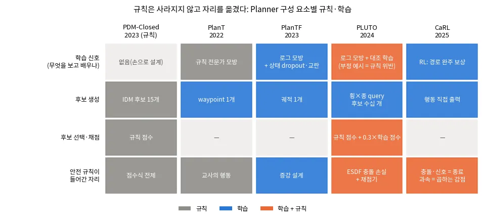
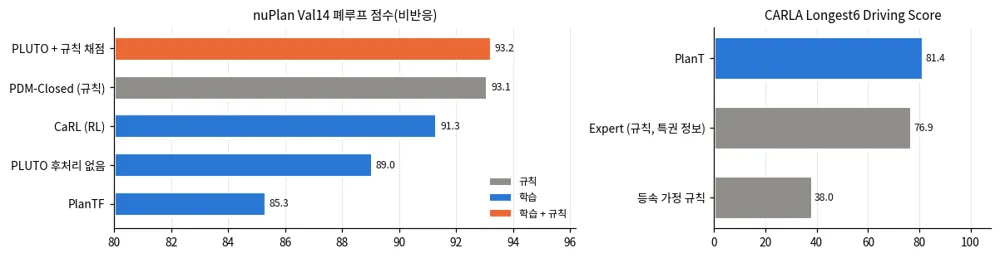
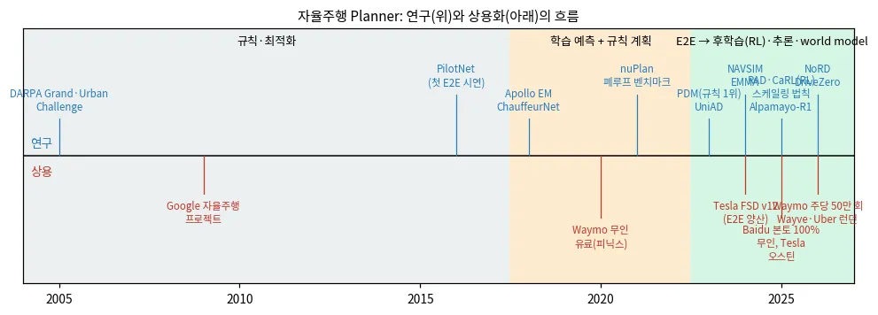
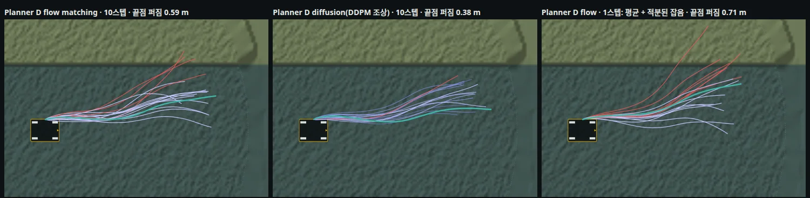
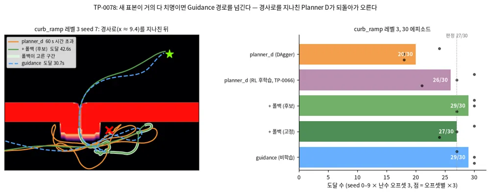
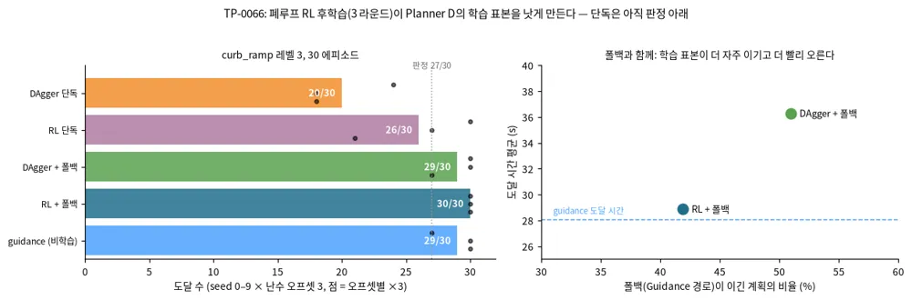
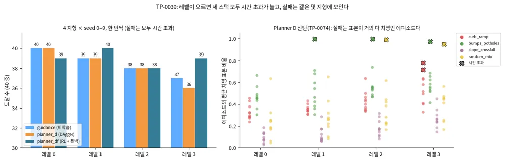
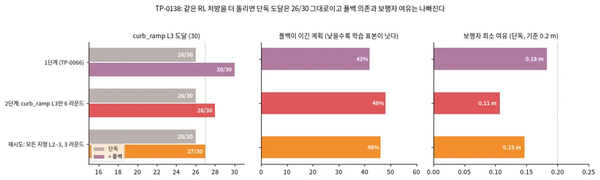
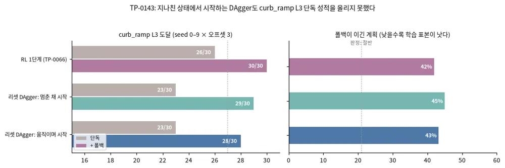

<!-- doc: Planner | 2 -->
# Planner — 경로·궤적을 만드는 쪽 (§B)

**Planner는 로봇 상태, TravMap, 목표를 받아 경로나 시간 인덱스 궤적을 낸다.** 제어 명령은 내지 않는다.
탭은 **두 묶음**이다. ==앞의 다섯은 **방법**(어떻게 계획하나), 뒤의 둘은 **현황**(누가 무엇을 내놨나)이다.==
2026-10-01에 이렇게 다시 묶었다 — 그 전에는 방법·도메인·관심사·계보 네 축이 섞여 있어서
자율주행 내용만 세 탭(E2E 주행 · 역사·상용화 · 로봇별 오픈소스)에 흩어져 있었다.

**■ 방법 — 어떻게 계획하나**

| 탭 | 다루는 것 | 절 | travplan과의 관계 |
|---|---|---|---|
| travplan과 고전 기준선 | travplan Planner의 현재 구조, 그리고 그래프 탐색·로컬 플래너·궤적 최적화 | B.1, B.10 | `GuidancePlanner`(Dijkstra)가 기준선이자 subgoal 공급원 |
| 학습 로컬 Planner | 로봇 주변만 보고 가까운 경로를 내는 학습 모듈(waypoint 회귀, diffusion 궤적, RL 직접 매핑, 비용 지도로 학습) | B.2–B.4, B.4b, B.7 | `LearnedPlanner`(Planner B)의 계보 |
| 생성형 궤적 | 시간 인덱스 궤적 여러 개를 생성 모델에서 샘플한다(Diffuser에서 Diffusion Planner까지, 후속 연구, Planner D) | B.8.0, B.8 | **Planner D**(flow matching)의 직계 설계 |
| Foundation·VLA·언어 | 시각 내비 기반 모델, VLA, 도시 보행 내비, 시연 로그 학습 | B.6, B.6b–B.6d | Planner 위의 **목표 선택 층** |
| 위험 인지·로컬 내비 | 지형 위험 그래프, 보이지 않는 지형 상상, CVaR 여유 | B.9 | 위험 비용 설계 |

**■ 현황 — 누가 무엇을 내놨나**

| 탭 | 다루는 것 | 절 | travplan과의 관계 |
|---|---|---|---|
| 자율주행 자동차 | ==한자리에 모았다== — 공개 스택(Autoware·Apollo), 종단간(E2E), 연구 역사와 2026 상용화 | B.12.1, B.11, B.13 | 후보 생성·검증·선택 구조, 폐루프 평가 지표, 규칙 안전 층 |
| 다리·바퀴 로봇과 계보 | 사족·휴머노이드·바퀴 로봇의 공개 Planner, 그리고 ETH RSL 한 연구실의 층별 계보 | B.12, B.14 | 스워브 모듈 모델, ROS 2 통합, 인식 도구의 출처 |

**계보 한눈에 보기.** 각 이름의 설명은 해당 탭에 있다.

| 연도 | 고전·최적화 | 로봇별 공개 스택 | 학습 로컬 Planner | 생성형 궤적 | foundation model·VLA | E2E 주행 |
|---|---|---|---|---|---|---|
| 1959–1997 | Dijkstra, A*, DWA | — | — | — | — | — |
| 2008–2018 | Hybrid A*, TEB | ROS navigation, OMPL, 휴머노이드 발자국 계획, ORCA, Apollo EM planner, TOWR | — | — | — | — |
| 2019–2022 | Nav2 | CrowdNav, Crocoddyl, EPSILON, FAR, TARE, PUTN | — | Diffuser | GNM | — |
| 2023 | — | PDM-Closed, ArtPlanner, DRL-VO | iPlanner | Diffusion Policy, MPD | ViNT, NoMaD | UniAD, VAD |
| 2024 | Smac Planner | X-Mobility, HOVER | ViPlanner | π0, DiffusionDrive | OpenVLA, NaVILA, Uni-NaVid, CityWalker | SparseDrive, NAVSIM, Hydra-MDP, DriveVLM, EMMA |
| 2025 | — | CaRL, Alpamayo, COMPASS, ASAP, Gallant, HEAD | NavDP, Skill-Nav | Diffusion Planner, GoalFlow | — | — |
| 2026 | — | Click-and-Traverse, Alpamayo 1.5 | AgniNav, CORE, MILER | PC-Diffuser, FeaXDrive, MISTY, JPPD, GRACE | Can VFMs Navigate? | — |

**공개 코드와 모델.** GitHub 별 순이다(2026-09). HF 다운로드는 대표 가중치의 최근 30일 값이다.

| 분야 | 이름 | 코드(★) | HF 다운로드 | 라이선스 | travplan에서 |
|---|---|---|---|---|---|
| VLA | [openpi (π0)](https://github.com/Physical-Intelligence/openpi) | 14.0k | 0.04M (pi0_base) | 코드 Apache-2.0, 가중치 Gemma 약관 | flow matching 규칙이 Planner D와 같다 |
| VLA | [OpenVLA](https://github.com/openvla/openvla) | 7.1k | 0.44M (7B) | MIT | 참고 |
| E2E | [UniAD](https://github.com/OpenDriveLab/UniAD) | 4.8k | — | Apache-2.0 | 참고 |
| 스택 | [Nav2](https://github.com/ros-navigation/navigation2) | 4.7k | — | 패키지별 혼합 | ROS 2 통합 시 기준 스택 |
| 생성형 | [Diffusion Policy](https://github.com/real-stanford/diffusion_policy) | 4.6k | — | MIT | 행동 열 생성의 원형 |
| 생성형 | [DiffusionDrive](https://github.com/hustvl/DiffusionDrive) | 1.5k | — | MIT | anchor 시작 아이디어(B.8.2) |
| E2E | [VAD](https://github.com/hustvl/VAD) | 1.4k | — | Apache-2.0 | 참고 |
| 로컬 | [TEB](https://github.com/rst-tu-dortmund/teb_local_planner) | 1.4k | — | BSD-3-Clause | 고전 비교 대상 |
| 기반 모델 | [visualnav-transformer (GNM, ViNT, NoMaD)](https://github.com/robodhruv/visualnav-transformer) | 1.3k | — | MIT | 탐색 참고(B.6) |
| 생성형 | [Diffuser](https://github.com/jannerm/diffuser) | 1.3k | — | MIT | 참고 |
| 기반 모델 | [InternNav](https://github.com/InternRobotics/InternNav) | 1.1k | — | MIT | 내비 기반 모델을 만드는 공개 플랫폼 |
| E2E | [NAVSIM](https://github.com/autonomousvision/navsim) | 1.1k | — | Apache-2.0 | 평가 지표 참고 |
| 생성형 | [Diffusion Planner](https://github.com/ZhengYinan-AIR/Diffusion-Planner) | 1.1k | — | 표기 없음 | Planner D 출발점(B.8) |
| E2E | [SparseDrive](https://github.com/swc-17/SparseDrive) | 1.0k | — | MIT | 참고 |
| VLA | [NaVILA](https://github.com/AnjieCheng/NaVILA) | 0.7k | 0.01M 미만 | Apache-2.0 | 두 층 구조 참고 |
| 학습 로컬 | [ViPlanner](https://github.com/leggedrobotics/viplanner) | 0.7k | — | BSD-3-Clause | LearnedPlanner 손실의 원형 |
| 생성형 | [GoalFlow](https://github.com/YvanYin/GoalFlow) | 0.4k | — | Apache-2.0 | Planner D와 같은 구조 |
| E2E | [Hydra-MDP](https://github.com/NVlabs/Hydra-MDP) | 0.4k | — | 표기 없음 | 점수 증류 참고 |
| 학습 로컬 | [iPlanner](https://github.com/leggedrobotics/iPlanner) | 0.4k | — | MIT | LearnedPlanner 손실의 원형 |
| VLA | [Uni-NaVid](https://github.com/jzhzhang/Uni-NaVid) | 0.4k | — | MIT | 참고 |
| 생성형 | [MPD](https://github.com/joaoamcarvalho/mpd-public) | 0.3k | — | MIT | 비용 guidance 참고 |
| 도시 내비 | [CityWalker](https://github.com/ai4ce/CityWalker) | 0.2k | — | Apache-2.0 | 보도 영상 라벨링 참고 |

로봇 종류별 공개 스택(Autoware, Apollo, openpilot, OCS2, Nav2, Choreo 등)의 별 수와 라이선스는 B.12에 따로 모았다.

**travplan의 위치.** ==travplan Planner는 "고전 전역 경로 + 학습 로컬 궤적 생성 + 규칙 점수 선택"의 세 층이다.== GuidancePlanner가 TravMap
위 Dijkstra로 subgoal과 cost-to-go를 주고(B.10), Planner D가 flow matching으로 후보 궤적을 만들고(B.8.3), 규칙 점수가 하나를 고른다.
LearnedPlanner는 iPlanner 계열의 자기지도 손실로 학습한 waypoint Planner다(B.4b). VLA와 VLM은 이 세 층 위에서 목표를 정하는 층으로
쓰고(B.6b), E2E 주행에서는 평가와 선택 설계를 가져온다(B.11). 네 종류 로봇의 공개 스택에서 가져올 것은 B.12.5에 정리했다.

## B. 학습 기반 Planner

---

<!-- tab: travplan과 고전 기준선 -->

### B.1 travplan의 현재 구조

travplan은 2026-09-25부터 Planner와 Controller를 나눴다. **Planner는 학습 기반으로 개발하고, MPPI는 Planner의 경로나
궤적을 받아 실행하는 Controller로 둔다.**

```
Planner (개발 대상)                                              Controller (유지보수만)
  LearnedPlanner   로봇 중심 크롭 + subgoal → WaypointNet → waypoint 8개 ─┐
  GuidancePlanner  Dijkstra 경로 (비학습 기준선)                           ├─▶ MPPIController / TrackerController ─▶ body twist
  Planner D        flow matching 시간 인덱스 궤적 (§B.8.3)                 ─┘
```

조사를 시작할 때는 세 트랙이었다. A는 MPPI3D(계획과 제어를 함께), B는 LearnedPlanner, C는 HybridPlanner(B의 경로를
MPPI 샘플링의 prior로 쓰는 방식)였다. 아래 절들은 이 가운데 학습 Planner를 대체하거나 강화할 후보(§B.2–B.4, §B.4b, §B.6,
§B.8, §B.9)다. 비교 기준인 고전 계획은 §B.10, 로봇 종류별 공개 스택은 §B.12, 자율주행 E2E 계획은 §B.11에 있다. §B.5(MPPI 샘플링 개선)는 Controller·안전 문서의
MPPI 탭에 있다.

### B.10 고전 기준선: 그래프 탐색, 로컬 플래너, 궤적 최적화

**학습 Planner는 고전 기준선을 이겨야 의미가 있다.** travplan의 비학습 기준선은 `GuidancePlanner`다. TravMap 비용 위에서 Dijkstra로
목표까지의 경로를 구하고, 3 seed 운동학 벤치마크에서 guidance+mppi 스택이 12/12를 기록했다. 고전 계획은 세 층으로 나뉜다. 전역
경로를 찾는 그래프 탐색, 몇 초 앞의 속도를 고르는 로컬 플래너, 경로를 매끄럽고 실행 가능한 궤적으로 다듬는 최적화다. ROS 2의
Nav2가 이 세 층을 한 스택으로 묶는다.

| 연도 | 이름 | 층 | 핵심 | 구현 |
|---|---|---|---|---|
| 1959 | Dijkstra | 전역 | 누적 비용이 가장 작은 칸부터 확정하는 최단 경로 | travplan `GuidancePlanner` |
| 1968 | A* | 전역 | 남은 비용의 추정(휴리스틱)으로 탐색 순서를 정한다 | Nav2 Smac(2D) |
| 1997 | DWA | 로컬 | 가속 한계 안의 속도 창에서 목적함수가 가장 큰 속도를 고른다 | Nav2 DWB |
| 2008–2010 | Hybrid A* | 전역 | 칸마다 연속 자세를 저장하는 A*, 차량 기구학을 지키는 경로 | Nav2 Smac Hybrid-A* |
| 2012–2017 | TEB | 로컬 | 시간 간격을 가진 궤적을 희소 그래프 최적화로 다듬고, 여러 위상의 후보를 함께 최적화 | [teb_local_planner](https://github.com/rst-tu-dortmund/teb_local_planner) 1.4k |
| 2020 | Nav2 | 스택 | behavior tree로 전역 계획, 로컬 제어, 복구를 조율하는 ROS 2 내비 스택 | [ros-navigation/navigation2](https://github.com/ros-navigation/navigation2) 4.7k |
| 2024 | Smac Planner | 전역 | 비용 인식 A\*, Hybrid-A\*, State Lattice를 한 프레임워크로 | Nav2 기본 계획기 |

**Dijkstra와 A* — 격자 위 최단 경로**([Dijkstra 1959](https://doi.org/10.1007/BF01386390); [Hart, Nilsson, Raphael 1968](https://doi.org/10.1109/TSSC.1968.300136)). Dijkstra는 누적 비용이 가장 작은 칸부터 확정해
나간다. 간선 비용이 음이 아니면 최단 경로를 보장한다. A*는 누적 비용에 목표까지 남은 비용의 추정을 더한 값 순서로 칸을 연다.
추정이 실제 비용을 넘지 않으면 최적성을 유지하면서 훨씬 적은 칸만 연다. travplan의 `GuidancePlanner`는 목표에서 출발하는 Dijkstra로
모든 칸의 cost-to-go를 한 번에 구한다. 학습 Planner(LearnedPlanner, Planner D)는 이 cost-to-go 경로 위 4 m 앞의 점을 subgoal로 받는다.

**Hybrid A* — 격자 탐색에 차량 기구학을 넣었다**(Dolgov 등, 2008 워크숍, [IJRR 2010](https://doi.org/10.1177/0278364909359210), Stanford). DARPA Urban Challenge 차량 Junior의
주차장 계획에서 나왔다. 격자 칸마다 연속 자세 $(x, y, \theta)$를 저장하고, 조향 원호로 이웃을 확장한다. 그래서 결과 경로가 차량이
실제로 따라갈 수 있다. 장애물을 무시한 비홀로노믹 거리와 장애물을 고려한 2D 최단 거리 가운데 큰 값을 휴리스틱으로 쓰고, 탐색
중간에 목표까지 Reeds-Shepp 곡선을 바로 이어 보는 해석적 확장으로 속도를 높였다. Nav2의 Smac Planner(2024)가 비용 인식 판을
기본 계획기로 제공한다.

**DWA — 다음 순간의 속도를 고른다**(Fox, Burgard, Thrun, [IEEE RAM 1997](https://doi.org/10.1109/100.580977)). 로봇이 짧은 시간 안에 낼 수 있는 속도 창(dynamic window)만
탐색한다. 창 안의 각 $(v, \omega)$가 그리는 원호를 따라, 목표 방향, 장애물까지 거리, 속도의 가중합을 평가해 가장 좋은 것을 고른다.
장애물 앞에서 멈출 수 없는 속도는 처음부터 뺀다. 계산이 매우 가볍고, Nav2의 DWB가 이 계열이다.

**TEB — 시간이 붙은 궤적을 최적화한다**(Rösmann 등, 2012–2017, [RAS 2017](https://doi.org/10.1016/j.robot.2016.11.007), TU Dortmund,
[코드](https://github.com/rst-tu-dortmund/teb_local_planner)). 궤적을 자세 열과 그 사이 시간 간격 $\Delta T$로
표현하고, 속도·가속도 한계, 장애물 거리, 기구학 제약을 벌점으로, 전체 시간을 목적함수로 둔 희소 그래프 최적화(g2o)로 푼다.
장애물의 왼쪽과 오른쪽처럼 위상이 다른 후보 궤적 여러 개를 병렬로 최적화해 가장 좋은 것을 고른다. 홀로노믹 로봇의 옆 방향
속도도 다룬다.

**Nav2 — ROS 2 내비게이션 스택**([arXiv:2003.00368](https://arxiv.org/abs/2003.00368), IROS 2020,
[코드](https://github.com/ros-navigation/navigation2)). ROS Navigation의 후속으로,
behavior tree가 전역 계획, 로컬 제어, 복구 행동을 조율하고 ROS 2의 lifecycle 관리 위에서 돈다. 대학 캠퍼스에서 학생들 사이를
마라톤 거리만큼 주행하는 실험으로 검증했다. 이후 비용 인식 Hybrid-A*와 State Lattice를 담은 Smac Planner
([arXiv:2401.13078](https://arxiv.org/abs/2401.13078))가 기본 계획기가 됐고, MPPI Controller와 Regulated Pure Pursuit도 기본으로
들어 있다. 유지보수자들이 쓴 개관([arXiv:2307.15236](https://arxiv.org/abs/2307.15236))이 각 알고리즘을 비교한다.


*그림 — Smac Planner (Fig. 1): Smac Planner로 Nav2를 쓰는 산업용·수상 로봇들. 원형이 아닌 큰 몸체와 기구학 제약이 있는 로봇에 맞춘 계획기다. 출처: [arXiv:2401.13078](https://arxiv.org/abs/2401.13078)*

<details markdown="1">
<summary>자세히: A*, Hybrid A*, DWA의 수식과 GuidancePlanner의 간선 비용</summary>

**A*.** 칸 $n$의 우선순위는 시작부터의 누적 비용 $g(n)$과 목표까지의 추정 $h(n)$의 합이다. $h$가 실제 남은 비용 $h^*(n)$을 넘지
않으면(admissible) 처음 꺼낸 목표 경로가 최적이다. $h = 0$이면 Dijkstra와 같다.

$$ f(n) = g(n) + h(n), \qquad h(n) \le h^*(n) $$

**Hybrid A*의 휴리스틱.** 장애물을 무시하고 기구학만 지킨 거리(Reeds-Shepp 길이)와, 기구학을 무시하고 장애물만 본 2D 최단 거리의
큰 값을 쓴다. 둘 다 실제 비용을 넘지 않으므로 큰 값도 admissible이다.

$$ h(x, y, \theta) = \max\big(h_{\text{nonholo}}(x, y, \theta),\ h_{\text{holo}}(x, y)\big) $$

**DWA의 목적함수.** 가능한 속도 $V_s$, 장애물 앞에서 멈출 수 있는 속도 $V_a$, 현재 속도에서 가속 한계로 도달할 수 있는 창 $V_d$의
교집합에서 고른다. heading은 목표 방향과의 정렬, dist는 원호 위 가장 가까운 장애물까지 거리, vel은 전진 속도다.

$$ (v, \omega)^* = \arg\max_{(v, \omega) \in V_s \cap V_a \cap V_d} \sigma\big(\alpha\,\mathrm{heading}(v, \omega) + \beta\,\mathrm{dist}(v, \omega) + \gamma\,\mathrm{vel}(v, \omega)\big) $$

**GuidancePlanner의 간선 비용.** 8방향 격자에서 칸 $i$와 $j$ 사이 간선의 비용은 거리 $\ell_{ij}$에 두 칸 가중치의 평균을 곱한
값이다. 칸 가중치는 TravMap 비용과 σ로 정하고(`GuidanceConfig`의 기본값 $w_c = 4$, $w_\sigma = 0.5$), 비용이 0.95 이상인 치명 셀은
그래프에서 뺀다.

$$ w_{ij} = \ell_{ij} \cdot \tfrac12 (c'_i + c'_j), \qquad c'_i = 1 + w_c\, \mathrm{cost}_i + w_\sigma\, \sigma_i $$

목표에서 Dijkstra를 한 번 돌리면 모든 칸의 cost-to-go가 나온다. 경로는 로봇 칸에서 선행 칸을 따라가 얻는다.

**travplan에 주는 것.** cost-to-go 지도는 경로 하나보다 쓸모가 많다. Planner D는 후보 궤적의 끝점에서 이 값을 읽어 진행도 점수로
쓴다(B.8.3). 스워브 로봇은 옆으로도 움직일 수 있어, 자동차용 Hybrid A*의 원호 확장은 기구학을 너무 좁게 본다. 몸체 방향이 중요한
좁은 통로가 문제가 되면, 로봇별 운동 원시(control set)를 받는 Smac의 State Lattice가 다음 후보다.

</details>

**travplan에 주는 의미.** ==학습 Planner의 성능은 언제나 GuidancePlanner(TravMap 위 Dijkstra)와 같은 벤치마크에서 비교한다.==
고전 기준선은 느리게 변하는 전역 구조(어느 연석 경사로로 갈지)를 싸게 풀고, 학습 Planner는 그 위에서 시간과 동적 장애물을
다룬다. Nav2의 전역 계획기와 MPPI Controller 조합은 travplan의 GuidancePlanner와 `MPPIController` 조합과 같은 구조다. 그래서
제품에서 Nav2와 섞어 쓸 때도 경계가 분명하다.

#### B.10.1 궤적 다발을 한꺼번에 미는 최적화: MPOT

**MPOT**(*Accelerating Motion Planning via Optimal Transport*, [arXiv:2309.15970](https://arxiv.org/abs/2309.15970),
NeurIPS 2023, TU Darmstadt)는 위 표의 "궤적 최적화" 층에 들어가지만 **기울기를 쓰지 않는다.** waypoint마다
무작위로 회전시킨 다포체의 꼭짓점 방향으로 비용을 찍어 보고, 그 비용 행렬에 엔트로피 정규화 최적 수송을 한 번
풀어 **방향 가중치**를 얻는다(**Sinkhorn Step**). 이름에 OT가 있지만 ==수송은 시작점과 목표점 사이가 아니라
**waypoint와 탐색 방향 사이**== 다. 수식과 흔한 오독은 배경 0.2b에 모았다.

| 환경 | 시간 | 성공률 | 비교 |
|---|---|---|---|
| point-mass(2D 밀집 장애물) | **0.4 s** | **99.2%** | 기울기 기반 기준선(CHOMP·GPMP2)보다 빠르고 성공률도 높다. RRT\*·I-RRT\*는 성공률 100%지만 43 s가 걸린다 |
| Panda(7-DoF) | 0.8 s | 71.6% | 병렬로 민 계획 가운데 성공 60.2%(논문의 GOOD) |
| TIAGo++(mobile manipulation) | 1.49 s | 55% | GPMP2 40.11 s / 40%, RRT\*는 1000 s 예산에도 실패 |

**Controller 자리에는 원형 그대로 쓸 수 없다.** 원형은 제어열 대신 상태 waypoint를 직접 밀고 동역학·가속 한계를
비용으로만 넣어 `Controller` 프로토콜이 요구하는 twist를 내지 않으며, 가장 빠른 숫자 0.4 s가 제어 주기 0.1 s의 4배,
계획 게이트 10 ms의 40배다. ==다만 제어열 판은 만들 수 있다== — Controller 문서 E.11이 입자를 제어열로, OT의 점을
twist 매듭점으로 바꾼 판을 세워 멈춘 장면에서 같은 예산의 MPPI와 맞대 봤고, 넘지 못했다(TP-0130). 분류와 비교표는
배경 0.2b, 실측은 E.11이다.

==**쓸 자리는 Planner D의 교사다.**== `scripts/train_planner_d.py`는 상태마다 `GlobalGuidance` + `MPPIController`로
**4초 제어열 하나**를 만들어 라벨로 쓴다 — 단일 모드 교사다. MPOT는 **여러 궤적을 한 배치로** 밀어 서로 다른
위상(장애물 왼쪽·오른쪽)의 답을 한 번에 내고, 논문이 스스로 밝히는 용도도 *"a strong oracle for collecting
datasets ... capturing homotopy classes"*다. ==오프라인 수집은 0.4 s를 신경 쓰지 않는다.==
코드는 [anindex/mpot](https://github.com/anindex/mpot) ★71 **MIT**(PyTorch)와
[anindex/ssax](https://github.com/anindex/ssax) ★50 **MIT**(JAX)다. 다만 **지형 비용이 TravMap에서 와야 하므로**
비용·probe 평가를 travplan 쪽으로 바꿔 끼우는 일이 그대로 남는다(미착수).

---

<!-- tab: 학습 로컬 Planner -->

### B.2 waypoint를 직접 회귀하는 방식

LearnedPlanner처럼 관측에서 waypoint나 그에 준하는 중간 표현을 한 번에 내는 계열이다. 빠르고 가볍지만, 한 가지 답만
내므로 갈림길에서 약하다.

**AgniNav**([arXiv:2606.10903](https://arxiv.org/abs/2606.10903)) — 단안 이미지와 로봇 몸체 치수 네 개(앞·뒤 길이, 반폭,
높이)로 **1D 가상 레이저 스캔**을 예측하고, 이를 고전 로컬 플래너에 넘긴다. 한 모델을 여러 몸체에 그대로 쓴다. Turtlebot2,
Go2, K1 실물에서 Jetson Orin FP16 30 Hz로 돌렸다. 임베디드 실측이 있는 드문 사례다.


*그림 — AgniNav (Fig. 1): 단안 이미지 → 1D 가상 레이저 스캔(로봇 높이 조건) → 풋프린트 기반 고전 로컬 플래너. 출처: [arXiv:2606.10903](https://arxiv.org/abs/2606.10903)*


*그림 — AgniNav: ==몸체 높이를 조건으로 주면 같은 장면에서 다른 스캔이 나온다== — 낮은 로봇은 매달린 장애물 아래로 지나가고 높은 로봇은 막힌다. travplan의 오버행 한계와 `clearance` 채널(A.2b.6) 논의에 직접 닿는다. 출처: [arXiv:2606.10903](https://arxiv.org/abs/2606.10903)*


*그림 — AgniNav: Turtlebot2·Go2·K1 실물 사례. 한 모델을 몸체 치수만 바꿔 세 로봇에 쓴다. 출처: [arXiv:2606.10903](https://arxiv.org/abs/2606.10903)*

<details markdown="1">
<summary>자세히: AgniNav의 방법과 수식</summary>

**몸체를 네 숫자로 요약한다.** 로봇마다 모델을 다시 학습하지 않으려고, 충돌에 관련된 몸체 정보만 네 값으로 둔다. 인식은 높이만, 계획은 나머지를 쓴다.

$$ c_e = [H_{\max},\ L_1,\ L_2,\ W/2], \qquad \hat S_t = f_\theta(I_t, H_{\max}), \qquad a_t = \pi\big(R_t,\ L_1, L_2, W/2,\ \kappa_e\big) $$

$H_{\max}$는 보호해야 할 높이(그보다 높은 장애물은 무시), $L_1, L_2$는 앞·뒤 여유 길이, $W/2$는 반폭, $\kappa_e$는 속도·각속도·가속 한계다.

**라벨: 열(column) 최솟값 가상 스캔.** 깊이 영상에서 광학 중심 한 줄만 보면 그 높이 밖의 장애물을 놓친다. 그래서 영상의 **각 열 전체**에서 높이
$H_{\max}$ 아래에 있는 가장 가까운 점을 골라 1D 스캔 라벨 $S^*_t = \{(x_i^*, z_i^*)\}$을 만든다. 쌍을 이룬 RGB–깊이 데이터만 있으면 되고, 로봇별
데이터는 필요 없다.

**구조와 계획.** ViT 백본 + ScanFormer 디코더가 RGB와 $H_{\max}$를 받아 한 번에 스캔을 낸다. 계획은 이 스캔과 몸체 치수를 상태로 받는 MDP로
정의한 RL 정책이다(성공 보상, 충돌 벌점, 진행 보상).

**travplan에 주는 것.** LiDAR 없이 카메라만 쓸 때 TravMap 대신 쓸 수 있는 가장 가벼운 중간 표현이다. 다만 1D 스캔이라 턱·경사 같은 높이 정보는
잃는다.

</details>

**Skill-Nav**([arXiv:2506.21853](https://arxiv.org/abs/2506.21853)) — 상위 플래너(LLM이나 경로 계획기)가 waypoint를 주면, 하위
RL 보행 정책이 지형에 맞춰 기술을 바꿔 가며 따라간다. waypoint를 계획과 제어 사이의 인터페이스로 쓰는 계층형이다. 코드 공개
여부는 확인하지 못했다.


*그림 — Skill-Nav (Fig. 1): 상위 플래너가 waypoint를 주고 하위 RL 보행 정책이 지형에 맞춰 따라간다. 출처: [arXiv:2506.21853](https://arxiv.org/abs/2506.21853)*

<details markdown="1">
<summary>자세히: Skill-Nav의 방법과 수식</summary>

**계층.** 상위 플래너(LLM이나 기존 경로 계획기)가 waypoint를 내고, 하위 보행 정책이 PPO로 학습한 waypoint 추종 정책이다. 속도 명령 대신 **목표
위치**를 명령으로 주면 정책이 점프·오르기·회피 같은 기술을 스스로 고를 여지가 커진다.

**teacher–student**(배경 0.12). 교사 정책의 상태는 proprioception $p_t$, 추정 속도 $\hat v_t$, waypoint 명령 $w_t$, 특권 정보 인코딩 $e_t$, 지형 스캔 점
$m_t$다. 학생은 $e_t$와 $m_t$를 과거 proprioception과 깊이 영상으로 복원한다.

$$ s_t = [\,p_t,\ \hat v_t,\ w_t,\ e_t,\ m_t\,] $$

**travplan에 주는 것.** waypoint를 계획과 제어 사이의 인터페이스로 쓰는 것은 travplan의 `PlanResult.path`와 같다.

</details>

### B.3 diffusion으로 궤적 분포를 만드는 방식

한 경로만 회귀하지 않고, **궤적의 분포**를 배워 노이즈를 걷어내며 여러 후보를 만든 뒤 critic이 고른다. 갈림길처럼 답이 여럿인
상황에 강하다.

```python
# 개념 pseudocode (NavDP 계열)
trajectory = sample_gaussian_noise()
for t in reversed(range(num_diffusion_steps)):
    trajectory = denoise_step(trajectory, obs, goal, t)   # 학습된 denoiser
candidates = [trajectory for _ in range(K)]               # 후보 K개
best = max(candidates, key=lambda tau: critic(tau, obs))  # critic이 고른다
```

**NavDP**([arXiv:2505.08712](https://arxiv.org/abs/2505.08712), ICRA 2026, [코드](https://github.com/InternRobotics/NavDP)) — 이
계열에서 가장 강력한 사례다. RGB-D를 입력으로 궤적 후보를 생성하고, 시뮬레이션의 특권 정보(ESDF)로 학습한 critic이 안전성을
채점한다. 3,000개 장면에서 모은 1,000 km 이상의 시뮬레이션 주행으로만 학습해 실제 로봇 여러 종류에 추가 학습 없이 옮겼다(v3
초록 기준). Jetson 지연은 보고하지 않았다. 학습 Planner와 입출력 계약이 같고 여러 답을 낼 수 있어, **Planner D의 직접 참고
대상**이다. 특히 critic은 Planner D의 비학습 선택기를 대체할 후보다.


*그림 — NavDP (Fig. 1): 시뮬 데이터로만 학습해 여러 로봇에 그대로 옮겨 쓴다. 궤적 후보 생성 + critic 채점. 출처: [arXiv:2505.08712](https://arxiv.org/abs/2505.08712)*

<details markdown="1">
<summary>자세히: NavDP의 방법과 수식</summary>

**데이터 엔진(시뮬 전용).** 3,000개 이상 장면(3D-Front, HSSD 등)의 메시를 0.05 m voxel로 바꿔 ESDF를 만든다. 로봇은 반경 0.25 m 원통, 카메라 높이는
0.25–1.25 m, 피치 −30–0°, 시야는 D435i(69°×42°)와 Zed 2(110°×70°) 두 설정으로 무작위화한다. 임의의 시작·목표에서 A* 경로를 구하고, 각 waypoint를
ESDF가 커지는 쪽으로 밀어낸 뒤 cubic spline으로 매끄럽게 해 시연 궤적을 만든다. BlenderProc로 RGB-D를 렌더링한다.

**구조.** RGB 이력 $N = 8$프레임은 사전학습 DepthAnything 인코더(프레임당 256 토큰), 깊이 한 장은 처음부터 학습하는 ViT(256 토큰, 0.1–5 m만 사용)로
인코딩하고, 학습 질의로 $N \times 16$개 토큰으로 압축한다. 목표는 상대 좌표 $(x_g, y_g)$다. 하나의 transformer가 궤적 생성(행동 헤드)과 궤적 평가
(critic 헤드)를 함께 한다.

**행동 손실(확산, 배경 0.5).** 목표가 있는 경우와 없는 경우를 반씩 섞어 학습한다($\alpha = \beta = 0.5$, 10스텝, waypoint $M = 24$개).

$$ \mathcal{L}_{\text{act}} = \alpha\, \mathbb{E}\big\lVert \epsilon_k - \epsilon_\theta(\tau + \epsilon_{k+1}, k, d_t, I_{t-N:t}) \big\rVert^2 + \beta\, \mathbb{E}\big\lVert \epsilon_k - \epsilon_\theta(\tau + \epsilon_{k+1}, k, g_t, d_t, I_{t-N:t}) \big\rVert^2 $$

**critic 라벨(특권 정보).** 시연 궤적을 흔들어 만든 대조 샘플 $\hat\tau$마다, waypoint의 ESDF 값 $d^m$으로 "장애물에서 멀어지는 정도"와 "안전 거리
$d_{\text{safe}} = 0.5$ m 안에 들어간 비율"을 합쳐 점수를 매긴다. 실제 로봇에는 ESDF가 없지만, critic은 영상만 보고 이 점수를 맞히도록 배운다.

$$ V(\hat\tau) = \gamma \sum_{m=0}^{M} \big(d^{m+1}_{\hat\tau} - d^m_{\hat\tau}\big) + \lambda\, \frac{1}{M} \sum_{m=0}^{M} \mathbb{I}\big(d^m_{\hat\tau} < d_{\text{safe}}\big) $$

**결과.** 시뮬 PointGoal 성공률 67.2%(ViPlanner 60.9%), 실물 Turtlebot 9/10, Go2 7/10, G1 7/10. 학습은 A100 32장으로 24시간.

**travplan에 주는 것.** Planner D의 비학습 선택기를 이 critic처럼 학습시킬 수 있다. travplan은 시뮬에서 TravMap 정답 비용과 치명 셀을 알므로 라벨을
바로 만들 수 있다.

</details>

### B.4 인식에서 속도 명령까지 RL로 곧장 가는 방식

**MILER**([arXiv:2609.20747](https://arxiv.org/abs/2609.20747))와 **CORE Planner**([arXiv:2606.29222](https://arxiv.org/abs/2606.29222), [코드](https://github.com/BBD00/core_planner))는
인식 결과를 속도 명령으로 곧장 바꾼다. MILER는 Jetson AGX Orin으로 실차 17.3 km를 달렸고, CORE는 소형 UGV에서 검증했다. 임베디드
배포가 검증된 장점이 있지만, 명시적인 궤적이나 비용을 거치지 않아 travplan이 비용 항으로 얻는 해석 가능성을 잃는다. 그래서 채택은
보류한다. 다만 MILER의 **"시뮬과 실제가 같은 중간 표현(시맨틱 BEV)을 보게 해서 sim-to-real을 푼다"**는 발상은 TravMap을 공통 표현으로
쓰는 travplan 설계와 같아서 D.0에서 따로 다룬다.


*그림 — MILER (Fig. 2): 학습 때는 중간 표현 시뮬레이터, 배포 때는 BEVFusion으로 같은 중간 표현을 만들어 sim-to-real. 출처: [arXiv:2609.20747](https://arxiv.org/abs/2609.20747)*


*그림 — CORE Planner (Fig. 3): LiDAR로 visibility graph를 점진적으로 만들고 transformer가 다음 노드를 고르는 구조. 출처: [arXiv:2606.29222](https://arxiv.org/abs/2606.29222)*

<details markdown="1">
<summary>자세히: MILER의 방법과 수식</summary>

**중간 표현(MLR) 시뮬레이터.** 사실적인 렌더링 대신 시맨틱 BEV만 만드는 GPU 시뮬레이터에서 학습한다. 클래스는 주행 가능(포장·자갈), 반주행 가능
(잔디), 주행 불가(장애물·정지 차량), 모름의 넷이다. 지도는 Minecraft처럼 여러 층의 Perlin 노이즈로 절차 생성한다. "3D 환경 → 센서 데이터 → 시맨틱"
투영을 학습 때 통째로 건너뛰는 것이 핵심이다.

**상태와 행동.** 상태는 60 m × 60 m, 0.25 m 해상도의 원-핫 BEV(목표 waypoint 채널 포함), 차량 상태(속도·가속·조향·조향 속도), 이전 행동, 목표 속도,
1 m 간격 waypoint 80개, 남은 경로 길이다. 행동은 **jerk와 조향 가속**(두 번 적분돼 자세에 반영)이고, 5 × 5 이산 분포로 둔다. PPO로 학습하며 보상은
커리큘럼으로 점점 엄격하게 바꾼다.

**배포(sim-to-real).** Jetson AGX Orin에서 TensorRT로 1.9 ms. 실제 BEV는 BEVFusion(카메라 + LiDAR)으로 만든다. 실차와 같은 자세에서 시작하는 **가상
차량**을 두고, 실제 BEV를 가상 차량 좌표로 옮겨(회전 흔적을 없애려 원형 crop) 정책이 가상 차량을 몰게 한 뒤, 가상 궤적을 실차가 추종하게 한다.

$$ \mathrm{BEV}_t^R = \mathrm{BEVFusion}\big(\mathrm{PointCloud}_t^R,\ \mathrm{CameraImages}_t^R\big) $$

**travplan에 주는 것.** travplan도 TravMap이라는 중간 표현을 공유한다. 시뮬과 실제가 같은 TravMap을 보게 하면, Planner D를 운동학 시뮬에서만 학습해도
옮길 수 있다는 근거다.

</details>

<details markdown="1">
<summary>자세히: CORE Planner의 방법과 수식</summary>

**문제: 탐색 교착 진동.** 미지 환경에서 다음 waypoint를 **현재 믿음 지도만으로** 고르면, 새 관측이 들어올 때마다 최적 후보가 바뀌어 두 점 사이를 오가는
현상(Navigation Deadlock Oscillation)이 생긴다. 고전 정식화는 다음과 같다($B$: 믿음 지도).

$$ p^\star(t) = \arg\min_{p \in \mathcal{P}(t)} \mathrm{Cost}\big(p;\ S(t-1),\ B(t-1)\big) $$

**방법.** LiDAR로 visibility graph를 점진적으로 만들고(밀집 격자 대신 희소 그래프), 그래프를 가지치기한 뒤 transformer가 **과거 행동을 담은 문맥 메모리**와
함께 다음 노드를 고른다. 순차 의사결정으로 바꿔 과거를 기억하게 함으로써 진동을 줄인다. 이미지 기반 환경에서만 학습해 추가 학습 없이 실물로 옮겼다.

**travplan에 주는 것.** Planner가 매 주기 독립적으로 계획하면 같은 진동이 생길 수 있다(curb_ramp의 "갔다가 되돌아오기"). 재계획 간 일관성 장치의 참고다.

</details>

### B.4b 비용 지도로 직접 학습하는 Planner: iPlanner와 ViPlanner

**travplan의 LearnedPlanner(Planner B)는 이 계열이다.** 전문가 시연 없이, 예측한 경로가 비용 지도 위에서 얼마나 싼지를 손실로 삼아
네트워크를 학습한다. 비용 지도를 경로 점에서 미분 가능하게 읽으면, 비용의 기울기가 경로 점을 거쳐 네트워크까지 흐른다. ETH RSL은
이것을 명령형 학습(imperative learning)이라 불렀다.

| 연도 | 이름 | 입력 | 비용 지도 | 결과 | 코드(★) |
|---|---|---|---|---|---|
| 2023 | iPlanner | 깊이 영상 + 목표 | 복원한 ESDF를 가우시안으로 부드럽게 | 고전 파이프라인보다 약 4배 빠름, SPL 26–87% 향상 | [leggedrobotics/iPlanner](https://github.com/leggedrobotics/iPlanner) 0.4k |
| 2024 | ViPlanner | 깊이 + 의미 분할 영상 + 목표 | 30개 의미 클래스의 traversability 비용 | 기하만 쓸 때보다 traversability 비용 38.02% 감소 | [leggedrobotics/viplanner](https://github.com/leggedrobotics/viplanner) 0.7k |
| 2026 | travplan LearnedPlanner | TravMap 크롭 + subgoal | TravMap cost와 σ | 3 seed 벤치마크 learned+mppi 8/12 | `travplan/planners/learned/loss.py` |

**iPlanner — 비용의 기울기로 경로를 배운다**([arXiv:2302.11434](https://arxiv.org/abs/2302.11434), RSS 2023, ETH RSL,
[코드](https://github.com/leggedrobotics/iPlanner)). 깊이 영상 한 장과
목표를 받아 key point 몇 개로 된 경로를 낸다. 라벨 경로 대신, 경로를 미분 가능한 비용 지도 위에서 평가한 값을 손실로 쓴다. 네트워크
갱신(위 단계)과 비용 기반 궤적 최적화(아래 단계)를 묶은 이층 최적화(BLO)로 학습하고, 비용의 기울기가 궤적 최적화를 거쳐 네트워크까지
역전파된다. 궤적마다 충돌 확률도 함께 예측하는 "fear loss"를 두어, 장애물 비용을 과하게 키우지 않고도 국소 최소에서 빠져나오게 했다.
고전 파이프라인보다 약 4배 빠르게 계획했고, 위치 추정 잡음에 강했으며, 보지 못한 환경에서 학습 기준선보다 SPL을 26–87% 높였다.


*그림 — iPlanner (Fig. 2): 깊이와 목표로 key point 경로와 충돌 확률을 예측하고, 궤적 비용과 fear loss를 역전파해 인식·계획 네트워크를 함께 학습하는 이층 최적화. 출처: [arXiv:2302.11434](https://arxiv.org/abs/2302.11434)*

**ViPlanner — 의미까지 비용으로 넣는다**([arXiv:2310.00982](https://arxiv.org/abs/2310.00982), ICRA 2024, ETH RSL,
[코드](https://github.com/leggedrobotics/viplanner)). 기하만 보면 계단은
막혀 보이고, 풀밭과 도로는 구별되지 않는다. ViPlanner는 깊이 영상과 의미 분할 영상을 따로 인코딩해 목표와 합치고, 30개 의미 클래스에
비용을 매긴 의미 비용 지도로 iPlanner식 학습을 한다. 보도, 횡단보도, 바닥, 계단이 가장 싸고, 자갈·모래·눈, 풀·흙, 도로 순으로
비싸지며, 사람, 차, 벽, 기둥은 장애물이다. 클래스는 one-hot 대신 traversability가 비슷할수록 가까운 RGB 색으로 표현했다. CARLA
도시와 Matterport 실내 같은 시뮬레이션 데이터만으로 학습해 실제 4족 로봇에 zero-shot으로 옮겼고, 기하만 쓰는 방법보다
traversability 비용을 38.02% 줄였다.


*그림 — ViPlanner (Fig. 2): 깊이 영상, 의미 영상, 목표를 받아 대략적인 경로와 충돌 확률을 내고, 네트워크 가중치와 최종 경로를 이층 최적화로 함께 다듬는다. 출처: [arXiv:2310.00982](https://arxiv.org/abs/2310.00982)*

<details markdown="1">
<summary>자세히: 명령형 학습의 손실과 travplan plan_loss</summary>

**이층 최적화.** 위 단계는 네트워크 $f_\theta$를 과제 손실 $\mathcal F$로 갱신하고, 아래 단계는 네트워크가 낸 경로를 비용 $\mathcal C$로
최적화한다.

$$ \min_\theta\ \mathcal F(f_\theta, \boldsymbol\tau^*) \quad \text{s.t.} \quad \boldsymbol\tau^* = \arg\min_{\boldsymbol\tau} \mathcal C(f_\theta, \boldsymbol\tau) $$

**궤적 비용.** 장애물 비용 $\mathcal C^O$는 경로 점 $\mathbf p_i$에서 읽은 비용 지도 값의 합이다. 목표 비용 $\mathcal C^G$는 경로 끝과
목표 사이 거리이고, 운동 비용 $\mathcal C^M$은 key point 사이 구간 길이가 고르지 않을수록 커진다.

$$ \mathcal C(\boldsymbol\tau) = \alpha \sum_i \mathcal H(\mathbf p_i) + \beta\, \mathcal C^G(\boldsymbol\tau) + \gamma\, \mathcal C^M(\boldsymbol\tau) $$

**fear loss.** 경로가 장애물과 부딪히는지를 라벨로, 예측한 충돌 확률 $\mu$에 이진 교차 엔트로피를 건다. 배포 때는 $\mu$가 임계값보다
낮은 경로만 실행한다. 최종 손실은 $\mathcal F = \mathcal C + \mathcal L_{\text{fear}}$다.

**travplan `plan_loss`.** LearnedPlanner는 waypoint 8개를 촘촘히 보간한 점에서 TravMap(흐린 비용, 원래 비용, σ)을 `grid_sample`로
읽는다. 쌍선형 보간이라 점의 위치에 대해 미분 가능하다. 손실은 여섯 항의 가중합이다.

$$ \mathcal L = 3\,\overline{c}_{\text{blur}} + 12\,\overline{\mathrm{relu}(c - 0.5)^2} + 0.5\,\overline{\sigma} + \lVert \mathbf w_8 - \mathbf g \rVert + 2\,\overline{\lVert \Delta^2 \mathbf w \rVert^2} + 0.05\, L $$

순서대로 평균 비용, 치명 영역 벌점, 불확실성, 목표 거리, 2차 차분(매끄러움), 경로 길이다. iPlanner와 비교하면 아래 단계의 궤적
최적화와 fear 헤드가 없고, 대신 σ 항이 있다.

**travplan에 주는 것.** LearnedPlanner가 실패한 경우는 경로가 치명 셀을 지나 MPPI가 진입을 거부하고 멈춘 경우였다(`docs/ARCHITECTURE.md`
§4). iPlanner의 fear 헤드는 바로 이 경우를 겨냥한다. 충돌 확률이 높은 경로를 Planner 스스로 버리게 하면 GuidancePlanner로
넘기는 폴백 조건도 명확해진다. ViPlanner의 의미 비용은 TravMap에 의미 채널을 더할 때(A.11의 분할 모델) 그대로 쓸 수 있는 설계다.

</details>

### B.7 비교

| 계열 | 대표 | 입력 → 출력 | 장점 | 단점 | travplan에서의 위치 |
|---|---|---|---|---|---|
| waypoint 직접 회귀 | AgniNav | 이미지 + 몸체 치수 → 1D 스캔·waypoint | **Jetson 실측 30 Hz**, 여러 몸체 | 답이 하나(갈림길에 약함) | LearnedPlanner 개선 |
| 비용 지도 자기지도 | iPlanner, ViPlanner | 깊이(+의미) + 목표 → key point 경로 | 라벨 불필요, 시뮬 학습만으로 실물 | 비용 지도 품질에 묶임 | **LearnedPlanner 손실의 원형**(B.4b) |
| diffusion 궤적 | NavDP | RGB-D → 궤적 분포 + critic | 여러 답, sim-to-real 검증 | Jetson 지연 미보고 | **Planner D 직접 참고** |
| RL 직접 매핑 | MILER, CORE | 인식 → 속도 명령 | **임베디드 실배포** | 해석 가능성 손실 | 보류 |
| 학습 prior + MPPI 비용 항 | ProxPI | Planner 경로 → 근접 비용 | 최적화기 유지, prior가 틀려도 복구 | — | Controller 참고(`ReferenceCost`가 이미 유사) |
| 학습 워밍스타트 | Self-Supervised MPC Init | 상태 → 초기해 | 샘플링 MPC 안전 +100% 보고 | 시뮬레이션만 | Controller 참고 |
| 제어 도함수 한계 보장 | π-MPPI | 샘플 → QP 투영 → 평균 | jerk 한계를 구조적으로 보장 | 샘플마다 QP, 시뮬레이션만 | Controller 참고 |
| MPPI 샘플링 개선 | SMPPI | 제어 변화율 샘플링 | 구조적 매끄러움 | — | `SmoothMPPIController`로 반영 |
| foundation model | ViNT / NoMaD | 이미지 + 목표 → waypoint·diffusion | 성숙, 실배포, 목표 없는 탐색 | 미세조정 비용 | Planner D·탐색 참고 |

---

<!-- tab: 생성형 궤적 -->

### B.8.0 생성형 궤적의 계보: Diffuser에서 GoalFlow까지

**"계획을 생성 모델에서 샘플한다"는 발상은 2022년 Diffuser에서 시작해 로봇 정책, 운동 계획, 자율주행으로 퍼졌다.** 공통점은 셋이다.
궤적 전체를 한 번에 생성하고, 여러 모드를 표현하며, 비용이나 목표로 생성을 유도한다. 2025년부터는 적분 스텝을 1–2개로 줄이는
쪽(truncated diffusion, flow matching, 한 스텝 증류)이 주류다. travplan Planner D(B.8.3)는 이 계보의 flow matching 갈래에 있다.

이 표의 논문들은 diffusion 표기와 flow matching 표기를 섞어 쓴다. 두 표기를 옮기는 환율과 규약 지뢰는 **배경 0.6b**에 모아 뒀다.

| 연도 | 이름 | 분야 | 바꾼 것 | 코드(★) |
|---|---|---|---|---|
| 2022 | Diffuser | 오프라인 RL 계획 | 궤적 전체를 확산으로 생성, 보상 기울기 guidance와 inpainting | [jannerm/diffuser](https://github.com/jannerm/diffuser) 1.3k |
| 2023 | Diffusion Policy | 로봇 조작 | 관측 조건 행동 열 확산, receding horizon 실행 | [real-stanford/diffusion_policy](https://github.com/real-stanford/diffusion_policy) 4.6k |
| 2023 | MPD | 운동 계획 | 확산 prior와 비용 likelihood의 사후 분포에서 샘플 | [joaoamcarvalho/mpd-public](https://github.com/joaoamcarvalho/mpd-public) 0.3k |
| 2024 | π0 | VLA | VLM에 flow matching 행동 전문가(B.6b) | [Physical-Intelligence/openpi](https://github.com/Physical-Intelligence/openpi) 14.0k |
| 2024 | DiffusionDrive | E2E 주행 | anchor에서 시작하는 truncated diffusion 2스텝(B.8.2) | [hustvl/DiffusionDrive](https://github.com/hustvl/DiffusionDrive) 1.5k |
| 2025 | Diffusion Planner | 자율주행 | 예측과 계획을 함께 생성, 재학습 없는 guidance(B.8) | [ZhengYinan-AIR/Diffusion-Planner](https://github.com/ZhengYinan-AIR/Diffusion-Planner) 1.1k |
| 2025 | GoalFlow | E2E 주행 | 목표점을 먼저 고르고 flow matching 한 스텝 | [YvanYin/GoalFlow](https://github.com/YvanYin/GoalFlow) 0.4k |
| 2025 | **Flow Planner** | 자율주행(nuPlan) | 궤적을 잘게 토큰화하고 시공간 융합 + CFG. ==nuPlan Val14 **90.43**(refinement 없이)== | [DiffusionAD/Flow-Planner](https://github.com/DiffusionAD/Flow-Planner) 0.3k, **MIT** |

**학습 로컬 Planner 탭과 무엇이 다른가.** 두 탭은 기준이 다르다. 학습 로컬 Planner는 **역할**(로봇 주변만 보고 가까운 경로를 내는 학습 모듈)로
묶었고, 생성형 궤적은 **방법**(생성 모델에서 궤적을 샘플한다)으로 묶었다. 그래서 로컬 내비에 diffusion을 쓴 연구는 학습 로컬 Planner 탭에 있고,
이 탭은 로컬 내비 밖의 조작, 운동 계획, 자율주행까지 계보로 다룬다. 실무에서 갈리는 점은 둘이다.

| | 학습 로컬 Planner(회귀 계열) | 생성형 궤적 |
|---|---|---|
| 답의 수 | 대개 하나. 갈림길에서 두 답의 평균이 장애물로 들어가기 쉽다 | 여러 개를 샘플하고 비용이나 목표로 고른다 |
| 시간 | 대개 시간 없는 waypoint 열(경로). 속도와 타이밍은 Controller가 정한다 | 대개 시간 인덱스 궤적. 속도와 멈춤도 계획에 들어간다 |
| travplan | `LearnedPlanner`: waypoint 8개, 시간 없음 | Planner D: 4초 × 10 Hz, `PlanResult.times` |

**시간은 인덱스로 들어간다.** 생성 모델은 시각을 따로 출력하지 않는다. 출력 텐서의 k번째 원소가 "k·dt초 뒤"를 뜻하도록 학습 데이터에서
약속한다. Diffusion Planner는 8초 × 10 Hz(80스텝) 상태열을, Diffusion Policy는 제어 주기 간격의 행동열을 낸다. 속도는 점 사이 간격으로 표현되고,
같은 자리에 머무는 점들은 정지다. 그래서 경로는 같고 타이밍만 다른 "보행자 앞에서 멈췄다 지나가기"를 계획할 수 있다. Planner D는 한 단계 더
나가 위치 대신 제어 변화율 열을 생성하고 dt로 적분해 `SwerveModel`로 굴린다(B.8.3). 시간축이 명시적이고, 속도·가속 한계를 지키는 궤적이 나온다.

시간이 있느냐는 생성형이냐가 아니라 **출력 표현을 어떻게 정했느냐**의 문제다. 회귀 모델도 시간 인덱스 궤적을 낼 수 있고, 생성 모델도 경로점만
낼 수 있다. 이 분야에서 시간 인덱스 궤적이 표준이 된 것은 nuPlan과 NAVSIM이 시간이 붙은 미래 궤적으로 평가하기 때문이다.

**Diffuser — 계획 자체를 생성한다**([arXiv:2205.09991](https://arxiv.org/abs/2205.09991), ICML 2022, MIT·UC Berkeley,
[코드](https://github.com/jannerm/diffuser)). 모델 기반 RL은
학습한 동역학 모델을 고전 궤적 최적화기에 넘기는데, 최적화기가 학습 모델의 오차를 파고든다. Diffuser는 궤적 최적화를 모델 안으로 접어,
모델에서 샘플하는 것과 계획하는 것이 거의 같아지게 했다. 상태와 행동으로 된 궤적 전체를 확산으로 잡음에서 조금씩 다듬고, 보상의 기울기로
샘플을 유도(guidance)하며, 시작과 목표 상태를 고정하는 inpainting으로 목표 도달 계획을 만든다. 시간 합성곱이라 잡음 제거 한 번은 이웃
시간만 보지만, 이것을 여러 번 반복하면 국소 일관성이 전역 일관성으로 커진다.


*그림 — Diffuser (Fig. 2): 상태·행동 쌍으로 된 2차원 배열을 반복해 잡음 제거한다. 한 번의 잡음 제거는 좁은 수용 영역만 보지만 반복하면 계획 전체가 일관된다. 선택적인 guide 함수가 계획을 목적으로 끈다. 출처: [arXiv:2205.09991](https://arxiv.org/abs/2205.09991)*

**Diffusion Policy — 행동 열을 확산으로 낸다**([arXiv:2303.04137](https://arxiv.org/abs/2303.04137), RSS 2023, Columbia·TRI·MIT,
[코드](https://github.com/real-stanford/diffusion_policy)). 로봇의
시각-운동 정책을 관측 조건 잡음 제거 확산으로 표현했다. 최근 관측 $T_o$스텝을 받아 행동 $T_p$스텝을 예측하고, 그중 $T_a$스텝만 실행한 뒤
다시 계획한다(receding horizon). 여러 모드의 행동 분포를 자연스럽게 다루고, 고차원 행동에서도 학습이 안정적이다. 로봇 조작 벤치마크 4개의
여러 과제에서 기존 최고 방법보다 평균 46.9% 좋았다.


*그림 — Diffusion Policy (Fig. 2): 최근 관측 몇 스텝을 받아 행동 열을 낸다. CNN 판은 관측 특징을 FiLM으로 모든 합성곱 층에 넣고, 잡음에서 시작해 예측한 잡음을 여러 번 빼서 행동 열을 얻는다. 출처: [arXiv:2303.04137](https://arxiv.org/abs/2303.04137)*

**MPD — 확산 prior에 비용을 곱해 사후 분포에서 샘플한다**([arXiv:2308.01557](https://arxiv.org/abs/2308.01557), 2023, TU Darmstadt,
[코드](https://github.com/joaoamcarvalho/mpd-public)).
운동 계획을 추론 문제로 본다. 성공한 과거 계획들로 궤적의 확산 prior를 학습하고, 새 문제의 충돌·매끄러움 비용을 likelihood로 곱한
사후 분포에서 역확산으로 바로 샘플한다. 시작과 끝 상태는 고정한다. 평면 로봇과 7자유도 팔에서, 보지 못한 장애물 환경에서도
확산 prior가 고차원 궤적 분포를 잘 담는다는 것을 보였다.

**GoalFlow — 목표점을 먼저 고르고, flow matching으로 궤적을 만든다**([arXiv:2503.05689](https://arxiv.org/abs/2503.05689), CVPR 2025, [코드](https://github.com/YvanYin/GoalFlow)).
확산으로 만든 다봉 궤적은 퍼짐이 커서 고르기 어렵고, guidance가 장면과 어긋나면 품질이 떨어진다. GoalFlow는 조밀한 목표점 어휘에서
정답 끝점과의 거리 점수와 주행 가능 영역 점수로 목표점 하나를 고른다. 그 목표점과 BEV 특징을 조건으로 flow matching이 궤적 후보들을
내고, 마지막에 점수기가 최적 궤적을 고른다. NAVSIM에서 PDMS 90.3으로 다른 방법을 크게 앞섰고, 잡음 제거 한 스텝으로도 성능이 좋았다.


*그림 — GoalFlow (Fig. 2): 인식 모듈이 BEV 특징을 만들고, 목표점 모듈이 어휘에서 최적 목표점을 고르고, 계획 모듈이 가우시안에서 궤적 후보들을 생성한다. 마지막에 점수기가 하나를 고른다. 출처: [arXiv:2503.05689](https://arxiv.org/abs/2503.05689)*

<details markdown="1">
<summary>자세히: 생성형 계획의 guidance와 목표 고정</summary>

**Diffuser의 guided 샘플링.** 역확산 한 스텝의 평균 $\mu$를 목적 $\mathcal J$의 기울기 방향으로 옮기고, 매 스텝 계획의 첫 상태를 현재
상태 $\mathbf s$로 덮어쓴다(inpainting). 계획의 첫 행동만 실행하고 다음 관측에서 다시 계획한다(배경 0.5).

$$ \boldsymbol\tau^{i-1} \sim \mathcal N\big(\mu + \alpha\, \Sigma\, \nabla \mathcal J(\mu),\ \Sigma^i\big), \qquad \boldsymbol\tau^{i-1}_{\mathbf s_0} \leftarrow \mathbf s $$

**MPD의 사후 분포.** 과제 조건 $\mathcal O$(충돌 없음, 매끄러움)의 likelihood를 비용의 지수로 두면, 사후 분포의 score는 확산 prior의
score에 비용 기울기를 더한 것이다.

$$ p(\boldsymbol\tau \mid \mathcal O) \propto p(\mathcal O \mid \boldsymbol\tau)\, p(\boldsymbol\tau), \qquad p(\mathcal O \mid \boldsymbol\tau) \propto \exp\Big(-\sum_i \lambda_i\, c_i(\boldsymbol\tau)\Big) $$

**GoalFlow의 목표점 점수.** 목표점 $g_i$마다 정답 끝점 $g^{\text{gt}}$와의 거리를 softmax로 바꾼 거리 점수와, 그 자리에 자차 상자를
놓았을 때 네 모서리가 모두 주행 가능 영역 안인지(0 또는 1)를 예측한다. 두 점수의 가중 로그 합이 가장 큰 목표점을 쓴다.

$$ \delta^{\text{dis}}_i = \frac{\exp(-\lVert g_i - g^{\text{gt}} \rVert_2)}{\sum_j \exp(-\lVert g_j - g^{\text{gt}} \rVert_2)}, \qquad \hat\delta^{\text{final}}_i = w_1 \log \hat\delta^{\text{dis}}_i + w_2 \log \hat\delta^{\text{dac}}_i $$

**travplan에 주는 것.** Planner D는 GoalFlow와 구조가 같다. 목표점은 GuidancePlanner 경로 위 4 m 앞의 subgoal이고(B.10), flow matching이
후보 16개를 내고, 점수기는 TravMap 비용 적분, 치명 셀 벌점, 끝점의 cost-to-go로 하나를 고른다(B.8.3). 차이는 목표점을 고정 규칙으로
정한다는 것이다. 막다른 곳에서는 subgoal 후보 여러 개를 점수로 고르는 GoalFlow식 확장이 가능하다. Diffuser와 MPD의 비용 기울기
guidance는 Planner D의 `guide_scale` 옵션과 같다.

</details>

### B.8 시간·주변 에이전트·기구학을 함께 고려하는 생성형 궤적 Planner

출발점은 TIER IV의 [Autoware Diffusion Planner 영상](https://www.youtube.com/watch?v=Ug9Pv2fOdmg)이다
([PR #10957](https://github.com/autowarefoundation/autoware_universe/pull/10957), 2025-07 머지). 원 논문은 Zheng et al.,
[*Diffusion-Based Planning for Autonomous Driving with Flexible Guidance*](https://arxiv.org/abs/2501.15564)(ICLR 2025,
[코드](https://github.com/ZhengYinan-AIR/Diffusion-Planner))다. 이 Planner가 보여 준 네 가지 성질을 travplan에도 가져오고 싶었다.

이 절은 diffusion 표기로 쓰여 있고 Planner D(B.8.3)는 flow matching 표기를 쓴다. 두 쪽을 옮기는 환율과 규약은 **배경 0.6b**다.

1. **시간이 붙은 궤적** — "어디로"뿐 아니라 "언제 어디에"를 계획한다.
2. **주변 에이전트와 함께** — 앞차나 보행자의 움직임을 계획에 반영한다.
3. **목적지까지 잇지 않는 계획** — 앞의 몇 초만 계획하고 매 주기 다시 계획한다(receding horizon).
4. **기구학적으로 실행 가능한 출력** — 로봇이 실제로 따라갈 수 있는 궤적만 낸다.


*그림 — Diffusion Planner (Fig. 1): 이웃 차량·차선·경로를 인코딩하고, ego와 이웃의 미래 궤적을 한 번에 denoise하는 DiT 구조. 출처: [arXiv:2501.15564](https://arxiv.org/abs/2501.15564)*

<details markdown="1">
<summary>자세히: Diffusion Planner의 방법과 수식</summary>

**문제 설정.** 계획을 "미래 궤적 생성"으로 다시 정의한다. 조건 $C$(현재 상태, 과거 이력, 차선, 경로)가 주어지면 자기 차량과 이웃
$M$대의 미래를 **한 텐서로** 생성한다. 이웃의 미래를 예측하는 것과 자기 계획이 같은 분포에서 나오므로 서로의 상호작용이 반영된다.

$$ x = \big[x_{\text{ego}},\ x_{\text{nbr}_1},\ \dots,\ x_{\text{nbr}_M}\big], \qquad x \sim p_\theta(x \mid C) $$

**구조.** DiT 블록 3개(hidden 192). 노이즈 섞인 미래 궤적에 각 차량의 현재 상태를 이어 붙여 시작점을 고정하고, 차량끼리는 self-attention,
과거 이력·차선은 MLP-Mixer로 인코딩해 cross-attention으로 넣는다. 경로(route) 정보는 확산 시각 임베딩에 더해 adaLN으로 모든 블록을
조절한다. 자기 차량의 속도·가속 정보는 일부러 뺀다(폐루프 성능이 좋아진다고 보고).

**학습과 추론.** 배경 0.5의 확산 모델이고, 추론은 DPM-Solver++ 10스텝으로 8초 × 10 Hz 궤적을 A6000에서 약 20 Hz로 낸다. 학습 데이터에는
현재 상태에 작은 섭동을 주고 5차 다항식으로 정답 2초 지점까지 이어 붙여, 조금 벗어난 상태에서 돌아오는 법을 배우게 한다.

**Guidance(재학습 없이 행동 바꾸기).** 목표 분포를 $p_0(x) \propto q_0(x)\, e^{-\mathcal{E}(x)}$로 두고, 에너지 기울기를 예측한 깨끗한 궤적에서
계산한다(DPS). 충돌 에너지는 이웃과의 부호 거리 $D$로 정의한다($\Psi(x) = e^x - x$, $r$: 기울기가 생기는 최대 거리).

$$ \mathcal{E}_{\text{collision}} = \frac{1}{\omega_c} \cdot \frac{\sum_{M,\tau} \mathbb{1}_{D_M^\tau > 0}\, \Psi\!\big(\omega_c \max(1 - D_M^\tau / r,\ 0)\big)}{\sum_{M,\tau} \mathbb{1}_{D_M^\tau > 0} + \mathrm{eps}} $$

같은 방식으로 목표 속도 유지, 승차감(종방향 jerk 한계 초과분), 주행 가능 영역 이탈 에너지를 더해 조합할 수 있다.

**travplan에 주는 것.** Planner D의 비용 유도(`planner_dg`)가 이 DPS guidance를 flow matching에 옮긴 것이다. 이웃과의 공동 생성은 Planner D의
2단계 후보다.

</details>

#### B.8.1 Diffusion Planner는 네 가지를 어떻게 만드나

| 성질 | Diffusion Planner의 방법 | travplan |
|---|---|---|
| 시간이 붙은 궤적 | **8초 × 10 Hz = 80 스텝**의 (x, y, cos ψ, sin ψ)를 내고 20 Hz로 재계획 | Planner D가 4초 × 10 Hz 궤적(`PlanResult.times`)을 낸다 |
| 주변 에이전트 | 가까운 **이웃 10대의 미래 궤적을 자기 궤적과 한 텐서로 함께 denoise**(예측과 계획을 동시에). "앞차가 양보할 것" 같은 상호작용이 계획에 들어간다 | `DynamicObstacles` 등속 예측을 Controller `RiskCost`가 채점(예측 → 계획 한 방향) |
| 목적지 비연결 | 목표점 대신 **경로(차선 시퀀스)**를 조건으로 넣고 8초 앞까지만 생성. v1.0부터 경로 끝 처리를 학습 | `GlobalGuidance` subgoal을 조건으로 받는다 |
| 기구학 | 네트워크가 보장하지는 않는다. quintic 보간으로 학습 증강을 만들고, 출력을 **LQR 추종기**에 넘기며, 선택적 후처리가 후보를 채점 | Planner D는 `SwerveModel`로 굴려 **만들 때부터 실행 가능** |
| 실행 중 제약 추가 | **classifier guidance** — 재학습 없이 충돌·차선 이탈·목표 속도·승차감 에너지의 기울기를 denoise 도중 주입 | `planner_dg`가 TravMap 비용 기울기로 같은 일을 한다 |

그 밖의 수치: DiT 3블록, hidden 192, DPM-Solver++ 10 스텝, A6000에서 0.05초. nuPlan Test14-hard(비반응)에서 75.99로
PDM-Closed(65.08)보다 높고, 후처리를 붙이면 78.87이다. **Haomo 배달 차량(폭 1.03 m, 자전거도로, 보행자 상호작용 잦음)의 실제
주행 200시간 데이터에서 92.08**을 기록했다. travplan 도메인에 가장 가까운 검증이다. Autoware 쪽 v4.0(2026-03)은 **Real-Time
Chunking**(직전 예측의 앞 N 스텝을 재사용)으로 재계획 사이의 궤적 연속성을 확보했다.

#### B.8.2 후속 연구: 기구학·안전·속도를 어떻게 보강하나

**읽기 전에.** 이 표에는 diffusion과 flow matching이 섞여 있고 "몇 스텝이냐"가 거의 모든 행의 자랑거리다.
표기 사이의 환율과 규약은 **배경 0.6b**, 스텝 수를 줄이는 세 길(적분기·시작점 당기기·증류)과 증류가 치르는
다양성 비용은 **배경 0.7b**에 있다.

| 논문 | 핵심 | 기구학 처리 | 비고 |
|---|---|---|---|
| [**Flow Planner**](https://arxiv.org/abs/2510.11083) (NeurIPS 2025) | 궤적을 **잘게 토큰화**하고 시공간 융합 + classifier-free guidance | 토큰 단위라 긴 지평에서도 모양이 뭉개지지 않는다 | ==nuPlan Val14 **90.43**(후처리 refinement 없이), InterPlan 61.82==. [코드](https://github.com/DiffusionAD/Flow-Planner) ★0.3k **MIT** — 이 표에서 travplan이 라이선스상 가져다 쓸 수 있는 몇 안 되는 것 |
| [PC-Diffuser](https://arxiv.org/abs/2603.10330) (2026-03) | denoise 루프 안에 **capsule CBF 안전 필터** | 각 denoise 단계의 waypoint를 LQR로 추종해 자전거 모델로 굴린다 → 실행 가능 | "waypoint diffusion + 모델 rollout" 인터페이스를 명시적으로 주장, [코드](https://github.com/Eugene29/PC-Diffuser) |
| [FeaXDrive](https://arxiv.org/abs/2604.12656) (2026-04) | 곡률 정규화 학습 + 주행 가능 영역 guidance + **GRPO 후학습** | 학습 단계의 곡률 제약 | NAVSIM, [코드](https://github.com/BaoyunWang/FeaXDrive) |
| [GuideFlow](https://arxiv.org/abs/2511.18729) (CVPR 2026) | flow matching + EBM으로 제약을 생성 과정에 직접 강제 | 제약 guidance | mode collapse 완화, [코드](https://github.com/liulin815/GuideFlow) |
| [Adaptive-step Flow Matching](https://arxiv.org/abs/2602.10285) (2026-02) | 분산 추정으로 적분 스텝 수를 상황별로 선택 | **볼록 QP 후처리** | RTX 3070 20 Hz, [프로젝트](https://flow-matching-self-driving.github.io/) |
| [MISTY](https://arxiv.org/abs/2604.21489) (2026-04) | 반복 denoise 대신 **단일 스텝** | — | **10.1 ms / 99 FPS**, Test14-hard 80.32 |
| [DiffusionDrive](https://arxiv.org/abs/2411.15139) (CVPR 2025) | **anchor에서 시작하는 truncated diffusion**(모드 anchor 20개, 2 스텝) | — | RTX 4090 45 FPS, [코드](https://github.com/hustvl/diffusiondrive) |
| [JPPD](https://arxiv.org/abs/2606.20686) (2026-06) | **보도 배달로봇·보행자 공유 공간**의 예측·계획 공동 diffusion + 미분 가능 안전 포텐셜 guidance | 첫 waypoint만 속도 한계 안으로 제약, 나머지는 spline 지지점 | **Isaac Sim + ROS + 메카넘 실물**, CPU 32 ms / 12.8 Hz, 충돌률 0.9%(ORCA 11.2%). 코드는 게재 후 공개 예정 |
| [GRACE](https://arxiv.org/abs/2607.21661) (2026-07) | reverse 스텝마다 guidance 평균을 **MPPI 한 번으로 추정** → 기울기 없는 비용 guidance | 비용에 실행 가능성을 넣으면 된다 | 7자유도 팔 실험, 미분 불가능한 충돌 검사 비용도 사용 |
| [CoDiG](https://arxiv.org/abs/2505.13131) (2025-05, ETH·MPI) | denoise SDE에 **barrier 함수의 기울기 항**을 더해 제약을 지키는 쪽으로 샘플을 민다 | 제약 항에 넣으면 된다 | 1:28 경주차 실물, 시연 100개(증강 1만)로 학습. 4090에서 warm start 50 step이면 **2.5 Hz**, 전체 1000 step이면 0.25 Hz |
| [최적화 guidance](https://arxiv.org/abs/2606.24208) (2026-06, ETH·EPFL) | 역방향 스텝의 **노이즈 섭동을 최적화 변수로 치환** → 재학습 없이 hard 제약·soft 벌점 | 임베디먼트 제약을 직접 건다 | 파지 +20%p, 시각운동 조작 +23%p. 기울기 안내는 79.3 → 84 ms인데 제약 solver를 쓰면 **46–69배** |


*그림 — PC-Diffuser (Fig. 1): denoise 루프 안에서 궤적을 추종·안전 필터링해 실행 가능하고 안전한 궤적으로 만든다. 출처: [arXiv:2603.10330](https://arxiv.org/abs/2603.10330)*


*그림 — FeaXDrive (Fig. 1): 노이즈 중심이 아닌 궤적 중심 diffusion. 곡률·주행 가능 영역을 궤적 공간에서 직접 다룬다. 출처: [arXiv:2604.12656](https://arxiv.org/abs/2604.12656)*


*그림 — GuideFlow (Fig. 1): 모방 E2E 플래너 / 기존 생성형 / GuideFlow(제약을 생성 과정에 직접 강제) 비교. 출처: [arXiv:2511.18729](https://arxiv.org/abs/2511.18729)*


*그림 — Adaptive Time Step Flow Matching (Fig. 1): 과거 움직임·지도·목표 자세를 인코딩해 flow matching으로 궤적 생성, step 수를 상황별로 조절. 출처: [arXiv:2602.10285](https://arxiv.org/abs/2602.10285)*


*그림 — MISTY (Fig. 1): 벡터 인코더 + MLP-Mixer 단일 step 디코더. 반복 denoise 없이 한 번에 궤적을 낸다. 출처: [arXiv:2604.21489](https://arxiv.org/abs/2604.21489)*


*그림 — DiffusionDrive (Fig. 1): E2E 패러다임 비교: 단일 회귀 / 어휘 샘플링 / 일반 diffusion / anchor truncated diffusion(제안). 출처: [arXiv:2411.15139](https://arxiv.org/abs/2411.15139)*


*그림 — JPPD (Fig. 1): 예측 후 계획(위, 장애물 미래 고정) vs 공동 생성(아래, 로봇 계획이 보행자 예측에 반영). 출처: [arXiv:2606.20686](https://arxiv.org/abs/2606.20686)*


*그림 — GRACE (Fig. 1): diffusion prior가 갈 방향을 고르고, gradient 없는 MPPI guidance가 안전을 맡는다. 출처: [arXiv:2607.21661](https://arxiv.org/abs/2607.21661)*


*그림 — 최적화 guidance (Fig. 1): 역방향 확산의 무작위 섭동을 최적화 해로 바꿔, 학습한 prior 가까이 머물면서 물리적으로 실행 가능한 행동으로 옮긴다. 출처: [arXiv:2606.24208](https://arxiv.org/abs/2606.24208)*

<details markdown="1">
<summary>자세히: PC-Diffuser의 방법과 수식</summary>

**문제.** diffusion Planner는 waypoint만 내므로, 차량 동역학 아래에서 안전을 **인증**할 제어 입력이 없다. 사후 필터를 한 번 씌우면
생성 분포에서 크게 벗어난다.

**① capsule CBF.** 차량을 중심점이 아니라 앞뒤를 잇는 선분(캡슐)으로 보고, 두 선분 사이 최소 거리로 barrier를 만든다. 중심점 거리보다
덜 보수적이라 교차로·좁은 차선에서 유리하다.

$$ d_{\text{cap}}(S_1, S_2) = \min_{s, r \in [0,1]} \lVert S_1(s) - S_2(r) \rVert, \qquad h^j(x) = d_{\text{cap}}\big(S_{\text{ego}}(x),\ S_j(x^j)\big) - d_{\text{safe}} $$

**② 실행 가능성.** denoise 스텝마다 예측한 깨끗한 궤적 $\hat\tau_0^{(t)}$을 선형화 LQR로 추종해, 자전거 모델(상태 $(x, y, \theta, \delta, v)$, 입력
$(\dot\delta, a)$)을 만족하는 명목 제어 $u_{\text{nom}}$을 만든다.

**③ 경로 일관 보정.** 조향은 추종값 $\delta_{\text{nom}}$에 고정하고 **가속만** 고친다. 경로 모양은 그대로 두고 속도만 늦춰 피하게 하므로,
학습한 행동에서 덜 벗어난다.

$$ a_k^\star = \arg\min_{a \in \mathcal{U}_a} \lVert a - a_{\text{nom},k} \rVert^2 \quad \text{s.t.}\quad \nabla h^j(x_k)^\top\big(f(x_k) + g(x_k)[a,\ \delta_{\text{nom},k}]^\top\big) \ge -\alpha\big(h^j(x_k)\big)\ \ \forall j $$

보정한 궤적을 다시 확산 과정에 넣어 다음 스텝을 진행하므로, 모델이 보정에 "함께 적응"한다. 배경은 0.4(CBF)와 0.5(확산).

**travplan에 주는 것.** Planner D는 제어 공간에서 생성해 이미 실행 가능하므로 ②는 필요 없다. ①·③은 Controller 뒤에 붙일 안전 필터(§C)를
설계할 때 "경로는 유지하고 속도만 줄인다"는 원칙으로 참고한다.

</details>

<details markdown="1">
<summary>자세히: FeaXDrive의 방법과 수식</summary>

**핵심 전환: 노이즈가 아니라 궤적을 예측한다.** 표준 확산은 $\hat\epsilon = f_\theta(x_t, t, c)$로 노이즈를 맞히지만, FeaXDrive는 깨끗한 궤적을
바로 예측한다. 그러면 실행 가능성을 다루는 모든 장치를 **궤적 공간에서** 걸 수 있다.

$$ \hat x_0^{(t)} = f_\theta(x_t, t, c) $$

**① 적응형 곡률 정규화(학습).** 예측 궤적의 위치 열을 가벼운 1D 합성곱으로 매끄럽게 한 뒤 호 길이 기준으로 곡률을 계산하고, 속도에 따라
달라지는 곡률 상한을 넘는 만큼 벌한다. 날카로운 꺾임과 속도에 맞지 않는 급회전을 줄인다.

**② 주행 가능 영역 guidance(추론).** 역방향 스텝마다 예측 궤적을 도로 기하 사전 $\mathcal{M}$으로 보정한 뒤 다음 스텝을 진행한다.

$$ \tilde x_0^{(t)} = \mathcal{C}\big(\hat x_0^{(t)};\ \mathcal{M}\big), \qquad x_{t-1} = G\big(x_t,\ \tilde x_0^{(t)},\ t\big) $$

**③ 실행 가능성을 아는 GRPO(후학습).** 한 장면에서 후보 $G$개를 뽑고, 과제 점수와 실행 가능성 선호를 더한 보상을 매긴다. 정책은 보상의
**그룹 내 상대값**으로 갱신한다(오른쪽은 GRPO의 표준 정의다).

$$ R(x_0, c) = R_{\text{task}}(x_0, c) + \lambda_{\text{fea}} R_{\text{fea}}(x_0, c), \qquad \hat A_g = \frac{r_g - \operatorname{mean}(r)}{\operatorname{std}(r)} $$

**travplan에 주는 것.** ②는 Planner D 비용 유도의 도로 기하 버전이다. ③은 운동학 시뮬 벤치마크 점수로 Planner D를 미세조정하는 방법(모방
학습 다음 단계)의 참고가 된다.

</details>

<details markdown="1">
<summary>자세히: GuideFlow의 방법과 수식</summary>

**출발점.** rectified flow(배경 0.6)는 직선 경로라 빠르지만 **mode-seeking**이라 가장 흔한 주행 패턴으로 몰리기 쉽다. GuideFlow는 flow
matching에 제약을 **생성 과정 안에서** 거는 세 장치를 더한다.

**① 속도장 보정(CVF).** 제약을 만족하는 참조 궤적 $x_1^c$(anchor 집합이나 점수기로 고른 것)의 방향 $v_t^c = x_1^c - x_0$을 기준으로, 원래 속도장
$v_t$의 방향을 크기는 거의 바꾸지 않고 틀어 준다($\lambda = 0.1$).

$$ v_t^\star = v_t - \frac{2\lambda\, (v_t \cdot v_t^c)}{\lVert v_t^c \rVert^2}\, v_t^c $$

**② 흐름 상태 치환(CF).** 적분 도중 $k_c = 50$ (전체 $K = 100$) 지점에서 상태를 제약 만족 anchor로 바꾸고 나머지를 적분한다. DiffusionDrive가
학습 때 쓰는 truncation을 추론에서만 쓰는 셈이다.

$$ x^{(k_c)} = x_1^c, \qquad x^{(k+1)} = x^{(k)} + v_\theta(x^{(k)}, t_k)\,\Delta t, \quad k = k_c, \dots, K $$

**③ EBM 정제(RFE).** 제약 만족도 $\jmath(\cdot)$(도로 준수, 충돌)로 에너지를 정의하고, 생성 끝점의 에너지가 정답보다 높아지지 않게 학습한다.

$$ E_\theta(x_t) = \big\lVert \jmath(f_{t>1}(x_t)) - \jmath(x_t) \big\rVert^2, \qquad \mathcal{L}_{\text{RFE}} = E_\theta(x^{(1)}) - E_\theta(x_1) $$

그 밖에 anchor(256개, farthest point sampling)·목표점·명령·보상(공격성 점수)을 classifier-free guidance 조건으로 넣어 스타일을 바꾼다.

**travplan에 주는 것.** Planner D와 같은 rectified flow다. ①·②는 재학습 없이 "치명 셀을 피하는 참조 방향"으로 샘플을 끌어오는 방법이라,
Planner D의 비용 유도와 anchor 다양화를 결합할 때 직접 쓸 수 있다.

</details>

<details markdown="1">
<summary>자세히: Adaptive-step Flow Matching의 방법과 수식</summary>

**입력과 출력.** 과거 1초(0.1초 간격 10스텝)의 자기 차량과 가까운 5대(10 m 이내)의 상태, 폴리라인 지도, 그리고 **8초 뒤 원하는 자세**
$s_e^g$를 조건으로, 자기 계획과 주변 예측을 함께 80스텝 생성한다. 인코더는 Motion Transformer의 것을 그대로 쓴다.

**핵심: 불확실한 곳에서만 촘촘히 적분한다.** 속도장 $v_\theta$와 함께 가벼운 네트워크 $\sigma_\phi$가 흐름의 국소 불확실성을 추정한다. 학습 데이터가
많은 상황에서는 $\sigma_\phi$가 작아 큰 스텝으로, 드문 상황에서는 작은 스텝으로 적분한다. 그래서 필요한 계산량(NFE)이 상황마다 달라진다.

$$ \frac{dz_t}{dt} = v_\theta(z_t, t \mid c), \qquad \Delta t \propto \frac{1}{\sigma_\phi(z_t, t \mid c)} $$

**후처리.** 생성한 궤적을 볼록 QP로 다듬어 동역학 제약과 승차감을 맞춘다. RTX 3070에서 20 Hz.

**travplan에 주는 것.** Planner D는 늘 10스텝을 쓴다. 쉬운 장면은 더 적게, 어려운 장면(좁은 통로)은 더 많이 쓰면 `planner_dg`의 지연(65–151 ms)을
평균적으로 줄일 수 있다.

</details>

<details markdown="1">
<summary>자세히: MISTY의 방법과 수식</summary>

**목표.** 반복 적분 없이 **한 번의 forward**로 다양한 궤적을 낸다. "drifting model" 이론을 빌려, 분포를 옮기는 일을 추론이 아니라 **학습 중
네트워크 갱신**으로 끝낸다.

**구조.** VectorNet식 sub-graph 인코더로 지도·주변 차량 토큰을 만들고, 노이즈 토큰 $\epsilon$과 이어 붙여 MLP-Mixer 디코더에 넣는다. 확산 시각
대신 연속 매개변수 $\alpha$를 adaLN 조건으로 쓴다. 출력은 PCA 기저의 계수로, 미리 구한 주성분으로 궤적을 복원한다.

$$ y = \mathrm{Mixer}(x \mid \alpha, F_{\text{context}}), \qquad \mathcal{T} = W_{\text{pca}}\, y + \mu_{\text{pca}} $$

**잠재 공간 drifting 손실.** 궤적을 변위 $\Delta p_t = p_t - p_{t-1}$로 바꿔 VAE 인코더로 32차원 잠재 $z = \mu + \epsilon \odot \sigma$에 넣는다. 그 공간에서
생성한 후보(음성)는 **실행 가능하고 충돌 없는 대안 궤적**(양성)과 16개 운동학 클래스 대표(무조건 목표)에 끌리고, 서로에게서는 밀려나도록 학습한다.
그래서 학습 데이터에 드문 추월 같은 행동도 나온다.

**결과.** nuPlan Test14-hard 80.32(비반응), 82.21(반응). 10.1 ms, 99 FPS.

**travplan에 주는 것.** Orin에서 Planner D를 빠르게 돌릴 때 "여러 스텝 적분"을 없애는 방향이다. 다만 학습에 대안 궤적 집합과 준수 검사기가 필요하다.

</details>

<details markdown="1">
<summary>자세히: DiffusionDrive의 방법과 수식</summary>

**발견.** Transfuser의 회귀 헤드를 확산 정책으로 바꾸고 노이즈 20개를 20스텝 denoise해 보니, 서로 다른 노이즈가 **거의 같은 궤적으로
수렴**했다(mode collapse). 다양성 점수 $\mathcal{D} = 1 - \text{mIoU}$로 정량화했다.

**truncated diffusion.** 학습 궤적을 K-means로 묶은 anchor $\{a_k\}_{k=1}^{20}$에 전체 1000스텝 중 앞 50스텝만큼의 노이즈를 섞는다(배경 0.7).

$$ \tau_k^{i} = \sqrt{\bar\alpha^{i}}\, a_k + \sqrt{1 - \bar\alpha^{i}}\, \epsilon, \qquad i \in [1, T_{\text{trunc}}],\ T_{\text{trunc}} = 50 \ll T = 1000 $$

**학습.** 디코더가 anchor마다 정제 궤적 $\hat\tau_k$와 점수 $\hat s_k$를 낸다. 정답에 가장 가까운 anchor만 양성($y_k = 1$)으로 L1 재구성 손실을
받고, 점수는 이진 교차 엔트로피로 배운다.

$$ \mathcal{L} = \sum_{k=1}^{N_{\text{anchor}}} \Big[ y_k\, \mathcal{L}_{\text{rec}}(\hat\tau_k, \tau_{\text{gt}}) + \lambda\, \mathrm{BCE}(\hat s_k, y_k) \Big] $$

**추론.** anchor 주변 가우시안에서 시작해 **2스텝**만 denoise하고 점수 1위를 고른다(20스텝 대비 PDMS도 1점 오름). 디코더는 BEV·원근 특징과 주변
차량·지도 질의에 deformable attention하는 층을 쌓은 cascade 구조이고, 스텝 간 매개변수를 공유한다. 추론 때 샘플 수는 학습과 달리 바꿀 수 있다.
NAVSIM PDMS 88.1, RTX 4090에서 45 FPS.

**travplan에 주는 것.** Planner D가 curb_ramp에서 급회전 후보를 못 만드는 문제의 가장 직접적인 처방이다. 시연 궤적(제어 변화율 열)을 K-means로
묶어 anchor를 만들고, 거기서 짧게 생성하면 된다.

</details>

<details markdown="1">
<summary>자세히: JPPD의 방법과 수식</summary>

**설정.** 공유 공간(보도, 광장, 횡단보도 앞)의 로봇과 주변 참가자 $N$명. 로봇 미래 $\tau^r \in \mathbb{R}^{K \times 2}$와 참가자 미래 $\tau^{o,i}$를 한 텐서로
묶어 **하나의 분포에서** 뽑는다. 조건은 현재 상태, 목표, 관측 이력, 지도, 마스크다.

$$ Y = \big[\tau^r, \tau^{o,1}, \dots, \tau^{o,N}\big] \in \mathbb{R}^{(N+1) \times K \times 2}, \qquad c_t = (x_t, g, \mathcal{H}_t, \mathcal{M}, m) $$

**생성: conditional flow matching**(배경 0.6). $Y_\rho = (1-\rho) Z + \rho\, Y_0$, 목표 속도 $Y_0 - Z$. 네트워크는 (에이전트, 시각) 토큰에 인과 attention을
거는 CDiT로, 로봇과 참가자 미래가 **양방향으로** 영향을 주고받는다. 첫 로봇 waypoint는 속도 한계 안으로 제약하고, 나머지는 저수준 제어기의 spline
지지점으로 해석한다.

**학습된 안전 포텐셜 guidance(DSPG).** 작은 네트워크 $\phi_\psi$가 (위치, 시각)의 점유 확률 $P_\psi$를 배운다(참가자 발자국을 부풀린 곳이 양성). 생성
샘플의 안전 비용은 학습 점유 확률과 명시적 거리 여유를 softplus로 합친 것이다.

$$ U_{\text{safe}}(Y) = \sum_k \mathrm{softplus}\big(\alpha (P_\psi(x_k, k) - p_{\max})\big) + \sum_{k, i} \mathrm{softplus}\big(\alpha (r_r + r_i + \delta - \lVert x_k - o_k^{(i)} \rVert)\big) $$

$$ \tilde v_{\theta,\psi}(Y, \rho, c_t) = v_\theta(Y, \rho, c_t) - \lambda_{\text{safe}}(\rho)\, \nabla_Y U_{\text{safe}}(Y) $$

$\lambda_{\text{safe}}(\rho)$는 끝으로 갈수록 커진다. 초반에는 다양성을 지키고 후반에 안전을 맞춘다.

**학습 손실과 선택.** 흐름 손실에 점유 분류, 안전 비용, 목표로 단조 접근하게 하는 CLF 항을 더한다. 추론은 $M$개 공동 미래를 뽑아 목표 거리, 길이,
곡률, 안전 비용, **참가자 예측의 흩어짐(불확실성)**을 가중합해 고르고, 첫 구간만 실행한 뒤 다시 계획한다.

$$ \mathcal{L}_{\text{CLF}} = \sum_k \max\big(0,\ V_{k+1} - V_k + \eta_V V_k\big),\ \ V_k = \lVert x_{t+k} - g \rVert^2, \qquad J(\tau^r) = w_g d_g + w_l L + w_s S + w_r R + w_u U $$

**travplan에 주는 것.** 도메인과 구조가 Planner D와 가장 가깝다. "끝으로 갈수록 커지는 guidance 가중치"는 `planner_dg`의 고정 $s = 1.0$을 바꿀
후보이고, "예측 흩어짐으로 보수성 조절"은 선택기 개선 후보다.

</details>

<details markdown="1">
<summary>자세히: GRACE의 방법과 수식</summary>

**관찰: 확산과 MPPI는 같은 "score 올라가기"다.** 확산의 역방향 평균은 score 방향으로 한 걸음 가는 것과 같고, MPPI의 최적 분포도 비용의 볼츠만
분포와 가우시안의 곱이다(배경 0.2, 0.5).

$$ \mu_\theta(U^{(i)}, i) \approx U^{(i)} + \beta^{(i)}\, s_\theta(U^{(i)}, i), \qquad q^\star(V) \propto e^{-J(V)/\lambda}\, \mathcal{N}(V;\ \tilde U, \Sigma) $$

**비용 조건 사후분포.** 배포 때의 목적을 "사건 $\mathcal{C}$"로 두고 우도를 $p(\mathcal{C} \mid U) \propto e^{-J(U)/\lambda}$로 잡으면, 역방향 한 스텝의 목표 분포가
MPPI 최적 분포와 **같은 곱 형태**가 된다.

$$ \pi_i(U^{(i-1)} \mid U^{(i)}, \mathcal{C}) = \frac{e^{-J(U^{(i-1)})/\lambda}\ \mathcal{N}\big(U^{(i-1)};\ \mu^{(i)}, \Sigma^{(i)}\big)}{Z_i} $$

**MPPI 한 번으로 평균 추정.** 이 사후분포를 공분산 $\Sigma^{(i)}$가 고정된 가우시안으로 KL 투영하면 평균만 맞추면 되고, 그 평균은 확산 평균
$\mu^{(i)}$ 주변에서 굴린 샘플의 비용 가중 평균(MPPI 한 번)으로 추정된다. 비용 $J$를 **미분할 필요가 없으므로** 충돌 여부 같은 이진 비용도 쓸 수 있다.

$$ U_g^{\star(i-1)} = \mathbb{E}_{\rho_i}\big[U^{(i-1)}\big] \approx \sum_k w_k\, U_k^{(i-1)}, \qquad w_k \propto e^{-J(U_k^{(i-1)})/\lambda} $$

**travplan에 주는 것.** `planner_dg`는 TravMap 비용의 **기울기**를 쓰는데, 치명 셀처럼 불연속한 비용에서는 기울기가 거의 없다(그래서 부드러운
대리 비용을 따로 둔다). GRACE 방식이면 travplan MPPI의 비용 항을 그대로 써서 Planner D 샘플을 유도할 수 있다. 단, 스텝마다 rollout이 필요해 지연이 커진다.

</details>

<details markdown="1">
<summary>자세히: 제약을 확산 안에서 거는 두 방식 — 기울기로 밀기와 노이즈 치환</summary>

**① CoDiG — barrier를 조건 분포로 본다.** 제약을 만족하는 궤적의 분포를 원래 분포에 지수 barrier를 곱한 것으로 정의한다. $V$는 제약
위반량이고, $\mathcal{C}$는 그 장면의 제약(장애물 배치)이다.

$$ p_t(x_t \mid \mathcal{C}) = \frac{1}{Z_t}\, p_t(x_t)\, e^{-\gamma_t V(x_t;\, \mathcal{C})} $$

로그를 미분하면 score에 항 하나가 더해질 뿐이라, 역방향 SDE 한 줄만 고치면 된다. 학습은 건드리지 않는다.

$$ dx_t = \beta(t)\Big[-x_t - (1+\eta)\big(\nabla_x \log p_t(x_t) - \gamma_t \nabla_x V(x_t;\, \mathcal{C})\big)\Big] dt + \eta\sqrt{2\beta(t)}\, d\tilde{w}_t $$

경주 실험의 $V$는 주행 가능 영역을 벗어난 만큼의 지시 함수 항과, 명목 시간 최적 해 근처에 머물게 하는 부드러운 항을 합친 것이다.
가중치 $\gamma_t$는 sigmoid로 스케줄해 **노이즈가 작아지는 후반에 커진다**. JPPD의 $\lambda_{\text{safe}}(\rho)$와 같은 처방이다.

**② 최적화 guidance — 난수를 변수로 바꾼다.** DDIM 한 스텝의 섭동 $\sigma_k \delta_k$에서 $\delta_k$를 난수가 아니라 최적화 변수로 둔다.
$\lVert \delta_k \rVert^2$ 항이 "학습한 prior에서 멀어지지 말라"는 뜻이고, 실행 가능성은 종단 집합 $\mathcal{X}_{\text{target}}$의 hard 제약과
스텝별 벌점 $\beta_k J(x_k)$로 건다. 역시 재학습이 없다.

$$ \min_{x_K,\ \{\delta_k\}} \ \tfrac{1}{2}\sum_k \lVert \delta_k \rVert^2 + \sum_k \beta_k J(x_k) \quad \text{s.t.}\quad x_{k-1} = \mu_\theta(x_k, k) + \sigma_k \delta_k,\ \ x_0 \in \mathcal{X}_{\text{target}},\ \ x_K \in \mathcal{X}_{\text{init}} $$

**비용 차이가 결론을 가른다.** 기울기로 미는 쪽은 DDIM 79.3 ms 대비 84 ms로 사실상 공짜다. 제약을 진짜로 푸는 쪽은 Theseus 3.63 s,
IPOPT 5.47 s로 **46–69배**가 된다. CoDiG도 warm start 없이는 4090에서 0.25 Hz다. ==travplan Planner D는 3.4 ms에 계획한다.== 이
계열에서 가져올 수 있는 것은 기울기 안내뿐이고, 최적화 치환은 지금 예산 밖이다.

**travplan에 주는 것.** Planner D는 제어 공간에서 생성하므로 **기구학은 이미 지킨다**(아래 (c)). 지키지 못하는 것은 **지도 제약**이다.
치명 셀(cost ≥ 0.95), 가림이 만든 그림자 벽(TP-0047·TP-0067), 보행자가 그것이다. `planner_dg`는 TravMap 비용의 기울기를 쓰지만 그것은
부드러운 대리 비용이지 제약이 아니다. CoDiG식이면 $V$에 치명 셀 침범량을 넣고 $\gamma_t$를 sigmoid로 올리는 것으로 끝나고, 추가 비용은
스텝마다 지도 조회 한 번이다. 다만 치명 셀은 계단처럼 불연속이라 기울기가 거의 없다. 부풀린 거리장을 $V$로 쓰거나, GRACE처럼 기울기
없이 샘플 가중 평균으로 가거나 둘 중 하나를 골라야 한다.

</details>

**기구학을 보장하는 방법은 세 갈래다.**
- **(a) 학습 때 정규화한다**(FeaXDrive). 보장은 없다.
- **(b) 생성 뒤 추종기나 최적화로 고친다**(Diffusion Planner의 LQR, QP 후처리, PC-Diffuser). 생성한 궤적과 실제로 실행되는 궤적이
  어긋날 수 있다.
- **(c) 제어 공간에서 생성하고 모델로 굴린다.** 만들 때부터 실행 가능하다. 대신 오차가 누적돼 학습이 불안정할 수 있다는 지적이
  있다(PC-Diffuser). **travplan Planner D는 (c)를 택했다.**

**기구학과 제약은 다른 문제다.** (a)–(c)는 모두 "동역학적으로 실행 가능한가"에 대한 답이다. 지도·장애물 제약은 별개이고, 이쪽은 생성
과정 안에 barrier를 넣는 방식(CoDiG, GuideFlow, JPPD의 DSPG)과 스텝마다 해를 고쳐 넣는 방식(PC-Diffuser, 최적화 guidance)으로 갈린다.
==travplan Planner D는 (c)로 기구학을 해결했지만, 지도 제약은 아직 비용으로만 다룬다.== Controller·안전 문서 E.5·E.6은 같은 질문을
제어기 쪽에서 본 것이다.

#### B.8.3 travplan의 Planner D: 학습 기반 시간 인덱스 궤적 생성기

==**Planner D는 Diffusion Planner처럼 완결된 시간 인덱스 궤적을 내는 학습 Planner다.**== MPPI에 후보를 넣는 구조가 아니다. Controller는
그 궤적을 시각별로 따라가면서(`ReferenceCost`의 시간 모드) 지형과 보행자에 대한 로컬 안전만 맡는다.
스텝 수를 `FlowPolicy` 10, `JointFlowPolicy` 4로 둔 근거와 더 줄일 때 잃는 것은 **배경 0.7b**에 있다.

```
TravMap 크롭 + route subgoal + 현재 속도      (선택: DynamicObstacles 이력, TP-0018)
        ▼
 Planner D (planners/learned/, 학습)
   flow matching 정책이 제어 변화율 열 a[40,3]을 K=16개 생성
        (선택, 2단계: 이웃 보행자 미래 [M,T,2]를 함께 생성)
   적분 u = cumsum(a·dt) → SwerveModel.rollout → 실행 가능한 궤적 16개      ← (c) 방식
   TravMap 비용 + 남은 cost-to-go로 하나를 고른다 (planner_dg: 생성 중 비용 기울기로 유도)
        ▼  PlanResult(path [41,3], times [41])   ← 4초 시간 인덱스 궤적, 목표까지 잇지 않음
 MPPIController (control/, 유지보수만): 시각별 추종 + Traversability·Risk·Attitude로 로컬 안전
        ▼  body twist
```

**이 설계를 고른 이유.**
- **기구학** — 비동축 스워브의 속도·가속 한계는 이미 `SwerveModel`에 있다. 제어 공간에서 생성해 굴리면 LQR이나 QP 후처리 없이 실행
  가능한 궤적이 나온다. (c)의 누적 오차는 Controller의 폐루프 추종이 흡수한다.
- **시간과 에이전트** — 출력에 `times`가 있어 "보행자 앞에서 멈췄다 지나가기" 같은 행동을 계획할 수 있다. Controller의 `RiskCost`가
  같은 시간축으로 `DynamicObstacles`를 채점하므로, 계획이 틀려도 로컬에서 막는다.
- **목적지 비연결** — 조건은 route subgoal뿐이고 4초만 생성한다. 궤적이 목표에서 끝나지 않으면 Controller는 끝점에서 감속하지 않는다
  (`GoalApproachCost`).
- **여러 답** — 갈림길(보행자 왼쪽/오른쪽)은 Planner가 16개 후보 가운데 하나를 고르며 정한다. Controller의 가우시안 노이즈에 맡기지 않는다.
- **학습 데이터** — 사람 데이터 없이 운동학 시뮬에서 만든다. 평가 seed(0–2)를 뺀 256개 지형에서 Dijkstra 경로 주변 상태를 뽑고, 그 상태에서
  `GuidancePlanner + MPPIController`가 최적화한 4초 제어열을 시연으로 쓴다(32,768개, 수집 3분).
  ==다만 교사가 상태마다 답 **하나**를 준다 — 단일 모드 교사다.== 생성 Planner의 존재 이유가 여러 모드이므로
  여기에 구조적 공백이 있다. 한 상태에서 서로 다른 위상의 답을 한 번에 내는 오프라인 오라클(MPOT, B.10.1)이
  그 자리의 후보다(미착수).
- **평가** — `run_benchmark.py --stacks planner_d+mppi planner_d+tracker`로 같은 Controller 위에서 Planner만 바꿔 비교한다. `+tracker`는
  Controller의 보정 없이 Planner 자체 품질을 본다.

**결과(4 시나리오 × 3 seed, `results/tp0025_v2/bench.log`).**

| 스택 | 성공 | 성공 시 도달시간 | jerk | 계획 시간 |
|---|---|---|---|---|
| guidance+mppi (비학습 기준선) | 12/12 | 16.0 s | 4.4 | — |
| learned+mppi (기존 학습 Planner) | 8/12 | 22.8 s | 3.3 | 0.5 ms |
| **planner_d+mppi** | **12/12** | **15.9 s** | 3.9 | 3.4 ms |
| planner_d+tracker | 6/12 | 16.9 s | 4.5 | 3.4 ms |
| (이전) planner_d+mppi / planner_dg+mppi | 8/12 / 9/12 | 17.7 s / — | 2.0 / — | 3 / 65–151 ms |

==1차 결과의 실패(8/12)는 Planner 품질이 아니라 Controller의 시간 참조 추종 방식 때문이었다.== 실패는 curb_ramp와 bumps_potholes의
시간 초과였고, 원인을 좁혀 가며 확인했다.

1. **DAgger**(`scripts/dagger_planner_d.py`): Planner D가 실제로 간 상태에 시연 라벨을 붙여 4라운드 재학습했다. 학습 지도에서 curb_ramp
   성공은 9/24 → 22/24로 올랐지만 bumps_potholes는 0/24 그대로였다.
2. **멈춘 지점 분석**: 믿음 지도(belief map)에서 요철 띠는 비용 0.7–0.9이고 0.6 아래의 틈이 없다. 어디로든 0.7 이상을 지나야 한다.
   Planner는 그 띠를 건너는 궤적(4초에 4.5 m)을 계속 냈다. 그러나 MPPI의 시간 참조 비용은 스텝별 추종 오차뿐이라, "멈춤"(참조 비용 약 5)과
   "건넘"(지형 비용 약 4)이 비슷해져 제자리에 머물렀다. 경로 참조에는 "남은 거리 × 4" 진행 항이 있어 Guidance는 건넜다.
3. **수정**: `ReferenceCost` 시간 모드에 지평 끝 오차 × `w_progress`를 더해 경로 모드와 대칭으로 만들었다. 이것만으로 planner_d+mppi가
   12/12가 됐다(DAgger 체크포인트도 12/12). 경로 참조 스택 결과는 바뀌지 않았다.
4. **직전 계획 유지**(`keep_previous`): 직전에 고른 궤적을 한 스텝 밀어 후보에 넣는다. MPPI의 warm start와 같은 발상이다. 진행 항 없이도
   curb_ramp를 3/3으로 만들어, 매 스텝 재선택으로 참조가 흔들리는 문제를 줄인다.

jerk가 2.0에서 3.9로 오른 것은 이제 요철 띠를 실제로 건너기 때문이다(기준선 4.4). 비용 유도 샘플링은 더 이상 필요 없어 계획 시간은 3.4 ms로
유지된다. 기준선과 같은 12/12라 벤치마크가 포화됐으므로, 다음은 seed 확대와 동적 장애물·미관측 영역 평가다(TP-0027).

**쓰지 않는 것.** 자동차용 벡터 지도(Lanelet2) 인코더는 쓰지 않는다. 보도에는 HD map이 없으므로 TravMap 래스터가 그 자리를 대신한다.
이웃 보행자와의 공동 생성은 2단계로 미룬다. 먼저 등속 예측과 `RiskCost`로 충분한지 확인한 뒤 판단한다.

---

<!-- tab: Foundation·VLA·언어 -->

### B.6 foundation model과 의미 기반 내비게이션

**ViNT / NoMaD / GNM**([ViNT arXiv:2306.14846](https://arxiv.org/abs/2306.14846), [NoMaD arXiv:2310.07896](https://arxiv.org/abs/2310.07896),
[GNM arXiv:2210.03370](https://arxiv.org/abs/2210.03370), [코드](https://github.com/robodhruv/visualnav-transformer), 1,300★ 이상) — 이 분야에서
가장 성숙하고 여러 로봇에 실제로 배포됐다. 공유 transformer 인코더가 이미지 이력과 목표(목표 이미지, 또는 없음)를 받아 waypoint 열(ViNT)이나
diffusion 정책(NoMaD)을 낸다. **NoMaD는 목표를 가리는(goal masking) 학습으로 목표가 없을 때 스스로 탐색한다.** travplan의 알려진 한계인
"센서 범위 밖 미관측 영역 탐색"에 쓸 수 있는 발상이다.


*그림 — NoMaD (Fig. 4): 실내·실외 탐색 주행. 한 시점에서 여러 방향의 미래 행동 샘플을 그린다(목표 마스킹 diffusion). 출처: [arXiv:2310.07896](https://arxiv.org/abs/2310.07896)*

<details markdown="1">
<summary>자세히: ViNT와 NoMaD의 방법과 수식</summary>

**ViNT 백본.** 현재와 과거 RGB $o_{t-P:t}$ 각각을 EfficientNet-B0 $\psi(o_i)$로, 현재 영상과 목표 영상을 함께 목표 융합 인코더 $\phi(o_t, o_g)$로 토큰화하고,
transformer $f$가 문맥 $c_t$를 만든다. 장거리 탐색은 위상 기억 $\mathcal{M}$(ViKiNG 방식)과 상위 플래너가 맡는다.

**NoMaD의 목표 마스킹.** 이진 마스크 $m$으로 목표 토큰을 attention에서 가릴 수 있게 한다. 학습 때 $m \sim \mathrm{Bernoulli}(p_m = 0.5)$로 반은 목표 도달,
반은 목표 없는 탐색으로 배운다. 테스트 때는 원하는 행동에 맞춰 $m$을 정한다.

$$ c_t = f\big(\psi(o_i),\ \phi(o_t, o_g),\ m\big) $$

**확산 정책.** 이 문맥을 조건으로 미래 행동 $a_{t:t+H}$를 확산 모델(배경 0.5)로 생성한다. 목표가 없으면 충돌 없는 여러 방향의 행동이 샘플로 나와, 탐색에
필요한 다양성이 자연히 생긴다.

**travplan에 주는 것.** Planner D의 조건에서 route subgoal을 가끔 빼고 학습하면 "목표 없이도 안전하게 앞을 탐색하는" 모드를 한 모델에 넣을 수 있다.
센서 범위 밖 탐색 한계에 대한 가벼운 대응이다.

</details>

**NaviTrace**([데이터셋](https://huggingface.co/datasets/leggedrobotics/navitrace), [평가 코드](https://github.com/leggedrobotics/navitrace_evaluation)) — 1인칭 이미지, 언어 지시, 로봇 형태를 받아 2D 경로를 내는
벤치마크로, 보도 지형과 사회 규범 상황을 포함한다. 학습 Planner를 평가하거나 다시 학습할 때 바로 쓸 수 있다.

**Robostral Navigate**([논문](https://huggingface.co/papers/2607.20785)) — 8B VLM(0.5 Hz)과 121M diffusion(10 Hz)을 묶었다. 임베디드 지연을
보고하지 않았고 홍보성이 짙어 보수적으로 본다.

**CLUE**([arXiv:2605.19206](https://arxiv.org/abs/2605.19206), KAIST Urban Robotics Lab) — 처음 보는 물체를 찾아가는 zero-shot object-goal
내비게이션이다. 오프라인 LLM의 상식으로 "목표 물체가 특정 방 종류와 얼마나 강하게 묶여 있는가"를 추정한다. 침대처럼 방과 강하게 묶인 물체는
방 단서를, 약하게 묶인 물체는 주변 물체 단서를 더 믿도록 가중한 **통합 시맨틱 가치 지도**로 탐색한다(Jackal UGV 실험). 배달로봇의 "건물 입구나
특정 가게 찾기" 같은 의미 기반 목표에 해당하며, travplan의 기하 기반 Planner보다 한 층 위의 문제다.


*그림 — CLUE (Fig. 2): 목표 물체의 성격에 맞춰 방 단서와 물체 단서를 가중해 통합 시맨틱 가치 지도를 만들고 탐색한다. 출처: [arXiv:2605.19206](https://arxiv.org/abs/2605.19206)*

<details markdown="1">
<summary>자세히: CLUE의 방법과 수식</summary>

**지도.** 점군을 바닥에 투영한 기하 지도 $\mathcal{M}_{\text{geo}}$(탐색됨·미탐색·점유, 경계의 frontier)와, 칸마다 "목표가 여기 있을 가능성"을 담은 시맨틱 가치
지도 $\mathcal{M}_{\text{sem}}$를 함께 쓴다(VLFM과 같은 틀).

**점수.** 목표 점수 $v_{\text{target}}$은 BLIP-2로 현재 시야와 목표 이름의 코사인 유사도다. 여기에 방 단서 점수와 물체 단서 점수를 더하는데, 가중치를
**목표가 방 종류와 얼마나 묶여 있는가**(오프라인 LLM이 미리 추정)로 정한다. 침대처럼 방과 강하게 묶인 물체는 방 단서를, 그렇지 않은 물체는 주변 물체
단서를 더 믿는다. LLM은 실행 전에 한 번만 질의하므로 실행 중 지연이 없다.

**탐색.** 가치가 높은 frontier로 가고, 목표 후보는 여러 시점에서 다시 확인한다.

**travplan에 주는 것.** travplan Planner 위에 올라가는 "어디로 갈지"를 정하는 층의 참고다. 기하 계획과는 층위가 다르다.

</details>

### B.6b VLA와 도시 보행 내비: 언어·영상 기반 모델이 행동까지 낸다

**2024년부터 시각 내비 기반 모델은 두 방향으로 커졌다.** 하나는 인터넷 규모 VLM을 로봇 행동 출력까지 학습시킨 VLA(vision-language-action)다.
다른 하나는 웹 영상에서 행동 라벨을 뽑아 도시 보행을 배우는 것이다. 2026년의 실제 환경 평가는 이 모델들의 기하 이해가 아직 약하다는
것을 보였다.

| 연도 | 이름 | 입력과 출력 | 규모·데이터 | 코드(★), 가중치 |
|---|---|---|---|---|
| 2024 | OpenVLA | 영상 + 지시 → 차원마다 256구간으로 나눈 행동 토큰 | 7B, 실제 로봇 시연 97만 개 | [openvla/openvla](https://github.com/openvla/openvla) 7.1k, [openvla-7b](https://huggingface.co/openvla/openvla-7b) HF 0.44M(MIT) |
| 2024 | π0 | 영상 + 지시 + 관절 상태 → 50스텝 행동 묶음(flow matching) | 3.3B, 로봇 7종·1만 시간 이상 | [Physical-Intelligence/openpi](https://github.com/Physical-Intelligence/openpi) 14.0k, [pi0_base](https://huggingface.co/lerobot/pi0_base) HF 0.04M(Gemma 약관) |
| 2024 | NaVILA | 영상 + 지시 → 언어로 된 중간 행동 → 보행 RL 정책 | 4족·휴머노이드 3종 배포 | [AnjieCheng/NaVILA](https://github.com/AnjieCheng/NaVILA) 0.7k |
| 2024 | Uni-NaVid | 영상 + 지시 → 다음 행동 4개 | 네 과제 360만 샘플, 5 Hz | [jzhzhang/Uni-NaVid](https://github.com/jzhzhang/Uni-NaVid) 0.4k |
| 2024 | CityWalker | 영상 + 과거 궤적 + 목표 → waypoint | 도시 보행 영상 2,000시간 이상 | [ai4ce/CityWalker](https://github.com/ai4ce/CityWalker) 0.2k |
| 2026 | Can VFMs Navigate? | GNM, ViNT, NoMaD, NaviBridger, CrossFormer 실측 평가 | 로봇 2종, 실내외 환경 5곳 | 공개 예정 |

**OpenVLA — 공개된 7B VLA**([arXiv:2406.09246](https://arxiv.org/abs/2406.09246), 2024, Stanford 등,
[코드](https://github.com/openvla/openvla)). Llama 2 언어 모델에 DINOv2와
SigLIP 특징을 합친 영상 인코더를 붙이고, 실제 로봇 시연 97만 개로 학습했다. 로봇 행동의 각 차원을 학습 데이터의 1–99 백분위 구간에서
256구간으로 나눠 언어 토큰처럼 예측한다. 29개 과제에서 닫힌 모델 RT-2-X(55B)보다 파라미터가 7배 적으면서 절대 성공률이 16.5% 높았다.
새 환경 미세조정에서는 처음부터 학습한 Diffusion Policy보다 20.4% 높았다. LoRA로 소비자 GPU에서 미세조정하고, 양자화로 성능 손실 없이
서비스할 수 있다.

**π0 — VLM에 flow matching 행동 전문가를 붙였다**([arXiv:2410.24164](https://arxiv.org/abs/2410.24164), RSS 2025, Physical Intelligence,
[코드](https://github.com/Physical-Intelligence/openpi)).
사전학습 VLM(PaliGemma 3B)이 영상과 지시를 처리하고, 새로 붙인 3억 파라미터 행동 전문가가 flow matching으로 앞으로 50스텝의 연속 행동
묶음을 낸다. 로봇 7종, 과제 68개, 1만 시간이 넘는 데이터로 사전학습한 뒤 빨래 개기, 상자 조립 같은 정교한 과제에 미세조정했다. 최대
50 Hz로 로봇을 제어하고, 추론은 Euler 10스텝이다. 코드는 Apache-2.0이지만 가중치는 PaliGemma의 Gemma 약관을 따른다.


*그림 — π0 (Fig. 3): 자체 조작 데이터와 공개 데이터를 섞어 사전학습하고, 큰 VLM backbone과 작은 행동 전문가로 된 flow matching VLA가 여러 로봇의 행동을 낸다. 출처: [arXiv:2410.24164](https://arxiv.org/abs/2410.24164)*

**NaVILA — 언어로 된 중간 행동으로 다리 로봇을 움직인다**([arXiv:2412.04453](https://arxiv.org/abs/2412.04453), 2024, UC San Diego·USC·NVIDIA,
[코드](https://github.com/AnjieCheng/NaVILA)).
VLA가 관절 명령까지 곧장 내면 로봇마다 다시 학습해야 한다. NaVILA는 VLA가 "앞으로 75 cm"처럼 공간 정보를 담은 중간 행동을 **언어로**
내게 하고, 영상 기반 보행 RL 정책이 그것을 실행한다. 사람이 찍은 투어 영상을 연속 환경의 내비 데이터로 바꿔 학습에 섞었다. 기존 VLN
벤치마크에서 성공률을 17% 넘게 높였고, Isaac Sim으로 만든 VLN-CE-Isaac 벤치마크를 새로 냈다. Unitree Go2, Unitree H1, Booster T1에
배포했고, 실제 환경 지시 25개에서 성공률 88%였다.


*그림 — NaVILA (Fig. 2): VLA가 단일 시점 영상에서 자연어로 된 중간 행동을 내고, 저수준 보행 정책이 그것을 관절 움직임으로 바꾸는 두 층 구조. 출처: [arXiv:2412.04453](https://arxiv.org/abs/2412.04453)*

**Uni-NaVid — 내비 과제 넷을 영상 VLA 하나로**([arXiv:2412.06224](https://arxiv.org/abs/2412.06224), 2024, [코드](https://github.com/jzhzhang/Uni-NaVid)). 지시 따르기(VLN), 물체
찾기(ObjectNav), 질문 답하기(EQA), 사람 따라가기의 입출력 형식을 맞춰 한 모델로 학습했다. 단일 시점 RGB 영상과 지시만 받아 다음 행동
4개를 토큰으로 낸다. 긴 영상은 비슷한 시각 토큰을 시간과 공간으로 합치는 온라인 토큰 병합으로 줄여 5 Hz로 추론한다. 네 과제의 내비
데이터 360만 개로 학습해 여러 벤치마크에서 최고 성능을 냈고, 실제 환경에서 zero-shot으로 동작했다.

**CityWalker — 웹 도시 보행 영상으로 배운다**([arXiv:2411.17820](https://arxiv.org/abs/2411.17820), CVPR 2025, NYU,
[코드](https://github.com/ai4ce/CityWalker)). 라스트마일 배달로봇처럼
지도 없이 보도를 다니는 로봇에는 원격조종 데이터가 적고 다양하지 않다. CityWalker는 웹에서 모은 도시 보행 영상 2,000시간 이상에서 시각
오도메트리(DPVO)로 프레임 사이 이동을 뽑아 행동 라벨로 쓴다. 영상마다 축척이 다른 문제는 궤적의 평균 보폭으로 행동을 정규화해 풀었다.
고정한 영상 인코더와 학습하는 좌표 인코더가 과거 관측, 과거 궤적, 목표 위치를 받고, transformer가 waypoint와 도착 여부를 낸다. 소량의
원격조종 데이터로 미세조정한 뒤 Unitree Go1 실제 주행에서 성공률 77.3%로, 미세조정한 ViNT(57.1%)와 zero-shot NoMaD(42.9%)를 앞섰다.


*그림 — CityWalker (Fig. 2): 인터넷 영상에서 시각 오도메트리로 프레임 사이 자세를 얻고, 과거 관측·궤적·목표로 행동과 도착 여부를 예측한다. 학습 때는 미래 프레임 토큰이 transformer를 지도한다. 출처: [arXiv:2411.17820](https://arxiv.org/abs/2411.17820)*

**Can Vision Foundation Models Navigate? — 성공률 뒤에 숨은 충돌**([arXiv:2603.25937](https://arxiv.org/abs/2603.25937), 2026-03). GNM, ViNT,
NoMaD, NaviBridger, CrossFormer를 로봇 2종과 실내외 환경 5곳에서 zero-shot으로 평가했다. 성공률에 더해 경로 지표, 목표 인식 점수,
영상 교란(모션 블러, 햇빛 번짐)에 대한 강건성을 쟀다. 세 가지 체계적 한계가 드러났다. diffusion과 transformer 모델도 충돌이 잦아 기하
이해가 약하다. 비슷하게 생긴 다른 장소를 구별하지 못해 반복적인 환경에서 목표를 잘못 짚는다. 분포가 바뀌면 성능이 떨어진다.

<details markdown="1">
<summary>자세히: VLA의 행동 표현, 이산 토큰과 flow matching</summary>

**이산 토큰(OpenVLA).** 행동의 각 차원을 학습 데이터 1–99 백분위 사이에서 균등한 256구간으로 나누고, 구간 번호를 언어 토큰으로 예측한다.
min–max 대신 백분위를 써서 이상치 행동이 구간을 넓히는 것을 막았다. 언어 모델을 거의 그대로 쓸 수 있지만, 연속 행동의 정밀도는 구간
폭에 묶인다.

**flow matching(π0).** 앞으로 $H = 50$스텝의 행동 묶음 $\mathbf A_t = [\mathbf a_t, \dots, \mathbf a_{t+H-1}]$을 관측 $\mathbf o_t$ 조건으로 생성한다.
잡음 $\epsilon$과 행동 사이를 직선으로 잇는 경로 위 점 $\mathbf A^\tau_t = \tau \mathbf A_t + (1 - \tau)\epsilon$에서 속도장 $\mathbf A_t - \epsilon$을 맞힌다(배경 0.6).

$$ L^\tau(\theta) = \mathbb E\, \big\lVert \mathbf v_\theta(\mathbf A^\tau_t, \mathbf o_t) - (\mathbf A_t - \epsilon) \big\rVert^2 $$

학습 때 $\tau$는 잡음이 큰 쪽을 강조하는 베타 분포에서 뽑는다. 추론은 잡음에서 시작해 Euler 적분 $\mathbf A^{\tau + \delta}_t = \mathbf A^\tau_t + \delta\, \mathbf v_\theta(\mathbf A^\tau_t, \mathbf o_t)$을 $\delta = 0.1$로 10번 한다.
관측 부분의 attention key와 value는 한 번만 계산해 캐시하고, 스텝마다 행동 토큰만 다시 계산한다.

**언어로 된 중간 행동(NaVILA).** VLA는 "앞으로 75 cm"처럼 거리와 방향을 담은 문장을 낸다. 몸체에 맞는 보행 정책이 그것을 실행하므로,
같은 VLA를 Go2, H1, Booster T1에 그대로 썼다.

**travplan에 주는 것.** Planner D는 π0와 같은 flow matching 규칙(속도장 $\mathbf x_1 - \mathbf x_0$, Euler 10스텝)을 쓴다. 차이는 조건이다.
π0는 VLM 토큰을, Planner D는 TravMap 크롭, subgoal, 현재 속도를 조건으로 받는다. π0의 50스텝 행동 묶음은 Planner D의 4초(40스텝) 제어
변화율 열에 해당한다. 잡음이 큰 $\tau$를 강조하는 샘플링은 Planner D 학습에 바로 시험할 수 있는 요령이다.

</details>

**travplan에 주는 의미.** ==VLA는 Planner를 대체하지 않고, Planner 위에서 목표와 중간 행동을 정하는 층으로 쓴다.== 실제 평가에서 시각
내비 기반 모델은 충돌이 잦았다. NaVILA도 VLA와 보행 정책을 두 층으로 나눴다. Uni-NaVid의 5 Hz는 travplan 시뮬과 Controller의 제어 주기(0.1 s)보다 느리다. 그래서
travplan에서는 VLM·VLA가 "어느 보도로, 어디까지"를 정하고, Planner D와 Controller가 기하와 시간을 맡는다(A.10의 PIVOT 구조와 같다).
CityWalker의 웹 영상 라벨링은 보도 장면 데이터를 싸게 얻는 방법이라, Planner 학습 데이터를 실제 보도 분포로 넓힐 때 참고한다.
이 분담이 옳다는 것을 수치로 보인 것이 B.6c다.

### B.6c 시연 투어와 위상 그래프: 멀티모달 지시를 좌표 없이 푼다

**Mobility VLA — 긴 문맥 VLM은 목표 프레임만 고르고, 기하는 위상 그래프가 맡는다**([arXiv:2407.07775](https://arxiv.org/abs/2407.07775),
CoRL 2024, Google DeepMind, 코드 공개 없음). 앞 절의 VLA들이 영상과 지시에서 행동을 곧장 낸다면, 이 연구는 반대로 간다.
==같은 VLM이라도 waypoint를 직접 내게 하면 성공률이 0%이고, 목표 프레임 번호만 내게 한 뒤 나머지를 위상 그래프에 맡기면 90%다.==

**푸는 문제.** MINT(multimodal instruction navigation with demonstration tours)는 사람이 한 번 걸어 다니며 찍은 시연 투어 영상을 환경
사전 지식으로 주고, 문장과 사진을 섞은 지시를 따르게 한다. "이거 어디에 돌려놓아야 해?"라고 물으며 플라스틱 통을 들어 보이는 식이다.
목표를 좌표로 주지 않으므로, 지도 좌표를 받는 기존 내비게이션 인터페이스로는 표현할 수 없다.

**동작 방식.** 두 층으로 나눈다. 고수준은 Gemini 1.5 Pro다. 문맥 100만 토큰에 투어 영상 전체(약 16분, 1 Hz로 948 프레임)와 지시를 한꺼번에
넣고, 목표가 있는 **프레임 번호**를 내게 한다. 저수준은 투어에서 미리 만든 위상 그래프다. 프레임마다 COLMAP으로 6자유도 자세를 추정해
정점으로 놓고, 한 정점에서 2 m 안이면서 방향 차이가 90° 안인 정점으로 방향 간선을 잇는다. 현재 위치에서 목표 프레임까지 그래프 최단
경로를 찾고, 다음 정점으로 가는 상대 자세 $(\Delta x, \Delta y, \Delta\theta)$를 로봇 중심 좌표로 낸다.


*그림 — Mobility VLA (Fig. 1): 시연 투어 영상과 멀티모달 지시를 긴 문맥 VLM에 넣어 목표 프레임을 고르고, structure-from-motion으로 만든 위상 지도가 그 프레임까지의 행동을 낸다. 출처: [arXiv:2407.07775](https://arxiv.org/abs/2407.07775)*

**결과.** 836 m² 사무실에서 지시 57개를 시험했다. 목표 찾기 성공률은 추론이 필요 없는 지시 80%, 추론이 필요한 지시 80%, 작은 물체 40%,
멀티모달 지시 85%였다. 목표를 옳게 찾으면 도달은 네 부류 모두 100%였다. 논문이 보고한 종단 성공률은 실제 사무실 86%, 시뮬레이션 90%로,
기준선보다 각각 26%와 60% 높다.

<details markdown="1">
<summary>자세히: 계층을 없앴을 때 무슨 일이 일어나나</summary>

**속도 차이도 크다.** VLM이 waypoint를 직접 낼 때는 스텝마다 25.90 ± 8.36초가 걸린다. 목표 프레임 번호만 내고 위상 그래프가
waypoint를 맡으면 스텝당 0.19 ± 0.047초다. 고수준 질의는 목표가 바뀔 때만 하고(질의당 10–30초), 나머지 스텝은 그래프만 돈다.

**왜 그런가.** VLM은 "저 복도 끝 프린터 옆"이라는 의미는 알지만, 그것을 몇 미터 앞 몇 도라는 양으로 바꾸지 못한다. 반면 위상 그래프는
COLMAP 자세에서 나온 기하라 거리와 방향이 정확하다. 두 능력은 같은 모델에서 나오지 않는다.

**모델 선택.** 문맥이 짧은 VLM으로는 투어 영상 948 프레임을 한꺼번에 볼 수 없다. 논문은 100만 토큰 문맥을 가진 Gemini 1.5 Pro만
쓸 만한 성공률을 냈다고 적었다.

**travplan에 주는 것.** travplan은 이미 Planner와 Controller를 나눴다. 이 실험은 그 위층에서도 같은 경계가 필요하다는 증거다.
의미를 다루는 모델에 기하까지 맡기면 두 가지를 다 잃는다.

</details>

**travplan에 주는 의미.** 배달로봇은 같은 보도 구간을 반복해서 다닌다. 한 번 성공한 주행을 투어로 삼으면 위상 그래프를 따로 만들지 않고
얻는다. 다만 이 층은 Planner D를 대체하지 않는다. 위상 그래프의 간선은 "그때 지나갈 수 있었다"만 말하고, 연석·포트홀·경사는 말하지 않는다.
공사나 주차된 차로 길이 막히면 그래프는 그대로인데 지형이 다르다. 그래서 travplan에서는 위상 그래프가 subgoal을 주고, TravMap과 Planner D가
그 구간을 실제로 지나갈 수 있는지 판단하는 분담이 맞다. 스텝당 0.19초는 Controller 주기 0.1초보다 느려서, subgoal 갱신 주기로만 쓴다.

### B.6d 보도 자율주행을 시연 로그로 배운다: MIMIC

**MIMIC — 배달로봇 원격조종 로그에서 보도 자율주행 정책을 배운다**([arXiv:2603.22527](https://arxiv.org/abs/2603.22527), 2026-03,
UCLA(He·Ma·Wu·Zhou) + **Coco Robotics**(Squicciarini)). B.6b의 CityWalker가 웹 영상으로 도시 보행을 배웠다면, 이 연구는 **실제 배달로봇
함대의 원격조종 로그**로 배운다. travplan과 같은 문제, 같은 몸체, 같은 지형이다. ==보도 micromobility를 정면으로 다룬 학습 Planner 가운데
실물 배포 지표까지 보고한 것은 지금 이것이 가장 가깝다.==

**데이터.** CoS(Coco-on-SideWalks)는 궤적 3,040개(학습 2,740, 검증 200, 시험 100), 어안 RGB 영상 약 50시간(20 Hz)이다. 미국 여러 도시에서
Coco의 바퀴 로봇 여러 대로 모았다. 입력은 어안 영상 256 × 256, GPS에서 온 위치·방향, 로봇 상태 로그(속도·각속도), 로봇 좌표계의 목표다.

**두 가지 기여.** 하나는 **다중 규모 모방**이다. 예측 지평을 $T/8$, $T/4$, $T/2$, $T$ 넷으로 나눠 층마다 지도한다($T$ = 5 Hz에서 40프레임, 즉 8초).
지평마다 K-means로 미리 만든 앵커 궤적 64개를 구조적 prior로 둔다. 짧은 지평은 보행자와의 즉각적 상호작용을, 긴 지평은 목표 지향 의도를
담당한다. 한 지평만 쓰면 모델이 지름길을 배우는 것을 막는 장치다. 다른 하나는 **교정 행동 확장**이다. 원격조종 로그에는 실수와 회복이
거의 없으므로, 정책이 자기 실수에서 돌아오는 법을 배울 수 없다. 그래서 로그를 흔들어 만든다. ViPE로 깊이를 추정해 자기 중심 점군을
복원하고, 사인 곡선 형태의 횡·종 이탈을 넣은 뒤 점군을 재투영해 그 이탈에서 본 관측을 합성한다. 그리고 각 이탈에 회복 행동을 짝지어
지도 신호로 쓴다. 센서 증강으로는 Light-A-Video 재조명 모델로 배경을 전경보다 강하게 밝기 변화시켜, 기하는 유지하면서 겉모습만 다양화한다.

**결과.** 열린 루프에서 minADE 0.071로 두 번째인 CityWalker(0.180)보다 60.6% 낮다. 실물 400 m 주행에서 목표 도달 90%(미세조정 기준선 70%),
보행자 회피 76%(29%), **사람 개입 4회 대 11회**다. 배포 실패 지표를 400 m당 개입 횟수로 잡은 점이 travplan의 성공률 지표와 다르다.

<details markdown="1">
<summary>자세히: 왜 지평을 넷으로 나누고, 왜 로그를 흔드는가</summary>

**앵커와 층별 지도.** 지평 $h \in \{T/8, T/4, T/2, T\}$마다 데이터 통계에서 K-means로 앵커 궤적 $\{\mathbf a^h_i\}_{i=1}^{64}$을 뽑는다. 모델은
지평마다 앵커에 대한 분포와 잔차를 내고, 출력은 가우시안 혼합으로 다중 모드를 담는다. 시각 backbone은 DINOv3-S이고, 입력은 5 Hz로 뽑은
과거 16프레임이다.

**교정 행동 확장.** 모방 학습의 고전적 문제는 분포 이동이다. 정책이 조금 벗어나면 그 상태는 학습 데이터에 없다. DAgger는 전문가를 다시
불러 해결하지만 실물 함대에서는 비싸다. 이 연구는 전문가 대신 **기하**를 쓴다. 관측을 점군으로 올려 두면 가상의 이탈 위치에서 본 영상을
합성할 수 있고, 원래 궤적으로 돌아오는 행동이 곧 정답이 된다. 실수 데이터를 사람 없이 만드는 방법이다.

**travplan에 주는 것.** travplan Planner D도 같은 분포 이동 문제를 갖는다. Guidance + MPPI 시연으로만 학습했고, 난이도 레벨 3과 L1 belief에서
무너진다(TP-0050, TP-0055). 그런데 travplan은 유리한 조건이 하나 있다. **관측이 영상이 아니라 TravMap이라 이탈 위치에서 본 관측을 합성하는
일이 훨씬 싸다.** 점군 재투영도 재조명도 필요 없다. 지도에서 크롭 위치를 옮기면 끝이다. TP-0055의 DAgger 대신 이 방식을 쓰면 전문가를
다시 부르지 않아도 된다.

</details>

**travplan에 주는 의미.** 세 가지를 가져올 수 있다. 첫째, **교정 행동 확장을 TravMap 크롭으로 옮기는 것**이다. 위 토글에 적은 대로 travplan은
관측 합성이 싸므로, 이탈 궤적과 회복 행동 쌍을 시연 데이터에 더하는 일이 거의 공짜다. TP-0055(L1 belief 재학습)와 TP-0050(레벨 3 실패)에
바로 쓸 수 있다. 둘째, **여러 지평을 함께 지도하는 것**이다. Planner D는 4초 지평 하나를 쓴다. 0.5초·1초·2초·4초를 층으로 나누고 지평마다
앵커를 두면, 보행자 회피 같은 짧은 반응과 우회 같은 긴 의도가 섞이지 않는다. Joint Planner의 보행자 단독 회피가 약한 문제(TP-0051)와
관련이 있다. 셋째, **평가 지표**다. 400 m당 개입 횟수는 실물 운용에서 의미가 분명하다. travplan의 TP-0038(100 m당 실패 지표)과 같은 방향이고,
이쪽이 먼저 숫자를 냈다.

다만 입력이 다르다. MIMIC은 어안 RGB로 배우고 높이를 명시하지 않는다. 연석 높이나 포트홀 깊이를 비용으로 다루지 않으므로, travplan의
2.5D 표현을 대체하지 않는다. 겹치는 곳은 표현이 아니라 **학습 방법과 평가**다.

---

<!-- tab: 위험 인지·로컬 내비 -->

### B.9 위험 인지 경로 계획과 로컬 내비게이션

이 절은 학습 Planner를 키울 때 **비교 기준으로 삼거나 기법을 빌려 올** 연구를 모았다. 층위가 서로 다르므로 먼저 위치를 잡는다.

```
전역 경로 (비학습 기준선)                      로컬 궤적 (학습, 개발 대상)
GuidancePlanner(Dijkstra) ── 비교 ──▶ TRG-planner     Planner D(flow matching) ── 참고 ──▶ DreamFlow (관측 밖 상상)
                                      (위험 가중 그래프)                            ├──▶ NMoMa (primitive에서 시작)
                                                                                    ├──▶ Path-conditioned RL (틀린 경로에 강건)
                                                                                    └──▶ 행성 로버 AO-RRT + SCP (CVaR 위험)
Planner/Controller 분리 전체의 참고: RoM-Nav (축소 모델 → 고정 보행 제어기 위의 내비 정책)
                                     ViNL (따로 학습한 내비·보행 정책을 속도 명령으로 연결)
                                     ABS (빠른 정책 + 학습한 도달-회피 가치 감시 + 회복 정책)
```

**TRG-planner — 지형 위험을 가중한 그래프 위의 전역 경로**([arXiv:2501.01806](https://arxiv.org/abs/2501.01806), RA-L 2025, IROS 2025 oral,
KAIST Urban Robotics Lab, [코드](https://github.com/wasahaiah/TRG-planner) ★31 — ==⚠️ **Apache-2.0 + Commons Clause**로 **판매가 금지**된다==(아래 참조)). 노드에는 지형의 안정성과 도달 가능성을, 간선에는 상대적 통과 위험을 담은 **Traversal Risk Graph**를 wavefront 방식으로
넓혀 가며 만들고 계층적으로 관리한다. 그래프 최적화로 안전하면서 짧은 경로를 찾는다. ICRA 2023 Quadruped Robot Challenge 우승 팀의 전역
플래너였다. ==**가져올 것은 규모가 아니라 방향 의존성이다**(2026-10-02 정정).== 처음에는 이것을 travplan
`GuidancePlanner`를 "넓은 환경으로 키울 때의 대안"으로 적었는데, ==논문의 동기는 규모가 아니다.==
저자들이 드는 예는 *경사면을 정면으로 들어가면 안정적이고 옆으로 들어가면 불안정하다*는 것이고,
간선 가중치가 그것을 담는다 — 띠를 PCA로 타원 평면에 맞춰 종·횡 고유벡터를 중력과 내적한
$w_{ij} = \gamma R_{\text{lon}} + (1-\gamma) R_{\text{lat}}$, $R_{\text{dir}} = -e_{\text{dir}} \cdot g$다.
==같은 땅이 **지나가는 방향에 따라 다른 값**을 갖는다.==

travplan의 `GlobalGuidance`는 `cell_w = 1 + 4·cost + 0.5·σ`라는 **칸당 스칼라**라서 어느 방향으로 지나든
같다. 그런데 ==`GRAD_X`/`GRAD_Y`가 `TravMap`에 이미 있고 플래너는 한 번도 읽지 않는다.==
`compute_features`가 slope·step·rough를 footprint로 max-pool할 때 방향을 **일부러 버리기** 때문이다.
그리고 `slope_crossfall` 시나리오(*"직선 횡단이 경사·roll 한계를 넘는 둔덕, 완만한 우회로가 있다"*)가
글자 그대로 TRG의 둔덕 실험이다 — 지금 travplan은 **우회만 할 수 있고, 안전한 진입 방향을 고를 수는 없다.**

**⚠️ 다만 그대로 가져오면 안 된다.** 논문 결론이 이 방향 의존 위험은 *"specifically tailored to
non-holonomic robots"*라고 적는다. 차체의 종축이 간선 방향에 놓인다고 가정하는 것인데,
==travplan의 스워브는 **holonomic**이라 진행 방향과 차체 yaw가 분리된다==(`robot/swerve.py`:
*"Swerve (holonomic) kinematics"*, 횡속 $|v_y| \le 0.6$ m/s). 그대로 쓰면 "로봇이 늘 가는 쪽을 본다"를
암묵 가정하게 되고, 제대로 하려면 노드 상태에 yaw를 실어야 하는데 TRG는 그러지 않는다.
그리고 측정상 네 벤치마크 시나리오 × 3 seed에서 `guidance+mppi` **주행 중** 차체 $|\text{roll}|$ 최댓값이 **0.0951 rad**
(5.45°, `curb_ramp` seed 1)이다. `AttitudeCost`의 soft 0.08은 ==**이미 넘지만 hard 0.25에는 한참 못 미친다**==
— 벌점은 붙되 금지선에서 멀다. 재현: `results/tp0025_v2/metrics.csv`의 guidance+mppi 12런에서
`max_roll_deg` 최댓값(5.4469°)을 라디안으로 바꾼 값이다. TP 번호를 달아 따로 잰 측정이 아니라 기록 재집계다.

**규모 쪽은 오히려 반대다.** TRG의 희소 그래프는 50×50 m를 0.05 m로 덮으면 $10^6$칸이기 때문에 있는
것이다. travplan의 시나리오는 16×8 m(약 5.2만 칸)이고 L1 지도는 11 m 사각(220×220)이라 ==**격자 Dijkstra는
이 크기에서 병목이 아니다**==(`results/tp0025_v2/bench.log`에서 guidance+mppi의 `plan` 칸이 0.0 ms로 찍힌다.
⚠️ 흔히 인용되는 3.4 ms는 **Planner D의 계획 시간**이고 Dijkstra의 것이 아니다). 반면 TRG의
==**그래프 초기화 4.01 s**==는 자릿수가 다르다 — ⚠️ 다만 그 값은 논문 Table 3의 **50×50×6.9 m 산악 환경**
수치이므로 16×8 m 예산에 그대로 옮길 수는 없다. 게다가 travplan의 Dijkstra는
목표에서부터 풀어서 **도달 불가 칸이 `dist=inf`로 공짜로 떨어진다** — TRG가 노드 유효성으로 하는 일이
이미 되어 있다.

**⚠️ 코드 라이선스 — 상용 제품에 못 넣는다.** 저자들 프로젝트 페이지와 README가 가리키는
`url-kaist/TRG-planner`는 ==**404**==다. 닿는 사본은 개인 계정의 `wasahaiah/TRG-planner`뿐이고(★31,
마지막 push 2025-03-14), 그 `LICENSE`가 Dongkyu Lee 본인의 저작권으로 **Apache-2.0 + Commons Clause**다 —
*"the License does not grant to you, the right to **Sell** the Software … 'Sell' does not include use of
the Software for non-profit or research-based projects."* ==travplan은 상용 배달로봇이므로
**연구·비교는 되고 제품 탑재는 안 된다.**== 1저자는 2025-04부터 스핀오프 **URobotics Corp.**의 CTO·공동창업자다.


*그림 — TRG-planner (Fig. 2): 지형 기하로 Traversal Risk Graph를 만들고, 위험 가중 그래프 위에서 안전하고 짧은 경로를 찾는 전체 구조. 출처: [arXiv:2501.01806](https://arxiv.org/abs/2501.01806)*

<details markdown="1">
<summary>자세히: TRG-planner의 방법과 수식</summary>

**그래프.** 3D 공간을 무방향 그래프 $G = (V, E)$로 요약한다. 노드 $v_i = (p_i, s_i, E_i)$는 로봇 몸체에 내접하는 원(반경 $r_{\text{robot}}$) 영역이고, 상태
$s_i$는 **기하 안정성**과 **도달 가능성**으로 정한다. 안정성은 원 안의 높이가 중앙값에서 크게 벗어나지 않는가, 도달 가능성은 연결된 간선이 있는가다.

$$ g(c_i) = \mathbb{1}\big\{\forall (x_k, y_k) \in c_i:\ |h(x_k, y_k) - h_{\text{mid}}| < \text{임계}\big\}, \qquad r(E_i) = \mathbb{1}\{n(E_i) > 0\} $$

간선 가중치 $w_{ij}$는 두 노드 사이 영역을 PCA로 평면(타원) 근사해 얻은 **상대적 통과 위험**이다.

**구성과 관리.** PRM처럼 샘플링하되, 로봇 현재 위치에서 반경 $r_{\text{exp}}$ 원 위로 바깥쪽으로 넓혀 가며(wavefront) 노드를 더한다. 로봇이 실제로 갈 수
있는 곳만 그래프에 들어가 빠르다. 전역 그래프와 로봇 주변의 지역 노드를 계층적으로 관리하고, 미지 영역과 맞닿은 노드는 frontier로 표시한다.

**위험을 아는 A\*.** 간선 비용에 거리와 위험을 함께 넣는다. 안전 계수 $\Gamma$가 클수록 더 안전하고 긴 경로를 고른다.

$$ C(v_{i+1}) = C(v_i) + d_{i+1,i}\,\big(\Gamma\, w_{i+1,i} + 1\big), \qquad J(v_{i+1}) = C(v_{i+1}) + \lVert p_{i+1} - p_{\text{goal}} \rVert $$

**travplan에 주는 것.** `GuidancePlanner`의 간선 = 길이 × (1 + 4·cost + 0.5·σ)와 같은 형태이고, 격자 대신 **도달 가능한 곳만 담은 희소 그래프**를 쓴다는
점이 다르다. 넓은 환경에서 Dijkstra 격자가 무거워질 때의 대안이다.

</details>

**DreamFlow — 보이지 않는 지형을 상상하는 로컬 내비**([arXiv:2603.02976](https://arxiv.org/abs/2603.02976), ICRA 2026,
[프로젝트](https://ziwon-park.github.io/dreamflow/), KAIST Urban Robotics Lab). DRL 로컬 정책에, **conditional flow matching으로 예측한 "센서 밖"
지형의 잠재 표현**을 함께 넣는다. 센서가 보는 좁은 높이 지도의 잠재에서 더 넓은 공간의 잠재로 옮겨 가는 흐름을 배우고, 정책은 두 잠재를
함께 받아 막다른 곳(local minimum)을 미리 피한다. Go2와 Mid-360 LiDAR 두 대로 실험했고, 시뮬레이션 Maze(Hard) 83.1%, Hallway 89.8% 성공을
보였다. **travplan의 알려진 한계인 "센서 범위 밖 미관측 영역 탐색"을 정면으로 다룬 연구**이고, Planner D와 같은 flow matching을 인식 쪽(보이지 않는
곳 예측)에 쓴 사례다. curb_ramp에서 램프가 센서 밖에 있을 때 로봇이 되돌아오는 문제에 바로 해당한다.


*그림 — DreamFlow (Fig. 2): 보이는 높이 지도(파란 점)를 잠재로 인코딩하고, flow matching이 보이지 않는 넓은 영역의 잠재를 예측해 정책에 함께 넣는다. 출처: [arXiv:2603.02976](https://arxiv.org/abs/2603.02976)*

<details markdown="1">
<summary>자세히: DreamFlow의 방법과 수식</summary>

**구조: 비대칭 actor–critic.** DRL 내비 정책(PPO)이 body 속도 명령을 내고, 사전학습 보행 정책이 이를 실행한다. **actor**는 로봇이 실제로 보는 좁은 높이
지도 $o_t^e \in \mathbb{R}^{H \times W}$를, **critic**은 센서 범위 밖까지 담은 넓은 특권 높이 지도 $o_t^E \in \mathbb{R}^{H' \times W'}$($H < H'$, $W < W'$)를 본다.

**잠재에서 잠재로 옮기는 flow matching**(배경 0.6). 보통의 flow matching은 가우시안 노이즈에서 시작하지만, DreamFlow는 **지역 잠재 $z^e_t$에서 출발해 넓은
잠재 $z^E_t$에 도착하는** 흐름을 배운다. 한 지역 관측에 여러 넓은 환경이 대응할 수 있으므로 로봇 상태·목표 문맥 $c_t$를 조건으로 넣는다.

$$ \frac{dz}{d\tau} = v_\theta(\tau, c_t, z), \qquad z_0 = z^e_t,\ \ z_1 = z^E_t, \qquad \mathcal{L} = \mathbb{E}\big\lVert v_\theta(\tau, c_t, z_\tau) - (z_1 - z_0) \big\rVert^2 $$

학습 데이터는 사전학습한 두 높이 지도 인코더($\mathcal{H}^e$, $\mathcal{H}^E$)로 모은 (지역 잠재, 넓은 잠재) 쌍이다. 배포 때 actor는 지역 잠재와 **상상한 넓은
잠재**를 함께 받아 막다른 곳을 미리 피한다.

**결과.** 시뮬 Maze(Easy) 99.6%, Maze(Hard) 83.1%, Hallway 89.8%. Go2 + Mid-360 두 대로 좁은 통로·혼잡 환경을 충돌 없이 통과했다.

**travplan에 주는 것.** Planner D의 조건(TravMap 크롭)에 "크롭 밖을 상상한 잠재"를 더하는 방식으로 옮길 수 있다. 학습 때는 운동학 시뮬의 정답 지형이 넓은
지도 역할을 한다. curb_ramp처럼 해법이 센서 밖에 있는 경우를 겨냥한다.

</details>

**NMoMa — primitive에서 시작하는 truncated diffusion**([arXiv:2604.04166](https://arxiv.org/abs/2604.04166),
[프로젝트](https://nmoma.github.io/nmoma/), [코드](https://github.com/nmoma/nmoma)). 차동 구동 모바일 매니퓰레이터의 궤적을 만든다. 순수 가우시안
노이즈가 아니라 **고른 motion primitive 쪽으로 치우친 분포에서 시작하는 truncated diffusion**으로 효율과 다양성을 함께 높이고, 궤적 최적화로
동역학 실행 가능성을 맞춘다. DiffusionDrive의 anchor와 같은 발상을 기구학 제약이 있는 로봇에 적용한 것으로, Planner D가 curb_ramp의 급회전을
못 만드는 문제에 대한 **"시작점을 여러 방향으로 깔아 두기"** 근거다.


*그림 — NMoMa (Fig. 1): 노이즈(a)와 선택한 primitive(b)에서 denoise한 경로들(c)을 궤적 최적화로 다듬는 배포 과정. 출처: [arXiv:2604.04166](https://arxiv.org/abs/2604.04166)*

<details markdown="1">
<summary>자세히: NMoMa의 방법과 수식</summary>

**과제 인코딩.** 차동 구동 모바일 매니퓰레이터(DDMoMa)의 시작·목표 상태 $s = [x, y, \theta, q^\top]^\top \in SE(2) \times \mathbb{R}^{N_m}$를 **미분 가능한 순기구학**으로
3D 키포인트 열(관절 좌표, 베이스 중심 등)로 바꾼다. 점군은 시작→목표 방향이 x축이 되도록 회전해 정규화한다. 점군과 키포인트를 따로 인코딩한 뒤 attention으로 합친다.

$$ \theta_d = \operatorname{atan2}(y_g - y_s,\ x_g - x_s), \qquad P_t = (P_s - [p_s, 0])\, R_e(\theta_d) $$

**primitive 기반 truncated diffusion(PTDM).** 경로 $\tau = [\mathfrak{s}_1, \dots, \mathfrak{s}_{N_\tau}]$, $\mathfrak{s}_i = [x_i, y_i, \cos\theta_i, \sin\theta_i, q_i^\top]^\top$를, 순수 노이즈가 아니라
**고른 motion primitive에 노이즈를 섞은 분포**에서 시작해 denoise한다(배경 0.7). primitive는 과제 잠재 특징으로 고른다. 치우친 시작점 덕분에 스텝이 줄고
mode collapse가 줄어든다.

$$ p_\psi(\tau^{t-1} \mid \tau^t, c), \qquad \tau^{T_{\text{trunc}}} \sim \text{noisy primitive},\qquad c = (P_e, s_s, s_g) $$

**후처리.** 생성한 경로를 모델 기반 궤적 최적화로 다듬어 동역학 실행 가능성과 과제 최적성을 맞춘다. 기준선 TopAY 대비 성공률·다양성이 높고 실행 시간은
비슷하다.

**travplan에 주는 것.** DiffusionDrive의 anchor보다 **기구학 제약이 있는 로봇**에 가까운 사례다. 스워브의 전형 동작(직진, 제자리 회전, 게걸음, 급회전)을
primitive로 두고 Planner D를 거기서 시작하게 하면 급회전 실패를 겨냥할 수 있다.

</details>

**RoM-Nav — 축소 모델에서 먼저 배우고, 고정된 보행 제어기 위에서 다듬는다**("Learning Safe Humanoid Navigation from Reduced Order Models",
[arXiv:2609.19272](https://arxiv.org/abs/2609.19272), 2026-09, Compton, Olkin, Bena, Ames — Caltech·Amazon SAF, ICRA 2027 심사 중,
[프로젝트](https://wdc3iii.github.io/rom-nav/), [소스](https://github.com/wdc3iii/rom-nav), [영상](https://www.youtube.com/watch?v=l_YT4iP0W8Q)). 다층 건물을 오르내리는 휴머노이드 내비다. 한 번에 RL로 학습하면 계단 같은 복잡한 상호작용
때문에 규모를 키우지 못한다. 그래서 둘로 나눈다.
1. heading이 있는 단순 적분기(**축소 모델**)로 3D LiDAR를 보며 다층 지형을 내비하는 정책을 먼저 빠르게 학습한다. 점유 칸으로 들어가는 명령은
   경계를 따라 미끄러지게 투영해 상호작용을 단순화한다.
2. 그 정책을 KL 항으로 교사 삼아, **고정된 보행 정책(frozen locomotion controller)을 루프에 둔 실제 휴머노이드** 위 정책을 kickstart한다.

인식은 LiDAR·깊이 CNN 인코더를 denoising VAE(바닥·장애물·계단·램프 분할 헤드 포함)로 미리 학습해 고정한다. 출력은 5 Hz 평면 속도 명령이고,
분포 밖 장애물에는 **Poisson 안전 필터**를 씌운다. Unitree G1에서 수직 10 m, 경로 100 m 이상의 지도 없는 다층 내비를 보였다.

travplan과 구조가 가장 직접적으로 겹친다. **내비 정책(Planner)과 고정된 저수준 제어기(Controller)의 분리**가 같고, **축소 모델에서 먼저 학습해
실제 동역학으로 옮기는 경로**가 Planner D를 운동학 시뮬에서 학습해 Isaac Sim으로 옮기는 계획과 같다. **분포 밖 장애물용 안전 필터**는 §C·§E의 안전
필터 계층에 해당한다.


*그림 — RoM-Nav (Fig. 2): LiDAR·깊이를 사전학습 CNN 인코더와 attention으로 처리해 GRU → MLP로 속도 명령을 낸다. 축소 모델 정책을 먼저 학습하고, KL + PPO로 휴머노이드(고정 보행 제어기 포함) 정책을 kickstart한다. 출처: [arXiv:2609.19272](https://arxiv.org/abs/2609.19272)*

**영상.** G1이 지도 없이 계단과 층을 오르내리며 내비하는 실물 시연은 [YouTube](https://www.youtube.com/watch?v=l_YT4iP0W8Q)에 있다.

<details markdown="1">
<summary>자세히: RoM-Nav의 방법과 수식</summary>

**배포 형태.** Unitree G1 + Mid-360 LiDAR + 아래를 보는 ZED Mini. 내비 정책은 5 Hz로 평면 속도 명령(앞 1 m/s, 옆 0.25 m/s, 회전 1 rad/s 한계)을 내고, 50 Hz
**고정 보행 정책**이 실행한다. 지도는 쓰지 않는다.

**1단계: 축소 모델(RoM).** heading이 있는 단순 적분기가 같은 3D 지형에서 뽑은 0.2 m 층별 점유 격자와 충돌한다. 점유 칸으로 들어가는 명령은 경계를 따라
미끄러지게 투영해, 복잡한 발-지형 상호작용을 없앤다. 그래서 H100 한 장으로 12시간이면 강한 내비 정책을 얻는다.

**2단계: kickstart**(배경 0.12). RoM 정책을 교사로, 실제 휴머노이드(보행 정책 고정)에서 PPO와 KL을 함께 최적화한다. $\lambda$는 처음 100 반복 동안 1이고
1100 반복까지 0.05로 줄인 뒤 유지한다(총 2000 반복, 32시간).

$$ \mathcal{L} = \mathcal{L}_{\text{PPO}} + \lambda\, \mathcal{L}_{\text{KL}}\big(\pi,\ \pi^R\big) $$

**인식.** LiDAR range 영상과 깊이 영상을 각각 CNN으로 인코딩하는데, RL 중에 배우지 않고 **denoising VAE로 미리 학습해 고정**한다. 재구성 헤드(깊이,
XYZ, 유효 마스크)와 분할 헤드(바닥·장애물·계단·램프)를 달고, 0–80% 픽셀 탈락과 머리 가림 마스크로 무작위화한다. 사전학습이 없으면 성공률이 크게
떨어지고, 고정과 미세조정은 성능이 같지만 미세조정이 반복당 15% 느리다.

**학습 분포.** 스폰의 30%는 계단·램프 입구 근처(보행 중간 자세), 목표는 측지 거리 30 m 이내로 제한하고 층을 넘나드는 목표를 늘린다. 둘 중 하나만 빼도
층간 목표 성공률이 약 30%p 떨어진다.

**결과(시뮬, 1024 초기 조건).** SR@45 s: 단일 단계 62.2%, RoM 그대로 이식 74.2%, **RoM-Nav 82.3%**(RoM 상한 84.1%). 개선은 거의 모두 층간 목표에서
나오고, 넘어짐이 16.3%에서 8.3%로 줄었다.

**Poisson 안전 필터.** 점군을 0.05 m 점유 격자로 만들고(바닥 제거, 로봇 반경으로 팽창) **Poisson 방정식을 풀어 점유로부터 곧바로 CBF $h$를 합성**한다. 학습한
가치 함수나 장애물 검출기가 필요 없다. 정책 명령은 닫힌 형태 QP로 안전 집합에 투영한다(배경 0.4).

$$ v_{\text{safe}} = \arg\inf_v \lVert v - v_{\text{des}} \rVert^2 \quad \text{s.t.}\quad \frac{dh}{dp}\Big|_p\, v \ge -\alpha\, h(p),\qquad \alpha = 0.75 $$

실물에서 분포 밖 장애물 2/10 → 0/10, 적대적(가는 매달린 관) 4/10 → 0/10 충돌로 줄었고, 성공률은 그대로이며 도착 시간은 늘었다.

**travplan에 주는 것.** 구조가 가장 직접적으로 겹친다. 운동학 시뮬 = 축소 모델, Isaac Sim = 실제 동역학으로 보면, Planner D를 운동학 시뮬에서 학습하고 Isaac에서
KL kickstart로 다듬는 경로가 그대로 나온다. Poisson 안전 필터는 TravMap 치명 셀에서 CBF를 만드는 방법으로 쓸 수 있다. 이 필터의 원 논문과 후속 연구는 Controller·안전 문서 C.4에 있다.

</details>

**ViNL — 내비 정책과 보행 정책을 따로 학습해 속도 명령으로 잇는다**([arXiv:2210.14791](https://arxiv.org/abs/2210.14791), ICRA 2023,
Georgia Tech·Meta, [코드](https://github.com/SimarKareer/ViNL) ★0.1k). RoM-Nav보다 먼저 "단순한 모델 위의 내비 정책 + 따로 학습한 보행 정책"
구조를 보인 연구다. 사족 로봇(AlienGo)이 처음 보는 아파트에서 목표로 가면서 신발, 장난감, 전선 같은 작은 물체를 밟지 않고 넘는다.

두 정책은 서로 다른 시뮬레이터에서 따로 학습한다. 내비 정책은 Habitat의 실내 장면(HM3D, Gibson)에서 운동학 모델로 학습하고, 위로 15° 든 깊이
영상과 자기 움직임을 받아 2 Hz로 선속도와 각속도를 낸다. 보행 정책은 Isaac Gym에서 험지 보행, 장애물 회피 미세조정, 시각 정책 증류의 세
단계로 학습하고, 아래로 30° 숙인 깊이 영상을 받아 50 Hz로 관절을 움직인다. 둘을 함께 학습하지 않고 속도 명령으로만 이어 바로 배치한다.
장애물이 있는 PointGoal 내비에서 성공률 73.6%로, 특권 지형 지도를 쓴 이전 연구보다 32.8%p 높았다.

**travplan에 주는 의미.** 속도 명령 하나로 경계를 나누면 두 정책을 따로 학습해도 된다는 가장 단순한 증거다. travplan은 이 경계를 시간 인덱스
궤적으로 두고 Controller를 비학습 MPPI로 두었다. RoM-Nav는 ViNL에 "실제 동역학 위에서 한 번 더 다듬기(kickstart)"를 더해, 따로 학습한 두 층의
어긋남을 줄였다.

**ABS(Agile But Safe) — 빠른 정책을 학습한 도달-회피 가치가 감시하고, 위험하면 회복 정책으로 바꾼다**([arXiv:2401.17583](https://arxiv.org/abs/2401.17583),
RSS 2024, CMU LeCAR Lab, [코드](https://github.com/LeCAR-Lab/ABS) ★0.6k, [프로젝트](https://agile-but-safe.github.io)). 사족 로봇이 장애물 사이를
3 m/s 넘게 달리면서도 부딪히지 않게 하는 학습 내비다. 안전 필터의 "감시 + 개입" 구조(Controller·안전 문서 C.4)를 모두 학습으로 만들었다.

세 부분으로 되어 있다. 빠른 정책은 목표로 달리며 장애물을 피하도록 RL로 학습한다. 감시기는 빠른 정책에 조건을 건 도달-회피(reach-avoid)
가치 네트워크로, 시뮬에서 빠른 정책이 만든 궤적 데이터로 학습한다. 가치가 위험 쪽으로 넘어가면 회복 정책으로 바꾼다. 회복 정책은 속도
명령을 추종하고, 그 명령은 가치 네트워크를 목적 함수로 삼아 고른다. 외부 인식은 깊이 영상에서 예측한 광선 거리 11개뿐이다. 시뮬에서 성공률
79.1%, 충돌률 5.7%, 최고 속도 3.48 m/s였고, Unitree Go1 실물은 실내외에서 10번 중 9–10번 성공했다.

**travplan에 주는 의미.** Planner D를 폐루프 RL로 후학습하면(TP-0066) 같은 문제가 생긴다. 빠르지만 가끔 위험한 정책을 언제 믿을지 정해야 한다.
ABS처럼 정책 조건 도달-회피 가치를 함께 학습하면, 값이 나쁠 때 GuidancePlanner 경로와 MPPI로 넘기는 폴백 규칙을 학습된 기준으로 세울 수 있다.
그 규칙의 손으로 짠 첫 판이 TP-0078이다. 감시기는 학습한 가치 대신 새 표본의 치명 비율이고, curb_ramp 레벨 3에서 20/30을 29/30으로 올렸다(작업 기록 B.15.2).
광선 11개 같은 저차원 인식은 sim-to-real 차이를 줄이는 방법으로도 참고한다.

**Path-conditioned RL local planning — 틀린 전역 경로에도 버티는 로컬 플래너**([arXiv:2603.13888](https://arxiv.org/abs/2603.13888), ETH RSL, Hutter).
전역 경로를 waypoint로 쪼개 따라가는 계층형 파이프라인은 전역 경로가 부정확하면 무너진다. 이 연구는 RL 로컬 정책에 **참조 경로를 관측으로만 주고,
경로를 따라가라는 보상 없이 목표 도달 보상만으로** 학습한다. 정책은 좋은 경로는 기회 삼아 쓰고, 틀리거나 없는 경로에서는 기준선 수준을 유지한다.
travplan의 학습 Planner는 Dijkstra subgoal을 입력으로 받는데, **미관측 영역이나 부정확한 지도 때문에 그 경로가 틀려도 버티도록 학습하는 방법**의
직접 근거다. Planner D의 route 조건에도 그대로 적용할 수 있다.


*그림 — Path-conditioned RL local planning (Fig. 1): 깊이(a)와 proprioception에 참조 경로(b)를 문맥으로 더해, 경로가 좋으면 활용하고 나쁘면 무시하는 로컬 플래너. 출처: [arXiv:2603.13888](https://arxiv.org/abs/2603.13888)*

<details markdown="1">
<summary>자세히: Path-conditioned RL local planning의 방법과 수식</summary>

**문제.** 깊이 카메라 한 대로 미지 3D 환경에서 상대 목표 $p_t$까지 가는 POMDP다. 관측은 깊이 영상, 상대 목표, proprioception, 그리고 **참조 경로 전체**다.

$$ o_t = \{I_t,\ p_t,\ o_t^{\text{prop}},\ \tilde P_t\}, \qquad P_t = \{p_i\}_{i=1}^{N},\ p_i \in \mathbb{R}^3 $$

**경로 인코딩.** waypoint마다 방향(단위 벡터)과 로그 거리를 담은 4차원 표현으로 바꾼다. 가까운 곳과 먼 곳을 같은 스케일로 다룰 수 있다.

$$ d_i = \lVert p_i \rVert_2, \qquad \tilde p_i = \Big[\ \frac{p_i}{\max(d_i, \epsilon)},\ \ \frac{\log(1 + d_i)}{c}\ \Big] \in \mathbb{R}^4 $$

**일부러 나쁜 경로로 학습한다.** 최적 경로(PRM 위 A\*)만 쓰지 않고, 우회점 $p$로 끌리는 편향 휴리스틱의 Greedy Best-First Search로 **실행 가능하지만 최적이
아닌 경로**를 섞는다. waypoint에 노이즈도 더해 일부는 충돌까지 한다.

$$ h = \beta\, d_g + (1 - \beta)\, d_p, \qquad \beta \in [0, 1] $$

**보상에 경로 추종 항이 없다.** 과제(목표 도달), 부드러움, 위험 벌점, 지름길 항만 쓴다. 그래서 정책은 경로를 "따라야 할 것"이 아니라 "쓸 만하면 쓰는 힌트"로
배운다.

$$ r_t = \alpha_1 r_t^{\text{task}} + \alpha_2 r_t^{\text{reg}} + \alpha_3 r_t^{\text{pen}} + \alpha_4 r_t^{\text{shortcut}} $$

**travplan에 주는 것.** Planner D 학습 때 조건으로 주는 route subgoal에 같은 방법을 쓸 수 있다. 시연은 정답 지도로 만들되, 조건 경로는 믿음 지도(미관측 포함)의
Dijkstra 경로나 흔든 경로로 주면, 경로가 틀린 곳(미관측 영역)에서 버티는 법을 배운다.

</details>

**행성 로버의 위험 인지 kinodynamic 계획**([arXiv:2608.11175](https://arxiv.org/abs/2608.11175)). 학습한 지형 역학(바퀴와 지면)과 인식이 만드는
불확실성을 **CVaR**로 정량화한다. AO-RRT로 동역학적으로 가능한 위험 인지 궤적을 먼저 찾고, 이를 초기해로 순차 볼록 계획(SCP)을 푼다. 위험을
약 97% 줄였다고 보고한다. "샘플링으로 찾고 최적화로 다듬기"와 CVaR 위험은 travplan의 Planner D(샘플 → 선택)와 Controller `RiskCost`(CVaR)에 각각
대응한다.


*그림 — Planetary risk-aware kinodynamic planning: 위험 인지 비용을 넣은 AO-RRT 결과. 위험 비용이 없을 때보다 불확실한 지형을 피해 간다. 출처: [arXiv:2608.11175](https://arxiv.org/abs/2608.11175)*

<details markdown="1">
<summary>자세히: 행성 로버 위험 인지 kinodynamic 계획의 방법과 수식</summary>

**불확실한 동역학.** 속도 명령형 로버 모델에 모델 밖 잔차 $d$를 두고, 이를 Lipschitz 신경망 $\Phi(v)\,u$로 학습한다. 잔차 예측 오차는 conformal prediction
(배경 0.13)으로 95% 수준의 범위 집합 $\mathcal{M}$을 만든다.

$$ \dot x = f(x, u, t) + d(x, u), \qquad d(v, u) \approx \Phi(v)\, u $$

**위험 지도.** 장애물 $i$의 경계 불확실성 $\sigma_i$와 부호 거리 $d_i(x)$로 가우시안 위험을 만들고, 장애물들을 독립 실패 모드로 보아 합친다.

$$ r_i(x) = \exp\!\big(-d_i(x)^2 / 2\sigma_i^2\big), \qquad \mathrm{RiskMap}(x) = 1 - \prod_{i}\big(1 - r_i(x)\big) $$

**CVaR 여유**(배경 0.3). 표준 정규의 CVaR 배수 $\kappa(\alpha)$만큼 부호 거리를 안쪽으로 당겨, AO-RRT의 부드러운 위험 벌점으로 쓴다.

$$ F_i(x) = \mathrm{sdf}_i(x) - \kappa(\alpha)\,\sigma_i,\quad \kappa(\alpha) = \frac{\phi\big(\Phi^{-1}(1 - \alpha)\big)}{\alpha}, \qquad \mathrm{RiskSDF}(x) = \min_i F_i(x) $$

**두 단계 계획.** AO-RRT가 상태 $[x, y, \theta, v_x, \omega]$ 트리로 동역학적으로 가능하고 점근 최적인 위험 인지 궤적을 찾고, 이를 초기해로 순차 볼록 계획(SCP)이
비선형 최적화를 푼다. 위험을 약 97% 줄였다(시뮬과 Leo 로버 실물).

**travplan에 주는 것.** "$\sigma$만큼 장애물을 부풀린 CVaR 여유"는 travplan `RiskCost`(cost + β·σ의 꼬리 평균)와 같은 발상을 거리 공간에서 한 것이다. Planner D
선택기에 위험 항을 넣을 때 참고한다.

</details>

| 연구 | 층위 | 핵심 | travplan 적용 |
|---|---|---|---|
| TRG-planner | 전역 경로(비학습) | 위험 가중 그래프, 계층 관리, 대규모 실시간 | `GuidancePlanner` 대안·비교 기준 |
| DreamFlow | 로컬 내비(DRL + flow matching) | 관측 밖 지형 잠재를 상상 | **미관측 영역 탐색 한계 대응**, Planner D 확장 |
| NMoMa | 궤적 생성(diffusion) | primitive로 치우친 truncated diffusion + 최적화 | Planner D 급회전 실패 대응 |
| RoM-Nav | 내비 정책 + 고정 보행 제어기 | 축소 모델 학습 → 실제 동역학 kickstart, Poisson 안전 필터 | **Planner/Controller 분리와 같은 구조**, 운동학 시뮬 → Isaac 이전 경로 |
| ViNL | 내비 정책 + 보행 정책(따로 학습) | 운동학 내비 정책과 시각 보행 정책을 속도 명령으로 zero-shot 연결 | 층 경계를 명령 하나로 나누는 최소 구조, RoM-Nav의 출발점 |
| ABS | 빠른 정책 + 감시 + 회복 정책 | 정책 조건 도달-회피 가치로 정책 전환, 광선 11개 인식 | **RL 후학습한 Planner D의 폴백 규칙**(TP-0066). 치명 비율로 감시하는 첫 판은 TP-0078 |
| Path-conditioned RL | 로컬 정책(RL) | 경로를 관측으로만, 추종 보상 없이 | **Guidance가 틀려도 버티는 학습 Planner** |
| 행성 로버 AO-RRT + SCP | 궤적 계획(비학습) | CVaR 위험, 샘플링 → 최적화 | Planner D 선택기의 위험 항, `RiskCost` |

---

<!-- tab: 자율주행 자동차 -->

### B.12.1 자율주행 자동차: 규칙 스택에서 "후보 생성, 검증, 선택"으로

> 네 로봇을 가로질러 비교한 표는 「다리·바퀴 로봇과 계보」 탭의 **B.12** 머리말에 있다.

**자동차 오픈소스는 규칙 기반 풀스택(Autoware, Apollo)에서, 벤치마크 위의 학습 Planner(nuPlan, CARLA)로, 다시 둘을 섞는 구조로 왔다.**
지금의 Autoware는 생성형 Planner와 규칙 기반 Planner가 함께 후보 궤적을 내고, 규칙 검증기와 순위기가 하나를 고르는 새 계획 구조를 넣고 있다.

| 이름 | 종류 | 계획 방식 | 라이선스 | 코드(★), 문서 |
|---|---|---|---|---|
| Autoware | ROS 2 풀스택 | Lanelet2 경로, behavior path·velocity 모듈, motion velocity 모듈, 주차는 Hybrid A\* | Apache-2.0 | [autoware](https://github.com/autowarefoundation/autoware) 12.1k, [planning 코드](https://github.com/autowarefoundation/autoware_universe/tree/main/planning) |
| Apollo | 풀스택 | Frenet 좌표의 DP + 스플라인 QP(EM planner), lattice, open space | Apache-2.0 | [ApolloAuto/apollo](https://github.com/ApolloAuto/apollo) 26.8k, [planning 코드](https://github.com/ApolloAuto/apollo/tree/master/modules/planning) |
| openpilot | 양산 운전자 보조(300종 넘는 차량) | E2E 주행 모델 + 횡방향 제어기 + acados 종방향 MPC | MIT | [commaai/openpilot](https://github.com/commaai/openpilot) 63.7k |
| nuPlan devkit | 벤치마크 | 반응형 에이전트가 있는 폐루프 계획 평가 | Apache-2.0 | [motional/nuplan-devkit](https://github.com/motional/nuplan-devkit) 1.0k |
| tuplan_garage (PDM) | 규칙 기반 Planner | IDM 제안 15개를 시뮬레이션하고 점수로 선택 | Apache-2.0 | [autonomousvision/tuplan_garage](https://github.com/autonomousvision/tuplan_garage) 0.7k |
| PlanTF, PLUTO | 학습 Planner | transformer 모방 학습, 대조 학습과 증강 | 표기 없음 | [jchengai/planTF](https://github.com/jchengai/planTF) 0.4k, [jchengai/pluto](https://github.com/jchengai/pluto) 0.6k |
| PlanT | 학습 Planner(CARLA) | 객체 단위 입력의 transformer | MIT | [autonomousvision/plant](https://github.com/autonomousvision/plant) 0.3k |
| TransFuser | E2E(CARLA, NAVSIM 기준선) | 카메라·LiDAR transformer 융합 | MIT | [autonomousvision/transfuser](https://github.com/autonomousvision/transfuser) 1.6k |
| CaRL | RL Planner(CARLA, nuPlan) | 경로 완주 하나를 보상으로 쓰는 대규모 PPO | MIT + 민간 용도 조항 | [autonomousvision/CaRL](https://github.com/autonomousvision/CaRL) 0.2k |
| EPSILON | 규칙·최적화 Planner | POMDP 행동 계획 + 시공간 의미 회랑 최적화 | MIT | [HKUST-Aerial-Robotics/EPSILON](https://github.com/HKUST-Aerial-Robotics/EPSILON) 0.8k |
| Alpamayo 1, 1.5 | 추론 VLA | Cosmos-Reason VLM + flow matching 궤적 디코더 | 코드 Apache-2.0, 가중치 OpenMDW-1.1 | [NVlabs/alpamayo](https://github.com/NVlabs/alpamayo) 2.0k, [alpamayo1.5](https://github.com/NVlabs/alpamayo1.5) 0.4k |
| Waymax, GPUDrive | 학습·평가 시뮬 | JAX 가속 시뮬, GPU 다중 에이전트 시뮬 | 비상업, MIT | [waymo-research/waymax](https://github.com/waymo-research/waymax) 1.1k, [Emerge-Lab/gpudrive](https://github.com/Emerge-Lab/gpudrive) 0.6k |
| Bench2Drive | 폐루프 벤치마크 | CARLA 44개 상호작용 시나리오 | CC BY-NC-ND 4.0 | [Thinklab-SJTU/Bench2Drive](https://github.com/Thinklab-SJTU/Bench2Drive) 1.9k |
| PythonRobotics | 교육용 코드 | A\*, Frenet 최적 궤적, state lattice, MPC 예제 | MIT | [AtsushiSakai/PythonRobotics](https://github.com/AtsushiSakai/PythonRobotics) 30.6k |

**Autoware — 규칙 모듈을 쌓은 ROS 2 풀스택, 이제는 생성형 후보를 고른다**([autoware](https://github.com/autowarefoundation/autoware),
[planning 코드](https://github.com/autowarefoundation/autoware_universe/tree/main/planning), Apache-2.0, ★12.1k). 경로는 Lanelet2 지도 위에서
정한다. behavior path planner가 차선 변경, 정적·동적 장애물 회피, 출발과 주차 같은 모듈로 경로 모양을 만든다. behavior velocity planner는
횡단보도, 보도(walkway), 신호, 교차로, 과속 방지턱, 가림 지점 같은 모듈로 속도를 제한한다. motion velocity planner는 장애물 정지, 감속, 돌발
진입 대비를 맡는다. 차선이 없는 주차장은 freespace planner(Hybrid A\*, RRT\*)가 맡는다. 지금 main에는 새 계획 구조도 들어 있다. Diffusion
Planner(B.8, 2025-07 통합)와 최소 규칙 기반 Planner가 후보 궤적을 낸다. 검증기가 속도·가속도·조향률 한계, 도로 경계 이탈, 신호 위반 후보를
걸러 낸다. 순위기는 안전, 후보 출처, 품질(편안함, 진행, 일관성) 벌점으로 점수를 매기고, 선택기가 하나를 내보낸다.

**Apollo — Frenet 좌표에서 DP로 결정하고 QP로 다듬는다**([arXiv:1807.08048](https://arxiv.org/abs/1807.08048), 2018, Baidu,
[planning 코드](https://github.com/ApolloAuto/apollo/tree/master/modules/planning), Apache-2.0, ★26.8k). 차선마다 기준선을 Frenet 좌표로 두고,
경로(SL 평면)와 속도(ST 평면)를 번갈아 푼다. 먼저 장애물을 좌표계에 투영한다(E단계). 다음으로 동적 계획(DP)이 격자 위에서 거친 해를 찾아
"옆으로 비킬지, 양보할지" 같은 결정을 내리고, 그 결정으로 생긴 볼록 영역 안에서 스플라인 QP가 궤적을 매끄럽게 다듬는다(M단계). 차선별
최적 궤적을 병렬로 만든 뒤 비교해 차선 변경을 고른다. 2018년 5월까지 Apollo 차량 수십 대가 이 Planner로 3,380시간, 약 68,000 km를 폐루프로
달렸다. planning 모듈에는 이 밖에 lattice planner와 주차용 open space planner(TDR-OBCA, [arXiv:2009.11345](https://arxiv.org/abs/2009.11345))가 있다.

<details markdown="1">
<summary>자세히: Apollo EM planner의 경로·속도 최적화</summary>

**경로 QP.** Frenet 좌표에서 경로는 기준선 길이 $s$에 대한 횡방향 오프셋 $l = f(s)$다. DP가 낸 경로 $g(s)$를 안내선으로 두고, 기울기(방향),
2차 도함수(곡률), 3차 도함수(곡률 변화율)의 제곱과 안내선에서 벗어난 정도를 함께 줄인다.

$$ C_s(f) = w_1 \int (f')^2\, ds + w_2 \int (f'')^2\, ds + w_3 \int (f''')^2\, ds + w_4 \int \big(f(s) - g(s)\big)^2\, ds $$

제약은 각 기준점 $s_i$에서 $l$이 허용 범위 $[l_{\text{low},i}, l_{\text{high},i}]$ 안에 있는 것이다. 차량 방향 때문에 모서리가 범위를 벗어나지 않도록
차 앞뒤에 반원을 붙여 선형 제약으로 만든다.

**속도 DP와 QP.** 경로가 정해지면 장애물을 ST 평면에 투영하고, 시간 격자 위 구간 선형 속도 $S(t)$를 DP로 찾는다. 속도, 가속도, jerk는 차분으로
근사한다. DP는 기준 속도와의 차이, 가속도와 jerk, 장애물과의 거리 비용을 합한 목적을 최소화하고, 장애물마다 "앞서 갈지, 뒤따를지" 결정을 낸다.
그 결정이 만든 통로 안에서 스플라인 QP가 속도를 매끄럽게 한다.

**travplan에 주는 것.** "DP로 이산 결정, QP로 연속 최적화"의 두 단계는 비볼록 문제를 푸는 표준 방법이다. travplan의 GuidancePlanner(격자
Dijkstra)가 전역에서 "어느 연석 경사로로 갈지"를 정하고 Planner D가 연속 궤적을 내는 것도 같은 분업이다.

</details>

**openpilot — 양산 운전자 보조에서 도는 E2E 주행 모델**([arXiv:2504.19077](https://arxiv.org/abs/2504.19077), 2025, comma.ai,
[코드](https://github.com/commaai/openpilot), MIT, ★63.7k). 300종이 넘는 차량의 운전자 보조 시스템을 업그레이드한다. 카메라 영상을 받는 주행 모델의
출력을 차종별 횡방향 제어기(토크, 조향각 등)와 acados로 푸는 종방향 MPC가 받아 차량 명령으로 바꾼다. 2025년 논문은 손으로 짠 주행 규칙
없이, 실제 주행 데이터로 만든 on-policy 시뮬레이터(재투영 시뮬레이션, 또는 학습한 world model) 안에서 주행 정책을 학습해 실제 운전자 보조
시스템에 배포했다. 학습한 world model 안에서 정책을 학습하는 방식이 양산 제품까지 간 드문 사례다.

**PDM-Closed — 규칙 기반 제안과 점수 선택이 학습 Planner를 이겼다**([arXiv:2306.07962](https://arxiv.org/abs/2306.07962), CoRL 2023, Tübingen,
[tuplan_garage](https://github.com/autonomousvision/tuplan_garage), Apache-2.0, ★0.7k). nuPlan 2023 계획 챌린지 우승 Planner다. 차선 그래프
탐색으로 중심선을 고르고, 주변 에이전트는 8초 동안 등속으로 예측한다. IDM(차간 거리 유지 운전자 모델)을 목표 속도 5가지와 횡방향 오프셋
3가지로 돌려 제안 궤적 15개를 만든다. 각 제안을 LQR 추종과 자전거 모델로 4초 시뮬레이션하고, nuPlan 지표를 닮은 점수(규칙 준수, 진행,
편안함)로 가장 좋은 것을 고른다. 2초 안에 충돌이 예상되면 비상 제동으로 바꾼다. 논문은 학습 Planner가 장기 예측(ego-forecasting)에는 강하지만
폐루프 계획에서는 오차를 스스로 키워 도로를 벗어난다는 것을 보였다.


*그림 — PDM (Fig. 1): 규칙 기반 IDM은 사람과 다른 차선을 골라 열린 루프 점수는 낮지만 도로에 머문다. 학습한 PDM-Open은 사람의 차선을 따라가다 0.5초 시뮬레이션 뒤부터 자기 오차를 키워 도로를 벗어난다. 출처: [arXiv:2306.07962](https://arxiv.org/abs/2306.07962)*

<details markdown="1">
<summary>자세히: IDM과 PDM-Closed의 제안·선택</summary>

**IDM.** 앞차와의 간격 $s$, 속도 차 $\Delta v$, 목표 속도 $v_0$로 가속도를 정한다. 원하는 간격 $s^*$는 정지 간격 $s_0$, 시간 간격 $T$, 제동 여유로
이루어진다.

$$ \dot v = a_{\max} \Big[ 1 - \Big(\frac{v}{v_0}\Big)^{\delta} - \Big(\frac{s^*(v, \Delta v)}{s}\Big)^2 \Big], \qquad s^* = s_0 + vT + \frac{v\, \Delta v}{2\sqrt{a_{\max} b}} $$

**제안.** 목표 속도 $v_0 \in \{0.2, 0.4, 0.6, 0.8, 1.0\} \times$ 제한 속도와 중심선 횡방향 오프셋 $\{-1, 0, +1\}$ m를 조합해 $N = 15$개를 만든다.

**선택.** 각 제안 $\tau_i$를 LQR과 자전거 모델로 굴린 $\hat\tau_i$에 점수를 매기고 가장 큰 것을 고른다. 점수는 NAVSIM의 PDMS(B.11)처럼 충돌
없음·주행 가능 영역을 곱하는 벌점으로, 진행·충돌까지 시간·편안함을 가중 평균으로 둔 형태다.

$$ \tau^* = \arg\max_{i \in \{1, \dots, 15\}} \mathrm{score}(\hat\tau_i) $$

**travplan에 주는 것.** 이 구조는 Planner D와 거의 같다. Planner D도 후보 16개를 만들고, 스워브 모델로 굴리고, 규칙 점수(TravMap 비용 적분,
치명 셀 벌점, cost-to-go)로 하나를 고른다. 차이는 후보를 만드는 쪽뿐이다. PDM은 IDM 규칙으로, Planner D는 학습한 flow matching으로 만든다.
그래서 "GuidancePlanner 경로 + 규칙으로 만든 속도·오프셋 후보 + 같은 점수기"를 비학습 Planner D로 두면, 학습 생성기가 실제로 얼마를 더하는지
잴 수 있다.

</details>

**PlanT, PlanTF, PLUTO, CaRL — 학습 Planner는 규칙을 없앤 것이 아니라 규칙의 자리를 옮겼다**(PlanT [arXiv:2210.14222](https://arxiv.org/abs/2210.14222), CoRL 2022;
PlanTF [arXiv:2309.10443](https://arxiv.org/abs/2309.10443), ICRA 2024; PLUTO [arXiv:2404.14327](https://arxiv.org/abs/2404.14327), 2024;
CaRL [arXiv:2504.17838](https://arxiv.org/abs/2504.17838), CoRL 2025). 2022–2025년의 네 편은 "학습 Planner가 규칙 기반 Planner를 대체할 수 있는가"에
차례로 답했다. 답은 "대체했지만 규칙은 다른 자리에 남았다"이다. PlanT에서 규칙은 모방할 **교사**였고, PlanTF에서는 지름길을 막는 **학습 설계**,
PLUTO에서는 후보를 고르는 **채점기**, CaRL에서는 **보상과 종료 조건**이 됐다. 비교 기준은 두 규칙 Planner다. CARLA의 expert는 다른 차의 실제 행동까지
아는 특권 정보로 미래를 계산한다. nuPlan의 PDM-Closed(위 단락, B.13.1)는 IDM 후보 15개를 시뮬레이션해 규칙 점수로 고른다.


*그림 — Planner 구성 요소별 규칙과 학습: 학습 신호, 후보 생성, 후보 선택, 안전 규칙이 들어간 자리를 방법마다 칠했다(회색 규칙, 파랑 학습, 주황 학습 + 규칙). 출처: travplan `scripts/make_doc_figures.py`, 각 논문*


*그림 — 논문이 보고한 폐루프 점수: 왼쪽은 nuPlan Val14(비반응, x축 80부터), 오른쪽은 CARLA Longest6. PDM-Closed, PlanTF, PLUTO는 PLUTO 논문 표, CaRL은 CaRL 논문 값이다(CaRL 논문의 PDM-Closed는 CaRL보다 1.5점 높다). 출처: travplan `scripts/make_doc_figures.py`*

| 연도 | 방법 | 규칙의 자리 | 규칙 기반 대비 |
|---|---|---|---|
| 2022 | PlanT | 데이터를 만드는 교사 | CARLA에서 교사를 넘음(81.4 대 76.9, 정답 인식 전제) |
| 2023 | PlanTF | 입력과 증강 설계(지름길 차단) | nuPlan 긴 꼬리(Test14-hard 비반응)에서만 넘음 |
| 2024 | PLUTO | 후보 채점기 + 충돌 손실 | nuPlan Val14에서 처음 넘음(93.21 대 93.08). 채점기를 빼면 89.04 |
| 2025 | CaRL | 보상과 종료 조건 | 후처리 없이 91.3. PDM-Closed보다 1.5점 낮음 |

**PlanT — 객체 목록을 읽는 transformer가 규칙 교사를 흉내 낸다**(CoRL 2022, Tübingen, [코드](https://github.com/autonomousvision/plant), MIT).
장면을 격자 영상 대신 **객체 토큰**으로 넣는다. 토큰마다 6개 속성 $\{z, x, y, \varphi, w, h\}$를 둔다. 차량 토큰은 30 m 안의 차량이고 $z$는 속도다.
경로 토큰은 앞쪽 경로 점을 Ramer-Douglas-Peucker로 줄여 만든 구간이고, $z$는 순서, 폭은 차선 폭이다. BERT식 인코더가 학습 가능한 `[CLS]` 토큰으로
장면을 모으고, GRU 디코더가 ego waypoint를 낸다. PID가 그 waypoint를 따라간다. 보조 과제로 다른 차량의 미래 속성을 예측해, 인코더가 미래에
필요한 정보를 담게 한다. 학습 데이터는 규칙 expert가 모은 228k 프레임이다.

Longest6 Driving Score는 PlanT 81.4, expert 76.9였다. 다른 차의 행동을 모르는 학습 Planner가 그것을 아는 교사를 넘었다. 행동 정보 없이 등속을
가정한 규칙 Planner는 38.0이었다. 픽셀 입력 Planner보다 추론이 5.3배 빨랐고, attention으로 결정에 쓴 차량을 보여 준다. 다만 인식은 시뮬레이터
정답이다. 카메라와 LiDAR 인식 모듈을 붙이면 57.7로 떨어진다.


*그림 — PlanT (README): 주행 중 각 차량에 준 attention. 빨간 차량일수록 결정에 크게 쓰였다. 출처: [autonomousvision/plant](https://github.com/autonomousvision/plant)*

**PlanTF — 모방 Planner가 규칙에 지는 이유는 지름길 학습이다**(ICRA 2024, [코드](https://github.com/jchengai/planTF), 라이선스 표기 없음).
차량, 지도 polyline, ego 상태를 따로 인코딩하고 transformer로 합쳐 ego 궤적과 주변 차량 궤적을 함께 낸다. 규칙 후처리나 폴백은 없다. 이 논문의
발견은 **지름길 학습(shortcut learning)**이다. 현재 속도, 가속도, 조향각을 넣으면 모델은 장면 대신 "지금 하던 대로"를 외운다. 그래서 열린 루프
점수는 좋은데 폐루프에서 오차가 쌓인다. 위치와 방향만 넣은 모델이 폐루프에서 오히려 나았다.

해결책은 둘이다. **State Dropout Encoder**는 학습 중 운동 상태 임베딩을 무작위로 가려, 상태 없이도 장면에서 답을 찾게 한다. **상태 교란 증강**은
조금 어긋난 시작 상태에서 회복하는 법을 가르친다. 교란 뒤 좌표를 다시 정규화하지 않으면 학습과 시험의 분포가 어긋나 효과가 없다. nuPlan
Test14-hard(비반응)에서 72.7로 PDM-Closed(65.9)를 넘었다. 반응형 교통(61.7 대 75.8)과 Val14(84.8 대 93)에서는 규칙이 앞섰다.


*그림 — PlanTF State Dropout Encoder: ego 상태를 선형층으로 임베딩한 뒤 일부를 가리고(state dropout), 학습 query가 cross attention으로 모은다. 출처: [arXiv:2309.10443](https://arxiv.org/abs/2309.10443)*

**PLUTO — 후보를 여럿 만들고 규칙 채점기와 함께 골라 처음으로 규칙을 넘었다**(2024, [코드](https://github.com/jchengai/pluto), 라이선스 표기 없음).
DETR식 query 디코더다. 횡방향 query는 반경 120 m 안의 참조선(차선 중심선)에서, 종방향 query는 학습 가능한 12개에서 온다. 둘을 짝지어 참조선 수 × 12개의
후보 궤적을 한 번에 낸다. 궤적은 8초 × 10 Hz이고 채널은 위치, 방향, 속도이며, 후보마다 신뢰도가 붙는다. attention을 횡방향과 종방향으로 나눠 계산량을
줄였다. 참조선이 없는 주차장 같은 곳을 위해 참조선 없는 궤적 하나를 더 낸다.

학습에는 규칙을 두 가지 방식으로 넣었다. 하나는 **미분 가능한 충돌 손실**이다. 차량을 원 3개로 덮고, 부호 거리장(ESDF)을 쌍선형 보간해 장애물
안으로 들어간 만큼 hinge 손실을 준다. 다른 하나는 **대조 모방 학습**이다. 상태 교란과 무관한 차량 제거는 행동이 그대로여야 하는 긍정 예시다.
앞차 제거·삽입, 상호작용 차량 제거, 신호 반전은 행동이 바뀌어야 하는 부정 예시다. 추론에서는 신뢰도 상위 20개를 LQR과 자전거 모델로 시뮬레이션하고,
충돌·TTC·주행 가능 영역·편안함·진행·교통 규칙으로 규칙 점수를 매겨 $\pi = \pi_{\text{rule}} + 0.3\,\pi_{\text{learned}}$가 가장 큰 후보를 고른다.
Val14(비반응)에서 93.21로 PDM-Closed(93.08)를 처음 넘었다. 채점기를 빼면 89.04다. 이긴 차이(+0.13)보다 채점기의 몫(+3.5)이 크다.


*그림 — PLUTO (Fig. 2): 장면 토큰을 transformer로 인코딩하고, 참조선에서 온 횡방향 query와 학습 종방향 query를 짝지어 횡·종 self-attention과 장면 cross-attention을 거쳐 궤적과 점수를 낸다. 출처: [arXiv:2404.14327](https://arxiv.org/abs/2404.14327)*

<details markdown="1">
<summary>자세히: PLUTO의 충돌 손실과 대조 학습</summary>

**충돌 손실.** 차량을 반지름 $R_c$인 원 $N_c = 3$개로 덮는다. 시각 $t$에 원 중심 $i$에서 ESDF 값 $d_i^t$를 쌍선형 보간으로 읽고, 여유 $\epsilon$을 둔
hinge로 벌한다. 궤적을 영상으로 그리지 않아서 배치 전체를 한 번에 계산한다.

$$ \mathcal L_{\text{aux}} = \frac{1}{T_f} \sum_{t=1}^{T_f} \sum_{i=1}^{N_c} \max\!\big(0,\; R_c + \epsilon - d_i^t\big) $$

**대조 학습.** 원래 장면의 잠재 $z$, 긍정 증강 $z^+$, 부정 증강 $z^-$를 인코더와 투영 MLP로 만들고 triplet 대조 손실로 $z$를 $z^+$ 쪽으로 당기고
$z^-$에서 민다. 전체 손실은 모방, 예측, 충돌, 대조 손실을 가중치 1로 더한다. 대조 학습은 Val14에서 +0.97점을 보탰다.

**travplan에 주는 것.** Planner D의 선택기는 PLUTO의 채점기와 같은 자리다. 부정 예시 증강(치명 셀 삽입, 보행자 삽입)은 Planner D 시연 데이터에
그대로 쓸 수 있다.
</details>

**CaRL — 규칙을 보상에 넣고 단순한 보상으로 강화학습을 키웠다**(CoRL 2025, Tübingen, [코드](https://github.com/autonomousvision/CaRL), MIT + 민간 용도 조항).
입력은 BEV 의미 격자(256 × 256 × 10: 도로, 경로, 차선, 차량, 보행자)와 속도 같은 측정값이다. 2M 파라미터 CNN이 조향과 가·감속을 Beta 분포로 직접 낸다.
가치 함수는 남은 시간과 남은 경로 같은 특권 정보를 더 받는다. 보상은 한 줄이다.

$$ r_t = \mathrm{RC}_t \cdot \prod_k p_{k,t} - T $$

$\mathrm{RC}_t$는 그 스텝의 경로 완주 증가분이다. 충돌과 신호 위반은 에피소드를 끝내고 벌점 $T = 1$을 준다. 과속과 불편함은 그 프레임의 보상에
곱하는 감점 $p \in [0, 1)$이다. 얻을 수 있는 보상이 완주 100으로 유한해서 보상 꼼수가 없다. 속도·방향·위치 항을 더한 복잡한 보상(Roach)은
mini-batch를 256에서 1024로 키우면 Driving Score가 34에서 2로 무너졌다. 초록불에서 기다리는 것 같은 국소해에 빠진다. 단순 보상은 21에서 38로 올랐다.
그래서 PPO를 8×A100 노드 하나에서 CARLA 3억, nuPlan 5억–10억 샘플까지 키웠다. 규칙 후처리 없이 nuPlan Val14에서 91.3(비반응), 90.6(반응)이었고
추론은 14 ms였다. PDM-Closed보다 1.5점 낮고, CARLA longest6 v2에서는 규칙 기반 PDM-Lite(73)보다 낮은 64였다.


*그림 — CaRL (주행 화면): 왼쪽은 정책이 받는 BEV 입력(도로, 차선, 경로, 차량), 오른쪽 위는 가치 함수만 받는 특권 입력(남은 시간, 막힘, 남은 경로), 오른쪽 아래는 조향과 가·감속의 Beta 분포다. 출처: [arXiv:2504.17838](https://arxiv.org/abs/2504.17838)*

**travplan에 주는 의미.** 네 편은 travplan Planner의 세 부분에 하나씩 대응한다. 학습 데이터는 PlanT형이다. Guidance + MPPI라는 규칙·최적화 교사를
흉내 내므로 교사를 넘기 어렵다. 선택은 PLUTO형이다. Planner D의 12/12 가운데 생성기와 선택기의 몫을 나눠 재야 한다(아래 단락의 비학습 후보 기준선).
Planner D는 현재 속도를 조건으로 받으므로 PlanTF의 지름길 문제를 점검할 만하다. 폐루프 RL 후학습(TP-0066)의 보상은 CaRL처럼 "진행 × 곱하는 감점,
치명 셀과 충돌은 종료"로 단순하게 둔다. PlanTF와 PLUTO 코드는 라이선스 표기가 없어 연구 참고용이다.

**Alpamayo — 공개된 자율주행 추론 VLA**([arXiv:2511.00088](https://arxiv.org/abs/2511.00088), 2025, NVIDIA,
[Alpamayo 1](https://github.com/NVlabs/alpamayo), [Alpamayo 1.5](https://github.com/NVlabs/alpamayo1.5), 코드 Apache-2.0, 가중치 OpenMDW-1.1).
여러 카메라 영상과 자차 움직임을 VLM(Cosmos-Reason)이 받아 사고 연쇄와 이산 궤적 토큰을 내고, flow matching 행동 디코더가 이를 기구학적으로
가능한 연속 waypoint로 바꾼다. 주행 결정과 인과로 이어진 추론 데이터(Chain of Causation)로 지도 학습한 뒤 RL로 추론과 행동의 일관성을 높였다.
어려운 경우에서 궤적만 내는 기준선보다 계획 정확도가 최대 12% 높았고 폐루프 근접 조우가 35% 줄었으며, 실차에서 99 ms 지연으로 돌았다.
2026-03에 나온 1.5판(10B)은 H100 기준 샘플 하나 추론에 VRAM 약 24 GB가 든다.


*그림 — Alpamayo-R1 (Fig. 1): 여러 카메라 영상과 자차 움직임에서 VLM이 추론과 이산 궤적 토큰을 내고, flow matching 행동 전문가가 연속 waypoint로 바꾼다. 출처: [arXiv:2511.00088](https://arxiv.org/abs/2511.00088)*

**travplan에 주는 의미.** ==자동차 스택도 Planner D처럼 후보를 여러 개 만들고, 규칙으로 거르고, 점수로 하나를 고르는 쪽으로 모였다.== Autoware의
새 구조(생성형과 규칙 기반 후보, 검증기, 순위기)와 PDM-Closed가 그 예다. travplan에 바로 가져올 것은 둘이다. 하나는 규칙으로 후보를 만드는 비학습
Planner D로 학습 생성기의 기여를 재는 것이다. 다른 하나는 Autoware식 검증기다. 선택 전에 스워브 한계와 치명 셀을 어기는 후보를 명시적으로 걸러
내고, 모두 걸러지면 GuidancePlanner 경로로 넘어간다. 차선, 신호, 교차로 모듈은 보도 로봇에는 대부분 필요 없지만, Autoware의 횡단보도와 보도
모듈은 보도 로봇이 차도를 건널 때의 규칙 참고가 된다.

### B.11 E2E 자율주행: 인식에서 계획까지 한 네트워크로

**자율주행 E2E 연구는 "모든 인식 과제를 계획을 위해 배치한다"(UniAD, 2023)에서 출발했다.** 이후 표현을 벡터와 희소 형태로 가볍게
하고(VAD, SparseDrive), 평가를 폐루프에 가깝게 바꾸고(NAVSIM), 규칙 기반 점수를 학습에 증류하는(Hydra-MDP) 쪽으로 왔다. 2024년부터는
VLM을 계획에 넣는 흐름(DriveVLM, EMMA)이 더해졌다. travplan은 자동차가 아니지만, 후보 궤적을 점수로 고르는 설계와 평가 지표는
그대로 가져올 수 있다. 생성형 E2E 계획(DiffusionDrive, GoalFlow)은 생성형 궤적 탭(B.8.0, B.8.2)에 있다.

| 연도 | 이름 | 바꾼 것 | 결과 | 코드(★) |
|---|---|---|---|---|
| 2023 | UniAD | 추적·지도·예측·occupancy·계획을 query로 잇는 계획 중심 설계 | nuScenes 모든 과제 최고, CVPR 2023 최우수 논문 | [OpenDriveLab/UniAD](https://github.com/OpenDriveLab/UniAD) 4.8k |
| 2023 | VAD | 장면을 완전히 벡터로 표현하고 벡터 제약으로 계획 | 충돌률 29.0% 감소, 2.5배 빠름 | [hustvl/VAD](https://github.com/hustvl/VAD) 1.4k |
| 2024 | SparseDrive | 희소 표현, 예측과 계획 병렬, 충돌 인식 재채점 | 모든 과제에서 이전 최고보다 좋고 더 빠름 | [swc-17/SparseDrive](https://github.com/swc-17/SparseDrive) 1.0k |
| 2024 | NAVSIM | 비반응 시뮬레이션 지표(PDMS) | CVPR 2024 챌린지 143팀 463개 제출 | [autonomousvision/navsim](https://github.com/autonomousvision/navsim) 1.1k |
| 2024 | Hydra-MDP | 궤적 어휘와 규칙 기반 교사 점수 증류 | NAVSIM 챌린지 1위 | [NVlabs/Hydra-MDP](https://github.com/NVlabs/Hydra-MDP) 0.4k |
| 2024 | DriveVLM | VLM의 장면 이해와 기존 스택의 결합(Dual) | 양산차 배포 | — |
| 2024 | EMMA | 다중모달 LLM 위에서 모든 출력을 텍스트로 | nuScenes 운동 계획 최고 | — |

**UniAD — 모든 과제를 계획을 위해**([arXiv:2212.10156](https://arxiv.org/abs/2212.10156), CVPR 2023 최우수 논문, OpenDriveLab 등,
[코드](https://github.com/OpenDriveLab/UniAD)). 기존
시스템은 인식, 예측, 계획을 따로 두거나 한 네트워크에 헤드만 여럿 달았다. 그래서 오차가 쌓이고 과제끼리 협력하지 못했다. UniAD는 추적,
온라인 지도, 운동 예측, occupancy 예측, 계획을 한 네트워크에 넣고, 과제 사이를 query로 이어 앞 단계 모두가 계획에 기여하게 했다. 모든
인식·예측 모듈은 transformer decoder 구조이고, 마지막의 attention 기반 Planner가 앞 단계에서 얻은 지식으로 자차 waypoint를 낸다. nuScenes에서
모든 과제의 이전 최고를 크게 앞섰다.


*그림 — UniAD (Fig. 2): 인식과 예측 모듈이 task query로 이어지고, 마지막 attention 기반 Planner가 앞 단계의 지식으로 자차 waypoint를 예측하는 계획 중심 파이프라인. 출처: [arXiv:2212.10156](https://arxiv.org/abs/2212.10156)*

**VAD — 장면을 벡터로 표현하면 빠르고 안전하다**([arXiv:2303.12077](https://arxiv.org/abs/2303.12077), ICCV 2023, HUST 등,
[코드](https://github.com/hustvl/VAD)). 조밀한 래스터
표현(occupancy, 의미 지도) 대신 에이전트의 움직임과 지도 요소를 벡터로 표현한다. 이 벡터를 인스턴스 단위의 명시적 계획 제약으로 쓴다.
자차와 다른 에이전트 사이의 종·횡 안전거리, 차선 경계를 넘지 않기, 가장 가까운 차선 방향 따르기가 그것이다. 래스터 표현과 손으로 만든
후처리를 없애, VAD-Base는 평균 충돌률을 29.0% 줄이면서 2.5배 빨랐다. VAD-Tiny는 비슷한 계획 성능으로 최대 9.3배 빨랐다.

**SparseDrive — BEV 없이 희소 표현으로**([arXiv:2405.19620](https://arxiv.org/abs/2405.19620), 2024, [코드](https://github.com/swc-17/SparseDrive)). 무거운 BEV 특징 대신 검출, 추적,
온라인 지도를 대칭 구조의 희소 인식 모듈로 통일했다. 예측과 계획이 매우 비슷한 문제라는 점에 착안해 둘을 병렬로 둔다. 계획을 다봉
문제로 보아 여러 후보를 내고, 충돌을 고려한 재채점으로 합리적이고 안전한 궤적을 고른다. 모든 과제에서 이전 최고를 크게 앞서면서 학습과
추론이 훨씬 효율적이었다.

**NAVSIM — 열린 루프와 닫힌 루프 사이의 평가**([arXiv:2406.15349](https://arxiv.org/abs/2406.15349), NeurIPS 2024 Datasets and Benchmarks,
[코드](https://github.com/autonomousvision/navsim)).
실제 데이터의 열린 루프 평가(변위 오차)는 쉽지만 폐루프 성능을 반영하지 못한다. 시뮬레이터 폐루프 평가는 비싸고 실제와 차이가 크다.
NAVSIM은 테스트 장면의 BEV 추상화를 4초 동안 펼쳐 진행도, 충돌까지 시간 같은 시뮬레이션 지표를 계산하되, 평가하는 정책과 환경이 서로
영향을 주지 않는 비반응 방식으로 둔다. 이 점수(PDMS)가 변위 오차보다 폐루프 결과와 잘 맞는다. CVPR 2024 챌린지에 143팀이 463개를
제출했고, TransFuser 같은 단순한 방법이 UniAD 같은 대형 E2E 모델과 맞먹는다는 것이 드러났다.


*그림 — NAVSIM (Fig. 1): 평균 변위 오차는 사람 주행 기록과 다르면 안전한 궤적도 벌한다. NAVSIM은 충돌과 지도 준수를 보는 시뮬레이션 기반 지표로 평가한다. 출처: [arXiv:2406.15349](https://arxiv.org/abs/2406.15349)*

**Hydra-MDP — 규칙 기반 점수를 학습에 증류한다**([arXiv:2406.06978](https://arxiv.org/abs/2406.06978), CVPR 2024 E2E 주행 챌린지 1위, NVIDIA 등,
[코드](https://github.com/NVlabs/Hydra-MDP)).
nuPlan 궤적 70만 개를 K-means로 묶어 궤적 어휘(4,096개나 8,192개)를 만든다. 어휘의 각 궤적에 대해 사람 시연과의 유사도(모방 점수)와 규칙
기반 지표(충돌 없음, 주행 가능 영역, 충돌까지 시간, 편안함, 진행도) 점수를 여러 헤드가 예측한다. 규칙 기반 점수의 정답은 학습 데이터 전체에서
어휘 궤적을 오프라인 시뮬레이션해 만든다. 추론 때는 점수들의 가중 로그 합이 가장 좋은 궤적을 고른다. 미분할 수 없는 후처리 없이, 환경이
계획에 주는 영향을 네트워크가 직접 배운다.


*그림 — Hydra-MDP (Fig. 2): 영상과 LiDAR에서 환경 토큰을 만들고, 궤적 어휘 query가 여러 예측 헤드(모방 점수와 규칙별 점수)를 거쳐 궤적마다 점수를 낸다. 출처: [arXiv:2406.06978](https://arxiv.org/abs/2406.06978)*

**DriveVLM과 EMMA — VLM을 주행 계획에 넣는다**([DriveVLM arXiv:2402.12289](https://arxiv.org/abs/2402.12289), 2024;
[EMMA arXiv:2410.23262](https://arxiv.org/abs/2410.23262), TMLR, Waymo). DriveVLM은 VLM이 장면 설명, 장면 분석, 계층적 계획을 사고 연쇄로
내게 했다. VLM의 약한 공간 추론과 큰 계산량을 보완하려고 기존 주행 파이프라인과 결합한 DriveVLM-Dual을 만들어 양산차에 배포했다. EMMA는
Gemini 같은 다중모달 LLM 위에서 카메라 영상을 받아 계획 궤적, 3D 물체, 도로 그래프를 모두 **텍스트로** 낸다. 내비 지시와 자차 상태 같은
입력도 텍스트로 넣는다. nuScenes 운동 계획에서 최고 성능을 냈고, 세 과제를 함께 학습하면 세 과제 모두 좋아졌다.

<details markdown="1">
<summary>자세히: NAVSIM의 PDMS와 Hydra-MDP의 점수 증류</summary>

**PDMS.** 하위 점수는 모두 $[0, 1]$이다. 충돌 없음(NC)과 주행 가능 영역 준수(DAC)는 곱하는 벌점이라, 하나라도 0이면 그 장면의 점수가
0이다(정지 물체와의 충돌은 0.5). 진행도(EP), 충돌까지 시간(TTC), 편안함(C)은 가중 평균으로 합치고, 가중치는 5, 5, 2다.

$$ \mathrm{PDMS} = \Big( \prod_{m \in \{\mathrm{NC},\, \mathrm{DAC}\}} s_m \Big) \times \frac{5\, s_{\mathrm{EP}} + 5\, s_{\mathrm{TTC}} + 2\, s_{\mathrm C}}{12} $$

진행도는 규칙 기반 Planner(PDM-Closed)가 낼 수 있는 안전한 진행의 상한 대비 비율이다. TTC는 4초 안에 등속 가정의 충돌까지 시간이 임계값
아래로 떨어지면 0이다. 편안함은 가속도와 jerk를 임계값과 비교한다.

**Hydra-MDP의 점수 증류.** 어휘 궤적 $i$와 지표 $m$마다 오프라인 시뮬레이션 점수 $\hat S^m_i$를 정답으로, 예측 $S^m_i$에 이진 교차 엔트로피를 건다.

$$ \mathcal L_{\text{kd}} = -\sum_{m, i} \Big[ \hat S^m_i \log S^m_i + \big(1 - \hat S^m_i\big) \log\big(1 - S^m_i\big) \Big] $$

추론 때는 모방 점수와 규칙 점수의 가중 로그 합으로 비용을 만들고, 가장 작은 궤적을 고른다. 격자 탐색으로 찾은 가중치는 모방 점수가
0.01–0.1, 규칙 점수가 0.1–10 범위였다. 규칙 점수를 모방보다 우선해야 한다는 뜻이다.

$$ \tilde f(T_i) = -\Big( w_1 \log S^{\text{im}}_i + w_2 \log S^{\text{NC}}_i + w_3 \log S^{\text{DAC}}_i + w_4 \log\big(5 S^{\text{TTC}}_i + 2 S^{\text{C}}_i + 5 S^{\text{EP}}_i\big) \Big) $$

**travplan에 주는 것.** travplan 벤치마크는 성공률과 실패 종류(치명 셀, 전복, 보행자 충돌, 시간 초과)를 따로 센다. PDMS처럼 "치명 셀
진입, 전복, 충돌은 곱하는 벌점, 진행도·jerk·보행자 여유는 가중 평균"으로 한 점수를 더하면 seed 수가 적어도 스택을 비교하기 쉽다. Planner D의 후보 선택은
손으로 정한 규칙 점수(비용 적분, 치명 셀 벌점, cost-to-go)다. Hydra-MDP처럼 후보마다 그 점수를 예측하도록 증류하면, TravMap에 없는 영상
특징도 선택에 쓸 수 있다.

</details>

**travplan에 주는 의미.** ==E2E 주행의 결론은 "하나를 회귀하지 말고, 후보를 만들고 규칙과 학습 점수로 고른다"이다.== SparseDrive의
재채점, Hydra-MDP의 증류, GoalFlow의 점수기가 모두 이 구조이고, Planner D도 같다. 자동차 E2E 모델 자체는 멀티카메라 리그와 도로 지도를
전제해 보도 로봇에 옮기기 어렵다. 가져올 것은 평가(PDMS식 점수)와 선택(점수 증류) 설계다.

### B.13 자율주행 Planner: 연구 역사, 상용화, 지금의 관심 주제

**자율주행 Planner는 세 번 바뀌었다.** 2004–2017년은 규칙과 최적화의 시대였다. 2018–2022년은 학습 예측 위에 규칙 계획을 얹었다.
2023년부터는 인식에서 계획까지 한 네트워크로 학습하는 E2E가 주류가 됐다. 2025–2026년의 관심은 "모방 다음"이다. 시뮬레이션과 world
model 안의 강화학습으로 다듬고(후학습), 폐루프로 평가하고, 규모를 키우고, 규칙 기반 안전 층으로 감싼다. 상용 무인 서비스는 모듈형 +
대규모 학습 쪽(Waymo, Baidu)이 먼저 규모를 냈고, 단일 E2E 네트워크 쪽(Tesla, Wayve)이 뒤따르고 있다.

**한눈에 보기**

- **흐름**: 규칙·최적화(2005–2017) → 학습 예측 + 규칙 계획(2018–2022) → E2E(2023–) → 후학습(RL)·추론·world model(2025–).
- **상용화**: 모듈형 + 대규모 학습(Waymo 주당 50만 회, Baidu 본토 100% 무인)이 앞서고, 단일 E2E(Tesla, Wayve)가 뒤따른다. 모두 학습 계획 위에 규칙 안전 층을 둔다.
- **현대차그룹**: Motional은 E2E + 규칙 하이브리드로 2026년 말 라스베이거스 무인을 노리고, 42dot의 카메라 중심 E2E(Atria AI)는 NVIDIA 트랙 뒤인 2029년 양산이 목표다.
- **지금의 관심**: 3DGS·시뮬 안의 RL 후학습(RAD 충돌 1/3), 폐루프 평가(NAVSIM v2), 스케일링 법칙, 추론 VLA 논쟁(Alpamayo-R1 대 NoRD).
- **travplan**: Planner D를 폐루프 RL로 후학습한다(TP-0066).


*그림 — 자율주행 Planner의 연구(위)와 상용화(아래) 흐름. 출처: travplan `scripts/make_doc_figures.py`*

**영상.** Tesla가 ICCV 2025에서 E2E FSD와 신경 world simulator를 설명한 기조 강연([X 게시물](https://x.com/aelluswamy/status/1981644831790379245)),
3DGS 현장 복제로 휴머노이드 정책을 학습하는 NVIDIA 영상([YouTube](https://www.youtube.com/watch?v=1XtBPY4i780), 리서치 A.8.1)이 이 탭의 흐름을 보여 준다.

기술 상세는 다른 탭에 있다. E2E 모델(UniAD, VAD, NAVSIM, Hydra-MDP, EMMA)은 B.11, 오픈소스 스택(Autoware, Apollo, CaRL, Alpamayo)은
B.12.1, 생성형 궤적(Diffusion Planner, DiffusionDrive, GoalFlow)은 B.8이다. 이 탭은 그 위의 흐름과 산업을 본다.

#### B.13.1 연구 역사

| 연도 | 이정표 | 바꾼 것 |
|---|---|---|
| 2005–2007 | DARPA Grand·Urban Challenge(Stanley, Boss) | 임무·행동·운동의 3층 계획, 행동은 상태 기계, 운동은 lattice 탐색 |
| 2016 | NVIDIA PilotNet | 카메라 영상에서 조향각을 CNN 하나로 회귀(첫 E2E 시연) |
| 2018 | Apollo EM planner | Frenet 좌표에서 DP로 경로를 고르고 스플라인 QP로 다듬는 양산형 구조 |
| 2018 | ChauffeurNet(Waymo) | 3,000만 예시로도 순수 모방은 부족했다. 전문가 주행을 흔들어 충돌·이탈 상황을 합성하고 벌점 손실을 더함 |
| 2021 | nuPlan(Motional) | 반응형 에이전트가 있는 폐루프 계획 벤치마크. 같은 회사가 2019년 nuScenes를 공개했다 |
| 2023 | PDM(“Parting with Misconceptions”) | 규칙 기반 IDM 후보 선택이 nuPlan 1위, 열린 루프 지표가 오해를 부른다는 반성 |
| 2023 | UniAD, VAD | 인식·예측·계획을 계획 중심으로 한 네트워크에(B.11) |
| 2023–2024 | Tesla FSD v12 | 양산 차량에 단일 E2E 네트워크 배포 |
| 2024 | NAVSIM, Hydra-MDP, EMMA | 비반응 시뮬 지표, 규칙 점수 증류, 다중모달 LLM 주행(B.11) |
| 2025 | Diffusion Planner, DiffusionDrive, GoalFlow | 생성형 궤적(B.8) |
| 2025 | RAD, CaRL | 3DGS·시뮬 안의 대규모 강화학습 |
| 2025 | Waymo 스케일링 법칙 | 50만 시간 데이터에서 계산량에 대한 거듭제곱 법칙, 폐루프 지표도 개선 |
| 2025 | Alpamayo-R1, NAVSIM v2 | 인과 추론 VLA, 3DGS 의사 시뮬레이션 평가 |
| 2026 | NoRD, DriveZero, 후학습 서베이 | 추론 주석 없는 VLA, 사람 궤적 없는 E2E, 후학습의 정리 |

**ChauffeurNet — 모방만으로는 부족하다는 첫 산업 증거**([arXiv:1812.03079](https://arxiv.org/abs/1812.03079), 2018, Waymo). 3,000만 개
주행 예시로 행동 복제를 해도 복잡한 상황을 다루지 못했다. 저자들은 전문가 궤적에 교란을 넣어 충돌과 도로 이탈 직전 상황을 합성하고,
모방 손실에 충돌·이탈 벌점과 진행 보상을 더했다. 이 "모방 + 합성한 실패 + 벌점" 구조가 이후 학습 Planner의 기본형이 됐다.

**PDM — 규칙 기반 후보 선택이 학습 Planner를 이겼다**([arXiv:2306.07962](https://arxiv.org/abs/2306.07962), CoRL 2023). nuPlan에서 IDM
후보 15개를 시뮬레이션해 점수로 고르는 단순한 규칙 Planner가 1위를 했다. 열린 루프 지표(정답 궤적과의 거리)로 좋은 모델이 폐루프에서는
나쁠 수 있음을 보였다. 이 반성이 NAVSIM의 PDMS와 Hydra-MDP의 규칙 점수 증류로 이어졌다(B.11).

#### B.13.2 상용화 (2026-09 기준)

| 회사 | Planner 구조 | 센서 | 규모 | 출처 |
|---|---|---|---|---|
| Waymo | 모듈형 + 대규모 학습(연구: EMMA, 스케일링 법칙) | LiDAR + 카메라 + 레이더 | 차량 4,000대 이상, 주당 유료 50만 회 이상, 14개 도시, 연말 주당 100만 회 목표 | [TechCrunch](https://techcrunch.com/2026/03/27/waymo-skyrocketing-ridership-in-one-chart/), [Automotive World](https://www.automotiveworld.com/news/waymos-metric-for-2026-success-one-million-weekly-rides/) |
| Baidu Apollo Go | 모듈형 + 학습 | LiDAR + 카메라 + 레이더 | 2025-02부터 중국 본토 모든 도시 100% 무인, 2026년 1분기 무인 운행 320만 회, 누적 2,200만 회 이상 | [Baidu 6-K](https://www.sec.gov/Archives/edgar/data/1329099/000119312526110843/d34060dex991.pdf) |
| Pony.ai, WeRide | 모듈형 + 학습 | LiDAR + 카메라 + 레이더 | Pony 1,700대 이상(2026년 3,000대 목표), WeRide 중국 약 1,000대와 아부다비 무인 | [Yahoo Finance](https://finance.yahoo.com/news/chinas-av-push-bidu-pony-124400879.html) |
| Tesla | 단일 E2E 네트워크(제어에서 영상까지 기울기가 흐름), 신경 world simulator로 평가 | 카메라만 | 오스틴·댈러스·휴스턴 무인 로보택시, 고객 차량 무감독 FSD는 2026년 4분기 목표 | [Teslarati(ICCV 2025)](https://www.teslarati.com/tesla-vp-explains-why-end-to-end-ai-future-self-driving/), [Electrek](https://electrek.co/2026/04/22/tesla-elon-musk-unsupervised-fsd-consumer-cars-q4-delay-again/) |
| Wayve | 단일 E2E 네트워크(AV2.0, 지도 없음) | 카메라 6 + 레이더 | 2026-09 Uber와 런던 로보택시, 2027년 Nissan ProPILOT(L2+) 양산 | [Wayve](https://wayve.ai/press/wayve-nissan-uber-robotaxi-collaboration/), [Nissan](https://wayve.ai/press/nissan-wayve-sign-definitive-agreements/) |
| Mobileye | Compound AI + RSS + Primary–Guardian–Fallback | VW ID.Buzz: 카메라 13, LiDAR 9, 레이더 5 | 2026년 미국 로스앤젤레스부터 VW·Uber 로보택시 | [Mobileye CES 2026](https://www.mobileye.com/blog/takeaways-from-the-mobileye-press-conference-with-ceo-prof-amnon-shashua-at-ces-2026/), [New Atlas](https://newatlas.com/automotive/volkswagen-moia-id-buzz/) |
| NVIDIA | 플랫폼(Alpamayo 추론 VLA 공개, B.12.1) | — | 완성차·로보택시 회사에 공급 | [NVlabs/alpamayo](https://github.com/NVlabs/alpamayo) |
| Motional(현대차그룹) | 대형 주행 모델 하나로 합친 E2E + 규칙 기반 소프트웨어(2024년부터 전환) | LiDAR + 카메라 + 레이더 + 초음파(IONIQ 5 로보택시) | 2026-03 라스베이거스 Uber 시범(운전석 감독자 탑승), 2026년 말 무인 L4 목표 | [TechCrunch](https://techcrunch.com/2026/01/11/motional-puts-ai-at-center-of-robotaxi-reboot-as-it-targets-2026-for-driverless-service/), [현대차그룹](https://www.hyundaimotorgroup.com/en/story/motional-robotaxi-las-vegas-pilot-service) |
| 현대차그룹(42dot·AVP) | 두 트랙: NVIDIA 플랫폼 기반 양산 ADAS와 자체 E2E인 Atria AI, VLA 병행 개발 | Atria 시험차(IONIQ 6): 카메라 8 + 레이더 1, LiDAR 없음. 양산 센서는 NVIDIA DRIVE Hyperion 10으로 표준화 | NVIDIA 기반 L2+ 2028 상반기·L2++ 2028 하반기, Atria L2++ 2029 하반기. Waymo에 IONIQ 5 공급(2026년 4분기 인도 시작) | [현대차그룹(2026-09-13)](https://www.hyundai.com/worldwide/en/newsroom/detail/0000001273), [Tarantas](https://tarantas.news/en/posts/id7159-hyundai-tests-end-to-end-autonomy-at-42dot-with-ioniq-6), [WardsAuto](https://www.wardsauto.com/news/hyundai-to-begin-delivering-robotaxis-to-waymo-in-q4/829226/) |

**두 갈래가 있다.** 하나는 모듈형 스택에 학습을 깊게 넣고, 규칙과 여러 센서로 안전을 검증하는 쪽이다(Waymo, Baidu, Pony, WeRide,
Mobileye). 다른 하나는 영상에서 제어까지 한 네트워크로 배우고, 데이터 규모와 world simulator 평가로 신뢰를 쌓는 쪽이다(Tesla, Wayve).
완전 무인 유료 서비스의 규모는 지금 첫째 갈래가 크다. Waymo는 2024-05 주당 5만 회에서 2년이 안 돼 10배가 됐다.

**현대차그룹은 세 길을 한꺼번에 간다.** 로보택시는 자회사 Motional이 맡고, Waymo에는 차량을 공급하고, 양산차 ADAS는 42dot과 AVP(첨단차량플랫폼)
본부가 만든다. 세 길의 Planner 구조가 서로 다르다.

- **Motional — 모듈형에서 E2E로 다시 시작했다.** 2020년 Hyundai·Aptiv 합작(40억 달러)으로 출발했다. 2024-05 Aptiv가 빠지고 현대차가 10억 달러를
  더 넣었으며, 인력 약 40%를 줄이고 상용 운행을 멈췄다. 그 뒤 규칙 기반 스택과 개별 학습 모델을 트랜스포머 기반 대형 주행 모델 하나로 합쳤다.
  새 도시에는 스택을 다시 짜지 않고 데이터를 모아 학습한다. 규칙 기반 소프트웨어는 버리지 않고 E2E와 함께 둔다(하이브리드). 2026-03 라스베이거스에서
  Uber 앱으로 시범 운행을 시작했고, 2026년 말 감독자를 빼는 것이 목표다. nuScenes(2019)와 nuPlan(2021)을 공개한 회사이기도 하다.
- **42dot·AVP — 카메라 중심 E2E와 NVIDIA 플랫폼을 함께 쓴다.** 자체 E2E인 Atria AI는 센서 입력에서 주행 명령까지 한 네트워크로 낸다.
  2025-12 시험차는 IONIQ 6에 카메라 8대와 레이더 1대를 달았고 LiDAR는 없었다. 2026-09-13 발표에서 일정을 두 트랙으로 나눴다. NVIDIA 플랫폼 기반
  L2+와 L2++를 2028년에 먼저 내고, Atria AI 기반 L2++는 2029년 하반기에 낸다. VLA는 E2E와 병행해 개발하며, 시뮬레이션 검증 단계이고 실차 시험은
  2026년 말부터 2027년 초까지다. 2026년 말에는 Atria AI를 실은 SDV 페이스카를 광주에서 L4 실증에 쓴다.
- **데이터 플라이휠이 공통 기반이다.** 전용 데이터 수집차 약 40대가 상시 달린다. 어려운 사례 채굴(hard example mining), 지속 학습 파이프라인,
  3DGS로 어려운 장면을 복원하는 가상 검증, 한국·미국 팀의 24시간 개발 주기를 묶었다. 현대·기아·42dot·Motional의 데이터 형식을 하나로 맞춘다.

공개 연구 결과는 적다. 42dot의 E2E Planner 논문이나 공개 모델은 확인하지 못했다. 공개 자산 가운데 travplan에 직접 쓸 수 있는 것은 Motional의
nuPlan 폐루프 평가 설계다(B.12.1).

**Mobileye의 Primary–Guardian–Fallback.** 주 시스템과 대체 시스템이 각자 궤적을 내고, 감시 시스템이 둘 가운데 무엇을 따를지 정한다.
여기에 수학적 안전 규칙(RSS)이 더해진다. 학습 Planner를 규칙 기반 층이 감싸는 구조는 Autoware의 새 계획 구조(B.12.1), Hydra-MDP의 규칙
점수(B.11)와 같은 발상이다.

**Tesla의 신경 world simulator.** ICCV 2025 기조 강연에서 Tesla는 현재 상태와 다음 행동으로 미래 영상을 합성하는 world simulator로 새
주행 모델을 평가한다고 밝혔다. 같은 시뮬레이터로 Optimus 영상도 만든다고 했다. 폐루프 평가를 실제 도로 대신 학습한 시뮬레이터에서
하는 흐름이다(A.6의 world model과 같은 계열).

#### B.13.3 지금의 관심 주제 (2025–2026)

**1. 모방 다음은 후학습이다.** 모방 학습은 작은 실행 오차가 쌓이고, 회복 행동이 데이터에 드물다. 그래서 시뮬레이션, 3DGS, world model
안의 강화학습과 선호 최적화로 다듬는다([후학습 서베이 arXiv:2607.08072](https://arxiv.org/abs/2607.08072), 2026-07).

- **RAD**([arXiv:2502.13144](https://arxiv.org/abs/2502.13144), NeurIPS 2025, Horizon Robotics·HUST): 실제 도로를 3DGS로 복원한 사진 같은
  환경에서 대규모 강화학습을 하고, 모방 손실을 정규화로 둔다. 같은 폐루프 평가에서 충돌률이 모방만 한 정책의 1/3이 됐다.
- **DriveZero**([arXiv:2609.06055](https://arxiv.org/abs/2609.06055), 2026-09): 주행 로그를 상호작용 시뮬레이션으로 바꿔 PPO 교사를 학습하고,
  목표 조건 학습으로 로그에 없는 다양한 주행 의도를 만든다. 사람 궤적 감독 없이 nuPlan 평균 93.57점으로 로그 재생 전문가를 넘었고,
  NAVSIM v1·v2와 HUGSIM에서도 최고였다.
- **GRPO 계열**: LLM의 그룹 상대 정책 최적화를 주행 VLA에 쓴다. NoRD는 난이도 편향을 고친 Dr. GRPO를 제안했다(아래 4번).

**2. 폐루프 평가 격차를 줄인다.** 열린 루프 점수와 실제 폐루프 성능이 어긋난다는 것이 PDM(2023) 이후의 공통 인식이다. NAVSIM v2는
3DGS로 미리 그린 합성 관측에서 두 번째 평가를 해, 계획이 조금 어긋난 상태에서의 회복력까지 점수에 넣는다. 전통 폐루프 시뮬레이션과
상관이 강하면서 계산은 1/6이다([autonomousvision/navsim](https://github.com/autonomousvision/navsim), CoRL 2025). CVPR 2025 챌린지의 주 평가였다.

**3. 규모의 법칙을 잰다.** Waymo는 50만 시간 주행 데이터로 운동 예측과 계획의 스케일링 법칙을 쟀다([arXiv:2506.08228](https://arxiv.org/abs/2506.08228)).
성능은 계산량의 거듭제곱으로 좋아졌고, 폐루프 지표도 함께 좋아졌다. 계산 예산이 커질 때 최적 모델 크기는 데이터보다 1.5배 빠르게 키워야
했다. 작은 모델에서 여러 번 샘플해 군집하면 어느 지점까지는 큰 모델만큼 좋았다.

**4. 추론을 넣을 것인가.** Alpamayo-R1([arXiv:2511.00088](https://arxiv.org/abs/2511.00088), NVIDIA)은 행동 전에 "인과 사슬" 추론을 낸다. 궤적만
내는 기준선보다 어려운 경우의 계획 정확도가 12% 높았고, 폐루프에서 도로 이탈이 35%, 근접 조우가 25% 줄었다. 10B 모델이 99 ms로 돈다.
반대로 NoRD([arXiv:2602.21172](https://arxiv.org/abs/2602.21172), CVPR 2026)는 추론 주석 없이, 데이터 60% 미만과 토큰 1/3로 Waymo와 NAVSIM에서
경쟁력 있는 성능을 냈다. 추론이 성능에 필요한지, 설명과 검증에 필요한지는 아직 열린 질문이다.

**5. world model로 데이터와 평가를 만든다.** Tesla의 신경 world simulator, Wayve의 생성 world model, NVIDIA Cosmos 계열이 드문 상황을 합성하고
새 모델을 평가한다(A.6).

**6. 학습 Planner를 규칙 안전 층이 감싼다.** Mobileye PGF, RSS, Autoware의 규칙 검증기, Hydra-MDP의 규칙 점수가 같은 방향이다. 상용 무인
서비스는 모두 학습 계획 위에 설명 가능한 안전 규칙을 둔다.

**travplan에 주는 의미.** ==travplan의 "학습 Planner가 후보를 내고, 규칙 기반 Controller와 점수가 고른다"는 구조는 상용 흐름과 같은 방향이다.==
다음 단계도 같다.

1. **Planner D를 폐루프 강화학습으로 후학습한다.** 지금은 Guidance + MPPI 시연의 모방뿐이다. RAD·DriveZero처럼 운동학 시뮬(빠름)과
   3DGS 현장 복제(A.8.1, S.4.2) 안에서 PPO나 GRPO로 다듬으면, L1 belief에서의 분포 밖 실패(TP-0055)와 보행자 회피(TP-0051)를 직접 겨냥할 수 있다.
2. **평가는 폐루프로 한다.** travplan 벤치마크는 이미 폐루프다. 여기에 NAVSIM v2처럼 "조금 어긋난 시작 상태"에서의 회복력을 더하면 좋다.
3. **데이터를 키울 때는 모델도 키운다.** 시연 3만 2,768개로 학습한 Planner D는 작다. 스케일링 법칙은 데이터와 모델을 함께 키우라고 한다.
4. **추론 VLA는 당장 필요하지 않다.** NoRD의 결과처럼 추론 없이도 성능이 나고, travplan의 계산 예산(Orin, 리서치 H.4)에는 무겁다.

---

<!-- tab: 다리·바퀴 로봇과 계보 -->

### B.12 로봇별 오픈소스 Planner: 자율주행 자동차, 사족보행, 휴머노이드, 바퀴 로봇

**네 종류 로봇의 오픈소스 Planner는 모두 "전역 경로, 로컬 계획, 추종 제어"의 세 층이다.** 로봇마다 다른 것은 로컬 계획이 무엇을 지키느냐다.
자동차는 교통 규칙과 차량 기구학을, 사족보행은 발 디딜 곳과 몸통 충돌을, 휴머노이드는 발자국 순서와 전신 균형을, 바퀴 로봇은 비용 지도와
구동 방식(차동, 전방향, 스워브)을 지킨다. travplan의 스워브 보도 로봇은 바퀴 로봇 층위에 있다. 그래도 2.5D 지형 비용은 다리 로봇 스택에서,
후보 생성과 규칙 선택은 자율주행 스택에서 가장 많이 배울 수 있다. 별 수, 라이선스, 최근 커밋은 2026-09 기준이다. 인식 쪽 공개 코드(지형 지도,
traversability 필터)는 인식 문서 A.2b와 A.7에 있다.

| 층 | 자율주행 자동차 | 사족보행 | 휴머노이드 | 바퀴 로봇 | travplan |
|---|---|---|---|---|---|
| 전역 경로 | Lanelet2 차선 경로(Autoware), Apollo routing | FAR, GBPlanner, TARE | IHMC 발자국 계획, HPP | Nav2 NavFn·Smac, FAR, PUTN | `GuidancePlanner` |
| 로컬 계획 | behavior·motion 모듈, EM planner, PDM, Diffusion Planner | ArtPlanner, ViPlanner, iPlanner | Click-and-Traverse, Gallant, HEAD | Nav2 MPPI·DWB·RPP, TEB | Planner D, LearnedPlanner |
| 추종·제어 | 종방향 MPC(openpilot), 횡방향 제어기 | OCS2 MPC + WBC, RL 보행 정책 | Crocoddyl, TSID, HOVER, RL 보행 정책 | ros2_controllers, ffw_swerve_drive_controller, Choreo 궤적 추종 | `MPPIController`, `TrackerController` |
| 평가 | nuPlan, NAVSIM, Bench2Drive, Waymax | DARPA SubT 현장 | 실물 시연 위주 | CrowdNav 시뮬, 보도 시뮬레이터(시뮬레이션 문서 S.2) | `scripts/run_benchmark.py` |

> 자율주행 자동차(**B.12.1**)는 「자율주행 자동차」 탭으로 옮겼다 — 같은 도메인의 E2E(B.11)·역사·상용화(B.13)와
> 한자리에 두기 위해서다. 아래 표의 자동차 열은 그대로 둔다.

#### B.12.2 사족보행: 발이 닿고 몸통이 지나가는 곳을 찾는다

**사족보행 오픈소스 Planner의 핵심은 높이 지도 위에서 "몸통이 충돌하지 않고 발이 닿는" 자세를 찾는 2.5D 계획이다.** 경로는 높이 지도 위의
샘플링·그래프 계획(ArtPlanner, FAR, GBPlanner)이 내고, 걸음은 MPC(OCS2, TOWR)나 RL 보행 정책(legged_gym 계열)이 만든다. ViPlanner와 NaVILA처럼
경로 Planner 아래에 RL 보행 정책을 두는 구성이 많아졌다.

| 이름 | 층 | 방식 | 검증 로봇 | 라이선스 | 코드(★) |
|---|---|---|---|---|---|
| ArtPlanner | 로컬 경로 | 도달 가능성 자세 검증 + 학습 발판 점수 + 학습 이동 비용 | ANYmal(DARPA SubT 우승) | BSD-3-Clause | [leggedrobotics/art_planner](https://github.com/leggedrobotics/art_planner) 0.3k |
| GBPlanner | 탐사·경로 | 지하 환경의 그래프 기반 탐사 계획 | ANYmal, 드론 | BSD-3-Clause | [ntnu-arl/gbplanner_ros](https://github.com/ntnu-arl/gbplanner_ros) 0.9k |
| FAR Planner, TARE | 경로, 탐사 | 가시성 그래프 경로, 계층형 탐사 | 바퀴 차량, Go2 | BSD(package.xml) | [far_planner](https://github.com/MichaelFYang/far_planner) 1.0k, [tare_planner](https://github.com/caochao39/tare_planner) 0.7k |
| autonomy_stack_go2 | 풀스택 | SLAM, 지형 분석, 충돌 회피, FAR 경로 | Unitree Go2 | 표기 없음 | [jizhang-cmu/autonomy_stack_go2](https://github.com/jizhang-cmu/autonomy_stack_go2) 0.5k |
| ViPlanner, iPlanner | 학습 로컬 경로 | 비용 지도 자기지도(B.4b) | ANYmal | BSD-3-Clause, MIT | [viplanner](https://github.com/leggedrobotics/viplanner) 0.7k, [iPlanner](https://github.com/leggedrobotics/iPlanner) 0.4k |
| OCS2, legged_control | 전신 MPC | 전환 시스템 최적 제어(SLQ, iLQR, SQP), NMPC + WBC | ANYmal, Unitree | BSD-3-Clause | [leggedrobotics/ocs2](https://github.com/leggedrobotics/ocs2) 1.5k, [legged_control](https://github.com/qiayuanl/legged_control) 1.8k |
| TOWR | 궤적 최적화 | 접촉 위상 길이까지 변수로 두고 걸음새와 궤적을 함께 | 여러 다리 로봇 | BSD-3-Clause | [ethz-adrl/towr](https://github.com/ethz-adrl/towr) 1.1k |
| CHAMP | 보행 제어 + 내비 | MIT Cheetah I 계층 제어기 + ROS 내비 스택 | 여러 로봇 URDF(Anymal, Mini Cheetah, Spot 등) | BSD-3-Clause | [chvmp/champ](https://github.com/chvmp/champ) 2.3k |
| legged_gym, walk-these-ways, parkour | RL 보행 정책 | 대규모 병렬 RL, 여러 걸음새를 한 정책에, 비전 파쿠르 | ANYmal, Go1, A1 | BSD-3 계열, MIT, MIT | [legged_gym](https://github.com/leggedrobotics/legged_gym) 3.1k, [walk-these-ways](https://github.com/Improbable-AI/walk-these-ways) 1.5k, [parkour](https://github.com/ZiwenZhuang/parkour) 1.1k |

**ArtPlanner — DARPA SubT 결승에서 한 번도 실패하지 않은 다리 로봇 Planner**([arXiv:2303.01420](https://arxiv.org/abs/2303.01420), Field Robotics 2023,
ETH RSL, [코드](https://github.com/leggedrobotics/art_planner), BSD-3-Clause). 다리 로봇은 장애물을 넘어설 수 있어서 "갈 수 있는 곳"을 바퀴 로봇처럼
정의할 수 없다. ArtPlanner는 몸통 부피가 어디에도 닿지 않고, 다리의 도달 부피가 발 디딜 만한 지면에 닿는 자세만 유효하다고 본다. 발 디딜 만한
곳은 사람이 라벨한 20개 샘플로 학습한 작은 CNN의 발판 점수로 정한다(벽은 제외). 그래프는 자세만 검사하며 게으르게 샘플링하고, 간선 비용은
시뮬레이션으로 학습한 신경망이 높이 지도 조각과 목표 상대 자세에서 예측한 이동 시간과 실패 확률로 매긴다. 실패 확률이 임계값을 넘는 간선을
지운 뒤 A\*로 경로를 찾는다. 팀 CERBERUS의 DARPA SubT 결승 우승에서 ANYmal 네 대가 90분 동안 계획·보행 실패 없이 자율 주행했다.


*그림 — ArtPlanner (Fig. 1): DARPA SubT 결승에 나간 ANYmal 네 대. 이 Planner가 한 시간 임무 동안 네 대 모두를 안전하게 안내했다. 출처: [arXiv:2303.01420](https://arxiv.org/abs/2303.01420)*

<details markdown="1">
<summary>자세히: ArtPlanner의 자세 검증과 학습 이동 비용</summary>

**자세 검증.** 로봇을 몸통 부피 $B_{\text{torso}}$와 다리 도달 부피 $B_{\text{leg},j}$로 나눈다. 높이 지도 전체를 몸통 충돌 세계 $\mathcal W$로, 발판 점수가
낮은 곳을 뺀 것을 도달 세계 $\mathcal W_{\text{foot}}$로 둔다. 자세 $x$가 유효하려면 두 조건을 모두 만족해야 한다.

$$ B_{\text{torso}}(x) \cap \mathcal W = \emptyset, \qquad B_{\text{leg},j}(x) \cap \mathcal W_{\text{foot}} \neq \emptyset \ \ \forall j $$

**학습 이동 비용.** 신경망이 높이 지도 조각, 현재 방향, 목표의 상대 2D 자세에서 이동 시간 $c_t$, 에너지 $c_e$, 실패 확률 $c_r$을 예측한다. 간선
비용은 가중합이고, 결승에서는 실패를 가장 크게 벌했다($w_t = 1$, $w_e = 0$, $w_r = 5$). $c_r$이 임계값을 넘는 간선은 그래프에서 지운다.

$$ c = w_t\, c_t + w_e\, c_e + w_r\, c_r $$

**travplan에 주는 것.** 이동 비용을 "시뮬레이션에서 여러 번 굴려 본 시간과 실패 확률"로 학습하는 것은 TravNet 자기지도 라벨(TP-0010)과 같은
발상이다. 차이는 칸 하나가 아니라 두 자세 사이의 이동을 라벨로 삼는다는 것이다. 실패 확률로 간선을 지우는 규칙은 travplan의 치명 셀과 같고,
시간과 위험을 따로 예측해 가중합하는 방식은 TravMap의 cost와 σ를 합치는 방식에 참고가 된다.

</details>

**CMU 탐사·내비 스택 — FAR, TARE, 개발 환경, Go2 스택**([FAR arXiv:2110.09460](https://arxiv.org/abs/2110.09460), IROS 2022;
[TARE](https://doi.org/10.15607/RSS.2021.XVII.018), RSS 2021; [개발 환경 arXiv:2110.14573](https://arxiv.org/abs/2110.14573), ICRA 2022, CMU,
[사이트](https://www.cmu-exploration.com/)). 세 층으로 나뉜다. 아래 층은 상태 추정과 운동 제어이고, 가운데 층(개발 환경)은 지형 traversability
분석, 충돌 회피 로컬 Planner, waypoint 추종이며, 위 층이 FAR(경로)와 TARE(탐사)다. FAR는 장애물 가장자리 점으로 다각형을 만들어 가시성 그래프를
동적으로 갱신하고, 새로 보인 장애물에 가려진 간선은 지운다. 미지 환경에서 A\*와 D\* Lite보다 이동 시간을 12–47%, RRT\*, BIT\*, SPARS보다 24–35%
줄였다. CMU-OSU 팀이 DARPA SubT에 쓴 스택이고, 같은 구성을 Unitree Go2로 옮긴 [autonomy_stack_go2](https://github.com/jizhang-cmu/autonomy_stack_go2)가
있다. 원래 플랫폼은 바퀴 차량이다.


*그림 — CMU 탐사 개발 환경 (Fig. 1): 저장소들이 세 층 내비 시스템의 가운데 층과 위 층을 이룬다. 아래 층(상태 추정, 운동 제어)에 연결하면 실물에서, 환경 모델과 함께 쓰면 시뮬레이션에서 돈다. 출처: [arXiv:2110.14573](https://arxiv.org/abs/2110.14573)*

**모델 기반 보행 계획 — OCS2, legged_control, TOWR, CHAMP**([OCS2](https://github.com/leggedrobotics/ocs2), BSD-3-Clause, ROS 2 가지 있음;
[TOWR](https://doi.org/10.1109/LRA.2018.2798285), RA-L 2018). OCS2는 접촉 순서가 바뀌는 전환 시스템의 최적 제어 도구로, 연속 시간 DDP(SLQ),
iLQR, 다중 사격 SQP, 내부점법 풀이기를 갖췄고 다리 로봇을 포함한 실시간 MPC 예제를 제공한다. legged_control은 OCS2 위에 NMPC, 전신 제어(WBC),
상태 추정을 묶어 Unitree A1에 올렸다(지금은 유지보수가 끝났다). TOWR는 발의 움직임과 힘을 구간 다항식으로, 접촉 위상의 길이까지 최적화 변수로 두어 걸음새와
궤적을 한 번에 푼다. CHAMP는 MIT Cheetah I의 계층 제어기를 구현하고 ROS 내비 스택과 연결해, 여러 저가 사족 로봇에서 자율 내비를 돌린다.

**RL 보행 정책 — legged_gym, walk-these-ways, parkour**([legged_gym arXiv:2109.11978](https://arxiv.org/abs/2109.11978);
[walk-these-ways arXiv:2212.03238](https://arxiv.org/abs/2212.03238), CoRL 2022; [parkour arXiv:2309.05665](https://arxiv.org/abs/2309.05665), CoRL 2023).
경로 Planner 아래의 보행 층은 이제 대부분 RL 정책이다. legged_gym은 GPU 병렬 시뮬레이션으로 몇 분 만에 보행을 학습하는 틀이고, walk-these-ways는
걸음새, 발 높이, 자세, 속도를 명령으로 바꿀 수 있는 한 정책을, parkour는 깊이 카메라로 높은 장애물 오르기, 틈 뛰어넘기, 낮은 장벽 밑 기기를
고르는 한 정책을 공개했다. 인식 기반
보행과 계층형 내비의 자세한 비교는 인식 문서 A.7.1에 있다.

**travplan에 주는 의미.** ==다리 로봇 Planner는 비용 지도가 아니라 "자세가 유효한가"와 "이동이 실패할 확률"로 경로를 고른다.== travplan은 바퀴
로봇이지만 2.5D 지형을 다룬다는 점에서 이 계열과 가장 가깝다. ArtPlanner의 학습 이동 비용은 TravNet 라벨 설계의 참고가 되고, CMU 스택의 세 층
구성(지형 분석과 로컬 Planner, 그 위의 경로와 탐사)은 travplan이 "센서 범위 밖 미관측 영역 탐색"이라는 알려진 한계를 풀 때 쓸 수 있는 공개
구현이다.

#### B.12.3 휴머노이드: 발자국 계획에서 학습 전신 정책으로

**휴머노이드 Planner는 오래 "발자국 계획 + 전신 최적 제어"였고, 2024년 이후 "학습 내비 정책 + RL 전신 정책"으로 빠르게 옮겨 가고 있다.**
발자국 그래프 탐색(humanoid_navigation, IHMC, AIST)과 다접촉 최적 제어(Crocoddyl, TSID, HPP)는 검증된 도구다. 새 연구(Gallant,
Click-and-Traverse, HEAD)는 인식에서 전신 동작까지를 학습 정책으로 잇는다. 실외 장거리 내비를 검증한 공개 휴머노이드 스택은 아직 드물다.

| 이름 | 층 | 방식 | 라이선스 | 코드(★) |
|---|---|---|---|---|
| humanoid_navigation | 발자국 계획 | 이산 발자국 집합 위의 anytime 탐색(Humanoids 2012) | 표기 없음(ROS 1) | [ahornung/humanoid_navigation](https://github.com/ahornung/humanoid_navigation) 46 |
| IHMC Open Robotics Software | 발자국 계획 + 전신 제어 | 평면 영역에 발자국을 맞추는 A\*, 운동량 기반 전신 제어(Atlas, Valkyrie, Nadia) | Apache-2.0 | [ihmcrobotics/ihmc-open-robotics-software](https://github.com/ihmcrobotics/ihmc-open-robotics-software) 0.3k |
| BaselineFootstepPlanner | 발자국 계획 | 그래프 탐색 기준선(AIST) | BSD-2-Clause | [isri-aist/BaselineFootstepPlanner](https://github.com/isri-aist/BaselineFootstepPlanner) 27 |
| HPP | 경로 계획 | 제약 있는 운동 계획(LAAS) | BSD-2-Clause | [humanoid-path-planner/hpp-core](https://github.com/humanoid-path-planner/hpp-core) 49 |
| Crocoddyl | 다접촉 최적 제어 | 실행 가능성 중심 DDP(FDDP) | BSD-3-Clause | [loco-3d/crocoddyl](https://github.com/loco-3d/crocoddyl) 1.3k |
| Pinocchio, TSID, Aligator | 동역학, 역동역학, 궤적 최적화 | 강체 동역학과 미분, 작업 공간 역동역학, 제약 궤적 최적화 | BSD-2-Clause | [pinocchio](https://github.com/stack-of-tasks/pinocchio) 3.8k, [tsid](https://github.com/stack-of-tasks/tsid) 0.3k, [aligator](https://github.com/Simple-Robotics/aligator) 0.3k |
| MuJoCo MPC | 예측 제어 | iLQG, 경사 하강, Predictive Sampling | Apache-2.0 | [google-deepmind/mujoco_mpc](https://github.com/google-deepmind/mujoco_mpc) 1.7k |
| Drake | 최적화·검증 | 수리 계획, 다물체 동역학 | BSD-3-Clause | [RobotLocomotion/drake](https://github.com/RobotLocomotion/drake) 4.2k |
| unitree_rl_gym, humanoid-gym, booster_gym | RL 보행 정책 | Isaac Gym 병렬 RL, MuJoCo sim-to-sim 검증 | BSD-3-Clause, 표기 없음, Apache-2.0 | [unitree_rl_gym](https://github.com/unitreerobotics/unitree_rl_gym) 3.6k, [humanoid-gym](https://github.com/roboterax/humanoid-gym) 2.1k, [booster_gym](https://github.com/BoosterRobotics/booster_gym) 0.3k |
| HOVER, ASAP | 전신 제어 | 여러 명령 모드를 한 정책으로 증류, 실물 데이터로 잔차 행동 모델 | Apache-2.0, MIT | [NVlabs/HOVER](https://github.com/NVlabs/HOVER) 0.8k, [LeCAR-Lab/ASAP](https://github.com/LeCAR-Lab/ASAP) 2.1k |
| Gallant | 로컬 내비 | LiDAR 복셀 격자 + z축 묶음 2D CNN 정책 | 표기 없음 | [InternRobotics/Gallant](https://github.com/InternRobotics/Gallant) 98 |
| Click-and-Traverse | 로컬 내비 | 휴머노이드 퍼텐셜장(HumanoidPF) + RL | Apache-2.0 | [GalaxyGeneralRobotics/Click-and-Traverse](https://github.com/GalaxyGeneralRobotics/Click-and-Traverse) 0.2k |
| HEAD | 내비·도달 | 사람 데이터로 배운 상위 정책 + 세 점 추종 전신 정책 | 표기 없음 | [Stanford-TML/HEAD_release](https://github.com/Stanford-TML/HEAD_release) 38 |
| RoM-Nav | 로컬 내비(다층) | 축소 모델 정책을 고정 보행 제어기 위 정책으로 kickstart, Poisson 안전 필터(B.9) | 표기 없음 | [wdc3iii/rom-nav](https://github.com/wdc3iii/rom-nav) 0 |
| Isaac GR00T | VLA | VLM(System 2) + 확산 transformer(System 1) | 코드 Apache-2.0, 가중치 표기 없음 | [NVIDIA/Isaac-GR00T](https://github.com/NVIDIA/Isaac-GR00T) 8.1k |

**발자국 계획 — 휴머노이드의 고전 Planner**([Hornung 등, Humanoids 2012](https://doi.org/10.1109/HUMANOIDS.2012.6651592);
[IHMC 코드](https://github.com/ihmcrobotics/ihmc-open-robotics-software), Apache-2.0). 두 발 로봇은 발을 어디에 둘지가 곧 경로다. 발자국 계획은
왼발·오른발이 번갈아 가는 발자국 상태를 노드로, 한 걸음으로 갈 수 있는 이산 발자국 집합을 간선으로 둔 그래프를 탐색한다. ROS 1의
humanoid_navigation은 이 그래프를 anytime 탐색으로 풀어, 빨리 찾은 해를 시간이 허락하는 만큼 다듬으면서 최적 대비 비율을 보장했다. IHMC 스택은
인식한 평면 영역에 발자국을 맞추고(snap) 조금씩 옮겨(wiggle) 안전한 발판에 두는 A\* 발자국 Planner와 운동량 기반 전신 제어기를 함께 공개했고,
Atlas, Valkyrie, Nadia에 쓰였다.

**Crocoddyl — 접촉 순서가 정해진 다접촉 최적 제어**([arXiv:1909.04947](https://arxiv.org/abs/1909.04947), ICRA 2020, LAAS·Edinburgh 등,
[코드](https://github.com/loco-3d/crocoddyl), BSD-3-Clause). 발자국과 접촉 순서가 정해지면, 그 순서를 지키는 전신 궤적과 제어 정책을 DDP로 푼다.
희소한 해석적 미분과 문제 구조를 활용해 빠르다. 새 풀이기 FDDP는 초기 반복에서 실행 불가능한 궤적(구간 사이의 틈)을 허용해, 다중 사격법처럼
넓게 탐색하면서도 변수를 늘리지 않는다. 점프나 앞구르기 같은 동작을 몇 밀리초 안에 계산했다.

<details markdown="1">
<summary>자세히: 발자국 그래프 탐색과 DDP의 역방향 패스</summary>

**발자국 그래프.** 상태는 발 위치와 방향, 어느 발인지다: $s = (x, y, \theta, \text{side})$. 한 걸음으로 갈 수 있는 상대 발자국 집합 $\mathcal F$로 이웃을
만들고, 걸음 비용과 목표까지의 휴리스틱으로 탐색한다. anytime 탐색(ARA\* 계열)은 휴리스틱에 가중치 $\varepsilon \ge 1$을 곱해 빨리 해를 찾고,
$\varepsilon$을 줄여 가며 다듬는다. 해의 비용은 최적의 $\varepsilon$배를 넘지 않는다.

$$ f(s) = g(s) + \varepsilon\, h(s), \qquad \mathrm{cost}(\text{해}) \le \varepsilon \cdot \mathrm{cost}^* $$

**DDP.** 동역학 $x_{k+1} = f(x_k, u_k)$와 비용 $\ell$이 있을 때, 역방향 패스에서 가치 함수의 2차 근사를 뒤에서부터 전파한다.

$$ Q_u = \ell_u + f_u^\top V'_x, \qquad Q_{uu} = \ell_{uu} + f_u^\top V'_{xx} f_u, \qquad Q_{ux} = \ell_{ux} + f_u^\top V'_{xx} f_x $$

$$ \delta u_k = k_k + K_k\, \delta x_k, \qquad k_k = -Q_{uu}^{-1} Q_u, \qquad K_k = -Q_{uu}^{-1} Q_{ux} $$

FDDP는 여기서 구간 사이 틈 $\bar f_{k+1} = f(x_k, u_k) - x_{k+1}$을 0으로 강제하지 않고, 역방향 패스에 반영해 점점 닫는다.

**travplan에 주는 것.** travplan의 GuidancePlanner(격자 Dijkstra)는 발자국 대신 칸을 노드로 둔 같은 종류의 그래프 탐색이다. 스워브 로봇의
"모듈 뒤집기"처럼 이산 상태가 섞인 계획이 필요해지면, 발자국 그래프처럼 이산 상태를 노드에 넣는 방식이 참고가 된다.

</details>

**Click-and-Traverse와 Gallant — 인식에서 전신 동작까지 한 정책으로**(Click-and-Traverse [arXiv:2601.16035](https://arxiv.org/abs/2601.16035), 2026,
[코드](https://github.com/GalaxyGeneralRobotics/Click-and-Traverse), Apache-2.0; Gallant [arXiv:2511.14625](https://arxiv.org/abs/2511.14625), 2025,
[코드](https://github.com/InternRobotics/Gallant)). Click-and-Traverse는 바닥의 물건 넘기, 낮은 장애물 밑으로 숙이기, 좁은 틈 비집기처럼 어지러운
실내에서 부딪히지 않고 지나가는 전신 동작을 RL로 배운다. 핵심은 고전 퍼텐셜장을 몸 부위마다 질의하는 표현(HumanoidPF)이다. 목표 쪽 인력과
장애물 쪽 척력의 기울기를 부위별 "충돌 없는 이동 방향"으로 정책에 넣고, 같은 장으로 충돌 회피 보상도 만든다. 이 표현은 sim-to-real 격차가
거의 없었고, 사용자가 한 번 클릭한 목표로 실물 휴머노이드를 움직였다. Gallant는 LiDAR 점을 복셀 격자로 바꿔 z축으로 묶은 2D CNN에 넣는 한
정책으로, 바닥 장애물뿐 아니라 옆과 위의 장애물, 여러 층 구조, 좁은 통로를 지나고 계단 오르기에서 100%에 가까운 성공률을 냈다.


*그림 — Click-and-Traverse (Fig. 2): 왼쪽은 HumanoidPF의 구성과 인식 입력·충돌 회피 보상으로서의 쓰임, 오른쪽은 실제 3D 실내 장면 조각과 합성 장애물을 섞은 장면 생성과 배포 파이프라인. 출처: [arXiv:2601.16035](https://arxiv.org/abs/2601.16035)*

<details markdown="1">
<summary>자세히: HumanoidPF의 인력·척력 퍼텐셜</summary>

**인력.** 장애물을 피해 가는 3D 최단 경로 길이(geodesic 거리)로 정의한다. 유클리드 거리보다 장애물 모양을 반영한다.

$$ U_{\text{att}}(\mathbf x) = \eta\, \lVert \mathbf x - \mathbf g \rVert_{\text{geo}} $$

**척력.** 부호 거리 $d(\mathbf x)$가 영향 범위 $d_0$ 안일 때만 커진다.

$$ U_{\text{rep}}(\mathbf x) = \tfrac12\, \xi \Big(\frac{1}{d(\mathbf x)} - \frac{1}{d_0}\Big)^2 \ \ (d \le d_0), \qquad \mathbf F = -\nabla \big(U_{\text{att}} + U_{\text{rep}}\big) $$

$\mathbf F$를 몸 부위 $k$의 위치 $\mathbf x_k$에서 질의해 부위별 방향 벡터를 얻는다. 좌우 대칭인 장애물 앞에서 부위들의 방향이 서로 상쇄되지 않도록,
골반 같은 뿌리 부위에 높은 우선순위를 주고, 장애물에 빠르게 다가가는 부위의 가중치를 키운다.

**travplan에 주는 것.** travplan의 cost-to-go 지도(GuidancePlanner)는 인력 퍼텐셜의 격자판이다. 여기에 치명 셀까지의 거리로 척력을 더하면,
Planner D의 조건 입력이나 선택 점수에 "어느 쪽으로 비켜야 하는가"를 방향 정보로 줄 수 있다.

</details>

**HEAD — 상위 내비 정책과 하위 전신 정책을 나눴다**([arXiv:2508.03068](https://arxiv.org/abs/2508.03068), CoRL 2025, Stanford,
[코드](https://github.com/Stanford-TML/HEAD_release)). 상위 정책은 목표까지 눈(카메라)과 두 손의 위치·방향 목표를 낮은 주기로 내고, 하위 전신 정책이
높은 주기로 그 세 점을 따라간다. 하위 정책은 대규모 사람 모션 캡처로, 상위 내비 모듈은 사람이 Aria 안경을 쓰고 모은 1인칭 영상으로 학습했다.
시각 인식과 물리 동작을 떼어 놓아 새 장면으로 넓히기 쉽다.


*그림 — HEAD (Fig. 2): 내비와 도달 모듈로 된 상위 정책이 낮은 주기로 손·눈 목표를 내고, 전신 제어기가 높은 주기로 그 목표를 추종한다. 출처: [arXiv:2508.03068](https://arxiv.org/abs/2508.03068)*

**travplan에 주는 의미.** ==휴머노이드 스택도 "경로를 정하는 층"과 "몸을 움직이는 층"을 나누고, 그 경계를 몇 개의 목표점으로 둔다.== HEAD의 세 점,
HOVER의 명령 모드, NaVILA의 언어 중간 행동(B.6b)이 모두 그 경계다. travplan의 Planner와 Controller 경계(시간 인덱스 궤적)도 같은 역할이다.
Click-and-Traverse의 부위별 퍼텐셜장은 cost-to-go 지도에 척력을 더하는 간단한 확장으로 가져올 수 있다.

#### B.12.4 바퀴 로봇: Nav2가 표준이고, 스워브는 계획기까지 지원된다

**바퀴 로봇 오픈소스의 표준은 Nav2다.** 스워브 같은 전방향 구동은 계획기(Smac lattice의 omni 운동 원시, MPPI의 Omni 모델)까지 지원된다.
구동기 층의 스워브 제어기는 ros2_controllers 공식 패키지로는 아직 없고, ROBOTIS AI Worker의 `ffw_swerve_drive_controller` 같은 공개 구현을 쓴다. 험지(PUTN), 군중(CrowdNav, DRL-VO, ORCA), 학습 E2E(X-Mobility, COMPASS)는 Nav2 밖의
연구 코드로 있다. 스워브 궤적을 모듈 힘 한계까지 넣어 최적화하는 가장 성숙한 공개 도구는 로봇 경진대회(FRC)용 Choreo다.

| 이름 | 층 | 방식 | 구동 방식 | 라이선스 | 코드(★) |
|---|---|---|---|---|---|
| Nav2 | 풀스택 | NavFn, Smac(2D, Hybrid-A\*, State Lattice), Theta\*, DWB, RPP, MPPI, Graceful, route server, docking | 차동, Ackermann, 전방향 | 패키지별 혼합 | [ros-navigation/navigation2](https://github.com/ros-navigation/navigation2) 4.7k |
| ROS 1 navigation, Move Base Flex | 풀스택 | costmap + 전역·로컬 Planner 플러그인 | 차동, 전방향 | BSD | [ros-planning/navigation](https://github.com/ros-planning/navigation) 2.7k(보관됨), [move_base_flex](https://github.com/naturerobots/move_base_flex) 0.5k |
| BotBrain | 운용 풀스택 | Nav2(Smac 2D + MPPI)와 RTAB-Map 시각 SLAM을 다리 로봇에 얹고, 명령 우선순위 중재와 웹 UI를 더함 | 다리(Go2, G1), 바퀴 다리(Go2-W, Tita). MPPI 운동 모델은 DiffDrive | MIT | [botbotrobotics/BotBrain](https://github.com/botbotrobotics/BotBrain) 0.4k |
| dddmr_navigation | 풀스택(3D) | LeGO-LOAM 매핑, MCL 3DL, 점군 marking·clearing, 지면 점군 위 그래프 A\*, 로컬 planner | 사족(Go2), 네 바퀴 조향(Zinger), Ackermann(Saye) | BSD-3-Clause | [dfl-rlab/dddmr_navigation](https://github.com/dfl-rlab/dddmr_navigation) 0.6k |
| ros2_controllers | 구동 제어 | 차동, 메카넘, 옴니휠, 조향 계열 제어기, 스워브 기구학 문서 | 스워브 제어기는 PR 단계 | Apache-2.0 | [ros-controls/ros2_controllers](https://github.com/ros-controls/ros2_controllers) 0.8k |
| ffw_swerve_drive_controller | 스워브 구동 제어 | 모듈 위치·각도 오프셋, 조향 범위와 조향 각속도 한계, 180° 반전(감속, 조향, 가속) | 스워브 | Apache-2.0 | [ROBOTIS-GIT/ai_worker](https://github.com/ROBOTIS-GIT/ai_worker/tree/main/ffw_swerve_drive_controller) 0.2k |
| OMPL, SBPL | 계획 라이브러리 | 샘플링 기반(RRT\*, PRM\*, BIT\* 등), 탐색 기반(ARA\*, lattice) | 모든 로봇 | BSD-3-Clause, 표기 없음 | [ompl/ompl](https://github.com/ompl/ompl) 2.2k, [sbpl/sbpl](https://github.com/sbpl/sbpl) 0.4k |
| FAR, TARE, CMU 개발 환경 | 경로, 탐사, 로컬 | 가시성 그래프, 계층 탐사, 지형 분석 + 로컬 Planner | 바퀴 차량 | BSD(package.xml) | [far_planner](https://github.com/MichaelFYang/far_planner) 1.0k, [개발 환경](https://github.com/HongbiaoZ/autonomous_exploration_development_environment) 1.0k |
| PUTN | 험지 경로 | 평면 맞춤 RRT\* + GPR + NMPC | 4륜(Scout 2.0) | GPL-3.0 | [jianzhuozhuTHU/putn](https://github.com/jianzhuozhuTHU/putn) 0.4k |
| Choreo(TrajoptLib) | 스워브 궤적 최적화 | 모듈 힘, 바퀴 속도, 마찰 한계 안의 최소 시간 궤적 | 스워브, 차동 | BSD-3-Clause | [SleipnirGroup/Choreo](https://github.com/SleipnirGroup/Choreo) 0.2k |
| PathPlanner | 전방향 경로 | Bézier 경로, 회전과 진행 방향 분리, AD\* 경로 탐색 | 전방향(스워브 등) | MIT | [mjansen4857/pathplanner](https://github.com/mjansen4857/pathplanner) 0.5k |
| TidyBot++ | 구동 하드웨어·기구학 | powered caster 4개, 2차원 조향축 오프셋, PCV 정식화, 휴대폰 원격조종 | 비동축 스워브(전방향) | MIT | [jimmyyhwu/tidybot2](https://github.com/jimmyyhwu/tidybot2) 0.6k |
| CrowdNav, DRL-VO, RVO2 | 군중 회피 | 주의 기반 RL, 속도 장애물 보상 RL, ORCA | 차동 | MIT, GPL-3.0, Apache-2.0 | [CrowdNav](https://github.com/vita-epfl/CrowdNav) 0.7k, [drl_vo_nav](https://github.com/TempleRAIL/drl_vo_nav) 0.3k, [RVO2](https://github.com/snape/RVO2) 1.0k |
| X-Mobility, COMPASS | 학습 E2E | world model + 행동 정책, 잔차 RL로 몸체 적응 | 차동(Nova Carter) 외 | Apache-2.0 | [NVlabs/X-MOBILITY](https://github.com/NVlabs/X-MOBILITY) 0.2k, [NVlabs/COMPASS](https://github.com/NVlabs/COMPASS) 0.1k |
| Open-RMF | 군집 관리 | 여러 로봇의 교통 관리와 작업 배정 | — | Apache-2.0 | [open-rmf/rmf](https://github.com/open-rmf/rmf) 0.4k |

**Nav2와 스워브 — 계획기는 전방향을 알고, 구동기는 아직이다**([Nav2 코드](https://github.com/ros-navigation/navigation2)). Nav2의 MPPI Controller는
운동 모델로 차동(DiffDrive), Ackermann, 전방향(Omni)을 고를 수 있다. Smac State Lattice의 운동 원시 생성기는 `omni` 모델에서 전진 궤적, 제자리
회전, 옆으로 미끄러지는 이동을 함께 만든다. 구동기 층의 ros2_controllers에는 메카넘과 옴니휠 제어기가 있고 스워브 기구학은 문서로 들어갔지만
(2025-06, PR #1712), 스워브 제어기 패키지는 2025-05부터 PR #1694로 검토 중이다. 공개된 대안으로 ROBOTIS AI Worker의
`ffw_swerve_drive_controller`가 있다. 모듈마다 위치·각도 오프셋, 조향 범위, 바퀴 속도 한계, 조향 각속도 한계를 두고, 바퀴 회전 방향을
바꿀 때는 감속, 조향, 가속의 세 단계를 거친다. travplan 로봇의 모듈 IK가 이 제어기에 있고(`robot/swerve.py` 주석), L0 스워브 모듈 모델(TP-0034)이
그 Python 이식본을 참고한다(PRD R-F-010). 추종기로는 Regulated Pure Pursuit
([arXiv:2305.20026](https://arxiv.org/abs/2305.20026))가 곡률과 장애물 근접도로 선속도를 줄이는 방식으로 서비스 로봇에 널리 쓰인다.

**BotBrain — Nav2 기본 구성을 다리·바퀴 다리 로봇에 얹는 운용 스택**([botbotrobotics/BotBrain](https://github.com/botbotrobotics/BotBrain),
2026-01 공개, BotBot, MIT, ★0.4k, [소개 영상](https://youtu.be/L7nLiKkLVP4)). 계획 알고리즘 연구가 아니라, 표준 ROS 2 Humble 구성요소를 여러 다리
로봇에 빨리 붙이는 제품형 통합이다. 하드웨어(3D 프린트 케이스), 로봇 쪽 ROS 2 작업 공간, 웹 UI(Next.js 15)의 세 부분으로 되어 있다.

동작은 다음과 같다. Jetson(Nano, Orin Nano)과 RealSense D435i 두 대(앞·뒤)를 케이스에 넣어 로봇 등에 얹는다. 위치 추정은 RTAB-Map 시각 SLAM이
맡는다. 경로는 Nav2의 SmacPlanner2D가 내고, 추종은 Nav2 MPPI Controller가 한다. Go2 설정은 40스텝 × 0.05 s(2 s 앞), 샘플 1,500개, 앞으로 최대
0.8 m/s다. 옆 방향 한계(0.5 m/s)를 적어 두었지만 운동 모델이 DiffDrive라서 옆걸음은 샘플하지 않는다. 위 문단의 Omni 모델을 쓰지 않은 것이다. 장애물은 앞·뒤 깊이 점군을
`pointcloud_to_laserscan`으로 2D 스캔(높이 0.1–2.0 m, 3 m 이내)으로 바꿔 2D costmap에 표시한다. 속도 명령은 `twist_mux`가 우선순위로 고른다.
실물 조이스틱(100)이 가장 높고, 웹 가상 조이스틱(99), 자율 내비(10), LLM 자연어 명령(ROSA, 5)이 뒤를 잇는다. dead-man 스위치가 모든 명령을
잠근다. 웹 UI는 waypoint 임무, 지도 저장·전환, Jetson 상태 감시, 여러 로봇 동시 관리를 제공한다. YOLO 물체 인식은 준비 중이다.

**travplan에 주는 의미.** BotBrain의 2D 스캔 costmap은 10 cm보다 낮은 턱과 포트홀(음의 장애물)을 보지 못한다. travplan의 TravMap이 메우는 틈이 바로 이것이다.
가져올 것은 두 가지다. 하나는 명령 중재 구조다. P1 ROS 2 통합에서 사람 조종, Planner·Controller 출력, 비상 정지를 `twist_mux`식 우선순위와
dead-man 잠금으로 묶으면 된다. 다른 하나는 비교 기준이다. "Nav2 Smac + MPPI + 2D costmap" 구성은 보도 로봇의 흔한 출발점이므로, Isaac 폐루프에서
travplan 스택과 나란히 돌리면 2.5D 표현의 이득을 보여 줄 수 있다.

**dddmr_navigation — Nav2가 못 하는 3D를 겨냥한 풀스택**([dfl-rlab/dddmr_navigation](https://github.com/dfl-rlab/dddmr_navigation),
BSD-3-Clause, ★0.6k, 2026-09 활동). 2D costmap으로는 다루지 못하는 다층 바닥, 입체 구조, 3D 점군 위의 marking·clearing을 목표로 한다.
패키지 14개로 매핑부터 제어까지 덮는다. 배포는 Docker이고 기본 이미지가 **ROS 2 Humble**이다(24.04 변형도 있다).

| 층 | 패키지 | 하는 일 |
|---|---|---|
| 매핑 | `dddmr_lego_loam`, `dddmr_pg_map_server` | LeGO-LOAM으로 점군 지도를 만들고, pose graph 지도를 서비스한다 |
| 위치 추정 | `dddmr_mcl_3dl`, `dddmr_odom_3d` | 3D 점군 MCL. 지면 법선(`knn_num_of_ground_normals`)을 정렬에 쓴다 |
| 인식 | `dddmr_perception_3d` | 정적 지면 그래프 + 센서 동적 그래프, marking·clearing |
| 계획 | `dddmr_global_planner`, `dddmr_local_planner` | 지면 점군 그래프 A\*, 플러그인 궤적 생성기 + critic |
| 조정 | `dddmr_p2p_move_base`, `dddmr_explore_and_search` | 내비 상태 기계, 탐사 |
| 의미 | `dddmr_semantic_segmentation`, `dddmr_trt` | TensorRT 추론으로 점군에 의미 라벨 |

**인식이 무엇을 드는가.** 두 그래프를 겹친다. **정적 그래프**는 지도에서 온 **지면 점군**(`mapground` 토픽)으로 만든다. 지면 점을
`radius_of_ground_connection`(기본 1.0 m) 안에서 서로 이어 간선을 만들고, 점마다 경계 근접 벌점을 미리 구워 넣는다
(`intensity_search_radius` 1.0 m, `intensity_search_punish_weight` 0.1). **동적 그래프**는 센서 점군을 클러스터로 묶어 중심점을 KDTree에
넣고(`cluster_kdtree_marking`), 시선이 비어 있는 곳을 ray casting으로 지운다. 깊이 카메라는 절두체 안팎을 따로 판정한다
(`depth_camera_layer`, `frustum_utils`). 층은 정적·속도 제한·진입 금지 셋으로 쌓는다.


*그림 — dddmr_navigation (구성도): 매핑, 위치 추정, 3D 점군 인식, 전역·로컬 계획이 이어지는 스택 구조. 출처: [dfl-rlab/dddmr_documentation_materials](https://github.com/dfl-rlab/dddmr_documentation_materials)*

**계획.** 전역은 지면 그래프 위의 A\*다(`a_star_on_pre_graph.cpp`). 로컬은 플러그인 구조로, 궤적 생성기가 후보를 내고 critic이 점수를
매긴다. 생성기는 차동(`dd_simple_trajectory_generator`), 조향(Ackermann), 전방향을 지원하고 `MOTOR`와 `STEERING` 중 하나를 선언해
`Twist`와 `Ackermann` 출력을 가른다. 충돌 검사는 2D 투영이 아니라 **3D 직육면체 안의 점군 확인**으로 한다. v2.0.0의 `expertScoring()`은
MPPI식 채점을 받는 자리다.

<details markdown="1">
<summary>자세히: dddmr의 A\* 비용과 travplan 비용의 차이</summary>

**간선 비용.** 노드 $n$에서 $n'$로 확장할 때의 비용은 네 항의 합이다. $d(n,n')$는 두 지면 점 사이 거리, $d_{\text{lethal}}$은 치명까지의
거리, $r_{\text{in}}$은 로봇 내접 반지름, $\theta$는 직전 간선과의 방향 변화, $p(n)$은 정적 층이 미리 구워 둔 경계 근접 벌점이다.

$$ g(n') = g(n) + d(n, n') + e^{-\lambda\,(d_{\text{lethal}}(n') - r_{\text{in}})} + w_\theta\, \theta + p(n) $$

휴리스틱 $h$는 목표까지의 유클리드 거리다. 치명 판정은 딱딱한 제약으로 들어간다. $d_{\text{lethal}}(n') < r_{\text{in}}$이면 그 노드는
확장하지 않는다.

**무엇이 없는가.** ==네 항 어디에도 높이 방향 정보가 없다. 경사도, 턱 높이, 거칠기가 비용에 들어가지 않는다.== 지면인지 아닌지는
`mapground` 점군에 들어 있는지로 정해지고, 그 분리는 지도를 만들 때 오프라인으로 끝난다. 소스에서 slope, step, roughness에 해당하는
계산을 찾지 못했다. 지면 법선은 쓰이지만 `dddmr_mcl_3dl`의 위치 정렬용이고 비용이 아니다.

**travplan의 비용.** `GeometricTraversability`는 매 스텝 belief 지도에서 세 가지를 재고 그중 최댓값을 쓴다(B.12.4의 PUTN 토글과 같은 식).

$$ \mathrm{cost} = \max\big(\mathrm{ramp}(\mathrm{slope}/\mathrm{slope}_{\max}),\ \mathrm{ramp}(\mathrm{step}/\mathrm{step}_{\max}),\ \mathrm{ramp}(\mathrm{rough}/\mathrm{rough}_{\max})\big) $$

**그래서 무엇이 갈리는가.** 세 가지다. 첫째, **넘어갈 수 있는 낙차와 없는 낙차를 구분하지 못한다.** 0.07 m 턱과 0.24 m 연석이 둘 다
지면 점군에 있으면 둘 다 같은 비용이다. travplan은 `max_step_m`(0.08 m)을 기준으로 가른다. 둘째, **지도에 없는 것을 보지 못한다.**
지면 분리가 오프라인이므로, 새로 생긴 포트홀은 점이 아예 없어 그래프에 구멍으로 남거나 그냥 이어진다. travplan은 매 스텝 belief에서
계산하고 미관측을 σ로 들고 간다. 셋째, **불확실성 채널이 없다.** 가림으로 못 본 곳과 평평하다고 관측한 곳이 같다. TP-0044·TP-0047의
그림자 상한과 깊이 prior가 다루는 문제가 여기서는 표현되지 않는다.

**공정하게 볼 점.** 반대로 dddmr이 travplan보다 나은 부분도 분명하다. 다층 구조에서 위아래 통로를 구분하는 것은 2.5D 격자로는
안 되고 3D 그래프라야 한다. 오버행도 마찬가지다. travplan의 알려진 한계("오버행 미표현")가 바로 그것이다. 그리고 매핑·위치 추정·탐사까지
갖춘 운용 스택인 반면 travplan은 표현과 계획만 다룬다.

</details>

**travplan에 주는 의미.** 두 가지 쓰임이 있고, 둘 다 아직 선택지다. 하나는 **비교 기준선**이다. 3D 점군을 직접 쓰고 지면 위에서
계획하므로 BotBrain의 2D 스캔 costmap보다 훨씬 강한 상대다. 그런데도 위 토글의 세 가지가 갈리므로, 같은 지형에서 나란히 돌리면
"2.5D traversability가 무엇을 더 사는가"를 숫자로 보일 수 있다. 특히 **0.07 m와 0.24 m를 가르는 실험**은 travplan의 논지를 그대로
겨냥한다(TP-0067의 내림 턱 시나리오를 그대로 쓸 수 있다). 다른 하나는 **ROS 2 폐루프 리그**다. 기본 Docker가 Humble이라 Isaac Sim과
Jazzy가 없는 장비에서도 돈다(시뮬레이션 문서 S.9). 다만 이 저장소의 세계는 다층 실내와 입체 구조이고, travplan 시나리오는
`sim/terrain.py`에서 Isaac USD로 나간다. 쓰려면 heightfield를 Gazebo 지형으로 내보내는 일이 먼저다. PRD는 Gazebo를 주력 엔진으로
쓰지 않기로 했다(`docs/prd-p2.md` 하지 않는 것).

**Choreo — 스워브 모듈 한계를 넣은 최소 시간 궤적 최적화**([코드](https://github.com/SleipnirGroup/Choreo), [문서](https://choreo.autos/), BSD-3-Clause).
FIRST Robotics Competition 팀을 위한 도구지만, 공개된 스워브 궤적 최적화기 가운데 모델이 가장 구체적이다. 로봇 질량, 관성 모멘트, 바퀴 반지름,
바퀴 최대 각속도, 최대 토크, 마찰 계수, 모듈 위치를 받는다. 경유점, 속도 제약, 금지 영역(원, 다각형)을 지키면서 전체 시간을 최소화하는 비선형
계획 문제를 만들고, 자체 NLP 풀이기(Sleipnir)의 내부점법으로 푼다. 로봇 쪽 라이브러리(ChoreoLib)가 그 궤적을 추종한다. 조향 속도 한계와 비동축
오프셋은 모델에 없다.


*그림 — Choreo (README 화면): 경유점과 금지 영역을 놓고 최소 시간 스워브 궤적을 만드는 편집기 화면. 출처: [SleipnirGroup/Choreo](https://github.com/SleipnirGroup/Choreo)*

<details markdown="1">
<summary>자세히: TrajoptLib의 스워브 궤적 최적화</summary>

**결정 변수와 목적.** 구간마다 시간 간격 $\Delta t_k$, 자세 $(x, y, \theta)$, 속도, 가속도, 모듈 힘 $\mathbf F_{i,k}$를 변수로 두고 전체 시간을 최소화한다.

$$ \min \sum_k \Delta t_k $$

**운동학.** 등가속도 적분으로 이웃 점을 잇는다.

$$ \mathbf p_{k+1} = \mathbf p_k + \mathbf v_k \Delta t_k + \tfrac12 \mathbf a_k \Delta t_k^2, \qquad \mathbf v_{k+1} = \mathbf v_k + \mathbf a_k \Delta t_k, \qquad \omega_{k+1} = \omega_k + \alpha_k \Delta t_k $$

**모듈 제약.** 모듈 $i$ 위치에서의 바퀴 속도는 최대 속도 $v_{\max} = \omega_{\text{wheel,max}}\, r$를 넘지 않는다. 모듈 힘은 모터 토크 한계와 마찰
한계 중 작은 쪽을 넘지 않는다. 마찰 한계는 무게를 모듈 $N$개가 나눠 진다고 본다.

$$ \lVert \mathbf v_{i,k} \rVert \le v_{\max}, \qquad \lVert \mathbf F_{i,k} \rVert \le F_{\max} = \min\Big(\frac{\tau_{\max}}{r},\ \mu \frac{m g}{N}\Big) $$

**뉴턴–오일러.** 모듈 힘의 합이 차체 가속도를, 모듈 힘이 만드는 토크의 합이 각가속도를 만든다.

$$ \sum_i \mathbf F_{i,k} = m\, \mathbf a_k, \qquad \sum_i \mathbf r_i \times \mathbf F_{i,k} = I\, \alpha_k $$

**travplan에 주는 것.** travplan `SwerveModel`은 차체 속도·가속도의 축별 한계만 둔다. L0 스워브 모듈 모델(TP-0034)은 먼저
`ffw_swerve_drive_controller`의 조향 각속도 한계와 180° 반전 규칙을 옮긴다. 그다음 단계가 이 절의 모듈 힘 제약이다. 축별 가속 한계 대신
모듈 힘을 "토크 한계와 마찰 한계 중 작은 쪽"으로 묶으면, 한쪽 모듈이 미끄러질 때의 가속 한계가 자연히 나온다. 비동축 스워브는 조향축
오프셋이 만드는 접지점 이동을 여기에 더해야 한다(TP-0035에서 받을 파라미터).

</details>

**TidyBot++ — travplan과 같은 비동축 스워브를 쓰는 공개 하드웨어**([arXiv:2412.10447](https://arxiv.org/abs/2412.10447), CoRL 2024,
Stanford·Princeton, [코드](https://github.com/jimmyyhwu/tidybot2) MIT, ★0.6k). 앞 문단의 Choreo는 모듈 힘까지 모델링하지만 조향축
오프셋이 없다. ==TidyBot++는 그 오프셋을 설계의 중심에 둔 powered caster 구동을 CAD·부품표·코드까지 공개했다.==
실내 모바일 조작 연구용이라 계획 알고리즘은 없다. 가져올 것은 기구학과 하드웨어 수치다.

바퀴 네 개가 각각 조향 모터와 구동 모터를 가진다. 조향축에는 절대 엔코더가 있어 켤 때 원점 잡기를 하지 않는다. 오프셋은 2차원이다.
세로 오프셋 $b_x$에 더해 가로 오프셋 $b_y$(약 14 mm)가 있는데, 맞춤 부품 수를 줄이려다 생긴 것이라고 논문이 밝혔다. 기구학은
powered-caster vehicle(PCV) 정식화를 따른다([Holmberg·Khatib, IJRR 2000](https://doi.org/10.1177/02783640022067977)). 메카넘 바퀴는
진동이 크고 문턱을 잘 넘지 못해 뺐다. 크기는 54 × 50 cm, 기저 무게 34 kg, 팔까지 46 kg, 최고 속도 1 m/s, 적재 60 kg,
연속 원격조종 8시간이다. 부품비는 5,400–6,000 달러다. 오도메트리 드리프트는 1 m당 1 cm 미만이다.


*그림 — TidyBot++ (Fig. 4): caster 모듈의 등각도와 평면도. 세로·가로 조향축 오프셋, 바퀴 반지름, 조향 관절과 구동 관절, 차체 원점에서 본 모듈 위치를 표시했다. 출처: [arXiv:2412.10447](https://arxiv.org/abs/2412.10447)*

전방향 구동이 실제로 이득인지를 같은 정책 학습으로 쟀다. 조리대 닦기 과제에서 전방향 기저는 9/10, 차동 구동으로 제한한 기저는 4/10이었다.
경로도 짧았다. 회당 평균 이동 거리가 2.03 m(27.4초) 대 4.03 m(65.2초)다. 실외는 "의도한 사용처가 아니다"라고 적었지만, 옮겨 다니는 동안
울퉁불퉁한 보도, 강판, 6.5°까지의 경사, 과속방지턱을 넘었다.

<details markdown="1">
<summary>자세히: 비동축 스워브(PCV)의 기구학과 동축 스워브와의 차이</summary>

**무엇이 다른가.** 동축 스워브는 조향축과 바퀴 접지점이 같은 수직선 위에 있다($b = 0$). 비동축 스워브는 접지점이 조향축에서 $b$만큼
떨어져 있다. 이 하나가 운동학을 바꾼다. 시뮬레이션 문서 S.5.3의 오프셋 $e$와 같은 양인데, 거기서는 조향 중 차체를 끄는 외란으로
보고 여기서는 전방향 운동을 만드는 원인으로 본다.

**접지점 속도.** 차체 twist를 $(v_x, v_y, \omega)$, 모듈 $i$의 조향축 위치를 $\mathbf p_i$, 조향각을 $\varphi_i$라 하자. 접지점은
조향축에서 조향 방향으로 $b$만큼 떨어진 $\mathbf c_i = \mathbf p_i + b\,[\cos\varphi_i,\ \sin\varphi_i]^\top$이고, 그 점의 속도는 강체 운동으로 정해진다.

$$ \mathbf v_{c_i} = \begin{bmatrix} v_x \\ v_y \end{bmatrix} + \omega\, \mathbf k \times \mathbf c_i $$

**두 관절로 나눠 받기.** 바퀴는 구르는 방향 $\hat{\mathbf u}_i$로만 속도를 낼 수 있고, 그것과 수직인 방향 $\hat{\mathbf n}_i$의 속도는 조향이 받는다.
바퀴 반지름을 $r$, 구동 관절 속도를 $\dot\rho_i$, 조향 관절 속도를 $\dot\varphi_i$라 하면 다음과 같다.

$$ r\,\dot\rho_i = \mathbf v_{c_i} \cdot \hat{\mathbf u}_i, \qquad b\,\dot\varphi_i = \mathbf v_{c_i} \cdot \hat{\mathbf n}_i $$

**$b = 0$이면 무슨 일이 생기나.** 두 번째 식의 좌변이 사라진다. 조향 각속도로 흡수할 수 없으니 $\mathbf v_{c_i} \cdot \hat{\mathbf n}_i = 0$이라는
비홀로노믹 구속이 남는다. 그래서 동축 스워브는 원하는 방향으로 가기 전에 제자리에서 모듈을 먼저 돌려야 하고, 정지 상태에서 조향각이
정해지지 않는 특이점이 생긴다. 오프셋이 있으면 이 구속이 사라져 세 자유도를 동시에 낼 수 있다. 대신 조향 각속도가 차체 속도에 비례해
커지므로, 조향 각속도 한계가 곧 차체 가속 한계가 된다.

**travplan에 주는 것.** travplan `SwerveModel`은 차체 속도와 가속도의 축별 한계만 둔다. 위 두 식이 없어서, 옆으로 빠르게 움직일 때
조향 각속도 한계에 걸리는 상황을 표현하지 못한다. L0 스워브 모듈 모델(TP-0034)은 `ffw_swerve_drive_controller`의 조향 각속도 한계와
180° 반전 규칙을 먼저 옮기기로 했는데, 그 제어기는 $b = 0$을 가정한다. travplan 로봇이 비동축이면 위 식으로 바꿔야 하고, 필요한 값은
모듈 위치와 오프셋 $b$다(TP-0035에서 받는다).

</details>

**travplan에 주는 의미.** 하드웨어 수치는 그대로 쓸 수 없다. 오프셋 14 mm, 경사 6.5°, 최고 속도 1 m/s는 실내 기준이고, travplan은 연석
0.24 m와 경사로 11.3°를 다룬다. 가져올 것은 세 가지다. 첫째, PCV 기구학이다. Choreo에 없던 조향축 오프셋 모델이 여기 있다(TP-0034).
둘째, 전방향 구동의 이득을 재는 방법이다. 같은 정책을 차동 구동으로 제한해 비교한 9/10 대 4/10은 travplan이 스워브를 쓰는 근거를
같은 방식으로 보일 수 있다는 뜻이다. 셋째, MIT 라이선스라 코드를 읽고 옮길 수 있다.

**PUTN — 점군 평면 맞춤으로 험지를 평가한다**([arXiv:2203.04541](https://arxiv.org/abs/2203.04541), IROS 2022, Tsinghua,
[코드](https://github.com/jianzhuozhuTHU/putn), GPL-3.0). 전역 계획에서 RRT\*가 샘플한 점마다 주변 점군에 평면을 맞추고, 경사, 평탄도(평면
잔차), 희소도(점 밀도)로 traversability 지수를 매긴다. 평면들이 이어진 "지나갈 수 있는 띠"를 따라 성긴 경로를 만들고, 가우시안 과정 회귀로 촘촘한
경로의 traversability와 불확실성을 채운다. 로컬 계획은 traversability와 불확실성을 비용에, 실시간 점군 장애물을 제약에 넣은 NMPC가 맡는다. 4륜
Scout 2.0으로 가파른 경사, 다리, 숲, 아치 다리에서 실험했다.


*그림 — PUTN (Fig. 2): LiDAR 점군으로 SLAM 지도를 만들고, 평면 맞춤 RRT\*로 성긴 전역 경로를, GPR로 촘촘한 경로를 만든 뒤 NMPC가 제어 입력을 낸다. 출처: [arXiv:2203.04541](https://arxiv.org/abs/2203.04541)*

<details markdown="1">
<summary>자세히: PUTN의 traversability 지수와 travplan 비용의 차이</summary>

**PUTN.** 경사 $s$, 평탄도 $f$, 희소도 $\lambda$를 각자의 임계값으로 나눈 뒤 가중합한다. 가중치의 합은 1이고, $\tau = 1$이면 완전히 지나갈 수 없다.

$$ \tau = \alpha_1 \frac{s}{s_{\text{crit}}} + \alpha_2 \frac{f}{f_{\text{crit}}} + \alpha_3 \frac{\lambda}{\lambda_{\text{crit}}}, \qquad \alpha_1 + \alpha_2 + \alpha_3 = 1 $$

**travplan.** `GeometricTraversability`는 경사, 턱, 거칠기를 각자의 한계로 나눈 값 가운데 **가장 큰 것**을 비용으로 쓴다.

$$ \mathrm{cost} = \max\big(\mathrm{ramp}(\mathrm{slope} / \mathrm{slope}_{\max}),\ \mathrm{ramp}(\mathrm{step} / \mathrm{step}_{\max}),\ \mathrm{ramp}(\mathrm{rough} / \mathrm{rough}_{\max})\big) $$

가중합은 평평하면 경사를 조금 봐준다. 최댓값은 한 가지만 나빠도 비용이 높다. 보도 로봇은 턱 하나로도 넘어지므로 최댓값이 더 안전하다.
대신 PUTN처럼 GPR로 불확실성을 함께 내는 것은 TravMap의 σ 채널을 경로 전체로 보간할 때 참고가 된다.

</details>

**군중 속 주행 — CrowdNav, DRL-VO, ORCA**(CrowdNav [arXiv:1809.08835](https://arxiv.org/abs/1809.08835), ICRA 2019; DRL-VO
[arXiv:2301.06512](https://arxiv.org/abs/2301.06512), T-RO 2023; ORCA [ISRR 2009](https://doi.org/10.1007/978-3-642-19457-3_1)). ORCA는 서로 피한다고
가정하고 각자의 속도를 선형 계획으로 고르는 고전 방법으로, 시뮬레이터의 보행자 모델로도 널리 쓰인다(시뮬레이션 문서 S.3). CrowdNav는 사람과
로봇, 사람과 사람 사이의 상호작용을 self-attention으로 모아 군중 속 가치 함수를 RL로 배운다. DRL-VO는 LiDAR 이력, 주변 보행자 운동, subgoal을
받아 조향과 속도를 내는 정책을 속도 장애물 기반 보상으로 학습해, 최대 55명의 3D 시뮬레이션과 재학습 없는 실물 실험에서 성공률과 속도의 균형이
좋았다.

**X-Mobility와 COMPASS — 한 로봇에서 배워 여러 몸체로 넓힌다**([X-Mobility arXiv:2410.17491](https://arxiv.org/abs/2410.17491), 2024;
[COMPASS arXiv:2502.16372](https://arxiv.org/abs/2502.16372), 2025, NVIDIA, 코드 Apache-2.0). X-Mobility는 잠재 상태 공간의 자기회귀 world model과
행동 정책을 분리해, 전문가가 없는 무작위 행동 데이터로는 세계 동역학을, 전문가 데이터로는 정책을 배운다. Isaac Sim의 Nova Carter(차동) 데이터로
학습했고, 시뮬레이션에서 지게차(Ackermann), Go2, G1에도 올렸으며, Jetson AGX Orin에서 실행 시간을 쟀다. COMPASS는 X-Mobility를 기본 정책으로
두고 몸체마다 잔차 RL로 고친 뒤, 몸체 임베딩을 조건으로 받는 한 정책으로 증류한다. 처음 보는 몸체에서 모방 학습 정책보다 성공률이 약 5배 높았고,
Jetson Orin을 단 Carter와 G1 실물에 zero-shot으로 옮겼다.


*그림 — COMPASS (Fig. 1): 한 이동 로봇의 교사 정책으로 모방 학습한 기본 정책과 world model을, 잔차 RL로 여러 몸체에 맞추고, 몸체별 전문 정책을 한 정책으로 증류한다. 출처: [arXiv:2502.16372](https://arxiv.org/abs/2502.16372)*

**travplan에 주는 의미.** ==스워브 보도 로봇에 필요한 부품은 한 스택에 없고 공개 코드 여러 곳에 흩어져 있다.== 계획 인터페이스는 Nav2, 모듈 조향 규칙은
ROBOTIS 제어기, 모듈 힘 모델은 Choreo, 비동축 조향축 오프셋 기구학은 TidyBot++, 험지 평가는 PUTN이 가장 가깝다.
ROS 2 통합(P1) 때는 travplan Planner를 Nav2의 계획기 플러그인 경계에, Controller를 MPPI의 Omni 모델 자리에 맞추면 Nav2의
나머지(behavior tree, 복구, 도킹)를 그대로 쓸 수 있다. 스워브 구동기는 ros2_controllers 공식 패키지가 없어 `ffw_swerve_drive_controller`를 쓴다. 군중 회피 코드는 대부분
차동 구동을 가정한다. travplan의 `DynamicObstacles` 비용 층과 같은 조건에서 비교하려면 A.12의 예측 기준선을 먼저 맞춘다.

#### B.12.5 네 로봇에서 travplan이 가져올 것

**네 로봇의 공개 스택은 층의 경계와 후보 선택 방식에서 같은 답을 낸다.** 로봇마다 가장 가져올 만한 것을 travplan 위치와 함께 정리했다.

| 로봇 | 가져올 것 | 공개 코드 | travplan 반영 위치 |
|---|---|---|---|
| 자율주행 자동차 | 후보 생성, 검증기, 순위기로 고르는 구조 | Autoware 새 계획 구조, tuplan_garage(PDM) | Planner D 선택기, 비학습 Planner D 기준선 |
| 자율주행 자동차 | 곱하는 벌점과 가중 평균을 섞은 평가 | NAVSIM, nuPlan devkit | `run_benchmark.py` 지표(B.11) |
| 사족보행 | 이동 시간과 실패 확률을 학습한 간선 비용 | ArtPlanner | TravNet 라벨(TP-0010, TP-0022) |
| 사족보행 | 지형 분석, 로컬 Planner, 경로·탐사의 세 층 | CMU 스택, autonomy_stack_go2 | 미관측 영역 탐색(알려진 한계) |
| 휴머노이드 | 몇 개의 목표점으로 된 Planner–Controller 경계 | HEAD, HOVER | 시간 인덱스 궤적 경계 유지 |
| 휴머노이드 | 부위별 퍼텐셜장 | Click-and-Traverse | cost-to-go에 척력 추가 |
| 바퀴 로봇 | 전방향 운동 모델과 계획기 플러그인 | Nav2 MPPI Omni, Smac omni lattice | ROS 2 통합(P1) |
| 바퀴 로봇 | 조향 각속도 한계, 180° 반전 규칙, 모듈 힘 한계 | ffw_swerve_drive_controller, Choreo(TrajoptLib) | 스워브 모듈 모델(TP-0034, TP-0035) |
| 바퀴 로봇 | 비동축 조향축 오프셋을 넣은 전방향 기구학 | TidyBot++(PCV 정식화) | 스워브 모듈 모델(TP-0034, TP-0035) |
| 바퀴 로봇 | 사람 조종, 자율 주행, 비상 정지의 명령 우선순위 중재와 dead-man 잠금 | BotBrain(`twist_mux`) | ROS 2 통합(P1) |

보도 배달로봇 전용으로 널리 쓰이는 오픈소스 스택은 없다(2026-09, GitHub 별 50개 이상 기준). 그래서 travplan은 위 네 계열에서 부품을 가져와
조합하는 쪽이 현실적이다. 라이선스가 표기되지 않은 저장소(PlanTF, PLUTO, CMU의 Go2 스택, humanoid-gym, Gallant, HEAD)는 코드를 읽고 설계를
참고하는 데까지만 쓴다.

### B.14 ETH RSL(Marco Hutter)의 계보: 높이 지도에서 배달로봇까지

층별 지도, 연표, RIVR 사양표를 한 화면으로 정리한 설명 페이지는 [ETH RSL 계보](explainers/eth-rsl-lab.html)다.

**travplan이 쓰는 인식 도구 상당수가 한 연구실에서 나왔다.** ETH Zürich의 Robotic Systems Lab(RSL)이고, Marco Hutter 교수가 이끈다.
elevation_mapping_cupy, traversability_estimation, WVN(Wild Visual Navigation)이 모두 이곳 코드다. 이 연구실은 ANYmal 4족 로봇으로 시작해
바퀴 달린 다리 로봇, 도시 배송까지 왔다. ==그 끝에 있는 스핀오프 RIVR가 보도 배달로봇을 상용화했고, 2026-03-19 Amazon에 인수됐다.==
travplan과 문제 설정이 가장 가까운 산업 사례다. 이 절은 흩어져 있던 RSL 연구를 travplan의 층(인식, Planner, Controller, 시뮬레이션)으로 다시
묶는다. 이미 다룬 것은 절 번호만 적고, 새로 다루는 것은 셋이다. 학습 전방 동역학 모델(FDM), 바퀴·다리 로봇의 도시 내비게이션, RIVR다.

| 층 | RSL 연구 | 핵심 | 다룬 곳 |
|---|---|---|---|
| 인식 | elevation_mapping_cupy, traversability_estimation | GPU 높이 지도, 기하 필터 비용 | A.2b, A.7, travplan L1 인식 |
| 인식 | WVN | 고정 DINO 특징 + 현장 자기지도 traversability | A.7, TP-0010 |
| 인식 + 보행 | Miki 2022 | 높이 샘플과 proprioception을 합치는 belief encoder | A.7.1 |
| Planner | ArtPlanner | 도달 가능성 자세 검증 + 학습 이동 비용, DARPA SubT 우승 | B.12.2 |
| Planner | ViPlanner | 깊이 + 시맨틱에서 비용 지도 손실로 학습한 로컬 경로 | B.4b |
| Planner | Path-conditioned RL (2026) | 참조 경로를 관측으로만 받는 RL 로컬 정책 | B.9 |
| Planner | SRU (IJRR 2025) | 지도 없이 장거리를 가는 공간 기억 RNN | **이 절** |
| Planner + Controller | 학습 전방 동역학 모델 FDM (RSS 2025) | 지형·proprioception·명령에서 미래 자세와 실패 확률 예측, MPPI | **이 절** |
| Planner + Controller | 바퀴·다리 도시 내비 (Science Robotics 2024) | 전역 그래프, 학습 내비 정책, 학습 보행 정책의 3층 | **이 절** |
| Controller | DTC (Science Robotics 2024) | 궤적 최적화가 낸 발 궤적을 RL 정책이 추종 | **이 절** |
| 시뮬레이션 | legged_gym, Isaac Lab | 병렬 RL, 지형 커리큘럼 | S.1.1, S.5.1 |
| 상용화 | RIVR(구 Swiss-Mile) | 바퀴·다리 배달로봇, 2026-03 Amazon 인수 | **이 절** |

**학습 전방 동역학 모델(FDM) — 지형을 보고 "이 명령을 내면 어디로 가고, 넘어질 확률은 얼마인가"를 배운다**([arXiv:2504.19322](https://arxiv.org/abs/2504.19322),
Roth·Frey·Cadena·Hutter, RSS 2025, [코드](https://github.com/leggedrobotics/fdm)). MPPI의 비용 함수는 보통 사람이 경사·step·거칠기로 손으로
짠다. FDM은 그 대신 **로봇이 실제로 어떻게 움직이는지**를 배운다. 입력은 주변 높이 스캔, proprioception 이력(20 Hz로 10개), 속도 명령열(x, y, yaw)이다.
출력은 앞 10스텝의 2D 자세와 각 스텝의 실패 확률이다. 높이 스캔은 CNN, 이력은 GRU, 명령은 MLP가 읽고, 파라미터는 116만 개다. MPPI는 이 모델로
명령열 2048개를 굴려 목표 자세 보상과 실패 위험 벌점으로 고른다. 비용을 지형별로 손보지 않고도 같은 틀이 여러 로봇에 옮겨 간다.

학습 데이터는 Isaac Lab 병렬 환경 1만 개에서 모았다. 15라운드 동안 라운드마다 8만 샘플씩 120만 샘플이고, RTX 4090 한 장으로 약 8시간 학습했다.
위험한 조작도 일부러 모았다. 실물 ANYmal의 눈길·숲·포장로 주행 데이터로 미세 조정하면 위치 오차가 30–34% 더 줄었다. 결과는 세 가지다.
최종 위치 오차가 기존 학습 동역학 기준선보다 41% 작았다. 충돌 판별 정확도는 89% 이상이었다. 거친 시뮬레이션 환경에서 내비게이션 성공률이 27% 높았다.
Jetson Orin AGX에서 모델 추론 40.6 ms, 계획 7 Hz로 돌았다.

**travplan에 주는 의미.** ==FDM은 travplan TP-0068(GP 잔차 동역학)과 같은 자리를 다른 방식으로 채운다.== travplan은 명목 스워브 모델 위의
잔차를 GP로 배우고 σ로 제약을 조이려 한다(`docs/design-gp-dynamics.md`, Zeilinger 그룹 E.5). FDM은 명목 모델 없이 신경망이 궤적 전체를 배우고,
불확실성 대신 **실패 확률 머리**를 둔다. 두 방식은 배타적이지 않다. travplan은 이미 GT cost가 있는 시뮬레이터를 가졌으므로 "치명 셀에 닿았는가"가
실패 라벨로 바로 나온다. 순서를 이렇게 본다. 첫째, TP-0068에서 명목 모델 + 잔차 구조를 유지한다. 스워브는 기구학이 정확히 알려져 있어 명목 모델의
값이 크다(설계 문서 요약). 둘째, 실패 확률 머리를 Planner D 선택기의 후보 채점에 붙인다. Planner D는 궤적 여러 개를 샘플하므로 FDM의 MPPI 채점과
구조가 같다. 셋째, FDM이 학습에 쓴 "Isaac Lab 병렬 수집 + 실물 미세 조정" 절차를 P1 Isaac 단계의 데이터 수집 계획에 쓴다.

**바퀴·다리 로봇의 도시 내비게이션 — 배송을 목표로 한 3층 구조**([arXiv:2405.01792](https://arxiv.org/abs/2405.01792), Lee·Bjelonic·Reske·
Wellhausen·Miki·Hutter, Science Robotics 9(89) 2024, [프로젝트](https://junja94.github.io/learning_robust_autonomous_navigation_and_locomotion_for_wheeled_legged_robots/)).
라스트마일 배송을 위해 걷기와 굴러가기를 오가는 로봇의 자율 주행 전체를 만들었다. 층은 셋이다. 맨 위는 레이저 스캔으로 미리 만든 내비게이션
그래프 위의 전역 경로다. 가운데는 높이 스캔과 목표를 받아 속도 명령을 내는 학습 내비게이션 정책이다. 맨 아래는 특권 학습(privileged learning)으로
만든 RL 보행 정책이고, 걷기와 주행을 매끄럽게 전환한다. 취리히 Glattpark와 스페인 세비야에서 킬로미터 단위 자율 임무를 돌았다. 취리히에서는
정해 둔 목표 13곳을 임의 순서로 방문했다.

세 가지 동작이 travplan과 겹친다. 첫째, 막힌 길을 만나면 스스로 다른 길을 탐색한다. 둘째, traversability가 비대칭이다. 같은 턱도 내려갈 때가
올라갈 때보다 쉽다. 셋째, 사람을 검출하면 그 자리의 높이 스캔 값을 덮어써 장애물로 만든다. 사람을 따로 다루는 모듈 없이 지형 표현 안에서
피한다.

**travplan에 주는 의미.** 층 구조가 travplan과 같다. GuidancePlanner(전역 그래프), Planner D(학습 로컬), Controller(추종)가 대응한다. 차이는
맨 아래가 MPPI가 아니라 학습 정책이라는 점이다. ==두 가지는 바로 가져올 수 있다.== 첫째, 비대칭 traversability다. travplan의 step 채널은 방향이
없어서, TP-0067에서 0.07 m 내림 턱 오탐을 줄인 것도 인식 쪽 규칙이었다. 진행 방향에 따라 step 비용을 달리하면 내림 턱 문제를 비용 쪽에서도
다룰 수 있다. 둘째, 보행자를 높이 채널에 쓰는 방식이다. travplan은 시간가변 비용 레이어(TP-0012)를 따로 두었다. 이 논문은 가장 단순한 형태가
실물 킬로미터 주행에서 충분했다는 근거다.

**RIVR(구 Swiss-Mile) — 이 계보의 상용화, 2026-03 Amazon 인수**([Deep Tech Nation](https://deeptechnation.ch/dtn-news/amazon-acquires-rivr-how-an-eth-zurich-lab-built-the-robot-that-delivers-your-packages/),
[The Robot Report](https://www.therobotreport.com/swiss-mile-rebrands-to-rivr-continues-developing-wheeled-quadrupeds/)). 창업자 넷(Marko Bjelonic,
Giorgio Valsecchi, Lorenz Wellhausen, Alexander Reske)이 모두 RSL 출신이다. 위 Science Robotics 논문의 저자 셋이 여기 들어 있다. 2024년 Bezos
Expeditions와 HongShan이 이끈 2,200만 달러 시드를 받았다(누적 약 2,500만 달러). 2025년 Swiss-Mile에서 RIVR로 이름을 바꿨다. 로봇은 평지 최고
15 km/h, 40 L 적재함, 1회 충전 약 30 km이고, 계단은 걸어서 오른다. 2025년에 미국 오스틴(Veho, 소포), 취리히 Oerlikon(Just Eat Takeaway.com, 음식)
등에서 시범 배송을 했다. 자율 스택은 RL·지도학습·대규모 시뮬레이션 데이터로 학습한 신경망이라고 발표했다. 2026-03-19 Amazon이 인수를 확인했다.
인수가는 공개되지 않았다.

**travplan에 주는 의미.** 보도 배달이라는 과제는 같고 폼팩터가 다르다. RIVR는 다리가 있어 계단과 높은 턱을 걷는다. travplan의 스워브 로봇은
max_step 0.08 m를 넘는 턱을 피해야 한다. 그래서 ==RIVR의 결론 중 옮길 것은 "학습 스택과 시뮬레이션 데이터로 상용 배송까지 갔다"이고, 경로
선택 기준은 옮기지 않는다.== 스워브는 턱을 넘지 못하므로 경로 선택에서 턱을 피하는 쪽이 더 중요하다. B.6d의 Coco Robotics(바퀴형 보도 배달)와
나란히 두고 보면, 바퀴형은 Coco, 다리형은 RIVR가 기준 사례다.

**SRU — 지도 없이 장거리를 가려면 RNN에 공간 변환을 넣어야 한다**([arXiv:2506.05997](https://arxiv.org/abs/2506.05997), Yang·Frivik·Hoeller·
Wang·Cadena·Hutter, IJRR 2025, [코드](https://github.com/leggedrobotics/sru-pytorch-spatial-learning)). LSTM·GRU·Mamba 같은 순환 모델은 시간 의존은
잘 잡지만, 시점이 바뀌는 관측을 한 공간 표현으로 합치는 일은 못 한다. SRU는 순환 유닛에 원소별 곱 하나를 더해 자기 중심 관측의 공간 변환을
암묵적으로 배우게 한다. 장거리 내비게이션에서 기존 RNN보다 23.5% 좋았고, RL 기준선보다 29.6%와 105.0% 높았다. travplan의 알려진 한계인
"센서 범위 밖 미관측 영역 탐색"과 닿는다. travplan은 지도(TravMap)를 유지하므로 이 문제를 기억보다 지도로 푼다. 지도가 비는 곳에서 Planner D에
기억을 붙일 때 참고한다.

**DTC — 궤적 최적화가 계획하고 RL이 추종한다**([arXiv:2309.15462](https://arxiv.org/abs/2309.15462), Jenelten 외, Science Robotics 2024).
모델 기반 궤적 최적화가 발 궤적을 내고, RL 정책이 그 궤적을 강건하게 추종한다. 최적화의 정확함과 RL의 강건함을 함께 얻는다. 층의 경계가
travplan의 Planner(궤적)와 Controller(추종)와 같다. 차이는 Controller를 학습 정책으로 둔 것이다. travplan은 MPPI를 유지하기로 했으므로(2026-09-25),
Controller를 학습 정책으로 바꿀 때 볼 참고로만 둔다.

**정리: RSL에서 travplan이 가져올 순서.** 첫째, FDM의 실패 확률 머리를 Planner D 선택기에 붙인다. 라벨은 시뮬레이터 GT cost에서 공짜로 나온다.
둘째, step 비용에 진행 방향을 넣어 비대칭 traversability를 만든다. 내림 턱 오탐(TP-0067)의 비용 쪽 대책이다. 셋째, P1 Isaac 단계에서 FDM식
"병렬 수집 + 실물 미세 조정" 절차를 데이터 계획으로 쓴다. 같은 문제를 제어 이론 쪽에서 푼 Zeilinger 그룹의 결과는 Controller 문서 E.5–E.7에 있다.
두 연구실을 나란히 보면 차이가 선명하다. ==Zeilinger 그룹은 불확실성을 σ로 재서 제약을 조이고, RSL은 실패를 직접 예측해 비용에 넣는다.==
travplan의 TP-0068·TP-0069는 앞쪽이고, Planner D 선택기의 실패 확률은 뒤쪽이다.

<details markdown="1">
<summary>자세히: FDM의 MPPI 목적과 GP 잔차 방식과의 비교</summary>

**FDM 예측.** 높이 스캔 $M$, proprioception 이력 $h_{t-9:t}$, 명령열 $a_{t:t+9}$에서 앞 10스텝의 자세 $\hat p$와 실패 확률 $\hat c$를 낸다.
실패 머리는 이진 교차 엔트로피로 학습한다.

$$ (\hat p_{t+1:t+10},\ \hat c_{t+1:t+10}) = f_\theta(M,\ h_{t-9:t},\ a_{t:t+9}) $$

**MPPI 목적.** 종단 자세 보상과 스텝별 위험 벌점의 가중합이다. 가중치 $\lambda$ 두 개만 정하면 되고, 지형별 비용 설계가 없다.

$$ J(a) = \lambda_{\text{pose}}\, \mathcal R_{\text{pose}}(\hat p_{t+10}, g) \;-\; \lambda_{\text{risk}} \sum_{k=1}^{10} \hat c_{t+k} $$

**GP 잔차(E.5, TP-0068)와의 차이.** GP 방식은 $x_{k+1} = f(x_k,u_k) + g(x_k,u_k)$에서 잔차 $g$의 평균과 분산을 내고, 분산으로 제약을 조인다.
FDM은 $f$ 없이 전부 배우고, 분산 대신 실패 사건의 확률을 낸다. 분산은 "모델이 모른다"를, 실패 확률은 "모델이 알고, 위험하다"를 말한다.
travplan에서는 둘 다 필요하다. 가림으로 못 본 셀(TP-0047)은 앞쪽이고, 본 포트홀 가장자리는 뒤쪽이다.

</details>


*그림 — FDM 개요: 높이 스캔·proprioception·과거 상태를 인코더가 읽고, 앞 자세와 위험을 예측해 MPPI가 보상 최대 명령을 고른다. 아래는 ANYmal이 실내·옥상에서 돈 궤적 샘플. 출처: [GitHub leggedrobotics/fdm](https://github.com/leggedrobotics/fdm)*

<!-- tab: 작업 기록 -->

## B.15 작업 기록

연구 절(B.1–B.14)은 "남이 무엇을 했나"이고, 이 탭은 travplan이 고치고 잰 결과다(CLAUDE.md의 분리 규칙).

### B.15.1 Planner D를 브라우저에서, 같은 망의 diffusion 샘플러 (TP-0137)

**한 줄로.** ==Planner D(flow matching, `planner_d_L0123_dagger.pt`, 파라미터 1,486,488개)를 float16으로 내보내 Playground에서 돌렸다.==
파이썬과 황금 벡터로 최대 7×10⁻⁶ 안에서 같다(crop, 조건 320, 속도 120 × t 셋). 같은 속도망을 **diffusion**으로도 샘플한다(선형 일정의 DDPM 조상 샘플링).
두 샘플러 모두 4 지형 × 3 seed에서 12/12다. 그리고 ==배경 0.7b의 "1스텝은 반드시 조건부 평균"은 학습된 망에서 83%만 맞는다.==
남은 잡음은 변화율이라 두 번 적분돼 끝점이 약 1 m 흩어진다.



*그림 — TP-0137 (Fig. 1): curb_ramp seed 1 첫 계획의 후보 16개(연보라, 빨강 = 치명)와 고른 궤적(청록). 왼쪽부터 flow 10스텝, diffusion 10스텝, flow 1스텝. 출처: `docs/playground/plannerd_fig.html`*

#### 무엇을 만들었나

- **내보내기(`scripts/export_playground_planner_d.py`).** 가중치를 float16 base64 JS 모듈(`js/plannerd_weights.js`, 3.97 MB)로 쓴다.
  정수 공식으로 만든 합성 TravMap 위에서 같은 float16 가중치로 낸 값을 `plannerd_golden.json`에 남긴다. 페이지는 Planner D를 고를 때만 모듈을 불러온다.
- **추론(`js/plannerd.js`).** 원본의 다섯 부분을 그대로 옮겼다.
  1. 자기중심 crop: `grid_sample`(bilinear, zeros, `align_corners=True`), 지도 밖은 1.
  2. conv 인코더 4층 + 정확한 GELU(erf, 상대 오차 < 1.2×10⁻⁷).
  3. 속도 MLP(472 → 512 × 3 → 120). 첫 층의 조건 몫은 계획마다 한 번만 계산한다.
  4. 변화율 적분 → 스워브 rollout.
  5. 선택기(지도 cost × 6 + 치명 10³ + Guidance cost-to-go × 4)와 이전 계획 유지.
- **diffusion 샘플러.** 배경 0.6b의 환율 $\hat x_1 = x + (1-t)\,v$로 데이터 예측을 얻는다. 선형 일정 $x_t = t\,x_1 + (1-t)\,\epsilon$의 사후
  $q(x_s \mid x_t, \hat x_1)$ 평균과 분산(VDM 식, $\alpha_t = t$, $\sigma_t = 1-t$)으로 한 걸음씩 노이즈를 다시 섞는다. 마지막 걸음은 $\hat x_1$ 그대로다.
- **검사.** `check.html`의 'Planner D 황금 벡터' 행과 Planner D 주행 둘, 시연 넷이 있다(`check_playground.sh` PASS 89/89). 파이썬은 `tests/test_planner_d_export.py`다.

#### 결과

**도달은 같고 시간이 조금 길다**(스워브 + MPPI, 4 지형 × seed 0–2).

| Planner | 원형 시야 | 가림 + 상한 + prior |
|---|---|---|
| Guidance(Dijkstra) | 12/12, 16.8 s | 12/12, 16.4 s |
| Planner D · flow 10스텝 | 12/12, 18.8 s | 12/12, 21.1 s |
| Planner D · diffusion 10스텝 | 12/12, 19.5 s | 12/12, 19.7 s |

계획 시간(데스크톱 브라우저, 표본 16개)은 1스텝 32 ms, 10스텝 112 ms, 20스텝 200 ms다. 파이썬(torch)은 10스텝 3.4–4.1 ms다.
1 Hz 재계획이라 페이지에서는 감당한다.

**스텝 수와 후보의 퍼짐**(curb_ramp·bumps_potholes·random_mix × seed 0–2 첫 계획, 끝점 16개의 표준편차; 가림 기본값 4 지형 × 3 seed 도달).

| 스텝 | flow 퍼짐 | diffusion 퍼짐 | 도달(flow / diffusion) |
|---|---|---|---|
| 1 | 0.996 m | 0.996 m | 12/12 · 12/12 |
| 2 | 0.356 m | 0.336 m | 12/12 · 12/12 |
| 4 | 0.238 m | 0.220 m | 12/12 · 12/12 |
| 10 | 0.484 m | 0.453 m | 12/12 · 12/12 |
| 20 | 0.554 m | 0.564 m | 12/12 · 12/12 |

1스텝에서 두 샘플러는 같은 식이 된다($x + v(x, 0)$). 2–4스텝에서는 표본이 목표 크기에 못 미친 채 평균 쪽으로 오그라든다(0.7b의 "모드 도달"). 10–20스텝에서 퍼짐이 돌아온다.
도달이 모두 12/12인 것은 선택기와 MPPI가 받쳐 주기 때문이다. 이 지형에서는 후보 다양성의 차이가 도달로 드러나지 않는다.

**1스텝은 평균으로 무너지지 않는다 — 83%만 무너진다.** $v(x_0, 0)$를 $x_0$에 회귀하면($v \approx m - a\,x_0$) 세 장면 모두 기울기 $a$ = 0.95–0.99다.
그래서 $\hat x_1 = x_0 + v$의 표본 표준편차가 0.17이다(노이즈 1). 항등식 $v^\star(x, 0) = \mathbb{E}[x_1 \mid c] - x$는 최적 속도장에서만 정확하다.
학습된 망은 $-x$를 95–99%만 갚는다. 그 0.17이 Planner D에서 커지는 까닭은 출력이 **변화율**이기 때문이다. 시간축으로 상관없는 잡음이 twist·자세로 두 번 적분돼 끝점이 약 1 m 흩어진다.
==1스텝 후보의 '퍼짐'은 모드의 다양성이 아니라 적분된 잡음이다.== $t = 0.5$에서는 $a$ = 1.29(과보정), $t = 0.9$에서는 0.70이다.

**병목이 브라우저에서도 재현된다.** curb_ramp 레벨 3 seed 0에서 flow·diffusion 모두 60 s 시간 초과이고, Guidance는 27.6 s에 도달한다.
좁은 경사로를 지나친 뒤 되돌아 찾지 못하는, STATE의 현재 병목(TP-0077)과 같은 모습이다. 시연 `TP-0137-l3`로 연다.

#### 정직하게 적어 둘 것

- 지형은 JS 재구성이라 파이썬 벤치마크와 seed별로 같지 않다. 비교는 방향만 같다.
- diffusion은 **같은 망**의 다른 샘플러다. ε-목적으로 따로 학습한 diffusion 모델이 아니다(배경 0.6b의 동치에 기대는 선택).
- Planner D는 스워브로 학습했다. 다른 로봇을 고르면 변화율 정규화(a_max)가 달라져 분포 밖이다.

### B.15.2 경사로를 지나친 Planner D를 Guidance 경로로 되돌린다 (TP-0078)

**한 줄로.** ==새 표본이 3번 연속 90% 넘게 치명이면 Guidance 경로를 후보로 넣고, 이기면 그 경로를 그대로 넘긴다.==
curb_ramp 레벨 3에서 seed 0–9를 난수 오프셋 셋으로 돌린 30 에피소드의 도달이 20/30에서 29/30이 된다(짝 비교 1:10, p = 0.012). Guidance도 29/30이다.
==대가는 학습 Planner의 몫이다. 레벨 3 curb_ramp에서는 계획의 51%를 Guidance 경로가 이긴다.== 개선은 학습 표본이 좋아져서 생긴 것이 아니다.



*그림 — TP-0078 (Fig. 1): 왼쪽은 curb_ramp 레벨 3 seed 7(오프셋 0)이다. Planner D 혼자(주황)는 경사로를 지나친 뒤 도로에서 맴돌다 60 s를 넘긴다. 폴백(초록, 연한 띠가 Guidance 경로가 이긴 구간)은 돌아가 오른다. 오른쪽은 30 에피소드의 도달 수이고, 점은 오프셋별 도달 수를 3배 한 값이다. 출처: scripts/make_evidence_figures.py --only tp0078*

#### 잡음 바닥부터 잰다

- STATE의 "seed 0–9에서 8/10"은 한 번 돌린 값이다. Planner·Controller 난수만 바꿔 같은 지형을 다시 돌리면 8, 6, 6/10이 나온다.
- 두 번 돌리면 10 에피소드 가운데 평균 6개의 결과가 바뀐다. 실패한 s6·s7은 특별한 지형이 아니다. 어느 seed가 실패할지는 난수가 정한다.
- 그래서 판정은 30 에피소드(seed 10개 × 난수 오프셋 3개)로 한다. 같은 (seed, 오프셋)끼리 짝지어 한쪽만 도달한 에피소드로 부호 검정을 한다.
- 도구는 둘이다. `run_benchmark.py --rng-offset N`은 지형·시뮬은 그대로 두고 Planner·Controller 난수만 seed + N으로 바꾼다. `scripts/paired_success.py`가 짝 비교와 재실행 간 뒤집힘을 센다.

#### 무엇을 만들었나

- **트리거.** 새 표본 16개 가운데 치명 비율이 0.9 이상인 계획이 3번 이어지면 켠다. 계획은 10 Hz라 0.3 s다. 켜지면 다음 20번(2 s) 동안 폴백 후보를 낸다.
  값은 `SelectorConfig(fallback_share=0.9, fallback_after=3, fallback_hold=20)`이고, 미리 정한 이 한 벌만 돌렸다.
- **후보.** Guidance 경로를 로봇에 가장 가까운 점부터 1 m/s로 4 s 따라간 점열이다. 가장 가까운 점은 경로의 처음 2 m 안에서만 찾는다. 경사로를 돌아 로봇 바로 위 보도로 되돌아오는 구간에 붙지 않게 하려는 것이다.
- **채점.** 학습 표본과 같은 선택기 식(지도 cost × 6 + 치명 10³ + 끝점 cost-to-go × 4)으로 채점한다. 학습 표본이 더 좋으면 평소처럼 시간 인덱스 궤적을 낸다.
- **출력.** 후보가 이기면 계획이 Guidance 경로 자체가 된다(`times` 없음). MPPI는 그것을 `GuidancePlanner`의 경로처럼 경로 모드로 따른다.
- **스택.** `planner_df`가 Planner D + 폴백이다. 폴백을 끄면 main과 궤적이 비트 단위로 같다(seed 0·6에서 확인). `--plan-cfg fallback_commit=1`은 트리거가 켜진 동안 경쟁 없이 경로를 내는 고정 변형이다.

#### 첫 설계는 왜 실패했나

- 처음에는 Guidance 경로를 pure pursuit로 따라가는 rollout을 후보로 넣고, 시간 인덱스 궤적으로 넘겼다.
- s7에서 이 후보가 제안 502번 가운데 376번 뽑혔다. 그런데도 로봇은 경사로 아래(x 9.3 m, y 1.3 m)에서 30 s 머물다 시간 초과됐다.
- 팽창한 cost 지도에서 레벨 3 경사로(폭 1.1 m)의 자유 통로는 한 칸(5 cm) 폭이다. MPPI의 시간 참조 모드는 매 시각 목표점과의 거리를 벌한다.
  그 통로로 꺾어 드는 표본이 이 항에서 이기지 못한 것으로 보인다(추정, 항별로 재지는 않았다).
- 같은 MPPI가 경로 모드(경로와의 거리 + 남은 호 길이)에서는 guidance+mppi처럼 통로를 지난다. 그래서 폴백은 궤적을 만들지 않고 경로를 넘긴다.

#### 결과

**curb_ramp 레벨 3, seed 0–9 × 난수 오프셋 0·1000·2000.** 짝 비교는 Planner D 단독과의 비교다. 뒤집힘은 같은 스택을 두 번 돌렸을 때 결과가 바뀐 에피소드 수(10개 중)다.

| 스택 | 오프셋별 도달 | 합 | 짝 비교 (단독만 : 이쪽만) | 부호 검정 p | 재실행 간 뒤집힘 | 도달 시간 평균 | 계획 시간 |
|---|---|---|---|---|---|---|---|
| planner_d+mppi (DAgger 단독) | 8 · 6 · 6 | 20/30 | — | — | 6.0 | 36.4 s | 6.8 ms |
| planner_df+mppi (폴백, 후보) | 10 · 10 · 9 | **29/30** | 1 : 10 | **0.012** | 0.7 | 36.3 s | 6.9 ms |
| planner_df+mppi (폴백, 고정) | 10 · 9 · 8 | 27/30 | 2 : 9 | 0.065 | 2.0 | 30.8 s | 6.9 ms |
| guidance+mppi | 9 · 10 · 10 | 29/30 | 1 : 10 | 0.012 | 0.7 | 28.0 s | — |

**지키는 기준.** 벤치마크는 4 지형 × seed 0–2, 보행자는 3명 × 4 지형 × seed 0–5다. 폴백이 이긴 계획은 그 스택의 전체 계획 가운데 비율이다.

| 스택 | 레벨 0 | 레벨 3 | 폴백이 이긴 계획 (레벨 0 · 3) | 보행자 3명 | 보행자 최소 여유 |
|---|---|---|---|---|---|
| planner_d+mppi (DAgger 단독) | 12/12 | 12/12 | — | 24/24, 충돌 0 | 0.14 m |
| planner_df+mppi (폴백, 후보) | 12/12 | 12/12 | 13% · 33% | 24/24, 충돌 0 | 0.20 m |
| planner_df+mppi (폴백, 고정) | 12/12 | 12/12 | 26% · 47% | 24/24, 충돌 0 | 0.20 m |

- 폴백은 30 에피소드 가운데 10개를 살리고 1개를 잃는다. Guidance와 짝지으면 1:1이다.
- 후보 변형과 고정 변형의 차이는 잡음 안이다(2:0, p = 0.5). 도달 수가 많은 후보 변형을 `planner_df`의 기본으로 둔다.
- 도달 시간은 Guidance보다 8 s 길다. 경사로 앞에서 MPPI가 접힌 경로를 오가는 시간이다. s6에서는 폴백이 t = 14–44 s 내내 이겼는데, 로봇은 경사로 오른쪽 1 m에서 맴돌았다.
  Guidance 경로가 경사로를 돌아 보도로 되돌아오면, MPPI 진행 항이 rollout 끝점을 되돌아오는 구간에 투영한다(TP-0131, MPC 문서 M.3.20).
- 폴백은 레벨 0에서도 켜진다. 연석과 포트홀 근처에서 계획의 13%를 Guidance 경로가 이긴다. 도달 수와 도달 시간(15.7 s 대 16.4 s)은 그대로다.
- 보행자 최소 여유는 0.14 m에서 0.20 m가 됐다. 24 에피소드의 최솟값 하나라 잡음이 크다. 폴백이 보행자 회피를 고친 것으로 읽지 않는다.

#### 정직하게 적어 둘 것

- 레벨 3 curb_ramp에서 이 스택은 계획의 절반을 비학습 경로로 낸다. 성적이 오른 것은 Guidance 덕이다. 학습 표본 자체의 개선은 RL 후학습(TP-0066)이 맡는다.
- 트리거 값은 한 벌만 돌렸다. 0.9·3·20이 최선인지는 모른다.
- 10 에피소드 한 번의 차이로는 아무것도 판정할 수 없다. 8/10과 9/10의 차이는 같은 스택의 재실행 차이보다 작다.

**Playground에서(TP-0139).** 'Guidance 폴백'(URL `pf=1`)을 켜면 같은 규칙이 브라우저 Planner D에서 돈다. 레벨 3 curb_ramp seed 0(시연 `TP-0078`)이 60 s 시간 초과에서 30.5 s 도달이 된다(Guidance 27.6 s). 텔레메트리의 '폴백 %'가 Guidance 경로가 이긴 계획의 비율이다.

### B.15.3 Planner D 폐루프 RL 후학습: 본 학습과 평가 (TP-0066)

**한 줄로.** ==폐루프 RL 후학습(3 라운드, 12분)으로 Planner D 단독의 curb_ramp 레벨 3 도달이 20/30에서 26/30이 됐다(짝 비교 1:7, p = 0.07). 판정 기준 27/30에는 못 미친다.==
==Guidance 폴백(TP-0078)과 함께 쓰면 30/30이다.== 폴백이 이긴 계획이 51%에서 42%로 줄고, 도달 시간은 36.3 s에서 28.9 s로 Guidance(28.0 s)와 같아진다.



*그림 — TP-0066 (Fig. 1): 왼쪽은 curb_ramp 레벨 3의 30 에피소드(seed 0–9 × 난수 오프셋 3) 도달 수다. 점은 오프셋별 도달 수를 3배 한 값이다. 오른쪽은 폴백을 켠 두 체크포인트에서 Guidance 경로가 이긴 계획의 비율과 도달 시간이다. 출처: scripts/make_evidence_figures.py --only tp0066*

#### 무엇을 돌렸나

- 명령은 `scripts/rl_finetune_planner_d.py --rounds 3 --maps 64 --levels 0 1 2 3 --workers 10`이다. 출발점은 `planner_d_L0123_dagger.pt`, 모방 데이터는 `planner_d_data_L0123.pt`다.
- 한 라운드는 세 단계다. 학습용 지형 64개를 폐루프로 달린다. 지형은 seed 10 이상(벤치마크 seed 0–9와 겹치지 않음)이고 레벨 0–3을 고르게 뽑는다. Controller는 MPPI와 pure pursuit 둘이다.
- 그다음 5스텝마다 belief에서 후보 16개를 뽑아 GT 지도에서 채점한다(진행, cost, 치명, 부드러움). 마지막으로 그룹 상대 이점(GRPO식)을 AWR 가중치로 바꿔 flow matching을 2000번 반복한다. 모방 손실 가중치는 λ = 0.5다.
- 데스크톱 한 대(16코어, RTX 5080)에서 rollout이 라운드당 208–245 s, 미세 조정이 5–6 s 걸렸다. 전체 12분이다.

| 라운드 | rollout 도달 (MPPI · pure pursuit) | 채점한 상태 × 후보 | 평균 보상 | 치명 후보 비율 |
|---|---|---|---|---|
| 1 | 62/64 · 27/64 | 4,368 × 16 | −2.585 | 0.412 |
| 2 | 60/64 · 27/64 | 4,390 × 16 | −2.652 | 0.417 |
| 3 | 62/64 · 25/64 | 4,073 × 16 | −2.271 | 0.377 |

라운드마다 새 지형을 뽑는다. 그래서 이 표는 학습 곡선이 아니라 라운드별 데이터의 크기다.

#### 결과

평가 지형은 학습에 쓰지 않은 seed 0–9다. 비교는 TP-0078의 잡음 바닥 절차(같은 seed와 난수 오프셋끼리 짝)를 따른다.

| 스택 | curb_ramp 레벨 3 (오프셋별) | 짝 비교 대 DAgger 단독 | 폴백이 이긴 계획 | 도달 시간 평균 |
|---|---|---|---|---|
| planner_d+mppi (DAgger 단독) | 20/30 (8 · 6 · 6) | — | — | 36.4 s |
| planner_d+mppi (RL 단독) | 26/30 (10 · 9 · 7) | 1 : 7, p = 0.070 | — | 34.4 s |
| planner_df+mppi (DAgger + 폴백) | 29/30 (10 · 10 · 9) | 1 : 10, p = 0.012 | 51% | 36.3 s |
| planner_df+mppi (RL + 폴백) | **30/30** (10 · 10 · 10) | 0 : 10, p = 0.002 | 42% | 28.9 s |
| guidance+mppi | 29/30 (9 · 10 · 10) | 1 : 10, p = 0.012 | — | 28.0 s |

| 스택 | 벤치마크 레벨 0 | 벤치마크 레벨 3 | 보행자 3명 (seed 0–5) | 보행자 최소 여유 |
|---|---|---|---|---|
| DAgger 단독 | 12/12 | 12/12 | 24/24, 충돌 0 | 0.14 m |
| RL 단독 | 12/12 | 12/12 | 24/24, 충돌 0 | 0.18 m |
| RL + 폴백 | 12/12 | 12/12 | 24/24, 충돌 0 | 0.24 m |

- RL 후학습은 학습 표본을 낫게 만든다. 단독 도달이 늘고, 폴백과 함께 쓸 때 Guidance 경로에 기대는 계획이 준다. 도달도 7 s 빨라진다.
- 단독 26/30은 판정 기준(27/30)에 못 미치고, 짝 비교도 p = 0.07이다. 보행자 최소 여유 0.18 m도 기준(0.2 m)에 조금 못 미친다.
- 지금 가장 좋은 학습 스택은 RL 체크포인트에 폴백을 켠 것이다. 30 에피소드를 모두 도달하고 Guidance만큼 빠르다.
  보행자 최소 여유도 0.24 m로 기준(0.2 m)을 넘는다. 레벨 0 벤치마크에서 폴백이 이긴 계획은 14%다(DAgger + 폴백 13%).

#### 정직하게 적어 둘 것

- 학습은 한 번만 돌렸다(seed 2000). 라운드 수, 지도 수, λ, 보상 가중치는 바꾸지 않았다.
- RL 단독의 개선이 잡음 바닥 밖이라고 말할 수는 없다(p = 0.07). 같은 30 에피소드에서 폴백과 함께 재면 Guidance 의존이 줄어드는 것으로 보인다.
- 체크포인트 `planner_d_L0123_rl.pt`는 릴리스 `ckpt-2026-10-03`에 올렸다(sha256 585eb577…). 다시 학습해도 12분이지만, 병렬 rollout이라 같은 가중치가 나온다는 보장은 없다.

### B.15.4 지형 난이도 레벨 0–3 스윕과 Planner D 진단 (TP-0039·TP-0074)

**한 줄로.** ==레벨이 오를수록 세 스택 모두 1–4개씩 잃고, 실패는 모두 시간 초과다. 실패는 세 스택이 같은 몇 지형에 모인다.==
4 지형 × seed 0–9를 한 번씩 돌렸다. 레벨 3에서 RL + 폴백이 39/40, Guidance가 37/40, Planner D 단독이 36/40이다. 이 차이는 TP-0078의 잡음 바닥보다 작다.
Planner D 진단(TP-0074)은 TP-0050의 관계가 레벨 0–3과 네 지형 모두에서 유지된다는 것을 보였다. 실패한 에피소드의 평균 치명 표본 비율은 0.75–0.99이고, 성공은 0.10–0.57이다.



*그림 — TP-0039 (Fig. 1): 왼쪽은 스택별 레벨 0–3 도달 수다(4 지형 × seed 0–9, 40 중). 오른쪽은 Planner D 단독의 에피소드별 평균 치명 표본 비율이다. 큰 X가 시간 초과다. 출처: scripts/make_evidence_figures.py --only tp0039*

**스택 × 레벨** (실패는 모두 시간 초과, 괄호는 실패한 seed)

| 지형 | guidance+mppi | planner_d+mppi (DAgger) | planner_df+mppi (RL + 폴백) |
|---|---|---|---|
| curb_ramp | 10 · 10 · 10 · 9 (L3 s8) | 10 · 10 · 10 · 8 (L3 s6·s7) | 10 · 10 · 10 · 10 |
| bumps_potholes | 10 · 9 · 9 · 9 (L1 s6, L2·L3 s4) | 10 · 9 · 9 · 9 (L1·L2 s1, L3 s4) | 9 · 10 · 9 · 10 (L0 s6, L2 s4) |
| slope_crossfall | 10 · 10 · 10 · 10 | 10 · 10 · 10 · 10 | 10 · 10 · 10 · 10 |
| random_mix | 10 · 10 · 9 · 9 (L2·L3 s3) | 10 · 10 · 9 · 9 (L2·L3 s3) | 10 · 10 · 9 · 9 (L2·L3 s3) |
| 합 (레벨 0 · 1 · 2 · 3) | 40 · 39 · 38 · 37 | 40 · 39 · 38 · 36 | 39 · 40 · 38 · 39 |

**Guidance의 실패를 다시 돌렸다.** 같은 에피소드를 Controller 난수만 바꿔 두 번(`--rng-offset` 1000·2000), 진행 항 끝점 제한을 켜고 한 번(TP-0131) 돌렸다.

| Guidance 실패 | 난수 1000 | 난수 2000 | 끝점 제한 | 읽기 |
|---|---|---|---|---|
| curb_ramp L3 s8 | 도달 | 도달 | 도달 | 잡음(경사로 앞 맴돌기) |
| bumps_potholes L1 s6 | 도달 | 도달 | 시간 초과 | 잡음 |
| bumps_potholes L2 s4 | 시간 초과 | 도달 | 시간 초과 | 대체로 실패 |
| bumps_potholes L3 s4 | 시간 초과 | 시간 초과 | 도달 | 대체로 실패 |
| random_mix L2 s3 | 시간 초과 | 시간 초과 | 시간 초과 | **결정적** |
| random_mix L3 s3 | 시간 초과 | 시간 초과 | 시간 초과 | **결정적** |

- 여섯 장면 모두 GT 지도에서는 목표에 닿는 Dijkstra 경로가 있다. 그래서 실패는 지형이 막혀서가 아니라 인식이나 Controller 쪽이다.
- random_mix s3의 레벨 2·3은 세 스택이 모두, 난수를 바꿔도 같은 자리(x 4.5 m, y 5.2 m)에서 멈춘다. 레벨 2부터 더해지는 상자(x 5 m 이상, y 4–6 m)의 왼쪽 면 앞이다.
  GT 경로는 상자 아래(y 3.6 m)로 지나간다. 원인은 따로 가른다(TP-0141).
- bumps_potholes와 random_mix의 실패도 Planner D 진단에서는 치명 표본 비율이 0.95–0.99다. Guidance 폴백(TP-0078)이 켜지는 조건이고, RL + 폴백이 bumps L1 s1·L3 s4를 살렸다.

**정직하게 적어 둘 것.** 스윕은 지형마다 한 번씩만 돌렸다. 스택 사이의 1–3개 차이는 같은 스택을 다시 돌릴 때 생기는 차이와 구별되지 않는다. 경계를 말할 수 있는 것은 "레벨 3까지 급격한 붕괴가 없다"는 것뿐이다.

### B.15.5 RL 후학습을 더 돌려도 curb_ramp 레벨 3은 늘지 않는다 (TP-0138)

**한 줄로.** ==1단계(TP-0066)의 처방을 두 방식으로 더 돌렸지만 단독 도달은 26/30 그대로다. 폴백에 기대는 계획은 오히려 42%에서 46–48%로 늘었다.==
판정 기준(단독 27/30 이상, 또는 폴백이 이긴 계획 비율 절반)을 둘 다 넘지 못했다. 1단계 체크포인트(`planner_d_L0123_rl.pt`)를 그대로 쓴다.



*그림 — TP-0138 (Fig. 1): 1단계와 두 후속 시도의 curb_ramp 레벨 3 도달(30 에피소드, 단독과 폴백), 폴백이 이긴 계획의 비율, 보행자 최소 여유다. 출처: scripts/make_evidence_figures.py --only tp0138*

| 시도 | 학습 | 단독 (짝 대 1단계) | + 폴백 | 폴백이 이긴 계획 | 벤치마크 L0·L3 (단독) | 보행자 (단독) |
|---|---|---|---|---|---|---|
| 1단계 (TP-0066) | 모든 지형 L0–3, 3 라운드 | 26/30 | 30/30 | 42% | 24/24 | 24/24, 0.18 m |
| 2단계 | curb_ramp L3만, 6 라운드 | 26/30 (4 : 4) | 28/30 | 48% | 22/24 | 24/24, 0.11 m |
| 재시도 | 모든 지형 L2–3, 3 라운드 | 26/30 (3 : 3) | 27/30 | 46% | 24/24 | 23/24(치명 1), 0.15 m |

- 2단계는 curb_ramp 레벨 3 지형만으로 학습했다. 학습 rollout의 MPPI 도달이 라운드마다 55에서 47/64로 줄었고, 평균 보상은 −3.30에서 −2.84로 올랐다.
  후보의 치명 비율이 줄어도(0.55 → 0.50) 폐루프 도달은 늘지 않았다. 벤치마크 22/24의 실패 둘은 같은 curb_ramp L3 seed라 다른 지형을 잊은 것은 아니다.
- 재시도는 지형을 넓히고 레벨을 2–3으로 올렸다. 벤치마크는 24/24로 돌아왔지만 curb_ramp L3는 그대로다.
- 해석. 이 보상은 belief에서 뽑은 후보를 GT에서 채점하는 한 스텝짜리 보상이다. 경사로를 지나친 뒤 되돌아가는 몇 초짜리 재탐색을 직접 보상하지 못한다.
  재탐색 상황 자체를 학습 데이터로 만드는 쪽이 다음 수다. 예를 들어 경사로를 지나친 상태에서 rollout을 시작하는 리셋 커리큘럼이다(TP-0143).
- 두 체크포인트(`planner_d_L0123_rl2.pt`, `_rl2b.pt`)는 릴리스에 올리지 않는다.

### B.15.6 경사로를 지나친 상태에서 시작하는 DAgger도 단독 성적을 올리지 못했다 (TP-0143)

**한 줄로.** ==사용자 결정 1A(재탐색 상태 DAgger)를 두 방식으로 돌렸지만 curb_ramp 레벨 3 단독은 둘 다 23/30이다(RL 1단계 26/30, 차이는 잡음 안).==
표본을 늘려도(K 16 → 64: 24/30) 나아지지 않고, cost 안내 샘플링(`planner_dg`)은 3/30으로 무너진다. 학습 쪽 네 시도(TP-0138 둘, TP-0143 둘)가 모두 1단계를 넘지 못했다.



*그림 — TP-0143 (Fig. 1): RL 1단계와 리셋 DAgger 두 시도의 curb_ramp 레벨 3 도달(30 에피소드, 단독과 폴백)과 폴백이 이긴 계획의 비율이다. 출처: scripts/make_evidence_figures.py --only tp0143*

- **무엇을 했나.** `dagger_planner_d.py --reset-share 0.5`로 지형의 절반을 curb_ramp(레벨 2·3)의 경사로 너머 도로에서 시작하게 했다. 70%는 경사로를 지나 앞을 보고, 30%는 한 번 돌아와 다시 지나쳐 뒤를 본다.
  나머지 절반은 모든 지형 레벨 0–3의 보통 rollout이다. 출발은 RL 1단계, 3 라운드다. 전문가(Guidance + MPPI)가 지나간 상태에 이름표를 붙인다.
- **첫 시도(멈춘 채 시작).** 학습 중 리셋 rollout의 82%가 혼자 돌아가 올랐다. 평가에서 실패 7건은 모두 7–8 s에 경사로를 지나 그 너머에서 맴돌았다(경사로 위에 있은 시간 0%).
  리셋 상태가 실제와 달랐다. 실제로는 약 1 m/s로 달리다 지나친다.
- **재시도(움직이며 시작).** `OvershootSim`으로 0.3–1.2 m/s로 달리는 중에, 오는 길의 관측을 쌓은 belief로 시작했다(`--reset-moving`). 결과는 같은 23/30이다.

| 시도 | curb_ramp L3 단독 (짝 대 1단계) | + 폴백 | 폴백이 이긴 계획 | 벤치마크 L0·L3 | 보행자 (단독) |
|---|---|---|---|---|---|
| RL 1단계 (TP-0066) | 26/30 | 30/30 | 42% | 24/24 | 24/24, 0.18 m |
| 리셋 DAgger, 멈춘 채 | 23/30 (7 : 4, p = 0.55) | 29/30 | 45% | 24/24 | 24/24, 0.18 m |
| 리셋 DAgger, 움직이며 | 23/30 (6 : 3, p = 0.51) | 28/30 | 43% | 23/24 | 24/24, 0.18 m |
| 진단: 표본 64개 (RL 1단계) | 24/30 | — | — | — | — |
| 진단: cost 안내 샘플링 (RL 1단계) | 3/30 (시간 초과 27) | — | — | — | — |

**해석.** 학습 데이터(재탐색 상태의 전문가 이름표)와 표본 수가 병목이 아니다. 남은 가설은 모델의 구조다.
관측은 로봇 중심 6.4 m × 6.4 m(±3.2 m)이고 소목표는 3 m로 잘리며, 계획 지평은 4 s다. 실패한 주행은 경사로 끝에서 0.5–4 m 지나 있어 경사로가 관측 가장자리나 밖에 있다.
관측을 넓히거나 지평을 늘리면 처음부터 다시 학습해야 한다(시연 수집 + 학습 + DAgger). 비평가 재시도 규칙에 따라 두 번째 실패에서 멈추고 사용자에게 다음 방향을 묻는다.
