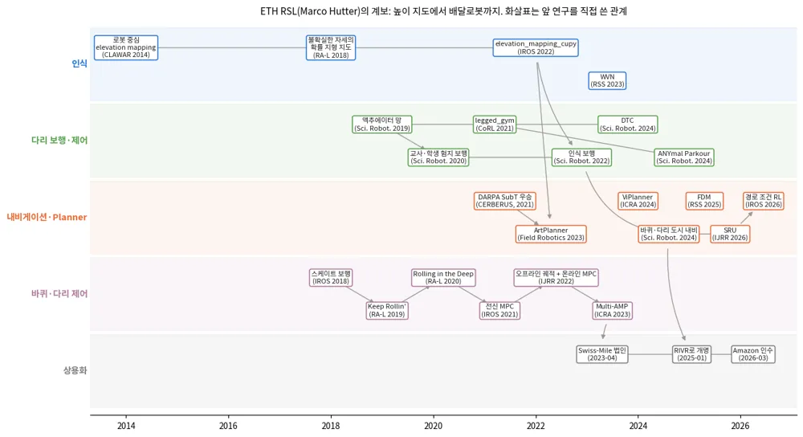
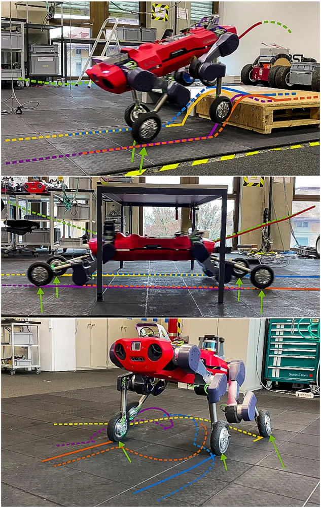
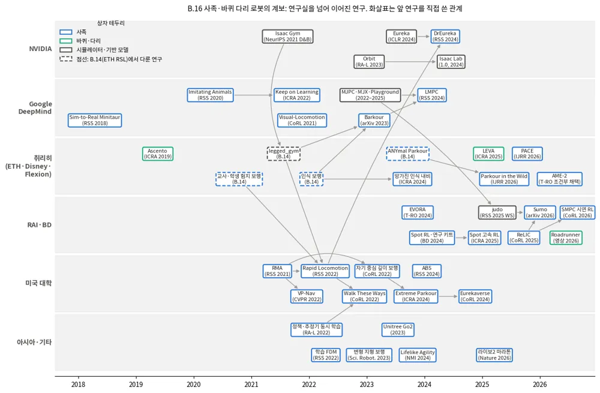
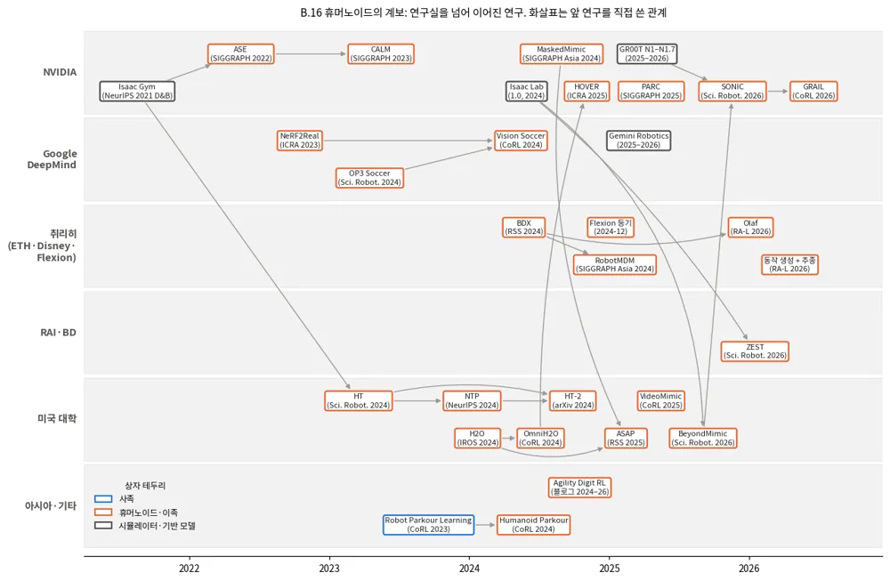
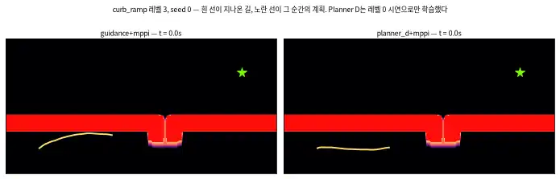
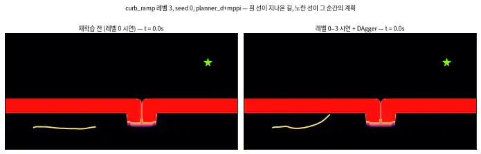

<!-- doc: Planner | 2 -->
# Planner — 경로·궤적을 만드는 쪽 (§B)

**Planner는 로봇 상태, TravMap, 목표를 받아 경로나 시간 인덱스 궤적을 낸다.** 제어 명령은 내지 않는다.
탭은 **두 묶음**이다. ==앞의 다섯은 **방법**(어떻게 계획하나), 뒤의 둘은 **현황**(누가 무엇을 내놨나)이다.==
2026-10-01에 이렇게 다시 묶었다 — 그 전에는 방법·도메인·관심사·계보 네 축이 섞여 있어서
자율주행 내용만 세 탭(E2E 주행 · 역사·상용화 · 로봇별 오픈소스)에 흩어져 있었다.

**■ 방법 — 어떻게 계획하나**

| 탭 | 다루는 것 | 절 | travplan과의 관계 |
|---|---|---|---|
| travplan과 고전 기준선 | travplan Planner의 현재 구조, 그리고 그래프 탐색·로컬 플래너·궤적 최적화 | B.1, B.10 | `GuidancePlanner`(Dijkstra)가 기준선이자 subgoal 공급원 |
| 학습 로컬 Planner | 로봇 주변만 보고 가까운 경로를 내는 학습 모듈(waypoint 회귀, diffusion 궤적, RL 직접 매핑, 비용 지도로 학습) | B.2–B.4, B.4b, B.7 | `LearnedPlanner`(Planner B)의 계보 |
| 생성형 궤적 | 시간 인덱스 궤적 여러 개를 생성 모델에서 샘플한다(Diffuser에서 Diffusion Planner까지, 후속 연구, Planner D) | B.8.0, B.8 | **Planner D**(flow matching)의 직계 설계 |
| Foundation·VLA·언어 | 시각 내비 기반 모델, VLA, 도시 보행 내비, 시연 로그 학습 | B.6, B.6b–B.6d | Planner 위의 **목표 선택 층** |
| 위험 인지·로컬 내비 | 지형 위험 그래프, 보이지 않는 지형 상상, CVaR 여유 | B.9 | 위험 비용 설계 |

**■ 현황 — 누가 무엇을 내놨나**

| 탭 | 다루는 것 | 절 | travplan과의 관계 |
|---|---|---|---|
| 자율주행 자동차 | ==한자리에 모았다== — 공개 스택(Autoware·Apollo), 종단간(E2E), 연구 역사와 2026 상용화 | B.12.1, B.11, B.13 | 후보 생성·검증·선택 구조, 폐루프 평가 지표, 규칙 안전 층 |
| 다리·바퀴 로봇과 계보 | 사족·휴머노이드·바퀴 로봇의 공개 Planner, ETH RSL 한 연구실의 층별 계보, NVIDIA·Google DeepMind·취리히·RAI Institute와 다른 연구실의 사족·휴머노이드 계보 | B.12, B.14, B.16 | 스워브 모듈 모델, ROS 2 통합, 인식 도구의 출처, 학습 절차와 plant 보정 |

**계보 한눈에 보기.** 각 이름의 설명은 해당 탭에 있다.

| 연도 | 고전·최적화 | 로봇별 공개 스택 | 학습 로컬 Planner | 생성형 궤적 | foundation model·VLA | E2E 주행 |
|---|---|---|---|---|---|---|
| 1959–1997 | Dijkstra, A*, DWA | — | — | — | — | — |
| 2008–2018 | Hybrid A*, TEB | ROS navigation, OMPL, 휴머노이드 발자국 계획, ORCA, Apollo EM planner, TOWR | — | — | — | — |
| 2019–2022 | Nav2 | CrowdNav, Crocoddyl, EPSILON, FAR, TARE, PUTN | — | Diffuser | GNM | — |
| 2023 | — | PDM-Closed, ArtPlanner, DRL-VO | iPlanner | Diffusion Policy, MPD | ViNT, NoMaD | UniAD, VAD |
| 2024 | Smac Planner | X-Mobility, HOVER | ViPlanner | π0, DiffusionDrive | OpenVLA, NaVILA, Uni-NaVid, CityWalker | SparseDrive, NAVSIM, Hydra-MDP, DriveVLM, EMMA |
| 2025 | — | CaRL, Alpamayo, COMPASS, ASAP, Gallant, HEAD | NavDP, Skill-Nav | Diffusion Planner, GoalFlow | — | — |
| 2026 | — | Click-and-Traverse, Alpamayo 1.5 | AgniNav, CORE, MILER | PC-Diffuser, FeaXDrive, MISTY, JPPD, GRACE | Can VFMs Navigate? | — |

**공개 코드와 모델.** GitHub 별 순이다(2026-09). HF 다운로드는 대표 가중치의 최근 30일 값이다.

| 분야 | 이름 | 코드(★) | HF 다운로드 | 라이선스 | travplan에서 |
|---|---|---|---|---|---|
| VLA | [openpi (π0)](https://github.com/Physical-Intelligence/openpi) | 14.0k | 0.04M (pi0_base) | 코드 Apache-2.0, 가중치 Gemma 약관 | flow matching 규칙이 Planner D와 같다 |
| VLA | [OpenVLA](https://github.com/openvla/openvla) | 7.1k | 0.44M (7B) | MIT | 참고 |
| E2E | [UniAD](https://github.com/OpenDriveLab/UniAD) | 4.8k | — | Apache-2.0 | 참고 |
| 스택 | [Nav2](https://github.com/ros-navigation/navigation2) | 4.7k | — | 패키지별 혼합 | ROS 2 통합 시 기준 스택 |
| 생성형 | [Diffusion Policy](https://github.com/real-stanford/diffusion_policy) | 4.6k | — | MIT | 행동 열 생성의 원형 |
| 생성형 | [DiffusionDrive](https://github.com/hustvl/DiffusionDrive) | 1.5k | — | MIT | anchor 시작 아이디어(B.8.2) |
| E2E | [VAD](https://github.com/hustvl/VAD) | 1.4k | — | Apache-2.0 | 참고 |
| 로컬 | [TEB](https://github.com/rst-tu-dortmund/teb_local_planner) | 1.4k | — | BSD-3-Clause | 고전 비교 대상 |
| 기반 모델 | [visualnav-transformer (GNM, ViNT, NoMaD)](https://github.com/robodhruv/visualnav-transformer) | 1.3k | — | MIT | 탐색 참고(B.6) |
| 생성형 | [Diffuser](https://github.com/jannerm/diffuser) | 1.3k | — | MIT | 참고 |
| 기반 모델 | [InternNav](https://github.com/InternRobotics/InternNav) | 1.1k | — | MIT | 내비 기반 모델을 만드는 공개 플랫폼 |
| E2E | [NAVSIM](https://github.com/autonomousvision/navsim) | 1.1k | — | Apache-2.0 | 평가 지표 참고 |
| 생성형 | [Diffusion Planner](https://github.com/ZhengYinan-AIR/Diffusion-Planner) | 1.1k | — | 표기 없음 | Planner D 출발점(B.8) |
| E2E | [SparseDrive](https://github.com/swc-17/SparseDrive) | 1.0k | — | MIT | 참고 |
| VLA | [NaVILA](https://github.com/AnjieCheng/NaVILA) | 0.7k | 0.01M 미만 | Apache-2.0 | 두 층 구조 참고 |
| 학습 로컬 | [ViPlanner](https://github.com/leggedrobotics/viplanner) | 0.7k | — | BSD-3-Clause | LearnedPlanner 손실의 원형 |
| 생성형 | [GoalFlow](https://github.com/YvanYin/GoalFlow) | 0.4k | — | Apache-2.0 | Planner D와 같은 구조 |
| E2E | [Hydra-MDP](https://github.com/NVlabs/Hydra-MDP) | 0.4k | — | 표기 없음 | 점수 증류 참고 |
| 학습 로컬 | [iPlanner](https://github.com/leggedrobotics/iPlanner) | 0.4k | — | MIT | LearnedPlanner 손실의 원형 |
| VLA | [Uni-NaVid](https://github.com/jzhzhang/Uni-NaVid) | 0.4k | — | MIT | 참고 |
| 생성형 | [MPD](https://github.com/joaoamcarvalho/mpd-public) | 0.3k | — | MIT | 비용 guidance 참고 |
| 도시 내비 | [CityWalker](https://github.com/ai4ce/CityWalker) | 0.2k | — | Apache-2.0 | 보도 영상 라벨링 참고 |

로봇 종류별 공개 스택(Autoware, Apollo, openpilot, OCS2, Nav2, Choreo 등)의 별 수와 라이선스는 B.12에 따로 모았다.

**travplan의 위치.** ==travplan Planner는 "고전 전역 경로 + 학습 로컬 궤적 생성 + 규칙 점수 선택"의 세 층이다.== GuidancePlanner가 TravMap
위 Dijkstra로 subgoal과 cost-to-go를 주고(B.10), Planner D가 flow matching으로 후보 궤적을 만들고(B.8.3), 규칙 점수가 하나를 고른다.
LearnedPlanner는 iPlanner 계열의 자기지도 손실로 학습한 waypoint Planner다(B.4b). VLA와 VLM은 이 세 층 위에서 목표를 정하는 층으로
쓰고(B.6b), E2E 주행에서는 평가와 선택 설계를 가져온다(B.11). 네 종류 로봇의 공개 스택에서 가져올 것은 B.12.5에 정리했다.

## B. 학습 기반 Planner

---

<!-- tab: travplan과 고전 기준선 -->

### B.1 travplan의 현재 구조

travplan은 2026-09-25부터 Planner와 Controller를 나눴다. **Planner는 학습 기반으로 개발하고, MPPI는 Planner의 경로나
궤적을 받아 실행하는 Controller로 둔다.**

```
Planner (개발 대상)                                              Controller (유지보수만)
  LearnedPlanner   로봇 중심 크롭 + subgoal → WaypointNet → waypoint 8개 ─┐
  GuidancePlanner  Dijkstra 경로 (비학습 기준선)                           ├─▶ MPPIController / TrackerController ─▶ body twist
  Planner D        flow matching 시간 인덱스 궤적 (§B.8.3)                 ─┘
```

조사를 시작할 때는 세 트랙이었다. A는 MPPI3D(계획과 제어를 함께), B는 LearnedPlanner, C는 HybridPlanner(B의 경로를
MPPI 샘플링의 prior로 쓰는 방식)였다. 아래 절들은 이 가운데 학습 Planner를 대체하거나 강화할 후보(§B.2–B.4, §B.4b, §B.6,
§B.8, §B.9)다. 비교 기준인 고전 계획은 §B.10, 로봇 종류별 공개 스택은 §B.12, 자율주행 E2E 계획은 §B.11에 있다. §B.5(MPPI 샘플링 개선)는 Controller·안전 문서의
MPPI 탭에 있다.

### B.10 고전 기준선: 그래프 탐색, 로컬 플래너, 궤적 최적화

**학습 Planner는 고전 기준선을 이겨야 의미가 있다.** travplan의 비학습 기준선은 `GuidancePlanner`다. TravMap 비용 위에서 Dijkstra로
목표까지의 경로를 구하고, 3 seed 운동학 벤치마크에서 guidance+mppi 스택이 12/12를 기록했다. 고전 계획은 세 층으로 나뉜다. 전역
경로를 찾는 그래프 탐색, 몇 초 앞의 속도를 고르는 로컬 플래너, 경로를 매끄럽고 실행 가능한 궤적으로 다듬는 최적화다. ROS 2의
Nav2가 이 세 층을 한 스택으로 묶는다.

| 연도 | 이름 | 층 | 핵심 | 구현 |
|---|---|---|---|---|
| 1959 | Dijkstra | 전역 | 누적 비용이 가장 작은 칸부터 확정하는 최단 경로 | travplan `GuidancePlanner` |
| 1968 | A* | 전역 | 남은 비용의 추정(휴리스틱)으로 탐색 순서를 정한다 | Nav2 Smac(2D) |
| 1997 | DWA | 로컬 | 가속 한계 안의 속도 창에서 목적함수가 가장 큰 속도를 고른다 | Nav2 DWB |
| 2008–2010 | Hybrid A* | 전역 | 칸마다 연속 자세를 저장하는 A*, 차량 기구학을 지키는 경로 | Nav2 Smac Hybrid-A* |
| 2012–2017 | TEB | 로컬 | 시간 간격을 가진 궤적을 희소 그래프 최적화로 다듬고, 여러 위상의 후보를 함께 최적화 | [teb_local_planner](https://github.com/rst-tu-dortmund/teb_local_planner) 1.4k |
| 2020 | Nav2 | 스택 | behavior tree로 전역 계획, 로컬 제어, 복구를 조율하는 ROS 2 내비 스택 | [ros-navigation/navigation2](https://github.com/ros-navigation/navigation2) 4.7k |
| 2024 | Smac Planner | 전역 | 비용 인식 A\*, Hybrid-A\*, State Lattice를 한 프레임워크로 | Nav2 기본 계획기 |

**Dijkstra와 A* — 격자 위 최단 경로**([Dijkstra 1959](https://doi.org/10.1007/BF01386390); [Hart, Nilsson, Raphael 1968](https://doi.org/10.1109/TSSC.1968.300136)). Dijkstra는 누적 비용이 가장 작은 칸부터 확정해
나간다. 간선 비용이 음이 아니면 최단 경로를 보장한다. A*는 누적 비용에 목표까지 남은 비용의 추정을 더한 값 순서로 칸을 연다.
추정이 실제 비용을 넘지 않으면 최적성을 유지하면서 훨씬 적은 칸만 연다. travplan의 `GuidancePlanner`는 목표에서 출발하는 Dijkstra로
모든 칸의 cost-to-go를 한 번에 구한다. 학습 Planner(LearnedPlanner, Planner D)는 이 cost-to-go 경로 위 4 m 앞의 점을 subgoal로 받는다.

**Hybrid A* — 격자 탐색에 차량 기구학을 넣었다**(Dolgov 등, 2008 워크숍, [IJRR 2010](https://doi.org/10.1177/0278364909359210), Stanford). DARPA Urban Challenge 차량 Junior의
주차장 계획에서 나왔다. 격자 칸마다 연속 자세 $(x, y, \theta)$를 저장하고, 조향 원호로 이웃을 확장한다. 그래서 결과 경로가 차량이
실제로 따라갈 수 있다. 장애물을 무시한 비홀로노믹 거리와 장애물을 고려한 2D 최단 거리 가운데 큰 값을 휴리스틱으로 쓰고, 탐색
중간에 목표까지 Reeds-Shepp 곡선을 바로 이어 보는 해석적 확장으로 속도를 높였다. Nav2의 Smac Planner(2024)가 비용 인식 판을
기본 계획기로 제공한다.

**DWA — 다음 순간의 속도를 고른다**(Fox, Burgard, Thrun, [IEEE RAM 1997](https://doi.org/10.1109/100.580977)). 로봇이 짧은 시간 안에 낼 수 있는 속도 창(dynamic window)만
탐색한다. 창 안의 각 $(v, \omega)$가 그리는 원호를 따라, 목표 방향, 장애물까지 거리, 속도의 가중합을 평가해 가장 좋은 것을 고른다.
장애물 앞에서 멈출 수 없는 속도는 처음부터 뺀다. 계산이 매우 가볍고, Nav2의 DWB가 이 계열이다.

**TEB — 시간이 붙은 궤적을 최적화한다**(Rösmann 등, 2012–2017, [RAS 2017](https://doi.org/10.1016/j.robot.2016.11.007), TU Dortmund,
[코드](https://github.com/rst-tu-dortmund/teb_local_planner)). 궤적을 자세 열과 그 사이 시간 간격 $\Delta T$로
표현하고, 속도·가속도 한계, 장애물 거리, 기구학 제약을 벌점으로, 전체 시간을 목적함수로 둔 희소 그래프 최적화(g2o)로 푼다.
장애물의 왼쪽과 오른쪽처럼 위상이 다른 후보 궤적 여러 개를 병렬로 최적화해 가장 좋은 것을 고른다. 홀로노믹 로봇의 옆 방향
속도도 다룬다.

**Nav2 — ROS 2 내비게이션 스택**([arXiv:2003.00368](https://arxiv.org/abs/2003.00368), IROS 2020,
[코드](https://github.com/ros-navigation/navigation2)). ROS Navigation의 후속으로,
behavior tree가 전역 계획, 로컬 제어, 복구 행동을 조율하고 ROS 2의 lifecycle 관리 위에서 돈다. 대학 캠퍼스에서 학생들 사이를
마라톤 거리만큼 주행하는 실험으로 검증했다. 이후 비용 인식 Hybrid-A*와 State Lattice를 담은 Smac Planner
([arXiv:2401.13078](https://arxiv.org/abs/2401.13078))가 기본 계획기가 됐고, MPPI Controller와 Regulated Pure Pursuit도 기본으로
들어 있다. 유지보수자들이 쓴 개관([arXiv:2307.15236](https://arxiv.org/abs/2307.15236))이 각 알고리즘을 비교한다.


*그림 — Smac Planner (Fig. 1): Smac Planner로 Nav2를 쓰는 산업용·수상 로봇들. 원형이 아닌 큰 몸체와 기구학 제약이 있는 로봇에 맞춘 계획기다. 출처: [arXiv:2401.13078](https://arxiv.org/abs/2401.13078)*

<details markdown="1">
<summary>자세히: A*, Hybrid A*, DWA의 수식과 GuidancePlanner의 간선 비용</summary>

**A*.** 칸 $n$의 우선순위는 시작부터의 누적 비용 $g(n)$과 목표까지의 추정 $h(n)$의 합이다. $h$가 실제 남은 비용 $h^*(n)$을 넘지
않으면(admissible) 처음 꺼낸 목표 경로가 최적이다. $h = 0$이면 Dijkstra와 같다.

$$ f(n) = g(n) + h(n), \qquad h(n) \le h^*(n) $$

**Hybrid A*의 휴리스틱.** 장애물을 무시하고 기구학만 지킨 거리(Reeds-Shepp 길이)와, 기구학을 무시하고 장애물만 본 2D 최단 거리의
큰 값을 쓴다. 둘 다 실제 비용을 넘지 않으므로 큰 값도 admissible이다.

$$ h(x, y, \theta) = \max\big(h_{\text{nonholo}}(x, y, \theta),\ h_{\text{holo}}(x, y)\big) $$

**DWA의 목적함수.** 가능한 속도 $V_s$, 장애물 앞에서 멈출 수 있는 속도 $V_a$, 현재 속도에서 가속 한계로 도달할 수 있는 창 $V_d$의
교집합에서 고른다. heading은 목표 방향과의 정렬, dist는 원호 위 가장 가까운 장애물까지 거리, vel은 전진 속도다.

$$ (v, \omega)^* = \arg\max_{(v, \omega) \in V_s \cap V_a \cap V_d} \sigma\big(\alpha\,\mathrm{heading}(v, \omega) + \beta\,\mathrm{dist}(v, \omega) + \gamma\,\mathrm{vel}(v, \omega)\big) $$

**GuidancePlanner의 간선 비용.** 8방향 격자에서 칸 $i$와 $j$ 사이 간선의 비용은 거리 $\ell_{ij}$에 두 칸 가중치의 평균을 곱한
값이다. 칸 가중치는 TravMap 비용과 σ로 정하고(`GuidanceConfig`의 기본값 $w_c = 4$, $w_\sigma = 0.5$), 비용이 0.95 이상인 치명 셀은
그래프에서 뺀다.

$$ w_{ij} = \ell_{ij} \cdot \tfrac12 (c'_i + c'_j), \qquad c'_i = 1 + w_c\, \mathrm{cost}_i + w_\sigma\, \sigma_i $$

목표에서 Dijkstra를 한 번 돌리면 모든 칸의 cost-to-go가 나온다. 경로는 로봇 칸에서 선행 칸을 따라가 얻는다.

**travplan에 주는 것.** cost-to-go 지도는 경로 하나보다 쓸모가 많다. Planner D는 후보 궤적의 끝점에서 이 값을 읽어 진행도 점수로
쓴다(B.8.3). 스워브 로봇은 옆으로도 움직일 수 있어, 자동차용 Hybrid A*의 원호 확장은 기구학을 너무 좁게 본다. 몸체 방향이 중요한
좁은 통로가 문제가 되면, 로봇별 운동 원시(control set)를 받는 Smac의 State Lattice가 다음 후보다.

</details>

**travplan에 주는 의미.** ==학습 Planner의 성능은 언제나 GuidancePlanner(TravMap 위 Dijkstra)와 같은 벤치마크에서 비교한다.==
고전 기준선은 느리게 변하는 전역 구조(어느 연석 경사로로 갈지)를 싸게 풀고, 학습 Planner는 그 위에서 시간과 동적 장애물을
다룬다. Nav2의 전역 계획기와 MPPI Controller 조합은 travplan의 GuidancePlanner와 `MPPIController` 조합과 같은 구조다. 그래서
제품에서 Nav2와 섞어 쓸 때도 경계가 분명하다.

#### B.10.1 궤적 다발을 한꺼번에 미는 최적화: MPOT

**MPOT**(*Accelerating Motion Planning via Optimal Transport*, [arXiv:2309.15970](https://arxiv.org/abs/2309.15970),
NeurIPS 2023, TU Darmstadt)는 위 표의 "궤적 최적화" 층에 들어가지만 **기울기를 쓰지 않는다.** waypoint마다
무작위로 회전시킨 다포체의 꼭짓점 방향으로 비용을 찍어 보고, 그 비용 행렬에 엔트로피 정규화 최적 수송을 한 번
풀어 **방향 가중치**를 얻는다(**Sinkhorn Step**). 이름에 OT가 있지만 ==수송은 시작점과 목표점 사이가 아니라
**waypoint와 탐색 방향 사이**== 다. 수식과 흔한 오독은 배경 0.2b에 모았다.

| 환경 | 시간 | 성공률 | 비교 |
|---|---|---|---|
| point-mass(2D 밀집 장애물) | **0.4 s** | **99.2%** | 기울기 기반 기준선(CHOMP·GPMP2)보다 빠르고 성공률도 높다. RRT\*·I-RRT\*는 성공률 100%지만 43 s가 걸린다 |
| Panda(7-DoF) | 0.8 s | 71.6% | 병렬로 민 계획 가운데 성공 60.2%(논문의 GOOD) |
| TIAGo++(mobile manipulation) | 1.49 s | 55% | GPMP2 40.11 s / 40%, RRT\*는 1000 s 예산에도 실패 |

**Controller 자리에는 원형 그대로 쓸 수 없다.** 원형은 제어열 대신 상태 waypoint를 직접 밀고 동역학·가속 한계를
비용으로만 넣어 `Controller` 프로토콜이 요구하는 twist를 내지 않으며, 가장 빠른 숫자 0.4 s가 제어 주기 0.1 s의 4배,
계획 게이트 10 ms의 40배다. ==다만 제어열 판은 만들 수 있다== — Controller 문서 E.11이 입자를 제어열로, OT의 점을
twist 매듭점으로 바꾼 판을 세워 멈춘 장면에서 같은 예산의 MPPI와 맞대 봤고, 넘지 못했다(TP-0130). 분류와 비교표는
배경 0.2b, 실측은 E.11이다.

==**쓸 자리는 Planner D의 교사다.**== `scripts/train_planner_d.py`는 상태마다 `GlobalGuidance` + `MPPIController`로
**4초 제어열 하나**를 만들어 라벨로 쓴다 — 단일 모드 교사다. MPOT는 **여러 궤적을 한 배치로** 밀어 서로 다른
위상(장애물 왼쪽·오른쪽)의 답을 한 번에 내고, 논문이 스스로 밝히는 용도도 *"a strong oracle for collecting
datasets ... capturing homotopy classes"*다. ==오프라인 수집은 0.4 s를 신경 쓰지 않는다.==
코드는 [anindex/mpot](https://github.com/anindex/mpot) ★71 **MIT**(PyTorch)와
[anindex/ssax](https://github.com/anindex/ssax) ★50 **MIT**(JAX)다. 다만 **지형 비용이 TravMap에서 와야 하므로**
비용·probe 평가를 travplan 쪽으로 바꿔 끼워야 한다. ==그 일을 TP-0136이 Playground에서 했다== —
Sinkhorn Step을 **Planner 자리**에 놓고 probe 비용을 TravMap 칸 가중치로 바꿔 끼운 판이 Controller 문서
작업 기록 **E.14**에 있다(저장소 파이썬이 아니라 브라우저 JS 재구성이다).

---

<!-- tab: 학습 로컬 Planner -->

### B.2 waypoint를 직접 회귀하는 방식

LearnedPlanner처럼 관측에서 waypoint나 그에 준하는 중간 표현을 한 번에 내는 계열이다. 빠르고 가볍지만, 한 가지 답만
내므로 갈림길에서 약하다.

**AgniNav**([arXiv:2606.10903](https://arxiv.org/abs/2606.10903)) — 단안 이미지와 로봇 몸체 치수 네 개(앞·뒤 길이, 반폭,
높이)로 **1D 가상 레이저 스캔**을 예측하고, 이를 고전 로컬 플래너에 넘긴다. 한 모델을 여러 몸체에 그대로 쓴다. Turtlebot2,
Go2, K1 실물에서 Jetson Orin FP16 30 Hz로 돌렸다. 임베디드 실측이 있는 드문 사례다.


*그림 — AgniNav (Fig. 1): 단안 이미지 → 1D 가상 레이저 스캔(로봇 높이 조건) → 풋프린트 기반 고전 로컬 플래너. 출처: [arXiv:2606.10903](https://arxiv.org/abs/2606.10903)*


*그림 — AgniNav: ==몸체 높이를 조건으로 주면 같은 장면에서 다른 스캔이 나온다== — 낮은 로봇은 매달린 장애물 아래로 지나가고 높은 로봇은 막힌다. travplan의 오버행 한계와 `clearance` 채널(A.2b.6) 논의에 직접 닿는다. 출처: [arXiv:2606.10903](https://arxiv.org/abs/2606.10903)*


*그림 — AgniNav: Turtlebot2·Go2·K1 실물 사례. 한 모델을 몸체 치수만 바꿔 세 로봇에 쓴다. 출처: [arXiv:2606.10903](https://arxiv.org/abs/2606.10903)*

<details markdown="1">
<summary>자세히: AgniNav의 방법과 수식</summary>

**몸체를 네 숫자로 요약한다.** 로봇마다 모델을 다시 학습하지 않으려고, 충돌에 관련된 몸체 정보만 네 값으로 둔다. 인식은 높이만, 계획은 나머지를 쓴다.

$$ c_e = [H_{\max},\ L_1,\ L_2,\ W/2], \qquad \hat S_t = f_\theta(I_t, H_{\max}), \qquad a_t = \pi\big(R_t,\ L_1, L_2, W/2,\ \kappa_e\big) $$

$H_{\max}$는 보호해야 할 높이(그보다 높은 장애물은 무시), $L_1, L_2$는 앞·뒤 여유 길이, $W/2$는 반폭, $\kappa_e$는 속도·각속도·가속 한계다.

**라벨: 열(column) 최솟값 가상 스캔.** 깊이 영상에서 광학 중심 한 줄만 보면 그 높이 밖의 장애물을 놓친다. 그래서 영상의 **각 열 전체**에서 높이
$H_{\max}$ 아래에 있는 가장 가까운 점을 골라 1D 스캔 라벨 $S^*_t = \{(x_i^*, z_i^*)\}$을 만든다. 쌍을 이룬 RGB–깊이 데이터만 있으면 되고, 로봇별
데이터는 필요 없다.

**구조와 계획.** ViT 백본 + ScanFormer 디코더가 RGB와 $H_{\max}$를 받아 한 번에 스캔을 낸다. 계획은 이 스캔과 몸체 치수를 상태로 받는 MDP로
정의한 RL 정책이다(성공 보상, 충돌 벌점, 진행 보상).

**travplan에 주는 것.** LiDAR 없이 카메라만 쓸 때 TravMap 대신 쓸 수 있는 가장 가벼운 중간 표현이다. 다만 1D 스캔이라 턱·경사 같은 높이 정보는
잃는다.

</details>

**Skill-Nav**([arXiv:2506.21853](https://arxiv.org/abs/2506.21853)) — 상위 플래너(LLM이나 경로 계획기)가 waypoint를 주면, 하위
RL 보행 정책이 지형에 맞춰 기술을 바꿔 가며 따라간다. waypoint를 계획과 제어 사이의 인터페이스로 쓰는 계층형이다. 코드 공개
여부는 확인하지 못했다.


*그림 — Skill-Nav (Fig. 1): 상위 플래너가 waypoint를 주고 하위 RL 보행 정책이 지형에 맞춰 따라간다. 출처: [arXiv:2506.21853](https://arxiv.org/abs/2506.21853)*

<details markdown="1">
<summary>자세히: Skill-Nav의 방법과 수식</summary>

**계층.** 상위 플래너(LLM이나 기존 경로 계획기)가 waypoint를 내고, 하위 보행 정책이 PPO로 학습한 waypoint 추종 정책이다. 속도 명령 대신 **목표
위치**를 명령으로 주면 정책이 점프·오르기·회피 같은 기술을 스스로 고를 여지가 커진다.

**teacher–student**(배경 0.12). 교사 정책의 상태는 proprioception $p_t$, 추정 속도 $\hat v_t$, waypoint 명령 $w_t$, 특권 정보 인코딩 $e_t$, 지형 스캔 점
$m_t$다. 학생은 $e_t$와 $m_t$를 과거 proprioception과 깊이 영상으로 복원한다.

$$ s_t = [\,p_t,\ \hat v_t,\ w_t,\ e_t,\ m_t\,] $$

**travplan에 주는 것.** waypoint를 계획과 제어 사이의 인터페이스로 쓰는 것은 travplan의 `PlanResult.path`와 같다.

</details>

### B.3 diffusion으로 궤적 분포를 만드는 방식

한 경로만 회귀하지 않고, **궤적의 분포**를 배워 노이즈를 걷어내며 여러 후보를 만든 뒤 critic이 고른다. 갈림길처럼 답이 여럿인
상황에 강하다.

```python
# 개념 pseudocode (NavDP 계열)
trajectory = sample_gaussian_noise()
for t in reversed(range(num_diffusion_steps)):
    trajectory = denoise_step(trajectory, obs, goal, t)   # 학습된 denoiser
candidates = [trajectory for _ in range(K)]               # 후보 K개
best = max(candidates, key=lambda tau: critic(tau, obs))  # critic이 고른다
```

**NavDP**([arXiv:2505.08712](https://arxiv.org/abs/2505.08712), ICRA 2026, [코드](https://github.com/InternRobotics/NavDP)) — 이
계열에서 가장 강력한 사례다. RGB-D를 입력으로 궤적 후보를 생성하고, 시뮬레이션의 특권 정보(ESDF)로 학습한 critic이 안전성을
채점한다. 3,000개 장면에서 모은 1,000 km 이상의 시뮬레이션 주행으로만 학습해 실제 로봇 여러 종류에 추가 학습 없이 옮겼다(v3
초록 기준). Jetson 지연은 보고하지 않았다. 학습 Planner와 입출력 계약이 같고 여러 답을 낼 수 있어, **Planner D의 직접 참고
대상**이다. 특히 critic은 Planner D의 비학습 선택기를 대체할 후보다.


*그림 — NavDP (Fig. 1): 시뮬 데이터로만 학습해 여러 로봇에 그대로 옮겨 쓴다. 궤적 후보 생성 + critic 채점. 출처: [arXiv:2505.08712](https://arxiv.org/abs/2505.08712)*

<details markdown="1">
<summary>자세히: NavDP의 방법과 수식</summary>

**데이터 엔진(시뮬 전용).** 3,000개 이상 장면(3D-Front, HSSD 등)의 메시를 0.05 m voxel로 바꿔 ESDF를 만든다. 로봇은 반경 0.25 m 원통, 카메라 높이는
0.25–1.25 m, 피치 −30–0°, 시야는 D435i(69°×42°)와 Zed 2(110°×70°) 두 설정으로 무작위화한다. 임의의 시작·목표에서 A* 경로를 구하고, 각 waypoint를
ESDF가 커지는 쪽으로 밀어낸 뒤 cubic spline으로 매끄럽게 해 시연 궤적을 만든다. BlenderProc로 RGB-D를 렌더링한다.

**구조.** RGB 이력 $N = 8$프레임은 사전학습 DepthAnything 인코더(프레임당 256 토큰), 깊이 한 장은 처음부터 학습하는 ViT(256 토큰, 0.1–5 m만 사용)로
인코딩하고, 학습 질의로 $N \times 16$개 토큰으로 압축한다. 목표는 상대 좌표 $(x_g, y_g)$다. 하나의 transformer가 궤적 생성(행동 헤드)과 궤적 평가
(critic 헤드)를 함께 한다.

**행동 손실(확산, 배경 0.5).** 목표가 있는 경우와 없는 경우를 반씩 섞어 학습한다($\alpha = \beta = 0.5$, 10스텝, waypoint $M = 24$개).

$$ \mathcal{L}_{\text{act}} = \alpha\, \mathbb{E}\big\lVert \epsilon_k - \epsilon_\theta(\tau + \epsilon_{k+1}, k, d_t, I_{t-N:t}) \big\rVert^2 + \beta\, \mathbb{E}\big\lVert \epsilon_k - \epsilon_\theta(\tau + \epsilon_{k+1}, k, g_t, d_t, I_{t-N:t}) \big\rVert^2 $$

**critic 라벨(특권 정보).** 시연 궤적을 흔들어 만든 대조 샘플 $\hat\tau$마다, waypoint의 ESDF 값 $d^m$으로 "장애물에서 멀어지는 정도"와 "안전 거리
$d_{\text{safe}} = 0.5$ m 안에 들어간 비율"을 합쳐 점수를 매긴다. 실제 로봇에는 ESDF가 없지만, critic은 영상만 보고 이 점수를 맞히도록 배운다.

$$ V(\hat\tau) = \gamma \sum_{m=0}^{M} \big(d^{m+1}_{\hat\tau} - d^m_{\hat\tau}\big) + \lambda\, \frac{1}{M} \sum_{m=0}^{M} \mathbb{I}\big(d^m_{\hat\tau} < d_{\text{safe}}\big) $$

**결과.** 시뮬 PointGoal 성공률 67.2%(ViPlanner 60.9%), 실물 Turtlebot 9/10, Go2 7/10, G1 7/10. 학습은 A100 32장으로 24시간.

**travplan에 주는 것.** Planner D의 비학습 선택기를 이 critic처럼 학습시킬 수 있다. travplan은 시뮬에서 TravMap 정답 비용과 치명 셀을 알므로 라벨을
바로 만들 수 있다.

</details>

### B.4 인식에서 속도 명령까지 RL로 곧장 가는 방식

**MILER**([arXiv:2609.20747](https://arxiv.org/abs/2609.20747))와 **CORE Planner**([arXiv:2606.29222](https://arxiv.org/abs/2606.29222), [코드](https://github.com/BBD00/core_planner))는
인식 결과를 속도 명령으로 곧장 바꾼다. MILER는 Jetson AGX Orin으로 실차 17.3 km를 달렸고, CORE는 소형 UGV에서 검증했다. 임베디드
배포가 검증된 장점이 있지만, 명시적인 궤적이나 비용을 거치지 않아 travplan이 비용 항으로 얻는 해석 가능성을 잃는다. 그래서 채택은
보류한다. 다만 MILER의 **"시뮬과 실제가 같은 중간 표현(시맨틱 BEV)을 보게 해서 sim-to-real을 푼다"**는 발상은 TravMap을 공통 표현으로
쓰는 travplan 설계와 같아서 D.0에서 따로 다룬다.


*그림 — MILER (Fig. 2): 학습 때는 중간 표현 시뮬레이터, 배포 때는 BEVFusion으로 같은 중간 표현을 만들어 sim-to-real. 출처: [arXiv:2609.20747](https://arxiv.org/abs/2609.20747)*


*그림 — CORE Planner (Fig. 3): LiDAR로 visibility graph를 점진적으로 만들고 transformer가 다음 노드를 고르는 구조. 출처: [arXiv:2606.29222](https://arxiv.org/abs/2606.29222)*

<details markdown="1">
<summary>자세히: MILER의 방법과 수식</summary>

**중간 표현(MLR) 시뮬레이터.** 사실적인 렌더링 대신 시맨틱 BEV만 만드는 GPU 시뮬레이터에서 학습한다. 클래스는 주행 가능(포장·자갈), 반주행 가능
(잔디), 주행 불가(장애물·정지 차량), 모름의 넷이다. 지도는 Minecraft처럼 여러 층의 Perlin 노이즈로 절차 생성한다. "3D 환경 → 센서 데이터 → 시맨틱"
투영을 학습 때 통째로 건너뛰는 것이 핵심이다.

**상태와 행동.** 상태는 60 m × 60 m, 0.25 m 해상도의 원-핫 BEV(목표 waypoint 채널 포함), 차량 상태(속도·가속·조향·조향 속도), 이전 행동, 목표 속도,
1 m 간격 waypoint 80개, 남은 경로 길이다. 행동은 **jerk와 조향 가속**(두 번 적분돼 자세에 반영)이고, 5 × 5 이산 분포로 둔다. PPO로 학습하며 보상은
커리큘럼으로 점점 엄격하게 바꾼다.

**배포(sim-to-real).** Jetson AGX Orin에서 TensorRT로 1.9 ms. 실제 BEV는 BEVFusion(카메라 + LiDAR)으로 만든다. 실차와 같은 자세에서 시작하는 **가상
차량**을 두고, 실제 BEV를 가상 차량 좌표로 옮겨(회전 흔적을 없애려 원형 crop) 정책이 가상 차량을 몰게 한 뒤, 가상 궤적을 실차가 추종하게 한다.

$$ \mathrm{BEV}_t^R = \mathrm{BEVFusion}\big(\mathrm{PointCloud}_t^R,\ \mathrm{CameraImages}_t^R\big) $$

**travplan에 주는 것.** travplan도 TravMap이라는 중간 표현을 공유한다. 시뮬과 실제가 같은 TravMap을 보게 하면, Planner D를 운동학 시뮬에서만 학습해도
옮길 수 있다는 근거다.

</details>

<details markdown="1">
<summary>자세히: CORE Planner의 방법과 수식</summary>

**문제: 탐색 교착 진동.** 미지 환경에서 다음 waypoint를 **현재 믿음 지도만으로** 고르면, 새 관측이 들어올 때마다 최적 후보가 바뀌어 두 점 사이를 오가는
현상(Navigation Deadlock Oscillation)이 생긴다. 고전 정식화는 다음과 같다($B$: 믿음 지도).

$$ p^\star(t) = \arg\min_{p \in \mathcal{P}(t)} \mathrm{Cost}\big(p;\ S(t-1),\ B(t-1)\big) $$

**방법.** LiDAR로 visibility graph를 점진적으로 만들고(밀집 격자 대신 희소 그래프), 그래프를 가지치기한 뒤 transformer가 **과거 행동을 담은 문맥 메모리**와
함께 다음 노드를 고른다. 순차 의사결정으로 바꿔 과거를 기억하게 함으로써 진동을 줄인다. 이미지 기반 환경에서만 학습해 추가 학습 없이 실물로 옮겼다.

**travplan에 주는 것.** Planner가 매 주기 독립적으로 계획하면 같은 진동이 생길 수 있다(curb_ramp의 "갔다가 되돌아오기"). 재계획 간 일관성 장치의 참고다.

</details>

### B.4b 비용 지도로 직접 학습하는 Planner: iPlanner와 ViPlanner

**travplan의 LearnedPlanner(Planner B)는 이 계열이다.** 전문가 시연 없이, 예측한 경로가 비용 지도 위에서 얼마나 싼지를 손실로 삼아
네트워크를 학습한다. 비용 지도를 경로 점에서 미분 가능하게 읽으면, 비용의 기울기가 경로 점을 거쳐 네트워크까지 흐른다. ETH RSL은
이것을 명령형 학습(imperative learning)이라 불렀다.

| 연도 | 이름 | 입력 | 비용 지도 | 결과 | 코드(★) |
|---|---|---|---|---|---|
| 2023 | iPlanner | 깊이 영상 + 목표 | 복원한 ESDF를 가우시안으로 부드럽게 | 고전 파이프라인보다 약 4배 빠름, SPL 26–87% 향상 | [leggedrobotics/iPlanner](https://github.com/leggedrobotics/iPlanner) 0.4k |
| 2024 | ViPlanner | 깊이 + 의미 분할 영상 + 목표 | 30개 의미 클래스의 traversability 비용 | 기하만 쓸 때보다 traversability 비용 38.02% 감소 | [leggedrobotics/viplanner](https://github.com/leggedrobotics/viplanner) 0.7k |
| 2026 | travplan LearnedPlanner | TravMap 크롭 + subgoal | TravMap cost와 σ | 3 seed 벤치마크 learned+mppi 8/12 | `travplan/planners/learned/loss.py` |

**iPlanner — 비용의 기울기로 경로를 배운다**([arXiv:2302.11434](https://arxiv.org/abs/2302.11434), RSS 2023, ETH RSL,
[코드](https://github.com/leggedrobotics/iPlanner)). 깊이 영상 한 장과
목표를 받아 key point 몇 개로 된 경로를 낸다. 라벨 경로 대신, 경로를 미분 가능한 비용 지도 위에서 평가한 값을 손실로 쓴다. 네트워크
갱신(위 단계)과 비용 기반 궤적 최적화(아래 단계)를 묶은 이층 최적화(BLO)로 학습하고, 비용의 기울기가 궤적 최적화를 거쳐 네트워크까지
역전파된다. 궤적마다 충돌 확률도 함께 예측하는 "fear loss"를 두어, 장애물 비용을 과하게 키우지 않고도 국소 최소에서 빠져나오게 했다.
고전 파이프라인보다 약 4배 빠르게 계획했고, 위치 추정 잡음에 강했으며, 보지 못한 환경에서 학습 기준선보다 SPL을 26–87% 높였다.


*그림 — iPlanner (Fig. 2): 깊이와 목표로 key point 경로와 충돌 확률을 예측하고, 궤적 비용과 fear loss를 역전파해 인식·계획 네트워크를 함께 학습하는 이층 최적화. 출처: [arXiv:2302.11434](https://arxiv.org/abs/2302.11434)*

**ViPlanner — 의미까지 비용으로 넣는다**([arXiv:2310.00982](https://arxiv.org/abs/2310.00982), ICRA 2024, ETH RSL,
[코드](https://github.com/leggedrobotics/viplanner)). 기하만 보면 계단은
막혀 보이고, 풀밭과 도로는 구별되지 않는다. ViPlanner는 깊이 영상과 의미 분할 영상을 따로 인코딩해 목표와 합치고, 30개 의미 클래스에
비용을 매긴 의미 비용 지도로 iPlanner식 학습을 한다. 보도, 횡단보도, 바닥, 계단이 가장 싸고, 자갈·모래·눈, 풀·흙, 도로 순으로
비싸지며, 사람, 차, 벽, 기둥은 장애물이다. 클래스는 one-hot 대신 traversability가 비슷할수록 가까운 RGB 색으로 표현했다. CARLA
도시와 Matterport 실내 같은 시뮬레이션 데이터만으로 학습해 실제 4족 로봇에 zero-shot으로 옮겼고, 기하만 쓰는 방법보다
traversability 비용을 38.02% 줄였다.


*그림 — ViPlanner (Fig. 2): 깊이 영상, 의미 영상, 목표를 받아 대략적인 경로와 충돌 확률을 내고, 네트워크 가중치와 최종 경로를 이층 최적화로 함께 다듬는다. 출처: [arXiv:2310.00982](https://arxiv.org/abs/2310.00982)*

<details markdown="1">
<summary>자세히: 명령형 학습의 손실과 travplan plan_loss</summary>

**이층 최적화.** 위 단계는 네트워크 $f_\theta$를 과제 손실 $\mathcal F$로 갱신하고, 아래 단계는 네트워크가 낸 경로를 비용 $\mathcal C$로
최적화한다.

$$ \min_\theta\ \mathcal F(f_\theta, \boldsymbol\tau^*) \quad \text{s.t.} \quad \boldsymbol\tau^* = \arg\min_{\boldsymbol\tau} \mathcal C(f_\theta, \boldsymbol\tau) $$

**궤적 비용.** 장애물 비용 $\mathcal C^O$는 경로 점 $\mathbf p_i$에서 읽은 비용 지도 값의 합이다. 목표 비용 $\mathcal C^G$는 경로 끝과
목표 사이 거리이고, 운동 비용 $\mathcal C^M$은 key point 사이 구간 길이가 고르지 않을수록 커진다.

$$ \mathcal C(\boldsymbol\tau) = \alpha \sum_i \mathcal H(\mathbf p_i) + \beta\, \mathcal C^G(\boldsymbol\tau) + \gamma\, \mathcal C^M(\boldsymbol\tau) $$

**fear loss.** 경로가 장애물과 부딪히는지를 라벨로, 예측한 충돌 확률 $\mu$에 이진 교차 엔트로피를 건다. 배포 때는 $\mu$가 임계값보다
낮은 경로만 실행한다. 최종 손실은 $\mathcal F = \mathcal C + \mathcal L_{\text{fear}}$다.

**travplan `plan_loss`.** LearnedPlanner는 waypoint 8개를 촘촘히 보간한 점에서 TravMap(흐린 비용, 원래 비용, σ)을 `grid_sample`로
읽는다. 쌍선형 보간이라 점의 위치에 대해 미분 가능하다. 손실은 여섯 항의 가중합이다.

$$ \mathcal L = 3\,\overline{c}_{\text{blur}} + 12\,\overline{\mathrm{relu}(c - 0.5)^2} + 0.5\,\overline{\sigma} + \lVert \mathbf w_8 - \mathbf g \rVert + 2\,\overline{\lVert \Delta^2 \mathbf w \rVert^2} + 0.05\, L $$

순서대로 평균 비용, 치명 영역 벌점, 불확실성, 목표 거리, 2차 차분(매끄러움), 경로 길이다. iPlanner와 비교하면 아래 단계의 궤적
최적화와 fear 헤드가 없고, 대신 σ 항이 있다.

**travplan에 주는 것.** LearnedPlanner가 실패한 경우는 경로가 치명 셀을 지나 MPPI가 진입을 거부하고 멈춘 경우였다(`docs/ARCHITECTURE.md`
§4). iPlanner의 fear 헤드는 바로 이 경우를 겨냥한다. 충돌 확률이 높은 경로를 Planner 스스로 버리게 하면 GuidancePlanner로
넘기는 폴백 조건도 명확해진다. ViPlanner의 의미 비용은 TravMap에 의미 채널을 더할 때(A.11의 분할 모델) 그대로 쓸 수 있는 설계다.

</details>

### B.7 비교

| 계열 | 대표 | 입력 → 출력 | 장점 | 단점 | travplan에서의 위치 |
|---|---|---|---|---|---|
| waypoint 직접 회귀 | AgniNav | 이미지 + 몸체 치수 → 1D 스캔·waypoint | **Jetson 실측 30 Hz**, 여러 몸체 | 답이 하나(갈림길에 약함) | LearnedPlanner 개선 |
| 비용 지도 자기지도 | iPlanner, ViPlanner | 깊이(+의미) + 목표 → key point 경로 | 라벨 불필요, 시뮬 학습만으로 실물 | 비용 지도 품질에 묶임 | **LearnedPlanner 손실의 원형**(B.4b) |
| diffusion 궤적 | NavDP | RGB-D → 궤적 분포 + critic | 여러 답, sim-to-real 검증 | Jetson 지연 미보고 | **Planner D 직접 참고** |
| RL 직접 매핑 | MILER, CORE | 인식 → 속도 명령 | **임베디드 실배포** | 해석 가능성 손실 | 보류 |
| 학습 prior + MPPI 비용 항 | ProxPI | Planner 경로 → 근접 비용 | 최적화기 유지, prior가 틀려도 복구 | — | Controller 참고(`ReferenceCost`가 이미 유사) |
| 학습 워밍스타트 | Self-Supervised MPC Init | 상태 → 초기해 | 샘플링 MPC 안전 +100% 보고 | 시뮬레이션만 | Controller 참고 |
| 제어 도함수 한계 보장 | π-MPPI | 샘플 → QP 투영 → 평균 | jerk 한계를 구조적으로 보장 | 샘플마다 QP, 시뮬레이션만 | Controller 참고 |
| MPPI 샘플링 개선 | SMPPI | 제어 변화율 샘플링 | 구조적 매끄러움 | — | `SmoothMPPIController`로 반영 |
| foundation model | ViNT / NoMaD | 이미지 + 목표 → waypoint·diffusion | 성숙, 실배포, 목표 없는 탐색 | 미세조정 비용 | Planner D·탐색 참고 |

---

<!-- tab: 생성형 궤적 -->

### B.8.0 생성형 궤적의 계보: Diffuser에서 GoalFlow까지

**"계획을 생성 모델에서 샘플한다"는 발상은 2022년 Diffuser에서 시작해 로봇 정책, 운동 계획, 자율주행으로 퍼졌다.** 공통점은 셋이다.
궤적 전체를 한 번에 생성하고, 여러 모드를 표현하며, 비용이나 목표로 생성을 유도한다. 2025년부터는 적분 스텝을 1–2개로 줄이는
쪽(truncated diffusion, flow matching, 한 스텝 증류)이 주류다. travplan Planner D(B.8.3)는 이 계보의 flow matching 갈래에 있다.

이 표의 논문들은 diffusion 표기와 flow matching 표기를 섞어 쓴다. 두 표기를 옮기는 환율과 규약 지뢰는 **배경 0.6b**에 모아 뒀다.

| 연도 | 이름 | 분야 | 바꾼 것 | 코드(★) |
|---|---|---|---|---|
| 2022 | Diffuser | 오프라인 RL 계획 | 궤적 전체를 확산으로 생성, 보상 기울기 guidance와 inpainting | [jannerm/diffuser](https://github.com/jannerm/diffuser) 1.3k |
| 2023 | Diffusion Policy | 로봇 조작 | 관측 조건 행동 열 확산, receding horizon 실행 | [real-stanford/diffusion_policy](https://github.com/real-stanford/diffusion_policy) 4.6k |
| 2023 | MPD | 운동 계획 | 확산 prior와 비용 likelihood의 사후 분포에서 샘플 | [joaoamcarvalho/mpd-public](https://github.com/joaoamcarvalho/mpd-public) 0.3k |
| 2024 | π0 | VLA | VLM에 flow matching 행동 전문가(B.6b) | [Physical-Intelligence/openpi](https://github.com/Physical-Intelligence/openpi) 14.0k |
| 2024 | DiffusionDrive | E2E 주행 | anchor에서 시작하는 truncated diffusion 2스텝(B.8.2) | [hustvl/DiffusionDrive](https://github.com/hustvl/DiffusionDrive) 1.5k |
| 2025 | Diffusion Planner | 자율주행 | 예측과 계획을 함께 생성, 재학습 없는 guidance(B.8) | [ZhengYinan-AIR/Diffusion-Planner](https://github.com/ZhengYinan-AIR/Diffusion-Planner) 1.1k |
| 2025 | GoalFlow | E2E 주행 | 목표점을 먼저 고르고 flow matching 한 스텝 | [YvanYin/GoalFlow](https://github.com/YvanYin/GoalFlow) 0.4k |
| 2025 | **Flow Planner** | 자율주행(nuPlan) | 궤적을 잘게 토큰화하고 시공간 융합 + CFG. ==nuPlan Val14 **90.43**(refinement 없이)== | [DiffusionAD/Flow-Planner](https://github.com/DiffusionAD/Flow-Planner) 0.3k, **MIT** |

**학습 로컬 Planner 탭과 무엇이 다른가.** 두 탭은 기준이 다르다. 학습 로컬 Planner는 **역할**(로봇 주변만 보고 가까운 경로를 내는 학습 모듈)로
묶었고, 생성형 궤적은 **방법**(생성 모델에서 궤적을 샘플한다)으로 묶었다. 그래서 로컬 내비에 diffusion을 쓴 연구는 학습 로컬 Planner 탭에 있고,
이 탭은 로컬 내비 밖의 조작, 운동 계획, 자율주행까지 계보로 다룬다. 실무에서 갈리는 점은 둘이다.

| | 학습 로컬 Planner(회귀 계열) | 생성형 궤적 |
|---|---|---|
| 답의 수 | 대개 하나. 갈림길에서 두 답의 평균이 장애물로 들어가기 쉽다 | 여러 개를 샘플하고 비용이나 목표로 고른다 |
| 시간 | 대개 시간 없는 waypoint 열(경로). 속도와 타이밍은 Controller가 정한다 | 대개 시간 인덱스 궤적. 속도와 멈춤도 계획에 들어간다 |
| travplan | `LearnedPlanner`: waypoint 8개, 시간 없음 | Planner D: 4초 × 10 Hz, `PlanResult.times` |

**시간은 인덱스로 들어간다.** 생성 모델은 시각을 따로 출력하지 않는다. 출력 텐서의 k번째 원소가 "k·dt초 뒤"를 뜻하도록 학습 데이터에서
약속한다. Diffusion Planner는 8초 × 10 Hz(80스텝) 상태열을, Diffusion Policy는 제어 주기 간격의 행동열을 낸다. 속도는 점 사이 간격으로 표현되고,
같은 자리에 머무는 점들은 정지다. 그래서 경로는 같고 타이밍만 다른 "보행자 앞에서 멈췄다 지나가기"를 계획할 수 있다. Planner D는 한 단계 더
나가 위치 대신 제어 변화율 열을 생성하고 dt로 적분해 `SwerveModel`로 굴린다(B.8.3). 시간축이 명시적이고, 속도·가속 한계를 지키는 궤적이 나온다.

시간이 있느냐는 생성형이냐가 아니라 **출력 표현을 어떻게 정했느냐**의 문제다. 회귀 모델도 시간 인덱스 궤적을 낼 수 있고, 생성 모델도 경로점만
낼 수 있다. 이 분야에서 시간 인덱스 궤적이 표준이 된 것은 nuPlan과 NAVSIM이 시간이 붙은 미래 궤적으로 평가하기 때문이다.

**Diffuser — 계획 자체를 생성한다**([arXiv:2205.09991](https://arxiv.org/abs/2205.09991), ICML 2022, MIT·UC Berkeley,
[코드](https://github.com/jannerm/diffuser)). 모델 기반 RL은
학습한 동역학 모델을 고전 궤적 최적화기에 넘기는데, 최적화기가 학습 모델의 오차를 파고든다. Diffuser는 궤적 최적화를 모델 안으로 접어,
모델에서 샘플하는 것과 계획하는 것이 거의 같아지게 했다. 상태와 행동으로 된 궤적 전체를 확산으로 잡음에서 조금씩 다듬고, 보상의 기울기로
샘플을 유도(guidance)하며, 시작과 목표 상태를 고정하는 inpainting으로 목표 도달 계획을 만든다. 시간 합성곱이라 잡음 제거 한 번은 이웃
시간만 보지만, 이것을 여러 번 반복하면 국소 일관성이 전역 일관성으로 커진다.


*그림 — Diffuser (Fig. 2): 상태·행동 쌍으로 된 2차원 배열을 반복해 잡음 제거한다. 한 번의 잡음 제거는 좁은 수용 영역만 보지만 반복하면 계획 전체가 일관된다. 선택적인 guide 함수가 계획을 목적으로 끈다. 출처: [arXiv:2205.09991](https://arxiv.org/abs/2205.09991)*

**Diffusion Policy — 행동 열을 확산으로 낸다**([arXiv:2303.04137](https://arxiv.org/abs/2303.04137), RSS 2023, Columbia·TRI·MIT,
[코드](https://github.com/real-stanford/diffusion_policy)). 로봇의
시각-운동 정책을 관측 조건 잡음 제거 확산으로 표현했다. 최근 관측 $T_o$스텝을 받아 행동 $T_p$스텝을 예측하고, 그중 $T_a$스텝만 실행한 뒤
다시 계획한다(receding horizon). 여러 모드의 행동 분포를 자연스럽게 다루고, 고차원 행동에서도 학습이 안정적이다. 로봇 조작 벤치마크 4개의
여러 과제에서 기존 최고 방법보다 평균 46.9% 좋았다.


*그림 — Diffusion Policy (Fig. 2): 최근 관측 몇 스텝을 받아 행동 열을 낸다. CNN 판은 관측 특징을 FiLM으로 모든 합성곱 층에 넣고, 잡음에서 시작해 예측한 잡음을 여러 번 빼서 행동 열을 얻는다. 출처: [arXiv:2303.04137](https://arxiv.org/abs/2303.04137)*

**MPD — 확산 prior에 비용을 곱해 사후 분포에서 샘플한다**([arXiv:2308.01557](https://arxiv.org/abs/2308.01557), 2023, TU Darmstadt,
[코드](https://github.com/joaoamcarvalho/mpd-public)).
운동 계획을 추론 문제로 본다. 성공한 과거 계획들로 궤적의 확산 prior를 학습하고, 새 문제의 충돌·매끄러움 비용을 likelihood로 곱한
사후 분포에서 역확산으로 바로 샘플한다. 시작과 끝 상태는 고정한다. 평면 로봇과 7자유도 팔에서, 보지 못한 장애물 환경에서도
확산 prior가 고차원 궤적 분포를 잘 담는다는 것을 보였다.

**GoalFlow — 목표점을 먼저 고르고, flow matching으로 궤적을 만든다**([arXiv:2503.05689](https://arxiv.org/abs/2503.05689), CVPR 2025, [코드](https://github.com/YvanYin/GoalFlow)).
확산으로 만든 다봉 궤적은 퍼짐이 커서 고르기 어렵고, guidance가 장면과 어긋나면 품질이 떨어진다. GoalFlow는 조밀한 목표점 어휘에서
정답 끝점과의 거리 점수와 주행 가능 영역 점수로 목표점 하나를 고른다. 그 목표점과 BEV 특징을 조건으로 flow matching이 궤적 후보들을
내고, 마지막에 점수기가 최적 궤적을 고른다. NAVSIM에서 PDMS 90.3으로 다른 방법을 크게 앞섰고, 잡음 제거 한 스텝으로도 성능이 좋았다.


*그림 — GoalFlow (Fig. 2): 인식 모듈이 BEV 특징을 만들고, 목표점 모듈이 어휘에서 최적 목표점을 고르고, 계획 모듈이 가우시안에서 궤적 후보들을 생성한다. 마지막에 점수기가 하나를 고른다. 출처: [arXiv:2503.05689](https://arxiv.org/abs/2503.05689)*

<details markdown="1">
<summary>자세히: 생성형 계획의 guidance와 목표 고정</summary>

**Diffuser의 guided 샘플링.** 역확산 한 스텝의 평균 $\mu$를 목적 $\mathcal J$의 기울기 방향으로 옮기고, 매 스텝 계획의 첫 상태를 현재
상태 $\mathbf s$로 덮어쓴다(inpainting). 계획의 첫 행동만 실행하고 다음 관측에서 다시 계획한다(배경 0.5).

$$ \boldsymbol\tau^{i-1} \sim \mathcal N\big(\mu + \alpha\, \Sigma\, \nabla \mathcal J(\mu),\ \Sigma^i\big), \qquad \boldsymbol\tau^{i-1}_{\mathbf s_0} \leftarrow \mathbf s $$

**MPD의 사후 분포.** 과제 조건 $\mathcal O$(충돌 없음, 매끄러움)의 likelihood를 비용의 지수로 두면, 사후 분포의 score는 확산 prior의
score에 비용 기울기를 더한 것이다.

$$ p(\boldsymbol\tau \mid \mathcal O) \propto p(\mathcal O \mid \boldsymbol\tau)\, p(\boldsymbol\tau), \qquad p(\mathcal O \mid \boldsymbol\tau) \propto \exp\Big(-\sum_i \lambda_i\, c_i(\boldsymbol\tau)\Big) $$

**GoalFlow의 목표점 점수.** 목표점 $g_i$마다 정답 끝점 $g^{\text{gt}}$와의 거리를 softmax로 바꾼 거리 점수와, 그 자리에 자차 상자를
놓았을 때 네 모서리가 모두 주행 가능 영역 안인지(0 또는 1)를 예측한다. 두 점수의 가중 로그 합이 가장 큰 목표점을 쓴다.

$$ \delta^{\text{dis}}_i = \frac{\exp(-\lVert g_i - g^{\text{gt}} \rVert_2)}{\sum_j \exp(-\lVert g_j - g^{\text{gt}} \rVert_2)}, \qquad \hat\delta^{\text{final}}_i = w_1 \log \hat\delta^{\text{dis}}_i + w_2 \log \hat\delta^{\text{dac}}_i $$

**travplan에 주는 것.** Planner D는 GoalFlow와 구조가 같다. 목표점은 GuidancePlanner 경로 위 4 m 앞의 subgoal이고(B.10), flow matching이
후보 16개를 내고, 점수기는 TravMap 비용 적분, 치명 셀 벌점, 끝점의 cost-to-go로 하나를 고른다(B.8.3). 차이는 목표점을 고정 규칙으로
정한다는 것이다. 막다른 곳에서는 subgoal 후보 여러 개를 점수로 고르는 GoalFlow식 확장이 가능하다. Diffuser와 MPD의 비용 기울기
guidance는 Planner D의 `guide_scale` 옵션과 같다.

</details>

### B.8 시간·주변 에이전트·기구학을 함께 고려하는 생성형 궤적 Planner

출발점은 TIER IV의 [Autoware Diffusion Planner 영상](https://www.youtube.com/watch?v=Ug9Pv2fOdmg)이다
([PR #10957](https://github.com/autowarefoundation/autoware_universe/pull/10957), 2025-07 머지). 원 논문은 Zheng et al.,
[*Diffusion-Based Planning for Autonomous Driving with Flexible Guidance*](https://arxiv.org/abs/2501.15564)(ICLR 2025,
[코드](https://github.com/ZhengYinan-AIR/Diffusion-Planner))다. 이 Planner가 보여 준 네 가지 성질을 travplan에도 가져오고 싶었다.

이 절은 diffusion 표기로 쓰여 있고 Planner D(B.8.3)는 flow matching 표기를 쓴다. 두 쪽을 옮기는 환율과 규약은 **배경 0.6b**다.

1. **시간이 붙은 궤적** — "어디로"뿐 아니라 "언제 어디에"를 계획한다.
2. **주변 에이전트와 함께** — 앞차나 보행자의 움직임을 계획에 반영한다.
3. **목적지까지 잇지 않는 계획** — 앞의 몇 초만 계획하고 매 주기 다시 계획한다(receding horizon).
4. **기구학적으로 실행 가능한 출력** — 로봇이 실제로 따라갈 수 있는 궤적만 낸다.


*그림 — Diffusion Planner (Fig. 1): 이웃 차량·차선·경로를 인코딩하고, ego와 이웃의 미래 궤적을 한 번에 denoise하는 DiT 구조. 출처: [arXiv:2501.15564](https://arxiv.org/abs/2501.15564)*

<details markdown="1">
<summary>자세히: Diffusion Planner의 방법과 수식</summary>

**문제 설정.** 계획을 "미래 궤적 생성"으로 다시 정의한다. 조건 $C$(현재 상태, 과거 이력, 차선, 경로)가 주어지면 자기 차량과 이웃
$M$대의 미래를 **한 텐서로** 생성한다. 이웃의 미래를 예측하는 것과 자기 계획이 같은 분포에서 나오므로 서로의 상호작용이 반영된다.

$$ x = \big[x_{\text{ego}},\ x_{\text{nbr}_1},\ \dots,\ x_{\text{nbr}_M}\big], \qquad x \sim p_\theta(x \mid C) $$

**구조.** DiT 블록 3개(hidden 192). 노이즈 섞인 미래 궤적에 각 차량의 현재 상태를 이어 붙여 시작점을 고정하고, 차량끼리는 self-attention,
과거 이력·차선은 MLP-Mixer로 인코딩해 cross-attention으로 넣는다. 경로(route) 정보는 확산 시각 임베딩에 더해 adaLN으로 모든 블록을
조절한다. 자기 차량의 속도·가속 정보는 일부러 뺀다(폐루프 성능이 좋아진다고 보고).

**학습과 추론.** 배경 0.5의 확산 모델이고, 추론은 DPM-Solver++ 10스텝으로 8초 × 10 Hz 궤적을 A6000에서 약 20 Hz로 낸다. 학습 데이터에는
현재 상태에 작은 섭동을 주고 5차 다항식으로 정답 2초 지점까지 이어 붙여, 조금 벗어난 상태에서 돌아오는 법을 배우게 한다.

**Guidance(재학습 없이 행동 바꾸기).** 목표 분포를 $p_0(x) \propto q_0(x)\, e^{-\mathcal{E}(x)}$로 두고, 에너지 기울기를 예측한 깨끗한 궤적에서
계산한다(DPS). 충돌 에너지는 이웃과의 부호 거리 $D$로 정의한다($\Psi(x) = e^x - x$, $r$: 기울기가 생기는 최대 거리).

$$ \mathcal{E}_{\text{collision}} = \frac{1}{\omega_c} \cdot \frac{\sum_{M,\tau} \mathbb{1}_{D_M^\tau > 0}\, \Psi\!\big(\omega_c \max(1 - D_M^\tau / r,\ 0)\big)}{\sum_{M,\tau} \mathbb{1}_{D_M^\tau > 0} + \mathrm{eps}} $$

같은 방식으로 목표 속도 유지, 승차감(종방향 jerk 한계 초과분), 주행 가능 영역 이탈 에너지를 더해 조합할 수 있다.

**travplan에 주는 것.** Planner D의 비용 유도(`planner_dg`)가 이 DPS guidance를 flow matching에 옮긴 것이다. 이웃과의 공동 생성은 Planner D의
2단계 후보다.

</details>

#### B.8.1 Diffusion Planner는 네 가지를 어떻게 만드나

| 성질 | Diffusion Planner의 방법 | travplan |
|---|---|---|
| 시간이 붙은 궤적 | **8초 × 10 Hz = 80 스텝**의 (x, y, cos ψ, sin ψ)를 내고 20 Hz로 재계획 | Planner D가 4초 × 10 Hz 궤적(`PlanResult.times`)을 낸다 |
| 주변 에이전트 | 가까운 **이웃 10대의 미래 궤적을 자기 궤적과 한 텐서로 함께 denoise**(예측과 계획을 동시에). "앞차가 양보할 것" 같은 상호작용이 계획에 들어간다 | `DynamicObstacles` 등속 예측을 Controller `RiskCost`가 채점(예측 → 계획 한 방향) |
| 목적지 비연결 | 목표점 대신 **경로(차선 시퀀스)**를 조건으로 넣고 8초 앞까지만 생성. v1.0부터 경로 끝 처리를 학습 | `GlobalGuidance` subgoal을 조건으로 받는다 |
| 기구학 | 네트워크가 보장하지는 않는다. quintic 보간으로 학습 증강을 만들고, 출력을 **LQR 추종기**에 넘기며, 선택적 후처리가 후보를 채점 | Planner D는 `SwerveModel`로 굴려 **만들 때부터 실행 가능** |
| 실행 중 제약 추가 | **classifier guidance** — 재학습 없이 충돌·차선 이탈·목표 속도·승차감 에너지의 기울기를 denoise 도중 주입 | `planner_dg`가 TravMap 비용 기울기로 같은 일을 한다 |

그 밖의 수치: DiT 3블록, hidden 192, DPM-Solver++ 10 스텝, A6000에서 0.05초. nuPlan Test14-hard(비반응)에서 75.99로
PDM-Closed(65.08)보다 높고, 후처리를 붙이면 78.87이다. **Haomo 배달 차량(폭 1.03 m, 자전거도로, 보행자 상호작용 잦음)의 실제
주행 200시간 데이터에서 92.08**을 기록했다. travplan 도메인에 가장 가까운 검증이다. Autoware 쪽 v4.0(2026-03)은 **Real-Time
Chunking**(직전 예측의 앞 N 스텝을 재사용)으로 재계획 사이의 궤적 연속성을 확보했다.

#### B.8.2 후속 연구: 기구학·안전·속도를 어떻게 보강하나

**읽기 전에.** 이 표에는 diffusion과 flow matching이 섞여 있고 "몇 스텝이냐"가 거의 모든 행의 자랑거리다.
표기 사이의 환율과 규약은 **배경 0.6b**, 스텝 수를 줄이는 세 길(적분기·시작점 당기기·증류)과 증류가 치르는
다양성 비용은 **배경 0.7b**에 있다.

| 논문 | 핵심 | 기구학 처리 | 비고 |
|---|---|---|---|
| [**Flow Planner**](https://arxiv.org/abs/2510.11083) (NeurIPS 2025) | 궤적을 **잘게 토큰화**하고 시공간 융합 + classifier-free guidance | 토큰 단위라 긴 지평에서도 모양이 뭉개지지 않는다 | ==nuPlan Val14 **90.43**(후처리 refinement 없이), InterPlan 61.82==. [코드](https://github.com/DiffusionAD/Flow-Planner) ★0.3k **MIT** — 이 표에서 travplan이 라이선스상 가져다 쓸 수 있는 몇 안 되는 것 |
| [PC-Diffuser](https://arxiv.org/abs/2603.10330) (2026-03) | denoise 루프 안에 **capsule CBF 안전 필터** | 각 denoise 단계의 waypoint를 LQR로 추종해 자전거 모델로 굴린다 → 실행 가능 | "waypoint diffusion + 모델 rollout" 인터페이스를 명시적으로 주장, [코드](https://github.com/Eugene29/PC-Diffuser) |
| [FeaXDrive](https://arxiv.org/abs/2604.12656) (2026-04) | 곡률 정규화 학습 + 주행 가능 영역 guidance + **GRPO 후학습** | 학습 단계의 곡률 제약 | NAVSIM, [코드](https://github.com/BaoyunWang/FeaXDrive) |
| [GuideFlow](https://arxiv.org/abs/2511.18729) (CVPR 2026) | flow matching + EBM으로 제약을 생성 과정에 직접 강제 | 제약 guidance | mode collapse 완화, [코드](https://github.com/liulin815/GuideFlow) |
| [Adaptive-step Flow Matching](https://arxiv.org/abs/2602.10285) (2026-02) | 분산 추정으로 적분 스텝 수를 상황별로 선택 | **볼록 QP 후처리** | RTX 3070 20 Hz, [프로젝트](https://flow-matching-self-driving.github.io/) |
| [MISTY](https://arxiv.org/abs/2604.21489) (2026-04) | 반복 denoise 대신 **단일 스텝** | — | **10.1 ms / 99 FPS**, Test14-hard 80.32 |
| [DiffusionDrive](https://arxiv.org/abs/2411.15139) (CVPR 2025) | **anchor에서 시작하는 truncated diffusion**(모드 anchor 20개, 2 스텝) | — | RTX 4090 45 FPS, [코드](https://github.com/hustvl/diffusiondrive) |
| [JPPD](https://arxiv.org/abs/2606.20686) (2026-06) | **보도 배달로봇·보행자 공유 공간**의 예측·계획 공동 diffusion + 미분 가능 안전 포텐셜 guidance | 첫 waypoint만 속도 한계 안으로 제약, 나머지는 spline 지지점 | **Isaac Sim + ROS + 메카넘 실물**, CPU 32 ms / 12.8 Hz, 충돌률 0.9%(ORCA 11.2%). 코드는 게재 후 공개 예정 |
| [GRACE](https://arxiv.org/abs/2607.21661) (2026-07) | reverse 스텝마다 guidance 평균을 **MPPI 한 번으로 추정** → 기울기 없는 비용 guidance | 비용에 실행 가능성을 넣으면 된다 | 7자유도 팔 실험, 미분 불가능한 충돌 검사 비용도 사용 |
| [CoDiG](https://arxiv.org/abs/2505.13131) (2025-05, ETH·MPI) | denoise SDE에 **barrier 함수의 기울기 항**을 더해 제약을 지키는 쪽으로 샘플을 민다 | 제약 항에 넣으면 된다 | 1:28 경주차 실물, 시연 100개(증강 1만)로 학습. 4090에서 warm start 50 step이면 **2.5 Hz**, 전체 1000 step이면 0.25 Hz |
| [최적화 guidance](https://arxiv.org/abs/2606.24208) (2026-06, ETH·EPFL) | 역방향 스텝의 **노이즈 섭동을 최적화 변수로 치환** → 재학습 없이 hard 제약·soft 벌점 | 임베디먼트 제약을 직접 건다 | 파지 +20%p, 시각운동 조작 +23%p. 기울기 안내는 79.3 → 84 ms인데 제약 solver를 쓰면 **46–69배** |


*그림 — PC-Diffuser (Fig. 1): denoise 루프 안에서 궤적을 추종·안전 필터링해 실행 가능하고 안전한 궤적으로 만든다. 출처: [arXiv:2603.10330](https://arxiv.org/abs/2603.10330)*


*그림 — FeaXDrive (Fig. 1): 노이즈 중심이 아닌 궤적 중심 diffusion. 곡률·주행 가능 영역을 궤적 공간에서 직접 다룬다. 출처: [arXiv:2604.12656](https://arxiv.org/abs/2604.12656)*


*그림 — GuideFlow (Fig. 1): 모방 E2E 플래너 / 기존 생성형 / GuideFlow(제약을 생성 과정에 직접 강제) 비교. 출처: [arXiv:2511.18729](https://arxiv.org/abs/2511.18729)*


*그림 — Adaptive Time Step Flow Matching (Fig. 1): 과거 움직임·지도·목표 자세를 인코딩해 flow matching으로 궤적 생성, step 수를 상황별로 조절. 출처: [arXiv:2602.10285](https://arxiv.org/abs/2602.10285)*


*그림 — MISTY (Fig. 1): 벡터 인코더 + MLP-Mixer 단일 step 디코더. 반복 denoise 없이 한 번에 궤적을 낸다. 출처: [arXiv:2604.21489](https://arxiv.org/abs/2604.21489)*


*그림 — DiffusionDrive (Fig. 1): E2E 패러다임 비교: 단일 회귀 / 어휘 샘플링 / 일반 diffusion / anchor truncated diffusion(제안). 출처: [arXiv:2411.15139](https://arxiv.org/abs/2411.15139)*


*그림 — JPPD (Fig. 1): 예측 후 계획(위, 장애물 미래 고정) vs 공동 생성(아래, 로봇 계획이 보행자 예측에 반영). 출처: [arXiv:2606.20686](https://arxiv.org/abs/2606.20686)*


*그림 — GRACE (Fig. 1): diffusion prior가 갈 방향을 고르고, gradient 없는 MPPI guidance가 안전을 맡는다. 출처: [arXiv:2607.21661](https://arxiv.org/abs/2607.21661)*


*그림 — 최적화 guidance (Fig. 1): 역방향 확산의 무작위 섭동을 최적화 해로 바꿔, 학습한 prior 가까이 머물면서 물리적으로 실행 가능한 행동으로 옮긴다. 출처: [arXiv:2606.24208](https://arxiv.org/abs/2606.24208)*

<details markdown="1">
<summary>자세히: PC-Diffuser의 방법과 수식</summary>

**문제.** diffusion Planner는 waypoint만 내므로, 차량 동역학 아래에서 안전을 **인증**할 제어 입력이 없다. 사후 필터를 한 번 씌우면
생성 분포에서 크게 벗어난다.

**① capsule CBF.** 차량을 중심점이 아니라 앞뒤를 잇는 선분(캡슐)으로 보고, 두 선분 사이 최소 거리로 barrier를 만든다. 중심점 거리보다
덜 보수적이라 교차로·좁은 차선에서 유리하다.

$$ d_{\text{cap}}(S_1, S_2) = \min_{s, r \in [0,1]} \lVert S_1(s) - S_2(r) \rVert, \qquad h^j(x) = d_{\text{cap}}\big(S_{\text{ego}}(x),\ S_j(x^j)\big) - d_{\text{safe}} $$

**② 실행 가능성.** denoise 스텝마다 예측한 깨끗한 궤적 $\hat\tau_0^{(t)}$을 선형화 LQR로 추종해, 자전거 모델(상태 $(x, y, \theta, \delta, v)$, 입력
$(\dot\delta, a)$)을 만족하는 명목 제어 $u_{\text{nom}}$을 만든다.

**③ 경로 일관 보정.** 조향은 추종값 $\delta_{\text{nom}}$에 고정하고 **가속만** 고친다. 경로 모양은 그대로 두고 속도만 늦춰 피하게 하므로,
학습한 행동에서 덜 벗어난다.

$$ a_k^\star = \arg\min_{a \in \mathcal{U}_a} \lVert a - a_{\text{nom},k} \rVert^2 \quad \text{s.t.}\quad \nabla h^j(x_k)^\top\big(f(x_k) + g(x_k)[a,\ \delta_{\text{nom},k}]^\top\big) \ge -\alpha\big(h^j(x_k)\big)\ \ \forall j $$

보정한 궤적을 다시 확산 과정에 넣어 다음 스텝을 진행하므로, 모델이 보정에 "함께 적응"한다. 배경은 0.4(CBF)와 0.5(확산).

**travplan에 주는 것.** Planner D는 제어 공간에서 생성해 이미 실행 가능하므로 ②는 필요 없다. ①·③은 Controller 뒤에 붙일 안전 필터(§C)를
설계할 때 "경로는 유지하고 속도만 줄인다"는 원칙으로 참고한다.

</details>

<details markdown="1">
<summary>자세히: FeaXDrive의 방법과 수식</summary>

**핵심 전환: 노이즈가 아니라 궤적을 예측한다.** 표준 확산은 $\hat\epsilon = f_\theta(x_t, t, c)$로 노이즈를 맞히지만, FeaXDrive는 깨끗한 궤적을
바로 예측한다. 그러면 실행 가능성을 다루는 모든 장치를 **궤적 공간에서** 걸 수 있다.

$$ \hat x_0^{(t)} = f_\theta(x_t, t, c) $$

**① 적응형 곡률 정규화(학습).** 예측 궤적의 위치 열을 가벼운 1D 합성곱으로 매끄럽게 한 뒤 호 길이 기준으로 곡률을 계산하고, 속도에 따라
달라지는 곡률 상한을 넘는 만큼 벌한다. 날카로운 꺾임과 속도에 맞지 않는 급회전을 줄인다.

**② 주행 가능 영역 guidance(추론).** 역방향 스텝마다 예측 궤적을 도로 기하 사전 $\mathcal{M}$으로 보정한 뒤 다음 스텝을 진행한다.

$$ \tilde x_0^{(t)} = \mathcal{C}\big(\hat x_0^{(t)};\ \mathcal{M}\big), \qquad x_{t-1} = G\big(x_t,\ \tilde x_0^{(t)},\ t\big) $$

**③ 실행 가능성을 아는 GRPO(후학습).** 한 장면에서 후보 $G$개를 뽑고, 과제 점수와 실행 가능성 선호를 더한 보상을 매긴다. 정책은 보상의
**그룹 내 상대값**으로 갱신한다(오른쪽은 GRPO의 표준 정의다).

$$ R(x_0, c) = R_{\text{task}}(x_0, c) + \lambda_{\text{fea}} R_{\text{fea}}(x_0, c), \qquad \hat A_g = \frac{r_g - \operatorname{mean}(r)}{\operatorname{std}(r)} $$

**travplan에 주는 것.** ②는 Planner D 비용 유도의 도로 기하 버전이다. ③은 운동학 시뮬 벤치마크 점수로 Planner D를 미세조정하는 방법(모방
학습 다음 단계)의 참고가 된다.

</details>

<details markdown="1">
<summary>자세히: GuideFlow의 방법과 수식</summary>

**출발점.** rectified flow(배경 0.6)는 직선 경로라 빠르지만 **mode-seeking**이라 가장 흔한 주행 패턴으로 몰리기 쉽다. GuideFlow는 flow
matching에 제약을 **생성 과정 안에서** 거는 세 장치를 더한다.

**① 속도장 보정(CVF).** 제약을 만족하는 참조 궤적 $x_1^c$(anchor 집합이나 점수기로 고른 것)의 방향 $v_t^c = x_1^c - x_0$을 기준으로, 원래 속도장
$v_t$의 방향을 크기는 거의 바꾸지 않고 틀어 준다($\lambda = 0.1$).

$$ v_t^\star = v_t - \frac{2\lambda\, (v_t \cdot v_t^c)}{\lVert v_t^c \rVert^2}\, v_t^c $$

**② 흐름 상태 치환(CF).** 적분 도중 $k_c = 50$ (전체 $K = 100$) 지점에서 상태를 제약 만족 anchor로 바꾸고 나머지를 적분한다. DiffusionDrive가
학습 때 쓰는 truncation을 추론에서만 쓰는 셈이다.

$$ x^{(k_c)} = x_1^c, \qquad x^{(k+1)} = x^{(k)} + v_\theta(x^{(k)}, t_k)\,\Delta t, \quad k = k_c, \dots, K $$

**③ EBM 정제(RFE).** 제약 만족도 $\jmath(\cdot)$(도로 준수, 충돌)로 에너지를 정의하고, 생성 끝점의 에너지가 정답보다 높아지지 않게 학습한다.

$$ E_\theta(x_t) = \big\lVert \jmath(f_{t>1}(x_t)) - \jmath(x_t) \big\rVert^2, \qquad \mathcal{L}_{\text{RFE}} = E_\theta(x^{(1)}) - E_\theta(x_1) $$

그 밖에 anchor(256개, farthest point sampling)·목표점·명령·보상(공격성 점수)을 classifier-free guidance 조건으로 넣어 스타일을 바꾼다.

**travplan에 주는 것.** Planner D와 같은 rectified flow다. ①·②는 재학습 없이 "치명 셀을 피하는 참조 방향"으로 샘플을 끌어오는 방법이라,
Planner D의 비용 유도와 anchor 다양화를 결합할 때 직접 쓸 수 있다.

</details>

<details markdown="1">
<summary>자세히: Adaptive-step Flow Matching의 방법과 수식</summary>

**입력과 출력.** 과거 1초(0.1초 간격 10스텝)의 자기 차량과 가까운 5대(10 m 이내)의 상태, 폴리라인 지도, 그리고 **8초 뒤 원하는 자세**
$s_e^g$를 조건으로, 자기 계획과 주변 예측을 함께 80스텝 생성한다. 인코더는 Motion Transformer의 것을 그대로 쓴다.

**핵심: 불확실한 곳에서만 촘촘히 적분한다.** 속도장 $v_\theta$와 함께 가벼운 네트워크 $\sigma_\phi$가 흐름의 국소 불확실성을 추정한다. 학습 데이터가
많은 상황에서는 $\sigma_\phi$가 작아 큰 스텝으로, 드문 상황에서는 작은 스텝으로 적분한다. 그래서 필요한 계산량(NFE)이 상황마다 달라진다.

$$ \frac{dz_t}{dt} = v_\theta(z_t, t \mid c), \qquad \Delta t \propto \frac{1}{\sigma_\phi(z_t, t \mid c)} $$

**후처리.** 생성한 궤적을 볼록 QP로 다듬어 동역학 제약과 승차감을 맞춘다. RTX 3070에서 20 Hz.

**travplan에 주는 것.** Planner D는 늘 10스텝을 쓴다. 쉬운 장면은 더 적게, 어려운 장면(좁은 통로)은 더 많이 쓰면 `planner_dg`의 지연(65–151 ms)을
평균적으로 줄일 수 있다.

</details>

<details markdown="1">
<summary>자세히: MISTY의 방법과 수식</summary>

**목표.** 반복 적분 없이 **한 번의 forward**로 다양한 궤적을 낸다. "drifting model" 이론을 빌려, 분포를 옮기는 일을 추론이 아니라 **학습 중
네트워크 갱신**으로 끝낸다.

**구조.** VectorNet식 sub-graph 인코더로 지도·주변 차량 토큰을 만들고, 노이즈 토큰 $\epsilon$과 이어 붙여 MLP-Mixer 디코더에 넣는다. 확산 시각
대신 연속 매개변수 $\alpha$를 adaLN 조건으로 쓴다. 출력은 PCA 기저의 계수로, 미리 구한 주성분으로 궤적을 복원한다.

$$ y = \mathrm{Mixer}(x \mid \alpha, F_{\text{context}}), \qquad \mathcal{T} = W_{\text{pca}}\, y + \mu_{\text{pca}} $$

**잠재 공간 drifting 손실.** 궤적을 변위 $\Delta p_t = p_t - p_{t-1}$로 바꿔 VAE 인코더로 32차원 잠재 $z = \mu + \epsilon \odot \sigma$에 넣는다. 그 공간에서
생성한 후보(음성)는 **실행 가능하고 충돌 없는 대안 궤적**(양성)과 16개 운동학 클래스 대표(무조건 목표)에 끌리고, 서로에게서는 밀려나도록 학습한다.
그래서 학습 데이터에 드문 추월 같은 행동도 나온다.

**결과.** nuPlan Test14-hard 80.32(비반응), 82.21(반응). 10.1 ms, 99 FPS.

**travplan에 주는 것.** Orin에서 Planner D를 빠르게 돌릴 때 "여러 스텝 적분"을 없애는 방향이다. 다만 학습에 대안 궤적 집합과 준수 검사기가 필요하다.

</details>

<details markdown="1">
<summary>자세히: DiffusionDrive의 방법과 수식</summary>

**발견.** Transfuser의 회귀 헤드를 확산 정책으로 바꾸고 노이즈 20개를 20스텝 denoise해 보니, 서로 다른 노이즈가 **거의 같은 궤적으로
수렴**했다(mode collapse). 다양성 점수 $\mathcal{D} = 1 - \text{mIoU}$로 정량화했다.

**truncated diffusion.** 학습 궤적을 K-means로 묶은 anchor $\{a_k\}_{k=1}^{20}$에 전체 1000스텝 중 앞 50스텝만큼의 노이즈를 섞는다(배경 0.7).

$$ \tau_k^{i} = \sqrt{\bar\alpha^{i}}\, a_k + \sqrt{1 - \bar\alpha^{i}}\, \epsilon, \qquad i \in [1, T_{\text{trunc}}],\ T_{\text{trunc}} = 50 \ll T = 1000 $$

**학습.** 디코더가 anchor마다 정제 궤적 $\hat\tau_k$와 점수 $\hat s_k$를 낸다. 정답에 가장 가까운 anchor만 양성($y_k = 1$)으로 L1 재구성 손실을
받고, 점수는 이진 교차 엔트로피로 배운다.

$$ \mathcal{L} = \sum_{k=1}^{N_{\text{anchor}}} \Big[ y_k\, \mathcal{L}_{\text{rec}}(\hat\tau_k, \tau_{\text{gt}}) + \lambda\, \mathrm{BCE}(\hat s_k, y_k) \Big] $$

**추론.** anchor 주변 가우시안에서 시작해 **2스텝**만 denoise하고 점수 1위를 고른다(20스텝 대비 PDMS도 1점 오름). 디코더는 BEV·원근 특징과 주변
차량·지도 질의에 deformable attention하는 층을 쌓은 cascade 구조이고, 스텝 간 매개변수를 공유한다. 추론 때 샘플 수는 학습과 달리 바꿀 수 있다.
NAVSIM PDMS 88.1, RTX 4090에서 45 FPS.

**travplan에 주는 것.** Planner D가 curb_ramp에서 급회전 후보를 못 만드는 문제의 가장 직접적인 처방이다. 시연 궤적(제어 변화율 열)을 K-means로
묶어 anchor를 만들고, 거기서 짧게 생성하면 된다.

</details>

<details markdown="1">
<summary>자세히: JPPD의 방법과 수식</summary>

**설정.** 공유 공간(보도, 광장, 횡단보도 앞)의 로봇과 주변 참가자 $N$명. 로봇 미래 $\tau^r \in \mathbb{R}^{K \times 2}$와 참가자 미래 $\tau^{o,i}$를 한 텐서로
묶어 **하나의 분포에서** 뽑는다. 조건은 현재 상태, 목표, 관측 이력, 지도, 마스크다.

$$ Y = \big[\tau^r, \tau^{o,1}, \dots, \tau^{o,N}\big] \in \mathbb{R}^{(N+1) \times K \times 2}, \qquad c_t = (x_t, g, \mathcal{H}_t, \mathcal{M}, m) $$

**생성: conditional flow matching**(배경 0.6). $Y_\rho = (1-\rho) Z + \rho\, Y_0$, 목표 속도 $Y_0 - Z$. 네트워크는 (에이전트, 시각) 토큰에 인과 attention을
거는 CDiT로, 로봇과 참가자 미래가 **양방향으로** 영향을 주고받는다. 첫 로봇 waypoint는 속도 한계 안으로 제약하고, 나머지는 저수준 제어기의 spline
지지점으로 해석한다.

**학습된 안전 포텐셜 guidance(DSPG).** 작은 네트워크 $\phi_\psi$가 (위치, 시각)의 점유 확률 $P_\psi$를 배운다(참가자 발자국을 부풀린 곳이 양성). 생성
샘플의 안전 비용은 학습 점유 확률과 명시적 거리 여유를 softplus로 합친 것이다.

$$ U_{\text{safe}}(Y) = \sum_k \mathrm{softplus}\big(\alpha (P_\psi(x_k, k) - p_{\max})\big) + \sum_{k, i} \mathrm{softplus}\big(\alpha (r_r + r_i + \delta - \lVert x_k - o_k^{(i)} \rVert)\big) $$

$$ \tilde v_{\theta,\psi}(Y, \rho, c_t) = v_\theta(Y, \rho, c_t) - \lambda_{\text{safe}}(\rho)\, \nabla_Y U_{\text{safe}}(Y) $$

$\lambda_{\text{safe}}(\rho)$는 끝으로 갈수록 커진다. 초반에는 다양성을 지키고 후반에 안전을 맞춘다.

**학습 손실과 선택.** 흐름 손실에 점유 분류, 안전 비용, 목표로 단조 접근하게 하는 CLF 항을 더한다. 추론은 $M$개 공동 미래를 뽑아 목표 거리, 길이,
곡률, 안전 비용, **참가자 예측의 흩어짐(불확실성)**을 가중합해 고르고, 첫 구간만 실행한 뒤 다시 계획한다.

$$ \mathcal{L}_{\text{CLF}} = \sum_k \max\big(0,\ V_{k+1} - V_k + \eta_V V_k\big),\ \ V_k = \lVert x_{t+k} - g \rVert^2, \qquad J(\tau^r) = w_g d_g + w_l L + w_s S + w_r R + w_u U $$

**travplan에 주는 것.** 도메인과 구조가 Planner D와 가장 가깝다. "끝으로 갈수록 커지는 guidance 가중치"는 `planner_dg`의 고정 $s = 1.0$을 바꿀
후보이고, "예측 흩어짐으로 보수성 조절"은 선택기 개선 후보다.

</details>

<details markdown="1">
<summary>자세히: GRACE의 방법과 수식</summary>

**관찰: 확산과 MPPI는 같은 "score 올라가기"다.** 확산의 역방향 평균은 score 방향으로 한 걸음 가는 것과 같고, MPPI의 최적 분포도 비용의 볼츠만
분포와 가우시안의 곱이다(배경 0.2, 0.5).

$$ \mu_\theta(U^{(i)}, i) \approx U^{(i)} + \beta^{(i)}\, s_\theta(U^{(i)}, i), \qquad q^\star(V) \propto e^{-J(V)/\lambda}\, \mathcal{N}(V;\ \tilde U, \Sigma) $$

**비용 조건 사후분포.** 배포 때의 목적을 "사건 $\mathcal{C}$"로 두고 우도를 $p(\mathcal{C} \mid U) \propto e^{-J(U)/\lambda}$로 잡으면, 역방향 한 스텝의 목표 분포가
MPPI 최적 분포와 **같은 곱 형태**가 된다.

$$ \pi_i(U^{(i-1)} \mid U^{(i)}, \mathcal{C}) = \frac{e^{-J(U^{(i-1)})/\lambda}\ \mathcal{N}\big(U^{(i-1)};\ \mu^{(i)}, \Sigma^{(i)}\big)}{Z_i} $$

**MPPI 한 번으로 평균 추정.** 이 사후분포를 공분산 $\Sigma^{(i)}$가 고정된 가우시안으로 KL 투영하면 평균만 맞추면 되고, 그 평균은 확산 평균
$\mu^{(i)}$ 주변에서 굴린 샘플의 비용 가중 평균(MPPI 한 번)으로 추정된다. 비용 $J$를 **미분할 필요가 없으므로** 충돌 여부 같은 이진 비용도 쓸 수 있다.

$$ U_g^{\star(i-1)} = \mathbb{E}_{\rho_i}\big[U^{(i-1)}\big] \approx \sum_k w_k\, U_k^{(i-1)}, \qquad w_k \propto e^{-J(U_k^{(i-1)})/\lambda} $$

**travplan에 주는 것.** `planner_dg`는 TravMap 비용의 **기울기**를 쓰는데, 치명 셀처럼 불연속한 비용에서는 기울기가 거의 없다(그래서 부드러운
대리 비용을 따로 둔다). GRACE 방식이면 travplan MPPI의 비용 항을 그대로 써서 Planner D 샘플을 유도할 수 있다. 단, 스텝마다 rollout이 필요해 지연이 커진다.

</details>

<details markdown="1">
<summary>자세히: 제약을 확산 안에서 거는 두 방식 — 기울기로 밀기와 노이즈 치환</summary>

**① CoDiG — barrier를 조건 분포로 본다.** 제약을 만족하는 궤적의 분포를 원래 분포에 지수 barrier를 곱한 것으로 정의한다. $V$는 제약
위반량이고, $\mathcal{C}$는 그 장면의 제약(장애물 배치)이다.

$$ p_t(x_t \mid \mathcal{C}) = \frac{1}{Z_t}\, p_t(x_t)\, e^{-\gamma_t V(x_t;\, \mathcal{C})} $$

로그를 미분하면 score에 항 하나가 더해질 뿐이라, 역방향 SDE 한 줄만 고치면 된다. 학습은 건드리지 않는다.

$$ dx_t = \beta(t)\Big[-x_t - (1+\eta)\big(\nabla_x \log p_t(x_t) - \gamma_t \nabla_x V(x_t;\, \mathcal{C})\big)\Big] dt + \eta\sqrt{2\beta(t)}\, d\tilde{w}_t $$

경주 실험의 $V$는 주행 가능 영역을 벗어난 만큼의 지시 함수 항과, 명목 시간 최적 해 근처에 머물게 하는 부드러운 항을 합친 것이다.
가중치 $\gamma_t$는 sigmoid로 스케줄해 **노이즈가 작아지는 후반에 커진다**. JPPD의 $\lambda_{\text{safe}}(\rho)$와 같은 처방이다.

**② 최적화 guidance — 난수를 변수로 바꾼다.** DDIM 한 스텝의 섭동 $\sigma_k \delta_k$에서 $\delta_k$를 난수가 아니라 최적화 변수로 둔다.
$\lVert \delta_k \rVert^2$ 항이 "학습한 prior에서 멀어지지 말라"는 뜻이고, 실행 가능성은 종단 집합 $\mathcal{X}_{\text{target}}$의 hard 제약과
스텝별 벌점 $\beta_k J(x_k)$로 건다. 역시 재학습이 없다.

$$ \min_{x_K,\ \{\delta_k\}} \ \tfrac{1}{2}\sum_k \lVert \delta_k \rVert^2 + \sum_k \beta_k J(x_k) \quad \text{s.t.}\quad x_{k-1} = \mu_\theta(x_k, k) + \sigma_k \delta_k,\ \ x_0 \in \mathcal{X}_{\text{target}},\ \ x_K \in \mathcal{X}_{\text{init}} $$

**비용 차이가 결론을 가른다.** 기울기로 미는 쪽은 DDIM 79.3 ms 대비 84 ms로 사실상 공짜다. 제약을 진짜로 푸는 쪽은 Theseus 3.63 s,
IPOPT 5.47 s로 **46–69배**가 된다. CoDiG도 warm start 없이는 4090에서 0.25 Hz다. ==travplan Planner D는 3.4 ms에 계획한다.== 이
계열에서 가져올 수 있는 것은 기울기 안내뿐이고, 최적화 치환은 지금 예산 밖이다.

**travplan에 주는 것.** Planner D는 제어 공간에서 생성하므로 **기구학은 이미 지킨다**(아래 (c)). 지키지 못하는 것은 **지도 제약**이다.
치명 셀(cost ≥ 0.95), 가림이 만든 그림자 벽(TP-0047·TP-0067), 보행자가 그것이다. `planner_dg`는 TravMap 비용의 기울기를 쓰지만 그것은
부드러운 대리 비용이지 제약이 아니다. CoDiG식이면 $V$에 치명 셀 침범량을 넣고 $\gamma_t$를 sigmoid로 올리는 것으로 끝나고, 추가 비용은
스텝마다 지도 조회 한 번이다. 다만 치명 셀은 계단처럼 불연속이라 기울기가 거의 없다. 부풀린 거리장을 $V$로 쓰거나, GRACE처럼 기울기
없이 샘플 가중 평균으로 가거나 둘 중 하나를 골라야 한다.

</details>

**기구학을 보장하는 방법은 세 갈래다.**
- **(a) 학습 때 정규화한다**(FeaXDrive). 보장은 없다.
- **(b) 생성 뒤 추종기나 최적화로 고친다**(Diffusion Planner의 LQR, QP 후처리, PC-Diffuser). 생성한 궤적과 실제로 실행되는 궤적이
  어긋날 수 있다.
- **(c) 제어 공간에서 생성하고 모델로 굴린다.** 만들 때부터 실행 가능하다. 대신 오차가 누적돼 학습이 불안정할 수 있다는 지적이
  있다(PC-Diffuser). **travplan Planner D는 (c)를 택했다.**

**기구학과 제약은 다른 문제다.** (a)–(c)는 모두 "동역학적으로 실행 가능한가"에 대한 답이다. 지도·장애물 제약은 별개이고, 이쪽은 생성
과정 안에 barrier를 넣는 방식(CoDiG, GuideFlow, JPPD의 DSPG)과 스텝마다 해를 고쳐 넣는 방식(PC-Diffuser, 최적화 guidance)으로 갈린다.
==travplan Planner D는 (c)로 기구학을 해결했지만, 지도 제약은 아직 비용으로만 다룬다.== Controller·안전 문서 E.5·E.6은 같은 질문을
제어기 쪽에서 본 것이다.

#### B.8.3 travplan의 Planner D: 학습 기반 시간 인덱스 궤적 생성기

==**Planner D는 Diffusion Planner처럼 완결된 시간 인덱스 궤적을 내는 학습 Planner다.**== MPPI에 후보를 넣는 구조가 아니다. Controller는
그 궤적을 시각별로 따라가면서(`ReferenceCost`의 시간 모드) 지형과 보행자에 대한 로컬 안전만 맡는다.
스텝 수를 `FlowPolicy` 10, `JointFlowPolicy` 4로 둔 근거와 더 줄일 때 잃는 것은 **배경 0.7b**에 있다.

```
TravMap 크롭 + route subgoal + 현재 속도      (선택: DynamicObstacles 이력, TP-0018)
        ▼
 Planner D (planners/learned/, 학습)
   flow matching 정책이 제어 변화율 열 a[40,3]을 K=16개 생성
        (선택, 2단계: 이웃 보행자 미래 [M,T,2]를 함께 생성)
   적분 u = cumsum(a·dt) → SwerveModel.rollout → 실행 가능한 궤적 16개      ← (c) 방식
   TravMap 비용 + 남은 cost-to-go로 하나를 고른다 (planner_dg: 생성 중 비용 기울기로 유도)
        ▼  PlanResult(path [41,3], times [41])   ← 4초 시간 인덱스 궤적, 목표까지 잇지 않음
 MPPIController (control/, 유지보수만): 시각별 추종 + Traversability·Risk·Attitude로 로컬 안전
        ▼  body twist
```

**이 설계를 고른 이유.**
- **기구학** — 비동축 스워브의 속도·가속 한계는 이미 `SwerveModel`에 있다. 제어 공간에서 생성해 굴리면 LQR이나 QP 후처리 없이 실행
  가능한 궤적이 나온다. (c)의 누적 오차는 Controller의 폐루프 추종이 흡수한다.
- **시간과 에이전트** — 출력에 `times`가 있어 "보행자 앞에서 멈췄다 지나가기" 같은 행동을 계획할 수 있다. Controller의 `RiskCost`가
  같은 시간축으로 `DynamicObstacles`를 채점하므로, 계획이 틀려도 로컬에서 막는다.
- **목적지 비연결** — 조건은 route subgoal뿐이고 4초만 생성한다. 궤적이 목표에서 끝나지 않으면 Controller는 끝점에서 감속하지 않는다
  (`GoalApproachCost`).
- **여러 답** — 갈림길(보행자 왼쪽/오른쪽)은 Planner가 16개 후보 가운데 하나를 고르며 정한다. Controller의 가우시안 노이즈에 맡기지 않는다.
- **학습 데이터** — 사람 데이터 없이 운동학 시뮬에서 만든다. 평가 seed(0–2)를 뺀 256개 지형에서 Dijkstra 경로 주변 상태를 뽑고, 그 상태에서
  `GuidancePlanner + MPPIController`가 최적화한 4초 제어열을 시연으로 쓴다(32,768개, 수집 3분).
  ==다만 교사가 상태마다 답 **하나**를 준다 — 단일 모드 교사다.== 생성 Planner의 존재 이유가 여러 모드이므로
  여기에 구조적 공백이 있다. 한 상태에서 서로 다른 위상의 답을 한 번에 내는 오프라인 오라클(MPOT, B.10.1)이
  그 자리의 후보다(미착수).
- **평가** — `run_benchmark.py --stacks planner_d+mppi planner_d+tracker`로 같은 Controller 위에서 Planner만 바꿔 비교한다. `+tracker`는
  Controller의 보정 없이 Planner 자체 품질을 본다.

**결과(4 시나리오 × 3 seed, `results/tp0025_v2/bench.log`).**

| 스택 | 성공 | 성공 시 도달시간 | jerk | 계획 시간 |
|---|---|---|---|---|
| guidance+mppi (비학습 기준선) | 12/12 | 16.0 s | 4.4 | — |
| learned+mppi (기존 학습 Planner) | 8/12 | 22.8 s | 3.3 | 0.5 ms |
| **planner_d+mppi** | **12/12** | **15.9 s** | 3.9 | 3.4 ms |
| planner_d+tracker | 6/12 | 16.9 s | 4.5 | 3.4 ms |
| (이전) planner_d+mppi / planner_dg+mppi | 8/12 / 9/12 | 17.7 s / — | 2.0 / — | 3 / 65–151 ms |

==1차 결과의 실패(8/12)는 Planner 품질이 아니라 Controller의 시간 참조 추종 방식 때문이었다.== 실패는 curb_ramp와 bumps_potholes의
시간 초과였고, 원인을 좁혀 가며 확인했다.

1. **DAgger**(`scripts/dagger_planner_d.py`): Planner D가 실제로 간 상태에 시연 라벨을 붙여 4라운드 재학습했다. 학습 지도에서 curb_ramp
   성공은 9/24 → 22/24로 올랐지만 bumps_potholes는 0/24 그대로였다.
2. **멈춘 지점 분석**: 믿음 지도(belief map)에서 요철 띠는 비용 0.7–0.9이고 0.6 아래의 틈이 없다. 어디로든 0.7 이상을 지나야 한다.
   Planner는 그 띠를 건너는 궤적(4초에 4.5 m)을 계속 냈다. 그러나 MPPI의 시간 참조 비용은 스텝별 추종 오차뿐이라, "멈춤"(참조 비용 약 5)과
   "건넘"(지형 비용 약 4)이 비슷해져 제자리에 머물렀다. 경로 참조에는 "남은 거리 × 4" 진행 항이 있어 Guidance는 건넜다.
3. **수정**: `ReferenceCost` 시간 모드에 지평 끝 오차 × `w_progress`를 더해 경로 모드와 대칭으로 만들었다. 이것만으로 planner_d+mppi가
   12/12가 됐다(DAgger 체크포인트도 12/12). 경로 참조 스택 결과는 바뀌지 않았다.
4. **직전 계획 유지**(`keep_previous`): 직전에 고른 궤적을 한 스텝 밀어 후보에 넣는다. MPPI의 warm start와 같은 발상이다. 진행 항 없이도
   curb_ramp를 3/3으로 만들어, 매 스텝 재선택으로 참조가 흔들리는 문제를 줄인다.

jerk가 2.0에서 3.9로 오른 것은 이제 요철 띠를 실제로 건너기 때문이다(기준선 4.4). 비용 유도 샘플링은 더 이상 필요 없어 계획 시간은 3.4 ms로
유지된다. 기준선과 같은 12/12라 벤치마크가 포화됐으므로, 다음은 seed 확대와 동적 장애물·미관측 영역 평가다(TP-0027).

**쓰지 않는 것.** 자동차용 벡터 지도(Lanelet2) 인코더는 쓰지 않는다. 보도에는 HD map이 없으므로 TravMap 래스터가 그 자리를 대신한다.
이웃 보행자와의 공동 생성은 2단계로 미룬다. 먼저 등속 예측과 `RiskCost`로 충분한지 확인한 뒤 판단한다.

---

<!-- tab: Foundation·VLA·언어 -->

### B.6 foundation model과 의미 기반 내비게이션

**ViNT / NoMaD / GNM**([ViNT arXiv:2306.14846](https://arxiv.org/abs/2306.14846), [NoMaD arXiv:2310.07896](https://arxiv.org/abs/2310.07896),
[GNM arXiv:2210.03370](https://arxiv.org/abs/2210.03370), [코드](https://github.com/robodhruv/visualnav-transformer), 1,300★ 이상) — 이 분야에서
가장 성숙하고 여러 로봇에 실제로 배포됐다. 공유 transformer 인코더가 이미지 이력과 목표(목표 이미지, 또는 없음)를 받아 waypoint 열(ViNT)이나
diffusion 정책(NoMaD)을 낸다. **NoMaD는 목표를 가리는(goal masking) 학습으로 목표가 없을 때 스스로 탐색한다.** travplan의 알려진 한계인
"센서 범위 밖 미관측 영역 탐색"에 쓸 수 있는 발상이다.


*그림 — NoMaD (Fig. 4): 실내·실외 탐색 주행. 한 시점에서 여러 방향의 미래 행동 샘플을 그린다(목표 마스킹 diffusion). 출처: [arXiv:2310.07896](https://arxiv.org/abs/2310.07896)*

<details markdown="1">
<summary>자세히: ViNT와 NoMaD의 방법과 수식</summary>

**ViNT 백본.** 현재와 과거 RGB $o_{t-P:t}$ 각각을 EfficientNet-B0 $\psi(o_i)$로, 현재 영상과 목표 영상을 함께 목표 융합 인코더 $\phi(o_t, o_g)$로 토큰화하고,
transformer $f$가 문맥 $c_t$를 만든다. 장거리 탐색은 위상 기억 $\mathcal{M}$(ViKiNG 방식)과 상위 플래너가 맡는다.

**NoMaD의 목표 마스킹.** 이진 마스크 $m$으로 목표 토큰을 attention에서 가릴 수 있게 한다. 학습 때 $m \sim \mathrm{Bernoulli}(p_m = 0.5)$로 반은 목표 도달,
반은 목표 없는 탐색으로 배운다. 테스트 때는 원하는 행동에 맞춰 $m$을 정한다.

$$ c_t = f\big(\psi(o_i),\ \phi(o_t, o_g),\ m\big) $$

**확산 정책.** 이 문맥을 조건으로 미래 행동 $a_{t:t+H}$를 확산 모델(배경 0.5)로 생성한다. 목표가 없으면 충돌 없는 여러 방향의 행동이 샘플로 나와, 탐색에
필요한 다양성이 자연히 생긴다.

**travplan에 주는 것.** Planner D의 조건에서 route subgoal을 가끔 빼고 학습하면 "목표 없이도 안전하게 앞을 탐색하는" 모드를 한 모델에 넣을 수 있다.
센서 범위 밖 탐색 한계에 대한 가벼운 대응이다.

</details>

**NaviTrace**([데이터셋](https://huggingface.co/datasets/leggedrobotics/navitrace), [평가 코드](https://github.com/leggedrobotics/navitrace_evaluation)) — 1인칭 이미지, 언어 지시, 로봇 형태를 받아 2D 경로를 내는
벤치마크로, 보도 지형과 사회 규범 상황을 포함한다. 학습 Planner를 평가하거나 다시 학습할 때 바로 쓸 수 있다.

**Robostral Navigate**([논문](https://huggingface.co/papers/2607.20785)) — 8B VLM(0.5 Hz)과 121M diffusion(10 Hz)을 묶었다. 임베디드 지연을
보고하지 않았고 홍보성이 짙어 보수적으로 본다.

**CLUE**([arXiv:2605.19206](https://arxiv.org/abs/2605.19206), KAIST Urban Robotics Lab) — 처음 보는 물체를 찾아가는 zero-shot object-goal
내비게이션이다. 오프라인 LLM의 상식으로 "목표 물체가 특정 방 종류와 얼마나 강하게 묶여 있는가"를 추정한다. 침대처럼 방과 강하게 묶인 물체는
방 단서를, 약하게 묶인 물체는 주변 물체 단서를 더 믿도록 가중한 **통합 시맨틱 가치 지도**로 탐색한다(Jackal UGV 실험). 배달로봇의 "건물 입구나
특정 가게 찾기" 같은 의미 기반 목표에 해당하며, travplan의 기하 기반 Planner보다 한 층 위의 문제다.


*그림 — CLUE (Fig. 2): 목표 물체의 성격에 맞춰 방 단서와 물체 단서를 가중해 통합 시맨틱 가치 지도를 만들고 탐색한다. 출처: [arXiv:2605.19206](https://arxiv.org/abs/2605.19206)*

<details markdown="1">
<summary>자세히: CLUE의 방법과 수식</summary>

**지도.** 점군을 바닥에 투영한 기하 지도 $\mathcal{M}_{\text{geo}}$(탐색됨·미탐색·점유, 경계의 frontier)와, 칸마다 "목표가 여기 있을 가능성"을 담은 시맨틱 가치
지도 $\mathcal{M}_{\text{sem}}$를 함께 쓴다(VLFM과 같은 틀).

**점수.** 목표 점수 $v_{\text{target}}$은 BLIP-2로 현재 시야와 목표 이름의 코사인 유사도다. 여기에 방 단서 점수와 물체 단서 점수를 더하는데, 가중치를
**목표가 방 종류와 얼마나 묶여 있는가**(오프라인 LLM이 미리 추정)로 정한다. 침대처럼 방과 강하게 묶인 물체는 방 단서를, 그렇지 않은 물체는 주변 물체
단서를 더 믿는다. LLM은 실행 전에 한 번만 질의하므로 실행 중 지연이 없다.

**탐색.** 가치가 높은 frontier로 가고, 목표 후보는 여러 시점에서 다시 확인한다.

**travplan에 주는 것.** travplan Planner 위에 올라가는 "어디로 갈지"를 정하는 층의 참고다. 기하 계획과는 층위가 다르다.

</details>

### B.6b VLA와 도시 보행 내비: 언어·영상 기반 모델이 행동까지 낸다

**2024년부터 시각 내비 기반 모델은 두 방향으로 커졌다.** 하나는 인터넷 규모 VLM을 로봇 행동 출력까지 학습시킨 VLA(vision-language-action)다.
다른 하나는 웹 영상에서 행동 라벨을 뽑아 도시 보행을 배우는 것이다. 2026년의 실제 환경 평가는 이 모델들의 기하 이해가 아직 약하다는
것을 보였다.

| 연도 | 이름 | 입력과 출력 | 규모·데이터 | 코드(★), 가중치 |
|---|---|---|---|---|
| 2024 | OpenVLA | 영상 + 지시 → 차원마다 256구간으로 나눈 행동 토큰 | 7B, 실제 로봇 시연 97만 개 | [openvla/openvla](https://github.com/openvla/openvla) 7.1k, [openvla-7b](https://huggingface.co/openvla/openvla-7b) HF 0.44M(MIT) |
| 2024 | π0 | 영상 + 지시 + 관절 상태 → 50스텝 행동 묶음(flow matching) | 3.3B, 로봇 7종·1만 시간 이상 | [Physical-Intelligence/openpi](https://github.com/Physical-Intelligence/openpi) 14.0k, [pi0_base](https://huggingface.co/lerobot/pi0_base) HF 0.04M(Gemma 약관) |
| 2024 | NaVILA | 영상 + 지시 → 언어로 된 중간 행동 → 보행 RL 정책 | 4족·휴머노이드 3종 배포 | [AnjieCheng/NaVILA](https://github.com/AnjieCheng/NaVILA) 0.7k |
| 2024 | Uni-NaVid | 영상 + 지시 → 다음 행동 4개 | 네 과제 360만 샘플, 5 Hz | [jzhzhang/Uni-NaVid](https://github.com/jzhzhang/Uni-NaVid) 0.4k |
| 2024 | CityWalker | 영상 + 과거 궤적 + 목표 → waypoint | 도시 보행 영상 2,000시간 이상 | [ai4ce/CityWalker](https://github.com/ai4ce/CityWalker) 0.2k |
| 2025 | MolmoAct | 영상 + 지시 → 깊이 토큰 → 영상 위 궤적 선 → 행동 토큰 | 7B 두 가지, 사전학습 2,630만 표본 + 자체 궤적 10,689개 | [allenai/molmoact](https://github.com/allenai/molmoact) 0.4k(Apache-2.0), 가중치·데이터 공개 |
| 2025 | VAMOS | 영상 + 목표 좌표 문장 → 영상 위 2D 경로 후보. 로봇별 affordance 모델이 후보를 고른다 | PaliGemma 2 3B, 공개 자료 3종 + Spot 29.8시간 | [vamos-vla/vamos](https://github.com/vamos-vla/vamos) 0.1k(추론·배포만, 라이선스 표기 없음) |
| 2026 | Can VFMs Navigate? | GNM, ViNT, NoMaD, NaviBridger, CrossFormer 실측 평가 | 로봇 2종, 실내외 환경 5곳 | 공개 예정 |

**OpenVLA — 공개된 7B VLA**([arXiv:2406.09246](https://arxiv.org/abs/2406.09246), 2024, Stanford 등,
[코드](https://github.com/openvla/openvla)). Llama 2 언어 모델에 DINOv2와
SigLIP 특징을 합친 영상 인코더를 붙이고, 실제 로봇 시연 97만 개로 학습했다. 로봇 행동의 각 차원을 학습 데이터의 1–99 백분위 구간에서
256구간으로 나눠 언어 토큰처럼 예측한다. 29개 과제에서 닫힌 모델 RT-2-X(55B)보다 파라미터가 7배 적으면서 절대 성공률이 16.5% 높았다.
새 환경 미세조정에서는 처음부터 학습한 Diffusion Policy보다 20.4% 높았다. LoRA로 소비자 GPU에서 미세조정하고, 양자화로 성능 손실 없이
서비스할 수 있다.

**π0 — VLM에 flow matching 행동 전문가를 붙였다**([arXiv:2410.24164](https://arxiv.org/abs/2410.24164), RSS 2025, Physical Intelligence,
[코드](https://github.com/Physical-Intelligence/openpi)).
사전학습 VLM(PaliGemma 3B)이 영상과 지시를 처리하고, 새로 붙인 3억 파라미터 행동 전문가가 flow matching으로 앞으로 50스텝의 연속 행동
묶음을 낸다. 로봇 7종, 과제 68개, 1만 시간이 넘는 데이터로 사전학습한 뒤 빨래 개기, 상자 조립 같은 정교한 과제에 미세조정했다. 최대
50 Hz로 로봇을 제어하고, 추론은 Euler 10스텝이다. 코드는 Apache-2.0이지만 가중치는 PaliGemma의 Gemma 약관을 따른다.


*그림 — π0 (Fig. 3): 자체 조작 데이터와 공개 데이터를 섞어 사전학습하고, 큰 VLM backbone과 작은 행동 전문가로 된 flow matching VLA가 여러 로봇의 행동을 낸다. 출처: [arXiv:2410.24164](https://arxiv.org/abs/2410.24164)*

**NaVILA — 언어로 된 중간 행동으로 다리 로봇을 움직인다**([arXiv:2412.04453](https://arxiv.org/abs/2412.04453), RSS 2025, UC San Diego·USC·NVIDIA,
[코드](https://github.com/AnjieCheng/NaVILA)).
VLA가 관절 명령까지 곧장 내면 로봇마다 다시 학습해야 한다. NaVILA는 VLA가 "앞으로 75 cm"처럼 공간 정보를 담은 중간 행동을 **언어로**
내게 하고, 영상 기반 보행 RL 정책이 그것을 실행한다. 사람이 찍은 투어 영상을 연속 환경의 내비 데이터로 바꿔 학습에 섞었다. 기존 VLN
벤치마크에서 성공률을 17% 넘게 높였고, Isaac Sim으로 만든 VLN-CE-Isaac 벤치마크를 새로 냈다. Unitree Go2, Unitree H1, Booster T1에
배포했고, 실제 환경 지시 25개에서 성공률 88%였다.


*그림 — NaVILA (Fig. 2): VLA가 단일 시점 영상에서 자연어로 된 중간 행동을 내고, 저수준 보행 정책이 그것을 관절 움직임으로 바꾸는 두 층 구조. 출처: [arXiv:2412.04453](https://arxiv.org/abs/2412.04453)*

**Uni-NaVid — 내비 과제 넷을 영상 VLA 하나로**([arXiv:2412.06224](https://arxiv.org/abs/2412.06224), 2024, [코드](https://github.com/jzhzhang/Uni-NaVid)). 지시 따르기(VLN), 물체
찾기(ObjectNav), 질문 답하기(EQA), 사람 따라가기의 입출력 형식을 맞춰 한 모델로 학습했다. 단일 시점 RGB 영상과 지시만 받아 다음 행동
4개를 토큰으로 낸다. 긴 영상은 비슷한 시각 토큰을 시간과 공간으로 합치는 온라인 토큰 병합으로 줄여 5 Hz로 추론한다. 네 과제의 내비
데이터 360만 개로 학습해 여러 벤치마크에서 최고 성능을 냈고, 실제 환경에서 zero-shot으로 동작했다.

**CityWalker — 웹 도시 보행 영상으로 배운다**([arXiv:2411.17820](https://arxiv.org/abs/2411.17820), CVPR 2025, NYU,
[코드](https://github.com/ai4ce/CityWalker)). 라스트마일 배달로봇처럼
지도 없이 보도를 다니는 로봇에는 원격조종 데이터가 적고 다양하지 않다. CityWalker는 웹에서 모은 도시 보행 영상 2,000시간 이상에서 시각
오도메트리(DPVO)로 프레임 사이 이동을 뽑아 행동 라벨로 쓴다. 영상마다 축척이 다른 문제는 궤적의 평균 보폭으로 행동을 정규화해 풀었다.
고정한 영상 인코더와 학습하는 좌표 인코더가 과거 관측, 과거 궤적, 목표 위치를 받고, transformer가 waypoint와 도착 여부를 낸다. 소량의
원격조종 데이터로 미세조정한 뒤 Unitree Go1 실제 주행에서 성공률 77.3%로, 미세조정한 ViNT(57.1%)와 zero-shot NoMaD(42.9%)를 앞섰다.


*그림 — CityWalker (Fig. 2): 인터넷 영상에서 시각 오도메트리로 프레임 사이 자세를 얻고, 과거 관측·궤적·목표로 행동과 도착 여부를 예측한다. 학습 때는 미래 프레임 토큰이 transformer를 지도한다. 출처: [arXiv:2411.17820](https://arxiv.org/abs/2411.17820)*

**MolmoAct — 깊이를 보고, 궤적을 그린 뒤, 행동을 낸다**([arXiv:2508.07917](https://arxiv.org/abs/2508.07917), 2025-08, Allen Institute for AI(Ai2)·University of Washington,
[코드](https://github.com/allenai/molmoact)).
==행동을 바로 내지 않고, 공간을 이해하는 중간 단계 둘을 토큰으로 먼저 낸다.== 저자들은 이것을 행동 추론 모델(Action Reasoning Model)이라 부른다.
1. **깊이 인식 토큰.** Depth Anything V2의 깊이 지도를 VQ-VAE로 바꿔, 영상 한 장당 이산 토큰 100개로 낸다.
2. **시각 추론 궤적.** 영상 위에 그리는 1–5점짜리 2D 선으로, 손끝이 갈 길이다. 사람이 이 선을 고쳐 그리면 행동이 따라 바뀐다.
3. **행동 토큰.** 차원마다 256구간으로 나눈 이산 토큰이다(OpenVLA와 같은 방식).

- **모델과 학습.** Molmo VLM 위에 쌓은 7B 두 가지다(SigLIP2 + Qwen2.5-7B, OpenCLIP + OLMo2-7B). Open X-Embodiment 일부를 포함한 2,630만 표본으로 사전학습하고(H100 256장, 9,728 GPU시간),
  자체 데이터 10,689 궤적(가정 과제 73개, 탁자 과제 20개)으로 중간 학습한다. 배포할 과제마다 원격조종 시연 30–50개로 LoRA 미세조정한다.
- **결과.** SimplerEnv(Google 로봇, 시각 일치) zero-shot 70.5 %로 π0·GR00T N1.5보다 높고, LIBERO 평균 86.6 %다.
  실제 Franka에서는 π0-FAST보다 과제 진행이 한 팔 +10 %, 두 팔 +22.7 %, 분포 밖 조건(지시 바꿔 말하기, 위치 변화, 방해물, 새 물체)에서 +23.3 % 높다.
  궤적 선으로 조종하면 75 % 성공해, 언어로 조종할 때보다 33 % 높다.
- **공개.** 가중치, 학습 코드, 데이터를 모두 공개했다(코드 Apache-2.0).

**travplan에 주는 것.** 조작 모델이라 그대로 쓰지는 않는다. 다만 깊이, 궤적, 행동을 차례로 내는 분해는 travplan이 TravMap, Planner 궤적, Controller 명령으로 나눈 것을 한 모델 안에서 한 것이다.
중간 궤적을 사람이 고쳐 행동을 바꾸는 조종은, 보도에서 원격 운영자가 Planner D의 후보를 고르거나 고쳐 주는 방식의 근거가 된다. VAMOS(아래)도 영상 위 경로를 중간 표현으로 쓴다.


*그림 — MolmoAct (Fig. 1): 영상과 지시를 받아 깊이 인식 토큰과 영상 위 궤적 선을 먼저 내고("공간에서 추론"), 그다음 로봇 행동을 낸다. 오른쪽 아래처럼 사용자가 선을 그려 행동을 조종할 수 있다. 출처: [arXiv:2508.07917](https://arxiv.org/abs/2508.07917)*

**VAMOS — 범용 Planner가 후보를 내고, 로봇별 능력 모델이 고른다**([arXiv:2510.20818](https://arxiv.org/abs/2510.20818), 2025-10, University of Washington·미 육군연구소,
[프로젝트](https://vamos-vla.github.io/), [코드](https://github.com/vamos-vla/vamos)).
==어디로 갈지(의미 계획)와 이 로봇이 갈 수 있는지(몸체 판단)를 두 모델로 나눴다.==
- **위층.** PaliGemma 2 3B를 LoRA로 미세조정한 VLM이다. 단안 RGB 한 장과 목표 좌표 문장을 받아 영상 위 2D waypoint 열을 낸다.
  학습 자료는 SCAND·CODa·TartanDrive 2와 Spot 자료를 합한 29.8시간이다(로봇 3종).
- **아래층.** 로봇마다 따로 두는 affordance 함수다. 높이 지도, 지점, 방향(45° 간격 8개)을 받아 그 로봇의 저수준 정책이 지나갈 확률을 낸다.
  Isaac Lab의 10 m × 10 m 지형 1,000개(계단, 둔덕, 경사로)에서 정책을 굴려, 성공 여부를 라벨로 썼다.
- **고르기와 실행.** VLM의 후보를 높이 지도에 올리고, 경로 위 affordance의 최솟값으로 점수를 매긴다. 가장 높은 것을 고르거나 softmax로 뽑는다.
  실행은 Spot의 내장 보행 제어기와, 바퀴 로봇 Hound의 pure pursuit가 맡는다.
- **결과.** 실제 코스 6곳(실내 3, 실외 3) × 5회에서 성공률 90 %다. ViPlanner 67 %, 모듈식 스택 53 %, NoMaD 27 %, NaVILA 10 %보다 높다.
  - 계단과 경사로가 갈리는 곳에서는 몸체 판단이 길을 바꾼다. 판단이 없으면 두 로봇 모두 계단을 4번, 경사로를 6번 골랐고 Hound는 60 %만 성공했다.
    판단을 켜면 Spot은 짧은 계단을 8번, Hound는 경사로를 9번 골라 Hound가 90 %가 됐다(10회씩).
  - 장애물(드럼통) 시험에서는 판단을 켜면 20 %가 60 %가 된다(10회). 논문이 말하는 "3배"다.
- **한계.** 학습 자료가 정적이라 움직이는 장애물에 약하고, 가려진 모퉁이에서 돌기를 지나치거나 덜 한다.
  VLM은 노트북 RTX 3080에서 1 Hz(배터리로는 0.5 Hz)이고, affordance 함수는 Jetson Orin AGX에서 돈다.
- **공개.** 코드는 추론·배포(VLM, ROS 패키지)뿐이고 라이선스 표기가 없다. 그래서 설계만 참고한다.


*그림 — VAMOS (Fig. 1): 로봇 3종의 자료로 학습한 VLM Planner가 경로를 내고, 높이 표본에서 "이 로봇이 할 수 있는 곳"을 매기는 affordance 모델이 고른다. "나무 왼쪽으로"처럼 언어로 경로를 조종할 수도 있다. 출처: [arXiv:2510.20818](https://arxiv.org/abs/2510.20818)*


*그림 — VAMOS (Fig. 2): 영상과 목표 좌표 문장을 받은 VLM이 영상 위 2D 경로 후보를 내고, 로봇마다 다른 affordance 모듈이 후보를 고른다. 같은 장면에서 Spot은 계단을, 바퀴 로봇은 경사로를 택한다. 출처: [arXiv:2510.20818](https://arxiv.org/abs/2510.20818)*

<details markdown="1">
<summary>자세히: VAMOS의 affordance 함수와 경로 고르기</summary>

**affordance 함수.** 로봇마다 $F_\pi(M, x, y, a) \in [0, 1]$을 둔다. $M$은 로봇 주변 높이 지도, $(x, y) \in [0, 1]^2$는 지도 안의 정규화한 지점, $a$는 0°부터 315°까지 45° 간격의 방향이다.
값은 저수준 정책 $\pi$가 그 지점을 그 방향으로 지나갈 확률이다. 라벨은 Isaac Lab 지형 1,000개에서 정책을 굴린 성공·실패이고, 이진 교차 엔트로피로 학습한다.
몸체마다 정책이 다르므로 $F$도 다르다.

**경로 고르기.** VLM이 낸 후보 $\tau_1, \dots, \tau_K$를 높이 지도 좌표로 옮긴다. 후보는 온도 0.1로 뽑는다. 경로 점수는 경로 위 affordance의 최솟값이다.

$$ F(\tau_k) = \min_{(x_i, y_i, a_i) \in \tau_k} F_\pi(M, x_i, y_i, a_i) $$

가장 높은 것을 고르거나, 온도 $\beta$의 softmax $p_k \propto \exp(F(\tau_k) / \beta)$로 뽑는다. 가장 위험한 한 점이 경로 전체를 대표하므로, 한 곳이라도 못 가는 경로는 버려진다.

**travplan과 겹치는 자리.**
- 최솟값 점수는 travplan의 "경로 위 한 칸이라도 치명이면 실패" 판정과 같은 꼴이다(MPPI의 치명 판정, Planner D 표본의 치명 검사).
- 다른 점은 점수의 출처다. travplan의 cost는 경사·단차·거칠기로 손으로 정한 기하 값이라, 어떤 Controller와 plant가 따라가는지 모른다. VAMOS의 점수는 실제 저수준 정책을 굴린 결과다.
- 방향 조건도 다르다. travplan의 cost는 칸마다 하나라 방향을 모른다. 스워브 plant에는 모듈 조향 한계(±56.2°)가 있고 경사를 가로지르는지 오르는지에 따라 미끄럼이 다르므로, 방향을 넣을 이유가 있다.

</details>

**travplan에 주는 것.** ==Planner의 후보를 "이 로봇과 이 Controller로 갈 수 있는가"로 고르는 층이다.==
- TP-0150–0152에서 plant가 갈 수 있는 곳을 바꿨다. 레벨 3 경사로는 plant 로봇이 `mppi_plant_lag`로 90번 중 1번만 지나간다(설계 한계). 그런데 TravMap cost는 이것을 모른다.
  VAMOS처럼 plant + Controller를 굴린 성공 여부로 affordance를 배우면, Planner(Planner D 표본 선택, Guidance 경로)가 처음부터 그 경사로를 피할 수 있다.
- 예측 모델 계층(TP-0125 메쉬 시뮬레이터, TP-0126 학습 FDM)의 라벨을 정하는 방법이기도 하다. "저수준 정책이 성공했는가"라는 이진 라벨만으로 장애물 시험의 성공률이 3배가 됐다.
- VLM 부분(1 Hz)은 이 절의 결론대로 위층에만 쓴다.

**Can Vision Foundation Models Navigate? — 성공률 뒤에 숨은 충돌**([arXiv:2603.25937](https://arxiv.org/abs/2603.25937), 2026-03). GNM, ViNT,
NoMaD, NaviBridger, CrossFormer를 로봇 2종과 실내외 환경 5곳에서 zero-shot으로 평가했다. 성공률에 더해 경로 지표, 목표 인식 점수,
영상 교란(모션 블러, 햇빛 번짐)에 대한 강건성을 쟀다. 세 가지 체계적 한계가 드러났다. diffusion과 transformer 모델도 충돌이 잦아 기하
이해가 약하다. 비슷하게 생긴 다른 장소를 구별하지 못해 반복적인 환경에서 목표를 잘못 짚는다. 분포가 바뀌면 성능이 떨어진다.

<details markdown="1">
<summary>자세히: VLA의 행동 표현, 이산 토큰과 flow matching</summary>

**이산 토큰(OpenVLA).** 행동의 각 차원을 학습 데이터 1–99 백분위 사이에서 균등한 256구간으로 나누고, 구간 번호를 언어 토큰으로 예측한다.
min–max 대신 백분위를 써서 이상치 행동이 구간을 넓히는 것을 막았다. 언어 모델을 거의 그대로 쓸 수 있지만, 연속 행동의 정밀도는 구간
폭에 묶인다.

**flow matching(π0).** 앞으로 $H = 50$스텝의 행동 묶음 $\mathbf A_t = [\mathbf a_t, \dots, \mathbf a_{t+H-1}]$을 관측 $\mathbf o_t$ 조건으로 생성한다.
잡음 $\epsilon$과 행동 사이를 직선으로 잇는 경로 위 점 $\mathbf A^\tau_t = \tau \mathbf A_t + (1 - \tau)\epsilon$에서 속도장 $\mathbf A_t - \epsilon$을 맞힌다(배경 0.6).

$$ L^\tau(\theta) = \mathbb E\, \big\lVert \mathbf v_\theta(\mathbf A^\tau_t, \mathbf o_t) - (\mathbf A_t - \epsilon) \big\rVert^2 $$

학습 때 $\tau$는 잡음이 큰 쪽을 강조하는 베타 분포에서 뽑는다. 추론은 잡음에서 시작해 Euler 적분 $\mathbf A^{\tau + \delta}_t = \mathbf A^\tau_t + \delta\, \mathbf v_\theta(\mathbf A^\tau_t, \mathbf o_t)$을 $\delta = 0.1$로 10번 한다.
관측 부분의 attention key와 value는 한 번만 계산해 캐시하고, 스텝마다 행동 토큰만 다시 계산한다.

**언어로 된 중간 행동(NaVILA).** VLA는 "앞으로 75 cm"처럼 거리와 방향을 담은 문장을 낸다. 몸체에 맞는 보행 정책이 그것을 실행하므로,
같은 VLA를 Go2, H1, Booster T1에 그대로 썼다.

**travplan에 주는 것.** Planner D는 π0와 같은 flow matching 규칙(속도장 $\mathbf x_1 - \mathbf x_0$, Euler 10스텝)을 쓴다. 차이는 조건이다.
π0는 VLM 토큰을, Planner D는 TravMap 크롭, subgoal, 현재 속도를 조건으로 받는다. π0의 50스텝 행동 묶음은 Planner D의 4초(40스텝) 제어
변화율 열에 해당한다. 잡음이 큰 $\tau$를 강조하는 샘플링은 Planner D 학습에 바로 시험할 수 있는 요령이다.

</details>

**travplan에 주는 의미.** ==VLA는 Planner를 대체하지 않고, Planner 위에서 목표와 중간 행동을 정하는 층으로 쓴다.== 실제 평가에서 시각
내비 기반 모델은 충돌이 잦았다. NaVILA도 VLA와 보행 정책을 두 층으로 나눴다. Uni-NaVid의 5 Hz는 travplan 시뮬과 Controller의 제어 주기(0.1 s)보다 느리다. 그래서
travplan에서는 VLM·VLA가 "어느 보도로, 어디까지"를 정하고, Planner D와 Controller가 기하와 시간을 맡는다(A.10의 PIVOT 구조와 같다).
CityWalker의 웹 영상 라벨링은 보도 장면 데이터를 싸게 얻는 방법이라, Planner 학습 데이터를 실제 보도 분포로 넓힐 때 참고한다.
이 분담이 옳다는 것을 수치로 보인 것이 B.6c다. VAMOS도 위층 VLM과 아래층 몸체 판단을 나눠 실제 코스에서 90 %를 냈다(NaVILA 10 %).

### B.6c 시연 투어와 위상 그래프: 멀티모달 지시를 좌표 없이 푼다

**Mobility VLA — 긴 문맥 VLM은 목표 프레임만 고르고, 기하는 위상 그래프가 맡는다**([arXiv:2407.07775](https://arxiv.org/abs/2407.07775),
CoRL 2024, Google DeepMind, 코드 공개 없음). 앞 절의 VLA들이 영상과 지시에서 행동을 곧장 낸다면, 이 연구는 반대로 간다.
==같은 VLM이라도 waypoint를 직접 내게 하면 성공률이 0%이고, 목표 프레임 번호만 내게 한 뒤 나머지를 위상 그래프에 맡기면 90%다.==

**푸는 문제.** MINT(multimodal instruction navigation with demonstration tours)는 사람이 한 번 걸어 다니며 찍은 시연 투어 영상을 환경
사전 지식으로 주고, 문장과 사진을 섞은 지시를 따르게 한다. "이거 어디에 돌려놓아야 해?"라고 물으며 플라스틱 통을 들어 보이는 식이다.
목표를 좌표로 주지 않으므로, 지도 좌표를 받는 기존 내비게이션 인터페이스로는 표현할 수 없다.

**동작 방식.** 두 층으로 나눈다. 고수준은 Gemini 1.5 Pro다. 문맥 100만 토큰에 투어 영상 전체(약 16분, 1 Hz로 948 프레임)와 지시를 한꺼번에
넣고, 목표가 있는 **프레임 번호**를 내게 한다. 저수준은 투어에서 미리 만든 위상 그래프다. 프레임마다 COLMAP으로 6자유도 자세를 추정해
정점으로 놓고, 한 정점에서 2 m 안이면서 방향 차이가 90° 안인 정점으로 방향 간선을 잇는다. 현재 위치에서 목표 프레임까지 그래프 최단
경로를 찾고, 다음 정점으로 가는 상대 자세 $(\Delta x, \Delta y, \Delta\theta)$를 로봇 중심 좌표로 낸다.


*그림 — Mobility VLA (Fig. 1): 시연 투어 영상과 멀티모달 지시를 긴 문맥 VLM에 넣어 목표 프레임을 고르고, structure-from-motion으로 만든 위상 지도가 그 프레임까지의 행동을 낸다. 출처: [arXiv:2407.07775](https://arxiv.org/abs/2407.07775)*

**결과.** 836 m² 사무실에서 지시 57개를 시험했다. 목표 찾기 성공률은 추론이 필요 없는 지시 80%, 추론이 필요한 지시 80%, 작은 물체 40%,
멀티모달 지시 85%였다. 목표를 옳게 찾으면 도달은 네 부류 모두 100%였다. 논문이 보고한 종단 성공률은 실제 사무실 86%, 시뮬레이션 90%로,
기준선보다 각각 26%와 60% 높다.

<details markdown="1">
<summary>자세히: 계층을 없앴을 때 무슨 일이 일어나나</summary>

**속도 차이도 크다.** VLM이 waypoint를 직접 낼 때는 스텝마다 25.90 ± 8.36초가 걸린다. 목표 프레임 번호만 내고 위상 그래프가
waypoint를 맡으면 스텝당 0.19 ± 0.047초다. 고수준 질의는 목표가 바뀔 때만 하고(질의당 10–30초), 나머지 스텝은 그래프만 돈다.

**왜 그런가.** VLM은 "저 복도 끝 프린터 옆"이라는 의미는 알지만, 그것을 몇 미터 앞 몇 도라는 양으로 바꾸지 못한다. 반면 위상 그래프는
COLMAP 자세에서 나온 기하라 거리와 방향이 정확하다. 두 능력은 같은 모델에서 나오지 않는다.

**모델 선택.** 문맥이 짧은 VLM으로는 투어 영상 948 프레임을 한꺼번에 볼 수 없다. 논문은 100만 토큰 문맥을 가진 Gemini 1.5 Pro만
쓸 만한 성공률을 냈다고 적었다.

**travplan에 주는 것.** travplan은 이미 Planner와 Controller를 나눴다. 이 실험은 그 위층에서도 같은 경계가 필요하다는 증거다.
의미를 다루는 모델에 기하까지 맡기면 두 가지를 다 잃는다.

</details>

**travplan에 주는 의미.** 배달로봇은 같은 보도 구간을 반복해서 다닌다. 한 번 성공한 주행을 투어로 삼으면 위상 그래프를 따로 만들지 않고
얻는다. 다만 이 층은 Planner D를 대체하지 않는다. 위상 그래프의 간선은 "그때 지나갈 수 있었다"만 말하고, 연석·포트홀·경사는 말하지 않는다.
공사나 주차된 차로 길이 막히면 그래프는 그대로인데 지형이 다르다. 그래서 travplan에서는 위상 그래프가 subgoal을 주고, TravMap과 Planner D가
그 구간을 실제로 지나갈 수 있는지 판단하는 분담이 맞다. 스텝당 0.19초는 Controller 주기 0.1초보다 느려서, subgoal 갱신 주기로만 쓴다.

### B.6d 보도 자율주행을 시연 로그로 배운다: MIMIC

**MIMIC — 배달로봇 원격조종 로그에서 보도 자율주행 정책을 배운다**([arXiv:2603.22527](https://arxiv.org/abs/2603.22527), 2026-03,
UCLA(He·Ma·Wu·Zhou) + **Coco Robotics**(Squicciarini)). B.6b의 CityWalker가 웹 영상으로 도시 보행을 배웠다면, 이 연구는 **실제 배달로봇
함대의 원격조종 로그**로 배운다. travplan과 같은 문제, 같은 몸체, 같은 지형이다. ==보도 micromobility를 정면으로 다룬 학습 Planner 가운데
실물 배포 지표까지 보고한 것은 지금 이것이 가장 가깝다.==

**데이터.** CoS(Coco-on-SideWalks)는 궤적 3,040개(학습 2,740, 검증 200, 시험 100), 어안 RGB 영상 약 50시간(20 Hz)이다. 미국 여러 도시에서
Coco의 바퀴 로봇 여러 대로 모았다. 입력은 어안 영상 256 × 256, GPS에서 온 위치·방향, 로봇 상태 로그(속도·각속도), 로봇 좌표계의 목표다.

**두 가지 기여.** 하나는 **다중 규모 모방**이다. 예측 지평을 $T/8$, $T/4$, $T/2$, $T$ 넷으로 나눠 층마다 지도한다($T$ = 5 Hz에서 40프레임, 즉 8초).
지평마다 K-means로 미리 만든 앵커 궤적 64개를 구조적 prior로 둔다. 짧은 지평은 보행자와의 즉각적 상호작용을, 긴 지평은 목표 지향 의도를
담당한다. 한 지평만 쓰면 모델이 지름길을 배우는 것을 막는 장치다. 다른 하나는 **교정 행동 확장**이다. 원격조종 로그에는 실수와 회복이
거의 없으므로, 정책이 자기 실수에서 돌아오는 법을 배울 수 없다. 그래서 로그를 흔들어 만든다. ViPE로 깊이를 추정해 자기 중심 점군을
복원하고, 사인 곡선 형태의 횡·종 이탈을 넣은 뒤 점군을 재투영해 그 이탈에서 본 관측을 합성한다. 그리고 각 이탈에 회복 행동을 짝지어
지도 신호로 쓴다. 센서 증강으로는 Light-A-Video 재조명 모델로 배경을 전경보다 강하게 밝기 변화시켜, 기하는 유지하면서 겉모습만 다양화한다.

**결과.** 열린 루프에서 minADE 0.071로 두 번째인 CityWalker(0.180)보다 60.6% 낮다. 실물 400 m 주행에서 목표 도달 90%(미세조정 기준선 70%),
보행자 회피 76%(29%), **사람 개입 4회 대 11회**다. 배포 실패 지표를 400 m당 개입 횟수로 잡은 점이 travplan의 성공률 지표와 다르다.

<details markdown="1">
<summary>자세히: 왜 지평을 넷으로 나누고, 왜 로그를 흔드는가</summary>

**앵커와 층별 지도.** 지평 $h \in \{T/8, T/4, T/2, T\}$마다 데이터 통계에서 K-means로 앵커 궤적 $\{\mathbf a^h_i\}_{i=1}^{64}$을 뽑는다. 모델은
지평마다 앵커에 대한 분포와 잔차를 내고, 출력은 가우시안 혼합으로 다중 모드를 담는다. 시각 backbone은 DINOv3-S이고, 입력은 5 Hz로 뽑은
과거 16프레임이다.

**교정 행동 확장.** 모방 학습의 고전적 문제는 분포 이동이다. 정책이 조금 벗어나면 그 상태는 학습 데이터에 없다. DAgger는 전문가를 다시
불러 해결하지만 실물 함대에서는 비싸다. 이 연구는 전문가 대신 **기하**를 쓴다. 관측을 점군으로 올려 두면 가상의 이탈 위치에서 본 영상을
합성할 수 있고, 원래 궤적으로 돌아오는 행동이 곧 정답이 된다. 실수 데이터를 사람 없이 만드는 방법이다.

**travplan에 주는 것.** travplan Planner D도 같은 분포 이동 문제를 갖는다. Guidance + MPPI 시연으로만 학습했고, 난이도 레벨 3과 L1 belief에서
무너진다(TP-0050, TP-0055). 그런데 travplan은 유리한 조건이 하나 있다. **관측이 영상이 아니라 TravMap이라 이탈 위치에서 본 관측을 합성하는
일이 훨씬 싸다.** 점군 재투영도 재조명도 필요 없다. 지도에서 크롭 위치를 옮기면 끝이다. TP-0055의 DAgger 대신 이 방식을 쓰면 전문가를
다시 부르지 않아도 된다.

</details>

**travplan에 주는 의미.** 세 가지를 가져올 수 있다. 첫째, **교정 행동 확장을 TravMap 크롭으로 옮기는 것**이다. 위 토글에 적은 대로 travplan은
관측 합성이 싸므로, 이탈 궤적과 회복 행동 쌍을 시연 데이터에 더하는 일이 거의 공짜다. TP-0055(L1 belief 재학습)와 TP-0050(레벨 3 실패)에
바로 쓸 수 있다. 둘째, **여러 지평을 함께 지도하는 것**이다. Planner D는 4초 지평 하나를 쓴다. 0.5초·1초·2초·4초를 층으로 나누고 지평마다
앵커를 두면, 보행자 회피 같은 짧은 반응과 우회 같은 긴 의도가 섞이지 않는다. Joint Planner의 보행자 단독 회피가 약한 문제(TP-0051)와
관련이 있다. 셋째, **평가 지표**다. 400 m당 개입 횟수는 실물 운용에서 의미가 분명하다. travplan의 TP-0038(100 m당 실패 지표)과 같은 방향이고,
이쪽이 먼저 숫자를 냈다.

다만 입력이 다르다. MIMIC은 어안 RGB로 배우고 높이를 명시하지 않는다. 연석 높이나 포트홀 깊이를 비용으로 다루지 않으므로, travplan의
2.5D 표현을 대체하지 않는다. 겹치는 곳은 표현이 아니라 **학습 방법과 평가**다.

---

<!-- tab: 위험 인지·로컬 내비 -->

### B.9 위험 인지 경로 계획과 로컬 내비게이션

이 절은 학습 Planner를 키울 때 **비교 기준으로 삼거나 기법을 빌려 올** 연구를 모았다. 층위가 서로 다르므로 먼저 위치를 잡는다.

```
전역 경로 (비학습 기준선)                      로컬 궤적 (학습, 개발 대상)
GuidancePlanner(Dijkstra) ── 비교 ──▶ TRG-planner     Planner D(flow matching) ── 참고 ──▶ DreamFlow (관측 밖 상상)
                                      (위험 가중 그래프)                            ├──▶ NMoMa (primitive에서 시작)
                                                                                    ├──▶ Path-conditioned RL (틀린 경로에 강건)
                                                                                    └──▶ 행성 로버 AO-RRT + SCP (CVaR 위험)
Planner/Controller 분리 전체의 참고: RoM-Nav (축소 모델 → 고정 보행 제어기 위의 내비 정책)
                                     ViNL (따로 학습한 내비·보행 정책을 속도 명령으로 연결)
                                     ABS (빠른 정책 + 학습한 도달-회피 가치 감시 + 회복 정책)
```

**TRG-planner — 지형 위험을 가중한 그래프 위의 전역 경로**([arXiv:2501.01806](https://arxiv.org/abs/2501.01806), RA-L 2025, IROS 2025 oral,
KAIST Urban Robotics Lab, [코드](https://github.com/wasahaiah/TRG-planner) ★31 — ==⚠️ **Apache-2.0 + Commons Clause**로 **판매가 금지**된다==(아래 참조)). 노드에는 지형의 안정성과 도달 가능성을, 간선에는 상대적 통과 위험을 담은 **Traversal Risk Graph**를 wavefront 방식으로
넓혀 가며 만들고 계층적으로 관리한다. 그래프 최적화로 안전하면서 짧은 경로를 찾는다. ICRA 2023 Quadruped Robot Challenge 우승 팀의 전역
플래너였다. ==**가져올 것은 규모가 아니라 방향 의존성이다**(2026-10-02 정정).== 처음에는 이것을 travplan
`GuidancePlanner`를 "넓은 환경으로 키울 때의 대안"으로 적었는데, ==논문의 동기는 규모가 아니다.==
저자들이 드는 예는 *경사면을 정면으로 들어가면 안정적이고 옆으로 들어가면 불안정하다*는 것이고,
간선 가중치가 그것을 담는다 — 띠를 PCA로 타원 평면에 맞춰 종·횡 고유벡터를 중력과 내적한
$w_{ij} = \gamma R_{\text{lon}} + (1-\gamma) R_{\text{lat}}$, $R_{\text{dir}} = -e_{\text{dir}} \cdot g$다.
==같은 땅이 **지나가는 방향에 따라 다른 값**을 갖는다.==

travplan의 `GlobalGuidance`는 `cell_w = 1 + 4·cost + 0.5·σ`라는 **칸당 스칼라**라서 어느 방향으로 지나든
같다. 그런데 `GRAD_X`/`GRAD_Y`가 `TravMap`에 이미 있고 플래너는 한 번도 읽지 않는다.
`compute_features`가 slope·step·rough를 footprint로 max-pool할 때 방향을 **일부러 버리기** 때문이다.
그리고 `slope_crossfall` 시나리오(*"직선 횡단이 경사·roll 한계를 넘는 둔덕, 완만한 우회로가 있다"*)가
글자 그대로 TRG의 둔덕 실험이다 — 지금 travplan은 **우회만 할 수 있고, 안전한 진입 방향을 고를 수는 없다.**

**⚠️ 다만 그대로 가져오면 안 된다.** 논문 결론이 이 방향 의존 위험은 *"specifically tailored to
non-holonomic robots"*라고 적는다. 차체의 종축이 간선 방향에 놓인다고 가정하는 것인데,
==travplan의 스워브는 **holonomic**이라 진행 방향과 차체 yaw가 분리된다==(`robot/swerve.py`:
*"Swerve (holonomic) kinematics"*, 횡속 $|v_y| \le 0.6$ m/s). 그대로 쓰면 "로봇이 늘 가는 쪽을 본다"를
암묵 가정하게 되고, 제대로 하려면 노드 상태에 yaw를 실어야 하는데 TRG는 그러지 않는다.
그리고 측정상 네 벤치마크 시나리오 × 3 seed에서 `guidance+mppi` **주행 중** 차체 $|\text{roll}|$ 최댓값이 **0.0951 rad**
(5.45°, `curb_ramp` seed 1)이다. `AttitudeCost`의 soft 0.08은 ==**이미 넘지만 hard 0.25에는 한참 못 미친다**==
— 벌점은 붙되 금지선에서 멀다. 재현: `results/tp0025_v2/metrics.csv`의 guidance+mppi 12런에서
`max_roll_deg` 최댓값(5.4469°)을 라디안으로 바꾼 값이다. TP 번호를 달아 따로 잰 측정이 아니라 기록 재집계다.

**규모 쪽은 오히려 반대다.** TRG의 희소 그래프는 50×50 m를 0.05 m로 덮으면 $10^6$칸이기 때문에 있는
것이다. travplan의 시나리오는 16×8 m(약 5.2만 칸)이고 L1 지도는 11 m 사각(220×220)이라 ==**격자 Dijkstra는
이 크기에서 병목이 아니다**==(`results/tp0025_v2/bench.log`에서 guidance+mppi의 `plan` 칸이 0.0 ms로 찍힌다.
⚠️ 흔히 인용되는 3.4 ms는 **Planner D의 계획 시간**이고 Dijkstra의 것이 아니다). 반면 TRG의
==**그래프 초기화 4.01 s**==는 자릿수가 다르다 — ⚠️ 다만 그 값은 논문 Table 3의 **50×50×6.9 m 산악 환경**
수치이므로 16×8 m 예산에 그대로 옮길 수는 없다. 게다가 travplan의 Dijkstra는
목표에서부터 풀어서 **도달 불가 칸이 `dist=inf`로 공짜로 떨어진다** — TRG가 노드 유효성으로 하는 일이
이미 되어 있다.

**⚠️ 코드 라이선스 — 상용 제품에 못 넣는다.** 저자들 프로젝트 페이지와 README가 가리키는
`url-kaist/TRG-planner`는 ==**404**==다. 닿는 사본은 개인 계정의 `wasahaiah/TRG-planner`뿐이고(★31,
마지막 push 2025-03-14), 그 `LICENSE`가 Dongkyu Lee 본인의 저작권으로 **Apache-2.0 + Commons Clause**다 —
*"the License does not grant to you, the right to **Sell** the Software … 'Sell' does not include use of
the Software for non-profit or research-based projects."* ==travplan은 상용 배달로봇이므로
**연구·비교는 되고 제품 탑재는 안 된다.**== 1저자는 2025-04부터 스핀오프 **URobotics Corp.**의 CTO·공동창업자다.


*그림 — TRG-planner (Fig. 2): 지형 기하로 Traversal Risk Graph를 만들고, 위험 가중 그래프 위에서 안전하고 짧은 경로를 찾는 전체 구조. 출처: [arXiv:2501.01806](https://arxiv.org/abs/2501.01806)*

<details markdown="1">
<summary>자세히: TRG-planner의 방법과 수식</summary>

**그래프.** 3D 공간을 무방향 그래프 $G = (V, E)$로 요약한다. 노드 $v_i = (p_i, s_i, E_i)$는 로봇 몸체에 내접하는 원(반경 $r_{\text{robot}}$) 영역이고, 상태
$s_i$는 **기하 안정성**과 **도달 가능성**으로 정한다. 안정성은 원 안의 높이가 중앙값에서 크게 벗어나지 않는가, 도달 가능성은 연결된 간선이 있는가다.

$$ g(c_i) = \mathbb{1}\big\{\forall (x_k, y_k) \in c_i:\ |h(x_k, y_k) - h_{\text{mid}}| < \text{임계}\big\}, \qquad r(E_i) = \mathbb{1}\{n(E_i) > 0\} $$

간선 가중치 $w_{ij}$는 두 노드 사이 영역을 PCA로 평면(타원) 근사해 얻은 **상대적 통과 위험**이다.

**구성과 관리.** PRM처럼 샘플링하되, 로봇 현재 위치에서 반경 $r_{\text{exp}}$ 원 위로 바깥쪽으로 넓혀 가며(wavefront) 노드를 더한다. 로봇이 실제로 갈 수
있는 곳만 그래프에 들어가 빠르다. 전역 그래프와 로봇 주변의 지역 노드를 계층적으로 관리하고, 미지 영역과 맞닿은 노드는 frontier로 표시한다.

**위험을 아는 A\*.** 간선 비용에 거리와 위험을 함께 넣는다. 안전 계수 $\Gamma$가 클수록 더 안전하고 긴 경로를 고른다.

$$ C(v_{i+1}) = C(v_i) + d_{i+1,i}\,\big(\Gamma\, w_{i+1,i} + 1\big), \qquad J(v_{i+1}) = C(v_{i+1}) + \lVert p_{i+1} - p_{\text{goal}} \rVert $$

**travplan에 주는 것.** `GuidancePlanner`의 간선 = 길이 × (1 + 4·cost + 0.5·σ)와 같은 형태이고, 격자 대신 **도달 가능한 곳만 담은 희소 그래프**를 쓴다는
점이 다르다. 넓은 환경에서 Dijkstra 격자가 무거워질 때의 대안이다.

</details>

**DreamFlow — 보이지 않는 지형을 상상하는 로컬 내비**([arXiv:2603.02976](https://arxiv.org/abs/2603.02976), ICRA 2026,
[프로젝트](https://ziwon-park.github.io/dreamflow/), KAIST Urban Robotics Lab). DRL 로컬 정책에, **conditional flow matching으로 예측한 "센서 밖"
지형의 잠재 표현**을 함께 넣는다. 센서가 보는 좁은 높이 지도의 잠재에서 더 넓은 공간의 잠재로 옮겨 가는 흐름을 배우고, 정책은 두 잠재를
함께 받아 막다른 곳(local minimum)을 미리 피한다. Go2와 Mid-360 LiDAR 두 대로 실험했고, 시뮬레이션 Maze(Hard) 83.1%, Hallway 89.8% 성공을
보였다. **travplan의 알려진 한계인 "센서 범위 밖 미관측 영역 탐색"을 정면으로 다룬 연구**이고, Planner D와 같은 flow matching을 인식 쪽(보이지 않는
곳 예측)에 쓴 사례다. curb_ramp에서 램프가 센서 밖에 있을 때 로봇이 되돌아오는 문제에 바로 해당한다.


*그림 — DreamFlow (Fig. 2): 보이는 높이 지도(파란 점)를 잠재로 인코딩하고, flow matching이 보이지 않는 넓은 영역의 잠재를 예측해 정책에 함께 넣는다. 출처: [arXiv:2603.02976](https://arxiv.org/abs/2603.02976)*

<details markdown="1">
<summary>자세히: DreamFlow의 방법과 수식</summary>

**구조: 비대칭 actor–critic.** DRL 내비 정책(PPO)이 body 속도 명령을 내고, 사전학습 보행 정책이 이를 실행한다. **actor**는 로봇이 실제로 보는 좁은 높이
지도 $o_t^e \in \mathbb{R}^{H \times W}$를, **critic**은 센서 범위 밖까지 담은 넓은 특권 높이 지도 $o_t^E \in \mathbb{R}^{H' \times W'}$($H < H'$, $W < W'$)를 본다.

**잠재에서 잠재로 옮기는 flow matching**(배경 0.6). 보통의 flow matching은 가우시안 노이즈에서 시작하지만, DreamFlow는 **지역 잠재 $z^e_t$에서 출발해 넓은
잠재 $z^E_t$에 도착하는** 흐름을 배운다. 한 지역 관측에 여러 넓은 환경이 대응할 수 있으므로 로봇 상태·목표 문맥 $c_t$를 조건으로 넣는다.

$$ \frac{dz}{d\tau} = v_\theta(\tau, c_t, z), \qquad z_0 = z^e_t,\ \ z_1 = z^E_t, \qquad \mathcal{L} = \mathbb{E}\big\lVert v_\theta(\tau, c_t, z_\tau) - (z_1 - z_0) \big\rVert^2 $$

학습 데이터는 사전학습한 두 높이 지도 인코더($\mathcal{H}^e$, $\mathcal{H}^E$)로 모은 (지역 잠재, 넓은 잠재) 쌍이다. 배포 때 actor는 지역 잠재와 **상상한 넓은
잠재**를 함께 받아 막다른 곳을 미리 피한다.

**결과.** 시뮬 Maze(Easy) 99.6%, Maze(Hard) 83.1%, Hallway 89.8%. Go2 + Mid-360 두 대로 좁은 통로·혼잡 환경을 충돌 없이 통과했다.

**travplan에 주는 것.** Planner D의 조건(TravMap 크롭)에 "크롭 밖을 상상한 잠재"를 더하는 방식으로 옮길 수 있다. 학습 때는 운동학 시뮬의 정답 지형이 넓은
지도 역할을 한다. curb_ramp처럼 해법이 센서 밖에 있는 경우를 겨냥한다.

</details>

**NMoMa — primitive에서 시작하는 truncated diffusion**([arXiv:2604.04166](https://arxiv.org/abs/2604.04166),
[프로젝트](https://nmoma.github.io/nmoma/), [코드](https://github.com/nmoma/nmoma)). 차동 구동 모바일 매니퓰레이터의 궤적을 만든다. 순수 가우시안
노이즈가 아니라 **고른 motion primitive 쪽으로 치우친 분포에서 시작하는 truncated diffusion**으로 효율과 다양성을 함께 높이고, 궤적 최적화로
동역학 실행 가능성을 맞춘다. DiffusionDrive의 anchor와 같은 발상을 기구학 제약이 있는 로봇에 적용한 것으로, Planner D가 curb_ramp의 급회전을
못 만드는 문제에 대한 **"시작점을 여러 방향으로 깔아 두기"** 근거다.


*그림 — NMoMa (Fig. 1): 노이즈(a)와 선택한 primitive(b)에서 denoise한 경로들(c)을 궤적 최적화로 다듬는 배포 과정. 출처: [arXiv:2604.04166](https://arxiv.org/abs/2604.04166)*

<details markdown="1">
<summary>자세히: NMoMa의 방법과 수식</summary>

**과제 인코딩.** 차동 구동 모바일 매니퓰레이터(DDMoMa)의 시작·목표 상태 $s = [x, y, \theta, q^\top]^\top \in SE(2) \times \mathbb{R}^{N_m}$를 **미분 가능한 순기구학**으로
3D 키포인트 열(관절 좌표, 베이스 중심 등)로 바꾼다. 점군은 시작→목표 방향이 x축이 되도록 회전해 정규화한다. 점군과 키포인트를 따로 인코딩한 뒤 attention으로 합친다.

$$ \theta_d = \operatorname{atan2}(y_g - y_s,\ x_g - x_s), \qquad P_t = (P_s - [p_s, 0])\, R_e(\theta_d) $$

**primitive 기반 truncated diffusion(PTDM).** 경로 $\tau = [\mathfrak{s}_1, \dots, \mathfrak{s}_{N_\tau}]$, $\mathfrak{s}_i = [x_i, y_i, \cos\theta_i, \sin\theta_i, q_i^\top]^\top$를, 순수 노이즈가 아니라
**고른 motion primitive에 노이즈를 섞은 분포**에서 시작해 denoise한다(배경 0.7). primitive는 과제 잠재 특징으로 고른다. 치우친 시작점 덕분에 스텝이 줄고
mode collapse가 줄어든다.

$$ p_\psi(\tau^{t-1} \mid \tau^t, c), \qquad \tau^{T_{\text{trunc}}} \sim \text{noisy primitive},\qquad c = (P_e, s_s, s_g) $$

**후처리.** 생성한 경로를 모델 기반 궤적 최적화로 다듬어 동역학 실행 가능성과 과제 최적성을 맞춘다. 기준선 TopAY 대비 성공률·다양성이 높고 실행 시간은
비슷하다.

**travplan에 주는 것.** DiffusionDrive의 anchor보다 **기구학 제약이 있는 로봇**에 가까운 사례다. 스워브의 전형 동작(직진, 제자리 회전, 게걸음, 급회전)을
primitive로 두고 Planner D를 거기서 시작하게 하면 급회전 실패를 겨냥할 수 있다.

</details>

**RoM-Nav — 축소 모델에서 먼저 배우고, 고정된 보행 제어기 위에서 다듬는다**("Learning Safe Humanoid Navigation from Reduced Order Models",
[arXiv:2609.19272](https://arxiv.org/abs/2609.19272), 2026-09, Compton, Olkin, Bena, Ames — Caltech·Amazon SAF, ICRA 2027 심사 중,
[프로젝트](https://wdc3iii.github.io/rom-nav/), [소스](https://github.com/wdc3iii/rom-nav), [영상](https://www.youtube.com/watch?v=l_YT4iP0W8Q)). 다층 건물을 오르내리는 휴머노이드 내비다. 한 번에 RL로 학습하면 계단 같은 복잡한 상호작용
때문에 규모를 키우지 못한다. 그래서 둘로 나눈다.
1. heading이 있는 단순 적분기(**축소 모델**)로 3D LiDAR를 보며 다층 지형을 내비하는 정책을 먼저 빠르게 학습한다. 점유 칸으로 들어가는 명령은
   경계를 따라 미끄러지게 투영해 상호작용을 단순화한다.
2. 그 정책을 KL 항으로 교사 삼아, **고정된 보행 정책(frozen locomotion controller)을 루프에 둔 실제 휴머노이드** 위 정책을 kickstart한다.

인식은 LiDAR·깊이 CNN 인코더를 denoising VAE(바닥·장애물·계단·램프 분할 헤드 포함)로 미리 학습해 고정한다. 출력은 5 Hz 평면 속도 명령이고,
분포 밖 장애물에는 **Poisson 안전 필터**를 씌운다. Unitree G1에서 수직 10 m, 경로 100 m 이상의 지도 없는 다층 내비를 보였다.

travplan과 구조가 가장 직접적으로 겹친다. **내비 정책(Planner)과 고정된 저수준 제어기(Controller)의 분리**가 같고, **축소 모델에서 먼저 학습해
실제 동역학으로 옮기는 경로**가 Planner D를 운동학 시뮬에서 학습해 Isaac Sim으로 옮기는 계획과 같다. **분포 밖 장애물용 안전 필터**는 §C·§E의 안전
필터 계층에 해당한다.


*그림 — RoM-Nav (Fig. 2): LiDAR·깊이를 사전학습 CNN 인코더와 attention으로 처리해 GRU → MLP로 속도 명령을 낸다. 축소 모델 정책을 먼저 학습하고, KL + PPO로 휴머노이드(고정 보행 제어기 포함) 정책을 kickstart한다. 출처: [arXiv:2609.19272](https://arxiv.org/abs/2609.19272)*

**영상.** G1이 지도 없이 계단과 층을 오르내리며 내비하는 실물 시연은 [YouTube](https://www.youtube.com/watch?v=l_YT4iP0W8Q)에 있다.

<details markdown="1">
<summary>자세히: RoM-Nav의 방법과 수식</summary>

**배포 형태.** Unitree G1 + Mid-360 LiDAR + 아래를 보는 ZED Mini. 내비 정책은 5 Hz로 평면 속도 명령(앞 1 m/s, 옆 0.25 m/s, 회전 1 rad/s 한계)을 내고, 50 Hz
**고정 보행 정책**이 실행한다. 지도는 쓰지 않는다.

**1단계: 축소 모델(RoM).** heading이 있는 단순 적분기가 같은 3D 지형에서 뽑은 0.2 m 층별 점유 격자와 충돌한다. 점유 칸으로 들어가는 명령은 경계를 따라
미끄러지게 투영해, 복잡한 발-지형 상호작용을 없앤다. 그래서 H100 한 장으로 12시간이면 강한 내비 정책을 얻는다.

**2단계: kickstart**(배경 0.12). RoM 정책을 교사로, 실제 휴머노이드(보행 정책 고정)에서 PPO와 KL을 함께 최적화한다. $\lambda$는 처음 100 반복 동안 1이고
1100 반복까지 0.05로 줄인 뒤 유지한다(총 2000 반복, 32시간).

$$ \mathcal{L} = \mathcal{L}_{\text{PPO}} + \lambda\, \mathcal{L}_{\text{KL}}\big(\pi,\ \pi^R\big) $$

**인식.** LiDAR range 영상과 깊이 영상을 각각 CNN으로 인코딩하는데, RL 중에 배우지 않고 **denoising VAE로 미리 학습해 고정**한다. 재구성 헤드(깊이,
XYZ, 유효 마스크)와 분할 헤드(바닥·장애물·계단·램프)를 달고, 0–80% 픽셀 탈락과 머리 가림 마스크로 무작위화한다. 사전학습이 없으면 성공률이 크게
떨어지고, 고정과 미세조정은 성능이 같지만 미세조정이 반복당 15% 느리다.

**학습 분포.** 스폰의 30%는 계단·램프 입구 근처(보행 중간 자세), 목표는 측지 거리 30 m 이내로 제한하고 층을 넘나드는 목표를 늘린다. 둘 중 하나만 빼도
층간 목표 성공률이 약 30%p 떨어진다.

**결과(시뮬, 1024 초기 조건).** SR@45 s: 단일 단계 62.2%, RoM 그대로 이식 74.2%, **RoM-Nav 82.3%**(RoM 상한 84.1%). 개선은 거의 모두 층간 목표에서
나오고, 넘어짐이 16.3%에서 8.3%로 줄었다.

**Poisson 안전 필터.** 점군을 0.05 m 점유 격자로 만들고(바닥 제거, 로봇 반경으로 팽창) **Poisson 방정식을 풀어 점유로부터 곧바로 CBF $h$를 합성**한다. 학습한
가치 함수나 장애물 검출기가 필요 없다. 정책 명령은 닫힌 형태 QP로 안전 집합에 투영한다(배경 0.4).

$$ v_{\text{safe}} = \arg\inf_v \lVert v - v_{\text{des}} \rVert^2 \quad \text{s.t.}\quad \frac{dh}{dp}\Big|_p\, v \ge -\alpha\, h(p),\qquad \alpha = 0.75 $$

실물에서 분포 밖 장애물 2/10 → 0/10, 적대적(가는 매달린 관) 4/10 → 0/10 충돌로 줄었고, 성공률은 그대로이며 도착 시간은 늘었다.

**travplan에 주는 것.** 구조가 가장 직접적으로 겹친다. 운동학 시뮬 = 축소 모델, Isaac Sim = 실제 동역학으로 보면, Planner D를 운동학 시뮬에서 학습하고 Isaac에서
KL kickstart로 다듬는 경로가 그대로 나온다. Poisson 안전 필터는 TravMap 치명 셀에서 CBF를 만드는 방법으로 쓸 수 있다. 이 필터의 원 논문과 후속 연구는 Controller·안전 문서 C.4에 있다.

</details>

**ViNL — 내비 정책과 보행 정책을 따로 학습해 속도 명령으로 잇는다**([arXiv:2210.14791](https://arxiv.org/abs/2210.14791), ICRA 2023,
Georgia Tech·Meta, [코드](https://github.com/SimarKareer/ViNL) ★0.1k). RoM-Nav보다 먼저 "단순한 모델 위의 내비 정책 + 따로 학습한 보행 정책"
구조를 보인 연구다. 사족 로봇(AlienGo)이 처음 보는 아파트에서 목표로 가면서 신발, 장난감, 전선 같은 작은 물체를 밟지 않고 넘는다.

두 정책은 서로 다른 시뮬레이터에서 따로 학습한다. 내비 정책은 Habitat의 실내 장면(HM3D, Gibson)에서 운동학 모델로 학습하고, 위로 15° 든 깊이
영상과 자기 움직임을 받아 2 Hz로 선속도와 각속도를 낸다. 보행 정책은 Isaac Gym에서 험지 보행, 장애물 회피 미세조정, 시각 정책 증류의 세
단계로 학습하고, 아래로 30° 숙인 깊이 영상을 받아 50 Hz로 관절을 움직인다. 둘을 함께 학습하지 않고 속도 명령으로만 이어 바로 배치한다.
장애물이 있는 PointGoal 내비에서 성공률 73.6%로, 특권 지형 지도를 쓴 이전 연구보다 32.8%p 높았다.

**travplan에 주는 의미.** 속도 명령 하나로 경계를 나누면 두 정책을 따로 학습해도 된다는 가장 단순한 증거다. travplan은 이 경계를 시간 인덱스
궤적으로 두고 Controller를 비학습 MPPI로 두었다. RoM-Nav는 ViNL에 "실제 동역학 위에서 한 번 더 다듬기(kickstart)"를 더해, 따로 학습한 두 층의
어긋남을 줄였다.

**ABS(Agile But Safe) — 빠른 정책을 학습한 도달-회피 가치가 감시하고, 위험하면 회복 정책으로 바꾼다**([arXiv:2401.17583](https://arxiv.org/abs/2401.17583),
RSS 2024, CMU LeCAR Lab, [코드](https://github.com/LeCAR-Lab/ABS) ★0.6k, [프로젝트](https://agile-but-safe.github.io)). 사족 로봇이 장애물 사이를
3 m/s 넘게 달리면서도 부딪히지 않게 하는 학습 내비다. 안전 필터의 "감시 + 개입" 구조(Controller·안전 문서 C.4)를 모두 학습으로 만들었다.

세 부분으로 되어 있다. 빠른 정책은 목표로 달리며 장애물을 피하도록 RL로 학습한다. 감시기는 빠른 정책에 조건을 건 도달-회피(reach-avoid)
가치 네트워크로, 시뮬에서 빠른 정책이 만든 궤적 데이터로 학습한다. 가치가 위험 쪽으로 넘어가면 회복 정책으로 바꾼다. 회복 정책은 속도
명령을 추종하고, 그 명령은 가치 네트워크를 목적 함수로 삼아 고른다. 외부 인식은 깊이 영상에서 예측한 광선 거리 11개뿐이다. 시뮬에서 성공률
79.1%, 충돌률 5.7%, 성공 에피소드의 최고 속도 평균 3.48 m/s였고, Unitree Go1 실물은 실내외에서 10번 중 9–10번 성공했다.

**travplan에 주는 의미.** Planner D를 폐루프 RL로 후학습하면(TP-0066) 같은 문제가 생긴다. 빠르지만 가끔 위험한 정책을 언제 믿을지 정해야 한다.
ABS처럼 정책 조건 도달-회피 가치를 함께 학습하면, 값이 나쁠 때 GuidancePlanner 경로와 MPPI로 넘기는 폴백 규칙을 학습된 기준으로 세울 수 있다.
그 규칙의 손으로 짠 첫 판이 TP-0078이다. 감시기는 학습한 가치 대신 새 표본의 치명 비율이고, curb_ramp 레벨 3에서 20/30을 29/30으로 올렸다(작업 기록 B.15.2).
광선 11개 같은 저차원 인식은 sim-to-real 차이를 줄이는 방법으로도 참고한다.

**Path-conditioned RL local planning — 틀린 전역 경로에도 버티는 로컬 플래너**([arXiv:2603.13888](https://arxiv.org/abs/2603.13888), ETH RSL, Hutter).
전역 경로를 waypoint로 쪼개 따라가는 계층형 파이프라인은 전역 경로가 부정확하면 무너진다. 이 연구는 RL 로컬 정책에 **참조 경로를 관측으로만 주고,
경로를 따라가라는 보상 없이 목표 도달 보상만으로** 학습한다. 정책은 좋은 경로는 기회 삼아 쓰고, 틀리거나 없는 경로에서는 기준선 수준을 유지한다.
travplan의 학습 Planner는 Dijkstra subgoal을 입력으로 받는데, **미관측 영역이나 부정확한 지도 때문에 그 경로가 틀려도 버티도록 학습하는 방법**의
직접 근거다. Planner D의 route 조건에도 그대로 적용할 수 있다.


*그림 — Path-conditioned RL local planning (Fig. 1): 깊이(a)와 proprioception에 참조 경로(b)를 문맥으로 더해, 경로가 좋으면 활용하고 나쁘면 무시하는 로컬 플래너. 출처: [arXiv:2603.13888](https://arxiv.org/abs/2603.13888)*

<details markdown="1">
<summary>자세히: Path-conditioned RL local planning의 방법과 수식</summary>

**문제.** 깊이 카메라 한 대로 미지 3D 환경에서 상대 목표 $p_t$까지 가는 POMDP다. 관측은 깊이 영상, 상대 목표, proprioception, 그리고 **참조 경로 전체**다.

$$ o_t = \{I_t,\ p_t,\ o_t^{\text{prop}},\ \tilde P_t\}, \qquad P_t = \{p_i\}_{i=1}^{N},\ p_i \in \mathbb{R}^3 $$

**경로 인코딩.** waypoint마다 방향(단위 벡터)과 로그 거리를 담은 4차원 표현으로 바꾼다. 가까운 곳과 먼 곳을 같은 스케일로 다룰 수 있다.

$$ d_i = \lVert p_i \rVert_2, \qquad \tilde p_i = \Big[\ \frac{p_i}{\max(d_i, \epsilon)},\ \ \frac{\log(1 + d_i)}{c}\ \Big] \in \mathbb{R}^4 $$

**일부러 나쁜 경로로 학습한다.** 최적 경로(PRM 위 A\*)만 쓰지 않고, 우회점 $p$로 끌리는 편향 휴리스틱의 Greedy Best-First Search로 **실행 가능하지만 최적이
아닌 경로**를 섞는다. waypoint에 노이즈도 더해 일부는 충돌까지 한다.

$$ h = \beta\, d_g + (1 - \beta)\, d_p, \qquad \beta \in [0, 1] $$

**보상에 경로 추종 항이 없다.** 과제(목표 도달), 부드러움, 위험 벌점, 지름길 항만 쓴다. 그래서 정책은 경로를 "따라야 할 것"이 아니라 "쓸 만하면 쓰는 힌트"로
배운다.

$$ r_t = \alpha_1 r_t^{\text{task}} + \alpha_2 r_t^{\text{reg}} + \alpha_3 r_t^{\text{pen}} + \alpha_4 r_t^{\text{shortcut}} $$

**travplan에 주는 것.** Planner D 학습 때 조건으로 주는 route subgoal에 같은 방법을 쓸 수 있다. 시연은 정답 지도로 만들되, 조건 경로는 믿음 지도(미관측 포함)의
Dijkstra 경로나 흔든 경로로 주면, 경로가 틀린 곳(미관측 영역)에서 버티는 법을 배운다.

</details>

**행성 로버의 위험 인지 kinodynamic 계획**([arXiv:2608.11175](https://arxiv.org/abs/2608.11175)). 학습한 지형 역학(바퀴와 지면)과 인식이 만드는
불확실성을 **CVaR**로 정량화한다. AO-RRT로 동역학적으로 가능한 위험 인지 궤적을 먼저 찾고, 이를 초기해로 순차 볼록 계획(SCP)을 푼다. 위험을
약 97% 줄였다고 보고한다. "샘플링으로 찾고 최적화로 다듬기"와 CVaR 위험은 travplan의 Planner D(샘플 → 선택)와 Controller `RiskCost`(CVaR)에 각각
대응한다.


*그림 — Planetary risk-aware kinodynamic planning: 위험 인지 비용을 넣은 AO-RRT 결과. 위험 비용이 없을 때보다 불확실한 지형을 피해 간다. 출처: [arXiv:2608.11175](https://arxiv.org/abs/2608.11175)*

<details markdown="1">
<summary>자세히: 행성 로버 위험 인지 kinodynamic 계획의 방법과 수식</summary>

**불확실한 동역학.** 속도 명령형 로버 모델에 모델 밖 잔차 $d$를 두고, 이를 Lipschitz 신경망 $\Phi(v)\,u$로 학습한다. 잔차 예측 오차는 conformal prediction
(배경 0.13)으로 95% 수준의 범위 집합 $\mathcal{M}$을 만든다.

$$ \dot x = f(x, u, t) + d(x, u), \qquad d(v, u) \approx \Phi(v)\, u $$

**위험 지도.** 장애물 $i$의 경계 불확실성 $\sigma_i$와 부호 거리 $d_i(x)$로 가우시안 위험을 만들고, 장애물들을 독립 실패 모드로 보아 합친다.

$$ r_i(x) = \exp\!\big(-d_i(x)^2 / 2\sigma_i^2\big), \qquad \mathrm{RiskMap}(x) = 1 - \prod_{i}\big(1 - r_i(x)\big) $$

**CVaR 여유**(배경 0.3). 표준 정규의 CVaR 배수 $\kappa(\alpha)$만큼 부호 거리를 안쪽으로 당겨, AO-RRT의 부드러운 위험 벌점으로 쓴다.

$$ F_i(x) = \mathrm{sdf}_i(x) - \kappa(\alpha)\,\sigma_i,\quad \kappa(\alpha) = \frac{\phi\big(\Phi^{-1}(1 - \alpha)\big)}{\alpha}, \qquad \mathrm{RiskSDF}(x) = \min_i F_i(x) $$

**두 단계 계획.** AO-RRT가 상태 $[x, y, \theta, v_x, \omega]$ 트리로 동역학적으로 가능하고 점근 최적인 위험 인지 궤적을 찾고, 이를 초기해로 순차 볼록 계획(SCP)이
비선형 최적화를 푼다. 위험을 약 97% 줄였다(시뮬과 Leo 로버 실물).

**travplan에 주는 것.** "$\sigma$만큼 장애물을 부풀린 CVaR 여유"는 travplan `RiskCost`(cost + β·σ의 꼬리 평균)와 같은 발상을 거리 공간에서 한 것이다. Planner D
선택기에 위험 항을 넣을 때 참고한다.

</details>

| 연구 | 층위 | 핵심 | travplan 적용 |
|---|---|---|---|
| TRG-planner | 전역 경로(비학습) | 위험 가중 그래프, 계층 관리, 대규모 실시간 | `GuidancePlanner` 대안·비교 기준 |
| DreamFlow | 로컬 내비(DRL + flow matching) | 관측 밖 지형 잠재를 상상 | **미관측 영역 탐색 한계 대응**, Planner D 확장 |
| NMoMa | 궤적 생성(diffusion) | primitive로 치우친 truncated diffusion + 최적화 | Planner D 급회전 실패 대응 |
| RoM-Nav | 내비 정책 + 고정 보행 제어기 | 축소 모델 학습 → 실제 동역학 kickstart, Poisson 안전 필터 | **Planner/Controller 분리와 같은 구조**, 운동학 시뮬 → Isaac 이전 경로 |
| ViNL | 내비 정책 + 보행 정책(따로 학습) | 운동학 내비 정책과 시각 보행 정책을 속도 명령으로 zero-shot 연결 | 층 경계를 명령 하나로 나누는 최소 구조, RoM-Nav의 출발점 |
| ABS | 빠른 정책 + 감시 + 회복 정책 | 정책 조건 도달-회피 가치로 정책 전환, 광선 11개 인식 | **RL 후학습한 Planner D의 폴백 규칙**(TP-0066). 치명 비율로 감시하는 첫 판은 TP-0078 |
| Path-conditioned RL | 로컬 정책(RL) | 경로를 관측으로만, 추종 보상 없이 | **Guidance가 틀려도 버티는 학습 Planner** |
| 행성 로버 AO-RRT + SCP | 궤적 계획(비학습) | CVaR 위험, 샘플링 → 최적화 | Planner D 선택기의 위험 항, `RiskCost` |

---

<!-- tab: 자율주행 자동차 -->

### B.12.1 자율주행 자동차: 규칙 스택에서 "후보 생성, 검증, 선택"으로

> 네 로봇을 가로질러 비교한 표는 「다리·바퀴 로봇과 계보」 탭의 **B.12** 머리말에 있다.

**자동차 오픈소스는 규칙 기반 풀스택(Autoware, Apollo)에서, 벤치마크 위의 학습 Planner(nuPlan, CARLA)로, 다시 둘을 섞는 구조로 왔다.**
지금의 Autoware는 생성형 Planner와 규칙 기반 Planner가 함께 후보 궤적을 내고, 규칙 검증기와 순위기가 하나를 고르는 새 계획 구조를 넣고 있다.

| 이름 | 종류 | 계획 방식 | 라이선스 | 코드(★), 문서 |
|---|---|---|---|---|
| Autoware | ROS 2 풀스택 | Lanelet2 경로, behavior path·velocity 모듈, motion velocity 모듈, 주차는 Hybrid A\* | Apache-2.0 | [autoware](https://github.com/autowarefoundation/autoware) 12.1k, [planning 코드](https://github.com/autowarefoundation/autoware_universe/tree/main/planning) |
| Apollo | 풀스택 | Frenet 좌표의 DP + 스플라인 QP(EM planner), lattice, open space | Apache-2.0 | [ApolloAuto/apollo](https://github.com/ApolloAuto/apollo) 26.8k, [planning 코드](https://github.com/ApolloAuto/apollo/tree/master/modules/planning) |
| openpilot | 양산 운전자 보조(300종 넘는 차량) | E2E 주행 모델 + 횡방향 제어기 + acados 종방향 MPC | MIT | [commaai/openpilot](https://github.com/commaai/openpilot) 63.7k |
| nuPlan devkit | 벤치마크 | 반응형 에이전트가 있는 폐루프 계획 평가 | Apache-2.0 | [motional/nuplan-devkit](https://github.com/motional/nuplan-devkit) 1.0k |
| tuplan_garage (PDM) | 규칙 기반 Planner | IDM 제안 15개를 시뮬레이션하고 점수로 선택 | Apache-2.0 | [autonomousvision/tuplan_garage](https://github.com/autonomousvision/tuplan_garage) 0.7k |
| PlanTF, PLUTO | 학습 Planner | transformer 모방 학습, 대조 학습과 증강 | 표기 없음 | [jchengai/planTF](https://github.com/jchengai/planTF) 0.4k, [jchengai/pluto](https://github.com/jchengai/pluto) 0.6k |
| PlanT | 학습 Planner(CARLA) | 객체 단위 입력의 transformer | MIT | [autonomousvision/plant](https://github.com/autonomousvision/plant) 0.3k |
| TransFuser | E2E(CARLA, NAVSIM 기준선) | 카메라·LiDAR transformer 융합 | MIT | [autonomousvision/transfuser](https://github.com/autonomousvision/transfuser) 1.6k |
| CaRL | RL Planner(CARLA, nuPlan) | 경로 완주 하나를 보상으로 쓰는 대규모 PPO | MIT + 민간 용도 조항 | [autonomousvision/CaRL](https://github.com/autonomousvision/CaRL) 0.2k |
| EPSILON | 규칙·최적화 Planner | POMDP 행동 계획 + 시공간 의미 회랑 최적화 | MIT | [HKUST-Aerial-Robotics/EPSILON](https://github.com/HKUST-Aerial-Robotics/EPSILON) 0.8k |
| Alpamayo 1, 1.5 | 추론 VLA | Cosmos-Reason VLM + flow matching 궤적 디코더 | 코드 Apache-2.0, 가중치 OpenMDW-1.1 | [NVlabs/alpamayo](https://github.com/NVlabs/alpamayo) 2.0k, [alpamayo1.5](https://github.com/NVlabs/alpamayo1.5) 0.4k |
| Waymax, GPUDrive | 학습·평가 시뮬 | JAX 가속 시뮬, GPU 다중 에이전트 시뮬 | 비상업, MIT | [waymo-research/waymax](https://github.com/waymo-research/waymax) 1.1k, [Emerge-Lab/gpudrive](https://github.com/Emerge-Lab/gpudrive) 0.6k |
| Bench2Drive | 폐루프 벤치마크 | CARLA 44개 상호작용 시나리오 | CC BY-NC-ND 4.0 | [Thinklab-SJTU/Bench2Drive](https://github.com/Thinklab-SJTU/Bench2Drive) 1.9k |
| PythonRobotics | 교육용 코드 | A\*, Frenet 최적 궤적, state lattice, MPC 예제 | MIT | [AtsushiSakai/PythonRobotics](https://github.com/AtsushiSakai/PythonRobotics) 30.6k |

**Autoware — 규칙 모듈을 쌓은 ROS 2 풀스택, 이제는 생성형 후보를 고른다**([autoware](https://github.com/autowarefoundation/autoware),
[planning 코드](https://github.com/autowarefoundation/autoware_universe/tree/main/planning), Apache-2.0, ★12.1k). 경로는 Lanelet2 지도 위에서
정한다. behavior path planner가 차선 변경, 정적·동적 장애물 회피, 출발과 주차 같은 모듈로 경로 모양을 만든다. behavior velocity planner는
횡단보도, 보도(walkway), 신호, 교차로, 과속 방지턱, 가림 지점 같은 모듈로 속도를 제한한다. motion velocity planner는 장애물 정지, 감속, 돌발
진입 대비를 맡는다. 차선이 없는 주차장은 freespace planner(Hybrid A\*, RRT\*)가 맡는다. 지금 main에는 새 계획 구조도 들어 있다. Diffusion
Planner(B.8, 2025-07 통합)와 최소 규칙 기반 Planner가 후보 궤적을 낸다. 검증기가 속도·가속도·조향률 한계, 도로 경계 이탈, 신호 위반 후보를
걸러 낸다. 순위기는 안전, 후보 출처, 품질(편안함, 진행, 일관성) 벌점으로 점수를 매기고, 선택기가 하나를 내보낸다.

**Apollo — Frenet 좌표에서 DP로 결정하고 QP로 다듬는다**([arXiv:1807.08048](https://arxiv.org/abs/1807.08048), 2018, Baidu,
[planning 코드](https://github.com/ApolloAuto/apollo/tree/master/modules/planning), Apache-2.0, ★26.8k). 차선마다 기준선을 Frenet 좌표로 두고,
경로(SL 평면)와 속도(ST 평면)를 번갈아 푼다. 먼저 장애물을 좌표계에 투영한다(E단계). 다음으로 동적 계획(DP)이 격자 위에서 거친 해를 찾아
"옆으로 비킬지, 양보할지" 같은 결정을 내리고, 그 결정으로 생긴 볼록 영역 안에서 스플라인 QP가 궤적을 매끄럽게 다듬는다(M단계). 차선별
최적 궤적을 병렬로 만든 뒤 비교해 차선 변경을 고른다. 2018년 5월까지 Apollo 차량 수십 대가 이 Planner로 3,380시간, 약 68,000 km를 폐루프로
달렸다. planning 모듈에는 이 밖에 lattice planner와 주차용 open space planner(TDR-OBCA, [arXiv:2009.11345](https://arxiv.org/abs/2009.11345))가 있다.

<details markdown="1">
<summary>자세히: Apollo EM planner의 경로·속도 최적화</summary>

**경로 QP.** Frenet 좌표에서 경로는 기준선 길이 $s$에 대한 횡방향 오프셋 $l = f(s)$다. DP가 낸 경로 $g(s)$를 안내선으로 두고, 기울기(방향),
2차 도함수(곡률), 3차 도함수(곡률 변화율)의 제곱과 안내선에서 벗어난 정도를 함께 줄인다.

$$ C_s(f) = w_1 \int (f')^2\, ds + w_2 \int (f'')^2\, ds + w_3 \int (f''')^2\, ds + w_4 \int \big(f(s) - g(s)\big)^2\, ds $$

제약은 각 기준점 $s_i$에서 $l$이 허용 범위 $[l_{\text{low},i}, l_{\text{high},i}]$ 안에 있는 것이다. 차량 방향 때문에 모서리가 범위를 벗어나지 않도록
차 앞뒤에 반원을 붙여 선형 제약으로 만든다.

**속도 DP와 QP.** 경로가 정해지면 장애물을 ST 평면에 투영하고, 시간 격자 위 구간 선형 속도 $S(t)$를 DP로 찾는다. 속도, 가속도, jerk는 차분으로
근사한다. DP는 기준 속도와의 차이, 가속도와 jerk, 장애물과의 거리 비용을 합한 목적을 최소화하고, 장애물마다 "앞서 갈지, 뒤따를지" 결정을 낸다.
그 결정이 만든 통로 안에서 스플라인 QP가 속도를 매끄럽게 한다.

**travplan에 주는 것.** "DP로 이산 결정, QP로 연속 최적화"의 두 단계는 비볼록 문제를 푸는 표준 방법이다. travplan의 GuidancePlanner(격자
Dijkstra)가 전역에서 "어느 연석 경사로로 갈지"를 정하고 Planner D가 연속 궤적을 내는 것도 같은 분업이다.

</details>

**openpilot — 양산 운전자 보조에서 도는 E2E 주행 모델**([arXiv:2504.19077](https://arxiv.org/abs/2504.19077), 2025, comma.ai,
[코드](https://github.com/commaai/openpilot), MIT, ★63.7k). 300종이 넘는 차량의 운전자 보조 시스템을 업그레이드한다. 카메라 영상을 받는 주행 모델의
출력을 차종별 횡방향 제어기(토크, 조향각 등)와 acados로 푸는 종방향 MPC가 받아 차량 명령으로 바꾼다. 2025년 논문은 손으로 짠 주행 규칙
없이, 실제 주행 데이터로 만든 on-policy 시뮬레이터(재투영 시뮬레이션, 또는 학습한 world model) 안에서 주행 정책을 학습해 실제 운전자 보조
시스템에 배포했다. 학습한 world model 안에서 정책을 학습하는 방식이 양산 제품까지 간 드문 사례다.

**PDM-Closed — 규칙 기반 제안과 점수 선택이 학습 Planner를 이겼다**([arXiv:2306.07962](https://arxiv.org/abs/2306.07962), CoRL 2023, Tübingen,
[tuplan_garage](https://github.com/autonomousvision/tuplan_garage), Apache-2.0, ★0.7k). nuPlan 2023 계획 챌린지 우승 Planner다. 차선 그래프
탐색으로 중심선을 고르고, 주변 에이전트는 8초 동안 등속으로 예측한다. IDM(차간 거리 유지 운전자 모델)을 목표 속도 5가지와 횡방향 오프셋
3가지로 돌려 제안 궤적 15개를 만든다. 각 제안을 LQR 추종과 자전거 모델로 4초 시뮬레이션하고, nuPlan 지표를 닮은 점수(규칙 준수, 진행,
편안함)로 가장 좋은 것을 고른다. 2초 안에 충돌이 예상되면 비상 제동으로 바꾼다. 논문은 학습 Planner가 장기 예측(ego-forecasting)에는 강하지만
폐루프 계획에서는 오차를 스스로 키워 도로를 벗어난다는 것을 보였다.


*그림 — PDM (Fig. 1): 규칙 기반 IDM은 사람과 다른 차선을 골라 열린 루프 점수는 낮지만 도로에 머문다. 학습한 PDM-Open은 사람의 차선을 따라가다 0.5초 시뮬레이션 뒤부터 자기 오차를 키워 도로를 벗어난다. 출처: [arXiv:2306.07962](https://arxiv.org/abs/2306.07962)*

<details markdown="1">
<summary>자세히: IDM과 PDM-Closed의 제안·선택</summary>

**IDM.** 앞차와의 간격 $s$, 속도 차 $\Delta v$, 목표 속도 $v_0$로 가속도를 정한다. 원하는 간격 $s^*$는 정지 간격 $s_0$, 시간 간격 $T$, 제동 여유로
이루어진다.

$$ \dot v = a_{\max} \Big[ 1 - \Big(\frac{v}{v_0}\Big)^{\delta} - \Big(\frac{s^*(v, \Delta v)}{s}\Big)^2 \Big], \qquad s^* = s_0 + vT + \frac{v\, \Delta v}{2\sqrt{a_{\max} b}} $$

**제안.** 목표 속도 $v_0 \in \{0.2, 0.4, 0.6, 0.8, 1.0\} \times$ 제한 속도와 중심선 횡방향 오프셋 $\{-1, 0, +1\}$ m를 조합해 $N = 15$개를 만든다.

**선택.** 각 제안 $\tau_i$를 LQR과 자전거 모델로 굴린 $\hat\tau_i$에 점수를 매기고 가장 큰 것을 고른다. 점수는 NAVSIM의 PDMS(B.11)처럼 충돌
없음·주행 가능 영역을 곱하는 벌점으로, 진행·충돌까지 시간·편안함을 가중 평균으로 둔 형태다.

$$ \tau^* = \arg\max_{i \in \{1, \dots, 15\}} \mathrm{score}(\hat\tau_i) $$

**travplan에 주는 것.** 이 구조는 Planner D와 거의 같다. Planner D도 후보 16개를 만들고, 스워브 모델로 굴리고, 규칙 점수(TravMap 비용 적분,
치명 셀 벌점, cost-to-go)로 하나를 고른다. 차이는 후보를 만드는 쪽뿐이다. PDM은 IDM 규칙으로, Planner D는 학습한 flow matching으로 만든다.
그래서 "GuidancePlanner 경로 + 규칙으로 만든 속도·오프셋 후보 + 같은 점수기"를 비학습 Planner D로 두면, 학습 생성기가 실제로 얼마를 더하는지
잴 수 있다.

</details>

**PlanT, PlanTF, PLUTO, CaRL — 학습 Planner는 규칙을 없앤 것이 아니라 규칙의 자리를 옮겼다**(PlanT [arXiv:2210.14222](https://arxiv.org/abs/2210.14222), CoRL 2022;
PlanTF [arXiv:2309.10443](https://arxiv.org/abs/2309.10443), ICRA 2024; PLUTO [arXiv:2404.14327](https://arxiv.org/abs/2404.14327), 2024;
CaRL [arXiv:2504.17838](https://arxiv.org/abs/2504.17838), CoRL 2025). 2022–2025년의 네 편은 "학습 Planner가 규칙 기반 Planner를 대체할 수 있는가"에
차례로 답했다. 답은 "대체했지만 규칙은 다른 자리에 남았다"이다. PlanT에서 규칙은 모방할 **교사**였고, PlanTF에서는 지름길을 막는 **학습 설계**,
PLUTO에서는 후보를 고르는 **채점기**, CaRL에서는 **보상과 종료 조건**이 됐다. 비교 기준은 두 규칙 Planner다. CARLA의 expert는 다른 차의 실제 행동까지
아는 특권 정보로 미래를 계산한다. nuPlan의 PDM-Closed(위 단락, B.13.1)는 IDM 후보 15개를 시뮬레이션해 규칙 점수로 고른다.


*그림 — Planner 구성 요소별 규칙과 학습: 학습 신호, 후보 생성, 후보 선택, 안전 규칙이 들어간 자리를 방법마다 칠했다(회색 규칙, 파랑 학습, 주황 학습 + 규칙). 출처: travplan `scripts/make_doc_figures.py`, 각 논문*


*그림 — 논문이 보고한 폐루프 점수: 왼쪽은 nuPlan Val14(비반응, x축 80부터), 오른쪽은 CARLA Longest6. PDM-Closed, PlanTF, PLUTO는 PLUTO 논문 표, CaRL은 CaRL 논문 값이다(CaRL 논문의 PDM-Closed는 CaRL보다 1.5점 높다). 출처: travplan `scripts/make_doc_figures.py`*

| 연도 | 방법 | 규칙의 자리 | 규칙 기반 대비 |
|---|---|---|---|
| 2022 | PlanT | 데이터를 만드는 교사 | CARLA에서 교사를 넘음(81.4 대 76.9, 정답 인식 전제) |
| 2023 | PlanTF | 입력과 증강 설계(지름길 차단) | nuPlan 긴 꼬리(Test14-hard 비반응)에서만 넘음 |
| 2024 | PLUTO | 후보 채점기 + 충돌 손실 | nuPlan Val14에서 처음 넘음(93.21 대 93.08). 채점기를 빼면 89.04 |
| 2025 | CaRL | 보상과 종료 조건 | 후처리 없이 91.3. PDM-Closed보다 1.5점 낮음 |

**PlanT — 객체 목록을 읽는 transformer가 규칙 교사를 흉내 낸다**(CoRL 2022, Tübingen, [코드](https://github.com/autonomousvision/plant), MIT).
장면을 격자 영상 대신 **객체 토큰**으로 넣는다. 토큰마다 6개 속성 $\{z, x, y, \varphi, w, h\}$를 둔다. 차량 토큰은 30 m 안의 차량이고 $z$는 속도다.
경로 토큰은 앞쪽 경로 점을 Ramer-Douglas-Peucker로 줄여 만든 구간이고, $z$는 순서, 폭은 차선 폭이다. BERT식 인코더가 학습 가능한 `[CLS]` 토큰으로
장면을 모으고, GRU 디코더가 ego waypoint를 낸다. PID가 그 waypoint를 따라간다. 보조 과제로 다른 차량의 미래 속성을 예측해, 인코더가 미래에
필요한 정보를 담게 한다. 학습 데이터는 규칙 expert가 모은 228k 프레임이다.

Longest6 Driving Score는 PlanT 81.4, expert 76.9였다. 다른 차의 행동을 모르는 학습 Planner가 그것을 아는 교사를 넘었다. 행동 정보 없이 등속을
가정한 규칙 Planner는 38.0이었다. 픽셀 입력 Planner보다 추론이 5.3배 빨랐고, attention으로 결정에 쓴 차량을 보여 준다. 다만 인식은 시뮬레이터
정답이다. 카메라와 LiDAR 인식 모듈을 붙이면 57.7로 떨어진다.


*그림 — PlanT (README): 주행 중 각 차량에 준 attention. 빨간 차량일수록 결정에 크게 쓰였다. 출처: [autonomousvision/plant](https://github.com/autonomousvision/plant)*

**PlanTF — 모방 Planner가 규칙에 지는 이유는 지름길 학습이다**(ICRA 2024, [코드](https://github.com/jchengai/planTF), 라이선스 표기 없음).
차량, 지도 polyline, ego 상태를 따로 인코딩하고 transformer로 합쳐 ego 궤적과 주변 차량 궤적을 함께 낸다. 규칙 후처리나 폴백은 없다. 이 논문의
발견은 **지름길 학습(shortcut learning)**이다. 현재 속도, 가속도, 조향각을 넣으면 모델은 장면 대신 "지금 하던 대로"를 외운다. 그래서 열린 루프
점수는 좋은데 폐루프에서 오차가 쌓인다. 위치와 방향만 넣은 모델이 폐루프에서 오히려 나았다.

해결책은 둘이다. **State Dropout Encoder**는 학습 중 운동 상태 임베딩을 무작위로 가려, 상태 없이도 장면에서 답을 찾게 한다. **상태 교란 증강**은
조금 어긋난 시작 상태에서 회복하는 법을 가르친다. 교란 뒤 좌표를 다시 정규화하지 않으면 학습과 시험의 분포가 어긋나 효과가 없다. nuPlan
Test14-hard(비반응)에서 72.7로 PDM-Closed(65.9)를 넘었다. 반응형 교통(61.7 대 75.8)과 Val14(84.8 대 93)에서는 규칙이 앞섰다.


*그림 — PlanTF State Dropout Encoder: ego 상태를 선형층으로 임베딩한 뒤 일부를 가리고(state dropout), 학습 query가 cross attention으로 모은다. 출처: [arXiv:2309.10443](https://arxiv.org/abs/2309.10443)*

**PLUTO — 후보를 여럿 만들고 규칙 채점기와 함께 골라 처음으로 규칙을 넘었다**(2024, [코드](https://github.com/jchengai/pluto), 라이선스 표기 없음).
DETR식 query 디코더다. 횡방향 query는 반경 120 m 안의 참조선(차선 중심선)에서, 종방향 query는 학습 가능한 12개에서 온다. 둘을 짝지어 참조선 수 × 12개의
후보 궤적을 한 번에 낸다. 궤적은 8초 × 10 Hz이고 채널은 위치, 방향, 속도이며, 후보마다 신뢰도가 붙는다. attention을 횡방향과 종방향으로 나눠 계산량을
줄였다. 참조선이 없는 주차장 같은 곳을 위해 참조선 없는 궤적 하나를 더 낸다.

학습에는 규칙을 두 가지 방식으로 넣었다. 하나는 **미분 가능한 충돌 손실**이다. 차량을 원 3개로 덮고, 부호 거리장(ESDF)을 쌍선형 보간해 장애물
안으로 들어간 만큼 hinge 손실을 준다. 다른 하나는 **대조 모방 학습**이다. 상태 교란과 무관한 차량 제거는 행동이 그대로여야 하는 긍정 예시다.
앞차 제거·삽입, 상호작용 차량 제거, 신호 반전은 행동이 바뀌어야 하는 부정 예시다. 추론에서는 신뢰도 상위 20개를 LQR과 자전거 모델로 시뮬레이션하고,
충돌·TTC·주행 가능 영역·편안함·진행·교통 규칙으로 규칙 점수를 매겨 $\pi = \pi_{\text{rule}} + 0.3\,\pi_{\text{learned}}$가 가장 큰 후보를 고른다.
Val14(비반응)에서 93.21로 PDM-Closed(93.08)를 처음 넘었다. 채점기를 빼면 89.04다. 이긴 차이(+0.13)보다 채점기의 몫(+3.5)이 크다.


*그림 — PLUTO (Fig. 2): 장면 토큰을 transformer로 인코딩하고, 참조선에서 온 횡방향 query와 학습 종방향 query를 짝지어 횡·종 self-attention과 장면 cross-attention을 거쳐 궤적과 점수를 낸다. 출처: [arXiv:2404.14327](https://arxiv.org/abs/2404.14327)*

<details markdown="1">
<summary>자세히: PLUTO의 충돌 손실과 대조 학습</summary>

**충돌 손실.** 차량을 반지름 $R_c$인 원 $N_c = 3$개로 덮는다. 시각 $t$에 원 중심 $i$에서 ESDF 값 $d_i^t$를 쌍선형 보간으로 읽고, 여유 $\epsilon$을 둔
hinge로 벌한다. 궤적을 영상으로 그리지 않아서 배치 전체를 한 번에 계산한다.

$$ \mathcal L_{\text{aux}} = \frac{1}{T_f} \sum_{t=1}^{T_f} \sum_{i=1}^{N_c} \max\!\big(0,\; R_c + \epsilon - d_i^t\big) $$

**대조 학습.** 원래 장면의 잠재 $z$, 긍정 증강 $z^+$, 부정 증강 $z^-$를 인코더와 투영 MLP로 만들고 triplet 대조 손실로 $z$를 $z^+$ 쪽으로 당기고
$z^-$에서 민다. 전체 손실은 모방, 예측, 충돌, 대조 손실을 가중치 1로 더한다. 대조 학습은 Val14에서 +0.97점을 보탰다.

**travplan에 주는 것.** Planner D의 선택기는 PLUTO의 채점기와 같은 자리다. 부정 예시 증강(치명 셀 삽입, 보행자 삽입)은 Planner D 시연 데이터에
그대로 쓸 수 있다.
</details>

**CaRL — 규칙을 보상에 넣고 단순한 보상으로 강화학습을 키웠다**(CoRL 2025, Tübingen, [코드](https://github.com/autonomousvision/CaRL), MIT + 민간 용도 조항).
입력은 BEV 의미 격자(256 × 256 × 10: 도로, 경로, 차선, 차량, 보행자)와 속도 같은 측정값이다. 2M 파라미터 CNN이 조향과 가·감속을 Beta 분포로 직접 낸다.
가치 함수는 남은 시간과 남은 경로 같은 특권 정보를 더 받는다. 보상은 한 줄이다.

$$ r_t = \mathrm{RC}_t \cdot \prod_k p_{k,t} - T $$

$\mathrm{RC}_t$는 그 스텝의 경로 완주 증가분이다. 충돌과 신호 위반은 에피소드를 끝내고 벌점 $T = 1$을 준다. 과속과 불편함은 그 프레임의 보상에
곱하는 감점 $p \in [0, 1)$이다. 얻을 수 있는 보상이 완주 100으로 유한해서 보상 꼼수가 없다. 속도·방향·위치 항을 더한 복잡한 보상(Roach)은
mini-batch를 256에서 1024로 키우면 Driving Score가 34에서 2로 무너졌다. 초록불에서 기다리는 것 같은 국소해에 빠진다. 단순 보상은 21에서 38로 올랐다.
그래서 PPO를 8×A100 노드 하나에서 CARLA 3억, nuPlan 5억–10억 샘플까지 키웠다. 규칙 후처리 없이 nuPlan Val14에서 91.3(비반응), 90.6(반응)이었고
추론은 14 ms였다. PDM-Closed보다 1.5점 낮고, CARLA longest6 v2에서는 규칙 기반 PDM-Lite(73)보다 낮은 64였다.


*그림 — CaRL (주행 화면): 왼쪽은 정책이 받는 BEV 입력(도로, 차선, 경로, 차량), 오른쪽 위는 가치 함수만 받는 특권 입력(남은 시간, 막힘, 남은 경로), 오른쪽 아래는 조향과 가·감속의 Beta 분포다. 출처: [arXiv:2504.17838](https://arxiv.org/abs/2504.17838)*

**travplan에 주는 의미.** 네 편은 travplan Planner의 세 부분에 하나씩 대응한다. 학습 데이터는 PlanT형이다. Guidance + MPPI라는 규칙·최적화 교사를
흉내 내므로 교사를 넘기 어렵다. 선택은 PLUTO형이다. Planner D의 12/12 가운데 생성기와 선택기의 몫을 나눠 재야 한다(아래 단락의 비학습 후보 기준선).
Planner D는 현재 속도를 조건으로 받으므로 PlanTF의 지름길 문제를 점검할 만하다. 폐루프 RL 후학습(TP-0066)의 보상은 CaRL처럼 "진행 × 곱하는 감점,
치명 셀과 충돌은 종료"로 단순하게 둔다. PlanTF와 PLUTO 코드는 라이선스 표기가 없어 연구 참고용이다.

**Alpamayo — 공개된 자율주행 추론 VLA**([arXiv:2511.00088](https://arxiv.org/abs/2511.00088), 2025, NVIDIA,
[Alpamayo 1](https://github.com/NVlabs/alpamayo), [Alpamayo 1.5](https://github.com/NVlabs/alpamayo1.5), 코드 Apache-2.0, 가중치 OpenMDW-1.1).
여러 카메라 영상과 자차 움직임을 VLM(Cosmos-Reason)이 받아 사고 연쇄와 이산 궤적 토큰을 내고, flow matching 행동 디코더가 이를 기구학적으로
가능한 연속 waypoint로 바꾼다. 주행 결정과 인과로 이어진 추론 데이터(Chain of Causation)로 지도 학습한 뒤 RL로 추론과 행동의 일관성을 높였다.
어려운 경우에서 궤적만 내는 기준선보다 계획 정확도가 최대 12% 높았고 폐루프 근접 조우가 35% 줄었으며, 실차에서 99 ms 지연으로 돌았다.
2026-03에 나온 1.5판(10B)은 H100 기준 샘플 하나 추론에 VRAM 약 24 GB가 든다.


*그림 — Alpamayo-R1 (Fig. 1): 여러 카메라 영상과 자차 움직임에서 VLM이 추론과 이산 궤적 토큰을 내고, flow matching 행동 전문가가 연속 waypoint로 바꾼다. 출처: [arXiv:2511.00088](https://arxiv.org/abs/2511.00088)*

**travplan에 주는 의미.** ==자동차 스택도 Planner D처럼 후보를 여러 개 만들고, 규칙으로 거르고, 점수로 하나를 고르는 쪽으로 모였다.== Autoware의
새 구조(생성형과 규칙 기반 후보, 검증기, 순위기)와 PDM-Closed가 그 예다. travplan에 바로 가져올 것은 둘이다. 하나는 규칙으로 후보를 만드는 비학습
Planner D로 학습 생성기의 기여를 재는 것이다. 다른 하나는 Autoware식 검증기다. 선택 전에 스워브 한계와 치명 셀을 어기는 후보를 명시적으로 걸러
내고, 모두 걸러지면 GuidancePlanner 경로로 넘어간다. 차선, 신호, 교차로 모듈은 보도 로봇에는 대부분 필요 없지만, Autoware의 횡단보도와 보도
모듈은 보도 로봇이 차도를 건널 때의 규칙 참고가 된다.

### B.11 E2E 자율주행: 인식에서 계획까지 한 네트워크로

**자율주행 E2E 연구는 "모든 인식 과제를 계획을 위해 배치한다"(UniAD, 2023)에서 출발했다.** 이후 표현을 벡터와 희소 형태로 가볍게
하고(VAD, SparseDrive), 평가를 폐루프에 가깝게 바꾸고(NAVSIM), 규칙 기반 점수를 학습에 증류하는(Hydra-MDP) 쪽으로 왔다. 2024년부터는
VLM을 계획에 넣는 흐름(DriveVLM, EMMA)이 더해졌다. travplan은 자동차가 아니지만, 후보 궤적을 점수로 고르는 설계와 평가 지표는
그대로 가져올 수 있다. 생성형 E2E 계획(DiffusionDrive, GoalFlow)은 생성형 궤적 탭(B.8.0, B.8.2)에 있다.

| 연도 | 이름 | 바꾼 것 | 결과 | 코드(★) |
|---|---|---|---|---|
| 2023 | UniAD | 추적·지도·예측·occupancy·계획을 query로 잇는 계획 중심 설계 | nuScenes 모든 과제 최고, CVPR 2023 최우수 논문 | [OpenDriveLab/UniAD](https://github.com/OpenDriveLab/UniAD) 4.8k |
| 2023 | VAD | 장면을 완전히 벡터로 표현하고 벡터 제약으로 계획 | 충돌률 29.0% 감소, 2.5배 빠름 | [hustvl/VAD](https://github.com/hustvl/VAD) 1.4k |
| 2024 | SparseDrive | 희소 표현, 예측과 계획 병렬, 충돌 인식 재채점 | 모든 과제에서 이전 최고보다 좋고 더 빠름 | [swc-17/SparseDrive](https://github.com/swc-17/SparseDrive) 1.0k |
| 2024 | NAVSIM | 비반응 시뮬레이션 지표(PDMS) | CVPR 2024 챌린지 143팀 463개 제출 | [autonomousvision/navsim](https://github.com/autonomousvision/navsim) 1.1k |
| 2024 | Hydra-MDP | 궤적 어휘와 규칙 기반 교사 점수 증류 | NAVSIM 챌린지 1위 | [NVlabs/Hydra-MDP](https://github.com/NVlabs/Hydra-MDP) 0.4k |
| 2024 | DriveVLM | VLM의 장면 이해와 기존 스택의 결합(Dual) | 양산차 배포 | — |
| 2024 | EMMA | 다중모달 LLM 위에서 모든 출력을 텍스트로 | nuScenes 운동 계획 최고 | — |

**UniAD — 모든 과제를 계획을 위해**([arXiv:2212.10156](https://arxiv.org/abs/2212.10156), CVPR 2023 최우수 논문, OpenDriveLab 등,
[코드](https://github.com/OpenDriveLab/UniAD)). 기존
시스템은 인식, 예측, 계획을 따로 두거나 한 네트워크에 헤드만 여럿 달았다. 그래서 오차가 쌓이고 과제끼리 협력하지 못했다. UniAD는 추적,
온라인 지도, 운동 예측, occupancy 예측, 계획을 한 네트워크에 넣고, 과제 사이를 query로 이어 앞 단계 모두가 계획에 기여하게 했다. 모든
인식·예측 모듈은 transformer decoder 구조이고, 마지막의 attention 기반 Planner가 앞 단계에서 얻은 지식으로 자차 waypoint를 낸다. nuScenes에서
모든 과제의 이전 최고를 크게 앞섰다.


*그림 — UniAD (Fig. 2): 인식과 예측 모듈이 task query로 이어지고, 마지막 attention 기반 Planner가 앞 단계의 지식으로 자차 waypoint를 예측하는 계획 중심 파이프라인. 출처: [arXiv:2212.10156](https://arxiv.org/abs/2212.10156)*

**VAD — 장면을 벡터로 표현하면 빠르고 안전하다**([arXiv:2303.12077](https://arxiv.org/abs/2303.12077), ICCV 2023, HUST 등,
[코드](https://github.com/hustvl/VAD)). 조밀한 래스터
표현(occupancy, 의미 지도) 대신 에이전트의 움직임과 지도 요소를 벡터로 표현한다. 이 벡터를 인스턴스 단위의 명시적 계획 제약으로 쓴다.
자차와 다른 에이전트 사이의 종·횡 안전거리, 차선 경계를 넘지 않기, 가장 가까운 차선 방향 따르기가 그것이다. 래스터 표현과 손으로 만든
후처리를 없애, VAD-Base는 평균 충돌률을 29.0% 줄이면서 2.5배 빨랐다. VAD-Tiny는 비슷한 계획 성능으로 최대 9.3배 빨랐다.

**SparseDrive — BEV 없이 희소 표현으로**([arXiv:2405.19620](https://arxiv.org/abs/2405.19620), 2024, [코드](https://github.com/swc-17/SparseDrive)). 무거운 BEV 특징 대신 검출, 추적,
온라인 지도를 대칭 구조의 희소 인식 모듈로 통일했다. 예측과 계획이 매우 비슷한 문제라는 점에 착안해 둘을 병렬로 둔다. 계획을 다봉
문제로 보아 여러 후보를 내고, 충돌을 고려한 재채점으로 합리적이고 안전한 궤적을 고른다. 모든 과제에서 이전 최고를 크게 앞서면서 학습과
추론이 훨씬 효율적이었다.

**NAVSIM — 열린 루프와 닫힌 루프 사이의 평가**([arXiv:2406.15349](https://arxiv.org/abs/2406.15349), NeurIPS 2024 Datasets and Benchmarks,
[코드](https://github.com/autonomousvision/navsim)).
실제 데이터의 열린 루프 평가(변위 오차)는 쉽지만 폐루프 성능을 반영하지 못한다. 시뮬레이터 폐루프 평가는 비싸고 실제와 차이가 크다.
NAVSIM은 테스트 장면의 BEV 추상화를 4초 동안 펼쳐 진행도, 충돌까지 시간 같은 시뮬레이션 지표를 계산하되, 평가하는 정책과 환경이 서로
영향을 주지 않는 비반응 방식으로 둔다. 이 점수(PDMS)가 변위 오차보다 폐루프 결과와 잘 맞는다. CVPR 2024 챌린지에 143팀이 463개를
제출했고, TransFuser 같은 단순한 방법이 UniAD 같은 대형 E2E 모델과 맞먹는다는 것이 드러났다.


*그림 — NAVSIM (Fig. 1): 평균 변위 오차는 사람 주행 기록과 다르면 안전한 궤적도 벌한다. NAVSIM은 충돌과 지도 준수를 보는 시뮬레이션 기반 지표로 평가한다. 출처: [arXiv:2406.15349](https://arxiv.org/abs/2406.15349)*

**Hydra-MDP — 규칙 기반 점수를 학습에 증류한다**([arXiv:2406.06978](https://arxiv.org/abs/2406.06978), CVPR 2024 E2E 주행 챌린지 1위, NVIDIA 등,
[코드](https://github.com/NVlabs/Hydra-MDP)).
nuPlan 궤적 70만 개를 K-means로 묶어 궤적 어휘(4,096개나 8,192개)를 만든다. 어휘의 각 궤적에 대해 사람 시연과의 유사도(모방 점수)와 규칙
기반 지표(충돌 없음, 주행 가능 영역, 충돌까지 시간, 편안함, 진행도) 점수를 여러 헤드가 예측한다. 규칙 기반 점수의 정답은 학습 데이터 전체에서
어휘 궤적을 오프라인 시뮬레이션해 만든다. 추론 때는 점수들의 가중 로그 합이 가장 좋은 궤적을 고른다. 미분할 수 없는 후처리 없이, 환경이
계획에 주는 영향을 네트워크가 직접 배운다.


*그림 — Hydra-MDP (Fig. 2): 영상과 LiDAR에서 환경 토큰을 만들고, 궤적 어휘 query가 여러 예측 헤드(모방 점수와 규칙별 점수)를 거쳐 궤적마다 점수를 낸다. 출처: [arXiv:2406.06978](https://arxiv.org/abs/2406.06978)*

**DriveVLM과 EMMA — VLM을 주행 계획에 넣는다**([DriveVLM arXiv:2402.12289](https://arxiv.org/abs/2402.12289), 2024;
[EMMA arXiv:2410.23262](https://arxiv.org/abs/2410.23262), TMLR, Waymo). DriveVLM은 VLM이 장면 설명, 장면 분석, 계층적 계획을 사고 연쇄로
내게 했다. VLM의 약한 공간 추론과 큰 계산량을 보완하려고 기존 주행 파이프라인과 결합한 DriveVLM-Dual을 만들어 양산차에 배포했다. EMMA는
Gemini 같은 다중모달 LLM 위에서 카메라 영상을 받아 계획 궤적, 3D 물체, 도로 그래프를 모두 **텍스트로** 낸다. 내비 지시와 자차 상태 같은
입력도 텍스트로 넣는다. nuScenes 운동 계획에서 최고 성능을 냈고, 세 과제를 함께 학습하면 세 과제 모두 좋아졌다.

<details markdown="1">
<summary>자세히: NAVSIM의 PDMS와 Hydra-MDP의 점수 증류</summary>

**PDMS.** 하위 점수는 모두 $[0, 1]$이다. 충돌 없음(NC)과 주행 가능 영역 준수(DAC)는 곱하는 벌점이라, 하나라도 0이면 그 장면의 점수가
0이다(정지 물체와의 충돌은 0.5). 진행도(EP), 충돌까지 시간(TTC), 편안함(C)은 가중 평균으로 합치고, 가중치는 5, 5, 2다.

$$ \mathrm{PDMS} = \Big( \prod_{m \in \{\mathrm{NC},\, \mathrm{DAC}\}} s_m \Big) \times \frac{5\, s_{\mathrm{EP}} + 5\, s_{\mathrm{TTC}} + 2\, s_{\mathrm C}}{12} $$

진행도는 규칙 기반 Planner(PDM-Closed)가 낼 수 있는 안전한 진행의 상한 대비 비율이다. TTC는 4초 안에 등속 가정의 충돌까지 시간이 임계값
아래로 떨어지면 0이다. 편안함은 가속도와 jerk를 임계값과 비교한다.

**Hydra-MDP의 점수 증류.** 어휘 궤적 $i$와 지표 $m$마다 오프라인 시뮬레이션 점수 $\hat S^m_i$를 정답으로, 예측 $S^m_i$에 이진 교차 엔트로피를 건다.

$$ \mathcal L_{\text{kd}} = -\sum_{m, i} \Big[ \hat S^m_i \log S^m_i + \big(1 - \hat S^m_i\big) \log\big(1 - S^m_i\big) \Big] $$

추론 때는 모방 점수와 규칙 점수의 가중 로그 합으로 비용을 만들고, 가장 작은 궤적을 고른다. 격자 탐색으로 찾은 가중치는 모방 점수가
0.01–0.1, 규칙 점수가 0.1–10 범위였다. 규칙 점수를 모방보다 우선해야 한다는 뜻이다.

$$ \tilde f(T_i) = -\Big( w_1 \log S^{\text{im}}_i + w_2 \log S^{\text{NC}}_i + w_3 \log S^{\text{DAC}}_i + w_4 \log\big(5 S^{\text{TTC}}_i + 2 S^{\text{C}}_i + 5 S^{\text{EP}}_i\big) \Big) $$

**travplan에 주는 것.** travplan 벤치마크는 성공률과 실패 종류(치명 셀, 전복, 보행자 충돌, 시간 초과)를 따로 센다. PDMS처럼 "치명 셀
진입, 전복, 충돌은 곱하는 벌점, 진행도·jerk·보행자 여유는 가중 평균"으로 한 점수를 더하면 seed 수가 적어도 스택을 비교하기 쉽다. Planner D의 후보 선택은
손으로 정한 규칙 점수(비용 적분, 치명 셀 벌점, cost-to-go)다. Hydra-MDP처럼 후보마다 그 점수를 예측하도록 증류하면, TravMap에 없는 영상
특징도 선택에 쓸 수 있다.

</details>

**travplan에 주는 의미.** ==E2E 주행의 결론은 "하나를 회귀하지 말고, 후보를 만들고 규칙과 학습 점수로 고른다"이다.== SparseDrive의
재채점, Hydra-MDP의 증류, GoalFlow의 점수기가 모두 이 구조이고, Planner D도 같다. 자동차 E2E 모델 자체는 멀티카메라 리그와 도로 지도를
전제해 보도 로봇에 옮기기 어렵다. 가져올 것은 평가(PDMS식 점수)와 선택(점수 증류) 설계다.

### B.13 자율주행 Planner: 연구 역사, 상용화, 지금의 관심 주제

**자율주행 Planner는 세 번 바뀌었다.** 2004–2017년은 규칙과 최적화의 시대였다. 2018–2022년은 학습 예측 위에 규칙 계획을 얹었다.
2023년부터는 인식에서 계획까지 한 네트워크로 학습하는 E2E가 주류가 됐다. 2025–2026년의 관심은 "모방 다음"이다. 시뮬레이션과 world
model 안의 강화학습으로 다듬고(후학습), 폐루프로 평가하고, 규모를 키우고, 규칙 기반 안전 층으로 감싼다. 상용 무인 서비스는 모듈형 +
대규모 학습 쪽(Waymo, Baidu)이 먼저 규모를 냈고, 단일 E2E 네트워크 쪽(Tesla, Wayve)이 뒤따르고 있다.

**한눈에 보기**

- **흐름**: 규칙·최적화(2005–2017) → 학습 예측 + 규칙 계획(2018–2022) → E2E(2023–) → 후학습(RL)·추론·world model(2025–).
- **상용화**: 모듈형 + 대규모 학습(Waymo 주당 50만 회, Baidu 본토 100% 무인)이 앞서고, 단일 E2E(Tesla, Wayve)가 뒤따른다. 모두 학습 계획 위에 규칙 안전 층을 둔다.
- **현대차그룹**: Motional은 E2E + 규칙 하이브리드로 2026년 말 라스베이거스 무인을 노리고, 42dot의 카메라 중심 E2E(Atria AI)는 NVIDIA 트랙 뒤인 2029년 양산이 목표다.
- **지금의 관심**: 3DGS·시뮬 안의 RL 후학습(RAD 충돌 1/3), 폐루프 평가(NAVSIM v2), 스케일링 법칙, 추론 VLA 논쟁(Alpamayo-R1 대 NoRD).
- **travplan**: Planner D를 폐루프 RL로 후학습한다(TP-0066).


*그림 — 자율주행 Planner의 연구(위)와 상용화(아래) 흐름. 출처: travplan `scripts/make_doc_figures.py`*

**영상.** Tesla가 ICCV 2025에서 E2E FSD와 신경 world simulator를 설명한 기조 강연([X 게시물](https://x.com/aelluswamy/status/1981644831790379245)),
3DGS 현장 복제로 휴머노이드 정책을 학습하는 NVIDIA 영상([YouTube](https://www.youtube.com/watch?v=1XtBPY4i780), 리서치 A.8.1)이 이 탭의 흐름을 보여 준다.

기술 상세는 다른 탭에 있다. E2E 모델(UniAD, VAD, NAVSIM, Hydra-MDP, EMMA)은 B.11, 오픈소스 스택(Autoware, Apollo, CaRL, Alpamayo)은
B.12.1, 생성형 궤적(Diffusion Planner, DiffusionDrive, GoalFlow)은 B.8이다. 이 탭은 그 위의 흐름과 산업을 본다.

#### B.13.1 연구 역사

| 연도 | 이정표 | 바꾼 것 |
|---|---|---|
| 2005–2007 | DARPA Grand·Urban Challenge(Stanley, Boss) | 임무·행동·운동의 3층 계획, 행동은 상태 기계, 운동은 lattice 탐색 |
| 2016 | NVIDIA PilotNet | 카메라 영상에서 조향각을 CNN 하나로 회귀(첫 E2E 시연) |
| 2018 | Apollo EM planner | Frenet 좌표에서 DP로 경로를 고르고 스플라인 QP로 다듬는 양산형 구조 |
| 2018 | ChauffeurNet(Waymo) | 3,000만 예시로도 순수 모방은 부족했다. 전문가 주행을 흔들어 충돌·이탈 상황을 합성하고 벌점 손실을 더함 |
| 2021 | nuPlan(Motional) | 반응형 에이전트가 있는 폐루프 계획 벤치마크. 같은 회사가 2019년 nuScenes를 공개했다 |
| 2023 | PDM(“Parting with Misconceptions”) | 규칙 기반 IDM 후보 선택이 nuPlan 1위, 열린 루프 지표가 오해를 부른다는 반성 |
| 2023 | UniAD, VAD | 인식·예측·계획을 계획 중심으로 한 네트워크에(B.11) |
| 2023–2024 | Tesla FSD v12 | 양산 차량에 단일 E2E 네트워크 배포 |
| 2024 | NAVSIM, Hydra-MDP, EMMA | 비반응 시뮬 지표, 규칙 점수 증류, 다중모달 LLM 주행(B.11) |
| 2025 | Diffusion Planner, DiffusionDrive, GoalFlow | 생성형 궤적(B.8) |
| 2025 | RAD, CaRL | 3DGS·시뮬 안의 대규모 강화학습 |
| 2025 | Waymo 스케일링 법칙 | 50만 시간 데이터에서 계산량에 대한 거듭제곱 법칙, 폐루프 지표도 개선 |
| 2025 | Alpamayo-R1, NAVSIM v2 | 인과 추론 VLA, 3DGS 의사 시뮬레이션 평가 |
| 2026 | NoRD, DriveZero, 후학습 서베이 | 추론 주석 없는 VLA, 사람 궤적 없는 E2E, 후학습의 정리 |

**ChauffeurNet — 모방만으로는 부족하다는 첫 산업 증거**([arXiv:1812.03079](https://arxiv.org/abs/1812.03079), 2018, Waymo). 3,000만 개
주행 예시로 행동 복제를 해도 복잡한 상황을 다루지 못했다. 저자들은 전문가 궤적에 교란을 넣어 충돌과 도로 이탈 직전 상황을 합성하고,
모방 손실에 충돌·이탈 벌점과 진행 보상을 더했다. 이 "모방 + 합성한 실패 + 벌점" 구조가 이후 학습 Planner의 기본형이 됐다.

**PDM — 규칙 기반 후보 선택이 학습 Planner를 이겼다**([arXiv:2306.07962](https://arxiv.org/abs/2306.07962), CoRL 2023). nuPlan에서 IDM
후보 15개를 시뮬레이션해 점수로 고르는 단순한 규칙 Planner가 1위를 했다. 열린 루프 지표(정답 궤적과의 거리)로 좋은 모델이 폐루프에서는
나쁠 수 있음을 보였다. 이 반성이 NAVSIM의 PDMS와 Hydra-MDP의 규칙 점수 증류로 이어졌다(B.11).

#### B.13.2 상용화 (2026-09 기준)

| 회사 | Planner 구조 | 센서 | 규모 | 출처 |
|---|---|---|---|---|
| Waymo | 모듈형 + 대규모 학습(연구: EMMA, 스케일링 법칙) | LiDAR + 카메라 + 레이더 | 차량 4,000대 이상, 주당 유료 50만 회 이상, 14개 도시, 연말 주당 100만 회 목표 | [TechCrunch](https://techcrunch.com/2026/03/27/waymo-skyrocketing-ridership-in-one-chart/), [Automotive World](https://www.automotiveworld.com/news/waymos-metric-for-2026-success-one-million-weekly-rides/) |
| Baidu Apollo Go | 모듈형 + 학습 | LiDAR + 카메라 + 레이더 | 2025-02부터 중국 본토 모든 도시 100% 무인, 2026년 1분기 무인 운행 320만 회, 누적 2,200만 회 이상 | [Baidu 6-K](https://www.sec.gov/Archives/edgar/data/1329099/000119312526110843/d34060dex991.pdf) |
| Pony.ai, WeRide | 모듈형 + 학습 | LiDAR + 카메라 + 레이더 | Pony 1,700대 이상(2026년 3,000대 목표), WeRide 중국 약 1,000대와 아부다비 무인 | [Yahoo Finance](https://finance.yahoo.com/news/chinas-av-push-bidu-pony-124400879.html) |
| Tesla | 단일 E2E 네트워크(제어에서 영상까지 기울기가 흐름), 신경 world simulator로 평가 | 카메라만 | 오스틴·댈러스·휴스턴 무인 로보택시, 고객 차량 무감독 FSD는 2026년 4분기 목표 | [Teslarati(ICCV 2025)](https://www.teslarati.com/tesla-vp-explains-why-end-to-end-ai-future-self-driving/), [Electrek](https://electrek.co/2026/04/22/tesla-elon-musk-unsupervised-fsd-consumer-cars-q4-delay-again/) |
| Wayve | 단일 E2E 네트워크(AV2.0, 지도 없음) | 카메라 6 + 레이더 | 2026-09 Uber와 런던 로보택시, 2027년 Nissan ProPILOT(L2+) 양산 | [Wayve](https://wayve.ai/press/wayve-nissan-uber-robotaxi-collaboration/), [Nissan](https://wayve.ai/press/nissan-wayve-sign-definitive-agreements/) |
| Mobileye | Compound AI + RSS + Primary–Guardian–Fallback | VW ID.Buzz: 카메라 13, LiDAR 9, 레이더 5 | 2026년 미국 로스앤젤레스부터 VW·Uber 로보택시 | [Mobileye CES 2026](https://www.mobileye.com/blog/takeaways-from-the-mobileye-press-conference-with-ceo-prof-amnon-shashua-at-ces-2026/), [New Atlas](https://newatlas.com/automotive/volkswagen-moia-id-buzz/) |
| NVIDIA | 플랫폼(Alpamayo 추론 VLA 공개, B.12.1) | — | 완성차·로보택시 회사에 공급 | [NVlabs/alpamayo](https://github.com/NVlabs/alpamayo) |
| Motional(현대차그룹) | 대형 주행 모델 하나로 합친 E2E + 규칙 기반 소프트웨어(2024년부터 전환) | LiDAR + 카메라 + 레이더 + 초음파(IONIQ 5 로보택시) | 2026-03 라스베이거스 Uber 시범(운전석 감독자 탑승), 2026년 말 무인 L4 목표 | [TechCrunch](https://techcrunch.com/2026/01/11/motional-puts-ai-at-center-of-robotaxi-reboot-as-it-targets-2026-for-driverless-service/), [현대차그룹](https://www.hyundaimotorgroup.com/en/story/motional-robotaxi-las-vegas-pilot-service) |
| 현대차그룹(42dot·AVP) | 두 트랙: NVIDIA 플랫폼 기반 양산 ADAS와 자체 E2E인 Atria AI, VLA 병행 개발 | Atria 시험차(IONIQ 6): 카메라 8 + 레이더 1, LiDAR 없음. 양산 센서는 NVIDIA DRIVE Hyperion 10으로 표준화 | NVIDIA 기반 L2+ 2028 상반기·L2++ 2028 하반기, Atria L2++ 2029 하반기. Waymo에 IONIQ 5 공급(2026년 4분기 인도 시작) | [현대차그룹(2026-09-13)](https://www.hyundai.com/worldwide/en/newsroom/detail/0000001273), [Tarantas](https://tarantas.news/en/posts/id7159-hyundai-tests-end-to-end-autonomy-at-42dot-with-ioniq-6), [WardsAuto](https://www.wardsauto.com/news/hyundai-to-begin-delivering-robotaxis-to-waymo-in-q4/829226/) |

**두 갈래가 있다.** 하나는 모듈형 스택에 학습을 깊게 넣고, 규칙과 여러 센서로 안전을 검증하는 쪽이다(Waymo, Baidu, Pony, WeRide,
Mobileye). 다른 하나는 영상에서 제어까지 한 네트워크로 배우고, 데이터 규모와 world simulator 평가로 신뢰를 쌓는 쪽이다(Tesla, Wayve).
완전 무인 유료 서비스의 규모는 지금 첫째 갈래가 크다. Waymo는 2024-05 주당 5만 회에서 2년이 안 돼 10배가 됐다.

**현대차그룹은 세 길을 한꺼번에 간다.** 로보택시는 자회사 Motional이 맡고, Waymo에는 차량을 공급하고, 양산차 ADAS는 42dot과 AVP(첨단차량플랫폼)
본부가 만든다. 세 길의 Planner 구조가 서로 다르다.

- **Motional — 모듈형에서 E2E로 다시 시작했다.** 2020년 Hyundai·Aptiv 합작(40억 달러)으로 출발했다. 2024-05 Aptiv가 빠지고 현대차가 10억 달러를
  더 넣었으며, 인력 약 40%를 줄이고 상용 운행을 멈췄다. 그 뒤 규칙 기반 스택과 개별 학습 모델을 트랜스포머 기반 대형 주행 모델 하나로 합쳤다.
  새 도시에는 스택을 다시 짜지 않고 데이터를 모아 학습한다. 규칙 기반 소프트웨어는 버리지 않고 E2E와 함께 둔다(하이브리드). 2026-03 라스베이거스에서
  Uber 앱으로 시범 운행을 시작했고, 2026년 말 감독자를 빼는 것이 목표다. nuScenes(2019)와 nuPlan(2021)을 공개한 회사이기도 하다.
- **42dot·AVP — 카메라 중심 E2E와 NVIDIA 플랫폼을 함께 쓴다.** 자체 E2E인 Atria AI는 센서 입력에서 주행 명령까지 한 네트워크로 낸다.
  2025-12 시험차는 IONIQ 6에 카메라 8대와 레이더 1대를 달았고 LiDAR는 없었다. 2026-09-13 발표에서 일정을 두 트랙으로 나눴다. NVIDIA 플랫폼 기반
  L2+와 L2++를 2028년에 먼저 내고, Atria AI 기반 L2++는 2029년 하반기에 낸다. VLA는 E2E와 병행해 개발하며, 시뮬레이션 검증 단계이고 실차 시험은
  2026년 말부터 2027년 초까지다. 2026년 말에는 Atria AI를 실은 SDV 페이스카를 광주에서 L4 실증에 쓴다.
- **데이터 플라이휠이 공통 기반이다.** 전용 데이터 수집차 약 40대가 상시 달린다. 어려운 사례 채굴(hard example mining), 지속 학습 파이프라인,
  3DGS로 어려운 장면을 복원하는 가상 검증, 한국·미국 팀의 24시간 개발 주기를 묶었다. 현대·기아·42dot·Motional의 데이터 형식을 하나로 맞춘다.

공개 연구 결과는 적다. 42dot의 E2E Planner 논문이나 공개 모델은 확인하지 못했다. 공개 자산 가운데 travplan에 직접 쓸 수 있는 것은 Motional의
nuPlan 폐루프 평가 설계다(B.12.1).

**Mobileye의 Primary–Guardian–Fallback.** 주 시스템과 대체 시스템이 각자 궤적을 내고, 감시 시스템이 둘 가운데 무엇을 따를지 정한다.
여기에 수학적 안전 규칙(RSS)이 더해진다. 학습 Planner를 규칙 기반 층이 감싸는 구조는 Autoware의 새 계획 구조(B.12.1), Hydra-MDP의 규칙
점수(B.11)와 같은 발상이다.

**Tesla의 신경 world simulator.** ICCV 2025 기조 강연에서 Tesla는 현재 상태와 다음 행동으로 미래 영상을 합성하는 world simulator로 새
주행 모델을 평가한다고 밝혔다. 같은 시뮬레이터로 Optimus 영상도 만든다고 했다. 폐루프 평가를 실제 도로 대신 학습한 시뮬레이터에서
하는 흐름이다(A.6의 world model과 같은 계열).

#### B.13.3 지금의 관심 주제 (2025–2026)

**1. 모방 다음은 후학습이다.** 모방 학습은 작은 실행 오차가 쌓이고, 회복 행동이 데이터에 드물다. 그래서 시뮬레이션, 3DGS, world model
안의 강화학습과 선호 최적화로 다듬는다([후학습 서베이 arXiv:2607.08072](https://arxiv.org/abs/2607.08072), 2026-07).

- **RAD**([arXiv:2502.13144](https://arxiv.org/abs/2502.13144), NeurIPS 2025, Horizon Robotics·HUST): 실제 도로를 3DGS로 복원한 사진 같은
  환경에서 대규모 강화학습을 하고, 모방 손실을 정규화로 둔다. 같은 폐루프 평가에서 충돌률이 모방만 한 정책의 1/3이 됐다.
- **DriveZero**([arXiv:2609.06055](https://arxiv.org/abs/2609.06055), 2026-09): 주행 로그를 상호작용 시뮬레이션으로 바꿔 PPO 교사를 학습하고,
  목표 조건 학습으로 로그에 없는 다양한 주행 의도를 만든다. 사람 궤적 감독 없이 nuPlan 평균 93.57점으로 로그 재생 전문가를 넘었고,
  NAVSIM v1·v2와 HUGSIM에서도 최고였다.
- **GRPO 계열**: LLM의 그룹 상대 정책 최적화를 주행 VLA에 쓴다. NoRD는 난이도 편향을 고친 Dr. GRPO를 제안했다(아래 4번).

**2. 폐루프 평가 격차를 줄인다.** 열린 루프 점수와 실제 폐루프 성능이 어긋난다는 것이 PDM(2023) 이후의 공통 인식이다. NAVSIM v2는
3DGS로 미리 그린 합성 관측에서 두 번째 평가를 해, 계획이 조금 어긋난 상태에서의 회복력까지 점수에 넣는다. 전통 폐루프 시뮬레이션과
상관이 강하면서 계산은 1/6이다([autonomousvision/navsim](https://github.com/autonomousvision/navsim), CoRL 2025). CVPR 2025 챌린지의 주 평가였다.

**3. 규모의 법칙을 잰다.** Waymo는 50만 시간 주행 데이터로 운동 예측과 계획의 스케일링 법칙을 쟀다([arXiv:2506.08228](https://arxiv.org/abs/2506.08228)).
성능은 계산량의 거듭제곱으로 좋아졌고, 폐루프 지표도 함께 좋아졌다. 계산 예산이 커질 때 최적 모델 크기는 데이터보다 1.5배 빠르게 키워야
했다. 작은 모델에서 여러 번 샘플해 군집하면 어느 지점까지는 큰 모델만큼 좋았다.

**4. 추론을 넣을 것인가.** Alpamayo-R1([arXiv:2511.00088](https://arxiv.org/abs/2511.00088), NVIDIA)은 행동 전에 "인과 사슬" 추론을 낸다. 궤적만
내는 기준선보다 어려운 경우의 계획 정확도가 12% 높았고, 폐루프에서 도로 이탈이 35%, 근접 조우가 25% 줄었다. 10B 모델이 99 ms로 돈다.
반대로 NoRD([arXiv:2602.21172](https://arxiv.org/abs/2602.21172), CVPR 2026)는 추론 주석 없이, 데이터 60% 미만과 토큰 1/3로 Waymo와 NAVSIM에서
경쟁력 있는 성능을 냈다. 추론이 성능에 필요한지, 설명과 검증에 필요한지는 아직 열린 질문이다.

**5. world model로 데이터와 평가를 만든다.** Tesla의 신경 world simulator, Wayve의 생성 world model, NVIDIA Cosmos 계열이 드문 상황을 합성하고
새 모델을 평가한다(A.6).

**6. 학습 Planner를 규칙 안전 층이 감싼다.** Mobileye PGF, RSS, Autoware의 규칙 검증기, Hydra-MDP의 규칙 점수가 같은 방향이다. 상용 무인
서비스는 모두 학습 계획 위에 설명 가능한 안전 규칙을 둔다.

**travplan에 주는 의미.** ==travplan의 "학습 Planner가 후보를 내고, 규칙 기반 Controller와 점수가 고른다"는 구조는 상용 흐름과 같은 방향이다.==
다음 단계도 같다.

1. **Planner D를 폐루프 강화학습으로 후학습한다.** 지금은 Guidance + MPPI 시연의 모방뿐이다. RAD·DriveZero처럼 운동학 시뮬(빠름)과
   3DGS 현장 복제(A.8.1, S.4.2) 안에서 PPO나 GRPO로 다듬으면, L1 belief에서의 분포 밖 실패(TP-0055)와 보행자 회피(TP-0051)를 직접 겨냥할 수 있다.
2. **평가는 폐루프로 한다.** travplan 벤치마크는 이미 폐루프다. 여기에 NAVSIM v2처럼 "조금 어긋난 시작 상태"에서의 회복력을 더하면 좋다.
3. **데이터를 키울 때는 모델도 키운다.** 시연 3만 2,768개로 학습한 Planner D는 작다. 스케일링 법칙은 데이터와 모델을 함께 키우라고 한다.
4. **추론 VLA는 당장 필요하지 않다.** NoRD의 결과처럼 추론 없이도 성능이 나고, travplan의 계산 예산(Orin, 리서치 H.4)에는 무겁다.

---

<!-- tab: 다리·바퀴 로봇과 계보 -->

### B.12 로봇별 오픈소스 Planner: 자율주행 자동차, 사족보행, 휴머노이드, 바퀴 로봇

**네 종류 로봇의 오픈소스 Planner는 모두 "전역 경로, 로컬 계획, 추종 제어"의 세 층이다.** 로봇마다 다른 것은 로컬 계획이 무엇을 지키느냐다.
자동차는 교통 규칙과 차량 기구학을, 사족보행은 발 디딜 곳과 몸통 충돌을, 휴머노이드는 발자국 순서와 전신 균형을, 바퀴 로봇은 비용 지도와
구동 방식(차동, 전방향, 스워브)을 지킨다. travplan의 스워브 보도 로봇은 바퀴 로봇 층위에 있다. 그래도 2.5D 지형 비용은 다리 로봇 스택에서,
후보 생성과 규칙 선택은 자율주행 스택에서 가장 많이 배울 수 있다. 별 수, 라이선스, 최근 커밋은 2026-09 기준이다. 인식 쪽 공개 코드(지형 지도,
traversability 필터)는 인식 문서 A.2b와 A.7에 있다. 사족보행과 휴머노이드의 학습 연구를 조직별 계보로 묶은 것은 B.16에 있다.

| 층 | 자율주행 자동차 | 사족보행 | 휴머노이드 | 바퀴 로봇 | travplan |
|---|---|---|---|---|---|
| 전역 경로 | Lanelet2 차선 경로(Autoware), Apollo routing | FAR, GBPlanner, TARE | IHMC 발자국 계획, HPP | Nav2 NavFn·Smac, FAR, PUTN | `GuidancePlanner` |
| 로컬 계획 | behavior·motion 모듈, EM planner, PDM, Diffusion Planner | ArtPlanner, ViPlanner, iPlanner | Click-and-Traverse, Gallant, HEAD | Nav2 MPPI·DWB·RPP, TEB | Planner D, LearnedPlanner |
| 추종·제어 | 종방향 MPC(openpilot), 횡방향 제어기 | OCS2 MPC + WBC, RL 보행 정책 | Crocoddyl, TSID, HOVER, RL 보행 정책 | ros2_controllers, ffw_swerve_drive_controller, Choreo 궤적 추종 | `MPPIController`, `TrackerController` |
| 평가 | nuPlan, NAVSIM, Bench2Drive, Waymax | DARPA SubT 현장 | 실물 시연 위주 | CrowdNav 시뮬, 보도 시뮬레이터(시뮬레이션 문서 S.2) | `scripts/run_benchmark.py` |

> 자율주행 자동차(**B.12.1**)는 「자율주행 자동차」 탭으로 옮겼다 — 같은 도메인의 E2E(B.11)·역사·상용화(B.13)와
> 한자리에 두기 위해서다. 아래 표의 자동차 열은 그대로 둔다.

#### B.12.2 사족보행: 발이 닿고 몸통이 지나가는 곳을 찾는다

**사족보행 오픈소스 Planner의 핵심은 높이 지도 위에서 "몸통이 충돌하지 않고 발이 닿는" 자세를 찾는 2.5D 계획이다.** 경로는 높이 지도 위의
샘플링·그래프 계획(ArtPlanner, FAR, GBPlanner)이 내고, 걸음은 MPC(OCS2, TOWR)나 RL 보행 정책(legged_gym 계열)이 만든다. ViPlanner와 NaVILA처럼
경로 Planner 아래에 RL 보행 정책을 두는 구성이 많아졌다.

| 이름 | 층 | 방식 | 검증 로봇 | 라이선스 | 코드(★) |
|---|---|---|---|---|---|
| ArtPlanner | 로컬 경로 | 도달 가능성 자세 검증 + 학습 발판 점수 + 학습 이동 비용 | ANYmal(DARPA SubT 우승) | BSD-3-Clause | [leggedrobotics/art_planner](https://github.com/leggedrobotics/art_planner) 0.3k |
| GBPlanner | 탐사·경로 | 지하 환경의 그래프 기반 탐사 계획 | ANYmal, 드론 | BSD-3-Clause | [ntnu-arl/gbplanner_ros](https://github.com/ntnu-arl/gbplanner_ros) 0.9k |
| FAR Planner, TARE | 경로, 탐사 | 가시성 그래프 경로, 계층형 탐사 | 바퀴 차량, Go2 | BSD(package.xml) | [far_planner](https://github.com/MichaelFYang/far_planner) 1.0k, [tare_planner](https://github.com/caochao39/tare_planner) 0.7k |
| autonomy_stack_go2 | 풀스택 | SLAM, 지형 분석, 충돌 회피, FAR 경로 | Unitree Go2 | 표기 없음 | [jizhang-cmu/autonomy_stack_go2](https://github.com/jizhang-cmu/autonomy_stack_go2) 0.5k |
| ViPlanner, iPlanner | 학습 로컬 경로 | 비용 지도 자기지도(B.4b) | ANYmal | BSD-3-Clause, MIT | [viplanner](https://github.com/leggedrobotics/viplanner) 0.7k, [iPlanner](https://github.com/leggedrobotics/iPlanner) 0.4k |
| OCS2, legged_control | 전신 MPC | 전환 시스템 최적 제어(SLQ, iLQR, SQP), NMPC + WBC | ANYmal, Unitree | BSD-3-Clause | [leggedrobotics/ocs2](https://github.com/leggedrobotics/ocs2) 1.5k, [legged_control](https://github.com/qiayuanl/legged_control) 1.8k |
| TOWR | 궤적 최적화 | 접촉 위상 길이까지 변수로 두고 걸음새와 궤적을 함께 | 여러 다리 로봇 | BSD-3-Clause | [ethz-adrl/towr](https://github.com/ethz-adrl/towr) 1.1k |
| CHAMP | 보행 제어 + 내비 | MIT Cheetah I 계층 제어기 + ROS 내비 스택 | 여러 로봇 URDF(Anymal, Mini Cheetah, Spot 등) | BSD-3-Clause | [chvmp/champ](https://github.com/chvmp/champ) 2.3k |
| legged_gym, walk-these-ways, parkour | RL 보행 정책 | 대규모 병렬 RL, 여러 걸음새를 한 정책에, 비전 파쿠르 | ANYmal, Go1, A1 | BSD-3 계열, MIT, MIT | [legged_gym](https://github.com/leggedrobotics/legged_gym) 3.1k, [walk-these-ways](https://github.com/Improbable-AI/walk-these-ways) 1.5k, [parkour](https://github.com/ZiwenZhuang/parkour) 1.1k |

**ArtPlanner — DARPA SubT 결승에서 한 번도 실패하지 않은 다리 로봇 Planner**([arXiv:2303.01420](https://arxiv.org/abs/2303.01420), Field Robotics 2023,
ETH RSL, [코드](https://github.com/leggedrobotics/art_planner), BSD-3-Clause). 다리 로봇은 장애물을 넘어설 수 있어서 "갈 수 있는 곳"을 바퀴 로봇처럼
정의할 수 없다. ArtPlanner는 몸통 부피가 어디에도 닿지 않고, 다리의 도달 부피가 발 디딜 만한 지면에 닿는 자세만 유효하다고 본다. 발 디딜 만한
곳은 사람이 라벨한 20개 샘플로 학습한 작은 CNN의 발판 점수로 정한다(벽은 제외). 그래프는 자세만 검사하며 게으르게 샘플링하고, 간선 비용은
시뮬레이션으로 학습한 신경망이 높이 지도 조각과 목표 상대 자세에서 예측한 이동 시간과 실패 확률로 매긴다. 실패 확률이 임계값을 넘는 간선을
지운 뒤 A\*로 경로를 찾는다. 팀 CERBERUS의 DARPA SubT 결승 우승에서 ArtPlanner는 ANYmal 네 대를 합쳐 90분 동안 켜져 있었고, 그동안 계획·보행 실패가 없었다(B.14.3).


*그림 — ArtPlanner (Fig. 1): 동굴 통로를 걷는 ANYmal C 한 대다. 원문 캡션은 이 Planner가 결승 Prize Round의 한 시간 임무 동안 네 대를 모두 안전하게 안내했다고 적는다. 출처: [arXiv:2303.01420](https://arxiv.org/abs/2303.01420)*

<details markdown="1">
<summary>자세히: ArtPlanner의 자세 검증과 학습 이동 비용</summary>

**자세 검증.** 로봇을 몸통 부피 $B_{\text{torso}}$와 다리 도달 부피 $B_{\text{leg},j}$로 나눈다. 높이 지도 전체를 몸통 충돌 세계 $\mathcal W$로, 발판 점수가
낮은 곳을 뺀 것을 도달 세계 $\mathcal W_{\text{foot}}$로 둔다. 자세 $x$가 유효하려면 두 조건을 모두 만족해야 한다.

$$ B_{\text{torso}}(x) \cap \mathcal W = \emptyset, \qquad B_{\text{leg},j}(x) \cap \mathcal W_{\text{foot}} \neq \emptyset \ \ \forall j $$

**학습 이동 비용.** 신경망이 높이 지도 조각, 현재 방향, 목표의 상대 2D 자세에서 이동 시간 $c_t$, 에너지 $c_e$, 실패 확률 $c_r$을 예측한다. 간선
비용은 가중합이고, 결승에서는 실패를 가장 크게 벌했다($w_t = 1$, $w_e = 0$, $w_r = 5$). $c_r$이 임계값을 넘는 간선은 그래프에서 지운다.

$$ c = w_t\, c_t + w_e\, c_e + w_r\, c_r $$

**travplan에 주는 것.** 이동 비용을 "시뮬레이션에서 여러 번 굴려 본 시간과 실패 확률"로 학습하는 것은 TravNet 자기지도 라벨(TP-0010)과 같은
발상이다. 차이는 칸 하나가 아니라 두 자세 사이의 이동을 라벨로 삼는다는 것이다. 실패 확률로 간선을 지우는 규칙은 travplan의 치명 셀과 같고,
시간과 위험을 따로 예측해 가중합하는 방식은 TravMap의 cost와 σ를 합치는 방식에 참고가 된다.

</details>

**CMU 탐사·내비 스택 — FAR, TARE, 개발 환경, Go2 스택**([FAR arXiv:2110.09460](https://arxiv.org/abs/2110.09460), IROS 2022;
[TARE](https://doi.org/10.15607/RSS.2021.XVII.018), RSS 2021; [개발 환경 arXiv:2110.14573](https://arxiv.org/abs/2110.14573), ICRA 2022, CMU,
[사이트](https://www.cmu-exploration.com/)). 세 층으로 나뉜다. 아래 층은 상태 추정과 운동 제어이고, 가운데 층(개발 환경)은 지형 traversability
분석, 충돌 회피 로컬 Planner, waypoint 추종이며, 위 층이 FAR(경로)와 TARE(탐사)다. FAR는 장애물 가장자리 점으로 다각형을 만들어 가시성 그래프를
동적으로 갱신하고, 새로 보인 장애물에 가려진 간선은 지운다. 미지 환경에서 A\*와 D\* Lite보다 이동 시간을 12–47%, RRT\*, BIT\*, SPARS보다 24–35%
줄였다. CMU-OSU 팀이 DARPA SubT에 쓴 스택이고, 같은 구성을 Unitree Go2로 옮긴 [autonomy_stack_go2](https://github.com/jizhang-cmu/autonomy_stack_go2)가
있다. 원래 플랫폼은 바퀴 차량이다.


*그림 — CMU 탐사 개발 환경 (Fig. 1): 저장소들이 세 층 내비 시스템의 가운데 층과 위 층을 이룬다. 아래 층(상태 추정, 운동 제어)에 연결하면 실물에서, 환경 모델과 함께 쓰면 시뮬레이션에서 돈다. 출처: [arXiv:2110.14573](https://arxiv.org/abs/2110.14573)*

**모델 기반 보행 계획 — OCS2, legged_control, TOWR, CHAMP**([OCS2](https://github.com/leggedrobotics/ocs2), BSD-3-Clause, ROS 2 가지 있음;
[TOWR](https://doi.org/10.1109/LRA.2018.2798285), RA-L 2018). OCS2는 접촉 순서가 바뀌는 전환 시스템의 최적 제어 도구로, 연속 시간 DDP(SLQ),
iLQR, 다중 사격 SQP, 내부점법 풀이기를 갖췄고 다리 로봇을 포함한 실시간 MPC 예제를 제공한다. legged_control은 OCS2 위에 NMPC, 전신 제어(WBC),
상태 추정을 묶어 Unitree A1에 올렸다(지금은 유지보수가 끝났다). TOWR는 발의 움직임과 힘을 구간 다항식으로, 접촉 위상의 길이까지 최적화 변수로 두어 걸음새와
궤적을 한 번에 푼다. CHAMP는 MIT Cheetah I의 계층 제어기를 구현하고 ROS 내비 스택과 연결해, 여러 저가 사족 로봇에서 자율 내비를 돌린다.

**RL 보행 정책 — legged_gym, walk-these-ways, parkour**([legged_gym arXiv:2109.11978](https://arxiv.org/abs/2109.11978);
[walk-these-ways arXiv:2212.03238](https://arxiv.org/abs/2212.03238), CoRL 2022; [parkour arXiv:2309.05665](https://arxiv.org/abs/2309.05665), CoRL 2023).
경로 Planner 아래의 보행 층은 이제 대부분 RL 정책이다. legged_gym은 GPU 병렬 시뮬레이션으로 몇 분 만에 보행을 학습하는 틀이고, walk-these-ways는
걸음새, 발 높이, 자세, 속도를 명령으로 바꿀 수 있는 한 정책을, parkour는 깊이 카메라로 높은 장애물 오르기, 틈 뛰어넘기, 낮은 장벽 밑 기기를
고르는 한 정책을 공개했다. 인식 기반
보행과 계층형 내비의 자세한 비교는 인식 문서 A.7.1에 있다.

**travplan에 주는 의미.** ==다리 로봇 Planner는 비용 지도가 아니라 "자세가 유효한가"와 "이동이 실패할 확률"로 경로를 고른다.== travplan은 바퀴
로봇이지만 2.5D 지형을 다룬다는 점에서 이 계열과 가장 가깝다. ArtPlanner의 학습 이동 비용은 TravNet 라벨 설계의 참고가 되고, CMU 스택의 세 층
구성(지형 분석과 로컬 Planner, 그 위의 경로와 탐사)은 travplan이 "센서 범위 밖 미관측 영역 탐색"이라는 알려진 한계를 풀 때 쓸 수 있는 공개
구현이다.

#### B.12.3 휴머노이드: 발자국 계획에서 학습 전신 정책으로

**휴머노이드 Planner는 오래 "발자국 계획 + 전신 최적 제어"였고, 2024년 이후 "학습 내비 정책 + RL 전신 정책"으로 빠르게 옮겨 가고 있다.**
발자국 그래프 탐색(humanoid_navigation, IHMC, AIST)과 다접촉 최적 제어(Crocoddyl, TSID, HPP)는 검증된 도구다. 새 연구(Gallant,
Click-and-Traverse, HEAD)는 인식에서 전신 동작까지를 학습 정책으로 잇는다. 실외 장거리 내비를 검증한 공개 휴머노이드 스택은 아직 드물다.

| 이름 | 층 | 방식 | 라이선스 | 코드(★) |
|---|---|---|---|---|
| humanoid_navigation | 발자국 계획 | 이산 발자국 집합 위의 anytime 탐색(Humanoids 2012) | 표기 없음(ROS 1) | [ahornung/humanoid_navigation](https://github.com/ahornung/humanoid_navigation) 46 |
| IHMC Open Robotics Software | 발자국 계획 + 전신 제어 | 평면 영역에 발자국을 맞추는 A\*, 운동량 기반 전신 제어(Atlas, Valkyrie, Nadia) | Apache-2.0 | [ihmcrobotics/ihmc-open-robotics-software](https://github.com/ihmcrobotics/ihmc-open-robotics-software) 0.3k |
| BaselineFootstepPlanner | 발자국 계획 | 그래프 탐색 기준선(AIST) | BSD-2-Clause | [isri-aist/BaselineFootstepPlanner](https://github.com/isri-aist/BaselineFootstepPlanner) 27 |
| HPP | 경로 계획 | 제약 있는 운동 계획(LAAS) | BSD-2-Clause | [humanoid-path-planner/hpp-core](https://github.com/humanoid-path-planner/hpp-core) 49 |
| Crocoddyl | 다접촉 최적 제어 | 실행 가능성 중심 DDP(FDDP) | BSD-3-Clause | [loco-3d/crocoddyl](https://github.com/loco-3d/crocoddyl) 1.3k |
| Pinocchio, TSID, Aligator | 동역학, 역동역학, 궤적 최적화 | 강체 동역학과 미분, 작업 공간 역동역학, 제약 궤적 최적화 | BSD-2-Clause | [pinocchio](https://github.com/stack-of-tasks/pinocchio) 3.8k, [tsid](https://github.com/stack-of-tasks/tsid) 0.3k, [aligator](https://github.com/Simple-Robotics/aligator) 0.3k |
| MuJoCo MPC | 예측 제어 | iLQG, 경사 하강, Predictive Sampling | Apache-2.0 | [google-deepmind/mujoco_mpc](https://github.com/google-deepmind/mujoco_mpc) 1.7k |
| Drake | 최적화·검증 | 수리 계획, 다물체 동역학 | BSD-3-Clause | [RobotLocomotion/drake](https://github.com/RobotLocomotion/drake) 4.2k |
| unitree_rl_gym, humanoid-gym, booster_gym | RL 보행 정책 | Isaac Gym 병렬 RL, MuJoCo sim-to-sim 검증 | BSD-3-Clause, 표기 없음, Apache-2.0 | [unitree_rl_gym](https://github.com/unitreerobotics/unitree_rl_gym) 3.6k, [humanoid-gym](https://github.com/roboterax/humanoid-gym) 2.1k, [booster_gym](https://github.com/BoosterRobotics/booster_gym) 0.3k |
| HOVER, ASAP | 전신 제어 | 여러 명령 모드를 한 정책으로 증류, 실물 데이터로 잔차 행동 모델 | Apache-2.0, MIT | [NVlabs/HOVER](https://github.com/NVlabs/HOVER) 0.8k, [LeCAR-Lab/ASAP](https://github.com/LeCAR-Lab/ASAP) 2.1k |
| Gallant | 로컬 내비 | LiDAR 복셀 격자 + z축 묶음 2D CNN 정책 | 표기 없음 | [InternRobotics/Gallant](https://github.com/InternRobotics/Gallant) 98 |
| Click-and-Traverse | 로컬 내비 | 휴머노이드 퍼텐셜장(HumanoidPF) + RL | Apache-2.0 | [GalaxyGeneralRobotics/Click-and-Traverse](https://github.com/GalaxyGeneralRobotics/Click-and-Traverse) 0.2k |
| HEAD | 내비·도달 | 사람 데이터로 배운 상위 정책 + 세 점 추종 전신 정책 | 표기 없음 | [Stanford-TML/HEAD_release](https://github.com/Stanford-TML/HEAD_release) 38 |
| RoM-Nav | 로컬 내비(다층) | 축소 모델 정책을 고정 보행 제어기 위 정책으로 kickstart, Poisson 안전 필터(B.9) | 표기 없음 | [wdc3iii/rom-nav](https://github.com/wdc3iii/rom-nav) 0 |
| Isaac GR00T | VLA | VLM(System 2) + 확산 transformer(System 1) | 코드 Apache-2.0, 가중치 NVIDIA Open Model License | [NVIDIA/Isaac-GR00T](https://github.com/NVIDIA/Isaac-GR00T) 8.1k |

**발자국 계획 — 휴머노이드의 고전 Planner**([Hornung 등, Humanoids 2012](https://doi.org/10.1109/HUMANOIDS.2012.6651592);
[IHMC 코드](https://github.com/ihmcrobotics/ihmc-open-robotics-software), Apache-2.0). 두 발 로봇은 발을 어디에 둘지가 곧 경로다. 발자국 계획은
왼발·오른발이 번갈아 가는 발자국 상태를 노드로, 한 걸음으로 갈 수 있는 이산 발자국 집합을 간선으로 둔 그래프를 탐색한다. ROS 1의
humanoid_navigation은 이 그래프를 anytime 탐색으로 풀어, 빨리 찾은 해를 시간이 허락하는 만큼 다듬으면서 최적 대비 비율을 보장했다. IHMC 스택은
인식한 평면 영역에 발자국을 맞추고(snap) 조금씩 옮겨(wiggle) 안전한 발판에 두는 A\* 발자국 Planner와 운동량 기반 전신 제어기를 함께 공개했고,
Atlas, Valkyrie, Nadia에 쓰였다.

**Crocoddyl — 접촉 순서가 정해진 다접촉 최적 제어**([arXiv:1909.04947](https://arxiv.org/abs/1909.04947), ICRA 2020, LAAS·Edinburgh 등,
[코드](https://github.com/loco-3d/crocoddyl), BSD-3-Clause). 발자국과 접촉 순서가 정해지면, 그 순서를 지키는 전신 궤적과 제어 정책을 DDP로 푼다.
희소한 해석적 미분과 문제 구조를 활용해 빠르다. 새 풀이기 FDDP는 초기 반복에서 실행 불가능한 궤적(구간 사이의 틈)을 허용해, 다중 사격법처럼
넓게 탐색하면서도 변수를 늘리지 않는다. 점프나 앞구르기 같은 동작을 몇 밀리초 안에 계산했다.

<details markdown="1">
<summary>자세히: 발자국 그래프 탐색과 DDP의 역방향 패스</summary>

**발자국 그래프.** 상태는 발 위치와 방향, 어느 발인지다: $s = (x, y, \theta, \text{side})$. 한 걸음으로 갈 수 있는 상대 발자국 집합 $\mathcal F$로 이웃을
만들고, 걸음 비용과 목표까지의 휴리스틱으로 탐색한다. anytime 탐색(ARA\* 계열)은 휴리스틱에 가중치 $\varepsilon \ge 1$을 곱해 빨리 해를 찾고,
$\varepsilon$을 줄여 가며 다듬는다. 해의 비용은 최적의 $\varepsilon$배를 넘지 않는다.

$$ f(s) = g(s) + \varepsilon\, h(s), \qquad \mathrm{cost}(\text{해}) \le \varepsilon \cdot \mathrm{cost}^* $$

**DDP.** 동역학 $x_{k+1} = f(x_k, u_k)$와 비용 $\ell$이 있을 때, 역방향 패스에서 가치 함수의 2차 근사를 뒤에서부터 전파한다.

$$ Q_u = \ell_u + f_u^\top V'_x, \qquad Q_{uu} = \ell_{uu} + f_u^\top V'_{xx} f_u, \qquad Q_{ux} = \ell_{ux} + f_u^\top V'_{xx} f_x $$

$$ \delta u_k = k_k + K_k\, \delta x_k, \qquad k_k = -Q_{uu}^{-1} Q_u, \qquad K_k = -Q_{uu}^{-1} Q_{ux} $$

FDDP는 여기서 구간 사이 틈 $\bar f_{k+1} = f(x_k, u_k) - x_{k+1}$을 0으로 강제하지 않고, 역방향 패스에 반영해 점점 닫는다.

**travplan에 주는 것.** travplan의 GuidancePlanner(격자 Dijkstra)는 발자국 대신 칸을 노드로 둔 같은 종류의 그래프 탐색이다. 스워브 로봇의
"모듈 뒤집기"처럼 이산 상태가 섞인 계획이 필요해지면, 발자국 그래프처럼 이산 상태를 노드에 넣는 방식이 참고가 된다.

</details>

**Click-and-Traverse와 Gallant — 인식에서 전신 동작까지 한 정책으로**(Click-and-Traverse [arXiv:2601.16035](https://arxiv.org/abs/2601.16035), 2026,
[코드](https://github.com/GalaxyGeneralRobotics/Click-and-Traverse), Apache-2.0; Gallant [arXiv:2511.14625](https://arxiv.org/abs/2511.14625), 2025,
[코드](https://github.com/InternRobotics/Gallant)). Click-and-Traverse는 바닥의 물건 넘기, 낮은 장애물 밑으로 숙이기, 좁은 틈 비집기처럼 어지러운
실내에서 부딪히지 않고 지나가는 전신 동작을 RL로 배운다. 핵심은 고전 퍼텐셜장을 몸 부위마다 질의하는 표현(HumanoidPF)이다. 목표 쪽 인력과
장애물 쪽 척력의 기울기를 부위별 "충돌 없는 이동 방향"으로 정책에 넣고, 같은 장으로 충돌 회피 보상도 만든다. 이 표현은 sim-to-real 격차가
거의 없었고, 사용자가 한 번 클릭한 목표로 실물 휴머노이드를 움직였다. Gallant는 LiDAR 점을 복셀 격자로 바꿔 z축으로 묶은 2D CNN에 넣는 한
정책으로, 바닥 장애물뿐 아니라 옆과 위의 장애물, 여러 층 구조, 좁은 통로를 지나고 계단 오르기에서 100%에 가까운 성공률을 냈다.


*그림 — Click-and-Traverse (Fig. 2): 왼쪽은 HumanoidPF의 구성과 인식 입력·충돌 회피 보상으로서의 쓰임, 오른쪽은 실제 3D 실내 장면 조각과 합성 장애물을 섞은 장면 생성과 배포 파이프라인. 출처: [arXiv:2601.16035](https://arxiv.org/abs/2601.16035)*

<details markdown="1">
<summary>자세히: HumanoidPF의 인력·척력 퍼텐셜</summary>

**인력.** 장애물을 피해 가는 3D 최단 경로 길이(geodesic 거리)로 정의한다. 유클리드 거리보다 장애물 모양을 반영한다.

$$ U_{\text{att}}(\mathbf x) = \eta\, \lVert \mathbf x - \mathbf g \rVert_{\text{geo}} $$

**척력.** 부호 거리 $d(\mathbf x)$가 영향 범위 $d_0$ 안일 때만 커진다.

$$ U_{\text{rep}}(\mathbf x) = \tfrac12\, \xi \Big(\frac{1}{d(\mathbf x)} - \frac{1}{d_0}\Big)^2 \ \ (d \le d_0), \qquad \mathbf F = -\nabla \big(U_{\text{att}} + U_{\text{rep}}\big) $$

$\mathbf F$를 몸 부위 $k$의 위치 $\mathbf x_k$에서 질의해 부위별 방향 벡터를 얻는다. 좌우 대칭인 장애물 앞에서 부위들의 방향이 서로 상쇄되지 않도록,
골반 같은 뿌리 부위에 높은 우선순위를 주고, 장애물에 빠르게 다가가는 부위의 가중치를 키운다.

**travplan에 주는 것.** travplan의 cost-to-go 지도(GuidancePlanner)는 인력 퍼텐셜의 격자판이다. 여기에 치명 셀까지의 거리로 척력을 더하면,
Planner D의 조건 입력이나 선택 점수에 "어느 쪽으로 비켜야 하는가"를 방향 정보로 줄 수 있다.

</details>

**HEAD — 상위 내비 정책과 하위 전신 정책을 나눴다**([arXiv:2508.03068](https://arxiv.org/abs/2508.03068), CoRL 2025, Stanford,
[코드](https://github.com/Stanford-TML/HEAD_release)). 상위 정책은 목표까지 눈(카메라)과 두 손의 위치·방향 목표를 낮은 주기로 내고, 하위 전신 정책이
높은 주기로 그 세 점을 따라간다. 하위 정책은 대규모 사람 모션 캡처로, 상위 내비 모듈은 사람이 Aria 안경을 쓰고 모은 1인칭 영상으로 학습했다.
시각 인식과 물리 동작을 떼어 놓아 새 장면으로 넓히기 쉽다.


*그림 — HEAD (Fig. 2): 내비와 도달 모듈로 된 상위 정책이 낮은 주기로 손·눈 목표를 내고, 전신 제어기가 높은 주기로 그 목표를 추종한다. 출처: [arXiv:2508.03068](https://arxiv.org/abs/2508.03068)*

**travplan에 주는 의미.** ==휴머노이드 스택도 "경로를 정하는 층"과 "몸을 움직이는 층"을 나누고, 그 경계를 몇 개의 목표점으로 둔다.== HEAD의 세 점,
HOVER의 명령 모드, NaVILA의 언어 중간 행동(B.6b)이 모두 그 경계다. travplan의 Planner와 Controller 경계(시간 인덱스 궤적)도 같은 역할이다.
Click-and-Traverse의 부위별 퍼텐셜장은 cost-to-go 지도에 척력을 더하는 간단한 확장으로 가져올 수 있다.

#### B.12.4 바퀴 로봇: Nav2가 표준이고, 스워브는 계획기까지 지원된다

**바퀴 로봇 오픈소스의 표준은 Nav2다.** 스워브 같은 전방향 구동은 계획기(Smac lattice의 omni 운동 원시, MPPI의 Omni 모델)까지 지원된다.
구동기 층의 스워브 제어기는 ros2_controllers 공식 패키지로는 아직 없고, ROBOTIS AI Worker의 `ffw_swerve_drive_controller` 같은 공개 구현을 쓴다. 험지(PUTN), 군중(CrowdNav, DRL-VO, ORCA), 학습 E2E(X-Mobility, COMPASS)는 Nav2 밖의
연구 코드로 있다. 스워브 궤적을 모듈 힘 한계까지 넣어 최적화하는 가장 성숙한 공개 도구는 로봇 경진대회(FRC)용 Choreo다.

| 이름 | 층 | 방식 | 구동 방식 | 라이선스 | 코드(★) |
|---|---|---|---|---|---|
| Nav2 | 풀스택 | NavFn, Smac(2D, Hybrid-A\*, State Lattice), Theta\*, DWB, RPP, MPPI, Graceful, route server, docking | 차동, Ackermann, 전방향 | 패키지별 혼합 | [ros-navigation/navigation2](https://github.com/ros-navigation/navigation2) 4.7k |
| ROS 1 navigation, Move Base Flex | 풀스택 | costmap + 전역·로컬 Planner 플러그인 | 차동, 전방향 | BSD | [ros-planning/navigation](https://github.com/ros-planning/navigation) 2.7k(보관됨), [move_base_flex](https://github.com/naturerobots/move_base_flex) 0.5k |
| BotBrain | 운용 풀스택 | Nav2(Smac 2D + MPPI)와 RTAB-Map 시각 SLAM을 다리 로봇에 얹고, 명령 우선순위 중재와 웹 UI를 더함 | 다리(Go2, G1), 바퀴 다리(Go2-W, Tita). MPPI 운동 모델은 DiffDrive | MIT | [botbotrobotics/BotBrain](https://github.com/botbotrobotics/BotBrain) 0.4k |
| dddmr_navigation | 풀스택(3D) | LeGO-LOAM 매핑, MCL 3DL, 점군 marking·clearing, 지면 점군 위 그래프 A\*, 로컬 planner | 사족(Go2), 네 바퀴 조향(Zinger), Ackermann(Saye) | BSD-3-Clause | [dfl-rlab/dddmr_navigation](https://github.com/dfl-rlab/dddmr_navigation) 0.6k |
| ros2_controllers | 구동 제어 | 차동, 메카넘, 옴니휠, 조향 계열 제어기, 스워브 기구학 문서 | 스워브 제어기는 PR 단계 | Apache-2.0 | [ros-controls/ros2_controllers](https://github.com/ros-controls/ros2_controllers) 0.8k |
| ffw_swerve_drive_controller | 스워브 구동 제어 | 모듈 위치·각도 오프셋, 조향 범위와 조향 각속도 한계, 180° 반전(감속, 조향, 가속) | 스워브 | Apache-2.0 | [ROBOTIS-GIT/ai_worker](https://github.com/ROBOTIS-GIT/ai_worker/tree/main/ffw_swerve_drive_controller) 0.2k |
| OMPL, SBPL | 계획 라이브러리 | 샘플링 기반(RRT\*, PRM\*, BIT\* 등), 탐색 기반(ARA\*, lattice) | 모든 로봇 | BSD-3-Clause, 표기 없음 | [ompl/ompl](https://github.com/ompl/ompl) 2.2k, [sbpl/sbpl](https://github.com/sbpl/sbpl) 0.4k |
| FAR, TARE, CMU 개발 환경 | 경로, 탐사, 로컬 | 가시성 그래프, 계층 탐사, 지형 분석 + 로컬 Planner | 바퀴 차량 | BSD(package.xml) | [far_planner](https://github.com/MichaelFYang/far_planner) 1.0k, [개발 환경](https://github.com/HongbiaoZ/autonomous_exploration_development_environment) 1.0k |
| PUTN | 험지 경로 | 평면 맞춤 RRT\* + GPR + NMPC | 4륜(Scout 2.0) | GPL-3.0 | [jianzhuozhuTHU/putn](https://github.com/jianzhuozhuTHU/putn) 0.4k |
| Choreo(TrajoptLib) | 스워브 궤적 최적화 | 모듈 힘, 바퀴 속도, 마찰 한계 안의 최소 시간 궤적 | 스워브, 차동 | BSD-3-Clause | [SleipnirGroup/Choreo](https://github.com/SleipnirGroup/Choreo) 0.2k |
| PathPlanner | 전방향 경로 | Bézier 경로, 회전과 진행 방향 분리, AD\* 경로 탐색 | 전방향(스워브 등) | MIT | [mjansen4857/pathplanner](https://github.com/mjansen4857/pathplanner) 0.5k |
| TidyBot++ | 구동 하드웨어·기구학 | powered caster 4개, 2차원 조향축 오프셋, PCV 정식화, 휴대폰 원격조종 | 비동축 스워브(전방향) | MIT | [jimmyyhwu/tidybot2](https://github.com/jimmyyhwu/tidybot2) 0.6k |
| CrowdNav, DRL-VO, RVO2 | 군중 회피 | 주의 기반 RL, 속도 장애물 보상 RL, ORCA | 차동 | MIT, GPL-3.0, Apache-2.0 | [CrowdNav](https://github.com/vita-epfl/CrowdNav) 0.7k, [drl_vo_nav](https://github.com/TempleRAIL/drl_vo_nav) 0.3k, [RVO2](https://github.com/snape/RVO2) 1.0k |
| X-Mobility, COMPASS | 학습 E2E | world model + 행동 정책, 잔차 RL로 몸체 적응 | 차동(Nova Carter) 외 | Apache-2.0 | [NVlabs/X-MOBILITY](https://github.com/NVlabs/X-MOBILITY) 0.2k, [NVlabs/COMPASS](https://github.com/NVlabs/COMPASS) 0.1k |
| Open-RMF | 군집 관리 | 여러 로봇의 교통 관리와 작업 배정 | — | Apache-2.0 | [open-rmf/rmf](https://github.com/open-rmf/rmf) 0.4k |

**Nav2와 스워브 — 계획기는 전방향을 알고, 구동기는 아직이다**([Nav2 코드](https://github.com/ros-navigation/navigation2)). Nav2의 MPPI Controller는
운동 모델로 차동(DiffDrive), Ackermann, 전방향(Omni)을 고를 수 있다. Smac State Lattice의 운동 원시 생성기는 `omni` 모델에서 전진 궤적, 제자리
회전, 옆으로 미끄러지는 이동을 함께 만든다. 구동기 층의 ros2_controllers에는 메카넘과 옴니휠 제어기가 있고 스워브 기구학은 문서로 들어갔지만
(2025-06, PR #1712), 스워브 제어기 패키지는 2025-05부터 PR #1694로 검토 중이다. 공개된 대안으로 ROBOTIS AI Worker의
`ffw_swerve_drive_controller`가 있다. 모듈마다 위치·각도 오프셋, 조향 범위, 바퀴 속도 한계, 조향 각속도 한계를 두고, 바퀴 회전 방향을
바꿀 때는 감속, 조향, 가속의 세 단계를 거친다. travplan 로봇의 모듈 IK가 이 제어기에 있고(`robot/swerve.py` 주석), L0 스워브 모듈 모델(TP-0034)이
그 Python 이식본을 참고한다(PRD R-F-010). 추종기로는 Regulated Pure Pursuit
([arXiv:2305.20026](https://arxiv.org/abs/2305.20026))가 곡률과 장애물 근접도로 선속도를 줄이는 방식으로 서비스 로봇에 널리 쓰인다.

**BotBrain — Nav2 기본 구성을 다리·바퀴 다리 로봇에 얹는 운용 스택**([botbotrobotics/BotBrain](https://github.com/botbotrobotics/BotBrain),
2026-01 공개, BotBot, MIT, ★0.4k, [소개 영상](https://youtu.be/L7nLiKkLVP4)). 계획 알고리즘 연구가 아니라, 표준 ROS 2 Humble 구성요소를 여러 다리
로봇에 빨리 붙이는 제품형 통합이다. 하드웨어(3D 프린트 케이스), 로봇 쪽 ROS 2 작업 공간, 웹 UI(Next.js 15)의 세 부분으로 되어 있다.

동작은 다음과 같다. Jetson(Nano, Orin Nano)과 RealSense D435i 두 대(앞·뒤)를 케이스에 넣어 로봇 등에 얹는다. 위치 추정은 RTAB-Map 시각 SLAM이
맡는다. 경로는 Nav2의 SmacPlanner2D가 내고, 추종은 Nav2 MPPI Controller가 한다. Go2 설정은 40스텝 × 0.05 s(2 s 앞), 샘플 1,500개, 앞으로 최대
0.8 m/s다. 옆 방향 한계(0.5 m/s)를 적어 두었지만 운동 모델이 DiffDrive라서 옆걸음은 샘플하지 않는다. 위 문단의 Omni 모델을 쓰지 않은 것이다. 장애물은 앞·뒤 깊이 점군을
`pointcloud_to_laserscan`으로 2D 스캔(높이 0.1–2.0 m, 3 m 이내)으로 바꿔 2D costmap에 표시한다. 속도 명령은 `twist_mux`가 우선순위로 고른다.
실물 조이스틱(100)이 가장 높고, 웹 가상 조이스틱(99), 자율 내비(10), LLM 자연어 명령(ROSA, 5)이 뒤를 잇는다. dead-man 스위치가 모든 명령을
잠근다. 웹 UI는 waypoint 임무, 지도 저장·전환, Jetson 상태 감시, 여러 로봇 동시 관리를 제공한다. YOLO 물체 인식은 준비 중이다.

**travplan에 주는 의미.** BotBrain의 2D 스캔 costmap은 10 cm보다 낮은 턱과 포트홀(음의 장애물)을 보지 못한다. travplan의 TravMap이 메우는 틈이 바로 이것이다.
가져올 것은 두 가지다. 하나는 명령 중재 구조다. P1 ROS 2 통합에서 사람 조종, Planner·Controller 출력, 비상 정지를 `twist_mux`식 우선순위와
dead-man 잠금으로 묶으면 된다. 다른 하나는 비교 기준이다. "Nav2 Smac + MPPI + 2D costmap" 구성은 보도 로봇의 흔한 출발점이므로, Isaac 폐루프에서
travplan 스택과 나란히 돌리면 2.5D 표현의 이득을 보여 줄 수 있다.

**dddmr_navigation — Nav2가 못 하는 3D를 겨냥한 풀스택**([dfl-rlab/dddmr_navigation](https://github.com/dfl-rlab/dddmr_navigation),
BSD-3-Clause, ★0.6k, 2026-09 활동). 2D costmap으로는 다루지 못하는 다층 바닥, 입체 구조, 3D 점군 위의 marking·clearing을 목표로 한다.
패키지 14개로 매핑부터 제어까지 덮는다. 배포는 Docker이고 기본 이미지가 **ROS 2 Humble**이다(24.04 변형도 있다).

| 층 | 패키지 | 하는 일 |
|---|---|---|
| 매핑 | `dddmr_lego_loam`, `dddmr_pg_map_server` | LeGO-LOAM으로 점군 지도를 만들고, pose graph 지도를 서비스한다 |
| 위치 추정 | `dddmr_mcl_3dl`, `dddmr_odom_3d` | 3D 점군 MCL. 지면 법선(`knn_num_of_ground_normals`)을 정렬에 쓴다 |
| 인식 | `dddmr_perception_3d` | 정적 지면 그래프 + 센서 동적 그래프, marking·clearing |
| 계획 | `dddmr_global_planner`, `dddmr_local_planner` | 지면 점군 그래프 A\*, 플러그인 궤적 생성기 + critic |
| 조정 | `dddmr_p2p_move_base`, `dddmr_explore_and_search` | 내비 상태 기계, 탐사 |
| 의미 | `dddmr_semantic_segmentation`, `dddmr_trt` | TensorRT 추론으로 점군에 의미 라벨 |

**인식이 무엇을 드는가.** 두 그래프를 겹친다. **정적 그래프**는 지도에서 온 **지면 점군**(`mapground` 토픽)으로 만든다. 지면 점을
`radius_of_ground_connection`(기본 1.0 m) 안에서 서로 이어 간선을 만들고, 점마다 경계 근접 벌점을 미리 구워 넣는다
(`intensity_search_radius` 1.0 m, `intensity_search_punish_weight` 0.1). **동적 그래프**는 센서 점군을 클러스터로 묶어 중심점을 KDTree에
넣고(`cluster_kdtree_marking`), 시선이 비어 있는 곳을 ray casting으로 지운다. 깊이 카메라는 절두체 안팎을 따로 판정한다
(`depth_camera_layer`, `frustum_utils`). 층은 정적·속도 제한·진입 금지 셋으로 쌓는다.


*그림 — dddmr_navigation (구성도): 매핑, 위치 추정, 3D 점군 인식, 전역·로컬 계획이 이어지는 스택 구조. 출처: [dfl-rlab/dddmr_documentation_materials](https://github.com/dfl-rlab/dddmr_documentation_materials)*

**계획.** 전역은 지면 그래프 위의 A\*다(`a_star_on_pre_graph.cpp`). 로컬은 플러그인 구조로, 궤적 생성기가 후보를 내고 critic이 점수를
매긴다. 생성기는 차동(`dd_simple_trajectory_generator`), 조향(Ackermann), 전방향을 지원하고 `MOTOR`와 `STEERING` 중 하나를 선언해
`Twist`와 `Ackermann` 출력을 가른다. 충돌 검사는 2D 투영이 아니라 **3D 직육면체 안의 점군 확인**으로 한다. v2.0.0의 `expertScoring()`은
MPPI식 채점을 받는 자리다.

<details markdown="1">
<summary>자세히: dddmr의 A\* 비용과 travplan 비용의 차이</summary>

**간선 비용.** 노드 $n$에서 $n'$로 확장할 때의 비용은 네 항의 합이다. $d(n,n')$는 두 지면 점 사이 거리, $d_{\text{lethal}}$은 치명까지의
거리, $r_{\text{in}}$은 로봇 내접 반지름, $\theta$는 직전 간선과의 방향 변화, $p(n)$은 정적 층이 미리 구워 둔 경계 근접 벌점이다.

$$ g(n') = g(n) + d(n, n') + e^{-\lambda\,(d_{\text{lethal}}(n') - r_{\text{in}})} + w_\theta\, \theta + p(n) $$

휴리스틱 $h$는 목표까지의 유클리드 거리다. 치명 판정은 딱딱한 제약으로 들어간다. $d_{\text{lethal}}(n') < r_{\text{in}}$이면 그 노드는
확장하지 않는다.

**무엇이 없는가.** ==네 항 어디에도 높이 방향 정보가 없다. 경사도, 턱 높이, 거칠기가 비용에 들어가지 않는다.== 지면인지 아닌지는
`mapground` 점군에 들어 있는지로 정해지고, 그 분리는 지도를 만들 때 오프라인으로 끝난다. 소스에서 slope, step, roughness에 해당하는
계산을 찾지 못했다. 지면 법선은 쓰이지만 `dddmr_mcl_3dl`의 위치 정렬용이고 비용이 아니다.

**travplan의 비용.** `GeometricTraversability`는 매 스텝 belief 지도에서 세 가지를 재고 그중 최댓값을 쓴다(B.12.4의 PUTN 토글과 같은 식).

$$ \mathrm{cost} = \max\big(\mathrm{ramp}(\mathrm{slope}/\mathrm{slope}_{\max}),\ \mathrm{ramp}(\mathrm{step}/\mathrm{step}_{\max}),\ \mathrm{ramp}(\mathrm{rough}/\mathrm{rough}_{\max})\big) $$

**그래서 무엇이 갈리는가.** 세 가지다. 첫째, **넘어갈 수 있는 낙차와 없는 낙차를 구분하지 못한다.** 0.07 m 턱과 0.24 m 연석이 둘 다
지면 점군에 있으면 둘 다 같은 비용이다. travplan은 `max_step_m`(0.08 m)을 기준으로 가른다. 둘째, **지도에 없는 것을 보지 못한다.**
지면 분리가 오프라인이므로, 새로 생긴 포트홀은 점이 아예 없어 그래프에 구멍으로 남거나 그냥 이어진다. travplan은 매 스텝 belief에서
계산하고 미관측을 σ로 들고 간다. 셋째, **불확실성 채널이 없다.** 가림으로 못 본 곳과 평평하다고 관측한 곳이 같다. TP-0044·TP-0047의
그림자 상한과 깊이 prior가 다루는 문제가 여기서는 표현되지 않는다.

**공정하게 볼 점.** 반대로 dddmr이 travplan보다 나은 부분도 분명하다. 다층 구조에서 위아래 통로를 구분하는 것은 2.5D 격자로는
안 되고 3D 그래프라야 한다. 오버행도 마찬가지다. travplan의 알려진 한계("오버행 미표현")가 바로 그것이다. 그리고 매핑·위치 추정·탐사까지
갖춘 운용 스택인 반면 travplan은 표현과 계획만 다룬다.

</details>

**travplan에 주는 의미.** 두 가지 쓰임이 있고, 둘 다 아직 선택지다. 하나는 **비교 기준선**이다. 3D 점군을 직접 쓰고 지면 위에서
계획하므로 BotBrain의 2D 스캔 costmap보다 훨씬 강한 상대다. 그런데도 위 토글의 세 가지가 갈리므로, 같은 지형에서 나란히 돌리면
"2.5D traversability가 무엇을 더 사는가"를 숫자로 보일 수 있다. 특히 **0.07 m와 0.24 m를 가르는 실험**은 travplan의 논지를 그대로
겨냥한다(TP-0067의 내림 턱 시나리오를 그대로 쓸 수 있다). 다른 하나는 **ROS 2 폐루프 리그**다. 기본 Docker가 Humble이라 Isaac Sim과
Jazzy가 없는 장비에서도 돈다(시뮬레이션 문서 S.9). 다만 이 저장소의 세계는 다층 실내와 입체 구조이고, travplan 시나리오는
`sim/terrain.py`에서 Isaac USD로 나간다. 쓰려면 heightfield를 Gazebo 지형으로 내보내는 일이 먼저다. PRD는 Gazebo를 주력 엔진으로
쓰지 않기로 했다(`docs/prd-p2.md` 하지 않는 것).

**Choreo — 스워브 모듈 한계를 넣은 최소 시간 궤적 최적화**([코드](https://github.com/SleipnirGroup/Choreo), [문서](https://choreo.autos/), BSD-3-Clause).
FIRST Robotics Competition 팀을 위한 도구지만, 공개된 스워브 궤적 최적화기 가운데 모델이 가장 구체적이다. 로봇 질량, 관성 모멘트, 바퀴 반지름,
바퀴 최대 각속도, 최대 토크, 마찰 계수, 모듈 위치를 받는다. 경유점, 속도 제약, 금지 영역(원, 다각형)을 지키면서 전체 시간을 최소화하는 비선형
계획 문제를 만들고, 자체 NLP 풀이기(Sleipnir)의 내부점법으로 푼다. 로봇 쪽 라이브러리(ChoreoLib)가 그 궤적을 추종한다. 조향 속도 한계와 비동축
오프셋은 모델에 없다.


*그림 — Choreo (README 화면): 경유점과 금지 영역을 놓고 최소 시간 스워브 궤적을 만드는 편집기 화면. 출처: [SleipnirGroup/Choreo](https://github.com/SleipnirGroup/Choreo)*

<details markdown="1">
<summary>자세히: TrajoptLib의 스워브 궤적 최적화</summary>

**결정 변수와 목적.** 구간마다 시간 간격 $\Delta t_k$, 자세 $(x, y, \theta)$, 속도, 가속도, 모듈 힘 $\mathbf F_{i,k}$를 변수로 두고 전체 시간을 최소화한다.

$$ \min \sum_k \Delta t_k $$

**운동학.** 등가속도 적분으로 이웃 점을 잇는다.

$$ \mathbf p_{k+1} = \mathbf p_k + \mathbf v_k \Delta t_k + \tfrac12 \mathbf a_k \Delta t_k^2, \qquad \mathbf v_{k+1} = \mathbf v_k + \mathbf a_k \Delta t_k, \qquad \omega_{k+1} = \omega_k + \alpha_k \Delta t_k $$

**모듈 제약.** 모듈 $i$ 위치에서의 바퀴 속도는 최대 속도 $v_{\max} = \omega_{\text{wheel,max}}\, r$를 넘지 않는다. 모듈 힘은 모터 토크 한계와 마찰
한계 중 작은 쪽을 넘지 않는다. 마찰 한계는 무게를 모듈 $N$개가 나눠 진다고 본다.

$$ \lVert \mathbf v_{i,k} \rVert \le v_{\max}, \qquad \lVert \mathbf F_{i,k} \rVert \le F_{\max} = \min\Big(\frac{\tau_{\max}}{r},\ \mu \frac{m g}{N}\Big) $$

**뉴턴–오일러.** 모듈 힘의 합이 차체 가속도를, 모듈 힘이 만드는 토크의 합이 각가속도를 만든다.

$$ \sum_i \mathbf F_{i,k} = m\, \mathbf a_k, \qquad \sum_i \mathbf r_i \times \mathbf F_{i,k} = I\, \alpha_k $$

**travplan에 주는 것.** travplan `SwerveModel`은 차체 속도·가속도의 축별 한계만 둔다. L0 스워브 모듈 모델(TP-0034)은 먼저
`ffw_swerve_drive_controller`의 조향 각속도 한계와 180° 반전 규칙을 옮긴다. 그다음 단계가 이 절의 모듈 힘 제약이다. 축별 가속 한계 대신
모듈 힘을 "토크 한계와 마찰 한계 중 작은 쪽"으로 묶으면, 한쪽 모듈이 미끄러질 때의 가속 한계가 자연히 나온다. 비동축 스워브는 조향축
오프셋이 만드는 접지점 이동을 여기에 더해야 한다(TP-0035에서 받을 파라미터).

</details>

**TidyBot++ — travplan과 같은 비동축 스워브를 쓰는 공개 하드웨어**([arXiv:2412.10447](https://arxiv.org/abs/2412.10447), CoRL 2024,
Stanford·Princeton, [코드](https://github.com/jimmyyhwu/tidybot2) MIT, ★0.6k). 앞 문단의 Choreo는 모듈 힘까지 모델링하지만 조향축
오프셋이 없다. ==TidyBot++는 그 오프셋을 설계의 중심에 둔 powered caster 구동을 CAD·부품표·코드까지 공개했다.==
실내 모바일 조작 연구용이라 계획 알고리즘은 없다. 가져올 것은 기구학과 하드웨어 수치다.

바퀴 네 개가 각각 조향 모터와 구동 모터를 가진다. 조향축에는 절대 엔코더가 있어 켤 때 원점 잡기를 하지 않는다. 오프셋은 2차원이다.
세로 오프셋 $b_x$에 더해 가로 오프셋 $b_y$(약 14 mm)가 있는데, 맞춤 부품 수를 줄이려다 생긴 것이라고 논문이 밝혔다. 기구학은
powered-caster vehicle(PCV) 정식화를 따른다([Holmberg·Khatib, IJRR 2000](https://doi.org/10.1177/02783640022067977)). 메카넘 바퀴는
진동이 크고 문턱을 잘 넘지 못해 뺐다. 크기는 54 × 50 cm, 기저 무게 34 kg, 팔까지 46 kg, 최고 속도 1 m/s, 적재 60 kg,
연속 원격조종 8시간이다. 부품비는 5,400–6,000 달러다. 오도메트리 드리프트는 1 m당 1 cm 미만이다.


*그림 — TidyBot++ (Fig. 4): caster 모듈의 등각도와 평면도. 세로·가로 조향축 오프셋, 바퀴 반지름, 조향 관절과 구동 관절, 차체 원점에서 본 모듈 위치를 표시했다. 출처: [arXiv:2412.10447](https://arxiv.org/abs/2412.10447)*

전방향 구동이 실제로 이득인지를 같은 정책 학습으로 쟀다. 조리대 닦기 과제에서 전방향 기저는 9/10, 차동 구동으로 제한한 기저는 4/10이었다.
경로도 짧았다. 회당 평균 이동 거리가 2.03 m(27.4초) 대 4.03 m(65.2초)다. 실외는 "의도한 사용처가 아니다"라고 적었지만, 옮겨 다니는 동안
울퉁불퉁한 보도, 강판, 6.5°까지의 경사, 과속방지턱을 넘었다.

<details markdown="1">
<summary>자세히: 비동축 스워브(PCV)의 기구학과 동축 스워브와의 차이</summary>

**무엇이 다른가.** 동축 스워브는 조향축과 바퀴 접지점이 같은 수직선 위에 있다($b = 0$). 비동축 스워브는 접지점이 조향축에서 $b$만큼
떨어져 있다. 이 하나가 운동학을 바꾼다. 시뮬레이션 문서 S.5.3의 오프셋 $e$와 같은 양인데, 거기서는 조향 중 차체를 끄는 외란으로
보고 여기서는 전방향 운동을 만드는 원인으로 본다.

**접지점 속도.** 차체 twist를 $(v_x, v_y, \omega)$, 모듈 $i$의 조향축 위치를 $\mathbf p_i$, 조향각을 $\varphi_i$라 하자. 접지점은
조향축에서 조향 방향으로 $b$만큼 떨어진 $\mathbf c_i = \mathbf p_i + b\,[\cos\varphi_i,\ \sin\varphi_i]^\top$이고, 그 점의 속도는 강체 운동으로 정해진다.

$$ \mathbf v_{c_i} = \begin{bmatrix} v_x \\ v_y \end{bmatrix} + \omega\, \mathbf k \times \mathbf c_i $$

**두 관절로 나눠 받기.** 바퀴는 구르는 방향 $\hat{\mathbf u}_i$로만 속도를 낼 수 있고, 그것과 수직인 방향 $\hat{\mathbf n}_i$의 속도는 조향이 받는다.
바퀴 반지름을 $r$, 구동 관절 속도를 $\dot\rho_i$, 조향 관절 속도를 $\dot\varphi_i$라 하면 다음과 같다.

$$ r\,\dot\rho_i = \mathbf v_{c_i} \cdot \hat{\mathbf u}_i, \qquad b\,\dot\varphi_i = \mathbf v_{c_i} \cdot \hat{\mathbf n}_i $$

**$b = 0$이면 무슨 일이 생기나.** 두 번째 식의 좌변이 사라진다. 조향 각속도로 흡수할 수 없으니 $\mathbf v_{c_i} \cdot \hat{\mathbf n}_i = 0$이라는
비홀로노믹 구속이 남는다. 그래서 동축 스워브는 원하는 방향으로 가기 전에 제자리에서 모듈을 먼저 돌려야 하고, 정지 상태에서 조향각이
정해지지 않는 특이점이 생긴다. 오프셋이 있으면 이 구속이 사라져 세 자유도를 동시에 낼 수 있다. 대신 조향 각속도가 차체 속도에 비례해
커지므로, 조향 각속도 한계가 곧 차체 가속 한계가 된다.

**travplan에 주는 것.** travplan `SwerveModel`은 차체 속도와 가속도의 축별 한계만 둔다. 위 두 식이 없어서, 옆으로 빠르게 움직일 때
조향 각속도 한계에 걸리는 상황을 표현하지 못한다. L0 스워브 모듈 모델(TP-0034)은 `ffw_swerve_drive_controller`의 조향 각속도 한계와
180° 반전 규칙을 먼저 옮기기로 했는데, 그 제어기는 $b = 0$을 가정한다. travplan 로봇이 비동축이면 위 식으로 바꿔야 하고, 필요한 값은
모듈 위치와 오프셋 $b$다(TP-0035에서 받는다).

</details>

**travplan에 주는 의미.** 하드웨어 수치는 그대로 쓸 수 없다. 오프셋 14 mm, 경사 6.5°, 최고 속도 1 m/s는 실내 기준이고, travplan은 연석
0.24 m와 경사로 11.3°를 다룬다. 가져올 것은 세 가지다. 첫째, PCV 기구학이다. Choreo에 없던 조향축 오프셋 모델이 여기 있다(TP-0034).
둘째, 전방향 구동의 이득을 재는 방법이다. 같은 정책을 차동 구동으로 제한해 비교한 9/10 대 4/10은 travplan이 스워브를 쓰는 근거를
같은 방식으로 보일 수 있다는 뜻이다. 셋째, MIT 라이선스라 코드를 읽고 옮길 수 있다.

**PUTN — 점군 평면 맞춤으로 험지를 평가한다**([arXiv:2203.04541](https://arxiv.org/abs/2203.04541), IROS 2022, Tsinghua,
[코드](https://github.com/jianzhuozhuTHU/putn), GPL-3.0). 전역 계획에서 RRT\*가 샘플한 점마다 주변 점군에 평면을 맞추고, 경사, 평탄도(평면
잔차), 희소도(점 밀도)로 traversability 지수를 매긴다. 평면들이 이어진 "지나갈 수 있는 띠"를 따라 성긴 경로를 만들고, 가우시안 과정 회귀로 촘촘한
경로의 traversability와 불확실성을 채운다. 로컬 계획은 traversability와 불확실성을 비용에, 실시간 점군 장애물을 제약에 넣은 NMPC가 맡는다. 4륜
Scout 2.0으로 가파른 경사, 다리, 숲, 아치 다리에서 실험했다.


*그림 — PUTN (Fig. 2): LiDAR 점군으로 SLAM 지도를 만들고, 평면 맞춤 RRT\*로 성긴 전역 경로를, GPR로 촘촘한 경로를 만든 뒤 NMPC가 제어 입력을 낸다. 출처: [arXiv:2203.04541](https://arxiv.org/abs/2203.04541)*

<details markdown="1">
<summary>자세히: PUTN의 traversability 지수와 travplan 비용의 차이</summary>

**PUTN.** 경사 $s$, 평탄도 $f$, 희소도 $\lambda$를 각자의 임계값으로 나눈 뒤 가중합한다. 가중치의 합은 1이고, $\tau = 1$이면 완전히 지나갈 수 없다.

$$ \tau = \alpha_1 \frac{s}{s_{\text{crit}}} + \alpha_2 \frac{f}{f_{\text{crit}}} + \alpha_3 \frac{\lambda}{\lambda_{\text{crit}}}, \qquad \alpha_1 + \alpha_2 + \alpha_3 = 1 $$

**travplan.** `GeometricTraversability`는 경사, 턱, 거칠기를 각자의 한계로 나눈 값 가운데 **가장 큰 것**을 비용으로 쓴다.

$$ \mathrm{cost} = \max\big(\mathrm{ramp}(\mathrm{slope} / \mathrm{slope}_{\max}),\ \mathrm{ramp}(\mathrm{step} / \mathrm{step}_{\max}),\ \mathrm{ramp}(\mathrm{rough} / \mathrm{rough}_{\max})\big) $$

가중합은 평평하면 경사를 조금 봐준다. 최댓값은 한 가지만 나빠도 비용이 높다. 보도 로봇은 턱 하나로도 넘어지므로 최댓값이 더 안전하다.
대신 PUTN처럼 GPR로 불확실성을 함께 내는 것은 TravMap의 σ 채널을 경로 전체로 보간할 때 참고가 된다.

</details>

**군중 속 주행 — CrowdNav, DRL-VO, ORCA**(CrowdNav [arXiv:1809.08835](https://arxiv.org/abs/1809.08835), ICRA 2019; DRL-VO
[arXiv:2301.06512](https://arxiv.org/abs/2301.06512), T-RO 2023; ORCA [ISRR 2009](https://doi.org/10.1007/978-3-642-19457-3_1)). ORCA는 서로 피한다고
가정하고 각자의 속도를 선형 계획으로 고르는 고전 방법으로, 시뮬레이터의 보행자 모델로도 널리 쓰인다(시뮬레이션 문서 S.3). CrowdNav는 사람과
로봇, 사람과 사람 사이의 상호작용을 self-attention으로 모아 군중 속 가치 함수를 RL로 배운다. DRL-VO는 LiDAR 이력, 주변 보행자 운동, subgoal을
받아 조향과 속도를 내는 정책을 속도 장애물 기반 보상으로 학습해, 최대 55명의 3D 시뮬레이션과 재학습 없는 실물 실험에서 성공률과 속도의 균형이
좋았다.

**X-Mobility와 COMPASS — 한 로봇에서 배워 여러 몸체로 넓힌다**([X-Mobility arXiv:2410.17491](https://arxiv.org/abs/2410.17491), 2024;
[COMPASS arXiv:2502.16372](https://arxiv.org/abs/2502.16372), 2025, NVIDIA, 코드 Apache-2.0). X-Mobility는 잠재 상태 공간의 자기회귀 world model과
행동 정책을 분리해, 전문가가 없는 무작위 행동 데이터로는 세계 동역학을, 전문가 데이터로는 정책을 배운다. Isaac Sim의 Nova Carter(차동) 데이터로
학습했고, 시뮬레이션에서 지게차(Ackermann), Go2, G1에도 올렸으며, Jetson AGX Orin에서 실행 시간을 쟀다. COMPASS는 X-Mobility를 기본 정책으로
두고 몸체마다 잔차 RL로 고친 뒤, 몸체 임베딩을 조건으로 받는 한 정책으로 증류한다. 처음 보는 몸체에서 모방 학습 정책보다 성공률이 약 5배 높았고,
Jetson Orin을 단 Carter와 G1 실물에 zero-shot으로 옮겼다.


*그림 — COMPASS (Fig. 1): 한 이동 로봇의 교사 정책으로 모방 학습한 기본 정책과 world model을, 잔차 RL로 여러 몸체에 맞추고, 몸체별 전문 정책을 한 정책으로 증류한다. 출처: [arXiv:2502.16372](https://arxiv.org/abs/2502.16372)*

**travplan에 주는 의미.** ==스워브 보도 로봇에 필요한 부품은 한 스택에 없고 공개 코드 여러 곳에 흩어져 있다.== 계획 인터페이스는 Nav2, 모듈 조향 규칙은
ROBOTIS 제어기, 모듈 힘 모델은 Choreo, 비동축 조향축 오프셋 기구학은 TidyBot++, 험지 평가는 PUTN이 가장 가깝다.
ROS 2 통합(P1) 때는 travplan Planner를 Nav2의 계획기 플러그인 경계에, Controller를 MPPI의 Omni 모델 자리에 맞추면 Nav2의
나머지(behavior tree, 복구, 도킹)를 그대로 쓸 수 있다. 스워브 구동기는 ros2_controllers 공식 패키지가 없어 `ffw_swerve_drive_controller`를 쓴다. 군중 회피 코드는 대부분
차동 구동을 가정한다. travplan의 `DynamicObstacles` 비용 층과 같은 조건에서 비교하려면 A.12의 예측 기준선을 먼저 맞춘다.

#### B.12.5 네 로봇에서 travplan이 가져올 것

**네 로봇의 공개 스택은 층의 경계와 후보 선택 방식에서 같은 답을 낸다.** 로봇마다 가장 가져올 만한 것을 travplan 위치와 함께 정리했다.

| 로봇 | 가져올 것 | 공개 코드 | travplan 반영 위치 |
|---|---|---|---|
| 자율주행 자동차 | 후보 생성, 검증기, 순위기로 고르는 구조 | Autoware 새 계획 구조, tuplan_garage(PDM) | Planner D 선택기, 비학습 Planner D 기준선 |
| 자율주행 자동차 | 곱하는 벌점과 가중 평균을 섞은 평가 | NAVSIM, nuPlan devkit | `run_benchmark.py` 지표(B.11) |
| 사족보행 | 이동 시간과 실패 확률을 학습한 간선 비용 | ArtPlanner | TravNet 라벨(TP-0010, TP-0022) |
| 사족보행 | 지형 분석, 로컬 Planner, 경로·탐사의 세 층 | CMU 스택, autonomy_stack_go2 | 미관측 영역 탐색(알려진 한계) |
| 휴머노이드 | 몇 개의 목표점으로 된 Planner–Controller 경계 | HEAD, HOVER | 시간 인덱스 궤적 경계 유지 |
| 휴머노이드 | 부위별 퍼텐셜장 | Click-and-Traverse | cost-to-go에 척력 추가 |
| 바퀴 로봇 | 전방향 운동 모델과 계획기 플러그인 | Nav2 MPPI Omni, Smac omni lattice | ROS 2 통합(P1) |
| 바퀴 로봇 | 조향 각속도 한계, 180° 반전 규칙, 모듈 힘 한계 | ffw_swerve_drive_controller, Choreo(TrajoptLib) | 스워브 모듈 모델(TP-0034, TP-0035) |
| 바퀴 로봇 | 비동축 조향축 오프셋을 넣은 전방향 기구학 | TidyBot++(PCV 정식화) | 스워브 모듈 모델(TP-0034, TP-0035) |
| 바퀴 로봇 | 사람 조종, 자율 주행, 비상 정지의 명령 우선순위 중재와 dead-man 잠금 | BotBrain(`twist_mux`) | ROS 2 통합(P1) |

보도 배달로봇 전용으로 널리 쓰이는 오픈소스 스택은 없다(2026-09, GitHub 별 50개 이상 기준). 그래서 travplan은 위 네 계열에서 부품을 가져와
조합하는 쪽이 현실적이다. 라이선스가 표기되지 않은 저장소(PlanTF, PLUTO, CMU의 Go2 스택, humanoid-gym, Gallant, HEAD)는 코드를 읽고 설계를
참고하는 데까지만 쓴다.

### B.14 ETH RSL(Marco Hutter)의 계보: 높이 지도에서 배달로봇까지

**travplan이 쓰는 인식 도구와 비교 대상 상당수가 한 연구실에서 나왔다.** ETH Zürich의 Robotic Systems Lab(RSL)이고, Marco Hutter 교수가 이끈다.
이 계보는 2014년의 로봇 중심 높이 지도에서 출발했다. 그 뒤 사족 보행 강화학습(RL, reinforcement learning)과 바퀴 달린 다리 로봇을 거쳐 도시 배송 시험까지 왔다.
==그 끝의 스핀오프 RIVR(구 Swiss-Mile)가 계단을 오르는 배달로봇으로 시범 배송까지 갔고, 2026-03-19 Amazon에 인수됐다.==
travplan과 문제 설정이 가장 가까운 산업 사례다. 이 절은 RSL 연구를 travplan의 층(인식·Planner·Controller·시뮬레이션)에 맞춰 계보 하나로 묶는다.
층마다의 깊은 설명은 제자리에 둔다. 인식 도구의 연표는 인식 문서 A.7.2에, 하위 제어와 커리큘럼은 Controller 문서 F.1에 있다.
이 절은 그 사이를 잇고, 아직 다룬 곳이 없던 논문은 카드와 상세 토글로 새로 쓴다.
B.14.1은 토대(2014–2021)이고, B.14.2는 인식 보행과 추종이다. B.14.3은 내비게이션과 Planner, B.14.4는 바퀴·다리 로봇과 상용화를 다룬다.
B.14.5는 사람들이고, B.14.6은 travplan이 가져올 순서다. RSL 밖의 취리히 연구(ETH의 다른 연구실·Disney Research·Flexion)와 다른 조직의 사족·휴머노이드 계보는 B.16에 있다.

| 층 | RSL 연구 | 핵심 | 다룬 곳 |
|---|---|---|---|
| 인식 | 로봇 중심 elevation mapping (CLAWAR 2014, RA-L 2018) | 칸별 높이 칼만 융합, 자세 흐름을 칸의 수평 불확실성으로 옮김 | B.14.1, A.2b |
| 인식 | elevation_mapping_cupy (IROS 2022), traversability_estimation | GPU 높이 지도, 가시성 정리와 상한 층, 기하 필터 비용 | A.2b, A.7.2, travplan L1 인식 |
| 인식 | WVN(Wild Visual Navigation, RSS 2023) | 고정 DINO 특징 위의 현장 자기지도 traversability | B.14.3, A.7, TP-0010 |
| 보행 | actuator net (Science Robotics 2019) | 실물 데이터로 학습한 구동기 모델과 혼합 시뮬레이터 | B.14.1, MPC 문서 M.1.3 |
| 보행 | 험지 blind 보행 (Science Robotics 2020) | 특권 교사, TCN(temporal convolutional network) 학생, 적응 지형 커리큘럼 | B.14.1, A.7 |
| 인식 + 보행 | Miki 2022 (Science Robotics) | 높이 샘플과 proprioception을 합치는 belief encoder | B.14.2, A.7.1 |
| 보행 + Planner | ANYmal Parkour (Science Robotics 2024) | 내비게이션 정책이 기술 하나와 국소 목표(위치·방향·시간)를 고른다 | B.14.2, A.7.1 |
| Controller | DTC(Deep Tracking Control, Science Robotics 2024) | 궤적 최적화가 낸 발 디딤을 RL 정책이 밟는다 | B.14.2 |
| Controller | 바퀴 ANYmal: Keep Rollin'(RA-L 2019)부터 Multi-AMP(ICRA 2023)까지 | 토크 제어 바퀴, ZMP(zero-moment point) 계획과 전신 제어기에서 전신 MPC를 거쳐 RL로 | B.14.4 |
| Planner | ArtPlanner (Field Robotics 2023) | 도달 가능성 자세 검증과 학습 이동 비용, 2021 DARPA SubT 결승 | B.14.3, B.12.2 |
| Planner | ViPlanner (ICRA 2024) | 깊이와 의미 분할에서 비용 지도 손실로 학습한 로컬 경로 | B.14.3, B.4b |
| Planner + Controller | 바퀴·다리 도시 내비 (Science Robotics 2024) | 전역 그래프, 학습 내비 정책, 학습 보행 정책의 3층 | B.14.4 |
| Planner + Controller | FDM(forward dynamics model, RSS 2025) | 명령 위의 속도 보정과 실패 확률을 내는 학습 전방 동역학, MPPI | B.14.3 |
| Planner | SRU(spatially-enhanced recurrent unit, IJRR 2026) | 원소별 곱으로 자기 운동 정합을 배우는 순환 기억 | B.14.3 |
| Planner | Path-conditioned RL (IROS 2026) | 전역 경로를 따를 선이 아니라 문맥으로 받는 RL 로컬 정책 | B.14.3, B.9 |
| 시뮬레이션 | legged_gym (CoRL 2021), Isaac Lab | GPU 병렬 RL, 게임식 지형 커리큘럼 | B.14.1, S.1.1(Isaac Lab), S.5.1, Controller F.1·F.6, B.12.2 |
| 상용화 | RIVR(구 Swiss-Mile) | 바퀴·다리 배달로봇, 2026-03 Amazon 인수 | B.14.4 |


*그림 — ETH RSL 계보: 이 절의 연구를 층별 띠 다섯 개에 연도순으로 놓았다. 가로축은 연도이고, 상자가 겹치지 않게 조금씩 옮겼다. 상자 안 괄호는 발표처이고(SubT 상자만 팀 이름), 상용화 띠는 법인 설립·개명·인수 시점이다. 화살표는 뒤 연구가 앞 연구를 직접 이어 쓴 관계이고, 상용화 띠의 화살표는 연구진과 기술이 회사로 이어진 관계다. 출처: travplan `scripts/make_doc_figures.py`의 `fig_rsl_lineage`*

<details markdown="1">
<summary>자세히: RSL 연표(2014–2026)</summary>

| 연도 | 연구·사건 |
|---|---|
| 2014 | 로봇 중심 elevation mapping(CLAWAR 2014, ETH Autonomous Systems Lab 소속, Hutter 공저) |
| 2016 | ANYbotics 설립(ETH 스핀오프, Fankhauser·Hutter 공동 창업) |
| 2018 | 불확실한 자세의 확률 지형 지도(RA-L 2018), 스케이트 보행(IROS 2018, 수동 바퀴와 스케이트), 첫 구동 바퀴(직접 구동, 최대 4 N·m) |
| 2019 | actuator net(Science Robotics, 01), Keep Rollin'(RA-L), 감속기를 넣은 32 N·m 바퀴, 바퀴 ANYmal의 DARPA SubT(Subterranean Challenge) 터널 서킷 출전 |
| 2020 | 험지 blind 보행(Science Robotics), Rolling in the Deep(RA-L), DARPA SubT 어반 서킷에서 ANYmal-B 두 대의 보행 실패 0 |
| 2021 | legged_gym(CoRL 2021), 전신 MPC(IROS 2021), Bjelonic 박사 논문, DARPA SubT 결승 우승(Prize Round 09-23, CERBERUS 팀, ANYmal C 네 대와 ArtPlanner), IEEE Spectrum의 Swiss-Mile 소개(12) |
| 2022 | Miki 인식 보행(Science Robotics, 01), elevation_mapping_cupy(IROS 2022), CERBERUS 팀 논문(Science Robotics, 05), 오프라인 라이브러리와 온라인 MPC(IJRR), Multi-AMP(arXiv, 03) |
| 2023 | ArtPlanner(Field Robotics), Swiss-Mile Robotics AG 설립(04), WVN(RSS 2023), Multi-AMP(ICRA 2023), ANYmal Parkour(arXiv, 06), DTC(arXiv, 09), ViPlanner(arXiv, 10), Hutter의 The AI Institute(지금 RAI Institute) 취리히 책임자 발표(12) |
| 2024 | DTC(Science Robotics, 01-17), ANYmal Parkour(Science Robotics, 03-13), 바퀴·다리 도시 내비(Science Robotics, 04-24), ViPlanner(ICRA 2024), Swiss-Mile 2,200만 달러 시드(08), Flexion Robotics AG 등기(12, Rudin·Hoeller 등 다섯이 공동 창업) |
| 2025 | RIVR로 개명(01), FDM(RSS 2025), 오스틴 Veho 시범(05), SRU(arXiv, 06; IJRR 온라인, 12), WVN 확장판(Autonomous Robots, 07), 취리히 Just Eat 시범(08) |
| 2026 | Path-conditioned RL(arXiv, 03; IROS 2026), RIVR TWO 공개(03), Amazon의 RIVR 인수 확인(03-19), SRU(IJRR 45(11)) |

</details>

#### B.14.1 토대 (2014–2021)

**RSL의 뒤 연구는 네 가지 토대 위에 있다.** 로봇 중심 높이 지도, 실물 데이터로 학습한 구동기 모델, 특권 교사에서 학생으로의 증류, GPU 병렬 학습 환경이다.
넷 모두 travplan의 한 층과 바로 닿는다. 높이 지도는 L1 인식의 코어로, 구동기 모델은 plant 지연과 GP(Gaussian process) 잔차로 이어진다.
증류는 Planner D의 DAgger(dataset aggregation)로, 병렬 학습 환경은 지형 레벨 커리큘럼으로 이어진다.

**로봇 중심 elevation mapping — 지도를 로봇에 붙이고, 자세가 흐른 만큼 칸의 수평 불확실성을 키운다**([RA-L 2018](https://doi.org/10.3929/ethz-b-000272110), Fankhauser·Bloesch·Hutter, IEEE RA-L 3(4) 2018; 원형 [CLAWAR 2014](https://doi.org/10.3929/ethz-a-010173654), Fankhauser·Bloesch·Gehring·Hutter·Siegwart; [코드 ANYbotics/elevation_mapping](https://github.com/ANYbotics/elevation_mapping)).
travplan L1의 코어인 elevation_mapping_cupy(A.2b, A.7.2)는 이 계보의 칸별 칼만 갱신을 이어받아 GPU로 새로 만든 후속이다.
이 논문의 로봇은 관절 기구학과 IMU(inertial measurement unit)만으로 자세를 추정하고, 지도는 거리 센서 측정으로 만든다.
이 추정에서 위치와 yaw는 관측되지 않아 시간이 갈수록 흐른다. 그래서 지도를 로봇 좌표에 붙이고, 흐름을 지도 쪽 불확실성으로 옮긴다.

칸마다 높이와 그 불확실성을 둔다. 갱신은 두 갈래다.
측정 갱신은 점 하나를 그 칸의 높이 측정으로 바꿔 1차원 칼만 필터로 합친다(식은 A.2b 토글).
지도가 로봇에 붙어 있어서 위치와 yaw의 불확실성은 측정 쪽에서 빠진다. 그 몫은 운동 갱신이 맡는다.
로봇이 움직일 때마다 그 사이의 위치·yaw 불확실성을 모든 칸의 공간 공분산에 더한다.
융합 단계는 지도가 필요할 때만 돈다. 칸마다 이웃 칸을 공분산 타원 안에서 가중해 평균 높이와 95% 신뢰 구간의 상한·하한을 낸다.
그래서 평평한 곳은 자세가 흘러도 구간이 좁게 남고, 턱 가장자리만 넓어진다. StarlETH 실물 실험에서 참 지형은 이 구간 안에 들었다.

**travplan에 주는 의미.** 가장 직접 닿는 것은 자세 드리프트가 아니라 반 칸 수평 분산이다.
이 논문은 측정을 받은 칸에도 격자 이산화 몫의 수평 분산 $(d/2)^2$를 두고, 융합에서 이웃 높이의 퍼짐을 거쳐 높이 구간으로 바꾼다.
인식 문서 A.13.13(TP-0054)이 L1 매퍼의 잡음 모델에 없다고 찾은 항이 바로 이것이다.
5 cm 칸 하나가 턱의 위아래를 섞는 모서리에서 생기는 오차이고, 시뮬 자세가 정확해도 남는다.
가시성 검사와 자세 드리프트에서 가져올 것은 아래 토글 끝에 있다.


*그림 — Probabilistic Terrain Mapping (Fig. 1): 전방 스테레오 카메라로 만든 로봇 중심 지도 위에서 렌더링한 ANYmal이 계단을 오른다. 색은 칸마다 하한과 상한 사이의 신뢰 구간이다(0–25 cm). 시야 안의 앞쪽은 좁고, 지나온 뒤쪽과 계단 모서리는 넓다. 출처: [Fankhauser 외, RA-L 2018](https://doi.org/10.3929/ethz-b-000272110), 이미지 파일은 [ANYbotics/elevation_mapping](https://github.com/ANYbotics/elevation_mapping)*

<details markdown="1">
<summary>자세히: 로봇 중심 elevation mapping의 방법과 수식</summary>

**풀려는 문제.** 기존 지형 지도는 외부 기준(GPS, 시각 특징, 스캔 정합)으로 자세를 정확히 안다고 가정했다. 이런 기준은 조명과 특징 수, 신호에 좌우된다.
이 논문은 자세를 고유감각 오도메트리(관절 기구학과 IMU)만으로 추정하고, 지도는 거리 센서 측정으로 만든다. 이때 위치와 yaw는 관측되지 않아 흐른다.
흐른 자세를 세계 좌표 지도에 그대로 쓰면 지도가 흐려지거나 어긋난다. 지도에서 자세 추정으로 되먹이는 보정은 일부러 두지 않았다.
지도 오류가 상태 추정과 제어로 번지지 않게 하려는 것이다.

**좌표계.** 지도 좌표 $M$은 로봇에 붙는다. $z$축은 중력 방향에 맞추고, yaw는 로봇의 yaw를 따라간다. 이렇게 두면 불확실성이 두 갱신으로 나뉜다.

**측정 갱신.** 측정점을 지도 좌표의 높이 $p$로 바꾸고, 그 분산을 1차 오차 전파로 구한다.
1차 오차 전파는 입력의 공분산 $\Sigma$를 야코비안 $J$로 옮겨 $J\Sigma J^\top$로 근사하는 방법이다. 변환을 그 점 근처에서 선형으로 본다는 가정이 들어 있다.

$$ \sigma_p^2 = J_S\, \Sigma_S\, J_S^\top + J_\Phi\, \Sigma_{\Phi,IS}\, J_\Phi^\top $$

$\Sigma_S$는 센서 잡음 모델이다. 구현에 RealSense, Kinect, Hokuyo, Velodyne 모델이 들어 있다. $\Sigma_{\Phi,IS}$는 센서 자세 회전의 공분산이다.
높이만 뽑는 투영 때문에 yaw는 이 식에 영향을 주지 않는다. 센서 위치의 불확실성도 지도 좌표의 정의상 빠진다.
그래서 측정 분산에는 센서 잡음과 roll·pitch 불확실성만 들어간다. 높이 융합은 A.2b 토글의 1차원 칼만 식과 같다. 한 칸에 높이가 다른 점이 여럿 떨어지면(벽) Mahalanobis 거리로 높은 쪽을 융합하고, 추정보다 많이 낮은 측정은 버린다.

**운동 갱신.** 측정에서 빠진 위치·yaw 불확실성이 여기서 들어간다. 2018년 판은 칸마다 $3\times3$ 공간 공분산 $\Sigma_{P_i}$를 둔다.
측정을 받은 칸은 격자 한 변 $d$로 수평 분산을 초기화한다. 칸 안 어디에 점이 떨어졌는지 모른다는 격자 이산화의 몫이다.

$$ \Sigma_{P_i} = \mathrm{diag}\big(\tfrac{d^2}{4},\ \tfrac{d^2}{4},\ \sigma_{h_i}^2\big), \qquad \Sigma_{P_i,k+1} = \Sigma_{P_i,k} + J_r\, \Sigma_r\, J_r^\top + J_\Phi\, \Sigma_\Phi\, J_\Phi^\top $$

둘째 식은 로봇이 $k$에서 $k+1$로 움직일 때 모든 칸에 더하는 항이다. $\Sigma_r$은 그 사이 상대 이동의 위치 공분산이고, $\Sigma_\Phi$는 상대 yaw의 분산이다.
부록이 상태 추정기의 절대 공분산에서 이 상대 공분산을 유도한다. 회전 야코비안에는 로봇에서 그 칸까지의 위치 벡터가 들어간다.
그래서 같은 yaw 불확실성이 먼 칸일수록 큰 수평 불확실성이 된다. 평균 높이는 바꾸지 않는다.
2014년 판은 공분산 대신 칸마다 분산 셋($\sigma_x^2$, $\sigma_y^2$, $\sigma_h^2$)만 두었다.

**융합.** 지도가 필요할 때 필요한 부분만 돈다. 2014년 판은 이웃 칸 $n$이 사실 이 칸에 있을 확률로 가중해 평균과 분산을 낸다.

$$ \hat h = \frac{\sum_n w_n \hat h_n}{\sum_n w_n}, \qquad \hat\sigma_h^2 = \frac{\sum_n w_n\,(\hat\sigma_{h,n}^2 + \hat h_n^2)}{\sum_n w_n} - \hat h^2 $$

가중치 $w_n$은 수평 표준편차를 쓴 정규 누적분포를 칸 한 변 구간에서 잰 값이다($x$와 $y$ 방향의 곱).
둘째 식은 혼합 분포의 분산이다. 전체 분산의 법칙에 따라 이웃 분산의 가중 평균에 이웃 평균의 퍼짐이 더해진다.
그래서 $\hat h_n^2$ 항이 핵심이다. 이웃 칸의 높이가 서로 다르면(턱 가장자리) 그 퍼짐만큼 분산이 커진다.
평지에서는 이웃 높이가 같아서 수평 불확실성이 커져도 분산이 거의 늘지 않는다.
2018년 판은 이 근사를 바꿨다. 칸마다 $2\sigma$ 신뢰 타원 안의 이웃으로 가중 경험 누적분포 $D(z)$를 만들고, 그 95% 구간의 양 끝을 하한 $h_{\min}$과 상한 $h_{\max}$로 읽는다.
봉우리가 여럿인 분포도 담는다.

**움직이는 물체(2018).** 두 장치를 더했다. 첫째, 현재 추정보다 낮은 새 측정이 Mahalanobis 문턱을 넘으면 그 칸 분산에 상수 $\bar\sigma^2$를 더한다.
치운 물체 자리가 빨리 새 높이로 간다. 대신 지형 모서리의 불확실성이 커진다.
둘째, 측정점(높이 $p + 3\sigma_p$)에서 센서까지 광선을 그어 칸마다 가질 수 있는 최대 높이 $h^{\mathrm{vis}}$를 만든다.
$\hat h - 3\sigma_h > h^{\mathrm{vis}}$인 칸은 광선이 뚫고 지나간 것이므로 지운다. 계산이 무거워 더 낮은 주기(논문의 예는 1 Hz)로 따로 돈다.

**결과.**
- 2014년 판(StarlETH): 아래를 보는 PrimeSense Carmine 1.09, 높이 7–150 mm 장애물, 약 0.05 m/s 수동 보행이다. 지도는 2.5 × 2.5 m에 1 cm 칸이고, 20 Hz로 갱신했다.
  지도 전체 융합은 약 0.3 s(Intel Core i3 2.6 GHz)라서 필요한 부분만 융합한다. 앞쪽은 모서리가 또렷하고, 뒤쪽은 불확실성과 함께 뭉개진다.
- 2018년 판 시뮬레이션: 지도를 흔들어 표본으로 만든 참 신뢰 구간과 추정 구간이 맞았다(Fig. 5). 넓은 평지는 구간이 좁고, 물체 모서리는 넓다.
- 2018년 판 실물: StarlETH에 Carmine 1.08을 달고 20 Hz, 1 cm 칸으로 돌렸다. 참 자세는 모션 캡처로, 참 지형은 측량용 레이저 스캐너(Leica Nova MS50)로 쟀다.
  다시 보지 못한 곳은 자세가 흐르며 추정이 참 지형에서 멀어졌다. 그래도 참 지형은 신뢰 구간 안에 남았다(Fig. 7).
- 비교(Fig. 8): 2014년 판은 구간을 곳에 따라 넘치게 또는 모자라게 잡았고, 모서리에 튀어나온 인공물을 남겼다.
  수평 불확실성을 무시하고 높이 분산만 키운 방법(Kleiner·Dornhege 2007)은 평지에서 넘치고 구조물에서 모자랐다.

**판과 코드.** 2014년 판은 ETH Autonomous Systems Lab(Siegwart) 소속으로 나왔고, 2018년 판은 RSL에서 나왔다.
CPU 구현이 ROS 패키지로 공개됐고(BSD-3, ★1.9k), 지금 README는 더 이상 관리하지 않는다고 적는다.

**한계.** 저자가 밝힌 것: 다리 로봇이 제자리걸음을 오래 하면 발밑 지도의 불확실성이 계속 커져 지형 인지 제어가 어려워진다.
저자들은 아래를 보는 깊이 센서, 더 정확한 위치 추정, 발 디딤을 지도와 맞춰 위치 추정에 되먹이는 일을 진행 중이라고 적었다.
우리가 보기에: 칸별 공간 공분산과 이웃 융합은 GPU 후속(elevation_mapping_cupy)으로 오면서 빠졌다.
그 판은 유효한 칸마다 일정 분산을 더하고(`update_variance`), 높이 드리프트만 평균 오차로 보정한다.
travplan L1(TP-0053)은 시뮬 자세가 정확해 그 보정마저 끈다(`emap_mapper.py`의 `enable_drift_compensation=False`).
칸마다 높이가 하나라 오버행을 그리지 못하는 2.5D의 한계는 그대로다.

**travplan에 주는 것.** 본문의 반 칸 수평 분산에 셋을 더한다.
첫째, 그 항을 σ 후보로 쓰는 법이다. A.13.13의 같은 측정에서 매퍼의 높이 분산은 틀린 비용 칸을 잘 가려내지 못했고, cost 민감도로 만든 σ가 나았다.
ROC(receiver operating characteristic) 곡선 아래 넓이(AUROC)로 0.67 대 0.886이다. 2014년 판의 융합식은 공분산을 따로 들고 다니지 않아도 쓸 수 있다.
수평 표준편차를 반 칸($d/2$)으로만 두고 이웃을 가중해도 턱 가장자리 칸의 높이 분산이 저절로 커진다. A.13.13이 매퍼에 없다고 찾은 모서리 항이 이것이다.
그래서 TP-0054의 민감도 σ와 비교할 또 하나의 해석적 σ(이웃 높이의 퍼짐) 후보로 쓸 수 있다. 시뮬 자세가 정확한 지금도 이 항은 0이 아니다.
둘째, 2018년 판의 가시성 검사는 GPU 후속의 가시성 정리와 상한 층으로 이어졌다.
travplan L1은 이것을 켜 두고(`enable_visibility_cleanup=True`), 그림자 상한을 켜면(`--shadow-ceiling`) 매퍼 상한이 그 상한이 된다.
깊이 prior와 함께 켜면 L1 성공 수가 guidance 39/40, Planner D 38/40이다(TP-0098 뒤, 인식 문서 A.13.13).
L0의 그림자 상한(TP-0044)은 같은 제약을 시뮬레이터 쪽에서 계산한 것이다.
셋째, 자세가 흐르는 조건에서는 다시 보지 못한 칸의 수평 불확실성을 이동 거리와 yaw 드리프트에 맞춰 키운다.
실물이 그렇고, S.6.1이 제안한 자기 위치 잡음·드리프트 무작위화(TP-0032)를 L0에 넣어도 그렇다.
높이 σ를 거리에 비례해 고르게 키우면 안 된다. 그러면 논문이 Fig. 8에서 보인 Kleiner 방식의 과대·과소 추정이 그대로 생긴다.

</details>

**Actuator net과 혼합 시뮬레이터 — 시뮬레이션에서만 학습한 정책이 실물 ANYmal에서 기존 모델 기반 제어기를 넘었다**([arXiv:1901.08652](https://arxiv.org/abs/1901.08652), Hwangbo·Lee·Dosovitskiy·Bellicoso·Tsounis·Koltun·Hutter, Science Robotics 4(26) 2019).
Lee 2020과 Rudin 2021은 이 논문의 학습 액추에이터 모델 방식을 이어 쓴다. Lee는 로봇마다 다시 학습했고, Rudin은 LSTM(long short-term memory)으로 바꿨다.
시뮬레이션에서 배우려면 관절 구동기가 걸림돌이었다. ANYmal의 관절 12개는 SEA(series elastic actuator, 직렬 탄성 구동기)다.
그 해석 모델은 파라미터가 100개 가까이 되면서도 지연을 다 담지 못했다.

방법은 네 단계다(그림은 MPC 문서 M.1.3의 Fig. 1). 첫째, CAD로 강체 모델을 만들고 관성 오차에 대비해 무작위 모델 30개를 둔다.
둘째, 관절마다 위치 오차와 속도의 짧은 이력에서 토크를 내는 작은 신경망(actuator net)을 실물 데이터로 학습한다.
셋째, 강체 시뮬레이션에 actuator net을 끼운 혼합 시뮬레이터에서 정책을 TRPO(trust region policy optimization)로 학습한다.
넷째, 정책을 실물에 그대로 올린다. 정책은 몸체 속도 명령(전진, 횡, yaw rate)을 받아 관절 목표 위치를 낸다.
무작위 명령 추종 오차는 선속도 0.143 m/s, yaw rate 0.174 rad/s였다. 같은 로봇의 기존 최고 제어기(flying trot)는 0.231 m/s, 0.278 rad/s였다.

**travplan에 주는 의미.** travplan이 가져올 것은 정책보다 시뮬레이터 쪽 교훈이고, 가장 큰 것은 지연이다.
==이상 모델과 해석 모델로 학습한 정책은 실물에서 한 걸음도 걷지 못했고, 저자들은 지연을 제대로 담지 못한 탓으로 본다.==
travplan도 스워브에서 같은 방향의 결과를 쟀다. 권장 L1과 스워브 plant의 레벨 3 360회에서, 지연을 모르는 MPPI(model predictive path integral, 배경 0.2) rollout은 치명 실패 55회를 냈다.
rollout에 지연을 넣자 4회가 됐다(TP-0150). 데이터 수집법과 인터페이스에서 가져올 것은 아래 토글 끝에 있다.


*그림 — Learning agile and dynamic motor skills (Fig. 4): 실물 ANYmal이 학습한 복구 정책으로 몸을 바로 세우는 여섯 장면이다. 무작위 자세에서 시작해 오른쪽 앞발로 땅을 짚고 다리 질량을 옮긴다. 첫 충격 뒤에는 운동량으로 구르며 무릎을 접고, 몸통이 바로 놓인 자세로 끝난다. 전체가 3초 안에 끝난다. 출처: [arXiv:1901.08652](https://arxiv.org/abs/1901.08652)*


*그림 — Learning agile and dynamic motor skills (Fig. 2): (A) 1.0 m/s 명령에서 학습 정책이 스스로 찾은 걸음새(다리별 접지 구간), (B) 실물과 시뮬레이션의 속도 추종, (C–E) 기존 최고 모델 기반 제어기(Bellicoso 외)의 flying trot·dynamic walk와 비교한 속도 오차, 기계 출력, 평균 토크다. 학습 정책은 모든 속도에서 오차와 토크가 가장 작다. 출처: [arXiv:1901.08652](https://arxiv.org/abs/1901.08652)*

<details markdown="1">
<summary>자세히: Actuator net 논문의 방법과 수식</summary>

수치는 arXiv v1(2019-01-24)에서 읽었다. Science Robotics 출판본과는 대조하지 못했다.

**풀려는 문제.** 다리 로봇 제어는 대개 모듈식이다. 단순화한 동역학으로 발 디딤을 정하고, 발 궤적을 만들고, PID로 따라간다.
모듈마다 근사가 맞는 좁은 영역에 묶이므로 가속이 느리고 몸 자세가 고정된다.
당시 보행 제어기는 모듈마다 손으로 조정했고, 새 로봇이나 새 동작마다 몇 달이 걸렸다. 궤적 최적화는 접촉 시점을 미리 정하거나 접촉을 매끄럽게 근사해야 하고, 실행 중 계산이 무겁다.
RL은 이 설계를 자동으로 하지만 실물에서는 몇 주에서 몇 달의 상호작용이 필요하다. 실물에서 RL을 돌리기에는 느리고 위험했다.
시뮬레이션에서 배우면 현실 격차가 문제다.
직접 구동 모터를 쓰는 Minitaur는 해석 액추에이터 모델로 격차를 메웠다. ANYmal의 SEA는 그렇게 되지 않는다.

**SEA가 어려운 이유.** 관절 하나 안에 제어 루프가 겹겹이 있다. 위치 명령이 PD로 목표 토크가 되고, PID가 목표 전류를 만들고, FOC(field-oriented control)가 전압을 낸다.
그 토크가 감속기를 지나 스프링을 비틀어야 관절 토크가 된다. 내부 상태 대부분은 잴 수 없다.
이 구조의 해석 모델(Gehring 외)은 파라미터가 100개 가까이 되고, ANYmal용으로 만드는 데 적어도 3주가 걸린다.

**① 강체 모델.** 관성은 CAD에서 가져오고, 배선과 전장 때문에 최대 약 20% 오차를 예상했다.
그래서 무게중심과 관절 위치를 ±2 cm, 링크 질량을 ±15% 흔든 모델 30개로 학습한다.
접촉은 쿨롱 마찰 원뿔을 지키는 hard contact 솔버가 푼다. 뒤에 RaiSim이 되는 per-contact iteration 방식(Hwangbo 외 2018)이고, 4족 로봇 하나에 초당 약 90만 스텝이다.

**② Actuator net.** 입력은 관절 위치 오차(목표 빼기 현재)와 관절 속도의 현재·0.01 s 전·0.02 s 전 값이다. 출력은 관절 토크다.
은닉층 3개(층마다 32유닛)의 MLP이고 활성 함수는 softsign이다. 관절끼리 독립이라 가정하고 관절 12개 각각에 적용하며, 12개를 다 도는 데 12.2 µs다(tanh면 31.6 µs).
데이터는 발끝을 사인 궤적(진폭 5–10 cm, 주파수 1–25 Hz)으로 움직이고 사람이 로봇을 밀어 모았다.
같은 구동기 12개에서 한꺼번에 모아 4분이 안 걸렸고, 400 Hz로 100만 샘플을 넘겼다.
검증 오차는 평균 0.740 N·m로 토크 측정 분해능(0.2 N·m)에 가깝다. 지연 0과 무한 대역폭을 가정한 이상 모델은 3.55 N·m였다.
학습 정책으로 걸은 시험 데이터에서는 0.966 대 5.74 N·m였다. 이력 길이는 모든 통신 지연과 기계 응답 시간의 합보다 충분히 길게 잡고, 검증 오차로 맞춘다.

**③ 정책.** 관측은 아홉 성분이다. 중력 방향·몸체 높이·선속도·각속도·관절 위치·관절 속도·관절 상태 이력·직전 행동·명령이다.
몸체 높이는 다리 기구학으로 추정하고, 복구 과제에서는 뺀다. 이력(0.01 s·0.02 s 전)이 없으면 보행을 배우지 못했다. 저자들은 이력이 접촉 감지 역할을 한다고 본다.
관측에서 속도를 빼면 학습 자체가 실패했다. 정책은 은닉 256·128의 tanh MLP이고, 추론은 CPU 한 스레드에서 25 µs다.
저자들은 ReLU처럼 값이 막히지 않는 활성 함수가 처음 보는 상태에서 큰 행동을 내 실물 성능을 떨어뜨린다고 설명한다. 비교 수치는 없다.
출력은 관절 목표 위치이고, 낮은 이득 PD가 토크로 바꾼다.

$$ \tau = k_p\,(\phi^{*} - \phi) - k_d\,\dot\phi, \qquad k_p = 50\ \mathrm{N\,m/rad}, \quad k_d = 0.1\ \mathrm{N\,m\,s/rad} $$

토크를 바로 내는 정책보다 학습이 쉽다. 처음부터 서 있는 제어기로 시작하기 때문이다.

**④ 학습 요령 둘.** 첫째, 비용 커리큘럼이다. 관절 토크와 속도 벌점을 처음부터 크게 주면 가만히 서 있기가 좋은 국소 최적이 된다.
그래서 목표 항(속도 추종, 복구에서는 자세)을 뺀 모든 벌점에 계수 $k_c$를 곱하고, 반복 $j$마다 1로 올린다.
진행률은 여기서 $k_{\text{adv}}$로 적는다. 원문은 $k_d$로 적어 위 PD 이득과 기호가 겹친다.

$$ k_{c,j+1} = (k_{c,j})^{k_{\text{adv}}}, \qquad k_{c,0} = 0.3, \quad k_{\text{adv}} = 0.997 $$

둘째, 추종 오차를 유계 커널로 바꾼다. 유클리드 노름을 쓰면 학습 초반 오차가 커서 일찍 넘어져 끝내는 쪽이 이득이 된다.

$$ K(x) = -\frac{1}{e^{x} + 2 + e^{-x}} \in [-0.25,\ 0) $$

할인율은 보행 0.9988, 복구 0.993이다. 반감기 $n_{1/2} = \ln 0.5 / \ln\gamma$를 시간으로 바꾸면 각각 5.77 s와 4.93 s다.
에피소드는 6 s이고, 관절 한계를 넘거나 몸통이 땅에 닿으면 끝난다. 관절 속도 관측에는 $U(-0.5, 0.5)$ rad/s의 강한 잡음을 넣었다.
실물은 위치를 수치 미분해 속도를 얻기 때문이다. 혼합 시뮬레이터는 초당 약 50만 스텝이 돌았다.
보행 학습은 시뮬레이션 시간 9일치(PC 한 대에서 실제 4시간), 복구는 79일치(11시간)였다. TRPO는 기본 하이퍼파라미터를 그대로 썼다.

**결과(실물).**
- 명령 추종: 무작위 명령 30 s(전이 15번)에서 오차가 선속도 0.143 m/s, yaw rate 0.174 rad/s였다. 기존 최고 제어기(Bellicoso 외, flying trot)는 0.231 m/s, 0.278 rad/s였다.
  두 평균으로 계산하면 약 62%와 60% 크다. 논문 본문은 선속도 쪽을 95%로 적어 수치가 어긋난다.
- 효율: 평균 토크 8.23 대 11.7 N·m, 기계 출력 78.1 대 97.3 W였다. 속도별로 토크가 23–36% 적었고, 무릎을 10–15° 더 편 자세로 걸었다.
  기계 출력은 dynamic lateral walk와 비슷했고, flying trot보다만 1.2–2.5배 효율적이었다.
- 걸음새: 걸음새를 정해 주지 않았는데 trot이 나왔고, 1.0 m/s에서는 체공이 있는 flying trot이 됐다. 평균 속도 오차는 실물 2.2%로 시뮬레이션보다 1.1% 높았다.
- 고속: 1.6 m/s 명령에 시뮬레이션 1.58 m/s, 실물 1.5 m/s였다. 실물 값은 이전 기록 1.2 m/s보다 25% 빠르고, 그 1.2 m/s도 그 전 기록보다 50% 빨랐다.
- 복구: 충돌체 41개짜리 모델로 학습했다. 실물을 무작위 자세 9가지(거의 뒤집힌 자세, 자기 다리 위에 얹힌 자세 포함)에 두고 모두 일으켰다.
  첫 시도에 성공했고, 관절 속도 제약을 풀어 성공률을 100%로 올렸다.
- 내구: 같은 정책이 3개월 넘게 수정 없이 돌았다. 그사이 로봇 무게가 약 2.0 kg 바뀌었고, 스프링이 3배 단단한 새 구동기로 바뀌었다.
- 절제: 같은 학습을 지연 0의 이상 액추에이터나 1주 넘게 맞춘 해석 모델로 하면, 정책은 실물에서 한 걸음도 걷지 못하고 사지가 격하게 떨렸다.


*그림 — Learning agile and dynamic motor skills (Fig. 3): 고속 정책의 실물 기록이다. (A) 1.6 m/s 명령에서의 전진 속도, (B) 관절 속도, (C) 관절 토크(엉덩이 벌림 HAA, 엉덩이 굽힘 HFE, 무릎 굽힘 KFE), (D) 걸음새. 관절 속도 한계(12 rad/s)와 토크 한계(40 N·m)까지 쓴다. 출처: [arXiv:1901.08652](https://arxiv.org/abs/1901.08652)*

**한계.** 저자가 밝힌 것: 한 번 학습한 망 하나는 한 가지 행동만 한다. 여러 과제를 하려면 계층 구조가 필요하다고 봤다.
과제마다 비용 함수와 초기 상태 분포를 사람이 짠다(보행 약 2일, 복구 약 1주). 새 로봇에는 CAD 강체 모델과 구동기 데이터가 다시 필요하다.
유압처럼 구동기끼리 결합된 경우에는 관절별 독립 가정이 깨질 수 있다.
우리가 보기에: 실험은 평지 실험실이다. 평지에서만 학습해(지형 커리큘럼 없음, 관절 이력 0.02 s) 험지는 Lee 2020의 몫이 됐다.
Lee 2020도 지형을 보지 않고, 긴 고유감각 이력과 특권 교사, 지형 커리큘럼으로 험지를 걸었다.
명령 범위도 기존 제어기의 능력에 맞춰 좁게 잡았다. Table S1의 범위는 전진 ±1.0 m/s, 횡 ±0.4 m/s, 회전 ±1.2 rad/s다.

**travplan에 주는 것.** 지연의 크기는 plant 실험에서도 보인다. plant에 1차 지연(τ = 0.2 s)을 넣자 1초 드리프트 평균이 7.6 mm에서 56 mm로 뛰었다(`docs/design-gp-dynamics.md`).
지연 말고도 넷이 있다. 첫째, 데이터 수집법이다. 이 논문은 1–25 Hz 사인 궤적으로 넓은 주파수를 덮었다. 덮지 않으면 학습한 모델이 학습 중에도 부자연스러운 진동을 만들었다.
travplan은 GP 잔차(TP-0068)에서 같은 문제의 진폭 쪽을 겪고, 가진 주행으로 twist 범위를 넓혔다(MPC 문서 M.3.12).
그 가진은 2초 구간과 매끄러운 잡음이라 주파수가 낮다. 실물 기록에는 제어 주기(0.1 s)에 가까운 빠른 명령 변화도 섞는다.
둘째, 인터페이스가 같다. 이 정책이 받는 몸체 속도 명령이 travplan Controller가 내는 body twist다.
스워브는 그 아래를 모듈 역기구학이 풀므로(Controller 문서 F.3), 배울 것은 관절 정책이 아니라 명령 twist에서 실현 twist까지의 사상이다(TP-0124).
셋째, 비용 커리큘럼이다. TP-0066처럼 치명 벌점이 큰 보상으로 RL을 돌리다 진행이 멈추면, 목표 항을 뺀 벌점 계수를 0.3에서 1로 올리는 이 일정이 첫 처방이다.
넷째, 이력 길이 규칙이다. 1차 지연 plant라면 직전 실현 twist가 지연 상태는 담는다(GP 입력의 `prev`).
다만 travplan plant는 모듈 조향각도 상태로 가진다(조향 속도 한계 5 rad/s). 그래서 직전 twist 하나로는 조향각까지 담지 못한다.
TP-0068은 GP 입력에 모듈각을 넣겠다고 적었지만, 지금 입력 목록에는 없다. 모듈각을 넣거나 명령 이력을 늘린다.
실물 구동기는 지연이 여러 단이므로 이력을 그 합보다 길게 잡는다.

</details>

**험지 blind 보행 — 특권 교사와 TCN 학생으로, 단단한 시뮬레이션 지형에서만 배우고 진흙·눈·수풀을 걸었다**([arXiv:2010.11251](https://arxiv.org/abs/2010.11251), Lee·Hwangbo·Wellhausen·Koltun·Hutter, Science Robotics 5(47) 2020, [프로젝트](https://leggedrobotics.github.io/rl-blindloco/), [학습된 정책·환경](https://github.com/leggedrobotics/learning_quadrupedal_locomotion_over_challenging_terrain_supplementary)).
Hwangbo 2019의 학습 액추에이터 망 방식(같은 입력 구성)을 로봇마다 다시 학습해 쓰면서 세 가지를 더했다.
특권 정보를 보는 교사, 관절·IMU 이력만 보는 TCN(temporal convolutional network) 학생, 통과율 0.5–0.9인 지형을 입자 필터로 따라가는 커리큘럼이다.
travplan Planner D의 DAgger는 학생이 굴린 상태에 교사 라벨을 붙이는 부분만 같다. 교사와 학생이 같은 GT 지도를 보므로 특권 교사에서 관측이 제한된 학생으로 줄이는 비대칭은 없다.
그 비대칭은 TP-0066 RL 후학습(정책은 belief, 보상은 GT)에 있고, DAgger에 넣는 일은 TP-0055다. 방법·수식·절제는 인식 문서 A.7 토글에 있다.


*그림 — Learning quadrupedal locomotion over challenging terrain (Fig. 2): 학습한 고유감각 제어기를 그대로 올린 현장 장면이다. (A) 눈 덮인 경사, (B) 돌무더기, (C) 개울, (D–F) 숲의 젖은 이끼·진흙·수풀, (G) DARPA SubT 어반 서킷의 계단 하강(단 높이 18 cm, 경사 약 45°). 출처: [arXiv:2010.11251](https://arxiv.org/abs/2010.11251)*

<details markdown="1">
<summary>자세히: 험지 blind 보행에서 A.7에 없는 실험 세부와 공개 자료</summary>

A.7 토글(방법·수식·절제·내부 표현)에 없는 것만 적는다.

- **두 세대.** ANYmal-B(Fig. 2 D–G)와 ANYmal-C(Fig. 2 A–C와 Fig. 3)는 기구학·관성·구동기가 다르다.
  시뮬레이션의 구동기는 Hwangbo 2019 방식으로 로봇마다 학습한 액추에이터 망이고, 시뮬레이터는 RaiSim이다.
- **숲 비교.** 기존 모델 기반 기준선은 평평하고 트인 곳만 지났고, 흩어진 가지·수풀·진흙에서 자주 실패했다. 이 제어기는 한 번도 실패하지 않았다.
  A.7의 속도·COT(cost of transport) 표(Table 1)는 기준선이 걸은 구간만 쟀다. 기준선이 실패하면 사람이 안정된 자세로 다시 세웠고, 그 실패는 수치에 들어가지 않는다.
- **DARPA SubT 어반 서킷.** ANYmal-B 두 대로 60분 임무 네 번을 도는 동안 보행 제어기가 한 번도 넘어지지 않았다. 논문이 말한 것은 이 실패율 0이고, 임무 성적은 아니다.
  한 로봇이 내려간 계단은 단 높이 18 cm, 경사 약 45°다(Fig. 2G).
- **턱 실험 절차.** 10 s 동안 턱으로 직진시키고, 앞다리와 뒷다리가 모두 넘으면 성공으로 센다. 높이마다 10회다. 기준선은 0.2 m/s와 0.6 m/s(기준선의 최대 속도)로 명령했다.
- **반사의 범위.** 발이 걸리면 앞발 높이가 평지 최대 12.9·13.6 cm(LF·RF)에서 22.5·18.5 cm까지 오른다.
  앞발이 턱 위에 있을 때 뒷발도 13.5·9.06 cm(LH·RH)에서 16.6·15.9 cm로 높아진다. 스윙 중 정강이 가운데가 걸려도 반응한다(Fig. 3C).
  발 접촉 이벤트로 반사를 거는 상태 기계는 이 경우를 놓친다.
- **공개 자료.** 보충 저장소에 ANYmal-C용 학습된 정책 두 벌(c010, c100)과 RaiSim 환경이 있다. MIT 라이선스이고(로봇 모델 파일은 ANYbotics 라이선스), 2020-10 뒤로 갱신이 없다.
- **사람.** 1저자 Joonho Lee는 B.14.4의 바퀴·다리 도시 내비(2024) 1저자이고, 공저자 Lorenz Wellhausen은 RIVR 공동 창업자다.
  Hwangbo는 이 논문에 KAIST 소속을 함께 적었다.

**travplan에 주는 것.** A.7 토글이 제안한 통과율 커리큘럼은 아직 들어오지 않았다. Planner D의 DAgger와 RL 후학습은 지금도 지도마다 레벨을 균등하게 뽑는다(`--levels`, TP-0075·TP-0066).
이 논문의 절제에서 균등 표집으로 학습한 교사는 더 낮은 보상에서 멈췄다(Fig. 5H–J). 못 넘는 지형을 자주 뽑아 일찍 실패하고, 그만큼 학습 신호를 덜 받기 때문이다.

</details>

**Learning to Walk in Minutes — GPU 한 장에서 로봇 수천 대를 함께 굴려 험지 보행을 20분에 배운다**([arXiv:2109.11978](https://arxiv.org/abs/2109.11978), Rudin·Hoeller·Reist·Hutter, CoRL 2021(PMLR 164, 2022-01 발행), [프로젝트](https://leggedrobotics.github.io/legged_gym/), [코드 legged_gym](https://github.com/leggedrobotics/legged_gym)).
시뮬레이션부터 PPO(proximal policy optimization) 갱신까지 전부 GPU에서 돈다. 시뮬레이터는 Isaac Lab의 전신인 NVIDIA Isaac Gym이다.
평지 보행은 4분, 경사·계단·장애물 보행은 20분 안에 학습했다(RTX A6000 한 장). 같은 계열의 이전 학습 시간은 12–120시간이었다.
많은 후속 공개 구현이 이 환경 코드(legged_gym)와 PPO 구현(rsl_rl) 위에서 시작했다.

병렬화는 RL 설정 세 곳을 바꿨다. 배치 구성(로봇 수와 로봇당 스텝 수), 시간 초과 처리, 지형 커리큘럼이다. 앞의 둘은 아래 토글에 있다.
게임식 커리큘럼은 지형 다섯 종(평지·경사·거친 면·계단·장애물)을 8 m 칸으로 깔고 줄마다 어렵게 만든다.
칸 밖으로 걸어 나간 로봇은 다음 리셋에 한 단계 올라간다. 명령 속도가 요구한 거리의 절반도 못 간 로봇은 내려간다.
맨 위를 푼 로봇은 무작위 단계로 돌려보내 망각을 막는다. 로봇 수천 대의 분포가 곧 정책 실력의 분포다.
실물 ANYmal C는 LiDAR로 만든 elevation map에서 지형 높이를 읽었고, 속도 명령을 0.6 m/s로 낮춰 계단과 장애물을 넘었다.

**travplan에 주는 의미.** travplan의 지형 레벨(TP-0039)이 이 커리큘럼의 축소판이다. 시나리오 넷에 레벨이 0–3이다.
그런데 Planner D의 DAgger와 RL 후학습은 지도마다 레벨을 균등하게 뽑는다(`--levels`).
어려운 레벨에 학습을 모으는 일은 손으로 했다(TP-0138의 `--scenarios curb_ramp --levels 3`). 게임식 규칙은 그 손 작업을 몇 줄로 대신한다.
지도 슬롯마다 레벨을 두고, 목표에 닿으면 올리고, 경로의 절반도 못 가면 내린다. 레벨 3을 푼 슬롯은 무작위 레벨로 돌린다.
기대할 것은 표집 효율과 망각 방지까지다. 그 이유와 실물 지도 격차는 아래 토글 끝에 있다.


*그림 — Learning to Walk in Minutes (Fig. 1): 시뮬레이션 한 장면에서 ANYmal 수천 대가 계단 피라미드와 장애물 칸 위를 함께 걷는다. 모든 지형 칸을 메시 하나에 나란히 깔았다. 출처: [arXiv:2109.11978](https://arxiv.org/abs/2109.11978)*


*그림 — Learning to Walk in Minutes (Fig. 7b): 20분 안에 학습한 정책을 실물 ANYmal C에 그대로 올려 나무 블록 더미를 넘는다. 지형 높이는 LiDAR로 만든 elevation map에서 읽는다. 출처: [arXiv:2109.11978](https://arxiv.org/abs/2109.11978)*

<details markdown="1">
<summary>자세히: Learning to Walk in Minutes의 방법과 수식</summary>

**풀려는 문제.** 4족 보행 RL은 시뮬레이션에서도 학습에 몇 시간에서 며칠이 걸렸다(Lee 2020 12시간, Miki 2022 120시간).
RL은 보상과 하이퍼파라미터를 여러 번 돌려 맞춰야 하므로 학습 시간이 곧 개발 속도다.
기존 시뮬레이터(MuJoCo, Bullet, RaiSim)는 CPU에서 돌아 병렬 수가 코어 수에 묶였다. CPU에서 모은 데이터는 갱신 때마다 GPU로 옮겨야 하고, PCIe 전송은 GPU 계산보다 최대 50배 느릴 수 있다.
이 논문은 수집과 갱신을 모두 GPU에 두고, 그 규모에서 on-policy RL의 설정을 어떻게 바꿔야 하는지 잰다.
학습이 분 단위가 되자 설정을 여러 번 바꿔 돌릴 수 있었고, 저자들은 그렇게 꼭 필요한 요소만 남겼다.
이 코드 위에서 시작한 후속 공개 구현으로는 walk-these-ways와 Robot Parkour Learning(B.12.2), Extreme Parkour(Controller 문서 F.6.2), DreamWaQ 비공식 구현들(Controller 문서 F.6.1)이 있다.

**한 장면, 한 메시.** 로봇 수천 대가 한 시뮬레이션에 있으므로 리셋마다 지형을 바꿀 수 없다.
그래서 모든 지형 종류와 레벨을 메시 하나에 나란히 깔고, 레벨을 바꿀 때는 로봇을 메시 위에서 옮긴다.
높이장(heightfield)은 수직면을 표현하지 못한다. 그래서 낮은 해상도 높이장을 삼각형 메시로 바꾸고 가파른 면을 수직으로 고쳤다.
충돌체는 발, 정강이, 무릎, 몸통만 남겼다. 로봇끼리의 접촉은 무시해도 검출은 되므로 로봇이 흩어질수록 빨라진다. 학습 처음과 끝의 시뮬레이션 시간이 두 배 차이 났다.

**배치와 지평.** 배치 크기는 로봇 수와 로봇당 스텝 수의 곱이다.

$$ B = n_{\text{robots}} \cdot n_{\text{steps}} $$

로봇을 늘리고 $B$를 유지하면 로봇당 스텝이 줄어든다. GAE(generalized advantage estimation)는 여러 스텝의 보상이 있어야 이득을 잘 추정한다(인식 A.8의 '배경: 이득 추정' 토글).
그래서 25스텝(0.5 s) 아래에서는 학습이 최적해로 수렴하지 못했다. 반대로 로봇이 너무 적으면 표본이 서로 닮아 독립 가정에서 멀어진다(Fig. 4).
배치를 고정하고 로봇 수를 늘리면 학습 시간은 4,000대 근처까지 거의 선형으로 준다.
이 실험(Fig. 4)은 커리큘럼을 끄고 계단·장애물 높이를 낮춘 단순화 과제에서 했다.
로봇 2,048–4,096대에 배치 약 10만–20만이 성능과 학습 시간의 균형점이라는 결론도 그 과제의 것이다.
최종 설정은 로봇 4,096대 × 24스텝 = 98,304다. 미니배치는 24,576(4,096 × 6)이고 epoch은 5다.
원문 본문의 25스텝 하한과 원문 표의 24스텝은 한 스텝 어긋난다. 미니배치를 보통보다 훨씬 크게(수만) 잡자 학습이 안정됐다.

**시간 초과 부트스트랩.** 로봇은 넘어지면 리셋되고, 넘어지지 않아도 20 s가 지나면 리셋된다. 넘어짐은 critic이 상태에서 예측할 수 있다.
시간 초과는 관측에 시간이 없으니 예측할 수 없다. 둘을 같은 종료로 다루면 critic이 틀린 가치를 배운다.
그래서 실패로 끝날 때만 미래 가치를 0으로 두고, 시간 초과로 끊길 때는 critic의 예측을 이어 붙인다.

$$ y_t = r_t + \gamma\,(1 - d_t)\,V(s_{t+1}), \qquad d_t = 1 \ \text{(실패 종료일 때만)} $$

저자들은 Gym 인터페이스가 두 종료를 구분하지 않고, Stable-Baselines 같은 흔한 구현이 이것을 무시한다고 지적한다.
공개 구현(rsl_rl v1.0.2 `ppo.py` 107–109행)은 시간 초과 스텝의 보상에 $\gamma V(s_t)$를 더하는 근사로 넣는다. 다음 상태는 이미 리셋돼 없기 때문이다.
이것으로 critic 손실이 줄고 총보상이 약 10–20% 올랐다(부록 A.2, Fig. 10).

**PPO 설정.** 클립 0.2, 엔트로피 계수 0.01, 할인 0.99, GAE λ 0.95다. 학습률은 KL 발산으로 조절한다.
KL이 목표(0.01)의 두 배를 넘으면 학습률을 1.5로 나눈다(하한 $10^{-5}$). 목표의 절반보다 작으면 1.5배 한다(상한 $10^{-2}$).

**게임식 커리큘럼.** 지형은 평지·경사·거친 면·계단·이산 장애물의 다섯 종이고, 각 칸은 8 m 정사각형이다.
Fig. 2의 예는 요철 0.1 m 거친 면, 25° 경사, 폭 0.3 m·높이 0.2 m 계단, 높이 ±0.2 m 장애물이다. 경사와 계단은 피라미드로 쌓아 어느 방향으로도 지나갈 수 있다.
계단과 장애물의 턱은 레벨에 따라 5 cm에서 20 cm로, 경사는 0°에서 25°로 오른다. 로봇은 칸 가운데서 출발하고, 에피소드 동안 고정된 무작위 방향·속도 명령을 받는다.
리셋 때 레벨 $\ell$을 아래처럼 바꾼다(공개 코드 `legged_robot.py`의 `_update_terrain_curriculum`).

$$ \ell \leftarrow \ell + \mathbb{1}\big[\delta > L/2\big] - \mathbb{1}\big[\delta < \tfrac12 \lVert v^{*}_{xy} \rVert\, T\big] $$

$\delta$는 출발점에서 간 거리이고 $L$은 칸 한 변(8 m)이다. $v^{*}_{xy}$는 명령 속도, $T$는 에피소드 길이(20 s)다.
칸 밖으로 나가면 올리고, 명령이 요구한 거리의 절반도 못 가면 내린다. 둘이 겹치면 내리지 않는다. 맨 위 레벨을 푼 로봇은 무작위 레벨로 보낸다.
Lee 2020의 입자 필터와 달리 지형을 다시 만들지 않는다.
지형 종류마다 따로 조절되고, 로봇들이 모든 지형의 맨 위까지 고르게 퍼지면 학습이 끝났다고 본다.
갱신 500회에 경사와 계단 내리기를 풀었고, 1,000회에 모든 지형의 맨 위에 닿았다. 학습은 1,500회까지 돌렸다.

공개 코드의 기본값은 논문과 다르다. 옮길 때 알아야 한다. 레벨은 10줄, 지형은 20열이고, 출발 레벨은 최대 5다. 난이도는 줄 번호를 10으로 나눈 $d$다.
계단 높이는 $0.05 + 0.18d$ m(최대 약 0.21 m)이고, 이산 장애물은 $0.05 + 0.2d$ m다. 경사 기울기는 $0.4d$이고 최대 0.36(약 20°)이다.
명령은 10 s마다 다시 뽑으므로(heading 모드) '요구 거리의 절반' 판정은 마지막 명령으로 계산된다. 밀기 간격은 코드가 15 s, 논문이 10 s다.


*그림 — Learning to Walk in Minutes (Fig. 3, 위): 정책 갱신 500회 뒤 로봇 4,000대의 분포다. 로봇은 앞줄(쉬운 레벨)에서 출발하며, 지형 열마다 올라간 정도가 다르다. 논문은 이때 경사와 계단 내리기는 풀었고 계단 오르기와 장애물은 더 학습이 필요했다고 적는다. 출처: [arXiv:2109.11978](https://arxiv.org/abs/2109.11978)*


*그림 — Learning to Walk in Minutes (Fig. 3, 아래): 갱신 1,000회 뒤에는 모든 지형에서 로봇이 가장 어려운 레벨에 닿았다. 맨 위를 푼 로봇이 무작위 레벨로 돌아가므로 지도 전체에 퍼져 있다. 출처: [arXiv:2109.11978](https://arxiv.org/abs/2109.11978)*

**관측·행동·보상.** 관측은 고유감각, 명령 속도, 지형 높이다. 고유감각은 몸체 선·각속도, 중력 방향, 관절 위치·속도, 직전 행동이다.
지형 높이는 몸체 둘레 격자의 108점이고, 지면에서 몸체까지의 거리로 준다. 공개 코드의 기본 격자는 1.6 m × 1.0 m에 17 × 11 = 187점이다.
행동은 관절 목표 위치이고 PD가 토크로 바꾼다. 보상은 아홉 항의 가중합이고, 모든 가중치에 시간 간격 $dt$를 곱한다. 주 항은 속도 추종이다.

$$ r_{\text{track}} = \phi(v^{*}_{xy} - v_{xy}) + 0.5\,\phi(\omega^{*}_{z} - \omega_{z}), \qquad \phi(x) = \exp\big(-\lVert x \rVert^2 / 0.25\big) $$

나머지는 벌점 여럿과 보상 하나다. 벌점 항은 수직 속도, 롤·피치 각속도, 관절 가속과 속도, 토크다. 행동 변화율과 충돌(무릎·정강이 접촉과 수직면에 닿은 발)에도 벌점을 준다.
보상은 발 체공 시간이고, 0.5 s보다 긴 걸음을 북돋는다. 몸통이 닿으면 충돌이 아니라 사고로 보고 리셋한다.
걸음새를 정하는 항은 보상에도 행동에도 없다. 그래도 정책은 늘 trot으로 수렴했다. 다만 다리를 끌거나 몸 높이가 이상한 결과가 자주 나와 가중치를 조정해야 했다.

**sim-to-real 장치.** 마찰계수를 로봇마다 $U(0.5, 1.25)$에서 뽑는다. 10 s마다 몸체 속도를 x·y 방향으로 최대 ±1 m/s 바꿔 민다.
관측에는 실측에 맞춘 균등 잡음을 넣는다(지형 높이 ±0.1 m). SEA는 Hwangbo 2019처럼 학습한 액추에이터 망으로 흉내 낸다.
다만 과거 측정을 이어 붙인 MLP 대신 현재 측정만 받는 LSTM을 썼다. 정책은 50 Hz이고 시뮬레이션 간격은 0.005 s(정책 한 스텝에 4번)다.
간격을 더 키우지 못한 이유는 물리가 아니라 액추에이터 망의 불안정이었다.

**결과.**
- 시뮬레이션(Fig. 5, 전진 0.75 m/s 명령): 계단은 학습한 최고 높이 0.2 m까지 성공률이 거의 100%다. 그래프에서 읽으면 0.25 m에서는 오르기 약 15%, 내리기 약 28%로 떨어진다.
  이산 장애물은 0.2 m에서 약 77%, 0.3 m에서 약 60%로 꾸준히 내려간다. 이웃 블록이 위아래로 엇갈려 실제 턱은 표시 높이의 두 배까지다.
  경사는 본문이 25°를 넘으면 오르지 못한다고 적는다. 그래프에서 오르기는 약 27°에서 87%, 31°에서 37%, 35°에서 5%다. 내려가기는 45°에서도 약 60%다.
- 다른 로봇(Fig. 6): 팔을 단 ANYmal C(무게 약 20% 증가)와 ANYmal B는 보상과 하이퍼파라미터를 그대로 두고 다시 학습해 비슷한 성능을 냈다.
  Unitree A1은 액추에이터 모델을 빼고 PD 이득과 토크 벌점을 낮췄다. 2족 Cassie는 한 발로 서는 보상을 더해야 걸었다.
- 자원: 험지에서 로봇 4,096대에 VRAM 9 GB(렌더링을 끄면 6 GB)를 쓴다. i9-11900K와 RTX A6000에서 갱신 1,500회가 20분 미만이었다.
- 실물(ANYmal C, Fig. 7): 지도가 불완전해 고속에서 견고성이 떨어졌다. 속도 명령을 0.6 m/s로 낮춰 계단 오르내리기와 장애물을 넘었다.

**한계.** 저자가 밝힌 것: 목표는 가장 강건한 정책이 아니라 학습 시간이다. 실물 지도와 상태 추정의 결함에는 Miki 2022의 교사–학생 구조가 답이고, 둘을 합치는 것을 다음 과제로 꼽았다.
걸음새를 자유롭게 두는 대신 다리 끌기 같은 인공물이 생겨 보상 조정이 필요했다.
우리가 보기에: 병렬의 이득은 시뮬레이터가 GPU에서 돌 때만 온다. 커리큘럼의 진행 판정은 명령 속도가 정해진 보행에 맞춘 것이다.
목표가 정해진 내비게이션에서는 경로를 따라 줄인 거리로 바꿔야 한다.

**travplan에 주는 것.** 본문의 레벨 규칙은 PRD R-F-009와 같은 방향이다. PRD도 같은 레벨을 Planner D 학습 커리큘럼에 쓸 수 있다고 적었다.
기대를 표집 효율과 망각 방지로 묶는 이유는 둘이다. TP-0138은 curb_ramp 레벨 3에 학습을 몰아도 단독 26/30을 넘지 못했다.
TP-0143은 경사로를 지나친 상태에서 시작한 DAgger로도 늘지 않았고, 남은 가설을 관측 범위와 지평으로 좁혔다.
여기에 넷을 더한다. 첫째, 실물 지도의 격차가 같은 꼴이다. 이 논문은 시뮬레이션 높이와 실물 elevation map의 차이 때문에 속도를 낮췄다.
travplan Planner D는 L0에서 39–40/40이고, L1 belief에서 35/40이다(TP-0098 뒤). 매퍼 상한과 깊이 prior를 켜면 38/40이다.
travplan에서는 상한과 깊이 prior가 격차를 대부분 메운다. 이 논문은 속도를 낮춰 물러섰고, Miki 2022(B.14.2)는 잡음을 넣은 교사–학생 증류로 풀었다.
둘째, 학습 진행 지표다. legged_gym은 평균 지형 레벨을 학습 곡선으로 남긴다.
Planner D 학습에서도 슬롯 평균 레벨을 남기면 12/12처럼 포화된 성공률 대신 진행을 볼 수 있다.
셋째, 시간 초과 부트스트랩이다. TP-0066은 critic 없이 후보 묶음의 상대 이점(GRPO식)을 쓰므로 지금은 해당하지 않는다.
critic을 쓰는 PPO로 가면, 학습 중 시간 제한으로 자른 에피소드는 critic 예측으로 부트스트랩하고 치명 칸 진입 같은 실패만 종료로 둔다.
TP-0039의 시간 초과는 평가에서 갇힌 실패로 센 것이라 이와 별개다. 다만 지금 실패의 전부가 그 유형이라는 점은 진행 보상 설계에 주는 정보다.
넷째, rollout 병목이다. TP-0066의 한 라운드는 rollout이 208–245 s, 미세 조정이 5–6 s다.
rollout 하나(curb_ramp 레벨 3의 guidance+mppi 121스텝)를 프로파일했다(2026-10-06). 시간의 약 3/4은 매 스텝 belief TravMap을 CPU에서 다시 만드는 일이고, 약 1/5은 MPPI다.
물리 시뮬레이션은 7%다. 이 논문이 없앤 병목(CPU 수집, GPU 전송)과 같은 꼴이다.
그래서 첫 처방은 `TravMapBuilder`의 `device` 옵션(TP-0084)과 rollout의 GPU 일괄 처리이고, Isaac Lab으로 옮기는 일은 그 뒤다.

</details>

#### B.14.2 인식 보행과 추종 (2022–2024)

**2022년부터 RSL의 보행 정책은 지도를 보기 시작했고, 위 층이 무엇을 넘겨줄지가 주제가 됐다.** Miki 2022는 지도를 얼마나 믿을지를 정책이 정하게 했다.
DTC는 궤적 최적화가 고른 발 디딤을 정책이 밟게 했고, ANYmal Parkour는 내비게이션 정책이 기술과 국소 목표를 고르게 했다.
셋 모두 travplan의 Planner와 Controller 경계와 같은 질문을 다룬다. 위 층이 아래 층에 넘기는 것은 이 소절 끝의 표에 모았다.

**Robust Perceptive Locomotion — 보행 정책이 지도를 얼마나 믿을지 스스로 정한다**([arXiv:2201.08117](https://arxiv.org/abs/2201.08117), Miki·Lee·Hwangbo·Wellhausen·Koltun·Hutter, Science Robotics 7(62) 2022).
ANYmal C의 보행 정책은 발 주변 높이 208개와 proprioception을 GRU(gated recurrent unit) belief encoder에 넣는다.
게이트가 지도 신호를 얼마나 통과시킬지 배워서, 눈·수풀·드리프트로 지도가 틀리는 곳에서는 proprioception 쪽으로 물러난다.
학습은 참값을 보는 교사를 PPO로 만든 뒤, 실물 로봇에서 얻을 수 있는 입력(잡음 섞은 높이 샘플과 proprioception)만 보는 학생에게 증류하는 두 단계다.
여러 계절의 알프스·숲·지하·도시 배치에서 넘어진 적이 없다. 이 정책의 빠른 걸음을 따라가려고 만든 GPU 높이 지도가 elevation_mapping_cupy로 공개됐고, travplan L1이 그 코어를 쓴다.
방법·수식·잡음 모델은 인식 문서 A.7.1에, 교사–학생 증류는 배경 0.12에 있다.


*그림 — Robust Perceptive Locomotion (Fig. 1): 여러 계절에 걸친 현장 시험이다. A–J는 자연(산길·꽃 덤불·숲 비탈·돌길·풀 덮인 계단·잔해·눈)이고, I에서는 원숭이가 짐 상자에 올라탔다. K–N은 갱도와 동굴(자갈·물웅덩이·어둠)이다. O–R은 도시(철제 계단·안개 낀 계단·넓은 계단·눈 덮인 계단)다. 원문은 이 배치들에서 넘어진 적이 없다고 적는다. 출처: [arXiv:2201.08117](https://arxiv.org/abs/2201.08117)*

<details markdown="1">
<summary>자세히: Robust Perceptive Locomotion에서 A.7.1에 없는 것</summary>

- **계단을 아무 방향으로 걷는다.** 원문은 Spot이 계단 전용 모드를 켜고 몸을 계단에 맞춰야 한다고 비교한다(Spot 사용 설명서 2.0판 33쪽 인용).
  이 정책은 모드 전환 없이 옆으로, 비스듬히, 계단 위에서 돌며 걷는다. 눈 덮인 계단에서는 깊이 센서가 반사로 실패하거나 눈 표면을 읽고, 다리는 그 아래로 빠진다.
  여기서도 실패가 없었다.
- **Etzel 산행의 세부.** 2.2 km 산길(고도 상승 120 m)을 78분에 걸었다. 산행 서비스 Komoot의 안내 시간은 76분이고, Komoot는 이 길을 '어려움'으로 매겼다.
  정상까지 31분으로 표지판 안내(35분)보다 빨랐고, 하산은 47분이었다. 빠진 발 덮개를 다시 끼우고 배터리를 바꾼 것 말고는 사람 도움이 없었고, 넘어지지 않고 완주했다.
  로봇 위의 초목은 때때로 지도에 심한 허상을 만들었다.
- **장애물 코스(지형 인지의 기여 평가).** 높이 20 cm의 경사판과 발판, 높이 17 cm·깊이 29 cm 계단, 높이 20 cm 블록 더미를 고정 경로로 이었다.
  pure pursuit가 그 경로를 추종하며 속도 명령을 냈다. proprioception 기준선은 세 장애물 모두에서 막혀 사람이 들어 밀어야 했다.
- **턱 시험 방식.** 12–36.5 cm 나무 턱마다 10회 시도하고, 5초 안에 넘으면 성공이다. 30.5 cm까지의 주된 실패는 넘어짐이 아니라 턱을 옆으로 피한 것이다.
- **시뮬레이션 비교(S2, 그림 S1).** 0.7 m/s 고정 명령으로 10초 동안 4 m를 가면 성공이다. 성공률은 300회 시행으로 냈고, 격자 턱과 계단 각각 41 × 41 지형 매개변수 조합에서 기준선보다 훨씬 넓은 범위를 넘었다.
- **후속 비교.** DTC(이 소절)는 이 정책을 RL 기준선 baseline-rl-1로 썼다. 0.1 m 갭과 1.0 m 빔에서 이 정책은 실패했다.
  반대로 눈을 가린 0.18 m 계단 두 단은 이 정책도 넘었다. NMPC 계획기와 묶은 DTC는 이 정책보다 50% 높은 0.48 m 상자를 올랐다.
- **GPU 높이 지도.** Methods는 빠른 지형 지도를 위해 GPU elevation mapping(칸별 칼만 갱신·드리프트 보정·광선 추적)을 따로 만들었고, 빠른 처리 속도를 지키는 데 결정적이었다고 적는다.
  같은 1저자가 이것을 elevation_mapping_cupy(IROS 2022, 인식 A.7.2)로 공개했다.
- **코드.** 보행 정책 코드는 leggedrobotics 조직의 공개 저장소에서 찾지 못했다(2026-10-06 확인). 같은 조직의 cerberus_anymal_locomotion은 SubT 가상 대회용 Lee 2020 정책이다.

**travplan에 주는 것.** travplan의 층으로 옮기면 이 정책은 Controller가 아니라 그 아래 plant 자리다. 장애물 코스 실험에서 고정 경로를 따라 속도 명령을 낸 것은 pure pursuit였고, 정책은 그 명령을 걸음으로 바꿨다.
travplan의 `TrackerController`가 스워브 plant에 body twist를 넘기는 구조와 같다. 지도 없는 대조군은 travplan도 쟀다(TP-0129, Controller 문서 E.12).
파이썬 평가에서 지도와 경로 없이 학습한 같은 정책은 스워브가 10/12에서 3/12로, 사족이 10/12에서 8/12로 떨어졌다. Playground에서는 스워브가 8/12에서 0/12, 사족이 12/12에서 8/12다.
다만 travplan의 사족은 다리 동역학 없이 턱 한계만 0.20 m로 둔 운동학 모델이라, 지도 없이도 15 cm 연석을 넘는다. 바퀴는 한계가 0.08 m라 같은 연석이 치명이다.
지도가 비싼 쪽은 기동력이 낮은 쪽이다(E.12). TravMap을 Planner와 Controller의 공통 표현으로 둔 설계와 같은 방향의 결과다.

</details>

**DTC(Deep Tracking Control) — 궤적 최적화가 발 디딤을 정하고 RL 정책이 그 발 디딤을 밟는다**([arXiv:2309.15462](https://arxiv.org/abs/2309.15462), Jenelten·He·Farshidian·Hutter, Science Robotics 9(86) 2024, [실험 데이터](https://doi.org/10.5061/dryad.b5mkkwhkq)).
다리 로봇 제어의 두 전통에 한 층씩 맡긴다. 모델 기반 궤적 최적화(TO, trajectory optimization)가 발을 어디에 디딜지 계산한다.
시뮬레이션에서 학습한 신경망 정책은 그 발 디딤을 추종하며 관절 목표를 낸다. 최적화는 디딜 곳이 드문 갭·징검돌에서 정확하고, 학습 정책은 미끄럽거나 무르거나 지도가 틀린 곳에서 버틴다.
실물 ANYmal은 0.6 m 갭 넷을 연달아 건넜다(4회 모두 성공). 인식에 보이지 않는 함정 바닥에서 최적화 단독 제어기는 넘어졌고, DTC는 회복해 지나갔다.
Controller 문서 E.8의 DTC(deterministic training conditional)는 희소 GP 근사로, 이름만 같은 다른 것이다.

최적화기는 TAMOLS다. 발 디딤과 몸통 자세를 함께 푸는 TO이고, 같은 1저자의 이전 연구다(T-RO 2022).
학습 때는 시뮬레이터의 참값 지도로 풀고, 다리가 착지할 때마다 새 해를 낸다. 정책은 그 해의 일부만 관측으로 받는다.
네 발의 목표 발 디딤 xy, 착지 순간의 관절각, 다리별 접촉 상태와 위상의 남은 시간이다. 최적화된 몸통 궤적은 critic만 본다.
배포 때는 최적화기가 별도 스레드에서 약 400 Hz로 다시 풀고, 정책은 50 Hz로 최신 해를 읽는다.

**travplan에 주는 의미.** 계획을 넘기고 추종하는 경계는 travplan의 Planner와 Controller 사이와 같고, 학습을 둔 쪽은 반대다.
DTC는 최적화를 위에, 학습을 아래에 두었다. travplan은 학습 Planner D를 위에, MPPI와 NMPC(nonlinear model predictive control) Controller를 아래에 둔다.
DTC에서 바로 가져올 것은 학습 Controller를 키울 때의 학습 절차다. ==학습 중에 계획을 매 스텝 다시 풀면, 정책은 대충 따라가도 보상을 받는다.==
travplan 벤치마크는 Planner를 매 스텝(0.1 s) 다시 부르므로, 학습 Controller를 이 루프에서 키우면 같은 함정에 빠진다.
층 배치의 근거를 travplan 결과와 맞댄 것과 관측 설계는 아래 토글 끝에 있다.


*그림 — DTC (Fig. 1): 실내외에서 걷는 ANYmal이다. 왼쪽 아래 주황 테두리(Precision)는 나무 상자 징검돌과 좁은 다리처럼 디딜 곳이 드문 곳이고, 오른쪽 위 주황 테두리(Robustness)는 미끄러운 판, 기울어지는 덮개판, 매트로 덮은 구멍처럼 불확실성이 큰 곳이다. 콘크리트 잔해·계단·모래 비탈도 지난다. 출처: [arXiv:2309.15462](https://arxiv.org/abs/2309.15462)*


*그림 — DTC (Fig. 3): (A) 좁은 탁자 위 제자리 회전과 팔레트로 내려오기. (B) 다리별·전진 명령별 발 디딤 추종 오차로, 실선이 평균이고 점선이 최대다. (C) 계획기를 baseline-to-2(NMPC)로 바꿨을 때의 오차. (D) baseline-to-2와 함께 0.48 m 상자를 오른다. 출처: [arXiv:2309.15462](https://arxiv.org/abs/2309.15462)*

<details markdown="1">
<summary>자세히: DTC의 방법과 수식</summary>

**풀려는 문제.** 다리 로봇 제어는 두 전통으로 갈린다. TO는 로봇 모델과 지형으로 앞을 내다보고 발 디딤을 정확히 고른다.
하지만 사실상 열린 루프라서 모델 가정이 깨지면 무너진다. 완벽한 상태 추정, 가림 없는 시야, 알려진 접촉 상태, 미끄럼 없음이 그런 가정이다.
가정이 깨질 때마다 손으로 짠 상태 기계가 필요했다. RL은 시뮬레이션의 무작위 경험으로 강건한 폐루프 정책을 얻는다.
그런데 디딜 곳이 드문 갭·징검돌에서는 보상이 희소해 탐색이 막힌다. 그런 지형은 한 시나리오나 비슷한 지형 몇 종에 맞춘 전용 정책만 풀었다.
DTC는 최적화 해를 전문가 시연이 아니라 기준(reference)으로 쓴다. 정책이 최적화기의 의도를 매 순간 관측으로 보면서 추종하게 한다.

**계보.** 상위가 낮은 주기로 발 디딤을 내고 하위가 높은 주기로 따르는 계층은 DeepLoco(Peng 2017)에서 왔다. DTC는 그 상위 신경망을 TO로 바꿨다.
비대칭 actor-critic은 Brakel 2022를 따른다. Miki 2022의 교사–학생 증류와 게이트 GRU는 쓰지 않았다. 정책의 이력은 직전 행동뿐인 MLP다.
저자들은 이 단순한 구조로 교사–학생 학습과 비슷한 강건성을 얻었다고 비교한다.
학습 환경은 legged_gym(B.14.1)과 거의 같다. 시간 기반 보상과 위치 기반 목표 추종은 Rudin 2022(IROS)에서 왔고, 이 소절의 ANYmal Parkour도 같은 뿌리에서 나왔다.

**구조(원문 그림 8).** 학습 루프에서 최적화기는 시뮬레이션과 나란히 돌며 다리 착지마다 새 해 $x'(s)$를 낸다. 정책 $\pi(a \mid o)$는 50 Hz로 관절 위치 목표를 내고, PD 제어기가 이를 따른다.
보상은 최적화 해와 실제 상태의 차이 $x'(s) \ominus x(s')$에 대해 단조 감소하는 함수다.
원문은 이 정책을 최적화기를 기준 모델로 둔 학습형 모델 기준 적응 제어기(MRAC, model reference adaptive control)로 볼 수 있다고 적는다.
배포 루프에서는 최적화기가 별도 스레드에서 가장 빠르게 돈다. 정책은 매 스텝 최신 해를 받아 $\Delta t = 0.02$ s 앞의 값을 읽는다.

**기준 동작(TAMOLS).** TAMOLS([arXiv:2206.14049](https://arxiv.org/abs/2206.14049))는 높이 지도 위에서 몸통 자세와 발 디딤을 함께 최적화한다.
지형 분할이나 발 디딤 사전 계산이 필요 없고, 초기값이 달라도 해가 안정적이다. 국소 최적을 피하려고 점진(graduated) 최적화를 쓰고, 온라인에서 10 ms 안에 푼다.
저자들은 세 가지를 더했다. CPU 병렬화, pybind11 파이썬 인터페이스, 그리고 측정 접촉 상태가 늘 계획 접촉 상태와 같다는 가정이다.
마지막 가정 덕에 최적화기가 접촉 추정에서 독립한다. 저자들은 접촉 추정을 모델 기반 제어기에서 가장 취약한 모듈로 꼽는다.
지도는 시뮬레이터에서 0.04 × 0.04 m² 격자로 바로 뽑는다. 걸음새는 학습과 배포 모두 고정 trot(주기 0.93 s, 스윙 0.465 s)다.
더 정교한 NMPC(baseline-to-2)를 학습 루프에 넣으면 학습 시간이 약 8배가 될 것으로 저자들은 추정했다.

**관측(표 2).** 정책이 보는 것은 최적화 해의 일부다. 몸통 기준 궤적은 일부러 정책에서 뺐다. 지도 오차에 덜 민감하고 계획기에 독립하게 하려는 선택이다.
높이 스캔은 발의 현재 위치와 목표 발 디딤을 잇는 선 위에서만 뽑는다. 저자들이 든 이점은 셋이다.
스윙 다리에 필요한 곳만 촘촘히 본다. 가림·반사·드리프트로 가장 불확실한 나머지 지도는 보지 않는다. 표류를 발마다 다르게 넣기 쉽다.
착지 관절각은 계획 몸통 자세에서 해석적 IK(inverse kinematics, 역기구학)로 구한다. 발 위치는 지지 다리가 측정값, 스윙 다리가 목표 발 디딤이다. 스윙 궤적은 쓰지 않는다.
그래서 critic만 보는 몸통 계획도 착지 관절각을 거쳐 정책에 들어간다.

| 받는 쪽 | 관측 | 차원 | 잡음 |
|---|---|---|---|
| 정책 | 몸통 twist, 중력 벡터, 관절 위치, 관절 속도, 직전 행동 | 6, 3, 12, 12, 12 | 없음, ±0.05, ±0.01, ±1.5, 없음 |
| 정책 | 목표 발 디딤 xy | 8 | ±0.05 |
| 정책 | 착지 순간 관절각 | 12 | 표류에 비례 |
| 정책 | 접촉 상태, 위상 남은 시간, 기준 twist | 4, 4, 3 | 없음 |
| 정책 | 높이 스캔(발에서 목표 발 디딤까지) | 40 | 근사 Laplace + 발별 표류 |
| critic만 | 최적화된 몸통 위치·자세·속도·가속도(한 스텝 앞) | 3, 4, 12 | 없음 |
| critic만 | 일관성 보상, 몸통 외력, 발 외력, 마찰 계수, 높이 표류 | 1, 6, 12, 4, 4 | 없음 |

정책 관측은 모두 116차원, critic 전용은 46차원이다. 정책과 critic은 은닉층 512 × 3의 MLP다. 정책은 가우시안이고, 표준편차는 관측과 무관한 학습 파라미터다.

**보상(표 3).** 몸통 추종은 지수형이고, 위치·자세·선속도·각속도·선가속도·각가속도 여섯 항이 각각 가중 1이다.

$$ r_{B_n} = \exp\big(-\sigma_{B_n} \lVert \mathbf b^{*(n)}(t+\Delta t) \ominus \mathbf b^{(n)}(t) \rVert^2\big), \qquad n = 0, 1, 2 $$

$n$은 미분 차수이고, 자세의 차는 쿼터니언 차다. 원문은 지수형이 추종을 단계로 나눈다고 설명한다. 오차가 큰 구간은 기울기에 거의 기여하지 않는다.
그래서 처음에는 궤적 앞부분을 맞추고, 그다음 가운데, 마지막에 끝부분을 맞춘다. 발 디딤 추종은 로그형이고 가중 6이다.

$$ r_{p_i} = -\ln\big(\lVert \mathbf p_i^* - \mathbf p_i \rVert^2 + \epsilon\big), \qquad \epsilon = 10^{-5} $$

이 보상은 발마다 걸음 주기에 한 번만 준다. 그 다리가 접촉해야 할 때이고, 접촉력 크기가 1을 넘을 때다. 매 스텝 주면 지지 발을 땅에 끌어 오차를 줄이는 동작이 나오기 때문이다.

**작은 예.** 로그형은 오차가 작아질수록 더 가팔라진다. 발 디딤 오차가 10 cm면 로그 항이 4.6, 1 cm면 9.1, 1 mm면 11.4다.
가중 6을 곱하면 10 cm에서 1 cm로 줄일 때 27, 1 cm에서 1 mm로 줄일 때 14가 오른다.
지수형 몸통 위치 항($\sigma = 1200$)은 오차 1 cm에서 0.89, 3 cm에서 0.34이고, 10 cm에서는 사실상 0이다. 발 디딤은 밀리미터까지 계속 당기고, 몸통은 수 cm 안에서만 맞추는 구조다.

**일관성 보상(가중 20).** 보행 RL은 어려운 지형 앞에서 머뭇거리는 국소 최적에 잘 빠진다. 대부분이 실패하는 동안, 움직이지 않는 소수가 평균 보상을 더 받기 때문이다.
DTC는 연속한 두 최적화 해가 비슷할수록 보상을 준다. 해가 비슷하면 직전 행동이 계획대로 움직였다는 뜻이다.

$$ r_c = -\sum_{j} \delta t\, \lVert \mathbf b_a^*(\delta t\, j + t_{0,a}) \ominus \mathbf b_b^*(\delta t\, j + t_{0,b}) \rVert - w_p \lVert \mathbf p_a^* - \mathbf p_b^* \rVert $$

$a$는 최신 해, $b$는 직전 해다. 합은 두 해의 시간 구간이 겹치는 곳에서 $\delta t = 0.01$ s 간격으로 한다. 정규화 항은 넷이다.
발 일률 $-\sum_i \lvert \mathbf v_i^\top \mathbf f_i \rvert$는 발 끌기와 끝단 충돌을 막는다. 관절 일률 $-\sum_i (\dot{\mathbf q}_i^\top \boldsymbol\tau_i)^2$는 쓸데없는 스윙 동작을 막는다.
나머지는 행동 변화율과 관절 가속도 벌점이다. 에피소드는 몸통이 지형에 닿을 때만 끝난다.

**게으른 추종 막기.** 학습 때 최적화를 정책 주기마다 다시 풀면 나쁜 국소 최적에 빠졌다. 정책이 기준을 못 따라가도 최적화기가 현재 상태에서 다시 풀어 추종 문제를 쉽게 만들어 준다.
그래서 대충 따라가도 보상을 받는다. 저자들은 다리 착지 때(0.465 s마다)만 다시 풀었고, 계산도 23분의 1로 줄었다.
넘어짐·밀기·명령 변경 뒤에는 해가 무효이므로 바로 다시 푼다. 넘어짐은 평균 18 s마다, 밀기는 10 s 뒤, 명령 변경은 에피소드당 세 번 일어난다.
정책이 여러 갱신 간격을 겪으므로 배포 때의 400 Hz 갱신에도 일반화한다.

**잡음과 표류.** 높이 잡음은 근사 Laplace 분포다. 상한 $h_{n,\max} \sim \mathcal U(0, 0.2)$ m를 먼저 뽑고, 그 안에서 균일하게 뽑는다.
표류도 같은 방식으로 지도 전체에 하나, 발마다 하나씩 뽑아 더하고 8 s마다 다시 뽑는다. 최적화기는 마찰·외력·지도의 참값으로 푼다.
그러면 정책이 착지 관절각을 보고 높이 스캔의 표류를 되돌리는 법을 배울 위험이 있다. 실물에서는 최적화기도 같은 표류 지도를 보므로 이 보정이 깨진다.
그래서 착지 관절각에 표류에 비례한 잡음 $q_n \sim 2\,\mathcal U(-h_d, h_d)$를 넣었다. 그 밖의 무작위화는 이렇다.
10 s 뒤 몸통 속도에 $\mathcal U(-1, 1)$ m/s를 더해 민다. 마찰 계수는 다리마다 $\mathcal U(0.1, 1.2)$다. 몸통 외력 렌치는 $\mathcal U(-15, 15)$, 발 외력은 $\mathcal U(-2, 2)$ N이다.

**지형과 학습 규모.** 지형은 12종이다. 계단·경사와 갭·피라미드·거친 경사·징검돌·무작위 자세 물체·기운 상자·고리·구덩이·빔·떠 있는 물체·팔레트다.
레벨 10단계의 지형 커리큘럼을 쓴다(Rudin 2021 방식). 지형 조각은 8 × 8 m² 1200개로 총 76,800 m²다.
로봇 4096대를 PPO로 9만 epoch 학습했다. 시뮬레이션 간격은 5 ms, 정책 간격은 20 ms다.
하루(6000 epoch)면 배포할 만했다. 사흘(2만 epoch)이면 최고 성능의 90%에 이르고, 2주(9만 epoch)에 수렴했다.
그동안 약 23년(8295일) 분량의 최적화 궤적을 만들었다. 처리량은 초당 시뮬레이션 27초로, baseline-rl-1 학습(초당 46초)보다 1.7배 낮다.

**배포.** 정책은 미세조정 없이 50 Hz로 돈다. 최적화기는 trot에서 TAMOLS가 약 400 Hz, baseline-to-2가 약 100 Hz다.
최적화와 정책 추론은 Intel Core i7-8850H 한 대에서 하고, elevation mapping(A.7.2의 elevation_mapping_cupy)은 온보드 Jetson에서 돈다.
로봇은 ANYmal C 두 대와 D 한 대다. 원문은 이 로봇들에 서로 다른 정책을 학습했다고만 적는다.
C는 RealSense D435 네 대, D는 같은 깊이 카메라 여덟 대를 단다. C 한 대는 깊이 카메라 대신 Bpearl 돔 LiDAR 두 대를 달았고, 조명에 강해 실외 실험에 주로 썼다.

**결과(실물, 반복 횟수는 원문 그대로).** 기준선은 다섯이다. 넷은 이 논문 이전의 대표 제어기이고, 하나는 시뮬레이션 비교용으로 새로 학습했다.

| 이름 | 무엇 |
|---|---|
| baseline-to-1 | TAMOLS 단독 제어(모델 기반) |
| baseline-to-2 | 전신 기구학을 보는 NMPC, Grandia 외 T-RO 2023([arXiv:2208.08373](https://arxiv.org/abs/2208.08373)), 코드는 OCS2의 `ocs2_perceptive_anymal` |
| baseline-rl-1 | Miki 2022의 교사–학생 정책(이 소절의 Robust Perceptive Locomotion 카드, 인식 A.7.1) |
| baseline-rl-2 | Rudin 2021의 RL 정책(B.14.1) |
| baseline-rl-3 | baseline-rl-2와 같은 관측·구조를 DTC 학습 환경에서 다시 학습(시뮬레이션 비교만) |

- 덮개판: 높이 0.37 m 상자 위에 0.78 × 1.19 m² 판을 반쯤 내밀어 두었다. 무게중심이 모서리를 넘자 판이 앞으로 기울었다.
  지도와 오도메트리의 차이가 0.4 m까지 났지만 균형을 잡았다(3회, 결과 같음).
- 미끄럽고 구르고 무른 물체: 젖은 화이트보드, 폼 상자, 굴러가는 카트 위로 무작위 속도 명령을 약 45초씩 줬다. 5회 모두 넘어지지 않았다. 학습에는 움직이거나 변형되는 장애물이 없었다.
- 인식 없이 계단: 높이 0.18 m·폭 0.29 m 계단 두 단을 오르내렸다(속도 ±0.5·±0.75·±1.0 m/s, 3회). 발이 디딤판에 걸리면 학습된 스윙 반사로 다리를 다시 들었고, 모든 시도가 성공했다.
  같은 계단은 눈을 가린 baseline-rl-1도 넘었다.
- 정밀도: 0.94 × 0.44 m² 좁은 탁자 위에서 제자리 360° 회전 뒤 팔레트로 내려왔다. 평지 발 디딤 추종 오차는 본문 기준 평균 2.3 cm(표준편차 0.48 cm)다.
  그림 3B에서는 다리별·속도별 평균이 약 0.4–7.6 cm로 흩어지고, 최대를 뜻하는 점선은 약 10 cm까지 간다.
  본문은 디딤 동안 발과 발 디딤의 최소 수평 거리로, 그림은 평면 오차의 노름으로 정의해 두 값이 다를 수 있다. 2.3 cm를 매 걸음의 상한으로 읽지 않는다.
- 계획기 교체: TAMOLS와 함께 넘는 높이는 약 0.40 m다. 무릎 충돌 위험 때문에 더 높으면 머뭇거린다.
  계획기를 baseline-to-2로 바꾸고 학습 때와 같은 trot를 쓰게 하자 재학습 없이 0.48 m 상자를 올랐다(5회). baseline-rl-1보다 50%, baseline-rl-2의 보고치보다 380% 높다.
  이때 평지 추종 오차는 평균 0.03 m다.
- 모델 기반 대비: 시뮬레이션 장애물 코스를 1 m/s로 왕복했고, baseline-to-1보다 20% 빨랐다.
  인식에 보이지 않는 함정 바닥에서 baseline-to-1은 계획과 실제가 어긋나 휴리스틱 회복을 시도하다 넘어졌다.
  DTC는 인식과 기준을 무시하고 proprioception만으로 버텨 지나갔다(세 제어기 각 5회, 결과 일관).
- RL 대비: baseline-rl-1은 0.1 m 갭(0.2 m/s)을 건너지 못했고, 1.0 m 빔도 쓰지 못했다. DTC는 같은 갭을 10회 모두 건넜다. 0.6 m 갭 넷 연속과 1.8 m 빔도 각 4회 모두 성공했다.
- 징검돌: 0.2 × 0.2 m² 돌이 놓인 2.0 m 구간을 10회 지났다. 높이가 다른 돌이 섞인 구간은 4회 모두 성공했다.
  흔들리는 나무 블록으로 이은 발판 세 곳(a·b·c)을 a·b·a·b·c·a 순서로 돌 때는 한 번 헛디뎠지만 넘어지지 않았다.

**시뮬레이션 ablation(원문 그림 7).** 그림 7은 SVG로만 공개돼 이 문서에 싣지 않는다. 아래 값은 SVG의 경로 좌표를 눈금으로 환산한 것이다.
- 최적화 갱신률: 1 Hz에서 50 Hz로 올리면 실패율은 63.6%에서 59.1%로 바뀐다(−4.5%p, 상대 −7.11%). 성공률은 33.6%에서 35.1%로 바뀐다(+1.4%p, 상대 +4.25%).
  멈춤은 2.8%에서 5.9%가 된다. 원문의 7.11%와 4.25%는 상대 변화이고, 줄어든 실패의 대부분은 멈춤으로 갔다.
  조건은 가장 어려운 레벨, 훈련의 두 배 밀기, 최적화기에 마찰·외력 참값을 주지 않음이다.
- 기준선 비교: 조건은 가장 어려운 레벨, 0.8–0.95 m/s, 잡음·표류 없음이다. 120개 지형 전체의 성공률은 DTC 69.9%, baseline-rl-3 56.8%, baseline-rl-2 13.2%다.
  차이는 희소 지형(징검돌·팔레트·빔·갭)에서 났다. DTC는 66.5–93.1%, baseline-rl-3은 1.9–25.1%다. 촘촘한 지형(계단·구덩이·거친 경사·고리)에서는 둘이 비슷했다(약 81–98%).
- 지도 표류(0–0.5 m): 추종 오차는 표류에 거의 선형으로 늘었다. 거친 지형의 성공률은 표류 0.1 m까지 그대로였고 그 뒤 선형으로 줄었다. 평지에서는 영향이 없었다.
- 착지 관절각 관측: 넣으면 수렴이 빠르고, 발 디딤 보상과 평균 지형 레벨이 모두 높았다. 정책이 IK를 스스로 배우지 않아도 되기 때문이다.


*그림 — DTC (Fig. 2): 강건성 실험이다. (A) 상자 위의 덮개판이 기울어도 균형을 잡는다. 아래 줄은 로봇이 본 높이 지도다. (B) 미끄럽고 구르고 무른 물체 위를 걷는다. (C) 눈을 가린 채 계단을 오르고, 주황 선은 걸린 발을 다시 드는 스윙 반사다. 출처: [arXiv:2309.15462](https://arxiv.org/abs/2309.15462)*


*그림 — DTC (Fig. 4): (A) 시뮬레이션 장애물 코스를 1 m/s로 지나는 DTC. (B) 매트로 덮은 구멍을 밟은 baseline-to-1(TAMOLS 단독)은 계획과 실제가 어긋나 넘어진다. (C) 같은 함정에 다리가 빠져도 DTC는 다시 딛고 지나간다. 출처: [arXiv:2309.15462](https://arxiv.org/abs/2309.15462)*


*그림 — DTC (Fig. 5): (A) baseline-rl-1(Miki 2022)은 작은 갭에서 앞다리는 헛디딘 뒤 회복하지만 뒷다리가 빠져 멈춘다. (B) 같은 기준선이 짧은 빔 위에서 비틀거린다. (C) DTC가 큰 갭 넷을 연달아 건넌다. (D) DTC가 긴 빔을 건넌다. 출처: [arXiv:2309.15462](https://arxiv.org/abs/2309.15462)*

**한계.** 저자가 밝힌 것:
- TAMOLS는 단순한 기구학 제약만 봐서, 함께 넘는 높이가 약 0.40 m에서 멈춘다. 더 높은 장애물은 계획기를 바꿔야 한다.
- 두 계획기에 붙은 것은 같은 trot 걸음새였고 발 디딤 패턴이 비슷했기 때문이다. 계획기가 학습 때 없던 발 디딤 패턴을 내면 추종이 나빠질 것으로 본다.
- 같은 계열의 통합 RL보다 표본 효율이 좋지 않았다. 저자들은 발 디딤 정확도가 본질적으로 배우기 어렵다고 본다.
- 걸음새가 고정 trot라 정책이 접촉 일정을 바꾸지 못한다. 정책이 접촉 일정이나 계획기 비용을 제안하는 것은 앞으로 할 일로 남겼다.
- 학습 때 최적화를 드물게 갱신해서, 빠른 외란·동적 장애물·가림에 반응이 느릴 수 있다. 배포 때 최대 속도로 다시 푸는 것으로 메운다.

우리가 보기에:
- 실물 결과는 장면마다 3–10회 반복한 성공 횟수이고, 흔들리는 징검돌은 횟수를 밝히지 않았다. 기준선과 같은 횟수로 맞붙인 것은 함정 바닥(각 5회)뿐이다.
- 공식 학습 코드와 TAMOLS 코드는 공개되지 않았다(leggedrobotics 조직 공개 저장소, 2026-10-06 확인). baseline-to-2의 코드는 OCS2(BSD-3, B.12.2)에 있다.
  Dryad에는 실험 데이터와 그림용 Matlab 코드만 있다(CC0, 약 179 MB).
  비공식 구현 [priest-yang/Deep-Tracking-Control](https://github.com/priest-yang/Deep-Tracking-Control)은 Lite3용이고 라이선스 표기가 없다. 최적화 대신 점수식 발 디딤 선택을 써서 이 논문의 핵심을 재현하지 않는다.
- 바퀴 로봇에는 발 디딤이 없다. 스워브에서 드문 유효 해에 해당하는 것은 좁은 통로다(레벨 3 경사로는 폭 1.1 m, plant 실험의 중심 통로 0.2 m, TP-0151).
  옮길 것은 방법 자체가 아니라 인터페이스 설계와 학습 절차다.

**travplan에 주는 것.** 먼저 층 배치의 근거를 travplan 결과와 맞댄다. travplan은 MPPI와 NMPC 두 갈래를 함께 개발한다(2026-09-30 결정).
DTC가 내세운 근거는 둘이다. 유효한 해가 드문 곳은 최적화가 더 잘 찾고, 모델이 틀리는 곳은 학습 정책이 더 잘 버틴다.
travplan에도 비슷한 모습이 있다. curb_ramp 레벨 3에서 RL 후학습한 Planner D 단독은 26/30, Guidance 단독은 29/30이다.
Guidance 경로를 후보로 넣으면 30/30이다(B.15.3, 폴백이 이긴 계획 42%). 다만 30 에피소드에서 몇 개 차이라 잡음 바닥(B.15.2) 안팎이다.
모델 불일치는 travplan이 두 길로 다룬다. rollout 모델에 지연을 넣고(TP-0150), 명목 모델 위 잔차를 GP로 배운다(TP-0068).
계획 가운데 무엇을 보여 줄지도 같은 질문이다. DTC는 몸통 궤적을 관측에서 빼고 발 디딤·착지 관절각·접촉 일정만 보여 줬다.
두 계획기가 같은 trot에서 비슷한 발 디딤 패턴을 냈다는 점과 함께, 저자들은 이것으로 학습 때 보지 못한 NMPC 계획기와도 재학습 없이 0.48 m 상자를 오른 것을 설명한다.
Playground의 학습 Controller(`TinyPolicy`, TP-0128)도 궤적이 아니라 경로 앞 네 점(0.5·1·2·3 m)을 본다.

학습 Controller를 계획기와 함께 학습할 때 DTC가 피한 함정이 둘이다.
- 게으른 추종. travplan 벤치마크는 Planner를 매 스텝(0.1 s) 다시 부른다(`SimConfig.replan_every = 1`). 학습 Controller를 이 루프에서 학습하면 기준이 늘 현재 상태에서 다시 시작해 추종이 쉬워진다.
  DTC의 처방은 학습 때 계획 갱신을 일정한 사건(착지)마다로 묶고, 배포 때만 최대 속도로 갱신하는 것이다.
  다만 배포 때 빠른 재계획의 이득은 작다. 갱신률을 1 Hz에서 50 Hz로 올려도 성공률은 1.4%p 올랐다.
  Planner D 선택기의 `keep_previous`는 계획 선택에서 계획끼리의 일관성을 지킨다. DTC의 일관성 보상은 계획이 바뀌지 않게 움직인 행동에 보상을 줘서 머뭇거림을 깨는 학습 장치다. 목적은 겹치지만 장치는 다르다.
- 참값 누수. `TinyPolicy`(TP-0128)는 지금 참값 지도에서 한 번 구한 Dijkstra 경로로 학습하고, Playground에서는 belief 지도에서 계획한 경로로 돈다(`--eval-belief`가 이 차이를 잰다).
  학습 때 지도 입력에만 belief 잡음을 넣으면, 정책이 참값에서 나온 경로를 보고 지도 오차를 되돌리는 법을 배울 수 있다. 배포에서는 경로도 같은 belief 지도에서 나오므로 이 보정이 깨진다.
  DTC처럼 경로 입력에도 같은 크기의 교란을 넣거나, 경로를 교란된 지도에서 다시 구해야 한다.

무엇을 넘길지에 대한 travplan 쪽 관찰도 하나 있다. Guidance 폴백의 첫 설계는 경로를 시간 인덱스 궤적으로 바꿔 넘겼고, 로봇은 경사로 아래에서 30 s 머물다 시간 초과됐다.
같은 경로를 시간 없이 경로 모드로 넘기자 MPPI가 팽창한 cost 지도의 한 칸(5 cm) 폭 자유 통로를 지났다(B.15.2). 시간 참조 항이 원인이라는 것은 추정이고, 항별로 재지는 않았다.

</details>

**ANYmal Parkour — 내비게이션 정책이 기술 다섯 개 가운데 하나와 국소 목표를 고른다**([arXiv:2306.14874](https://arxiv.org/abs/2306.14874), Hoeller·Rudin·Sako·Hutter, Science Robotics 9(88) 2024, [프로젝트](https://sites.google.com/leggedrobotics.com/agile-navigation)).
B.12.2의 Robot Parkour Learning(Zhuang 외)과는 다른 논문이다. 신경망 8개를 시뮬레이션에서만 학습해 실물 ANYmal D에 올렸고, 로봇은 점프·오르기·웅크리기가 섞인 연속 장애물을 최고 2 m/s로 지났다.
인식 모듈이 점군에서 가려진 장애물까지 3D로 복원하고, 5 Hz 내비게이션 정책이 기술 하나와 국소 목표(위치·방향·도달 시간)를 50 Hz 기술 정책에 넘긴다.
내비게이션 정책은 실제 기술 정책을 굴리며 학습해서 기술의 한계를 안다. 상자가 너무 높으면 직진 대신 돌아간다. 방법·보상 식·수치는 인식 문서 A.7.1 토글에 있다.


*그림 — ANYmal Parkour (Fig. 1): ANYmal D가 탁자 밑을 웅크려 지나고, 팔레트 상자 사이를 뛰어 건너고, 상자를 기어오르거나 내려온다. 필요하면 무릎과 정강이로도 짚는다. 실내 장면에는 노란 안전 줄이 보이고, 맨 아래 세 장은 물가 잔디밭에서 한 실외 시험이다. 출처: [arXiv:2306.14874](https://arxiv.org/abs/2306.14874)*

<details markdown="1">
<summary>자세히: ANYmal Parkour에서 A.7.1에 없는 것</summary>

- **목표를 멀리 찍어 빨리 간다(II-B, IV-B3).** 손으로 짠 궤적은 장애물 가운데 같은 요지에 목표를 두어 느렸다. 학습한 내비게이션 정책은 목표를 더 멀리 두어 속도를 올렸고, 좁은 통로에서는 정밀한 발 디딤을 위해 목표를 조심스럽게 놓았다.
  손으로 짠 궤적은 지형을 바꿀 때마다 새로 짜야 해서 확장되지 않는다.
- **오를 때 더 일찍 돌아가는 이유(II-B, 그림 5).** 저자들은 상위 학습 때 넣은 외란이 오르기 기술에 더 크게 작용했기 때문으로 본다. 실물 시험은 상자 높이 0.75 m와 1.15 m에서 했다.
- **정적 장면만 학습했는데 바뀌는 장면에 대응했다(II).** 상자에서 떨어진 뒤 일어나 코스를 마쳤고, 바닥에서 크게 미끄러진 뒤에도 탁자를 지났다. 실행 중에 장애물을 끌어내도 곧바로 경로를 바꿨다.
  저자들은 모듈마다 반응이 빠르고, 믿음과 측정이 어긋나면 인식 모듈이 출력을 바로 고치기 때문이라고 본다. 기술 전환은 실물에서 매끄러워 눈에 띄지 않았다.
- **기술의 한계(II-A, 그림 4F, IV-B2).** 걷기 기술은 40° 짧은 비탈, 0.25 m 계단, 평지 2 m/s를 냈다. 다섯 기술 모두 학습 최대 난이도의 90%까지는 잘했다.
  그 위에서는 통로가 로봇 키보다 낮아지는 웅크리기가 가장 빨리 무너졌고, 걷기만 학습 범위 밖까지 유지됐다.
  학습 지형은 걷기가 계단 60%·비탈 20%·무작위 장애물 20%이고, 나머지 기술은 자기 장애물 80%·거친 지형 20%다.
- **실행 구성과 지연(II, II-C, S2, S6).** 깊이 카메라 여섯 대는 앞 둘, 뒤 둘, 좌우 하나씩이다. 보행과 내비게이션 정책은 온보드 컴퓨터의 한 노드에서 동기로 돌고, 인식은 Jetson Orin에서 비동기로 돈다.
  학습은 인식 지연을 0으로 가정했다. 실물에서는 RealSense 점군 지연(최대 250 ms)을 깊이 영상 직접 수신으로 25 ms까지 줄였다.
  그 뒤로는 비동기 인식의 지연이 성능에 영향을 주지 않았다고 원문은 적는다. 이 카메라 배치는 로봇 바로 아래가 사각이다. 센서 배치 문서 H.1이 다루는 근거리 사각과 같은 문제다.
- **출력 ablation의 지형 C(표 S6).** 시간 출력을 빼면 91.6%, 방향 출력을 빼면 94.6%, 둘 다 빼면 94.0%다(전체 97.6%). 지형 A·B 수치는 A.7.1에 있다.
- **계보.** 기술 정책의 학습 설정은 Rudin 2022(IROS)의 위치 기반 명령과 거의 같다. DTC와 한 뿌리다.
- **코드와 판본.** 공개 코드는 없다(leggedrobotics 조직 공개 저장소, 2026-10-06 확인). 프로젝트 페이지에 기술별 영상과 실물 영상이 있다. A.7.1과 이 토글의 수치는 arXiv v1(심사 중 판본)에서 읽었다.

**travplan에 주는 것.** B.15.5는 Planner D 후학습이 curb_ramp 레벨 3에서 멈춘 원인 후보로, 한 계획 시점의 후보(4 s 개루프 rollout)를 한 번씩 채점하는 보상을 봤다.
B.15.6에서는 경사로를 지나친 상태부터 시작한 DAgger로도 단독 도달이 늘지 않았다(23/30). 그래서 남은 가설은 관측 범위와 지평이다(TP-0145).
Parkour의 내비게이션 정책은 반대 형태의 보상을 쓴다. 보상은 남은 시간이 0이 되는 마지막 스텝에만 있고, 그때 목표 0.4 m 안이면 큰 보상을 받는다.
제시간에만 닿으면 돌아가는 길도 손해가 없다. 대가는 느린 수렴이다. 저자들은 목표를 처음엔 가깝게 두고 점점 멀리 옮기는 커리큘럼이 없으면 큰 장애물 앞에서 막혔다고 적었다.
이 마지막 스텝 보상(A.7.1에서 제안)은 TP-0145 재학습과 함께 볼 후보다. 소목표를 놓는 법도 다르다.
travplan의 Guidance 소목표는 경로 4 m 앞에 고정이고, Planner D 관측에서 3 m로 잘린다. 학습한 정책은 목표를 더 멀리 찍어 속도를 내고, 좁은 통로에서는 조심스럽게 찍었다.

</details>

**위 층이 넘기는 것.** 세 연구와 travplan이 위 층에서 아래 층으로 넘기는 것을 나란히 두면 이렇다.

| 연구 | 위 층이 넘기는 것 | 갱신 | 아래 층의 출력 |
|---|---|---|---|
| Miki 2022 | 몸통 속도 명령(장애물 코스 실험에서는 pure pursuit가 고정 경로를 따라 냄) | 정책 50 Hz | 관절 목표 |
| ANYmal Parkour | 기술 번호 하나와 국소 목표의 위치·방향·도달 시간 | 내비게이션 5 Hz, 기술 50 Hz | 관절 목표 |
| DTC | 목표 발 디딤 xy 넷, 착지 관절각, 접촉 상태, 위상 남은 시간, 기준 twist(몸통 궤적은 critic만) | 최적화 약 400 Hz(학습 때는 착지마다), 정책 50 Hz | 관절 목표 |
| travplan 벤치마크 | 경로 또는 시간 인덱스 궤적(`PlanResult.path`, `times`) | 매 스텝(0.1 s) | body twist(MPPI·NMPC·tracker) |
| travplan `TinyPolicy` | 경로 앞 네 점(0.5·1·2·3 m)과 남은 경로 길이 | 학습 때 경로 고정 | body twist |

#### B.14.3 내비게이션과 Planner (2021–2026)

**RSL의 Planner 연구는 손으로 짠 비용을 로봇 자신의 경험으로 바꾸는 쪽으로 움직였다.** ArtPlanner는 이동 비용을 학습했고, WVN은 주행 경험에서 traversability를 배웠다.
ViPlanner는 비용 지도로 경로를 배웠고, FDM은 로봇이 실제로 어떻게 움직이고 언제 실패하는지를 배웠다.
SRU와 Path-conditioned RL은 지도 없는 학습 로컬 정책에 기억과 경로 문맥을 더했다. travplan의 TravNet, GP 잔차, Planner D가 각각 이 흐름의 한 자리에 있다.

**ArtPlanner와 CERBERUS — 2021 DARPA SubT 결승에서 ANYmal C 네 대를 모두 안내한 로컬 Planner**([arXiv:2303.01420](https://arxiv.org/abs/2303.01420), Wellhausen·Hutter, Field Robotics 3, 2023, [코드](https://github.com/leggedrobotics/art_planner); 팀 개요 [arXiv:2207.04914](https://arxiv.org/abs/2207.04914), Tranzatto 외, Field Robotics 4, 2024; [CERBERUS 팀 논문](https://doi.org/10.1126/scirobotics.abp9742), Science Robotics 7(66) 2022).
ArtPlanner는 2021-09-23 DARPA SubT 결승 Prize Round에서 CERBERUS 팀의 ANYmal C 네 대를 모두 안내한 로컬 Planner다.
CERBERUS와 CSIRO Data61이 똑같이 23점을 얻었고, 마지막 점수를 더 일찍 보고한 쪽이 이기는 동점 규칙으로 CERBERUS가 우승했다(상금 200만 달러).
위층 탐사 Planner(GBPlanner2)는 좁은 틈을 지나도록 낙관적으로, ArtPlanner는 로봇 중심 높이 지도 위에서 보수적으로 튜닝했다.
ArtPlanner는 네 대를 합쳐 90분(로봇이 움직인 시간의 88.94%) 켜져 있었고, 그동안 계획 실패와 보행 실패가 없었다.
자세 검증과 간선 비용의 식은 B.12.2에, 가려진 칸을 virtual surface로 쓰는 규칙은 인식 문서 A.2b.7에 있다.


*그림 — CERBERUS 개요 (Fig. 1): DARPA SubT에 나간 CERBERUS 팀의 로봇들이다. 윗줄은 동굴과 지하철역 같은 지하 환경을 걷는 ANYmal C다. 아랫줄은 비행 로봇 RMF-Owl, Alpha Aerial Scout, Kolibri와 통신 중계용 유선 바퀴 로봇이다. 출처: [arXiv:2207.04914](https://arxiv.org/abs/2207.04914)*

<details markdown="1">
<summary>자세히: ArtPlanner의 결승 수치, 실패 사례, travplan에 주는 것</summary>

**결승 Prize Round.** 60분 동안 유물 40개를 찾는 경기였고, 보고는 45번까지 할 수 있었다. 종류가 맞고 위치가 5 m 안이면 1점이다.
23점은 모두 ANYmal C 네 대가 보낸 보고와 영상에서 나왔다. ANYmal C SubT는 탑재물을 포함해 55 kg이고, 계속 걸으면 80분을 간다.
네 대가 걸은 거리는 합 1,738 m다(CERBERUS 개요 Table 3). 가장 멀리 간 로봇이 687 m, 가장 짧게 간 로봇이 240 m다.
보행 속도는 Tunnel 회로 0.3 m/s와 Urban 회로 0.45 m/s를 거쳐 결승에서 0.7 m/s가 됐다. 1 m/s 넘게 걸을 수 있었지만 일부러 묶었다. 결승 동안 네 대 모두 한 번도 넘어지지 않았다.
'계획·보행 실패 0'은 ArtPlanner 범위의 말이다. ANYmal 1은 동적 장애물 때문에 남은 시간 내내 갇혔다.
전역 재배치 경로가 막히자 감시 모듈이 되돌아가기를 걸었고, 그 구간에는 통신이 없어 감독자가 멈추지 못했다. 저자들은 전역 재배치와 귀환이 동적 장애물을 고려하지 않았다고 적었다.

**구성.** 결승의 모든 런에서 네 대 모두에 배포됐다. 높이 지도는 로봇 중심 8 m × 8 m, 4 cm 해상도다.
위층 GBPlanner2는 20 cm 복셀 지도에서 정보 이득을 좇는다. ArtPlanner는 그 탐사 경로의 자세를 가장 먼 것부터 거꾸로 시도하며 0.5 Hz로 다시 계획한다.
지도가 바뀔 때마다 그래프를 새로 만든다. 노드 수, 간선 수, 샘플링 시간 가운데 하나가 상한에 닿으면 모든 간선의 이동 비용을 GPU에서 한 번에 추론한다.
위험이 문턱을 넘는 간선을 지운 뒤 A\*를 한 번 돈다. 그래서 계획 시간에 상한이 생겼다.
대가로 확률적 완전성(경로가 있으면 표본을 늘릴수록 찾을 확률이 1로 간다는 보장)을 포기했다. 추종은 pure pursuit PID, 보행은 Miki 2022의 단일 제어기다.

**계산 예산.** 새 경로를 2 s마다 내는 것이 목표였다. 실시간 한계는 최고 속도 0.9 m/s로 4 m 떨어진 지도 가장자리에 닿는 시간인 4.44 s다(운용 속도는 0.7 m/s였다).
샘플링 상한 2 s에 지도 처리와 비용 추론이 더해져, 결승 데이터 재생에서 최대 계획 시간은 4.65 s였다. 목표 시간 안에 든 계획은 75%이고, 실시간 한계를 넘은 것은 0.21 s 초과 한 번이다.
그래프를 유지하며 질의 때 간선을 검사하는 IROS 2021판은 질의 시간 중앙값이 빨랐다. 다만 그 중앙값은 샘플링 시간을 뺀 값이고, 더하면 ArtPlanner와 비슷하다.
이 판은 26.53 s 이상치를 냈고, 다른 기록에서는 더 긴 것도 있었다.

**결승 데이터 재생 비교(Table 1).** 결승 기록을 다시 틀어 같은 탐사 경로를 모든 방법에 넣었다. 충돌은 경로를 낸 시점의 지도로 검사했고, 몸통 상자는 10 cm 줄였다.
심한 충돌은 자세의 3분의 1 넘게 부딪친 경로다. 위험 문턱은 모두 0.5다.

| 방법 | 충돌 경로 | 심한 충돌 | 이동 위험 평균 | 이동 위험 95백분위 |
|---|---|---|---|---|
| ArtPlanner (결승 실주행) | 4.50% | 0.05% | 0.03 | 0.17 |
| ArtPlanner (재생) | 6.26% | 0.34% | 0.03 | 0.16 |
| 학습 비용 없음 (IROS 2021판) | 5.24% | 0.16% | 0.08 | 0.49 |
| 학습 비용만 쓴 Planner (Yang 2021) | 25.44% | 0.86% | 0.06 | 0.32 |
| 탐사 경로 그대로 | 10.93% | 2.44% | 0.12 | 0.74 |
| 탐사 경로 + 비용 최적화 | 37.17% | 1.70% | 0.05 | 0.24 |

이동 위험 열은 ArtPlanner가 최적화한 바로 그 비용망으로 쟀으므로 독립 지표가 아니다. 독립 지표인 충돌 경로 비율은 재생에서 학습 비용 없는 판보다 낮지 않았다(6.26% 대 5.24%).
학습 비용만 쓴 두 방법은 충돌 경로 비율이 높고, 그에 비해 심한 충돌은 적다. 저자들은 비용망 학습에서 원인을 찾는다. 목표에 닿기만 하면 환경을 스쳐도 실패로 세지 않았다.

**결승에서 생긴 일.**

- 동굴 큰 홀의 바위 경사로에서 도달 가능성 검사는 유효한 자세를 찾아 이었다. 위험 가지치기가 그 간선을 지웠다(Fig. 9). 저자들은 그러지 않았다면 로봇이 경사로를 오르려 했을 것으로 본다.
- 갈 수 있는 지형 위의 탐사 경로를 따르지 않은 곳은 지하철역으로 이어지는 계단 한 곳이다. 검증된 옛 비용망 가중치가 계단 위험을 높게 냈다. 계단을 잘 다루는 새 가중치는 시험이 덜 돼 쓰지 않았다.
- 처음 경로는 비계 기둥 오른쪽이었다. 로봇이 움직이기 시작할 때 새 경로가 왼쪽으로 바뀌었고, 로봇은 기둥에 너무 붙었다. 경로 발행부터 추종 시작까지의 지연은 최대 500 ms였다.
  가까워진 기둥은 높이 지도에서 사라졌다. 다음 경로는 다시 오른쪽으로 가서 로봇을 기둥에 걸었고, 그 뒤 경로는 모두 기둥을 관통했다. 로봇은 약 20초 뒤 옆으로 밀려 풀렸다.
  저자들은 원인으로 지연, 높이 지도 문제, 샘플링 계획의 매끄럽지 못함 셋을 든다. 보행 제어기가 강건해서 계속 갈 수 있었다고도 적었다.
- 낮은 천장에서 돌아온 LiDAR 점이 높이 지도에 가짜 벽을 세워 동굴 구간이 느려졌다. 멈추지는 않았다.
- Urban 구간에서 ANYmal 4는 공사용 고깔 두 개 사이의 좁은 틈을 만났다. ArtPlanner는 통과를 막았지만 위층에 알리지 못했고, 탐사 Planner가 같은 틈으로 여러 번 계획해 임무가 느려졌다.


*그림 — CERBERUS 개요 (Fig. 12): Prize Round 동굴 구간에서 ArtPlanner가 본 지도다. 왼쪽은 자세 검증이다. 파란 몸통 상자는 어디에도 닿지 않아야 하고 빨간 다리 상자는 지면에 닿아야 하며, 검은 칸은 발을 디딜 수 없는 곳이다. 오른쪽은 학습 이동 비용(밝을수록 낮음)과 그 위에서 고른 경로다. 출처: [arXiv:2207.04914](https://arxiv.org/abs/2207.04914)*


*그림 — CERBERUS 개요 (Fig. 31): Urban 구간의 고깔 사건이다. 노란 화살표의 탐사 경로는 고깔 두 개 사이를 지나고, 초록 내비게이션 Planner 경로는 고깔 앞에서 멈춘다. 출처: [arXiv:2207.04914](https://arxiv.org/abs/2207.04914)*


*그림 — ArtPlanner (Fig. 13): 비계 기둥 사건이다. 위는 온보드 영상과, 경로를 계산한 시점(초록)과 추종을 시작한 시점(빨강)의 경로 차이다. 아래는 0–30 s의 시계열 여섯 칸으로, 경로가 기둥 양쪽을 오가다 기둥을 관통하게 된다. 출처: [arXiv:2303.01420](https://arxiv.org/abs/2303.01420)*

**한계.** 저자가 밝힌 것: 그래프를 매번 새로 만들어 확률적 완전성이 없다. 결승의 주된 문제는 2.5D 표현과 추종기의 상호작용이었다.
다음 방향으로 3D 표현, traversability를 아는 탐사 Planner(3D 이동 비용망), RL 셋을 꼽았다. 둘째는 탐사 Planner가 로봇이 못 따라갈 경로를 내는 일을 막으려는 것이다.
공개 코드는 BSD-3이고 ROS Noetic에서 시험했으며, 2023-08 이후 갱신이 없다.

**travplan에 주는 것.** 넷이다.
- 위층은 낙관적으로, 아래층은 보수적으로 나눈 구성이다. 고깔 사건은 그 사이에 되먹임이 없을 때 생긴다. travplan의 GuidancePlanner도 치명 띠에 붙은 한 칸 틈으로 경로를 내 Controller 여유와 부딪쳤다.
  TP-0118은 Dijkstra 가중치에 치명 거리 힌지를 더해 위층을 덜 낙관적으로 만들었다(선택 스택 `guidance_c`, 기본값은 그대로).
- 평가의 순환이다. Planner D 선택기에 실패 확률 머리를 붙일 때(이 소절의 FDM)는 그 머리가 아니라 차체 기준 `chassis_feasibility`(인식 문서 A.13.5)나 도달 수로 재야 한다.
- 발판 점수다. 공개 art_planner는 발판 점수 CNN을 따로 싣지 않고, elevation_mapping_cupy의 traversability 층을 문턱 0.15로 읽어 발 디딜 영역을 제한한다.
  이 층이 TP-0082에서 뜯어 본 120개 가중치 필터(Wellhausen·Hutter IROS 2021)다(인식 문서 A.13.5).
  travplan은 같은 가중치로 다시 세웠고(`representation/rsl_filter.py`), 실제 장면에서 배포본과 1.2e-07까지 일치한다. 비트 단위로 같지는 않다.
  결승 당시 가중치가 저장소 파일과 같은지는 확인하지 못했다.
- 기둥 사건이다. 지연, 근거리 사각, 재계획마다 지나갈 쪽이 뒤집히는 샘플링 계획이 겹친 실패다. travplan은 TP-0065에서 전면 스테레오 깊이로 LiDAR 근거리 사각을 메웠다.
  운동학 시뮬에는 층 사이 지연이 없고, 그 무작위화는 TP-0032로 남아 있다. 구동기 지연은 SwervePlant(τ 0.2 s)로 이미 있다.
  그 조건에서 지연을 아는 rollout(TP-0150)이 권장 L1 레벨 3의 치명을 55건에서 4건으로 줄였다(MPC 문서 M.3.22).
  표본을 매 주기 다시 뽑아 고르는 Planner D 선택기에는 재계획 사이 일관성이 필요하다. 직전 계획을 후보로 남기는 `keep_previous`가 그 장치다.

</details>

**WVN(Wild Visual Navigation) — 사람이 몇 분 몰아 준 주행에서 갈 수 있는 지형을 현장에서 배운다**([arXiv:2305.08510](https://arxiv.org/abs/2305.08510), Frey·Mattamala·Chebrolu·Cadena·Fallon·Hutter, RSS 2023, [코드](https://github.com/leggedrobotics/wild_visual_navigation); 확장판 [arXiv:2404.07110](https://arxiv.org/abs/2404.07110), Autonomous Robots 2025).
ETH Zürich와 Oxford가 함께 낸 연구다. 높은 풀과 덤불은 높이 지도에서 단단한 장애물처럼 솟는다. WVN은 카메라 영상으로 이 착시를 푼다.
고정한 DINO-ViT 특징 위의 작은 MLP를 주행하면서 학습하고, 명령 속도와 추정 속도의 차이를 라벨로 쓴다.
옥스퍼드 University Parks에서는 2분이 안 되는 시연 뒤 학습을 끄고 자갈 보도를 세 번(0.55 km, 0.5 km, 1.4 km) 따라갔다. 방법과 수식, 확장판의 결과는 인식 문서 A.7에 있다.


*그림 — WVN RSS 2023 (Fig. 11): 공원 자갈 보도를 2분이 안 되는 시연으로 배운 뒤 학습을 끄고 세 번(0.55 km, 0.5 km, 1.4 km) 따라간 궤적이다. 원은 교차로에서 방향을 잡아 준 작은 개입이고, 별은 진흙 풀밭을 길로 오인해 생긴 큰 개입이다. 오른쪽 사진은 성공 구간과 두 종류의 개입 장면이다. 출처: [arXiv:2305.08510](https://arxiv.org/abs/2305.08510)*

<details markdown="1">
<summary>자세히: WVN RSS 2023판의 수치와 travplan에 주는 것</summary>

- **보도 따라가기.** 전역 경로가 없었다. 목표는 로봇 앞 SDF(signed distance field)에서 장애물과 가장 먼 점을 계속 다시 고르는 'smart carrot'이었다.
  길 위에 머무는 행동은 시연으로 배운 시각 traversability에서만 나왔다. 보도 경계가 기하로는 구분되지 않는 곳이 많았다.
- **둘째 주행의 개입.** 둘째 주행은 낯섦을 덜 벌하고(재구성 신뢰도 배율 $k_\sigma$ 2에서 3) 허용 오탐률을 올린(FPR, false positive rate 0.15에서 0.3) 설정이었다.
  그래서 길과 닮은 진흙 풀밭을 길로 받아들였고, 큰 개입이 다섯 번 났다. 기본 설정으로 돈 셋째 주행(1.4 km)에서도 진흙 자리에서 큰 개입이 두 번 있었다.
  학습 스레드는 시연 뒤 껐으므로 주행 중 자기지도 신호는 바뀌지 않았다.
- **오프라인 정확도.** 평가는 원격 조종한 ANYmal C로 모은 세 환경(Hilly·Forest·Grass)에서 했다. 사람이 칠한 이진 라벨 기준 픽셀 정확도는 차례로 81.05%, 82.45%, 78.21%다(seed 5개의 Table III 값).
  무작위 초기화에서 200스텝 안에 좋은 성능에 닿았다. 영상 한 장이 학습 표본 100개(SLIC 조각)를 주기 때문이라고 저자들은 본다.
- **평가 라벨에 따라 순위가 뒤집힌다.** 사람 라벨로 재면 WVN이 가장 높다. 자기지도 라벨로 재면 '지나가지 않은 곳은 모두 못 감'으로 배운 방법들이 WVN보다 높다(Hilly 87.51·88.32 대 78.58).
  저자도 그 방법이 자기 라벨에는 잘 맞지만 실제 traversability를 반영하지 못한다고 적었다.
- **환경 간 전이.** 한 환경에서 배운 모델을 다른 환경에서 재면 대체로 떨어졌다. Grass로 배워 Forest에서 재면 73.22%로, Forest로 배운 모델(82.45%)보다 9.23%p 낮다(Table VI).
  반대로 Hilly로 배운 모델은 Grass에서 82.14%로 Grass 모델(78.21%)보다 높았다. 저자들은 같은 날 몇 km 안의 환경 사이에서도 성능이 떨어지므로 현장 적응이 필요하다고 본다.
- **백본과 속도.** 자기지도로 사전학습한 DINO-ViT와 DINO판 ResNet-50이, ImageNet으로 학습한 ResNet-50과 EfficientNet-B4보다 세 환경 모두에서 나았다(Table V).
  DINO-ViT는 파라미터 2,100만 개이고 Jetson Orin 추론은 17.0 ms다. 최적화하지 않은 Python 코드로 Orin에서 2.5 Hz로 돌았다.
- **코드.** MIT 라이선스이고, ANYmal과 바퀴 로봇 Jackal의 ROS 1 통합, Jackal 시뮬레이션 빠른 시작, elevation_mapping_cupy 통합이 들어 있다.

**travplan에 주는 것.** travplan의 TravNet 자기지도 학습(TP-0010, TP-0022, `representation/self_supervised.py`)은 WVN에서 밟은 칸만 라벨로 쓰는 발상을 가져왔다.
나머지는 다르다. 입력은 영상 특징이 아니라 기하 특징 넷(slope·step·rough·known)이다. 라벨은 자세·수직 가속도 proxy이고, 학습은 운동학 시뮬에서 오프라인으로 한다.
지나가지 않은 칸도 다르게 다룬다. travplan은 그 칸을 손실에서 빼고, WVN은 낯선 만큼 '못 감' 쪽으로 당긴다. 그 낯섦이 들어갈 자리는 `TravMap.SIGMA`다.
바퀴 로봇에서는 모듈 명령 속도와 오도메트리의 차이(슬립)가 WVN의 속도 오차 자리이고, Isaac 마찰 패치 실험(TP-0059)이 이 라벨을 쓸 곳이다.
보도 따라가기는 보도 배달의 문제를 그대로 보여 준다. 보도와 높이가 같은 잔디밭이나 흙길은 TravMap의 기하 채널로 가를 수 없고, 시각 채널(인식 문서 A.11)이 있어야 한다.
Jackal 통합이 그 시험의 가장 가까운 출발점이다. 진흙 개입의 교훈은 학습 요소가 낯선 곳의 cost를 낮추게 두면 겉모습이 비슷한 위험을 편하다고 읽는다는 것이다.
TP-0057에서 TravNet 잔차를 cost를 올리는 쪽으로만 허용한 것도 같은 판단이다. 환경을 바꾸면 9.23%p까지 떨어진다는 결과는 TravNet을 지형마다 다시 맞춰야 한다는 근거다.
순위 역전은 TravNet을 자기 proxy 라벨로 채점하지 않아야 한다는 근거다. 인식 A.13.5의 GT 순환과 같은 구조다.

</details>

**ViPlanner — 깊이와 의미 분할 영상으로 로컬 경로를 내고, 시뮬레이션만으로 배운 Planner가 취리히의 횡단보도를 건넜다**([arXiv:2310.00982](https://arxiv.org/abs/2310.00982), Roth·Nubert·Yang·Mittal·Hutter, ICRA 2024, [코드](https://github.com/leggedrobotics/viplanner), [프로젝트](https://leggedrobotics.github.io/viplanner.github.io/)).
iPlanner의 명령형 학습을 의미 비용 지도로 넓힌 Planner다(B.4b). 기하만 보면 계단은 벽이고, 보도와 도로는 같은 평면이다.
의미를 더하면 두 문제를 다룰 수 있고, 실물에서는 횡단보도와 계단 두 장면으로 정성적으로 보였다. 의미 분할망 Mask2Former는 취리히 실영상으로 미세 조정했다.
시뮬레이션에서 의미를 더하면 의미 비용은 줄었지만 목표 도달도 함께 줄었다(CARLA 95.91%에서 87.75%). 손실과 비용표는 B.4b 토글에 있다.


*그림 — ViPlanner (Fig. 1): 취리히 도심에서 ANYmal이 횡단보도를 건너 보도를 따라간 실험이다. 왼쪽은 지나간 궤적, 계획 시점 A–D, 사람이 준 waypoint(파란 점)다. 오른쪽 윗줄은 각 시점의 ANYmal 사진이다. 가운데 줄은 의미 영상 위의 ViPlanner 경로이고, 아래 줄은 같은 시점 깊이 영상 위의 iPlanner 경로다. 출처: [ViPlanner 저장소](https://github.com/leggedrobotics/viplanner), [arXiv:2310.00982](https://arxiv.org/abs/2310.00982)*

<details markdown="1">
<summary>자세히: ViPlanner가 iPlanner 손실에서 바꾼 것과 시뮬레이션 수치</summary>

**구조와 학습.** 깊이 영상과 의미 영상을 ResNet-18 두 개로 따로 인코딩하고, 목표 임베딩과 이어 붙인다. 출력은 key point 경로와 그 경로의 충돌 확률이다.
충돌 확률이 0.5 이상인 경로는 실행하지 않는다. 의미 비용 지도는 학습 손실에만 쓰고, 배포 때 Planner는 영상만 본다.
학습 데이터는 Omniverse로 불러온 Matterport3D 실내 11곳, CARLA 도시 1곳(400 m × 400 m), 창고 3곳에서 뽑은 출발·목표 쌍 약 8만 개다. RTX 3090 한 장으로 약 6시간 학습했다.
실물 ANYmal에서는 Mask2Former가 약 3 Hz로 의미 영상을 내고, Planner는 Jetson Orin AGX에서 10 Hz로 돈다.

**손실에서 바꾼 셋.** 과제 손실은 iPlanner처럼 궤적 항과 충돌 확률 항(이진 교차 엔트로피)의 합이다(B.4b 토글). 궤적 항은 비용·목표·운동·높이 네 항의 가중합이다. 운동 항만 iPlanner와 같다.
비용 항은 경로 점 $\mathbf p_i$와 함께, 경로 법선 $\mathbf n_i$ 방향으로 로봇 폭 $w^R$만큼 떨어진 두 점에서도 비용 지도 $\tilde m$을 읽는다.

$$ \mathcal T^{\mathcal T} = \frac{1}{3n}\sum_{i=1}^{n}\Big[\tilde m(\mathbf p_i) + \tilde m(\mathbf p_i + w^R \mathbf n_i) + \tilde m(\mathbf p_i - w^R \mathbf n_i)\Big] $$

목표 항은 먼 목표의 영향을 줄이려고 로그를 씌운다. $\mathbf p_n$은 경로의 끝점, $\mathbf p^G$는 목표다.

$$ \mathcal T^{\mathcal G} = \log\big(\lVert \mathbf p_n - \mathbf p^G \rVert_2 + 1\big) $$

높이 항은 경로 점의 높이 $z_i$가 지면 $\tilde h$ 위 몸통 높이 $h^R$에 머물게 한다. 장애물을 위나 아래로 넘는 경로를 막는다.

$$ \mathcal T^{\mathcal H} = \frac{1}{n}\sum_{i=1}^{n}\big\lvert z_i - \tilde h(\mathbf p_i) - h^R \big\rvert $$

**비용 지도 다듬기.** 칸마다 메시의 의미 클래스로 비용(0–2)을 매기고, 가우시안 필터로 분류 오류를 지운다.
비용이 평평한 넓은 영역에도 기울기가 생기도록 가장 가까운 클래스 경계 쪽으로 부호 거리 기울기를 넣는다. 가장 싼 영역에서는 그 기울기를 뒤집어 경로를 복도 가운데로 민다.
마지막으로 가우시안 필터를 한 번 더 건다.

**시뮬레이션 비교(Table II).** 환경마다 무작위 출발·목표 쌍 500개를 썼고, 목표 0.5 m 안이면 도달이다. 의미 비용은 의미 비용 지도로 잰 경로 비용이다.

| 지표 | iPlanner | ViPlanner 기하만 | ViPlanner 기하+의미 |
|---|---|---|---|
| Matterport3D 도달 | 55.37% | 71.05% | 71.60% |
| CARLA 도달 | 79.59% | 95.91% | 87.75% |
| 창고 도달 | 86.56% | 88.72% | 85.58% |
| CARLA 의미 비용 | 1.17 | 1.06 | 0.69 |
| 창고 의미 비용 | 1.793 | 1.641 | 0.96 |

기하만 배운 판은 두 비용 지도 모두에서 iPlanner보다 손실이 낮고, Matterport3D와 CARLA 도달이 평균 16%p 높다. 저자는 손실 감소를 로봇 폭 항과 비용 지도 다듬기 덕으로 본다.
의미를 넣은 판은 의미 비용이 기하만 배운 판보다 평균 38.2% 낮다(CARLA 34.9%, 창고 41.5%). 논문의 38.02%는 비교 대상을 적지 않았는데, 이 비교의 평균(38.2%)과 가장 가깝다.
의미를 넣으면 도로와 작업 구역을 비싸게 보아 경로가 보수적이 되고, 충돌 확률이 문턱을 넘는 경로가 늘어 도달이 준다는 것이 저자 설명이다.

**실물.** 계단 장면(Fig. 5)에서 같은 영상에 대한 iPlanner의 첫 두 예측은 충돌 확률이 약 0.98로 문턱을 넘었다. 그대로 썼다면 로봇이 섰을 것이다. ViPlanner는 계단을 올랐다.

**한계.** 저자는 손으로 정한 클래스 비용을 없애는 것, 분할 오류에 대한 민감도를 재는 것, 장애물을 잊지 않도록 기억을 넣는 것을 다음 과제로 꼽았다.
우리가 보기에는 둘이 더 있다. 의미 비용 감소는 학습 손실을 만든 바로 그 지도로 쟀다. 실물 증거는 횡단보도와 계단 두 장면의 정성 결과다.

**travplan에 주는 것.** 보도 배달로봇에 가장 직접 닿는 것은 비용표다(B.4b). 보도와 횡단보도가 가장 싸고, 도로는 비싸지만 장애물은 아니다.
높이가 같은 보도와 도로를 TravMap의 기하 채널은 가르지 못하므로, 의미 채널을 더할 때(인식 문서 A.11) 이 표가 첫 초안이 된다.
CARLA와 창고에서는 의미를 넣자 비용과 함께 도달도 줄었다. 의미 채널을 넣는 변경은 도달 수와 GT cost를 함께 재야 한다.
의미 비용 감소는 학습 손실을 정의한 그 지도로 잰 값이라, travplan의 GT cost가 기하 추정기 자신이라는 순환(인식 문서 A.13.5)과 같은 구조다. 독립 성능으로 읽지 않는다.
LearnedPlanner의 `plan_loss`는 목표 거리를 로그 없이 쓰고, 로봇 폭은 손실이 아니라 지도에서 넣는다. TravMap 특징을 반폭 0.30 m만큼 팽창하기 때문이다(`representation/features.py`).
경로를 넓은 영역 가운데로 미는 비용 다듬기는 Guidance의 Dijkstra 가중치에 치명 거리 힌지를 더한 TP-0118과 목적이 같다.

</details>

**학습 전방 동역학 모델(FDM) — 높이 스캔과 최근 움직임을 보고, 이 명령열을 내면 5초 동안 어디로 가고 언제 실패할지를 예측해 MPPI에 넣는다**([arXiv:2504.19322](https://arxiv.org/abs/2504.19322), Roth·Frey·Cadena·Hutter, RSS 2025, [프로젝트](https://leggedrobotics.github.io/fdm.github.io/), [코드](https://github.com/leggedrobotics/fdm), BSD-3-Clause).
ViPlanner를 쓴 Pascal Roth가 1저자다. MPPI(배경 0.2)의 비용을 경사·턱·거칠기로 손으로 짜는 대신, 로봇과 그 보행 정책이 실제로 어떻게 움직이고 언제 실패하는지를 데이터로 배운다.
그러면 MPPI에 남는 보상은 목표까지의 거리와 실패 위험 두 항이다.

입력은 셋이다. 첫째는 로봇 둘레의 높이 스캔 한 장이다. 둘째는 0.05 s 간격 10스텝(0.5 s)의 자세와 proprioception 이력이다. 셋째는 앞으로 보낼 속도 명령 10개(0.5 s 간격으로 5 s)다.
머리는 둘이다. 하나는 명령과 실제 속도의 차이를 내고, 다른 하나는 스텝별 실패 확률을 낸다. 자세는 명령에 그 차이를 더한 속도를 적분해 얻는다.
시뮬 네 종류 환경에서 5 s 뒤 위치 오차는 2D LiDAR를 쓰는 앞선 FDM(Kim 2022, MPC 문서 M.1.3)보다 41%, 등속 가정보다 71% 작았다.
계단과 경사로가 있는 3D 환경의 MPPI 성공률은 73.8%로, Kim 2022 FDM(48.8%)과 손으로 짠 높이 지도 traversability(33.1%)를 앞섰다.

**travplan에 주는 의미.** ==FDM도 명령한 twist와 실제 twist의 차이를 배우는 잔차 모델이라, travplan의 GP 잔차(TP-0068)와 같은 자리를 채운다.==
명목 모델도 거의 같다. 명령한 twist가 그대로 실현된다고 보고 적분한다. travplan의 `SwerveModel`은 여기에 속도·가속 한계를 더했을 뿐이다.
처음 쓸 곳은 MPPI rollout이 아니라 Planner D 선택기다. FDM은 0.5 s 간격으로 5 s를 본다. Orin에서 명령열 2,048개를 한 번 추론하는 데 40.6 ms가 걸렸고, 탑재 계획은 7 Hz로 돈다.
travplan MPPI는 0.1 s마다 768개를 4 s 굴린다(배경 0.2). Planner D는 후보 16개만 채점하므로 부담이 작다.
학습 FDM 계획(TP-0126)에 더할 장치, 실패 라벨, GP 잔차와의 차이는 아래 토글 끝에 있다.


*그림 — FDM (Fig. 1): (A) 옥상 테라스의 ANYmal과 후보 명령열 10개. 색은 보상이고(빨강 낮음, 파랑 높음), 목표에 가장 가까우면서 충돌하지 않는 경로가 가장 높다. 오른쪽 위는 실내외를 잇는 주행 경로와 waypoint이고, 그 아래는 FDM이 앞 자세와 위험을 예측하면 MPPI가 보상 최대 명령을 고르는 흐름이다. (B–E) 실내 실험실·복도와 옥상 정원에서의 계획 장면(초록이 고른 궤적). 출처: [GitHub leggedrobotics/fdm](https://github.com/leggedrobotics/fdm)*


*그림 — FDM 학습 (Fig. 2): 시뮬(무작위 시간 상관 명령과 FDM 기반 계획기 명령)과 실물에서 모은 궤적을 재생 버퍼에 넣고 표본을 뽑는다. 상태·proprioception 이력은 GRU가, 높이 스캔은 합성곱 인코더가 읽는다. 명령 인코딩을 받는 예측 GRU의 출력에서 두 머리가 속도 보정(적분해 위치와 방향)과 실패 확률을 낸다. 출처: [arXiv:2504.19322](https://arxiv.org/abs/2504.19322)*

<details markdown="1">
<summary>자세히: FDM의 방법과 수식, 그리고 GP 잔차와의 차이</summary>

**풀려는 문제.** 샘플링 계획은 후보 명령열을 굴려 볼 동역학 모델과, 결과를 매길 비용이 필요하다.
보통 모델은 명령대로 움직인다는 단순 모델이고, 비용은 높이 지도에서 경사와 턱을 손으로 매긴 traversability다. 이 비용은 환경마다 다시 맞춰야 한다.
논문 그림 11이 그 예다. 높이 기반 휴리스틱(Wellhausen·Hutter)은 오를 수 있는 계단과 너무 가파른 경사로에 비슷한 점수를 준다.
앞선 학습 FDM(Kim 2022)은 2D LiDAR만 봐서 계단과 벽을 가르지 못했다. FDM은 높이 스캔과 proprioception 이력을 보고, 로봇과 그 보행 정책이 실제로 어떻게 움직이고 언제 실패하는지를 배운다.

**입력과 출력(표 I).** 높이 스캔 $h_t$, 상태·proprioception 이력 $s_{t-9:t}$, 명령열 $a_{t:t+9}$에서 앞 10스텝의 SE(2) 자세 $\tilde p$와 실패 확률 $\tilde r$을 낸다.

$$ (\tilde p_{t+1:t+10},\ \tilde r_{t+1:t+10}) = f_\theta(h_t,\ s_{t-9:t},\ a_{t:t+9}) $$

- 명령: 전진·횡·회전 속도 $a \in \mathbb R^3$ 10개, 0.5 s 간격.
- 이력: 0.05 s 간격 10스텝의 자세와 proprioception 일곱 가지다. 명령·중력 방향·몸체 선속도와 각속도·관절 위치와 속도·직전 관절 행동 둘이다.
  시뮬 표본에는 균등 잡음을 더한다(선속도 ±0.1, 각속도 ±0.2, 관절 속도 ±1.5 등).
- 높이 스캔 한 장: ±0.1 균등 잡음을 더하고, 빠진 조각을 만들고, 깊이 카메라에서 직선으로 보이지 않는 칸을 가린다.
  크기는 본문에 없다. 공개 코드 기본값은 0.1 m 해상도의 4.5 m × 5.9 m이고 로봇 앞으로 1.75 m 치우쳐 있다(`env_cfg_height.py`).

**잔차 구조.** 망은 자세를 바로 내지 않는다. 스텝마다 명령과 실제 속도의 차 $\Delta\tilde a_k$를 내고, 명령에 더한 속도를 등속으로 적분한다.
$\oplus$는 몸체 속도를 한 스텝 적분해 SE(2) 자세에 붙이는 연산이다.

$$ \hat a_k = a_k + \Delta\tilde a_k, \qquad \tilde p_{k+1} = \tilde p_k \oplus \hat a_k\, \Delta t_p, \qquad \Delta t_p = 0.5\ \mathrm{s} $$

**구조(부록 C, ANYmal 기준).** 이력 GRU는 2층, 은닉 64다. 높이 스캔 CNN은 합성곱 4층(채널 32·64·128·256)이다. 명령 MLP는 3차원을 16차원으로 바꾼다.
이력 GRU의 마지막 출력과 높이 CNN 특징을 이은 문맥 벡터를 매 스텝 명령 인코딩에 붙여 예측 GRU(2층·은닉 128)에 넣는다(부록 C의 입력 596차원과 공개 코드).
본문 §V-B는 이 문맥을 '초기 은닉 상태'라고 적어 부록과 어긋난다.
예측 GRU의 10스텝 잠재를 이어 붙인 1,280차원을 두 머리가 읽는다. 속도 보정 머리는 30개(10스텝 × 3)를 내고, 실패 머리는 10개에 시그모이드를 씌운다. 모두 116만 파라미터다.
공개 코드에는 논문에 없는 마찰 예측 머리(문맥 4차원)도 있다.

**손실.** 자세는 MSE(mean squared error)이고, 방향은 sin과 cos로 바꿔 잰다. 실패는 BCE(binary cross-entropy)다. 실패한 궤적의 정답 자세는 실패 순간에서 멈춘다.
실패를 예측한 스텝(위험이 $\delta_{risk}$보다 큼)에서는 예측 자세가 움직이지 않도록 정지 손실을 더한다.
공개 코드의 다단계 모델에는 예측 실패 확률이 문턱을 넘으면 보정 속도를 명령의 반대로 덮어 그 뒤 자세를 멈추는 `zero_collision_actions`도 있다. 정지 손실의 구조적 대안이다.

$$ \mathcal L = \epsilon_{pose}\,\mathcal L_{pose} + \epsilon_{risk}\,\mathcal L_{risk} + \epsilon_{stop}\,\mathcal L_{stop} $$

**데이터.** Isaac Lab 병렬 환경 1만 개에서 15라운드 동안 라운드마다 8만 샘플을 모은다. 모두 120만 샘플이다(우리 계산). 갱신은 8 에피소드씩, 배치 2,048, AdamW로 한다.
초반 명령은 선형·정규 시간 상관 무작위 열이다(부록 B). 후반에는 학습 중인 FDM으로 MPPI를 돌려 무작위 목표로 가는 명령도 섞는다. 계획기가 실제로 내는 명령 분포에 맞추기 위해서다.
지형은 넷으로 나뉜다(그림 10). 계단·경사로·벽·문이 섞인 타일 44%, 구조물 22%, 기둥 12%, 계단이 있는 미로 22%다.
위험한 조작이 일부러 들어가, 평가 데이터의 실패 비율은 50–60%다. 평지만 0.042%다.
실물은 Boxi 센서를 단 ANYmal을 사람이 몰아 포장로, 눈, 숲에서 모았다(GrandTour). 정답 자세는 RTK(real-time kinematic) GNSS 수신기 둘, IMU, 토털 스테이션을 Holistic Fusion으로 합쳐 얻었다.
시뮬로 학습한 모델에 이 실물 기록을 섞어 작은 학습률로 다듬는다.
실물 데이터에는 충돌이 없다. 학습은 RTX 4090 한 장으로 약 8시간이다. 실물 미세조정 데이터는 README 링크로 받을 수 있다.

**MPPI.** 이전 해에 가우시안 잡음을 더해 후보를 만들고, 보상으로 가중해 갱신한다.

$$ w_i = \frac{\exp\big((\mathcal R_i - \mathcal R_{\max})/\gamma\big)}{\sum_j \exp\big((\mathcal R_j - \mathcal R_{\max})/\gamma\big)}, \qquad \bar a \leftarrow \bar a + \sum_i w_i\, \delta a_i $$

$k$번 반복한 뒤 실행하는 것은 가중 평균이 아니라 보상이 가장 높은 후보다(그림 3). 보상은 두 항이다.

$$ \mathcal R = \lambda_{pose}\,\mathcal R_{pose} + \lambda_{risk}\,\mathcal R_{risk} $$

$\mathcal R_{pose}$는 끝 자세와 목표의 거리다. 거리가 $\delta_{pose}$ 안이면 거리 항에 $\lambda_{pull}$을 곱한다(식 14, 값은 논문에 없다).
공개 코드는 목표 0.3 m 안에서 끝 비용(위치 20과 방향 10의 가중합)을 ROS 설정 10, 시뮬 설정 기본 100으로 나눠, 목표 근처에서 끝나는 후보를 끌어당긴다.
$\mathcal R_{risk}$는 어느 스텝이든 실패 확률이 문턱 $\delta_{risk}$를 넘는 후보에 벌점 $\lambda_{risk}$를 준다. 실패 머리가 놓친 경우에 대비해 가장 가까운 후보 $q$개의 벌점도 더한다.
실험은 $q = 3$이다(부록 F). 공개 코드는 이웃을 xy 궤적 사이의 유클리드 거리로 고르고, 이웃 벌점을 그 거리로 나눠 더한다. 실물 ROS 계획기는 $q = 2$로 고정돼 있다.
논문은 보상과 비용의 부호 규약을 적지 않았다. 실물 ROS 설정은 후보 2,048개에 반복 1회다. 켜는 항은 목표 위치·방향 항, 목표 근처 보상, 고위험 벌점(100)뿐이다.
논문은 시뮬 실험의 후보 수를 적지 않았다. 설정 기본값은 512개이고, Kim 2022 기준선을 '절반(256)'으로 줄였다는 부록 F와 맞는다.

**결과 1: 예측(표 II).** 환경마다 5만 표본이고, 값은 마지막 스텝(5 s)의 위치 오차 평균(m)이다.

| 환경 | 등속 가정 | Kim 2022 | FDM | Kim 2022 F1 | FDM F1 | FDM 정확도 |
|---|---|---|---|---|---|---|
| 평지 | 0.32 | 0.45 | 0.13 | 0.17 | 0.10 | 98.3% |
| 2D | 1.33 | 0.37 | 0.28 | 0.86 | 0.90 | 89.1% |
| 2D-3D | 1.08 | 0.45 | 0.30 | 0.78 | 0.85 | 89.2% |
| 3D | 0.99 | 0.44 | 0.28 | 0.80 | 0.85 | 90.6% |

환경 평균으로 Kim 2022보다 41.28%, 등속 가정보다 70.57% 작다. Kim 2022는 재현율이 더 높고 정밀도가 낮다. 2D만 보니 계단과 벽을 함께 위험으로 본다.
평지의 실패는 드물어 FDM의 재현율이 9.8%에 그친다. 저자들은 그 실패를 시뮬 불안정 탓으로 본다.
입력 절제(표 V)에서는 높이 스캔을 빼면 위치 오차가 평균 110% 늘고 F1이 0.13 준다. proprioception을 빼도 둘 다 나빠진다. 과거 상태를 빼면 위치는 같고 F1만 최대 0.06 준다.
다만 표 V의 기준 행(평지 F1 0.37, 2D 정확도 91.43%)은 표 II와 달라, 절제는 다른 모델이나 평가로 잰 것이다. 그 수치는 그 실험 안에서만 비교한다.

**결과 2: 계획(표 III).**

| 지표 | FDM + MPPI | Kim 2022 + MPPI | 높이 휴리스틱 + MPPI |
|---|---|---|---|
| 2D 성공률 | 88.3% | 78.3% | 82.5% |
| 3D 성공률 | 73.8% | 48.8% | 33.1% |
| 3D 성공 경로 길이, 시간 | 3.93 m, 8.68 s | 7.20 m, 18.60 s | 4.41 m, 13.99 s |

Kim 2022는 3D에서 학습하면 충돌 예측을 믿을 수 없어 2D에서만 학습했다. MPPI 설정은 기준선마다 따로 맞췄다. Kim 2022는 후보를 256개로 줄이고 위험 가중을 10분의 1로 낮췄다.
2D·3D 평균 성공률은 81.0% 대 63.5%로, 초록의 27% 향상과 맞는다(우리 계산). 논문은 시행 수를 적지 않았다.
세 방법의 성공률이 모두 맞는 가장 작은 시행 수는 2D 120회, 3D 160회다(우리 역산). 이 시행 수라면 2D의 세 값은 서로 약 2 표준오차 안이라, 방법이 실제로 갈리는 곳은 3D다.
위험 항을 빼면(표 VI) 성공률은 2D 85.9%, 3D 69.2%로 조금 낮다. 다만 차이가 1 표준오차 안팎이라 약한 증거다.
경로 시간은 분명히 짧아진다(2D 7.73 s 대 9.23 s, 3D 5.74 s 대 8.68 s).

**결과 3: 로봇별 예측과 실물.** 로봇마다 따로 학습한 FDM은 같은 명령에 다른 궤적을 낸다(그림 7). 대상은 ANYmal, 바퀴 달린 ANYmal(AoW), 그리고 험지 정책과 토크를 아끼는 조용한 정책을 쓰는 Barry다.
AoW는 움직임 범위가 넓어 높이 스캔을 키웠고, 같은 명령에 가장 멀리 간다. 시뮬로만 학습한 모델도 실물에서 등속 가정보다 낫다.
실물 데이터로 다듬으면 평균 위치 오차가 숲 34.38%, 눈 30.55%, 포장로 30.30% 더 준다(그림 8). 실물 계획은 정성 시연(그림 1)뿐이고 성공률은 없다.


*그림 — FDM 계획 보상 (Fig. 9): 시뮬 다섯 장면(기둥, 오를 수 없는 경사로, 오를 수 없는 계단, 경사로와 벽, 계단과 벽)에서 후보 궤적의 전체 보상(위), 목표 보상(가운데), 위험 보상(아래). 빨강이 낮고 파랑이 높다. 위험 보상이 기둥과 오를 수 없는 경사로·계단으로 가는 후보를 낮추고, 오를 수 있는 계단은 남긴다. 출처: [arXiv:2504.19322](https://arxiv.org/abs/2504.19322)*


*그림 — FDM 로봇별 예측 (Fig. 7): 같은 명령열을 로봇마다 따로 학습한 FDM에 넣은 예측이다. 왼쪽부터 ANYmal, 바퀴 달린 ANYmal(AoW), Barry의 강건 정책과 조용한 정책이고, 위 줄은 계단 앞 장면(a, b)을 확대한 것이다. AoW의 예측 궤적이 가장 멀리 간다. 출처: [arXiv:2504.19322](https://arxiv.org/abs/2504.19322)*


*그림 — FDM 실물 평가 (Fig. 8): 도시, 숲, 눈에서 모은 ANYmal 주행 기록으로 잰 위치 오차(Step 4는 연한색, Step 9는 진한색). 각 칸 왼쪽부터 실물로 다듬은 모델, 시뮬로만 학습한 모델, 등속 가정이다. 시뮬 모델도 등속 가정보다 오차가 작고, 다듬으면 더 줄어든다. 출처: [arXiv:2504.19322](https://arxiv.org/abs/2504.19322)*

**한계.** 저자가 밝힌 것: 기하 도메인에 묶인다. FDM과 그 계획은 보행 정책의 능력을 넘지 못한다.
학습 범위 밖의 새 기하·지면(나선 계단·동굴·터널·얼음·깊은 진흙)에서는 예측이 틀릴 수 있다. 시뮬의 실패가 실물의 실패와 같지 않고, 실물 데이터에는 충돌 시연이 없다.
명령 범위와 시간 상관 같은 명령 분포는 여전히 손으로 맞춘다. MPPI 파라미터가 학습 설정보다 민감하다(부록 H). 사회 규범, 빠른 물체, 여러 사람은 시험하지 않았다.
불확실성은 다음 과제로 앙상블을 들었다.
우리가 보기에: 0.5 s 간격 예측이라 0.1 s 단위 제어에는 거칠다. 공개 코드의 기본 보행 정책은 논문이 쓴 Miki 2022 정책이 아니다(비공개).
최신 Isaac Lab에서는 로봇이 땅에 가라앉아 학습이 흔들린다고 README가 경고한다. 공개 코드는 계획할 때 계획 모드를 켜라고 안내하고, 그 모드는 횡 속도를 ±0.1 m/s로 좁힌다(`fdm/__init__.py`).
저자도 표본 공간을 비용 튜닝을 줄이는 핵심 설계로 꼽았다(부록 H). 전방향으로 움직이는 스워브에서는 이 손쉬운 길이 막힌다.

**travplan에 주는 것.** 본문의 명목 가정(명령한 twist가 그대로 실현된다)이 얼마나 비싼지는 TP-0150이 보였다.
MPPI rollout이 plant의 지연을 모르자 레벨 3 치명이 55였고, 1차 지연을 손으로 넣자 4가 됐다. FDM은 그런 지연과 미끄럼을 높이 스캔과 이력에서 배운다.
가져올 것은 둘이다. 첫째, 학습 FDM 계획(TP-0126)에 이 논문의 장치를 더한다. TP-0126은 Kim 2022의 구조(관측 인코더와 명령 LSTM)를 따르되 입력을 고도 패치로 잡았다.
더 가져올 것은 좌표 대신 속도 보정을 내고 적분하는 잔차 출력, 실패 뒤 자세를 멈추게 하는 정지 손실, 가까운 후보끼리 위험을 나눠 갖는 채점이다. 잔차 출력은 TP-0126이 MPC에 쓰려는 기구학 잔차와도 바로 맞는다.
둘째, 실패 라벨은 시뮬 판정에서 공짜로 나온다. 판정은 셋이다. 로봇 중심 GT cost 0.95 이상(지도 밖은 cost 1), roll 0.30 rad·pitch 0.35 rad 초과, 보행자 충돌이다. 코드는 `sim/kinematic_sim.py`와 `eval/runner.py`다.

**GP 잔차(TP-0068)와 같은 것, 다른 것.** GP 방식은 $x_{k+1} = f(x_k, u_k) + g(x_k, u_k)$에서 잔차 $g$의 평균과 분산을 내고, 분산으로 제약을 조인다(Controller 문서 E.5).
FDM도 명목 적분 위의 잔차다. 다른 점은 셋이다. 첫째, 조건이다.
travplan GP는 한 스텝 입력(명령·직전 twist·경사·거칠기)을 본다(`docs/design-gp-dynamics.md`). FDM은 높이 스캔 한 장과 0.5 s 이력을 보고 10스텝을 한꺼번에 낸다.
둘째, 불확실성의 뜻이다. GP는 잔차의 분산을 내고, FDM은 실패 사건의 확률을 낸다. 분산은 모델이 모른다는 뜻이고, 실패 확률은 모델이 알고 위험하다는 뜻이다.
가림으로 못 본 칸(TP-0047)은 앞쪽이고, 본 포트홀 가장자리는 뒤쪽이다. travplan에는 둘 다 필요하다.
셋째, 쓰는 자리다. GP 평균은 MPPI rollout에(TP-0120), 분산은 확률 제약에(TP-0076) 들어간다. FDM의 실패 확률은 후보 채점에 들어간다.

</details>

**SRU — 자기 운동을 입력으로 받아도 LSTM·GRU는 과거에 본 것을 지금 좌표로 옮기지 못하고, 원소별 곱 하나가 그것을 고친다**([arXiv:2506.05997](https://arxiv.org/abs/2506.05997), Yang·Frivik·Hoeller·Wang·Cadena·Hutter, IJRR 45(11), 2026(온라인 2025-12), [프로젝트](https://michaelfyang.github.io/sru-project-website/), [코드](https://github.com/leggedrobotics/sru-pytorch-spatial-learning)).
iPlanner(B.4b)를 쓴 Fan Yang이 1저자다. 앞을 보는 스테레오 깊이 카메라 하나와 상대 목표만으로, 지도 없이 막다른 길을 되돌아 나오는 내비게이션 정책을 강화학습으로 끝에서 끝까지 배웠다.

먼저 작은 과제로 순환망의 약점을 보였다. 로봇이 움직이며 본 랜드마크를 마지막 로봇 좌표로 옮겨 말해야 하는 과제다.
LSTM·GRU·S4·Mamba는 모두 라벨은 맞혔지만 좌표는 옮기지 못했다(Fig. 1b).
SRU(spatially-enhanced recurrent unit)는 LSTM이나 GRU 후보 상태의 tanh 안에, 입력의 아핀 사상 $s_t$를 원소별로 곱한다. 동차 변환이 곱의 꼴이라는 데서 착안했다.
시뮬 미로·기둥·계단·구덩이 120개 환경 4,800 에피소드에서 성공률은 LSTM 63.5%, GRU 61.0%에서 SRU 78.9%로 올랐다.
실물은 RIVR의 보행 정책을 올린 Unitree B2W다. 실물 데이터로 다듬지 않고도 사무실의 막다른 곳 둘을 되돌아 나왔다.

**travplan에 주는 의미.** SRU의 공간 기억 실험이 지지하는 것은 '정합을 일반 순환망에 맡기지 말라'다. travplan은 그 정합을 오도메트리로 명시적으로 한다.
L1 매퍼는 로봇 중심 지도를 갱신마다 세계 고정 격자에 붙여 넣고(`perception/emap_mapper.py`), Planner D는 그 지도에서 로봇 방향으로 돌린 6.4 m 크롭을 받는다(`planners/learned/obs.py`).
다만 논문의 주 결과는 반대 방향이다. B.14.4 도시 내비의 명시 지도 방식(EMHP, explicit mapping and historical path)을 같은 조건으로 다시 학습해 맞대면, SRU 암묵 기억이 60.4% 대 78.3%로 이겼다.
그 기준선의 약점은 지도 자체가 아니라 고정 길이 위치 기록(약 20 m)과 국소 지도였다. travplan처럼 세계 고정 격자에 쌓는 지도와 맞댄 실험은 없다.
그래서 이 논문은 travplan의 지도 선택을 지지하지도 반박하지도 않는다. 기억이 필요해질 자리는 아래 토글 끝에 있다.


*그림 — SRU 공간 기억 과제 (Fig. 1b): 랜드마크 좌표를 마지막 로봇 좌표로 옮겨 기억하는 손실(MSE). GRU, LSTM, S4, Mamba는 학습 끝까지 약 5–9에 머물고, SRU 셋(SRU-GRU, SRU-LSTM, SRU-Ours)은 0 가까이 내려간다. 라벨 순서를 기억하는 시간 과제(Fig. 1a)는 모든 망이 푼다. 출처: [arXiv:2506.05997](https://arxiv.org/abs/2506.05997)*


*그림 — SRU 실물 시험 (Fig. 17a): 지나갈 길 몇 곳을 막아 둔 사무실에서 Unitree B2W가 SRU 정책으로 출발점에서 목표까지 간 궤적(주황). A, B, C 순서로 지나며 막다른 곳 둘을 만나고 되돌아 나와 목표에 닿았다. A 구역의 막이는 처음에 두었다가 주행 중에 치웠다. 아래 사진은 각 구역의 로봇이다. 같은 조건의 LSTM 정책은 B와 C 사이를 맴돌았다(Fig. 17b). 출처: [arXiv:2506.05997](https://arxiv.org/abs/2506.05997)*

<details markdown="1">
<summary>자세히: SRU의 방법과 수식, 실험 결과</summary>

**풀려는 문제.** 끝에서 끝 강화학습 내비게이션은 지도를 따로 만들지 않고, 순환망의 은닉 상태에 과거 관측을 합친다.
고전 파이프라인은 같은 일을 동차 변환으로 한다. 과거 관측을 지금 로봇 좌표로 옮겨(정합) 한 지도에 쌓는다. 질문은 순환망이 이 정합을 스스로 배우느냐다.
저자들은 시간 기억(무엇을 어떤 순서로 봤나)과 공간 기억(본 것이 지금 어디 있나)을 나눠 쟀다. 일반 순환망은 앞의 것만 했다.

**공간·시간 기억 과제(부록 A).** 매 스텝 입력은 셋이다. 지금 로봇 좌표로 본 랜드마크 좌표 $l^i_t$, 이진 라벨 $c^i$, 직전 자세에서 지금 자세로의 변환 $M^{t-1}_t$다.
마지막 스텝에서 은닉 상태만으로 모든 랜드마크를 마지막 좌표로 옮겨 회귀하고(MSE), 라벨을 순서대로 맞힌다(BCE).
자기 운동은 이동 ±2 m, 회전 ±π에서, 랜드마크는 ±5 m에서 무작위로 뽑는다. NAdam으로 1,000 에폭을 학습했다. 라벨은 모든 망이 맞혔다.
좌표 손실은 학습 끝에 S4와 Mamba가 약 8.5, LSTM이 약 6, GRU가 약 5.2에 머물렀다. SRU 셋은 전체의 약 3분의 2 지점에서 0 가까이 내려갔다(그림 1b를 읽은 값).
나선 경로 예(그림 2)에서 LSTM은 먼저 본 랜드마크일수록 크게 틀렸고, S4와 Mamba는 더 나빴다.

**SRU.** LSTM의 후보 $g_t$ 계산에서 tanh 안에 입력의 아핀 사상 $s_t$를 원소별로 곱한다. 나머지 게이트는 그대로다.

$$ s_t = W_{xs}\, x_t + b_s, \qquad g_t = \tanh\big(s_t \odot (W_{xg}\, x_t + W_{hg}\, h_{t-1} + b_g)\big) $$

GRU판(SRU-GRU)은 후보 $\tilde h_t$의 tanh 안에 같은 곱을 넣는다. 최종판(SRU-Ours)은 SRU-LSTM에 게이트 포화를 줄이는 정제 게이트(Gu 외 2020)를 더했다.

$$ r_t = i_t \odot \big(1 - (1 - f_t)^2\big) + (1 - i_t) \odot f_t^2, \qquad c_t = r_t \odot c_{t-1} + (1 - r_t) \odot g_t $$

저자가 든 착안은 둘이다. 동차 변환 $p' = Rp + t$가 곱의 꼴이라는 점, 그리고 원소별 곱(star operation)이 망의 표현력을 키운다는 최근 결과다.
우리는 이것을 덧셈과 게이트만으로는 자기 운동과 기억한 좌표를 곱하는 상호작용을 만들기 어렵다는 뜻으로 해석한다.
실제 내비게이션 망에서는 proprioception(선속도·각속도·중력 방향·직전 행동)이 $M^{t-1}_t$ 대신 자기 운동을 알려 준다.

**내비게이션 망(그림 3).**
- 깊이 인코더: RegNet과 FPN(feature pyramid network)을 TartanAir 합성 깊이로 VAE(variational autoencoder) 자기 복원 사전학습하고 고정한다.
  모서리, 채움, 반올림 잡음을 넣는 병렬 스테레오 잡음 모형을 사전학습과 강화학습에 모두 쓴다.
- attention: self-attention이 특징 지도의 칸끼리 문맥을 섞는다. 이어서 cross-attention이 로봇 상태와 상대 목표를 질의로 써서 2D 특징 지도를 벡터 하나로 줄인다.
  이 벡터에 proprioception과 목표를 이어 SRU에 넣는다.
- 출력: 시간 일관 dropout을 단 MLP가 선속도와 각속도 명령을 5 Hz로 낸다.
- 관측: 깊이 카메라(수평 105°·수직 78°·최대 10 m), proprioception, 상대 목표다. 목표는 단위 방향과 거리의 로그로 바꿔 넣는다.
- 보행 정책: 논문은 시뮬 보행 제어기(50 Hz)로 Lee 2024(B.14.4)를 인용한다. 다만 표 1은 다른 로봇 모델에서 돌았고, 공개 시뮬은 로봇별 사전학습 보행 정책(AoW-D의 blind 정책, B2W 정책)을 따로 싣는다.

**학습.** Isaac Lab에서 PPO로 학습한다. critic만 360° 높이 스캔과 잡음 없는 관측을 보는 비대칭 actor-critic이다. 커리큘럼과 교사 증류는 쓰지 않았다.
actor 관측에는 속도와 목표의 잡음, 0–600 ms 지연을 무작위로 넣었다. 보상은 세 항이다.

$$ r_t = \alpha_1 r^{task}_t - \alpha_2 r^{reg}_t - \alpha_3 r^{pen}_t, \qquad r^{task}_t = \frac{\mathbb 1\big(t > T_{max} - T_r\ \lor\ \mathrm{random} < \delta_{check}\big)}{1 + \lVert p_t / \sigma \rVert_2} $$

과제 보상은 에피소드 마지막 $T_r$ = 2 s 동안에만 목표 거리로 준다($T_{max}$ = 60 s). 진행을 끝까지 미루는 꼼수를 막으려고, 작은 확률 $\delta_{check}$로 중간에도 확인한다.
정규화 항은 관성 필터한 행동과의 차이와 관절 가속을 벌하고, 벌점 항은 충돌과 기울기 초과를 벌한다. 정규화 기법도 둘 더 썼다.
DML(deep mutual learning)은 두 정책을 함께 PPO로 학습하며 KL로 서로를 증류한다. 시간 일관 dropout은 한 rollout 동안 같은 마스크를 쓰고, 학습 때도 그 마스크를 쓴다.
공간 기억은 시간 기억보다 늦게 배워진다(그림 1). 그래서 정규화 없이는 쉬운 시간 단서에 먼저 수렴한다는 것이 저자들의 설명이다.

**결과.** 시뮬 120개 환경, 4,800 에피소드의 성공률이다(표 1).

| 순환 유닛 | 미로 | 기둥 | 계단 | 구덩이 | 전체 |
|---|---|---|---|---|---|
| GRU | 68.1% | 73.6% | 35.7% | 66.7% | 61.0% |
| LSTM | 70.3% | 78.2% | 33.1% | 72.7% | 63.5% |
| SRU-GRU | 73.1% | 78.8% | 74.1% | 74.8% | 75.2% |
| SRU-LSTM | 75.9% | 76.7% | 79.3% | 74.1% | 76.5% |
| SRU-Ours | 76.0% | 81.0% | 82.8% | 75.6% | 78.9% |

- 초록의 23.5%는 SRU-Ours 하나의 향상이 아니다. SRU 세 변형의 평균 76.87%를 LSTM·GRU 평균 62.25%로 나눈 값 1.2348과 맞는다(우리 역산).
  원문 본문의 21.8%도 SRU-GRU·SRU-LSTM 평균을 같은 기준으로 나눈 값과 맞는다. SRU-Ours 단독은 LSTM 대비 24.3%, GRU 대비 29.3%다.
- 기준선 비교(표 2, 바퀴 달린 ANYmal 모델): 과거 프레임 4장을 쌓아 transformer로 읽는 GTRL이 38.2%, EMHP가 60.4%다.
  GTRL의 프레임 쌓기를 SRU로 바꾼 GTRL*는 66.3%, SRU 정책은 78.3%다. EMHP만 360° 높이 스캔을 받는다.
- 거리별(그림 10): 에피소드 60 s에서 EMHP는 30–40 m 약 76%에서 40–50 m 약 49%로 떨어진다. SRU는 20–50 m 구간에서 80%를 넘는다.
  120 s로 늘리면 EMHP의 40–50 m는 약 60%에 그치고, SRU는 120 m 가까이까지 약 70%를 지킨다(그림을 읽은 값). EMHP는 위치 기록이 약 20 m라 30 m 복도를 지나지 못하고 맴돌았다(그림 9).
  Lee 2024 본문은 위치 기록을 최대 10 m(0.5 m 간격 20점)로 적는다. 다시 학습할 때 설정을 바꾼 것인지는 확인하지 못했다.
- 절제: attention이 없으면 50.5%, GTRL식 attention이면 68.4%, 두 단계 attention이면 78.9%다(표 3).
  DML이 없으면 LSTM 61.8%, SRU 65.7%로 차이가 작다. DML이 있으면 63.5% 대 78.9%로 벌어진다(표 4). 시간 일관 dropout은 77.2%를 78.9%로 올렸다(표 5).
- 장면(그림 7): 구덩이 환경에서 LSTM 정책은 돌다가 시야 밖으로 나간 구덩이를 잊었다. travplan에서는 belief 지도가 그 기억을 맡는다.
- 시뮬과 실물의 차이: 실물 깊이의 특징과 시뮬 특징 분포 사이 Mahalanobis 거리 중앙값이 RL 영상으로만 학습한 인코더 1.15, 합성 대규모 사전학습 0.82, 잡음 모형까지 더하면 0.69다(그림 16).
- 실물(그림 17, 18): Unitree B2W에 ZED X 스테레오와 Jetson AGX Orin을 달았다. 상대 목표는 LiDAR-관성 오도메트리(DLIO)가 준다.
  사무실에서 SRU 정책은 막다른 곳 둘을 확인하고 목표에 닿았고, LSTM 정책은 막다른 곳 사이를 맴돌았다. 대학 본관 홀, 옥외 테라스, 숲에서는 목표마다 기억을 지우고 갔다가 돌아왔다.
  숲에서는 70 m 넘는 목표까지 100 m 넘게 갔다. 학습 때 시작과 목표 사이는 최대 30 m였다.


*그림 — SRU 내비게이션 망 (Fig. 3): 왼쪽은 깊이 영상으로 미리 학습해 고정한 인코더(RegNet과 FPN)다. 오른쪽에서 특징 지도에 self-attention을 걸고, 로봇 상태와 상대 목표를 질의로 cross-attention을 걸어 벡터 하나로 줄인 뒤 proprioception과 목표를 이어 SRU에 넣는다. SRU의 은닉 상태를 시간 일관 dropout을 단 MLP가 속도 명령으로 바꾼다. 출처: [arXiv:2506.05997](https://arxiv.org/abs/2506.05997)*


*그림 — SRU 대 EMHP (Fig. 10): 이동 거리 구간별 성공률. EMHP(바퀴·다리 도시 내비의 위치 기록 방식)는 에피소드 60 s에서 40 m를 넘으면 크게 떨어지고, 120 s로 늘려도 40–50 m에서 약 60%다. SRU는 60 s에서 20–50 m 구간이 80%를 넘고, 120 s에서는 120 m 가까이까지 약 70%를 지킨다. 출처: [arXiv:2506.05997](https://arxiv.org/abs/2506.05997)*

**한계.** 저자가 밝힌 것: 순환 기억은 지수적으로 흐려진다. 여기서 장거리는 감지 반경(약 10 m)을 넘는 국소 탐색이다.
킬로미터나 몇 시간 단위의 내비게이션에는 전역 지도 같은 장치가 더 필요할 것이다. 은닉 상태에 무엇이 남는지는 모른다. SRU는 간단하고 실용적인 답일 뿐 유일하거나 최적인 답은 아니다.
우리가 보기에: 성공률은 모두 시뮬이고, 실물은 궤적 그림뿐이라 시행 수가 없다. 지도 없이 가도 상대 목표는 LiDAR-관성 오도메트리에서 오고, 루프 결합이 없어 궤적이 흐른다.
GRU는 학습이 불안정해 성공한 실행만 넣었고, 유닛마다 평균 수익이 가장 높은 모델을 골랐다.
공개 시뮬(`sru-navigation-sim`)은 논문과 설정이 다르다. 미로 생성에 커리큘럼을 쓰고 MDPO 과제를 먼저 내세운다. 논문은 커리큘럼 없이 PPO로 학습했다고 적었으므로, 재현할 때는 설정을 논문 쪽으로 맞춘다.

**travplan에 주는 것.** 기억이 필요해질 자리는 둘이다. 하나는 L1 belief로 Planner D를 다시 배울 때(TP-0055) 지도 잡음을 시간으로 거르는 것이다.
다른 하나는 알려진 한계인 센서 범위 밖 미관측 영역 탐색이다.
그때 순환 유닛은 SRU식으로 두고, 공개된 랜드마크 정합 과제(`sru-pytorch-spatial-learning`, MIT)를 폐루프 학습 전의 단위 시험으로 쓴다.
지도 없는 대조군(TP-0129, Controller 문서 E.12)과는 질문이 다르다. 그 정책은 지형 입력을 0으로 두고 목표 직선만 받았고, 스워브는 브라우저 평가에서 0/12였다.
SRU는 깊이로 보고 기억으로 쌓는다. 순환 기억을 붙일 때 바로 쓸 수 있는 것은 셋이다.
첫째는 공간 기억이 시간 기억보다 늦게 배워진다는 관찰과 그 대책(DML·시간 일관 dropout)이다. 둘째는 마지막 2 s에만 주는 과제 보상이고, 셋째는 critic만 높이 스캔을 보는 비대칭 구조다.

</details>

**Path-conditioned RL — 전역 경로 전체를 따라야 할 선이 아니라 참고할 문맥으로 받는 RL 로컬 정책**([arXiv:2603.13888](https://arxiv.org/abs/2603.13888), Haro·Richter·Yang·Cadena·Hutter, IROS 2026(프로젝트 페이지 기준), [코드](https://github.com/leggedrobotics/sru-path-aware-rl), [프로젝트](https://leggedrobotics.github.io/rl-path-following/)).
바로 앞 SRU 정책에 경로 인코더(파라미터 12,960개)를 더했고, 보상에는 경로 추종 항이 없다. 대신 최적 경로와 일부러 돌아가는 경로, 흔든 경로를 섞어 학습한다.
최적 경로를 받으면 SPL(success weighted by path length)이 0.7463에서 0.8165로 오르고, 나쁜 경로를 받으면 경로 없는 SRU와 같은 성적을 냈다.
실물은 발끝에 바퀴가 달린 Unitree B2W로, 처음 보는 대학 건물에서 약 93 m와 91 m를 갔다. 경로 인코딩과 보상의 식은 B.9 토글에 있다.


*그림 — Path-conditioned RL (Fig. 6): 발끝에 바퀴가 달린 Unitree B2W가 처음 보는 대학 건물에서 간 두 궤적(진한 빨강, 약 93 m와 91 m)이다. 파란 점열은 waypoint가 달린 참조 경로이고, 빨간 점선 화살표는 길이는 비슷하지만 계단이 더 많거나 막다른 다른 길이다. 사진 A–F는 궤적 위 지점에서 찍은 로봇이다. 출처: [arXiv:2603.13888](https://arxiv.org/abs/2603.13888)*

<details markdown="1">
<summary>자세히: Path-conditioned RL의 학습 설정, 절제 실험, travplan에 주는 것</summary>


*그림 — Path-conditioned RL (Fig. 3b): 50 m × 50 m 미로에서 최적이 아닌 참조 경로(파랑)를 준 장면이다. 경로를 받은 정책(진한 빨강, 100회)은 경로를 따라가다 왼쪽 위의 우회를 대각선으로 질러 간다. 경로 없는 SRU 기준선(초록)은 목표 쪽으로 곧장 가다 막다른 곳을 헤맨다. 출처: [arXiv:2603.13888](https://arxiv.org/abs/2603.13888)*

**구조.** 참조 경로는 waypoint 15개다. 점마다 방향 단위벡터와 정규화한 로그 거리로 4차원을 만든다.
self-attention과 학습 query의 cross-attention이 이를 요약하고, 그 결과를 SRU 출력 뒤에 붙인다. 경로 인코더의 파라미터는 12,960개로, actor 전체 176만 개의 1%가 안 된다.

**입력과 학습.** proprioception은 선속도, 각속도, 투영 중력, 직전 행동이고 각각 3차원이다. 깊이 영상은 40 × 64이고, 시야는 수평 105°와 수직 78°, 거리는 10 m까지다.
다 펴서 이으면 정책 입력은 값 2,636개다. 내비 정책이 5 Hz로 속도 명령을 내고, 따로 학습한 보행 정책이 50 Hz로 실행한다.
학습은 비대칭 actor-critic PPO이고, SRU 논문의 정규화 두 가지(시간 일관 dropout, DML)를 쓴다. 커리큘럼은 없고, 입력에 도메인 무작위화를 건다.
학습 경로는 PRM(probabilistic roadmap) 위 A\*의 최적 경로와, 우회점으로 끌리는 휴리스틱의 GBFS(greedy best-first search)가 만든 최적이 아닌 경로를 섞는다. waypoint마다 최대 1 m의 잡음도 더한다.
Isaac Lab에서 RTX 4090 한 장으로 39.5시간 동안 시뮬레이션 로봇 1,046대를 병렬로 굴려 학습했다. 학습 지형은 30 m × 30 m이고 에피소드는 최대 60 s다.
평가에서는 50 m × 50 m와 120 s로 늘렸고, 지형 75개에서 2,250 에피소드를 돌렸다.

**지름길 보상.** 한 스텝 동안 경로 위 진행률 $\Delta p$(%)가 문턱 $\epsilon$을 넘으면 그만큼 보상한다. 참조 경로의 불필요한 우회를 건너뛰는 행동을 직접 강화한다.

$$ r_t^{\text{shortcut}} = \Delta p \cdot \mathbf 1(\Delta p > \epsilon) $$

**평가 지표.** SR(success rate)은 성공률이다. SPL은 에피소드마다 성공 여부 $S_i$에 최적 경로 길이 $L_i$와 실제 길이 $l_i$의 비를 곱해 평균한다.

$$ \mathrm{SPL} = \frac{1}{N}\sum_{i=1}^{N} S_i \,\frac{L_i}{\max(l_i, L_i)} $$

**주 결과(Table I).** 경로 없는 SRU의 SR은 0.8320, SPL은 0.7463이다. 최적 경로를 주면 SR 0.8658, SPL 0.8165다.
잡음이 최대 2 m이고 최적보다 1.25–3.33배 긴 나쁜 경로를 주면 SR 0.8276, SPL 0.7427로 SRU와 같은 수준이다. 원문 본문의 'SPL 7.02% 증가'는 절대 차 0.0702다.

**학습 절차 절제(Table III).** 모두 나쁜 경로로 평가했고, 칸은 최적 경로 길이 구간별 SR이다.

| 학습 설정 | 0–10 m | 30–40 m | 60–70 m |
|---|---|---|---|
| 최적 경로만 (경로 추종형) | 0.6333 | 0.2472 | 0.0455 |
| 나쁜 경로, 잡음과 지름길 보상 없음 | 0.5393 | 0.4075 | 0.2778 |
| 나쁜 경로와 지름길 보상, 잡음 없음 | 0.2941 | 0.2423 | 0.1818 |
| 나쁜 경로와 잡음, 지름길 보상 없음 | 0.9231 | 0.8184 | 0.5417 |
| 전체 (나쁜 경로, 잡음, 지름길 보상) | 0.8947 | 0.8243 | 0.6957 |

잡음 없이 배운 세 정책은 모두 잡음 있는 경로에서 무너졌다. 지름길 보상이 없으면 짧은 구간은 조금 낫지만, 60–70 m 구간은 0.5417로 떨어진다.

**입력을 지우면(Fig. 5, 정성 결과).** 경로를 0으로 지우면 SRU처럼 탐색해서 목표에 닿는다. 깊이를 0으로 지우면 waypoint를 따라가고, 성공은 주로 짧고 덜 흔든 경로에서 나왔다.
Fig. 3(c)에서는 참조 경로가 막혀 있어도 정책이 더 탐색해 목표에 닿았다.

**실물.** 참조 경로는 거리 최소가 아니라 계단을 줄이도록 골랐다. 정책은 길이가 비슷하지만 계단이 많은 복도로 들어가지 않았다. 경로가 국소 관측이 못 보는 선호를 전달한 것이다.

**한계.** 저자가 밝힌 것은 둘이다. waypoint 수가 15개로 고정돼 수백 m 경로의 굽이를 다 담지 못한다.
경로를 얼마나 믿을지가 학습 경로 분포에 묶여 있고, 추론 때 좋은 경로와 나쁜 경로를 구별하지 못한다. 우리가 보기에는 실물 결과가 실내 두 궤적뿐이고 정량 비교가 없다.
코드는 서브모듈 셋을 묶은 메타 저장소이고, 메타 저장소에는 라이선스 표기가 없다.

**travplan에 주는 것.** Planner D는 Guidance 경로에서 4 m 앞의 점 하나만 소목표로 받고, 관측에서는 그 방향 3 m에서 자른다(`planners/guidance.py`, `planners/learned/obs.py`).
curb_ramp 레벨 3에서 경사로를 지나친 Planner D가 돌아오지 못하는 실패는 학습 데이터와 표본 수를 늘려도 남았다(TP-0143, B.15.6).
남은 가설은 관측과 지평이 좁다는 것이고, 둘을 넓혀 처음부터 다시 배우는 TP-0145는 사용자 결정을 기다린다. 이 논문은 다른 후보를 준다.
경로 전체를 작은 인코더로 넣으면 관측 밖으로 나간 경사로도 경로의 굽이로 남는다. 경로가 막혀 있어도 탐색해 닿은 결과는 미관측 칸 위의 Guidance 경로가 틀린 경우와 같다.
계단을 피하는 실물 결과처럼, 경사로 선호나 연석 회피 같은 선호도 경로로 전할 수 있다.
다만 belief 지도 위의 Guidance는 미관측 영역에서 틀릴 수 있다. 그래서 학습 절차까지 함께 가져와야 한다.
학습 경로에 최적 A\*, GBFS 우회, waypoint 잡음 1 m를 섞고, 지름길 보상을 둔다. 최적 경로만으로 배운 정책은 나쁜 경로를 받자 60–70 m 구간 성공률이 0.0455까지 떨어졌다.
지금의 TP-0078 폴백은 같은 Guidance 경로를 선택기의 후보 하나로만 쓴다.

</details>

#### B.14.4 바퀴·다리 로봇과 상용화 (2018–2026)

**바퀴 달린 ANYmal 연구는 Controller 세 가지를 거쳐 모의 배송 임무까지 갔다**(Marko Bjelonic 박사 논문 [Diss. ETH 27527](https://doi.org/10.3929/ethz-b-000515694), 2021; [Science Robotics 2024](https://arxiv.org/abs/2405.01792)).
RSL은 2017년 ANYmal에 수동 바퀴를, 2018년 구동 바퀴를 달았다. 구동 바퀴를 단 뒤의 Controller는 세 가지다. ZMP(zero-moment point) 계획기와 전신 제어기가 먼저다. 다음은 몸통과 바퀴를 한 번에 푸는 MPC(model predictive control)이고, 마지막은 강화학습 정책이다.
앞의 것을 버린 것이 아니라 쌓았다. 전신 MPC 아래에서도 Keep Rollin'의 전신 제어기가 토크를 냈고, IJRR 2022도 MPC 아래에 400 Hz 역동역학을 둔다.
연구진은 2023-04 Swiss-Mile Robotics AG를 세웠고, 이 회사(지금 RIVR)는 감독 아래 시범 배송까지 갔다(이 소절 끝의 RIVR 카드).
표의 수치는 각 논문의 실물 실험 값이다. COT(cost of transport)는 무게와 이동 거리로 나눈 기계 일이다.

| 연도 | 논문 | 더한 것 | 대표 수치 |
|---|---|---|---|
| 2018 | Skating (IROS 2018) | 수동 바퀴와 스케이트로 미끄러지는 보행, 가상 모델 제어기(VMC) | COT 최대 80% 감소 |
| 2019 | Keep Rollin' (RA-L 2019) | 토크 제어 바퀴, 구름 구속을 넣은 전신 제어기 | 최고 4 m/s, 트롯 대비 COT 83% 감소 |
| 2020 | Rolling in the Deep (RA-L 2020) | 걸으면서 구르기, 바퀴·몸통 궤적 분해 최적화 | DARPA SubT 광산에서 100 m 넘게 주행 |
| 2021 | 전신 MPC (IROS 2021) | 몸통과 바퀴를 한 MPC로, 걸음 순서 자동 생성 | 0.8 s 앞 예측 오차 약 71% 감소 |
| 2022 | 오프라인 라이브러리 + 온라인 MPC (IJRR 2022) | 오프라인 궤적을 MPC 비용으로 추종 | 실물 성공 동작 89개 |
| 2023 | Multi-AMP (ICRA 2023) | 궤적 최적화 동작을 RL의 스타일 prior로 | 네 바퀴 자세와 두 바퀴로 선 자세 전환 |
| 2024 | 도시 내비 (Science Robotics 2024) | 학습 보행과 학습 내비, km 단위 자율 임무 | 이동 중 평균 1.68 m/s, 총 8.3 km |

**travplan에 주는 의미.** RSL이 MPC에서 RL로 옮긴 이유를 그대로 가져오면 안 된다. Science Robotics 2024는 이전 MPC가 그 논문 그림 6의 환경에서 동작하지 못한다고 한 문장으로 적는다.
그 환경은 기어가기가 필요한 높은 턱, 실외 계단과 급경사, 60 cm 낙차, 바퀴가 모두 뜨는 약 40 cm 블록이다. 비교 실험은 없다. 같은 MPC는 2021년에 0.175 m 계단과 0.20 m 턱을 넘었다.
travplan 스워브는 이런 접촉 전환을 겪지 않는다. 0.08 m를 넘는 턱은 넘는 대상이 아니라 피하는 대상이다(max_step 0.08 m).
그래서 이 계보는 MPPI와 NMPC를 함께 개발한다는 결정(2026-09-30)을 뒤집는 근거가 아니다. 대신 단계마다 바퀴 로봇에 옮길 부품이 하나씩 나온다.
2021년 논문은 기구학으로 투영한 모듈 식을 예측 모델에 넣는 법을 보였다. 2022년 논문은 Planner 궤적을 Controller 비용으로 넣는 법을, 2024년 논문은 하위 정책의 능력을 아는 상위 정책을 학습하는 법을 보였다.

<details markdown="1">
<summary>자세히: 바퀴 ANYmal의 하드웨어 세대</summary>

2018년 첫 구동 바퀴는 직접 구동 4 N·m라 혼합 보행에는 토크가 모자랐고, 2019년 판은 감속기를 넣어 32 N·m가 됐다(DARPA SubT 출전).
마지막 판은 바퀴를 키우고 모터를 허브 안에 넣었다. ANYmal 자체도 세대가 바뀌어(35–50 kg), 2018–2019년 사진의 검정·파랑 로봇이 2020년 이후 빨강으로 바뀐다.
법인 뒤 회사가 쓴 플랫폼(Unitree B2, 자체 설계 RIVR TWO)은 RIVR 카드에 있다.

</details>

**Keep Rollin' — 다리 끝 바퀴를 토크 제어하고, 구름 구속을 전신 제어기에 넣었다**([arXiv:1809.03557](https://arxiv.org/abs/1809.03557), Bjelonic·Bellicoso·de Viragh·Sako·Tresoldi·Jenelten·Hutter, IEEE RA-L 4(2) 2019, [영상](https://youtu.be/nGLUsyx9Vvc)).
ANYmal 다리 끝에 조향 없는 토크 제어 바퀴 넷을 달고, 걷기와 구르기를 같은 계획기와 제어기로 다뤘다.
당시 바퀴·다리 로봇(Momaro·Centauro·DRC-HUBO+)은 대부분 바퀴를 기구학 속도 명령으로 굴렸고, 걷기는 느린 정적 동작이었다.
이 논문은 바퀴의 구름 방향 자유도를 운동 계획과 전신 제어에 함께 넣었다. 그래서 같은 로봇이 평지는 구르고, 턱은 걸어 오르거나 굴러 내려간다.

계획과 제어는 두 층이다. 위층 운동 최적화기는 무게중심(COM, center of mass) 궤적을 5차 스플라인으로 두고 SQP(sequential quadratic programming)로 푼다.
안정 조건은 ZMP가 지지 다각형 안에 있는 것이다. 구를 때는 접지점이 움직이므로 지지 다각형의 변을 시간에 따라 보간한다.
아래층 계층형 전신 제어기(WBC, whole-body controller)는 우선순위가 다른 QP(quadratic program)를 차례로 푼다.
1순위는 운동방정식, 토크 한계와 마찰 원뿔, 비홀로노믹 구름 구속이다. 궤적 추종은 2순위다.
평지 최고 속도는 4 m/s로, 이전 ANYmal 기록 1.5 m/s를 넘었다. 2 m/s 주행의 COT는 0.1로 트롯보다 83% 낮았다.

**travplan에 주는 의미.** 턱을 다루는 자리가 travplan과 반대다. Keep Rollin'은 지형을 보지 않고 토크 제어로 턱을 흡수한다.
travplan 스워브에는 그런 다리가 없으므로 Controller가 턱을 흡수할 수 없다. 그래서 0.08 m를 넘는 턱은 TravMap의 step 채널과 Planner·MPPI 비용 단계에서 피해야 한다.
WBC의 우선순위 구조와 구름 구속에서 가져올 것은 아래 토글 끝에 있다.


*그림 — Keep Rollin' (Fig. 1): 조향 없는 토크 제어 바퀴 넷을 단 ANYmal. 다리 관절 12개와 바퀴 관절 4개가 모두 토크 제어된다. 오른쪽 아래는 바퀴 확대다. 출처: [arXiv:1809.03557](https://arxiv.org/abs/1809.03557)*


*그림 — Keep Rollin' (Fig. 7): 길 건너기와 계단 실험. 왼쪽 위는 1 m/s로 턱을 굴러 내려가기, 오른쪽 위는 다른 턱 걸어 오르기, 왼쪽 아래는 몸통 yaw로 곡선 주행, 오른쪽 아래는 실내 계단을 1 m/s로 굴러 내려가기다. 출처: [arXiv:1809.03557](https://arxiv.org/abs/1809.03557)*

<details markdown="1">
<summary>자세히: Keep Rollin'의 방법과 수식</summary>

**풀려는 문제.** 당시 바퀴·다리 로봇은 대부분 바퀴를 기구학 속도 명령으로 굴렸고, 걷기는 느린 정적 동작이었다(원문 I-A).
저자들은 바퀴를 토크 제어하고 전신 동역학에 넣어야 미끄럼 없는 조건(마찰 제약)을 지키고 모르는 턱에 강건해진다고 본다. 목표는 같은 계획기와 제어기로 동적으로 걷고 구르는 것이다.

**모델.** 바퀴를 끝단으로 가진 부유 기저 로봇이다. 다리 관절 12개와 바퀴 관절 4개, 모두 16개가 토크 제어된다(원문 그림 1). 운동방정식은 다리 로봇과 같다.

$$ M(q)\,\dot u + h(q,u) = S^\top \tau + J_S^\top \lambda $$

차이는 접지점이다. 점 발은 접지점 가속도가 0이다. 바퀴에 붙은 접지점은 구르는 동안 구심 가속도를 가진다.
평면에서 그 크기는 $r_0(\dot\chi + \dot\theta)^2$이다. $r_0$는 바퀴 반지름, $\theta$는 바퀴 관절각, $\chi$는 바퀴 프레임의 pitch다(원문 식 3).
WBC는 이 값을 구름 구속의 우변에 넣는다(원문 식 9). 추종 과제에는 바퀴 관절각에 의존하지 않는 '다리 고정 접지점'을 써서 바퀴 회전과 분리한다.

**계획.** 접촉 스케줄러가 걸음새 라이브러리에서 들고 내리는 시각을 정한다. 구르기는 들기 사건이 없는 걸음새로 표현된다.
발 디딤 최적화기는 걸을 때 발 위치를 QP로 고르고, 역진자 모델로 균형 보정을 더한다.
구를 때는 지평 $\tau$ 동안 몸통 기준 속도 $v^{ref}_B$와 yaw 속도가 일정하다고 보고, 시간 적분한 Rodrigues 식으로 미래 접지점을 구한다(원문 식 6). yaw 속도가 0에 가까우면 식은 다음으로 줄어든다.

$$ p_{\tau,i} = p_{0,i} + \tau\, v^{ref}_B $$

운동 최적화기는 COM 궤적을 5차 스플라인 계수로 두고 SQP로 푼다. 비용은 COM 가속도, 직전 해와의 차이, 상위 기준 궤적 추종이다(원문 표 I).
안정 조건은 ZMP 부등식이다. 중력·관성 렌치는 $f^{gi} = m(g - \ddot p_{COM})$와 $m^{gi} = m\, p_{COM} \times (g - \ddot p_{COM})$다.
이것으로 ZMP를 구하고, 지지 다각형 변마다 직선 계수 $(p, q, r)$로 부등식을 건다. 각운동량 변화는 0으로 둔다.

$$ p_{ZMP} = \frac{n \times m^{gi}}{n^\top f^{gi}}, \qquad p\, x_{ZMP} + q\, y_{ZMP} + r \ge 0 $$

구를 때는 지금 다각형의 변 계수와 지평 끝 다각형의 변 계수를 시간에 따라 선형 보간한다(원문 식 7). 지평 동안 변의 수가 바뀌지 않는다고 가정하므로 스플라인 하나로 충분하다.

**전신 제어기.** 과제마다 등식과 부등식을 두고, 위 순위의 해 집합 안에서만 아래 순위를 최적화하는 QP 연쇄다(원문 식 8, 표 II).
1순위는 부유 기저 운동방정식, 토크 한계와 마찰 원뿔, 비홀로노믹 구름 구속이다. 2순위는 COM 선·각운동 추종, 스윙 다리 추종, 스윙 바퀴 회전 감쇠, 접지 다리의 구름 방향 추종이다.
3순위는 미끄럼을 줄이는 접촉력 최소화다. 최적 가속도와 접촉력에서 역동역학으로 토크를 낸다(원문 식 13).
지형은 보지 않고, 최근 접지점에 평면을 맞춰 지면 법선을 추정한다. WBC는 400 Hz, 운동 최적화는 걸음새에 따라 100–200 Hz로 돈다.

**결과.** 모두 실물 ANYmal에 조이스틱으로 속도를 명령했고, 계산은 로봇 안 PC(i7-5600U 2코어)에서 했다.

- 평지 최고 4 m/s로 당시 ANYmal 최고 기록 1.5 m/s를 넘었다(원문 V-D).
- 2 m/s 주행에서 COT 0.1, 기계 동력 63.64 W였다. 트롯보다 83%, 수동 바퀴 스케이팅보다 17% 낮다(원문 V-D).
- 다리 길이의 약 30% 높이 경사 둔덕 둘을 0.7 m/s로 지형 인식 없이 넘었다. COM 높이를 유지했고 어떤 바퀴도 마찰 제약을 어기지 않았다(원문 그림 4, V-B).
- 길 건너기 실험에서 1 m/s로 턱을 굴러 내려가고 다른 턱을 걸어 올랐다(원문 V-C). 저자들은 이 실험을 화물 배송 같은 실제 과제를 위한 것으로 적는다. 계단도 1 m/s로 굴러 내려갔다(원문 그림 7).


*그림 — Keep Rollin' (Fig. 3): 접촉 스케줄러가 걸음새를 정하고, 발 디딤 최적화기가 지지 다각형 열을 낸다. 운동 최적화기가 COM 궤적을 풀고 전신 제어기가 토크를 낸다. 출처: [arXiv:1809.03557](https://arxiv.org/abs/1809.03557)*

**한계.** 저자가 밝힌 것은 둘이다. 걷기와 구르기를 동시에 하는 혼합 보행을 다음 과제로 남겼다.
긴 지평의 인식 기반 계획은 바퀴·다리 로봇과 다리 로봇 모두에서 풀리지 않은 문제라고 적었다(원문 VI). 후속 논문은 이 로봇이 장애물 앞에서 멈추고 걷기 모드로 바꿔야 했다고 적는다(Rolling in the Deep I-A).
우리가 보기에 둘이 더 있다. ZMP 조건은 접촉이 한 평면에 있다고 가정한다. 후속 전신 MPC 논문은 ZMP 모델로는 찾지 못하는 동작을 실측으로 보인다(그 논문 그림 5).
바퀴에 조향이 없어 작은 곡률은 몸통 yaw로, 큰 곡률은 걸음으로만 돈다(원문 V-A).

**travplan에 주는 것.** 본문의 턱 이야기는 travplan 결과와 방향이 같다. Controller 문서 E.12(TP-0129)의 '지도는 바퀴에게만 필수다'가 그 결과다.
바퀴-다리 M20 정책도 평지에서는 다리를 거의 고정하고 계단에서만 다리를 썼다(Controller 문서 F.6.1, TP-0155).
길 건너기 실험에서 로봇은 지형 인식 없이 턱을 굴러 내려갔다. 저자들은 바퀴를 토크 제어하고 전신 동역학에 넣은 덕에 모르는 턱에 강건하다고 본다.
스워브가 내림 턱을 굴러 내려갈 수 있는지는 차체 바닥 높이와 바퀴 반지름이 정한다. 그 판정은 `chassis_feasibility`(TP-0082)로 재고, 방향별 step 비용의 내림 문턱으로 쓴다(이 소절 도시 내비 토글의 구현 메모).
그 밖에 둘을 가져온다. 첫째, WBC의 엄격한 우선순위는 TP-0071과 같은 구조다. 물리 조건을 맨 위에 두고, 추종 오차는 그 해 안에서만 줄인다.
NMPC가 치명 셀을 hard 제약으로 옮긴 것과 같은 발상이다. MPPI는 비용의 합이라 제약을 큰 상수 벌점으로 흉내 낸다(TP-0076의 확률 제약 `CostTerm`).
둘째, 구름 구속이다. 접지점 속도 가운데 구름 방향에 수직인 성분이 0이라는 식은 동축 스워브(오프셋 $b = 0$)라면 그대로 같다.
travplan의 비동축 스워브에서는 이 구속이 조향 각속도 식으로 바뀐다(B.12.4). 옮길 것은 구속 자체가 아니라, 기구학으로 투영한 모듈 식을 예측 모델에 넣는 방법이다.

</details>

**Rolling in the Deep — 바퀴 궤적과 몸통 궤적을 나눠 풀어, 걸으면서 구른다**([arXiv:1909.07193](https://arxiv.org/abs/1909.07193), Bjelonic·Sankar·Bellicoso·Vallery·Hutter, IEEE RA-L 5(2) 2020, [영상](https://youtu.be/ukY0vyM-yfY)).
Keep Rollin'의 로봇은 장애물 앞에서 멈추고 걷기 모드로 바꿔야 했다. 이 논문은 다리를 들고 내리는 동안에도 바퀴가 계속 구르는 혼합 보행(hybrid locomotion)을 실시간으로 계획한다.
핵심은 고차원 문제를 바퀴 궤적 최적화와 몸통 궤적 최적화로 나눠 각각 밀리초 단위로 푸는 것이다. 이 로봇은 2019년 DARPA SubT 터널 서킷에 CERBERUS 팀으로 나갔다.

세 단계가 병렬 스레드로 돈다. 먼저 바퀴마다 QP 하나가 바퀴 궤적을 낸다. 접지 구간에서는 구름 방향 속도만 2차 다항식으로 두고, 나머지 방향 속도는 0으로 둔다.
그래서 옆 미끄럼 없음이 매개변수화 자체로 지켜진다. 다음으로 몸통 궤적 최적화가 바퀴 궤적에서 만든 지지 다각형으로 ZMP 부등식을 건다.
마지막으로 Keep Rollin'의 전신 제어기가 토크를 낸다. 다리 길이 20% 높이의 턱을 지형 인식 없이 멈추지 않고 넘었다.
SubT 광산에서는 바퀴에 체인을 감은 둘째 주행이 100 m 넘게 갔고, 속도는 지도 갱신 주기에 묶였다.

**travplan에 주는 의미.** 속도의 상한이 인식에서 왔다. 광산에서 로봇은 더 빨리 갈 수 있었지만 지도 갱신이 따라오지 못했다.
Science Robotics 2024도 같은 관찰을 적는다. 하드웨어 한계는 약 6.3 m/s이지만, 지도 지연과 좁은 지도 때문에 자율 주행에서는 내지 못했다.
travplan L1 인식 루프(TP-0053)를 평가할 때는 지도 갱신 주기와 범위를 `SwerveLimits`의 최고 속도 1.5 m/s와 함께 재야 한다.
구속을 매개변수화로 지키는 발상은 아래 토글 끝에 있다.


*그림 — Rolling in the Deep (Fig. 1): 나무 판자 넘기(위), 자갈 노면(가운데 왼쪽), 진흙용 체인을 감은 바퀴(가운데 오른쪽), DARPA SubT 터널 서킷 광산 주행(아래). 출처: [arXiv:1909.07193](https://arxiv.org/abs/1909.07193)*


*그림 — Rolling in the Deep (Fig. 2): 바퀴 궤적 최적화(QP)가 바퀴 궤적을 내면 몸통 궤적 최적화가 그것으로 ZMP 조건을 세운다. 추종 제어기가 토크를 낸다. 셋은 병렬로 돈다. 출처: [arXiv:1909.07193](https://arxiv.org/abs/1909.07193)*

<details markdown="1">
<summary>자세히: Rolling in the Deep의 방법과 수식</summary>

**풀려는 문제.** 바퀴·다리 로봇의 걷기와 구르기를 동시에, 로봇 안에서 실시간으로 계획하는 것이다.
선행 연구는 다리를 서스펜션으로만 쓰거나, 시뮬레이션에서만 보이거나, 비선형 계획이 너무 느려 receding horizon으로 돌릴 수 없었다(원문 I-A).
같은 연구실의 단일 최적화 판(de Viragh 외 2019)은 갱신이 50 Hz로 떨어졌고 실물에서 혼합 보행을 보이지 못했다.

**바퀴 궤적 최적화.** 바퀴마다 따로 푸는 QP다. 한 스트라이드를 스플라인 넷으로 나눈다. 접지 구간 둘, 공중 구간 둘이다(원문 그림 3).
공중 구간은 5차 스플라인이다. 접지 구간은 바퀴 프레임에서 구름 방향 속도만 2차 다항식으로 둔다.

$$ \dot r(t) = \big[\, \alpha_0 + \alpha_1 t + \alpha_2 t^2,\ 0,\ 0 \,\big]^\top $$

기준 yaw 속도가 지평 동안 일정하다고 보면 이 속도를 해석적으로 적분할 수 있다. 그래서 위치도 계수에 대해 선형이고 문제는 QP로 남는다(원문 식 4).
비용은 여섯 항이다. 가속도 최소화와 직전 해와의 차이, 접지 중 기준 속도 추종과 기본 다리 위치와의 차이, 공중 구간의 착지점 투영과 스윙 높이다.
제약은 초기 상태, 스플라인 연속, 상자 모양의 기구학 한계다(원문 식 5). 착지점 투영에는 역진자 피드백을 더한다.
$v_{BH}$는 몸통에 대한 엉덩이 속도, $h$는 엉덩이 높이, $g$는 중력 가속도다(원문 식 11).

$$ r_{inv} = k_{inv}\,(v_{BH,ref} - v_{BH})\sqrt{h/g} $$

**몸통 궤적 최적화.** COM 위치와 몸통 Euler 각을 5차 스플라인으로 두는 비선형 문제다. 바퀴 궤적이 들어가는 곳은 ZMP 부등식 하나다.
다리 로봇과 달리 접지 중에도 접지점이 움직이므로, 지지 다각형의 변 계수가 시각 $t_k$마다 바뀐다(원문 식 15).

$$ \big[\, p(t_k)\ \ q(t_k)\ \ 0 \,\big]\, r_{ZMP}(t_k) + r(t_k) \ge 0, \qquad t_k \in [0, t_f] $$

**구현.** 바퀴 QP·몸통 최적화·전신 제어기·상태 추정기가 2코어 PC(i7-7500U) 하나의 병렬 스레드로 돈다. 각 최적화는 앞 단계의 마지막 해를 읽는다.
자율 기능(인식과 지도, 위치 추정, 경로 계획과 물체 검출)은 다른 PC 셋이 맡는다. 비용 가중치는 손으로 맞췄고, 보인 모든 동작에 한 세트를 썼다(원문 V-A).
후속 전신 MPC 논문(IV-D)은 반대로 분해형이 걸음새마다 비용 항을 다시 맞춰야 한다고 적는다. 두 논문이 같은 계획기를 두고 엇갈린다.

**결과.** 계산 시간은 걸음새마다 다르다(원문 표 I). 모델 준비 시간을 포함하고, 바퀴 QP는 바퀴 하나의 값이다.

| 걸음새 | 지평 | 바퀴 QP | 몸통 최적화 |
|---|---|---|---|
| 구르기 | 1.7 s | 0.14 ms | 6.93 ms |
| 혼합 걷기 | 2.0 s | 0.81 ms | 14.83 ms |
| 혼합 페이스 | 0.95 s | 0.42 ms | 1.88 ms |
| 혼합 트롯 | 0.85 s | 0.47 ms | 2.4 ms |
| 혼합 달리기 트롯(공중 구간 있음) | 0.64 s | 0.58 ms | 5.77 ms |

- 다리 길이 20% 높이의 턱을 지형 인식 없이, 멈추거나 걷기로 바꾸지 않고 넘었다(원문 V-C, 그림 4).
- 2 m/s 혼합 트롯의 COT는 0.2, 기계 동력은 156 W였다. 같은 속도 순수 구르기의 두 배다. 다리 트롯보다 42%, 스케이팅보다 9% 낮다(원문 V-D).
  후속 전신 MPC 논문(IV-D)은 순수 구르기 COT 약 0.1을 'hybrid trotting보다 두 배 높다'고 적어 이 비교와 반대다. 여기서는 이 논문의 V-D를 따랐다.
- DARPA SubT 터널 서킷(피츠버그 근처 NIOSH 광산)에서 두 번 달렸다. 첫 주행은 70 m를 큰 문제 없이 가며 물체 하나의 위치를 맞게 보고했고, 끝에 진흙에서 바퀴가 미끄러져 넘어졌다.
  첫 미끄럼은 역진자 발 디딤 보정으로 버텼다. 바퀴에 체인을 감은 둘째 주행은 혼합 트롯으로 100 m 넘게 자율 탐사했다.
  평균 0.5 m/s로 다리형 ANYmal의 두 배를 넘었고, 속도는 지도 갱신 주기가 묶었다(원문 V-E).


*그림 — Rolling in the Deep (Fig. 3): 한 스트라이드의 바퀴 궤적을 스플라인 넷으로 나눈다. 들기, 최고 높이, 착지, 지평 끝 시각은 걸음새가 정한다. 출처: [arXiv:1909.07193](https://arxiv.org/abs/1909.07193)*

**한계.** 저자가 밝힌 것: 걸음새와 걸음 시각을 미리 정해야 하고, 구르기와 혼합 보행 사이 전환도 사람이 바꿨다. 걸음 시각 최적화와 자동 전환을 다음 과제로 적었다(원문 V-B, VI).
바퀴와 몸통을 나눠 풀면 균형을 맞출 휴리스틱(역진자)이 더 필요하다는 것도 저자가 적었다(원문 III-C5).
우리가 보기에: 후속 전신 MPC는 이 분해형이 빠를 때 예측이 어긋난다고 실측으로 보인다.

**travplan에 주는 것.** 본문의 속도 상한에는 근거가 하나 더 있다. Science Robotics 2024는 내비 정책을 탑재 elevation mapping의 갱신 주기(10 Hz)에 맞췄다.
2 m/s 비교 실험에서는 지도 범위를 3.5 m로 묶었다. 지도를 키우면 갱신이 늦어졌기 때문이다.
여기에 둘을 더한다. 첫째, 구속을 매개변수화로 지키는 발상이다. 바퀴 QP는 옆 미끄럼 없음이라는 등식 구속을 매개변수화로 지키고, 기구학 한계는 QP 부등식으로 건다.
Planner D는 제어 변화율을 적분하고 `SwerveModel.rollout`의 클램프로 차체 속도·가속 한계를 지킨다(B.8.3). 발상은 같지만, travplan 모델에는 모듈 구속이 아직 없다(B.12.4).
둘째, 분해의 대가는 travplan의 Planner와 Controller 분리에도 있다. Planner D와 MPPI는 같은 `SwerveModel`의 한계로 궤적을 만든다.
그런데 실제 plant는 그 가속을 다 내지 못한다(TP-0150, 믿은 가속 1.0 m/s² 대 실제 약 0.33 m/s²). 두 층이 같은 모델을 쓰는 것만으로는 부족하고, 그 모델이 아래 층을 맞게 담아야 한다.

</details>

**바퀴·다리 전신 MPC — 몸통과 바퀴를 한 MPC로 풀고, 걸음 순서는 다리의 기구학 여유로 정한다**([arXiv:2010.06322](https://arxiv.org/abs/2010.06322), Bjelonic·Grandia·Harley·Galliard·Zimmermann·Hutter, IROS 2021, [영상](https://youtu.be/_rPvKlvyw2w)).
Rolling in the Deep처럼 바퀴와 몸통을 나눠 풀면 둘을 맞추는 휴리스틱이 필요하고, 빠를 때 예측이 어긋난다. 이 논문은 둘을 한 최적화로 묶은 단일 과제 MPC를 실물에 올렸다.
걸음 순서도 미리 정하지 않고, 다리가 기구학 한계에 가까워질 때만 든다. 그래서 평지에서는 거의 구르기만 하고, 회전이 클수록 걸음이 늘어난다(순수 구르기·한 다리씩·트롯). 걸음 순서 생성은 지형을 보지 않는다.

모델은 단일 강체 동역학(SRBD, single rigid body dynamics)에 다리 기구학을 더한 kinodynamic 모델이다.
바퀴는 상태에 넣지 않고 관절이 잠긴 채 움직이는 접지점으로 본다. 그래서 바퀴 넷을 더해도 계산 시간이 다리 로봇 MPC와 같다.
풀이기는 연속 시간 DDP(differential dynamic programming) 계열인 SLQ(sequential linear quadratic)다.
결과는 분해형보다 확실히 좋았다. 0.8 s 앞 COM 위치 예측 오차가 0.214 m에서 0.061 m로 약 71% 줄었다. 안정적으로 낼 수 있는 최고 속도는 1.5 m/s에서 2.5 m/s로 올랐다.
갱신 주기가 100–200 Hz에서 20–50 Hz로 낮아졌는데도 그렇다.

**travplan에 주는 의미.** 예측 오차라는 지표를 그대로 쓸 수 있다. 일정한 명령에서 $T$초 전에 예측한 위치와 지금 측정한 위치의 거리다.
TP-0124는 기구학, 동역학, 학습 rollout 모델을 같은 벤치마크에서 비교하려 한다. 이 지표가 그 비교의 축이 된다.
TP-0150에서 MPPI rollout이 가속 1.0 m/s²를 믿고 실제는 약 0.33 m/s²였던 어긋남도 이 지표에 바로 드러난다.
모델 정확도의 값과 구름 구속을 넣는 법은 아래 토글 끝에 있다.


*그림 — 바퀴·다리 전신 MPC (Fig. 1): 풀밭과 언덕을 최고 2 m/s로 달리며 걸음 순서를 스스로 찾는다(위). 0.20 m 턱과 0.175 m 계단을 지형 인식 없이 넘는다(가운데). 페이스 걸음과 앞다리 0.28 m 점프(아래). 출처: [arXiv:2010.06322](https://arxiv.org/abs/2010.06322)*


*그림 — 바퀴·다리 전신 MPC (Fig. 4): 평지 혼합 트롯에서 0.8 s 앞 COM 위치 예측 오차를 선속도와 yaw 속도에 따라 그린 면이다. 위는 이 MPC(0.061 ± 0.044 m), 아래는 분해형(0.214 ± 0.061 m)이다. 출처: [arXiv:2010.06322](https://arxiv.org/abs/2010.06322)*

<details markdown="1">
<summary>자세히: 바퀴·다리 전신 MPC의 방법과 수식</summary>

**풀려는 문제.** 혼합 보행에는 두 결정이 있다. 연속 결정은 몸통과 바퀴의 궤적이고, 이산 결정은 들고 내리는 순서다.
분해형(바퀴 궤적과 몸통 궤적을 차례로 푸는 방식)은 둘을 맞출 휴리스틱이 필요하고, ZMP 같은 단순 모델은 동적 동작을 담지 못한다.
걸음 순서를 손으로 짜기도 어렵다. 바퀴·다리 로봇에는 본뜰 동물이 없기 때문이다(원문 I).

**MPC 문제.** 마지막 측정 상태 $x_0$에서 지평 $T$의 최적 제어를 풀고, 새 해가 나올 때까지 그 피드백 정책을 쓴다.

$$ \min_{u(\cdot)}\ \phi(x(T)) + \int_0^T l(x(t), u(t), t)\, dt \quad \text{s.t.}\ \ \dot x = f(x, u, t),\ \ x(0) = x_0,\ \ g_1(x,u,t) = 0,\ \ g_2(x,t) = 0,\ \ h(x,u,t) \ge 0 $$

상태-입력 등식은 Lagrangian 방법, 상태 등식은 벌점법, 부등식은 완화 장벽 함수(relaxed barrier)로 다룬다.
풀이기는 Farshidian 외의 SLQ에 Grandia 외의 피드백 정책을 붙인 것이다(원문 II). 비용은 기준 상태와 기준 입력에서 벗어난 정도의 2차식이다(원문 식 3).
몸통 기준 궤적은 조이스틱이나 내비게이션 계획기가 준 속도 명령을 적분해 만든다.

**모델.** 상태는 $x = (\theta, p, \omega, v, q_j) \in \mathbb{R}^{24}$이고 입력은 $u = (\lambda_E, u_j) \in \mathbb{R}^{24}$다. 관절 12개, 다리 4개다.
동역학은 SRBD에 관절 속도 적분을 더한 것이다. 관성은 기준 자세에서 잰 값으로 고정한다(원문 식 4).

$$ \dot\omega = I^{-1}\Big(-\omega \times I\omega + \sum_i r_{E_i}(q_j) \times \lambda_{E_i}\Big), \qquad \dot v = g(\theta) + \frac{1}{m}\sum_i \lambda_{E_i}, \qquad \dot q_j = u_j $$

접지점 $r_{E_i}(q_j)$가 관절각의 함수라서 순기구학으로 구름 방향을 정확히 얻는다. 기구학이 없는 SRBD와 다른 점이다.
바퀴 모델을 통째로 넣으면 다리마다 상태와 입력이 둘씩 늘고, SLQ 역방향 패스 비용은 차원의 세제곱으로 커진다.
그래서 바퀴를 관절이 잠긴 움직이는 접지점으로 두고, 바퀴 명령은 접지점 속도와 바퀴 반지름으로 바꾼다(원문 III-A1).

**구름 구속.** 접지한 다리 $i$에는 다음을 건다. 구름 방향 성분 $\pi_{\parallel}(v_{E_i})$는 자유다(원문 식 5).

$$ \lambda_{E_i} \in \mathcal C(n, \mu_C), \qquad \pi_{\perp}(v_{E_i}) = 0, \qquad v_{E_i} \cdot n = 0 $$

공중 다리는 접촉력이 0이고, 지면 법선 방향 속도가 미리 정한 스윙 궤적 $c(t)$를 따른다(원문 식 6).

**걸음 순서 생성.** 다리 $i$의 기구학 효용 $u_i(t) \in [0, 1]$을 구름 방향과 옆 방향의 반지름이 다른 타원으로 정의한다.
$\tilde r_{E_i}$는 몸통 기준 궤적을 따라 예측한 접지점이 기구학상 기본 위치에서 벗어난 양이다(원문 식 7).

$$ u_i(t) = 1 - \sqrt{\Big(\frac{\pi_{\parallel}(\tilde r_{E_i}(t))}{\lambda_{\parallel}}\Big)^2 + \Big(\frac{\pi_{\perp}(\tilde r_{E_i}(t))}{\lambda_{\perp}}\Big)^2} $$

절차는 셋이다. 지평 동안 모든 다리의 효용을 계산한다. 효용이 문턱 $\bar u$ 아래로 처음 떨어지는 시각에, 효용이 가장 낮은 다리부터 길이가 정해진 스윙을 넣는다.
이웃 다리가 들려 있으면 스윙을 미룬다. 그래서 나오는 걸음새는 순수 구르기, 한 다리씩 드는 정적 걸음, 트롯 셋으로 제한된다(원문 III-B).

**예측 오차.** 실물에서 receding horizon 계획기를 비교하려고 제안한 지표다. 일정한 속도 명령 아래에서 $T$초 전에 최적화한 종단 COM 위치와 지금 측정한 COM 위치의 거리다(원문 식 8).

$$ \Delta p_{pred} = \lVert p^*_{-T}(T) - p_{meas} \rVert $$

**결과.** 계산은 로봇 안 PC(i7-8850H 6코어)에서 했다.

- 평지 혼합 트롯, $T$ = 0.8 s에서 예측 오차가 0.061 ± 0.044 m였다. 분해형은 0.214 ± 0.061 m였다. 약 71% 개선이고, 차이는 빠른 선속도와 큰 yaw 속도에서 커졌다(원문 그림 4).
- 분해형과의 비교(원문 표 I): 갱신은 20–50 Hz 대 100–200 Hz, 안정 최고 속도는 2.5 m/s 대 1.5 m/s다. 몸통은 6차원 대 3차원, 발 디딤은 3차원 대 2차원으로 최적화한다.
  접촉력, 평평하지 않은 지형, 걸음 시각 적응은 이 MPC만 다룬다.
- 2 m/s와 −2 m/s 사이를 급히 오가는 동작에서 분해형 모델로 계산한 ZMP가 지지 다각형 밖으로 나갔다. ZMP 모델로는 이 동작을 찾을 수 없다는 뜻이다(원문 그림 5, 6).
- 지형 인식 없이 0.20 m 턱(다리 길이의 32%)과 단 높이 0.175 m 계단을 넘었다. 풀밭과 급경사에서 최고 2 m/s로 달렸고, 앞다리로 0.28 m를 뛰었다(원문 그림 1).
- 걸음 순서 생성기는 걸음 수를 줄여 COT를 최대 85% 낮췄다. 순수 구르기의 COT는 2 m/s에서 약 0.1이다(원문 IV-D, 그림 7).
- 저자들은 분해형이 걸음새마다 비용 항을 다시 맞춰야 해서 이런 걸음 순서 생성기와 함께 쓸 수 없다고 적는다(원문 IV-D).


*그림 — 바퀴·다리 전신 MPC (Fig. 3): 바퀴를 관절이 잠긴 움직이는 접지점으로 본 구름 구속. 법선 속도와 구름 방향 수직 속도는 0, 구름 방향 속도는 자유, 접촉력은 마찰 원뿔 안이다. 출처: [arXiv:2010.06322](https://arxiv.org/abs/2010.06322)*


*그림 — 바퀴·다리 전신 MPC (Fig. 7): 원문 그림의 사진 부분이다. 걸음 순서 생성기가 고른 세 걸음새로, 파란 상자는 순수 구르기, 초록은 한 다리씩 드는 정적 걸음, 빨강은 트롯이다. 출처: [arXiv:2010.06322](https://arxiv.org/abs/2010.06322)*

**한계.** 저자가 밝힌 것: 걸음 순서 생성이 지형을 보지 않는다. 효용 함수에 외수용 센서의 지형 정보를 넣는 것을 다음 과제로 적었다(원문 V).
후속 IJRR 논문은 1초 지평이 장애물 위에서 불필요한 걸음을 낸다고 적는다.
우리가 보기에: 효용 타원의 반지름과 문턱은 손으로 정한다. 뒤이은 Science Robotics 2024는 이 MPC가 거친 지형에서 강건하지 않다고 보고 학습 정책으로 옮겼다. 다만 비교 실험은 없다.

**travplan에 주는 것.** 본문의 예측 오차를 절차로 적으면 이렇다. 예측 오차 $\Delta p_{pred}$는 운동학 시뮬에서도 바로 잴 수 있다. plant 조건에서 일정 명령을 주고, MPPI rollout의 $T$초 앞 예측과 실제 위치를 맞대면 된다.
rollout 모델(명목·지연 rollout·GP 평균)마다 이 값을 재면 폐루프 성공 수보다 먼저 모델의 차이가 보인다(TP-0124).
여기에 둘을 더한다. 첫째, 모델 정확도의 값이다. travplan도 갱신 주기는 그대로 두고 rollout 모델에 지연만 넣었다.
그러자 권장 L1과 plant 레벨 3의 치명이 55에서 4로 줄었다(MPC 문서 M.3.22). 갱신 주기와 맞바꾼 실험은 아니다.
둘째, 구름 구속을 상태 추가 없이 모델에 넣는 법이다. travplan NMPC(TP-0070)의 상태는 차체 6개뿐이고 모듈 구속이 없다.
모듈의 조향 속도 한계(B.12.4)가 병목이 되면, 이 논문처럼 기구학으로 투영한 경로 제약으로 넣을 수 있다.

</details>

**오프라인 모션 라이브러리와 온라인 MPC — 오프라인 궤적을 제약이 아니라 MPC 비용으로 넣는다**([IJRR 41(9–10) 2022](https://doi.org/10.1177/02783649221102473), Bjelonic·Grandia·Geilinger·Harley·Medeiros·Pajovic·Jelavic·Coros·Hutter, [오픈 액세스 PDF](https://doi.org/10.3929/ethz-b-000551315), [영상](https://youtu.be/39rRhTqcQc0)).
긴 지평의 복잡한 동작은 오프라인 궤적 최적화(TO)로 만들고, 실물에서는 위 전신 MPC가 1초 앞을 보며 그 궤적을 비용으로 따라간다.
궤적을 hard 제약이나 초기값으로 넣으면 문제가 풀리지 않을 수 있어서, 비용으로 넣어 동역학이 맞지 않거나 끊긴 궤적도 받는다.
실물에서 동작 89개가 성공했고, 0.20 m 턱을 1.5 m/s로 넘고 탁자 밑으로 숙여 지나가고 약 1초에 180° 돌았다.
travplan의 Planner와 Controller 사이 계약이 이 구조다. Planner D의 시간 인덱스 궤적은 `ReferenceCost` 시간 모드로 MPPI 비용에 들어간다(B.8.3).


*그림 — 오프라인 모션 라이브러리와 온라인 MPC (Fig. 1): 0.20 m 턱 넘기(위), 탁자 밑 숙이기(가운데), 약 1초의 180° 회전(아래). 점선은 오프라인 궤적 최적화의 전신 궤적이고, 실선은 MPC의 온라인 해다. 출처: [Bjelonic 외, IJRR 41(9–10) 2022](https://doi.org/10.1177/02783649221102473), CC BY 4.0. 파일은 [ETH Research Collection의 PDF](https://doi.org/10.3929/ethz-b-000551315) 그림을 WebP로 옮긴 것이다*

<details markdown="1">
<summary>자세히: 오프라인 모션 라이브러리와 온라인 MPC의 수치</summary>

- **계층과 주기.** 오프라인 궤적은 노트북에서 만들어 로봇에 저장한다. 로봇 안 PC(i7-8850H 6코어)에서 MPC가 1초 지평으로 20–50 Hz에 돈다. 역동역학과 상태 추정은 400 Hz다(원문 3.3·7.1).
- **비용으로 넣는 이유.** 궤적을 hard 제약이나 초기값으로 넣으면 문제가 풀리지 않을 수 있다(원문 3.1). 비용으로 넣으면 연속이 아니거나 동역학이 맞지 않는 궤적도 받는다(원문 5.1.1).
  한 점만 추종하는 단순 추종기는 큰 추종 오차를 다루지 못한다(원문 R2).
- **생성기 셋.** 대화형 TO는 중심 동역학(centroidal dynamics) 모델을 쓰고, 설계자가 시각별 목표를 고치며 결과를 바로 본다.
  지형 인식 TO는 Winkler 외(2018)의 위상 기반 매개변수화에 바퀴를 더한 SRBD 모델로, 2.5D 높이 지도 위에서 걸음 시각까지 최적화한다.
  샘플링 방법은 Jelavic 외(2021)를 옮긴 것으로, RRT로 자세를 뽑은 뒤 비선형 최적화로 정적 안정 궤적을 만든다(원문 4.2–4.4).
- **동작 수.** 지형 인식 TO 30개, 대화형 TO 53개, 샘플링 방법 6개가 실물에서 성공했다. 실패한 16개는 대부분 토크 한계였다(2 m/s 넘는 턱 넘기, 너무 빠른 회전).
  그 가운데 12개는 오차 없는 시각화와 ODE 시뮬레이션의 두 단계 검증으로 미리 알아낼 수 있었다. 성공한 동작은 MPC 매개변수를 하나도 다시 맞추지 않았다(원문 R3).
- **단순 추종기와의 비교.** 한 시점의 목표만 보는 단순 추종기(Bjelonic 2019)는 모델에 없던 경사에서 넘어졌고, MPC는 회복했다(원문 R2·그림 11).
- **이어 붙이기.** 전환은 셋이다. 바로 잇기, 1초 대기, 1초 트롯 재배치다. 실행 전에 각 전환으로 MPC를 한 번 돌려 비용이 가장 낮은 것을 고른다(원문 6).
  숙이기, 90° 회전, 숙이기를 이은 약 8초 동작과 1초 궤적 11개를 이은 11초 춤을 실행했다. 평지에서는 25초 춤도 성능 저하 없이 돌았다.
  장애물 위에서는 상태 추정 드리프트 때문에 5초 궤적까지 썼다(원문 R4).
- **바퀴의 몫.** 같은 턱에서 다리형 ANYmal은 다리마다 다섯 걸음, 바퀴형은 한 걸음이었다(원문 R5).
- **선행 MPC의 한계.** 1초 앞만 보는 전신 MPC(2021)는 장애물 위에서 불필요한 걸음을 냈다. 오프라인 궤적을 비용에 넣어 전체 지평의 최적성을 더했다(원문 7.2 끝).

**travplan에 주는 것.** 이 논문은 비용으로 넣기와 지평을 두고 앞을 보기가 실물에서 맞다는 근거다.
travplan 벤치마크의 tracker 대 MPPI 차이(B.8.3)는 주로 지도를 보는지에서 오므로 이 근거로 쓰지 않는다. 한 점 추종과 지평 추종의 차이는 travplan에서 따로 재지 않았다.
가져올 절차는 둘이다. 하나는 궤적을 이어 붙이기 전에 전환 후보마다 MPC 비용을 한 번 계산해 가장 싼 전환을 고르는 것이다.
Planner D가 Guidance 폴백(TP-0078)으로 갈아탈 때 같은 채점을 쓸 수 있다. 다른 하나는 실물 전에 시각화와 물리 시뮬레이션으로 거르는 두 단계 검증이다.

</details>

**Multi-AMP — 궤적 최적화와 기존 정책의 동작을 스타일 prior로 삼아, 바퀴 로봇이 두 바퀴로 서게 했다**([arXiv:2203.14912](https://arxiv.org/abs/2203.14912), Vollenweider·Bjelonic·Klemm·Rudin·Lee·Hutter, ICRA 2023, [영상](https://youtu.be/kEdr0ARq48A)).
AMP(adversarial motion prior)는 판별기가 정책의 상태 전이가 동작 데이터와 닮았는지를 점수로 내고, 그 점수를 스타일 보상으로 쓰는 모방 학습이다.
Multi-AMP는 스타일마다 판별기를 하나씩 두고, 정책 입력의 one-hot 선택자로 스타일을 바꾼다. 숙이기 동작 데이터는 IJRR 2022의 궤적 최적화 결과를 MPC로 추종한 기록이다.
실물 바퀴·다리 로봇이 네 바퀴 자세와 두 바퀴로 선 자세를 오갔고, 저자들은 이것을 실물에서 처음 보인 사족·인간형 전환으로 적는다. 실험 로봇 몸통에는 Swiss-Mile 표식이 붙어 있다.


*그림 — Multi-AMP (Fig. 1): 바퀴·다리 로봇의 서기와 앉기 타임랩스(위), 두 바퀴로 선 채 장애물 넘기(가운데), 두 바퀴로 선 채 실내 이동(아래). 출처: [arXiv:2203.14912](https://arxiv.org/abs/2203.14912)*

<details markdown="1">
<summary>자세히: Multi-AMP의 보상과 학습 설정</summary>

**보상.** 전체 보상은 과제 보상과 스타일 보상의 합 $r_t = r^{task}_t + r^{style}_t$다. 스타일 $i$의 판별기 $D^i$는 연속한 두 상태의 서술자 $\phi(s_t), \phi(s_{t+1})$를 받는다.
동작 데이터에는 +1, 정책에는 −1을 내도록 최소제곱 손실과 기울기 벌점으로 학습한다(원문 식 1). 스타일 보상은 판별기 출력에서 정한다(원문 식 2).

$$ r^{style}_t = -\log\Big(1 - \frac{1}{1 + e^{-D^i(\phi(s_t),\, \phi(s_{t+1}))}}\Big) $$

**설정.** 로봇은 자유도 16(다리 관절 12, 바퀴 4)이다. 서술자 $\phi(s)$는 50차원이다. 몸통의 선속도·각속도·중력 방향·지면 위 높이, 관절 위치와 속도, 몸통 기준 바퀴 위치를 잇는다.
Isaac Gym 환경 4096개를 과제 난이도에 따라 1:1:5로 나눴다(걷기, 숙이기, 서기). 동작 데이터는 셋에서 왔다. 걷기는 다른 RL 정책, 숙이기는 IJRR 2022의 MPC 추종 기록, 앉기는 서기 기록을 거꾸로 돌린 것이다.
서기와 두 바퀴 주행은 데이터 없이 과제 보상으로 배우고, 데이터 없는 과제에서는 스타일 보상을 0으로 둔다(원문 II-D, III).

**결과.** 세 스타일을 함께 배우는 정책은 최고 과제 보상에 약 300 epoch 늦게 닿았지만, 최종 성능은 단일 과제 정책과 같았다(원문 III-A).
과제 보상만으로 배운 앉기는 앞다리를 편 채 넘어지며 실물 무릎의 안전 토크 한계를 넘었다. 서기 기록을 거꾸로 돌린 prior를 쓰자 뒷무릎으로 무게중심을 먼저 낮춘 뒤 앞으로 기울였다(원문 그림 5, III-B).

**sim-to-real.** 다리 관절은 actuator net으로 모델링했고, 속도 제어 바퀴에는 따로 모델을 두지 않았다.
서기의 가장 위험한 순간에 일부러 미는 시간 맞춘 밀기와, 관절 속도가 한계를 넘으면 에피소드를 끝내는 규칙으로 강건성을 높였다(원문 III-C).

**한계(저자).** 판별기와 정책의 갱신 횟수가 고정이라 균형이 깨지면 스타일 학습이 나빠진다. 보상 조정 시간은 줄지만 동작 데이터를 만드는 시간이 든다(원문 III-C, IV).

**travplan에 주는 것.** 모델 기반 최적화가 학습 정책의 교사가 되는 길이다. Planner D도 같은 관계다.
GuidancePlanner와 MPPI가 최적화한 4초 제어열이 시연이고(B.8.3), 그 위에 RL 후학습(TP-0066)을 얹었다. TP-0066은 모방 손실(가중치 0.5)로 시연에서 멀어지지 않게 한다.
Multi-AMP의 판별기 보상은 같은 역할을 다른 방식으로 한다. 특정 궤적에 묶지 않고 시연과 닮은 움직임만 요구한다.
그래서 시연과 다른 경로를 고르면서도 승차감 같은 스타일은 지킬 수 있다. 대가로 판별기와 정책의 학습 균형을 맞춰야 한다.

</details>

**바퀴·다리 로봇의 도시 내비게이션 — 학습 보행 정책 위에, 그 정책의 능력을 아는 학습 내비 정책을 얹었다**([arXiv:2405.01792](https://arxiv.org/abs/2405.01792), Lee·Bjelonic·Reske·Wellhausen·Miki·Hutter, Science Robotics 9(89) eadi9641, 2024, [프로젝트](https://junja94.github.io/learning_robust_autonomous_navigation_and_locomotion_for_wheeled_legged_robots/), [doi:10.1126/scirobotics.adi9641](https://doi.org/10.1126/scirobotics.adi9641)).
바퀴 달린 ANYmal이 모의 배송 임무를 킬로미터 단위로 자율 수행했다. 취리히 Glattpark에서는 245 m × 345 m 구역의 목표 13곳을 임의 순서로 돌며 모두 8.3 km를 갔고, 스페인 세비야에서도 임무를 돌렸다.
움직이는 동안(선속도 0.2 m/s 초과 표본)의 평균 속도는 1.68 m/s였다. DARPA SubT에서 주로 평지를 걸은 다리형 ANYmal(0.55 m/s)의 약 3배이고, 기계적 COT는 53% 낮다.

층은 셋이다. 맨 위는 사람이 그린 내비게이션 그래프 위의 Dijkstra 경로다. 가운데는 내비게이션 정책(HLC, high-level controller)이다.
HLC는 경로에서 뽑은 waypoint 둘, 로봇 앞 3 m와 옆·뒤 1.5 m의 높이 스캔, 0.5 m 간격으로 남긴 최근 방문 위치 20개와 머문 시간, 보행 정책의 GRU 은닉 상태를 받는다.
출력은 10 Hz 몸체 속도 명령이다. 맨 아래는 보행 정책(LLC, low-level controller)이고, 50 Hz로 관절 12개의 목표 위치와 바퀴 4개의 속도를 낸다.
언제 걷고 언제 굴러갈지는 사람이 정하지 않았다. HLC의 보상에는 LLC의 보상(속도 추종, 토크·관절 속도 벌점)이 상수 배로 더해진다.
그래서 HLC는 LLC가 따라가기 쉬운 부드러운 명령을 내도록 배우고, 평지에서는 대부분 굴러간다.

**travplan에 주는 의미.** 층의 대응은 이렇게 읽는다. 그래프 경로는 GuidancePlanner(Dijkstra)에 해당한다. HLC는 travplan의 Planner D와 MPPI Controller를 한 망으로 합친 것이다.
LLC 자리는 travplan에서 스워브 모듈 역기구학이 채운다(모델 기반, 비동축은 고정점 반복 3회).
==이 논문이 학습 HLC로 얻은 것의 핵심은 하위 층이 실제로 어떻게 따라오는지 아는 상위 층이다.==
travplan은 그중 지연 하나를 시뮬 plant에 맞춘 rollout 모델로 넣었다(TP-0150, 레벨 3 치명 55에서 4로). 실물 하위 층에 대해서는 아직 없다.
바로 가져올 셋(위치 기억, 방향별 step 비용, 보행자 높이 덮어쓰기)과 구현 메모는 아래 토글 끝에 있다.


*그림 — 바퀴·다리 도시 내비게이션 (Fig. 1): 실외·실내 시험 장면 16장. (A) 보행 과제(철로, 나무 조각 바닥, 풀밭 계단, 돌 계단), (B) 내비게이션 과제(움직이는·멈춘 장애물, 복잡한 지형, 좁은 공간), (C) 취리히, (D) 세비야. 출처: [arXiv:2405.01792](https://arxiv.org/abs/2405.01792)*


*그림 — 바퀴·다리 도시 내비게이션 (Fig. 2): (A) 로봇과 탑재물(LiDAR 셋, 전방 스테레오 카메라, 배송함, 5G 라우터, GPS 안테나, 구동 바퀴). (B) 사람 둘레에 여유를 둔 높이 지도가 내비게이션 정책과 보행 정책 둘 다에 들어가고, 보행 정책의 은닉 상태는 내비게이션 정책으로 돌아간다. 내비게이션 정책은 waypoint 둘과 방문 위치·시간까지 받아 10 Hz로 명령을 내고, 보행 정책이 50 Hz로 관절과 바퀴를 움직인다. (C) 학습 환경에서는 가능한 경로(파랑) 가운데 하나를 뽑아(주황) waypoint를 주고 움직이는 장애물을 넣는다. 출처: [arXiv:2405.01792](https://arxiv.org/abs/2405.01792)*

<details markdown="1">
<summary>자세히: 바퀴·다리 도시 내비게이션의 방법과 결과</summary>

**풀려는 문제.** 배송 로봇은 평지에서 빠르고 효율적이어야 하고, 계단과 턱도 넘어야 한다. 바퀴 로봇은 계단을 못 오르고, 다리 로봇은 느리다.
ANYmal은 한 번 충전으로 최대 1시간을, 평균 2.2 km/h로 움직인다(서론). 바퀴 달린 다리 로봇은 둘을 함께 할 수 있지만 세 가지가 남아 있었다.
언제 걷고 언제 굴러갈지 정하는 일, 빠른 로봇에 맞는 반응 속도의 내비게이션, 이 둘을 도시 규모 자율 시스템으로 묶는 일이다.
기존 샘플링 계획기는 경로를 다시 짜는 데 몇 초가 걸리고, 추종기가 경로를 완벽히 따른다고 가정한다. DARPA SubT에서 팀 CERBERUS의 로봇은 경로 중간에 멈춰 다시 계획하거나 지그재그로 움직였다.

**로봇과 센서.** 위 Velodyne VLP-16은 위치 추정에 쓰고, 앞뒤 Robosense RS-Bpearl 돔 LiDAR 둘은 지형 지도(elevation_mapping_cupy)에 쓴다.
위치 추정은 Leica BLK2GO로 미리 스캔한 점군에 Open3D SLAM의 ICP(iterative closest point)로 맞추고, IMU·관절 오도메트리를 사전값으로 쓴다. 고층 건물 사이에서 GPS보다 강했다.
사람 검출은 ZED 2i 스테레오 카메라로 하고, 20 m 안의 사람을 추적한다. 바퀴 반지름 0.14 m, 관절 최고 속도 45 rad/s라 하드웨어 한계는 6.3 m/s다.
평지 최고 5.0 m/s를 냈다.

**학습 순서.** 세 단계다. ① LLC 교사를 특권 정보로 PPO 학습한다. ② LLC 학생을 DAgger로 교사에게 맞춘다. ③ 학생 LLC를 고정하고 HLC를 PPO로 학습한다.
두 정책을 번갈아 다시 학습하는 단계도 시험했지만 효과가 작아 쓰지 않았다.

**LLC.** Miki 2022의 지각 보행 제어기(B.14.2, 인식 A.7.1)를 바탕으로 했다. 걸음 패턴을 강제하던 CPG(central pattern generator)를 빼고, 관절 위치 12개와 바퀴 속도 4개를 바로 낸다.
관측은 바퀴 둘레의 원형 높이 샘플, IMU의 가속도와 각속도, 관절 엔코더, 속도 명령이다. 상태 추정기가 낸 자세와 속도 대신 원시 IMU를 넣었다.
바퀴가 미끄러지거나 턱에서 떨어질 때 상태 추정 오차가 커지기 때문이다. 명령은 전진 ±2.5 m/s, 횡 ±1.2 m/s, 회전 ±1.5 rad/s 범위에서 뽑는다.
교사는 3층 MLP이고 특권 정보를 본다. 잡음 없는 관절 상태·접촉·지면 법선·접촉력·몸체 속도·중력 방향, 그리고 관절 마찰 상수다.
학생은 GRU이고 잡음과 편향을 넣은 IMU·관절·높이 샘플만 본다. 학습 지형은 Lee 2020의 지형 필터(인식 A.7)로 고른다.
속도 추종 오차가 명령의 20% 미만이면 성공으로 세고, 성공 비율이 두 문턱 사이에 드는 지형 파라미터만 남긴다.

**액추에이터 모델.** 관절은 SEA 토크 측정으로 학습한 actuator net(B.14.1)을 쓴다. 바퀴 모터는 토크를 재지 못한다.
그래서 속도 명령과 속도 이력에서 모터 전류를 내는 망을 배우고, 토크 상수와 감속비를 곱해 토크로 바꾼다. 마찰은 속도에 비례하는 항과 부호만 따르는 항 둘이다.
두 항의 상수는 무작위로 뽑고 교사의 특권 관측에 넣는다.

**HLC.** 관측은 넷이다. 높이 스캔은 지금 한 장에 0.1 s 전과 0.2 s 전 두 장을 더해 움직이는 장애물을 보게 했다. 직전 waypoint 둘과 직전 출력 셋도 넣어 궤적을 부드럽게 했다.
위치 이력은 PointNet처럼 1D CNN과 max pooling으로 순서와 무관하게 읽고, 높이 스캔은 2D CNN 3층과 MLP로 읽는다.
HLC를 10 Hz로 둔 것은 탑재 elevation mapping의 갱신 주기에 맞춘 것이다. 출력은 가우시안 대신 Beta 분포로 범위를 묶었다. 전진 −1.0–2.0 m/s, 횡 ±0.75 m/s, 회전 ±1.25 rad/s다.
정책은 평균 $a_1$과 집중도 $a_2$를 내고, $\alpha = a_1 a_2$와 $\beta = a_2 - a_1 a_2$를 계산한다. 전진 범위를 앞으로 치우친 것은 앞을 보는 카메라 쪽을 향하게 하려는 것이다.

**HLC 학습 환경.** 게임 엔진의 내비게이션 그래프를 빌렸다. WFC(Wave Function Collapse, 시뮬레이션 문서 S.2.2)로 계단·평지 타일을 이어 지형과 연결 그래프를 함께 만든다.
두 노드 사이 Dijkstra 경로에서 5–20 m 앞의 waypoint 둘을 준다. 0.1–0.5 m/s로 로봇을 향해 오는 상자를 동적 장애물로 넣는다.
보상은 처음에 경로를 따라 나아가는 속도를 주고, 그 몫을 점점 줄여 마지막에는 waypoint 도달의 희소 보상만 남긴다.

$$ r_{h,dense} = \mathrm{clip}\big(v \cdot \hat e_{wp^1},\ 0,\ v_{thres}\big) / v_{thres}, \qquad v_{thres} = 0.5 $$

첫 waypoint 0.75 m 안에서는 이 값이 1이다. 탐색 보너스는 위치 기록 $i$의 1.0 m 안에 있으면 그곳에 머문 스텝 수 $n^i_{buf}$만큼 벌한다. 첫 waypoint 0.75 m 안이면 벌하지 않는다.
HLC의 전체 보상은 $r_h + w_l\,(r_l + r_r)$이다. $r_l$과 $r_r$은 LLC의 추종 보상과 정규화 보상이고, $w_l$은 두 합의 크기가 비슷해지게 고른 상수다.

**전역 계획과 waypoint 선택.** 전역 경로는 사람이 오프라인으로 그린 희소 그래프 위의 Dijkstra다. waypoint는 anchor pursuit로 고른다.
다음 그래프 노드가 3 m 안이면 그 노드를, 아니면 경로 위 3 m 앞을 고르고, 노드는 건너뛰지 않는다. HLC는 학습 때 5–20 m 앞의 waypoint를 받았지만, 실물에서는 3 m로 줄여 썼다.

**도시 임무(그림 3, 4).**

| 항목 | 값 |
|---|---|
| Glattpark 총 이동 | 8.3 km, 목표 13곳, 실험마다 30분 넘게 |
| 사전 준비 | 245 m × 345 m를 휴대용 스캐너로 약 90분, 점군으로 만든 메쉬 위에 사람이 그래프를 그림 |
| 위치 추정 | 상단 VLP-16을 사전 점군에 맞춤. 점군은 위치 추정에만 쓴다 |
| 높이 지도 | 앞뒤 Robosense Bpearl 둘, GPU elevation mapping(인식 A.7.2) |
| 사람 검출 | ZED 2i, 20 m 안 추적, 반경 50 cm 높이 덮어쓰기 |
| 이동 중 평균 속도와 COT | 1.68 m/s, 0.16(그림 3은 0.17). 비교한 ANYmal은 0.55 m/s, 0.34 |
| 개입한 상황(세 종류) | 길 위의 아이(미리 정지), 그래프를 만든 뒤 자란 키 큰 풀(사람이 전역 재계획 지시), 긴 복도의 위치 추정 실패 |

속도와 COT는 선속도 0.2 m/s 초과 표본으로 쟀다. 주행 중 다리 관절의 기계적 COT는 약 0.01이었다. 무게를 네 다리에 고르게 싣고 관절을 거의 움직이지 않기 때문이다.
비교한 ANYmal 자료는 DARPA SubT에서 주로 평지와 도시형 지형을 걸은 ANYmal의 기록이다.

**국소 행동(그림 5).** 막힌 길에서 뒤로 물러나 벽을 따라가다 계단을 찾았다. 위치 기록이 이 탐색을 가능하게 했다.
사람이 서 있는 두 문 사이에서 로봇 폭만 한 틈을 지났다. 이때 사람 검출은 꺼져 있었다.
한쪽은 계단, 다른 쪽은 높이가 0–50 cm로 변하는 턱인 장애물에서는 두 해법이 나왔다. 계단으로 돌거나, 턱을 따라가 약 20 cm인 곳을 찾았다. 같은 턱도 내려갈 때는 더 높은 것을 넘었다.

**보행(그림 6).** 큰 턱에서는 기어가기와 주행을 섞은 비대칭 걸음을 썼다. 계단과 급경사에서는 트롯으로 걸었다.
바퀴 반지름만 한 요철은 다리를 능동 서스펜션처럼 써서 굴러갔다. 약 60 cm 탁자에서 주행해 내려올 때는 네 바퀴가 모두 뜨는 순간을 버텼고, 약 40 cm 블록은 무릎까지 써서 넘었다.
넘을 수 있는 턱은 전진 속도에 크게 달려 있다(그림 6C-i을 읽은 값). 0.2 m/s에서는 오름 약 0.15 m, 내림 약 0.2 m다.
오름은 1.2 m/s 이상에서 약 0.4 m에 이르고, 무릎이 닿아 더 오르지 않는다. 내림은 1.8 m/s 이상에서 약 0.6 m까지 간다.
시뮬 경사(마찰 0.7)에서는 0.5 m/s를 넘으면 걷기가 나타나며 오를 수 있는 경사가 27°에서 31°로 늘었다(그림 6C-ii).

**기존 계획기와의 비교(그림 7).** 같은 LLC 위에서 Wellhausen·Hutter의 도달 가능성 기반 샘플링 계획기(IROS 2021)와 맞댔다.
DARPA SubT에서 CERBERUS가 쓴 계열로, B.14.3의 ArtPlanner와 같은 줄기다. 실제 장소를 레이저로 스캔해 시뮬로 옮기고, 시작과 목표를 고정해 방법마다 10회 돌렸다.
elevation map 범위는 x·y 방향 3.5 m로 묶었다. 2 m/s에서 더 큰 지도는 매핑을 늦췄기 때문이다. 그 안에서 HLC는 앞 3 m·옆과 뒤 1.5 m를, 기준선은 반경 3.5 m를 본다(그림 7B).
계획 시간은 데스크톱(Ryzen 9 3950X, RTX 2080)에서 쟀다.

| 방법 | 실패 | 충돌 | 계획 시간 | 평균 추종 오차 |
|---|---|---|---|---|
| HLC | 30% | 0% | 평균 0.34 ms | 0.24 m/s |
| 기억 없는 HLC | 80% | 0% | 보고 없음 | 보고 없음 |
| 기준선 | 50% | 100% | 1 s를 넘기도 함 | 0.45 m/s |

추종 오차는 명령 속도 0.5 m/s 초과 표본으로 쟀다. 기준선의 문제는 둘이었다. 하나는 가림과 재계획 지연이다.
가린 곳을 지나갈 수 있다고 가정해야 길을 찾았고, 다시 계획하는 지연 때문에 늘 부딪혔다. 다른 하나는 추종 오차다. 먼 목표 자세가 큰 속도 명령이 되어 지나쳤다.
HLC의 실패는 넓은 곳에서 위치 기록 20개가 차서 탐색을 멈춘 경우였다. 기억 없는 HLC는 같은 행동을 되풀이하며 국소 최소에 갇혔다.

**구성 요소 절제(표 S1).** 무작위 지형 1,000개에서 60 s 안에 waypoint 50 cm 안에 들면 성공이다.
SPL은 성공한 에피소드마다 최단 경로 길이를 실제 이동 길이로 나눈 값의 평균이다(실패는 0, 식은 B.14.3의 Path-conditioned RL 토글).

| 정책 | 5–10 m SPL(성공률) | 10–20 m SPL(성공률) |
|---|---|---|
| HLC | 0.897 (0.901) | 0.689 (0.763) |
| 경로 표본 없음(장애물과 무관한 목표) | 0.858 (0.840) | 0.497 (0.559) |
| WFC 지형 없음 | 0.865 (0.871) | 0.302 (0.305) |
| 기억 없음 | 0.873 (0.897) | 0.526 (0.573) |
| 시간 추상화 없음(HLC 50 Hz) | 0.798 (0.823) | 0.370 (0.397) |
| 끝에서 끝(관절을 바로 냄) | 0.304 (0.318) | 0.045 (0.046) |

먼 목표일수록 학습 환경 설계(경로 표본, WFC 지형)와 계층 분리가 크게 작용한다. 기억은 먼 목표의 SPL을 0.163 올렸다.


*그림 — 바퀴·다리 도시 내비게이션 (Fig. 5): 국소 내비게이션 다섯 장면. (A) 막힌 길에서 뒤로 물러나 벽을 따라가다 계단을 찾는다(빨간 선은 위치 기록). (B) 사람이 선 두 문 사이의 로봇 폭만 한 틈을 지난다. (C) 최고 50 cm 턱 앞에서 계단으로 돌거나 턱을 따라가 충분히 낮은 곳을 찾는다. (D) 30 cm 턱은 내려간다. (E) 사람을 검출하면 그 둘레 높이 스캔을 덮어써 피한다. 출처: [arXiv:2405.01792](https://arxiv.org/abs/2405.01792)*


*그림 — 바퀴·다리 도시 내비게이션 (Fig. 6): (A) 높은 턱, 계단, 오르막, 요철, 내리막의 걸음새와 바퀴 접촉 순서. (B) 60 cm 탁자에서 굴러 내려가기와 약 40 cm 블록을 무릎까지 써서 넘기. (C) 전진 속도별로 넘을 수 있는 턱 높이(올라갈 때는 무릎 충돌로 막힌다)와, 시뮬레이션(마찰 0.7)에서 오를 수 있는 경사. 출처: [arXiv:2405.01792](https://arxiv.org/abs/2405.01792)*


*그림 — 바퀴·다리 도시 내비게이션 (Fig. 7): 실제 장면을 스캔해 만든 시뮬레이션에서 기존 샘플링 계획기와 비교했다. 방법마다 10회이고, 실패율은 HLC 30%, 기억 없는 HLC 80%, 기준선 50%, 충돌률은 0%, 0%, 100%다. HLC 추론은 평균 0.34 ms이고 기준선 계획은 1초를 넘기도 한다. 추종 오차 분포(E-iv)는 기준선에만 큰 값의 봉우리가 있다. 출처: [arXiv:2405.01792](https://arxiv.org/abs/2405.01792)*

**한계.** 저자가 밝힌 것: 기하 정보만 쓴다. 의미 정보는 사람 안전을 위한 높이 덮어쓰기뿐이다.
elevation mapping 때문에 시야가 앞 3 m로 좁고 지연이 있어, 하드웨어 최고 속도를 자율 주행에서 보이지 못했다. 지도와 그래프를 사람이 만든다.
우리가 보기에: 그림 7의 비교는 스캔한 한 장면에서 방법당 10회다. 도시 임무의 개입은 사례로만 적었고, 거리당 개입 수나 보행자 충돌 수가 없다. 세비야 임무는 사진(그림 1D)뿐이다.
제어기 코드는 공개하지 않았다. 논문이 적은 데이터 DOI(Dryad 10.5061/dryad.gxd2547tg)도 2026-10-06 현재 공개되지 않았다.
본문 수치끼리 작은 어긋남이 있다. COT는 본문 0.16, 그림 0.17이고, 하드웨어 최고 속도는 결과 절 6.3 m/s, 논의 절 6.2 m/s다.
TravMap 같은 명시적 비용 지도가 없어 실패 원인을 지도 쪽과 정책 쪽으로 가르기 어렵다. 프로젝트 페이지의 GitHub 링크는 Lee 2020의 자료 저장소로, 이 논문의 코드가 아니다.

**travplan에 주는 것.** 바로 가져올 것은 셋이다.
첫째, 위치 기억과 탐색 벌점이다. 막힌 턱을 따라가 넘을 수 있는 높이를 찾은 행동은, curb_ramp에서 Planner D가 경사로를 찾지 못하고 연석 앞을 오간 실패(TP-0050, B.15.4)와 같은 문제다.
travplan은 이 문제를 Guidance 폴백(TP-0078)으로 풀었고, 위치 기억은 학습 Planner 안에서 푸는 다른 해법이다.
둘째, 진행 방향에 따라 다른 step 비용이다. 지금 STEP 채널은 창 안의 최대 높이 차라 방향이 없다(`core/types.py`).
내림 턱 하나는 싸게 하고, 포트홀은 빠져나오는 올림에서 계속 막는 것이 목표다. 0.07 m 내림 턱 오탐(TP-0067)이 시험 장면이다.
셋째, 보행자를 높이 지도에 써 넣는 방식이다. 시간가변 비용 레이어(TP-0012)와 나란히 둘 가장 단순한 기준선이다.
논문은 어른을 피했다고 보고했지만 충돌 수치는 없고, 아이가 길에 있으면 사람이 멈췄다. travplan은 보행자 5명 조건에서 충돌을 720회 중 8회로 쟀다(TP-0154).

**travplan에 옮길 때.**
- MPPI의 방향별 step 비용: rollout 자세의 ELEV(`RolloutContext.attitude["z"]`)에서 스텝 간 부호 있는 높이 차를 만들고, 오름과 내림에 다른 문턱을 두는 `CostTerm`을 더한다. 최적화기(`mppi.py`)는 고치지 않는다.
- GuidancePlanner의 방향별 간선: 지금 간선 비용은 양 끝 칸 가중치의 평균이라 대칭이다. 그래서 목표에서 한 번 돌린 Dijkstra 거리를 그대로 cost-to-go로 쓴다(`planners/guidance.py`의 주석).
  방향별 간선을 넣으면 간선을 뒤집은 그래프(전치 행렬)를 목표에서 돌려야 cost-to-go가 맞다.
- 비대칭의 크기: 논문의 값(오름 약 0.4 m, 내림 0.6 m)은 무릎이 닿는 다리 로봇의 것이고, 운동량과 함께 자란다. 스워브의 오름 한계는 `max_step_m` 0.08 m다.
  내림 한계는 차체 바닥 높이(가정 0.10 m)와 바퀴 반지름(0.103 m)에 달려 있다. 먼저 기존 `chassis_feasibility`(TP-0082)로 재고, 메쉬 시뮬레이터(TP-0125)에서 샘플 배치 판정으로 옮긴다.
- 보행자 높이 덮어쓰기: 검출 위치 둘레 반경 0.5 m의 ELEV를 올리는 가장 단순한 판을 스택 하나로 두고, TP-0012의 시간가변 레이어와 같은 보행자 시나리오에서 맞댄다.
  논문처럼 높이 스캔 세 장을 쌓는 것은 Planner D 입력에 직전 크롭 두 장을 더하는 것에 해당한다.
- waypoint 선택: anchor pursuit(3 m)는 GuidancePlanner의 소목표(경로 위 `lookahead_m` 4.0 m)와 바로 비교되는 설계다.
- 수치를 맞댈 때: 추종 오차는 명령 0.5 m/s 초과, 속도와 COT는 선속도 0.2 m/s 초과 표본만 쓴 값이다. travplan 지표와 맞댈 때는 이 조건을 같이 적는다.

</details>

**RIVR(구 Swiss-Mile) — 이 계보의 상용화, 2026-03-19 Amazon 인수**([RIVR](https://www.rivr.ai), [The Robot Report 2026-03-19](https://www.therobotreport.com/amazon-acquires-robotic-doorstep-delivery-provider-rivr/), [Startupticker 2024-01-23](https://startupticker.ch/en/news/swiss-mile-launches-a-new-breed-of-robots-powered-by-ai)).
바퀴 달린 ANYmal 연구진이 세운 회사다. 2021-12 IEEE Spectrum이 RSL의 바퀴·다리 기술을 상용화할 Swiss-Mile을 소개했다.
법인 Swiss-Mile Robotics AG는 2023-04에 세웠다. 창업자는 다섯이다. Marko Bjelonic(CEO)·Giorgio Valsecchi·Lorenz Wellhausen·Alexander Reske·Marco Hutter다.
앞의 넷은 RSL 연구원 출신이고, Hutter는 RSL을 이끄는 교수다.

2025-01 이름을 RIVR로 바꾸며 문 앞 배송 쪽으로 무게를 옮겼다. 로봇은 연구 때 ANYmal을 썼고, 법인 설립 뒤에는 Unitree B2 플랫폼으로 옮겼다(The Robot Report 2024-09-03 정정문).
2세대 RIVR TWO는 자체 설계로 보도됐다. 공식 페이지 기준 RIVR ONE은 최고 14 km/h(8.7 mph)이고 적재는 30 kg 이상이다. 계단을 오르고, 로봇 팔로 대문을 연다.
2025-05 미국 오스틴에서 Veho와 소포 배송을, 2025-08 취리히 Oerlikon에서 Just Eat Takeaway.com과 음식 배송을 시범했다.
자율 스택은 시뮬레이션 강화학습과, 원격 개입으로 모은 실제 데이터의 지도학습으로 만든 신경망이라고 밝혔다.
2026-03-19 Amazon 대변인이 인수를 확인했고, 인수가는 공개하지 않았다.

**travplan에 주는 의미.** 보도 배달이라는 과제는 같고 폼팩터가 다르다. RIVR는 다리가 있어 계단과 높은 턱을 걷는다. travplan 스워브는 max_step 0.08 m를 넘는 턱을 피해야 한다.
그래서 RIVR에서 옮길 것은 학습 스택과 시뮬레이션 데이터로 실제 주문을 나르는 감독 아래의 시범 배송까지 갔다는 사실이다. 원격 개입을 학습 데이터로 돌리는 순환 구조도 옮길 만하다.
경로 선택 기준은 옮기지 않는다. Amazon은 2022년 바퀴 6개짜리 보도 배달로봇 Scout 사업을 접었고, 2026년 계단을 오르는 RIVR를 샀다.
travplan 벤치마크 시나리오에는 계단이 없고, 연석(0.15–0.24 m)은 경사로로 돌아가는 과제(curb_ramp)로만 나온다. B.6d의 Coco Robotics와 나란히 보면, 바퀴형은 Coco, 다리형은 RIVR가 기준 사례다.


*그림 — Multi-AMP (Fig. 4): 원문 그림의 실물 부분이다. 바퀴·다리 로봇이 네 바퀴 자세에서 뒷바퀴 둘로 일어선다. 몸통에 Swiss-Mile 표식이 보인다. 법인 설립(2023-04) 전 RSL의 연구 로봇이며, RIVR ONE이나 RIVR TWO 제품 사진이 아니다. 출처: [arXiv:2203.14912](https://arxiv.org/abs/2203.14912)*

<details markdown="1">
<summary>자세히: RIVR 연표와 자주 인용되는 수치의 출처</summary>

**시범과 제품의 세부.** 2024-01에는 Unitree 하드웨어 위에서 물류·감시·건설·보안을 함께 겨냥했다(적재 최대 60 kg).
2026-03 공개한 RIVR TWO는 55 L 적재함을 위에서 채우고, 문 앞에서 앉아 바닥으로 내려놓는다.
오스틴은 직원이 동행한 로봇 한 대가 하루 5–6시간씩 몇 주를 달렸고, 취리히는 2개월 시범 가운데 첫 30일 안전 요원이 동행했다.
Amazon은 이 인수를 연구 투자로 설명했고, 배송 협력사와 현장 시험부터 하겠다고 알렸다.

| 시기 | 사건 | 출처 |
|---|---|---|
| 2018–2022 | 바퀴 ANYmal 논문 다섯 편, Bjelonic 박사 논문(2021) | 각 논문, Diss. ETH 27527 |
| 2021-12 | IEEE Spectrum이 Swiss-Mile을 RSL 바퀴·다리 기술의 스핀오프로 소개. 최고 22 km/h 주행과 두 바퀴 서기를 시연. 당시 초점은 지도 작성과 점검이었고 배송은 장기 비전이었다 | [IEEE Spectrum 2021-12-06](https://spectrum.ieee.org/delivery-robot-anymal) |
| 2022 | Multi-AMP 실험 로봇 몸통에 Swiss-Mile 표식 | arXiv:2203.14912 그림 3, 4 |
| 2023-04 | Swiss-Mile Robotics AG 설립 | Startupticker 2024-01-23 |
| 2024-01 | 350만 투자 공개(같은 기사 안에서 스위스프랑과 달러로 엇갈림). Linear Capital, Agile Robots, Sequoia Capital China. 직원 10명. 아시아·중동·유럽에 유료 고객 | Startupticker 2024-01-23 |
| 2024-04 | Science Robotics 바퀴·다리 도시 내비 논문. 저자 셋이 Swiss-Mile 소속 | doi:10.1126/scirobotics.adi9641 |
| 2024-08 | 2,200만 달러 시드. Bezos Expeditions와 HongShan 공동 주도, Amazon Industrial Innovation Fund와 Armada Investment 참여 | Netzwoche 2024-08-30, [The Robot Report 2024-09-03](https://www.therobotreport.com/swiss-mile-raises-22m-for-wheeled-quadruped/) |
| 2025-01 | RIVR로 개명 | [The Robot Report 2025-01-30](https://www.therobotreport.com/swiss-mile-rebrands-to-rivr-continues-developing-wheeled-quadrupeds/) |
| 2025-05-27 | 오스틴에서 Veho와 소포 배송 시범. 로봇 한 대가 몇 주 동안 하루 5–6시간 운행. 영국 Evri와도 협력 | [Veho 발표](https://www.shipveho.com/blog/veho-and-rivr-partner-to-improve-e-commerce-delivery-through-ai-powered-robots), [TechCrunch 2025-05-27](https://techcrunch.com/2025/05/27/veho-is-piloting-rivrs-dog-like-robots-for-last-100-yards-parcel-delivery-in-austin/) |
| 2025-08 | 취리히 Oerlikon에서 Just Eat Takeaway.com과 2개월 음식 배송 시범. 첫 30일은 RIVR 안전 요원 동행, 이후 관제 센터에서 원격 | [Netzwoche 2025-08-22](https://www.netzwoche.ch/news/2025-08-22/just-eat-testet-autonome-lieferroboter-in-zuerich) |
| 2026-03 | 2세대 RIVR TWO 공개 | [RIVR 공식 페이지](https://www.rivr.ai/rivr-two.html), Engadget 2026-03-19 |
| 2026-03-19 | Amazon이 인수 확인, 금액 비공개 | The Robot Report, Engadget 2026-03-19, SiliconANGLE 2026-03-20 |

| 항목 | 값 | 출처 |
|---|---|---|
| 창업자 | 다섯(Bjelonic, Valsecchi, Wellhausen, Reske, Hutter) | Startupticker 2024-01-23 |
| 최고 속도 | RIVR ONE 공식 14 km/h(8.7 mph). Just Eat 발표와 The Robot Report는 15 km/h | [RIVR ONE 공식 페이지](https://www.rivr.ai/product.html), Netzwoche 2025-08-22 |
| 적재 | RIVR ONE 30 kg 이상, RIVR TWO 55 L. 40 L는 2025-08 Just Eat 발표의 값 | RIVR 공식 페이지, Netzwoche 2025-08-22 |
| 1회 충전 | 30 km 이상, 충전 2–3시간 | RIVR 공식 페이지 |
| 플랫폼 | 연구 때 ANYmal, 법인 설립 뒤 Unitree B2, RIVR TWO는 자체 설계 | The Robot Report 2024-09-03 정정문, 2026-03-19 |
| 투자 | 2,200만 달러 시드(2024-08), 누적 2,500만 달러 이상 | Netzwoche 2024-08-30, TechCrunch 2025-05-27 |
| 기업가치 | 1억 달러(TechCrunch 2025-05), 1.1억 달러(Engadget 2026-03)로 보도가 다르다 | 각 기사 |
| 자율 스택 | 시뮬레이션 RL과 원격 개입 데이터의 지도학습, 로봇 팔로 대문 열기 | [RIVR 기술 페이지](https://www.rivr.ai/technology.html) |

2차 기사인 Deep Tech Nation은 창업자를 넷으로, 제원을 15 km/h와 40 L로 적어 1차 출처와 다르다. 이 절은 1차 출처를 따른다.

</details>

#### B.14.5 사람들

**RSL 계보의 도구와 회사는 몇 사람의 박사 과정에서 나왔다.** 아래 표는 travplan이 쓰거나 이 절이 다루는 결과물만 사람별로 묶었다.
이후 경력은 공식 페이지나 주요 보도에 적힌 것만 적었다(2026-10-06 확인). ETH Foundation은 Hutter 그룹에서 ANYbotics 뒤로 스타트업 일곱이 더 나왔다고 적는다(2024 Rössler 상).

| 사람 | RSL에서 남긴 것 | 이후 |
|---|---|---|
| Marco Hutter | RSL을 이끄는 ETH 교수. 이 절 논문 대부분의 마지막 저자 | ANYbotics(2016)·Swiss-Mile(2023)·Flexion(2024-12) 공동 창업. Flexion에서는 자문을 맡는다(팀 페이지). 2023-12 The AI Institute(처음 이름 Boston Dynamics AI Institute, 지금 RAI Institute) 취리히 책임자로 발표됐고, 2025-09 인터뷰 기준 교수 50%, 소장 50%로 일한다. 2024 Rössler 상. 2026-09 SoftBank가 Hyundai에서 RAI Institute를 인수하기로 합의했다는 보도가 있고, 미국 외국인투자심의위원회(CFIUS)가 심사 중이다 |
| Péter Fankhauser | `elevation_mapping`(CLAWAR 2014, RA-L 2018)과 `grid_map` 저자 | ANYbotics 공동 창업자, CEO |
| Martin Wermelinger | `traversability_estimation` 저자(Fankhauser, Kaestner와 함께) | 확인하지 못했다 |
| Jemin Hwangbo | actuator net(Science Robotics 2019) 1저자. 그 접촉 솔버가 RaiSim이 되어 Lee 2020의 시뮬레이터가 됐다 | KAIST RaiLab(Lee 2020에 KAIST 소속을 함께 적음) |
| Joonho Lee | 험지 blind 보행(2020)과 바퀴·다리 도시 내비(2024) 1저자, Multi-AMP 공저 | 2024 논문 출판 때 Neuromeka(서울) 소속 |
| Takahiro Miki | 인식 보행(Science Robotics 2022)과 elevation_mapping_cupy(IROS 2022) 1저자 | 확인하지 못했다 |
| Lorenz Wellhausen | ArtPlanner 1저자, 험지 blind 보행·도시 내비·elevation_mapping_cupy 공저 | Swiss-Mile 공동 창업 |
| Nikita Rudin | legged_gym(CoRL 2021)과 Rudin 2022(IROS) 1저자, ANYmal Parkour 공동 1저자(Hoeller와), Multi-AMP 공저 | NVIDIA 연구원(Isaac Gym 논문 공저)을 거쳐 2024-12 취리히에서 Flexion 공동 창업(CEO) |
| David Hoeller | ANYmal Parkour 공동 1저자(Rudin과), legged_gym·SRU 공저 | Flexion 공동 창업(CTO) |
| Jonas Frey | WVN(RSS 2023) 1저자, FDM 공저 | Stanford(Marco Pavone)와 UC Berkeley(Jitendra Malik)의 박사후연구원(본인 홈페이지, 2026-10-07) |
| Pascal Roth | ViPlanner(ICRA 2024)와 FDM(RSS 2025) 1저자 | FDM 프로젝트 페이지 소속은 ETH Zürich와 NVIDIA |
| Fan Yang | iPlanner(RSS 2023)와 SRU(IJRR) 1저자, Path-conditioned RL 공저 | 확인하지 못했다 |
| Fabian Jenelten | DTC(Science Robotics 2024) 1저자, elevation_mapping_cupy 공저 | 2026 UMV 설계 논문(B.16.4)의 소속 표기는 RAI Institute 취리히 |
| Marko Bjelonic | 바퀴 ANYmal 다섯 편(2018–2022) 1저자, 박사 논문(2021) | Swiss-Mile과 RIVR 공동 창업자, CEO. 2026-03 Amazon 인수 |
| Giorgio Valsecchi | 바퀴·다리 로봇 하드웨어(Science Robotics 2024 감사의 글) | Swiss-Mile 공동 창업 |
| Alexander Reske | MPC 모방 다중 걸음새 학습(ICRA 2021) 1저자, 2024 도시 내비 공저 | Swiss-Mile 공동 창업 |
| C. Dario Bellicoso | ZMP 운동 최적화(RA-L 2018) 1저자, Keep Rollin' 공저 | Rolling in the Deep 투고(2019-09) 때 Boston Dynamics 소속 |

**travplan에 주는 의미.** travplan이 기대는 저장소의 상태를 사람과 함께 읽을 수 있다. `elevation_mapping`은 README 맨 위에서 유지보수 종료를 알렸고, 지금 관리자는 ANYbotics 쪽이다.
`traversability_estimation`은 2023-06 이후 멈췄다. elevation_mapping_cupy는 `main`이 2025-05에 멈췄지만 `ros2` 가지에서 v2.2.0(2026-07, ROS 2 Jazzy)까지 나왔다.
travplan은 emap 코어를 벤더링해 쓰므로 상류가 멈춰도 L1 인식 루프는 그대로 돈다. 벤더링한 코어와 상류의 차이는 P1(ROS 2 Jazzy) 전에 비교한다.
상류의 최근 커밋 가운데 관측 나이 추적과 구멍 국소 인페인팅은 travplan의 미관측·가림 처리(TP-0044·TP-0047)와 주제가 겹친다.

#### B.14.6 travplan이 가져올 순서

**RSL에서 travplan이 가져올 것을 바로 쓸 수 있는 순서로 놓으면 일곱이다.**

1. **Planner D 선택기의 실패 확률 머리(FDM, B.14.3).** 라벨은 시뮬 판정(GT cost 0.95 이상, roll·pitch 한계, 보행자 충돌)에서 공짜로 나온다.
   평가는 그 머리가 아니라 차체 기준 `chassis_feasibility`(인식 문서 A.13.5)나 도달 수로 한다. ArtPlanner가 자기 비용망으로 채점한 순환을 피하기 위해서다.
2. **진행 방향에 따른 step 비용(도시 내비, B.14.4).** MPPI에는 `CostTerm` 하나로, Guidance에는 간선을 뒤집은 그래프로 넣는다. 내림 턱 오탐(TP-0067)이 시험 장면이다.
3. **경로 문맥과 위치 기억(Path-conditioned RL, 도시 내비).** curb_ramp 레벨 3에서 경사로를 지나친 Planner D의 실패(TP-0143)에 대한 후보다.
   관측과 지평을 넓히는 TP-0145와 함께 본다. 학습 경로에는 최적 경로, 돌아가는 경로, 흔든 경로를 섞는다.
4. **시뮬레이터의 지연과 병렬화(actuator net, legged_gym, B.14.1).** 지연을 아는 rollout(TP-0150)이 첫 결과다.
   실물 기록은 넓은 주파수를 덮게 모으고, RL 후학습의 rollout은 지도 생성부터 GPU로 옮긴다(TP-0084).
5. **지도 σ의 해석적 후보(elevation mapping, B.14.1).** 반 칸 수평 분산을 이웃 높이의 퍼짐으로 바꾸는 2014년 융합식을 TP-0054의 민감도 σ와 맞댄다.
6. **P1 데이터 계획(FDM).** Isaac Lab 병렬 수집과 실물 미세 조정의 절차를 P1 Isaac 단계의 데이터 계획으로 쓴다.
7. **학습 Controller의 학습 절차(DTC, B.14.2).** 학습 Controller를 키울 때 계획 갱신을 사건마다로 묶고, 경로 입력에도 지도 오차 크기의 교란을 넣는다.

같은 문제를 제어 이론 쪽에서 푼 Zeilinger 그룹의 결과는 Controller 문서 E.5–E.7에 있다. 두 연구실을 나란히 보면 차이가 선명하다.
==Zeilinger 그룹은 불확실성을 σ로 재서 제약을 조이고, RSL은 실패를 직접 예측해 비용에 넣는다.==
travplan의 TP-0068·TP-0069는 앞쪽이고, Planner D 선택기의 실패 확률은 뒤쪽이다. 둘은 배타적이지 않다. 가림으로 못 본 칸(TP-0047)은 σ의 몫이고, 본 포트홀 가장자리는 실패 확률의 몫이다.

### B.16 사족보행·휴머노이드 연구실별 계보: NVIDIA, Google DeepMind, 취리히, RAI Institute와 다른 연구실

**사족보행과 휴머노이드의 학습 연구는 몇 조직이 도구와 사람을 주고받으며 끌어 왔다.**
NVIDIA는 GPU 시뮬레이터와 학습 틀을 만들었다. Google DeepMind는 sim-to-real의 초기 교훈을 냈고, 2021년에 인수한 MuJoCo 위에 학습 도구를 쌓았다.
취리히에서는 ETH Zürich의 연구실, 그 출신이 세운 Flexion, Disney Research가 같은 학습 도구를 쓴다.
RAI Institute(Robotics and AI Institute)와 Boston Dynamics는 같은 Spot과 Atlas 위에서 학습 정책과 MPC를 어느 층에 둘지 시험했다.
==출발점은 달랐지만, 위 층이 짧은 궤적이나 명령을 내고 아래 층의 학습 정책이 따르는 두 층 구조에 여러 조직이 따로 닿았다.==
NVIDIA의 SONIC과 PARC, Flexion의 Reflect, RSL의 동작 생성 + 동작 추종 휴머노이드, RAI Institute의 Sumo가 그 예다. travplan의 Planner와 Controller 분리도 같은 경계에 서 있다. 다만 travplan의 아래 층은 학습 정책이 아니라 MPPI와 NMPC다.
그래서 travplan이 가져올 것은 로봇 형태가 아니라 두 층을 함께 학습하는 절차, plant를 실물에 맞추는 절차, 두 층 사이의 인터페이스다.

이 절은 같은 탭의 두 절과 짝을 이룬다. B.12는 로봇 종류별 공개 Planner 스택을 모았고, B.14는 ETH RSL 한 연구실을 층별로 깊게 읽었다.
B.16은 RSL 밖의 연구실과 회사를 조직별로 묶는다. B.14가 다룬 RSL 연구는 가리키기만 한다. B.14에 없던 RSL 연구(PACE·AME-2·Parkour in the Wild 등)는 B.16.3에 카드로 둔다.
하위 제어 쪽의 깊은 읽기는 Controller 문서에 있다. 사족보행 RL의 공개 학습 틀과 코드는 F.6에, Extreme Parkour의 논문·코드 정독은 F.6.2에 있다.
GR00T 분리형 전신 제어기(WBC, whole-body control)는 F.8에 있다. 휴머노이드 회사의 인식·내비게이션 스택(Figure·LimX·Flexion 등)은 인식 문서 A.8.1에 있다. 이 절은 그 절들을 가리키기만 한다.

**읽는 법.** 아래 표는 조직마다 무엇에 걸었고 travplan의 어디에 닿는지를 한 줄로 준다. 계보 그림 두 장은 사족·바퀴 다리와 휴머노이드로 나눠, 뒤 연구가 앞 연구를 직접 쓴 관계를 잇는다.
연표는 그림 아래 토글에 있다. B.16.1–B.16.4는 네 조직이고, B.16.5와 B.16.6은 그 밖 연구실의 사족과 휴머노이드다.
소절마다 첫 문단 아래 토글에 그 소절에서 다룬 연구의 목록 표가 있다. 표의 '다룬 곳'에서 '이 소절'은 그 소절에 카드나 문단이 있다는 뜻이고, 괄호 안은 그 자리(다른 카드나 문단, 갈래 소개, 토글)다.
'표만'은 그 표에만 있다는 뜻이다. B.16.7은 travplan이 가져올 순서다. 소속과 공개 코드는 2026-10-07에 확인했다.

**이 절에 자주 나오는 travplan 결과.** 카드의 'travplan에 주는 의미'가 자주 기대는 작업이다. 상태는 2026-10-07의 TODO 기준이다.

| TP | 상태 | 무엇인가 | 읽을 곳 |
|---|---|---|---|
| TP-0066 | Done | Planner D 폐루프 RL 후학습. 후보 묶음의 상대 이점을 AWR(advantage-weighted regression) 가중치로 바꿔 flow matching을 미세 조정했다 | B.15.3 |
| TP-0150 | Done | plant 지연을 아는 MPPI rollout(`mppi_plant_lag`). 권장 L1 + 스워브 plant 레벨 3에서 치명이 55에서 4로 줄었다. rollout의 지연을 plant와 같게 둔 시뮬 결과라, 올바른 명목 모델의 값을 보여 줄 뿐 실물 보정의 근거는 아니다 | MPC 문서 M.3.22 |
| TP-0128 | Done | Playground의 학습 Controller TinyPolicy. GT 지도로 배우고 belief 지도에서 돈다 | Controller 문서 E.12 |
| TP-0068 | Done | GP 잔차 동역학. 명목 모듈 모델 위의 잔차를 GP로 배운다 | MPC 문서 M.3.12 |
| TP-0078 | Done | Guidance 폴백(`planner_df`). Planner D 후보가 치명으로 몰린 계획이 이어지면 Guidance 경로를 후보로 쓴다 | B.15.2 |
| TP-0135 | Done | Playground 휴머노이드와 GR00T 분리형 WBC 층. 위에 앉은 MPPI가 하체 지연을 알아야 했다 | Controller 문서 E.13 |
| TP-0055 | Backlog | Planner D를 L1 belief로 다시 학습(DAgger) | — |
| TP-0124 | Backlog | MPPI·MPC 예측 모델의 계층(기구학, 동역학, 학습) | — |
| TP-0126 | Backlog | 학습 forward dynamics 모델(FDM)을 MPPI rollout 모델로 | — |
| TP-0032 | Backlog | L0의 지연·자기 위치 잡음 무작위화 | — |
| TP-0043 | Backlog | sim-to-real 예측력 프로토콜 | — |

| 조직 | 건 것 | 사족 | 휴머노이드·이족 | 시뮬레이터·기반 모델 | travplan과 닿는 곳 | 소절 |
|---|---|---|---|---|---|---|
| NVIDIA(GEAR·DAIR 등 연구 조직) | 다리 로봇 학습이 도는 토대(GPU 시뮬레이터, 학습 틀, 모션 데이터)와 범용 휴머노이드 추종기 | DrEureka(Go1), Neural Scene Representation(ANYmal, ETH 공저) | ASE·MaskedMimic·PARC(시뮬레이션 캐릭터), HOVER(H1), SONIC·VIRAL·DoorMan·GRAIL(G1) | Isaac Gym, Orbit·Isaac Lab(ETH 공동), Newton(공동), GR00T N1–N1.7 | PARC의 생성기–추종기 데이터 고리, 보상 인지 물리 prior(RAPP)로 무작위화 범위 재기, HOVER 명령 마스크(TP-0128) | B.16.1 |
| Google DeepMind(구 Google Brain 로보틱스와 DeepMind) | 시뮬레이터를 실물에 맞추기와 실물 학습에서 기반 모델의 전신 제어까지 | Minitaur sim-to-real, 동물 모방(Laikago), Visual-Locomotion·Safe RL, Barkour | OP3 축구 두 편, Gemini Robotics 2(Apollo 2) | Brax, MuJoCo·MuJoCo MPC·MJX(JAX판)·MuJoCo Playground, Gemini Robotics | 구동기·지연 모델(TP-0150, TP-0032), 학습 위 층 + MPC 아래 층, Barkour 시간 점수(TP-0038), 적응 증류 가중(TP-0066) | B.16.2 |
| 취리히(RSL 밖 ETH 연구실, Disney Research, Flexion) | 같은 학습 도구를 쓰는 연구실·회사·기업 연구소의 망 | Resilient 내비, PACE, AME-2, Parkour in the Wild, 바퀴 다리 Ascento·LEVA | BDX·Olaf·RobotMDM(Disney), RSL 동작 생성 + 동작 추종(G1), Flexion Reflect | Kamino(Newton 통합), RWM(world model) | 생성기와 추종기 맞추기, plant 측정 보정(PACE, TP-0035), 가림 학습(TP-0055), σ 융합(AME-2, TP-0054), 조향 규칙(LEVA, TP-0034) | B.16.3 |
| RAI Institute·Boston Dynamics | 학습 정책과 MPC를 어느 층에 둘지 | Spot RL 보행(Boston Dynamics), Spot 고속 RL, ReLIC, Sumo, EVORA, 샘플링 MPC 시연 RL | ZEST(Atlas·G1), Atlas 대형 행동 모델(Boston Dynamics·TRI), Sumo(G1, 시뮬레이션), 바퀴 이족 Roadrunner | judo(MuJoCo 샘플링 MPC), Spot RL Researcher Kit(Isaac Lab) | 하위 정책을 rollout에 넣는 축(TP-0124, TP-0150), 미끄럼 분포(EVORA), 분포로 plant 맞추기(TP-0043) | B.16.4 |
| 다른 연구실의 사족(UC Berkeley·CMU, MIT, KAIST, CMU LeCAR, Unitree, Tencent) | 적응, 안전, 무른 지면, 시각 | RMA, VP-Nav, 깊이 보행, Rapid Locomotion, Walk These Ways, ABS, Raibo·라이보2, Go2, Lifelike Agility(Tencent MAX) | — | RaiSim, Cheetah-Software, unitree_rl_gym·unitree_rl_lab | 실행 되먹임(VP-Nav), 지연 추정(RMA), 학습 폴백 감시(ABS, TP-0078), 격자 커리큘럼, 에너지 기록(TP-0043) | B.16.5 |
| 다른 연구실의 휴머노이드(UC Berkeley, CMU LeCAR, Stanford, UC San Diego, 칭화대, Oregon State·Agility) | transformer 정책, 동작 추종, 행동 잔차 | — | HT·NTP·HT-2(Digit), Cassie RL, Berkeley Humanoid, BeyondMimic, H2O·OmniH2O·ASAP, HumanPlus, ExBody·ExBody2, Humanoid Parkour, VideoMimic | 자체 시뮬레이터 없이 Isaac Gym·Isaac Lab·MuJoCo 위에서 학습 | 모방 가중 일정(TP-0066), 명령 쪽 학습 보정과 개루프 재생(TP-0124), 위치 목표 인터페이스 | B.16.6 |


*그림 — B.16 계보(사족·바퀴 다리): 이 절의 사족·바퀴 다리 연구와 그 토대(시뮬레이터·학습 틀) 44개를 연구실별 띠 여섯 개에 처음 공개된 달 순서로 놓았다. 띠는 위에서부터 NVIDIA, Google DeepMind, 취리히(ETH Zürich·Disney Research·Flexion), RAI·BD(RAI Institute·Boston Dynamics), 미국 대학, 아시아·기타다. 상자가 겹치지 않게 가로로 0.3년 안에서 옮겼다. 상자 안 괄호는 발표처이고, 테두리 색은 로봇 갈래다. 바퀴·다리 상자에는 두 바퀴 이족인 Ascento와 Roadrunner도 넣었다. 점선 상자 넷은 B.14에서 다룬 ETH RSL 연구다. 화살표 25개는 뒤 연구가 앞 연구의 코드·방법·로봇을 직접 쓴 관계만 잇는다. 같은 1저자이거나 기준선으로 비교만 한 관계는 잇지 않았다. LEVA는 Ascento 계단 논문(2024)의 방식을 썼지만, 상자는 ICRA 2019 판이라 잇지 않았다. 시뮬레이터는 거의 모든 연구가 쓰므로 Isaac Gym 위의 legged_gym과 Orbit에서 이어진 Isaac Lab만 화살표로 그렸다. 출처: travplan `scripts/make_doc_figures.py`의 `fig_legged_labs_quadruped`*


*그림 — B.16 계보(휴머노이드): 이 절의 휴머노이드·이족 연구와 그 토대 31개를 같은 띠 여섯 개에 처음 공개된 달 순서로 놓았다. 휴머노이드 연구는 2021년 뒤에 몰려 있어서 가로축을 2021년부터 그렸다. 상자가 겹치지 않게 가로로 0.3년 안에서 옮겼다. 파란 테두리의 Robot Parkour Learning은 Humanoid Parkour가 이어받은 사족 연구다. 화살표 20개는 뒤 연구가 앞 연구의 코드·방법·데이터를 직접 쓴 관계만 잇는다. 같은 1저자이거나 기준선으로 비교만 한 관계는 잇지 않았다. 시뮬레이터 화살표는 대표만 그렸다(Isaac Gym에서 ASE·HT로, Isaac Lab에서 BeyondMimic·ZEST로). 출처: travplan `scripts/make_doc_figures.py`의 `fig_legged_labs_humanoid`*

<details markdown="1">
<summary>자세히: 연표(2017–2026)</summary>

연도마다 조직별로 처음 공개된 순서로 적었다. 괄호 안의 두 자리 수는 달이고, 월-일은 발표일이다. 연구의 자세한 내용은 각 소절의 카드에 있다.

| 연도 | 조직 | 연구·사건 |
|---|---|---|
| 2017 | Google DeepMind | 다양한 지형과 전진 보상만으로 시뮬레이션 몸체가 달리고 뛰는 것을 보인 Heess 외(arXiv, 07) |
| 2018 | NVIDIA | FleX 기반 GPU 분산 RL 시뮬레이션(Liang 외, CoRL 2018, 10). Isaac Gym의 전신 |
| 2018 | Google DeepMind | Minitaur sim-to-real(Tan 외, RSS 2018, 04), PMTG(CoRL 2018, 10), 시뮬레이터 없이 실물 Minitaur가 배운 보행(Haarnoja 외, arXiv 12, RSS 2019) |
| 2018 | 다른 연구실의 사족 | MIT Cheetah 3의 볼록 MPC(IROS 2018, 10) |
| 2019 | Google DeepMind | 실물 데이터 4.5분으로 배운 동역학 모델과 MPC(Data Efficient RL, CoRL 2019, 07) |
| 2019 | 취리히 | 두 바퀴 점프 로봇 Ascento(ETH Autonomous Systems Lab, ICRA 2019, 05) |
| 2019 | 다른 연구실의 사족 | Mini Cheetah(MIT, ICRA 2019, 05) |
| 2020 | Google DeepMind | 사람 개입을 줄인 실물 학습(Ha 외, arXiv 02, CoRL 2020), 개 동작 모방(Peng 외, arXiv 04, RSS 2020) |
| 2020 | 다른 연구실의 휴머노이드 | Cassie의 주기 보상 합성(Siekmann 외, Oregon State, arXiv 11, ICRA 2021) |
| 2021 | NVIDIA | Isaac Gym(arXiv 08, NeurIPS 2021 Datasets and Benchmarks) |
| 2021 | Google DeepMind | 학습 걸음새 전환(04), Google Research의 Brax(06), 실물 미세 조정(Smith 외, 10), DeepMind의 MuJoCo 인수(10-18), Visual-Locomotion과 OP3 하드웨어 학습(Bloesch 외, 둘 다 CoRL 2021, 11) |
| 2021 | 다른 연구실의 사족 | RMA(RSS 2021, 07), 에너지 최소화 걸음새(CoRL 2021, 10), VP-Nav(arXiv 12, CVPR 2022) |
| 2021 | 다른 연구실의 휴머노이드 | Cassie의 고유감각 계단 보행(Siekmann 외, RSS 2021, 05) |
| 2022 | NVIDIA | ASE(SIGGRAPH 2022, 05), Neural Scene Representation(ETH·NVIDIA, RA-L 2022, 06) |
| 2022 | Google DeepMind | Safe RL(03), AMP 스타일 보상(Escontrela 외, 03), Imitate and Repurpose(03), Semantics-Aware(06), PI-ARS(07), NeRF2Real(10), MuJoCo MPC(12) |
| 2022 | RAI Institute·Boston Dynamics | Hyundai Motor Group의 Boston Dynamics AI Institute 출범 발표(08-12) |
| 2022 | 다른 연구실의 사족 | 정책·상태 추정기 동시 학습(KAIST, 02), 학습 FDM + 정보 샘플러(KAIST, 04), Rapid Locomotion(MIT, 05), 자기 중심 깊이 보행(CoRL 2022, 11), Walk These Ways(MIT, 12) |
| 2023 | NVIDIA | Orbit(ETH·NVIDIA·토론토대, 01), Trace and Pace(CVPR 2023, 04), CALM(05), PHC(CMU·Meta, 05), Eureka(UPenn·NVIDIA, 10) |
| 2023 | Google DeepMind | Google DeepMind 출범(04-20), OP3 1대1 축구(arXiv 04), Barkour(05), SayTap과 Language to Rewards(06), MuJoCo 3.0.0과 MJX(10-18) |
| 2023 | 취리히 | RL + 모델 기반 제어(ETH Computational Robotics Lab, 05), 다접촉 로코매니퓰레이션 계획(Sleiman 외, 08), Barry(09), Disney 두 발 캐릭터 로봇의 IROS 2023 첫 공개(10), Resilient Legged Local Navigation(10), Risky Terrains(11) |
| 2023 | RAI Institute·Boston Dynamics | EVORA(MIT·RAI Institute, 11), RAI Institute가 당시 이름 The AI Institute로 Hutter를 취리히 사무소 책임자로 발표(12-06), VLFM(12) |
| 2023 | 다른 연구실의 사족 | 변형 지형 보행(KAIST, Science Robotics, 01), DribbleBot(04), Unitree Go2 출시(07), Tencent의 계층 사전학습 사족 Lifelike Agility(08), Crop-LSTM(09), Robot Parkour Learning(09), Extreme Parkour(09), unitree_rl_gym 공개(10), ASMP(11), HIMLoco(12) |
| 2023 | 다른 연구실의 휴머노이드 | Digit의 transformer 보행(HT, arXiv 03) |
| 2024 | NVIDIA | GTC 2024의 Project GR00T 발표(03), DrEureka(06), Isaac Lab 1.0(06), MaskedMimic과 ProtoMotions(09), HOVER(10), X-Mobility(10), NaVILA(12). 같은 연구진의 Eurekaverse(UPenn, 11) |
| 2024 | Google DeepMind | LMPC(02), OP3 축구의 Science Robotics 게재(04-10), 시각 축구(Tirumala 외, 05), Gameplay Filters(Princeton·Google DeepMind, 05), barkour_robot 공개(05), Apptronik과 전략 제휴(12-19) |
| 2024 | 취리히 | FLD(ICLR 2024, 02), Ascento RL 계단(02), 좁은 공간의 3D 표현 보행(02), BDX(RSS 2024, 07), RobotMDM(SIGGRAPH Asia 2024, 10), Flexion Robotics AG 등기(12-12) |
| 2024 | RAI Institute·Boston Dynamics | Spot 소프트웨어 4.0의 RL 보행 출하(02), Boston Dynamics의 RL 보행 구조 공개와 Spot RL Researcher Kit 발표(03), 전기 Atlas 공개(04), Jacta(08), Sumo 1저자가 공저한 실물 전신 MPPI(CMU, 09) |
| 2024 | 다른 연구실의 사족 | ABS(01), 라이보2의 첫 마라톤 도전(09, 37 km에서 배터리 소진)과 풀코스 완주(11-17) |
| 2024 | 다른 연구실의 휴머노이드 | Cassie 다목적 보행(01), ExBody·NTP(02), H2O(03), HT의 Science Robotics 게재(04), OmniH2O·HumanPlus·Humanoid Parkour(06), Berkeley Humanoid(07), HT-2(10), Agility의 Isaac Lab sim-to-real 글(10-31), PIM(11), ExBody2(12) |
| 2025 | NVIDIA | COMPASS(02), GTC 2025의 GR00T N1 공개와 Newton 발표(03-18), PARC·MaskedManipulator·PDC와 GR00T N1.5 발표(05-18), NeRD(08), Isaac Lab 보고서(11-06), SONIC·VIRAL·DoorMan(11), CHIP과 GR00T N1.6 가중치(12) |
| 2025 | Google DeepMind | MuJoCo Playground(02), Gemini Robotics 1.0(03-12), Proc4Gem(03), Gemini Robotics 1.5(09-25) |
| 2025 | 취리히 | RWM(01), Flexion 시드 우선주 등기(01), LEVA(03), 조종자 모방 자율 상호작용(04), Parkour in the Wild와 AMOR(05), AME-1(06), PACE와 RSL-RL 논문(09), Flexion 선언문(11-19)과 Series A·Reflect v0(11-20), Olaf 공개(11-24)와 논문(12) |
| 2025 | RAI Institute·Boston Dynamics | Boston Dynamics와 RAI Institute의 Atlas RL 협력 발표(02-05, 이때 이름 Robotics and AI Institute, Spot 5.2 m/s 기록 공개), Sumo 1저자의 MuJoCo iLQR 전신 MPC(CMU, 03), Spot 고속 RL(04), judo와 ReLIC(06), Boston Dynamics·TRI의 Atlas 대형 행동 모델(08-20), 타이어 세우기 블로그(10), Spot 탁구 전신 MPC(10) |
| 2025 | 다른 연구실의 사족 | 라이보2 프리프린트(03-26), Raibo 고속 내비(Science Robotics, 05), unitree_rl_lab 공개(06) |
| 2025 | 다른 연구실의 휴머노이드 | ASAP(CMU·NVIDIA, 02), BeamDojo(02)와 HPC(03, 둘 다 인식 문서 A.8), Berkeley Humanoid Lite(04), AMO·VideoMimic(05), GMT(06), BeyondMimic(08), Agility 전신 제어 기반 모델(08-28) |
| 2026 | NVIDIA | GR00T N1.6 기술 블로그(01), GTC 2026의 GR00T N1.7 발표(03-16), MotionBricks(04), HumanoidMimicGen(05), 연구용 기준 휴머노이드 발표(05-31), GRAIL(06), SONIC의 Science Robotics 게재(08-12), Isaac Lab 3.0 Early Access(09-16) |
| 2026 | Google DeepMind | Boston Dynamics와 새 Atlas에 Gemini Robotics를 얹는 공동 연구 발표(CES, 01-05), Apptronik Apollo 2 공개(06-30), Gemini Robotics 2(07-30) |
| 2026 | 취리히 | AME-2(01), Kamino(03), RSL 동작 생성 + 동작 추종 휴머노이드(04), Flexion Reflect v1.0(06-29), 인라인 스케이트 휴머노이드(06), Niantic Spatial·Flexion·NVIDIA의 현장 복제 학습(07, A.8.1), 구름사다리 휴머노이드(08) |
| 2026 | RAI Institute·Boston Dynamics | ZEST(arXiv 01, Science Robotics 08-12), UMV 설계 논문(02)과 후속 셋(03–08), judo v0.0.7(03)과 v0.1.0(04), Roadrunner 영상(03), Sumo(v1 04-09, v3 09-09), 샘플링 MPC 시연 + 희소 보상 RL(08), SoftBank의 RAI Institute 인수 합의 보도(09-18, CFIUS 심사 중) |
| 2026 | 다른 연구실의 사족 | 라이보2의 Nature 게재(09-23) |
| 2026 | 다른 연구실의 휴머노이드 | Agility의 세 층 스택 글(03-16), BeyondMimic의 Science Robotics 게재(08-26) |

</details>

#### B.16.1 NVIDIA: GPU 학습 토대에서 범용 휴머노이드 추종기까지

**NVIDIA는 다리 로봇의 몸체를 직접 만들지 않고, 다리 로봇 학습이 돌아가는 토대(GPU 시뮬레이터·학습 틀·모션 데이터)를 쥐는 쪽에 걸었다.**
그 위에서 2022–2024년에는 캐릭터 애니메이션의 모션 모방을 휴머노이드로 옮겼다(ASE에서 HOVER까지).
대형 언어 모델(LLM)이 보상과 도메인 무작위화를 짜는 실험(Eureka·DrEureka)도 이때 했다.
2025–2026년에는 GEAR(Generalist Embodied Agent Research)와 DAIR(Data-Driven AI for Robotics)가 범용 추종기 SONIC과 RGB 휴머노이드 정책(VIRAL·DoorMan·GRAIL)을 냈다.
==높이 지도를 보는 생성기와 물리 추종기를 데이터 고리로 묶은 PARC가 travplan의 Planner D·Controller·DAgger 구조와 가장 닮았다.==
Controller 문서 F.8이 다룬 GR00T 분리형 WBC와 인식 문서 A.8의 TANGO는 가리키기만 한다.

<details markdown="1">
<summary>자세히: 이 소절의 연구 목록(표 31행)</summary>

| 연도 | 연구 | 로봇 | 핵심 | 다룬 곳 |
|---|---|---|---|---|
| 2018 | GPU 가속 분산 RL 시뮬레이션 (Liang 외, CoRL 2018) | Ant·Humanoid(시뮬레이션) | FleX GPU 물리, Humanoid 달리기 20분 미만. Isaac Gym의 전신 | 이 소절(Isaac Gym 카드) |
| 2021 | Isaac Gym (NeurIPS 2021 D&B) | ANYmal 등 | 물리부터 PPO 갱신까지 GPU 텐서, ANYmal 평지 2분 | 이 소절, B.14.1, R.15 |
| 2022 | ASE (SIGGRAPH 2022) | 시뮬레이션 캐릭터 | AMP 판별기 + 기술 잠재 변수, 재사용 저수준 정책 | 이 소절 |
| 2022 | Neural Scene Representation (RA-L 2022) | ANYmal | 가려진 지형을 4D 희소 CNN으로 복원, 합성 데이터만으로 학습 | 이 소절 |
| 2023 | Orbit (RA-L 2023) | ANYmal-D 등 16종 | Isaac Sim 위 모듈형 학습 틀, ETH와 공동 개발 | 이 소절 |
| 2023 | Trace and Pace (CVPR 2023) | 시뮬레이션 보행자 | diffusion 궤적 + 높이 지도 물리 보행자, 가치 함수 guidance | 이 소절 |
| 2023 | CALM (SIGGRAPH 2023) | 시뮬레이션 캐릭터 | 방향을 줄 수 있는 적대적 잠재 기술 | 이 소절(ASE 카드) |
| 2023 | PHC (ICCV 2023, CMU·Meta) | 시뮬레이션 아바타 | 추종 + AMP 보상, AMASS 학습 셋 98.9% | 이 소절(ASE 카드) |
| 2023 | Eureka (ICLR 2024) | 10종(시뮬레이션) | 코딩 LLM이 보상 코드를 쓰고 보상 반성으로 고친다 | 이 소절 |
| 2024 | DrEureka (RSS 2024) | Go1 | 안전 지시 보상, RAPP, LLM 도메인 무작위화 | 이 소절 |
| 2024 | Isaac Lab (1.0, 보고서 2025) | 보행 11종 | Orbit 후속, 지연 PD 구동기, Newton 백엔드 | 이 소절, S.1.1 |
| 2024 | MaskedMimic (SIGGRAPH Asia 2024) | 시뮬레이션 캐릭터 | 전신 추종기를 부분 목표 학생으로 증류 | 이 소절 |
| 2024 | ProtoMotions (GitHub) | 시뮬레이션 캐릭터, G1 | 위 연구들의 GPU 학습 틀 | 이 소절(ASE 카드) |
| 2024 | HOVER (ICRA 2025) | H1 | 명령 마스크 학생 증류, 모드별 전문 정책보다 나음 | 이 소절, B.12.3 |
| 2024 | X-Mobility, COMPASS | Nova Carter 등 | world model 내비 + 잔차 RL, GR00T 내비 데이터 | B.12.4 |
| 2024 | Eurekaverse (CoRL 2024, UPenn) | Go1 | LLM이 지형 코드를 진화시키는 커리큘럼 | 이 소절 |
| 2024 | NaVILA (RSS 2025) | Go2·H1 등 | 언어 중간 행동 VLA + 보행 RL | B.6b |
| 2025 | ASAP (RSS 2025, CMU·NVIDIA) | G1 | 실물 기록으로 행동 잔차를 배워 시뮬레이터 정렬 | B.16.6 |
| 2025 | GR00T N1–N1.7 | GR-1, G1 등 | VLM + flow matching DiT, 하체 WBC에 속도 명령 | 이 소절, B.12.3, F.8 |
| 2025 | Newton | ANYmal 등 | NVIDIA·Google DeepMind·Disney Research GPU 물리 엔진 | S.1.2 |
| 2025 | PARC (SIGGRAPH 2025) | 시뮬레이션 캐릭터 | 높이 지도 조건 diffusion 생성기 + 물리 추종기 + 데이터 고리 | 이 소절 |
| 2025 | PDC (CVPR 2025 워크숍) | 시뮬레이션 휴머노이드 | 1인칭 시각 RL로 찾기·집기 | 이 소절(그 밖의 NVIDIA 연구) |
| 2025 | MaskedManipulator (SIGGRAPH Asia 2025) | 시뮬레이션 캐릭터 | MaskedMimic 증류를 전신 조작으로 | 이 소절(ASE 카드) |
| 2025 | NeRD (CoRL 2025) | ANYmal 등 6종 | 학습 동역학이 접촉 풀이를 대신하는 신경 시뮬레이터 | 이 소절(그 밖의 NVIDIA 연구) |
| 2025 | SONIC (Science Robotics 2026) | G1 | 611시간 범용 추종기 + 실시간 운동학 Planner | 이 소절, F.8, A.8 |
| 2025 | VIRAL (CVPR 2026) | G1 | RGB 학생 증류, 실물 연속 59회 중 54회 | 이 소절 |
| 2025 | DoorMan (CVPR 2026) | G1 | 단계 리셋 버퍼 + 에피소드 성공 GRPO | 이 소절 |
| 2025 | CHIP | G1 | 범용 추종기의 끝단 강성 조절 | 이 소절(그 밖의 NVIDIA 연구) |
| 2026 | MotionBricks (SIGGRAPH 2026) | G1 | 실시간 운동학 동작 생성(2 ms) | 이 소절(그 밖의 NVIDIA 연구) |
| 2026 | HumanoidMimicGen | G1 | 전신 계획으로 이동·조작 시연을 늘린다 | 이 소절(그 밖의 NVIDIA 연구) |
| 2026 | GRAIL (CoRL 2026) | G1 | 3D 에셋·영상 생성 데이터, 높이 지도 SONIC | 이 소절 |

</details>

**Isaac Gym, Orbit, Isaac Lab — 물리 시뮬레이션에서 PPO 갱신까지 GPU에 둔 것이 다리 로봇 RL을 몇 분짜리 실험으로 바꿨다**([Isaac Gym arXiv:2108.10470](https://arxiv.org/abs/2108.10470), Makoviychuk 외, NeurIPS 2021 Datasets and Benchmarks, [배포 페이지](https://developer.nvidia.com/isaac-gym); [Orbit arXiv:2301.04195](https://arxiv.org/abs/2301.04195), Mittal 외, IEEE RA-L 8(6) 2023; [Isaac Lab arXiv:2511.04831](https://arxiv.org/abs/2511.04831), 2025-11, [코드](https://github.com/isaac-sim/IsaacLab) BSD-3-Clause).
뿌리는 2018년의 FleX 기반 GPU 시뮬레이션이다([arXiv:1810.05762](https://arxiv.org/abs/1810.05762), Liang·Makoviychuk·Handa·Chentanez·Macklin·Fox, CoRL 2018). GPU 한 장과 CPU 코어 하나로 Humanoid 달리기를 20분 안에 배웠다.
Isaac Gym의 핵심은 텐서 API다. PhysX가 GPU에서 계산한 상태를 CPU로 복사하지 않고 PyTorch 텐서로 넘기고, 관측과 보상과 행동도 GPU에 머문다.
논문은 학습 전체가 100–1000배 빨라졌다고 적는다. A100 한 장과 병렬 로봇 4,096대로 ANYmal 평지 속도 추종을 2분 안에 배웠고, Humanoid 달리기는 2018년 결과보다 4배 빨랐다.
Orbit(2023)은 같은 GPU 병렬 학습을 Isaac Sim 위로 옮기고 환경 설계를 모듈로 나눈 틀이고, ETH RSL·토론토대와 함께 만들었다. 1저자 Mittal과 Rudin, Hoeller는 ETH Zürich와 NVIDIA에 함께 적을 두었고, Hutter도 저자다.
실물 ANYmal-D에는 actuator net(B.14.1)을 끼워 시뮬레이션에서만 학습한 보행 정책을 올렸다.
2024-06의 Isaac Lab 1.0이 Orbit 위에 OmniIsaacGymEnvs의 환경 작성 방식을 합쳐 이었다. 이 판에 지연 PD(proportional-derivative) 구동기와 Spot·H1·G1 보행 환경이 들어왔다. Isaac Gym은 지금 지원이 끝난 레거시로 표시된다.
2025-11 보고서는 보행 환경이 로봇 11종으로 늘었고 ANYmal과 Spot에서 sim-to-real을 확인했다고 적는다. 구조와 구동기 식은 시뮬레이션 문서 S.1.1에, Newton 백엔드는 S.1.2에, RAI Institute의 Spot 고속 주행은 B.16.4에 있다.

**travplan에 주는 의미.** 가져올 원칙은 rollout 데이터를 GPU 밖으로 내보내지 않는 것이다. curb_ramp 레벨 3의 `guidance+mppi` rollout 하나를 프로파일하자, 시간의 약 3/4이 매 스텝 belief TravMap을 CPU에서 다시 만드는 일이었다(B.14.1 토글).
RL 후학습(TP-0066)의 한 라운드도 rollout이 208–245 s이고 미세 조정은 5–6 s다(B.15.3).
TravMap 생성의 GPU 경로(TP-0084, TP-0153)가 첫 처방이고, 운동학 시뮬레이터와 MPPI를 한 GPU 배치로 묶는 것이 다음이다.
학습 루프를 Isaac Lab으로 옮길 때 구동기 모델은 그대로 맞지 않는다. Isaac Lab의 지연 PD 구동기는 관절 명령을 물리 스텝 몇 개만큼 늦추는 순수 지연이다.
travplan 스워브 plant는 body twist의 1차 지연(시상수 0.2 s)에 조향 한계와 미끄럼을 더한 모델이라, 사용자 정의 구동기나 바퀴·조향 모터 모델로 넣어야 한다.
옮긴 plant를 점검하는 기준은 TP-0150의 비교다. 운동학 시뮬에서 plant와 같은 지연(0.2 s)을 rollout에 넣은 `mppi_plant_lag`는 권장 L1과 plant를 켠 레벨 3의 치명을 360 에피소드 중 55회에서 4회로 줄였다(MPC 문서 M.3.22).
rollout이 plant의 지연을 정확히 아는 시뮬 결과라서, 실물과의 격차를 잰 것은 아니다.


*그림 — Isaac Lab (Fig. 23): Isaac Lab으로 보행을 학습한 플랫폼들이다. 위 줄은 육상 트랙의 Boston Dynamics Spot, 자갈 위의 Magnecko, 계단 위의 바퀴 사족 LEVA다. 아래 줄은 바위와 잔해 더미를 넘는 ANYmal과 실내 시험대 위의 자전거형 로봇 RAI UMV다. 출처: [arXiv:2511.04831](https://arxiv.org/abs/2511.04831)*

ETH와 NVIDIA에 함께 적을 둔 Hoeller·Rudin은 인식 쪽 결과도 냈다.
Neural Scene Representation([arXiv:2206.08077](https://arxiv.org/abs/2206.08077), IEEE RA-L 7(4) 2022, NVIDIA의 Choy·Anandkumar와 ETH의 Hutter 공저)은 카메라 사각과 가림으로 비어 있는 깊이 점군에서 주변 지형을 4D 희소 합성곱망으로 복원한다.
합성 데이터만으로 학습해 ANYmal 온보드 컴퓨터에서 돌렸고, 고전 지도 표현보다 낫다고 보고한다. ANYmal Parkour(B.14.2)의 인식 모듈이 이 방법을 다중 해상도로 넓혀 썼다.
travplan이 그림자 상한과 깊이 prior로 푼 미관측·가림 문제(TP-0044·TP-0047)를 학습으로 푼 쪽이다.

**Eureka — 코딩 LLM이 환경 코드를 읽고 보상 함수를 쓰며, 학습 통계를 글로 받아 고친다**([arXiv:2310.12931](https://arxiv.org/abs/2310.12931), Ma·Liang·Wang·Huang·Bastani·Jayaraman·Zhu·Fan·Anandkumar, ICLR 2024, UPenn·NVIDIA·Caltech·UT Austin, [프로젝트](https://eureka-research.github.io/), [코드](https://github.com/eureka-research/Eureka) MIT).
Eureka는 보상 부분을 뺀 환경 소스 코드와 과제 설명을 GPT-4에 넣어 실행 가능한 보상 코드를 한 번에 16개 받는다. 후보마다 Isaac Gym에서 PPO를 돌려 과제 점수(적합도 함수)를 잰다.
가장 좋은 후보의 보상 항목별 값이 학습 중 어떻게 변했는지를 글로 요약해 다음 질의에 붙인다. 이것이 보상 반성(reward reflection)이다.
로봇 10종, 과제 29개에서 사람이 쓴 보상보다 83%의 과제에서 나았고, 사람 기준 정규화 점수는 평균 52% 올랐다. 보상 반성을 빼면 Isaac 과제의 평균 정규화 점수가 28.6% 떨어졌다.
개선은 손 조작처럼 차원이 높은 과제에 몰렸고, ANYmal 속도 추종은 1.02로 사람 보상(1.0)과 같았다. 실험은 모두 시뮬레이션이다.

**travplan에 주는 의미.** 보상이 잘 다듬어진 저차원 과제에서 LLM 보상 설계의 몫은 작다. travplan RL 후학습의 채점(진행·cost·치명·부드러움, TP-0066)도 그런 쪽이다.
가져올 것은 보상 반성의 기록 형식이다. TP-0066 라운드마다 항목별 보상 값을 남기면 사람이든 비평가 루프든 어느 항이 학습을 밀었는지 보고 고칠 수 있다.
저자들은 PPO 대신 MPPI 같은 모델 예측 제어를 최적화기로 쓰는 것을 다음 일로 꼽았다(v2 부록 H). travplan에서 그 자리는 MPPI의 `CostTerm`이다.


*그림 — Eureka (Fig. 2): 환경 코드와 과제 설명을 받은 코딩 LLM(GPT-4)이 보상 함수 후보를 여럿 쓰고, Isaac Gym의 GPU 병렬 RL이 후보를 평가한다. 보상 항목별 학습 통계를 요약한 보상 반성이 다음 질의로 들어간다. 그림의 예는 Shadow Hand 펜 돌리기다. 출처: [arXiv:2310.12931](https://arxiv.org/abs/2310.12931)*

**DrEureka — 같은 LLM이 안전 지시를 넣은 보상과 도메인 무작위화 범위까지 정해, 요가볼 위를 걷는 Go1을 실물로 옮겼다**([arXiv:2406.01967](https://arxiv.org/abs/2406.01967), Ma·Liang·Wang·Wang·Zhu·Fan·Bastani·Jayaraman, RSS 2024, UPenn·NVIDIA·UT Austin, [프로젝트](https://eureka-research.github.io/dr-eureka/), [코드](https://github.com/eureka-research/DrEureka) MIT).
sim-to-real에는 보상 말고도 사람이 손으로 정하는 것이 있다. 시뮬레이션 물리 파라미터를 무엇을 얼마나 흔들지 정하는 도메인 무작위화(DR, domain randomization)다.
DrEureka는 이것까지 세 단계로 LLM에 맡긴다. 첫째, 과제 설명에 안전 지시를 붙여 Eureka로 보상을 만든다. 몸통 높이 유지, 몸통 수평, 부드러운 다리, 관절 한계 회피 같은 문장이다.
둘째, 그 보상으로 DR 없이 학습한 정책을 파라미터 하나만 바꾼 시뮬레이션에서 굴려, 성공 기준을 지키는 값의 범위를 잰다. 이것이 보상 인지 물리 prior(RAPP, reward-aware physics prior)다.
셋째, LLM이 RAPP 범위 안에서 흔들 파라미터와 범위를 고른 DR 구성 16개를 쓰고, 구성마다 정책을 다시 학습한다.

로봇은 Unitree Go1이다. 시뮬레이션 환경과 실물 제어기와 정책 학습 코드는 MIT의 Rapid Locomotion(Margolis 외, B.16.5)에서 가져왔고, 저자들이 무작위화 파라미터를 더했다.
과제는 평지에서 2 m/s로 달리기이고, 실물에서 5 m 트랙을 쟀다. DrEureka 정책 16개의 실물 평균은 1.66 m/s, 4.64 m였고, 가장 좋은 정책은 1.83 m/s로 5 m를 다 갔다.
사람이 설계한 보상과 DR은 1.32 m/s, 4.17 m였다. 안전 지시 없는 Eureka 보상은 시뮬레이션에서 더 빨랐지만 실물에서는 출발선에서 넘어졌다.
RAPP 없이 범위를 LLM에 맡기면 16개 중 15개가 거칠고 위험하게 움직였고, 모터 보호 장치가 전원을 끊는 일이 잦았다.
요가볼 위 걷기는 사람이 만든 설정이 없던 새 과제다. 실험실에서는 사람이 쥔 중심점에 로봇을 느슨하게 묶은 조건으로 평균 15.4 s를 버텼다. 속도를 제한한 야외 시험에서는 잔디, 보도, 나무다리를 4분 넘게 지났다.

**travplan에 주는 의미.** 가장 직접 가져올 것은 RAPP 절차이고, LLM 없이도 쓸 수 있다. 지금 정책을 파라미터 하나만 바꾼 시뮬레이션에서 굴려 아직 성공하는 범위를 재고, 그 안에서 무작위화 범위를 고른다.
travplan에서 지금 흔들 수 있는 파라미터는 스워브 plant의 지연(`actuator_lag_s`)과 미끄럼(TP-0033)이고, 성공 기준은 치명 없는 도달이다.
자기 위치 잡음은 TP-0032(Backlog)를 먼저 구현해야 한다. RL 후학습(TP-0066)은 지형 레벨과 가림을 바꿔 가며 rollout하지만, plant 없이 이상 모델로 돌려 지연과 미끄럼은 무작위화하지 않는다. 넣을 때 이 범위 안에서 고른다.
무작위화 범위를 넓게 잡는 것이 안전한 기본값은 아니다. RAPP 범위 전체를 그대로 쓴 구성은 1.43 m/s에 그쳤고, 실물 엉덩이 관절 토크가 컸다.
안전 지시는 travplan 채택 규칙과 같은 역할이다. 시뮬레이션 점수만 보는 탐색은 실물에서 깨지는 행동을 고르므로, 치명 실패가 늘면 채택하지 않는 규칙을 점수 밖에 둔다.


*그림 — DrEureka (Fig. 1): 과제와 안전 지시로 Eureka가 보상과 초기 정책을 만들고, 그 정책을 여러 물리 조건에서 시험해 보상 인지 물리 prior를 세운다. LLM이 그 범위 안에서 도메인 무작위화 구성을 고르고, 마지막 정책을 실물에 올린다. 오른쪽 아래 사진은 실물 Go1이 요가볼 위에 선 장면이다. 출처: [arXiv:2406.01967](https://arxiv.org/abs/2406.01967)*


*그림 — DrEureka (Fig. 6): 요가볼 걷기의 시뮬레이션, 실험실, 야외 장면이다. 실험실에서는 사람이 쥔 중심점에 로봇을 줄로 느슨하게 묶었고, 야외에서는 줄을 쥔 사람과 함께 잔디, 벽돌 보도, 횡단보도를 지났다. 실험실 사진의 사람 얼굴은 원문에서 가렸다. 출처: [arXiv:2406.01967](https://arxiv.org/abs/2406.01967)*

<details markdown="1">
<summary>자세히: Eureka와 DrEureka의 방법과 수치</summary>

**풀려는 문제.** RL은 보상이 있어야 배우고, sim-to-real은 보상 위에 도메인 무작위화 설정까지 있어야 실물로 간다. 둘 다 사람이 시행착오로 맞춰 왔다.
Eureka는 보상을, DrEureka는 보상과 무작위화를 LLM의 코드 생성과 탐색으로 대신한다.

**Eureka의 탐색.** 보상 설계 문제는 적합도 $F$를 가장 크게 만드는 보상 $R$을 찾는 것이다. $\mathcal A_M(R)$은 환경 $M$에서 $R$로 정책을 학습하는 알고리즘이다.

$$ R^* = \arg\max_{R} F\big(\mathcal A_M(R)\big) $$

반복마다 LLM에서 보상 코드 $K = 16$개를 뽑고, 각각 PPO로 학습해 $F$를 잰다. 가장 좋은 보상과 그 보상 반성을 다음 프롬프트에 붙여 다시 뽑는다.
보상 반성은 보상 항목마다 학습 중 일정 간격으로 잰 값의 목록과 $F$의 목록이다. 그래서 보상 함수는 항목을 사전으로 내도록 지시받는다. 반복 5번, 독립 실행 5번이다.
Isaac 과제의 점수는 사람 보상으로 정규화한다. Sparse는 적합도 함수를 그대로 보상으로 쓴 경우이고, 1이면 사람 보상과 같다.

$$ s_{\text{norm}} = \frac{s_{\text{Method}} - s_{\text{Sparse}}}{\lvert s_{\text{Human}} - s_{\text{Sparse}} \rvert} $$

**Eureka의 결과.** GPT-4(gpt-4-0314) 기준이다. Isaac 과제 9개는 모두 사람과 같거나 나았고, Dexterity 20개 중 15개에서 같거나 나았다.
평균 정규화 점수는 ANYmal 1.02, 휴머노이드 2.06, Ant 1.66이었다. 계산은 A100 8장 서버 한 대에서 실행당 하루 미만이다.

**DrEureka의 세 단계.** 안전 지시를 붙인 과제 설명으로 Eureka를 돌려 보상과 초기 정책을 얻는다. 다음으로 무작위화할 파라미터 $p$마다 탐색 값 $r$을 하나씩 넣고, 다른 파라미터는 기본값에 둔 채 초기 정책을 굴린다.
성공 기준을 통과한 값의 집합을 $S_p$라 하면, 그 최솟값과 최댓값이 RAPP 범위다.

$$ S_p = \{\, r \in \mathcal R_p : F_p(r) \ge F_{\text{succ}} \,\}, \qquad [\,l_p,\ h_p\,] = [\,\min S_p,\ \max S_p\,] $$

전진 과제의 성공 기준은 매 스텝 $\exp\big(-(v_x - v_x^{t})^2 / 0.25\big)$를 에피소드 동안 더한 값이다. 탐색 범위 $\mathcal R_p$는 범용 범위 넷(0부터 무한대·0–1·0 중심·1 중심) 가운데 하나로 정한다.
마지막으로 LLM이 RAPP 범위를 보고 무작위화할 파라미터와 범위를 고른다. LLM은 반발 계수를 범위의 아래쪽에서 고르며, 튀는 것은 이 과제의 초점이 아니라고 이유를 적었다.
정책 학습은 특권 교사가 실물 센서만 보는 학생을 감독하는 PPO 변형이고, DR 구성마다 시드 3개로 학습했다.

**DrEureka의 결과(전진, 실물 5 m 트랙).**

| 구성 | 속도 (m/s) | 거리 (m) |
|---|---|---|
| 사람 설계 보상과 DR | 1.32 ± 0.44 | 4.17 ± 1.57 |
| Eureka(안전 지시 없음, DR 없음) | 0.00 | 0.00 |
| DrEureka 최고 | 1.83 ± 0.07 | 5.00 ± 0.00 |
| DrEureka 평균(16개) | 1.66 ± 0.25 | 4.64 ± 0.78 |
| DR 없음 | 1.21 ± 0.39 | 4.17 ± 1.04 |
| 사람 설계 DR | 1.35 ± 0.16 | 4.83 ± 0.29 |
| RAPP 범위 전체(Prompt DR) | 1.43 ± 0.45 | 4.33 ± 0.58 |
| RAPP 없는 LLM(Without Prior) | 0.09 ± 0.36 | 0.31 ± 1.25 |
| RAPP 범위 안 무작위 표집 | 0.98 ± 0.45 | 2.81 ± 1.80 |
| CEM(RAPP 범위에서 초기화) | 1.46 ± 0.12 | 5.00 ± 0.00 |
| BayRn(RAPP 범위) | 1.28 ± 0.62 | 4.00 ± 1.73 |

CEM(cross-entropy method)과 BayRn은 중간 정책을 실물에서 평가하며 범위를 고치므로 더 많은 정보를 쓴다. 그래도 DrEureka가 나았다. 벽시계 시간도 DrEureka 3시간, CEM 10시간, BayRn 20시간이었다.
안전 지시를 뺀 보상은 시뮬레이션에서 다리를 비정상적으로 쓰며 달렸고, 실물에서 0 m/s였다.
서론은 여러 실물 지형(인조 잔디·양말을 신긴 발·보도)에서 사람 설계보다 속도가 34%, 거리가 20% 높았다고 요약한다. 요가볼은 시뮬레이션 평균 10.7 s, 실험실 15.4 s다.


*그림 — DrEureka (Fig. 13): 안전 지시가 없는 보상(왼쪽)은 시뮬레이션에서 다리를 비정상적으로 쓰며 달리고, 실물에서는 무너진다. 안전 지시가 있는 보상(오른쪽)은 시뮬레이션과 실물 모두 정상 걸음이다. 출처: [arXiv:2406.01967](https://arxiv.org/abs/2406.01967)*

**한계.** 저자가 밝힌 것: 영상 입력을 쓰지 않는다. 무작위화 범위가 학습 중 고정이다. 후보 정책 가운데 실물에 올릴 것을 고르는 장치가 없어서, 16개를 모두 실물에서 쟀다.
Eureka 쪽은 적합도 함수가 있어야 한다. 실험은 부록 E의 MuJoCo Humanoid를 빼면 시뮬레이터 하나(Isaac Gym)와 PPO 하나로 했다.
Eureka v2의 한계 절은 부록 F의 예비 실물 실험을 언급하지만, arXiv 판 부록 F에는 그 실험이 없다.
우리가 보기에: 실물 과제는 평지 직진과 요가볼뿐이고, 실물 반복 횟수는 표준편차로만 드러난다. 요가볼 실험실 수치는 사람이 쥔 지지점이 있는 조건이다.
LLM이 고른 범위는 같은 범위의 무작위 표집(0.98 m/s)보다 나았다. 범위를 고르는 상식이 성능을 가른다는 뜻이고, 그 상식은 사람 엔지니어가 넣어도 된다.

**travplan에 주는 것.** RAPP를 travplan 말로 옮기면 이렇다. `planner_df+mppi_plant_lag`를 레벨 0 지형에서 plant 지연 하나만 바꿔 가며 굴린다.
치명 없이 도달하는 지연의 최솟값과 최댓값이 그 파라미터의 RAPP 범위다. 미끄럼비도 같은 방법으로 잰다.
RL 후학습(TP-0066)에 무작위화를 넣을 때는 이 범위 안에서 고르고, 범위 전체를 쓰지 않는다. 판정은 잡음 바닥 절차의 짝 비교로 한다.
Eureka식 보상 반성은 TP-0066 라운드 기록에 보상 항목별 값을 더하는 데서 시작한다.

</details>

같은 연구진의 후속 Eurekaverse(Liang 외, CoRL 2024, [arXiv:2411.01775](https://arxiv.org/abs/2411.01775))는 NVIDIA 공저 없이 UPenn에서 나왔다. [코드](https://github.com/eureka-research/eurekaverse)는 MIT다.
LLM이 장애물 코스 지형을 코드로 쓰고, 정책 무리의 성적을 보며 더 어렵고 다양한 코스로 진화시키는 커리큘럼이다. Extreme Parkour(Controller 문서 F.6.2)의 시뮬레이션 틀 위에서 Go1 파쿠르를 배워 실물로 옮겼고, 사람이 설계한 코스로 학습한 정책보다 나았다.
travplan의 Planner D 학습은 손으로 정한 지형 레벨 0–3(TP-0039)을 고르게 뽑는다(B.15.3). 그 고정 분포와 비교할 상대다.

**ASE에서 MaskedMimic까지 — 캐릭터 애니메이션의 물리 기반 모션 모방이 휴머노이드 제어의 표준 재료가 됐다**([ASE arXiv:2205.01906](https://arxiv.org/abs/2205.01906), Peng·Guo·Halper·Levine·Fidler, ACM TOG 41(4) SIGGRAPH 2022, [코드](https://github.com/nv-tlabs/ASE) NVIDIA License(비상업); [PHC arXiv:2305.06456](https://arxiv.org/abs/2305.06456), Luo·Cao·Winkler·Kitani·Xu, ICCV 2023, CMU·Meta, [코드](https://github.com/ZhengyiLuo/PHC) BSD-3-Clause Clear; [MaskedMimic arXiv:2409.14393](https://arxiv.org/abs/2409.14393), Tessler·Guo·Nabati·Chechik·Peng, ACM TOG SIGGRAPH Asia 2024; [ProtoMotions](https://github.com/NVlabs/ProtoMotions) Apache-2.0).
이 계열은 사람 모션 캡처를 시뮬레이션 속 물리 캐릭터가 따라 하게 만드는 연구이고, 적대적 모방 AMP(adversarial motion prior)에서 출발했다. AMP는 B.14.4의 Multi-AMP 카드에, 적대적 모방 일반론은 RL 문서 R.17에 있다.
ASE(2022)는 AMP의 판별기 보상에 기술 잠재 변수를 더해, 한 번 사전학습한 저수준 정책을 과제마다 다른 상위 정책이 다시 쓰게 했다. 칼과 방패를 든 37자유도 캐릭터를 187개 클립(약 30분)으로 학습했고, 시뮬레이션 약 10년 분량(100억 표본 이상)을 V100 한 장으로 약 10일에 모았다.
같은 팀의 CALM(Tessler 외, SIGGRAPH 2023, [arXiv:2305.02195](https://arxiv.org/abs/2305.02195))은 ASE를 가장 가까운 선행 연구로 둔다. 동작 인코더를 함께 배워, 사용자가 방향을 줄 수 있는 잠재 기술로 넓혔다.
PHC(2023)는 프레임마다 목표 자세를 따라가는 추종 보상에 AMP 판별기 보상을 반씩 더한 추종 정책이다. AMASS 학습 셋 11,313개 중 98.9%를 외력 없이 따라 했고, 1저자 Luo는 뒤에 NVIDIA GEAR로 옮겨 SONIC(이 소절)의 공동 1저자가 됐다.
MaskedMimic(2024)은 전신 추종기를 RL로 먼저 학습하고, 목표 일부만 보는 학생에게 증류한다. 머리 좌표·손·글·물체 같은 부분 목표의 어떤 조합으로도 같은 정책을 움직인다. 계단·경사·거친 지면은 주변 높이 지도로 본다.
후속 MaskedManipulator([arXiv:2505.19086](https://arxiv.org/abs/2505.19086), SIGGRAPH Asia 2025)는 같은 증류를 전신 물체 조작으로 넓혔다. ProtoMotions는 이 연구들을 한 틀로 묶은 GPU 학습 틀이고, 공개 데이터 BONES-SEED(약 14만 2천 동작)로 학습한 추종 정책을 G1 실물에 zero-shot으로 올렸다고 README에 적는다.
SONIC 서론은 판별기 기반 방법(AMP, ASE, CALM)이 데이터가 커질수록 모드 붕괴에 빠지기 쉽다고 정리한다. 모션 추종은 프레임마다 목표 자세라는 촘촘한 감독을 줘서 데이터와 모델을 함께 키울 수 있다.

**travplan에 주는 의미.** 스워브 로봇에는 사람 모션 데이터에 해당하는 것이 없어, 이 계열을 Planner나 Controller에 바로 쓰지는 않는다.
닿는 곳은 목표 일부를 가린 학생 증류다. MaskedMimic과 HOVER(이 소절)가 같은 방식이고, Controller의 두 참조 모드(경로·시간 인덱스 궤적)를 한 학습 Controller로 받는 방법이 된다.


*그림 — MaskedMimic (Fig. 2): 부분 목표만으로 전신 동작을 만든다. (a)는 머리 좌표만 따라 언덕을 오른다. (b)는 글 지시로 손을 흔든다. (c)는 머리 좌표와 글 스타일을 함께 받아 거친 지면을 지난다. (d)는 물체를 조건으로 안락의자에 앉는다. 왼쪽은 위에서 본 경로다. 출처: [arXiv:2409.14393](https://arxiv.org/abs/2409.14393)*

**Trace and Pace — diffusion 모델이 보행자 궤적을 만들고, 높이 지도를 보는 물리 기반 보행자가 그 궤적을 걷는다**([arXiv:2304.01893](https://arxiv.org/abs/2304.01893), Rempe·Luo·Peng·Yuan·Kitani·Kreis·Fidler·Litany, CVPR 2023, NVIDIA·CMU, [프로젝트](https://research.nvidia.com/labs/toronto-ai/trace-pace/), [TRACE 코드](https://github.com/nv-tlabs/trace) NVIDIA Source Code License-NC, [PACER 코드](https://github.com/nv-tlabs/pacer) CC BY-NC-SA 4.0).
두 모델이 Planner와 Controller처럼 나뉜다. TRACE는 지도와 이웃 보행자를 조건으로, 과거 3 s를 보고 미래 5 s의 2D 궤적을 diffusion 모델로 만든다(10 Hz, diffusion 100단계).
시험 때는 경유점·속도·무리 짓기·충돌 회피 같은 목표를 손실로 걸어 잡음 제거 단계마다 궤적을 민다(guidance, 배경 0.5). 여러 궤적을 뽑아 guidance 손실이 가장 작은 것을 고른다.
PACER는 그 궤적을 따라 걷는 물리 기반 휴머노이드 정책이다. 입력은 몸 상태와 체형, 목표 궤적, 그리고 주변 4 m × 4 m의 64 × 64 높이·속도 지도다.
다른 보행자는 지도 위의 상자로 그려 넣어 움직이는 장애물로 피하게 한다. 학습 지형은 legged_gym(B.14.1)의 절차로 만든 계단·경사·요철·장애물이고, 동작 품질은 AMP로 맞춘다.
실행 때는 PACER가 2 s를 걷고 TRACE가 다시 계획한다. PACER를 RL로 학습할 때 생긴 가치 함수를 TRACE의 guidance로 더하자, 장애물 지형의 실패율이 0.220에서 0.178로, 무작위 지형에서 0.107에서 0.100으로 줄었다.

**travplan에 주는 의미.** 구조가 Planner D와 거의 같다. 생성 모델이 후보 궤적을 여럿 내고, 비용으로 고르거나 비용 기울기로 민다.
travplan의 비용 기울기 유도(`planner_dg`)는 치명 항만 부드러운 hinge로 바꾼 선택기 점수 전체를 기울기로 쓴다. 이 유도는 curb_ramp 레벨 3에서 3/30으로 무너졌다(TP-0143, B.15.6). 이 논문은 guidance 목표 둘이 같은 방향으로 밀면 합친 세기가 궤적을 학습 분포 밖으로 밀 수 있다고 적는다. 같은 원인인지는 재지 않았다.
그래서 가치 함수는 기울기 유도보다 선택 점수 쪽에 먼저 쓴다. critic이 없는 travplan RL 후학습(TP-0066)의 다음 후보다.
보행자 쪽에서는 시뮬레이션 문서 S.3.4의 NavIsaacLab이 이 틀 위에 군중을 만들었다. 반응형 보행자는 L0에서 ORCA로 먼저 만들고(TP-0036), 물리 기반 보행자는 Isaac 단계로 미룬다. TRACE와 PACER 코드는 비상업 라이선스라 연구용으로만 쓴다.


*그림 — Trace and Pace (Fig. 1): 왼쪽은 TRACE가 잡음에서 궤적을 깎아 내는 동안 목표, 회피, 무리 짓기 guidance가 궤적을 미는 모습이다. 오른쪽은 그 궤적을 PACER 보행자들이 거리에서 걷는 장면으로, 주차된 차를 피하고 무리를 지어 걷는다. 출처: [arXiv:2304.01893](https://arxiv.org/abs/2304.01893)*

**PARC — 지형 높이 지도와 목표 방향을 조건으로 받는 diffusion 동작 생성기와 물리 추종기를 번갈아 키워, 적은 파쿠르 데이터를 스스로 불린다**([arXiv:2505.04002](https://arxiv.org/abs/2505.04002), Xu·Shi·Yin·Peng, SIGGRAPH 2025 Conference Papers, Simon Fraser University·NVIDIA, [프로젝트](https://xbpeng.github.io/projects/PARC/index.html), [코드](https://github.com/mshoe/PARC) BSD-3-Clause).
PARC(Physics-based Augmentation with Reinforcement Learning for Character controllers)는 파쿠르 모션 캡처 약 14분에서 시작해, 세 부품을 고리로 돌린다.
생성기는 transformer diffusion 모델이다. 캐릭터 좌표의 31 × 31 국소 높이 지도와 수평 목표 방향, 직전 두 프레임을 조건으로 0.5 s 길이의 동작 조각을 낸다.
새 지형에서 동작을 만들 때 목표 방향은 높이 지도로 만든 이동 그래프 위의 A* 경로에서 온다.
긴 동작은 자기 출력을 이어 붙여 만든다. 한 번에 64개를 뽑아 지형 관통, 접촉, 경로 미완 점수가 가장 좋은 것을 고르고 운동학 최적화로 다듬는다.
추종기는 Isaac Gym에서 PPO로 학습한 물리 기반 정책이고, 접촉 라벨까지 따라 하도록 보상을 받는다. 추종기가 끝까지 따라간 동작만 시뮬레이션에서 기록해 데이터에 더하고, 생성기와 추종기를 이어서 다시 학습한다.
반복 1에서 4로 가며, 그 반복의 생성기가 만든 시험 동작 100개를 추종기가 끝까지 따라간 비율이 27%에서 68%로 올랐다.
물리 보정 없이 생성 동작을 그대로 넣어 다시 학습한 생성기는 관절 저크가 원본 최대를 넘는 프레임이 18.7%였다. 보정한 데이터로 학습한 같은 단계는 4.4%다.

**travplan에 주는 의미.** PARC의 부품은 travplan 부품과 하나씩 맞는다. 높이 지도 위 A* 경로는 GuidancePlanner이고, 높이 지도와 목표 방향을 조건으로 받는 diffusion 생성기는 TravMap 크롭과 route subgoal을 조건으로 받는 Planner D(flow matching, B.8.3)다.
물리 추종기는 Planner D의 궤적을 따라가는 Controller(MPPI)이고, 후보 여럿을 점수로 고르는 것도 Planner D 선택기와 같다. 저자들은 생성기를 diffusion 모델로 둔 것이 핵심이 아니라고 적는다(부록 D).
다른 것은 고리에 넣는 데이터다. DAgger는 교사(Guidance + MPPI)의 답을, RL 후학습(TP-0066)은 GT 지도로 채점한 자기 후보를 넣는다. PARC는 자기 표본 가운데 추종기가 끝까지 실행한 동작을 넣는다.
travplan으로 옮기면, Planner D 표본 가운데 Controller가 치명 없이 도달한 실행 궤적을 시연에 더하는 변형이다. B.8.3이 적은 단일 모드 교사의 공백을 Planner D 자신의 여러 모드로 채우는 길이고, 위 절제는 실행으로 거르지 않은 자기 표본을 그대로 넣지 말라는 경고다.
속도는 다르다. 저자들은 생성기가 실시간 폐루프 계획에 쓸 만큼 빠르지 않다고 적는다(A6000에서 묶음 32로 0.5 s 동작에 약 12 s). Planner D는 한 번 계획에 3.4 ms다.


*그림 — PARC (Fig. 2): 동작 생성기가 지형 높이 지도(빨간 점) 위에 운동학 동작(초록)을 만든다. 동작 추종기는 시뮬레이션에서 그 동작을 따라 해 물리적으로 맞는 동작(파랑)을 기록한다. 기록한 동작은 데이터에 더해져 다음 반복의 생성기를 학습시킨다. 출처: [arXiv:2505.04002](https://arxiv.org/abs/2505.04002)*

**HOVER — 전신 모션 모방 교사 하나를, 명령 일부를 가린 학생 하나로 증류해 여러 제어 모드를 한 정책이 받는다**([arXiv:2410.21229](https://arxiv.org/abs/2410.21229), He·Xiao·Lin·Luo·Xu·Jiang·Kautz·Liu·Shi·Wang·Fan·Zhu, ICRA 2025, NVIDIA GEAR·CMU·UC Berkeley·UT Austin·UC San Diego, [프로젝트](https://hover-versatile-humanoid.github.io/), [코드](https://github.com/NVlabs/HOVER) Apache-2.0).
휴머노이드 제어기는 쓰임마다 명령이 달랐다. 내비게이션은 몸통 속도를, VR 원격조종은 머리와 손의 위치를, 표현 동작은 관절각을 받는다. 그래서 명령 종류마다 정책을 따로 학습했다.
HOVER(Humanoid Versatile Controller)는 이 명령들을 한 명령 공간에 놓는다. 주요 몸 부위의 3D 위치, 관절각, 몸통의 속도·높이·자세 세 종류이고, 상체와 하체에 따로 켜고 끄는 마스크를 단다.
학습은 두 단계다. 먼저 AMASS 모션을 Unitree H1에 리타기팅해, 모든 몸 부위의 목표를 다 보는 교사 추종 정책을 PPO로 학습한다.
다음으로 실물에서 얻을 수 있는 고유감각(proprioception)의 25스텝 이력과 마스크로 가린 명령만 보는 학생을 DAgger(dataset aggregation)로 증류한다. 마스크 비트마다 확률 0.5로 켜고 한 에피소드 동안 고정한다.
논문은 이 공간이 실제로 쓸모 있는 모드 15가지 이상을 덮는다고 적는다.

결과의 요지는 학생 하나가 전문 정책들보다 나았다는 것이다. 시뮬레이션에서 기존 연구 넷(ExBody·HumanPlus·H2O·OmniH2O)의 명령 모드로 고정해 비교했다.
모드마다 지표 12개 중 적어도 7개에서, 그 모드만 RL로 학습한 전문 정책보다 나았다. 같은 마스크로 처음부터 RL을 돌린 다중 모드 정책과는 모드 8개 × 지표 4개, 32개 모두에서 오차가 작았다.
실물 H1(19자유도, 논문 표기 약 51.5 kg)에서는 서서 하는 동작 20개를 따라 하며 지표 12개 중 11개에서 전문 정책보다 나았고, 걷는 중에 명령 모드를 바꿔도 이어 걸었다.

**travplan에 주는 의미.** 명령 마스크는 Planner와 Controller 사이의 경계를 하나로 고정하지 않아도 된다는 근거다. travplan Controller는 지금 두 참조를 받는다.
Guidance 폴백은 시간 없는 경로를, Planner D는 시간 인덱스 궤적을 넘긴다. 폴백의 첫 설계는 경로를 시간 궤적으로 바꿔 넘겼다가 경사로 아래에서 시간 초과됐고, 경로 모드로 넘기자 지나갔다(B.15.2).
학습 Controller(Playground의 TinyPolicy, TP-0128)를 키울 때 시간 채널을 가린 경로와 시간까지 있는 궤적을 마스크로 섞어 학습하면, 한 정책이 두 모드를 받는다.
HOVER에서 가장 옮길 만한 결과는 교사에게서 증류한 범용 학생이 모드별로 RL 학습한 전문 정책보다 나았다는 것이다. Planner D도 Guidance + MPPI 교사를 DAgger로 따라 배운 학생이다(B.8.3).


*그림 — HOVER (Fig. 1): VR·RGB 카메라·외골격·로봇 팔·모션 캡처·조이스틱처럼 서로 다른 입력 장치가 머리·손 자세, 전신 자세, 관절각, 몸통 명령을 낸다. HOVER는 이것을 몸 부위 위치, 관절각, 몸통 추종의 한 명령 공간에 놓고 마스크로 고른다. 아래는 실물 Unitree H1이 따라 하는 장면이다. 출처: [arXiv:2410.21229](https://arxiv.org/abs/2410.21229)*


*그림 — HOVER (Fig. 2): 교사는 특권 고유감각과 모든 추종 목표를 본다. 학생은 실물에서 얻을 수 있는 고유감각과, 모드 마스크와 희소 마스크로 가린 목표를 본다. 학생은 DAgger로 교사 행동을 지도학습한다. 출처: [arXiv:2410.21229](https://arxiv.org/abs/2410.21229)*

<details markdown="1">
<summary>자세히: HOVER의 방법과 수치</summary>

**풀려는 문제.** 학습 기반 휴머노이드 전신 제어는 명령 공간에 따라 세 갈래로 나뉘었다. 첫째는 몸 부위 위치 추종(H2O·OmniH2O)이고, 둘째는 관절각 추종(HumanPlus 등)이다. 셋째는 보행 RL의 몸통 속도 추종이다.
같은 하드웨어인데 갈래마다 보상과 인터페이스를 따로 짜야 했고, 한 제어기는 한 모드만 받았다.
HOVER의 가설은 전신 운동학 모방이 모든 모드의 공통 추상이라는 것이다. 사람 동작을 다 따라 할 줄 아는 교사가 있으면, 모드별 학생은 일부 명령만 보고 그 교사의 행동을 재현하면 된다.

**교사.** 강체마다 위치, 자세, 선속도, 각속도와 직전 행동을 본다. 목표는 다음 프레임 기준 자세와 현재 상태의 한 프레임 차이, 그리고 기준 자세다.
네트워크는 OmniH2O와 같은 512·256·128 MLP(multilayer perceptron)이고, 도메인 무작위화도 OmniH2O를 따른다(OmniH2O 카드는 B.16.6).

**학생과 마스크.** 고유감각은 관절 위치·관절 속도·몸통 각속도·중력 방향·직전 행동의 25스텝 이력이다. 명령에는 모드 마스크와 희소 마스크를 차례로 곱한다.

$$ s^{g}_{t} = M_{\text{sparsity}} \odot \big[\, M_{\text{mode}} \odot s^{g,\text{upper}}_{t},\ M_{\text{mode}} \odot s^{g,\text{lower}}_{t} \,\big] $$

모드 마스크는 상체와 하체에 따로 모드를 고르고, 희소 마스크는 그 모드 안에서 일부 부위만 남긴다. 비트마다 $\mathcal B(0.5)$에서 뽑아 에피소드 동안 고정한다.
학생을 굴려 얻은 상태마다 교사 관측을 따로 계산해 교사 행동 $\hat a_t$를 얻고, 지도학습으로 맞춘다.

$$ \mathcal L = \lVert \hat a_t - a_t \rVert_2^2 $$

**결과(시뮬레이션).** AMASS 리타기팅 셋에서 시드 5개로 잰 전역 몸 위치 오차(mm)만 옮긴다(원문 표 3).

| 모드 | 전문 정책 | HOVER |
|---|---|---|
| ExBody | 275 | 185 |
| HumanPlus | 266 | 182 |
| H2O | 137 | 121 |
| OmniH2O | 149 | 128 |

처음부터 다중 모드로 RL을 돌린 정책보다는 8개 모드 × 4개 지표 모두에서 나았다.

**결과(실물 H1, 서서 하는 동작 20개).** 전역 몸 위치 오차는 ExBody 모드 48.9 대 51.3 mm, HumanPlus 모드 47.4 대 51.0 mm, OmniH2O 모드 47.5 대 51.2 mm였다(앞이 HOVER). 걷기는 모드 전환 시연으로만 보였다.


*그림 — HOVER (Fig. 6): 실물 H1에서 명령 모드를 바꾸는 시험이다. (a) 앞으로 걷는 중에 ExBody 모드에서 H2O 모드로, (b) 돌고 뒤로 걷는 중에 HumanPlus 모드에서 OmniH2O 모드로 바꾼다. (c) VR 헤드셋을 쓴 사람의 머리와 두 손 가운데 일부만 따라간다. 로봇은 안전 줄에 매달려 있다. 출처: [arXiv:2410.21229](https://arxiv.org/abs/2410.21229)*

**공개 코드.** 논문 실험은 Isaac Gym에서 했고, NVlabs/HOVER는 Isaac Lab 2.0 확장으로 다시 구현한 것이다.
README 기준(2026-10-07 확인)으로 교사 10만 반복은 RTX 4090에서 약 23시간, 학생 1만 반복은 약 16분이다. AMASS 라이선스 때문에 리타기팅 데이터는 주지 않고, 32코어에서 전체 리타기팅이 최대 4일 걸린다.
학습된 교사 가중치는 없다. 구현된 모드는 네 가지이고, 기본 설정은 OmniH2O 모드 전문 정책이다.
README는 논문식 희소 마스크 무작위화가 동작의 모호함을 낳을 수 있다며 끄기를 권한다. 실물 배포 래퍼는 H1만 지원한다.

**한계.** 저자가 밝힌 것: 모드 전환은 사람이 정한다. 상황에 맞춰 모드를 고르는 모듈은 앞으로 할 일로 남겼다.
우리가 보기에: 실물 정량 평가는 서서 하는 동작 20개뿐이고, 걷기는 정성 시연이다. 실험은 실내 평지에서 안전 줄을 단 채 했고, 지형 인식은 없다.
공개 저장소가 희소 마스크를 끄라고 권한다는 것은, 논문의 마스크 설계가 그대로는 불안정할 수 있다는 뜻이다.

**travplan에 주는 것.** TinyPolicy는 지금 pure pursuit 회귀로 시작해 진화 전략(ES)으로 다듬는다(E.12). HOVER처럼 바꾸면 교사는 MPPI다.
학생 입력은 경로 앞 점들이고, 점마다 도달 시각 채널을 두되 확률 0.5로 가린다. 가려진 에피소드는 Guidance 폴백의 경로 모드에, 열린 에피소드는 Planner D의 시간 모드에 해당한다.
학생이 실제로 간 상태에 교사 행동을 붙이는 DAgger로 학습하고, 모드마다 전용 학생과 짝 비교한다.
HOVER가 피한 함정도 같이 피한다. 교사 입력에는 학생이 볼 수 없는 정보를 담아도 되지만, 학생 입력의 잡음은 배포 조건과 같아야 한다. DTC 토글(B.14.2)이 지적한 TinyPolicy의 참값 경로 학습이 그 예다.

</details>

같은 1저자의 후속 ASAP(RSS 2025, CMU·NVIDIA)은 실물 기록으로 행동 잔차 모델을 배워 시뮬레이터를 실물에 맞춘다. 카드는 B.16.6에 있다.

**SONIC — 모션 캡처 약 700시간에서 거른 611시간과 GPU 128장으로 범용 전신 추종기를 키우고, 그 위에 실시간 운동학 Planner를 얹었다**([arXiv:2511.07820](https://arxiv.org/abs/2511.07820), Luo·Yuan·Wang·Li·Castañeda 외(공동 1저자 다섯), Science Robotics 11(117) eaed4592, 2026-08, NVIDIA GEAR·DAIR, [프로젝트](https://nvlabs.github.io/GEAR-SONIC/), [코드](https://github.com/NVlabs/GR00T-WholeBodyControl) Apache-2.0, 가중치 NVIDIA Open Model License).
배포 구조와 분리형 WBC와의 차이는 Controller 문서 F.8에, TANGO의 system-0으로 쓴 예는 인식 문서 A.8에 있다. 여기서는 논문의 수치만 더한다.
원본 모션 캡처 약 700시간을 G1에 리타기팅한 뒤, 계단 오르기와 앉은 동작처럼 G1이 할 수 없는 동작을 걸러 611시간(50 Hz로 1억 프레임 이상)을 학습에 썼다. 그 가운데 상당 부분이 BONES-SEED(동작 142,220개, 288시간)로 공개됐다. 추종 학습의 환경 설정은 BeyondMimic(B.16.6)의 것을 가져와 키웠다.
데이터(400만–1억 프레임)와 모델(1.2M–42M 파라미터)과 계산(GPU 16·32·128장)을 키울수록 처음 보는 동작의 성공률이 올랐다. 가장 큰 모델은 Isaac Lab 평가에서 99.6%였다.
명령 인코더는 미래 10프레임을 본다. 로봇 동작과 혼합 명령은 0.1 s 간격(1 s 앞)이고, 사람 동작만 0.02 s 간격(0.2 s 앞)이다.
내비게이션은 운동학 Planner가 맡는다. 속도·방향·걸음 스타일 명령에서 0.8–2.4 s 길이의 전신 동작을 만들고, 빠르면 100 ms마다 다시 계획한다. 계획 한 번은 노트북에서 5 ms 미만, Jetson Orin에서 약 12 ms다.
MuJoCo의 0–5 m/s 속도 추종에서 생존율은 98.5%로, 걷기 전용 제어기 OpenHomie(43.0%)보다 높았다. 실물 124개 동작은 123개를 성공했고, 발의 위치 오차가 가장 컸다(실물 53.7 mm, 시뮬레이션 29.0 mm).
원격조종 데이터로 미세 조정한 GR00T N1.5(이 소절)를 범용 토큰 인터페이스에 이어 위 층으로도 썼다. 이동·조작 다섯 과제의 평균 성공률은 75%였다(과제마다 10–20회).

**travplan에 주는 의미.** SONIC도 느린 Planner(10 Hz)와 빠른 추종기(50 Hz)를 나눴다. 사용자 속도 명령은 임계 감쇠 스프링 모델을 거쳐 키프레임이 된다. 6 m/s에서 −6 m/s로 갑자기 뒤집는 것 같은 비현실적 명령은 여기서 걸러진다.
travplan이 Controller rollout에 하위 지연을 넣은 것(TP-0150, 휴머노이드는 E.13의 TP-0135)과 같은 문제를 Planner 쪽에서 푼 것이다.
우리가 보기에 실물 발 오차가 가장 컸다는 것은 연석과 계단처럼 발 디딤이 중요한 곳에서 추종기 혼자로는 모자랄 수 있다는 신호다. 원문은 실제 접촉 동역학에서 정밀한 발 디딤이 어렵기 때문이라고만 적는다. 높이 지도를 더한 GRAIL(이 소절)이 그 방향의 후속이다.


*그림 — SONIC (Fig. 3): 운동학 Planner가 실시간으로 만든 동작을 범용 추종기가 따라가는 장면이다. (A)는 속도·방향·걸음 스타일(앞·옆·달리기·기쁜 걸음·살금살금·다친 걸음)을 바꾸는 내비게이션이다. (B)는 쪼그려 앉기·무릎 꿇기·기어가기·일어나기이고, (C)는 권투다. 시뮬레이션 줄과 실물 G1 줄이 번갈아 있다. 출처: [arXiv:2511.07820](https://arxiv.org/abs/2511.07820)*

**GR00T N1–N1.7 — 휴머노이드용 공개 VLA(vision-language-action). 느린 VLM(vision-language model)과 빠른 flow matching 행동 전문가를 나누고, 이동은 하체 WBC에 속도로 맡긴다**([arXiv:2503.14734](https://arxiv.org/abs/2503.14734), NVIDIA(연구 리드 Fan·Zhu), 2025-03, [코드](https://github.com/NVIDIA/Isaac-GR00T) Apache-2.0, 가중치 NVIDIA Open Model License).
B.12.3과 F.8이 짧게 다뤘고, 여기서는 판의 변천과 이동 쪽만 적는다.
N1(2025-03-18 공개)은 Eagle-2 VLM을 system 2로, flow matching으로 학습한 diffusion transformer(DiT)를 system 1로 둔다.
VLM은 L40에서 10 Hz로 돌고, 행동 모듈은 120 Hz로 행동을 낸다. 공개 모델 GR00T-N1-2B는 2.2B 파라미터이고, 행동 16개 묶음을 L40에서 63.9 ms에 뽑는다. N1의 실물 평가는 Fourier GR-1 휴머노이드의 탁자 조작이었다.
N1.5(2025-05-18 발표·06-11 공개)와 N1.6(Hugging Face 2025-12·기술 블로그 2026-01)을 거쳐 N1.7(2026-03-16 발표)에 이르렀다. N1.7은 VLM을 Cosmos-Reason2-2B로 바꾸고 사람 1인칭 영상 2만 시간을 사전학습에 넣었으며, 행동 지평을 16에서 40으로 늘렸다.
이동을 붙인 것은 N1.6 기술 블로그의 흐름이다. GR00T-WholeBodyControl이 하체를 맡고, COMPASS(B.12.4)가 Isaac Lab에서 만든 합성 데이터로 점 목표 내비게이션을 미세 조정한다. 내비 머리는 관절 토크가 아니라 속도 명령을 WBC에 넘긴다.
위치는 미리 만든 지도에서 cuVSLAM과 cuVGL로 잡고, nvblox가 경로 계획용 2D 점유 지도를 만든다. 2026-05에 공개된 G1 흐름은 N1.7을 미세 조정해 SONIC 위에서 돌린다(GR00T-WholeBodyControl README).
2026-05-31에는 Unitree H2 Plus 몸체에 Sharpa Wave 손 둘과 Jetson AGX Thor T5000을 묶은 연구용 기준 휴머노이드를 발표했고, 첫 사용 기관에 ETH Zürich가 들었다. 언어 중간 행동으로 다리 로봇을 움직이는 NaVILA(RSS 2025, UC San Diego·USC·NVIDIA)는 B.6b에 있다.

**travplan에 주는 의미.** GR00T의 이동 구조는 travplan과 같은 층 나누기다. 위 층이 속도를 내고, 아래 층 학습 정책이 균형과 접촉을 맡는다. 행동 생성기도 Planner D와 같은 flow matching이다.
다른 점은 위 층이 언어와 영상을 받는 수십억 파라미터 모델이라는 것이고, 보도 배달에 VLA를 쓸 이유는 지금 없다.
가져올 것은 아래 층을 바꿀 때의 순서다. NVIDIA도 하체 WBC를 Isaac Lab·Isaac Sim에서 학습하고 시험한 뒤 실물로 옮겼고, 내비게이션은 합성 데이터로 따로 학습해 속도 인터페이스로 이었다.


*그림 — GR00T N1 (Fig. 2): VLM(system 2)이 영상과 언어 지시의 토큰을 처리한다. 그 출력과 로봇 상태가 diffusion transformer(system 1)로 들어가 잡음에서 행동 묶음을 깎아 낸다. 오른쪽은 Fourier GR-1 휴머노이드다. 출처: [arXiv:2503.14734](https://arxiv.org/abs/2503.14734)*

**VIRAL — RGB 카메라만 보는 휴머노이드 이동·조작 정책을 시뮬레이션에서만 학습해, 실물 G1이 연속 59회 시도 중 54회를 해냈다**([arXiv:2511.15200](https://arxiv.org/abs/2511.15200), He·Wang·Xue·Ben 외, CVPR 2026, NVIDIA·CMU·UC Berkeley·CUHK, [프로젝트](https://viral-humanoid.github.io/), [코드](https://github.com/NVlabs/GR00T-VisualSim2Real) Apache-2.0).
과제는 두 탁자 사이를 걸어 물건을 내려놓고 새 물건을 집어 돌아서는 일의 반복이다. 교사는 물체와 탁자의 참 위치를 보는 RL 정책이고, 다리를 직접 움직이지 않는다.
교사는 하체 WBC(HOMIE, [arXiv:2502.13013](https://arxiv.org/abs/2502.13013), Shanghai AI Lab·CUHK)에 줄 속도 명령과 팔·손가락 목표를 직전 값에 더할 변화량으로 낸다. 절대 목표를 내는 교사는 높은 성공률에 닿지 못했다.
사람이 시뮬레이션에서 원격조종한 시연 200개의 중간 상태에서 에피소드를 시작하게 하자(reference state initialization), 교사 성공률이 10% 아래에서 약 95%로 올랐다.
학생은 RGB 영상(DINOv3 특징)과 실물 고유감각만 본다. 교사 rollout의 행동 복제와 학생 rollout의 DAgger를 반씩 섞어 증류했고, 교사 rollout만 쓰면 손실은 빨리 줄지만 실수를 고치지 못했다.
시각 무작위화를 다 끄면 시뮬레이션 성공률이 0.649배로 떨어졌다. 교사는 L40S 16장, 학생은 64장으로 학습했다.
실물에서는 59번 연속 시도 중 54번 성공했다. 1,000시간 넘게 원격조종한 전문가는 100% 성공에 한 바퀴 21.4 s였고, VIRAL은 20.2 s였다(추론은 로봇 밖 RTX 4090 데스크톱).

**travplan에 주는 의미.** 하위 제어기 명령을 API로 쓰고 변화량을 내는 설계는 Planner D와 같은 방향이다. Planner D도 제어 변화율 열을 내고 적분한다(B.8.3).
VIRAL의 절대 목표 대 변화량 비교는 이 선택에 대한 외부 근거다. 저자들은 한계 절에서 sim-to-real이 보행, 기하 인식, 강체 조작처럼 떨어진 능력에서는 이미 성공했다고 적는다.
막히는 곳으로는 범용 이동·조작으로 넓힐 때의 범위 격차 넷을 꼽는다. 물리 다양성, 과제의 긴 꼬리, 보상 설계, 하드웨어와 시뮬레이션의 차이다. 보도 주행은 이미 성공한 쪽인 강건한 보행에 가깝다.


*그림 — VIRAL (Fig. 1): 가운데는 실물 Unitree G1이 RGB 정책만으로 두 탁자 사이를 오가며 물건을 놓고 집는 장면이다. 원문은 이 반복을 54바퀴로 적는다. 작은 창은 정책이 보는 RGB 입력이다. 아래 줄은 탁자보 색·탁자 종류·조명·물체를 바꾼 조건이고, 둘레는 학습에 쓴 무작위화된 시뮬레이션 장면이다. 출처: [arXiv:2511.15200](https://arxiv.org/abs/2511.15200)*

**DoorMan — RGB만 보는 휴머노이드가 문을 열고 지나간다. 증류한 학생을 에피소드 성공 신호의 GRPO로 다시 다듬었다**([arXiv:2512.01061](https://arxiv.org/abs/2512.01061), Xue·He·Wang·Ben 외, CVPR 2026, NVIDIA·UC Berkeley·CMU·CUHK, [프로젝트](https://doorman-humanoid.github.io/), 코드는 VIRAL과 같은 [GR00T-VisualSim2Real](https://github.com/NVlabs/GR00T-VisualSim2Real)).
VIRAL과 같은 팀의 같은 틀에 세 번째 단계를 더했다. 1단계 교사는 문과 손잡이의 참 자세와 손의 접촉력을 보며 PPO로 학습하고, 구현은 ETH RSL의 rsl_rl이다.
다가가기, 열기, 지나가기로 나눈 단계 보상을 썼더니, 손잡이를 잡는 단계의 충돌 벌점 때문에 정책이 그 단계에 들어서기를 피했다.
그래서 단계에 들어설 때마다 시뮬레이터 상태를 버퍼(최근 100개)에 저장하고, 리셋 때 그 상태에서 다시 시작하게 했다. 버퍼가 100이면 약 1,700번 반복에 모든 단계에 닿았고, 10이면 4,000번 넘게 걸렸으며, 없으면 2단계에 들지 못했다.
2단계에서 RGB 학생(ResNet과 LSTM)을 DAgger로 증류하자, 교사가 80–90%일 때 학생은 50–70%에 머물렀다. 3단계에서 학생을 GRPO(group relative policy optimization)로 미세 조정했고, 보상은 에피소드 성공 여부와 작은 규제 항뿐이다.
학생은 80.8–85.8%로 올랐고, 손잡이를 시야 가운데 두도록 몸을 맞추는 행동을 스스로 배웠다.
실물 G1의 성공률 83%는 전문 원격조종자(80%)와 비슷했고 비전문가(60%)보다 높았다. 원문 3.1절은 전문가와의 관계를 'on par'로 적는다.

**travplan에 주는 의미.** 학생이 교사보다 덜 보는 문제는 travplan에도 있다. Planner D는 belief 지도를 보고, RL 후학습의 채점은 GT 지도로 한다(TP-0066).
TP-0066도 그룹 상대 이점을 쓰지만, 보상은 한 계획 시점에서 뽑은 후보(4 s 개루프 rollout)를 그 자리에서 채점한 값이다. TP-0138은 이 보상이 경사로를 지나친 뒤 몇 초 걸리는 재탐색을 보상하지 못한다고 해석했다(B.15.5).
DoorMan은 에피소드 전체의 성공 여부로 GRPO를 돌려 관측 공백을 메웠다. 같은 지형과 시작 상태에서 Planner D 표본을 여러 번 끝까지 굴리고, 치명 없는 도달 여부로 이점을 매기는 것이 travplan에서 아직 시도하지 않은 변형이다. 판정은 잡음 바닥 절차의 짝 비교로 한다.


*그림 — DoorMan (Fig. 1): 실물 G1의 일반화 시험이다. 위는 모양과 색이 다른 손잡이 셋을 잡는 손의 장면, 가운데는 벽 패널 색을 바꾼 장면, 아래는 문을 밀고 당겨 열고 지나가는 연속 장면이다. 출처: [arXiv:2512.01061](https://arxiv.org/abs/2512.01061)*

**GRAIL — 3D 에셋과 영상 생성 모델로 휴머노이드 이동·조작 데이터를 만들고, 높이 지도를 더한 SONIC으로 계단을 오른다**([arXiv:2606.05160](https://arxiv.org/abs/2606.05160), Xie·Zhang·Park 외, 2026-06, NVIDIA DAIR·GEAR, CoRL 2026 구두 발표(저장소 표기), [프로젝트](https://research.nvidia.com/labs/dair/grail/), [코드](https://github.com/NVlabs/GRAIL) NVIDIA License(비상업)).
원격조종이나 모션 캡처 없이 데이터를 만든다. 물체 형상·카메라·축척·깊이를 아는 3D 장면을 먼저 짜고, 영상 생성 모델이 그 장면에서 로봇 체형의 사람이 움직이는 영상을 만든다.
장면을 알고 있으므로 영상에서 4D 사람·물체 궤적을 미터 단위로 되살리기 쉽다. 되살린 동작을 G1에 리타기팅해 2만 개가 넘는 시퀀스를 만들었다(집기·조작·앉기·지형 통과).
이 데이터로 SONIC 위에 두 추종기를 학습한다. 조작 쪽은 SONIC을 얼린 채 잠재 토큰에 잔차를 더하는 어댑터를 배운다.
지형 쪽은 로봇 주변 11 × 11 높이 지도(한 변 1.5 m, 0.15 m 간격, 아래로 쏜 광선)를 CNN(convolutional neural network)으로 읽어 SONIC 자체를 미세 조정한다. 연석 넘기, 경사, 계단, 의자에 앉기가 대상이다.
둘 다 Isaac Lab에서 L40 64장으로 3만 번 반복 학습했다(한 번에 약 30시간). 실물에는 머리 RGB 카메라만 보는 시각 정책으로 증류해 올렸다.
계단 오르기는 90%, 물체 집기는 84%였다(물체마다 10회, 처음 보는 물체 80%). 계단의 시행 횟수는 밝히지 않았다. 추론은 로봇 밖 RTX 5090 데스크톱에서 10 Hz로 했다.

**travplan에 주는 의미.** 평지에서 잘 걷는 추종기에 연석과 계단을 가르친 방법은 작은 높이 지도를 추종기 입력에 더해 미세 조정하는 것이었다.
travplan에서 같은 자리는 학습 Controller다. Playground의 TinyPolicy(TP-0128)는 이미 앞쪽 7 × 5 격자(앞 0–2.4 m, 옆 ±0.6 m)의 belief cost를 본다.
이 입력의 몫은 쟀다. 같은 정책에서 지형 입력 36개를 0으로 두고 경로 대신 목표 직선만 주면 스워브는 8/12에서 0/12가 됐다(브라우저, TP-0129). 파이썬에서 지도 없이 따로 학습한 정책은 3/12였다(지도 봄 10/12, E.12).
다른 점은 입력의 종류와 간격이다. GRAIL은 원시 높이를 0.15 m 간격으로 보고, TinyPolicy는 가공한 cost를 앞 0.4 m, 옆 0.3 m 간격으로 본다.
0.08 m 턱이 치명인 바퀴 로봇에서 점 사이로 좁은 치명 띠가 빠지지 않는지는, TinyPolicy의 입력을 넓힐 때 함께 잰다.


*그림 — GRAIL (Fig. 5): GRAIL이 만든 데이터만으로 학습한 1인칭 RGB 정책이 실물 G1에서 계단을 오르고(위), 탁자로 걸어가 물체를 집는다(가운데와 아래). 작은 창은 머리 카메라 영상과 손 확대다. 계단 장면의 로봇은 안전 줄을 달았다. 출처: [arXiv:2606.05160](https://arxiv.org/abs/2606.05160)*

**그 밖의 NVIDIA 연구(한 줄씩).**
- CHIP([arXiv:2512.14689](https://arxiv.org/abs/2512.14689), 2025-12)은 범용 추종기에 끝단 강성을 명령으로 조절하는 모듈을 더했다. 하체 기준 자세는 SONIC의 운동학 Planner로 만들고, 상자 운반·닦기·문 열기 같은 힘 쓰는 조작이 대상이다(G1).
- MotionBricks([arXiv:2604.24833](https://arxiv.org/abs/2604.24833), SIGGRAPH 2026)는 동작 클립 35만 개 이상을 한 모델로 다루는 실시간 운동학 동작 생성기다(초당 15,000 프레임, 지연 2 ms). G1에 올렸고, 코드는 GR00T-WholeBodyControl 저장소에 있다.
- HumanoidMimicGen([arXiv:2605.27724](https://arxiv.org/abs/2605.27724), 2026-05)은 몇 개의 시연을 전신 이동·조작 계획으로 새 배치에 맞춰 늘린다. G1 시뮬레이션 벤치마크 9과제를 함께 냈고, 생성 데이터로 공동 학습한 시각 정책이 실물 데이터만 쓴 정책보다 20% 높았다.
- PDC([arXiv:2505.12278](https://arxiv.org/abs/2505.12278), 2025-05, 공동 1저자 Luo·Tessler)는 1인칭 영상만 보고 물체를 찾고 집고 놓는 시뮬레이션 휴머노이드다. CVPR 2025 Humanoid Agents 워크숍 최우수 논문이고, 실물 실험은 없다.
- NeRD([arXiv:2508.15755](https://arxiv.org/abs/2508.15755), CoRL 2025)는 시뮬레이터의 동역학·접촉 풀이를 로봇별 학습 모델로 바꾼 신경 시뮬레이터다. ANYmal을 포함한 여섯 시스템으로 시험했고, 천 스텝 넘게 안정하며 실물 데이터로 미세 조정할 수 있다고 보고한다. 학습 forward 모델로 MPPI를 굴리는 travplan 계획(TP-0126)과 같은 방향이다.

**사람.** 소속은 2026-10-07에 본인 홈페이지와 NVIDIA Research 페이지에서 확인했다.

| 사람 | 이 소절에서 남긴 것 | 지금 소속 |
|---|---|---|
| Yuke Zhu, Linxi "Jim" Fan | GEAR 공동 리드. Eureka·DrEureka·HOVER·SONIC·VIRAL·DoorMan 공저, GR00T N1 연구 리드 | Zhu는 UT Austin 부교수이자 NVIDIA Research Director·Distinguished Research Scientist. Fan의 지금 직함은 확인하지 못했다 |
| Viktor Makoviychuk | Liang 2018과 Isaac Gym 공저(Isaac Gym 1저자) | 확인하지 못했다 |
| Mayank Mittal | Orbit과 Isaac Lab 보고서 1저자 | ETH Zürich 박사 과정(Hutter 지도)이면서 NVIDIA Senior Research Scientist |
| Xue Bin (Jason) Peng | ASE·CALM·MaskedMimic·PARC·Trace and Pace 공저 | Simon Fraser University(SFU) 조교수이자 NVIDIA 연구원. 2027년 UBC로 옮긴다고 본인 홈페이지에 적었다 |
| Chen Tessler | CALM·MaskedMimic·MaskedManipulator 1저자, PDC 공동 1저자 | NVIDIA 텔아비브 연구소 연구원 |
| Zhengyi Luo | PHC 1저자(CMU 박사 과정), SONIC 공동 1저자 | NVIDIA GEAR Senior Research Scientist |
| Umar Iqbal | SONIC·GRAIL 공저 | DAIR 팀 리드 |
| Tairan He | HOVER·ASAP·VIRAL 1저자. CMU 박사 과정 중 GEAR에서 2년 인턴 | 2026-05부터 OpenAI Member of Technical Staff |
| Haoru Xue | DoorMan 1저자, 2025년 GEAR 인턴 | UC Berkeley 박사 과정, Amazon Frontier AI & Robotics 인턴 |
| Yecheng Jason Ma | Eureka·DrEureka 1저자, Eurekaverse 공저 | Dyna 공동 창업자이자 연구 리드(홈페이지는 2026년부터 갱신하지 않는다고 표기) |
| Nikita Rudin, David Hoeller | Isaac Gym 공저, legged_gym·Neural Scene Representation·ANYmal Parkour(ETH·NVIDIA 이중 소속) | 취리히에서 Flexion 공동 창업(Rudin CEO, Hoeller CTO, B.16.3). Flexion의 Series A에는 NVIDIA의 투자 조직 NVentures가 참여했다(B.16.3) |

#### B.16.2 Google DeepMind: 실물에서 배우기, 동물 모방, 축구, MuJoCo

**Google의 다리 로봇 연구는 시뮬레이터를 실물에 맞추는 일에서 출발해, 지금은 기반 모델 하나가 휴머노이드의 몸 전체를 움직이는 데까지 왔다.**
2018–2022년 Google Brain의 Jie Tan 팀은 Minitaur·Laikago·A1 같은 작은 사족으로 구동기 모델과 지연, 실물 학습, 동물 동작 모방, 학습 위 층과 MPC 아래 층의 계층을 차례로 다뤘다.
DeepMind의 Nicolas Heess 팀은 소형 휴머노이드 OP3를 하드웨어에서 직접 걷게 한 뒤(2021), 시뮬레이션에서만 배운 1대1 축구를 실물에 올렸다(2023).
두 조직이 2023-04에 Google DeepMind로 합쳐진 뒤 직접 만든 사족 Barkour, 언어 모델 인터페이스, MuJoCo 위의 GPU 학습 도구가 나왔고, 이 갈래들은 지금 Gemini Robotics 팀에 모여 있다.
==구동기 모델과 지연 가운데 하나만 빠져도 시뮬레이션에서 배운 정책이 실물에서 걷지 못했다는 2018년 결과가 travplan이 가장 먼저 가져올 교훈이다.==
그다음은 Barkour의 시간 점수, 학습 위 층과 MPC 아래 층의 경계, MPC 전문가를 조건부 정책으로 증류하는 절차다.

<details markdown="1">
<summary>자세히: 이 소절의 연구 목록(표 28행)</summary>

| 연도 | 연구 | 로봇 | 핵심 | 다룬 곳 |
|---|---|---|---|---|
| 2017 | Emergence of Locomotion Behaviours (Heess 외, arXiv) | 시뮬레이션 몸체 여럿 | 다양한 지형과 전진 보상만으로 달리기·뛰기·웅크리기가 나왔다 | 표만 |
| 2018 | Sim-to-Real: Learning Agile Locomotion (Tan 외, RSS 2018) | Minitaur | 해석 DC 모터 모델·실측 지연·무작위화·작은 관측으로 gallop과 trot을 실물에 바로 올림 | 이 소절, B.14.1 |
| 2018 | PMTG (Iscen 외, CoRL 2018) | Minitaur | 정책이 궤적 생성기의 파라미터를 바꾸고 보정을 더함 | 이 소절(Tan 2018 카드) |
| 2018 | Learning to Walk via Deep RL (Haarnoja 외, RSS 2019) | Minitaur | 자동 온도 SAC로 실물에서 약 2시간 학습 | 이 소절 |
| 2019 | Data Efficient RL for Legged Robots (Yang 외, CoRL 2019) | Minitaur | 실물 데이터 4.5분으로 배운 동역학 모델과 계획 지연을 보정하는 MPC | 이 소절 |
| 2020 | Learning to Walk in the Real World with Minimal Human Effort (Ha 외, CoRL 2020) | Minitaur | 반대 방향 과제를 번갈아 배우고 기울기를 제약으로 둔 SAC | 이 소절 |
| 2020 | Learning Agile Robotic Locomotion Skills by Imitating Animals (Peng 외, RSS 2020) | Laikago | 개 모션 캡처 모방, 실물에서는 잠재 동역학 코드만 탐색 | 이 소절 |
| 2021 | Fast and Efficient Locomotion via Learned Gait Transitions (Yang 외, CoRL 2021) | A1 | ES로 배운 상위 걸음새 정책과 볼록 MPC | 이 소절(계층 갈래 소개) |
| 2021 | Brax (Freeman 외, NeurIPS 2021 Datasets and Benchmarks) | 시뮬레이션 과제 | JAX로 짠 GPU 강체 물리와 같은 장치에서 도는 PPO·SAC·ES 구현. MuJoCo Playground의 학습기 | 이 소절(MuJoCo 카드) |
| 2021 | Legged Robots that Keep on Learning (Smith 외, ICRA 2022) | A1 | 시뮬레이션 사전 학습 뒤 실물에서 계속 미세 조정 | 이 소절 |
| 2021 | Visual-Locomotion (Yu 외, CoRL 2021) | Laikago | 깊이 영상 상위 정책이 발 디딤과 몸통 목표를 내고 볼록 MPC가 따름 | 이 소절 |
| 2021 | Towards Real Robot Learning in the Wild (Bloesch 외, CoRL 2021) | OP3 | 하드웨어에서 직접 이족 보행 학습, 두 장소의 로봇이 데이터 공유 | 이 소절(OP3 갈래 소개) |
| 2022 | Safe Reinforcement Learning for Legged Locomotion (T.-Y. Yang 외, IROS 2022) | Laikago(시뮬레이션), A1 | 학습 정책과 안전 복구 정책의 전환 | 이 소절 |
| 2022 | Adversarial Motion Priors Make Good Substitutes for Complex Reward Functions (Escontrela 외, IROS 2022) | A1 | 개 모션 캡처 4.5초로 배운 적대적 스타일 보상 | 이 소절(Peng 2020 카드), B.14.4 |
| 2022 | Imitate and Repurpose (Bohez 외, arXiv) | ANYmal, OP3 | 모션 캡처로 배운 동작 모듈을 다른 과제에 재사용 | 이 소절(OP3 갈래 소개) |
| 2022 | Learning Semantics-Aware Locomotion Skills (Yang 외, CoRL 2022) | A1 | 카메라 영상에서 전진 속도를, 속도에서 걸음새를 고름 | 이 소절 |
| 2022 | PI-ARS (Lee 외, IROS 2022) | Laikago | Visual-Locomotion의 계층에 표현 학습을 더해 ARS로 학습 | 이 소절(Visual-Locomotion 카드) |
| 2022 | NeRF2Real (Byravan 외, ICRA 2023) | OP3 | 휴대폰 영상 NeRF와 MuJoCo로 시각 정책 학습 | 이 소절(OP3 갈래 소개), S.4.2 |
| 2022 | MuJoCo MPC, MJX, MuJoCo Playground (2022–2025) | A1(시뮬레이션), Go1, Berkeley Humanoid, G1, T1 | Predictive Sampling, GPU 병렬 학습, 보행 정책의 zero-shot 이전 | 이 소절, B.12.3, S.1.3 |
| 2023 | Learning Agile Soccer Skills for a Bipedal Robot (Haarnoja 외, Science Robotics 2024) | OP3 | 기술 증류와 자기 대국, 시뮬레이션만으로 1대1 축구 | 이 소절 |
| 2023 | Barkour (Caluwaerts 외, arXiv) | Barkour v0 | 어질리티 코스와 시간 점수, 전문가 셋과 증류 transformer | 이 소절 |
| 2023 | SayTap (Tang 외, CoRL 2023) | A1 | 발 접지 패턴을 언어 모델과 보행 정책 사이의 인터페이스로 씀 | 이 소절 |
| 2023 | Language to Rewards (Yu 외, CoRL 2023) | 사족(시뮬레이션) | 언어 모델이 보상을 쓰고 MJPC가 동작을 만듦 | 이 소절 |
| 2024 | LMPC (Liang 외, RSS 2024) | Barkour | MJPC 전문가에서 보상 조건 정책을 DAgger로 증류 | 이 소절(Language to Rewards 카드) |
| 2024 | Gameplay Filters (Nguyen 외, CoRL 2024) | Spirit S40, Go2 | 가상 적대자와 미리 겨뤄 위험한 행동을 막는 안전 필터 | 이 소절(Safe RL 카드) |
| 2024 | Learning Robot Soccer from Egocentric Vision (Tirumala 외, CoRL 2024) | OP3 | 머리 카메라 RGB로 끝단 학습 | 이 소절 |
| 2025 | Proc4Gem (Lin 외, arXiv) | Barkour | 시뮬레이션 데이터만으로 미세 조정한 Gemini가 사족에 속도 명령을 냄 | 이 소절(Gemini 갈래 소개) |
| 2025 | Gemini Robotics 1.0·1.5·2 (2025–2026) | ALOHA, 양팔 Franka, Apollo, Apollo 2 | VLA와 ER 모델, 상체 조작에서 전신 제어로 | 이 소절 |

</details>

**사족 sim-to-real과 실물 학습(2018–2022).** Google Brain 로보틱스의 Jie Tan 팀은 sim-to-real 격차를 두 방향에서 풀었다.
한쪽은 시뮬레이터를 실물에 맞춰 시뮬레이션에서만 배우고, 다른 쪽은 실물에서 직접 배우거나 실물에서 계속 고친다. 아래 여섯 카드는 두 방향을 번갈아 오간다.

**Sim-to-Real(Minitaur) — 구동기 모델과 지연을 시뮬레이터에 넣자 gallop이, 여기에 관측을 4차원으로 줄이자 trot도 시뮬레이션에서만 배워 실물에서 바로 돌았다**([arXiv:1804.10332](https://arxiv.org/abs/1804.10332), Tan·Zhang·Coumans·Iscen·Bai·Hafner·Bohez·Vanhoucke, RSS 2018, Google Brain, [환경 코드(PyBullet Minitaur)](https://github.com/bulletphysics/bullet3/tree/master/examples/pybullet/gym/pybullet_envs/minitaur), zlib).
로봇은 Ghost Robotics의 Minitaur다. 직접 구동 모터 여덟 개가 다리 넷을 시상면에서만 움직인다.
정책은 PyBullet에서 PPO(proximal policy optimization)로 배우고, 실물에서는 로봇에 실은 Jetson TX2가 돌린다.
행동은 열린 루프 기준 신호와 학습한 피드백의 합이다. 피드백 범위를 좁히면 사람이 정한 걸음새에 가깝고, 넓히면 처음부터 배운다.
같은 팀의 PMTG(Iscen 외, CoRL 2018)는 이 구조에서 영감을 받아, 피드백이 궤적 생성기의 주파수와 파라미터까지 바꾸게 했다.
격차는 두 쪽에서 줄였다. 시뮬레이터에는 분해해서 잰 질량, DC 모터 모델과 토크 포화, 실측 지연을 넣었다.
정책 쪽에는 물리 파라미터 무작위화, 무작위 밀기, 작은 관측 공간을 썼다.
원래 시뮬레이터에서는 느린 걸음만 나왔고, 그 정책을 올린 실물 Minitaur는 바로 넘어졌다.
고친 시뮬레이터에서는 gallop이 저절로 나왔고 실물에서 1.18 m/s로 달렸다. 제조사가 손으로 짠 비슷한 속도의 걸음새보다 평균 기계 일률이 gallop에서 35%, trot에서 23% 적었다.

**travplan에 주는 의미.** 지연과 구동기를 모르는 시뮬레이터에서 배운 정책은 실물에서 무너진다는 결론을, ETH의 actuator net(B.14.1, 2019-01)보다 먼저 다른 구동기에서 냈다.
Hwangbo 2019는 이 논문을 인용하며, 해석 모델이 통한 것은 직접 구동 모터라서이고 ANYmal의 SEA에는 통하지 않는다고 적었다.
travplan의 스워브 plant(`robot/plant.py`)도 손으로 쓴 해석 모델이다. twist에 1차 지연(0.2 s)과 조향 속도 한계(5 rad/s)를 두고, 경사와 거칠기에 따라 미끄러진다. 그래서 이 논문의 길에 더 가깝다.
travplan은 같은 교훈을 시뮬 안에서 Controller rollout으로 쟀다. 권장 L1과 plant의 레벨 3에서 지연을 모르는 MPPI는 치명 55회였고, rollout에 지연을 넣은 `mppi_plant_lag`는 4회였다(TP-0150, MPC 문서 M.3.22).
아직 들어오지 않은 것은 L0의 지연·자기 위치 잡음 무작위화(TP-0032)다. 범위는 이 논문처럼 실측값에 작은 여유만 더해 정한다. 무작위화로 배운 제어기는 수익 평균이 낮았고, 저자들은 지나치게 보수적인 걸음을 피하려고 범위를 신중하게 골랐다.


*그림 — Sim-to-Real Minitaur (Fig. 1): 학습한 gallop을 시뮬레이션(위 두 칸)과 실물(아래 두 칸)에서 찍은 장면이다. 실물 사진은 실험실 바닥에서 찍었고, 빠르게 움직이는 다리가 흐리게 보인다. 출처: [arXiv:1804.10332](https://arxiv.org/abs/1804.10332)*


*그림 — Sim-to-Real Minitaur (Fig. 9): trot 제어기의 기대 수익을 관측 크기(작음 4차원, 큼 12차원)와 무작위화 유무의 네 조합으로 비교했다. 파랑은 시뮬레이션, 빨강은 실물이다. 큰 관측은 시뮬레이션 수익이 가장 높지만 실물 수익이 가장 낮고, 작은 관측에 무작위화를 더한 조합에서 두 막대가 가장 가깝다. 출처: [arXiv:1804.10332](https://arxiv.org/abs/1804.10332)*

<details markdown="1">
<summary>자세히: Sim-to-Real(Minitaur)의 구동기·지연 모델, 무작위화, ANYmal과의 비교</summary>

**풀려는 문제.** 접촉이 자주 바뀌는 빠른 보행에서는 작은 모델 오차가 큰 차이로 자란다. 실물에서 직접 배우면 리셋과 낙상 파손이 문제다.
그래서 시뮬레이션에서 배우되, 격차를 시뮬레이터 개선과 강건한 정책의 두 쪽에서 줄인다.

**행동·관측·보상.** 다리마다 스윙 $s$와 신장 $e$를 내고, 두 모터 각은 $\theta_1 = e + s$와 $\theta_2 = e - s$로 바꾼다. 다리 공간에서는 사각형 범위 하나로 자기 충돌하는 행동을 거를 수 있다.
관측은 몸통 roll·pitch와 두 축 각속도이고, 필요하면 모터 각 여덟 개를 더한다. yaw는 IMU 값이 빨리 흘러 뺐다.
보상은 원하는 방향으로 간 거리에서 에너지를 뺀다.

$$ r = (\mathbf p_n - \mathbf p_{n-1}) \cdot \mathbf d - w\, \Delta t\, \lvert \boldsymbol\tau_n \cdot \dot{\mathbf q}_n \rvert, \qquad w = 0.008 $$

에피소드는 1000스텝이 지나거나 몸통이 0.5 rad 넘게 기울면 끝난다. 정책은 열린 루프 성분과 피드백 성분의 합이다.

$$ \mathbf a(t, \mathbf o) = \bar{\mathbf a}(t) + \pi(\mathbf o) $$

gallop은 $\bar{\mathbf a} = 0$에 넓은 피드백 범위(스윙 ±0.5 rad, 신장 $\pi/2 \pm 0.5$ rad)로 처음부터 배웠다.
trot은 대각 다리 쌍이 반대 위상인 사인 기준 신호에 ±0.25 rad 피드백을 더했다. 기준 신호만으로는 실물이 뒷다리로 주저앉았다.

**구동기 모델.** Bullet의 위치 제어는 스텝 끝의 각과 속도가 PD 식을 만족하도록 구속을 푼다. 그래서 이득이 커도 시뮬레이션에서는 안정하지만 실물에서는 떨린다.
이것을 이상 DC 모터 모델로 바꿨다.

$$ \tau = K_t I, \qquad I = \frac{V_{\mathrm{pwm}} - K_t \dot q}{R}, \qquad V_{\mathrm{pwm}} = V\big(k_p(\bar q - q_n) + k_d(\dot{\bar q} - \dot q_n)\big) $$

이상 모델만 쓰면 실물이 주저앉거나 발을 들지 못했다. 실제 모터는 전류가 커지면 토크가 포화하기 때문이다. 그래서 전류에서 토크로 가는 구간 선형 함수를 넣었다.

**지연.** Bullet에서는 명령이 바로 적용되고 센서가 바로 읽힌다. 그래서 시뮬레이션에서 피드백 제어기가 안정한 영역이 실물보다 훨씬 넓다.
관측과 측정 시각의 이력을 두고, 지연만큼 이전의 관측을 이웃한 두 관측의 선형 보간으로 준다.
지연은 한 스텝짜리 PWM(pulse-width modulation) 스파이크를 보낸 뒤 모터가 움직였다고 보고될 때까지의 시간으로 쟀다. 마이크로컨트롤러의 PD는 3 ms, Jetson TX2의 정책은 보통 15–19 ms였다.


*그림 — Sim-to-Real Minitaur (Fig. 2): Jetson TX2가 신경망 정책을 돌리고, STM32 마이크로컨트롤러가 행동을 모터 명령으로 보내며 모터 각과 IMU 값을 관측으로 돌려준다. 둘은 UART로 이어진다. 출처: [arXiv:1804.10332](https://arxiv.org/abs/1804.10332)*

**무작위화(원문 표 I).** 매 에피소드 시작에 아래 범위에서 균일하게 뽑는다. 질량과 모터 마찰은 실측했으므로 좁게, 균일 밀도로 추정한 관성은 넓게 잡았다.
모터 세기는 마모로, 제어 주기와 지연은 실시간이 아닌 OS로 흔들리고, 전압은 충전 상태로 바뀐다. 이런 값은 실측값에 작은 여유만 더했다.

| 파라미터 | 범위 |
|---|---|
| 질량 | 80–120% |
| 모터 마찰 | 0–0.05 N·m |
| 관성 | 50–150% |
| 모터 세기 | 80–120% |
| 제어 주기 | 3–20 ms |
| 지연 | 0–40 ms |
| 배터리 전압 | 14.0–16.8 V |
| 접촉 마찰 | 0.5–1.25 |
| IMU 편향 | ±0.05 rad |
| IMU 잡음(표준편차) | 0–0.05 rad |

무작위 밀기는 200 시뮬레이션 스텝(1.2 s)마다 0.06 s 동안 130–220 N을 무작위 방향으로 준다. 저자들은 두 장치의 효과가 비슷해 둘을 묶어 무작위화라 부른다.

**학습 규모(원문 표 II).** 반복마다 rollout 25개(각 1000스텝 이하)를 병렬로 모으고, 700만 시뮬레이션 스텝에서 멈춘다.
trot은 관측 4차원에 정책 은닉층 125·89, 가치 은닉층 89·55로 4.35시간이 걸렸다. gallop은 관측 12차원에 정책 185·95, 가치 95·85로 3.25시간이었다.

**결과.**
- 속도: gallop은 시뮬레이션 1.34 m/s, 실물 1.18 m/s다. trot은 시뮬레이션 0.50 m/s, 실물 0.60 m/s다.
- 손으로 짠 걸음새 대비(원문 표 III, 실물): trot은 0.56 m/s·92.72 W 대 학습 0.60 m/s·71.78 W다. gallop은 1.21 m/s·290.00 W 대 학습 1.18 m/s·188.79 W다.
- 격차의 척도: 성공 여부 대신 시뮬레이션과 실물의 기대 수익 차이를 쓴다. 조건마다 제어기 100개를 배우고, 시뮬레이션 상위 3개를 실물에서 3번씩 돌린 9번의 평균을 냈다.
- 시뮬레이터 개선(원문 그림 6): 원래 시뮬레이터와 원래 시뮬레이터에 밀기를 더한 묶음은 시뮬레이션에서 잘했지만 실물에서 크게 떨어졌다. 고친 시뮬레이터에 밀기를 더한 묶음만 두 값이 비슷했다.
- 무작위화의 대가(원문 그림 7·8): 무작위화로 배운 제어기는 수익의 평균과 표준편차가 함께 낮았다. 저자들은 무작위화가 공짜가 아니므로 필요할 때만 쓰라고 적는다.
- 관측 크기(원문 그림 9): 12차원은 시뮬레이션 수익이 높았지만 실물에서 더 나빴다. 저자들은 관측 공간이 클수록 학습 때 본 관측이 듬성해져, 실물에서 비슷한 관측을 만날 확률이 낮아진다고 설명한다.
  4차원에 무작위화를 더한 묶음은 상위 3개 제어기의 9번 주행 모두 3 m 넘게 trot하며 끝까지 균형을 잡았다.


*그림 — Sim-to-Real Minitaur (Fig. 7): 몸통 관성을 기본값의 50–150%로 바꾼 시뮬레이션 환경의 기대 수익이다. 무작위화 없이 배운 제어기(파랑)는 기본값 근처(80–110%)에서만 높고, 벗어나면 1–2로 떨어진다. 무작위화로 배운 제어기(빨강)는 봉우리는 낮지만 전 범위에서 약 2.6–3.2로 고르다(그래프에서 읽은 값). 출처: [arXiv:1804.10332](https://arxiv.org/abs/1804.10332)*

**ANYmal의 actuator net(B.14.1)과 나란히 보면.**

| 항목 | Tan 2018 (Minitaur) | Hwangbo 2019 (ANYmal) |
|---|---|---|
| 구동기 | 직접 구동 모터, 해석 DC 모터 모델과 토크 포화 | SEA, 실물 데이터로 학습한 actuator net |
| 지연 | 실측 지연만큼 이전 관측을 보간해 준다 | actuator net의 입력 이력(0.01·0.02 s 전)이 응답 지연을 담는다 |
| 관측에서 얻은 교훈 | 이전성: 큰 관측(12차원)에서 실물 격차가 커졌다 | 학습 가능성: 속도 관측이나 관절 이력을 빼면 학습 자체가 실패했다 |
| 학습 | PPO, 700만 스텝, 3.25–4.35시간 | TRPO, 시뮬레이션 9일치(실제 4시간) |
| 실물 결과 | gallop 1.18 m/s, 손으로 짠 걸음새보다 일률 23–35% 적음 | 1.6 m/s 명령에 1.5 m/s |

두 교훈은 축이 다르다. Tan 2018은 관측이 크면 실물 격차가 커졌다는 이전성의 교훈이고, Hwangbo 2019는 속도나 관절 이력을 빼면 학습이 실패했다는 학습 가능성의 교훈이다.
두 논문은 서로의 관측 설계를 비교하지 않았다.

**한계.** 저자가 밝힌 것: 평지와 단순한 보상(앞으로 빨리)이다. 속도와 방향을 바꾸는 정책과 시각으로 지형을 보는 정책을 다음 과제로 꼽았다.
우리가 보기에: 실험은 실내 바닥 한 종류다. 정책은 명령을 받지 않는 단일 속도 정책이라, 위 층이 속도를 고르는 구조에는 그대로 쓸 수 없다. 관측 크기의 교훈은 기준 신호가 있는 trot에서 잰 것이다.

**후속.** PMTG는 ARS(augmented random search)와 PPO로 배웠다. 선형 정책(파라미터 77개)과 IMU 4차원 관측으로 1000 rollout 안에 속도를 조절하는 보행을 배워 실물 Minitaur에 올렸다.
travplan의 TinyPolicy(TP-0128)도 진화 전략(OpenAI-ES)으로 배웠다.

**travplan에 주는 것.** 셋이다.
첫째, TP-0032의 범위를 정하는 법이다. 제어 주기, 지연, 전압처럼 실물에서 흔들리는 값은 실측 범위에 작은 여유만 더했다.
TP-0032는 L0의 제어 주기 0.1 s 위에 센서와 계획 지연을 얹는다. 실물 기록(S.6.2)이 생기기 전의 첫 값은 TP-0083·TP-0084가 RTX 4070 랩탑에서 잰 L1 단계별 시간이다. Orin 실측이 생기면 그 값으로 바꾼다.
둘째, 관측을 넓힐 때의 검사다. TP-0145는 Planner D의 관측(±3.2 m)을 넓히려 한다. 이 논문에서는 관측이 클수록 시뮬레이션 수익은 오르고 실물 수익은 내렸다.
다만 이 논문의 관측은 고유감각의 차원이라, 지도 창의 크기에는 간접 근거다. travplan에서 실물 대신 쓸 수 있는 것은 L1 belief다. 넓힌 관측의 이득이 L0 GT 지도만이 아니라 권장 L1 조건에서도 남는지 잰다.
셋째, 기준과 피드백의 합이라는 정책 형태다. 피드백 출력 범위가 학습의 자유도를 정한다.
travplan에서는 Guidance 경로를 기준으로 두고, 학습 Planner가 범위를 정한 수정만 내는 형태가 된다. 지금의 폴백(TP-0078)은 둘 중 하나를 고르는 방식이라, 범위를 둔 잔차는 그 사이의 선택지다.

</details>

**Learning to Walk via Deep RL — 시뮬레이터 없이 실물 Minitaur가 약 2시간 만에 걷기를 배웠다**([arXiv:1812.11103](https://arxiv.org/abs/1812.11103), Haarnoja·Ha·Zhou·Tan·Tucker·Levine, RSS 2019, Google Brain·UC Berkeley, [프로젝트](https://sites.google.com/view/minitaur-locomotion/), 같은 저자들의 SAC 공식 구현 [softlearning](https://github.com/rail-berkeley/softlearning) MIT, Minitaur 실물 학습 코드는 찾지 못했다).
SAC(soft actor-critic)의 온도 $\alpha$를 손으로 맞추지 않는다. 정책 엔트로피의 기댓값이 목표를 넘도록 $\alpha$를 쌍대 변수로 학습한다.
하드웨어 지연과 부분 관측 때문에 최근 다섯 스텝의 관측과 행동을 붙여 입력으로 썼다.
16만 제어 스텝(약 400 rollout, 약 2시간)에 0.32 m/s로 걷게 됐다. 평지에서만 배웠는데 경사, 나무 블록, 계단 내려가기를 각각 10번씩 모두 지났다.
다만 넘어지거나 작업 공간을 벗어나면 사람이 로봇을 다시 놓아야 했다. 후속 Ha 2020은 평지 걷기 학습 한 번에 이 개입이 백 번 넘게 필요했다고 적는다.

**travplan에 주는 의미.** 가져올 것은 실물 학습이 아니라 온도를 목표 엔트로피로 정하는 발상이다. SAC의 $\alpha$와 MPPI의 $\lambda$는 같은 자리다(R.8).
travplan MPPI의 온도는 0.5로 고정이다(`control/mppi/mppi.py`). 코드 주석은 범위 정규화가 큰 hard 벌점과 함께 깨졌다고 적으므로, 엔트로피 목표 변형은 치명 벌점과의 상호작용부터 잰다.


*그림 — Learning to Walk via Deep RL (Fig. 1): 평지에서만 약 2시간 학습한 실물 Minitaur가 학습 때 없던 나무 블록 더미를 지나간다. 원문 Fig. 1의 네 장면 가운데 셋째다. 출처: [arXiv:1812.11103](https://arxiv.org/abs/1812.11103)*

**Data Efficient RL for Legged Robots — 실물 Minitaur의 4.5분 데이터로 배운 동역학 모델을, 계획 지연을 보정하는 MPC로 굴려 걸었다**([arXiv:1907.03613](https://arxiv.org/abs/1907.03613), Yang·Caluwaerts·Iscen·Zhang·Tan·Sindhwani, CoRL 2019(PMLR 100), Robotics at Google).
신경망 동역학 모델은 다음 상태와의 차이를 예측한다. 한 스텝 오차 대신 20스텝을 이어 굴린 다단계 손실로 학습하는데, 한 스텝이 정확해도 긴 지평에서는 오차가 쌓이기 때문이다.
계획은 CEM으로, 후보 400개를 다섯 번 반복하고 지평은 75스텝(450 ms)이다. GPU에서 60 ms 안에 풀고 72 ms마다 다시 계획한다.
계획하는 동안에도 로봇은 움직인다. 그래서 지금 상태가 아니라 계획이 끝날 시점의 상태를 학습 모델로 예측하고, 그 상태에서 계획한다(비동기 제어).
보행의 뼈대는 PMTG처럼 다리마다 둔 궤적 생성기가 잡고, 계획기는 그 위에 잔차와 위상 속도를 더한다. 모터를 상하게 하는 거친 동작을 막기 위해서다.
36 에피소드(45,000 제어 스텝, 실험 시간 약 10분)의 데이터로 0.66 m/s를 따라 걸었다. Haarnoja 2019가 같은 로봇에서 낸 가장 빠른 속도의 두 배다.
시뮬레이션 절제에서 비동기 제어를 빼면 약 0.4 m/s까지만 따라갔다. 같은 모델로 보상만 바꿔 뒤로 걷기와 회전도 했다.

**travplan에 주는 의미.** travplan의 plant 대응 두 길이 이 논문 하나에 함께 있다. 하나는 학습한 모델을 rollout에 쓰는 길(TP-0068의 GP(Gaussian process) 잔차)이고, 다른 하나는 지연을 rollout에서 다루는 길(TP-0150의 `mppi_plant_lag`)이다.
다른 점은 둘이다. travplan의 GP 잔차는 한 스텝 오차 $d(x_k, u_k)$를 맞추고, 이 논문은 20스텝 지평의 오차로 모델을 맞췄다.
TP-0150은 plant 구동기의 지연을 넣었고, 이 논문은 계산에 걸리는 시간만큼 앞을 예측했다. TP-0032가 계획 지연을 L0에 넣으면, 이 비동기 보정이 먼저 비교할 후보다.


*그림 — Data Efficient RL for Legged Robots (Fig. 1): 학습 고리다. 아래(데이터 수집)에서는 MPC가 학습 모델로 계획한 모터 목표를 실물 Minitaur에 보내 rollout을 모으고, 위(모델 학습)에서는 모은 rollout으로 동역학 모델을 다시 맞춘다. 출처: [arXiv:1907.03613](https://arxiv.org/abs/1907.03613)*

**Learning to Walk in the Real World with Minimal Human Effort — 반대 방향의 과제를 번갈아 배우고 기울기를 제약으로 묶어, 평지 실물 학습의 사람 개입을 0–2번으로 줄였다**([arXiv:2002.08550](https://arxiv.org/abs/2002.08550), Ha·Xu·Tan·Levine·Tan, CoRL 2020(PMLR 155), Robotics at Google·UC Berkeley·Georgia Tech).
사람 손 없이 실물 학습을 돌리는 데 걸림돌은 둘이었다. 로봇이 작업 공간을 벗어나는 것과 넘어지는 것이다.
이 논문은 앞으로 걷기와 뒤로 걷기를 함께 배우고, 에피소드마다 작업 공간 중심 쪽을 향하는 과제를 고른다.
넘어짐은 몸통 pitch(π/12)와 roll(π/6) 한계를 기대 제약으로 둔 SAC로 줄였고, 라그랑주 승수는 학습한다.
평지 5 × 2 m²에서 세 번 학습한 가운데 두 번은 사람 개입이 0번이었고, 한 번은 구석에 끼어 2번이었다. 앞뒤 두 정책을 1.5시간에 배웠다.
매트리스와 도어매트에서도 앞뒤 걷기를 배웠다. 이때는 작업 공간이 좁아 사람이 20–30번 다시 놓았다.

**travplan에 주는 의미.** 학습한 라그랑주 승수로 안전 제약을 지키는 부분이 TP-0066에 닿는다. TP-0066의 보상은 진행·cost·치명·부드러움 항의 가중치(치명 5.0)를 손으로 정했다.
이 논문의 시뮬레이션 비교에서 고정 가중 0은 학습 중 100번 넘게 넘어졌고, 가중 100은 수익을 크게 잃었다. 학습 승수는 약 40번 넘어져, 가장 잘 맞춘 고정 가중(1.0)보다는 더 넘어졌다.
대신 가중을 찾는 탐색이 필요 없다. 벤치마크의 채택 규칙(치명이 늘면 채택하지 않는다)은 그대로 두고, 학습 쪽 벌점만 바꾸는 이야기다.


*그림 — Learning to Walk in the Real World (Fig. 4): 고무 도어매트를 깐 작업 공간에서 실물 Minitaur가 앞으로 걷는다. 원문 Fig. 4 셋째 줄(도어매트 전진)의 한 장면이다. 출처: [arXiv:2002.08550](https://arxiv.org/abs/2002.08550)*

**Learning Agile Robotic Locomotion Skills by Imitating Animals — 개의 모션 캡처를 따라 하는 정책을 시뮬레이션에서 배우고, 실물에서는 잠재 동역학 코드만 약 50번의 시도로 골랐다**([arXiv:2004.00784](https://arxiv.org/abs/2004.00784), Peng·Coumans·Zhang·Lee·Tan·Levine, RSS 2020, Google Research·UC Berkeley, [프로젝트](https://xbpeng.github.io/projects/Robotic_Imitation/), [코드 motion_imitation](https://github.com/erwincoumans/motion_imitation), Apache-2.0).
세 단계다. 먼저 개 몸의 발과 엉덩이 점을 로봇의 대응 점에 맞추는 역기구학(IK, inverse kinematics)으로, 모션 캡처를 Unitree Laikago의 자세열로 옮긴다.
다음으로 그 자세열을 따라 하는 정책을 PyBullet에서 PPO로 배운다. 보상은 관절 각과 속도, 발끝 위치, 몸통 자세와 속도가 기준 동작에 가까울수록 커지는 지수형 항의 합이다.
기술마다 보상을 새로 짜지 않고 기준 동작만 바꾼다.
마지막으로 학습 때 동역학 파라미터를 무작위로 뽑아 잠재 코드 $\mathbf z$로 압축하고, 정책이 $\mathbf z$를 함께 받게 한다.
실물에서는 정책 가중치를 고정한 채 $\mathbf z$만 바꾼다. 수익이 높은 $\mathbf z$ 쪽으로 탐색 분포를 옮기는 방법은 AWR(advantage-weighted regression)이다.
기술마다 약 2억 시뮬레이션 표본으로 학습했고, 실물 적응에는 5–10 s짜리 시도 약 50번을 썼다.
개 trot을 흉내 낸 정책은 1.08 m/s, 뒤로 가는 trot은 1.20 m/s로 달렸다. 제조사의 가장 빠른 걸음새는 약 0.84 m/s다.
같은 팀이 공저한 Escontrela 2022(IROS 2022)는 추적형 모방을 AMP의 적대적 스타일 보상으로 바꿨다. 독일 셰퍼드 모션 캡처 4.5초로 배운 스타일 보상이 손으로 짠 복잡한 보상을 대신해 실물 A1을 걷게 했다. AMP의 설명은 Multi-AMP(B.14.4)에 있다.

**travplan에 주는 의미.** 가장 가져올 것은 실물 적응의 크기다. 정책 전체가 아니라 저차원 $\mathbf z$ 하나를 수익만으로 고르므로, 동역학을 따로 재지 않아도 50번 정도의 시도로 끝난다.
travplan의 plant 대응은 지금 두 길이다. rollout에 plant의 지연을 넣거나(TP-0150), 명목 모델 위의 잔차를 GP로 배운다(TP-0068).
이 논문의 방식은 셋째 길이다. 모듈 지연과 미끄럼을 $\mathbf z$로 묶어 Controller rollout 모델을 $\mathbf z$에 조건화하고, 실물 첫 주행에서 $\mathbf z$만 고른다.
$\mathbf z$를 고르는 가중 $\exp((\mathcal R - \bar v)/\alpha)$는 TP-0066의 AWR 가중, MPPI의 $\exp(-S/\lambda)$와 같은 꼴이다(R.10, 배경 0.2).
정보 병목의 교훈도 함께 온다. $\mathbf z$가 파라미터를 너무 많이 담으면 정책이 시뮬레이터의 세부에 맞춰져 실물에서 깨졌다.


*그림 — Imitating Animals (Fig. 1): 개의 trot(왼쪽 네 칸)과 제자리 회전(오른쪽 네 칸)을 세 줄로 보인다. 위는 개의 모션 캡처, 가운데는 그것을 따라 하는 시뮬레이션 Laikago, 아래는 같은 정책을 올린 실물 Laikago다. 출처: [arXiv:2004.00784](https://arxiv.org/abs/2004.00784)*


*그림 — Imitating Animals (Fig. 2): 세 단계 구조다. 모션 캡처를 로봇의 기준 동작으로 옮기는 재지정, 시뮬레이션의 모방 학습, 실물로 옮길 때의 도메인 적응이다. 점선 위가 시뮬레이션, 아래가 실물이다. 출처: [arXiv:2004.00784](https://arxiv.org/abs/2004.00784)*

<details markdown="1">
<summary>자세히: Imitating Animals의 재지정, 모방 보상, 잠재 적응</summary>

**풀려는 문제.** RL은 기술마다 보상을 손으로 짜야 하고, 그래도 실물에서 위험하거나 부자연스러운 동작이 나오기 쉽다.
동물 동작 데이터를 기준으로 쓰면 한 틀로 여러 기술을 만든다. 남는 문제는 시뮬레이션에서 배운 민첩한 기술을 실물로 옮기는 것이다.

**① 재지정.** 개와 로봇의 몸에 발과 엉덩이 대응 점을 정하고, 매 프레임 그 점을 따라가는 자세열을 IK로 푼다. 기본 자세 $\bar{\mathbf q}$에서 너무 벗어나지 않게 관절별 가중 $\mathbf W$로 묶는다.

$$ \min_{\mathbf q_{0:T}} \sum_t \sum_i \lVert \hat{\mathbf x}_i(t) - \mathbf x_i(\mathbf q_t) \rVert^2 + (\bar{\mathbf q} - \mathbf q_t)^\top \mathbf W (\bar{\mathbf q} - \mathbf q_t) $$

모션 캡처는 공개 개 데이터셋과 애니메이터가 만든 동작을 섞었다.

**② 모방.** 상태는 지난 세 스텝의 자세와 행동이다. 몸통 위치는 실물에서 추정하기 어려워 넣지 않았다.
목표는 1·2·10·30스텝 뒤의 기준 자세로 약 1초를 덮는다. 정책은 30 Hz로 PD 목표를 내고, 그 목표는 저역 통과 필터를 거친다. 보상은 DeepMimic(Peng 2018)과 같은 꼴이다.

$$ r_t = 0.5\, r^{p}_t + 0.05\, r^{v}_t + 0.2\, r^{e}_t + 0.15\, r^{rp}_t + 0.1\, r^{rv}_t, \qquad r^{p}_t = \exp\Big[-5 \sum_j \lVert \hat q^{\,j}_t - q^{\,j}_t \rVert^2\Big] $$

나머지 네 항은 관절 속도, 몸통 기준 발끝 위치, 몸통 위치·자세, 몸통 속도의 같은 지수형 항이다.

**③ 잠재 적응.** 에피소드마다 동역학 파라미터 $\boldsymbol\mu$를 뽑고, 인코더 $E(\mathbf z \mid \boldsymbol\mu)$가 가우시안 잠재로 압축한다. 정책 $\pi(\mathbf a \mid \mathbf s, \mathbf g, \mathbf z)$와 인코더를 함께 학습한다.
$\mathbf z$가 $\boldsymbol\mu$를 너무 많이 담으면 정책이 시뮬레이터의 정확한 동역학에 맞춰진다. 그래서 $\mathbf z$와 $\boldsymbol\mu$의 상호정보에 상한을 두는 정보 병목을 KL(Kullback–Leibler) 벌점으로 근사했다.

$$ \max_{\pi, E}\ \mathbb E_{\boldsymbol\mu,\, \mathbf z,\, \tau}\Big[\sum_t \gamma^t r_t\Big] - \beta\, \mathbb E_{\boldsymbol\mu}\Big[ D_{\mathrm{KL}}\big(E(\cdot \mid \boldsymbol\mu) \,\Vert\, \mathcal N(0, I)\big) \Big], \qquad \beta = 10^{-4} $$

$\beta \to \infty$면 동역학을 모르는 강건한 정책이 되고, $\beta \to 0$이면 동역학에 과적합한 정책이 된다.
실물에서는 탐색 분포 $\omega(\mathbf z)$를 $\mathcal N(0, I)$에서 시작한다. 한 번 뽑아 한 에피소드를 돌리고, 지금까지의 모든 표본을 수익의 지수로 가중해 분포를 다시 맞춘다.

$$ \omega_{k+1} = \arg\max_\omega \sum_{i \in \mathcal D} \log \omega(\mathbf z_i)\, \exp\Big(\frac{\mathcal R_i - \bar v}{\alpha}\Big), \qquad \alpha = 0.01 $$

$\bar v$는 버퍼 전체의 평균 수익이다. 가우시안이라 닫힌 해가 있지만, 그 해는 너무 일찍 나쁜 해로 수렴했다. 그래서 반복마다 경사 하강 10스텝씩 조금씩 옮겼고, 마지막 분포의 평균을 배포에 쓴다.

**결과(실물 정규화 수익, 방법마다 seed 3개 × 5 에피소드, 원문 부록의 실물 표).**

| 기술 | 무작위화 없음 | 강건(무작위화) | 적응 전 | 적응 후 |
|---|---|---|---|---|
| Dog Pace | 0.128 | 0.350 | 0.395 | **0.827** |
| Dog Trot | 0.171 | 0.471 | 0.237 | **0.593** |
| Dog Backwards Pace | 0.067 | **0.421** | 0.401 | 0.390 |
| Dog Backwards Trot | 0.072 | 0.120 | 0.167 | **0.656** |
| Dog Spin | 0.098 | 0.209 | 0.121 | **0.751** |
| In-Place Steps | 0.822 | **0.845** | 0.771 | 0.778 |
| Side-Steps | 0.541 | **0.782** | 0.310 | 0.710 |
| Turn | 0.108 | 0.410 | 0.594 | **0.606** |
| Hop-Turn | 0.174 | 0.478 | 0.493 | **0.518** |
| Running Man | 0.149 | 0.430 | 0.488 | **0.503** |

- 열 가지 가운데 일곱에서 적응 후가 가장 높았고, 셋에서는 강건 정책이 가장 높았다. 무작위화 없이 배운 정책은 대부분 실물로 옮겨지지 않았다.
- 시뮬레이션의 기준 동역학에서는 세 방법의 수익이 비슷했다(0.544–0.945). 차이는 실물에서만 났다.
- 시험 범위를 넓힌 시뮬레이션 환경 100개에서, Dog Pace의 적응 정책은 환경의 50%에서 수익 0.6을 넘었고 강건 정책은 38%였다.
- 원문 부록의 본문은 실물 표와 시뮬레이션 표의 번호를 캡션과 반대로 부른다. 위 표는 캡션이 실물이라고 적은 표다.


*그림 — Imitating Animals (Fig. 5): 기술 열 가지의 실물 정규화 수익이다. 파랑은 무작위화 없음, 주황은 강건 정책, 진한 초록은 적응 전, 연한 초록은 적응 후다. 대부분의 기술에서 적응 후가 가장 높고, 뒤로 pace·제자리 걸음·옆걸음의 셋에서는 강건 정책이 가장 높다. 출처: [arXiv:2004.00784](https://arxiv.org/abs/2004.00784)*


*그림 — Imitating Animals (Fig. 10, Dog Pace): 정보 벌점 계수 β별로 시뮬레이션 환경을 수익 순으로 늘어놓은 곡선이다. 점선은 적응 전, 실선은 적응 후다. 병목이 없으면(파랑) 적응 전 수익이 가장 낮고, β가 클수록 적응 전 수익이 오른다. 출처: [arXiv:2004.00784](https://arxiv.org/abs/2004.00784)*

**한계.** 저자가 밝힌 것: 하드웨어와 알고리즘의 한계로 큰 점프와 빠른 달리기는 배우지 못했다. 학습한 기술은 가장 잘 짠 수동 제어기만큼 안정적이지 않다. 다음으로 영상에서 동작을 배우는 것을 꼽았다.
우리가 보기에: 실물 평가는 방법·기술마다 15번이고, 표준편차가 큰 칸이 많다(Dog Pace 강건 정책 ±0.172). 적응은 기술마다 따로 하고, 지형이 바뀌면 다시 해야 한다. 평지 실험실 바닥에서만 쟀다.

**후속.** Smith 2022(이 소절)는 이 논문의 모방 틀과 보상을 그대로 쓰고, 잠재 탐색 대신 정책 미세 조정을 택했다.

**travplan에 주는 것.** 잠재 탐색의 비용은 정책 학습이 아니라 에피소드 수다. 셋째 길을 시도하려면 plant의 1차 지연과 미끄럼비를 무작위로 뽑아 학습하는 L0 설정이 먼저다.
미끄럼비는 TP-0033의 plant가 이미 경사·거칠기와 잡음으로 뽑고, 지연 쪽 무작위화는 TP-0032(Backlog)의 몫이다.
그 위에서 Controller rollout을 $\mathbf z$에 조건화하고, 벤치마크 지형 몇 개로 $\mathbf z$를 고르는 실험을 시뮬레이션 안에서 먼저 한다. 정보 병목은 $\mathbf z$를 1–2차원으로 작게 두는 것으로 대신할 수 있다.

</details>

**Legged Robots that Keep on Learning — 시뮬레이션에서 미리 배운 A1 정책을 잔디와 메모리폼 위에서 2–2.5시간 안에 실물로 미세 조정했다**([arXiv:2110.05457](https://arxiv.org/abs/2110.05457), Smith·Kew·Peng·Ha·Tan·Levine, ICRA 2022, UC Berkeley·Google Research, [프로젝트](https://sites.google.com/berkeley.edu/fine-tuning-locomotion), [코드](https://github.com/lauramsmith/fine-tuning-locomotion), Apache-2.0).
Peng 2020의 모방 틀과 보상으로 pace와 옆걸음을 시뮬레이션에서 배운 뒤, 같은 off-policy 알고리즘으로 실물에서 계속 배운다. 실물로 넘어갈 때 재생 버퍼는 비운다.
알고리즘은 REDQ(randomized ensembled double Q-learning)다. Q 함수 10개 가운데 무작위 2개의 최솟값으로 목표를 잡는다.
사람 손을 빼는 장치가 둘이다. 넘어진 로봇은 시뮬레이션에서 배운 복구 정책이 일으키고, 보상은 IMU와 발 접촉으로 보정한 칼만 필터의 속도 추정으로 계산한다.
시뮬레이션 비교에서 학습 때 적응 장치를 익힌 두 방법은 학습과 비슷한 평지에서 잘했다. RMA(rapid motor adaptation)와 Peng 2020의 잠재 탐색이다. 거친 높이장과 저마찰면에서는 크게 떨어졌고, 미세 조정만 계속 나아졌다.

**travplan에 주는 의미.** 학습 때 넣은 적응 장치는 학습 분포 안에서만 적응한다. travplan의 `mppi_plant_lag`(TP-0150)도 시뮬레이터가 아는 지연만 고친다.
젖은 타일이나 자갈처럼 모델에 없는 변화는 데이터로 다시 맞추는 길만 남고, travplan에서 그 자리는 GP 잔차(TP-0068)다.
이 논문은 실물로 넘어갈 때 시뮬레이션 버퍼를 버렸다. GP 잔차도 실물 데이터가 생기면 시뮬레이션 plant 데이터와 섞기 전에 따로 맞춰 비교한다. RMA는 B.16.5와 배경 0.11에 있다.


*그림 — Legged Robots that Keep on Learning (Fig. 2): 왼쪽은 시뮬레이션에서 앞으로·뒤로 가는 정책과 복구(reset) 정책을 off-policy RL로 미리 배우는 단계다. 오른쪽은 잔디밭의 실물 A1이 두 방향을 번갈아 걸으며 계속 배우고, 넘어지면 복구 정책으로 일어나는 단계다. 출처: [arXiv:2110.05457](https://arxiv.org/abs/2110.05457)*

**학습한 위 층과 볼록 MPC 아래 층(2021–2022).** 같은 팀은 2021년부터 학습 정책을 위에, 모델 기반 볼록 MPC를 아래에 두는 계층을 여러 번 썼다.
아래 층은 모두 MIT Cheetah 3에서 나온 볼록 MPC(IROS 2018)이고, 위 층이 넘기는 것만 논문마다 다르다. travplan의 Planner D와 MPPI·NMPC Controller도 위가 학습이고 아래가 모델 기반이다. RL과 MPC를 섞는 다른 갈래는 Controller 문서 F.5에 있다.
첫 예는 걸음새 전환([CoRL 2021, PMLR 164:773–783](https://proceedings.mlr.press/v164/yang22d.html), Yang·Zhang·Coumans·Tan·Boots)이다. 진화 전략으로 배운 상위 정책이 걸음 주파수·스윙 비율·다리 사이 위상 차를 고르고, 볼록 MPC가 모터 명령을 푼다.
에너지 최소화 보상만으로 속도에 따라 walk, trot, fly-trot이 저절로 바뀌었다(A1). 학습 위 층과 모델 기반 아래 층으로 나눈 점만 travplan과 닮았다. 위 층이 고르는 것은 경로가 아니라 발 접지 시점이다.

| 연구 | 위 층이 넘기는 것 | 갱신 | 아래 층 |
|---|---|---|---|
| 걸음새 전환(2021) | 걸음 주파수, 스윙 비율, 다리 사이 위상 차 | 상위 20 Hz, 하위 500 Hz | 스윙 제어와 볼록 MPC |
| Visual-Locomotion(2021) | 몸통 목표 자세와 속도, 스윙 발의 착지점 xy | 상위 20 Hz, 하위 250 Hz | 스윙 위치 제어와 볼록 MPC |
| Safe RL(2022) | 걸음 주파수, 스윙 비율, 위상 차, 발의 옆 위치 | 상위 125 Hz, 하위 250 Hz | 스윙 제어와 볼록 MPC |
| Semantics-Aware(2022) | 전진 속도(걸음새는 속도로 정해진다) | 상위 3 Hz, 하위 400 Hz | 스윙 제어와 볼록 MPC |
| travplan 벤치마크 | 경로 또는 4 s 시간 인덱스 궤적(`PlanResult`) | Planner·Controller 모두 0.1 s마다 | MPPI·NMPC가 body twist를 낸다 |

**Visual-Locomotion — 깊이 영상을 보는 상위 정책이 발 디딤과 몸통 목표를 내고, 볼록 MPC를 쓴 하위 제어기가 그 목표를 따른다**([CoRL 2021, PMLR 164:1291–1302](https://proceedings.mlr.press/v164/yu22a.html), Yu·Jain·Escontrela·Iscen·Xu·Coumans·Ha·Tan·Zhang, Robotics at Google, [OpenReview](https://openreview.net/forum?id=NDYbXf-DvwZ)).
Laikago 앞쪽(D435)과 배 아래(L515)에 단 깊이 카메라 두 대의 영상을 32 × 24로 줄여 상위 정책에 넣는다.
정책은 20 Hz로 몸통의 목표 자세와 속도, 스윙 발의 착지점 xy를 낸다. 착지점의 높이는 깊이 영상에서 읽어, 장애물 속이나 공중에 디디는 행동을 처음부터 없앤다.
아래 층은 250 Hz로 돈다. 스윙 다리는 위치 제어로 따르고, 지지 다리는 무게중심 동역학의 볼록 MPC가 지면 반력을 푼다.
상위 정책은 PyBullet에서 ARS로 배웠다. 시뮬레이션 깊이 영상에는 잡음과 구멍을 넣고, 실물 영상과 함께 인페인팅해 두 영상의 분포를 맞췄다.
실물에서는 틈 셋(0.12–0.18 m)으로 나뉜 디딤판 넷을 건넜다. 다리별로 건넌 틈을 세는 점수(최대 12)가 8번 평균 10.1이었고, 끝까지 간 것은 2번이다. 눈을 가린 정책은 0.9였다.
같은 계층과 같은 실물 코스를 쓴 후속 PI-ARS(Lee 외, IROS 2022)는 표현 학습을 더해 10번 모두 끝까지 갔다. PI-ARS는 앞 연구의 성공률을 40%로 적는다.

**travplan에 주는 의미.** Google 계보에서 travplan의 Planner D와 Controller 배치에 가장 가까운 예다. 위 층이 학습이고 아래 층이 모델 기반 최적화다.
다른 점은 경계다. 이 논문의 상위 정책은 경로 대신 다음 착지점과 몸통 목표를 0.05 s마다 낸다. travplan의 Planner D는 4 s 궤적을 0.1 s마다 낸다.
저자들이 꼽은 실물 실패의 주된 원인은 디딤판 가장자리에 너무 가깝게 디딘 발이다. 같은 행동열에서 시뮬레이션과 실물의 착지점이 2–4 cm 달랐다. travplan에서 같은 자리는 치명 셀 둘레의 여유다(TP-0076의 확률 제약).


*그림 — PI-ARS (Fig. 4): Visual-Locomotion과 같은 실물 코스에서 후속 PI-ARS 정책으로 걷는 Laikago다. 틈으로 나뉜 색 디딤판을 차례로 건넌다. Visual-Locomotion 논문의 그림은 PDF로만 공개돼 있어 이 그림을 싣는다. 출처: [arXiv:2207.13224](https://arxiv.org/abs/2207.13224)*

**Safe Reinforcement Learning for Legged Locomotion — 학습 정책이 위험 경계에 닿으면 안전 복구 정책이 넘겨받고, 앞으로의 위반이 없을 때만 돌려준다**([arXiv:2203.02638](https://arxiv.org/abs/2203.02638), T.-Y. Yang·Zhang·Luu·Ha·Tan·Yu, IROS 2022, Google Research·Princeton, [프로젝트](https://sites.google.com/view/saferlleggedlocomotion/)).
두 정책 모두 볼록 MPC 위의 상위 정책이다. 학습 정책은 걸음 주파수, 스윙 비율, 다리 사이 위상 차, 발의 옆 위치를 낸다.
몸통 높이, 기울기, 옆 속도와 roll 각속도가 정한 범위를 벗어나면(트리거 집합) 안전 복구 정책이 제어를 넘겨받는다.
넘겨받은 뒤에는 무게중심 동역학 모델로 학습 정책의 행동을 $w$ 스텝 앞까지 굴려 본다. 굴린 상태가 모두 트리거 집합 밖일 때만 제어를 돌려준다. 바로 돌려주면 두 정책이 자주 바뀌어 탐색이 막혔다.
시뮬레이션 캣워크에서 굴려 보는 지평 $w$를 0에서 20스텝으로 늘리자 넘어짐은 551번에서 204번으로 줄고, 복구 정책을 쓴 스텝은 늘었다.
학습 데이터에는 학습 정책의 행동을 넣고, 복구 정책이 쓰인 스텝에는 벌점을 준다. 학습 정책이 복구가 필요 없는 쪽으로 배우게 하려는 장치다.
실물 실험은 계산 예산 때문에 앞날 굴리기를 끄고($w = 0$), 복구 정책을 1 s 쓴 뒤 돌려줬다. 실물 A1의 효율 걸음(45분)과 캣워크(29분) 학습에서는 한 번도 넘어지지 않았다. 두 발 균형(28분)에서는 5번 미만으로 넘어졌다.
캣워크의 첫 갱신에서 복구 정책을 쓴 스텝은 6.8%였고, 안전 critic으로 전환하는 Recovery RL은 75.6%였다. 실물의 복구 정책은 학습한 MLP보다 시뮬레이션에서 맞춘 MPC 제어기가 더 잘 됐다.
같은 갈래의 후속 Gameplay Filters([arXiv:2405.00846](https://arxiv.org/abs/2405.00846), Nguyen·Hsu·Yu·Tan·Fisac, CoRL 2024)는 Princeton과 Google DeepMind의 공동 연구다. 시뮬레이션에서 배운 안전 전략을 가상 적대자와 미리 겨뤄 보고, 실패로 이어질 행동을 막는 예측 안전 필터를 사족 전체 동역학(36차원)에 세웠다. 실물 Spirit S40과 Go2에서 잡아당기기를 대부분 견뎠고, S40은 모델에 없는 지형도 안전하게 지났다. 안전 필터의 계보는 Controller 문서 C.4에 있다.

**travplan에 주는 의미.** `planner_df`의 Guidance 폴백(TP-0078)과 닮은 '학습 쪽과 안전한 쪽의 전환'이다. 다만 넘기는 방식과 돌려주는 기준이 다르다.
이 논문은 상태가 위험 경계에 닿으면 제어를 통째로 넘기고, 모델로 앞을 굴려 안전할 때 돌려준다. `planner_df`는 학습 표본의 치명 비율이 0.9 이상인 계획이 3번 이어지면 Guidance 경로를 20번 동안 후보로 넣고, 학습 표본과 같은 점수로 겨루게 한다.
통째로 넘기는 쪽은 경쟁 없이 경로를 내는 `fallback_commit=1` 변형(B.15.2)에 가깝다.
가져올 것은 둘이다. 하나는 돌려주는 조건을 고정 횟수(20번) 대신 학습 쪽 계획을 앞으로 굴려 본 결과로 정하는 것이다. 다른 하나는 폴백이 이긴 계획을 RL 후학습(TP-0066)의 벌점으로 쓰는 것이다.


*그림 — Safe Reinforcement Learning for Legged Locomotion (Fig. 2): 초록 원은 안전 집합, 노란 띠는 트리거 집합, 바깥의 빨강은 실패 집합이다. 초록 화살표는 학습 정책의 행동, 빨간 화살표는 복구 정책의 행동이다. 왼쪽처럼 트리거 집합만 기준으로 넘기고 돌려주면 두 정책이 자주 바뀐다. 오른쪽처럼 학습 정책의 앞날을 굴려 보고 돌려주면 학습 정책이 트리거 집합에서 멀리 머문다. 출처: [arXiv:2203.02638](https://arxiv.org/abs/2203.02638)*

**Learning Semantics-Aware Locomotion Skills — 카메라 영상에서 전진 속도를 고르고 속도에 맞는 걸음새를 붙여, 야외 지형 6 km 넘게 넘어지지 않고 걸었다**([arXiv:2206.13631](https://arxiv.org/abs/2206.13631), Y. Yang·Meng·Yu·Zhang·Tan·Boots, CoRL 2022(PMLR 205), Robotics at Google·University of Washington).
출발점은 지형의 마찰과 무른 정도가 모양보다 종류(풀, 진흙, 아스팔트)에서 더 잘 드러난다는 관찰이다.
속도 정책은 비포장 주행 데이터셋 RUGD로 미리 배운 분할망의 마지막 은닉층 특징(픽셀당 48차원)을 쓴다.
특징에서 픽셀마다 속도를 내는 속도 지도를 만들고, 로봇 앞 약 1 m × 0.3 m 영역을 평균해 목표 속도로 쓴다.
속도 정책은 사람이 조이스틱으로 준 속도 40분(7,239 프레임)을 행동 복제로 배웠다. 걸음새(걸음 주파수, 발 높이, 몸통 높이)는 속도에서 손으로 정한 선형 보간으로 고른다.
위 층은 3 Hz로, 아래의 볼록 MPC는 400 Hz로 돈다.
여러 지형이 섞인 450 m 시험 길을 9.6분에 넘어짐 없이 걸었다. 고정 저속(0.5 m/s)은 15분이 걸렸다. 더 빠른 고정 속도와, 속도나 걸음새 하나만 바꾸는 변형은 완주하지 못했다.
학습한 속도는 지형마다 넘어지지 않는 최대 속도에 가까웠다. 포장길은 1.25 m/s까지, 돌길은 0.5 m/s까지가 안전했다.

**travplan에 주는 의미.** 보도 배달로봇의 속도 상한 문제에 가장 직접 닿는 Google 연구다. travplan MPPI의 `TraversabilityCost`는 rollout이 지나는 칸의 cost를 시간으로 적분하고 치명 셀에 hard 벌점을 줄 뿐이다. 기본 비용 항 어디에도 지형에 따른 속도 상한은 없다.
이 논문처럼 지형에서 안전한 최대 속도를 정하는 항을 두면, 같은 경로라도 거친 칸에서 속도를 줄인다. MPPI에서는 cost나 rough 채널로 속도 상한을 정하는 `CostTerm` 하나로 시험할 수 있다.
저자들이 밝힌 한계도 travplan과 같은 자리다. 이 인식은 앞에 못 지나갈 장애물이 없다고 가정해 방향을 바꾸지 않고, 경로 계획은 다음 과제로 남겼다.


*그림 — Learning Semantics-Aware Locomotion Skills (Fig. 5): 학습한 속도 정책이 카메라 영상마다 고른 목표 속도다. 왼쪽 끝의 굵은 돌길은 약 0.5 m/s, 오른쪽 끝의 평평한 포장길은 약 1.4 m/s에 놓인다(그래프에서 읽은 값). 출처: [arXiv:2206.13631](https://arxiv.org/abs/2206.13631)*

**DeepMind의 OP3(2021–2024).** DeepMind의 Heess 팀은 같은 소형 휴머노이드 Robotis OP3로 세 단계를 밟았다.
Bloesch 2021([CoRL 2021, PMLR 164:1502–1511](https://proceedings.mlr.press/v164/bloesch22a.html))은 OP3 두 대를 두 장소에 두고 데이터를 나눠 쓰며, 고유감각 보상만으로 하드웨어에서 직접 걷기를 배웠다. 저자들은 이족 신경망 제어기를 하드웨어에서 직접 학습한 첫 사례라고 적는다.
Imitate and Repurpose([arXiv:2203.17138](https://arxiv.org/abs/2203.17138), 2022)는 사람과 개의 모션 캡처로 배운 동작 모듈을 다시 써서 ANYmal과 OP3의 걷기와 공 몰기를 배우고, zero-shot으로 실물에 올렸다.
NeRF2Real([arXiv:2210.04932](https://arxiv.org/abs/2210.04932), ICRA 2023)은 휴대폰 영상으로 만든 NeRF(neural radiance field) 장면을 MuJoCo 물리와 합쳐 OP3의 시각 정책을 시뮬레이션에서 배웠다. 실제 장소를 시뮬레이션에 넣는 일반론은 시뮬레이션 문서 S.4.2에 있다.
축구 두 편은 그 위에 있다.

**Learning Agile Soccer Skills for a Bipedal Robot — 20관절 소형 휴머노이드가 시뮬레이션에서만 배운 1대1 축구를 실물에서 했다**([arXiv:2304.13653](https://arxiv.org/abs/2304.13653), Haarnoja·Moran·Lever·Huang·Tirumala 외 23명, Science Robotics 9(89) eadi8022, 2024-04-10, Google DeepMind, [DOI](https://doi.org/10.1126/scirobotics.adi8022), [프로젝트](https://sites.google.com/view/op3-soccer), [데이터](https://zenodo.org/records/10793725) Apache-2.0).
로봇은 키 51 cm, 무게 3.5 kg의 Robotis OP3이고 서보 20개를 위치 제어로 움직인다. 정책은 40 Hz로 관절 위치 목표를 낸다.
학습은 두 단계다. 먼저 일어서기 기술과, 쓰러진 상대를 두고 골을 넣는 축구 기술을 따로 배운다. 일어서기는 기존 스크립트 동작에서 뽑은 핵심 자세를 따라가게 했다.
다음으로 두 기술을 한 정책에 증류하면서 자기 대국(self-play)으로 1대1을 배운다. 서 있는 상태에서는 축구 기술, 넘어진 상태에서는 일어서기 기술에 KL 정규화를 건다.
예측 가치가 정한 문턱을 넘으면 그 정규화를 스스로 0으로 줄여 순수 RL로 넘어간다. 상대는 저장해 둔 자기 스냅숏의 앞쪽 4분의 1에서 뽑았다.
관측은 고유감각과, 모션 캡처로 얻은 공·상대·골대의 위치다. 알고리즘은 분포형 critic을 쓴 MPO(maximum a posteriori policy optimization)다.
sim-to-real 장치는 작다. 간단한 구동기 식별, 몇 가지 무작위화(관측 지연 10–50 ms 포함), 무작위 충격이다. 이것들 없이 배운 정책은 실물에서 한두 걸음마다 넘어졌다.
실물에서 학습 정책은 스크립트 제어기보다 걷기가 181% 빨랐다(0.57 대 0.20 m/s). 회전은 302% 빨랐고(2.85 대 0.71 rad/s), 일어서는 시간은 63% 짧았다(0.93 대 2.52 s).

**travplan에 주는 의미.** 가장 가져올 것은 증류 가중을 고정하지 않는 법이다. TP-0066은 모방 손실 가중을 0.5로 고정했다.
이 논문은 가중을 예측 가치가 문턱을 넘을 때까지만 두고, 넘으면 스스로 내린다. 교사(시연, Guidance)보다 나아질 여지를 학습이 스스로 연다.
sim-to-real 쪽 교훈은 Tan 2018과 같다. 저자들은 과한 무작위화가 보수적인 정책을 만든다며 무작위화 축을 일부러 적게 골랐다. S.6.1의 '너무 넓은 무작위화는 보수적인 정책을 만든다'와 Tan 2018의 '무작위화는 필요할 때만'이 같은 방향이다.
travplan Playground의 휴머노이드(TP-0135, Controller 문서 E.13)는 학습 정책이 아니라 걸음 시계와 발 디딤 규칙으로 걷는다. 그래서 이 논문은 travplan 쪽에서는 간접적인 참고다.


*그림 — Learning Agile Soccer Skills (Fig. 3): 실물 OP3가 학습 정책으로 보인 행동 일곱 줄이다. 위에서부터 움직이는 공 차기·슛 막기·빠른 회전·등으로 누운 상태에서 일어서기·엎드린 상태에서 일어서기·공과 자기 골대 사이로 들어가는 수비·사람이 민 뒤 회복이다. 출처: [arXiv:2304.13653](https://arxiv.org/abs/2304.13653)*


*그림 — Learning Agile Soccer Skills (Fig. 2): 학습의 두 단계다. 1단계(왼쪽)는 학습하지 않은 상대를 두고 축구 기술을, 따로 일어서기 기술을 배운다. 2단계(오른쪽)는 두 기술에 KL로 정규화하면서 이전 스냅숏을 상대로 한 정책을 배운다. 출처: [arXiv:2304.13653](https://arxiv.org/abs/2304.13653)*

<details markdown="1">
<summary>자세히: OP3 축구의 학습 단계, 증류 가중, sim-to-real 설정</summary>

**풀려는 문제.** 사족보행 RL은 많이 나아갔지만, 휴머노이드와 이족은 안정성과 자유도와 파손 위험 때문에 걷기·달리기 같은 단일 기술의 학습과 이전에 머물렀다.
이 논문은 저가 소형 휴머노이드가 여러 기술을 매끄럽게 섞어야 하는 긴 과제(1대1 축구)를 학습만으로 풀 수 있는지 묻는다.

**환경.** MuJoCo와 DeepMind Control Suite 위의 5 × 4 m 경기장이고, 골대 폭은 0.8 m다. 실물 경기장은 OptiTrack 카메라 14대로 로봇 두 대와 공을 추적한다.
행동은 지수 필터 $\mathbf u_t = 0.8\,\mathbf u_{t-1} + 0.2\,\mathbf a_t$를 거쳐 위치 제어로 간다. 고유감각은 5스텝을 쌓고, 공·상대·골대는 쌓지 않는다. 로봇 컴퓨터는 GPU 없는 Intel Core i3 NUC다.

**보상(원문 표 S3).** 축구 기술과 1대1 전체의 가중이다.

| 보상 항 | 축구 기술 | 1대1 전체 |
|---|---|---|
| 득점 | 1000 | 1000 |
| 실점 | 0 | 1000 |
| 공 쪽 속도 | 0.05 | 0.05 |
| 전진 속도 | 0.1 | 0.1 |
| 상대 방해 벌점(1 m 안) | 1 | 1 |
| 종료 벌점(넘어짐, 경기장 밖, 골 금지 구역) | — | 0.5 |
| 직립 | 0.015 | 0.02 |
| 무릎 토크 벌점 | 0.01 | 0.01 |

전진 속도 항을 빼면 축구 기술을 아예 배우지 못했다. 탐색을 돕는 항이 필요했다는 뜻이다.

**증류.** 상태 $\mathbf s$가 서 있는 집합 $\mathcal U$에 있으면 축구 기술 $\pi_s$로, 아니면 일어서기 기술 $\pi_g$로 정규화한다.

$$ (1-\lambda_s)\, \mathbb E_{\mathbf a \sim \pi_\theta}\big[Q(\mathbf s, \mathbf a)\big] - \lambda_s\, \mathrm{KL}\big(\pi_\theta(\cdot \mid \mathbf s)\, \Vert\, \pi_s(\cdot \mid \mathbf s)\big), \qquad \mathbf s \in \mathcal U $$

가중 $\lambda_s$는 $c(\lambda_s) = \lambda_s\,(\mathbb E[Q] - Q_s)$를 줄이는 방향으로 학습하고, softplus와 자르기로 0과 1 사이에 둔다.
예측 가치가 문턱 $Q_s$보다 낮으면 $\lambda_s$가 1로 가서 행동 복제가 되고, 넘으면 0으로 가서 순수 RL이 된다.
자기 대국 상대는 저장한 스냅숏의 앞쪽 4분의 1에서 뽑았다. 모든 스냅숏에서 뽑으면 학습이 불안정했다.

**학습 규모(원문 표 S5, 40 Hz).** 일어서기는 2.4억 스텝(시뮬레이션 70일치, 실제 14시간)이다. 축구 기술은 20억 스텝(580일치·158시간)이다. 1대1 전체는 9억 스텝(262일치·68시간)이고, 모두 분산 학습이다.

**sim-to-real.** 알려진 부하를 단 서보 하나를 여러 주파수의 사인 신호로 움직여 구동기 파라미터를 맞췄다. 맞춘 값은 감쇠 1.084 N·m/(rad/s)와 관성 0.045 kg·m²이다. 마찰은 0.03, 최대 토크는 4.1 N·m, 비례 이득은 21.1이다.
전류 제어도 시도했지만 격차가 너무 커서 zero-shot 이전이 실패했다.
무작위화 축은 다섯이다. 바닥 마찰은 0.5–1.0, 관절 오프셋은 ±2.9°, IMU 자세와 위치는 2°와 5 mm 이하다. 몸통 임의 위치에 0.5 kg 이하의 질량을 달고, 관측에 10–50 ms의 지연을 준다. 에피소드마다 다시 뽑는다.
충격은 1–3 s마다 0.05–0.15 s 동안 몸통 임의 점에 준다. 크기는 원문이 '5 to 15 Nm'으로 적어 단위를 확인하지 못했다.
빠른 걸음과 킥은 무릎 기어를 부러뜨렸다. 그래서 5 N·m를 넘는 무릎 토크 봉우리의 시간 적분을 벌했다. 앞으로 기울어 빨라진 걸음은 실물에서 앞으로 넘어졌다. 그래서 11.5° 안의 직립에 보상을 줬다.

**결과.**
- 시뮬레이션 대 실물(원문 표 1): 학습 정책의 실물 값은 시뮬레이션보다 걷기가 13% 빠르고, 회전이 11% 느리고, 일어서기가 28% 오래 걸렸다. 저자들은 극단적인 격차는 없다고 본다.
- 일어나 슛하기(10 s 안에 일어서서 득점)는 시뮬레이션에서 50번 중 35번, 실물에서 29번 성공했다. 실물에서 일어나 공을 차는 데는 매번 성공했다.
- 회전 비교에서 학습 정책은 13번 중 3번 넘어졌고, 스크립트 제어기는 10번 연속 서 있었다. 빠른 대신 덜 안전한 쪽이다.
- 상대가 길을 막은 실물 장면 10번에서 모두 상대를 돌아갔고, 9번 득점했다.
- 절제(원문 그림 7): 기술 정규화 없이 득점 보상만 주면 굴러서 다리로 공을 미는 국소 최적에 빠졌다. 넘어짐 벌점을 더하면 일어서서 가만히 서 있기만 했다.


*그림 — Learning Agile Soccer Skills (Fig. S5): 학습 정책의 걸음을 100 ms 간격으로 그린 장면이다. 본문은 몸을 앞으로 기울이고 발판 가장자리로 밀어 뒤꿈치로 딛는다고 적고, 보충 자료는 팔로 균형을 잡는다고 적는다. 출처: [arXiv:2304.13653](https://arxiv.org/abs/2304.13653)*


*그림 — Learning Agile Soccer Skills (Fig. S6): 같은 로봇의 스크립트 보행 제어기를 96 ms 간격으로 그린 장면이다. 몸을 곧게 세우고 발판을 바닥과 거의 평행하게 둔 채, 정적으로 안정한 자세 근처에 머문다. 출처: [arXiv:2304.13653](https://arxiv.org/abs/2304.13653)*

**한계.** 저자가 밝힌 것: 보상 설계와 일어서기 핵심 자세에 도메인 지식이 들어가고, 증류할 기술은 상태마다 사람이 정한다. 실물 데이터는 쓰지 않았다.
서보를 모델링하지 않아 배터리 충전 상태에 민감했고, 충전 한 번에 5–10분만 운용했다. 제어 주기 25 ms를 자주 지키지 못했고, 엉덩이 관절이 헐거워지고 엔코더 보정이 틀어져 정비가 잦았다.
우리가 보기에: 외부 모션 캡처가 공과 상대 위치를 준다. 시각만으로 한 후속(Tirumala 2024, 이 소절)에서는 실물 득점률이 더 떨어졌다. 학습 코드는 공개되지 않았고, 정량 결과를 재현하는 데이터와 노트북만 Zenodo에 있다.

**travplan에 주는 것.** 적응형 증류 가중을 TP-0066에 옮기면 이렇다. 지금은 AWR 가중 flow matching에 모방 손실을 0.5의 가중으로 더한다.
이 가중을 쌍대 변수로 바꾸고, 문턱을 같은 상태의 Guidance 경로 점수로 둔다. 그러면 '교사만큼 잘할 때까지는 교사를 따른다'는 규칙이 된다.
무릎 토크 봉우리 벌점은 travplan의 승차감(화물 손상) 지표와 같은 자리다. TP-0038이 jerk 기반 화물 손상 비용을 제안했고, 이 논문은 문턱을 넘는 봉우리만 적분해 벌했다.

</details>

**Learning Robot Soccer from Egocentric Vision — 머리 카메라 RGB(40 × 30)와 고유감각만으로 1대1 축구를 끝단까지 배워 실물 OP3에 올렸다**([arXiv:2405.02425](https://arxiv.org/abs/2405.02425), Tirumala·Wulfmeier·Moran 외 13명, CoRL 2024(PMLR 270), Google DeepMind, [프로젝트](https://sites.google.com/view/vision-soccer)).
OP3 축구(Haarnoja 2024)의 두 단계 학습을 그대로 쓰되, 모션 캡처 대신 머리 카메라 영상을 정책에 준다.
시뮬레이션의 카메라 영상은 실제 경기장을 사진 250–300장으로 찍어 만든 NeRF 렌더링에, MuJoCo가 그린 공과 상대를 겹친 것이다.
정책은 긴 기억을 위해 LSTM(long short-term memory)을 쓰고, critic만 공·상대·골대의 참값을 받는다. 이전 실험들의 데이터도 버리지 않고 섞어 다시 쓴다.
공을 찾으라는 보상이 없는데도 공을 찾아 고개를 돌리고, 시야 밖으로 나간 공을 계속 추적하는 행동이 나왔다.
시뮬레이션에서 시각 정책의 걷기와 킥 속도는 상태 정책과 비슷했다. 페널티 득점률은 시뮬레이션 0.86이었지만, 실물 20번에서는 0.40(상태 정책 0.58)으로 떨어졌다.

**travplan에 주는 의미.** critic에만 참값을 주는 비대칭 구조는 R.16이 꼽은 다음 후보(비대칭 critic)와 같다. TP-0066은 belief에서 후보를 뽑고 GT 지도로 채점하므로, critic을 넣는다면 GT TravMap과 plant 상태를 critic에만 준다.
실험 사이 데이터 재사용도 TP-0066에 맞는다. 라운드마다 rollout이 208–245 s이고 미세 조정은 5–6 s라, 이전 라운드의 rollout을 버리지 않는 것만으로 표본이 몇 배가 된다.
다만 정책이 많이 바뀐 라운드의 표본은 가중을 따로 재야 한다(R.10). 3DGS(3D Gaussian splatting)로 실제 장소를 시뮬레이션에 넣는 real-to-sim은 S.4.2에 있다.


*그림 — Learning Robot Soccer from Egocentric Vision (Fig. 1): 왼쪽은 시뮬레이션 경기장과 그 카메라 영상(NeRF 렌더링 위에 공과 로봇을 겹침), 오른쪽은 실물 경기장과 OP3 머리 카메라 영상이다. 양쪽 모두 정책에는 40 × 30으로 줄인 영상이 들어간다. 출처: [arXiv:2405.02425](https://arxiv.org/abs/2405.02425)*

**합병 뒤의 Barkour와 언어 인터페이스(2023–2024).** 두 조직이 합쳐진 2023년, 사족 쪽은 직접 만든 로봇 Barkour와 그 위의 벤치마크를 냈다. 같은 해 언어 모델과 보행 정책을 잇는 인터페이스 두 가지가 나왔고, 2024년의 LMPC가 그 하나를 실물 Barkour에 올렸다.

**Barkour — 개 어질리티 대회를 본뜬 5 × 5 m 장애물 코스와 시간 기반 점수, 그리고 전문가 정책 셋을 증류한 Locomotion-Transformer**([arXiv:2305.14654](https://arxiv.org/abs/2305.14654), Caluwaerts·Iscen·Kew·Yu·Zhang 외 39명, Google DeepMind, 2023, 학회판은 확인하지 못했다, [프로젝트](https://sites.google.com/view/barkour), [MuJoCo 모델 v0](https://github.com/google-deepmind/mujoco_menagerie/tree/main/google_barkour_v0) Apache-2.0, 후속 기체 vB의 설계와 펌웨어 [barkour_robot](https://github.com/google-deepmind/barkour_robot) 소프트웨어 Apache-2.0·그 밖 자료 CC BY-NC 4.0).
코스는 출발·도착 탁자, 기둥 다섯 개의 위브 폴, 30° A자 경사, 0.5 m 멀리뛰기 판이다.
점수는 1에서 시작한다. 실패하거나 건너뛴 장애물마다 0.1을, 허용 시간을 넘긴 1초마다 0.01을 뺀다. 허용 시간은 명목 거리 18 m를 작은 개의 목표 속도 1.69 m/s로 나눈 10.64 s다.
로봇은 직접 만든 11.5 kg 사족이고, 정책은 50 Hz로 관절 위치 명령을 낸다.
첫 기준선은 전문가 정책 셋이다. 전방향 걷기·경사 오르기·멀리뛰기를 legged_gym(B.14.1)에서 PPO로 따로 배운다. 지형은 Miki 2022(B.14.2)처럼 로봇 둘레의 높이 샘플로 본다.
참 위치를 아는 상태 기계가 waypoint마다 정해 둔 전문가를 고르고 속도 명령을 낸다.
둘째 기준선은 세 전문가를 시뮬레이션에서 굴린 17,636 에피소드(로봇 시간 57.58시간)를 오프라인 행동 복제로 증류한 transformer 하나다. 이 정책은 장애물 종류를 모른 채 속도 명령만 받는다.
실물 평균은 전문가 조합이 0.77점(24.6 s), Locomotion-Transformer가 0.73점(25.8 s)이었다. 어질리티 훈련을 받지 않은 작은 개 두 마리는 코스에 익숙해진 뒤 1.0점(9.02 s)을 냈다.
2024-05에 공개된 barkour_robot은 후속 기체 vB의 설계다. 공개 문서 기준 약 14 kg이라, 논문의 11.5 kg 기체와 같은 판은 아니다.

**travplan에 주는 의미.** 첫째는 점수 설계다. travplan 벤치마크는 레벨 0에서 12/12로 포화돼 스택을 가르지 못한다.
Guidance 경로 길이를 목표 속도로 나눈 허용 시간을 두고 초과 시간만 깎으면, 지형마다 다른 길이를 정규화한 시간 점수가 된다. 지표 확장 TP-0038에 넣을 후보다. 치명 셀 진입은 점수로 깎지 않고 지금처럼 따로 거는 게이트로 남긴다.
둘째는 전문가 전환과 증류의 비교다. `planner_df`의 Guidance 폴백은 Barkour의 첫 기준선과 닮았지만 다르다.
Barkour는 waypoint마다 미리 정한 전문가로 바꾸고, `planner_df`는 치명 표본 비율이 문턱을 넘을 때만 Guidance 경로를 후보로 넣어 학습 표본과 같은 점수로 겨룬다.
증류한 단일 정책은 점수가 조금 낮았지만 전환이 매끄러웠다. 경사로를 지나친 상태에서 시작하는 DAgger로 Planner D 혼자 되돌아가게 가르친 시도(TP-0143, B.15.6)는 단독 성적을 올리지 못했다.


*그림 — Barkour (Fig. 1a): 5 × 5 m 코스를 위에서 찍은 사진이다. 빨간 출발 탁자에서 시작해 위브 폴을 지그재그로 지나고, 인조 잔디를 덮은 A자 경사를 넘고, 색 띠의 멀리뛰기 판을 건너 노란 도착 탁자에 오른다. 흰 점선이 그 경로다. 출처: [arXiv:2305.14654](https://arxiv.org/abs/2305.14654)*


*그림 — Barkour (Fig. 1b): 0.5 m 멀리뛰기를 겹쳐 찍은 사진이다. 직접 만든 사족 로봇이 웅크렸다가 색 띠 판 위를 날아 넘어 내린다. 출처: [arXiv:2305.14654](https://arxiv.org/abs/2305.14654)*

<details markdown="1">
<summary>자세히: Barkour의 점수, 로봇, 전문가 정책, Locomotion-Transformer</summary>

**풀려는 문제.** 보행 연구는 저마다 다른 임시 지표로 결과를 낸다. 민첩성은 빠르기만이 아니라 여러 기술을 제어된 방식으로 이어 쓰는 능력이라, 한 숫자로 비교하기 어렵다.
Barkour는 개 어질리티 대회의 규정에서 코스, 시간 점수, 벌점을 가져왔다.

**점수.**

$$ R_{\mathrm{agility}} = 1 - 0.01 \max(t_{\mathrm{run}} - t_{\mathrm{allotted}}, 0) - \text{벌점}, \qquad t_{\mathrm{allotted}} = \sum_{\mathrm{obstacle}} d_{\mathrm{obstacle}} / v_{\mathrm{target}} $$

벌점은 실패하거나 건너뛴 장애물마다 0.1이고, 점수가 0이 되면 에피소드를 끝낸다. 명목 거리는 위브 폴 6 m, A자 경사 6 m, 멀리뛰기 4 m, 탁자 둘이 1 m씩이다.
모두 18 m이고 $v_{\mathrm{target}} = 1.69$ m/s에서 허용 시간은 10.64 s다. 대회와 달리 재시도 같은 작은 감점은 뺐다. 시뮬레이션과 실물에서 똑같이 계산하기 쉽게 하려는 선택이다.

**로봇(v0).** 무게 11.5 kg, 윗다리 220 mm, 아랫다리 190 mm로 Unitree A1이나 MIT Mini Cheetah와 비슷한 크기다. 관절은 T-Motor AK80-6(관절당 최대 12 N·m)이다.
정책은 바깥 워크스테이션에서 50 Hz로 돌고, PD는 1 kHz다. 코스 위의 위치와 자세는 모션 캡처로 쟀다.
로봇 두 대로 약 3600번 코스를 시도했다. 약 24시간의 연속 운용과 약 60 km의 이동에 해당한다.
2024년에 공개된 후속 vB 판은 약 14 kg이고, AK80-9 모터, 온보드 NUC11, RealSense D435i와 Luxonis 카메라를 단다.

**전문가 정책.** 셋 모두 legged_gym에서 PPO로 배운다. 관측은 속도 명령·중력 방향·관절 각·yaw 속도·높이 지도·직전 행동이고, 고유감각에는 0.3 s 이력을 붙인다.
- 전방향 걷기: 위브 폴과 탁자를 맡고, Rudin 2021의 지형 커리큘럼을 쓴다.
- 경사 오르기: 경사를 5°에서 33°까지 3°씩 올리는 커리큘럼이다. 걷기 학습에 30° 경사를 섞는 것만으로는 풀리지 않았다.
- 멀리뛰기: bound로 2.25 m/s까지 달리기, 0.3–0.6 m 틈, 0.6 m 틈에서 토크 한계를 흔드는 미세 조정의 3단계다.
- 무작위화: Rudin 2021의 기본 설정은 1 m/s 아래에서 충분했다. 2 m/s를 넘는 뛰기와 경사에서는 격차가 커서 몸통 관성, 모터 모델, 관절 정지 마찰을 더 흔들었다.

**Locomotion-Transformer.** 2층 인과 transformer다. 0.3 s 문맥의 고유감각·명령·행동과 가장 최근의 높이 지도를 받아, 다음 행동을 L2 회귀로 배운다.
데이터는 PyBullet에서 전문가를 학습 때와 같은 무작위화로 굴려 모았다. 가장 어려운 뛰기에 가장 많이 배정했다. 뛰기는 10,635 에피소드이고, 나머지 다섯 지형은 각 1,000–3,000 에피소드다.
저자들은 학습과 같은 무작위화로 최적에 가까운 궤적을 모으는 것이 증류 정책의 sim-to-real에 중요하다고 적는다.

**결과(실물).**
- 전문가 조합 71회(원문 그림 8 캡션은 70회): 6번 넘어지거나 뒤집혔다. 25회는 다섯 장애물을 모두 해내 평균 0.87점이었다. 전체 평균은 0.77 ± 0.064점, 24.6 ± 1.1 s다.
- 장애물별로는 위브 폴과 A자 경사가 100% 성공했고, 멀리뛰기는 38%였다. 위브 폴은 9.27 s가 걸렸고, 개는 같은 구간을 4 s 안에 지난다.
- Locomotion-Transformer 19회: 평균 0.73 ± 0.062점, 25.8 ± 1.6 s다. 전문가를 바꿀 때 생기던 덜컹거림이 없었고, 장애물 순서를 바꾼 새 코스도 waypoint만 바꿔 지났다.
- 하나의 다과제 RL 정책은 A자 경사와 멀리뛰기를 해내지 못했다. 저자들은 이것을 전문가 학습이 필요한 근거로 든다.
- 시뮬레이션 절제에서 같은 데이터로 배운 MLP는 transformer보다 크게 나빴다. 문맥이 길수록, 모델이 클수록 좋았다.
- 실물 데이터 증류(부록 D): 성공한 실물 주행 64개(11.2만 표본)로 내비게이션까지 흡수한 코스 전용 정책을 배웠다. 코스를 끝까지 돌았지만 멀리뛰기는 다 넘지 못했다.


*그림 — Barkour (Fig. 14): 실물 주행 64개로만 증류한 코스 전용 정책의 실물 궤적이다. 빨간 출발 탁자에서 위브 폴을 지그재그로 지나 초록 A자 경사를 넘고, 위쪽의 멀리뛰기 판과 노란 도착 탁자로 간다. 원문 캡션은 주황 궤적 하나가 기둥을 놓친 뒤에도 같은 모양의 지그재그를 옆으로 밀린 채 이어 갔다고 적는다. 출처: [arXiv:2305.14654](https://arxiv.org/abs/2305.14654)*

**한계.** 저자가 밝힌 것: 환경의 CAD 모델과 모션 캡처 위치 같은 특권 정보를 썼다. 온보드 센서만으로 하위 기술과 내비게이션을 모두 하는 것이 다음 과제다.
우리가 보기에: 코스는 실내 한 곳이고 장애물 배치는 고정이다. 같은 코스로 낸 다른 연구실의 결과는 확인하지 못했다.

**travplan에 주는 것.** 시간 점수를 travplan에 옮기면 이렇다. 허용 시간은 그 지형에서 Guidance가 낸 경로 길이를 목표 속도로 나눈 값이다.
목표 속도는 `SwerveLimits`의 전진 최대 1.5 m/s보다 낮은 보도 주행 속도로 정한다. 도달하지 못하면 0점이고, 도달하면 초과 1초마다 깎는다. 치명 셀 진입은 점수와 따로 센다.
레벨 0·L0 인식에서 같은 설정을 다시 돌리면 도달 시각까지 같다(CLAUDE.md의 스모크 게이트). Planner·Controller의 난수 오프셋(0·1000·2000)을 바꾸면 도달 시각이 흔들린다. 그래서 시간 점수의 잡음 바닥은 seed 10개 × 오프셋 3판의 짝 비교로 잰다(`scripts/paired_success.py`, B.15.2).
증류 데이터의 배분도 참고가 된다. Barkour는 가장 어려운 뛰기에 가장 많은 에피소드를 배정했다. Planner D 시연에서 curb_ramp 레벨 3 같은 어려운 지형의 비율을 정할 때 같은 원칙을 쓸 수 있다.

</details>

**SayTap — 언어 모델이 네 발의 접지 패턴(0과 1의 행렬)을 쓰고, 그 패턴을 따르는 보행 정책이 실물 A1을 움직인다**([arXiv:2306.07580](https://arxiv.org/abs/2306.07580), Tang·Yu·Tan·Zen·Faust·Harada, CoRL 2023(PMLR 229), Google DeepMind·도쿄대, [프로젝트](https://saytap.github.io/)).
LLM은 관절 목표 같은 저수준 명령을 잘 내지 못한다. 그래서 중간 표현으로 발 접지 패턴을 골랐다. 네 발마다 땅에 닿으면 1, 떨어지면 0인 4 × T 행렬이다.
GPT-4는 걸음새 정의와 예시를 담은 고정 프롬프트를 받아, 명령을 이 행렬과 속도로 옮긴다. 보행 정책은 행렬의 앞 5스텝 창과 고유감각을 받아 관절 목표를 낸다.
정책은 다섯 걸음새의 주기와 접지 비율을 무작위로 뽑는 패턴 생성기로 Isaac Gym에서 약 15분 배웠고, 실물에는 미세 조정 없이 올렸다.
걸음새 이름이나 사인 함수 파라미터를 인터페이스로 쓴 기준선보다 패턴 정확도가 약 50% 높았다.

**travplan에 주는 의미.** 직접 쓸 곳은 지금 없다. travplan에는 언어 입력이 없고 스워브에는 걸음새도 없다. 가져올 것은 인터페이스를 고르는 기준이다.
위 층이 쉽게 쓸 수 있어야 하고, 아래 층이 그 분포 전체를 무작위로 뽑아 미리 배울 수 있어야 한다.
travplan의 학습 Controller(TinyPolicy, TP-0128)는 GT 지도의 Dijkstra 경로로만 배웠다. Planner D 궤적이나 belief 경로를 넘기려면 그 분포를 학습 때 무작위로 덮어야 한다. 언어 기반 내비게이션은 B.6b에 있다.


*그림 — SayTap (Fig. 1): 실물 A1이 "천천히 trot으로 앞으로"와 "좋은 소식이야, 이번 주말에 소풍 간다!"를 차례로 받는다. 가운데는 LLM이 낸 네 발의 목표 접지 패턴, 아래는 실제로 실현된 패턴이다. 앞 명령에서는 대각 다리가 함께 닿는 trot이, 뒤 명령에서는 앞다리끼리와 뒷다리끼리 닿는 bound가 나온다. 출처: [arXiv:2306.07580](https://arxiv.org/abs/2306.07580)*

**Language to Rewards — 언어 모델이 보상 함수의 가중치와 목표값을 쓰고, MuJoCo MPC가 그 보상으로 동작을 실시간에 만든다**([arXiv:2306.08647](https://arxiv.org/abs/2306.08647), Yu·Gileadi·Fu 외 17명, CoRL 2023(PMLR 229), Google DeepMind, [프로젝트](https://language-to-reward.github.io/), [코드](https://github.com/google-deepmind/language_to_reward_2023) Apache-2.0).
보상은 잔차 항의 가중합 $R = -\sum_i w_i\, n_i\big(r_i(\mathbf s, \mathbf a, \psi_i)\big)$이고, GPT-4는 가중치 $w_i$와 파라미터 $\psi_i$만 코드로 정한다. MJPC(MuJoCo MPC, 아래 MuJoCo 카드)가 그 보상으로 동작을 만든다.
사족 9개와 손 조작 8개, 모두 17개 과제에서 90%를 풀었고, 기본 동작을 코드로 부르는 기준선은 50%였다. 사족 과제는 시뮬레이션으로만 쟀다.
후속 LMPC([arXiv:2402.11450](https://arxiv.org/abs/2402.11450), Liang 외, RSS 2024)가 이 인터페이스를 실물 Barkour에 올렸다. MJPC를 계획기로 쓰는 방식은 빠른 피드백이 필요한 사족에 통하지 않았다.
그래서 MJPC를 전문가로 두고, 보상 항을 조건으로 받는 Locomotion-Transformer(약 320만 파라미터)를 DAgger로 증류했다. 과제 분포가 넓고 무작위화가 있어 오프라인 행동 복제는 실패했다고 저자들은 적는다.

**travplan에 주는 의미.** travplan의 Controller도 비용 항의 합이다(`control/mppi/costs.py`의 `CostTerm`). Planner가 궤적 대신 비용 가중치와 목표값을 넘기는 인터페이스가 가능하다는 사례다.
다만 Planner–Controller 경계는 `PlanResult`(경로, 시간)로 정해 두었으므로, 이것은 경계를 넓히는 결정이 필요하다.
LMPC의 절차는 학습 Controller(TP-0128)에 바로 닿는다. MPPI를 전문가로 두고 비용 파라미터를 조건으로 받는 작은 정책을 배운다면, 오프라인 회귀가 아니라 DAgger로 조건 분포를 덮는다.
Barkour는 같은 transformer를 전문가 셋의 오프라인 행동 복제로 증류해 실물에서 돌렸다. LMPC에서 실패한 것은 조건이 보상 항 전체로 넓어진 뒤다.


*그림 — Language to Rewards (Fig. 1): "로봇 개를 두 발로 서게 해"라는 명령의 세 처리 방식이다. 왼쪽은 LLM이 동작을 말로 잘 서술하지만 행동으로 옮기지 못하고, 가운데는 관절 목표를 직접 쓰게 하면 틀린다. 오른쪽은 Reward Translator가 몸통·발 높이 보상 코드를 쓰고 Motion Controller가 그 보상을 최적화해 시뮬레이션 로봇을 두 발로 세운다. 출처: [arXiv:2306.08647](https://arxiv.org/abs/2306.08647)*

**MuJoCo MPC, MJX, MuJoCo Playground — 같은 물리 엔진 위의 실시간 예측 제어기와 GPU 학습 도구, 그리고 보행 sim-to-real**(MJPC [arXiv:2212.00541](https://arxiv.org/abs/2212.00541), Howell·Gileadi·Tunyasuvunakool·Zakka·Erez·Tassa, 2022-12, [코드](https://github.com/google-deepmind/mujoco_mpc) Apache-2.0; MJX는 [MuJoCo 3.0.0](https://github.com/google-deepmind/mujoco/releases/tag/3.0.0)(2023-10-18)에 포함; Playground [arXiv:2502.08844](https://arxiv.org/abs/2502.08844), Zakka·Tabanpour·Liao 외 10명, RSS 2025, [코드](https://github.com/google-deepmind/mujoco_playground) Apache-2.0).
DeepMind는 2021-10에 MuJoCo를 인수했다. 엔진 자체와 MuJoCo Warp는 시뮬레이션 문서 S.1.3에 있고, 여기서는 보행 부분만 적는다.
MJPC는 iLQG, 경사 하강, Predictive Sampling을 바꿔 가며 실시간으로 동작을 만드는 예측 제어 도구다. Predictive Sampling은 명목 행동열에 고정 표준편차의 잡음을 더한 후보를 굴려, 가장 좋은 후보로 명목을 바꾼다.
시뮬레이션의 Unitree A1이 이것으로 가파른 경사를 오르고 뒤집혔다가 일어섰다. 원문 예시는 모두 CPU 한 대에서 계획 한 번에 1–20 ms였다.
MJX는 MuJoCo의 JAX판으로, GPU에서 환경 수천 개를 함께 돌린다. 3.0.0의 첫 튜토리얼은 Barkour v0와 휴머노이드를 V100에서 각각 12–13분에 학습했다.
지금 튜토리얼은 2023-10-24에 Menagerie에 추가된 Barkour vB를 A100에서 약 6분에 학습한다.
MJX보다 먼저 Google Research는 JAX로 짠 GPU 강체 물리 엔진에 PPO·SAC·ES 구현을 묶은 Brax([arXiv:2106.13281](https://arxiv.org/abs/2106.13281), Freeman 외, NeurIPS 2021 Datasets and Benchmarks, [코드](https://github.com/google/brax) Apache-2.0)를 냈다.
MuJoCo Playground는 MJX 위의 환경 모음이다. 보행 sim-to-real은 고유감각 입력으로만 했고, Go1의 네 정책과 Berkeley Humanoid·G1·T1의 조이스틱 보행을 실물에 올렸다.
평지 학습은 RTX 4090 두 장에서 5–30분이었다. 영상 입력의 zero-shot 이전은 조작 과제에서만 보였다.
학습기는 Brax의 PPO·SAC 구현이다. 논문은 Go1에서 Brax와 RSL-RL의 PPO를 맞댄 비교 하나를 빼고 모든 결과를 이것으로 냈다.

**travplan에 주는 의미.** Predictive Sampling은 travplan MPPI의 가장 단순한 기준선이다. 원문은 이것을 '온도가 무한대인 MPPI'라 부른다.
travplan의 가중 $\exp(-S/\lambda)$로 쓰면 최선 표본 하나를 고르는 것은 $\lambda \to 0$ 극한이므로, 원문의 온도는 $\lambda$의 역수로 읽는다.
지금의 $\lambda = 0.5$ 고정 MPPI와 이 극한을 같은 벤치마크에서 비교하면, 가중 평균이 실제로 얼마나 버는지 잴 수 있다.
TP-0080의 AntBot MJCF(MuJoCo 모델 파일)를 만들면 MJX로도 병렬 rollout할 수 있다. S.1.3은 MuJoCo Warp를 Newton으로 품는 Isaac Lab 경로를 택했으므로, MJX를 따로 쓰는 것은 그 결정을 다시 여는 선택지다.


*그림 — MuJoCo Playground (Fig. 4): 실물에 올린 네 정책이다. (A) 약 2 m/s로 가던 Go1이 발에 차인 뒤 회복한다. (B) Berkeley Humanoid가 미끄러운 바닥에서 회전 속도 명령을 따른다. (C)와 (D)는 손의 큐브 돌리기와 팔의 블록 돌리기다. 출처: [arXiv:2502.08844](https://arxiv.org/abs/2502.08844)*

**Gemini Robotics(2025–2026).** 이 계보의 두 갈래인 MuJoCo 시뮬레이션과 Gemini가 다리 로봇에서 처음 만난 것은 Proc4Gem([arXiv:2503.08593](https://arxiv.org/abs/2503.08593), Lin 외, 2025-03)이다.
시뮬레이션 데이터로만 미세 조정한 Gemini가 언어 지시를 받아 Barkour 로봇에 2 Hz로 몸통 속도 명령을 내고, 처음 보는 실물 거실에서 트롤리를 목표 물체까지 밀었다. 그 아래의 보행 정책은 MJX에서 RL로 배웠다.
학습에 없던 목표(키 1.5 m 기린 인형)에서 성공은 10번 중 7번이었고, 같은 데이터로 배운 SPOC 기준선은 0번이었다.

**Gemini Robotics — 2025년에는 휴머노이드의 상체 조작만 하던 기반 모델이, 2026-07의 2판에서 걷기와 웅크리기까지 낸다**(Gemini Robotics [arXiv:2503.20020](https://arxiv.org/abs/2503.20020), 2025-03; Gemini Robotics 1.5 [arXiv:2510.03342](https://arxiv.org/abs/2510.03342), 2025-10; [Gemini Robotics 2 발표](https://deepmind.google/blog/gemini-robotics-2-brings-whole-body-intelligence-to-robots/), 2026-07-30; Google DeepMind Gemini Robotics 팀).
VLA 모델은 영상과 지시를 받아 행동을 직접 내고, ER(embodied reasoning) 모델은 공간 이해와 계획을 맡는다.
1판(2025-03-12)은 주로 ALOHA 2 양팔 데이터로 학습했고, 미세 조정으로 Apptronik의 휴머노이드 Apollo에 옮겼다. Apollo가 한 일은 서서 하는 상체 조작이다.
1.5판(2025-09-25)은 세 로봇(ALOHA·양팔 Franka·Apollo)의 데이터를 함께 배워, 한 체크포인트로 셋을 움직인다.
2판(2026-07-30)에서 처음으로 Apollo 2의 몸 전체를 제어한다. 발표 예시에서 Apollo 2는 탁자로 걸어가 물뿌리개를 집고, 몇 걸음 옮겨 선반 아래 칸에 넣는다. 발표는 이동 속도가 아직 더 나아져야 한다고 적는다.
휴머노이드 하드웨어와의 공식 제휴는 둘이다. Apptronik과는 2024-12-19에 전략 제휴를 맺었고, Boston Dynamics와는 2026-01-05 CES에서 새 Atlas에 Gemini Robotics를 얹는 공동 연구를 발표했다.
Gemini 1.5 Pro를 고수준 내비게이션에 쓴 Mobility VLA는 B.6c에 있다.

**travplan에 주는 의미.** 보행 연구로서의 내용은 아직 적다. 2판의 전신 제어는 발표 블로그와 영상으로만 공개됐고, 방법을 설명한 기술 보고서는 찾지 못했다(2026-10-07 확인).
가져올 것은 평가 방식 하나다. 1.5판은 개발 중 평가 에피소드의 90% 넘게를 MuJoCo 시뮬레이션에서 돌렸고, 시뮬레이션과 실물의 순위가 강하게 일치한다고 적었다.
travplan의 sim-to-real 예측력 프로토콜(TP-0043, S.6.4의 SRCC)과 같은 질문이다.
Apptronik은 2026-06-30에 Apollo 2를 두 발 구성과 바퀴 받침 구성으로 공개했다. 휴머노이드 업체가 기존 산업용 이동 로봇의 안전 기준에 맞추려고 바퀴 구성을 따로 둔 사례이고, 두 발 구성도 함께 내고 계속 다듬는다.


*그림 — Gemini Robotics 2 (발표 대표 이미지): 휴머노이드가 무릎과 허리를 굽혀 바닥 가까이 놓인 물뿌리개를 집으려 한다. 물뿌리개의 색 점 무늬와 왼쪽 제목 글자는 원 이미지의 그래픽이다. 출처: [Google DeepMind 블로그 2026-07-30](https://deepmind.google/blog/gemini-robotics-2-brings-whole-body-intelligence-to-robots/)*

**사람.** 이 계보는 Google Brain의 Tan 팀, DeepMind의 Heess 팀, MuJoCo 팀의 세 갈래가 만들었다. 2026-07-30 Gemini Robotics 2 발표의 팀 명단에는 세 갈래의 사람이 함께 있다.
소속은 2026-10-07에 확인한 1차 출처(최근 논문의 저자 소속, 공식 발표, 본인 페이지)만 적었다. 명단에 없다고 떠났다는 뜻은 아니다.

| 사람 | 이 소절에서 남긴 것 | 지금 소속 |
|---|---|---|
| Jie Tan | Minitaur sim-to-real 1저자, Brain 사족 연구 대부분과 Barkour·SayTap·Language to Rewards 공저 | Google DeepMind(Gemini Robotics 2 팀 명단) |
| Tingnan Zhang, Wenhao Yu, Yuxiang Yang, Ken Caluwaerts | Visual-Locomotion·Language to Rewards(Yu), Data Efficient RL·걸음새 전환·Semantics-Aware(Yang), Barkour(Caluwaerts)의 1저자. Zhang은 이 계보 대부분의 공저자 | Google DeepMind(같은 명단) |
| Nicolas Heess | OP3 갈래 다섯 편의 마지막 저자 | Google DeepMind(같은 명단) |
| Tuomas Haarnoja | SAC 저자, Learning to Walk와 OP3 축구 1저자 | 2024 논문 기준 Google DeepMind. 그 뒤는 확인하지 못했다 |
| Xue Bin (Jason) Peng | 동물 모방 보행 1저자, DeepMimic·AWR·AMP 저자 | B.16.1의 사람 표와 같다 |
| Sehoon Ha | Learning to Walk 공동 1저자, Minimal Human Effort 1저자 | Georgia Institute of Technology(2026-09 논문 소속) |
| Erwin Coumans | Bullet·PyBullet 저자, Minitaur·Imitating Animals·Visual-Locomotion 공저 | 본인 GitHub 프로필은 NVIDIA를 적는다 |
| Yuval Tassa | MJPC·Language to Rewards·MuJoCo Playground 공저 | MuJoCo Playground 논문(2025-02) 소속 Google DeepMind. 그 뒤는 확인하지 못했다 |
| Carolina Parada | Barkour 지휘진, LMPC 프로그램 책임자, Gemini Robotics 발표 | Google DeepMind 로보틱스 시니어 디렉터(Boston Dynamics 2026-01-05 발표의 직함) |

#### B.16.3 취리히: RSL 밖의 ETH Zürich, Disney Research, Flexion

**취리히의 다리·휴머노이드 연구는 ETH 연구실, 그 출신이 세운 회사, 같은 학습 도구를 쓰는 기업 연구소가 사람과 코드를 주고받는 망이다.**
RSL(B.14)에서 legged_gym과 ANYmal Parkour를 낸 Rudin과 Hoeller는 NVIDIA 소속으로 Isaac Gym·Orbit·Isaac Lab 논문에 참여했고(B.16.1), 2024-12 RSL 동료들과 휴머노이드 자율 소프트웨어 회사 Flexion을 세웠다.
Disney Research는 같은 GPU 병렬 RL로 캐릭터 로봇 BDX와 Olaf를 걷게 했고, RSL과 지도 인코더 논문(AME-1)을 함께 냈다.
B.14가 다루지 않은 RSL 연구로는 망가진 인식 아래의 내비게이션, 측정으로 맞추는 sim-to-real, 바퀴 달린 다리의 물류 로봇이 있다.
==travplan이 이 묶음에서 가져올 것은 로봇 형태가 아니라, 생성기와 추종기를 서로에게 맞춰 학습하는 절차와 plant를 측정으로 맞추는 절차다.==
카드는 Flexion과 Disney Research를 먼저 두고, RSL과 바퀴·다리 로봇, ETH의 다른 연구실을 차례로 놓는다.

<details markdown="1">
<summary>자세히: 이 소절의 연구 목록(표 23행)</summary>

| 연도 | 연구 | 로봇 | 핵심 | 다룬 곳 |
|---|---|---|---|---|
| 2019 | Ascento(ETH Autonomous Systems Lab, ICRA 2019), RL 계단(ICRA 2024) | Ascento(두 바퀴 다리) | 두 바퀴 균형은 선형 2차 제어(LQR), 점프와 일어서기는 앞먹임과 되먹임. RL로 15 cm 단 오르기 | 이 소절 |
| 2023 | RL + 모델 기반 제어(ETH Computational Robotics Lab, RA-L 2023), 후속 RAMBO(RA-L 2025) | Go1, Aliengo, Go2 | 학습 중 최적 제어로 기준 동작을 만들어 RL이 모방. 후속은 2차 계획 전신 제어의 앞먹임에 RL 되먹임 | 이 소절 |
| 2023 | 다접촉 로코매니퓰레이션 계획(RSL, Science Robotics 2023) | 팔 달린 ANYmal | 작업·운동 계획으로 접촉 순서를 자동으로 찾는다 | 이 소절(Flexion 토글), B.16.4(ZEST) |
| 2023 | Barry(RSL, RA-L 2023) | Barry(사족) | 모델에 없는 짐을 90 kg까지 싣는 사족, RL 제어기 | 이 소절(PACE 카드), B.14.3 |
| 2023 | Resilient Legged Local Navigation(RSL, ICRA 2024) | ANYmal C | 보이지 않는 장애물·구덩이 아래의 RL 로컬 내비 | 이 소절 |
| 2023 | Risky Terrains(RSL, IROS 2024) | ANYmal D | 징검돌 generalist 정책을 specialist로 미세 조정, 내비게이션 정식화 | 이 소절(Parkour in the Wild 카드) |
| 2024 | FLD(MIT, ICLR 2024) | MIT Humanoid(시뮬레이션) | 주기 동작의 잠재 동역학, 분포 밖 목표 거부 | 이 소절 |
| 2024 | 좁은 공간의 3D 표현 보행(RSL, ICRA 2024) | ANYmal C, D | 3D 부피 표현을 보는 상위 정책으로 오버행 밑을 지난다 | 이 소절(Resilient 카드) |
| 2024 | 두 발 캐릭터 로봇 BDX(Disney Research, RSS 2024) | BDX | 동작 종류별 조건부 RL 정책, 애니메이션 엔진, 1원리 구동기 모델 | 이 소절 |
| 2024 | RobotMDM(Disney Research, SIGGRAPH Asia 2024) | 20자유도 두 발 캐릭터 | 추종 결과를 예측하는 critic으로 동작 diffusion을 미세 조정 | 이 소절 |
| 2024 | Flexion(취리히 회사, 2024-12 등기) | 휴머노이드(기종 비공개) | 명령·운동·제어 3층 자율 스택, 층마다 RL | 이 소절, A.8.1 |
| 2025 | RWM(ETH AI Center·RSL, arXiv) | ANYmal D, G1 | 예측을 다시 넣는 다스텝 손실의 world model 안에서 PPO | 이 소절 |
| 2025 | LEVA(RSL·ZHAW, ICRA 2025) | LEVA(조향 바퀴 다리) | 굴림 제어기와 RL 계단 제어기, 상자 자율 적재 | 이 소절 |
| 2025 | 조종자 모방 자율 상호작용(Disney Research, IROS 2025) | BDX | 조종자의 연속·이산 명령을 transformer 하나로 모방 | 이 소절(BDX 토글) |
| 2025 | Parkour in the Wild(RSL·NVIDIA, IJRR 2026) | ANYmal D | 전문가 9개를 증류한 뒤 RL 미세 조정 | 이 소절 |
| 2025 | AMOR(Disney Research, SIGGRAPH 2025) | 20자유도 두 발 캐릭터 | 보상 가중치를 입력으로 받는 정책 하나 | 이 소절(BDX 토글) |
| 2025 | PACE(RSL, IJRR 2026) | ANYmal, Tytan, Minimal 외 | 엔코더 기록 20 s로 관절 동역학을 맞춰 동역학 무작위화 없이 이식 | 이 소절 |
| 2025 | Olaf(Disney Research, RA-L 2026) | Olaf(캐릭터) | 구동기 온도와 발소리를 보상으로 다룬다 | 이 소절 |
| 2026 | AME-2(RSL, T-RO 조건부 채택), AME-1(RSL·Disney Research, Science Robotics 2025) | ANYmal D, TRON1 | 주의 기반 지도 인코더, 칸별 분산을 내는 신경 지도 | 이 소절, A.2b.6 |
| 2026 | Kamino(Disney Research, arXiv) | DR Legs(시뮬레이션) | 닫힌 기구 사슬을 직접 푸는 GPU 다물체 솔버, Newton에 통합 | 이 소절(BDX 토글), S.1.2 |
| 2026 | 동작 생성 + 동작 추종 휴머노이드(RSL, RA-L 2026) | G1 | 지형을 보는 diffusion 생성기와 RL 추종기 | 이 소절 |
| 2026 | 인라인 스케이트 휴머노이드(ETH 동역학·제어 연구소 IDSC와 RSL, IROS 2026) | Booster T1 | 수동 인라인 스케이트로 날을 밀어 나아간다. 걷기보다 수송 비용(CoT)이 최대 50% 낮다 | 이 소절(Ascento 카드) |
| 2026 | 구름사다리 휴머노이드(RSL, arXiv) | EngineAI PM01 | LiDAR 원시 스캔을 AME-2 인코더로 읽어 매달려 건넌다 | 이 소절(AME-2 카드) |

</details>

**Flexion — legged_gym과 Isaac Lab의 핵심 개발자들이 세운 휴머노이드 자율 소프트웨어 회사**([flexion.ai](https://flexion.ai), [팀](https://flexion.ai/about), [선언문](https://flexion.ai/news/the-hard-part-of-robotics-is-robotics) 2025-11-19, [Series A 발표](https://flexion.ai/news/flexion-raises-50m-to-build-the-brain-of-humanoid-robots-at-scale) 2025-11-20, [Reflect v0](https://flexion.ai/news/flexion-reflect-v0-towards-generalizable-robot-autonomy) 2025-11-20, [Reflect v1.0](https://flexion.ai/news/flexion-reflect-v1.0) 2026-06-29; Flexion Robotics AG, 취리히).
Flexion은 로봇 몸이 아니라 그 위에서 도는 자율 소프트웨어를 만든다. Series A 발표의 표현으로는 "몸이 아니라 두뇌"다.
스위스 상업등기에는 2024-12-12에 새로 올랐고(정관 2024-12-02), 등기 목적은 휴머노이드 로봇을 제어하는 소프트웨어다([Zefix](https://www.zefix.ch/en/search/entity/list/firm/1669416)).
공동 창업자는 다섯이다(팀 페이지, 2026-10-07 확인). Nikita Rudin이 CEO, David Höller(논문 표기 Hoeller)가 CTO다. Julian Nubert는 인식 팀을, Fabian Tischhauser는 하드웨어 팀을 이끌고, Marco Hutter는 자문을 맡는다.
투자는 시드 735만 달러(Frst·Moonfire·redalpine) 뒤의 Series A 5,000만 달러(DST Global Partners·NVentures·redalpine·Prosus Ventures·Moonfire)다. NVentures는 NVIDIA의 투자 조직이다.

두 창업자는 RSL의 학습 도구를 만든 사람들이다. Rudin은 legged_gym(B.14.1)의 1저자이고, ANYmal Parkour(B.14.2)는 Hoeller와 Rudin이 공동 1저자다.
둘은 NVIDIA 소속으로 Isaac Gym 기술 보고서에, ETH와 NVIDIA 소속으로 Orbit에 이름을 올렸다(B.16.1). 2025-11 Isaac Lab 논문(S.1.1)에서 Hoeller는 핵심 리더 셋 가운데 하나이고, 둘은 소속에 Flexion을 함께 적었다.
Series A 발표가 적은 스택은 명령, 운동, 제어의 세 층이다. Reflect v0 글이 적은 목표 구조도 셋이다. 임무를 쪼개고 도구를 부르는 LLM·VLM agent, 짧은 충돌 인지 궤적을 내는 운동 생성기, 그 궤적을 따르는 RL 전신 추종기다.
당시 구현은 따로 학습한 기술(지각 험지 보행·전신 손끝 추종·내비게이션·물체 집기)을 agent가 도구 호출로 엮는 단계였고, diffusion 운동 생성기는 다음 판으로 예고했다.
Reflect v1.0은 같은 구조에서 RL을 기술 하나에 가두지 않고 전신 제어부터 VLM 임무 제어까지 모든 층에 쓴다. 아래 층 제어 모듈의 이름은 Reflex다.
v1.0의 임무 시연과 16단계 임무 완주율(지도 미세 조정만 38%, RL을 더하면 90%)은 인식 문서 A.8.1에 있다.

**travplan에 주는 의미.** Reflect v0의 목표 구조에서 운동 생성기와 전신 추종기의 경계는 travplan의 Planner와 Controller 경계와 같다. 짧은 궤적을 내는 생성기 아래에서 학습한 추종기가 그 궤적을 따른다.
travplan은 생성기(Planner D)만 학습하고 추종기는 MPPI와 NMPC로 둔다. 학습 Controller는 아직 Playground용 작은 정책(`TinyPolicy`, TP-0128)이다. 그래서 바로 옮길 것은 층 구성이 아니라 선언문의 sim-to-real 주장이다.
선언문은 넓은 도메인 무작위화가 현실에 없는 세계까지 덮어 정책을 지나치게 조심스럽게 만든다고 본다. 그래서 동역학·접촉·구동·센서를 real-to-sim으로 맞추고, 실제로 변하는 파라미터(지면 마찰, 짐의 무게 분포)만 무작위화하자고 한다.
글마다 표현은 다르다. v0은 운동 기술을 '대규모 무작위화와 외란'으로 학습했다고 적고, v1.0은 '표적(targeted) 도메인 무작위화'라고만 적는다.
권장 L1 레벨 3의 360 에피소드에서 스워브 plant의 지연을 MPPI rollout에 넣자 치명 실패가 55회에서 4회로 준 결과(TP-0150)가 선언문과 같은 방향이다. 다만 rollout이 plant의 지연을 정확히 아는 시뮬 결과라서, 보정과 무작위화를 맞대 본 근거는 아니다.
travplan이 학습 루프를 옮겨 갈 후보로 둔 Isaac Lab(TP-0042)과, Controller 문서 F.6이 들인다면 첫 후보로 꼽은 rsl_rl을 만든 사람 가운데 몇이 이 회사를 세웠다. Isaac Lab 논문은 Rudin과 Hoeller를 핵심 기여자로 적고, rsl_rl의 첫 관리자는 Rudin이었다(2021 README).
다만 Reflex와 VLA 모델에 대한 논문은 없고, 수치는 모두 회사 발표다.


*그림 — Flexion (홈페이지 사진): 이끼 낀 숲속 오솔길을 걸어오는 흰 휴머노이드다. 회사는 로봇 기종을 밝히지 않는다. 출처: [flexion.ai](https://flexion.ai)*


*그림 — Flexion Reflect v1.0 (구조도): 임무 문장 하나를 Agent가 받아 하위 과제로 바꾸고, 필요하면 의미 지도(Semantic Map)를 도구로 부른다. Motion Generator가 하위 과제를 짧은 궤적으로, Whole-Body Controller가 그 궤적을 모터 명령으로 바꾼다. Neural Perception은 운동 생성과 전신 제어 둘 다에 들어간다. 출처: [Reflect v1.0](https://flexion.ai/news/flexion-reflect-v1.0)*

<details markdown="1">
<summary>자세히: Flexion의 계보, 법인과 투자, 스택의 층, Reflect v0</summary>

**풀려는 문제.** 선언문이 꼽는 문제는 일반화다. 사람의 시연을 따라 하게 하면 과제, 로봇, 현장이 바뀔 때마다 사람이 다시 가르쳐야 한다.
Flexion은 시뮬레이션 RL을 엔진으로 삼고, 로봇 형태를 가리지 않는 수평 소프트웨어 층을 목표로 한다. 휴머노이드를 먼저 풀면 다른 형태로 단순화할 수 있지만 반대는 안 된다는 것이 선언문의 논리다.

**계보(논문 저자 표기 기준).** 표의 소속은 각 논문 표지의 표기다. 2025년부터 Flexion이 더해진다.

| 시점 | 무엇 | Rudin·Hoeller의 소속 표기 | 다룬 곳 |
|---|---|---|---|
| 2021-08 | Isaac Gym 기술 보고서(NeurIPS 2021 Datasets and Benchmarks) | NVIDIA | B.16.1, 강화학습 R.15 |
| 2021-09 | legged_gym(CoRL 2021) | ETH Zurich와 NVIDIA | B.14.1 |
| 2022-09 | 위치 명령 국소 내비(IROS 2022, Rudin 2022) | RSL과 NVIDIA | B.14.2 |
| 2023-01 | Orbit(RA-L 2023), Isaac Lab의 전신 | ETH와 NVIDIA | B.16.1 |
| 2023-06 | ANYmal Parkour(Science Robotics 2024) | ETH와 NVIDIA | B.14.2 |
| 2024-12 | Flexion Robotics AG 상업등기 | 해당 없음 | 이 카드 |
| 2025-05 | Parkour in the Wild(Rudin 1저자) | RSL과 NVIDIA Switzerland | 이 소절 |
| 2025-09 | RSL-RL 논문 | ETH, NVIDIA, Flexion Robotics | Controller 문서 F.6 |
| 2025-11 | Isaac Lab 논문(Hoeller 핵심 리더) | NVIDIA, Flexion Robotics | 시뮬레이션 S.1.1 |

**법인과 투자(1차 출처).**
- 스위스 상업등기 공고(SHAB)에서 Flexion Robotics AG는 2024-12-12 신규 등록이고, 정관 날짜는 2024-12-02다. 등기 목적은 휴머노이드 로봇 제어용 소프트웨어의 개발, 제조, 판매, 유지보수다.
- 시드 735만 달러는 Frst·Moonfire·redalpine에서 받았다. Series A 발표(2025-11-20)는 그 몇 달 뒤 5,000만 달러를 DST Global Partners·NVentures·redalpine·Prosus Ventures·Moonfire에서 받았다고 적는다.
- 상업등기 공고에는 시드 우선주(Vorzugsaktien Seed)가 2025-01-28에, Series A 우선주가 2025-07-23에 처음 나온다(정관 변경일은 각각 2025-01-17과 2025-07-17).
- 쓰임은 취리히 R&D 확대, 연산과 로봇 대수 확대, 미국 거점, 자율 스택 상용화다. 주요 로봇 제조사(OEM)와 협력 중이라고 밝혔지만 이름은 없다.

**스택의 층(공식 글의 표현).** 두 글이 VLA의 데이터를 다르게 적는다. Series A 글은 '주로 합성 데이터'로, v1.0은 정교한 손 조작에 '원격조종 실제 데이터'로 학습한 VLA를 쓴다고 적는다.

| 층 | Series A 글(2025-11) | Reflect v0(2025-11) | Reflect v1.0(2026-06) |
|---|---|---|---|
| 명령 | 언어 모델이 자연어 과제를 하위 과제로 쪼갠다 | LLM·VLM agent가 도구를 부른다(클라우드) | 자체 VLM 임무 제어기, 의미 지도 도구, 지도 미세 조정 뒤 RL |
| 운동 | 주로 합성 데이터로 학습한 VLA, 실제 예외 상황으로 미세 조정 | 짧은 지평의 충돌 인지 궤적 생성기(diffusion 판은 예정) | 실제 데이터 VLA와 RL 기술(문, 승강기, 상자) |
| 제어 | transformer 기반 저지연 전신 제어, 기술 묶음 | RL 전신 추종기, 지각 험지 보행, 손끝 추종 | Reflex: 힘을 아는 전신 제어, 다른 형태로 이식 |

**v0의 기술(2025-11).**
- 지각 험지 보행: 넓은 지면 분포에 밀기, 센서 지연, 마찰 변화를 더해 학습했다. 외수용 센서로 발 디딤을 정한다.
- 전신 손끝 추종: 골반 높이와 두 손 목표 자세를 따로 명령한다. 원격조종에도 쓴다.
- 내비게이션 기술: 지형 요철과 위치 추정 잡음을 보정하며 A에서 B로 가고, 물체를 잡을 만큼 정확히 멈춘다.
- 하드웨어: 맞춤 배낭의 Jetson Orin이 하위·상위 제어 루프, 운동 추정, 3D 장면 이해를 돌린다. 앞의 ZED 스테레오 카메라가 RGB-D를 준다. VLM agent는 클라우드에서 돌고, 다음 판은 Jetson Thor로 모두 온보드에 올린다고 적었다.


*그림 — Flexion Reflect v0 (하드웨어 사진): 왼쪽 앞모습은 머리 아래에 스테레오 카메라 막대가 달렸고, 오른쪽 뒷모습은 Flexion 표식의 배낭이 달렸다. 글은 배낭에 Jetson Orin을, 앞에 ZED 스테레오 카메라를 달았다고 적는다. 출처: [Reflect v0](https://flexion.ai/news/flexion-reflect-v0-towards-generalizable-robot-autonomy)*

**v1.0에서 A.8.1에 없는 것.**
- 상자 집기 정책 하나가 100 g에서 3.5 kg까지의 상자를 다룬다. 집은 상자는 한 팔 밑으로 옮겨 다른 손을 비운다.
- 도구로 상자를 여는 손 조작은 원격조종 데이터로 학습한 VLA가 전신 제어기를 낀 채 맡는다. 회사는 자유롭게 움직이는 휴머노이드에서 이 신뢰도를 얻기 어렵다고 적고, 다음 해법을 RL로 본다.
- 런타임 FlexComm은 같은 호스트 통신 지연이 수십에서 수백 µs이고, ROS DDS보다 최대 40% 빠르며 CPU를 30% 덜 쓴다고 밝혔다.
- 배포 전에 3D Gaussian splatting 기반 시뮬레이터에서 전체 파이프라인을 돌린다. Niantic Spatial·NVIDIA와의 현장 복제 학습은 A.8.1에 있다.

**사람(팀 페이지, 2026-10-07).** Julian Nubert는 ViPlanner(B.14.3) 공저자다. Fabian Tischhauser는 Barry(RA-L 2023)와 PACE(이 소절)의 공저자다.
제어 팀의 Jean-Pierre Sleiman은 ETH에서 팔 달린 사족 로봇의 다접촉 계획([Science Robotics 8(81) 2023](https://doi.org/10.1126/scirobotics.adg5014), [arXiv:2308.09179](https://arxiv.org/abs/2308.09179))을 1저자로 냈다. 궤적 최적화와 그래프·샘플링 탐색을 섞어 무거운 식기세척기와 스프링 문을 다루는 접촉 순서를 스스로 찾았다.
그 뒤 RAI Institute 연구원으로 Atlas의 첫 곡예 RL 정책을 주로 개발했다(ZEST, B.16.4).

**한계.** 저자가 밝힌 것(v1.0 7절): 과제 분포가 아직 좁고, 잡기 어려운 물체가 남아 있다. 임무 제어기가 시각 입력에서 틀린 가정을 하고, 복구는 일부 실패 유형에만 통한다.
우리가 보기에: Reflex의 구조, 관측, 보상은 공개되지 않았고 논문도 없다. 90%와 100회는 시도 조건이 일부만 적힌 회사 발표다. 로봇 기종을 밝히지 않아 하드웨어와 소프트웨어의 몫을 가를 수 없다.

**travplan에 주는 것.**
- **층마다 RL.** Flexion은 RL을 아래 층 운동 기술(v0)에서 모든 층(v1.0)으로 넓혔다. travplan은 Controller를 MPPI와 NMPC로 두고 Planner D만 RL로 후학습한다(TP-0066). 학습 Controller(TP-0128)는 저장소 벤치마크에서 `guidance+tiny` 8/12로 `guidance+mppi`의 12/12에 못 미쳤다(Controller 문서 E.12). Controller까지 학습으로 바꿀 근거는 아직 없다.
- **무작위화보다 보정.** TP-0035(배달로봇 스워브 모듈 파라미터, 사용자 대기)가 풀리면 PACE 절차로 잴 수 있는 항부터 맞추고 무작위화 범위를 그 둘레로 좁힌다.
- **도구.** rsl_rl(Controller 문서 F.6)과 Isaac Lab(시뮬레이션 S.1.1)이 이 계보의 결과물이다. P1(TP-0005)은 Isaac Sim 6.0으로 끝내고, Planner D 학습 루프를 Isaac Lab으로 옮길 때(TP-0042) 이 조합이 후보다.

</details>

**두 발 캐릭터 로봇 BDX(Disney Research) — 애니메이터의 동작을 동작 종류별 조건부 RL 정책으로 옮기고, 실시간 애니메이션 엔진이 그 조건을 낸다**([RSS 2024](https://doi.org/10.15607/RSS.2024.XX.103), Grandia·Knoop·Hopkins·Wiedebach·Bishop·Pickles·Müller·Bächer, Disney Research(스위스·미국)와 Walt Disney Imagineering R&D, [arXiv:2501.05204](https://arxiv.org/abs/2501.05204), [Disney Research 페이지](https://la.disneyresearch.com/publication/design-and-control-of-a-bipedal-robotic-character/)).
Disney Research는 기능이 아니라 캐릭터를 기준으로 두 발 로봇을 설계하고, 애니메이터가 만든 동작을 RL로 실물에 옮겼다. 키 0.66 m(안테나 제외), 무게 15.4 kg이고 다리마다 5자유도, 목과 머리에 4자유도가 있다.
발목 roll 구동기를 빼고 둥근 우레탄 폼 발바닥으로 수동 roll을 받으며, 무릎은 캐릭터 설정대로 뒤로 꺾인다. 저자들은 이 로봇을 한 해가 안 되는 기간에 만들었다고 적는다.
2023-10 IROS(디트로이트) 저녁 기조연설에서 처음 공개됐고([IEEE Spectrum 2023-10-06](https://spectrum.ieee.org/disney-robot)), 논문은 RSS 2024에 실렸다.
논문은 로봇에 이름을 붙이지 않는다. Disney Research는 BDX 드로이드가 이 팀의 보행 로봇·RL 연구에서 나왔고, 조종하는 캐릭터로 여러 행사·학회·쇼에 나왔다고 적는다. 파크에서는 시범 운영을 예고했다([BDX 페이지](https://la.disneyresearch.com/bdx-droids/)). 이 소절에서는 논문의 로봇을 BDX라고 부른다.

정책 하나로 모든 동작을 다루지 않고, 시간 성질이 다른 동작마다 정책을 따로 학습한다. 시작과 끝이 없는 서기, 위상이 계속 도는 걷기, 길이가 정해진 짧은 연기(춤·점프·떼쓰기)다.
각 정책은 저차원 명령 $g_t$를 조건으로 받는다. 서기는 머리 높이·방향 오프셋과 몸통 높이·자세를, 걷기는 머리 오프셋과 경로 속도를 받는다. 학습 때는 $g_t$를 전 범위에서 무작위로 뽑는다.
보상은 기준 동작 모방, 정규화, 생존의 셋이다. 실행 중에는 애니메이션 엔진이 배경 애니메이션, 버튼으로 부른 짧은 클립, 조이스틱 입력을 겹쳐 $g_t$와 정책 전환을 만든다. 안테나·눈·머리등·소리도 동작에 맞춘다.
조종자가 조이스틱 둘 달린 원격조종기로 움직이는 인형극이다. 정책은 50 Hz로 관절 목표를 내고, 저수준이 600 Hz로 보간한다. Isaac Gym에서 정책 하나를 RTX 4090 한 장으로 약 2일 학습했다.

**travplan에 주는 의미.** 로봇 형태는 travplan과 멀다. 가져올 것은 둘이다.
첫째는 아래 층 정책을 위 층 명령의 전 범위에서 학습하는 것이다. BDX는 학습 때 명령 $g_t$를 전 범위에서 뽑아, 애니메이션 엔진이 실행 중 어떤 명령을 내도 정책이 받게 했다. 학습 Controller(TP-0128)를 키울 때 Planner D가 낼 수 있는 기준 궤적의 범위를 학습 분포로 덮어야 한다는 같은 원칙이다.
둘째는 구동기를 시험대에서 재고, 잰 범위 안에서만 무작위화한 것이다. 다만 travplan plant(`robot/plant.py`)는 관성과 토크가 없는 운동학 모델이다. 이 식의 항 가운데 운동학 plant에 그대로 옮길 수 있는 것은 속도 한계(plant에 이미 있다)와 조향 엔코더 오프셋 정도다. PD 토크, 마찰, 백래시, 반사 관성은 조향·구동 축의 동역학을 plant에 더할 때 쓸 항목이다.


*그림 — Design and Control of a Bipedal Robotic Character (Fig. 1): 겉모습의 도색만 다르고 구조는 같은 로봇 셋이 대본 없는 쇼를 한다. 로봇마다 조종자가 따로 있다. 출처: [arXiv:2501.05204](https://arxiv.org/abs/2501.05204)*


*그림 — Design and Control of a Bipedal Robotic Character (Fig. 3): 기계 구성이다. 노랑은 구동기이고 주황은 그 밖의 모듈이다. 초록은 표정 기능(안테나·빛나는 눈·머리등·스피커)이고 파랑은 도색한 외피다. 몸통에 통신 보드, 배터리, IMU가 있고 머리에 온보드 PC가 있다. 출처: [arXiv:2501.05204](https://arxiv.org/abs/2501.05204)*

<details markdown="1">
<summary>자세히: BDX의 정책 정식화, 구동기 모델, 애니메이션 엔진, 후속 연구</summary>

**풀려는 문제.** 오락용 다리 로봇은 넘어지지 않는 것만으로 부족하다. 관객에게 그럴듯한 성격이 보여야 하고, 애니메이터의 의도가 동작에 남아야 한다.
애니메이션 도구에는 물리가 없어 그대로 옮기면 실물이 넘어진다. 모델 기반 최적화로 기준 동작을 실현 가능하게 다듬어도, 밀렸을 때 동작과 접촉 순서를 실시간으로 함께 다시 짜기는 어렵다.

**정책의 입력과 출력.** 경로 프레임을 $\mathcal P$, 몸통 프레임을 $\mathcal T$로 쓴다.

$$ a_t \sim \pi(a_t \mid s_t, \phi_t, g_t), \qquad s_t = \big(p^{\mathcal P}_t,\ \theta^{\mathcal P}_t,\ v^{\mathcal T}_t,\ \omega^{\mathcal T}_t,\ q_t,\ \dot q_t,\ a_{t-1},\ a_{t-2}\big) $$

위상 $\phi_t$는 그대로 넣지 않는다. 걷기는 첫째와 둘째 조화 성분($k = 1, 2$의 사인과 코사인)으로, 짧은 연기는 가우시안 기저 50개로 바꾼다. 둘째 조화 성분은 걸음 주기의 두 배로 까딱이는 머리를 배우기 쉽게 한다.
행동은 PD 관절 목표이고, 측정 관절 위치 둘레의 최대 편차로 자른다. 편차는 최대 토크를 낼 수 있을 만큼 크게 잡는다.

**경로 프레임.** 서 있을 때는 두 발 가운데로 천천히 수렴하고, 걸을 때는 명령 경로 속도를 적분한다. 모든 기준 동작은 이 프레임 좌표로 저장한다.
프레임은 몸통에서 정한 거리 이상 떨어지지 않게 투영한다. 그래서 정책을 바꿔도 기준이 튀지 않고, 로봇이 밀려도 기준이 로봇에서 멀어지지 않는다.
걷기 기준은 애니메이터가 속도별로 만든 걸음 표본을 절차적으로 섞어 만든다(같은 팀의 양식화된 걸음 설계 도구, SIGGRAPH 2024).

**보상(표 I).** 모방 항은 지수형이다. 몸통 xy 위치 $\exp(-200\lVert\cdot\rVert^2)$, 자세 $\exp(-20\lVert\cdot\rVert^2)$, 선속도 $\exp(-8\lVert\cdot\rVert^2)$, 각속도 $\exp(-2\lVert\cdot\rVert^2)$이다.
다리 관절 위치는 가중 15, 목 관절 위치는 가중 100의 제곱 벌점이다. 발 접촉 상태가 기준과 같으면 보상하고, 생존 보상(가중 20)이 학습 초반에 일찍 끝내는 쪽을 막는다.
점프와 흥분 동작은 특정 위상 구간의 가중을 키웠다. 그러지 않으면 정책이 발끝을 땅에 붙인 채 점프를 흉내 낸다.

**학습(부록 A).** 정책마다 PPO 10만 반복이고, RTX 4090 한 장에서 약 2일이 걸린다. 1,500 반복(30분)이면 대략의 동작을 미리 볼 수 있다.
배치는 환경 8,192개 × 24스텝이고, 할인은 0.99, GAE(generalized advantage estimation)는 0.95다. 적응 학습률(목표 KL 0.01)은 legged_gym을 따랐다. 정책과 critic은 각각 512 × 3 ELU MLP이고, critic은 잡음 없는 상태와 마찰 계수를 특권 정보로 본다.
외란은 세 종류다. 골반에 주는 수평 90–150 N 힘(0.1 s, 12–15 s 간격)이 가장 크고, 1,500 반복에 걸쳐 키운다. 걷기 정책은 지형도 무작위로 바꾼다.

**구동기 모델(부록 B).** 구동기를 하나씩 시험대에 올려 출력 토크를 재고 파라미터를 맞췄다(표 VI). 다리의 준직접 구동기는 Unitree A1(최대 34 N·m)과 Go1(23.7 N·m) 모듈이다. 머리는 Dynamixel XH540-V150(4.8 N·m)이다.

$$ \tau = \operatorname{clamp}_{[\underline\tau(\dot q),\ \overline\tau(\dot q)]}\big(k_P(a - \tilde q) - k_D\,\dot q\big) - \big(\mu_s \tanh(\dot q/\dot q_s) + \mu_d\,\dot q\big), \qquad \tilde q = q + \epsilon_q $$

토크 상한은 정한 속도까지 $\tau_{\max}$이고, 그 뒤 직선으로 줄어 $\dot q_{\max}$에서 0이 된다. 측정 위치에는 백래시 $0.5\,b\tanh(\tau_m/\tau_b)$와 속도에 비례하는 잡음을 더한다.
엔코더 오프셋 $\epsilon_q$(최대 0.02 rad)와 백래시 $b$는 에피소드마다 뽑고, 반사 관성(armature)은 최대 20% 흔든다. 파라미터는 실험에서 관찰한 범위 안에서만 무작위화한다. 이 식에는 명령 지연 항이 없다.

**애니메이션 엔진.** 표정 기능과 소리는 동역학에 영향이 없어 정책 밖에서 열린 루프로 돈다. 배경 애니메이션, 버튼으로 부른 클립, 조이스틱 입력의 세 층을 차례로 겹친다.
걷는 속도가 빨라질수록 안테나가 뒤로 눕고 눈이 가늘어져 힘든 모습을 낸다. 걷기로 들어갈 때는 회전 방향 쪽 발부터 딛고, 걷기에서 나올 때는 다음 양발 지지까지 전환을 늦춘다.


*그림 — Design and Control of a Bipedal Robotic Character (Fig. 6): 서 있을 때의 조이스틱 명령이다. 왼쪽 막대(자세 제어)는 시선을 고정한 채 몸통만 움직이고, 오른쪽 막대(시선 제어)는 주로 머리를 돌리되 범위를 넓히려고 몸통 회전을 더한다. 출처: [arXiv:2501.05204](https://arxiv.org/abs/2501.05204)*

**결과.**
- 걷기 최대 속도는 전진 0.7 m/s, 옆 0.4 m/s, 회전 1.8 rad/s다. 측정 속도가 명령을 가깝게 따른다(원문 그림 7).
- 관절 위치 평균 절대 오차(표 III)는 서기 0.035 rad, 걷기 0.123 rad, 짧은 연기 넷 0.027–0.043 rad다.
- 점프에서 무릎과 목 구동기가 속도에 따라 줄어드는 토크 한계에 닿는다(원문 그림 8).
- 집필 시점까지 최대 세 대를 함께 쓴 공개 시연에서 약 10시간 동안 한 번도 넘어지지 않았다.

**후속 연구(같은 팀).** 추종 정책 VMP(SCA 2024)와 위의 걸음 설계 도구가 아래 연구의 공통 부품이다.

| 연구 | 발표 | 무엇 |
|---|---|---|
| RobotMDM | SIGGRAPH Asia 2024 | 추종 정책의 기대 보상을 예측하는 critic으로 동작 diffusion을 미세 조정(이 소절) |
| 조종자 모방 자율 상호작용([arXiv:2504.02724](https://arxiv.org/abs/2504.02724)) | IROS 2025 | BDX 플랫폼에서 조종자의 연속 명령(diffusion)과 이산 명령(분류기)을 transformer 하나로 학습. 데이터는 한 시간이 안 되고, 사용자 20명이 자율과 조종을 거의 가르지 못했다(정답률 55%, 54%) |
| AMOR([arXiv:2505.23708](https://arxiv.org/abs/2505.23708)) | SIGGRAPH 2025 | 보상 가중치 벡터를 입력으로 받는 정책 하나가 보상들의 Pareto 전선을 덮는다. 학습 뒤 실물 20자유도 두 발 로봇에서 가중치를 골라, 고정 가중치 정책(VMP)이 못 하던 두 번 도는 피루엣을 했다 |
| Olaf | RA-L 2026 | 구동기 온도와 발소리를 보상으로 다룬다(이 소절) |
| Kamino([arXiv:2603.16536](https://arxiv.org/abs/2603.16536)) | arXiv 2026-03 | 닫힌 기구 사슬을 트리로 근사하지 않고 비선형 상보성 문제로 푸는 GPU 다물체 솔버. Newton(시뮬레이션 S.1.2)에 통합됐고, 기구 고리 여섯 개가 겹친 두 발 로봇 DR Legs의 보행 정책을 GPU 한 장의 환경 4,096개로 학습했다 |

같은 팀의 Grandia와 Bächer는 RSL과 지도 인코더 논문 AME-1(Science Robotics 2025)도 함께 냈다(이 소절의 AME-2 카드).

**한계.** 저자가 밝힌 것: 동작마다 정책을 나누면 정밀하지만, 짧은 연기가 늘수록 학습 부담이 커진다. 관객은 로봇이 보고 듣는다고 여겼고, 조종자가 보이면 몰입이 깨진다는 의견도 있었다.
우리가 보기에: 로봇에는 지각이 없다. 평지와 작은 장애물만 다루고, 정량 결과는 관절 오차와 속도 추종뿐이다. 10시간 무낙상은 조건이 적히지 않은 운용 기록이다.

**travplan에 주는 것.**
- **명령을 전 범위에서 뽑는다.** 학습 Controller(TP-0128)는 Planner D가 낼 수 있는 기준 궤적 전체를 학습 분포로 덮어야 한다. Planner D 쪽에서도 조건(route subgoal과 현재 속도)이 시연 분포 밖에서 쓰이므로, DAgger(TP-0075)에서 조건을 넓게 흔드는 것이 같은 처방이다.
- **식별한 범위 안에서만 흔든다.** 구동기를 재고 그 범위 안에서만 무작위화한 것은 Flexion 선언문, PACE와 같은 원칙이다. travplan에서는 plant의 지연과 조향 한계를 실물로 잰 뒤(TP-0035) 그 둘레만 흔든다.
- **기준을 로봇에 묶는 장치는 필요 없다.** 경로 프레임은 정책 전환과 외란 뒤에 기준이 튀지 않게 한다. travplan은 0.1 s마다 다시 계획해 기준이 늘 로봇 위치에서 다시 시작한다. 그 대가로 추종이 쉬워지는 함정은 B.14.2 DTC 토글에 있다.

</details>

**RobotMDM — 추종 정책이 따라갈 수 있는 동작만 내도록, 추종 결과를 예측하는 critic으로 동작 diffusion을 미세 조정했다**([SIGGRAPH Asia 2024](https://doi.org/10.1145/3680528.3687626), Serifi·Grandia·Knoop·Gross·Bächer, Disney Research(ETH Zürich 공저), [Disney Research 페이지](https://la.disneyresearch.com/publication/robot-motion-diffusion-model-motion-generation-for-robotic-characters/)).
문장으로 동작을 만드는 diffusion(MDM, motion diffusion model)은 물리를 모른다. 그대로 로봇에 주면 떠 있거나, 발이 미끄러지거나, 몸이 겹치거나, 균형을 잃는 동작이 나온다.
저자들은 먼저 추종 정책(VMP)을 고정하고, 동작 창 $m$만 보고 그 정책의 할인 누적 보상을 예측하는 critic $v_\theta(m)$를 학습한다. 상태를 보지 않는 critic이라 동작 하나에 매기는 미분 가능한 실현 가능성 점수가 된다. 그다음 diffusion 손실에 이 점수를 더해 40만 스텝(약 12시간) 미세 조정한다.

$$ \mathcal L_{\text{RobotMDM}} = \mathcal L_{\text{MDM}} - \beta \sum_{t} v_\theta(m_t), \qquad \beta = 0.001 $$

로봇은 20자유도, 0.84 m, 16.2 kg의 두 발 캐릭터이고 다리는 Unitree A1 구동기다. critic 값을 동작 전체에 누적한 Realism은 MDM 8.730에서 9.562로 올랐다(표 2).
문장 일치(R-Precision 상위 3)는 0.680 대 0.684, FID(Fréchet inception distance)는 0.415 대 0.472로 비슷했다. 의자 없이 앉는 동작은 쪼그려 앉기로, 지나친 발차기는 균형 잡힌 발차기로 바뀌었다. 생성에 드는 계산은 MDM과 같다.

**travplan에 주는 의미.** Planner D와 MPPI의 관계가 RobotMDM과 추종 정책의 관계와 같다. 생성기가 낸 궤적을 아래 층이 실제로 따라갈 수 있어야 한다.
RL 후학습(TP-0066)은 후보를 GT 지도에서 채점하고 그 점수를 가중치로 쓴다. RobotMDM은 채점기 자체를 작은 망으로 학습해 미분 가능한 손실로 쓴다.
RL 후학습은 라운드마다 상태 약 4,100–4,400개에서 후보 16개씩을 채점한다(B.15.3). 이 상태·후보·점수로 critic을 학습하면 flow matching 손실에 더하거나 Planner D 선택기의 점수로 쓸 수 있다. B.14.6이 제안한 실패 확률 머리와 같은 자리다.


*그림 — RobotMDM (Fig. 1): 'a person who performed a right-handed uppercut'이라는 문장으로 만든 동작을 위의 시뮬레이션(초록)과 아래의 실물 두 발 로봇이 같은 순서로 수행한다. 출처: [Disney Research](https://la.disneyresearch.com/publication/robot-motion-diffusion-model-motion-generation-for-robotic-characters/)*

**Olaf — 만화 캐릭터를 걷게 하려고 구동기 온도와 발소리를 보상에 넣었다**([arXiv:2512.16705](https://arxiv.org/abs/2512.16705), Müller·Knoop(공동 1저자)·Mylonopoulos·Serifi·Hopkins·Grandia·Bächer, Disney Research Imagineering, [RA-L 11(6) 2026](https://doi.org/10.1109/LRA.2026.3685938), [Disney Research 페이지](https://la.disneyresearch.com/publication/olaf-bringing-an-animated-character-to-life-in-the-physical-world/)).
BDX의 경로 프레임과 정책 구조를 이어받고, 캐릭터가 로봇답지 않아 생긴 문제 셋을 풀었다. 키 88.7 cm(머리카락 제외), 무게 14.9 kg, 25자유도다.
첫째, 발이 몸 아래 눈덩이처럼 보이도록 비대칭 6자유도 다리 둘을 부드러운 폼 치마 밑에 숨겼다. 둘째, 무거운 머리를 가는 목의 작은 구동기가 받쳐 과열된다.
그래서 구동기 온도 $T$를 관측에 넣고, 시뮬레이션에서 1차 열 모델 $\dot T = -\alpha(T - T_{\text{amb}}) + \beta\tau^2$로 온도를 굴린다. 보상은 제어 장벽 함수(CBF, control barrier function) 조건 $-\dot T + \gamma_T(T_{\max} - T) \ge 0$의 위반량을 벌한다.
셋째, 딱딱한 발소리가 캐릭터를 깨므로 발의 수직 속도 변화를 벌한다.
열 보상이 없으면 목 pitch 구동기가 40 s 만에 100 °C에 닿아 실험을 멈췄다. 열 보상이 있으면 같은 동작을 1시간 돌려 마지막 1분 평균 77.3 °C(상한 80 °C)에 머물렀다. 발소리 보상은 5분 주행의 평균 음량을 13.5 dB 낮췄다.
Isaac Sim에서 환경 8,192개, RTX 4090 한 장으로 10만 반복(약 2일) 학습했다. Disney는 2025-11-24 이 로봇을 공개하며 Disneyland Paris의 World of Frozen 쇼에 내보낸다고 밝혔다([Disney Parks Blog](https://disneyparksblog.com/disney-experiences/robotic-olaf-marks-new-era-of-disney-innovation/)).

**travplan에 주는 의미.** 느리게 변하는 한계를 RL에서 다루는 형식이 쓸모 있다. 한계와 관련된 상태(온도)를 관측에 넣고, 한계를 넘은 순간이 아니라 한계로 다가가는 속도(CBF 조건)를 벌한다.
travplan에는 온도 제약이 없지만 치명 셀까지의 거리에 같은 형식을 쓸 수 있다. 지금 RL 후학습(TP-0066)은 치명 후보를 채점에서 벌한다. 거리 $h$에 대해 $\dot h + \gamma h \ge 0$의 위반을 벌하면, 경계로 빠르게 다가가는 계획을 닿기 전에 벌한다.
acados NMPC는 같은 형식의 이산 CBF 감쇠($\gamma = 0.2$)를 벌점 큰 soft 제약 행으로 쓴다(TP-0093, MPC 문서 M.3.10). 제약을 hard로 두면 노드 1이 그 하한을 지킬 수 없어 감쇠를 끈다. RL 보상과 NMPC 제약의 결과를 같은 장면에서 맞댈 수 있다.


*그림 — Olaf (Fig. 1): 'FROZEN' 간판이 걸린 시계탑 건물 앞의 Olaf 로봇이다. 본문은 늘어나는 천 코스튬이 기계를 덮고, 다리는 아래쪽 눈덩이 모양의 폼 치마 안에 있다고 적는다. 출처: [arXiv:2512.16705](https://arxiv.org/abs/2512.16705)*

<details markdown="1">
<summary>자세히: Olaf의 기구, 보상 식, 수치</summary>

**기구.** 25자유도 가운데 다리가 12, 어깨가 4, 목이 3이고, 나머지 6은 턱·눈썹·눈이다. 한 다리는 뒤집어 달아서, 다리가 yaw로 돌 때 두 hip roll 구동기와 두 무릎이 부딪히지 않는다.
어깨는 몸통 안 구동기가 구면 5절 링크로 움직이고, 위턱과 눈 pitch·눈꺼풀은 4절 링크로 원격 구동한다. 팔·코·단추·눈썹·머리카락은 자석으로 붙어 넘어질 때 떨어진다. 온보드 컴퓨터는 셋이다.

**보상.** 모방과 정규화 항의 형태는 BDX와 같고, 가중치는 표 III에서 다시 정했다(목 관절 위치 가중은 BDX 100, Olaf 40). 여기에 한계와 충격 항을 더했다.

$$ r_T = -\big\lVert \min\big(-\dot T_n + \gamma_T (T_{\max} - T_n),\ 0\big)\big\rVert_1, \qquad r_{\text{impact}} = -\sum_{i \in \{L, R\}} \min\big(\Delta v_{i,z}^2,\ \Delta v_{\max}^2\big) $$

관절 한계도 같은 CBF 형식으로 벌한다(여유 $q_m = 0.1$ rad, $\gamma_q = 20$). 두 발이 부딪히면 벌점을 준다. 충격 항은 물리 엔진의 접촉 해결이 큰 속도 변화를 내 critic을 흔들지 않도록 포화시켰다.
열 모델은 20분 기록으로 맞췄다($\alpha = 0.038$, $\beta = 0.377$, $T_{\text{amb}} = 43.94$). $T_{\max}$는 80 °C, 관측과 보상의 온도는 70–85 °C로 자르고, $\gamma_T = 0.312$를 쓴다.

**결과.** 관절 추종 평균 절대 오차는 서기 3.87° ± 2.40°, 걷기 4.02° ± 2.01°다(제어 입력 전 범위, 각 5분). 열 모델은 처음 보는 10분 궤적에서 평균 1.87 °C 틀렸다.
열 보상을 쓴 정책은 상한에 가까워지면 머리를 수평 쪽으로 옮겨 토크를 줄였고, 1시간 실험의 마지막 1분 관절 추종 오차는 0.14 rad였다.


*그림 — Olaf (Fig. 3): 외피와 치마를 잘라 낸 단면이다. 노랑은 구동기(Unitree 8010-6·4010-25와 Dynamixel)이고 하늘색은 부드러운 PU 폼이다. 보라는 연산기(Jetson·Aaeon·Raspberry Pi)다. 오른쪽에 눈, 턱, 어깨 링크를 확대했다. 출처: [arXiv:2512.16705](https://arxiv.org/abs/2512.16705)*

**한계.** 저자가 밝힌 것: 열 모델은 마찰열과 구동기 하우징이 서서히 데워지는 효과를 담지 않는다. 코스튬과 다리 사이의 힘은 무작위 외란으로만 다뤘다.
우리가 보기에: 공원 운용의 시간과 실패 기록은 공개되지 않았다.

</details>

**Resilient Legged Local Navigation — 인식 실패를 보이지 않는 장애물과 구덩이로 모델링하고, 망가진 지도를 받는 RL 로컬 내비 정책이 부딪힘과 헛디딤에 반응하게 했다**([arXiv:2310.03581](https://arxiv.org/abs/2310.03581), Jin·C. Zhang(공동 1저자)·Frey·Rudin·Mattamala·Cadena·Hutter, ETH RSL(Oxford·MPI-IS 공저), [ICRA 2024](https://doi.org/10.1109/ICRA57147.2024.10611254)).
어둠·비·안개, 투명한 물체, 가려진 구덩이 때문에 지도에 나타나지 않는 장애물과 구덩이를 이 논문은 '인식 실패'라고 부른다. 지도를 믿고 경로를 짜는 고전 로컬 Planner는 보이지 않는 장애물 앞에서 멈춘다.
상위 내비 정책은 PPO로 학습해 속도 명령을 내고, 아래 보행은 Miki 2022(B.14.2)의 정책을 그대로 쓴다. 정책 입력에는 elevation_mapping_cupy 방식의 traversability 지도(로봇 둘레 3 m를 12 cm 격자로)뿐 아니라 보행 층의 높이 스캔 208점, 관절 토크 이력, 몸통 가속도 이력이 들어간다. 그래서 몸 여러 부위의 부딪힘과 발의 헛디딤을 느낀다.
학습 때 장애물과 구덩이의 절반을 지도에서 지웠다. actor는 망가진 지도와 LSTM 기억을 보고, critic은 참값 지도와 외력을 본다. actor의 LSTM 출력을 critic의 잠재 특징 쪽으로 끌어당기는 정규화가 성능에 결정적이었다.
시뮬레이션에서 장애물이 전혀 보이지 않을 때(가시도 0%) 성공률은 이 정책 84.0%, 고전 Planner 53%, 가시도 100%로 학습한 Oracle 33.3%였다. 구덩이는 각각 93.0%, 57%, 57.3%다.
실물 ANYmal C는 인식을 끈 채 장애물에 부딪힌 뒤 옆으로 비켜 목표에 갔고, 보이지 않는 구덩이에 한 발이 빠지면 옆으로 끌어내 회복했다. 추론은 CPU에서 10 ms 아래다.
같은 해 RSL의 Miki 외([ICRA 2024](https://doi.org/10.1109/ICRA57147.2024.10610271), [arXiv:2403.00187](https://arxiv.org/abs/2403.00187))는 3D 부피 표현을 보는 상위 정책과 6D 명령을 따르는 하위 정책으로 오버행 밑과 좁은 공간을 지나게 했다. travplan이 알려진 한계로 적은 '오버행 미표현'에 대한 RSL의 답이다.

**travplan에 주는 의미.** 이 논문의 인식 실패는 travplan의 가림 실패와 같은 종류다. L0 가림(TP-0031)을 켜면 포트홀 둘레에서 실패가 났다(36–38/40).
travplan은 지도 쪽 규칙인 그림자 상한과 깊이 prior(TP-0044·TP-0047)로 40/40을 되찾았다.
이 논문은 지도를 고치지 않고, 정책이 부딪힘과 헛디딤을 느껴 반응하게 했다. 스워브 바퀴는 포트홀에 빠지는 순간이 실패라서 반응형 회복을 그대로 쓸 수는 없다. 옮길 것은 학습과 평가의 설계다.
첫째, 가시도 100%로 학습한 Oracle은 0% 가시도의 장애물에서 33.3%로 무너졌다. 실패를 학습 중에 보여 주지 않으면 대처를 배우지 못한다는 뜻이다.
Planner D의 시연은 참값 높이로 만든 지도를 보고, 지도 가운데 절반쯤에만 원판 모양의 미관측 구역을 무작위로 1–3개 뚫는다. DAgger의 라벨도 참값 지도에서 만든다. RL 후학습(TP-0066)은 가림을 켠 rollout과 끈 rollout을 함께 돌리고, 로봇이 본 belief에서 후보를 뽑아 GT 지도에서 채점한다.
actor는 망가진 지도를, critic은 참값 지도를 보는 이 논문의 비대칭과 같은 구조다. L1 매퍼가 만드는 지도 오차는 아직 어느 단계에도 없고, Planner D를 L1 belief로 다시 배우는 TP-0055가 그 자리다.
둘째, 가시도를 0·50·100%로 나눠 재는 평가는 belief에서 포트홀 일부를 지워 그대로 만들 수 있다.
저자들이 밝힌 한계도 travplan과 겹친다. 정책은 지도의 통과 불가 칸을 늘 피하므로, 인식이 만든 가짜 장애물이 로봇을 세운다. 그림자 깊이 prior의 오탐 점검(TP-0048)이 같은 질문이다.


*그림 — Resilient Legged Local Navigation (Fig. 1): (A) 장애물이 보이면 고전 Planner와 학습 정책 모두 돌아간다. (B) 보이지 않는 장애물 앞에서 고전 Planner는 멈춘다. (C) 학습 정책은 부딪힌 뒤 옆으로 비켜 목표에 닿는다. (D) 인식을 끈 실물 ANYmal C가 같은 동작으로 목표에 간다. 출처: [arXiv:2310.03581](https://arxiv.org/abs/2310.03581)*

**Parkour in the Wild — 전문가 정책 아홉을 깊이 카메라 학생 하나로 증류한 뒤 RL로 미세 조정해, 증류만으로는 못 가던 지형을 간다**([arXiv:2505.11164](https://arxiv.org/abs/2505.11164), Rudin·He·Aurand·Hutter, ETH RSL과 NVIDIA Switzerland, [IJRR 2026](https://doi.org/10.1177/02783649261455067)).
ANYmal Parkour(B.14.2)의 후속이다. 거기서는 상위 정책이 기술 다섯 가운데 하나를 골랐는데, 기술을 아홉으로 늘리자 상위 정책이 일부 기술을 아예 쓰지 않았다. 그래서 학습을 세 단계로 바꿨다.
높이 지도를 보는 전문가 아홉(걷기·오르기·내려가기·점프·탁자·바위 더미·낮은 벽·빔·징검돌)을 지형마다 RL로 따로 학습한다. 깊이 카메라 네 대만 보는 학생 하나로 DAgger 증류를 하고, 그 학생을 RL로 미세 조정하며 수색 구조 훈련장의 3D 스캔 지형을 더한다.
지형마다 시뮬레이션 1,000회의 성공률(표 4)로, 학습에 없던 스캔 지형은 증류 직후 14.9%에서 미세 조정 뒤 94.9%가 됐고 파쿠르 코스는 5.8%에서 98.5%가 됐다. 미세 조정한 정책은 해당 전문가보다 평균 3.1% 높다. 실물 ANYmal D가 처음 보는 잔해 더미와 실내 장애물을 넘었다.
같은 연구실의 Risky Terrains(C. Zhang·Rudin·Hoeller·Hutter, [IROS 2024](https://doi.org/10.1109/IROS58592.2024.10801909), [arXiv:2311.10484](https://arxiv.org/abs/2311.10484))도 징검돌 generalist 정책을 빔·징검돌 specialist로 미세 조정했다. 이 논문이 그것을 인용한다.
그쪽 실물은 참값 지도와 모션 캡처로 돌렸고, 징검돌과 빔에서 최고 2.5 m/s 넘게 달렸다.

**travplan에 주는 의미.** Planner D의 학습 순서(시연·DAgger·RL 후학습)와 같은 구조이고, 새 지형을 더할 때의 처방을 하나 준다.
모든 지형으로 다시 미세 조정한 쪽이 새 지형 하나로만 한 쪽보다 새 지형에서도 높았다. 이때 새 지형 표본은 3%뿐이었다.
travplan의 TP-0138에서는 curb_ramp 레벨 3만으로 돌린 2단계와 모든 지형 레벨 2–3으로 돌린 재시도가 둘 다 26/30이었다(B.15.5). 30 에피소드의 잡음 바닥 안이라 이 처방을 확인하지도 반박하지도 못한다.
안정화 요령은 셋이다. 증류 때 행동 잡음, 줄인 초기 표준편차, 정책을 고정한 critic 사전 학습이다. 마지막 요령은 critic 없는 그룹 상대 이점(GRPO식)을 쓰는 Planner D 후학습에는 해당하지 않는다.


*그림 — Parkour in the Wild (Fig. 1): 정책 하나로 실물 ANYmal D가 콘크리트 잔해와 바위 더미, 풀 비탈, 차량 경사판을 넘는다. 아래 두 줄은 실내 상자와 탁자 장애물이다. 출처: [arXiv:2505.11164](https://arxiv.org/abs/2505.11164)*

<details markdown="1">
<summary>자세히: 증류와 미세 조정의 설정, 깊이 잡음 모델, 결과 표</summary>

**전문가.** ANYmal Parkour의 보행 모듈을 따르고, 위치 기반 명령(정한 시간 안에 목표 위치와 방향, Rudin 2022)을 쓴다. 전문가마다 커리큘럼, 보상, 학습 절차가 따로다.

**학생.** 앞 두 대와 뒤 두 대의 깊이 영상을 영상마다 CNN으로 줄이고, 고유감각과 합쳐 LSTM 2층에 넣는다. LSTM 출력에 고유감각과 명령을 다시 붙여 MLP 3층이 행동을 낸다.
DAgger 수집 때 학생 행동에 가우시안 잡음을 더해 일부 궤적에 과적합하지 않게 했다. 이 잡음은 뒤의 RL 탐색 잡음에도 학생을 미리 익숙하게 한다.

**미세 조정.** 증류한 정책에 그대로 RL을 걸면 성능이 계속 떨어졌다. 행동 잡음에 강한 학생, 줄인 초기 표준편차, 보수적인 하이퍼파라미터, 정책을 고정한 critic 사전 학습으로 이것을 막았다.

**깊이 잡음 모델.** 48 × 32로 렌더링한 시뮬레이션 깊이에 다섯 단계를 건다. 2 m에서 자르고 0.15 m 아래는 비운다. 모서리 둘레 화소를 지우거나 섞고, 천천히 변하는 Perlin 잡음으로 구멍을 낸다. 왼쪽 1–5열을 지우고(스테레오 근거리 사각), 가우시안 흐림을 건다.

**배치.** ANYmal D의 깊이 카메라 여섯 가운데 넷만 쓰고 LiDAR는 쓰지 않는다. 정책은 온보드 CPU에서 50 Hz, 영상은 15 Hz로 갱신한다. 학습 때 카메라마다 지연을 무작위로 넣어, 배치 때 동기화 없이 가장 최근 영상을 넣는다.

**결과(표 4, 지형마다 1,000회, 최대 난이도의 90%).**

| 지형 | 증류 | 미세 조정 | 다시 미세 조정 |
|---|---|---|---|
| 스캔 지형(학습에 없음) | 14.9 | 94.9 | 93.9 |
| 파쿠르 코스(학습에 없음) | 5.8 | 98.5 | 98.7 |
| 징검돌로 내려가기(학습에 없음) | 11.3 | 54.4 | 92.4 |

마지막 열은 '징검돌로 내려가기'를 모든 지형과 함께 다시 미세 조정한 정책이다. 다른 지형의 성공률은 거의 그대로였다. 증류 직후는 전문가 대비 평균 10.4% 낮았다.

**한계.** 저자가 밝힌 것: 징검돌과 빔에서 헛디딘 뒤 회복하는 일이 잦고, 오르내릴 때 무릎을 많이 써 하드웨어가 빨리 닳는다. LSTM의 기억이 짧아, 상자 앞에 몇 초 서 있으면 상자를 잊고 부딪힌다. 깊이 해상도를 높이고 잡음 모델의 영향을 줄이면 동작이 나아질 것으로 본다.
우리가 보기에: 실물 결과는 영상과 사진뿐이고 성공률이 없다.

**travplan에 주는 것.** 미세 조정 뒤 정책이 상자에서 더 멀리 멈추고 몸을 기울여, 다리가 닿기 전에 상자 윗면을 시야에 넣는 행동을 스스로 배웠다. 학습한 정책이 관측을 얻으려고 움직임을 바꾼 예다.
Planner D가 경사로를 지나친 뒤 경사로가 관측 밖으로 나가 실패한 문제(TP-0143, TP-0145)와 같은 축의 문제다. 짧은 기억의 한계는 SRU(B.14.3)가 다룬 주제다.

</details>

**PACE — 들어 올린 로봇의 엔코더 기록 20 s로 관절 동역학 파라미터 몇 개를 맞추면, 동역학 무작위화 없이도 보행 정책이 실물로 옮겨 간다**([arXiv:2509.06342](https://arxiv.org/abs/2509.06342), F. Bjelonic·Tischhauser·Hutter, ETH RSL, [IJRR 2026](https://doi.org/10.1177/02783649261459628), [코드](https://github.com/leggedrobotics/pace-sim2real) Apache-2.0).
PACE(Precise Adaptation through Continuous Evolution)는 RSL의 관절 동역학 맞춤 절차이고, NVIDIA의 보행자 애니메이션 연구 Trace and Pace(B.16.1)와는 다르다.
로봇 몸통을 고정대에 매달고 관절을 넓은 주파수로 흔들어(chirp) 엔코더 궤적만 모은다. 맞추는 것은 관절마다 넷(armature 관성·점성 감쇠·쿨롱 마찰·위치 편향)과 로봇 전체에 하나인 명령 지연이다.
위치 편향은 엔코더 영점 같은 고정 오프셋이다. 토크와 속도의 포화는 맞추지 않고 제조사 값으로 둔다.
시뮬레이션 궤적이 측정과 겹치도록 CMA-ES(covariance matrix adaptation evolution strategy)로 맞추고, 토크 센서는 쓰지 않는다. 로봇 한 대에 공중 데이터 약 20 s면 된다.
주 플랫폼 셋(ANYmal, Tytan, Minimal)에서는 이렇게 맞춘 시뮬레이터로 동역학 무작위화 없이 학습한 blind 보행 정책을 zero-shot으로 올렸다. 같은 절차를 Aibo, NAO, LEVA, GR-1과 로봇 손 둘을 포함한 열 대에 더 적용했다.
ANYmal에서 로봇 기술 파일(URDF)의 값만 쓴 정책은 전진하다 넘어졌고, PACE와 actuator net(B.14.1)은 둘 다 정상 상태 약 0.85 m/s로 걸었다. actuator net은 토크를 잰 데이터 약 4분을 썼다.
전동기 손실 모델을 넣은 4항 보상으로 400 m 트랙에서 ANYmal D의 전체 수송 비용(CoT, cost of transport)이 1.27이었다. 같은 트랙에서 잰 이전 actuator net 기반 ANYmal C 기록 1.86보다 약 32% 낮지만, 하드웨어 세대 차이가 섞인 비교다. 저자들은 PACE가 무작위화의 가치를 없앤다고 주장하지 않고, 둘이 보완 관계라고 적는다.
주 실험 로봇 Tytan은 같은 연구실의 Barry(Valsecchi·Rudin·Nachtigall·Mayer·Tischhauser·Hutter, [RA-L 8(11) 2023](https://doi.org/10.1109/LRA.2023.3313923))를 바탕으로 했다. Barry는 모델에 없는 짐을 90 kg까지 싣고 걷는 사족 로봇이다.

**travplan에 주는 의미.** TP-0035(배달로봇 스워브 모듈 파라미터, 사용자 대기)가 풀리면 쓸 절차다. 다만 travplan plant(`robot/plant.py`)는 관성이 없는 운동학 모델이라 PACE의 항을 그대로 맞출 수 없다.
들어 올린 스워브의 엔코더 기록으로 맞출 수 있는 것은 명령 지연(plant는 지금 1차 지연 0.2 s를 가정한다)과, plant에 항을 하나 더하면 조향 엔코더 영점이다.
조향 속도 한계는 PACE가 포화를 다루듯 사양 값으로 두고, 미끄럼 계수는 지면 접촉이 있어야 해서 공중 데이터로는 맞추지 못한다. armature와 감쇠를 쓰려면 바퀴·조향 축의 동역학을 plant에 먼저 넣어야 한다.
지연을 측정값으로 바꾸면 plant를 아는 MPPI(TP-0150)의 rollout 모델과 GP 잔차(TP-0068)의 명목 모델이 같은 근거 위에 선다. 공동 저자 Tischhauser는 Flexion 공동 창업자이고, Flexion 선언문의 '무작위화보다 보정'과 같은 방향이다.


*그림 — PACE (Fig. 4): 위 줄은 주 실험 로봇 ANYmal, Tytan, Minimal이다. 아래 두 줄은 같은 절차로 파라미터를 맞춰 움직인 Aibo·NAO·ALMA·Spacehopper·LEVA·Magnecko v2와 v1·GR-1이다. 출처: [arXiv:2509.06342](https://arxiv.org/abs/2509.06342)*

**AME-2 — 높이 지도에서 발 디딜 곳과 지형의 성격을 주의(attention)로 골라 읽고, 지도는 칸마다 분산을 함께 낸다**([arXiv:2601.08485](https://arxiv.org/abs/2601.08485), C. Zhang·Klemm·F. Yang·Hutter, ETH RSL, arXiv 표기 IEEE T-RO 조건부 채택; 전작 AME-1 [Science Robotics 10(105) 2025](https://doi.org/10.1126/scirobotics.adv3604), He·C. Zhang·Jenelten·Grandia·Bächer·Hutter, ETH RSL과 Disney Research Zurich, [arXiv:2506.09588](https://arxiv.org/abs/2506.09588)).
보행 정책 하나가 학습에 없던 지형까지 가도록 만드는 지도 인코더와 지도 파이프라인이다. 인코더는 로봇 중심 높이 지도에서 국소 특징과 전역 특징을 따로 뽑는다. 국소 주의는 다음 발 디딤과 무릎 지지 자리에 모이고, 전역 특징은 지형 종류를 말해 주는 몇 점에 모인다(원문 그림 15).
지도는 깊이 점을 국소 격자에 투영하고(칸마다 최대 높이), 작은 U-Net이 칸마다 높이와 로그 분산을 예측한다. 이것을 전역 지도에 합칠 때 베이즈 융합 대신 확률적 승자 독식(probabilistic winner-take-all)을 쓴다. 같은 예측이 반복될 뿐인 칸에서 분산이 줄지 않게 하려는 것이다.
교사(참값 지도)와 학생(신경 지도)의 두 단계로 ANYmal D와 두 발 로봇 LimX TRON1을 학습했다. 표 II에서 ANYmal D는 1 m를 오르내리고, TRON1은 0.48 m를 오르고 0.88 m를 내려간다. 학습에 없던 파쿠르 코스를 최대 2 m/s로 지났다.
같은 연구실의 구름사다리 휴머노이드(Ongan·C. Zhang 외, [arXiv:2608.29769](https://arxiv.org/abs/2608.29769))는 이 인코더를 머리 LiDAR의 원시 스캔에 맞게 고쳐 썼다. EngineAI PM01이 막대 배치 셋에 걸쳐 15회 중 14회 뛰어올라 매달려 건너고 내려왔고, 같은 인식 구조의 다른 정책은 2 cm 굵기의 머리 위 장애물 밑을 숙여 지났다.

**travplan에 주는 의미.** 가장 직접 닿는 곳은 TravMap σ다. 인식 문서 A.13.13(TP-0054)에서 L1 매퍼의 높이 분산은 틀린 cost 칸을 약하게만 가려냈고(AUROC 0.67), 오차의 주된 원인은 모서리 칸에서 턱의 위아래가 섞이는 것이었다.
AME-2의 융합 규칙은 다른 축의 과신을 다룬다. 칼만식 융합은 같은 값을 거듭 보면 분산이 줄어, 늘 같은 쪽으로 틀린 칸까지 확신하게 된다.
승자 독식 규칙은 새 분산을 직전 분산의 0.5배 아래로 내리지 않고, 1.5배를 넘는 갱신은 버리되 표준편차 0.2 m 아래면 받는다. 이 규칙을 L1 매퍼의 융합(`perception/emap_mapper.py`가 감싼 elevation_mapping_cupy 커널)에 넣어 볼 수 있다. A.13.13 설정에서 모서리 칸의 과신($z^2$)이 주는지 재는 후보다.
다만 매퍼 분산이 오차 순위를 맞히지 못한 원인(모서리 섞임 항이 없음)은 이 규칙으로 풀리지 않는다. 원문 그림 19는 elevation_mapping_cupy의 가림 결측이 보행을 떨어뜨린 예를 보인다. travplan L1과 같은 코어다.


*그림 — AME-2 (Fig. 1): 온보드 센서와 연산만으로 ANYmal D(빨강)와 두 발 로봇 TRON1(검정)이 지형을 넘는 장면들이다. 상자 사이 틈·징검돌·기운 팔레트·계단·상자 오르내리기가 있다. 출처: [arXiv:2601.08485](https://arxiv.org/abs/2601.08485)*

<details markdown="1">
<summary>자세히: 승자 독식 지도 융합과 지도 모델의 손실</summary>

**융합.** 칸마다 새 예측 $(h_t, \sigma_t^2)$와 지도의 값 $(h_{\text{prior}}, \sigma_{\text{prior}}^2)$가 있을 때, 새 분산을 아래로 묶고 이길 확률을 정밀도로 정한다.

$$ \hat\sigma_t^2 = \max\big(\sigma_t^2,\ 0.5\,\sigma_{\text{prior}}^2\big), \qquad p_{\text{win}} = \frac{\hat\sigma_t^{-2}}{\hat\sigma_t^{-2} + \sigma_{\text{prior}}^{-2}} $$

갱신은 $\hat\sigma_t^2 < 1.5\,\sigma_{\text{prior}}^2$이거나 $\hat\sigma_t^2 < 0.2^2$일 때만 유효하다. 유효하면 $\xi \sim \mathcal U[0, 1]$을 뽑아 $\xi < p_{\text{win}}$일 때 새 값으로 바꾼다.
그래서 같은 가림 칸의 불확실성은 같은 예측이 반복돼도 줄지 않고, 일관되지 않은 과신 예측은 칸을 차지하지 못하며, 확신 높은 새 측정은 바뀐 지형을 바로 반영한다.

**지도 모델 학습.** 높이와 분산을 β-NLL 손실($\beta = 0.5$)로 학습한다. 음의 로그 우도(NLL)를 그대로 쓰면 어려운 표본에서 분산을 키워 손실을 쉽게 줄이는데, 아래 식의 가중이 그쪽을 막는다.

$$ L_{0.5} = \mathbb E\Big[\operatorname{sg}\big[\hat\sigma(X)\big]\Big(\tfrac12\log\hat\sigma^2(X) + \frac{(Y - \hat\mu(X))^2}{2\hat\sigma^2(X)}\Big)\Big] $$

$\operatorname{sg}$는 기울기 멈춤이다. 평지 표본이 배치를 지배하지 않게 표본마다 총변동(total variation)으로 가중한다. 입력은 무작위 메시에서 Warp 광선 추적으로 뽑은 국소 격자이고, RTX 4090 한 장에서 초당 수십만 프레임을 만든다.
잡음·테두리 자르기·무작위 센서 자세의 가림·높이 자르기·빠진 점과 이상치를 섞어 입력을 망가뜨린다.

**travplan에 주는 것.** travplan은 L0 가림(TP-0031)으로 생긴 미관측 칸을 그림자 상한과 깊이 prior(TP-0044·TP-0047)라는 규칙으로 채운다. 이 논문은 같은 일을 학습한 예측과 분산으로 하고, 반복 예측으로 분산이 줄지 않게 융합 규칙을 바꿨다.
지금 travplan은 매퍼 분산을 σ로 쓰지 않고 이진 σ를 기본값으로 둔다(TP-0054). 위의 규칙은 그 결정을 바꿀 근거가 아니라, 매퍼 분산을 다시 시험할 때의 후보 하나다.

</details>

**동작 생성 + 동작 추종 휴머노이드(RSL) — 지형을 보는 diffusion이 0.5 s 기준 동작을 내고, RL 추종기가 그것을 걸러 따라간다**([arXiv:2604.17335](https://arxiv.org/abs/2604.17335), Z. Zhang·Wen·Xu·He·C. Li·Miki·Schwarke·C. Zhang·Peng·Hutter, ETH RSL과 Simon Fraser University, [RA-L 11(9) 2026](https://doi.org/10.1109/LRA.2026.3710365)).
Unitree G1이 상자 오르내리기, 허들 넘기, 계단, 섞인 지형을 손과 무릎까지 쓰며 지나간다. 사람 동작 약 5분(영상 복원과 공개 데이터)을 리타기팅하고, 지형을 바꿔 가며 늘려 약 1시간의 데이터로 만든다.
이 데이터로 지형을 보는 diffusion 동작 생성기와 RL 추종기를 따로 사전 학습한다. 마지막에 생성기를 고정하고, 폐루프에서 추종기만 RL로 미세 조정한다. 미세 조정한 추종기는 '동작 필터'가 되어, 생성기의 기준이 위험하면 높이 스캔을 보고 실행을 바꾼다.
생성기는 denoising 2스텝으로 Jetson Thor에서 약 0.02 s(TensorRT)에 돌고, 0.5 s 지평을 0.25 s마다 갱신한다. 지형은 MID-360 LiDAR, DLIO(direct LiDAR-inertial odometry) 자세 추정, elevation_mapping_cupy로 만든다.
시뮬레이션 500대씩의 비교(표 III)에서 고정 기준만 따르는 추종기는 80 cm 상자에서 성공률 0.230, 생성기를 붙인 전체는 0.962였다.

**travplan에 주는 의미.** 생성기와 추종기를 나눈 것이 travplan의 Planner와 Controller 분리와 같고, 높이 지도 코어도 travplan L1(TP-0053)과 같다. 두 층을 맞추는 방향은 RobotMDM과 반대다.
RobotMDM은 생성기를 추종기에 맞추고, 이 논문은 고정한 생성기 앞에서 추종기를 학습한다. 미세 조정한 추종기는 다섯 지형 과제 모두에서 성공률이 올랐고, 어려운 높이일수록 차이가 컸다(원문 그림 4).
travplan은 지금까지 이 맞춤을 손으로 했다. Planner D를 그대로 두고 MPPI 시간 참조에 진행 항을 더해 8/12를 12/12로 만든 것(B.8.3)이 추종기를 생성기에 맞춘 쪽이다.
학습 Controller(TP-0128)를 Planner D 위에서 키울 때는 생성기를 고정하고 그 출력의 잡음과 끊김을 그대로 보여 주는 이 절차가 출발점이다. 계획을 매 스텝 다시 풀면 추종이 쉬워지는 함정(B.14.2의 DTC)도 함께 본다.


*그림 — 동작 생성 + 동작 추종 휴머노이드 (Fig. 3): 실물 G1이다. (A) 상자를 정면으로, 오른 뒤 90° 돌아 옆으로, 모서리로 오르내린다. (B) 계단과 연속 허들. (C) 목표로 가려고 상자를 옆으로 돌아간다. (D) 허들, 계단, 상자가 섞인 지형. 출처: [arXiv:2604.17335](https://arxiv.org/abs/2604.17335)*

**Ascento — 두 바퀴로 균형을 잡고 다리로 뛰는 로봇, 연구실 과제에서 경비 로봇 회사까지**([arXiv:2005.11435](https://arxiv.org/abs/2005.11435), Klemm·Morra·Salzmann(공동 1저자) 외, ETH Autonomous Systems Lab(ASL, Siegwart), ICRA 2019; 전신 제어 [arXiv:2005.11431](https://arxiv.org/abs/2005.11431), RA-L 2020; RL 계단 [arXiv:2402.06143](https://arxiv.org/abs/2402.06143), Chamorro·Klemm·de la Iglesia Valls·Pal·Siegwart, ICRA 2024; 회사 [ascento.ai](https://www.ascento.ai)).
다리 끝마다 허브 모터 바퀴가 달린 두 바퀴 균형 로봇이다. ICRA 2019 판은 10.4 kg, 높이 31–66 cm, 최고 8 km/h이고 최대 0.4 m를 뛴다(표 II).
다리 링크는 위상 최적화로 설계해 3D 프린팅했고, 바퀴가 무게중심을 지나는 직선에 가깝게 움직여 뛰어도 몸통이 돌지 않는다. 균형과 주행은 LQR(linear quadratic regulator)이, 점프와 넘어진 뒤 일어서기는 단계별 앞먹임과 되먹임이 맡는다.
RL 계단 논문은 이 로봇으로 15 cm 단을 올랐다. 저자들은 이 판의 Ascento가 어떤 제어기로도 이 높이를 오르지 못했다고 적는다.
속도 대신 목표 위치를 명령하는 정식화(Rudin 2022, B.14.2)와 계단 모드를 켜는 이진 관측을 썼고, 단은 고유감각으로 부딪혀 알아챈다. 지연 무작위화가 없으면 관절 속도가 15 rad/s까지 튀며 떨렸고, 넣으면 1.5 rad/s 아래로 매끄럽게 올랐다.
Ascento 논문들의 공저자 넷(Morra·de la Iglesia Valls·Salzmann·Mannhart)은 Ascento Robotics를 세웠다. 회사는 바퀴·다리 야외 경비 로봇 Ascento Guard를 로봇 서비스(robotics-as-a-service)로 판다(회사 페이지).
1저자 Klemm은 회사의 로봇 자문이다. RSL 소속으로는 수동 인라인 스케이트를 신은 휴머노이드(Booster T1, [arXiv:2606.31807](https://arxiv.org/abs/2606.31807), IROS 2026)도 공저했다. 그 정책은 사람 동작 없이 보상만으로 날을 밀어 나아가며, 걷기보다 수송 비용이 최대 50% 낮다.

**travplan에 주는 의미.** 바퀴 로봇이 턱을 넘는 다른 해법이다. travplan 스워브는 턱 한계(0.08 m)를 넘는 칸을 피해야 하지만, Ascento는 다리로 바퀴를 들어 15 cm를 오른다. 옮길 것은 학습 쪽 교훈 둘이다.
하나는 지연을 학습에 넣지 않은 정책이 실물에서 떨렸다는 것이다. 바퀴 plant의 지연을 MPPI rollout에 넣자 치명 실패가 55회에서 4회로 준 TP-0150과 같은 방향이다. 다만 Ascento는 학습 때 지연을 무작위로 넣었고, TP-0150은 예측 모델에 지연을 넣었다.
다른 하나는 속도 대신 위치를 명령하면 정책이 장애물 앞에서 속도를 스스로 고른다는 것이다. B.15.2에서 같은 Guidance 경로를 시간 없이 넘기자 MPPI가 한 칸 폭의 통로를 지난 관찰과 같은 방향이다. 다만 B.15.2의 원인 분석은 아직 추정이다.


*그림 — Ascento (Fig. 1): ICRA 2019 시점의 시제품이다. 붉은 위상 최적화 다리 끝에 허브 모터 바퀴가 달렸고, 몸통은 짙은 회색이다. 출처: [arXiv:2005.11435](https://arxiv.org/abs/2005.11435)*

**LEVA — 조향 바퀴를 단 다리 네 개로 계단을 오르고, 상자를 스스로 싣는 물류 로봇**([arXiv:2503.10028](https://arxiv.org/abs/2503.10028), Arnold 외 17명, ETH RSL과 취리히 응용과학대(ZHAW), [ICRA 2025](https://doi.org/10.1109/ICRA55743.2025.11128847)).
다리 넷은 각각 4자유도이고, 평면으로 움직이는 다리 끝에 조향 축이 달린 바퀴(반지름 14 cm)를 달았다. 조향 축은 바퀴 접지점에서 비켜 있다(비동축). 로봇은 85 kg이고, 길이 1.2 m, 폭 0.75 m, 굴림 높이 0.6–0.9 m다.
평지에서는 역기구학 굴림 제어기가 몸체 속도 명령에서 조향각과 바퀴 속도를 계산한다. 조향하는 동안 바퀴가 끌리지 않게 바퀴 속도를 보정하고, 케이블 때문에 조향 범위가 막혀 있어 해가 여럿이면 지금 각에서 가까운 해를 고르되 조향 한계에서 먼 각 쪽으로 치우친다.
계단은 RL 제어기가 맡는다. Orbit(B.16.1)에서 rsl_rl로 학습했고, 교사–학생 구조와 계단 여부를 알리는 이진 관측(Ascento 계단 논문의 방식)을 썼다.
시뮬레이터가 타이어 미끄럼을 현실적으로 내지 못해 바퀴 축 방향 속도를 벌했고, 개체의 10%는 행동 잡음을 0으로 두었다. 저자도 잡음 끄기는 검증이 더 필요한 휴리스틱이라고 적었다.
상자 싣고 내리기 50회 연속(짐 0–70 kg)은 86% 성공했고, 구동기·카메라 연결 고장 6회를 빼면 97.7%다. 수송 비용은 다리로 버틸 때 0.23, 다리를 범프 스톱에 얹으면 0.15다. 30° 경사와 15 cm 연석·팔레트는 굴림 제어기만으로 넘었다.

**travplan에 주는 의미.** RSL 계열에서 travplan 로봇과 가장 닮은 기구다. 비동축 조향 바퀴 넷이고, 짐을 싣고, 연석과 경사가 과제다.
굴림 제어기의 두 규칙은 travplan plant(TP-0034, `robot/plant.py`)와 맞대 볼 수 있다. plant는 바퀴를 앞으로 굴리는 해와 180° 돌려 뒤로 굴리는 해 가운데 지금 각에서 조향이 덜 필요한 쪽을 고른 뒤, 조향 범위(±56.2°)로 자른다. LEVA는 해를 고를 때부터 조향 한계에서 먼 각 쪽으로 치우친다.
조향 중 바퀴 속도 보정은 plant에도 선택 항목(`scrub_compensation`)으로 있고, 기본값은 끔이다.
RL 쪽 두 요령(바퀴 축 방향 속도 벌점과 일부 개체의 행동 잡음 끄기)은 학습 Controller를 물리 시뮬레이터(Isaac)에서 PPO로 학습할 때 쓸 것이다. 지금 `TinyPolicy`(TP-0128)는 운동학 시뮬에서 진화 전략으로 학습하므로 해당하지 않는다.


*그림 — LEVA (Fig. 1): 원문 캡션은 '여러 환경의 LEVA'다. 왼쪽 위는 계단을 오르는 모습, 왼쪽 아래는 풀밭에서 팔레트를 넘는 모습, 오른쪽 두 장은 회색 상자를 몸 아래에 실은 모습이다. 출처: [arXiv:2503.10028](https://arxiv.org/abs/2503.10028)*

**RL + 모델 기반 제어(CRL) — 학습 중에 최적 제어로 기준 동작을 그때그때 만들어 RL이 따라 하게 한다**([arXiv:2305.17842](https://arxiv.org/abs/2305.17842), Kang·Cheng·Zamora·Zargarbashi·Coros, ETH Computational Robotics Lab, [RA-L 8(10) 2023](https://doi.org/10.1109/LRA.2023.3307008); 후속 RAMBO [arXiv:2504.06662](https://arxiv.org/abs/2504.06662), Cheng·Kang·Fadini·Shi·Coros, [RA-L 10(9) 2025](https://doi.org/10.1109/LRA.2025.3594984)).
CRL(Computational Robotics Lab)은 ETH 컴퓨터과학과의 Stelian Coros 연구실이다. 이 논문은 가변 높이 역진자 모델의 유한 지평 최적 제어로 기준 동작을 만든다.
학습 에피소드마다 속도 명령과 걸음새(trot·pace·pronk·bound·gallop)를 뽑고, 그 명령에 맞는 기준을 미리 만든 데이터셋이 아니라 학습 중에 필요할 때마다 새로 만든다.
RL 정책은 그 기준을 모방하고, 배치 때는 걸음 계획기와 정책만 로봇에 올린다. 단순 모델이 담지 못하는 몸통 회전과 고르지 않은 지형은 RL이 실제 동역학으로 메운다.
로봇마다 보상과 하이퍼파라미터를 바꾸지 않고 Unitree Go1(12 kg)과 Aliengo(22.6 kg)에 같은 틀을 썼고, 시뮬레이션에 30 ms 구동기 지연을 넣었다.
후속 RAMBO는 역할을 나눈다. 2차 계획(QP, quadratic program) 전신 제어기가 앞먹임 토크를 내고, RL 정책이 되먹임 보정을 더한다. Unitree Go2가 네 발과 두 발 자세에서 쇼핑 카트를 밀고, 접시를 받치고, 부드러운 물체를 든다.
BDX 논문은 이 논문을 모델 기반 계획을 RL이 모방하는 선행으로 인용한다. Parkour in the Wild는 이 갈래가 MPC의 가정과 RL의 튜닝 부담을 함께 지닌다고 비판한다.

**travplan에 주는 의미.** Planner D는 Guidance와 MPPI가 미리 만든 시연으로 학습한다(B.8.3의 첫 판은 32,768개). RL 후학습(TP-0066)에서도 고정된 시연 데이터로 모방 손실(λ = 0.5)을 건다.
이 논문은 기준을 데이터셋으로 미리 만들지 않고, 학습이 뽑은 명령마다 교사를 다시 불러 만든다. RL 후학습은 라운드마다 새 지형 64개를 뽑으므로, 모방 목표도 그 지형에서 Guidance와 MPPI를 다시 돌려 만들 수 있다. 그러면 모방 항이 RL rollout과 같은 지형 분포를 본다.
방문한 상태에 라벨을 붙이는 DAgger(TP-0075)와는 다른 처방이다. RAMBO와 travplan의 GP 잔차(TP-0068)는 명목 모델 위에 학습 보정을 얹는 점은 같지만, TP-0068은 예측 모델을 고치고 RAMBO는 제어 출력을 고친다.


*그림 — RL + Model-based Control (Fig. 1): 위 두 장은 Unitree Go1이다(발에 차여도 버티기, 흩어진 나무판 위 걷기). 아래 두 장은 Unitree Aliengo가 돌길과 풀밭을 걷는다. 출처: [arXiv:2305.17842](https://arxiv.org/abs/2305.17842)*

**FLD(Fourier Latent Dynamics) — 주기 동작을 위상·주파수·진폭·오프셋의 잠재 동역학으로 표현하고, 학습 분포 밖의 목표는 거부해 안전한 동작으로 되돌린다**([arXiv:2402.13820](https://arxiv.org/abs/2402.13820), C. Li·Stanger-Jones·Heim·S. Kim, MIT 기계공학과, ICLR 2024 spotlight).
1저자 Chenhao Li가 2023년 MIT Biomimetic Robotics Lab을 방문하며 한 연구라 소속 표기는 MIT다. 주기 오토인코더(PAE, periodic autoencoder)의 잠재를 한 걸음 더 밀었다. 구간 안에서 주파수 $f$·진폭 $a$·오프셋 $b$는 일정하고, 위상만 $\phi_{t+i} = \phi_t + i f \Delta t$로 나아간다고 강제한다. 손실은 여러 스텝 앞 예측 오차의 감쇠 합이다.

$$ L^N_{\text{FLD}} = \sum_{i=0}^{N} \alpha^i\, \mathrm{MSE}\big(\hat s'_{t+i},\ s_{t+i}\big) $$

이 잠재 공간에서 동작 사이를 매끄럽게 보간하고, 추종 정책(Isaac Gym의 PPO)의 학습 목표를 학습 진척 기반 자동 커리큘럼(ALPGMM)으로 뽑는다.
실행 중 사용자가 새 목표 동작을 주면 같은 손실로 그 동작의 동역학이 학습 데이터와 닮았는지 잰다. 학습 통계로 정한 문턱 $\epsilon_{\text{FLD}}$를 넘으면 거부하고, 직전 동작의 잠재를 계속 굴려 안전한 대안을 낸다.
MIT Humanoid 시뮬레이션에서 학습 분포 밖의 회전 발차기를 거부하고 앞으로 걷기를 이어 갔다. 실물 실험은 없다.

**travplan에 주는 의미.** Guidance 폴백(TP-0078)은 Planner D의 새 표본 가운데 치명 비율이 0.9 이상인 계획이 3번 이어질 때 켜진다. 결과(치명)를 보고 켜는 신호다. FLD는 '입력이 학습 분포 밖'이라는 신호로 폴백을 켠다.
Planner D에도 분포 밖 신호를 따로 둘 수 있다. 다만 Planner D의 flow는 관측을 조건으로 궤적의 분포를 모델링하므로, 그 우도로는 관측 자체가 분포 밖인지 재지 못한다.
TravMap 크롭을 재구성하는 작은 오토인코더의 오차처럼, 입력 쪽을 따로 모델링한 신호가 문턱을 넘으면 Guidance 경로를 후보로 올리는 식이다. FLD의 가정(구간 안에서 거의 일정한 주파수·진폭·오프셋)은 주기 동작에서 잘 맞고, 비주기 전환에서는 잠재 동역학을 정하기 어려워 재구성이 부정확해진다고 저자도 적었다.


*그림 — FLD (Fig. 2): 학습 때의 구조다. 기술 표본기가 잠재 파라미터 θ를, 균등분포가 초기 위상 φ를 뽑고, 잠재 동역학(LD)이 위상을 앞으로 민다. 둘은 사인 재구성과 복호기를 거쳐 목표 상태가 되고, 정책은 목표 상태와 측정 상태의 차이로 보상을 받는다. 출처: [arXiv:2402.13820](https://arxiv.org/abs/2402.13820)*

**RWM(Robotic World Model) — 자기 예측을 다시 넣으며 학습한 world model 안에서 PPO로 정책을 학습해 ANYmal D와 G1에 올렸다**([arXiv:2501.10100](https://arxiv.org/abs/2501.10100), C. Li·Krause·Hutter, ETH AI Center·Learning & Adaptive Systems Group·RSL, 2025-01, [코드 rsl_rl_rwm](https://github.com/leggedrobotics/rsl_rl_rwm) BSD-3 형식; 후속 RWM-U [arXiv:2504.16680](https://arxiv.org/abs/2504.16680)).
GRU 기반 world model이 관측과 행동의 이력 $M$스텝을 받아 다음 관측을 예측하고, 그 예측을 다시 입력에 넣으며 $N$스텝을 굴린다. 학습 손실도 이 굴림 위의 여러 스텝 오차이고, 접촉 같은 특권 정보도 함께 예측한다.

$$ \mathcal L = \frac{1}{N}\sum_{k=1}^{N} \alpha^k \big[L_o(o'_{t+k}, o_{t+k}) + L_c(c'_{t+k}, c_{t+k})\big] $$

teacher forcing은 $N = 1$인 특수한 경우다. 정책은 이 모델 안의 상상 rollout으로 PPO를 돌리는 MBPO-PPO(MBPO는 model-based policy optimization)로 학습했고, 100스텝 넘는 자기회귀 rollout에서도 안정적이었다. 1차 기울기를 쓰는 SHAC(short-horizon actor-critic)와 DreamerV3는 배치할 정책을 내지 못했다.
시뮬레이션 데이터로 미리 학습한 world model(전이 600만 개, 50분) 위에서 정책 학습은 5분이 걸렸다. 실물 속도 추종 보상은 0.90 ± 0.04였다. 고충실도 시뮬레이터에서 전이 2억 5천만 개로 10분 학습한 PPO(0.90 ± 0.03)와 같다. 그래도 저자들은 잘 맞춘 고충실도 시뮬레이터의 model-free RL에 아직 못 미친다고 적는다.
RWM은 NeurIPS 2025 Embodied World Models for Decision Making 워크숍에서 우수 논문상을 받았다(저자 페이지).
후속 RWM-U는 모델(epistemic) 불확실성을 rollout 내내 전파한다. 그 불확실성만큼 보상을 깎는 MOPO-PPO(MOPO는 model-based offline policy optimization)로, 오프라인 데이터만으로 사족과 휴머노이드 정책을 학습했다.

**travplan에 주는 의미.** TP-0126(학습 전방 동역학 모델을 MPPI rollout 모델로, 대기)을 학습할 때의 손실 설계다. 한 스텝 오차만 줄이면 MPPI의 40스텝(4 s) rollout에서 오차가 쌓인다.
저자 비교로는 예측을 다시 넣는 여러 스텝 손실로 학습하면 긴 rollout에서 오차가 덜 쌓였다. B.14.3의 FDM이 몇 초 앞을 예측하는 같은 연구실의 학습 동역학이다.
travplan의 운동학 시뮬은 싸서 Planner D 후학습을 world model 안으로 옮길 이유는 없다. 이 계열이 쓸모 있는 곳은 실물 스워브 기록으로 plant를 맞출 때다. RWM-U의 불확실성 벌점은 GP σ로 보수성을 조절한 TP-0069와 같은 발상이다.


*그림 — RWM (Fig. 1): 환경마다 위 줄은 RWM이 자기회귀로 상상한 궤적, 아래 줄은 시뮬레이터의 참값이다. ANYmal D와 Unitree G1 묶음에는 셋째 줄에 실물 배치 장면이 있다. 출처: [arXiv:2501.10100](https://arxiv.org/abs/2501.10100)*

**사람.** 이 소절의 연구와 회사를 잇는 사람만 적는다. 지금의 소속은 2026-10-07에 각 출처에서 확인했다.

| 사람 | 이 소절에서 남긴 것 | 지금 소속 |
|---|---|---|
| Nikita Rudin, David Höller(Hoeller), Julian Nubert, Fabian Tischhauser, Marco Hutter | legged_gym·Parkour in the Wild(Rudin), ANYmal Parkour·Isaac Lab(Hoeller), ViPlanner(Nubert), Barry·PACE(Tischhauser), RSL을 이끈다(Hutter) | Flexion 공동 창업자 다섯. Rudin CEO, Höller CTO, Nubert 인식 팀 책임, Tischhauser 하드웨어 팀 책임, Hutter 자문(ETH 교수, RAI Institute 취리히 사무소 책임자) (Flexion 팀 페이지) |
| Jean-Pierre Sleiman | 다접촉 로코매니퓰레이션 계획(Science Robotics 2023) 1저자, RAI Institute에서 Atlas RL 정책(ZEST, B.16.4) | Flexion 제어 팀 (Flexion 팀 페이지) |
| Moritz Bächer, Ruben Grandia | BDX·RobotMDM·Olaf의 마지막 저자(Bächer), BDX 1저자와 ETH 시절 인식 NMPC 1저자(Grandia) | Disney Research Imagineering의 Associate Lab Director와 Research Scientist (Disney Research 연구자 페이지) |
| Chong Zhang | Risky Terrains·AME-2 1저자, Resilient Legged Local Navigation 공동 1저자, 구름사다리 휴머노이드 공저 | ETH RSL, ETH의 Secure, Reliable, and Intelligent Systems Lab, ETH AI Center (AME-2 v3 소속 표기, 2026-09) |
| Chenhao Li | FLD·RWM 1저자, 동작 생성 + 동작 추종 휴머노이드 공저 | ETH AI Center 박사 과정(Hutter·Krause 지도), 2026-04부터 Google DeepMind Gemini Robotics 팀 Student Researcher (개인 페이지) |
| Stelian Coros | CRL을 이끈다 | ETH 컴퓨터과학과 부교수 (CRL 페이지) |
| Victor Klemm, Alessandro Morra, Miguel de la Iglesia Valls | Ascento 1저자(Klemm), Ascento 공저와 회사 창업(Morra·de la Iglesia Valls) | Ascento Robotics의 로봇 자문(Klemm), CEO(Morra), CTO(de la Iglesia Valls) (회사 페이지). Klemm은 2026 논문들에 RSL 소속을 적는다 |

#### B.16.4 RAI Institute와 Boston Dynamics: 학습 정책과 MPC를 어느 층에 둘 것인가

**RAI Institute와 Boston Dynamics는 같은 Spot과 Atlas 위에서 학습 정책과 MPC를 어느 층에 둘지 여러 배치를 시험했다.**
Boston Dynamics는 Spot 4.0(2024)에서 RL 정책을 MPC 보행 제어기 위에 얹었고, RAI Institute는 MPC 없는 RL 정책으로 Spot을 5.2 m/s로 달리게 했다.
Atlas에서는 Boston Dynamics가 TRI와 함께, 원격조종 시연으로 학습한 행동 모델을 MPC 위에 얹었다(2025).
travplan에 가장 가까운 것은 RL로 학습한 하위 정책 위에서 샘플링 MPC가 실행 중에 명령을 찾는 배치이고, Sumo(2026)는 그 하위 정책을 rollout 안에 그대로 넣었다.
RAI Institute는 2022-08 Hyundai Motor Group이 Boston Dynamics AI Institute로 세웠고, 2026-09에는 SoftBank가 인수하기로 합의했다는 업계 보도가 나왔다(이름과 소유의 변화는 아래 연표).
travplan과 닿는 질문은 MPPI rollout이 아래 층의 닫힌 루프를 얼마나 알아야 하는가이다. 1차 지연만 넣은 travplan(TP-0150), 미끄럼 분포를 배운 EVORA, 실제 하위 정책과 물리를 굴린 Sumo가 그 축 위의 세 점이다.

<details markdown="1">
<summary>자세히: 이 소절의 연구 목록(표 15행)</summary>

| 연도 | 연구 | 로봇 | 핵심 | 다룬 곳 |
|---|---|---|---|---|
| 2023 | EVORA (IEEE T-RO 2024) | Spot, RC 차 | 실현 속도와 명령 속도의 비(견인)를 분포로 배워, 그 나쁜 꼬리로 MPPI rollout을 굴린다 | 이 소절 |
| 2023 | VLFM (ICRA 2024) | Spot | 깊이로 만든 점유 지도의 프런티어 가운데 VLM 가치가 높은 곳으로 가서 처음 보는 물체를 찾는다. 학습 없이 실물 사무실에서 시연했다 | B.6 |
| 2024 | Spot RL 보행 (Boston Dynamics, Spot 4.0) | Spot | RL 정책이 경로 계획기와 MPC 보행 제어기 사이에서 궤적과 걸음새를 고른다. 고객 로봇에 출하했다 | 이 소절 |
| 2024 | 실물 전신 MPPI (Alvarez-Padilla 외, ICRA 2025) | Go1 | MuJoCo rollout 30개로 관절 목표를 직접 찾는 샘플링 MPC를 실물 다리 로봇에 처음 올렸다고 적는다 | 이 소절(Sumo 첫째 토글) |
| 2025 | MuJoCo iLQR 전신 MPC (Zhang 외, ICRA 2026) | Go1, Go2, H1 | MuJoCo 동역학과 유한차분 미분으로 iLQR를 돌려 실물 전신 MPC를 했다. Sumo 1저자의 앞선 논문 | 이 소절(Sumo 첫째 토글) |
| 2025 | Spot 고속 RL (ICRA 2025) | Spot | 상태 분포의 거리로 시뮬 파라미터를 맞춘 RL 단독 정책, 3.8에서 5.2 m/s | 이 소절 |
| 2025 | judo (RSS 2025 워크숍) | Spot 외 | MuJoCo로 굴리는 파이썬 샘플링 MPC 도구. Sumo가 이 위에 섰다 | 이 소절 |
| 2025 | ReLIC (CoRL 2025) | Spot(팔) | 팔다리마다 조작(역기구학)과 보행(RL)을 마스크로 나눠 맡긴다. 실물 12과제 평균 78.9%. Sumo와 SMPC(샘플링 MPC) 시연 논문의 하위 정책이고, 코드는 RAI Institute Research License(비상업)다 | 이 소절(Sumo 카드) |
| 2025 | Atlas 대형 행동 모델 (Boston Dynamics·TRI, 블로그) | Atlas, Atlas MTS | 원격조종 시연으로 학습한 4.5억 파라미터 diffusion transformer(flow matching)가 손·발·몸통 목표를 MPC에 넘긴다 | 이 소절 |
| 2025 | Spot 탁구 전신 MPC (arXiv, RAI Institute 페이지는 IROS 2026) | Spot(팔) | 물리 모델 위 잔차망으로 공의 회전을 추정한다. 평균 반환율은 회전 추정 없이 27.2%, 물리 모델로 52.0%, 잔차를 더해 75.2%다. 100 Hz로 다시 푸는 SQP 운동학 계획 아래에 QP 전신 제어기를 두고, 발은 고정한다 | 표만 |
| 2026 | ZEST (Science Robotics 2026) | Atlas, G1, Spot | 모션 캡처·영상·애니메이션을 따라 하는 RL 정책을 Boston Dynamics 전신 MPC와 비교했다 | 이 소절, B.16.6, B.16.3 |
| 2026 | UMV (arXiv) | 자전거 로봇 | 23.5 kg 자전거에 반동 질량을 얹었다. 제약 RL을 실물에 바로 올려 최고 8 m/s, 1 m 장애물 점프. 후속은 앞공중제비(ICRA 2026), LineRides(RA-L 2026), 곡예 묶음 | 표만 |
| 2026 | Roadrunner (RAI Institute 영상 페이지) | 바퀴 이족 | 약 15 kg 시제품. 바퀴를 나란히 또는 앞뒤로 바꾸고, 한 정책이 두 주행을 맡는다. 논문은 없다(2026-10-07). 인식 문서 A.10.1의 RoadRunner와 다른 것이다 | 표만 |
| 2026 | Sumo (arXiv) | Spot, G1(시뮬) | 학습한 전신 정책을 rollout 안에 넣은 샘플링 MPC. 15 kg 타이어 세우기 10/10 | 이 소절 |
| 2026 | SMPC 시연 + 희소 보상 RL (CoRL 2026) | Spot(팔), G1 | 샘플링 MPC 시연으로 off-policy RL을 띄워, 희소 보상만으로 교사보다 빠른 정책을 얻었다 | 이 소절 |

</details>

<details markdown="1">
<summary>자세히: RAI Institute와 Boston Dynamics 연표(2022–2026)</summary>

| 시기 | 사건 | 출처 |
|---|---|---|
| 2022-08 | Hyundai Motor Group이 Boston Dynamics AI Institute 출범을 발표했다. Hyundai와 Boston Dynamics가 처음 4억 달러 이상을 넣고, Boston Dynamics 창업자 Marc Raibert가 이끈다. 본부는 미국 Cambridge다 | [보도자료 2022-08-12](https://rai-inst.com/resources/press-release/hyundai-launches-boston-dynamics-ai-institute/) |
| 2023-11 | EVORA가 arXiv에 나왔다. Spot 실험은 1저자가 이 연구소에서 인턴으로 일할 때 했다 | [arXiv:2311.06234](https://arxiv.org/abs/2311.06234) |
| 2023-12 | RAI Institute가 당시 이름 The AI Institute로 Marco Hutter를 새 취리히 사무소(유럽 본부) 책임자로 발표했다. Hutter는 2023-03부터 방문 연구원이었다 | [보도자료 2023-12-06](https://rai-inst.com/resources/press-release/the-institute-recruits-dr-marco-hutter-to-lead-its-zurich-office/) |
| 2024-02 | Spot 소프트웨어 4.0이 RL 보행 정책을 고객 로봇에 올렸다 | [Boston Dynamics 블로그 2024-02-13](https://bostondynamics.com/blog/robot-fleet-management-lifts-off-with-spot/) |
| 2024-03 | Boston Dynamics가 RL 보행의 구조와 검증 절차를 공개했다. NVIDIA GTC에서 NVIDIA, AI Institute와 함께 Spot RL Researcher Kit를 발표했다 | [Boston Dynamics 블로그 2024-03-19](https://bostondynamics.com/blog/starting-on-the-right-foot-with-reinforcement-learning/) |
| 2024-05 | VLFM이 ICRA 2024에 실렸다 | [arXiv:2312.03275](https://arxiv.org/abs/2312.03275) |
| 2025-02 | Boston Dynamics와 RAI Institute가 전기 Atlas의 RL 학습 파이프라인을 함께 만든다고 발표했다. 같은 발표가 RL 키트로 낸 Spot의 5.2 m/s 기록을 알렸고, 연구소 이름을 Robotics and AI Institute(옛 The AI Institute)로 적었다 | [보도자료 2025-02-05](https://rai-inst.com/resources/press-release/boston-dynamics-atlas-partnership/) |
| 2025-04 | Spot 고속 RL 논문(ICRA 2025)이 arXiv에 나왔다 | [arXiv:2504.17857](https://arxiv.org/abs/2504.17857) |
| 2025-06 | judo(RSS 2025 워크숍)와 ReLIC(CoRL 2025)이 arXiv에 나왔다 | [arXiv:2506.17184](https://arxiv.org/abs/2506.17184), [arXiv:2506.07876](https://arxiv.org/abs/2506.07876) |
| 2025-08 | Boston Dynamics와 TRI가 Atlas의 대형 행동 모델(LBM)을 블로그로 공개했다 | [Boston Dynamics 블로그 2025-08-20](https://bostondynamics.com/blog/large-behavior-models-atlas-find-new-footing/) |
| 2025-10 | RAI Institute 블로그가 Spot의 15 kg 타이어 세우기를 소개했다(Sumo의 앞선 결과). Spot 탁구 전신 MPC가 arXiv에 나왔다 | [RAI Institute 블로그 2025-10-14](https://rai-inst.com/resources/blog/combining-sampling-and-learning-for-dynamic-whole-body-manipulation/), [arXiv:2510.08754](https://arxiv.org/abs/2510.08754) |
| 2026-01 | ZEST가 arXiv에 나왔다 | [arXiv:2602.00401](https://arxiv.org/abs/2602.00401) |
| 2026-02 | UMV 설계 논문이 arXiv에 나왔다 | [arXiv:2602.22118](https://arxiv.org/abs/2602.22118) |
| 2026-03 | judo v0.0.7이 Spot 과제와 C++ 정책 rollout을 더했다. Roadrunner 영상 페이지가 공개됐고, sumo 저장소가 만들어졌다 | judo CHANGELOG, [RAI Institute 영상 페이지](https://rai-inst.com/resources/videos/meet-roadrunner-a-bipedal-wheeled-robot-for-multi-modal-locomotion/) |
| 2026-04 | Sumo arXiv v1(04-09)이 나왔고, judo v0.1.0이 MuJoCo Warp 백엔드를 더했다 | [arXiv:2604.08508](https://arxiv.org/abs/2604.08508) |
| 2026-08 | ZEST가 Science Robotics에 실렸다(08-12). 같은 날 SMPC 시연 + 희소 보상 RL 논문이 arXiv에 나왔다 | [doi:10.1126/scirobotics.aec7695](https://doi.org/10.1126/scirobotics.aec7695), [arXiv:2608.12063](https://arxiv.org/abs/2608.12063) |
| 2026-09 | Sumo arXiv v3(09-09)이 나왔다. SoftBank Group이 Hyundai Motor Group에서 RAI Institute를 인수하기로 합의했다는 보도가 나왔다. 조건은 공개되지 않았고, 미국 외국인투자심의위원회(CFIUS)가 심사 중이며, RAI Institute는 논평하지 않았다. 1차 발표는 찾지 못했다 | [The Robot Report 2026-09-18](https://www.therobotreport.com/softbank-agrees-to-acquire-robotics-and-ai-institute/) |

</details>

**judo — MuJoCo로 굴리는 샘플링 MPC를 파이썬으로 짜고, 브라우저 GUI로 조율하고, 같은 제어기 코드로 실물에 올리는 도구 상자**([arXiv:2506.17184](https://arxiv.org/abs/2506.17184), Li·Hung·Ames·Wang·Le Cléac'h·Culbertson, Caltech·RAI Institute, RSS 2025 워크숍, [확장판 PDF](https://rai-inst.com/wp-content/uploads/2026/03/ICRA2026__Judo-1.pdf)는 RAI Institute 페이지가 ICRA 2026으로 표기, [코드](https://github.com/rai-opensource/judo) MIT, [문서](https://pages.rai-inst.com/judo/)).
MuJoCo MPC(MJPC, B.16.2)를 본뜬 파이썬 패키지이고, Sumo가 이 위에 섰다. 과제는 MuJoCo 모델과 보상을 정하고, 최적화기는 스플라인 매듭의 표집과 명목 매듭의 갱신을 정한다.
공개 코드에는 Predictive Sampling(PS), CEM, MPPI가 있다. 확장판 논문은 CMA-ES를 더해 비교했지만, 그 구현은 공개 저장소에 없다(2026-10-07 확인).
rollout은 MuJoCo의 멀티스레드 C 구현(`mujoco.rollout`)을 부르므로, 파이썬인데도 갱신 한 번이 C++ MJPC와 비슷하다. 확장판 표 III의 LEAP 손 정육면체 과제에서 갱신 한 번은 judo 28.7 ms, MJPC 32.4 ms였다. 조건은 AMD EPYC 9354, PS, 1,000스텝 평균이다.
v0.0.7(2026-03)은 하위 정책이 있는 로봇을 위해 ONNX(Open Neural Network Exchange) 정책을 rollout 안에서 돌리는 C++ 확장을 더했다. v0.1.0(2026-04)은 MuJoCo Warp GPU 백엔드를 더했다.
GUI는 viser 기반 브라우저 화면이고, 설정 데이터클래스의 필드가 슬라이더와 드롭다운으로 자동으로 바뀐다. 시뮬레이터, 시각화, 제어기는 비동기 노드로 나뉜다(기본 미들웨어는 dora). 시뮬 노드를 하드웨어 노드로 바꾸면 같은 제어기 코드가 실물에서 돈다.
확장판은 지평 뒤쪽 매듭일수록 잡음을 키우는 '잡음 ramp'가 모든 최적화기를 크게 낫게 했다고 적었지만, 그 수치는 싣지 않았다. 저자들은 이것이 DIAL-MPC의 행동 수준 담금질과 닮았다고 적는다. DIAL-MPC(CMU의 Xue 외, ICRA 2025)는 반복마다 잡음을 줄이고 지평 위치마다 잡음을 달리하는 두 겹의 담금질로 Go2의 관절 토크를 직접 찾는다([arXiv:2409.15610](https://arxiv.org/abs/2409.15610), [코드](https://github.com/LeCAR-Lab/dial-mpc) Apache-2.0).

**travplan에 주는 의미.** travplan의 MuJoCo plant 계획(MPC 문서 M.2)은 CPU 로봇 한 대로 시작해 MuJoCo Warp 배치로 넘어간다. judo의 두 백엔드가 같은 순서다.
스워브 MJCF가 생기면, 물리를 MPPI rollout 모델로 넣는 실험(TP-0124의 동역학 층)을 judo 과제 하나로 먼저 돌려 볼 수 있다.
가장 가까운 출발점은 judo의 `spot_navigate` 과제다. 보행 정책을 rollout에 넣고 목표점까지 걷게 하며, 비용은 목표 거리(가중 60)와 넘어짐 벌점(2500)뿐이다. 바닥이 평면이라 지형은 travplan 쪽에서 넣어야 한다.
judo의 보상은 numpy 함수 하나이고 travplan의 비용은 torch `CostTerm` 목록이라, 옮기려면 비용 항을 다시 써야 한다. 잡음 ramp는 SMPPI(`control/mppi/smooth.py`)처럼 `_noise` 하나만 바꾸는 Controller로 시험할 수 있다. 수치 근거가 없고 TP-0130이 최적화기 쪽 여지가 작다고 보였으므로 우선순위는 낮다.


*그림 — judo (Fig. 1): 브라우저 GUI다. 오른쪽 패널의 드롭다운으로 과제(cartpole), 최적화기(cem), 스플라인 차수(zero)를 바꾸고, 지평과 제어 주기 같은 값은 슬라이더로 실행 중에 고친다. 왼쪽의 노란 곡선은 보상이 가장 높은 표본이, 자홍 곡선은 그다음 상위 표본들이 지평 동안 그리는 궤적(trace)이다. 출처: [arXiv:2506.17184](https://arxiv.org/abs/2506.17184)*

**Sumo — 미리 학습한 전신 정책을 샘플링 MPC가 실행 중에 조종해, Spot이 팔의 들기 한계보다 무거운 타이어를 세운다**([arXiv:2604.08508](https://arxiv.org/abs/2604.08508), 원제 'Sumo: Dynamic and Generalizable Whole-Body Loco-Manipulation', John Z. Zhang 외 16명, 마지막 저자 Simon Le Cléac'h, RAI Institute·MIT·Cornell, arXiv 2026-04 v1·2026-09 v3, 발표처 표기 없음, [프로젝트](https://sumo.rai-inst.com), [코드](https://github.com/rai-opensource/sumo) MIT).
층은 둘이다. 아래 층은 RL로 미리 학습한 전신 정책이고, 50 Hz로 관절 명령을 낸다. Spot은 같은 연구소의 ReLIC 정책을 쓴다. G1은 mjlab(MuJoCo Warp 위에서 Isaac Lab식 API로 RL을 돌리는 학습 틀)의 기본 속도 추종 정책을 쓴다.
위 층은 샘플링 MPC이고, 20 Hz로 그 정책에 줄 명령을 다시 계획한다. 명령은 몸통의 평면 속도와 팔 관절 목표이고, 과제에 따라 앞다리 관절·몸통 자세·그리퍼를 더한다.
핵심은 rollout이다. 후보 명령열마다 MuJoCo 안에서 정책을 실제로 돌리고, 정책이 낸 관절 명령으로 로봇과 물체를 함께 굴린다(policy-in-the-loop).
균형과 걸음은 정책이 맡으므로, 분석 과제의 비용은 조작 목표 세 항 이하다. 실물 과제는 넘어짐 벌점 같은 안전 항을 더한다. 최적화기는 CEM이고, 1.5 s 지평에 둔 스플라인 매듭(knot) 4개를 표본 32개로 찾는다.

실물 Spot은 여덟 과제를 10회씩 해서 72번 성공했다(우리 합산). 15 kg 타이어 세우기는 10/10이었고, Spot 팔의 최대 들기 하중은 11 kg이다.
G1은 시뮬레이션에서만 시험했고, 문 열기 10/10, 탁자 밀기 8/10이었다. 시뮬 분석에서 다섯 물체를 목표로 옮기는 성공률은 Sumo가 0.85–1.00, 같은 CEM으로 관절 명령을 직접 찾는 MPC가 0.00–0.50이었다.
물체와 몸통의 자세는 모션 캡처로 쟀고, 계산은 외부 데스크톱(64코어)이 했다. 정책을 넣은 물리 rollout 자체는 처음이 아니다. 원문이 가장 가깝다고 꼽은 Kim 외(2025, MPC 문서 M.1.3)가 지형 통과에서 먼저 썼고, Sumo는 그 구조를 무거운 물체의 접촉 조작으로 옮겼다.

**travplan에 주는 의미.** travplan의 MPPI도 아래 층 위에 앉는다. 하나는 스워브 plant(1차 지연 0.2 s, 미끄럼, 모듈 기구학)다. 다른 하나는 Playground 휴머노이드다. 이 하체는 GR00T 분리형 WBC의 닫힌 루프를 1차 지연과 서기 문턱으로 본뜬다(시정수 0.4 s는 가정, Controller 문서 E.13).
스워브 쪽은 rollout에 지연을 넣자 권장 L1 + plant 레벨 3의 치명이 55에서 4로 줄었다(TP-0150). 휴머노이드는 지연과 서기 전환을 넣자 도달이 10번 중 6번에서 10번이 됐다(TP-0135). 두 결과 모두 시뮬의 하위 모델 자체가 1차 지연이라 rollout 모델과 거의 같다. 실제 하위 제어기와의 차이는 아직 재지 않았다.
Sumo는 같은 축의 끝에서 근사 대신 실제 하위 정책과 물리 엔진을 rollout에 넣는다. ==명령 공간을 하위 정책의 입력으로 바꾸고 그 정책을 rollout에 넣은 Sumo는, 같은 CEM으로 관절 명령을 직접 찾은 MPC가 절반을 넘기지 못한 옮기기 과제를 85% 이상 풀었다.== 85%는 그림 5의 막대 값이고, 본문은 '80% 이상'이라 적는다.
대가는 계산이다. 정책을 넣으면 rollout 시간이 두 배가 되고(표본 32개 × 1.5 s에 21.73 ms에서 43.45 ms), 표본 수는 travplan 파이썬 MPPI(768개 × 4 s)의 24분의 1이다.
그리고 아래 층에 가까운 rollout이 늘 낫지는 않다. 미끄럼까지 예측한 travplan의 `mppi_plant`는 belief 지도의 경사·거칠기로 미끄럼을 걸자 진행이 막혀, 도달이 239에서 189로 줄었다(MPC 문서 M.3.22).
예측 모델 계층(TP-0124)에서 잴 빈칸과, 메쉬 forward 샘플링(TP-0125)·학습 FDM(TP-0126)에 주는 것은 둘째 토글에 있다.


*그림 — Sumo (Fig. 7a): 실물 Spot이 바닥에 누운 15 kg 타이어를 세우는 중간 장면이다. 그리퍼를 타이어 안쪽 테두리에 걸어 한쪽을 들어 올리고 있다. 원문은 이 과제를 팔, 몸통, 다리를 함께 써서 푼다고 적는다. 원문 그림 7은 여덟 과제의 연속 프레임을 모았고, 이 장은 (a) 타이어 세우기의 둘째 프레임이다. 출처: [arXiv:2604.08508](https://arxiv.org/abs/2604.08508)*


*그림 — Sumo (Fig. 2): 위의 샘플링 MPC(초록)가 멀티스레드 rollout으로 비용을 줄여 20 Hz로 몸통·팔·다리 명령을 낸다. 아래 전신 정책(보라)은 그 명령과 로봇 상태로 50 Hz 관절 명령을 낸다. 물체 상태는 모션 캡처에서, 로봇 상태는 하위 API에서 온다. 오른쪽 아래가 Spot과 G1이다. 출처: [arXiv:2604.08508](https://arxiv.org/abs/2604.08508)*

<details markdown="1">
<summary>자세히: Sumo의 방법과 수식, 결과, 한계</summary>

**풀려는 문제.** 로봇보다 크거나 팔의 들기 한계보다 무거운 물체를 다리 로봇이 다루려면 몸 전체를 동적으로 써야 한다. 기존의 두 길은 저마다 막힌다.
끝에서 끝까지(E2E, end-to-end) RL은 새 조작 과제마다 보상을 짜고 다시 학습해야 하고, 학습 분포 밖의 물체로 넓히기 어렵다.
샘플링 MPC는 학습 없이 접촉이 많은 조작을 풀지만, 자유도가 높고 스스로 불안정한 과제에서는 좋은 해를 찾기 어렵다. 단일 사격(single shooting) rollout이 불안정계에서 발산하기 때문이다.
Sumo는 둘을 층으로 나눈다. RL은 험지에서도 강건한 보행을 오프라인으로 배우고, 접촉 조작의 결정은 실행 중 탐색이 맡는다.

**계보.**
- 샘플링 MPC 도구는 같은 연구소의 judo다(바로 앞 카드). Spot의 C++ 정책 rollout도 judo의 `mujoco_extensions`를 쓴다.
- Spot의 하위 정책은 ReLIC(CoRL 2025)이다. 세 다리로 걸으면서 네 번째 다리를 팔·몸통과 함께 조작에 쓸 수 있다. 코드는 [rai-opensource/relic](https://github.com/rai-opensource/relic)에 있다. README 배지는 MIT지만 LICENSE 파일은 비상업 연구용 RAI Institute Research License다.
- 원문이 가장 가깝다고 꼽은 선행 연구는 Kim 외(Science Robotics 2025)다. 샘플링 계획기 아래에 RL 정책을 두고 험지를 빠르게 지난다(MPC 문서 M.1.3 셋째 항목). Sumo는 같은 구조를 지형 통과가 아니라 물체 조작에 썼다.
- Sumo 1저자가 참여한 앞선 두 편이 이 논문의 관절 수준 기준선과 같은 계열이다. 첫째는 CMU의 Alvarez-Padilla 외(ICRA 2025)다([arXiv:2409.10469](https://arxiv.org/abs/2409.10469), [코드](https://github.com/jrapudg/RTWholeBodyMPPI) MIT).
  MuJoCo 병렬 rollout 30개로 관절 목표의 스플라인 매듭을 찾는 MPPI를 실물 Go1에 올렸고, 실물 다리 로봇의 첫 전신 샘플링 MPC라고 적는다.
  100 Hz로 0.4 s 앞을 보고, 로봇 키만 한 0.24 m 상자를 올랐다. 3.5 kg 상자는 정면 목표로 10번 중 9번, 오른쪽 앞 목표로 10번 중 6번 밀었다.
  둘째는 CMU에서 수행한 Zhang 외(ICRA 2026 예정)다([arXiv:2503.04613](https://arxiv.org/abs/2503.04613), [코드](https://github.com/johnzhang3/mujoco_mpc_deploy) MIT). MuJoCo 동역학과 유한차분 미분으로 iLQR를 돌려 Go1·Go2·H1 실물 전신 MPC를 했다.
  이 논문은 샘플링 MPC와 달리 iLQR가 두 다리 보행 같은 열린 루프 불안정 과제를 푼다고 적는다.
  그래서 Sumo의 기준선 결과를 '관절 수준 샘플링 MPC는 다리 로봇에서 안 된다'로 읽으면 안 된다. 같은 계열이 보행과 가벼운 상자 밀기는 실물로 해냈고, 차이는 무겁고 큰 물체의 접촉 조작에서 난다.
- 원문 II-D는 DTC를 포함한 선행 혼합 연구 넷을 '위 RL, 아래 MPC'로 묶고, Sumo를 그 반대라고 소개한다. 그런데 DTC는 궤적 최적화(TAMOLS)를 위에, RL 추종 정책을 아래에 둔다(B.14.2).
  둘의 차이는 층 배치가 아니다. DTC는 학습 루프 안에서 계획기가 낸 해를 기준으로 정책을 학습했고, Sumo는 따로 학습한 정책을 rollout 안의 예측 모델로 쓴다.
- 같은 팀의 Jacta(RAI Institute 페이지 표기 CoRL 2024, [arXiv:2408.01258](https://arxiv.org/abs/2408.01258))는 샘플링과 기울기 행동으로 탐색 트리를 키우는 계획기를 만들고, 그 해를 RL의 시연으로 넣었다. 실행 중 계획이 아니라 학습 자료를 만드는 쪽이다. Sumo는 Jacta를 인용하지 않는다.
- 앞선 형태가 둘 있다. judo 확장판의 Spot 의자 사례는 RL 보행 정책 위에서 CEM(17스레드, 3 s 지평)이 16 kg 의자를 10번 중 7번 세웠다. RAI Institute 블로그(2025-10)의 Spot 타이어 세우기는 평균 5.9 s(최고 3.7 s)였다. 타이어 굴리기는 계획기 대신 따로 학습한 상위 RL 정책이 맡았고, 학습에 GPU 한 장으로 약 24시간이 들었다.

**구조와 수식(III-C).** 전체 상태 $\mathbf s$는 로봇 부유 기저의 자세, 관절 위치와 속도, 물체의 자세와 속도를 쌓은 것이다. 표준 rollout은 관절 명령 $\mathbf u$로 다물체 시뮬레이터를 민다.

$$ \mathbf s_{k+1} = f(\mathbf s_k, \mathbf u_k) $$

Sumo의 계획기는 행동 $\mathbf a$를 표집한다. 사상 $g$가 행동을 정책 명령 $\mathbf c = g(\mathbf a)$로 바꾸고, 정책이 상태와 명령에서 관절 명령 $\mathbf u = \pi(\mathbf s, \mathbf c)$를 낸다. 계획기가 굴리는 것은 정책을 품은 동역학이다.

$$ \mathbf s_{k+1} = f'(\mathbf s_k, \mathbf a_k) \triangleq f\big(\mathbf s_k,\ \pi(\mathbf s_k, g(\mathbf a_k))\big) $$

정책은 50 Hz로 추론하고, 그 사이의 물리 스텝에는 같은 관절 명령을 유지한다. 공개 코드의 Spot은 0.01 s 물리 스텝 두 번마다 정책을 한 번 부른다(judo `tasks/spot/spot_base.py`의 `physics_substeps`).
원문이 꼽은 이점은 셋이다. 표본 공간이 작아진다. 정책이 안정화한 닫힌 루프를 굴리므로 단일 사격의 발산을 피한다. 보행을 정책이 맡으므로 비용에는 조작 목표만 적으면 된다.


*그림 — Sumo (Fig. 3): (a) 표준 rollout은 관절 명령 u로 다물체 동역학 f를 바로 굴린다. (b) 정책을 넣은 rollout은 계획기 행동 a를 정책 π에 넣고, 정책이 현재 상태를 보고 낸 관절 명령 u로 f를 굴린다. 이 두 단계를 묶은 것이 f′다. 출처: [arXiv:2604.08508](https://arxiv.org/abs/2604.08508)*

**표집하는 것(III-D).** Spot 정책의 명령 $\mathbf c \in \mathbb R^{25}$는 다섯 묶음이다. 기본 표본은 몸통 속도와 팔 관절, 모두 9차원이다. 나머지 명령은 기본값으로 채운다.

| 명령 묶음 | 차원 | 기본 설정에서 |
|---|---|---|
| 몸통 SE(2) 속도 | 3 | 표집 |
| 팔 관절 | 6 | 표집 |
| 그리퍼 | 1 | 닫힘으로 고정 |
| 네 다리 관절 목표 | 12 | 0(다리는 정책이 낸다) |
| 몸통 pitch·roll·높이 | 3 | 기본 자세 |

과제가 필요로 하면 세 묶음을 더한다. 몸통 자세 3차원, 앞다리 7차원(선택 변수 $s_{\text{leg}} \in [-1, 1]$과 앞다리 관절 6개), 그리퍼 1차원이다.
$s_{\text{leg}} < -0.5$면 왼쪽, $s_{\text{leg}} > 0.5$면 오른쪽 앞다리만 명령을 받고, 그 사이면 다리 명령은 0이다. 그리퍼 행동은 0보다 크면 닫고, 아니면 연다(원문 식 4).
이산 선택도 연속값으로 표집하고 rollout 안에서 문턱으로 자른다. 그래서 어느 다리를 쓸지도 같은 분포 갱신이 함께 고른다.
G1은 몸통 SE(2) 속도와 팔 관절 목표를 표집한다. 이 정책은 팔 명령을 입력으로 받지 않으므로, 계획기의 팔 명령이 정책의 팔 출력을 덮어쓴다. 공개 코드의 G1 속도 범위는 전후·좌우 ±0.25 m/s, 회전 ±0.1 rad/s다(`sumo/tasks/g1/g1_base.py`).
v3는 계획에 중요한 하위 정책 인터페이스의 성질을 셋으로 정리했다. 명령 공간의 차원이 낮을 것, 닫힌 루프에서 명령의 효과가 일관될 것(표본 섭동이 예측 가능한 행동 변화를 낼 것), 빠르게 바뀌는 명령에도 안정할 것이다.
팔다리 끝점 목표를 받는 정책은 계획기가 접촉 위치를 직접 정하게 해 주지만, 힘이 지배하는 접촉 근처에서 정확한 추종을 학습하기 어렵다고 덧붙였다.

**분포와 최적화기(III-E, IV-A).**
- 표본 분포는 대각 공분산 가우시안이다. 매듭과 차원마다 잡음을 따로 뽑는다. 정규화 단위에서 뽑아 정책의 명령 한계로 자르고, 물리 단위로 옮긴다.
- 지평 1.5 s에 매듭 4개를 두고, 매듭 사이는 선형 보간한다. 0차 보간과 3차 보간도 고를 수 있다.
- 잡음 분산은 지평을 따라 0.02에서 0.6까지 선형으로 키운다. 계획의 앞부분은 다음 재계획 전에 실행되고, 앞선 반복에서 이미 다듬어졌기 때문이다.
- 직전 계획을 시간만큼 밀어 분포의 평균으로 쓰고(warm start), 잡음 없는 그 계획도 표본 하나로 남긴다.
- 갱신은 CEM이다. 비용이 가장 낮은 $E = 3$개 표본(elite)의 평균과 표준편차가 다음 분포다. 공개 코드는 표준편차를 $[\sigma_{\min}, \sigma_{\max}]$로 자른다(judo `optimizers/cem.py`).

$$ \bar{\mathbf A} \leftarrow \frac{1}{E} \sum_{i \in \mathcal E} \mathbf A^i, \qquad \boldsymbol\sigma \leftarrow \operatorname{std}_{i \in \mathcal E}\, \mathbf A^i $$

- 원문은 CEM, MPPI, CMA-ES가 같은 0차 정책 개선의 변형이라 갱신 규칙은 핵심이 아니라고 적는다. 공개 코드는 CEM, MPPI, Predictive Sampling을 바꿔 끼울 수 있다.

**비용(식 5·6·8, 부록 A).** 분석 과제의 비용은 세 항 이하다. 옮기기는 물체와 목표의 거리, 그리퍼와 물체의 거리, 물체 속도의 가중합이다.

$$ J_{\text{Move}} = w_{\text{goal}} \lVert \mathbf p_{\text{obj}} - \mathbf p_{\text{goal}} \rVert + w_{\text{gripper}} \lVert \mathbf p_{\text{gripper}} - \mathbf p_{\text{obj}} \rVert + w_{\text{vel}} \lVert \mathbf v_{\text{obj}} \rVert $$

세우기는 물체의 위쪽 축과 세계 $z$축의 정렬에 그리퍼 거리를 더한다. v1은 쿼터니언 차를 썼고, v3는 쿼터니언 비교의 모호함을 피하려고 축 정렬로 바꿨다.

$$ J_{\text{Upright}} = w_{\text{Upright}} \big(1 - \hat{\mathbf z}_{\text{obj}} \cdot \hat{\mathbf z}_{\text{world}}\big) + w_{\text{gripper}} \lVert \mathbf p_{\text{gripper}} - \mathbf p_{\text{obj}} \rVert $$

가중치는 다섯 물체에 공통이다. 옮기기는 순서대로 60·4·20이고, 세우기는 100·0.5다. 성공은 30 s 안에 목표 0.1 m(세우기는 0.1 rad) 안으로 들어와 속도가 0.05 m/s(세우기는 0.05 rad/s) 아래로 떨어지는 것이다.
실물 과제와 G1 과제는 과제별 항과 정규화 항을 더한다. 모든 과제에 공통인 안전 항은 지평 안에서 한 번이라도 몸통 높이가 문턱 아래로 내려간 rollout에 큰 벌점을 준다.

$$ J_{\text{safety}} = w_{\text{fall}} \cdot \mathbf 1\big[\min_t h^t_{\text{torso}} < h_{\min}\big], \qquad w_{\text{fall}} = 2500 $$

문턱은 Spot 0.35 m, G1 0.6 m다. 잡기 항은 그리퍼가 닫히다 막힌 정도로 잡았는지를 판정한다. 명령과 측정 관절각의 차이가 0.15 rad를 넘고 그리퍼가 완전히 닫히지 않았으면 잡은 것이다.
빈 공간에서 그리퍼를 끝까지 닫은 표본에는 벌점 1000을 준다. 계획기가 시뮬레이터 안의 가짜 잡기를 이용하지 못하게 하는 장치다. 원문은 이런 항이 시뮬에서는 무해하지만 실물에서는 비싼 국소 최소를 피하게 한다고 적는다.

**구현과 계산(III-C, 표 I).**
- rollout은 CPU MuJoCo를 C++ 스레드 풀로 병렬화했다. 32개를 1.5 s 굴리는 데 정책을 넣으면 43.45 ± 1.88 ms, 빼면 21.73 ± 1.86 ms였다(Intel Core i7-12700K). 둘 다 20 Hz 주기(50 ms) 안이다.
- 원문은 CPU를 고른 이유로 지연을 든다. GPU 배치는 처리량이 크지만 지연이 길고, 실시간 제어에서는 더 좋은 해를 늦게 내는 것보다 빨리 다시 계획하는 편이 낫다고 본다. 표본이 수백–수천 개 필요해지면 GPU 시뮬레이터(MuJoCo Warp)를 쓸 만하다고 적었다.
- 정책 추론의 부담이 작은 이유는 RL이 최적화 비용을 학습 때 미리 치렀기 때문이다. 원문은 rollout마다 QP 기반 제어기를 넣는 것보다 싸다고 적는다.
- 공개 코드의 Spot 경로에서는 rollout마다 스레드 하나가 MuJoCo 모델 사본을 맡는다. 제어 스텝마다 84차원 관측을 만들어 ONNX 정책을 한 번 부른다.
- 정책은 Isaac Lab에서 학습했고(ReLIC 부록), 코드에 Isaac Lab과 MuJoCo의 관절 순서 변환표가 있다. rollout 안에서 정책은 학습 때와 다른 시뮬레이터에서 도는 셈이다.

**sim-to-real(V-A, V-C).**
- 실물에도 분석과 같은 최적화기 설정(1.5 s, 표본 32개, 매듭 4개)을 썼다고 원문은 명시한다.
- 상태는 Spot 관절 엔코더(333 Hz)와 모션 캡처의 몸통·물체 자세(120 Hz)를 저역 통과 필터로 합친 것이다. 온보드 인식은 없다.
- rollout과 CEM 갱신은 AMD Threadripper Pro 5995WX(64코어) 데스크톱에서 비동기로 돈다. 관절 수준 명령은 WiFi로 Spot에 간다.
- 로봇과 물체의 MuJoCo 모델(MJCF)을 공개했고, 질량과 형상을 실물에 맞췄다. 타이어끼리의 높은 마찰처럼 시뮬레이터가 정확히 다루지 못하는 접촉은 sim-to-real 격차로 남는다(타이어 쌓기).

**결과 1: 실물 Spot(표 II, 과제마다 10회).** 모두 72/80이다(우리 합산). 실물에는 기준선이 없다.

| 과제 | 물체 | 성공 | 완료 시간 | 제한 |
|---|---|---|---|---|
| 타이어 세우기 | 타이어 15 kg | 10/10 | 9.2 ± 4.7 s | 30 s |
| 바리케이드 세우기 | 군중 통제용 바리케이드 16 kg | 9/10 | 10.5 ± 7.1 s | 30 s |
| 원뿔 세우기 | 교통 원뿔 3.5 kg | 9/10 | 10.2 ± 7.9 s | 30 s |
| 의자 세우기 | 의자 16.5 kg | 8/10 | 27.3 ± 19.1 s | 60 s |
| 타이어 쌓기 | 타이어 15 kg | 8/10 | 16.5 ± 8.4 s | 30 s |
| 바리케이드 끌기 | 바리케이드 15 kg | 9/10 | 20.2 ± 6.7 s | 30 s |
| 타이어 랙 끌기 | 랙 10 kg | 9/10 | 19.1 ± 6.2 s | 30 s |
| 상자 밀기 | 상자 20 kg | 10/10 | 38.3 ± 16.9 s | 90 s |

**결과 2: G1 시뮬레이션(표 III, 과제마다 10회, 제한 30 s).** 하위 정책은 mjlab의 기본 속도 추종 정책이고, 조작용으로 학습하지 않았다.

| 과제 | 성공 | 완료 시간 |
|---|---|---|
| 상자 10 kg 밀기 | 9/10 | 11.83 ± 2.97 s |
| 문 열고 지나가기 | 10/10 | 4.73 ± 0.98 s |
| 의자 16.5 kg 밀기 | 10/10 | 6.86 ± 0.288 s |
| 탁자 10 kg 밀기 | 8/10 | 4.86 ± 1.65 s |

**결과 3: 시뮬 분석(그림 4·5·6, v3 번호).** v1에서는 그림 4와 5가 서로 바뀌어 있다. 원문은 세 그림의 수치를 표로 적지 않았고, arXiv HTML판의 세 그림은 SVG다.
아래 값은 SVG의 막대 높이와 곡선 좌표를 눈금으로 환산한 것이고, 프로젝트 페이지의 래스터 그림과 맞는다. Sumo는 과제마다 20회 평가했다(IV-B). 기준선의 평가 횟수는 원문에 없다.

| 옮기기 성공률(그림 5) | 상자 | 의자 | 원뿔 | 타이어 | 타이어 랙 |
|---|---|---|---|---|---|
| Sumo | 0.85 | 0.95 | 1.00 | 1.00 | 1.00 |
| E2E RL, 물체마다 학습 | 0.98 | 1.00 | 1.00 | 0.16 | 0.00 |
| E2E MPC, 관절 명령 50 Hz | 0.00 | 0.30 | 0.10 | 0.50 | 0.30 |

- E2E RL은 mjlab에서 PPO로 환경 4,096개, 5,000회 반복 학습했다. 보상 항은 15개이고, 과제마다 GPU 약 2시간이 든다. 상자에서 보상을 맞춘 뒤 다른 물체에는 같은 설정을 썼다. Sumo의 비용은 세 항이다.
- E2E MPC는 같은 CEM이 관절 명령을 직접 찾는다. 비용은 Predictive Sampling 논문(MuJoCo MPC)의 보행 비용에 옮기기 비용을 더했고, 50 Hz로 갱신했다.


*그림 — Sumo (Fig. 5): 다섯 물체를 목표로 옮기는 시뮬 과제의 성공률이다(v3 번호이고, v1에서는 그림 4였다). 노랑은 Sumo, 보라는 물체마다 같은 보상 설계로 학습한 E2E RL, 남색은 같은 CEM으로 관절 명령을 직접 찾는 E2E MPC다. E2E RL은 상자·의자·원뿔에서 Sumo와 비슷하지만 타이어와 타이어 랙에서 무너지고, E2E MPC는 어느 물체에서도 0.5를 넘지 못한다. 출처: [arXiv:2604.08508](https://arxiv.org/abs/2604.08508), 이미지 파일은 [프로젝트 페이지](https://sumo.rai-inst.com)*

| 상자로만 맞춘 위 층을 다른 물체와 목표에(그림 4) | 상자 | 의자 | 원뿔 | 타이어 | 타이어 랙 |
|---|---|---|---|---|---|
| 옮기기, Sumo(물체 모델만 바꿈) | 0.85 | 0.95 | 1.00 | 1.00 | 1.00 |
| 옮기기, E2E RL | 1.00 | 0.40 | 0.62 | 0.20 | 0.10 |
| 옮기기, 계층형 RL(HRL) | 0.96 | 0.56 | 0.00 | 0.00 | 0.02 |
| 세우기, Sumo(비용만 바꿈) | 1.00 | 0.95 | 1.00 | 0.95 | 0.95 |
| 세우기, E2E RL | 0.04 | 0.14 | 0.04 | 0.16 | 0.02 |
| 세우기, HRL | 0.00 | 0.18 | 0.14 | 0.02 | 0.16 |

- HRL은 Sumo와 같은 하위 정책을 같은 명령 공간으로 조종하는 학습 상위 정책이다. 1.5 kg 상자의 크기, 무게, 마찰을 무작위화해 학습했다.
- 어느 상위 정책도 물체의 형상이나 관성을 입력으로 받지 않는다. Sumo에서 물체 정보는 계획기의 시뮬 모델로만 들어간다.
- 조율 비용(그림 6). 상자 옮기기의 비용 가중치를 베이즈 최적화로 다섯 번 따로 찾았다. 다섯 번 평균의 최고 성공률이 0.8에 닿는 데 Sumo는 CPU 약 0.5시간, HRL은 GPU 약 16시간이 걸렸다.
  0.9에는 약 2시간과 약 35시간이 걸렸고, 마지막 값은 둘 다 0.92–0.93이다. 이 값도 SVG에서 읽었다. 원문은 하드웨어를 맞춘 비교가 아니라 실무 조율 루프의 벽시계 비교라고 적는다.

**한계.** 저자가 밝힌 것:
- 상태 추정과 계획을 외부 장치에 기댄다. 완전한 온보드 배치는 앞으로 할 일로 남겼고, 소형 컴퓨터(M 시리즈 Mac mini)라면 계산이 가능할 것으로 본다.
- 시뮬에만 기대는 방법이라 sim-to-real 격차가 남는다. 저자들은 충분히 좋은 모델을 만드는 일이 시행착오가 필요한 기술이라고 적었고, 실행 중에 물체 파라미터를 고치는 시스템 식별과 모델 학습이 도움이 될 것으로 본다.
- 사람의 사전 지식을 쓰지 않는다. 기반 모델이 목표, 물체 모델, 비용을 주고 Sumo가 실행하는 방향을 다음 과제로 들었다.
- RAI Institute 블로그(2025-10)는 앞선 버전이 물체 크기에 대해 조금만 일반화한다고 적었다.

우리가 보기에:
- 정책을 넣은 rollout의 비교 대상은 정책 없는 관절 수준 MPC뿐이다. 하위 루프를 단순화한 모델(명령이 곧 속도라는 기구학, 1차 지연, 학습 전방 모델)과는 비교하지 않았다. 그래서 정책 자체가 필요한지, 닫힌 루프의 근사로 충분한지는 이 논문으로 답할 수 없다.
- E2E MPC는 Sumo와 세 가지가 함께 다르다. 행동 공간은 관절 명령이고, 비용에는 보행 비용이 더해지고, 갱신 주기는 50 Hz다(Sumo는 20 Hz). 표본 수는 원문에 없다. 그래서 그림 5의 차이를 하위 정책 하나의 효과로 읽지 않는다.
- 실물은 과제마다 10회이고, 분석 기준선의 평가 횟수는 적혀 있지 않다. 기준선 막대가 0.02 간격이라 약 50회로 보이지만 추정이다.
- 공개 코드의 Spot 기본값은 원문 설정과 다르다(`sumo/controller/overrides.py`·`optimizer_overrides.py`). 지평 2.0 s에 표본 24개, 매듭 3개, ramp 계수 3.5다.
  원문은 분석과 실물 모두에 1.5 s 지평, 표본 32개, 매듭 4개를 썼다고 적는다. 그래서 공개 기본값으로는 표 II의 설정을 그대로 재현하지 않는다.
- 공개 G1 rollout은 정책을 물리 한 스텝(5 ms)마다 부른다(`g1_extensions/g1_rollout.cpp`). 본문의 '50 Hz로 추론하고 사이 스텝에는 유지한다'와 맞는 것은 Spot 경로다.
- 공개 코드는 rollout 하나가 벽시계로 0.125 s(Spot), 0.2 s(G1)를 넘으면 남은 스텝을 마지막 상태로 채운다. 잘린 rollout의 비용이 달라지는데, 원문은 이 장치를 적지 않았다.
- 그리퍼 선택의 부호가 원문과 공개 코드에서 다르다. 식 4는 행동이 0보다 크면 닫지만, 공개 judo 코드는 선택 값이 0보다 작으면 닫힘으로 고정한다.
- 기여 목록은 데이터셋도 적지만, 공개 저장소에서 데이터셋 내려받기는 찾지 못했다(2026-10-07 확인). 실행과 rollout 기록을 HDF5로 남기는 도구(`run_mpc`)는 있다.
- 원문 안에 작은 불일치가 있다. IV-C는 계층형 RL이 상자에서 100%라 적지만 그림 4의 막대는 0.96이다. 그림 6 캡션의 색 설명(파랑, 빨강)은 실제 선 색(노랑, 보라)과 다르다. 바리케이드 끌기의 무게는 프로젝트 페이지가 16 kg, 원문이 15 kg이다.

</details>

<details markdown="1">
<summary>자세히: Sumo에서 travplan이 가져올 것</summary>

**travplan에 주는 것.** 다섯 가지다.

첫째, 예측 모델 계층(TP-0124)의 빈칸이다. travplan의 계층은 셋이다(MPC 문서 M.1.3). 기구학은 `SwerveModel`, 동역학은 plant의 지연과 미끄럼을 넣은 `LagSlipSwerveModel`이다. 학습 층은 지금 GP 잔차뿐이고, FDM은 대기 중이다(TP-0126). Sumo의 rollout은 그 위의 점이고, 하위 제어기 자체와 전체 물리를 굴린다.
아래 표는 rollout에 아래 층을 얼마나 넣었는지의 축만 보여 준다. 과제가 달라 숫자끼리는 비교하지 않는다.

| rollout에 넣은 아래 층 | 어디서 | 결과 |
|---|---|---|
| 없음(명령이 곧 속도) | travplan `mppi`, 권장 L1 + plant 레벨 3 | 360 중 221 도달, 치명 55(TP-0149) |
| 1차 지연 0.2 s | travplan `mppi_plant_lag`, 같은 조건 | 239 도달, 치명 4(TP-0150) |
| 1차 지연과 belief 지도로 건 기댓값 미끄럼 | travplan `mppi_plant`, 같은 조건 | 189 도달, 치명 4, 시간 초과 167(MPC 문서 M.3.22) |
| 1차 지연 0.4 s(가정)와 서기 문턱 | Playground 휴머노이드 MPPI(GR00T WBC를 본뜬 하체) | 10번 중 10번 도달, 지연을 모르면 6번(TP-0135) |
| 학습한 견인 분포의 왼쪽 꼬리 | EVORA, Spot 실외(이 소절의 EVORA 카드) | 기준선과 기댓값 견인보다 도달 시간이 짧다(왕복 3번) |
| 정책 없이 관절 명령을 직접 계획 | Sumo의 E2E MPC | 옮기기 0.00–0.50 |
| 실제 하위 정책과 전체 물리 | Sumo | 옮기기 0.85–1.00, 실물 72/80 |

Sumo가 보인 것은 마지막 두 줄의 차이이고, travplan이 보인 것은 처음 네 줄의 차이다. 1차 지연 근사와 실제 하위 제어기 사이는 아무도 재지 않았다.
시뮬에서는 스워브 plant(`robot/plant.py`)를 정확히 안다. 그 plant를 참값 지형과 함께 rollout에 넣은 줄이 '오라클 상한'이고, belief 지도와 함께 넣은 줄은 따로 잰다. M.3.22처럼 plant에 더 가까운 모델이 belief 지도 위에서는 진행을 막을 수 있으므로, 정확도와 성적이 함께 오른다고 가정하지 않는다.
`SwervePlant`는 조향각 상태와 난수 미끄럼을 가진 로봇 한 대용 numpy 모델이라, 배치로 바꾸는 일이 먼저다. 이 줄은 근사의 손실을 재는 상한이지 검증이 아니다. 명목 모델과 plant가 같으면 아무것도 검증되지 않는다는 경계(MPC 문서 M.2)는 그대로다.

둘째, 계산 예산이다. Sumo는 계획 한 번에 정책을 2,400번 추론한다(32개 × 1.5 s × 50 Hz, 우리 계산). Playground MPPI는 표본 256개를 4 s 굴린다(`docs/playground/js/control.js`).
여기서 1차 지연 근사 대신 GR00T 하체 정책(50 Hz, Controller 문서 F.8)을 rollout에 넣으면 계획 한 번에 51,200번 추론한다. Sumo의 약 21배다(우리 계산).
그래서 표본 전체에 실제 하위 루프를 넣는 길보다 두 단계가 현실적이다. 모든 표본은 싼 모델로 굴리고, 상위 몇 개만 실제 하위 루프로 다시 굴린다. Sumo가 가장 가깝다고 꼽은 Kim 외(2025)가 이 구조다(MPC 문서 M.1.3).

셋째, 메쉬 forward 샘플링(TP-0125)과의 관계다. Sumo의 rollout은 로봇(기본 도형 충돌 모델)과 물체(충돌 메쉬)의 접촉을 물리로 굴리고, 표본 32개에 43 ms가 든다.
TP-0125는 물리가 아니라 2.5D 지도 위의 기하 판정(접지 높이, 자세, 하부 간섭, 전복 여유)이다. 그래서 훨씬 싸고 표본 전체에 쓸 수 있다. 물리와 하위 제어기를 함께 굴리는 판정은 그 위의 마지막 검증 단계로 둔다.

넷째, 학습 FDM(TP-0126)과 다른 점이다. Sumo는 전방 모델을 배우지 않는다. 시험 때 물체 모델(MJCF)을 바꿔 끼우고, 세계 상태는 모션 캡처가 준다.
FDM(B.14.3)은 정책·로봇·지형을 함께 자료로 배우고 실패 확률로 위험을 낸다. travplan의 세계는 가림이 있는 2.5D belief 지도이고, 틀린 지도 위의 물리 rollout은 틀린 답을 확신한다. M.3.22의 미끄럼 예측이 그 예다.
travplan은 불확실성을 따로 다룬다. 가림으로 못 본 칸은 belief 지도의 채움과 상한으로(TP-0044·TP-0047), 동역학의 불확실성은 GP 분산과 확률 제약으로(TP-0076) 들어간다. Sumo의 rollout에는 그런 장치가 없다. 그래서 Sumo식 rollout은 지도가 정확한 곳(시뮬레이션, P1 Isaac)에 먼저 맞는다.
TP-0126의 자료에는 쓸 것이 있다. 무작위 명령열뿐 아니라 MPPI가 실제로 고른 표본에서도 자료를 모아야 한다(FDM도 학습 후반에 계획기 명령을 섞었다, B.14.3). Sumo의 `run_mpc`가 계획 스텝마다 모든 rollout의 상태와 비용을 HDF5로 남기는 방식이 그 예다.

다섯째, 온라인 탐색을 위에 남긴다는 근거다. 그림 4에서 같은 하위 정책 위의 학습 상위 정책(HRL)은 상자 밖에서 무너졌고, 실행 중 계획은 물체 모델과 비용만 바꿔 넘어갔다.
travplan에서 이 손잡이는 MPPI의 `CostTerm` 목록이다. 확률 제약(TP-0076)도 재학습 없이 비용 항 하나로 들어갔다. 학습 Controller(`TinyPolicy`, TP-0128)는 새 항마다 다시 학습해야 한다.
갱신 규칙보다 rollout 모델과 비용이 중요하다는 점도 같다. Sumo는 갱신 규칙이 핵심이 아니라고 적었고, travplan에서도 더 센 최적화기가 같은 예산의 MPPI를 넘지 못했다(TP-0130, MPC 문서 M.3.20).
아래 층의 인터페이스 조건(첫째 토글의 셋)은 travplan에서도 보인다. Playground 휴머노이드의 서기 문턱(0.05)은 명령 효과가 갑자기 바뀌는 불연속이고, travplan MPPI는 그 전환을 rollout에 함께 넣었다(Controller 문서 E.13).
스워브 plant에서 명령 방향이 빨리 바뀌면 모듈이 반전하고 조향 속도 한계에 걸린다. 우리가 보기에 이 둘이 둘째 조건(명령 효과의 일관성)과 셋째 조건(빠른 명령 변화에도 안정할 것)이 travplan에서 나타나는 모습이다.

다른 점도 분명하다. Sumo는 모션 캡처 실험실에서 모델을 아는 무거운 물체를 다뤘다. travplan은 LiDAR와 스테레오로 만든 지도 위에서 보도를 달리고 물체 접촉이 없다.
travplan의 오차는 지도와 plant 양쪽에서 온다. 지도 쪽은 가림과 belief 채움이고, plant 쪽은 지연과 미끄럼이다(TP-0149·TP-0150). 가져올 것은 조작 기법이 아니라 rollout 설계와 계산 예산이다.

</details>

**SMPC 시연 + 희소 보상 RL(RAI Institute) — 시뮬레이션의 샘플링 MPC가 만든 시연으로 off-policy RL을 띄우고, 희소 보상만으로 교사보다 빠른 정책을 얻는다**([arXiv:2608.12063](https://arxiv.org/abs/2608.12063), Schuck·Sorokin·Manni·Ta·Schoellig·Hutter·Le Cléac'h·Brüdigam, RAI Institute·TU Munich·ETH Zürich, 2026-08, 프로젝트 페이지 표기 CoRL 2026 spotlight, [프로젝트](https://pages.rai-inst.com/smpc2rl/)).
Sumo와 같은 팀의 다른 갈래다. Sumo가 샘플링 MPC를 실행 중에 돌린다면, 이 논문은 샘플링 MPC(SMPC, sample-based MPC)를 시뮬레이션에서만 돌려 시연 자료를 만든다.
위 층이 몸통 평면 속도와 팔 관절 목표의 변화량을 내고, 고정한 ReLIC 방식 정책이 균형을 잡는다. 교사 SMPC는 Predictive Sampling 계열이고 MuJoCo Warp에서 돈다. 지평은 1 s(50 Hz × 50스텝)이고, 스플라인 매듭 10개와 타일당 표본 256개를 쓴다.
밀집 비용을 몇 분 만에 손으로 맞추고, 타일 여러 개를 GPU에서 묶어 시간당 표본 100만 개를 만든다. 가장 어려운 과제는 400만 개(GPU 4시간)가 필요했다.
학생은 FastTD3(병렬 시뮬레이션용 TD3 변형)를 고친 off-policy RL이다. 보상은 목표 도달 0, 넘어짐 $-2/(1-\gamma)$, 그 밖 $-1$뿐이다. 처음에는 재생 버퍼의 50%를 시연으로 채우고(RLPD 방식, 강화학습 문서 R.10), 성공률이 10%를 넘으면 시연을 뺀다.
팔 달린 Spot(목표점 이동, 상자 밀기, 타이어 세우기와 굴리기)과 G1(상자 밀기)에 올렸다. 학습한 정책은 과제를 SMPC보다 빨리 끝냈고(일부 과제는 50% 넘게), 소요 시간의 표준편차가 11–45% 줄었다.
반대로 교사의 해가 여러 갈래(다리로 차기, 어깨로 밀기, 타이어 안으로 들어가기)로 섞이면 학습이 완전히 실패했다. 다리·몸통 접촉 항을 넣어 팔을 쓰는 한 갈래로 모으자 학습됐다. 시연을 오래 남겨 두어도 학습이 느려졌다.

**travplan에 주는 의미.** Planner D의 시연도 Guidance 경로를 따르는 MPPI(샘플링 MPC)가 만든다(B.8.3). 이 논문은 같은 종류의 교사로 두 가지를 보였다. 시연은 탐색을 여는 데만 쓰고 일찍 빼야 학생이 교사를 넘는다. 그리고 교사의 해가 여러 갈래로 섞이면 학습이 무너진다.
원문은 원인을 둘로 적는다. 단봉·마르코프 RL 정책과, warm start에 따라 해가 갈려 관측만으로 정해지지 않는 SMPC다. Planner D(flow matching)는 앞의 문제를 덜 겪는다.
travplan의 교사 MPPI는 상태마다 새 제어기를 만들어 0에서 시작하므로 직전 상태의 해를 물려받지 않는다(`scripts/train_planner_d.py`). 그래도 표본 난수에 따라 고르는 갈래가 달라질 수 있어, 비슷한 관측에 다른 갈래의 라벨이 붙을 수 있다.
B.8.3이 적은 '단일 모드 교사'의 공백을 MPOT 같은 다봉 교사(B.10.1)로 메울 때도, 교사의 해가 관측의 함수인지부터 확인해야 한다. 희소 보상은 지금 RL 후학습(TP-0066)의 밀집 보상과 맞대 볼 후보다. 지금 후학습은 후보를 진행, cost, 치명, 부드러움으로 채점한다(B.15.3).


*그림 — SMPC 시연 + 희소 보상 RL (Fig. 2 일부): 희소 보상만으로 학습한 정책을 실물에 올린 장면 가운데 하나로, 팔 달린 Spot이 타이어(14.3 kg)를 굴린다. 원문 그림 2는 다섯 과제의 실물 장면을 모았다. 출처: [arXiv:2608.12063](https://arxiv.org/abs/2608.12063)*

**EVORA — 명령 대비 실현 속도의 비(견인)를 분포로 배워, MPPI rollout을 그 분포의 나쁜 꼬리로 굴린다**([arXiv:2311.06234](https://arxiv.org/abs/2311.06234), Cai·Ancha·Sharma·Osteen·Bucher·Phillips·Wang·Everett·Roy·How, MIT·Boston Dynamics AI Institute 등, IEEE T-RO 40, 2024, [프로젝트](https://xiaoyi-cai.github.io/evora/), [코드](https://github.com/mit-acl/mppi_numba) MIT).
견인(traction)은 실현 속도를 명령 속도로 나눈 값이다. 단륜 모델에서 직진 속도에 $\psi_1$, 회전 속도에 $\psi_2$를 곱하고, 둘 다 0과 1 사이다.
신경망이 높이·의미 분할 지도 조각을 받아 0–1을 나눈 칸 위의 견인 분포를 낸다. 출력이 디리클레 분포의 모수인 증거 학습(evidential learning)이라, 한 번의 추론으로 두 불확실성을 함께 낸다.
우연 불확실성(같아 보이는 풀도 견인이 다르다)은 분포의 퍼짐에 담는다. 인식 불확실성(학습 때 못 본 지형)은 잠재 특징의 밀도로 잰다(normalizing flow).
계획기는 MPPI다. 표본 명령열마다 견인 분포의 왼쪽 꼬리 CVaR(conditional value at risk)로 상태를 굴린다(CVaR-Dyn). CVaR는 가장 나쁜 $\alpha$ 비율의 평균이다(배경 0.3). 밀도가 문턱 아래인 칸은 분포 밖(OOD, out-of-distribution) 지형으로 보고 벌점을 준다.

$$ \bar{\mathbf x}_{t+1} = F\big(\bar{\mathbf x}_t,\ \mathbf u_t,\ \bar{\boldsymbol\psi}_t\big), \qquad \bar\psi_{i,t} = \mathrm{CVaR}^{\leftarrow}_{\alpha}\big(\psi_{i,t} \mid \mathbf o(\bar{\mathbf x}_t)\big) $$

$\alpha = 1$이면 기댓값 견인으로 굴리는 WayFAST와 같다. 비용의 CVaR를 견인 지도 표본으로 직접 줄이는 CVaR-Cost보다 rollout이 한 번이라 싸다.
Spot 실험은 1저자가 Boston Dynamics AI Institute에서 인턴으로 일할 때 했다. 명령 속도와 Spot 내장 오도메트리로 견인을 재고 5분 걸은 자료로 학습했으며, Jetson AGX Orin에서 5 Hz, 8 s 지평, rollout 800개로 계획했다.
왕복 3번(6회)에서 CVaR-Dyn($\alpha$ 0.9)의 도달 시간이 가장 짧았다. 비교 대상은 견인을 명목값으로 두고 풀·덤불에 벌점을 준 기준선, 기댓값 견인(WayFAST), CVaR-Cost다. 학습 때보다 키 큰 풀이 있는 시험장에서는 OOD 벌점을 켜야 사람 개입 없이 도달했다.

**travplan에 주는 의미.** RAI Institute 공저 연구 가운데 travplan의 plant와 가장 직접 닿는다. 스워브 plant의 미끄럼은 이동 속도에 $(1 - s)$를 곱하고 회전은 그대로 둔다(TP-0033). EVORA의 직진 견인이 바로 이 $(1 - s)$이고, travplan에서 회전 견인은 1이다.
travplan이 이미 가진 세 장치와 짝이 맞는다. 미끄럼을 rollout에 넣은 `mppi_plant`(TP-0150), 명목 모델 위의 GP 잔차(TP-0068), GP 분산으로 세운 확률 제약(TP-0076)이다.
다른 점은 미끄럼을 어디서 읽느냐다. `mppi_plant`는 plant의 미끄럼 식을 잡음 없이 belief 지도의 경사·거칠기에 적용한다. EVORA로 치면 $\alpha = 1$(기댓값)에 가깝다. 그러자 Guidance 스택의 bumps_potholes 레벨 3에서 30개 중 28개가 첫 과속방지턱 앞에서 멈췄다(MPC 문서 M.3.22).
EVORA는 같은 종류의 지형을 실제로 지나간 기록으로 분포를 배웠고, 비관의 정도를 $\alpha$ 하나로 조절했다. travplan에서 시험할 순서는 셋이다. 미끄럼을 plant·실물 기록에서 분포로 배우고(Controller 문서 E.10의 ② 지형에서 미끄럼으로 가는 자리), $\alpha$를 짝 비교로 훑고, 치명이 하나라도 늘면 채택하지 않는다.
WVN(인식 문서 A.7)도 명령 대비 실제 속도를 라벨로 쓰지만 점수 하나로 줄인다. 같은 연구실의 코드 `mppi_numba`는 참고문헌 D.13.2(ACL)에 이미 있다. EVORA의 계획기는 명목 명령의 변화율 공간에서 표본을 뽑는 SMPPI(Controller 문서 B.5)를 썼고, 이것도 travplan에 있다.


*그림 — EVORA (Fig. 2): (a) Spot을 몰아 지나간 길의 견인 값과 높이·의미 지도를 모은다. (b) 견인 분포(디리클레)를 내는 예측기와 그 잠재 특징의 밀도를 내는 normalizing flow를 함께 학습한다. (c) 배치 때 샘플링 MPC가 같은 명령열을 명목 견인으로 굴리면(빨간 점선) 멀리 나아가 크게 돌지만, 견인 분포의 왼쪽 꼬리 CVaR로 굴리면(파란 화살표) 덜 나아가고 덜 돈다. 밀도가 문턱 아래인 지형(하늘색)은 OOD로 피한다. 출처: [arXiv:2311.06234](https://arxiv.org/abs/2311.06234)*

**Spot의 RL 보행(Boston Dynamics) — 경로 계획기와 MPC 보행 제어기 사이에 RL 정책을 넣어 고객 로봇에 출하했다**([Boston Dynamics 블로그 2024-03-19](https://bostondynamics.com/blog/starting-on-the-right-foot-with-reinforcement-learning/), Spot 소프트웨어 4.0(2024-02), [RL Researcher Kit](https://bostondynamics.com/reinforcement-learning-researcher-kit/)).
이전 Spot은 걸음 기준이 서로 다른 MPC 지평 수십 개를 1 ms 안에 함께 풀고, 점수 함수로 하나를 골랐다. 넘어짐 사이 평균 시간은 수백 시간이었다.
Boston Dynamics가 든 단점은 둘이다. MPC 여럿을 함께 푸는 계산이 비싸고, 새 실패를 고치려 선택 함수를 바꾸면 다른 상황이 나빠질 위험이 있다.
새 구조에서는 RL 정책이 경로 계획기의 궤적과 상태·지도를 받아, 궤적과 걸음새를 기존 모델 기반 보행 제어기에 넘긴다. 학습은 계단 치수·노면 거칠기·마찰을 무작위로 바꾼 시뮬레이션 백만 번 이상이다.
검증은 두 단계다. 병렬 시뮬레이션에서 새 장면은 나아지고 기존 수백 장면은 그대로인지 본 뒤, 주당 2,000시간 넘게 도는 사내 Spot 무리에 올린다. 무리에서 나온 넘어짐 가운데 시뮬레이션에서 재현되는 것은 학습 또는 평가 집합에 넣는다.
Boston Dynamics는 미끄럽고 고르지 않은 바닥에서 덜 넘어진다고 적었지만 수치는 공개하지 않았다. 2024-03에는 NVIDIA, AI Institute(지금 RAI Institute)와 함께 RL Researcher Kit를 발표했다. 관절 수준 API 사용권, Jetson AGX Orin 탑재 장치, Isaac Lab 기반 Spot 시뮬레이션 환경을 묶은 것이고, 첫 고객이 AI Institute였다(다음 카드).

**travplan에 주는 의미.** 이전 Spot의 '후보 여럿을 풀고 점수로 고르기'는 Planner D의 표본과 선택기에 해당한다. Boston Dynamics가 든 위험(새 실패를 고치려 선택 함수를 바꾸면 다른 상황이 나빠질 수 있다)은 travplan 선택기에도 생길 수 있다. 지금까지 Guidance 폴백(TP-0078)은 레벨 0과 보행자 성적을 지켰다(B.15.2).
'새 장면은 나아지고 기존 수백 장면은 그대로'라는 출하 기준은 짝 비교와 잡음 바닥으로 가르는 travplan의 판정(B.15.2)과 같은 생각이다. 실패를 시뮬레이션으로 옮겨 학습·평가 집합에 넣는 순환은 실물 주행이 시작된 뒤의 절차로 sim-to-real 프로토콜(TP-0043)에 넣을 만하다.


*그림 — Spot RL 보행 제어 (Boston Dynamics 블로그 그림): 경로 계획기가 명령과 장애물에서 궤적을 내고, RL 정책이 그 궤적과 상태·지도를 받아 궤적과 걸음새를 보행 제어기에 넘긴다. 보행 제어기가 구동 명령을 낸다. 출처: [Boston Dynamics 블로그](https://bostondynamics.com/blog/starting-on-the-right-foot-with-reinforcement-learning/)*

**Spot 고속 RL(RAI Institute) — 시뮬레이션 파라미터를 분포 거리로 맞춘 RL 단독 정책으로 Spot이 5.2 m/s로 달렸다**([arXiv:2504.17857](https://arxiv.org/abs/2504.17857), Miller·Yu·Brauckmann·Farshidian, ICRA 2025, [RAI Institute 페이지](https://rai-inst.com/resources/papers/high-performance-reinforcement-learning-on-spot/), [학습 환경](https://github.com/isaac-sim/IsaacLab/tree/main/source/isaaclab_tasks/isaaclab_tasks/manager_based/locomotion/velocity/config/spot) BSD-3-Clause).
RL Researcher Kit의 관절 수준 API로 MPC 없이 정책 하나가 Spot을 몰고, 원문은 이것을 Spot 실물의 첫 공개 끝에서 끝까지 RL 정책이라고 적는다. 학습은 Isaac Lab과 rsl_rl, 배포는 Jetson Orin이다.
명령열 넷을 실물에서 5번씩, 시뮬레이션에서 여러 번 굴린다. 4 m/s 달리기, 여섯 방향 1.5 m/s 이동, 무작위 명령, 사람 조종이다. 관절 위치·속도·행동의 분포 차이를 Wasserstein 거리와 MMD(maximum mean discrepancy)로 잰다.
그 차이를 목적 함수로 CMA-ES가 관절 마찰 2개와 토크-속도 곡선 6개, 모두 8개의 파라미터를 맞췄다(반복 100회, 개체 10). 원문은 토크 측정이 필요한 블랙박스 actuator net(B.14.1) 대신 이 회색 상자 모델을 골랐다.
한 번 맞추고 다시 학습하자 실물 최고 속도가 3.8에서 5.2 m/s로 올랐고, 이전 정책이 실물에서 실패하던 네 발이 모두 뜨는 걸음도 됐다. 원문은 기본 Spot 제어기의 최고 속도를 1.6 m/s로 적는다.

**travplan에 주는 의미.** 실물 주행이 시작되면 첫 주행 기록으로 plant 파라미터를 맞추는 절차가 필요하다(시뮬레이션 문서 S.6.2, TP-0043). 이 논문은 궤적을 시점마다 맞추지 않고 분포로 맞춘다. 시작 상태를 같게 만들 필요가 없고, 시간에 따라 오차가 쌓이는 문제를 피한다.
travplan에서는 같은 명령열로 실물과 plant를 굴린 뒤, 명령 대비 실현 twist의 분포 차이를 줄이도록 스워브 plant의 지연과 미끄럼 파라미터를 맞추면 된다. plant는 `robot/plant.py`(TP-0033·TP-0034)이고, 맞춘 값은 지연 rollout(TP-0150)과 잔차 학습(TP-0068)이 함께 쓴다. 같은 연구소의 ReLIC도 무릎 토크-속도 한계를 실물·시뮬 rollout의 Wasserstein 거리를 CMA-ES로 줄여 맞췄다.


*그림 — Spot 고속 RL (Fig. 1): 이 정책으로 트랙을 5.2 m/s로 달리는 Spot이 네 발이 모두 뜬 순간이다. 등에 탑재 장치가 얹혀 있다. 원문 캡션은 이 걸음을 gallop으로, 본문은 flying trot으로 적는다. 출처: [arXiv:2504.17857](https://arxiv.org/abs/2504.17857)*

**ZEST — 모션 캡처·영상·애니메이션을 따라 하는 RL 정책을 시뮬레이션에서만 학습해 Atlas·G1·Spot에 바로 올렸다**([arXiv:2602.00401](https://arxiv.org/abs/2602.00401), Sleiman 외 27명, 교신 저자 Farshidian, RAI Institute·Boston Dynamics, Science Robotics 11(117) eaec7695, 2026-08, [doi:10.1126/scirobotics.aec7695](https://doi.org/10.1126/scirobotics.aec7695), [협력 발표 2025-02-05](https://rai-inst.com/resources/press-release/boston-dynamics-atlas-partnership/)).
두 기관은 2025-02에 전기 Atlas의 공동 RL 학습 파이프라인을 발표했고, ZEST는 두 기관이 함께 쓴 방법 논문이다. 정책은 현재 고유감각과 바로 다음 한 스텝의 기준 상태만 보고, 기준 관절각에 더할 잔차를 낸다. 이력은 직전 행동 하나뿐이고, 미래 기준 창과 상태 추정기는 쓰지 않는다.
어려운 구간을 실패율에 따라 더 자주 뽑는 적응 표집과, 몸통을 받쳐 주다가 줄여 가는 보조 렌치 커리큘럼으로 옆돌기, 브레이크댄스, 포복을 배웠다. 기술 하나의 정책을 NVIDIA L4 GPU 한 장으로 약 10시간 학습했다(Isaac Lab, PPO).
시뮬레이션에서는 Atlas 동작 전체를 함께 배운 RL 정책 하나를 Boston Dynamics의 전신 MPC와 비교했다. 걷기는 둘이 거의 같았다(관절 오차 MPC 0.047 rad, RL 0.055 rad). 조깅(0.117 대 0.076)과 옆돌기(0.237 대 0.088)는 RL이 나았다.
MPC는 춤 하나, 물구나무 넘기, 네발 구르기를 해내지 못했다. 손발 밖의 접촉(무릎, 몸통, 팔뚝)이 필요한 동작은 MPC가 다루지 못해 비교에서 뺐다. 저자들은 이 정책이 고유감각만 쓰고 평평하고 미끄럽지 않은 지형을 가정한다고 적는다.
1저자 Jean-Pierre Sleiman은 지금 Flexion 팀에 있다(B.16.3). 휴머노이드 소절(B.16.6)은 이 카드를 가리킨다.

**travplan에 주는 의미.** 모델 기반 MPC와 학습 정책을 같은 시뮬레이터, 같은 기준 동작에서 맞댄 방식은 travplan이 MPPI와 NMPC를 같은 벤치마크에서 비교하는 방식과 같다. ZEST에서 MPC는 기준 동작에서 휴리스틱으로 뽑은 접촉 일정이 정확한 걷기에서 대등했고, 접촉 일정이 틀리기 쉬운 동작에서 먼저 무너졌다.
travplan에서도 plant 지연을 모르는 NMPC가 지연을 아는 MPPI보다 치명이 많았다(TP-0152). 모델 가정이 틀린 쪽이 진다는 방향은 같지만, 문제와 원인은 다르다. 구간별 실패율로 어려운 구간을 더 자주 뽑는 적응 표집은 Planner D RL 후학습(TP-0066)의 지형 표집에 옮길 수 있다.


*그림 — ZEST (Fig. 1): Atlas·G1·Spot이 모션 캡처(포복, 구르기, 조깅, 브레이크댄스, 옆돌기, 탁구), 영상(춤, 상자 오르기, 발레, 축구 차기), 애니메이션(물구나무, 연속 백플립, 배럴 롤)에서 배운 동작을 실물에서 한다. 원문 캡션은 왼쪽 위부터 오른쪽 아래 순서로 동작 19개를 나열한다. 출처: [arXiv:2602.00401](https://arxiv.org/abs/2602.00401)*

**Atlas 대형 행동 모델(Boston Dynamics·TRI) — 원격조종 시연으로 학습한 언어 조건 diffusion transformer가 손·발·몸통 목표를 내고, Atlas의 MPC가 균형을 맡는다**([Boston Dynamics 블로그 2025-08-20](https://bostondynamics.com/blog/large-behavior-models-atlas-find-new-footing/), Boston Dynamics와 Toyota Research Institute(TRI) 연구팀, 논문 없음).
정책은 머리의 HDR 스테레오 카메라 영상, 고유감각, 언어 지시를 받아 Atlas 전신을 30 Hz로 움직인다. 모델은 4.5억 파라미터 diffusion transformer이고 flow matching 손실로 학습했다.
행동은 두 그리퍼의 관절, 목 회전, 몸통·두 손·두 발의 자세다. 한 번에 48개(1.6 s)를 내고, 보통 그 가운데 24개(0.8 s)를 실행한 뒤 다시 추론한다.
데이터는 VR 원격조종으로 모았다. 원격조종은 Boston Dynamics의 MPC 위에서 돌고, 균형과 자기 충돌 회피는 MPC가 맡는다. 정책도 원격조종과 같은 제어 인터페이스로 로봇을 움직인다.
첫 판은 서 있는 채로만 조종했다. 두 발에 추적기를 더한 뒤로는 조종자가 발을 옮기면 Atlas의 지지 다각형과 디딤도 따라 바뀐다.
상체만 있는 Atlas MTS(29자유도)와 TRI의 Ramen 데이터, 시뮬레이션 데이터를 함께 학습했다. 한 정책이 언어 지시 셋으로 Spot 부품을 정리하는 긴 과제를 끊지 않고 이어 했다.
정책이 행동과 그 실행 시각을 함께 내므로, 추론 때 시각만 줄여 1.5–2배 빨리 돌려도 성능이 크게 떨어지지 않았다고 적는다. 성공률 같은 수치는 공개하지 않았다.

**travplan에 주는 의미.** 학습한 위 층이 손·발·몸통 목표를 내고 모델 기반 MPC가 균형과 접촉을 맡는 배치는 travplan의 Planner D와 MPPI·NMPC 분리와 같다. 행동 생성기도 Planner D처럼 flow matching이다.
Boston Dynamics는 Spot의 RL 보행(이 소절 앞 카드)과 Atlas의 이 모델 모두에서 학습 정책을 모델 기반 제어기 위에 두었다. Boston Dynamics가 함께한 연구 가운데 MPC 없이 RL 정책이 관절을 직접 움직이는 것은 RAI Institute와 쓴 ZEST다.
행동과 실행 시각을 함께 내는 꼴은 Planner D의 시간 인덱스 궤적(`PlanResult.times`)과 같다. Planner D 궤적의 시각만 늘여 천천히 따르게 하는 시험은 travplan 문서에 기록이 없다.


*그림 — Atlas 대형 행동 모델 (Boston Dynamics 블로그 그림): 입력은 머리 카메라의 RGB 영상, 언어 지시(예: 통의 부품을 비워 상자 트럭으로 옮겨라), 고유감각, diffusion 단계 번호다. 영상과 언어는 각 인코더를 거쳐 diffusion transformer의 조건이 되고, 이 망이 잡음 섞인 행동 열을 깨끗한 행동 열로 바꾼다. 오른쪽 행동 공간은 목 회전 관절, 몸통·두 손·두 발의 자세, 두 그리퍼 관절이다. 출처: [Boston Dynamics 블로그](https://bostondynamics.com/blog/large-behavior-models-atlas-find-new-footing/)*

**바퀴 쪽의 UMV와 Roadrunner — 다리 대신 바퀴로도 같은 학습 정책 실험을 한다.** UMV(Ultra Mobility Vehicle)는 23.5 kg 자전거 로봇이다([arXiv:2602.22118](https://arxiv.org/abs/2602.22118)).
질량 대부분을 머리에 모으고, 공간 링크로 그 질량을 던지듯 움직여 뒷바퀴 뛰기, 앞공중제비, 1 m 탁자 뛰어오르기를 한다. 1 m는 로봇 기본 높이의 130%다.
링크 구조는 시뮬레이션 기반 설계 최적화로 고르고, 동작은 제약 RL로 학습해 실물에 바로 올렸다. 최고 속도는 8 m/s다.
Roadrunner는 바퀴를 나란히 또는 앞뒤로 바꿔 다는 약 15 kg 바퀴 이족 시제품이다. 정책 하나가 두 주행 모드를 맡는다. 논문 없이 [영상 페이지](https://rai-inst.com/resources/videos/meet-roadrunner-a-bipedal-wheeled-robot-for-multi-modal-locomotion/)만 있다(2026-10-07).
travplan과의 관련은 간접적이다. 스워브 보도 로봇에는 이런 곡예가 필요 없다. 다만 UMV는 몸체의 링크 구조를 시뮬레이션으로 먼저 고르고 같은 시뮬레이터에서 정책을 학습했다. 모듈 오프셋 같은 하드웨어 파라미터를 고를 때 같은 순서를 쓸 수 있다.


*그림 — UMV (Fig. 1): (A) 구동 자유도 다섯의 자전거 로봇이다. 조향과 뒷바퀴 구동 외에, 머리(Head)의 점프 구동기 셋이 목(Neck)과 연결 막대를 거쳐 질량을 움직인다. (B) 앞공중제비, (C) 한 다리 호퍼처럼 균형을 잡는 뒷바퀴 뛰기, (D) 가속해 1 m 탁자에 뛰어올라 지나간 뒤 내려오는 자율 동작의 합성 사진이다. 출처: [arXiv:2602.22118](https://arxiv.org/abs/2602.22118)*

**사람.** 이 소절의 연구는 몇 사람으로 이어진다. 소속은 각 논문의 저자란과 공식 페이지에서 확인했다(2026-10-07).

| 사람 | 이 소절에서 남긴 것 | 지금 소속 |
|---|---|---|
| Marc Raibert | Boston Dynamics 창업자. 연구소를 세우고 이끈다 | RAI Institute 창립자·소장(RAI Institute 리더십 페이지) |
| Marco Hutter | 취리히 사무소 책임자(2023-12 발표 때 연구소 이름은 The AI Institute), SMPC 시연 논문·UMV 설계 논문 공저 | RAI Institute 취리히 Senior Director(리더십 페이지), ETH RSL 교수(B.14.5), Flexion 공동 창업(B.16.3) |
| Farbod Farshidian | DTC 공저(B.14.2), Spot 고속 RL 마지막 저자, ZEST 교신 저자 | ZEST(2026) 소속 RAI Institute. 직함은 확인하지 못했다 |
| Simon Le Cléac'h | Sumo 마지막 저자, judo·ReLIC·SMPC 시연 논문 공저 | 2026-08 논문 소속 RAI Institute. 직함은 확인하지 못했다 |
| Preston Culbertson | judo 마지막 저자, Sumo 공저 | Sumo 소속 표기 RAI Institute와 Cornell. 직함은 확인하지 못했다 |
| Jiuguang Wang | Sumo·judo·ReLIC·EVORA·VLFM 공저 | Sumo(2026) 소속 RAI Institute. 직함은 확인하지 못했다 |
| John Z. Zhang | Sumo 1저자, 실물 전신 MPPI 공저와 MuJoCo iLQR 1저자(두 편 모두 마지막 저자는 Zachary Manchester) | Sumo 소속 표기 MIT(일부를 RAI Institute 인턴십 중에 수행) |
| Jean-Pierre Sleiman | ZEST 1저자 | Flexion 팀 페이지가 RAI Institute 연구원(Atlas) 출신으로 소개한다(B.16.3) |

RAI Institute의 CTO Al Rizzi와 연구 부사장 Jessica Hodgins는 둘 다 ZEST 공저자다(RAI Institute 리더십 페이지). Hodgins는 Spot 탁구 MPC, Rizzi는 UMV 설계 논문에도 이름이 있다.

#### B.16.5 다른 연구실의 사족보행: 적응, 안전, 무른 지면, 시각

**ETH·Google·NVIDIA 밖의 사족보행 연구는 시뮬레이션에서만 배운 정책을 그대로 실물에 옮기는 길을 넓혔고, 연구실마다 건 곳이 다르다.**
UC Berkeley·CMU의 Malik·Pathak 그룹은 환경을 잠재 벡터로 추정하는 적응(RMA)에 걸었고, 그 위에 내비게이션과 깊이 영상 보행을 얹었다.
MIT의 Agrawal 연구실은 명령 공간 커리큘럼, 사람이 고르는 걸음새 파라미터, 자기지도 노면 물성으로 갔다.
KAIST RaiLab(Jemin Hwangbo)은 자체 로봇과 자체 시뮬레이터 RaiSim 위에서 모래 같은 무른 지면의 접촉을 학습에 넣었고, 기구·전장·정책을 함께 설계해 에너지 효율을 끌어올렸다.
CMU LeCAR Lab은 빠른 정책을 학습한 도달-회피 가치로 감시했고, Unitree는 값싼 로봇과 공식 학습·배포 코드를 냈다.
Boston Dynamics와 RAI Institute의 Spot RL은 B.16.4에 있다.
==이 소절에서 travplan의 Planner·Controller 분리에 가장 가까운 것은 VP-Nav다.== 비용 지도 위의 Planner가 경로를 내고 학습 보행 정책이 그 명령을 따르며, 고유감각으로 감지한 장애물과 속도 상한이 Planner로 되돌아간다.

<details markdown="1">
<summary>자세히: 이 소절의 연구 목록(표 21행)</summary>

| 연도 | 연구 | 로봇 | 핵심 | 다룬 곳 |
|---|---|---|---|---|
| 2018 | 볼록 MPC(IROS 2018), Mini Cheetah(ICRA 2019), Cheetah-Software | Cheetah 3, Mini Cheetah | 단순화한 몸통 동역학으로 지면 반력을 볼록 최적화. 이 소절 MIT·KAIST 학습 연구의 실물 기준 | 이 소절(MIT 갈래 소개) |
| 2021 | RMA (RSS 2021) | A1 | 환경 17차원을 잠재 8차원으로 줄이고, 배포 때 0.5 s 이력에서 추정 | 이 소절, E.2, 배경 0.11 |
| 2021 | 에너지 최소화 걸음새 (CoRL 2021) | A1 | 일률 벌점 하나로 속도에 따라 walk·trot·bounce | 이 소절(RMA 카드) |
| 2021 | VP-Nav (CVPR 2022) | A1 | 비용 지도 Planner, RMA 보행 정책, 고유감각 안전 조언 | 이 소절 |
| 2022 | 정책·상태 추정기 동시 학습 (RA-L 2022) | Mini Cheetah | 선속도·발 높이·접촉 확률 추정망을 정책과 함께 학습 | 이 소절(KAIST 갈래 소개), F.6.1 |
| 2022 | 학습 FDM과 정보 샘플러 (RSS 2022) | ANYmal C(시뮬레이션) | 명령열의 미래 위치·충돌 확률을 예측해 샘플링 MPC에 넣음 | 이 소절(KAIST 갈래 소개), M.1.3, B.14.3 |
| 2022 | Rapid Locomotion (RSS 2022, IJRR 2024) | Mini Cheetah | (전진, 회전) 명령 격자 커리큘럼, 3.9 m/s | 이 소절 |
| 2022 | 자기 중심 깊이 보행 (CoRL 2022) | A1 | 높이 지도 없이 깊이 영상과 GRU 기억, scandots 교사의 증류 | 이 소절 |
| 2022 | Walk These Ways (CoRL 2022) | Go1 | 행동 파라미터 8개를 사람이 현장에서 고름 | 이 소절(Rapid Locomotion 카드), F.6.1, E.15, B.12.2 |
| 2023 | 변형 지형 보행 (Science Robotics 2023) | Raibo | 부가 질량 입자 접촉 모델과 지면 성질을 읽는 순환망, 모래 3.03 m/s | 이 소절 |
| 2023 | DribbleBot (ICRA 2023) | Go1 | 공 항력 무작위화, 어안 카메라 YOLO, 넘어짐 회복 전환 | 이 소절 |
| 2023 | Unitree Go2·Go2-W, unitree_rl_gym·unitree_rl_lab | Go2, Go2-W | 값싼 사족과 공식 학습·배포 코드 | 이 소절, F.6, S.5.3c |
| 2023 | Lifelike Agility and Play (Tencent Robotics X, Nature Machine Intelligence 2024) | MAX(Tencent 자체 사족, 14 kg) | 개 모션 캡처를 이산 잠재로 익힌 동작 층, 높이 지도를 보는 환경 층, 방향·속도 명령을 내는 전략 층을 차례로 사전학습해 실물 술래잡기까지 | 표만 |
| 2023 | Crop-LSTM (RA-L 2024) | Raicart(바퀴) | 로봇 둘레 영상 조각으로 미래 위치·방향·흔들림 예측 | 이 소절(KAIST 갈래 소개) |
| 2023 | Robot Parkour Learning (CoRL 2023) | A1, Go1 | 기술 다섯 개를 깊이 영상 정책 하나로 증류 | B.12.2 |
| 2023 | Extreme Parkour (ICRA 2024) | A1 | 깊이 영상에서 갈 방향까지 정하는 파쿠르 정책 | F.6.2 |
| 2023 | ASMP (CoRL 2023) | Go1 | 추정이 정확해지도록 움직이는 능동 감지, 영상에 자기지도 마찰 라벨 | 이 소절 |
| 2023 | HIMLoco (ICLR 2024) | Aliengo, A1, Go1 | 고유감각 응답의 대조 학습으로 외부 상태를 외란처럼 추정 | 이 소절(RMA 카드) |
| 2024 | ABS (RSS 2024) | Go1 | 빠른 정책, 정책 조건 도달-회피 가치의 감시, 회복 정책 | 이 소절, B.9, C.4 |
| 2025 | 라이보2 (Nature 2026) | 라이보2 | 기구·전장·정책을 한 손실 모델로 설계, 한 번 충전으로 마라톤 완주 | 이 소절 |
| 2025 | Raibo 고속 내비 (Science Robotics 2025) | Raibo | 발 디딤 Planner와 경쟁 학습한 추종기, 불연속 지형 4 m/s | 이 소절(KAIST 갈래 소개), A.7.1, M.1.3 |

</details>

**UC Berkeley·CMU(Malik·Pathak 그룹).** RMA에서 시작한 한 줄이다. RMA가 환경 잠재를 이력에서 추정하는 보행 정책을 만들었다.
VP-Nav는 그 정책 위에 시각 Planner와 안전 조언을 얹었고, 자기 중심 깊이 보행은 지도 없이 깊이 영상으로 걷는 정책을 같은 구조로 증류했다.
그 뒤를 Extreme Parkour(Controller 문서 F.6.2)가 잇는다.

**RMA(Rapid Motor Adaptation) — 환경을 잠재 벡터로 압축해 두고, 배포 때는 0.5초 이력에서 그 벡터를 추정한다**([arXiv:2107.04034](https://arxiv.org/abs/2107.04034), Kumar·Fu·Pathak·Malik, RSS 2021, UC Berkeley·CMU, [프로젝트](https://ashish-kmr.github.io/rma-legged-robots/), [학습 코드](https://github.com/antonilo/rl_locomotion)(후속 연구가 RMA 코드 위에 공개, GPL-3.0)).
두 단계 구조와 식은 Controller 문서 E.2에 있고, 이 카드는 그 위의 학습 설계와 실물 결과를 본다.
기본 정책은 상태 30차원, 직전 행동 12차원, 잠재 벡터(extrinsics) 8차원을 받아 100 Hz로 관절 목표를 낸다.
잠재 벡터는 짐 질량과 위치, 모터 세기, 마찰, 발밑 높이로 된 17차원 환경 벡터를 인코더가 줄인 것이다.
적응 모듈(1D CNN)은 최근 50스텝(0.5 s)의 상태·행동 이력에서 같은 벡터를 10 Hz로 추정한다. 두 모듈은 시계를 맞추지 않고 따로 돈다.
학습은 시뮬레이터 RaiSim에서만 했다. 기준 궤적이나 발 궤적 생성기 없이, 일과 지면 충격을 줄이는 보상에서 걸음새가 나왔다.
Unitree A1(약 12 kg)은 미세 조정 없이 모래·진흙·흙에서 한 번도 실패하지 않았다. 학습 범위(0–6 kg)의 두 배인 12 kg 짐을 지고도 약 80% 성공했다(토글의 그림 3).

같은 그룹의 에너지 최소화 걸음새([arXiv:2111.01674](https://arxiv.org/abs/2111.01674), Fu·Kumar·Malik·Pathak, CoRL 2021)는 기계 일률 벌점 하나로 A1에서 속도에 따라 walk(0.375 m/s), trot(0.9 m/s), bounce(1.5 m/s)가 나오는 것을 보였다.
이 정책도 RMA로 실물에 옮겼고, 시뮬레이션에서 1 m를 가는 에너지가 MIT 볼록 MPC로 만든 같은 걸음보다 작았다(walk 30.7 대 87.0).
이력에서 외부 상태를 추정하는 이 갈래는 DreamWaQ(Controller 문서 F.4)와 HIMLoco([arXiv:2312.11460](https://arxiv.org/abs/2312.11460), Shanghai AI Laboratory, ICLR 2024, [코드](https://github.com/InternRobotics/HIMLoco) CC BY-NC-SA 4.0)로 이어졌다. 둘 다 RMA를 기준선으로 비교했다.
HIMLoco는 몸통 속도와 안정성 잠재로 된 로봇의 응답을 고유감각만으로 추정하고, 그 잠재가 다음 상태와 가까워지도록 대조 학습한다. 지형 마찰과 높이 같은 외부 상태는 그 응답에 담긴 외란으로 본다.

**travplan에 주는 의미.** RMA를 travplan에 옮기는 일반론(노면과 화물을 잠재 문맥으로 두고 Controller rollout이나 Planner D 조건에 넣기)은 배경 0.11과 Controller 문서 E.2·E.4에 있다.
이 카드가 더하는 것은 추정 대상과 창 길이다. 추정 대상의 첫 후보는 plant 지연이다.
`mppi_plant_lag`는 시뮬 plant와 같은 1차 지연(τ = 0.2 s)을 rollout에 상수로 넣어, 권장 L1과 plant를 켠 레벨 3의 치명을 360 에피소드 중 55에서 4로 줄였다(TP-0150).
실물에서는 τ를 모르므로, 명령과 실현 twist의 최근 이력에서 τ를 추정하는 것이 RMA의 자리다.
미끄럼은 뒤로 미룬다. 같은 실험에서 미끄럼까지 rollout에 넣은 `mppi_plant`도 치명은 줄였지만, 도달은 지연만 넣었을 때의 239/360에서 189/360으로 줄었다(MPC 문서 M.3.22).
창 길이도 옮길 때 다시 정한다. RMA의 창은 100 Hz에서 50스텝(0.5 s)이다. travplan 제어 주기 0.1 s에서는 같은 시간이 5스텝이고, 같은 스텝 수는 5 s다.


*그림 — RMA (Fig. 1): 정책 하나로 A1이 물가 바위, 낙엽 덮인 흙, 풀, 흙과 자갈 더미, 모래 같은 야외 지형을 걷는다. 원문은 모래·진흙·산길·긴 풀·흙더미에서 실패가 없었고, 산길 계단 내려가기는 70%, 시멘트·자갈 더미 건너기는 80% 성공했다고 적는다. 출처: [arXiv:2107.04034](https://arxiv.org/abs/2107.04034)*


*그림 — RMA (Fig. 4): 발에 비닐을 씌운 A1이 기름 바른 비닐 위를 지난다. 위는 네 발의 접지 패턴, 가운데는 무릎 토크, 아래는 적응 모듈이 낸 잠재 벡터의 1·5번째 성분이다. 약 2 s에 미끄러지기 시작하자 적응 구간(빨간 띠, 약 2–3.4 s)에서 두 성분이 바뀐다. 원문은 걸음이 돌아온 뒤에도 잠재가 미끄러운 바닥이라는 값을 유지한다고 해석한다. 출처: [arXiv:2107.04034](https://arxiv.org/abs/2107.04034)*

<details markdown="1">
<summary>자세히: RMA에서 E.2에 없는 것(보상, 학습 규모, 실험, 한계)</summary>

**풀려는 문제.** 저자들은 sim-to-real 격차가 세 곳에서 온다고 본다. 로봇 모델, 지형, 접촉과 변형 같은 물리다.
격차를 다 줄이는 대신 실물에서 1초 안쪽으로 적응하는 것이 목표다. 앞선 잠재 적응(Peng 외 2020, B.16.2)은 새 환경마다 실물 자료 4–8분(5–10 s 에피소드 50개)이 필요했다.
아직 잘 걷지 못하는 정책으로 그 자료를 모으면 로봇이 넘어진다.

**입력과 출력.** 상태 $x_t$는 관절 위치 12, 관절 속도 12, 몸통 roll·pitch 2, 발 접촉 4의 30차원이다.
행동은 관절 목표 12개이고, 고정 이득 PD 제어기($K_p = 55$, $K_d = 0.8$)가 토크로 바꾼다.
환경 벡터 $e_t$는 짐 질량과 위치 3, 모터 세기 12, 마찰 1, 발밑 높이 1의 17차원이다.
발밑 높이는 네 발 밑 높이를 소수 첫째 자리로 자른 뒤 그 최댓값을 쓴 스칼라다. 빠르고 정확한 지형 인식에 기대지 않게 하려는 선택이다.

**보상.** 열 항의 합이다. 전진 $\min(v_x, 0.35)$, 옆걸음과 회전, 일 $\lvert \boldsymbol\tau^\top (\mathbf q_t - \mathbf q_{t-1}) \rvert$, 지면 충격 $\lVert \mathbf f_t - \mathbf f_{t-1} \rVert^2$, 토크 변화, 행동 크기, 관절 속도, 자세, 수직 속도, 접지 발 미끄럼이다.
가중치는 차례로 20, 21, 0.002, 0.02, 0.001, 0.07, 0.002, 1.5, 2.0, 0.8이다. 저자들은 일과 충격을 줄이는 생체 에너지 보상이 자연스러운 걸음새에 결정적이었다고 적는다.
벌점을 처음부터 다 주면 제자리에 서 있기가 최선이 된다. 그래서 벌점 항에 계수 $k_t$를 곱하고 $k_0 = 0.03$에서 시작해 $k_{t+1} = k_t^{0.997}$로 키웠다(보충 자료).
actuator net 논문(B.14.1)의 비용 커리큘럼을 따른 것이고, 시작값만 0.3 대신 0.03이다.

**적응 모듈과 학습 자료.** 상태와 행동을 2층 MLP로 32차원에 묻고, 1D CNN 3층으로 시간 축을 합친 뒤 선형 사영으로 $\hat z_t$를 낸다.
층마다 입력 채널·출력 채널·커널·보폭은 [32, 32, 8, 4], [32, 32, 5, 1], [32, 32, 5, 1]이다.
학습 자료는 참값 $z_t$가 아니라 무작위로 초기화한 적응 모듈의 $\hat z_t$로 기본 정책을 굴려 모은다. 전문가 궤적만 쓰면 어긋난 상태를 보지 못하기 때문이다(배경 0.12의 DAgger와 같은 생각).
저자들은 이력을 정책에 바로 넣는 단일 망도 시험했다. 걸음새가 부자연스럽고 성능이 낮았으며, 온보드에서 10 Hz로만 돌았다.

**학습 규모.** 기본 정책과 인코더는 PPO로 15,000회 반복했고, 반복마다 전이 80,000개를 썼다. 데스크톱 GPU 한 장으로 약 24시간, 12억 스텝이다.
적응 모듈은 1,000회 반복, 8,000만 스텝, 약 3시간이다. 지형은 RaiSim의 프랙털 생성기(z 축척 0.27)이고, 지형 커리큘럼은 없다.
질량·마찰·모터 세기의 무작위화 폭만 학습이 진행되며 넓혔다. 마찰은 [0.05, 4.5]에서 배우고 [0.04, 6.0]에서 시험했고, 짐은 [0, 6] kg에서 배우고 [0, 7] kg에서 시험했다(표 I).

**결과(시뮬레이션, 표 II).** 시험 중 환경 파라미터를 스텝당 0.01 확률로 다시 뽑았다. 정책 초기화 3개 × 에피소드 1,000개의 평균이다.

| 방법 | 성공률 | 넘어지기까지 시간(정규화) |
|---|---|---|
| Expert(참값 잠재) | 76.2% | 0.86 |
| RMA | 73.5% | 0.85 |
| Robust(영역 무작위화만) | 62.4% | 0.80 |
| SysID(파라미터 직접 추정) | 56.5% | 0.74 |
| RMA, 적응 모듈 없음 | 52.1% | 0.75 |
| AWR(시험 환경 rollout 40k 표본으로 잠재 최적화) | 41.7% | 0.65 |

저자들은 SysID가 낮은 것을, 파라미터를 정확히 맞히는 일이 필요하지도 쉽지도 않다는 근거로 든다. 잠재는 행동을 바로잡는 데 필요한 만큼만 담으면 된다는 것이다.

**결과(실물).** 실내 시험은 아래 그림 3이다. 방법마다 5회이고, 크게 실패한 방법은 2회만 돌렸다. 기름 바른 비닐 건너기는 90% 성공했다.
야외에서는 모래·진흙·흙에서 실패가 없었고, 긴 풀과 덤불은 100%, 산길 계단 내려가기는 70%, 옆으로 비탈진 시멘트·자갈 더미는 80%였다. 학습 지형에는 계단도 무른 땅도 없었다.


*그림 — RMA (Fig. 3): 실내 시험의 성공률·넘어지기까지 시간(TTF)·이동 거리와 짐 무게별 곡선이다. 성공률은 RMA·A1 기본 제어기·적응 모듈을 뺀 RMA 순으로 고르지 않은 폼 80·20·0%, 15 cm 내려서기 100·60·0%, 8 cm 올라서기 60·20·0%다. 짐 곡선에서 A1 제어기는 8 kg에서 약 80%, 12 kg에서 0%이고, RMA는 12 kg에서 약 80%다. 출처: [arXiv:2107.04034](https://arxiv.org/abs/2107.04034)*

**한계.** 저자가 밝힌 것: 눈이 없어서, 계단을 내려가다 갑자기 떨어지거나 여러 다리가 돌에 걸리는 큰 외란에서는 가끔 실패한다. 멀리 내다보는 보행에는 외부 인식이 필요하다고 적는다.

우리가 보기에:
- 그림 3의 표와 캡션이 어긋난다. 표는 15 cm 내려서기 100%, 고르지 않은 폼 80%인데, 캡션은 둘을 바꿔 80%와 100%로 적었다.
- 실물 시험은 방법마다 5회 이하이고, 야외 결과는 시도 횟수를 밝히지 않았다.
- 원문은 제어 주기 100 Hz와 시뮬레이션 간격 0.025 s를 함께 적는다. 0.025 s는 40 Hz라 둘이 맞지 않는다.
- 프로젝트 페이지가 가리키는 코드는 후속 연구(Cross-Modal Supervision, ICRA 2023)의 학습 코드이고 GPL-3.0이다. travplan에는 설계만 가져온다.

**travplan에 주는 것.**
1. 느리게 바뀌는 값은 따로 추정한다. GP 잔차(TP-0068)의 입력은 명령 twist, 직전 twist, 경사, 거칠기의 8차원이고, 모듈각도 화물 질량도 없다.
   화물 질량처럼 한 배달 동안 거의 바뀌지 않는 값은 RMA가 적응 모듈을 낮은 주기로 따로 돌린 것처럼 별도 추정기로 둔다.
2. 추정기의 학습 자료는 추정기 자신이 틀린 채로 굴린 궤적에서 모은다. Planner D의 DAgger(TP-0075, TP-0143)와 같은 원리이고, 지연 추정기를 학습할 때도 그대로 쓴다.
3. 잠재에는 목표를 준다. RMA의 $z$는 특권 인코더의 출력을 지도 회귀로 따라간다.
   Controller 문서 F.6.1은 비공식 DreamWaQ 구현에서 문맥 $z$가 붕괴한 원인을 KL 항과 복원 항의 척도 차이로 설명했다(TP-0155). belief 증류(TP-0055)나 학습 Controller에 잠재를 둔다면 목표가 있는 회귀부터 시작한다.

</details>

**VP-Nav — 비용 지도 위의 Planner가 경로를 내고 RMA 보행 정책이 따르며, 고유감각으로 감지한 것이 지도와 속도 상한으로 되돌아간다**([arXiv:2112.02094](https://arxiv.org/abs/2112.02094), Fu·Kumar(공동 1저자)·Agarwal·Qi·Malik·Pathak, CVPR 2022, CMU·UC Berkeley, [프로젝트](https://navigation-locomotion.github.io/), [Planner 코드](https://github.com/MarkFzp/navigation-locomotion) Apache-2.0).
VP-Nav(Vision and Proprioception for Navigation)는 세 층이다. 시각 Planner는 깊이 카메라와 추적 카메라로 2D 점유 지도를 쌓는다.
그 위에서 FMM(fast marching method)으로 구한 목표까지의 측지 거리에, 장애물에 0.3 m보다 가까우면 커지는 벌점을 더해 비용 지도를 만든다.
속도 명령 생성기는 10 Hz로 비용이 가장 빨리 줄어드는 방향을 PD로 따라 각속도를 정하고, 지금 방향으로 비용이 계속 줄어드는 거리만큼 선속도를 정한다.
보행 정책은 RMA 구조와 에너지 보상(Fu 2021)으로 RaiSim에서 배운 속도 조건 정책이다.
안전 조언 모듈은 고유감각 이력(실물에서는 0.2 s)에서 두 확률을 낸다. 충돌 확률이 0.5를 넘으면 로봇 앞 지도에 9 cm × 3 cm 장애물 칸을 더한다.
1초 안에 넘어질 확률이 0.5를 넘으면 속도 상한을 0.2 m/s 낮추고, 아니면 0.05 m/s씩 올린다.

시뮬레이션은 Matterport3D·Gibson의 방 배치 200개를 RaiSim으로 옮기고 방마다 목표 10개를 두었다.
보이지 않는 장애물을 2·4·8개 두면, 안전 조언이 성공률을 68.45%에서 74.15%로, 45.85%에서 59.20%로, 24.35%에서 39.25%로 올렸다.
미끄럽고 거친 조각과 5초마다 싣고 내리는 8 kg 짐을 섞은 조건에서는 80.25%에서 87.40%가 됐고, 대신 도달 시간이 105.7 s에서 117.7 s로 늘었다.
높이 5 cm 거친 조각을 둔 지형에서 바퀴 로봇 LoCoBot은 15.70%였고, 조각 위치를 알고 돌아가도 69.10%였다. VP-Nav는 95.05%였다.
실물 A1은 카메라가 못 보는 유리벽에 부딪힌 뒤 지도에 장애물을 더하고 돌아가 8번 모두 지났고, 시각만 쓴 기준선은 한 번도 지나지 못했다.
저자가 밝힌 한계는 보행 정책이 시각을 보지 않아 장애물을 넘지 못하고 돌아가기만 한다는 것이다.

**travplan에 주는 의미.** 층 배치가 travplan과 같다. FMM Planner가 Guidance의 cost-to-go 경로 자리이고, 속도 명령 생성기가 Controller 자리다.
보행 정책은 그 아래 plant 자리다(B.14.2 Robust Perceptive Locomotion 토글과 같은 해석).
travplan에 없는 것은 실행 중의 되먹임이다. VP-Nav에서는 고유감각으로 감지한 것이 지도 칸과 속도 상한으로 Planner에 돌아간다.
바퀴 로봇에서 같은 자리를 채울 신호는 명령과 실현 twist의 차이(미끄럼, 막힘)이고, 이 신호는 GP 잔차(TP-0068)가 이미 쓴다. 그 차이를 belief 지도 칸이나 속도 상한으로 돌리는 것이 VP-Nav의 안전 조언에 해당한다.


*그림 — VP-Nav (Fig. 2): 시각 Planner(점유 지도 5 Hz, FMM 거리와 장애물 SDF로 만든 비용 지도 10 Hz)와 속도 명령 생성기(10 Hz)가 보행 정책(기본 정책 100 Hz, 적응 모듈 75 Hz)에 속도 명령을 준다. 아래의 안전 조언(10 Hz)은 고유감각 이력으로 넘어짐 예측기와 충돌 감지기를 돌려, 속도 제약과 지역 점유 지도 수정을 Planner로 되돌린다. 깊이 카메라는 30 Hz, 추적 카메라는 200 Hz다. 출처: [arXiv:2112.02094](https://arxiv.org/abs/2112.02094)*

**자기 중심 깊이 보행(Agarwal 2022) — 높이 지도 없이 앞쪽 깊이 영상과 순환 기억으로 계단과 징검돌을 걷는다**([arXiv:2211.07638](https://arxiv.org/abs/2211.07638), Agarwal·Kumar(공동 1저자)·Malik·Pathak, CoRL 2022 구두 발표·Best Systems Paper Award, CMU·UC Berkeley, [프로젝트](https://vision-locomotion.github.io/)).
높이 지도는 여러 깊이 영상을 자세 추정으로 이어 붙여야 하고, 자세가 틀리면 지도도 틀린다. 저자들은 지도를 만들지 않고, 정책이 GRU 기억으로 이미 지나간 몸 아래 지형을 기억하게 했다.
1단계는 몸 둘레의 높이 점(scandots)을 보는 정책을 RL로 배우고, 2단계는 깊이 영상과 고유감각만 보는 학생에게 DAgger로 증류한다.
한 갈래는 RMA 구조를 그대로 써서 지형 잠재와 환경 잠재를 따로 추정한다. 학습 환경은 legged_gym이고, 실물은 깊이 카메라(D435)를 단 A1이다.
실물에서 높이 17 cm 계단 오르기·내려가기 100%, 징검돌 94%, 26 cm 틈 100%였고, 눈 없는 정책은 오르기·징검돌·틈에서 모두 0%였다.
계단은 머리 안 앞쪽 카메라로, 징검돌과 틈은 따로 단 위쪽 카메라로 증류한 별도 정책이다(정책마다 카메라 한 대).
시뮬레이션에서 Miki 2022(B.14.2)의 잡음 모델로 잡음을 섞은 높이 지도를 본 기준선은 징검돌에서 1.09 m만 갔다(제안 방법 18.83–20.72 m).
같은 그룹의 Extreme Parkour([arXiv:2309.14341](https://arxiv.org/abs/2309.14341), ICRA 2024)가 이 두 단계 학습을 파쿠르로 넓혔고, 논문과 공개 코드를 읽은 결과는 Controller 문서 F.6.2에 있다.
기술 다섯 개를 깊이 영상 정책 하나로 증류한 Robot Parkour Learning([arXiv:2309.05665](https://arxiv.org/abs/2309.05665), CoRL 2023, Zhuang·Fu 외)은 B.12.2에 있다.

**travplan에 주는 의미.** travplan은 반대쪽에 걸었다. TravMap을 Planner와 Controller의 공통 표현으로 둔다.
Controller 문서 E.12의 결론처럼 지도가 비싼 쪽은 기동력이 낮은 쪽이다. TP-0129의 파이썬 평가에서 지도 없이 학습한 정책은 사족이 12개 중 8개를, 스워브가 3개를 지났다.
가져올 것은 값싼 특권 입력으로 RL을 하고 실물에서 얻을 입력으로 증류하는 두 단계 절차다. 지금 Planner D의 DAgger(TP-0075)는 교사와 학생이 같은 GT 지도를 보고(B.14.1), 학생을 belief 지도로 바꾸는 일이 TP-0055다.


*그림 — 자기 중심 깊이 보행 (Fig. 1): A1이 깊이 카메라 한 대로 실내 스툴 징검돌(위쪽에 단 카메라가 보인다), 숲속 돌계단, 상자, 바위, 밤의 계단, 물가 바위, 여러 실내외 계단과 연석을 지난다. 출처: [arXiv:2211.07638](https://arxiv.org/abs/2211.07638)*

**MIT(Pulkit Agrawal의 Improbable AI Lab과 Sangbae Kim의 Biomimetic Robotics Lab).** Rapid Locomotion(MIT)과 Ji 2022(KAIST)는 Biomimetic Robotics Lab의 Mini Cheetah([ICRA 2019](https://doi.org/10.1109/ICRA.2019.8793865), 키 약 0.3 m, 9 kg)를 실물로 썼다.
그 공개 제어 코드는 [Cheetah-Software](https://github.com/mit-biomimetics/Cheetah-Software)(MIT 라이선스, ★3.3k)다.
같은 연구실의 볼록 MPC([IROS 2018](https://doi.org/10.1109/IROS.2018.8594448), Di Carlo 외)는 몸통 동역학을 단순화해 지면 반력 계획을 볼록 최적화로 세운다. 최대 0.5 s 지평을 20–30 Hz로 1 ms 안에 풀어 Cheetah 3를 최고 3 m/s로 달리게 했다.
Rapid Locomotion은 같은 로봇의 MPC 기록 3.7 m/s와 비교했고, Ji 2022(KAIST)의 실물 코드는 Cheetah-Software를 포크했다.
Improbable AI Lab은 Mini Cheetah의 명령 공간 커리큘럼(Rapid Locomotion)에서 시작했다. 그 뒤 Unitree Go1으로 옮겨 사람이 고르는 걸음새 파라미터(Walk These Ways), 공 다루기(DribbleBot), 자기지도 노면 물성(ASMP)으로 이어 갔다.

**Rapid Locomotion — 명령 격자 커리큘럼과 이력 기반 추정으로 Mini Cheetah가 3.9 m/s로 달린다**([arXiv:2205.02824](https://arxiv.org/abs/2205.02824), Margolis·Yang·Paigwar·Chen·Agrawal, RSS 2022, 확장판 [IJRR 43(4) 2024](https://doi.org/10.1177/02783649231224053), MIT Improbable AI Lab, [프로젝트](https://agility.csail.mit.edu/), [코드](https://github.com/Improbable-AI/rapid-locomotion-rl) MIT).
넓은 명령 범위(전진 ±4 m/s, 회전 ±5 rad/s)를 처음부터 고르게 뽑으면 학습이 실패한다. 무작위 탐색이 빠른 몸 움직임을 거의 만들지 못해 보상이 거의 들어오지 않기 때문이다.
저자들은 (전진, 회전) 명령 평면을 0.5 단위 격자로 나누고, 두 축의 추종 보상이 모두 문턱을 넘은 칸의 이웃으로 표집 분포를 넓혔다.
두 축을 따로 넓히는 상자형과 달리, 격자형은 빠르게 달리면서 도는 조합의 어려움을 반영한다(아래 그림).
학습 코드는 legged_gym에서 시작했고, 15스텝 이력에서 환경을 추정하는 학생을 교사와 함께 학습했다(RMA와 Lee 2020의 절차, B.14.1). 센서는 관절 엔코더와 IMU뿐이고 평지에서만 학습했다.
실내 모션 캡처에서 세 시드 평균 3.8 m/s, 최고 3.9 m/s를 유지했고, 잔디 10 m는 2.94 s(평균 3.4 m/s)에 달렸다.
6.0 m/s 명령에서 실물은 시뮬레이션보다 1.65 m/s 느렸고(5.46 대 3.81 m/s), 이력 추정을 빼면 그 차이가 2.58 m/s로 커졌다(5.07 대 2.49 m/s).
저자들은 자갈 경사와 걸림 턱에서 같은 로봇의 MPC가 회복하지 못한 장면을 보이면서도, MPC로 그런 강건성을 얻을 수 없다고 주장하는 것은 아니라고 적었다.
Walk These Ways([arXiv:2212.03238](https://arxiv.org/abs/2212.03238), Margolis·Agrawal, CoRL 2022)는 이 격자 커리큘럼 위에서 걸음새·걸음 주파수·발 높이·몸 높이·자세 같은 행동 파라미터 8개를 사람이 현장에서 고르게 한 Go1 정책이다. 구조와 Go2 이식 코드, MuJoCo sim2sim 실측은 Controller 문서 F.6.1과 E.15(TP-0155)에 있다.

**travplan에 주는 의미.** 격자 커리큘럼을 travplan 지형 레벨 표집으로 옮기는 방법(칸은 (시나리오, 레벨), 문턱은 도달률)과 MIT 라이선스 코드는 Controller 문서 F.6.1의 '주는 것 4'에 있다.
이 카드가 더하는 것은 원 논문의 근거다. 균등 표집은 학습 자체를 실패시켰고, 격자형은 모든 오차 문턱에서 상자형보다 넓은 명령 넓이를 덮었다.
6.0 m/s 명령의 격차가 이력 추정으로 2.58에서 1.65 m/s로 준 것은, 모델 격차를 예측 쪽(추정기나 rollout)에 넣으면 준다는 TP-0150과 같은 교훈이다.


*그림 — Rapid Locomotion (Fig. 3b): 전진 속도 명령(가로, −6–6 m/s)과 회전 속도 명령(세로, −6–6 rad/s)별 추종 오차로, 위는 전진 축, 아래는 회전 축이고 어두울수록 작다. 커리큘럼이 없으면(왼쪽) 제자리에서 떨기만 해 오차가 명령 크기와 같다. 상자형(가운데)은 명령 공간의 끝을 놓치고, 격자형(오른쪽)은 달리며 도는 조합의 어려움을 반영해 더 넓은 영역을 덮는다. 출처: [arXiv:2205.02824](https://arxiv.org/abs/2205.02824)*

**DribbleBot — 어안 카메라로 공을 보며 모래·눈·잔디에서 드리블한다**([arXiv:2304.01159](https://arxiv.org/abs/2304.01159), Ji·Margolis(공동 1저자)·Agrawal, ICRA 2023, MIT Improbable AI Lab, [프로젝트](https://gmargo11.github.io/dribblebot/), [코드](https://github.com/Improbable-AI/dribblebot) MIT).
Walk These Ways의 걸음 시계와 보상을 이어받아, Go1이 사람이 준 공 속도 명령(세계 좌표)을 따라 드리블한다.
공과 지면의 상호작용은 강체 시뮬레이터가 주지 못해서, 속도 제곱에 비례하는 항력 $F_D = C_D v^2$의 계수를 무작위화했다.
공 위치는 시야 210°의 어안 카메라 두 대 영상에서 YOLOv7로 찾는다. 로봇 카메라로 찍어 손으로 라벨한 어안 영상 254장으로 미세 조정했고, 미세 조정을 빼면 시험한 네 지형(타일·잔디·모래·눈)에서 모두 0/4였다.
넘어져 roll이나 pitch가 1.0 rad를 넘으면 회복 정책으로 바꾸고, 0.5 rad 아래로 돌아오면 드리블 정책으로 되돌린다.
실물 시험(정해진 궤적, 지형마다 4회)에서 타일·잔디·모래 4/4, 눈 3/4, 연석 내려서기 2/4, 경사로 0/4였다. 학습에 없던 연석과 경사로가 가장 어려웠다.

**travplan에 주는 의미.** 직접 쓸 기법은 작고, 관찰 둘이 남는다. 실물 성공을 가른 것은 제어 쪽 장치보다 인식 미세 조정이었다.
아직 시작하지 않은 보행자 검출 PoC(TP-0011, Isaac Sim 카메라 대상)에 옮기면, Controller를 손보기 전에 검출기를 로봇 카메라 시점의 영상으로 미세 조정하는 일이 먼저다.
다른 하나는 두 정책 사이 전환에 히스테리시스(1.0 rad에서 넘기고 0.5 rad에서 되돌림)를 둔 것이다. TP-0078 폴백이 치명 비율 조건의 연속(3번)과 유지(20번)를 둔 것과 같은 목적이다.


*그림 — DribbleBot (Fig. 2): sim-to-real 장치 셋. (1) 표준 보정 영상 대신 넓은 어안 영상에서 공을 직접 찾는다. (2) 공 항력 F_d를 무작위화해 시뮬레이션에서 배우고 타일·잔디·모래·눈에 배포한다. (3) 분포 밖에서 넘어지면 회복 정책이 일으키고 드리블로 돌아간다. 출처: [arXiv:2304.01159](https://arxiv.org/abs/2304.01159)*

같은 연구실의 ASMP(Active Sensing Motor Policies, [arXiv:2311.01405](https://arxiv.org/abs/2311.01405), Margolis·Fu·Ji·Agrawal, CoRL 2023)는 자기지도 노면 물성 추정이다.
시뮬레이션에서 배운 고유감각 마찰 추정기로 실물 주행 영상의 밟은 칸에 라벨을 붙이고, 그 추정이 정확해지도록 발로 땅을 쓸어 보는 걸음을 RL로 배운다. Go1의 15분 주행으로 배운 시각 모듈이 드론 영상에서도 마찰 지도를 냈다.
TravNet 자기지도 라벨(TP-0010)과 같은 발상이고, 라벨을 모으는 행동까지 학습한다는 점이 다르다.

**KAIST RaiLab(Jemin Hwangbo).** 자체 로봇(Raibo, 라이보2)과 자체 시뮬레이터 RaiSim을 함께 만들어, 시뮬레이션에서 배운 정책이 실물에서 버티는 데 필요한 것을 하나씩 채웠다. 상태 추정, 무른 지면의 접촉, 에너지 손실이다.
정책·상태 추정기 동시 학습([arXiv:2202.05481](https://arxiv.org/abs/2202.05481), Ji·Mun·Kim·Hwangbo, RA-L 7(2)·ICRA 2022)은 몸통 선속도·발 높이·접촉 확률을 내는 추정망을 정책과 함께 RaiSim에서 학습했다.
그 정책으로 Mini Cheetah가 평지에서 3.75 m/s, 마찰 계수 0.22 판 위에서 3.54 m/s로 달렸다. 이 추정기 방식이 Walk These Ways·DribbleBot·ASMP의 추정기가 됐고, DreamWaQ는 이것을 기준선 EstimatorNet으로 삼았다(Controller 문서 F.6.1).
학습 FDM과 정보 샘플러([arXiv:2204.08647](https://arxiv.org/abs/2204.08647), Kim·Kim·Hwangbo, RSS 2022)는 명령열의 미래 위치와 충돌 확률을 예측해 샘플링 MPC에 넣는다.
방법은 MPC 문서 M.1.3에 있고, ETH의 FDM(RSS 2025, B.14.3)이 이것을 앞선 FDM 기준선으로 비교했다.
같은 연구실의 Crop-LSTM([arXiv:2309.02745](https://arxiv.org/abs/2309.02745), Lee·Choi·Ryu·Oh·Choi·Hwangbo, [RA-L 9(5) 2024](https://doi.org/10.1109/LRA.2024.3371910))은 1/5 크기 오프로드 RC 차체로 만든 바퀴 로봇 Raicart에서 나왔다.
로봇 둘레에서 잘라 낸 RGBD 영상 조각을 예측 궤적을 따라 차례로 읽어 3초 앞까지의 위치·방향·흔들림(bumpiness)을 내고, 비포장 실외의 point-goal 내비에 썼다. 학습 FDM 계획(TP-0126)과 같은 모양을 바퀴 로봇에서 보인 예다.
Raibo의 고속 내비([arXiv:2506.02835](https://arxiv.org/abs/2506.02835), Kim 외, Science Robotics 10(102) 2025)는 발 디딤 Planner와, 지도 생성기와 경쟁하며 학습한 추종기로 벽·계단·징검돌을 최고 4 m/s로 지났다.
방법은 인식 문서 A.7.1에, 물리 rollout으로 후보를 고르는 구조는 MPC 문서 M.1.3에 있다.

**변형 지형 보행(Choi 2023) — 모래의 접촉을 RL 시뮬레이터에 넣을 만큼 가볍게 모델링해, Raibo가 발이 묻히는 해변 모래를 3.03 m/s로 달렸다**([DOI 10.1126/scirobotics.ade2256](https://doi.org/10.1126/scirobotics.ade2256), Choi·Ji·Park·Kim·Mun·Lee·Hwangbo, Science Robotics 8(74) 2023, KAIST RaiLab, [KAIST 보도자료](https://news.kaist.ac.kr/newsen/html/news/?mode=V&mng_no=26590)).
시뮬레이션 RL 정책은 겪어 보지 않은 환경에서 잘하지 못한다. 강체 접촉만 아는 시뮬레이터에서 배운 정책에게 발이 묻히는 모래는 분포 밖이다(초록).
저자들은 선행 연구가 정의한, 입자 매체의 부가 질량(added mass) 효과를 고려한 지면 반력 모델을 바탕으로 발의 운동에서 접촉력을 예측하는 접촉 모델을 세웠다.
수직력은 부가 질량 효과를, 수평력은 쿨롱 마찰을 따른다. 접촉은 한 점에서 일어난다고 근사하고, 발 옆면이 받는 지면 저항을 따로 넣었다.
시간 단계마다 접촉 하나 또는 여러 개의 힘만 풀어서 RL 학습에 쓸 만큼 가볍다. 파라미터를 바꾸면 아주 무른 해변 모래부터 단단한 아스팔트까지 나타낸다(초록).
정책은 센서 시계열을 읽는 순환 신경망으로 지면 성질을 암묵적으로 추정하고, 그 추정으로 걸음을 바꾼다.

Raibo는 연구실이 직접 만든 사족 로봇이다. 학습한 제어기 하나로 해변 모래를 최고 3.03 m/s로 달렸고, 이때 발은 접지 동안 모래에 완전히 묻혔다.
같은 정책이 비닐 타일·육상 트랙·풀밭을 달렸고, 에어 매트리스 위에서 1.54 rad/s(초당 약 90°)로 돌았다.
저자들은 지면을 강체로 가정한 제어기와 비교해, 학습 때 알맞은 접촉 경험을 주는 것이 중요하다는 것을 보였다(보도자료).
본문은 유료이고 arXiv 판과 공개 코드는 없다(2026-10-07 확인). 그래서 이 카드는 초록, 보도자료, 연구실 그림, 같은 제목의 1저자 석사 논문 초록(KAIST, 2022년 8월 학위)에서 확인한 것만 적는다.

**travplan에 주는 의미.** 결론은 배포할 지면의 접촉 경험이 학습 분포에 있어야 한다는 것이다.
travplan L0 미끄럼(TP-0033)은 경사와 거칠기에서 미끄럼비를 뽑아 실제 이동을 줄이는 가장 값싼 단계다. 그 위의 단계(준경험 토양 모델, 연속체 입자, 이산 요소법)는 시뮬레이션 문서 S.5.4가 비용 순으로 정리했다.
이 접촉 모델은 그 사이의 실용적인 중간 단계다. 다만 발을 한 점으로 보는 모델이라 구르며 미끄러지는 바퀴에는 그대로 맞지 않는다.
바퀴 로봇이 가져올 것은 구조다. 센서 이력에서 노면 성질을 잠재로 추정해 Controller에 넣는 것이고, RMA 카드의 교훈과 같다.
travplan의 운행 영역은 대부분 포장 보도라, 이 계열이 직접 닿는 곳은 잔디 가장자리, 공원 흙길, 눈 덮인 보도다.


*그림 — 변형 지형 보행 (KAIST 보도자료 그림 1): 무작위화한 입자 지면 시뮬레이션에서 배운 제어기 하나로 Raibo가 여러 지면을 달린다. 위 두 장은 해변 모래에서 모래를 튀기며 달리고 선 모습이다. 나머지는 실내 매트와 바닥, 모래 섞인 풀밭, 마른 잔디와 푸른 잔디, 자전거 보관소 앞 포장면, 보도, 육상 트랙, 실내 모래판이다. 출처: [RaiLab 연구 페이지](https://railab.kaist.ac.kr/sections/research.html), [KAIST 보도자료](https://news.kaist.ac.kr/newsen/html/news/?mode=V&mng_no=26590)*


*그림 — 변형 지형 보행 (KAIST 보도자료 그림 2): 입자 지면 접촉 모델. (A) 발(intruder)이 박히면 발 밑에 자라는 입자 원뿔이 생기고, 원뿔 바닥에 반력 F_GM이 걸린다. (B) 접촉점의 마찰 원뿔(μF_GM)과 충돌 속도, 접촉 충격량 성분(λ_t, λ_z), 접촉 야코비안과 질량 행렬의 역(J_c, M⁻¹). (C) 발이 박히며 생긴 충돌 구덩이(왼쪽)와, 발이 옆으로 움직여 가장자리를 파고들 때 받는 측면 힘 F_HSR(오른쪽). 출처: [RaiLab 연구 페이지](https://railab.kaist.ac.kr/sections/research.html), [KAIST 보도자료](https://news.kaist.ac.kr/newsen/html/news/?mode=V&mng_no=26590)*

<details markdown="1">
<summary>자세히: 변형 지형 보행의 접촉 모델과 결과, 공개 자료로 확인한 범위</summary>

**자료의 범위.** 본문과 보충 자료는 유료다. 이 토글은 공개된 초록(Science Robotics), KAIST 보도자료(국문·영문, 2023-01-26), RaiLab 연구 페이지의 그림, 같은 제목의 1저자 석사 논문 초록에서 확인한 것만 적는다.
석사 논문은 KAIST 학위 기록으로 2022년 8월이지만, 저장소 기록은 2023-06-22에 공개됐고 원문 파일은 없다. 식과 표, 시도 횟수는 확인하지 못했다.

**풀려는 문제.** 시뮬레이션 RL은 다리 로봇 제어를 크게 바꿨지만, 무르고 변형되는 지면에서 빠르게 걷는 정책은 없었다.
저자들은 원인을 자료 분포로 본다. 정책은 겪어 보지 않은 환경에서 잘하지 못하는데, 강체 접촉 시뮬레이터는 모래의 접촉을 주지 못한다.

**접촉 모델(위 그림 2).** 보도자료가 적은 구성은 넷이다.
- 수직력은 선행 연구가 정의한, 입자 매체의 부가 질량 효과를 고려한 지면 반력 모델을 따른다. 그림 A의 '자라는 입자 원뿔'은 빠르게 박히는 발 밑에 눌려 쌓이는 알갱이이고, 원뿔 바닥(A_flat)에 반력 F_GM이 걸린다.
- 수평력은 쿨롱 마찰이다. 그림 B는 접촉점의 마찰 원뿔, 충돌 속도, 접촉 충격량 성분, 접촉 야코비안과 질량 행렬의 역을 표시한다.
- 접촉은 한 점에서 일어난다고 근사하고, 시간 단계마다 접촉 하나 또는 여러 개의 힘을 푼다. 저자들은 이것을 계산 효율의 근거로 든다.
- 발 옆면의 지면 저항을 따로 둔다. 그림 C는 구덩이의 기하(r_c, γ_c, z_max)와 측면 힘 F_HSR, 그 작용 거리 d_HSR를 표시한다. 기호의 정의는 본문에 있다.

부가 질량 효과의 뜻은 후속 연구가 풀어 적었다. MILD([arXiv:2608.19955](https://arxiv.org/abs/2608.19955), RA-L 11(2) 2026, 이족 보행)는 빠르게 박히는 물체 밑에 알갱이가 눌려 쌓이고, 그 알갱이가 함께 움직이는 질량처럼 반력을 더한다고 설명한다.
같은 논문은 이런 원뿔 모델의 수직 반력을, 깊이에 따른 준정적 관입 저항과 부가 질량의 운동량 변화 항의 합으로 정리한다. 그리고 이 논문의 모델을 발 중심 한 점의 원뿔 모델('Con-Cone')로 부르며 기준선으로 비교했다.
부가 질량 효과의 출처로는 Aguilar·Goldman(Nature Physics 2016)을 든다. 이 논문의 정확한 식과 파라미터는 본문이 유료라 확인하지 못했다.

**적응 구조.** 순환 신경망이 로봇 센서의 시계열을 읽어 지면 특성을 암묵적으로 예측하고, 그 예측이 정책의 걸음을 바꾼다(보도자료).
초록은 이를 로봇이 지면을 느끼면서 지형 성질을 암묵적으로 식별하는 적응 제어 구조라고 부른다. 저자들은 제안한 순환망이 지반 성질에 따라 보행 방식을 바꾼다는 것을 보였다고 적는다.

**결과(공개 자료의 수치).**
- 해변 모래에서 3.03 m/s. 접지 동안 발이 모래에 완전히 묻혔다(초록).
- 에어 매트리스 위에서 1.54 rad/s(초당 약 90°) 회전. 지면이 갑자기 물러지는 상황에도 빠르게 적응했다(보도자료).
- 같은 정책이 비닐 타일 바닥, 육상 트랙, 풀밭, 무른 에어 매트리스에서 달렸다(초록). 석사 논문 초록은 젖은 모래, 흙, 단단한 아스팔트를 든다.
- 지면을 강체로 가정한 제어기와 비교해, 학습 때 알맞은 접촉 경험을 주는 것이 중요함을 보였다(보도자료). 그 비교의 수치는 확인하지 못했다.

**이어진 연구.** 같은 연구실은 라이보2로 마라톤을 완주했다(이 소절의 라이보2 카드).
Georgia Tech의 Kamohara 외([arXiv:2609.10286](https://arxiv.org/abs/2609.10286), 2026-09, 휴머노이드)는 이 계열이 수직력만 입자 물리로 두고 접선력은 쿨롱 마찰 같은 휴리스틱으로 채운다고 지적했다.
그 대안으로 3D RFT(resistive force theory)에서 접선력까지 유도한 모델을 Isaac Lab에 넣고, Newton의 MPM(material point method) 시뮬레이션으로 평가했다(시뮬레이션 문서 S.1.2).

**한계.** 저자가 밝힌 한계는 본문이 유료라 확인하지 못했다.

우리가 보기에:
- 공개 자료의 수치는 대표 시연(최고 속도, 회전 속도)이고, 시도 횟수와 성공률은 확인하지 못했다.
- 모델은 발 하나를 한 점으로 본다. 바퀴처럼 접지가 선이나 면이고 구르며 미끄러지는 접촉에는 그대로 맞지 않는다. 바퀴에는 S.5.4의 Bekker–Wong·Janosi 식이 출발점이다.

**travplan에 주는 것.**
- 미끄럼은 학습 쪽에서 먼저 넣는다. TP-0149의 하락은 rollout이 plant 지연을 모른 탓이었다.
  TP-0150에서 미끄럼까지 rollout에 넣은 `mppi_plant`는 치명을 줄였지만, 도달이 지연만 넣었을 때의 239/360에서 189/360으로 줄어 선택 항목이 됐다(MPC 문서 M.3.22). 그래서 미끄럼은 rollout보다 학습 환경 쪽(L0 미끄럼을 켠 후학습)에서 먼저 시험한다.
- 노면 종류는 아직 지도에 없다. TravMap에는 노면(재질) 채널이 없고, L0와 plant의 미끄럼은 경사·거칠기 채널로 정한다(`robot/plant.py`).
  노면 종류에 따라 미끄럼을 바꾸려면 의미 채널(인식 문서 A.11의 시각 기반 모델 경로)이 먼저 있어야 한다.
- 침하는 요구 사항이 된 뒤에 본다. TP-0059가 계획한 Isaac 마찰 패치도 기하로는 평평한 미끄럼만 다룬다. 바퀴가 빠지는 잔디·모래가 요구 사항이 되면 S.5.4의 토양 모델과 함께 본다.
- 노면 잠재. 순환망이 지면 성질을 추정해 정책에 넣는 구조는 RMA와 같다. 바퀴 로봇에서는 바퀴 속도와 몸통 속도의 차이(미끄럼비)가 그 신호다.
  실물 주행 기록이 생기면(TP-0043) GP 잔차(TP-0068)의 입력에 노면 잠재를 더하는 것부터 시험한다.

</details>

**라이보2(Lee 2026) — 기구·전장·보행 정책을 한 에너지 손실 모델로 설계해, 한 번 충전으로 마라톤 풀코스를 완주했다**([DOI 10.1038/s41586-026-11102-5](https://doi.org/10.1038/s41586-026-11102-5), Lee·Youm·Park(공동 1저자) 등 18명, Nature 2026-09-23, 프리프린트 [Research Square 2025-03-26](https://doi.org/10.21203/rs.3.rs-6040970/v1), KAIST RaiLab, [KAIST 보도자료](https://news.kaist.ac.kr/news/html/news/?mode=V&mng_no=67550)).
사족 로봇은 몸무게를 받치느라 관절에서 계속 에너지를 쓰고, 발이 땅에 닿을 때마다 운동 에너지를 잃는다(초록).
저자들은 로봇 전체의 에너지 손실 모델을 세우고, 힘이 잘 전달되는(force-transparent) 가벼운 기구, 저항이 낮은 모터 구동 회로, 에너지를 덜 흩뜨리는 보행 정책을 함께 설계했다.
보행 정책은 RaiSim에 경사·계단·빙판길을 만들어 RL로 학습했다(KAIST 보도자료 2024-11-17).
라이보2는 2024-11-17 상주 곶감 마라톤에서 배터리를 바꾸지 않고 42.195 km를 4시간 19분 52초에 완주했다.
전체 수송 비용(TCOT, total cost of transport)은 0.25로 사람 기준 0.37보다 낮고, 충전당 주행 거리는 기존 사족 로봇의 세 배가 넘는다.
2024-09의 첫 도전에서는 다른 주자들에 맞춰 속도를 자주 바꾸느라 배터리가 예상보다 10 km 일찍, 37 km 지점에서 바닥났다(KAIST 보도자료 2024-11-15).
보행 정책의 학습 코드와 보상 항 제거 시험 코드는 [raisimGym_nature](https://github.com/railabatkaist/raisimGym_nature)(MIT, RaiSim 필요)로 공개됐다(논문의 코드 공개 절). 시험 스크립트는 구동기 줄열 손실, 발 충돌 손실, 지면 반력 평활 항을 하나씩 뺀 정책을 함께 싣는다.
제품화는 연구실에서 출발한 교원창업기업 라이온로보틱스가 맡는다.

**travplan에 주는 의미.** 배달로봇의 운용도 충전당 거리로 정해진다. travplan MPPI 비용(`control/mppi/costs.py`)에는 부드러움(명령 변화율)·옆 이동·후진 벌점은 있지만 에너지 항은 없다.
KAIST는 첫 도전에서 배터리가 예상보다 10 km 일찍 바닥난 원인으로 잦은 속도 변화를 들었다.
그래서 아직 열려 있는 실물 주행 프로토콜(TP-0043)의 첫 주행 기록 항목에, 마라톤 때처럼 전압·전류·온도·배터리 상태를 GPS의 위치·속도·고도와 동기화해 남기는 일을 넣는다.
그 기록으로 부드러움 항이 에너지를 얼마나 대신하는지부터 잰다. 공개 코드의 보상 항 제거 시험(구동기 줄열 손실, 지면 반력 평활)은 에너지 항 후보를 고를 때 참고가 된다.


*그림 — 라이보2 (Fig. 1): (a) 마라톤 참가자들 사이를 달리는 라이보2. (b) 전체 손실 분석에서 기구·전기 회로·보행 정책의 손실 감축으로 이어지는 설계 흐름과 트랙 실측(TCOT 0.25, 주행 거리 65 km). (c) 상주 코스(42.195 km, 그림 표기 'Total elevation' 286 m, 최대 경사 18.4°, 기록 4시간 19분 52초). (d) 질량 대 수송 비용으로, 연료차·전기차·동물·보행 로봇 사이에 라이보2가 있다. (e) 배터리 용량 대 주행 거리로, 라이보2(1,447 Wh와 1,930 Wh)가 Spot·ANYmal·B2 같은 다른 사족 로봇의 추세에서 크게 벗어나 있다. 출처: [Nature](https://doi.org/10.1038/s41586-026-11102-5)*

**ABS(Agile But Safe) — 학습한 도달-회피 가치가 빠른 정책을 감시하고, 그 가치를 제약으로 둔 작은 최적화로 회복 명령을 고른다**([arXiv:2401.17583](https://arxiv.org/abs/2401.17583), He·Zhang(공동 1저자)·Xiao·He·Liu·Shi, RSS 2024 Outstanding Student Paper Award 최종 후보, CMU LeCAR Lab·ETH Zürich, [프로젝트](https://agile-but-safe.github.io/), [코드](https://github.com/LeCAR-Lab/ABS) CC BY-NC 4.0).
B.9가 이 연구를 위험 인지 로컬 내비의 한 구조로 소개했다(시뮬레이션 성공 79.1%, 충돌 5.7%). 이 카드는 감시와 회복이 어떻게 학습되는지와 그 대가를 본다.
네 모듈을 모두 시뮬레이션에서 학습한다. 빠른 정책은 목표 위치와 방향을 받아 장애물을 피하며 관절 목표를 낸다. 속도 명령을 따르는 대신, 에피소드 마지막 몇 초 동안 목표에 가까이 있으면 보상을 받는다.
도달-회피(RA, reach-avoid) 가치망은 빠른 정책을 굴린 20만 에피소드에서, 지금 상태에서 이 정책으로 가면 부딪히지 않고 목표에 닿는지를 배운다.
가치가 문턱(−0.05) 이상이면 회복 정책이 넘겨받고, 가치를 문턱 아래로 두면서 목표에 가장 다가가는 twist를 따라간다. 외부 인식은 깊이 영상에서 예측한 광선 거리 11개뿐이다.
Unitree Go1이 실물에서 최고 3.1 m/s로 달렸다. 세 시험장(어두운 좁은 복도, 가구가 있는 홀, 야외)에서 각 10회씩 돌린 비교에서 충돌 합은 ABS 1회, 빠른 정책만 7회, 제약 RL(PPO-Lagrangian) 4회였다.

**travplan에 주는 의미.** 폴백 규칙을 학습된 기준으로 세운다는 제안은 B.9의 ABS 소개에 있다.
지금의 손으로 짠 규칙(TP-0078)은 새 표본 16개 가운데 치명 비율 0.9 이상인 계획이 3번 이어지면 Guidance 경로를 후보로 넣고(20번 유지), 같은 선택기 점수에서 이기면 그 경로를 넘긴다(B.15.2).
이 카드가 더하는 것은 셋이다. 첫째, 라벨 정의는 벤치마크 판정(치명 셀 진입, 보행자 충돌, 목표 거리)을 그대로 쓰되 충돌 직전 몇 스텝을 부드럽게 다시 매긴다. ABS에서 이것을 빼면 시뮬레이션 충돌이 5.7%에서 14.7%로 늘었다.
둘째, 학습 자료는 새로 모아야 한다. 벤치마크는 에피소드마다 지표 한 줄과 xy 궤적만 남기는데(`run_benchmark.py`), 가치망은 스텝마다 몸통 twist·목표 상대 위치·외부 인식을 본다.
셋째, 가치는 정책에 조건이 걸려 있어서 Planner D를 다시 후학습할 때마다(TP-0066, TP-0138) 새로 배워야 한다.


*그림 — ABS (Fig. 1): Go1이 휘두르는 다리(a), 움직이는 유모차(c), 눈밭의 사람(d)을 피한다. 가구가 있는 홀(e, 평균 2.1 m/s, 최고 2.9 m/s), 어두운 복도(f, 1.5 m/s, 2.5 m/s), 야외(g, 2.3 m/s, 3.0 m/s)를 지나고, (b)는 최고 3.1 m/s 질주다. 아래 띠의 초록은 빠른 정책이, 빨강은 회복 정책이 몬 구간이다. 출처: [arXiv:2401.17583](https://arxiv.org/abs/2401.17583)*


*그림 — ABS (Fig. 2): (a) 학습. 1단계에서 빠른 정책과 회복 정책을 RL로 배우고, 2단계에서 빠른 정책의 rollout으로 RA 가치망과 광선 예측망을 지도 학습한다. (b) 배포. 가치가 문턱보다 낮으면 빠른 정책이, 문턱 이상이면 회복 정책이 50 Hz로 관절 목표를 내고, PD 제어기가 200 Hz로 따른다. 광선 예측은 40 Hz다. 출처: [arXiv:2401.17583](https://arxiv.org/abs/2401.17583)*

<details markdown="1">
<summary>자세히: ABS의 도달-회피 가치, 회복 탐색, 학습과 결과</summary>

**풀려는 문제.** 다리 로봇의 충돌 회피는 대부분 1 m/s 아래에서만 보였다. 경로 계획과 보행 제어를 나누면 위 층은 아래 층의 추종 오차를 모르므로 보수적으로 명령해야 한다.
반대로 RL 정책 하나에 회피까지 맡기면 빠르지만 안전을 보장하지 못한다. ABS는 빠른 정책을 그대로 두고, 그 정책이 실패할지 예측하는 감시기와 실패 직전에 넘겨받는 회복 정책을 더한다.
Controller 문서 C.4가 말하는 감시와 개입의 구조를 모두 학습으로 만든 것이다.

**도달-회피 가치.** 실패 집합은 $\zeta(s) > 0$인 상태(원하지 않는 충돌)이고, 목표 집합은 $l(s) \le 0$인 상태다. 정책 $\pi$로 굴려 실패 없이 목표에 닿는 상태의 가치는 0 이하다.
수축이 보장되도록 할인한 RA 벨만 식을 쓴다(Hsu 외, RSS 2021).

$$ V^\pi_{\mathrm{RA}}(s) = \gamma_{\mathrm{RA}} \max\{\zeta(s), \min\{l(s), V^\pi_{\mathrm{RA}}(f(s, \pi(s)))\}\} + (1-\gamma_{\mathrm{RA}}) \max\{l(s), \zeta(s)\} $$

$\gamma_{\mathrm{RA}} < 1$이면 이 값은 참 RA 가치를 아래에서 근사하므로, $V \le 0$인 상태는 실제로 도달-회피 집합 안에 있다. 저자들은 $\gamma_{\mathrm{RA}} = 0.999999$를 썼다.
앞선 연구와 달리 가치를 빠른 정책에 조건으로 걸었다. 그래서 rollout을 먼저 모은 뒤 따로 학습할 수 있다.

**라벨과 입력.** 목표 함수는 $l(s) = \tanh \log(d_{\text{goal}} / \sigma_{\text{tight}})$로 두어 $(-1, 1)$에 묶었다($\sigma_{\text{tight}} = 0.5$ m).
충돌 지시 $\zeta = 2 \cdot \mathbb 1(\text{충돌}) - 1$은 계단 함수라 Lipschitz 연속이 아니다. 그래서 충돌이 나면 직전 10스텝의 값을 −0.8, −0.6, …, 1.0으로 다시 매겼다.
가치망 입력은 몸통 twist, 목표의 상대 xy, 광선 거리 11개다. 관절 상태는 차원이 높고 목표 도달과 관계가 적어 뺐다. 자료는 가장 어려운 장애물 배치에서 빠른 정책을 굴린 20만 에피소드다.

**회복 탐색.** 가치가 문턱 $V_{\text{threshold}} = -0.05$ 이상이면, 0.05 s 뒤의 목표 거리를 가장 줄이면서 가치를 문턱 아래에 두는 twist를 찾는다.

$$ tw^c = \arg\min\, d_{\text{goal}}^{\text{future}} \quad \text{s.t.} \quad \hat V([tw^c; G^c_{x,y}; R]) < V_{\text{threshold}} $$

현재 twist에서 시작해 라그랑주 승수를 둔 경사 하강을 하면 5스텝 안에 풀린다. 회복 정책은 외부 인식 없이 이 twist만 따라가도록 학습했고, 최대 감속을 위해 무릎이 땅에 닿는 것도 허용했다.

**빠른 정책의 보상.** 목표 추종 항은 에피소드 끝 $T_r$초 동안에만 준다.

$$ r_{\text{track}} = \frac{1}{1 + \lVert e / \sigma \rVert^2} \cdot \frac{\mathbb 1(t > T - T_r)}{T_r} $$

그 전에는 어떻게 가든 제약이 없어 최대한 빨리 가는 걸음이 나온다. 여기에 몸통 전진 속도를 4.5 m/s로 나눈 민첩 항, 머뭇거림 벌점, 충돌 벌점(−100)이 더해진다.
표 IV는 이 목표 도달식을 같은 정규화 보상으로 다시 학습한 Rapid Locomotion식 속도 추종 정책과 비교한다. 목표 도달식은 gallop이 나왔고, 실물 최고 속도가 3.1 대 2.5 m/s였다. 시뮬레이션의 최대 관절 토크는 23.5 대 35.5 N·m로 오히려 낮았다.

**학습 환경.** Isaac Gym에서 환경 1280개를 PPO로 학습했다. 공개 코드는 legged_gym·rsl_rl 위에 있다. 지형은 평지, 거친 면, 낮은 걸림돌이고, 레벨 0–9에서 높이 차가 0–7 cm로 커진다.
장애물은 반지름 40 cm 원기둥 0–8개를 11 m × 5 m에 뿌린다. 무작위화에서 둘이 결정적이었다.
목표보다 먼 광선 값을 무작위로 줄이는 'illusion'은 벽 앞의 떨림을 없앴고, 토크 교란 ERFI-50은 고속 주행 중 머리를 땅에 박는 일을 없앴다.

**광선 예측.** 사전학습한 ResNet-18을 미세 조정해, 160 × 90 깊이 영상에서 정면 ±45° 광선 11개의 로그 거리를 회귀한다. Jetson Orin NX에서 9 ms다.
시뮬레이션 자료에는 원기둥 대신 여러 모양의 물체를 놓았고, 좌우 뒤집기·무작위 지우기·가우시안 흐림·잡음으로 실물 깊이 영상의 잡음에 대비했다.

**결과(시뮬레이션, 표 III).** 시험은 학습 범위 안이지만 대부분보다 어렵게, 5.5 m × 4 m에 장애물 8개를 놓았다. 시드 3개 × 1만 에피소드다.

| 설정 | 성공 | 충돌 | 시간 초과 | 성공 때 최고 속도 평균 | 성공 때 평균 속도 |
|---|---|---|---|---|---|
| ABS | 79.1% | 5.7% | 15.2% | 3.48 m/s | 2.08 m/s |
| 빠른 정책만 | 77.3% | 21.7% | 1.0% | 3.55 m/s | 2.39 m/s |
| PPO-Lagrangian(LAG) | 77.4% | 9.1% | 13.5% | 2.45 m/s | 1.41 m/s |

표에는 기본 가중의 세 설정만 옮겼다. 민첩 보상을 두 배나 반으로 바꾼 변형까지 보면, 빠른 정책만으로는 보상 가중을 바꾸든 제약 RL을 쓰든 민첩성과 안전이 한 경계 위에서 맞바뀌었다.
ABS는 성공 때 평균 속도를 0.31 m/s 잃고 충돌을 약 4분의 1로 줄였다.
문턱을 −0.001에서 −0.1까지 바꿔도 큰 차이가 없었다(표 V). 충돌 라벨을 부드럽게 하지 않으면 성공은 81.7%로 조금 높았지만 충돌이 14.7%로 올랐다(표 VI).
같은 감시를 LAG 정책에 씌우면 충돌이 9.1%에서 2.8%로 줄었고, 성공률은 77.4%에서 70.5%로, 성공 때 평균 속도는 1.41에서 1.22 m/s로 떨어졌다(표 VII).


*그림 — ABS (Fig. 4): 고정 장애물 셋(회색 원) 둘레의 RA 가치 지도다. 회전 속도는 0이고 목표는 5 m 앞이다. 왼쪽부터 몸통 속도가 아래쪽 1 m/s, 앞쪽 1·2.5·4 m/s이고, 빠를수록 위험한 띠(빨강)가 장애물 앞쪽으로 길어진다. 위 줄은 충돌 라벨을 부드럽게 한 가치, 아래 줄은 원래 라벨의 가치다. 아래 줄은 장애물 옆의 충돌을 놓치고 장애물 앞에 국소 최솟값이 생긴다. 출처: [arXiv:2401.17583](https://arxiv.org/abs/2401.17583)*

**결과(실물, 그림 9, 설정마다 10회).** 어두운 좁은 복도에서 ABS 9/10(충돌 1), 빠른 정책만 7/10(충돌 3), LAG 8/10(충돌 2)이다.
가구가 있는 홀에서는 10/10, 7/10, 9/10이고, 야외에서는 10/10, 9/10, 9/10이다. 소요 시간은 LAG보다 ABS가 짧았다(복도 5.91 s 대 6.80 s). 12 kg 짐(자기 무게), 눈 덮인 미끄러운 바닥, 공 맞기, 발차기에도 버텼다.


*그림 — ABS (Fig. 9): 실물 비교(설정마다 10회). 어두운 좁은 복도(a)에서 ABS 9/10(충돌 1), 빠른 정책만 7/10(충돌 3), LAG 8/10(충돌 2)이다. 가구가 있는 홀(b)은 10/10, 7/10, 9/10, 야외는 10/10, 9/10, 9/10이다. 최고 속도는 ABS 3.1 m/s, LAG 2.1 m/s다. 출처: [arXiv:2401.17583](https://arxiv.org/abs/2401.17583)*

**한계.** 저자가 밝힌 것:
- 장애물이 빽빽해 국소 최솟값이 생기면 실패한다. 시간 초과가 많은 이유다. 기억이나 전역 힌트를 더하는 것을 해법으로 든다.
- RA 가치는 정적 장애물로만 배웠다. 움직이는 물체에는 준정적인 경우까지만 일반화하고, 회복 정책보다 빠른 물체와는 부딪힐 수 있다.
- 평면 이동만 다루고 공중 단계를 막았다. 계단이나 틈처럼 보행과 회피가 얽힌 3D 지형은 남은 과제다.
- 이력으로 동역학을 추정하는 기법(RMA 계열)은 RA 모듈과 함께 쓰기 어렵다. 시간 정보를 담은 잠재를 RA 모듈이 다루기 어렵고, 정책 전환이 그 잠재를 분포 밖으로 밀 수 있다.
- 실물 복도의 유일한 충돌은 어두워서 광선 예측망이 물체를 놓친 경우다. 카메라는 앞쪽뿐이다.

우리가 보기에:
- 실물 시험은 설정마다 10회라 9/10과 10/10의 차이는 잡음 안이다. 실물의 우위는 충돌 수의 합(30회씩, ABS 1, 빠른 정책만 7, LAG 4)으로 읽는다.
- 문턱이 강건하다는 표 V는 시뮬레이션 결과다. 본문은 표 V와 표 VI의 번호를 서로 바꿔 가리킨다. 이 토글은 표 제목을 따랐다.
- 코드는 비상업(CC BY-NC 4.0, README 표기)이라 제품 코드에 넣을 수 없다. 저장소는 legged_gym·rsl_rl의 원 라이선스도 함께 따른다고 적는다.

**travplan에 주는 것.**
- 감시기의 입력. 광선 11개 대신 TravMap에서 같은 방향으로 치명 셀까지의 거리를 재면 같은 저차원 입력이 된다. 인식 오차의 영향은 L1 belief 지도에서 잰다.
- 개입. ABS의 회복은 twist 하나를 찾는 작은 최적화다. travplan에는 이미 회복 쪽이 있다. Guidance 경로와 MPPI다.
  그래서 감시기의 쓰임은 둘이다. Planner D 계획을 버리고 폴백할 시점(TP-0078의 학습판)과, 가치를 MPPI rollout 비용에 더하는 `CostTerm`이다. 뒤쪽은 ABS의 회복 탐색과 같은 모양이다.
- 움직이는 장애물. ABS의 가치는 정적 장애물로 배워 준정적까지만 일반화했다. travplan 기본 스택은 RiskCost의 시간 가변 층(예측한 보행자 원과 겹치면 큰 벌점)으로 보행자를 피한다.
  여유를 조일 때는 확률 제약 스택(TP-0076)을 쓴다. 보행자 5명 조건의 충돌은 720 에피소드 중 8건이다(TP-0154). 학습 가치는 정적인 치명 셀 쪽에 둔다.
- 강화학습 문서 R.16의 다음 후보 3(비대칭·안전 critic)과 가까운 것이다. 그 후보는 학습 중 critic이 치명 셀까지의 최악 여유를 배우는 것이고, ABS는 실행 때 정책을 바꾸는 데 가치를 쓴다.

</details>

**Unitree Go2·Go2-W와 공식 학습 코드 — 값싼 사족과 legged_gym·Isaac Lab 위의 공개 학습·배포 코드**([Go2](https://www.unitree.com/go2), 2023-07-12 출시; [Go2-W](https://www.unitree.com/go2-w); [unitree_rl_gym](https://github.com/unitreerobotics/unitree_rl_gym) BSD-3-Clause; [unitree_rl_lab](https://github.com/unitreerobotics/unitree_rl_lab) Apache-2.0).
Go2는 무게 약 15 kg, 서 있을 때 70 × 31 × 40 cm이고, 가격은 AIR 판 1,600달러부터다. 공식 페이지는 Unitree의 4D LiDAR L2(360° × 96°)를 표준 장비로 적는다(2026-10-07).
속도는 AIR 0–2.5, PRO 0–3.5, X·EDU 0–3.7 m/s이고, X·EDU의 최대는 약 5 m/s다. 페이지 머리말은 이 5 m/s를 실험실에서 쟀다고 적는다.
오를 수 있는 턱은 약 15–16 cm, 경사는 30–40°이고, 발 끝 힘 센서는 EDU 판에만 있다.
바퀴 달린 Go2-W는 다리 끝에 인휠 모터와 7인치 공기압 타이어를 달았다. 제원표는 약 18 kg, 0–2.5 m/s, 최대 등판각 35°를 적는다.
공식 학습 코드는 둘이다. unitree_rl_gym(★3.6k)은 legged_gym·rsl_rl 위에 Go2·G1·H1·H1_2 학습 환경을 두지만, MuJoCo sim2sim과 실물 배포 설정은 휴머노이드 셋(G1·H1·H1_2)뿐이다.
Isaac Lab 판 unitree_rl_lab(★1.4k)은 Go2·H1·G1-29dof 학습 과제를 둔다. 배포 쪽에는 Go2와 Go2-W를 포함한 로봇별 C++ 제어기, 그리고 unitree_mujoco sim2sim과 unitree_sdk2 실물 배포 순서가 있다.
Go2-W는 로봇 설정과 배포 코드만 있고 학습 과제 목록에는 없다(2026-10-07).
이 문서들에서 Go2는 Walk These Ways Go2 이식(Controller 문서 F.6.1), Poisson 안전 함수(C.4), CMU 자율 스택(B.12.2)의 실험 플랫폼으로 나온다.

**travplan에 주는 의미.** Playground의 사족 프로필은 'Go2·ANYmal급'을 본뜬 값이고, 턱 한계가 0.20 m다(`robots.js`, TP-0102). Go2 공식 제원(약 15–16 cm)보다 높으므로, Go2와 맞대려면 프로필을 Go2와 ANYmal 둘로 나눈다.
바퀴 사족 프로필(`wheelLeg`)은 'Go2-W·ANYmal on wheels급'이고 최고 속도가 1.5 m/s로, Go2-W 제원의 2.5 m/s보다 낮다.
실물 대조군이 필요해지면 Go2는 1,600달러부터라 값이 낮고, 배포 코드가 공식 unitree_rl_lab에 있다. Walk These Ways Go2 이식본(MIT, F.6.1)은 대안이다.


*그림 — Unitree Go2 (공식 제품 페이지 그림): 4D LiDAR L2(360° × 96°), 전면 광각 카메라(1280 × 720, 시야 120°), 앞 조명, 알루미늄 관절 모터 12개, 발 힘 센서, 외부 AI 연산 모듈(Orin NX·Orin Nano 등) 자리, 배터리(표준 8000 mAh, 장시간 15000 mAh), 4G·Wi-Fi 6·Bluetooth 5.2 통신을 표시한다. 발 힘 센서는 제원표상 EDU 판에만 있다. 출처: [Unitree Go2](https://www.unitree.com/go2)*

**사람.** 이 소절의 결과물을 낸 사람들의 지금 자리는 공식·개인 페이지 기준이다(2026-10-07 확인).

| 사람 | 이 소절에서 남긴 것 | 지금 소속 |
|---|---|---|
| Jitendra Malik | RMA·VP-Nav·자기 중심 깊이 보행의 지도 저자 | UC Berkeley EECS 교수(Arthur J. Chick Professor). 현재 박사후연구원 명단에 WVN 1저자 Jonas Frey(B.14.3)가 있다 |
| Deepak Pathak | RMA·VP-Nav·자기 중심 깊이 보행·Extreme Parkour의 지도 저자 | CMU Raj Reddy 부교수, Skild AI 공동 창업자·CEO |
| Zipeng Fu | RMA 2저자, VP-Nav·에너지 걸음새 1저자, Robot Parkour Learning 공동 1저자 | Reward AI 공동 창업자·CEO(개인 페이지) |
| Pulkit Agrawal | Rapid Locomotion·Walk These Ways·DribbleBot·ASMP의 지도 저자 | MIT EECS 부교수(CSAIL), Eka Robotics 공동 창업자 |
| Gabriel Margolis | Rapid Locomotion·Walk These Ways·ASMP 1저자, DribbleBot 공동 1저자 | Google DeepMind Robotics 연구원 |
| Jemin Hwangbo | 이 소절 KAIST 연구의 교신 저자, actuator net 1저자(B.14.1) | KAIST 기계공학과 교수, RaiLab(직급은 확인하지 못했다) |
| Guanya Shi | ABS 지도 저자 | CMU Robotics Institute 조교수, LeCAR Lab. Amazon FAR 팀 Amazon Scholar |
| Tairan He | ABS 공동 1저자, 뒤에 HOVER(B.16.1)·ASAP(B.16.6) 1저자 | OpenAI Member of Technical Staff(개인 페이지) |

#### B.16.6 다른 연구실의 휴머노이드: transformer 정책, 동작 추종, 행동 잔차

**B.14와 B.16.1–B.16.4에서 다룬 연구실 밖의 휴머노이드 연구에서 travplan이 옮길 것은 정책 자체가 아니라 학습 절차, sim-to-real 보정, 층 사이의 인터페이스다.**
이 연구들은 세 갈래로 자랐다. 첫째는 고유감각만 보는 이족 보행 RL이다.
UC Berkeley의 Malik·Darrell·Sreenath는 Digit에서 이력을 보는 transformer로 실외 보행을 보였다. Sreenath 연구실은 Cassie에서 입출력 이력을 보는 정책으로 달리기와 뛰기를 보였다.
둘째는 사람 동작 추종이다. CMU LeCAR Lab(Guanya Shi)은 원격조종(H2O·OmniH2O)에서 시작해, 실물 기록으로 시뮬레이터를 고치는 ASAP으로 갔다.
Stanford(HumanPlus)와 UC San Diego(ExBody)는 사람 동작 데이터로 Unitree H1을 움직였다.
셋째는 지형이나 과제 비용을 보는 정책이다. Humanoid Parkour는 깊이 영상을, VideoMimic은 몸통 둘레의 높이 지도를 본다.
BeyondMimic(Sreenath 연구실과 Stanford의 C. Karen Liu)은 생성 중에 과제 비용의 기울기로 끌려간다.
==이 소절의 하체·전신 정책은 대부분 속도·위치·자세 목표를 받아 움직이는 층이고, 경로를 고르는 일은 그 위 층에 남아 있다.==
높이 지도를 보는 휴머노이드 보행 정책(PIM·BeamDojo·HPC)은 인식 문서 A.8에, LiDAR 복셀을 보는 Gallant는 B.12.3에 있다.
H2O·OmniH2O의 1저자가 NVIDIA GEAR와 함께 만든 HOVER는 B.16.1에, Boston Dynamics·RAI Institute의 Atlas RL(ZEST)은 B.16.4에 있다.

<details markdown="1">
<summary>자세히: 이 소절의 연구 목록(표 21행)</summary>

| 연도 | 연구 | 로봇 | 핵심 | 다룬 곳 |
|---|---|---|---|---|
| 2020–2021 | Siekmann 외: 주기 보상 합성(ICRA 2021), 고유감각 계단(RSS 2021) | Cassie | 힘·속도의 확률적 주기 비용으로 모든 걸음새, 지형 무작위화만 더해 실제 계단 | 이 소절(Agility 카드) |
| 2023 | Real-World Humanoid Locomotion(HT, Science Robotics 2024) | Digit | 고유감각 이력 causal transformer, 교사 KL을 줄여 가는 RL | 이 소절(토글) |
| 2024 | Versatile Bipedal Locomotion(IJRR 2025) | Cassie | 짧은·긴 입출력 이력, 과제 무작위화, 400 m 2분 34초 | 이 소절 |
| 2024 | ExBody(RSS 2024) | H1 | 상체만 동작 모방, 하체는 몸통 속도 목표 | 이 소절 |
| 2024 | Humanoid Locomotion as Next Token Prediction(NTP, NeurIPS 2024) | Digit | 행동 없는 기록을 mask 토큰으로 섞은 다음 토큰 예측 | 이 소절 |
| 2024 | H2O(IROS 2024) | H1 | RGB 실시간 원격조종, 실행할 수 없는 동작을 시뮬레이션으로 거름 | 이 소절 |
| 2024 | OmniH2O(CoRL 2024) | H1 | 머리·두 손 세 점 인터페이스, 25스텝 이력 학생 | 이 소절 |
| 2024 | HumanPlus(CoRL 2024) | H1 + 손 | 그림자 원격조종 하위 정책 위의 시연 학습 상위 정책 | 이 소절 |
| 2024 | Humanoid Parkour Learning(CoRL 2024) | H1 | 깊이 영상 전신 파쿠르, 기술을 스스로 고름 | 이 소절 |
| 2024 | Berkeley Humanoid(ICRA 2025), Lite(RSS 2025) | Berkeley Humanoid | 시뮬레이션하기 쉬운 설계, 잴 수 있는 값만 좁게 무작위화 | 이 소절 |
| 2024 | HT-2: Learning Humanoid Locomotion over Challenging Terrain(arXiv) | Digit | 평지 시퀀스 사전학습 뒤 험지 RL 미세 조정, 산길 약 4.3마일 | 이 소절 |
| 2024 | HOVER(ICRA 2025) | H1 | 여러 명령 모드를 마스크로 한 정책에 | B.16.1 |
| 2024–2026 | Agility Robotics Digit(회사 블로그) | Digit | Isaac Lab 하체 정책, 위치 목표를 받는 전신 제어 기반 모델 | 이 소절 |
| 2024 | ExBody2(arXiv) | G1 | 기본 정책 오차로 데이터 거르기, 동작군별 미세 조정 | 이 소절 |
| 2024–2025 | PIM(ICRA 2025), BeamDojo(RSS 2025), HPC(IROS 2025) | G1 등 | 로봇 중심 높이 지도를 보는 보행 정책 | A.8, A.8.2 |
| 2025 | ASAP(RSS 2025) | G1 | 실물 기록으로 행동 보정 모델, 보정한 시뮬레이터에서 재학습 | 이 소절(토글) |
| 2025 | Figure 02 RL 보행(Figure AI 블로그) | Figure 02 | 시뮬레이션에서 RL로 배운 끝에서 끝 보행 정책을 도메인 무작위화와 고주파 토크 되먹임으로 실물 전체에 그대로 올렸다고 밝혔다. 벤더 발표이고 수치는 없다 | 표만, A.8.1 |
| 2025 | AMO(RSS 2025), GMT(arXiv) | G1 | 궤적 최적화를 섞은 전신 작업 공간 제어, 적응 표집과 MoE 범용 추종 | 이 소절(ExBody2 카드) |
| 2025 | VideoMimic(CoRL 2025) | G1 | 영상에서 사람과 장면 복원, 11 × 11 높이 지도와 목표 방향을 보는 정책 | 이 소절 |
| 2025 | BeyondMimic(Science Robotics 2026) | G1 | 한 설정의 동작 추종, 잠재 상태–행동 diffusion과 비용 유도 | 이 소절(토글) |
| 2026 | ZEST(Science Robotics 2026) | Atlas, G1, Spot | 이력 없는 잔차 추종 RL, 전신 MPC와 비교 | B.16.4 |
| 2023– | Unitree H1·G1 | — | 이 소절 대부분의 실험 로봇 | 이 소절(Unitree H1·G1 문단) |

</details>

**첫째 갈래(고유감각 이족 보행 RL).** 이 갈래의 정책은 카메라와 지도 없이 이력만 보고 지형에 적응한다. Digit에서 시작한 UC Berkeley 계열은 RL에서 시퀀스 모델링으로, 다시 사전학습 뒤 RL 미세 조정으로 학습법을 바꿔 가며 산길과 가파른 도시 거리까지 갔다.
Cassie와 Digit을 만든 Agility도 같은 시기에 하체 제어를 학습 정책으로 옮겼다.

**Real-World Humanoid Locomotion(HT) — 고유감각 이력을 보는 transformer 하나로 실물 Digit이 일주일 동안 실외를 넘어지지 않고 걸었다**([arXiv:2303.03381](https://arxiv.org/abs/2303.03381), Radosavovic·Xiao·Zhang·Darrell·Malik·Sreenath, Science Robotics 9(89) eadi9579, 2024, [doi:10.1126/scirobotics.adi9579](https://doi.org/10.1126/scirobotics.adi9579), [프로젝트](https://learning-humanoid-locomotion.github.io)).
UC Berkeley의 이 연구는 Agility Robotics의 휴머노이드 Digit(키 약 1.6 m, 45 kg)을 처음부터 끝까지 학습한 제어기로 걷게 했다. 뒤 논문(HT-2)은 이 모델을 Humanoid Transformer, 줄여 HT라고 부른다.
정책은 과거 관측과 행동 16쌍을 보고 다음 행동을 내는 causal transformer다(블록 4, 임베딩 192, 파라미터 1.4M).
카메라와 지도는 쓰지 않는다. 관측은 v1 표 III 기준으로 고유감각과 몸통 선속도다. 최종판의 관측 구성은 보충 자료로 옮겨 확인하지 못했다.
정책은 50 Hz로 관절 16개의 PD 목표와 다리 관절 8개의 PD 이득을 내고, 관절 PD는 1 kHz로 돈다.
학습은 교사–학생 두 단계다. 먼저 참값 상태를 보는 MLP 교사를 PPO로 만든다.
그다음 관측만 보는 transformer 학생을 RL 손실과 교사와의 KL 발산으로 함께 학습한다. KL 가중은 학습이 진행되면서 줄어, 대개 학습 절반쯤에 0이 된다.
학습은 Isaac Gym에서 하고, Agility의 고정밀 시뮬레이터에서 걸러 낸 뒤 실물에 올렸다.
실외 광장·보도·트랙·잔디에서 일주일 동안 종일 시험했고, 넘어진 적이 없었다.
보지 못한 계단 턱에 발이 걸리면 다음 시도에서 다리를 더 높고 빠르게 들었다. 이 행동은 따로 보상하지 않았다.

**travplan에 주는 의미.** travplan의 층으로 옮기면 이 정책은 Controller 아래의 plant 자리다. 속도 명령을 걸음으로 바꾸고, 지형은 보지 않는다.
가장 먼저 가져올 것은 학습 목적식이다. 원문 그림 8C의 시뮬레이션 비교(명령 1 m/s)에서 RL만 쓴 정책은 25° 경사의 평균 속도가 약 0.15 m/s로 떨어졌다.
모방만 쓴 정책은 약 0.63 m/s, 둘을 합친 정책은 약 0.75 m/s였다(그림에서 읽은 값).
TP-0066의 Planner D RL 후학습은 모방 손실 가중치를 λ = 0.5로 고정했고, λ는 바꿔 보지 않았다(B.15.3). 학습 중에 가중을 0으로 내리는 일정이 다음 후보다.
같은 Science Robotics 9(89) 호의 OP3 축구(B.16.2)도 예측 가치가 문턱을 넘으면 교사 KL 가중을 0으로 내린다.
둘째는 시뮬레이터 두 개를 관문으로 쓰는 절차다. 근사가 있는 빠른 시뮬레이터에서 학습하고, 정확한 시뮬레이터에서 걸러 낸 뒤 실물로 간다.
travplan에서는 운동학 시뮬에서 스워브 plant(TP-0149)를 거쳐 Isaac(P1)으로 가는 사다리가 같은 모양이다.
셋째, 이 학습 하체 정책의 응답에는 수백 ms가 걸린다. 원문 그림 4B를 읽으면 1 m/s 계단 명령에 속도가 약 0.35 s 동안 0 근처에 있다가 올라, 약 1.2 s에 1 m/s에 닿는다.
로봇과 정책이 달라서 이 응답으로 Playground G1급 하체의 시정수 가정(0.4 s, TP-0135)을 보정하지는 못한다.
그 위의 MPPI가 하체 지연을 알아야 한다는 Controller 문서 E.13의 결과를 뒷받침하는 정성 근거로만 쓴다.


*그림 — Real-World Humanoid Locomotion (Fig. 1): 캠퍼스 광장, 나무다리, 주차된 차 옆 보도, 경기장 잔디와 트랙, 건물 앞 길, 차도의 횡단보도, 교내 문(Sather Gate), 정지 표지판이 선 보도에서 걷는 Digit이다. 원문은 콘크리트·고무·잔디 같은 재질과 맑은 오후·젖은 아침 같은 상태가 학습에 없던 것이라고 적는다. 출처: [arXiv:2303.03381](https://arxiv.org/abs/2303.03381)*


*그림 — Real-World Humanoid Locomotion (Fig. 7): (A) 1단계는 로봇·환경 파라미터와 관측을 보는 MLP 교사를 RL로, 2단계는 관측만 보는 transformer 학생을 모방과 RL로 학습한다. (B) Isaac Gym의 병렬 환경에서 학습하고, Agility 시뮬레이터에서 거른 뒤 실물로 옮긴다. (C) 관측과 행동의 이력(그림에서 번갈아 놓인 칸)을 받아 다음 행동을 예측하는 causal transformer다. 본문은 관측–행동 쌍 하나를 토큰 하나로 둔다. 출처: [arXiv:2303.03381](https://arxiv.org/abs/2303.03381)*

<details markdown="1">
<summary>자세히: Real-World Humanoid Locomotion의 방법과 수식</summary>

**풀려는 문제.** 실물 크기 휴머노이드는 불안정하고 자유도가 높다. Digit의 정강이와 발목 관절은 판 스프링과 4절 링크로 이어진 수동 관절이라 시뮬레이션하기 어렵다.
2023-03의 첫 판(v1)은 제목이 Learning Humanoid Locomotion with Transformers였다. 이 판은 상태 추정·동역학 모델·궤적 최적화·기준 궤적·걸음 라이브러리를 쓰지 않는다고 적었다.
가설은 관측–행동 이력에 세계에 대한 정보가 들어 있다는 것이다. 그래서 큰 transformer가 가중치를 바꾸지 않고 문맥 안에서 행동을 고칠 수 있다고 본다. 원문은 이것을 언어 모델의 in-context 학습에 견준다.

**구조.** 정책 $\pi_o$는 길이 $l = 16$의 이력 $(o_t, a_{t-1}, o_{t-1}, \dots, o_{t-l+1}, a_{t-l})$을 받아 $a_t$를 낸다.
관측–행동 쌍 하나가 토큰 하나다. 토큰은 MLP(512·512)로 임베딩하고 사인 위치 인코딩을 더한 뒤, 앞쪽 토큰만 보는 self-attention에 넣는다(블록 4·임베딩 192·헤드 4).
행동 머리는 MLP(256·128)이고, 교사는 MLP(512·512·256·128)다. actor와 critic은 가중치를 나누지 않고, critic은 늘 상태를 본다.
v1 표 III을 보면 교사와 critic이 보는 상태에는 높이 지도 121칸이 있다. 학생 actor는 그것을 보지 않는다.

**목적식.** 학생은 RL 손실과 교사와의 KL 발산을 함께 줄인다.

$$ L(\pi_o) = L_{RL}(\pi_o) + \lambda\, D_{KL}(\pi_o \parallel \pi_s) $$

$\lambda$는 학습이 진행되면서 줄고, 대개 학습 지평의 중간에서 0이 된다. 그래서 학생은 초반에는 교사에게 배우고, 뒤에는 교사를 넘어설 수 있다.
두 항 모두 on-policy로 최적화하므로 미리 계산한 궤적이나 오프라인 데이터가 필요 없다.

**행동과 시뮬레이션.** 행동은 구동 관절 16개의 PD 목표와 다리 관절 8개의 PD 이득이다. 발가락 모터 넷은 학습하지 않고, 고정 이득으로 기본 자세에 둔다.
Isaac Gym은 닫힌 사슬과 비구동 관절을 다루지 못한다. 그래서 막대를 강성이 큰 가상 스프링으로 두고, 교대 sub-step으로 스프링 길이를 바로잡았다.
저자들은 동역학·지형·지연 무작위화의 조합이 sim-to-real의 관건이었다고 적는다.

**학습 설정(arXiv v1의 표).** 최종판은 보상·관측 구성·무작위화 범위를 보충 자료로 옮겼다. 그 보충 자료는 확인하지 못해서 아래에 v1의 표를 옮긴다.
- PPO로 A100 4장에서 학습했다. 환경은 교사 8192개와 학생 4096개이고, 6000번 반복했다. 에피소드는 20 s다.
- 명령은 전진 −0.3–1.0 m/s, 옆 ±0.3 m/s, 회전 ±1.0 rad/s이고, 10 s마다 다시 뽑는다. 문턱(0.10 m/s, 0.26 rad/s)보다 작은 명령은 0으로 둔다.
- 무작위화 범위는 마찰 0.3–2.0배, 모터 세기 0.85–1.15배, P 이득 0.9–1.1배다.
- 보상은 지수형 속도 추종 둘($\sigma = 0.2$)에 몸통 운동·자세·높이(하한 1.0 m)·발 궤적·토크·행동 변화율 같은 정규화 항을 더한다.
  발 궤적의 수평은 Raibert 휴리스틱, 높이는 von Mises 분포를 따른다. 팔 흔들기를 시키는 항은 없다.

**결과.**
- 실외: 광장, 보도, 트랙, 잔디에서 일주일 종일 시험에 넘어짐이 없었다. 안전 지지대 없이 돌렸다.
- 실내: 요가공 맞기, 막대로 밀기, 걷는 중 뒤에서 당기기를 버텼다. 고무·천·케이블·버블랩을 깐 바닥을 0.15 m/s로 지났다.
  학습 때 경사는 10%까지였고, 시험한 경사 둘은 8.7%까지였다. 배낭, 손가방, 팔에 건 쓰레기봉투를 들고 걸었다.
- 회사 제어기 대비(Agility 시뮬레이터, 지형마다 10회, 95% 신뢰구간): 경사에서는 둘 다 잘 걸었다. 계단에서 회사 제어기는 발이 걸린 뒤 회복하지 못했고, 같은 장면을 실물에서도 재현했다.
  그림 2D 막대를 읽으면 학습 제어기는 세 지형 모두 100%, 회사 제어기는 약 100%, 97%, 71%다.
- 빠른 걷기: 본문은 정지에서 1 s 안에 1 m/s 명령에 닿았다고 적는다. 그림 4B를 읽으면 약 0.35 s 동안 0 근처에 있다가 약 1.2 s에 1 m/s에 닿고, 그 뒤 ±0.2–0.3 m/s로 흔들린다.
- 팔 흔들기가 반대쪽 다리와 맞물려 저절로 나왔다. 평지, 내리막, 평지 순서의 코스에서는 내리막에서만 보폭을 줄였다.
- 판본 차이: v1은 학습에 없던 4–16 cm 계단에서 0.3 m/s로 다섯 번씩 시험했고, 성공률은 이 논문 65%, 회사 제어기 70%였다(v1 표 V). 최종판의 비교와 조건이 다르다.

**절제(시뮬레이션, 원문 그림 8).** 그림을 눈으로 읽은 값이다.
- 구조: 그림 2D 세 시나리오 30회의 성공률은 transformer가 약 97%로 가장 높다. LSTM은 약 89%, TCN(temporal convolutional network)은 약 87%다.
  MLP는 약 75%다. TCN은 Lee 2020(B.14.1)이 쓴 구조다.
- 문맥 길이: 1 m/s 명령으로 25° 경사를 오를 때 평균 속도가 문맥 16에서 약 0.75 m/s, 문맥 1에서 약 0.62 m/s다.
- 목적식: 같은 조건에서 RL만 쓰면 약 0.15 m/s, 모방만 쓰면 약 0.63 m/s, 둘을 합치면 약 0.75 m/s다. RL만 쓴 정책은 20°까지는 모방만 쓴 정책과 비슷하고, 25°에서 크게 떨어진다.
- 본문은 경사 '두 곳'에서 쟀다고 적지만, 그림의 가로축은 0–25°의 여섯 값이다.


*그림 — Real-World Humanoid Locomotion (Fig. 2): (A) 요가공, 막대 밀기, 뒤에서 당기기를 버틴다. (B) 나무판 경사와 바닥 덮개 위를 걷는다. (C) 배낭, 팔에 건 쓰레기봉투, 손가방을 들고 걷는다. (D) 시뮬레이터의 경사·계단·무너지는 판자(S1–S3)에서 회사 제어기와 성공률을 비교했다(지형마다 10회). 출처: [arXiv:2303.03381](https://arxiv.org/abs/2303.03381)*


*그림 — Real-World Humanoid Locomotion (Fig. 6): (A) 학습에 없던 턱에 발이 걸린 뒤 다음 시도에서 다리를 더 높고 빠르게 들어 넘는다(빨간 선은 발끝 궤적). (B) 같은 구간의 마지막 층 은닉 상태를 시간에 따라 그렸고, 상자 친 구간이 발이 걸린 때다. (C) 은닉 상태의 평균 응답이 그때 크게 벗어난다. 출처: [arXiv:2303.03381](https://arxiv.org/abs/2303.03381)*

**한계.** 저자가 밝힌 것:
- 좌우 모터가 똑같은 궤적을 내지 않아 정책이 대칭이 아니다. 왼쪽 옆걸음이 오른쪽보다 낫다.
- 명령 속도를 완벽히 따르지 못한다. 케이블로 매우 세게 당기면 넘어진다.
- 카메라가 없어 계단 같은 턱에 부딪히고 걸린다.

우리가 보기에:
- 실외 '넘어짐 0'은 일주일 시험의 정성 보고이고, 걸은 거리와 시간은 밝히지 않았다.
- 회사 제어기와의 정량 비교는 시뮬레이터 안에서 지형마다 10회다. 실물 비교는 계단 장면 영상뿐이다.
- 학습·배포 코드는 찾지 못했다. 프로젝트 페이지에는 논문과 영상 링크만 있다(2026-10-07 확인). v1은 코드를 모두 공개하겠다고 적었다.

**travplan에 주는 것.**
- 모방 가중 일정. 강한 교사가 있으면 모방을 초반에 걸었다가 푸는 편이 낫다는 결과다. Planner D RL 후학습에서 λ를 학습 절반에 0으로 내리는 판을 TP-0066의 고정 λ = 0.5와 짝 비교(TP-0156의 2층 절차)로 잰다.
  RL 쪽으로 기울면 치명 셀 진입이 늘 수 있으니 치명 수를 함께 본다.
- 문맥 길이. 이 정책은 이력 16스텝(50 Hz에서 0.32 s)으로 경사를 알아챘다. Planner D는 자기 상태로 현재 속도 하나만 받고 이력은 받지 않는다(B.8.3).
  경사로를 지나친 뒤 되돌아오지 못한 실패(TP-0143)에서는 경사로가 관측 가장자리나 밖에 있었다(B.15.6). 관측을 넓히는 TP-0145 말고 기억으로도 풀 수 있는 상황이라, SRU(B.14.3)와 함께 볼 후보다.
- 하체 지연. 학습 하체 정책의 응답에도 수백 ms가 걸린다는 정성 근거다. 시정수 값은 Digit과 이 정책의 것이라 travplan 모델에 옮기지 않는다.

</details>

**Versatile Bipedal Locomotion — 짧은 입출력 이력과 긴 입출력 이력을 함께 보는 한 구조로 Cassie가 걷고 달리고 뛰었다**([arXiv:2401.16889](https://arxiv.org/abs/2401.16889), Li·Peng·Abbeel·Levine·Berseth·Sreenath, IJRR 44(5) 2025, [doi:10.1177/02783649241285161](https://doi.org/10.1177/02783649241285161), [코드(걷기 예제)](https://github.com/HybridRobotics/cassie_rl_walking) CC BY-NC-SA 4.0).
UC Berkeley Hybrid Robotics(Koushil Sreenath)가 Agility의 토크 제어 이족 로봇 Cassie로 한 연구다. 같은 정책 구조와 학습 절차로 서기, 걷기, 달리기, 뛰기를 기술마다 따로 학습했다.
정책은 명령과 기준 동작 미리보기(1·4·7스텝 앞)를 받는다. 입출력 이력은 최근 4스텝과 최근 2 s(66스텝)의 두 갈래로 받는다.
긴 이력은 1D CNN으로 압축해 MLP에 넣고, 짧은 이력은 MLP에 바로 넣는다. 정책은 33 Hz로 모터 10개의 목표 위치를 내고, 2 kHz 관절 PD가 뒤따른다.
학습은 MuJoCo에서 PPO로 하는 세 단계다. 한 과제를 먼저 익히고, 명령과 목표를 넓게 무작위화한 뒤(과제 무작위화), 마지막에 동역학을 무작위화한다.
실물에서 400 m를 2분 34초에 달렸고, 100 m 최고 기록은 27.06 s였다. 1.4 m 앞으로 뛰었고, 높이 0.44 m 단에 뛰어올랐다.

**travplan에 주는 의미.** 이 논문은 적응과 강건성이 어디서 오는지 나눠 쟀다. 긴 입출력 이력은 저역 통과 필터·PD·로봇 몸체·상태 추정기를 포함한 동역학을 식별하는 데 쓰였다.
travplan의 학습 Controller(TP-0128)는 입출력 이력 없이 현재 관측(지도 조각·경로·현재 twist·자세)만 본다. 스워브 plant의 지연은 지금 rollout 모델에 손으로 넣는다(TP-0150).
과제 무작위화는 원문이 동역학·환경 무작위화와 따로 세운 강건성의 출처다. travplan에서 그에 가까운 것은 시연의 명령·소목표·속도 범위를 넓히는 일이다. 지형 레벨을 섞은 TP-0073은 환경 무작위화 쪽이다.
기록 지표에도 교훈이 있다. 400 m 주행의 평균 속도는 상태 추정으로 2.15 m/s였지만, 실제 기록(154 s)으로는 2.6 m/s였다. 고속에서 추정 속도를 지표로 쓰면 성적이 틀린다.


*그림 — Versatile Bipedal Locomotion (Fig. 1): (a) 걷다가 옆에서 밀려도 버티는 Cassie다. (b) 운동장 트랙을 달리고, 빨간 테두리는 두 발이 모두 뜬 비행 구간이다. (c) 1.4 m 앞으로 뛴다. 출처: [arXiv:2401.16889](https://arxiv.org/abs/2401.16889)*

**Humanoid Locomotion as Next Token Prediction(NTP) — 행동이 없는 기록까지 섞어, 다음 토큰을 예측하는 transformer로 걷는다**([arXiv:2402.19469](https://arxiv.org/abs/2402.19469), Radosavovic·Zhang·Shi·Rajasegaran·Kamat·Darrell·Sreenath·Malik, NeurIPS 2024, [프로젝트](https://humanoid-next-token-prediction.github.io)).
같은 연구진이 같은 Digit에서 RL 대신 관측–행동 열의 다음 토큰 예측으로 걷는 정책을 학습했다. 데이터는 네 갈래다.
HT 정책의 평지 궤적 1만 개(각 10 s)에는 관측과 행동이 다 있다. Agility 모델 기반 제어기의 궤적 두 묶음(각 1만 개)에는 관측만 있다.
나머지는 KIT 모션 캡처 약 1천 개와 YouTube 영상에서 복원한 사람 동작이다. 사람 데이터는 역기구학으로 로봇 자세로 옮겼다.
행동이 없는 궤적은 행동 자리를 학습하는 mask 토큰으로 채우고, 그 자리의 손실은 뺀다.
이 정책은 샌프란시스코 여러 곳에서 일주일 동안 걸었다. 시뮬레이션 추종 오차는 데이터를 준 HT 정책보다 낮았다(245회).
상태와 행동을 함께 예측한 모델의 추종 오차가 행동만 예측한 모델보다 낮았다(0.305 대 0.335, 원문 표 1).

**travplan에 주는 의미.** Planner D도 Guidance + MPPI 시연을 따라 배우는 생성 정책이다(B.8.3). 옮길 것이 둘이다.
하나는 오프라인 지표다. 모델 14개에서 검증 데이터의 예측 오차와 폐루프 추종 오차의 상관이 r = 0.87이었다.
travplan의 짝 비교(TP-0156)는 비싸다. Planner D의 검증 손실이 폐루프 도달 수를 얼마나 맞히는지 재 두면 학습 후보를 싸게 거를 수 있다.
다른 하나는 행동 없는 기록이다. Planner D가 상태(포즈) 열도 함께 생성하도록 바꾸면, 제어 입력이 없는 보행 기록도 mask 토큰처럼 학습에 넣을 수 있다. 지금 구조(제어 변화율만 생성)에서는 바로 쓰지 못한다.
원문의 '뒤로 걷기 일반화'는 조심해서 읽는다. 행동이 붙은 데이터에는 뒤로 걷기가 없었지만, 관측만 있는 모델 기반 데이터의 전진 명령은 −1–1 m/s에서 뽑았다.


*그림 — Humanoid Locomotion as Next Token Prediction (Fig. 1): 샌프란시스코의 궁전 건물 앞, 시청 앞, 금문교가 보이는 해변 길, 주택가 보도, 언덕 공원, 도심 횡단보도, 벽화 골목, 케이블카가 지나는 거리, 페리 빌딩 앞 광장, 지하철역 입구에서 걷는 Digit이다. 원문은 보도·콘크리트·아스팔트·타일 광장·모래 깔린 길을 일주일 동안 걸었다고 적는다. 출처: [arXiv:2402.19469](https://arxiv.org/abs/2402.19469)*

**Berkeley Humanoid — 시뮬레이션하기 쉽게 설계한 16 kg 휴머노이드는 이력 없는 MLP 정책으로도 실외 산길을 걸었다**([arXiv:2407.21781](https://arxiv.org/abs/2407.21781), Liao·Zhang·Huang·Huang·Li·Sreenath, ICRA 2025, [프로젝트](https://berkeley-humanoid.com), [코드](https://github.com/HybridRobotics/isaac_berkeley_humanoid) BSD-3-Clause).
Hybrid Robotics가 직접 만든 연구용 휴머노이드다. 키 0.85 m, 16 kg이고, 다리 둘이 각각 6자유도다.
구동기를 관절에 바로 붙이거나 관절과 선형으로 이어, 시뮬레이터가 틀리기 쉬운 링크 구조를 피했다.
무작위화는 두 종류로 나눴다. CAD와 간단한 시험으로 잴 수 있는 로봇 물성은 좁게 두고, 장소마다 다른 지면 마찰·반발·외력은 넓게 둔다.
흔히 쓰는 '모터 세기' 비율이나 PD 이득 무작위화는 분석하기 어려운 손쉬운 근사로 보고 쓰지 않았다.
정책은 이력도 위상 신호도 없는 MLP(512·256·128)이고, Isaac Lab에서 PPO로 학습해 50 Hz로 돈다.
캠퍼스를 10분 동안 364 m 걸었고, 비포장 산길을 5분 넘게 96 m 올랐다(고도 10.5 m). 원문은 이 산길의 경사를 평균 20°로 적는데, 96 m에 10.5 m는 평균 약 6°다(우리 계산).
60 s 시험의 속도 추종 오차는 전후 방향이 시뮬레이션 0.051 m/s, 실물 0.058 m/s였다. 좌우 방향은 0.086 m/s와 0.1156 m/s였다.
후속 Berkeley Humanoid Lite(RSS 2025, [arXiv:2504.17249](https://arxiv.org/abs/2504.17249))는 3D 프린트 감속기와 시중 부품으로 만든 5,000달러 이하 휴머노이드다.

**travplan에 주는 의미.** 무작위화를 '잴 수 있는 것'과 '잴 수 없는 것'으로 나눈 원칙은 스워브 plant와 바로 닿는다.
배달로봇 모듈 파라미터(TP-0035)는 모듈 위치·비동축 오프셋·바퀴 반지름·조향 속도 한계다. 이 값을 받으면 측정값 근처로 좁히고, 지면 미끄럼(TP-0033)처럼 장소마다 다른 값만 넓게 흔든다.
같은 정책의 속도 추종 오차를 시뮬레이션과 실물에서 나란히 잰 방식은, 실물이 생겼을 때 plant 보정이 끝났는지 판정하는 간단한 기준이 된다(시뮬레이션 문서 S.6.2).


*그림 — Berkeley Humanoid (Fig. 1): (a) 경량 중형 휴머노이드의 CAD 설계, (b) Isaac Lab의 계단 지형에서 하는 병렬 학습, (c) 실내 블록 계단, 캠퍼스 화단과 나무다리, 시계탑 앞 잔디, 흙 비탈에서의 실물 배치다. 출처: [arXiv:2407.21781](https://arxiv.org/abs/2407.21781)*

**HT-2(Learning Humanoid Locomotion over Challenging Terrain) — 평지 궤적으로 사전학습한 transformer를 험지에서 RL로 미세 조정해, Digit이 산길 약 4.3마일과 경사 31% 도로를 걸었다**([arXiv:2410.03654](https://arxiv.org/abs/2410.03654), Radosavovic·Kamat·Darrell·Malik, arXiv 2024-10, [프로젝트](https://humanoid-challenging-terrain.github.io)).
같은 연구진의 세 번째 Digit 논문이고, HT-2는 Humanoid Transformer 2의 줄임이다. 정식 발표처와 공개 코드는 찾지 못했다(2026-10-07).
인식 문서 A.8.2의 HPC(Learning Perceptive Humanoid Locomotion over Challenging Terrain)와 제목이 거의 같지만 다른 논문이다.
구조는 HT와 같은 causal transformer(문맥 16, 파라미터 1.4M)이고, 학습만 두 단계로 바꿨다.
먼저 NTP 방식으로 평지 궤적을 시퀀스 모델링해 사전학습한다. 데이터는 HT 정책의 궤적, 행동이 없는 모델 기반 제어기 궤적, 사람 모션 캡처와 영상이다.
그다음 MuJoCo에서 PPO로 미세 조정한다. 지형은 평지·거친 평지·매끈한 경사·거친 경사·낮은 장애물·언덕의 여섯 종이다. 경사는 2–20%, 장애물 높이는 0.5–5 cm다.
원문의 미세 조정 절은 모방 항 없이 PPO 보상만 적는다. 대신 사전학습 가중치에서 시작하고, 탐색 잡음(초기 표준편차 0.135)과 actor 학습률(1e-5)을 작게 둔다.
미세 조정은 A10 GPU 한 장에서 했고, 환경 단계 약 1억 번은 CPU 병렬 MuJoCo로 약 하루에 모았다. 정책은 카메라 없이 걷고, critic만 높이 지도 121칸을 포함한 특권 상태를 본다(보충 표 S1).
실물 시험은 2024-05 중순부터 약 2주 동안 했다. 버클리 산길 다섯 곳(합쳐 약 4.3마일)을 모두 완주했다. 샌프란시스코 Russian Hill에서는 경사 31% 도로를 포함해 시험한 거리를 모두 지났다.
MuJoCo에서 HT와 256회씩 비교하면 오르막에서 차이가 가장 컸고, HT는 난이도가 오를수록 빨리 무너졌다.
처음부터 RL로 학습한 정책은 두 배의 환경 단계를 써도 미세 조정한 정책보다 못했고, 걸음이 비대칭이었다.

**travplan에 주는 의미.** 구조가 Planner D와 TP-0066의 조합과 같다. 시연(Guidance + MPPI)으로 사전학습한 생성 Planner를 폐루프 RL로 후학습한다.
사전학습을 지키는 장치는 다르다. TP-0066은 모방 손실 가중 λ = 0.5를 걸었고, HT-2는 모방 항 없이 작은 탐색 잡음과 낮은 학습률로 지켰다. HT는 교사 KL 가중을 학습 중에 0으로 내렸다.
travplan에 옮기면 고정 λ, 학습 중 0으로 내리는 λ, 모방 항 없이 낮은 학습률의 세 판이 된다. 이 셋을 같은 짝 비교(TP-0156의 2층 절차)로 재는 것이 TP-0066 후속 실험의 설계다.
그림의 경사 15–31%를 travplan의 기하 비용(`GeometricTravConfig`의 경사 한계 0.26 rad)으로 옮기면 15%는 cost 약 0.39이고, 26%와 31%는 치명 셀이다(우리 계산).
저자들은 카메라가 없으면 연석 같은 턱은 운 좋게 넘거나 부딪혀서 알아챌 수밖에 없다고 적는다. 턱 한계가 0.08 m인 스워브에게는 부딪혀서 아는 것이 곧 치명이다(Controller 문서 E.12).


*그림 — HT-2 (Fig. 3): 샌프란시스코 Russian Hill의 Green·Leavenworth·Broadway·Jones 거리에서 걷는 Digit이다. 사진마다 경사(15–31%)가 적혀 있고, 가운데 항공 사진의 청록 선이 걸은 길이다. 보도와 차도를 모두 지났고, 31% 두 장은 차가 늘어선 도로다. 출처: [arXiv:2410.03654](https://arxiv.org/abs/2410.03654)*

**Agility Robotics의 Digit — 하체 제어를 Isaac Lab 학습 정책으로 옮기고, 위 층과는 위치 목표로 말한다**([Crossing the Sim2Real Gap With NVIDIA Isaac Lab, 2024-10-31](https://www.agilityrobotics.com/content/crossing-sim2real-gap-with-isaaclab); [Training a Whole-Body Control Foundation Model, 2025-08-28](https://www.agilityrobotics.com/content/training-a-whole-body-control-foundation-model); [Agility and AI, 2026-03-16](https://www.agilityrobotics.com/content/agility-and-ai)).
Agility는 2015년 Oregon State University(OSU)의 Dynamic Robotics Lab에서 나왔다. 이족 로봇 Cassie는 2016년에 첫걸음을 뗐고, 그다음이 휴머노이드 Digit이다(회사 소개).
OSU의 Siekmann 외(Fern·Hurst 공저)는 힘과 속도에 거는 확률적 주기 비용을 합성해, Cassie의 서기·걷기·깡충 뛰기·달리기·스킵을 sim-to-real RL로 학습했다([ICRA 2021](https://arxiv.org/abs/2011.01387)).
이어서 보상은 그대로 두고 계단 모양 지형 무작위화만 더해, 외부 인식 없이 실제 계단을 오르내렸다([RSS 2021](https://arxiv.org/abs/2105.08328)). 이 논문에는 Siekmann과 Hurst의 소속으로 Agility Robotics가 함께 적혀 있다.
아래 Agility 자료는 모두 회사 블로그이고, 논문이나 독립 검증은 없다.
2024년 글은 많은 동작을 단순 물리 모델과 역동역학으로 제어해 왔다고 적고, 모델 기반 제어기와 RL 제어기의 발 디딤 회복을 비교한 그림을 실었다.
초기 Isaac Lab 정책은 시뮬레이션에서 잘 걷고 실물에서 미끄러졌다. 원인을 찾는 데 6개월이 걸렸다.
원인은 발가락 판의 충돌 형상 단순화, 구동기와 변속기의 에너지 전달 오차, 닫힌 링크 구속 풀이의 불안정이었다. 그 뒤 보상을 덧댐 항 대신 에너지와 대칭 같은 몇 개로 줄였다.
2025-08 글은 전신 제어 기반 모델을 소개했다. 100만 개 미만 파라미터의 LSTM을 Isaac Sim에서 3–4일 동안 수십 년 분량의 시뮬레이션 시간으로 학습해 실물에 바로 올렸다.
이 정책은 손과 몸통의 자유 공간 위치·자세 목표를 받고, 필요하면 스스로 걸음을 옮긴다.
2026-03 글은 스택을 세 층으로 설명한다. 인지 층은 LLM과 VLA 모델을 쓴다. 기술 층은 시연 학습을, 제어 층은 RL과 시뮬레이션을 쓴다.

**travplan에 주는 의미.** Agility가 밝힌 인터페이스 선택은 travplan의 결정과 같은 쪽이다.
2025-08 글은 ExBody·ExBody2·HumanPlus·GMT를 속도 목표형으로, OmniH2O·HOVER를 위치 목표도 받는 쪽으로 나눈다. 속도 목표를 받는 하체 정책에는 위치 오차를 고칠 상위 Planner나 사람이 계속 붙어 있어야 한다.
그래서 Agility는 '이 점으로 가라'는 위치 목표를 택했다. travplan의 Planner도 경로나 시간 인덱스 궤적(`PlanResult`)을 넘기고, Controller가 그 위치 오차를 고쳐 body twist를 낸다.
시뮬레이션의 접촉 모델을 6개월 동안 고친 경험은, 보상 항을 늘리기 전에 시뮬레이터가 틀린 이유를 먼저 찾으라는 교훈이다. travplan에서는 스워브 바퀴의 미끄럼(TP-0033)이 같은 자리다.


*그림 — Digit 발 디딤 회복 (블로그 그림): Digit에 앞뒤(세로축)와 좌우(가로축) 충격량(N·s)을 준 시험의 결과다. 시뮬레이션인지 실물인지는 글에 적혀 있지 않다. 초록은 회복, 붉은색은 넘어짐, 파랑은 걸음 없이 버틴 경우다. 왼쪽 모델 기반 제어기보다 오른쪽 RL 제어기의 초록 영역이 넓다(그림 제목은 둘 다 2024-08-15). 출처: [Agility Robotics 2024-10-31](https://www.agilityrobotics.com/content/crossing-sim2real-gap-with-isaaclab)*

**둘째 갈래(사람 동작 추종).** 이 갈래는 사람 동작을 따라 하는 전신 정책이고, 공통 문제는 로봇이 할 수 없는 동작을 거르고 시뮬레이터의 오차를 고치는 일이다. H2O는 시뮬레이션 실행 가능성으로, ExBody2는 기본 정책의 추종 오차로 데이터를 걸렀다.
ASAP은 실물 기록으로 시뮬레이터 쪽을 고쳤다. 로봇은 대부분 Unitree H1과 G1이다.

**ExBody — 상체만 사람 동작을 따라 하고 하체는 몸통 속도 목표만 지키게 해, H1이 실외에서 춤추고 걸었다**([arXiv:2402.16796](https://arxiv.org/abs/2402.16796), Cheng·Ji·Chen·Yang·Yang·Wang, RSS 2024, [프로젝트](https://expressive-humanoid.github.io), [코드](https://github.com/chengxuxin/expressive-humanoid) Apache-2.0).
UC San Diego(Xiaolong Wang)의 연구다. 사람 모션 캡처를 H1이 그대로 따라 하게 하면 자유도와 힘이 달라 실물에서 무너진다.
ExBody는 목표를 둘로 나눈다. 상체의 관절각과 키포인트는 기준 동작을 따른다. 몸 전체는 기준 동작에서 뽑은 몸통 속도·자세·높이 목표만 따르고, 이 목표는 조이스틱으로도 줄 수 있다.
CMU MoCap에서 780개(약 3.7시간)를 골라 Isaac Gym에서 학습했고, 정규화 보상은 legged_gym(B.14.1)에서 가져왔다.
에피소드를 데이터의 상태에서 시작하는 기준 상태 초기화(RSI, reference state initialization)가 결정적이었다. 이것이 없으면 평균 에피소드 길이가 16.87에서 0.23으로 떨어졌다(원문 표 IV).
AMP 보상을 더한 정책은 무릎을 덜 굽히고 발을 덜 들어 비틀거렸다.

**travplan에 주는 의미.** 하체가 몸통 속도 목표만 받는 구조라, 이 정책 위에는 travplan Controller 같은 층이 그대로 앉을 수 있다.
Agility가 지적하듯 속도 목표형 하체에는 위치 오차를 고칠 위 층이 계속 필요하다. travplan에서는 Planner의 경로를 따라가는 Controller가 그 몫이다.


*그림 — ExBody (Fig. 1): 위 줄은 사람과 춤추기, 안기, 손바닥 마주치기와 연석 옆 화단을 걷는 H1이다. 가운데 줄은 해변 모래, 나무 조각 화단, 콘크리트 길, 실내에서 운동용 공에 맞는 장면, 잔디 위 관중 앞의 H1이다. 아래 줄은 손을 흔들어 동작 감지 자동문을 여는 장면과 사람과 악수하는 장면이다. 출처: [arXiv:2402.16796](https://arxiv.org/abs/2402.16796)*

**H2O — RGB 카메라 한 대로 실물 크기 휴머노이드를 실시간 전신 원격조종하고, 로봇이 못 하는 사람 동작은 시뮬레이션으로 거른다**([arXiv:2403.04436](https://arxiv.org/abs/2403.04436), He·Luo·Xiao·Zhang·Kitani·Liu·Shi, IROS 2024, [프로젝트](https://human2humanoid.com), [코드](https://github.com/LeCAR-Lab/human2humanoid) CC BY-NC 4.0).
CMU LeCAR Lab(Guanya Shi)의 연구로, 원문은 학습 기반 실시간 전신 휴머노이드 원격조종을 처음 보였다고 적는다. 로봇은 Unitree H1이다.
사람 동작 데이터 AMASS를 H1으로 옮기면, 사람은 하지만 로봇은 못 하는 동작이 섞인다.
그래서 참값 상태를 다 보는 특권 모방 정책으로 전체를 따라 해 보고, 실패한 동작을 버렸다(sim-to-data). 옮긴 1만 개 가운데 약 8,500개가 남았다.
그다음 실물에서 얻을 수 있는 관측만 보는 정책을 무작위화와 함께 학습했다. 배포 때는 웹캠 영상에서 사람 자세를 30 Hz로 추정해 목표로 넣고, 정책이 50 Hz로 관절 목표를 낸다.
배포 때 로봇의 몸통 선속도는 모션 캡처로 쟀다. 시뮬레이션 성공률은 걸러 낸 데이터로 학습한 정책이 72.5%, 거르지 않은 데이터의 정책이 67.9%였다. 걸러 낸 쪽은 데이터가 적은데도 높았다.

**travplan에 주는 의미.** 시연을 '실행할 수 있는가'로 먼저 거르는 절차는 Planner D 시연에 옮길 수 있다. 지금 시연은 절차 지형에서 Guidance + MPPI가 낸 4초 제어열이다(B.8.3).
스워브 plant(TP-0149)에서 MPPI가 따라가지 못하는 시연을 빼면, 실물에 가까운 조건에서 실행할 수 있는 분포만 남는다. 효과는 travplan에서 재 보지 않았다.


*그림 — H2O (Fig. 4): (a) SMPL 사람 몸 모델의 모양을 H1에 맞춘 뒤 동작을 옮기고, 특권 모방 정책이 따라 하지 못한 동작을 걸러 낸다. (b) 걸러 낸 동작을 목표로 무작위화와 함께 sim-to-real 모방 정책을 학습한다. (c) RGB 카메라(30 Hz)와 3D 자세 추정기로 받은 사람 동작을 정책(50 Hz)과 PD 제어기(200 Hz)가 H1에서 재현한다. 출처: [arXiv:2403.04436](https://arxiv.org/abs/2403.04436)*

**OmniH2O — 머리와 두 손 세 점을 공통 인터페이스로 두고, VR·RGB·언어·GPT-4o·시연 학습 정책이 같은 전신 정책을 부른다**([arXiv:2406.08858](https://arxiv.org/abs/2406.08858), He·Luo·He·Xiao·Zhang·Zhang·Kitani·Liu·Shi, CoRL 2024(PMLR 270), [프로젝트](https://omni.human2humanoid.com), [코드](https://github.com/LeCAR-Lab/human2humanoid) CC BY-NC 4.0).
H2O의 후속이고, 실물에서 정책이 받는 목표는 머리와 두 손의 위치다.
그래서 VR 헤드셋·RGB 카메라·언어 동작 생성 모델·GPT-4o·Diffusion Policy가 모두 같은 정책 위에서 돌았다.
학습은 교사–학생이다. 특권 정보를 보는 교사를 RL로 만들고, 학생은 세 점 목표와 고유감각의 25스텝 이력만 보고 DAgger로 교사 행동을 배운다.
학생에는 몸통 선속도 입력이 없어서, H2O가 배포 때 쓰던 모션 캡처가 필요 없다.
실물 시험에서는 VIO(visual-inertial odometry)나 신경망 추정기로 선속도를 넣은 정책보다, 넣지 않은 정책이 더 잘 따랐다. 원격조종으로 모은 6개 작업 시연(OmniH2O-6)도 공개했다.
같은 1저자가 NVIDIA GEAR와 함께 만든 HOVER(B.16.1)는 ExBody·HumanPlus·H2O·OmniH2O의 명령 모드를 마스크 하나로 모은다. HOVER의 교사는 OmniH2O의 망 구조와 무작위화를 그대로 쓴다.

**travplan에 주는 의미.** 상위 모듈이 무엇이든 하위 정책은 같은 형식의 목표를 받는다. travplan에서 그 형식은 `PlanResult`(경로 또는 시간 인덱스 궤적)다.
벤치마크에서는 Guidance와 Planner D가, Playground에서는 MPOT Planner(TP-0136)도 같은 Controller를 부른다. B.12.3의 HEAD도 머리와 두 손 세 점을 따르는 전신 정책 위에 상위 내비게이션 정책을 얹는다.
OmniH2O는 GPT-4o에 동작 목표를 직접 내게 하지 않고, 미리 정한 동작 몇 개 가운데 고르게 했다. 응답 시간이 길어서다.
보도 배달에서 VLA나 언어 모델을 Planner 위에 얹을 때(B.6b)도 같은 제약이 생긴다.


*그림 — OmniH2O (Fig. 5): (a) 사람이 여러 방향에서 주먹과 발로 쳐도 H1이 균형을 지킨다(얼굴은 원문에서 가렸다). (b) 같은 정책으로 잔디, 기울어진 돌 턱, 돌 포장, 격자무늬 포장 위를 한 발씩 들며 걷는다. 출처: [arXiv:2406.08858](https://arxiv.org/abs/2406.08858)*

**HumanPlus — RGB 카메라 한 대로 사람을 그림자처럼 따라 하는 하위 정책을 만들고, 그 위에서 시연 40개 이하로 자율 기술을 배웠다**([arXiv:2406.10454](https://arxiv.org/abs/2406.10454), Fu·Zhao·Wu·Wetzstein·Finn, CoRL 2024(PMLR 270), [프로젝트](https://humanoid-ai.github.io), [코드](https://github.com/MarkFzp/humanplus) 라이선스 표기 없음).
Stanford의 연구로, 프로젝트 페이지는 CoRL 2024 최우수 논문상 최종 후보(상위 6편)였다고 적는다. Unitree H1에 6자유도 손 둘과 손목을 더해 33자유도 로봇을 만들었다.
하위 정책(Humanoid Shadowing Transformer)은 decoder-only transformer다. AMASS(40시간, 11,000개 넘는 동작)에서 거른 동작으로 시뮬레이션에서 PPO로 학습했다.
고유감각과 목표 자세 8스텝을 보고 50 Hz로 몸 관절 19개의 목표를 낸다. 실물에서는 RGB 카메라 한 대로 사람의 몸과 손을 추정해 목표 자세로 넣는다.
상위 정책(Humanoid Imitation Transformer)은 이렇게 원격조종하며 모은 머리 카메라 두 대의 영상으로 행동 복제를 한다.
25 Hz로 목표 자세 50개를 한 번에 내고, 50스텝 뒤의 영상 특징도 함께 예측하게 해 고유감각에만 기대는 과적합을 막았다.
신발 신고 일어나 걷기, 창고 선반 물건 옮기기 같은 작업을 시연 40개 이하로 60–100% 성공했다.
하위 정책은 제조사 기본 제어기보다 미는 힘에 강했다(앞 32 대 24 N, 오른쪽 100 대 40 N). 회복 시간도 짧았다(1.2 s 대 15 s).

**travplan에 주는 의미.** 상위 정책이 느린 주기로 목표 덩어리(50개)를 내고 하위 정책이 빠른 주기로 따르는 분리는 Planner D(4 s 궤적)와 Controller의 관계와 같다.
상위 정책에 미래 관측 예측을 보조 과제로 붙인 장치는 같은 해 NTP의 상태–행동 동시 예측과 같은 방향이다.
저자들은 긴 거리 내비게이션은 시연이 훨씬 많이 필요하고 실물 속도 추종이 정확해야 해서 다루지 않았다고 적는다. 보도 배달처럼 이동이 주인 과제에 이 계열을 그대로 쓰기는 어렵다.


*그림 — HumanPlus (Fig. 3): 왼쪽은 고유감각과 목표 자세 8스텝을 받아 50 Hz로 관절 목표를 내고, 1000 Hz PD가 토크로 바꾸는 하위 정책이다. 오른쪽은 두 머리 카메라 영상과 고유감각을 받아 25 Hz로 목표 자세 50개를 내고, 50스텝 뒤의 영상 특징을 함께 예측(L2 손실)하는 상위 정책이다. 출처: [arXiv:2406.10454](https://arxiv.org/abs/2406.10454)*

**ExBody2 — 기본 정책의 추종 오차로 학습 데이터를 거르고, 일반 정책을 동작군별로 미세 조정했다**([arXiv:2412.13196](https://arxiv.org/abs/2412.13196), Ji·Peng·Liu·Li·Yang·Cheng·Wang, arXiv 2024-12, [프로젝트](https://exbody2.github.io)).
ExBody의 후속이고, 로봇은 Unitree G1이다. 정식 발표처는 확인하지 못했다.
먼저 거르지 않은 데이터로 기본 정책을 학습하고, 동작마다 하체 추종 오차를 매겨 문턱 $\tau$ 아래만 남긴다.
문턱이 너무 낮으면 쉬운 동작만 남아 일반화가 나빠지고, 너무 높으면 불가능한 동작이 학습을 흔든다. 중간 문턱($\tau = 0.15$)으로 거른 데이터의 정책이 오차가 가장 낮았다.
그다음 일반 정책을 비슷한 패턴의 동작군에 미세 조정해 전문 정책을 만든다.
정책은 교사–학생이고, 학생은 고유감각 10스텝 이력을 보며 DAgger로 배운다. 전역 키포인트 대신 로봇 기준 키포인트와 몸통 속도를 따로 따르게 해, 전역 위치가 흘러도 추종이 무너지지 않게 했다.
실물 관절 추종 오차(MPJPE, mean per-joint position error)는 0.1074 rad였다. OmniH2O 재현은 0.1396, ExBody는 0.2178이다.
같은 연구실의 후속은 둘이다. AMO(RSS 2025, [arXiv:2505.03738](https://arxiv.org/abs/2505.03738))는 sim-to-real RL과 궤적 최적화를 묶어 29자유도 G1의 전신 작업 공간을 넓혔다.
GMT([arXiv:2506.14770](https://arxiv.org/abs/2506.14770))는 적응 표집과 동작 MoE(mixture of experts)로 정책 하나가 여러 동작을 따른다.

**travplan에 주는 의미.** 기본 정책으로 데이터의 난이도를 매기고 중간 문턱으로 거르는 절차는 H2O의 실행 가능성 필터보다 한 걸음 더 간 것이다. 다 버리지도, 다 쓰지도 않는다.
travplan의 교사(Guidance + MPPI)는 curb_ramp 레벨 3에서도 거의 실패하지 않는다(29/30, B.15.3).
그래서 ExBody2식 거르기를 옮긴다면, 기준은 교사의 실패가 아니라 기본 Planner D가 그 시연을 얼마나 따라 하지 못하는지(예: 치명 표본 비율, TP-0074)다.


*그림 — ExBody2 (Fig. 1): G1이 (a) 정지에서 큰 보폭으로 걷고, (b) 43초 안무를 추고, (c) 무게를 옮기며 옆걸음하고, (d) 높이를 바꿔 주먹을 뻗고, (e) 실외에서 상체 동작을 하며 균형을 지키고, (f) 몸을 틀어 훅을 친다. 출처: [arXiv:2412.13196](https://arxiv.org/abs/2412.13196)*

**ASAP — 실물 기록으로 '행동에 더할 보정'을 학습해 시뮬레이터를 실물에 맞추고, 그 시뮬레이터에서 정책을 다시 다듬는다**([arXiv:2502.01143](https://arxiv.org/abs/2502.01143), He·Gao·Xiao 외 15명, RSS 2025, [프로젝트](https://agile.human2humanoid.com), [코드](https://github.com/LeCAR-Lab/ASAP) MIT).
CMU LeCAR Lab과 NVIDIA(GEAR의 Linxi Fan, Yuke Zhu)의 공동 연구이고, 로봇은 Unitree G1이다.
sim-to-real 격차를 줄이는 기존 길은 셋이다. 파라미터를 재는 시스템 식별(SysID), 넓게 흔드는 도메인 무작위화, 실물 데이터로 상태 잔차를 배우는 방법이다.
ASAP은 넷째 길로, 실물 궤적을 시뮬레이터에서 재생할 때 생기는 어긋남을 '행동에 더하는 보정'으로 배운다.
1단계에서 사람 영상에서 옮긴 동작을 따라 하는 추종 정책을 시뮬레이션에서 학습한다. 2단계에서 그 정책을 실물에서 돌려 모션 캡처로 궤적을 기록하고, 기록한 행동에 더할 보정 정책을 RL로 학습한다.
보정 정책은 시뮬레이터의 다음 상태가 실물의 다음 상태와 같아질수록 보상을 받는다. 3단계에서 보정을 얼린 채 시뮬레이터에 넣고, 원래 정책을 다시 학습한다. 실물에는 보정 없이 다듬은 정책만 올린다.
Isaac Gym에서 학습하고 Isaac Sim을 '실제'로 둔 시험을 했다. 1.0 s 개루프 재생의 전역 위치 오차는 보정 없이 80.8 mm, 상태 잔차(DeltaDynamics) 68.1 mm, ASAP 37.9 mm였다.
어려운 동작의 폐루프 성공률은 상태 잔차 방식이 60–67%, ASAP이 100%였다. 실물에서는 차기 동작의 오차가 61.2 mm에서 50.2 mm로, 학습 밖 동작의 오차가 159 mm에서 112 mm로 줄었다.

**travplan에 주는 의미.** ASAP은 보정을 상태에 붙일지 행동에 붙일지를 비교했고, travplan의 두 모델 보정과 같은 질문을 던진다.
ASAP의 개루프 표에서 1.0 s 전역 위치 오차는 상태 잔차 68.1 mm, 행동 보정 37.9 mm였다. 저자들은 상태 잔차가 과적합해 시간이 갈수록 오차가 커진다고 설명한다.
rollout에 plant의 지연을 넣은 TP-0150(`mppi_plant_lag`)은 plant 레벨 3 치명을 55에서 4로 줄였다. 미끄럼까지 넣은 판은 치명은 같이 줄였지만 도달이 189/360으로 떨어져 선택 항목으로 남았다(MPC 문서 M.3.22).
다만 TP-0150은 학습 보정이 아니라, 명령이 실제 움직임이 되는 과정을 rollout에 넣은 물리 모델이다. 닮은 점은 '입력 쪽을 고친다'는 데까지다.
명목 모델 위 잔차를 GP로 배운 TP-0068도 있다. plant 조건의 NMPC에서 `mpc_gp`는 `mpc`와 비슷했다(도달 215 대 222/360, 치명 32 대 34, TP-0152). 이 차이만으로 잔차의 우열을 말할 수는 없다.
그래도 Controller 모델 계층(TP-0124)의 학습 층에 '명령에 더하는 잔차'를 후보로 넣을 근거는 된다. 검증은 ASAP처럼 plant 기록을 개루프로 재생한 오차를 먼저 재고, 그다음 폐루프 짝 비교로 간다.


*그림 — ASAP (Fig. 1): 실물 Unitree G1이 (a) 공중에서 180° 도는 축구 세리머니, (b) 한 발로 서는 농구 세리머니, (c) 한 발 페이드어웨이 점프, (d) 1.5 m 앞 뛰기, (e) 다리 뻗기, (f) 1.3 m 옆 뛰기를 한다. 실험은 실내에서 안전줄을 달고 했다. 출처: [arXiv:2502.01143](https://arxiv.org/abs/2502.01143)*


*그림 — ASAP (Fig. 2): (a) 사람 영상에서 옮긴 동작으로 추종 정책을 사전학습하고 실물 궤적을 모은다. (b) 실물 상태와 행동을 재생하며, 시뮬레이터 상태가 실물 다음 상태와 같아지도록 보정 행동 모델을 학습한다. (c) 보정 모델을 얼려 시뮬레이터에 넣고 정책을 다시 학습한다. (d) 실물에는 보정 모델 없이 정책만 올린다. 출처: [arXiv:2502.01143](https://arxiv.org/abs/2502.01143)*

<details markdown="1">
<summary>자세히: ASAP의 방법과 수식</summary>

**풀려는 문제.** 휴머노이드의 민첩한 전신 동작은 시뮬레이터와 실물의 동역학 차이에 가장 약하다. 기존 세 길에는 각각 약점이 있다.
SysID는 미리 정한 파라미터 공간 안에서만 맞추고, 많은 로봇에 없는 관절 토크 측정이 필요할 때가 많다. 도메인 무작위화는 정책을 지나치게 보수적으로 만든다.
실물 데이터로 동역학을 배우는 방법은 드론과 지상 차량에서는 통했지만, 휴머노이드에서는 아직 시험되지 않았다고 저자들은 적는다.

**사전학습.**
- 데이터: 직접 찍은 사람 영상을 TRAM으로 3D 동작(SMPL)으로 복원한다. MaskedMimic(B.16.1)이 시뮬레이션에서 따라 할 수 있었던 동작만 남기고, H2O의 두 단계 리타기팅으로 G1에 옮긴다.
- 정책: 위상 $\phi \in [0, 1]$과 5스텝 고유감각 이력(관절 23개의 위치와 속도·몸통 각속도·중력 방향·직전 행동)을 받아 관절 23개 목표를 낸다.
  critic만 기준 동작의 전역 위치와 몸통 선속도를 본다(비대칭 actor–critic). 그래서 배포 때 오도메트리가 필요 없다.
- 학습 장치: 종료 허용 오차를 1.5 m에서 0.3 m로 줄여 가는 커리큘럼이 있다. 뛰는 동작에서 착지 벌점을 피하려고 땅에 머무는 국소 최적을 이것이 깬다.
  RSI는 위상을 무작위로 뽑아 그 자세에서 시작하게 한다. 착지부터 익혀야 하는 동작을 병렬로 배울 수 있다.
- 무작위화: 마찰 $\mathcal U(0.2, 1.1)$, P 이득 0.925–1.05배, 제어 지연 20–40 ms, 10 s마다 0.5 m/s 밀기뿐이다.

**보정 행동 모델.** 실물 기록 $(s^r_t, a^r_t)$를 시뮬레이터에서 재생한다. 보정 정책 $\pi^\Delta_\theta$의 출력을 기록한 행동에 더해 한 스텝 굴린다.

$$ s_{t+1} = f^{\text{sim}}\big(s_t,\ a^r_t + \pi^{\Delta}_\theta(s_t, a^r_t)\big) $$

매 RL 스텝은 실물 상태 $s^r_t$에서 시작한다. 보상은 $s_{t+1}$과 $s^r_{t+1}$의 차이를 줄이는 추종 항과 보정 크기 정규화 항이고, PPO로 학습한다. 보정을 얼리면 실물에 맞춘 시뮬레이터가 된다.

$$ f^{\text{ASAP}}(s, a) = f^{\text{sim}}\big(s,\ a + \pi^{\Delta}(s, a)\big) $$

원래 정책은 사전학습과 같은 보상으로 이 시뮬레이터에서 다시 학습한다. 원문의 예는 이렇다. 시뮬레이터의 모터가 실물보다 세서 시뮬레이션에서만 뛸 수 있다면, 보정이 하체 행동을 약하게 만들어 실물의 한계를 시뮬레이터로 옮긴다.
비교 대상인 상태 잔차(DeltaDynamics)는 같은 실물 데이터로 $s_{t+1} = f^{\text{sim}}(s_t, a_t) + f^{\Delta}_\theta(s_t, a_t)$를 배운다.

**보정을 쓰는 다른 방법(원문 V-B, 부록 VIII-D).** 한 스텝 맞춤을 가정하면 $\pi(s) = \hat\pi(s) - \pi^{\Delta}(s, \pi(s))$를 풀면 된다.
고정점 반복과 기울기 탐색으로 풀어 봤지만, 둘 다 보정하지 않은 정책보다 오차가 컸다. 한 스텝 가정과 학습 분포 밖 입력 때문이다.
RL 미세 조정은 시뮬레이터를 미분하지 않고 여러 스텝을 맞추는 셈이어서 가장 좋았다.

**결과.** 개루프 재생은 Isaac Sim에서 기록한 궤적을 Isaac Gym에서 재생한 전역 위치 오차(mm, 원문 표 III)다. 0.25 s에서는 방법 간 차이가 작고, 1.0 s에서 갈린다.

| 방법 | 0.25 s | 0.5 s | 1.0 s |
|---|---|---|---|
| 재생만 | 19.5 | 33.3 | 80.8 |
| SysID | 19.4 | 32.1 | 77.6 |
| 상태 잔차(DeltaDynamics) | 24.4 | 36.5 | 68.1 |
| ASAP | 19.9 | 26.8 | 37.9 |

상태 잔차는 몸통 기준 관절 오차(MPJPE)가 오히려 낮다(0.25·0.5·1.0 s에서 13.6·16.4·21.5 대 ASAP 15.6·19.2·22.9). 전역 오차만 시간에 따라 쌓였다.
- 폐루프(동작 43개, 쉬움·보통·어려움, 표 IV): ASAP은 두 시뮬레이터의 모든 난이도에서 성공률 100%였다. 상태 잔차는 어려움에서 66.7%(Isaac Sim), 60.0%(Genesis)였다.
- 실물(표 V, mm): 차기의 전역 위치 오차는 61.2에서 50.2로, 학습 밖 'Silencer'는 159에서 112로 줄었다. 몸통 기준 관절 오차는 43.5에서 40.1로, 55.3에서 47.5로 줄었다.
- 데이터 크기와 설정: 시뮬레이션 데이터를 4,300에서 43,000으로 늘려도 폐루프 오차는 0.65%만 줄었다. 학습 지평은 1.0 s가 폐루프에서 가장 좋았고, 보정 크기 정규화 가중은 0.1이 가장 좋았다.
- 무작위 행동 잡음으로 미세 조정해도 좋아졌지만, ASAP(126)보다 오차가 컸다. 본문은 잡음 쪽을 150, 그림 12 캡션은 173으로 적어 서로 다르다.


*그림 — ASAP (Fig. 5): Isaac Sim에서 기록한 축구 차기 상태·행동을 Isaac Gym에서 개루프로 재생한 결과다. 위는 재생만, SysID, 상태 잔차, ASAP의 장면이고, 아래 곡선은 시간에 따른 관절 위치 오차(MPJPE, mm)다. 재생만과 SysID는 넘어지고, 상태 잔차는 서서히 벌어지며, ASAP은 끝까지 붙어 있다. 출처: [arXiv:2502.01143](https://arxiv.org/abs/2502.01143)*


*그림 — ASAP (Fig. 13): Isaac Gym에서 Isaac Sim으로 옮길 때 배운 보정 행동의 관절별 평균 크기(4,300 에피소드)다. 발목 pitch(0.054–0.056)와 무릎(0.049)이 가장 크고, 어깨와 팔꿈치(0.011–0.017)가 가장 작다. 좌우도 다르다. 출처: [arXiv:2502.01143](https://arxiv.org/abs/2502.01143)*

**한계.** 저자가 밝힌 것:
- 격한 동작이 모터를 과열시켰고, 데이터 수집 중 G1 두 대가 부서졌다.
- 실물 궤적 기록에 모션 캡처가 필요하다.
- 관절 23개를 모두 보정하려면 실물 동작 400개 이상이 필요하다. 그래서 실물에서는 발목 4자유도만 보정했고, 동작 100개로 충분했다. 발목은 링크 구조라 모델링으로 격차를 메우기 가장 어려운 곳이기도 하다.

우리가 보기에:
- 실물 평가(표 V)는 동작 두 개의 오차이고, 평가 반복 횟수와 분산은 적혀 있지 않다. 과제마다 정책을 30번 돌렸다는 것은 데이터 수집의 횟수다.
- 결론은 실물 추종 오차를 '최대 52.7%' 줄였다고 적지만, 표 V의 감소 폭은 7–30%다. 이 수치의 출처는 확인하지 못했다.
- 시뮬레이터 간 시험은 '실제'를 다른 시뮬레이터로 대신했다. 두 시뮬레이터의 차이는 실물 격차보다 단순할 수 있다.
- 코드는 MIT로 공개됐고, 보정 행동 학습 파이프라인과 다중 시뮬레이터 코드(HumanoidVerse)가 들어 있다.

**travplan에 주는 것.**
- 상태 잔차와 입력 잔차가 갈리지 않는 자리. travplan NMPC 모델(`control/acados_mpc/model.py`)의 상태는 포즈와 body twist이고, 입력은 twist 변화율이다.
  GP 평균은 그 입력에 더하는 가속 보정으로 들어간다. 입력이 선형으로 들어가는 적분기 모델이라, 이 자리에서는 상태 잔차와 입력 잔차가 같은 식이 된다(우리가 보기에).
  ASAP의 구분은 행동이 PD와 접촉을 거쳐 비선형으로 상태에 닿는 휴머노이드에서 갈린다. travplan에서 그 구분이 의미를 갖는 곳은 명령이 지연·미끄럼·조향 한계를 거쳐 실현 twist가 되는 plant 쪽이다.
- 명령 쪽 학습 보정. $u' = u + \Delta(x, u)$를 명목 `SwerveModel`에 넣는 꼴이다. TP-0150의 지연 모델은 이 자리를 손으로 채운 판이고, 효과가 있었다. 미끄럼까지 손으로 넣은 판은 진행을 막았다.
  학습판은 plant 기록에서 다음 상태를 맞추도록 $\Delta$를 배운다. ASAP처럼 보정 크기를 정규화하고, 격차가 몰린 성분(스워브에서는 가속과 조향의 지연)만 보정하면 데이터가 적어도 된다.
- 개루프 재생 지표. 잔차를 바꿀 때마다 폐루프 벤치마크를 돌리지 않고, plant 기록을 재생한 오차로 먼저 거른다.
  ASAP의 표 III은 0.25 s에서는 방법 차이가 안 보이고 1.0 s에서 갈린다는 것을 보여 준다. 그래서 MPPI와 Planner D의 지평(4 s)까지 0.5·1·2·4 s 길이로 잰다.
- 보정한 모델에서 상위 학습. ASAP은 보정을 시뮬레이터에 넣고 정책을 다시 학습했다. Planner D의 RL 후학습(TP-0066)은 이상 모델 위에서 돌았다(강화학습 문서 R.16).
  그 rollout을 보정한 명목 모델로 돌리면 plant보다 싸고, 실물 기록이 생기면 실물에 맞출 수 있다.

</details>

**셋째 갈래(지형과 과제 비용).** 이 갈래의 정책은 지형을 직접 보거나, 생성 중에 과제 비용으로 끌려간다. 깊이 영상(Humanoid Parkour)과 높이 지도(VideoMimic)는 하위 정책의 입력이 된다. 비용 기울기(BeyondMimic)는 생성 모델의 출력을 바꾼다.
셋 모두 경로는 여전히 위에서 받는다. 조이스틱 방향, 목표 방향, 경유점이 그것이다.

**Humanoid Parkour Learning — 깊이 카메라 하나를 보는 전신 정책이 기술을 스스로 골라 0.42 m 단에 오르고 0.8 m 틈을 건넜다**([arXiv:2406.10759](https://arxiv.org/abs/2406.10759), Zhuang·Yao·Zhao, CoRL 2024(PMLR 270), [프로젝트](https://humanoid4parkour.github.io)).
Shanghai Qi Zhi Institute와 칭화대 Hang Zhao 연구실의 연구다. B.12.2 Robot Parkour Learning의 1저자가 사족 로봇에서 하던 파쿠르 학습을 Unitree H1으로 옮겼다. 학습은 세 단계다.
먼저 평지 보행 정책을 학습하는데, 발 들기를 보상으로 시키지 않고 지형 높이에 프랙탈 잡음을 섞어 발을 들게 했다.
다음으로 지형 10종 × 난이도 10단계 격자에서 높이 샘플(scandots)을 보는 교사를 학습한다. 구간의 3/4 이상을 가면 어려운 단계로, 1/2도 못 가면 쉬운 단계로 옮긴다.
마지막으로 RealSense D435i의 잡음을 흉내 낸 깊이 영상(48 × 64)을 보는 학생을 DAgger로 증류한다. 깊이 인코더는 10 Hz, 정책은 50 Hz로 돈다.
정책은 조이스틱의 방향 명령만 받고, 장애물에 맞는 기술을 스스로 고른다. 실물에서 0.42 m 단 오르기, 0.8 m 틈 건너기, 1.8 m/s 달리기를 보였다.

**travplan에 주는 의미.** 커리큘럼 규칙(3/4 진행이면 올리고 1/2 미만이면 내림)은 Rudin 2021(B.14.1)과 같은 꼴이다. travplan은 지형 레벨을 평가 스윕(TP-0039)과 고른 표집(TP-0073, TP-0066)으로만 쓴다.
저자들은 계단에서 명시적 발 디딤 안내 없이는 RL 행동이 충분히 정확하지 않다며 DTC(B.14.2)를 인용하고, 로그형 발 디딤 보상을 더했다.
실물 시험의 경사는 높이 0.2 m, 길이 0.5 m짜리 연석 경사로 제품으로 만들었다. 이 경사(0.38 rad)는 travplan 스워브의 경사 한계 0.26 rad보다 가파르다.


*그림 — Humanoid Parkour Learning (Fig. 1): H1이 보도 걷기, 낮은 장애물 넘기, 상자 위 뛰어오르기, 계단과 경사판 오르기, 틈 건너뛰기, 운동장 트랙 달리기를 한다. 아래 줄 둘째 장면은 사람이 팔만 따로 조종하는 시험이다. 출처: [arXiv:2406.10759](https://arxiv.org/abs/2406.10759)*

**VideoMimic — 휴대폰 영상에서 사람과 장면을 함께 복원해, 11 × 11 높이 지도와 목표 방향만 보는 G1 정책 하나가 계단을 오르고 의자에 앉는다**([arXiv:2505.03729](https://arxiv.org/abs/2505.03729), Allshire·Choi·Zhang·McAllister·Zhang·Kim·Darrell·Abbeel·Malik·Kanazawa, CoRL 2025(PMLR 305), [프로젝트](https://www.videomimic.net), [코드](https://github.com/hongsukchoi/VideoMimic) MIT).
UC Berkeley의 연구로, 프로젝트 페이지는 CoRL 2025 최우수 학생 논문상을 받았다고 적는다. 직접 찍은 휴대폰 영상 123개에서 사람의 4D 동작과 장면 기하를 함께 복원하고, 동작을 G1에 옮긴다.
RL은 네 단계다. 모션 캡처로 사전학습하고, 복원한 장면 위에서 영상 동작을 따라 하며 높이 지도 입력을 붙인다.
그다음 목표 관절각을 빼고 세 가지만 보는 정책으로 DAgger 증류한다. 고유감각·몸통 중심 11 × 11 높이 지도(0.1 m 간격)·목표 방향(국소 좌표의 x·y 오프셋과 yaw)이다.
마지막으로 같은 관측으로 PPO 미세 조정한다.
실물 G1(23자유도)에서는 정책이 Jetson Orin NX로 50 Hz에 돈다. 높이 지도는 Fast-LIO2 오도메트리와 Fankhauser 외의 확률적 지형 지도(B.14.1의 로봇 중심 elevation mapping)로 만든다.
목표 방향은 사람이 조이스틱으로 준다.
정책 하나가 지도를 보고 계단 오르내리기, 의자와 벤치에 앉고 일어서기, 흙 비탈과 연석 넘기를 고른다. 원문은 목표 방향을 조이스틱이나 상위 제어기의 경로에서 받을 수 있다고 적는다.
배포를 다듬는 과정에서 몸통 위치를 조건으로 주는 편이 몸통 속도보다 낫다는 것도 확인했다(부록 C.1).

**travplan에 주는 의미.** TravMap을 보는 하위 정책에 가장 가까운 휴머노이드 사례다. Playground의 학습 Controller `TinyPolicy`(TP-0128)는 앞쪽 belief cost 7 × 5칸·경로 앞 네 점·현재 twist·자세를 보고 body twist를 낸다.
VideoMimic은 몸통 둘레 높이 그대로를, `TinyPolicy`는 앞쪽 cost를 본다. 둘 다 경로는 위에서 받는다.
같은 UC Berkeley의 HT(v1 표 III)와 HT-2(보충 표 S1)는 높이 지도 121칸을 교사나 critic의 특권 정보로만 썼다. VideoMimic에서는 같은 크기의 지도가 배포 정책의 입력이다.
저자들이 밝힌 한계에는 이 성긴 격자로는 위에 걸린 장애물을 다루지 못한다는 것이 있다. travplan TravMap의 알려진 한계(오버행 미표현)와 같다.


*그림 — VideoMimic (Fig. 5): 실물 G1이 정책 하나로 돌 벤치에서 일어서고(첫 줄), 실외 계단을 오르고(둘째 줄), 내려가고(셋째 줄), 연석을 넘어 거친 흙 비탈로 들어간다(넷째 줄). 원문은 정책이 높이 지도와 조이스틱 방향을 보고 할 일을 고른다고 적는다. 출처: [arXiv:2505.03729](https://arxiv.org/abs/2505.03729)*

**BeyondMimic — 한 설정으로 학습한 동작 추종 정책들을 잠재 상태–행동 diffusion 하나로 묶고, 처음 보는 과제는 생성 중 비용 기울기로 푼다**([arXiv:2508.08241](https://arxiv.org/abs/2508.08241), Liao·Truong·Huang·Gao·Tevet·Sreenath·Liu, Science Robotics 11(117) eadx8924, 2026, [doi:10.1126/scirobotics.adx8924](https://doi.org/10.1126/scirobotics.adx8924), [프로젝트](https://beyondmimic.github.io), [코드(동작 추종)](https://github.com/HybridRobotics/whole_body_tracking) MIT).
UC Berkeley Hybrid Robotics와 Stanford(C. Karen Liu)의 공동 연구이고, 로봇은 Unitree G1이다. 두 단계로 된다.
첫째, 사람 동작 하나하나를 따라 하는 추종 정책을 RL로 학습한다. 보상은 몸 부위 추종 항 넷과 정규화 항 셋뿐이다.
무작위화는 마찰·반발 계수, 관절 기본각, 몸통 무게중심과 속도 밀기만 쓴다. 대신 로터 관성과 감속비로 계산한 반사 관성(armature)을 시뮬레이터에 정확히 넣고, 배포 코드의 지연을 줄였다.
이 한 가지 설정으로 공중 옆돌기·회전 차기·달리기를 동작별 조정 없이 학습했다. 학습 동작은 약 2.5시간이고, 그 가운데 30개(15분)를 실물에 올렸다.
둘째, 추종 정책들을 VAE(variational autoencoder)에 증류한 뒤, 과거·현재·미래의 상태와 잠재를 함께 생성하는 diffusion 모델을 학습한다.
처음 보는 과제는 학습하지 않고, 생성 중에 과제 비용의 기울기를 더해 푼다(classifier guidance). 조이스틱 속도 추종·경유점 도달·장애물 회피·키프레임 사이 채우기를 이렇게 했다.

**travplan에 주는 의미.** 구조가 Planner D와 같은 쪽을 향한다. 시연을 생성 모델로 배우고, 실행할 때 비용으로 끌어간다.
travplan도 비용 기울기 유도판(`planner_dg`)을 만들었다. 계획에 65–151 ms가 들었고, `ReferenceCost`를 고친 뒤에는 유도 없이 12/12가 되어 쓰지 않게 됐다(B.8.3).
그 뒤 TP-0143(B.15.6)의 진단에서는 RL 1단계 체크포인트에 cost 안내 샘플링(`planner_dg`)을 켜자 curb_ramp 레벨 3 단독이 3/30(시간 초과 27)으로 무너졌다.
BeyondMimic도 큰 유도 가중이 잡음 제거를 불안정하게 만든다고 적는다. 장애물 회피에 쓴 것은 SDF(signed distance field)에 건 완화 로그 장벽이다.
이것을 travplan의 치명 셀 ESDF(Euclidean signed distance field, TP-0071)에 옮긴다면 작은 가중에서 시작해 그 curb_ramp 장면을 먼저 짝 비교로 잰다.
시연 데이터를 만드는 방법도 옮길 만하다. PDP(Truong 외, SIGGRAPH Asia 2024)를 따라 행동에 잡음을 넣어 회복할 '오차 띠'를 만들었다. 스텝마다 독립인(i.i.d.) 잡음 대신 시간 상관이 있는 OU(Ornstein–Uhlenbeck) 잡음을 썼다.
Planner D의 DAgger(TP-0075)와 리셋 커리큘럼(TP-0143)이 같은 문제를 다른 방법으로 다룬다.


*그림 — BeyondMimic (Fig. 3): (A) 숲속 낙엽과 무른 흙 위에서 공중 옆돌기, 180° 회전 차기 두 번, 360° 플립 차기를 한 번에 잇는 G1이다. (B) 같은 구간의 몸통 자세, 선가속도, 각속도다. 원문은 공중 구간의 최대 가속도를 31 m/s², 골반 각속도를 최대 20 rad/s로 적는다. 출처: [arXiv:2508.08241](https://arxiv.org/abs/2508.08241)*


*그림 — BeyondMimic (Fig. 7): (A) 기준 동작을 현재 앵커 몸체에 다시 맞춰 추종 오차를 재고, 한 가지 설정으로 동작마다 추종 정책을 학습한다. (B) 추종 정책들을 DAgger로 VAE에 증류하고, 과거·현재·미래의 상태 s와 잠재 z를 함께 잡음 제거하는 transformer를 학습한다. 배포 때는 과제 비용이 생성을 유도하고, 디코더가 현재 잠재를 행동 a로 바꾼다. (C) 조이스틱, 장애물 회피, 경유점, 동작 채우기를 같은 모델로 한다. 출처: [arXiv:2508.08241](https://arxiv.org/abs/2508.08241)*

<details markdown="1">
<summary>자세히: BeyondMimic의 동작 추종과 유도 diffusion</summary>

**풀려는 문제.** 사람 동작을 따라 하는 RL은 그동안 동작마다 보상과 이득을 다시 맞춰야 했고, 학습한 동작만 재생했다.
추종기 위에 과제 Planner를 따로 학습해 얹는 계층형은 Planner와 추종기가 어긋난다. VAE 기반 생성 모델은 장애물 회피처럼 명시하기 어려운 목표에 약하다.
BeyondMimic은 동작별 조정 없는 추종 레시피와, 실행 중 비용으로 끌어가는 생성 모델로 이 둘을 푼다.

**동작 추종의 목표와 보상.** 앵커 몸체(몸통)는 기준을 그대로 따른다. 나머지 몸체는 앵커 중심 좌표(yaw 정렬, 높이 유지)에서 따른다. 전역 drift를 허용하면서 동작 모양을 지킨다.
보상은 위치·자세·선속도·각속도 오차의 몸체 평균 $\bar e_s$를 가우시안형으로 바꿔 더한다.

$$ r_{\text{task}} = \sum_{s \in \{p, R, v, \omega\}} \exp\big(-\bar e_s / \sigma_s^2\big) $$

$\sigma$는 위치 0.3, 자세 0.4, 선속도 1.0, 각속도 3.14다. 정규화는 관절 한계(−10)·행동 변화율(−0.1)·자기 충돌(−0.1) 셋뿐이다.

**동작 추종의 나머지 설정.**
- 관측: 위상(기준 관절각과 속도)·앵커 자세 오차·IMU twist·관절 상태·직전 행동이다. 이력은 쌓지 않는다. 행동은 관절 목표이고, 관절 한계로 자르지 않는다.
- 이득: 반사 관성 $I_j$로 $k_p = I_j \omega^2$, $k_d = 2 I_j \zeta \omega$를 정한다. $\omega$는 10 Hz, $\zeta = 2$다. 보충 그림 S2는 이 값이 ASAP의 이득보다 전역 추종이 좋다고 비교한다.
- 적응 표집: 동작을 1 s 구간으로 나누고, 구간별 실패율의 지수 이동 평균으로 시작 위상을 뽑는다. 이것이 없으면 네 동작 가운데 셋이 30k 반복 뒤에도 어려운 구간을 풀지 못했다.
  쉬운 동작은 필요한 반복이 4k에서 2k로 줄었다. 비슷한 장치로 ZEST(B.16.4)는 구간별 실패율을, GMT는 완주 정도와 추종 오차를, VideoMimic은 동작별 성공률을 쓴다.

**잠재 상태–행동 diffusion.**
- 왜 잠재인가: 관절 목표 행동에는 토크 스파이크가 섞여 diffusion이 배우기 어렵다. 큰 네트워크의 추론 지연으로 행동이 최신 상태에 뒤처지기도 한다. 그래서 행동 대신 매끈한 잠재 $z$를 생성하고, 가벼운 디코더가 최신 관측으로 $z$를 행동으로 바꾼다.
- 데이터: VAE 정책에 OU 잡음($\theta = 0.8$, $\sigma = 0.1$)을 넣어 굴린다. 표본 하나가 약 100번 나오게 모으고, 2.5 s 실행 뒤 5 s 안에 넘어진 에피소드는 버린다. 원문은 i.i.d. 잡음은 과감쇠 PD가 걸러 버려 상태가 넓어지지 않는다고 적는다.
- 생성: 궤적 $\tau = [s_{t-N}, z_{t-N}, \dots, s_t, z_t, \dots, s_{t+H}, z_{t+H}]$의 성분마다 잡음 단계를 따로 둔다. 그래서 과거는 관측으로 채우고 미래만 생성할 수 있다. 예측 지평은 0.64 s다.

**유도.** 과제 비용 $G(\tau)$를 조건부 우도 $p(\tau^* \mid \tau) \propto \exp(-G(\tau))$로 보고 점수에 더한다.

$$ \nabla_\tau \log p(\tau \mid \tau^*) = \nabla_\tau \log p(\tau) - \nabla_\tau G(\tau) $$

조이스틱 비용은 예측 수평 속도와 명령의 제곱 차다. 경유점 비용은 목표까지 거리 $d_i$에 따라 위치 항에서 정지 항으로 넘어간다.

$$ G_{\text{wp}} = \sum_{i=0}^{H} \big(1 - e^{-2 d_i}\big) \lVert P_{xy,i} - g_p \rVert^2 + e^{-2 d_i} \lVert V_{xy,i} \rVert^2 $$

장애물 비용은 몸체 위치의 SDF에서 충돌 반지름을 뺀 값 $x$에 완화 로그 장벽을 건다. $x \ge \delta$면 $B = -\ln x$이고, $x < \delta$면 아래 이차식으로 이어서 0 근처에서도 유한하다.

$$ B(x, \delta) = -\ln\delta + \tfrac12\big[\big(\tfrac{x - 2\delta}{\delta}\big)^2 - 1\big] \quad (x < \delta) $$

**배포.** transformer(약 19.8M 파라미터)를 RTX 4060 Mobile 미니 PC에서 TensorRT로 돌린다. 추론 한 번(잡음 제거 20단계)에 약 20 ms이고, 별도 스레드에서 비동기로 돈다.
디코더는 CPU에서 동기로 돈다. 비용 기울기는 잡음 제거 반복마다 CppAD로 자동 미분한다. 추종 정책은 diffusion 추론 시간을 벌려고 50 Hz 대신 25 Hz로 다시 학습했다.
조이스틱과 동작 채우기는 고유감각 상태 추정만 썼다. 경유점과 장애물 과제에서는 모션 캡처로 위치와 환경을 줬다.

**결과.**
- 사용자 조사(77명, 5초 영상 20쌍)에서 Unitree 기본 제어기보다 사람 같다는 선택이 전체 70.8%였다. 걷기는 57.0%, 달리기는 84.7%다(모두 $p < .001$).
- 지연 절제: 배포에 2 ms 지연을 넣으면 속도 오차가 커지고, 5 ms면 한 번 실패했으며, 10 ms면 세 번 중 두 번 실패했다.
- 잠재 절제: MuJoCo에서 옆돌기 성공률이 잠재 없이 5%, 잠재 diffusion 95%였다.
- 유도 보행: 시뮬레이션 속도 추종 오차가 걷기 12.14%, 달리기 13.65%다. 실물에서 트랙 50 m 이상을 계속 달렸고, 장애물 비용과 경유점 비용을 더해 장애물을 돌아 목표에 갔다.


*그림 — BeyondMimic (Fig. 5): (A) 오른쪽 회전 명령으로 잡음 제거 8·12·16·20번째 반복의 예측 분포가 좁혀진다. (B) 여러 출발점에서 앞이나 뒤로 걸어 경유점에 간다. (C) 조이스틱 명령을 따르고, 발로 차여도 회복한다. (D) 잠재의 t-SNE에서 걷기와 달리기가 갈리고, 속도 명령을 1 m/s에서 3 m/s로 올리면 걷기에서 달리기로 넘어간다. (E) 야외 코트에서의 같은 전환이다. 출처: [arXiv:2508.08241](https://arxiv.org/abs/2508.08241)*


*그림 — BeyondMimic (Fig. 6): (A) 걷는 중에 0.2 s 간격 키프레임을 주면 옆돌기를 채워 넣고 다시 걷는다. 속도 조건과 키프레임 조건을 오가며 옆돌기 여러 번과 달리기를 잇는다. (B) 경유점 비용과 SDF 장애물 비용을 더해, 실내에서 주황색 기둥 장애물을 돌아 목표에 간다. 출처: [arXiv:2508.08241](https://arxiv.org/abs/2508.08241)*

**한계.** 저자가 밝힌 것:
- 상태 추정 오차가 생성 궤적에 그대로 들어간다.
- 예측 지평 0.64 s는 국소 회피에는 되지만, 먼 목표와 미리 피해야 하는 장애물에는 모자라다.
- 이력이 있어야 예측이 안정되지만, 그 이력이 같은 동작의 반복에 갇히게 한다. 그래서 유도 가중을 키우는데, 큰 가중은 모드 전환과 분산이 큰 상태에서 잡음 제거를 불안정하게 한다. 동작의 시작과 끝에서 비틀거리는 이유다.
- 유도는 거친 목표에는 잘 듣지만 세밀한 목표에는 약하고, 가중치를 조금 맞춰야 한다.

우리가 보기에:
- 공개 코드는 동작 추종 학습(Isaac Lab)과 C++ 추론이다(MIT). 유도 diffusion 코드는 두 저장소에 없다(2026-10-07 확인).
- 장애물 회피는 실내 모션 캡처 환경의 시연이고, 성공률 통계가 없다.

**travplan에 주는 것.**
- 유도 비용. 치명 셀 ESDF(TP-0071)에 완화 로그 장벽 $B$를 걸어 Planner D 생성 중 기울기로 쓰는 것이 후보다. 먼저 `planner_dg`가 무너진 curb_ramp 레벨 3 장면(TP-0143)에서 작은 가중부터 짝 비교로 잰다.
  계획 시간은 `planner_dg`의 65–151 ms(B.8.3)와 BeyondMimic의 20단계 약 20 ms(TensorRT, 모바일 GPU)를 함께 놓고 본다.
  효과는 유도 없이 12/12인 지금 벤치마크보다, 시연에 없던 장애물(보행자 5명, TP-0154)과 미관측 영역에서 재야 드러난다.
- 오차 띠 데이터. Guidance + MPPI 교사의 rollout에 OU 잡음을 넣어, 교사가 회복하는 상태를 시연으로 모은다.
  스워브 plant에도 1차 지연(TP-0150)이 있어서 i.i.d. 잡음은 상태를 넓히지 못할 수 있다. 이것은 재 보지 않은 추정이다.
- 실패율 적응 표집. 지금 RL 후학습(TP-0066)은 레벨 0–3을 고르게 뽑고, 시연 수집(TP-0073)도 고르게 뽑는다. 지형 구간별 실패율의 지수 이동 평균으로 다음 rollout을 뽑는 판이 후보다. Controller 문서 F.2의 LP-ACRL과 같은 방향이다.
- 지평. 원문은 0.64 s 지평이 먼 목표에는 모자란다고 적는다. travplan에서 그 몫은 4 s 지평의 Planner D와 Guidance 경로가 맡고, 지평을 늘리는 일은 TP-0145에 있다.

</details>

**Boston Dynamics·RAI Institute의 Atlas RL(ZEST)은 B.16.4에 있다.** 모션 캡처·영상·애니메이션을 RL로 따라 해 Atlas·G1·Spot에 바로 올렸고, 방법은 이 소절의 동작 추종과 같은 갈래다.
1저자 Jean-Pierre Sleiman의 이력은 B.16.3에 있다.

**Unitree H1·G1.** 이 소절 연구 대부분의 실험 로봇이다([G1 공식 사양](https://www.unitree.com/g1/), [H1 공식 사양](https://www.unitree.com/h1/)).
H2O·OmniH2O·HumanPlus·Humanoid Parkour·ExBody는 H1을 썼다. ASAP·BeyondMimic·ExBody2·VideoMimic·AMO·GMT와 ZEST의 일부 동작은 G1을 썼다.
공식 사양은 H1이 키 약 180 cm·약 47 kg, G1이 1.32 m·약 35 kg이다. 논문마다 적은 값이 조금씩 다르다(ExBody는 H1을 약 51.5 kg, ASAP은 G1을 1.35 m로 적는다).
공개 학습 코드(unitree_rl_gym, unitree_rl_lab)는 B.16.5의 Unitree 카드에, 센서와 인식은 인식 문서 A.8의 비교 표에 있다. Playground의 휴머노이드(TP-0135)도 G1급을 본뜬다.

**위 층이 넘기는 것.** 이 소절의 정책이 위 층에서 받는 것을 나란히 두면 이렇다. 시간 순서로 보면 속도 목표에서 위치 목표와 비용으로 옮겨 간다. travplan 벤치마크의 행은 B.14.2 끝의 표에 있다.

| 연구(로봇) | 위 층이 넘기는 것 | 갱신 | 아래 층의 출력 |
|---|---|---|---|
| HT(Digit) | 몸통 속도 명령(전진·옆·회전) | 정책 50 Hz | 관절 16개 PD 목표 + 다리 8개 PD 이득 |
| OmniH2O(H1) | 머리와 두 손 세 점의 위치(VR·RGB·언어·GPT-4o·Diffusion Policy가 냄) | 정책 50 Hz | 관절 목표 |
| HumanPlus(H1) | 상위 정책의 목표 자세 50개 묶음 | 상위 25 Hz, 하위 50 Hz | 몸 관절 19개 목표 |
| Agility 전신 제어 기반 모델(Digit) | 손과 몸통의 자유 공간 위치·자세 | 확인하지 못했다 | 전신 관절 명령 |
| VideoMimic(G1) | 목표 방향(국소 x·y 오프셋과 yaw), 몸통 둘레 11 × 11 높이 지도 | 정책 50 Hz | 관절 목표 |
| BeyondMimic(G1) | 과제 비용(조이스틱 속도·경유점·SDF 장애물)의 기울기 | diffusion 약 20 ms(비동기), 추종 25 Hz | 디코더가 잠재를 관절 목표로 |
| GR00T 분리형 WBC(G1, Controller 문서 F.8) | `navigate_cmd`(vx, vy, ωz) | 50 Hz | 다리 12 + 허리 3 관절 목표 |
| travplan `TinyPolicy`(TP-0128) | 경로 앞 네 점(0.5·1·2·3 m), 남은 경로 길이, 앞쪽 belief cost 7 × 5칸 | 정책은 매 스텝(0.1 s). 경로는 학습 때 고정(B.14.2), Playground에서는 1 s마다 다시 계획 | body twist |

**사람.** 휴머노이드 계열은 몇몇 연구실의 지도교수와 박사과정이 끌었고, 여럿이 이미 회사로 옮겼다. 소속은 공식 페이지나 회사 글에 적힌 것만 적었다(2026-10-07 확인).

| 사람 | 이 소절에서 남긴 것 | 지금 소속 |
|---|---|---|
| Koushil Sreenath | HT·NTP 공저, Cassie RL·Berkeley Humanoid·BeyondMimic 지도 | UC Berkeley 기계공학과 부교수, Hybrid Robotics(연구실 페이지) |
| Jitendra Malik, Trevor Darrell | HT·NTP·HT-2·VideoMimic 공저 | 논문 소속은 UC Berkeley다. 다른 겸직은 확인하지 못했다 |
| Ilija Radosavovic | HT 공동 1저자(알파벳 순), NTP·HT-2 1저자 | 확인하지 못했다 |
| Qiayuan Liao | Berkeley Humanoid·BeyondMimic 1저자 | UC Berkeley 박사과정(Sreenath·Abbeel 지도). Boston Dynamics 인턴 때 전기 Atlas의 RL 제어를 했다고 적는다(개인 페이지) |
| Guanya Shi | H2O·OmniH2O·ASAP 지도 | CMU Robotics Institute 조교수, LeCAR Lab. Amazon의 Frontier AI & Robotics(FAR) 팀 Amazon Scholar(개인 페이지) |
| Tairan He | H2O·OmniH2O·ASAP 1저자, HOVER(B.16.1) 1저자 | OpenAI Member of Technical Staff. CMU 박사이고 NVIDIA GEAR에서 2년 인턴을 했다(개인 페이지) |
| Zipeng Fu | HumanPlus 공동 1저자 | Reward AI 공동 창업자·CEO(개인 페이지) |
| Hang Zhao, Ziwen Zhuang | Humanoid Parkour 교신 저자와 1저자 | Zhao는 칭화대 교차정보연구원(IIIS) 조교수(MARS Lab)이고 Galaxea 공동 창업자다. Zhuang은 같은 곳 박사과정이다(개인 페이지) |
| Xiaolong Wang, Xuxin Cheng | ExBody·ExBody2·AMO·GMT 지도, ExBody 1저자 | Wang은 Meta Superintelligence Labs 연구 디렉터이고 UC San Diego 부교수다. Cheng은 Meta 연구원이다. 둘이 공동 창업한 ARI(Assured Robot Intelligence)는 Meta에 인수됐다(개인 페이지) |
| Jonathan Hurst, Alan Fern | Oregon State Cassie RL(Siekmann 외) 공저 | Hurst는 Agility 공동 창업자·Chief Robot Officer이고, OSU 교수이자 OSU Robotics Institute 공동 설립자다(회사 소개). Fern은 OSU Dynamic Robotics and AI Lab 공동 책임자다(Agility 2025-08 글) |

#### B.16.7 travplan이 가져올 순서

**여섯 소절에서 travplan이 가져올 것을 바로 쓸 수 있는 순서로 놓으면 열이다.** 앞의 여섯은 지금 저장소의 코드와 기록으로 시작할 수 있다.
뒤의 넷은 배치 plant, 새 학습 루프, 스텝별 기록, 실물 주행 가운데 하나가 먼저 있어야 한다. 모두 travplan에서 아직 시험하지 않았고, 항목마다 적은 기대 효과는 가설이다.
판정은 seed 10개 × 난수 오프셋 3판의 짝 비교(B.15.2)로 하고, 치명이 하나라도 늘면 채택하지 않는다.
curb_ramp 레벨 3에서는 학습 쪽 네 시도가 RL 후학습 1단계를 넘지 못했다(B.15.6). 그래서 학습 절차를 바꾸는 2–4번은 그 장면 하나보다 레벨 3 네 지형과 plant 조건에서 잰다.

1. **Planner D를 배포 때의 지도로 배우게 한다(Resilient Legged Local Navigation, B.16.3; 자기 중심 깊이 보행, B.16.5; 시각 축구, B.16.2).** 지금 Planner D의 시연은 참값 높이로 만든 지도를 보고, 그 가운데 절반쯤에만 원판 모양의 미관측 구역을 1–3개 뚫는다. DAgger 라벨도 참값 지도에서 만든다.
   L1 매퍼가 만드는 지도 오차는 어느 학습 단계에도 없다. Resilient 논문에서 가시도 100%로 학습한 정책은 장애물이 보이지 않는 시험에서 33.3%로 무너졌다.
   Planner D를 L1 belief로 다시 배우는 TP-0055에서는 자기 중심 깊이 보행의 두 단계처럼 교사(Guidance + MPPI)가 참값 지도를 보고, 학생은 belief만 본다. critic을 넣는다면 참값 지도와 plant 상태는 critic에만 준다(시각 축구의 비대칭 critic).
   평가에는 belief에서 포트홀 일부를 지워 가시도를 0·50·100%로 나눈 장면을 더한다. 가설은 L1 조건에서 Planner D 단독의 실패가 준다는 것이다.
2. **RL 후학습의 목적식을 바꾼다(HT·HT-2, B.16.6; OP3 축구, B.16.2; DoorMan, B.16.1; SMPC 시연 + 희소 보상 RL, B.16.4).** TP-0066은 모방 손실 가중 λ를 0.5로 고정했고 바꿔 보지 않았다(B.15.3).
   HT는 교사 KL 가중을 학습 절반쯤에 0으로 내렸고, OP3 축구는 예측 가치가 문턱을 넘으면 가중을 스스로 내렸다. HT-2는 모방 항 없이 사전학습 가중치에서 낮은 학습률과 작은 탐색 잡음으로 시작했다.
   그래서 세 판(고정 λ, 절반에 0으로 내리는 λ, 모방 항 없이 낮은 학습률)을 짝 비교한다. SMPC 시연 논문도 시연을 성공률 10%에서 뺐고, 오래 남기면 학습이 느려졌다.
   이점도 바꿀 수 있다. 지금 이점은 한 계획 시점에서 뽑은 후보(4 s 개루프 rollout)를 그 자리에서 채점한 값이다. DoorMan은 에피소드 성공 여부의 GRPO로 학생을 50–70%에서 80.8–85.8%로 올렸다.
   같은 지형과 시작 상태에서 Planner D 표본을 끝까지 굴려 치명 없는 도달로 이점을 매기는 판이다. 가설은 RL 단독(26/30, 판정 기준 27/30)이 폴백 없이 판정을 넘는 것이다.
3. **Controller가 실행해 낸 Planner D 표본을 시연에 더한다(PARC, B.16.1; H2O·ExBody2, B.16.6).** PARC는 생성기 표본 가운데 추종기가 끝까지 따라간 동작만 데이터에 더했다. 반복 1에서 4로 가며 추종 성공 비율이 27%에서 68%로 올랐다.
   거르지 않은 표본을 넣은 생성기는 관절 저크가 원본 최대를 넘는 프레임이 18.7%로, 거른 쪽(4.4%)보다 많았다.
   travplan으로 옮기면 RL 후학습 rollout에서 치명 없이 도달한 Planner D 실행 궤적을 시연에 더하는 판이다. B.8.3이 적은 단일 모드 교사(Guidance + MPPI)의 공백을 Planner D 자신의 여러 모드로 채운다.
   시연을 거르는 기준의 후보는 둘이다. H2O식으로는 plant에서 MPPI가 따라간 것만 남기고(TP-0149), ExBody2식으로는 기본 Planner D의 치명 표본 비율로 거른다(TP-0074). 가설은 시연에 없던 갈래가 들어와 단독 성적이 오르는 것이다.
4. **지형 표집을 실패율로 정한다(BeyondMimic·Humanoid Parkour, B.16.6; ZEST, B.16.4; Rapid Locomotion, B.16.5; Parkour in the Wild, B.16.3).** RL 후학습(TP-0066)과 시연 수집(TP-0073)은 레벨 0–3을 고르게 뽑는다.
   BeyondMimic은 1 s 구간별 실패율의 지수 이동 평균으로 시작 위상을 뽑았고, 이것이 없으면 네 동작 가운데 셋이 어려운 구간을 풀지 못했다.
   Rapid Locomotion의 격자 커리큘럼은 (시나리오, 레벨) 칸을 도달률 문턱으로 넓히는 규칙으로 옮길 수 있다(Controller 문서 F.6.1). 새 지형을 더할 때는 Parkour in the Wild처럼 모든 지형과 함께 다시 미세 조정한다.
   TP-0138의 두 판(curb_ramp만, 모든 지형)은 둘 다 26/30이라 이 처방을 가르지 못했다(B.15.5). 가설은 같은 rollout 예산에서 드문 실패 장면이 더 자주 학습된다는 것이다.
5. **무작위화 범위는 재고 나서 고른다(DrEureka, B.16.1; Tan 2018, B.16.2; Berkeley Humanoid, B.16.6).** DrEureka의 RAPP는 정책을 파라미터 하나만 바꾼 시뮬레이션에서 굴려, 아직 성공하는 값의 범위를 잰다.
   travplan에서는 `planner_df+mppi_plant_lag`를 레벨 0에서 plant 지연이나 미끄럼비 하나만 바꿔 가며 굴린다. 치명 없이 도달하는 값의 최솟값과 최댓값이 그 범위다.
   RL 후학습(TP-0066)과 L0 지연·자기 위치 잡음(TP-0032)의 무작위화는 그 안에서 고르고, 범위 전체를 쓰지 않는다. RAPP 범위 전체를 쓴 DrEureka 구성은 1.43 m/s로, RAPP 안에서 고른 구성의 평균 1.66 m/s보다 느렸다.
   Tan 2018과 Berkeley Humanoid도 잴 수 있는 값은 실측 근처로 좁게 흔들었다. 가설은 범위를 잰 무작위화가 레벨 0 성적을 지키면서 plant 조건의 치명을 늘리지 않는 것이다.
6. **도달 수가 포화된 조건에 시간 점수를 더한다(Barkour, B.16.2; Spot RL 보행, B.16.4).** 레벨 0 벤치마크는 12/12로 포화돼 스택을 가르지 못한다.
   Barkour처럼 허용 시간을 Guidance 경로 길이를 보도 목표 속도로 나눈 값으로 두고, 도달하지 못하면 0점, 도달하면 초과 1초마다 깎는다. 지표 확장 TP-0038의 후보다.
   치명 셀 진입은 점수와 섞지 않고 지금처럼 따로 거는 게이트로 둔다. 시간 점수의 잡음 바닥도 난수 오프셋을 바꾼 짝 비교로 잰다.
   Boston Dynamics가 Spot RL 정책을 출하할 때 쓴 '새 장면은 낫고 기존 수백 장면은 그대로'도 같은 판정이다. 가설은 시간 점수가 레벨 0에서도 스택의 차이를 드러낸다는 것이다.
7. **예측 모델 계층(TP-0124)을 재는 순서를 정한다(Sumo, B.16.4; ASAP, B.16.6; RWM, B.16.3).** 먼저 Sumo식 상한 한 줄을 더한다. 시뮬의 스워브 plant를 배치로 rollout에 넣고, 참값 지형과 belief 지도에서 따로 잰다.
   belief 위에서는 plant에 가까운 모델이 진행을 막을 수 있다(`mppi_plant` 189/360, MPC 문서 M.3.22). 학습 층의 첫 후보는 ASAP식 명령 쪽 보정 $u' = u + \Delta(x, u)$다.
   후보는 폐루프 벤치마크 전에 plant 기록을 0.5·1·2·4 s 동안 개루프로 재생한 오차로 거른다. ASAP 표 III에서는 0.25 s에서 방법 차이가 작았고 1.0 s에서 갈렸다.
   학습 FDM(TP-0126)은 RWM처럼 예측을 다시 넣는 여러 스텝 손실로 학습한다. 가설은 1차 지연 근사(TP-0150)와 상한 사이의 차이가 학습 층이 메울 몫을 정한다는 것이다.
8. **학습 Controller는 고정한 Planner D 위에서 키운다(동작 생성 + 동작 추종 휴머노이드·BDX, B.16.3; HOVER, B.16.1; LMPC, B.16.2).** `TinyPolicy`(TP-0128)는 지금 GT 지도의 Dijkstra 경로로 배웠다.
   저장소 벤치마크에서 `guidance+tiny`는 8/12로, `guidance+mppi`의 12/12에 못 미친다(Controller 문서 E.12). RSL 논문처럼 Planner D를 고정하고 그 출력의 잡음과 끊김을 그대로 보여 주며 학습한다.
   BDX처럼 Planner D가 낼 수 있는 기준 궤적 전체를 학습 분포로 덮고, 조건이 넓으면 LMPC처럼 오프라인 회귀 대신 DAgger로 덮는다.
   HOVER식 마스크로 도달 시각 채널을 확률 0.5로 가리면 한 정책이 Guidance 폴백의 경로 모드와 Planner D의 시간 모드를 함께 받는다.
   기본 Controller는 MPPI로 남긴다. Sumo 그림 4에서 같은 하위 정책 위의 학습 상위 정책은 상자 밖 물체에서 무너졌고, 실행 중 계획은 모델과 비용만 바꿔 넘어갔다. 가설은 이렇게 학습한 TinyPolicy가 8/12를 넘는 것이다.
9. **폴백을 학습한 감시로 켠다(ABS, B.16.5; Safe RL, B.16.2; FLD, B.16.3).** Guidance 폴백(TP-0078)은 손으로 정한 규칙이다. 새 표본의 치명 비율이 0.9 이상인 계획이 3번 이어지면 Guidance 경로를 20번 동안 후보로 넣는다.
   ABS처럼 벤치마크 판정(치명 셀 진입·보행자 충돌·목표 거리)을 라벨로 정책 조건 도달-회피 가치를 학습하면 켜는 기준이 학습된다. 충돌 직전 라벨을 부드럽게 다시 매기지 않으면 ABS의 시뮬레이션 충돌은 5.7%에서 14.7%로 늘었다.
   그러려면 벤치마크가 스텝마다 몸통 twist·목표 상대 위치·지도 특징을 남겨야 하고, Planner D를 다시 후학습할 때마다 가치도 다시 배워야 한다.
   돌려주는 조건은 Safe RL처럼 Planner D 계획을 앞으로 굴려 본 결과로 정할 수 있다. FLD처럼 입력이 학습 분포 밖이라는 신호를 하나 더 둘 수도 있다.
   보행자는 지금처럼 RiskCost와 확률 제약(TP-0076)에 남긴다. 가설은 같은 도달 수에서 폴백이 이긴 계획의 비율(RL + 폴백 42%)이 준다는 것이다.
10. **실물이 생기면 plant를 측정으로 맞추고, 실행의 차이를 Planner로 돌린다(PACE, B.16.3; Spot 고속 RL·EVORA, B.16.4; VP-Nav·라이보2, B.16.5).** TP-0035가 풀리면 들어 올린 스워브의 엔코더 기록으로 명령 지연을 CMA-ES로 맞추고, plant에 항을 하나 더하면 조향 엔코더 영점도 맞춘다(PACE).
    미끄럼은 지면 접촉이 있어야 맞출 수 있다. 첫 주행의 실현 twist 분포를 plant와 맞대 Wasserstein·MMD 차이를 줄인다(Spot 고속 RL). 맞춘 값은 지연 rollout(TP-0150)과 GP 잔차(TP-0068)의 명목 모델이 함께 쓴다.
    주행 중에는 VP-Nav처럼 명령과 실현 twist의 차이를 belief 지도 칸이나 속도 상한으로 Planner에 돌린다. 미끄럼을 rollout에 넣는다면 EVORA처럼 분포로 배우고 비관의 정도를 짝 비교로 훑는다.
    기댓값 미끄럼을 belief 지도에 건 `mppi_plant`는 진행을 막았다(MPC 문서 M.3.22). 이 절차와 라이보2식 전력·위치 동기 기록은 sim-to-real 프로토콜(TP-0043)의 첫 주행 항목에 넣는다.

B.14.6은 RSL 한 연구실에서 가져올 일곱 가지다. 실패 확률 머리(FDM)·진행 방향 step 비용·경로 문맥과 위치 기억·지연과 병렬화·지도 σ·P1 데이터 계획·DTC의 학습 절차다.
이 목록에는 그 일곱을 다시 넣지 않았다. ==B.14.6이 주로 Planner D와 Controller에 새 부품과 신호를 더한다면, B.16.7은 주로 두 층을 학습시키는 절차와 plant를 실물에 맞추는 절차를 고친다.==
두 목록이 만나는 곳은 넷이다. 지연은 B.14.6의 4번이 rollout에 넣고 실물 기록을 모으는 데까지이고, 이 목록의 5번과 10번이 그 범위를 재고 실측으로 맞춘다.
RobotMDM의 critic(B.16.3)과 Trace and Pace의 가치 함수(B.16.1)는 B.14.6 1번의 실패 확률 머리와 같은 선택기 자리라 따로 적지 않았다.
학습 Controller는 B.14.6 7번(DTC의 사건 단위 갱신과 경로 교란)과 이 목록 8번을 함께 쓴다. AME-2의 융합 규칙(B.16.3)도 B.14.6 5번과 같은 TP-0054의 후보다.

<!-- tab: 작업 기록 -->

## B.15 작업 기록

연구 절(B.1–B.14, B.16)은 "남이 무엇을 했나"이고, 이 탭은 travplan이 고치고 잰 결과다(CLAUDE.md의 분리 규칙).

### B.15.1 Planner D를 브라우저에서, 같은 망의 diffusion 샘플러 (TP-0137)

**한 줄로.** Planner D(flow matching, `planner_d_L0123_dagger.pt`, 파라미터 1,486,488개)를 float16으로 내보내 Playground에서 돌렸다.
파이썬과 황금 벡터로 최대 7×10⁻⁶ 안에서 같다(crop, 조건 320, 속도 120 × t 셋). 같은 속도망을 **diffusion**으로도 샘플한다(선형 일정의 DDPM 조상 샘플링).
두 샘플러 모두 4 지형 × 3 seed에서 12/12다. 그리고 ==배경 0.7b의 "1스텝은 반드시 조건부 평균"은 학습된 망에서 83%만 맞는다.==
남은 잡음은 변화율이라 두 번 적분돼 끝점이 약 1 m 흩어진다.


*그림 — TP-0137 (Fig. 1): curb_ramp seed 1 첫 계획의 후보 16개(연보라, 빨강 = 치명)와 고른 궤적(청록). 왼쪽부터 flow 10스텝, diffusion 10스텝, flow 1스텝. 출처: `docs/playground/plannerd_fig.html`*

#### 무엇을 만들었나

- **내보내기(`scripts/export_playground_planner_d.py`).** 가중치를 float16 base64 JS 모듈(`js/plannerd_weights.js`, 3.97 MB)로 쓴다.
  정수 공식으로 만든 합성 TravMap 위에서 같은 float16 가중치로 낸 값을 `plannerd_golden.json`에 남긴다. 페이지는 Planner D를 고를 때만 모듈을 불러온다.
- **추론(`js/plannerd.js`).** 원본의 다섯 부분을 그대로 옮겼다.
  1. 자기중심 crop: `grid_sample`(bilinear, zeros, `align_corners=True`), 지도 밖은 1.
  2. conv 인코더 4층 + 정확한 GELU(erf, 상대 오차 < 1.2×10⁻⁷).
  3. 속도 MLP(472 → 512 × 3 → 120). 첫 층의 조건 몫은 계획마다 한 번만 계산한다.
  4. 변화율 적분 → 스워브 rollout.
  5. 선택기(지도 cost × 6 + 치명 10³ + Guidance cost-to-go × 4)와 이전 계획 유지.
- **diffusion 샘플러.** 배경 0.6b의 환율 $\hat x_1 = x + (1-t)\,v$로 데이터 예측을 얻는다. 선형 일정 $x_t = t\,x_1 + (1-t)\,\epsilon$의 사후
  $q(x_s \mid x_t, \hat x_1)$ 평균과 분산(VDM 식, $\alpha_t = t$, $\sigma_t = 1-t$)으로 한 걸음씩 노이즈를 다시 섞는다. 마지막 걸음은 $\hat x_1$ 그대로다.
- **검사.** `check.html`의 'Planner D 황금 벡터' 행과 Planner D 주행 둘, 시연 넷이 있다(`check_playground.sh` PASS 89/89). 파이썬은 `tests/test_planner_d_export.py`다.

#### 결과

**도달은 같고 시간이 조금 길다**(스워브 + MPPI, 4 지형 × seed 0–2).

| Planner | 원형 시야 | 가림 + 상한 + prior |
|---|---|---|
| Guidance(Dijkstra) | 12/12, 16.8 s | 12/12, 16.4 s |
| Planner D · flow 10스텝 | 12/12, 18.8 s | 12/12, 21.1 s |
| Planner D · diffusion 10스텝 | 12/12, 19.5 s | 12/12, 19.7 s |

계획 시간(데스크톱 브라우저, 표본 16개)은 1스텝 32 ms, 10스텝 112 ms, 20스텝 200 ms다. 파이썬(torch)은 10스텝 3.4–4.1 ms다.
1 Hz 재계획이라 페이지에서는 감당한다.

**스텝 수와 후보의 퍼짐**(curb_ramp·bumps_potholes·random_mix × seed 0–2 첫 계획, 끝점 16개의 표준편차; 가림 기본값 4 지형 × 3 seed 도달).

| 스텝 | flow 퍼짐 | diffusion 퍼짐 | 도달(flow / diffusion) |
|---|---|---|---|
| 1 | 0.996 m | 0.996 m | 12/12 · 12/12 |
| 2 | 0.356 m | 0.336 m | 12/12 · 12/12 |
| 4 | 0.238 m | 0.220 m | 12/12 · 12/12 |
| 10 | 0.484 m | 0.453 m | 12/12 · 12/12 |
| 20 | 0.554 m | 0.564 m | 12/12 · 12/12 |

1스텝에서 두 샘플러는 같은 식이 된다($x + v(x, 0)$). 2–4스텝에서는 표본이 목표 크기에 못 미친 채 평균 쪽으로 오그라든다(0.7b의 "모드 도달"). 10–20스텝에서 퍼짐이 돌아온다.
도달이 모두 12/12인 것은 선택기와 MPPI가 받쳐 주기 때문이다. 이 지형에서는 후보 다양성의 차이가 도달로 드러나지 않는다.

**1스텝은 평균으로 무너지지 않는다 — 83%만 무너진다.** $v(x_0, 0)$를 $x_0$에 회귀하면($v \approx m - a\,x_0$) 세 장면 모두 기울기 $a$ = 0.95–0.99다.
그래서 $\hat x_1 = x_0 + v$의 표본 표준편차가 0.17이다(노이즈 1). 항등식 $v^\star(x, 0) = \mathbb{E}[x_1 \mid c] - x$는 최적 속도장에서만 정확하다.
학습된 망은 $-x$를 95–99%만 갚는다. 그 0.17이 Planner D에서 커지는 까닭은 출력이 **변화율**이기 때문이다. 시간축으로 상관없는 잡음이 twist·자세로 두 번 적분돼 끝점이 약 1 m 흩어진다.
==1스텝 후보의 '퍼짐'은 모드의 다양성이 아니라 적분된 잡음이다.== $t = 0.5$에서는 $a$ = 1.29(과보정), $t = 0.9$에서는 0.70이다.

**병목이 브라우저에서도 재현된다.** curb_ramp 레벨 3 seed 0에서 flow·diffusion 모두 60 s 시간 초과이고, Guidance는 27.6 s에 도달한다.
좁은 경사로를 지나친 뒤 되돌아 찾지 못하는, STATE의 현재 병목(TP-0077)과 같은 모습이다. 시연 `TP-0137-l3`로 연다.

#### 정직하게 적어 둘 것

- 지형은 JS 재구성이라 파이썬 벤치마크와 seed별로 같지 않다. 비교는 방향만 같다.
- diffusion은 **같은 망**의 다른 샘플러다. ε-목적으로 따로 학습한 diffusion 모델이 아니다(배경 0.6b의 동치에 기대는 선택).
- Planner D는 스워브로 학습했다. 다른 로봇을 고르면 변화율 정규화(a_max)가 달라져 분포 밖이다.

### B.15.2 경사로를 지나친 Planner D를 Guidance 경로로 되돌린다 (TP-0078)

**한 줄로.** ==새 표본이 3번 연속 90% 넘게 치명이면 Guidance 경로를 후보로 넣고, 이기면 그 경로를 그대로 넘긴다.==
curb_ramp 레벨 3에서 seed 0–9를 난수 오프셋 셋으로 돌린 30 에피소드의 도달이 20/30에서 29/30이 된다(짝 비교 1:10, p = 0.012). Guidance도 29/30이다.
==대가는 학습 Planner의 몫이다. 레벨 3 curb_ramp에서는 계획의 51%를 Guidance 경로가 이긴다.== 개선은 학습 표본이 좋아져서 생긴 것이 아니다.


*그림 — TP-0078 (Fig. 1): 왼쪽은 curb_ramp 레벨 3 seed 7(오프셋 0)이다. Planner D 혼자(주황)는 경사로를 지나친 뒤 도로에서 맴돌다 60 s를 넘긴다. 폴백(초록, 연한 띠가 Guidance 경로가 이긴 구간)은 돌아가 오른다. 오른쪽은 30 에피소드의 도달 수이고, 점은 오프셋별 도달 수를 3배 한 값이다. 출처: scripts/make_evidence_figures.py --only tp0078*

#### 잡음 바닥부터 잰다

- STATE의 "seed 0–9에서 8/10"은 한 번 돌린 값이다. Planner·Controller 난수만 바꿔 같은 지형을 다시 돌리면 8, 6, 6/10이 나온다.
- 두 번 돌리면 10 에피소드 가운데 평균 6개의 결과가 바뀐다. 실패한 s6·s7은 특별한 지형이 아니다. 어느 seed가 실패할지는 난수가 정한다.
- 그래서 판정은 30 에피소드(seed 10개 × 난수 오프셋 3개)로 한다. 같은 (seed, 오프셋)끼리 짝지어 한쪽만 도달한 에피소드로 부호 검정을 한다.
- 도구는 둘이다. `run_benchmark.py --rng-offset N`은 지형·시뮬은 그대로 두고 Planner·Controller 난수만 seed + N으로 바꾼다. `scripts/paired_success.py`가 짝 비교와 재실행 간 뒤집힘을 센다.

#### 무엇을 만들었나

- **트리거.** 새 표본 16개 가운데 치명 비율이 0.9 이상인 계획이 3번 이어지면 켠다. 계획은 10 Hz라 0.3 s다. 켜지면 다음 20번(2 s) 동안 폴백 후보를 낸다.
  값은 `SelectorConfig(fallback_share=0.9, fallback_after=3, fallback_hold=20)`이고, 미리 정한 이 한 벌만 돌렸다.
- **후보.** Guidance 경로를 로봇에 가장 가까운 점부터 1 m/s로 4 s 따라간 점열이다. 가장 가까운 점은 경로의 처음 2 m 안에서만 찾는다. 경사로를 돌아 로봇 바로 위 보도로 되돌아오는 구간에 붙지 않게 하려는 것이다.
- **채점.** 학습 표본과 같은 선택기 식(지도 cost × 6 + 치명 10³ + 끝점 cost-to-go × 4)으로 채점한다. 학습 표본이 더 좋으면 평소처럼 시간 인덱스 궤적을 낸다.
- **출력.** 후보가 이기면 계획이 Guidance 경로 자체가 된다(`times` 없음). MPPI는 그것을 `GuidancePlanner`의 경로처럼 경로 모드로 따른다.
- **스택.** `planner_df`가 Planner D + 폴백이다. 폴백을 끄면 main과 궤적이 비트 단위로 같다(seed 0·6에서 확인). `--plan-cfg fallback_commit=1`은 트리거가 켜진 동안 경쟁 없이 경로를 내는 고정 변형이다.

#### 첫 설계는 왜 실패했나

- 처음에는 Guidance 경로를 pure pursuit로 따라가는 rollout을 후보로 넣고, 시간 인덱스 궤적으로 넘겼다.
- s7에서 이 후보가 제안 502번 가운데 376번 뽑혔다. 그런데도 로봇은 경사로 아래(x 9.3 m, y 1.3 m)에서 30 s 머물다 시간 초과됐다.
- 팽창한 cost 지도에서 레벨 3 경사로(폭 1.1 m)의 자유 통로는 한 칸(5 cm) 폭이다. MPPI의 시간 참조 모드는 매 시각 목표점과의 거리를 벌한다.
  그 통로로 꺾어 드는 표본이 이 항에서 이기지 못한 것으로 보인다(추정, 항별로 재지는 않았다).
- 같은 MPPI가 경로 모드(경로와의 거리 + 남은 호 길이)에서는 guidance+mppi처럼 통로를 지난다. 그래서 폴백은 궤적을 만들지 않고 경로를 넘긴다.

#### 결과

**curb_ramp 레벨 3, seed 0–9 × 난수 오프셋 0·1000·2000.** 짝 비교는 Planner D 단독과의 비교다. 뒤집힘은 같은 스택을 두 번 돌렸을 때 결과가 바뀐 에피소드 수(10개 중)다.

| 스택 | 오프셋별 도달 | 합 | 짝 비교 (단독만 : 이쪽만) | 부호 검정 p | 재실행 간 뒤집힘 | 도달 시간 평균 | 계획 시간 |
|---|---|---|---|---|---|---|---|
| planner_d+mppi (DAgger 단독) | 8 · 6 · 6 | 20/30 | — | — | 6.0 | 36.4 s | 6.8 ms |
| planner_df+mppi (폴백, 후보) | 10 · 10 · 9 | **29/30** | 1 : 10 | **0.012** | 0.7 | 36.3 s | 6.9 ms |
| planner_df+mppi (폴백, 고정) | 10 · 9 · 8 | 27/30 | 2 : 9 | 0.065 | 2.0 | 30.8 s | 6.9 ms |
| guidance+mppi | 9 · 10 · 10 | 29/30 | 1 : 10 | 0.012 | 0.7 | 28.0 s | — |

**지키는 기준.** 벤치마크는 4 지형 × seed 0–2, 보행자는 3명 × 4 지형 × seed 0–5다. 폴백이 이긴 계획은 그 스택의 전체 계획 가운데 비율이다.

| 스택 | 레벨 0 | 레벨 3 | 폴백이 이긴 계획 (레벨 0 · 3) | 보행자 3명 | 보행자 최소 여유 |
|---|---|---|---|---|---|
| planner_d+mppi (DAgger 단독) | 12/12 | 12/12 | — | 24/24, 충돌 0 | 0.14 m |
| planner_df+mppi (폴백, 후보) | 12/12 | 12/12 | 13% · 33% | 24/24, 충돌 0 | 0.20 m |
| planner_df+mppi (폴백, 고정) | 12/12 | 12/12 | 26% · 47% | 24/24, 충돌 0 | 0.20 m |

- 폴백은 30 에피소드 가운데 10개를 살리고 1개를 잃는다. Guidance와 짝지으면 1:1이다.
- 후보 변형과 고정 변형의 차이는 잡음 안이다(2:0, p = 0.5). 도달 수가 많은 후보 변형을 `planner_df`의 기본으로 둔다.
- 도달 시간은 Guidance보다 8 s 길다. 경사로 앞에서 MPPI가 접힌 경로를 오가는 시간이다. s6에서는 폴백이 t = 14–44 s 내내 이겼는데, 로봇은 경사로 오른쪽 1 m에서 맴돌았다.
  Guidance 경로가 경사로를 돌아 보도로 되돌아오면, MPPI 진행 항이 rollout 끝점을 되돌아오는 구간에 투영한다(TP-0131, MPC 문서 M.3.20).
- 폴백은 레벨 0에서도 켜진다. 연석과 포트홀 근처에서 계획의 13%를 Guidance 경로가 이긴다. 도달 수와 도달 시간(15.7 s 대 16.4 s)은 그대로다.
- 보행자 최소 여유는 0.14 m에서 0.20 m가 됐다. 24 에피소드의 최솟값 하나라 잡음이 크다. 폴백이 보행자 회피를 고친 것으로 읽지 않는다.

#### 정직하게 적어 둘 것

- 레벨 3 curb_ramp에서 이 스택은 계획의 절반을 비학습 경로로 낸다. 성적이 오른 것은 Guidance 덕이다. 학습 표본 자체의 개선은 RL 후학습(TP-0066)이 맡는다.
- 트리거 값은 한 벌만 돌렸다. 0.9·3·20이 최선인지는 모른다.
- 10 에피소드 한 번의 차이로는 아무것도 판정할 수 없다. 8/10과 9/10의 차이는 같은 스택의 재실행 차이보다 작다.

**Playground에서(TP-0139).** 'Guidance 폴백'(URL `pf=1`)을 켜면 같은 규칙이 브라우저 Planner D에서 돈다. 레벨 3 curb_ramp seed 0(시연 `TP-0078`)이 60 s 시간 초과에서 30.5 s 도달이 된다(Guidance 27.6 s). 텔레메트리의 '폴백 %'가 Guidance 경로가 이긴 계획의 비율이다.

### B.15.3 Planner D 폐루프 RL 후학습: 본 학습과 평가 (TP-0066)

**한 줄로.** ==폐루프 RL 후학습(3 라운드, 12분)으로 Planner D 단독의 curb_ramp 레벨 3 도달이 20/30에서 26/30이 됐다(짝 비교 1:7, p = 0.07). 판정 기준 27/30에는 못 미친다.==
==Guidance 폴백(TP-0078)과 함께 쓰면 30/30이다.== 폴백이 이긴 계획이 51%에서 42%로 줄고, 도달 시간은 36.3 s에서 28.9 s로 Guidance(28.0 s)와 같아진다.


*그림 — TP-0066 (Fig. 1): 왼쪽은 curb_ramp 레벨 3의 30 에피소드(seed 0–9 × 난수 오프셋 3) 도달 수다. 점은 오프셋별 도달 수를 3배 한 값이다. 오른쪽은 폴백을 켠 두 체크포인트에서 Guidance 경로가 이긴 계획의 비율과 도달 시간이다. 출처: scripts/make_evidence_figures.py --only tp0066*

#### 무엇을 돌렸나

- 명령은 `scripts/rl_finetune_planner_d.py --rounds 3 --maps 64 --levels 0 1 2 3 --workers 10`이다. 출발점은 `planner_d_L0123_dagger.pt`, 모방 데이터는 `planner_d_data_L0123.pt`다.
- 한 라운드는 세 단계다. 학습용 지형 64개를 폐루프로 달린다. 지형은 seed 10 이상(벤치마크 seed 0–9와 겹치지 않음)이고 레벨 0–3을 고르게 뽑는다. Controller는 MPPI와 pure pursuit 둘이다.
- 그다음 5스텝마다 belief에서 후보 16개를 뽑아 GT 지도에서 채점한다(진행, cost, 치명, 부드러움). 마지막으로 그룹 상대 이점(GRPO식)을 AWR 가중치로 바꿔 flow matching을 2000번 반복한다. 모방 손실 가중치는 λ = 0.5다.
- 데스크톱 한 대(16코어, RTX 5080)에서 rollout이 라운드당 208–245 s, 미세 조정이 5–6 s 걸렸다. 전체 12분이다.

| 라운드 | rollout 도달 (MPPI · pure pursuit) | 채점한 상태 × 후보 | 평균 보상 | 치명 후보 비율 |
|---|---|---|---|---|
| 1 | 62/64 · 27/64 | 4,368 × 16 | −2.585 | 0.412 |
| 2 | 60/64 · 27/64 | 4,390 × 16 | −2.652 | 0.417 |
| 3 | 62/64 · 25/64 | 4,073 × 16 | −2.271 | 0.377 |

라운드마다 새 지형을 뽑는다. 그래서 이 표는 학습 곡선이 아니라 라운드별 데이터의 크기다.

#### 결과

평가 지형은 학습에 쓰지 않은 seed 0–9다. 비교는 TP-0078의 잡음 바닥 절차(같은 seed와 난수 오프셋끼리 짝)를 따른다.

| 스택 | curb_ramp 레벨 3 (오프셋별) | 짝 비교 대 DAgger 단독 | 폴백이 이긴 계획 | 도달 시간 평균 |
|---|---|---|---|---|
| planner_d+mppi (DAgger 단독) | 20/30 (8 · 6 · 6) | — | — | 36.4 s |
| planner_d+mppi (RL 단독) | 26/30 (10 · 9 · 7) | 1 : 7, p = 0.070 | — | 34.4 s |
| planner_df+mppi (DAgger + 폴백) | 29/30 (10 · 10 · 9) | 1 : 10, p = 0.012 | 51% | 36.3 s |
| planner_df+mppi (RL + 폴백) | **30/30** (10 · 10 · 10) | 0 : 10, p = 0.002 | 42% | 28.9 s |
| guidance+mppi | 29/30 (9 · 10 · 10) | 1 : 10, p = 0.012 | — | 28.0 s |

| 스택 | 벤치마크 레벨 0 | 벤치마크 레벨 3 | 보행자 3명 (seed 0–5) | 보행자 최소 여유 |
|---|---|---|---|---|
| DAgger 단독 | 12/12 | 12/12 | 24/24, 충돌 0 | 0.14 m |
| RL 단독 | 12/12 | 12/12 | 24/24, 충돌 0 | 0.18 m |
| RL + 폴백 | 12/12 | 12/12 | 24/24, 충돌 0 | 0.24 m |

- RL 후학습은 학습 표본을 낫게 만든다. 단독 도달이 늘고, 폴백과 함께 쓸 때 Guidance 경로에 기대는 계획이 준다. 도달도 7 s 빨라진다.
- 단독 26/30은 판정 기준(27/30)에 못 미치고, 짝 비교도 p = 0.07이다. 보행자 최소 여유 0.18 m도 기준(0.2 m)에 조금 못 미친다.
- 지금 가장 좋은 학습 스택은 RL 체크포인트에 폴백을 켠 것이다. 30 에피소드를 모두 도달하고 Guidance만큼 빠르다.
  보행자 최소 여유도 0.24 m로 기준(0.2 m)을 넘는다. 레벨 0 벤치마크에서 폴백이 이긴 계획은 14%다(DAgger + 폴백 13%).

#### 정직하게 적어 둘 것

- 학습은 한 번만 돌렸다(seed 2000). 라운드 수, 지도 수, λ, 보상 가중치는 바꾸지 않았다.
- RL 단독의 개선이 잡음 바닥 밖이라고 말할 수는 없다(p = 0.07). 같은 30 에피소드에서 폴백과 함께 재면 Guidance 의존이 줄어드는 것으로 보인다.
- 체크포인트 `planner_d_L0123_rl.pt`는 릴리스 `ckpt-2026-10-03`에 올렸다(sha256 585eb577…). 다시 학습해도 12분이지만, 병렬 rollout이라 같은 가중치가 나온다는 보장은 없다.

### B.15.4 지형 난이도 레벨 0–3 스윕과 Planner D 진단 (TP-0039·TP-0074)

**한 줄로.** ==레벨이 오를수록 세 스택 모두 1–4개씩 잃고, 실패는 모두 시간 초과다. 실패는 세 스택이 같은 몇 지형에 모인다.==
4 지형 × seed 0–9를 한 번씩 돌렸다. 레벨 3에서 RL + 폴백이 39/40, Guidance가 37/40, Planner D 단독이 36/40이다. 이 차이는 TP-0078의 잡음 바닥보다 작다.
Planner D 진단(TP-0074)은 TP-0050의 관계가 레벨 0–3과 네 지형 모두에서 유지된다는 것을 보였다. 실패한 에피소드의 평균 치명 표본 비율은 0.75–0.99이고, 성공은 0.10–0.57이다.


*그림 — TP-0039 (Fig. 1): 왼쪽은 스택별 레벨 0–3 도달 수다(4 지형 × seed 0–9, 40 중). 오른쪽은 Planner D 단독의 에피소드별 평균 치명 표본 비율이다. 큰 X가 시간 초과다. 출처: scripts/make_evidence_figures.py --only tp0039*

**스택 × 레벨** (실패는 모두 시간 초과, 괄호는 실패한 seed)

| 지형 | guidance+mppi | planner_d+mppi (DAgger) | planner_df+mppi (RL + 폴백) |
|---|---|---|---|
| curb_ramp | 10 · 10 · 10 · 9 (L3 s8) | 10 · 10 · 10 · 8 (L3 s6·s7) | 10 · 10 · 10 · 10 |
| bumps_potholes | 10 · 9 · 9 · 9 (L1 s6, L2·L3 s4) | 10 · 9 · 9 · 9 (L1·L2 s1, L3 s4) | 9 · 10 · 9 · 10 (L0 s6, L2 s4) |
| slope_crossfall | 10 · 10 · 10 · 10 | 10 · 10 · 10 · 10 | 10 · 10 · 10 · 10 |
| random_mix | 10 · 10 · 9 · 9 (L2·L3 s3) | 10 · 10 · 9 · 9 (L2·L3 s3) | 10 · 10 · 9 · 9 (L2·L3 s3) |
| 합 (레벨 0 · 1 · 2 · 3) | 40 · 39 · 38 · 37 | 40 · 39 · 38 · 36 | 39 · 40 · 38 · 39 |

**Guidance의 실패를 다시 돌렸다.** 같은 에피소드를 Controller 난수만 바꿔 두 번(`--rng-offset` 1000·2000), 진행 항 끝점 제한을 켜고 한 번(TP-0131) 돌렸다.

| Guidance 실패 | 난수 1000 | 난수 2000 | 끝점 제한 | 읽기 |
|---|---|---|---|---|
| curb_ramp L3 s8 | 도달 | 도달 | 도달 | 잡음(경사로 앞 맴돌기) |
| bumps_potholes L1 s6 | 도달 | 도달 | 시간 초과 | 잡음 |
| bumps_potholes L2 s4 | 시간 초과 | 도달 | 시간 초과 | 대체로 실패 |
| bumps_potholes L3 s4 | 시간 초과 | 시간 초과 | 도달 | 대체로 실패 |
| random_mix L2 s3 | 시간 초과 | 시간 초과 | 시간 초과 | **결정적** |
| random_mix L3 s3 | 시간 초과 | 시간 초과 | 시간 초과 | **결정적** |

- 여섯 장면 모두 GT 지도에서는 목표에 닿는 Dijkstra 경로가 있다. 그래서 실패는 지형이 막혀서가 아니라 인식이나 Controller 쪽이다.
- random_mix s3의 레벨 2·3은 세 스택이 모두, 난수를 바꿔도 같은 자리(x 4.5 m, y 5.2 m)에서 멈춘다. 레벨 2부터 더해지는 상자(x 5 m 이상, y 4–6 m)의 왼쪽 면 앞이다.
  GT 경로는 상자 아래(y 3.6 m)로 지나간다. 원인은 따로 가른다(TP-0141).
- bumps_potholes와 random_mix의 실패도 Planner D 진단에서는 치명 표본 비율이 0.95–0.99다. Guidance 폴백(TP-0078)이 켜지는 조건이고, RL + 폴백이 bumps L1 s1·L3 s4를 살렸다.

**정직하게 적어 둘 것.** 스윕은 지형마다 한 번씩만 돌렸다. 스택 사이의 1–3개 차이는 같은 스택을 다시 돌릴 때 생기는 차이와 구별되지 않는다. 경계를 말할 수 있는 것은 "레벨 3까지 급격한 붕괴가 없다"는 것뿐이다.

**TP-0050의 관계는 curb_ramp 레벨 3 seed 0에서 처음 보였다(2026-09-29).** 레벨 0 시연만 배운 Planner D는 경사로를 찾지 못하고 연석 앞을 오가다 60 s에 시간 초과했다.
MPPI가 시간 참조 대신 경로 참조로 따라가도 seed 0–2의 성공 수는 같았다(각 2/3). 그래서 원인은 추종이 아니라 생성기였다.
실패한 에피소드는 모두 치명 표본 비율이 0.8을 넘었다.
레벨 0–3 시연과 레벨 무작위 DAgger로 다시 배운 Planner D(TP-0073·TP-0075)는 같은 seed에서 24.9 s에 도달했다. curb_ramp 레벨 3 seed 0–9로는 7/10에서 8/10이 됐다.
남은 실패는 Guidance 폴백(B.15.2)과 RL 후학습(B.15.3)이 이어받았다.


*그림 — TP-0050 (Fig. 1): curb_ramp 레벨 3 seed 0이다. 2026-09-29에는 이 장면이 병목이었다. 왼쪽 guidance+mppi는 25.9 s에 도달했다. 오른쪽 planner_d+mppi(레벨 0 시연만 배운 Planner D)는 경사로를 찾지 못하고 연석 앞을 오가다 60 s에 시간 초과했다. 흰 선이 지나온 길, 노란 선이 그 순간의 계획, 빨간 칸이 치명 셀이다. 출처: scripts/make_evidence_figures.py --only tp0050*


*그림 — TP-0073 (Fig. 1): 같은 장면의 planner_d+mppi다. 왼쪽은 레벨 0 시연만 배운 Planner D로, 60 s에 시간 초과했다. 오른쪽은 레벨 0–3 시연과 레벨 무작위 DAgger로 다시 배운 Planner D(TP-0075)로, 24.9 s에 도달했다. 출처: scripts/make_evidence_figures.py --only tp0073*

### B.15.5 RL 후학습을 더 돌려도 curb_ramp 레벨 3은 늘지 않는다 (TP-0138)

**한 줄로.** ==1단계(TP-0066)의 처방을 두 방식으로 더 돌렸지만 단독 도달은 26/30 그대로다. 폴백에 기대는 계획은 오히려 42%에서 46–48%로 늘었다.==
판정 기준(단독 27/30 이상, 또는 폴백이 이긴 계획 비율 절반)을 둘 다 넘지 못했다. 1단계 체크포인트(`planner_d_L0123_rl.pt`)를 그대로 쓴다.


*그림 — TP-0138 (Fig. 1): 1단계와 두 후속 시도의 curb_ramp 레벨 3 도달(30 에피소드, 단독과 폴백), 폴백이 이긴 계획의 비율, 보행자 최소 여유다. 출처: scripts/make_evidence_figures.py --only tp0138*

| 시도 | 학습 | 단독 (짝 대 1단계) | + 폴백 | 폴백이 이긴 계획 | 벤치마크 L0·L3 (단독) | 보행자 (단독) |
|---|---|---|---|---|---|---|
| 1단계 (TP-0066) | 모든 지형 L0–3, 3 라운드 | 26/30 | 30/30 | 42% | 24/24 | 24/24, 0.18 m |
| 2단계 | curb_ramp L3만, 6 라운드 | 26/30 (4 : 4) | 28/30 | 48% | 22/24 | 24/24, 0.11 m |
| 재시도 | 모든 지형 L2–3, 3 라운드 | 26/30 (3 : 3) | 27/30 | 46% | 24/24 | 23/24(치명 1), 0.15 m |

- 2단계는 curb_ramp 레벨 3 지형만으로 학습했다. 학습 rollout의 MPPI 도달이 라운드마다 55에서 47/64로 줄었고, 평균 보상은 −3.30에서 −2.84로 올랐다.
  후보의 치명 비율이 줄어도(0.55 → 0.50) 폐루프 도달은 늘지 않았다. 벤치마크 22/24의 실패 둘은 같은 curb_ramp L3 seed라 다른 지형을 잊은 것은 아니다.
- 재시도는 지형을 넓히고 레벨을 2–3으로 올렸다. 벤치마크는 24/24로 돌아왔지만 curb_ramp L3는 그대로다.
- 해석. 이 보상은 한 계획 시점에서 belief로 뽑은 후보(4 s 개루프 rollout)를 GT 지도로 한 번 채점한다. 경사로를 지나친 뒤 되돌아가는 몇 초짜리 재탐색을 직접 보상하지 못한다.
  재탐색 상황 자체를 학습 데이터로 만드는 쪽이 다음 수다. 예를 들어 경사로를 지나친 상태에서 rollout을 시작하는 리셋 커리큘럼이다(TP-0143).
- 두 체크포인트(`planner_d_L0123_rl2.pt`, `_rl2b.pt`)는 릴리스에 올리지 않는다.

### B.15.6 경사로를 지나친 상태에서 시작하는 DAgger도 단독 성적을 올리지 못했다 (TP-0143)

**한 줄로.** ==사용자 결정 1A(재탐색 상태 DAgger)를 두 방식으로 돌렸지만 curb_ramp 레벨 3 단독은 둘 다 23/30이다(RL 1단계 26/30, 차이는 잡음 안).==
표본을 늘려도(K 16 → 64: 24/30) 나아지지 않고, cost 안내 샘플링(`planner_dg`)은 3/30으로 무너진다. 학습 쪽 네 시도(TP-0138 둘, TP-0143 둘)가 모두 1단계를 넘지 못했다.


*그림 — TP-0143 (Fig. 1): RL 1단계와 리셋 DAgger 두 시도의 curb_ramp 레벨 3 도달(30 에피소드, 단독과 폴백)과 폴백이 이긴 계획의 비율이다. 출처: scripts/make_evidence_figures.py --only tp0143*

- **무엇을 했나.** `dagger_planner_d.py --reset-share 0.5`로 지형의 절반을 curb_ramp(레벨 2·3)의 경사로 너머 도로에서 시작하게 했다. 70%는 경사로를 지나 앞을 보고, 30%는 한 번 돌아와 다시 지나쳐 뒤를 본다.
  나머지 절반은 모든 지형 레벨 0–3의 보통 rollout이다. 출발은 RL 1단계, 3 라운드다. 전문가(Guidance + MPPI)가 지나간 상태에 이름표를 붙인다.
- **첫 시도(멈춘 채 시작).** 학습 중 리셋 rollout의 82%가 혼자 돌아가 올랐다. 평가에서 실패 7건은 모두 7–8 s에 경사로를 지나 그 너머에서 맴돌았다(경사로 위에 있은 시간 0%).
  리셋 상태가 실제와 달랐다. 실제로는 약 1 m/s로 달리다 지나친다.
- **재시도(움직이며 시작).** `OvershootSim`으로 0.3–1.2 m/s로 달리는 중에, 오는 길의 관측을 쌓은 belief로 시작했다(`--reset-moving`). 결과는 같은 23/30이다.

| 시도 | curb_ramp L3 단독 (짝 대 1단계) | + 폴백 | 폴백이 이긴 계획 | 벤치마크 L0·L3 | 보행자 (단독) |
|---|---|---|---|---|---|
| RL 1단계 (TP-0066) | 26/30 | 30/30 | 42% | 24/24 | 24/24, 0.18 m |
| 리셋 DAgger, 멈춘 채 | 23/30 (7 : 4, p = 0.55) | 29/30 | 45% | 24/24 | 24/24, 0.18 m |
| 리셋 DAgger, 움직이며 | 23/30 (6 : 3, p = 0.51) | 28/30 | 43% | 23/24 | 24/24, 0.18 m |
| 진단: 표본 64개 (RL 1단계) | 24/30 | — | — | — | — |
| 진단: cost 안내 샘플링 (RL 1단계) | 3/30 (시간 초과 27) | — | — | — | — |

**해석.** 학습 데이터(재탐색 상태의 전문가 이름표)와 표본 수가 병목이 아니다. 남은 가설은 모델의 구조다.
관측은 로봇 중심 6.4 m × 6.4 m(±3.2 m)이고 소목표는 3 m로 잘리며, 계획 지평은 4 s다. 실패한 주행은 경사로 끝에서 0.5–4 m 지나 있어 경사로가 관측 가장자리나 밖에 있다.
관측을 넓히거나 지평을 늘리면 처음부터 다시 학습해야 한다(시연 수집 + 학습 + DAgger). 비평가 재시도 규칙에 따라 두 번째 실패에서 멈추고 사용자에게 다음 방향을 묻는다.
