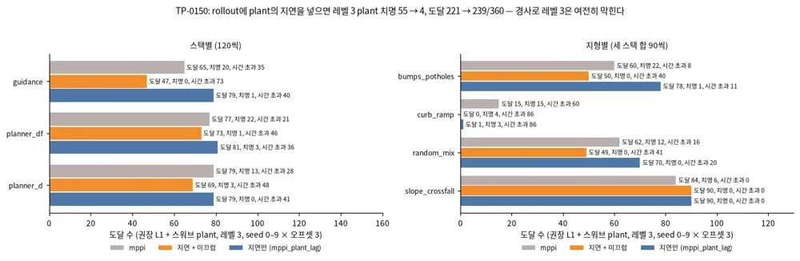

<!-- doc: 강화학습 | 5 -->
# 강화학습 (§R) — 버클리 CS 185/285의 강의마다 풀어 쓴다

**결론 먼저.** ==이 문서는 강화학습(reinforcement learning, RL)을 버클리 CS 185/285(Deep Reinforcement Learning, Sergey Levine)의 강의마다 풀어 쓰고, 그 방법이 travplan의 어디에 쓰이는지 잇는다.==
travplan은 이미 세 자리에서 강화학습을 쓴다. Planner D의 폐루프 후학습(TP-0066), Playground 학습 Controller의 진화 전략(TP-0128), 그리고 모델을 굴려 행동을 고르는 MPPI(TP-0150)다.

**자료 셋.** 강의 번호와 흐름은 2026 봄 슬라이드를 기준으로 삼고, 영상은 두 학기의 것을 강의마다 연결했다.

| 자료 | 무엇 | 이 문서에서 쓰는 곳 |
|---|---|---|
| [2026 봄 과목 홈페이지](https://rail.eecs.berkeley.edu/deeprlcourse/) | 25강의 슬라이드(복습 2강 포함), 숙제 다섯 | 강의 번호와 흐름의 기준 |
| [CS 285 2023 영상](https://www.youtube.com/playlist?list=PL_iWQOsE6TfVYGEGiAOMaOzzv41Jfm_Ps) | RAIL 채널의 2023 가을 학기 영상 99개. 강의 22개(3강은 없다)를 짧은 부분 영상 95개로 나눴고, 초청 강연이 넷이다 | 강의마다 부분 영상 |
| [CS294-112 2018 영상](https://www.youtube.com/playlist?list=PLkFD6_40KJIxJMR-j5A1mkxK26gh_qg37) | 2018 가을 학기의 날짜별 영상 25개(약 80분씩). 초청 강연 셋을 포함한다 | 2026에서 빠진 주제와 초청 강연 |

설명은 2026 슬라이드의 흐름을 따라 새로 썼고, 수식은 표준 표기로 다시 적었다. 영상의 말을 옮겨 적지는 않았다.
2018 영상은 날짜로만 올라와 있어, 과목 페이지의 강의 일정과 순서를 맞춰 제목을 붙였다.

**강의와 절.** 2026 강의마다 이 문서의 절과, 같은 내용을 다룬 영상을 적었다. 영상 링크는 각 강의 소절에 있다.

| 2026 강의 | 주제 | 이 문서 | 2023 영상 | 2018 영상 |
|---|---|---|---|---|
| 1 | 소개 | R.0 | 1강 | 8/22 |
| 2, 3 | 행동 복제 | R.2 | 2강 | 8/24 |
| 4 | RL 기초 | R.1 | 4강 | 8/31 |
| 5 | 정책 기울기 | R.3 | 5강 | 9/5 |
| 6 | actor-critic | R.4 | 6강 | 9/7 |
| 7 | 가치 기반 RL | R.6 | 7강 | 9/12 |
| 8 | 실전 Q-learning | R.6 | 8강 | 9/14 |
| 9, 10 | off-policy 정책 기울기, 고급 정책 기울기 | R.5 | 9강 | 9/19 |
| 11, 12 | 변분 추론, RL 속의 변분 추론 | R.7, R.8 | 18강 | 10/5 |
| 13 | 제어를 변분 추론으로, 역강화학습 | R.8, R.17 | 19강, 20강 | 10/10, 10/12 |
| 14 | 순차 모델과 언어 모델의 RL | R.12, R.17 | 21강, 초청(Mitchell) | 없음 |
| 15, 16 | 모델 기반 RL | R.9 | 11강, 12강 | 9/26, 9/28 |
| 17, 18 | 오프라인 RL | R.10 | 15강, 16강, 초청(Kumar) | 없음 |
| 19 | 탐색 | R.11 | 13강 | 10/17 |
| 20 | RL 이론 | R.14 | 17강, 초청(Zanette) | 없음 |
| 21, 22 | 중간 복습(2–20강 요약) | 없음 | 없음 | 없음 |
| 23 | 탐색과 기술 학습 | R.11 | 14강 | 10/19 |
| 24 | 다과제·계층 RL, 메타 RL | R.15 | 22강 | 10/24, 10/26 |
| 25 | 과제와 열린 문제 | R.15 | 23강 | 11/2 |
| 2026에 없음 | 최적 제어와 계획 | R.18 | 10강 | 9/21 |
| 2026에 없음 | 다른 정책을 따라 배우기 | R.2 | 없음 | 10/3 |
| 2026에 없음 | 병렬 RL과 시스템 설계 | R.15 | 없음 | 10/31 |
| 강의 밖 | 확산·flow 정책의 RL, 안전 RL | R.13 | 없음 | 없음 |
| 초청 | 사람에게서 배우는 로봇(Sadigh) | R.12 | 초청 | 없음 |
| 초청 | 경험으로 배우는 내비게이션(Kahn) | R.9 | 없음 | 11/9 |
| 초청 | 추천 시스템(Boutilier), 신경망 구조 탐색(Le, Zoph) | R.15 | 없음 | 11/7, 11/14 |

**보는 순서.** 처음이면 2023 영상의 1, 2, 4, 5, 6, 9강을 먼저 본다. 여기까지가 정책 기울기다.
travplan의 세 자리를 따라가려면 그다음 19강(제어를 추론으로, MPPI의 바탕), 11·12강(모델 기반), 15·16강(오프라인, TP-0066의 AWR), 10강(최적 제어, NMPC의 바탕) 순서로 본다.

**표기.** 상태 $s_t$, 행동 $a_t$, 관측 $o_t$, 보상 $r(s_t, a_t)$, 할인율 $\gamma \in [0, 1)$, 정책 $\pi_\theta(a \mid s)$를 쓴다.
궤적은 $\tau = (s_1, a_1, s_2, a_2, \dots)$이고 그 수익은 $R(\tau) = \sum_t \gamma^{t-1} r_t$다.
상태 가치는 $V^\pi(s)$, 행동 가치는 $Q^\pi(s, a)$, 이점은 $A^\pi(s, a) = Q^\pi(s, a) - V^\pi(s)$다.

**처음 읽는 사람의 순서.** R.0, R.1, R.2, R.3, R.5, R.8, R.16 순서로 읽으면 travplan이 강화학습을 쓰는 세 자리를 모두 이해할 수 있다.

### R.0 강화학습이란 무엇이고 왜 배우나 (1강)

**한 줄로.** ==자료로 배우는 학습은 세상을 이해하게 하고, 강화학습의 최적화는 그 이해를 써서 자료에 없던 행동을 만든다.==

#### 강의 1 — 소개

**영상과 슬라이드.** 2023 1강 [1부](https://www.youtube.com/watch?v=SupFHGbytvA) · [2부](https://www.youtube.com/watch?v=BYh36cb92JQ) · [3부](https://www.youtube.com/watch?v=Ufww5pzc_N0),
2018 [8/22 강의 소개](https://www.youtube.com/watch?v=opaBjK4TfLc), 슬라이드 [lec-1](https://rail.eecs.berkeley.edu/deeprlcourse/static/slides/lec-1.pdf).

**이 강의의 질문.** 강화학습은 무엇이고, 자료로 배우는 지금의 AI와 무엇이 다른가.

**흐름.**

**1. 정의.** 강화학습은 학습으로 의사결정을 하는 수학적 틀이고, 경험에서 행동을 배우는 방법들이다.
지도학습과는 두 가지가 다르다. 첫째, 자료가 독립 동일 분포(i.i.d.)가 아니다. 앞에서 고른 행동이 뒤의 관측을 바꾼다. 둘째, 정답 행동이 주어지지 않는다. 성공과 실패, 또는 보상만 주어진다.

**2. 예.** 강의는 여러 분야의 예를 든다.

- 끝에서 끝으로 학습한 4족 보행과 로컬 내비게이션([arXiv:2209.12827](https://arxiv.org/abs/2209.12827))
- 사람 영상을 따라 배운 휴머노이드([VideoMimic, arXiv:2505.03729](https://arxiv.org/abs/2505.03729))
- 로봇 기반 모델, Atari, 교통 신호 제어
- 언어 모델의 RLHF, 확산 모델의 RL 미세조정([DDPO, arXiv:2305.13301](https://arxiv.org/abs/2305.13301)), 칩 배치 설계

**3. 새 해를 찾는다.** 바둑에서 AlphaGo가 둔 37수처럼, 최적화는 사람이 생각하지 못한 해를 찾는다.

**4. 자료와 최적화.** 자료로 배우는 AI는 실제 세계를 자료에서 배우지만, 자료보다 잘하려 하지 않는다. 강화학습은 목표를 최적화해 새 행동이 나오게 하지만, 큰 규모에서 쓰는 법을 찾아야 한다.
강의는 Sutton의 "쓴 교훈(The Bitter Lesson)"을 다시 읽는다. 계산으로 끝없이 커지는 방법은 학습과 탐색(search) 둘이다. 최적화 없는 자료는 새 문제를 풀지 못하고, 자료 없는 최적화는 시뮬레이터 밖에서 쓰기 어렵다.

**5. 깊은 강화학습.** "깊은"은 크고 복잡한 자료에서 배우는 확장성을 뜻하고, "강화학습"은 최적화를 뜻한다. 학습이 세계를 이해하게 하고, 탐색과 최적화가 그 이해를 써서 행동을 만든다.

**travplan에서.** travplan에는 두 쪽이 다 있다. Planner D는 시연을 따라 배우는 자료 쪽이고, Controller의 MPPI는 표본을 굴려 최적화하는 탐색 쪽이다.
강의의 논지대로 둘을 잇는 것이 Planner D의 RL 후학습(TP-0066)이다. 시뮬레이터가 있어서 최적화를 쓸 수 있다는 점(5번)이, travplan이 운동학 시뮬과 plant에 공을 들이는 이유다.

<!-- tab: 문제 설정·모방 -->

### R.1 문제 설정: MDP, 목표, 가치 함수 (4강)

**한 줄로.** ==강화학습은 상태에서 행동을 고르면 보상과 다음 상태가 나오는 반복에서, 보상의 기댓값이 가장 큰 정책을 찾는 문제다.==

Markov 결정 과정(Markov decision process, MDP)은 상태 집합, 행동 집합, 전이 확률 $p(s_{t+1} \mid s_t, a_t)$, 보상 $r(s_t, a_t)$로 정한다.
다음 상태가 지금의 상태와 행동에만 달렸다는 가정이 Markov 성질이다.
로봇은 보통 상태 전체를 보지 못하고 관측 $o_t$만 본다. 이것이 부분 관측 MDP(partially observable MDP, POMDP)다.
그래서 정책은 과거 관측을 기억하거나, 관측을 모아 만든 믿음(belief)을 상태 대신 쓴다.

목표는 정책이 만드는 궤적 분포 위에서 수익의 기댓값을 가장 크게 만드는 것이다.

$$ J(\theta) = \mathbb E_{\tau \sim p_\theta(\tau)} \Big[ \sum_t \gamma^{t-1} r(s_t, a_t) \Big], \qquad p_\theta(\tau) = p(s_1) \prod_t \pi_\theta(a_t \mid s_t)\, p(s_{t+1} \mid s_t, a_t) $$

가치 함수는 이 기댓값을 상태별로 쪼갠 것이고, 두 가치 함수는 Bellman 식으로 서로를 정의한다.

$$ Q^\pi(s, a) = r(s, a) + \gamma\, \mathbb E_{s' \sim p(\cdot \mid s, a)} \big[ V^\pi(s') \big], \qquad V^\pi(s) = \mathbb E_{a \sim \pi(\cdot \mid s)} \big[ Q^\pi(s, a) \big] $$

알고리즘은 이 식의 어느 쪽을 배우느냐로 나뉜다.

| 갈래 | 배우는 것 | 표본 효율 | 약점 | travplan의 예 |
|---|---|---|---|---|
| 정책 기울기(R.3, R.5) | 정책 | 낮다(on-policy) | 분산이 크다 | TP-0128 진화 전략 |
| actor-critic(R.4) | 정책과 가치 | 중간 | critic 편향 | 보행 정책의 PPO |
| 가치 기반(R.6) | 행동 가치 | 높다(off-policy) | 발산할 수 있다 | 없음 |
| 모델 기반(R.9) | 전이 모델 | 가장 높다 | 모델 오차를 계획이 이용한다 | MPPI(`mppi_plant_lag`) |

#### 강의 4 — RL 기초

**영상과 슬라이드.** 2023 4강 [1부](https://www.youtube.com/watch?v=jds0Wh9jTvE) · [2부](https://www.youtube.com/watch?v=Cip5UeGrCEE) · [3부](https://www.youtube.com/watch?v=Pua9zO_YmKA) · [4부](https://www.youtube.com/watch?v=eG9-F4r5k70) · [5부](https://www.youtube.com/watch?v=dFqoGAyofUQ) · [6부](https://www.youtube.com/watch?v=hfj9mS3nTLU),
2018 [8/31 강화학습 소개](https://www.youtube.com/watch?v=ml8wUkE0M6U), 슬라이드 [lec-4](https://rail.eecs.berkeley.edu/deeprlcourse/static/slides/lec-4.pdf).

**이 강의의 질문.** 강화학습 문제를 수식으로 어떻게 적고, 알고리즘은 어떤 부품으로 되어 있나.

**흐름.**

**1. Markov 과정 셋.** Markov chain은 상태와 전이 연산자만 있다. MDP는 여기에 행동과 보상을 더하고, POMDP는 관측과 관측 확률을 더한다.
정책을 고정하면 MDP는 상태–행동 쌍 $(s, a)$ 위의 Markov chain이 된다. 그래서 목표를 이 chain의 주변분포로 다시 쓸 수 있다.

**2. 목표.** 유한 지평에서는 목표가 시각별 상태–행동 주변분포의 보상 합이다.

$$ J(\theta) = \sum_{t=1}^T \mathbb E_{(s_t, a_t) \sim p_\theta(s_t, a_t)} \big[ r(s_t, a_t) \big] $$

무한 지평에서는 정상 분포(한 번 전이해도 바뀌지 않는 분포, 전이 연산자의 고유값 1에 대한 고유벡터)의 평균 보상이 된다. 알고리즘이 정상 분포를 직접 풀지는 않지만, 이 선형대수 관점이 이론을 이해하는 데 쓰인다(R.14).

**3. 기댓값은 매끄럽다.** 길 위에 있으면 +1, 길에서 벗어나면 −1처럼 보상이 불연속이어도, 확률적 정책 아래 그 기댓값은 파라미터에 대해 매끄럽다. 벗어날 확률이 파라미터에 따라 매끄럽게 바뀌기 때문이다. 그래서 기울기로 최적화할 수 있다.

**4. 알고리즘의 해부.** 모든 알고리즘은 세 단계를 돈다. 정책을 실행해 표본을 모으고, 수익을 추정하거나 모델을 맞추고, 정책을 고친다.
어느 단계가 비싼지는 문제에 따라 다르다. 실제 로봇에서는 표본이 비싸고, 큰 모델에서는 맞추기가 비싸다.
결정적 동역학 모델을 배우면 보상을 모델을 거쳐 역전파해 정책을 고칠 수도 있다(R.9).

**5. 가치 함수 둘.** 행동 가치는 "여기서 이 행동을 하고 그 뒤로 정책을 따를 때의 보상 합"이고, 상태 가치는 그것을 정책의 행동으로 평균한 것이다. 첫 상태의 상태 가치의 기댓값이 곧 목표다.

$$ Q^\pi(s_t, a_t) = \sum_{t'=t}^{T} \mathbb E_{\pi} \big[ r(s_{t'}, a_{t'}) \mid s_t, a_t \big], \qquad V^\pi(s_t) = \mathbb E_{a_t \sim \pi(a_t \mid s_t)} \big[ Q^\pi(s_t, a_t) \big] $$

쓰는 법은 둘이다. 행동 가치를 알면 그 최댓값을 내는 행동을 고르는 정책이 원래 정책보다 나쁘지 않다(정책 반복, R.6). 그리고 $Q^\pi(s, a) > V^\pi(s)$인 행동, 곧 평균보다 나은 행동의 확률을 높이면 정책이 나아진다(정책 기울기의 직관, R.3).

**6. 알고리즘의 종류.** 정책 기울기는 목표를 직접 미분한다. 가치 기반은 최적 정책의 가치를 추정한다. actor-critic은 현재 정책의 가치를 추정해 정책을 고친다. 모델 기반은 전이 모델을 배운다.
모델 기반은 모델을 다시 세 가지로 쓴다. 계획만 하거나(궤적 최적화, MCTS, R.18), 모델을 거쳐 정책에 기울기를 보내거나, 모델로 가치를 배우거나 가상 경험을 만든다(R.9).

**7. 왜 이렇게 많나.** 표본 효율, 안정성과 쓰기 쉬움, 가정(확률적인가, 연속인가, 에피소드가 끝나는가), 무엇을 표현하기 쉬운가(정책인가 모델인가)가 다르다.

- 표본 효율을 가장 크게 가르는 것은 off-policy인지다. off-policy는 새 정책으로 표본을 다시 모으지 않고도 정책을 고칠 수 있고, on-policy는 정책이 조금만 바뀌어도 표본을 새로 모은다.
- 효율이 높은 쪽부터 모델 기반, off-policy Q 학습, actor-critic, on-policy 정책 기울기, 진화(기울기 없는) 방법 순이다.
- 표본 효율은 벽시계 시간과 다르다. 시뮬레이터가 빠르면 덜 효율적인 방법이 더 빨리 끝나기도 한다.
- 안정성도 다르다. 가치 맞추기는 목표의 기울기 하강이 아니고, 모델 맞추기는 정책의 목표와 다른 것을 최적화한다. 정책 기울기만 진짜 목표를 따라 오르지만 분산이 크다.

**8. 예.** 영상 입력의 Atari를 Q 함수로 푼 DQN([arXiv:1312.5602](https://arxiv.org/abs/1312.5602))과, 정책 기울기(TRPO와 GAE)로 학습한 보행([arXiv:1506.02438](https://arxiv.org/abs/1506.02438))이 두 갈래의 대표다.

**실전에서.** 알고리즘을 고르기 전에 세 가지를 묻는다. 시뮬레이터가 싼가(그러면 on-policy도 괜찮다), 행동이 연속인가, 모델을 배우기 쉬운가.

**travplan에서.**
- 벤치마크 에피소드 하나가 MDP의 궤적 하나다. 상태는 로봇의 자세·속도와 지형이고, 관측은 L1 belief(TravMap)라서 travplan의 Planner와 Controller는 POMDP의 정책이다.
- 벤치마크 판정(도달, 치명, 시간 초과)은 끝에서 한 번 나오는 불연속 보상이다. 그래도 TP-0128의 진화 전략이 기대 수익을 최적화할 수 있는 것은 3번 때문이다.
- 그 진화 전략은 표본 효율이 가장 낮은 쪽이지만, 브라우저용 작은 정책과 싼 시뮬이라 벽시계로 2.5–9분이다(7번).
- MPPI는 "계획만 하는" 모델 기반 방법이다(6번).

### R.2 모방학습: 행동 복제와 분포 이동 (2–3강)

**한 줄로.** ==시연을 지도학습으로 따라 하면(행동 복제) 쉽게 배우지만, 작은 실수가 시연에 없던 상태로 이어져 오차가 쌓인다.==

행동 복제(behavioral cloning, BC)는 시연 $(o_t, a_t)$를 지도학습 자료로 보고 $\max_\theta \sum_t \log \pi_\theta(a_t \mid o_t)$를 푼다.
문제는 분포 이동이다. 학습 정책이 한 번 틀리면 시연자가 가 본 적 없는 상태에 들어가고, 거기서는 더 틀린다.
대책은 셋으로 묶인다. 실행 분포에서 라벨을 다시 모으는 DAgger([arXiv:1011.0686](https://arxiv.org/abs/1011.0686)), 다봉 분포를 그대로 배우는 표현력 큰 모델, 그리고 복구가 담긴 자료와 다과제 학습이다.

#### 강의 2 — 행동의 지도학습 (1): 행동 복제와 분포 이동

**영상과 슬라이드.** 2023 2강 [1부](https://www.youtube.com/watch?v=tbLaFtYpWWU) · [2부](https://www.youtube.com/watch?v=YivJ9KDjn-o) · [3부](https://www.youtube.com/watch?v=ppN5ORNrMos) · [4부](https://www.youtube.com/watch?v=kLuJK6wDmEM) · [5부](https://www.youtube.com/watch?v=awfrsjYnJmw)(2026의 2강과 3강을 함께 다룬다),
2018 [8/24 지도학습과 모방](https://www.youtube.com/watch?v=yPMkX_6-ESE), 슬라이드 [lec-2](https://rail.eecs.berkeley.edu/deeprlcourse/static/slides/lec-2.pdf).

**이 강의의 질문.** 시연을 지도학습으로 따라 하면 되는가. 안 된다면 얼마나 나쁘고, 어떻게 고치나.

**흐름.**

**1. 지도학습에서 모방으로.** 관측 $o_t$를 넣으면 행동 분포 $\pi_\theta(a_t \mid o_t)$를 내는 망을, 시연의 (관측, 행동) 쌍으로 최대우도 학습한다. 행동이 이산이면 교차 엔트로피, 연속이면 가우시안 평균의 회귀가 된다.

**2. 행동 복제.** 1989년의 ALVINN이 원형이다. 사람이 시연하고, 그 자료로 망을 학습한다.

**3. 되는가.** 이론적으로는 보장되지 않는다. 지도학습의 i.i.d. 가정이 깨지기 때문이다. 학습 정책이 조금 틀리면 시연에 없던 관측을 만나고, 거기서 더 틀린다.
그런데 2016년 NVIDIA의 주행([arXiv:1604.07316](https://arxiv.org/abs/1604.07316))은 잘 됐다. 왼쪽과 오른쪽을 보는 카메라를 더 달고, 그 영상에는 가운데로 돌아오는 조향을 라벨로 붙였다. 복구 자료를 일부러 만든 것이다.

**4. 얼마나 나쁜가.** 실수하면 비용 1, 아니면 0이라 두고, 학습 분포의 상태에서 실수 확률이 $\epsilon$ 이하라고 가정한다. 한 번 실수하면 다시 돌아오지 못하는 외줄 같은 최악의 경우, 총비용은 $O(\epsilon T^2)$다. 지평 $T$의 제곱으로 커진다.

**5. 비관적인 이유.** 실제로는 실수에서 돌아올 수 있는 경우가 많다. 그래서 역설이 생긴다. 시연에 실수와 그 복구가 섞여 있으면 모방이 더 잘 된다.

**6. DAgger.** 학습 분포를 실행 분포에 맞추는 방법이다. 학습 정책을 실행해 관측을 모으고, 사람이 그 관측에 정답 행동을 붙이고, 자료에 합쳐 다시 학습한다. 그러면 총비용이 $O(\epsilon T)$로 준다.
문제는 사람이 남이 운전하는 영상을 보며 뒤늦게 라벨을 붙이기 어렵다는 것이다. 그래서 흔한 변형은 사람이 위험할 때만 개입해 그 구간을 고쳐 주는 방식이다([HG-DAgger, arXiv:1810.02890](https://arxiv.org/abs/1810.02890)). 이 변형은 원래 DAgger의 보장을 그대로 갖지는 않는다.

자세히: 행동 복제의 오차가 지평의 제곱으로 커지는 이유

학습 분포의 상태에서 실수 확률이 $\epsilon$ 이하라고 하자. 처음 $t$ 스텝 동안 한 번도 실수하지 않을 확률은 $(1-\epsilon)^t$이고, 그동안 학습 정책은 학습 분포에 머문다. 그래서 다음과 같이 쓸 수 있다.

$$ p_\theta(s_t) = (1-\epsilon)^t\, p_{\text{train}}(s_t) + \big(1 - (1-\epsilon)^t\big)\, p_{\text{mistake}}(s_t) $$

$(1-\epsilon)^t \ge 1 - \epsilon t$를 쓰면 두 분포의 차이는 다음으로 묶인다.

$$ \sum_{s} \big| p_\theta(s_t) - p_{\text{train}}(s_t) \big| \le 2\big(1 - (1-\epsilon)^t\big) \le 2\epsilon t $$

비용이 0과 1 사이라면, 시각 $t$의 기대 비용은 학습 분포의 기대 비용($\epsilon$ 이하)과 분포 차이의 합으로 묶인다.

$$ \sum_{t=1}^T \mathbb E_{p_\theta(s_t)}[c_t] \le \sum_{t=1}^T \big( \epsilon + 2\epsilon t \big) = O(\epsilon T^2) $$

DAgger는 학습 분포를 실행 분포로 만들어 두 번째 항을 없앤다. 그러면 합이 $\epsilon T$가 된다.

**실전에서.** 대책은 넷이다. 알고리즘을 바꾸거나(DAgger), 실수가 거의 없는 강한 모델을 쓰거나, 자료를 영리하게 모으고 증강하거나, 다과제 학습을 쓴다. 뒤의 셋이 3강의 내용이다.

**travplan에서.** Planner D의 시연은 Guidance + MPPI라는 교사가 만들어 복구 장면이 적다(5번의 역설). 경사로를 지나친 상태에서 무너지는 것이 분포 이동이고, TP-0073과 TP-0143의 DAgger가 6번이다.
교사가 사람이 아니라 계획기라서, 사람 라벨의 어려움(6번) 없이 아무 상태에서나 라벨을 다시 붙일 수 있다.

#### 강의 3 — 행동의 지도학습 (2): 모델, 자료, 다과제

**영상과 슬라이드.** 2023 2강(위 다섯 부분), 2018 [8/24](https://www.youtube.com/watch?v=yPMkX_6-ESE)와 [11/2 고급 모방학습과 열린 문제](https://www.youtube.com/watch?v=RE_4L7SoatA), 슬라이드 [lec-3](https://rail.eecs.berkeley.edu/deeprlcourse/static/slides/lec-3.pdf).

**이 강의의 질문.** 시연을 잘 따라 하려면 어떤 모델을 쓰고, 어떤 자료를 모으고, 여러 과제를 어떻게 함께 배우나.

**흐름.**

**1. 전문가를 따라가지 못하는 두 이유.**

- 비Markov 행동. 사람은 지금 본 것만이 아니라 지나온 것에 따라 행동한다. 그래서 관측 이력을 넣는다(가중치를 공유하는 순차 모델).
     다만 이력은 인과 혼동을 부를 수 있다. 예컨대 앞차의 브레이크 등 때문이 아니라 자기 브레이크 페달 때문에 멈췄다고 잘못 배운다([arXiv:1905.11979](https://arxiv.org/abs/1905.11979)). 이력이 이 문제를 줄이는지, DAgger가 줄이는지를 강의가 묻는다.

- 다봉 행동. 나무를 왼쪽으로도 오른쪽으로도 피하는 시연을 평균하면 나무로 간다.

**2. 다봉 분포를 내는 법.**

- 이산화. 고차원 행동 공간 전체를 격자로 나누는 것은 불가능하다. 그래서 한 차원씩 차례로 이산화한다(자기회귀 이산화). 앞 차원을 조건으로 다음 차원의 분포를 내는 순차 모델이라, 확률의 연쇄 법칙 그대로 다봉 분포를 표현한다.
- 표현력 큰 연속 분포. 잡음을 입력으로 받는 모델은 그 잡음을 실제로 써야 한다. 그래야 다른 잡음이 다른 모드로 간다. VAE, normalizing flow, diffusion, flow matching이 그 방법이다.

**3. flow matching 정책.** 잡음 $\epsilon$에서 행동 $a$로 가는 직선 위의 점 $a^\tau = \tau a + (1-\tau)\epsilon$에서, 속도장 $v_\theta(a^\tau, \tau, o)$가 $a - \epsilon$을 맞히도록 학습한다. 실행할 때는 잡음에서 시작해 Euler 적분으로 행동을 만든다(배경 0.6).

$$ \mathcal L(\theta) = \mathbb E_{(o, a) \sim \mathcal D,\ \epsilon \sim \mathcal N(0, I),\ \tau \sim U[0, 1]} \big\lVert v_\theta(a^\tau, \tau, o) - (a - \epsilon) \big\rVert^2 $$

**4. 행동 묶음(action chunking).** 한 번에 앞으로 여러 스텝의 행동을 낸다. 작은 차이 같지만 효과가 크다. 결정 횟수가 줄어 오차가 덜 쌓이고, 시연자의 시간 상관을 그대로 담는다.
Diffusion Policy([arXiv:2303.04137](https://arxiv.org/abs/2303.04137))와 ACT([arXiv:2304.13705](https://arxiv.org/abs/2304.13705))가 이 요령을 쓰고, π0는 여기에 대규모 사전학습을 더했다.

**5. 좁은 자료와 넓은 자료.** 실수와 복구를 일부러 넣은 시연, 복구를 보여 주는 가짜 자료(옆 카메라 증강)가 도움이 된다. 실수는 해가 되지만, 복구가 그보다 더 도움이 된다.
더 나아가 사전학습을 쓴다. 질이 낮아도 다양한 넓은 자료로 사전학습해 모델이 많은 상황을 보게 하고, 좁은 고품질 시연으로 후학습한다.

**6. 다과제 학습.** 과제가 많으면 오히려 쉬워질 수 있다. 목표 조건 행동 복제는 시연이 실제로 도달한 상태를 목표로 다시 붙여 $\pi(a \mid s, g)$를 학습한다. 아무 행동으로 모은 자료도 "그곳에 가는 시연"이 된다.

- 분포 이동은 두 곳에서 생긴다. 상태 분포, 그리고 상태와 목표 짝의 분포다.
- 이 원리를 큰 규모로 쓴 것이 여러 로봇의 내비게이션 자료로 학습한 GNM([arXiv:2210.03370](https://arxiv.org/abs/2210.03370))이다.
- 무작위 정책에서 시작해 "모으고, 다시 붙이고, 다시 학습"을 반복하면 모방을 넘어 개선된다([GCSL, arXiv:1912.06088](https://arxiv.org/abs/1912.06088)). 같은 원리를 강화학습에 쓴 것이 hindsight relabeling이다(R.15).

**실전에서.** 다봉 분포 모델, 행동 묶음, 사전학습 후 후학습의 세 가지가 지금 로봇 모방학습의 기본 조합이다.

**travplan에서.** Planner D가 이 강의의 조합 그대로다.
- flow matching으로 다봉 시연을 담는다(3번).
- 4초 40스텝의 궤적을 한 번에 낸다(4번).
- 레벨 0–3 시연으로 학습한 뒤 DAgger와 RL로 후학습한다(5번).
- subgoal을 조건으로 받는 목표 조건 정책이다(6번). GNM은 Planner 문서 B.6의 ViNT·NoMaD 계열이다.
- 5번의 "복구가 담긴 자료"를 얻으려고, 경사로를 지나친 상태에서 시작하는 DAgger를 시험했다(TP-0143).

#### 2018 강의 — 다른 정책을 따라 배우기

**영상.** 2018 [10/3 다른 정책을 따라 배우는 정책 학습](https://www.youtube.com/watch?v=xbQQ1xkYDug). 2026 강의에는 따로 없는 주제다.

**무엇.** 사람 대신 다른 정책이나 최적화기를 교사로 두고 따라 배운다. 세 갈래가 있다.
- **안내된 정책 탐색(guided policy search).** 상태를 아는 궤적 최적화기가 교사가 되고, 영상만 보는 정책이 그 궤적을 지도학습한다. 둘이 서로 가까워지도록 번갈아 고친다([arXiv:1504.00702](https://arxiv.org/abs/1504.00702)).
- **정책 증류(policy distillation).** 과제별 교사 여럿을 학생 하나로 합친다([arXiv:1511.06295](https://arxiv.org/abs/1511.06295)).
- **특권 교사.** 시뮬에서만 아는 정보(정답 지형, 마찰)를 쓰는 교사를 먼저 학습하고, 실제 센서만 쓰는 학생이 DAgger로 따라 배운다(배경 0.12).

**travplan에서.** Planner D는 Guidance + MPPI라는 계획기 교사를 따라 배우는 학생이다. 교사가 GT 지도를 쓰면 그대로 특권 교사가 된다.
교사가 언제든 라벨을 다시 붙일 수 있어 DAgger가 쉽다는 점이, 사람 시연을 쓰는 로봇과 다른 travplan의 장점이다.

<!-- tab: 정책 기울기 -->

### R.3 정책 기울기: REINFORCE와 분산 줄이기 (5강)

**한 줄로.** ==잘된 궤적의 행동 확률을 높이고 못된 궤적의 행동 확률을 낮추면, 보상이나 시뮬레이터를 미분하지 않고도 목표의 기울기를 얻는다.==

로그 미분 요령 $\nabla_\theta p_\theta(\tau) = p_\theta(\tau) \nabla_\theta \log p_\theta(\tau)$을 쓰면 전이 확률이 기울기에서 사라진다.

$$ \nabla_\theta J(\theta) = \mathbb E_{\tau \sim p_\theta} \Big[ \sum_t \nabla_\theta \log \pi_\theta(a_t \mid s_t)\, \hat Q_t \Big], \qquad \hat Q_t = \sum_{t' \ge t} \gamma^{t'-t} r_{t'} $$

이것이 REINFORCE다. 표본 궤적만 있으면 되지만, 분산이 커서 표본이 많이 든다. 분산을 줄이는 요령은 둘이다.
- **인과성.** 시각 $t$의 행동은 그 전의 보상을 바꾸지 못하므로, $t$ 뒤의 보상(reward-to-go)만 곱한다. 위 식의 $\hat Q_t$가 그것이다.
- **기준선(baseline).** 행동에 의존하지 않는 $b(s_t)$를 $\hat Q_t$에서 빼도 기댓값은 그대로이고 분산은 준다. 상태 가치 $V(s_t)$를 쓰면 이점 $\hat A_t = \hat Q_t - V(s_t)$가 된다(R.4).

정책 기울기는 on-policy다. 한 번 고친 뒤에는 새 정책으로 표본을 다시 모아야 한다.
이전 정책의 표본을 다시 쓰려면 중요도 비율 $\pi_\theta(a \mid s) / \pi_{\theta_{\text{old}}}(a \mid s)$를 곱하고, 비율이 크게 벗어나지 않게 막아야 한다(R.5).

자세히: 기준선이 기댓값을 바꾸지 않는 이유와 진화 전략

**기준선.** 행동에 대해 적분하면 $\mathbb E_{a \sim \pi_\theta}[\nabla_\theta \log \pi_\theta(a \mid s)\, b(s)] = b(s)\, \nabla_\theta \int \pi_\theta(a \mid s)\, da = b(s)\, \nabla_\theta 1 = 0$이다.
그래서 $b$는 무엇을 써도 기댓값을 바꾸지 않고, 잘 고르면 분산만 준다. 분산을 가장 작게 만드는 기준선은 파라미터 성분마다 기울기 크기의 제곱으로 가중한 수익의 평균이다.

$$ b^*_k = \frac{\mathbb E\big[ g_k(\tau)^2\, R(\tau) \big]}{\mathbb E\big[ g_k(\tau)^2 \big]}, \qquad g_k(\tau) = \frac{\partial}{\partial \theta_k} \log p_\theta(\tau) $$

실제로는 계산이 쉬운 $V(s)$나 표본 수익의 평균을 쓴다.

**진화 전략(evolution strategies, ES, [arXiv:1703.03864](https://arxiv.org/abs/1703.03864)).** 행동 대신 정책 파라미터에 잡음을 준다.
파라미터를 $\theta + \sigma \epsilon_i$, $\epsilon_i \sim \mathcal N(0, I)$로 흔들어 에피소드 수익 $F_i$를 재고, 다음 근사로 고친다.

$$ \nabla_\theta\, \mathbb E_{\epsilon} \big[ F(\theta + \sigma\epsilon) \big] \approx \frac{1}{n\sigma} \sum_{i=1}^n F_i\, \epsilon_i $$

이것은 파라미터 공간의 REINFORCE다. 에피소드 수익만 있으면 되므로 판정이 계단 함수여도 쓸 수 있고, 개체를 한 배치로 굴려 병렬화하기 쉽다.
PolyStep(배경 0.2b ①b)은 가우시안 잡음 대신 회전한 다면체 꼭짓점을 쓰고, softmax로 가중한 무게중심으로 옮긴다.

**travplan에서.** TP-0128의 Playground 정책(가중치 1,675개)은 보상이 벤치마크 판정 그 자체라 OpenAI-ES로 학습했다(Controller 문서 E.12).
TP-0066은 같은 상태에서 뽑은 후보 16개의 점수에서 그룹 평균을 빼 이점으로 쓴다. 기준선으로 같은 상태의 다른 표본을 쓰는 것이다(R.12의 GRPO). 다만 기울기는 로그 확률이 아니라 AWR 가중 flow matching으로 준다(R.10).

#### 강의 5 — 정책 기울기

**영상과 슬라이드.** 2023 5강 [1부](https://www.youtube.com/watch?v=GKoKNYaBvM0) · [2부](https://www.youtube.com/watch?v=VSPYKXm_hMA) · [3부](https://www.youtube.com/watch?v=VgdSubQN35g) · [4부](https://www.youtube.com/watch?v=KZd508qGFt0) · [5부](https://www.youtube.com/watch?v=QRLDAQbWc78) · [6부](https://www.youtube.com/watch?v=PEzuojy8lVo),
2018 [9/5 정책 기울기](https://www.youtube.com/watch?v=XGmd3wcyDg8), 슬라이드 [lec-5](https://rail.eecs.berkeley.edu/deeprlcourse/static/slides/lec-5.pdf).

**이 강의의 질문.** 목표를 정책 파라미터로 직접 미분할 수 있는가. 그 추정은 왜 시끄럽고, 어떻게 조용하게 만드나.

**흐름.**

**1. 목표를 표본으로 잰다.** 정책으로 궤적 $N$개를 굴려 보상을 더하면 목표의 추정이 된다. $J(\theta) \approx \frac{1}{N} \sum_i \sum_t r(s_{i,t}, a_{i,t})$다.

**2. 직접 미분한다.** 로그 미분 요령을 쓰면 궤적 확률의 로그가 나온다. 초기 분포와 전이 확률은 파라미터와 무관해 미분에서 사라지고, 정책의 로그 확률만 남는다.

$$ \nabla_\theta J(\theta) = \mathbb E_{\tau \sim p_\theta(\tau)} \Big[ \Big( \sum_{t=1}^T \nabla_\theta \log \pi_\theta(a_t \mid s_t) \Big) \Big( \sum_{t=1}^T r(s_t, a_t) \Big) \Big] $$

이 기댓값을 표본 궤적으로 추정하고 기울기 상승을 하는 것이 REINFORCE다. 표본을 모으고, 기울기를 추정하고, 한 걸음 오르기를 반복한다.

**3. 최대우도와 비교한다.** 행동 복제의 최대우도 기울기는 $\sum_t \nabla \log \pi(a_t \mid s_t)$로, 시연의 모든 행동을 똑같이 더 그럴듯하게 만든다. 정책 기울기는 이것을 각 궤적의 수익으로 가중한 것이다.
좋은 궤적의 행동은 더 그럴듯하게, 나쁜 궤적의 행동은 덜 그럴듯하게 만든다. 시행착오를 수식으로 적은 것이다.

**4. 가우시안 정책.** $\pi_\theta(a \mid s) = \mathcal N(f_\theta(s), \Sigma)$이면 $\nabla_\theta \log \pi = -\Sigma^{-1}(f_\theta(s) - a)\, \partial f_\theta / \partial \theta$다. 평균을 행동 쪽으로 끌어당기는 회귀의 기울기를 수익으로 가중한 꼴이다.

**5. 부분 관측에서도 그대로다.** 유도에 Markov 성질을 쓰지 않았다. 그래서 상태 대신 관측을 넣은 $\pi_\theta(a_t \mid o_t)$에도 같은 식이 성립한다.

**6. 무엇이 문제인가: 분산.** 표본이 적으면 추정 방향이 크게 흔들린다. 예컨대 모든 보상에 상수를 더하면 기댓값은 그대로지만, 표본 추정은 좋은 궤적과 나쁜 궤적의 확률을 모두 높이려 들어 크게 달라진다.

**7. 분산 줄이기.** 인과성(뒤의 보상만 곱하기)과 기준선(평균 수익 빼기)을 쓴다. 기준선이 기댓값을 바꾸지 않는 이유와 최적 기준선은 위 토글에 있다.

**8. 구현.** 자동 미분으로 "가짜 손실" $\tilde J(\theta) = \frac{1}{N} \sum_{i,t} \log \pi_\theta(a_{i,t} \mid s_{i,t})\, \hat Q_{i,t}$를 만들고 역전파하면 정책 기울기가 나온다. $\hat Q$는 상수로 둔다.
이산 행동이면 교차 엔트로피에 가중치를 곱한 것과 같다. 수천 개 파라미터마다 따로 미분할 필요가 없다.

**실전에서.** 기울기의 분산이 커서 지도학습보다 훨씬 큰 배치가 필요하다. 학습률을 맞추기 어렵고, Adam은 무난하다. 정책 기울기에 맞는 걸음 폭을 고르는 법은 R.5에 있다.

**travplan에서.**
- 5번 덕분에 Planner D가 L1 belief(관측)만 받아도 정책 기울기를 그대로 쓸 수 있다.
- 6번이 TP-0066이 그룹 평균을 빼는 이유다. 같은 상태의 후보 16개가 모두 양수 점수를 받아도, 평균보다 나은 후보만 확률이 오른다.
- 2번이 보여 주듯 시뮬레이터를 미분할 필요가 없다. 운동학 시뮬, plant, L1 매퍼가 미분 가능하지 않아도 된다.

### R.4 Actor-critic: 가치를 배워 기울기의 분산을 줄인다 (6강)

**한 줄로.** ==정책(actor)과 함께 가치 함수(critic)를 배워, 몬테카를로 수익 대신 한 스텝 앞을 내다본 이점을 쓰면 분산이 크게 준다.==

critic $V_\phi(s)$는 회귀로 배운다. 목표값은 몬테카를로 수익이나 한 스텝 부트스트랩 $r_t + \gamma V_\phi(s_{t+1})$이다.
부트스트랩은 분산이 작지만, critic이 틀리면 편향이 생긴다. 이점은 시간차(temporal difference, TD) 오차로 추정한다.

$$ \delta_t = r_t + \gamma V_\phi(s_{t+1}) - V_\phi(s_t), \qquad \hat A_t^{\mathrm{GAE}(\lambda)} = \sum_{l \ge 0} (\gamma \lambda)^l\, \delta_{t+l} $$

일반화 이점 추정(generalized advantage estimation, GAE, [arXiv:1506.02438](https://arxiv.org/abs/1506.02438))의 $\lambda$가 편향과 분산을 고른다.
$\lambda = 0$이면 한 스텝 TD(분산은 작고 편향은 큼)이고, $\lambda = 1$이면 몬테카를로(편향은 없고 분산은 큼)다. 보통 0.95 안팎을 쓴다.

**비대칭 actor-critic.** 시뮬레이터에서는 critic에 정답 지형, 마찰, 정확한 속도 같은 특권 정보를 준다. 배포할 때는 actor만 쓰므로, critic은 실제 센서에 없는 정보를 써도 된다.
그러면 가치 추정이 정확해져 학습이 빠르고 안정된다(Planner 문서 B.9의 RoM-Nav, 배경 0.12의 특권 교사).

#### 강의 6 — Actor-critic

**영상과 슬라이드.** 2023 6강 [1부](https://www.youtube.com/watch?v=wr00ef_TY6Q) · [2부](https://www.youtube.com/watch?v=KVHtuwVhULA) · [3부](https://www.youtube.com/watch?v=7C2DSdXX-kQ) · [4부](https://www.youtube.com/watch?v=quRjnkj-MA0) · [5부](https://www.youtube.com/watch?v=A99gFMZPw7w),
2018 [9/7 actor-critic](https://www.youtube.com/watch?v=Tol_jw5hWnI), 슬라이드 [lec-6](https://rail.eecs.berkeley.edu/deeprlcourse/static/slides/lec-6.pdf).

**이 강의의 질문.** 한 궤적의 수익 대신 "평균적으로 얼마를 받을지"를 배워 쓰면 정책 기울기가 얼마나 좋아지나. 옛 자료(재생 버퍼)로도 할 수 있나.

**흐름.**

**1. 수익 대신 기댓값.** 한 표본의 reward-to-go $\hat Q$는 참 기댓값 $Q^\pi(s, a)$의 시끄러운 추정이다. 참 기댓값을 쓰면 분산이 준다. 기준선으로 $V^\pi(s)$를 빼면 이점 $A^\pi(s, a)$가 되고, "이 행동이 평균보다 얼마나 나은가"를 뜻한다.

**2. 무엇을 맞추나.** $Q^\pi(s, a) \approx r(s, a) + V^\pi(s')$이므로 $A^\pi \approx r + V^\pi(s') - V^\pi(s)$다. 상태 가치만 맞추면 이점을 얻는다. 상태 가치는 상태만 받으므로 맞추기 쉽다. 이것이 정책 평가다.

**3. 정책 평가의 두 목표.** 몬테카를로 목표 $y = \sum_{t' \ge t} r_{t'}$는 한 표본이지만, 망이 비슷한 상태 사이에서 일반화하면서 평균을 낸다. 부트스트랩 목표 $y = r_t + \gamma \hat V(s_{t+1})$는 자기 추정을 써서 분산이 작지만 편향된다.

**4. 할인율.** 지평이 무한이면 가치가 무한대가 될 수 있어 $\gamma < 1$을 곱한다. 매 스텝 $1-\gamma$의 확률로 에피소드가 끝난다고 보면 된다. 그래서 같은 보상이면 빨리 받는 쪽이 낫다.
에피소드가 끝나는 과제와 계속되는 과제가 있다. 가치는 시각에 따라 달라질 수 있지만, 실제로는 할인을 넣은 시간 불변 가치를 쓴다. 정책 평가의 예로 강의는 TD-Gammon(1992)과 AlphaGo의 가치망을 든다.

**5. 기본 actor-critic.** 표본을 모으고, 상태 가치를 맞추고, 이점 $\hat A = r + \gamma V(s') - V(s)$를 계산하고, $\sum \nabla \log \pi\, \hat A$로 정책을 고친다.

**6. 온라인 actor-critic.** 전이 하나마다 critic과 actor를 함께 고칠 수도 있다. 표본 하나의 기울기는 시끄러워서, 병렬 작업자 여럿의 전이를 모아 배치를 키운다(동기 또는 비동기, A3C [arXiv:1602.01783](https://arxiv.org/abs/1602.01783)).

**7. critic을 기준선으로 쓸지, 목표로 쓸지.** 몬테카를로 수익에서 $V$를 빼면(기준선) 편향이 없고 분산은 중간이다. $r + \gamma V' - V$를 쓰면(critic) 분산은 작지만 편향된다.
그 사이가 n-스텝 수익이다. 앞의 $n$ 스텝은 실제 보상을, 그 뒤는 $V$를 쓴다. 모든 $n$을 지수로 가중해 섞은 것이 GAE다(위 식).

**8. off-policy actor-critic.** 재생 버퍼에 쌓인 옛 전이로 학습하려면 두 곳을 고친다.
- 버퍼의 행동은 옛 정책이 고른 것이라 상태 가치 목표가 틀린다. 그래서 행동 가치 $Q_\phi(s, a)$를 배우고, 목표의 다음 행동은 현재 정책에서 새로 뽑는다. $y = r + \gamma Q_\phi(s', a')$, $a' \sim \pi_\theta(\cdot \mid s')$다.
- 정책 기울기에서도 버퍼의 행동 대신 현재 정책의 행동 $a^\pi \sim \pi_\theta(\cdot \mid s)$를 뽑는다. 상태 분포는 현재 정책의 것이 아니지만 받아들인다.
- 이점 대신 $Q$를 그대로 곱해도 된다. 행동을 여러 개 뽑을 수 있어 분산을 감당할 수 있다.

**9. 재파라미터화.** 행동을 $a = f_\theta(s, \epsilon)$처럼 잡음의 결정적 함수로 쓰면, $\nabla_\theta Q_\phi(s, f_\theta(s, \epsilon))$로 기울기를 바로 낸다. 분산이 작지만, $Q$가 행동에 대해 미분 가능해야 한다. 이것이 SAC와 DDPG의 actor 갱신이다(R.6, R.8).

자세히: n-스텝 이점과 GAE의 유도

n-스텝 이점은 앞의 $n$ 스텝 보상과 $n$ 스텝 뒤의 가치로 만든다. TD 오차 $\delta$로 쓰면 가운데 항이 서로 지워진다.

$$ \hat A^{(n)}_t = \sum_{l=0}^{n-1} \gamma^l r_{t+l} + \gamma^n V(s_{t+n}) - V(s_t) = \sum_{l=0}^{n-1} \gamma^l \delta_{t+l} $$

$n$이 작으면 분산이 작고 편향이 크며, $n$이 크면 반대다. 가중치 $(1-\lambda)\lambda^{n-1}$로 모든 $n$을 평균하면 $\delta_{t+l}$의 계수가 $(\gamma\lambda)^l$로 모여 GAE가 된다.

**실전에서.** on-policy 쪽은 병렬 환경 수천 개와 GAE, PPO(R.5)의 조합이 표준이다. off-policy 쪽은 재생 버퍼, 행동 가치 critic, 재파라미터화한 actor의 조합(SAC 계열)이 표준이다.

**travplan에서.**
- Controller 문서의 rsl_rl(PPO와 교사–학생 증류)이 on-policy 쪽이다.
- Planner D를 폐루프로 더 다듬는다면, critic에는 GT 지도와 plant 상태를 주고 actor에는 L1 belief만 주는 비대칭 구성이 자연스럽다.
- 9번을 Planner D에 쓰려면 flow matching의 Euler 10스텝을 거쳐 역전파해야 하고, 행동에 대해 미분 가능한 critic이 있어야 한다. 벤치마크 판정과 MPPI 비용(치명 셀)은 계단 함수라 그대로는 쓸 수 없다. 그래서 critic을 따로 배우거나, 한 스텝 정책으로 증류하는 방법(R.10의 FQL)을 쓴다.

### R.5 고급 정책 기울기: off-policy 정책 기울기, 자연 기울기, TRPO, PPO (9–10강)

**한 줄로.** ==정책을 한 번에 너무 많이 바꾸면 모아 둔 표본이 새 정책에 맞지 않으므로, 정책 사이의 KL 거리로 한 번의 갱신 폭을 묶는다.==

새 정책의 성능 향상은, 옛 정책이 방문한 상태에서 잰 새 정책의 이점으로 근사할 수 있다. 두 정책이 가까울 때만 맞는 근사라서 거리를 함께 제약한다.

$$ \max_{\theta'}\ \mathbb E_{s \sim d^{\pi_\theta},\ a \sim \pi_\theta} \Big[ \frac{\pi_{\theta'}(a \mid s)}{\pi_\theta(a \mid s)}\, A^{\pi_\theta}(s, a) \Big] \quad \text{s.t.} \quad \mathbb E_s\, D_{\mathrm{KL}}\big( \pi_\theta(\cdot \mid s) \,\Vert\, \pi_{\theta'}(\cdot \mid s) \big) \le \epsilon $$

- **자연 기울기(natural gradient).** KL의 2차 근사가 Fisher 정보 행렬 $F$라서, 갱신은 $\theta' = \theta + \alpha F^{-1} \nabla_\theta J$가 된다. 파라미터 좌표가 아니라 정책 분포의 거리로 걸음 폭을 잰다.
- **TRPO**([arXiv:1502.05477](https://arxiv.org/abs/1502.05477)). 위 제약을 켤레 기울기와 선 탐색으로 지킨다.
- **PPO**([arXiv:1707.06347](https://arxiv.org/abs/1707.06347)). 제약 대신 비율 $\rho_t = \pi_{\theta'}(a_t \mid s_t) / \pi_\theta(a_t \mid s_t)$를 자른다.

$$ L^{\mathrm{CLIP}}(\theta') = \mathbb E_t \Big[ \min\big( \rho_t \hat A_t,\ \operatorname{clip}(\rho_t, 1-\epsilon, 1+\epsilon)\, \hat A_t \big) \Big] $$

PPO는 구현이 쉽고 병렬 시뮬레이션과 잘 맞아, 보행·조작·언어 모델에서 표준이 됐다. 대부분 GAE(R.4)와 함께 쓴다.

#### 강의 9 — off-policy 정책 기울기

**영상과 슬라이드.** 2023 9강 [1부](https://www.youtube.com/watch?v=ySenCHPsKJU) · [2부](https://www.youtube.com/watch?v=LtAt5M_a0dI) · [3부](https://www.youtube.com/watch?v=WuPauZgX7BM) · [4부](https://www.youtube.com/watch?v=QWnpF0FaKL4)(2026의 9강과 10강을 함께 다룬다),
2018 [9/19 고급 정책 기울기](https://www.youtube.com/watch?v=6v4syGD--hQ), 슬라이드 [lec-9](https://rail.eecs.berkeley.edu/deeprlcourse/static/slides/lec-9.pdf).

**이 강의의 질문.** 정책 기울기는 한 번 고칠 때마다 표본을 버린다. 같은 표본으로 여러 번 고칠 수 있나.

**흐름.**

**1. 정책 기울기가 좋은 점과 나쁜 점.** 진짜 목표를 따라 오르고 안정적이다. 하지만 on-policy라서 정책을 한 번 고치면 그 표본은 더 쓸 수 없다. 바라는 것은 같은 배치로 여러 번 고치는 알고리즘이다.

**2. 중요도 표본.** 다른 분포의 표본으로 기댓값을 잴 수 있다. $\mathbb E_{x \sim p}[f(x)] = \mathbb E_{x \sim q}\big[\tfrac{p(x)}{q(x)} f(x)\big]$다.

**3. 정책 기울기에 넣는다.** 궤적 확률의 비에서는 초기 분포와 전이 확률이 지워지고, 시각별 정책 비의 곱이 남는다. 이 곱은 지평에 따라 지수적으로 커지거나 0으로 간다.

$$ \frac{p_{\theta'}(\tau)}{p_\theta(\tau)} = \prod_{t=1}^T \frac{\pi_{\theta'}(a_t \mid s_t)}{\pi_\theta(a_t \mid s_t)} $$

**4. 1차 근사.** 상태 분포의 비를 무시하고, 각 시각의 행동 비만 남긴다. 이 근사는 "조금 틀렸다". 왜 괜찮은지는 10강이 보인다.

$$ \nabla_{\theta'} J(\theta') \approx \sum_{t=1}^T \mathbb E_{s_t \sim p_\theta,\ a_t \sim \pi_\theta} \Big[ \frac{\pi_{\theta'}(a_t \mid s_t)}{\pi_\theta(a_t \mid s_t)}\, \nabla_{\theta'} \log \pi_{\theta'}(a_t \mid s_t)\, \hat A_t \Big] $$

**5. 남은 문제.** 비율이 1에서 멀어지면 분산이 커지고, 근사도 틀린다.

**6. 비율을 자른다.** 비율을 $[1-\epsilon, 1+\epsilon]$ 안으로 자른다.

**7. 한 가지 더.** 자른 목표와 원래 목표 중 작은 쪽을 쓴다(위 $L^{\mathrm{CLIP}}$). 그러면 비율을 자른 범위 밖으로 밀어도 얻는 것이 없다. 이것이 PPO의 자른 목표다. 같은 배치로 여러 epoch의 미니배치 SGD를 돌리고, 이점은 GAE로 계산한다.

**실전에서.** PPO의 $\epsilon$은 보통 0.1–0.2다. epoch을 늘리면 표본을 더 쓰지만 비율이 잘리는 표본이 늘어난다.

**travplan에서.** 보행 정책 문헌(Controller 문서, 시뮬레이션 문서 S.5)과 CaRL(Planner 문서 B.11)이 모두 PPO다. Planner D처럼 로그 확률을 바로 계산하기 어려운 생성 정책에 PPO를 쓰는 방법은 R.13에 있다(FPO는 비율을 flow matching 손실의 차이로 바꾼다).

#### 강의 10 — 고급 정책 기울기

**영상과 슬라이드.** 2023 9강(위 네 부분), 2018 [9/19 고급 정책 기울기](https://www.youtube.com/watch?v=6v4syGD--hQ), 슬라이드 [lec-10](https://rail.eecs.berkeley.edu/deeprlcourse/static/slides/lec-10.pdf).

**이 강의의 질문.** 9강의 지름길(옛 정책의 상태 분포와 이점을 그대로 쓰기)은 왜 괜찮은가. 언제 괜찮지 않은가.

**흐름.**

**1. 정책 기울기는 정책 반복이다.** 새 정책과 옛 정책의 성능 차이는, 새 정책이 만든 궤적 위에서 옛 정책의 이점을 더한 것과 같다(성능 차이 정리).

$$ J(\theta') - J(\theta) = \mathbb E_{\tau \sim p_{\theta'}(\tau)} \Big[ \sum_t \gamma^{t-1} A^{\pi_\theta}(s_t, a_t) \Big] $$

행동은 중요도 표본으로 옛 정책에서 뽑을 수 있지만, 상태는 새 정책의 분포를 따라야 한다. 이 상태 분포를 옛 정책의 것으로 바꾼 대리 목표 $\bar A(\theta')$를 쓰면, $\theta' = \theta$에서 그 기울기가 정확히 정책 기울기다.

**2. 상태 분포 차이를 언제 무시하나.** 모든 상태에서 두 정책의 행동 분포 차이(총변동 거리)가 $\epsilon$ 이하면, 시각 $t$의 상태 분포 차이는 $2\epsilon t$ 이하다. 2강의 행동 복제 분석과 같은 논법이다.
그러면 진짜 개선은 대리 목표에서 $\sum_t 2\epsilon t \cdot C$를 뺀 값 이상이다. $C$는 보상의 최댓값에 지평(또는 $1/(1-\gamma)$)을 곱한 크기다. 두 정책이 가까우면 대리 목표를 올리는 것이 진짜 목표를 올린다.

**3. KL이 더 편하다.** 총변동 거리는 $\sqrt{\tfrac12 D_{\mathrm{KL}}}$ 이하다(Pinsker 부등식). KL은 로그 확률로 계산할 수 있어서 제약을 KL로 바꾼다.

**4. 제약을 지키는 법.** 라그랑주 승수 $\lambda$를 둔다. 정책은 대리 목표에서 $\lambda(D_{\mathrm{KL}} - \epsilon)$를 뺀 것을 올리고, $\lambda$는 KL이 $\epsilon$보다 크면 키운다(쌍대 기울기 하강). 표본으로 쓰면 중요도 가중 대리 목표에 KL 벌점을 단 PPO의 다른 형태가 된다.

**5. 자연 기울기.** 목표는 1차 테일러 전개로, KL은 2차 근사로 두면 최적 갱신이 Fisher 정보 행렬의 역을 곱한 기울기다.

$$ \theta' = \theta + \alpha\, F^{-1} \nabla_\theta J(\theta), \qquad F = \mathbb E_{\pi_\theta} \big[ \nabla_\theta \log \pi_\theta(a \mid s)\, \nabla_\theta \log \pi_\theta(a \mid s)^\top \big], \qquad \alpha = \sqrt{\frac{2\epsilon}{\nabla J^\top F^{-1} \nabla J}} $$

보통의 기울기 상승은 파라미터 공간의 거리 $\lVert \theta' - \theta \rVert^2 \le \epsilon$을 제약한 것과 같다. 그래서 파라미터화에 따라 결과가 달라지고, 조건수가 나쁘면 한 성분만 움직인다. 강의는 가우시안 정책의 평균과 분산을 함께 배울 때 분산 쪽 기울기가 평균 쪽을 압도하는 예(Peters와 Schaal, 2008)를 든다. 자연 기울기는 분포의 거리로 걸음을 재서 이 문제를 피한다.

**6. TRPO.** $F$를 직접 만들지 않는다. Fisher와 벡터의 곱만 계산해 켤레 기울기로 $F^{-1} g$를 구하고, KL 제약을 넘지 않도록 선 탐색한다.

**7. 정리.** 정책 기울기는 근사 이점으로 하는 정책 반복이고, 갱신 폭을 묶으면 제대로 된다. 실전에서는 PPO(자르기나 KL 벌점)와 GAE를 쓴다.

자세히: 성능 차이 정리의 증명

초기 상태 분포는 두 정책이 같으므로 $J(\theta) = \mathbb E_{s_1}[V^{\pi_\theta}(s_1)]$을 새 정책의 궤적 위 기댓값으로 써도 된다. 그다음 망원 합을 쓴다.

$$ J(\theta') - J(\theta) = J(\theta') + \mathbb E_{\tau \sim p_{\theta'}} \Big[ \sum_{t \ge 1} \gamma^{t-1} \big( \gamma V^{\pi_\theta}(s_{t+1}) - V^{\pi_\theta}(s_t) \big) \Big] = \mathbb E_{\tau \sim p_{\theta'}} \Big[ \sum_{t \ge 1} \gamma^{t-1} \big( r_t + \gamma V^{\pi_\theta}(s_{t+1}) - V^{\pi_\theta}(s_t) \big) \Big] $$

괄호 안의 기댓값이 $A^{\pi_\theta}(s_t, a_t)$이므로 정리가 나온다. 상태 분포 차이의 묶음은 2강의 토글과 같은 결합 논법이다. 새 정책이 각 스텝에서 확률 $1-\epsilon$으로 옛 정책과 같은 행동을 한다고 보면 된다.

**실전에서.** KL 벌점의 $\beta$는 목표 KL에 맞춰 자동으로 키우고 줄인다. TRPO의 켤레 기울기는 10–20번이면 충분하다.

**travplan에서.** TP-0066의 AWR은 같은 KL 제약 문제의 닫힌 해를 회귀로 푼 것이다(R.10). "정책을 조금씩만 바꾼다"는 원리가 같다. 그래서 TP-0066의 모방 손실 가중($\lambda = 0.5$)은 KL 제약과 비슷한 일을 한다.

<!-- tab: 가치 기반 -->

### R.6 가치 기반 RL과 Q-learning (7–8강)

**한 줄로.** ==행동 가치를 Bellman 식의 고정점으로 배우고 그 최댓값을 내는 행동을 고르면, 정책을 따로 두지 않아도 된다.==

가치 반복은 $Q(s, a) \leftarrow r(s, a) + \gamma\, \mathbb E_{s'} [\max_{a'} Q(s', a')]$를 되풀이한다. 표본으로 이것을 근사하는 것이 fitted Q-iteration이고, 신경망으로 하면 다음 손실이 된다.

$$ \mathcal L(\phi) = \mathbb E_{(s, a, r, s') \sim \mathcal D} \Big[ \big( Q_\phi(s, a) - r - \gamma \max_{a'} Q_{\bar\phi}(s', a') \big)^2 \Big] $$

자료 $\mathcal D$는 어떤 정책이 모은 것이어도 되므로 off-policy다(재생 버퍼). 대신 함수 근사와 함께 쓰면 수렴이 보장되지 않는다.
DQN([arXiv:1312.5602](https://arxiv.org/abs/1312.5602)) 이후의 안정화 요령은 목표망, Double Q([arXiv:1509.06461](https://arxiv.org/abs/1509.06461)), 연속 행동을 위한 actor(DDPG [arXiv:1509.02971](https://arxiv.org/abs/1509.02971), TD3 [arXiv:1802.09477](https://arxiv.org/abs/1802.09477))다.

#### 강의 7 — 가치 기반 RL

**영상과 슬라이드.** 2023 7강 [1부](https://www.youtube.com/watch?v=pP_67mTJbGw) · [2부](https://www.youtube.com/watch?v=QUbuBEY12u0) · [3부](https://www.youtube.com/watch?v=Mz7XweEMCVI) · [4부](https://www.youtube.com/watch?v=9bOurz4aCbA),
2018 [9/12 가치 함수와 Q-learning](https://www.youtube.com/watch?v=chLN1e3ehZE), 슬라이드 [lec-7](https://rail.eecs.berkeley.edu/deeprlcourse/static/slides/lec-7.pdf).

**이 강의의 질문.** 가치만 배워서 정책을 얻을 수 있나. 전이 모델 없이, 남이 모은 자료로도 되나.

**흐름.**

**1. actor 없는 actor-critic.** 이점 $A^\pi$를 알면, 모든 상태에서 $\arg\max_a A^\pi(s, a)$를 고르는 결정적 정책은 원래 정책보다 나쁘지 않다. 그러면 정책 기울기 없이도 정책을 고칠 수 있다.
평가(이점 계산)와 개선(최댓값 행동 고르기)을 번갈아 하는 것이 정책 반복이다.

**2. 동적 계획법.** 상태와 행동이 작고 전이를 알면, 평가를 부트스트랩 갱신 $V(s) \leftarrow \mathbb E_{a \sim \pi}\big[r(s, a) + \gamma\, \mathbb E_{s'} V(s')\big]$로 한다. 표로 저장하면 정확히 계산된다.

**3. 가치 반복.** 더 간단히, 정책을 따로 두지 않는다. $Q(s, a) \leftarrow r(s, a) + \gamma\, \mathbb E[V(s')]$와 $V(s) \leftarrow \max_a Q(s, a)$를 되풀이한다. 최댓값을 내는 행동이 곧 정책이다.

**4. 적합 가치 반복.** 상태가 많으면 $V_\phi$를 신경망으로 두고 목표 $y = \max_a \big(r + \gamma\, \mathbb E[V_\phi(s')]\big)$에 회귀한다.
문제가 있다. 최댓값을 계산하려면 같은 상태에서 여러 행동의 결과를 알아야 한다. 그러려면 전이 모델이 필요하다. 실제 세계에서는 한 상태에서 행동 하나만 해 볼 수 있다.

**5. 적합 Q 반복.** 최댓값을 Q 쪽으로 옮기면 해결된다. 목표는 $y = r + \gamma \max_{a'} Q_\phi(s', a')$다.
이 목표는 전이 $(s, a, r, s')$ 하나로 계산되고, 최댓값은 망 안에서 구한다. 그래서 어떤 정책이 모은 자료도 쓸 수 있다(off-policy). 자료를 모으고, 목표를 계산하고, Q를 회귀하기를 반복한다.

**6. 무엇을 최적화하나.** Bellman 오차 $\mathbb E\big[(Q_\phi(s, a) - y)^2\big]$다. 0이 되면 최적 행동 가치 $Q^*$다. 하지만 함수 근사를 쓰면 표 형태의 보장이 사라진다(8강의 9번).

**7. 온라인 Q-learning과 탐색.** 행동 하나를 하고, 전이 하나로 목표를 계산하고, 기울기 한 걸음을 간다.
학습한 Q의 최댓값만 고르면 새 행동을 해 보지 않는다. 그래서 확률 $\epsilon$으로 무작위 행동을 하거나($\epsilon$-greedy), $\exp(Q)$에 비례해 고른다(Boltzmann). $\epsilon$은 학습하며 줄인다.

**8. 종합.** 재생 버퍼에 전이를 모으고, 버퍼에서 미니배치를 뽑아 갱신하고, 탐색을 섞은 최댓값 정책으로 행동한다. 8강의 DQN이 이 골격이다.

**실전에서.** 표 형태에서 되는 알고리즘이 함수 근사에서 그대로 되지는 않는다. 작은 문제에서 먼저 확인한다.

**travplan에서.** 5번의 "같은 상태에서 여러 행동을 해 볼 수 없다"는 문제는, 시뮬레이터가 있으면 사라진다. travplan의 MPPI와 TP-0066은 같은 상태에서 행동열(후보)을 수백 개 굴려 본다. 그래서 가치를 배우지 않고 표본으로 바로 고른다.

#### 강의 8 — 실전 Q-learning

**영상과 슬라이드.** 2023 8강 [1부](https://www.youtube.com/watch?v=7-D8RL3D6CI) · [2부](https://www.youtube.com/watch?v=lqC9w532erw) · [3부](https://www.youtube.com/watch?v=oKfUMzfpAw0) · [4부](https://www.youtube.com/watch?v=oMUSn1eRm7A) · [5부](https://www.youtube.com/watch?v=Q-Qwjz8Zmh0) · [6부](https://www.youtube.com/watch?v=cmGSnu-PIwU),
2018 [9/14 고급 Q-learning](https://www.youtube.com/watch?v=hP1UHU_1xEQ), 슬라이드 [lec-8](https://rail.eecs.berkeley.edu/deeprlcourse/static/slides/lec-8.pdf).

**이 강의의 질문.** 신경망 Q-learning을 실제로 돌아가게 하려면 무엇이 필요한가. 이론은 무엇을 보장하나.

**흐름.**

**1. 무엇이 문제인가.** Q-learning은 경사 하강이 아니다. 목표 $y$가 $\phi$에 의존하는데, 그 기울기를 흘리지 않는다. 목표가 계속 움직인다. 그리고 연속한 전이끼리 상관이 크다.
재생 버퍼가 상관을, 목표망이 움직이는 목표를 고친다.

**2. 목표망과 DQN.** 목표를 고정하면 Q-learning은 지도 회귀다. 목표를 따로 둔 망 $\phi'$로 계산하고, $N$ 스텝마다 $\phi' \leftarrow \phi$로 복사한다.
DQN은 행동하고, 버퍼에 넣고, 미니배치를 뽑고, 목표망으로 목표를 계산하고, 갱신하고, $N$ 스텝마다 목표망을 바꾼다.

**3. 다른 목표망.** 매 스텝 $\phi' \leftarrow \tau \phi' + (1-\tau)\phi$로 조금씩 따라가게 할 수도 있다(Polyak 평균, $\tau = 0.999$ 정도). 목표가 부드럽게 움직인다.

**4. 일반 관점.** 자료 모으기, 목표망 갱신, Q 회귀의 세 과정이 서로 다른 속도로 돈다. 자료 하나당 갱신 횟수를 UTD(update-to-data) 비라 한다. 이것을 높이면 표본 효율이 오르지만 과적합과 불안정이 생긴다.

**5. 가치 전파.** 보상이 한 스텝씩만 거꾸로 전파되면 느리다. n-스텝 목표 $\sum_{k<n} \gamma^k r_{t+k} + \gamma^n \max_a Q(s_{t+n}, a)$는 빨리 전파한다. 다만 off-policy 자료에서는 편향된다. 자료의 행동이 현재 정책의 것이 아니기 때문이다. $n$이 작으면 무시하고 쓴다.

**6. 과대평가.** 잡음이 있는 추정들의 최댓값은 그 기대값이 참 최댓값보다 크다. $\mathbb E[\max_a \hat Q] \ge \max_a \mathbb E[\hat Q]$다. 목표의 최댓값이 이 편향을 반복마다 쌓는다. 실제로 Atari에서 예측한 Q가 실제 수익보다 체계적으로 높다.

**7. Double Q-learning.** 행동을 고르는 망과 값을 매기는 망을 나눈다. 실제로는 현재 망으로 고르고 목표망으로 값을 매긴다.

$$ y = r + \gamma\, Q_{\phi'}\big(s', \arg\max_{a'} Q_\phi(s', a')\big) $$

고르는 쪽은 다른 actor여도 된다. TD3는 두 critic 가운데 작은 값을 쓴다(clipped double Q).

**8. 실전 요령.** 강의가 드는 요령은 이렇다.
- 쉬운 문제에서 먼저 확인한다. 큰 재생 버퍼를 쓴다. 학습 초반은 무작위와 비슷하니 참는다.
- $\epsilon$을 일정에 따라 줄인다. Bellman 오차의 기울기가 크면 Huber 손실이나 기울기 자르기를 쓴다.
- Double Q는 거의 항상 돕는다. n-스텝 수익도 돕지만 편향에 주의한다. 학습률 일정과 Adam을 쓴다.
- 시드를 여러 개 돌린다. 시드마다 결과가 크게 다르다.

**9. 연속 행동.** 최댓값을 직접 풀 수 없다. 방법은 셋이다.
- 확률적 최적화. 행동을 $N$개 뽑아 가장 좋은 것을 고르거나, CEM으로 몇 번 다듬는다. 간단하고 병렬이며, 행동 차원이 작으면 쓸 만하다.
- 최대화가 쉬운 Q. 행동에 대해 2차식인 Q를 쓰면 최댓값이 닫힌 형식으로 나온다(NAF).
- 근사 최대화기를 배운다. $\mu_\theta(s) \approx \arg\max_a Q(s, a)$를 $\nabla_\theta Q(s, \mu_\theta(s)) = \nabla_a Q \cdot \nabla_\theta \mu_\theta$로 학습한다. 이것이 DDPG이고, TD3가 다듬었다.

**10. 이론.** 표 형태의 가치 반복은 무한 노름에서 $\gamma$ 수축이라 수렴한다. 적합 가치 반복은 "백업 다음 투영"이다. 백업은 무한 노름에서, 투영(최소제곱 회귀)은 $\ell_2$ 노름에서 수축이다.
둘을 합치면 어느 노름에서도 수축이 아니라서 발산할 수 있다. 적합 Q 반복, 온라인 Q-learning, 부트스트랩 critic을 쓰는 actor-critic도 같다. 그래서 강의는 Q-learning의 갱신을 목표 함수의 "기울기"라고 부르지 않는다.

자세히: 백업과 투영이 함께 쓰이면 수축이 깨지는 이유

Bellman 백업 $\mathcal B$는 $(\mathcal B V)(s) = \max_a \big(r(s, a) + \gamma\, \mathbb E[V(s')]\big)$이고, 무한 노름 수축이다.

$$ \lVert \mathcal B V - \mathcal B \bar V \rVert_\infty \le \gamma\, \lVert V - \bar V \rVert_\infty $$

신경망 회귀는 함수 집합 $\Omega$로의 최소제곱 투영 $\Pi V = \arg\min_{V' \in \Omega} \sum_s \lVert V'(s) - V(s) \rVert^2$이고, $\ell_2$ 노름 수축이다. $\Pi \mathcal B$는 서로 다른 노름의 수축을 합친 것이라 일반적으로 어느 노름에서도 수축이 아니다. 실제로 발산하는 작은 예가 있다.

**실전에서.** 9번의 첫째 방법(표본을 뽑아 최댓값 고르기)은 행동 차원이 수십을 넘으면 약해진다.

**travplan에서.**
- 9번의 첫째 방법이 MPPI와 같은 계열이다. MPPI는 Q 대신 모델로 굴린 비용으로 표본을 매기고, 최댓값 대신 지수 가중 평균을 쓴다(R.8).
- 8번의 "시드를 여러 개"가 travplan의 잡음 바닥 규칙(seed 10 × 난수 오프셋 3, TP-0078)과 같은 취지다.
- 6번의 과대평가는 Planner D 후학습에 critic을 들일 때(R.4, R.10) 가장 먼저 조심할 것이다.

<!-- tab: 추론으로서의 제어 -->

### R.7 변분 추론: 다루기 어려운 분포를 근사한다 (11–12강)

**한 줄로.** ==직접 계산할 수 없는 사후분포를 다루기 쉬운 분포로 근사하고 그 차이(KL)를 줄이는 것이 변분 추론이고, 강화학습에서는 잠재 동역학과 "제어를 추론으로" 보는 관점에 쓰인다.==

잠재 변수 $z$를 가진 모델 $p(x, z)$에서 $\log p(x)$는 계산하기 어렵다. 아무 분포 $q(z)$에 대해서나 다음 증거 하한(evidence lower bound, ELBO)이 성립한다.

$$ \log p(x) \ge \mathbb E_{z \sim q} \big[ \log p(x \mid z) \big] - D_{\mathrm{KL}}\big( q(z) \,\Vert\, p(z) \big) $$

두 변의 차이가 $D_{\mathrm{KL}}(q(z) \Vert p(z \mid x))$이므로, ELBO를 크게 만들면 $q$가 참 사후분포에 다가간다.

#### 강의 11 — 변분 추론

**영상과 슬라이드.** 2023 18강 [1부](https://www.youtube.com/watch?v=UTMpM4orS30) · [2부](https://www.youtube.com/watch?v=VWb0ZywWpqc) · [3부](https://www.youtube.com/watch?v=4LuA5m5Hsxc) · [4부](https://www.youtube.com/watch?v=_W2eVLi8rQA)(2026의 11강과 12강 앞부분을 함께 다룬다),
2018 [10/5 확률과 변분 추론 입문](https://www.youtube.com/watch?v=1bpQ0QDPGuI), 슬라이드 [lec-11](https://rail.eecs.berkeley.edu/deeprlcourse/static/slides/lec-11.pdf).

**이 강의의 질문.** 숨은 변수가 있는 모델은 어떻게 학습하나. 그 도구가 왜 강화학습에 필요한가.

**흐름.**

**1. 잠재 변수 모델.** 쉬운 분포 둘로 복잡한 분포를 만든다. $p(x) = \int p(x \mid z)\, p(z)\, dz$에서 $p(z)$와 $p(x \mid z)$는 가우시안처럼 쉬워도, $p(x)$는 다봉처럼 복잡해질 수 있다. 가우시안 혼합이 가장 단순한 예다.

**2. 강화학습의 잠재 변수.** 두 곳에 나온다. 다봉 정책은 $p(a \mid s) = \int p(a \mid s, z)\, p(z)\, dz$인 조건부 잠재 변수 모델이다. 관측 뒤의 숨은 상태를 배우는 모델 기반 RL은 잠재 상태 공간 모델을 쓴다(R.9).

**3. 학습이 어려운 이유.** 최대우도 $\sum_i \log \int p_\theta(x_i \mid z)\, p(z)\, dz$는 적분 때문에 다루기 어렵다.
대신 $\mathbb E_{z \sim p(z \mid x_i)}[\log p_\theta(x_i, z)]$를 최대화할 수 있다. 그러려면 $z$의 사후분포 $p(z \mid x)$를 알아야 하고, 이것을 구하는 일이 확률 추론이다. 같은 추론이 제어를 추론으로 보는 관점(R.8)과 생성 모델에서도 쓰인다.

**4. 변분 근사.** 자료 $x_i$마다 다루기 쉬운 $q_i(z)$로 $p(z \mid x_i)$를 근사하고, Jensen 부등식으로 하한을 만든다.

$$ \log p(x_i) \ge \mathbb E_{z \sim q_i} \big[ \log p(x_i \mid z) + \log p(z) \big] + \mathcal H(q_i) $$

엔트로피 $\mathcal H(q) = -\mathbb E_q[\log q]$는 분포가 얼마나 퍼졌는지, KL $D_{\mathrm{KL}}(q \Vert p) = \mathbb E_q[\log q - \log p]$는 두 분포가 얼마나 다른지를 잰다.

**5. 하한과 KL의 관계.** 로그우도는 하한과 KL의 합이다. $\log p(x_i) = \mathrm{ELBO}(q_i) + D_{\mathrm{KL}}\big(q_i(z) \,\Vert\, p(z \mid x_i)\big)$다. 그래서 $q_i$에 대해 하한을 키우면 KL이 줄고, $\theta$에 대해 하한을 키우면 로그우도가 오른다.

**6. 쓰는 법과 문제.** 자료마다 $q_i$에서 $z$를 뽑아 $\nabla_\theta \log p_\theta(x_i \mid z)$로 모델을 고치고, $q_i$도 고친다. 문제는 자료마다 $q_i$의 파라미터가 따로 있어 자료가 많으면 파라미터가 너무 많다는 것이다. 12강의 상각 변분 추론이 이것을 푼다.

**실전에서.** ELBO가 오르는데 표본이 흐리면, $q$가 사후분포를 덜 닮았거나 디코더가 약한 것이다. 둘 중 무엇인지 따로 본다.

**travplan에서.** VQ-VAE(배경 0.14)가 이 계열이다. diffusion은 ELBO로 유도되고(배경 0.5), Planner D의 flow matching은 ELBO 대신 속도장 회귀를 쓴다(배경 0.6).

#### 강의 12 (앞부분) — RL 속의 변분 추론: 상각 추론과 생성 모델

**영상과 슬라이드.** 2023 18강(위 네 부분), 2018 [10/5](https://www.youtube.com/watch?v=1bpQ0QDPGuI), 슬라이드 [lec-12](https://rail.eecs.berkeley.edu/deeprlcourse/static/slides/lec-12.pdf). 12강 뒷부분(제어를 추론으로)은 R.8에 있다.

**이 강의의 질문.** 자료마다 따로 추론하지 않고 신경망 하나로 추론할 수 있나. 그렇게 만든 생성 모델은 강화학습에서 어디에 쓰나.

**흐름.**

**1. 상각 변분 추론.** 신경망 하나 $q_\phi(z \mid x)$가 모든 자료의 사후분포를 근사한다. 파라미터 수가 자료 수와 무관해진다.

**2. 인코더의 기울기.** $\nabla_\phi\, \mathbb E_{z \sim q_\phi(z \mid x)}[f(x, z)]$는 정책 기울기와 같은 꼴이다. 로그 미분 요령을 쓰면 REINFORCE 추정량이 되고 분산이 크다.
대신 $z = \mu_\phi(x) + \sigma_\phi(x)\, \epsilon$, $\epsilon \sim \mathcal N(0, I)$로 쓰면(재파라미터화) $f$를 거쳐 바로 미분할 수 있고 분산이 작다.

**3. 다른 꼴의 하한.** 하한을 재구성 항과 KL 항으로 나눌 수 있다. 사전분포와 $q$가 가우시안이면 KL이 닫힌 형식이다.

$$ \mathrm{ELBO}(x) = \mathbb E_{z \sim q_\phi(z \mid x)} \big[ \log p_\theta(x \mid z) \big] - D_{\mathrm{KL}}\big( q_\phi(z \mid x) \,\Vert\, p(z) \big) $$

**4. 재파라미터화 대 정책 기울기.** 정책 기울기는 이산이거나 미분할 수 없는 잠재 변수에도 쓰이지만 분산이 크다. 재파라미터화는 연속이고 미분 가능해야 하지만 분산이 작다. R.4의 9번과 같은 선택이다.

**5. VAE.** 인코더 $q_\phi(z \mid x)$, 디코더 $p_\theta(x \mid z)$, 사전분포 $\mathcal N(0, I)$로 된 모델이다. 표본은 사전분포에서 $z$를 뽑아 디코딩해 만든다.

**6. 쓰임.** 영상을 작은 $z$로 압축해 강화학습의 상태로 쓴다(표현 학습). 조건부 VAE $p(y \mid x) = \int p(y \mid x, z)\, p(z)\, dz$는 다봉 모방학습에 쓴다. ACT([arXiv:2304.13705](https://arxiv.org/abs/2304.13705))가 이 방식이다.

**7. 확산과 flow matching과의 관계.** 둘도 잠재 변수 생성 모델이다. 다른 점은 인코더가 학습하지 않는 고정된 잡음 과정이고, 디코더가 여러 스텝이라는 것이다. 그래서 조건부 VAE 자리에 확산이나 flow 정책을 넣을 수 있다(배경 0.5, 0.6).

**8. 상태 공간 모델.** 관측 모델 $p(o_t \mid z_t)$, 잠재 동역학 $p(z_{t+1} \mid z_t, a_t)$, 인코더 $q(z \mid o)$로 된 모델이다. 모델 기반 RL에서 영상 관측을 다룰 때 쓴다(R.9의 Dreamer).

**실전에서.** 조건부 VAE는 KL 항이 너무 세면 $z$를 무시한다(사후분포 붕괴). 그러면 다봉 행동이 다시 평균으로 뭉친다. KL 가중을 낮추거나 확산·flow로 바꾼다.

**travplan에서.** Planner D는 7번의 선택에서 flow matching을 골랐다. ACT의 조건부 VAE보다 다봉 궤적을 안정적으로 담는다. 8번의 상태 공간 모델은 L1 belief처럼 부분 관측을 다룰 때 다음 후보다(R.12의 강의 14 뒷부분).

### R.8 제어를 추론으로: 최대 엔트로피 RL과 MPPI (12–13강)

**한 줄로.** ==궤적이 "최적"일 확률을 보상의 지수로 두면 최적 행동을 고르는 일이 확률 추론이 되고, 그 답은 보상의 지수로 가중한 평균이다.==

각 시각에 "이 스텝이 최적이다"라는 이진 변수 $\mathcal O_t$를 두고, 보상이 0 이하라고 할 때 $p(\mathcal O_t = 1 \mid s_t, a_t) = \exp(r(s_t, a_t))$로 정한다([arXiv:1805.00909](https://arxiv.org/abs/1805.00909)).
그러면 최적 궤적의 사후분포는 다음과 같다.

$$ p(\tau \mid \mathcal O_{1:T}) \propto p(\tau)\, \exp\Big( \sum_t r(s_t, a_t) \Big) $$

이 사후분포를 정책으로 근사하는 ELBO를 풀면, 보상에 엔트로피 보너스를 더한 최대 엔트로피 RL이 나온다.

$$ J_{\mathrm{ent}}(\pi) = \mathbb E_\pi \Big[ \sum_t r(s_t, a_t) + \alpha\, \mathcal H\big( \pi(\cdot \mid s_t) \big) \Big] $$

가치 함수는 최댓값 대신 log-sum-exp를 쓰는 soft Bellman 식을 따르고, 최적 정책은 $\pi(a \mid s) \propto \exp(Q(s, a)/\alpha)$다.
SAC(soft actor-critic, [arXiv:1801.01290](https://arxiv.org/abs/1801.01290))가 이 식을 actor-critic으로 푼 것이다. 엔트로피 항은 탐색을 유지하고 여러 해를 함께 남긴다.

**MPPI가 여기서 나온다.** 정책을 학습하지 않고 매 스텝 행동열 $U$를 직접 추론하면, 같은 사후분포가 행동열 위의 분포 $q^*(U) \propto p(U) \exp(-J(U)/\lambda)$가 된다.
표본 $U_k$를 뽑아 $w_k \propto \exp(-J_k/\lambda)$로 평균하는 것이 MPPI다(배경 0.2, [arXiv:1509.01149](https://arxiv.org/abs/1509.01149)). 온도 $\lambda$가 SAC의 $\alpha$에 해당한다.

자세히: soft Bellman 식과 최적 정책

후방 메시지 $\beta_t(s_t, a_t) = p(\mathcal O_{t:T} \mid s_t, a_t)$를 두고 $Q = \log \beta$, $V(s) = \log \int \exp Q(s, a)\, da$로 쓰면 다음이 나온다.

$$ Q(s_t, a_t) = r(s_t, a_t) + \log \mathbb E_{s_{t+1}} \big[ \exp V(s_{t+1}) \big], \qquad V(s_t) = \log \int \exp Q(s_t, a_t)\, da_t $$

$\log \mathbb E[\exp V]$는 전이가 확률적일 때 운이 좋은 경우를 과대평가한다. 그래서 정책은 사후분포 그대로가 아니라 변분 근사로 구한다.
그러면 기댓값 $\mathbb E[V(s_{t+1})]$을 쓰는 soft Bellman 식이 되고, 최적 정책은 $\pi(a \mid s) = \exp(Q(s, a) - V(s))$다. 온도를 넣으면 $\pi \propto \exp(Q/\alpha)$다.

**travplan에서.** MPPI의 온도를 낮추면 가장 좋은 표본 하나에 몰리고(탐욕), 높이면 평균에 가까워진다. 엔트로피 보너스의 크기를 고르는 것과 같은 선택이다.

#### 강의 12 (뒷부분) — 제어를 추론으로

**영상과 슬라이드.** 2023 19강 [1부](https://www.youtube.com/watch?v=MzVlYYGtg0M) · [2부](https://www.youtube.com/watch?v=1NgU3EKHlpY) · [3부](https://www.youtube.com/watch?v=PAvT1Ypvmm4) · [4부](https://www.youtube.com/watch?v=LyG1lLf1BQc) · [5부](https://www.youtube.com/watch?v=QYY94MXgmnc)(2026의 12강 뒷부분과 13강을 함께 다룬다),
2018 [10/10 추론과 제어의 연결](https://www.youtube.com/watch?v=oqvTC1rTjg8), 슬라이드 [lec-12](https://rail.eecs.berkeley.edu/deeprlcourse/static/slides/lec-12.pdf).

**이 강의의 질문.** 완전히 최적이 아닌 행동(사람의 시연처럼)을 어떻게 모형화하나. 그 모형에서 계획은 어떤 계산이 되나.

**흐름.**

**1. 최적 제어로 사람을 설명하기.** 사람과 동물의 움직임을 최적 제어로 설명하려는 연구가 있다. 그런데 사람은 완전히 최적이 아니다. 어떤 실수는 다른 실수보다 중요하다. 목표에 닿기만 하면 중간 경로는 덜 중요한 식이다.

**2. 최적성 변수를 단 그래프 모델.** $\mathcal O_t$를 두고 $p(\mathcal O_t \mid s_t, a_t) = \exp(r)$로 정한다. 최적을 가정하지 않으므로 준최적 행동을 모형화할 수 있다(역강화학습, R.17). 추론 알고리즘을 제어에 쓸 수 있고, 확률적 행동을 설명해 탐색과 전이에도 쓸모가 있다.

**3. 추론은 계획이다.** 세 가지를 계산한다. 후방 메시지 $\beta$, 정책 $p(a_t \mid s_t, \mathcal O_{1:T})$, 전방 메시지 $\alpha$다.

**4. 후방 메시지.** "지금부터 끝까지 최적일 확률"을 뒤에서부터 계산한다.

$$ \beta_t(s_t, a_t) = p(\mathcal O_t \mid s_t, a_t)\, \mathbb E_{s_{t+1}} \big[ \beta_{t+1}(s_{t+1}) \big], \qquad \beta_t(s_t) = \mathbb E_{a_t \sim p(a_t \mid s_t)} \big[ \beta_t(s_t, a_t) \big] $$

로그를 씌워 $V = \log \beta_t(s)$, $Q = \log \beta_t(s, a)$로 두면 soft Bellman 식(위 토글)이 된다. 이때 다음 상태 쪽 $\log \mathbb E[\exp V]$는 운이 좋은 다음 상태에 무게를 둔다(낙관적 전이).

**5. 행동 사전분포.** 행동의 사전분포가 균등이 아니면 $\log p(a \mid s)$를 보상에 더하면 된다. 그래서 균등이라고 두어도 일반성을 잃지 않는다.

**6. 정책.** $p(a_t \mid s_t, \mathcal O_{1:T}) = \beta_t(s_t, a_t)/\beta_t(s_t) = \exp(Q - V)$다. 더 나은 행동이 지수적으로 더 그럴듯하다. 온도를 넣으면 $\exp((Q-V)/\alpha)$가 되고, 온도가 0으로 가면 탐욕 정책이 된다.

**7. 전방 메시지.** $\alpha_t(s_t) = p(s_t \mid \mathcal O_{1:t-1})$는 시작에서 최적으로 와서 도달할 수 있는 상태다. 최적 행동 아래 상태의 분포는 $\beta_t(s)\, \alpha_t(s)$에 비례한다. 시작에서 갈 수 있고, 거기서 목표로 갈 수 있는 상태의 교집합이다. 사람이 팔을 뻗을 때 궤적의 퍼짐이 목표 근처에서 좁아지는 모양을 이것으로 설명한다(Li와 Todorov, 2006).

**travplan에서.** 7번은 그래프 탐색의 익숙한 성질을 확률로 쓴 것이다. 최적 경로 위의 상태는 "시작에서 온 비용과 목표까지 남은 비용의 합"이 가장 작은 상태들이다.
Guidance의 Dijkstra 경로가 그 결정적인 판이고, 7번은 거기에 퍼짐을 준 판이다. 4번의 낙관적 전이는 13강에서 고칠 문제다.

#### 강의 13 — 제어를 변분 추론으로와 최대 엔트로피 RL

**영상과 슬라이드.** 2023 19강(위 다섯 부분), 2018 [10/10](https://www.youtube.com/watch?v=oqvTC1rTjg8), 슬라이드 [lec-13](https://rail.eecs.berkeley.edu/deeprlcourse/static/slides/lec-13.pdf). 13강 뒷부분(역강화학습)은 R.17에 있다.

**이 강의의 질문.** 정확한 추론의 낙관을 어떻게 없애나. 그렇게 얻은 목표를 푸는 실제 알고리즘은 무엇인가.

**흐름.**

**1. 낙관 문제.** 정확한 추론은 "최적이었다는 것을 알면 운이 좋았을 것"이라며 전이 확률까지 바꾼다. $p(s_{t+1} \mid s_t, a_t, \mathcal O_{1:T}) \ne p(s_{t+1} \mid s_t, a_t)$다. 우리가 원하는 것은 실제 전이 아래의 최적 정책이다.

**2. 변분 추론으로 고친다.** 근사 분포를 실제 전이로 고정하고, 행동 분포만 고르게 한다.

$$ q(\tau) = p(s_1) \prod_t p(s_{t+1} \mid s_t, a_t)\, q(a_t \mid s_t) $$

이 $q$로 $\log p(\mathcal O_{1:T})$의 하한을 쓰면 $\mathbb E_q\big[\sum_t r(s_t, a_t) + \mathcal H(q(a_t \mid s_t))\big]$가 된다. 최대 엔트로피 RL의 목표다.

**3. 변분 후방 전달.** 다음 상태에 대해서는 보통 기댓값을, 행동에 대해서만 soft max를 쓴다. $Q = r + \mathbb E[V(s')]$, $V = \log \int \exp Q\, da$이고 정책은 $q(a \mid s) = \exp(Q - V)$다. 할인율과 온도를 넣은 변형도 같은 꼴이다.

**4. soft Q-learning.** Q-learning의 목표에서 최댓값을 soft max로 바꾼다. 목표는 $y = r + \gamma \log \int \exp Q(s', a')\, da'$이고, 정책은 $\exp(Q)$에 비례한다([arXiv:1702.08165](https://arxiv.org/abs/1702.08165)).

**5. 엔트로피를 넣은 정책 기울기.** 목표에 엔트로피를 더하면 기울기에 $-\log \pi$ 항이 붙는다. 정리하면 soft Q-learning과 같은 갱신이 된다.

**6. SAC.** critic은 $r + \gamma\big(Q(s', a') - \alpha \log \pi(a' \mid s')\big)$를 목표로 배우고, actor는 $D_{\mathrm{KL}}(\pi \,\Vert\, \exp(Q/\alpha)/Z)$를 재파라미터화로 줄인다. off-policy이고 안정적이라 연속 제어의 표준이 됐다.

**실전에서.** SAC의 온도 $\alpha$는 목표 엔트로피에 맞춰 자동으로 조절한다. 고정하면 보상 크기에 따라 탐색이 지나치거나 모자란다.

**travplan에서.** travplan의 Controller인 MPPI는 이 관점의 표본 판이다. 사후분포를 정하는 것은 비용과 모델 둘이다.
TP-0150은 모델 쪽을 보였다. rollout이 plant의 지연을 모르면 사후분포가 틀린 곳에 몰려 치명이 55번 났고, 지연을 넣자 4번이 됐다(R.9).

### R.17 역강화학습과 적대적 모방 (13–14강, 2023 20강)

**한 줄로.** ==보상을 손으로 정하기 어려우면 시연에서 보상을 추론하고, 그 보상으로 다시 정책을 배운다.==

#### 강의 13 (뒷부분)과 14 (앞부분) — 역강화학습과 적대적 모방

**영상과 슬라이드.** 2023 20강 [1부](https://www.youtube.com/watch?v=EcxpbhDeuZw) · [2부](https://www.youtube.com/watch?v=82Sr9YqeQNc) · [3부](https://www.youtube.com/watch?v=OsO2nLfxZVQ) · [4부](https://www.youtube.com/watch?v=ubwJh6jx4Dc),
2018 [10/12 역강화학습](https://www.youtube.com/watch?v=YnistinWUv4), 슬라이드 [lec-13](https://rail.eecs.berkeley.edu/deeprlcourse/static/slides/lec-13.pdf)·[lec-14](https://rail.eecs.berkeley.edu/deeprlcourse/static/slides/lec-14.pdf).

**이 강의의 질문.** 시연자가 무엇을 원했는지(보상)를 시연에서 알아낼 수 있나.

**흐름.**

**1. 왜 보상을 배우나.** 모방의 관점에서는 행동이 아니라 의도를 따라 해야 한다. 사람은 목표를 갖고 움직이고, 몸이 다른 로봇은 같은 행동을 할 수 없다. 강화학습의 관점에서는 보상을 손으로 정하기 어렵다. 운전 스타일이나 사람 사이에서 지켜야 할 주행 예절이 그렇다.

**2. 역강화학습.** 시연에서 보상 $r_\psi$를 추론하고, 그 보상으로 정책을 배운다. 문제가 잘 정의되지 않는다. 같은 시연을 설명하는 보상이 무수히 많다. 그래서 최대 엔트로피 원리로 하나를 고른다.

**3. 최적성 변수로 배운다.** R.8의 모델 $p(\tau \mid \mathcal O, \psi) \propto p(\tau) \exp(r_\psi(\tau))$에서 시연의 로그우도를 최대화한다. $Z$는 분할 함수다.

$$ \mathcal L(\psi) = \frac{1}{N} \sum_{i=1}^N r_\psi(\tau_i) - \log Z, \qquad Z = \int p(\tau) \exp\big( r_\psi(\tau) \big)\, d\tau $$

**4. 기울기.** 시연의 보상 기울기에서, 현재 보상 아래 soft 최적 정책이 만드는 궤적의 보상 기울기를 뺀다.

$$ \nabla_\psi \mathcal L = \mathbb E_{\tau \sim \pi^*} \big[ \nabla_\psi r_\psi(\tau) \big] - \mathbb E_{\tau \sim p(\tau \mid \mathcal O, \psi)} \big[ \nabla_\psi r_\psi(\tau) \big] $$

상태와 행동이 작으면 R.8의 전방·후방 메시지로 상태 방문 빈도를 계산해 두 번째 기댓값을 정확히 구한다. 이것이 최대 엔트로피 역강화학습(Ziebart 외, 2008)이다.

**5. 큰 문제에서는 표본으로.** 두 번째 기댓값을 현재 보상에 대한 최대 엔트로피 RL 정책의 표본으로 추정한다. 정책을 끝까지 학습하지 않고 조금씩만 고치고, 그 치우침은 중요도 가중 $w_j \propto \exp(r_\psi(\tau_j))/\pi(\tau_j)$로 보정한다(guided cost learning, [arXiv:1603.00448](https://arxiv.org/abs/1603.00448)).

**6. 게임처럼 보인다.** 정책은 시연과 구별되지 않는 궤적을 만들려 하고, 보상은 시연의 보상을 올리고 정책 표본의 보상을 내린다. 생성 적대 신경망(GAN)과 같은 구조다.
판별기를 $D_\psi(\tau) = \frac{\exp(r_\psi(\tau))/Z}{\exp(r_\psi(\tau))/Z + \pi(\tau)}$로 두면 역강화학습이 정확히 GAN이 된다([arXiv:1611.03852](https://arxiv.org/abs/1611.03852)).

**7. 보통 판별기를 써도 되나.** GAIL([arXiv:1606.03476](https://arxiv.org/abs/1606.03476))은 $D(s, a)$를 그냥 분류기로 두고, 정책은 $\log D$를 보상으로 강화학습한다. 더 간단하고 잘 된다. 대신 수렴하면 판별기가 어디서나 0.5가 되어, 다시 쓸 보상이 남지 않는다.

**8. 정리.** 역강화학습은 다른 몸이나 다른 환경에 다시 쓸 수 있는 보상을 주고, 적대적 모방은 정책만 준다.

**실전에서.** 학습한 보상은 시연이 덮은 상태에서만 믿을 수 있다. 시연 밖에서는 보상이 엉뚱한 값을 내고, 정책이 그 틈을 이용한다(R.9의 모델 이용과 같은 문제다).

**travplan에서.** TravMap cost는 경사·단차·거칠기로 손으로 정한 기하 값이다.
- 원격조종이나 사람 주행 기록에서 비용을 배우는 것이 역강화학습이다. 도시 주행에서 최대 엔트로피 역강화학습으로 비용 지도를 배운 예가 있다([arXiv:1507.04888](https://arxiv.org/abs/1507.04888), [arXiv:1607.02329](https://arxiv.org/abs/1607.02329)).
- 보도에서 사람이 연석·경사로·보행자를 어떻게 피하는지(인식 문서 A.8.3의 EgoHTR, Planner 문서 B.6d의 MIMIC)를 비용으로 배우면, Guidance와 MPPI의 비용을 시연에 맞출 수 있다.
- 다만 학습한 비용은 안전 판정(치명 셀)과 따로 두어야 한다. 학습한 비용이 치명 셀의 비용을 낮추면 안전 원칙(치명이 늘면 채택하지 않는다)에 어긋난다.

<!-- tab: 모델 기반 -->

### R.9 모델 기반 RL: 동역학을 배워 계획한다 (15–16강)

**한 줄로.** ==전이 모델을 배우면 실제 상호작용 없이 머릿속으로 굴려 볼 수 있어 표본 효율이 높지만, 계획은 모델이 틀린 곳을 찾아가 이용한다.==

가장 단순한 판은 이렇다. 자료로 $f_\psi(s, a) \approx s'$를 회귀하고, 그 모델로 행동열을 최적화해 첫 행동만 실행한 뒤 다시 계획한다(model predictive control, MPC).
계획기는 경사법, CEM, MPPI 무엇이든 된다. 문제는 모델 오차의 이용이다. 계획기는 모델이 실제보다 좋게 보는 행동을 골라낸다. 대책은 셋이다.
- **불확실성.** 앙상블이나 확률 모델로 모델이 모르는 곳을 표시하고, 그 분포 위에서 계획한다(PETS, [arXiv:1805.12114](https://arxiv.org/abs/1805.12114)).
- **짧은 rollout.** 실제 상태에서 시작해 모델로는 몇 스텝만 굴려 자료를 늘린다(MBPO, [arXiv:1906.08253](https://arxiv.org/abs/1906.08253)). Dyna가 원형이다.
- **잠재 공간 모델.** 영상 같은 고차원 관측을 잠재 상태로 줄여 그 안에서 굴린다(Dreamer [arXiv:1912.01603](https://arxiv.org/abs/1912.01603), TD-MPC2 [arXiv:2310.16828](https://arxiv.org/abs/2310.16828)).

| 방법 | 모델 | 정책을 만드는 방법 |
|---|---|---|
| MPC + 학습 모델 | 결정적 또는 확률 | 매 스텝 계획(CEM, MPPI) |
| PETS | 확률 앙상블 | 앙상블로 전파하고 CEM으로 고른다 |
| Dyna, MBPO | 확률 앙상블 | 모델 rollout으로 늘린 자료로 SAC |
| Dreamer | 잠재 상태 공간 모델 | 잠재 rollout 안의 actor-critic |
| TD-MPC2 | 잠재 결정적 모델, 보상, 가치 | 잠재 MPPI, 끝은 가치로 잇는다 |

#### 강의 15 — 모델 기반 RL (1): 학습한 시뮬레이터와 불확실성

**영상과 슬라이드.** 2023 11강 [1부](https://www.youtube.com/watch?v=LkTmiylbHYk) · [2부](https://www.youtube.com/watch?v=pSvjDO1B9WY) · [3부](https://www.youtube.com/watch?v=zKiyNUSLGbQ) · [4부](https://www.youtube.com/watch?v=7OjR-DSS7dM) · [5부](https://www.youtube.com/watch?v=2EWicx9uP1Q),
2018 [9/26 모델 기반 RL](https://www.youtube.com/watch?v=os3sIwVHfCk), 슬라이드 [lec-15](https://rail.eecs.berkeley.edu/deeprlcourse/static/slides/lec-15.pdf).

**이 강의의 질문.** 세계의 모델(학습한 시뮬레이터)을 배워 그 안에서 정책을 만들면 되지 않나. 왜 잘 안 되고, 무엇이 고치나.

**흐름.**

**1. 학습한 시뮬레이터.** 영상 생성 모델(Veo 2, Sora)까지 나오면서 "세계를 배워 그 안에서 배운다"는 생각이 현실적이 됐다. 원형 알고리즘은 셋이다. 기본 정책으로 자료를 모으고, 모델 $f(s, a) \to s'$를 학습하고, 모델 안에서 정책을 학습하거나 계획한다.

**2. 왜 실패하나.** 분포 이동이다. 모델은 자료가 있는 곳에서만 맞는데, 정책은 모델이 틀린 곳을 찾아간다. 모델이 커지고 정확해져도 이 문제는 남는다. 모델의 크기 문제가 아니라 통계와 알고리즘의 문제다.

**3. 예.** 자료가 있는 구간에서 "오른쪽으로 갈수록 높아진다"를 배운 모델은, 그 경사를 자료 밖으로 늘린다. 계획은 가장 오른쪽, 곧 실제로는 절벽인 곳으로 간다.

**4. 대책 하나: 정책을 조금씩 바꾸고 자료를 다시 모은다.** 모델로 계획하고, 실행해 새 자료를 얻고, 모델을 다시 학습한다. 모델 기반의 DAgger다.
더 나아가 매 스텝 다시 계획하고 첫 행동만 실행하면(MPC), 모델의 작은 오차를 실행 중에 바로잡는다.

**5. 대책 둘: 불확실성.** 예측이 불확실한 곳에서는 여러 가능성의 평균을 보면 기대 보상이 낮아진다. 그래서 계획이 그곳을 피한다. 비관을 따로 넣지 않고 기댓값만 제대로 써도 이 효과가 난다.
다만 탐색이 있어야 모델이 나아지고, 불확실성은 "모르는 것"의 불확실성이어야 한다.

**6. 불확실성의 두 종류.** 가우시안 출력의 분산 같은 출력 엔트로피는 자료 자체의 잡음(우연적 불확실성)이다. 자료가 늘어도 줄지 않아 쓸모가 없다. 필요한 것은 모델이 모르는 정도(인식론적 불확실성)다.

**7. 인식론적 불확실성을 내는 망.** 베이즈 신경망은 가중치의 사후분포를 두지만 다루기 어렵다. 부트스트랩 앙상블은 모델 여러 개를 다시 뽑은 자료로 학습하고, 예측이 갈리는 정도를 불확실성으로 쓴다. 딥러닝에서는 무작위 초기화와 SGD만으로도 충분히 갈린다. 실제로 잘 된다.

**실전에서.** 앙상블은 5개 안팎이면 충분한 경우가 많다. 계획할 때는 후보마다 앙상블의 다른 모델로 굴려 수익을 평균한다(16강의 3번).

**travplan에서.** travplan의 MPPI는 손으로 만든 모델(SwerveModel)로 하는 모델 기반 계획이고, 3번의 함정이 TP-0149–0150에 그대로 나왔다.
plant의 지연을 모르는 모델은 실제보다 세 배 빨리 멈출 수 있다고 믿어, 치명 셀 근처를 지나치게 가깝게 지났다. 예측 모델 계층(TP-0124–0126)에서 모델을 배우게 되면 6–7번의 앙상블이 필요하다.

#### 강의 16 — 모델 기반 RL (2): 계획과 정책 학습

**영상과 슬라이드.** 2023 11강(위 다섯 부분)과 12강 [1부](https://www.youtube.com/watch?v=UQGS4ycGv8g) · [2부](https://www.youtube.com/watch?v=2POKgmzPAto) · [3부](https://www.youtube.com/watch?v=JnHoKjSvLjs) · [4부](https://www.youtube.com/watch?v=y2WXOeZ_tvc),
2018 [9/26](https://www.youtube.com/watch?v=os3sIwVHfCk)과 [9/28 고급 모델 학습과 영상](https://www.youtube.com/watch?v=eF5Ka834TCA), 슬라이드 [lec-16](https://rail.eecs.berkeley.edu/deeprlcourse/static/slides/lec-16.pdf).

**이 강의의 질문.** 배운 모델로 어떻게 계획하나. 정책이 필요하면 모델을 어떻게 쓰나. 영상 관측이면 모델을 어떻게 만드나.

**흐름.**

**1. 열린 루프와 닫힌 루프.** 결정적이면 행동열 하나를 최적화하면 된다. 확률적이면 행동열을 미리 다 정하는 열린 루프는 최적이 아니다. 중간에 본 것을 반영하지 못하기 때문이다. 정책(닫힌 루프)이 답이지만, 열린 루프 계획을 매 스텝 다시 하면(MPC) 피드백을 상당 부분 되찾는다.

**2. 확률적 최적화.** 무작위 슈팅은 행동열을 $N$개 뽑아 모델로 굴리고 가장 좋은 것을 고른다. CEM(cross-entropy method)은 상위 표본(엘리트)으로 가우시안을 다시 맞추고 다시 뽑기를 반복한다.
장점은 병렬로 돌리면 매우 빠르고 아주 간단하다는 것이다. 단점은 행동 차원이 커지면 급격히 나빠지고, 열린 루프만 다룬다는 것이다.

**3. 불확실성을 넣은 계획.** 앙상블에서 모델을 뽑아 후보마다 굴리고 수익을 평균한다(PETS). 실제 예로 강의는 PDDM([arXiv:1909.11652](https://arxiv.org/abs/1909.11652))을 든다. 앙상블 모델과 MPPI를 닮은 계획기로, 로봇 손이 손바닥 위의 공 두 개를 돌리는 조작을 배웠다.

**4. 모델로 정책 학습.** 닫힌 루프 정책이 필요하면 모델을 시뮬레이터로 쓰고 모델 없는 RL을 돌린다. 모델을 거쳐 역전파하는 방법은, 긴 지평에서 RNN처럼 기울기가 폭발하거나 사라지고 조건이 나쁘다. 그래서 모델이 만든 자료를 모델 없는 RL에 먹이는 편이 낫다.

**5. 긴 rollout의 저주.** 모델로 길게 굴리면 오차가 지평의 제곱으로 쌓인다. 2강의 행동 복제 분석과 같은 꼴이다. 짧게 굴리면 오차는 작지만 뒤쪽 시각을 보지 못한다. 그래서 실제 자료(재생 버퍼)의 상태에서 출발해 짧게만 굴린다.

**6. Dyna와 그 일반형.** 실제 자료를 모으고, 모델을 학습하고, 버퍼에서 상태를 뽑아 모델로 짧게(한 스텝부터) 굴리고, 그 자료로 모델 없는 RL을 한다. Dyna(Sutton, 1990)가 원형이고 MBPO가 현대판이다.
모델로 목표를 앞으로 몇 스텝 늘려 계산하는 가치 확장도 있다(MVE, [arXiv:1803.00101](https://arxiv.org/abs/1803.00101)).

**7. 영상 관측의 모델.** 관측이 영상이면 잠재 상태 공간 모델을 쓴다. 관측 모델 $p(o_t \mid z_t)$, 잠재 동역학 $p(z_{t+1} \mid z_t, a_t)$, 보상 모델, 인코더 $q(z_t \mid o_{1:t})$를 ELBO로 함께 학습한다(R.7).
한 스텝짜리 결정적 인코더는 간단하지만 부분 관측을 다루지 못한다. 잠재 공간에서 $N$ 스텝마다 다시 계획하거나(PlaNet, [arXiv:1811.04551](https://arxiv.org/abs/1811.04551)), 잠재 rollout 안에서 actor-critic을 학습한다(Dreamer, DreamerV3 [arXiv:2301.04104](https://arxiv.org/abs/2301.04104)).

**실전에서.** rollout 길이를 학습이 진행되며 늘리는 일정이 흔하다. 모델이 좋아질수록 더 멀리 믿을 수 있다.

**travplan에서.**
- 2–3번이 MPPI 그 자체다. MPPI는 CEM의 엘리트 대신 모든 표본을 지수 가중으로 쓴다(R.8).
- 3번의 PDDM은 "앙상블 학습 모델 + MPPI"라서, 예측 모델 계층(TP-0126)에서 학습 모델로 MPPI를 굴리는 경로의 직접 선례다.
- 1번의 MPC가 travplan의 Controller 구조다. 매 스텝 다시 계획해 모델 오차를 줄이지만, 모델이 체계적으로 틀리면(지연) 재계획으로도 다 고치지 못한다는 것이 TP-0149–0152의 결과다.

*그림 — TP-0150: 권장 L1 + 스워브 plant 레벨 3에서, MPPI rollout 모델에 plant의 지연을 넣으면 치명이 55에서 4로 준다. 모델 기반 계획에서 모델 오차가 결과를 정하는 예다. 출처: scripts/make_evidence_figures.py*

#### 2018 초청 강연 — 경험으로 배우는 로봇 내비게이션(Gregory Kahn)

**영상.** 2018 [11/9 Gregory Kahn](https://www.youtube.com/watch?v=ue9aS17d5iI). 강연 내용은 옮기지 않고, 강연자의 같은 시기 연구를 정리했다.

**무엇.** 로봇이 스스로 모은 주행 경험으로 "이 행동열을 하면 무슨 일이 생기나"를 예측하는 모델을 배우고, 그 모델로 계획한다.
- **GCG**([arXiv:1709.10489](https://arxiv.org/abs/1709.10489)). 영상과 앞으로의 행동열을 받아 충돌 같은 사건과 보상을 지평 전체에 걸쳐 예측한다. 모델 기반과 모델 없는 방법의 중간인 계산 그래프로 묶었고, 실제 RC카가 충돌을 라벨 삼아 스스로 배웠다.
- **BADGR**([arXiv:2002.05700](https://arxiv.org/abs/2002.05700)). 바퀴 로봇이 스스로 모은 경험으로 충돌과 울퉁불퉁함을 예측한다. 그래서 키 큰 풀은 지나가고 범프는 피하는 것을 기하 지도 없이 배웠다.
- **LaND**([arXiv:2010.04689](https://arxiv.org/abs/2010.04689)). 보도 배달로봇의 안전 요원 개입(disengagement)을 라벨로 써서, 개입이 일어날 행동을 피하도록 배웠다.

**travplan에서.** 이 계열은 travplan의 자기지도 traversability(TravNet, TP-0022)와 같은 문제를 행동 조건부로 푼 것이다. 특히 LaND의 "개입을 라벨로" 쓰는 방식은 보도 배달로봇 운영 기록을 그대로 학습 자료로 바꾸는 방법이다.

### R.18 최적 제어와 계획: LQR, iLQR, MCTS (2023 10강)

**한 줄로.** ==동역학을 알면 학습 없이 계획만으로 최적 행동열을 찾을 수 있고, 선형·2차 문제의 정확한 해(LQR)를 반복해 비선형 문제를 푸는 것이 iLQR, 곧 NMPC의 바탕이다.==

#### 2023 강의 10 — 최적 제어와 계획

**영상.** 2023 10강 [1부](https://www.youtube.com/watch?v=4SL0DnxC1GM) · [2부](https://www.youtube.com/watch?v=pd9mKcH4kkk) · [3부](https://www.youtube.com/watch?v=gqTE8-tH3Iw) · [4부](https://www.youtube.com/watch?v=PHC2dm4E_VQ) · [5부](https://www.youtube.com/watch?v=4Km05TctgNw),
2018 [9/21 최적 제어와 계획](https://www.youtube.com/watch?v=8-cEIknXtaI). 2026 강의에서는 16강의 무작위 슈팅·CEM만 남았다.

**이 강의의 질문.** 동역학을 알 때 어떻게 계획하나. 연속 행동이면 무엇을, 이산 행동이면 무엇을 쓰나.

**흐름.**

**1. 문제.** 동역학 $x_{t+1} = f(x_t, u_t)$와 비용 $c(x_t, u_t)$가 주어질 때 비용의 합을 가장 작게 하는 행동열을 찾는다. 강의는 제어 쪽 표기($x$ 상태, $u$ 행동, $c$ 비용)를 쓴다.

$$ \min_{u_1, \dots, u_T} \sum_{t=1}^T c(x_t, u_t) \quad \text{s.t.} \quad x_{t+1} = f(x_t, u_t) $$

**2. 슈팅과 콜로케이션.** 슈팅은 행동만 변수로 두고 상태는 동역학으로 굴려 얻는다. 앞쪽 행동이 뒤의 모든 상태를 바꿔 조건이 나쁘다. 콜로케이션은 상태와 행동을 모두 변수로 두고 동역학을 제약으로 건다. 조건은 좋지만 제약 최적화가 된다.

**3. 표본 기반 방법.** 무작위 슈팅과 CEM은 R.9에 있다. 행동이 이산이면 몬테카를로 트리 탐색(MCTS)을 쓴다.
선택 단계에서는 평균 가치와 덜 가 본 정도를 더한 점수($\bar Q + c\sqrt{\ln N / n}$)로 자식을 고른다. 그다음 새 노드를 확장하고, 기본 정책으로 끝까지 굴리고(rollout), 그 값을 위로 되돌려 쓴다. AlphaGo와 MuZero([arXiv:1911.08265](https://arxiv.org/abs/1911.08265))의 바탕이다.

**4. LQR.** 동역학이 선형이고 비용이 2차면 정확히 풀린다. 마지막 시각부터 거꾸로 풀면, 각 시각의 최적 행동이 상태의 선형 함수 $u_t = K_t x_t + k_t$로 나온다. 그다음 앞으로 굴려 상태와 행동을 얻는다. 재귀식은 아래 토글에 있다.

**5. 확률적 동역학.** 선형 동역학에 가우시안 잡음을 더해도 최적 제어 법칙은 같다(확실성 등가). 잡음은 기대 비용만 바꾸고 행동은 바꾸지 않는다.

**6. iLQR과 DDP.** 동역학이 비선형이면, 지금의 궤적 주변에서 동역학을 1차로 선형화하고 비용을 2차로 근사해 LQR을 푼다. 선 탐색으로 갱신하고 이것을 반복한다. 뉴턴법의 근사이고, 동역학의 2차 항까지 쓰면 DDP(differential dynamic programming)가 된다.

**7. MPC로 쓰기.** 매 스텝 iLQR로 계획하고 첫 행동만 실행한 뒤 다시 계획한다. 이전 해를 다음 계획의 초기값으로 쓰면(warm start) 반복 한두 번으로도 충분하다. 강의는 이 방식으로 사람 모양 캐릭터를 실시간 제어한 예를 든다(Tassa 외, 2012).

**8. 강화학습과의 관계.** 모델을 알면 계획으로 충분하다. 모르면 모델을 배우고(R.9), 배운 모델로 이 절의 방법을 그대로 쓴다.

자세히: LQR의 후방 재귀

동역학이 $x_{t+1} = F_t \begin{bmatrix} x_t \\ u_t \end{bmatrix} + f_t$, 비용이 $c(x_t, u_t) = \tfrac12 \begin{bmatrix} x_t \\ u_t \end{bmatrix}^\top C_t \begin{bmatrix} x_t \\ u_t \end{bmatrix} + \begin{bmatrix} x_t \\ u_t \end{bmatrix}^\top c_t$라 하자.
다음 시각의 가치가 $V_{t+1}(x) = \tfrac12 x^\top V_{t+1} x + x^\top v_{t+1} + \text{const}$이면, 이번 시각의 행동 가치는 다시 2차식이다.

$$ Q_t = C_t + F_t^\top V_{t+1} F_t, \qquad q_t = c_t + F_t^\top V_{t+1} f_t + F_t^\top v_{t+1} $$

$Q_t$를 상태 블록($x$)과 행동 블록($u$)으로 나누고 행동에 대해 최소화하면 선형 제어 법칙이 나온다.

$$ K_t = -Q_{uu,t}^{-1} Q_{ux,t}, \qquad k_t = -Q_{uu,t}^{-1} q_{u,t} $$

이것을 대입하면 이번 시각의 가치 행렬이 나오고, 마지막 시각부터 처음까지 되풀이한다.

$$ V_t = Q_{xx,t} + Q_{xu,t} K_t + K_t^\top Q_{ux,t} + K_t^\top Q_{uu,t} K_t, \qquad v_t = q_{x,t} + Q_{xu,t} k_t + K_t^\top q_{u,t} + K_t^\top Q_{uu,t} k_t $$

iLQR은 $F_t, f_t$를 궤적 주변의 선형화로, $C_t, c_t$를 비용의 2차 근사로 바꿔 같은 재귀를 반복한다.

**실전에서.** iLQR은 행동이나 상태에 상자 제약이 있으면 그대로는 못 쓴다. 제약이 있으면 QP 풀이기를 쓰는 SQP로 넘어간다(acados가 그 예다).

**travplan에서.**
- travplan의 acados NMPC는 이 계열이다. SQP-RTI는 동역학을 선형화하고 비용을 Gauss–Newton으로 2차 근사해 QP를 풀고, 매 스텝 한두 번만 반복한다(6–7번). QP는 HPIPM이 Riccati 꼴 재귀(4번)로 푼다.
- acados는 다중 슈팅을 쓴다. 노드마다 상태를 변수로 두고 이어짐을 제약으로 거는, 슈팅과 콜로케이션의 중간이다(2번).
- MPPI는 표본으로 하는 슈팅이다. 엘리트만 쓰는 CEM과 달리 모든 표본을 지수 가중한다(R.8).
- TP-0152의 `mpc_lag`가 이 방법들이 실제로 어떻게 움직이는지 보였다. NMPC의 계획은 가속 상한에 붙는 bang-bang이었다. 명목 `mpc`에서는 plant의 지연이 그것을 저역 통과로 걸렀다.
  지연을 되돌린 `mpc_lag`는 그 필터까지 없애, 명령이 스텝마다 상한 양끝을 오갔다. 가속 비용을 키우면 떨림은 줄지만 회피가 굼떠졌다. 다음 후보는 지연을 상태로 넣고 명령 변화에 비용을 거는 모델이다(TP-0124, MPC 문서 M.3.24).

<!-- tab: 오프라인·탐색 -->

### R.10 오프라인 RL: 모은 자료만으로 시연보다 나은 정책 (17–18강)

**한 줄로.** ==새 상호작용 없이 고정된 자료로 정책을 개선하려면, 자료에 없는 행동의 가치를 과대평가하지 않게 막아야 한다.==

오프라인 RL은 자료 $\mathcal D$를 모은 정책 $\pi_\beta$보다 나은 정책을 같은 자료로 찾는다.
Q-learning(R.6)을 그대로 쓰면, 최댓값이 자료에 없는 행동의 틀린 값을 골라 오차가 커진다. 이것이 오프라인의 분포 이동이다. 방법은 세 갈래다.
- **정책 제약.** 새 정책을 $\pi_\beta$ 가까이에 묶는다. 이점으로 가중한 회귀(advantage-weighted regression, AWR, [arXiv:1910.00177](https://arxiv.org/abs/1910.00177))가 가장 단순하다.
- **보수적 가치.** 자료에 없는 행동의 Q를 끌어내린다(CQL, [arXiv:2006.04779](https://arxiv.org/abs/2006.04779)).
- **표본 안의 기댓값.** 최댓값 대신 자료 안 행동의 높은 분위수(expectile)로 가치를 배워, 자료 밖 행동을 아예 묻지 않는다. 정책은 AWR로 뽑는다(IQL, [arXiv:2110.06169](https://arxiv.org/abs/2110.06169)).

AWR의 목표는 다음과 같다. KL 제약 아래 최적 정책은 $\pi_\beta(a \mid s) \exp(A(s, a)/\beta)$에 비례한다. 그래서 자료의 행동을 이점의 지수로 가중해 행동 복제하면 그 정책에 투영된다.

$$ \pi_{\mathrm{new}} = \arg\max_\pi\ \mathbb E_{(s, a) \sim \mathcal D} \Big[ \log \pi(a \mid s)\, \exp\big( A(s, a) / \beta \big) \Big] $$

#### 강의 17 — 오프라인 RL: 무엇이 어려운가

**영상과 슬라이드.** 2023 15강 [1부](https://www.youtube.com/watch?v=NV4oSWe1H9o) · [2부](https://www.youtube.com/watch?v=9HrN6nHoxD8) · [3부](https://www.youtube.com/watch?v=YNritd36FB0), 슬라이드 [lec-17](https://rail.eecs.berkeley.edu/deeprlcourse/static/slides/lec-17.pdf). 2018 영상에는 이 주제가 없다.

**이 강의의 질문.** 새 상호작용 없이 모은 자료만으로 자료보다 나은 정책을 얻을 수 있나. 무엇이 그것을 어렵게 하나.

**흐름.**

**1. 세 설정.** on-policy RL은 매번 지금 정책으로 새 자료를 모은다. off-policy RL은 자료를 재생 버퍼에 쌓아 다시 쓰지만, 여전히 계속 모은다.
오프라인 RL은 이미 모은 자료 $\mathcal D$만으로 학습하고, 학습이 끝난 뒤에 배포한다. 자료를 모은 정책 $\pi_\beta$는 모르는 경우가 많다. 사람 여럿이 섞여 모은 자료가 그 예다.

**2. 왜 하나.** 1강의 논지를 다시 쓴다. 자료로 배우는 AI는 실제 세계를 배우지만 자료보다 잘하려 하지 않는다. 강화학습은 최적화하지만 실제 자료를 쓰지 못한다.
오프라인 RL은 둘을 잇는 한 방법이다. 큰 그림은 "오프라인으로 빠르고 안전하게 미리 배우고, 온라인으로 다듬는다"이다. 언어 모델처럼 모방으로 미리 배우는 길도 있으니 유일한 길은 아니다.

**3. 어떻게 가능한가.** 세 가지가 자료보다 나은 정책을 만든다.
- 좋은 행동과 나쁜 행동이 섞인 자료에서 좋은 것을 골라낸다.
- 한 곳의 좋은 행동이 비슷한 다른 곳으로 일반화된다.
- 좋은 행동의 조각을 이어 붙인다(stitching). A에서 B로 가는 시연과 B에서 C로 가는 시연으로 A에서 C로 가는 것이 큰 규모의 예다. 매 스텝 조금씩 나은 행동을 고르는 작은 규모의 이어 붙이기가 더 흔하다.

**4. 근본 문제는 반사실 질문이다.** 정책이 자료에 없는 행동을 하고 싶을 때, 그 행동이 좋은지 자료는 답하지 못한다. 온라인 RL은 해 보면 알지만, 오프라인 RL은 해 볼 수 없다.
그래서 자료 밖(out-of-distribution, OOD) 행동을 안전하게 다뤄야 한다. 동시에 자료에서 본 가장 좋은 것보다 나아지려면 일반화는 써야 한다.

**5. 분포 이동이 왜 여기서 특히 나쁜가.** 지도학습은 훈련 분포에서의 오차를 줄이고, 신경망은 보통 그 근처에서 잘 일반화한다. 문제는 평가하는 자리다.
Q-learning의 목표 $\max_{a'} Q(s', a')$는 Q가 가장 크게 위로 틀린 행동을 일부러 골라낸다. 오차가 무작위가 아니라 적대적으로 골라지는 셈이다.

**6. 방법마다 어디서 나오나.** Q-learning은 목표의 최댓값, 또는 actor가 고른 행동에서 자료 밖 행동을 묻는다. 중요도 표본을 쓰는 정책 기울기(R.5)는 비율 $\pi/\pi_\beta$가 1에서 멀어지면 분산이 폭발한다.
두 경우 모두 "자료가 없는 곳으로 가지 말라"는 제약이 답의 하나다. 이것이 정책 제약이다.

**7. 예: SAC를 오프라인으로.** 자료를 아무리 늘려도, 학습한 Q 값은 로그 눈금으로 폭발하고 실제 성능은 낮다. 온라인이라면 정책이 과대평가된 행동을 해 보고 바로잡는다. 오프라인에서는 바로잡을 자료가 오지 않는다.
표본 오차와 함수 근사 오차는 일반 RL에도 있지만, 오프라인에서는 고쳐지지 않아 훨씬 심해진다.

**8. 원칙 셋.** 효과가 있는 방법들은 공통으로 가치 기반 방법(Q-learning 또는 Q를 쓰는 actor-critic)을 쓰고, 분포 이동을 셋 가운데 한 방식으로 고친다.
- **정책 제약.** 정책을 자료 가까이에 묶는다.
- **비관.** Q가 과대평가하지 않게 학습한다(CQL).
- **자료 밖 행동을 묻지 않기.** 갱신 전체를 자료 안 행동만으로 짠다(IQL).

**9. 정책 제약의 모양.** 제약 $D(\pi, \pi_\beta) \le \epsilon$ 아래에서 $\mathbb E_{a \sim \pi}[Q(s, a)]$를 키운다. 제약 안의 값은 믿을 만하고, 밖의 값은 믿을 수 없다.
정방향 KL $D_{\mathrm{KL}}(\pi_\beta \Vert \pi)$는 자료의 모드를 모두 덮게 한다. 역방향 KL $D_{\mathrm{KL}}(\pi \Vert \pi_\beta)$는 모드 하나를 찾게 한다.
이상적인 것은 지지집합(support) 제약이다. 자료에서 일어날 수 있는 행동은 모두 허용하고, 일어날 수 없는 행동에만 벌점을 준다. 다루기 매우 어려워서, 보상이 낮은 모드를 억지로 따르지 않아도 되는 역방향 KL을 근사로 많이 쓴다.

**실전에서.** 오프라인 학습 중에는 Q 값의 크기를 기록한다. 실제 수익보다 계속 커지면 7번의 폭발이 시작된 것이다.

**travplan에서.** 벤치마크 기록으로 Planner D를 개선하려 하면 4번이 바로 문제가 된다. Guidance+MPPI가 남긴 에피소드에는 Guidance가 고른 경로의 결과만 있다. Planner D가 다른 경로를 내면 그 결과는 기록에 없다.
travplan에는 시뮬레이터가 있어 그 경로를 직접 굴려 볼 수 있다. 그래서 TP-0066은 순수 오프라인 대신, 라운드마다 새 후보를 채점하는 온라인 후학습으로 했다.

#### 강의 18 — 오프라인 RL 알고리즘

**영상과 슬라이드.** 2023 16강 [1부](https://www.youtube.com/watch?v=TCn26YClkCw) · [2부](https://www.youtube.com/watch?v=tKXMLG4FKpI) · [3부](https://www.youtube.com/watch?v=KG1MsrGlPwQ) · [4부](https://www.youtube.com/watch?v=0MBLPA4gZPA), 슬라이드 [lec-18](https://rail.eecs.berkeley.edu/deeprlcourse/static/slides/lec-18.pdf).
8번의 FQL과 DSRL은 2023 영상 뒤에 나온 것이라 2026 슬라이드에만 있다.

**이 강의의 질문.** 분포 이동을 실제로 어떻게 막나. 오프라인으로 배운 뒤 온라인으로 이어 배울 때는 무엇이 문제인가.

**흐름.**

**1. 명시적 제약 하나: actor 목표를 고친다.** 제약을 라그랑주 승수 $\lambda$로 목표에 넣는다. 역방향 KL을 쓰면 actor 목표는 다음과 같다. 가우시안이나 범주형 정책이면 계산과 미분이 쉽다.

$$ \max_\pi\ \mathbb E_{s \sim \mathcal D} \Big[ \mathbb E_{a \sim \pi(\cdot \mid s)} \big[ Q(s, a) + \lambda \log \pi_\beta(a \mid s) \big] + \lambda\, \mathcal H\big( \pi(\cdot \mid s) \big) \Big] $$

정방향 KL을 쓰면 자료 행동의 로그 가능도를 더하는 꼴이 된다. 그래서 흔히 "방법 이름+BC"라 부른다. TD3+BC([arXiv:2106.06860](https://arxiv.org/abs/2106.06860))는 결정적 정책의 목표를 $\lambda Q(s, \pi(s)) - (\pi(s) - a)^2$로 둔다. 강의는 이것이 최선은 아니지만 잘 맞추면 잘 된다고 평한다.

**2. 명시적 제약 둘: 보상을 고친다.** 보상을 $\bar r(s, a) = r(s, a) - \alpha D(\pi, \pi_\beta)$로 바꾼다(BRAC, [arXiv:1911.11361](https://arxiv.org/abs/1911.11361)).
장점은 앞으로 일어날 발산까지 가치에 들어간다는 것이다. 단점은 1번과 마찬가지로 행동 정책 $\pi_\beta$를 따로 추정해야 한다는 것이다.

**3. 암묵적 제약: AWR과 AWAC.** KL 제약 문제의 최적해는 쌍대로 풀면 $\pi^*(a \mid s) \propto \pi_\beta(a \mid s) \exp(A(s, a)/\lambda)$이다(유도는 아래 토글).
이 분포는 자료의 행동에 이점의 지수 가중을 준 최대 가능도로 근사한다. 그래서 $\pi_\beta$를 추정할 필요가 없다.
AWAC([arXiv:2006.09359](https://arxiv.org/abs/2006.09359))는 이 actor에 Q-learning critic을 붙였다. 남는 문제는 critic의 목표 $Q(s', a')$에서 $a' \sim \pi$가 여전히 자료 밖일 수 있다는 것이다.

**4. IQL: 갱신에서 자료 밖 행동을 묻지 않는다.** 자료의 행동만으로 Q를 배우면, SARSA처럼 행동 정책의 가치가 나온다. IQL은 최댓값 대신 자료 안 행동의 Q 분포에서 위쪽 기대분위(expectile)를 상태 가치로 쓴다.
그러면 "자료가 지지하는 가장 좋은 정책의 가치"에 가까워진다.

$$ L_V(\psi) = \mathbb E_{(s, a) \sim \mathcal D} \big[ L_2^\tau\big( Q_{\bar\theta}(s, a) - V_\psi(s) \big) \big], \qquad L_2^\tau(u) = \lvert \tau - \mathbf 1(u < 0) \rvert\, u^2 $$

$$ L_Q(\theta) = \mathbb E_{(s, a, s') \sim \mathcal D} \big[ \big( r(s, a) + \gamma V_\psi(s') - Q_\theta(s, a) \big)^2 \big] $$

$\tau = 0.5$면 평균이고, $\tau \to 1$이면 자료 안 행동의 최댓값에 다가간다. 가치 갱신이 자료 밖 행동을 한 번도 평가하지 않는다. 정책은 마지막에 AWR로 뽑는다.

**5. CQL: 과대평가하지 않게 배운다.** Bellman 오차에 두 항을 더한다. 어떤 분포 $\mu$에서 뽑은 행동의 Q는 누르고, 자료에 있는 $(s, a)$의 Q는 올린다.

$$ \min_Q\ \alpha \Big( \mathbb E_{s \sim \mathcal D,\, a \sim \mu(\cdot \mid s)} \big[ Q(s, a) \big] - \mathbb E_{(s, a) \sim \mathcal D} \big[ Q(s, a) \big] \Big) + \tfrac12\, \mathbb E_{(s, a, s') \sim \mathcal D} \big[ \big( Q(s, a) - \mathcal B^\pi \hat Q(s, a) \big)^2 \big] $$

$\mu$를 Q가 큰 행동 쪽으로 고르고 최대 엔트로피 정칙화를 넣으면, 누르는 항이 $\log \sum_a \exp Q(s, a)$가 된다. $\alpha$가 충분히 크면, 학습한 Q의 기댓값이 실제 정책 가치의 하한이 된다.

**6. 오프라인 다음 온라인.** 오프라인으로 미리 배우고 온라인으로 다듬으면 좋겠다. 그런데 CQL로 미리 배운 뒤 온라인으로 넘어가면, 성능이 처음에 떨어졌다가 회복하는 데 시간을 쓴다. 오프라인에서 지나치게 낮게 잡은 가치를 다시 맞추느라 그렇다.
오프라인에 좋은 성질(보수)과 온라인에 좋은 성질(탐색)을 한 알고리즘으로 함께 갖추기는 어렵다.

**7. 허무할 만큼 잘 되는 방법.** RLPD([arXiv:2302.02948](https://arxiv.org/abs/2302.02948))는 미리 배우지 않는다. 처음부터 온라인 RL을 돌리되, 배치마다 절반은 오프라인 자료에서, 절반은 온라인 버퍼에서 뽑는다.
강의는 이것이 만족스럽지 않지만 "제대로 된" 오프라인-온라인 방법으로 이기기가 매우 어렵다고 평한다.

**8. 확산·flow actor가 잘 맞는다.** 이유는 아직 분명하지 않지만, actor를 확산이나 flow로 나타내면 오프라인에서 온라인으로 넘어가기가 잘 된다. 놀랍게도 아래 방법의 다수는 확산·flow 모델을 지도학습(행동 복제)으로만 학습한다.
- **IDQL**([arXiv:2304.10573](https://arxiv.org/abs/2304.10573)). IQL의 critic에 확산으로 학습한 행동 정책을 붙인다. 확산 모델에서 행동을 여러 개 뽑고, critic의 값으로 다시 가중해 고른다.
- **FQL**([arXiv:2502.02538](https://arxiv.org/abs/2502.02538)). flow로 행동 복제를 하고, 잡음 $z$를 받는 한 스텝 정책을 따로 학습한다. 이 정책은 Q를 키우면서 같은 $z$에 대한 flow의 출력 가까이에 머문다. 추론이 forward 한 번이다.
- **DSRL**([arXiv:2506.15799](https://arxiv.org/abs/2506.15799)). 확산·flow 정책은 그대로 두고, 그 잠재 잡음 공간에서 SAC 같은 빠른 온라인 RL을 돌린다. 어떤 잡음을 넣어도 출력은 자료 분포 안에 있으므로 오프라인 자료를 안전하게 함께 쓸 수 있다.

**9. 모델 기반 오프라인 RL.** 모델(R.9)은 자료 밖 상태에서 틀리고, 정책은 그 틈을 이용하고, 새 자료로 바로잡을 수 없다.
MOPO([arXiv:2005.13239](https://arxiv.org/abs/2005.13239))는 보상에서 모델의 불확실성을 뺀다. $\tilde r(s, a) = r(s, a) - \lambda u(s, a)$이다. 같은 시기의 MOReL([arXiv:2005.05951](https://arxiv.org/abs/2005.05951))도 같은 생각이다.
COMBO([arXiv:2102.08363](https://arxiv.org/abs/2102.08363))는 CQL이 정책 행동의 Q를 누르듯, 모델이 만든 상태–행동의 Q를 누른다. 모델이 실제 자료와 다르게 생긴 것을 만들면, Q가 그것을 나쁘게 보이게 하기 쉽다는 직관이다.

자세히: 이점의 지수 가중이 나오는 이유(AWR의 유도)

상태마다 다음 문제를 푼다. 이점의 기댓값을 키우되, 행동 정책에서 KL로 $\epsilon$ 넘게 벗어나지 않는다.

$$ \max_\pi\ \mathbb E_{a \sim \pi}\big[ A(s, a) \big] \quad \text{s.t.} \quad D_{\mathrm{KL}}\big( \pi \Vert \pi_\beta \big) \le \epsilon, \quad \int \pi(a \mid s)\, da = 1 $$

라그랑지안을 $\pi(a \mid s)$로 미분해 0으로 두면 $A(s, a) - \lambda\big( \log \pi(a \mid s) - \log \pi_\beta(a \mid s) + 1 \big) - \nu = 0$이다. 이것을 풀면 지수 가중이 나온다.

$$ \pi^*(a \mid s) = \frac{1}{Z(s)}\, \pi_\beta(a \mid s) \exp\big( A(s, a)/\lambda \big) $$

매개변수 정책을 이 분포에 맞추려고 $D_{\mathrm{KL}}(\pi^* \Vert \pi_\theta)$를 줄이면, $\pi_\beta$의 표본에 $\exp(A/\lambda)$ 가중을 준 로그 가능도 최대화가 된다. 자료의 행동이 $\pi_\beta$의 표본이므로 기댓값을 자료 평균으로 바꿀 수 있다.
상태마다 다른 $1/Z(s)$는 보통 무시한다. $\lambda$가 작을수록 이점이 큰 소수의 행동에 가중이 몰린다.

**실전에서.** 지수 가중은 큰 값을 잘라 몇 표본에만 몰리지 않게 한다. IQL의 $\tau$를 1에 너무 가깝게 두면 최댓값에 가까워지는 만큼 분산도 커진다.

**travplan에서.**
- TP-0066의 후학습이 3번의 AWR이다. 같은 상태의 후보 16개를 GT 지도에서 채점해 그룹 상대 이점을 만들고, 그 지수로 가중한 flow matching을 했다(Planner 문서 B.15.3). 이점의 지수 가중은 R.8의 MPPI 가중과 같은 꼴이다.
- 8번이 Planner D와 가장 가깝다. Planner D는 flow matching으로 행동 복제한 정책이다. DSRL을 쓰면 Planner D의 가중치는 그대로 두고, flow의 시작 잡음을 고르는 작은 정책만 강화학습으로 배운다. 출력이 늘 Planner D가 낼 수 있는 경로 안에 머물러 안전 원칙과도 맞는다. FQL은 한 스텝 정책으로 계획 시간을 더 줄이지만 critic이 필요하다.
- 벤치마크가 남기는 에피소드 기록(`results/`)도 오프라인 RL의 자료가 될 수 있다. 자료를 모은 정책(Guidance, MPPI)보다 나아지려면 4번의 IQL처럼 자료 밖 행동을 묻지 않는 방법이 필요하다.

#### 2023 초청 강연 — Aviral Kumar

**영상.** [2023 초청 강연](https://www.youtube.com/watch?v=CMBUdjvM3TY). 강연 내용은 옮기지 않고, 강연자의 관련 연구를 정리했다.

**무엇.** 강연자는 CQL(강의 18의 5번)의 제1저자이고, 오프라인 RL을 크게 키우는 문제와 온라인으로 잇는 문제를 연구한다.
- **큰 규모의 오프라인 Q-learning**([arXiv:2211.15144](https://arxiv.org/abs/2211.15144)). 여러 Atari 게임의 자료로 망 하나를 CQL로 학습하면, 망이 클수록 성능이 오르고 새 게임에도 빨리 적응한다.
- **Cal-QL**([arXiv:2303.05479](https://arxiv.org/abs/2303.05479)). 강의 18의 6번 문제를 고친다. CQL처럼 Q를 누르되, 자료의 몬테카를로 수익(행동 정책의 가치)보다 아래로는 누르지 않는다. 그래서 온라인으로 넘어갈 때 성능이 꺼지지 않는다.
- **ArCHer**([arXiv:2402.19446](https://arxiv.org/abs/2402.19446)). 언어 모델 에이전트의 여러 차례 대화를 계층 RL로 학습한다. 차례 단위는 off-policy 가치 학습으로, 토큰 단위는 그 가치를 쓰는 정책 기울기로 배운다(R.15).

**travplan에서.** Cal-QL의 생각은 Planner D 후학습에 critic을 들일 때 쓸 수 있다. critic의 초기값을 Guidance+MPPI 기록의 실제 수익보다 낮지 않게 묶으면, 온라인 후학습 초반에 성적이 꺼지는 것을 막을 수 있다.

### R.11 탐색: 모르는 곳에 가 볼 가치 (19·23강)

**한 줄로.** ==좋다고 아는 행동만 고르면 더 좋은 행동을 영영 찾지 못하므로, 불확실한 곳을 일부러 시도하게 하는 보너스나 표본을 둔다.==

- **낙관(optimism).** 덜 시도한 행동에 보너스를 준다. 밴딧의 UCB는 평균 보상에 $c\sqrt{\ln t / n_a}$를 더해 고른다. 큰 상태 공간에서는 방문 횟수를 밀도 모델의 의사 횟수로 대신한다.
- **사후 표본(Thompson sampling).** 가치나 모델의 사후분포에서 하나를 뽑아 그대로 행동한다. 앙상블 가운데 하나를 에피소드마다 고르는 것이 그 근사다.
- **예측 오차를 보상으로.** 다음 상태를 예측하지 못하는 정도를 새로움으로 쓴다. RND(random network distillation, [arXiv:1810.12894](https://arxiv.org/abs/1810.12894))는 고정된 무작위 망의 출력을 따라 배우는 오차를 쓴다.
- **보상 없는 기술 탐색.** 보상 없이 서로 구별되는 행동들을 먼저 배운다(DIAYN, [arXiv:1802.06070](https://arxiv.org/abs/1802.06070)). 다과제 학습(R.15)으로 이어진다.

#### 강의 19 — 탐색: 낙관과 의사 횟수

**영상과 슬라이드.** 2023 13강 [1부](https://www.youtube.com/watch?v=RTLeJrp5Yp4) · [2부](https://www.youtube.com/watch?v=bb3Aus4R654) · [3부](https://www.youtube.com/watch?v=VR6no95qNts) · [4부](https://www.youtube.com/watch?v=85_0i1Ug1kg) · [5부](https://www.youtube.com/watch?v=9Y9lHFgiJZ0) · [6부](https://www.youtube.com/watch?v=40-_EclzZ5Q),
2018 [10/17 탐색 (1)](https://www.youtube.com/watch?v=krNJGBcEEzU), 슬라이드 [lec-19](https://rail.eecs.berkeley.edu/deeprlcourse/static/slides/lec-19.pdf).

**이 강의의 질문.** 보상이 드물 때 좋은 행동을 어떻게 찾나. 아는 최선을 계속할지, 새것을 시도할지 어떻게 정하나.

**흐름.**

**1. 왜 어려운가.** Atari의 Montezuma's Revenge에서는 열쇠를 얻거나 문을 열 때만 보상이 있고, 해골에 죽는 것에는 아무 신호가 없다. 사람은 그림의 뜻을 알아서 잘하지만, 알고리즘은 규칙을 시행착오로만 알아낸다.
강의는 규칙을 말해 주지 않고 어길 때마다 벌점만 주는 카드 게임(Mao)에 빗댄다. 과제가 길수록, 규칙을 모를수록 어려워진다.

**2. 두 정의, 같은 문제.** 하나는 "하나하나는 보상이 없는 긴 행동열로만 닿는 높은 보상을 어떻게 찾나"이다. 다른 하나는 "아는 최선을 계속할지(활용), 해 보지 않은 것을 시도할지(탐색)"이다.
둘은 같은 문제다. 단골 식당과 새 식당, 가장 잘 팔린 광고와 다른 광고, 아는 유전과 새 시추 자리가 예다.

**3. 최적 탐색은 언제 다룰 만한가.** 다중 슬롯 밴딧, 문맥 밴딧, 작은 표 MDP, 큰 MDP 순으로 어려워진다. 밴딧은 미지의 보상 분포를 믿음 상태로 둔 POMDP로 정식화할 수 있어 이론적으로 다룰 만하다.
큰 MDP에서는 최적 방법이 통하지 않는다. 대신 작은 경우의 최적 방법에서 착안한 요령을 쓴다.

**4. 밴딧과 후회.** 팔 $a$의 보상 분포를 정하는 매개변수 $\theta_a$를 모른다. 믿음 상태 위의 POMDP를 풀면 최적 탐색이 나오지만, 믿음 상태가 너무 커서 지나치다. 훨씬 단순한 전략도 아주 잘한다.
전략은 후회로 비교한다. 후회는 최선의 팔을 계속 당겼을 때의 기대 보상과 실제로 얻은 보상의 차이다.

$$ \mathrm{Reg}(T) = T\, \mathbb E\big[ r(a^*) \big] - \sum_{t=1}^T r(a_t) $$

**5. 낙관: UCB.** 평균에 불확실성을 더한 값이 가장 큰 팔을 고른다. 예를 들어 $a = \arg\max_a \hat\mu_a + \sqrt{2 \ln T / N(a)}$로 고르면 후회가 $O(\log T)$로 자라고, 이것은 증명 가능한 최선의 차수다.
직관은 "좋지 않다고 확신할 때까지 시도한다"이다.

**6. 큰 MDP의 낙관: 탐색 보너스.** 방문 횟수 $N(s)$가 작을수록 커지는 보너스를 보상에 더한다. $r^+(s, a) = r(s, a) + \mathcal B(N(s))$이다.
어떤 RL 알고리즘에도 붙일 수 있다는 것이 장점이고, 보너스의 가중을 맞춰야 한다는 것이 단점이다.

**7. 횟수를 무엇으로 세나.** 큰 상태 공간에서는 같은 상태를 두 번 보지 않는다. 하지만 어떤 상태들은 서로 더 비슷하다.
그래서 본 상태들로 밀도 모델 $p_\theta(s)$를 맞추고, 새 상태 하나를 더 넣었을 때 그 상태의 밀도가 얼마나 오르는지로 횟수를 거꾸로 구한다(의사 횟수, [arXiv:1606.01868](https://arxiv.org/abs/1606.01868)).
갱신 전후의 밀도를 $p_\theta(s)$, $p_{\theta'}(s)$라 하자. 둘이 각각 $\hat N(s)/\hat n$, $(\hat N(s) + 1)/(\hat n + 1)$와 같다고 놓고 풀면 다음이 된다.

$$ \hat N(s) = \hat n\, p_\theta(s), \qquad \hat n = \frac{1 - p_{\theta'}(s)}{p_{\theta'}(s) - p_\theta(s)} $$

**8. 어떤 보너스를 쓰나.** 밴딧과 작은 MDP의 최적 방법에서 온 꼴이 여럿 있다. UCB식 $\sqrt{2 \ln n / N(s)}$, MBIE-EB의 $\sqrt{1/N(s)}$, BEB의 $1/N(s)$이다. 의사 횟수 논문은 MBIE-EB를 썼다.

**9. 어떤 밀도 모델을 쓰나.** 밀도만 내면 되고 좋은 표본을 낼 필요는 없다. 그럴듯한 표본을 내는 데 집중하는 GAN 같은 생성 모델과 반대다.
의사 횟수 논문은 픽셀마다 왼쪽 위 이웃에 조건을 거는 단순한 모델을 썼다. 상태를 해시로 묶어 세는 방법(#Exploration, [arXiv:1611.04717](https://arxiv.org/abs/1611.04717))과, 새 상태를 지난 상태와 구별하는 분류기의 쉬움을 쓰는 방법(EX2, [arXiv:1703.01260](https://arxiv.org/abs/1703.01260))도 있다.

**10. 오차로 새로움을 잰다.** 사실 밀도도 필요 없고, 상태가 새로운지만 알면 된다. 목표 함수 $f^*(s)$를 따라 배우는 망 $\hat f_\theta(s)$의 오차 $\lVert \hat f_\theta(s) - f^*(s) \rVert^2$는 자주 본 상태에서 작다.
$f^*$로 다음 상태 예측을 쓰면 호기심 보상이 된다(ICM, [arXiv:1705.05363](https://arxiv.org/abs/1705.05363)). 고정된 무작위 망을 쓰면 RND다. 무작위 망의 출력은 상태의 결정적 함수라서, 환경의 잡음을 예측하려다 오차가 줄지 않는 문제를 피한다.

**11. 2023 영상이 더 다루는 두 갈래.** 2023 13강은 두 방법을 더 다룬다.
- **사후 표본.** 사후분포에서 모델 하나를 뽑아 그것이 맞다고 믿고 행동한다. 깊은 RL에서는 Q 망 여러 개를 부트스트랩으로 학습하고 에피소드마다 하나를 고른다(Bootstrapped DQN, [arXiv:1602.04621](https://arxiv.org/abs/1602.04621)). 스텝마다 무작위로 흔드는 것보다 일관되게 깊이 탐색한다.
- **정보 이득.** 모델 매개변수에 대해 가장 많이 알려 주는 행동을 고른다. VIME([arXiv:1605.09674](https://arxiv.org/abs/1605.09674))은 베이즈 망 가중치의 사후분포가 얼마나 바뀌는지(KL)를 보너스로 쓴다.

**실전에서.** 보너스 가중은 과제마다 다시 맞춘다. 끝까지 보너스가 크게 남으면 정책이 보상 대신 새로움만 쫓는다.

**travplan에서.**
- Planner D 후학습의 탐색은 한 상태에서 후보 16개를 뽑는 다양성에서 나온다. 후보가 모두 같은 모드로 모이면 그룹 상대 이점이 0이 되어 배울 것이 없다. 경사로를 지나는 모드처럼 드문 모드를 남기려면 엔트로피 보너스나 후보 다양성 항이 필요하다.
- travplan의 알려진 한계인 "센서 범위 밖 미관측 영역 탐색"이 1번과 같은 모양이다. 경로 비용만 보면 모르는 칸의 가치를 알 수 없다. 11번의 정보 이득을 비용에 넣는 것이 능동 인식의 출발점이다.

#### 강의 23 — 탐색과 기술 학습: 보상 없이 배우기

**영상과 슬라이드.** 2023 14강 [1부](https://www.youtube.com/watch?v=HnV3ed8wqPA) · [2부](https://www.youtube.com/watch?v=FxzreFYUkxo) · [3부](https://www.youtube.com/watch?v=N9I0jstOWCc) · [4부](https://www.youtube.com/watch?v=9O3GMntSL80),
2018 [10/19 탐색 (2)](https://www.youtube.com/watch?v=yRAphPPbBYI), 슬라이드 [lec-23](https://rail.eecs.berkeley.edu/deeprlcourse/static/slides/lec-23.pdf).

**이 강의의 질문.** 보상이 전혀 없으면 무엇을 배우나. 나중에 받을, 아직 모르는 목표에 어떻게 미리 대비하나.

**흐름.**

**1. 왜 보상 없이 배우나.** 감독 없이 기술을 배워 두면 나중에 목표를 이루는 데 쓸 수 있다. 계층 RL의 하위 기술로도 쓰고, 가능한 행동의 공간을 탐색하는 방법도 된다.
강의의 예는 부엌에 놓인 로봇이다. 학습 때는 보상 없이 혼자 지내고, 나중에 처음 보는 목표를 받는다.

**2. 정보 이론 복습.** 엔트로피 $\mathcal H(p(x)) = -\mathbb E_{x \sim p}[\log p(x)]$는 분포가 얼마나 퍼졌는지를 잰다. 상호정보는 두 변수가 서로에 대해 알려 주는 양이다.

$$ I(x; y) = D_{\mathrm{KL}}\big( p(x, y) \Vert p(x) p(y) \big) = \mathcal H(p(y)) - \mathcal H(p(y \mid x)) $$

RL에서 $\mathcal H(p(s))$는 정책이 상태를 얼마나 덮는지를 잰다. $I(s_{t+1}; a_t)$는 행동이 다음 상태를 얼마나 정하는지, 곧 제어력(empowerment)을 정보로 잰 것이다.

**3. 다양한 기술.** 과제 번호 $z$를 받는 정책 $\pi(a \mid s, z)$를 배운다. 목표에 닿는 것만으로 모든 행동을 나타낼 수는 없다. 어떤 곳을 피하며 가는 행동이 그 예다.
직관은 "기술마다 다른 상태 영역을 가야 한다"이다.

**4. DIAYN.** 기술 $z$를 균등하게 뽑아 정책을 돌리고, 판별기 $q_\phi(z \mid s)$가 상태만 보고 기술을 맞히게 학습한다. 정책의 보상은 $r = \log q_\phi(z \mid s)$이다.
판별기가 맞히기 쉬운 상태로 가려다 보니 기술들이 서로 멀어진다. 치타는 앞뒤로 달리거나 뒤집기를, 개미는 여러 방향으로 걷기를 보상 없이 배웠다.

**5. 상호정보와의 관계.** DIAYN은 $I(z; s) = \mathcal H(z) - \mathcal H(z \mid s)$를 키운다. $p(z)$를 균등으로 고정해 첫 항을 최대로 두고, 판별기 보상으로 둘째 항을 줄인다. 같은 생각을 앞서 낸 것이 VIC([arXiv:1611.07507](https://arxiv.org/abs/1611.07507))다.

**6. 목표 도달을 상호정보로.** 판별기가 기술 대신 목표 $g$를 맞히게 하면 목표 조건 정책이 된다. 목표는 $I(s; g) = \mathcal H(g) - \mathcal H(g \mid s)$를 키우는 것이다.
첫 항은 목표가 다양해야 한다는 뜻이고, 둘째 항은 정책이 목표에 닿아야 한다는 뜻이다. 흥미로운 일은 대개 첫 항에서 일어난다.

**7. Skew-Fit.** 본 상태로 생성 모델을 학습해 거기서 목표를 뽑고(RIG, [arXiv:1807.04742](https://arxiv.org/abs/1807.04742)), 목표 조건 정책을 학습한다.
Skew-Fit([arXiv:1903.03698](https://arxiv.org/abs/1903.03698))은 생성 모델을 맞출 때 드물게 본 상태에 가중을 더 준다. 그러면 목표 분포가 점점 넓어져 상태 분포의 엔트로피가 커진다.

**8. 다른 방법들.** Go-Explore([arXiv:1901.10995](https://arxiv.org/abs/1901.10995))는 가 본 곳 가운데 유망한 곳으로 먼저 돌아간 뒤 거기서 탐색한다. 상태 주변 분포 맞추기([arXiv:1906.05274](https://arxiv.org/abs/1906.05274))는 원하는 상태 분포를 정하고 정책의 상태 분포를 그것에 맞춘다.

**실전에서.** 상호정보는 구별하기 쉬운 차이만 요구한다. 그래서 자세만 다르고 움직이지 않는 기술처럼, 구별되지만 쓸모없는 다양성이 나오기 쉽다.

**travplan에서.** 6번의 목표 조건 정책이 Planner D의 모양이다. Planner D는 목표를 조건으로 받아 경로를 낸다.
7번처럼 목표 분포를 드문 상태 쪽으로 기울이는 것은, 학습 지도에서 시작과 목표를 뽑을 때 경사로나 연석처럼 드문 지형을 지나는 쌍을 더 뽑는 것과 같은 취지다.

<!-- tab: LLM·생성 정책·안전 -->

### R.12 언어 모델의 강화학습: RLHF, DPO, GRPO (14강)

**한 줄로.** ==언어 모델도 토큰을 행동으로 고르는 정책이므로, 사람 선호나 정답 검사로 만든 보상을 PPO 계열로 크게 만들되 원래 모델에서 너무 멀어지지 않게 묶는다.==

- **RLHF**([arXiv:2203.02155](https://arxiv.org/abs/2203.02155)). 응답 쌍에 대한 사람 선호로 보상 모델 $r_\phi$를 배우고(Bradley–Terry 모델), 다음 목표를 PPO로 푼다. KL 항은 정책이 보상 모델의 허점을 파고드는 것을 막는다.

$$ \max_\pi\ \mathbb E_{x,\ y \sim \pi(\cdot \mid x)} \big[ r_\phi(x, y) \big] - \beta\, D_{\mathrm{KL}}\big( \pi(\cdot \mid x) \,\Vert\, \pi_{\mathrm{ref}}(\cdot \mid x) \big) $$

- **DPO**([arXiv:2305.18290](https://arxiv.org/abs/2305.18290)). 위 목표의 최적 정책을 닫힌 형식으로 풀어, 보상 모델 없이 선호 쌍 $(y_w, y_l)$로 정책을 바로 학습한다.

$$ \mathcal L_{\mathrm{DPO}} = -\log \sigma\Big( \beta \log \frac{\pi(y_w \mid x)}{\pi_{\mathrm{ref}}(y_w \mid x)} - \beta \log \frac{\pi(y_l \mid x)}{\pi_{\mathrm{ref}}(y_l \mid x)} \Big) $$

- **GRPO**([arXiv:2402.03300](https://arxiv.org/abs/2402.03300)). 같은 질문에 응답을 $G$개 뽑고, 각 응답의 보상을 그룹 평균과 표준편차로 정규화해 이점으로 쓴다. critic(R.4) 없이 PPO의 자른 목표를 쓴다. 정답을 자동으로 검사할 수 있는 수학과 코드에 많이 쓴다.

$$ \hat A_i = \frac{r_i - \operatorname{mean}(r_1, \dots, r_G)}{\operatorname{std}(r_1, \dots, r_G)} $$

#### 강의 14 (뒷부분) — 순차 모델과 언어 모델의 RL

**영상과 슬라이드.** 2023 21강 [1부](https://www.youtube.com/watch?v=egJgDbe5oaM) · [2부](https://www.youtube.com/watch?v=_CHrLrzTptg) · [3부](https://www.youtube.com/watch?v=UZS9jJUn8xo), 초청 강연 [Eric Mitchell](https://www.youtube.com/watch?v=BqZC7mDSbIg), 슬라이드 [lec-14](https://rail.eecs.berkeley.edu/deeprlcourse/static/slides/lec-14.pdf).
강의 앞부분(보상 학습과 역강화학습)은 R.17에 있다. 2018 영상에는 이 주제가 없다.

**이 강의의 질문.** 언어 모델을 강화학습으로 학습한다는 것은 무엇인가. 상태, 행동, 보상은 무엇이고 어떤 알고리즘을 쓰나. 관측이 마르코프 성질을 따르지 않으면 무엇이 깨지나.

**흐름.**

**1. 언어 모델은 정책이다.** 트랜스포머는 앞 토큰들을 받아 다음 토큰의 분포를 낸다. 보통은 자료의 분포를 나타내도록 지도학습한다.
원하는 것이 자료의 흉내가 아니라 어떤 보상을 크게 하는 것이라면 강화학습으로 학습할 수 있다. 그러려면 세 가지를 정해야 한다. (PO)MDP가 무엇인지, 보상이 무엇인지, 어떤 알고리즘을 쓸지다.

**2. 학습의 구성.** 사전학습은 다양한 대량의 글에서 다음 토큰을 예측하게 해 지식을 준다. 사전학습한 모델은 비서도 에이전트도 아니고, 글을 이어 쓰는 엔진이다.
후학습은 그 지식을 어떻게 쓸지 가르친다. 기본은 고품질 자료의 지도학습 미세조정(지시 미세조정)이다. 코딩 같은 전문 과제에서는 그 자료를 만드는 데 품이 많이 든다.

**3. 보상의 두 원천.** 하나는 사람의 선호로 보상을 배우는 RLHF다. 다른 하나는 답이 맞았는지 검사기로 보상을 주는 방식이다.
검사기 보상을 쓰면 모델이 정답으로 이끄는 사고 과정(chain of thought)을 스스로 길게 내도록 학습된다.

**4. 두 정식화.** 한 스텝 문제로 보면, 프롬프트가 상태이고 완성 전체가 행동이며 보상은 완성에 한 번 준다.
토큰 단위로 보면, 지금까지의 접두사가 상태이고 다음 토큰이 행동이다. 같은 문제지만, 중간 보상이나 가치 기준선을 쓸 때는 토큰 단위가 더 자연스럽다.

**5. 정책 기울기.** REINFORCE식 추정은 표본 묶음 하나로 기울기 스텝을 한 번 밟는다. 중요도 가중 추정(PPO)은 같은 묶음으로 스텝을 $K$번 밟는다.
언어 모델은 완성을 생성하는 비용이 크므로, 표본을 다시 쓰는 PPO 쪽을 선호한다.

$$ \nabla_\theta J \approx \frac1N \sum_{i=1}^N \frac{\pi_\theta(y_i \mid x_i)}{\pi_{\theta_{\mathrm{old}}}(y_i \mid x_i)}\, \nabla_\theta \log \pi_\theta(y_i \mid x_i)\, \big( r(x_i, y_i) - b \big) $$

**6. 잘 골라야 할 셋.** 기준선 $b$, 정칙화, 보상이다. 7–9번이 앞의 둘이고, 10–12번이 보상이다.

**7. 기준선 하나: 가치 함수와 GAE.** 가치 함수는 트랜스포머에 머리를 하나 더 달거나 망 전체를 복사해 만든다. 프롬프트 위치에서는 가치를 학습하지 않고, 완성 부분에서만 학습한다. 이점은 GAE(R.4)로 계산한다.

**8. 기준선 둘: 가치 함수 없이.** 같은 프롬프트에 완성을 여러 개 뽑아, 그 보상의 평균을 기준선으로 쓴다. 이것이 GRPO다(위 식). 가치 망을 학습하지 않아도 된다.

**9. 정칙화: 참조 모델 KL.** 보상에서 $\beta \log\big( \pi_\theta(y \mid x) / \pi_{\mathrm{ref}}(y \mid x) \big)$를 뺀다. 이 항은 두 가지를 막는다.
하나는 말이 안 되는 글을 내는 것이다. 다른 하나는 불완전한 보상 모델의 허점을 이용하는 것이다.

**10. 보상을 모를 때: Bradley–Terry 모형.** 시력 검사에서 "1번과 2번 중 어느 쪽이 잘 보이나요"를 묻듯, 사람에게 둘 중 나은 것을 고르게 한다.
더 좋은 궤적이 보상의 지수에 비례해 더 자주 골린다고 가정한다. 체스의 Elo 점수와 같은 모형이다.

$$ p(\tau_1 \succ \tau_2) = \frac{\exp r(\tau_1)}{\exp r(\tau_1) + \exp r(\tau_2)} = \sigma\big( r(\tau_1) - r(\tau_2) \big) $$

보상 모델의 학습은 로지스틱 회귀와 같다. 고른 것 $\tau_w$와 버린 것 $\tau_l$의 쌍으로 $\mathbb E[\log \sigma(r_\phi(\tau_w) - r_\phi(\tau_l))]$를 키운다.

**11. RLHF 전체 알고리즘.** 정책으로 응답을 뽑고, 사람에게 선호를 묻고, 보상 모델을 맞추고, 정책을 강화학습으로 개선한다. 이것을 되풀이한다.
언어 모델에서는 같은 프롬프트에 대한 on-policy 응답 여럿의 선호를 모으고, 보상은 생성의 마지막 스텝에만 준다. 실제로는 이 반복을 한 번이나 몇 번만 한다. 사람의 선호를 새로 모으는 비용이 크기 때문이다.
결국 모델 넷이 필요하다. 정책, 참조 모델, 보상 모델, 가치 함수다.

**12. 다른 보상.** 검사기 보상은 최종 답만 보고 맞는지 판정한다. 과정 보상은 사고 과정의 단계마다 맞는지 평가한다(Let's Verify Step by Step, [arXiv:2305.20050](https://arxiv.org/abs/2305.20050)).

**13. 덤: 부분 관측.** 실제 문제 대부분은 관측이 마르코프 성질을 따르지 않는다(POMDP). POMDP에서는 이상한 일이 생긴다.
정보를 모으려고 당장 보상과 무관한 행동을 하는 것이 최적일 수 있다. 기억 없는 정책이면 최적 정책이 확률적일 수 있다. 관측이 같은 두 상태가 서로 반대 행동을 요구하면, 반반으로 고르는 것이 결정적인 어느 쪽보다 낫다.

**14. 어떤 방법이 부분 관측을 다루나.** 여기서 "다룬다"는 주어진 정책 꼴(예: 기억 없는 정책) 안의 최선을 찾는다는 뜻이다.
정책 기울기는 유도에 마르코프 성질을 쓰지 않으므로 그대로 된다. 가치 기준선을 쓰는 actor-critic은 조심해야 한다. $V(o)$는 같은 관측이면 같은 값이라고 가정하지만, 실제 값은 과거 관측에 따라 달라진다.
Q-learning 같은 가치 기반 방법은 통하지 않는다.

**15. 해법 둘.** 하나는 모델로 마르코프한 잠재 상태 공간을 배우는 것이다(R.9의 상태 공간 모델). 잘 될 수 있지만, 예측이 어렵고 높은 보상에 좋은 예측이 꼭 필요하지 않을 수 있다.
다른 하나는 관측의 역사를 상태로 쓰는 것이다. 순차 모델(RNN, LSTM, 트랜스포머)이 역사를 읽어 가치 함수와 정책에 넘긴다. 짧은 고정 길이의 역사로 충분할 때도 많지만, 늘 그렇지는 않다.

**실전에서.** KL 계수가 너무 작으면 보상 모델의 허점을 파고드는 응답(보상 해킹)이 나오고, 너무 크면 정책이 거의 바뀌지 않는다. 보상 모델 점수가 오르는 동안 실제 품질은 떨어질 수 있다([arXiv:2210.10760](https://arxiv.org/abs/2210.10760)). 그래서 사람이 표본을 직접 읽어 함께 확인한다.

**travplan에서.**
- 8번의 GRPO가 TP-0066의 그룹 상대 이점이다. Planner D가 한 상태에서 후보 16개를 내고, GT 지도의 점수를 그 그룹 안에서 정규화한다. critic이 필요 없어서, 매 라운드 새 지형에서 채점하는 후학습과 잘 맞았다.
- 9번의 참조 모델 KL은 TP-0066의 모방 가중 0.5가 맡은 역할과 같다. 후학습한 정책이 시연 분포에서 너무 멀어지지 않게 묶는다.
- 13–15번이 L1의 상황이다. 로봇이 본 지형(belief)은 지금까지의 관측에 달려 있다. travplan의 매퍼는 관측의 역사를 지도로 요약하는, 손으로 만든 상태 추정기다. Planner D와 MPPI는 그 지도를 상태처럼 쓴다.

#### 2023 초청 강연 — Eric Mitchell

**영상.** [인간 피드백 강화학습: 알고리즘과 응용](https://www.youtube.com/watch?v=BqZC7mDSbIg). 강연 내용은 옮기지 않고, 관련 연구를 정리했다.

**무엇.** 강연자는 DPO(위 식)의 공저자다. DPO는 KL로 묶은 RLHF 목표의 최적 정책이 닫힌 꼴로 풀린다는 점을 거꾸로 쓴다.
보상을 정책의 로그 비로 나타내 Bradley–Terry 가능도에 넣으면, 보상 모델과 강화학습 없이 선호 쌍만으로 정책을 바로 학습한다. 유도는 아래 토글에 있다.

자세히: DPO의 유도

KL로 묶은 목표 $\max_\pi \mathbb E[r(x, y)] - \beta D_{\mathrm{KL}}(\pi \Vert \pi_{\mathrm{ref}})$의 최적해는, R.10 토글의 AWR 유도와 같은 꼴이다.

$$ \pi^*(y \mid x) = \frac{1}{Z(x)}\, \pi_{\mathrm{ref}}(y \mid x) \exp\big( r(x, y)/\beta \big) $$

이것을 보상에 대해 풀면 $r(x, y) = \beta \log \big( \pi^*(y \mid x) / \pi_{\mathrm{ref}}(y \mid x) \big) + \beta \log Z(x)$다.
Bradley–Terry 모형에는 두 응답의 보상 차만 들어가므로, 다루기 어려운 $\beta \log Z(x)$가 지워진다.

$$ p(y_w \succ y_l \mid x) = \sigma\Big( \beta \log \frac{\pi^*(y_w \mid x)}{\pi_{\mathrm{ref}}(y_w \mid x)} - \beta \log \frac{\pi^*(y_l \mid x)}{\pi_{\mathrm{ref}}(y_l \mid x)} \Big) $$

$\pi^*$ 자리에 학습할 정책 $\pi_\theta$를 넣고 선호 자료의 음의 로그 가능도를 줄이면 $\mathcal L_{\mathrm{DPO}}$가 된다.

**travplan에서.** 경로 쌍 가운데 어느 쪽이 나은지만 알아도(예: 사람이 주행 영상을 보고 고른 것) DPO로 Planner D를 조정할 수 있다.
다만 Planner D는 flow 정책이라 로그 가능도를 바로 계산하기 어렵다. 확산 모델에는 가능도 대신 ELBO를 쓰는 Diffusion-DPO([arXiv:2311.12908](https://arxiv.org/abs/2311.12908))가 있고, R.13의 FPO와 같은 종류의 대리다.

#### 2023 초청 강연 — Dorsa Sadigh

**영상.** [2023 초청 강연](https://www.youtube.com/watch?v=5gZnuAa55gQ). 강연 내용은 옮기지 않고, 강연자의 연구 분야를 정리했다.

**무엇.** 강연자는 사람과 상호작용하며 배우는 로봇을 연구한다. 대표 주제는 사람에게 두 궤적 가운데 나은 쪽을 물어 보상 함수를 배우는 능동 선호 학습이다.
어떤 쌍을 물을지 골라 질문 수를 줄이고([arXiv:1810.04303](https://arxiv.org/abs/1810.04303)), 시연과 선호를 함께 써서 보상을 배운다([arXiv:1906.08928](https://arxiv.org/abs/1906.08928)).

**travplan에서.** 보도 주행에서 "좋은 경로"는 cost 가중만으로 다 적기 어렵다(R.17). 사람에게 보여 줄 경로 쌍을 능동적으로 고르면, 적은 질문으로 cost 가중을 맞출 수 있다.

### R.13 확산·flow 정책의 강화학습과 안전 제약 (강의 밖)

**한 줄로.** ==diffusion·flow 정책은 다봉 행동을 잘 내지만 로그 확률을 바로 계산하기 어려워, 강화학습에 넣는 방법이 따로 필요하고 2024–2026년에 빠르게 나왔다.==

Planner D가 flow matching 정책이므로 이 절이 travplan과 가장 가깝다. 방법은 넷으로 묶인다.

| 방법 | 발표 | 로그 확률 문제를 푸는 법 | 쓰는 RL |
|---|---|---|---|
| DPPO | 2024, ICLR 2025 | denoising 스텝 하나하나를 가우시안 행동으로 보고, 환경 MDP 안에 denoising MDP를 넣는다 | PPO |
| FPO | 2025 | 가능도 비율 대신 조건부 flow matching 손실의 차이를 비율로 쓴다 | PPO 자른 목표 |
| ReinFlow | 2025, NeurIPS 2025 | flow의 결정적 경로에 학습하는 잡음을 넣어 이산 Markov 과정으로 만든다 | 정책 기울기 |
| QSM, SSM | ICML 2024, NeurIPS 2026 | 정책의 점수를 critic의 행동 기울기에 맞춘다 | off-policy actor-critic |

**강의와의 관계.** 2026 강의 18(R.10의 8번)도 확산·flow actor를 다룬다. 거기의 IDQL, FQL, DSRL은 확산·flow 모델을 행동 복제로만 학습한다.
강화학습은 그 바깥에서 한다. 표본을 critic으로 다시 고르거나, 한 스텝 정책을 따로 두거나, 잡음 공간에서 정책을 배운다. 이 절의 방법들은 확산·flow 정책 자체를 강화학습으로 고친다.

**DPPO**([arXiv:2409.00588](https://arxiv.org/abs/2409.00588), ICLR 2025, Princeton·MIT·Toyota Research Institute). 사전학습한 Diffusion Policy를 정책 기울기로 미세조정한다.
denoising의 각 스텝은 평균과 분산이 정해진 가우시안이라 그 스텝의 로그 확률이 계산된다. 그래서 환경 한 스텝을 denoising 스텝들로 된 MDP로 펼쳐 PPO를 돌린다.
Robomimic Transport 같은 긴 조작에서 성공률 90 %를 넘겼고, 시뮬에서 다듬은 정책을 실물에 zero-shot으로 옮겼다.

**FPO**([arXiv:2507.21053](https://arxiv.org/abs/2507.21053), 2025, UC Berkeley, [코드](https://github.com/akanazawa/fpo)). PPO의 비율을 $\hat\rho = \exp\big( \hat{\mathcal L}_{\mathrm{CFM}, \theta_{\mathrm{old}}} - \hat{\mathcal L}_{\mathrm{CFM}, \theta} \big)$로 바꾼다.
조건부 flow matching 손실은 가능도 하한(ELBO)의 대리라서, 손실이 줄면 그 행동의 가능도가 오른 것으로 본다. 적분 방식에 묶이지 않는다.
MuJoCo Playground 10과제 평균 보상이 759 대 668(가우시안 PPO)이고, 목표가 덜 주어진 휴머노이드 추종에서 성공률이 70.6 % 대 46.5 %였다.

**ReinFlow**([arXiv:2505.22094](https://arxiv.org/abs/2505.22094), NeurIPS 2025). flow 정책의 스텝마다 학습하는 잡음을 더해 가능도를 정확히 계산한다.
denoising 한 스텝에서 네 스텝까지 안정적으로 미세조정되고, 보행 과제에서 DPPO보다 벽시계 시간을 82.6 % 줄였다.

**QSM**([arXiv:2312.11752](https://arxiv.org/abs/2312.11752), ICML 2024). 확산 정책의 점수 $\nabla_a \log \pi(a \mid s)$를 critic의 행동 기울기 $\nabla_a Q(s, a)$에 맞춘다.
최적 정책이 $\pi \propto \exp(Q/\alpha)$(R.8)이면 둘이 비례하기 때문이다. denoiser만 미분하면 되고, 정책이 다봉으로 남는다.

*그림 — DPPO (Fig. 1): 환경 MDP의 한 스텝 안에 denoising MDP를 넣고, denoising 스텝마다의 로그 확률로 정책 기울기를 준다. 출처: [arXiv:2409.00588](https://arxiv.org/abs/2409.00588)*

*그림 — FPO (Fig. 1): 목표가 위아래에 있는 격자에서, FPO로 학습한 flow 정책은 별 위치에서 두 모드의 행동 분포를 낸다. 가우시안 정책은 한 모드로 모인다. 출처: [arXiv:2507.21053](https://arxiv.org/abs/2507.21053)*

**Safe Score Matching: 안전 집합 안에서는 보상을, 밖에서는 회복을 따라간다**([arXiv:2609.33337](https://arxiv.org/abs/2609.33337), NeurIPS 2026, [코드](https://github.com/byli888/safe-score-matching) MIT).
Hamilton–Jacobi(HJ) 도달 가능성 critic이 "이 상태와 행동에서 앞으로 제약을 어길 최악의 정도"를 재고, 그 값으로 확산 정책의 점수 목표를 두 갈래로 나눈다.
QSM을 상태별 hard 제약이 있는 온라인 안전 RL로 넓힌 off-policy actor-critic이다. 보상 critic $Q_r$과 도달 가능성 critic $Q_h$를 함께 배운다.
- 실행 가능한 상태 집합 안에서는, $Q_h \le 0$인(안전한) 행동만 남긴 채 보상 쪽으로 간다. 목표 정책은 $\pi^* \propto \exp(\alpha_r Q_r(s, a))\, \mathbf 1\{Q_h(s, a) \le 0\}$다.
- 집합 밖에서는 최악의 위반이 줄어드는 쪽으로 간다. 목표 정책은 $\pi^* \propto \exp(-\beta Q_h(s, a))$다.
- denoiser는 갈래에 따라 $\alpha_r \nabla_a Q_r$ 또는 $-\beta \nabla_a Q_h$를 잡음 목표로 회귀한다.

쿼드로터 추종, 장애물을 피하며 안정화하기, F-16 자세 회복에서 과제 성능이 가장 좋거나 그에 가깝고, 안전하다고 잘못 판정하는 비율이 낮았다.
원-쌍대(라그랑주) 기준선은 위반을 더 허용했고, 도달 가능성 기준선은 더 보수적이었다. 저자들은 학습한 critic이 전역 안전을 보장하지 않는다고 적었다.
HJ 도달 가능성 자체는 Controller 문서 C의 안전 필터 절에 있다.

*그림 — Safe Score Matching (Fig. 1): 평면 쿼드로터가 장애물을 피해 목표로 간다. 배경은 학습한 HJ 값의 단면이고 점선이 실행 가능 집합의 경계다. 왼쪽은 무작위 출발, 오른쪽은 고정 출발에서 왼쪽·오른쪽 두 경로가 함께 나온다. 출처: [byli888/safe-score-matching](https://github.com/byli888/safe-score-matching)*

**travplan에서.** 세 가지를 가져온다.
1. **후학습의 다음 후보.** TP-0066은 AWR 가중 flow matching으로 행동 복제 쪽에 머물렀다. FPO는 같은 flow matching 손실을 PPO 비율로 쓰므로, Planner D의 학습 손실을 거의 그대로 둔 채 폐루프 PPO로 넘어갈 수 있다.
2. **안전을 보상에 섞지 않는다.** travplan은 치명 셀을 cost에 넣어 보상과 섞어 왔다. SSM처럼 "앞으로 치명 셀에 닿을 최악의 정도"를 따로 배운 critic으로 갈래를 나누면, 안전 원칙(치명이 늘면 채택하지 않는다)을 학습 목표 안에 넣을 수 있다. GT 지도에서 치명까지의 거리를 계산할 수 있으므로 HJ 값의 라벨도 만들 수 있다.
3. **확률 제약과는 앞뒤 층이다.** MPPI의 확률 제약(Controller 문서 E.10)은 실행할 때 위험을 거르고, SSM은 학습할 때 위험을 정책에 넣는다.

<!-- tab: 이론·다과제 -->

### R.14 RL 이론의 기초: 표본이 얼마나 필요한가 (20강)

**한 줄로.** ==이론은 거의 최적인 정책을 높은 확률로 얻는 데 표본이 얼마나 드는지를 묻고, 답은 상태·행동 수와 지평, 그리고 자료가 정책이 갈 곳을 얼마나 덮는지에 달렸다.==

- **유한 MDP와 생성 모델.** 아무 상태에서나 표본을 뽑을 수 있는 시뮬레이터가 있으면, $\epsilon$-최적 가치를 얻는 데 상태–행동 쌍마다 대략 $1/((1-\gamma)^3 \epsilon^2)$에 로그 인자를 곱한 만큼의 표본이 든다. 지평이 길수록($\gamma \to 1$) 빠르게 늘어난다.
- **근사 가치 반복의 오차.** 반복마다 오차가 $\epsilon$이면, 최종 정책의 손실은 $2\gamma\epsilon/(1-\gamma)^2$까지 커질 수 있다. 부트스트랩이 오차를 지평만큼 쌓기 때문이다.
- **오프라인의 덮음(concentrability).** 오프라인 RL의 보장은 학습 정책의 상태 분포와 자료 분포의 비가 묶여 있을 때만 성립한다. 자료가 덮지 않는 곳에는 아무 보장이 없다는 것이 R.10이 보수적인 이유다.

#### 강의 20 — RL 이론

**영상과 슬라이드.** 2023 17강 [1부](https://www.youtube.com/watch?v=o1dB2xDcCuo) · [2부](https://www.youtube.com/watch?v=C0vnW9wkZRc), 초청 강연 [Andrea Zanette](https://www.youtube.com/watch?v=hZNqpUfqwH0), 슬라이드 [lec-20](https://rail.eecs.berkeley.edu/deeprlcourse/static/slides/lec-20.pdf). 2018 영상에는 이 주제가 없다.
슬라이드는 Agarwal, Jiang, Kakade, Sun의 [RL 이론 교재](https://rltheorybook.github.io)를 바탕으로 한다.

**이 강의의 질문.** 표본이 $N$개일 때 학습한 가치가 최적에서 얼마나 떨어지나. 그 오차는 지평과 표본 수에 따라 어떻게 변하나.

**흐름.**

**1. 이론이 묻는 것.** 흔한 질문은 둘이다. 표본이 $N$개일 때 학습한 Q와 최적 $Q^*$의 차이가 얼마인지(표본 복잡도), 그리고 학습하는 동안 잃은 보상이 얼마인지(후회)다. 이 강의는 앞의 것을 다룬다.

**2. 가정.** 강한 가정 없이는 RL을 분석하기 매우 어렵다. 특히 탐색이 섞이면 어렵다. 드문 보상을 찾을 확률을 최악의 경우로 따지면 거의 가망이 없다.
그래서 탐색을 떼어 낸다. 아무 상태–행동에서나 표본을 원하는 만큼 뽑을 수 있다고 두고(생성 모델), 좋은 모델이나 가치를 얻는 데 표본이 얼마나 드는지를 묻는다.

**3. 이론의 쓸모.** 알고리즘이 늘 완벽하게 된다고 증명하는 것은 지금의 깊은 RL에서 대개 불가능하다. 수렴조차 보장되지 않는 방법이 많다.
대신 오차가 문제의 매개변수에 따라 어떻게 변하는지를 이해한다. 할인율이 크면 나은가. 오차를 절반으로 줄이려면 표본이 두 배 드나, 네 배 드나.
강의는 "증명 가능한 보장"을 내세우는 주장을 그대로 믿지 말라고 한다. 가정이 늘 비현실적이라, 이론은 기껏해야 대략의 길잡이다.

**4. 쓸모 있는 항등식.** 정책 평가는 선형 연산이다. $Q^\pi = r + \gamma P^\pi Q^\pi$이므로 $Q^\pi = (I - \gamma P^\pi)^{-1} r$이다. 여기서 $P^\pi$는 상태–행동에서 다음 상태–행동으로 가는 전이 행렬이다.
역행렬의 크기는 $\lVert (I - \gamma P^\pi)^{-1} \rVert_\infty \le 1/(1-\gamma)$이다. 이 "지평 같은 항"이 아래 모든 상한에 나온다.

**5. 가치 반복은 수렴한다.** Bellman 최적 연산자 $\mathcal T Q = r + \gamma P \max_a Q$는 최대 노름에서 $\gamma$-축약이다. 곧 $\lVert \mathcal T Q - \mathcal T Q' \rVert_\infty \le \gamma \lVert Q - Q' \rVert_\infty$이다.
그래서 고정점 $Q^*$가 하나뿐이고, $k$번 반복하면 오차가 $\gamma^k$배로 준다.

**6. 탐색 없는 표본 복잡도: 설정.** 상태–행동마다 다음 상태를 $N$개 뽑아 전이 확률 $\hat P$를 추정하고, 그 모델로 $\hat Q^\pi$를 계산한다. 질문은 $\hat Q^\pi$가 $Q^\pi$에 얼마나 가까운지다.

**7. 집중 부등식.** 평균의 추정 오차는 표본 수의 제곱근에 반비례한다(Hoeffding 부등식). 확률 $1-\delta$ 이상으로 $\lvert \hat\mu - \mu \rvert \le c\sqrt{\log(1/\delta)/N}$이다.
상태가 $\lvert S \rvert$개인 분포를 추정하면 $\lVert \hat P(\cdot \mid s, a) - P(\cdot \mid s, a) \rVert_1 \le c\sqrt{\lvert S \rvert \log(1/\delta)/N}$이다.

**8. 시뮬레이션 보조정리.** 두 모델에서 같은 정책의 가치 차이는, 전이 확률의 차이가 가치에 미친 효과를 지평 항으로 쌓은 것이다.

$$ Q^\pi - \hat Q^\pi = \gamma \big( I - \gamma \hat P^\pi \big)^{-1} \big( P - \hat P \big) V^\pi $$

**9. 합치면.** 보상이 $[0, 1]$에 있으면, 모든 상태–행동에 대해 동시에(합집합 상한) 다음이 성립한다.

$$ \lVert Q^\pi - \hat Q^\pi \rVert_\infty \le \frac{\gamma}{(1-\gamma)^2}\, c \sqrt{\frac{\lvert S \rvert \log(\lvert S \rvert \lvert A \rvert / \delta)}{N}} $$

표본이 많을수록 오차가 $1/\sqrt N$으로 준다. 오차는 지평의 제곱으로 자란다. 백업마다 오차가 쌓이기 때문이다.
같은 상한이 최적 가치에도 성립한다. 추정한 모델에서 최적인 정책을 실제로 쓰면, 손실은 그 상한의 두 배를 넘지 않는다.

**10. 모델 없는 방법: fitted Q-iteration.** 자료의 전이를 평균하는 근사 Bellman 연산자 $\hat{\mathcal T}$를 쓴다. 모델을 만드는 것은 아니지만, 전이를 평균하는 효과는 같다.
오차는 둘로 나뉜다. 표본 오차 $\lVert \hat{\mathcal T} Q - \mathcal T Q \rVert_\infty$는 Hoeffding 부등식과 합집합 상한으로 묶는다. 근사 오차 $\lVert \hat Q_{k+1} - \hat{\mathcal T} \hat Q_k \rVert_\infty \le \epsilon_k$는 함수 근사가 백업을 정확히 나타내지 못하는 정도다. 최대 노름으로 묶는 것은 강한 가정이다.

**11. 오차는 지평을 따라 불어난다.** 반복 오차를 모두 더하면 다음과 같다.

$$ \limsup_{k \to \infty} \lVert \hat Q_k - Q^* \rVert_\infty \le \frac{1}{1-\gamma} \Big( \max_k \epsilon_k + \max_k \lVert \hat{\mathcal T} \hat Q_k - \mathcal T \hat Q_k \rVert_\infty \Big) $$

오차는 반복을 거치며, 그리고 표본 때문에 지평에 따라 불어난다. 더 나아간 결과는 최대 노름 대신 어떤 분포 아래의 $p$-노름을 쓴다. 그때 자료 분포가 정책의 분포를 덮는 정도(concentrability)가 상한에 들어온다.

자세히: 시뮬레이션 보조정리와 지평의 제곱

두 모델의 가치는 각각 $Q^\pi = r + \gamma P V^\pi$와 $\hat Q^\pi = r + \gamma \hat P \hat V^\pi$를 만족한다. 빼고 $\gamma \hat P V^\pi$를 더하고 빼면 다음이 된다.

$$ Q^\pi - \hat Q^\pi = \gamma \big( P - \hat P \big) V^\pi + \gamma \hat P^\pi \big( Q^\pi - \hat Q^\pi \big) $$

여기서 $\hat P^\pi$는 $\hat P$로 다음 상태를 뽑고 정책으로 다음 행동을 고르는 전이다. 이항해 $(I - \gamma \hat P^\pi)$의 역을 곱하면 8번의 식이 나온다.
$\hat P^\pi$의 행은 합이 1이므로 $(I - \gamma \hat P^\pi)^{-1} = \sum_k \gamma^k (\hat P^\pi)^k$의 최대 노름은 $1/(1-\gamma)$ 이하다.
또 $\lVert (P - \hat P) V^\pi \rVert_\infty \le \max_{s, a} \lVert P(\cdot \mid s, a) - \hat P(\cdot \mid s, a) \rVert_1 \lVert V^\pi \rVert_\infty$이고, 보상이 $[0, 1]$이면 $\lVert V^\pi \rVert_\infty \le 1/(1-\gamma)$다. 둘을 곱해 $(1-\gamma)^2$가 나온다.
7번의 분포 추정 오차를 넣고, 상한을 $\epsilon$ 이하로 두면 필요한 표본 수는 대략 다음과 같다.

$$ N \gtrsim \frac{\gamma^2 \lvert S \rvert \log(\lvert S \rvert \lvert A \rvert / \delta)}{(1-\gamma)^4\, \epsilon^2} $$

R.14 첫 항목의 $(1-\gamma)^{-3}$은 분산을 더 정교하게 따진 더 좋은 상한이다. 어느 쪽이든 지평이 길수록 표본이 빠르게 늘어난다는 결론은 같다.

**실전에서.** 이론에서는 정확한 상수보다 비례 관계를 가져온다. 오차를 절반으로 줄이려면 표본이 네 배 든다.
실행을 몇 번만 하고 점 추정만 보고하면 알고리즘 사이의 순위가 쉽게 뒤집힌다. 그래서 신뢰구간을 함께 보고하라는 권고가 있다([arXiv:2108.13264](https://arxiv.org/abs/2108.13264)).

**travplan에서.** 벤치마크의 잡음 바닥(TP-0078)이 이론이 말하는 분산의 실측이다. 같은 설정을 다시 돌리면 curb_ramp 레벨 3에서 10개 가운데 6개가 뒤집혔다.
성공률을 에피소드 30개로 재면 표준오차가 $\sqrt{p(1-p)/30}$이다. 성공률 50 %에서 약 9 %p, 90 %에서 약 5 %p다. 한 번 돌린 1–2개 차이가 판정 근거가 될 수 없는 이유다.
그래서 정책 개선을 판정할 때 seed 10 × 난수 오프셋 3의 짝 비교를 쓴다(`docs/prd.md` 7절). 후학습한 정책을 비교할 때도 같은 기준을 쓴다.

#### 2023 초청 강연 — Andrea Zanette

**영상.** [RL의 통계적 기초를 향해](https://www.youtube.com/watch?v=hZNqpUfqwH0). 강연 내용은 옮기지 않고, 강연자의 관련 연구를 정리했다.

**무엇.** 강연자는 함수 근사가 있는 RL, 특히 오프라인 RL에 표본이 얼마나 드는지를 연구한다.
- **배치 RL의 지수 하한**([arXiv:2012.08005](https://arxiv.org/abs/2012.08005)). 모든 정책의 행동 가치가 특징의 선형식으로 정확히 나타나고 자료가 고르게 덮어도, 고정된 자료만으로는 지평에 지수적인 표본이 들 수 있다. 같은 조건의 온라인 RL은 다항으로 충분하다. R.10의 방법들이 보수적인 이유를 이론이 뒷받침한다.
- **ArCHer**([arXiv:2402.19446](https://arxiv.org/abs/2402.19446)). 언어 모델 에이전트를 계층 RL로 학습하는 연구의 공저자이기도 하다(R.10의 Kumar 강연 항목, 강의 24의 13번).

### R.15 다과제·메타 RL과 남은 문제 (24–25강)

**한 줄로.** ==한 과제씩 처음부터 배우는 대신 여러 과제가 공유하는 구조를 먼저 배우면, 새 과제와 새 환경에 빨리 적응한다.==

- **다과제 RL.** 목표나 과제를 조건으로 받는 정책 하나를 배운다. 목표 조건 RL에서는 실패한 궤적도 그 궤적이 실제로 간 곳을 목표로 다시 라벨링해 쓴다(hindsight relabeling, [arXiv:1707.01495](https://arxiv.org/abs/1707.01495)).
- **커리큘럼.** 쉬운 과제부터 어려운 과제로 순서를 정한다. 보행 학습의 지형 난이도 커리큘럼이 대표다(Controller 문서).
- **메타 RL과 적응.** 여러 환경에서 빨리 적응하는 법을 배운다. 최근 경험에서 환경 특성을 추정하는 문맥 인코더가 실용적이다(RMA, [arXiv:2107.04034](https://arxiv.org/abs/2107.04034), 배경 0.11).
- **남은 문제.** 흔히 꼽는 열린 문제는 보상 설계, 안전한 탐색, sim-to-real 격차, 긴 지평의 신용 할당, 평가의 재현성이다.

#### 강의 24 — 다과제 RL, 계층 RL, 메타 RL

**영상과 슬라이드.** 2023 22강 [1부](https://www.youtube.com/watch?v=y1BKW2PN4pU) · [2부](https://www.youtube.com/watch?v=ZQcznz2X0CQ) · [3부](https://www.youtube.com/watch?v=zRfEYSduARc) · [4부](https://www.youtube.com/watch?v=D6LGzeXK1_8) · [5부](https://www.youtube.com/watch?v=NgSMFMcT2Q4),
2018 [10/24 전이와 다과제 학습](https://www.youtube.com/watch?v=brLZ2ny40n4) · [10/26 메타 학습](https://www.youtube.com/watch?v=lXJeYCRtFvI), 슬라이드 [lec-24](https://rail.eecs.berkeley.edu/deeprlcourse/static/slides/lec-24.pdf).
2023 영상의 제목은 "전이 학습과 메타 학습"이라, 2026 슬라이드의 목표 조건 RL, 후속 표현, 계층 RL 부분은 영상과 다를 수 있다.

**이 강의의 질문.** 여러 과제를 함께 배우면 무엇이 좋아지나. 목표, 후속 표현, 계층, 메타 학습은 과제 사이의 지식을 각각 어떻게 나누나.

**흐름.**

**1. 범용 모델.** 과제마다 모델을 따로 만들던 방식이, 큰 기반 모델을 미세조정하거나 프롬프트로 부리는 방식으로 바뀌었다. CLIP, SAM, LLM이 그 예다.
핵심은 다과제 학습이다. 여러 과제를 한꺼번에 배우면 한 과제에 드는 자료가 훨씬 줄어든다.

**2. 다과제 RL과 그 쓸모.** 과제 문맥을 받는 정책을 배운다. 문맥은 언어 명령, 목표, 어떤 게임인지, 자율주행차가 갈 곳 같은 것이다.
쓸모는 둘이다. 함께 배우는 과제들이 모두 빨리 배우고, 다음 과제의 사전학습이 된다.
전이도 된다. Montezuma's Revenge에서 사람은 열쇠가 문을 열고, 사다리는 오를 수 있고, 해골은 좋지 않다는 것을 이미 안다. 앞서 푼 과제의 지식은 Q 함수(어떤 행동이 좋은가), 정책(어떤 행동이 쓸모 있나), 모델(물리 법칙), 특징(좋은 표현)에 담긴다.

**3. 다과제 RL도 보통의 RL이다.** 첫 상태에서 MDP 하나를 무작위로 고르는, 하나의 큰 MDP로 보면 된다. 과제 문맥을 상태에 붙이면 끝이다. 과목의 숙제 4가 이것을 한다.

**4. 그런데 왜 어렵나.** 지도학습(모방)에서는 과제를 섞어도 대체로 괜찮다. RL에서는 쉬운 과제가 어려운 과제의 커리큘럼이 되기도 하지만, 방해하기도 한다.
쉬운 과제를 빨리 배우면 에이전트가 그것을 활용하느라 어려운 과제의 자료를 덜 모은다(ray interference, [arXiv:1904.11455](https://arxiv.org/abs/1904.11455)).

**5. 덜 어렵게 하는 두 방법.** 커리큘럼은 쉬운 과제로 쓸모 있는 것을 먼저 배워 어려운 과제에 쓴다. 다시 라벨링은 지난 경험을 다른 문맥으로 다시 붙여 재생 버퍼에 넣는다. 같은 자료에서 더 짜내는 자료 늘리기 요령이다.

**6. 목표 조건 RL.** 과제가 목표 상태 $g$인 특별한 다과제 RL이다. 과제마다 보상을 손으로 정할 필요가 없고, 새 과제가 또 다른 목표라면 학습 없이 바로 전이된다.
단점도 있다. 실제로 학습하기 어렵고, 모든 과제가 목표 도달로 표현되지는 않는다.

**7. 목표 다시 라벨링.** 명령한 목표에는 실패한 궤적도, 다른 목표에는 성공한 궤적이다. 궤적이 실제로 간 상태를 목표로 다시 붙이면 보상이 훨씬 촘촘해진다(HER).
다시 붙인 자료는 지금 정책이 그 목표를 받고 모은 것이 아니다. 그래서 off-policy 알고리즘이 필요하다. 어떤 상태를 목표로 다시 붙일지(같은 궤적의 미래 상태, 무작위 상태 등) 여러 전략이 있다.

**8. 약간의 기하.** 목표 조건 가치 함수는 상태 사이의 거리처럼 쓸 수 있다. 그래서 중간 목표를 골라 계획하는 데 쓰거나([arXiv:1911.08453](https://arxiv.org/abs/1911.08453)), 보조 손실로 쓴다.

**9. 목표 조건 RL은 모델을 닮았다.** 어떤 상태에 얼마나 쉽게 닿는지를 알려 주기 때문이다. 정책을 평가하는 데 필요한 모델은 무엇일까.
보상이 상태에만 달려 있으면, 앞으로 각 상태에 할인해 머무는 정도만 알면 된다. 이것이 후속 표현(successor representation, Dayan 1993)이다.

$$ \mu^\pi_i(s_t) = (1-\gamma) \sum_{k=0}^\infty \gamma^k\, p(s_{t+k} = i \mid s_t), \qquad V^\pi(s_t) = \frac{1}{1-\gamma} \sum_i \mu^\pi_i(s_t)\, r(i) $$

$(1-\gamma)$는 합이 1이 되게 하는 정규화다. 후속 표현도 Bellman 식 $\mu^\pi_i(s_t) = (1-\gamma)\, \mathbf 1(s_t = i) + \gamma\, \mathbb E[\mu^\pi_i(s_{t+1})]$을 따르므로 TD로 배울 수 있다.
문제가 셋 남는다. 모델 없는 RL보다 배우기 쉬운지 분명하지 않고, 큰 상태 공간과 연속 상태로 넓히기 어렵다.

**10. 후속 특징.** 보상을 특징의 선형식 $r(s) = \phi(s)^\top w$로 둔다. 상태의 후속 표현 대신 특징의 할인 누적 $\psi^\pi(s, a)$를 배우면 $Q^\pi(s, a) = \psi^\pi(s, a)^\top w$다([arXiv:1606.05312](https://arxiv.org/abs/1606.05312)). 특징 수가 상태 수보다 훨씬 적으면 배우기 훨씬 쉽다.
쓰는 법은 둘이다. 하나는 새 보상 $w$의 Q를 곧바로 얻는 것이다. 다만 그것은 옛 정책의 Q라서, 정책 반복 한 번만큼만 나아진다.
다른 하나는 여러 정책의 $\psi$를 배워 두고, 상태마다 가장 높은 Q를 주는 정책을 고르는 것이다. 곧 $a = \arg\max_a \max_i \psi^{\pi_i}(s, a)^\top w$다.

**11. 연속 상태: C-learning.** 연속 상태에서는 뽑은 상태에 정확히 닿을 확률이 늘 0이다. C-learning([arXiv:2011.08909](https://arxiv.org/abs/2011.08909))은 대신 분류기를 배운다.
분류기는 상태 $s_{t+}$가 지금 상태–행동의 미래에서 나온 것인지, 무작위로 뽑은 것인지 가린다. 최적 분류기의 승산비가 미래 상태의 밀도비 $p^\pi(s_{t+} \mid s_t, a_t)/p(s_{t+})$와 같다.

**12. 고전적 계층: 옵션.** 옵션은 시작할 수 있는 상태 집합, 옵션 정책(보통의 정책), 끝나는 상태 집합의 세 가지로 정한다. 위층 정책이 옵션을 고른다.
긴 과제를 짧은 결정 몇 개로 줄여 탐색과 신용 할당이 쉬워진다. 문제는 옵션을 어디서 얻느냐다. 정책과 함께 끝에서 끝으로 배우면(option-critic, [arXiv:1609.05140](https://arxiv.org/abs/1609.05140)) 계층의 이점이 상당 부분 사라질 수 있다.

**13. 다과제 정책으로 만드는 계층.** 옵션을 다과제 정책 $\pi(a \mid s, z)$로 보면, 위층은 $z$를 고르고 아래층은 그것을 실행한다.
목표 조건 정책이면 위층이 중간 목표를 낸다(HIRO, [arXiv:1805.08296](https://arxiv.org/abs/1805.08296)). 좋은 목표 조건 정책이 있으면 아주 잘 된다.
언어로도 계층을 만든다. ArCHer는 위층을 발화 단위로, 아래층을 토큰 단위로 학습한다. 언어 모델이 기술을 고르고 기술의 가치 함수가 실행 가능성을 매기는 SayCan([arXiv:2204.01691](https://arxiv.org/abs/2204.01691))도 같은 구조다.

**14. 메타 학습.** 지도학습의 메타 학습은 적은 수의 훈련 예를 읽고 새 입력의 라벨을 낸다. 훈련 예를 읽는 방법은 여럿이고, RNN도 된다.
무엇이 학습되나. RNN의 가중치가 메타 학습되는 부분이고, 훈련 예를 읽은 뒤의 은닉 상태가 그 과제에 적응한 부분이다.

**15. 메타 RL.** 여러 MDP에서 빨리 적응하는 법을 배운다. 강의의 예는 목표 속도가 0.5 m/s, 0.7 m/s, −0.2 m/s, −0.7 m/s로 다른 달리기 과제들이다.
문맥 정책과 같은 꼴이지만, 문맥을 주지 않고 경험에서 스스로 추론하게 한다. 순환 정책(RL², [arXiv:1611.02779](https://arxiv.org/abs/1611.02779))은 은닉 상태를 에피소드 사이에 초기화하지 않는다.
여러 에피소드로 된 메타 에피소드 전체의 보상 합을 키우면, RNN 정책이 탐색을 저절로 배운다. 첫 에피소드에서 정보를 모으고 다음 에피소드에서 쓴다.

**16. 메타 RL은 부분 관측 RL이다.** 지금 과제가 무엇인지가 관측되지 않는 상태다(R.12의 강의 14, 13번). 기억을 가진 정책이 가장 단순한 해법이다(문맥 안 학습).
변분 추론으로 과제를 추정하는 방법(PEARL, [arXiv:1903.08254](https://arxiv.org/abs/1903.08254))과 기울기로 적응하는 방법(MAML, [arXiv:1703.03400](https://arxiv.org/abs/1703.03400))도 있다.

**실전에서.** 과제마다 보상의 크기가 다르면 큰 보상의 과제가 기울기를 독차지한다. 과제별로 보상이나 이점을 정규화한다.

**travplan에서.**
- 지형 레벨 0–3(TP-0039)은 커리큘럼이자 다과제 평가다. TP-0066은 레벨 0–3을 고르게 섞어 후학습했다. 4번의 간섭을 줄이는 한 방법이다.
- 7번의 다시 라벨링은 후학습 rollout에 쓸 수 있다. 목표에 닿지 못한 rollout도 실제로 간 곳을 목표로 다시 붙이면 목표 도달 자료가 된다. 다만 travplan은 도달만이 아니라 경로의 cost도 보므로, 다시 붙인 궤적은 cost가 낮을 때만 시연으로 쓴다.
- 13번이 Planner와 Controller의 구조다. Planner가 경로(중간 목표의 열)를 내고 Controller가 따라간다. Planner 문서 B.6b의 VAMOS도 같은 구조다. 범용 모델이 후보를 내고, 로봇별 affordance가 고른다.
- 15–16번의 메타 RL이 RMA식 적응(배경 0.11)이다. plant처럼 동역학이 바뀌는 환경에서 같은 Planner D를 plant와 이상 모델 모두에서 쓰게 하는 방법이다.

#### 강의 25 — 남은 과제와 열린 문제

**영상과 슬라이드.** 2023 23강 [1부](https://www.youtube.com/watch?v=nkl5FN3PMqs) · [2부](https://www.youtube.com/watch?v=K0sYKeM_3Is), 2018 [11/2 남은 과제와 열린 문제](https://www.youtube.com/watch?v=RE_4L7SoatA), 슬라이드 [lec-25](https://rail.eecs.berkeley.edu/deeprlcourse/static/slides/lec-25.pdf).

**이 강의의 질문.** 강화학습은 지금 어디에 쓰이고, 무엇이 아직 안 되나. 다음 연구는 무엇을 물어야 하나.

**흐름.**

**1. 복습.** 과목 전체를 한 장의 지도로 그린다. 모방학습, 모델 없는 RL(정책 기울기, 가치 기반, actor-critic), 모델 기반 RL, 탐색, 비지도 RL, 추론으로서의 제어와 역강화학습이다.
알고리즘이 이렇게 많은 이유는 4강에서 본 대로다. 표본 효율과 안정성의 맞바꿈, 문제의 가정, 정책과 모델 가운데 무엇이 더 나타내기 쉬운지가 문제마다 다르다.

**2. 세 관점.** 강의는 강화학습을 세 가지로 본다. 공학 도구, 실제 세계의 학습, 그리고 "보편적" 학습이다.

**3. 공학 도구: 시뮬레이션할 수 있으면 제어할 수 있다.** 예전의 공학은 대상을 특성화하고, 시뮬레이션하고, 제어기를 설계했다. 지금은 특성화하고, 시뮬레이션하고, RL을 돌린다.
RL의 역할은 강력한 역산 엔진이고, 약점은 여전히 시뮬레이션이 필요하다는 것이다. 산업에서 쓰는 RL 대부분이 이 원리를 따른다.
AlphaGo, LLM의 RL(대개 "시뮬레이션" 안에서 배운다), 시뮬에서 실물로 옮긴 로봇([arXiv:2209.12827](https://arxiv.org/abs/2209.12827))이 예다.

**4. 실제 세계와 모라벡의 역설.** 사람에게 쉬운 지각과 운동이 기계에는 어렵고, 추상적 사고는 반대라는 관찰이다. 강의는 이것을 AI에 대한 말이 아니라 물리 세계에 대한 말로 읽는다.
"쉬운 세계"는 규칙을 아는 닫힌 세계다. 성공은 높은 보상이고, 시뮬레이션을 많이 할 수 있다. "어려운 세계"는 열린 세계다. 성공은 살아남는 것(충분히 좋은 제어)이고, 규칙을 몰라 모든 것이 자료에서 와야 한다.
예상하지 못한 상황에 적응하며 스스로 해를 찾는 일은 사람이 매우 잘하고 지금의 AI는 매우 못한다. RL은 원리상 이것을 할 수 있는 거의 유일한 방법인데, 연구는 주로 쉬운 세계를 다룬다.

**5. 실제 세계에서 나오는 질문.** 원하는 것을 에이전트에게 어떻게 알려 주나. 끝없이 이어지는 환경에서 사람의 초기화 없이 완전히 자율로 배우려면 어떻게 하나([arXiv:2104.11203](https://arxiv.org/abs/2104.11203)).
환경이 바뀌어도 견고하려면, 경험과 기존 자료로 일반화하려면, 기존 경험으로 탐색을 시작하려면 어떻게 하나.
실제 세계는 "스스로를 시뮬레이션"하므로 격차가 없다. 하지만 실제 제약 아래의 학습은 매우 어렵고, 지금 RL의 최전선이다.

**6. 보편적 학습.** 깊은 학습이 되는 이유는 큰 모델과 큰 자료다. 라벨의 부담을 줄이려고 비지도학습(LLM의 사전학습)을 쓰지만, 그러면 지식은 어디서 오나.
강의의 공준은 이렇다. 기계학습이 필요한 이유는 하나, 적응하는 복잡한 결정을 내리기 위해서다. 이미지 라벨도 결국 사진에 태그를 달거나 멸종위기 동물을 찾는 결정에 쓰인다.

**7. 처방.** 과거 상호작용의 큰 자료(질이 낮아도 다양한 것)로 오프라인 RL을 해 가장 좋은 초기 모델을 만든다. 그다음 적은 감독(보상)으로 새 과제를 배운다.
큰 자료는 세상이 어떻게 돌아가는지(동역학)를, 적은 감독은 과제가 무엇인지를 알려 준다. 초기 모델은 모델 학습, 사람이 정한 기술, 목표 조건 RL, 자기지도 기술 발견 가운데 무엇으로든 만들 수 있다.

**8. 예: 대화 에이전트.** LLM을 사람 흉내 시뮬레이터로 써서 그럴듯한 대화를 대량으로 만든다. 그 대화는 좋을 필요가 없고 그럴듯하기만 하면 된다.
그 위에서 RL로 원하는 결과를 내는 대화를 배운다([arXiv:2311.05584](https://arxiv.org/abs/2311.05584)). LLM이 흉내 내기는 쉽지만 최적으로 하기는 어려운 과제에 잘 맞는다.

**9. 무엇이 빠졌나: 학습 신호는 어디서 오나.** 후보는 넷이다. 비지도·자기지도 학습(미래를 예측하는 모델, 세계의 생성 모델), 모방과 다른 에이전트의 이해, 거대한 가치 백업(+1 하나면 된다), 그리고 이 모두다.

**10. 어떻게 답할까.** 옳은 문제를 고른다. 중요한 문제를 풀 가능성이 있는지 묻는다. 불확실성 앞의 낙관은 좋은 탐색 전략이다.
문제 설정을 바꾸기를 두려워하지 않는다. 기존 벤치마크를 다듬는 것으로는 풀리지 않는 과제가 많다.
응용이 중요하다. 현실적이고 어려운 영역에 써 보면 빠진 것을 배운다. 크게 생각하고 작게 시작한다.

**travplan에서.** 3번이 travplan의 방식이다. 운동학 시뮬과 plant로 대상을 특성화하고, 그 안에서 MPPI와 후학습을 돌린다.
약점도 같다. 시뮬이 틀리면(지연, 지형) 결과가 틀린다는 것이 TP-0149–0152의 교훈이다. P1의 Isaac Sim 이행은 시뮬레이션의 질을 높이는 일이다.
7번의 처방이 Planner D의 길이다. 시연(Guidance)으로 초기 모델을 만들고, 적은 감독(GT 지도의 채점)으로 후학습했다.

#### 2018 강의 — 병렬 RL과 시스템 설계

**영상.** 2018 [10/31 병렬 RL과 시스템 설계](https://www.youtube.com/watch?v=Y6feXBY6_XQ). 2023·2026 강의에는 없는 주제다. 강의를 옮기지 않고, 이 주제의 대표 방법을 정리했다.

**무엇.** 강화학습을 여러 기계와 많은 환경으로 키울 때는 자료 모으기와 학습을 나눠 병렬로 돌린다. 나눈 일꾼들이 서로 기다리면(동기) 느리고, 기다리지 않으면(비동기) 낡은 정책으로 모은 자료가 섞인다.
- **A3C**([arXiv:1602.01783](https://arxiv.org/abs/1602.01783)). 일꾼마다 환경을 돌리며 기울기를 계산하고, 공유 매개변수에 비동기로 더한다.
- **IMPALA**([arXiv:1802.01561](https://arxiv.org/abs/1802.01561)). 행위자는 경험만 모아 보내고, 학습자가 GPU에서 큰 배치로 학습한다. 행위자의 정책이 학습자보다 뒤처진 만큼은 잘린 중요도 가중(V-trace)으로 보정한다.
- **Ape-X**([arXiv:1803.00933](https://arxiv.org/abs/1803.00933)). 많은 행위자가 서로 다른 탐색 정도로 자료를 모으고, 학습자는 중앙의 우선순위 재생 버퍼에서 뽑는다.
- **GPU 시뮬레이터**(Isaac Gym, [arXiv:2108.10470](https://arxiv.org/abs/2108.10470)). 물리 시뮬레이션과 학습을 한 GPU에 올려 환경 수천 개를 동시에 돌린다. 2018 강의 뒤에 나왔다.

**travplan에서.** TP-0153의 GPU 경로가 같은 방향이다. 지금 벤치마크는 에피소드를 프로세스 여러 개로 나눠 돌린다. 후학습 rollout을 크게 늘리려면, 환경 여러 개를 한 GPU 배치로 묶는 것이 다음 단계다.

#### 2018 초청 강연 — 추천 시스템(Craig Boutilier), 신경망 구조 탐색(Quoc Le, Barret Zoph)

**영상.** 2018 [11/7 Craig Boutilier](https://www.youtube.com/watch?v=hzcaVWkyOzk), [11/14 Quoc Le와 Barret Zoph](https://www.youtube.com/watch?v=zVA5Pg8FVW4). 강연 내용은 옮기지 않고, 강연자의 관련 연구를 정리했다.

**무엇.**
- **추천 시스템.** 추천은 사용자의 장기 만족을 키우는 순차 결정이다. 화면에 항목 여러 개를 한 번에 보여 주는 슬레이트는 행동 공간이 조합으로 커진다. SlateQ([arXiv:1905.12767](https://arxiv.org/abs/1905.12767))는 사용자가 슬레이트에서 항목 하나를 고른다고 가정한다. 그러면 슬레이트의 Q가 항목별 Q를 선택 확률로 가중한 합으로 나뉘어 다룰 수 있게 된다.
- **신경망 구조 탐색.** 순환망 제어기가 신경망 구조를 토큰열로 내고, 그 구조를 학습한 검증 정확도를 보상으로 받아 REINFORCE로 배운다([arXiv:1611.01578](https://arxiv.org/abs/1611.01578)).

**travplan에서.** 신경망 구조 탐색은 정책 기울기(R.3)가 미분할 수 없는 목적을 최적화하는 예다. Playground 학습 Controller의 진화 전략(TP-0128)도 같은 처지다. 보상인 벤치마크 판정이 미분되지 않는다.

<!-- tab: travplan에서 -->

### R.16 travplan이 쓰는 강화학습과 다음 후보

**한 줄로.** ==travplan은 지금 강화학습을 후학습(그룹 이점과 AWR), 기울기 없는 정책 탐색(진화 전략), 모델 기반 계획(MPPI)의 세 자리에서 쓰고, 다음 자리는 plant와 L1을 넣은 폐루프 후학습이다.==

| 자리 | 방법 | 이 문서 | 기록 |
|---|---|---|---|
| Planner D 후학습 | 후보 16개의 그룹 상대 이점, AWR 가중 flow matching, 모방 가중 0.5 | R.10, R.12 | TP-0066(curb_ramp 레벨 3 단독 20/30에서 26/30), TP-0138 |
| Playground 학습 Controller | OpenAI-ES, 보상은 벤치마크 판정 | R.3 | TP-0128(사족 12/12, 바퀴 8/12) |
| Controller | MPPI, 제어를 추론으로 본 모델 기반 계획 | R.8, R.9 | TP-0150(`mppi_plant_lag`, 치명 55에서 4) |
| 시연 학습 | 행동 복제와 DAgger | R.2 | TP-0073, TP-0143 |

*그림 — TP-0066: Planner D의 폐루프 RL 후학습. 왼쪽은 curb_ramp 레벨 3의 30 에피소드 도달 수이고, 오른쪽은 Guidance 폴백과 함께 쓸 때 폴백이 이긴 계획의 비율과 도달 시간이다. 출처: scripts/make_evidence_figures.py*

**다음 후보(먼저 할 것부터).**
1. **plant와 L1을 넣은 폐루프 후학습.** 지금의 후학습은 이상 모델과 L0 지도로 했다. TP-0149–0154에서 plant와 L1이 성적을 크게 바꿨으므로, rollout도 그 조건이어야 한다. TP-0153의 GPU 경로로 L1 에피소드가 약 3.5배 빨라졌다.
2. **FPO로 PPO 비율 쓰기.** AWR은 모은 후보를 다시 가중할 뿐이다. FPO(R.13)는 Planner D의 flow matching 손실을 그대로 PPO 비율로 쓰므로, critic을 더하면 actor-critic으로 넘어간다.
   가중치를 건드리지 않는 길도 있다. DSRL(R.10의 강의 18, 8번)은 Planner D를 그대로 두고 flow의 시작 잡음만 강화학습으로 고른다.
3. **비대칭 critic과 안전 critic.** critic에 GT 지도와 plant 상태를 주고(R.4), 치명 셀까지의 최악 여유를 따로 배워 갈래를 나눈다(R.13의 SSM).
4. **오프라인 자료.** `results/`의 에피소드 기록을 IQL식으로 쓰는 일은, 자료를 모은 정책보다 나아질 수 있는지부터 작게 잰다(R.10).

**일감별 강의 경로.** travplan의 일감마다 먼저 볼 강의와 이 문서의 절을 모았다. 강의 번호는 2026 슬라이드 기준이고, 영상은 각 강의 소절에 있다.

| 일감 | 2026 강의 | 이 문서 |
|---|---|---|
| Planner D 후학습(TP-0066)을 고치거나 넓히기 | 5, 6, 9, 10, 17, 18 | R.3–R.5, R.10, R.12 |
| 확산·flow 정책에 강화학습 넣기(다음 후보 2) | 10, 18 | R.5, R.10, R.13 |
| critic과 안전 critic 들이기(다음 후보 3) | 6, 7, 8, 13 | R.4, R.6, R.8, R.13 |
| 벤치마크 기록으로 오프라인 학습(다음 후보 4) | 17, 18, 20 | R.10, R.14 |
| MPPI와 모델 오차(TP-0149–0152) | 12, 13, 15, 16 | R.8, R.9 |
| NMPC(acados)의 바탕 | 2023 10강 | R.18 |
| 시연 학습과 DAgger(TP-0073, TP-0143) | 2, 3 | R.2 |
| 경로 품질을 사람 선호로 맞추기 | 13, 14 | R.12, R.17 |
| plant와 환경 변화에 적응 | 24 | R.15 |
| 성적 비교의 통계(잡음 바닥) | 20 | R.14 |

**과목 자료.** 숙제는 모방학습, 정책 기울기, Q-learning과 actor-critic, 언어 모델 RL, 오프라인 RL의 다섯 개이고, 과목 홈페이지에 있다.
