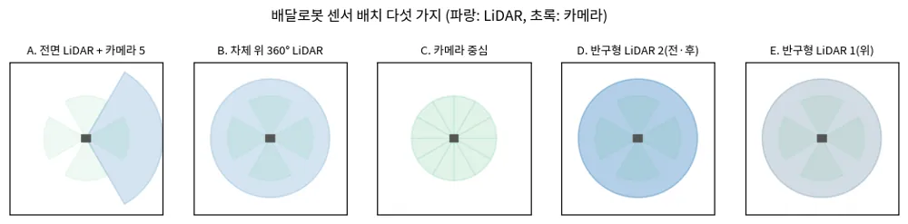

<!-- doc: 센서 배치 | 1 -->
# 센서 배치 — 낮은 실외 배달로봇 (§H)

**배달로봇의 센서 배치는 "LiDAR를 어디에 몇 개, 카메라가 무엇을 맡는가"로 갈린다.** 이 문서는 다섯 가지 배치를 비교하고, 2026-09 기준
센서·연산 장치 가격, 필요한 연산 성능, 센서·지도·계획·제어 주기를 정리한다. travplan의 권장 배치와 시뮬 근거는
`docs/design-sensor-layout.md`(TP-0060)에 있다. 가격은 판매처와 시점에 따라 크게 달라지므로 출처를 함께 적었고, 공개 가격이 없는 제품은
"견적"으로 표시했다.

<!-- tab: 배치 비교 -->

## H.1 다섯 가지 배치

**한눈에 보기**

- 지금 구성(전면 LiDAR 1 + 카메라 5)은 **가격 대비 좋고, 약점은 옆·뒤 지형**이다. 후면에 저가 반구형 LiDAR(약 400달러)를 더하면 가장 싸게 보강된다.
- 연산은 **카메라 5대 검출이 가장 무겁다**(AGX Orin GPU의 55–65%). AGX Orin 32GB 이상을 권한다. Jetson 가격은 2026-07에 최대 101% 올랐다.
- 주기는 LiDAR·지도 10 Hz, Planner 5–10 Hz, Controller 10–20 Hz, 모듈 100 Hz 이상. **센서에서 바퀴까지 300 ms 안**이면 탐지 거리 1.5 m에서 약 1.3 m/s.

*그림 — 다섯 가지 배치의 시야 개념도(파랑: LiDAR, 초록: 카메라). 출처: travplan `scripts/make_doc_figures.py`*

**결론부터: 사용자 구성(전면 LiDAR 1 + 카메라 5)은 가격 대비 지형 인식이 좋고, 약점은 옆·뒤 지형이다.** 360° LiDAR는 그 약점이 없지만
센서값이 몇 배다. 카메라만 쓰는 배치는 가장 싸지만 음의 장애물과 거리 정확도를 학습 모델에 맡긴다.

| 배치 | 지형(근거리 / 원거리) | 사람 360° | 옆·뒤 지형 | 센서 가격대 | 대표 사례 |
|---|---|---|---|---|---|
| A. 전면 LiDAR 1 + 카메라 5(전면 스테레오) | 숙이면 좋음 / 좋음 | 카메라로 가능 | 기억뿐 | 낮음–중간 | 사용자 구성 |
| B. 차체 위 360° LiDAR 1 + 스테레오·ToF | 좋음 / 좋음 | LiDAR + 카메라 | 좋음 | 높음 | Serve Gen3(Ouster REV7) |
| C. 카메라 중심(LiDAR 없음) + 초음파·레이더 | 학습 의존 / 약함 | 카메라 | 카메라 | 낮음 | Starship(카메라 12), Neubility(멀티카메라 V-SLAM) |
| D. 저가 반구형 LiDAR 2(전·후) + 카메라 | 좋음 / 중간(30 m) | LiDAR + 카메라 | 좋음 | 낮음–중간 | — |
| E. 반구형 LiDAR 1(차체 위) + 카메라 | 매우 좋음(사각 거의 없음) / 중간 | LiDAR + 카메라 | 좋음 | 중간(견적) | AMR·휴머노이드용 신제품 |

**A. 전면 LiDAR 1 + 카메라 5.** 전면 LiDAR를 숙이면 앞쪽 근거리와 음의 장애물을 잘 본다. 전면 카메라 두 대를 스테레오로 묶으면 LiDAR 근거리
사각을 메운다. 측면·후면 카메라는 사람을 360°로 보지만 거리는 단안 바닥 평면이라 부정확하다. 옆과 뒤의 지형은 기억뿐이어서, 스워브의
옆·뒤 이동을 제한해야 한다(설계 D5). L1 시뮬에서 15° 숙인 전면 120° 센서는 360° 센서와 비슷한 폐루프 성공률을 냈다(40/40, 37/40).

**B. 차체 위 360° LiDAR.** Serve Robotics Gen3은 Ouster REV7 디지털 LiDAR, 스테레오·ToF 카메라, IMU, NVIDIA Jetson Orin을 싣는다
([Electrek](https://electrek.co/2024/10/16/serve-robotics-unveils-gen3-autonomous-delivery-robots-scale-across-us/)). 360°를 한 번에 보므로
옆·뒤 이동이 자유롭다. 대신 센서가 비싸고(Ouster 32채널은 6,000달러부터, [Ouster](https://ouster.com/insights/blog/os1-32-high-resolution-low-cost-lidar-sensor)),
차체 위로 솟아 디자인과 파손 위험을 감수해야 한다. 차체 위 높이 덕분에 사각과 그림자가 작다.

**C. 카메라 중심.** Starship은 카메라 12대(ToF 포함), 초음파, 레이더로 장애물을 본다([Starship FAQ](https://www.starship.xyz/faq/)).
Neubility는 LiDAR 없이 멀티카메라 visual SLAM으로 위치를 잡는다([TechCrunch](https://techcrunch.com/2023/03/28/neubility-plans-to-roll-out-400-lidar-free-delivery-and-security-robots-by-year-end/)).
센서가 싸고 차체에 숨기기 쉽다. 대신 거리와 음의 장애물을 학습 모델과 대량의 주행 데이터에 기댄다. 역광·야간·비에 약하고, 검증에 긴
시간이 든다.

**D. 저가 반구형 LiDAR 두 대.** Unitree L2는 360° × 96° 시야, 30 m, 초당 64,000점에 419달러다([Unitree](https://shop.unitree.com/products/unitree-4d-lidar-l2)).
전·후에 하나씩 달면 A의 옆·뒤 약점이 사라진다. 점이 성겨서 먼 곳의 사람과 작은 턱은 약하므로 카메라가 보완한다.

**E. 반구형 LiDAR 한 대.** RoboSense Airy(360° × 90°, 96/192채널, 초당 86만/172만 점, 8 W 이하,
[RoboSense](https://www.robosense.ai/en/IncrementalComponents/Airy))와 Hesai JT128(360° × 189°, 128채널, 60 m,
[Hesai](https://www.hesaitech.com/product/jt128/))은 아래쪽까지 한 번에 봐서 근거리 사각이 거의 없다. 차체 위 중앙에 달면 A와 B의 장점을
합친다. 가격은 공개되지 않아 견적이 필요하다.

**travplan에 주는 의미.** ==사용자 구성(A)은 유지하되, 옆·뒤 이동이 잦으면 후면에 저가 반구형 LiDAR 하나를 더하는 것(A + D)이 가장 싼 보강이다.==
L2급 한 대(약 400달러)면 옆·뒤 지형이 "기억"에서 "관측"으로 바뀐다. 예산이 허락하면 전면 LiDAR를 반구형(E)으로 바꿔 숙이지 않고도 근거리를
본다.

## H.2 센서별 장단점

| 센서 | 장점 | 단점 | 배달로봇에서의 역할 |
|---|---|---|---|
| 회전식·반구형 LiDAR | 거리가 정확, 조명 무관, 360° | 비싸다(회전식), 점이 성김(저가), 비·먼지 반사 | 지형 기하, 사람 거리 |
| 비반복 스캔 LiDAR(Livox Mid-360 등) | 싸고 작다, 시간이 지나면 조밀 | 아래쪽 시야가 좁아(−7°) 숙여 달아야 한다 | 지형 기하 |
| 스테레오 카메라 | 싸다, 조밀한 깊이와 영상 | 거리 제곱에 비례하는 오차, 무늬 없는 면·야간 약함 | 근거리 지형, 사람 검출 |
| 단안 카메라 | 가장 싸다, 의미 정보 | 거리를 모른다(바닥 평면 가정), 자세 오차에 민감 | 측면·후면 사람 검출 |
| ToF 카메라 | 근거리 깊이가 정확 | 햇빛에 약하다, 거리가 짧다 | 도킹, 근접 |
| 초음파 | 아주 싸다, 유리·투명체 감지 | 해상도가 없다, 거리 짧다 | 근접 안전 |
| 레이더(4D 포함) | 비·안개·먼지에 강함, 속도 직접 측정 | 해상도가 낮다 | 악천후 보조, 움직이는 물체 속도 |

<!-- tab: 가격·연산 -->

## H.3 예상 가격 (2026-09 기준)

**가격은 판매처와 시점에 따라 두 배 가까이 차이 난다. 특히 NVIDIA Jetson은 2026-07에 최대 101% 올랐다.** 아래는 공개 가격이고, 양산 수량
가격은 별도 견적이다.

| 품목 | 가격 | 출처 |
|---|---|---|
| Livox Mid-360(360° × 59°, 10 Hz, 초당 20만 점) | 소매 약 480–1,350달러(판매처별) | [Livox 사양](https://www.livoxtech.com/mid-360/specs), [Vertex](https://store.vertexunmanned.com/products/livox-mid-360) |
| Unitree 4D LiDAR L2(360° × 96°, 30 m) | 419달러 | [Unitree](https://shop.unitree.com/products/unitree-4d-lidar-l2) |
| Ouster OS1-32 | 6,000달러부터(출시 당시) | [Ouster](https://ouster.com/insights/blog/os1-32-high-resolution-low-cost-lidar-sensor) |
| RoboSense Airy, Hesai JT128 | 견적 | [RoboSense](https://store.robosense.ai/products/airy), [Hesai](https://www.hesaitech.com/product/jt128/) |
| Stereolabs ZED X Mini(GMSL2 스테레오) | 549달러 | [Stereolabs](https://www.stereolabs.com/store/products/zed-x-mini-stereo-camera) |
| Stereolabs ZED X | 599달러부터 | [Stereolabs](https://www.stereolabs.com/store/collections/gmsl2-cameras) |
| GMSL2 차량용 카메라(IMX490, 120 dB HDR 등) | 견적 | [Leopard Imaging](https://leopardimaging.com/product-category/automotive-cameras/cameras-by-interface/adi-gmsl2-cameras/li-imx490-gmsl2/) |
| Jetson AGX Orin 64GB 모듈 / 32GB 모듈 | 2,999 / 1,799달러(인상 전 1,599 / 899) | [CNX Software](https://www.cnx-software.com/2026/07/22/nvidia-increases-the-price-of-jetson-modules-and-devkits-by-up-to-101/) |
| Jetson AGX Orin 개발 키트 | 3,499달러(인상 전 1,999) | 같음 |
| Jetson Orin NX 16GB 모듈 | 999달러(인상 전 599) | 같음 |
| Jetson T4000 / T5000(Thor) 모듈 | 2,999 / 4,999달러 | 같음 |

**배치별 센서 + 연산 예산(대략).** 카메라 한 대를 200–600달러로 보면 다음과 같다.

| 배치 | 센서 | 연산 | 합계 |
|---|---|---|---|
| A. 전면 Mid-360 + 스테레오 1 + 카메라 3 | 약 1,600–3,700달러 | AGX Orin 32GB 1,799달러 | 약 3,400–5,500달러 |
| A + D. 위 + 후면 L2 | 약 2,000–4,100달러 | 같음 | 약 3,800–5,900달러 |
| B. Ouster 32채널 + 스테레오 + 카메라 3 | 약 7,100–8,300달러 | 같음 | 약 8,900–10,100달러 |
| C. 카메라 10대 이상 + 초음파·레이더 | 약 2,000–6,000달러 | AGX Orin 64GB 2,999달러(학습 모델 부하) | 약 5,000–9,000달러 |

합계에는 배선, 캐리어 보드, 보정 장비, 방수 하우징이 빠져 있다.

## H.4 필요한 연산 성능

**카메라 다섯 대의 검출이 가장 큰 부하이고, AGX Orin급이 필요하다.** Isaac ROS 공식 벤치마크(Jetson AGX Orin)와 travplan 실측을 합쳤다.

| 작업 | 주기 | 한 번 시간 | 연산 점유 | 근거 |
|---|---|---|---|---|
| 사람 검출 RT-DETR(720p) × 카메라 5 | 10 Hz | 13 ms(87 fps) | GPU 약 55–65% | [Isaac ROS 성능표](https://nvidia-isaac-ros.github.io/performance/index.html) |
| 스테레오 시차(1080p) | 15–30 Hz | 8.6 ms(124 fps) | GPU 약 15–25% | 같음 |
| 학습 스테레오 ESS | 15 Hz | 약 12 ms(85 fps) | GPU 약 20% | [Isaac ROS](https://nvidia-isaac-ros.github.io/performance/index.html) |
| Visual SLAM(cuVSLAM, mono-depth) | 30 Hz | 15.1 ms(Orin) | CPU·GPU 일부 | [cuVSLAM 논문](https://arxiv.org/html/2506.04359v2) |
| elevation mapping(점군 → 높이 지도) | 10 Hz | 22 ms(RTX 5080, Orin 미측정) | GPU | travplan TP-0053 |
| TravMap 특징·비용 | 10 Hz | 수 ms | GPU | travplan |
| Planner D(flow matching, 후보 16) | 5–10 Hz | 3.4–5 ms(데스크톱 CPU) | CPU | travplan TP-0025 |
| MPPI Controller(샘플 768) | 10–20 Hz | 8–11 ms(데스크톱 CPU) | CPU·GPU | travplan 벤치마크 |

- **AGX Orin 32GB 이상을 권한다.** 검출 5대만으로 GPU의 절반을 넘으므로, Orin NX 16GB(AI 연산 100 TOPS, AGX Orin 64GB 275 TOPS의 약 1/3)는 검출 주기나 해상도를 낮춰야
  한다. 검출을 카메라마다 번갈아 돌리거나(5 Hz), 측면·후면은 저해상도로 돌리면 NX도 가능하다.
- **학습 Planner나 VLA를 올리려면 Thor급이다.** Joint Planner(TP-0049)는 CPU에서 180 ms였다.
- **카메라 인터페이스.** USB 카메라 다섯 대는 대역폭과 케이블 신뢰성이 문제다. GMSL2 카메라와 역직렬화 캐리어 보드를 권한다.
- **Orin에서 elevation mapping 시간은 아직 모른다.** 실측이 필요하다(TP-0053의 매퍼를 Orin에서 돌린다).

<!-- tab: 주기·지연 -->

## H.5 센서·지도·계획·제어 주기

**제어는 10–20 Hz, 계획은 5–10 Hz, 지도는 센서 주기(10 Hz)를 따른다. 전체 지연(센서에서 바퀴까지)은 300 ms 안에 둔다.** 이 지연이
설계 D6의 속도 제한식에 들어간다.

| 층 | 권장 주기 | 근거 |
|---|---|---|
| LiDAR | 10 Hz | Mid-360 기본 10 Hz |
| 카메라 | 15–30 fps(검출은 10 Hz) | 검출 부하(H.4) |
| IMU | 200 Hz 이상 | 자세 보정, 카메라 바닥 평면 거리 |
| 휠 오도메트리 | 50–100 Hz | 상태 추정 |
| elevation mapping, TravMap | 10 Hz | LiDAR 주기 |
| 사람 추적(칼만) | 10–30 Hz | 검출 주기, 예측으로 사이를 메움 |
| Planner(Guidance, Planner D) | 5–10 Hz | 4초 궤적, 재계획 |
| Controller(MPPI) | 10–20 Hz | travplan 시뮬 10 Hz(dt 0.1 s), Nav2 기본 20 Hz |
| 스워브 모듈 제어(조향·바퀴 속도) | 100 Hz 이상 | 모터 드라이버, ros2_control |
| 비상 정지(범퍼, 근접 초음파) | 하드웨어 | 소프트웨어 지연과 무관하게 멈춘다 |

**지연 예산.** 센서 도착에서 지도 갱신까지 약 100 ms, 계획 50 ms, 제어 한 주기 50–100 ms를 더하면 약 300 ms다. 설계 D6의 식
$v t + v^2 / (2a) + m \le d_{\text{det}}$에서 $t$ = 0.3 s로 두면, 음의 장애물 탐지 거리 1.5 m에서 최고 속도는 약 1.3 m/s다. 지연이 0.5 s로
늘면 같은 거리에서 약 1.1 m/s로 내려간다.

**시간 동기화.** 센서 여섯 개(LiDAR 1, 카메라 5)와 IMU를 PTP나 하드웨어 트리거로 맞춘다. 1 m/s로 움직일 때 50 ms 어긋나면 5 cm가 틀리고,
회전 중이면 먼 곳일수록 더 틀린다. 스테레오 두 대는 반드시 같은 트리거로 찍는다.

**travplan 시뮬과의 차이.** 운동학 시뮬은 모든 층이 10 Hz(dt 0.1 s)로 같은 순간에 돌고 지연이 없다. 지연·위치 잡음 무작위화(TP-0032)를
켜면 위 지연 예산을 시뮬에서 시험할 수 있다.
